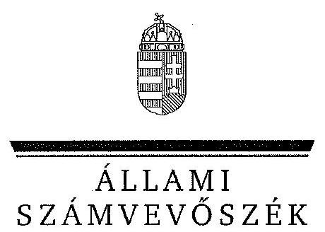
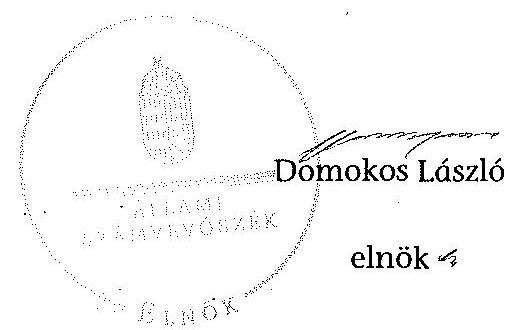
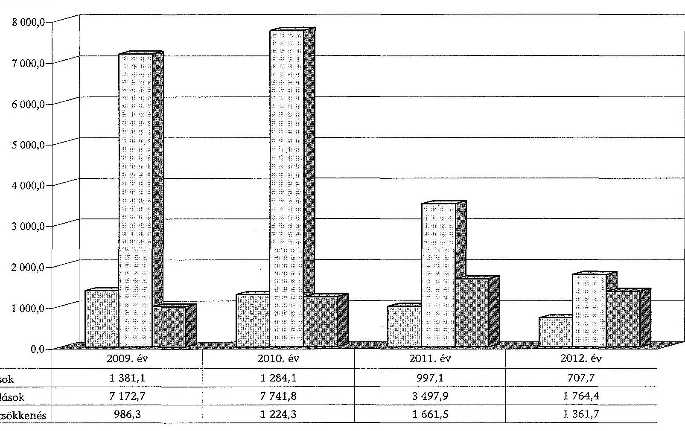
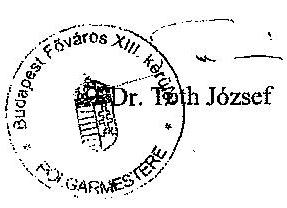
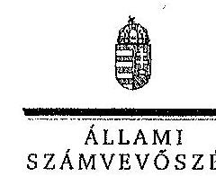

# JELENTÉS 

az önkormányzatok vagyongazdálkodása szabályszerűségének ellenőrzéséről
Budapest Főváros XIII. kerület

---

# Állami Számvevőszék 

Iktatószám: V-0235-317/2014.
Témaszám: 1269
Vizsgálat-azonosító szám: V065107
Az ellenőrzést felügyelte:
Makkai Mária
felügyeleti vezető
Az ellenőrzést vezette és az ellenőrzés végrehajtásáért felelős:
Páncsics Judit
ellenőrzésvezető
A jelentéstervezet összeállításában közremüködtek:
Moder Beatrix
számvevő főtanácsos
Lakatos József
számvevő
Az ellenőrzést végezték:

| Lakatos József | Kökény László | Huszár József |
| :-- | :-- | :-- |
| számvevő | számvevő tanácsos | számvevő tanácsos |

---

# TARTALOMJEGYZÉK 

BEVEZETÉS ..... 3
I. ÖSSZEGZŐ MEGÁLLAPÍTÁSOK, KÖVETKEZTETÉSEK, JAVASLATOK ..... 6
II. RÉSZLETES MEGÁLLAPÍTÁSOK ..... 11

1. A vagyongazdálkodási tevékenység szabályozása ..... 11
1.1. A vagyongazdálkodási tevékenység szabályozásának megfelelősége ..... 11
1.2. A vagyon használatba és üzemeltetésbe adásának szabályszerűsége ..... 14
1.3. A vagyon üzemeltetésére és használatára kötött szerződések felülvizsgálata ..... 15
2. A vagyongazdálkodási tevékenység szabályszerűsége ..... 15
2.1. A vagyon nyilvántartása, a vagyon összetételének változása, a döntések és a gazdasági események szabályszerűsége ..... 15
2.1.1. A vagyon nyilvántartásának megfelelősége ..... 15
2.1.2. A vagyon értékének és összetételének változása ..... 18
2.1.3. A vagyon változását eredményező döntések és gazdasági események szabályszerűsége ..... 19
2.2. A térítés nélküli vagyon átadás és átvétel szabályszerűsége ..... 21
2.3. A beruházási és felújítási döntések és végrehajtásuk szabályszerűsége ..... 22
2.4. A tartós részesedésekkel történő gazdálkodás ..... 24
2.5. A vagyon értékesítésének, hasznosításának, a követelés elengedésének szabályszerűsége ..... 25
2.6. Az önkormányzati gazdasági társaságok tulajdonosi felügyelete ..... 27
3. Az integritás érvényesülése a vagyongazdálkodásban ..... 28
4. A belső és a külső ellenőrzések hasznosulása ..... 29
4.1. A belső ellenőrzés javaslatainak hasznosulása ..... 29
4.2. A külső ellenőrzések javaslatainak hasznosulása ..... 31

---

# MELLÉKLETEK 

1. számú Budapest Főváros XIII. Kerületi Önkormányzat vagyonának főbb adatai 2009. január 1-je és 2012. december 31-e között
2. számú Budapest Főváros XIII. Kerületi Önkormányzat felújítási és beruházási kiadásai, valamint az elszámolt értékcsökkenés bemutatása 2009-2012 között
3. számú Budapest Főváros XIII. Kerületi Önkormányzat polgármesterének észrevétele
4. számú Budapest Főváros XIII. Kerületi Önkormányzat polgármesterének észrevételére adott válasz

## FÜGGELÉKEK

1. számú Rövidítések jegyzéke
2. számú Értelmező szótár

---

# JELENTÉS 

## az önkormányzatok vagyongazdálkodása szabályszerűségének ellenőrzéséről Budapest Főváros XIII. kerület

## BEVEZETÉS

Az ÁSZ kiemelten fontosnak tartja az ÁSZ tv. 5. § (4) és (5) bekezdése alapján az önkormányzati vagyon kezelésének, a vagyonnal való gazdálkodási szabályok betartásának az ellenőrzését. Az ellenőrzés feladata a vagyongazdálkodással kapcsolatban a közpénzek átláthatósága, nyilvánossága érdekében a jogszabályokban, belső szabályzatokban megfogalmazott előírások érvényesülésének áttekintése. Az ÁSZ nem csak az ellenőrzött szervezet vagyongazdálkodásának a hibáira mutat rá, számon kérve azok kijavítását, hanem megállapításaival, javaslataival segíti a közpénzzel, a közvagyonnal való felelős gazdálkodást.

Az önkormányzati vagyon alapvető funkciója, hogy a közérdeket és egyúttal az önkormányzati célok megvalósítását szolgálja. A feladatellátás terén elsősorban a kötelezően ellátandó feladatok végrehajtását hivatott szolgálni, amely mellett az önként vállalt feladatok ellátása is megvalósulhat.

Az ÁSZ stratégiájában hangsúlyos szerepet szán annak, hogy szilárd szakmai alapon álló, értékteremtő ellenőrzéseivel előmozdítsa a közpénzügyek átláthatóságát, rendezettségét. Az ÁSZ a vagyongazdálkodás ellenőrzésén keresztül közreműködik az integritás alapú közigazgatási kultúra kialakításában.

Az ellenőrzés célja annak megállapítása volt, hogy az önkormányzat vagyongazdálkodási tevékenységének szabályozottsága és tevékenysége a jogszabályi előírásokkal összhangban volt-e, átlátható, a jogszabályi előírásoknak megfelelő volt-e a vagyon nyilvántartása, a külső és belső ellenőrzések megállapításai hozzájárultak-e az önkormányzati vagyongazdálkodási tevékenység szabályszerűségéhez.

Ennek keretében értékeltük, hogy az Önkormányzat:

- szabályszerűen alakította-e ki a vagyongazdálkodási tevékenységének keretelt;
- biztosította-e a vagyongazdálkodás szabályszerűségét, megalapozottan hoz-ta-e, és jogszerűen, szabályszerűen hajtotta-e végre a vagyonváltozást eredményező meghatározó jelentőségű döntéseket, valamint gondoskodott-e az általa alapított vagy tulajdonosi részvételével múködő gazdasági társaságokkal kapcsolatos tulajdonosi joggyakorlásról;

---

- gondoskodott-e vagyongazdálkodási tevékenysége során az integritás (feddhetetlenség) szempontjainak érvényesüléséről;
- belső ellenőrzése elősegítette-e a vagyongazdálkodás szabályszerű működését, valamint hasznosította-e a külső és belső ellenőrzések megállapításait, javaslatait.

Az ellenőrzés típusa: szabályszerűségi ellenőrzés.
Az ellenőrzött időszak: az ellenőrzés a 2009. január 1. és 2012. december 31. közötti időszakra terjedt ki, kitekintéssel a helyszíni ellenőrzés befejezéséig (2013. december 9-éig) tartó időszak releváns vagyongazdálkodási folyamataira. Az egyes közbeszerzési eljárások lefolytatásának ellenőrzése 2012. január 1jétől a helyszíni ellenőrzés kezdetét megelőző negyedév utolsó napjáig (2013. szeptember 30-ig), az Nvtv. egyes rendelkezései végrehajtásának ellenőrzése 2012-től a helyszíni ellenőrzés befejezéséig tartott.

Az ellenőrzött szervezet: Budapest Főváros XIII. Kerületi Önkormányzat.
Az ellenőrzés végrehajtásának jogszabályi alapját az ÁSZ tv. 5. § (4) bekezdésének a) pontja és (5) bekezdése, valamint az Áht. 61 . § (2) bekezdésében foglaltak képezik.

Az ellenőrzés szakmai módszertana az ÁSZ hivatalos honlapján közzétett szakmai szabályokon alapult, amely a Legfőbb Ellenőrző Intézmények Nemzetközi Szervezete (INTOSAI) által kiadott nemzetközi standardok (ISSAI) figyelembevételével készült.

Az ellenőrzést az ÁSZ hatályos szervezeti szabályai és az ellenőrzési programban foglalt értékelési szempontok szerint folytattuk le. Megállapításainkat a helyszíni ellenőrzés tapasztalataira, az ellenőrzött szervezettől bekért dokumentumokra, a kitöltött tanúsítványok elemzésére, az adott időszakban hatályos jogszabályok és belső szabályzatok előírásaira alapoztuk. A részesedések értékelését tételesen ellenőriztük, míg irányított mintavétellel választottuk ki a legnagyobb értékű térítésmentes átadás-átvételeket, a beruházásokat, felújításokat, a közbeszerzési eljárásokat, a vagyon értékesítését, hasznosítását és a követelés elengedést. Ezen túl a belső kontrollok megfelelő működését a 2009-2012. évi vagyonváltozásokkal kapcsolatos gazdasági események közül a Polgármesteri hivatal számviteli nyilvántartásaiból választott véletlen minta alapján, megállásos (többlépcsős) megfelelőségi teszttel ellenőriztük.

Budapest Főváros XIII. kerület lakosainak száma 2012. január 1-jén 110198 fő volt. A 2010. évi önkormányzati választásokig a 33 tagú Képviselő-testület munkáját 6 állandó bizottság segítette. Az önkormányzati választások után a Képviselő-testület létszáma 21 főre csökkent és négy állandó bizottság működött. A polgármester az 1994. évi önkormányzati választás óta tölti be tisztségét, a jegyző 2008 -tól látja el feladatait. A Polgármesteri hivatal 2009-2012 között 11 szervezeti egységre tagolódott, elkülönített gazdasági szervezettel nem rendelkezett. A Polgármesteri hivatalon belül vagyongazdálkodási feladatokat a Polgármesteri és a Jegyzői iroda, valamint a Pénzügyi osztály látott el. A Polgármesteri hivatalban foglalkoztatott köztisztviselők száma 2012. december 31én 179 fő volt.

---

Az Önkormányzat 2012. évben az önállóan működő és gazdálkodó Polgármesteri hivatalon felül egy önállóan múködő és gazdálkodó, valamint 20 önállóan múködő költségvetési szervvel látta el a feladatát. Az Önkormányzatnak hat gazdasági társaságban volt tulajdoni részesedése, amelyek közül öt az Önkormányzat kizárólagos tulajdonában állt. A kizárólagos önkormányzati tulajdonú gazdasági társaságok közül három (a Közművelődési Nkft., a Környezetgazdálkodási Nkft., a Sport- és Szabadidő Nkft.) végelszámolás alatt állt, az ellenőrzött időszakban történt átszervezést követően a Közszolgáltató Zrt. biztosította a lakás- és helyiséggazdálkodással, a közterületek, zöldterületek fenntartásával, parkolók üzemeltetésével kapcsolatos feladatokat, az Eüszolg13 Nkft. látta el az egészségügyi alap- és járó beteg szakellátást.

Az Önkormányzatnál a 2009-2012. években vállalkozási tevékenységet nem folytattak, PPP konstrukcióban fejlesztési feladatot nem valósítottak meg, vagyonkezelési, haszonélvezeti és koncessziós jogot alapító szerződést nem kötöttek. Az ÁSZ az Önkormányzatnál az ellenőrzött időszakban számvevőszéki jelentéssel lezárt ellenőrzést nem végzett.

Az Önkormányzat könyvviteli mérleg szerinti vagyona 2012. december 31-én 90068 millió Ft volt, 13213,9 millió Ft-tal, 17,2\%-kal emelkedett az ellenőrzött időszakban. Hitelfelvételből és kötvénykibocsátásból származó hosszú lejáratú kötelezettség nem volt, a 2148,9 millió Ft összegű rövid lejáratú kötelezettségek között kimutatott 1254,6 millió Ft váltótartozás a 2013. évben az adósság átvállalás eredményeként 501,9 millió Ft összeggel ( $40,0 \%$-kal) csökkent. A 2012. évi költségvetési beszámolója szerint az Önkormányzat 24567,6 millió Ft tárgyévi költségvetési bevételt ért el és 23063,6 millió Ft költségvetési kiadást teljesített. A felhalmozási célú kiadások összege összesen 2672,7 millió Ft volt, melyből felújításokra és beruházásokra 2472,1 millió Ft-ot fordítottak.

Az Önkormányzat vagyonának főbb adatait, a felújítási és beruházási kiadásokat, valamint az elszámolt értékcsökkenést az 1-2. számú mellékletek mutatják be. A jelentéstervezetben alkalmazott rövidítéseket és az egyes fogalmak magyarázatát az 1-2. számú függelékek tartalmazzák.

Az ÁSZ a 2011. évi LXVI. törvény 29. §-a szerint a jelentéstervezetet megküldte Budapest Főváros XIII. Kerületi Önkormányzat polgármesterének egyeztetésre. A polgármester észrevételét és az arra adott választ a jelentés 3-4. számú mellékletei tartalmazzák.

---

# I. ÖSSZEGZŐ MEGÁLLAPÍTÁSOK, KÖVETKEZTETÉSEK, JAVASLATOK 

Az Önkormányzatnál a vagyongazdálkodás szabályozása során eleget tettek a jogszabályi előírásoknak, a feladat- és hatásköröket rendeletben és belső szabályzatokban rögzítették. Az Ötv.-ben foglaltaknak megfelelően a vagyongazdálkodási rendelet ${ }_{1,2}$-ben meghatározták a törzsvagyon körét, ezen belül elkülönítetten a forgalomképes és forgalomképtelen vagyoni elemeket, rendelkeztek a forgalomképesség megváltoztatásának módjáról és szabályozták a vagyon nyilvántartását. A Képviselő-testület az Nvtv.-ben meghatározott határidőben felülvizsgálta a törzsvagyon elemeit, és azok között nemzetgazdasági szempontból kiemelt jelentőségű nemzeti vagyonba tartozó vagyonelemet nem jelölt meg. A közép- és hosszú távú vagyongazdálkodási tervben rögzítették a vagyon alakulásának további figyelemmel kísérése feladatát és indokolt esetben a kiemelt jelentőségű nemzeti vagyonná minősítésről való döntést.

A Képviselő-testület a tulajdonosi jogkörében rendelkezett a vagyon elidegenítésének, megterhelésének, vállalkozásba vitelének és egyéb célú hasznosításának szabályairól. A vagyonhasznosítások nyilvános pályáztatási kötelezettségét a 2009-2012. években 25,0 millió Ft feletti összegben határozták meg. A vagyongazdálkodási rendelet ${ }_{2}$-ben előírták, hogy vagyonértékesítési és vagyonhasznosítási pályázat résztvevője csak természetes személy, vagy az Nvtv. szerinti átlátható szervezet lehet. Szabályozták a vagyonkezelői jog megszerzésének, gyakorlásának, ellenőrzésének eljárásrendjét. Az Önkormányzatnál 2009-2012 között vagyonkezelői szerződést nem kötöttek. A Képviselő-testület vagyongazdálkodási hatáskört értékhatárhoz kötötten az önkormányzati SZMSZ ${ }_{1,2}$-ben és a vagyongazdálkodási rendelet ${ }_{1,2}$-ben a polgármesterre és a Képviselő-testület bizottságaira ruházott át, az átruházott hatáskört gyakorlók a döntéseikről havi rendszerességgel beszámoltak.

Az Önkormányzat érdekeit védő garanciális elemek szerződésekben, megállapodásokban való rögzítésének kötelezettségét nem írták elő, de az ellenőrzött tételek alapján - két (összesen 1,3 millió Ft összegű) értékesítés kivételével - a szerződésekben rögzítették az Önkormányzat érdekeit biztosító garanciális elemeket, mellékkötelezettségeket.

A jegyző - a Htv. előírásainak megfelelően - kialakította az Önkormányzat és intézményei számviteli rendjét. Az Önkormányzat rendelkezett számviteli politikával és a helyi sajátosságoknak megfelelően kialakított értékelési, leltározási, selejtezési és pénzkezelési szabályzattal, valamint számlarenddel. A Képviselő-testület a mennyiségi felvétellel történő leltározás gyakoriságát a vagyongazdálkodási rendelet ${ }_{1,2}$-ben kétévente határozta meg.

A vagyongazdálkodási rendelet ${ }_{1,2}$-ben az önkormányzati költségvetési szervek múködéséhez szükséges vagyon használati jogát biztosították, a vagyon múködtetésének és fenntartásának kötelezettségét előírták. Az üzemeltetésre átadott vagyonnal való gazdálkodás szabályait, a vagyon értéke megőrzését feladatként előírták. Az Önkormányzat eleget tett a tulajdonában lévő gazdasági

---

társasági részesedések Nvtv.-ben előírt felülvizsgálati kötelezettségének és megállapította, hogy csak átlátható szervezetben rendelkezik részesedéssel.

Az Önkormányzatnál a 2009-2012. években a vagyonkimutatást a vagyongazdálkodási rendelet ${ }_{1,2}$-ben meghatározott felépítésben és tartalommal elkészítették és a zárszámadással együtt a Képviselő-testület részére bemutatták. A vagyonkimutatások tartalmazták az Önkormányzat saját vagyonát forgalomképesség szerinti, törzsvagyon és törzsvagyonon kívüli, egyéb vagyon bontásban. Az Önkormányzat számviteli nyilvántartásában szereplő ingatlanvagyon bruttó érték adatait az ingatlanvagyon kataszterrel minden évben dokumentáltan egyeztették, az érték adatok egyezősége fennállt. Az ingatlanvagyonkataszter megfelelő adatait a földhivatali ingatlan-nyilvántartás azonos tartalmú adataival a 2003. évben egyeztették, ezt követően a változásokat - az ellenőrzött tételek esetében - a nyilvántartásban a földhivatali határozatok alapján átvezették. A 2010. és 2012. években az Önkormányzat könyvviteli mérlegeit - az Áhsz. 1 37. § (3) bekezdése és a leltározási szabályzat előírásai ellenére - a gépek, berendezések és felszerelések, valamint a járművek esetében nem mennyiségi felvétel alapján készült leltárral támasztották alá, a leltárak kiértékelését nem végezték el. A kizárólagos önkormányzati tulajdonú gazdasági társaságok által üzemeltetett ingatlanok mérleg szerinti értékét - az Áhsz. 1 37. § (4) bekezdésében előírtak ellenére - nem mennyiségi felvétellel készült leltárral támasztották alá.

Az Önkormányzat számviteli mérleg szerinti vagyona a 2009. január 1-jei 76 854,1 millió Ft-ról 2012. december 31-re 17,2\%-kal ( 90068,0 millió Ft-ra) növekedett. Az ingatlanok és az üzemeltetésre átadott eszközök állományának növekedését a végrehajtott beruházások és felújítások eredményezték. A 20092012. években összesen 24546,8 millió Ft-ot fordítottak felújításokra és beruházásokra, ami közel ötszöröse volt az elszámolt értékcsökkenés összegének, ezáltal hozzájárultak az elhasználódott eszközök pótlásához. A fejlesztések az önkormányzati feladatellátással összhangban valósultak meg, céljuk az oktatási és művelődési intézmények, lakóházak, utak és parkok felújítása volt. A beruházások és felújítások fedezetét az Önkormányzat döntő részben saját forrásból, továbbá váltó kibocsátással és hazai, valamint uniós támogatásból biztosította.

A fejlesztési döntések és azok végrehajtása során a hatásköröket és a szabályszerűségi követelményeket betartották. Az Önkormányzatnál a 2012. évben és 2013. év I-III. negyedévében összesen 40 közbeszerzési eljárás indult 7056,3 millió Ft beszerzési értékben. Az ajánlattevők két közbeszerzés ellen jogorvoslati eljárást kezdeményeztek, melynek eredményeként az egyik esetben az eljárást lezáró megismételt döntést követően új nyertessel kötöttek szerződést, a másik eljárás eredménytelenül zárult. A többi közbeszerzési eljárás lebonyolítása során a $\mathrm{Kbt}_{.2}$ előírásait betartották.

Az Önkormányzatnál a 2009-2012. évek során a vagyon változását eredményező döntéseket - a térítésmentes átadás-átvételek kivételével - az arra hatáskörrel rendelkezők megalapozottan hozták, végrehajtásuk a döntéseknek megfelelően, szabályszerűen történt. A térítésmentes vagyonátadás-átvétel a közfeladat ellátás érdekében történt, azonban az Ötv. és a vagyongazdálkodási rendelet ${ }_{1,2}$ előírásait figyelmen kívül hagyva, térítésmentes vagyonátadásra

---

nyolc, vagyonátvételre egy esetben nem a Képviselő-testület döntése alapján került sor. A nyolc térítésmentes átadást a Tulajdonosi bizottság - 2013 novemberében - utólag jóváhagyta. A tételesen ellenőrzött vagyon értékesítésekre és egyéb hasznosításokra pályázati kiírások alapján, értékbecsléssel alátámasztott ellenértékért, a jogszabályok és belső szabályzatok előírásainak megfelelően került sor.

A vagyonváltozásokkal összefüggő bevételek beszedése és a kiadások teljesítése során a gazdálkodási jogköröket az Ámr. ${ }_{1,2}$-ben, illetve az Ávr.-ben és a gazdálkodási jogkörök szabályzata ${ }_{1-3}$-ban előírtaknak megfelelően gyakorolták.

A nyilvánosság biztosításának eszközeit, a közérdekű adatok nyilvánosságra hozatalának módját és felelőseit az Eisztv. és az Info tv. előírásainak megfelelően a közzétételi szabályzat ${ }_{1-3}$-ban rögzítették. A jegyző gondoskodott a közérdekú adatok önkormányzati honlapon való közzétételéről, ezáltal biztosította a vagyongazdálkodási tevékenység nyilvánosságát, a közpénzek felhasználásának átláthatóságát és csökkentette a korrupció kockázatát.

A követelések elengedése során a vagyongazdálkodási rendelet ${ }_{1,2}$ szerint, az arra hatáskörrel rendelkezők döntése alapján, szabályszerűen jártak el. A behajthatatlan követelések leírása az Áhsz. ${ }_{1}$ előírásaival összhangban, az arra hatáskörrel rendelkező jóváhagyását követően történt.

Az Önkormányzat a 2009. év elején hét gazdasági társaságban kizárólagos, kettőben kisebbségi részesedéssel rendelkezett. A 2011. évben a feladatellátás hatékonyságának növelése érdekében a korábban hat társaság által ellátott feladatokat egy társaságba vonták össze, majd öt társaság végelszámolással való megszüntetését határozták el. Az ellenőrzött időszakban két tartós részesedés után - a Számv. tv. és az Áhsz. ${ }_{1}$ előírásainak megfelelően - 53,0 millió Ft értékvesztést számoltak el. Az Önkormányzat a részesedésével érintett gazdasági társaságok esetében az üzleti tervek és az éves beszámolók elfogadásával, valamint az általa delegált igazgatósági és felügyelő bizottsági tagok beszámoltatásával biztosította a tulajdonosi jogainak gyakorlását. Az ellenőrzött időszakban az Önkormányzatnak tőkepótlási kötelezettsége és egy kizárólagos tulajdonú gazdasági társasága részére nyújtott garanciavállalás miatt fizetési kötelezettsége nem keletkezett.

Az Önkormányzat gondoskodott a Polgármesteri hivatal és intézményei múködése során a vagyongazdálkodási tevékenység integritásának biztosításáról. A jegyző közszolgálati szabályzatban és etikai kódexben szabályozta a Polgármesteri hivatal dolgozóinak munkavégzésével, magatartásával kapcsolatos elvárásokat. A korrupciós kockázatok kezelésével kapcsolatban a Képviselőtestület által elfogadott etikai normák hatályba léptetését megelőzően képzést tartottak. Az ajándékok, meghívások, utaztatás elfogadásának feltételeit, a dolgozói vagyoni érdekeltségek nyilvántartását és az összeférhetetlenségi követelményeket szabályozták. A folyamatba épített vezetői ellenőrzések rendjét kialakították.

A belső ellenőrzés feladatait 2009-2012. között a Polgármesteri hivatal állományába tartozó köztisztviselők látták el a Polgármesteri hivatalnál, az intézményeknél és az önkormányzati tulajdonú gazdasági társaságoknál. A belső

---

ellenőrzés szervezeti és funkcionális függetlenségét biztosították. A belső ellenőrzéseket kockázatelemzéssel megalapozott és a Képviselő-testület által elfogadott ellenőrzési tervek alapján hajtották végre. A belső ellenőrzés a vagyongazdálkodással kapcsolatban 111 ellenőrzést végzett. Évente ellenőrizték a vagyonkimutatás elkészítését, a gazdálkodási jogkörök gyakorlását, a FEUVE múködését, a közbeszerzési eljárásokat, az EU-s támogatások felhasználását és a leltározás végrehajtását. Az intézményeknél és a gazdasági társaságoknál ellenőrizték a szabályozottságot, a vagyonnal való gazdálkodást és az elszámolások megbízhatóságát. A jelentésekben javaslatokat fogalmaztak meg a leltározással, belső szabályzatok aktualizálásával, illetve egyes vagyonváltozások bizonylatolásával kapcsolatban. A belső ellenőrzési jelentésekben feltárt szabályozási és működési hiányosságok megszüntetésére az ellenőrzött szervezetek intézkedési terveket készítettek, melyek végrehajtásáról utóellenőrzések keretében meggyőződtek. A belső ellenőrzés megállapításaival és javaslataival elősegítette a vagyongazdálkodás szabályszerű működését.

A könyvvizsgáló az Önkormányzat 2009-2012. évi beszámolóit megbízhatónak és hitelesnek minősítette, jelentéseiben a vagyongazdálkodással kapcsolatos hiányosságot nem állapított meg. A könyvvizsgáló elvégezte a költségvetési és zárszámadási rendelet-tervezetek felülvizsgálatát, és azokat rendeletalkotásra alkalmasnak találta. A könyvvizsgálói ellenőrzés kiterjedt az önkormányzati tulajdonú gazdasági társaságok beszámolóira is.

Külső ellenőrzést a NAV és az OEP végzett, melyek eredményeként az Önkormányzatot terhelő kötelezettség nem keletkezett.

Az Állami Számvevőszékről szóló 2011. évi LXVI. törvény 33. § (1) bekezdésében foglaltak értelmében a jelentésben foglalt megállapításokhoz kapcsolódó intézkedési tervet köteles az ellenőrzött szervezet vezetője összeállítani, és azt a jelentés kézhezvételétől számított 30 napon belül az ÁSZ részére megküldeni. Amennyiben az intézkedési tervet határidőben nem küldi meg a szervezet, vagy az nem elfogadható, az ÁSZ elnöke a hivatkozott törvény 33. § (3) bekezdés a)-b) pontjaiban foglaltakat érvényesítheti.

Az ellenőrzés intézkedést igénylő megállapításai és javaslatai:

# a polgármesternek 

1. A 2009. évben 5,0 millió Ft értékű zöldterületi berendezés átvételéről az Ötv. 10. § (1) bekezdés d) pontjában foglaltak ellenére nem a Képviselő-testület döntött.

Javaslat:
Készítsen előterjesztést és terjessze a Képviselő-testület elé annak érdekében, hogy az 5,0 millió Ft értékű zöldterületi berendezés átvételét a Képviselő-testület a Mötv. 42. § 4. pontja alapján utólag jóváhagyhassa.

---

# a jegyzőnek 

1. A 2010. és 2012. években az Áhsz. 37. § (3) bekezdés és a leltározási szabályzat előírásai ellenére a gépek, berendezések és felszerelések, valamint a járművek, továbbá a kizárólagos önkormányzati tulajdonú gazdasági társaságoknak üzemeltetésre átadott ingatlanok mérlegben szereplő értékét mennyiségi felvétel alapján készült leltárral nem támasztották alá, a leltár kiértékelését nem végezték el.

Javaslat:
Intézkedjen az Áhsz. 2 22. § (1)-(2) bekezdésekben foglaltaknak megfelelő leltározás végrehajtásáról, továbbá a felvett leltárak kiértékeléséröl.

---

# II. RÉSZLETES MEGÁLLAPÍTÁSOK 

## 1. A VAGYONGAZDÁLKODÁSI TEVÉKENYSÉG SZABÁLYOZÁSA

### 1.1. A vagyongazdálkodási tevékenység szabályozásának megfelelősége

A Képviselő-testület - a Htv. 138. § (1) bekezdés j) pontjában előírtaknak megfelelően - az önkormányzati vagyongazdálkodási feladatokat a teljes vagyoni körre kiterjedően a vagyongazdálkodási rendelet ${ }_{1,2}$-ben szabályozta. Meghatározták az önkormányzati feladatellátást biztosító törzsvagyont, ezen belül a forgalomképtelen és a korlátozottan forgalomképes vagyonelemek körét. A vagyongazdálkodási rendelet ${ }_{1}$ nem tartalmazott a forgalomképesség megváltoztatásának módjára vonatkozó rendelkezést, a vagyongazdálkodási rendelet ${ }_{2}$ szerint a forgalomképesség megváltoztatásáról a Képviselő-testület jogosult dönteni. Az Önkormányzatnál az Áhsz. ${ }_{1}$ 44/A. § (1)-(3) bekezdéseivel ${ }^{1}$ összhangban határozták meg a vagyongazdálkodási rendelet ${ }_{1,2}$-ben a vagyonkimutatás részletezését.

A Képviselő-testület az Ötv. 9. § (3) bekezdése ${ }^{2}$ alapján az önkormányzati SZMSZ ${ }_{1,2}$-ben és a vagyongazdálkodási rendelet ${ }_{1,2}$-ben - értékhatárokhoz kötve - a polgármesternek és a Képviselő-testület bizottságainak adott át vagyongazdálkodási hatáskört. Az átruházott hatáskörök gyakorlásáról történő beszámolási kötelezettséget előírták, amelyet a hatáskörök gyakorlói a Képviselő-testület ülésein teljesítettek.

A vagyontárgyak feletti tulajdonosi jogok gyakorlásának módját a vagyongazdálkodási rendelet ${ }_{1,2}$-ben meghatározták. Értékhatártól függetlenül kizárólag a Képviselő-testület volt jogosult az Önkormányzat feladat- és hatáskörének változásával összefüggésben vagyontárgyak más önkormányzat vagy állami szerv részére történő tulajdonba, használatba, kezelésbe adásáról vagy ezen szervektől történő átvétel jóváhagyásáról dönteni.

A vagyongazdálkodási rendelet ${ }_{1,2}$-ben a vagyonkezelői jog megszerzésének, gyakorlásának és a vagyonkezelés ellenőrzésének eljárásrendjét szabályozták, azonban az Ötv. 80/A. § (1) bekezdése ${ }^{3}$ ellenére nem határozták meg tételesen azt a vagyoni kört, amelyre vagyonkezelői jog létesíthető, ezen szerződések megkötéséről értékhatártól függetlenül kizárólag a Képviselő-testület dönthetett. A Kúria Önkormányzati Tanácsa a Köf.5042/2013/5. számú határozatában megállapította, hogy az Önkormányzat törvényen alapuló jogalkotói kötelezettségét elmulasztotta, mert nem tett eleget az Mötv. 143. § (4) bekezdés i) pontja első fordulatában szereplő felhatalmazásnak, és felszólította az Önkor-

[^0]
[^0]:    ${ }^{1}$ 2014. január 1-jétől az Áhsz. ${ }_{2}$ 30. § (1)-(3) bekezdései szabályozzák
    ${ }^{2}$ 2013. január 1-jétől az Mötv. 41. § (4) bekezdése írja elő
    ${ }^{3}$ 2012. január 1-jétől az Mötv. 143. § (4) bekezdés i) pontja szabályozza

---

mányzatot jogalkotási kötelezettségének teljesítésére. Az Önkormányzat a 38/2013. (XII. 17.) számú rendeletével módosította a vagyongazdálkodási ren-delet ${ }_{2}$-t, meghatározta azokat a vagyonelemeket, amelyekre vagyonkezelői jog létesíthető. Az Önkormányzatnál 2009-2012 között vagyonkezelői szerződést nem kötöttek. A vagyon tulajdonjogának, valamint az önállóan forgalomképes vagyoni értékű jogok ingyenes vagy kedvezményes átruházásának módját és eseteit, az átadás célját és az átvevők körét a vagyongazdálkodási rendelet ${ }_{1,2}{ }^{-}$ ben az Áht. ${ }_{1,2}$, illetve az Nvtv. előírásainak megfelelően meghatározták.

A Képviselő-testület a nyilvános pályáztatás kötelezettségét az Áht. ${ }_{1}$ 108. § (1) és az Nvtv. 11. § (16) bekezdésében előírtaknak megfelelően, a vagyongazdálkodási rendelet ${ }_{1,2}$-ben előírta a mindenkori költségvetési törvényben foglalt értékhatárt ${ }^{4}$ meghaladó vagyon értékesítése, kezelésbe adása, használati jogának átadása esetére. Az Önkormányzat 57 esetben írt ki pályázatot, ebből 8 db ( 715,4 millió Ft) volt azon pályázatok száma, amelynél a vételár összege meghaladta a versenyeztetésre megállapított egyedi forgalmi értékhatárt.

A Képviselő-testület az Nvtv. 18. § (1) bekezdésében meghatározott határidőre 2012. március 1-jéig - felülvizsgálta a törzsvagyonba tartozó vagyonelemeit. Megállapította, hogy az Önkormányzatnak nincs olyan vagyontárgya, amelynek kiemelt jelentőségű nemzeti vagyonná minősítése indokolt lenne. A 2012 júniusában elfogadott közép- és hosszú távú vagyongazdálkodási tervben rögzítették a vagyon alakulásának figyelemmel kísérése feladatát, és azt, hogy indokolt esetben, rendeletben döntenek a kiemelt jelentőségű nemzeti vagyonná minősítésről. A vagyongazdálkodási rendelet ${ }_{2}$-ben 2012. július 15 -től előírták, hogy vagyonértékesítési, vagyonhasznosítási pályázati eljárás résztvevője csak természetes személy, vagy az Nvtv. 3. § (1) pontjában meghatározott átlátható szervezet lehet.

A jegyző - a Htv. 140. § (1) bekezdés c) pontjában foglalt előírás szerint - kialakította a Polgármesteri hivatal számviteli rendjét, amelynek alkalmazását az önkormányzati költségvetési szervekre is kiterjesztette. A Polgármesteri hivatal rendelkezett az Áhsz. ${ }_{1}$-nek és a helyi sajátosságoknak megfelelő számviteli poli-tika ${ }_{1,2}$-vel és az annak részét alkotó pénzkezelési, leltározási, selejtezési és értékelési szabályzatokkal, amelyek hatálya a hozzárendelt önállóan múködő intézményekre is kiterjedt.

A számviteli politika ${ }_{1}$ az Áhsz. ${ }_{1}$ 9. számú melléklete 1. k) pontja ellenére nem írta elő a vagyon forgalomképesség szerinti részletezését a főkönyvi és az analitikus nyilvántartások vezetése során, azonban az előírás elmaradása ellenére a főkönyvi és analitikus nyilvántartások szükséges részletezéséről gondoskodtak. 2012. január 1-jétől a számviteli politika ${ }_{2}$-ben ezt a szabályozási hiányosságot megszüntették. A számviteli politika ${ }_{1,2}$-ben a tárgyi eszközök üzembe helyezésének dokumentálási szabályait előírták. A számviteli politika ${ }_{1,2}$ mellékletét képező értékelési szabályzatban meghatározták az egyes vagyonelemek értékelésének módját. Az Önkormányzat nem élt az immateriális javak, tárgyi eszközök, továbbá a befektetett pénzügyi eszközök Áhsz. ${ }_{1}$ 32. § (7) bekezdésében biztosított piaci értéken történő értékelésének lehetőségével.

[^0]
[^0]:    ${ }^{4}$ az ellenőrzött években 25,0 millió Ft

---

Az Önkormányzat a számviteli politika ${ }_{1,2}$-ben rögzítette, hogy az egyes mérlegsorokat minden évben leltárral kell alátámasztani. A Képviselő-testület az eszközök (a csak értékben nyilvántartott eszközök kivételével) mennyiségi felvétellel történő leltározását - az Áhsz. ${ }_{1} 37 . \S$ (7) bekezdése alapján - a vagyongazdálkodási rendelet ${ }_{1,2}$-ben kétévente írta elő. A leltározási szabályzat tartalmazta az üzemeltetésre átadott eszközök leltározásának módját 2008-2009 között az Áhsz. 1 37. § (1) és (2) bekezdésében, a 2010. évtől pedig az Áhsz. ${ }_{1} 37 . \S$ (1) és (4) bekezdésében ${ }^{5}$ foglaltaknak megfelelően.

Az Önkormányzat a számviteli politika ${ }_{1,2}$-ban a jogszabályi előírásoknak megfelelően meghatározta a befektetett eszközök értékcsökkenési leírásának elszámolási módját. Az Áhsz. 1 30. § (2) bekezdésében ${ }^{6}$ foglalt leírási kulcsok alkalmazásától nem tértek el.

A jegyző a számviteli rend kialakításával biztosította az Önkormányzat és költségvetési szervei önkormányzati szintű beszámolójának egységes számviteli elvek szerinti elkészítését.

A gazdálkodási jogkörök szabályzata ${ }_{1,2,3}$ - az Ámr. ${ }_{1,2}$-ben és az Ávr.-ben előírtaknak megfelelően - meghatározta az operatív gazdálkodással kapcsolatos eljárásrendet és az összeférhetetlenségi követelményeket ${ }^{7}$. A gazdálkodási jogkörök szabályzata ${ }_{1} 2009$. december 31-ig előírta, hogy a kiadások teljesítésének és a bevételek beszedésének elrendelése előtt minden esetben okmányok alapján ellenőrizni, szakmailag igazolni kell azok jogosultságát, összegszerűségét, a szerződés, megrendelés, megállapodás teljesítését. A Polgármesteri hivatalban a gazdálkodási jogkörök szabályzata ${ }_{2,3}$-ban 2010-től is előírták a bevételek kötelező szakmai teljesítésigazolását.

A lakásgazdálkodási rendelet ${ }_{1}$, illetve a lakásgazdálkodási rendelet ${ }_{2}$ tartalmazta az Önkormányzat tulajdonában álló lakások és helyiségek elidegenítésére vonatkozó rendelkezéseket. A lakásgazdálkodási rendelet ${ }_{2}$ csak az Önkormányzat tulajdonában lévő lakások és nem lakás célú helyiségek bérbeadásának feltételeit szabályozta.

A közzétételi szabályzat ${ }_{1,2}$-ben meghatározták a nyilvánosság biztosításának eszközeit, a nyilvánosságra hozatal módját ${ }^{8}$ és felelőseit, amely megfelelt az Eisztv., illetve az Info tv. előírásainak.

Az Önkormányzat a 2007-2010. évekre, valamint a 2011-2014. évekre vonatkozó gazdasági program ${ }_{1,2}$-ben, továbbá az önkormányzati $\mathrm{SZMSZ}_{1,2}$-ben rögzí-

[^0]
[^0]:    ${ }^{5}$ 2014. január 1-jétől az Áhsz. ${ }_{2}$ 22. § (2) a) pontja csak a koncesszióba, vagyonkezelésbe adott eszközök működtetető, vagyonkezelő által elkészített és hitelesített leltárakat írja elő
    ${ }^{6}$ 2014. január 1-jétől Áhsz. ${ }_{2}$ 17. § (1) bekezdése
    ${ }^{7}$ az Ámr. ${ }_{1}$ 134-137. § és 138. § (1)-(3) bekezdése, Ámr. ${ }_{2}$ 72. §, 74-79. § és 80. § (1)-(2) bekezdése, valamint az Ávr. 52. § (1) bekezdés c) pontja, 53-59. §-a, és a 60. § (1)-(2) bekezdése szerint
    8 Az Önkormányzat közzétételi kötelezettségét az Önkormányzat honlapján (www.bp13.hu), a gazdasági társaságoknak a saját honlapjukon kellett teljesíteni.

---

tette az Önkormányzat kötelező és önként vállalt feladatainak körét, azok ellátásának mértékét és módját, melyeket az Eisztv. ${ }^{9}$ alapján nyilvánosságra hozott. Az Önkormányzat által ellátott feladatokban és a feladatellátás módjában 2009-2012 között vagyonváltozással járó változás nem volt.

# 1.2. A vagyon használatba és üzemeltetésbe adásának szabályszerűsége 

A Képviselő-testület a vagyongazdálkodási rendelet ${ }_{1,2}$-ben az önkormányzati költségvetési szervek múködéséhez szükséges vagyon használati jogát biztosította, az intézmények a használati jog keretében kötelesek voltak gondoskodni a vagyon múködtetéséről és a fenntartásáról. Az Önkormányzatnál a vagyongazdálkodási rendelet ${ }_{1,2}$-ben foglaltak alapján a vagyongazdálkodás körében közszolgáltatási, megbízási és vállalkozási szerződések is köthetők a vagyonelemek érték- és állagmegóvását szolgáló őrzésére, üzemeltetésére, beruházási és felújítási feladatok ellátására.

Az ellenőrzött közszolgáltatási, illetve haszonbérleti szerződésekben rögzítették a kötelezően ellátandó önkormányzati feladatokat, az üzemeltetésre átadott vagyonnal való gazdálkodás szabályait és meghatározták a vagyon állagának, értékének megőrzési feladatát. A szerződésekben szabályozták a beszámolási kötelezettséget, a szerződési feltételek nem teljesítésének esetére szankciókat is előírtak, de ezek érvényesítésére az ellenőrzött időszakban nem került sor. A közszolgáltatási szerződésekben meghatározták a finanszírozás módját, ütemezését, és előírták az adatszolgáltatási, elszámolási és beszámolási kötelezettséget, amelynek az ellenőrzött időszakban a szerződésekben foglaltaknak megfelelően eleget tettek. A Pénzügyi osztály minden évben ellenőrizte az adatszolgáltatások helyességét és megbízhatóságát.

Az üzemeltetésre átadott eszközöket (parkok, utak, intézményi és társasági ingatlanok és eszközök, lakások, egyéb helyiségek) az ellenőrzött időszakban az Önkormányzat kizárólagos tulajdonú gazdasági társaságai, valamint egyéb Önkormányzaton kívüli szervezetek (BÖP Kft., ORFK, BRFK, stb.) kezelték. Az Önkormányzatnál az ellenőrzött időszakban elszámolt 5233,7 millió Ft értékcsökkenés $34,9 \%$-a ( 1828,4 millió Ft) az önkormányzati gazdasági társaságok üzemeltetésében lévő eszközökkel kapcsolatban merült fel. Az egyéb Önkormányzaton kívüli szervezetek üzemeltetésében, használatában lévő - a 2009-2012 évek között 2,8-12,6 millió Ft nettó értékű - eszközökre felújítási, illetve pótlólagos beruházási előirányzatot az Önkormányzat az ellenőrzött időszakban nem tervezett, és nem is fordított kiadást az eszközök pótlására.

[^0]
[^0]:    ${ }^{9}$ 2012. január 1-jétől az Info tv. szabályozza

---

# 1.3. A vagyon üzemeltetésére és használatára kötött szerződések felülvizsgálata 

Az Önkormányzat 2009-ben hét ${ }^{10}$ gazdasági társaságban volt kizárólagos tulajdonos, valamint kettő ${ }^{11}$ gazdasági társaságban volt kisebbségi tulajdona. A 2012. december 31-i állapot szerint az önkormányzati kizárólagos tulajdonú gazdasági társaságok száma ötre, majd 2013-ban kettőre csökkent. Az Önkormányzat fenntartotta a BÖP Kft.-ben lévő 33,3\%-os kisebbségi tulajdonát.

A Képviselő-testület 2011-ben elhatározta, hogy az Önkormányzat szolgáltatásai színvonalának emelése, a közpénzek takarékosabb felhasználása és a hatékonyság növelése érdekében egységes felépítésű és irányítású társaságba szervezi gazdasági vállalkozásai tevékenységét. Ennek érdekében az AVK Zrt.-be - amely tevékenységét Közszolgáltató Zrt. néven folytatta - összevonta a korábban öt további társasága által ellátott vagyonkezelési, vagyonüzemeltetési feladatokat és egyidejűleg döntött a társaságok végelszámolásáról, amely két társaság esetében a 2012. évben, három társaság esetében a 2013. évben fejeződött be. Az Eüszolg13 Nkft. múködése változatlan formában fennmaradt.

Az Önkormányzat eleget tett a tulajdonában lévő társasági részesedések esetében az Nvtv. 18. § (2) és (4) bekezdéseiben 2012. december 31-ig előírt felülvizsgálati kötelezettségnek és megállapította, hogy valamennyi társaság tulajdonosi szerkezete megfelelt az átlátható szervezetekre vonatkozó feltételeknek. Az Önkormányzat csak olyan gazdálkodó szervezetben rendelkezett társasági részesedéssel, amelynek egyedüli alapítója, illetve a BÖP Kft.-ben a tulajdonostársak települési önkormányzatok, így ezek a társaságok az Nvtv. 3. § (1) bekezdésének 1. a) pontja alapján átlátható szervezetnek minősültek. A vagyonhasznosítási pályázatokhoz 2012 októberétől gazdasági társaságok esetében a cégkivonat csatolását előírták, ezáltal az átlátható szervezet feltételeinek való megfelelőség ellenőrzésének lehetőségét megteremtették.

## 2. A VAGYONGAZDÁLKODÁSI TEVÉKENYSÉG SZABÁLYSZERŰSÉGE

### 2.1. A vagyon nyilvántartása, a vagyon összetételének változása, a döntések és a gazdasági események szabályszerűsége

### 2.1.1. A vagyon nyilvántartásának megfelelősége

Az Önkormányzatnál a 2009-2012. évek között betartották az Ötv. 78. § (2) bekezdésének ${ }^{12}$ előírását, minden évben elkészítették a vagyonkimutatást és azt a zárszámadási rendelettervezet előterjesztésekor - az Áht. ${ }_{1}$ 118. § (2) bekezdése

[^0]
[^0]:    ${ }^{10}$ AVK Zrt., „Sima út" Kft., Lehel Csarnok Kft., Környezetgazdálkodási Nkft., Sport- és Szabadidő Nkft., Eüszolg13 Nkft., Közművelődési Nkft.
    ${ }^{11}$ a BÖP Kft.-ben 33,3\%-os, a Municipal Zrt.-ben 13,8\%-os részesedése volt az Önkormányzatnak
    ${ }^{12}$ 2012. január 1-jétől az Mötv. 110. § (2) bekezdése szabályozza

---

2. c) pontjának ${ }^{13}$ előírása szerint - a Képviselő-testület részére tájékoztatásul bemutatták. A vagyonkimutatást a vagyongazdálkodási rendelet ${ }_{1,2}$-ben meghatározott felépítés és részletezés szerinti tartalommal készítették el.

Az Önkormányzat a számviteli nyilvántartásában a főkönyvi számlák alábontásával, valamint a számlákhoz kapcsolódó analitikus nyilvántartások vezetésével gondoskodott a törzsvagyon többi vagyontárgytól elkülönített nyilvántartásáról. Az analitikus és főkönyvi nyilvántartás biztosította a törzsvagyon, ezen belül a forgalomképtelen, és korlátozottan forgalomképes, illetve az üzleti (forgalomképes) vagyon elkülönített nyilvántartását.

A vagyonkimutatások tartalmazták az Önkormányzat és intézményei saját vagyonát tételesen törzsvagyon és törzsvagyonon kívüli, egyéb vagyon bontásban. A vagyonkimutatásokban - a vagyongazdálkodási rendelet ${ }_{1,2}$-ben előírtak szerint - a forgalomképtelen törzsvagyonon belül az utakat és parkokat külön is kimutatták, a forgalomképes telkeket, lakásokat és helyiségeket tételesen szerepeltették. A számviteli nyilvántartásban 0 értékkel szereplő használatban, illetve használaton kívül lévő vagyonelemeket a vagyonkimutatásban az egyes eszközcsoportokon belül elkülönítetten mutatták be.

A vagyon nyilvántartási szabályzat ${ }_{1,2}$-ben az egyeztetés rendjét az eszközök teljes körére nézve - az üzemeltetésre átadott eszközöket is beleértve - előírták, az egyes feladatok elvégzésének felelőseit meghatározták. A vagyon nyilvántartási szabályzat ${ }_{1,2}$ nem tartalmazta az ingatlanvagyon számviteli és vagyonkataszteri nyilvántartásának a földhivatali ingatlan nyilvántartással való egyeztetése módját, rendjét és felelőseit.

Az Önkormányzatnál az ingatlanvagyonról a 147/1992. (XI. 6.) Korm. rendeletnek megfelelően ingatlanvagyon-katasztert vezettek. A számviteli nyilvántartásban szereplő ingatlanvagyont, valamint az ingatlanvagyon-kataszter bruttó értékadatait minden évben dokumentáltan egyeztették. A Polgármesteri hivatal főkönyvi könyvelésében szereplő és a tárgyi eszköz nyilvántartással öszszekapcsolt ingatlanvagyon-kataszterben lévő bruttó értékek egyezősége az ellenőrzött évek mindegyikében biztosított volt. A jegyző a számviteli nyilvántartás szerinti ingatlanvagyon bruttó értékadatainak az ingatlanvagyon-kataszter adataival való egyezőségét a 147/1992. (XI. 6.) Korm. rendelet 1. § (3) bekezdésében és 2. számú mellékletében foglalt előírásnak megfelelően biztosította.

Az ingatlanvagyon-kataszter megfelelő adatait a 147/1992. (XI. 6.) Korm. rendelet 1. § (2) bekezdésében előírt egyezőség megteremtése érdekében a közhiteles nyilvántartást vezető illetékes földhivatal azonos tartalmú adataival a kataszteri program 2003. évi alkalmazásának megkezdésekor egyeztették. Ezt követően az ingatlanvagyonban bekövetkezett változásokat - az ellenőrzött tételek esetében - a földhivatali határozatok alapján a számviteli és a vagyonkataszter nyilvántartásban folyamatosan rögzítették.

A vagyonnyilvántartás és egyeztetés folyamatát a belső ellenőrzés 2009-2012 között minden évben vizsgálta, melynek során intézkedést igénylő megállapítást

[^0]
[^0]:    ${ }^{13}$ 2012. január 1-jétől az Áht. ${ }_{2}$ 91. § (2) bekezdés c) pontja szabályozza

---

nem tett, azonban a 2012. évi jelentésében ${ }^{14}$ javasolta a földhivatali bejegyzések, tulajdoni lapok időszakos (évenkénti) felülvizsgálatát.

Az Önkormányzat a 2009-2012. években az Áhsz. 1 37. § (1) bekezdésében előírt leltározási kötelezettségének - a leltározási szabályzatban előírt, a jegyző által kiadott leltározási utasítás és ütemterv alapján - eleget tett december 31-ei fordulónappal. Az Önkormányzatnál a vagyongazdálkodási rendelet ${ }_{1,2}$-ben előírtaknak megfelelően a befektetett eszközök - és ezen belül az üzemeltetésre átadott eszközök - mennyiségi felvétellel előírt leltározását kétévente, a 2010. és a 2012. években kellett elvégezni, a 2009. és 2011. években a leltározás egyeztetéssel történő elvégzését írták elő. A 2010. és 2012. években az Önkormányzat könyvviteli mérlegeit - az Áhsz. ${ }_{1}$ 37. § (3) bekezdése ${ }^{15}$ és a leltározási szabályzat előírásai ellenére - a gépek, berendezések és felszerelések, valamint a járművek esetében mennyiségi felvétel alapján készült leltárral nem támasztották alá. Nem készült továbbá mennyiségi felvétellel leltár a kizárólagos önkormányzati tulajdonú gazdasági társaságoknak üzemeltetésre átadott ingatlanok mérlegben szereplő értékének alátámasztására sem. A mérleg alátámasztásaként - a leltározási szabályzatban előírt leltárfelvételi nyomtatvány helyett - csatolt tárgyi eszköz analitikus nyilvántartás nem felelt meg a leltározási szabályzat előírásainak, azon a leltározás és a kiértékelés elvégzését és az esetleges eltéréseket nem dokumentálták.

A Közszolgáltató Zrt. az üzemeltetésében lévő lakások és helyiségek leltározását az éves bérlemény-ellenőrzések keretében folyamatosan végezte. A Polgármesteri hivatalban a 2010. és a 2012. években elvégzett leltározások során a leltározási jegyzőkönyvben a hiányokat és többleteket megállapították, a hiányok számviteli nyilvántartásokból való kivezetését a jegyző jóváhagyását követően elvégezték. A hiány okait vizsgálták, felelősség megállapítására nem került sor.

A 2010. és a 2012. évekre vonatkozóan az Önkormányzat a gazdasági társaságain kívüli szervezetek részére üzemeltetésre átadott eszközök mérleg szerinti értékét az Áhsz. 1 37. § (4) bekezdésében ${ }^{16}$, illetve a leltározási szabályzat ${ }_{2}$-ban előírtaknak megfelelően az üzemeltetést végző szervek által - a december 31-ei fordulónapra vonatkozó leltározás alapján - elkészített, hitelesített leltárral alátámasztotta.

A könyvvizsgáló a 2009-2012. évi zárszámadási rendelet tervezetek felülvizsgálatát, valamint a vagyonkimutatások ellenőrzését, továbbá az ingatlanvagyon kataszteri és főkönyvi nyilvántartás egyezőségének vizsgálatát minden évben elvégezte, melynek során hiányosságot nem állapított meg. A könyvvizsgálói jelentéseket a zárszámadási rendelet-tervezettel egyidejűleg a Képviselő-testület elé terjesztették, melyeket a Képviselő-testület elfogadott.

[^0]
[^0]:    ${ }^{14}$ XVI/17-7/2012. számú belső ellenőrzési jelentés
    ${ }^{15}$ 2014. január 1-jétől az Áhsz. ${ }_{2}$ 5. § (1) bekezdése
    ${ }^{16}$ Megállapította a 317/2009. (XII. 29.) Korm. rendelet 18. §-a. Először a 2010. évről készített beszámolókra kellett alkalmazni.

---

# 2.1.2. A vagyon értékének és összetételének változása 

Az Önkormányzat könyvviteli mérleg szerinti vagyona a 2009. évi 76 854,1 millió Ft-os nyitó értékről 2012. év végére 90 068,0 millió Ft-ra, 17,2\%kal növekedett. A vagyonnövekedés elsősorban a tárgyi eszközökön belül az ingatlanok, az üzemeltetésre átadott eszközök növekedése miatt következett be, miközben a forgóeszközök közül a pénzeszközök értéke csökkent. Az összes eszközértéken belül az ingatlanok részaránya 50,4\%-ról 51,6\%-ra (7808,6 millió Ft-tal) nőtt.

Az immateriális javak értéke a 2009. évi nyitó 129,7 millió Ft-ról a 2011. év végére 70,6 millió Ft-ra ( $45,6 \%$-kal) csökkent az elszámolt értékcsökkenés hatására, majd 2012-ben a végrehajtott fejlesztések eredményeként 82,3\%-kal, 128,7 millió Ft-ra emelkedett. Az ingatlanok és a kapcsolódó vagyoni értékű jogok könyvviteli mérlegben kimutatott állományi értéke a 2009. évi 38710,3 millió Ft-os nyitó értékről a 2012. évre 20,2\%-kal, 46 518,9 millió Ft-ra növekedett, melyet az elszámolt értékcsökkenést jelentősen meghaladó mértékű beruházásokból és felújításokból származó vagyonnövekedés eredményezett. Az üzemeltetésre átadott eszközök nettó állományi értéke a 2009. év eleji 24707,6 millió Ft-ról a 2012. év végére $28,7 \%$-kal 31787,1 millió Ft-ra nőtt elsősorban az üzemeltetésbe adott épületeken, építményeken végrehajtott beruházások és felújítások eredményeként. A fejlesztési tevékenység hozzájárult az Önkormányzat feladatainak ellátásához.

A forgóeszközök állományi értéke a 2009. év elején kimutatott 8990,1 millió Ftról a 2012. év végére $25,3 \%$-kal ( 2271,7 millió Ft-tal) 6718,4 millió Ft-ra csökkent, amelyen belül a követelések 773,6 millió Ft-ról 1175,3 millió Ft-ra emelkedtek. A pénzeszközök állománya a fejlesztésekre fordított kiadások miatt 7330,1 millió Ft-ról $34,9 \%$-kal, 4773,3 millió Ft-ra csökkent. A forgóeszközök részaránya az eszközök értékén belül a 2009. évi 11,7\%-ról 2012. év végére $7,5 \%$-ra csökkent.

A 2009-2012 közötti 13213,9 millió Ft nettó értékű vagyonnövekedést 95,7\%ban ( 12649,4 millió Ft) a saját tőke és a tartalékok, $4,3 \%$-ban pedig ( 564,5 millió Ft) a kötelezettségek emelkedése fedezte.

A saját tőke állománya 2009. év elején 67 533,7 millió Ft volt, amely 2012. év végére a fejlesztések, beruházások eredményeként $22,0 \%$-kal növekedett és 82377,4 millió Ft-ot tett ki, részaránya a forrásokon belül $91,5 \%$ volt.

A vagyon növekedésének pénzügyi fedezetét - a gazdasági program ${ }_{1,2}$ célkitúzésének megfelelően - az Önkormányzat saját bevételeiből, váltóklbocsátásból, valamint hazai támogatásokból származó bevételekből biztosították. Az Önkormányzatnál a 2009-2012. években aktivált beruházások, felújítások kiadásainak kiegyenlítésére összesen 455,4 millió Ft hazai és 29,8 millió Ft EU-s támogatást vettek igénybe az utak felújítására, játszóterek fejlesztésre és épületek akadálymentesítésére, amely a bekerülési költségek 2,3\%-át jelentette.

A hosszú lejáratú kötelezettségek összege a 2009. év eleji 240,0 millió Ft-ról a 2010. év végére 71,0 millió Ft-ra csökkent, majd a 2011-2012. évben az Önkormányzatnak hosszú lejáratú kötelezettsége nem volt. A rövid lejáratú kötelezettségállomány a 2009. év elején kimutatott 991,0 millió Ft-ról a 2009. év

---

végére 2045,9 millió Ft-ra növekedett az év során történt váltó kibocsátás következtében. A 2012. év végén fennálló 2148,9 millió Ft-rövid lejáratú kötelezettség 1157,9 millió Ft-tal ( $116,8 \%$-kal) haladta meg az ellenőrzött időszak nyitó adatát.

Az Önkormányzat 2007. évben döntött egy 30 lakásos lakóház megépítéséről. A beruházást 15 db 520451 CHF névértékủ váltó kibocsátásával finanszírozták. A devizában fennálló váltótartozást minden év végén az előírásoknak megfelelően, az aktuális árfolyamon értékelték. A váltótartozás - két váltó lejáratát és kivezetését követően - 2009. december 31 -én 1233,7 millió Ft volt, amely 2012. december 31-ére - miközben további három váltó kivezetése megtörtént 1254,6 millió Ft-ra növekedett az árfolyamváltozás hatására.

A 2009-2012 között a számvitelben elszámolt értékcsökkenés összege 5233,8 millió Ft volt, miközben az Önkormányzat a 2009-2012. években az éves költségvetési beszámolók szerint felújításra 4370,0 millió Ft-ot, beruházásokra 20176,8 millió Ft-ot fordított. Az értékcsökkenés elszámolása az Áhsz. ${ }_{1}$ és a számviteli politika ${ }_{1,2}$ előírásainak megfelelően történt.

# 2.1.3. A vagyon változását eredményező döntések és gazdasági események szabályszerűsége 

A Polgármesteri hivatalban a 2009-2012. években a gazdálkodási jogkörök gyakorlása az ellenőrzött kiadások és bevételek esetében a jogszabályoknak és a gazdálkodási jogkörök szabályzata ${ }_{1,2,3}$ előírásainak összességében megfelelt. A 2009. évben azonban - az Áht. ${ }_{1} 100 /$ C. § (3) bekezdésében és az Ámr. ${ }_{1}$ 134. § (8) bekezdésében előírtak ellenére - az arra kijelölt személy ellenjegyzése nem előzte meg összesen 0,6 millió Ft értékű irodabútor beszerzéshez és másológép vásárláshoz kapcsolódó kötelezettségvállalást. A kötelezettségvállalások ellenjegyzésének hiányában elmaradt a szabad előirányzat és a pénzügyi fedezet rendelkezésre állásának, valamint a gazdálkodásra vonatkozó szabályok betartásának ellenőrzése, az érvényesítők és az utalványok ellenjegyzői - aláírásuk ellenére - nem végezték el a folyamatba épített ellenőrzési feladataikat. Emiatt a Polgármesteri hivatalban az ellenőrzött mintatételek vonatkozásában előirányzat túllépés nem keletkezett. A 2010-2012. években a hiányosságot a folyamatba épített ellenőrzés megfelelő múködése eredményeként megszüntették, a 2010-2011. években a kötelezettségvállalásra minden esetben az ellenjegyzést, a 2012. évben pedig a pénzügyi ellenjegyzést követően került sor.

Az ingatlanok értékesítésére a tételesen ellenőrzött gazdasági eseményeknél - a vagyongazdálkodási rendelet ${ }_{1,2} 1$. számú mellékletében meghatározott versenyeztetési eljárásra vonatkozó előírásnak megfelelően - a Tulajdonosi bizottság határozata szerint, árverési hirdetmény közzétételét követő árverésen került sor.

Az ellenőrzött vagyongazdálkodási döntések végrehajtása során betartották a vagyongazdálkodási rendelet ${ }_{1,2}$-ben és az előterjesztésekben, valamint a képi-selő-testületi határozatokban foglaltakat. A vagyonváltozást eredményező döntéseket a Képviselő-testület és az arra felhatalmazott szervei ${ }^{17}$ hozták. A va-

[^0]
[^0]:    ${ }^{17}$ az átruházott hatáskörben eljáró polgármester és Tulajdonosi bizottság

---

gyonváltozásokra vonatkozó döntéseket dokumentumokkal, előterjesztésekkel, a beruházások és felújítások esetében beruházási célokmányokkal alátámasztották.

Az 50,0 millió Ft-ot meghaladó beruházások esetében a jelentősebb beruházások előkészítésének rendjéről szóló XXII/13-25/2008., illetve a XXII/1-15/2012. polgármesteri és jegyzői együttes utasítások alapján kötelező volt előzetesen beruházási célokmányt készíteni, amely tartalmazta a tervezett beruházás általános, műszaki, üzemeltetési, finanszírozási és megvalósítás ütemezési adatait.

A vagyonváltozással járó döntések során a megkötött szerződésekben az Önkormányzat érdekeit védő garanciális elemeket - a tételesen ellenőrzött gazdasági események közül - két ingatlan értékesítése esetében nem írták elő. Az értékesítések során az ellenérték megfizetésének elmaradása, illetve késedelmes teljesítése nem következett be.

A 2010. április 22-én kötött adásvételi szerződésben egy $11 \mathrm{~m}^{2}$ alapterületű lakás 270 ezer Ft értékben történt értékesítésekor, valamint a 2012. október 15-én kötött adásvételi szerződésben egy $24 \mathrm{~m}^{2}$ alapterületű ingatlan 1,0 millió Ft ellenében történt értékesítésekor a vevő késedelmes teljesítése, illetve a teljesítés elmaradása esetére az adásvételi szerződés szankciót nem tartalmazott.

Az Önkormányzat a beruházásokkal és felújításokkal kapcsolatban megkötött tervezési és kivitelezési szerződésekben az Önkormányzat érdekeit védő garanciális elemeket rögzítette. Az Önkormányzat érdekeit védő garanciális elemek a szerződött vállalási ár meghatározott része megfizetésének a használatba vételi engedély megadásához történt kötése és jó teljesítési garanciára való fenntartása, a késedelmes vagy hibás teljesítés esetére kötbér előírása, a szerződés meghiúsulásának esetére pedig kártérítési kötelezettség előírása voltak.

A jegyző az Önkormányzat honlapján a közérdekű gazdálkodási adatok nyilvánosságának biztosítása érdekében a 2009-2012. évi költségvetési és zárszámadási rendeleteket, valamint az Önkormányzat elemi költségvetéseit és beszámolóit közzétette. Az Áht. ${ }_{1}$ 15/B. § (1) bekezdésében ${ }^{18}$ előírt, a vagyongazdálkodással összefüggő - a nettó ötmillió forintot elérő vagy azt meghaladó értékű árubeszerzésre, építési beruházásra, szolgáltatás megrendelésére, vagyonértékesítésére vonatkozó szerződések főbb adatainak közzétételére vonatkozó kötelezettségének a jegyző a 2009-2012. években eleget tett ${ }^{19}$. A céljellegú múködési és fejlesztési támogatások közzétételével eleget tett az Áht. ${ }_{1}$ 15/A. § (1) bekezdésében, valamint az Eisztv. 6. § (1) bekezdésében és mellékletében ${ }^{20}$ foglaltaknak. A jegyző ezáltal biztosította a közpénzek felhasználásának átláthatóságát, ami csökkentette a korrupció kockázatát.

[^0]
[^0]:    ${ }^{18}$ 2012. január 1-jétől az Info. tv. 1. számú melléklet III. 4. pontja írja elő
    ${ }^{19}$ A dokumentumok az Önkormányzat honlapján (www.bp13.hu) a közérdekú adatszolgáltatás menüpont alatt érhetők el.
    ${ }^{20}$ 2012. január 1-jétől az Info. tv. 1. számú melléklet III. 3. pontja írja elő

---

# 2.2. A térítés nélküli vagyon átadás és átvétel szabályszerűsége 

2009-2012 között öt alkalommal került sor ingatlanok, berendezések, járművek térítésmentes átvételére államháztartáson kívülről (gazdasági társaságoktól, közalapítványoktól), 110,2 millió Ft bruttó értékben. Államháztartáson belülről az Önkormányzat ingyenesen nem vett át eszközöket.

Az Önkormányzat államháztartáson kívülre (gazdasági társaságok, egyesület részére) kilenc esetben, 3,4 millió Ft bruttó értékben adott át forgalomképes, illetve korlátozottan forgalomképes vagyontárgyakat - informatikai, híradástechnikai eszközöket, képzőművészeti alkotásokat - térítésmentesen. Államháztartáson belülre egy alkalommal - a Fővárosi Katasztrófavédelmi Igazgatóság részére, 1,7 millió Ft bruttó értékben - adtak át ingóságokat, négy eszköz kivételével nullára leírt polgárvédelmi berendezéseket, bútorokat, irodai felszereléseket.

A vagyongazdálkodási rendelet ${ }_{1,2}$-ben az ingyenes átruházások során döntéshozóként - 2011. december 31-ig - a Képviselő-testületet jelölték meg, minősített többséggel hozott határozatot előírva. A vagyongazdálkodási rendelet ${ }_{1}$ 2012. január 1-jétől hatályos módosítása 500 ezer Ft értékhatárig a Tulajdonosi bizottság hatáskörébe utalta a döntést, az értékhatárt a 2012. július 15 -én hatályba lépett vagyongazdálkodási rendelet ${ }_{2} 5,0$ millió Ft-ra emelte.

Az ellenőrzött időszakban az államháztartáson kívülre lebonyolított kilenc térítésmentes átadás közül nyolc esetben a vagyongazdálkodási rendelet ${ }_{1,2}$-ben előírtak ellenére az átadást, illetve az öt térítésmentes átvétel közül egy esetben az Ötv. 10. § (1) bekezdés d) pontjában foglaltak ellenére az átvételt nem előzte meg a Képviselő-testület döntése. A nyolc térítésmentes átadást ( 3,3 millió Ft bruttó értékű eszközt érintően) a Tulajdonosi bizottság a 228/2013. (XI. 14.) számú határozatával utólag jóváhagyta. Az államháztartáson belülre egy alkalommal, 2012. évben történt átadás esetében szabályszerűen, a Tulajdonosi bizottság döntött.

2009-ben 5,0 millió Ft értékű zöldterületi berendezés Angyalföld Fejlesztéséért Közalapítványtól történő átvételéről a polgármester döntött.

Az ellenőrzött időszakban térítésmentesen átadott, illetve átvett eszközök közül a két-két legmagasabb bruttó könyv szerinti értékkel rendelkező vagyonelem átadás-átvételéhez kapcsolódó döntés előkészítés, döntési folyamat, döntés végrehajtás és a kapcsolódó elszámolások szabályszerűségének ellenőrzésére került sor részletesen. A tulajdonjog ingyenes átruházásának végrehajtását az ellenőrzött tételeknél átadás-átvételi jegyzőkönyvvel igazolták.

Az ellenőrzött tételek közül térítés nélküli átadásra került sor államháztartáson kívüli szervezet részére (Sport- és Szabadidő Nkft.) 0,9 millió Ft értékű számítástechnikai eszköz, államháztartáson belüli szervezet részére (Fővárosi Katasztrófavédelmi Igazgatóság) 1,7 millió Ft értékű polgári védelmi berendezések vonatkozásában. Térítés nélküli átvétel csak államháztartáson kívüli szervezettől történt, az ellenőrzött tételek a Hochtief Kft.-től 16,6 millió Ft értékben átvett köztéri (játszótéri) berendezéseket és a Sima út Kft-től 85,1 millió Ft értékben átvett parkoló automatákat és járműveket tartalmazták.

---

Az ellenérték nélküli jogügyletek során az állományba vétel, illetve a nyilvántartásból kivezetés dokumentálása a számviteli politika ${ }_{1,2}$-nek, a számlarendnek, az értékelési és a vagyon nyilvántartási szabályzat ${ }_{1,2}$-nek megfelelően történt. A vagyongyarapodásról az üzembe helyezési okmányt, illetve az állományba vételi bizonylatot, a vagyoncsökkenésről az állománycsökkenési bizonylatot határidőben kiállították. A vagyonváltozást a zárszámadás mellékletét képező vagyonkimutatásban, a vagyonleltárban és a tárgyi eszköz egyedi kartonokon is rögzítették.

Az Önkormányzatnál a zárszámadás keretében az éves beszámoló kiegészítő mellékletében beszámoltak a térítés nélküli átadásokról, átvételekről. A számviteli politika ${ }_{1,2}$ és az értékelési szabályzat bekerülési értékre vonatkozó előírását betartva az átvételek az átadónál nyilvántartott értéken vagy az átvétel időpontjában megállapított piaci értéken kerültek be az Önkormányzat számviteli nyilvántartásába, átadások esetén a könyv szerinti bruttó érték és az amortizáció kivezetése megtörtént.

Az éves költségvetésben gondoskodtak a térítésmentesen átvett befektetett eszközök folyamatos üzemeltetésének forrásáról. A térítésmentesen átadott eszközök helyi közfeladat (parkolás, közbiztonság, parkfenntartás, településrendezés, sportszolgáltatás) ellátását szolgálták, a közfeladat szervezeti változásával összhangban történtek, illetve adományként juttatta azokat az Önkormányzat.

# 2.3. A beruházási és felújítási döntések és végrehajtásuk szabályszerűsége 

Az Önkormányzat befektetett eszközeinek állománya (a beruházások és a befektetett pénzügyi eszközök nélkül) a 2009. év elején 75679,5 millió Ft bruttó, és 64121,0 millió Ft nettó értéket képviselt. A 2009-2012. évek között végrehajtott fejlesztések eredményeként a bruttó érték 96273,8 millió Ft-ra, a nettó érték a befejezett beruházások és felújítások, valamint az időszak során elszámolt értékcsökkenés együttes hatására 79 483,6 millió Ft-ra emelkedett. A teljesített fejlesztési kiadások döntő hányada a kötelező önkormányzati feladatok ellátásához kapcsolódóan merült fel, a gazdasági program ${ }_{1,2}$-ben foglalt fejlesztési célkitűzésekkel összhangban.

Az Önkormányzat felújítási és beruházási tevékenységének ellenőrzése a 3-3 legmagasabb bekerülési értékű felújítási, beruházási feladat ellenőrzésén keresztül történt.

Az Ének-zenei Általános Iskola 196,1 millió Ft értékben végrehajtott felújítása 2011. évben történt. A Futár utcai Tagóvoda felújítása szintén 2011-ben valósult meg 127,6 millió Ft kiadással, míg a Vizafogó tagiskola 2010. évi felújítására 118,7 millió Ft-ot költött az Önkormányzat. A Radnóti Miklós Művelődési Központ építési beruházása 2010-ben kezdődött és 2011-ben fejeződött be, 2905,4 millió Ft beruházási ráfordítással. A Pannónia Általános Iskola beruházás 2009-ben, 2631,1 millió Ft kiadás mellett valósult meg. A Zsinór utcai lakóház építése 2009-2010 között történt, a beruházás értéke 1310,9 millió Ft volt.

---

Az ellenőrzött beruházások és felújítások az Önkormányzat gazdasági progra $\mathrm{m}_{1,2}$-ben, valamint az ágazati szakmai koncepciókban ${ }^{21}$ foglalt céljainak megvalósítását, a kötelező önkormányzati feladatok ellátását szolgálták. A beruházások és felújítások finanszírozását az Önkormányzat saját forrásból, illetve egy beruházás esetében váltó kibocsátással biztosította, az ellenőrzött fejlesztésekhez hazai vagy EU-s támogatást nem vettek igénybe. A felújítási és beruházási feladatok végrehajtását megelőzően a döntések megalapozása érdekében előterjesztések és beruházási célokmányok készültek, amelyek tartalmazták a tervezett beruházás, felújítás múszaki és pénzügyi adatait.

A közbeszerzési eljárásokat lefolytatták, melyekhez az ajánlati felhívások a lényeges feltételeket tartalmazták. A megvalósult beruházások és felújítások esetében a műszaki átadás-átvételt követően az üzembe helyezést és a számviteli nyilvántartások rendezését szabályszerűen kiállított bizonylatok alapján végrehajtották, a vagyonkatasztert módosították. A beruházásokkal és felújításokkal kapcsolatos közzétételi kötelezettséget az Önkormányzat honlapján teljesítették.

Az Önkormányzat a 2012. évben és 2013. év I-III. negyedévében összesen 40 közbeszerzési eljárást indított, melyek beszerzési értéke 7056,3 millió Ft volt. Az indított közbeszerzési eljárásokból 17 db a felhalmozási tevékenységhez kapcsolódott 5482,1 millió Ft értékben, míg a múködési kiadásokkal összefüggésben 1574,2 millió Ft beszerzési értékre 23 db közbeszerzési eljárást indítottak. Összesen hét közbeszerzési eljárás volt folyamatban a helyszíni ellenőrzés ideje alatt, míg 32 eljárás szerződéskötéssel zárult, egy esetben a pályázat eredménytelen volt. A közbeszerzéseknél nyílt eljárást 11 esetben, nyílt keret-megállapodásos eljárást három, hirdetmény nélküli tárgyalásos eljárást 24 , és nyílt, közösségi eljárást két esetben folytattak le. Az Önkormányzat által a 2012. évben és a 2013. év I-III. negyedévében indított közbeszerzési eljárásai ellen két esetben kezdeményeztek jogorvoslati eljárást.

Az Önkormányzat parkoló jegykiadó automaták beszerzésére és a kapcsolódó szolgáltatások ellátására kiírt közbeszerzési eljárása ellen a nyertest követő második legkedvezőbb ajánlatot tevő pályázó jogorvoslati kérelemmel élt, amelynek a Közbeszerzési Döntőbizottság a D.424/10/2012. számú döntésével helyt adott, megállapítva, hogy az ajánlatkérő megsértette a Kbt. ${ }_{2} 74 . \S$ (1) bekezdés e) pontját és a 70. § (2) bekezdését - mivel a nyertesként megjelölt ajánlat nem tartalmazott kezességvállalási nyilatkozatot, továbbá az ajánlatkérő nem győződött meg az ajánlat megalapozottságáról -, emiatt az ajánlatkérő eljárást lezáró döntését megsemmisítette. Az eljárást lezáró megismételt döntés eredményeként a korábbi második legkedvezőbb ajánlattevőt hirdették ki nyertesként, mellyel a szerződést megkötötték.

Az Önkormányzat tulajdonában és kezelésében lévő építmények építésével, bővítésével és felújításával kapcsolatos tervezési pályázat kapcsán az egyik pályázó kérelme alapján a Közbeszerzési Döntőbizottság D.527/12/2012. számú határozatában megállapította, hogy az Önkormányzat megsértette a Kbt. ${ }_{2} 71 . \S$ (7) bekezdését, mivel az ajánlatkérő a hirdetményével ellentétben nem minősített ér-

[^0]
[^0]:    ${ }^{21}$ A közművelődési koncepciót a Képviselő-testület a 193/2007. (XII. 13.) számú, a közoktatási koncepciót a 63/2007. (IV. 26.), illetve a 69/2011. (V. 26.) számú határozatával fogadta el.

---

vénytelennek olyan pályázatokat, amelyek a hirdetményben megjelölttől magasabb értékű kötbért tartalmaztak. Ezért az ajánlatkérő döntéseit megsemmisítette, az eljárást megszüntette. A pályázat eredménytelenül zárult.

Az Önkormányzatnál a közbeszerzési eljárásokat a Kbt. 2 és a közbeszerzési szabályzat ${ }_{1,2}$ előírásainak megfelelően hajtották végre. Az ellenőrzött közbeszerzési eljárások esetében a Kbt. 2 -ben előírtaknak megfelelően jártak el, eleget tettek az egybeszámítási kötelezettségnek és a becsült beszerzési érték alapján megalapozottan választották ki a megfelelő közbeszerzési eljárást.

A közbeszerzési eljárások tételes ellenőrzésére a három legnagyobb értékű eljárás esetében került sor, melyek közül kettő felújítási, egy pedig beruházási célok végrehajtása érdekében került meghirdetésre. A közbeszerzési eljárásokat követően az önkormányzati ingatlanok felújításával és karbantartásával kapcsolatban 2362,2 millió Ft értékben, egy 100 lakásos lakóház teljes körű megépítésére 1784,9 millió Ft értékben, valamint az önkormányzati közutak felújítására és karbantartására 600,0 millió Ft értékben kötöttek szerződést.

Az ellenőrzött közbeszerzési eljárások esetén az ajánlattételi felhívásokban rögzítették a műszaki, gazdasági és bírálati szempontokat. A kiegészítő tájékoztatás rendelkezésre bocsájtása szabályszerűen, a megfelelő határidőben megtörtént, az a versenyfeltételeket nem korlátozta. A bíráló bizottság kijelölése az előírásoknak megfelelően történt, tagjai az összeférhetetlenségi nyilatkozatukat megtették. Az ajánlattevők ajánlatait a bíráló bizottság értékelte és a kiírásnak megfelelően, a legalacsonyabb összegű, illetve az összességében legelőnyösebb ajánlatot tevővel kötötték meg a szerződéseket (az ajánlattétel értékelési szempontjait meghatározták). Az ellenőrzött közbeszerzési eljárásokkal kapcsolatban jogorvoslati eljárást a felek nem kezdeményeztek.

Az Önkormányzat a 2013. évi közbeszerzési tervét, továbbá a 2012. évi statisztikai összegzést a helyszíni ellenőrzés időpontjában hatályos Kbt. 2 31. § (1) és (3) bekezdésének megfelelően a honlapján, valamint a Közbeszerzési Hatóság által működtetett Közbeszerzési Adatbázisban is közzétette.

# 2.4. A tartós részesedésekkel történő gazdálkodás 

Az Önkormányzat a 2009-2012. években a kötelező és önként vállalt közfeladatok ellátásáról az intézményei és gazdasági társaságai útján gondoskodott. Az Önkormányzatnak 2009. év elején hét kizárólagos tulajdonú gazdasági társasága volt, valamint 33,3\%-os tulajdonrésze a BÖP Kft.-ben. Ezen felül a Municipal Zrt. 70,0 millió Ft névértékű, 13,8\% tulajdoni részarányt jelentő részvénycsomagját birtokolta.

Az Önkormányzat tartós részesedéseinek könyv szerinti értéke 2009. január 1jén összesen 2069,8 millió Ft volt, ami 2009. december 31-re a Közművelődési Nkft.-ben végrehajtott 252,8 millió Ft-os tőkeemelés következtében 2322,6 millió Ft-ra emelkedett. A 2012. év végére a részesedések könyv szerinti értéke 2159,5 millió Ft-ra csökkent az elszámolt értékvesztések, részvényértékesítés következtében.

---

Az Önkormányzat a számviteli politika ${ }_{1,2}$ szerint az ellenőrzött időszakban az eszközei piaci értékelésével nem élt, így értékhelyesbítést nem számoltak el. Az ellenőrzött időszakban Önkormányzat tulajdonában lévő tartós részesedésekre és részvényekre együttesen 53,0 millió Ft értékvesztést számoltak el. Az értékvesztések elszámolása során betartották a Számv. tv., az Áhsz.,, valamint a számviteli politika ${ }_{1,2}$ és az értékelési szabályzat előírásait.

A Közművelődési Nkft. a 2009-2010. években összesen 60,4 millió Ft veszteséget mutatott ki, melynek következtében 2011-ben 52,5 millió Ft értékvesztést számoltak el. A 2011. évben további 70,2 millió Ft veszteség jelentkezett, és a saját tőke a jegyzett tőke $51,6 \%$-ára, 130,6 millió Ft-ra csökkent. Az Nkft. müködésének fenntartásához a 2012. évtől tőkeemelésre, és/vagy további értékvesztés elszámolására lett volna szükség, ezért 2012. év áprilisban a Képviselő-testület döntött a Közművelődési Nkft. végelszámolásáról.

A 2010. évben az Önkormányzat tulajdonában lévő, 70,0 millió Ft névértékű Municipal Zrt. részvényei után 0,5 millió Ft összegű értékvesztést számoltak el. Az értékvesztés elszámolását a Municipal Zrt. saját tőkéjének az 507,0 millió Ft öszszegű jegyzett tőkéhez képest $0,77 \%$-os mértékű csökkenése indokolta. A részesedést az Önkormányzat a 2011. október 24-én közzétett árverési hirdetmény alapján a 2011. november 24-én megtartott nyilvános árverésen 27,5 millió Ft-ért értékesítette.

Az értékvesztések elszámolását dokumentumokkal (könyvvizsgálói, szakértői anyagok, ügyvezetői nyilatkozatok, Polgármesteri hivatali belső bizonylatok) alátámasztották. Az elszámolt értékvesztésekből visszaírásra a 2011. évben az értékesített részvényekkel kapcsolatban került sor.

Az Önkormányzat az ellenőrzött időszakban a „Sima út" Kft. részére nyújtott 40,0 millió Ft összegű, határozatlan lejáratú garanciát. A garanciavállalás célja a jóteljesítési kötelezettségekhez, a hitelfelvételhez, illetve az EU-s pályázatokon való részvételhez szükséges biztosíték nyújtása volt. A garanciavállalás beváltására a „Sima út" Kft. tevékenysége során nem került sor.

A Képviselő-testület döntését megelőzően nem végezték el és nem mutatták be az önkormányzati garanciavállalás felső határára vonatkozó számítást, a garanciavállalás összege azonban nem haladta meg az adósságot keletkeztető kötelezettségvállalás felső határaként számított összeget.

Az Önkormányzat 2010-ben a "Sima út" Kft. részére 41,0 millió Ft tagi kölcsönt nyújtott kamatmentesen, 36 hónap futamidővel. A szerződésben a felhasználás céljaként - utalva a Gt. 143. § (2) bekezdésben foglalt fizetésképtelenség elhárítására irányuló tulajdonosi intézkedési kötelezettségre - a társaság megfelelő̉dött árbevételét, a vevők fizetésképtelenségét és a „Sima út" Kft. emiatt bekövetkezett likviditáshiányát jelölték meg. A kölcsönt a „Sima út" Kft. a 2011. év végéig visszafizette az Önkormányzat részére.

# 2.5. A vagyon értékesítésének, hasznosításának, a követelés elengedésének szabályszerűsége 

Az Önkormányzat 2009-2012 között 230 db ingatlant és egy gazdasági társasági részesedést értékesített 1383,0 millió Ft, illetve 27,5 millió Ft értékben.

---

Az értékesítések közül a részesedés, valamint egy lakás és egy üzlethelyiség 83,1 millió Ft-ért történt értékesítésének folyamatát ellenőriztük tételesen. Az ellenőrzött önkormányzati tulajdonban lévő lakások és a nem lakás célú ingatlanok értékesítéséről a Képviselő-testület a lakásgazdálkodási rendelet ${ }_{1,3}{ }^{-}$ nak megfelelően - az AVK Zrt., illetve a Közszolgáltató Zrt. által készített - értékbecsléseket tartalmazó előterjesztések alapján hozta meg a döntéseket. Az Önkormányzat az értékesítésre vonatkozó döntések során betartotta az Áht. ${ }_{1}$ 108. § (1) bekezdésének ${ }^{22}$, valamint a vagyongazdálkodási rendelet ${ }_{1,2} 1$. mellékletében szereplő előírást, amely szerint önkormányzati vagyont elidegeníteni csak nyilvános versenytárgyalás útján lehet. A vagyongazdálkodási rendelet ${ }_{1,2}$ előírásaival összhangban az értékesítést megelőzte a forgalmi értékbecslés készítése. Az adás-vételi szerződéseket az értékesítési döntésekkel azonos tartalommal kötötték meg.

Az Önkormányzatnál a lakások és helyiségek hasznosítása az ellenőrzött időszakban 6540 db lakásra és 1327 db helységre kiterjedően, 14631,8 millió Ft bérleti díj bevétel mellett valósult meg, valamint további 49 vagyonhasznosítási szerződést kötöttek 260,3 millió Ft összegben. Az ellenőrzött két szerződés alapján az Önkormányzatnak 2010-2012 között 138,6 millió Ft bérleti díj bevétele keletkezett. Az ellenőrzött bérbeadásokról szóló döntéseket a bérbeadási pályázati dokumentációkkal alátámasztottan, a hatásköri szabályokat betartva hozták meg.

Az önkormányzati tulajdonú ingatlanok bérbeadási feladatait a 2009-2012. évek között az AVK Zrt., illetve annak jogutódaként 2012. évtől a Közszolgáltató Zrt. látta el. A bérleti díjakat a vagyonkezelő társaság, illetve a Polgármesteri hivatal a lakásgazdálkodási rendelet ${ }_{1,3}$-ban, illetve a vagyongazdálkodási rendelet ${ }_{1,2}$-ben meghatározott díjtáblázat alkalmazásával számlázta ki a bérlőknek. Az elszámolások szabályszerűen, dokumentáltan történtek.

Az ellenőrzött vagyonértékesítések, vagyonhasznosítások esetében - az előterjesztésekkel megegyező - bizottsági, Képviselő-testületi döntésekkel azonos tartalmú szerződést, megállapodást kötöttek. A szerződésekbe az Önkormányzat érdekeit védő garanciális elemeket - a tulajdonjog bejegyzését megelőzően a teljes vételár kifizetését, illetve késedelmes fizetés esetére szankcióként késedelmi kamat felszámítását, a bérleti díj meg nem fizetése esetére a bérleti jogviszony felmondását - beépítették. Az ellenőrzött vagyonértékesítési és vagyonhasznosítási szerződések adatait az Önkormányzat honlapján közzétették.

Az Önkormányzat eleget tett a Lakás tv. 62. §-ában előírtaknak, és 1991. november 1-től a befolyó bevételeket az OTP Bank Zrt.-nél vezetett elkülönített számlán tartja nyilván. A Lakás tv. 2013. évtől hatályos 63/A. § (1) bekezdésében foglaltak szerint az Önkormányzat a Magyar Államkincstárhoz benyújtotta a 2008-2012. évi lakás elidegenítésből származó teljesült bevételeire, illetve az önkormányzati új lakások építésére fordított kiadásaira vonatkozó kimutatását és nyilatkozatát, melyet az elfogadott.

[^0]
[^0]:    ${ }^{22}$ 2012. január 1-jétől az Nvtv. 13. § (1) bekezdése írja elő a nemzeti vagyon tulajdonának átruházása során a versenyeztetés követelményét.

---

Az Önkormányzat az üresen álló ingatlanait a hatályban lévő lakásgazdálkodási rendelet ${ }_{1,2}$ előírásainak megfelelően, illetve a 2007-2010. évi, valamint a 2011-2014. évi lakás- és helyiséggazdálkodási programjában meghatározott célok és feltételek alapján hasznosította. Az Önkormányzat az alacsonyabb komfortfokozatú, üresen álló lakásokat pályáztatta bérbeadás, illetve eladás céljából.

A 2009-2012. évek során követelés elengedésére 201,0 millió Ft összegben került sor, amelyen belül meghatározó volt a vagyongazdálkodási rendelet ${ }_{1,2}$ alapján képviselő-testületi, bizottsági és polgármesteri hatáskörben elengedett lakás- és helyiségbérleti díjak és továbbszámlázott szolgáltatások miatti követelések 199,7 millió Ft összege. Behajthatatlanság miatti leírásra 593,9 millió Ft öszszegben került sor, melyből döntő részt tett ki a helyi adók és bírságok 248,5 millió Ft és a bérleti díjak 314,9 millió Ft összege. A követelések elengedése szabályszerűen, dokumentumokkal alátámasztva történt. Az Áht. ${ }_{1}$ 108. §ában, illetve a vagyongazdálkodási rendelet ${ }_{1,2}$-ben meghatározott képviselőtestületi és a polgármesterre átruházott hatáskört szabályosan gyakorolták.

# 2.6. Az önkormányzati gazdasági társaságok tulajdonosi felügyelete 

A Képviselő-testület a vagyongazdálkodási rendelet ${ }_{1,2}$-ben és az önkormányzati $\mathrm{SZMSZ}_{1,2}$-ben meghatározta az önkormányzati gazdasági társaságokkal kapcsolatos döntési jogköröket és előírta a beszámolási kötelezettségeket. Az önkormányzati $\mathrm{SZMSZ}_{1,2}$-ben előírták, hogy a gazdasági társaságok alapítása, üzleti tervének és stratégiájának, illetve az éves beszámolójának elfogadása a Képviselő-testület hatásköre. A vagyongazdálkodási rendelet ${ }_{1,2}$ rögzítette, hogy az Önkormányzat vagyongazdálkodási feladatait mely egyszemélyes gazdasági társaságok látják el.

Az önkormányzati tulajdonú gazdasági társaságok éves üzleti tervét és éves beszámolóját a Képviselő-testület határozattal fogadta el. A beszámolók mellékletét képezte a társaságok Felügyelő Bizottságának beszámolója, valamint a könyvvizsgálói jelentés. Az Önkormányzat élt az alapító okiratokban rögzített tulajdonosi jogaival (a vezető testületek, könyvvizsgáló, felügyelő bizottság megválasztása, díjazásának megállapítása, beszámoltatása, munkájának értékelése, visszahívása).

A Képviselő-testület 2011-ben a kizárólagos önkormányzati tulajdonú gazdasági társaságai gazdálkodásának javítása érdekében gazdasági társaságok beolvadásáról, illetve tevékenységük végelszámolással történő megszüntetéséről döntött.

A Lehel Csarnok Kft. és a „Sima út" Kft. beolvadt az AVK Zrt.-be, majd a 2012. évtől megalakult a Közszolgáltató Zrt. A Közművelődési Nkft., a Környezetgazdálkodási Nkft., a Sport- és Szabadidő Nkft. vagyonát és tevékenységét átadták a Közzzolgáltató Zrt.-nek. Az Eüszolg13 Nkft.-t változatlan formában fenntartották, mivel a jogszabályi környezet, a folyamatos múködési biztonsághoz fűződő közérdek, illetve az OEP-pel való kapcsolat zavartalan fenntartása ezt indokolta.

---

A végrehajtott átszervezés eredményeképpen a 2013. évtől, a végelszámolások befejezését követően jogilag is csak két gazdasági társaságban - a Közszolgáltató Zrt.-ben és az Eüszolg13 Nkft.-ben - folytatták a közszolgáltatási tevékenységeket. Az átszervezést a feladatellátás hatékonyságának, gazdaságosságának növekedésével indokolták.

A társaságok 2009-2011. évi veszteséges múködése miatt tőkepótlásra nem került sor. A 2012. évtől létrehozott Közszolgáltató Zrt. 1373,2 millió Ft saját tőkéje (melyből 1270,0 millió Ft a jegyzett tőke) biztosította a múködés folyamatosságát.

Az Önkormányzat a tulajdonosi joggyakorlása során a feladatok meghatározásáról a társaságokkal megkötött közszolgáltatási szerződésekben, az éves üzleti tervek jóváhagyásakor, valamint a tisztségviselők és tulajdonosi képviselők megválasztásával gondoskodott.

Az önkormányzati tulajdonú gazdasági társaságok ellenőrzését a Képviselőtestület biztosította. Az üzleti terv jóváhagyásakor, illetve az éves beszámoló tárgyalása keretében beszámoltatták az igazgatósági és felügyelő bizottsági tagokat, illetve a képviseleti joggal rendelkezőt a tulajdonosi jogok gyakorlásáról. A feladatellátásra vonatkozó szerződések, megállapodások teljesítésének ellenőrzését, értékelését elvégezték. Az Önkormányzat a társaságok adósságainak alakulását, a folyamatos üzletmenet biztosításának fenntarthatóságát vizsgálta, szükség esetén intézkedéseket tett.

Az Önkormányzat az Eüszolg13 Nkft. részére a 2009. és a 2010. években 220,0220,0 millió Ft, a 2011. évben 120,0 millió Ft, a 2012. évben 70,2 millió Ft múködési célú pénzeszköz átadást teljesített. Ezen felül 2009-ben 26,9 millió Ft, 2010ben 15,0 millió Ft, 2011-ben 18,7 millió Ft fejlesztési célú pénzeszköz átadást is folyósitottak.

# 3. Az integritás érvényesưlése a VAGYONGAZDÁlKODÁsBAN 

A Polgármesteri hivatal rendelkezett szervezeti és múködési szabályzattal, valamint az Önkormányzat sajátosságainak megfelelő, aktualizált gazdálkodási és egyéb szabályzatokkal. A jegyző a Polgármesteri hivatal dolgozóinak munkavégzésével, juttatásaival, hivatali magatartásával kapcsolatos kérdéseket a közszolgálati szabályzat ${ }_{1-3}$-ban szabályozta. A Polgármesteri hivatal gazdálkodási feladatait ellátó szervezeti egységei rendelkeztek - az Ámr. ${ }_{1,2}$, illetve az Ávr. előírásainak megfelelő - ügyrenddel, a gazdálkodási feladatokat ellátó dolgozók munkaköri leírásokkal. A folyamatba épített vezetői ellenőrzés rendjét szabályozták. A belső ellenőrzés rendszerét kialakították, szervezeti és funkcionális függetlenségét a szabályozás és a múködés során biztosították. A jegyző a Bkr. 6. § (1) bekezdés c) pontjában foglalt előírásnak megfelelően kialakította, és a közszolgálati szabályzat ${ }_{3}$ mellékleteként kiadta a Képviselő-testület 25/2012. (III. 8.) számú határozatával elfogadott, a köztisztviselőkkel szembeni hivatásetikai elvárásokat tartalmazó etikai kódexet.

Az Önkormányzat az integritás fontosságát a vagyont érintő döntések előkészítése, meghozatala és végrehajtása során kiemelten kezelte. Az Önkormányzat szervezeteinek vezetői felhívták a vagyongazdálkodási tevékenységgel össze-

---

függő, korrupciós szempontból veszélyeztetett beosztásban dolgozó alkalmazottak figyelmét a jellemző kockázatokra és a kockázatokat megelőző intézkedésekre. A korrupciós kockázatok veszélyeiről és kezeléséről 2012. évben a Polgármesteri hivatal munkatársai számára az új etikai normák hatályba léptetése előtt képzést tartottak. Meghatározták azokat a munkaköröket és tevékenységeket, amelyek esetében az összeférhetetlenséget kezelni szükséges, valamint a követendő eljárásokat. A közszolgálati szabályzat ${ }_{1-3}$-ban szabályozták a köztisztviselők és közalkalmazottak esetében a különféle ajándékok, meghívások, utaztatás elfogadásának feltételeit.

A vagyongazdálkodással összefüggő döntések előkészítése, meghozatala és végrehajtása során alkalmazták a „négy szem elvét". Fegyelmi, illetve büntető eljárásra okot adó cselekmény, valamint az etikai normák megsértése a Polgármesteri hivatalban az ellenőrzött időszakban nem merült fel.

Az Önkormányzat az ÁSZ-tól a 2013. évben integritás kérdőív kitöltésére kapott felkérést, amelynek a Polgármesteri Hivatal és az IMFK eleget tett. Az Önkormányzatnál a vagyongazdálkodás belső szabályrendszerének kialakítása és múködtetése alkalmas a vagyongazdálkodási tevékenység feddhetetlenségének, az átláthatósági és elszámoltathatósági követelmények biztosítására.

# 4. A Belső És a KÜLSŐ ELLENŐRZÉSEK HASSNOSULÁSA 

### 4.1. A belső ellenőrzés javaslatainak hasznosulása

A belső ellenőrzési feladatokat az önkormányzati SZMSZ ${ }_{1,2}$ rendelkezése alapján a Polgármesteri hivatal állományába tartozó belső ellenőrök látták el a Polgármesteri hivatalnál és az Önkormányzat intézményeinél, valamint gazdasági társaságainál.

Az éves ellenőrzési tervek kockázatelemzéssel alátámasztott stratégiai terven alapultak. A Képviselő-testület által elfogadott ellenőrzési tervekben foglalt ellenőrzéseket a belső ellenőrzési vezető által jóváhagyott ellenőrzési programok alapján végrehajtották, és soron kívüli ellenőrzéseket is végeztek. A 2009-2012. években a belső ellenőrzés összesen 151 ellenőrzést végzett el, amelyből a hivatalt 77, az intézményeket 51, a gazdasági társaságokat 23 ellenőrzés érintette.

A Polgármesteri hivatalnál 56, az Önkormányzat gazdasági társaságainál 23, az intézményeknél 32 belső ellenőrzés érintette a vagyongazdálkodási feladatokat. A Polgármesteri hivatalnál a vagyongazdálkodási feladatokon belül évente vizsgálták a vagyonnyilvántartás elkészítésének és az adatszolgáltatás végrehajtásának, a gazdálkodási jogkörök gyakorlásának a szabályosságát, a FEUVE rendszer kiépítését, aktualizálását és múködését, a közbeszerzési eljárásokat, az EU-s támogatások felhasználását és a leltározás végrehajtását. Az ellenőrzések minden esetben kitértek a megelőző ellenőrzési javaslattal kapcsolatban készült intézkedési terv végrehajtásának utóellenőrzésére. Az intézményeknél, illetve a gazdasági társaságoknál végzett ellenőrzések keretében vizsgálták a szabályozottságot, a rendelkezésre álló erőforrásokkal való gazdálkodást, a vagyon megóvását, gyarapítását, illetve az elszámolások megbízhatóságát. Az AVK Zrt.-nél egyes kiemelt beruházások és felújítások végrehajtásá-

---

nak szabályosságát, az önkormányzati ingatlan értékesítések végrehajtásának szabályosságát is ellenőrizték.

A 2009-2011. évi közbeszerzési eljárásokat a belső ellenőrzés a Kbt., 308. § (2) bekezdése előírásának megfelelően ellenőrizte. A 2011. évi közbeszerzések belső ellenőrzéséről készült jelentésben a Polgármesteri hivatalnál és a gazdasági társaságoknál lefolytatott közbeszerzések eljárásrendjének egységesítésére és a közbeszerzési dokumentációk egységes kezelésére vonatkozó javaslatot tettek, amelyet végrehajtottak, a végrehajtásról utóellenőrzés keretében meggyőződtek. A 2012. évi közbeszerzések ellenőrzését a 2013. évi belső ellenőrzési tervben szerepeltették, amely a helyszíni ellenőrzés idején folyamatban volt.

A belső ellenőrzési jelentések szabályozási és múködési hiányosságokat is feltártak. A javaslatok a számviteli elszámolások pontositására, a számviteli politika és a számlarend aktualizálására, a leltározási és selejtezési eljárások, valamint az analitikus és fökönyvi nyilvántartások egyeztetése dokumentálási hiányosságainak megszüntetésére vonatkoztak. Javaslatot fogalmaztak meg a követelések nyilvántartásának naprakész vezetésére és a behajtási tevékenység javítására, a behajthatatlan követelések leírásának kezdeményezésére, továbbá a lakásgazdálkodási rendelet ${ }_{2}$ átfogó felülvizsgálatára, a gazdasági társaságok által végzett beruházások önkormányzati tulajdonba adásának egységes eljárásrendjére, a kamatmentes társasházi hítelek eljárásrendjének kialakítására.

Az ellenőrzött szervezetek, szervezeti egységek a feltárt hibák, hiányosságok kijavítására több esetben már az ellenőrzés időtartama alatt intézkedtek, így azokkal kapcsolatban javaslatot a belső ellenőrzési jelentés nem fogalmazott meg, intézkedési terv már nem készült. Az ellenőrzési jelentésekben foglalt javaslatokra a Ber. 29. § (1) bekezdés ${ }^{23}$ előírásának megfelelően intézkedési tervek készültek a felelősök és a határidők meghatározásával. A belső ellenőrzés az intézkedési tervek végrehajtásáról, a hiányosságok megszüntetéséről utóellenőrzéssel, illetve az ellenőrzöttek beszámoltatásával győződött meg. A belső ellenőrzések nyilvántartásának rendszere biztosította a belső ellenőrzési jelentésekben tett megállapítások és javaslatok alapján készült intézkedési tervekben foglalt feladatok végrehajtásának nyomon követését.

A belső ellenőrzés megállapításaival, javaslataival és azok végrehajtásának nyomon követésével hozzájárult az Önkormányzati vagyongazdálkodás szabályszerű múködéséhez.

A jegyző a 2009-2012. évben az Ámr. ${ }_{1,2}$ előírásának megfelelően beszámolt a FEUVE, valamint a belső ellenőrzés múködtetéséről. A polgármester az Ötv. előírását betartva, évente a zárszámadási rendelettervezettel egyidejűleg a Képvi-selő-testület elé terjesztette az Önkormányzat felügyelete alá tartozó költségvetési szervek éves jelentései alapján készített összefoglaló ellenőrzési jelentést, amelyet a Képviselő-testület elfogadott.

[^0]
[^0]:    ${ }^{23}$ 2012. január 1-jétől a Bkr. 28. § c) pontja írja elő

---

# 4.2. A külső ellenőrzések javaslatainak hasznosulása 

Az Önkormányzat 2009-2012. évekre vonatkozó éves költségvetési beszámolóit a könyvvizsgáló megbízhatónak és hitelesnek minősítette, a könyvvizsgálói jelentésekben a vagyongazdálkodást érintő hibákat, szabálytalanságokat nem rögzített. A könyvvizsgáló elvégezte a költségvetési és a zárszámadási rendelet tervezetek felülvizsgálatát, és azokat a jogszabályi előírásoknak megfelelőnek és rendeletalkotásra alkalmasnak találta. A könyvvizsgálói ellenőrzés az Önkormányzat egyszemélyes tulajdonában álló gazdasági társaságok éves beszámolóira is kiterjedt.

A vagyongazdálkodást érintően 2009-2012 között a NAV, valamint az OEP végzett ellenőrzéseket. A NAV a végelszámolással megszüntetett gazdasági társaságok záró adóbevallásait ellenőrizte, melynek során adóhiányt nem állapítottak meg. Az OEP az Eüszolg13 Nkft.-t 2009. évi ellenőrzése alapján 93,4 millió Ft támogatás visszafizetésére kötelezte, amivel szemben a társaság bírósághoz fordult. A bíróság a társaság javára döntött, melynek alapján az OEP az elvont finanszírozást visszautalta.

Budapest, 2014. 40 . hó 24 . nap

Melléklet: $\quad 4 \mathrm{db}$
Függelék: $\quad 2 \mathrm{db}$

---

# **Chemistry**

## **Chemical Reactions**

### **Balancing Chemical Equations**

1. **Write the unbalanced equation:**
   - Example: $$C_3H_8 + O_2 \rightarrow CO_2 + H_2O$$

2. **Balance the equation:**
   - Balance carbon atoms first.
   - Then balance hydrogen atoms.
   - Finally, balance oxygen atoms.
   - Balanced equation: $$C_3H_8 + 7O_2 \rightarrow 3CO_2 + 4H_2O$$

3. **Balance the equation:**
   - Balance oxygen atoms.
   - Finally, balance oxygen atoms.
   - Balanced equation: $$C_3H_8 + 7O_2 \rightarrow 3CO_2 + 4H_2O$$

### **Types of Reactions**

1. **Combination Reaction:**
   - Example: $$2H_2 + O_2 \rightarrow 2H_2O$$

2. **Decomposition Reaction:**
   - Example: $$2H_2O_2 \rightarrow 2H_2O + O_2$$

3. **Single Displacement Reaction:**
   - Example: $$Zn + 2HCl \rightarrow ZnCl_2 + H_2$$

4. **Double Displacement Reaction:**
   - Example: $$AgNO_3 + NaCl \rightarrow AgCl + NaNO_3$$

5. **Combustion Reaction:**
   - Example: $$CH_4 + 2O_2 \rightarrow CO_2 + 2H_2O$$

## **Stoichiometry**

### **Mole Concept**

- **Mole (mol):** The amount of substance containing as many particles (atoms, molecules, ions) as there are atoms in exactly 12 grams of carbon-12.
- **Avogadro's Number:** $$6.022 \times 10^{23}$$ particles per mole.

### **Molar Mass**

- **Molar Mass:** The mass of one mole of a substance.
- Example: The molar mass of water ($$H_2O$$) is 18.015 g/mol.

### **Calculations**

1. **Moles to Mass:**
   - Formula: $$n = \frac{m}{M}$$
   - Example: Calculate the number of moles of $$H_2O$$ in 18 grams of water.
     - $$n = \frac{18.015 \, \text{g}}{18.015 \, \text{g/mol}} = 18.015 \, \text{g/mol}$$

2. **Mass to Moles:**
   - Formula: $$m = n \times M$$
   - Example: Calculate the mass of 18.015 g of 18 grams of water.
     - $$m = 18.015 \, \text{g/mol} = 18.015 \, \text{g/mol}$$

## **Gas Laws**

### **Ideal Gas Law**

- **Equation:** $$PV = nRT$$
- **Variables:**
  - $$P$$: Pressure (atm)
  - $$V$$: Volume (L)
  - $$n$$: Number of moles (mol)
  - $$R$$: Ideal gas constant (0.0821 L·atm/mol·K)
  - $$T$$: Temperature (K)

### **Boyle's Law**

- **Equation:** $$P_1V_1 = P_2V_2$$
- **Variables:**
  - P₁: Pressure (atm)
  - P₂: Volume (L)
  - P₃: Pressure (atm)
  - P₁: Pressure (atm)
  - P₂: Volume (L)
  - P₃: Pressure (atm)
  - P₁: Pressure (atm)
  - P₂: Volume (L)
  - P₃: Pressure (atm)
  - P₁: Pressure (atm)
  - P₂: Volume (L)
  - P₃: Pressure (atm)
  - P₁: Pressure (atm)

## **Thermochemistry**

### **Enthalpy (H)**

- **Definition:** The heat content of a system at constant pressure.
- **Equation:** $$\Delta H = q_p$$
- **Variables:**
  - $$q_p$$: Heat transferred at constant pressure.
  - $$q_p$$: Heat transferred at constant pressure.
  - $$\Delta H$$: Heat transferred at constant pressure.

### **Hess's Law**

- **Statement:** The enthalpy change for a reaction is the same whether it occurs in one step or multiple steps.
- **Equation:** $$\Delta H = q_p - \Delta H$$

---

# Budapest Főváros XIII. Kerületi Önkormányzat vagyonának főbb adatai 2009. január 1-je és 2012. december 31-e között

|  ㅁ | Mérlegsor megnevezése | 2009. január 1. (millió Ft) | 2009. december 31. (millió Ft) | 2010. december 31. (millió Ft) | 2011. december 31. (millió Ft) | 2012. december 31. (millió Ft) | Változás \%-a 2012. december 31. / 2009. január 1. (Előző időszak=100\%)  |
| --- | --- | --- | --- | --- | --- | --- | --- |
|  1. | 2. | 3. | 4. | 5. | 6. | 7. | 12.  |
|  1. | Immateriális javak | 129,7 | 122,2 | 98,4 | 70,6 | 128,7 | 99,2\%  |
|  2. | Tárgyi eszközök | 40327,0 | 45934,2 | 48309,6 | 47868,9 | 48662,5 | 120,7\%  |
|  3. | ebből: ingatlanok | 38710,3 | 43204,0 | 44752,8 | 46584,9 | 46518,9 | 120,2\%  |
|  4. | beruházások, felújítások | 1043,3 | 1982,7 | 2635,4 | 289,3 | 1094,7 | 104,9\%  |
|  5. | Befektetett pénzügyi eszközök | 2699,7 | 2899,1 | 2926,0 | 2831,9 | 2771,3 | 102,7\%  |
|  6. | Üzemeltetésre átadott eszközök | 24707,6 | 25966,4 | 29066,2 | 31864,2 | 31787,1 | 128,7\%  |
|  7. | Befektetett eszközök összesen | 67864,0 | 74921,9 | 80400,2 | 82635,6 | 83349,6 | 122,8\%  |
|  8. | Forgóeszközök összesen | 8990,1 | 8826,9 | 4675,4 | 5087,5 | 6718,4 | 74,7\%  |
|  9. | ebből: követelések | 773,6 | 828,6 | 822,4 | 907,2 | 1175,3 | 151,9\%  |
|  10. | pénzeszközök | 7330,1 | 7068,5 | 3012,8 | 3101,7 | 4773,3 | 65,1\%  |
|  11. | Eszközök összesen | 76854,1 | 83748,8 | 85075,6 | 87723,1 | 90068,0 | 117,2\%  |
|  12. | Saját tőke összesen | 67533,7 | 73553,6 | 79191,4 | 81503,0 | 82377,4 | 122,0\%  |
|  13. | Tartalék összesen | 7498,2 | 7514,3 | 3607,3 | 3923,1 | 5303,9 | 70,7\%  |
|  14. | Kötelezettségek összesen | 1822,2 | 2680,9 | 2276,9 | 2297,0 | 2386,7 | 131,0\%  |
|  15. | ebből: hosszú lejáratú kötelezettségek | 240,0 | 152,7 | 71,0 | 0,0 | 0,0 | 0,0\%  |
|  16. | ebből: kötvény | 0,0 | 0,0 | 0,0 | 0,0 | 0,0 | -  |
|  17. | hitel | 0,0 | 0,0 | 0,0 | 0,0 | 0,0 | -  |
|  18. | rövid lejáratú kötelezettségek | 991,0 | 2045,9 | 1962,2 | 2041,7 | 2148,9 | 216,8\%  |
|  19. | ebből: váltó | 0,0 | 1233,7 | 1390,7 | 1465,1 | 1254,6 | -  |
|  20. | Források összesen: | 76854,1 | 83748,8 | 85075,6 | 87723,1 | 90068,0 | 117,2\%  |

Fonrás: Magyar Államkincstár éves költségvetési beszámoló "01" számú űrlap adatai.

---

# Budapest Főváros XIII. Kerületi Önkormányzat felújítási és beruházási kiadásainak, valamint az elszámolt értékcsökkenés bemutatása 2009-2012 között 

---

# BUDAPEST FÖVÁROS XIII. KERÜLET POLGÁRMESTERE 

Állami Számvevőszék
Domokos László elnök

Budapest

## Tisztelt Elnök Úr!

Az Állami Számvevőszék által az önkormányzatok vagyongazdálkodása szabályszerűségének ellenőrzése keretében Budapest Főváros XIII. Kerületi Önkormányzat vagyongazdálkodásának ellenőrzéséről készített jelentéstervezetével kapcsolatban az alábbi észrevételeket teszem.

Budapest Főváros XIII. Kerületi Önkormányzat tevékenysége során kiemelt figyelmet fordít a jogszerű és szabályszerű működésre, melyet alátámaszt a jelentéstervezet tartalma is. Az Állami Számvevőszék vizsgálata, a jelentésben megfogalmazott észrevételek hozzájárulnak ahhoz, hogy a szabályszerű müködés teljesebb legyen. Budapest Főváros XIII. Kerületi Önkormányzat vizsgálata során a számvevők az ellenőrzésben meghatározott célt, és az ellenőrzés várható hasznosulását szem előtt tartva végezték munkájukat, ezzel segitve elő Önkormányzatunk tevékenységét, melyet ezúton is megköszönök.

A jelentéstervezet Budapest Főváros XIII. Kerületi Önkormányzat jegyzőjének és polgármesterének összesen két pontba foglalva tesz javaslatot, melyekhez kapcsolódóan észrevételt teszek.

## A leltározással kapcsolatos javaslatot elfogadom.

A javaslat szerint a jegyzőnek intézkednie kell az államháztartás számviteléről szóló 4/2013.(1.11.) Korm. rendelet $22 . \S$ (1) és (2) bekezdéseiben foglaltaknak megfelelő leltározás végrehajtásáról, és a felvett leltárak kiértékeléséről. A Kormányrendelet 2014. január 1. napjával lépett hatályba, melyet első alkalommal a 2014. évi beszámolási kötelezettség során kell alkalmazni. Az új Kormányrendeletnek megfelelő beszámolási kötelezettség teljesítésére az Önkormányzat felkészült.

---

A 2009. és a 2012. években 5 millió Ft értékủ zöldterületi berendezés, és 16,6 millió Ft piaci értékủ játszótéri eszközök térítésmentes átvételéről az Önkormányzat vagyonáról és a vagyongazdálkodás szabályairól szóló 9/2003.(III.17.) önkormányzati rendelet 19.§ (2) bekezdése ellenére nem a Képviselő-testület döntött. Az észrevételt nem fogadom el.

Az Önkormányzat vagyonrendeletének hivatkozott szakasza az alábbiakat tartalmazza:
„19.§ (2) Az önkormányzati vagyon tulajdonjogát, vagy használatát (1) bekezdés szerint átruházni a Képviselő-testület minősített többséggel hozott határozatával lehet - kivéve, ha azt az SzMSz vagy az éves költségvetési rendelet más önkormányzati szerv hatáskörébe utalja."

A hivatkozott jogszabályhely egyértelműen fogalmaz, amikor azt mondja ki, hogy az önkormányzati vagyon tulajdonjogát átruházni a Képviselő-testület minősített többséggel hozott határozatával lehet. A jelentésben említett vagyonelemekre ez a szabály nem alkalmazható, mert azok a tulajdonjog átruházásakor nem az Önkormányzat vagyonát, hanem az Angyalföld Fejlesztéséért Közalapítvány és a Hochtief Kft. tulajdonát képezték. A jogügylet célja az volt, hogy az 5 millió Ft értékủ zöldterületi berendezés az Angyalföld Fejlesztéséért Közalapítvány tulajdonából, míg a 16,6 millió Ft piaci értékủ játszótéri eszközök a Hochtief Kft. tulajdonából az Önkormányzat tulajdonába kerüljenek. Az Önkormányzat Képviselő-testületének nem kellett a Vagyonrendelet 19.§ (2) bekezdése alapján arról határoznia, hogy ezek a vagyontárgyak az Önkormányzat tulajdonába kerüljenek, mert ezek a jogviszonyok nem az önkormányzati vagyon tulajdonjogának átruházására irányultak.

A jelentéstervezet alapján megvizsgáltuk a két jogügylctet és megállapítottuk, hogy az Angyalföld Fejlesztéséért Közalapítványtól átvett 5 millió Ft értékủ zöldterületi berendezésről a Képviselő-testületnek a helyi önkormányzatokról szóló 1990. évi LXV. törvény 10.§ (1) bekezdés d) pontjának utolsó fordulata alapján döntenie kell, ezért a Képviselő-testület a 2014. április 24. napján megtartott ülésén utólag jóváhagyta az alapítványi forrás átvételét.

A Hochtief Korlátolt Felelősségủ Társaságtól átvett 16,6 millió Ft piaci értékủ játszótéri eszközökről a településrendezési szerződés megkötése során az Önkormányzat Szervezeti és Müködési Szabályzatában átruházott hatáskörében a polgármester döntött, ezért a jogügylet az Önkormányzat vagyonrendeletének, és Szervezeti és Müködési Szabályzatának megfelelően jött létre.

# A jelentéstervezetben megfogalmazott intézkedést nem igényló megállapítások közül az alábbiakat nem fogadom el. 

A jelentéstervezet két helyen (tervezet 6. oldala, és 12. oldala) megemlíti, hogy az Önkormányzat 2009-ben a Queenbau Kft részére 27,3 millió Ft értékben, és a Körpner Kft. részére 60,4 millió Ft értékben az Áht. 108.§ (1) bekezdésében foglaltak ellenére pályáztatás nélkül értékesített ingatlant. A jelentéstervezet megállapításával ellentétben a Queenbau Kft. részére az Önkormányzat a 2009. április 23. napján megtartott árverésen értékesítette a Budapest XIII. ker., Béke út 35/s szám alatti ingatlant nettó 27.280 .000 Ft vételáron, míg a Körpner Kft. részére a 2008. április 17-én megtartott árverésen értékesítette a Budapest XIII. ker., Szent László u. 85. szám alatti ingatlant nettó 60.400 .000 Ft vételáron. Az adásvételi szerződések tartalmazzák, hogy a vevő az ingatlan megvásárlására vonatkozó jogát, mely napon megtartott árverésen tett ajánlata alapján szerezte meg. A Budapest XIII. ker., Szent

---

László u. 85. szám alatti ingatlanra az árverést követően a felek az árverési dokumentáció 2 . pont első bekezdésének utolsó két mondata alapján adásvételi előszerződést kötöttek, mert az ingatlanra telekalakítási eljárás volt folyamatban, ezért a végleges adásvételi szerződést a kiíró a telekalakítás földhivatali bejegyzését követően kötötte meg az árverés nyertesével.

A jelentéstervezet 20. oldala tartalmazza, hogy a 2010. április 22-én megkötött adásvételi szerződésben egy $11 \mathrm{~m}^{2}$ területü, és a 2012. október 15-én megkötött adásvételi szerződésben egy $24 \mathrm{~m}^{2}$ területü lakás elidegenítése esetében nem tartalmazott az adásvételi szerződés a vevő késedelmes teljesítésére, illetve a teljesítés elmaradása esetére szankciót, így az önkormányzatot védő garanciális elemeket nem írtuk elő. A 2010. április 22. napján megkötött adásvételi szerződéssel az Önkormányzat a Budapest XIII. ker., Róbert Károly krt. 90. II. em. 38/a. szám alatti $11 \mathrm{~m}^{2}$ alapterületü lakást 270.000 Ft vételáron az AngyalföldÚjlipótváros-Vízafogó Vagyonkezelő Zrt. részére értékesítette. A vevő gazdasági társaság egyszemélyes alapítója és tagja az Önkormányzat. A 2012. október 15. napján megkötött adásvételi szerződéssel az Önkormányzat a Budapest XIII. ker., Visegrádi u. 18/b. fszt. 15. szám alatti $24 \mathrm{~m}^{2}$ alapterületü lakást 1.000 .000 Ft vételáron a XIII. Kerületi Közszolgáltató Zrt. részére értékesítette. A vevő gazdasági társaság egyszemélyes alapítója és tagja ebben az esetben is az Önkormányzat. Az Önkormányzatot védő garanciális elem egyrészről a vevő személye volt, másrészről a Polgári Törvénykönyvről szóló 1959. évi IV. törvénynek a pénztartozás késedelmes megfizetésére, és a szerződésszegés miatti elállásra vonatkozó rendelkezései akkor is alkalmazhatóak, ha azok nem részei a szerződésnek.

A jelentéstervezet 13. oldalának utolsó bekezdése azt tartalmazza, hogy az Önkormányzat tulajdonában lévő lakások és nem lakás célú helyiségek bérbeadásának feltételeiről szóló 7/2006.(III.20.) önkormányzati rendelet csak az Önkormányzat tulajdonában lévő lakások és nem lakás célú helyiségek bérbeadásának feltételeit szabályozta. A jelentéstervezet nem nyújt útmutatást arra vonatkozóan, hogy a rendeletnek még mit kellett volna tartalmaznia.

# Tisztelt Elnök Úr! 

Az önkormányzatok vagyongazdálkodásának számvevőszéki ellenőrzése körében fontosnak tartom felvetni az önkormányzatok gazdálkodását befolyásoló alábbi két körülményt.

A Magyarország helyi önkormányzatairól szóló 2011. évi CLXXXIX. törvény 117.§-a alapján a helyi önkormányzatok a kötelezően ellátandó, törvényben előírt feladataik ellátásához feladatalapú támogatást kapnak a központi költségvetésből. A törvény alapján a feladatfinanszírozási rendszernek biztosítania kell a helyi önkormányzatok bevételi érdekeltségének fenntartását. A feladatalapú finanszírozás keretében Budapest Főváros XIII. Kerületi Önkormányzat 2014. évben a kötelezően ellátandó feladataira a kiadások $20 \%$-át el nem érő központi költségvetési támogatásban részesül. A feladatalapú finanszírozás rendszerének felülvizsgálatát és újraszabályozását az Önkormányzatunk példáján bemutatott aránytalanság miatt időszerűnek tartom.

A jelentéstervezet elemzi az önkormányzati vagyon értékének a vizsgált időszak alatt bekövetkezett változását. Az ismertetett számadatokból látható, hogy Önkormányzatunk az elszámolt értékcsökkenés összegét meghaladó felújítási és beruházási kiadást teljesített, gyarapítva ezzel vagyonát. Az értékcsökkenés kezelése azonban - kedvező adatainktól

---

függetlenül - az államháztartási körben nem megoldott, a költségvetési szerveknél és önkormányzatoknál az elszámolt értékcsökkenés (az eszközök pótlásának forrásszükséglete) a gazdasági társaságok gyakorlatától eltér. Vagyonuk megőrzése, gyarapítása érdekében indokolt e feladat központi költségvetési támogatással történő finanszírozása.

Kérem, hogy a végleges jelentés elkészítése során az észrevételeimet figyelembe venni szíveskedjen. Bízom benne, hogy Budapest Főváros XIII. Kerületi Önkormányzat vagyongazdálkodása tárgyában végzett számvevőszéki ellenőrzés tapasztalatai valamennyi érintett félnél hasznosulnak. Kezdeményezem, hogy az önkormányzatok vagyongazdálkodásának ellenőrzése során szerzett tapasztalataik alapján tegyenek javaslatot a jogalkotó felé a feladatalapú finanszírozás és az értékcsökkenés kezelésénck központi szabályozására.

Budapest, 2014. április , 24 ,
Tisztelettel:

---

ELNÖK

Ikt.szám: V-0235-315/2014.

Dr. Tóth József úr
polgármester
Budapest Főváros XIII. kerület Önkormányzat

# Budapest 

## Tisztelt Polgármester Úr!

A „Jelentéstervezet az önkormányzatok vagyongazdálkodása szabályszerüségének ellenörzéséről - Budapest Főváros XIII. kerület" címủ jelentéstervezetre tett észrevételeit közzönettel megkaptam.

Az Állami Számvevőszék észrevételekre vonatkozó álláspontjáról a felügyeleti vezető által készített részletes tájékoztatást csatoltan megküldőm.

Tájékoztatom Polgármester urat, hogy a számvevőszéki jelentés szövegezése az elfogadott észrevételei figyelembevételével készül.

Budapest, 2014. 06 hó 03 nap

Tisztelettel:

Dómokos László
elnök

Melléklet: Tájékoztatás az elfogadott és el nem fogadott észrevételekről

---

# Tájékoztatás   az elfogadott és el nem fogadott észrevételekről 

A „Jelentéstervezet az önkormányzatok vagyongazdálkodása szabályszerűségének ellenőrzéséről - Budapest Főváros XIII. kerület" címủ jelentéstervezetre 2014. április 28-án érkezett észrevételeit áttekintettük, azok kezelésével kapcsolatban a következő tájékoztatást adom.

## A polgármesternek I. pontban tett intézkedést igénylő megállapítás

Az 1. pontban tett megállapítást az alábbiak szerint pontosítjuk:
A 2009. évben 5,0 millió Ft értékủ zöldterületi berendezés átvételéről az Ötv. 10. § (1) bekezdés d) pontjában foglaltak ellenére nem a Képviselő-testület döntött.

Fentiekkel összhangban a jelentéstervezetben az alábbi pontositásokat tesszük:

1. sz. megállapításhoz kapcsolódó javaslat
„Készítsen előterjesztést és terjessze a Képviselő-testület elé annak érdekében, hogy az 5,0 millió Ft értékủ zöldterületi berendezés átvételét a Képviselő-testület a Mötv. 42. § 4. pontja alapján utólag jóváhagyhassa.
2. oldal első bekezdés első mondat
„....térítésmentes vagyonátadásra nyolc, vagyonátvételre egy esetben nem a Képviselőtestület döntése alapján került sor."
3. oldal 5. bekezdés első mondat
„..nyolc esetben a vagyongazdálkodási rendelet ${ }_{1,2}$-ben elöírtak ellenére az átadást, illetve az öt térítésmentes átvétel közül egy esetben az Ötv. 10. § (1) bekezdés d) pontjában foglaltak ellenére az átvételt nem előzte meg a Képviselő-testület döntése."
4. oldal 6. részbekezdés
„2009-ben 5,0 millió Ft értékủ zöldterületi berendezés Angyalföld Fejlesztéséért Közalapítványtól történő átvételéről a polgármester döntött."

A fenti megállapításhoz kapcsolódóan azon tájékoztatását, hogy a Képviselő-testület 2014. április 24. napján megtartott ülésén utólag jóváhagyta az alapítványl forrás átvételét köszönjük. Ezzel összefüggésben tájékoztatom, hogy az Állami Számvevőszékről szóló 2011. évi LXVI. törvény 33. § (1) bekezdésben foglalt előírás alapján az ellenőrzött szervezet vezetője köteles a számvevőszéki jelentésben foglalt megállapításokhoz kapcsolódóan intézkedési tervet készíteni és azt a jelentés kézhezvételétől számított 30 napon belül az Állami Számvevőszék részére megküldeni. A számvevőszéki jelentésben az intézkedést igénylő megállapítások alapján tett

---

javaslatok hasznosulására vonatkozó tervezett vagy már végrehajtott intézkedéseket, így a polgármesteri levélben foglalt intézkedést is ezen intézkedési tervben indokolt szerepeltetni.

# Jelentéstervezet 6. és 12. oldal 

A jelentéstervezet 6. oldal 2. bekezdés harmadik mondatát töröljük, ezzel összhangban a 12. oldal 2. bekezdés második mondatát az alábbira pontosítjuk:
„Az Önkormányzat 57 esetben írt ki pályázatot, ebből 8 db ( 715,4 millió Ft) volt azon pályázatok száma, amelynél a vételér összege meghaladta a versenyeztetésre megállapított egyedi forgalmi értékhatárt."

## Jelentéstervezet 20. oldal

A jelentéstervezet 20. oldal 5. és 6. bekezdése tényszerüen rögzíti, hogy a megkötött szerződésekben az Önkormányzat érdekeit védő garanciális elemeket két ingatlan értékesítése esetében nem írták elő, melyet észrevételük sem vitat. A megállapítás jogszabályba, belső szabályzatba való ütközést nem tartalmaz, ezért azt nem módosítjuk.

## Jelentéstervezet 13. oldal utolsó bekezdés

A jelentéstervezet 13. oldal utolsó bekezdés egyértelműen tartalmazza, hogy a lakásgazdálkodási rendelet ${ }_{1,3}$ tartalmazta az Önkormányzat tulajdonában álló lakások és helyiségek elidegenítésére vonatkozó rendelkezéseket, azonban a lakásgazdálkodási rendelet ${ }_{2}$ csak az Önkormányzat tulajdonában lévő lakások és nem lakás célú helyiségek bérbeadásának feltételeit szabályozta, tehát az elidegenítésre vonatkozó rendelkezéseket nem.

Az önkormányzatok gazdálkodásával kapcsolatos felvetését köszönjük, azonban a feladatalapú finanszírozás rendszerének értékelése az ellenőrzésnek nem volt feladata, így a jelentéstervezet ezzel kapcsolatos módosítása nem indokolt.

Tájékoztatom Polgármester urat, hogy a számvevőszéki jelentés mellékleteként szerepeltetjük a jelentéstervezethez tett észrevételeit, valamint az azokra adott válaszunkat.

Budapest, 2014. 66. hó 65. nap

Makkai Mária
felügyeleti vezető

---

.

---

# RÖVIDÍTÉSEK JEGYZÉKE 

| Törvények |  |
| :--: | :--: |
| Áht. 1 | az államháztartásról szóló 1992. évi XXXVIII. törvény (hatálytalan 2012. január 1-jétől) |
| Áht. 2 | az államháztartásról szóló 2011. évi CXCV. törvény (hatályos 2012. január 1-jétől) |
| ÁSZ tv. | 2011. évi LXVI. törvény az Állami Számvevőszékről |
| Eisztv. | az elektronikus információszabadságról szóló 2005. évi XC. törvény (hatálytalan 2012. január 1-jétől) |
| Htv. | a helyi önkormányzatok és szerveik, a köztársasági megbízottak, valamint egyes centrális alárendeltségú szervek feladat- és hatásköreiről szóló 1991. évi XX. törvény |
| Info tv. | az információs önrendelkezési jogról és az információszabadságról szóló 2011. év CXII. törvény (hatályos 2012. január 1-jétől) |
| Kbt. $_{1}$ | a közbeszerzésekről szóló 2003. évi CXXIX. törvény (hatálytalan 2012. január 1-jétől) |
| Kbt. 2 | a közbeszerzésekről szóló 2011. évi CVIII. törvény (hatályos 2011. augusztus 21-től, kivéve a 180. § (2) bekezdésében meghatározott paragrafusok egyes bekezdéseit és a mellékleteket, amelyek 2012. január 1-jétől léptek hatályba) |
| Lakás tv. | a lakások és helyiségek bérletére, valamint az elidegesítésükre vonatkozó egyes szabályokról szóló 1993. évi LXXVIII. törvény |
| Mötv. | Magyarország helyi önkormányzatairól szóló 2011. évi CLXXXIX. törvény (hatályos 2012. január 1-jétől, kivéve a 144. § (2)-(5) bekezdéseiben meghatározott paragrafusok egyes bekezdéseit, pontjait, amelyek 2013. január 1-jén, illetve a 2014. évi általános önkormányzati választások napján lépnek majd hatályba) |
| Nvtv. | a nemzeti vagyonról szóló 2011. évi CXCVI. törvény (hatályos 2011. december 31-től, kivéve a 20. § (2)-(3) bekezdéseiben meghatározott paragrafusokat) |
| Ötv. | a helyi önkormányzatokról szóló 1990. évi LXV. törvény |
| Számv. tv. | a számvitelről szóló 2000. évi C. törvény |
| Rendeletek |  |
| Áhsz. 1 | az államháztartás szervezetei beszámolási és könyvvezetési kötelezettségének sajátosságairól szóló 249/2000. (XII. 24.) Korm. rendelet (hatálytalan 2014. január 1-jétől) |
| Áhsz. 2 | az államháztartás számviteléről szóló 4/2013. (I. 11.) Korm. rendelet (hatályos 2014. január 1-jétől) |
| Ámr. 1 | az államháztartás múködési rendjéről szóló 217/1998. (XII. 30.) Korm. rendelet (hatálytalan 2010. január 1-jétől) |
| Ámr. 2 | az államháztartás múködési rendjéről szóló 292/2009. (XII. 19.) Korm. rendelet (hatálytalan 2012. január 1-jétől) |

---

Ávr.
Ber.
Bkr.

147/1992.
(XI. 6.) Korm. rendelet
lakásgazdálkodási rendelet ${ }_{1}$
lakásgazdálkodási rendelet ${ }_{2}$
lakásgazdálkodási rendelet ${ }_{3}$
önkormányzati SZMSZ $_{1}$
önkormányzati SZMSZ $_{2}$
vagyongazdálkodási rendelet ${ }_{1}$
vagyongazdálkodási rendelet ${ }_{2}$
2009. évi költségvetési rendelet
2010. évi költségvetési rendelet
az államháztartásról szóló törvény végrehajtásáról szóló 368/2011. (XII. 31.) Korm. rendelet (hatályos 2012. január 1-jétől)
a költségvetési szervek belső ellenőrzéséről szóló 193/2003. (XI. 26.) Korm. rendelet (hatálytalan 2012. január 1-jétől)
a költségvetési szervek belső kontrollrendszeréről és belső ellenőrzéséről szóló 370/2011. (XII. 31.) Korm. rendelet (hatályos 2012. január 1-jétől, kivéve a 15. § (5) bekezdése, mely 2012. július 1-jétől hatályos)
az önkormányzatok tulajdonában lévő ingatlanvagyon nyilvántartási és adatszolgáltatási rendjéről szóló 147/1992. (XI. 6.) Korm. rendelet
Budapest Főváros XIII. Kerületi Önkormányzat Képviselőtestületének 38/1996. (XII. 21.) számú rendelete az önkormányzat tulajdonában lévő lakások és nem lakás célú helyiségek elidegenítésének feltételeiről (hatálytalan 2011. július 15-től)
Budapest Főváros XIII. Kerületi Önkormányzat Képviselőtestületének 7/2006. (III. 20.) számú rendelete az önkormányzat tulajdonában lévő lakások és nem lakás célú helyiségek bérbeadásának feltételeiről (hatálytalan 2011. július 15-től)
Budapest Főváros XIII. Kerületi Önkormányzat Képviselőtestületének 19/2011. (IV. 22.) számú rendelete az önkormányzat tulajdonában lévő lakások és helyiségek bérletének, valamint elidegenítésének feltételeiről (hatályos 2011. július 15-től)
Budapest Főváros XIII. Kerületi Önkormányzat Képviselőtestületének 1/2007. (I. 22.) számú rendelete az Önkormányzat Képviselő-testületének Szervezeti és Múködési Szabályzatáról (hatálytalan 2011. február 1-jétől)
Budapest Főváros XIII. Kerületi Önkormányzat Képviselőtestületének 1/2011. (I. 14.) számú rendelete az Önkormányzat Képviselő-testületének Szervezeti és Múködési Szabályzatáról (hatályos 2011. február 1-jétől)
Budapest Főváros XIII. Kerületi Önkormányzat Képviselőtestületének 9/2003. (III. 17.) számú rendelete az Önkormányzat vagyonáról és a vagyongazdálkodás szabályairól (hatálytalan 2012. július 15 -től)
Budapest Főváros XIII. Kerületi Önkormányzat Képviselőtestületének 28/2012. (VII. 3.) számú rendelete az Önkormányzat vagyonáról és a vagyongazdálkodás szabályairól (hatályos 2012. július 15 -től)
Budapest Főváros XIII. Kerületi Önkormányzat Képviselőtestületének a 2009. évi költségvetésről szóló 3/2009. (II. 20.) számú rendelete
Budapest Főváros XIII. Kerületi Önkormányzat Képviselőtestületének a 2010. évi költségvetésről szóló 4/2010. (II. 12.) számú rendelete

---

2011. évi költségvetési rendelet
2012. évi költségvetési rendelet
2009. évi zárszámadási rendelet
2010. évi zárszámadási rendelet
2011. évi zárszámadási rendelet
2012. évi zárszámadási rendelet

## Szórövidítések

ÁSZ
AVK Zrt.
értékelési szabályzat
BÖP Kft.
EU
Eüszolg13 Nkft.
gazdálkodási
jogkörök szabályzata $_{1}$
gazdálkodási jogkörök szabályzata ${ }_{2}$
gazdálkodási jogkörök szabályzata ${ }_{3}$
gazdasági progra
$\mathrm{ram}_{1}$
gazdasági progra
$\mathrm{ram}_{2}$

Budapest Főváros XIII. Kerületi Önkormányzat Képviselőtestületének a 2011. évi költségvetésről szóló 6/2011. (II. 11.) számú rendelete
Budapest Főváros XIII. Kerületi Önkormányzat Képviselőtestületének a 2012. évi költségvetésről szóló 2/2012. (II. 13.) számú rendelete
Budapest Főváros XIII. Kerületi Önkormányzat Képviselőtestületének 12/2010. (IV. 30.) számú rendelete az Önkormányzat 2009. évi zárszámadásáról

Budapest Főváros XIII. Kerületi Önkormányzat Képviselőtestületének 15/2011. (IV. 22.) számú rendelete az Önkormányzat 2010. évi zárszámadásáról

Budapest Főváros XIII. Kerületi Önkormányzat Képviselőtestületének 11/2012. (IV. 16.) számú rendelete az Önkormányzat 2011. évi zárszámadásáról

Budapest Főváros XIII. Kerületi Önkormányzat Képviselőtestületének 11/2013. (IV. 23.) számú rendelete az Önkormányzat 2012. évi zárszámadásáról

Állami Számvevőszék
Angyalföld-Újlipótváros-Vizafogó Vagyonkezelő Zrt.
A Polgármesteri hivatal eszközök és források értékelési szabályzata, a számviteli politika ${ }_{1,3}$ melléklete
Budapesti Önkormányzati Parkolási Kft.
Európai Unió
XIII. kerületi Egészségügyi Szolgálat Közhasznú Nonprofit Kft.

A Polgármesteri Hivatal pénzgazdálkodásával kapcsolatos kötelezettségvállalás és annak ellenjegyzése, valamint az utalványozás, ellenjegyzés és érvényesítés hatásköri rendjéről szóló XXII/13-7/2008. (IV. 30.) számú polgármesteri és jegyzői együttes utasítás (hatálytalan 2010. május 1-jétől)
A Polgármesteri Hivatal pénzgazdálkodásával kapcsolatos kötelezettségvállalás és annak ellenjegyzése, valamint az utalványozás, ellenjegyzés és érvényesítés hatásköri rendjéről szóló XXII/25-3/2010. (IV. 29.) számú polgármesteri és jegyzői együttes utasítás (hatálytalan 2012. július 2-tól)
Az Önkormányzat és a Polgármesteri Hivatal költségvetése végrehajtása során a kötelezettségvállalás és a pénzügyi ellenjegyzés, szakmai teljesítményigazolás, érvényesítés és utalványozás hatásköri rendjéről szóló XXII/1-11/2012. (VII. 2.) számú polgármesteri és jegyzői együttes utasítás (hatályos 2012. július 2-tól)
Budapest Főváros XIII. Kerületi Önkormányzat Programja (2007-2010), melyet a Képviselő-testület 5/2007. (I. 18.) számú határozatával fogadott el
„Közösen a XIII. Kerületért", Budapest Főváros XIII. Kerületi Önkormányzat 2011-2014 évi programja, melyet a Képviselő-testület 6/2011. (I. 13.) számú határozatával fogadott el

---

IMFK
jegyzó
Jegyzói iroda
Képviselõtestület
Kft.
Környezetgazdálkodási Nkft.
közbeszerzési szabályzat ${ }_{1}$
közbeszerzési szabályzat ${ }_{2}$

Közművelődési Nkft.
Köszzolgáltató Zrt.
közszolgálati szabályzat ${ }_{1}$
közszolgálati szabályzat ${ }_{2}$
közszolgálati szabályzat ${ }_{3}$
közzétételi szabályzat ${ }_{1}$
közzétételi szabályzat ${ }_{2}$
Lehel Csarnok Kft.
leltározási szabályzat
Municipal Zrt.
NAV
OEP
Önkormányzat
Pénzügyi osztály
polgármester
XIII. kerületi Intézményműködtető és Fenntartó Központ Budapest Főváros XIII. Kerületi Önkormányzat jegyzője
Polgármesteri Hivatal Jegyzői Irodája
Budapest Főváros XIII. Kerületi Önkormányzat Képviselő-testülete
Korlátolt felelősségű társaság
Budapest XIII. Kerületi Környezetgazdálkodási Közhasznú Nonprofit Kft.
Budapest Főváros XIII. Kerületi Önkormányzat és Polgármesteri hivatal közbeszerzési szabályzata, XXII/1-1/2012. (I. 2.) polgármesteri és jegyzői együttes utasítás (hatálytalan 2013. május 1jétől)
Budapest Főváros XIII. Kerületi Önkormányzat és Polgármesteri hivatal közbeszerzési szabályzata, XXII/7-10/2013. (IV. 24.) polgármesteri és jegyzői együttes utasítás (hatályos 2013. május 1jétől)
XIII. Kerületi Közművelődési Közhasznú Nonprofit Kft.
XIII. Kerületi Közszolgáltató Zrt.
XXII/25/2010. (I. 20.) jegyzői intézkedés a Polgármesteri hivatal egységes közszolgálati szabályzatáról (hatálytalan 2011. szeptember 1-jétől)
XXII/15-23/2011. (IX. 1.) jegyzői utasítás a Polgármesteri hivatal egységes közszolgálati szabályzatáról (hatálytalan 2012. április 1-jétől)
XXII/1-5/2012. (IV. 1.) polgármesteri-jegyzői együttes utasítás a Polgármesteri hivatal egységes közszolgálati szabályzatáról (hatályos 2012. április 1-jétől)
XXII/13-11/2008. (VI. 24.) számú polgármesteri-jegyzői együttes utasítás a Budapest Főváros XIII. Kerületi Önkormányzat Közzétételi Szabályzatáról (hatálytalan 2010. január 1-jétől)
XXII/30-18/2009. számú polgármesteri-jegyzői együttes utasítás a Budapest Főváros XIII. Kerületi Önkormányzat Közzétételi Szabályzatáról (hatályos 2010. január 1-jétől)
Lehel Csarnok Élelmiszerkereskedelmi Központ Üzemeltető Kft.
A Polgármesteri hivatal leltározási és leltárkészítési szabályzata, a számviteli politika ${ }_{1,2}$ melléklete
Municipal Önkormányzati Kárpótlási Jegy Befektető Zrt.
Nemzeti Adó- és Vámhivatal (2011. január 1-jétől, előtte Adó- és Pénzügyi Ellenőrzési Hivatal)
Országos Egészségbiztosítási Pénztár
Budapest Főváros XIII. Kerületi Önkormányzat
A Polgármesteri hivatal pénzügyi osztálya
Budapest Főváros XIII. Kerületi Önkormányzat polgármestere

---

| Polgármesteri | Budapest Főváros XIII. Kerületi Önkormányzat Polgármesteri Hivatal |
| :--: | :--: |
| „Sima út" Kft. | „Sima út" Út és Közmúépítő Kft. |
| Sport- és Sza- | XIII. kerületi Sport- és Szabadidő Közhasznú Nonprofit Kft. |
| számlarend | A Polgármesteri hivatal számlarendje, a számviteli politika ${ }_{1,2}$ melléklete |
| számviteli poli-   tika $_{1}$ | A Polgármesteri hivatal számviteli politikája, melyet a IV/4/22/1999. (XII. 29.) számú jegyzői intézkedéssel adtak ki (hatálytalan 2012. január 1-jétől) |
| számviteli poli-   $t i k a_{2}$ | A Polgármesteri hivatal számviteli politikája, melyet a XXII/1-13/2012. (VIII. 30.) számú polgármesteri-jegyzői együttes utasítással adtak ki (hatályos 2012. január 1-jétől) |
| Tulajdonosi bizottság | Budapest Főváros XIII. Kerületi Önkormányzat Tulajdonosi, Kerületfejlesztési és Lakásgazdálkodási Bizottság |
| vagyon nyilvántartási szabály$\mathrm{zat}_{1}$ | IV/1/4/2003. (VI. 23.) számú polgármesteri és jegyzői közös utasítás a vagyonnyilvántartás és egyeztetés folyamatáról (hatálytalan 2010. június 15 -től) |
| vagyon nyilvántartási szabály$\mathrm{zat}_{2}$ | XXII/25-5/2010. (VI. 11.) számú polgármesteri és jegyzői közös utasítás a vagyonnyilvántartás és egyeztetés folyamatáról (hatályos 2010. június 15 -től) |
| Zrt. | Zártkörúen múködő részvénytársaság |

---

# **SOLUTIONS**

## **PROBLEM 1**

### **Part (a)**

**PROBLEM 1**

**(a)**

**Part (a)**

**PROBLEM 2**

**(a)**

**Part (a)**

**PROBLEM 3**

**(a)**

**Part (a)**

**PROBLEM 4**

**(a)**

**Part (a)**

**PROBLEM 5**

**(a)**

**Part (a)**

**PROBLEM 6**

**(a)**

**Part (a)**

**PROBLEM 7**

**(a)**

**Part (a)**

**PROBLEM 8**

**(a)**

**Part (a)**

**PROBLEM 9**

**(a)**

**Part (a)**

**PROBLEM 10**

**(a)**

**Part (a)**

**PROBLEM 11**

**(a)**

**Part (a)**

**PROBLEM 12**

**(a)**

**Part (a)**

**PROBLEM 13**

**(a)**

**Part (a)**

**PROBLEM 14**

**(a)**

**Part (a)**

**PROBLEM 15**

**(a)**

**Part (a)**

**PROBLEM 16**

**(a)**

**Part (a)**

**PROBLEM 17**

**(a)**

**Part (a)**

**PROBLEM 18**

**(a)**

**Part (a)**

**PROBLEM 19**

**(a)**

**Part (a)**

**PROBLEM 20**

**(a)**

**Part (a)**

**PROBLEM 21**

**(a)**

**Part (a)**

**PROBLEM 22**

**(a)**

**Part (a)**

**PROBLEM 23**

**(a)**

**Part (a)**

**PROBLEM 24**

**(a)**

**Part (a)**

**PROBLEM 25**

**(a)**

**Part (a)**

**PROBLEM 26**

**(a)**

**Part (a)**

**PROBLEM 27**

**(a)**

**Part (a)**

**PROBLEM 28**

**(a)**

**Part (a)**

**PROBLEM 29**

**(a)**

**Part (a)**

**PROBLEM 30**

**(a)**

**Part (a)**

**PROBLEM 31**

**(a)**

**Part (a)**

**PROBLEM 32**

**(a)**

**Part (a)**

**PROBLEM 33**

**(a)**

**Part (a)**

**PROBLEM 34**

**(a)**

**Part (a)**

**PROBLEM 35**

**(a)**

**Part (a)**

**PROBLEM 36**

**(a)**

**Part (a)**

**PROBLEM 37**

**(a)**

**Part (a)**

**PROBLEM 38**

**(a)**

**Part (a)**

**PROBLEM 39**

**(a)**

**Part (a)**

**PROBLEM 40**

**(a)**

**Part (a)**

**PROBLEM 41**

**(a)**

**Part (a)**

**PROBLEM 42**

**(a)**

**Part (a)**

**PROBLEM 43**

**(a)**

**Part (a)**

**PROBLEM 44**

**(a)**

**Part (a)**

**PROBLEM 45**

**(a)**

**Part (a)**

**PROBLEM 46**

**(a)**

**Part (a)**

**PROBLEM 47**

**(a)**

**Part (a)**

**PROBLEM 48**

**(a)**

**Part (a)**

**PROBLEM 49**

**(a)**

**Part (a)**

**PROBLEM 50**

**(a)**

**Part (a)**

**PROBLEM 51**

**(a)**

**Part (a)**

**PROBLEM 52**

**(a)**

**Part (a)**

**PROBLEM 53**

**(a)**

**Part (a)**

**PROBLEM 54**

**(a)**

**Part (a)**

**PROBLEM 55**

**(a)**

**Part (a)**

**PROBLEM 56**

**(a)**

**Part (a)**

**PROBLEM 57**

**(a)**

**Part (a)**

**PROBLEM 58**

**(a)**

**Part (a)**

**PROBLEM 59**

**(a)**

**Part (a)**

**PROBLEM 60**

**(a)**

**Part (a)**

**PROBLEM 61**

**(a)**

**Part (a)**

**PROBLEM 62**

**(a)**

**Part (a)**

**PROBLEM 63**

**(a)**

**Part (a)**

**PROBLEM 64**

**(a)**

**Part (a)**

**PROBLEM 65**

**(a)**

**Part (a)**

**PROBLEM 66**

**(a)**

**Part (a)**

**PROBLEM 67**

**(a)**

**Part (a)**

**PROBLEM 68**

**(a)**

**Part (a)**

**PROBLEM 69**

**(a)**

**Part (a)**

**PROBLEM 70**

**(a)**

**Part (a)**

**PROBLEM 71**

**(a)**

**Part (a)**

**PROBLEM 72**

**(a)**

**Part (a)**

**PROBLEM 73**

**(a)**

**Part (a)**

**PROBLEM 74**

**(a)**

**Part (a)**

**PROBLEM 75**

**(a)**

**Part (a)**

**PROBLEM 76**

**(a)**

**Part (a)**

**PROBLEM 77**

**(a)**

**Part (a)**

**PROBLEM 78**

**(a)**

**Part (a)**

**PROBLEM 79**

**(a)**

**Part (a)**

**PROBLEM 80**

**(a)**

**Part (a)**

**PROBLEM 81**

**(a)**

**Part (a)**

**PROBLEM 82**

**(a)**

**Part (a)**

**PROBLEM 83**

**(a)**

**Part (a)**

**PROBLEM 84**

**(a)**

**Part (a)**

**PROBLEM 85**

**(a)**

**Part (a)**

**PROBLEM 86**

**(a)**

**Part (a)**

**PROBLEM 87**

**(a)**

**Part (a)**

**PROBLEM 88**

**(a)**

**Part (a)**

**PROBLEM 89**

**(a)**

**Part (a)**

**PROBLEM 90**

**(a)**

**Part (a)**

**PROBLEM 91**

**(a)**

**Part (a)**

**PROBLEM 92**

**(a)**

**Part (a)**

**PROBLEM 93**

**(a)**

**Part (a)**

**PROBLEM 94**

**(a)**

**Part (a)**

**PROBLEM 95**

**(a)**

**Part (a)**

**PROBLEM 96**

**(a)**

**Part (a)**

**PROBLEM 97**

**(a)**

**Part (a)**

**PROBLEM 98**

**(a)**

**Part (a)**

**PROBLEM 99**

**(a)**

**Part (a)**

**PROBLEM 100**

**(a)**

**Part (a)**

**PROBLEM 101**

**(a)**

**Part (a)**

**PROBLEM 102**

**(a)**

**Part (a)**

**PROBLEM 103**

**(a)**

**Part (a)**

**PROBLEM 104**

**(a)**

**Part (a)**

**PROBLEM 105**

**(a)**

**Part (a)**

**PROBLEM 106**

**(a)**

**Part (a)**

**PROBLEM 107**

**(a)**

**Part (a)**

**PROBLEM 108**

**(a)**

**Part (a)**

**PROBLEM 109**

**(a)**

**Part (a)**

**PROBLEM 110**

**(a)**

**Part (a)**

**PROBLEM 111**

**(a)**

**Part (a)**

**PROBLEM 112**

**(a)**

**Part (a)**

**PROBLEM 113**

**(a)**

**Part (a)**

**PROBLEM 114**

**(a)**

**Part (a)**

**PROBLEM 115**

**(a)**

**Part (a)**

**PROBLEM 116**

**(a)**

**Part (a)**

**PROBLEM 117**

**(a)**

**Part (a)**

**PROBLEM 118**

**(a)**

**Part (a)**

**PROBLEM 119**

**(a)**

**Part (a)**

**PROBLEM 120**

**(a)**

**Part (a)**

**PROBLEM 121**

**(a)**

**Part (a)**

**PROBLEM 122**

**(a)**

**Part (a)**

**PROBLEM 123**

**(a)**

**Part (a)**

**PROBLEM 124**

**(a)**

**Part (a)**

**PROBLEM 125**

**(a)**

**Part (a)**

**PROBLEM 126**

**(a)**

**Part (a)**

**PROBLEM 127**

**(a)**

**Part (a)**

**PROBLEM 128**

**(a)**

**Part (a)**

**PROBLEM 129**

**(a)**

**Part (a)**

**PROBLEM 130**

**(a)**

**Part (a)**

**PROBLEM 131**

**(a)**

**Part (a)**

**PROBLEM 132**

**(a)**

**Part (a)**

**PROBLEM 133**

**(a)**

**Part (a)**

**PROBLEM 134**

**(a)**

**Part (a)**

**PROBLEM 135**

**(a)**

**Part (a)**

**PROBLEM 136**

**(a)**

**Part (a)**

**PROBLEM 137**

**(a)**

**Part (a)**

**PROBLEM 138**

**(a)**

**Part (a)**

**PROBLEM 139**

**(a)**

**Part (a)**

**PROBLEM 140**

**(a)**

**Part (a)**

**PROBLEM 141**

**(a)**

**Part (a)**

**PROBLEM 142**

**(a)**

**Part (a)**

**PROBLEM 143**

**(a)**

**Part (a)**

**PROBLEM 144**

**(a)**

**Part (a)**

**PROBLEM 145**

**(a)**

**Part (a)**

**PROBLEM 146**

**(a)**

**Part (a)**

**PROBLEM 147**

**(a)**

**Part (a)**

**PROBLEM 148**

**(a)**

**Part (a)**

**PROBLEM 149**

**(a)**

**Part (a)**

**PROBLEM 150**

**(a)**

**Part (a)**

**PROBLEM 151**

**(a)**

**Part (a)**

**PROBLEM 152**

**(a)**

**Part (a)**

**PROBLEM 153**

**(a)**

**Part (a)**

**PROBLEM 154**

**(a)**

**Part (a)**

**PROBLEM 155**

**(a)**

**Part (a)**

**PROBLEM 156**

**(a)**

**Part (a)**

**PROBLEM 157**

**(a)**

**Part (a)**

**PROBLEM 158**

**(a)**

**Part (a)**

**PROBLEM 159**

**(a)**

**Part (a)**

**PROBLEM 160**

**(a)**

**Part (a)**

**PROBLEM 161**

**(a)**

**Part (a)**

**PROBLEM 162**

**(a)**

**Part (a)**

**PROBLEM 163**

**(a)**

**Part (a)**

**PROBLEM 164**

**(a)**

**Part (a)**

**PROBLEM 165**

**(a)**

**Part (a)**

**PROBLEM 166**

**(a)**

**Part (a)**

**PROBLEM 167**

**(a)**

**Part (a)**

**PROBLEM 168**

**(a)**

**Part (a)**

**PROBLEM 169**

**(a)**

**Part (a)**

**PROBLEM 170**

**(a)**

**Part (a)**

**PROBLEM 171**

**(a)**

**Part (a)**

**PROBLEM 172**

**(a)**

**Part (a)**

**PROBLEM 173**

**(a)**

**Part (a)**

**PROBLEM 174**

**(a)**

**Part (a)**

**PROBLEM 175**

**(a)**

**Part (a)**

**PROBLEM 176**

**(a)**

**Part (a)**

**PROBLEM 177**

**(a)**

**Part (a)**

**PROBLEM 178**

**(a)**

**Part (a)**

**PROBLEM 179**

**(a)**

**Part (a)**

**PROBLEM 180**

**(a)**

**Part (a)**

**PROBLEM 181**

**(a)**

**Part (a)**

**PROBLEM 182**

**(a)**

**Part (a)**

**PROBLEM 183**

**(a)**

**Part (a)**

**PROBLEM 184**

**(a)**

**Part (a)**

**PROBLEM 185**

**(a)**

**Part (a)**

**PROBLEM 186**

**(a)**

**Part (a)**

**PROBLEM 187**

**(a)**

**Part (a)**

**PROBLEM 188**

**(a)**

**Part (a)**

**PROBLEM 189**

**(a)**

**Part (a)**

**PROBLEM 190**

**(a)**

**Part (a)**

**PROBLEM 191**

**(a)**

**Part (a)**

**PROBLEM 192)**

**(a)**

**Part (a)**

**PROBLEM 193)**

**(a)**

**Part (a)**

**PROBLEM 194)**

**(a)**

**Part (a)**

**PROBLEM 195)**

**(a)**

**Part (a)**

**PROBLEM 196)**

**(a)**

**Part (a)**

**PROBLEM 197)**

**(a)**

**Part (a)**

**PROBLEM 198)**

**(a)**

**Part (a)**

**PROBLEM 199)**

**(a)**

**Part (a)**

**PROBLEM 200)**

**(a)**

**Part (a)**

**PROBLEM 201)**

**(a)**

**Part (a)**

**PROBLEM 202)**

**(a)**

**Part (a)**

**PROBLEM 203)**

**(a)**

**Part (a)**

**PROBLEM 204)**

**(a)**

**Part (a)**

**PROBLEM 205)**

**(a)**

**Part (a)**

**PROBLEM 206)**

**(a)**

**Part (a)**

**PROBLEM 207)**

**(a)**

**Part (a)**

**PROBLEM 208)**

**(a)**

**Part (a)**

**PROBLEM 209)**

**(a)**

**Part (a)**

**PROBLEM 210)**

**(a)**

**Part (a)**

**PROBLEM 211)**

**(a)**

**Part (a)**

**PROBLEM 212)**

**(a)**

**Part (a)**

**PROBLEM 213)**

**(a)**

**Part (a)**

**PROBLEM 214)**

**(a)**

**Part (a)**

**PROBLEM 215)**

**(a)**

**Part (a)**

**PROBLEM 216)**

**(a)**

**Part (a)**

**PROBLEM 217)**

**(a)**

**Part (a)**

**PROBLEM 218)**

**(a)**

**Part (a)**

**PROBLEM 219)**

**(a)**

**Part (a)**

**PROBLEM 220)**

**(a)**

**Part (a)**

**PROBLEM 221)**

**(a)**

**Part (a)**

**PROBLEM 222)**

**(a)**

**Part (a)**

**PROBLEM 223)**

**(a)**

**Part (a)**

**PROBLEM 224)**

**(a)**

**Part (a)**

**PROBLEM 225)**

**(a)**

**Part (a)**

**PROBLEM 226)**

**(a)**

**Part (a)**

**PROBLEM 227)**

**(a)**

**Part (a)**

**PROBLEM 228)**

**(a)**

**Part (a)**

**PROBLEM 229)**

**(a)**

**Part (a)**

**PROBLEM 230)**

**(a)**

**Part (a)**

**PROBLEM 231)**

**(a)**

**Part (a)**

**PROBLEM 232)**

**(a)**

**Part (a)**

**PROBLEM 233)**

**(a)**

**Part (a)**

**PROBLEM 234)**

**(a)**

**Part (a)**

**PROBLEM 235)**

**(a)**

**Part (a)**

**PROBLEM 236)**

**(a)**

**Part (a)**

**PROBLEM 237)**

**(a)**

**Part (a)**

**PROBLEM 238)**

**(a)**

**Part (a)**

**PROBLEM 239)**

**(a)**

**Part (a)**

**PROBLEM 240)**

**(a)**

**Part (a)**

**PROBLEM 241)**

**(a)**

**Part (a)**

**PROBLEM 242)**

**(a)**

**Part (a)**

**PROBLEM 243)**

**(a)**

**Part (a)**

**PROBLEM 244)**

**(a)**

**Part (a)**

**PROBLEM 245)**

**(a)**

**Part (a)**

**PROBLEM 246)**

**(a)**

**Part (a)**

**PROBLEM 247)**

**(a)**

**Part (a)**

**PROBLEM 248)**

**(a)**

**Part (a)**

**PROBLEM 249)**

**(a)**

**Part (a)**

**PROBLEM 250)**

**(a)**

**Part (a)**

**PROBLEM 251)**

**(a)**

**Part (a)**

**PROBLEM 252)**

**(a)**

**Part (a)**

**PROBLEM 253)**

**(a)**

**Part (a)**

**PROBLEM 254)**

**(a)**

**Part (a)**

**PROBLEM 255)**

**(a)**

**Part (a)**

**PROBLEM 256)**

**(a)**

**Part (a)**

**PROBLEM 257)**

**(a)**

**Part (a)**

**PROBLEM 258)**

**(a)**

**Part (a)**

**PROBLEM 259)**

**(a)**

**Part (a)**

**PROBLEM 260)**

**(a)**

**Part (a)**

**PROBLEM 261)**

**(a)**

**Part (a)**

**PROBLEM 262)**

**(a)**

**Part (a)**

**PROBLEM 263)**

**(a)**

**Part (a)**

**PROBLEM 264)**

**(a)**

**Part (a)**

**PROBLEM 265)**

**(a)**

**Part (a)**

**PROBLEM 266)**

**(a)**

**Part (a)**

**PROBLEM 267)**

**(a)**

**Part (a)**

**PROBLEM 268)**

**(a)**

**Part (a)**

**PROBLEM 269)**

**(a)**

**Part (a)**

**PROBLEM 270)**

**(a)**

**Part (a)**

**PROBLEM 271)**

**(a)**

**Part (a)**

**PROBLEM 272)**

**(a)**

**Part (a)**

**PROBLEM 273)**

**(a)**

**Part (a)**

**PROBLEM 274)**

**(a)**

**Part (a)**

**PROBLEM 275)**

**(a)**

**Part (a)**

**PROBLEM 276)**

**(a)**

**Part (a)**

**PROBLEM 277)**

**(a)**

**Part (a)**

**PROBLEM 278)**

**(a)**

**Part (a)**

**PROBLEM 279)**

**(a)**

**Part (a)**

**PROBLEM 280)**

**(a)**

**Part (a)**

**PROBLEM 281)**

**(a)**

**Part (a)**

**PROBLEM 282)**

**(a)**

**Part (a)**

**PROBLEM 283)**

**(a)**

**Part (a)**

**PROBLEM 284)**

**(a)**

**Part (a)**

**PROBLEM 285)**

**(a)**

**Part (a)**

**PROBLEM 286)**

**(a)**

**Part (a)**

**PROBLEM 287)**

**(a)**

**Part (a)**

**PROBLEM 288)**

**(a)**

**Part (a)**

**PROBLEM 289)**

**(a)**

**Part (a)**

**PROBLEM 290)**

**(a)**

**Part (a)**

**PROBLEM 291)**

**(a)**

**Part (a)**

**PROBLEM 292)**

**(a)**

**Part (a)**

**PROBLEM 293)**

**(a)**

**Part (a)**

**PROBLEM 294)**

**(a)**

**Part (a)**

**PROBLEM 295)**

**(a)**

**Part (a)**

**PROBLEM 296)**

**(a)**

**Part (a)**

**PROBLEM 297)**

**(a)**

**Part (a)**

**PROBLEM 298)**

**(a)**

**Part (a)**

**PROBLEM 299)**

**(a)**

**Part (a)**

**PROBLEM 291)**

**(a)**

**Part (a)**

**PROBLEM 292)**

**(a)**

**Part (a)**

**PROBLEM 293)**

**(a)**

**Part (a)**

**PROBLEM 294)**

**(a)**

**Part (a)**

**PROBLEM 295)**

**(a)**

**Part (a)**

**PROBLEM 296)**

**(a)**

**Part (a)**

**PROBLEM 297)**

**(a)**

**Part (a)**

**PROBLEM 298)**

**(a)**

**Part (a)**

**PROBLEM 299)**

**(a)**

**Part (a)**

**PROBLEM 291)**

**(a)**

**Part (a)**

**PROBLEM 292)**

**(a)**

**Part (a)**

**PROBLEM 293)**

**(a)**

**Part (a)**

**PROBLEM 294)**

**(a)**

**Part (a)**

**PROBLEM 295)**

**(a)**

**Part (a)**

**PROBLEM 296)**

**(a)**

**Part (a)**

**PROBLEM 297)**

**(a)**

**Part (a)**

**PROBLEM 298)**

**(a)**

**Part (a)**

**PROBLEM 299)**

**(a)**

**Part (a)**

**PROBLEM 290)**

**(a)**

**Part (a)**

**PROBLEM 291)**

**(a)**

**Part (a)**

**PROBLEM 292)**

**(a)**

**Part (a)**

**PROBLEM 293)**

**(a)**

**Part (a)**

**PROBLEM 294)**

**(a)**

**Part (a)**

**PROBLEM 295)**

**(a)**

**Part (a)**

**PROBLEM 296)**

**(a)**

**Part (a)**

**PROBLEM 297)**

**(a)**

**Part (a)**

**PROBLEM 298)**

**(a)**

**Part (a)**

**PROBLEM 299)**

**(a)**

**Part (a)**

**PROBLEM 291)**

**(a)**

**Part (a)**

**PROBLEM 292)**

**(a)**

**Part (a)**

**PROBLEM 293)**

**(a)**

**Part (a)**

**PROBLEM 294)**

**(a)**

**Part (a)**

**PROBLEM 295)**

**(a)**

**Part (a)**

**PROBLEM 296)**

**(a)**

**Part (a)**

**PROBLEM 297)**

**(a)**

**Part (a)**

**PROBLEM 298)**

**(a)**

**Part (a)**

**PROBLEM 299)**

**(a)**

**Part (a)**

**PROBLEM 291)**

**(a)**

**Part (a)**

**PROBLEM 292)**

**(a)**

**Part (a)**

**PROBLEM 293)**

**(a)**

**Part (a)**

**PROBLEM 294)**

**(a)**

**Part (a)**

**PROBLEM 295)**

**(a)**

**Part (a)**

**PROBLEM 296)**

**(a)**

**Part (a)**

**PROBLEM 297)**

**(a)**

**Part (a)**

**PROBLEM 298)**

**(a)**

**Part (a)**

**PROBLEM 299)**

**(a)**

**Part (a)**

**PROBLEM 291)**

**(a)**

**Part (a)**

**PROBLEM 292)**

**(a)**

**Part (a)**

**PROBLEM 293)**

**(a)**

**Part (a)**

**PROBLEM 294)**

**(a)**

**Part (a)**

**PROBLEM 295)**

**(a)**

**Part (a)**

**PROBLEM 296)**

**(a)**

**Part (a)**

**PROBLEM 297)**

**(a)**

**Part (a)**

**PROBLEM 298)**

**(a)**

**Part (a)**

**PROBLEM 299)**

**(a)**

**Part (a)**

**PROBLEM 291)**

**(a)**

**Part (a)**

**PROBLEM 292)**

**(a)**

**Part (a)**

**PROBLEM 293)**

**(a)**

**Part (a)**

**PROBLEM 294)**

**(a)**

**Part (a)**

**PROBLEM 295)**

**(a)**

**Part (a)**

**PROBLEM 296)**

**(a)**

**Part (a)**

**PROBLEM 297)**

**(a)**

**Part (a)**

**PROBLEM 298)**

**(a)**

**Part (a)**

**PROBLEM 299)**

**(a)**

**Part (a)**

**PROBLEM 291)**

**(a)**

**Part (a)**

**PROBLEM 292)**

**(a)**

**Part (a)**

**PROBLEM 293)**

**(a)**

**Part (a)**

**PROBLEM 294)**

**(a)**

**Part (a)**

**PROBLEM 295)**

**(a)**

**Part (a)**

**PROBLEM 296)**

**(a)**

**Part (a)**

**PROBLEM 297)**

**(a)**

**Part (a)**

**PROBLEM 298)**

**(a)**

**Part (a)**

**PROBLEM 299)**

**(a)**

**Part (a)**

**PROBLEM 291)**

**(a)**

**Part (a)**

**PROBLEM 292)**

**(a)**

**Part (a)**

**PROBLEM 293)**

**(a)**

**Part (a)**

**PROBLEM 294)**

**(a)**

**Part (a)**

**PROBLEM 295)**

**(a)**

**Part (a)**

**PROBLEM 296)**

**(a)**

**Part (a)**

**PROBLEM 297)**

**(a)**

**Part (a)**

**PROBLEM 298)**

**(a)**

**Part (a)**

**PROBLEM 299)**

**(a)**

**Part (a)**

**PROBLEM 291)**

**(a)**

**Part (a)**

**PROBLEM 292)**

**(a)**

**Part (a)**

**PROBLEM 293)**

**(a)**

**Part (a)**

**PROBLEM 294)**

**(a)**

**Part (a)**

**PROBLEM 295)**

**(a)**

**Part (a)**

**PROBLEM 296)**

**(a)**

**Part (a)**

**PROBLEM 297)**

**(a)**

**Part (a)**

**PROBLEM 298)**

**(a)**

**Part (a)**

**PROBLEM 299)**

**(a)**

**Part (a)**

**PROBLEM 291)**

**(a)**

**Part (a)**

**PROBLEM 292)**

**(a)**

**Part (a)**

**PROBLEM 293)**

**(a)**

**Part (a)**

**PROBLEM 294)**

**(a)**

**Part (a)**

**PROBLEM 295)**

**(a)**

**Part (a)**

**PROBLEM 296)**

**(a)**

**Part (a)**

**PROBLEM 297)**

**(a)**

**Part (a)**

**PROBLEM 298)**

**(a)**

**Part (a)**

**PROBLEM 299)**

**(a)**

**Part (a)**

**PROBLEM 291)**

**(a)**

**Part (a)**

**PROBLEM 292)**

**(a)**

**Part (a)**

**PROBLEM 293)**

**(a)**

**Part (a)**

**PROBLEM 294)**

**(a)**

**Part (a)**

**PROBLEM 295)**

**(a)**

**Part (a)**

**PROBLEM 296)**

**(a)**

**Part (a)**

**PROBLEM 297)**

**(a)**

**Part (a)**

**PROBLEM 298)**

**(a)**

**Part (a)**

**PROBLEM 299)**

**(a)**

**Part (a)**

**PROBLEM 291)**

**(a)**

**Part (a)**

**PROBLEM 292)**

**(a)**

**Part (a)**

**PROBLEM 293)**

**(a)**

**Part (a)**

**PROBLEM 294)**

**(a)**

**Part (a)**

**PROBLEM 295)**

**(a)**

**Part (a)**

**PROBLEM 296)**

**(a)**

**Part (a)**

**PROBLEM 297)**

**(a)**

**Part (a)**

**PROBLEM 298)**

**(a)**

**Part (a)**

**PROBLEM 299)**

**(a)**

**Part (a)**

**PROBLEM 291)**

**(a)**

**Part (a)**

**PROBLEM 292)**

**(a)**

**Part (a)**

**PROBLEM 293)**

**(a)**

**Part (a)**

**PROBLEM 294)**

**(a)**

**Part (a)**

**PROBLEM 295)**

**(a)**

**Part (a)**

**PROBLEM 296)**

**(a)**

**Part (a)**

**PROBLEM 297)**

**(a)**

**Part (a)**

**PROBLEM 298)**

**(a)**

**Part (a)**

**PROBLEM 299)**

**(a)**

**Part (a)**

**PROBLEM 291)**

**(a)**

**Part (a)**

**PROBLEM 292)**

**(a)**

**Part (a)**

**PROBLEM 293)**

**(a)**

**Part (a)**

**PROBLEM 294)**

**(a)**

**Part (a)**

**PROBLEM 295)**

**(a)**

**Part (a)**

**PROBLEM 296)**

**(a)**

**Part (a)**

**PROBLEM 297)**

**(a)**

**Part (a)**

**PROBLEM 298)**

**(a)**

**Part (a)**

**PROBLEM 299)**

**(a)**

**Part (a)**

**PROBLEM 291)**

**(a)**

**Part (a)**

**PROBLEM 292)**

**(a)**

**Part (a)**

**PROBLEM 293)**

**(a)**

**Part (a)**

**PROBLEM 294)**

**(a)**

**Part (a)**

**PROBLEM 295)**

**(a)**

**Part (a)**

**PROBLEM 296)**

**(a)**

**Part (a)**

**PROBLEM 297)**

**(a)**

**Part (a)**

**PROBLEM 298)**

**(a)**

**Part (a)**

**PROBLEM 299)**

**(a)**

**Part (a)**

**PROBLEM 291)**

**(a)**

**Part (a)**

**PROBLEM 292)**

**(a)**

**Part (a)**

**PROBLEM 293)**

**(a)**

**Part (a)**

**PROBLEM 294)**

**(a)**

**Part (a)**

**PROBLEM 295)**

**(a)**

**Part (a)**

**PROBLEM 296)**

**(a)**

**Part (a)**

**PROBLEM 297)**

**(a)**

**Part (a)**

**PROBLEM 298)**

**(a)**

**Part (a)**

**PROBLEM 299)**

**(a)**

**Part (a)**

**PROBLEM 291)**

**(a)**

**Part (a)**

**PROBLEM 292)**

**(a)**

**Part (a)**

**PROBLEM 293)**

**(a)**

**Part (a)**

**PROBLEM 294)**

**(a)**

**Part (a)**

**PROBLEM 295)**

**(a)**

**Part (a)**

**PROBLEM 296)**

**(a)**

**Part (a)**

**PROBLEM 297)**

**(a)**

**Part (a)**

**PROBLEM 298)**

**(a)**

**Part (a)**

**PROBLEM 299)**

**(a)**

**Part (a)**

**PROBLEM 291)**

**(a)**

**Part (a)**

**PROBLEM 292)**

**(a)**

**Part (a)**

**PROBLEM 293)**

**(a)**

**Part (a)**

**PROBLEM 294)**

**(a)**

**Part (a)**

**PROBLEM 295)**

**(a)**

**Part (a)**

**PROBLEM 296)**

**(a)**

**Part (a)**

**PROBLEM 297)**

**(a)**

**Part (a)**

**PROBLEM 298)**

**(a)**

**Part (a)**

**PROBLEM 299)**

**(a)**

**Part (a)**

**PROBLEM 291)**

**(a)**

**Part (a)**

**PROBLEM 292)**

**(a)**

**Part (a)**

**PROBLEM 293)**

**(a)**

**Part (a)**

**PROBLEM 294)**

**(a)**

**Part (a)**

**PROBLEM 295)**

**(a)**

**Part (a)**

**PROBLEM 296)**

**(a)**

**Part (a)**

**PROBLEM 297)**

**(a)**

**Part (a)**

**PROBLEM 298)**

**(a)**

**Part (a)**

**PROBLEM 299)**

**(a)**

**Part (a)**

**PROBLEM 291)**

**(a)**

**Part (a)**

**PROBLEM 292)**

**(a)**

**Part (a)**

**PROBLEM 293)**

**(a)**

**Part (a)**

**PROBLEM 294)**

**(a)**

**Part (a)**

**PROBLEM 295)**

**(a)**

**Part (a)**

**PROBLEM 296)**

**(a)**

**Part (a)**

**PROBLEM 297)**

**(a)**

**Part (a)**

**PROBLEM 298)**

**(a)**

**Part (a)**

**PROBLEM 299)**

**(a)**

**Part (a)**

**PROBLEM 291)**

**(a)**

**Part (a)**

**PROBLEM 292)**

**(a)**

**Part (a)**

**PROBLEM 293)**

**(a)**

**Part (a)**

**PROBLEM 294)**

**(a)**

**Part (a)**

**PROBLEM 295)**

**(a)**

**Part (a)**

**PROBLEM 296)**

**(a)**

**Part (a)**

**PROBLEM 297)**

**(a)**

**Part (a)**

**PROBLEM 298)**

**(a)**

**Part (a)**

**PROBLEM 299)**

**(a)**

**Part (a)**

**PROBLEM 291)**

**(a)**

**Part (a)**

**PROBLEM 292)**

**(a)**

**Part (a)**

**PROBLEM 293)**

**(a)**

**Part (a)**

**PROBLEM 294)**

**(a)**

**Part (a)**

**PROBLEM 295)**

**(a)**

**Part (a)**

**PROBLEM 296)**

**(a)**

**Part (a)**

**PROBLEM 297)**

**(a)**

**Part (a)**

**PROBLEM 298)**

**(a)**

**Part (a)**

**PROBLEM 299)**

**(a)**

**Part (a)**

**PROBLEM 291)**

**(a)**

**Part (a)**

**PROBLEM 292)**

**(a)**

**Part (a)**

**PROBLEM 293)**

**(a)**

**Part (a)**

**PROBLEM 294)**

**(a)**

**Part (a)**

**PROBLEM 295)**

**(a)**

**Part (a)**

**PROBLEM 296)**

**(a)**

**Part (a)**

**PROBLEM 297)**

**(a)**

**Part (a)**

**PROBLEM 298)**

**(a)**

**Part (a)**

**PROBLEM 299)**

**(a)**

**Part (a)**

**PROBLEM 291)**

**(a)**

**Part (a)**

**PROBLEM 292)**

**(a)**

**Part (a)**

**PROBLEM 293)**

**(a)**

**Part (a)**

**PROBLEM 294)**

**(a)**

**Part (a)**

**PROBLEM 295)**

**(a)**

**Part (a)**

**PROBLEM 296)**

**(a)**

**Part (a)**

**PROBLEM 297)**

**(a)**

**Part (a)**

**PROBLEM 298)**

**(a)**

**Part (a)**

**PROBLEM 299)**

**(a)**

**Part (a)**

**PROBLEM 291)**

**(a)**

**Part (a)**

**PROBLEM 292)**

**(a)**

**Part (a)**

**PROBLEM 293)**

**(a)**

**Part (a)**

**PROBLEM 294)**

**(a)**

**Part (a)**

**PROBLEM 295)**

**(a)**

**Part (a)**

**PROBLEM 296)**

**(a)**

**Part (a)**

**PROBLEM 297)**

**(a)**

**Part (a)**

**PROBLEM 298)**

**(a)**

**Part (a)**

**PROBLEM 299)**

**(a)**

**Part (a)**

**PROBLEM 291)**

**(a)**

**Part (a)**

**PROBLEM 292)**

**(a)**

**Part (a)**

**PROBLEM 293)**

**(a)**

**Part (a)**

**PROBLEM 294)**

**(a)**

**Part (a)**

**PROBLEM 295)**

**(a)**

**Part (a)**

**PROBLEM 296)**

**(a)**

**Part (a)**

**PROBLEM 297)**

**(a)**

**Part (a)**

**PROBLEM 298)**

**(a)**

**Part (a)**

**PROBLEM 299)**

**(a)**

**Part (a)**

**PROBLEM 291)**

**(a)**

**Part (a)**

**PROBLEM 292)**

**(a)**

**Part (a)**

**PROBLEM 293)**

**(a)**

**Part (a)**

**PROBLEM 294)**

**(a)**

**Part (a)**

**PROBLEM 295)**

**(a)**

**Part (a)**

**PROBLEM 296)**

**(a)**

**Part (a)**

**PROBLEM 297)**

**(a)**

**Part (a)**

**PROBLEM 298)**

**(a)**

**Part (a)**

**PROBLEM 299)**

**(a)**

**Part (a)**

**PROBLEM 291)**

**(a)**

**Part (a)**

**PROBLEM 292)**

**(a)**

**Part (a)**

**PROBLEM 293)**

**(a)**

**Part (a)**

**PROBLEM 294)**

**(a)**

**Part (a)**

**PROBLEM 295)**

**(a)**

**Part (a)**

**PROBLEM 296)**

**(a)**

**Part (a)**

**PROBLEM 297)**

**(a)**

**Part (a)**

**PROBLEM 298)**

**(a)**

**Part (a)**

**PROBLEM 299)**

**(a)**

**Part (a)**

**PROBLEM 291)**

**(a)**

**Part (a)**

**PROBLEM 292)**

**(a)**

**Part (a)**

**PROBLEM 293)**

**(a)**

**Part (a)**

**PROBLEM 294)**

**(a)**

**Part (a)**

**PROBLEM 295)**

**(a)**

**Part (a)**

**PROBLEM 296)**

**(a)**

**Part (a)**

**PROBLEM 297)**

**(a)**

**Part (a)**

**PROBLEM 298)**

**(a)**

**Part (a)**

**PROBLEM 299)**

**(a)**

**Part (a)**

**PROBLEM 291)**

**(a)**

**Part (a)**

**PROBLEM 292)**

**(a)**

**Part (a)**

**PROBLEM 293)**

**(a)**

**Part (a)**

**PROBLEM 294)**

**(a)**

**Part (a)**

**PROBLEM 295)**

**(a)**

**Part (a)**

**PROBLEM 296)**

**(a)**

**Part (a)**

**PROBLEM 297)**

**(a)**

**Part (a)**

**PROBLEM 298)**

**(a)**

**Part (a)**

**PROBLEM 299)**

**(a)**

**Part (a)**

**PROBLEM 291)**

**(a)**

**Part (a)**

**PROBLEM 292)**

**(a)**

**Part (a)**

**PROBLEM 293)**

**(a)**

**Part (a)**

**PROBLEM 294)**

**(a)**

**Part (a)**

**PROBLEM 295)**

**(a)**

**Part (a)**

**PROBLEM 296)**

**(a)**

**Part (a)**

**PROBLEM 297)**

**(a)**

**Part (a)**

**PROBLEM 298)**

**(a)**

**Part (a)**

**PROBLEM 299)**

**(a)**

**Part (a)**

**PROBLEM 291)**

**(a)**

**Part (a)**

**PROBLEM 292)**

**(a)**

**Part (a)**

**PROBLEM 293)**

**(a)**

**Part (a)**

**PROBLEM 294)**

**(a)**

**Part (a)**

**PROBLEM 295)**

**(a)**

**Part (a)**

**PROBLEM 296)**

**(a)**

**Part (a)**

**PROBLEM 297)**

**(a)**

**Part (a)**

**PROBLEM 298)**

**(a)**

**Part (a)**

**PROBLEM 299)**

**(a)**

**Part (a)**

**PROBLEM 291)**

**(a)**

**Part (a)**

**PROBLEM 292)**

**(a)**

**Part (a)**

**PROBLEM 293)**

**(a)**

**Part (a)**

**PROBLEM 294)**

**(a)**

**Part (a)**

**PROBLEM 295)**

**(a)**

**Part (a)**

**PROBLEM 296)**

**(a)**

**Part (a)**

**PROBLEM 297)**

**(a)**

**Part (a)**

**PROBLEM 298)**

**(a)**

**Part (a)**

**PROBLEM 299)**

**(a)**

**Part (a)**

**PROBLEM 291)**

**(a)**

**Part (a)**

**PROBLEM 292)**

**(a)**

**Part (a)**

**PROBLEM 293)**

**(a)**

**Part (a)**

**PROBLEM 294)**

**(a)**

**Part (a)**

**PROBLEM 295)**

**(a)**

**Part (a)**

**PROBLEM 297)**

**(a)**

**Part (a)**

**PROBLEM 298)**

**(a)**

**Part (a)**

**PROBLEM 299)**

**(a)**

**Part (a)**

**PROBLEM 291)**

**(a)**

**Part (a)**

**PROBLEM 292)**

**(a)**

**Part (a)**

**PROBLEM 293)**

**(a)**

**Part (a)**

**PROBLEM 294)**

**(a)**

**Part (a)**

**PROBLEM 295)**

**(a)**

**Part (a)**

**PROBLEM 296)**

**(a)**

**Part (a)**

**PROBLEM 297)**

**(a)**

**Part (a)**

**PROBLEM 298)**

**(a)**

**Part (a)**

**PROBLEM 299)**

**(a)**

**Part (a)**

**PROBLEM 291)**

**(a)**

**Part (a)**

**PROBLEM 292)**

**(a)**

**Part (a)**

**PROBLEM 293)**

**(a)**

**Part (a)**

**PROBLEM 294)**

**(a)**

**Part (a)**

**PROBLEM 295)**

**(a)**

**Part (a)**

**PROBLEM 297)**

**(a)**

**Part (a)**

**PROBLEM 298)**

**(a)**

**Part (a)**

**PROBLEM 299)**

**(a)**

**Part (a)**

**PROBLEM 299)**

**(a)**

**Part (a)**

**PROBLEM 291)**

**(a)**

**Part (a)**

**PROBLEM 292)**

**(a)**

**Part (a)**

**PROBLEM 293)**

**(a)**

**Part (a)**

**PROBLEM 294)**

**(a)**

**Part (a)**

**PROBLEM 295)**

**(a)**

**Part (a)**

**PROBLEM 296)**

**(a)**

**Part (a)**

**PROBLEM 297)**

**(a)**

**Part (a)**

**PROBLEM 298)**

**(a)**

**Part (a)**

**PROBLEM 299)**

**(a)**

**Part (a)**

**PROBLEM 291)**

**(a)**

**Part (a)**

**PROBLEM 292)**

**(a)**

**Part (a)**

**PROBLEM 293)**

**(a)**

**Part (a)**

**PROBLEM 294)**

**(a)**

**Part (a)**

**PROBLEM 295)**

**(a)**

**Part (a)**

**PROBLEM 297)**

**(a)**

**Part (a)**

**PROBLEM 298)**

**(a)**

**Part (a)**

**PROBLEM 299)**

**(a)**

**Part (a)**

**PROBLEM 291)**

**(a)**

**Part (a)**

**PROBLEM 292)**

**(a)**

**Part (a)**

**PROBLEM 293)**

**(a)**

**Part (a)**

**PROBLEM 294)**

**(a)**

**Part (a)**

**PROBLEM 295)**

**(a)**

**Part (a)**

**PROBLEM 297)**

**(a)**

**Part (a)**

**PROBLEM 298)**

**(a)**

**Part (a)**

**PROBLEM 299)**

**(a)**

**Part (a)**

**PROBLEM 299)**

**(a)**

**Part (a)**

**PROBLEM 297)**

**(a)**

**Part (a)**

**PROBLEM 298)**

**(a)**

**Part (a)**

**PROBLEM 299)**

**(a)**

**Part (a)**

**PROBLEM 299)**

**(a)**

**Part (a)**

**PROBLEM 291)**

**(a)**

**Part (a)**

**PROBLEM 292)**

**(a)**

**Part (a)**

**PROBLEM 293)**

**(a)**

**Part (a)**

**PROBLEM 294)**

**(a)**

**Part (a)**

**PROBLEM 295)**

**(a)**

**Part (a)**

**PROBLEM 297)**

**(a)**

**Part (a)**

**PROBLEM 298)**

**(a)**

**Part (a)**

**PROBLEM 299)**

**(a)**

**Part (a)**

**PROBLEM 299)**

**(a)**

**Part (a)**

**PROBLEM 298)**

**(a)**

**Part (a)**

**PROBLEM 299)**

**(a)**

**Part (a)**

**PROBLEM 299)**

**(a)**

**Part (a)**

**PROBLEM 298)**

**(a)**

**Part (a)**

**PROBLEM 299)**

**(a)**

**Part (a)**

**PROBLEM 297)**

**(a)**

**Part (a)**

**PROBLEM 298)**

**(a)**

**Part (a)**

**PROBLEM 299)**

**(a)**

**Part (a)**

**PROBLEM 299)**

**(a)**

**Part (a)**

**PROBLEM 298)**

**(a)**

**Part (a)**

**PROBLEM 299)**

**(a)**

**Part (a)**

**PROBLEM 299)**

**(a)**

**Part (a)**

**PROBLEM 298)**

**(a)**

**Part (a)**

**PROBLEM 299)**

**(a)**

**Part (a)**

**PROBLEM 299)**

**(a)**

**Part (a)**

**PROBLEM 298)**

**(a)**

**Part (a)**

**PROBLEM 299)**

**(a)**

**Part (a)**

**PROBLEM 299)**

**(a)**

**Part (a)**

**PROBLEM 298)**

**(a)**

**Part (a)**

**PROBLEM 299)**

**(a)**

**Part (a)**

**PROBLEM 299)**

**(a)**

**Part (a)**

**PROBLEM 298)**

**(a)**

**Part (a)**

**PROBLEM 299)**

**(a)**

**Part (a)**

**PROBLEM 299)**

**(a)**

**Part (a)**

**PROBLEM 298)**

**(a)**

**Part (a)**

**PROBLEM 299)**

**(a)**

**Part (a)**

**PROBLEM 298)**

**(a)**

**Part (a)**

**PROBLEM 299)**

**(a)**

**Part (a)**

**PROBLEM 298)**

**(a)**

**Part (a)**

**PROBLEM 299)**

**(a)**

**Part (a)**

**PROBLEM 298)**

**(a)**

**Part (a)**

**PROBLEM 298)**

**(a)**

**Part (a)**

**PROBLEM 299)**

**(a)**

**Part (a)**

**PROBLEM 298)**

**(a)**

**Part (a)**

**PROBLEM 299)**

**(a)**

**Part (a)**

**PROBLEM 298)**

**(a)**

**Part (a)**

**PROBLEM 298)**

**(a)**

**Part (a)**

**PROBLEM 298)**

**(a)**

**Part (a)**

**PROBLEM 298)**

**(a)**

**Part (a)**

**PROBLEM 298)**

**(a)**

**Part (a)**

**PROBLEM 298)**

**(a)**

**Part (a)**

**PROBLEM 298)**

**(a)**

**Part (a)**

**PROBLEM 298)**

**(a)**

**Part (a)**

**PROBLEM 298)**

**(a)**

**Part (a)**

**PROBLEM 298)**

**(a)**

**Part (a)**

**PROBLEM 298)**

**(a)**

**Part (a)**

**PROBLEM 298)**

**(a)**

**Part (a)**

**PROBLEM 298)**

**(a)**

**Part (a)**

**PROBLEM 298)**

**(a)**

**Part (a)**

**PROBLEM 298)**

**(a)**

**Part (a)**

**PROBLEM 298)**

**(a)**

**Part (a)**

**PROBLEM 298)**

**(a)**

**Part (a)**

**PROBLEM 298)**

**(a)**

**Part (a)**

**PROBLEM 298)**

**(a)**

**Part (a)**

**PROBLEM 298)**

**(a)**

**Part (a)**

**PROBLEM 298)**

**(a)**

**Part (a)**

**PROBLEM 298)**

**(a)**

**Part (a)**

**PROBLEM 298)**

**(a)**

**Part (a)**

**PROBLEM 298)**

**(a)**

**Part (a)**

**PROBLEM 298)**

**(a)**

**Part (a)**

**PROBLEM 298)**

**(a)**

**Part (a)**

**PROBLEM 298)**

**(a)**

**Part (a)**

**PROBLEM 298)**

**(a)**

**Part (a)**

**PROBLEM 298)**

**(a)**

**Part (a)**

**PROBLEM 298)**

**(a)**

**Part (a)**

**PROBLEM 298)**

**(a)**

**Part (a)**

**PROBLEM 298)**

**(a)**

**Part (a)**

**PROBLEM 298)**

**(a)**

**Part (a)**

**PROBLEM 298)**

**(a)**

**Part (a)**

**PROBLEM 298)**

**(a)**

**Part (a)**

**PROBLEM 298)**

**(a)**

**Part (a)**

**PROBLEM 298)**

**(a)**

**Part (a)**

**PROBLEM 298)**

**(a)**

**Part (a)**

**PROBLEM 298)**

**(a)**

**Part (a)**

**PROBLEM 298)**

**(a)**

**Part (a)**

**PROBLEM 298)**

**(a)**

**Part (a)**

**PROBLEM 298)**

**(a)**

**Part (a)**

**PROBLEM 298)**

**(a)**

**Part (a)**

**PROBLEM 298)**

**(a)**

**Part (a)**

**PROBLEM 298)**

**(a)**

**Part (a)**

**PROBLEM 298)**

**(a)**

**Part (a)**

**PROBLEM 298)**

**(a)**

**Part (a)**

**PROBLEM 298)**

**(a)**

**Part (a)**

**PROBLEM 298)**

**(a)**

**Part (a)**

**PROBLEM 298)**

**(a)**

**Part (a)**

**PROBLEM 298)**

**(a)**

**Part (a)**

**PROBLEM 298)**

**(a)**

**Part (a)**

**PROBLEM 298)**

**(a)**

**Part (a)**

**PROBLEM 298)**

**(a)**

**Part (a)**

**PROBLEM 298)**

**(a)**

**Part (a)**

**PROBLEM 298)**

**(a)**

**Part (a)**

**PROBLEM 298)**

**(a)**

**Part (a)**

**PROBLEM 298)**

**(a)**

**Part (a)**

**PROBLEM 298)**

**(a)**

**Part (a)**

**PROBLEM 298)**

**(a)**

**Part (a)**

**PROBLEM 298)**

**(a)**

**Part (a)**

**PROBLEM 298)**

**(a)**

**Part (a)**

**PROBLEM 298)**

**(a)**

**Part (a)**

**PROBLEM 298)**

**(a)**

**Part (a)**

**PROBLEM 298)**

**(a)**

**Part (a)**

**PROBLEM 298)**

**(a)**

**Part (a)**

**PROBLEM 298)**

**(a)**

**Part (a)**

**PROBLEM 298)**

**(a)**

**Part (a)**

**PROBLEM 298)**

**(a)**

**Part (a)**

**PROBLEM 298)**

**(a)**

**Part (a)**

**PROBLEM 298)**

**(a)**

**Part (a)**

**PROBLEM 298)**

**(a)**

**Part (a)**

**PROBLEM 298)**

**(a)**

**Part (a)**

**PROBLEM 298)**

**(a)**

**Part (a)**

**PROBLEM 298)**

**(a)**

**Part (a)**

**PROBLEM 298)**

**(a)**

**Part (a)**

**PROBLEM 298)**

**(a)**

**Part (a)**

**PROBLEM 298)**

**(a)**

**Part (a)**

**PROBLEM 298)**

**(a)**

**Part (a)**

**PROBLEM 298)**

**(a)**

**Part (a)**

**PROBLEM 298)**

**(a)**

**Part (a)**

**PROBLEM 298)**

**(a)**

**Part (a)**

**PROBLEM 298)**

**(a)**

**Part (a)**

**PROBLEM 298)**

**(a)**

**Part (a)**

**PROBLEM 298)**

**(a)**

**Part (a)**

**PROBLEM 298)**

**(a)**

**Part (

---

# ÉRTELMEZŐ SZÓTÁR 

átlátható szervezet
befektetett eszközök
beruházás
fejlesztés
felújítás
forgalomképtelen vagyon

Államigazgatási, egyházi, köztestületi, önkormányzati, nemzetközi szervezet vagy gazdálkodó szervezet, amely a törvényben meghatározott feltételek szerinti tulajdonosi szerkezettel rendelkezik, illetve azon civil szervezet vagy vízi társulat, amelynek a törvényben meghatározott feltételek szerint vezető tisztségviselői megismerhetők. (Forrás: Nvtv. 3. § (1) bekezdés 1. pontja)
Befektetett eszközként csak olyan eszközt szabad kimutatni, amelynek az a rendeltetése, hogy az államháztartás szervezetének tevékenységét tartósan, legalább egy éven túl szolgálja. A befektetett eszközök közé az immateriális javakat, a tárgyi eszközöket, a befektetett pénzügyi eszközöket és az üzemeltetésre, kezelésre átadott, koncesszióba, vagyonkezelésbe adott, illetve vagyonkezelésbe vett eszközöket kell besorolni. (Forrás: Áhsz., 16. § (1)-(2) bekezdései)
A tárgyi eszköz beszerzése, létesítése, saját vállalkozásban történő előállítása, a beszerzett tárgyi eszköz üzembe helyezése. A beruházás a meglévő tárgyi eszköz bővítését, rendeltetésének megváltoztatását, átalakítását, élettartamának, teljesítőképességének közvetlen növelését eredményező tevékenység. (Forrás: Számv. tv. 3. § (4) bekezdés 7. pont)
Alapvetően felhalmozási kiadásokban megtestesülő tevékenység, amely új, vagy a korábbinál műszaki, technikai szempontból korszerűbb tárgyi eszköz létrehozására irányul, illetve meglévő tárgyi eszköz műszaki, technikai paramétereinek korszerűsítését valósítja meg. (Forrás: Ávr. 1. § b) pont)
Az elhasználódott tárgyi eszköz eredeti állaga (kapacitása, pontossága) helyreállítását szolgáló időszakonként visszatérő olyan tevékenység, melynek során az eszköz élettartama megnövekszik, minősége, használata jelentősen javul, így a pótlólagos ráfordításból a jövőben gazdasági előnyök származnak. (Forrás: Számv. tv. 3. § (4) bekezdés 8. pont)
Forgalomképtelenek a helyi közutak és műtárgyaik, a terek, a parkok, továbbá a helyi önkormányzat kizárólagos tulajdonában álló, az Ötv. 9. § (5) bekezdése szerinti gazdasági társaságban fennálló részesedés - a 68/D. §-ban foglalt kivétellel - és minden más ingatlan és ingó dolog, amelyet törvény vagy a helyi önkormányzat forgalomképtelennek nyilvánít. (Forrás: Ötv. 79. § (2) bekezdés a) pontja, hatálytalan 2012. január 1-jétől)

Az a nemzeti vagyon, amely az Nvtv.-ben meghatározott kivétellel nem idegeníthető el, vagyonkezelői jog, jogszabályon alapuló, továbbá az ingatlanra közérdekből külön jogszabályban feljogosított szervek javára alapított használati jog, vezetékjog vagy ugyanezen okokból alapított szolgalom, továbbá a helyi önkormányzat javára alapított vezetékjog

---

garanciavállalás
hasznosítás
ingatlanvagyon-
kataszter
integritás
kezességvállalás
kerlátozottan forgalomképes vagyon
kivételével nem terhelhető meg, biztosítékul nem adható, azon osztott tulajdon nem létesíthető. (Forrás: Nvtv. 3. § (1) bekezdés 3. pontja, hatályos 2012. január 1-jétől)
A garanciavállalás valamilyen esemény jövőbeni bekövetkezéséhez kapcsolódó kötelezettségvállalás. Az önkormányzat kötelezettségvállalása arra vonatkozóan, hogy a szerződésben meghatározott feltételek beálltakor a garancia kedvezményezettje számára, meghatározott összegig, határozott időpontig, felszólításra azonnal fizet. Ez a kötelezettség az önkormányzat számára azzal a bizonytalansággal jár, hogy nem tudja, hogy ezt a kötelezettségvállalását igénybe veszik$\cdot$ e vagy nem, és ha igen, mikor, milyen összeg erejéig.
A tulajdonosi joggyakorló vagy a nemzeti vagyon használója által a nemzeti vagyon birtoklásának, használatának, hasznok szedése jogának bármely - a tulajdonjog átruházását nem eredményező - jogcímen történő átengedése, ide nem értve a vagyonkezelésbe adást, valamint a haszonélvezeti jog alapítását. (Forrás: Nvtv. 3. § (1) bekezdés 4. pontja)
Az ingatlanvagyon-kataszter elkülönítetten tartalmazza törzsvagyon és egyéb vagyon szerinti bontásban - az ingatlanra vonatkozó főbb adatokat, továbbá, ha rendelkezésre áll, az ingatlan számviteli nyilvántartás szerinti bruttó értékét, értékbecslés esetén a becsült értékét. (Forrás: 147/1992. (XI. 6.) Korm. rendelet 1. § (3) bekezdése)

Az államigazgatási szerv múködésének a rá vonatkozó szabályoknak, valamint a hivatali szervezet vezetője és az irányító szerv által meghatározott célkitűzéseknek, értékeknek és elveknek megfelelő múködése. (Forrás: 50/2013. (II. 25.) Korm. rendelet 2. § a) pontja)
A kezesség járulékos kötelezettségvállalás, amely lehet egyszerű vagy készfizető, és mindig feltételezi a főkötelezettet. Az egyszerű kezességvállalás esetén a kezes mindaddig megtagadhatja a teljesítést, míg az mindazoktól behajtható, akik őt megelőzően vállaltak kötelezettséget. A készfizető kezest nem illeti meg a sortartás kifogása. A fentiek következtében a kezességvállalás esetében az önkormányzatnak a futamidő teljes időtartama alatt azzal kell számolnia, hogy ha a főkötelezett elmulasztja teljesíteni a fizetést, a vállalt kötelezettséget vele szemben érvényesítik az adott időpontban fennálló összeg erejéig. (Forrás: Ptk. 272-276. §-ai)
Korlátozottan forgalomképesek a közművek, az intézmények és középületek, továbbá a helyi önkormányzat által meghatározott ingatlanok és ingó vagyontárgyak. (Forrás: Ötv. 79. § (2) bekezdés b) pontja, hatálytalan 2012. január 1-jétől)
A helyi önkormányzat kizárólagos tulajdonába, valamint a nemzetgazdasági szempontból kiemelt jelentőségű nemzeti vagyonba nem tartozó azon nemzeti vagyon, amelyről törvényben, illetve - a helyi önkormányzat tulajdonában álló

---

közfeladat
nemzeti vagyon használója
PPP (Public
Partnership)
törzsvagyon
tulajdonosi joggyakorló
vagyon esetében - törvényben vagy a helyi önkormányzat rendeletében meghatározott feltételek szerint lehet rendelkezni. (Forrás: Nvtv. 3. § (1) bekezdés 6. pontja, hatályos 2012. január 1-jétől)
Jogszabályban meghatározott állami vagy önkormányzati feladat, amit az arra kötelezett közérdekből, jogszabályban meghatározott követelményeknek és feltételeknek megfelelve végez, ideértve a lakosság közszolgáltatásokkal való ellátását, továbbá az állam nemzetközi szerződésekben vállalt kötelezettségeiből adódó közérdekú feladatokat, valamint e feladatok ellátásához szükséges infrastruktúra biztosítását is. (Forrás: Nvtv. 3. § (1) bekezdés 7. pont)
Az a természetes személy, jogi személy vagy jogi személyiséggel nem rendelkező szervezet, aki, vagy amely állami vagyont törvény vagy szerződés alapján, a helyi önkormányzat vagyonát törvény, a helyi önkormányzat rendelete vagy szerződés alapján bármely jogcímen birtokol, használ, szedi annak hasznait. Nem tartozik e körbe a tulajdonosi joggyakorló. (Forrás: Nvtv. 3. § (1) bekezdés 11. pont)
Az állami és a magánszféra együttmúködésének egyik formája, amelynek keretében a közcél a magánszféra jelentős mértékű közreműködésével valósul meg. Az állam (önkormányzat) a közszolgáltatások létrehozását a tradicionálisnál komplexebb módon bízza a magánszférára. Az együttmúködés hosszú távra szól. A magán partner felelőssége az infrastruktúra tervezésére, megépítésére, müködtetésére és legalább részben a projekt finanszírozására terjed ki. Az állam (önkormányzat) és/vagy a szolgáltatások igénybe vevője szolgáltatási díjat fizet.
A törzsvagyon körébe tartozó tulajdon vagy forgalomképtelen, vagy korlátozottan forgalomképes. (Forrás: Ötv. 78. § és 79. §, hatálytalan 2012. január 1-jétől)

A helyi önkormányzat tulajdonában lévő azon vagyon, amely közvetlenül a kötelező önkormányzati feladatkör ellátását vagy hatáskör gyakorlását szolgálja, és amelyet
a) az Nvtv. kizárólagos önkormányzati tulajdonban álló vagyonnak minősít;
b) törvény vagy a helyi önkormányzat rendelete nemzetgazdasági szempontból kiemelt jelentőségű nemzeti vagyonnak minősít;
c) törvény vagy a helyi önkormányzat rendelete korlátozottan forgalomképes vagyonelemként állapít meg. (Forrás: Nvtv. 5. § (2) bekezdése, hatályos 2012. január 1-jétől)
Aki a nemzeti vagyon felett az államot vagy a helyi önkormányzatot megillető tulajdonosi jogok és kötelezettségek összességének gyakorlására jogosult. (Forrás: Nvtv. 3. § (1) bekezdés 17. pont)

---

| üzleti vagyon | A nemzeti vagyon azon része, amely nem tartozik az önkormányzati vagyon esetén a törzsvagyonba. (Forrás: Nvtv. 3. § (1) bekezdés 18. pont) |
| :--: | :--: |
| vagyongazdálkodás | A vagyonnal felelős módon, rendeltetésszerüen kell gazdálkodni. (Forrás: Áht., 104. § (3) bekezdése, hatálytalan 2012. január 1-jétől)   A nemzeti vagyongazdálkodás feladata a nemzeti vagyon rendeltetésének megfelelő, az állam, az önkormányzat mindenkori teherbíró képességéhez igazodó, elsődlegesen a közfeladatok ellátásához és a mindenkori társadalmi szükségletek kielégítéséhez szükséges, egységes elveken alapuló, átlátható, hatékony és költségtakarékos múködtetése, értékének megőrzése, állagának védelme, értéknövelő használata, hasznosítása, gyarapítása, továbbá az állam vagy a helyi önkormányzat feladatának ellátása szempontjából feleslegessé váló vagyontárgyak elidegenítése. (Forrás: Nvtv. 7. § (2) bekezdése, hatályos 2012. január 1-jétől) |
| vagyonkezelő | A helyi önkormányzat tulajdonában álló nemzeti vagyon tekintetében az önkormányzati társulás, a költségvetési szerv vagy önkormányzati intézmény, a köztestület, az állam, a helyi önkormányzat, annak szervei és intézményei 100\%-os tulajdonában álló gazdálkodó szervezet, illetve annak 100\%os tulajdonában álló gazdálkodó szervezet. (Forrás: Nvtv. 3. § (1) bekezdés 19. pont) |
| vagyonkimutatás | A helyi önkormányzat képviselő-testülete részére a zárszámadáshoz csatolt vagyonkimutatás az önkormányzat és intézményei saját vagyonának adatait (eszközeit és kötelezettségeit) mutatja be. (Forrás: Áhsz., 44/A. § (1) bekezdés) |

---

.