# JELENTÉS 

a Kulturális Örökségvédelmi Hivatal ellenőrzése pénzügyi gazdálkodási helyzete és vagyongazdálkodása tekintetében című ellenőrzésről

---

# Állami Számvevőszék 

Iktatószám: V-0227-144/2014.
Témaszám: 1261
Vizsgálat-azonosító szám: V-0603-002

## Az ellenőrzést felügyelte:

Horváthné Herbáth Mária
felügyeleti vezető
Az ellenőrzést vezette:
Dr. Jakab Kornél
ellenőrzésvezető
A számvevői jelentések feldolgozásában és a jelentés összeállításában
közreműködtek:
Boros Attila
számvevő tanácsos
Hajdu Károlyné
számvevő tanácsos
dr. Kovács József
számvevő asszisztens
Az ellenőrzést végezték:
Boros Attila Hajdu Károlyné
számvevő tanácsos
A témához kapcsolódó eddig készített számvevőszéki jelentések:
címe
sorszáma
Jelentés a Magyar Köztársaság 2008. évi költségvetése végrehajtásának ellenőrzéséről

---

# TARTALOMJEGYZÉK 

BEVEZETÉS ..... 3
I. ÖSSZEGZŐ MEGÁLLAPÍTÁSOK, KÖVETKEZTETÉSEK, JAVASLATOK ..... 6
II. RÉSZLETES MEGÁLLAPÍTÁSOK ..... 14

1. Az irányító szerv intézményre vonatkozó feladatellátása, az intézmény szervezetének és működésének szabályozottsága, átszervezéseinek megalapozottsága, szabályszerűsége és átláthatósága ..... 14
1.1. Az irányító szerv feladatellátásának szabályossága ..... 14
1.2. A KÖH szervezetére és működésére vonatkozó belső szabályozás összhangja az alapító okirattal és a jogszabályi előírásokkal ..... 16
1.3. Az intézményt érintő átszervezések megalapozottsága, a végrehajtás szabályszerűsége és átláthatósága ..... 16
2. A KÖH szakmai feladatellátásának szabályozottsága és szabályszerűsége ..... 21
2.1. A feladatellátásra vonatkozó belső szabályozás jogszabályokkal való összhangja ..... 21
2.2. A KÖH szakmai feladatellátásának szabályszerűsége ..... 22
3. A belső kontrollrendszer működésének értékelése ..... 24
3.1. A kontrollkörnyezet és a kockázatkezelés kialakítása, szabályszerű működtetése ..... 25
3.2. A kontrolltevékenység szabályossága, az információs, kommunikációs és monitoring rendszer kialakítása és működtetése ..... 26
3.3. A belső ellenőrzési rendszer szabályszerű kialakítása és működtetése ..... 27
4. A gazdálkodás szabályszerűsége ..... 29
4.1. Pénzügyi gazdálkodás ..... 29
4.2. A bevételi, illetve a kiadási előirányzatok teljesítésének szabályszerűsége ..... 33
4.3. A pénzügyi kötelezettségek folyamatos teljesítésének biztosítottsága ..... 35
5. Vagyongazdálkodás ..... 38
5.1. A beszerzett, létesített és átvett vagyonelemekkel való gazdálkodás szabályszerűsége ..... 38
5.2. A vagyongazdálkodással kapcsolatos gazdasági események és a vagyonnyilvántartás szabályozottsága ..... 41
5.3. A vagyon nagyságának és változásának feladatváltozással való összhangja ..... 45

---

# MELLÉKLETEK 

1. számú Rövidítések jegyzéke
2. számú Jogszabályjegyzék
3. számú A KÖH bevételi és kiadási előirányzatainak adatai a 2009-2012. évek között
4. számú Az Emberi Erőforrások Minisztériumának észrevétele
5. számú Az Emberi Erőforrások Minisztériumának észrevételére adott válasz
6. számú A Forster Gyula Nemzeti Örökséggazdálkodási és Szolgáltatási Központ észrevétele
7. számú A Forster Gyula Nemzeti Örökséggazdálkodási és Szolgáltatási Központ észrevételére adott válasz

---

# Jelentés   a Kulturális Örökségvédelmi Hivatal ellenőrzése pénzügyi gazdálkodási helyzete és vagyongazdálkodása tekintetében című ellenőrzésről 

## BEVEZETÉS

A Kulturális Örökségvédelmi Hivatal, jelenlegi nevén Forster Gyula Nemzeti Örökséggazdálkodási és Szolgáltatási Központ ${ }^{1}$ (a továbbiakban: KÖH), a kulturális örökségvédelem egyetlen komplex hazai intézményeként a 2001. november 1-jén megszűnt Kulturális Örökség Igazgatósága, valamint a 2007. január 1-jén megszűnt Nemzeti Filmiroda jogutóda.

A KÖH az ellenőrzéssel érintett időszakban önállóan működő és gazdálkodó központi költségvetési szervként működött. A KÖH hatáskörébe tartozott a műemlékvédelemmel, régészeti örökség védelmével, illetve a műtárgyvédelemmel kapcsolatos közszolgálati feladatok ellátása.

Az ellenőrzött 2009-2012 közötti időszakban az intézmény kilenc átszervezésen ment keresztül, amelyek jelentősen módosították ellátott közfeladatait és szervezeti kereteit.

A végrehajtott feladatváltozások sorában - kronológiai sorrendben haladva az első az előadó-művészeti szervezetekkel kapcsolatos hatósági feladatok ellátásának átvétele az Oktatási és Kulturális Minisztériumtól (továbbiakban: OKM), 2009. március 1-jétől.

A Nemzeti Emlékhely és Kegyeleti Bizottság (a továbbiakban: NEKB) és annak titkársági feladatai 2010. november 20-ától a Miniszterelnökség fejezet feladatai közé kerültek át a KÖH-től.

Az államigazgatás reformja keretében végrehajtott átszervezés eredményeként a 2011. évtől önálló feladat- és hatáskörrel rendelkező kulturális örökségvédelmi szakigazgatási szervként a megyei és fővárosi kormányhivatalokat jelölték ki. Ezzel egyidejűleg a KÖH 9 területi irodája a kormányhivatalokhoz ${ }^{2}$ került. A KÖH a továbbiakban központi hivatalként működött.

[^0]
[^0]:    ${ }^{1}$ Az ellenőrzött intézmény 2006. december 23-tól viselte a Kulturális Örökségvédelmi Hivatal elnevezést, az újabb névváltozás 2012. szeptember 21-én lépett hatályba.
    ${ }^{2}$ Fővárosi; Pest Megyei; B-A-Z Megyei; Csongrád Megyei; Hajdú-Bihar Megyei; Baranya Megyei; Fejér Megyei; Vas Megyei; Győr-Moson-Sopron Megyei.

---

A 2012. évben több jogszabályi változással jelentősen módosultak a KÖH által ellátandó közfeladatok. 2012. január 1-jétől a mozgóképszakmai hatósági feladatok, valamint a lapnyilvántartás tekintetében a Nemzeti Média- és Hírközlési Hatóság (a továbbiakban: NMHH) lett a KÖH jogutódja.

A hatályos rendeleti szintű szabályozás alapján a másodfokú építésügyi és telekalakítási hatósági feladatokat 2012. július 1-jétől a kormányhivatalok látták el.

A 2012. szeptember 21. napján hatályba lépett jogszabályváltozás értelmében Budapest Főváros Kormányhivatala (a továbbiakban: BFKH) műemlékvédelmi és régészeti örökségvédelmi szakigazgatási szerveként országos illetékességgel rendelkező kulturális örökségvédelmi iroda jött létre.

Ezzel egy időben az örökségvédelemhez kapcsolódó feladatok ellátását a Kormány a belügyminiszter feladatkörébe rendelte.

További változásként 2012. november 6-ától a Kormány rendeletében a KÖH helyett a Nemzeti Kulturális Alap Igazgatóságot (a továbbiakban: NKAI) jelölte ki az előadó-művészeti szervezetek működésével összefüggő közigazgatási hatósági és szolgáltatási feladatokat ellátó szervezetként.

A KÖH 2012. december 1-jével a beolvadással megszűnt Műemlékek Nemzeti Gondnokságának jogutódja lett. Ezáltal a kulturális örökségi értéket képviselő ingatlanok kulturális alapú, értékelvű megóvásáról, valamint múzeumi, közművelődési és más kulturális szolgáltatások ellátásáról kellett gondoskodnia.

A KÖH elnökét a kultúráért felelős miniszter nevezi ki. Az intézmény irányító szerve az Emberi Erőforrások Minisztériuma (a továbbiakban: EMMI). Jogelődjei 2006. június 9. és 2010. május 28. között az Oktatási és Kulturális Minisztérium, 2010. május 29. és 2012. május 13. között a Nemzeti Erőforrás Minisztérium voltak. Működésének finanszírozása alapvetően költségvetési támogatásból - az EMMI XX. fejezet 4. Egyéb kulturális intézmények címből - történt.

A 2009-2012. évi pénzügyi gazdálkodási és vagyongazdálkodási folyamatok szabályszerűségének értékeléséhez a KÖH főkönyvi adatbázisaiból történő mintavétel során kiválasztott tételeket használtuk fel. A közfeladat-ellátás szabályszerűségének értékeléséhez a mintatételek kiválasztása a Műtárgyfelügyeleti Iroda (kiviteli engedélyezés) ügynyilvántartásából történt, mivel ez a terület a hatósági feladatok közül az ellenőrzött időszakban végig a KÖH-höz tartozott.

Az ellenőrzés végrehajtását indokolta, hogy a kulturális örökségvédelemmel foglalkozó KÖH működését korábban, önálló ellenőrzés keretében az ÁSZ nem értékelte. A KÖH-öt az ellenőrzött időszakban több átszervezés érintette. Az ellenőrzött időszakban többször került sor az intézmény közfeladatainak ellátását meghatározó jogszabályok módosítására, így az általa ellátandó feladatok módosítására, átszervezésre.

Az ellenőrzés célja annak megállapítása volt, hogy a KÖH a közfeladatainak ellátása során a szabályok betartásával járt-e el, a rábízott közpénzekkel és állami vagyonnal felelősen gazdálkodott-e, valamint hogy átszervezése megalapozott, átlátható és szabályos volt-e.

---

Ennek keretében értékeltük, hogy:

- az irányító szerv intézményre vonatkozó feladatellátása, az intézmény szervezetére és működésére vonatkozó szabályozása összhangban volt-e a jogszabályi előírásokkal és az alapító okiratában foglaltakkal, átszervezései és átalakítása szabályszerű és átlátható volt-e;
- a KÖH szakmai feladatellátása megfelelt-e a vonatkozó jogszabályi előírásoknak;
- a KÖH belső kontrollrendszere biztosította-e a szabályszerű feladatellátást, közpénzfelhasználást és vagyongazdálkodást;
- szabályszerű volt-e a KÖH pénzügyi gazdálkodása, biztosított volt-e pénzügyi stabilitása;
- szabályszerű volt-e a KÖH vagyongazdálkodása, változott-e a vagyon nagysága és összetétele.

Az ellenőrzési megállapításainkkal hozzá kívánunk járulni a Forster Gyula Nemzeti Örökséggazdálkodási és Szolgáltatási Központ gazdálkodásának stabilabbá, működésének szabályozottabbá tételéhez, valamint a belső kontrollrendszerének javításához. Az átszervezésekhez kapcsolódóan az ellenőrzés javaslatai iránymutatást adnak az esetleges hiányosságok kiküszöböléséhez, a célok teljesülését nyomon követő rendszer fejlesztéséhez, valamint a „jó gyakorlatok" hasznosításához.

Az ellenőrzést az ÁSZ 2013. II. félévi ellenőrzési terve alapján, a számvevőszéki ellenőrzés szakmai szabályai szerint, a szabályszerűségi ellenőrzés módszerével végeztük.

Az ellenőrzés a 2009. január 1. és 2012. december 31. közötti időszakra terjedt ki. A helyszíni ellenőrzést a Forster Gyula Nemzeti Örökséggazdálkodási és Szolgáltatási Központnál, valamint a gazdálkodási és szakmai felügyeletet ellátó EMMI-nél folytattuk le. Az ellenőrzés támogatása érdekében a helyszíni ellenőrzés során jegyzőkönyvet vettünk fel a Belügyminisztériumnál (a továbbiakban: BM) és a Közigazgatási és Igazságügyi Minisztériumnál (a továbbiakban: KIM) a KÖH 2012. évi átszervezése megalapozottságának és előkészítettségének értékeléséhez.

Az ellenőrzés jogszabályi alapját az ÁSZ tv. 1. § (3) bekezdése és az 5. § (2)-(6) bekezdéseinek előírásai képezték.

Az ÁSZ a 2011. évi LXVI. törvény 29. §-a szerint a jelentéstervezetet megküldte az emberi erőforrások miniszterének és a Forster Gyula Nemzeti Örökséggazdálkodási és Szolgáltatási Központ elnökének. A beérkezett észrevételeket és az azokra adott válaszokat a jelentés 4-7. számú mellékletei tartalmazzák.

---

# I. ÖSSZEGZŐ MEGÁLLAPÍTÁSOK, KÖVETKEZTETÉSEK, JAVASLATOK 

A mindenkori irányító szervek (OKM, NEFMI, EMMI) az alapítói jogok gyakorlását az ellenőrzött időszakban nem teljes körűen a jogszabályi előírásoknak megfelelően látták el. Az ellenőrzött időszakban hatályos alapító okiratok nem feleltek meg teljes mértékben a hatályos jogszabályokban előírt formai és tartalmi követelményeknek, a szakfeladatok megjelölése hiányos volt. A 2011-2012. években a NEFMI, illetve az EMMI nem aktualizálta a kiadott szabályzatokat. Az átszervezések az alapító okiratokban és az SZMSZ módosításaiban nem minden esetben voltak követhetőek. Az irányító szervek a hatályos rendeleti előírások, az Ámr ${ }_{1}, \mathrm{Ámr}_{2}$, Ávr. ellenére - nem gondoskodtak teljes körűen az alapító okirat és az SZMSZ aktualizálásáról.

Az egyéb irányítói jogok gyakorlása nem felelt meg teljes mértékben a jogszabályi előírásoknak. A mindenkori irányító szerv beszámoltatta az irányított intézményt a szakmai feladatellátásáról, gazdálkodásáról, valamint gondoskodott működésének ellenőrzéséről. Az irányító szervek nem rögzítettek a közfeladatok ellátásához és az erőforrásokkal való hatékony gazdálkodáshoz az intézménnyel szemben számon kérhető követelményeket, elvárásokat. Ez korlátozta a követelmények érvényesítésére, számonkérésére és ellenőrzésére vonatkozó - az Áht. ${ }_{1} 49 . \S$ (5) bekezdés f) pontja, illetve az Áht. ${ }_{2} 9 . \S$ (1) bekezdés f) pontjában rögzített -hatáskörük gyakorlását. Az EMMI irányító szervi feladatai ellátása során elmulasztotta az Műemlékek Nemzeti Gondnoksága beolvadásának körülményeit az Ávr.-ben előírt követelményeknek megfelelően meghatározni.

A kulturális örökségvédelmi szervezetrendszer 2009-2011 közötti átalakítása szabályszerű és átlátható volt. A 2012. évben a Műemlékek Nemzeti Gondnoksága beolvadása során a szabályszerűségi és átláthatósági követelmények nem érvényesültek. A 2012. évben a szervezetrendszer átalakítása a kulturális örökségvédelmi szervezetrendszer problémáit feltáró javaslatok alapján zajlott le. A szervezeti átalakítások kereteit jogszabályok határozták meg.

A kulturális örökségvédelem ágazati irányítása úgy módosult, hogy a kulturális javakkal és emlékhelyekkel kapcsolatos kérdések továbbra is a kulturális tárcához tartoztak, míg a műemlékekkel és a régészeti örökség védelmével kapcsolatos operatív, hatósági ügyek a belügyminiszter feladatkörébe kerültek.

A régészeti örökség és a műemléki értékek védelmével kapcsolatos első fokú hatósági feladatokat a járási (fővárosi kerületi) hivatal szakigazgatási szerveként működő járási építésügyi és örökségvédelmi hivatalok látják el. A másodfokú hatósági feladatokat a műemlékvédelemmel kapcsolatban - minden megyében - a fővárosi és megyei kormányhivatalok egységes építésügyi és örökségvédelmi szakigazgatási szerve, a régészettel kapcsolatban pedig - országos illetékességgel - a fővárosi kormányhivatal építésügyi és örökségvédelmi hivatala látja el.

---

Valamennyi építésiengedély-köteles ügyben egységes hatósági jogosítványokkal rendelkező önálló járási építésügyi és örökségvédelmi hivatal jár el, mely minden érdekelt bevonásával tudja az eljárást lefolytatni.

Az átadás-átvételekhez rendelkezésre álltak a megállapodások, jegyzőkönyvek, azonban a 2012. évben a BM-hez kerülő örökségvédelmi feladatokhoz kapcsolódó vagyonelemek átadása és a Műemlékek Nemzeti Gondnoksága beolvadása során az ellenőrzés hiányosságokat tárt fel.

Az EMMI - BM
 - Forster Központ közötti, 2012. december 28-án aláírt megállapodás szerint a Közbeszerzési és Ellátási Főigazgatóság (továbbiakban: KEF) bevonásával megállapodást kellett volna kötni az átadott eszközökről. A vagyont átadták, azonban a vagyonátadási jegyzőkönyv és a KEF-et is bevonó megállapodás nem készült el. Az eszközök átadása az 53/2011. (III. 31.) Korm. rendelet ellenére nem a KEF bevonásával történt. Leltározás hiányában a beszámoló nem felelt meg a számviteli törvény által előírt valódiság elvének.

A Múemlékek Nemzeti Gondnokságától átvett vagyonelemeket a KÖH főkönyvi nyilvántartásaiban teljes körűen rögzítették a 2012. november 30-i állapot szerint, azonban a Múemlékek Nemzeti Gondnoksága által elvégzett egyeztetés nem felelt meg a leltározás jogszabályban meghatározott követelményeinek. Az ellenőrzés megállapította, hogy a Műemlékek Nemzeti Gondnoksága záró leltára kizárólag az egyeztetés módszerével készült, ezzel megsértette az Áhsz. rendelkezéseit.

Az ellenőrzött időszakban a KÖH országos illetékességű központi hivatalként ellátta a Kötv.-ben és annak végrehajtási rendeleteiben, valamint az irányadó jogszabályokban és az alapító okiratokban meghatározott kulturális örökségvédelemmel kapcsolatos közfeladatait.

Az ellenőrzés szabályszerűségi szempontból, mintavétel alapján kizárólag a KÖH kulturális javak külföldre történő kiviteléhez kapcsolódó eljárását értékelte, mivel ez a terület a hatósági feladatok közül az ellenőrzött időszakban végig a KÖH-höz tartozott. A KÖH feladatellátása megfelelő volt, azonban az intézmény által kialakított nyilvántartás nem tartalmazta a kiviteli engedélyeknek a 17/2002. (VI. 21.) NKÖM rendeletben és a 45/2012. (XI. 30.) EMMI rendeletben előírt valamennyi adatát. A kultúráért felelős miniszter által kibocsátott rendeletben foglaltak ellenére a mintatételek 20,0 \%-a nem szerepelt a Műtárgyfelügyeleti Iroda által vezetett kiviteli engedélyek nyilvántartásában. A mintatételek 62,5 \%-a esetében a kiviteli engedélyek nyilvántartásában nem tüntették fel a kiviteli engedély jogerőre emelkedésének időpontját.

A KÖH belső kontrollrendszere részben biztosította a szabályszerű feladatellátást, közpénzfelhasználást és vagyongazdálkodást. A szervezet belső kontrollrendszerének kiépítettségével és működtetésével kapcsolatban az ellenőrzés több hiányosságot is megállapított. A kontrollkörnyezet kialakítása nem felelt meg a Ber. és a Bkr. hatályos rendelkezéseinek. A szakmai feladatok ellátására vonatkozó belső szabályzatokat a feladatás jogszabályváltozásoknak megfelelően nem aktualizálták, az intézmény ellenőrzési nyomvonalát az Ámr. ${ }_{1}$, Ámr. ${ }_{2}$, Ber és Bkr előírásai ellenére nem ala-

---

kították ki. A szabályzatok az ellenőrzött időszakban bekövetkezett feladatváltozásokat megelőzően (a 2002-2010. években) készültek, amely nem felel meg az Áht. ${ }_{2}$ és Ávr. által megfogalmazott jogszabályi előírásoknak.

Az ellenőrzött időszakban nem volt biztosított a kockázatkezelési rendszer jogszabályokban (Ámr. ${ }_{1}$, Ámr. ${ }_{2}$, Bkr.) előírt megfelelő működtetése. A KÖH a kockázatok nyilvántartását nem vezette, a kockázatkezelési szabályzatot nem aktualizálta, csak egy 2005-ben kiadott kockázatkezelési szabályzattal rendelkezett. Nem mérték fel és nem állapították meg az intézmény tevékenységében, gazdálkodásában rejlő kockázatokat, az egyes kockázatokkal kapcsolatos intézkedéseket és megtételük módját.

A KÖH kontrolltevékenysége - a 2012. év kivételével - megfelelően működött. A vagyongazdálkodással összefüggésben a 2012. évben a belső kontrollok nem működtek megfelelően. A 2012. évben a szervezeti átalakításokat követő létszámváltozások és vezetőcserék nagymértékben kihatottak a belső kontrollrendszer működési színvonalára. A szervezeti átalakítások különösen a pénzügyi-számviteli területen okoztak jelentős többletfeladatokat. A 2012. év végén a Múemlékek Nemzeti Gondnoksága beolvadása esetében elmaradt a vezetői ellenőrzés, az egyeztetés, valamint a leltározás végrehajtása.

Az intézmény információs és kommunikációs rendszerét kialakította és működtette. A hatályos iratkezelési szabályzatban a jogszabályi előírásoknak megfelelően meghatározták az információátadás formáit. Az alkalmazottak a munkavégzéshez szükséges információhoz időben hozzájuthattak, a vezetői döntéshez szükséges információk időben rendelkezésre álltak.

A KÖH 2011. szeptember 16-ig nem alakította ki a monitoring rendszer részeként az operatív tevékenységek keretében megvalósuló folyamatos és eseti nyomon követést, megsértve az Ámr., Ámr. ${ }_{2}$, és a Bkr. előírásait. Az intézmény 2011. szeptember 16-ától kialakította és működtette a monitoring rendszert, azonban 2012. december 1-jétől, a Múemlékek Nemzeti Gondnoksága beolvadását követően ismételten nem gondoskodott annak működtetéséről.

A KÖH belső ellenőrzési rendszere, működésének szervezeti keretei az ellenőrzött időszakban csak részben felelt meg a Ber. és a Bkr. által megfogalmazott követelményeknek. Az ellenőrzési jelentésekre nem minden esetben készültek intézkedési tervek, illetve nem gondoskodtak a megállapítások, javaslatok hasznosulásának és végrehajtásának nyomon követéséről. Az intézmény belső ellenőrzési kézikönyvvel 2009. január 1. és 2010. március 30. között nem rendelkezett, majd nem történt meg a kézikönyv aktualizálása.

Az ellenőrzött időszakban a KÖH-nél külső szerv öt alkalommal végzett ellenőrzést. Minden esetben gondoskodtak intézkedési terv készítéséről és az abban foglaltak végrehajtásáról.

A KÖH pénzügyi gazdálkodása az ellenőrzött időszakban alapvetően szabályszerű volt, egyedi hibák előfordultak, azonban ezek nem minősülnek rendszerbeli hiányosságoknak. Az ellenőrzés az állományba nem tartozók megbízási díjának kifizetésénél, illetve az egyéb dologi kiadásoknál tárt fel

---

egyedi hibákat, hiányosságokat a gazdálkodási jogkörök gyakorlásával kapcsolatban.

A 2009-2012. években a feladatok átadása, illetve átvétele együtt járt a bevételi és kiadási előirányzatok változásával. Az ellenőrzött időszakban a kiadások és bevételek teljesítésének értékében és arányaiban bekövetkezett módosulásokat a jogszabályokon alapuló feladatváltozások indokolták.

A KÖH költségvetési támogatása a 2009. évi 3174,0 M Ft-ról 2012-re fokozatosan 944,5 M Ft-ra csökkent.

A KÖH-nél a 2009-2012 közötti időszakban minden évben volt előirányzatzárolás. A zárolt összeget elvonták. A zárolások, illetve a maradványtartási kötelezettség azonban nem befolyásolta a szakmai feladatok ellátását.

A KÖH bevételeinek összetételében az ellenőrzött időszakban jelentős változás állt be. 2012-től a bírságbevételeket központosították, a feladatátadások miatt csökkent a KÖH igazgatási szolgáltatási díjbevétele, míg a Múemlékek Nemzeti Gondnoksága beolvadása miatt átvett feladatokhoz kapcsolódóan nőttek a bevételei.

Az intézményi működési bevételek jelentős mértékben megnőttek, mivel a Múemlékek Nemzeti Gondnoksága beolvadása miatt 2012. december 1-jétől a lakásbérlet és a vendéglátás tevékenységekből is származtak bevételek.

A KÖH 2009-től több megtakarítási és bevételnövelő intézkedést tett a likviditás javítása érdekében, amelynek hatása a későbbi években is jelentkezett. A 2009-2012. években nem volt szükség támogatási keretelőrehozásra. A behajthatatlan követelések, különösen a bírságok állományának változása nem veszélyeztette a fizetőképesség fenntartását. A KÖH intézkedett a bírsághátralék behajtásáról.

A KÖH az ellenőrzött időszakban a likviditását megőrizte, fizetőképessége a megtett intézkedések hatására biztosított volt.

Az ellenőrzés megállapította, hogy a 2009-2011-es időszakban a KÖH eleget tett a vagyongazdálkodáshoz kapcsolódó kötelezettségeinek, beszámolási kötelezettségét a Magyar Nemzeti Vagyonkezelő Zrt. (a továbbiakban: MNV Zrt.) felé határidőn belül teljesítette. A 2012. évről a tárgyévre vonatkozó beszámolási kötelezettségének határidő után, késve, 2013. július 5-én tett eleget. A vagyonkataszter tekintetében elmaradt a vezetői ellenőrzés, 2012-re vonatkozóan egyeztetést nem végeztek a vagyonkataszter és a mérleg adatai között.

A beszerzett és létesített tárgyi eszközök üzembe helyezése, fenntartása, karbantartása a 2009-2012. években megfelelt a jogszabályi előírásoknak, a főkönyvi és analitikus nyilvántartások egyezősége fennállt. A főkönyvi adatbázisban az eszközök besorolása, bekerülési értékének megállapítása, értékcsökkenésének elszámolása, értékelése szabályos volt. Az ellenőrzött tételek a leltárban a 20092011. években szerepeltek. A 2012. évben azonban az eszközök leltárértékéről meggyőződni nem lehetett, mivel a 2012. évi leltározás nem

---

történt meg. A KÖH kezelésében lévő immateriális javakat, tárgyi eszközöket - köztük az ingatlanokat - az alapító okirat szerinti tevékenység érdekében hasznosították az ellenőrzött időszakban. Az ingatlanok hasznosítására külön szabályzat nem készült, arról az önköltség-számítási szabályzat egy pontja rendelkezik. A KÖH regionális irodái esetében az irodaként nem használt helységeket adták bérbe, a bérbeadásnál önköltségszámítással nem támasztották alá a bérleti díjakat, ezért a vagyonhasznosítási tevékenység gazdaságosságát nem lehetett megállapítani.

A KÖH beruházási és felújítási adatainak vizsgálata alapján megállapítottuk, hogy az eszközök nyilvántartása a 2012. év kivételével alapvetően szabályszerű volt. Az ellenőrzés a beruházások, illetve a felújítások esetében tárt fel kisebb formai hiányosságokat, amelyek azonban nem befolyásolták a vagyongazdálkodás szabályszerűségét. A 2012. évben a KÖH-nél nem történt leltározás, így a főkönyvi és analitikus nyilvántartások, illetve a beszámoló mérlegének leltárral való alátámasztottsága nem valósult meg. Leltár hiányában a beszámoló nem felel meg a számviteli törvény által előírt valódiság elvének, a beszámoló nem mutat valós képet a KÖH gazdálkodásáról.

A 2009-2012-es időszakban a KÖH rendelkezett vagyonkezelési szerződéssel, és annak aktualizálásáról gondoskodott. A Múemlékek Nemzeti Gondnoksága vagyonkezelési szerződését 2005-ben kötötte, annak aktualizálása nem történt meg 2012-ig, így több ingatlan jogi helyzetének rendezése elmaradt.

A Műemlékek Nemzeti Gondnoksága vagyonelemeinek ellenőrzése során két esetben állapítottunk meg helytelen gyakorlatot az értékcsökkenés mértékének megállapításakor. Ennek következményeként a két vagyonelem a Műemlékek Nemzeti Gondnoksága beolvadáskor készített mérlegében, illetve a Forster Központ 2012. évi mérlegében nem megfelelő értéken volt kimutatva. A két intézmény 2012. december 1-jei összevonását követően a pénzügyi-számviteli analitikus nyilvántartási rendszerek összevonása csak részben történt meg. A Múemlékek Nemzeti Gondnoksága beolvadása nem volt megfelelően előkészítve, illetve a feltárt hiányosságok alapján a Múemlékek Nemzeti Gondnoksága megsértette a számviteli törvényben foglalt előírásokat.

A vagyon állománya a 2009-2012. években jelentősen változott, tekintettel a feladatváltozásokhoz kapcsolódó vagyonátvételekre és vagyonátadásokra. A legnagyobb arányú növekedés a 2012. évben figyelhető meg. A vagyoni állományban bekövetkezett változást jól szemlélteti, hogy a 2009. évi 1553,0 M Ft mérlegfőösszeg a 2012. évre 9-szeresére, 14009,8 M Ft-ra nőtt. A vagyon állományán belül a legnagyobb összegű (9715,4 M Ft) az ingatlanok és a kapcsolódó vagyoni értékű jogok állományi értéke, amely a 2012. évben a mérleg főösszeg 69,3 %-át tette ki.

Az ingatlanok használhatósági foka az ellenőrzött időszakban végig magas volt, melynek legfőbb oka, hogy a műemléki védettségi épületeknél nem lehet terv szerinti értékcsökkenést elszámolni.

---

2009-ben a gépek, berendezések, felszerelések használhatósági foka 12,6% volt, ez 2011-ig folyamatosan, 3,6 százalékponttal csökkent. A csökkenés a 2011. évi költségvetési egyensúlyt megtartó intézkedésekről szóló 1316/2011. (IX. 19.) Korm. határozat által előírt beszerzési tilalom, valamint egyes eszközök értékesítése miatt következett be. 2012-ben a gépek, berendezések, felszerelések használhatósági foka 2011-hez viszonyítva 0,7 százalékponttal nőtt, a Műemlékek Nemzeti Gondnoksága beolvadása következtében.

Az ÁSZ tv. 33. § (1) bekezdésében foglaltak értelmében a jelentésben foglalt megállapításokhoz kapcsolódó intézkedési tervet köteles az ellenőrzött szervezet vezetője összeállítani, és azt a jelentés kézhezvételétől számított 30 napon belül az ÁSZ részére megküldeni. Amennyiben az intézkedési tervet határidőben nem küldi meg a szervezet, vagy az nem elfogadható, az ÁSZ elnöke a hivatkozott törvény 33. § (3) bekezdés a)-b) pontjaiban foglaltakat érvényesítheti.

A helyszíni ellenőrzés megállapításainak hasznosítása mellett javasoljuk:

# az emberi erőforrások miniszterének

1.  Az irányító szervek nem rögzítettek a közfeladatok ellátásához és az erőforrásokkal való hatékony gazdálkodáshoz az intézménnyel szemben számon kérhető követelményeket, elvárásokat. Ez korlátozta a követelmények érvényesítésére, számonkérésére és ellenőrzésére vonatkozó - az Áht. 49. § (5) bekezdés f) pontja, illetve az Áht. 9. § (1) bekezdés f) pontjában rögzített -hatáskörük gyakorlását.

Javaslat:
Fogalmazza meg és érvényesítse a Forster Gyula Nemzeti Örökséggazdálkodási és Szolgáltatási Központ közfeladat ellátására vonatkozó és az erőforrásokkal való szabályszerű és hatékony gazdálkodáshoz szükséges ágazati-, illetve pénzügyi típusú
 törvényekből, egyéb jogszabályokból levezethető konkrét követelményeket, és ezen követelményeket irányítási jogkörében az Áht. 9. § (1) bekezdés f) pontja alapján ellenőrizze és kérje számon.
2.  A 2012. évben a Forster Központnál nem történt leltározás, így a főkönyvi és analitikus nyilvántartások, illetve a beszámoló mérlegének leltárral való alátámasztottsága nem valósult meg az Sztv. 69. § (1) bekezdésének előírásával szemben. Leltár hiányában a beszámoló nem felelt meg az Sztv. 15. § (3) bekezdésében előírt valódiság elvének, a beszámoló nem mutatott valós képet a Forster Központ gazdálkodásáról.

Javaslat:
Vizsgáltassa ki az Sztv. 69. § (1) bekezdésében előírt leltározás 2012. évi elmaradásának körülményeit, okait, és amennyiben a felelősségre vonás körülményei fennállnak, tegye meg a szükséges intézkedéseket.

## a Forster Gyula Nemzeti Örökséggazdálkodási és Szolgáltatási Központ elnökének

1.  A kulturális javak külföldre történő kiviteléhez kapcsolódóan kiválasztott mintatételek alapján az ellenőrzés megállapította, hogy a KÖH feladatellátásának dokumentáltsá-

---

ga, a védett kulturális javak kiviteli engedélyének nyilvántartása nem felelt a 17/2002. (VI. 21.) NKÖM rendelet 5. §-ában foglaltaknak.

Javaslat:
Gondoskodjon a védett kulturális javak kiviteli engedélye nyilvántartásának a 45/2012. (XI. 30.) EMMI rendelet 4. §-a szerinti adattartalommal történő vezetéséről.
2.  A kontrollkörnyezet kialakítása nem felelt meg a Bkr. 6. § (1)-(3) bekezdéseinek. A szakmai feladatok ellátására vonatkozó belső szabályzatokat és ügyrendeket a fel-adat- és jogszabályváltozásoknak megfelelően nem aktualizálták az Áht. 10. § (5), és az Ávr. 13. § (2) és (5) bekezdéseiben foglaltak ellenére. A szabályzatok az ellenőrzött időszakban bekövetkezett feladatváltozásokat megelőzően (a 2002-2010. években) készültek. Az Ámr. ${ }_{1}$ 145/B. § (1), az Ámr. ${ }_{2}$ 156. § (2) és a Ber. 17. § (2), valamint a Bkr. 6. § (3) bekezdésében foglalt előírások ellenére az intézmény az ellenőrzött időszakban ellenőrzési nyomvonallal nem rendelkezett.

Javaslat:
Intézkedjen az intézmény belső szabályzatainak a jogszabályi változások és a szervezeti átalakulások figyelembe vételével történő módosításáról, valamint a kontrollkörnyezet Bkr. 6. § (1)-(2) bekezdésének megfelelő kialakításáról, valamint készítse el és rendszeresen aktualizálja az intézmény ellenőrzési nyomvonalát a Bkr. 6. § (3) bekezdése alapján.
3.  Az intézmény vezetője - az Ámr ${ }_{1}$ 145/C. §-val és az Ámr ${ }_{2}$ 157. § (1)-(3) bekezdéseivel, valamint a Bkr. 3. § b) pontjával és a 7. §-ával ellentétben - nem biztosította a kockázatkezelési rendszer működtetését. Nem mérte fel és nem állapította meg az intézmény tevékenységében, gazdálkodásában rejlő kockázatokat, az egyes kockázatokkal kapcsolatos intézkedéseket és megtételük módját.

Javaslat:
Működtessen a Bkr. 3. § b) pontjában és a 7. §-ában előírtaknak megfelelően kockázatkezelési rendszert, ennek keretében határozza meg az egyes kockázatokkal kapcsolatban a szükséges intézkedéseket, valamint azok teljesítése folyamatos nyomon követésének módját.
4.  A Ber. 29. § (1) bekezdésében, valamint a Bkr. 45. § (1) bekezdésében foglaltak ellenére a belső ellenőrzések megállapításai és javaslatai alapján 2010-2012 között nem gondoskodtak intézkedési terv készítéséről.

Javaslat:
Gondoskodjon a belső ellenőrzési jelentésekben foglalt megállapítások alapján intézkedési terv készítéséről és az abban foglaltak végrehajtásáról a Bkr. 45. § (1) bekezdésében foglaltaknak megfelelően.
5.  Az intézmény belső ellenőrzési kézikönyvvel 2009. január 1. és 2010. március 30. között nem rendelkezett, majd nem történt meg a kézikönyv aktualizálása a Ber. 5. § (1) és (3) bekezdése, és a Bkr. 17. § (4) bekezdésében foglaltak ellenére.

---

Javaslat:
Aktualizálja az intézmény belső ellenőrzési kézikönyvét a Bkr. 17. § (4) bekezdésének megfelelően.
6.  A 2012. évben a Belügyminisztériumnak átadott feladatokhoz kapcsolódóan aláírt EMMI - BM - Forster Központ közötti megállapodás szerint a Közbeszerzési és Ellátási Főigazgatóság (KEF) bevonásával megállapodást kellett kötni az átadott eszközökről. A vagyont átadták, azonban a vagyonátadási jegyzőkönyv és a KEF-et is bevonó megállapodás nem készült el.

Javaslat:
Kezdeményezze az 53/2011. (III. 31.) Korm. rendelet 3. § (1) bekezdésében foglalt feladatok végrehajthatóságának érdekében a KEF-et is bevonó megállapodás megkötését.
7.  Az ingatlanok bérbeadásánál önköltségszámítással nem támasztották alá a bérleti díjakat, ezért a vagyonhasznosítási tevékenység gazdaságosságát nem lehetett megállapítani.

Javaslat:
Intézkedjen arról, hogy a bérleti díjak megállapítását önköltségszámítással támasszák alá az új Áhsz. 50. § (3) bekezdésében foglalt önköltségszámítás rendjére vonatkozó belső szabályzat érvényesítésével.
8.  A vizsgált időszakban a Műemlékek Nemzeti Gondnoksága a lakásbérleti jog megváltása esetében a vagyonértékű joghoz kapcsolódóan hibásan 16%-os mértékű értékcsökkenést számolt el. Az Áhsz. 30. § (8) bekezdése és a 9. számú melléklet 1. b) pontja előírása szerint az ellenőrzött ingatlanokhoz kapcsolódó vagyoni értékű jogok tekintetében nem lehetett terv szerinti értékcsökkenést elszámolni. Ennek következményeként a Műemlékek Nemzeti Gondnoksága beolvadásakor készített mérlege, illetve a Forster Központ 2012. évi mérlegében szereplő vagyonelemeket nem megfelelő értéken mutatták ki, ezzel megsértették az Sztv. 15. § (3) és 52. § (6) bekezdését.

Javaslat:
Gondoskodjon arról, hogy az ingatlanokhoz kapcsolódó vagyoni értékű jogok értékének megállapítása (pl. a lakásbérleti jog megváltása) esetén a jogszabályi előírásnak megfelelően alkalmazzák az értékcsökkenés mértékét, figyelemmel az Sztv. 26. § (2)-(3) és az 52. § (6) bekezdésében foglaltakra.

---

# II. RÉSZLETES MEGÁLLAPÍTÁSOK

## 1. AZ IRÁNYÍTÓ SZERV INTÉZMÉNYRE VONATKOZÓ FELADATELLÁTÁSA, AZ INTÉZMÉNY SZERVEZETÉNEK ÉS MŰKÖDÉSÉNEK SZABÁLYOZOTTSÁGA, ÁTSZERVEZÉSEINEK MEGALAPOZOTTSÁGA, SZABÁLYSZERŰSÉGE ÉS ÁTLÁTHATÓSÁGA

### 1.1. Az irányító szerv feladatellátásának szabályossága

A mindenkori irányító szerv (OKM, NEFMI, EMMI) jogszabályi kötelezettségének megfelelően beszámoltatta az irányított intézményt a szakmai feladatellátásáról, gazdálkodásáról, valamint gondoskodott működésének ellenőrzéséről. Ugyanakkor az alapítói jogok gyakorlása az ellenőrzött időszakban nem felelt meg teljes körűen a jogszabályi előírásoknak.

Az ellenőrzött időszakban a mindenkori minisztérium miniszteri utasítások ${ }^{3}$ alapján szabályzatokat adott ki a felügyeleti, tulajdonosi és alapítói jogok gyakorlásának rendjéről. A 2011-2012. években a NEFMI, illetve az EMMI nem aktualizálta a kiadott szabályzatokat.

Az ellenőrzött időszakban hatályos alapító okiratok nem feleltek meg teljes mértékben a hatályos jogszabályokban előírt formai és tartalmi követelményeknek. Az intézménnyel kapcsolatos jogszabályi és feladatváltozásokból eredő módosításokat három alkalommal nem vezették át azokon, megsértve ezzel a vonatkozó jogszabályi rendelkezésekben ${ }^{4}$ foglaltakat.

A rendeleti szintű szabályozás ${ }^{5}$ - a nyilvántartási és kulturális javakkal kapcsolatos hatósági feladatok ellátásának kivételével - a kulturális örökségvédelemmel kapcsolatos hatósági feladatok ellátására 2011. január 1-jétől a fővárosi és megyei kormányhivatal kulturális örökségvédelmi szakigazgatási szerveit jelölte ki. A feladatváltozást az OK-14654-2010. iktatószámú, 2011. január 1-jétől 2012. szeptember 20-ig hatályos alapító okiratán a NEFMI nem vezette át.

A mozgóképről szóló törvényben ${ }^{6}$ foglaltaknak megfelelően a mozgóképszakma működésével összefüggő közigazgatási feladatokat, valamint a médiaszolgáltatásokról és a tömegkommunikációról szóló törvény ${ }^{7}$ alapján a nyomtatott sajtótermékek nyilvántartásával kapcsolatos feladatokat 2012. január 1-jétől a

[^0]
[^0]:    ${ }^{3} 1/2009$. (I. 30.) és 3/2010. (IV. 28.) OKM utasítás
    ${ }^{4}$ Áht ${ }_{1} 90 . \S$ (1) bekezdés és az Ávr. 5. §
    ${ }^{5} 324 / 2010$. (XII. 27.) Korm. rendelet 3. § (1) bekezdése
    ${ }^{6}$ 2004. évi II. törvény 18. § (1)-(2) bekezdéseiben
    ${ }^{7}$ 2010. évi CLXXXV. törvény 208. § (3) bekezdése

---

#### Abstract

NMHH látta el. A vonatkozó jogszabályi előírások ${ }^{8}$ alapján a másodfokú építésügyi és telekalakítási hatósági feladatokat 2012. július 1-jétől nem a KÖH látta el. Az említett feladatváltozásokat az OK-14654-2010. iktatószámú, 2011. január 1-jétől 2012. szeptember 20-ig hatályos alapító okiraton sem a NEFMI, sem az EMMI nem vezette át, azonban a KÖH jogutódjaként létrejött Forster Központ 48260/2012. iktatószámú, 2012. szeptember 21-től hatályos alapító okiratán az EMMI átvezette.

A 2012. november 6. óta hatályban lévő alapító okirat és a működés nem állt teljesen összhangban, mert az intézmény által ellátott lakáscélú bérbeadást és vendéglátást a szakfeladatok között, a 1114 Budapest, Talpas u. 4. szám alatti ingatlant a telephelyek között nem tüntették fel.

Az irányító szerv kulturális ágazata - a KÖH-el együttműködésben - a vonatkozó utasításokban ${ }^{9}$ foglaltak alapján, 2011 nyarán elkészítette a kulturális örökségvédelemre vonatkozó szakmai stratégia kidolgozását, azonban az örökségvédelmi szervezetrendszer 2012. évi átalakítása miatt azt nem fogadták el.

A KÖH vonatkozásában az ellenőrzött időszakban jogszabályváltozások eredményeként több alkalommal volt átszervezés. Kilenc ${ }^{10}$ esetben történt feladatátadás és/vagy feladatátvétel.

Az átszervezések az alapító okiratokban és az SZMSZ módosításaiban nem minden esetben voltak követhetők. Az irányító szerv a kormányrendeletek által előírt kötelezettségei ${ }^{11}$ ellenére nem gondoskodott teljes körűen az alapító okirat kiadásáról és az SZMSZ jóváhagyásáról.

Az egyéb irányítói jogok gyakorlása részben volt megfelelő. Az irányító szerv az ellenőrzött időszak minden évében gondoskodott az előirányzatmaradványok felméréséről, rendelkezett annak visszavonásáról, illetve az intézménynél való felhasználás engedélyezéséről.

A KÖH-nél az ellenőrzött időszakban két esetben került sor intézményi vezető váltásra, a gazdasági vezető személyében nem történt változás. A gazdasági vezető 2012. december 1-jétől felmentési idejét töltötte, helyettesítéséről gondoskodtak. A kinevezési okiratok és azok módosításai az ellenőrzött szervezetnél rendelkezésre álltak, az irányító szerv eljárása megfelelt a jogszabályi előírásokban foglaltaknak.

A mindenkori irányító szerv a jogszabályi előírásoknak megfelelően beszámoltatta az intézmény vezetőjét az éves szakmai feladatellátásról és a gazdálkodásról, valamint gondoskodott a KÖH gazdálkodása szabályszerűségének, illetve hatékonyságának ellenőrzéséről. Ugyanakkor az irányító szervek nem rögzí-

[^0]
[^0]:    ${ }^{8}$ 324/2010.(XII. 27.) Korm. rendelet 3. § (2) bekezdése
    ${ }^{9}$ 3/2009. (IX. 4.) OKM utasítás I. részének 1.8. b) pontjában, a 6/2010. (X. 19.) NEFMI utasítás 2. sz. függelék 6.6.0.3 b/2 és f), 6.6.1.7. a-b) pontjaiban
    ${ }^{10}$ 2012. január 1-én két feladatátadás is történt (mozgóképszakmai feladatok és a sajtótermékek nyilvántartása).
    ${ }^{11}$ Ámr ${ }_{1}$ 10. §, az Ámr 2 10. § és az Ávr. 5. §, az Ámr. 1 13/A. §, az Ámr. 2 20. § (1), (2), (7) bekezdései, az Ávr. 13. § (1), (2), (5) bekezdései

---

tettek a közfeladatok ellátásához és az erőforrásokkal való hatékony gazdálkodáshoz az intézménnyel szemben számon kérhető követelményeket, elvárásokat. Ez korlátozta a követelmények érvényesítésére, számonkérésére és ellenőrzésére vonatkozó - az Áht. ${ }_{1} 49 . \S$ (5) bekezdés f) pontja, illetve az Áht. ${ }_{2} 9 . \S$ (1) bekezdés f) pontjában rögzített -hatáskörük gyakorlását.

Az EMMI irányító szervi feladatai ellátása során elmulasztotta a Műemlékek Nemzeti Gondnoksága beolvadásának körülményeit a jogszabályban ${ }^{12}$ előírt követelményeknek megfelelően meghatározni.

## 1.2. A KÖH szervezetére és működésére vonatkozó belső szabályozás összhangja az alapító okirattal és a jogszabályi előírásokkal

Az ellenőrzött időszakban két SZMSZ volt hatályban. Az SZMSZ-ek nem feleltek meg a vonatkozó jogszabályi előírásoknak ${ }^{13}$, mivel az ellenőrzött időszakban megtörtént feladat- és jogszabályváltozások alapján nem aktualizálták azokat.

Az SZMSZ 2008. július 1-je és 2011. szeptember 16-a között, a módosított SZMSZ 2011. szeptember 17-től 2013.
 május 10-ig volt hatályban. ${ }^{14}$ Az ellenőrzött időszakban hét alkalommal módosították az alapító okiratot. Ennek alapján a KÖH minden alkalommal időben gondoskodott az SZMSZ-módosítások előkészítéséről, azonban az SZMSZ-t a vonatkozó jogszabályi előírásokban ${ }^{15}$ foglaltak ellenére az irányító szerv csak egyszer hagyta jóvá. Az SZMSZ nem tartalmazta a költségvetési szerv törzskönyvi azonosító számát és engedélyezett létszámát. ${ }^{16}$

A 2009-2010. évi feladat- és jogszabályváltozások alapján aktualizálták az intézmény belső eljárásrendjeit, azonban a 2011-2012. években történt feladatváltozásokat az intézmény ügyrendjei ${ }^{17}$ nem tükrözték.

### 1.3. Az intézményt érintő átszervezések megalapozottsága, a végrehajtás szabályszerűsége és átláthatósága

A kulturális örökségvédelmi szervezetrendszer 2009-2011 közötti átalakítása szabályszerű és átlátható volt. A 2012. évben a Műemlékek

[^0]
[^0]:    ${ }^{12}$ Ávr. 14. § (1) bekezdése
    ${ }^{13}$ Ámr. 13/A. §, az Ámr. 20. § (1), (2), (7) bekezdései, az Ávr. 13. § (1), (2), (5) bekezdései
    ${ }^{14}$ SZMSZ 5/2008. (OK 23.) OKM utasítás, SZMSZ 25/2011. (IX. 16.) NEFMI utasítás
    ${ }^{15}$ Ámr. 13/A. §, az Ámr. 20. § (1), (2), (7) bekezdései, az Ávr. 13. § (1), (2), (5) bekezdései.
    ${ }^{16}$ Ámr. 13/A. § és az Ámr. 20. § (2) bekezdése
    ${ }^{17}$ A Hatósági Főosztály, a Nyilvántartási Iroda, a Filmiroda, a Koordinációs és Örökségvédelmi Főosztály, a Humánerőforrás-gazdálkodási Főosztály, a Gazdasági-műszaki Főosztály

---

Nemzeti Gondnoksága beolvadása során a szabályszerűségi és átláthatósági követelmények nem érvényesültek. A 2012. évben a szervezetrendszer átalakítása a kulturális örökségvédelmi szervezetrendszer problémáit feltáró javaslatok alapján zajlott le.

A Kormány 2012. augusztus 8-ai ülésén tárgyalta az egyes beruházási projektek kapcsán a régészeti feltárási költségek megállapításáról, valamint a régészeti feladatok ellátásához szükséges előirányzat-átcsoportosításról szóló kormány-előterjesztést. Feladatként rögzítették, hogy a közigazgatási és igazságügyi miniszter az emberi erőforrások miniszterével és a belügyminiszterrel közösen problématérképet készítsen a kulturális örökségvédelmi szervezetrendszerről.

A problématérkép alapján a Kormány részére készített jelentésben az alábbi főbb megállapítások szerepeltek:

- A KÖH központjában, illetve regionális kirendeltségeiben foglalkoztatottak megoszlása aránytalan (központ: 134 fő, kirendeltségek: 109 fő), nem illeszkedik az ellátandó feladatokhoz és az ügyteherhez.
- A régészeti feltárások rendszere nem megfelelő hatékonysággal működik, szükséges a feladatellátás rendjének újragondolása.
- Szükséges a kulturális örökségvédelmi feladat- és hatáskörök rendszerének átfogó felülvizsgálata. Problémaként jelenik meg pl., hogy az egyes kormányrendeleteknek a műemlékekkel kapcsolatos építésügyi hatáskörváltozásával összefüggő módosításáról szóló 134/2012. (VI. 28.) Korm. rendelet 2012. július 1-jétől a műemlékek tekintetében építésügyi hatóságként a települési jegyzőket jelölte ki, holott a járások kialakításának koncepciója szerint ezen hatáskör is a járási szinten kerülne kialakításra.

A jelentésben az alábbi főbb javaslatokat fogalmazták meg a Kormány részére:

- a KÖH megszüntetése és az általa ellátott feladatok újraelosztása,
- a kulturális örökségvédelmi hatósági jogkörök mindkét szintjének a fővárosi és megyei kormányhivatalokhoz történő telepítése,
- a kulturális örökségvédelem ágazati és szakmai irányításának a BM-hez történő áthelyezésének megfontolása.

A Kormány 2012. augusztus 29-i ülésén áttekintett bizonyos régészeti feltárásokkal kapcsolatos kérdéseket, amelyek kapcsán úgy döntött, hogy szükséges a kulturális örökségvédelmi szervezetrendszer építéshatósághoz történő integrálása. Feladatként került meghatározásra, hogy a belügyminiszter és a közigazgatási és igazságügyi miniszter - a problématérképben bemutatottakat is felhasználva - készítsen előterjesztést a kulturális örökségvédelmi szervezetrendszer átalakításához. A Kormány a 2012. szeptember 4-i ülésén megtárgyalta a kulturális örökségvédelmi szervezetrendszer egyes kérdéseiről szóló előterjesztést.

A Kormány döntése értelmében a KÖH neve Forster Gyula Nemzeti Örökséggazdálkodási és Szolgáltatási Központra változott, melybe beolvadt a Műemlékek Nemzeti Gondnoksága. Az örökségvédelmi feladatok a belügyminiszterhez kerültek, a hatósági jogköröket pedig a kulturális javak kivételével a KIM kormányhivatalai vették át.

---

A Kormány fent ismertetett döntései alapján megalkották és elfogadták a kulturális örökségvédelmi hatóságok kijelöléséről és az eljárásaikra vonatkozó általános szabályokról szóló 266/2012. (IX. 18.) Korm. rendeletet, valamint a kulturális örökségvédelmi szervezetrendszer átalakításáról szóló 1378/2012. (IX. 18.) Korm. határozatot.

Az átszervezések dokumentálása szabályszerű volt, az átadás-átvételi jegyzőkönyvek minden feladatváltozás esetében rendelkezésre álltak, egy kivételével. 2012-ben a BM esetében az átadás-átvételhez kapcsolódó leltározási hiányosságok miatt az átadás-átvételi jegyzőkönyv aláírására nem került sor.

A megállapodásokban rögzítették a feladatellátáshoz szükséges pénzügyi források biztosítását, a feladatellátáshoz kapcsolódó jogviszonyok meghatározását és megosztását, valamint a humánerőforrás átadás-átvételének szabályait.

A Kulturális Örökségvédelmi Hivatalról szóló kormányrendelet ${ }^{18}$ értelmében a KÖH 2009. március 1-jétől átvette az előadó-művészeti szervezetekkel kapcsolatos hatósági feladatok ellátását az OKM-től.

A Nemzeti Emlékhely és Kegyeleti Bizottságról szóló kormányrendeletben ${ }^{19}$ foglaltaknak megfelelően a Nemzeti Emlékhely és Kegyeleti Bizottság működési feltételeit 2010. november 20-tól a Miniszterelnökség biztosította.

A Kulturális Örökségvédelmi Hivatalról, a kulturális örökségvédelmi szakigazgatási szervekről és eljárásaikra vonatkozó általános szabályokról szóló kormányrendelet ${ }^{20}$ alapján - a nyilvántartási és a kulturális javakkal kapcsolatos hatósági feladatok ellátásának kivételével - a kulturális örökségvédelemmel kapcsolatos hatósági feladatok ellátására 2011. január 1-jétől a fővárosi és megyei kormányhivatal kulturális örökségvédelmi szakigazgatási szerveit jelölték ki. A feladatot korábban a KÖH, valamint annak területi szervei látták el. Az ellátandó feladat- és hatáskörök átadás-átvétele a KÖH, valamint a fővárosi és megyei kormányhivatalok között a 2011. évben megtörtént.

A mozgóképről szóló törvényben ${ }^{21}$ foglaltaknak megfelelően a mozgóképszakma működésével összefüggő közigazgatási feladatokat, valamint a médiaszolgáltatásokról és a tömegkommunikációról szóló törvény ${ }^{22}$ alapján a nyomtatott sajtótermékek nyilvántartásával kapcsolatos feladatokat 2012. január 1-jétől az NMHH látja el.

[^0]
[^0]:    ${ }^{18}$ 308/2006. (XII. 23.) Korm. rendelet 1. § (1) bek. e) pontja
    ${ }^{19}$ 258/2010. (XI.12.) Korm. rendelet 2. § (4) bekezdése
    ${ }^{20}$ 324/2010. (XII. 27.) Korm. rendelet 3. § (1) bekezdése
    ${ }^{21}$ 2004. évi II. törvény 18. § (1)-(2) bekezdései
    ${ }^{22}$ 2010. évi CLXXXV. törvény 208. § (3) bekezdése

---

A hatályos rendeleti szintű szabályozás ${ }^{23}$ alapján a másodfokú építésügyi és telekalakítási hatósági feladatokat 2012. július 1-jétől a kormányhivatalok látták el.

Az örökségvédelemért felelős miniszter 2012. szeptember 21-től ${ }^{24}$ a belügyminiszter.

A jogszabályi előírások ${ }^{25}$ értelmében a műemlékekkel és régészeti lelőhelyekkel kapcsolatos hatósági és nem hatósági feladatokat 2012. szeptember 21-től a BFKH Műemlékvédelmi és Régészeti Örökségvédelmi Szakigazgatási Szerve látja el.

A kormányrendelet rendelkezései ${ }^{26}$ alapján az előadó-művészeti szervezetek működésével összefüggő közigazgatási hatósági és szolgáltatási feladatok ellátását 2012. november 6-tól az NKAI végzi.

A kormányrendelet és a kormányhatározat által előírt kötelezettségek ${ }^{27}$ alapján a Műemlékek Nemzeti Gondnoksága 2012. december 1-jétől beolvadt az általános jogutódjaként működő Forster Központba. A Műemlékek Nemzeti Gondnokságának beolvadásával a Forster Központ kezelésébe került műemlékek alapvetően az Nvtv. 2. melléklete alapján nemzetgazdasági szempontból kiemelt jelentőségű nemzeti vagyonnak minősülő műemlékek és műemlékegyüttesek.

A KÖH 2009-2012 közötti feladatváltozásait a következő ábra mutatja be.

[^0]
[^0]:    ${ }^{23}$ 324/2010.(XII. 27.) Korm. rendelet 3. § (2) bekezdése
    ${ }^{24}$ 212/2010. (VII. 1.) Korm. rendelet 37. §-ának y) pontja
    ${ }^{25}$ 266/2012. (IX. 18.) Korm. rendelet 4. §
    ${ }^{26}$ 309/2012 (XI. 6.) Korm. rendelet 1. § (1) bekezdés
    ${ }^{27}$ 1378/2012. (IX. 18.) Korm. határozat (1) pontja és a 310/2012. (XI. 6.) Korm. rendelet 12. §-a

---

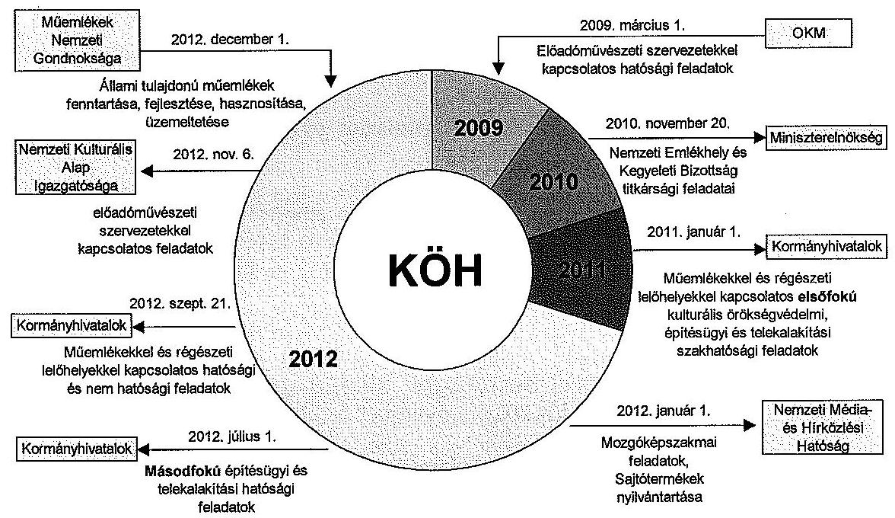

A Forster Központ és a Műemlékek Nemzeti Gondnoksága közötti átadás-átvételi jegyzőkönyv aláírása 2012. november 30-án történt meg. A jegyzőkönyv tartalmazta az átadott közfeladatok tételes leírását, valamint az átadásra kerülő dokumentumok tételes bemutatását.

Az irányító szerv a Műemlékek Nemzeti Gondnoksága beolvadását megelőzően gondoskodott a megszűnő intézmény által ellátott közfeladatok további ellátásáról, valamint a törzskönyvi nyilvántartásból történő kivezetésről a Kincstárnál. A Forster Központ 2012. december 1-jén hatályba lépő Alapító okiratában meghatározták azokat a közfeladatokat, amelyeket korábban a Műemlékek Nemzeti Gondnoksága látott el.

Az irányító szerv a kormányrendelet által előírt kötelezettségek ${ }^{28}$ ellenére nem gondoskodott a Műemlékek Nemzeti Gondnoksága beolvadását megelőzően a vagyonátadás lebonyolításáért felelős személyek kijelöléséről és a feladatok határidőinek meghatározásáról.

A fent bemutatott jogszabály- és feladatváltozások hatása a következők szerint foglalható össze.

A kulturális örökségvédelem ágazati irányítása úgy módosult, hogy a kulturális javakkal és emlékhelyekkel kapcsolatos kérdések továbbra is a kulturális tárcához tartoztak, míg a műemlékekkel és a régészeti örökség védelmével kapcsolatos operatív, hatósági ügyek a belügyminiszter feladatkörébe kerültek.

A KÖH, mint az integrált kulturális örökségvédelem legfőbb szerve, országos hivatala, korábbi feladat- és hatáskörében megszűnt. A KÖH korábbi regioná-

[^0]
[^0]:    ${ }^{28}$ Ávr.14. § (1) bekezdés b) pontja

---

lis területi irodái a megyei és fővárosi kormányhivatalokba integrálódtak, mint azok meghatározott illetékességi körben működő kulturális örökségvédelmi szakigazgatási szervei.

A belügyminiszter szakmai irányítása alatt álló örökségvédelmi szervezetrendszer átalakítása egyrészt a járási hivatalok létrehozásával, másrészt az építésügyi hatóságok átalakításával összefüggésben zajlott.

A régészeti örökség és a műemléki értékek védelmével kapcsolatos első fokú hatósági feladatokat a járási (fővárosi kerületi) hivatal szakigazgatási szerveként működő járási építésügyi és örökségvédelmi hivatalok látják el. Az országban 21 járási építésügyi és örökségvédelmi hivatal jött létre: minden megyében egy, valamint a fővárosban kettő. A másodfokú hatósági feladatokat a műemlékvédelemmel kapcsolatban - minden megyében - a fővárosi és megyei kormányhivatalok egységes építésügyi és örökségvédelmi szakigazgatási szerve, a régészettel kapcsolatban pedig - országos illetékességgel - a fővárosi kormányhivatal építésügyi és örökségvédelmi hivatala látja el.

Eszerint valamennyi építésiengedély-köteles ügyben egységes hatósági jogosítványokkal rendelkező önálló járási építésügyi és örökségvédelmi hivatal jár el, mely minden érdekelt bevonásával tudja az eljárást lefolytatni. Az új szabályozás megszüntette a műemlékeket érintő tervek kettős (építészeti tervtanácsi és műemléki testületi) tárgyalását.

# 2. A KÖH SZAKMAI FELADATELLÁTÁSÁNAK SZABÁLYOZOTTSÁGA ÉS SZABÁLYSZERŰSÉGE

### 2.1. A feladatellátásra vonatkozó belső szabályozás jogszabályokkal való összhangja

A szakmai feladatok ellátására vonatkozóan kialakított belső eljárásrendi szabályzatokat (ügyrendeket) a feladat- és jogszabályváltozásoknak megfelelően az ellenőrzött időszakban nem aktualizálták. A szabályzatok az ellenőrzött időszakban bekövetkezett feladatváltozásokat megelőzően (a 2002-2010. években) készültek, amely nem felelt meg a rendeleti szintű szabályozásban ${ }^{29}$ foglalt előírásoknak.

A KÖH az ellenőrzött időszakban nem tett eleget közzétételi kötelezettségének, továbbá nem gondoskodott a közérdekű adatok megismerésére irányuló kérelmek intézésének, valamint a kötelezően közzéteendő adatok nyilvánosságra hozatalának rendjét érintő szabályzásról, megsértve ezzel az Info törvényben ${ }^{30}$ és az államháztartás működési rendjét szabályozó kormányrendeletekben ${ }^{31}$ foglaltakat.

[^0]
[^0]:    ${ }^{29}$ Ávr. 13. § (2) és (5) bekezdés
    ${ }^{30}$ 2011. évi CXII. törvény 30. § (6) bekezdése
    ${ }^{31}$ Ámr. 20. § (3) bekezdésének i) pontja, Ávr. 13. § (2) bekezdésének h) pontja

---

Nem dolgozták ki a feladatellátás mérhetővé tételének feltételrendszerét, a tevékenységek gazdaságosságának, eredményességének és hatékonyságának biztosítását szolgáló követelményrendszert.

# 2.2. A KÖH szakmai feladatellátásának szabályszerűsége 

Az ellenőrzés részére szolgáltatott adatok alapján a KÖH az ellenőrzött időszakban ellátta az irányadó jogszabályokban és az alapító okiratokban meghatározott közfeladatait.

A Kötv. ${ }^{32}$ értelmében a KÖH hatáskörébe tartozott a műemlékvédelemmel, a régészeti örökség védelmével, illetve a műtárgyvédelemmel kapcsolatos közszolgálati feladatok ellátása.

Az intézmény szakfeladatainak ellátását a fenti jogszabályokon kívül az Áht. ${ }_{1}$, az Áht. ${ }_{2}$, a 324/2010. (XII. 27.) Korm. rendelet, valamint a 212/2010. (VII. 1.) Korm. rendelet, továbbá a 3/2010. számú (IV. 28.) OKM utasítás ${ }^{33}$ szabályozza.

A KÖH az 1.3. pontban bemutatott átszervezések végrehajtásáig ellátta az első és másodfokú örökségvédelmi hatósági feladatokat.

A KÖH területi szervei - a 308/2006. (XII. 23.) Korm. rendelet mellékletében foglaltak szerinti illetékességi területen - az első fokú hatósági ügyekben eljáró Irodák voltak.

A Hatósági Főosztály készítette elő a KÖH elnöke részére a másodfokú örökségvédelmi határozatokat és szakhatósági állásfoglalásokat, a felügyeleti intézkedések tervezetét, valamint vizsgálta az első fokú hatósági tevékenység törvényességét.

A KÖH szakmai feladatellátását továbbá a Film- és Előadó-művészeti Iroda, a Nyilvántartási Iroda és a Műtárgy-felügyeleti Iroda végezte. Az országos illetékességű, első fokú igazgatási szervei önálló feladat- és hatáskörrel rendelkeztek, közigazgatási hatósági hatáskörüket önállóan gyakorolták.

A Film- és Előadó-művészeti Iroda ellátta a mozgóképszakma működésével összefüggő államigazgatási feladatokat, ennek során a jogszabályokban meghatározott hatósági, ellenőrzési és szolgáltató tevékenységet végzett.

A Nyilvántartási Iroda ellátta a kulturális örökségvédelmi központi és hatósági nyilvántartási feladatokat. Feladatait a hatósági ügyekben eljáró kulturális örökségvédelmi szakigazgatási szervek és a KÖH Tudományos Főosztálya együttműködésével hajtotta végre. Az Iroda naprakész közhiteles hatósági nyilvántartást, szakmai adatbázist vezetett a jogszabályokban előírt módon, adattartalommal és ügycsoportokban.

A Műtárgyfelügyeleti Iroda hatósági felügyeleti és egyéb feladatait a Kötv. szabályozza. A kulturális javak védési eljárásával kapcsolatos hatósági felada-

[^0]
[^0]:    ${ }^{32}$ 2001. évi LXIV. törvény
    ${ }^{33}$ 3/2010. (IV. 28) OKM utasítás az Oktatási és Kulturális Minisztérium irányítási, felügyeleti, tulajdonosi, alapítói jogok gyakorlásának rendjéről szóló szabályzat kiadásáról

---

tok ügyintézési határideje a Kötv. ${ }^{34}$ alapján három hónap. A Műtárgyfelügyeleti Iroda minden egyéb eljárása tekintetében a Ket. ${ }^{35}$ ügyintézési határideje az irányadó.

A KÖH által az ellenőrzés részére szolgáltatott adatok alapján megállapítottuk, hogy a kulturális javak kiviteli engedélyezésével kapcsolatos nemzeti hatósági feladatok 2010. évtől tapasztalható nagyarányú növekedése a Kötv. 2009. november 11-től hatályos módosítása miatt következett be. A jogszabálymódosítás előírta, hogy kulturális javak csak engedéllyel (műtárgykisérő igazolással) vihetők ki az országból. A 2011. évtől kezdődően a hatósági feladatok számának csökkenése tapasztalható, mivel a vonatkozó jogszabályi rendelkezések ${ }^{36}$ alapján 2011. január 1-jétől a műemlékekkel és régészeti lelőhelyekkel kapcsolatos elsőfokú kulturális örökségvédelmi, építésügyi és telekalakítási feladatok a kormányhivatalokhoz kerültek.

Az ellenőrzés szabályszerűségi szempontból, mintavétel alapján kizárólag a KÖH kulturális javak külföldre történő kiviteléhez kapcsolódó eljárását értékelte, mivel ez a terület a hatósági feladatok közül az ellenőrzött időszakban végig a KÖH-höz tartozott.

A hatályos kormányrendeletek ${ }^{37}$ alapján az intézmény Műtárgyfelügyeleti Irodája végzi a kulturális javak külföldre történő kiviteléhez kapcsolódó hatósági feladatokat.

A kulturális javak külföldre történő kiviteléhez kapcsolódóan kiválasztott mintatételek alapján megállapítottuk, hogy a feladatellátás érdekében kialakított nyilvántartás nem felelt meg teljes körűen a kultúráért felelős miniszter által kibocsátott rendeleteknek. ${ }^{38}$

A kulturális javak védelmére vonatkozó rendelkezéseket a 2001. évi LXIV. törvény 46-53. §-ai szabályozzák. Ennek alapján az engedélyköteles kulturális javak „védett" és „nem védett" kategóriába sorolhatóak. Amelyek nem tartoznak a „védett" és „nem védett" kategóriába, azok a hatóság engedélye nélkül vihetők ki az országból.

A kulturális javak külföldre történő kivitelét az alábbi ábra szemlélteti.

[^0]
[^0]:    ${ }^{34}$ 2001. évi LXIV. törvény 75. § (1) bekezdés
    ${ }^{35}$ 2004. évi CXL törvény
    ${ }^{36}$ 324/2010. (XII. 27.) Korm. rendelet 3. § (1) bekezdése
    ${ }^{37}$ 308/2006. (XII. 23.), a 324/2010. (XII. 27.) és a 266/2012. (IX.18.) számú Korm. rendeletek
    ${ }^{38}$ 17/2002. (V. 21.) NKÖM rendelet 5. §, 45/2012. (XI. 30.) EMMI rendelet 4. §

---

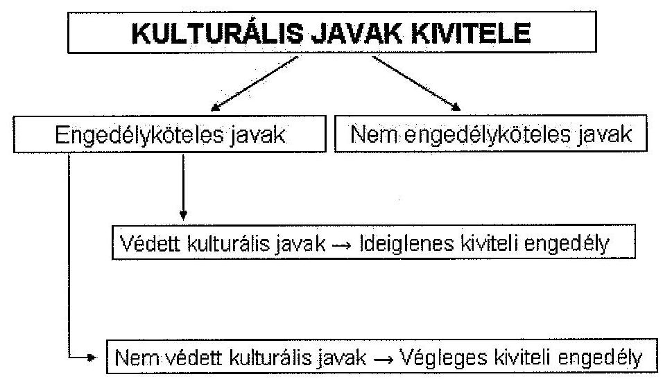

Az engedélyköteles kulturális javak külföldre történő kivitele esetében a kiviteli engedélyek formai szempontból megfeleltek a jogszabályi követelményeknek.

A KÖH a kiviteli engedélyezési eljárásért fizetendő díjat a NEFMI rendeletben ${ }^{39}$ foglaltaknak megfelelően beszedte és elszámolta bevételként.

A kultúráért felelős miniszter által kibocsátott rendeletben ${ }^{40}$ foglaltak ellenére a mintatételek 20,0 %-a esetében a Műtárgyfelügyeleti Iroda által vezetett kiviteli engedélyek nyilvántartásában nem szerepeltették a kivitelre kerülő műtárgyak kiviteli engedélyét. A mintatételek 62,5 %-a esetében a kiviteli engedélyek nyilvántartásában nem tüntették fel a kiviteli engedély jogerőre emelkedésének időpontját.

# 3. A BELSŐ KONTROLLRENDSZER MŰKÖDÉSÉNEK ÉRTÉKELÉSE 

A KÖH belső kontrollrendszere részben biztosította a szabályszerű feladatellátást, közpénzfelhasználást és vagyongazdálkodást. A szervezet belső kontrollrendszerének kiépítettségével és működtetésével kapcsolatban - az információs és kommunikációs pillér kivételével - az ellenőrzés több hiányosságot is megállapított.

[^0]
[^0]:    ${ }^{39}$ a kulturális javak kiviteli engedélyezéséről szóló 14/2010. (XI. 25.) NEFMI rendelet
    ${ }^{40}$ A 17/2002. (VI. 21.) NKÖM rendelet 5. §-a szerint a „védett" és „nem védett" kulturális javak nyilvántartása tartalmazza a kiviteli engedélyek számát és az engedély jogerőre emelkedésének időpontját.

---

# 3.1. A kontrollkörnyezet és a kockázatkezelés kialakítása, szabályszerű működtetése 

A kontrollkörnyezet kialakítása nem felelt meg a Ber. 8. § a) pontjának és a Bkr. 6. § (1)-(2) bekezdésének, mivel a KÖH az ellenőrzött időszakban nem készítette el teljes körűen a működését meghatározó belső szabályzatokat, és azok nem feleltek meg minden tekintetben a hatályos jogszabályokban előírt követelményeknek.

A szakmai feladatok ellátására vonatkozó belső szabályzatokat és ügyrendeket a feladat- és jogszabályváltozásoknak megfelelően nem aktualizálták az államháztartásra vonatkozó jogszabályokban ${ }^{41}$ foglaltak ellenére. A pénzügyi és vagyongazdálkodás szabályzatainak többsége 2002-2010 között, még a feladatváltozások és a Műemlékek Nemzeti Gondnoksága 2012-es beolvadása előtt készültek, ezért nem követték a bekövetkezett intézményi sajátosságokat.

Nem aktualizálták: a számviteli politikát, az értékelési szabályzatot, a számlarendet, a bizonylati rendet, a leltárkészítési és leltározási szabályzatot, a gazdálkodási szabályzatot, az önköltség-számítási szabályzatot, a felesleges vagyontárgyak hasznosításának és selejtezésének szabályzatát, a gépjárművek igénybevételének és használatának rendjéről szóló szabályzatot, a vezetékes vonalak, a mobiltelefon és mobilinternet szolgáltatások, a mobiltelefon-készülék használati rendjéről szóló szabályzatokat.

Az intézmény az ellenőrzött időszakban nem alakított ki olyan kontrollkörnyezetet, amelyben meghatározta volna az etikai elvárásokat a szervezet minden szintjén. Ez nem felelt meg az Ámr. ${ }_{1}$ 145/D. § c) pontjában, az Ámr. ${ }_{2}$ 156. §. (1) c) pontjában, valamint a Bkr. 6. § (1) bekezdésében foglaltaknak.

A 63/2008. sz. elnöki utasítás alapján kiadott leltározási és leltárkészítési szabályzat nem tartalmazta a könyvviteli mérlegben értékkel nem szereplő, használt és használatban levő készletek, kis értékű immateriális javak, tárgyi eszközök, valamint a 0-ra leírt eszközök leltározási módját. Ez nem felelt meg az államháztartás szervezetei beszámolási és könyvvezetési kötelezettségének sajátosságaíól szóló 249/2000. (XII. 24.) Korm. rendelet 37. § (6) bekezdésében foglaltaknak.

A 64/2008. számú, a 39/2009. számú, a 48/2010. számú és a 49/2011. számú elnöki utasítások alapján kiadott közbeszerzési szabályzatok a jogszabályi előírásokkal ${ }^{42}$ ellentétben nem tartalmazták a szerződéskötés rendjét. Azt a 49/2008. számú, és a 42/2010. számú elnöki utasítások alapján kiadott gazdálkodási szabályzatokban rögzítették.

Az intézmény az ellenőrzött időszakban nem rendelkezett ellenőrzési nyomvonallal, megsértve ezzel az Ámr. ${ }_{1}$ 145/B. §-ban, az Ámr. ${ }_{2}$ 156. § (2) bekezdésében, valamint a Ber. 17. § (2) bekezdésében és a Bkr. 6. § (3) bekezdésében foglalt előírásokat.

[^0]
[^0]:    ${ }^{41}$ Áht. 10. § (5) bekezdés és az Ávr. 13. § (2) és (5) bekezdése
    ${ }^{42}$ Kbt. ${ }_{1}$ 99. §-ban és a Kbt. ${ }_{2}$ 124-132. §-okban

---

Az intézmény belső ellenőrzési kézikönyvvel 2009. és 2010. március 30. között nem rendelkezett, a KÖH elnöke a belső ellenőrzési kézikönyvet (25/2010. elnöki utasítás) 2010. március 31 -én hagyta jóvá az akkor hatályos előírások alapján. A belső ellenőrzési kézikönyv aktualizálása 2010. március 31. és 2012 között nem történt meg, amely sérti a Ber. 5. § (1) bekezdésének és a Bkr. 17. § (4) bekezdésének előírásait.

A kockázatkezelési szabályzat 2005. december 5-től hatályos, amely rendelkezik a kockázatok és intézkedések nyilvántartásáról, azonban az intézmény a vonatkozó jogszabályi előírások ${ }^{43}$ ellenére a kockázatok nyilvántartását nem vezette, a kockázatkezelési szabályzatát nem aktualizálta, kockázatkezelési rendszer ${ }^{44}$ működtetéséről nem gondoskodott az ellenőrzött időszakban.

# 3.2. A kontrolltevékenység szabályossága, az információs, kommunikációs és monitoring rendszer kialakítása és működtetése 

A KÖH kontrolltevékenysége az ellenőrzött időszakban - a 2012. év kivételével - megfelelően működött.

A KÖH vagyongazdálkodásával kapcsolatos gazdasági eseményekkel összefüggésben az ellenőrzött időszakban, a 2012. év kivételével, az előírt belső kontrollok megfelelően működtek. A 2012. év végén a Műemlékek Nemzeti Gondnoksága beolvadását követően a feladatváltozások következményeként bekövetkezett fluktuáció miatt nehézséget okozott a feladatváltozásnak a jogszabályi előírásoknak megfelelő követése, a leltározás végrehajtása. A vezetői ellenőrzés elmaradásához vezetett, hogy a KÖH gazdasági vezetője 2012. december 1-jétől felmentési idejét töltötte.

A gazdálkodási jogkörök gyakorlásához kapcsolódóan a kontrollok működését a kötelezettségvállalás előkészítése során, a szakmai teljesítésigazolás területén, a szakmai érvényesítéssel összefüggésben, az utalványozáshoz kapcsolódóan a pénzkezelési szabályzatok aktualizálása segítette. Az ellenőrzött bevételi és kiadási teljesítéseknél eseti hiba fordult elő. A megállapított hibák többsége a leltározás elmaradása miatt következett be.

Az intézmény szabálytalanságkezelési szabályzatát az irányító szerv által kiadott SZMSZ-ek ${ }^{45}$ mellékletei tartalmazták.

[^0]
[^0]:    ${ }^{43}$ Ámr. ${ }_{1}$ 145/C. §, az Ámr. ${ }_{2}$ 157. § (1)-(3) bekezdései, valamint a Bkr. 3. § b) pont és 7. §
    ${ }^{44}$ Az Ámr. ${ }_{1}$ 145/C. §-ban, az Ámr. ${ }_{2}$ 157. §-ban valamint a Bkr. 7. §-ban foglaltak ellenére nem mérte fel és nem állapította meg az intézmény tevékenységében, gazdálkodásában rejlő kockázatokat, az egyes kockázatokkal kapcsolatos intézkedéseket és megtételük módját.
    ${ }^{45} \mathrm{SZMSZ}_{1}, \mathrm{SZMSZ}_{2}$

---

Az intézmény az információs és kommunikációs rendszerét kialakította és működtette. A 12/2005. sz. elnöki utasítás alapján kiadott iratkezelési szabályzatban a jogszabályi előírásoknak megfelelően meghatározták az információátadás formáit. Az alkalmazottak a munkavégzéshez szükséges információhoz időben hozzájuthattak, a vezetői döntéshez szükséges információk időben rendelkezésre álltak.

Az Ámr. ${ }_{1}$ 145/G. § (1) bekezdésében, az Ámr. ${ }_{2}$ 160. § (1) bekezdésében, valamint a Bkr. 10. §-ában foglaltak ellenére az intézmény 2011. szeptember 16-ig nem alakította ki a monitoring rendszer részeként az operatív tevékenységek keretében megvalósuló folyamatos és eseti nyomon követést. A kiadott SZMSZ-ben a jogszabályi előírásoknak megfelelően meghatározta a folyamatba épített előzetes, utólagos és vezetői ellenőrzési rendszert, azonban 2012. december 1-jétől, a Műemlékek Nemzeti Gondnoksága beolvadását követően ismételten nem gondoskodott annak működtetéséről.

# 3.3. A belső ellenőrzési rendszer szabályszerű kialakítása és működtetése

A KÖH belső ellenőrzési rendszere, működésének szervezeti keretei az ellenőrzött időszakban nem minden tekintetben feleltek meg a jogszabályi előírásoknak. Az ellenőrzési jelentésekre nem minden esetben készültek intézkedési tervek, illetve - a 2012. év kivételével - nem gondoskodtak a megállapítások, javaslatok hasznosulásának és végrehajtásának nyomon követéséről. A belső ellenőrzés függetlensége a 2009. év kivételével megvalósult.

Az SZMSZ II. fejezet 1.1.8. pontja alapján az intézmény a belső ellenőrzési tevékenységét az elnök közvetlen irányítása alatt álló köztisztviselő útján látja el. Az ellenőrzött időszakban a belső ellenőrzési tevékenységet külső szervezet megbízásával látták el, ami nincs összhangban az SZMSZ hivatkozott előírásával.

A 2009. évben a belső ellenőrzési tevékenység ellátása érdekében a vállalkozóval megkötött megbízási szerződésben - a Ber. 6. § (2) bekezdésében foglaltakkal ellentétben - a megbízó nem a KÖH elnöke, hanem gazdasági igazgatója volt. A Ber. 6. § (2) bekezdésében foglaltak szerint a belső ellenőrzést végző személy, egység vagy szervezet tevékenységét a költségvetési szerv vezetőjének közvetlenül alárendelve végzi.

A 2010. évtől kezdődően a korábbi szabálytalan gyakorlaton változtattak, és a belső ellenőrzési tevékenység ellátására a külső szolgáltatókkal kötött megbízási szerződések esetében a KÖH mindenkori elnöke volt a megbízó.

A 2009-2011. években belső ellenőrzést végzők rendelkeztek a jogszabályi előírásoknak megfelelő képesítéssel, megbízólevéllel, valamint minden alkalommal nyilatkozatot tettek esetleges összeférhetetlenségükről. A 2012. évi belső ellenőrzést végzők esetében az ellenőrzött nem tudta bemutatni az ellenőrök képesítését igazoló dokumentumokat, amelyek hiányában megsértették a Bkr. 24. § (1)-(2) bekezdéseiben foglaltakat.

---

A 2009. év kivételével az éves ellenőrzési tervek összeállítását megelőző kockázatelemzés nem készült, amely nem felel meg a Ber. 6. § (2) bekezdés, illetve a Bkr. 22. § (1) bekezdés b) pontja előírásainak.

A 2010. évben a belső ellenőrzési vezető - a Ber. 12. § b) pontjában előírtak ellenére - nem gondoskodott az éves ellenőrzési terv kidolgozásáról. Az ellenőrzött időszak további éveiben gondoskodtak az éves ellenőrzési terv összeállításáról, a 2011. évi éves ellenőrzési tervből azonban aláírt példányt nem tudtak az ellenőrzés részére bemutatni.

# A belső ellenőrzési jelentésekben foglalt hiányosságok megszüntetéséről - a leltárkészítési szabályzat aktualizálásának kivételével - közvetlenül a jelentésekben foglaltak megismerését követően gondoskodtak.

A belső ellenőrzések megállapításai és javaslatai alapján 2009-ben készült intézkedési terv, a 2010-2012 közötti időszakban azonban nem, megsértve ezzel a Ber. 29. § (1) bekezdésében, valamint a Bkr. 45. § (1) bekezdésében foglaltakat.

A 2009-2011. években a KÖH nem gondoskodott a belső ellenőrzési jelentésekben tett megállapítások, javaslatok hasznosulásának és végrehajtásának nyomon követéséről, amely nem felelt meg a Ber. 29/A. § (1) bekezdésében, valamint a Bkr. 47. § (1) bekezdésében foglaltaknak. A 2012. évben a vonatkozó jogszabályi előírásoknak megfelelően kialakították a nyilvántartást.

Az ellenőrzött időszakban a KÖH-nél külső szerv öt alkalommal végzett ellenőrzést.

Az ÁSZ a 2009. év során a KÖH 2008. évi költségvetési beszámolójának pénzügyi ellenőrzését végezte. Az ellenőrzés megállapította, hogy a KÖH alapító okirata és a szabályzatok kiegészítésre, pontosításra szorulnak. Szabálytalanul osztályozták a dologi és felhalmozási kiadási tételeket. A beszámoló szöveges indoklása nem tartalmazott információt a pénzügyi helyzetre, az eszközök nagyságára és/vagy összetételére, értékelésére, a nemzetközi támogatási programokra és az előző éveket érintő hibákra vonatkozóan.

A Kormányzati Ellenőrzési Hivatal (a továbbiakban: KEHI) a 2009. év során a központi költségvetési szervek által a 2008. évi illetményemelésére és egyéb személyi célú kifizetésekre igénybevett támogatások ellenőrzését végezte.

A 2009. évben az OKM Ellenőrzési Főosztálya a KÖH belső ellenőrzési tevékenysége kialakítását, szabályozottságát és működtetését ellenőrizte, a 2010. évben a belső kontrollmechanizmusok kialakítását, valamint a belső ellenőrzési tevékenység kialakítása és működtetése szabályszerűségének utóellenőrzését végezte el.

A 2012. évben az EMMI Belső Ellenőrzési Főosztálya ellenőrizte, a központi államigazgatási szervek a büntetés-végrehajtási szervezet részéről fennálló egyes ellátási kötelezettségeket szabályozó 44/2011. (III. 23.) Korm. rendelet előírásainak teljesítését.

Minden esetben gondoskodtak intézkedési terv készítéséről, és az abban foglaltak végrehajtásáról.

---

A belső ellenőrzési vezető azonban nem gondosodott a külső ellenőrzési jelentésekben szereplő ellenőrzési javaslatok alapján megtett intézkedések nyomon követéséről, amely nem felel meg a Ber. 29/A. § (1)-(2) és (7) bekezdéseiben foglaltaknak. A 2012. január 1-jétől hatályos Bkr. már nem írja elő a belső ellenőrzési vezető részére a külső ellenőrzési jelentésekben szereplő ellenőrzési javaslatok alapján megtett intézkedések nyomon követését.

# 4. A GAZDÁLKODÁS SZABÁLYSZERŰSÉGE

### 4.1. Pénzügyi gazdálkodás

A KÖH pénzügyi gazdálkodása alapvetően szabályszerű volt az ellenőrzött időszakban, egyedi hibák előfordultak, azonban ezek nem minősültek rendszerbeli hiányosságoknak.

A 2009-2012. években a feladatok átadása, illetve átvétele együtt járt a bevételi és kiadási előirányzatok változásával. A kiadások és bevételek teljesítésének értékében és arányaiban bekövetkezett módosulásokat a jogszabályokon alapuló feladatváltozások indokolták. Az előirányzat-maradvány évenkénti kimutatása - a maradvány-elszámolási dokumentációk alapján - teljes körű és szabályszerű volt.

A KÖH 2009-ben és 2012-ben feladatot vett át, míg 2010-2012 között más fejezet intézményének feladatot adott át.

A 2009. évben az előadó-művészeti szervezetekkel kapcsolatos hatósági feladatok átvételéhez kapcsolódóan az OKM támogatási szerződést kötött az intézménnyel. A feladatok átvétele miatt (2009. március 1.) a költségvetési támogatás összege 25,0 M Ft-tal (személyi juttatások 15,8 M Ft, dologi kiadások 5,2 M Ft, felhalmozási kiadások előirányzat 4,0 M Ft) növekedett. A feladatváltozáshoz kapcsolódóan létszámátadásra nem került sor.

A 2010. évben a Nemzeti Emlékhely és Kegyeleti Bizottságról szóló kormányrendelet ${ }^{46}$ végrehajtása érdekében az EMMI - KÖH - Miniszterelnökség 2010. november 20-án megállapodást írt alá, a KÖH költségvetési támogatása 4,3 M Ft-tal csökkent (személyi juttatások 3,2 M Ft, dologi kiadások 0,9 M Ft, felhalmozási kiadások 0,2 M Ft). A feladatváltozáshoz kapcsolódóan 4 fő létszámot adtak át a Miniszterelnökség részére.

## A 2011. évben a KÖH költségvetése a feladatátadások következtében 1059,8 M Ft-tal csökkent.

Az EMMI - KÖH - Miniszterelnökség közötti megállapodás alapján a NEKB titkársági feladatainak a Miniszterelnökség részére történő 2010. évi átadása miatt a KÖH 2011. évi költségvetési támogatása 43,7 M Ft-tal (személyi juttatások 40,0 M Ft, dologi kiadások 3,7 M Ft) csökkent. A megállapodás alapján a NEKB 2011. évi működési költségeinek Közbeszerzési és Ellátási Főigazga-

[^0]
[^0]:    ${ }^{46}$ 258/2010. (XI. 12.) Korm. rendelet 2. § (4) bekezdés

---

tóság (KEF) részére történő átadása miatt a költségvetési támogatás 7,5 M Ft-tal (dologi kiadások 7,5 M Ft) csökkent.

A KÖH a feladatok átadásához olyan kimutatással rendelkezett, amelyben a főkönyvi számlákon könyvelt költségeket szétbontotta szervezeti egységekre, ezen belül közvetlen és közvetett költségekre, ebből megállapítható volt, hogy a feladatváltozások miatt milyen mértékű előirányzat-átadás indokolt.

A 2011. évben kiadott kormányhatározat alapján ${ }^{47}$ 2011. január 1-jétől, a KÖH regionális irodák feladatkörének átadásával megszűntek a műemlékekkel és régészeti lelőhelyekkel kapcsolatos elsőfokú kulturális örökségvédelmi, építésügyi és telekalakítási hatósági feladatok, valamint az elsőfokú kulturális örökségvédelmi szakhatósági feladatok. A kormányhivatalok részére történő feladatátadás a KÖH esetében 1008,6 M Ft-os költségvetési támogatás csökkenést (személyi juttatások 693,0 M Ft, a dologi kiadások 315,6 M Ft) okozott.

A 2012. évben több feladatváltozás érintette az intézményt. A mozgóképszakmai feladatokat a mozgóképről szóló törvény rendelkezése ${ }^{48}$ alapján, az időszaki lapok nyilvántartása feladatokat a médiaszolgáltatásokról és a tömegkommunikációról szóló törvény ${ }^{49}$ alapján 2012. január 1-jétől átadták az NMHH részére. A költségvetési támogatás 4,4 M Ft-tal csökkent (dologi és egyéb folyó kiadások), illetve a feladat ellátásához kapcsolódó igazgatási szolgáltatási díj bevétel onnantól az átvevő hatóságot illeti meg. A közigazgatási szervek közötti végleges áthelyezéssel 8, illetve 2 fő létszámot adtak át az NMHH-nak.

A másodfokú építésügyi és telekalakítási hatósági feladatok átadását a Kötv. ${ }^{50}$ és a vonatkozó kormányrendelet ${ }^{51}$ alapján hajtották végre 2012. július 1-jén, létszám és előirányzat változtatás nélkül.

A műemlékekkel és régészeti lelőhelyekkel kapcsolatos hatósági és nem hatósági feladatok átadása a kormányrendeletben ${ }^{52}$ előírt kötelezettségeknek megfelelően 2012. szeptember 21-én történt meg. Ennek hatására a bevételi oldalon a költségvetési támogatás 91,0 M Ft-tal, a saját bevétel 1,0 M Ft-tal csökkent, a kiadások oldalán a személyi juttatások 81,2 M Ft, a dologi kiadások 10,8 M Ft-tal csökkentek. A KÖH 152 fős nyitó állományából ténylegesen, összesen 101 fő átadása történt meg, ebből 31 fő a BM részére és 70 fő a BFKH részére lett átadva, melynek következtében a Forster Központ állománya 51 főre csökkent.

[^0]
[^0]:    ${ }^{47}$ A területi államigazgatási szervezetrendszer átalakítását megalapozó intézkedésekről szóló 1191/2010. (IX. 14.) Korm. határozat
    ${ }^{48}$ 2004. évi II. törvény 18. §
    ${ }^{49}$ 2010. évi CLXXXV. törvény 208. § (3) bekezdés
    ${ }^{50}$ 2001. évi LXIV. törvény 63. § (1)-(3) bekezdései
    ${ }^{51}$ 324/2010. (XII. 27.) Korm. rendelet 3. § (2) bekezdés, 6. § (1) b) pont
    ${ }^{52}$ 266/2012. (IX. 18.) Korm. rendelet

---

2012. december 28-án az EMMI - BM - Forster Központ megállapodást írt alá fejezetek közötti előirányzat-átcsoportosításról. A Forster Központnál a költségvetési támogatás csökkenése 29,4 M Ft (a személyi juttatások 21,5 M Ft, a munkaadókat terhelő járulékok és szociális hozzájárulási adó 5,6 M Ft, a dologi kiadások 2,3 M Ft) volt. A Forster Központ személyi állományából 31 státusz (26 betöltött, 5 üres álláshely) került a BM állományába 2012. szeptember 21-től.

A Forster Központ a folyamatban lévő, illetve átadással érintett - az első- és másodfokú hatóságok által kiszabott és meg nem fizetett - bírságokról a tételes kimutatást is átadta a BFKH részére.

Az előadó-művészeti szervezetek működésével összefüggő feladatok teljes körű átadása a kormányrendeleti ${ }^{53}$ szintű szabályozásnak megfelelően 2012. november 6-án történt meg az NKAI részére. 2012. december 20-án az EMMI - Forster - NKAI megállapodást kötött az átadás-átvételről. Eszerint a költségvetési támogatás 29,5 M Ft-tal csökkent (személyi juttatások 28,3 M Ft, dologi kiadások 1,2 M Ft). Az átadás hatására a Forster Központ létszáma 9 fővel, 42 főre apadt.
2012. december 1-jével a Műemlékek Nemzeti Gondnoksága beolvadása miatt az állami tulajdonú műemlékek kezelése a KÖH-höz került, ezért a költségvetési támogatás 44,0 M Ft-tal (személyi juttatások 33,9 M Ft, dologi kiadások 10,0 M Ft, felhalmozási kiadások 0,1 M Ft) nőtt. Az
 állami tulajdonú műemlékek kezelése feladat átvételekor az intézmény tényleges, 42 fős állománya 118 főre növekedett, a 76 fős létszám átvétele következtében.

Az eredeti előirányzatok az ellenőrzött időszakban Kormány-, irányítószervi és intézményi döntés alapján módosultak a költségvetés végrehajtása során.

Az eredeti, módosított bevételi és kiadási előirányzatokat és azok teljesítési adatait a 2009-2012. évek között a 3. számú melléklet mutatja be. A feladatváltozásokból következő előirányzatok és teljesítési adatok változását a következő ábra szemlélteti.

[^0]
[^0]:    ${ }^{53}$ 309/2012. (XI. 6.) Korm. rendelet

---

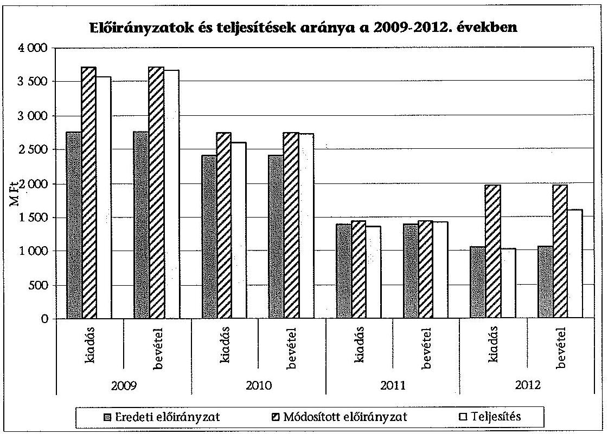

Az intézménynél a 2009-2012 közötti időszakban minden évben volt előirányzat-zárolás. A zárolásokat nem oldották fel, a zárolt összeget elvonták.

A zárolásokat, illetve a maradványtartási kötelezettség nem befolyásolta a szakmai feladatok ellátását. Maradványtartási kötelezettség csak 2009-ben volt 2,5 M Ft értékben a dologi kiadásoknál.

A 2009. évben az aktuális kormányhatározatok ${ }^{54}$ alapján kétszer volt előirányzat-zárolás, összesen 126,3 M Ft összegben a dologi kiadásoknál, február 5-én 37,2 M Ft, majd március 25-én 89,1 M Ft. A zárolással érintett összegeket elvonták.

A 2010. évben, a 2010. évi költségvetéssel összefüggő egyes feladatokról szóló kormányhatározat ${ }^{55}$ 2010. december 14-én a dologi kiadások esetében 1,8 M Ft zárolást rendelt el, a zárolást 2012. december 31-én elvonták az aktuális kormányhatározatnak ${ }^{56}$ megfelelően.

[^0]
[^0]:    ${ }^{54}$ 1001/2009. (I. 13.) Korm. határozat, 1033/2009. (III. 17.) Korm. határozat
    ${ }^{55}$ a 2010. évi költségvetéssel összefüggő egyes feladatokról szóló 1132/2010. (VI. 18.) Korm. határozat
    ${ }^{56}$ a 2010. évi központi költségvetés általános tartalékának előirányzatából történő átcsoportosításról, valamint az egyéb év végi intézkedésekről szóló 1318/2010. (XII. 27.) Korm. határozat

---

A 2011. évben a kormányhatározat ${ }^{57}$ által előírtak alapján 134,7 M Ft zárolás történt (személyi juttatások 40,5 M Ft, munkaadót terhelő járulékok 10,9 M Ft, dologi kiadások 58,6 M Ft, intézményi beruházások 24,7 M Ft), amelyet a 2011. évi költségvetésről szóló törvény ${ }^{58}$ módosítása alapján a KÖH keretszáma a hivatkozott összeggel csökkent.

A 2012. évben az előirányzat-zárolás 2012. július 13-án az aktuális kormányhatározat ${ }^{59}$ alapján 7,1 M Ft volt, amelyet 2012. december 21-én a vonatkozó kormányhatározat ${ }^{60}$ alapján elvontak.

Az előirányzat-maradványról készült kimutatás teljes körű és szabályszerű volt.

# 4.2. A bevételi, illetve a kiadási előirányzatok teljesítésének szabályszerűsége

A bevételek és kiadások teljesítése alapvetően szabályszerű volt. Ugyanakkor az ellenőrzés az állományba nem tartozók megbízási díjának kifizetésénél, illetve az egyéb dologi kiadásoknál tárt fel kisebb formai hiányosságokat, amelyek azonban nem befolyásolták a gazdálkodás szabályszerűségét.

A bevételek teljesítése az ellenőrzött időszakban szabályos volt.
A törvény szerinti bevételek teljesítése (működési és felhalmozási) 2009-ben 260,2 M Ft, 2010-ben 426,4 M Ft, 2011-ben 371,9 M Ft, 2012-ben 575,9 M Ft volt. A bázis évhez viszonyítva 2012-ben a növekedés 121,3 %.

A költségvetési támogatás teljesítése 2009-ben volt a legmagasabb, 3174,0 M Ft, 2010-ben 2231,4 M Ft, 2011-ben 921,9 M Ft, 2012-ben 944,5 M Ft volt.

A közhatalmi bevételek megállapítása és nyilvántartása a jogszabályoknak és belső szabályozásnak megfelelő volt.

A KÖH bevételeinek összetételében az ellenőrzött időszakban jelentős változás állt be. Törvényi változás miatt 2012-től a bírságbevételeket központosították, és feladatátadások miatt csökkentek az igazgatási szolgáltatási díjai. A Filmiroda és a Lapnyilvántartás feladatai, valamint az ehhez kapcsolódó bevételek (igazgatási szolgáltatási díjak) a NMHH-hoz, 2012. november 6-val pedig az Előadóművészeti Iroda feladatai és szervezete és az ehhez kapcsolódó igazgatási szolgáltatási díjak az NKAI-hoz kerültek. A Műemlékek Nemzeti Gondnoksága beolvadása miatt is nőttek az intézmény bevételei.

[^0]
[^0]:    ${ }^{57}$ Az államháztartási egyensúly megőrzéséhez szükséges intézkedésekről szóló 1025/2011. (II. 11.) Korm. határozat
    ${ }^{58}$ 2010. évi CLXIX. törvény
    ${ }^{59}$ A Széll Kálmán Terv kiterjesztése keretében megvalósítandó egyes intézkedésekről szóló 1122/2012. (IV. 25.) Korm. határozat
    ${ }^{60}$ Egyes kormányhatározatok módosításáról szóló 1635/2012. (XII. 18.) Korm. határozat

---

A tárgyi eszközök, immateriális javak értékesítése miatt keletkezett felhalmozási bevételek megállapítása a belső szabályozásnak megfelelt.

A támogatás értékű felhalmozási bevételek a Műemlékek Nemzeti Gondnoksága által kezelt európai uniós pályázatokhoz tartoztak, az azokkal történő elszámolás megfelelt a jogszabályi előírásoknak.

A törvény szerinti kiadások teljesítése 2009-ben 3568,5 M Ft, 2010-ben 2589,6 M Ft, 2011-ben 1355,1 M Ft, 2012-ben 1024,0 M Ft volt. A 2010. évtől kezdődő csökkenés a feladatátadásokból adódott.

A 2009. évi eredeti előirányzat évközben 947,6 M Ft-tal emelkedett, melynek legnagyobb részét egy ingatlankisajátítási kötelezettség tette ki, amelynek 648,8 M Ft-os kifizetése az intézményt terhelte.

Az OKM Költségvetési és Közgazdasági Főosztálya 2009. július 9-én a KÖH 2009. évi költségvetését kormányzati hatáskörben 648,8 M Ft-tal, 2009. november 12-én 68,4 M Ft-tal megemelte. Az intézmény a kapott előirányzatot elkülönítetten kezelte, a felhasználásról az éves beszámolóban beszámolt. Az egyszeri jelleggel biztosított pótelőirányzat az aktuális kormányhatározat ${ }^{61}$ alapján a Budapest XII., Budakeszi úton, illetve az Árnyas úton fekvő 10867/713. hrsz. ingatlanok kisajátításával kapcsolatos kártalanítás költségeinek támogatására szolgált.

Egy gazdasági társaság 2003. december 18-ával megszerezte a Budapest XII. kerület Budakeszi úton, illetve Árnyas úton fekvő 10867/7-13. helyrajzi számú ingatlanok tulajdonjogát azzal a céllal, hogy ott lakóparkot építsen. A telek rendezését, felosztását elvégezte, és benyújtotta kérelmét az építési engedély kiadása iránt.

Időközben az ingatlanokat a Nemzeti Kulturális Örökség minisztere által kiadott rendelet ${ }^{62}$ történeti kertként műemléki védelem alá helyezte, amellyel ellehetetlenült a beruházás tervek szerinti kivitelezése. Mindezek hatására a tulajdonos kérelmet nyújtott be a BFKH felé, kezdeményezve a kisajátítási eljárást a Tvr. ${ }^{63}$ alapján.
2008. május 16-án a Közép-magyarországi Regionális Közigazgatási Hivatal elrendelte az ingatlanok Magyar Állam részére műemlékvédelmi célra történő kisajátítását, és ezzel egyidejűleg kötelezte a KÖH-t az ingatlanok kisajátításáért megállapított 648,8 M Ft kártalanítási összeg megfizetésére. A kártalanítási összeget a közigazgatási hivatal az általa kirendelt szakértő véleménye alapján határozta meg. 2008. július 3-án a KÖH a határozat bírósági felülvizsgálatát kezdeményezte.
2009. június 10-én a Fővárosi Bíróság a KÖH keresetét jogerősen elutasította. A KÖH-öt kötelezték 0,1 M Ft perköltség, az ingatlankisajátítási kötelezettség miatt

[^0]
[^0]:    ${ }^{61}$ A 2009. évi központi költségvetés általános tartalékának előirányzatából történő felhasználásról szóló 1102/2009. (VI. 30.) Korm. határozat
    ${ }^{62}$ Egyes ingatlanok műemlékké nyilvánításáról, illetve műemléki védettségének megszüntetéséről szóló 27/2005. (X.7.) NKÖM rendelet
    ${ }^{63}$ 1976. évi 24. tvr.

---

648,8 M Ft kártalanítás és 68,4 M Ft késedelmi kamat megfizetésére. A kifizetés 2009. október 21-én történt meg.

Az ellenőrzött tranzakciók alapján a kiadások teljesítése - két eset kivételével - az ellenőrzött időszakban szabályos volt.

Az állományba nem tartozók megbízási díjához kapcsolódó kötelezettségvállalásnál 2009-ben egy esetben hiányzott a kötelezettségvállaló aláírása.

A KÖH a tevékenységébe tartozó örökségvédelem miatt több speciális feladatot végez, munkáját jogszabályi rendelkezések alapján szakmai testületek, bizottságok segítik, ezért különféle megbízási szerződéseket kötött magánszemélyekkel. Az intézmény részére több szakmai bizottság végzett feladatot, ezek feladatát a KÖH elnöki utasítások szabályozták.

A működési célú pénzeszközátadásokat megfelelően dokumentálták, a támogatási megállapodások alapján adott pénzről a támogatottak elszámoltak, az elszámolást a KÖH elfogadta.

Az egyéb dologi kiadásokhoz kapcsolódóan a megrendelések, a szerződések és árajánlatok rendelkezésre álltak, 2009-ben egy esetben az utalvány ellenjegyzője nem írta alá a kiadási utalvány rendeletet.

# 4.3. A pénzügyi kötelezettségek folyamatos teljesítésének biztosítottsága

Az intézmény a likviditása megőrzése érdekében az ellenőrzés alá vont időszakban több intézkedést is tett. A bevételek beszedésének hatékonyságát növelte és a kiadásokat csökkentette, 2009-2012 között keretelőrehozási kérelmet nem nyújtott be.

Az igazgatási költségvetés 2009. évi eredeti előirányzata 2759,8 M Ft volt, szemben a 2008. év végi tényleges kiadási teljesítés 3305,1 M Ft-jával. Az intézmény az ellenőrzött időszakban a likviditását megőrizte, fizetőképessége biztosított volt.

A 2009. évi dologi kiadások eredeti előirányzata 689,1 M Ft volt (a személyi keretből kellett átcsoportosítani 24,8 M Ft-ot, hogy a működést biztosítani tudják), amely 2010-re lecsökkent 388,0 M Ft-ra, ami az intézmény üzemeltetési kiadásaira sem nyújtott fedezetet. A 2010-re tervezett 388,0 M Ft dologi kiadási előirányzat már kötelezettségvállalással terhelt volt.

A KÖH több megtakarítási és bevételnövelő intézkedést tett a likviditás biztosítása érdekében 2009-től, amelynek a hatása a későbbi, 2010-2012. években is jelentkezett.

2009-ben az őrzés-védelemre vonatkozó szerződés műszaki tartalmát módosították, az őrök számát, az őrzés idejét és az őrzött helyszínek számát minimalizálták, amelynek következtében a szolgáltatás havi díja 1,5 M Ft-ra, 2010-ben 0,8 M Ft-ra csökkent.

---

A vezetékes és mobiltelefonok havi előfizetési díjai csökkentek a szerződés újratárgyalásának hatására. A továbbszámlázott mobiltelefon használati díjaknál a megtakarítás 2,5 M Ft volt. Több, kezelésükben lévő műemléki épület vagyonkezelési szerződését felmondták, mert nem volt forrás az állagmegóvásra. Ezzel mintegy 6,6 M Ft-ot takarítottak meg.

A KÖH által bérelt irodák és telephelyek bérleti szerződéseinek felülvizsgálatával további 12,0 M Ft megtakarítást értek el a kiadási oldalon.

A 2009. évi saját bevételek tényleges teljesítése kedvezően alakult, a tárgyévben nagy összegű bírság bevételeket vetettek ki, amelyek behajtásáról is intézkedtek, 76,6 M Ft értékben.

Az intézményi működési bevételeknél a 2010. évi eredeti előirányzat 117,0 M Ft, a befolyt bevétel 268,3 M Ft volt. A bevételi többlet nagy része a bírságok eredményes behajtásából és befizetéséből eredt, 139,6 M Ft összegben.

A likviditási mutató és a pénzeszköz likviditási mutató ${ }^{64}$ értékeinek változásai

| Megnevezés | 2009. év | 2010. év | 2011. év | 2012. év |
| :-- | :--: | :--: | :--: | :--: |
| Likviditási mutató \% | 1235,4 | 203,5 | 140,5 | 154,9 |
| Pénzeszköz likviditási mutató   $\%$ | 344,9 | 105,2 | 44,2 | 141,1 |

A KÖH likviditási mutatóját vizsgálva azt a következtetést vontuk le, hogy 2009-ben a forgóeszközök értéke több mint 12-szerese volt a rövid lejáratú kötelezettségeknek. A mutató értéke 2009 és 2012 között folyamatosan, összességében 1080,5 százalékponttal csökkent, ami a pénzügyi stabilitás romlására utal. Ugyanakkor a forgóeszközök értéke 2012-ben is meghaladta a rövid lejáratú kötelezettségekét.

2009-ben a pénzeszköz likviditási mutató értéke 344,9 % volt, ami azt jelenti, hogy a pénzeszközök értéke több mint háromszorosa volt a rövid lejáratú kötelezettségeknek. A mutató értéke 2009 és 2012 között összességében 203,8 százalékponttal csökkent, ami ugyan a pénzügyi stabilitás romlását mutatja, azonban a pénzeszközök értéke 2012-ben is meghaladta a rövid lejáratú kötelezettségekét.

A KÖH mérlegében a szállítói kötelezettség mértéke a 2009-2012 közötti időszakban jelentősen nőtt, ami a Műemlékek Nemzeti Gondnoksága 2012. évi beolvadásával magyarázható.

A KÖH a szállítói kötelezettségeit, a tartozások többségét fizetési határidőre, illetve az azt követő 30 napon belül teljesítette. 2012-ben előfordult nagyobb mértékű lejárt szállítói tartozás (91-180 nap között lejárt, 85,8 M Ft), ez azonban nem okozott zavart a működésben.

[^0]
[^0]:    ${ }^{64}$ Likviditási mutató: Forgóeszközök összesen/Rövid lejáratú kötelezettségek összesen Pénzeszköz likviditási mutató: Pénzeszközök összesen/Rövid lejáratú kötelezettségek összesen

---

A Műemlékek Nemzeti Gondnoksága beolvadásával olyan európai uniós támogatások kerültek az intézményhez (kastély felújítások), amelyeknek pénzügyi lebonyolítása a támogatási szerződések szerint szállítói finanszírozással történt. Ezen szállítói számlák számviteli nyilvántartása a számviteli szabályozás szerint a kedvezményezett, a Forster Központ könyveiben meg kell, hogy jelenjen, ameddig a közreműködő szervezet azokat a benyújtott előrehaladási jelentések alapján el nem fogadja, és a szállítónak közvetlenül meg nem fizeti.

A 2009-2012. években nem volt szükség támogatási keret-előrehozásra. A behajthatatlan követelések, különösen a bírságok állományának változása nem veszélyeztette a fizetőképesség fenntartását.

A vizsgált időszakban a követelések beszedésére a szükséges intézkedéseket megtették, pl. az érintett bérleti szerződést felbontották, a fizetési felszólítást megküldték, illetve végrehajtást kezdeményeztek.

Az örökségvédelmi bírság a KÖH bevételét képezte 2011. december 31-ig, majd 2012. január 1-jétől a központi költségvetés központosított bevétele lett. A KÖH 2009-2011 között intézkedett a bírság hátralék behajtására.

A bírságokról szóló határozatok kiadmányozására az önálló, elsőfokú hatáskört gyakorló KÖH irodák vezetői voltak jogosultak a Ket. közigazgatási eljárás általános szabályai alapján.

Az örökségvédelmi bírság kiszabását a Kötv. ${ }^{65}$ írja elő. A köztartozásnak minősülő örökségvédelmi bírság adók módjára való behajtását a Kötv. ${ }^{66}$ határozza meg. Késedelmes teljesítés esetén a késedelmi kamat megfizetéséről az örökségvédelmi bírságról szóló kormányrendelet ${ }^{67}$ rendelkezik.

A bírságok behajtásánál tapasztalható volt az a tendencia, hogy a behajtás elhúzódott, néhány esetben eredménytelen lett a behajtás, mivel nőtt a peres útra terelt ügyek, valamint a behajtható vagyonnal nem rendelkező ügyfelek száma.

Az adott évben, 2009-ben jogerőre emelkedett, kivetett bírság 62,1 M Ft, ebből tárgyévben befolyt 60,2 M Ft, 2010-ben a kivetett és befolyt bírság 44,4 M Ft, 2011-ben a kivetett és befolyt bírság 4,2 M Ft, 2012-ben a kivetett és befolyt bírság 5,1 M Ft volt. A bírságok összegét az ellenőrzött időszakban a következő ábra mutatja be.

[^0]
[^0]:    ${ }^{65}$ 2001. évi LXIV. törvény 63. § (1) és (2), illetve 82. § (1) bekezdései
    ${ }^{66}$ 2001. évi LXIV. törvény 84. §
    ${ }^{67}$ Az örökségvédelmi bírságról szóló 191/2001. (X. 18.) Korm. rendelet 7. § (1) bekezdés

---

Az adott évben kivetett és befolyt bírság összege
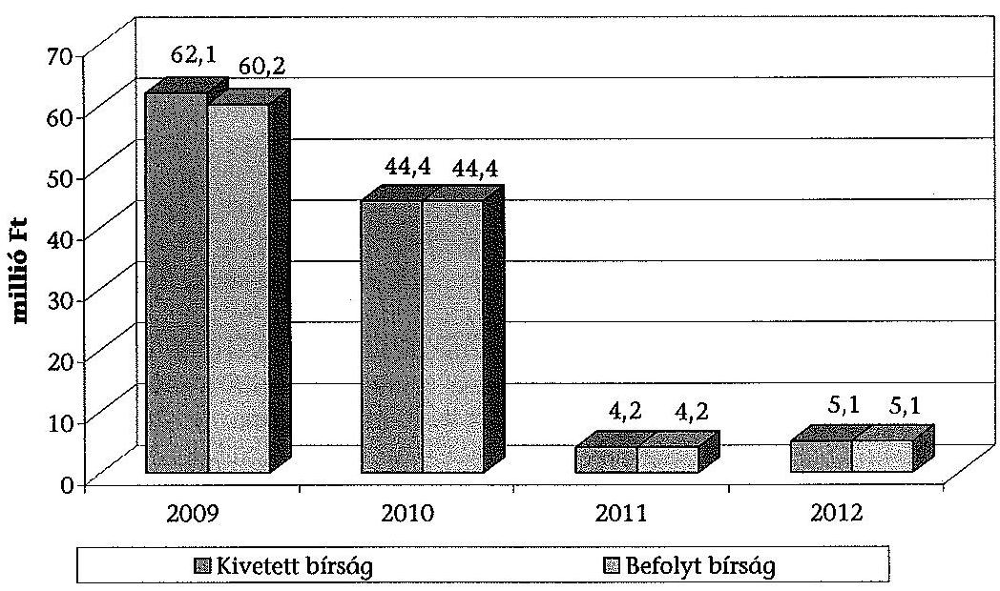

A bírság hátralék a 2009 előtt kivetett bírságoknál halmozódott fel, amelyet 2009-2012 között igyekeztek behajtani és nem hagyták elévülni.

A 2009-2012 közötti időszakban a leírt bírság csökkenő tendenciát mutatott. 2009-ben 3,4 M Ft, 2010-ben 2,5 M Ft, 2011-ben 0,4 M Ft volt, 2012-ben nem volt, ennek oka, hogy a rendezetlen bírság tételeket a KÖH 2012. szeptember 21-én átadta a BFKH-nak, a 266/2012. (IX. 18.) Korm. rendeletben foglaltaknak megfelelően.

Az igazgatási szolgáltatási díj megállapítása a Műtárgyfelügyeleti Iroda, a Filmiroda, az Előadó-művészeti Iroda és az időszaki lapnyilvántartás feladatokhoz kapcsolódott. A KÖH az igazgatási szolgáltatást a Ket. előírásai alapján végezte, az egyes szolgáltatások nyújtására vonatkozó díjak mértékét az egyedi jogszabályok határozták meg.

A tényleges befolyt igazgatási szolgáltatási díj 2009-ben 64,1 M Ft, 2010-ben 74,9 M Ft, 2011-ben 61,0 M Ft volt, 2012-ben 18,5 M Ft-ra csökkent. A bevételkiesés oka a korábban bemutatott átszervezés volt.

# 5. VAGYONGAZDÁLKODÁS 

### 5.1. A beszerzett, létesített és átvett vagyonelemekkel való gazdálkodás szabályszerűsége

A beszerzett és létesített tárgyi eszközök üzembe helyezése, fenntartása, karbantartása a 2009-2012. években megfelelt a jogszabályi előírásoknak, a főkönyvi és analitikus nyilvántartások egyezősége fennállt. A 2012. évben az eszközök leltárértékéről meggyőződni nem lehetett, mivel a 2012. évi leltározás nem történt meg.

---

A Műemlékek Nemzeti Gondnokságától átvett vagyonelemeket a KÖH főkönyvi nyilvántartásaiban teljes körűen rögzítették a 2012. november 30-ai állapot szerint, azonban a Műemlékek Nemzeti Gondnoksága által 2012. november 30-án elvégzett egyeztetés nem felelt meg a leltározás jogszabályban meghatározott követelményeinek. Az Áhsz. 37. §-ának (3) bekezdése alapján „az eszközök - kivéve az immateriális javakat, a követeléseket (ideértve a kölcsönöket, a beruházási előleget és az aktív pénzügyi elszámolásokat) leltározását mennyiségi felvétellel, a csak értékben kimutatott eszközök (az immateriális javak, a követelések, az idegen helyen tárolt - letétbe helyezett, portfoliókezelésben, vagyonkezelésben lévő értékpapírok, illetve a dematerializált értékpapírok) és a források leltározását egyeztetéssel kell végrehajtani". Az ellenőrzés megállapította, és az ellenőrzött nyilatkozott is arról, hogy a Műemlékek Nemzeti Gondnoksága záró leltára kizárólag az egyeztetés módszerével készült, ezzel megsértve az államháztartás számviteli rendjét szabályozó kormányrendeletben ${ }^{68}$ foglaltakat.

A beszerzett, létesített és átvett vagyonelemekkel való gazdálkodást elemezve megállapítottuk, hogy a KÖH eszközeinek állománya és összetétele a 2012. évben volt a legmagasabb a Műemlékek Nemzeti Gondnoksága beolvadása következtében.

# A KÖH kezelésében lévő immateriális javakat, a tárgyi eszközöket köztük az ingatlanokat - az alapító okirat szerinti tevékenység érdekében hasznosították az ellenőrzött időszakban. 

Az intézmény a kezelésében lévő ingatlanok egyéb célú hasznosítása érdekében bérbeadási tevékenységet végzett. A KÖH bérleti- és lízingdíj bevétele 2009-ben 21,9 M Ft-ról 2012-re 8,2 M Ft-ra csökkent. 2011. január 1-jén a kormányhivatalok megalakulásával a regionális irodákat kiszolgáló ingatlanok átkerültek a kormányhivatalokhoz, ez magyarázza a bérleti díj bevételek közel 50%-os csökkenését. Az addigi bérlőket a kormányhivatalok átvették.

Az intézményi működési bevételek jelentős mértékben megnőttek a Műemlékek Nemzeti Gondnoksága beolvadása miatt 2012. december 1-jétől, mert megjelentek a lakásbérlet és a vendéglátás tevékenységből származó bevételek.

Az ingatlanok hasznosítására az ellenőrzött időszakban külön szabályzat nem készült, az 51/2005. számú elnöki utasítás és az önköltség-számítási szabályzat egy pontja rendelkezik erről. Az irodaként nem használt helységeket (regionális irodák) adták bérbe. Az ingatlanok bérbeadásánál önköltségszámítással nem támasztották alá a bérleti díjakat, ezért a vagyonhasznosítási tevékenység gazdaságosságát nem lehetett megállapítani, ez nem felelt meg az Áht. ${ }^{69}$. § (1) bekezdés a) pontjának.

A KÖH a megalakulásától kezdve határozatlan időre kötötte a bérbeadási szerződéseket, majd 2008-ban tájékoztatta a bérlőket arról, hogy minden évben a KSH által hivatalosan közzétett, átlagos fogyasztói árindexváltozásnak megfelelő mértékben a bérleti díjakat megemelik.

[^0]
[^0]:    ${ }^{68}$ Áhsz. 13/A. § (1) és a 37. § (3) bekezdése

---

Nem történt olyan eszközértékesítés, amelyhez az MNV Zrt. előzetes engedélyére lett volna szükség.

A beruházásokat a 27/2009. KÖH elnöki utasítás szabályozta. A beszerzett tárgyi eszközök üzembe helyezése a beszerzéssel egy időben megtörtént.

A KÖH rendszeresen felülvizsgálta az aktivált, de nem működtetett immateriális javak, tárgyi eszközök állományát, hogy a további működés szempontjából szükség van-e ezekre az eszközökre. Az értékesítés feltételeit az intézmény a 31/2002. elnöki utasításban szabályozta. A vizsgált tételek esetében az elért ár meghaladta a nyilvántartási értéket, a vevőket nyilvános eljárásban választották ki, az interneten hirdették meg az értékesítést. Nem értékesítettek olyan eszközt, amelyik még szükséges lett volna az intézmény tevékenysége ellátásához.

Az intézménynél feladatátvétel miatt vagyonváltozás csak a 2012. évben volt.
A 2012. évben az állami tulajdonú műemlékek kezelése szakmai feladat a Műemlékek Nemzeti Gondnoksága beolvadásával került a Forster Központba. Az intézkedés a Forster Központ vagyonát 12665,0 M Ft-tal növelte meg, amely a befektetett eszközök 12611,1 M Ft, a forgóeszközök 53,9 M Ft összegű növekedésével járt.

Feladatátadás miatti vagyonváltozás 2009-ben nem volt az intézménynél.

2010-ben a NEKB titkársági feladatainak átadása miatt a befektetett eszközök állománya 1,8 M Ft-tal csökkent. A KÖH - NEFMI - KEF (NFM) megállapodást a 2010. év helyett csak 2011. március 23-án írták alá, és 2011. május 20-án történt meg az eszközök kivezetése. A feladatátadáshoz kapcsolódó eszközátadás a jogszabályi előírásoknak megfelelően történt.

A regionális irodák feladatkörének változása miatt 2011-ben a befektetett eszközök állománya 446,0 M Ft-tal csökkent az intézménynél, a KÖH és a megyei kormányhivatalok közötti megállapodások alapján. A feladatváltozásokkal összefüggésben a KÖH 2009. december 31-ei ingatlan leltárában szereplő 20 db (műemléki védettségű) épületet 2011. január 1-jével átadták a kormányhivataloknak, illetve amelyekre a megszűnő feladatok miatt már nem volt szükség, azok esetében a vagyonkezelői jogokat visszaadták az MNV Zrt.-nek. A feladatátadáshoz kapcsolódó eszközátadás a jogszabályi előírásoknak megfelelően történt.

A mozgókép szakmai feladatok átadása miatt a NMHH - EMMI - Forster Központ fejezetek közötti megállapodást írt alá 2012. október 15-én. A befektetett eszközök állománya 0,2 M Ft-tal csökkent a megállapodás alapján, 2012. december 20-án. A feladatátadáshoz kapcsolódó eszközátadás a jogszabályi előírásoknak megfelelően történt.

Az EMMI - BM - Forster Központ között 2012. december 28-án létrejött megállapodás szerint a KEF bevonásával megállapodást kellett volna kötni a BM fejezet részére átadott eszközökről. A vagyont átadták, azonban a vagyonátadási

---

jegyzőkönyv és a KEF-et is bevonó megállapodás nem készült el. Az eszközök átadása nem a Közbeszerzési és Ellátási Főigazgatóságról szóló kormányrendelet ${ }^{69}$ alapján - a KEF bevonásával -, illetve nem a kulturális örökségvédelmi hatóságok kijelöléséről és eljárásaikra vonatkozó általános szabályokról szóló kormányrendelet ${ }^{70}$ előírása alapján történt. Leltározás hiányában a beszámoló nem felelt meg a számviteli törvény ${ }^{71}$ által előírt valódiság elvének.

A vagyon tekintetében a háromoldalú megállapodást nem kötötték meg, mert a vagyon átvétele nem a tervezett módon történt. A BM fejezethez átkerülő státuszokhoz az átadandó eszközökről előzetes leltárt készítettek. Az előzetes leltárhoz képest azonban a szállítás időpontjában más eszközöket is elvittek, amelyekről a Forster Központ már nem tudott leltárt felvenni, így pontosan nem mutatható ki az átadott eszközök állománya.

A kormányhatározat ${ }^{72}$ végrehajtása érdekében a Forster Központnak a BFKH-val 2013. július 19-én aláírt megállapodása tartalmazta az átadásra kerülő személyi állomány elhelyezését biztosító ingatlanokkal kapcsolatos rendelkezéseket. Az immateriális javak, tárgyi és forgóeszközök együttes, 2012. december 31-ei összesített nyilvántartási értéke bruttó 162,7 M Ft, nettó 13,5 M Ft volt. A BFKH részére az eszközátadás 2013-ban megtörtént.

Az eszközök a Forster Központ állami feladatai ellátásához feleslegessé váltak, ezért azok vagyonkezelői jogát a vonatkozó jogszabályi előírások ${ }^{73}$ szerint a Kormányhivatal részére átruházta, ezek térítésmentes átruházással a BFKH vagyonkezelésébe kerültek.

# 5.2. A vagyongazdálkodással kapcsolatos gazdasági események és a vagyonnyilvántartás szabályozottsága 

A KÖH beruházási és felújítási adatainak vizsgálata alapján megállapítottuk, hogy az eszközök nyilvántartása a 2012. év kivételével alapvetően szabályszerű volt. Az ellenőrzés a beruházások, illetve a felújítások esetében tárt fel kisebb formai hiányosságokat, amelyek azonban nem befolyásolták a vagyongazdálkodás szabályszerűségét. A 2012. évben a Forster Központnál nem történt leltározás, így a főkönyvi és analitikus nyilvántartások, illetve a beszámoló mérlegének leltárral való alátámasztottsága nem valósult meg ${ }^{74}$. Leltár hiányában a 2012. évi beszámoló nem felelt meg a számviteli törvényben ${ }^{75}$ előírt valódiság elvének, a beszámoló nem mutatott valós képet a Forster Központ gazdálkodásáról.

[^0]
[^0]:    ${ }^{69}$ A Közbeszerzési és Ellátási Főigazgatóságról szóló 53/2011. (III. 31.) Korm. rendelet 3. § (1) bekezdése
    ${ }^{70}$ 266/2012. (IX. 18.) Korm. rendelet
    ${ }^{71}$ Sztv.15. § (3) bekezdés
    ${ }^{72}$ 1679/2012. (XII. 28.) Korm. határozat
    ${ }^{73}$ Nvtv.11. § (9), Vtvr. 11. §
    ${ }^{74}$ Sztv. 69. § (1) bekezdés
    ${ }^{75}$ Sztv. 15. § (3) bekezdés

---

A főkönyvi adatbázisban az eszközök besorolása, bekerülési értékének megállapítása, értékcsökkenésének elszámolása, értékelése szabályos volt. Az ellenőrzött tételek a leltárban 2009-2011 között szerepeltek.

Az ellenőrzött beruházások esetében a 2011. évben egy esetben a megrendelőlap nem állt rendelkezésre, így a kötelezettségvállaló és a kötelezettségvállalás-ellenjegyző aláírása hiányzott.

A beruházás a Filmiroda Mitsubishi XL projektor lámpa beszerzéséhez kapcsolódott $0,1 \mathrm{M}$ Ft értékben. A nyilvántartásba vételi okmány, az eszközvásárlás állományba vételi bizonylat és az eszköz törzslap a Forrás SQL programból rendelkezésre állt.

Az ellenőrzött felújításoknál 2010-ben egy esetben a vállalkozási szerződés nem állt rendelkezésre, emiatt a kötelezettségvállaló és a kötelezettségvállalásellenjegyző aláírása hiányzott.

A vállalkozó a Filmiroda, Előadó-művészeti Iroda informatikai hálózat felújítását végezte $0,9 \mathrm{M}$ Ft értékben, a kiadási utalványrendeleten a teljesítésigazoló, az érvényesítő, az utalvány-ellenjegyző és az utalványozó aláírása szerepelt.

A felújítások nyilvántartási értékét (2009-2010), az eszközök besorolását, értékcsökkenését és a leltárban szereplő értékét helyesen állapították meg. Az állományba vételhez a beruházási bizonylat, az aktiválási bizonylat, az eszközök törzslapja, üzembe helyezési okmánya rendelkezésre állt, ezeket a Forrás SQL program állította elő zárt rendszerben. Biztosított volt a főkönyvi és analitikus nyilvántartások egyezősége.

A vizsgált 2009-2012-es időszakban a KÖH-nek vagyonkezelési szerződése a KVI-vel, illetve az MNV Zrt.-vel állt fenn, aktualizálásáról gondoskodott.

A Műemlékek Nemzeti Gondnoksága vagyonkezelési szerződését a jogelőd Műemlékek Állami Gondnoksága és a KVI kötötte 2005-ben, az aktualizálása nem történt meg 2012-ig, így több ingatlan jogi helyzetének rendezése elmaradt.

A beolvadást követően a Forster Központ megkezdte a Műemlékek Nemzeti Gondnoksága vagyonkezelési szerződésének felülvizsgálatát.
2006. szeptember 1. napján a KVI vezérigazgatója 14 műemlék tekintetében vagyonkezelővé jelölte ki a Műemlékek Állami Gondnokságát. Ezen kijelölő nyilatkozat azonban - tekintettel arra, hogy vagyonkezelői jogot csak vagyonkezelői szerződés keletkeztethet - a vagyonkezelői jog tényleges megszerzéséhez nem volt megfelelő, így ezen műemlékek jogi helyzete, vagyonkezelője tisztázatlan volt. A Műemlékek Nemzeti Gondnoksága műemlék-állományának jelentős növekedését hozták az európai uniós forrásokból megvalósuló projektek, amelyekben több esetben sor került ingatlanok tulajdonjogának a Magyar Állam javára történő megszerzésére. A projektek folyamatos megvalósítása ellenére az így megvásárolt ingatlanok vagyonkezelési helyzetének rendezésére szintén nem került sor.

A Forster Központ 2013-ban megkereste az EMMI kultúráért felelős államtitkárát. A KÖH 2012. szeptember 21-én történt átalakulására és a Műemlékek Nemzeti Gondnoksága beolvadásával átvett rendezetlen tételekre tekintettel, szükségessé vált az MNV Zrt.-vel a kezelésükben lévő ingatlanok vonatkozásá-

---

ban megkötött vagyonkezelési szerződések felülvizsgálata. A Forster Központ 2012-ben megkezdte a vagyonkezelési szerződések felülvizsgálatát.

A beolvadással megszűnő Műemlékek Nemzeti Gondnoksága általános jogutódja lett a Forster Központ. A beolvadásra tekintettel a Magyar Köztársaság minisztériumainak felsorolásáról szóló törvény ${ }^{76}$ szerinti átadás-átvételi eljárás lefolytatására került sor.

A két intézmény 2012. december 1-jei összevonását követően a pénzügyi-számviteli analitikus nyilvántartási rendszerek összevonása csak részben történt meg. Az intézmények által használt analitikus nyilvántartási rendszerek eltérőek voltak, az eszköz analitika vezetése a Forster Központ Forrás SQL rendszerében folytatódott, a Műemlékek Nemzeti Gondnoksága eszköz analitikus nyilvántartása 2012. december 31-ig a Műemlékek Nemzeti Gondnoksága V-bázis programjában zajlott.

A Műemlékek Nemzeti Gondnoksága 2012. november 30-ai forduló nappal elkészítette a megszűnt szervezeteknek kötelezően előírt 2012. évi évközi beszámolót, valamint a 2012. évi éves beszámolót, a tanúsítványt a 2012. november 30-ai leltár adatairól, a nyilatkozatot a belső kontrollrendszer szabályszerűségéről és a 2012. IV. negyedéves mérlegjelentést.

A Műemlékek Nemzeti Gondnoksága követelések és kötelezettségek nyitó adatainak nyilvántartásba vétele során megállapítottuk, hogy a követelések és a szállítói kötelezettségek állománya nem volt teljes körű, a különböző kimutatások között eltérés mutatkozott, a mérleg és a beolvadás 2. számú mellékletét képező tanúsítvány adata azonos, az analitikáé nem, ezért az egyeztetés az ellenőrzés lezárásakor is folyamatban volt.

A Műemlékek Nemzeti Gondnoksága vevő követelés összege eltérő a dokumentumokon, a beolvadáskor készült mérleg és a tanúsítvány adata azonos, a vevő analitikáé nem. A Műemlékek Nemzeti Gondnoksága mérlegében a vevő követelés $8,8 \mathrm{M} \mathrm{Ft}$, az egyéb követelés $0,5 \mathrm{M} \mathrm{Ft}$, együtt $9,3 \mathrm{M} \mathrm{Ft}$, a Műemlékek Nemzeti Gondnoksága mérleg tanúsítványban is $9,3 \mathrm{M} \mathrm{Ft}$, a Műemlékek Nemzeti Gondnoksága vevő analitika szerint pedig $10,7 \mathrm{M} \mathrm{Ft}$ volt. A Forster Központ mérlegrendezési számlában $9,3 \mathrm{M}$ Ft-ot könyveltek követelésként, a vevő analitika egyeztetése 2013-ban is folytatódott az 1,4 M Ft-os eltérés miatt.

A szállítói kötelezettségek összege eltérő a dokumentumokban, a beolvadáskor készült mérleg és a tanúsítvány adata azonos, a szállítói analitikáé nem, a Műemlékek Nemzeti Gondnoksága mérlegben 354,9 M Ft, a tanúsítványban szintén $354,9 \mathrm{M} \mathrm{Ft}$, a szállítói analitikában pedig $18,3 \mathrm{M} \mathrm{Ft}$ szerepelt. A Forster Központ mérlegrendezési számlában $354,9 \mathrm{M}$ Ft szállítói kötelezettséget könyveltek. A szállítói analitika egyeztetése 2013-ban is folytatódott a $336,6 \mathrm{M}$ Ft-os eltérés miatt. A szállítói kötelezettség 98,7 \%-a (350,5 M Ft) 2012. október-november hónapokban keletkezett a Műemlékek Nemzeti Gondnoksága beolvadását megelőzően, az uniós projektekhez kapcsolódó szállítói finanszírozás miatt.

A Forster Központ a felsorolt hibákkal együtt tudta a könyveiben lekönyvelni a Műemlékek Nemzeti Gondnoksága dokumentumok adatait, majd megkezdte

[^0]
[^0]:    ${ }^{76}$ 2010. évi XLII. törvény 6. §

---

azok egyeztetését, javítását. A Forster Központ 2012. december 31-ei főkönyvi kivonatában a Műemlékek Nemzeti Gondnokságától átvett vagyon az átadás-átvételi jegyzőkönyvvel megegyező értékben szerepel. A Műemlékek Nemzeti Gondnoksága vagyon átadás-átvételi jegyzőkönyv alapján eszközcsoportonként az 1. számlaosztályban a főkönyvi könyvelés szabályosan megtörtént.

A Forster Központ a Műemlékek Nemzeti Gondnoksága beolvadásával átvett eszköz és forrás adatokat az átszervezéshez kapcsolódó mérlegrendezési számlán $15066,7 \mathrm{M}$ Ft értékben könyvelte, egyezően az átadási jegyzőkönyvben szereplő adatokkal.

A Műemlékek Nemzeti Gondnoksága aktív kiadások állománya 24,7 M Ft, a passzív (átfutó) bevételek állománya 24,7 M Ft volt, azonban analitikus nyilvántartással nem volt alátámasztva.

A fentiek alapján az ellenőrzés megállapította, hogy a Műemlékek Nemzeti Gondnoksága beolvadása nem volt megfelelően előkészítve, illetve a feltárt hiányosságok alapján a Műemlékek Nemzeti Gondnoksága megsértette a számviteli törvény ${ }^{77}$ előírásait. A Műemlékek Nemzeti Gondnoksága vagyonelemeinek ellenőrzése során két esetben állapítottunk meg helytelen gyakorlatot az értékcsökkenés mértékének megállapításakor.

Mindkét esetben az értékcsökkenés helytelen elszámolása a műemléki védettségű ingatlanhoz kapcsolódó vagyonértékű jog (34,0 M Ft és 21,0 M Ft értékben) megváltásához kapcsolódott. A Műemlékek Nemzeti Gondnoksága 2003-2004-ben 2%-os, majd 2005-től évi 16%-os értékcsökkenést számolt el, ezek alapján mind a két tétel értéke nulla lett 2011. március 31-én.

A vizsgált időszakban a Műemlékek Nemzeti Gondnoksága a lakásbérleti jog megváltása esetében a vagyonértékű joghoz kapcsolódóan hibásan először 2%-os, majd 16 %-os mértékű értékcsökkenést számolt el. A témakörben kiadott kormányrendelet ${ }^{78}$ által előírt rendelkezésre tekintettel nem szabad terv szerinti értékcsökkenést elszámolni a műemléki védettségű épületre abban az esetben, ha értékéből a használat során nem veszít, illetve értéke évről évre nő.

Tekintettel az Áhsz. ${ }^{79}$ előírására, az ingatlanokhoz kapcsolódó vagyoni értékű jogok tekintetében sem lehetett volna terv szerinti értékcsökkenést elszámolni. Ennek következményeként a Műemlékek Nemzeti Gondnoksága beolvadáskor készített mérlege, illetve a Forster Központ 2012. évi mérlegében szereplő vagyonelemek nem megfelelő értéken voltak kimutatva, ezzel megsértették a számviteli törvény ${ }^{80}$ rendelkezését.

[^0]
[^0]:    ${ }^{77}$ Sztv. 15. § (3), 26. § (2)-(3), és 52. § (6) bekezdése
    ${ }^{78}$ Áhsz. 30. § (8) bekezdés
    ${ }^{79}$ Áhsz. 30. § (8) bekezdés és a 9. számú melléklet 1. b) pont
    ${ }^{80}$ Sztv. 15. § (3) bekezdés

---

Az ellenőrzés megállapította, hogy a 2009-2011-es időszakban a KÖH eleget tett a Vtvr-ben foglalt vagyongazdálkodáshoz kapcsolódó kötelezettségeinek. A KÖH az ellenőrzött időszakban vagyonkataszterrel rendelkezett, és beszámolási kötelezettségét az MNV Zrt. felé határidőn belül teljesítette.

Az ellenőrzés a 2012. évre vonatkozóan megállapította, hogy a 2012. évre vonatkozó beszámolási kötelezettségének a KÖH határidő után, késve, 2013. július 5-én tett eleget.

Az ellenőrzés a Forster Központ 2012. évi vagyonkataszteri jelentésében három hibát talált a 2012. évi éves beszámoló leltárral alá nem támasztott mérlegéhez képest.

A vagyonkataszterben a részesedés soron 4,0 M Ft helytelenül szerepelt, mivel az Örökségvédő Ingatlanfenntartó Nonprofit Kft. a Forster Központ vagyonkezeléséből 2012. január 31-én kikerült. A 2012-es mérleg már a változásnak megfelelően készült, nem tartalmazta a részesedést.

A vagyonkataszter egyéb követelések sora $0,5 \mathrm{M}$ Ft-ot tartalmazott a mérlegben szereplő $27,6 \mathrm{M}$ Ft helyett.

A földterületek soron a 2012-es vagyonkataszterben 422,7 M Ft szerepelt a mérlegben kimutatott $482,8 \mathrm{M}$ Ft helyett. Az eltérés $60,1 \mathrm{M}$ Ft volt.

A 2012. december 31-én elmaradt leltározás miatt nem állapítható meg, hogy melyik kimutatás adata pontos.

A vagyonkataszter tekintetében elmaradt a vezetői ellenőrzés. 2012re vonatkozóan egyeztetést nem végeztek a vagyonkataszter és a mérleg adatai között. Az érintett időszakban nem volt megfelelő a vezetői kontroll, tekintettel arra, hogy a gazdasági vezető a felmentési idejét töltötte.

# 5.3. A vagyon nagyságának és változásának feladatváltozással való összhangja 

A KÖH eszközei - kiemelten az ingatlanok - a feladatváltozásokkal összefüggésben értékükben és arányaikban lényegesen változtak. Ez elsősorban a 2011. évi kormányhivatalok részére történő átadásoknak, valamint a 2012. évben a Műemlékek Nemzeti Gondnoksága beolvadásának tudható be.

A KÖH mérleg főösszege 2009-ben 1553,0 M Ft, 2010-ben 1681,2 M Ft (a növekedés 8,3 \%), 2011-ben 1057,4 M Ft volt (az előző évhez viszonyítva a csökkenés 37,1 \%), míg 2012-ben 14009,8 M Ft-ra növekedett (mintegy 12-szeresére nőtt). A vagyon állományán belül a legnagyobb összegű (9715,4 M Ft) az ingatlanok és a kapcsolódó vagyoni értékű jogok állományi értéke volt, amely a 2012. évben a mérleg főösszegének 69,3 %-át tette ki.

---

Az eszközök alakulása a 2009-2012. években

|  | adatok M Ft-ban |  |  |  |
| :-- | --: | --: | --: | --: |
|  | $\mathbf{2 0 0 9}$. év | $\mathbf{2 0 1 0}$. év | $\mathbf{2 0 1 1}$. év | $\mathbf{2 0 1 2}$. év |
| Befektetett eszközök | 1371 | 1451 | 866 | 13396 |
| Forgóeszközök | 182 | 230 | 191 | 614 |
| Eszközök alakulása 2009. évhez viszonyítva | $100,0 \%$ | $108,2 \%$ |
 $68,1 \%$ | $902,1 \%$ |
| Források összesen | 1553 | 1681 | 1057 | 14010 |

A befektetett eszközök a 2009. évben az összes eszköz 88,3 \%-át tették ki. A mutató 2009 és 2011 között folyamatosan, összesen 6,4 százalékponttal csökkent. 2011 és 2012 között jelentős növekedés következett be a befektetett eszközök arányában, egy év alatt 13,7, a 2009-es értékhez képest 7,3 százalékponttal növekedett.

A KÖH forgóeszköz állományában bekövetkezett változásokat elemezve az látszik, hogy a követelések értéke 2009-hez képest 2010-re 5,8 \%-kal csökkent. 2011-ben növekedés történt, ekkor a követelések értéke már 13,1 \%-kal meghaladta a 2009-es értéket. 2012-ben aztán megint visszaesés történt, ekkor a követelések értéke csupán a 2009-es érték $24,6 \%$-ának felelt meg, azaz a teljes időszakban összességében 75,4 százalékpontos csökkenés történt a kiinduló értékhez képest.

A KÖH esetében a saját tőke aránya mutató szerint a saját tőke összes forráson belüli aránya 2009-ben 94,6 \% volt. A mutató 2010-2011 között fokozatosan, összesen 13,6 százalékponttal csökkent, majd 2011 és 2012 között növekedés következett be 12,1 százalékponttal, a 2009. évhez képest 2,0 százalékponttal növekedett.

A kötelezettségek és a saját tőke aránya mutató értéke 2009-ben 1,0 \% volt, ami azt jelenti, hogy a saját tőke értéke közel százszorosa a kötelezettségeknek. A mutató értéke 2010-2011 között folyamatosan emelkedett, 15,0 százalékponttal, majd 2012-ben 3,0 \%-ra csökkent a 2009. évhez viszonyítva.

A használhatósági fok a nettó értéket fejezi ki a bruttó érték arányában, eszerint 2009-ben az immateriális javak használhatósági foka 19,8 \% volt, majd 2011-ig folyamatosan, összesen 23,0 százalékponttal nőtt. 2012-ben csökkenés következett be, 2011-hez viszonyítva a mutató értéke 15,6 százalékponttal csökkent, ez a csökkenés azt jelzi, hogy a KÖH eszközeinek az átlagos elhasználtsága növekedett, emiatt a használhatóságuk romlott.

Az ingatlanok használhatósági foka az ellenőrzött időszakban végig magas volt, melynek legfőbb oka, hogy a műemléki védettségi épületnél nem lehet terv szerinti értékcsökkenést elszámolni.

2009-ben az ingatlanok használhatósági foka $94,3 \%$ volt, majd 2011-ig folyamatosan csökkent, összesen 1,7 százalékponttal, a változás az évek során az elszámolt értékcsökkenések miatt következett be. 2012-ben növekedés következett, 2011-hez viszonyítva 5,2 százalékponttal növekedett, a Műemlékek Nem-

---

zeti Gondnoksága beolvadása miatt több ingatlan került a KÖH állományába, amelyek használhatósági foka magas volt.

2009-ben a gépek, berendezések, felszerelések használhatósági foka 12,6\% volt, 2011-ig folyamatosan, 3,6 ponttal csökkent. A csökkenés a jogszabályok által előírt - a 2011. évi költségvetési egyensúlyt megtartó intézkedésekről szóló 1316/2011. (IX. 19.) Korm. határozattal elrendelt - beszerzési tilalom miatt, valamint egyes eszközök értékesítése miatt következett be. 2012-ben a Múemlékek Nemzeti Gondnoksága beolvadása miatt a mutató 2011-hez viszonyítva 0,7 ponttal növekedett.

2009-ben a járművek használhatósági foka $34,9 \%$ volt, 2011-ig folyamatosan, 30,5 százalékponttal csökkent értékesítés miatt, illetve 2011-ben feladatátadáshoz kapcsolódóan kerültek ki járművek a KÖH állományából. Ezek a változások befolyásolták a megmaradt állomány használhatósági fokát. 2012-ben növekedés következett, 2011-hez viszonyítva 1,8 százalékponttal.

A vizsgált időszakban a kezelt eszközök állománya a feladatváltozásokkal összefüggésben 2011-ben jelentősen csökkent, 2012-ben a Múemlékek Nemzeti Gondnoksága beolvadásával nagymértékben megnőtt.

2011-ben a KÖH könyveiből a NEKB titkársági feladatok átadása miatt 1,8 M Ft-os befektetett eszköz állományt vezettek ki. 2011-ben a KÖH csökkentette a befektetett eszközök állományát 446,0 M Ft-tal a regionális irodák feladatkörének átadása miatt. Az átadások szabályszerűek voltak.

A regionális irodák esetében, ahol ingatlan átadása is történt, a KÖH megküldte az MNV Zrt. részére a vagyonkezelési szerződésmódosítás tervezetét az ingatlan átadásról, azonban az MNV Zrt. jóváhagyása nem érkezett meg.

Többféle eszközfajtát adtak át, vagyoni értékű jogokat, ingatlanokat, amelyek a regionális irodák elhelyezésére szolgáltak. Adtak át ügyviteli és számítástechnikai eszközöket, gépjárműveket, egyéb gépeket, teljesen 0-ra leírt eszközöket és kis értékű tárgyi eszközöket.

A jogszabályi előírások alapján az eszközök kivezetését abban az időszakban tehette meg a KÖH, amikor az MNV Zrt. az átvevő intézmény részére jóváhagyta a vagyonkezelési szerződés módosítását, és erről értesítést kapott.

# Az ellenőrzött 2009-2012 közötti időszakban a KÖH vagyonkezelésében egy részesedés szerepelt, az Örökségvédő Ingatlanfenntartó Nonprofit Kft. (NKft.). 

A Magyar Állam 100\%-os, kizárólagos tulajdonában álló NKft. a KÖH hasznosításában állt 2010. január 20-tól, majd az MNV Zrt. és a KÖH 2012. január 31-én megszüntette a megállapodást. Az NKft. jegyzett tőke értéke $4,0 \mathrm{M} \mathrm{Ft}$, az MNV Zrt.-nél nyilvántartott könyv szerinti értéke $4,0 \mathrm{M} \mathrm{Ft}$ volt.

A KÖH részére a NKft. több féle szolgáltatást végzett szerződések alapján. A KÖH portaszolgálat, takarítási és gondnoksági feladatait látta el a KÖH vagyonkezelésében lévő épületeknél, valamint a beruházások bonyolítását és műszaki ellenőrzését, az informatikai és személyszállítási szolgáltatást végezte.

---

A közigazgatás átszervezése folytán a KÖH szervezeti egységeit képező kulturális örökségvédelmi irodák szervezetileg a kormányhivatalok szervezetébe kerültek át, így számtalan olyan feladat, amelyet a KÖH az NKft.-vel kötött szerződés alapján látott el, okafogyottá vált, illetve a szerződések - a kormányhivatalok szándékának hiányában - nem lettek meghosszabbítva.
Budapest, 2014. július hónap 26. nap
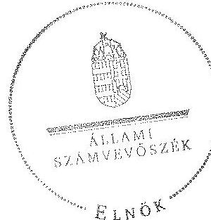

Domokos László
elnök

Melléklet: $\quad 7 \mathrm{db}$

---

# RÖVIDÍTÉSEK JEGYZÉKE 

## Törvények

ÁSZ tv.
Az Állami Számvevőszékről szóló 2011. évi LXVI. törvény
Áht. 1
Az államháztartásról szóló 1992. évi XXXVIII. törvény
Áht. 2
az államháztartásról szóló 2011. évi CXCV. törvény
Info tv.
az információs önrendelkezési jogról és az információszabadságról szóló 2011. évi CXII. törvény
Kbt. $_{1}$
a közbeszerzésekről szóló 2003. évi CXXIX. törvény
Kbt. 2
a közbeszerzésekről szóló 2011. évi CVIII. törvény
Ket. a közigazgatási hatósági eljárás és szolgáltatás általános szabályairól szóló 2004. évi CXL. törvény
Kötv. a kulturális örökség védelméről szóló 2001. évi LXIV. törvény
Nvtv. a nemzeti vagyonról szóló 2011. évi CXCVI. törvény
Sztv. a számvitelről szóló 2000. évi C. törvény
2004. évi II. törvény a mozgóképről szóló 2004. évi II. törvény
2010. évi CLXXXV. törvény a médiaszolgáltatásokról és a tömegkommunikációról szóló 2010. évi CLXXXV. törvény

## Törvényerejű rendelet

Tvr.

## Rendeletek, határozatok

Ámr. 1
Ámr. 2
Ávr.
Áhsz.

Ber.
Bkr.
új Áhsz.
Vtvr.
a kisajátításról szóló 1976. évi 24. törvényerejű rendelet
az államháztartás működési rendjéről szóló 217/1998. (XII. 30.) Korm. rendelet
az államháztartás működési rendjéről szóló 292/2009. (XII. 19.) Korm. rendelet
az államháztartásról szóló törvény végrehajtásáról szóló 368/2011. (XII. 31.) Korm. rendelet
az államháztartás szervezetei beszámolási és könyvvezetési kötelezettségének sajátosságairól szóló 249/2000. (XII. 24.) Korm. rendelet
a költségvetési szervek belső ellenőrzéséről szóló 193/2003. (XI. 26.) Korm. rendelet
a költségvetési szervek belső kontrollrendszeréről és belső ellenőrzésről szóló 370/2011. (XII. 31.) Korm. rendelet
az államháztartás számviteléről szóló 4/2013. (I. 11.) Korm. rendelet
az állami vagyonnal való gazdálkodásról szóló

---

308/2006. (XII. 23.) Korm. rendelet
212/2010. (VII. 1.) Korm. rendelet

258/2010. (XI. 12.) Korm. rendelet
324/2010. (XII. 27.) Korm. rendelet

53/2011. (III. 31.) Korm. rendelet
266/2012. (IX. 18.) Korm. rendelet

309/2012. (XI. 6.) Korm. rendelet

310/2012. (XI. 6.) Korm. rendelet

17/2002. (VI. 21.) NKÖM rendelet

14/2010. (XI. 25.) NEFMI rendelet
1/2009. (I. 30.) OKM utasítás

3/2009. (IX. 4.) OKM utasítás

6/2010. (X. 19.) NEFMI utasítás

3/2010. (IV. 28.) OKM utasítás

16/2013. (V. 10.) EMMI utasítás

254/2007. (X. 4.) Korm. rendelet
a Kulturális Örökségvédelmi Hivatalról szóló 308/2006. (XII. 23.) Korm. rendelet
az egyes miniszterek, valamint a Miniszterelnökséget vezető államtitkár feladat- és hatásköréről szóló 212/2010. (VII. 1.) Korm. rendelet
a Nemzeti Emlékhely és Kegyeleti Bizottságról szóló 258/2010. (XI. 12.) Korm. rendelet
a Kulturális Örökségvédelmi Hivatalról, a kulturális örökségvédelmi szakigazgatási szervekről, és eljárásaikra vonatkozó általános szabályokról szóló 324/2010. (XII. 27.) Korm. rendelet
a Közbeszerzési és Ellátási Főigazgatóságról szóló 53/2011. (III. 31.) Korm. rendelet
a kulturális örökségvédelmi hatóságok kijelöléséről és eljárásaikra vonatkozó általános szabályokról szóló 266/2012. (IX. 18.) Korm. rendelet
az előadó-művészeti szervezetek működésével összefüggő közigazgatási hatósági és szolgáltatási feladatokat ellátó szervezet kijelöléséről szóló 309/2012. (XI. 6.) Korm. rendelet
a Forster Gyula Nemzeti Örökséggazdálkodási és Szolgáltatási Központról szóló 310/2012. (XI. 6.) Korm. rendelet
a kulturális örökség hatósági nyilvántartására vonatkozó szabályokról szóló 17/2002. (VI. 21.) NKÖM rendelet
a kulturális javak kiviteli engedélyezéséről szóló 14/2010. (XI. 25.) NEFMI rendelet
az Oktatási és Kulturális Minisztérium felügyeleti, tulajdonosi, alapítói jogok gyakorlásának rendjéről szóló 8/2007. (OK. 35.) OKM utasítással kiadott szabályzat módosításáról szóló 1/2009. (I. 30.) OKM utasítás
az Oktatási és Kulturális Minisztérium Szervezeti és Működési Szabályzatának kiadásáról szóló 3/2009. (IX. 4.) OKM utasítás
a Nemzeti Erőforrás Minisztérium Szervezeti és Működési Szabályzatáról szóló3/2010. (IV. 28.) OKM utasítás
az Oktatási és Kulturális Minisztérium felügyeleti, tulajdonosi, alapítói jogok gyakorlásának rendjéről szóló szabályzat kiadásáról szóló 3/2010. (IV. 28.) OKM utasítás
a Forster Gyula Nemzeti Örökséggazdálkodási és Szolgáltatási Központ Szervezeti és Működési Szabályzatáról szóló 16/2013. (V. 10.) EMMI utasítás

---

1001/2009. (I. 13.) Korm. határozat

1033/2009. (III. 17.) Korm. határozat

1378/2012. (IX. 18.) Korm. határozat

1679/2012. (XII. 28.) Korm. határozat

## Egyéb rövidítések

ÁSZ
BFKH
BM
EMMI
KEF
KEHI
KIM
Kincstár
KÖH, Hivatal
Forster Központ
KSH
KVI
MNV Zrt.
NGM
NEKB
NFM
NKAI
NKÖM
NMHH
OKM
SZMSZ
SZMSZ $_{1}$

SZMSZ $_{2}$
a 2009. évi havi kereset-kiegészítés forrásigényének biztosításához szükséges intézkedésekről szóló 1001/2009. (I. 13.) Korm. határozat
a 2009. évi államháztartási egyensúly megőrzéséhez szükséges intézkedésekről szóló 1033/2009. (III. 17.) Korm. határozat
a kulturális örökségvédelmi szervezetrendszer átalakításáról szóló 1378/2012. (IX. 18.) Korm. határozat
a kulturális örökségvédelmi szervezetrendszer átalakításához kapcsolódóan az Emberi Erőforrások Minisztériuma, a Belügyminisztérium, valamint a Közigazgatási és Igazságügyi Minisztérium fejezetek közötti előirányzatátcsoportosításról szóló 1679/2012. (XII. 28.) Korm. határozat

Állami Számvevőszék
Budapest Főváros Kormányhivatala
Belügyminisztérium
Emberi Erőforrások Minisztériuma
Közbeszerzési és Ellátási Főigazgatóság
Kormányzati Ellenőrzési Hivatal
Közigazgatási és Igazságügyi Minisztérium
Magyar Államkincstár
Kulturális Örökségvédelmi Hivatal
Forster Gyula Nemzeti Örökséggazdálkodási és Szolgáltatási Központ
Központi Statisztikai Hivatal
Kincstári Vagyon Igazgatóság
Magyar Nemzeti Vagyonkezelő Zrt.
Nemzetgazdasági Minisztérium
Nemzeti Emlékhely és Kegyeleti Bizottság
Nemzeti Fejlesztési Minisztérium
Nemzeti Kulturális Alap Igazgatósága
Nemzeti Kulturális Örökség Minisztériuma
Nemzeti Média és Hírközlési Hatóság
Oktatási és Kulturális Minisztérium
Szervezeti és Működési Szabályzat
5/2008. (OK 23.) OKM utasítás a Kulturális Örökségvédelmi Hivatal Szervezeti és Működési Szabályzatáról
25/2011. (IX.16.) NEFMI utasítás a Kulturális Örökségvédelmi Hivatal Szervezeti és Működési Szabályzatáról

---

.

---

# JOGSZABÁLYOK ÉS KÖZJOGI SZERVEZETSZABÁLYOZÓ ESZKÖZÖK JEGYZÉKE 

## Törvények

1992. évi XXXVIII. törvény (Áht. ${ }_{1}$ )
2000. évi C. törvény
2001. évi LXIV. törvény
2003. évi CXXIX. törvény
2004. évi II. törvény
2004. évi CXL. törvény
2010. évi XLII. törvény
2010. évi CLXXXV. törvény
2011. évi LXVI. törvény
2011. évi CVIII. törvény
2011. évi CXII. törvény
2011. évi CXCV. törvény 2011. évi CXCVI. törvény

## Törvényerejű rendelet

1976. évi 24. törvényerejű rendelet

## Kormányrendeletek

217/1998. (XII. 30.)
Korm. rendelet
249/2000. (XII. 24.)
Korm. rendelet
191/2001. (X. 18.) Korm. rendelet
193/2003. (XI. 26.)
Korm. rendelet
308/2006. (XII. 23.)
Korm. rendelet
az államháztartásról (hatályon kívül helyezve: 2012. I. 1-jétől)
a számvitelről (hatályos: 2001. I. 1-jétől)
a kulturális örökség védelméről (hatályos: 2001. X. 8-tól)
a közbeszerzésekről (hatályon kívül helyezve: 2012. I. 1-jétől)
a mozgóképről (hatályos: 2004. IV. 1-jétől)
a közigazgatási hatósági eljárás és szolgáltatás általános szabályairól (hatályos: 2005. XI. 1-jétől)
a Magyar Köztársaság minisztériumainak felsorolásáról (hatályos: 2010. V. 29-től)
a médiaszolgáltatásokról és a tömegkommunikációról (hatályos: 2011. I. 1-jétől)
az Állami Számvevőszékről (hatályos: 2011. VII. 1-jétől)
a közbeszerzésekről (hatályos: 2011. VIII. 21-től)
az információs önrendelkezési jogról és az információszabadságról (hatályos: 2011. VII. 27-től)
az államháztartásról (hatályos: 2011. XII. 31-től)
a nemzeti vagyonról (hatályos: 2011. XII. 31-től)
a kisajátításról (hatálytalan: 2008. I. 1-jétől)

## az államháztartás működési rendjéről (hatályos: 1999. I. 1-jétől 2009. XII. 31-ig)
az államháztartás szervezetei beszámolási és könyvvezetési kötelezettségének sajátosságairól (hatályos: 2001. I. 1-jétől)
az örökségvédelmi bírságról (hatályos: 2001. X. 18-tól)
a költségvetési szervek belső ellenőrzéséről (hatályos: 2003. XI. 27-től 2011. XII. 31-ig)
a Kulturális Örökségvédelmi Hivatalról (hatályon kívül helyezve: 2011. I. 1-jétől)

---

254/2007. (X. 4.) Korm. rendelet
292/2009. (XII. 19.)
Korm. rendelet
212/2010. (VII. 1.) Korm. rendelet

258/2010. (XI. 12.)
Korm. rendelet
324/2010. (XII. 27.)
Korm. rendelet

44/2011. (III. 23.) Korm. rendelet

53/2011. (III. 31.) Korm. rendelet
368/2011. (XII. 31.)
Korm. rendelet
370/2011. (XII. 31.)
Korm. rendelet
134/2012. (VI. 28.)
Korm. rendelet

266/2012. (IX. 18.)
Korm. rendelet
309/2012. (XI. 6.) Korm. rendelet

310/2012. (XI. 6.) Korm. rendelet
17/2002. (VI. 21.) NKÖM rendelet

27/2005. (X. 7.) NKÖM rendelet

14/2010. (XI. 25.) NEFMI rendelet
45/2012. (XI. 30.) EMMI rendelet
az állami vagyonnal való gazdálkodásról (hatályos: 2007. X. 7-től)
az államháztartás működési rendjéről (hatályos: 2009. XII. 20-tól 2011. XII. 31-ig)
az egyes miniszterek, valamint a Miniszterelnökséget vezető államtitkár feladat- és hatásköréről (hatályos: 2010. VII. 1-jétől)
a Nemzeti Emlékhely és Kegyeleti Bizottságról (hatályos: 2010. XI. 20-tól)
a Kulturális Örökségvédelmi Hivatalról, a kulturális örökségvédelmi szakigazgatási szervekről és eljárásaikra vonatkozó általános szabályokról (hatályon kívül helyezve: 2012. IX. 21-től)
a büntetés-végrehajtási szervezet részéről a központi államigazgatási szervek és a rendvédelmi szervek irányában fennálló egyes ellátási kötelezettségekről, a termékek és szolgáltatások átadás-átvételének és azok ellentételezésének rendjéről (hatályos: 2011. VII. 1-jétől)
a Közbeszerzési és Ellátási Főigazgatóságról (hatályos 2011. IV. 1-jétől)
az államháztartásról szóló törvény végrehajtásáról (hatályos: 2012. I. 1-jétől)
a költségvetési szervek belső kontrollrendszeréről és belső ellenőrzésről (hatályos: 2012. I. 1-jétől)
az egyes kormányrendeleteknek a műemlékekkel kapcsolatos építésügyi hatáskörváltozásával összefüggő módosításáról (hatályon kívül helyezve: 2012. VIII. 2-tól)
a kulturális örökségvédelmi hatóságok kijelöléséről és eljárásaikra vonatkozó általános szabályokról (hatályon kívül helyezve: 2013. I. 1-jétől)
az előadó-művészeti szervezetek működésével összefüggő közigazgatási hatósági és szolgáltatási feladatokat ellátó szervezet kijelöléséről (hatályos: 2012. XI. 6-tól)
a Forster Gyula Nemzeti Örökséggazdálkodási és Szolgáltatási Központról (hatályos: 2012. XI. 6-tól)
a kulturális örökség hatósági nyilvántartására vonatkozó szabályokról (hatályon kívül helyezve: 2013. I. 1-jétől)
egyes ingatlanok műemlékké nyilvánításáról, illetve műemléki védettségének megszüntetéséről (hatályos: 2005. X. 15-től)
a kulturális javak kiviteli engedélyezéséről (hatályos: 2010. XII. 3.)
a kulturális javakkal kapcsolatos hatósági eljárásra vonatkozó szabályokról (hatályos: 2012. XII. 1.)

---

# Kormányhatározatok 

1001/2009. (I. 13.)
Korm. határozat

1033/2009. (III. 17.)
Korm. határozat
1102/2009. (VI. 30.)
Korm. határozat

1191/2010. (IX. 14.)
Korm. határozat

1132/2010. (VI. 18.)
Korm. határozat
1318/2010. (XII. 27.)
Korm. határozat

1025/2011. (II. 11.)
Korm. határozat
1316/2011. (IX. 19.)
Korm. határozat
1122/2012. (IV. 25.)
Korm. határozat
1378/2012. (IX. 18.)
Korm. határozat
1635/2012. (XII. 18.)
Korm. határozat
1679/2012. (XII. 28.)
Korm. határozat
a 2009. évi havi keresetkiegészítés forrásigényének biztosításához szükséges intézkedésekről (hatályos: 2009. I. 13-tól, visszavonta: az 1380/2011. (XI. 8) Korm. határozat)
a 2009. évi államháztartási egyensúly megőrzéséhez szükséges intézkedésekről (hatályos: 2009. III. 17-től)
a 2009. évi központi költségvetés általános tartalékának előirányzatából történő felhasználásról (hatályos: 2009. VII. 1-jétől, visszavonta az 1380/2011. (XI. 8.) Korm. határozat
a területi államigazgatási szervezetrendszer átalakítását megalapozó intézkedésekről (hatályos: 2010. IX. 15-től)
a 2010. évi költségvetéssel összefüggő egyes feladatokról (hatálytalan: 2010. XII. 31-től)
a 2010. évi központi költségvetés általános tartalékának előirányzatából történő átcsoportosításáról, valamint az egyéb év végi intézkedésekről (hatályos: 2010. XII. 27-től)
az államháztartási egyensúly megőrzéséhez szükséges intézkedésekről (hatályos: 2011. II. 11-től)
a 2011. évi költségvetési egyensúlyt megtartó intézkedésekről (hatályos: 2011. IX. 20-tól 2011. XII. 31-ig)
a Széll Kálmán Terv kiterjesztése keretében megvalósítandó egyes intézkedésekről (hatályos: 2012. IV. 25-től) a kulturális örökségvédelmi szervezetrendszer átalakításáról (hatályos: 2012. IX. 21-től 2012. XI. 30-ig.)
egyes kormányhatározatok módosításáról (hatályos: 2012. XII. 18-tól)
a kulturális örökségvédelmi szervezetrendszer átalakításához kapcsolódóan az Emberi Erőforrások Minisztériuma, a Belügyminisztérium, valamint a Közigazgatási és Igazságügyi Minisztérium fejezetek közötti előirányzat-átcsoportosításról (hatályos: 2012. XII. 28-tól)

## Miniszteri utasítások

5/2008. (X. 23.) OKM utasítás

1/2009. (I. 30.) OKM utasítás
a Kulturális Örökségvédelmi Hivatal Szervezeti és Működési Szabályzatáról (hatályon kívül helyezve: 2011. IX. 17-től)
az Oktatási és Kulturális Minisztérium felügyeleti, tulajdonosi, alapítói jogok gyakorlásának rendjéről szóló 8/2007. (X. 35.) OKM utasítással kiadott szabályzat módosításáról (hatályos: 2009. VII. 1-jétől)

---

3/2009. (IX. 4.) OKM utasítás

3/2010. (IV. 28.) OKM utasítás

6/2010. (X. 19.) NEFMI utasítás

25/2011. (IX. 16.) NEFMI utasítás
16/2013. (V. 10.) EMMI utasítás
az Oktatási és Kulturális Minisztérium Szervezeti és Működési Szabályzatának kiadásáról (hatályon kívül helyezve: 2010. X. 19-től)
az Oktatási és Kulturális Minisztérium felügyeleti, tulajdonosi, alapítói jogok gyakorlásának rendjéről szóló szabályzat kiadásáról (hatályos: 2010. IV. 28-tól)
a Nemzeti Erőforrás Minisztérium Szervezeti és Működési Szabályzatáról (hatályon kívül helyezve: 2013. II. 1-jétől)
a Kulturális Örökségvédelmi Hivatal Szervezeti és Működési Szabályzatáról (hatályos: 2011. IX. 18-tól)
a Forster Gyula Nemzeti Örökséggazdálkodási és Szolgáltatási Központ Szervezeti és Működési Szabályzatáról (hatályos: 2013. V. 12-től)

---

A KÖH bevételi és kiadási előirányzatainak adatai a 2009-2012. évek között
adatok M Ft-ban

| Megnevezés | 2009 | 2010 | 2011 | 2012 |
| :--: | :--: | :--: | :--: | :--: |
| Kiadás |  |  |  |  |
| eredeti | 2759,8 | 2414,2 | 1392,8 | 1048,8 |
| módosított | 3707,4 | 2737,2 | 1440,3 | 1963,2 |
| módosítás aránya \% | $134,3 \%$ | $113,4 \%$ | $103,4 \%$ | $187,2 \%$ |
| teljesítés | 3568,5 | 2589,6 | 1355,1 | 1024,0 |
| teljesítés eredeti előirányzat \%-ában | $129,3 \%$ | $107,3 \%$ | $97,3 \%$ | $97,6 \%$ |
| Bevétel |  |  |  |  |
| eredeti | 280,0 | 220,0 | 299,0 | 152,0 |
| módosított | 295,9 | 436,6 | 394,2 | 955,8 |
| módosítás aránya \% | $105,7 \%$ | $198,5 \%$ | $131,8 \%$ | $628,8 \%$ |
| teljesítés | 260,2 | 426,4 | 371,9 | 575,9 |
| teljesítés eredeti előirányzat \%-ában | $92,9 \%$ | $193,8 \%$ | $124,4 \%$ | $378,9 \%$ |
| Támogatás |  |  |  |  |
| eredeti | 2479,8 | 2194,2 | 1093,8 | 896,8 |
| módosított | 3174,0 | 2231,4 | 921,9 | 944,5 |
| módosítás aránya \% | $128,0 \%$ | $101,7 \%$ | $84,3 \%$ | $105,3 \%$ |
| teljesítés | 3174,0 | 2231,4 | 921,9 | 944,5 |
| teljesítés eredeti előirányzat \%-ában | $128,0 \%$ | $101,7 \%$ | $84,3 \%$ | $105,3 \%$ |
| Maradvány felhasználás | 237,5 | 69,2 | 120,5 | 62,6 |

---

.

---

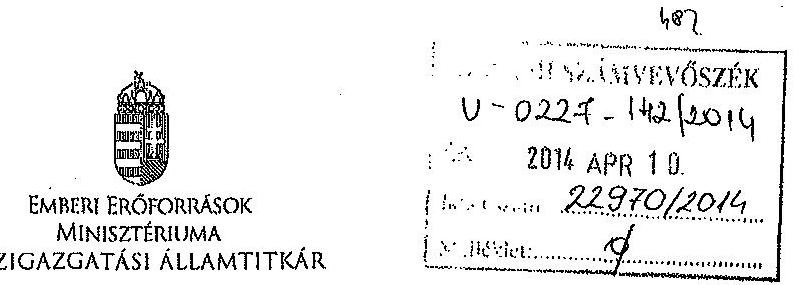

Iktatószám: 20744-7/2014/ELL

Hiv. szám: V-0227-135/2014
Ügyintéző: Bánkné Simon Judit
Tel. szám: +36 (1) 795 4430
Melléklet: -

Domokos László részére
elnök

Állami Számvevőszék

Budapest
Apáczai Csere János u. 10.
1052

Tárgy: Észrevétel „a Kulturális Örökségvédelmi Hivatal ellenőrzése pénzügyi gazdálkodási helyzete és vagyongazdálkodása tekintetében" című számvevőszéki jelentéstervezethez

Tisztelt Elnök Úr!

Az Állami Számvevőszék (a továbbiakban: ÁSZ) által készített, „a Kulturális Örökségvédelmi Hivatal ellenőrzése pénzügyi gazdálkodási helyzete és vagyongazdálkodása tekintetében" című számvevőszéki jelentéstervezethez az alábbi észrevételeket teszem.

1) Az emberi erőforrások miniszterének megfogalmazott 1. sz. javaslathoz:

A javaslat a követelmények irányító szerv általi kidolgozásáról beszél. A javaslati pontban hivatkozott 1992. évi XXXVIII. törvény (a továbbiakban: régi Áht.) és a 2011. évi CXCV. törvény (a továbbiakban: új Áht.) megjelölt részei nem az irányító szerv általi kidolgozását teszi kötelezővé, hanem a különféle jogi eszközökben (ágazati, illetve pénzügyi típusú törvényekben, jogszabályokban) meghatározott követelmények érvényesítéséről (régi Áht.), illetve érvényesítéséről, számonkérésről és ellenőrzésről (új Áht.). Megítélésünk szerint a jogalkotó elvárása - ahogy az a szövegkörnyezetből is kitűnik - nem új követelmények kidolgozására irányul, hanem a már lefektetett szakmai, pénzügyi, eljárásrendi elvárások betartására és ellenőrzésére.

A fenti indokok alapján javaslom az 1. sz. javaslat törlését.

2) Az emberi erőforrások miniszterének megfogalmazott 2. sz. javaslathoz:

Cím: 1054 Budapest Akadémia utca 3. Tel: - 36 1 795 1200. Fax: - 36 1 795 0022
E-mail: info@cmini.gov.hu

---

Az Emberi Erőforrások Minisztériuma (a továbbiakban: EMMI) Belső Ellenőrzési Főosztálya 2013-ban ellenőrizte a Forster Gyula Nemzeti Örökséggazdálkodási és Szolgáltatási Központ működését. A vizsgált időszak 2012. év és 2013. I. félév volt, így az ÁSZ által ellenőrzött időszakot is részben lefedte.

A hivatkozott ellenőrzés - az ÁSZ ellenőrzését megelőzően - megállapította a 2012. évben elmaradt leltározás tényét, a megállapítás alapján javasolta a költségvetési szerv vezetőjének, hogy gondoskodjon a „2013. évi mérleg sorainak alátámasztásaként a jogszabályi előírásnak megfelelő leltár készítéséről, a főkönyvi könyvelés és az analitikus nyilvántartások pontosságának ellenőrzéséről, azok egyezőségének biztosításáról".

Az intézmény az ellenőrzés javaslatai alapján készített, 2013. október 22-én kelt intézkedési tervben erre vonatkozó feladatának elvégzését 2014. február 28-i határidővel, a gazdasági igazgató felelősségével vállalta. A költségvetési szervek belső kontrollrendszeréről és belső ellenőrzéséről szóló 370/2011. (XII. 31.) Korm. rendelet 46. § (1) bekezdésében foglaltakra figyelemmel az intézmény az intézkedési terv végrehajtásáról 2014. július 8-ig köteles beszámolni.

A leltározás elmaradásának körülményeit és okait részben magyarázzák a Belső Ellenőrzési Főosztály által készített ellenőrzési jelentés megállapításai, és kiegészíti azokat az ÁSZ jelentés 3.2. pontban foglalt megállapítása, amely szerint: „A 2012. év végén a Műemlékek Nemzeti Gondnoksága beolvadását követően a feladatváltozások következményeként bekövetkezett fluktuáció miatt nehézséget okozott a feladatváltozásnak a jogszabályi előírásoknak megfelelő követése, a leltározás végrehajtása. A vezetői ellenőrzés elmaradásához vezetett, hogy a Kulturális Örökségvédelmi Hivatal (a továbbiakban: KÖH) gazdasági vezetője 2012. december 1-jétől felmentési idejét töltötte."

Álláspontunk szerint a Belső Ellenőrzési Főosztály és az ÁSZ ellenőrzései feltárták a 2012. évi leltározás elmaradásának lényeges körülményeit és a főbb előidéző okokat, ezért további vizsgálat végzését nem tartjuk indokoltnak.

A fentiek alapján javaslom és kérem a 2. sz. javaslat törlését.
3) Az ÁSZ-nak az alapítói jogok gyakorlója tekintetében megállapított észrevételeit tudomásul vesszük, az alábbi megjegyzésekkel.
a) A jelentéstervezet szerint az irányító szerv az alapítói jogok gyakorlását az ellenőrzött időszakban nem teljes körűen a jogszabályi előírásoknak megfelelően látta el.

2012 szeptemberében a kulturális örökségvédelmi szervezetrendszer nagymértékű átalakítására került sor, amelynek során a KÖH alapfeladatainak jelentős részét átvette a Belügyminisztérium, valamint a Közigazgatási és Igazságügyi Minisztériumhoz tartozó kormányhivatalok, majd a KÖH átalakulásával létrejött Forster Gyula Nemzeti Örökségvédelmi és Szolgáltatási Központba (a továbbiakban Forster Központ) beolvadt a Műemlékek Nemzeti Gondnoksága (a továbbiakban MNG). Ezen folyamatok végrehajtása komoly terhet jelentett az irányító szervre is, mivel a Kormány döntésének végrehajtására igen rövid idő állt rendelkezésre, melynek során nagy volumenű feladatokat kellett megoldani: az irányadó jogszabályokat megalkotni,

---

jogszabály-módosításokat előkészíteni, a többoldalú átadás-átvételi megállapodásokat előkészíteni és menedzselni, az alapító és megszüntető okiratokat előkészíteni, az átadás-átvételhez tartozó előirányzat-átcsoportosításokra vonatkozó kormányhatározatokat előkészíteni, benyújtani, végrehajtani, mindeközben a tárcánál maradt feladatokat továbbra is el kellett látni.

Ugyanez nemcsak az irányító szerv, hanem a KÖH működésére is befolyással bírt. Az ÁSZ által jelzett hiányosságok nagy része abból adódik, hogy az átalakításra igen rövid idő állt rendelkezésre, mely alatt azonban a folyamatban lévő ügyeket el kellett látni, mind a KÖH, mind a tárca vonatkozásában.

# b) Az SZMSZ-ek kiadásának kérdése 

Az ÁSZ által a KÖH-re vonatkozóan lefolytatott ellenőrzés időszakában (2009-2012 között) a felügyeletet ellátó minisztérium (Oktatási és Kulturális Minisztérium és annak jogutódjaként a Nemzeti Erőforrás Minisztérium, majd az Emberi Erőforrások Minisztériuma) a KÖH alapító okiratának módosításait követően az alábbiak szerint működött közre a KÖH szervezeti és működési szabályzatának módosításában.

1. Az előadóművészeti szervezetek támogatásáról és sajátos foglalkoztatási szabályairól szóló 2008. évi XCIX. törvény hatályba lépésével szükségessé vált a KÖH alapító okiratának módosítása, mely 2009. március 1-jén lépett hatályba. Az alapító okiratnak megfelelő szervezeti és működési szabályzat előkészítése megkezdődött az illetékes főosztályok (Költségvetési és Közgazdasági Főosztály, Jogi Főosztály, Kulturális Örökségvédelmi és Koordinációs Főosztály) bevonásával. Időközben azonban - a költségvetési szervek jogállásáról és gazdálkodásáról szóló 2008. évi CV. törvény rendelkezéseire figyelemmel - szükségessé vált a KÖH alapító okiratának ismételt módosítása, amely 2009. július 1-jén lépett hatályba. A KÖH szervezeti és működési szabályzata módosításának előkészítése ismételten megkezdődött. Az egyeztetési eljárás során azonban a Magyar Építészeti és Építőipari Múzeumnak a szervezeti és működési szabályzatban való szerepeltetése tárgyában jogi kifogás merült fel. Időközben a költségvetési szervek jogállásáról szóló 2008. évi CV. törvény hatályon kívül helyezése és a jogszabályi környezet változása miatt megkezdődött az alapító okirat ismételt módosításának előkészítése, amely alapító okirathoz már nem illeszkedett a szervezeti és működési szabályzat módosításának előkészített tervezete.
2. A Magyar Köztársaság minisztériumainak felsorolásáról szóló 2010. évi XLII. törvény 4.§-ának (2) bekezdéséből eredő egyes feladatok végrehajtásáról szóló 1136/2010. (VI. 29.) Korm. határozat 1.9. pontja előírja, hogy a jogutód minisztériumok 2010. augusztus 30-ig intézkedjenek a jogelőd fejezethez tartozó intézményeket és fejezeti kezelésű előirányzatokat érintően a törzskönyvi nyilvántartásban történő módosítások alapját jelentő dokumentumok összeállításáról és adatainak módosításáról. Ennek, valamint a jogszabályi környezet fentiekben hivatkozott változásának megfelelően dr. Réthelyi Miklós nemzeti erőforrás miniszter 2010. december 10-én kiadmányozta a KÖH alapító okiratát. A területi államigazgatási szervezetrendszer átalakítását megalapozó intézkedésekről szóló 1191/2010. (IX. 14.) Korm. határozat 3. pontjában felsorolt területi államigazgatási szervek integrációját részletező, a fővárosi és megyei kormányhivatalokról szóló kormányrendeletben szabályozottaknak megfelelően szükségessé vált a KÖH alapító okiratának ismételt módosítása, amelyre 2010. december 23-án került sor.

---

A módosított alapító okiratnak megfelelő szervezeti és működési szabályzatot 2010. augusztus 18-án kiadmányozta dr. Réthelyi Miklós miniszter úr, és 2011. szeptember 17-én hatályba lépett a Kulturális Örökségvédelmi Hivatal Szervezeti és Működési Szabályzatáról szóló 25/2011. (IX. 16.) NEFMI utasítás.
3. Az örökségvédelmi szervezetrendszer átalakítása nyomán a KÖH elnevezése Forster Gyula Nemzeti Örökséggazdálkodási és Szolgáltatási Központra változott. A KÖH-be 2012. november 30. napjával beolvadt az MNG. A Forster Gyula Nemzeti Örökséggazdálkodási és Szolgáltatási Központról szóló 310/2012. (XI.16.) Korm. rendelet hatályba lépését követően indulhatott meg a KÖH és az MNG alapító és megszüntető okiratainak jóváhagyási folyamata. Ennek fényében (és az alapító és megszüntető okiratok jóváhagyási eljárása folyamatának - a Nemzetgazdasági Minisztériummal [a továbbiakban: NGM] és a Magyar Államkincstárral [a továbbiakban: MÁK] folytatott egyeztetés, az NGM megkeresése egyetértés megkérése céljából, a MÁK jóváhagyása és a miniszteri kiadmányozás - időtartamára tekintettel) 2012. november 30-a lett kitűzve az átadás-átvétel időpontjául.
E változásokra tekintettel két körben (2012. november 20-i dátummal) módosult a KÖH alapító okirata: először a kormánydöntésnek megfelelő hatáskörváltozás átvezetéseként, másodszor az MNG beolvadásának következtében. A jogszabályi környezet folyamatos változásai miatt sem tudta az alapító okiratokat az Szervezeti Működési Szabályzat (a továbbiakban: SZMSZ) jóváhagyása követni.

A Forster Központ SZMSZ-e a 16/2013. (V. 10.) EMMI utasítás mellékleteként jelent meg: 2013. május 11-én lépett hatályba a Forster Gyula Nemzeti Örökséggazdálkodási és Szolgáltatási Központ Szervezeti és Működési Szabályzatáról szóló 16/2013. (V. 10.) EMMI utasítás. Így az a megállapítás, miszerint az SZMSZ kiadása nem követte az alapító okirat kiadását, e tekintetben nem helytálló, hiszen a két alapító okirat egyazon napon jelent meg.

# c) Az MNG beolvadásának szabályszerűsége 

Az Emberi Erőforrások Minisztériuma az államháztartásról szóló törvény végrehajtásáról szóló 368/2011. (XII. 31.) Korm. rendelet 14. § (1) bekezdés b) pontjában foglaltak alapján az alábbiak szerint gondoskodott az MNG beolvadását megelőzően a vagyonátadás lebonyolításáért felelős személyek kijelöléséről, a feladatok határidőinek meghatározásáról.

A KÖH és az MNG a Nemzeti Erőforrás Minisztérium SZMSZ 4. számú függeléke szerint miniszter által átruházott hatáskörben a Kultúrpolitikáért Felelős Helyettes Államtitkárság irányítása alatt álló intézmény. A feladat gyakorlásában közreműködő szervezeti egység a KÖH esetében a Kulturális Örökségvédelmi Főosztály (később Kulturális Fejlesztési, Örökségvédelmi és Igazgatási Főosztály), az MNG esetében a Közgyűjteményi Főosztály.

Az átadás-átvétel előkészítése, lebonyolítása a vonatkozó jogszabályok ismeretében, a két szervezeti egység és a Költségvetési Főosztály tevékenyen közreműködésével, az irányításért felelős helyettes államtitkár felügyeletével történt.

Az átadás-átvétel során többek között az egyes állami szervek és állami tulajdonú, valamint egyéb szervezetek átadás-átvételi eljárásáról szóló 2/2010. (VI. 8.) KIM rendelet szerint jártunk el. A rendelet hatálya kiterjed azon központi államigazgatási szervek, valamint költségvetési szervek átadás-átvételi eljárására, melyek tekintetében a Magyar Köztársaság minisztériumainak

---

felsorolásáról szóló 2010. évi XLII. törvényben (a továbbiakban: Tv.) meghatározott vezetők jogszabályon alapuló irányítási, felügyeleti jogokat gyakorolnak. A rendelet szerint az átadásátvételi eljárásban átadó a szervezet első számú vezetője. Az átadó - amennyiben a Tv. másként nem rendelkezik - személyesen köteles eljárni. Az átadás-átvételi eljárásban az átvevő a szervezet új vezetőjének kinevezett (meghízott) személy.

Erről - a két illetékes szervezeti egység útján - a két intézmény vezetője írásban kapott tájékoztatást. Az irányító szerv bekérte az átadás-átvételről készülő jegyzőkönyv tervezeteket is előzetes véleményezésre, jóváhagyásra. Az átadás-átvétel során az intézmények vezetői folyamatos tájékoztatást kaptak a dokumentumok készítéséről és megküldéséről.
d) A vagyonkezelési szerződés aktualizálása tekintetében a Forster Központ a folyamatot 2013 májusában indította el, a kultúráért felelős államtitkár minisztert helyettesítő jogkörében előzetes egyetértését 2013. szeptember 10-én adta meg, míg a vagyonkezelői szerződés módosításának tervezetét a Magyar Nemzeti Vagyonkezelő Zrt. 2014. március 6-án küldte meg informálisan a szakmai főosztálynak.

Kérem Elnök Urat, hogy az észrevételeket a jelentés véglegezésekor szíveskedjenek figyelembe venni.

Budapest, 2014. április „(i),,
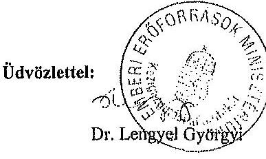

---

.

---

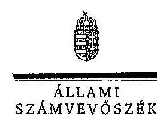

ELNÖK

Ikt.szám: V-0227-145/2014.

# Balog Zoltán úr 

miniszter
Emberi Erőforrások Minisztériuma

## Budapest

## Tisztelt Miniszter Úr!

A „Jelentéstervezet a Kulturális Örökségvédelmi Hivatal ellenőrzése pénzügyi gazdálkodási helyzete és vagyongazdálkodása tekintetében című ellenőrzésről" című jelentéstervezetre tett észrevételeit köszönettel megkaptam.

Az Állami Számvevőszék észrevételekre vonatkozó álláspontjáról a felügyeleti vezető által készített részletes tájékoztatást csatoltan megküldöm.

Tájékoztatom Miniszter urat, hogy az ÁSZ tv. 29. § (3) bekezdése alapján a számvevőszéki jelentés mellékleteként szerepeltetjük a jelentés-tervezethez tett észrevételeit, továbbá az el nem fogadott észrevételeket az elutasítás indokainak feltüntetésével.

Budapest, 2014. 05. hó 10. nap
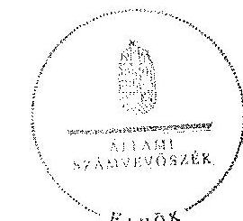

Tisztelettel:
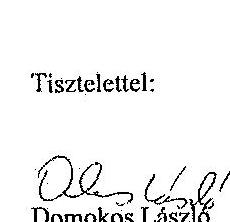

Melléklet: Tájékoztatás az elfogadott és el nem fogadott észrevételekről

---

# Tájékoztatás   az elfogadott és az el nem fogadott észrevételekről 

A Kulturális Örökségvédelmi Hivatal ellenőrzése pénzügyi gazdálkodási helyzete és vagyongazdálkodása tekintetében című számvevőszéki jelentéstervezetre a 2014. április 10-én, a 20744-7/2014/ELL iktatószámú levelében érkezett észrevételeit áttekintettük, azok kezelésével kapcsolatban a következő tájékoztatást adom.

A jelentéstervezetben az emberi erőforrások minisztere számára tett 1. számú javaslatunkat a továbbiakban is fenntartjuk, de észrevétele alapján azok megszövegezését módosítottuk.

1. A számvevőszéki ellenőrzés megállapításai szerint az irányító szerv nem támasztott írásban rögzített követelményeket, elvárásokat a Kulturális Örökségvédelmi Hivatal közfeladatainak ellátására, az erőforrásokkal való hatékony gazdálkodásra vonatkozóan. Az új Áht. 9. §. (1) bekezdés f) pontja valóban az erőforrásokkal való hatékony gazdálkodáshoz szükséges követelmények érvényesítését, számonkérését és ellenőrzését írja elő az irányító szerv számára. Véleményünk szerint ugyanakkor az irányító szerv csak abban az esetben tudja ellátni a követelmények érvényesítését, számonkérését és ellenőrzését, ha a közfeladatok ellátásához, az erőforrásokkal való szabályszerű és hatékony gazdálkodáshoz szükséges követelmények egyértelműen meghatározottak.

Az észrevételben jelzettek alapján az összegző megállapítások második bekezdését, valamint az 1. számú intézkedést igénylő megállapítást és ahhoz kapcsolódó javaslatot módosítottuk:
„Az irányító szervek nem rögzítettek a közfeladatok ellátásához és az erőforrásokkal való hatékony gazdálkodáshoz az intézménnyel szemben számon kérhető követelményeket, elvárásokat. Ez korlátozta a követelmények érvényesítésére, számonkérésére és ellenőrzésére vonatkozó - az Áht.; 49. § (5) bekezdés f) pontja, illetve az Áht. 9. § (1) bekezdés f) pontjában rögzített -hatáskörük gyakorlását."

Javaslat:
„Fogalmazza meg és érvényesítse a Forster Gyula Nemzeti Örökséggazdálkodási és Szolgáltatási Központ közfeladat ellátására vonatkozó és az erőforrásokkal való szabályszerű és hatékony gazdálkodáshoz szükséges ágazati-, illetve pénzügyi típusú törvényekből, egyéb jogszabályokból levezethető konkrét követelményeket, és ezen követelményeket irányítási jogkörében az Áht. 9. § (1) bekezdés f) pontja alapján ellenőrizze és kérje számon."
2. Az emberi erőforrások miniszterének tett 2. számú intézkedést igénylő megállapítás és javaslat törlésére vonatkozó észrevételt nem fogadtuk el. A 2012. évi leltározás hiányát

---

- az ÁSZ ellenőrzésével összhangban - az EMMI által lefolytatott belső ellenőrzés is megállapította. Az ellenőrzést azonban - az ÁSZ által ellenőrzött időszakon túl - 2013-ban folytatták le, és ezt követően intézkedtek a hiányosságok megszüntetése érdekében. A hiányosság megszüntetése érdekében megtett intézkedésekről a jelentésben foglalt megállapításokhoz kapcsolódó intézkedési terv adhat tájékoztatást.

3. A jelentéstervezetben az alapítói jogok gyakorlója tekintetében megállapított észrevételeinket elfogadták, az azzal kapcsolatban tett megjegyzésekre a következő választ adjuk.
a) A jelentéstervezet tényszerűen mutatja be az ellenőrzött időszakban bekövetkezett átalakulások, feladatátadások és átvételek folyamatát, azok következményeit. Ugyanakkor a többszöri átalakulás sem járhat azzal a következménnyel, hogy figyelmen kívül hagyják a jogszabályokban illetve egyéb szabályokban foglalt előírásokat.
b) Az SZMSZ-szel kapcsolatos megjegyzéséhez kapcsolódóan fel kell hívnom a figyelmet, hogy mivel a költségvetési szerv feladatai ellátásának részletes belső rendjét és módját szervezeti és működési szabályzat állapítja meg a feladatok változásához kapcsolódóan annak aktualizálása, továbbá az irányító szerv általi jóváhagyása elengedhetetlen feltétele a szervezet szabályszerű működésének.
c) A Műemlékek Nemzeti Gondnoksága beolvadásának szabályszerűségével kapcsolatban a jogszabály egyértelműen előírja, hogy a költségvetési szerv megszüntetését megelőzően az irányító szervnek gondoskodnia kell a vagyonátadás lebonyolításáért felelős személyek kijelöléséről, a feladatok határidőinek meghatározásáról. Az ellenőrzés során a minisztérium a jogszabályban meghatározott kijelölő, valamint a határidőket meghatározó dokumentumot nem tudott az ellenőrzés részére átadni, így megállapításunkat továbbra is fenntartjuk.
d) A vagyonkezelési szerződés aktualizálásával kapcsolatos előrehaladásról szóló tájékoztatást örömmel fogadtuk, amely azonban az ellenőrzött időszakra vonatkozó megállapításainkat nem érinti.

Kérem a válaszlevelemben foglaltak szíves tudomásulvételét. Tájékoztatom Miniszter urat, hogy a számvevőszéki jelentés mellékleteként szerepeltetjük a jelentéstervezethez tett észrevételeit, valamint az azokra adott válaszunkat.

Budapest, 2014. 05. hó 10 nap

Horváthné Herbáth Mária
felügyeleti vezető

---

.

---

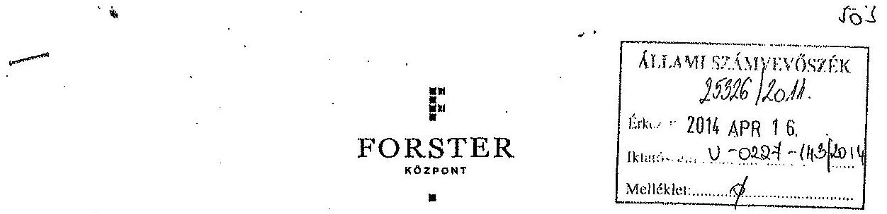

# Állami Számvevőszék 

Domokos László elnök úr részére
Budapest
Apáczai Csere János u. 10
1052

## Tisztelt Elnök Úr!

A Kulturális Örökségvédelmi Hivatal ellenőrzése pénzügyi gazdálkodási helyzete és vagyongazdálkodása tekintetében című ellenőrzésről készült jelentéstervezetre az alábbi észrevételeket teszem.

A Forster Központ 2012. évi leltárjával kapcsolatos megállapítások nyomán szükségesnek tartjuk jelezni, hogy a 2013. évi beszámoló elkészítésének során a leltár a vonatkozó szabályoknak megfelelően készült el, a tárgyi eszközök fizikai leltárfelvétellel is leltározásra kerültek. A 2012. évi leltározás címaradásáért felelős személy tekintetében pedig jelezzük, hogy az érintett időszakban a gazdasági vezetői tisztséget ellátó személy kormánytisztviselői jogviszonya megszűnésre kerül.

Budapest, 2014. április 9.
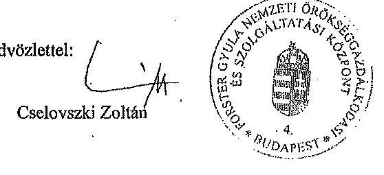

---

$\square$
$\square$
$\square$
$\square$
$\square$
$\square$
$\square$
$\square$
$\square$
$\square$
$\square$
$\square$
$\square$
$\square$
$\square$
$\square$
$\square$
$\square$
$\square$
$\square$
$\square$
$\square$
$\square$
$\square$
$\square$
$\square$
$\square$
$\square$
$\square$
$\square$
$\square$
$\square$
$\square$
$\square$
$\square$
$\square$
$\square$
$\square$
$\square$
$\square$
$\square$
$\square$
$\square$
$\square$
$\square$
$\square$
$\square$
$\square$
$\square$
$\square$
$\square$
$\square$
$\square$
$\square$
$\square$
$\square$
$\square$
$\square$
$\square$
$\square$
$\square$
$\square$
$\square$
$\square$
$\square$
$\square$
$\square$
$\square$
$\

---

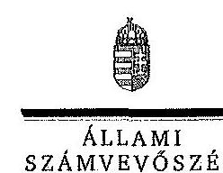

ELNÖK

Ikt.szám: V-227-146/2014.

# Cselovszki Zoltán úr 

elnök
Forster Gyula Nemzeti Örökséggazdálkodási és Szolgáltatási Központ

## Budapest

## Tisztelt Elnök Úr!

A „Jelentéstervezet a Kulturális Örökségvédelmi Hivatal ellenőrzése pénzügyi gazdálkodási helyzete és vagyongazdálkodása tekintetében" című jelentéstervezetre tett észrevételeit köszönettel megkaptam.

Az Állami Számvevőszék észrevételekre vonatkozó álláspontjáról a felügyeleti vezető által készített részletes tájékoztatást csatoltan megküldöm.

Tájékoztatom Elnök urat, hogy az ÁSZ tv. 29. § (3) bekezdése alapján a számvevőszéki jelentés mellékleteként szerepeltetjük a jelentéstervezethez tett észrevételeit, továbbá az arra adott választ.

Budapest, 2014. 05. hó 10. nap
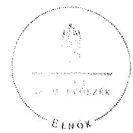

Tisztelettel:

## 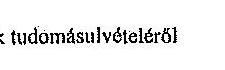 Domokos László

Melléklet: Tájékoztatás az észrevételek tudomásulvételéről

---

# 7. SZÁMÚ MELLÉKLET 

A V-0227-144/2014. SZÁMÚ JELENTÉSHEZ

Melléklet
Ikt.szám: V-0227-146/2014.

## Tájékoztatás   az észrevételek tudomásulvételéről

A Kulturális Örökségvédelmi Hivatal ellenőrzése pénzügyi gazdálkodási helyzete és vagyongazdálkodása tekintetében című számvevőszéki jelentéstervezetre a 2014. április 16-án, a 100/295-2/214. iktatószámú levelében érkezett észrevételeit áttekintettük, azokkal kapcsolatban a következő tájékoztatást adom.

A 2012. évi leltározás elmaradásához, továbbá az ellenőrzött időszakon túli intézkedésekre vonatkozó tájékoztatását köszönettel tudomásul vettük. A levélben foglaltak nem érintik az ellenőrzés megállapításait és javaslatait, a jelentéstervezet szövegének módosítását nem igénylik.

Budapest, 2014. 05. hó 10. nap

Horváthné Herbáth Mária
felügyeleti vezető
