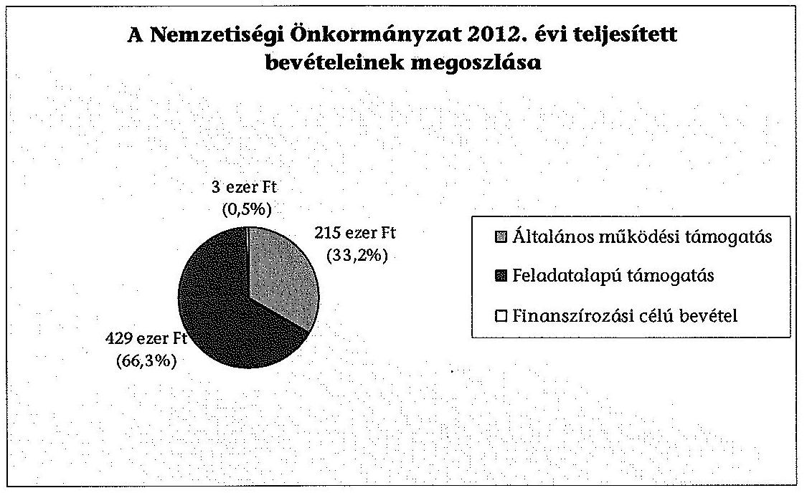
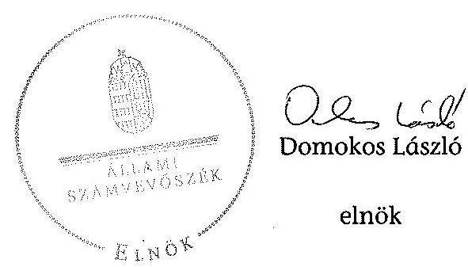

# ÁLLAMI   SZÁMVEVŐSZÉK 

## JELENTÉS

a helyi nemzetiségi önkormányzatok gazdálkodásának ellenőrzéséről
Jászjákóhalma Roma Nemzetiségi Önkormányzata

---

# Állami Számvevőszék 

Iktatószám: V-0359-043/2014.
Témaszám: 1346
Vizsgálat-azonosító szám: V0652101

## Az ellenőrzést felügyelte:

## Brebán Andrea

felügyeleti vezető
Az ellenőrzést vezette és az ellenőrzés végrehajtásáért felelős:
Dér Lívia
ellenőrzésvezető
A számvevőszéki jelentést készítette és a jelentés összeállításában közreműködött:

Baki István
számvevő tanácsos
Az ellenőrzést végezték:

## Baki István

számvevő tanácsos

Dr. Dorogi Zsolt
számvevő

---

# TARTALOMJEGYZÉK 

BEVEZETÉS ..... 3
I. ÖSSZEGZŐ MEGÁLLAPÍTÁSOK, KÖVETKEZTETÉSEK, JAVASLATOK ..... 6
II. RÉSZLETES MEGÁLLAPÍTÁSOK ..... 13

1. A Nemzetiségi Önkormányzat és a Települési Önkormányzat együttműködésének szabályozása, a működési feltételek biztosítása ..... 13
2. A gazdálkodási feladatok ellátásának szabályszerűsége ..... 14
2.1. A költségvetésre és zárszámadásra, valamint a kincstári adatszolgáltatás rendjére vonatkozó jogszabályi előírások betartása ..... 14
2.2. A Nemzetiségi Önkormányzat gazdálkodásának szabályozottsága ..... 14
2.3. Az operatív gazdálkodási jogkörök kialakítása, gyakorlása ..... 15
3. A Nemzetiségi Önkormányzattal kapcsolatos gazdálkodási feladatok belső ellenőrzése ..... 17
4. A feladatalapú támogatás felhasználásának, elszámolásának szabályszerűsége, a Nemzetiségi Önkormányzat feladatellátása ..... 18
MELLÉKLET
5. számú A Nemzetiségi Önkormányzat 2012. évi gazdálkodásának főbb adatai, mutatói
FÜGGELÉKEK
6. számú Rövidítések jegyzéke
7. számú Értelmező szótár
8. számú A gazdálkodás értékelésének módszere

---

$\cdot$
$\cdot$
$\cdot$
$\cdot$
$\cdot$
$\cdot$
$\cdot$
$\cdot$
$\cdot$
$\cdot$
$\cdot$
$\cdot$
$\cdot$
$\cdot$
$\cdot$
$\cdot$
$\cdot$
$\cdot$
$\cdot$
$\cdot$
$\cdot$
$\cdot$
$\cdot$
$\cdot$
$\cdot$
$\cdot$
$\cdot$
$\cdot$
$\cdot$
$\cdot$
$\cdot$
$\cdot$
$\cdot$
$\cdot$
$\cdot$
$\cdot$
$\cdot$
$\cdot$
$\cdot$
$\cdot$
$\cdot$
$\cdot$
$\cdot$
$\cdot$
$\cdot$
$\cdot$
$\cdot$
$\cdot$
$\cdot$
$\cdot$
$\cdot$
$\cdot$
$\cdot$
$\cdot$
$\cdot$
$\cdot$
$\cdot$
$\cdot$
$\cdot$
$\cdot$
$\cdot$
$\cdot$
$\cdot$
$\cdot$
$\cdot$
$\cdot$
$\cdot$
$\cdot$
$\cdot$
$\cdot$
$\cdot$
$\cdot$
$\cdot$
$\cdot$

---

# JELENTÉS   a helyi nemzetiségi önkormányzatok gazdálkodásának ellenőrzéséről Jászjákóhalma Roma Nemzetiségi Önkormányzata 

## BEVEZETÉS

A Nemzetiségi Önkormányzat az 1998. évben alakult, elnöke az 1998. évi helyhatósági választások óta látja el feladatát. A Nemzetiségi Önkormányzat intézményt, gazdasági társaságot és más szervezetet nem alapított, illetve társulásban nem vett részt. A négytagú Képviselő-testület a munkája segítésére Pénzügyi Bizottságot hozott létre. A jegyző 2002. január 1-je óta látja el feladatát. A Nemzetiségi Önkormányzat költségvetési beszámolója szerint a 2012. évben a módosított költségvetési bevételi és kiadási előirányzat 644 ezer Ft, a teljesített költségvetési bevétel 644 ezer Ft, a teljesített költségvetési kiadás 638 ezer Ft volt. A 2012. évi gazdálkodási adatokat részletesen az 1. számú mellékletben mutatjuk be.

Az Alaptörvény XXIX. Cikk (1) bekezdése szerint a Magyarországon élő nemzetiségek államalkotó tényezők. Minden, valamely nemzetiséghez tartozó magyar állampolgárnak joga van önazonossága szabad vállalásához és megőrzéséhez. A hazánkban élő nemzetiségek helyi (települési és területi), valamint országos önkormányzatokat hozhatnak létre. A helyi nemzetiségi önkormányzatok gazdálkodási feladatait jogszabályi előírás alapján a székhely szerinti helyi önkormányzat polgármesteri hivatala látja el.

A nemzetiségek helyzete, támogatása mind hazai, mind EU-s szinten kiemelt figyelmet kap napjainkban. A helyi nemzetiségi önkormányzatok gazdálkodására és támogatási rendszerére vonatkozó jogszabályok a 2010-2012. években jelentős változásokon mentek át. A települési és területi nemzetiségi önkormányzatok gazdálkodásának, a részükre juttatott költségvetési támogatások felhasználásának ellenőrzését az ÁSZ 2012-ben sorozatjellegű ellenőrzés keretében indította el. A 2013. évi ellenőrzések e témacsoportos ellenőrzések folytatását jelentik, amelyet az ÁSZ 2014. első félévi ellenőrzési terve 12. témasorszámon tartalmaz.

Az ellenőrzés célja annak értékelése volt, hogy a Nemzetiségi Önkormányzat gazdálkodási kereteinek kialakítása, gazdálkodása és feladatellátása megfelelt-e a jogszabályoknak.

---

Ennek keretében értékeltük, hogy:

- a Nemzetiségi Önkormányzat és a Települési Önkormányzat együttműködésének szabályozása, a működési feltételek biztosítása megfelelt-e a jogszabályi előírásoknak;
- a felek együttműködése megfelelt-e a közöttük létrejött megállapodásnak a gazdálkodási feladatok szabályszerű ellátása során, ennek keretében betartották-e a Nemzetiségi Önkormányzat gazdálkodásához kapcsolódóan a költségvetésre és zárszámadásra, a gazdálkodás szabályozására, az operatív gazdálkodási jogkörök gyakorlására vonatkozó jogszabályi előírásokat;
- a jegyző biztosította-e a Nemzetiségi Önkormányzat gazdálkodásának belső ellenőrzését;
- a Nemzetiségi Önkormányzat feladatalapú támogatásának felhasználása, a folyósított feladatalapú támogatással történő elszámolás az előírásoknak megfelelő volt-e;
- a Nemzetiségi Önkormányzat feladatellátása összhangban volt-e a vonatkozó jogszabályi előírásokkal.

Az ellenőrzés várható hasznosulását négy szinten tervezzük. A törvényalkotás számára összegzett tapasztalatok állnak rendelkezésre a nemzetiségi önkormányzatok testületi döntéseinek, gazdálkodásának és a feladatalapú támogatás felhasználásának szabályszerűségéről, amelynek alapján következtetést lehet levonni arra, hogy indokolt-e esetleges jogszabályi módosítás kezdeményezése. Az ellenőrzés az ellenőrzött számára visszajelzést ad a működésében fellépő hiányosságokról, javaslataival hozzájárul azok kiküszöböléséhez, amely csökkentheti a későbbi ellenőrzések gyakoriságát. Az ellenőrzés megállapításai és javaslatai tanulságul szolgálhatnak más nemzetiségi önkormányzatok, szervezetek számára a rendezett gazdálkodási keretek kialakításához. A társadalom számára jelzi, hogy közpénz nem maradhat ellenőrizetlenül, az ÁSZ értékteremtő rend kialakításához és megőrzéséhez hozzájáruló tevékenysége pozitív hatással lesz a szervezetről kialakított összkép formálásában. Az ÁSZ szervezetén belül lehetőség nyílik arra, hogy a megállapítások szintetizálásával az intézmény a hozzáadott értéket teremtő elemző tevékenységét és tanácsadó szerepét erősítse.

A helyi nemzetiségi önkormányzatok gazdálkodásának ellenőrzéséről szóló jelentés I. fejezetének összegző része az ellenőrzés céljára adott rövid, szintetizáló összefoglalót és következtetéseket tartalmazza a II. fejezet részletes megállapításain alapulóan. A jelentés intézkedést igénylő megállapításait és javaslatait az összegzőben foglaltak mellett - az ellenőrzés során feltárt, a jelentés II. fejezetében rögzített részletes megállapítások alapozzák meg, illetve támasztják alá.

Az ellenőrzés típusa: szabályszerűségi ellenőrzés.
Az ellenőrzött időszak: a 2012. január 1. - 2012. december 31. közötti időszak. Az ellenőrzés kiterjedt a helyi nemzetiségi önkormányzatoknak juttatott 2012. évi feladatalapú támogatás 2013. évben való elszámolására is.

---

Ellenőrzött szervezet: a Jászjákóhalma Roma Nemzetiségi Önkormányzata és a gazdálkodási feladatait ellátó Jászjákóhalma Községi Önkormányzat.

Az ellenőrzés végrehajtásának jogszabályi alapját az ÁSZ tv. 5. § (2)-(3) és (6) bekezdéseiben foglaltak képezik.

Az ellenőrzés szakmai módszertana az ÁSZ hivatalos honlapján (www.asz.hu) közzétett szakmai szabályokon alapult, amely a Legfőbb Ellenőrző Intézmények Nemzetközi Szervezete (INTOSAI) által kiadott nemzetközi standardok (ISSAI) figyelembevételével készült.

A helyi nemzetiségi önkormányzatok gazdálkodásának ellenőrzése során értékeltük a Települési Önkormányzat és a Nemzetiségi Önkormányzat együttműködésének, a gazdálkodás szabályozottságának és a pénzügyi folyamatokban kulcsszerepet betöltő belső kontrollok (teljesítésigazolás és érvényesítés) működésének megfelelőségét. A kulcskontrollokat a működési és felhalmozási célú támogatásértékű kiadásoknál, az államháztartáson kívülre teljesített működési és felhalmozási célú pénzeszköz-átadásoknál, a dologi kiadásokkal kapcsolatos kifizetéseknél - véletlen mintavételi eljárást alkalmazva - ellenőriztük. Ellenőriztük, hogy a jegyző biztosította-e a Nemzetiségi Önkormányzat gazdálkodásának belső ellenőrzését. Értékeltük a feladatalapú támogatások felhasználásának, elszámolásának szabályszerűségét, a Nemzetiségi Önkormányzat feladatellátása és a jogszabályi előírások összhangját. A gazdálkodás értékelésének módszerét a 3. számú függelék tartalmazza.

Az ellenőrzés lefolytatásához a Nemzetiségi Önkormányzat és a gazdálkodási feladatait ellátó Települési Önkormányzat tanúsítványok és a kapcsolódó, dokumentumjegyzékben megjelölt dokumentumok elektronikus úton történő megküldésével, rendelkezésre bocsátásával szolgáltatott adatokat. Az adatszolgáltatás kontrollálása és szükség szerinti javítása a helyszíni ellenőrzés keretében történt.

Az ÁSZ tv. 29. § (1) bekezdése szerint a jelentéstervezetet megküldtük a polgármester és Nemzetiségi Önkormányzat elnöke részére, akik az ÁSZ tv. 29. § (2) bekezdésében foglalt észrevételezési jogukkal nem éltek, a jelentéstervezetre észrevételt nem tettek.

---

# I. ÖSSZEGZŐ MEGÁLLAPÍTÁSOK, KÖVETKEZTETÉSEK, JAVASLATOK 

A Nemzetiségi Önkormányzat és a Települési Önkormányzat együttműködésének szabályozása - a feltárt tartalmi hiányosságok kivételével - megfelelt a jogszabályi előírásoknak. A Nemzetiségi Önkormányzat 2012. május 30-áig nem rendelkezett a Települési Önkormányzattal kötött érvényes együttműködési megállapodással. A 2012. június 1-jétől hatályos együttműködési megállapodásban működési feltételeket megfelelően rögzítették. A gazdálkodási feladatok ellátásának szabályozása a Nek. tv.-ben és az Ávr.-ben foglalt tartalmi elemek tekintetében hiányos volt, mert nem tartalmazta a törzskönyvi nyilvántartásba vétellel és adószám igénylésével kapcsolatos határidőket és együttműködési kötelezettségeket, a felelősök konkrét kijelölését, továbbá a szakmai teljesítésigazolási feladatokat. A Nek. tv.-ben foglaltak ellenére a Nemzetiségi Önkormányzat SzMSz-e nem tartalmazta az együttműködési megállapodás szerinti működési feltételeket. A Települési Önkormányzat biztosította a Nemzetiségi Önkormányzat működésének személyi és tárgyi feltételeit.

A Nemzetiségi Önkormányzat 2012. évi költségvetésének és zárszámadásának tartalma, jóváhagyása kisebb tartalmi hiányosságok ellenére megfelelt a jogszabályi előírásoknak. A Nemzetiségi Önkormányzat elnöke a 2012. évi költségvetés tervezetét határidőben benyújtotta a Képviselő-testületnek. A jóváhagyott költségvetés két tartalmi elem - a költségvetési egyenleg összege, továbbá az általános tartalék és céltartalék - kivételével megfelelt az Áht.-ben előírt követelményeknek. A 2012. évi zárszámadási határozat tervezetét a Kép-viselő-testület határidőben jóváhagyta. A költségvetés és a zárszámadás összehasonlíthatóságát biztosították, valamint a Nemzetiségi Önkormányzat valamennyi bevételéről és kiadásáról elszámoltak. A jegyző a 2012. évi költségvetéshez kapcsolódó, a Nemzetiségi Önkormányzatra vonatkozó kincstári adatszolgáltatási kötelezettségeinek határidőben eleget tett.

A gazdálkodás szabályozottsága nem volt megfelelő az ellenőrzött időszakban. A Nemzetiségi Önkormányzat a Számv. tv.-ben előírt érvényes szabályzatokkal, így számviteli politikával, eszközök és források leltárkészítési és leltározási, eszközök és források értékelési, illetve pénzkezelési szabályzatokkal, valamint számlarenddel nem rendelkezett. A Nemzetiségi Önkormányzat nem rendelkezett a 2012. évben a Bkr.-ben előírt ellenőrzési nyomvonallal, szabálytalanságok kezelésének eljárásrendjével, folyamatba épített előzetes, utólagos és vezetői ellenőrzési szabályozással. A Polgármesteri Hivatal SzMSz-e az Ávr.-ben előírtak ellenére nem tartalmazta az SzMSz-ben nevesített munkakörökhöz tartozó - a Nemzetiségi Önkormányzat gazdálkodásának végrehajtásával kapcsolatos - feladat- és hatásköröket, a hatáskörök gyakorlásának módját, a helyettesítés rendjét, az ezekhez kapcsolódó felelősségi szabályokat. A tervezéssel, gazdálkodással, a teljesítésigazolás kivételével az operatív gazdálkodási jogkörök gyakorlásának módjával, eljárási és dokumentációs részletszabályaival, valamint az ezeket végző személyek kijelölési rendjével, és az ellenőrzési, adatszolgáltatási feladatok teljesítésével kapcsolatos belső előírásokat 2012. június 1-jétől az együttműködési megállapodás rögzítette. Az együttműködési meg-

---

állapodás a gazdálkodási ügyekre vonatkozóan kapcsolattartónak, valamint a gazdálkodási jogkörök tekintetében pénzügyi ellenjegyzőnek és érvényesítőnek a Polgármesteri Hivatal gazdasági vezetőjét jelölte meg, azonban a Polgármesteri Hivatalnak gazdasági szervezete és gazdasági vezetője az ellenőrzött időszakban nem volt.

A Nemzetiségi Önkormányzat gazdálkodása tekintetében az operatív gazdálkodási jogkörök kialakítása nem felelt meg a jogszabályi előírásoknak. A Nemzetiségi Önkormányzat elnöke - mint kötelezettségvállaló - az Ávr.-ben előírtak ellenére írásban nem jelölte ki a teljesítésigazolásra jogosult személyt, továbbá más képviselőt nem hatalmazott fel a kötelezettségvállalás és az utalványozás gyakorlására, így az Ávr.-ben előírt összeférhetetlenségi szabályok érvényesülésének feltételeit nem biztosította. A jegyző az Ávr.-ben foglaltak ellenére a pénzügyi ellenjegyzésre és az érvényesítésre önkormányzati hivatal állományába tartozó köztisztviselőt írásban nem jelölt ki. A Nemzetiségi Önkormányzatnál a kötelezettségvállalásra, a pénzügyi ellenjegyzésre, az érvényesítésre és az utalványozásra jogosult személyekről és az aláírásmintájukról naprakész nyilvántartást nem vezettek.

A teljesítésigazolás és érvényesítés kulcskontrollok működésének megfelelőségét a dologi kiadások bizonylatainak tesztelése során az ellenőrzés gyengének értékelte, a hibák száma a lényegességi szintet, a kritikus hibahatárt elérte. A teljesítést igazoló a Nemzetiségi Önkormányzat elnöke volt. Az Ávr.-ben foglaltak ellenére a Nemzetiségi Önkormányzat elnöke, mint kötelezettségvállaló nem jelölte ki a teljesítést igazoló személyeket. A teljesítésigazoló az előzetes írásbeli kötelezettségvállalási dokumentumok hiányában nem az Ávr. előírásainak megfelelően végezte el ellenőrzési és igazolási feladatát. Az érvényesítő nem jogszerű kijelölés alapján, továbbá nem az Ávr. előírása szerint végezte el ellenőrzési feladatát, mert nem ellenőrizte, hogy a megelőző ügymenetben a jogszabályok és a gazdálkodási szabályzat előírásait betartották-e. Nem jelezte, hogy a teljesítésigazolás során az összeférhetetlenségi szabályok nem érvényesültek, nem kifogásolta az összegszerűség ellenőrzéséhez az előzetes írásbeli kötelezettségvállalási dokumentum hiányát. A 2012. évi három legnagyobb összegű dologi kiadás bizonylatainak a tételes ellenőrzése során a teljesítésigazolás és az érvényesítés kulcskontrollok nem működtek megfelelően, a hiányosságok megegyeztek a dologi kiadások tesztelésénél
 tett észrevételekkel. A számvevőszéki ellenőrzés a kifizetések bizonylatainak ellenőrzése során - a rendelkezésre bocsátott dokumentumok alapján - vagyoni hátrányt okozó jogosulatlan kifizetést nem tárt fel, azonban a kulcskontrollok működésében tapasztalt hiányosságok miatt nem biztosították a hibák megelőzését, feltárását és kijavítását.

A jegyző nem biztosította a Polgármesteri Hivatalnál a Nemzetiségi Önkormányzat gazdálkodásával összefüggő végrehajtási feladatok belső ellenőrzését. A Polgármesteri Hivatal 2012. évi éves belső ellenőrzési tervét megalapozó kockázatelemzés a Ber. előírása ellenére nem terjedt ki a Nemzetiségi Önkormányzat gazdálkodásával összefüggő végrehajtási feladatokra, azok tekintetében 2012. évi belső ellenőrzési feladatot nem terveztek és a 2012. évben nem végeztek.

---

A Nemzetiségi Önkormányzat a 2012. évben 429 ezer Ft összegű feladatalapú támogatásban részesült. A Nemzetiségi Önkormányzat nem tett eleget az Áht. 2. §-ában előírtaknak azáltal, hogy a fel nem használt 2012. évi feladatalapú támogatás 2012. december 31-éig kötelezettségvállalással nem terhelt 6 ezer Ft összegű maradványáról nem mondott le és nem fizette vissza a központi költségvetés javára. A 2011. és 2012. évi feladatalapú támogatás elszámolása a támogatási kormányrendelet ${ }_{1,2}$ előírása ellenére nem történt meg, a támogatás felhasználását, elszámolását az ellenőrzésre jogosult szervek nem ellenőrizték. A Nemzetiségi Önkormányzat feladatellátása - mind a kötelező, mind az önként vállalt feladatok tekintetében - összhangban volt a Nek. 2. tv. előírásaival. A kötelező közfeladatok keretében együttdöntési jogot gyakoroltak a Nemzetiségi Önkormányzat illetékességi területén működő közoktatási intézmény működésével, feladatellátásával kapcsolatban. Együttműködési megállapodásokat kötöttek a képviselt közösség esélyegyenlőségének megteremtése, kulturális autonómiájának megerősítése, önszerveződésének támogatása és kapcsolattartásának segítése érdekében. Önként vállalt közfeladatot a hagyományápolás és a közművelődés, valamint a társadalmi felzárkóztatás területeken végeztek.

Az ÁSZ tv. 33. § (1) bekezdésében foglaltak értelmében az ellenőrzött szervezet vezetője köteles a jelentésben foglalt megállapításokhoz kapcsolódó intézkedési tervet összeállítani és azt a jelentés kézhezvételétől számított 30 napon belül az ÁSZ részére megküldeni. Amennyiben az intézkedési tervet határidőre nem küldi meg a szervezet, vagy az nem elfogadható, az ÁSZ elnöke az ÁSZ tv. 33. § (3) bekezdés a)-b) pontjaiban foglaltakat érvényesítheti.

A helyszíni ellenőrzés megállapításainak hasznosítása mellett javasoljuk:

# a jegyzőnek

1.  az együttműködés szabályozásával kapcsolatban

A 2012. június 1-jétől hatályos együttműködési megállapodás a Nek. 2. tv. 80. § (3) bekezdés a)-b) pontjaiban és az Ávr. 57. §-ában foglalt tartalmi elemek tekintetében hiányos volt, mert nem tartalmazta a törzskönyvi nyilvántartásba vétellel és adószám igénylésével kapcsolatos határidőket és együttműködési kötelezettségeket a felelősök konkrét kijelölését, továbbá a szakmai teljesítésigazolási feladatokat. A Nek. 2. tv. 80. § (2) bekezdésében foglaltak ellenére az együttműködési megállapodás szerinti működési feltételeket nem rögzítették a Nemzetiségi Önkormányzat SzMSz-ében a megállapodás megkötését, módosítását követő 30 napon belül.

Javaslat
Az együttműködés szabályszerűsége érdekében készítse elő:
a) az együttműködési megállapodás módosítását, hogy az tartalmilag feleljen meg a Nek. 2. tv. 80. § (3) bekezdés a)-b) pontjaiban foglalt előírásoknak;
b) a Nemzetiségi Önkormányzat SzMSz-ének kiegészítését, hogy az a Nek. 2. tv. 80. § (2) bekezdésében foglalt előírásnak megfeleljen.

---

2.  a költségvetés előterjesztésével kapcsolatban

A 2012. évi költségvetési határozat az Áht. 2. 23. § (2) bekezdésének c) pontjában foglaltak ellenére nem tartalmazta a költségvetési egyenleg összegét, továbbá az Áht. 2. 23. § (3) bekezdésében foglaltak ellenére az évközi többletigények, valamint az elmaradt bevételek pótlására szolgáló általános tartalékot és céltartalékot.

Javaslat
A szabályszerű költségvetés előterjesztése érdekében gondoskodjon arról, hogy a költségvetési határozat az Áht. 2. 23. § (2) bekezdésének c) pontjában továbbá az Áht. 2. 23. § (3) bekezdésében előírtaknak tartalmilag feleljen meg.
3.  a gazdálkodási feladatok szabályozottságával kapcsolatban

A Nemzetiségi Önkormányzat a 2012. évben nem rendelkezett a Számv. tv. 14. § (3)-(4) bekezdéseiben előírtak szerinti számviteli politikával, a Számv. tv. 14. § (5) bekezdés a)-b) pontjaiban előírt eszközök és források leltározási és leltárkészítési, valamint az eszközök és források értékelési szabályzatával, a Számv. tv. 14. § (5) bekezdés d) pontjában előírt pénzkezelési szabályzattal, továbbá a Számv. tv. 161. § (1) számlarenddel. A Polgármesteri Hivatal SzMSz-e az Ávr. 13. § (1) bekezdés g) pontjában előírtak ellenére nem tartalmazta az SzMSz-ben nevesített munkakörökhöz tartozó - a Nemzetiségi Önkormányzat gazdálkodásának végrehajtásával kapcsolatos - feladat és hatásköröket, a hatáskörök gyakorlásának módját, a helyettesítés rendjét, valamint az ezekhez kapcsolódó felelősségi szabályokat.

Javaslat
A Nemzetiségi Önkormányzat gazdálkodási feladataira kiterjedő hatállyal:
a) készítse el a Számv. tv. 14. § (3)-(4), valamint (5) bekezdés a)-b) és d) pontjaiban, továbbá a Számv. tv. 161. § (1) bekezdésében előírt számviteli szabályzatokat;
b) készítse elő a Polgármesteri Hivatal SzMSz-ének módosítását, hogy az feleljen meg az Ávr. 13. § (1) bekezdés g) pontjában foglalt előírásnak.
4.  a kulcskontrollok működésével kapcsolatban

A gazdasági szervezettel nem rendelkező Polgármesteri Hivatalnál a jegyző az Ávr. 55. § (2) bekezdés g) pontjában és az 58. § (4) bekezdésben rögzítettek ellenére a Nemzetiségi Önkormányzat gazdálkodása tekintetében a pénzügyi ellenjegyzésre és az érvényesítésre az önkormányzati hivatal állományába tartozó köztisztviselőt írásban nem jelölt ki. Az Ávr. 60. § (3) bekezdése ellenére a kötelezettségvállalásra, a pénzügyi ellenjegyzésre, az érvényesítésre és az utalványozásra jogosult személyekről és az aláírás-mintájukról a belső szabályozással összhangban lévő naprakész nyilvántartást nem vezettek. A teljesítést igazoló a Nemzetiségi Önkormányzat elnöke volt. Az Ávr. 57. § (4) bekezdésében foglaltak ellenére a Nemzetiségi Önkormányzat elnöke, mint kötelezettségvállaló nem jelölte ki a teljesítést igazoló személyeket. A teljesítés igazolása során - az ellenőrzés és igazolás alapjául szolgáló előzetes írásbeli

---

kötelezettségvállalási dokumentumok hiányában - szabálytalanul végezte el az Ávr. 57. § (1) és (3) bekezdéseiben előírt, a kifizetések jogosságának, összegszerűségének és a szerződésszerű teljesítésének az ellenőrzését és igazolását. Az érvényesítő nem jogszerű kijelölés alapján, továbbá nem az Ávr. 58. § (1) és (2) bekezdésében előírtak szerint végezte el ellenőrzési feladatát, mert nem ellenőrizte, hogy a megelőző ügymenetben a jogszabályok és belső szabályzatok előírásait betartották-e, nem jelezte, hogy a teljesítésigazolások során az Ávr. 60. § (2) bekezdése szerinti összeférhetetlenségi követelmények nem érvényesültek, nem kifogásolta az összegszerűség ellenőrzéséhez szükséges előzetes írásbeli kötelezettségvállalási dokumentum hiányát.

Javaslat
Az operatív gazdálkodás működési hibáinak megelőzése, feltárása és kijavítása érdekében
a) jelölje ki írásban az Ávr. 55. § (2) bekezdés g) pontjában foglaltaknak megfelelően a pénzügyi ellenjegyző, Ávr. 58. § (4) bekezdésének megfelelően az érvényesítő feladatot ellátókat;
b) gondoskodjon az Ávr. 60. § (3) bekezdésének megfelelően a kötelezettségvállalásra, a pénzügyi ellenjegyzésre, az érvényesítésre és az utalványozásra jogosult személyekről és az aláírás-mintájukról a belső szabályozással összhangban lévő naprakész nyilvántartást vezetéséről;
c) intézkedjen, hogy teljesítésigazolást minden esetben az Ávr. 57. § (4) bekezdésében előírt kijelöléssel rendelkező személy, az Ávr. 57. § (1) és (3) bekezdéseiben előírtaknak megfelelően végezze;
d) gondoskodjon, hogy az érvényesítő az Ávr. 58. § (1)-(2) bekezdései alapján lássa el ellenőrzési és jelzési feladatát.
5.  a feladatalapú támogatás elszámolásával kapcsolatban

A 2011. és 2012. évi feladatalapú támogatás elszámolása a támogatási kormányrendelet ${ }_{1} 7 . \S$ (2), illetve a támogatási kormányrendelet ${ }_{2} 8 . \S$ (5) bekezdésében hivatkozott „a helyi önkormányzatok elszámolási és ellenőrzési rendjére vonatkozó" jogszabályok rendelkezései alkalmazása előírása alapján az Áht. ${ }_{1} 64 . \S$ (7) bekezdése és az Áht. ${ }_{2} 57 . \S$ (3) bekezdése ellenére nem történt meg.

Javaslat
Gondoskodjon az Áht. ${ }_{2} 27 . \S$ (2) bekezdésben meghatározott feladatkörében a Nemzetiségi Önkormányzat által igénybe vett feladatalapú támogatás rendeltetésszerű felhasználásáról szóló elszámolásának elkészítéséről az Áht. ${ }_{2}$ 53. § (1) bekezdése szerinti beszámolási kötelezettség teljesítéséhez.

# a polgármesternek

1.  A Nemzetiségi Önkormányzat és a Települési Önkormányzat együttműködését meghatározó - 2012. június 1-jétől hatályos - megállapodás a Nek. ${ }_{2}$ tv. 80. § (3)

---

bekezdés a)-b) pontjaiban és az Ávr. 57. §-ában foglaltak ellenére nem rögzítette a törzskönyvi nyilvántartásba vétellel és adószám igénylésével kapcsolatos határidőket és együttműködési kötelezettségeket a felelősök konkrét kijelölését, továbbá a szakmai teljesítésigazolási feladatokat.

A Polgármesteri Hivatal SzMSz-e az Ávr. 13. § (1) bekezdés g) pontjában előírtak ellenére nem tartalmazta az SzMSz-ben nevesített munkakörökhöz tartozó - a Nemzetiségi Önkormányzat gazdálkodásával kapcsolatos - feladat- és hatásköröket, a hatáskörök gyakorlásának módját, a helyettesítés rendjét, valamint az ezekhez kapcsolódó felelősségi szabályokat.

Javaslat
Terjessze a Települési Önkormányzat Képviselő-testülete elé jóváhagyásra:
a) a Nek. 2. tv. 80. § (3) bekezdés a) -b) pontjaiban foglalt előírások betartásával a jegyző által előkészített együttműködési megállapodás módosítását;
b) az Ávr. 13. § (1) bekezdés g) pontjában foglalt szabályozásra figyelemmel a jegyző által előkészített, módosított Polgármesteri Hivatal SzMSz-ét.

# a Nemzetiségi Önkormányzat elnökének

1.  A Nemzetiségi Önkormányzat és a Települési Önkormányzat együttműködését meghatározó - 2012. június 1-jétől hatályos - megállapodás a Nek. 2. tv. 80. § (3) bekezdés a)-b) pontjaiban és az Ávr. 57. §-ában foglaltak ellenére nem rögzítette a törzskönyvi nyilvántartásba vétellel és adószám igénylésével kapcsolatos határidőket és együttműködési kötelezettségeket a felelősök konkrét kijelölését, továbbá a szakmai teljesítésigazolási feladatokat. Továbbá a Nek. 2. tv. 80. § (2) bekezdésében foglaltak ellenére az együttműködési megállapodás szerinti működési feltételeket nem rögzítették a Nemzetiségi Önkormányzat SzMSz-ében a megállapodás megkötését, módosítását követő 30 napon belül.

Javaslat
Terjessze a Képviselő-testület elé jóváhagyásra:
a) a Nek. 2. tv. 80. § (3) bekezdés a)-b) pontjaiban foglalt előírások betartásával a jegyző által előkészített együttműködési megállapodás módosítást;
b) a Nemzetiségi Önkormányzat SzMSz-ének a Nek. 2. tv. 80. § (2) bekezdésében foglaltaknak megfelelő jegyző által előkészített módosítását az előírt határidőn belül.
2.  A Nemzetiségi Önkormányzat elnöke, mint kötelezettségvállaló írásban nem hatalmazott fel az Ávr. 52. § (7) és 57. § (4), valamint 59. § (1) bekezdéseiben foglaltak alapján más nemzetiségi önkormányzati képviselőt kötelezettségvállalás és utalványozás gyakorlására, teljesítés igazolására. Felhatalmazás hiányában az összeférhetetlenségi követelmények nem érvényesültek, mert a Nemzetiségi Önkormányzat elnöke a készpénzben történő kifizetéseknél az Ávr. 60. § (2) bekezdésében foglaltak ellenére az utalványozást saját maga részére látta el.

---

Javaslat
Az Ávr. 60. §. (2) bekezdésében foglalt összeférhetetlenség elkerülése érdekében jelöljön ki további kötelezettségvállaló, utalványozó és teljesítésigazoló személyt az Ávr. 52. § (7) és 57. § (4), valamint 59. § (1) bekezdéseiben foglaltak előírások alapján.
3.  A 2011. és 2012. évi feladatalapú támogatás elszámolása a támogatási kormányrendelet ${ }_{1} 7 . \S$ (2), illetve a támogatási kormányrendelet ${ }_{2} 8 . \§$ (5) bekezdésében hivatkozott „a helyi önkormányzatok elszámolási és ellenőrzési rendjére vonatkozó" jogszabályok rendelkezései alkalmazása előírása alapján az Áht. ${ }_{1} 64 . \S$ (7) bekezdése és az Áht. ${ }_{2} 57 . \S$ (3) bekezdése ellenére nem történt meg.

Javaslat
Terjessze a Képviselő-testület elé jóváhagyásra az Áht. ${ }_{2}$ 53. § (1) bekezdése szerinti beszámolási kötelezettség teljesítéséhez a Nemzetiségi Önkormányzat által igénybe vett 2011. és 2012. évi feladatalapú támogatás rendeltetésszerű
 felhasználásáról szóló elszámolást.
4. A Nemzetiségi Önkormányzat nem tett eleget az Áht. 57. § (2) bekezdésében előírtaknak azáltal, hogy a meghatározott célra fel nem használt 2012. évi feladatalapú támogatás 2012. december 31-éig kötelezettségvállalással nem terhelt 6 ezer Ft összegű maradványáról nem mondott le és nem fizette vissza azt a központi költségvetés javára.

Javaslat
Terjessze a Képviselő-testület elé jóváhagyásra az Áht. 57/A. § (1) bekezdés előírásának megfelelően a 2012. évi feladatalapú támogatás kötelezettségvállalással nem terhelt maradványáról történő lemondást és intézkedjen a maradvány összegének visszafizetéséről a központi költségvetés javára.

---

# II. RÉSZLETES MEGÁLLAPÍTÁSOK 

## 1. A Nemzetiségi Önkormányzat És a Települési Önkormányzat EGYÜTTMŰKÖDÉSÉNEK SZABÁLYOZÁSA, A MŰKÖDÉSI FELTÉTELEK BIZTOSÍTÁSA

A Nemzetiségi Önkormányzat és a Települési Önkormányzat együttműködésének szabályozása - a feltárt tartalmi hiányosságok kivételével - megfelelt a jogszabályi előírásoknak.

A Nemzetiségi Önkormányzat a 2012. évben nem rendelkezett a teljes évre nézve a Települési Önkormányzattal kötött érvényes együttműködési megállapodással. A Nemzetiségi Önkormányzat és a Települési Önkormányzat az együttműködésükre vonatkozó, annak részletes szabályait tartalmazó együttműködési megállapodást ${ }^{1}$ 2012. május 30-án kötötte meg.

A 2012. június 1-jétől hatályos együttműködési megállapodás a Nemzetiségi Önkormányzat működési feltételeit az előírásoknak megfelelően rögzítette. A gazdálkodási feladatok ellátásának szabályozása a Nek. tv. 80. § (3) bekezdés a)-b) pontjaiban és az Ávr. 57. §-ában foglalt tartalmi elemek tekintetében hiányos volt, mert nem tartalmazta a törzskönyvi nyilvántartásba vétellel és adószám igénylésével kapcsolatos határidőket, együttműködési kötelezettségeket és a felelősök konkrét kijelölését, továbbá a szakmai teljesítésigazolási feladatokat. Az együttműködési megállapodásban a Nek. tv. 80. § (3) bekezdés b) pontjában foglalt ellenjegyzési és érvényesítési feladatokat ellátók személyének kijelölése nem volt összhangban az Ávr. 55. § (2) bekezdés g) pontjában és az Ávr. 58. § (4) bekezdésében foglalt előírásokkal.

A Nek. tv. 80. § (2) bekezdésében foglaltak ellenére nem írták elő a Nemzetiségi Önkormányzat SzMSz-ében az együttműködési megállapodás szerinti működési feltételeket a megállapodás megkötését, módosítását követő harminc napon belül.

Települési Önkormányzat a Nemzetiségi Önkormányzat működésének személyi és tárgyi feltételeit a Polgármesteri Hivatal útján biztosította.

[^0]
[^0]:    ${ }^{1}$ Az együttműködési megállapodást a Települési Önkormányzat Képviselő-testülete a 38/2012. (V.29.) számú, a Nemzetiségi Önkormányzat Képviselő-testülete a 36/2012. (V.30.) számú határozatával hagyta jóvá.

---

# 2. A GAZDÁLKODÁSI FELADATOK ELLÁTÁSÁNAK SZABÁLYSZERŰSÉGE 

### 2.1. A költségvetésre és zárszámadásra, valamint a kincstári adatszolgáltatás rendjére vonatkozó jogszabályi előírások betartása

A Nemzetiségi Önkormányzat 2012. évi költségvetésének és zárszámadásának tartalma, jóváhagyása, valamint a kapcsolódó adatszolgáltatás szabályszerűsége kisebb tartalmi hiányosságok ellenére megfelelő volt.

A Nemzetiségi Önkormányzat elnöke a 2012. évi költségvetés tervezetét határidőben benyújtotta a Képviselő-testületnek, azonban a jóváhagyott költségvetés az Áht. 23. § (2) bekezdésének c) pontjában foglaltak ellenére nem tartalmazta a költségvetési egyenleg összegét, továbbá az Áht. 23. § (3) bekezdésében foglaltak ellenére az évközi többletigények, valamint az elmaradt bevételek pótlására szolgáló általános tartalékot és céltartalékot.

A Nemzetiségi Önkormányzat elnöke a jegyző által elkészített 2012. évi zárszámadási határozattervezetet és a kapcsolódó tájékoztató mérlegeket, kimutatásokat határidőben benyújtotta a Képviselő-testületnek, amely azt határozatban ${ }^{2}$ jóváhagyta. A 2012. évi zárszámadási határozat tartalma megfelelt a jogszabályi előírásoknak és biztosított volt az elfogadott költségvetéssel való összehasonlíthatósága. A zárszámadási határozatban a Nemzetiségi Önkormányzat valamennyi bevételéről és kiadásáról elszámolt.

A jegyző a 2012. évi költségvetéshez kapcsolódó, a Nemzetiségi Önkormányzatra vonatkozó kincstári adatszolgáltatási kötelezettségeinek határidőben eleget tett.

### 2.2. A Nemzetiségi Önkormányzat gazdálkodásának szabályozottsága

A Nemzetiségi Önkormányzat gazdálkodásának szabályozottsága az ellenőrzött időszakban nem volt megfelelő, mert:

- a Számv. tv. 14. § (3)-(4) bekezdésében előírt számviteli politikával, illetve ennek keretében a Számv. tv. 14. § (5) bekezdés a)-b) pontjaiban előírt eszközök és források leltárkészítési és leltározási, valamint az eszközök és források értékelési szabályzatával, a Számv. tv. 14. § (5) bekezdés d) pontjában előírt pénzkezelési szabályzattal, továbbá a Számv. tv. 161. § (1) bekezdése szerinti számlarenddel;
- a Bkr. 6. § (3) és (4) bekezdéseiben előírt ellenőrzési nyomvonallal és a szabálytalanságok kezelése eljárásrendjével;

[^0]
[^0]:    ${ }^{2}$ A Képviselő-testület 7/2013. (IV. 22.) számú határozata a Nemzetiségi Önkormányzat 2012. évi zárszámadásának elfogadásáról.

---

- a Bkr. 8. § (2) bekezdése szerinti folyamatba épített előzetes, utólagos és vezetői ellenőrzés szabályozással nem rendelkezett.

A Polgármesteri Hivatalnak a 2012. évben hatályos eszközök és források leltárkészítési és leltározási, eszközök és források értékelési szabályzata, továbbá ellenőrzési nyomvonala, szabálytalanságok kezelésének eljárásrendje, folyamatba épített előzetes, utólagos és vezetői ellenőrzés szabályozása ${ }^{3}$ nem volt. A számviteli politika, a pénzkezelési szabályzat és a számlarend nem voltak érvényes dokumentumok, mivel azokat a Htv. 140. § (1) bekezdés c) pontjában foglalt előírás ellenére a jegyző helyett a polgármester adta ki.

A Polgármesteri Hivatal SzMSz-e az Ávr. 13. § (1) bekezdés g) pontjában előírtak ellenére nem tartalmazta az SzMSz-ben nevesített munkakörökhöz tartozó - a Nemzetiségi Önkormányzat gazdálkodásának végrehajtásával kapcsolatos - feladat és hatásköröket, a hatáskörök gyakorlásának módját, a helyettesítés rendjét, valamint az ezekhez kapcsolódó felelősségi szabályokat. Azokat a munkaköri leírásokban rögzítették.

Az Ávr. 13. § (2) bekezdés a) pontban foglaltak szerinti belső szabályozás tartalmi követelményeit - a tervezéssel, a gazdálkodással, a teljesítésigazolás kivételével az operatív gazdálkodási jogkörök gyakorlásának módjával, eljárási és dokumentációs részletszabályaival, valamint az ezeket végző személyek kijelölési rendjével és az ellenőrzési, adatszolgáltatási feladatok teljesítésével kapcsolatos belső előírásokat - 2012. június 1-jétől az együttműködési megállapodás rögzítette. Az együttműködési megállapodás a gazdálkodási ügyekre vonatkozóan kapcsolattartónak, valamint a gazdálkodási jogkörök tekintetében pénzügyi ellenjegyzőnek és érvényesítőnek a Polgármesteri Hivatal gazdasági vezetőjét jelölte meg, azonban a Polgármesteri Hivatalnak gazdasági szervezete és gazdasági vezetője az ellenőrzött időszakban nem volt.

# 2.3. Az operatív gazdálkodási jogkörök kialakítása, gyakorlása 

A Nemzetiségi Önkormányzat gazdálkodása tekintetében a 2012. évben az operatív gazdálkodási jogkörök kialakítása nem felelt meg a jogszabályi előírásoknak, mert:

- az összeférhetetlenségi szabályok érvényesítéséhez a Nemzetiségi Önkormányzat elnöke az Ávr. 52. § (7) bekezdésében és az Ávr. 59. § (1) bekezdésében foglaltakat nem alkalmazta, mivel írásban nem hatalmazott fel kötelezettségvállalás és utalványozás gyakorlására más nemzetiségi önkormányzati képviselőt annak ellenére, hogy a 2012. évben hatályos együttműködési megállapodásban erről rendelkeztek. Felhatalmazás hiányában az összeférhetetlenségi követelmények nem érvényesültek, mert a Nemzetiségi Önkormányzat elnöke a készpénzben történő kifizetések 83%-ában az

[^0]
[^0]:    ${ }^{3}$ Az ellenőrzési nyomvonal, a szabálytalanságok kezelésének eljárásrendje, a folyamatba épített előzetes, utólagos és vezetői ellenőrzés szabályozását a jegyző 2013. július 1-jétől helyezte hatályba, amely az együttműködési megállapodás 4.3.1. pontja szerint kiterjedt a Nemzetiségi Önkormányzatra.

---

Ávr. 60. § (2) bekezdésében foglaltak ellenére az utalványozást saját maga részére látta el;

- az Ávr. 57. § (4) bekezdésében foglaltak ellenére a kötelezettségvállaló nem jelölte ki a teljesítést igazoló személyeket;
- a gazdasági szervezettel nem rendelkező Polgármesteri Hivatalban a jegyző az Ávr. 55. § (2) bekezdés g) pontjában és az 58. § (4) bekezdésben rögzítettek ellenére a Nemzetiségi Önkormányzat gazdálkodása tekintetében a pénzügyi ellenjegyzésre és az érvényesítésre önkormányzati hivatal állományába tartozó köztisztviselőt írásban nem jelölt ki;
- a Nemzetiségi Önkormányzatnál az Ávr. 60. § (3) bekezdése ellenére a kötelezettségvállalásra, a pénzügyi ellenjegyzésre, az érvényesítésre és az utalványozásra jogosult személyekről és az aláírás-mintájukról a belső szabályozással összhangban lévő naprakész nyilvántartást nem vezettek.

A Nemzetiségi Önkormányzatnál a 2012. évben a dologi kiadások teljesítése során - a bizonylatok tesztelése alapján - a teljesítésigazolás és az érvényesítés kulcskontrollok működésének megfelelősége gyenge volt. A hibák száma a lényegességi szintet, a kritikus hibahatárt elérte, amit az alábbiak okoztak:

- a teljesítésigazolást a Nemzetiségi Önkormányzat elnöke látta el. A teljesítést igazoló - az ellenőrzés és igazolás alapjául szolgáló előzetes írásbeli kötelezettségvállalási dokumentumok ${ }^{4}$ hiányában - szabálytalanul végezte el az Ávr. 57. § (1) és (3) bekezdésekben előírt, a kifizetések jogosságának, összegszerűségének és a szerződésszerű teljesítésének az ellenőrzését és igazolását;
- az érvényesítést a Nemzetiségi Önkormányzat elnökhelyettese jogszerű kijelölés nélkül végezte. Az elnökhelyettes a Polgármesteri Hivatalnak nem volt alkalmazottja, ezért a feladat ellátására az Ávr. 58. § (4) bekezdése alapján a jegyző írásban nem jelölhette ki, továbbá nem rendelkezett az Ávr. 55. § (3) bekezdésében előírt végzettséggel és képesítéssel sem. Ezért az érvényesítő nem jogszerű kijelölés alapján, továbbá nem az Ávr. 58. § (1) és (2) bekezdésében előírtak szerint végezte el ellenőrzési feladatát, mert nem ellenőrizte, hogy a megelőző ügymenetben az Áht., az Áhsz., az Ávr. előírásait, továbbá a belső szabályzatokban foglaltakat betartották-e, nem jelezte, hogy a teljesítésigazolások során az Ávr. 60. § (2) bekezdése szerinti összeférhetetlenségi szabályok nem érvényesültek, nem kifogásolta az összegszerűség ellenőrzéséhez szükséges - a megállapodásban előírt - előzetes írásbeli kötelezettségvállalási dokumentum hiányát.

A 2012. évi három legnagyobb összegű dologi kiadás bizonylatainak egyedi értékelése alapján a teljesítésigazolás és az érvényesítés kulcskontrollok a dologi kiadásoknál részletezett okok miatt nem működtek megfelelően.

[^0]
[^0]:    ${ }^{4}$ A 2012. június 1-jétől hatályos együttműködési megállapodás szerint kötelezettségvállalás csak írásban és a kötelezettségvállalás pénzügyi ellenjegyzése után történhet.

---

Működési és felhalmozási célú támogatásértékű kiadás, valamint államháztartáson kívülre történő működési és felhalmozási célú pénzeszközátadás nem történt.

A számvevőszéki ellenőrzés a kifizetések bizonylatainak ellenőrzése során - a rendelkezésre bocsátott dokumentumok alapján - vagyoni hátrányt okozó jogosulatlan kifizetést nem tárt fel, azonban a kulcskontrollok működésében tapasztalt hiányosságok miatt nem biztosították a hibák megelőzését, feltárását és kijavítását.

# 3. A Nemzetiségi Önkormányzattal Kapcsolatos Gazdálkodási Feladatok Belső Ellenőrzése 

A jegyző az ellenőrzött időszakban nem biztosította a Polgármesteri Hivatalnál a Nemzetiségi Önkormányzat gazdálkodásával összefüggő végrehajtási feladatok belső ellenőrzését.

A Polgármesteri Hivatal 2012. évre vonatkozó éves ellenőrzési tervét megalapozó, a Bkr. 21. § (2) bekezdésében előírt kockázatelemzés nem terjedt ki a Nemzetiségi Önkormányzat gazdálkodásával összefüggő végrehajtási feladatokra, és azok tekintetében belső ellenőrzést a 2012. évre nem terveztek és a 2012. évben nem végeztek.

A 2012. évi belső ellenőrzési terv készítése idején hatályos együttműködési megállapodással nem rendelkeztek. A 2012. június 1-jétől hatályos együttműködési megállapodás (III. fejezet 4.3.1. pont) szerint: „A települési Önkormányzat és intézményei belső ellenőrzésének szabályai vonatkoznak a Nemzetiségi Önkormányzat gazdálkodására".

A 2012. évben a Kormányhivatal a Nemzetiségi Önkormányzatot illetően törvényességi felügyeleti eszközökkel egy esetben élt. A Kormányhivatal Törvényességi Ellenőrzési és Felügyeleti Főosztálya a Nek. tv. 95. § (2) bekezdés 1) pontjára hivatkozással megállapítást tett, mely szerint a Képviselő-testület a 2012. április 7-i határozathozatala során a szavazatszámot nem számszerűen fejezte ki. A Képviselő-testület az értesítést követő ülésén határozatát módosította és a jogszabálysértést megszüntette.

Az ellenőrzéshez szolgáltatott adatok alapján, a Kormányhivatal a Nemzetiségi Önkormányzatnál a 2012. évben törvényességi ellenőrzést nem végzett.

---
 4. A feladatalapú támogatás felhasználásának, elszámolásának szabályszerűsége, a Nemzetiségi Önkormányzat feladatellátása 

A Nemzetiségi Önkormányzat 2011-ben 200 ezer Ft feladatalapú támogatást kapott, amit az év végéig maradványképződés nélkül felhasznált.

A Nemzetiségi Önkormányzat a 2012. évben 429 ezer Ft összegű feladatalapú támogatásban részesült, amelynek az összes bevételhez viszonyított részarányát a következő ábra szemlélteti:

A 2012. évi feladatalapú támogatásból 6 ezer Ft maradvány keletkezett, amit a Nemzetiségi Önkormányzat 2012. december 31-éig a támogatási kormányrendelet ${ }_{2}$-ben meghatározott célokra nem használt fel, a támogatási kormányrendelet ${ }_{2} 7$. §-a szerint kötelezettségvállalással nem terhelte.

A Nemzetiségi Önkormányzat nem tett eleget az Áht. ${ }_{2}$ 57. § (2) bekezdésében előírtaknak azáltal, hogy a fel nem használt 2012. évi feladatalapú támogatás 2012. december 31-éig kötelezettségvállalással nem terhelt 6 ezer Ft összegű maradványáról nem mondott le és nem fizette vissza a központi költségvetés javára.

A 2011. és 2012. évi feladatalapú támogatás elszámolása a támogatási kormányrendelet ${ }_{1} 7 . \S$ (2) bekezdésében és a támogatási kormányrendelet ${ }_{2} 8 . \S$ (5) bekezdésében hivatkozott, „a helyi önkormányzatok elszámolási és ellenőrzési rendjére vonatkozó" jogszabályok rendelkezései alkalmazása előírása ellenére nem történt meg. A feladatalapú támogatás felhasználását, elszámolását az ellenőrzésre jogosult szervek nem ellenőrizték.

---

A Nemzetiségi Önkormányzat feladatellátásának tárgya összhangban volt a Nek. ${ }_{2}$ tv. 115. és 116. § előírásaival. Kötelező közfeladatai keretében:

- a Nemzetiségi Önkormányzat illetékességi területén működő közoktatási intézmény működésével, feladatellátásával összefüggő, a nemzetiségi közösség kulturális autonómiája megerősítését szolgáló döntési, együttdöntési jogát gyakorolta;
- együttműködési megállapodásokat kötött a képviselt közösség érdekképviselete, esélyegyenlőségének megteremtése, kulturális autonómiájának megerősítése, a közösség önszerveződésének szervezési és működési feladatok ellátásával történő támogatása, valamint a képviselt közösség helyi nemzetiségi civil szervezeteivel, szerveződéseivel történő kapcsolattartás segítése érdekében.

Önként vállalt közfeladatot a hagyományápolás és a közművelődés, valamint a társadalmi felzárkóztatás területeken végzett.

Budapest, 2014. 06. hó. 24 . nap

Melléklet: $\quad 1 \mathrm{db}$
Függelék: $\quad 3 \mathrm{db}$

---

$\cdot$
$\cdot$
$\cdot$
$\cdot$
$\cdot$
$\cdot$
$\cdot$
$\cdot$
$\cdot$
$\cdot$
$\cdot$
$\cdot$
$\cdot$
$\cdot$
$\cdot$
$\cdot$
$\cdot$
$\cdot$
$\cdot$
$\cdot$
$\cdot$
$\cdot$
$\cdot$
$\cdot$
$\cdot$
$\cdot$
$\cdot$
$\cdot$
$\cdot$
$\cdot$
$\cdot$
$\cdot$
$\cdot$
$\cdot$
$\cdot$
$\cdot$
$\cdot$
$\cdot$
$\cdot$
$\cdot$
$\cdot$
$\cdot$
$\cdot$
$\cdot$
$\cdot$
$\cdot$
$\cdot$
$\cdot$
$\cdot$
$\cdot$
$\cdot$
$\cdot$
$\cdot$
$\cdot$
$\cdot$
$\cdot$
$\cdot$
$\cdot$
$\cdot$
$\cdot$
$\cdot$
$\cdot$
$\cdot$
$\cdot$
$\cdot$
$\cdot$
$\cdot$
$\cdot$
$\cdot$
$\

---

# A Nemzetiségi Önkormányzat 2012. évi gazdálkodásának főbb adatai, mutatói

A) Bevételek

|  Megnevezés | Eredeti előirányzat | Módosított | Teljesítés  |
| --- | --- | --- | --- |
|   | ezer Ft |  | megoszlás (%)  |
|  Általános működési támogatás | 215 | 215 | 215  |
|  Feladatalapú támogatás |  | 429 | 429  |
|  Költségvetési bevételek | 215 | 644 | 644  |
|  Finanszírozási célú bevétel |  |  | 3  |
|  Tárgyévi bevételek | 215 | 644 | 647  |

B) Kiadások

|  Megnevezés | Eredeti előirányzat | Módosított | Teljesítés  |
| --- | --- | --- | --- |
|   | ezer Ft |  | megoszlás (%)  |
|  Személyi juttatások | 90 | 447 | 435  |
|  Munkaadókat terhelő járulékok és szocális hozzájárulási adó összesen | 25 | 11 | 11  |
|  Dologi kiadások | 100 | 186 | 192  |
|  Működési kiadások összesen | 215 | 644 | 638  |
|  Költségvetési kiadások | 215 | 644 | 638  |
|  Finanszírozási célú műveletek kiadása |  |  | 3  |
|  Tárgyévi kiadások | 215 | 644 | 641  |

---

.

---

# RÖVIDÍTÉSEK JEGYZÉKE 

| Törvények |  |
| :--: | :--: |
| Alaptörvény | Magyarország Alaptörvénye |
| Áht. 1 | Az államháztartásról szóló 1992. évi XXXVIII. törvény (hatályos 2011. december 31-éig) |
| Áht. 2 | Az államháztartásról szóló 2011. évi CXCV. törvény (hatályos 2011. december 31-étől) |
| ÁSZ tv. | Az Állami Számvevőszékről szóló 2011. évi LXVI. törvény (hatályos 2011. július 1-jétől) |
| Htv. | a helyi önkormányzatok és szerveik, a köztársasági megbízottak, valamint egyes centrális alárendeltségű szervek feladat- és hatásköreiről szóló 1991. évi XX. törvény |
| Nek. ${ }_{1}$ tv. | A nemzeti és etnikai kisebbségek jogairól szóló 1993. évi LXXVII. törvény (hatályos 2011. december 31-éig) |
| Nek. ${ }_{2}$ tv. | A nemzetiségek jogairól szóló 2011. évi CLXXIX. törvény (hatályos 2011. december 20-ától) |
| Számv. tv. | A számvitelről szóló 2000. évi C. törvény |
| Rendeletek |  |
| Áhsz. | Az államháztartás szervezetei beszámolási és könyvvezetési kötelezettségének sajátosságairól szóló 249/2000. (XII. 24.) Korm. rendelet |
| Ávr. | Az államháztartásról szóló törvény végrehajtásáról szóló 368/2011. (XII. 31.) Korm. rendelet (hatályos 2012. január 1-jétől) |
| Ber. | A költségvetési szervek belső ellenőrzéséről szóló 193/2003. (IX. 26.) Korm. rendelet (hatályos 2011. december 31-éig) |
| Bkr. | A költségvetési szervek belső kontrollrendszeréről és belső ellenőrzéséről szóló 370/2011. (XII. 31.) Korm. rendelet (hatályos 2012. január 1-jétől) |
| támogatási kormányrendelet ${ }_{1}$ | A kisebbségi önkormányzatoknak a központi költségvetésből, valamint fejezeti kezelésű előirányzatból nyújtott támogatások feltételrendszeréről és elszámolásának rendjéről szóló 342/2010. (XII. 28.) Korm. rendelet (hatályos 2012. március 6 -áig) |
| támogatási kormányrendelet ${ }_{2}$ | A nemzetiségi célú előirányzatokból nyújtott támogatások feltételrendszeréről és elszámolásának rendjéről szóló 28/2012. (III. 6.) Korm. rendelet (hatályos 2012. december 31 -éig) |
| Szórövidítések |  |
| ÁSZ | Állami Számvevőszék |
| EU | Európai Unió |
| jegyző | Jászjákóhalma Községi Önkormányzat jegyzője |
| Képviselő-testület | Jászjákóhalma Roma Nemzetiségi Önkormányzata Képviselő-testülete |

---

| Kincstár | Magyar Államkincstár |
| :--: | :--: |
| Kormányhivatal | Jász-Nagykun-Szolnok Megyei Kormányhivatal |
| Nemzetiségi Önkormányzat | Jászjákóhalma Roma Nemzetiségi Önkormányzata |
| Nemzetiségi Önkormányzat elnöke | Jászjákóhalma Roma Nemzetiségi Önkormányzata elnöke |
| polgármester | Jászjákóhalma Községi Önkormányzat polgármestere |
| Polgármesteri Hivatal | Jászjákóhalma Községi Önkormányzat Polgármesteri Hivatala |
| SzMSz | Jászjákóhalma Roma Nemzetiségi Önkormányzata Szervezeti és Működési Szabályzata |
| Települési Önkormányzat | Jászjákóhalma Községi Önkormányzat |
| Települési Önkormányzat Képviselő-testülete | Jászjákóhalma Községi Önkormányzat Képviselő-testülete |

---

# ÉRTELMEZŐ SZÓTÁR 

együttműködési megállapodás
feladatalapú támogatás
kulcskontrollok működési feltételek

A nemzetiségi önkormányzatnak a működési feltételei biztosítására, továbbá a bevételeivel és a kiadásaival kapcsolatban a tervezési, gazdálkodási, ellenőrzési, finanszírozási, adatszolgáltatási és beszámolási feladatai végrehajtására a székhelye szerinti települési önkormányzattal megkötött megállapodás. (Az Áht., 66. §-a, a Nek. 2 tv. 80. § (2) bekezdése, valamint az Áht. 27. § (2) bekezdése alapján levezetett fogalom.)
A támogatási évben általános működési támogatásban részesült, és a Támogatónak a Kincstárhoz intézett, a feladatalapú támogatás utalására vonatkozó rendelkező levele keltének időpontjában működő nemzetiségi önkormányzatoknak kormányrendeletben rögzített feltételrendszer alapján nyújtható támogatás. A feladatalapú támogatás a nemzetiségi közügyeknek a nemzetiségi önkormányzatok által történő ellátását szolgálja. (A támogatási kormányrendelet ${ }_{1}$ 2. § (2) bekezdés c) pontja és a támogatási kormányrendelet ${ }_{2} 4$. § (1) bekezdése alapján.) Teljesítés igazolása és az érvényesítés.
A települési önkormányzat által a helyi nemzetiségi önkormányzat testületi működéséhez a 2012. évben biztosítandó feltételek: a testületi működéshez igazodó helyiséghasználat, a postai, kézbesítési, gépelési, sokszorosítási feladatok ellátása és az ezzel járó költségek viselése. (Forrás: Nek., tv. 27. § (1)-(2) bekezdései, a Nek., tv. 159. § (3) bekezdésében foglalt átmeneti rendelkezés alapján)
A szabályozás szintjén - 2012. június 1-jéig megkötendő együttműködési megállapodásban - rögzítendő (és 2013. január 1-jétől a települési önkormányzat által biztosítandó) működési feltételek a következők:

- a helyi nemzetiségi önkormányzat részére havonta igény szerint, de legalább tizenhat órában, az önkormányzati feladat ellátásához szükséges tárgyi, technikai eszközökkel felszerelt helyiség ingyenes használata, a helyiséghez, továbbá a helyiség infrastruktúrájához kapcsolódó rezsiköltségek és fenntartási költségek viselése;
- a helyi nemzetiségi önkormányzat működéséhez (a testületi, tisztségviselői, képviselői feladatok ellátásához) szükséges tárgyi és személyi feltételek biztosítása;
- a testületi ülések előkészítése, különösen a meghívók, az előterjesztések, a testületi ülések jegyzőkönyveinek és valamennyi hivatalos levelezés előkészítése és postázása;
- a testületi döntések és a tisztségviselők döntéseinek előkészítése, a testületi és tisztségviselői döntéshozatalhoz

---

nemzetiség
nemzetiségi közügy
nemzetiségi önkormányzat
operatív gazdálkodási jogkörök
kapcsolódó nyilvántartási, sokszorosítási, postázási feladatok ellátása;

- a helyi nemzetiségi önkormányzat működésével, gazdálkodásával kapcsolatos nyilvántartási, iratkezelési feladatok ellátása;
- az előzőekben meghatározott feladatellátáshoz kapcsolódó költségek viselése a helyi nemzetiségi önkormányzat tagja és tisztségviselője telefonhasználata költségeinek kivételével.
(Forrás: Nek. 2 tv. 80. § (2) bekezdése a Nek. 2 tv. 159. § (3) bekezdésében foglalt átmeneti rendelkezés alapján)
Minden olyan, Magyarország területén legalább egy évszázada honos népcsoport, amely az állam lakossága körében számszerű kisebbségben van, a lakosság többi részétől saját nyelve, kultúrája és hagyományai különböztetik meg, egyben olyan összetartozás-tudatról tesz bizonyságot, amely mindezek megőrzésére, történelmileg kialakult közösségeik érdekeinek kifejezésére és védelmére irányul. (A Nek. 2 tv. 1. § (1) bekezdése alapján levezetett fogalom.)
Az egyéni és közösségi jogok érvényesülése, a nemzetiséghez tartozók érdekeinek kifejezésre juttatása - különösen az anyanyelv ápolása, őrzése és gyarapítása, továbbá a nemzetiségek kulturális autonómiájának a nemzetiségi önkormányzatok által történő megvalósítása és megőrzése - érdekében a nemzetiséghez tartozók meghatározott közszolgáltatásokkal való ellátásával, ezen ügyek önálló vitelével és az ehhez szükséges szervezeti, személyi és anyagi feltételek megteremtésével összefüggő ügy. A közhatalmat gyakorló állami és helyi önkormányzati szervekben, továbbá a nemzetiségi önkormányzati szervekben való nemzetiségi képviselethez és mindezek szervezeti, személyi és anyagi feltételeinek biztosításához kapcsolódó ügy. (Nek. 2 tv. 2. § 1. pontjából levezetett fogalom.)
Törvényben meghatározott nemzetiségi közszolgáltatási feladatokat ellátó, testületi formában működő, jogi személyiséggel rendelkező, demokratikus választások útján, törvény alapján létrehozott szervezet, amely a nemzetiségi közösséget megillető jogosultságok érvényesítésére, a nemzetiségek érdekeinek védelmére és képviseletére, a feladat- és hatáskörébe tartozó nemzetiségi közügyek települési, területi vagy országos szinten történő önálló intézésére jön létre. (A Nek. 2 tv. 2. § 2. pontjából levezetett fogalom.)
A kötelezettségvállalás, a pénzügyi ellenjegyzés, az utalványozás, az érvényesítés és a teljesítésigazolás.
(Forrás: Áht. 2 36-38. §-ai és az Ávr. 52-60. §-ai)

---

# A GAZDÁLKODÁS ÉRTÉKELÉSÉNEK MÓDSZERE 

A helyi nemzetiségi önkormányzatok gazdálkodásának ellenőrzése keretében a nemzetiségi önkormányzat gazdálkodása kereteinek kialakítása, gazdálkodása megfelelőségének minősítéséhez az alábbi területeket értékeltük:

- a helyi nemzetiségi önkormányzat és a helyi önkormányzat együttműködése szabályozását, a megállapodásban előírt működési feltételek biztosítását;
- a helyi nemzetiségi önkormányzat jóváhagyott költségvetésére, zárszámadására, továbbá a kincstári adatszolgáltatás rendjére vonatkozó jogszabályi előírások betartását;
- a helyi nemzetiségi önkormányzat gazdálkodási feladataira vonatkozó szabályzatok jogszabályi előírások szerinti rendelkezésre állását;
- a helyi nemzetiségi önkormányzat gazdálkodása tekintetében az operatív gazdálkodási jogkörök kialakítása jogszabályi előírásoknak történő megfelelését;
- a helyi nemzetiségi önkormányzat részére folyósított feladatalapú támogatás felhasználása és elszámolása jogszabályi előírásoknak való megfelelését;
- a helyi nemzetiségi önkormányzattal összefüggő gazdálkodási feladatok tekintetében a jogszabályokban előírt belső ellenőrzés biztosítását.

A helyi nemzetiségi önkormányzat gazdálkodását az ellenőrzési program szerint a hat területhez kapcsolódóan feltett kérdésekre adott válaszok alapján értékeltük. A kérdésekhez rendelt súlyozott pontszámok alapján az elért összérték a megszerezhető maximális pontszám százalékában került
 kimutatásra. Ennek figyelembevételével a kialakított minősítések az alábbiak:

Megfelelő: $\quad 81 \%$-tól
Részben megfelelő: $61 \%-80 \%$
Nem megfelelő: $\quad 0 \%-60 \%$
A pénzügyi folyamatok belső kontrolljának ellenőrzése keretében a pénzügyi folyamatokban kulcsszerepet betöltő belső kontrollok - a teljesítésigazolás és az érvényesítés - működésének megfelelőségét értékeltük. A kulcskontrollok működésének értékeléséhez a kritériumokat jogszabályok határozzák meg. A kulcskontrollok működése megfelelőségének értékelése tekintetében lényeges minden olyan hiba, amely gátolja, hogy a kontrolltevékenység eredményesen működjön.

A két kulcskontroll működése megfelelőségének ellenőrzéséhez a dologi kiadások könyvviteli tételeiből szekvenciális (megállásos) mintavételi eljárással vá-

---

lasztottuk ki az ellenőrizendő tételeket. A kulcskontrollok megfelelőségének vizsgálata keretében a számvevő bizonyosságot szerez arról, hogy a rendelkezésre álló szabályozás és dokumentumok alapján a teljesítésigazoláshoz és az érvényesítéshez szükséges ellenőrzési lépéseket végrehajtották-e.

A kulcskontrollok működése „kiváló", „jó" vagy „gyenge" minősítést kaphatott. Az ellenőrzési program szerint feltett kérdésekhez rendelt súlyozott pontszámok alapján elért összérték a megszerezhető maximális pontszám százalékában került kimutatásra, mely alapján kialakított minősítések a következők:

| Kiváló: | $91 \%$-tól |
| :-- | :-- |
| Jó: | $71 \%-90 \%$ |
| Gyenge: | $0 \%-70 \%$ |

A kulcskontrollok működését:

- kiválónak értékeltük abban az esetben, ha azok működése megfelelt a hibák megelőzésére és kijavítására meghatározott szabályozásnak, valamint a legmagasabb szintű elvárásoknak;
- jónak minősítettük, ha a megállapított kisebb, tolerálható mértékű hiányosságok nem veszélyeztették az ellenőrzött területek hibáinak megelőzését és kijavítását;
- gyengének értékeltük, amennyiben a kontrollok működésében túl sok hiányosság fordult elő ahhoz, hogy a kontrollok biztosítsák a hibák megelőzését, feltárását, kijavítását.