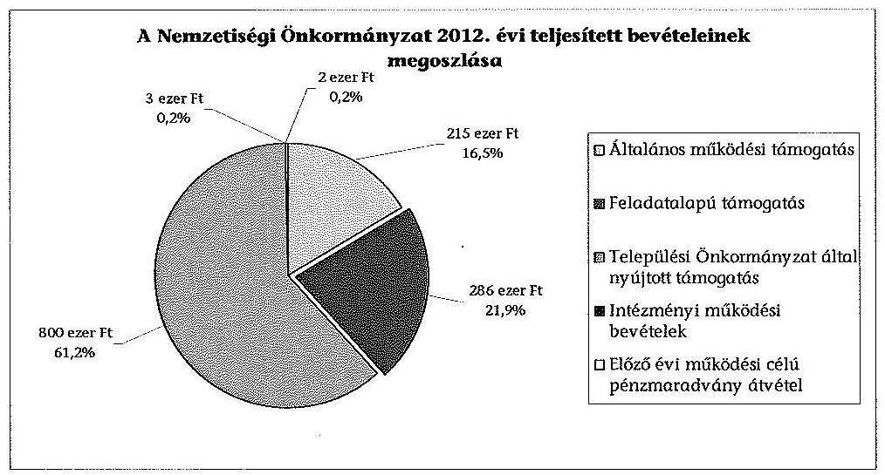
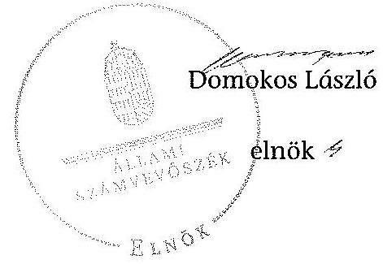

# ÁLLAMI   SZÁMVEVŐSZÉK 

## JELENTÉS

a helyi nemzetiségi önkormányzatok gazdálkodásának ellenőrzéséről
Erzsébetvárosi Görög Nemzetiségi Önkormányzat

---

# Állami Számvevőszék 

Iktatószám: V-0249-017/2014.
Témaszám: 1283
Vizsgálat-azonosító szám: V065267

## Az ellenőrzést felügyelte:

Horváth Balázs
felügyeleti vezető
Az ellenőrzést vezette és az ellenőrzés végrehajtásáért felelős:
Korsósné Vigh Andrea
ellenőrzésvezető
A számvevőszéki jelentést készítették és a jelentés összeállításában
közremüködtek:
Kovács Richárd
számvevő
Keszthelyi Zoltán
számvevő tanácsos
Balogné Lehoczki Éva
számvevő
Az ellenőrzést végezte:
Kovács Richárd
számvevő

A témához kapcsolódó eddig készített számvevőszéki jelentés:
címe
sorszáma
Jelentés a Budapest Főváros VII. kerület Erzsébetváros Önkormány- 0656
zata gazdálkodási rendszerének 2006. évi átfogó ellenőrzéséről

---

# TARTALOMJEGYZÉK 

BEVEZETÉS ..... 3
I. ÖSSZEGZŐ MEGÁLLAPÍTÁSOK, KÖVETKEZTETÉSEK, JAVASLATOK ..... 6
II. RÉSZLETES MEGÁLLAPÍTÁSOK ..... 13

1. A Nemzetiségi Önkormányzat és a Települési Önkormányzat együttműködésének szabályozása, a működési feltételek biztosítása ..... 13
2. A gazdálkodási feladatok ellátásának szabályszerűsége ..... 14
2.1. A költségvetésre és a zárszámadásra, valamint a kincstári adatszolgáltatás rendjére vonatkozó jogszabályi előírások betartása ..... 14
2.2. A Nemzetiségi Önkormányzat gazdálkodásának szabályozottsága ..... 16
2.3. Az operatív gazdálkodási jogkörök kialakítása, gyakorlása ..... 17
3. A Nemzetiségi Önkormányzattal összefüggő gazdálkodási feladatok belső ellenőrzése ..... 19
4. A feladatalapú támogatás felhasználásának, elszámolásának szabályszerűsége, a Nemzetiségi Önkormányzat feladatellátása ..... 20
MELLÉKLETEK
5. számú A Nemzetiségi Önkormányzat 2012. évi gazdálkodásának főbb adatai, mutatói
6. számú Tájékoztatás a polgármesternek küldött el nem fogadott észrevételekről
FÜGGELÉKEK
7. számú Rövidítések jegyzéke
8. számú Értelmező szótár
9. számú A gazdálkodás értékelésének módszere

---

.

---

# JELENTÉS   a helyi nemzetiségi önkormányzatok gazdálkodásának ellenőrzéséről Erzsébetvárosi Görög Nemzetiségi Önkormányzat 

## BEVEZETÉS

Az Erzsébetvárosi Görög Nemzetiségi Önkormányzat 2010. évben alakult, elnöke a 2010. évi helyhatósági választások óta látja el feladatát. A Nemzetiségi Önkormányzat intézményt, gazdasági társaságot és más szervezetet nem alapított, illetve ezek társulásában nem vesz részt. A négytagú Képviselő-testület munkája segitésére bizottságot nem hozott létre. A Nemzetiségi Önkormányzatnak a költségvetési beszámolója szerint a 2012. évben a módosított költségvetési bevételi és kiadási előirányzata 1303 ezer Ft, a teljesített költségvetési bevétel 1306 ezer Ft, a teljesített költségvetési kiadás 1274 ezer Ft volt. A 2012. évi gazdálkodási adatokat részletesen az 1. számú mellékletben mutatjuk be.

Az Alaptörvény XXIX. cikk (1) bekezdése szerint a Magyarországon élő nemzetiségek államalkotó tényezők. Minden, valamely nemzetiséghez tartozó magyar állampolgárnak joga van önazonossága szabad vállalásához és megőrzéséhez. A hazánkban élő nemzetiségek helyi (települési és területi), valamint országos önkormányzatokat hozhatnak létre. A helyi nemzetiségi önkormányzatok gazdálkodási feladatait jogszabályi előírás alapján a székhely szerinti helyi önkormányzat polgármesteri hivatala látja el.

A nemzetiségek helyzete, támogatása mind hazai, mind EU-s szinten kiemelt figyelmet kap napjainkban. A helyi nemzetiségi önkormányzatok gazdálkodására és támogatási rendszerére vonatkozó jogszabályok a 2010-2012. években jelentős változásokon mentek át. A települési és területi nemzetiségi önkormányzatok gazdálkodásának, a részükre juttatott költségvetési támogatások felhasználásának ellenőrzését az ÁSZ a 2012. évben sorozatjellegú ellenőrzés keretében indította el. A 2013. évi ellenőrzések e témacsoportos ellenőrzések folytatását jelentik, amelyet az ÁSZ 2014. első félévi ellenőrzési terve 12. témasorszámon tartalmaz.

Az ellenőrzés célja annak értékelése volt, hogy a Nemzetiségi Önkormányzat gazdálkodási kereteinek kialakítása, gazdálkodása és feladatellátása megfelelt-e a jogszabályoknak.

---

Ennek keretében értékeltük, hogy:

- a Nemzetiségi Önkormányzat és a Települési Önkormányzat együttműködésének szabályozása, a működési feltételek biztosítása megfelelt-e a jogszabályi előírásoknak;
- a felek együttműködése megfelelt-e a közöttük létrejött együttműködési megállapodásnak a gazdálkodási feladatok szabályszerű ellátása során, ennek keretében betartották-e a helyi nemzetiségi önkormányzat gazdálkodásához kapcsolódóan a költségvetésre és zárszámadásra, a gazdálkodás szabályozására, az operatív gazdálkodási jogkörök gyakorlására vonatkozó jogszabályi előírásokat;
- a jegyző biztosította-e a Nemzetiségi Önkormányzat gazdálkodásának belső ellenőrzését;
- a Nemzetiségi Önkormányzat feladatalapú támogatásának felhasználása, a folyósított feladatalapú támogatással történő elszámolás az előírásoknak megfelelő volt-e;
- a Nemzetiségi Önkormányzat feladatellátása összhangban volt-e a vonatkozó jogszabályi előírásokkal.

Az ellenőrzés várható hasznosulását négy szinten tervezzük. A törvényalkotás számára összegzett tapasztalatok állnak rendelkezésre a nemzetiségi önkormányzatok testületi döntéseinek, gazdálkodásának és a feladatalapú támogatás felhasználásának szabályszerűségéről, amelynek alapján következtetést lehet levonni arra, hogy indokolt-e jogszabályi módosítás kezdeményezése. Az ellenőrzés az ellenőrzött számára visszajelzést ad a működésében fellépő hiányosságokról, javaslataival hozzájárul azok kiküszöböléséhez, amely csökkentheti a későbbi ellenőrzések gyakoriságát. Az ellenőrzés megállapításai és javaslatai tanulságul szolgálhatnak más nemzetiségi önkormányzatok, szervezetek számára a rendezett gazdálkodási keretek kialakításához. A társadalom számára jelzi, hogy közpénz nem maradhat ellenőrizetlenül, az ÁSZ értékteremtő rend kialakításához és megőrzéséhez hozzájáruló tevékenysége pozitív hatással lesz a szervezetről kialakított összkép formálásában. Az ÁSZ szervezetén belül lehetőség nyílik arra, hogy a megállapítások szintetizálásával az intézmény a hozzáadott értéket teremtő elemző tevékenységét és tanácsadó szerepét erősítse.

A helyi nemzetiségi önkormányzatok gazdálkodásának ellenőrzéséről szóló jelentés I. fejezetének összegző része az ellenőrzés céljára adott rövid, szintetizáló összefoglalót és következtetéseket tartalmazza a II. fejezet részletes megállapításain alapulóan. A jelentés intézkedést igénylő megállapításait és javaslatait az összegzőben foglaltak mellett - az ellenőrzés során feltárt, a jelentés II. fejezetében rögzített részletes megállapítások alapozzák meg, illetve támasztják alá.

Az ellenőrzés típusa: szabályszerűségi ellenőrzés

---

Az ellenőrzött időszak: 2012. január 1. - 2012. december 31. közötti időszak. Az ellenőrzés kiterjedt a helyi nemzetiségi önkormányzatnak juttatott 2012. évi feladatalapú támogatás 2013. évben való elszámolására is.

Ellenőrzött szervezet: Erzsébetvárosi Görög Nemzetiségi Önkormányzat és a gazdálkodási feladatait ellátó Budapest Főváros VII. Ker. Erzsébetváros Önkormányzata.

Az ellenőrzés végrehajtásának jogszabályi alapját az ÁSZ tv. 5. § (2)-(3) és (6) bekezdéseiben foglaltak képezik.

Az ellenőrzés szakmai módszertana az ÁSZ hivatalos honlapján (www.asz.hu) közzétett szakmai szabályokon alapult, amely a Legfőbb Ellenőrző Intézmények Nemzetközi Szervezete (INTOSAI) által kiadott nemzetközi standardok (ISSAI) figyelembevételével készült.

A helyi nemzetiségi önkormányzatok gazdálkodásának ellenőrzése során értékeltük a Települési Önkormányzat és a Nemzetiségi Önkormányzat együttmúködésének, a gazdálkodás szabályozottságának és a pénzügyi folyamatokban kulcsszerepet betöltő belső kontrollok (teljesítés igazolás és érvényesítés) működésének megfelelőségét. A kulcskontrollokat a működési és felhalmozási célú támogatásértékű kiadásoknál, az államháztartáson kívülre teljesített múködési és felhalmozási célú pénzeszköz átadásoknál, a dologi kiadásokkal kapcsolatos kifizetéseknél - véletlen mintavételi eljárást alkalmazva - ellenőriztük. Ellenőriztük, hogy a jegyző biztosította-e a Nemzetiségi Önkormányzat gazdálkodásának belső ellenőrzését. Értékeltük a feladatalapú támogatások felhasználásának, elszámolásának szabályszerűségét, a Nemzetiségi Önkormányzat feladatellátása és a jogszabályi előírások összhangját. A minősítési szempontokat a 3. számú függelék tartalmazza.

Az ellenőrzés lefolytatásához a Nemzetiségi Önkormányzat és a gazdálkodási feladatait ellátó Települési Önkormányzat tanúsítványok és a kapcsolódó, dokumentumjegyzékben megjelölt dokumentumok elektronikus úton történő megküldésével, rendelkezésre bocsátásával szolgáltatott adatokat. Az adatszolgáltatás kontrollálása és szükség szerinti javítása a helyszíni ellenőrzés keretében történt.

Az ÁSZ tv. 29. § (1) bekezdése szerint a jelentéstervezetet megküldtük egyeztetésre a polgármesternek és a Nemzetiségi Önkormányzat elnökének. A Nemzetiségi Önkormányzat elnöke az ÁSZ tv. 29. § (2) bekezdésében foglalt észrevételezési jogával nem élt, a jelentéstervezetre észrevételt nem tett. A polgármester határidőben megküldött észrevétele és tájékoztatása alapján a jelentést módosítottuk, az el nem fogadott észrevételek indokolását a jelentés 2. számú melléklete tartalmazza.

---

# I. ÖSSZEGZŐ MEGÁLLAPÍTÁSOK, KÖVETKEZTETÉSEK, JAVASLATOK 

A Nemzetiségi Önkormányzat és a Települési Önkormányzat együttmüködésének szabályozása részben felelt meg a jogszabályi előírásoknak. A Nemzetiségi Önkormányzat a 2012. évben rendelkezett hatályos együttműködési megállapodással a Települési Önkormányzattal történő együttműködésre. Az együttműködési megállapodást a Nek. ${ }_{2}$ tv.-ben előírt időpontig, 2012. január 31-ig nem vizsgálták felül, annak módosítását a Nek. ${ }_{2}$ tv.-ben foglalt 2012. június 1-jei határidőn túl hajtották végre. A 2012. december 31-én hatályos együttműködési megállapodásban nem rendelkeztek a Nek. ${ }_{2}$ tv. szerinti, a Nemzetiségi Önkormányzat múködésével, gazdálkodásával kapcsolatos iratkezelési feladatok ellátásáról. Az együttműködési megállapodás nem tartalmazta a Nemzetiségi Önkormányzat kötelezettségvállalásának SZMSZ-ében meghatározott szabályai közül a nyilvántartási kötelezettségeket. Nem tartalmazta továbbá a felelősök konkrét kijelölését a költségvetés előkészítésével és megalkotásával, a költségvetéssel összefüggő adatszolgáltatási kötelezettségek teljesítésével kapcsolatos határidők, együttműködési kötelezettség vonatkozásában. Nem rögzítették az együttműködési megállapodásban a Nemzetiségi Önkormányzat részére önálló fizetési számla nyitását, törzskönyvi nyilvántartásba vételét és az adószám igénylésével kapcsolatos határidőket, az együttműködési kötelezettséget és ezek felelőseinek konkrét kijelölését. A Nek. ${ }_{2}$ tv.-ben előírtak ellenére a Nemzetiségi Önkormányzat 2012-ben hatályos SZMSZ-ében nem rögzítették az együttműködési megállapodás szerinti működési feltételeket annak megkötését, módosítását követő harminc napon belül. E hiányosságot a Nemzetiségi Önkormányzat 2013. évben elfogadott új SZMSZ-ében megszüntették. A 2012. évben megtartott tizenkét képviselő-testületi ülés közül nyolc esetben az ülésen - a Nek. ${ }_{2}$ tv.-ben foglaltak, valamint az együttműködési megállapodásban rögzítettek ellenére - nem vett részt a jegyző, illetve megbízottja. A Települési Önkormányzat a Nemzetiségi Önkormányzat müködésének személyi és tárgyi feltételeit a Polgármesteri Hivatal útján biztosította.

A Nemzetiségi Önkormányzat 2012. évi költségvetésének és zárszámadásának tartalma, jóváhagyása, valamint a kapcsolódó adatszolgáltatás nem felelt meg a jogszabályi előírásoknak. A Nemzetiségi Önkormányzat elnöke az Áht. ${ }_{2}$-ben előírt határidőn túl nyújtotta be a Képviselő-testületnek a 2012. évi költségvetési határozat tervezetét, amelyet az Áht. ${ }_{2}$ előírása ellenére nem a jegyző készített el. A költségvetés előterjesztésekor a Képviselő-testület részére tájékoztatásul nem mutatták be az Áht. ${ }_{2}$-ben előírt Nemzetiségi Önkormányzat költségvetési mérlegét közgazdasági tagolásban és az előirányzat felhasználási tervet. A jóváhagyott költségvetési határozat - az Áht. ${ }_{2}$-ben foglaltak ellenére nem tartalmazta a Nemzetiségi Önkormányzat költségvetési bevételeit és költségvetési kiadásait előirányzat-csoportok, kiemelt előirányzatok szerinti bontásban és a költségvetési egyenleg összegét. A jegyző a 2012. évi költségvetéshez kapcsolódó kincstári adatszolgáltatási kötelezettségének öt esetben az Ávr.-ben előírt határidőn túl tett eleget. A Képviselő-testület a 2012. évi zárszámadási határozat tervezetét határidőn belül elfogadta. A határozattervezet előterjesztésekor - az Áht. ${ }_{2}$-ben előírtak ellenére - nem mutatták be tájékoztatásul a Kép-

---

viselő-testületnek a pénzeszközök változásáról szóló kimutatatást és a vagyonkimutatást. A zárszámadási határozat összehasonlíthatósága a költségvetési határozattal nem volt biztosított. Az eredeti előirányzatot eltérő kiadási előirányzat soron - dologi, illetve céltartalék - jelenítették meg a költségvetési és a zárszámadási határozatban.

A Nemzetiségi Önkormányzat gazdálkodásának szabályozottsága nem volt megfelelő. A Nemzetiségi Önkormányzat a Polgármesteri Hivatal szabályzatainak a nemzetiségi önkormányzatokra történő kiterjesztéséig - 2012. november 15 -ig - nem rendelkezett a Számv. tv.-ben előírt leltározási és leltárkészítési szabályzattal, valamint a Bkr.-ben előírt ellenőrzési nyomvonallal, szabálytalanságok kezelésének eljárásrendjével és a folyamatba épített előzetes, utólagos és vezetői ellenőrzésről szóló szabályozással. A Nemzetiségi Önkormányzat a 2012. évben rendelkezett - a Polgármesteri Hivatal szabályzatai hatályának kiterjesztésével, illetve önálló szabályozás útján - számviteli politikával, számlarenddel, eszközök és források értékelési szabályzatával, pénzkezelési szabályzattal. Rendelkezésre állt a Nemzetiségi Önkormányzat gazdálkodásával kapcsolatos feladat- és hatáskörökre vonatkozó polgármesteri hivatali $\mathrm{SZMSZ}_{1,2,3}$, illetve ügyrend. A Nemzetiségi Önkormányzat rendelkezett a kötelezettségvállalás, pénzügyi ellenjegyzés, teljesítésigazolás, érvényesítés, utalványozás gyakorlásának módjával, eljárási szabályaival kapcsolatos előírásokat tartalmazó szabályzattal.

A Nemzetiségi Önkormányzat gazdálkodása tekintetében az operatív gazdálkodási jogkörök kialakítása nem felelt meg a jogszabályi előírásoknak. A gazdasági szervezettel rendelkező Polgármesteri Hivatal vonatkozásában - az Ávr.-ben foglaltak ellenére - nem jelölték ki a gazdasági vezető személyét. A jegyző úgy látott el a gazdasági vezető hatáskörébe tartozó feladatokat, hogy nem rendelkezett kijelöléssel és a kijelöléshez szükséges, az Ávr.-ben előírt képzettséggel. A pénzügyi ellenjegyzés és érvényesítés feladatok ellátására 2012. március 31-ét megelőzően adott jegyzői kijelölések megfeleltek az Ávr. előírásainak, az ezt követően adott jegyzői kijelölések - az Ávr. módosulása következtében - nem voltak jogszerűek. A kijelölt személyek rendelkeztek a feladatuk ellátásához előírt képesítéssel. A Nemzetiségi Önkormányzat elnöke a kötelezettségvállalás, az utalványozás, valamint a teljesítésigazolás jogkörének gyakorlására írásban felhatalmazott nemzetiségi önkormányzati képviselőket.

A teljesítésigazolás és az érvényesítés kulcskontrollok múködésének megfelelőségét a dologi kiadások bizonylatainak tesztelése során az ellenőrzés gyengének értékelte, a hibák száma a lényegességi szintet, a kritikus hibahatárt elérte. A teljesítésigazoló az Ávr.-ben előírt ellenőrzési feladatát nem látta el. Az érvényesítő nem szabályszerűen látta el az Ávr.-ben előírt feladatát, az összegszerűség, a fedezet megléte, továbbá a megelőző ügymenetben a gazdálkodási szabályok betartásának ellenőrzését, igazolását. Az utalványozó felé nem jelezte, hogy a kötelezettségvállalási nyilvántartás és a készpénzes kifizetés esetében az előleg elszámolása során alkalmazott utalvány hiányosan tartalmazta az Ávr.-ben előírt tartalmi elemeket. Annak ellenére érvényesítette az előleg elszámolás keretében a bizonylatot, hogy a kifizetéshez kapcsolódó pénzkezelési gyakorlat nem felelt meg a pénzkezelésre vonatkozó belső szabályozásnak, ezzel sértette a Számv. tv., és az Szja tv. előírásait, valamint a számviteli alapelvek közül a valódiság elvét. A 2012. évi három legnagyobb összegű dologi ki-

---

adás bizonylatainak egyedi értékelése alapján a teljesítésigazolás kulcskontroll működése megfelelő volt, az érvényesítés kulcskontroll nem működött megfelelően. Az érvényesítés tekintetében a kötelezettségvállalás analitikus nyilvántartás tartalmára, a készpénzes előleg elszámolása során alkalmazott utalványra, illetve a helytelen pénzkezelési gyakorlatra vonatkozóan feltárt hiányosságok megegyeztek a dologi kiadások tesztelésénél tett észrevételekkel. A Nemzetiségi Önkormányzatnál a kulcskontrollok 2012. évi múködésében feltárt hiányosságokkal összefüggésben az ellenőrzés - a rendelkezésre bocsátott dokumentumok alapján - jogosulatlan kifizetést nem állapított meg, azonban a kulcskontrollok múködésében feltárt hiányosságok miatt nem biztosított a hibák megelőzése, feltárása és kijavítása.

A jegyző a 2012. évben nem biztosította a Nemzetiségi Önkormányzat gazdálkodásával összefüggő végrehajtási feladatok belső ellenőrzését. A Polgármesteri Hivatal 2012. évre vonatkozó éves ellenőrzési tervét megalapozó, a Ber.-ben előírt kockázatelemzés nem terjedt ki a Nemzetiségi Önkormányzat gazdálkodásával összefüggő végrehajtási feladatokra, azok tekintetében a 2012. évben belső ellenőrzési feladatot nem terveztek és nem végeztek. Ugyanakkor a Polgármesteri Hivatal 2012-2017. évek közötti időszakra vonatkozó stratégiai belső ellenőrzési terve a 2015. évre rögzítette a nemzetiségi önkormányzatok múködésének és gazdálkodásának belső ellenőrzését a belső ellenőrzés stratégiai céljai között.

A Nemzetiségi Önkormányzat a 2011. évben 213 ezer Ft feladatalapú támogatásban részesült, amelyet a tárgyévben felhasznált, maradványa nem keletkezett. A 2012. évben ezen a címen 286 ezer Ft támogatást kapott, amelyet a támogatási kormányrendelet ${ }_{2}$ előírásaival összhangban használt fel. A 2011. és 2012. évi feladatalapú támogatás elszámolása a támogatási kormányrendelet ${ }_{1,2}$ előírása alapján az Áht. ${ }_{1,2}$ rendelkezése ellenére nem történt meg. A támogatás felhasználását, elszámolását az ellenőrzésre jogosult szervek nem ellenőrizték. A Nemzetiségi Önkormányzat a 2012. évben a Képviselő-testület múködésén kívül - a tanúsítványon közölt adatok és az ellenőrzés részére átadott dokumentumok alapján - a Nek. ${ }_{2}$ tv. 115. §-ában felsorolt kötelező közfeladatot nem látott el. Feladatellátásának tárgya az önként vállalt feladatok tekintetében összhangban volt a Nek. ${ }_{2}$ tv.-ben foglaltakkal. A Nemzetiségi Önkormányzat önként vállalt közfeladatot a hagyományápolás és közművelődés területeken végzett.

Az ÁSZ tv. 33. § (1) bekezdésében foglaltak értelmében az ellenőrzött szervezet vezetője köteles a jelentésben foglalt megállapításokhoz kapcsolódó intézkedési tervet összeállítani, és azt a jelentés kézhezvételétől számított 30 napon belül az ÁSZ részére megküldeni. Amennyiben az intézkedési tervet határidőre nem küldi meg a szervezet, vagy az nem elfogadható, az ÁSZ elnöke az ÁSZ tv. 33. § (3) bekezdés a)-b) pontjaiban foglaltakat érvényesítheti.

---

A helyszíni ellenőrzés megállapításainak hasznosítása mellett javasoljuk:

# a jegyzönek 

1. az együttmúködés szabályozásával kapcsolatban

A Nemzetiségi Önkormányzat és a Települési Önkormányzat együttműködését meghatározó együttműködési megállapodás nem felelt meg a Nek. 2 tv. 80. § (1) bekezdés e) pontjában és a 80. § (3) bekezdés a) és c) pontjaiban foglaltaknak. Az együttműködési megállapodást a felek a Nek. 2 tv. 80. § (2) bekezdésében előírt határidőn túl vizsgálták felül.

Javaslat
Az együttműködés szabályszerűsége érdekében:
a) készítse elő az együttműködési megállapodás módosítását, hogy az tartalmilag feleljen meg a Nek. 2 tv. 80. § (1) bekezdés e) pontjában, valamint a Nek. 2 tv. 80. § (3) bekezdés a) és c) pontjaiban foglaltaknak;
b) biztosítsa a jövőben az együttműködési megállapodás Nek. 2 tv. 80. § (2) bekezdésében előírt határidő szerinti évenkénti felülvizsgálatát.
2. a költségvetés és a zárszámadás, valamint a kapcsolódó kincstári adatszolgáltatás szabályszerűségével kapcsolatban

A Nemzetiségi Önkormányzat 2012. évi költségvetéséről szóló határozattervezetet az Áht. 2 24. § (2) bekezdésében foglaltak ellenére nem a jegyző készítette el. A 2012. évi költségvetés előterjesztésekor Képviselő-testület részére nem mutatták be az Áht. 2 24. § (4) bekezdés a) pontjában előírtak ellenére - a Nemzetiségi Önkormányzat költségvetési mérlegét közgazdasági tagolásban, valamint az előirányzat felhasználási tervet. A költségvetési határozat az Áht. 2 23. § (2) bekezdés a) és c) pontjaiban foglaltak ellenére nem tartalmazta a Nemzetiségi Önkormányzat költségvetési bevételeit és kiadásait előirányzat csoportok, kiemelt előirányzatok szerinti bontásban, valamint a költségvetési egyenleg összegét. A 2012. évi zárszámadási határozat összehasonlíthatósága az elfogadott költségvetéssel - az Áht. 2 89. § (1) bekezdésében foglaltak ellenére - nem volt biztosított. A zárszámadási határozat tervezetének előterjesztéskor - az Áht. 2 91. § (2) bekezdés a) és c) pontjaiban foglaltak ellenére - nem mutatták be a Képviselő-testület tájékoztatására a pénzeszközök változásáról szóló kimutatást, valamint a vagyonkimutatást. A jegyző a 2012. évi költségvetéshez kapcsolódó, Nemzetiségi Önkormányzatra vonatkozó kincstári adatszolgáltatási kötelezettségének több esetben - az Ávr. 33. §-ában, 169. § (2) és 170. § (5) bekezdéseiben előírt - határidőn túl tett eleget.

Javaslat
Gondoskodjon a jövőben arról, hogy:
a) a Nemzetiségi Önkormányzat költségvetési határozat tervezete az Áht. 2 24. § (2) bekezdésében foglaltaknak megfeleljen, figyelemmel az Áht. 2 23. § (2) bekezdés

---

a) és c) pontjaiban előírt és az Áht. 2 24. § (4) bekezdés a) pontjában foglalt tartalomra;
b) a zárszámadási határozat az Áht. 2 89. § (1) bekezdésében foglaltak szerint a költségvetéssel összehasonlítható módon tartalmazza az adatokat;
c) a zárszámadási határozattervezet előterjesztésekor a Képviselő-testület részére bemutatásra kerüljön az Áht. 2 91. § (2) bekezdés a) és c) pontjaiban foglalt pénzeszközök változása és a vagyonkimutatás;
d) a Nemzetiségi Önkormányzat költségvetéséhez kapcsolódó kincstári adatszolgáltatási kötelezettségek teljesítése során betartsák az Ávr. 33. §-ában, 169. § (2) és 170. § (5) bekezdéseiben meghatározott határidőket.
3. a gazdálkodási feladatok szabályozottságával kapcsolatban

A gazdasági szervezettel rendelkező Polgármesteri Hivatal vonatkozásában a polgármesteri hivatali SZMSZ ${ }_{1,2,3}$-ban az Ávr. 11. § (2) bekezdés előírása ellenére nem jelölték ki a gazdasági vezető személyét. A jegyző úgy látott el a gazdasági vezető hatáskörébe tartozó feladatokat, hogy nem rendelkezett kijelöléssel és a kijelöléshez szükséges, az Ávr. 12. § (1) bekezdésben előírt képzettséggel.

Javaslat
Az operatív gazdálkodási jogkörök megfelelő kialakítása érdekében gondoskodjon a gazdasági vezetői álláshely betöltéséről az Ávr. 11. § (8) bekezdése alapján úgy, hogy a kijelölt személy feleljen meg az Ávr. 12. § (1) bekezdés előírásának.
4. a kulcskontrollok müködésével kapcsolatban

A teljesítésigazoló az Ávr. 57. § (1) és (3) bekezdéseiben foglalt ellenőrzési és igazolási feladatát nem látta el. Az érvényesítő nem szabályszerűen látta el az Ávr. 58. § (1) és (2) bekezdéseiben előírt feladatát, mivel nem ellenőrizte az összegszerűséget, a fedezet meglétét, a megelőző ügymenetben a gazdálkodási szabályok betartását, továbbá a jogsértések észlelése esetén az utalványozó felé nem tett eleget jelzési kötelezettségének.

Az érvényesítő több alkalommal annak ellenére érvényesítette az előleg elszámolása keretében a bizonylatokat, hogy a kifizetéshez kapcsolódó pénzkezelési gyakorlat sértette a Számv. tv. 15.§ (3) és 165. § (3) bekezdéseinek előírásait, valamint nem felelt meg a Görög Nemzetiségi Önkormányzat Pénztári és Pénzkezelési Szabályzata II. 3.2 és 3.4 pontjai előírásainak.

Javaslat
Az operatív gazdálkodás működési hibáinak megelőzése, feltárása és kijavítása érdekében gondoskodjon arról, hogy:
a) a teljesítésigazolást minden esetben az Ávr. 57. § (1) és (3) bekezdéseiben előírtaknak megfelelően végezzék;

---

b) az érvényesítő minden esetben tegyen eleget az Ávr. 58. § (1)-(2) bekezdéseiben előírtak szerint az ellenőrzési és jelzési kötelezettségének;
c) a Nemzetiségi Önkormányzat pénzkezelési gyakorlata feleljen meg a Számv. tv. 15. § (3) és165. § (3) bekezdései, valamint a Görög Nemzetiségi Önkormányzat Pénztári és Pénzkezelési Szabályzata II. 3.2 és 3.4 pontjai előírásainak.
5. a feladatalapú támogatás elszámolásával kapcsolatban

A 2011. és 2012. évi feladatalapú támogatás elszámolása a támogatási kormányrendelet ${ }_{1} 7 . \S$ (2) bekezdésében, illetve a támogatási kormányrendelet ${ }_{2}$ 8. § (5) bekezdésében hivatkozott „a helyi önkormányzatok elszámolási és ellenőrzési rendjére vonatkozó" jogszabályok rendelkezései alkalmazása előírása alapján az Áht. ${ }_{1}$ 64. § (7) bekezdése és az Áht. ${ }_{2}$ 57. § (3) bekezdése ellenére nem történt meg.

Javaslat
Gondoskodjon az Áht. ${ }_{2}$ 27. § (2) bekezdésben meghatározott feladatkörében a Nemzetiségi Önkormányzat által igénybe vett feladatalapú támogatás rendeltetésszerű felhasználásáról szóló elszámolásának elkészítéséről, az Áht. ${ }_{2}$ 53. § (1) bekezdése szerinti beszámolási kötelezettség teljesítéséhez.

# a polgármesternek 

1. A Nemzetiségi Önkormányzat és a Települési Önkormányzat együttműködését meghatározó együttműködési megállapodás nem felelt meg a Nek. ${ }_{2}$ tv. 80. § (1) bekezdés e) pontjában és a 80. § (3) bekezdés a) és c) pontjaiban foglaltaknak.

Javaslat
Terjessze a Települési Önkormányzat Képviselő-testülete elé jóváhagyásra a Nek. ${ }_{2}$ tv. 80. § (1) bekezdés e) pontjában, valamint a Nek. ${ }_{2}$ tv. 80. § (3) bekezdés a) és c) pontjaiban foglalt előírások betartásával a jegyző által előkészített együttműködési megállapodás módosítást.
2. A gazdasági szervezettel rendelkező Polgármesteri Hivatal vonatkozásában a polgármesteri hivatali SZMSZ ${ }_{1,2,3}$-ban az Ávr. 11. § (2) bekezdés előírása ellenére nem jelölték ki a gazdasági vezető személyét. A jegyző úgy látott el a gazdasági vezető hatáskörébe tartozó feladatokat, hogy nem rendelkezett kijelöléssel és a kijelöléshez szükséges, az Ávr. 12. § (1) bekezdésben előírt képzettséggel.

Javaslat
Gondoskodjon az Áht. ${ }_{2}$ 9. § (1) bekezdés c) pontja alapján a gazdasági vezető haladéktalan kinevezéséről/megbízásáról.

---

# a Nemzetiségi Önkormányzat elnökének 

1. A Nemzetiségi Önkormányzat és a Települési Önkormányzat együttműködését meghatározó együttműködési megállapodás nem felelt meg a Nek. ${ }_{2}$ tv. 80. § (1) bekezdés e) pontjában és a 80. § (3) bekezdés a) és c) pontjaiban foglaltaknak.

Javaslat
Terjessze a Képviselő-testület elé jóváhagyásra a Nek. ${ }_{2}$ tv. 80. § (1) bekezdés e) pontjában, valamint a Nek. ${ }_{2}$ tv. 80. § (3) bekezdés a) és c) pontjaiban foglalt előírások betartásával a jegyző által előkészített együttműködési megállapodás módosítást.
2. A Nemzetiségi Önkormányzat elnöke a 2012. évi költségvetés határozat tervezetét nem az Áht. ${ }_{2} 24 . \S$ (2) bekezdésben előírt határidőn belül nyújtotta be a Képviselőtestület részére, a 2012. évi költségvetés előterjesztésekor - a jegyző mulasztása miatt - nem mutatta be a Képviselő-testület részére az Áht. ${ }_{2} 24$. § (4) bekezdés a) pontjában előírtak ellenére a Nemzetiségi Önkormányzat költségvetési mérlegét közgazdasági tagolásban, valamint az előirányzat felhasználási tervet. A zárszámadási határozat tervezetének előterjesztésekor az Áht. ${ }_{2} 91 . \S$ (2) bekezdés a) és c) pontjaiban foglaltak ellenére - a jegyző általi elkészítés hiányában - nem mutatta be a Képviselő-testület tájékoztatására a pénzeszközök változását, valamint a vagyonkimutatást.

Javaslat
Gondoskodjon a jövőben a költségvetési, illetve zárszámadási határozattervezet Kép-viselő-testület elé terjesztésekor:
a) a jegyző által előkészített költségvetési határozattervezet Áht. ${ }_{2} 24$. § (3) bekezdés szerinti benyújtási határidejének betartásáról, valamint az Áht. ${ }_{2} 24$. § (4) bekezdés a) pontjában előírt előirányzat felhasználási terv és közgazdasági tagolású költségvetési mérleg bemutatásáról;
b) a jegyző által elkészített zárszámadási határozattervezethez tájékoztatásul mutassa be az Áht. ${ }_{2} 91 . \S$ (2) bekezdés a) és c) pontjaiban előírt mérlegeket, kimutatásokat.
3. A 2011. és 2012. évi feladatalapú támogatás elszámolása a támogatási kormányrendelet ${ }_{1} 7 . \S$ (2) bekezdésében, illetve a támogatási kormányrendelet ${ }_{2}$ 8. § (5) bekezdésében hivatkozott „a helyi önkormányzatok elszámolási és ellenőrzési rendjére vonatkozó" jogszabályok rendelkezései alkalmazása előirása alapján az Áht. ${ }_{1}$ 64. § (7) bekezdése és az Áht. ${ }_{2} 57 . \S$ (3) bekezdése ellenére nem történt meg.

Javaslat
Terjessze a Képviselő-testület elé jóváhagyásra az Áht. ${ }_{2}$ 53. § (1) bekezdése szerinti beszámolási kötelezettség teljesítéséhez a Nemzetiségi Önkormányzat által igénybe vett 2011. és 2012. évi feladatalapú támogatás rendeltetésszerű felhasználásáról szóló elszámolást.

---

# II. RÉSZLETES MEGÁLLAPÍTÁSOK 

## 1. A Nemzetiségi Önkormányzat és a Telepúlési ÖnkormányZAT EGYÜTTMŰKÖDÉSÉNEK SZABÁLYOZÁSA, A MÜKÖDÉSI FELTÉTELEK BIZTOSÍTÁSA

A Nemzetiségi Önkormányzat és a Települési Önkormányzat együttmúködésének szabályozása részben felelt meg a jogszabályi előírásoknak.

A Nemzetiségi Önkormányzat rendelkezett a 2012. év folyamán hatályban lévő együttműködési megállapodással ${ }^{1}$ a Települési Önkormányzattal történő együttműködésre. A 2012. január 1-jén hatályos, 2011. január 10-én kötött együttműködési megállapodást - a Nek. 2 tv. 80. § (2) bekezdésében előírtak ellenére - 2012. január 31-ig nem vizsgálták felül annak ellenére, hogy a gazdálkodási szabályok változásai azt indokolták volna. A Nek. 2 tv. 159. § (3) bekezdésében előírt módosítást a 2012. június 1-jei határidőn túl hajtották végre, az új együttműködési megállapodást 2012. október 2-án írták alá.

A 2012. december 31-én hatályos együttmúködési megállapodásban a múködési feltételeket - egy kivétellel - megfelelően rögzítették. Az együttműködési megállapodásban nem rendelkeztek a Nek. ${ }_{2}$ tv. 80. § (1) bekezdés e) pontja szerinti, a Nemzetiségi Önkormányzat múködésével, gazdálkodásával kapcsolatos iratkezelési feladatok ellátásáról. A Nek. ${ }_{2}$ tv. 80. § (2) bekezdésében foglaltak ellenére a Nemzetiségi Önkormányzat 2012-ben hatályos SZMSZ-ében ${ }^{2}$ nem rögzítették az együttműködési megállapodás szerinti működési feltételeket annak megkötését, módosítását követő harminc napon belül.

A Nemzetiségi Önkormányzat 2013 szeptemberében elfogadott új SZMSZ-ében ${ }^{3}$ már rögzítették az együttműködési megállapodás szerinti müködési feltételeket.

[^0]
[^0]:    ${ }^{1}$ A 2012. október 1-jéig hatályos együttműködési megállapodást a Települési Önkormányzat Képviselő-testülete a 6/2011. (I. 7.) számú határozatával, a Képviselő-testület a 27/2010. (XI. 23.) számú határozatával fogadta el. A 2012. október 2-től hatályos együttműködési megállapodást a Települési Önkormányzat Képviselő-testülete az 542/2012. (IX. 20.) számú határozatával, a Képviselő-testület a 36/2012. (X. 1.) számú határozatával hagyta jóvá.
    ${ }^{2}$ A Képviselő-testület 29/2011. (VIII. 1.) számú határozata a Budapest Főváros VII. Kerület Erzsébetvárosi Görög Kisebbségi Önkormányzat Képviselő-testülete Szervezeti és Müködési Szabályzatának elfogadásáról.
    ${ }^{3}$ A Képviselő-testület 36/2013. (IX. 23.) számú határozatával elfogadott új Szervezeti és Müködési Szabályzat mellékletét képezi a Települési Önkormányzattal kötött együttműködési megállapodás.

---

A 2012. december 31-én hatályos együttműködési megállapodás tartalmazta az Áht. 2 27. § (2) bekezdése szerinti, a Nemzetiségi Önkormányzat bevételeivel és kiadásaival kapcsolatos feladatokat. A Nemzetiségi Önkormányzat gazdálkodási feladatai ellátásának szabályozása hiányos volt a Nek. ${ }_{2}$ tv. 80. § (3) bekezdés a) és c) pontjaiban foglaltak tekintetében, mivel nem tartalmazta:

- a felelősök konkrét kijelölését, a Települési Önkormányzat és a Nemzetiségi Önkormányzat költségvetésének előkészítésével és megalkotásával, illetve a költségvetéssel összefüggő adatszolgáltatási kötelezettségek teljesítésével kapcsolatos határidők és együttműködési kötelezettségek tekintetében;
- a Nemzetiségi Önkormányzat részére önálló fizetési számla nyitását, törzskönyvi nyilvántartásba vételét és az adószám igénylésével kapcsolatos határidőket, az együttműködési kötelezettséget és ezek felelőseinek konkrét megjelölését;
- a Nemzetiségi Önkormányzat kötelezettségvállalásának SZMSZ-ében meghatározott szabályai közül a nyilvántartási kötelezettségeket.

A 2012. december 31-én hatályos együttműködési megállapodás a Nek. ${ }_{2}$ tv. 80. § (4) bekezdésében foglaltaknak megfelelően tartalmazta, hogy a jegyző, vagy annak - a jegyzővel azonos képesítési előírásoknak megfelelő - megbízottja a Települési Önkormányzat megbízásából és képviseletében részt vesz a Nemzetiségi Önkormányzat testületi ülésein és jelzi, amennyiben törvénysértést észlel. A Nemzetiségi Önkormányzat 2012. évben megtartott tizenkét képviselőtestületi ülése közül nyolc esetben nem vett részt - a Nek. ${ }_{2}$ tv. 80. § (4) bekezdésében és az együttműködési megállapodásban előírtak ellenére - a jegyző, vagy annak megbízottja.

A Települési Önkormányzat a Nemzetiségi Önkormányzat 2012. évi múködésének - Nek. ${ }_{2}$ tv. 159. § (3) bekezdésében foglalt átmeneti rendelkezés alapján a Nek. ${ }_{1}$ tv. 27. § (2)-(3) bekezdéseiben előírt - személyi és tárgyi feltételeit a Polgármesteri Hivatal útján biztosította.

# 2. A GAZDÁLKODÁSI FELADATOK ELLÁTÁSÁNAK SZABÁLYSZERŰSÉGE 

### 2.1. A költségvetésre és a zárszámadásra, valamint a kincstári adatszolgáltatás rendjére vonatkozó jogszabályi előírások betartása

A Nemzetiségi Önkormányzat 2012. évi költségvetésének és zárszámadásának tartalma, jóváhagyása, valamint a kapcsolódó adatszolgáltatás nem felelt meg a jogszabályi előírásoknak.

---

A Nemzetiségi Önkormányzat elnöke nem az Áht. ${ }_{2}$ 24. § (2) bekezdésében előírt határidőn ${ }^{4}$ belül nyújtotta be a Képviselő-testület részére a 2012. évi költségvetésről szóló határozat tervezetét, amelyet az Áht. ${ }_{2}$ 24. § (2) bekezdésében foglaltak ellenére nem a jegyző, hanem a Nemzetiségi Önkormányzat elnöke készített el ${ }^{5}$. A költségvetésről szóló határozatot ${ }^{6} 2012$. február 24-én fogadta el a Képviselő-testület a 2012. évi általános múködési támogatás 215 ezer Ft-os összegével, amelyet dologi kiadásokra irányoztak elő. A költségvetési határozatban szereplő kiadási-bevételi főösszeg megegyezett a 2012. évi elemi költségvetésben eredeti előirányzatként rögzített kiadásibevételi főösszeggel. A költségvetési határozat az Áht. ${ }_{2}$ 23. § (2) bekezdés a) és c) pontjaiban foglaltak ellenére nem tartalmazta a Nemzetiségi Önkormányzat költségvetési bevételeit és kiadásait előirányzat csoportok, kiemelt előirányzatok szerinti bontásban, valamint a költségvetési egyenleg összegét.

A 2012. évi költségvetés előterjesztésekor - a jegyző mulasztása miatt, az Áht. ${ }_{2} 24 . \S$ (4) bekezdés a) pontjában előírtak ellenére - nem mutatták be a Képviselő-testület részére a Nemzetiségi Önkormányzat költségvetési mérlegét közgazdasági tagolásban és az előirányzat felhasználási tervét.

A jegyző a 2012. évi költségvetéshez kapcsolódó, Nemzetiségi Önkormányzatra vonatkozó kincstári adatszolgáltatási kötelezettségének öt esetben ${ }^{7}$ az Ávr. 33. §, 169. § (2) és 170. § (5) bekezdéseiben előírt - határidőn túl tett eleget.

A Nemzetiségi Önkormányzat a 2012. évi zárszámadási határozat tervezetét az Áht. ${ }_{2}$-ben előírt határidőn belül elfogadta ${ }^{8}$. A Nemzetiségi Önkormányzat az Áht. ${ }_{2}$ előírásának megfelelően a zárszámadási határozatban valamennyi 2012. évi kiadásáról és bevételéről elszámolt. A határozattervezet előterjesztésére, illetve a jóváhagyott határozatra vonatkozó hiányosságok az alábbiak voltak:

- a zárszámadási határozat tervezetének előterjesztésekor - a jegyző általi elkészítés hiányában - a Képviselő-testület tájékoztatására nem mutatták be az Áht. ${ }_{2} 91 . \S$ (2) bekezdésének a) és c) pontjaiban foglaltak ellenére a pénzeszközök változásáról szóló kimutatást és a vagyonkimutatást;
- a 2012. évi zárszámadási határozat összehasonlíthatósága az elfogadott költségvetéssel - az Áht. ${ }_{2}$ 89. § (1) bekezdésében foglaltak ellenére - nem volt biztosított. A költségvetési határozatban az állami támogatás tervezett ösz-

[^0]
[^0]:    ${ }^{4}$ A jegyző által elkészített költségvetési határozattervezetet a nemzetiségi önkormányzat elnökének a központi költségvetésről szóló törvény kihirdetését követő negyvenötödik napig (a 2012. évben február 11-ig) kell benyújtania a képviselő-testületnek.
    ${ }^{5}$ A jegyző 2012. február 29-én kelt levelében tájékoztatta a Nemzetiségi Önkormányzat elnökét a költségvetési határozat meghozatalához szükséges információkról, ennek keretében - többek között - a 2012. évi általános múködési támogatás összegéről.
    ${ }^{6}$ A Képviselő-testület 9/2012. (II. 24.) számú határozata a 2012. évi költségvetésről.
    ${ }^{7}$ Az adatszolgáltatási kötelezettséget egy és öt nap közötti késedelemmel teljesítette a jegyző.
    ${ }^{8}$ A Képviselő-testület 14/2013. (IV. 30.) számú határozata a zárszámadásról.

---

szegének dologi kiadásokra történő felhasználásáról döntöttek. Az elemi költségvetésben és a zárszámadási határozat költségvetési mérlegében a kiadások eredeti előirányzatát céltartalékként mutatták ki.

# 2.2. A Nemzetiségi Önkormányzat gazdálkodásának szabályozottsága 

## A Nemzetiségi Önkormányzat gazdálkodásának szabályozottsága az ellenőrzött időszakban nem volt megfelelő.

A jegyző a Nemzetiségi Önkormányzat gazdálkodását hiányosan szabályozta, mert:

- a Számv. tv. 14. § (5) bekezdés a) pontjában előírtak ellenére a Nemzetiségi Önkormányzat a Polgármesteri Hivatal leltározási és leltárkészítési szabályzatának a nemzetiségi önkormányzatokra történő kiterjesztéséig ${ }^{9}$ 2012. november 15 -ig - nem rendelkezett leltározási és leltárkészítési szabályzattal;
- a Nemzetiségi Önkormányzat a Polgármesteri Hivatal megfelelő szabályzatainak ${ }^{10}$ a nemzetiségi önkormányzatokra történő kiterjesztéséig 2012. november 15 -ig - a Bkr. 6. § (3) bekezdésében előírtak ellenére nem rendelkezett ellenőrzési nyomvonallal, a Bkr. 6. § (4) bekezdésében foglaltak ellenére szabálytalanságok kezelésének eljárásrendjével, a Bkr. 8. § (2) bekezdésében foglaltak ellenére a folyamatba épített előzetes, utólagos és vezetői ellenőrzésről szóló szabályozással.

A Nemzetiségi Önkormányzat az ellenőrzött időszakban rendelkezett - a Polgármesteri Hivatal szabályzatai hatályának kiterjesztésével, illetve önálló szabályozás útján - a Számv. tv.-ben előírt számviteli politikával, számlarenddel, eszközök és források értékelési szabályzatával, pénzkezelési szabályzattal, valamint rendelkezésre állt az Ávr.-ben előírt, a Nemzetiségi Önkormányzat gazdálkodásával kapcsolatos feladat- és hatáskörökre vonatkozó polgármesteri hivatali $\mathrm{SZMSZ}_{1,2,3}$, illetve ügyrend. A Nemzetiségi Önkormányzat rendelkezett az Áht. ${ }_{2}$-ben előírt, Ávr. szerinti kötelezettségvállalás, pénzügyi ellenjegyzés, teljesítésigazolás, érvényesítés, utalványozás gyakorlásának módjával, eljárási szabályaival kapcsolatos előírásokat tartalmazó szabályzattal.

[^0]
[^0]:    ${ }^{9}$ A 20/2012. számú jegyzői intézkedés a Budapest Főváros VII. kerületi nemzetiségi önkormányzatok vonatkozásában egyes pénzügyi tárgyú szabályzatok és eljárásrendek hatályáról.
    ${ }^{10}$ A Polgármesteri Hivatal 2006. április 11-én kiadott Ellenőrzési nyomvonala, 2005. január 13-án kiadott Szabálytalanságok kezelésének eljárási rendje.

---

A Polgármesteri Hivatalnál a Nemzetiségi Önkormányzat gazdálkodásával kapcsolatos feladatokat ellátó köztisztviselők munkaköri leírásai tartalmazták a Nemzetiségi Önkormányzat vonatkozásában ellátandó feladatokat.

# 2.3. Az operatív gazdálkodási jogkörök kialakítása, gyakorlása 

## A Nemzetiségi Önkormányzat gazdálkodása tekintetében az operatív gazdálkodási jogkörök kialakítása nem felelt meg a jogszabályi elöírásoknak.

A gazdasági szervezettel ${ }^{11}$ rendelkező Polgármesteri Hivatal vonatkozásában a polgármesteri hivatali SZMSZ $_{1,2,3}$-ban az Ávr. 11. § (2) bekezdés előírása ellenére nem jelölték ki a gazdasági vezető személyét. A jegyző úgy látott el a gazdasági vezető hatáskörébe tartozó feladatokat, hogy nem rendelkezett kijelöléssel és a kijelöléshez szükséges, az Ávr. 12. § (1) bekezdésben előírt képzettséggel. A pénzügyi ellenjegyzés és érvényesítés feladatok ellátására 2012. március 31-ét megelőzően adott jegyzői kijelölések megfeleltek az Ávr. előírásainak. A kijelölt személyek rendelkeztek a feladatuk ellátásához előírt képesítéssel. Az Ávr. 55. § (2) bekezdése g) pontjának és az 58. § (4) bekezdésének 2012. március 31től hatályos módosulása a gazdasági szervezettel rendelkező polgármesteri hivatalok esetén a jegyzői kijelölés lehetőségét megszüntette, ezért a pénzügyi ellenjegyzésre és érvényesítésre ezt követően adott jegyzői felhatalmazások nem voltak jogszerúek.

A Nemzetiségi Önkormányzat elnöke a kötelezettségvállalás, az utalványozás, valamint a teljesítésigazolás jogkörének gyakorlására írásban felhatalmazott nemzetiségi önkormányzati képviselőket, akiknek aláírás mintája rendelkezésre állt.

A Nemzetiségi Önkormányzatnál a 2012. évben a dologi kiadások teljesítése során - a bizonylatok tesztelése alapján - a teljesítésigazolás és az érvényesítés kulcskontrollok múködésének megfelelősége gyenge volt. A hibák száma a lényegességi szintet, a kritikus hibahatárt elérte.

- A teljesítésigazoló a Ávr. 57. § (1) és (3) bekezdéseiben foglalt ellenőrzési és igazolási feladatát egy esetben nem végezte el.
- Az érvényesítő nem szabályszerűen látta el az Ávr. 58. § (1) és (2) bekezdésében előírt feladatát, az összegszerűség, a fedezet megléte, továbbá a megelőző ügymenetben a gazdálkodási szabályok betartásának ellenőrzését, igazolását. Egy esetben nem jelezte az utalványozónak, hogy a Nemzetiségi Önkormányzat kötelezettségvállalásairól vezetett analitikus nyilvántartás az Ávr. 56. § (1) bekezdésében előírt tartalmi elemek közül nem tartalmazta a kötelezettségvállalást tanúsító dokumentum megnevezését, a kötelezettségvállaló nevét, a kötelezettségvállalás évek és előirányzatok szerinti megosz-

[^0]
[^0]:    ${ }^{11}$ A polgármesteri hivatali SZMSZ $_{1,2,3}$-ban meghatározták a gazdasági szervezetet, amelynek feladatait több szervezeti egység (Pénzügyi Iroda, Üzemeltetési Iroda, Városgazdálkodási Iroda) látta el.

---

lását. Nem jelezte továbbá, hogy a készpénzes - elszámolási előleg terhére történő - kifizetés esetében az előleg elszámolása során alkalmazott utalvány az Ávr. 59. § (3)-(4) bekezdése ellenére nem tartalmazta a kedvezményezett megnevezését és a kötelezettségvállalás nyilvántartási számát. Annak ellenére érvényesítette az előleg elszámolása keretében a bizonylatot, hogy a kifizetéshez kapcsolódó pénzkezelési gyakorlat nem felelt meg a belső pénzkezelési szabályozásnak, sértette a számviteli alapelvek közül a Számv.tv. 15. § (3) bekezdésében foglalt valódiság elvét, a Számv. tv. 165. § (3) bekezdésének előírásait, valamint az Szja tv. 72. §. (4) bekezdés c) pontjában foglaltakat.

# A 2012. évi három legnagyobb összegú dologi kiadás bizonylatainak 

egyedi értékelése alapján a kifizetések teljesítését megelőzően a teljesítésigazolás kulcskontroll müködése részben volt megfelelő, az érvényesítés kulcskontroll nem müködött megfelelően.

- A teljesítésigazoló a kiadások teljesítésének igazolását szabályszerűen végezte.
- Az érvényesítő nem szabályszerűen végezte az Ávr. 58. § (1) és (2) bekezdésében előírt feladatát. A kötelezettségvállalás analitikus nyilvántartás tartalmára, két készpénzes kifizetés esetében az előleg elszámolása során alkalmazott utalványra, illetve a helytelen pénzkezelési gyakorlatra vonatkozóan a feltárt hiányosságok megegyezetek a dologi kiadások tesztelésénél tett észrevételekkel.

A dologi kiadások bizonylatainak tesztelése során egy, a három legnagyobb dologi kiadás bizonylatainak egyedi értékelése során további két ellenőrzött készpénzes kifizetés esetében a Nemzetiségi Önkormányzat bankszámla kivonata és a házipénztár forgalmáról készült kimutatás alapján megállapítható volt, hogy a bankszámláról történt készpénz felvételt követően a pénz bevételezése a házipénztárba (ezzel egyidejűleg az előlegként történő felvétel és elszámolás) 3-5 hónapos késéssel valósult meg. A készpénz felvételt a bankszámla kivonat alapján a Pénztár átvezetési számlára könyvelték, a valóságban azonban - a pénztárba történő bevételezésig - a pénz a bankszámláról felvevő képviselőnél volt anélkül, hogy azt elszámolási előlegként felvette volna. Így a pénzkezelés gyakorlata nem felelt meg a Számv. tv. 15. § (3) bekezdésében foglaltaknak, mely szerint „A könyvvitelben rögzített és a beszámolóban szereplő tételeknek a valóságban is megtalálhatóknak, bizonyíthatóknak, kivülállók által is megállapíthatóknak kell lenniük". Az alkalmazott pénzkezelési gyakorlat sértette a Számv. tv. 165. § (3) bekezdésének előírásait is, amelyek szerint a gazdasági eseményeket a pénzmozgással egyidejűleg kell a könyvekben rögzíteni. Megsértették továbbá a Görög Nemzetiségi Önkormányzat Pénztári és Pénzkezelési Szabályzatának előírásait, amelyek szerint „II.3.2. pont: A kiadások készpénzben történő teljesitésekor a nemzetiségi önkormányzat elnöke vagy az általa meghatalmazott nemzetiségi önkormányzat képviselöje az OTP Bank ... fiókjában a fizetési számlájáról felveszi a szükséges összeget és azt a házipénztárba befizeti", valamint „II.3.4. pont: Az összeg a házipénztárból elszámolásra kiadott elölegként kerül kifizetésre a szabályzat I. 3. pontja szerint". Az Szja tv. 72. § (4) bekezdés c) pontjában szereplő előírást figyelembe véve pedig az előleg elszámolásnak - ezzel egyidejűleg a gazdasági események könyvekben történő rögzítésének - legkésőbb 30 napon belül kellett volna megtörténnie. Ellenkező esetben az

---

előleg összege után az elszámolás tényleges időpontjáig számítandó kamatkedvezményt ${ }^{12}$ személyi jövedelemadó fizetési kötelezettség terheli.

A Nemzetiségi Önkormányzatnál az ellenőrzött időszakban működési és felhalmozási célú támogatásértékű kiadás, valamint államháztartáson kívülre teljesített múködési és felhalmozási célú pénzeszközátadás nem volt.

A Nemzetiségi Önkormányzatnál a kulcskontrollok 2012. évi múködésében feltárt hiányosságokkal összefüggésben - a rendelkezésre bocsátott dokumentumok alapján - az ellenőrzés jogosulatlan kifizetést nem állapított meg, azonban a kulcskontrollok müködésében feltárt hiányosságok miatt nem biztosított a hibák megelőzése, feltárása és kijavítása.

# 3. A Nemzetiségi Önkormányzattal összefüGGŐ GAZDÁlKODÁSI FELADATOK BELSŐ ELLENŐRZÉSE 

A jegyző a 2012. évben nem biztosította a Nemzetiségi Önkormányzat gazdálkodásával összefüggő végrehajtási feladatok belső ellenőrzését. A Polgármesteri Hivatal 2012. évre vonatkozó éves ellenőrzési tervét megalapozó, a Ber. 21. § (2) bekezdésében előírt kockázatelemzés nem terjedt ki a Nemzetiségi Önkormányzat gazdálkodásával összefüggő végrehajtási feladatokra.

A belső ellenőrzési stratégiai terv ${ }^{13}$ 2015. évi céljai között szerepelt a kisebbségi önkormányzatok müködésének és gazdálkodásának ellenőrzése ${ }^{14}$. 2011. szeptember 29-én a belső ellenőrzési vezető részvételével megtartott jegyzői értekezleten résztvevők - a stratégiai tervhez kapcsolódóan - a nemzetiségi önkormányzatok gazdálkodási folyamatait áttekintették, ennek során megállapították, hogy „a nemzetiségi önkormányzatok gazdálkodási alapjai és forrásuk igen csekély, így a kockázat nem az esetleges anyagi veszteségben, hanem a szabálytalanságokra vonatkoztathatóan értelmezhető". A megbeszélésen a jegyző kérte, hogy az anyagi kockázatoktól függetlenül a stratégiai tervhez igazodva - öt év alatt - valamennyi nemzetiségi önkormányzat müködésének ellenőrzésére kerüljön sor. A 2012. évi ellenőrzési terv összeállításához készített emlékeztető ${ }^{15}$ szerint a belső ellenőrzési vezető a Nemzetiségi Önkormányzat 2012. évi belső ellenőrzését nem javasolta.

A Polgármesteri Hivatal 2012. évre vonatkozó éves ellenőrzési terve nem tartalmazott a Nemzetiségi Önkormányzat gazdálkodása végrehajtása tekintetében ellenőrzési feladatot és nem került sor e feladatokkal összefüggő belső ellenőrzésére.

[^0]
[^0]:    ${ }^{12}$ A mindenkori jegybanki alapkamat 5\%-kal növelt mértékével számított éves kamat időarányos része.
    ${ }^{13}$ Budapest Főváros VII. Kerület Erzsébetváros Önkormányzat Képviselő-testületének Polgármesteri Hivatala stratégiai belső ellenőrzési tervének felülvizsgálata 2012-2017.
    ${ }^{14}$ A belső ellenőrzési stratégiai tervet és a 2012. évre vonatkozó éves ellenőrzési tervet a Települési Önkormányzat Képviselő-testülete a 815/2011. (XI. 17.) számú határozatával hagyta jóvá.
    ${ }^{15}$ A belső ellenőrzési vezető által, a 2012. évi ellenőrzési terv összeállításához készített, 2011. október 3-án kelt emlékeztető.

---

A Települési Önkormányzat és a Nemzetiségi Önkormányzat között létrejött, 2012. évben hatályos mindkét együttműködési megállapodás tartalmazta, hogy „Az Erzsébetvárosi Görög Nemzetiségi Önkormányzat operatív gazdálkodása lebonyolításának ellenőrzése - a Polgármesteri Hivatal gazdálkodásának részeként a belső ellenőrzés feladatát képezi".

Az ellenőrzéshez szolgáltatott adatok alapján a 2012. évben a Kormányhivatal a Nemzetiségi Önkormányzatot érintően nem élt törvényességi felügyeleti eszközökkel.

# 4. A feladatalapú támogatás felhasZNálásáNAK, elsZámoláSÁNAK SZABÁLYSZERÜSÉGE, A NEMZETISÉGI ÖNKORMÁNYZAT FELADATELLÁTÁSA 

A Nemzetiségi Önkormányzat a 2011. évben 213 ezer Ft feladatalapú támogatásban részesült, amelyet a tárgyévben felhasznált, maradvány nem keletkezett. A 2012. évben a Nemzetiségi Önkormányzat részére folyósított feladatalapú támogatás 286 ezer Ft volt, amelynek az összes bevételhez viszonyított részarányát a következő ábra szemlélteti:

A Nemzetiségi Önkormányzat a 2012. évben folyósított feladatalapú támogatás összegével a költségvetésének ${ }^{16}$ bevételi és kiadási előirányzatait növelte, a támogatást dologi kiadásokra tervezete fordítani, azonban a felhasználás konkrét céljáról nem döntött. A 2012. évi támogatást a folyósítás évében, a támogatási kormányrendelet ${ }_{2}$ elöírásaival összhangban használták fel.

A 2011. és 2012. évi feladatalapú támogatás elszámolása a támogatási kormányrendelet ${ }_{1} 7 . \S$ (2) bekezdésében, valamint a támogatási kormányrendelet ${ }_{2} 8 . \S$ (5) bekezdésében hivatkozott „a helyi önkormányzatok elszámolási és ellenőrzési rendjére vonatkozó" jogszabályok rendelkezései alkalmazása előírása

[^0]
[^0]:    ${ }^{16}$ A Képviselő-testületnek a 2012. évi költségvetés módosításáról szóló 30/2012. (IX. 7.) számú határozata.

---

alapján az Áht. 64. § (7) bekezdése és az Áht. 57 . § (3) bekezdése ellenére nem történt meg.

A feladatalapú támogatás felhasználását, elszámolását az ellenőrzésre jogosult szervek nem ellenőrizték.

A Nemzetiségi Önkormányzat a 2012. évben a Képviselő-testület múködésén kívül - a tanúsítványon közölt adatok és az ellenőrzés részére átadott dokumentumok alapján - a Nek. 2 tv. 115. §-ában felsorolt kötelező közfeladatot nem látott el. Feladatellátásának tárgya az önként vállalt feladatok tekintetében összhangban volt a Nek. 2 tv.-ben foglaltakkal. A Nemzetiségi Önkormányzat önként vállalt közfeladatot a hagyományápolás és közművelődés területeken végzett. Hatósági tevékenységet a Nemzetiségi Önkormányzat nem látott el.

Budapest, 2014. $\quad \mathrm{N}_{\mathrm{O}} \cdot \quad$ hó $\quad \mathrm{O} . \mathrm{nap}$

Melléklet: $\quad 2 \mathrm{db}$
Függelék: $\quad 3 \mathrm{db}$

---

.

---

# A Nemzetiségi Önkormányzat 2012. évi gazdálkodásának főbb adatai, mutatói

A) Bevételek

|  Megnevezés | Eredeti előirányzat | Módosított | Teljesítés  |
| --- | --- | --- | --- |
|   | ezer Ft |  | megoszlás  |
|  Általános múködési támogatás | 215 | 215 | 215  |
|  Feladatalapú támogatás | 0 | 286 | 286  |
|  Települési Önkormányzat által nyújtott támogatás | 0 | 800 | 800  |
|  Intézményi múködési bevételek | 0 | 2 | 3  |
|  Előző évi múködési célú pénzmaradvány átvétel | 0 | 0 | 2  |
|  Múködési költségvetés bevételei | 215 | 1303 | 1306  |
|  Költségvetési bevételek összesen | 215 | 1303 | 1306  |
|  Bevételek mindösszesen | 215 | 1303 | 1306  |

B) Kiadások

|  Megnevezés | Eredeti
előirányzat | Módosított | Teljesítés  |
| --- | --- | --- | --- |
|   | ezer Ft |  | megoszlás  |
|  Dologi kiadások | 0 | 1303 | 1274  |
|  Múködési kiadások összesen | 0 | 1303 | 1274  |
|  Tartalékok | 215 | 0 | 0  |
|  Költségvetési kiadások összesen | 215 | 1303 | 1274  |
|  Függő, átfutó, kiegyenlítő kiadások | 0 | 0 | 2  |
|  Kiadások mindösszesen | 215 | 1303 | 1276  |

---

.

---

# TÁJÉKOZTATÁS   A POLGÁRMESTERNEK KÜLDÖTT EL NEM FOGADOTT ÉSZREVÉTELEKRŐL 

| Együttmúködési megállapodások felülvizsgálata, módosítása |  |
| :--: | :--: |
| Észrevétel | 1. A helyszini vizsgálat során az eljáró számvevők megállapították, hogy a 2012. évben hatályos a nemzetiségi önkormányzat és a Települési Önkormányzat együttmüködésének szabályozása részben felelt meg a jogszabályi előirásoknak. A számvevőkkel folytatott szóbeli konzultáció alapján a Hivatal munkatársai előkészítették az együttmúködési megállapodás felülvizsgálatát, és az ezen felülvizsgálat alapján elkészült, 2014. évre vonatkozó együttműködési megállapodást a Képviselő-testület 2013. december 12-i ülésén a 825/2012. (XII. 12.) számú határozatával elfogadta. Ezen dokumentum tartalmazza a jelentésben leírt és hiányolt jogszabályi előírásoknak megfelelő rendelkezéseket is. |
| Válasz | Az I/1. pontban leírt tájékoztatását arról, hogy az együttmúködési megállapodás felülvizsgálatát és módosítását elvégezték és a módosított megállapodást a Képviselő-testület 2013. december 12-én elfogadta tudomásul veszem, de a jelentéstervezet erre vonatkozó megállapítását nem módosítjuk, mert az ellenőrzött időszakban hatályos együttmúködési megállapodás nem felelt meg teljes körűen a jogszabályi előírásoknak. Az erre vonatkozó javaslatot továbbra is fenntartjuk, mert a hiányosságok megszüntetésére a 2013. évben tett intézkedések nem vehetők figyelembe az ellenőrzött időszakra vonatkozó megállapításaink során. |
| Képviselő-testületi üléseken való részvétel |  |
| Észrevétel | 2. A jelentés megállapítja, hogy a 2012. évben tartott nemzetiségi önkormányzati üléseken több esetben nem vett részt a jegyző illetve a megbízottja. Az ellenőrzést végző számvevők a helyszíni vizsgálat során, a nemzetiségi önkormányzattal foglalkozó koordinátortól nyilatkozatot kértek arra vonatkozóan, hogy mi volt az oka annak, hogy a nemzetiségi önkormányzatok ülésein nem vett részt. A koordinátor írásban nyilatkozott arról, hogy a távolmaradás oka az volt, hogy több alkalommal utólag értesült a megtartott ülésekről, illetőleg azokat olyan helyen (pl.: külföldön) vagy olyan időben (pl.: hétvégén vagy a késő esti órákban) tartották, hogy a köztisztviselő munkatárs azokon nem tudott részt venni. Erről a körülményről nem szól a jelentés, illetőleg a nemzetiségi önkormányzat elnöke számára erre vonatkozóan nem fogalmaz meg a jelentés javaslatot. |
| Válasz | Az I/2. pontban adott, a jegyzőnek illetve megbízottjának a nemzetiségi önkormányzatok testületi ülésein történő részvétele elmaradásával kapcsolatos magyarázatát tudomásul veszem, de ez alapján a jelentés megállapítását nem módosítjuk, az ezzel kapcsolatos javaslatot to- |

---

|  | vábbra is fenntartjuk, mert az ellenőrzött időszakban több alkalommal nem vett részt a jegyző, illetve megbízottja a nemzetiségi önkormányzati üléseken. A jegyzői részvételnek a nemzetiségi önkormányzat oldaláról történő biztosítása, ennek feltételei (megfelelő helyszín, időpont, előzetes meghívás) az együttmúködési megállapodásban rögzíthetők az esetleges be nem tartás következményeinek, eljárásrendjének a szabályozásával együtt. |
| :--: | :--: |
|  | Gazdasági vezető kijelölésének hiánya |
| Észrevétel | A jelentés megállapítja, hogy a gazdasági szervezettel rendelkező Polgármesteri Hivatalban az Av̌r. 11. § (2) bekezdésének elöirása ellenére nem jelölték ki a gazdasági vezető személyét. A jegyző úgy látott el gazdasági vezető hatáskörébe tartozó feladatokat, hogy nem rendelkezett kijelöléssel és a kijelöléshez szükséges, az Ávr. 12. § (1) bekezdésében elöírt képzettséggel. Ezen megállapítással nem értünk egyet az alábbi jogszabályhelyekben megállapított szabályozások alapján:

Magyarország helyi önkormányzatairól szóló 2011. évi CLXXXIX. Törvény 81. §-a,

A helyi önkormányzatok és szerveik, a köztársasági megbízottak, valamint egyes centrális alárendeltségú szervek feladat- és hatásköreiről szóló 1991. évi XX. törvény 140. § (1) bekezdés f) pontja,

Az államháztartásról szóló törvény végrehajtásáról szóló 368/2011. (XII. 31.) Korm. rendelet (Ávr.) 9. § (1) bekezdése, valamint 11. § (2) bekezdése.

A fentiek alapján Budapest Főváros VII. kerület Erzsébetváros Önkormányzatának Képviselő-testülete elfogadta a Polgármesteri Hivatal Szervezeti és Múködési Szabályzatát, melyben akként rendelkezett, hogy a Hivatal gazdasági szervezetét létrehozza oly módon, hogy annak feladatait több szervezeti egység (Pénzügyi Iroda, Üzemeltetési és Ügyviteli Iroda, valamint a Városgazdálkodási Iroda) látja el. Az egyes szervezeti egységeknek a gazdasági szervezetben meghatározott konkrét feladatait azok ügyrendje tartalmazta. A gazdasági szervezet vezetőjéről külön nem született rendelkezés, így a fentiekben hivatkozott Ávr. 11. § (2) bekezdése szerint gazdasági vezetőnek e szervezeti egységek vezetőinek irányítását végző személyt kell tekinteni. A polgármesteri hivatal esetében ez a személy csakis a jegyző lehet. Az Ávr. 12. §-a tartalmazza ugyan a gazdasági vezetőre vonatkozó képesítési követelményeket, azonban a 11. § (2) bekezdése külön kitételként nem említi, hogy a szervezeti egységek vezetőinek irányítását végző személy csak és kizárólag akkor tekinthető a gazdasági szervezet vezetőjének, ha rendelkezik a 12. §-ban meghatározott képesítési követelményekkel. Márpedig a fentiek alapján, speciálisan a polgármesteri hivataloknál, abban az esetben, ha több szervezeti egység látja el a gazdasági szervezet feladatait, akkor az azokat irányító csak a jegyző lehet, a jegyző képesítési követelményeit pedig a közszolgálati tisztségviselőkről szóló 2011. |

---

|  | évi CXCIX. törvény 247. § (1) bekezdése határozza meg.   Álláspontom szerint tehát, a vázolt jogi környezet lehetővé teszi, hogy   a jegyző ellássa a gazdasági szervezet vezetője számára meghatározott   feladatokat. |
| :--: | :--: |
| Válasz | Az I/3. pontban a gazdasági vezető kijelölésének hiányával és a jegyző   gazdasági vezető hatáskörébe tartozó feladatellátásával kapcsolatos   észrevételét nem fogadom el, a megállapítást és az erre vonatkozó ja-   vaslatot továbbra is fenntartjuk. Tekintettel arra, hogy az Erzsébetváro-   si Önkormányzat SZMSZ-ében meghatározta gazdasági szervezetét,   megsértette az Áht. 10 . § (4) bekezdésében foglaltakat azzal, hogy nem   jelölt meg SZMSZ-ében az Ávr. 12. § (2) bekezdésében előírt képesítéssel   rendelkező gazdasági vezetőt. A gazdasági vezetői teendőket egyebek-   ben ellátó jegyző nem rendelkezett a jogszabályban előírt képesítéssel. |
|  | Belső ellenőrzés hiánya |
| Észrevétel | A jelentés megállapítja, hogy a jegyző a 2012. évben nem biztositotta a   nemzetiségi önkormányzat gazdálkodásával összefüggő végrehajtási felada-   tok belső ellenőrzését. Ugyanakkor azt is megállapította, hogy a Polgármes-   teri Hivatal 2012-2017. évek közötti időszakra vonatkozó stratégiai belsö   ellenőrzési terve a 2015. évre rögzítette a nemzetiségi önkormányzatok ellen-   örzését a belső ellenőrzés stratégiai céljai között.   A nemzetiségi önkormányzatok gazdálkodásával összefüggő feladatok   belső ellenőrzése folyamatosan - éves ellenőrzési terv alapján - történik. A stratégiai belső ellenőrzési terv azért rögzíti 2015. évre a nemze-   tiségi önkormányzatok múködésének és gazdálkodásának ellenőrzését, mert a 2014. évi nemzetiségi választások után, a megválasztott nemze-   tiségi önkormányzatok gazdálkodásának ellenőrzését a Hivatal kiemelt   stratégiai célként kezeli. A jelentések hivatkoznak is a 2011. szeptember 29-én - a belső ellenőrzési vezető részvételével - megtartott jegyzői   értekezletre, amely értekezletről készült emlékeztető rögzítette a jegyző   azon kérését, miszerint a stratégiai tervhez igazodva 5 év alatt vala-   mennyi nemzetiségi önkormányzat múködésének vizsgálatára kerül-   jön sor. Az első ilyen ellenőrzésre 2012-ben a Cigány Nemzetiségi Ön-   kormányzat vonatkozásában került sor.   A fentiekben leírtak alapján tehát nem helytálló a jelentések azon   megállapítása, mely szerint a jegyző nem biztosította a nemzetiségi   önkormányzatok gazdálkodásával összefüggő végrehajtási feladatok   belső ellenőrzését, mivel gyakorlatban a nemzetiségi önkormányzatok   gazdálkodásával összefüggő feladatok belső ellenőrzése, évenként - az   éves ellenőrzési tervben foglaltaknak megfelelően - folyamatosan a   jegyzői értekezleten elhangzottaknak megfelelően történik. A nemzetis-   segi önkormányzatok tekintetében az ellenőrzési tevékenység a Hivatal   belső ellenőri kapacitásának figyelembevételével biztosítva van. |
| Válasz | Az I/4. pontban a nemzetiségi önkormányzatok gazdálkodásával ösz-   szefüggő végrehajtási feladatok belső ellenőrzésével kapcsolatos észre-   vételét nem fogadom el. Az ellenőrzési program szempontrendszere |

---

|  | alapján a belső ellenőrzési tevékenységet a 2012. évi belső ellenőrzési tervet megalapozó kockázatelemzés, a 2012. évi belső ellenőrzési terv és az ez alapján lefolytatott belső ellenőrzések alapján minősítettük. Ez alapján a jegyző a Nemzetiségi Önkormányzat esetében a 2012. évben nem biztosította a nemzetiségi önkormányzat gazdálkodásával összefüggő végrehajtási feladatok belső ellenőrzését, mert sem az éves belső ellenőrzési tervet megalapozó kockázatelemzés nem terjedt ki a nemzetiségi önkormányzatra, sem belső ellenőrzés lefolytatására nem került sor az ellenőrzött időszakban. Ezért az ezzel kapcsolatos megállapításunkat a jelentéstervezetben továbbra is fenntartjuk. |
| :--: | :--: |
|  | Költségvetési határozattervezet elkészítése |
| Észrevétel | A 2012. évi költségvetésről szóló határozat tervezetet az Áht. 24. § (2) bekezdésében foglaltak ellenére nem a jegyző készítette el megállapítást a következők miatt nem fogadjuk el:   A nemzetiségi önkormányzat képviselő-testületi üléseire benyújtott előterjesztések összeállítását, előkészítését minden esetben a Polgármesteri Hivatal szervezeti egységei végezték.   A 2012. évi költségvetés előterjesztésekor nem mutatták be az előirányzat felhasználási tervet - megállapításra vonatkozóan:   A 2012. évi költségvetés tervezéséről a jegyző a KI/53769/2011/XIV iktatószámú, 2011. október 24-én megküldött levélben tájékoztatta a Nemzetiségi Önkormányzatot, amelyben a Nemzetiségi Önkormányzat jövő évi elképzeléseinek, terveinek megküldésére, valamint a költségvetési évre vonatkozó feladatok és bevételi források áttekintésére hívta fel a figyelmet. A levélben leírtakra a Nemzetiségi Önkormányzat a november 3-i jegyzőkönyvvel válaszolt, aminek mellékletében hónapra lebontva tartalmazta a megvalósítani szándékozó rendezvényeket - a ráfordítandó összegek megjelölése nélkül. Így részben ennek hiányára vezethető vissza az, hogy nem készült elöirányzat-felhasználási terv. Információ hiányában - a támogatási összeg tervezett felhasználását, annak ütemezését nem ismertük - a Magyar Államkincstár felé történt adatszolgáltatás céltartalék soron tartalmazta a kiadásokat. |
| Válasz | Észrevételét a 2012. évi költségvetési határozattervezet jegyző általi elkészítésével kapcsolatos megállapításunkra vonatkozóan nem fogadom el, a megállapítást nem módosítjuk, az erre vonatkozó javaslatot továbbra is fenntartjuk. A jegyző a helyszíni ellenőrzés időszakában írásban nyilatkozott, hogy a költségvetési határozattervezetet nem készítette el. Megállapításunkat alátámasztja továbbá, hogy a 2012. évi költségvetési előterjesztés borítóján az előterjesztés elkészítőjeként a nemzetiségi önkormányzat elnöke szerepel.   Arra vonatkozó magyarázatát, hogy miért nem mutatták be a 2012. évi költségvetés előterjesztésekor az előirányzat felhasználási tervet tudomásul veszem, de a jelentéstervezet erre vonatkozó megállapítását nem módosítjuk, az erre vonatkozó javaslatot továbbra is fenntartjuk, mert az ellenőrzött időszakban a jogszabályi előírásnak nem tettek eleget. |

---

# Kincstári adatszolgáltatási kötelezettség 

Észrevétel A jegyző kincstári adatszolgáltatási kötelezettségének öt esetben határidőn túl tett eleget - megállapítást a következők miatt nem fogadjuk el:
Az Ávr. 33. §-a szerinti határidőn túl teljesített adatszolgáltatásra vonatkozóan:
A 2012. évi elemi költségvetésről szóló kincstári adatszolgáltatás 2012. március 9 -én elkészült, „mentett állapotban" szerepel a KGR státusztörténetében. Az elkészült elemi költségvetést a KGR programból kinyomtatva 2012. március 12-ig a nemzetiségi elnökök aláírták.
A MÁK KGR-programban a 2012. évi költségvetés adatainak feladását Erzsébetváros Önkormányzata összesen adatállománnyal történt, vagyis nem volt mód a nemzetiségi önkormányzatok költségvetését kú-lön-külön továbbítani a MÁK információs rendszerében. A programban az adatok jóváhagyása 2013. március 13-án - egy nappal a határidőt követően -a Magyar Államkincstárral folytatott egyeztetések alapján történt.
Az Ávr. 169. § (2) bekezdés, valamint a 170. § (5) bekezdés szerinti határidőn túl teljesített adatszolgáltatásra vonatkozóan:
A II. negyedévi költségvetési jelentés és mérlegjelentés határidőn túli leadásának részben oka, hogy a nemzetiségi önkormányzat a 2012. február 28-án és március 13-án felvett készpénzzel az adatszolgáltatási határidőig nem számolt el (az elszámolás augusztus 13-án 165.000 Ft összegben történt meg). Az elszámolásra többször felszólítottuk, és a szóbeli ígéret alapján vártunk az adatszolgáltatással.

A III. negyedéves költségvetési jelentés és mérlegjelentés határideje 2012. október 20-a (szombati nap), illetve október 25-e volt. Az adatszolgáltatás (költségvetési jelentés) „mentett állapotban" szerepelt a MÁK információs rendszerében már 2012. október18-án. Az október 20-át követő első munkanap október 24-e volt. E napon a MÁK 20 óra 12 perckor történt tájékoztatása alapján, az NGM-mel folytatott egyeztetésnek megfelelően verzióváltást végzett. A költségvetési jelentést 2012. október 25 -én volt lehetséges teljesítenünk.

Válasz Észrevételét a kincstári adatszolgáltatások határidőn túli teljesítésével kapcsolatosan nem fogadom el, a jelentéstervezet megállapítását és a javaslatot továbbra is fenntartjuk, mert az adatszolgáltatás teljesítéseként - az ellenőrzött nemzetiségi önkormányzatokra egységesen - az adatszolgáltatás Kincstárnak történő továbbításának dátumát vettük figyelembe, ennek alapján túllépték az adatszolgáltatásokra vonatkozóan az Ávr.-ben előírt határidőket.

## Zárszámadási határozattervezet hiányossága

Észrevétel A 2012. évi zárszámadási határozattervezet hiányosságaira vonatkozó megállapítást a következők miatt nem fogadjuk el:
A zárszámadási határozat tervezetének előterjesztésekor nem mutatták be a pénzeszközök változását.

---

|  | A jegyző 2013. április 17-én levélben értesítette a Nemzetiségi Önkormányzatot a 2012. évi zárszámadás testület elé történő előterjesztés szükségességéről. A levél mellékletét képezték a 2012. évi beszámoló Magyar Államkincstár felé történt adatszolgáltatás szerinti űrlapjai, amelynek része a pénzeszközök változása is. |
| :--: | :--: |
| Válasz | A 2012. évi zárszámadási határozattervezet hiányosságaival kapcsolatos észrevételét nem fogadom el, mert az észrevételében jelzett jegyzői levél mellékletében szereplő, 2012. évi beszámoló űrlapjait, melyeknek része a pénzeszközök változása is nem bocsátották az ellenőrzés rendelkezésére a 2012. évi zárszámadási határozattervezet előterjesztéséhez mellékletként csatolva. Ezért a jelentéstervezet megállapítását és az ehhez kapcsolódó javaslatot továbbra is fenntartjuk. |
| Kötelezettségvállalásról vezetett nyilvántartás tartalmi hiányosságai |  |
| Észrevétel | A kötelezettségvállalásról vezetett analitikus nyilvántartás nem tartalmazza az Ávr. 56. § (1) bekezdésben elöirt tartalmi elemek közül a kötelezettségvállalást tanúsitó dokumentum megnevezését, a kötelezettségvállaló nevét, a kötelezettségvállalás évek és elöirányzatok szerinti megoszlását megállapítás nem fogadható el a következök miatt:

A Forrás-SQL integrált pénzügyi program kötelezettségvállalás modulja teljes mértékben tartalmazza a hivatkozott jogszabályi elemeket.
A nyilvántartásból tetszőleges adattartalmú lista bármikor lekérdezhetö. A kötelezettségvállalás évek és előirányzatok szerinti megoszlása a Polgármesteri Hivatal által vezetett nyilvántartásból megismerhető.
Az adatállomány kezelhetősége érdekében a kötelezettségvállaló nevét nem rögzítettük, mivel kizárólag az elnök gyakorolta a kötelezettségvállalási jogkört.
A kötelezettségvállalást tanúsító dokumentum megnevezését valóban nem szerepeltettük a nyilvántartásban.
A kötelezettségvállalás analitikus nyilvántartása alkalmas arra, hogy az egyes szerződések tekintetében a szabad keret meglétéről az érvényesítő meggyőződjön. E nyilvántartás alapján a szabad költségvetési előirányzatok rendelkezésre állása is ellenőrizhető.
Megjegyezni szükséges, hogy az Ávr. 56. § (1) bekezdése a tartalmi előírások tekintetében módosult, ennek ellenére a Polgármesteri hivatal változatlan részletezettséggel és tartalommal vezeti a nyilvántartást. |
| Válasz | A kötelezettségvállalásról vezetett analitikus nyilvántartás tartalmi hiányosságaira vonatkozó megállapításra tett észrevételét nem fogadom el, a jelentéstervezet megállapítását nem módosítjuk, mert a helyszíni ellenőrzés részére átadott lekérdezés nem tartalmazta a jogszabályi előírásoknak megfelelő tartalmi elemeket. |
| Utalványrendelet tartalmi hiányosságai |  |
| Észrevétel | Készpénzes kifizetés esetén az előleg elszámolása során az érvényesitő nem |

---

|  | jelezte, hogy az utalványrendelet nem tartalmazta az Ávr. 59. § (3)-(4) be-   kezdése szerinti kedvezményezett megnevezését, kötelezettségvállalás szá-   mát, fizetés időpontját, módját, összegét.   Az Utalványrendelet az előleg elszámolás kivételével minden esetben   tartalmazza a kötelezettségvállalás nyilvántartási számát, a kedvez-   ményezett megnevezését és egyéb adatokat.   Kizárólag az előleg elszámolásnál alkalmazott „összesítő utalvány"   nem tartalmazta a felsorolt adatokat, azonban a számlák rögzítése a   Forrás SQL pénzügyi programban egyedileg történt, tehát az érvényesí-   tő a program alapján ellenőrizte a kötelezettségvállalás-nyilvántartás   adatait. Az előleg elszámolás utalványrendeletéhez mellékelt részletező   táblázat minden esetben tartalmazta kedvezményezettekként a számláka.   Megjegyezni szükséges, hogy a korábbi ellenőrzések elfogadták az elő-   leg elszámolás kialakított gyakorlatát. |
| :--: | :--: |
| Válasz | Az előleg elszámolás során az utalványrendelet tartalmi hiányosságai-   val kapcsolatos megállapításunkra vonatkozó észrevételét nem foga-   dom el, mert az észrevételében leírtak szerint is „az utalványrendelet az   elöleg elszámolás kivételével minden esetben tartalmazta" a hiányolt ele-   meket, megállapításunk pedig csak az előleg elszámolással kapcsolatos   kifizetésekre vonatkozott. Az észrevételében hivatkozott „az elöleg el-   számolás utalványrendeletéhez mellékelt részletezö táblázatot" nem bocsát-   tották az ellenőrzés rendelkezésére a helyszíni ellenőrzés időszakában.   Ezért a jelentéstervezet megállapítását nem módosítjuk. |
|  | Pénzkezelési gyakorlat |
| Észrevétel | A pénzkezelési gyakorlat sértette a Számv. tv. 15. § (3), a 165. § (3) bekezdé-   sének elöirásait, valamint a Szja tv. 72. § (4) bekezdés elöirásait megállapí-   tást nem fogadjuk el a következök miatt:   Valamennyi kerületi nemzetiségi önkormányzat az Áht. 84. §-a alap-   ján önálló fizetési számlával rendelkezik. A számlák feletti rendelkezési   jogosultságot kizárólag a nemzetiségi önkormányzatok által bejelentett   képviselők gyakorolják. A gazdasági eseményekről (készpénz felvét,   utalás) a Polgármesteri Hivatal utólag, a bankkivonat megérkezését   követően szerez tudomást.   A készpénzben felvett összegekhez a nemzetiségi önkormányzatok kép-   viselője közvetlenül a bankszámláról történő készpénz felvétellel vagy   a bankkártya használatával jutott hozzá. Ezen összegeknek a nemzeti-   ségi önkormányzatok házipénztárába történő befizetése - a szabályzat-   tal ellentétesen - késedelmesen történik.   A szabályozás szerint a bankszámláról felvett készpénzt be kell fizetni   a házipénztárba, majd a házipénztárból lehetséges felvenni, és elsza-   molni az elöleget. A Polgármesteri Hivatal a gyakorlatban ezt az eljá-   rást törekedett betartatni.   A nemzetiségi önkormányzatok Pénztári és pénzkezelési szabályzata̋-   ban rögzített eljárási mód betartása garantálná a számviteli és gazdál-   kodási (Ávr. 45-60. §) szabályok érvényesitését. E szabályok betartása̋- |

---

|  | ra, konkrétan a bankszámláról felvett összegek szabályszerű kezelésére és elszámolására történő jegyzői felhívást számos levél igazolja. Az ellenjegyzési, teljesítésigazolási, utalványozási, érvényesítési feladatot többszöri felszólítás után lehetséges végrehajtani (nyilatkozat, valamint a felszólító levelek és e-mailek a helyszíni ellenőrzés során bemutatva). |
| :--: | :--: |
| Válasz | Arra vonatkozó megállapításunkra tett észrevételét, hogy a pénzkezelési gyakorlat sértette a törvényi előírásokat nem fogadom el, a jelentéstervezet erre vonatkozó megállapítását nem módosítjuk, az erre vonatkozó javaslatot továbbra is fenntartjuk. Az észrevételében leírtak magyarázatul szolgálnak a helytelen gyakorlat alkalmazására, amit a jegyző és a pénzügyi irodavezető a helyszíni ellenőrzést végző számvevők részére 2013. november 5 -én tett nyilatkozatával megerősített. |
| Feladatalapú támogatás elszámolásának hiánya |  |
| Észrevétel | A feladatalapú támogatás felhasználásának, elszámolásának szabályszerúsége   A nemzetiségi önkormányzat 2011. és 2012. évi feladatalapú támogatásának elszámolásához minden dokumentum rendelkezésre áll, az elszámoláshoz szükséges kimutatásokat elkészítettük. A feladatalapú támogatásról és annak elszámolásáról szóló kimutatásokat évenkénti bontásban bemutattuk a helyszíni ellenőrzés során.   A Polgármesteri Hivatal több esetben kereste az elszámoltatás lehetőségét a minisztériumnál, a Magyar Államkincstárnál. Ennek bizonyítékát, az Emberi Erőforrások Minisztériuma Nemzetiségi és Civil Társadalmi Kapcsolatokért Felelős Helyettes Államtitkárság Nemzetiségi Főosztályának az üggyel kapcsolatos válaszát a helyszíni ellenőrzés folyamán bemutattuk. Változatlanul szeretnénk elszámolni a feladatalapú támogatásokkal, mivel ez segítené elő, hogy a 2011. és 2012. évi gazdálkodást lezárjuk. |
| Válasz | Észrevételét nem fogadom el, mert az abban hivatkozott, a helyszíni ellenőrzés részére bemutatott, a feladatalapú támogatás elszámolásáról szóló kimutatás egy excel formátumban készített aláírás és dátum nélküli táblázat volt. Azt a Nemzetiségi Önkormányzat Képviselő testülete nem tárgyalta meg és nem fogadta el, hivatalos, elfogadott elszámolással nem rendelkezett a nemzetiségi önkormányzat a feladatalapú támogatás felhasználására vonatkozóan, ezért a jelentéstervezet megállapítását nem módosítjuk, az erre vonatkozó javaslatot továbbra is fenntartjuk. |

---

# RÖVIDÍTÉSEK JEGYZÉKE 

| Törvények |  |
| :--: | :--: |
| Alaptörvény | Magyarország Alaptörvénye |
| Áht. 1 | 1992. évi XXXVIII. törvény az államháztartásról (hatályos 2011. december 31-ig) |
| Áht. 2 | 2011. évi CXCV. törvény az államháztartásról (hatályos 2011. december 31-től) |
| ÁSZ tv. | Az Állami Számvevőszékről szóló 2011. évi LXVI. törvény (hatályos 2011. július 1-jétől) |
| Nek. ${ }_{1}$ tv. | 1993. évi LXXVII. törvény a nemzeti és etnikai kisebbségek jogairól (hatályos 2011. december 31-ig) |
| Nek. ${ }_{2}$ tv. | 2011. évi CLXXIX. törvény a nemzetiségek jogairól (hatályos 2011. december 20-tól) |
| Számv. tv. | 2000. évi C. törvény a számvitelről |
| Szja tv. | 1995. évi CXVII. törvény a személyi jövedelemadóról |
| Rendeletek |  |
| Ávr. | 368/2011. (XII. 31.) Korm. rendelet az államháztartásról szóló törvény végrehajtásáról (hatályos 2012. január 1jétől) |
| Ber. | 193/2003. (XI. 26.) Korm. rendelet a költségvetési szervek belső ellenőrzéséről (hatályos 2011. december 31-ig) |
| Bkr. | 370/2011. (XII. 31.) Korm. rendelet a költségvetési szervek belső kontrollrendszeréről és belső ellenőrzéséről (hatályos 2012. január 1-jétől) |
| támogatási kormányrendelet ${ }_{1}$ | 342/2010. (XII. 28.) Korm. rendelet a kisebbségi önkormányzatoknak a központi költségvetésből, valamint fejezeti kezelésű előirányzatból nyújtott támogatások feltételrendszeréről és elszámolásának rendjéről (hatályos 2012. március 6 -ig) |
| támogatási kormányrendelet ${ }_{2}$ | 28/2012. (III. 6.) Korm. rendelet a nemzetiségi célú előirányzatokból nyújtott támogatások feltételrendszeréről és elszámolásának rendjéről (hatályos 2012. március 7től 2012. december 31-ig) |
| Szórövidítések |  |
| ÁSZ | Állami Számvevőszék |
| EU | Európai Unió |
| jegyző | Budapest Főváros VII. Kerület Erzsébetváros Önkormányzat Képviselő-testületének Polgármesteri Hivatala jegyzője |
| Képviselő-testület | Erzsébetvárosi Görög Nemzetiségi Önkormányzat Képvi-selő-testülete |

---

Kormányhivatal
Nemzetiségi Önkormányzat
Nemzetiségi Önkormányzat elnöke
polgármester
Polgármesteri Hivatal
polgármesteri hivatali SZMSZ $_{1}$
polgármesteri hivatali SZMSZ $_{2}$
polgármesteri hivatali SZMSZ $_{3}$
Települési Önkormányzat
Települési Önkormányzat Képviselő-testülete

Budapest Főváros Kormányhivatala
Erzsébetvárosi Görög Nemzetiségi Önkormányzat
Erzsébetvárosi Görög Nemzetiségi Önkormányzat elnöke
Budapest Főváros VII. Ker. Erzsébetváros Önkormányzata polgármestere
Budapest Főváros VII. Kerület Erzsébetváros Önkormányzat Képviselő-testületének Polgármesteri Hivatala
A Polgármesteri Hivatal 813/2011. (XI. 17.) sz. határozattal jóváhagyott Szervezeti és Müködési Szabályzata (hatályos: 2012. január 1-jétől)
A Polgármesteri Hivatal 123/2012. (III. 22.) határozattal jóváhagyott Szervezeti és Müködési Szabályzata
A Polgármesteri Hivatal 692/2012. (XII. 10.) határozattal jóváhagyott Szervezeti és Müködési Szabályzata
Budapest Főváros VII. Ker. Erzsébetváros Önkormányzata
Budapest Főváros VII. Ker. Erzsébetváros Önkormányzata Képviselő-testülete

---

# ÉRTELMEZŐ SZÓTÁR 

együttmúködési megállapodás
feladatalapú támogatás
kulcskontrollok
nemzetiségi közügy
nemzetiség

A nemzetiségi önkormányzatnak a múködési feltételei biztosítására, továbbá a bevételeivel és a kiadásaival kapcsolatban a tervezési, gazdálkodási, ellenőrzési, finanszírozási, adatszolgáltatási és beszámolási feladatai végrehajtására a székhelye szerinti települési önkormányzattal megkötött megállapodás. (Az Áht.; 66. §, a Nek. 2 tv. 80. § (2) bekezdés, valamint az Áht. 27. § (2) bekezdés alapján levezetett fogalom.)
A támogatási évben általános múködési támogatásban részesült, és a Támogatónak a Kincstárhoz intézett, a feladatalapú támogatás utalására vonatkozó rendelkező levele keltének időpontjában múködő nemzetiségi önkormányzatoknak kormányrendeletben rögzített feltételrendszer alapján nyújtható támogatás. A feladatalapú támogatás a nemzetiségi közügyeknek a nemzetiségi önkormányzatok által történő ellátását szolgálja. (A támogatási kormányrendelet ${ }_{1} 2 . \S$ (2) bekezdés c) pont, és a támogatási kormányrendelet ${ }_{2} 4 . \S$ (1) bekezdése alapján.) Teljesítés igazolása és az érvényesítés.
Az egyéni és közösségi jogok érvényesülése, a nemzetiséghez tartozók érdekeinek kifejezésre juttatása - különösen az anyanyelv ápolása, őrzése és gyarapítása, továbbá a nemzetiségek kulturális autonómiájának a nemzetiségi önkormányzatok által történő megvalósítása és megőrzése - érdekében a nemzetiséghez tartozók meghatározott közszolgáltatásokkal való ellátásával, ezen ügyek önálló vitelével és az ehhez szükséges szervezeti, személyi és anyagi feltételek megteremtésével összefüggő ügy. A közhatalmat gyakorló állami és helyi önkormányzati szervekben, továbbá a nemzetiségi önkormányzati szervekben való nemzetiségi képviselethez és mindezek szervezeti, személyi és anyagi feltételeinek biztosításához kapcsolódó ügy. (Nek. 2 tv. 2. § 1. pontjából levezetett fogalom.)
Minden olyan Magyarország területén legalább egy évszázada honos népcsoport, amely az állam lakossága körében számszerú kisebbségben van, a lakosság többi részétől saját nyelve, kultúrája és hagyományai különböztetik meg, egyben olyan összetartozás-tudatról tesz bizonyságot, amely mindezek megőrzésére, történelmileg kialakult közösségeik érdekeinek kifejezésére és védelmére irányul. (A Nek. 2 tv. 1. § (1) bekezdése alapján levezetett fogalom.)

---

nemzetiségi önkormányzat

Törvényben meghatározott nemzetiségi közszolgáltatási feladatokat ellátó, testületi formában múködő, jogi személyiséggel rendelkező, demokratikus választások útján, törvény alapján létrehozott szervezet, amely a nemzetiségi közösséget megillető jogosultságok érvényesítésére, a nemzetiségek érdekeinek védelmére és képviseletére, a feladat- és hatáskörébe tartozó nemzetiségi közügyek települési, területi vagy országos szinten történő önálló intézésére jön létre. (A Nek. 2 tv. 2. § 2. pontjából levezetett fogalom.)

---

# A GAZDÁLKODÁS ÉRTÉKELÉSÉNEK MÓDSZERE 

A helyi nemzetiségi önkormányzatok gazdálkodásának ellenőrzése keretében az önkormányzat gazdálkodása kereteinek kialakítása, gazdálkodása megfelelőségének minősítéséhez az alábbi területeket értékeltük:

- a helyi nemzetiségi önkormányzat és a helyi önkormányzat együttmúködése szabályozását, az együttmúködési megállapodásban előírt működési feltételek biztosítását;
- a helyi nemzetiségi önkormányzat jóváhagyott költségvetésére, zárszámadására, továbbá a kincstári adatszolgáltatás rendjére vonatkozó jogszabályi előírások betartását;
- a helyi nemzetiségi önkormányzatra vonatkozó gazdálkodási szabályzatok jogszabályi előírások szerinti rendelkezésre állását;
- a helyi nemzetiségi önkormányzat gazdálkodása tekintetében az operatív gazdálkodási jogkörök kialakítása jogszabályi előírásoknak történő megfelelését;
- a helyi nemzetiségi önkormányzattal összefüggő feladatalapú támogatás felhasználása és elszámolása jogszabályi előírásoknak való megfelelését;
- a helyi nemzetiségi önkormányzattal összefüggő gazdálkodási feladatok tekintetében a jogszabályokban előírt belső ellenőrzés biztosítását.

A helyi nemzetiségi önkormányzat gazdálkodását az ellenőrzési program munkalapjain a hat területhez kapcsolódóan feltett kérdésekre adott válaszok alapján értékeltük. A kérdésekhez rendelt súlyozott pontszámok alapján elért összérték a megszerezhető maximális pontszám százalékában került kimutatásra. Ennek figyelembevételével kialakított minősítések a következőek voltak:

| Nem megfelelő: | $0-60 \%$ |
| :-- | :-- |
| Részben megfelelő: | $61-80 \%$ |
| Megfelelő: | $81 \%$-tól |

A pénzügyi folyamatok belső kontrolljának ellenőrzése keretében a pénzügyi folyamatokban kulcsszerepet betöltő belső kontrollok - a teljesítésigazolás és az érvényesítés - múködésének megfelelőségét értékeltük. A kulcskontrollok múködésének értékeléséhez a kritériumokat jogszabályok határozták meg. A kulcskontrollok múködése megfelelőségének értékelése tekintetében lényeges minden olyan hiba, amely gátolja, hogy a kontrolltevékenység eredményesen múködjön.

A két kulcskontroll múködése megfelelőségének ellenőrzéséhez a dologi és egyéb folyó kiadások könyvviteli tételeiből szekvenciális (megállásos) mintavé-

---

teli eljárással választottuk ki az ellenőrizendő tételeket. A kulcskontrollok megfelelőségének vizsgálata keretében a számvevő bizonyosságot szerez arról, hogy a rendelkezésre álló szabályozás és dokumentumok alapján a teljesítésigazoláshoz és az érvényesítéshez szükséges ellenőrzési lépéseket végrehajtották-e.

A kulcskontrollok múködése „kiváló", „jó" vagy „gyenge" minősítést kaphatott. A munkalapon feltett kérdésekhez rendelt súlyozott pontszámok alapján elért összérték a megszerezhető maximális pontszám százalékában került kimutatásra, mely alapján kialakított minősítések a következőek voltak:

| gyenge: | $0-70 \%$ |
| :-- | :-- |
| jó: | $71-90 \%$ |
| kiváló: | $91 \%$-tól |

A kulcskontrollok múködését:

- kiválónak értékeltük abban az esetben, ha azok múködése megfelel a hibák megelőzésére és kijavítására meghatározott szabályozásnak, valamint a legmagasabb szintű elvárásoknak;
- jónak minősítettük, ha a megállapított kisebb, tolerálható mértékű hiányosságok nem veszélyeztetik az ellenőrzött területek hibáinak megelőzését és kijavítását;
- gyengének értékeltük, amennyiben a kontrollok múködésében túl sok hiányosság fordul elő ahhoz, hogy a kontrollok biztosítsák a hibák megelőzését, feltárását, kijavítását.