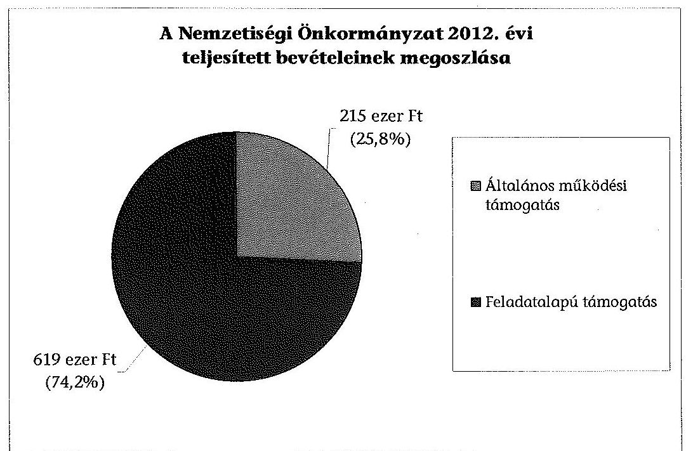
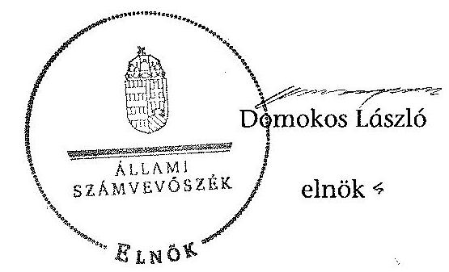

# ÁLLAMI   SZÁMVEVŐSZÉK 

## JELENTÉS

a helyi nemzetiségi önkormányzatok gazdálkodásának ellenőrzéséről
Encs Város Roma Nemzetiségi Önkormányzata

---

# Állami Számvevőszék 

Iktatószám: V-0312-068/2014.
Témaszám: 1346
Vizsgálat-azonosító szám: V065288

## Az ellenőrzést felügyelte:

Horváth Balázs
felügyeleti vezető
Az ellenőrzést vezette és az ellenőrzés végrehajtásáért felelős:
Pats Regina
ellenőrzésvezető
A számvevőszéki jelentést készítették és a jelentés összeállításában
közremüködtek:
Dr. Zelei Andrásné
számvevő tanácsos
Csényi István
számvevő tanácsos
Az ellenőrzést végezték:
Dr. Szima Mária
Várkonyi Zsolt Kristóf
számvevő tanácsos

---

# TARTALOMJEGYZÉK 

BEVEZETÉS ..... 3
I. ÖSSZEGZŐ MEGÁLLAPÍTÁSOK, KÖVETKEZTETÉSEK, JAVASLATOK ..... 6
II. RÉSZLETES MEGÁLLAPÍTÁSOK ..... 12

1. A Nemzetiségi Önkormányzat és a Települési Önkormányzat együttműködésének szabályozása, a működési feltételek biztosítása ..... 12
2. A gazdálkodási feladatok ellátásának szabályszerűsége ..... 13
2.1. A költségvetésre és zárszámadásra, valamint a kincstári adatszolgáltatás rendjére vonatkozó jogszabályi előírások betartása ..... 13
2.2. A Nemzetiségi Önkormányzat gazdálkodásának szabályozottsága ..... 13
2.3. Az operatív gazdálkodási jogkörök kialakítása, gyakorlása ..... 14
3. A Nemzetiségi Önkormányzattal kapcsolatos gazdálkodási feladatok belső ellenőrzése ..... 15
4. A feladatalapú támogatás felhasználásának, elszámolásának szabályszerűsége, a Nemzetiségi Önkormányzat feladatellátása ..... 16
MELLÉKLET
5. számú A Nemzetiségi Önkormányzat 2012. évi gazdálkodásának főbb adatai, mutatói
FÜGGELÉKEK
6. számú Rövidítések jegyzéke
7. számú Értelmező szótár
8. számú A gazdálkodás értékelésének módszere

---

.

---

# JELENTÉS 

## a helyi nemzetiségi önkormányzatok gazdálkodásának ellenőrzéséről Encs Város Roma Nemzetiségi Önkormányzata

## BEVEZETÉS

A Nemzetiségi Önkormányzat 1994-ben alakult, elnöke a 2010. évi helyhatósági választások óta látja el feladatát. A Nemzetiségi Önkormányzat intézményt, gazdasági társaságot és más szervezetet nem alapított, illetve társulásban nem vett részt. A négytagú Képviselő-testület a munkája segítésére bizottságot nem hozott létre. A Nemzetiségi Önkormányzat költségvetési beszámolója szerint a 2012. évben a módosított költségvetési bevételi és kiadási előirányzat 834 ezer Ft, a teljesített költségvetési bevétel 834 ezer Ft, a teljesített költségvetési kiadás 803 ezer Ft volt. A Nemzetiségi Önkormányzat a 2011. évben nem részesült feladatalapú támogatásban. A 2012. évi gazdálkodási adatokat részletesen az 1. számú mellékletben mutatjuk be.

Az Alaptörvény XXIX. cikk (1) bekezdése szerint a Magyarországon élő nemzetiségek államalkotó tényezők. Minden, valamely nemzetiséghez tartozó magyar állampolgárnak joga van önazonossága szabad vállalásához és megőrzéséhez. A hazánkban élő nemzetiségek helyi (települési és területi) valamint országos önkormányzatokat hozhatnak létre ${ }^{1}$. A helyi nemzetiségi önkormányzatok gazdálkodási feladatait jogszabályi előírás alapján a székhely szerinti helyi önkormányzat polgármesteri hivatala látja el.

A nemzetiségek helyzete, támogatása mind hazai, mind EU-s szinten kiemelt figyelmet kap napjainkban. A helyi nemzetiségi önkormányzatok gazdálkodására és támogatási rendszerére vonatkozó jogszabályok a 2010-2012. években jelentős változásokon mentek át. A települési és területi nemzetiségi önkormányzatok gazdálkodásának, a részükre juttatott költségvetési támogatások felhasználásának ellenőrzését az ÁSZ 2012-ben sorozatjellegű ellenőrzés keretében indította el. A 2013. évi ellenőrzések e témacsoportos ellenőrzések folytatását jelentik, amelyet az ÁSZ 2014. első félévi ellenőrzési terve 12. témasorszámon tartalmaz.

Az ellenőrzés célja annak értékelése volt, hogy a nemzetiségi önkormányzat gazdálkodási kereteinek kialakítása, gazdálkodása és feladatellátása megfelelt-e a jogszabályoknak.

[^0]
[^0]:    ${ }^{1}$ A 2010. évben megtartott nemzetiségi önkormányzati választásokat követően 2304 települési, 58 területi és 13 országos nemzetiségi önkormányzat alakult meg.

---

Ennek keretében értékeltük, hogy:

- a nemzetiségi önkormányzat és a települési önkormányzat együttmúködésének szabályozása, a múködési feltételek biztosítása megfelelt-e a jogszabályi előírásoknak;
- a felek együttmúködése megfelelt-e a közöttük létrejött megállapodásnak a gazdálkodási feladatok szabályszerű ellátása során, ennek keretében betar-tották-e a helyi nemzetiségi önkormányzat gazdálkodásához kapcsolódóan a költségvetésre és zárszámadásra, a gazdálkodás szabályozására, az operatív gazdálkodási jogkörök gyakorlására vonatkozó jogszabályi előírásokat;
- a jegyző biztosította-e a nemzetiségi önkormányzat gazdálkodásának belső ellenőrzését;
- a nemzetiségi önkormányzat feladatalapú támogatásának felhasználása, a folyósított feladatalapú támogatással történő elszámolás az előírásoknak megfelelő volt-e;
- a nemzetiségi önkormányzat feladatellátása összhangban volt-e a vonatkozó jogszabályi előírásokkal.

Az ellenőrzés várható hasznosulását négy szinten tervezzük. A törvényalkotás számára összegzett tapasztalatok állnak rendelkezésre a nemzetiségi önkormányzatok testületi döntéseinek, gazdálkodásának és a feladatalapú támogatás felhasználásának szabályszerűségéről, amelynek alapján következtetést lehet levonni arra, hogy indokolt-e esetleges jogszabályi módosítás kezdeményezése. Az ellenőrzés az ellenőrzött számára visszajelzést ad a működésében fellépő hiányosságokról, javaslataival hozzájárul azok kiküszöböléséhez, amely csökkentheti a későbbi ellenőrzések gyakoriságát. Az ellenőrzés megállapításai és javaslatai tanulságul szolgálhatnak más nemzetiségi önkormányzatok, szervezetek számára a rendezett gazdálkodási keretek kialakításához. A társadalom számára jelzi, hogy közpénz nem maradhat ellenőrizetlenül, az ÁSZ értékteremtő rend kialakításához és megőrzéséhez hozzájáruló tevékenysége pozitív hatással lesz a szervezetről kialakított összkép formálásában. Az ÁSZ szervezetén belül lehetőség nyílik arra, hogy a megállapítások szintetizálásával az intézmény a hozzáadott értéket teremtő elemző tevékenységét és tanácsadó szerepét erősítse.

A helyi nemzetiségi önkormányzatok gazdálkodásának ellenőrzéséről szóló jelentés I. fejezetének összegző része az ellenőrzés céljára adott rövid, szintetizáló összefoglalót és következtetéseket tartalmazza a II. fejezet részletes megállapításain alapulóan. A jelentés intézkedést igénylő megállapításait és javaslatait az összegzőben foglaltak mellett - az ellenőrzés során feltárt, a jelentés II. fejezetében rögzített részletes megállapítások alapozzák meg, illetve támasztják alá.

Az ellenőrzés típusa: szabályszerűségi ellenőrzés.
Az ellenőrzött időszak: a 2012. január 1. - 2012. december 31. közötti időszak. Az ellenőrzés kiterjedt a helyi nemzetiségi önkormányzatoknak juttatott 2012. évi feladatalapú támogatás 2013. évben való elszámolására is.

---

Ellenőrzött szervezet: Encs Város Roma Nemzetiségi Önkormányzata és a gazdálkodási feladatait ellátó Encs Város Önkormányzata.

Az ellenőrzés végrehajtásának jogszabályi alapját az ÁSZ tv. 5. § (2)-(3) és (6) bekezdéseiben foglaltak képezik.

Az ellenőrzés szakmai módszertana az ÁSZ hivatalos honlapján (www.asz.hu) közzétett szakmai szabályokon alapult, amely a Legfőbb Ellenőrző Intézmények Nemzetközi Szervezete (INTOSAI) által kiadott nemzetközi standardok (ISSAI) figyelembevételével készült.

A helyi nemzetiségi önkormányzatok gazdálkodásának ellenőrzése során értékeltük a települési önkormányzat és a nemzetiségi önkormányzat együttműködésének, a gazdálkodás szabályozottságának és a pénzügyi folyamatokban kulcsszerepet betöltő belső kontrollok (teljesítésigazolás és érvényesítés) müködésének megfelelőségét. A kulcskontrollokat a dologi kiadásokkal kapcsolatos kifizetéseknél véletlen mintavételi eljárást alkalmazva ellenőriztük. Ellenőriztük, hogy a jegyző biztosította-e a nemzetiségi önkormányzat gazdálkodásának belső ellenőrzését. Értékeltük a feladatalapú támogatások felhasználásának, elszámolásának szabályszerűségét, a nemzetiségi önkormányzat feladatellátása és a jogszabályi előírások összhangját.

Az ellenőrzés lefolytatásához a Nemzetiségi Önkormányzat és a gazdálkodási feladatait ellátó Települési Önkormányzat tanúsítványok és a kapcsolódó, dokumentumjegyzékben megjelölt dokumentumok elektronikus úton történő megküldésével, rendelkezésre bocsátásával szolgáltatott adatokat. Az adatszolgáltatás kontrollálása és szükség szerinti javítása a helyszíni ellenőrzés keretében történt. A gazdálkodás értékelésének módszerét a 3. számú függelék tartalmazza.

Az ÁSZ tv. 29. § (1) bekezdése szerint a jelentéstervezetet megküldtük a polgármester és a Nemzetiségi Önkormányzat elnöke részére, akik az ÁSZ tv. 29. § (2) bekezdésében foglalt észrevételezési jogukkal nem éltek, a jelentéstervezetre észrevételt nem tettek.

---

# I. ÖSSZEGZŐ MEGÁLLAPÍTÁSOK, KÖVETKEZTETÉSEK, JAVASLATOK 

A Nemzetiségi Önkormányzat és a Települési Önkormányzat együttmüködésének szabályozása megfelelt a jogszabályi előírásoknak. Az együttmúködés az önkormányzatok képviselő-testületei által jóváhagyott együttműködési megállapodásokon alapult. Az együttmúködési megállapodás ${ }_{2}$ a jogszabályban foglaltaknak megfelelően tartalmazta a Nemzetiségi Önkormányzat múködési feltételeit, valamint a tervezési, gazdálkodási, ellenőrzési, finanszírozási, adatszolgáltatási és beszámolási feladatok ellátásának részletes szabályait. A jogszabályi előírások azonban nem érvényesültek maradéktalanul, mert - a Nek. ${ }_{2}$ tv.-ben foglaltakat figyelmen kívül hagyva - az együttműködési megállapodás ${ }_{1}$-t 2012. január 31-éig nem vizsgálták felül, valamint az együttmúködési megállapodás ${ }_{2}$ szerinti múködési feltételeket nem rögzítették a Nemzetiségi Önkormányzat SZMSZ-ében. A Települési Önkormányzat a szabályozási hiányosságok ellenére biztosította a Nemzetiségi Önkormányzat müködéséhez szükséges személyi és tárgyi feltételeket.

A Nemzetiségi Önkormányzat 2012. évi költségvetésének és zárszámadásának tartalma, jóváhagyása, valamint a kapcsolódó adatszolgáltatás szabályszerüsége részben felelt meg a jogszabályi előírásoknak. A jegyző az előírt határidőre elkészítette, a Nemzetiségi Önkormányzat elnöke határidőn belül a Képviselő-testület elé terjesztette a 2012. évi költségvetési és a zárszámadási határozat tervezetét. A költségvetési és a zárszámadási határozat elfogadására és továbbítására vonatkozó előírások érvényesültek. A költségvetési és a zárszámadási határozat tervezetek előterjesztésekor azonban a Képviselő-testület számára - az Áht. ${ }_{2}$ előírásait figyelmen kívül hagyva - a jegyző mulasztása miatt nem mutatták be tájékoztatásul a többéves kihatással járó döntések számszerűsítését évenkénti bontásban és összesítve, valamint a közvetett támogatásokat tartalmazó kimutatást szöveges indoklással együtt. A költségvetési és zárszámadási határozatok egymással összehasonlítható szerkezetben készültek. A zárszámadási határozatban a Nemzetiségi Önkormányzat valamennyi bevételéről és kiadásáról elszámoltak. A jegyző a Nemzetiségi Önkormányzatra vonatkozó kincstári adatszolgáltatási kötelezettségeinek határidőben eleget tett.

A Nemzetiségi Önkormányzat gazdálkodásának szabályozottsága az ellenőrzött időszakban megfelelt a jogszabályi előírásoknak. A Polgármesteri Hivatal a leltározási és leltárkészítési, az eszközök és források értékelési és a pénzkezelési szabályzatának, valamint a számviteli politikájának és a számlarendjének hatályát kiterjesztette a Nemzetiségi Önkormányzat gazdálkodásával kapcsolatos végrehajtási feladatokra. A folyamatba épített előzetes, utólagos és vezetői ellenőrzési szabályozás, a szabálytalanságok kezelésének eljárásrendje és az ellenőrzési nyomvonal hatálya is kiterjedt a Nemzetiségi Önkormányzat gazdálkodásával kapcsolatos végrehajtási feladatokra. A tervezéssel, gazdálkodással, a kötelezettségvállalással, pénzügyi ellenjegyzéssel és teljesítésigazolással, az érvényesítés, utalványozás gyakorlásának módjával, eljárási és dokumentálási részletszabályaival, valamint az ezeket végző személyek kijelölésének rendjével, az ellenőrzési és adatszolgáltatási feladatok teljesítésével kapcso-

---

latos belső előírásokat, feltételeket tartalmazó szabályzat is rendelkezésre állt. A jogszabályi előírások azonban nem érvényesültek maradéktalanul, mert a Polgármesteri Hivatal SZMSZ-e az Ávr.-ben előírtak ellenére nem tartalmazta az SZMSZ-ben nevesített munkakörökhöz tartozó - a Nemzetiségi Önkormányzat gazdálkodásának végrehajtásával kapcsolatos - feladat-, és hatásköröket, a hatáskörök gyakorlásának módját, a helyettesítés rendjét, és az ezekhez kapcsolódó felelősségi szabályokat.

A Nemzetiségi Önkormányzat gazdálkodása tekintetében az operatív gazdálkodási jogkörök kialakítása nem felelt meg a jogszabályi előírásoknak. A Nemzetiségi Önkormányzat elnöke az ellenőrzött időszakban kötelezettségvállalás és utalványozás gyakorlására felhatalmazást nem adott, teljesítést igazoló személyt írásban nem jelölt ki, így az Ávr.-ben előírt összeférhetetlenségi követelmények érvényesülésének feltételeit nem biztosította, a hiányosságot azonban 2013. április 2-ától megszüntették. A gazdasági szervezettel rendelkező Polgármesteri Hivatalban - a jogkörében eljárva - a gazdasági vezető kijelölt köztisztviselőket az érvényesítési feladatok ellátására és 2012. április 1-jétől a pénzügyi ellenjegyzés gyakorlására. A gazdasági vezető és az érvényesítési feladatok ellátására kijelölt személyek rendelkeztek a jogszabályban előírt végzettséggel. A Nemzetiségi Önkormányzatnál a 2012. évben a dologi kiadások teljesítése során a teljesítésigazolás és az érvényesítés kulcskontrollok múködésének megfelelősége gyenge volt. A hibák száma a lényegességi szintet, a kritikus hibahatárt elérte, mert a teljesítésigazoló és az érvényesítő az Ávr.ben foglalt feladatainak csak részben tett eleget. A teljesítésigazoló egy esetben a kifizetés jogosságát, összegszerűségét ellenőrizhető dokumentum hiányában igazolta. Egy kifizetésnél a teljesítés igazolását a Nemzetiségi Önkormányzat elnöke - az Ávr. előírása ellenére - a maga javára látta el és az összeférhetetlenséget az érvényesítő nem jelezte az utalványozónak. A Nemzetiségi Önkormányzatnál a 2012. évi dologi kiadások között a három legnagyobb összegű kiadás teljesítésének egyedi értékelése alapján a teljesítésigazolás és az érvényesítés kulcskontrollok működésének feltárt hiányosságai megegyezőek voltak a dologi kiadások értékelésénél feltárt azon megállapítással, mely szerint a teljesítésigazolás jogossága, összegszerűsége ellenőrizhető okmány hiányában történt, s az érvényesítő ezt nem ellenőrizte és nem jelezte az utalványozónak. A kulcskontrollok működéséhez kapcsolódó hiányosságok miatt nem biztosították a hibák megelőzését, feltárását és kijavítását. A számvevőszéki ellenőrzés a kifizetések bizonylatainak ellenőrzése során - a rendelkezésre bocsátott dokumentumok alapján - jogosulatlan kifizetést nem tárt fel.

A jegyző nem biztosította a Nemzetiségi Önkormányzat gazdálkodásával összefüggő végrehajtási feladatok belső ellenőrzését. A Polgármesteri Hivatal 2012. évre vonatkozó éves belső ellenőrzési tervét megalapozó kockázatelemzés - a Ber.-ben foglaltak ellenére - nem terjedt ki a Nemzetiségi Önkormányzat gazdálkodásával összefüggő végrehajtási feladatokra, így azon alapulóan belső ellenőrzési feladatot a 2012. évben nem terveztek és ellenőrzést nem végeztek.

A Nemzetiségi Önkormányzat a 2012. évben a bevételei 74,2\%-át kitevő, 619 ezer Ft összegű feladatalapú támogatásban részesült. A támogatás teljes összegét a 2012. évben felhasználták, melyből - a jogszabályi előírásoknak megfelelően - nemzetiségi közfeladatokkal kapcsolatos kiadásokat finanszíroz-

---

tak. Az elszámolás a támogatási kormányrendelet ${ }_{2}$ alapján az Áht. ${ }_{2}$ rendelkezése ellenére nem történt meg. A támogatás felhasználását, elszámolását az arra jogosult külső szervek nem ellenőrizték. A Nemzetiségi Önkormányzat kötelező és önként vállalt feladatellátásának tárgya összhangban volt a Nek. ${ }_{2}$ tv.-ben foglalt előírásokkal.

Az ÁSZ tv. 33. § (1) bekezdésében foglaltak értelmében az ellenőrzött szervezet vezetője köteles a jelentésben foglalt megállapításokhoz kapcsolódó intézkedési tervet összeállítani és azt a jelentés kézhezvételétől számított 30 napon belül az ÁSZ részére megküldeni. Amennyiben az intézkedési tervet határidőre nem küldi meg a szervezet, vagy az nem elfogadható, az ÁSZ elnöke az ÁSZ tv. 33. § (3) bekezdés a)-b) pontjaiban foglaltakat érvényesítheti.

A helyszíni ellenőrzés megállapításainak hasznosítása mellett javasoljuk:

# a jegyzőnek 

1. az együttműködés szabályozásával kapcsolatban

Az együttműködési megállapodás ${ }_{1}$-t a Nek. ${ }_{2}$ tv. 80. § (2) bekezdésének előírása ellenére 2012. január 31-éig nem vizsgálták felül.

A Nek. ${ }_{2}$ tv. 80. § (2) bekezdésében foglaltak ellenére az együttműködési megállapodás ${ }_{2}$ szerinti müködési feltételeket nem rögzítették a Nemzetiségi Önkormányzat SZMSZ-ében.

Javaslat
Az együttműködés szabályszerűsége érdekében:
a) biztosítsa a jövőben az együttműködési megállapodás évenkénti felülvizsgálata során a Nek. ${ }_{2}$ tv. 80. § (2) bekezdésében előírt határidő betartását;
b) készítse elő a Nemzetiségi Önkormányzat SZMSZ-ének kiegészítését, hogy abban a Nek. ${ }_{2}$ tv. 80. § (2) bekezdésében foglalt előírásnak megfelelve rögzítésre kerüljenek a müködési feltételek.
2. a költségvetés és a zárszámadás szabályszerűségével kapcsolatban

A 2012. évi költségvetési határozattervezet előterjesztésekor - az Áht. ${ }_{2} 24$. § (4) bekezdés b) és c) pontjaiban foglaltakat figyelmen kívül hagyva a Képviselőtestület részére a jegyző mulasztása miatt tájékoztatásul nem mutatták be a többéves kihatással járó döntések számszerűsítését évenkénti bontásban és összesítve, valamint a közvetett támogatásokat tartalmazó kimutatást, szöveges indoklással együtt.

A zárszámadási határozattervezet előterjesztésekor - az Áht. ${ }_{2}$ 91. § (2) bekezdés a) pontjában hivatkozott Áht. ${ }_{2} 24$. § (4) bekezdés b) és c) pontjai előírásait figyelmen kívül hagyva a Képviselő-testület részére a jegyző általi elkészítés hiánya miatt tájékoztatásul nem mutatták be a többéves kihatással járó döntések számszerűsítését

---

évenkénti bontásban és összesítve, valamint a közvetett támogatásokat tartalmazó kimutatást.

Javaslat
Készítse elő a jövőben a költségvetési és zárszámadási határozattervezetek előterjesztéséhez a Képviselő-testületnek tájékoztatásul bemutatásra az Áht. 2 24. § (4) bekezdés b) és c) pontjaiban, valamint a 91. § (2) bekezdés a) pontjában előírt kimutatásokat, szöveges indoklással együtt.
3. a gazdálkodási feladatok szabályozottságával összefüggésben

A Polgármesteri Hivatal SZMSZ-e nem tartalmazta az Ávr. 13. § (1) bekezdés g) pontjában foglaltak szerinti, az SZMSZ-ben nevesített munkakörökhöz tartozó - a Nemzetiségi Önkormányzat gazdálkodásának végrehajtásával kapcsolatos - feladatés hatáskörökre, a hatáskörök gyakorlásának módjára, a helyettesítés rendjére, az ezekhez kapcsolódó felelősségi szabályokra vonatkozó előírásokat.

Javaslat
A gazdálkodás szabályszerűsége érdekében a Nemzetiségi Önkormányzat gazdálkodásának végrehajtására is kiterjedően készítse elő a Polgármesteri Hivatal SZMSZének módosítását, hogy az tartalmazza az Ávr. 13. § (1) bekezdés g) pontjában foglaltakat.
4. a kulcskontrollok múködésével kapcsolatban

A teljesítésigazoló - az Ávr. 57. § (1) bekezdésében foglaltak ellenére - egy esetben a kifizetés jogosságát, összegszerűségét ellenőrizhető dokumentum hiányában igazolta. Egy kifizetésnél a teljesítés igazolását a Nemzetiségi Önkormányzat elnöke - az Ávr. 60. § (2) bekezdés előírásait figyelmen kívül hagyva - a maga javára látta el. Az érvényesítő az Ávr. 58. § (1)-(2) bekezdésében rögzített feladatait nem a jogszabályi előírásoknak megfelelően látta el, mert egy kifizetés esetében nem ellenőrizte és nem jelezte az utalványozónak, hogy a teljesítésigazolás ellenőrizhető okmányok hiányában történt, továbbá nem ellenőrizte és nem jelezte az utalványozónak, hogy a teljesítés igazolásával kapcsolatban összeférhetetlenség állt fenn.

Javaslat
Az operatív gazdálkodás működési hibáinak megelőzése, feltárása és kijavítása érdekében gondoskodjon arról, hogy:
a) a teljesítésigazolást az Ávr. 57. § (1) bekezdésében előírtak szerint minden esetben végezzék el, figyelemmel az Ávr. 60. § (2) bekezdésében foglalt összeférhetetlenségi szabályok betartására;
b) az érvényesítő az Ávr. 58. § (1)-(2) bekezdései alapján lássa el ellenőrzési és jelzési feladatát.

---

5. a feladatalapú támogatás elszámolásával kapcsolatban

A 2012. évi feladatalapú támogatás elszámolása a támogatási kormányrendelet ${ }_{2} 8 . \S$ (5) bekezdésében hivatkozott „a helyi önkormányzatok elszámolási és ellenőrzési rendjére vonatkozó jogszabályok rendelkezései alkalmazandóak" előírása alapján az Áht. 2 57. § (3) bekezdésében foglaltak ellenére nem történt meg.

Javaslat
Gondoskodjon az Áht. 2 27. § (2) bekezdésében meghatározott feladatkörében a Nemzetiségi Önkormányzat által igénybe vett 2012. évi feladatalapú támogatás elszámolásának elkészítéséről, figyelemmel az Áht. 2 53. § (1) bekezdésében foglaltakra.

# a polgármesternek 

A Polgármesteri Hivatal SZMSZ-e az Ávr. 13. § (1) bekezdés g) pontjában előírtak ellenére nem tartalmazta az SZMSZ-ben nevesített munkakörökhöz tartozó - a Nemzetiségi Önkormányzat gazdálkodásának végrehajtásával kapcsolatos - feladat- és hatásköröket, a hatáskörök gyakorlásának módját, a helyettesítés rendjét, és az ezekhez kapcsolódó felelősségi szabályokat.

Javaslat
Terjessze a Települési Önkormányzat Képviselő-testülete elé jóváhagyásra a Polgármesteri Hivatal SZMSZ-ének a jegyző által előkészített módosítását, hogy az tartalmazza az Ávr. 13. § (1) bekezdés g) pontjában foglaltakat.

## a Nemzetiségi Önkormányzat elnökének

1. A Nek. 2 tv. 80. § (2) bekezdésében foglaltak ellenére az együttmúködési megállapodás ${ }_{2}$ szerinti müködési feltételeket nem rögzítették a Nemzetiségi Önkormányzat SZMSZ-ében.

Javaslat
Terjessze a Képviselő-testület elé jóváhagyásra a Nemzetiségi Önkormányzat SZMSZ-ének Nek. 2 tv. 80. § (2) bekezdésében foglaltaknak megfelelő jegyző által elkészített módosítását.
2. A Nemzetiségi Önkormányzat elnöke a 2012. évi költségvetési és zárszámadási határozattervezetek előterjesztésekor a Képviselő-testület részére az Áht. 2 24. § (4) bekezdés b) és c) pontjaiban, valamint a 91. § (2) bekezdés a) pontjában előírtak ellenére nem mutatta be a többéves kihatással járó döntések számszerúsítését évenkénti bontásban és összesítve, valamint a közvetett támogatásokat tartalmazó kimutatást, szöveges indoklással együtt.

---

Javaslat
A jövőben a költségvetési és zárszámadási határozattervezet Képviselő-testület elé terjesztésekor tájékoztatásul mutassa be a jegyző által előkészített, az Áht., 24. § (4) bekezdés b) és c) pontjaiban valamint a 91. § (2) bekezdés a) pontjában előírt kimutatásokat, szöveges indoklással együtt.
3. A 2012. évi feladatalapú támogatás elszámolása a támogatási kormányrende$\operatorname{let}_{2}$ 8. § (5) bekezdésében hivatkozott „a helyi önkormányzatok elszámolási és ellenőrzési rendjére vonatkozó jogszabályok rendelkezései alkalmazandóak" előírása alapján az Áht. 2 57. § (3) bekezdésében foglaltak ellenére nem történt meg.

Javaslat
Terjessze a Képviselő-testület elé az Áht. 2 53. § (1) bekezdése szerinti beszámolási kötelezettség teljesítéséhez összeállított, a Nemzetiségi Önkormányzat által igénybevett 2012. évi feladatalapú támogatás rendeltetésszerű felhasználásáról szóló elszámolást.

---

# II. RÉSZLETES MEGÁLLAPÍTÁSOK 

## 1. A Nemzetiségi Önkormányzat És a Telepúlési Önkormányzat együttmúködésének szabályozása, a múködési feltételek biztositása

A Nemzetiségi Önkormányzat a 2012. év egészében rendelkezett a Települési Önkormányzattal kötött együttmúködési megállapodással. Az együttmúködési megállapodás ${ }_{1,2}$-t a Nemzetiségi Önkormányzat és a Települési Önkormányzat képviselő-testületei határozattal ${ }^{2}$ jóváhagyták és az arra jogosult személyek aláírták.

A Nemzetiségi Önkormányzat és a Települési Önkormányzat együttmúködésének szabályozása megfelelt a jogszabályi előírásoknak.

Az együttműködési megállapodás ${ }_{2}$ a jogszabályi előírásoknak megfelelően tartalmazta a Nemzetiségi Önkormányzat múködési feltételeit, valamint a tervezési, gazdálkodási, ellenőrzési, finanszírozási, adatszolgáltatási és beszámolási feladatok ellátásának részletes szabályait.

Az együttműködés szabályozása során a jogszabályi előírások nem érvényesültek maradéktalanul, mert - a Nek. ${ }_{2}$ tv. 80. § (2) bekezdése előírásait figyelmen kívül hagyva - az együttműködési megállapodás ${ }_{1}$ 2012. január 31-éig esedékes felülvizsgálata nem történt meg, valamint a Nek. ${ }_{2}$ tv. 80. § (2) bekezdésében foglaltak ellenére az együttműködési megállapodás ${ }_{2}$ szerinti működési feltételeket nem rögzítették a Nemzetiségi Önkormányzat SZMSZ-ében a megállapodás megkötését követő harminc napon belül és a Nemzetiségi Önkormányzat elnöke erről a számvevőszéki ellenőrzés időpontjáig sem gondoskodott.

A Települési Önkormányzat a szabályozási hiányosságok ellenére biztosította a Nemzetiségi Önkormányzat múködéséhez szükséges személyi és tárgyi feltételeket.

[^0]
[^0]:    ${ }^{2}$ A Települési Önkormányzat Képviselő-testületének 56/2011 (VII. 04.) és 48/2012 (IV. 23.) számú határozata, valamint a Képviselő-testület 9/2011 (VI. 08.) és 11/2012 (IV. 23.) számú határozata.

---

# 2. A GAZDÁLKODÁSI FELADATOK ELLÁTÁSÁNAK SZABÁLYSZERÚSÉGE 

### 2.1. A költségvetésre és zárszámadásra, valamint a kincstári adatszolgáltatás rendjére vonatkozó jogszabályi előírások betartása

A Nemzetiségi Önkormányzat 2012. évi költségvetésének és zárszámadásának tartalma, jóváhagyása, valamint a kapcsolódó 2012. évi adatszolgáltatás szabályszerűsége részben felelt meg a jogszabályi előírásoknak.

A Nemzetiségi Önkormányzat elnöke a 2012. évi költségvetés tervezetét határidőben benyújtotta a Képviselő-testületnek. A 2012. évi költségvetés előterjesztésekor a Képviselő-testület részére tájékoztatásul bemutatták az előírt mérlegeket, azonban - az Áht. ${ }_{2} 24$. § (4) bekezdés b) és c) pontjaiban foglaltakat figyelmen kívül hagyva - nem mutatták be a többéves kihatással járó döntések számszerűsítését évenkénti bontásban és összesítve, valamint a közvetett támogatásokat tartalmazó kimutatást, szöveges indoklással együtt.

A jegyző által elkészített 2012. évi zárszámadási határozat tervezetét a Nemzetiségi Önkormányzat elnöke az előírt határidőn belül a Képviselőtestület elé terjesztette. A zárszámadási határozat-tervezet előterjesztésekor a Képviselő-testület részére tájékoztatásul bemutatták a jogszabályban előírt mérlegeket, azonban - az Áht. ${ }_{2} 91$. § (2) bekezdés a) pontja alapján az Áht. ${ }_{2} 24$. § (4) bekezdés b) és c) pontjaiban foglalt előírásokat figyelmen kívül hagyva nem mutatták be a többéves kihatással járó döntések számszerúsítését évenkénti bontásban és összesítve, valamint a közvetett támogatásokat tartalmazó kimutatást szöveges indoklással együtt. A költségvetési és a zárszámadási határozatok egymással összehasonlítható szerkezetben készültek. A zárszámadási határozatban ${ }^{3}$ a Nemzetiségi Önkormányzat valamennyi bevételéről és kiadásáról elszámoltak.

A jegyző a 2012. évben a Nemzetiségi Önkormányzat részére előírt kincstári adatszolgáltatásokat a jogszabályi előírások szerinti határidőn belül teljesítette.

### 2.2. A Nemzetiségi Önkormányzat gazdálkodásának szabályozottsága

A Nemzetiségi Önkormányzat gazdálkodásának szabályozottsága az ellenőrzött időszakban megfelelt a jogszabályi előírásoknak.

A Polgármesteri Hivatal a leltárkészítési és leltározási, az eszközök és források értékelési és a pénzkezelési szabályzatának, valamint a számviteli politikájának és a számlarendjének hatályát kiterjesztette a Nemzetiségi Önkormányzat gazdálkodásával kapcsolatos végrehajtási feladatokra. A folyamatba épített előzetes, utólagos és vezetői ellenőrzési szabályozás, a szabálytalanságok kezelésének eljárásrendje és az ellenőrzési nyomvonal hatálya is kiterjedt a Nemze-

[^0]
[^0]:    ${ }^{3}$ A Képviselő-testület 8/2013. (IV.19.) RNÖ számú határozata.

---

tiségi Önkormányzat gazdálkodásának végrehajtásával kapcsolatos végrehajtási feladatokra. A jogszabályban foglaltak szerinti, a tervezéssel, gazdálkodással, a kötelezettségvállalással, pénzügyi ellenjegyzéssel és teljesítésigazolással, az érvényesítés, utalványozás gyakorlásának módjával, eljárási és dokumentálási részletszabályaival, valamint az ezeket végző személyek kijelölésének rendjével, az ellenőrzési és adatszolgáltatási feladatok teljesítésével kapcsolatos belső előírásokat, feltételeket tartalmazó szabályzat rendelkezésre állt.

A jogszabályi előírások azonban nem érvényesültek maradéktalanul, mert a Polgármesteri Hivatal SZMSZ-e az Ávr. 13. § (1) bekezdés g) pontjában előírtak ellenére nem tartalmazta az SZMSZ-ben nevesített munkakörökhöz tartozó - a Nemzetiségi Önkormányzat gazdálkodásának végrehajtásával kapcsolatos -feladat-, és hatásköröket, a hatáskörök gyakorlásának módját, a helyettesítés rendjét, és az ezekhez kapcsolódó felelősségi szabályokat.

A Polgármesteri Hivatalban az érintett köztisztviselők munkaköri leírásai - egy köztisztviselő kivételével - tartalmazták a Nemzetiségi Önkormányzattal gazdálkodásával kapcsolatos feladatokat.

# 2.3. Az operatív gazdálkodási jogkörök kialakítása, gyakorlása 

A Nemzetiségi Önkormányzat gazdálkodása tekintetében az operatív gazdálkodási jogkörök kialakítása nem felelt meg a jogszabályi elöírásoknak.

A Nemzetiségi Önkormányzat elnöke az Ávr. 52. § (7) bekezdés szerinti felhatalmazást kötelezettségvállalásra, az Ávr. 59. § (1) bekezdés szerinti felhatalmazást utalványozás gyakorlására más képviselőnek írásban nem adott, továbbá az Ávr. 57. § (4) bekezdés szerinti teljesítést igazoló személyt írásban nem jelölt ki, emiatt az Ávr. 60. § (2) bekezdésében foglalt összeférhetetlenségi követelmények érvényesülésének feltételeit nem biztosította ${ }^{4}$.

A gazdasági szervezettel rendelkező Polgármesteri Hivatalban - a jogkörében eljárva - a gazdasági vezető kijelölt köztisztviselőket az érvényesítési feladatok ellátására és 2012. április 1-jétől a pénzügyi ellenjegyzés gyakorlására. A gazdasági vezető és az érvényesítési feladatok ellátására kijelölt személyek rendelkeztek a jogszabályban előírt végzettséggel.

[^0]
[^0]:    ${ }^{4}$ A 2013. április 2-ától hatályos Gazdálkodási Szabályzat 1/é. sz. melléklete szerint a Nemzetiségi Önkormányzat elnöke felhatalmazta az elnök-helyettest kötelezettségvállalásra és utalványozásra, a 3/g. sz. melléklete szerint, pedig kijelölte az elnökhelyettest teljesítésigazolásra.

---

A Nemzetiségi Önkormányzatnál a 2012. évben a dologi kiadások teljesítése során a teljesítésigazolás és az érvényesítés kulcskontrollok múködésének megfelelősége gyenge volt. A hibák száma a lényegességi szintet, a kritikus hibahatárt elérte, mert:

- a teljesítésigazoló egy esetben a szolgáltatásról kiállított számla teljesítésének jogosságát, összegszerűségét - az Ávr. 57. § (1) bekezdésében foglaltak ellenére - ellenőrizhető okmány hiányában igazolta;
- egy bizonylat esetében a teljesítés igazolását a Nemzetiségi Önkormányzat elnöke - az Ávr. 60. § (2) bekezdés előírását figyelmen kívül hagyva - a maga javára látta el, az érvényesítő az összeférhetetlenség fennállását nem ellenőrizte és az utalványozónak nem jelezte;
- az érvényesítő az Ávr. 58. § (1)-(2) bekezdéseiben rögzített feladatait nem a jogszabályi előírásoknak megfelelően látta el, mert egy kifizetés esetében nem ellenőrizte és nem jelezte az utalványozónak, hogy a teljesítésigazolás ellenőrizhető okmányok hiányában történt.

A Nemzetiségi Önkormányzatnál a 2012. évi dologi kiadások között a három legnagyobb összegű kiadás teljesítésének egyedi értékelése alapján a teljesítésigazolás és az érvényesítés kulcskontrollok működésének feltárt hiányosságai megegyezőek voltak a dologi kiadások értékelésénél feltárt azon megállapítással, mely szerint a teljesítésigazolás jogossága, összegszerűsége ellenőrizhető okmány hiányában történt, s az érvényesítő ezt nem ellenőrizte és nem jelezte az utalványozónak.

A kulcskontrollok múködéséhez kapcsolódó hiányosságok miatt nem biztosították a hibák megelőzését, feltárását és kijavítását. A számvevőszéki ellenőrzés a kifizetések bizonylatainak ellenőrzése során - a rendelkezésre bocsátott dokumentumok alapján - jogosulatlan kifizetést nem tárt fel.

A Nemzetiségi Önkormányzatnál működési és felhalmozási célú támogatásértékű kiadások, illetve államháztartáson kívülre teljesített múködési és felhalmozási célú pénzeszköz átadások a 2012. évben nem voltak.

# 3. A Nemzetiségi Önkormányzattal kapcsolatos gazdálkoDÁSI FELADATOK BELSŐ ELLENŐRZÉSE 

A jegyző nem biztosította a Nemzetiségi Önkormányzat gazdálkodásával összefüggő végrehajtási feladatok belső ellenőrzését. A Polgármesteri Hivatal 2012. évre vonatkozó éves belső ellenőrzési tervét megalapozó kockázatelemzés - a Ber. 21. § (2) bekezdésében foglaltak ellenére - nem terjedt ki a Nemzetiségi Önkormányzat gazdálkodásával összefüggő végrehajtási feladatokra, így azon alapulóan belső ellenőrzési feladatot a 2012. évben nem terveztek és ellenőrzést nem végeztek.

A 2012. évre vonatkozó belső ellenőrzési terv elkészítésének idején hatályos együttműködési megállapodás ${ }_{1}$ 9. pontja rendelkezett a Nemzetiségi Önkormányzat belső ellenőrzésének múködtetéséről.

---

A megállapodásban rögzítettek szerint „A helyi kisebbségi önkormányzat belső ellenőrzését az Encsi Többcélú Kistérségi Társulás keretében müködő belső ellenőr végzi. A belső ellenőr munkatervének a helyi kisebbségi önkormányzatot érintő részeinek összeállításában az elnök is részt vesz. A helyi kisebbségi önkormányzatot érintő belső ellenőrzési jelentést az elnök a helyi kisebbségi önkormányzat képviselő-testületével ismerteti."

Az ellenőrzéshez szolgáltatott adatok alapján a 2012. évben a Kormányhivatal a Nemzetiségi Önkormányzatot illetően egy esetben élt törvényességi felhívással. A Képviselő-testület a törvényességi felhívásban foglaltak megtárgyalását követően a kifogásolt határozatának visszavonásáról döntött ${ }^{5}$.

A Kormányhivatal 2012.április 4-én kelt törvényességi felhívása a Képviselőtestület 3/2012. (I. 26.) számú határozatára irányult, melyben a Nemzetiségi Önkormányzat kijelölt két képviselőt a vagyonnyilatkozatok vizsgálatára. A Kormányhivatal a felhívását azzal indokolta, hogy a vagyonnyilatkozat-tételi kötelezettségre vonatkozóan a Nek. 3 tv. 103. §-a a törvény 157. § (7) bekezdése alapján a 2014. évi általános nemzetiségi önkormányzati választások kitűzésének napján lép hatályba, valamint a nevezett képviselők a vagyonnyilatkozatok vizsgálatát jogszerűen csak akkor láthatják el, ha az említett választáson nemzetiségi önkormányzati képviselőnek megválasztják őket.

# 4. A feladatalapú támogatás felhasználásának, elszámolásáNAK SzABÁLYSZERŰSÉGE, A NEMZETISÉGI ÖNKORMÁNYZAT FELADATELLÁTÁSA 

A Nemzetiségi Önkormányzat a 2012. évben 619 ezer Ft összegű feladatalapú támogatásban részesült, amelynek az összes bevételhez viszonyított részarányát a következő ábra szemlélteti:

[^0]
[^0]:    ${ }^{5}$ A Képviselő-testület 8/2012. (IV. 6.) számú határozata.

---

A Képviselő-testület a 2012. évi feladatalapú támogatás tervezett felhasználási céljairól a támogatás kiutalását megelőzően határozattal nem döntött. A folyósított feladatalapú támogatás összegével a 2012. évi költségvetési határozatot az Áht. 2 34. § (5) és (6) bekezdésében foglalt előírásokat figyelembe véve - a zárszámadással egyidejúleg módosították.

A 2012. évi feladatalapú támogatást a folyósítás évében felhasználták. A támogatás felhasználása a Nek. 2 tv. 116. §-a szerinti nemzetiségi közfeladatok érdekében történt, a Nemzetiségi Önkormányzat által ellátott önként vállalt feladatokhoz (nemzetiségi kultúra és hagyományápolás) kapcsolódott.

A 2012. évi feladatalapú támogatás elszámolása a támogatási kormányrendelet ${ }_{2}$ 8. § (5) bekezdésében hivatkozott „a helyi önkormányzatok elszámolási és ellenőrzési rendjére vonatkozó jogszabályok rendelkezései alkalmazandóak" előírása alapján az Áht. 2 57. § (3) bekezdésében foglaltak ellenére nem történt meg.

A feladatalapú támogatások felhasználását, elszámolását az ellenőrzésre jogosult külső szervek nem ellenőrizték.

A Nemzetiségi Önkormányzat kötelező és önként vállalt feladatellátásának tárgya összhangban volt a Nek. 2 tv. 115. §-ában és 116. §-ában foglalt előírásokkal.

Budapest, 2014. 06. hó $\mathscr{R}_{\text {nap }}$

Melléklet: $\quad 1 \mathrm{db}$
Függelék: $\quad 3 \mathrm{db}$

---

.

---

# A Nemzetiségi Önkormányzat 2012. évi gazdálkodásának föbb adatai, mutatói 

A) Bevételek

| Megnevezés | Eredeti elöirányzat |  | Módosított   elöirányzat | Teljesités |
| :--: | :--: | :--: | :--: | :--: |
|  | ezer Ft |  |  | $\begin{gathered} \text { megoszlás } \\ (\%) \end{gathered}$ |
| Általános müködési támogatás | 215,0 | 215,0 | 215,0 | 25,8 |
| Feladatalapú támogatás | 0,0 | 619,0 | 619,0 | 74,2 |
| Költségvetési bevételek | 215,0 | 834,0 | 834,0 | 100,0 |
| Tárgyévi bevételek | 215,0 | 834,0 | 834,0 | 100,0 |

B) Kiadások

| Megnevezés | Eredeti elöirányzat | Módosított   elöirányzat | Teljesités |  |
| :--: | :--: | :--: | :--: | :--: |
|  |  |  |  | megoszlás   (\%) |
| Dologi kiadások | 215,0 | 834,0 | 803,0 | 100,0 |
| Költségvetési kiadások | 215,0 | 834,0 | 803,0 | 100,0 |
| Tárgyévi kiadások | 215,0 | 834,0 | 803,0 | 100,0 |

---

.

---

# RÖVIDÍTÉSEK JEGYZÉKE 

## Törvények

Alaptörvény
Áht. 1
Áht. 2
ÁSZ tv.
Nek. 1 tv.
Nek. 2 tv.

## Rendeletek

Ávr.

Ber.

Bkr.
támogatási kormányrendelet ${ }_{1}$
támogatási kormányrendelet ${ }_{2}$

## Határozatok

Nemzetiségi Önkormányzat SZMSZ-e

## Szórövidítések

ÁSZ
együttmúködési megállapodás ${ }_{1}$
együttmúködési megállapodás ${ }_{2}$

Magyarország Alaptörvénye
Az államháztartásról szóló 1992. évi XXXVIII. törvény (hatályos 2011. december 31-éig)
Az államháztartásról szóló 2011. évi CXCV. törvény (hatályos 2011. december 31-étől)
Az Állami Számvevőszékről szóló 2011. évi LXVI. törvény (hatályos 2011. július 1-jétől)
A nemzeti és etnikai kisebbségek jogairól szóló 1993. évi LXXVII. törvény (hatályos 2011. december 31-éig)
A nemzetiségek jogairól szóló 2011. évi CLXXIX. törvény (hatályos 2011. december 20-ától)

Az államháztartásról szóló törvény végrehajtásáról szóló 368/2011. (XII. 31.) Korm. rendelet (hatályos 2012. január 1-jétől)
A költségvetési szervek belső ellenőrzéséről szóló 193/2003. (XI. 26.) Korm. rendelet (hatályos 2011. december 31-éig)
A költségvetési szervek belső kontrollrendszeréről és belső ellenőrzéséről szóló 370/2011. (XII. 31.) Korm. rendelet (hatályos 2012. január 1-jétől)
A kisebbségi önkormányzatoknak a központi költségvetésből, valamint fejezeti kezelésű előirányzatból nyújtott támogatások feltételrendszeréről és elszámolásának rendjéről szóló 342/2010. (XII. 28.) Korm. rendelet (hatályos 2012. március 6 -áig)

A nemzetiségi célú előirányzatokból nyújtott támogatások feltételrendszeréről és elszámolásának rendjéről szóló 28/2012. (III. 6.) Korm. rendelet (hatályos 2012. december 31 -éig)

A Képviselő-testület 12/2012. (IV. 23.) számú határozattal módosított 11/2010. (X. 12.) számú határozata a Nemzetiségi Önkormányzat Szervezeti és Múködési Szabályzatáról

Állami Számvevőszék
Encs Város Önkormányzata és Encs Város Cigány Kisebbségi Önkormányzata között 2011. július 1-jén létrejött együttműködési megállapodás
Encs Város Önkormányzata és Encs Város Roma Nemzetiségi Önkormányzata között 2012. május 2-án létrejött együttműködési megállapodás

---

| EU | Európai Unió |
| :--: | :--: |
| jegyző | Encs Város Önkormányzatának jegyzője |
| Képviselő-testület | Encs Város Önkormányzatának Képviselő-testülete |
| Kincstár | Magyar Államkincstár Borsod-Abaúj-Zemplén Megyei Igazgatósága |
| Kormányhivatal | Borsod-Abaúj-Zemplén Megyei Kormányhivatal |
| Nemzetiségi Önkormányzat | Encs Város Roma Nemzetiségi Önkormányzata |
| Nemzetiségi Önkormányzat elnöke | Encs Város Roma Nemzetiségi Önkormányzatának |
| Képviselő-testület | Encs Város Roma Nemzetiségi Önkormányzatának elnöke |
| polgármester | Encs Város Roma Nemzetiségi Önkormányzatának Kép-viselő-testülete |
| Polgármesteri Hivatal | Encs Város polgármestere |
| Polgármesteri Hivatal | Encs Város Polgármesteri Hivatala |
| SzMSZ-e | Szervezeti és Működési Szabályzata |
| SzMSZ | Szervezeti és Müködési Szabályzat |
| Települési Önkormányzat | Encs Város Önkormányzata |
| Települési Önkormányzat Képviselő-testülete | Encs Város Önkormányzatának Képviselő-testülete |

---

# ÉRTELMEZŐ SZÓTÁR 

együttmúködési megállapodás
feladatalapú támogatás
kulcskontrollok
nemzetiségi közügy
nemzetiség

A nemzetiségi önkormányzatnak a múködési feltételei biztosítására, továbbá a bevételeivel és a kiadásaival kapcsolatban a tervezési, gazdálkodási, ellenőrzési, finanszírozási, adatszolgáltatási és beszámolási feladatai végrehajtására a székhelye szerinti települési önkormányzattal megkötött megállapodás. (Forrás: Nek. ${ }_{2}$ tv. 80 § (2) bekezdés, Áht. ${ }_{2}$ 27. § (2) bekezdés.)
A költségvetési évben általános múködési támogatásban részesült, és a Támogatónak a Kincstárhoz intézett, a feladatalapú támogatás utalására vonatkozó rendelkező levele keltének időpontjában múködő települési és területi kisebbségi önkormányzatoknak a támogatási kor-mányrendelet ${ }_{1}$-ben, illetve a támogatási kormányrende-let ${ }_{2}$-ben rögzített feltételrendszer alapján nyújtható támogatás. A támogatási kormányrendelet ${ }_{1}$ elöírása szerint a feladatalapú támogatás a kisebbségi közügyeknek a települési és a területi kisebbségi önkormányzatok által történő ellátását szolgálja. A támogatási kormányrendelet ${ }_{2}$ rendelkezése szerint a feladatalapú támogatás a nemzetiségi önkormányzat által a Nek. ${ }_{2}$ tv szerinti nemzetiségi közfeladatok ellátásához közvetlenül kötődő támogatás. (Forrás: támogatási kormányrendelet ${ }_{1}$ 2. § (2) bekezdés c), d) pont és 4. § (1) bekezdés, valamint a támogatási kormányrendelet ${ }_{2} 2 . \S$ (2) bekezdés b), c) pont.)
Teljesítés igazolása és az érvényesítés.
Az egyéni és közösségi jogok érvényesülése, a nemzetiséghez tartozók érdekeinek kifejezésre juttatása - különösen az anyanyelv ápolása, őrzése és gyarapítása, továbbá a nemzetiségek kulturális autonómiájának a nemzetiségi önkormányzatok által történő megvalósítása és megőrzése - érdekében a nemzetiséghez tartozók meghatározott közszolgáltatásokkal való ellátásával, ezen ügyek önálló vitelével és az ehhez szükséges szervezeti, személyi és anyagi feltételek megteremtésével összefüggő ügy. A közhatalmat gyakorló állami és helyi önkormányzati szervekben, továbbá a nemzetiségi önkormányzati szervekben való nemzetiségi képviselethez és mindezek szervezeti, személyi és anyagi feltételeinek biztosításához kapcsolódó ügy. (Forrás: Nek. ${ }_{2}$ tv. 2. § 1. pont.)
Minden olyan Magyarország területén legalább egy évszázada honos népcsoport, amely az állam lakossága körében számszerú kisebbségben van és a lakosság többi részétől saját nyelve és kultúrája, hagyományai különböztetik meg, egyben olyan összetartozás-tudatról tesz bizonyságot, amely mindezek megőrzésére, történelmileg

---

nemzetiségi önkormányzat
kialakult közösségeik érdekeinek kifejezésére és védelmére irányul. (Forrás: Nek. 2 tv. 1. § (1) bekezdés.)
Törvényben meghatározott nemzetiségi közszolgáltatási feladatokat ellátó, testületi formában múködő, jogi személyiséggel rendelkező, demokratikus választások útján törvény alapján létrehozott szervezet, amely a nemzetiségi közösséget megillető jogosultságok érvényesítésére, a nemzetiségek érdekeinek védelmére és képviseletére, a feladat- és hatáskörébe tartozó nemzetiségi közügyek települési, területi vagy országos szinten történő önálló intézésére jön létre. (Forrás: Nek. ${ }_{2}$ tv. 2. § 2. pont.) A jelentésben e fogalmat a települési nemzetiségi önkormányzatokra leszűkítve alkalmazzuk.

---

# A GAZDÁLKODÁS ÉRTÉKELÉSÉNEK MÓDSZERE 

A helyi nemzetiségi önkormányzatok gazdálkodásának ellenőrzése keretében a nemzetiségi önkormányzat gazdálkodása kereteinek kialakítása, gazdálkodása megfelelőségének minősítéséhez az alábbi területeket értékeltük:

- a helyi nemzetiségi önkormányzat és a helyi önkormányzat együttmúködése szabályozását, a megállapodásban előírt működési feltételek biztosítását;
- a helyi nemzetiségi önkormányzat jóváhagyott költségvetésére, zárszámadására, továbbá a kincstári adatszolgáltatás rendjére vonatkozó jogszabályi előírások betartását;
- a helyi nemzetiségi önkormányzat gazdálkodási feladataira vonatkozó szabályzatok jogszabályi előírások szerinti rendelkezésre állását;
- a helyi nemzetiségi önkormányzat gazdálkodása tekintetében az operatív gazdálkodási jogkörök kialakítása jogszabályi előírásoknak történő megfelelését;
- a helyi nemzetiségi önkormányzat részére folyósított feladatalapú támogatás felhasználása és elszámolása jogszabályi előírásoknak való megfelelését;
- a helyi nemzetiségi önkormányzattal összefüggő gazdálkodási feladatok tekintetében a jogszabályokban előírt belső ellenőrzés biztosítását.

A helyi nemzetiségi önkormányzat gazdálkodását az ellenőrzési program szerint a hat területhez kapcsolódóan feltett kérdésekre adott válaszok alapján értékeltük. A kérdésekhez rendelt súlyozott pontszámok alapján az elért összérték a megszerezhető maximális pontszám százalékában került kimutatásra. Ennek figyelembevételével a kialakított minősítések az alábbiak:

Megfelelő: $\quad 81 \%$-tól
Részben megfelelő: $61 \%-80 \%$
Nem megfelelő: $\quad 0 \%-60 \%$
A pénzügyi folyamatok belső kontrolljának ellenőrzése keretében a pénzügyi folyamatokban kulcsszerepet betöltő belső kontrollok - a teljesítésigazolás és az érvényesítés - múködésének megfelelőségét értékeltük. A kulcskontrollok múködésének értékeléséhez a kritériumokat jogszabályok határozzák meg. A kulcskontrollok múködése megfelelőségének értékelése tekintetében lényeges minden olyan hiba, amely gátolja, hogy a kontrolltevékenység eredményesen múködjön.

A két kulcskontroll múködése megfelelőségének ellenőrzéséhez a dologi kiadások könyvviteli tételeiből szekvenciális (megállásos) mintavételi eljárással vá-

---

lasztottuk ki az ellenőrizendő tételeket. A kulcskontrollok megfelelőségének vizsgálata keretében a számvevő bizonyosságot szerez arról, hogy a rendelkezésre álló szabályozás és dokumentumok alapján a teljesítésigazoláshoz és az érvényesítéshez szükséges ellenőrzési lépéseket végrehajtották-e.

A kulcskontrollok működése „kiváló", „jó" vagy „gyenge" minősítést kaphatott. Az ellenőrzési program szerint feltett kérdésekhez rendelt súlyozott pontszámok alapján elért összérték a megszerezhető maximális pontszám százalékában került kimutatásra, mely alapján kialakított minősítések a következők:

| Kiváló: | $91 \%$-tól |
| :-- | :-- |
| Jó: | $71 \%-90 \%$ |
| Gyenge: | $0 \%-70 \%$ |

A kulcskontrollok múködését:

- kiválónak értékeltük abban az esetben, ha azok múködése megfelelt a hibák megelőzésére és kijavítására meghatározott szabályozásnak, valamint a legmagasabb szintű elvárásoknak;
- jónak minősítettük, ha a megállapított kisebb, tolerálható mértékű hiányosságok nem veszélyeztették az ellenőrzött területek hibáinak megelőzését és kijavítását;
- gyengének értékeltük, amennyiben a kontrollok múködésében túl sok hiányosság fordult elő ahhoz, hogy a kontrollok biztosítsák a hibák megelőzését, feltárását, kijavítását.