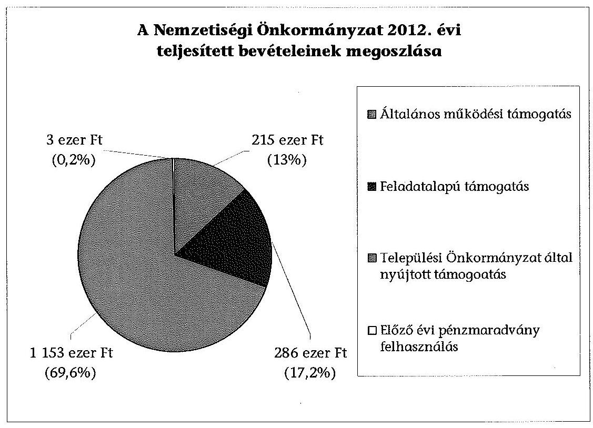
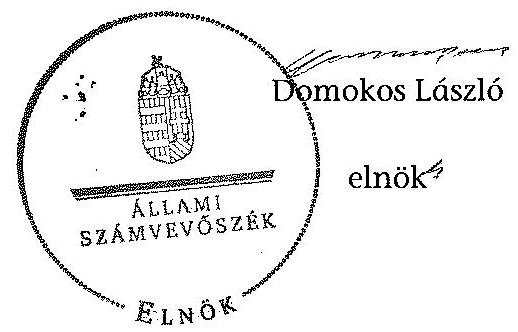

# ÁLLAMI   SZÁMVEVÔSZÉK 

## JELENTÉS

a helyi nemzetiségi önkormányzatok gazdálkodásának ellenőrzéséről
Füzesabony Város Roma Nemzetiségi Önkormányzat

---

# Állami Számvevőszék 

Iktatószám: V-0218-053/2014.
Témaszám: 1253
Vizsgálat-azonosító szám: V065218

## Az ellenőrzést felügyelte:

Horváth Balázs
felügyeleti vezető
Az ellenőrzést vezette és az ellenőrzés végrehajtásáért felelős:
Pats Regina
ellenőrzésvezető
A számvevőszéki jelentést készítették és a jelentés összeállításában
közremüködtek:
Csényi István
számvevő tanácsos
Dr. Győri Gabriella
számvevő tanácsos
Az ellenőrzést végezték:
Boldoczki János
Számvevő

Burenzsargal Narantuja
számvevő tanácsos

---

# TARTALOMJEGYZÉK 

BEVEZETÉS ..... 3
I. ÖSSZEGZŐ MEGÁLLAPÍTÁSOK, KÖVETKEZTETÉSEK, JAVASLATOK ..... 6
II. RÉSZLETES MEGÁLLAPÍTÁSOK ..... 13

1. A Nemzetiségi Önkormányzat és a Települési Önkormányzat együttműködésének szabályozása, a működési feltételek biztosítása ..... 13
2. A gazdálkodási feladatok ellátásának szabályszerűsége ..... 14
2.1. A költségvetésre és zárszámadásra, valamint a kincstári adatszolgáltatás rendjére vonatkozó jogszabályi előírások betartása ..... 14
2.2. A Nemzetiségi Önkormányzat gazdálkodásának szabályozottsága ..... 15
2.3. Az operatív gazdálkodási jogkörök kialakítása, gyakorlása ..... 15
3. A Nemzetiségi Önkormányzattal kapcsolatos gazdálkodási feladatok belső ellenőrzése ..... 16
4. A feladatalapú támogatás felhasználásának, elszámolásának szabályszerűsége, a Nemzetiségi Önkormányzat feladatellátása ..... 17
MELLÉKLET
5. számú A Nemzetiségi Önkormányzat 2012. évi gazdálkodásának főbb adatai, mutatói
FÜGGELÉKEK
6. számú Rövidítések jegyzéke
7. számú Értelmező szótár
8. számú A gazdálkodás értékelésének módszere

---

.

---

# JELENTÉS   a helyi nemzetiségi önkormányzatok gazdálkodásának ellenőrzéséről   Füzesabony Város   Roma Nemzetiségi Önkormányzat 

## BEVEZETÉS

A Nemzetiségi Önkormányzat a 2010. évben alakult, elnöke a 2010. évi helyhatósági választások óta látja el feladatát. A Nemzetiségi Önkormányzat intézményt, gazdasági társaságot és más szervezetet nem alapított, illetve társulásban nem vett részt. A négytagú Képviselő-testület a munkája segitésére bizottságot nem hozott létre. A Nemzetiségi Önkormányzat költségvetési beszámolója szerint a 2012. évben a módosított költségvetési bevételi előirányzat 1539 ezer Ft, a módosított kiadási előirányzat 1542 ezer Ft, a teljesített költségvetési bevétel 1654 ezer Ft, a teljesített költségvetési kiadás 1657 ezer Ft volt. A 2012. évi gazdálkodási adatokat részletesen az 1. számú mellékletben mutatjuk be.

Az Alaptörvény XXIX. cikk (1) bekezdése szerint a Magyarországon élő nemzetiségek államalkotó tényezők. Minden, valamely nemzetiséghez tartozó magyar állampolgárnak joga van önazonossága szabad vállalásához és megőrzéséhez. A hazánkban élő́ nemzetiségek helyi (települési és területi) valamint országos önkormányzatokat hozhatnak létre ${ }^{1}$. A helyi nemzetiségi önkormányzatok gazdálkodási feladatait jogszabályi előírás alapján a székhely szerinti helyi önkormányzat polgármesteri hivatala látja el.

A nemzetiségek helyzete, támogatása mind hazai, mind EU-s szinten kiemelt figyelmet kap napjainkban. A helyi nemzetiségi önkormányzatok gazdálkodására és támogatási rendszerére vonatkozó jogszabályok a 2010-2012. években jelentős változásokon mentek át. A települési és területi nemzetiségi önkormányzatok gazdálkodásának, a részükre juttatott költségvetési támogatások felhasználásának ellenőrzését az ÁSZ 2012-ben sorozatjellegű ellenőrzés keretében indította el. A 2013. évi ellenőrzések e témacsoportos ellenőrzések folytatását jelentik, amelyet az ÁSZ 2014. első félévi ellenőrzési terve 12. témasorszámon tartalmaz.

Az ellenőrzés célja annak értékelése volt, hogy a nemzetiségi önkormányzat gazdálkodási kereteinek kialakítása, gazdálkodása és feladatellátása megfelelt-e a jogszabályoknak.

[^0]
[^0]:    ${ }^{1}$ A 2010. évben megtartott nemzetiségi önkormányzati választásokat követően 2304 települési, 58 területi és 13 országos nemzetiségi önkormányzat alakult meg.

---

Ennek keretében értékeltük, hogy:

- a nemzetiségi önkormányzat és a települési önkormányzat együttműködésének szabályozása, a múködési feltételek biztosítása megfelelt-e a jogszabályi előírásoknak;
- a felek együttműködése megfelelt-e a közöttük létrejött megállapodásnak a gazdálkodási feladatok szabályszerű ellátása során, ennek keretében betar-tották-e a helyi nemzetiségi önkormányzat gazdálkodásához kapcsolódóan a költségvetésre és zárszámadásra, a gazdálkodás szabályozására, az operatív gazdálkodási jogkörök gyakorlására vonatkozó jogszabályi előírásokat;
- a jegyző biztosította-e a nemzetiségi önkormányzat gazdálkodásának belső ellenőrzését;
- a nemzetiségi önkormányzat feladatalapú támogatásának felhasználása, a folyósított feladatalapú támogatással történő elszámolás az előírásoknak megfelelő volt-e;
- a nemzetiségi önkormányzat feladatellátása összhangban volt-e a vonatkozó jogszabályi előírásokkal.

Az ellenőrzés várható hasznosulását négy szinten tervezzük. A törvényalkotás számára összegzett tapasztalatok állnak rendelkezésre a nemzetiségi önkormányzatok testületi döntéseinek, gazdálkodásának és a feladatalapú támogatás felhasználásának szabályszerűségéről, amelynek alapján következtetést lehet levonni arra, hogy indokolt-e esetleges jogszabályi módosítás kezdeményezése. Az ellenőrzés az ellenőrzött számára visszajelzést ad a működésében fellépő hiányosságokról, javaslataival hozzájárul azok kiküszöböléséhez, amely csökkentheti a későbbi ellenőrzések gyakoriságát. Az ellenőrzés megállapításai és javaslatai tanulságul szolgálhatnak más nemzetiségi önkormányzatok, szervezetek számára a rendezett gazdálkodási keretek kialakításához. A társadalom számára jelzi, hogy közpénz nem maradhat ellenőrizetlenül, az ÁSZ értékteremtő rend kialakításához és megőrzéséhez hozzájáruló tevékenysége pozitív hatással lesz a szervezetről kialakított összkép formálásában. Az ÁSZ szervezetén belül lehetőség nyílik arra, hogy a megállapítások szintetizálásával az intézmény a hozzáadott értéket teremtő elemző tevékenységét és tanácsadó szerepét erősítse.

A helyi nemzetiségi önkormányzatok gazdálkodásának ellenőrzéséről szóló jelentés I. fejezetének összegző része az ellenőrzés céljára adott rövid, szintetizáló összefoglalót és következtetéseket tartalmazza a II. fejezet részletes megállapításain alapulóan. A jelentés intézkedést igénylő megállapításait és javaslatait az összegzőben foglaltak mellett - az ellenőrzés során feltárt, a jelentés II. fejezetében rögzített részletes megállapítások alapozzák meg, illetve támasztják alá.

Az ellenőrzés típusa: szabályszerűségi ellenőrzés.
Az ellenőrzött időszak: a 2012. január 1. - 2012. december 31. közötti időszak. Az ellenőrzés kiterjedt a helyi nemzetiségi önkormányzatoknak juttatott 2012. évi feladatalapú támogatás 2013. évben való elszámolására is.

---

Ellenőrzött szervezet: a Füzesabony Város Roma Nemzetiségi Önkormányzat és a gazdálkodási feladatait ellátó Füzesabony Városi Önkormányzat.

Az ellenőrzés végrehajtásának jogszabályi alapját az ÁSZ tv. 5. § (2)-(3) és (6) bekezdéseiben foglaltak képezik.

Az ellenőrzés szakmai módszertana az ÁSZ hivatalos honlapján (www.asz.hu) közzétett szakmai szabályokon alapult, amely a Legfőbb Ellenőrző Intézmények Nemzetközi Szervezete (INTOSAI) által kiadott nemzetközi standardok (ISSAI) figyelembevételével készült.

A helyi nemzetiségi önkormányzatok gazdálkodásának ellenőrzése során értékeltük a települési önkormányzat és a nemzetiségi önkormányzat együttmúködésének, a gazdálkodás szabályozottságának és a pénzügyi folyamatokban kulcsszerepet betöltő belső kontrollok (teljesítésigazolás és érvényesítés) múködésének megfelelőségét. A kulcskontrollokat a dologi kiadásokkal kapcsolatos kifizetéseknél véletlen mintavételi eljárást alkalmazva ellenőriztük. Ellenőriztük, hogy a jegyző biztositotta-e a nemzetiségi önkormányzat gazdálkodásának belső ellenőrzését. Értékeltük a feladatalapú támogatások felhasználásának, elszámolásának szabályszerűségét, a nemzetiségi önkormányzat feladatellátása és a jogszabályi előírások összhangját.

Az ellenőrzés lefolytatásához a Nemzetiségi Önkormányzat és a gazdálkodási feladatait ellátó Települési Önkormányzat tanúsítványok és a kapcsolódó, dokumentumjegyzékben megjelölt dokumentumok elektronikus úton történő megküldésével, rendelkezésre bocsátásával szolgáltatott adatokat. Az adatszolgáltatás kontrollálása és szükség szerinti javítása a helyszíni ellenőrzés keretében történt. A gazdálkodás értékelésének módszerét a 3. számú függelék tartalmazza.

Az ÁSZ tv. 29. § (1) bekezdése szerint a jelentéstervezetet megküldtük a polgármester és a Nemzetiségi Önkormányzat elnöke részére, akik az ÁSZ tv. 29. § (2) bekezdésében foglalt észrevételezési jogukkal nem éltek, a jelentéstervezetre észrevételt nem tettek.

---

# I. ÖSSZEGZŐ MEGÁLLAPÍTÁSOK, KÖVETKEZTETÉSEK, JAVASLATOK 

A Nemzetiségi Önkormányzat és a Települési Önkormányzat együttmüködésének szabályozása részben felelt meg a jogszabályi előírásoknak. A Nemzetiségi Önkormányzat a 2012. évben rendelkezett a Települési Önkormányzattal kötött együttműködési megállapodással. A 2012. december 31 -én hatályos együttműködési megállapodás ${ }_{2}$ a jogszabályi előírásoknak megfelelően tartalmazta a Nemzetiségi Önkormányzat múködési feltételeit, valamint a tervezési, gazdálkodási, ellenőrzési, finanszírozási, adatszolgáltatási és beszámolási feladatok ellátásának részletes szabályait, azok teljesítési határidejét, felelőseit. Az együttműködés szabályozása a Nek. ${ }_{2}$ tv.-ben meghatározott tartalmi elemek tekintetében hiányos volt, mert az együttmúködési megállapodás ${ }_{2}$ nem tartalmazta a Nemzetiségi Önkormányzat részére az önálló fizetési számla nyitásával, a törzskönyvi nyilvántartásba vételével, valamint az adószám igénylésével kapcsolatos kötelezettségeket, továbbá azon előírást, miszerint a jegyző vagy megbízottja részt vesz a Nemzetiségi Önkormányzat képviselő-testületi ülésein és jelzi, amennyiben törvénysértést észlel. A Nek. ${ }_{2}$ tv.-ben foglaltakat figyelmen kívül hagyva az együttműködési megállapodás ${ }_{2}$ szerinti múködési feltételeket nem rögzítették a Nemzetiségi Önkormányzat SZMSZ-ében. A Települési Önkormányzat a szabályozási hiányosságok ellenére biztosította a Nemzetiségi Önkormányzat múködéséhez szükséges személyi és tárgyi feltételeket.

A Nemzetiségi Önkormányzat 2012. évi költségvetésének, zárszámadásának tartalma, jóváhagyása, valamint a kapcsolódó 2012. évi adatszolgáltatás szabályszerúsége nem felelt meg a jogszabályi előírásoknak. A Nemzetiségi Önkormányzat elnöke a 2012. évi költségvetési és zárszámadási határozat tervezetét határidőben beterjesztette a Képviselő-testület elé. A 2012. évi költségvetés előterjesztésekor az Áht. ${ }_{2}$-ben foglaltak ellenére a Képviselő-testület részére tájékoztatásul nem mutatták be az előírt mérlegeket és kimutatásokat szöveges indoklással együtt és a költségvetési határozat az Áht. ${ }_{2}$ előírásától eltérően nem tartalmazta a finanszírozási bevételekkel és kiadásokkal kapcsolatos hatásköröket. A jóváhagyott költségvetés a jogszabályi előírások szerint tartalmazta a Nemzetiségi Önkormányzat bevételeit és kiadásait, a költségvetési egyenleg összegét, az előző évek maradványát és a tartalékot. A zárszámadási határozat tervezetének előterjesztésekor a Képviselő-testület részére tájékoztatásul nem mutatták be az Áht. ${ }_{2}$-ben előírt mérlegeket és kimutatásokat szöveges indoklással együtt. A Nemzetiségi Önkormányzat elnöke a KIM-rendelet előírásai szerinti alakszerű, sorszámozott zárszámadási határozatot nem mutatott be a számvevőszéki ellenőrzés részére. A bevételi és kiadási előirányzatokat az általános múködési támogatás, a feladatalapú támogatás és a Települési Önkormányzat által nyújtott támogatás kapcsán - az Áht. ${ }_{2}$ előírásait figyelmen kívül hagyva - nem a kapott támogatás összegével módosították, emiatt a bevételek és kiadások teljesített összege meghaladta a módosított előirányzatokat. A jegyző a Nemzetiségi Önkormányzatra vonatkozó kincstári adatszolgáltatási kötelezettségének csak részben tett eleget, mert az I. negyedéves időközi költségvetési jelentést és a negyedéves időközi mérlegjelentéseket az Ávr. szerinti határidőket követően küldte meg a Kincstárnak.

---

A Nemzetiségi Önkormányzat gazdálkodásának szabályozottsága az ellenőrzött időszakban megfelelt a jogszabályi előírásoknak. A Polgármesteri Hivatal a jogszabályok által előírt, a gazdálkodással kapcsolatos szabályzatainak - leltározási és leltárkészítési, eszközök és források értékelési és pénzkezelési szabályzat, számlarend, számviteli politika - hatályát kiterjesztette a Nemzetiségi Önkormányzat gazdálkodásával kapcsolatos végrehajtási feladatokra. A jegyző a Polgármesteri Hivatal folyamatba épített, előzetes, utólagos és vezetői ellenőrzés szabályzatának, a szabálytalanságok kezelése eljárásrendjének és az ellenőrzési nyomvonalának hatályát kiterjesztette a Nemzetiségi Önkormányzat gazdálkodásával kapcsolatos végrehajtási feladatokra. A jogszabályi előírások azonban nem érvényesültek maradéktalanul, mert a Polgármesteri Hivatal SZMSZ-e az Ávr.-ben foglaltak ellenére nem tartalmazta az SZMSZ-ben nevesített munkakörökhöz tartozó - a Nemzetiségi Önkormányzat gazdálkodásával kapcsolatos - feladat-, és hatásköröket, a hatáskörök gyakorlásának módját, a helyettesítés rendjét, és az ezekhez kapcsolódó felelősségi szabályokat.

A Nemzetiségi Önkormányzat gazdálkodása tekintetében az operatív gazdálkodási jogkörök kialakítása részben felelt meg a jogszabályi előírásoknak. A pénzügyi ellenjegyzőket és az érvényesítőket - a jogkörében eljárva a jegyző jelölte ki. A Nemzetiségi Önkormányzat gazdálkodását érintően a teljesítésigazoló személyt - az Ávr. szabályait megsértve - a Nemzetiségi Önkormányzat kötelezettségvállalója helyett a polgármester jogosulatlanul jelölte ki. A Nemzetiségi Önkormányzatnál a 2012. évben a dologi kiadások teljesítése során a teljesítésigazolás és az érvényesítés kulcskontrollok múködésének megfelelősége gyenge volt, a hibák száma a lényegességi szintet, a kritikus hibahatárt elérte. A teljesítésigazolási feladatokat végző köztisztviselő az arra nem jogosult személy kijelölése alapján végezte a feladatát, ezért az Ávr.-ben előírt feladatok végrehajtása nem szabályszerűen történt. Az érvényesítő ezt nem ellenőrizte és nem jelezte az utalványozónak. A Nemzetiségi Önkormányzatnál a 2012. évi dologi kiadások között a három legnagyobb összegű kiadás teljesítésének egyedi értékelése alapján a teljesítésigazolás és az érvényesítés kulcskontrollok múködésének feltárt hiányosságai megegyezőek voltak a dologi kiadások értékelésénél feltárt hiányosságokkal. A kulcskontrollok múködéséhez kapcsolódó hiányosságok miatt nem biztosították a hibák megelőzését, feltárását és kijavítását. A számvevőszéki ellenőrzés a kifizetések bizonylatainak ellenőrzése során - a rendelkezésre bocsátott dokumentumok alapján összeférhetetlenséget, illetve jogosulatlan kifizetést nem tárt fel. A Nemzetiségi Önkormányzatnál múködési és felhalmozási célú támogatásértékű kiadások, illetve államháztartáson kívülre teljesített múködési és felhalmozási célú pénzeszköz átadások a 2012. évben nem voltak.

A jegyző nem biztosította a Nemzetiségi Önkormányzat gazdálkodásával összefüggő végrehajtási feladatok belső ellenőrzését. A Polgármesteri Hivatal 2012. évre vonatkozó éves belső ellenőrzési tervét megalapozó kockázatelemzés - a Ber.-ben foglaltak ellenére - nem terjedt ki a Nemzetiségi Önkormányzat gazdálkodásával összefüggő végrehajtási feladatokra, és azok tekintetében belső ellenőrzési feladatot a 2012. évben nem terveztek és ellenőrzést nem végeztek.

A Nemzetiségi Önkormányzat a 2012. évben a bevételei 17,2\%-át kitevő, 286 ezer Ft összegű feladatalapú támogatásban részesült. A támogatás tel-

---

jes összegét a 2012. évben felhasználták, melyből - a jogszabályi előírásoknak megfelelően - nemzetiségi közfeladatokkal kapcsolatos kiadásokat finanszíroztak. Az elszámolás a támogatási kormányrendelet ${ }_{2}$ alapján az Áht. ${ }_{2}$ rendelkezése ellenére nem történt meg. A támogatás felhasználását, elszámolását az arra jogosult külső szervek nem ellenőrizték. A Nemzetiségi Önkormányzat kötelező és önként vállalt feladatellátásának tárgya összhangban volt a Nek. ${ }_{2}$ tv.-ben foglalt előírásokkal.

Az ÁSZ tv. 33. § (1) bekezdésében foglaltak értelmében az ellenőrzött szervezet vezetője köteles a jelentésben foglalt megállapításokhoz kapcsolódó intézkedési tervet összeállítani és azt a jelentés kézhezvételétől számított 30 napon belül az ÁSZ részére megküldeni. Amennyiben az intézkedési tervet határidőre nem küldi meg a szervezet, vagy az nem elfogadható, az ÁSZ elnöke az ÁSZ tv. 33. § (3) bekezdés a)-b) pontjaiban foglaltakat érvényesítheti.

A helyszíni ellenőrzés megállapításainak hasznosítása mellett javasoljuk:

# a jegyzőnek 

1. az együttműködés szabályozásával kapcsolatban

A Nek. ${ }_{2}$ tv. 80. § (3) bekezdés a) pontjában előírtak ellenére, az együttműködési megállapodás ${ }_{2}$-ben nem rögzítették a Nemzetiségi Önkormányzat részére önálló fizetési számla nyitásával, törzskönyvi nyilvántartásba vételével és adószám igénylésével kapcsolatos kötelezettségeket. A Nek. ${ }_{2}$ tv. 80. § (4) bekezdésében foglaltak ellenére az együttműködési megállapodás ${ }_{2}$ nem tartalmazta, hogy a jegyző vagy annak - a jegyzővel azonos képesítési előírásoknak megfelelő - megbízottja a Települési Önkormányzat megbízásából és képviseletében részt vesz a Nemzetiségi Önkormányzat képviselő-testületi ülésein és jelzi, amennyiben törvénysértést észlel.

A Nek ${ }_{2}$ tv. 80. § (2) bekezdésében foglaltak ellenére az együttműködési megállapodás ${ }_{2}$ szerinti múködési feltételeket nem rögzítették a Nemzetiségi Önkormányzat SZMSZ-ében.

Javaslat
Az együttműködés szabályszerűsége érdekében készítse elő:
a) az együttműködési megállapodás ${ }_{2}$ módosítását, hogy az tartalmilag feleljen meg a Nek. ${ }_{2}$ tv. 80. § (3) bekezdés a) pontjában, valamint a (4) bekezdésében foglalt előírásoknak;
b) a Nemzetiségi Önkormányzat SZMSZ-ének módosítását a Nek. ${ }_{2}$ tv. 80. § (2) bekezdésében foglalt előírás alapján.
2. a költségvetési és zárszámadási határozattal, valamint a kincstári adatszolgáltatással kapcsolatban

A 2012. évi költségvetési határozat nem tartalmazta az Áht. ${ }_{2}$ 23. § (2) bekezdés h) pontja szerinti a költségvetés végrehajtásával, a finanszírozási bevételekkel és kiadásokkal kapcsolatos hatásköröket. A 2012. évi költségvetési határozattervezet előter-

---

jesztésekor a Képviselő-testület részére tájékoztatásul nem mutatták be az Áht. 2 24. § (4) bekezdésében előírt mérlegeket és kimutatásokat szöveges indoklással együtt.

A 2012. évi zárszámadási határozattervezet előterjesztésekor a Képviselő-testület részére tájékoztatásul nem mutatták be az Áht. 2 91. § (2) bekezdésében előírt mérlegeket és kimutatásokat. A 2012. évi kiadási és bevételi előirányzatok teljesítése - az Áht. 2 6. § (1) bekezdésében foglalt előirás ellenére - a módosított előirányzatokat túllépte.

A jegyző a 2012. évi költségvetéshez kapcsolódó, a Nemzetiségi Önkormányzatra vonatkozó I. negyedéves időközi költségvetési jelentést az Ávr. 169. § (2) bekezdése szerinti, a negyedéves időközi mérlegjelentéseket az Ávr. 170. § (5) bekezdése szerinti határidőket követően küldte meg a Kincstárnak.

Javaslat
Gondoskodjon a jövőben arról, hogy:
a) a költségvetési határozat tartalmazza az Áht. 2 23. § (2) bekezdés h) pontjában előírt tartalmi elemeket, továbbá a költségvetési határozattervezet előterjesztésekor a Képviselő-testületnek tájékoztatásul bemutatásra kerüljenek az Áht. 2 24. § (4) bekezdésében előírt mérlegek és kimutatások szöveges indoklással együtt;
b) a zárszámadási határozattervezet előterjesztésekor az Áht. 2 91. § (2) bekezdésében előírt mérlegek és kimutatások a Képviselő-testület részére tájékoztatásul bemutatásra kerüljenek;
c) a költségvetés végrehajtása során az Áht. 2 6. § (1) bekezdésében foglalt előírást betartsák;
d) a kincstári adatszolgáltatási kötelezettségének az Ávr. 169. § (2) és 170. § (5) bekezdéseiben előírt határidők betartásával tegyen eleget.
3. a gazdálkodás végrehajtási feladatainak szabályozottságával összefüggésben

A Polgármesteri Hivatal SZMSZ-e nem tartalmazta az Ávr. 13. § (1) bekezdés g) pontjában foglaltak szerinti, az SZMSZ-ben nevesített munkakörökhöz tartozó - a Nemzetiségi Önkormányzat gazdálkodásának végrehajtásával kapcsolatos - feladités hatáskörökre, a hatáskörök gyakorlásának módjára, a helyettesítés rendjére, az ezekhez kapcsolódó felelősségi szabályokra vonatkozó előírásokat.

Javaslat
A gazdálkodás végrehajtásának szabályszerűsége érdekében a Nemzetiségi Önkormányzat gazdálkodására is kiterjedően készítse el a Polgármesteri Hivatal SZMSZének módosítását, hogy az tartalmazza az Ávr. 13. § (1) bekezdés g) pontjában foglaltakat.

---

4. kulcskontrollok müködésével kapcsolatban

A teljesítés igazolását az Ávr. 57. § (4) bekezdés előírása ellenére a Nemzetiségi Önkormányzat elnöke általi kijelöléssel nem rendelkező személy jogosulatlanul látta el, ezért az Ávr. 57. § (3) bekezdésében foglaltak ellenére nem szabályszerűen történt az Ávr. 57. § (1) bekezdésében előírtak végrehajtása. Az érvényesítő - az Ávr. 58. § (1) bekezdésében előírt - a megelőző ügymenetben jogszabályi előírások, valamint a belső szabályzatokban foglaltak betartásának ellenőrzését nem végezte el, mert az Ávr. 58. § (2) bekezdésében előírtak ellenére - nem kifogásolta és nem jelezte az utalványozónak, hogy a teljesítés igazolását végző köztisztviselő az arra nem jogosult személy felhatalmazása alapján látta el a feladatát.

Javaslat
Az operatív gazdálkodás müködési hibáinak megelőzése, feltárása és kijavítása érdekében gondoskodjon arról, hogy:
a) a teljesítésigazolást az Ávr. 57. § (4) bekezdésének megfelelő szabályszerű kijelöléssel rendelkező személy az Ávr. 57. § (3) bekezdésében előírtaknak megfelelően minden esetben tegyen eleget;
b) az Ávr. 58. § (1)-(2) bekezdései alapján az érvényesítő lássa el ellenőrzési és jelzési feladatát.
5. a feladatalapú támogatás elszámolásával kapcsolatban

A 2012. évi feladatalapú támogatás elszámolása a támogatási kormányrendelet ${ }_{2}$ 8. § (5) bekezdésében hivatkozott „a helyi önkormányzatok elszámolási és ellenőrzési rendjére vonatkozó jogszabályok rendelkezései alkalmazandóak" előírása alapján az Áht. 2 57. § (3) bekezdésében foglaltak ellenére nem történt meg.

Javaslat
Gondoskodjon az Áht. 2 27. § (2) bekezdésében meghatározott feladatkörében a Nemzetiségi Önkormányzat által igénybe vett 2012. évi feladatalapú támogatás elszámolásának elkészítéséről, figyelemmel az Áht. 2 53. § (1) bekezdésében foglaltakra.

# a polgármesternek 

A Nek. 2 tv. 80. § (3) bekezdés a) pontjában előírtak ellenére, az együttműködési megállapodás ${ }_{2}$-ben nem rögzítették a Nemzetiségi Önkormányzat részére önálló fizetési számla nyitásával, törzskönyvi nyilvántartásba vételével és adószám igénylésével kapcsolatos kötelezettségeket. A Nek. 2 tv. 80. § (4) bekezdésében foglaltak ellenére nem tartalmazta, hogy a jegyző vagy annak - a jegyzővel azonos képesítési előírásoknak megfelelő - megbízottja a Települési Önkormányzat megbízásából és képviseletében részt vesz a Nemzetiségi Önkormányzat képviselő-testületi ülésein és jelzi, amennyiben törvénysértést észlel.

A Polgármesteri Hivatal SZMSZ-e az Ávr. 13. § (1) bekezdés g) pontjában előírtak ellenére nem tartalmazta az SZMSZ-ben nevesített munkakörökhöz tartozó - a Nem-

---

zetiségi Önkormányzat gazdálkodásának végrehajtásával kapcsolatos - feladat- és hatásköröket, a hatáskörök gyakorlásának módját, a helyettesítés rendjét, és az ezekhez kapcsolódó felelősségi szabályokat.

Javaslat
Terjessze a Települési Önkormányzat Képviselő-testülete elé jóváhagyásra:
a) az együttműködési megállapodás ${ }_{2}$ jegyző által előkészített módosítását, hogy az tartalmilag megfeleljen a Nek. 2 tv. 80. § (3) bekezdés a) pontjában, valamint a (4) bekezdésében foglalt előírásoknak;
b) a Polgármesteri Hivatal SZMSZ-ének a jegyző által elkészített módosítását, hogy az tartalmazza az Ávr. 13. § (1) bekezdés g) pontjában foglaltakat.

# a Nemzetiségi Önkormányzat elnökének 

1. A Nek ${ }_{2}$ tv. 80. § (2) bekezdésében foglaltakat figyelmen kívül hagyva az együttmúködési megállapodás ${ }_{2}$ szerinti múködési feltételeket nem rögzítették a Nemzetiségi Önkormányzat SZMSZ-ében.

A Nek. 2 tv. 80. § (3) bekezdés a) pontjában előírtak ellenére, az együttműködési megállapodás ${ }_{2}$-ben nem rögzítették a Nemzetiségi Önkormányzat részére önálló fizetési számla nyitásával, törzskönyvi nyilvántartásba vételével és adószám igénylésével kapcsolatos kötelezettségeket. Az együttműködési megállapodás ${ }_{2}$-ben nem rögzítették a Nek. 2 tv. 80. § (4) bekezdésében foglaltakat sem, miszerint a jegyző vagy annak - a jegyzővel azonos képesítési előírásoknak megfelelő - megbízottja a Települési Önkormányzat megbízásából és képviseletében részt vesz a Nemzetiségi Önkormányzat képviselő-testületi ülésein és jelzi, amennyiben törvénysértést észlel.

Javaslat
Terjessze a Képviselő-testület elé jóváhagyásra:
a) a Nek. 2 tv. 80. § (3) bekezdés a) pontjában, valamint (4) bekezdésében foglalt előírásoknak megfelelő, a jegyző által előkészített együttműködési megállapodás ${ }_{2}$ módosítást;
b) a Nemzetiségi Önkormányzat SZMSZ-ének Nek. 2 tv. 80. § (2) bekezdésében foglaltaknak megfelelő jegyző által előkészített módosítását.
2. A Nemzetiségi Önkormányzat elnöke a 2012. évi költségvetési határozattervezet előterjesztésekor az Áht. 2 24. § (4) bekezdésében foglaltak ellenére a Képviselőtestületnek tájékoztatásul nem mutatta be az előírt mérlegeket és kimutatásokat szöveges indoklással együtt.

A Képviselő-testület az Áht. 2 91. § (1) és (3) bekezdés előírásait figyelmen kívül hagyva alakszerű, sorszámozott 2012. évi zárszámadási határozatot nem alkotott. A 2012. évi zárszámadási határozattervezet előterjesztésekor - a jegyző általi elkészítés hiányában - a Képviselő-testületnek tájékoztatásul nem mutatták be az Áht. 2 91. § (2) bekezdésében előírt mérlegeket és kimutatásokat. A Képviselő-testület az

---

Áht. 91. § (1) és (3) bekezdés előírásait figyelmen kívül hagyva alakszerű, sorszámozott 2012. évi zárszámadási határozatot nem alkotott.

Javaslat
A költségvetés és zárszámadás szabályszerűségének biztosítása érdekében:
a) a költségvetési- és zárszámadási határozattervezetek előterjesztésekor tájékoztatásul mutassa be a Képviselő-testületnek a jegyző által előkészített az Áht. 2 24. § (4) bekezdésében, valamint a 91. § (2) bekezdésében előírt mérlegeket és kimutatásokat szöveges indoklással együtt;
b) gondoskodjon arról, hogy a Képviselő-testület a jegyző által előkészített határozattervezet alapján az Áht. 91. § (1) és (3) bekezdés előírásai szerinti zárszámadási határozatot alkosson.
3. A Nemzetiségi Önkormányzat elnöke az Ávr. 57. § (4) bekezdésében foglaltak ellenére a teljesítést igazoló személyeket írásban nem jelölte ki.

Javaslat
Jelölje ki az Ávr. 57. § (4) bekezdésében foglalt előírásoknak megfelelően írásban a teljesítésigazolókat.
4. A 2012. évi feladatalapú támogatás elszámolása a támogatási kormányrendelet ${ }_{2}$ 8. § (5) bekezdésében hivatkozott „a helyi önkormányzatok elszámolási és ellenőrzési rendjére vonatkozó jogszabályok rendelkezései alkalmazandóak" előírása alapján az Áht. 2 57. § (3) bekezdésében foglaltak ellenére nem történt meg.

Javaslat
Terjessze a Képviselő-testület elé az Áht. 2 53. § (1) bekezdése szerinti beszámolási kötelezettség teljesítéséhez összeállított, a Nemzetiségi Önkormányzat által igénybevett 2012. évi feladatalapú támogatás rendeltetésszerű felhasználásáról szóló elszámolást.

---

# II. RÉSZLETES MEGÁLLAPÍTÁSOK 

## 1. A Nemzetiségi Önkormányzat és a Telepúlési ÖnkormányZAT EGYÜTTMŰKÖDÉSÉNEK SZABÁLYOZÁSA, A MÜKÖDÉSI FELTÉTELEK BIZTOSÍTÁSA

A Nemzetiségi Önkormányzat és a Települési Önkormányzat együttmüködésének szabályozása részben felelt meg a jogszabályi előírásoknak.

A Nemzetiségi Önkormányzat a 2012. évben rendelkezett a Települési Önkormányzattal kötött együttműködési megállapodással. A 2012. január 1-jétől hatályos együttműködési megállapodás ${ }_{2}$ elfogadásáról azonban a Képviselőtestület ${ }^{2}$ és a Települési Önkormányzat Képviselő-testülete ${ }^{3}$ csak 2012. március 7 -én döntött.

A 2012. december 31-én hatályos együttműködési megállapodás ${ }_{2}$ a jogszabályi előírásoknak megfelelően tartalmazta a Nemzetiségi Önkormányzat múködési feltételeit, valamint a tervezési, gazdálkodási, ellenőrzési, finanszírozási, adatszolgáltatási és beszámolási feladatok ellátásának részletes szabályait és azok teljesítési határidejét, felelőseit. Az együttműködési megállapodás ${ }_{2}$ tartalmazta a Nemzetiségi Önkormányzat költségvetésének előkészítésével és megalkotásával, valamint a költségvetéssel összefüggő adatszolgáltatási kötelezettségek teljesítésével kapcsolatos határidőket, együttműködési kötelezettséget és ezek felelőseinek konkrét kijelölését is.

A Nek. ${ }_{2}$ tv. 80. § (3) bekezdés a) pontjában előírtakat figyelmen kívül hagyva, az együttműködési megállapodás ${ }_{2}$-ben nem rögzítették a Nemzetiségi Önkormányzat részére önálló fizetési számla nyitásával, törzskönyvi nyilvántartásba vételével és adószám igénylésével kapcsolatos kötelezettségeket. Az együttmúködési megállapodás ${ }_{2}$-ben nem rögzítették a Nek. ${ }_{2}$ tv. 80. § (4) bekezdésében foglaltakat sem, miszerint a jegyző vagy annak - a jegyzővel azonos képesítési előírásoknak megfelelő - megbízottja a Települési Önkormányzat megbízásából és képviseletében részt vesz a Nemzetiségi Önkormányzat képviselő-testületi ülésein és jelzi, amennyiben törvénysértést észlel.

Az együttműködési megállapodás ${ }_{2}$ szerinti múködési feltételeket - a Nek. ${ }_{2}$ tv. 80. § (2) bekezdésében foglaltakat figyelmen kívül hagyva - nem rögzítették a Nemzetiségi Önkormányzat SZMSZ-ében a megállapodás megkötését követő harminc napon belül és az a számvevőszéki ellenőrzés időpontjáig sem történt meg.

[^0]
[^0]:    ${ }^{2}$ A Képviselő-testület 4/2012. (III. 07.) számú határozata.
    ${ }^{3}$ A Települési Önkormányzat Képviselő-testületének 36/2012. (III. 07.) számú határozata.

---

A Települési Önkormányzat a 2012. évben a szabályozási hiányosságok ellenére biztosította a Nemzetiségi Önkormányzat müködéséhez szükséges személyi és tárgyi feltételeket.

# 2. A GAZDÁLKODÁSI FELADATOK ELLÁTÁSÁNAK SZABÁLYSZERŰSÉGE 

### 2.1. A költségvetésre és zárszámadásra, valamint a kincstári adatszolgáltatás rendjére vonatkozó jogszabályi előirások betartása

A Nemzetiségi Önkormányzat 2012. évi költségvetésének, zárszámadásának tartalma, jóváhagyása, valamint a kapcsolódó 2012. évi adatszolgáltatás szabályszerűsége nem felelt meg a jogszabályi előírásoknak.

A Nemzetiségi Önkormányzat elnöke a 2012. évi költségvetési határozat tervezetét határidőben benyújtotta a Képviselő-testületnek. A 2012. évi költségvetés előterjesztésekor az Áht. ${ }_{2} 24 . \S$ (4) bekezdésében foglaltak ellenére a Kép-viselő-testület részére tájékoztatásul nem mutatták be az előírt mérlegeket és kimutatásokat szöveges indoklással együtt. A költségvetési határozat ${ }^{4}$ az Áht. ${ }_{2}$ 23. § (2) bekezdés h) pontjának előírásától eltérően nem tartalmazta a finanszírozási bevételekkel és kiadásokkal kapcsolatos hatásköröket. A jóváhagyott költségvetés a jogszabályi előírások szerint tartalmazta a Nemzetiségi Önkormányzat bevételeit és kiadásait, a költségvetési egyenleg összegét, az előző évek maradványát és a tartalékot.

A 2012. évi zárszámadási határozat tervezetét a jegyző határidőben elkészítette és a Nemzetiségi Önkormányzat elnöke határidőn belül beterjesztette a Képviselő-testület elé jóváhagyásra. A zárszámadási határozat tervezetének előterjesztésekor azonban a Képviselő-testület részére tájékoztatásul nem mutatták be az Áht. ${ }_{2} 91 . \S$ (2) bekezdésében előírt mérlegeket és kimutatásokat szöveges indoklással együtt. A Képviselő-testület a 2013. április 22-ei ülésén megtárgyalta és elfogadta a 2012. évi költségvetés végrehajtásáról szóló előterjesztést, azonban a Nemzetiségi Önkormányzat elnöke a KIM-rendelet 13-17. §-aiban foglalt előírások szerinti alakszerű, sorszámozott zárszámadási határozatot nem mutatott be a számvevőszéki ellenőrzés részére. Az előterjesztésben a Nemzetiségi Önkormányzat valamennyi bevételéről és kiadásáról elszámoltak. A bevételi és kiadási előirányzatokat azonban az általános múködési támogatás, a feladatalapú támogatás és a Települési Önkormányzat által nyújtott támogatás kapcsán nem a kapott támogatás összegével módosították, ezért a 2012. évi kiadási és bevételi előirányzatok teljesítése - az Áht. ${ }_{2} 6 . \S$ (1) bekezdésében foglalt előírás ellenére - a módosított előirányzatokat túllépte.

A jegyző a Nemzetiségi Önkormányzatra vonatkozó kincstári adatszolgáltatási kötelezettségének csak részben tett eleget, mert az I. negyedéves időközi költségvetési jelentést az Ávr. 169. § (2) bekezdése szerinti határidőt követően, a negyedéves időközi mérlegjelentéseket az Ávr. 170. § (5) bekezdése szerinti határidőket követően küldte meg a Kincstárnak.

[^0]
[^0]:    ${ }^{4}$ A Képviselő-testület 2/2012. (I. 27.) számú határozata.

---

# 2.2. A Nemzetiségi Önkormányzat gazdálkodásának szabályozottsága 

A Nemzetiségi Önkormányzat gazdálkodásának szabályozottsága az ellenőrzött időszakban megfelelt a jogszabályi előírásoknak. A Polgármesteri Hivatal a jogszabályok által előírt, a gazdálkodással kapcsolatos szabályzatainak - leltározási és leltárkészítési, eszközök és források értékelési és pénzkezelési szabályzat, számlarend, számviteli politika - hatályát kiterjesztette a Nemzetiségi Önkormányzat gazdálkodásával kapcsolatos végrehajtási feladatokra.

A jegyző a Polgármesteri Hivatal folyamatba épített, előzetes, utólagos és vezetői ellenőrzés szabályzatának, a szabálytalanságok kezelése eljárásrendjének és az ellenőrzési nyomvonalának hatályát kiterjesztette a Nemzetiségi Önkormányzat gazdálkodásával kapcsolatos végrehajtási feladatokra.

A jogszabályban foglaltak szerinti, a tervezéssel, gazdálkodással, a kötelezettségvállalással, pénzügyi ellenjegyzéssel és teljesítésigazolással, az érvényesítés, utalványozás gyakorlásának módjával, eljárási és dokumentálási részletszabályaival, valamint az ezeket végző személyek kijelölésének rendjével, az ellenőrzési és adatszolgáltatási feladatok teljesítésével kapcsolatos belső előírásokat, feltételeket tartalmazó szabályzat rendelkezésre állt.

A Polgármesteri Hivatalban az érintett köztisztviselők munkaköri leírásai tartalmazták a Nemzetiségi Önkormányzat gazdálkodásával kapcsolatos feladatokat.

A jogszabályi előírások azonban nem érvényesültek maradéktalanul, mert a Polgármesteri Hivatal SZMSZ-e az Ávr. 13. § (1) bekezdés g) pontjában foglaltak ellenére nem tartalmazta az SZMSZ-ben nevesített munkakörökhöz tartozó - a Nemzetiségi Önkormányzat gazdálkodásával kapcsolatos - feladat-, és hatásköröket, a hatáskörök gyakorlásának módját, a helyettesítés rendjét, és az ezekhez kapcsolódó felelősségi szabályokat.

### 2.3. Az operatív gazdálkodási jogkörök kialakítása, gyakorlása

A Nemzetiségi Önkormányzat gazdálkodása tekintetében az operatív gazdálkodási jogkörök kialakítása részben felelt meg a jogszabályi előírásoknak.

A Nemzetiségi Önkormányzat elnöke a kötelezettségvállalás és utalványozás gyakorlására az Ávr.-ben foglalt előírások alapján felhatalmazott más képviselőt (a Nemzetiségi Önkormányzat elnökhelyettesét).

A Polgármesteri Hivatalban a pénzügyi ellenjegyzöket és az érvényesítőket jogkörében eljárva - a jegyző jelölte ki. A feladatokra kijelölt köztisztviselők rendelkeztek az előírt képesítéssel.

A Nemzetiségi Önkormányzat kiadásaihoz kapcsolódó teljesítésigazolási feladatok ellátására azonban - az Ávr. 57. § (4) bekezdésében foglaltak ellenére a Nemzetiségi Önkormányzat elnöke, illetve az általa felhatalmazott kötele-

---

zettségvállaló helyett a polgármester jelölt ki írásban köztisztviselőt (a Gazdasági Iroda vezetőjét).

A Nemzetiségi Önkormányzatnál a 2012. évben a dologi kiadások teljesítése során a teljesítésigazolás és az érvényesítés kulcskontrollok müködésének megfelelőssége gyenge volt. A hibák száma a lényegességi szintet, a kritikus hibahatárt elérte, mert:

- a teljesítés igazolását az Ávr. 57. § (4) bekezdés előírásával ellentétben a Nemzetiségi Önkormányzat elnöke általi kijelöléssel nem rendelkező személy jogosulatlanul látta el, ezért az Ávr. 57. § (3) bekezdésében foglaltak ellenére nem szabályszerűen történt az Ávr. 57. § (1) bekezdésében előírtak végrehajtása;
- az érvényesítő - az Ávr. 58. § (1)-(2) bekezdéseiben előírt - a megelőző ügymenetben az Áht. ${ }_{2}$, az Áhsz. ${ }_{1}$ és az Ávr. előírásai, valamint a belső szabályzatokban foglaltak betartásának ellenőrzését nem végezte el, mert nem ellenőrizte és nem jelezte az utalványozónak, hogy a teljesítés igazolását végző köztisztviselő az arra nem jogosult személy kijelölése alapján látta el a feladatát.

A Nemzetiségi Önkormányzatnál a 2012. évi dologi kiadások között a három legnagyobb összegű kiadás teljesítésének egyedi értékelése alapján a teljesítésigazolás és az érvényesítés kulcskontrollok működésének feltárt hiányosságai megegyezőek voltak a dologi kiadások értékelésénél feltárt hiányosságokkal.

A kulcskontrollok múködéséhez kapcsolódó hiányosságok miatt nem biztosították a hibák megelőzését, feltárását és kijavítását. A számvevőszéki ellenőrzés a kifizetések bizonylatainak ellenőrzése során - a rendelkezésre bocsátott dokumentumok alapján - összeférhetetlenséget, illetve jogosulatlan kifizetést nem tárt fel.

A Nemzetiségi Önkormányzatnál múködési és felhalmozási célú támogatásértékű kiadások, illetve államháztartáson kívülre teljesített múködési és felhalmozási célú pénzeszköz átadások a 2012. évben nem voltak.

# 3. A Nemzetiségi Önkormányzattal kapcsolatos gazdálkoDÁSI FELADATOK BELSŐ ELLENŐRZÉSE 

A jegyző nem biztosította a Nemzetiségi Önkormányzat gazdálkodásával összefüggő végrehajtási feladatok belső ellenőrzését. A Polgármesteri Hivatal 2012. évre vonatkozó éves belső ellenőrzési tervét megalapozó kockázatelemzés - a Ber. 21. § (2) bekezdésében foglaltak ellenére - nem terjedt ki a Nemzetiségi Önkormányzat gazdálkodásával összefüggő végrehajtási feladatokra, így azon alapulóan belső ellenőrzési feladatot a 2012. évben nem terveztek és ellenőrzést nem végeztek.

A 2012. évre vonatkozó belső ellenőrzési terv elkészítésének idején hatályos együttműködési megállapodás; a Nemzetiségi Önkormányzat belső ellenőrzésére vonatkozóan nem tartalmazott előírásokat. A 2012. január 1-jétől hatá-

---

lyos együttműködési megállapodás ${ }_{2} 5$. pontjában rendelkeztek a belső ellenőrzés múködtetéséről.

Az együttmúködési megállapodás ${ }_{2}$-ben rögzítették, hogy: „A Nemzetiségi Önkormányzat gazdálkodásának ellenőrzését az Önkormányzat által megbízott Belső Ellenőr látja el."

Az ellenőrzéshez szolgáltatott adatok alapján a 2012. évben a Kormányhivatal a Nemzetiségi Önkormányzatot illetően nem élt törvényességi felügyeleti eszközökkel.

# 4. A feladatalapú támogatás felhasználásának, elszámolásának szabályszerüsége, a Nemzetiségi Önkormányzat feladATELLÁTÁSA 

A Nemzetiségi Önkormányzat a 2012. évben 286 ezer Ft összegű feladatalapú támogatásban részesült, amelynek az összes bevételből való részesedését a következő diagram szemlélteti:

A 2011. évi 256,3 ezer Ft összegű feladatalapú támogatás teljes összegét a tárgyévben felhasználták.

A 2012. évben folyósított feladatalapú támogatás tervezett felhasználási céljairól a Képviselő-testület a támogatás kiutalását megelőzően hozott határozatot.

A 2012. évi feladatalapú támogatást a folyósítás évében felhasználták. A támogatás felhasználása a Nek. ${ }_{2}$ tv. 116. §-a szerinti nemzetiségi közfeladatok

---

érdekében történt, a Nemzetiségi Önkormányzat által ellátott önként vállalt feladatokhoz (nemzetiségi kultúra és hagyományápolás) kapcsolódott.

A 2011. évi feladatalapú támogatás elszámolása a támogatási kormányrendelet ${ }_{1} 7 . \S$ (2) bekezdésében hivatkozott, valamint a 2012. évi feladatalapú támogatás elszámolása a támogatási kormányrendelet ${ }_{2} 8 . \S$ (5) bekezdésében hivatkozott „a helyi önkormányzatok elszámolási és ellenôrzési rendjére vonatkozó jogszabályok rendelkezései alkalmazandóak" elöirása alapján az Áht. ${ }_{1} 64 . \S$ (7) bekezdése és az Áht. ${ }_{2} 57 . \S$ (3) bekezdésében foglaltak ellenére nem történt meg.

A feladatalapú támogatás felhasználását, elszámolását az ellenőrzésre jogosult külső szervek nem ellenőrizték.

A Nemzetiségi Önkormányzat kötelező és önként vállalt feladatellátásának tárgya összhangban volt a Nek. ${ }_{2}$ tv. 115. §-ában és 116. §-ában foglalt előírásokkal.

Budapest, 2014. 06. hó 4. nap

| Melléklet: | 1 db |
| :-- | :-- |
| Függelék: | 3 db |

---

# A Nemzetiségi Önkormányzat 2012. évi gazdálkodásának föbb adatai, mutatói

A) Bevételek

|  Megnevezés | Eredeti elöirányzat | Módosított
ezzer Ft | Teljesítés |   |
| --- | --- | --- | --- | --- |
|   |  |  |  | megoszlás
$(\%)$  |
|  Általános müködési támogatás | 210,0 | 210,0 | 215,0 | 13,0  |
|  Feladatalapú támogatás | 256,0 | 256,0 | 286,0 | 17,2  |
|  Települési Önkormányzat által nyújtott támogatás | 1031,0 | 1073,0 | 1153,0 | 69,6  |
|  Költségvetési bevételek | 1497,0 | 1539,0 | 1654,0 | 99,8  |
|  Maradvány felhasználás | 3,0 | 3,0 | 3,0 | 0,2  |
|  Tárgyévi bevételek | 1500,0 | 1542,0 | 1657,0 | 100,0  |

B) Kiadások

|  Megnevezés | Eredeti elöirányzat | Módosított
ezzer Ft | Teljesítés |   |
| --- | --- | --- | --- | --- |
|   |  |  |  | megoszlás
$(\%)$  |
|  Személyi juttatások | 948,0 | 948,0 | 1017,0 | 61,4  |
|  Munkaadókat terhelő járulékok és szocális
hozzájárulási adó összesen | 270,0 | 270,0 | 272,0 | 16,4  |
|  Dologi kiadások | 279,0 | 324,0 | 368,0 | 22,2  |
|  Tervezett maradvány és tartalék elöirányzata | 3,0 | 0,0 | 0,0 | 0,0  |
|  Költségvetési kiadások | 1500,0 | 1542,0 | 1657,0 | 100,0  |
|  Tárgyévi kiadások | 1500,0 | 1542,0 | 1657,0 | 100,0  |

---

.

---

# RÖVIDÍTÉSEK JEGYZÉKE 

| Törvények |  |
| :--: | :--: |
| Alaptörvény | Magyarország Alaptörvénye |
| Áht. 1 | Az államháztartásról szóló 1992. évi XXXVIII. törvény (hatályos 2011. december 31-éig) |
| Áht. 2 | Az államháztartásról szóló 2011. évi CXCV. törvény (hatályos 2011. december 31-étől) |
| ÁSZ tv. | Az Állami Számvevőszékről szóló 2011. évi LXVI. törvény (hatályos 2011. július 1-jétől) |
| Nek. ${ }_{1}$ tv. | A nemzeti és etnikai kisebbségek jogairól szóló 1993. évi LXXVII. törvény (hatályos 2011. december 31-éig) |
| Nek. ${ }_{2}$ tv. | A nemzetiségek jogairól szóló 2011. évi CLXXIX. törvény (hatályos 2011. december 20-ától) |
| Számv. tv. | A számvitelről szóló 2000 . évi C. törvény |
| Rendeletek |  |
| Áhsz. | Az államháztartás szervezetei beszámolási és könyvvezetési kötelezettségének sajátosságairól szóló 249/2000. (XII. 24.) Korm. rendelet (hatályos 2013. december 31éig) |
| Áhsz. | Az államháztartás számviteléről szóló 4/2013. (I. 11.) Korm. rendelet (hatályos 2014. január 1-jétől) |
| Ávr. | Az államháztartásról szóló törvény végrehajtásáról szóló 368/2011. (XII. 31.) Korm. rendelet (hatályos 2012. január 1-jétől) |
| Ber. | A költségvetési szervek belső ellenőrzéséről szóló 193/2003. (XI. 26.) Korm. rendelet (hatálytalan 2012. január 1-jétől) |
| Bkr. | A költségvetési szervek belső kontrollrendszeréről és belső ellenőrzéséről szóló 370/2011. (XII. 31.) Korm. rendelet (hatályos 2012. január 1-jétől) |
| KIM-rendelet | A Magyar Közlöny kiadásáról, valamint a jogszabály kihirdetése során történő és a közjogi szervezetszabályzó eszköz közzététele során történő megjelöléséről szóló 32/2010. (XII. 31.) KIM rendelet |
| támogatási rendelet ${ }_{1}$ | kormány- A kisebbségi önkormányzatoknak a központi költségvetésből, valamint fejezeti kezelésű előirányzatból nyújtott támogatások feltételrendszeréről és elszámolásának rendjéről szóló 342/2010. (XII. 28.) Korm. rendelet (hatályos 2012. március 6 -áig) |
| támogatási rendelet ${ }_{2}$ | kormány- A nemzetiségi célú előirányzatokból nyújtott támogatások feltételrendszeréről és elszámolásának rendjéről szóló 28/2012. (III. 6.) Korm. rendelet (hatályos 2012. december 31 -éig) |

## Határozatok

---

Nemzetiségi Önkormányzat SZMSZ-e

## Szórövidítések

ÁSZ
együttmúködési megállapodás ${ }_{1}$

A Képviselő-testület 2/2011. (I. 25.) számú határozata a Nemzetiségi Önkormányzat Szervezeti és Müködési Szabályzatáról

Állami Számvevőszék
Füzesabony Város polgármestere és Füzesabony Város Cigány Kisebbségi Önkormányzat elnöke által 2011. január 20-án aláírt együttmúködési megállapodás (hatályos 2011. december 31-éig)
együttmúködési megál- Füzesabony Városi Önkormányzat által a 36/2012. (III. lapodás ${ }_{2}$ 07.) számú, illetve a Füzesabony Város Roma Nemzetiségi Önkormányzat által a 4/2012. (III. 07.) számú határozattal elfogadott együttmúködési megállapodás (hatályos 2012. január 1-jétől)
EU Európai Unió
jegyző Füzesabony Városi Önkormányzat jegyzöje
Képviselő-testület Füzesabony Város Roma Nemzetiségi Önkormányzatának Képviselő-testülete
Kincstár Magyar Államkincstár
Kormányhivatal Heves Megyei Kormányhivatal
Nemzetiségi Önkormányzat
Nemzetiségi Önkormányzat elnöke
polgármester
Polgármesteri Hivatal
Füzesabony Város Roma Nemzetiségi Önkormányzatának elnöke
Füzesabony Város Önkormányzatának polgármestere
Füzesabony Városi Önkormányzat Polgármesteri Hivatala
Polgármesteri Hivatal Füzesabony Város Polgármesteri Hivatalának Szervezeti SZMSZ-e és Müködési Szabályzata
SZMSZ Szervezeti és Müködési Szabályzat
Települési Önkormányzat
Települési Önkormányzat Képviselő-testülete
Füzesabony Városi Önkormányzat Képviselő-testülete

---

# ÉRTELMEZŐ SZÓTÁR 

együttmúködési megállapodás
feladatalapú támogatás
kulcskontrollok
nemzetiségi közügy
nemzetiség

A nemzetiségi önkormányzatnak a múködési feltételei biztosítására, továbbá a bevételeivel és a kiadásaival kapcsolatban a tervezési, gazdálkodási, ellenőrzési, finanszírozási, adatszolgáltatási és beszámolási feladatai végrehajtására a székhelye szerinti települési önkormányzattal megkötött megállapodás. (Forrás: Nek. ${ }_{2}$ tv. 80 § (2) bekezdés, Áht. ${ }_{2}$ 27. § (2) bekezdés.)
A költségvetési évben általános múködési támogatásban részesült, és a Támogatónak a Kincstárhoz intézett, a feladatalapú támogatás utalására vonatkozó rendelkező levele keltének időpontjában múködő települési és területi kisebbségi önkormányzatoknak a támogatási kor-mányrendelet ${ }_{1}$-ben, illetve a támogatási kormányrende-let ${ }_{2}$-ben rögzített feltételrendszer alapján nyújtható támogatás. A támogatási kormányrendelet ${ }_{1}$ elöírása szerint a feladatalapú támogatás a kisebbségi közügyeknek a települési és a területi kisebbségi önkormányzatok által történő ellátását szolgálja. A támogatási kormányrendelet ${ }_{2}$ rendelkezése szerint a feladatalapú támogatás a nemzetiségi önkormányzat által a Nek. ${ }_{2}$ tv szerinti nemzetiségi közfeladatok ellátásához közvetlenül kötődő támogatás. (Forrás: támogatási kormányrendelet ${ }_{1}$ 2. § (2) bekezdés c), d) pont és 4. § (1) bekezdés, valamint a támogatási kormányrendelet ${ }_{2} 2 . \S$ (2) bekezdés b), c) pont.)
Teljesítés igazolása és az érvényesítés.
Az egyéni és közösségi jogok érvényesülése, a nemzetiséghez tartozók érdekeinek kifejezésre juttatása - különösen az anyanyelv ápolása, őrzése és gyarapítása, továbbá a nemzetiségek kulturális autonómiájának a nemzetiségi önkormányzatok által történő megvalósítása és megőrzése - érdekében a nemzetiséghez tartozók meghatározott közszolgáltatásokkal való ellátásával, ezen ügyek önálló vitelével és az ehhez szükséges szervezeti, személyi és anyagi feltételek megteremtésével összefüggő ügy. A közhatalmat gyakorló állami és helyi önkormányzati szervekben, továbbá a nemzetiségi önkormányzati szervekben való nemzetiségi képviselethez és mindezek szervezeti, személyi és anyagi feltételeinek biztosításához kapcsolódó ügy. (Forrás: Nek. ${ }_{2}$ tv. 2. § 1. pont.)
Minden olyan Magyarország területén legalább egy évszázada honos népcsoport, amely az állam lakossága körében számszerú kisebbségben van és a lakosság többi részétől saját nyelve és kultúrája, hagyományai különböztetik meg, egyben olyan összetartozás-tudatról tesz bizonyságot, amely mindezek megőrzésére, történelmileg

---

nemzetiségi mányzat
kialakult közösségeik érdekeinek kifejezésére és védelmére irányul. (Forrás: Nek. 2 tv. 1. § (1) bekezdés.)
önkor- Törvényben meghatározott nemzetiségi közszolgáltatási feladatokat ellátó, testületi formában múködő, jogi személyiséggel rendelkező, demokratikus választások útján törvény alapján létrehozott szervezet, amely a nemzetiségi közösséget megillető jogosultságok érvényesítésére, a nemzetiségek érdekeinek védelmére és képviseletére, a feladat- és hatáskörébe tartozó nemzetiségi közügyek települési, területi vagy országos szinten történő önálló intézésére jön létre. (Forrás: Nek. 2 tv. 2. § 2. pont.) A jelentésben e fogalmat a települési nemzetiségi önkormányzatokra leszűkítve alkalmazzuk.

---

# A GAZDÁLKODÁS ÉRTÉKELÉSÉNEK MÓDSZERE 

A helyi nemzetiségi önkormányzatok gazdálkodásának ellenőrzése keretében a nemzetiségi önkormányzat gazdálkodása kereteinek kialakítása, gazdálkodása megfelelőségének minősítéséhez az alábbi területeket értékeltük:

- a helyi nemzetiségi önkormányzat és a helyi önkormányzat együttmúködése szabályozását, a megállapodásban előírt működési feltételek biztosítását;
- a helyi nemzetiségi önkormányzat jóváhagyott költségvetésére, zárszámadására, továbbá a kincstári adatszolgáltatás rendjére vonatkozó jogszabályi előírások betartását;
- a helyi nemzetiségi önkormányzat gazdálkodási feladataira vonatkozó szabályzatok jogszabályi előírások szerinti rendelkezésre állását;
- a helyi nemzetiségi önkormányzat gazdálkodása tekintetében az operatív gazdálkodási jogkörök kialakítása jogszabályi előírásoknak történő megfelelését;
- a helyi nemzetiségi önkormányzat részére folyósított feladatalapú támogatás felhasználása és elszámolása jogszabályi előírásoknak való megfelelééét;
- a helyi nemzetiségi önkormányzattal összefüggő gazdálkodási feladatok tekintetében a jogszabályokban előírt belső ellenőrzés biztosítását.

A helyi nemzetiségi önkormányzat gazdálkodását az ellenőrzési program szerint a hat területhez kapcsolódóan feltett kérdésekre adott válaszok alapján értékeltük. A kérdésekhez rendelt súlyozott pontszámok alapján az elért összérték a megszerezhető maximális pontszám százalékában került kimutatásra. Ennek figyelembevételével a kialakított minősítések az alábbiak:

Megfelelő: $\quad 81 \%$-tól
Részben megfelelő: $61 \%-80 \%$
Nem megfelelő: $\quad 0 \%-60 \%$
A pénzügyi folyamatok belső kontrolljának ellenőrzése keretében a pénzügyi folyamatokban kulcsszerepet betöltő belső kontrollok - a teljesítésigazolás és az érvényesítés - múködésének megfelelőségét értékeltük. A kulcskontrollok működésének értékeléséhez a kritériumokat jogszabályok határozzák meg. A kulcskontrollok múködése megfelelőségének értékelése tekintetében lényeges minden olyan hiba, amely gátolja, hogy a kontrolltevékenység eredményesen múködjön.

A két kulcskontroll múködése megfelelőségének ellenőrzéséhez a dologi kiadások könyvviteli tételeiből szekvenciális (megállásos) mintavételi eljárással vá-

---

lasztottuk ki az ellenőrizendő tételeket. A kulcskontrollok megfelelőségének vizsgálata keretében a számvevő bizonyosságot szerez arról, hogy a rendelkezésre álló szabályozás és dokumentumok alapján a teljesítésigazoláshoz és az érvényesítéshez szükséges ellenőrzési lépéseket végrehajtották-e.

A kulcskontrollok működése „kiváló", „jó" vagy „gyenge" minősítést kaphatott. Az ellenőrzési program szerint feltett kérdésekhez rendelt súlyozott pontszámok alapján elért összérték a megszerezhető maximális pontszám százalékában került kimutatásra, mely alapján kialakított minősítések a következők:

| Kiváló: | $91 \%$-tól |
| :-- | :-- |
| Jó: | $71 \%-90 \%$ |
| Gyenge: | $0 \%-70 \%$ |

A kulcskontrollok múködését:

- kiválónak értékeltük abban az esetben, ha azok múködése megfelelt a hibák megelőzésére és kijavítására meghatározott szabályozásnak, valamint a legmagasabb szintű elvárásoknak;
- jónak minősítettük, ha a megállapított kisebb, tolerálható mértékű hiányosságok nem veszélyeztették az ellenőrzött területek hibáinak megelőzését és kijavítását;
- gyengének értékeltük, amennyiben a kontrollok múködésében túl sok hiányosság fordult elő ahhoz, hogy a kontrollok biztosítsák a hibák megelőzését, feltárását, kijavítását.