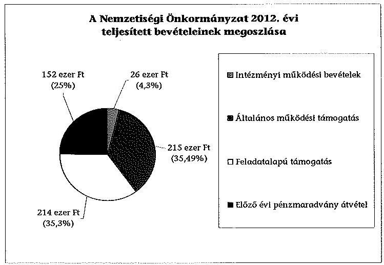
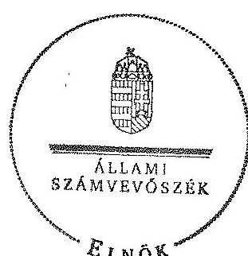

# ÁLLAMI   SZÁMVEVŐSZÉK 

## JELENTÉS

a helyi nemzetiségi önkormányzatok gazdálkodásának ellenőrzéséről
Gyömrő Város Roma Nemzetiségi Önkormányzat

---

# Állami Számvevőszék 

Iktatószám: V-0219-076/2014.
Témaszám: 1254
Vizsgálat-azonosító szám: V065221

## Az ellenőrzést felügyelte:

Horváth Balázs
felügyeleti vezető
Az ellenőrzést vezette és az ellenőrzés végrehajtásáért felelős:
Pats Regina
ellenőrzésvezető
A számvevőszéki jelentést készítették és a jelentés összeállításában
közremüködtek:
Dr. Fátrainé Zsebedics Katalin
számvevő tanácsos
Dr. Győri Gabriella Márta
számvevő tanácsos
Az ellenőrzést végezték:
Béres László
számvevő

Hálóné Pelikán Veronika
számvevő

---

# TARTALOMJEGYZÉK 

BEVEZETÉS ..... 3
I. ÖSSZEGZŐ MEGÁLLAPÍTÁSOK, KÖVETKEZTETÉSEK, JAVASLATOK ..... 6
II. RÉSZLETES MEGÁLLAPÍTÁSOK ..... 12

1. A Nemzetiségi Önkormányzat és a Települési Önkormányzat együttműködésének szabályozása, a múködési feltételek biztosítása ..... 12
2. A gazdálkodási feladatok ellátásának szabályszerűsége ..... 13
2.1. A költségvetésre és zárszámadásra, valamint a kincstári adatszolgáltatás rendjére vonatkozó jogszabályi előírások betartása ..... 13
2.2. A Nemzetiségi Önkormányzat gazdálkodásának szabályozottsága ..... 14
2.3. Az operatív gazdálkodási jogkörök kialakítása, gyakorlása ..... 14
3. A Nemzetiségi Önkormányzattal kapcsolatos gazdálkodási feladatok belső ellenőrzése ..... 15
4. A feladatalapú támogatás felhasználásának, elszámolásának szabályszerűsége, a Nemzetiségi Önkormányzat feladatellátása ..... 16
MELLÉKLET
5. számú A Nemzetiségi Önkormányzat 2012. évi gazdálkodásának főbb adatai, mutatói
FÜGGELÉKEK
6. számú Rövidítések jegyzéke
7. számú Értelmező szótár
8. számú A gazdálkodás értékelésének módszere

---

.

---

# JELENTÉS   a helyi nemzetiségi önkormányzatok gazdálkodásának ellenőrzéséről Gyömrő Város   Roma Nemzetiségi Önkormányzat 

## BEVEZETÉS

A Nemzetiségi Önkormányzat a 2010. évben alakult, elnöke 2011. év óta látja el feladatát. A Nemzetiségi Önkormányzat intézményt, gazdasági társaságot és más szervezetet nem alapított, illetve társulásban nem vett részt. A háromtagú Képviselő-testület a munkája segítésére bizottságot nem hozott létre. A Nemzetiségi Önkormányzat költségvetési beszámolója szerint a 2012. évben a módosított költségvetési bevételi előirányzat 215 ezer Ft, a módosított költségvetési kiadási előirányzat 367 ezer Ft, a teljesített költségvetési bevétel 455 ezer Ft, a teljesített költségvetési kiadás 443 ezer Ft volt. A Nemzetiségi Önkormányzat a 2011. évben nem részesült feladatalapú támogatásban. A 2012. évi gazdálkodási adatokat részletesen az 1. számú mellékletben mutatjuk be.

Az Alaptörvény XXIX. cikk (1) bekezdése szerint a Magyarországon élő nemzetiségek államalkotó tényezők. Minden, valamely nemzetiséghez tartozó magyar állampolgárnak joga van önazonossága szabad vállalásához és megőrzéséhez. A hazánkban élő nemzetiségek helyi (települési és területi), valamint országos önkormányzatokat hozhatnak létre ${ }^{1}$. A helyi nemzetiségi önkormányzatok gazdálkodási feladatait jogszabályi előírás alapján a székhely szerinti helyi önkormányzat polgármesteri hivatala látja el.

A nemzetiségek helyzete, támogatása mind hazai, mind EU-s szinten kiemelt figyelmet kap napjainkban. A helyi nemzetiségi önkormányzatok gazdálkodására és támogatási rendszerére vonatkozó jogszabályok a 2010-2012. években jelentős változásokon mentek át. A települési és területi nemzetiségi önkormányzatok gazdálkodásának, a részükre juttatott költségvetési támogatások felhasználásának ellenőrzését az ÁSZ 2012-ben sorozatjellegű ellenőrzés keretében indította el. A 2013. évi ellenőrzések e témacsoportos ellenőrzések folytatását jelentik, amelyet az ÁSZ 2014. első félévi ellenőrzési terve 12. témasorszámon tartalmaz.

Az ellenőrzés célja annak értékelése volt, hogy a nemzetiségi önkormányzat gazdálkodási kereteinek kialakítása, gazdálkodása és feladatellátása megfelelt-e a jogszabályoknak.

[^0]
[^0]:    ${ }^{1}$ A 2010. évben megtartott nemzetiségi önkormányzati választásokat követően 2304 települési, 58 területi és 13 országos nemzetiségi önkormányzat alakult meg.

---

Ennek keretében értékeltük, hogy:

- a nemzetiségi önkormányzat és a települési önkormányzat együttműködésének szabályozása, a működési feltételek biztosítása megfelelt-e a jogszabályi előírásoknak;
- a felek együttműködése megfelelt-e a közöttük létrejött megállapodásnak a gazdálkodási feladatok szabályszerű ellátása során, ennek keretében betar-tották-e a helyi nemzetiségi önkormányzat gazdálkodásához kapcsolódóan a költségvetésre és zárszámadásra, a gazdálkodás szabályozására, az operatív gazdálkodási jogkörök gyakorlására vonatkozó jogszabályi előírásokat;
- a jegyző biztosította-e a nemzetiségi önkormányzat gazdálkodásának belső ellenőrzését;
- a nemzetiségi önkormányzat feladatalapú támogatásának felhasználása, a folyósított feladatalapú támogatással történő elszámolás az előírásoknak megfelelő volt-e;
- a nemzetiségi önkormányzat feladatellátása összhangban volt-e a vonatkozó jogszabályi előírásokkal.

Az ellenőrzés várható hasznosulását négy szinten tervezzük. A törvényalkotás számára összegzett tapasztalatok állnak rendelkezésre a nemzetiségi önkormányzatok testületi döntéseinek, gazdálkodásának és a feladatalapú támogatás felhasználásának szabályszerűségéről, amelynek alapján következtetést lehet levonni arra, hogy indokolt-e esetleges jogszabályi módosítás kezdeményezése. Az ellenőrzés az ellenőrzött számára visszajelzést ad a működésében fellépő hiányosságokról, javaslataival hozzájárul azok kiküszöböléséhez, amely csökkentheti a későbbi ellenőrzések gyakoriságát. Az ellenőrzés megállapításai és javaslatai tanulságul szolgálhatnak más nemzetiségi önkormányzatok, szervezetek számára a rendezett gazdálkodási keretek kialakításához. A társadalom számára jelzi, hogy közpénz nem maradhat ellenőrizetlenül, az ÁSZ értékteremtő rend kialakításához és megőrzéséhez hozzájáruló tevékenysége pozitív hatással lesz a szervezetről kialakított összkép formálásában. Az ÁSZ szervezetén belül lehetőség nyílik arra, hogy a megállapítások szintetizálásával az intézmény a hozzáadott értéket teremtő elemző tevékenységét és tanácsadó szerepét erősítse.

A helyi nemzetiségi önkormányzatok gazdálkodásának ellenőrzéséről szóló jelentés I. fejezetének összegző része az ellenőrzés céljára adott rövid, szintetizáló összefoglalót és következtetéseket tartalmazza a II. fejezet részletes megállapításain alapulóan. A jelentés intézkedést igénylő megállapításait és javaslatait az összegzőben foglaltak mellett - az ellenőrzés során feltárt, a jelentés II. fejezetében rögzített részletes megállapítások alapozzák meg, illetve támasztják alá.

Az ellenőrzés típusa: szabályszerűségi ellenőrzés.
Az ellenőrzött időszak: a 2012. január 1. - 2012. december 31. közötti időszak. Az ellenőrzés kiterjedt a helyi nemzetiségi önkormányzatoknak juttatott 2012. évi feladatalapú támogatás 2013. évben való elszámolására is.

---

Ellenőrzött szervezet: Gyömrő Város Roma Nemzetiségi Önkormányzat és a gazdálkodási feladatait ellátó Gyömrő Város Önkormányzata.

Az ellenőrzés végrehajtásának jogszabályi alapját az ÁSZ tv. 5. § (2)-(3) és (6) bekezdésében foglaltak képezik.

Az ellenőrzés szakmai módszertana az ÁSZ hivatalos honlapján (www.asz.hu) közzétett szakmai szabályokon alapult, amely a Legfőbb Ellenőrző Intézmények Nemzetközi Szervezete (INTOSAI) által kiadott nemzetközi standardok (ISSAI) figyelembevételével készült.

A helyi nemzetiségi önkormányzatok gazdálkodásának ellenőrzése során értékeltük a települési önkormányzat és a nemzetiségi önkormányzat együttmúködésének, a gazdálkodás szabályozottságának és a pénzügyi folyamatokban kulcsszerepet betöltő belső kontrollok (teljesítésigazolás és érvényesítés) múködésének megfelelőségét. A kulcskontrollokat a dologi kiadásokkal kapcsolatos kifizetéseknél véletlen mintavételi eljárást alkalmazva ellenőriztük. Ellenőriztük, hogy a jegyző biztositotta-e a nemzetiségi önkormányzat gazdálkodásának belső ellenőrzését. Értékeltük a feladatalapú támogatások felhasználásának, elszámolásának szabályszerűségét, a nemzetiségi önkormányzat feladatellátása és a jogszabályi előírások összhangját.

Az ellenőrzés lefolytatásához a Nemzetiségi Önkormányzat és a gazdálkodási feladatait ellátó Települési Önkormányzat tanúsítványok és a kapcsolódó, dokumentumjegyzékben megjelölt dokumentumok elektronikus úton történő megküldésével, rendelkezésre bocsátásával szolgáltatott adatokat. Az adatszolgáltatás kontrollálása és szükség szerinti javítása a helyszíni ellenőrzés keretében történt. A gazdálkodás értékelésének módszerét a 3. számú függelék tartalmazza.

Az ÁSZ tv. 29. § (1) bekezdése szerint a jelentéstervezetet megküldtük a polgármester és a Nemzetiségi Önkormányzat elnöke részére, akik az ÁSZ tv. 29. § (2) bekezdésében foglalt észrevételezési jogukkal nem éltek, a jelentéstervezetre észrevételt nem tettek.

---

# I. ÖSSZEGZŐ MEGÁLLAPÍTÁSOK, KÖVETKEZTETÉSEK, JAVASLATOK 

A Nemzetiségi Önkormányzat és a Települési Önkormányzat együttmüködésének szabályozása megfelelt a jogszabályi előírásoknak. A Nemzetiségi Önkormányzat a 2012. év egészét érintően rendelkezett a Települési Önkormányzattal kötött együttműködési megállapodással. A 2012. december 31 -én hatályos együttműködési megállapodás ${ }_{2}$ a jogszabályi előírásoknak megfelelően tartalmazta a Nemzetiségi Önkormányzat múködési feltételeit, valamint a tervezési, gazdálkodási, ellenőrzési, finanszírozási, adatszolgáltatási és beszámolási feladatok ellátásának részletes szabályait. A jogszabályi előírások azonban nem érvényesültek maradéktalanul. Az együttműködési megállapodás ${ }_{2}$ a Nek. ${ }_{2}$ tv. előírása ellenére nem tartalmazta a Nemzetiségi Önkormányzat törzskönyvi nyilvántartásba vételével, valamint adószám igénylésével kapcsolatos határidőket, együttműködési kötelezettségeket és ezek felelőseinek konkrét kijelölését. A Települési Önkormányzat a szabályozási hiányosságok ellenére biztosította a Nemzetiségi Önkormányzat múködéséhez szükséges személyi és tárgyi feltételeket.

A Nemzetiségi Önkormányzat a 2012. évi költségvetése, zárszámadása, valamint kincstári adatszolgáltatása a jogszabályi előírásoknak részben felelt meg. A Nemzetiségi Önkormányzat elnöke a költségvetési és a zárszámadási határozat tervezetét határidőben benyújtotta a Képviselő-testületnek. A jóváhagyott költségvetés tartalmazta a Nemzetiségi Önkormányzat bevételeit és kiadásait, azonban az Áht. ${ }_{2}$-ben foglaltak ellenére nem tartalmazta a költségvetési egyenleg összegét, valamint a finanszírozási célú bevételekkel és kiadásokkal kapcsolatos hatásköröket. A költségvetésben és a zárszámadásban a jegyző mulasztásából a Képviselő-testület részére - tájékoztatás céljából - nem mutatták be a Nemzetiségi Önkormányzat költségvetési mérlegét, valamint a zárszámadásban - a jegyző általi elkészítés hiányában - az előírt kimutatásokat, szöveges indoklással együtt. A zárszámadási határozatban szereplő 2012. évi pénzmaradvány összege eltért a határozat mellékletében és az éves elemi költségvetési beszámolóban kimutatott összegtől. A határozattal elfogadott zárszámadásban a Nemzetiségi Önkormányzat valamennyi bevételéről és kiadásáról elszámoltak. A bevételi és kiadási előirányzatokat azonban az intézményi múködési bevételek és a feladatalapú támogatás kapcsán - az Áht. ${ }_{2}$ előírásait figyelmen kívül hagyva - nem módosították, ezért a 2012. évi kiadási és bevételi előirányzatok teljesítése a módosított előirányzatokat túllépte. A jegyző a Nemzetiségi Önkormányzatra vonatkozó kincstári adatszolgáltatási kötelezettségeinek csak részben tett eleget, mert három esetben az Ávr.-ben, illetve az Áhsz. ${ }_{1}$-ben előírt határidőt követően teljesítette az adatszolgáltatást.

A Nemzetiségi Önkormányzat gazdálkodásának szabályozottsága az ellenőrzött időszakban megfelelt a jogszabályi előírásoknak. A Polgármesteri Hivatal leltárkészítési és leltározási, eszközök és források értékelési és pénzkezelési szabályzatának, számviteli politikájának és számlarendjének, az ellenőrzési nyomvonalának, a szabálytalanságok kezelése eljárásrendjének, valamint a folyamatba épített előzetes, utólagos és vezetői ellenőrzés szabályozásának ha-

---

tálya a 2012. évben kiterjedt a Nemzetiségi Önkormányzat gazdálkodásának végrehajtásával kapcsolatos végrehajtási feladatokra. A tervezéssel, gazdálkodással és az adatszolgáltatási feladatok teljesítésével kapcsolatos belső előírásokat, feltételeket a gazdálkodási jogkörök szabályzata ${ }_{1,2}$, illetve a 2012. évben hatályos együttmúködési megállapodás ${ }_{1,2}$ tartalmazták. A jogszabályi előírások azonban nem érvényesültek maradéktalanul, mert a Polgármesteri Hivatal SZMSZ-e az Ávr.-ben foglaltak ellenére nem tartalmazta a Nemzetiségi Önkormányzat gazdálkodásával kapcsolatos, SZMSZ-ben nevesített munkakörökhöz tartozó feladat és hatáskörök gyakorlásának módját, a helyettesítés rendjét és a felelősségi szabályokat.

A Nemzetiségi Önkormányzat gazdálkodása tekintetében az operatív gazdálkodási jogkörök kialakítása a 2012. évben megfelelő volt. Az összeférhetetlenségi követelmények érvényesülésének feltételei biztosítottak voltak, mivel a Nemzetiségi Önkormányzat elnöke a kötelezettségvállalás, a teljesítésigazolás és az utalványozás gyakorlására felhatalmazott más képviselőt. A gazdasági vezető - jogkörében eljárva - 2012. április 1-jétől felhatalmazott köztisztviselőket a pénzügyi ellenjegyzési és az érvényesítési feladatok ellátására. A Nemzetiségi Önkormányzatnál a 2012. évben a dologi kiadások teljesítése során a teljesítésigazolás és az érvényesítés kulcskontrollok müködésének megfelelősége gyenge volt, a hibák száma a lényegességi szintet, a kritikus hibahatárt elérte. A teljesítést igazoló személyét és aláírás-mintáját az operatív gazdálkodási jogkörök gyakorlására jogosultakról vezetett nyilvántartás 2012. április 1-jét megelőzően az Ávr. előírása ellenére nem tartalmazta. Egy kifizetés esetében a 100 ezer Ft feletti kötelezettségvállalásra az Áht. ${ }_{2}$ előírása ellenére pénzügyi ellenjegyzés hiányában került sor. Az érvényesítő az Ávr.-ben foglaltakkal ellentétben nem ellenőrizte, hogy a megelőző ügymenetben betartottáke a gazdálkodásra vonatkozó szabályokat és nem jelezte az utalványozónak, hogy a kötelezettségvállalásra ellenjegyzés nélkül került sor. A bizonylatokon az érvényesítést végző személy aláírása az Ávr.-ben foglaltak szerinti aláírásnyilvántartás alapján nem volt beazonosítható, mert az érvényesítő a rövidített aláírását (szignóját) alkalmazta. A Nemzetiségi Önkormányzatnál a 2012. évi dologi kiadások között a három legnagyobb összegű kiadás teljesítésének egyedi értékelése alapján a teljesítésigazolás és az érvényesítés kulcskontrollok múködésének feltárt hiányosságai megegyezőek voltak a dologi kiadások értékelésénél feltárt hiányosságokkal. A kulcskontrollok működéséhez kapcsolódó hiányosságok miatt nem biztosították a hibák megelőzését, feltárását és kijavítását. A számvevőszéki ellenőrzés a kifizetések bizonylatainak ellenőrzése során a rendelkezésre bocsátott dokumentumok alapján - összeférhetetlenséget, illetve jogosulatlan kifizetést nem tárt fel.

A jegyző a Nemzetiségi Önkormányzat gazdálkodásával összefüggő végrehajtási feladatok belső ellenőrzését biztosította, azonban a Polgármesteri Hivatal 2012. évi belső ellenőrzési tervét megalapozó kockázatelemzés a Ber.-ben foglaltak ellenére nem készült. A 2012. évi belső ellenőrzési tervben a Polgármesteri Hivatal szabályzatainak felülvizsgálata szerepelt, mely szabályzatok hatálya kiterjedt a Nemzetiségi Önkormányzat gazdálkodásának végrehajtásával összefüggő feladataira is. Az ellenőrzési terv alapján lefolytatott ellenőrzés hiányosságot nem tárt fel. Az összefoglaló ellenőrzési jelentés tartalmát a jegyző a Nemzetiségi Önkormányzat elnökével ismertette.

---

A Nemzetiségi Önkormányzat a 2012. évben a bevételei 35,3\%-át kitevő, 214 ezer Ft összegű feladatalapú támogatásban részesült. A Nemzetiségi Önkormányzat a támogatás teljes összegét beiskolázási tanszercsomagra fordította. Az elszámolás a támogatási kormányrendelet ${ }_{2}$ alapján az Áht. ${ }_{2}$ rendelkezése ellenére nem történt meg. A támogatás felhasználását, elszámolását az arra jogosult külső szervek nem ellenőrizték. A Nemzetiségi Önkormányzat kötelező és önként vállalt közfeladat ellátásának tárgya összhangban volt a Nek. ${ }_{2}$ tv.-ben foglalt előírásokkal.

Az ÁSZ tv. 33. § (1) bekezdésében foglaltuk értelmében az ellenőrzött szervezet vezetője köteles a jelentésben foglalt megállapításokhoz kapcsolódó intézkedési tervet összeállítani és azt a jelentés kézhezvételétől számított 30 napon belül az ÁSZ részére megküldeni. Amennyiben az intézkedési tervet határidőre nem küldi meg a szervezet, vagy az nem elfogadható, az ÁSZ elnöke az ÁSZ tv. 33. § (3) bekezdés a)-b) pontjaiban foglaltakat érvényesítheti.

A helyszíni ellenőrzés megállapításainak hasznosítása mellett javasoljuk:

# a jegyzőnek 

1. az együttműködés szabályozásával kapcsolatban

Az együttműködési megállapodás ${ }_{2}$ a Nek. ${ }_{2}$ tv. 80. § (3) bekezdés a) pontjában meghatározottak közül nem tartalmazta a Nemzetiségi Önkormányzat törzskönyvi nyilvántartásba vételével, valamint adószám igénylésével kapcsolatos határidőket, együttműködési kötelezettségeket és ezek felelőseinek konkrét kijelölését.

Javaslat
Az együttműködés szabályszerűsége érdekében készítse elő az együttműködési megállapodás ${ }_{2}$ módosítását, hogy az tartalmilag feleljen meg a Nek. ${ }_{2}$ tv. 80. § (3) bekezdés a) pontjában foglaltaknak.
2. a költségvetéssel és zárszámadással, valamint a kapcsolódó kincstári adatszolgáltatással kapcsolatban

A Képviselő-testület által elfogadott 2012. évi költségvetési határozat az Áht. ${ }_{2}$ 23. § (2) bekezdés c) és h) pontjaiban előírtak ellenére nem tartalmazta a költségvetési egyenleg összegét, továbbá a finanszírozási bevételekkel és kiadásokkal kapcsolatos hatásköröket. A 2012. évi költségvetési határozattervezet előterjesztésekor az Áht. ${ }_{2}$ 24. § (4) bekezdés a) pontja előírásait figyelmen kívül hagyva a Képvise-lő-testület részére a jegyző mulasztása miatt tájékoztatásul nem mutatták be a Nemzetiségi Önkormányzat költségvetési mérlegét szöveges indoklással együtt.

A 2012. évi zárszámadási határozattervezet előterjesztésekor az Áht. ${ }_{2}$ 91. § (2) bekezdés a) pontjában foglalt előírások ellenére a Képviselő-testülete részére a jegyző általi elkészítés hiánya miatt tájékoztatásul nem mutatták be az előírt mérlegeket és kimutatásokat. A 2012. évi kiadási és bevételi előirányzatok teljesítése - az Áht. ${ }_{2}$ 6. § (1) bekezdésében foglalt előírás ellenére - a módosított előirányzatokat túllépte.

---

A jegyző a Nemzetiségi Önkormányzatra vonatkozó kincstári adatszolgáltatási kötelezettségének csak részben tett eleget, mert az I. negyedéves időközi költségvetési jelentést az Ávr. 169. § (2) bekezdése, az I. negyedéves időközi mérlegjelentést az Ávr. 170. § (2) és (5) bekezdése, az éves elemi költségvetési beszámolót az Áhsz. ${ }_{1}$ 10. § (1) és (5a) bekezdései szerinti határidőket követően küldte meg a Kincstárnak.

Javaslat
Gondoskodjon a jövőben arról, hogy:
a) a költségvetési határozat tartalmazza az Áht. ${ }_{2}$ 23. § (2) bekezdés c) és h) pontjaiban előírt tartalmi elemeket, továbbá a költségvetési határozattervezet előterjesztésekor a Képviselő-testületnek tájékoztatásul bemutatásra kerüljön az Áht. ${ }_{2}$ 24. § (4) bekezdés a) pontjában előírt mérleg szöveges indoklással együtt;
b) a zárszámadási határozattervezet előterjesztésekor az Áht. ${ }_{2}$ 91. § (2) bekezdés a) pontjában előírt mérlegek és kimutatások a Képviselő-testületnek tájékoztatásul bemutatásra kerüljenek;
c) a költségvetés végrehajtása során az Áht. ${ }_{2}$ 6. § (1) bekezdésében foglalt előírást betartsák;
d) a kincstári adatszolgáltatási kötelezettségének az Ávr. 169. § (2) és 170. § (2) és (5) bekezdéseiben, valamint az Áhsz. ${ }_{2}$ 34. § (4) bekezdésében foglalt határidők betartásával tegyen eleget.
3. a gazdálkodási feladatok szabályozottságával kapcsolatban

A Polgármesteri Hivatal SZMSZ-e nem tartalmazta az Ávr. 13. § (1) bekezdés g) pontjában foglaltak szerinti, az SZMSZ-ben nevesített munkakörökhöz tartozó - a Nemzetiségi Önkormányzat gazdálkodásának végrehajtásával kapcsolatos - feladatás hatáskörökre, a hatáskörök gyakorlásának módjára, a helyettesítés rendjére, az ezekhez kapcsolódó felelősségi szabályokra vonatkozó előírásokat.

Javaslat
A gazdálkodás szabályszerűsége érdekében a Nemzetiségi Önkormányzat gazdálkodásának végrehajtására is kiterjedően készítse el a Polgármesteri Hivatal SZMSZ-ének módosítását, hogy az tartalmazza az Ávr. 13. § (1) bekezdés g) pontjában foglaltakat.
4. a kulcskontrollok múködésével kapcsolatban

Egy esetben az érvényesítő - az Ávr. 58. § (1)-(2) bekezdéseiben foglaltak ellenére nem ellenőrizte, hogy a megelőző ügymenetben betartották-e a gazdálkodásra vonatkozó szabályokat, továbbá nem jelezte az utalványozónak, hogy a kötelezettségvállalásra pénzügyi ellenjegyzés hiányában került sor. A bizonylatokon az érvényesítő aláírása az Ávr. 60. § (3) bekezdésében foglaltak szerinti aláírás-nyilvántartás alapján nem volt beazonosítható.

---

Javaslat
Az operatív gazdálkodás működési hibáinak megelőzése, feltárása és kijavítása érdekében gondoskodjon arról, hogy:
a) az érvényesítő az Ávr. 58. § (1)-(2) bekezdéseiben előírt ellenőrzési, jelzési és igazolási feladatait maradéktalanul lássa el;
b) a kötelezettségvállalásra, pénzügyi ellenjegyzésre, teljesítés igazolásra, érvényesítésre és utalványozásra jogosult személyekről és aláírás-mintájukról az Ávr. 60. § (3) bekezdésében előírt nyilvántartás naprakészen vezessék, valamint a jogosultságok igazolása során a nyilvántartásnak megfelelő aláírásokat alkalmazzák.
5. a feladatalapú támogatás elszámolásával kapcsolatban

A 2012. évi feladatalapú támogatás elszámolása a támogatási kormányrendelet ${ }_{2} 8 . \S$ (5) bekezdésében hivatkozott „a helyi önkormányzatok elszámolási és ellenőrzési rendjére vonatkozó jogszabályok rendelkezései alkalmazandóak" előírása alapján az Áht. ${ }_{2}$ 57. § (3) bekezdése ellenére nem történt meg.

Javaslat
Gondoskodjon az Áht. ${ }_{2}$ 27. § (2) bekezdésében meghatározott feladatkörében a Nemzetiségi Önkormányzat által igénybe vett 2012. évi feladatalapú támogatás elszámolásának elkészítéséről, figyelemmel az Áht. ${ }_{2}$ 53. § (1) bekezdésében foglaltakra.

# a polgármesternek 

Az együttműködési megállapodás ${ }_{2}$ a Nek. ${ }_{2}$ tv. 80. § (3) bekezdés a) pontjában meghatározottak közül nem tartalmazta a Nemzetiségi Önkormányzat törzskönyvi nyilvántartásba vételével, valamint adószám igénylésével kapcsolatos határidőket, együttműködési kötelezettségeket és ezek felelőseinek konkrét kijelölését.

A Polgármesteri Hivatal SZMSZ-e nem tartalmazta az Ávr. 13. § (1) bekezdés g) pontjában foglaltak szerinti, az SZMSZ-ben nevesített munkakörökhöz tartozó - a Nemzetiségi Önkormányzat gazdálkodásának végrehajtásával kapcsolatos - feladatés hatáskörökre, a hatáskörök gyakorlásának módjára, a helyettesítés rendjére, az ezekhez kapcsolódó felelősségi szabályokra vonatkozó előírásokat.

Javaslat
Terjessze a Települési Önkormányzat Képviselő-testülete elé jóváhagyásra:
a) a Nek. ${ }_{2}$ tv. 80. § (3) bekezdés a) pontjainak megfelelő, a jegyző által előkészített együttműködési megállapodás ${ }_{2}$ módosítását;
b) az Ávr. 13. § (1) bekezdés g) pontjában foglalt szabályozásra figyelemmel a Polgármesteri Hivatal SZMSZ-ének jegyző által elkészített módosítását.

---

# a Nemzetiségi Önkormányzat elnökének 

1. Az együttműködési megállapodás ${ }_{2}$ a Nek. ${ }_{2}$ tv. 80. § (3) bekezdés a) pontjában meghatározottak közül nem tartalmazta a Nemzetiségi Önkormányzat törzskönyvi nyilvántartásba vételével, valamint adószám igénylésével kapcsolatos határidőket, együttműködési kötelezettségeket és ezek felelőseinek konkrét kijelölését.

Javaslat
Terjessze a Képviselő-testület elé jóváhagyásra a Nek. ${ }_{2}$ tv. 80. § (3) bekezdés a) pontjainak megfelelő, a jegyző által előkészített együttműködési megállapodás ${ }_{2}$ módosítását.
2. A Nemzetiségi Önkormányzat elnöke a 2012. évi költségvetési határozattervezet előterjesztésekor az Áht. ${ }_{2}$ 24. § (4) bekezdés a) pontja előírását figyelmen kívül hagyva a Képviselő-testület részére tájékoztatásul nem mutatta be a Nemzetiségi Önkormányzat költségvetési mérlegét szöveges indoklással együtt. A 2012. évi zárszámadási határozattervezet előterjesztésekor az Áht. ${ }_{2}$ 91. § (2) bekezdés a) pontjában foglalt előírások ellenére a Képviselő-testülete részére tájékoztatásul nem mutatta be az előírt mérlegeket és kimutatásokat.

Javaslat
Gondoskodjon a jövőben a Képviselő-testület elé terjesztésekor:
a) a jegyző által előkészített költségvetési határozattervezet beterjesztése mellett tájékoztatásul mutassa be az Áht. ${ }_{2}$ 24. § (4) bekezdés a) pontjában előírt költségvetési mérleget szöveges indoklással együtt;
b) a jegyző által elkészített zárszámadási határozattervezet beterjesztése mellett tájékoztatásul mutassa be az Áht. ${ }_{2}$ 91. § (2) bekezdés a) pontjában előírt mérlegeket, kimutatásokat.
3. A 2012. évi feladatalapú támogatás elszámolása a támogatási kormányrendelet ${ }_{2}$ 8. § (5) bekezdésében hivatkozott „a helyi önkormányzatok elszámolási és ellenőrzési rendjére vonatkozó jogszabályok rendelkezései alkalmazandóak" előírása alapján az Áht. ${ }_{2}$ 57. § (3) bekezdése ellenére nem történt meg.

Javaslat
Terjessze a Képviselő-testület elé jóváhagyásra az Áht. ${ }_{2}$ 53. § (1) bekezdése szerinti beszámolási kötelezettség teljesítéséhez összeállított, a Nemzetiségi Önkormányzat által igénybevett 2012. évi feladatalapú támogatás rendeltetésszerú felhasználásáról szóló elszámolást.

---

# II. RÉSZLETES MEGÁLLAPÍTÁSOK 

## 1. A Nemzetiségi Önkormányzat És a Települési Önkormányzat együttmúködésének szabályozása, a múködési feltételek BIZTOSÍTÁSA

A Nemzetiségi Önkormányzat és a Települési Önkormányzat együttmúködésének szabályozása megfelelt a jogszabályi előírásoknak.

A Nemzetiségi Önkormányzat a 2012. év egészét érintően rendelkezett a Települési Önkormányzattal kötött együttműködési megállapodással. Az együttmúködési megállapodás ${ }_{1,2}$-t a Képviselő-testület és a Települési Önkormányzat Képviselő-testülete határozattal ${ }^{2}$ jóváhagyták és az arra jogosult személyek aláírták.

A 2012. december 31-én hatályos együttműködési megállapodás ${ }_{2}$ a jogszabályi előírásoknak megfelelően tartalmazta a Nemzetiségi Önkormányzat múködési feltételeit, valamint a tervezési, gazdálkodási, ellenőrzési, finanszírozási, adatszolgáltatási és beszámolási feladatok ellátásának részletes szabályait.

A jogszabályi előírások azonban nem érvényesültek maradéktalanul.
Az együttműködési megállapodás ${ }_{2}$ a Nek. ${ }_{2}$-tv. 80. § (3) bekezdés a) pontjában meghatározottak közül nem tartalmazta a Nemzetiségi Önkormányzat törzskönyvi nyilvántartásba vételével, valamint adószám igénylésével kapcsolatos határidőket, együttműködési kötelezettségeket és ezek felelőseinek konkrét kijelölését.

A Nek. ${ }_{2}$ tv. 80. § (2) bekezdésében foglaltakat figyelmen kívül hagyva az együttműködési megállapodás ${ }_{2}$ szerinti múködési feltételeket a Nemzetiségi Önkormányzat SZMSZ-ében a megállapodás megkötését követő harminc napon túl ${ }^{3}$ rögzítették.

A Települési Önkormányzat a szabályozási hiányosságok ellenére biztosította a Nemzetiségi Önkormányzat múködéséhez szükséges személyi és tárgyi feltételeket.

[^0]
[^0]:    ${ }^{2}$ A Képviselő-testület 5/2010. (XII. 9.) CÖK számú határozatával és a Települési Önkormányzat Képviselő-testületének 341/2010. (XII. 13.) számú határozatával jóváhagyott együttműködési megállapodás ${ }_{1}$ volt hatályban 2012. május 31-éig. A felülvizsgált megállapodást a Képviselő-testület 4/2012. (V.30.) RNÖ számú határozata és a Települési Önkormányzat Képviselő-testületének 118/2012. (V. 31.) számú határozata hagyta jóvá, a megállapodást 2012. június 1-jén a polgármester és a Nemzetiségi Önkormányzat elnöke írta alá, mely az aláírása napjától hatályos.
    ${ }^{3}$ Az együttműködési megállapodás ${ }_{2}$-t 2012. június 1 -jén kötötték meg, az SZMSZ-t 2012. szeptember 24-én módosították.

---

# 2. A GAZDÁLKODÁSI FELADATOK ELLÁTÁSÁNAK SZABÁLYSZERŰSÉGE 

### 2.1. A költségvetésre és zárszámadásra, valamint a kincstári adatszolgáltatás rendjére vonatkozó jogszabályi előírások betartása

A Nemzetiségi Önkormányzat 2012. évi költségvetésének és zárszámadásának tartalma, jóváhagyása, valamint a kapcsolódó adatszolgáltatás szabályszerűsége részben felelt meg a jogszabályi előírásoknak.

A Nemzetiségi Önkormányzat elnöke a 2012. évi költségvetési határozat tervezetét határidőben benyújtotta a Képviselő-testületnek. A költségvetési határozat ${ }^{4}$ tartalmazta a Nemzetiségi Önkormányzat költségvetési bevételeit és költségvetési kiadásait előirányzat-csoportok, kiemelt előirányzatok szerinti bontásban. A 2012. évi költségvetés előterjesztésekor a Képviselő-testület részére - tájékoztatás céljából - bemutatták a Nemzetiségi Önkormányzat előirányzatfelhasználási tervét, azonban az Áht. ${ }_{2} 24$. § (4) bekezdés a) pontjában előírtakkal ellentétben a jegyző mulasztása miatt nem mutatták be a költségvetési mérleget. A jóváhagyott költségvetési határozat az Áht. ${ }_{2} 23 . \S$ (2) bekezdés c) pontjában előírtak ellenére nem tartalmazta költségvetési egyenleg összegét, valamint a költségvetés végrehajtásával kapcsolatban az Áht. ${ }_{2} 23$. § (2) bekezdés h) pontjában előírt finanszírozási célú bevételekkel és kiadásokkal kapcsolatos hatásköröket.

A jegyző által elkészített zárszámadási határozat tervezetet a Nemzetiségi Önkormányzat elnöke az Áht. ${ }_{2}$-ben foglalt határidőben beterjesztette a Képvise-lö-testületnek elfogadásra. A zárszámadási határozat-tervezet előterjesztésekor az Áht. ${ }_{2} 91 . \S$ (2) bekezdés a) pontjában foglaltak ellenére a Képviselő-testület részére a jegyző általi elkészítés hiánya miatt tájékoztatásul nem mutatták be az előírt mérlegeket és kimutatásokat, szöveges indoklással együtt. A zárszámadási határozatban ${ }^{5}$ feltüntetett 2012. évi pénzmaradvány ( 161 ezer Ft) összege eltért a zárszámadási határozat 1. számú mellékletében és az éves elemi költségvetési beszámolóban szereplő (164 ezer Ft) összegtől. Az elfogadott költségvetés és a határozattal elfogadott zárszámadás közötti összehasonlíthatóságot biztosították. A zárszámadási határozatban a Nemzetiségi Önkormányzat valamennyi bevételéről és kiadásáról elszámoltak. A bevételi és kiadási előirányzatokat azonban az intézményi múködési bevételek és a feladatalapú támogatás kapcsán nem módosították, ezért a 2012. évi kiadási és bevételi előirányzatok teljesítése - az Áht. ${ }_{2} 6 . \S$ (1) bekezdésében foglalt előírás ellenére - a módosított előirányzatokat túllépte.

A jegyző a Nemzetiségi Önkormányzatra vonatkozó kincstári adatszolgáltatási kötelezettségeinek csak részben tett eleget, mert az I. negyedéves időközi költségvetési jelentést az Ávr. 169. § (2) bekezdése szerinti határidőt követően, az I. negyedéves időközi mérlegjelentést az Ávr. 170. § (2) és (5) bekezdése, az

[^0]
[^0]:    ${ }^{4}$ A Képviselő-testület 3/2012. (II. 16.) számú határozata.
    ${ }^{5}$ A Képviselő-testület 2/2013. (IV. 29.) számú határozata.

---

éves elemi költségvetési beszámolót az Áhsz. ${ }_{1} 10 . \S$ (1) és (5a) bekezdése szerinti határidőket követően küldte meg a Kincstárnak.

# 2.2. A Nemzetiségi Önkormányzat gazdálkodásának szabályozottsága 

A Nemzetiségi Önkormányzat gazdálkodásának szabályozottsága az ellenőrzött időszakban megfelelt a jogszabályi előírásoknak.

A Polgármesteri Hivatal leltárkészítési és leltározási, eszközök és források értékelési és pénzkezelési szabályzatának, számviteli politikájának és számlarendjének, ellenőrzési nyomvonalának, szabálytalanságok kezelése eljárásrendjének, valamint a folyamatba épített előzetes, utólagos és vezetői ellenőrzés szabályozásának hatálya a 2012. évben kiterjedt a Nemzetiségi Önkormányzat gazdálkodásával kapcsolatos végrehajtási feladatokra.

A tervezéssel, gazdálkodással, különösen az operatív gazdálkodási jogkörök gyakorlásának módjával, eljárási és dokumentációs részletszabályaival, valamint az ezeket végző személyek kijelölési rendjével és az ellenőrzési, adatszolgáltatási feladatok teljesítésével kapcsolatos belső előírásokat a Polgármesteri Hivatal gazdálkodási jogkörök szabályzata ${ }_{1,2}$ és az együttmúködési megállapodás ${ }_{1,2}$ a jogszabályi előírásoknak megfelelően tartalmazta. A Polgármesteri Hivatalban a feladatokat ellátó közszolgálati tisztviselők munkaköri leírásai tartalmazták a Nemzetiségi Önkormányzat gazdálkodásának végrehajtásával kapcsolatos feladatokat.

A jogszabályi előírások azonban nem érvényesültek maradéktalanul, mert a Polgármesteri Hivatal SZMSZ-e nem tartalmazta az Ávr. 13. § (1) bekezdés g) pontjában foglaltak szerinti, a Nemzetiségi Önkormányzat gazdálkodásának végrehajtásával kapcsolatos - SZMSZ-ben nevesített - munkakörökhöz tartozó feladat és hatáskörök gyakorlásának módját, a helyettesítés rendjét és a felelősségi szabályokat.

### 2.3. Az operatív gazdálkodási jogkörök kialakítása, gyakorlása

A Nemzetiségi Önkormányzat gazdálkodása tekintetében az operatív gazdálkodási jogkörök kialakítása megfelelő volt.

A Nemzetiségi Önkormányzat elnöke a jogszabályi rendelkezések alapján 2012. április 1-jétől felhatalmazott más képviselőt a kötelezettségvállalás, a teljesítésigazolás és az utalványozás gyakorlására. Ezáltal az összeférhetetlenségi követelmények érvényesülésének feltételei biztosítottak voltak. A gazdálkodási jogkörök szabályzata ${ }_{2}$ szerint a teljesítést igazoló a Nemzetiségi Önkormányzat elnöke, vagy az általa kijelölt képviselő volt.

A gazdasági vezető - jogkörében eljárva - 2012. április 1-jétől felhatalmazott köztisztviselőt a pénzügyi ellenjegyzési, valamint köztisztviselőket az érvényesítési feladatok ellátására. A gazdasági vezető, a pénzügyi ellenjegyzésre és az érvényesítésre kijelölt köztisztviselők rendelkeztek az előírt szakképesítéssel.

---

A gazdálkodási jogkörök szabályzata ${ }_{1}$ mellékletében található nyilvántartás 2012. április 1-jét megelőzően az Ávr. 60. § (3) bekezdésének előírása ellenére a Nemzetiségi Önkormányzat elnökét nem tartalmazta kötelezettségvállalásra, teljesítés igazolására és utalványozásra jogosultként.

A Nemzetiségi Önkormányzatnál a 2012. évben a dologi kiadások teljesítése során a teljesítésigazolás és az érvényesítés kulcskontrollok múködésének megfelelősége gyenge volt. A hibák száma a lényegességi szintet, a kritikus hibahatárt elérte, mert:

- a teljesítést igazoló személyét és aláírás-mintáját az operatív gazdálkodási jogkörök gyakorlására jogosultakról vezetett nyilvántartás 2012. április 1-jét megelőzően az Ávr. 60. § (3) bekezdése ellenére nem tartalmazta;
- egy kifizetés esetében a 100 ezer Ft feletti kötelezettségvállalásra az Áht. 2 37. § (1) bekezdésében meghatározottakkal ellentétben pénzügyi ellenjegyzés hiányában került sor. Az érvényesítő - az Ávr. 58. § (1)-(2) bekezdéseiben foglaltak ellenére - nem ellenőrizte, hogy a megelőző ügymenetben betartot-ták-e a gazdálkodásra vonatkozó szabályokat, továbbá nem jelezte az utalványozónak, hogy a kötelezettségvállalásra pénzügyi ellenjegyzés hiányában került sor;
- a bizonylatokon az érvényesítő aláírása az Ávr. 60. § (3) bekezdésében foglaltak szerinti aláírás-nyilvántartás alapján nem volt beazonosítható. A jegyző nyilatkozata szerint az érvényesítési feladatokat az érvényesítésre felhatalmazott köztisztviselő végezte el, azonban a dokumentumokon a nyilvántartás szerinti aláírása helyett a rövidített aláírását (szignóját) alkalmazta.

A Nemzetiségi Önkormányzatnál a 2012. évi dologi kiadások között a három legnagyobb összegű kiadás teljesítésének egyedi értékelése alapján a teljesítésigazolás és az érvényesítés kulcskontrollok működésének feltárt hiányosságai megegyezőek voltak a dologi kiadások értékelésénél feltárt hiányosságokkal.

A kulcskontrollok múködéséhez kapcsolódó hiányosságok miatt nem biztosították a hibák megelőzését, feltárását és kijavítását. A számvevőszéki ellenőrzés a kifizetések bizonylatainak ellenőrzése során - a rendelkezésre bocsátott dokumentumok alapján - összeférhetetlenséget, illetve jogosulatlan kifizetést nem tárt fel.

A Nemzetiségi Önkormányzatnál működési és felhalmozási célú támogatásértékű kiadások, illetve államháztartáson kívülre teljesített múködési és felhalmozási célú pénzeszköz átadások a 2012. évben nem voltak.

# 3. A Nemzetiségi Önkormányzattal kapcsolatos gazdálkoDÁSI FELADATOK BELSŐ ELLENŐRZÉSE 

A Polgármesteri Hivatal 2012. évre vonatkozó belső ellenőrzési tervét megalapozó kockázatelemzés a Ber. 21. § (2) bekezdésében foglaltak ellenére nem készült. A 2012. évre vonatkozó belső ellenőrzési terv összeállítása során azonban

---

a jegyző figyelemmel volt a Nemzetiségi Önkormányzat gazdálkodásával kapcsolatos végrehajtási feladatokra.

A belső ellenőrzés a Polgármesteri Hivatal pénzügyi tárgyú szabályzatainak felülvizsgálatára vonatkozott, mely szabályzatok hatálya a Nemzetiségi Önkormányzat gazdálkodásának végrehajtásával kapcsolatos feladatokra is kiterjedt.

A „Gyömrő Város Önkormányzat és intézményei vonatkozásában a pénzügyiszámviteli szabályzatok" című ellenőrzésről jelentés készült, mely hiányosságokat nem tárt fel, javaslatokat nem fogalmazott meg.

A jelentésben foglaltakról a Nemzetiségi Önkormányzat elnökét a jegyző tájékoztatta.

A 2012. évre vonatkozó belső ellenőrzési terv elkészítésének idején hatályos együttműködési megállapodás ${ }_{1}$ a Nemzetiségi Önkormányzat belső ellenőrzésére vonatkozóan nem tartalmazott előírásokat. A 2012. június 1-jétől hatályos együttműködési megállapodás ${ }_{2}$ III. 6. 3. pontjában rendelkeztek a belső ellenőrzés müködtetéséről.

Az ellenőrzéshez szolgáltatott adatok alapján a 2012. évben a Kormányhivatal a Nemzetiségi Önkormányzatot illetően nem élt törvényességi felügyeleti eszközökkel.

# 4. A feladatalapú támogatás felhasználásának, elszámolásának szabályszERüsége, a Nemzetiségi Önkormányzat feladATELLÁTÁSA 

A Nemzetiségi Önkormányzat a 2012. évben 214 ezer Ft összegű feladatalapú támogatásban részesült, amelynek az összes bevételből való részesedését a következő diagram szemlélteti:

A 2012. évben folyósított feladatalapú támogatás felhasználási céljáról és elszámolás módjáról a folyósítást megelőzően a Képviselő-testület nem hozott határozatot.

---

Az ellenőrzés rendelkezésére bocsátott dokumentumok alapján a Nemzetiségi Önkormányzat a támogatás teljes összegét beiskolázási tanszercsomagra fordította, melyből 198 ezer Ft kifizetésére a 2012. évben, 16 ezer Ft felhasználására a 2012. évben tett kötelezettségvállalás alapján 2013. augusztusban került sor.

A Nemzetiségi Önkormányzat 2012. évi költségvetés elfogadásáról szóló 3/2012. (02. 16.) számú határozata 38 ezer Ft-ot tartalmazott a hátrányos helyzetűek iskolakezdési támogatására, irodaszer jogcímen. A 2012. augusztus 18 -án kelt kimutatás alapján 16 gyömrői szülő ( 33 gyermek) támogatását javasolták. A 2012. augusztus 18 -án kelt OFOEA 8092456 számú készpénzfizetési számla alapján 198 ezer Ft összegű kifizetést teljesítettek 33 db beiskolázási egységcsomag ellenértékeként, melyre az E 3531727 számú Kiadási pénztárbizonylat adatai szerint 2012. augusztus 21 -én került sor. A 2012. december 19-én kelt, a Nemzetiségi Önkormányzat elnöke által aláírt „A 2012. évi feladatalapú támogatás elszámoló$s a$ " című dokumentumban 198 ezer Ft-ot beiskolázási támogatás kifizetéseként szerepeltettek, a 16 ezer Ft maradványt érintően pedig jelezték, hogy azt a 2013. évi beiskolázási támogatásra kívánják felhasználni. Az 5/2012. (IX. 06.) számú határozatban a Képviselő-testület arról döntött, hogy „a hátrányos helyzetü gyerekek iskolakezdési támogatására fordított 200 ezer Ft-os keret felhasználást, és elszámolását elfogadja." A Nemzetiségi Önkormányzat elnöke által aláírt, 2012. december 19-én kelt dokumentumban 10 db beiskolázási egységcsomagot (füzetek, tolltartó, színes és grafit ceruza, vonalzó, radír, zsírkréta, vízfesték) rendeltek meg „a 2013. év őszi iskolakezdésre, a 2012. évi feladatalapú támogatásunk maradványa és a müködési támogatásunk terhére", „egyenként max. 20 ezer Ft értékben". A szállító a 2012. december 21-én kelt dokumentumban visszaigazolta a megrendelést azzal, hogy a csomagok egységára 19970 Ft lesz. A Nemzetiségi Önkormányzat az ellenérték kifizetését a JM9EA 0647843 számú készpénzfizetési számla alapján, 199700 Ft összegben teljesítette. A 2013. augusztus 27 -én kelt dokumentumban négy fő aláírásával igazolta, hogy tanköteles korú gyermekeik (összesen 10 fő) részére átvették a Nemzetiségi Önkormányzattól a taneszközöket.

A 2012. évi feladatalapú támogatás elszámolása a támogatási kormányrendelet ${ }_{2} 8$. § (5) bekezdésében hivatkozott „a helyi önkormányzatok elszámolási és ellenőrzési rendjére vonatkozó jogszabályok rendelkezései alkalmazandóak" előírása alapján az Áht. ${ }_{2} 57$. § (3) bekezdésében foglaltak ellenére nem történt meg. A feladatalapú támogatás felhasználását, elszámolását az ellenőrzésre jogosult külső szervek nem ellenőrizték. A Nemzetiségi Önkormányzat kötelezö és önként vállalt közfeladat ellátásának tárgya összhangban volt a Nek. ${ }_{2}$ tv. 115. §-ában és 116. § (1) bekezdésében foglalt előírásokkal.

Budapest, 2014. 06. hó $/ 4$ nap

Melléklet: 1 db
Függelék: $\quad 3 \mathrm{db}$

Dómokos László
elnök

Dömokos László
elnök

---

.

---

# A Nemzetiségi Önkormányzat 2012. évi gazdálkodásának föbb adatai, mutatói

A) Bevételek

|  Megnevezés | Eredeti elöirányzat | Módosított
ezzer Ft | Teljesítés |   |
| --- | --- | --- | --- | --- |
|   |  |  |  | megoszlás
$(\%)$  |
|  Intézményi múködési bevételek | 0,0 | 0,0 | 26,0 | 4,3  |
|  Általános múködési támogatás | 215,0 | 215,0 | 215,0 | 35,4  |
|  Feladatalapú támogatás | 0,0 | 0,0 | 214,0 | 35,3  |
|  Költségvetési bevételek | 215,0 | 215,0 | 455,0 | 75,0  |
|  Maradvány felhasználás | 152,0 | 152,0 | 152,0 | 25,0  |
|  Tárgyévi bevételek | 367,0 | 367,0 | 607,0 | 100,0  |

B) Kiadások

|  Megnevezés | Eredeti elöirányzat | Módosított
ezzer Ft | Teljesítés |   |
| --- | --- | --- | --- | --- |
|   |  |  |  | megoszlás
$(\%)$  |
|  Dologi kiadások | 367,0 | 367,0 | 443,0 | 100,0  |
|  Költségvetési kiadások | 367,0 | 367,0 | 443,0 | 100,0  |
|  Tárgyévi kiadások | 367,0 | 367,0 | 443,0 | 100,0  |

---

.

---

# RÖVIDÍTÉSEK JEGYZÉKE 

## Törvények

Alaptörvény
Áht. 1
Áht. 2
ÁSZ tv.
Nek. 1 tv.
Nek. 2 tv.

## Rendeletek

Áhsz. 1

Áhsz. 2
Ávr.

Ber.
támogatási kormányrendelet ${ }_{1}$
támogatási kormányrendelet ${ }_{2}$

## Határozatok

Nemzetiségi Önkormányzat SZMSZ-e

## Szórövidítések

ÁSZ

Magyarország Alaptörvénye
Az államháztartásról szóló 1992. évi XXXVIII. törvény (hatályos 2011. december 31-éig)
Az államháztartásról szóló 2011. évi CXCV. törvény (hatályos 2011. december 31-étől)
Az Állami Számvevőszékről szóló 2011. évi LXVI. törvény (hatályos 2011. július 1-jétől)
A nemzeti és etnikai kisebbségek jogairól szóló 1993. évi LXXVII. törvény (hatályos 2011. december 31-éig)
A nemzetiségek jogairól szóló 2011. évi CLXXIX. törvény (hatályos 2011. december 20-ától)

Az államháztartás szervezetei beszámolási és könyvvezetési kötelezettségének sajátosságairól szóló 249/2000. (XII. 24.) Korm. rendelet (hatályos 2013. december 31éig)
Az államháztartás számviteléről szóló 4/2013. (I. 11.) Korm. rendelet (hatályos 2014. január 1-jétől)
Az államháztartásról szóló törvény végrehajtásáról szóló 368/2011. (XII. 31.) Korm. rendelet (hatályos 2012. január 1-jétől)
A költségvetési szervek belső ellenőrzéséről szóló 193/2003. (XI. 26.) Korm. rendelet (hatályos 2011. december 31 -éig)
A kisebbségi önkormányzatoknak a központi költségvetésből, valamint fejezeti kezelésű előirányzatból nyújtott támogatások feltételrendszeréről és elszámolásának rendjéről szóló 342/2010. (XII. 28.) Korm. rendelet (hatályos 2012. március 6 -áig)
A nemzetiségi célú előirányzatokból nyújtott támogatások feltételrendszeréről és elszámolásának rendjéről szóló 28/2012. (III. 6.) Korm. rendelet (hatályos 2012. december 31 -éig)

A Képviselő-testület 8/2012. (IX.24) számú határozata a Nemzetiségi Önkormányzat Szervezeti és Múködési Szabályzatáról

Állami Számvevőszék

---

együttmüködési megállapodás ${ }_{1}$
együttmüködési megállapodás $_{2}$

EU
gazdálkodási jogkörök szabályzata $_{1}$
gazdálkodási jogkörök szabályzata ${ }_{2}$
jegyzó
Képviselő-testület
Kincstár
Kormányhivatal
Nemzetiségi Önkormányzat
Nemzetiségi Önkormányzat elnöke
polgármester
Polgármesteri Hivatal
Polgármesteri Hivatal SZMSZ-e
SZMSZ
Települési Önkormányzat
Települési Önkormányzat Képviselő-testülete

Gyömrő Város Önkormányzata által a 341/2010. (XII. 13.) számú, illetve Gyömrő Város Cigány Kisebbségi Önkormányzat által az 5/2010. (XII. 9.) számú határozattal elfogadott együttmüködési megállapodás (hatályos 2012. május 31-ig)
Gyömrő Város Önkormányzata által a 118/2012. (V. 31.) számú, illetve Gyömrő Város Roma Nemzetiségi Önkormányzat által az 4/2012. (V.30.) számú határozattal elfogadott együttmüködési megállapodás (hatályos 2012. június 1-jétől)
Európai Unió
Gyömrő Város Önkormányzat Polgármesteri Hivatal Kötelezettségvállalás, utalványozás, ellenjegyzés és érvényesítés rendjének szabályzata (hatályos 2008. január 1jétől)
Gyömrő Város Önkormányzata és intézményei, Nemzetiségi Önkormányzatok Gazdálkodási szabályzata (hatályos 2012. április 1-jétől)
Gyömrő Város Önkormányzatának jegyzője
Gyömrő Város Roma Nemzetiségi Önkormányzatának Képviselö-testülete
Magyar Államkincstár Budapesti és Pest Megyei Igazgatósága
Pest Megyei Kormányhivatal
Gyömrő Város Roma Nemzetiségi Önkormányzata
Gyömrő Város Roma Nemzetiségi Önkormányzatának elnöke
Gyömrő Város Önkormányzatának polgármestere
Gyömrő Város Önkormányzatának Polgármesteri Hivatala
Gyömrő Város Önkormányzat Polgármesteri Hivatalának Szervezeti és Müködési Szabályzata
Szervezeti és Müködési Szabályzat
Gyömrő Város Önkormányzata
Gyömrő Város Önkormányzatának Képviselő-testülete

---

# ÉRTELMEZŐ SZÓTÁR 

együttmúködési megállapodás
feladatalapú támogatás
kulcskontrollok
nemzetiségi közügy
nemzetiség

A nemzetiségi önkormányzatnak a múködési feltételei biztosítására, továbbá a bevételeivel és a kiadásaival kapcsolatban a tervezési, gazdálkodási, ellenőrzési, finanszírozási, adatszolgáltatási és beszámolási feladatai végrehajtására a székhelye szerinti települési önkormányzattal megkötött megállapodás. (Forrás: Nek. 2 tv. 80 § (2) bekezdés, Áht. 2 27. § (2) bekezdés.)
A költségvetési évben általános múködési támogatásban részesült, és a Támogatónak a Kincstárhoz intézett, a feladatalapú támogatás utalására vonatkozó rendelkező levele keltének időpontjában múködő települési és területi kisebbségi önkormányzatoknak a támogatási kormányrendelet1-ben, illetve a támogatási kormányrende-let2-ben rögzített feltételrendszer alapján nyújtható támogatás. A támogatási kormányrendelet1 előirása szerint a feladatalapú támogatás a kisebbségi közügyeknek a települési és a területi kisebbségi önkormányzatok által történő ellátását szolgálja. A támogatási kormányrendelet2 rendelkezése szerint a feladatalapú támogatás a nemzetiségi önkormányzat által a Nek. 2 tv szerinti nemzetiségi közfeladatok ellátásához közvetlenül kötődő támogatás. (Forrás: támogatási kormányrendelet1 2. § (2) bekezdés c), d) pont és 4. § (1) bekezdés, valamint a támogatási kormányrendelet2 2. § (2) bekezdés b), c) pont.) Teljesítés igazolása és az érvényesítés.
Az egyéni és közösségi jogok érvényesülése, a nemzetiséghez tartozók érdekeinek kifejezésre juttatása - különösen az anyanyelv ápolása, őrzése és gyarapítása, továbbá a nemzetiségek kulturális autonómiájának a nemzetiségi önkormányzatok által történő megvalósítása és megőrzése - érdekében a nemzetiséghez tartozók meghatározott közszolgáltatásokkal való ellátásával, ezen ügyek önálló vitelével és az ehhez szükséges szervezeti, személyi és anyagi feltételek megteremtésével összefüggő ügy. A közhatalmat gyakorló állami és helyi önkormányzati szervekben, továbbá a nemzetiségi önkormányzati szervekben való nemzetiségi képviselethez és mindezek szervezeti, személyi és anyagi feltételeinek biztosításához kapcsolódó ügy. (Forrás: Nek. 2 tv. 2. § 1. pont.)
Minden olyan Magyarország területén legalább egy évszázada honos népcsoport, amely az állam lakossága körében számszerú kisebbségben van és a lakosság többi részétől saját nyelve és kultúrája, hagyományai különböztetik meg, egyben olyan összetartozás-tudatról tesz bizonyságot, amely mindezek megőrzésére, történelmileg

---

nemzetiségi önkormányzat
kialakult közösségeik érdekeinek kifejezésére és védelmére irányul. (Forrás: Nek. 2 tv. 1. § (1) bekezdés.)
Törvényben meghatározott nemzetiségi közszolgáltatási feladatokat ellátó, testületi formában müködő, jogi személyiséggel rendelkező, demokratikus választások útján törvény alapján létrehozott szervezet, amely a nemzetiségi közösséget megillető jogosultságok érvényesítésére, a nemzetiségek érdekeinek védelmére és képviseletére, a feladat- és hatáskörébe tartozó nemzetiségi közügyek települési, területi vagy országos szinten történő önálló intézésére jön létre. (Forrás: Nek. 2 tv. 2. § 2. pont.) A jelentésben e fogalmat a települési nemzetiségi önkormányzatokra leszúkitve alkalmazzuk.

---

# A GAZDÁLKODÁS ÉRTÉKELÉSÉNEK MÓDSZERE 

A helyi nemzetiségi önkormányzatok gazdálkodásának ellenőrzése keretében a nemzetiségi önkormányzat gazdálkodása kereteinek kialakítása, gazdálkodása megfelelőségének minősítéséhez az alábbi területeket értékeltük:

- a helyi nemzetiségi önkormányzat és a helyi önkormányzat együttmúködése szabályozását, a megállapodásban előírt működési feltételek biztosítását;
- a helyi nemzetiségi önkormányzat jóváhagyott költségvetésére, zárszámadására, továbbá a kincstári adatszolgáltatás rendjére vonatkozó jogszabályi előírások betartását;
- a helyi nemzetiségi önkormányzat gazdálkodási feladataira vonatkozó szabályzatok jogszabályi előírások szerinti rendelkezésre állását;
- a helyi nemzetiségi önkormányzat gazdálkodása tekintetében az operatív gazdálkodási jogkörök kialakítása jogszabályi előírásoknak történő megfelelését;
- a helyi nemzetiségi önkormányzat részére folyósított feladatalapú támogatás felhasználása és elszámolása jogszabályi előírásoknak való megfelelését;
- a helyi nemzetiségi önkormányzattal összefüggő gazdálkodási feladatok tekintetében a jogszabályokban előírt belső ellenőrzés biztosítását.

A helyi nemzetiségi önkormányzat gazdálkodását az ellenőrzési program szerint a hat területhez kapcsolódóan feltett kérdésekre adott válaszok alapján értékeltük. A kérdésekhez rendelt súlyozott pontszámok alapján az elért összérték a megszerezhető maximális pontszám százalékában került kimutatásra. Ennek figyelembevételével a kialakított minősítések az alábbiak:

Megfelelő: $\quad 81 \%$-tól
Részben megfelelő: $61 \%-80 \%$
Nem megfelelő: $\quad 0 \%-60 \%$
A pénzügyi folyamatok belső kontrolljának ellenőrzése keretében a pénzügyi folyamatokban kulcsszerepet betöltő belsö kontrollok - a teljesítésigazolás és az érvényesítés - múködésének megfelelőségét értékeltük. A kulcskontrollok múködésének értékeléséhez a kritériumokat jogszabályok határozzák meg. A kulcskontrollok múködése megfelelőségének értékelése tekintetében lényeges minden olyan hiba, amely gátolja, hogy a kontrolltevékenység eredményesen múködjön.

A két kulcskontroll múködése megfelelőségének ellenőrzéséhez a dologi kiadások könyvviteli tételeiből szekvenciális (megállásos) mintavételi eljárással vá-

---

lasztottuk ki az ellenőrizendő tételeket. A kulcskontrollok megfelelőségének vizsgálata keretében a számvevő bizonyosságot szerez arról, hogy a rendelkezésre álló szabályozás és dokumentumok alapján a teljesítésigazoláshoz és az érvényesítéshez szükséges ellenőrzési lépéseket végrehajtották-e.

A kulcskontrollok működése „kiváló", „jó" vagy „gyenge" minősítést kaphatott. Az ellenőrzési program szerint feltett kérdésekhez rendelt súlyozott pontszámok alapján elért összérték a megszerezhető maximális pontszám százalékában került kimutatásra, mely alapján kialakított minősítések a következők:

| Kiváló: | $91 \%$-tól |
| :-- | :-- |
| Jó: | $71 \%-90 \%$ |
| Gyenge: | $0 \%-70 \%$ |

A kulcskontrollok múködését:

- kiválónak értékeltük abban az esetben, ha azok múködése megfelelt a hibák megelőzésére és kijavítására meghatározott szabályozásnak, valamint a legmagasabb szintű elvárásoknak;
- jónak minősítettük, ha a megállapított kisebb, tolerálható mértékű hiányosságok nem veszélyeztették az ellenőrzött területek hibáinak megelőzését és kijavítását;
- gyengének értékeltük, amennyiben a kontrollok működésében túl sok hiányosság fordult elő ahhoz, hogy a kontrollok biztosítsák a hibák megelőzését, feltárását, kijavítását.