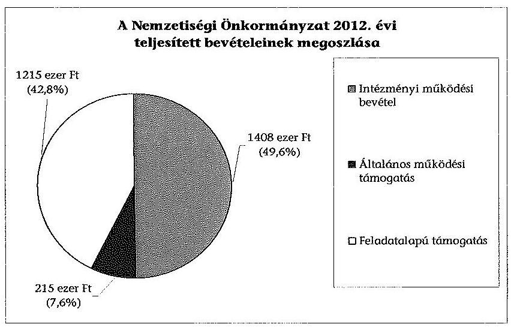
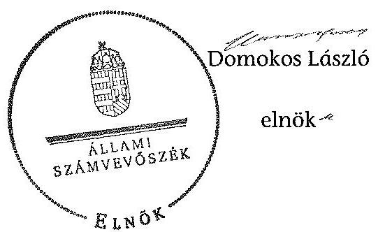

# ÁLLAMI   SZÁMVEVŐSZÉK 

## JELENTÉS

a helyi nemzetiségi önkormányzatok gazdálkodásának ellenőrzéséről
Herendi Német Nemzetiségi Önkormányzat

---

# Állami Számvevőszék 

Iktatószám: V-0313-064/2014.
Témaszám: 1347
Vizsgálat-azonosító szám: V065289

## Az ellenőrzést felügyelte:

Horváth Balázs
felügyeleti vezető
Az ellenőrzést vezette és az ellenőrzés végrehajtásáért felelős:
Pats Regina
ellenőrzésvezető
A számvevőszéki jelentést készítették és a jelentés összeállításában közremüködtek:

Dr. Zelei Andrásné
számvevő tanácsos
Csényi István
számvevő tanácsos
Az ellenőrzést végezték:

| Érsek Edit | Dr. Halmné Harsányi Zsuzsa | Tamás László |
| :-- | :-- | :-- |
| számvevő | számvevő tanácsos | számvevő |

---

# TARTALOMJEGYZÉK 

BEVEZETÉS ..... 3
I. ÖSSZEGZŐ MEGÁLLAPÍTÁSOK, KÖVETKEZTETÉSEK, JAVASLATOK ..... 6
II. RÉSZLETES MEGÁLLAPÍTÁSOK ..... 12

1. A Nemzetiségi Önkormányzat és a Települési Önkormányzat együttműködésének szabályozása, a működési feltételek biztosítása ..... 12
2. A gazdálkodási feladatok ellátásának szabályszerűsége ..... 13
2.1. A költségvetésre és zárszámadásra, valamint a kincstári adatszolgáltatás rendjére vonatkozó jogszabályi előírások betartása ..... 13
2.2. A Nemzetiségi Önkormányzat gazdálkodásának szabályozottsága ..... 14
2.3. Az operatív gazdálkodási jogkörök kialakítása, gyakorlása ..... 14
3. A Nemzetiségi Önkormányzattal kapcsolatos gazdálkodási feladatok belső ellenőrzése ..... 16
4. A feladatalapú támogatás felhasználásának, elszámolásának szabályszerűsége, a Nemzetiségi Önkormányzat feladatellátása ..... 16
MELLÉKLETEK
5. számú A Nemzetiségi Önkormányzat 2012. évi gazdálkodásának főbb adatai, mutatói
6. számú Tájékoztatás a polgármesternek küldött el nem fogadott észrevételekről
FÜGGELÉKEK
7. számú Rövidítések jegyzéke
8. számú Értelmező szótár
9. számú A gazdálkodás értékelésének módszere

---

.

---

# JELENTÉS 

## a helyi nemzetiségi önkormányzatok gazdálkodásának ellenőrzéséről Herendi Német Nemzetiségi Önkormányzat

## BEVEZETÉS

A Nemzetiségi Önkormányzat 1995-ben alakult, elnöke az 1995. évi helyhatósági pótválasztások óta látja el feladatát. A Nemzetiségi Önkormányzat intézményt, gazdasági társaságot és más szervezetet nem alapított, illetve társulásban nem vett részt. A négytagú Képviselő-testület a munkája segítésére bizottságot nem hozott létre. A Nemzetiségi Önkormányzat a költségvetési beszámolója szerint a 2012. évben a módosított költségvetési bevételi és kiadási előirányzat 1724 ezer Ft, a teljesített költségvetési bevétel 2838 ezer Ft, a teljesített költségvetési kiadás 1445 ezer Ft volt. A 2012. évi gazdálkodási adatokat részletesen az 1. számú mellékletben mutatjuk be.

Az Alaptörvény XXIX. cikk (1) bekezdése szerint a Magyarországon élő nemzetiségek államalkotó tényezők. Minden, valamely nemzetiséghez tartozó magyar állampolgárnak joga van önazonossága szabad vállalásához és megőrzéséhez. A hazánkban élő nemzetiségek helyi (települési és területi) valamint országos önkormányzatokat hozhatnak létre ${ }^{1}$. A helyi nemzetiségi önkormányzatok gazdálkodási feladatait jogszabályi előírás alapján a székhely szerinti helyi önkormányzat polgármesteri hivatala látja el.

A nemzetiségek helyzete, támogatása mind hazai, mind EU-s szinten kiemelt figyelmet kap napjainkban. A helyi nemzetiségi önkormányzatok gazdálkodására és támogatási rendszerére vonatkozó jogszabályok a 2010-2012. években jelentős változásokon mentek át. A települési és területi nemzetiségi önkormányzatok gazdálkodásának, a részükre juttatott költségvetési támogatások felhasználásának ellenőrzését az ÁSZ 2012-ben sorozatjellegủ ellenőrzés keretében indította el. A 2013. évi ellenőrzések e témacsoportos ellenőrzések folytatását jelentik, amelyet az ÁSZ 2014. első félévi ellenőrzési terve 12. témasorszámon tartalmaz.

Az ellenőrzés célja annak értékelése volt, hogy a nemzetiségi önkormányzat gazdálkodási kereteinek kialakítása, gazdálkodása és feladatellátása megfelelt-e a jogszabályoknak.

[^0]
[^0]:    ${ }^{1}$ A 2010. évben megtartott nemzetiségi önkormányzati választásokat követően 2304 települési, 58 területi és 13 országos nemzetiségi önkormányzat alakult meg.

---

Ennek keretében értékeltük, hogy:

- a nemzetiségi önkormányzat és a települési önkormányzat együttműködésének szabályozása, a múködési feltételek biztosítása megfelelt-e a jogszabályi előírásoknak;
- a felek együttműködése megfelelt-e a közöttük létrejött megállapodásnak a gazdálkodási feladatok szabályszerű ellátása során, ennek keretében betar-tották-e a helyi nemzetiségi önkormányzat gazdálkodásához kapcsolódóan a költségvetésre és zárszámadásra, a gazdálkodás szabályozására, az operatív gazdálkodási jogkörök gyakorlására vonatkozó jogszabályi előírásokat;
- a jegyző biztosította-e a nemzetiségi önkormányzat gazdálkodásának belső ellenőrzését;
- a nemzetiségi önkormányzat feladatalapú támogatásának felhasználása, a folyósított feladatalapú támogatással történő elszámolás az előírásoknak megfelelő volt-e;
- a nemzetiségi önkormányzat feladatellátása összhangban volt-e a vonatkozó jogszabályi előírásokkal.

Az ellenőrzés várható hasznosulását négy szinten tervezzük. A törvényalkotás számára összegzett tapasztalatok állnak rendelkezésre a nemzetiségi önkormányzatok testületi döntéseinek, gazdálkodásának és a feladatalapú támogatás felhasználásának szabályszerűségéről, amelynek alapján következtetést lehet levonni arra, hogy indokolt-e esetleges jogszabályi módosítás kezdeményezése. Az ellenőrzés az ellenőrzött számára visszajelzést ad a működésében fellépő hiányosságokról, javaslataival hozzájárul azok kiküszöböléséhez, amely csökkentheti a későbbi ellenőrzések gyakoriságát. Az ellenőrzés megállapításai és javaslatai tanulságul szolgálhatnak más nemzetiségi önkormányzatok, szervezetek számára a rendezett gazdálkodási keretek kialakításához. A társadalom számára jelzi, hogy közpénz nem maradhat ellenőrizetlenül, az ÁSZ értékteremtő rend kialakításához és megőrzéséhez hozzájáruló tevékenysége pozitív hatással lesz a szervezetről kialakított összkép formálásában. Az ÁSZ szervezetén belül lehetőség nyílik arra, hogy a megállapítások szintetizálásával az intézmény a hozzáadott értéket teremtő elemző tevékenységét és tanácsadó szerepét erősítse.

A helyi nemzetiségi önkormányzatok gazdálkodásának ellenőrzéséről szóló jelentés I. fejezetének összegző része az ellenőrzés céljára adott rövid, szintetizáló összefoglalót és következtetéseket tartalmazza a II. fejezet részletes megállapításain alapulóan. A jelentés intézkedést igénylő megállapításait és javaslatait az összegzőben foglaltak mellett - az ellenőrzés során feltárt, a jelentés II. fejezetében rögzített részletes megállapítások alapozzák meg, illetve támasztják alá.

Az ellenőrzés típusa: szabályszerűségi ellenőrzés.
Az ellenőrzött időszak: a 2012. január 1. - 2012. december 31. közötti időszak. Az ellenőrzés kiterjedt a helyi nemzetiségi önkormányzatoknak juttatott 2012. évi feladatalapú támogatás 2013. évben való elszámolására is.

---

Ellenőrzött szervezet: Herendi Német Nemzetiségi Önkormányzat és a gazdálkodási feladatait ellátó Herend Város Önkormányzata.

Az ellenőrzés végrehajtásának jogszabályi alapját az ÁSZ tv. 5. § (2)-(3) és (6) bekezdéseiben foglaltak képezik.

Az ellenőrzés szakmai módszertana az ÁSZ hivatalos honlapján (www.asz.hu) közzétett szakmai szabályokon alapult, amely a Legfőbb Ellenőrző Intézmények Nemzetközi Szervezete (INTOSAI) által kiadott nemzetközi standardok (ISSAI) figyelembevételével készült.

A helyi nemzetiségi önkormányzatok gazdálkodásának ellenőrzése során értékeltük a települési önkormányzat és a nemzetiségi önkormányzat együttműködésének, a gazdálkodás szabályozottságának és a pénzügyi folyamatokban kulcsszerepet betöltő belső kontrollok (teljesítésigazolás és érvényesítés) működésének megfelelőségét. A kulcskontrollokat a dologi kiadásokkal kapcsolatos kifizetéseknél véletlen mintavételi eljárást alkalmazva ellenőriztük. Ellenőriztük, hogy a jegyző biztositotta-e a nemzetiségi önkormányzat gazdálkodásának belső ellenőrzését. Értékeltük a feladatalapú támogatások felhasználásának, elszámolásának szabályszerűségét, a nemzetiségi önkormányzat feladatellátása és a jogszabályi előírások összhangját.

Az ellenőrzés lefolytatásához a Nemzetiségi Önkormányzat és a gazdálkodási feladatait ellátó Települési Önkormányzat tanúsítványok és a kapcsolódó, dokumentumjegyzékben megjelölt dokumentumok elektronikus úton történő megküldésével, rendelkezésre bocsátásával szolgáltatott adatokat. Az adatszolgáltatás kontrollálása és szükség szerinti javítása a helyszíni ellenőrzés keretében történt. A gazdálkodás értékelésének módszerét a 3. számú függelék tartalmazza.

Az ÁSZ tv. 29. § (1) bekezdése szerint a jelentéstervezetet megküldtük egyeztetésre a polgármesternek és a Nemzetiségi Önkormányzat elnökének. A polgármester határidőben megküldött észrevétele és tájékoztatása alapján a jelentést nem módosítottuk, az el nem fogadott észrevételek indoklását a jelentés 2. számú melléklete tartalmazza. A Nemzetiségi Önkormányzat elnöke az ÁSZ tv. 29. § (2) bekezdésében foglalt észrevételezési jogával határidőn túl élt, ezért nem állt módunkban az észrevételt figyelembe venni.

---

# I. ÖSSZEGZŐ MEGÁLLAPÍTÁSOK, KÖVETKEZTETÉSEK, JAVASLATOK 

A Nemzetiségi Önkormányzat és a Települési Önkormányzat együttmüködésének szabályozása megfelelt a jogszabályi előírásoknak. A 2012. december 31-én hatályos együttműködési megállapodás ${ }_{2}$ a jogszabályban foglaltaknak megfelelően tartalmazta a Nemzetiségi Önkormányzat múködési feltételeit, valamint a tervezési, gazdálkodási, ellenőrzési, finanszírozási, adatszolgáltatási és beszámolási feladatok ellátásának részletes szabályait. A együttműködési megállapodás ${ }_{2}$ szerinti múködési feltételeket - a jogszabályi előírásnak megfelelően - a Nemzetiségi Önkormányzat SZMSZ-ében rögzítették. A Települési Önkormányzat biztosította a Nemzetiségi Önkormányzat múködéséhez szükséges személyi és tárgyi feltételeket.

A Nemzetiségi Önkormányzat 2012. évi költségvetésének és zárszámadásának tartalma, jóváhagyása, valamint a kapcsolódó adatszolgáltatás szabályszerüsége megfelelt a jogszabályi előírásoknak. A jegyző az előírt határidőre elkészítette, a Nemzetiségi Önkormányzat elnöke határidőn belül a Képviselő-testület elé terjesztette a 2012. évi költségvetési és a zárszámadási határozat tervezetét. A költségvetés és a zárszámadás összeállítása során a határozat elkészítésére, tartalmi előírásaira, elfogadására és továbbítására vonatkozó előírások érvényesültek. A költségvetési és zárszámadási határozatok egymással összehasonlítható szerkezetben készültek. A zárszámadási határozatban a Nemzetiségi Önkormányzat valamennyi bevételéről és kiadásáról elszámoltak. A jogszabályi előírások azonban nem érvényesültek maradéktalanul. A költségvetési és a zárszámadási határozat tervezetek előterjesztésekor a jegyző mulasztása miatt a Képviselő-testület számára nem mutatták be tájékoztatásul az Áht. ${ }_{2}$-ben előírt kimutatások közül a többéves kihatással járó döntések számszerúsítését évenkénti bontásban és összesítve, valamint a közvetett támogatásokat tartalmazó kimutatást szöveges indoklással együtt. A bevételi és a kiadási előirányzatokat az általános múködési támogatás és a feladatalapú támogatás kapcsán - az Áht. ${ }_{2}$ előírásait figyelmen kívül hagyva - nem a kapott támogatás összegével módosították, ezért a 2012. évi bevételi előirányzat teljesítése a módosított előirányzatot túllépte. A jegyző a Nemzetiségi Önkormányzatra vonatkozó kincstári adatszolgáltatási kötelezettségének az előírt módon, határidőre eleget tett.

A Nemzetiségi Önkormányzat gazdálkodásának szabályozottsága az ellenőrzött időszakban részben felelt meg a jogszabályi előírásoknak. A Polgármesteri Hivatal számviteli politikájának és számlarendjének, a leltározási és leltárkészítési szabályzatának, a pénzkezelési szabályzatának, valamint az eszközök és források értékelési szabályzatának hatálya 2012. március 1-jétől, a folyamatba épített előzetes, utólagos és vezetői ellenőrzés szabályozás hatálya 2012. június 1-jétől terjedt ki a Nemzetiségi Önkormányzat gazdálkodásával kapcsolatos végrehajtási feladatokra. A jegyző a Nemzetiségi Önkormányzat gazdálkodásával kapcsolatos végrehajtási feladatokra nem terjesztette ki a Bkr.-ben előírt ellenőrzési nyomvonalat és a szabálytalanságok kezelésének eljárásrendjét és ezekkel a szabályzatokkal a Nemzetiségi Önkormányzat önálló-

---

an sem rendelkezett. A Polgármesteri Hivatal SZMSZ-e nem tartalmazta az Ávr.-ben foglaltak szerinti, az SZMSZ-ben nevesített munkakörökhöz tartozó - a Nemzetiségi Önkormányzat gazdálkodásának végrehajtásával kapcsolatos -feladat- és hatáskörökre, a hatáskörök gyakorlásának módjára, a helyettesítés rendjére, az ezekhez kapcsolódó felelősségi szabályokra vonatkozó előírásokat.

A Nemzetiségi Önkormányzat gazdálkodása tekintetében az operatív gazdálkodási jogkörök kialakítása megfelelt a jogszabályi előírásoknak. A Nemzetiségi Önkormányzat elnöke felhatalmazott más képviselőt a kötelezettségvállalás és utalványozás gyakorlására, valamint írásban kijelölt teljesítésigazolást végző személyt. A Polgármesteri Hivatal gazdasági vezetője rendelkezett az előírt szakképesítéssel és felhatalmazást adott az érvényesítési feladatok ellátására az előírt végzettséggel rendelkező személyeknek. A Nemzetiségi Önkormányzatnál a 2012. évben a dologi kiadások teljesítése során a teljesítésigazolás és az érvényesítés kulcskontrollok múködésének megfelelősége gyenge volt. A hibák száma a lényegességi szintet, a kritikus hibahatárt elérte, mert, a teljesítésigazoló a gazdálkodási szabályzat ${ }_{1,2}$ és az együttmúködési megállapodás ${ }_{2}$ előírásait figyelmen kívül hagyva a tízezer Ft feletti kifizetések esetében ellenőrizhető dokumentumok hiányában igazolta a kifizetések jogosságát, öszszegszerűségét, az érvényesítő - az Ávr.-ben előírtak ellenére - ezt nem ellenőrizte és nem jelezte az utalványozónak. A teljesítésigazolás és az érvényesítés kulcskontrollok működésének megfelelősége a támogatásértékű működési kiadások és az államháztartáson kívülre teljesített múködési célú pénzeszközátadásokat érintően is gyenge volt, mert az Ávr. rendelkezése ellenére a teljesítésigazolás nem történt meg, az érvényesítő ezt nem ellenőrizte és nem jelezte az utalványozónak. A Nemzetiségi Önkormányzatnál a 2012. évi dologi kiadások között a három legnagyobb összegű kiadás teljesítésének egyedi értékelése alapján a teljesítésigazolás és az érvényesítés kulcskontrollok múködésének feltárt hiányosságai megegyezőek voltak a dologi kiadások értékelésénél feltárt hiányosságokkal. A kulcskontrollok múködéséhez kapcsolódó hiányosságok miatt nem biztosították a hibák megelőzését, feltárását és kijavítását. A számvevőszéki ellenőrzés a kifizetések bizonylatainak ellenőrzése során - a rendelkezésre bocsátott dokumentumok alapján - összeférhetetlenséget, illetve jogosulatlan kifizetést nem tárt fel.

A jegyző nem biztosította a Nemzetiségi Önkormányzat gazdálkodásának végrehajtásával összefüggő feladatok belső ellenőrzését. A Polgármesteri Hivatal 2012. évre vonatkozó éves belső ellenőrzési tervét megalapozó kockázatelemzés - a Ber.-ben foglaltak ellenére - nem terjedt ki a Nemzetiségi Önkormányzat gazdálkodásával összefüggő végrehajtási feladatokra, és belső ellenőrzési feladatot a 2012. évben nem terveztek és ellenőrzést nem végeztek.

A Nemzetiségi Önkormányzat a 2012. évben a bevételei 42,8\%-át kitevő, 1215 ezer Ft összegű feladatalapú támogatásban részesült, melyből a 2012. évben 774 ezer Ft-ot használtak fel, nemzetiségi közfeladatokkal kapcsolatos kiadásokra. A számvevőszéki ellenőrzés rendelkezésére bocsátott dokumentumok és a Nemzetiségi Önkormányzat tanúsítványon tett nyilatkozata szerint a 441 ezer Ft maradványt a támogatási kormányrendelet ${ }_{2}$ alapján az Áht. ${ }_{2}$-ben és az Ávr.-ben foglalt előírások szerinti tárgyévi előzetes írásbeli kötelezettségvállalással nem terhelték. A Nemzetiségi Önkormányzat a 441 ezer Ft-ot érintően a támogatási kormányrendelet ${ }_{2}$ alapján nem tett eleget az Áht. ${ }_{2}$ és az Ávr.

---

szerinti lemondási, valamint a központi költségvetés javára történő visszafizetési kötelezettségének. Az elszámolás a támogatási kormányrendelet ${ }_{2}$ alapján az Áht. ${ }_{2}$ rendelkezése ellenére nem történt meg. A támogatás felhasználását, elszámolását az arra jogosult külső szervek nem ellenőrizték. A Nemzetiségi Önkormányzat kötelező és önként vállalt feladatellátásának tárgya összhangban volt a Nek. ${ }_{2}$ tv.-ben foglalt előírásokkal.

Az ÁSZ tv. 33. § (1) bekezdésében foglaltak értelmében az ellenőrzött szervezet vezetője köteles a jelentésben foglalt megállapításokhoz kapcsolódó intézkedési tervet összeállítani és azt a jelentés kézhezvételétől számított 30 napon belül az ÁSZ részére megküldeni. Amennyiben az intézkedési tervet határidőre nem küldi meg a szervezet, vagy az nem elfogadható, az ÁSZ elnöke az ÁSZ tv. 33. § (3) bekezdés a)-b) pontjaiban foglaltakat érvényesítheti.

A helyszíni ellenőrzés megállapításainak hasznosítása mellett javasoljuk:

# a jegyzőnek 

1. az együttműködés szabályozásával kapcsolatban

A Nemzetiségi Önkormányzat és a Települési Önkormányzat között 2007. december 21-én megkötött együttműködési megállapodás, a Nek. ${ }_{2}$ tv. 80. § (2) bekezdés előírása szerinti felülvizsgálatát a jogszabályban meghatározott határidőig nem végezték el.

Javaslat
Az együttműködés szabályszerűsége érdekében gondoskodjon a jövőben arról, hogy a hatályos együttműködési megállapodást a Nek. ${ }_{2}$ tv. 80. § (2) bekezdésében előírt határidőben vizsgálják felül.
2. a költségvetés és a zárszámadás szabályszerűségével kapcsolatban

A 2012. évi költségvetési határozattervezet előterjesztésekor az Áht. ${ }_{2} 24$. § (4) bekezdés b) és c) pontjaiban foglaltakat figyelmen kívül hagyva a Képviselőtestület részére a jegyző mulasztása miatt tájékoztatásul nem mutatták be - szöveges indoklással együtt - a többéves kihatással járó döntések számszerűsítését évenkénti bontásban és összesítve, valamint a közvetett támogatásokat tartalmazó kimutatást.

A zárszámadási határozattervezet előterjesztésekor az Áht. ${ }_{2}$ 91. § (2) bekezdés a) pontjában hivatkozott Áht. ${ }_{2} 24 . \S$ (4) bekezdés b) és c) pontjai előírásait figyelmen kívül hagyva a Képviselő-testület részére a jegyző általi elkészítés hiányában tájékoztatásul nem mutatták be a többéves kihatással járó döntések számszerűsítését évenkénti bontásban és összesítve, valamint a közvetett támogatásokat tartalmazó kimutatást.

A bevételi és kiadási előirányzatokat a mind a múködési, mind a feladatalapú támogatás kapcsán nem a kapott támogatás összegével módosították, ezért a 2012. évi bevételi és kiadási előirányzat teljesítése során nem tartották be az Áht. ${ }_{2} 6 . \S$ (1) bekezdésében foglaltakat, mivel a módosított kiadási előirányzatot túllépték.

---

Javaslat
Gondoskodjon a jövőben:
a) a költségvetési és a zárszámadási határozattervezet előterjesztésekor arról, hogy a Képviselő-testület tájékoztatására bemutatásra kerüljenek az Áht. 2 24. § (4) bekezdés b) és c) pontjaiban, valamint a 91. § (2) bekezdés a) pontjában előírt kimutatások szöveges indoklással együtt;
b) a költségvetés végrehajtása során az Áht. 2 6. § (1) bekezdésében foglalt előírás betartásáról.
3. a gazdálkodás végrehajtási feladatainak szabályozottságával kapcsolatban

A Polgármesteri Hivatal SZMSZ-e nem tartalmazta az Ávr. 13. § (1) bekezdés g) pontjában foglaltak szerinti, az SZMSZ-ben nevesített munkakörökhöz tartozó - a Nemzetiségi Önkormányzat gazdálkodásának végrehajtásával kapcsolatos - feladités hatáskörökre, a hatáskörök gyakorlásának módjára, a helyettesítés rendjére, az ezekhez kapcsolódó felelősségi szabályokra vonatkozó előírásokat. A Bkr. 6. § (3)-(4) bekezdései szerinti ellenőrzési nyomvonal és szabálytalanságok kezelésének eljárásrendje nem terjedt ki a Nemzetiségi Önkormányzat gazdálkodásának végrehajtásával kapcsolatos feladatokra.

Javaslat
A gazdálkodás végrehajtásának szabályszerűsége érdekében a Nemzetiségi Önkormányzat gazdálkodására is kiterjedően:
a) készítse elő a Polgármesteri Hivatal SZMSZ-ének módosítását, hogy az tartalmazza az Ávr. 13. § (1) bekezdés g) pontjában foglaltakat;
b) terjessze ki a Polgármesteri Hivatal Bkr. 6. § (3)-(4) bekezdései szerinti ellenőrzési nyomvonalat és a szabálytalanságok kezelésének eljárásrendjét.
4. a kulcskontrollok müködésével kapcsolatban

A teljesítésigazoló belső szabályozás előírása szerint írásbeli kötelezettségvállaláshoz kötött kifizetések esetében a teljesítések jogosságát, összegszerűségét - az Ávr. 57. § (1) bekezdésében foglaltakat figyelmen kívül hagyva - ellenőrizhető okmány hiányában igazolta. Az érvényesítő - az Ávr. 58. § (1)-(2) bekezdései előírása ellenére nem ellenőrizte és nem jelezte az utalványozónak az előzetes írásbeli kötelezettségvállalások és a teljesítésigazolások hiányát.

Javaslat
Az operatív gazdálkodás működési hibáinak megelőzése, feltárása és kijavítása érdekében gondoskodjon arról, hogy:
a) a teljesítésgazolás minden esetben az Ávr. 57. § (1) bekezdésében előírtaknak megfelelően történjen;

---

b) az érvényesítő tegyen eleget az Ávr. 58. § (1)-(2) bekezdéseiben előírt ellenőrzési feladatának és jelzési kötelezettségének.
5. a feladatalapú támogatás elszámolásával kapcsolatban

A 2011. évi feladatalapú támogatás elszámolása a támogatási kormányrendelet ${ }_{1}$ 7. § (2) bekezdésében hivatkozott, valamint a 2012. évi feladatalapú támogatás elszámolása a támogatási kormányrendelet ${ }_{2} 8 . \S$ (5) bekezdésében hivatkozott „a helyi önkormányzatok elszámolási és ellenőrzési rendjére vonatkozó jogszabályok rendelkezései alkalmazandóak" előirása alapján az Áht. ${ }_{1} 64 . \S$ (7) bekezdése, és az Áht. ${ }_{2} 57 . \S$ (3) bekezdése ellenére nem történt meg.

Javaslat
Gondoskodjon az Áht. ${ }_{2}$ 27. § (2) bekezdésében meghatározott feladatkörében a Nemzetiségi Önkormányzat által igénybevett 2011. és 2012. évi feladatalapú támogatás rendeltetésszerű felhasználásáról szóló elszámolás elkészítéséről az Áht. ${ }_{2}$ 53. § (1) bekezdése szerinti beszámolási kötelezettség teljesítéséhez.

# a polgármesternek 

A Polgármesteri Hivatal SZMSZ-e az Ávr. 13. § (1) bekezdés g) pontjában előírtak ellenére nem tartalmazta az SZMSZ-ben nevesített munkakörökhöz tartozó - a Nemzetiségi Önkormányzat gazdálkodásának végrehajtásával kapcsolatos - feladat- és hatásköröket, a hatáskörök gyakorlásának módját, a helyettesítés rendjét, és az ezekhez kapcsolódó felelősségi szabályokat.

Javaslat
Terjessze a Települési Önkormányzat Képviselő-testülete elé jóváhagyásra a Polgármesteri Hivatal SZMSZ-ének a jegyző által előkészített módosítását, hogy az tartalmazza az Ávr. 13. § (1) bekezdés g) pontjában foglaltakat.

## a Nemzetiségi Önkormányzat elnökének

1. A Nemzetiségi Önkormányzat elnöke a 2012. évi költségvetési és zárszámadási határozattervezet előterjesztésekor a jegyző mulasztása miatt a Képviselő-testület részére az Áht. ${ }_{2} 24 . \S$ (4) bekezdés b) és c) pontjaiban, valamint a 91. § (2) bekezdés a) pontjában előírtak ellenére nem mutatta be - szöveges indoklással együtt - a többéves kihatással járó döntések számszerűsítését évenkénti bontásban és összesítve, valamint a közvetett támogatásokat tartalmazó kimutatást.

Javaslat
A jövőben a költségvetési és zárszámadási határozattervezetek Képviselő-testület elé terjesztésekor tájékoztatásul - szöveges indoklással együtt - mutassa be a jegyző által előkészített, az Áht. ${ }_{2} 24 . \S$ (4) bekezdés b) és c) pontjaiban, valamint a 91. § (2) bekezdés a) pontjában előírt kimutatásokat.

---

2. A 2011. évi feladatalapú támogatás elszámolása a támogatási kormányrendelet ${ }_{1}$ 7. § (2) bekezdésében hivatkozott, valamint a 2012. évi feladatalapú támogatás elszámolása a támogatási kormányrendelet ${ }_{2} 8 . \S$ (5) bekezdésében hivatkozott „a helyi önkormányzatok elszámolási és ellenőrzési rendjére vonatkozó jogszabályok rendelkezései alkalmazandóak" előírása alapján az Áht. 64. § (7) bekezdése, és az Áht. 2 57. § (3) bekezdése ellenére nem történt meg.

Javaslat
Terjessze a Képviselő-testület elé jóváhagyásra az Áht. 2 53. § (1) bekezdése szerinti beszámolási kötelezettség teljesítéséhez összeállított, a Nemzetiségi Önkormányzat által igénybe vett 2011. és 2012. évi feladatalapú támogatás rendeltetésszerú felhasználásáról szóló elszámolást.
3. A Nemzetiségi Önkormányzat nem tett eleget az Áht. 2 57. § (2) bekezdésében előírtaknak azáltal, hogy a meghatározott célra fel nem használt 2012. évi feladatalapú támogatás 2012. december 31-éig kötelezettségvállalással nem terhelt 441 ezer Ft összegű maradványáról nem mondott le és nem fizette vissza azt a központi költségvetés javára.

Javaslat
Terjessze a Képviselő-testület elé jóváhagyásra az Áht. 2 57/A. § (1) bekezdés előírásának megfelelően a 2012. évi feladatalapú támogatás kötelezettségvállalással nem terhelt maradványáról történő lemondást és intézkedjen a maradvány összegének visszafizetéséről a központi költségvetés javára.

---

# II. RÉSZLETES MEGÁLLAPÍTÁSOK 

## 1. A Nemzetiségi Önkormányzat És a Települési ÖnkormányZAT EGYÜTTMŰKÖDÉSÉNEK SZABÁLYOZÁSA, A MÜKÖDÉSI FELTÉTELEK BIZTOSÍTÁSA

A Nemzetiségi Önkormányzat a 2012. év egészében rendelkezett a Települési Önkormányzattal kötött együttműködési megállapodással. A Nemzetiségi Önkormányzat és a Települési Önkormányzat együttmüködésének szabályozása megfeleltt a jogszabályi előírásoknak.

A Nemzetiségi Önkormányzat és a Települési Önkormányzat között 2007. december 21-én megkötött együttműködési megállapodás ${ }_{1}$ a Nek. ${ }_{2}$ tv. 80. § (2) bekezdés előírása szerinti felülvizsgálatáról a Nemzetiségi Önkormányzat határozatban döntött², a felülvizsgálatot azonban a jogszabályban meghatározott határidőig nem végezték el.

Az együttműködési megállapodás ${ }_{1}$ Nek. ${ }_{2}$ tv. 159. § (3) bekezdésében előírt felülvizsgálata, kiegészítése 2012. június 1-jéig megtörtént, amelyet a Települési Önkormányzat Képviselő-testülete ${ }^{3}$ és a Képviselő-testület ${ }^{4}$ határozattal elfogadott. A együttműködési megállapodás ${ }_{2}$ szerinti működési feltételeket - a Nek. ${ }_{2}$ tv. előírásának megfelelően - a Nemzetiségi Önkormányzat SZMSZ-ében rögzítették.

A 2012. december 31-én hatályos együttműködési megállapodás ${ }_{2}$ a jogszabályi előírásoknak megfelelően tartalmazta a Nemzetiségi Önkormányzat működési feltételeit, valamint a tervezési, gazdálkodási, ellenőrzési, finanszírozási, adatszolgáltatási és beszámolási feladatok ellátásának részletes szabályait. A megállapodásban rendelkeztek továbbá a Települési Önkormányzat és a Nemzetiségi Önkormányzat költségvetésének előkészítésével és megalkotásával kapcsolatos feladatokról, a felelősök konkrét kijelöléséről, illetve a jegyző vagy a jegyzővel azonos képesítési előírásoknak megfelelő megbízottjának a Nemzetiségi Önkormányzat testületi ülésein történő részvételéről.

A Települési Önkormányzat biztosította a Nemzetiségi Önkormányzat müködéséhez szükséges személyi és tárgyi feltételeket.

[^0]
[^0]:    ${ }^{2}$ A Képviselő-testület 3/2012. (I. 25.) HNNÖ számú határozata.
    ${ }^{3}$ A Települési Önkormányzat Képviselő-testületének 54/2012. (V. 31.) számú határozata.
    ${ }^{4}$ A Képviselő-testület 20/2012. (V. 23.) HNNÖ számú határozata.

---

# 2. A GAZDÁLKODÁSI FELADATOK ELLÁTÁSÁNAK SZABÁLYSZERŰSÉGE 

### 2.1. A költségvetésre és zárszámadásra, valamint a kincstári adatszolgáltatás rendjére vonatkozó jogszabályi előírások betartása

A Nemzetiségi Önkormányzat 2012. évi költségvetésének és zárszámadásának tartalma, jóváhagyása, valamint a kapcsolódó 2012. évi adatszolgáltatás szabályszerűsége megfelelit a jogszabályi előírásoknak.

A Nemzetiségi Önkormányzat elnöke a 2012. évi költségvetés tervezetét határidőben benyújtotta a Képviselő-testületnek. A jóváhagyott költségvetés ${ }^{5}$ tartalmazta a jogszabályi előírások szerinti tartalmi elemeket. A 2012. évi költségvetés előterjesztésekor a Képviselő-testület részére tájékoztatásul bemutatták az előírt mérlegeket. A jogszabályi előírások azonban nem érvényesültek maradéktalanul, mert a jegyző mulasztása miatt - az Áht. ${ }_{2} 24$. § (4) bekezdés b) és c) pontjaiban foglaltakat figyelmen kívül hagyva -nem mutatták be a többéves kihatással járó döntések számszerűsítését évenkénti bontásban és összesítve, valamint a közvetett támogatásokat tartalmazó kimutatást szöveges indoklással együtt.

A jegyző által elkészített 2012. évi zárszámadási határozat-tervezetet a Nemzetiségi Önkormányzat elnöke az előírt határidőn belül a Képviselőtestület elé terjesztette. A zárszámadási határozat-tervezet előterjesztésekor a Képviselő-testület részére tájékoztatásul bemutatták a jogszabályban előírt mérlegeket. A költségvetési és a zárszámadási határozat egymással összehasonlítható szerkezetben készült. A zárszámadási határozatban ${ }^{6}$ a Nemzetiségi Önkormányzat valamennyi bevételéről és kiadásáról elszámoltak. A jogszabályi előírások azonban nem érvényesültek maradéktalanul. A zárszámadási hatá-rozat-tervezet előterjesztésekor a jegyző mulasztása miatt - az Áht. ${ }_{2} 91$. § (2) bekezdés a) pontjában hivatkozott Áht. ${ }_{2} 24$. § (4) bekezdés b) és c) pontjai előírásait figyelmen kívül hagyva - nem mutatták be a többéves kihatással járó döntések számszerúsítését évenkénti bontásban és összesítve, valamint a közvetett támogatásokat tartalmazó kimutatást szöveges indoklással együtt. A bevételi és kiadási előirányzatokat az általános működési támogatás és a feladatalapú támogatás kapcsán nem a kapott támogatás összegével módosították, ezért a 2012. évi bevételi előirányzat teljesítése - az Áht. ${ }_{2} 6$. § (1) bekezdésében foglalt előírás ellenére - a módosított előirányzatot túllépte.

A jegyző a Települési Önkormányzat 2012. évi költségvetéshez kapcsolódó, a Nemzetiségi Önkormányzatra vonatkozó kincstári adatszolgáltatásokat az előírt módon, határidőre teljesítette.

[^0]
[^0]:    ${ }^{5}$ A Képviselő-testület 6/2012. (II. 09.) HNNÖ számú határozata.
    ${ }^{6}$ A Képviselő-testület 13/2013. (IV.23.) HNNÖ számú határozata.

---

# 2.2. A Nemzetiségi Önkormányzat gazdálkodásának szabályozottsága 

A Nemzetiségi Önkormányzat gazdálkodásának szabályozottsága az ellenőrzött időszakban - részben volt megfelelő.

A Polgármesteri Hivatal számviteli politikájának, számlarendjének, leltározási és leltárkészítési, pénzkezelési, valamint eszközök és források értékelési szabályzatának hatálya 2012. március 1-jétől kiterjedt a Nemzetiségi Önkormányzat gazdálkodásával kapcsolatos végrehajtási feladatokra. A folyamatba épített előzetes, utólagos és vezetői ellenőrzés szabályozás hatályának a Nemzetiségi Önkormányzat gazdálkodásának végrehajtásával kapcsolatos feladatokra való kiterjesztéséről, a 2012. június 1-jétől érvényes együttmúködési megállapodás ${ }_{2}$ VI. fejezete rendelkezett.

A tervezéssel, gazdálkodással, kötelezettségvállalással, pénzügyi ellenjegyzéssel és teljesítésigazolással, az érvényesítés, utalványozás gyakorlásának módjával, eljárási és dokumentálási részletszabályaival, valamint az ezeket végző személyek kijelölésének rendjével, az ellenőrzési és adatszolgáltatási feladatok teljesítésével kapcsolatos belső előírásokat, feltételeket a Polgármesteri Hivatal - a jogszabályok által előírt és a Nemzetiségi Önkormányzat gazdálkodásával kapcsolatos végrehajtási feladatokra kiterjesztett hatályú - 2012. évben hatályos gazdálkodási szabályzata ${ }_{1,2}$ tartalmazta.

A Polgármesteri Hivatalban az érintett köztisztviselők munkaköri leírásai tartalmazták a Nemzetiségi Önkormányzattal gazdálkodásának végrehajtásával kapcsolatos feladatokat.

A jegyző a Nemzetiségi Önkormányzat gazdálkodásának végrehajtásával kapcsolatos feladataira nem terjesztette ki a Bkr. 6. § (3)-(4) bekezdéseiben előírt ellenőrzési nyomvonalat és a szabálytalanságok kezelésének eljárásrendjét, és ezekkel a szabályzatokkal a Nemzetiségi Önkormányzat önállóan sem rendelkezett.

A Polgármesteri Hivatal SZMSZ-e az Ávr. 13. § (1) bekezdés g) pontjában előírtak ellenére nem tartalmazta az SZMSZ-ben nevesített munkakörökhöz tartozó - a Nemzetiségi Önkormányzat gazdálkodásának végrehajtásával kapcsolatos - feladat--, és hatásköröket, a hatáskörök gyakorlásának módját, a helyettesítés rendjét, és az ezekhez kapcsolódó felelősségi szabályokat.

### 2.3. Az operatív gazdálkodási jogkörök kialakítása, gyakorlása

A Nemzetiségi Önkormányzat gazdálkodása tekintetében az operatív gazdálkodási jogkörök kialakítása megfelelt a jogszabályi előírásoknak.

A Nemzetiségi Önkormányzat elnöke a jogszabályi rendelkezések alapján 2012. március 2-ai hatállyal - felhatalmazott más képviselőt (az elnökhelyettest) a kötelezettségvállalás és az utalványozás gyakorlására, valamint írásban kijelölte a teljesítésigazolást végző személyt.

---

A Polgármesteri Hivatal gazdasági vezetője rendelkezett az előírt szakképesítéssel és felhatalmazást adott az érvényesítési feladatok ellátására az előírt végzettséggel rendelkező személyeknek.

A Nemzetiségi Önkormányzatnál a 2012. évben a dologi kiadások teljesítése során a teljesítésigazolás és az érvényesítés kulcskontrollok múködésének megfelelősége gyenge volt. A hibák száma a lényegességi szintet, a kritikus hibahatárt elérte, mert:

- a teljesítésigazoló a tízezer Ft-ot elérő, vagy meghaladó összegű kifizetések esetében a teljesítések jogosságát, összegszerűségét - az Ávr. 57. § (1) bekezdésében foglaltakat figyelmen kívül hagyva - ellenőrizhető okmány (írásbeli kötelezettségvállalás) hiányában igazolta. A gazdálkodási szabályzat ${ }_{1,2}$ és az együttmúködési megállapodás ${ }_{2}$ előírása értelmében, a gazdasági eseményenként tízezer forintot elérő, vagy meghaladó kifizetésekhez előzetes írásbeli kötelezettségvállalás szükséges;
- az érvényesítő - az Ávr. 58. § (1)-(2) bekezdései előírása ellenére - nem ellenőrizte és nem jelezte az utalványozónak az előzetes írásbeli kötelezettségvállalások hiányát.

A támogatásértékú múködési kiadások és az államháztartáson kívülre teljesített múködési célú pénzeszközátadások során a teljesítésigazolás és az érvényesítés kulcskontrollok működésének megfelelősége gyenge volt, mert;

- a teljesítésigazolások a támogatásértékű működési kiadások és a működési célú pénzeszközátadások során - az Ávr. 57 § (1) és (3) bekezdésének előírásai ellenére - nem történtek meg;
- az érvényesítő - az Ávr. 58. § (1)-(2) bekezdés előírásait figyelmen kívül hagyva - a teljesítésigazolások hiányát nem ellenőrizte és nem jelezte az utalványozónak.

A Nemzetiségi Önkormányzatnál a 2012. évi dologi kiadások között a három legnagyobb összegű kiadás teljesítésének egyedi értékelése alapján a teljesítésigazolás és az érvényesítés kulcskontrollok múködésének feltárt hiányosságai megegyezőek voltak a dologi kiadások értékelésénél feltárt hiányosságokkal.

A kulcskontrollok múködéséhez kapcsolódó hiányosságok miatt nem biztosították a hibák megelőzését, feltárását és kijavítását. A számvevőszéki ellenőrzés a kifizetések bizonylatainak ellenőrzése során - a rendelkezésre bocsátott dokumentumok alapján - összeférhetetlenséget, illetve jogosulatlan kifizetést nem tárt fel.

A Nemzetiségi Önkormányzat a 2012. évben támogatásértékű felhalmozási célú kiadást, illetve államháztartáson kívülre felhalmozási célú pénzeszközátadást nem teljesített.

---

# 3. A Nemzetiségi ÖNKORMÁNYZATtal KAPCSOLATOS GAZDÁlKOdÁSI FELADATOK BELSŐ ELLENŐRZÉSE 

A jegyző nem biztosította a Nemzetiségi Önkormányzat gazdálkodásának végrehajtásával kapcsolatos feladatok belsö ellenörzését.

A Polgármesteri Hivatal 2012. évre vonatkozó éves belső ellenőrzési tervét megalapozó kockázatelemzés - a Ber. 21. § (2) bekezdésében foglaltak ellenére - nem terjedt ki a Nemzetiségi Önkormányzat gazdálkodásának végrehajtásával összefüggő feladatokra, és belső ellenőrzési feladatot a 2012. évben nem terveztek és ellenőrzést nem végeztek.

A 2012. évre vonatkozó belső ellenőrzési terv elkészítésének idején hatályos együttműködési megállapodás ${ }_{1}$ a Nemzetiségi Önkormányzat belső ellenőrzésére vonatkozóan nem tartalmazott előírásokat.

A 2012. június 1-jétől hatályos együttmúködési megállapodás ${ }_{2}$ VII. fejezetében rendelkeztek a belső ellenőrzés múködtetéséről.

Az együttmúködési megállapodás ${ }_{2}$-ben rögzítették, hogy: „A helyi önkormányzat döntése alapján a Veszprém Kistérség Többcélú Társulása Munkaszervezetének belső ellenőre a Nemzetiségi Önkormányzat gazdálkodására is kiterjedően látja el a belső ellenőrzési feladatot."

Az ellenőrzéshez szolgáltatott adatok alapján a 2012. évben a Kormányhivatal a Nemzetiségi Önkormányzatot illetően nem élt törvényességi felügyeleti eszközökkel.

## 4. A feladatalapú támogatás felhasználásának, elsZámolásának szabálySzerüsége, a Nemzetiségi Önkormányzat FELADATELLÁTÁSA

A Nemzetiségi Önkormányzat a 2011. évben 1281 ezer Ft összegű feladatalapú támogatásban részesült. A 2011. évben 671 ezer Ft összegű maradvány keletkezett. A maradványt a Nemzetiségi Önkormányzat kötelezettségvállalással lekötötte és 2012. június 30 -ig - a jogszabályi előírásoknak megfelelően - felhasználta.

A Nemzetiségi Önkormányzat a 2012. évben 1215 ezer Ft összegű feladatalapú támogatásban részesült, amelynek az összes bevételhez viszonyított részarányát a következő oldalon látható ábra szemlélteti.

---

A Képviselő-testület a 2012. évi feladatalapú támogatás tervezett felhasználási céljairól a támogatás kiutalását megelőzően határozattal nem döntött.

A feladatalapú támogatás 2012. évi maradványának felhasználási céljáról a Képviselő-testület hozott határozatot ${ }^{7}$, mely szerint azt a Nemzetiségi Önkormányzat 2013. évi munkatervében meghatározott nemzetiségi oktatás és hagyományápolás feladatok finanszírozásához használják fel.

A 2012. évi feladatalapú támogatásból a tárgyévben 774 ezer Ft összegű felhasználás történt, mely a Nemzetiségi Önkormányzat által ellátott önként vállalt közfeladatokhoz (nemzetiségi kultúra és hagyományápolás) kapcsolódott.

A feladatalapú támogatás terhére történt támogatásértékű működési kiadások és államháztartáson kívülre teljesített múködési célú pénzeszközátadások esetében az Ávr. 70. § (1) bekezdésében leírtaknak megfelelően szerződést kötöttek, amelyben az Áht. 2 53. § (1) bekezdése alapján a támogatás felhasználásával kapcsolatos beszámolási kötelezettséget írtak elő. A kedvezményezettek a kötelezettséget teljesítették.

A 2012. évben folyósított feladatalapú támogatás összegéből a tárgyévben 441 ezer Ft maradvány keletkezett. A számvevőszéki ellenőrzés rendelkezésére bocsátott dokumentumok és a Nemzetiségi Önkormányzat tanúsítványon tett nyilatkozata szerint az összeget a támogatási kormányrendelet ${ }_{2}$ 7. §-a alapján az Áht. 2 37. § (1) bekezdésében és az Ávr. 52. § (7) bekezdésében foglalt előírások szerinti, tárgyévi előzetes írásbeli kötelezettségvállalással nem terhelték.

A Nemzetiségi Önkormányzat a 441 ezer Ft összegű, kötelezettségvállalással nem terhelt maradványt érintően a támogatási kormányrendelet ${ }_{2}$ 8. § (5)-(6) bekezdései és a 14. § (1) bekezdése alapján nem tett eleget az Ávr. 102. § (1) bekezdése szerinti lemondási, valamint az Áht. 2 57. § (2) bekezdése szerint a központi költségvetés javára történő visszafizetési kötelezettségének.

[^0]
[^0]:    ${ }^{7}$ A Képviselő-testület 34/2012. (XII. 05.) HNNÖ számú határozata.

---

A 2011. évi feladatalapú támogatás elszámolása a támogatási kormányrendelet ${ }_{1} 7 . \S$ (2) bekezdésében hivatkozott, valamint a 2012. évi feladatalapú támogatás elszámolása a támogatási kormányrendelet ${ }_{2} 8 . \S$ (5) bekezdésében hivatkozott „a helyi önkormányzatok elszámolási és ellenőrzési rendjére vonatkozó jogszabályok rendelkezései alkalmazandóak" előírása alapján az Áht. ${ }_{1} 64 . \S$ (7) bekezdésében, illetve az Áht. ${ }_{2} 57 . \S$ (3) bekezdésében foglaltak ellenére nem történt meg.

A feladatalapú támogatások felhasználását, elszámolását az ellenőrzésre jogosult külső szervek nem ellenőrizték.

A Nemzetiségi Önkormányzat kötelező és önként vállalt feladatellátásának tárgya összhangban volt a Nek. ${ }_{2}$ tv.-ben foglalt előírásokkal.
Budapest, 2014. 06. hó ${ }^{\text {H}}$ nap

Melléklet: $\quad 2 \mathrm{db}$
Függelék: $\quad 3 \mathrm{db}$

---

# A Nemzetiségi Önkormányzat 2012. évi gazdálkodásának föbb adatai, mutatói

A) Bevételek

|  Megnevezés | Eredeti elöirányzat | Módosított
ezzer Ft | Teljesítés |   |
| --- | --- | --- | --- | --- |
|   |  |  |  | megoszlás
$(\%)$  |
|  Intézményi múködési bevételek | 0,0 | 50,0 | 50,0 | 49,7  |
|  Általános múködési támogatás | 214,0 | 214,0 | 215,0 | 7,6  |
|  Feladatalapú támogatás | 0,0 | 102,0 | 1215,0 | 42,7  |
|  Költségvetési bevételek | 214,0 | 366,0 | 1480,0 | 100,0  |
|  Maradvány felhasználás | 1358,0 | 1358,0 | 1358,0 | 0,0  |
|  Tárgyévi bevételek | 1572,0 | 1724,0 | 2838,0 | 100,0  |

B) Kiadások

|  Megnevezés | Eredeti elöirányzat | Módosított
ezzer Ft | Teljesítés |   |
| --- | --- | --- | --- | --- |
|   |  |  |  | megoszlás
$(\%)$  |
|  Dologi kiadások | 1176,0 | 548,0 | 343,0 | 23,7  |
|  Támogatásértékủ múködési kiadások | 0,0 | 351,0 | 352,0 | 24,4  |
|  Múködési célú pénzeszkózátadások államháztartáson
kivülre | 175,0 | 825,0 | 750,0 | 51,9  |
|  Tervezett tartalék | 221,0 | 0,0 | 0,0 | 0,0  |
|  Költségvetési kiadások | 1572,0 | 1724,0 | 1445,0 | 100,0  |
|  Tárgyévi kiadások | 1572,0 | 1724,0 | 1445,0 | 100,0  |

---

.

---

# TÁJÉKOZTATÁS   A POLGÁRMESTERNEK KÜLDÖTT EL NEM FOGADOTT ÉSZREVÉTELEKRŐL 

| Költségvetés és zárszámadás szabályszerűsége |  |
| :--: | :--: |
| Észrevétel | A jelentéstervezet jegyzőnek szóló, intézkedést igénylő megállapításai és javaslatai a költségvetés és zárszámadás szabályszerűségével kapcsolatos 2. pontjához:   A Herendi Német Nemzetiségi Önkormányzat Képviselő-testülete 2012. évi költségvetési határozatának, és zárszámadási határozatának azért nem voltak többéves kiadással járó döntések számszerűsítését évenkénti bontásban és összesítve, valamint a közvetett támogatásokat tartalmazó kimutatásai, mivel a Nemzetiségi Önkormányzatnak nem voltak ilyen tartalmú döntései és nem nyújtott közvetett támogatásokat. A jegyző a jövőben a költségvetési határozattervezet és a zárszámadási határozattervezet mellékleteként nemleges adattartalommal is szerepeltetni fogja ezeket a kimutatásokat. |
| Válasz | A jelentéstervezet jegyzőnek szóló, intézkedést igénylő megállapításai és javaslatai 2. pontjához tett észrevételét nem fogadom el, mert az Áht. ${ }_{2}$ 24. § (4) bekezdés b) és c) pontja előírja, hogy a költségvetési és zárszámadási határozattervezet előterjesztésekor tájékoztatásul be kell mutatni a többéves kihatással járó döntések számszerűsítését évenkénti bontásban és összesítve, valamint a közvetett támogatásokat tartalmazó kimutatást szöveges indoklással együtt. Tájékoztatása szerint ilyen tételekre vonatkozó döntések nem fordultak elő, azonban a határozattervezetekben ezt a tényt nem dokumentálták és nem terjesztették elő a Képvi-selő-testület részére. |
| Előirányzat túllépése |  |
| Észrevétel | A Nemzetiségi Önkormányzat a 2012. évi gazdálkodása során a bevételi és kiadási előirányzatát nem lépte túl, mivel a 2012. évi költségvetés a 2013. április 23 -ai testületi ülésén a 12/2013.(IV. 23.) HNNÖ határozattal módosításra került. |
| Válasz | A 2012. évi költségvetési előirányzatok módosításával kapcsolatban tájékoztatom, hogy az Áht. ${ }_{2}$ 6. § (1) bekezdésében foglaltak szerint „A költségvetési kiadások - a központi költségvetés elöirányzatmódosítási kötelezettség nélkül túlteljesíthető költségvetési kiadásai kivételével - a költségvetésben megállapított ( a továbbiakban: eredeti |

---

| elöirányzat), vagy az év közben módosított (a továbbiakban módosított) elöirányzatok mértékéig teljesithetök." Miután a kiadási és bevételi előirányzatok módosítása nem a tárgyévben történt, hanem a 2013. április 23 -ai testületi ülésen hozott határozattal, ezért észrevételét nem fogadom el, a jelentéstervezetben tett megállapításunkat változatlanul fenntartjuk. |
| :--: | :--: |

---

# RÖVIDÍTÉSEK JEGYZÉKE 

## Törvények

Alaptörvény
Áht. 1
Áht. 2
ÁSZ tv.
Nek. 1 tv.
Nek. 2 tv.
Számv. tv.

## Rendeletek

Ávr.

Ber.

Bkr.
támogatási kormányrendelet ${ }_{1}$
támogatási kormányrendelet ${ }_{2}$

## Határozatok

Nemzetiségi Önkormányzat SZMSZ-e

## Szórövidítések

ÁSZ
együttmúködési megállapodás ${ }_{1}$

Magyarország Alaptörvénye
Az államháztartásról szóló 1992. évi XXXVIII. törvény (hatályos 2011. december 31-éig)
Az államháztartásról szóló 2011. évi CXCV. törvény (hatályos 2011. december 31-étől)
Az Állami Számvevőszékről szóló 2011. évi LXVI. törvény (hatályos 2011. július 1-jétől)
A nemzeti és etnikai kisebbségek jogairól szóló 1993. évi LXXVII. törvény (hatályos 2011. december 31-éig)
A nemzetiségek jogairól szóló 2011. évi CLXXIX. törvény (hatályos 2011. december 20-ától)
A számvitelről szóló 2000 . évi C. törvény
Az államháztartásról szóló törvény végrehajtásáról szóló 368/2011. (XII. 31.) Korm. rendelet (hatályos 2012. január 1-jétől)
A költségvetési szervek belső ellenőrzéséről szóló 193/2003. (XI. 26.) Korm. rendelet (hatályos 2011. december 31-éig)
A költségvetési szervek belső kontrollrendszeréről és belső ellenőrzéséről szóló 370/2011. (XII. 31.) Korm. rendelet (hatályos 2012. január 1-jétől)
A kisebbségi önkormányzatoknak a központi költségvetésből, valamint fejezeti kezelésű előirányzatból nyújtott támogatások feltételrendszeréről és elszámolásának rendjéről szóló 342/2010. (XII. 28.) Korm. rendelet (hatályos 2012. március 6 -áig)

A nemzetiségi célú előirányzatokból nyújtott támogatások feltételrendszeréről és elszámolásának rendjéről szóló 28/2012. (III. 6.) Korm. rendelet (hatályos 2012. december 31 -éig)

A Képviselő-testület 1/2010. (XI. 29.) NKÖ számú határozata a Nemzetiségi Önkormányzat Szervezeti és Múködési Szabályzatáról (hatályos 2012. május 31-éig), a Képvise-lö-testület 19/2012. (V. 23.) HNNÖ számú határozata a Nemzetiségi Önkormányzat Szervezeti és Múködési Szabályzatáról (hatályos 2012. június 1-jétől)

Állami Számvevőszék
Herend Város Önkormányzata és a Herendi Német Kisebbségi Önkormányzat között 2007. december 21-én létrejött együttmúködési megállapodás

---

együttmúködési megállapodás ${ }_{2}$

EU
gazdálkodási szabály$\mathrm{zat}_{1}$
gazdálkodási szabály$\mathrm{zat}_{2}$
jegyzó
Képviselö-testület
Kincstár
Kormányhivatal
Nemzetiségi Önkormányzat
Nemzetiségi Önkormányzat elnöke
polgármester
Polgármesteri Hivatal
Polgármesteri Hivatal
SZMSZ-e
SZMSZ
Települési Önkormányzat
Települési Önkormányzat Képviselő-testülete

Herend Város Önkormányzata és a Herendi Német Nemzetiségi Önkormányzat között 2012. június 1-étől hatályos együttmúködési megállapodás
Európai Unió
Herend Város Polgármesteri Hivatalának Gazdálkodási szabályzata (hatályos 2012. február 15-től)
Herend Város Polgármesteri Hivatalának Gazdálkodási szabályzata (hatályos 2010. november 1-től)
Herend Város Önkormányzatának jegyzője
Herendi Német Nemzetiségi Önkormányzat Képviselőtestülete
Magyar Államkincstár Veszprém Megyei Igazgatósága
Veszprém Megyei Kormányhivatal
Herendi Német Nemzetiségi Önkormányzat
Herendi Német Nemzetiségi Önkormányzatának elnöke
Herend Város polgármestere
Herend Város Polgármesteri Hivatala
Herend Város Önkormányzat Polgármesteri Hivatalának Szervezeti és Müködési Szabályzata
Szervezeti és Müködési Szabályzat
Herend Város Önkormányzata
Herend Város Önkormányzatának Képviselő-testülete

---

# ÉRTELMEZŐ SZÓTÁR 

együttmúködési megállapodás
feladatalapú támogatás
kulcskontrollok
nemzetiségi közügy
nemzetiség

A nemzetiségi önkormányzatnak a múködési feltételei biztosítására, továbbá a bevételeivel és a kiadásaival kapcsolatban a tervezési, gazdálkodási, ellenőrzési, finanszírozási, adatszolgáltatási és beszámolási feladatai végrehajtására a székhelye szerinti települési önkormányzattal megkötött megállapodás. (Forrás: Nek. 2 tv. 80 § (2) bekezdés, Áht. 2 27. § (2) bekezdés.)
A költségvetési évben általános múködési támogatásban részesült, és a Támogatónak a Kincstárhoz intézett, a feladatalapú támogatás utalására vonatkozó rendelkező levele keltének időpontjában múködő települési és területi kisebbségi önkormányzatoknak a támogatási kormányrendelet1-ben, illetve a támogatási kormányrende-let2-ben rögzített feltételrendszer alapján nyújtható támogatás. A támogatási kormányrendelet1 előirása szerint a feladatalapú támogatás a kisebbségi közügyeknek a települési és a területi kisebbségi önkormányzatok által történő ellátását szolgálja. A támogatási kormányrendelet2 rendelkezése szerint a feladatalapú támogatás a nemzetiségi önkormányzat által a Nek. 2 tv szerinti nemzetiségi közfeladatok ellátásához közvetlenül kötődő támogatás. (Forrás: támogatási kormányrendelet1 2. § (2) bekezdés c), d) pont és 4. § (1) bekezdés, valamint a támogatási kormányrendelet2 2. § (2) bekezdés b), c) pont.) Teljesítés igazolása és az érvényesítés.
Az egyéni és közösségi jogok érvényesülése, a nemzetiséghez tartozók érdekeinek kifejezésre juttatása - különösen az anyanyelv ápolása, őrzése és gyarapítása, továbbá a nemzetiségek kulturális autonómiájának a nemzetiségi önkormányzatok által történő megvalósítása és megőrzése - érdekében a nemzetiséghez tartozók meghatározott közszolgáltatásokkal való ellátásával, ezen ügyek önálló vitelével és az ehhez szükséges szervezeti, személyi és anyagi feltételek megteremtésével összefüggő ügy. A közhatalmat gyakorló állami és helyi önkormányzati szervekben, továbbá a nemzetiségi önkormányzati szervekben való nemzetiségi képviselethez és mindezek szervezeti, személyi és anyagi feltételeinek biztosításához kapcsolódó ügy. (Forrás: Nek. 2 tv. 2. § 1. pont.)
Minden olyan Magyarország területén legalább egy évszázada honos népcsoport, amely az állam lakossága körében számszerú kisebbségben van és a lakosság többi részétől saját nyelve és kultúrája, hagyományai különböztetik meg, egyben olyan összetartozás-tudatról tesz bizonyságot, amely mindezek megőrzésére, történelmileg

---

nemzetiségi önkormányzat
kialakult közösségeik érdekeinek kifejezésére és védelmére irányul. (Forrás: Nek. 2 tv. 1. § (1) bekezdés.)
Törvényben meghatározott nemzetiségi közszolgáltatási feladatokat ellátó, testületi formában múködő, jogi személyiséggel rendelkező, demokratikus választások útján törvény alapján létrehozott szervezet, amely a nemzetiségi közösséget megillető jogosultságok érvényesítésére, a nemzetiségek érdekeinek védelmére és képviseletére, a feladat- és hatáskörébe tartozó nemzetiségi közügyek települési, területi vagy országos szinten történő önálló intézésére jön létre. (Forrás: Nek. 2 tv. 2. § 2. pont.) A jelentésben e fogalmat a települési nemzetiségi önkormányzatokra leszűkítve alkalmazzuk.

---

# A GAZDÁLKODÁS ÉRTÉKELÉSÉNEK MÓDSZERE 

A helyi nemzetiségi önkormányzatok gazdálkodásának ellenőrzése keretében a nemzetiségi önkormányzat gazdálkodása kereteinek kialakítása, gazdálkodása megfelelőségének minősítéséhez az alábbi területeket értékeltük:

- a helyi nemzetiségi önkormányzat és a helyi önkormányzat együttmúködése szabályozását, a megállapodásban előírt működési feltételek biztosítását;
- a helyi nemzetiségi önkormányzat jóváhagyott költségvetésére, zárszámadására, továbbá a kincstári adatszolgáltatás rendjére vonatkozó jogszabályi előírások betartását;
- a helyi nemzetiségi önkormányzat gazdálkodási feladataira vonatkozó szabályzatok jogszabályi előírások szerinti rendelkezésre állását;
- a helyi nemzetiségi önkormányzat gazdálkodása tekintetében az operatív gazdálkodási jogkörök kialakítása jogszabályi előírásoknak történő megfelelését;
- a helyi nemzetiségi önkormányzat részére folyósított feladatalapú támogatás felhasználása és elszámolása jogszabályi előírásoknak való megfelelééét;
- a helyi nemzetiségi önkormányzattal összefüggő gazdálkodási feladatok tekintetében a jogszabályokban előírt belső ellenőrzés biztosítását.

A helyi nemzetiségi önkormányzat gazdálkodását az ellenőrzési program szerint a hat területhez kapcsolódóan feltett kérdésekre adott válaszok alapján értékeltük. A kérdésekhez rendelt súlyozott pontszámok alapján az elért összérték a megszerezhető maximális pontszám százalékában került kimutatásra. Ennek figyelembevételével a kialakított minősítések az alábbiak:

Megfelelő: $\quad 81 \%$-tól
Részben megfelelő: $61 \%-80 \%$
Nem megfelelő: $\quad 0 \%-60 \%$
A pénzügyi folyamatok belső kontrolljának ellenőrzése keretében a pénzügyi folyamatokban kulcsszerepet betöltő belsö kontrollok - a teljesítésigazolás és az érvényesítés - múködésének megfelelőségét értékeltük. A kulcskontrollok múködésének értékeléséhez a kritériumokat jogszabályok határozzák meg. A kulcskontrollok múködése megfelelőségének értékelése tekintetében lényeges minden olyan hiba, amely gátolja, hogy a kontrolltevékenység eredményesen múködjön.

A két kulcskontroll múködése megfelelőségének ellenőrzéséhez a dologi kiadások könyvviteli tételeiből szekvenciális (megállásos) mintavételi eljárással vá-

---

lasztottuk ki az ellenőrizendő tételeket. A kulcskontrollok megfelelőségének vizsgálata keretében a számvevő bizonyosságot szerez arról, hogy a rendelkezésre álló szabályozás és dokumentumok alapján a teljesítésigazoláshoz és az érvényesítéshez szükséges ellenőrzési lépéseket végrehajtották-e.

A kulcskontrollok múködése „kiváló", „jó" vagy „gyenge" minősítést kaphatott. Az ellenőrzési program szerint feltett kérdésekhez rendelt súlyozott pontszámok alapján elért összérték a megszerezhető maximális pontszám százalékában került kimutatásra, mely alapján kialakított minősítések a következők:

| Kiváló: | $91 \%$-tól |
| :-- | :-- |
| Jó: | $71 \%-90 \%$ |
| Gyenge: | $0 \%-70 \%$ |

A kulcskontrollok múködését:

- kiválónak értékeltük abban az esetben, ha azok múködése megfelelt a hibák megelőzésére és kijavítására meghatározott szabályozásnak, valamint a legmagasabb szintű elvárásoknak;
- jónak minősítettük, ha a megállapított kisebb, tolerálható mértékű hiányosságok nem veszélyeztették az ellenőrzött területek hibáinak megelőzését és kijavítását;
- gyengének értékeltük, amennyiben a kontrollok múködésében túl sok hiányosság fordult elő ahhoz, hogy a kontrollok biztosítsák a hibák megelőzését, feltárását, kijavítását.