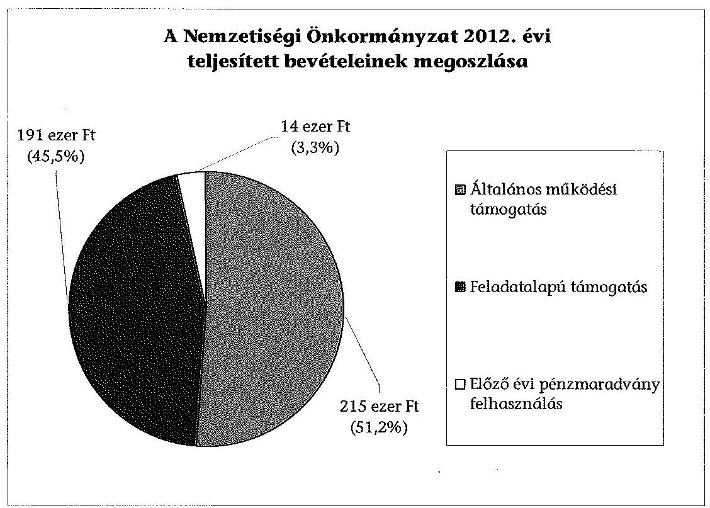
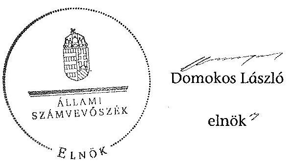

# ÁLLAMI   SZÁMVEVŐSZÉK 

## JELENTÉS

a helyi nemzetiségi önkormányzatok gazdálkodásának ellenőrzéséről
Újfehértó Város Roma Nemzetiségi Önkormányzata

---

# Állami Számvevőszék 

Iktatószám: V-0225-065/2014.
Témaszám: 1260
Vizsgálat-azonosító szám: V065223

## Az ellenőrzést felügyelte:

Horváth Balázs
felügyeleti vezető
Az ellenőrzést vezette és az ellenőrzés végrehajtásáért felelős:
Pats Regina
ellenőrzésvezető
A számvevőszéki jelentést készítették és a jelentés összeállításában
közremüködtek:
Dr. Győri Gabriella
számvevő tanácsos
Csényi István
számvevő tanácsos
Az ellenőrzést végezték:
Berki László
Számvevő

Völgyesi Mátyás
számvevő

---

# TARTALOMJEGYZÉK 

BEVEZETÉS ..... 3
I. ÖSSZEGZŐ MEGÁLLAPÍTÁSOK, KÖVETKEZTETÉSEK, JAVASLATOK ..... 6
II. RÉSZLETES MEGÁLLAPÍTÁSOK ..... 12

1. A Nemzetiségi Önkormányzat és a Települési Önkormányzat együttműködésének szabályozása, a működési feltételek biztosítása ..... 12
2. A gazdálkodási feladatok ellátásának szabályszerűsége ..... 13
2.1. A költségvetésre és zárszámadásra, valamint a kincstári adatszolgáltatás rendjére vonatkozó jogszabályi előírások betartása ..... 13
2.2. A Nemzetiségi Önkormányzat gazdálkodásának szabályozottsága ..... 13
2.3. Az operatív gazdálkodási jogkörök kialakítása, gyakorlása ..... 14
3. A Nemzetiségi Önkormányzattal kapcsolatos gazdálkodási feladatok belső ellenőrzése ..... 15
4. A feladatalapú támogatás felhasználásának, elszámolásának szabályszerűsége, a Nemzetiségi Önkormányzat feladatellátása ..... 16
MELLÉKLETEK
5. számú A Nemzetiségi Önkormányzat 2012. évi gazdálkodásának főbb adatai, mutatói
6. számú Tájékoztatás az elnöknek küldött el nem fogadott észrevételekről
FÜGGELÉKEK
7. számú Rövidítések jegyzéke
8. számú Értelmező szótár
9. számú A gazdálkodás értékelésének módszere

---

.

---

# JELENTÉS   a helyi nemzetiségi önkormányzatok gazdálkodásának ellenőrzéséről Újfehértó Város   Roma Nemzetiségi Önkormányzata 

## BEVEZETÉS

Újfehértó Város Roma Nemzetiségi Önkormányzata a 2010. évben alakult, elnöke a 2010. évi helyhatósági választások óta látja el feladatát. A Nemzetiségi Önkormányzat intézményt, gazdasági társaságot és más szervezetet nem alapított, illetve társulásban nem vett részt. A négytagú Képviselő-testület a munkája segítésére bizottságot nem hozott létre. A Nemzetiségi Önkormányzat a 2011. évben nem részesült feladatalapú támogatásban. A Nemzetiségi Önkormányzat költségvetési beszámolója szerint a 2012. évben a módosított költségvetési bevételi és kiadási előirányzat 420 ezer Ft, a teljesített költségvetési bevétel 406 ezer Ft, a teljesített költségvetési kiadás 110 ezer Ft volt. A 2012. évi gazdálkodási adatokat részletesen az 1. számú mellékletben mutatjuk be.

Az Alaptörvény XXIX. cikk (1) bekezdése szerint a Magyarországon élő nemzetiségek államalkotó tényezők. Minden, valamely nemzetiséghez tartozó magyar állampolgárnak joga van önazonossága szabad vállalásához és megőrzéséhez. A hazánkban élő nemzetiségek helyi (települési és területi) valamint országos önkormányzatokat hozhatnak létre ${ }^{1}$. A helyi nemzetiségi önkormányzatok gazdálkodási feladatait jogszabályi előírás alapján a székhely szerinti helyi önkormányzat polgármesteri hivatala látja el.

A nemzetiségek helyzete, támogatása mind hazai, mind EU-s szinten kiemelt figyelmet kap napjainkban. A helyi nemzetiségi önkormányzatok gazdálkodására és támogatási rendszerére vonatkozó jogszabályok a 2010-2012. években jelentős változásokon mentek át. A települési és területi nemzetiségi önkormányzatok gazdálkodásának, a részükre juttatott költségvetési támogatások felhasználásának ellenőrzését az ÁSZ 2012-ben sorozatjellegű ellenőrzés keretében indította el. A 2013. évi ellenőrzések e témacsoportos ellenőrzések folytatását jelentik, amelyet az ÁSZ 2014. első félévi ellenőrzési terve 12. témasorszámon tartalmaz.

Az ellenőrzés célja annak értékelése volt, hogy a nemzetiségi önkormányzat gazdálkodási kereteinek kialakítása, gazdálkodása és feladatellátása megfelelt-e a jogszabályoknak.

[^0]
[^0]:    ${ }^{1}$ A 2010. évben megtartott nemzetiségi önkormányzati választásokat követően 2304 települési, 58 területi és 13 országos nemzetiségi önkormányzat alakult meg.

---

Ennek keretében értékeltük, hogy:

- a nemzetiségi önkormányzat és a települési önkormányzat együttműködésének szabályozása, a működési feltételek biztosítása megfelelt-e a jogszabályi előírásoknak;
- a felek együttműködése megfelelt-e a közöttük létrejött megállapodásnak a gazdálkodási feladatok szabályszerű ellátása során, ennek keretében betar-tották-e a helyi nemzetiségi önkormányzat gazdálkodásához kapcsolódóan a költségvetésre és zárszámadásra, a gazdálkodás szabályozására, az operatív gazdálkodási jogkörök gyakorlására vonatkozó jogszabályi előírásokat;
- a jegyző biztosította-e a nemzetiségi önkormányzat gazdálkodásának belső ellenőrzését;
- a nemzetiségi önkormányzat feladatalapú támogatásának felhasználása, a folyósított feladatalapú támogatással történő elszámolás az előírásoknak megfelelő volt-e;
- a nemzetiségi önkormányzat feladatellátása összhangban volt-e a vonatkozó jogszabályi előírásokkal.

Az ellenőrzés várható hasznosulását négy szinten tervezzük. A törvényalkotás számára összegzett tapasztalatok állnak rendelkezésre a nemzetiségi önkormányzatok testületi döntéseinek, gazdálkodásának és a feladatalapú támogatás felhasználásának szabályszerűségéről, amelynek alapján következtetést lehet levonni arra, hogy indokolt-e esetleges jogszabályi módosítás kezdeményezése. Az ellenőrzés az ellenőrzött számára visszajelzést ad a működésében fellépő hiányosságokról, javaslataival hozzájárul azok kiküszöböléséhez, amely csökkentheti a későbbi ellenőrzések gyakoriságát. Az ellenőrzés megállapításai és javaslatai tanulságul szolgálhatnak más nemzetiségi önkormányzatok, szervezetek számára a rendezett gazdálkodási keretek kialakításához. A társadalom számára jelzi, hogy közpénz nem maradhat ellenőrizetlenül, az ÁSZ értékteremtő rend kialakításához és megőrzéséhez hozzájáruló tevékenysége pozitív hatással lesz a szervezetről kialakított összkép formálásában. Az ÁSZ szervezetén belül lehetőség nyílik arra, hogy a megállapítások szintetizálásával az intézmény a hozzáadott értéket teremtő elemző tevékenységét és tanácsadó szerepét erősítse.

A helyi nemzetiségi önkormányzatok gazdálkodásának ellenőrzéséről szóló jelentés I. fejezetének összegző része az ellenőrzés céljára adott rövid, szintetizáló összefoglalót és következtetéseket tartalmazza a II. fejezet részletes megállapításain alapulóan. A jelentés intézkedést igénylő megállapításait és javaslatait az összegzőben foglaltak mellett - az ellenőrzés során feltárt, a jelentés II. fejezetében rögzített részletes megállapítások alapozzák meg, illetve támasztják alá.

Az ellenőrzés típusa: szabályszerűségi ellenőrzés.
Az ellenőrzött időszak: a 2012. január 1. - 2012. december 31. közötti időszak. Az ellenőrzés kiterjedt a helyi nemzetiségi önkormányzatoknak juttatott 2012. évi feladatalapú támogatás 2013. évben való elszámolására is.

---

Ellenőrzött szervezet: az Újfehértó Város Roma Nemzetiségi Önkormányzata és a gazdálkodási feladatait ellátó Újfehértó Város Önkormányzata.

Az ellenőrzés végrehajtásának jogszabályi alapját az ÁSZ tv. 5. § (2)-(3) és (6) bekezdéseiben foglaltak képezik.

Az ellenőrzés szakmai módszertana az ÁSZ hivatalos honlapján (www.asz.hu) közzétett szakmai szabályokon alapult, amely a Legfőbb Ellenőrző Intézmények Nemzetközi Szervezete (INTOSAI) által kiadott nemzetközi standardok (ISSAI) figyelembevételével készült.

A helyi nemzetiségi önkormányzatok gazdálkodásának ellenőrzése során értékeltük a települési önkormányzat és a nemzetiségi önkormányzat együttmúködésének, a gazdálkodás szabályozottságának és a pénzügyi folyamatokban kulcsszerepet betöltő belső kontrollok (teljesítésigazolás és érvényesítés) múködésének megfelelőségét. A kulcskontrollokat a dologi kiadásokkal kapcsolatos kifizetéseknél véletlen mintavételi eljárást alkalmazva ellenőriztük. Ellenőriztük, hogy a jegyző biztosította-e a nemzetiségi önkormányzat gazdálkodásának belső ellenőrzését. Értékeltük a feladatalapú támogatások felhasználásának, elszámolásának szabályszerűségét, a nemzetiségi önkormányzat feladatellátása és a jogszabályi előírások összhangját.

Az ellenőrzés lefolytatásához a Nemzetiségi Önkormányzat és a gazdálkodási feladatait ellátó Települési Önkormányzat tanúsítványok és a kapcsolódó, dokumentumjegyzékben megjelölt dokumentumok elektronikus úton történő megküldésével, rendelkezésre bocsátásával szolgáltatott adatokat. Az adatszolgáltatás kontrollálása és szükség szerinti javítása a helyszíni ellenőrzés keretében történt. A gazdálkodás értékelésének módszerét a 3. számú függelék tartalmazza.

Az ÁSZ tv. 29. § (1) bekezdése szerint a jelentéstervezetet megküldtük egyeztetésre a polgármesternek és a Nemzetiségi Önkormányzat elnökének. A polgármester az ÁSZ tv. 29. § (2) bekezdésében foglalt észrevételezési jogával nem élt, a jelentéstervezetre észrevételt nem tett. A Nemzetiségi Önkormányzat elnöke határidőben megküldött észrevétele és tájékoztatása alapján a jelentést nem módosítottuk, az el nem fogadott észrevételek indokolását a jelentés 2. számú melléklete tartalmazza

---

# I. ÖSSZEGZŐ MEGÁLLAPÍTÁSOK, KÖVETKEZTETÉSEK, JAVASLATOK 

A Nemzetiségi Önkormányzat és a Települési Önkormányzat együttmüködésének szabályozása megfelelt a jogszabályi előírásoknak. A Nemzetiségi Önkormányzat rendelkezett a Települési Önkormányzattal kötött, 2012. évben hatályban lévő együttműködési megállapodással, melynek felülvizsgálatára 2012 május hónapban került sor. Az együttmúködési megállapodás ${ }_{1,2}$-t a Nemzetiségi Önkormányzat és a Települési Önkormányzat képviselő-testületei határozattal jóváhagyták és az arra jogosult személyek aláírták. A 2012. december 31 -én hatályos együttmúködési megállapodás ${ }_{2}$ tartalmazta a Nemzetiségi Önkormányzat múködési feltételeit és a feladatellátáshoz kapcsolódó költségviselést. A gazdálkodási feladatok ellátását - az Áht. ${ }_{2}$-ben foglalt ellenőrzési feladatok ellátásának részletes szabályai kivételével - a jogszabályi előírásoknak megfelelően szabályozták. A Települési Önkormányzat biztosította a Nemzetiségi Önkormányzat múködéséhez szükséges személyi és tárgyi feltételeket.

A Nemzetiségi Önkormányzat 2012. évi költségvetésének és zárszámadásának tartalma, jóváhagyása, valamint a kapcsolódó adatszolgáltatás szabályszerüsége részben felelt meg a jogszabályi előírásoknak. A Nemzetiségi Önkormányzat elnöke a 2012. évi költségvetési határozat tervezetet az Áht. ${ }_{2}$-ben meghatározott határidőben nyújtotta be a Képviselő-testületnek elfogadásra. A jóváhagyott költségvetés megfelelt a jogszabályi előírásoknak, melyben szöveges indoklással együtt - az Áht. ${ }_{2}$-ben előírt előirányzat felhasználási terv kivételével - bemutatták az előírt mérlegeket és kimutatásokat. A jegyző által elkészített zárszámadási határozat tervezetet a Nemzetiségi Önkormányzat elnöke az Áht. ${ }_{2}$-ben foglalt határidőben beterjesztette a Képviselőtestületnek elfogadásra. Az elfogadott költségvetés és a határozattal elfogadott zárszámadás közötti összehasonlíthatóságot biztosították, a Nemzetiségi Önkormányzat valamennyi bevételéről és kiadásáról elszámolt. A jegyző a 2012. évben a Nemzetiségi Önkormányzat részére előírt kincstári adatszolgáltatásokat az Ávr.-ben és az Áhsz. ${ }_{1}$-ben foglalt határidőkön túl teljesítette.

A Nemzetiségi Önkormányzat gazdálkodásának szabályozottsága az ellenőrzött időszakban részben felelt meg a jogszabályi előírásoknak. A Polgármesteri Hivatal a 2012. január 1-jétől 2012. május 31 -éig terjedő időszakot érintően a pénzkezelési szabályzatának és a „Kötelezettségvállalás, utalványozás, ellenjegyzés, érvényesités rendje" szabályzatának hatályát kiterjesztette a Nemzetiségi Önkormányzat gazdálkodásával kapcsolatos végrehajtási feladatokra. 2012. június 1-jétől a Nemzetiségi Önkormányzat önállóan rendelkezett ezen szabályzatokkal. A 2012. január 1-jétől 2012. május 31 -éig terjedő időszakban a Nemzetiségi Önkormányzat nem rendelkezett a Számv. tv.-ben előírt számviteli politikával. Az együttmúködési megállapodás ${ }_{2}$-ben foglaltak alapján a Polgármesteri Hivatal számviteli politikájának, eszközök és források értékelési szabályzatának, leltározási és leltárkészítési szabályzatának valamint számlarendjének hatályát 2012. június 1-jével a Nemzetiségi Önkormányzat gazdálkodásával kapcsolatos végrehajtási feladatokra kiterjesztették. A jegyző a Nemzeti-

---

ségi Önkormányzat gazdálkodásával kapcsolatos végrehajtási feladatokra azonban nem terjesztette ki a Bkr.-ben előírt ellenőrzési nyomvonalat, a szabálytalanságok kezelésének eljárásrendjét, valamint a folyamatba épített előzetes, utólagos és vezetői ellenőrzés szabályozását. Ezekkel a szabályzatokkal a Nemzetiségi Önkormányzat önállóan sem rendelkezett.

A Nemzetiségi Önkormányzat gazdálkodása tekintetében az operatív gazdálkodási jogkörök kialakitása megfelel a jogszabályi előírásoknak. A Nemzetiségi Önkormányzat elnöke az összeférhetetlenségi követelmények érvényesülésének feltételeit 2012. június 1-jétől kezdődően biztosította, mert a kötelezettségvállalás, a teljesítésigazolás és az utalványozás gyakorlására ettől a naptól hatalmazott fel más képviselőt. A pénzügyi ellenjegyzöket és az érvényesítőket - a jogkörében eljárva - a jegyző jelölte ki. A feladatokra kijelölt köztisztviselők rendelkeztek az előírt szakképesítéssel. A Nemzetiségi Önkormányzatnál a 2012. évben a dologi kiadások teljesítése során a teljesítésigazolás és az érvényesítés kulcskontrollok müködésének megfelelősége gyenge volt, a hibák száma a lényegességi szintet, a kritikus hibahatárt elérte. Az Ávr. előírása ellenére a teljesítésigazoló jogosultság hiányában látta el feladatát, kijelölésére a gazdasági eseményt követően került sor. Az érvényesítő az Ávr.-ben foglalt feladatainak részben tett eleget, mert nem ellenőrizte, hogy a megelőző ügymenetben a jogszabályok és a belső szabályzatok előírásait betartották-e, valamint nem ellenőrizte és az utalványozónak nem jelezte, hogy a teljesítésigazoló jogosultság hiányában végezte feladatát. Az érvényesítő nem ellenőrizte és nem jelezte az utalványozónak azt sem, hogy a Nemzetiségi Önkormányzat kötelezettségvállalási nyilvántartása nem felelt meg az Ávr.-ben előírtaknak. A Nemzetiségi Önkormányzatnál a 2012. évi dologi kiadások között a három legnagyobb összegű kiadás teljesítésének egyedi értékelése tárgyában a 2012. évi egyetlen gazdasági esemény értékelése az előzőek szerint már megtörtént. A kulcskontrollok múködéséhez kapcsolódó hiányosságok miatt nem biztosították a hibák megelőzését, feltárását és kijavítását. A számvevőszéki ellenőrzés a kifizetések bizonylatainak ellenőrzése során - a rendelkezésre bocsátott dokumentumok alapján - összeférhetetlenséget, illetve jogosulatlan kifizetést nem tárt fel.

A Polgármesteri Hivatal 2012. évre vonatkozó éves belső ellenőrzési tervét megalapozó kockázatelemzés kiterjedt a Nemzetiségi Önkormányzat gazdálkodásával összefüggő végrehajtási feladatokra. Ezen feladatok ellátását alacsony kockázatúnak minősítették, ezért erre vonatkozóan belső ellenőrzést a 2012. évre nem terveztek és nem végeztek.

A Nemzetiségi Önkormányzat a 2012. évben a bevételei 45,5\%-át kitevő, 191 ezer Ft összegű feladatalapú támogatásban részesült. A támogatás öszszegéből a tárgyévben felhasználás nem történt és az összeget a Nemzetiségi Önkormányzat a támogatási kormányrendelet ${ }_{2}$ alapján az Âht. ${ }_{2}$-ben foglalt előírások szerinti, tárgyévi előzetes írásbeli kötelezettségvállalással sem terhelte. A Nemzetiségi Önkormányzat a 191 ezer Ft összegű, tárgyévi kötelezettségvállalással nem terhelt maradványt érintően a támogatási kormányrendelet ${ }_{2}$ alapján nem tett eleget az Âht. ${ }_{2}$ szerinti lemondási és a központi költségvetés javára történő visszafizetési kötelezettségének. Az elszámolás a támogatási kormányrendelet ${ }_{3}$ alapján az Âht. ${ }_{2}$ rendelkezése ellenére nem történt meg. A támogatás felhasználását, elszámolását az arra jogosult külső szervek nem el-

---

lenőrizték. A Nemzetiségi Önkormányzat kötelező feladatellátásának tárgya összhangban volt a Nek. ${ }_{2}$ tv.-ben foglalt előírásokkal, önként vállalt feladatot a 2012. évben nem láttak el.

Az ÁSZ tv. 33. § (1) bekezdésében foglaltak értelmében az ellenőrzött szervezet vezetője köteles a jelentésben foglalt megállapításokhoz kapcsolódó intézkedési tervet összeállítani és azt a jelentés kézhezvételétől számított 30 napon belül az ÁSZ részére megküldeni. Amennyiben az intézkedési tervet határidőre nem küldi meg a szervezet, vagy az nem elfogadható, az ÁSZ elnöke az ÁSZ tv. 33. § (3) bekezdés a)-b) pontjaiban foglaltakat érvényesítheti.

A helyszíni ellenőrzés megállapításainak hasznosítása mellett javasoljuk:

# a jegyzőnek 

1. az együttműködés szabályozásával kapcsolatban

A Nemzetiségi Önkormányzat és a Települési Önkormányzat együttműködését meghatározó együttműködési megállapodás ${ }_{2}$ tartalmilag nem felelt meg az Áht. ${ }_{2}$ 27. § (2) bekezdésében foglalt előírásoknak, mert nem tartalmazott előírást az ellenőrzési feladat ellátásának részletes szabályaira vonatkozóan.

Javaslat
Az együttműködés szabályszerűsége érdekében készítse elő az együttműködési megállapodás módosítását, hogy az tartalmilag feleljen meg az Áht. ${ }_{2}$ 27. § (2) bekezdésében foglalt előírásoknak.
2. a költségvetéssel és a kincstári adatszolgáltatással kapcsolatban

A 2012. évi költségvetési határozattervezet előterjesztésekor - az Áht. ${ }_{2}$ 24. § (4) bekezdés a) pontja előírását figyelmen kívül hagyva - a Képviselő-testület részére tájékoztatásul nem mutatták be az előirányzat felhasználási tervet szöveges indoklással együtt.

A jegyző a 2012. évben a Nemzetiségi Önkormányzat részére előírt kincstári adatszolgáltatási kötelezettségeket az Ávr. 33. § -ában, az Ávr. 170. § (2) és (5) bekezdéseiben, valamint az Áhsz. 10. § (1) és (5a) bekezdéseiben foglalt határidőkön túl teljesítette.

Javaslat
Gondoskodjon a jövőben arról, hogy:
a) a költségvetési határozattervezet előterjesztésekor a Képviselő-testületnek tájékoztatásul - szöveges indoklással együtt - bemutatásra kerüljön az Áht. ${ }_{2}$ 24. § (4) bekezdés a) pontjában előírt előirányzat felhasználási terv;
b) a kincstári adatszolgáltatási kötelezettségének az Ávr. 33. § -ában, 170. § (2) és (5) bekezdéseiben, valamint az Áhsz. ${ }_{2}$ 32. § (4) bekezdésében foglalt határidők betartásával tegyen eleget.

---

3. a gazdálkodás végrehajtási feladatainak szabályozottságával összefüggésben

A jegyző a Nemzetiségi Önkormányzat gazdálkodásának végrehajtási feladataira nem terjesztette ki a Bkr. 6. § (3)-(4) bekezdéseiben előírt ellenőrzési nyomvonalat és a szabálytalanságok kezelésének eljárásrendjét, valamint a Bkr. 8. § (2) bekezdése szerinti folyamatba épített előzetes, utólagos és vezetői ellenőrzés szabályozását. Ezekkel a szabályzatokkal a Nemzetiségi Önkormányzat önállóan sem rendelkezett.

Javaslat
A szabályszerű gazdálkodás végrehajtása érdekében gondoskodjon a Bkr. 6. § (3)-(4) és 8. § (2) bekezdésében előírtak szerinti ellenőrzési nyomvonal, szabálytalanságok kezelésének eljárásrendje, valamint folyamatba épített, előzetes, utólagos és vezetői ellenőrzés szabályozás hatályának kiterjesztéséről a Nemzetiségi Önkormányzat gazdálkodásának végrehajtására vonatkozóan.
4. a kulcskontrollok múködésével kapcsolatban

Az Ávr. 57. § (3) bekezdése ellenére a teljesítésigazolást az Ávr. 57. § (4) bekezdése szerinti kijelöléssel nem rendelkező személy végezte.

Az érvényesítő az Ávr. 58. § (1)-(2) bekezdései szerinti feladatát részben látta, mert nem ellenőrizte a megelőző ügymenetben a gazdálkodásra vonatkozó jogszabályok és a belső szabályzatok előírásainak betartását, valamint az utalványozónak nem jelezte, hogy a teljesítésigazoló jogosultság hiányában végezte feladatát.

Javaslat
Az operatív gazdálkodás múködési hibáinak megelőzése, feltárása és kijavítása érdekében gondoskodjon arról, hogy:
a) a teljesítésigazolást az Ávr. 57. § (3) bekezdésében előírtak szerint, az Ávr. 57. § (4) bekezdésének megfelelő kijelöléssel rendelkező személy végezze;
b) az érvényesítő az Ávr. 58. § (1)-(2) bekezdésében előírt ellenőrzési és jelzési feladatait maradéktalanul lássa el.
5. a feladatalapú támogatás elszámolásával kapcsolatban

A 2012. évi feladatalapú támogatás elszámolása a támogatási kormányrendelet ${ }_{2}$ 8. § (5) bekezdésében hivatkozott „a helyi önkormányzatok elszámolási és ellenőrzési rendjére vonatkozó jogszabályok rendelkezései alkalmazandóak" előírása alapján az Áht. 2 57. § (3) bekezdésében foglaltak ellenére nem történt meg.

Javaslat
Gondoskodjon az Áht. 2 27. § (2) bekezdésében meghatározott feladatkörében a Nemzetiségi Önkormányzat által igénybe vett 2012. évi feladatalapú támogatás elszámolásának elkészítéséről, figyelemmel az Áht. 2 53. § (1) bekezdésében foglaltakra.

---

# a polgármesternek 

A Nemzetiségi Önkormányzat és a Települési Önkormányzat együttműködését meghatározó együttműködési megállapodás ${ }_{2}$ tartalmilag nem felelt meg az Áht. 2 27. § (2) bekezdésében előírásoknak, mert nem tartalmazott előírást az ellenőrzési feladat ellátásának részletes szabályaira vonatkozóan.

Javaslat
Terjessze a Települési Önkormányzat Képviselő-testülete elé jóváhagyásra az Áht. 2 27. § (2) bekezdésében foglalt előírásoknak megfelelő, a jegyző által előkészített együttműködési megállapodás ${ }_{2}$ módosítását.

## a Nemzetiségi Önkormányzat elnökének

1. A Nemzetiségi Önkormányzat és a Települési Önkormányzat együttműködését meghatározó együttműködési megállapodás ${ }_{2}$ tartalmilag nem felelt meg az Áht. 2 27. § (2) bekezdésében előírásoknak, mert nem tartalmazott előírást az ellenőrzési feladat ellátásának részletes szabályaira vonatkozóan.

Javaslat
Terjessze a Képviselő-testület elé jóváhagyásra az Áht. 2 27. § (2) bekezdésében foglalt előírásoknak megfelelő, a jegyző által előkészített együttműködési megállapodás ${ }_{2}$ módosítását.
2. A Nemzetiségi Önkormányzat elnöke a 2012. évi költségvetési határozattervezet előterjesztésekor az Áht. 2 24. § (4) bekezdés a) pontja előírását figyelmen kívül hagyva a Képviselő-testület részére - a jegyző mulasztása miatt - tájékoztatásul nem mutatta be az előirányzat felhasználási tervet szöveges indoklással együtt.

Javaslat
A költségvetés szabályszerűségének biztosítása érdekében a költségvetési határozattervezet előterjesztésekor tájékoztatásul mutassa be a Képviselő-testületnek - a jegyző által előkészített - az Áht. 2 24. § (4) bekezdés a) pontjában előírt előirányzat felhasználási tervet szöveges indoklással együtt.
3. A 2012. évi feladatalapú támogatás elszámolása a támogatási kormányrendelet ${ }_{2}$ 8. § (5) bekezdésében hivatkozott „a helyi önkormányzatok elszámolási és ellenőrzési rendjére vonatkozó jogszabályok rendelkezései alkalmazandóak" előírása alapján az Áht. 2 57. § (3) bekezdésében foglaltak ellenére nem történt meg.

Javaslat
Terjessze a Képviselő-testület elé az Áht. 2 53. § (1) bekezdése szerinti beszámolási kötelezettség teljesítéséhez összeállított, a Nemzetiségi Önkormányzat által igénybevett 2012. évi feladatalapú támogatás rendeltetésszerű felhasználásáról szóló elszámolást.

---

4. A Nemzetiségi Önkormányzat nem tett eleget az Áht. 57. § (2) bekezdésében előírtaknak azáltal, hogy a fel nem használt 2012. évi feladatalapú támogatás 2012. december 31 -élg kötelezettségvállalással nem terhelt 191 ezer Ft összegű maradványáról nem mondott le és nem fizette vissza azt a központi költségvetés javára.

Javaslat
Terjessze a Képviselő-testület elé jóváhagyásra az Áht. 5 57/A. § (1) bekezdés előírásának megfelelően a 2012. évi feladatalapú támogatás kötelezettségvállalással nem terhelt maradványáról történő lemondást és intézkedjen a maradvány összegének visszafizetéséről a központi költségvetés javára.

---

# II. RÉSZLETES MEGÁLLAPÍTÁSOK 

## 1. A Nemzetiségi Önkormányzat És a Települési Önkormányzat együttmúködésének szabályozása, a múködési feltételek biztositása

A Nemzetiségi Önkormányzat és a Települési Önkormányzat együttmúködésének szabályozása megfelel a jogszabályi előírásoknak.

A Nemzetiségi Önkormányzat rendelkezett a Települési Önkormányzattal kötött, 2012. évben hatályban lévő együttmúködési megállapodással. Az együttműködési megállapodás ${ }_{1,2}$-t a Nemzetiségi Önkormányzat és a Települési Önkormányzat képviselő-testületei határozattal ${ }^{2}$ jóváhagyták és az arra jogosult személyek aláírták.

A 2012. december 31 -én hatályos együttműködési megállapodás ${ }_{2}$ a Nemzetiségi Önkormányzat múködésének feltételeit és a gazdálkodási feladatainak ellátását a jogszabályi előírásoknak megfelelően szabályozta.

Az együttműködési megállapodás ${ }_{2}$ szabályozta a feladatellátáshoz szükséges helyiség használatát, a tárgyi és személyi feltételek biztosítását, a feladatellátáshoz kapcsolódó költségviselést, valamint arra vonatkozó rendelkezést, hogy a jegyző vagy megbízottja részt vesz a Nemzetiségi Önkormányzat képviselőtestületi ülésein és jelzi amennyiben törvénysértést észlel. A jogszabályi előírások azonban nem érvényesültek maradéktalanul, mert az együttmúködési megállapodás ${ }_{2}$ nem tartalmazott előírást az Áht. ${ }_{2}$ 27. § (2) bekezdésében előírt ellenőrzési feladat ellátásának részletes szabályaira vonatkozóan.

A Nemzetiségi Önkormányzat SZMSZ-ében rögzítették a Nek. ${ }_{2}$ tv. rendelkezései alapján az együttműködési megállapodás ${ }_{2}$ szerinti múködési feltételeket.

A Települési Önkormányzat a 2012. évben biztosította a Nemzetiségi Önkormányzat múködéséhez szükséges személyi és tárgyi feltételeket.

[^0]
[^0]:    ${ }^{2}$ Az együttmúködési megállapodás ${ }_{1}$-et a Képviselő-testület az 5/2010. (XI.29.) számú, a Települési Önkormányzat Képviselő-testülete a 183/2010. (XI.25.) KT számú határozattal hagyta jóvá. A 2010. november 30 -án aláírt együttműködési megállapodás ${ }_{1}$ volt hatályban 2012. június 1-jéig. A felülvizsgált együttműködési megállapodást a Képvi-selő-testület a 4/2012. (V.29.) számú, a Települési Önkormányzat Képviselő-testülete a 79/2012. (V.23.) KT. számú határozattal hagyta jóvá. Az együttmúködési megállapo-dás-2-t 2012. június 1-jén a polgármester és a Nemzetiségi Önkormányzat elnöke írta alá, mely az aláírása napjától hatályos.

---

# 2. A GAZDÁLKODÁSI FELADATOK ELLÁTÁSÁNAK SZABÁLYSZERŰSÉGE 

### 2.1. A költségvetésre és zárszámadásra, valamint a kincstári adatszolgáltatás rendjére vonatkozó jogszabályi előírások betartása

A Nemzetiségi Önkormányzat 2012. évi költségvetésének és zárszámadásának tartalma, jóváhagyása, valamint a kapcsolódó adatszolgáltatás szabályszerűsége részben felelt meg a jogszabályi előírásoknak.

A Nemzetiségi Önkormányzat elnöke a 2012. évi költségvetési határozat tervezetet, az Áht. ${ }_{2}$-ben előírt határidőben nyújtotta be a Képviselőtestületnek elfogadásra. A jóváhagyott költségvetés ${ }^{3}$ megfelelt a jogszabályi előírásoknak, tartalmazta a Nemzetiségi Önkormányzat költségvetési bevételeit és kiadásait előirányzat-csoportok, kiemelt előirányzatok szerinti bontásban. A költségvetésben tájékoztatás céljából, szöveges indoklással együtt - az Áht. ${ }_{2} 24$. § (4) bekezdés a) pontjában előírt előirányzat felhasználási terv kivételével - bemutatták az előírt mérlegeket és kimutatásokat.

A jegyző által elkészített zárszámadási határozat tervezetet a Nemzetiségi Önkormányzat elnöke az Áht. ${ }_{2}$-ben foglalt határidőben terjesztette be a Képvi-selő-testületnek elfogadásra. A 2012. évi zárszámadási határozat tervezetének előterjesztésénél a Képviselő-testület részére tájékoztatásul bemutatták az Áht. ${ }_{2}$ ben foglalt mérlegeket és kimutatásokat, szöveges indoklással együtt. Az elfogadott költségvetés és a határozattal elfogadott zárszámadás ${ }^{4}$ közötti összehasonlíthatóságot biztosították, a Nemzetiségi Önkormányzat valamennyi bevételéről és kiadásáról elszámolt.

A jegyző a 2012. évben a Nemzetiségi Önkormányzat részére előírt kincstári adatszolgáltatásokat az Ávr. 33. §-ában, az Ávr. 170. § (2) és (5) bekezdésében és az Ahsz. ${ }_{1} 10 . \S$ (1) és (5a) bekezdéseiben foglalt határidőkön túl teljesítette.

### 2.2. A Nemzetiségi Önkormányzat gazdálkodásának szabályozottsága

A Nemzetiségi Önkormányzat gazdálkodásának szabályozottsága az ellenőrzött időszakban részben felelt meg a jogszabályi előírásoknak.

A Polgármesteri Hivatal a 2012. január 1-jétől 2012. május 31-éig terjedő időszakot érintően a pénzkezelési szabályzatának és a „Kötelezettségvállalás, utalványozás, ellenjegyzés, érvényesités rendje" szabályzatának hatályát kiterjesztette a Nemzetiségi Önkormányzat gazdálkodásával kapcsolatos végrehajtási feladatokra. Ezekkel a szabályzatokkal 2012. június 1-jétől a Nemzetiségi Önkormányzat önállóan rendelkezett. A 2012. január 1-jétől 2012. május 31-éig ter-

[^0]
[^0]:    ${ }^{3}$ A Képviselő-testület 1/2012. (II.15.) számú határozata.
    ${ }^{4}$ A Képviselő-testület 2/2013. (IV.17.) számú határozata.

---

jedő időszakban a Nemzetiségi Önkormányzat nem rendelkezett a Számv. tv. 14. § (3) és (4) bekezdésében előírt számviteli politikával. Az együttmúködési megállapodás ${ }_{2}$-ben foglaltak alapján a Polgármesteri Hivatal számviteli politikájának, eszközök és források értékelési szabályzatának, leltározási és leltárkészítési szabályzatának valamint számlarendjének hatályát 2012. június 1-jével a Nemzetiségi Önkormányzat gazdálkodásával kapcsolatos végrehajtási feladatokra kiterjesztették.

A Polgármesteri Hivatal SZMSZ-e és ezzel összhangban a feladatokat ellátó köztisztviselők munkaköri leírásai tartalmazták a munkakörökhöz tartozó - a Nemzetiségi Önkormányzat gazdálkodásával kapcsolatos - feladat- és hatáskörökre, a hatáskörök gyakorlásának módjára, a helyettesítés rendjére, az ezekhez kapcsolódó felelősségi szabályokra vonatkozó előírásokat.

A jegyző azonban a Nemzetiségi Önkormányzat gazdálkodásával kapcsolatos végrehajtási feladatokra nem terjesztette ki a Bkr. 6. § (3)-(4) bekezdéseiben előírt ellenőrzési nyomvonalat, a szabálytalanságok kezelésének eljárásrendjét, valamint a Bkr. 8. § (2) bekezdése szerinti folyamatba épített előzetes, utólagos és vezetői ellenőrzés szabályozását. Ezekkel a szabályzatokkal a Nemzetiségi Önkormányzat önállóan sem rendelkezett.

# 2.3. Az operatív gazdálkodási jogkörök kialakítása, gyakorlása 

A Nemzetiségi Önkormányzat gazdálkodása tekintetében az operatív gazdálkodási jogkörök kialakítása az ellenőrzött időszakban megfelelt a jogszabályi elöírásoknak.

A Nemzetiségi Önkormányzat elnöke az összeférhetetlenségi követelmények érvényesülésének feltételeit 2012. június 1-jétől kezdődően biztosította, mert a kötelezettségvállalás, a teljesítésigazolás és az utalványozás gyakorlására ettől a naptól hatalmazott fel más képviselőt (az elnökhelyettest).

A pénzügyi ellenjegyzőket és az érvényesítőket - a jogkörében eljárva - a jegyző jelölte ki. A feladatokra kijelölt köztisztviselők rendelkeztek az elöírt szakképesítéssel. Az operatív gazdálkodási jogkörök gyakorlására jogosultakról vezetett nyilvántartás megfelelt az Ávr. előírásainak.

A Nemzetiségi Önkormányzatnál a 2012. évben a dologi kiadások teljesítése során - a bizonylatok tesztelése alapján - a teljesítésigazolás és az érvényesítés kulcskontrollok múködésének megfelelősége gyenge volt. A hibák száma a lényegességi szintet, a kritikus hibahatárt elérte, mert:

- az Ávr. 57. § (3) bekezdésének előírása ellenére a teljesítésigazoló (elnökhelyettes) jogosultság hiányában végezte el a teljesítésigazolást, mert az Ávr. 57. § (4) bekezdése alapján történő kijelölésére a gazdasági eseményt követően került sor;
- az érvényesítő az Ávr. 58. § (1)-(2) bekezdéseiben előírtak szerinti ellenőrzési feladatait csak részben látta el, mert nem ellenőrizte, hogy a megelőző ügymenetben a gazdálkodásra vonatkozó jogszabályok és a belső szabályzatok

---

előírásait betartották-e, valamint nem ellenőrizte és az utalványozónak nem jelezte, hogy a teljesítésigazoló jogosultság hiányában végezte feladatát;

- az érvényesítő nem ellenőrizte és nem jelezte az utalványozónak azt sem, hogy a Nemzetiségi Önkormányzat kötelezettségvállalási nyilvántartása nem felelt meg az Avr. 56. § (1) bekezdésében előírtaknak, mert nem tartalmazta a kötelezettségvállalást tanúsító dokumentum megnevezését, keltét, a kötelezettségvállaló nevét, a jogosult azonosító adatait, a kötelezettségvállalás tárgyát, és a teljesítési adatokat.

A Nemzetiségi Önkormányzatnál a 2012. évi dologi kiadások között a három legnagyobb összegű kiadás teljesítésének egyedi értékelése tárgyában a 2012. évi egyetlen gazdasági esemény értékelése az előzőek szerint már megtörtént.

A kulcskontrollok működéséhez kapcsolódó hiányosságok miatt nem biztosították a hibák megelőzését, feltárását és kijavítását. A számvevőszéki ellenőrzés a kifizetések bizonylatainak ellenőrzése során - a rendelkezésre bocsátott dokumentumok alapján - összeférhetetlenséget, illetve jogosulatlan kifizetést nem tárt fel.

A Nemzetiségi Önkormányzat a 2012. évben támogatásértékű működési és felhalmozási célú kiadást, illetve államháztartáson kívülre működési és felhalmozási célú pénzeszközátadást nem teljesített.

# 3. A Nemzetiségi Önkormányzattal kapcsolatos gazdálkoDÁSI FELADATOK BELSŐ ELLENŐRZÉSE 

A Polgármesteri Hivatal a belső ellenőrzési feladatát gazdasági társasággal kötött megállapodás alapján látta el. A gazdasági társaság elkészítette a 2012. évi belső ellenőrzési tervet megalapozó kockázatelemzést, melyben a Nemzetiségi Önkormányzat gazdálkodásával összefüggő végrehajtási feladatok ellátását alacsony kockázatúnak minősítették, ezért erre irányuló belső ellenőrzést a 2012. évre nem terveztek és nem végeztek. A 2012. évre vonatkozó belső ellenőrzési terv elkészítésének idején hatályos együttműködési megállapodás; a Nemzetiségi Önkormányzat belső ellenőrzésére vonatkozóan nem tartalmazott előírásokat.

Az ellenőrzéshez szolgáltatott adatok alapján a 2012. évben a Kormányhivatal a Nemzetiségi Önkormányzatot illetően nem élt törvényességi felügyeleti eszközökkel.

---

# 4. A feladatalapú támogatás felhasználásáNAK, elszámolásáNAK SzabálySzerúsége, a Nemzetiségi Önkormányzat FELADATELLÁTÁSA 

A Nemzetiségi Önkormányzat a 2012. évben 191 ezer Ft összegű feladatalapú támogatásban részesült, amelynek az összes bevételből való részesedését a következő diagram szemlélteti:

A 2012. évben folyósított feladatalapú támogatás tervezett felhasználási céljairól a Képviselő-testület a támogatás kiutalását megelőzően nem hozott határozatot. A Képviselő-testület a folyósított feladatalapú támogatás összegével a 2012. évi költségvetési határozatát - megjelölve az érintett bevételi és kiadási kiemelt előirányzatokat - módosította ${ }^{5}$, azonban a felhasználás konkrét céljairól ekkor sem és a 2012. évben a későbbiekben sem döntött.

A 2012. évben folyósított feladatalapú támogatás összegéből a tárgyévben felhasználás nem történt és az összeget a Nemzetiségi Önkormányzat a támogatási kormányrendelet ${ }_{2}$ 7. §-a alapján az Áht. 37. § (1) bekezdésében és az Ávr. 52. § (7) bekezdésében foglalt előírások szerinti, tárgyévi előzetes írásbeli kötelezettségvállalással sem terhelte.

A támogatást a 2012. december 15 -én megtartani kívánt rendezvénnyel kapcsolatos kiadások finanszírozására tervezték felhasználni, azonban a rendezvényt a 2012. évben nem tudták megszervezni. A 2012. november 18-án a szállító felé

[^0]
[^0]:    ${ }^{5}$ A Képviselő-testület 5/2012. (VIII.22.) számú határozata.

---

tett megrendelést 2012. december 11-én lemondták és a 2012. évben a feladatalapú támogatás terhére újabb kötelezettséget nem vállaltak.

A Nemzetiségi Önkormányzat a 191 ezer Ft összegű, tárgyévi kötelezettségvállalással nem terhelt maradványt érintően a támogatási kormányrendelet ${ }_{2} 8 . \S$ (5)-(6) bekezdései és 14. § (1) bekezdése alapján nem tett eleget az Áht. ${ }_{2} 57 . \S$ (2) bekezdése szerint a központi költségvetés javára történő visszafizetési kötelezettségének.

A 2012. évi feladatalapú támogatás elszámolása a támogatási kormányrendelet ${ }_{2}$ 8. § (5) bekezdésében hivatkozott „a helyi önkormányzatok elszámolási és ellenőrzési rendjére vonatkozó jogszabályok rendelkezései alkalmazandóak" előirása alapján az Áht. ${ }_{2} 57 . \S$ (3) bekezdésében foglaltak ellenére nem történt meg.

A támogatás felhasználását, elszámolását az ellenőrzésre jogosult külső szervek nem ellenőrizték.

A Nemzetiségi Önkormányzat kötelező feladatellátásának tárgya összhangban volt a Nek. 2 tv. 115. §-ában foglalt előírásokkal. A Nek. ${ }_{2}$ tv. 116. §-a szerinti önként vállalt feladatot a 2012. évben nem láttak el.

Budapest, 2014. 06. hó $A$. nap

Melléklet: $\quad 2 \mathrm{db}$
Függelék: $\quad 3 \mathrm{db}$

---

.

---

# A Nemzetiségi Önkormányzat 2012. évi gazdálkodásának föbb adatai, mutatói

A) Bevételek

|  Megnevezés | Eredeti elöirányzat | Módosított | Teljesítés  |
| --- | --- | --- | --- |
|   | ezer Ft |  | megoszlás
$(\%)$  |
|  Általános múködési támogatás | 215,0 | 215,0 | 215,0  |
|  Feladatalapú támogatás | 0,0 | 191,0 | 191,0  |
|  Költségvetési bevételek | 215,0 | 406,0 | 406,0  |
|  Maradvány felhasználás | 14,0 | 14,0 | 14,0  |
|  Tárgyévi bevételek | 229,0 | 420,0 | 420,0  |

B) Kiadások

|  Megnevezés | Eredeti elöirányzat | Módosított | Teljesítés  |
| --- | --- | --- | --- |
|   |  |  | megoszlás
$(\%)$  |
|  Dologi kiadások | 229,0 | 420,0 | 110,0  |
|  Költségvetési kiadások | 229,0 | 420,0 | 110,0  |
|  Tárgyévi kiadások | 229,0 | 420,0 | 110,0  |

---

.

---

# TÁJÉKOZTATÁS   AZ ELNÖKNEK KÜLDÖTT   EL NEM FOGADOTT ÉSZREVÉTELEKRŐL 

| Feladatalapú támogatás visszafizetése |  |
| :--: | :--: |
| Észrevétel | A jelentéstervezet II. részletes megállapítások fejezete 4. pontjának 16. oldal első bekezdésében leírt 2012. évben kapott 191 ezer Ft feladatalapú támogatást 2013. március 11-én használtuk fel, tekintettel arra, hogy nem sikerült a tervezett rendezvényt, mely egy roma bál teljesen megszervezni 2012. évben, ezért annak dátumát 2013. évre tettük át.   Mivel a 2012-re tervezett rendezvényt 2013. márciusában megtartottuk és így a 2012. évi feladatalapú támogatás összegével el tudunk számolni, ezért a Nemzetiségi Önkormányzat Elnökének a jelentéstervezet 10. oldal 3. pontja alapján tett megállapításhoz kapcsolódó Javaslat szerint fogunk eljárni: „Terjessze a Képviselö-testület elé az Áht 53 (1) bekezdése szerinti beszámolási kötelezettség teljesitéséhez összeállitott, a nemzetiségi Önkormányzat által igénybevett 2012. évi feladatalapú támogatás rendeltetésszerü felhasználásáról szóló elszámolást."   Kérjük a fentiekre való tekintettel a jelentés tervezetben az Elnöknek javaslatként megfogalmazott 3. pontbeli megállapításához tett Javaslatot mellőzni mely szerint: „Terjessze a Képviselő-testület elé jóváhagyásra az Áht.57/A§(1) bekezdés elöirásainak megfelelően a 2012. évi feladatalapú támogatást kötelezettség vállalással nem terhelt maradványáról történő lemondást és intézkedjen a maradvány összegének visszafizetéséről." |
| Válasz | A jelentéstervezet II. részletes megállapítások fejezete 4. pontja megállapítja, hogy a Nemzetiségi Önkormányzat részére 2012. évben folyósított 191 ezer Ft feladatalapú támogatás összegéből a tárgyévben felhasználás nem történt, és annak összegét 2012. december 31-ig a támogatási kormányrendelet ${ }_{2}$ 7. §-a alapján az Áht. 37 . § (1) bekezdésében és az Ávr. 52. § (7) bekezdésében foglalt előírások szerinti, tárgyévi előzetes írásbeli kötelezettségvállalással nem terhelték. A kötelezettségvállalás dokumentálásának hiánya miatt az ezzel kapcsolatos megállapításunkat, valamint a Nemzetiségi Önkormányzat elnökének tett 4. számú javaslatunkat a jelentéstervezetben továbbra is fenntartjuk. |

---

.

---

# RÖVIDÍTÉSEK JEGYZÉKE 

## Törvények

Alaptörvény
Áht. 1
Áht. 2
ÁSZ tv.
Nek. 1 tv.
Nek. 2 tv.

## Rendeletek

Áhsz. 1

Áhsz. 2
Ávr.

Bkr.
támogatási kormányrendelet ${ }_{1}$
támogatási kormányrendelet ${ }_{2}$

## Határozatok

Nemzetiségi Önkormányzat SZMSZ-e

## Szórövidítések

ÁSZ
együttmúködési megállapodás ${ }_{1}$

Magyarország Alaptörvénye
Az államháztartásról szóló 1992. évi XXXVIII. törvény (hatályos 2011. december 31-éig)
Az államháztartásról szóló 2011. évi CXCV. törvény (hatályos 2011. december 31-étől)
Az Állami Számvevőszékről szóló 2011. évi LXVI. törvény (hatályos 2011. július 1-jétől)
A nemzeti és etnikai kisebbségek jogairól szóló 1993. évi LXXVII. törvény (hatályos 2011. december 31-éig)
A nemzetiségek jogairól szóló 2011. évi CLXXIX. törvény (hatályos 2011. december 20-ától)

Az államháztartás szervezetei beszámolási és könyvvezetési kötelezettségének sajátosságairól szóló 249/2000. (XII. 24.) Korm. rendelet (hatályos 2013. december 31éig)
Az államháztartás számviteléről szóló 4/2013. (I. 11.) Korm. rendelet (hatályos 2014. január 1-jétől)
Az államháztartásról szóló törvény végrehajtásáról szóló 368/2011. (XII. 31.) Korm. rendelet (hatályos 2012. január 1-jétől)
A költségvetési szervek belső kontrollrendszeréről és belső ellenőrzéséről szóló 370/2011. (XII. 31.) Korm. rendelet (hatályos 2012. január 1-jétől)
A kisebbségi önkormányzatoknak a központi költségvetésből, valamint fejezeti kezelésű előirányzatból nyújtott támogatások feltételrendszeréről és elszámolásának rendjéről szóló 342/2010. (XII. 28.) Korm. rendelet (hatályos 2012. március 6 -áig)
A nemzetiségi célú előirányzatokból nyújtott támogatások feltételrendszeréről és elszámolásának rendjéről szóló 28/2012. (III. 6.) Korm. rendelet (hatályos 2012. december 31 -éig)

A Képviselő-testület 4/2010. (X. 25.) és 3/2012. (IV. 17.) számú határozata a Nemzetiségi Önkormányzat Szervezeti és Múködési Szabályzatáról

Állami Számvevőszék
Újfehértó Város Önkormányzata és Újfehértó Város Roma Kisebbségi Önkormányzata között 2010. november 30-án létrejött együttmúködési megállapodás

---

együttmúködési megállapodás ${ }_{2}$

EU
jegyzó
Képviselő-testület

Kincstár
Kormányhivatal
Nemzetiségi Önkormányzat
Nemzetiségi Önkormányzat elnöke
polgármester
Polgármesteri Hivatal
Polgármesteri Hivatal SZMSZ-e
SZMSZ
Települési Önkormányzat
Települési Önkormányzat Képviselő-testülete

Újfehértó Város Önkormányzata és Újfehértó Város Roma Nemzetiségi Önkormányzata között 2012. június 1-jén létrejött együttmúködési megállapodás
Európai Unió
Újfehértó Város Önkormányzatának jegyzője
Újfehértó Város Roma Nemzetiségi Önkormányzatának Képviselö-testülete
Magyar Államkincstár
Szabolcs-Szatmár-Bereg Megyei Kormányhivatal
Újfehértó Város Roma Nemzetiségi Önkormányzata
Újfehértó Város Roma Nemzetiségi Önkormányzatának elnöke
Újfehértó Város Önkormányzatának polgármestere
Újfehértó Város Önkormányzatának Polgármesteri Hivatala
Újfehértó Város Önkormányzat Polgármesteri Hivatalának Szervezeti és Müködési Szabályzata
Szervezeti és Müködési Szabályzat
Újfehértó Város Önkormányzata
Újfehértó Város Önkormányzatának Képviselő-testülete

---

# ÉRTELMEZŐ SZÓTÁR 

együttmúködési megállapodás
feladatalapú támogatás
kulcskontrollok
nemzetiségi közügy
nemzetiség

A nemzetiségi önkormányzatnak a múködési feltételei biztosítására, továbbá a bevételeivel és a kiadásaival kapcsolatban a tervezési, gazdálkodási, ellenőrzési, finanszírozási, adatszolgáltatási és beszámolási feladatai végrehajtására a székhelye szerinti települési önkormányzattal megkötött megállapodás. (Forrás: Nek. 2 tv. 80 § (2) bekezdés, Áht. 2 27. § (2) bekezdés.)
A költségvetési évben általános múködési támogatásban részesült, és a Támogatónak a Kincstárhoz intézett, a feladatalapú támogatás utalására vonatkozó rendelkező levele keltének időpontjában múködő települési és területi kisebbségi önkormányzatoknak a támogatási kormányrendelet ${ }_{1}$-ben, illetve a támogatási kormányrende-let ${ }_{2}$-ben rögzített feltételrendszer alapján nyújtható támogatás. A támogatási kormányrendelet ${ }_{1}$ előirása szerint a feladatalapú támogatás a kisebbségi közügyeknek a települési és a területi kisebbségi önkormányzatok által történő ellátását szolgálja. A támogatási kormányrendelet ${ }_{2}$ rendelkezése szerint a feladatalapú támogatás a nemzetiségi önkormányzat által a Nek. ${ }_{2}$ tv szerinti nemzetiségi közfeladatok ellátásához közvetlenül kötődő támogatás. (Forrás: támogatási kormányrendelet ${ }_{1} 2 . \S$ (2) bekezdés c), d) pont és 4. § (1) bekezdés, valamint a támogatási kormányrendelet ${ }_{2} 2 . \S$ (2) bekezdés b), c) pont.)
Teljesítés igazolása és az érvényesítés.
Az egyéni és közösségi jogok érvényesülése, a nemzetiséghez tartozók érdekeinek kifejezésre juttatása - különösen az anyanyelv ápolása, őrzése és gyarapítása, továbbá a nemzetiségek kulturális autonómiájának a nemzetiségi önkormányzatok által történő megvalósítása és megőrzése - érdekében a nemzetiséghez tartozók meghatározott közszolgáltatásokkal való ellátásával, ezen ügyek önálló vitelével és az ehhez szükséges szervezeti, személyi és anyagi feltételek megteremtésével összefüggő ügy. A közhatalmat gyakorló állami és helyi önkormányzati szervekben, továbbá a nemzetiségi önkormányzati szervekben való nemzetiségi képviselethez és mindezek szervezeti, személyi és anyagi feltételeinek biztosításához kapcsolódó ügy. (Forrás: Nek. 2 tv. 2. § 1. pont.)
Minden olyan Magyarország területén legalább egy évszázada honos népcsoport, amely az állam lakossága körében számszerú kisebbségben van és a lakosság többi részétől saját nyelve és kultúrája, hagyományai különböztetik meg, egyben olyan összetartozás-tudatról tesz bizonyságot, amely mindezek megőrzésére, történelmileg

---

nemzetiségi önkor- Törvényben meghatározott nemzetiségi közszolgáltatási mányzat feladatokat ellátó, testületi formában müködő, jogi személyiséggel rendelkező, demokratikus választások útján törvény alapján létrehozott szervezet, amely a nemzetiségi közösséget megillető jogosultságok érvényesítésére, a nemzetiségek érdekeinek védelmére és képviseletére, a feladat- és hatáskörébe tartozó nemzetiségi közügyek települési, területi vagy országos szinten történő önálló intézésére jön létre. (Forrás: Nek. 2 tv. 2. § 2. pont.) A jelentésben e fogalmat a települési nemzetiségi önkormányzatokra leszűkítve alkalmazzuk.

---

# A GAZDÁLKODÁS ÉRTÉKELÉSÉNEK MÓDSZERE 

A helyi nemzetiségi önkormányzatok gazdálkodásának ellenőrzése keretében a nemzetiségi önkormányzat gazdálkodása kereteinek kialakítása, gazdálkodása megfelelőségének minősítéséhez az alábbi területeket értékeltük:

- a helyi nemzetiségi önkormányzat és a helyi önkormányzat együttmúködése szabályozását, a megállapodásban előírt működési feltételek biztosítását;
- a helyi nemzetiségi önkormányzat jóváhagyott költségvetésére, zárszámadására, továbbá a kincstári adatszolgáltatás rendjére vonatkozó jogszabályi előírások betartását;
- a helyi nemzetiségi önkormányzat gazdálkodási feladataira vonatkozó szabályzatok jogszabályi előírások szerinti rendelkezésre állását;
- a helyi nemzetiségi önkormányzat gazdálkodása tekintetében az operatív gazdálkodási jogkörök kialakítása jogszabályi előírásoknak történő megfelelését;
- a helyi nemzetiségi önkormányzat részére folyósított feladatalapú támogatás felhasználása és elszámolása jogszabályi előírásoknak való megfelelééét;
- a helyi nemzetiségi önkormányzattal összefüggő gazdálkodási feladatok tekintetében a jogszabályokban előírt belső ellenőrzés biztosítását.

A helyi nemzetiségi önkormányzat gazdálkodását az ellenőrzési program szerint a hat területhez kapcsolódóan feltett kérdésekre adott válaszok alapján értékeltük. A kérdésekhez rendelt súlyozott pontszámok alapján az elért összérték a megszerezhető maximális pontszám százalékában került kimutatásra. Ennek figyelembevételével a kialakított minősítések az alábbiak:

Megfelelő: $\quad 81 \%$-tól
Részben megfelelő: $61 \%-80 \%$
Nem megfelelő: $\quad 0 \%-60 \%$
A pénzügyi folyamatok belső kontrolljának ellenőrzése keretében a pénzügyi folyamatokban kulcsszerepet betöltő belső kontrollok - a teljesítésigazolás és az érvényesítés - múködésének megfelelőségét értékeltük. A kulcskontrollok múködésének értékeléséhez a kritériumokat jogszabályok határozzák meg. A kulcskontrollok múködése megfelelőségének értékelése tekintetében lényeges minden olyan hiba, amely gátolja, hogy a kontrolltevékenység eredményesen múködjön.

A két kulcskontroll múködése megfelelőségének ellenőrzéséhez a dologi kiadások könyvviteli tételeiből szekvenciális (megállásos) mintavételi eljárással vá-

---

lasztottuk ki az ellenőrizendő tételeket. A kulcskontrollok megfelelőségének vizsgálata keretében a számvevő bizonyosságot szerez arról, hogy a rendelkezésre álló szabályozás és dokumentumok alapján a teljesítésigazoláshoz és az érvényesítéshez szükséges ellenőrzési lépéseket végrehajtották-e.

A kulcskontrollok működése „kiváló", „jó" vagy „gyenge" minősítést kaphatott. Az ellenőrzési program szerint feltett kérdésekhez rendelt súlyozott pontszámok alapján elért összérték a megszerezhető maximális pontszám százalékában került kimutatásra, mely alapján kialakított minősítések a következők:

| Kiváló: | $91 \%$-tól |
| :-- | :-- |
| Jó: | $71 \%-90 \%$ |
| Gyenge: | $0 \%-70 \%$ |

A kulcskontrollok múködését:

- kiválónak értékeltük abban az esetben, ha azok múködése megfelelt a hibák megelőzésére és kijavítására meghatározott szabályozásnak, valamint a legmagasabb szintű elvárásoknak;
- jónak minősítettük, ha a megállapított kisebb, tolerálható mértékű hiányosságok nem veszélyeztették az ellenőrzött területek hibáinak megelőzését és kijavítását;
- gyengének értékeltük, amennyiben a kontrollok működésében túl sok hiányosság fordult elő ahhoz, hogy a kontrollok biztosítsák a hibák megelőzését, feltárását, kijavítását.