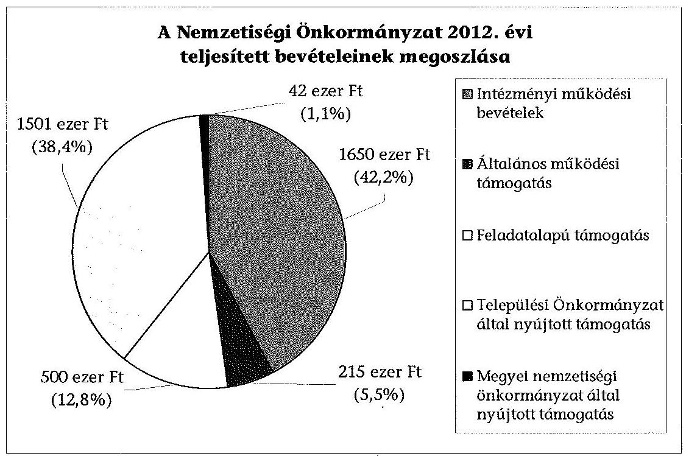
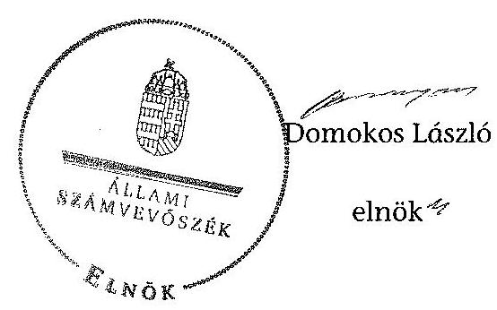

# JELENTÉS 

a helyi nemzetiségi önkormányzatok gazdálkodásának ellenőrzéséről
Zsámbéki Német Nemzetiségi Önkormányzat

---

# Állami Számvevőszék 

Iktatószám: V-0314-050/2014.
Témaszám: 1348
Vizsgálat-azonosító szám: V065290

## Az ellenőrzést felügyelte:

Horváth Balázs
felügyeleti vezető
Az ellenőrzést vezette és az ellenőrzés végrehajtásáért felelős:
Pats Regina
ellenőrzésvezető
A számvevőszéki jelentést készítették és a jelentés összeállításában
közremüködtek:
Dr. Zelei Andrásné
számvevő tanácsos
Csényi István
számvevő tanácsos
Az ellenőrzést végezték:
Dr. Csapó Anna
Dr. Gaálné Berente Mónika
számvevő tanácsos
számvevő

---

# TARTALOMJEGYZÉK 

BEVEZETÉS ..... 3
I. ÖSSZEGZŐ MEGÁLLAPÍTÁSOK, KÖVETKEZTETÉSEK, JAVASLATOK ..... 6
II. RÉSZLETES MEGÁLLAPÍTÁSOK ..... 14

1. A Nemzetiségi Önkormányzat és a Települési Önkormányzat együttműködésének szabályozása, a működési feltételek biztosítása ..... 14
2. A gazdálkodási feladatok ellátásának szabályszerűsége ..... 15
2.1. A költségvetésre és zárszámadásra, valamint a kincstári adatszolgáltatás rendjére vonatkozó jogszabályi előírások betartása ..... 15
2.2. A Nemzetiségi Önkormányzat gazdálkodásának szabályozottsága ..... 16
2.3. Az operatív gazdálkodási jogkörök kialakítása, gyakorlása ..... 17
3. A Nemzetiségi Önkormányzattal kapcsolatos gazdálkodási feladatok belső ellenőrzése ..... 18
4. A feladatalapú támogatás felhasználásának, elszámolásának szabályszerűsége, a Nemzetiségi Önkormányzat feladatellátása ..... 20
MELLÉKLET
5. számú A Nemzetiségi Önkormányzat 2012. évi gazdálkodásának főbb adatai, mutatói
FÜGGELÉKEK
6. számú Rövidítések jegyzéke
7. számú Értelmező szótár
8. számú A gazdálkodás értékelésének módszere

---

$\cdot$
$\cdot$
$\cdot$
$\cdot$
$\cdot$
$\cdot$
$\cdot$
$\cdot$
$\cdot$
$\cdot$
$\cdot$
$\cdot$
$\cdot$
$\cdot$
$\cdot$
$\cdot$
$\cdot$
$\cdot$
$\cdot$
$\cdot$
$\cdot$
$\cdot$
$\cdot$
$\cdot$
$\cdot$
$\cdot$
$\cdot$
$\cdot$
$\cdot$
$\cdot$
$\cdot$
$\cdot$
$\cdot$
$\cdot$
$\cdot$
$\cdot$
$\cdot$
$\cdot$
$\cdot$
$\cdot$
$\cdot$
$\cdot$
$\cdot$
$\cdot$
$\cdot$
$\cdot$
$\cdot$
$\cdot$
$\cdot$
$\cdot$
$\cdot$
$\cdot$
$\cdot$
$\cdot$
$\cdot$
$\cdot$
$\cdot$
$\cdot$
$\cdot$
$\cdot$
$\cdot$
$\cdot$
$\cdot$
$\cdot$
$\cdot$
$\cdot$
$\cdot$
$\cdot$
$\

---

# JELENTÉS 

## a helyi nemzetiségi önkormányzatok gazdálkodásának ellenőrzéséről Zsámbéki Német Nemzetiségi Önkormányzat

## BEVEZETÉS

A Nemzetiségi Önkormányzat 1996-ban alakult, elnöke a 2010. évi helyhatósági választások óta látja el feladatát. A Nemzetiségi Önkormányzat intézményt, gazdasági társaságot és más szervezetet nem alapított, illetve társulásban nem vett részt. A négytagú Képviselő-testület a munkája segítésére bizottságot nem hozott létre. A Nemzetiségi Önkormányzat a költségvetési beszámolója szerint a 2012. évben a módosított költségvetési bevételi előirányzat 2079 ezer Ft, a módosított költségvetési kiadási előirányzat 2728 ezer Ft, a teljesített költségvetési bevétel 3908 ezer Ft, a teljesített költségvetési kiadás 2637 ezer Ft volt. A Nemzetiségi Önkormányzat a 2011. évben feladatalapú támogatásban nem részesült. A 2012. évi gazdálkodási adatokat részletesen az 1. számú mellékletben mutatjuk be.

Az Alaptörvény XXIX. cikk (1) bekezdése szerint a Magyarországon élő nemzetiségek államalkotó tényezők. Minden, valamely nemzetiséghez tartozó magyar állampolgárnak joga van önazonossága szabad vállalásához és megőrzéséhez. A hazánkban élő nemzetiségek helyi (települési és területi) valamint országos önkormányzatokat hozhatnak létre ${ }^{1}$. A helyi nemzetiségi önkormányzatok gazdálkodási feladatait jogszabályi előirás alapján a székhely szerinti helyi önkormányzat polgármesteri hivatala látja el.

A nemzetiségek helyzete, támogatása mind hazai, mind EU-s szinten kiemelt figyelmet kap napjainkban. A helyi nemzetiségi önkormányzatok gazdálkodására és támogatási rendszerére vonatkozó jogszabályok a 2010-2012. években jelentős változásokon mentek át. A települési és területi nemzetiségi önkormányzatok gazdálkodásának, a részükre juttatott költségvetési támogatások felhasználásának ellenőrzését az ÁSZ 2012-ben sorozatjellegủ ellenőrzés keretében indította el. A 2013. évi ellenőrzések e témacsoportos ellenőrzések folytatását jelentik, amelyet az ÁSZ 2014. első félévi ellenőrzési terve 12. témasorszámon tartalmaz.

Az ellenőrzés célja annak értékelése volt, hogy a nemzetiségi önkormányzat gazdálkodási kereteinek kialakítása, gazdálkodása és feladatellátása megfelelt-e a jogszabályoknak.

[^0]
[^0]:    ${ }^{1}$ A 2010. évben megtartott nemzetiségi önkormányzati választásokat követően 2304 települési, 58 területi és 13 országos nemzetiségi önkormányzat alakult meg.

---

Ennek keretében értékeltük, hogy:

- a nemzetiségi önkormányzat és a települési önkormányzat együttműködésének szabályozása, a működési feltételek biztosítása megfelelte a jogszabályi előírásoknak;
- a felek együttműködése megfelelte a közöttük létrejött megállapodásnak a gazdálkodási feladatok szabályszerű ellátása során, ennek keretében betartották-e a helyi nemzetiségi önkormányzat gazdálkodásához kapcsolódóan a költségvetésre és zárszámadásra, a gazdálkodás szabályozására, az operatív gazdálkodási jogkörök gyakorlására vonatkozó jogszabályi előírásokat;
- a jegyző biztosította-e a nemzetiségi önkormányzat gazdálkodásának belső ellenőrzését;
- a nemzetiségi önkormányzat feladatalapú támogatásának felhasználása, a folyósított feladatalapú támogatással történő elszámolás az előírásoknak megfelelő volt-e;
- a nemzetiségi önkormányzat feladatellátása összhangban volt-e a vonatkozó jogszabályi előírásokkal.

Az ellenőrzés várható hasznosulását négy szinten tervezzük. A törvényalkotás számára összegzett tapasztalatok állnak rendelkezésre a nemzetiségi önkormányzatok testületi döntéseinek, gazdálkodásának és a feladatalapú támogatás felhasználásának szabályszerűségéről, amelynek alapján következtetést lehet levonni arra, hogy indokolt-e esetleges jogszabályi módosítás kezdeményezése. Az ellenőrzés az ellenőrzött számára visszajelzést ad a múködésében fellépő hiányosságokról, javaslataival hozzájárul azok kiküszöböléséhez, amely csökkentheti a későbbi ellenőrzések gyakoriságát. Az ellenőrzés megállapításai és javaslatai tanulságul szolgálhatnak más nemzetiségi önkormányzatok, szervezetek számára a rendezett gazdálkodási keretek kialakításához. A társadalom számára jelzi, hogy közpénz nem maradhat ellenőrizetlenül, az ÁSZ értékteremtő rend kialakításához és megőrzéséhez hozzájáruló tevékenysége pozitív hatással lesz a szervezetről kialakított összkép formálásában. Az ÁSZ szervezetén belül lehetőség nyílik arra, hogy a megállapítások szintetizálásával az intézmény a hozzáadott értéket teremtő elemző tevékenységét és tanácsadó szerepét erősítse.

A helyi nemzetiségi önkormányzatok gazdálkodásának ellenőrzéséről szóló jelentés I. fejezetének összegző része az ellenőrzés céljára adott rövid, szintetizáló összefoglalót és következtetéseket tartalmazza a II. fejezet részletes megállapításain alapulóan. A jelentés intézkedést igénylő megállapításait és javaslatait az összegzőben foglaltak mellett - az ellenőrzés során feltárt, a jelentés II. fejezetében rögzített részletes megállapítások alapozzák meg, illetve támasztják alá.

Az ellenőrzés típusa: szabályszerűségi ellenőrzés.
Az ellenőrzött időszak: a 2012. január 1. - 2012. december 31. közötti időszak. Az ellenőrzés kiterjedt a helyi nemzetiségi önkormányzatoknak juttatott 2012. évi feladatalapú támogatás 2013. évben való elszámolására is.

---

Ellenőrzött szervezet: Zsámbéki Német Nemzetiségi Önkormányzat és a gazdálkodási feladatait ellátó Zsámbék Város Önkormányzata.

Az ellenőrzés végrehajtásának jogszabályi alapját az ÁSZ tv. 5. § (2)-(3) és (6) bekezdéseiben foglaltak képezik.

Az ellenőrzés szakmai módszertana az ÁSZ hivatalos honlapján (www.asz.hu) közzétett szakmai szabályokon alapult, amely a Legfőbb Ellenőrző Intézmények Nemzetközi Szervezete (INTOSAI) által kiadott nemzetközi standardok (ISSAI) figyelembevételével készült.

A helyi nemzetiségi önkormányzatok gazdálkodásának ellenőrzése során értékeltük a települési önkormányzat és a nemzetiségi önkormányzat együttmúködésének, a gazdálkodás szabályozottságának és a pénzügyi folyamatokban kulcsszerepet betöltő belső kontrollok (teljesítésigazolás és érvényesítés) múködésének megfelelőségét. A kulcskontrollokat a dologi kiadásokkal kapcsolatos kifizetéseknél véletlen mintavételi eljárást alkalmazva ellenőriztük. Ellenőriztük, hogy a jegyző biztosította-e a nemzetiségi önkormányzat gazdálkodásának belső ellenőrzését. Értékeltük a feladatalapú támogatások felhasználásának, elszámolásának szabályszerűségét, a nemzetiségi önkormányzat feladatellátása és a jogszabályi előírások összhangját.

Az ellenőrzés lefolytatásához a Nemzetiségi Önkormányzat és a gazdálkodási feladatait ellátó Települési Önkormányzat tanúsítványok és a kapcsolódó, dokumentumjegyzékben megjelölt dokumentumok elektronikus úton történő megküldésével, rendelkezésre bocsátásával szolgáltatott adatokat. Az adatszolgáltatás kontrollálása és szükség szerinti javítása a helyszíni ellenőrzés keretében történt. A gazdálkodás értékelésének módszerét a 3. számú függelék tartalmazza.

Az ÁSZ tv. 29. § (1) bekezdése szerint a jelentéstervezetet megküldtük a polgármester és a Nemzetiségi Önkormányzat elnöke részére, akik az ÁSZ tv. 29. § (2) bekezdésében foglalt észrevételezési jogukkal nem éltek, a jelentéstervezetre észrevételt nem tettek.

---

# I. ÖSSZEGZŐ MEGÁLLAPÍTÁSOK, KÖVETKEZTETÉSEK, JAVASLATOK 

Az Nemzetiségi Önkormányzat és a Települési Önkormányzat együttmúködésének szabályozása részben felelt meg a jogszabályi előírásoknak. A 2012. december 31 -én hatályos együttmúködési megállapodás ${ }_{3}$ a jogszabályban foglaltaknak megfelelően tartalmazta a Nemzetiségi Önkormányzat múködési feltételeit, valamint a tervezési, gazdálkodási, ellenőrzési, finanszírozási, adatszolgáltatási és beszámolási feladatok ellátásának részletes szabályait. A jogszabályi előírások azonban nem érvényesültek maradéktalanul. Az együttműködési megállapodás ${ }_{1}$-t a 2012. évben a Nek. ${ }_{2}$ tv. előírása ellenére 2012. január 31-éig nem vizsgálták felül. A Nek. ${ }_{2}$ tv.-ben foglaltakat figyelmen kívül hagyva az együttmúködési megállapodás ${ }_{3}$ szerinti múködési feltételeket nem rögzítették a Nemzetiségi Önkormányzat SZMSZ-ében. Az együttmúködési megállapodás ${ }_{3}$ nem tartalmazta a Nek. ${ }_{2}$ tv.-ben meghatározott tartalmi elemek közül a Nemzetiségi Önkormányzat feladatellátásához szükséges tárgyi, technikai eszközökkel felszerelt helyiség ingyenes használatát, a rezsiköltségek és fenntartási költségek viselését, a testületi ülések előkészítését, valamint a feladatellátáshoz kapcsolódó - a testületi tagok és tisztségviselők telefonhasználata költségei kivételével - költségek viselését. A Települési Önkormányzat a szabályozási hiányosságok ellenére biztosította a Nemzetiségi Önkormányzat múködéséhez szükséges személyi és tárgyi feltételeket.

A Nemzetiségi Önkormányzat 2012. évi költségvetésének és zárszámadásának tartalma, jóváhagyása, valamint a kapcsolódó adatszolgáltatás szabályszerüsége nem felelt meg a jogszabályi előírásoknak. A Képviselőtestület által elfogadott költségvetési határozat az Áht. ${ }_{2}$-ben előírtak ellenére nem tartalmazta a költségvetési egyenleg összegét múködési és felhalmozási cél szerinti bontásban, továbbá a költségvetés végrehajtásával kapcsolatos hatásköröket. A 2012. évi költségvetési és zárszámadási határozat-tervezetek előterjesztésekor - a jegyző mulasztásából - a Képviselő-testület részére tájékoztatásul nem mutatták be az Áht. ${ }_{2}$-ben előírt mérlegeket és kimutatásokat, szöveges indoklással együtt. A zárszámadásról alkotott határozatban a Nemzetiségi Önkormányzat valamennyi bevételéről és kiadásáról elszámoltak. A bevételi és kiadási előirányzatokat azonban - az Áht. ${ }_{3}$ előírásait figyelmen kívül hagyva az intézményi múködési bevételek, a feladatalapú támogatás és a Települési Önkormányzat által nyújtott támogatás kapcsán nem a kapott támogatás öszszegével módosították, a múködési célú pénzeszközátvétel kapcsán pedig nem módosították. Emiatt a bevételek és kiadások teljesített összege meghaladta a módosított előirányzatokat. A jegyző a kincstári adatszolgáltatási kötelezettségeinek csak részben tett eleget, mert a negyedéves időközi költségvetési jelentéseket és mérlegjelentéseket és az éves elemi költségvetési beszámolót az Ávr.ben, illetve az Áhsz. ${ }_{1}$-ben előírt határidőt követően küldte meg a Kincstárnak.

A gazdálkodás szabályozottsága nem volt megfelelő. A Polgármesteri Hivatal eszközök és források leltárkészítési és leltározási, értékelési szabályzatának, valamint számlarendjének hatálya nem terjedt ki a Nemzetiségi Önkormányzat gazdálkodásával kapcsolatos végrehajtási feladatokra és a Nemzeti-

---

ségi Önkormányzat önálló szabályzatokkal sem rendelkezett. Így a Nemzetiségi Önkormányzat a Számv. tv.-ben előírt szabályzatokkal és számlarenddel nem rendelkezett. Az Ávr.-ben foglaltak szerinti, az SZMSZ-ben nevesített munkakörökhöz tartozó - a Nemzetiségi Önkormányzat gazdálkodási feladataival kapcsolatos - feladat- és hatáskörökre, a hatáskörök gyakorlásának módjára, a helyettesítés rendjére, az ezekhez kapcsolódó felelősségi szabályokra vonatkozó előírásokat a Polgármesteri Hivatal SZMSZ-e nem tartalmazta. A jegyző a Nemzetiségi Önkormányzat gazdálkodásával kapcsolatos végrehajtási feladatokra nem terjesztette ki a Polgármesteri Hivatal Bkr.-ben előírt ellenőrzési nyomvonalát és a szabálytalanságok kezelésének eljárásrendjét, valamint a folyamatba épített előzetes, utólagos és vezetői ellenőrzés szabályozását és ezekkel a szabályzatokkal a Nemzetiségi Önkormányzat önállóan sem rendelkezett. Annak ellenére nem volt megfelelő a gazdálkodás szabályozottsága, hogy a tervezéssel, gazdálkodással, illetve az adatszolgáltatási feladatok teljesítésével kapcsolatos belső előírásokat, feltételeket a kötelezettségvállalási szabályzat, illetve a 2012. évben hatályos együttműködési megállapodás ${ }_{1,2,3}$ tartalmazta, továbbá a Polgármesteri Hivatal számviteli politikájának és pénzkezelési szabályzatának hatálya kiterjedt a Nemzetiségi Önkormányzat gazdálkodási feladataira.

A Nemzetiségi Önkormányzat gazdálkodása tekintetében az operatív gazdálkodási jogkörök kialakítása nem volt megfelelő, mert a Nemzetiségi Önkormányzat elnöke - illetve az általa felhatalmazott kötelezettségvállaló az Ávr.-ben foglaltak ellenére, a teljesítést igazoló személyeket írásban nem jelölte ki. A gazdasági vezető felhatalmazott az érvényesítési és a pénzügyi ellenjegyzői feladatok ellátására előírt végzettséggel rendelkező személyeket. A Nemzetiségi Önkormányzatnál a 2012. évben a dologi kiadások teljesítése során a teljesítésigazolás és az érvényesítés kulcskontrollok múködésének megfelelősége gyenge volt. A hibák száma a lényegességi szintet, a kritikus hibahatárt elérte. Az Ávr.-ben előírtak ellenére a teljesítést igazoló kijelölése két esetben nem történt meg, egy esetben a teljesítést igazoló elnök aláírás mintáját a kötelezettségvállalási szabályzat nem tartalmazta, két kifizetés esetében a teljesítésigazolást nem végezték el, ezeket az érvényesítő nem ellenőrizte és nem jelezte az utalványozónak. Az érvényesítés kettő kifizetés esetében nem történt meg, három kifizetés esetében hiányzott az érvényesítés dátuma a bizonylatról. A Nemzetiségi Önkormányzatnál a 2012. évben a múködési célú pénzeszközátadás teljesítése során a teljesítésigazolás és az érvényesítés kulcskontrollok múködésének megfelelősége gyenge volt. A teljesítésigazolás az Ávr.-ben előírtak ellenére nem történt meg, valamint az államháztartáson kívülre teljesített működési célú pénzeszközátadás során az érvényesítő a feladatai ellátásához nem rendelkezett jogosultsággal. A Nemzetiségi Önkormányzatnál a 2012. évi dologi kiadások között a három legnagyobb összegű kiadás teljesítésének egyedi értékelése alapján a teljesítésigazolás és az érvényesítés kulcskontrollok múködésének feltárt hiányosságai megegyezőek voltak a dologi kiadások azon értékelésével, mely szerint a teljesítést igazoló elnök személyét és aláírás mintáját a kötelezettségvállalási szabályzat az Ávr.-ben előírtak ellenére nem tartalmazta és az érvényesítő ezt nem ellenőrizte és nem jelezte az utalványozónak. A kulcskontrollok működéséhez kapcsolódó hiányosságok miatt nem biztosították a hibák megelőzését, feltárását és kijavítását. A számvevőszéki ellenőrzés a kifizetések bizonylatainak ellenőrzése során - a rendelkezésre bocsátott dokumentumok alapján - jogosulatlan kifizetést nem tárt fel.

---

A 2012. évre vonatkozó belső ellenőrzési terv összeállítása és az azt megalapozó kockázatelemzés során a jegyző figyelemmel volt a Nemzetiségi Önkormányzat gazdálkodásával összefüggő végrehajtási feladatok belső ellenőrzésére. A Nemzetiségi Önkormányzat múködésének, gazdálkodásának ellenőrzésére került sor. A belső ellenőrzési jelentést, vagy annak kivonatát a jegyző - a Bkr. előírásait figyelmen kívül hagyva - nem küldte meg a Nemzetiségi Önkormányzat elnökének.

A Nemzetiségi Önkormányzat a 2012. évben a bevételei 12,8\%-át kitevő, 500 ezer Ft összegű feladatalapú támogatásban részesült. A támogatás teljes összegét a 2012. évben felhasználták, melyből - a jogszabályi előírásoknak megfelelően - nemzetiségi közfeladatokkal kapcsolatos kiadásokat finanszíroztak. Az elszámolás a támogatási kormányrendelet ${ }_{2}$ alapján az Áht. ${ }_{2}$ rendelkezése ellenére nem történt meg. A támogatás felhasználását, elszámolását az arra jogosult külső szervek nem ellenőrizték. A Nemzetiségi Önkormányzat kötelező és önként vállalt feladatellátásának tárgya összhangban volt a Nek. ${ }_{2}$ tv.-ben foglalt előírásokkal.

Az ÁSZ tv. 33. § (1) bekezdésében foglaltak értelmében az ellenőrzött szervezet vezetője köteles a jelentésben foglalt megállapításokhoz kapcsolódó intézkedési tervet összeállítani és azt a jelentés kézhezvételétől számított 30 napon belül az ÁSZ részére megküldeni. Amennyiben az intézkedési tervet határidőre nem küldi meg a szervezet, vagy az nem elfogadható, az ÁSZ elnöke az ÁSZ tv. 33. § (3) bekezdés a)-b) pontjaiban foglaltakat érvényesítheti.

A helyszíni ellenőrzés megállapításainak hasznosítása mellett javasoljuk:

# a jegyzönek 

1. az együttműködés szabályozásával kapcsolatban

A 2012. december 31-én hatályos együttműködési megállapodás ${ }_{1}$ a Nek. ${ }_{2}$ tv. 80. § (1) bekezdés előírásait figyelmen kívül hagyva nem határozta meg a Nemzetiségi Önkormányzat részére havonta igény szerint, de legalább tizenhat órában a feladatellátásához szükséges tárgyi, technikai eszközökkel felszerelt helyiség ingyenes használatát, a helyiséghez, továbbá a helyiség infrastruktúrájához kapcsolódó rezsiköltségek és fenntartási költségek viselését. Továbbá nem tartalmazta a testületi ülések előkészítését, valamint a feladatellátáshoz kapcsolódó költségek viselését.

Az együttműködési megállapodás ${ }_{1}$-t a Nek. ${ }_{2}$ tv. 80. § (2) bekezdésének előírása ellenére 2012. január 31-éig nem vizsgálták felül.

A Nek. ${ }_{2}$ tv. 80. § (2) bekezdésében foglaltak ellenére az együttműködési megállapodás ${ }_{3}$ szerinti müködési feltételeket nem rögzítették a Nemzetiségi Önkormányzat SZMSZ-ében.

---

Javaslat
Az együttműködés szabályszerűsége érdekében:
a) készítse elő az együttmúködési megállapodás ${ }_{1}$ módosítását, hogy az tartalmilag feleljen meg a Nek. ${ }_{2}$ tv. 80. § (1) bekezdésben foglaltaknak;
b) biztosítsa a jövőben az együttmúködési megállapodás évenkénti felülvizsgálata során a Nek. ${ }_{2}$ tv. 80. § (2) bekezdésében előírt határidő betartását;
c) készítse elő a Nemzetiségi Önkormányzat SZMSZ-ének kiegészítését a Nek. ${ }_{2}$ tv. 80. § (2) bekezdésében foglalt előírás alapján.
2. a költségvetéssel és zárszámadással, valamint a kapcsolódó kincstári adatszolgáltatással kapcsolatban

A Képviselő-testület által elfogadott 2012. évi költségvetési határozat az Áht. ${ }_{2}$ 23. § (2) bekezdés c) és h) pontjaiban előírtak ellenére nem tartalmazta a költségvetési egyenleg összegét, továbbá a finanszírozási célú pénzügyi műveletekkel kapcsolatos hatásköröket. A 2012. évi költségvetési határozattervezet előterjesztésekor - a jegyző mulasztása miatt - az Áht. ${ }_{2}$ 24. § (4) bekezdés előírásait figyelmen kívül hagyva a Képviselő-testület részére tájékoztatásul nem mutatták be a Nemzetiségi Önkormányzat költségvetési mérlegét közgazdasági tagolásban, az előirányzat felhasználási tervet, valamint az előírt mérlegeket és kimutatásokat szöveges indoklással együtt.

A 2012. évi zárszámadási határozattervezet előterjesztésekor - a jegyző mulasztása miatt - az Áht. ${ }_{2}$ 91. § (2) bekezdés a) és c) pontjaiban foglalt előírások ellenére a Képviselő-testülete részére tájékoztatásul nem mutatták be az előírt mérlegeket és kimutatásokat. A 2012. évi kiadási és bevételi előirányzatok teljesítése - az Áht. ${ }_{2}$ 6. § (1) bekezdésében foglalt előírás ellenére - a módosított előirányzatokat túllépte. Az Áht. ${ }_{2}$ 89. § (1) bekezdésében foglalt előírás ellenére, az előirányzatok vonatkozásában nem volt biztosított a zárszámadás elfogadott költségvetéssel történő összehasonlíthatósága.

A jegyző a 2012. évben a Nemzetiségi Önkormányzat részére előírt kincstári adatszolgáltatási kötelezettségeket az Ávr. 33. § -ában, 169. § (2) és 170. § (5) bekezdéseiben, valamint az Áhsz. ${ }_{1}$ 10. § (5a) bekezdésében foglalt határidőkön túl teljesítette.

Javaslat
Gondoskodjon a jövőben arról, hogy:
a) a költségvetési határozat tartalmazza az Áht. ${ }_{2}$ 23. § (2) bekezdés c) és h) pontjaiban előírt tartalmi elemeket, továbbá a költségvetési határozattervezet előterjesztésekor a Képviselő-testületnek tájékoztatásul bemutatásra kerüljenek az Áht. ${ }_{2}$ 24. § (4) bekezdésében előírt mérlegek és kimutatások szöveges indoklással együtt;

---

b) a zárszámadási határozattervezet előterjesztésekor az Áht. 91. § (2) bekezdésében előírt mérlegek és kimutatások a Képviselő-testületnek tájékoztatásul bemutatásra kerüljenek, továbbá biztosítsa az Áht. 89. § (1) bekezdésben foglaltaknak megfelelően a zárszámadás elfogadott költségvetéssel való összehasonlíthatóságát;
c) a költségvetés végrehajtása során az Áht. 2 6. § (1) bekezdésében foglalt előírást betartsák;
d) a kincstári adatszolgáltatási kötelezettségének az Ávr. 33. § -ában, 169. § (2) és 170. § (5) bekezdéseiben, valamint az Áhsz. 32. § (4) bekezdésében előírt határidők betartásával tegyen eleget.
3. a gazdálkodási feladatok szabályozottságával összefüggésben

A Polgármesteri Hivatal eszközök és források leltárkészítési és leltározási, értékelési szabályzatának, valamint számlarendjének hatálya nem terjedt ki a Nemzetiségi Önkormányzat gazdálkodásának végrehajtásával kapcsolatos feladataira, így a Nemzetiségi Önkormányzat a Számv. tv. 14. § (5) bekezdés a) és b) pontjaiban, valamint a Számv. tv. 161. § (1) bekezdésében előírt szabályzatokkal, számlarenddel nem rendelkezett.

A jegyző a Nemzetiségi Önkormányzat gazdálkodásának végrehajtási feladataira nem terjesztette ki Polgármesteri Hivatal Bkr. 6. § (3)-(4) bekezdéseiben előírt ellenőrzési nyomvonalát és a szabálytalanságok kezelésének eljárásrendjét, valamint a Bkr. 8. § (2) bekezdése szerinti folyamatba épített előzetes, utólagos és vezetői ellenőrzés szabályozását. Ezekkel a szabályzatokkal a Nemzetiségi Önkormányzat önállóan sem rendelkezett.

A Polgármesteri Hivatal SZMSZ-e nem tartalmazta az Ávr. 13. § (1) bekezdés g) pontjában foglaltak szerinti, az SZMSZ-ben nevesített munkakörökhöz tartozó - a Nemzetiségi Önkormányzat gazdálkodásának végrehajtásával kapcsolatos - feladatés hatáskörökre, a hatáskörök gyakorlásának módjára, a helyettesítés rendjére, az ezekhez kapcsolódó felelősségi szabályokra vonatkozó előírásokat.

Javaslat
A szabályszerű gazdálkodás biztosítása érdekében:
a) gondoskodjon a Polgármesteri Hivatal - a Számv. tv. 14. § (5) bekezdés a) és b) pontjaiban, valamint a Számv. tv. 161. § (1) bekezdésében, valamint a Bkr. 6. § (3)-(4) bekezdéseiben és 8. § (2) bekezdésében előírt -szabályzatainak a Nemzetiségi Önkormányzat gazdálkodásának végrehajtási feladataira való kiterjesztéséről;
b) készítse elő a Polgármesteri Hivatal SZMSZ-ének módosítását, hogy az Ávr. 13. § (1) bekezdés g) pontjában foglalt előírás szerint szabályozza a Nemzetiségi Önkormányzat gazdálkodásának végrehajtásával kapcsolatos feladatokat.

---

4. a kulcskontrollok müködésével kapcsolatban

A teljesítésigazolás az Ávr. 57. § (1) bekezdése ellenére nem történt meg vagy azt az Ávr. 57. § (4) bekezdése szerinti szabályszerű kijelöléssel nem rendelkező személy végezte.

Az érvényesítő az Ávr. 58. § (1)-(2) bekezdései szerinti feladatát nem látta el, mert nem ellenőrizte a megelőző ügymenetben a jogszabályi előírások betartását, valamint nem jelezte az utalványozónak, hogy a kötelezettségvállalásra vonatkozó nyilvántartást nem alakították ki, a teljesítésigazolásra jogosult személyekről és aláírás mintájukról vezetendő nyilvántartás hiányzott. Az Ávr. 58. § (3) bekezdésben foglaltak érvényesítés tartalmi követelményei nem érvényesültek, mivel az érvényesítés dátuma a bizonylatról hiányzott, így nem állapítható meg, hogy az érvényesítési feladatok elvégzése a kifizetést megelőzően történt-e. Az államháztartáson kívülre teljesített müködési célú pénzeszközátadás során az érvényesítő a feladatai ellátásához nem rendelkezett jogosultsággal.

Javaslat
Az operatív gazdálkodás működési hibáinak megelőzése, feltárása és kijavítása érdekében gondoskodjon arról, hogy:
a) a teljesítésigazolást az Ávr. 57. § (4) bekezdése szerinti kijelöléssel rendelkező személy minden esetben az Ávr. 57. § (1) bekezdésének előírása szerint végezze;
b) az érvényesítő minden esetben rendelkezzen szabályos kijelöléssel és az Ávr. 58. § (1)-(3) bekezdéseiben előírt ellenőrzési, jelzési, igazolási feladatait maradéktalanul lássa el.
5. a belső ellenőrzéssel összefüggésben

A Nemzetiségi Önkormányzat gazdálkodásának végrehajtásával kapcsolatos feladatok belső ellenőrzése során készített és lezárt ellenőrzési jelentést, vagy annak kivonatát - figyelemmel a Bkr. 2. § nd) pontjában foglaltakra - a jegyző a Bkr. 44. § (1) bekezdés c) pontjának előírása ellenére nem küldte meg a Nemzetiségi Önkormányzat elnökének.

Javaslat
A Nemzetiségi Önkormányzat gazdálkodásának végrehajtásával kapcsolatos feladatok belső ellenőrzése során készített és lezárt ellenőrzési jelentést, vagy annak kivonatát - figyelemmel a Bkr. 2. § nd) pontjában foglaltakra - a Bkr. 44. § (1) bekezdés c) pontja előírásának megfelelően küldje meg a Nemzetiségi Önkormányzat elnökének.
6. a feladatalapú támogatás elszámolásával kapcsolatban

A 2012. évi feladatalapú támogatás elszámolása a támogatási kormányrende$\mathrm{let}_{2}$ 8. § (5) bekezdésében hivatkozott „a helyi önkormányzatok elszámolási és ellenőrzési rendjére vonatkozó jogszabályok rendelkezései alkalmazandóak" előírása alapján az Áht. 2 57. § (3) bekezdése ellenére nem történt meg.

---

Javaslat
Gondoskodjon az Áht. 2 27. § (2) bekezdésében meghatározott feladatkörében a Nemzetiségi Önkormányzat által igénybe vett 2012. évi feladatalapú támogatás elszámolásának elkészítéséről, figyelemmel az Áht. 2 53. § (1) bekezdésében foglaltakra.

# a polgármesternek 

A 2012. december 31-én hatályos együttműködési megállapodás ${ }_{1}$ a Nek. ${ }_{2}$ tv. 80. § (1) bekezdés előírásait figyelmen kívül hagyva nem határozta meg a Nemzetiségi Önkormányzat részére havonta igény szerint, de legalább tizenhat órában a feladatellátásához szükséges tárgyi, technikai eszközökkel felszerelt helyiség ingyenes használatát, a helyiséghez, továbbá a helyiség infrastruktúrájához kapcsolódó rezsiköltségek és fenntartási költségek viselését. Továbbá nem tartalmazta a testületi ülések előkészítését, valamint feladatellátáshoz kapcsolódó költségek viselését.

A Polgármesteri Hivatal SZMSZ-e az Ávr. 13. § (1) bekezdés g) pontjában foglaltak ellenére nem tartalmazta az SZMSZ-ben nevesített munkakörökhöz tartozó - a Nemzetiségi Önkormányzat gazdálkodásának végrehajtásával kapcsolatos - feladatés hatásköröket, a hatáskörök gyakorlásának módját, a helyettesítés rendjét, az ezekhez kapcsolódó felelősségi szabályokat.

Javaslat
Terjessze a Települési Önkormányzat Képviselő-testülete elé jóváhagyásra:
a) a Nek. ${ }_{2}$ tv. 80. § (1) bekezdésben foglalt előírásoknak megfelelő, a jegyző által előkészített együttműködési megállapodás ${ }_{3}$ módosítását;
b) az Ávr. 13. § (1) bekezdés g) pontjában foglalt szabályozásra figyelemmel a Polgármesteri Hivatal SZMSZ-ének jegyző által előkészített módosítását.

## a Nemzetiségi Önkormányzat elnökének

1. A 2012. december 31-én hatályos együttműködési megállapodás ${ }_{1}$ a Nek. ${ }_{2}$ tv. 80. § (1) bekezdésben előírtakat figyelmen kívül hagyva nem határozta meg a Nemzetiségi Önkormányzat részére havonta igény szerint, de legalább tizenhat órában a feladatellátásához szükséges tárgyi, technikai eszközökkel felszerelt helyiség ingyenes használatát, a helyiséghez, továbbá a helyiség infrastruktúrájához kapcsolódó rezsiköltségek és fenntartási költségek viselését. Továbbá nem tartalmazta a testületi ülések előkészítését, valamint feladatellátáshoz kapcsolódó költségek viselését.

A Nek. ${ }_{2}$ tv. 80. § (2) bekezdésében foglaltak ellenére az együttműködési megállapodás ${ }_{2}$ szerinti müködési feltételeket nem rögzítették a Nemzetiségi Önkormányzat SZMSZ-ében.

---

Javaslat
Terjessze a Képviselő-testület elé jóváhagyásra:
a) a Nek. ${ }_{2}$ tv. 80. § (1) bekezdés előírásainak megfelelő, a jegyző által előkészített együttműködési megállapodás ${ }_{3}$ módosítást;
b) a Nemzetiségi Önkormányzat SZMSZ-ének a Nek. ${ }_{2}$ tv. 80. § (2) bekezdésében foglaltaknak megfelelő jegyző által előkészített módosítását.
2. A Nemzetiségi Önkormányzat elnöke a 2012. évi költségvetési határozattervezet előterjesztésekor - a jegyző mulasztása miatt - az Áht. ${ }_{2}$ 24. § (4) bekezdésében foglaltak ellenére a Képviselő-testületnek tájékoztatásul nem mutatta be az előírt mérlegeket és kimutatásokat szöveges indoklással együtt. A 2012. évi zárszámadási határozattervezet előterjesztésekor a Képviselő-testületnek tájékoztatásul nem mutatta be az Áht. ${ }_{2}$ 91. § (2) bekezdésében előírt mérlegeket és kimutatásokat.

Javaslat
A költségvetés és zárszámadás szabályszerűségének biztosítása érdekében a költség-vetési- és zárszámadási határozattervezetek előterjesztésekor tájékoztatásul mutassa be a Képviselő-testületnek a jegyző által előkészített az Áht. ${ }_{2}$ 24. § (4) bekezdésében, valamint a 91. § (2) bekezdésében előírt mérlegeket és kimutatásokat szöveges indoklással együtt.
3. A Nemzetiségi Önkormányzat elnöke az Ávr. 57. § (4) bekezdésében foglaltak ellenére a teljesítést igazoló személyeket írásban nem jelölte ki.

Javaslat
Jelölje ki az Ávr. 57. § (4) bekezdésében foglalt előírásoknak megfelelően írásban a teljesítésigazolókat.
4. A 2012. évi feladatalapú támogatás elszámolása a támogatási kormányrendelet ${ }_{2}$ 8. § (5) bekezdésében hivatkozott „a helyi önkormányzatok elszámolási és ellenőrzési rendjére vonatkozó jogszabályok rendelkezései alkalmazandóak" előírása alapján az Áht. ${ }_{2}$ 57. § (3) bekezdésében foglaltak ellenére nem történt meg.

Javaslat
Terjessze a Képviselő-testület elé az Áht. ${ }_{2}$ 53. § (1) bekezdése szerinti beszámolási kötelezettség teljesítéséhez összeállított, a Nemzetiségi Önkormányzat által igénybevett 2012. évi feladatalapú támogatás rendeltetésszerű felhasználásáról szóló elszámolást.

---

# II. RÉSZLETES MEGÁLLAPÍTÁSOK 

## 1. A Nemzetiségi Önkormányzat és a Települési ÖnkormányZAT EGYÜTTMŰKÖDÉSÉNEK SZABÁLYOZÁSA, A MŰKÖDÉSI FELTÉTELEK BIZTOSÍTÁSA

A Nemzetiségi Önkormányzat a 2012. év egészében rendelkezett a Települési Önkormányzattal kötött együttmúködési megállapodással (együttmúködési megállapodás ${ }_{1,2,3}$ ). Az együttmúködési megállapodás ${ }_{1}$-t a 2012. évben - a Nek. ${ }_{2}$ tv. 80. § (2) bekezdése szerinti határidőre - nem vizsgálták felül, két alkalommal ${ }^{2}$ azonban módosították, amelyeket a Nemzetiségi Önkormányzat és a Települési Önkormányzat képviselő-testületei határozataikkal ${ }^{3}$ jóváhagytak és az arra jogosult személyek aláírtak.

Az Nemzetiségi Önkormányzat és a Települési Önkormányzat együttmúködésének szabályozása részben felelt meg a jogszabályi előírásoknak.

A 2012. december 31-én hatályos együttműködési megállapodás ${ }_{3}$ a jogszabályi előírásoknak megfelelően tartalmazta a Nemzetiségi Önkormányzat múködési feltételeit, valamint a tervezési, gazdálkodási, ellenőrzési, finanszírozási, adatszolgáltatási és beszámolási feladatok ellátásának részletes szabályait. A megállapodásban rendelkeztek továbbá a Települési Önkormányzat és a Nemzetiségi Önkormányzat költségvetésének előkészítésével és megalkotásával kapcsolatos feladatokról, a felelősök konkrét kijelöléséről, illetve a jegyző vagy a jegyzővel azonos képesítési előírásoknak megfelelő megbízottjának a Nemzetiségi Önkormányzat testületi ülésein történő részvételéről.

A jogszabályi előírások azonban nem érvényesültek maradéktalanul. A Nek. ${ }_{2}$ tv. 80. § (2) bekezdésében foglaltakat figyelmen kívül hagyva az együttmúködési megállapodás ${ }_{1,2,3}$ szerinti múködési feltételeket nem rögzítették a Nemzetiségi Önkormányzat SZMSZ-ében a megállapodás megkötését követő harminc napon belül és ez a számvevőszéki ellenőrzés időpontjáig sem történt meg. A 2012. december 31-én hatályos együttműködési megállapodás ${ }_{3}$ a Nek. ${ }_{2}$ tv. 80. § (1) bekezdésében meghatározott tartalmi elemek közül, annak a), c) és g) pontjaira tekintettel nem határozta meg a Nemzetiségi Önkormányzat részére havonta igény szerint, de legalább tizenhat órában a feladatellátásához szükséges tárgyi, technikai eszközökkel felszerelt helyiség ingyenes használatát, a helyiséghez, továbbá a helyiség infrastruktúrájához kapcsolódó rezsiköltségek és fenntartási költségek viselését. Nem tartalmazta továbbá a testületi ülések előkészítését, valamint a feladatellátáshoz kapcsolódó - a testületi

[^0]
[^0]:    ${ }^{2}$ 2012. február 22-én, majd 2012. október 8-án.
    ${ }^{3}$ A Képviselő-testület 4/2012. (02. 22.) számú és 11/2012. (10. 04.) számú határozata, a Települési Önkormányzat Képviselő-testületének 19/2012. (02. 23.) számú és 150/2012. (09. 27.) számú határozata.

---

tagok és tisztségviselők telefonhasználata költségei kivételével - költségek viselését.

A Települési Önkormányzat a szabályozási hiányosságok ellenére biztosította a Nemzetiségi Önkormányzat múködéséhez szükséges személyi és tárgyi feltételeket.

# 2. A GAZDÁLKODÁSI FELADATOK ELLÁTÁSÁNAK SZABÁLYSZERŰSÉGE 

### 2.1. A költségvetésre és zárszámadásra, valamint a kincstári adatszolgáltatás rendjére vonatkozó jogszabályi előírások betartása

A Nemzetiségi Önkormányzat 2012. évi költségvetésének és zárszámadásának tartalma, jóváhagyása, valamint a kapcsolódó adatszolgáltatás szabályszerűsége nem felelt meg a jogszabályi előírásoknak.

A Nemzetiségi Önkormányzat elnöke a 2012. évi költségvetés tervezetét határidőben benyújtotta a Képviselő-testületnek. A Képviselő-testület által elfogadott költségvetési határozat ${ }^{4}$ az Áht. ${ }_{2} 23$. § (2) bekezdés c) pontjában előírtak ellenére nem tartalmazta a költségvetési egyenleg összegét múködési és felhalmozási cél szerinti bontásban. Nem tartalmazta továbbá az Áht. ${ }_{2} 23$. § (2) bekezdés h) pontja szerinti, a finanszírozási célú pénzügyi műveletekkel kapcsolatos hatásköröket, így különösen az Mötv. 68 § (4) bekezdése szerinti értékhatárt és, a finanszírozási bevételekkel és kiadásokkal kapcsolatos hatásköröket. A 2012. évi költségvetés előterjesztésekor a jegyző mulasztásából - az Áht. ${ }_{2} 24 . \S$ (4) bekezdés előírásait figyelmen kívül hagyva -a Képviselő-testület részére tájékoztatás céljából nem mutatták be a Nemzetiségi Önkormányzat költségvetési mérlegét közgazdasági tagolásban, az előirányzat felhasználási tervet, valamint az előírt mérlegeket és kimutatásokat, szöveges indoklással együtt.

A jegyző által elkészített 2012. évi zárszámadási határozat tervezetet a Nemzetiségi Önkormányzat elnöke a jogszabályban foglaltak alapján, határidőn belül beterjesztette a Képviselő-testületnek. A 2012. évi zárszámadási határozat tervezetének előterjesztésekor - a jegyző mulasztásából - az Áht. ${ }_{2} 91 . \S$ (2) bekezdés a) és c) pontjaiban foglalt előírások ellenére - a Képvi-selő-testület részére tájékoztatásul nem mutatták be az előírt mérlegeket és kimutatásokat, szöveges indoklással együtt. A zárszámadásról alkotott határozatban a Nemzetiségi Önkormányzat valamennyi bevételéről és kiadásáról elszámoltak. A bevételi és kiadási előirányzatokat azonban az intézményi múködési bevételek, a feladatalapú támogatás és a Települési Önkormányzat által nyújtott támogatás kapcsán nem a kapott támogatás összegével módosították, a múködési célú pénzeszközátvétel kapcsán pedig nem módosították. Emiatt a 2012. évi kiadási és bevételi előirányzatok teljesítése - az Áht. ${ }_{2} 6 . \S$ (1) bekezdésében foglalt előírás ellenére - a módosított előirányzatokat túllépte. Az Áht. ${ }_{2} 89 . \S$ (1) bekezdésében foglalt előírás ellenére, az előirányzatok vonatko-

[^0]
[^0]:    ${ }^{4}$ A Képviselő-testület 2/2012. (01. 17.) sz. határozata.

---

zásában nem volt biztosított a zárszámadás elfogadott költségvetéssel történő összehasonlíthatósága.

A jegyző a 2012. évben a Nemzetiségi Önkormányzat részére előírt kincstári adatszolgáltatási kötelezettségeket az Ávr. 33. §-ban, az Ávr. 169. § (2) bekezdésében, az Ávr. 170. § (5) bekezdésében és az Áhsz. ${ }_{1} 10 . \S$ (5a) bekezdésében foglalt határidőkön túl teljesítette.

# 2.2. A Nemzetiségi Önkormányzat gazdálkodásának szabályozottsága 

A Nemzetiségi Önkormányzat gazdálkodásának szabályozottsága az ellenőrzött időszakban nem felelt meg a jogszabályi előírásoknak, mert:

- a Polgármesteri Hivatal eszközök és források leltárkészítési és leltározási, értékelési szabályzatának, valamint számlarendjének hatálya nem terjedt ki a Nemzetiségi Önkormányzat gazdálkodásával kapcsolatos végrehajtási feladatokra és a Nemzetiségi Önkormányzat önálló szabályzatokkal sem rendelkezett. Így a Nemzetiségi Önkormányzat a Számv. tv. 14. § (5) bekezdés a) és b) pontjaiban, valamint a Számv. tv.161. § (1) bekezdésében előírt szabályzatokkal, számlarenddel nem rendelkezett.
- az Ávr. 13. § (1) bekezdés g) pontjában foglaltak szerinti, az SZMSZ-ben nevesített munkakörökhöz tartozó - a Nemzetiségi Önkormányzat gazdálkodási feladataival kapcsolatos - feladat- és hatáskörökre, a hatáskörök gyakorlásának módjára, a helyettesítés rendjére, az ezekhez kapcsolódó felelősségi szabályokra vonatkozó előírásokat a Polgármesteri Hivatal SZMSZ-e nem tartalmazta;
- a jegyző a Nemzetiségi Önkormányzat gazdálkodásával kapcsolatos végrehajtási feladatokra nem terjesztette ki a Polgármesteri Hivatal Bkr. 6. § (3)(4) bekezdéseiben előírt ellenőrzési nyomvonalát és a szabálytalanságok kezelésének eljárásrendjét, valamint a Bkr. 8. § (2) bekezdése szerinti folyamatba épített előzetes, utólagos és vezetői ellenőrzés szabályozását. Ezekkel a szabályzatokkal a Nemzetiségi Önkormányzat önállóan sem rendelkezett.

A Nemzetiségi Önkormányzat gazdálkodásának szabályozottsága annak ellenére nem volt megfelelő, hogy a gazdálkodás egyes területei szabályozottak voltak:

- a tervezéssel, gazdálkodással, így különösen a kötelezettségvállalás, ellenjegyzés, a szakmai teljesítésigazolás, az érvényesítés, utalványozás gyakorlásának módját, eljárási és dokumentációs részletszabályait, valamint az ezeket végző személyek kijelölésének rendjét, illetve az adatszolgáltatási feladatok teljesítésével kapcsolatos belső előírásokat, feltételeket a Polgármesteri Hivatal a Nemzetiségi Önkormányzatra is kiterjesztett kötelezettségvállalási szabályzata, illetve a 2012. évben hatályos együttmúködési megállapodás ${ }_{1,2,3}$ tartalmazta;
- a Polgármesteri Hivatal számviteli politikájának és pénzkezelési szabályzatának hatálya kiterjedt a Nemzetiségi Önkormányzat gazdálkodásával kapcsolatos végrehajtási feladatokra;

---

- a Polgármesteri Hivatalban az érintett köztisztviselők munkaköri leírásai tartalmazták a Nemzetiségi Önkormányzattal gazdálkodásával kapcsolatos feladatokat.

# 2.3. Az operatív gazdálkodási jogkörök kialakítása, gyakorlása 

A Nemzetiségi Önkormányzat gazdálkodása tekintetében az operatív gazdálkodási jogkörök kialakítása az ellenőrzött időszakban nem volt megfelelő.

A Nemzetiségi Önkormányzat elnöke - illetve az általa felhatalmazott kötelezettségvállaló - az Ávr. 57. § (4) bekezdésében foglaltak ellenére a teljesítést igazoló személyeket írásban nem jelölte ki. Az operatív gazdálkodási jogkörök kialakítása annak ellenére nem volt megfelelő, hogy a Nemzetiségi Önkormányzat elnöke a jogszabályi rendelkezések alapján - 2012. február 1-jei hatállyal - felhatalmazott más képviselőt (az elnökhelyettest) a kötelezettségvállalás és az utalványozás gyakorlására.

A gazdasági vezető rendelkezett az előírt szakképesítéssel és felhatalmazott az érvényesítési és a pénzügyi ellenjegyzői feladatok ellátására előírt végzettséggel rendelkező személyeket.

A Nemzetiségi Önkormányzatnál a 2012. évben a dologi kiadások teljesítése során a teljesítésigazolás és az érvényesítés kulcskontrollok múködésének megfelelősége gyenge volt. A hibák száma a lényegességi szintet, a kritikus hibahatárt elérte, mert:

- a teljesítést igazoló elnökhelyettes kijelölése két esetben az Ávr. 57. (4) bekezdés előírása ellenére írásban nem történt meg. Egy esetben a teljesítést igazoló elnök aláírás mintáját a kötelezettségvállalási szabályzat az Ávr. 60. § (3) bekezdésében előírtak ellenére nem tartalmazta. Két kifizetés esetében az Ávr. 57. § (1) bekezdésében előírt teljesítésigazolást nem végezték el;
- az érvényesítés - az Ávr. 58. § (1) és (3) bekezdésében előírtak ellenére - kettő kifizetés esetében nem történt meg, a kiadások teljesítését megelőzően az összegszerűségnek, a fedezet meglétének, az egyéb jogszabályokban és belső szabályzatban foglalt előírásoknak a betartását nem ellenőrizték. Három kifizetés esetében hiányzott az érvényesítés dátuma a bizonylatról, így nem állapítható meg, hogy az érvényesítési feladatok elvégzése a kifizetést megelőzően történt-e;
- az érvényesítő nem ellenőrizte és nem jelezte az utalványozónak, hogy a kötelezettségvállalásra vonatkozó nyilvántartást - az Ávr. 56. § (1) bekezdés előírása ellenére - nem alakították ki. Az érvényesítő nem ellenőrizte és nem jelezte az utalványozónak az Ávr. 60. § (3) bekezdésében előírt, a teljesítésigazolásra jogosult személyekről és aláírás mintájukról vezetendő nyilvántartás hiányát sem.

---

A Nemzetiségi Önkormányzatnál a 2012. évben az államháztartáson kívülre teljesített múködési célú pénzeszközátadás során a teljesítés igazolás és az érvényesítés kulcskontrollok müködésének megfelelősége gyenge volt, mert:

- a teljesítésigazolás az Ávr. 57. § (1) bekezdésében előírtak ellenére nem történt meg;
- az érvényesítő a feladatai ellátásához nem rendelkezett jogosultsággal, emiatt nem történt meg szabályzzerűen - az Ávr. 58. § (1) bekezdésében előírt a kifizetések összegszerűségének, a fedezet meglétének és a megelőző ügymenetben az Áht. ${ }_{2}$, az Áhsz. ${ }_{1}$ és az Ávr. előírásai, valamint a belső szabályzatokban foglaltak betartásának ellenőrzése.

A Nemzetiségi Önkormányzatnál a 2012. évi dologi kiadások között a három legnagyobb összegű kiadás teljesítésének egyedi értékelése alapján a teljesítésigazolás és az érvényesítés kulcskontrollok működésének feltárt hiányosságai megegyezőek voltak a dologi kiadások azon értékelésével, mely szerint a teljesítést igazoló elnök személyét és aláírás mintáját a kötelezettségvállalási szabályzat az Ávr. 60. § (3) bekezdésében előírtak ellenére nem tartalmazta és az érvényesítő ezt nem ellenőrizte és nem jelezte az utalványozónak.

A kulcskontrollok müködéséhez kapcsolódó hiányosságok miatt nem biztosították a hibák megelőzését, feltárását és kijavítását. A számvevőszéki ellenőrzés a kifizetések bizonylatainak ellenőrzése során - a rendelkezésre bocsátott dokumentumok alapján - összeférhetetlenséget, jogosulatlan kifizetést nem tárt fel.

A Nemzetiségi Önkormányzat a 2012. évben támogatásértékű működési és felhalmozási célú kiadást, illetve államháztartáson kívülre felhalmozási célú pénzeszközátadást nem teljesített.

# 3. A Nemzetiségi Önkormányzattal kapcsolatos gazdálkoDÁSI FELADATOK BELSŐ ELLENŐRZÉSE 

A Nemzetiségi Önkormányzattal összefüggő gazdálkodási feladatok belső ellenőrzése részben felelt meg a jogszabályi előírásoknak.

A jegyző a 2012. évi belső ellenőrzési terv összeállítása során figyelemmel volt a Nemzetiségi Önkormányzat gazdálkodásának belső ellenőrzésére. A Települési Önkormányzat Képviselő-testülete 247/2011. (XI.10.) számú határozatával elfogadott 2012. évi belső ellenőrzési terv tartalmazta a Nemzetiségi Önkormányzat kötelezettségvállalásainak ellenőrzését.

A belső ellenőrzési tervet kockázat elemzés alapozta meg, amely 446 ponttal kockázatosnak minősítette a Nemzetiségi Önkormányzat kötelezettségvállalásait, ezért azok tételes dokumentum alapú ellenőrzését tervezték végrehajtani.

A 2012. évi belső ellenőrzési tervben szereplő, a Nemzetiségi Önkormányzat 2011. évi kötelezettségvállalásainak ellenőrzése helyett - a Települési Önkormányzat Képviselő-testületének jóváhagyása nélkül - a Nemzetiségi Önkormányzat müködésének, gazdálkodásának 2012. évi ellenőrzésére került sor. A Nemzetiségi Önkormányzat müködésének, gazdálkodásának szabályszerűsé-

---

géhez kapcsolódó ellenőrzés végrehajtására - a 2012. augusztus 29 -én kelt, iktatószám nélküli - ellenőrzési program alapján 2012. augusztus 29 -étől 2012. szeptember 30 -áig került sor. Az elkészített ellenőrzési jelentés vezetői öszszefoglalója értelmében az ellenőrzési jelentésben leírt megállapítások és javaslatok intézkedési terv készítését nem igényelték.

A belső ellenőr az ellenőrzési jelentés 17. oldalán javasolta, hogy a Nemzetiségi Önkormányzat házipénztárát mielőbb válasszák külön a Települési Önkormányzat pénztárától, az SZMSZ-t vizsgálják felül és aktualizálják, továbbá, hogy a teljesítésigazolások minden esetben történjenek meg az arra jogosult részéről.

A Nemzetiségi Önkormányzat gazdálkodásának belső ellenőrzése során készített és lezárt ellenőrzési jelentést, vagy annak kivonatát - figyelemmel a Bkr. 2. § nd) pontjában foglaltakra - a jegyző a Bkr. 44. § (1) bekezdés c) pontjának előirása ellenére nem küldte meg a Nemzetiségi Önkormányzat elnökének.

A Nemzetiségi Önkormányzat belső ellenőrzéséről az együttműködési megállapodás ${ }_{1,2,3} 6$. pontjában rendelkeztek.

A 2012. évi belső ellenőrzési terv elkészítésének idején hatályos együttmúködési megállapodás ${ }_{1} 6$. pontja értelmében a „Zsámbéki Német Önkormányzat gazdálkodásának ellenőrzése a települési önkormányzat gazdálkodását ellenőrző Pilis-Buda Többcélú Kistérségi Társulás által foglalkoztatott ellenőrök által történik." Az együttmúködési megállapodás ${ }_{2,3} 6$. pontja szerint „Zsámbék Város Német Nemzetiségi Önkormányzat gazdálkodásának ellenőrzése a települési önkormányzat gazdálkodását ellenőrző Pilis-Buda Többcélú Kistérségi Társulás által foglalkoztatott ellenőrök, valamint Zsámbék Város Önkormányzat Polgármesteri Hivatala belső ellenőre által történik."

Az ellenőrzéshez szolgáltatott adatok alapján a 2012. évben a Kormányhivatal a Nemzetiségi Önkormányzatot illetően nem élt törvényességi felügyeleti eszközökkel.

---

# 4. A feladatalapú támogatás felhasználáááNAK, elszámolá- 

SÁNAK SZABÁLYSZERÜSÉGE, A NEMZETISÉGI ÖNKORMÁNYZAT FELADATELLÁTÁSA

A Nemzetiségi Önkormányzat a 2012. évben 500 ezer Ft összegű feladatalapú támogatásban részesült, amelynek az összes bevételhez viszonyított részarányát a következő ábra szemlélteti:

A Nemzetiségi Önkormányzat a 2012. évben 500 ezer Ft feladatalapú támogatásban részesült.

A Képviselő-testület a 2012. évi feladatalapú támogatás tervezett felhasználási céljairól a támogatás kiutalását megelőzően határozattal nem döntött. A támogatás folyósítását követően a Képviselő-testület a 2012. évi költségvetési határozatát nem módosította.

A 2012. évi feladatalapú támogatást a folyósítás évében felhasználták. A támogatás felhasználása a Nek. 2 tv. 116. §-a szerinti nemzetiségi közfeladatok érdekében történt, a Nemzetiségi Önkormányzat által ellátott önként vállalt feladatokhoz (nemzetiségi hagyományápolás) kapcsolódott.
2012. évi feladatalapú támogatás elszámolása a támogatási kormányrendelet ${ }_{2}$ 8. § (5) bekezdésében hivatkozott „a helyi önkormányzatok elszámolási és ellenőrzési rendjére vonatkozó jogszabályok rendelkezései alkalmazandóak" előírása alapján az Áht. ${ }_{2}$ 57. § (3) bekezdésében foglaltak ellenére nem történt meg.

A feladatalapú támogatások felhasználását, elszámolását az ellenőrzésre jogosult szervek nem ellenőrizték.

---

A Nemzetiségi Önkormányzat kötelező és önként vállalt feladatellátásának tárgya összhangban volt a Nek. 2 tv-ben foglalt előírásokkal.

Budapest, 2014. OG. hó 24. nap

Melléklet: 1 db
Függelék: 3 db

---

# **Chemistry**

## **Chemical Reactions**

### **Balancing Chemical Equations**

1. **Write the unbalanced equation:**
   - Example: $$C_3H_8 + O_2 \rightarrow CO_2 + H_2O$$

2. **Balance the equation:**
   - Example: $$2C_3H_8 + 7O_2 \rightarrow 6CO_2 + 8H_2O$$

3. **Balance the equation:**
   - Example: $$2C_3H_8 + 7O_2 \rightarrow 6CO_2 + 8H_2O$$

### **Types of Reactions**

1. **Combination Reaction:**
   - Example: $$2H_2 + O_2 \rightarrow 2H_2O$$

2. **Decomposition Reaction:**
   - Example: $$2H_2O_2 \rightarrow 2H_2O + O_2$$

3. **Single Displacement Reaction:**
   - Example: $$Zn + 2HCl \rightarrow ZnCl_2 + H_2$$

4. **Double Displacement Reaction:**
   - Example: $$AgNO_3 + NaCl \rightarrow AgCl + NaNO_3$$

5. **Combustion Reaction:**
   - Example: $$CH_4 + 2O_2 \rightarrow CO_2 + 2H_2O$$

## **Stoichiometry**

### **Mole Concept**

- **Mole (mol):** The amount of substance containing as many particles (atoms, molecules, ions) as there are atoms in exactly 12 grams of carbon-12.
- **Avogadro's Number:** $$6.022 \times 10^{23}$$ particles per mole.

### **Molar Mass**

- **Molar Mass:** The mass of one mole of a substance.
- Example: The molar mass of water ($$H_2O$$) is 18.015 g/mol.

### **Calculations**

1. **Moles to Mass:**
   - Formula: $$n = \frac{m}{M}$$
   - Example: Calculate the number of moles of $$H_2O$$ in 18 grams of water.
     - $$n = \frac{18.015 \, \text{g}}{18.015 \, \text{g/mol}} = 18.015 \, \text{g/mol}$$

2. **Moles to Mass:**
   - Formula: $$m = n \times M$$
   - Example: Calculate the mass of 18.015 g of water.
     - $$m = 18.015 \, \text{g/mol} = 18.015 \, \text{g/mol}$$

## **Gas Laws**

### **Ideal Gas Law**

- **Equation:** $$PV = nRT$$
- **Variables:**
  - $$P$$: Pressure (atm)
  - $$V$$: Volume (L)
  - $$n$$: Number of moles (mol)
  - $$R$$: Ideal gas constant (0.0821 L·atm/mol·K)
  - $$T$$: Temperature (K)

### **Boyle's Law**

- **Equation:** $$P_1V_1 = P_2V_2$$
- **Variables:**
  - P₁: Pressure (atm)
  - P₂: Volume (L)
  - P₃: Pressure (atm)
  - P₁: Pressure (atm)
  - P₂: Volume (L)
  - P₃: Pressure (atm)
  - P₁: Pressure (atm)

### **Boyle's Law (Boyle's Law)**

- **Equation:** $$\frac{P_1V_1}{P_2V_2} = \frac{P_1}{V} \times P_2V$$
- **Variables:**
  - P₁: Pressure (atm)
  - P₂: Volume (L)
  - P₃: Pressure (atm)
  - P₁: Pressure (atm)
  - P₂: Volume (L)
  - P₃: Pressure (atm)

## **Thermochemistry**

### **Enthalpy (H)**

- **Definition:** The heat content of a system at constant pressure.
- **Change in Enthalpy (ΔH):** $$ΔH = q_p$$
- **Change in Enthalpy (ΔH_2):** $$ΔH_2H_2 + q_1$$
- **Change in Enthalpy (ΔH_1):** $$ΔH_1H_1 + q_2$$

### **Hess's Law**

- **Statement:** The enthalpy change for a reaction is the same whether it occurs in one step or multiple steps.
- **Equation:** $$\Delta H = q_p \Delta H_2$$
  - The enthalpy change for a reaction is the same whether it occurs in one step or multiple steps.

### **Hess's Law (ΔH)**

- **Statement:** The enthalpy change for a reaction is the same whether it occurs in one step or multiple steps.
- **Equation:** $$\Delta H_2H_2 + \Delta H_1H_1 \rightarrow \Delta H_2H_2$$
  - The enthalpy change for a reaction is the same whether it occurs in one step or multiple steps.

## **Electrochemistry**

### **Oxidation and Reduction**

- **Oxidation:** Loss of electrons.
- **Reduction:** Gain of electrons.

### **Galvanic Cells**

- **Definition:** A cell that converts chemical energy into electrical energy.
- **Components:**
  - Anode: Oxidation occurs.
  - Cathode: Reduction occurs.
  - Salt Bridge: Connects the two half-cells.

### **Nernst Equation**

- **Equation:** $$E = E^\circ - \frac{RT}{nF} \ln Q$$
- **Variables:**
  - E: Cell potential
  - R: Ideal gas constant
  - R: Standard gas constant
  - R: Standard gas constant
  - R: Standard cell potential
  - R: Standard cell potential
  - R: Standard cell potential
  - R: Standard cell potential
  - R: Standard cell potential

## **Organic Chemistry**

### **Functional Groups**

- **Alkanes:** -C=O -C=O_2 -C=O_3 -C=O_2 -C=O_1 -C=O_2 -C=O_3 -C=O_2 -C=O_1 -C=O_2 -C=O_1 -C=O_2 -C=O_1 -C=O_2 -C=O_1

### **Nomenclature**

- **IUPAC色系:** -C=18 - C=19 - C=20
- **Alkaloid:** -C=18 - C=19 - C=20
- **Alkaloid:** -C=18 - C=19 - C=20
- **Cyanide:** -C=18 - C=19 - C=20
- **Cytidine:** -C=18 - C=19 - C=20
- **Isochium:** -C=18 - C=19 - C=20
- **Methionine:** -C=18 - C=19 - C=20
- **Methionine + C:** -C=18 - C=19 - C=20
- **Methionine + H:** -C=18 - C=19 - C=20

## **Biochemistry**

### **Biological Molecules**

- **Carbohydrates:** Sugars and starches.
- **Lipids:** Fats and oils.
- **Proteins:** Amino acids.
- **Nucleic Acids:** DNA and RNA.
- **Nucleic Acids:** DNA and RNA.

---

# A Nemzetiségi Önkormányzat 2012. évi gazdálkodásának főbb adatai, mutatói

A) Bevételek

|  Megnevezés | Eredeti elöirányzat | Módosított | Teljesítés  |
| --- | --- | --- | --- |
|   | ezer Ft |  | megoszlás
$(\%)$  |
|  Intézményi múködési bevételek | 1539,0 | 1539,0 | 1650,0  |
|  Általános múködési támogatás | 215,0 | 215,0 | 215,0  |
|  Feladatalapú támogatás | 325,0 | 325,0 | 500,0  |
|  Települési Önkormányzat által nyújtott támogatás | 0,0 | 0,0 | 1501,0  |
|  Múködés célú pénzeszközátvétel államháztartáson kívülről (vállalkozásoktól) | 0,0 | 0,0 | 42,0  |
|  Költségvetési bevételek | 2079,0 | 2079,0 | 3908,0  |
|  Előző évi pénzmaradvány felhasználás | 649,0 | 649,0 | 0,0  |
|  Tárgyévi bevételek | 2728,0 | 2728,0 | 3908,0  |

B) Kladások

|  Megnevezés | Eredeti elöirányzat | Módosított | Teljesítés  |
| --- | --- | --- | --- |
|   | ezer Ft |  | megoszlás
$(\%)$  |
|  Személyi Juttatások | 1200,0 | 1200,0 | 1194,0  |
|  Munkaadókat terhelő járulékok és szocális hozzájárulási adó összesen | 324,0 | 324,0 | 295,0  |
|  Dologi kiadások | 1184,0 | 1184,0 | 1143,0  |
|  Múködés célú pénzeszközátadások államháztartáson kívülre | 20,0 | 20,0 | 5,0  |
|  Költségvetési kiadások | 2728,0 | 2728,0 | 2637,0  |
|  Függő, átfutó, kiegyenlítő kiadások | 0,0 | 0,0 | 437,0  |
|  Tárgyévi kiadások | 2728,0 | 2728,0 | 3074,0  |

---

.

---

# RÖVIDÍTÉSEK JEGYZÉKE 

| Törvények |  |
| :--: | :--: |
| Alaptörvény | Magyarország Alaptörvénye |
| Áht. 1 | Az államháztartásról szóló 1992. évi XXXVIII. törvény (hatályos 2011. december 31-éig) |
| Áht. 2 | Az államháztartásról szóló 2011. évi CXCV. törvény (hatályos 2011. december 31-étől) |
| ÁSZ tv. | Az Állami Számvevőszékről szóló 2011. évi LXVI. törvény (hatályos 2011. július 1-jétől) |
| Mötv. | Magyarország helyi önkormányzatairól szóló 2011. évi CLXXIX. törvény (hatályos 2012. január 1-jétől) |
| Nek. ${ }_{1}$ tv. | A nemzeti és etnikai kisebbségek jogairól szóló 1993. évi LXXVII. törvény (hatályos 2011. december 31-éig) |
| Nek. ${ }_{2}$ tv. | A nemzetiségek jogairól szóló 2011. évi CLXXIX. törvény (hatályos 2011. december 20-ától) |
| Rendeletek |  |
| Áhsz. 1 | Az államháztartás szervezetei beszámolási és könyvvezetési kötelezettségének sajátosságairól szóló 249/2000. (XII. 24.) Korm. rendelet (hatályos 2013. december 31éig) |
| Áhsz. ${ }_{2}$ | Az államháztartás számviteléről szóló 4/2013. (I. 11.) Korm. rendelet (hatályos 2014. január 1-jétől) |
| Ávr. | Az államháztartásról szóló törvény végrehajtásáról szóló 368/2011. (XII. 31.) Korm. rendelet (hatályos 2012. január 1-jétől) |
| Bkr. | A költségvetési szervek belső kontrollrendszeréről és belső ellenőrzéséről szóló 370/2011. (XII. 31.) Korm. rendelet (hatályos 2012. január 1-jétől) |
| támogatási kormányrendelet ${ }_{1}$ | A kisebbségi önkormányzatoknak a központi költségvetésből, valamint fejezeti kezelésű előirányzatból nyújtott támogatások feltételrendszeréről és elszámolásának rendjéről szóló 342/2010. (XII. 28.) Korm. rendelet (hatályos 2012. március 6 -áig) |
| támogatási kormányrendelet ${ }_{2}$ | A nemzetiségi célú előirányzatokból nyújtott támogatások feltételrendszeréről és elszámolásának rendjéről szóló 28/2012. (III. 6.) Korm. rendelet (hatályos 2012. december 31-éig) |
| Határozatok | A Képviselő-testület 3/2011. (I. 26.) számú, és 12/2012. (X.4.) számú határozata a Nemzetiségi Önkormányzat Szervezeti és Müködési Szabályzatáról |
| Szórövidítések |  |
| ÁSZ | Állami Számvevőszék |

---

együttmúködési megállapodás ${ }_{1}$
együttmúködési megállapodás $2$
együttmúködési megállapodás $_{3}$

EU
jegyzó
Képviselő-testület
Kincstár
Kormányhivatal
Nemzetiségi Önkormányzat
Nemzetiségi Önkormányzat elnöke
polgármester
Polgármesteri Hivatal
Polgármesteri Hivatal SZMSZ-e
SZMSZ
Települési Önkormányzat
Települési Önkormányzat Képviselő-testülete

Zsámbék Város Önkormányzata és a Zsámbéki Német Kisebbségi Önkormányzat között 2011. február 4-én létrejött együttmúködési megállapodás
Zsámbék Város Önkormányzata és a Zsámbéki Német Kisebbségi Önkormányzat között 2012. február 22-én létrejött együttmúködési megállapodás
Zsámbék Város Önkormányzata és a Zsámbéki Német Kisebbségi Önkormányzat között 2012. október 8-án létrejött együttmúködési megállapodás
Európai Unió
Zsámbék Város Önkormányzatának jegyzője
Zsámbéki Német Nemzetiségi Önkormányzat Képviselőtestülete
Magyar Államkincstár
Pest Megyei Kormányhivatal
Zsámbéki Német Nemzetiségi Önkormányzat
Zsámbéki Német Nemzetiségi Önkormányzat elnöke
Zsámbék Város Önkormányzatának polgármestere
Zsámbék Város Önkormányzatának Polgármesteri Hivatala
Zsámbék Város Önkormányzat Polgármesteri Hivatalának Szervezeti és Müködési Szabályzata
Szervezeti és Müködési Szabályzat
Zsámbék Város Önkormányzata
Zsámbék Város Önkormányzatának Képviselő-testülete

---

# ÉRTELMEZŐ SZÓTÁR 

együttmúködési megállapodás
feladatalapú támogatás
kulcskontrollok
nemzetiségi közügy
nemzetiség

A nemzetiségi önkormányzatnak a múködési feltételei biztosítására, továbbá a bevételeivel és a kiadásaival kapcsolatban a tervezési, gazdálkodási, ellenőrzési, finanszírozási, adatszolgáltatási és beszámolási feladatai végrehajtására a székhelye szerinti települési önkormányzattal megkötött megállapodás. (Forrás: Nek. 2 tv. 80 § (2) bekezdés, Áht. 2 27. § (2) bekezdés.)
A költségvetési évben általános múködési támogatásban részesült, és a Támogatónak a Kincstárhoz intézett, a feladatalapú támogatás utalására vonatkozó rendelkező levele keltének időpontjában múködő települési és területi kisebbségi önkormányzatoknak a támogatási kormányrendelet1-ben, illetve a támogatási kormányrende-let2-ben rögzített feltételrendszer alapján nyújtható támogatás. A támogatási kormányrendelet1 előírása szerint a feladatalapú támogatás a kisebbségi közügyeknek a települési és a területi kisebbségi önkormányzatok által történő ellátását szolgálja. A támogatási kormányrendelet2 rendelkezése szerint a feladatalapú támogatás a nemzetiségi önkormányzat által a Nek. 2 tv szerinti nemzetiségi közfeladatok ellátásához közvetlenül kötődő támogatás. (Forrás: támogatási kormányrendelet1 2. § (2) bekezdés c), d) pont és 4. § (1) bekezdés, valamint a támogatási kormányrendelet2 2. § (2) bekezdés b), c) pont.) Teljesítés igazolása és az érvényesítés.
Az egyéni és közösségi jogok érvényesülése, a nemzetiséghez tartozók érdekeinek kifejezésre juttatása - különösen az anyanyelv ápolása, őrzése és gyarapítása, továbbá a nemzetiségek kulturális autonómiájának a nemzetiségi önkormányzatok által történő megvalósítása és megőrzése - érdekében a nemzetiséghez tartozók meghatározott közszolgáltatásokkal való ellátásával, ezen ügyek önálló vitelével és az ehhez szükséges szervezeti, személyi és anyagi feltételek megteremtésével összefüggő ügy. A közhatalmat gyakorló állami és helyi önkormányzati szervekben, továbbá a nemzetiségi önkormányzati szervekben való nemzetiségi képviselethez és mindezek szervezeti, személyi és anyagi feltételeinek biztosításához kapcsolódó ügy. (Forrás: Nek. 2 tv. 2. § 1. pont.)
Minden olyan Magyarország területén legalább egy évszázada honos népcsoport, amely az állam lakossága körében számszerú kisebbségben van és a lakosság többi részétől saját nyelve és kultúrája, hagyományai különböztetik meg, egyben olyan összetartozás-tudatról tesz bizonyságot, amely mindezek megőrzésére, történelmileg

---

nemzetiségi önkormányzat
kialakult közösségeik érdekeinek kifejezésére és védelmére irányul. (Forrás: Nek. 2 tv. 1. § (1) bekezdés.)
Törvényben meghatározott nemzetiségi közszolgáltatási feladatokat ellátó, testületi formában müködő, jogi személyiséggel rendelkező, demokratikus választások útján törvény alapján létrehozott szervezet, amely a nemzetiségi közösséget megillető jogosultságok érvényesítésére, a nemzetiségek érdekeinek védelmére és képviseletére, a feladat- és hatáskörébe tartozó nemzetiségi közügyek települési, területi vagy országos szinten történő önálló intézésére jön létre. (Forrás: Nek. 2 tv. 2. § 2. pont.) A jelentésben e fogalmat a települési nemzetiségi önkormányzatokra leszűkítve alkalmazzuk.

---

# A GAZDÁLKODÁS ÉRTÉKELÉSÉNEK MÓDSZERE 

A helyi nemzetiségi önkormányzatok gazdálkodásának ellenőrzése keretében a nemzetiségi önkormányzat gazdálkodása kereteinek kialakítása, gazdálkodása megfelelőségének minősítéséhez az alábbi területeket értékeltük:

- a helyi nemzetiségi önkormányzat és a helyi önkormányzat együttmúködése szabályozását, a megállapodásban előírt működési feltételek biztosítását;
- a helyi nemzetiségi önkormányzat jóváhagyott költségvetésére, zárszámadására, továbbá a kincstári adatszolgáltatás rendjére vonatkozó jogszabályi előírások betartását;
- a helyi nemzetiségi önkormányzat gazdálkodási feladataira vonatkozó szabályzatok jogszabályi előírások szerinti rendelkezésre állását;
- a helyi nemzetiségi önkormányzat gazdálkodása tekintetében az operatív gazdálkodási jogkörök kialakítása jogszabályi előírásoknak történő megfelelését;
- a helyi nemzetiségi önkormányzat részére folyósított feladatalapú támogatás felhasználása és elszámolása jogszabályi előírásoknak való megfelelééét;
- a helyi nemzetiségi önkormányzattal összefüggő gazdálkodási feladatok tekintetében a jogszabályokban előírt belső ellenőrzés biztosítását.

A helyi nemzetiségi önkormányzat gazdálkodását az ellenőrzési program szerint a hat területhez kapcsolódóan feltett kérdésekre adott válaszok alapján értékeltük. A kérdésekhez rendelt súlyozott pontszámok alapján az elért összérték a megszerezhető maximális pontszám százalékában került kimutatásra. Ennek figyelembevételével a kialakított minősítések az alábbiak:

Megfelelő: $\quad 81 \%$-tól
Részben megfelelő: $61 \%-80 \%$
Nem megfelelő: $\quad 0 \%-60 \%$
A pénzügyi folyamatok belső kontrolljának ellenőrzése keretében a pénzügyi folyamatokban kulcsszerepet betöltő belső kontrollok - a teljesítésigazolás és az érvényesítés - múködésének megfelelőségét értékeltük. A kulcskontrollok múködésének értékeléséhez a kritériumokat jogszabályok határozzák meg. A kulcskontrollok múködése megfelelőségének értékelése tekintetében lényeges minden olyan hiba, amely gátolja, hogy a kontrolltevékenység eredményesen múködjön.

A két kulcskontroll múködése megfelelőségének ellenőrzéséhez a dologi kiadások könyvviteli tételeiből szekvenciális (megállásos) mintavételi eljárással vá-

---

lasztottuk ki az ellenőrizendő tételeket. A kulcskontrollok megfelelőségének vizsgálata keretében a számvevő bizonyosságot szerez arról, hogy a rendelkezésre álló szabályozás és dokumentumok alapján a teljesítésigazoláshoz és az érvényesítéshez szükséges ellenőrzési lépéseket végrehajtották-e.

A kulcskontrollok működése „kiváló", „jó" vagy „gyenge" minősítést kaphatott. Az ellenőrzési program szerint feltett kérdésekhez rendelt súlyozott pontszámok alapján elért összérték a megszerezhető maximális pontszám százalékában került kimutatásra, mely alapján kialakított minősítések a következők:

| Kiváló: | $91 \%$-tól |
| :-- | :-- |
| Jó: | $71 \%-90 \%$ |
| Gyenge: | $0 \%-70 \%$ |

A kulcskontrollok múködését:

- kiválónak értékeltük abban az esetben, ha azok múködése megfelelt a hibák megelőzésére és kijavítására meghatározott szabályozásnak, valamint a legmagasabb szintű elvárásoknak;
- jónak minősítettük, ha a megállapított kisebb, tolerálható mértékű hiányosságok nem veszélyeztették az ellenőrzött területek hibáinak megelőzését és kijavítását;
- gyengének értékeltük, amennyiben a kontrollok működésében túl sok hiányosság fordult elő ahhoz, hogy a kontrollok biztosítsák a hibák megelőzését, feltárását, kijavítását.