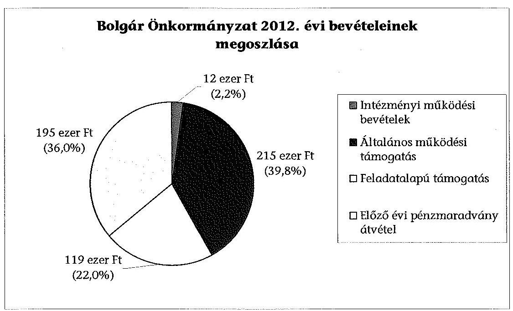
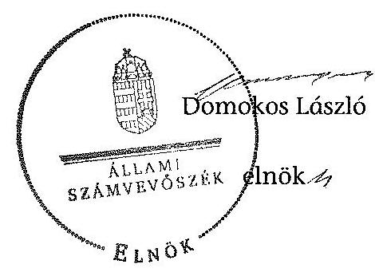

# ÁLLAMI   SZÁMVEVŐSZÉK 

## JELENTÉS

a helyi nemzetiségi önkormányzatok gazdálkodásának ellenőrzéséről
Budapest Főváros XVI. Kerületi Bolgár Önkormányzat

---

# Állami Számvevőszék 

Iktatószám: V-0282-010/2014.
Témaszám: 1315
Vizsgálat-azonosító szám: V065235

## Az ellenőrzést felügyelte:

Horváth Balázs
felügyeleti vezető
Az ellenőrzést vezette és az ellenőrzés végrehajtásáért felelős:
Kisgergely István
ellenőrzésvezető
A számvevőszéki jelentést készítették és a jelentés összeállításában
közreműködtek:
Belovai Sándorné
számvevő főtanácsos
Varga József
számvevő tanácsos
Az ellenőrzést végezte:
Belovai Sándorné
számvevő főtanácsos

---

# TARTALOMJEGYZÉK 

BEVEZETÉS ..... 3
I. ÖSSZEGZŐ MEGÁLLAPÍTÁSOK, KÖVETKEZTETÉSEK, JAVASALATOK ..... 6
II. RÉSZLETES MEGÁLLAPÍTÁSOK ..... 13

1. A Bolgár Önkormányzat és a XVI. kerületi Önkormányzat együttműködésének szabályozása, a működési feltételek biztosítása ..... 13
2. A gazdálkodási feladatok ellátásának szabályszerűsége ..... 14
2.1. A költségvetésre és a zárszámadásra, valamint a kincstári adatszolgáltatás rendjére vonatkozó jogszabályi előírások betartása ..... 14
2.2. A Bolgár Önkormányzat gazdálkodásának szabályozottsága ..... 15
2.3. Az operatív gazdálkodási jogkörök kialakítása, gyakorlása ..... 16
3. A Bolgár Önkormányzattal összefüggő gazdálkodási feladatok belső ellenőrzése ..... 17
4. A feladatalapú támogatás felhasználásának, elszámolásának szabályszerűsége, a Bolgár Önkormányzat feladatellátása ..... 18
MELLÉKLET
5. számú A Bolgár Önkormányzat 2012. évi gazdálkodásának főbb adatai, mutatói
FÜGGELÉKEK
6. számú Rövidítések jegyzéke
7. számú Értelmező szótár
8. számú A gazdálkodás értékelésének módszere

---

.

---

# JELENTÉS 

## a helyi nemzetiségi önkormányzatok gazdálkodásának ellenőrzéséről Budapest Főváros XVI. Kerületi Bolgár Önkormányzat

## BEVEZETÉS

A Bolgár Önkormányzat 2002. évben alakult, intézményt, gazdasági társaságot és más szervezetet nem alapított, elnöke a 2006. évi helyhatósági választások óta látja el feladatát. A négytagú Képviselő-testület munkája segítésére bizottságot nem hozott létre. A Bolgár Önkormányzat költségvetési beszámolója szerint a 2012. évben a módosított költségvetési bevételi és kiadási előirányzata 541 ezer Ft, a teljesített költségvetési bevétele 541 ezer Ft, a teljesített költségvetési kiadása 473 ezer Ft volt. A 2012. évi gazdálkodási adatokat részletesen az 1. számú mellékletben mutatjuk be.

Az Alaptörvény XXIX. cikk (1) bekezdése szerint a Magyarországon élő nemzetiségek államalkotó tényezők. Minden, valamely nemzetiséghez tartozó magyar állampolgárnak joga van önazonossága szabad vállalásához és megőrzéséhez. A hazánkban élő nemzetiségek helyi (települési és területi), valamint országos önkormányzatokat hozhatnak létre. A helyi nemzetiségi önkormányzatok gazdálkodási feladatait jogszabályi előírás alapján a székhely szerinti helyi önkormányzat polgármesteri hivatala látja el.

A nemzetiségek helyzete, támogatása mind hazai, mind EU-s szinten kiemelt figyelmet kap napjainkban. A helyi nemzetiségi önkormányzatok gazdálkodására és támogatási rendszerére vonatkozó jogszabályok a 2010-2012. években jelentős változásokon mentek át. A települési és területi nemzetiségi önkormányzatok gazdálkodásának, a részükre juttatott költségvetési támogatások felhasználásának ellenőrzését az ÁSZ a 2012. évben sorozatjellegű ellenőrzés keretében indította el. A 2013. évi ellenőrzések e témacsoportos ellenőrzések folytatását jelentik, amelyet az ÁSZ 2014 első félévi ellenőrzési terve 12. témaszámon tartalmaz.

Az ellenőrzés célja annak értékelése volt, hogy a Bolgár Önkormányzat gazdálkodási kereteinek kialakítása, gazdálkodása és feladatellátása megfelelt-e a jogszabályoknak.

Ennek keretében értékeltük, hogy:

- a Bolgár Önkormányzat és a XVI. kerületi Önkormányzat együttműködésének szabályozása, a működési feltételek biztosítása megfelelt-e a jogszabályi előírásoknak;

---

- a felek együttműködése megfelelt-e a közöttük létrejött megállapodásnak a gazdálkodási feladatok szabályszerű ellátása során, ennek keretében betartották-e a helyi nemzetiségi önkormányzat gazdálkodásához kapcsolódóan a költségvetésre és zárszámadásra, a gazdálkodás szabályozására, az operatív gazdálkodási jogkörök gyakorlására vonatkozó jogszabályi előírásokat;
- a jegyző biztosította-e a Bolgár Önkormányzat gazdálkodásának belső ellenőrzését;
- a Bolgár Önkormányzat feladatalapú támogatásának felhasználása, a folyósított feladatalapú támogatással történő elszámolás az előírásoknak megfelelő volt-e;
- a nemzetiségi önkormányzat feladatellátása összhangban volt-e a vonatkozó jogszabályi előírásokkal.

Az ellenőrzés várható hasznosulását négy szinten tervezzük. A törvényalkotás számára összegzett tapasztalatok állnak rendelkezésre a nemzetiségi önkormányzatok testületi döntéseinek, gazdálkodásának és a feladatalapú támogatás felhasználásának szabályszerűségéről, amelynek alapján következtetést lehet levonni arra, hogy indokolt-e jogszabályi módosítás kezdeményezése. Az ellenőrzés az ellenőrzött számára visszajelzést ad a működésében fellépő hiányosságokról, javaslataival hozzájárul azok kiküszöböléséhez, amely csökkentheti a későbbi ellenőrzések gyakoriságát. Az ellenőrzés megállapításai és javaslatai tanulságul szolgálhatnak más nemzetiségi önkormányzatok, szervezetek számára a rendezett gazdálkodási keretek kialakításához. A társadalom számára jelzi, hogy közpénz nem maradhat ellenőrizetlenül, az ÁSZ értékteremtő rend kialakításához és megőrzéséhez hozzájáruló tevékenysége pozitív hatással lesz a szervezetről kialakított összkép formálásában. Az ÁSZ szervezetén belül lehetőség nyílik arra, hogy a megállapítások szintetizálásával az intézmény a hozzáadott értéket teremtő elemző tevékenységét és tanácsadó szerepét erősítse.

A Bolgár Önkormányzat gazdálkodásának ellenőrzéséről szóló jelentés I. fejezetének összegző része az ellenőrzés céljára adott rövid, szintetizáló összefoglalót és következtetéseket tartalmazza a II. fejezet részletes megállapításain alapulóan. A jelentés intézkedést igénylő megállapításait és javaslatait - az összegzőben foglaltak mellett - az ellenőrzés során feltárt, a jelentés II. fejezetében rögzített részletes megállapítások alapozzák meg, illetve támasztják alá.

Az ellenőrzés típusa: szabályszerűségi ellenőrzés
Az ellenőrzött időszak: a 2012. január 1. - 2012. december 31. közötti időszak. Az ellenőrzés kiterjedt a Bolgár Önkormányzatnak juttatott 2012. évi támogatás 2013. évben való elszámolására is.

Ellenőrzött szervezet: Budapest Főváros XVI. Kerületi Bolgár Önkormányzat és a gazdálkodási feladatait ellátó Budapest Főváros XVI. Kerületi Önkormányzat.

Az ellenőrzés végrehajtásának jogszabályi alapját az ÁSZ tv. 5. § (2)-(3) és (6) bekezdéseiben foglaltak képezik.

---

Az ellenőrzés szakmai módszertana az ÁSZ hivatalos honlapján (www.asz.hu) közzétett szakmai szabályokon alapult, amely a Legfőbb Ellenőrző Intézmények Nemzetközi Szervezete (INTOSAI) által kiadott nemzetközi standardok (ISSAI) figyelembevételével készült.

A helyi nemzetiségi önkormányzatok gazdálkodásának ellenőrzése során értékeltük a XVI. kerületi Önkormányzat és a Bolgár Önkormányzat együttműködésének, a gazdálkodás szabályozottságának és a pénzügyi folyamatokban kulcsszerepet betöltő belső kontrollok (teljesítés-igazolás és érvényesítés) működésének megfelelőségét. A kulcskontrollokat a működési és felhalmozási célú támogatásértékű kiadásoknál, az államháztartáson kívülre teljesített működési és felhalmozási célú pénzeszköz átadásoknál, a dologi kiadásokkal kapcsolatos kifizetéseknél - véletlen mintavételi eljárást alkalmazva - vizsgáltuk. Ellenőriztük, hogy a jegyző biztosította-e a Bolgár Önkormányzat gazdálkodásának belső ellenőrzését. Értékeltük a feladatalapú támogatások felhasználásának, elszámolásának szabályszerűségét, a Bolgár Önkormányzat feladatellátása és a jogszabályi előírások összhangját.

Az ellenőrzés lefolytatásához a Bolgár Önkormányzat és a gazdálkodási feladatait ellátó XVI. kerületi Önkormányzat tanúsítványok és a kapcsolódó, dokumentumjegyzékben megjelölt dokumentumok elektronikus úton történő megküldésével, rendelkezésre bocsátásával szolgáltatott adatokat. Az adatszolgáltatás kontrollálása és szükség szerinti javítása a helyszíni ellenőrzés keretében történt. A minősítési szempontokat a 3. számú függelék tartalmazza.

Az ÁSZ tv. 29. § (1) bekezdése szerint a jelentéstervezetet megküldtük a polgármester és a Nemzetiségi Önkormányzat elnöke részére, akik az ÁSZ tv. 29. § (2) bekezdésében foglalt észrevételezési jogukkal nem éltek, a jelentéstervezetre észrevételt nem tettek.

---

# I. ÖSSZEGZŐ MEGÁLLAPÍTÁSOK, KÖVETKEZTETÉSEK, JAVASALATOK 

A Bolgár Önkormányzat és a XVI. kerületi Önkormányzat együttműködésének szabályozása részben felelt meg a jogszabályi előírásoknak. A Bolgár Önkormányzat a 2012. évre rendelkezett a XVI. kerületi Önkormányzattal megkötött hatályos együttműködési megállapodás$_{1,2}$-sal. A 2012. január 1-jén hatályos 2010. évben megkötött együttműködési megállapodás$_{1}$ felülvizsgálatát a Nek. $_{2}$ tv. szerinti határidőre nem teljesítették, azonban az együttműködési megállapodás$_{2}$-t a Nek. $_{2}$ tv.-ben előírt 2012. június 1-jei határidőn belül megkötötték. Az együttműködési megállapodás$_{2}$-ben a Nek. $_{2}$ tv. előírásától eltérően nem írták elő, hogy a testület ülésein a jegyző megbízásából résztvevő személy képesítésének meg kell felelnie a jegyzőkre előírt követelményeknek. Az előírt tervezési, gazdálkodási, finanszírozási, adatszolgáltatási és beszámolási feladatok ellátásának szabályait csak részben rögzítették az együttműködési megállapodás$_{2}$-ben. Hiányoztak az előzetes írásba foglalást nem igénylő kifizetések esetében a teljesítésigazolásra, illetve valamennyi kötelezettség esetében a kötelezettségvállalások nyilvántartására vonatkozó szabályok. Az együttműködési megállapodás szerinti működési feltételeket a megállapodás megkötését követő harminc napon belül és azt követően sem vezették át a Bolgár Önkormányzat SZMSZ-ében. Működésének személyi és tárgyi feltételeit a szabályozási hiányosságok ellenére biztosították.

A Bolgár Önkormányzatnál a 2012. évi költségvetéssel, a zárszámadással és a kincstári adatszolgáltatással összefüggő munkafolyamatok megfeleltek a jogszabályi előírásoknak, azonban a feladatalapú támogatás elszámolása nem történt meg.

A Bolgár Önkormányzat elnöke a 2012. évi költségvetés tervezetét az Áht. $_{2}$ előírásainak megfelelően, határidőben benyújtotta a Képviselő-testületnek, amelyet az elfogadott. A jegyző által elkészített 2012. évi zárszámadási határozat tervezetét a Bolgár Önkormányzat elnöke határidőn belül terjesztette a Képviselő-testület elé, azonban a Képviselő-testület részére nem mutatták be az Áht. $_{2}$ által előírt költségvetési mérleget közgazdasági tagolásban, valamint az előirányzat felhasználási tervet. A zárszámadásról alkotott határozat és az elfogadott költségvetés összehasonlíthatóságát biztosították, a zárszámadás a Bolgár Önkormányzat valamennyi bevételét és kiadását tartalmazta. A jegyző a Bolgár Önkormányzat részére előírt, a gazdálkodással összefüggő 2012. évi adatszolgáltatásokat az előírt határidőkre teljesítette a Kincstár felé.

A Bolgár Önkormányzat gazdálkodásának szabályozottsága nem volt megfelelő. A Számviteli politika az Ávr. előírása ellenére nem tartalmazta a teljesítésigazolás gyakorlásának módjával, eljárási és dokumentációs részletszabályaival, valamint a teljesítésigazolást végző személyek kijelölésével kapcsolatos rendelkezéseket. A Polgármesteri Hivatal SZMSZ-ében rögzítették a tervezéssel, gazdálkodással, - annak részeként a pénzügyi ellenjegyzéssel, az érvényesítéssel, az ezeket végző személyek kijelölésével - az ellenőrzési és adatszolgáltatási feladatok teljesítésével kapcsolatos belső előírásokat, azonban az

---

Ávr. előírásával ellentétben nem tartalmazta az SZMSZ-ben nevesített munkakörökhöz tartozó - a Bolgár Önkormányzat gazdálkodásával kapcsolatos - feladat- és hatáskörökre, a hatáskörök gyakorlásának módjára, a helyettesítés rendjére vonatkozó előírásokat. A jegyző a Bolgár Önkormányzat gazdálkodási feladataira nem terjesztette ki a Bkr.-ben előírt ellenőrzési nyomvonalat és a szabálytalanságok kezelésének eljárásrendjét. A Bolgár Önkormányzat rendelkezett számviteli politikával és a hozzá kapcsolódó, gazdálkodásra vonatkozó szabályzatokkal (Pénzkezelési Szabályzat, Eszközök és Források Értékelési Szabályzata, Leltározási Szabályzat, Selejtezési Szabályzat, Bizonylati Szabályzat, Számlarend, Számlatükör).

A Bolgár Önkormányzat gazdálkodása tekintetében az operatív gazdálkodási jogkörök kialakítása részben felelt meg a jogszabályi előírásoknak.

A Bolgár Önkormányzatnál a 2012. évben államháztartáson kívülre teljesített pénzeszköz átadásnál a teljesítésigazolás és az érvényesítés kulcskontrollok működése nem felelt meg az Ávr. előírásainak, mert a teljesítésigazoló nem volt írásban kijelölve, az érvényesítő összegszerűségre vonatkozó ellenőrzése nem a teljesítésigazoláson alapult, annak jogszerű ellátását - aláírás minta hiányában - nem szabályszerűen ellenőrizte. Az érvényesítő az Ávr.-ben előírt kötelezettségvállalási nyilvántartás hiányában nem ellenőrizte a fedezet rendelkezésre állását és nem végezte el a formai szabályok betartásának ellenőrzését. Érvényesítéskor az Ávr. előírásainak ellenére elmaradt a belső szabályzatba foglalt előírások ellenőrzése, mert az érvényesítő nem észrevételezte, hogy a teljesítésigazolást írásbeli kijelölés nélkül végezték.

A dologi kiadások teljesítése során gyenge volt a pénzügyi kontrollok működése, a hibák száma a lényegességi szintet, a kritikus hibahatárt elérte. Az Ávr. előírásai ellenére a teljesítés igazolását a jogkör gyakorlására jogszerű kijelöléssel nem rendelkező személy látta el, az érvényesítő nem a teljesítés igazolása alapján érvényesített, nem állt rendelkezésére a teljesítésigazoló aláírás mintája, továbbá nem észrevételezte, hogy a teljesítésigazolás szabálytalan volt. Nem jelezte az Ávr.-ben előírt kötelezettségvállalási nyilvántartás vezetésének és a kiadási pénztárbizonylatokon a nyilvántartási szám feltüntetésének a hiányát.

A dologi kiadások közül kiválasztott három legnagyobb összegű kifizetés esetében a teljesítésigazolás és az érvényesítés kulcskontrollok működése nem volt megfelelő. Az Ávr.
 előírásai ellenére a teljesítésigazolást jogszerű kijelöléssel nem rendelkező személy végezte. Az érvényesítő nem a teljesítés igazolása alapján érvényesített, nem állt rendelkezésére a teljesítésigazoló aláírás mintája. Az érvényesítő nem észrevételezte, hogy a teljesítésigazolás szabálytalan volt, nem jelezte a kötelezettségvállalási nyilvántartás vezetésének és a kiadási pénztárbizonylatokon a nyilvántartási szám feltüntetésének a hiányát.

A jegyző a Polgármesteri Hivatal belső ellenőrzése keretében biztosította a Bolgár Önkormányzat gazdálkodásával összefüggő végrehajtási feladatok belső ellenőrzését.

Az együttműködési megállapodásban rögzítették, hogy a Polgármesteri Hivatal belső ellenőrzési tevékenysége kiterjed a Bolgár Önkormányzat számviteli nyilvántartásainak ellenőrzésére. A Polgármesteri Hivatal 2012. évi belső ellenőrzési tervét megalapozó, a Ber.-ben előírt kockázatelemzés nem terjedt ki a Bolgár Önkormányzat gazdálkodásával összefüggő végrehajtási feladatokra. A 2012. évre tervezett belső ellenőrzést elvégezték, az ellenőrzési jelentés hiányosságokat állapított meg, javaslatokat tett, de a feltárt hiányosságok megszüntetésére a Bkr.-ben foglaltak ellenére intézkedési terv nem készült. A jegyző a Bolgár Önkormányzatot érintő belső ellenőrzés megállapításairól annak elnökét és a Képviselő-testületét nem tájékoztatta, ezért az elnök a belső ellenőrzési jelentés elkészítésekor hatályos együttműködési megállapodás ${ }_{1} 6$. pontjában foglalt realizálási feladatainak végrehajtása elmaradt.

A Bolgár Önkormányzat részére a 2011. és a 2012. évben folyósított feladatalapú támogatás elszámolása a jogszabályi előírásoknak nem felelt meg. A támogatási kormányrendelet ${ }_{1,2}$-ben előírt elszámolás nem történt meg. A támogatás felhasználását, elszámolását az arra jogosult külső szervek nem ellenőrizték.

A Bolgár Önkormányzat 2012. évi kötelező és önként vállalt feladatellátásának tárgya összhangban volt a Nek. ${ }_{2}$ tv.-ben foglalt előírásokkal.

Az ÁSZ tv. 33. § (1) bekezdésében foglaltak értelmében az ellenőrzött szervezet vezetője köteles a jelentésben foglalt megállapításokhoz kapcsolódó intézkedési tervet összeállítani és azt a jelentés kézhezvételétől számított 30 napon belül az ÁSZ részére megküldeni. Amennyiben az intézkedési tervet határidőre nem küldi meg a szervezet, vagy az nem elfogadható, az ÁSZ elnöke az ÁSZ tv. 33. § (3) bekezdés a)-b) pontjaiban foglaltakat érvényesítheti.

A helyszíni ellenőrzés megállapításainak hasznosítása mellett javasoljuk:

# a jegyzőnek 

1. az együttműködés szabályozásával kapcsolatban

A Nek. ${ }_{2}$ tv. 80. § (3) bekezdésének b)-c) pontjaiban foglaltak ellenére az együttműködési megállapodás ${ }_{2}$-ben nem rögzítették a teljesítésigazolási feladatok eljárási és dokumentációs részletszabályait az előzetes írásba foglalást nem igénylő kifizetésekre, a teljesítésigazolást végző feladatait, a felelősök konkrét kijelölését; továbbá a kötelezettségvállalások nyilvántartásának vezetését. A Nek. ${ }_{2}$ tv. 80. § (4) bekezdésében foglaltak ellenére az együttműködési megállapodás ${ }_{2}$ nem tartalmazta a testületi ülésen a jegyző megbízásából résztvevő nemzetiségi referensre vonatkozó, a jegyzőével azonos képesítés meglétének követelményét.

Az együttműködési megállapodás ${ }_{1}$-t a Nek. ${ }_{2}$ tv. 80. § (2) bekezdésének előírása ellenére 2012. január 31-éig nem vizsgálták felül.

A Nek. ${ }_{2}$ tv. 80. § (2) bekezdésében foglaltak ellenére az együttműködési megállapodás ${ }_{2}$ szerinti működési feltételeket nem rögzítették a Bolgár Önkormányzat SZMSZ-ében.

Javaslat
Az együttműködés szabályszerűsége érdekében:
a) készítse elő az együttműködési megállapodás ${ }_{2}$ módosítását, hogy az tartalmilag feleljen meg a Nek. ${ }_{2}$ tv. 80. § (3) bekezdés b) és c) pontjaiban, valamint a Nek. ${ }_{2}$ tv. 80. § (4) bekezdésében foglalt előírásoknak;
b) biztosítsa a jövőben az együttműködési megállapodás évenkénti felülvizsgálata során a Nek. ${ }_{2}$ tv. 80. § (2) bekezdésében előírt határidő betartását;
c) készítse elő a Bolgár Önkormányzat SZMSZ-ének kiegészítését a Nek. ${ }_{2}$ tv. 80. § (2) bekezdésében foglalt előírás alapján.
2. a költségvetés előterjesztésével kapcsolatban

A 2012. évi költségvetési határozat-tervezet előterjesztésekor - a jegyző mulasztása miatt - az Áht. ${ }_{2}$ 24. § (4) bekezdés a) pontjában előírtak ellenére nem mutatták be a Képviselő-testületnek tájékoztatásul szöveges indoklással a Bolgár Önkormányzat költségvetési mérlegét közgazdasági tagolásban és az előirányzat-felhasználási tervét.

Javaslat
Készítse elő a jövőben a költségvetési határozat-tervezet előterjesztéséhez a Képviselő-testület tájékoztatására az Áht. ${ }_{2}$ 24. § (4) bekezdés a) pontja előírásainak megfelelően szöveges indoklással együtt a költségvetési mérleget közgazdasági tagolásban és az előirányzat-felhasználási tervet.
3. a gazdálkodási feladatok szabályozottságával kapcsolatban

A Polgármesteri Hivatal SZMSZ-e nem tartalmazta az Ávr. 13. § (1) bekezdés g) pontjában foglaltak szerinti, az SZMSZ-ben nevesített munkakörökhöz tartozó - a Bolgár Önkormányzat gazdálkodásával kapcsolatos - feladat- és hatáskörökre, a hatáskörök gyakorlásának módjára, a helyettesítés rendjére, az ezekhez kapcsolódó felelősségi szabályokra vonatkozó előírásokat. A Bkr. 6. § (3)-(4) bekezdései szerinti ellenőrzési nyomvonal és szabálytalanságok kezelésének eljárásrendje nem terjedt ki a Bolgár Önkormányzat gazdálkodási feladataira.

Javaslat
A gazdálkodás szabályszerűsége érdekében a Bolgár Önkormányzat gazdálkodására is kiterjedően:
a) készítse elő a Polgármesteri Hivatal SZMSZ-ének módosítását, hogy az tartalmazza az Ávr. 13. § (1) bekezdés g) pontjában foglaltakat;
b) módosítsa a Polgármesteri Hivatal Bkr. 6. § (3)-(4) bekezdései szerinti ellenőrzési nyomvonalat és a szabálytalanságok kezelésének eljárásrendjét.

4. a kulcskontrollok működésével kapcsolatban

A teljesítésigazolást nem az Ávr. 57. § (4) bekezdése szerinti szabályszerű kijelöléssel rendelkező személy végezte, ezért az Ávr. 57. § (1)-(3) bekezdéseiben foglaltak ellenére nem szabályszerűen történt a kifizetés jogosságának, összegszerűségének és szerződésszerű teljesítésének igazolása.

Az érvényesítő az Ávr. 58. § (1) bekezdése ellenére nem látta el szabályszerűen feladatát, mert az összegszerűségre vonatkozó ellenőrzése nem teljesítésigazoláson alapult. Nem jelezte az utalványozónak az Ávr. 58. § (2) bekezdés előírása ellenére, hogy a kötelezettségvállalási nyilvántartást nem vezették, továbbá nem állt rendelkezésre a teljesítésigazoló aláírás mintája.

Javaslat
Az operatív gazdálkodás működési hibáinak megelőzése, feltárása és kijavítása érdekében gondoskodjon arról, hogy:
a) a teljesítési igazolása minden esetben az Ávr. 57. § (1) és (3) bekezdéseiben előírtaknak megfelelően történjen;
b) az érvényesítő tegyen eleget az Ávr. 58. § (1)-(2) bekezdéseiben előírt ellenőrzési feladatának és jelzési kötelezettségének.
5. a nemzetiségi önkormányzatok belső ellenőrzésével kapcsolatban:

A Polgármesteri Hivatal 2012. évi belső ellenőrzési tervét megalapozó, a Ber. 21. § (2) bekezdésében előírt kockázatelemzés nem terjedt ki a Bolgár Önkormányzat gazdálkodásával összefüggő végrehajtási feladatokra. Az elvégzett ellenőrzés során feltárt hiányosságok megszüntetésére a Bkr. 45. § (1) bekezdésében foglaltak ellenére intézkedési tervet nem készítettek.

Javaslat
Gondoskodjon arról, hogy az éves belső ellenőrzési terv a Bkr. 29. § (1) bekezdésében előírtaknak megfelelően kockázatelemzés alapján készüljön, illetve az ellenőrzés során feltárt hiányosságok megszüntetésére a Bkr. 45. § (1) bekezdésében előírt intézkedési terv kerüljön elfogadásra.
6. a feladatalapú támogatás elszámolásával kapcsolatban

A 2011. évi feladatalapú támogatás elszámolása a támogatási kormányrendelet ${ }_{1}$ 7. § (2) bekezdésében hivatkozott, valamint a 2012. évi feladatalapú támogatás elszámolása a támogatási kormányrendelet ${ }_{2}$ 8. § (5) bekezdésében hivatkozott „a helyi önkormányzatok elszámolási és ellenőrzési rendjére vonatkozó jogszabályok rendelkezései alkalmazandóak" előírása alapján az Áht. 1 64. § (7) bekezdése, és az Áht. 2 57. § (3) bekezdése ellenére nem történt meg.

Javaslat
Gondoskodjon az Áht. 2 27. § (2) bekezdésében meghatározott feladatkörében a Bolgár Önkormányzat által igénybevett 2011. és 2012. évi feladatalapú támogatás rendeltetésszerű felhasználásáról szóló elszámolás elkészítéséről az Áht. 2 53. § (1) bekezdése beszámolási kötelezettség teljesítéséhez.

# a polgármesternek 

A Nek. 2 tv. 80. § (3) bekezdésének b)-c) pontjaiban foglaltak ellenére az együttműködési megállapodás ${ }_{2}$-ben nem rögzítették a teljesítésigazolási feladatok eljárási és dokumentációs részletszabályait az előzetes írásba foglalást nem igénylő kifizetésekre, a teljesítésigazolást végző feladatait, a felelősök konkrét kijelölését; továbbá a kötelezettségvállalások nyilvántartásának vezetését. A Nek. 2 tv. 80. § (4) bekezdésében foglaltak ellenére az együttműködési megállapodás ${ }_{2}$ nem tartalmazta a testületi ülésen a jegyző megbízásából résztvevő nemzetiségi referensre vonatkozó, a jegyzőével azonos képesítés meglétének követelményét.

A Polgármesteri Hivatal SZMSZ-e nem tartalmazta az Ávr. 13. § (1) bekezdés g) pontjában foglaltak szerinti, az SZMSZ-ben nevesített munkakörökhöz tartozó - a Bolgár Önkormányzat gazdálkodásával kapcsolatos - feladat- és hatáskörökre, a hatáskörök gyakorlásának módjára, a helyettesítés rendjére, az ezekhez kapcsolódó felelősségi szabályokra vonatkozó előírásokat.

Javaslat
Terjessze a XVI. Kerületi Önkormányzat Képviselő-testülete elé jóváhagyásra:
a) az együttműködési megállapodás jegyző által előkészített módosítását, hogy az tartalmilag megfeleljen a Nek. 2 tv. 80. § (3) bekezdés b)-c) pontjaiban, valamint a Nek. 2 tv. 80. § (4) bekezdésében foglalt előírásoknak;
b) a Polgármesteri Hivatal SZMSZ-ének a jegyző által előkészített módosítását, hogy az tartalmazza az Ávr. 13. § (1) bekezdés g) pontjában foglaltakat.

## a Bolgár Önkormányzat elnökének

1. A Nek. 2 tv. 80. § (3) bekezdésének b)-c) pontjaiban foglaltak ellenére az együttműködési megállapodás ${ }_{2}$-ben nem rögzítették a teljesítésigazolási feladatok eljárási és dokumentációs részletszabályait az előzetes írásba foglalást nem igénylő kifizetésekre, a teljesítésigazolást végző feladatait, a felelősök konkrét kijelölését; továbbá a kötelezettségvállalások nyilvántartásának vezetését. A Nek. 2 tv. 80. § (4) bekezdésében foglaltak ellenére az együttműködési megállapodás ${ }_{2}$ nem tartalmazta a testületi ülésen a jegyző megbízásából résztvevő nemzetiségi referensre vonatkozó, a jegyzőével azonos képesítés meglétének követelményét.

A Nek. 2 tv. 80. § (2) bekezdésében foglaltak ellenére az együttműködési megállapodás ${ }_{2}$ szerinti működési feltételeket nem rögzítették a Bolgár Önkormányzat SZMSZ-ében.

Javaslat
Terjessze a Képviselő-testület elé jóváhagyásra:
a) a Nek. 2 tv. 80. § (3) bekezdés b)-c) pontjaiban, valamint a Nek. 2 tv. 80. § (4) bekezdésében foglalt előírásoknak megfelelő, a jegyző által előkészített együttműködési megállapodás ${ }_{2}$ módosítást;
b) a Bolgár Önkormányzat SZMSZ-ének a Nek. 2 tv. 80. § (2) bekezdésében foglaltaknak megfelelő jegyző által előkészített módosítását.
2. A Nemzetiségi Önkormányzat elnöke a 2012. évi költségvetés előterjesztésekor - a jegyző mulasztása miatt - a Képviselő-testület részére az Áht. ${ }_{2}$ 24. § (4) bekezdés a) pontjában előírtak ellenére nem mutatta be tájékoztatásul szöveges indoklással a Bolgár Önkormányzat költségvetési mérlegét közgazdasági tagolásban és az előirányzat-felhasználási tervét.

Javaslat
A jövőben a költségvetési határozat-tervezet Képviselő-testület elé terjesztésekor tájékoztatásul mutassa be a jegyző által előkészített, az Áht. ${ }_{2} 24 . \S$ (4) bekezdés a) pontjában előírt költségvetési mérleget közgazdasági tagolásban és az előirányzat-felhasználási tervet szöveges indoklással.
3. A Bolgár Önkormányzat elnöke, mint kötelezettségvállaló az Ávr. 57. § (4) bekezdésében foglalt előírások ellenére nem jelölt ki írásban teljesítésigazolót.

Javaslat
Jelölje ki az Ávr. 57. § (4) bekezdésében foglalt előírásoknak megfelelően írásban a teljesítésigazolókat.
4. A 2011. évi feladatalapú támogatás elszámolása a támogatási kormányrendelet ${ }_{1}$ 7. § (2) bekezdésében hivatkozott, valamint a 2012. évi feladatalapú támogatás elszámolása a támogatási kormányrendelet ${ }_{2}$ 8. § (5) bekezdésében hivatkozott „a helyi önkormányzatok elszámolási és ellenőrzési rendjére vonatkozó jogszabályok rendelkezései alkalmazandóak" előírása alapján az Áht. ${ }_{1}$ 64. § (7) bekezdése, és az Áht. ${ }_{2}$ 57. § (3) bekezdése ellenére nem történt meg.

Javaslat
Terjessze a Képviselő-testület elé az Áht. ${ }_{2}$ 53. § (1) bekezdése szerinti beszámolási kötelezettség teljesítéséhez összeállított, a Bolgár Önkormányzat által igénybevett 2011. és 2012. évi feladatalapú támogatás rendeltetésszerű felhasználásáról szóló elszámolást.

# II. RÉSZLETES MEGÁLLAPÍTÁSOK 

## 1. A Bolgár Önkormányzat és a XVI. Kerületi Önkormányzat együttműködésének szabályozása, a
 MÜKÖDÉSI FELTÉTELEK BIZTOSÍTÁSA

A Bolgár Önkormányzat és a XVI. kerületi Önkormányzat együttműködésének szabályozása részben felelt meg a jogszabályi előírásoknak.

A Bolgár Önkormányzat a 2012. évre rendelkezett a XVI. kerületi Önkormányzattal megkötött hatályos együttműködési megállapodással¹.

A 2012. január 1-jén hatályos, 2010. évben megkötött együttműködési megállapodás ${ }_{1}$-nek a felülvizsgálatát a Nek. ${ }_{2}$ tv. 80. § (2) bekezdésében előírtak ellenére 2012. január 31-ig nem végezték el, azonban az együttműködési megállapodás Nek. ${ }_{2}$ tv.-ben előírt módosítását a 2012. június 1-jei határidőn belül elkészítették.

Az együttműködési megállapodás ${ }_{2}$ a működési feltételeket a Nek. ${ }_{2}$ tv.-ben foglaltaknak megfelelően részben tartalmazta. A Bolgár Önkormányzat nem tett eleget a Nek. ${ }_{2}$ tv. 80. § (2) bekezdésében előírt kötelezettségének, mert az együttműködési megállapodás ${ }_{2}$ megkötését követő 30 napon belül, illetve a helyszíni ellenőrzés befejezéséig nem rögzítette SZMSZ-ében a megállapodás szerinti működési feltételeket.

Az együttműködési megállapodás ${ }_{2}$ tartalmazta az Áht. ${ }_{2}$ 27. §. (2) bekezdésében előírt tervezési, finanszírozási és adatszolgáltatási feladatok ellátását, nem tartalmazta azonban a gazdálkodási feladatok ellátásának szabályait, mert:

- a megállapodás nem tartalmazta a Nek. ${ }_{2}$ tv. 80. § (3) bekezdés b) pontjában foglaltaknak megfelelően a teljesítésigazolási feladatok eljárási és dokumentációs részletszabályait az előzetes írásba foglalást nem igénylő kifizetésekre, nem rögzítették a teljesítésigazolást végző feladatait, a jogszabályban foglaltak szerint a felelősök konkrét kijelölését;
- nem írták elő a Nek. ${ }_{2}$ tv. 80. § (3) bekezdés c) pontjában foglaltaknak megfelelően a kötelezettségvállalások nyilvántartásának vezetését.

Önálló fizetési számla nyitása és a Bolgár Önkormányzat törzskönyvi bejegyzése és adószámmal való ellátása megtörtént. Az együttműködési megállapodás szerint a Nemzetiségi Önkormányzat részéről kötelezettségvállalásra az elnök

[^0]
[^0]:    ${ }^{1}$ A 2010. december 20-án aláírt (Budapest Főváros XVI. Kerületi Önkormányzat Képviselő testületének 461/2010. (XII. 8.) sz., valamint Budapest Főváros XVI. Kerületi Bolgár Önkormányzat Képviselő testülete által hozott 30/2010. (XI. 30.) sz. határozat. Az új (módosított) megállapodást 2012. május 31-én írták alá, az ezt jóváhagyó határozatok száma: 265/2012. (V. 30.) Kt. és 7/2012. (V. 07.) BÖ.

---

jogosult, az ellenjegyzési, érvényesítési feladatokat a XVI. kerületi Önkormányzat kijelölt munkatársai látják el.

A Nek. ${ }_{2}$ tv. szerinti tárgyi és személyi feltételeket (irodahelyiség, rendezvények megrendezésére alkalmas nagyobb helyiség, számítógép, telefon, telefax, internet, fénymásoló, irodaszerek) a XVI. kerületi Önkormányzat biztosította a Bolgár Önkormányzat számára. Az együttműködési megállapodás ${ }_{2}$ a Nek. ${ }_{2}$ tv. 80. § (4) bekezdés előírásának megfelelően tartalmazta, hogy a nemzetiségi referens a jegyző megbízásából és képviseletében részt vesz a Bolgár Önkormányzat testületi ülésein és jelzi, amennyiben törvénysértést észlel, de nem tartalmazta a nemzetiségi referens képesítésére vonatkozó előírást ${ }^{2}$, azonban a nemzetiségi referens képesítése megfelelt a jegyzőével azonos képesítési előírásnak.

Az együttműködési megállapodás ${ }_{2}$-ben rögzítették a belső ellenőrzésre és a felelősségre vonatkozó feltételeket, amely szerint a Polgármesteri Hivatal belső ellenőrzési tevékenysége a számviteli nyilvántartások ellenőrzésére terjed ki.
„A Nemzetiségi Önkormányzat számviteli nyilvántartásának ellenőrzésére a Polgármesteri Hivatal szervezetéhez tartozó függetlenített belső ellenőrzés feladatát képezi. A Nemzetiségi Önkormányzat gazdálkodásának biztonságáért, a képviselő-testület szabályszerűségéért az elnök felel. A veszteséges gazdálkodás következményeiért Budapest Főváros XVI. kerületi Önkormányzat nem tartozik felelősséggel."

A XVI. kerületi Önkormányzat - a szabályozási hiányosságok ellenére - a Bolgár Önkormányzat működésének személyi- és tárgyi feltételeit biztosította.

# 2. A GAZDÁLKODÁSI FELADATOK ELLÁTÁSÁNAK SZABÁLYSZERŰSÉGE 

### 2.1. A költségvetésre és a zárszámadásra, valamint a kincstári adatszolgáltatás rendjére vonatkozó jogszabályi előírások betartása

A Bolgár Önkormányzat működéséhez kapcsolódóan a 2012. évben a költségvetés készítésével, a zárszámadással és a kincstári adatszolgáltatással összefüggő munkafolyamatok megfeleltek a jogszabályi előírásoknak, azonban a feladatalapú támogatás elszámolása nem történt meg.

A Bolgár Önkormányzat elnöke a 2012. évi költségvetés tervezetét az Áht. ${ }_{2}$-ben előírt határidőig benyújtotta, amelyet a Képviselő-testület elfogadott ${ }^{3}$, azonban a 2012. évi költségvetés előterjesztésekor a Képviselő-testület részére nem mutatták be az Áht. ${ }_{2} 24 . \S$ (4) bekezdés a) pontjában előírt költségvetési mérleget közgazdasági tagolásban, valamint az előirányzat felhasználási tervet.

[^0]
[^0]:    ${ }^{2}$ Nem írták elő, hogy a nemzetiségi referensnek a jegyzővel azonos képesítési előírásoknak kell megfelelnie.
    ${ }^{3} 24 / 2011$. (XII. 13.) BKÖ határozat

---

A jegyző által elkészített 2012. évi zárszámadási határozat tervezetét a Bolgár Önkormányzat elnöke az Áht. ${ }_{2}$-ben előírt határidőn belül terjesztette a Képviselő-testület elé⁴. A 2012. évi zárszámadási határozat tervezetének előterjesztésekor a Képviselő-testületnek tájékoztatásul bemutatták az Áht. ${ }_{2}$-ben foglalt mérlegeket és kimutatásokat. A Képviselő-testület a zárszámadásról alkotott határozat és az elfogadott költségvetés összehasonlíthatóságát biztosította, a zárszámadás a Bolgár Önkormányzat valamennyi bevételét és kiadását tartalmazta.

A jegyző a Bolgár Önkormányzat részére előírt 2012. évi adatszolgáltatásokat az előírt határidőre teljesítette a Kincstár felé.

# 2.2. A Bolgár Önkormányzat gazdálkodásának szabályozottsága 

A Bolgár Önkormányzat gazdálkodásának szabályozottsága nem volt megfelelő. A Polgármesteri Hivatal SZMSZ-e az Ávr. 13. § (1) bekezdés g) pontjában foglaltak ellenére nem tartalmazta az SZMSZ-ben nevesített munkakörökhöz tartozó - a Bolgár Önkormányzat gazdálkodásával kapcsolatos - feladat- és hatáskörökre, a hatáskörök gyakorlásának módjára, a helyettesítés rendjére, az ezekhez kapcsolódó felelősségi szabályokra vonatkozó előírásokat.

A jegyző a Bolgár Önkormányzat gazdálkodási feladataira nem terjesztette ki a Bkr. 6. § (3)-(4) bekezdéseiben előírt ellenőrzési nyomvonalat és a szabálytalanságok kezelésének eljárásrendjét.

A Bolgár Önkormányzat a 2012. évre vonatkozóan rendelkezett a Számv. tv. által előírt Számviteli politikával és ahhoz kapcsolódóan a gazdálkodásra vonatkozó szabályzatokkal.

A Számviteli politika mellékleteként hagyták jóvá a Pénzkezelési Szabályzatot, az Eszközök és Források Értékelési Szabályzatát, a Bizonylati Szabályzatot, a Leltározási Szabályzatot, a Selejtezési Szabályzatot, a Számlarendet és a Számlatükröt.

A Bolgár Önkormányzat Számviteli politikája az Ávr. 13. § (2) bekezdés a) pontjának előírása ellenére nem tartalmazta a teljesítésigazolás gyakorlásának módjával, eljárási és dokumentációs részletszabályaival, valamint a teljesítésigazolást végző személyek kijelölésével kapcsolatos rendelkezéseket.

A Polgármesteri Hivatal SZMSZ-ében a Bolgár Önkormányzatra is kiterjedő hatállyal az Áht. ${ }_{2}$-ben és az Ávr.-ben foglaltak szerint rögzítették a tervezéssel, gazdálkodással, - annak részeként a pénzügyi ellenjegyzéssel, az érvényesítés, utalványozás gyakorlásának módjával, eljárási és dokumentálási részletszabályaival, valamint az ezeket végző személyek kijelölésének rendjével, - az ellenőrzési és adatszolgáltatási feladatok teljesítésével kapcsolatos belső előírásokat, feltételeket.

[^0]
[^0]:    ${ }^{4}$ A 2012. évi zárszámadást a 10/2013. (V. 25.) BKÖ határozattal hagyta jóvá a Képviselő-testület.

---

# 2.3. Az operatív gazdálkodási jogkörök kialakítása, gyakorlása 

A Bolgár Önkormányzat gazdálkodása tekintetében az operatív gazdálkodási jogkörök kialakítása részben felelt meg a jogszabályi előírásoknak.

A jegyző az Áht. 2 és az Ávr. előírásainak megfelelően írásban kijelölte a Bolgár Önkormányzat kötelezettségvállalásaira és kifizetéseire vonatkozóan a pénzügyi ellenjegyzésre és az érvényesítésre jogosultakat. A kijelölések az ellenőrzés időszakára vonatkozóan jogszerűek voltak, mert a XVI. kerületi Önkormányzat nem rendelkezett gazdasági szervezettel.

Az operatív gazdálkodási jogkörök kialakítását tartalmazó belső szabályozás azonban hiányos volt, mert:

- a Bolgár Önkormányzat elnöke, mint kötelezettségvállaló - s egyben a 2012. május 31-i együttműködési megállapodás ${ }_{2}$ értelmében teljesítésigazolásra is jogosult - az Áht. 2 38. § (2) bekezdése és az Ávr. 57. § (4) bekezdésében előírtak ellenére nem jelölt ki teljesítésigazolót;
- az Ávr. 60. § (3) bekezdésben előírt aláírás-minta nem állt rendelkezésre a teljesítésigazoló személyének azonosításához;
- a Bolgár Önkormányzat által vállalt kötelezettségekről az Ávr. 56. § (1) bekezdésében előírt nyilvántartást nem vezettek.

A Bolgár Önkormányzatnál a 2012. évben államháztartáson kívülre teljesített pénzeszköz átadásnál a teljesítésigazolás és az érvényesítés kulcskontrollok nem működtek megfelelően, mert az Ávr. 58. § (1)-(2) bekezdéseiben foglaltak ellenére az érvényesítő összegszerűségre vonatkozó ellenőrzése nem a teljesítésigazoláson alapult, annak jogszerű ellátását - az Ávr. 60. § (3) bekezdésben előírt aláírás minta hiányában - nem ellenőrizte. Az érvényesítő az Ávr. 56. § (1) bekezdésében előírt kötelezettségvállalási nyilvántartás hiányában nem ellenőrizte az Ávr. 58. § (1)-(2) bekezdéseiben foglalt előírásoknak megfelelően a fedezet rendelkezésre állását és nem végezte el a formai szabályok betartásának ellenőrzését. Érvényesítéskor elmaradt a belső szabályzatba foglalt előírások ellenőrzése, mert az érvényesítő nem észrevételezte, hogy a teljesítésigazolást írásbeli kijelölés nélkül végezték.

A Bolgár Önkormányzatnál a 2012. évben a dologi kiadások teljesítése során - a bizonylatok tesztelése alapján - a teljesítés igazolása és az érvényesítés kulcskontrollok működése gyenge volt, a hibák száma a lényegességi szintet, a kritikus hibahatárt elérte, mert:

- a teljesítés igazolását az Ávr. 57. § (4) bekezdésének előírása ellenére a jogkör gyakorlására kijelöléssel nem rendelkező személy látta el, ezért az Ávr. 57. § (1) bekezdésben foglaltak ellenére nem szabályszerűen történt a kifizetés jogosságának, összegszerűségének és a szerződésszerű teljesítésnek az igazolása;
- az érvényesítő nem az Ávr. 58. § (1)-(2) bekezdéseiben előírtak szerint végezte feladatát, mert az összegszerűségre vonatkozó ellenőrzése nem teljesítés-

---

igazoláson alapult, és nem állt rendelkezésre a teljesítésigazoló aláírás mintája;

- az érvényesítő nem jelezte az Ávr. 57. § (1) és (3) bekezdéseiben előírt teljesítésigazolás szabálytalanságát, valamint az Ávr. 56. § (1) bekezdésben előírt kötelezettségvállalási nyilvántartás vezetésének hiányát. Kötelezettségvállalási nyilvántartás hiányában elmaradt a kiadási pénztárbizonylatokon az Ávr. 59. § (3) bekezdés f) pontjában és az Ávr. 59. § (4) bekezdésében előírt kötelezettségvállalási nyilvántartási szám feltüntetése.

A dologi kiadások közül kiválasztott három legnagyobb összegű kifizetés esetében a teljesítésigazolás és az érvényesítés kulcskontrollok működése nem volt megfelelő, mert az Ávr. 57. § (4) bekezdésében előírtak ellenére a teljesítésigazoló nem volt írásban kijelölve, az érvényesítő az Ávr. 58. § (1)-(2) bekezdéseiben foglalt előírások ellenére nem a teljesítés igazolása alapján érvényesített, nem állt rendelkezésre a teljesítésigazoló aláírás mintája, továbbá nem észrevételezte, hogy a teljesítésigazolás szabálytalan volt, nem jelezte a kötelezettségvállalási nyilvántartás vezetésének és a kiadási pénztárbizonylatokon a nyilvántartási szám feltüntetésének a hiányát.

A Bolgár Önkormányzatnál a számvevőszéki ellenőrzés a kiadások becsatolt dokumentumainak ellenőrzése alapján összeférhetetlenséget, továbbá jogosulatlan kifizetést nem tárt fel, a kulcskontrollok működéséhez kapcsolódó hiányosságok miatt azonban nem biztosították a hibák megelőzését, feltárását és kijavítását.

# 3. A BOLGÁR ÖNKORMÁNYZATTAL ÖSSZEFÜGGŐ GAZDÁLKODÁSI FELADATOK BELSŐ ELLENŐRZÉSE 

A jegyző a Polgármesteri Hivatal belső ellenőrzése keretében biztosította a Bolgár Önkormányzat gazdálkodásával összefüggő végrehajtási feladatok belső ellenőrzését.

A 2012. május 31-én aláírt együttműködési megállapodás ${ }_{2}$ XI. fejezetében rögzítették, hogy a Bolgár Önkormányzat számviteli nyilvántartásának ellenőrzése a Polgármesteri Hivatal szervezetéhez tartozó függetlenített belső ellenőrzés feladatát képezi.

A belső ellenőrzési tervet a belső ellenőrzési vezető készítette és a jegyző ellenjegyzésével a polgármester 2011. október 11-én terjesztette a XVI. kerületi Önkormányzat Képviselő-testülete elé, azonban a Ber. 21. § (2) bekezdésében foglaltak ellenére a belső ellenőrzési tervet megalapozó kockázatelemzés nem terjedt ki a nemzetiségi önkormányzatok gazdálkodásával összefüggő végrehajtási feladatokra.

A 2012. évi ellenőrzési tervben egy
 ellenőrzést terveztek a kerület nemzetiségi önkormányzataival kapcsolatban, „A költségvetési juttatások megalapozottsága dokumentálás, koordináció, elszámolás, könyvelés bizonylatainak megléte, szabályossága, folyamata” címmel. Az ellenőrzés végrehajtására 2012. január 23-tól február 29-ig került sor, amelyről 2012. március 12-én készült el a jelentés.

---

A jelentés általánosságban állapított meg hiányosságokat, és a megállapításokhoz kapcsolódóan javaslatokat is tett. Az ellenőrzésről a jegyző nem tájékoztatta a nemzetiségi elnököket, így a Bolgár Önkormányzat elnökét sem, ezért az elnök a belső ellenőrzési jelentés elkészítésekor hatályos együttműködési megállapodás ${ }_{1} 6$. pontjában foglalt realizálási feladatainak végrehajtása elmaradt.

A jelentés nem tartalmazta, hogy a megállapítások mely nemzetiségi önkormányzatokat érintették és a feltárt hiányosságok megszüntetésére a Bkr. 45. § (1) bekezdése ellenére intézkedési terv nem készült.

Az ellenőrzéshez szolgáltatott adatok alapján a 2012. évben a Kormányhivatal a Bolgár Önkormányzatot illetően nem élt törvényességi felügyeleti eszközökkel.

# 4. A feladatalapú támogatás felhasználásának, elszámolásának szabályszerűsége, a Bolgár Önkormányzat feladatellátása 

A Bolgár Önkormányzat részére a 2011. és a 2012. évben folyósított feladatalapú támogatás elszámolása a jogszabályi előírásoknak nem felelt meg.

A 2012. évi feladatalapú támogatás összes bevételhez viszonyított részarányát a következő ábra szemlélteti:

A Bolgár Önkormányzat 2011. évben 342 ezer Ft feladatalapú támogatásban részesült, 2011. december 31-én feladatalapú maradványa nem volt. 2012. évben 119 ezer Ft feladatalapú támogatásban részesült, amelyet 2012. július 19-én folyósítottak. A Bolgár Önkormányzat a feladatalapú támogatás teljes összegét felhasználta a 2012. évben, maradvány nem keletkezett.

---

A 2011. évi feladatalapú támogatás elszámolása a támogatási kormányrendelet 7. § (2) bekezdésében hivatkozott, valamint a 2012. évi feladatalapú támogatás elszámolása a támogatási kormányrendelet ${ }_{2} 8$. § (5) bekezdésében hivatkozott „a helyi önkormányzatok elszámolási és ellenőrzési rendjére vonatkozó jogszabályok rendelkezései alkalmazandóak” előírása alapján az Áht. 64. § (7) bekezdése és az Áht. ${ }_{2}$ 57. § (3) bekezdése ellenére nem történt meg.

A feladatalapú támogatás felhasználását, elszámolását az ellenőrzésre jogosult szervek nem ellenőrizték.

A Bolgár Önkormányzat kötelező és önként vállalt feladatellátásának tárgya összhangban volt a Nek. 2 tv. 115. §-ában és a 116. §-ában foglalt előírásokkal, a Nek. ${ }_{2}$ tv. 116. § (2) bekezdésében foglalt hatósági feladatokat nem végzett.
Budapest, 2014. 06. hó 14. nap

Melléklet: $\quad 1 \mathrm{db}$
Függelék: $\quad 3 \mathrm{db}$

---

.

---

# A Bolgár Önkormányzat 2012. évi gazdálkodásának főbb adatai, mutatói

A) Bevételek

|  Megnevezés | Eredeti előirányzat | Módosított | Teljesítés  |
| --- | --- | --- | --- |
|   | ezer Ft |  | megoszlás (%)  |
|  Intézményi működési bevételek | 50 | 12 | 12  |
|  Általános működési támogatás | 209 | 215 | 215  |
|  Feladatalapú támogatás | 0 | 119 | 119  |
|  Települési Önkormányzat által nyújtott támogatás | 340 | 0 | 0  |
|  Előző évi pénzmaradvány átvétel | 192 | 195 | 195  |
|  Költségvetési bevételek | 791 | 541 | 541  |
|  Tárgyévi bevételek | 791 | 541 | 541  |

B) Kiadások

|  Megnevezés | Eredeti előirányzat | Módosított | Teljesítés  |
| --- | --- | --- | --- |
|   |  |  | megoszlás (%)  |
|  Dologi kiadások | 700 | 242 | 223  |
|  Működési célú pénzeszk. átadás állambázt.kivülre | 0 | 250 | 250  |
|  Céltartalék | 91 | 49 | 0  |
|  Működési kiadások összesen | 791 | 541 | 473  |
|  Költségvetési kiadások | 791 | 541 | 473  |
|  Tárgyévi kiadások | 791 | 541 | 473  |

---

.

---

# Rövidítések jegyzéke 

## Törvények

Alaptörvény
Áht. 1
Áht. 2
ÁSZ tv.
Nek. ${ }_{1}$ tv.
Nek. ${ }_{2}$ tv.
Számv. tv.
Rendeletek
Áhsz. 1
Áhsz. 2
Ávr.

Bkr.
támogatási kormányrendelet ${ }_{1}$
támogatási kormányrendelet ${ }_{2}$

## Szórövidítések

ÁSZ
Bolgár Önkormányzat
Bolgár Önkormányzat
SZMSZ-e
BÖ vagy BKÖ

Magyarország Alaptörvénye
az államháztartásról szóló 1992. évi XXXVIII. törvény, hatályos 2011. december 31-ig
2011. évi CXCV. törvény az államháztartásról (hatályos 2011. december 31-étől)
az Állami Számvevőszékről szóló 2011. évi LXVI. törvény (hatályos 2011. július 1-jétől)
a nemzeti és etnikai kisebbségek jogairól szóló 1993. évi LXXVII. törvény (hatályos 2011. december 31-ig)
a nemzetiségek jogairól szóló 2011. évi CLXXIX. törvény (hatályos 2011. december 20-tól)
2000. évi C. törvény a számvitelről

249/2000. (XII. 24.) Korm. rendelet az államháztartás szervezetei beszámolási és könyvvezetési kötelezettségének sajátosságairól
4/2013. (I. 11.) Korm. rendelet az államháztartás számviteléről (hatályos 2014. január 1-jétől)
368/2011. (XII. 31.) Korm. rendelet az államháztartásról szóló törvény végrehajtásáról (hatályos 2012. január 1-jétől)
370/2011. (XII. 31.) Korm. rendelet a költségvetési szervek belső kontrollrendszeréről és belső ellenőrzéséről (hatályos 2012. január 1-jétől)
342/2010. (XII. 28.) Korm. rendelet a kisebbségi önkormányzatoknak a központi költségvetésből, valamint fejezeti kezelésű előirányzatból nyújtott támogatások feltételrendszeréről és elszámolásának rendjéről (hatályos 2012. március 6-ig)
28/2012. (III. 6.) Korm. rendelet a nemzetiségi célú előirányzatokból nyújtott támogatások feltételrendszeréről és elszámolásának rendjéről (hatályos 2012. március 7-től 2012. december 31-ig)

Állami Számvevőszék
Budapest Főváros XVI. Kerületi Bolgár Önkormányzat
A Bolgár Önkormányzat 2/2012. (01. 30.) BKÖ számú határozatával elfogadott szabályzata
Bolgár Önkormányzat, Bolgár Kisebbségi Önkormányzat, a határozatok száma utáni rövidítés

---

együttműködési megállapodás ${ }_{1}$

Együttműködési megállapodás $_{2}$

EU
jegyző
Kincstár
Kormányhivatal
Polgármesteri Hivatal

Polgármesteri Hivatal SZMSZ-e

Számviteli politika
SZMSZ
XVI. kerületi Önkormányzat

Budapest Főváros XVI. Kerületi Önkormányzat Képviselőtestületének 461/2010. (XII. 8.) sz., valamint Budapest Főváros XVI. Kerületi Bolgár Kisebbségi Önkormányzat Képviselőtestülete által hozott 30/2010. (XI. 30.) sz. határozattal elfogadott, és 2010. december 20-án aláírt együttműködési megállapodás (hatályos 2012. június 30-ig)
Budapest Főváros XVI. Kerületi Önkormányzat Képviselőtestületének 265/2012. (V. 30.) Kt. sz., valamint Budapest Főváros XVI. Kerületi Bolgár Önkormányzat Képviselőtestülete által hozott 7/2012. (V. 07) BÖ sz. határozattal elfogadott, és 2012. május 31-én aláírt együttműködési megállapodás (hatályos 2012. július 1-től)
Európai Unió
Budapest Főváros XVI. Kerületi Önkormányzat jegyzője
Magyar Államkincstár
Budapest Főváros Kormányhivatala
Budapest Főváros XVI. Kerületi Önkormányzat Polgármesteri Hivatala
Budapest Főváros XVI. Kerületi Önkormányzat Polgármesteri Hivatalának Szervezeti és Működési Szabályzata, melyet a XVI. Kerületi Önkormányzat Képviselő-testülete a 178/2011. (IV. 13.) számú határozatával fogadott el
Budapest Főváros XVI. Kerületi Bolgár Önkormányzat számviteli politikáját tartalmazó szabályzat
Szervezeti és Működési Szabályzat
Budapest Főváros XVI. Kerületi Önkormányzat

---

# Értelmező szótár 

együttműködési megállapodás
feladatalapú támogatás
kulcskontrollok
nemzetiségi közügy

A nemzetiségi önkormányzatnak a működési feltételei biztosítására, továbbá a bevételeivel és a kiadásaival kapcsolatban a tervezési, gazdálkodási, ellenőrzési, finanszírozási, adatszolgáltatási és beszámolási feladatai végrehajtására a székhelye szerinti települési önkormányzattal megkötött megállapodás. (Forrás: Nek. 2 tv. 80 § (2) bekezdés, Áht. 2 27. § (2) bekezdés.)
A költségvetési évben általános működési támogatásban részesült, és a Támogatónak a Kincstárhoz intézett, a feladatalapú támogatás utalására vonatkozó rendelkező levele keltének időpontjában működő települési és területi kisebbségi önkormányzatoknak a támogatási kormányrendelet ${ }_{1}$-ben, illetve a támogatási kormányrendelet ${ }_{2}$-ben rögzített feltételrendszer alapján nyújtható támogatás. A támogatási kormányrendelet ${ }_{1}$ előírása szerint a feladatalapú támogatás a kisebbségi közügyeknek a települési és a területi kisebbségi önkormányzatok által történő ellátását szolgálja. A támogatási kormányrendelet ${ }_{2}$ rendelkezése szerint a feladatalapú támogatás a nemzetiségi önkormányzat által a Nek. ${ }_{2}$ tv. szerinti nemzetiségi közfeladatok ellátásához közvetlenül kötődő támogatás. (Forrás: támogatási kormányrendelet ${ }_{1}$ 2. § (2) bekezdés c), d) pont és 4. § (1) bekezdés, valamint a támogatási kormányrendelet ${ }_{2}$ 2. § (2) bekezdés b), c) pont.)
Teljesítés igazolása és az érvényesítés.
Az egyéni és közösségi jogok érvényesülése, a nemzetiséghez tartozók érdekeinek kifejezésre juttatása - különösen az anyanyelv ápolása, őrzése és gyarapítása, továbbá a nemzetiségek kulturális autonómiájának a nemzetiségi önkormányzatok által történő megvalósítása és megőrzése - érdekében a nemzetiséghez tartozók meghatározott közszolgáltatásokkal való ellátásával, ezen ügyek önálló vitelével és az ehhez szükséges szervezeti, személyi és anyagi feltételek megteremtésével összefüggő ügy. A közhatalmat gyakorló állami és helyi önkormányzati szervekben, továbbá a nemzetiségi önkormányzati szervekben való nemzetiségi képviselethez és mindezek szervezeti, személyi és anyagi feltételeinek biztosításához kapcsolódó ügy. (Forrás: Nek. 2 tv. 2. § 1. pont.)

---

nemzetiség
nemzetiségi önkormányzat

Minden olyan Magyarország területén legalább egy évszázada honos népcsoport, amely az állam lakossága körében számszerű kisebbségben van és a lakosság többi részétől saját nyelve és kultúrája, hagyományai különböztetik meg, egyben olyan összetartozás-tudatról tesz bizonyságot, amely mindezek megőrzésére, történelmileg kialakult közösségeik érdekeinek kifejezésére és védelmére irányul. (Forrás: Nek. 2 tv. 1. § (1) bekezdés.)
Törvényben meghatározott nemzetiségi közszolgáltatási feladatokat ellátó, testületi formában működő, jogi személyiséggel rendelkező, demokratikus választások útján törvény alapján létrehozott szervezet, amely a nemzetiségi közösséget megillető jogosultságok érvényesítésére, a nemzetiségek érdekeinek védelmére és képviseletére, a feladat- és hatáskörébe tartozó nemzetiségi közügyek települési, területi vagy országos szinten történő önálló intézésére jön létre. (Forrás: Nek. 2 tv. 2. § 2. pont.) A jelentésben e fogalmat a települési nemzetiségi önkormányzatokra leszűkítve alkalmazzuk.

---

# A gazdálkodás értékelésének módszere 

A helyi nemzetiségi önkormányzatok gazdálkodásának ellenőrzése keretében a nemzetiségi önkormányzat gazdálkodása kereteinek kialakítása, gazdálkodása megfelelőségének minősítéséhez az alábbi területeket értékeltük:

- a helyi nemzetiségi önkormányzat és a helyi önkormányzat együttműködése szabályozását, a megállapodásban előírt működési feltételek biztosítását;
- a helyi nemzetiségi önkormányzat jóváhagyott költségvetésére, zárszámadására, továbbá a kincstári adatszolgáltatás rendjére vonatkozó jogszabályi előírások betartását;
- a helyi nemzetiségi önkormányzat gazdálkodási feladataira vonatkozó szabályzatok jogszabályi előírások szerinti rendelkezésre állását;
- a helyi nemzetiségi önkormányzat gazdálkodása tekintetében az operatív gazdálkodási jogkörök kialakítása jogszabályi előírásoknak történő megfelelését;
- a helyi nemzetiségi önkormányzat részére folyósított feladatalapú támogatás felhasználása és elszámolása jogszabályi előírásoknak való megfelelését;
- a helyi nemzetiségi önkormányzattal összefüggő gazdálkodási feladatok tekintetében a jogszabályokban előírt belső ellenőrzés biztosítását.

A helyi nemzetiségi önkormányzat gazdálkodását az ellenőrzési program szerint a hat területhez kapcsolódóan feltett kérdésekre adott válaszok alapján értékeltük. A kérdésekhez rendelt súlyozott pontszámok alapján az elért összérték a megszerezhető maximális pontszám százalékában került kimutatásra. Ennek figyelembevételével a kialakított minősítések az alábbiak:

Megfelelő: $\quad 81\%$-tól
Részben megfelelő: $61\%-80\%$
Nem megfelelő: $\quad 0\%-60\%$
A pénzügyi folyamatok belső kontrolljának ellenőrzése keretében a pénzügyi folyamatokban kulcsszerepet betöltő belső kontrollok - a teljesítésigazolás és az érvényesítés - működésének megfelelőségét értékeltük. A kulcskontrollok működésének értékeléséhez a kritériumokat jogszabályok határozzák meg. A kulcskontrollok működése megfelelőségének értékelése tekintetében lényeges minden olyan hiba, amely gátolja, hogy a kontrolltevékenység eredményesen működjön.

A két kulcskontroll működése megfelelőségének ellenőrzéséhez a dologi kiadások könyvviteli tételeiből szekvenciális (megállásos) mintavételi eljárással választottuk ki az ellenőrizendő tételeket. A kulcskontrollok megfelelőségének vizsgálata keretében a számvevő bizonyosságot szerez arról, hogy a rendelkezésre álló szabályozás és dokumentumok alapján a teljesítésigazoláshoz és az érvényesítéshez szükséges ellenőrzési lépéseket végrehajtották-e.

A kulcskontrollok működése „kiváló”, „jó” vagy „gyenge” minősítést kaphatott. Az ellenőrzési program szerint feltett kérdésekhez rendelt súlyozott pontszámok alapján elért összérték a megszerezhető maximális pontszám százalékában került kimutatásra, mely alapján

 kialakított minősítések a következők:

| Kiváló: | $91 \%$-tól |
| :-- | :-- |
| Jó: | $71\%-90\%$ |
| Gyenge: | $0\%-70\%$ |

A kulcskontrollok működését:

- kiválónak értékeltük abban az esetben, ha azok működése megfelelt a hibák megelőzésére és kijavítására meghatározott szabályozásnak, valamint a legmagasabb szintű elvárásoknak;
- jónak minősítettük, ha a megállapított kisebb, tolerálható mértékű hiányosságok nem veszélyeztették az ellenőrzött területek hibáinak megelőzését és kijavítását;
- gyengének értékeltük, amennyiben a kontrollok működésében túl sok hiányosság fordult elő ahhoz, hogy a kontrollok biztosítsák a hibák megelőzését, feltárását, kijavítását.
