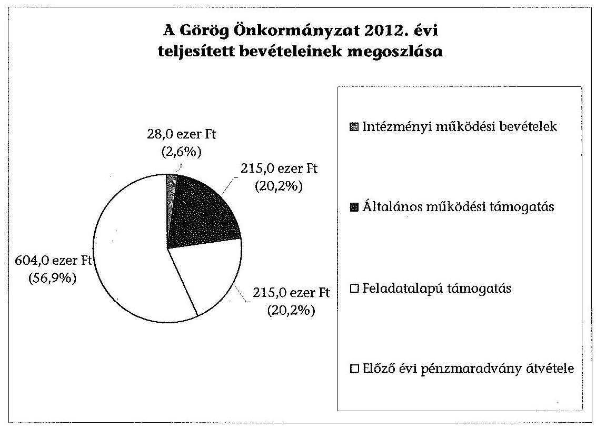
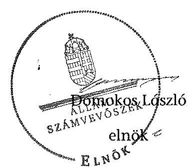

# ÁLLAMI   SZÁMVEVŐSZÉK 

## JELENTÉS

a helyi nemzetiségi önkormányzatok gazdálkodásának ellenőrzéséről
Budapest Főváros XVI. kerületi Görög Önkormányzat

---

# Állami Számvevőszék 

Iktatószám: V-0283-010/2014.
Témaszám: 1316
Vizsgálat-azonosító szám: V065236
Az ellenőrzést felügyelte:
Horváth Balázs
felügyeleti vezető
Az ellenőrzést vezette és az ellenőrzés végrehajtásáért felelős:
Kisgergely István
ellenőrzésvezető
A számvevőszéki jelentést készítették és a jelentés összeállításában
közremüködtek:
Varga József
számvevő tanácsos
Belovai Sándorné
számvevő főtanácsos
Az ellenőrzést végezte:
Szilas István
számvevő tanácsos

---

# TARTALOMJEGYZÉK 

BEVEZETÉS ..... 3
I. ÖSSZEGZŐ MEGÁLLAPÍTÁSOK, KÖVETKEZTETÉSEK, JAVASLATOK ..... 6
II. RÉSZLETES MEGÁLLAPÍTÁSOK ..... 14

1. A Görög Önkormányzat és a XVI. kerületi Önkormányzat együttműködésének szabályozása, a működési feltételek biztosítása ..... 14
2. A gazdálkodási feladatok ellátásának szabályszerűsége ..... 15
2.1. A költségvetésre és a zárszámadásra, valamint a kincstári adatszolgáltatás rendjére vonatkozó jogszabályi előírások betartása ..... 15
2.2. A Görög Önkormányzat gazdálkodásának szabályozottsága ..... 16
2.3. Az operatív gazdálkodási jogkörök kialakítása, gyakorlása ..... 17
3. A Görög Önkormányzattal összefüggő gazdálkodási feladatok belső ellenőrzése ..... 18
4. A feladatalapú támogatás felhasználásának, elszámolásának szabályszerűsége, a Görög Önkormányzat feladatellátása ..... 19

## MELLÉKLET

1. számú A Görög Önkormányzat 2012. évi gazdálkodásának főbb adatai, mutatói

## FÜGGELÉKEK

1. számú Rövidítések jegyzéke
2. számú Értelmező szótár
3. számú A gazdálkodás értékelésének módszere

---

.

---

# JELENTÉS   a helyi nemzetiségi önkormányzatok gazdálkodásának ellenőrzéséről Budapest Főváros XVI. Kerületi Görög Önkormányzat 

## BEVEZETÉS

A Görög Önkormányzat a 2002. évben alakult, elnöke a 2002. évi helyhatósági választások óta látja el feladatát. A Görög Önkormányzat intézményt, gazdasági társaságot és más szervezetet nem alapított. A négytagú Képviselő-testület munkája segítésére bizottságot nem hozott létre. A Görög Önkormányzatnak a költségvetési beszámolója szerint a 2012. évben a módosított költségvetési bevételi és kiadási előirányzata 1062 ezer Ft, a teljesített költségvetési bevétele 1062 ezer Ft, a teljesített költségvetési kiadása 877 ezer Ft volt. A 2012. évi gazdálkodási adatokat részletesen az 1. számú mellékletben mutatjuk be.

Az Alaptörvény XXIX. cikk (1) bekezdése szerint a Magyarországon élő nemzetiségek államalkotó tényezők. Minden, valamely nemzetiséghez tartozó magyar állampolgárnak joga van önazonossága szabad vállalásához és megőrzéséhez. A hazánkban élő nemzetiségek helyi (települési és területi), valamint országos önkormányzatokat hozhatnak létre. A helyi nemzetiségi önkormányzatok gazdálkodási feladatait jogszabályi előírás alapján a székhely szerinti helyi önkormányzat polgármesteri hivatala látja el.

A nemzetiségek helyzete, támogatása mind hazai, mind EU-s szinten kiemelt figyelmet kap napjainkban. A helyi nemzetiségi önkormányzatok gazdálkodására és támogatási rendszerére vonatkozó jogszabályok a 2010-2012. években jelentős változásokon mentek át. A települési és területi nemzetiségi önkormányzatok gazdálkodásának, a részükre juttatott költségvetési támogatások felhasználásának ellenőrzését az ÁSZ a 2012. évben sorozatjellegú ellenőrzés keretében indította el. A 2013. évi ellenőrzések e témacsoportos ellenőrzések folytatását jelentik, amelyet az ÁSZ 2014 első félévi ellenőrzési terve 12. témasorszámon tartalmaz.

Az ellenőrzés célja annak értékelése volt, hogy a Görög Önkormányzat gazdálkodási kereteinek kialakítása, gazdálkodása és feladatellátása megfelelte a jogszabályoknak.

Ennek keretében értékeltük, hogy:

- a Görög Önkormányzat és a XVI. kerületi Önkormányzat együttműködésének szabályozása, a múködési feltételek biztosítása megfelelt-e a jogszabályi előírásoknak;

---

- a felek együttmúködése megfelelt-e a közöttük létrejött megállapodásnak a gazdálkodási feladatok szabályszerű ellátása során, ennek keretében betartották-e a Görög Önkormányzat gazdálkodásához kapcsolódóan a költségvetésre és zárszámadásra, a gazdálkodás szabályozására, az operatív gazdálkodási jogkörök gyakorlására vonatkozó jogszabályi előírásokat;
- a jegyző biztosította-e a Görög Önkormányzat gazdálkodásának belső ellenőrzését;
- a Görög Önkormányzat feladatalapú támogatásának felhasználása, a folyósított feladatalapú támogatással történő elszámolás az előírásoknak megfelelő volt-e;
- a Görög Önkormányzat feladatellátása összhangban volt-e a vonatkozó jogszabályi előírásokkal.

Az ellenőrzés várható hasznosulását négy szinten tervezzük. A törvényalkotás számára összegzett tapasztalatok állnak rendelkezésre a nemzetiségi önkormányzatok testületi döntéseinek, gazdálkodásának és a feladatalapú támogatás felhasználásának szabályszerűségéről, amelynek alapján következtetést lehet levonni arra, hogy indokolt-e jogszabályi módosítás kezdeményezése. Az ellenőrzés az ellenőrzött számára visszajelzést ad a működésében fellépő hiányosságokról, javaslataival hozzájárul azok kiküszöböléséhez, amely csökkentheti a későbbi ellenőrzések gyakoriságát. Az ellenőrzés megállapításai és javaslatai tanulságul szolgálhatnak más nemzetiségi önkormányzatok, szervezetek számára a rendezett gazdálkodási keretek kialakításához. A társadalom számára jelzi, hogy közpénz nem maradhat ellenőrizetlenül, az ÁSZ értékteremtő rend kialakításához és megőrzéséhez hozzájáruló tevékenysége pozitív hatással lesz a szervezetről kialakított összkép formálásában. Az ÁSZ szervezetén belül lehetőség nyílik arra, hogy a megállapítások szintetizálásával az intézmény a hozzáadott értéket teremtő elemző tevékenységét és tanácsadó szerepét erősítse.

A Görög Önkormányzat gazdálkodásának ellenőrzéséről szóló jelentés I. fejezetének összegző része az ellenőrzés céljára adott rövid, szintetizáló összefoglalót és következtetéseket tartalmazza a II. fejezet részletes megállapításain alapulóan. A jelentés intézkedést igénylő megállapításait és javaslatait - az összegzőben foglaltak mellett - az ellenőrzés során feltárt, a jelentés II. fejezetében rögzített részletes megállapítások alapozzák meg, illetve támasztják alá.

Az ellenőrzés típusa: szabályszerűségi ellenőrzés
Az ellenőrzött időszak: 2012. január 1. - 2012. december 31. közötti időszak. Az ellenőrzés kiterjedt a Görög Önkormányzatnak juttatott 2012. évi támogatás 2013. évben való elszámolására is.

Ellenőrzött szervezet: Budapest Főváros XVI. Kerületi Görög Önkormányzat és a gazdálkodási feladatait ellátó Budapest Főváros XVI. Kerületi Önkormányzat.

Az ellenőrzés végrehajtásának jogszabályi alapját az ÁSZ tv. 5. § (2)-(3) és (6) bekezdéseiben foglaltak képezik.

---

Az ellenőrzés szakmai módszertana az ÁSZ hivatalos honlapján (www.asz.hu) közzétett szakmai szabályokon alapult, amely a Legfőbb Ellenőrző Intézmények Nemzetközi Szervezete (INIOSAI) által kiadott nemzetközi standardok (ISSAI) figyelembevételével készült.

A helyi nemzetiségi önkormányzatok gazdálkodásának ellenőrzése során értékeltük a XVI. kerületi Önkormányzat és a Görög Önkormányzat együttmúködésének, a gazdálkodás szabályozottságának és a pénzügyi folyamatokban kulcsszerepet betöltő belső kontrollok (teljesítésigazolás és érvényesítés) múködésének megfelelőségét. A kulcskontrollokat a múködési és felhalmozási célú támogatásértékű kiadásoknál, az államháztartáson kívülre teljesített múködési és felhalmozási célú pénzeszköz átadásoknál, a dologi kiadásokkal kapcsolatos kifizetéseknél - véletlen mintavételi eljárást alkalmazva - ellenőriztük. Ellenőriztük, hogy a jegyző biztosította-e a Görög Önkormányzat gazdálkodásának belső ellenőrzését. Értékeltük a feladatalapú támogatások felhasználásának, elszámolásának szabályszerűségét, a Görög Önkormányzat feladatellátása és a jogszabályi előírások összhangját.

Az ellenőrzés lefolytatásához a Görög Önkormányzat és a gazdálkodási feladatait ellátó XVI. kerületi Önkormányzat tanúsítványok és a kapcsolódó, dokumentumjegyzékben megjelölt dokumentumok elektronikus úton történő megküldésével, rendelkezésre bocsátásával szolgáltatott adatokat. Az adatszolgáltatás kontrollálása és szükség szerinti javítása a helyszíni ellenőrzés keretében történt. A minősítési szempontokat a 3. számú függelék tartalmazza.

Az ÁSZ tv. 29. § (1) bekezdése szerint a jelentéstervezetet megküldtük a polgármester és a Nemzetiségi Önkormányzat elnöke részére, akik az ÁSZ tv. 29. § (2) bekezdésében foglalt észrevételezési jogukkal nem éltek, a jelentéstervezetre észrevételt nem tettek.

---

# I. ÖSSZEGZŐ MEGÁLLAPÍTÁSOK, KÖVETKEZTETÉSEK, JAVASLATOK 

A Görög Önkormányzat és a XVI. kerületi Önkormányzat együttmüködésének szabályozása részben felelt meg a jogszabályi előírásoknak. Az együttmúködési megállapodás ${ }_{1,2}$ a 2012. év egészére hatályban volt, de az együttmúködési megállapodás ${ }_{1}$-et a Nek. ${ }_{2}$ tv. előírása ellenére 2012. január 31-éig nem vizsgálták felül, az együttműködési megállapodás ${ }_{2}$ aláírása a törvényben meghatározott 2012. június 1-jei határidőt követően, augusztus 16-án történt meg. A 2012. december 31-én hatályos együttműködési megállapodás ${ }_{2}$-ben a Görög Önkormányzat múködési feltételeit az előírásoknak megfelelően szabályozták, azonban ezt - a Nek. ${ }_{2}$ tv.-ben előírtak ellenére - az együttmúködési megállapodás megkötését követő harminc napon belül, illetve a helyszíni ellenőrzés időpontjáig a Görög Önkormányzat SZMSZ-ében nem rögzítették. Az előírt tervezési, gazdálkodási, finanszírozási, adatszolgáltatási és beszámolási feladatok ellátásának szabályait csak részben rögzítették az együttműködési megállapo-dás ${ }_{2}$-ban, mert hiányoztak a teljesítésigazolásra, a kötelezettségvállalások nyilvántartására vonatkozó szabályok. A Nek. ${ }_{2}$ tv. előírása ellenére a megállapodás nem tartalmazta, hogy a jegyző vagy - a jegyzővel azonos képesítési előírásoknak megfelelő - megbízottja a Görög Önkormányzat Képviselő-testületi ülésein a XVI. kerületi Önkormányzat megbízásából és képviseletében részt vesz és jelzi amennyiben törvénysértést észlel. A Görög Önkormányzat múködésének személyi és tárgyi feltételeit a szabályozási hiányosságok ellenére biztosították.

A Görög Önkormányzat 2012. évi költségvetésének és zárszámadásának jóváhagyása, valamint a kapcsolódó 2012. évi adatszolgáltatás szabályszerűsége, a kapcsolódó határidők betartása megfelelő volt, azonban a feladatalapú támogatás elszámolása nem történt meg. A költségvetés és a zárszámadás előterjesztése alapvetően megfelelt a jogszabályi előírásoknak, de az Áht. ${ }_{2}$ előírása ellenére nem csatolták a helyi önkormányzat költségvetési mérlegét közgazdasági tagolásban, valamint az előirányzat felhasználási tervet. A jegyző a Görög Önkormányzat részére előírt, a gazdálkodással összefüggő 2012. évi adatszolgáltatásokat az előírt határidőkre teljesítette a Kincstár felé.

A Görög Önkormányzat gazdálkodásának szabályozottsága nem volt megfelelő, mert a Polgármesteri Hivatal SZMSZ-e az Ávr. előírása ellenére nem tartalmazta az SZMSZ-ben nevesített munkakörökhöz tartozó, a Görög Önkormányzat gazdálkodásával kapcsolatos feladat- és hatáskörökre, a hatáskörök gyakorlásának módjára, a helyettesítés rendjére, az ezekhez kapcsolódó felelősségi szabályokra vonatkozó előírásokat. A gazdálkodásra vonatkozó szabályozás az Ávr. előírása ellenére nem tartalmazta a teljesítésigazolás gyakorlásának módjával, eljárási és dokumentációs részlet-szabályaival, valamint a teljesítésigazolást végző személyek kijelölésével kapcsolatos rendelkezéseket. A jegyző a Görög Önkormányzat gazdálkodási feladataira nem terjesztette ki a Bkr.ben előírt ellenőrzési nyomvonalat és a szabálytalanságok kezelésének eljárásrendjét. A Görög Önkormányzat rendelkezett számviteli politikával és a kapcsolódó leltározási és leltárkészítési-, az eszközök és források értékelési szabály-

---

zatával, pénzkezelési szabályzattal és számlarenddel. A Polgármesteri Hivatal SZMSZ-ében rögzítették a tervezéssel, gazdálkodással, a pénzügyi ellenjegyzéssel, az érvényesítés módjával, eljárási és dokumentálási részletszabályaival, valamint az ezeket végző személyek kijelölésének rendjével, az ellenőrzési és adatszolgáltatási feladatok teljesítésével kapcsolatos belső előírásokat.

A Görög Önkormányzatnál az operatív gazdálkodási jogkörök kialakítása részben felelt meg a jogszabályi előírásoknak, mert a Görög Önkormányzat elnöke az Áht. ${ }_{2}$ és az Ávr. előírásainak ellenére nem jelölt ki teljesítést igazoló személyt. Hiányoztak a teljesítésigazolás gyakorlásának módjára, eljárási és dokumentációs részletszabályaira vonatkozó rendelkezések, nem állt rendelkezésre a teljesítésigazoló aláírás mintája és a Görög Önkormányzat által vállalt kötelezettségekről nem vezették az Ávr.-ben előírt nyilvántartást. A jegyző a jogszabályi előírásoknak megfelelően kijelölte a pénzügyi ellenjegyzésre és az érvényesítésre jogosultakat.

Az államháztartáson kívülre teljesített pénzeszköz átadások banki utalásakor a teljesítésigazolás és az érvényesítés kulcskontrollok működése nem volt megfelelő, mert a támogatás átutalására az Ávr. előírása ellenére teljesítésigazolás nélkül került sor, az érvényesítő az Ávr. szerinti ellenőrzési feladatát nem látta el, mert nem észrevételezte, hogy nem történt meg a teljesítés igazolása, valamint azt, hogy az utalványrendeleten nem tüntették fel a kötelezettségvállalás nyilvántartási számát.

A dologi kiadások teljesítése során a teljesítésigazolás és az érvényesítés kulcskontrollok múködésének megfelelősége gyenge volt, a hibák száma a lényegességi szintet, a kritikus hibahatárt elérte. Az Ávr. előírása ellenére a teljesítés igazolását a jogkör gyakorlására kijelöléssel nem rendelkező személy látta el, az érvényesítő nem az Ávr. előírásai alapján végezte feladatát, mert nem a teljesítés igazolása alapján érvényesített, nem állt rendelkezésére a teljesítésigazoló aláírás mintája, továbbá nem észrevételezte, hogy a teljesítésigazolás szabálytalan volt, nem jelezte a kötelezettségvállalási nyilvántartás vezetésének és a kiadási pénztárbizonylatokon a nyilvántartási szám feltüntetésének a hiányát.

A dologi kiadások közül kiválasztott három legnagyobb összegű kifizetés esetében a teljesítésigazolás és az érvényesítés kulcskontrollok múködése nem volt megfelelő. Az Ávr. előírásai ellenére a teljesítésigazoló nem volt írásban kijelölve, az érvényesítő nem jelezte, hogy a teljesítésigazolást jogszerű kijelöléssel nem rendelkező személy végezte, nem állt rendelkezésére a teljesítésigazoló aláírás mintája, továbbá nem észrevételezte, hogy a teljesítésigazolás szabálytalan volt, nem jelezte a kötelezettségvállalási nyilvántartás vezetésének és a kiadási pénztárbizonylatokon a nyilvántartási szám feltüntetésének a hiányát.

A számvevőszéki ellenőrzés a kiadások dokumentumainak ellenőrzése alapján összeférhetetlenséget, továbbá jogosulatlan kifizetést nem tárt fel, a kulcskontrollok múködéséhez kapcsolódó hiányosságok miatt nem biztosították a hibák megelőzését, feltárását és kijavítását.

A belső ellenőrzési tevékenység megfelelő volt, az együttműködési megállapodás ${ }_{1,2}$-ben rögzítették, hogy a Görög Önkormányzat számviteli nyilvántartá-

---

sainak ellenőrzésére kiterjed a Polgármesteri Hivatal belső ellenőrzési tevékenysége. A jegyző a Polgármesteri Hivatal belső ellenőrzése keretében biztosította a Görög Önkormányzat gazdálkodásával összefüggő végrehajtási feladatok belső ellenőrzését. A Polgármesteri Hivatal belső ellenőrzési tervét megalapozó kockázatelemzés nem terjedt ki a Görög Önkormányzat gazdálkodásával összefüggő végrehajtási feladatokra. Az ellenőrzési terv a kerületnél múködő tíz nemzetiségi önkormányzatra kiterjedően egy ellenőrzést tartalmazott. Az ellenőrzés céljaként „a költségvetési juttatások megalapozottsága dokumentálás, koordináció, elszámolás, könyvelés bizonylatainak megléte szabályossága" került megfogalmazásra. Az ellenőrzésről készült jelentés hiányosságokat állapított meg, javaslatokat tett, de a feltárt hiányosságok megszüntetésére intézkedési terv készítését nem írta elő, továbbá az ellenőrzésről a jegyző nem tájékoztatta a nemzetiségi önkormányzatok elnökeit, így a Görög Önkormányzat elnökét sem, ezért a belső ellenőrzési jelentés elkészítésekor hatályos együttműködési megállapodás ${ }_{1} 6$. pontjában foglaltak végrehajtása elmaradt.

Az ellenőrzéshez szolgáltatott adatok alapján a Kormányhivatal 2012-ben a Görög Önkormányzatot illetően nem élt törvényességi felügyeleti eszközökkel.

A Görög Önkormányzat részére 2011. és 2012. évben folyósított feladatalapú támogatás elszámolása nem felelt meg a jogszabályi előírásoknak. Az ÁSZ ellenőrzés számára rendelkezésre bocsátott dokumentum szerint a Görög Önkormányzat 2011. évi 427,2 ezer Ft feladatalapú támogatás kötelezettségvállalással nem terhelt maradványa 189,4 ezer Ft volt, amely 2012. II. negyedévében felhasználásra került. A 2012. évi 214,5 ezer Ft feladatalapú támogatást a Görög Önkormányzat határozatainak megfelelően államháztartáson kívüli szervezetek nemzetiségi feladatokkal összefüggő támogatására és anyaországi kapcsolattartás költségeinek finanszírozására fordították, maradvány 2012. december 31 -én nem volt.

A 2011. évi feladatalapú támogatás elszámolása a támogatási kormányrende-let ${ }_{1}$-ben hivatkozott, valamint a 2012. évi feladatalapú támogatás elszámolása a támogatási kormányrendelet,-ben hivatkozott „a helyi önkormányzatok elszámolási és ellenőrzési rendjére vonatkozó jogszabályok rendelkezései alkalmazandóak" előírása alapján az Áht. ${ }_{1}$ és az Áht. ${ }_{2}$ rendelkezései ellenére nem történt meg. A támogatás felhasználását, elszámolását az arra jogosult külső szervek nem ellenőrizték. A Görög Önkormányzat kötelező és önként vállalt feladatellátásának tárgya összhangban volt a Nek. ${ }_{2}$ tv.-ben foglalt előírásokkal, Nek. ${ }_{2}$ tv.-ben tiltott hatósági feladatokat nem végzett.

Az ÁSZ tv. 33. § (1) bekezdésében foglaltak értelmében az ellenőrzött szervezet vezetője köteles a jelentésben foglalt megállapításokhoz kapcsolódó intézkedési tervet összeállítani és azt a jelentés kézhezvételétől számított 30 napon belül az ÁSZ részére megküldeni. Amennyiben az intézkedési tervet határidőre nem küldi meg a szervezet, vagy az nem elfogadható, az ÁSZ elnöke az ÁSZ tv. 33. § (3) bekezdés a)-b) pontjaiban foglaltakat érvényesítheti.

---

A helyszíni ellenőrzés megállapításainak hasznosítása mellett javasoljuk:

# a jegyzönek 

1. az együttműködés szabályozásával kapcsolatban

A Nek. 2 tv. 80. § (2) bekezdésében foglaltak ellenére az együttmúködési megállapodás szerinti müködési feltételeket nem rögzítették a Görög Önkormányzat SZMSZében.

A Nek. 2 tv. 80. § (3) bekezdésének b) és c) pontjaiban foglaltak ellenére az együttmúködési megállapodás ${ }_{2}$-ben nem rögzítették a kötelezettségvállalás nyilvántartás szabályait, a teljesítésigazolási feladatokat, a felelősök konkrét kijelölését, továbbá a nyilvántartási kötelezettségek közül a kötelezettségvállalások nyilvántartását. A Nek. ${ }_{2}$ tv. 80. § (4) bekezdésében foglaltak ellenére az együttmúködési megállapodás ${ }_{2}$ nem tartalmazta, hogy a jegyző, vagy - a jegyzővel azonos képesítési előírásoknak megfelelő - megbízottja a Görög Önkormányzat Képviselő-testületi ülésein a XVI. kerületi Önkormányzat megbízásából és képviseletében részt vesz és jelzi amennyiben törvénysértést észlel.

Az együttműködési megállapodás ${ }_{1}$-t a Nek. ${ }_{2}$ tv. 80. § (2) bekezdésének előírása ellenére 2012. január 31 -éig nem vizsgálták felül.

Javaslat
Az együttműködés szabályszerűsége érdekében:
a) készítse elő az együttműködési megállapodás ${ }_{2}$ módosítását, hogy az tartalmilag feleljen meg a Nek. ${ }_{2}$ tv. 80. § (3) bekezdés b) és c) pontjaiban, valamint a Nek. ${ }_{2}$ tv. 80. § (4) bekezdésében foglalt előírásoknak;
b) készítse elő a Görög Önkormányzat SZMSZ-ének kiegészítését a Nek. ${ }_{2}$ tv. 80. § (2) bekezdésében foglalt előírás alapján;
c) biztosítsa a jövőben az évenkénti felülvizsgálat során az együttműködési megállapodás Nek. ${ }_{2}$ tv. 80. § (2) bekezdésében előírt határidő betartását.
2. a költségvetési határozattal kapcsolatban

A 2012. évi költségvetés előterjesztésekor - a jegyző mulasztása miatt - az Áht. ${ }_{2}$ 24. § (4) bekezdés a) pontjában foglaltak ellenére nem mutatták be szöveges indoklással együtt a Képviselő- testület részére tájékoztatásul a Görög Önkormányzat költségvetési mérlegét közgazdasági tagolásban, valamint az előirányzat felhasználási tervet.

Javaslat
A jövőben gondoskodjon arról, hogy a költségvetés előterjesztésekor a Képviselő testület részére tájékoztatásul mutassák be - szöveges indoklással együtt - az Áht. ${ }_{2}$ 24. § (4) bekezdés a) pontjában foglaltaknak megfelelően a költségvetési mérleget közgazdasági tagolásban és az előirányzat felhasználási tervet.

---

3. a gazdálkodás szabályozottságával kapcsolatban

A Polgármesteri Hivatal SZMSZ-e nem tartalmazta az Ávr. 13. § (1) bekezdés g) pontjában foglaltak szerinti, az SZMSZ-ben nevesített munkakörökhöz tartozó - a Görög Önkormányzat gazdálkodásával kapcsolatos - feladat- és hatáskörökre, a hatáskörök gyakorlásának módjára, a helyettesítés rendjére, az ezekhez kapcsolódó felelősségi szabályokra vonatkozó előírásokat. A Bkr. 6. § (3)-(4) bekezdései szerinti ellenőrzési nyomvonal és szabálytalanságok kezelésének eljárásrendje nem terjedt ki a Görög Önkormányzat gazdálkodási feladataira.

A Görög Önkormányzat gazdálkodására vonatkozó számviteli politika az Ávr. 13. § (2) bekezdés a) pontjában foglaltak ellenére nem tartalmazta a teljesítésigazolás gyakorlásának módjával, eljárási és dokumentációs részletszabályaival, valamint a teljesítésigazolást végző személyek kijelölésével kapcsolatos rendelkezéseket.

Javaslat
A gazdálkodás szabályszerűsége érdekében a Görög Önkormányzat gazdálkodási feladataira kiterjedően:
a) készítse elő a Polgármesteri Hivatal SZMSZ-ének módosítását, hogy az tartalmazza az Ávr. 13. § (1) bekezdés g) pontjában foglaltakat;
b) módosítsa a Polgármesteri Hivatal Bkr. 6. § (3)-(4) bekezdései szerinti ellenőrzési nyomvonalat és a szabálytalanságok kezelésének eljárásrendjét;
c) egészítse ki a számviteli politikát az Ávr. 13. § (2) bekezdés a) pontjában foglaltaknak megfelelően.
4. a kulcskontrollok múködésével kapcsolatban

A teljesítésigazolást az Ávr. 57. § (1) és (3) bekezdésében foglaltak ellenére nem végezték el, illetve nem az Ávr. 57. § (4) bekezdése szerinti szabályszerű kijelöléssel rendelkező személy végezte, ezért nem, illetve nem szabályszerűen történt a kifizetés jogosságának, összegszerűségének és a szerződésszerű teljesítésnek az igazolása.

Az érvényesítő nem az Ávr. 58. § (1)-(2) bekezdése előírásainak megfelelően látta el feladatát, mert teljesítésigazolás hiányában érvényesített, valamint nem jelezte, hogy nem, illetve nem szabályszerűen történt a teljesítésigazolás, a teljesítésigazoló aláírás mintája nem állt rendelkezésére, a kötelezettségvállalási nyilvántartást nem vezették és a kötelezettségvállalás nyilvántartási számát nem tüntették fel az utalványrendeleteken és a pénztárbizonylatokon.

---

# Javaslat 

Az operatív gazdálkodás múködési hibáinak megelőzése, feltárása és kijavítása érdekében gondoskodjon arról, hogy:
a) a teljesítésigazolást az Ávr. 57. § (4) bekezdése szerinti kijelöléssel rendelkező személy az Ávr. 57. § (1) és (3) bekezdése előírásai szerinti feladatát minden esetben végezze el;
b) az érvényesítő az Ávr. 58. § (1)-(2) bekezdésének megfelelően maradéktalanul tegyen eleget ellenőrzési és jelzési kötelezettségének.
5. a feladatalapú támogatás elszámolásával kapcsolatban

A 2011. évi feladatalapú támogatás elszámolása a támogatási kormányrendelet ${ }_{1}$ 7. § (2) bekezdésében hivatkozott, valamint a 2012. évi feladatalapú támogatás elszámolása a támogatási kormányrendelet ${ }_{2}$ 8. § (5) bekezdésében hivatkozott „a helyi önkormányzatok elszámolási és ellenőrzési rendjére vonatkozó jogszabályok rendelkezései alkalmazandóak" előirása alapján az Áht. ${ }_{1} 64 . \S$ (7) bekezdése, és az Áht. ${ }_{2}$ 57. § (3) bekezdése ellenére nem történt meg.

Javaslat
Gondoskodjon az Áht. ${ }_{2}$ 27. § (2) bekezdésében meghatározott feladatkörében a Görög Önkormányzat által igénybevett 2011. és 2012. évi feladatalapú támogatás rendeltetésszerű felhasználásáról szóló elszámolásának elkészítéséről az Áht. ${ }_{2}$ 53. § (1) bekezdése szerinti beszámolási kötelezettség teljesítéséhez.

## a polgármesternek

A Nek. ${ }_{2}$ tv. 80. § (3) bekezdésének b) és c) pontjaiban foglaltak ellenére az együttműködési megállapodás ${ }_{2}$-ben nem rögzítették a kötelezettségvállalás nyilvántartás szabályait, a teljesítésigazolási feladatokat, a felelősök konkrét kijelölését, továbbá a nyilvántartási kötelezettségek közül a kötelezettségvállalások nyilvántartását. A Nek. ${ }_{2}$ tv. 80. § (4) bekezdésében foglaltak ellenére az együttműködési megállapodás ${ }_{2}$ nem tartalmazta, hogy a jegyző, vagy - a jegyzővel azonos képesítési előírásoknak megfelelő - megbízottja a Görög Önkormányzat Képviselő-testületi ülésein a XVI. kerületi Önkormányzat megbízásából és képviseletében részt vesz és jelzi amennyiben törvénysértést észlel.

A Polgármesteri Hivatal SZMSZ-e nem tartalmazta az Ávr. 13. § (1) bekezdés g) pontjában foglaltak szerinti, az SZMSZ-ben nevesített munkakörökhöz tartozó - a Görög Önkormányzat gazdálkodásával kapcsolatos - feladat- és hatáskörökre, a hatáskörök gyakorlásának módjára, a helyettesítés rendjére, az ezekhez kapcsolódó felelősségi szabályokra vonatkozó előírásokat.

---

Javaslat
Terjessze a XVI. Kerületi Önkormányzat Képviselő-testülete elé jóváhagyásra:
a) a jegyző által előkészített együttműködési megállapodás ${ }_{2}$ módosítását, hogy az tartalmilag megfeleljen a Nek. 2 tv. 80. § (3) bekezdés b) és c) pontjaiban, valamint a Nek. 2 tv. 80. § (4) bekezdésében foglalt előírásoknak;
b) a Polgármesteri Hivatal SZMSZ-e jegyző által előkészített módosítását, hogy az tartalmazza az Ávr. 13. § (1) bekezdés g) pontjában foglaltakat.

# a Nemzetiségi Önkormányzat elnökének 

1. A Nek. 2 tv. 80. § (3) bekezdésének b) és c) pontjaiban foglaltak ellenére az együttmúködési megállapodás ${ }_{2}$-ben nem rögzítették a kötelezettségvállalás nyilvántartás szabályait, a teljesítésigazolási feladatokat, a felelősök konkrét kijelölését, továbbá a nyilvántartási kötelezettségek közül a kötelezettségvállalások nyilvántartását. A Nek. 2 tv. 80. § (4) bekezdésében foglaltak ellenére az együttmüködési megállapodás ${ }_{2}$ nem tartalmazta, hogy a jegyző, vagy - a jegyzővel azonos képesítési előírásoknak megfelelő - megbízottja a Görög Önkormányzat Képviselő-testületi ülésein a XVI. kerületi Önkormányzat megbízásából és képviseletében részt vesz és jelzi amennyiben törvénysértést észlel.

Javaslat
Terjessze a Képviselő-testület elé jóváhagyásra:
a) az együttműködési megállapodás ${ }_{2}$ jegyző által előkészített módosítását, hogy az tartalmilag megfeleljen a Nek. 2 tv. 80. § (3) bekezdés b) és c) pontjaiban, valamint a Nek. 2 tv. 80. § (4) bekezdésében foglalt előírásoknak;
b) a Görög Önkormányzat SZMSZ-ének a Nek. 2 tv. 80. § (2) bekezdésében foglaltaknak megfelelő jegyző által előkészített módosítását.
2. A 2012. évi költségvetés előterjesztésekor - a jegyző mulasztása miatt - az Áht. 2 24. § (4) bekezdés a) pontjában foglaltak ellenére nem mutatták be szöveges indoklással együtt a Képviselő- testület részére tájékoztatásul a Görög Önkormányzat költségvetési mérlegét közgazdasági tagolásban, valamint az előirányzat felhasználási tervet.

Javaslat
Terjessze a jövőben a költségvetés előterjesztésekor a Képviselő testület részére tájékoztatásul az Áht. 2 24. § (4) bekezdés a) pontjában foglaltaknak megfelelően a jegyző által előkészített költségvetési mérleget közgazdasági tagolásban és az előirányzat felhasználási tervet szöveges indoklással együtt.
3. A Görög Önkormányzat elnöke, mint kötelezettségvállaló az Ávr. 57. § (4) bekezdésében foglalt előírások ellenére nem jelölte ki írásban a teljesítésigazolót.

---

Javaslat
Jelölje ki az Ávr. 57. § (4) bekezdésében foglalt előírásoknak megfelelően írásban a teljesítésigazolókat.
4. A 2011. évi feladatalapú támogatás elszámolása a támogatási kormányrendelet ${ }_{1}$ 7. § (2) bekezdésében hivatkozott, valamint a 2012. évi feladatalapú támogatás elszámolása a támogatási kormányrendelet ${ }_{2} 8 . \S$ (5) bekezdésében hivatkozott „a helyi önkormányzatok elszámolási és ellenőrzési rendjére vonatkozó jogszabályok rendelkezései alkalmazandóak" előírása alapján az Áht. ${ }_{1} 64 . \S$ (7) bekezdése, és az Áht. ${ }_{2}$ 57. § (3) bekezdése ellenére nem történt meg.

Javaslat
Terjessze a Képviselő-testület elé az Áht. 2 53. § (1) bekezdése szerinti beszámolási kötelezettség teljesítéséhez összeállított, a Görög Önkormányzat által igénybevett 2011. és 2012. évi feladatalapú támogatás rendeltetésszerú felhasználásáról szóló elszámolást.

---

# II. RÉSZLETES MEGÁLLAPÍTÁSOK 

## 1. A GÖRÖG ÖNKORMÁNYZAT ÉS A XVI. KERÜLETI ÖNKORMÁNYZAT EGYÜTTMÜKÖDÉSÉNEK SZABÁLYOZÁSA, A MÜKÖDÉSI FELTÉTELEK BIZTOSÍTÁSA

A Görög Önkormányzat és a XVI. kerületi Önkormányzat együttműködésének szabályozása részben felelt meg a jogszabályi előírásoknak.

A Görög Önkormányzat a 2012. évben rendelkezett érvényes együttmúködési megállapodással. Az együttműködési megállapodás ${ }_{1}$ a Nek. ${ }_{1}$ tv előírásai alapján készült, a polgármester és az elnök 2010. december 20-án írta alá́ ${ }^{1}$. A Nek. ${ }_{2}$ tv. 80. § (2) bekezdésében előírt határidőig az együttműködési megállapodás ${ }_{1}$-t nem vizsgálták felül, az új együttműködési megállapodás ${ }_{2}-t^{2}$ a Nek. ${ }_{2}$ tv. 159. § (3) bekezdésében rögzített június 1-jei határidőt követően ${ }^{3}$ írták alá. A késedelmes aláírás miatt a Kormányhivatal nem kezdeményezett egyeztetést.

A 2012. december 31-én hatályos együttműködési megállapodás ${ }_{2}$ tartalmazta a Nek. ${ }_{2}$ tv. által meghatározott személyi és tárgyi müködési feltételek biztosítását. A XVI. kerületi Önkormányzat az együttműködési megállapodás ${ }_{2}$-ben vállalta a technikai eszközökkel felszerelt helyiség ingyenes biztosítását, a rezsiköltségek fizetését, a testületi ülések előkészítését, a kapcsolódó adminisztrációs és postázási feladatok ellátását. A helyiség és a technikai eszközök átadásának dokumentumai nem álltak rendelkezésre.

Az Áht. ${ }_{2}$-ben előírt tervezési, gazdálkodási, finanszírozási, adatszolgáltatási és beszámolási feladatok ellátásának szabályait az együttműködési megállapodásban csak részben rögzítették. Az önálló fizetési számla nyitása és a Görög Önkormányzat törzskönyvi bejegyzése és adószámmal való ellátása megtörtént. A megállapodás szerint a Görög Önkormányzat részéről kötelezettségvállalásra, utalványozásra az elnök jogosult, az ellenjegyzési, érvényesítési feladatokat a XVI. kerületi Önkormányzat jegyző által kijelölt munkatársai látják el.

Nem tartalmazta az együttműködési megállapodás ${ }_{2}$ :

- a Nek. ${ }_{2}$ tv 80. § (3) bekezdés b) pontjában foglaltak ellenére a teljesítésigazolási feladatokat;

[^0]
[^0]:    1 A Budapest Főváros XVI. kerületi Önkormányzat Képviselő-testülete 162/2010. (12. 8.) sz. határozata és a Görög Önkormányzat Képviselő testülete 23/2010. (11. 29.) GÖ sz. határozata alapján.
    ${ }^{2}$ Az együttműködési megállapodást a 266/2012. (5. 30.) sz. határozatával a XVI. kerületi Önkormányzat Képviselő-testülete, illetve a Görög Önkormányzat Képviselő testülete a 16/2012. (8. 15.) GÖ sz. határozatával jóváhagyta.
    ${ }^{3}$ 2012. augusztus 16-án

---

- a Nek. ${ }_{2}$ tv 80. § (3) bekezdés c) pontjában foglaltak ellenére nem írták elő a Görög Önkormányzat kötelezettségvállalásaihoz kapcsolódó nyilvántartási kötelezettségeket.

A személyi feltételek biztosításának részeként a XVI. kerületi Önkormányzat vállalta referens kijelölését, azonban a Nek. ${ }_{2}$ tv. 80. § (4) bekezdésében foglaltak ellenére a megállapodás ${ }_{2}$ nem tartalmazta, hogy a jegyző vagy - a jegyzővel azonos képesítési előírásoknak megfelelő - megbízottja a Görög Önkormányzat Képviselő-testületi ülésein a XVI. kerületi Önkormányzat megbízásából és képviseletében részt vesz a nemzetiségi önkormányzat testületi ülésen és jelzi amennyiben törvénysértést észlel.

A Nek. ${ }_{2}$ tv. 80. § (2) bekezdésében foglalt előírás ellenére a Görög Önkormányzat SZMSZ-ében nem rögzítették az együttmúködési megállapodás ${ }_{2}$ szerinti múködési feltételeket a megkötését követő harminc napon belül, illetve a helyszíni ellenőrzés időpontjáig.

A Görög Önkormányzat múködésének személyi és tárgyi feltételeit az együttmúködési megállapodás ${ }_{2}$ feltárt hiányossága, és a helyiség, illetve technikai eszközök dokumentált átadás-átvételének hiányában is biztosították a Görög Önkormányzat elnökének és a jegyzőnek a nyilatkozata alapján.

# 2. A GAZDÁLKODÁSI FELADATOK ELLÁTÁSÁNAK SZABÁLYSZERŰSÉGE 

### 2.1. A költségvetésre és a zárszámadásra, valamint a kincstári adatszolgáltatás rendjére vonatkozó jogszabályi előírások betartása

A Görög Önkormányzat 2012. évi költségvetésének és zárszámadásának tartalma, jóváhagyása, valamint a kapcsolódó 2012. évi adatszolgáltatás szabályszerűsége megfelelt a jogszabályi előírásoknak, azonban a feladatalapú támogatás elszámolása nem történt meg.

Az elnök a 2012. évi költségvetés tervezetét az Áht. ${ }_{2}$ előírásainak megfelelően határidőben benyújtotta a Képviselő-testületnek. A jóváhagyott költségvetés ${ }^{4}$ tartalmazta az Áht. ${ }_{2}$-ben és az Ávr.-ben előírt tartalmi elemeket; a költségvetési bevételeket és azokkal megegyező összegű költségvetési kiadásokat elői-rányzat-csoportok, kiemelt előirányzatok szerinti bontásban. A 2012. évi költségvetés előterjesztésekor - a jegyző mulasztása miatt - a Képviselő-testület részére az Áht. ${ }_{2} 24 . \S$ (4) bekezdés a) pontjában foglaltak ellenére nem csatolták a helyi önkormányzat költségvetési mérlegét közgazdasági tagolásban, valamint az előirányzat felhasználási tervet.

A jegyző által elkészített 2012. évi zárszámadási határozat tervezetet az elnök az Áht. ${ }_{2} 91$ § (1) bekezdésében előírt határidőn belül terjesztette a Képviselőtestület ${ }^{5}$ elé. A 2012. évi zárszámadási határozat tervezetének előterjesztésénél

[^0]
[^0]:    ${ }^{4}$ Elfogadása a 3/2012. (1. 16.) GÖ sz. határozattal történt.
    ${ }^{5}$ Elfogadása a 11/2013. (4. 20.) GÖ sz. határozattal történt.

---

a Képviselő-testület részére az előterjesztésben tájékoztatásul bemutatták az Áht. ${ }_{2}$-ben foglalt mérlegeket és kimutatásokat ${ }^{6}$. A zárszámadásról alkotott határozat az elfogadott költségvetéssel összehasonlítható módon készült, a zárszámadás a Görög Önkormányzat valamennyi bevételét és kiadását tartalmazta.

A Görög Önkormányzat a 2012. évre előírt kincstári adatszolgáltatási kötelezettségének hiánytalanul eleget tett, a 2012. évi elemi költségvetését, a féléves és éves beszámolóját, valamint az időközi költségvetési- és mérlegjelentéseket az Ávr. szerinti határidőig megküldte a Kincstár részére.

# 2.2. A Görög Önkormányzat gazdálkodásának szabályozottsága 

A Görög Önkormányzat gazdálkodásának szabályozottsága az ellenőrzött időszakban nem volt megfelelő, mivel:

- a Polgármesteri Hivatal SZMSZ-e nem tartalmazta az Ávr. 13 § (1) bekezdés g) pontjában foglaltak szerinti, az SZMSZ-ben nevesített munkakörökhöz tartozó - a Görög Önkormányzat gazdálkodásával kapcsolatos - feladat- és hatáskörökre, a hatáskörök gyakorlásának módjára, a helyettesítés rendjére, az ezekhez kapcsolódó felelősségi szabályokra vonatkozó előírásokat;
- a gazdálkodásra vonatkozó szabályokat tartalmazó számviteli politika az Ávr. 13. § (2) bekezdés a) pontjában foglaltak ellenére nem tartalmazta a teljesítésigazolás gyakorlásának módjával, eljárási és dokumentációs részletszabályaival, valamint a teljesítésigazolást végző személyek kijelölésével kapcsolatos rendelkezéseket;
- a jegyző a Görög Önkormányzat gazdálkodási feladataira nem terjesztette ki a Bkr. 6. § (3)-(4) bekezdéseiben előírt ellenőrzési nyomvonalat és a szabálytalanságok kezelésének eljárásrendjét.

A Görög Önkormányzat gazdálkodásának szabályozottsága annak ellenére nem volt megfelelő, hogy rendelkezett a Számv. tv. által előírt számviteli politikával ${ }^{7}$ és a kapcsolódó leltározási és leltárkészítési-, az eszközök és források értékelési szabályzatával, pénzkezelési szabályzattal és számlarenddel.

A Polgármesteri Hivatal SZMSZ-ében - a Görög Önkormányzat gazdálkodásával kapcsolatos feladat- és hatáskörökre, a hatáskörök gyakorlásának módjára, a helyettesítés rendjére vonatkozó előírások kivételével - rögzítették a tervezéssel, gazdálkodással, a pénzügyi ellenjegyzéssel, az érvényesítés módjával, eljárási és dokumentálási részletszabályaival, valamint az ezeket végző személyek kijelölésének rendjével, az ellenőrzési és adatszolgáltatási feladatok teljesítésével kapcsolatos belső előírásokat.

[^0]
[^0]:    ${ }^{6}$ Több éves kihatással járó döntések és közvetett támogatások a Görög Önkormányzatnál nem fordultak elő, befektetett eszközökkel és pénzügyi befektetésekkel nem rendelkeztek.
    ${ }^{7}$ 2012. február 21-én kiadott szabályzat

---

# 2.3. Az operatív gazdálkodási jogkörök kialakítása, gyakorlása 

A Görög Önkormányzat gazdálkodása tekintetében az operatív gazdálkodási jogkörök kialakítása részben felelt meg a jogszabályi előírásoknak, mivel a jegyző az Áht. ${ }_{2}$ és az Ávr. előírásainak megfelelően írásban kijelölte a Görög Önkormányzat kötelezettségvállalásaira és kifizetéseire vonatkozóan a pénzügyi ellenjegyzésre és az érvényesítésre jogosultakat, azonban:

- a Görög Önkormányzat elnöke mint kötelezettségvállaló az Ávr. 57. § (4) bekezdésében foglalt kijelölési kötelezettségének nem tett eleget, mivel írásban nem jelölt ki teljesítésigazolót;
- az Ávr. 60. § (3) bekezdésében előírt aláírás-minta nem állt rendelkezésre a teljesítésigazoló aláírásának azonosításához.

A Görög Önkormányzat által vállalt kötelezettségekről nem vezették az Ávr. 56. § (1) bekezdésében előírt nyilvántartást.

Az államháztartáson kívülre teljesített pénzeszköz átadások (könyvkiadás és rendezvény támogatása együttesen 215 ezer Ft összegben) teljesítése során a teljesítésigazolás és az érvényesítés kulcskontrollok müködése nem volt megfelelő, mert a támogatás átutalására teljesítésigazolás nélkül került sor. Az érvényesítő az Ávr. 58. § (1) bekezdésében foglalt ellenőrzési feladatát nem látta el, mert nem észrevételezte, hogy az Ávr. 57. § (3) bekezdése ellenére nem történt meg a teljesítés igazolása, valamint azt, hogy az utalványrendeleten az Ávr. 59. § (3) bekezdésének f) pontjában foglaltak ellenére nem tüntették fel a kötelezettségvállalás nyilvántartási számát.

A 2012. évben a dologi kiadások teljesítése során a teljesítésigazolás és az érvényesítés kulcskontrollok müködésének megfelelősége gyenge volt, a hibák száma a lényegességi szintet, a kritikus hibahatárt elérte.

A dologi kiadásokra teljesített kifizetések közül mintavétel alapján ellenőrzött kifizetések esetében:

- a teljesítés igazolását az Ávr. 57. § (4) bekezdésének előírása ellenére a jogkör gyakorlására kijelöléssel nem rendelkező személy látta el, ezért az Ávr. 57. § (1) bekezdésben foglaltak ellenére nem szabályszerűen történt a kifizetés jogosságának, összegszerűségének és a szerződésszerű teljesítésnek az igazolása;
- az érvényesítő nem az Ávr. 58. § (1) és (2) bekezdéseiben előírtak szerint végezte feladatát, mert nem a teljesítés igazolása alapján érvényesített, az Ávr. 60. § (3) bekezdésében foglaltak ellenére nem állt rendelkezésre a teljesítésigazoló aláírás mintája. Nem észrevételezte továbbá, hogy az Ávr. 57. § (1) és (3) bekezdései alapján előírt teljesítésigazolás szabálytalan volt, nem jelezte az Ávr. 56.§ (1) bekezdésben, valamint a gazdálkodási szabályzatban előírt kötelezettségvállalási nyilvántartás vezetésének és a kiadási pénztárbizonylatokon az Ávr. 59. § (3) bekezdés f) pontjában előírt kötelezettségvállalási nyilvántartási szám feltüntetésének a hiányát.

---

A Görög Önkormányzatnál a 2012. évben a dologi kiadások közül kiválasztott három legnagyobb összegű kifizetés esetében a teljesítésigazolás és az érvényesítés kulcskontrollok múködése nem volt megfelelő, mivel a teljesítésigazoló szabályszerű kijelölése az Ávr. 57. § (4) bekezdése ellenére nem történt meg. Az érvényesítő az Ávr. 58. § (1) - (2) bekezdései ellenére nem a teljesítésigazolás alapján érvényesített, nem észrevételezte, hogy a teljesítésigazolás szabálytalan volt. A teljesítésigazoló aláírás mintája az Ávr. 60. § (3) bekezdésében foglaltak ellenére nem állt rendelkezésére, továbbá, nem jelezte az Ávr. 56.§ (1) bekezdése ellenére a kötelezettségvállalási nyilvántartás vezetésének és a kiadási pénztárbizonylatokon az Ávr. 59. § (3) bekezdés f) pontjában előírt kötelezettségvállalási nyilvántartási szám feltüntetésének a hiányát.

A számvevőszéki ellenőrzés a kiadások dokumentumainak ellenőrzése alapján összeférhetetlenséget, továbbá jogosulatlan kifizetést nem tárt fel, a kulcskontrollok múködéséhez kapcsolódó hiányosságok miatt nem biztosították a hibák megelőzését, feltárását és kijavítását.

# 3. A GÖRÖG ÖNKORMÁNYZATTAL ÖSSZEFÜGGŐ GAZDÁLKODÁSI FELADATOK BELSŐ ELLENŐRZÉSE 

A Polgármesteri Hivatal belső ellenőrzése keretében végzett, a Görög Önkormányzat gazdálkodási feladataira kiterjedő belső ellenőrzés megfelelő volt, a jegyző a Polgármesteri Hivatal belső ellenőrzése keretében biztosította a Görög Önkormányzat gazdálkodásával összefüggő végrehajtási feladatok belső ellenőrzését.

Az együttműködési megállapodás ${ }_{1,2}$ tartalmazta, hogy a Polgármesteri Hivatal belső ellenőrzési tevékenysége kiterjed a Görög Önkormányzat számviteli nyilvántartásainak ellenőrzésére.

A belső ellenőrzési tervet a belső ellenőrzési vezető készítette és a jegyző ellenjegyzésével a polgármester 2011. október 11-én terjesztette a XVI. kerületi Önkormányzat Képviselő-testülete elé, azonban a Ber. 21. § (2) bekezdésében foglaltak ellenére - a belső ellenőrzési tervet megalapozó kockázatelemzés nem terjedt ki a nemzetiségi önkormányzatok gazdálkodásával összefüggő végrehajtási feladatokra.

A 2012. évi ellenőrzési terv a XVI. kerületben működő tíz nemzetiségi önkormányzatra kiterjedően egy ellenőrzést tartalmazott. Az ellenőrzés céljaként „a költségvetési juttatások megalapozottsága dokumentálás, koordináció, elszámolás, könyvelés bizonylatainak megléte szabályossága" került megfogalmazásra. Az ellenőrzés végrehajtására 2012. január 23-ától február 29-éig került sor, amelyről 2012. március 12-én készült jelentés. A jelentés nem tartalmazta, hogy a megállapítások ${ }^{8}$ mely nemzetiségi önkormányzatokat érintették és nem írta elő intézkedési terv készítését és az ellenőrzésről nem tájékoztatta a jegyző a nemzeti-

[^0]
[^0]:    ${ }^{8}$ Hiányosságként rögzítette, hogy az elszámolások nem tartalmazták a testületi határozatok számát, a teljesítésigazolást, nem vezettek nyilvántartást a kis értékủ, de éven túl elhasználódó tárgyi eszközökről, kiküldetési rendelvény nélkül számoltak el üzemanyag felhasználást, nem tartották be az előleg elszámolásra előírt határidőt.

---

ségi elnököket, így a Görög Önkormányzat elnökét sem, ezért a belső ellenőrzési jelentés elkészítésekor hatályos együttmüködési megállapodás ${ }_{1} 6$. pontjában foglaltak végrehajtása elmaradt.

Az ellenőrzéshez szolgáltatott adatok alapján a 2012. évben a Kormányhivatal a Görög Önkormányzatot illetően nem élt törvényességi felügyeleti eszközökkel.

# 4. A feladatalapú támogatás felhasználásának, elszámolásának szabálySzerüsége, a Görög Önkormányzat feladateLlátása 

A Görög Önkormányzat részére 2011. és 2012. évben folyósított feladatalapú támogatás elszámolása nem felelt meg a jogszabályi előírásoknak.

A feladatalapú támogatás összes bevételhez viszonyított részarányát a következő ábra szemlélteti.

A 2011. évi feladatalapú támogatás 427,2 ezer Ft-os összegéből az ÁSZ ellenőrzés számára átadott dokumentum ${ }^{9}$ szerint 2012. január 1-jén 189,4 ezer Ft volt a maradvány. A 10/2012. (03. 12.) számú határozatával a Görög Önkormányzat döntött a Görög Kultúráért Alapítvány támogatásáról. A 2011. évi támogatás maradványa a 2012. II. negyedévében felhasználásra került.

[^0]
[^0]:    ${ }^{9}$ Az elnök és a jegyző által 2012. október 14-én hitelesített 6. sz. tanúsítvány. (Ezzel ellentétben a 7. sz. tanúsítványban nem szerepel a 2011. évi feladatalapú támogatás maradványa.)

---

A 2012. március 13-án megkötött támogatási szerződés szerint a támogatás öszszegét a „A görög Lyka nemzetség" munkacímú könyv kiadásához használhatta fel a támogatott.

A támogatási szerződés alapján a Görög Kultúráért Alapítvány részére 200 ezer Ft összegű támogatást 2012. április 18-án utalták át, melynek többségét a feladatalapú támogatás finanszírozta. A felhasználásáról a támogatott a szerződésben foglaltak szerint elszámolt.

A 2012. évben kapott 214,5 ezer Ft összegű feladatalapú támogatással módosították az éves költségvetést. A feladatalapú támogatásból nem keletkezett maradvány azt teljes egészében felhasználták a 2012. évben.

A feladatok megvalósítására hozott határozatok alapján 15 ezer Ft összegben a Sashalmi Tanoda Általános Iskola 1-2 osztályos gyermekei részére fogadtak el támogatást, valamint 300 ezer Ft összegben a 2012. évi anyaországi kapcsolattartás (hitéleti és testvérvárosi) költségeit hagyta jóvá, melynek fedezetét többségében a feladatalapú támogatás biztosította.

A Görög Önkormányzat 2012. évi beszámolója azt tartalmazza, hogy „az elózó évi pénzmaradvány 100\%-ban került felhasználásra", valamint, hogy „az Önkormányzat feladatalapú támogatásban részesült, melynek elszámolása megtörtént".

A 2011. évi feladatalapú támogatás elszámolása a támogatási kormányrendelet ${ }_{1} 7 . \S$ (2) bekezdésében hivatkozott, valamint a 2012. évi feladatalapú támogatás elszámolása a támogatási kormányrendelet ${ }_{2} 8 . \S$ (5) bekezdésében hivatkozott „a helyi önkormányzatok elszámolási és ellenőrzési rendjére vonatkozó jogszabályok rendelkezései alkalmazandóak" előírása alapján az Áht. ${ }_{1} 64 . \S$ (7) bekezdése, és az Áht. ${ }_{2}$ 57. § (3) bekezdése ellenére nem történt meg.

A feladatalapú támogatás felhasználását, elszámolását az ellenőrzésre jogosult külső szervek nem ellenőrizték.

A Görög Önkormányzat kötelező, valamint önként vállalt feladatellátásának tárgya - nemzetiségi, egyházi és civil közösségekkel történő együttmúködés, hagyományápolás, kulturális, ifjúsági program - összhangban volt a Nek. ${ }_{2}$ törvény 115. §-ában és 116. §-ában foglalt előírásokkal.

A Görög Önkormányzat a Nek. ${ }_{2}$ tv. 116. § (2) bekezdésében foglalt hatósági feladatokat nem végzett.
Budapest, 2014. 06. hó 14. nap

Melléklet: $\quad 1 \mathrm{db}$
Függelék: $\quad 3 \mathrm{db}$

---

# A Görög Önkormányzat 2012. évi gazdálkodásának föbb adatai, mutatói

A) Bevételek

|  Megnevezés | Eredeti elöirányzat | Módosított
ezer Ft | Teljesítés |   |
| --- | --- | --- | --- | --- |
|   |  |  |  | megoszlás  |
|  Intézményi múködési bevételek | 21,0 | 28,0 | 28,0 | 2,6  |
|  Általános múködési támogatás | 215,0 | 215,0 | 215,0 | 20,2  |
|  Feladatalapú támogatás | 0,0 | 215,0 | 215,0 | 20,2  |
|  Előző évi pénzmaradvány átvétele | 0,0 | 604,0 | 604,0 | 56,9  |
|  Pénzforgalmi bevételek összesen | 236,0 | 1062,0 | 1062,0 | 100,0  |
|  Bevételek összesen | 236,0 | 1062,0 | 1062,0 | 57,3  |

B) Kiadások

|  Megnevezés | Eredeti elöirányzat | Módosított
ezer Ft | Teljesítés |   |
| --- | --- | --- | --- | --- |
|   |  |  |  | megoszlás  |
|  Személyi juttatások | 0,0 | 30,0 | 23,0 | 2,6  |
|  Munkaadókat terhelő járulékok és szocális hozzájárulási adó összesen | 0,0 | 15,0 | 8,0 | 0,9  |
|  Dologi kiadások | 200,0 | 747,0 | 629,0 | 71,7  |
|  Támogatásértékủ múködési kiadások | 0,0 | 15,0 | 15,0 | 1,7  |
|  Múködési célú pénzeszközátadások államháztartáson kívülre | 0,0 | 200,0 | 200,0 | 22,9  |
|  Tervezett maradvány és tartalék elöirányzata | 36,0 | 55,0 | 0,0 | 0,0  |
|  Múködési kiadások összesen | 236,0 | 1062,0 | 875,0 | 99,8  |
|  Függő, átfutó, klegyenlítő kiadások | 0,0 | 0,0 | 2,0 | 0,2  |
|  Kiadások összesen | 236,0 | 1062,0 | 877,0 | 100,0  |

---

.

---

# RÖVIDÍTÉSEK JEGYZÉKE 

## Törvények

Alaptörvény
Áht. 1
Áht. 2
ÁSZ tv.
Nek. 1 tv.
Nek. 2 tv.
Számv. tv.

## Rendeletek

Áhsz. 1
Áhsz. 2
Ávr.

Ber.
Bkr.
támogatási kormányrendelet ${ }_{1}$
támogatási kormányrendelet ${ }_{2}$

## Szórövidítések

ÁSZ
együttmúködési megállapodás ${ }_{1}$
együttmúködési megállapodás ${ }_{2}$
elnök

Magyarország Alaptörvénye
az államháztartásról szóló 1992. évi XXXVIII. törvény (hatályos 2011. december 31-ig)
2011. évi CXCV. törvény az államháztartásról (hatályos 2011. december 31-étől)

Az Állami Számvevőszékről szóló 2011. évi LXVI. törvény (hatályos 2011. július 1-jétől)
1993. évi LXXVII. törvény a nemzeti és etnikai kisebbségek jogairól (hatályos 2011. december 31-ig)
2011. évi CLXXIX. törvény a nemzetiségek jogairól (hatályos 2011. december 20-ától)
2000. évi C. törvény a számvitelről

249/2000. (XII. 24.) Korm. rendelet az államháztartás szervezetei beszámolási és könyvvezetési kötelezettségének sajátosságairól (hatályos 2013. december 31-ig.)
4/2013. (I. 11.) Korm. rendelet az államháztartás számviteléről (hatályos 2014. január 1-jétől.)
368/2011. (XII. 31.) Korm. rendelet az államháztartásról szóló törvény végrehajtásáról (hatályos 2012. január 1jétől)
193/2003. (XI. 26.) Korm. rendelet a költségvetési szervek belső ellenőrzéséről (hatályos 2011. december 31-éig)
370/2011. (XII. 31.) Korm. rendelet a költségvetési szervek belső kontrollrendszeréről és belső ellenőrzéséről (hatályos 2012. január 1-jétől)
342/2010. (XII. 28.) Korm. rendelet a kisebbségi önkormányzatoknak a központi költségvetésből, valamint fejezeti kezelésú előirányzatból nyújtott támogatások feltételrendszeréről és elszámolásának rendjéről (hatályos 2011. december. 31-től 2012. március 6-ig)
28/2012. (III. 6.) Korm. rendelet a nemzetiségi célú előirányzatokból nyújtott támogatások feltételrendszeréről és elszámolásának rendjéről (hatályos 2012. március 7-től 2012. december 31-éig)

Állami Számvevőszék
A Nek. ${ }_{1}$ tv. alapján készült, a polgármester és az elnök által 2010. december 20-án aláírt megállapodás
A Nek. ${ }_{2}$ tv. alapján készült, a polgármester és az elnök által 2012. augusztus 16-án aláírt megállapodás
Budapest Főváros XVI. Kerületi Görög Önkormányzat elnöke

---

GÖ
Görög Önkormányzat
Görög Önkormányzat
Képviselö-testülete
Görög Önkormányzat
SZMSZ-e
jegyzö
Kormányhivatal
polgármester
Polgármesteri Hivatal
Polgármesteri Hivatal SZMSZ-e
XVI. kerületi Önkormányzat

Görög Önkormányzat (a Görög Önkormányzat határozatai megnevezésében)
Budapest Főváros XVI. Kerületi Görög Nemzetiségi Önkormányzat
Budapest Főváros XVI. Kerületi Görög Nemzetiségi Önkormányzatának Képviselő-testülete
Budapest Főváros XVI. Kerületi Görög Nemzetiségi Önkormányzat Szervezeti és Müködési Szabályzata, melyet Budapest Főváros XVI. Kerületi Görög Nemzetiségi Önkormányzatának Képviselő-testülete a 6/2012. (I. 16.) számú határozatával fogadott el
Budapest Főváros XVI. Kerületi Önkormányzat jegyzője
Budapest Főváros Kormányhivatala
Budapest Főváros XVI. Kerületi Önkormányzat polgármester
Budapest Főváros XVI. Kerületi Önkormányzat Polgármesteri Hivatala
Budapest Főváros XVI. Kerületi Önkormányzat Polgármesteri Hivatalának Szervezeti és Müködési Szabályzata, melyet a XVI. Kerületi Önkormányzat Képviselő-testülete a 178/2011. (IV. 13.) számú határozatával fogadott el
Budapest Főváros XVI. Kerületi Önkormányzat

---

# ÉRTELMEZŐ SZÓTÁR 

együttmúködési megállapodás
feladatalapú támogatás
kulcskontrollok
nemzetiségi közügy

A nemzetiségi önkormányzatnak a múködési feltételei biztosítására, továbbá a bevételeivel és a kiadásaival kapcsolatban a tervezési, gazdálkodási, ellenőrzési, finanszírozási, adatszolgáltatási és beszámolási feladatai végrehajtására a székhelye szerinti települési önkormányzattal megkötött megállapodás. (Forrás: Nek. ${ }_{2}$ tv. 80 § (2) bekezdés, Áht. 27. § (2) bekezdés.)
A költségvetési évben általános múködési támogatásban részesült, és a Támogatónak a Kincstárhoz intézett, a feladatalapú támogatás utalására vonatkozó rendelkező levele keltének időpontjában múködő települési és területi kisebbségi önkormányzatoknak a támogatási kor-mányrendelet ${ }_{1}$-ben, illetve a támogatási kormányrende-let ${ }_{2}$-ben rögzített feltételrendszer alapján nyújtható támogatás. A támogatási kormányrendelet ${ }_{1}$ elöírása szerint a feladatalapú támogatás a kisebbségi közügyeknek a települési és a területi kisebbségi önkormányzatok által történő ellátását szolgálja. A támogatási kormányrendelet ${ }_{2}$ rendelkezése szerint a feladatalapú támogatás a nemzetiségi önkormányzat által a Nek. ${ }_{2}$ tv. szerinti nemzetiségi közfeladatok ellátásához közvetlenül kötődő támogatás. (Forrás: támogatási kormányrendelet ${ }_{1}$ 2. § (2) bekezdés c), d) pont és 4. § (1) bekezdés, valamint a támogatási kormányrendelet ${ }_{2} 2 . \S$ (2) bekezdés b), c) pont.)
Teljesítés igazolása és az érvényesítés.
Az egyéni és közösségi jogok érvényesülése, a nemzetiséghez tartozók érdekeinek kifejezésre juttatása - különösen az anyanyelv ápolása, őrzése és gyarapítása, továbbá a nemzetiségek kulturális autonómiájának a nemzetiségi önkormányzatok által történő megvalósítása és megőrzése - érdekében a nemzetiséghez tartozók meghatározott közszolgáltatásokkal való ellátásával, ezen ügyek önálló vitelével és az ehhez szükséges szervezeti, személyi és anyagi feltételek megteremtésével összefüggő ügy. A közhatalmat gyakorló állami és helyi önkormányzati szervekben, továbbá a nemzetiségi önkormányzati szervekben való nemzetiségi képviselethez és mindezek szervezeti, személyi és anyagi feltételeinek biztosításához kapcsolódó ügy. (Forrás: Nek. ${ }_{2}$ tv. 2. § 1. pont.)

---

nemzetiség
nemzetiségi önkormányzat

Minden olyan Magyarország területén legalább egy évszázada honos népcsoport, amely az állam lakossága körében számszerú kisebbségben van és a lakosság többi részétől saját nyelve és kultúrája, hagyományai különböztetik meg, egyben olyan összetartozás-tudatról tesz bizonyságot, amely mindezek megőrzésére, történelmileg kialakult közösségeik érdekeinek kifejezésére és védelmére irányul. (Forrás: Nek. 2 tv. 1. § (1) bekezdés.)
Törvényben meghatározott nemzetiségi közszolgáltatási feladatokat ellátó, testületi formában múködő, jogi személyiséggel rendelkező, demokratikus választások útján törvény alapján létrehozott szervezet, amely a nemzetiségi közösséget megillető jogosultságok érvényesítésére, a nemzetiségek érdekeinek védelmére és képviseletére, a feladat- és hatáskörébe tartozó nemzetiségi közügyek települési, területi vagy országos szinten történő önálló intézésére jön létre. (Forrás: Nek. 2 tv. 2. § 2. pont.) A jelentésben e fogalmat a települési nemzetiségi önkormányzatokra leszűkítve alkalmazzuk.

---

# A GAZDÁLKODÁS ÉRTÉKELÉSÉNEK MÓDSZERE 

A helyi nemzetiségi önkormányzatok gazdálkodásának ellenőrzése keretében a nemzetiségi önkormányzat gazdálkodása kereteinek kialakítása, gazdálkodása megfelelőségének minősítéséhez az alábbi területeket értékeltük:

- a helyi nemzetiségi önkormányzat és a helyi önkormányzat együttmúködése szabályozását, a megállapodásban előírt múködési feltételek biztosítását;
- a helyi nemzetiségi önkormányzat jóváhagyott költségvetésére, zárszámadására, továbbá a kincstári adatszolgáltatás rendjére vonatkozó jogszabályi előírások betartását;
- a helyi nemzetiségi önkormányzat gazdálkodási feladataira vonatkozó szabályzatok jogszabályi előírások szerinti rendelkezésre állását;
- a helyi nemzetiségi önkormányzat gazdálkodása tekintetében az operatív gazdálkodási jogkörök kialakítása jogszabályi előírásoknak történő megfelelését;
- a helyi nemzetiségi önkormányzat részére folyósított feladatalapú támogatás felhasználása és elszámolása jogszabályi előírásoknak való megfelelééét;
- a helyi nemzetiségi önkormányzattal összefüggő gazdálkodási feladatok tekintetében a jogszabályokban előírt belső ellenőrzés biztosítását.

A helyi nemzetiségi önkormányzat gazdálkodását az ellenőrzési program szerint a hat területhez kapcsolódóan feltett kérdésekre adott válaszok alapján értékeltük. A kérdésekhez rendelt súlyozott pontszámok alapján az elért összérték a megszerezhető maximális pontszám százalékában került kimutatásra. Ennek figyelembevételével a kialakított minősítések az alábbiak:

Megfelelő: $\quad 81 \%$-tól
Részben megfelelő: $61 \%-80 \%$
Nem megfelelő: $\quad 0 \%-60 \%$
A pénzügyi folyamatok belső kontrolljának ellenőrzése keretében a pénzügyi folyamatokban kulcsszerepet betöltő belső kontrollok - a teljesítésigazolás és az érvényesítés - múködésének megfelelőségét értékeltük. A kulcskontrollok múködésének értékeléséhez a kritériumokat jogszabályok határozzák meg. A kulcskontrollok múködése megfelelőségének értékelése tekintetében lényeges minden olyan hiba, amely gátolja, hogy a kontrolltevékenység eredményesen múködjön.

A két kulcskontroll múködése megfelelőségének ellenőrzéséhez a dologi kiadások könyvviteli tételeiből szekvenciális (megállásos) mintavételi eljárással vá-

---

lasztottuk ki az ellenőrizendő tételeket. A kulcskontrollok megfelelőségének vizsgálata keretében a számvevő bizonyosságot szerez arról, hogy a rendelkezésre álló szabályozás és dokumentumok alapján a teljesítésigazoláshoz és az érvényesítéshez szükséges ellenőrzési lépéseket végrehajtották-e.

A kulcskontrollok múködése „kiváló", „jó" vagy „gyenge" minősítést kaphatott. Az ellenőrzési program szerint feltett kérdésekhez rendelt súlyozott pontszámok alapján elért összérték a megszerezhető maximális pontszám százalékában került kimutatásra, mely alapján kialakított minősítések a következők:

| Kiváló: | $91 \%$-tól |
| :-- | :-- |
| Jó: | $71 \%-90 \%$ |
| Gyenge: | $0 \%-70 \%$ |

A kulcskontrollok múködését:

- kiválónak értékeltük abban az esetben, ha azok múködése megfelelt a hibák megelőzésére és kijavítására meghatározott szabályozásnak, valamint a legmagasabb szintű elvárásoknak;
- jónak minősítettük, ha a megállapított kisebb, tolerálható mértékű hiányosságok nem veszélyeztették az ellenőrzött területek hibáinak megelőzését és kijavítását;
- gyengének értékeltük, amennyiben a kontrollok múködésében túl sok hiányosság fordult elő ahhoz, hogy a kontrollok biztosítsák a hibák megelőzését, feltárását, kijavítását.