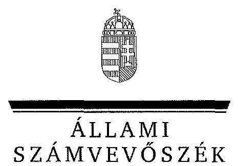
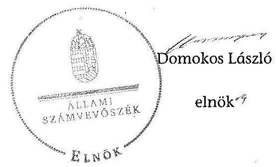
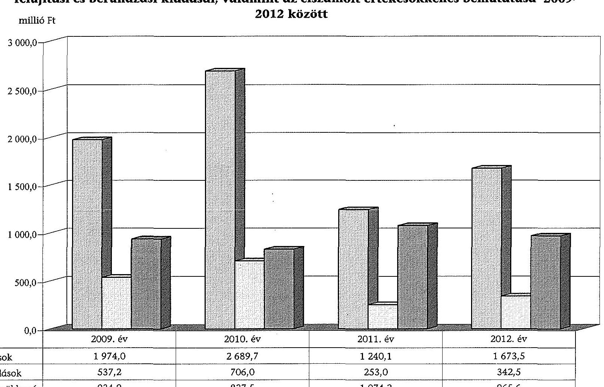
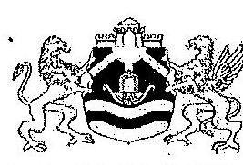
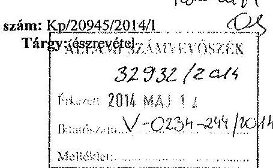
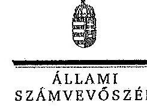

# JELENTÉS 

az önkormányzatok vagyongazdálkodása szabályszerűségének ellenőrzéséről
Budapest Főváros IX. Kerület Ferencváros

---

# Állami Számvevőszék 

Iktatószám: V-0234-247/2014.
Témaszám: 1268
Vizsgálat-azonosító szám: V065106
Az ellenőrzést felügyelte:
Makkai Mária
felügyeleti vezető
Az ellenőrzést vezette és az ellenőrzés végrehajtásáért felelős:
Páncsics Judit
ellenőrzésvezető
A számvevőszéki jelentés összeállításában közremüködtek:
Moder Beatrix
számvevő főtanácsos
Molnár Antal Lászlóné
számvevő
Az ellenőrzést végezték:
Molnár Antal Lászlóné Kóródi Gábor számvevő számvevő
Némethné Nagy Mária
számvevő

---

# TARTALOMJEGYZÉK 

BEVEZETÉS ..... 3
I. ÖSSZEGZŐ MEGÁLLAPÍTÁSOK, KÖVETKEZTETÉSEK, JAVASLATOK ..... 6
II. RÉSZLETES MEGÁLLAPÍTÁSOK ..... 12

1. A vagyongazdálkodási tevékenység szabályozása ..... 12
1.1. A vagyongazdálkodási tevékenység szabályozásának megfelelősége ..... 12
1.2. A vagyon használatba és üzemeltetésbe adásának szabályszerűsége ..... 15
1.3. A vagyon üzemeltetésére és használatára kötött szerződések felülvizsgálata ..... 15
2. A vagyongazdálkodási tevékenység szabályszerűsége ..... 16
2.1. A vagyon nyilvántartása, a vagyon összetételének változása, a döntések és a gazdasági események szabályszerűsége ..... 16
2.1.1. A vagyon nyilvántartásának megfelelősége ..... 16
2.1.2. A vagyon értékének és összetételének változása ..... 18
2.1.3. A vagyon változását eredményező döntések és gazdasági események szabályszerűsége ..... 19
2.2. A térítés nélküli vagyon átadás és átvétel szabályszerűsége ..... 21
2.3. A beruházási és felújítási döntések és végrehajtásuk szabályszerűsége ..... 22
2.4. A tartós részesedésekkel történő gazdálkodás ..... 24
2.5. A vagyon értékesítésének, hasznosításának, a követelés elengedésének szabályszerűsége ..... 25
2.6. Az önkormányzati gazdasági társaságok tulajdonosi felügyelete ..... 28
3. Az integritás érvényesülése a vagyongazdálkodásban ..... 29
4. A belső és a külső ellenőrzések hasznosulása ..... 30
4.1. A belső ellenőrzés javaslatainak hasznosulása ..... 30
4.2. A külső ellenőrzések javaslatainak hasznosulása ..... 32

---

# MELLÉKLETEK 

1. számú Budapest Főváros IX. Kerület Ferencváros Önkormányzata vagyonának főbb adatai 2009. január 1-je és 2012. december 31-e között
2. számú Budapest Főváros IX. Kerület Ferencváros Önkormányzata felújítási és beruházási kiadásai, valamint az elszámolt értékcsökkenés bemutatása 2009-2012 között
3. számú Budapest Főváros IX. Kerület Ferencváros Önkormányzata polgármesterének észrevétele
4. számú Budapest Főváros IX. Kerület Ferencváros Önkormányzata polgármesterének észrevételére adott válasz

## FÜGGELÉKEK

1. számú Rövidítések jegyzéke
2. számú Értelmező szótár

---

# JELENTÉS 

## az önkormányzatok vagyongazdálkodása szabályszerűségének ellenőrzéséről Budapest Főváros IX. Kerület Ferencváros

## BEVEZETÉS

Az ÁSZ kiemelten fontosnak tartja az ÁSZ tv. 5. § (4) és (5) bekezdése alapján az önkormányzati vagyon kezelésének, a vagyonnal való gazdálkodási szabályok betartásának az ellenőrzését. Az ellenőrzés feladata a vagyongazdálkodással kapcsolatban a közpénzek átláthatósága, nyilvánossága érdekében a jogszabályokban, belső szabályzatokban megfogalmazott előírások érvényesülésének áttekintése. Az ÁSZ nem csak az ellenőrzött szervezet vagyongazdálkodásának a hibáira mutat rá, számon kérve azok kijavítását, hanem megállapításaival, javaslataival segíti a közpénzzel, a közvagyonnal való felelős gazdálkodást.

Az önkormányzati vagyon alapvető funkciója, hogy a közérdeket és egyúttal az önkormányzati célok megvalósítását szolgálja. A feladatellátás terén elsősorban a kötelezően ellátandó feladatok végrehajtását hivatott szolgálni, amely mellett az önként vállalt feladatok ellátása is megvalósulhat.

Az ÁSZ stratégiájában hangsúlyos szerepet szán annak, hogy szilárd szakmai alapon álló, értékteremtő ellenőrzéseivel előmozdítsa a közpénzügyek átláthatóságát, rendezettségét. Az ÁSZ a vagyongazdálkodás ellenőrzésén keresztül közreműködik az integritás alapú közigazgatási kultúra kialakításában.

Az ellenőrzés célja annak megállapítása volt, hogy az önkormányzat vagyongazdálkodási tevékenységének szabályozottsága és tevékenysége a jogszabályi előírásokkal összhangban volt-e, átlátható, a jogszabályi előírásoknak megfelelő volt-e a vagyon nyilvántartása, a külső és belső ellenőrzések megállapításai hozzájárultak-e az önkormányzati vagyongazdálkodási tevékenység szabályszerűségéhez.

Ennek keretében értékeltük, hogy az Önkormányzat:

- szabályszerűen alakította-e ki a vagyongazdálkodási tevékenységének kereteit;
- biztosította-e a vagyongazdálkodás szabályszerűségét, megalapozottan hoz-ta-e, és jogszerűen, szabályszerűen hajtotta-e végre a vagyonváltozást eredményező meghatározó jelentőségű döntéseket, valamint gondoskodott-e az általa alapított vagy tulajdonosi részvételével működő gazdasági társaságokkal kapcsolatos tulajdonosi joggyakorlásról;

---

- gondoskodott-e vagyongazdálkodási tevékenysége során az integritás (feddhetetlenség) szempontjainak érvényesüléséről;
- belső ellenőrzése elősegítette-e a vagyongazdálkodás szabályszerű működését, valamint hasznosította-e a külső és belső ellenőrzések megállapításait, javaslatait.

Az ellenőrzés típusa: szabályszerűségi ellenőrzés.
Az ellenőrzött időszak: az ellenőrzés 2009. január 1. és 2012. december 31. közötti időszakra terjedt ki, kitekintéssel a helyszíni ellenőrzés befejezéséig (2013. december 9-éig) tartó időszak releváns vagyongazdálkodási folyamataira. Az egyes közbeszerzési eljárások lefolytatásának ellenőrzése 2012. január 1jétől a helyszíni ellenőrzés kezdetét megelőző negyedév utolsó napjáig (2013. szeptember 30-ig), az Nvtv. egyes rendelkezései végrehajtásának ellenőrzése 2012-től, a helyszíni ellenőrzés befejezéséig tartott.

Az ellenőrzött szervezet: Budapest Főváros IX. Kerület Ferencváros Önkormányzata.

Az ellenőrzés végrehajtásának jogszabályi alapját az ÁSZ tv. 5. § (4) bekezdésének a) pontja és (5) bekezdése, valamint az Áht. 61 . § (2) bekezdésében foglaltak képezik.

Az ellenőrzés szakmai módszertana az ÁSZ hivatalos honlapján közzétett szakmai szabályokon alapult, amely a Legfőbb Ellenőrző Intézmények Nemzetközi Szervezete (INTOSAI) által kiadott nemzetközi standardok (ISSAI) figyelembevételével készült.

Az ellenőrzést az ÁSZ hatályos szervezeti szabályai és az ellenőrzési programban foglalt értékelési szempontok szerint folytattuk le. Megállapításainkat a helyszíni ellenőrzés tapasztalataira, az ellenőrzött szervezettől bekért dokumentumokra, a kitöltött tanúsítványok elemzésére, az adott időszakban hatályos jogszabályok és belső szabályzatok előírásaira alapoztuk. A részesedések értékelését tételesen ellenőriztük, míg irányított mintavétellel választottuk ki a legnagyobb értékű térítésmentes átadás-átvételeket, a beruházásokat, felújításokat, a közbeszerzési eljárásokat, a vagyon értékesítését, hasznosítását és a követelés elengedést. Ezen túl a belső kontrollok megfelelő működését a 2009-2012. évi vagyonváltozásokkal kapcsolatos gazdasági események közül a Polgármesteri hivatal számviteli nyilvántartásaiból választott véletlen minta alapján, megállásos (többlépcsős) megfelelőségi teszttel ellenőriztük.

Budapest Főváros IX. kerület Ferencváros lakosainak száma 2012. január 1-jén 55472 fő volt. A 2010. évi önkormányzati választásokig a 26 tagú Képviselőtestület munkáját 11 állandó bizottság segítette. Az önkormányzati választások után a Képviselő-testület létszáma 18 főre csökkent, öt állandó bizottság és a József Attila Városrészi Önkormányzat múködött.

A polgármester ${ }_{2}$ a 2010. évi önkormányzati választás óta tölti be tisztségét, a jegyző ${ }_{2}$ 2011. július 1-jétől látja el feladatait. A Polgármesteri hivatal tíz szervezeti egységre tagolódott, elkülönített gazdasági szervezettel nem rendelkezett. A Polgármesteri hivatalon belül a vagyongazdálkodási feladatokat a Vagyon-

---

kezelési, Városüzemeltetési és Felújítási Iroda, valamint a Pénzügyi Iroda látta el. A foglalkoztatott köztisztviselők száma 2012. december 31 -én 250 fó volt.

Az Önkormányzat a 2012. évben a Polgármesteri hivatalon felül 19 önállóan működő és gazdálkodó, valamint hét önállóan működő költségvetési szervvel látta el feladatait. Az Önkormányzatnak hét gazdasági társaságban volt tulajdoni részesedése, melyek közül öt társaságban kizárólagos tulajdonos volt. A kizárólagos tulajdonú társaságok közül a FESZ Kft. az egészségügyi, a FESZOFE Nkft. a közterület fenntartási és a közfoglalkoztatási, a Ferencvárosi Parkolási Kft. a parkolók múködtetési, a FEV IX. Zrt. az ingatlangazdálkodási feladatokat látta el, míg a Ferencvárosi Kulturális, Turisztikai és Sport NKft. végelszámolás alatt állt, közfeladatot már nem végzett. A FEV IX. Zrt. 2012 júniusától a Ferencvárosi Bérleményüzemeltető Kft. kizárólagos tulajdonosa volt.

Az Önkormányzatnál a 2009-2012. években vállalkozási tevékenységet nem folytattak, PPP konstrukcióban fejlesztési feladatot nem valósítottak meg, vagyonkezelési, haszonélvezeti és koncessziós jogot alapító szerződést nem kötöttek. Az ÁSZ az ellenőrzött időszakban számvevőszéki jelentéssel lezárt ellenőrzést az Önkormányzatnál nem végzett.

Az Önkormányzat könyvviteli mérleg szerinti vagyona 2012. december 31-én 228519,4 millió Ft volt, mely 118,6 millió Ft-tal ( $0,1 \%$-kal) csökkent az ellenőrzött időszakban. Az Önkormányzat összes rövid és hosszú lejáratú kötelezettsége 2012. december 31-én 5686,7 millió Ft volt. Ebből a pénzintézetekkel szemben fennálló adósságállomány 4799,7 millió Ft volt, az 1919,9 millió Ft összegű adósság átvállalás, valamint 339,3 millió Ft tőketörlesztés eredményeként 2013. I. félév végére 2540,5 millió Ft-ra csökkent. A 2012. évi költségvetési beszámoló szerint 15575,2 millió Ft költségvetési bevételt értek el és 15110,3 millió Ft költségvetési kiadást teljesítettek. A felhalmozási célú kiadások 2553,9 millió Ft-os összegéből felújításokra és beruházásokra 2016,0 millió Ft-ot fordítottak.

Az Önkormányzat vagyonának főbb adatait, a felújítási és beruházási kiadásokat, valamint az elszámolt értékcsökkenést az 1-2. számú mellékletek mutatják be. A jelentéstervezetben alkalmazott rövidítéseket és az egyes fogalmak magyarázatát az 1-2. számú függelékek tartalmazzák.

Az ÁSZ a 2011. évi LXVI. törvény 29. §-a szerint a jelentéstervezetet megküldte Budapest Főváros IX. Kerület Ferencváros Önkormányzata polgármesterének egyeztetésre. A polgármester észrevételét és az arra adott választ a jelentés 3-4. számú mellékletei tartalmazzák.

---

# I. ÖSSZEGZŐ MEGÁLLAPÍTÁSOK, KÖVETKEZTETÉSEK, JAVASLATOK 

Az Önkormányzatnál a vagyongazdálkodás szabályozása során eleget tettek a jogszabályi előírásoknak, a feladat- és hatásköröket a teljes vagyoni körre kiterjedően, rendeletekben és belső szabályzatokban rögzítették. A Képviselőtestület a vagyongazdálkodási rendelet ${ }_{1,2}$-ben az Ötv.-ben, illetve az Nvtv.-ben előírtaknak megfelelően meghatározta az önkormányzati feladatellátást biztosító törzsvagyont, ezen belül a forgalomképtelen és a korlátozottan forgalomképes vagyonelemek körét, azonban nem rendelkeztek a forgalomképesség szerinti besorolás megváltoztatásának módjáról. Részletesen szabályozták a vagyon hasznosításának, ingyenes átadás-átvételének, a vagyonkezelői jog alapításának, gyakorlásának eljárásrendjét, a vagyongazdálkodási rendelet ${ }_{2}$-ben meghatározták azt a vagyoni kört, amelyre vagyonkezelői jog létesíthető. Vagyonkezelői szerződést 2009-2012 között nem kötöttek.

A 2009-2010. években a vagyongazdálkodás szabályozása egyes kérdésekben ellentétes volt magasabb szintű jogszabályokkal, ezért a lakásgazdálkodási rendeletnek a bérleti díj mértékére, a bérbe adott lakások és helyiségek csak a bérlő részére történő elidegenítésére, valamint a vagyongazdálkodási rendelet ${ }_{1}$ nek a bérbe adott, 20,0 millió Ft értéket meghaladó nem lakás céljára szolgáló helyiség - versenyeztetési eljárás nélkül - bérlő részére történő értékesítésére vonatkozó rendelkezéseit az Alkotmánybíróság a 195/2010. (XII. 17.) számú határozatával megsemmisítette.

A Képviselő-testület az Nvtv.-ben rögzített határidőn túl, a vagyongazdálkodási rendelet ${ }_{2}$ 2012. július 1-jei hatályba léptetésével határozta meg a nemzetgazdasági szempontból kiemelt jelentőségű vagyonelemeket, a közép- és hosszú távú vagyongazdálkodási tervet 2013 májusában fogadták el.

A Képviselő-testület az önkormányzati SZMSZ ${ }_{1,2}$-ben vagyongazdálkodási hatáskört a Gazdasági bizottságnak és a polgármester ${ }_{1,2}$-nek adott át, a 2009. évben az önkormányzati SZMSZ ${ }_{1}$-ben, a 2010-2012. években a költségvetési rendeletekben előírt beszámolási kötelezettségüknek az átruházott hatáskör gyakorlói nem tettek eleget.

A Polgármesteri hivatal rendelkezett az Áhsz. ${ }_{1}$ előírásainak megfelelő számviteli politika ${ }_{1,2}$-vel és ennek keretében kialakított értékelési, leltározási, selejtezési és pénzkezelési szabályzattal.

Az Önkormányzatnál a 2009-2012. évi számviteli mérlegekben kimutatott eszközöket és forrásokat kiértékelt leltárral támasztották alá. A 2010-2011. években az üzemeltetésre átadott eszközök mérleg szerinti értékét az Áhsz. ${ }_{1}$ előírása ellenére nem az üzemeltetést végző szervek által - mennyiségi felvétellel - elkészített, hitelesített leltárral támasztották alá, a leltározást a Polgármesteri hivatal egyeztetéssel végezte el.

---

Az Önkormányzatnál a vagyon nyilvántartása során a főkönyvi számlák alábontásával, a számlákhoz kapcsolódó analitikus nyilvántartások vezetésével biztosították a törzsvagyon, ezen belül a forgalomképtelen és korlátozottan forgalomképes, illetve a forgalomképes (üzleti) vagyon elkülönített nyilvántartását. A polgármester ${ }_{1,2}$ a vagyonkimutatást minden évben a zárszámadási rendelettervezet előterjesztésekor a Képviselő-testület részére tájékoztatásul bemutatta. A vagyonkimutatás tartalma, szerkezete megfelelt az Áhsz. ${ }_{1}$ előírásainak, azonban a 2012. évi vagyonkimutatásban a nemzetgazdasági szempontból kiemelt jelentőségű nemzeti vagyon között kimutattak 20,7 millió Ft értékben olyan eszközöket is, amelyek a vagyongazdálkodási rendelet ${ }_{2}$ szerint nem minősültek annak.

Az ingatlanvagyon számviteli nyilvántartás szerinti adatainak az ingatlan-vagyon-kataszter adataival való egyezősége a 2009-2010. és a 2012. években - a 147/1992. (XI. 6.) Korm. rendeletben foglaltak ellenére - nem volt biztosított, a számviteli nyilvántartások bruttó érték adatai eltértek az ingatlan-vagyon-kataszter bruttó érték adataitól. Az Önkormányzatnál az ingatlanva-ayon-kataszter adatlapjain és a betétlapjain a vagyonváltozásokat több esetben a földhivatali bejegyzéseket és törléseket megelőzően átvezették, ezért az ingatlanvagyon-kataszter és a földhivatali ingatlan nyilvántartás azonos tartalmú adatai közötti egyezőség a 147/1992. (XI. 6.) Korm. rendelet előírása ellenére nem igazolt.

A Polgármesteri hivatalban az operatív gazdálkodási jogkörök gyakorlásának szabályait meghatározták, a gazdálkodási jogkörök szabályzata ${ }_{1,2}$ tartalmazta a kötelezettségvállalásra, ellenjegyzésre, érvényesítésre és utalványozásra jogosultak felsorolását, azonban a jogkört gyakorlók írásbeli felhatalmazása - a szakmai teljesítésigazolásra jogosultak kivételével - elmaradt. Az Ámr. ${ }_{1,2}$ és az Ávr. előírásai ellenére az ellenjegyzésre és érvényesítésre írásban felhatalmaztak a Polgármesteri hivatal állományába nem tartozó személyeket. A gazdálkodási jogkörök szabályzata ${ }_{3}$ 2012. március 5-ei hatályba léptetésével a hiányosságokat megszüntették, az írásbeli felhatalmazásokat elkészítették, a jogszerútlen kijelöléseket visszavonták. A vagyonváltozásokkal összefüggő bevételek beszedése és a kiadások teljesítése során a gazdálkodási jogkörök gyakorlása 2009 és 2012. március 4-e között - a szabályozási hiányosságok miatt - nem felelt meg az előírásoknak, azt követően a gazdálkodási jogköröket az arra felhatalmazottak az Ávr. előírásainak és a belső szabályzatoknak megfelelően gyakorolták.

Az Önkormányzat könyvviteli mérleg szerinti vagyona a 2009. évi 228638,0 millió Ft nyitó értékről 2012. december 31-re 0,1\%-kal, 228519,4 millió Ft-ra csökkent az ingatlanok, az üzemeltetésre átadott eszközök és a követelések értékének csökkenése miatt, amelyet a pénzeszközök növekedése részben ellentételezett. A 2009-2012. években a fejlesztésekre fordított 9416,0 millió Ft kiadás közel 2,5-szerese volt az elszámolt értékcsökkenés (3802,2 millió Ft-os) összegének, ezzel az Önkormányzat hozzájárult az elhasználódott eszközök pótlásához.

A 2009-2012. években a beruházások és felújítások az önkormányzati feladatellátással összhangban valósultak meg. A fejlesztések célja útépítés, parkok felújítása, lakóépületek teljes rehabilitációs felújítása volt, melyek fedezetét fơvá-

---

rosi önkormányzati, hazai és uniós támogatásokból, saját forrásból és hosszú lejáratú lakáscélú kamattámogatásos fejlesztési hitelből biztosították. A vagyonváltozást eredményező döntéseket az Önkormányzat arra felhatalmazott szervei hozták meg, a végrehajtás során betartották az előterjesztésekben, kép-viselő-testületi határozatokban foglaltakat. A Polgármesteri hivatalban az ellenőrzött felújításoknál és beruházásoknál az üzembe helyezési okmány kiállítása és a befejezett fejlesztések számviteli aktiválása - a számviteli politika ${ }_{12}$ és az Áhsz., előírásai ellenére - nem a tényleges használatbevétel időpontjában történt. Az Önkormányzatnál a 2012. évben és 2013. év I-III. negyedévében összesen 90 közbeszerzési eljárás indult, melyből 72 befejezett eljárás volt, öszszesen 3866,5 millió Ft beszerzési értékben. Az ellenőrzött közbeszerzési eljárásoknál a Kbt. és a közbeszerzési szabályzat ${ }_{3}$ előírásainak megfelelően jártak el.

A vagyon értékesítése és egyéb hasznosítása - a vagyongazdálkodási rendelet ${ }_{1}$ és a lakásgazdálkodási rendelet Alkotmánybíróság által megsemmisített egyes rendelkezései szerinti értékesítések kivételével - pályázati kiírás alapján, a jogszabályok és belső szabályzatok előírásainak megfelelően történt.

A térítésmentes vagyonátadás-átvétel a közfeladat ellátás érdekében, szabályszerűen történt, azonban tévesen térítésmentes átadásként mutattak ki apportálással juttatott, illetve átvételként csereszerződés alapján szerzett vagyont. A téves elszámolás az Önkormányzat vagyonának összetételét és értékét nem befolyásolta.

Az Önkormányzat 2012. december 31-én hét - az Nvtv. előírása szerint átlátható szervezetnek minősülő - gazdasági társaságban rendelkezett tartós részesedéssel, ebből öt társaság esetében kizárólagos tulajdonos volt. A feladatellátás hatékonyságának növelése érdekében három kizárólagos tulajdonú gazdasági társaság alapításáról döntöttek, és egy társaság végelszámolással való megszüntetését rendelték el. Az ellenőrzött időszakban a részesedések után értékvesztés elszámolása nem vált szükségessé, tőkepótlási kötelezettség nem keletkezett. A FESZ Kft. 6,5 millió Ft összegű líingszerződéseihez kapcsolódó készfizető kezesi szerződéseket a polgármester ${ }_{2}$ 2012-ben a nélkül írta alá, hogy a Képviselő-testület erre valamely rendeletében hatáskört adott volna át a részére, illetve a jogügyletet megelőzően egyedi döntéssel erre felhatalmazta volna. Az Önkormányzatnak a helyszíni ellenőrzés befejezéséig a kezességvállalás miatt fizetési kötelezettsége nem keletkezett. A gazdasági társaságok a rendelkezésükre bocsátott önkormányzati vagyont közszolgáltatási, illetve üzemeltetési szerződések alapján múködtették. A Képviselő-testület a tulajdonosi joggyakorlása során gondoskodott a feladat meghatározásáról, a vezető tisztségviselők, a felügyelő bizottsági tagok megválasztásáról és a könyvvizsgálók megbízásáról, a társaságok éves beszámolóit jóváhagyta, egy esetben az üzleti tervet nem tárgyalta és hagyta jóvá.

A 2010. évben a helyi önkormányzati képviselők és polgármester általános választását megelőző 30 nappal a polgármester ${ }_{1}$ az Âht. ${ }_{1}$ előírása ellenére nem tette közzé az Önkormányzat vagyoni helyzetét bemutató részletes jelentést. A közérdekú gazdálkodási adatok nyilvánosságának biztosítása, a közpénzek vagyongazdálkodással összefüggő felhasználásának átláthatósága érdekében - két 2009. évi, nettó ötmillió forintot meghaladó értékű építési beruházási

---

szerződés kivételével - a jegyző ${ }_{1,2}$ az ellenőrzött években eleget tett a jogszabályon alapuló közzétételi kötelezettségének.

A Polgármesteri hivatalban a vagyongazdálkodási tevékenység szabályozásával, valamint azok gyakorlatban való alkalmazásával biztosították a feddhetetlenség, az átláthatóság és elszámoltathatóság követelményének érvényesülését. A vagyont érintő döntések előkészítése, meghozatala és végrehajtása során az átláthatóságot, a korrupció megelőzését a jogszabályi rendelkezések alkalmazásával biztosították. A vagyongazdálkodási tevékenység integritása - a szabályozottság ellenére - nem teljes körűen biztosított, mert az Önkormányzat nem rendelkezett integritáspolitikával, a vagyongazdálkodási tevékenység vonatkozásában korrupciós kockázat elemzést nem végeztek, és a Kttv. előírása ellenére a köztisztviselőkre vonatkozó etikai alapelvek részletes tartalmát a Képviselő-testület nem határozta meg.

Az Önkormányzatnál az ellenőrzött időszakban elvégzett 85 belső ellenőrzésből 27 érintette a vagyongazdálkodást. Hét esetben nem tártak fel hiányosságot, a további 20 ellenőrzési jelentésben a belső ellenőrzés javaslatokat fogalmazott meg a belső szabályzatok aktualizálására, a leltározási és selejtezési eljárások szabályozottságára, illetve szabályszerű elvégzésére, az év közbeni eszközmozgások dokumentálására, valamint a vagyonkataszter és a főkönyvi nyilvántartások egyezőségére vonatkozóan. A belső ellenőrzés a megállapításaival, javaslataival hozzájárult a vagyongazdálkodás szabályozási és múködési hiányosságainak megszüntetéséhez. Az ellenőrzött szervezetek a Ber.-ben előírtak ellenére hat esetben nem készítettek intézkedési tervet, ennek hiányában a megtett intézkedéseket a belső ellenőrzés utóellenőrzéssel, illetve beszámoltatással követte nyomon.

A jegyző ${ }_{1,2}$ a Ber. és a Bkr. rendelkezései ellenére 2009-2012-ben a külső ellenőrzésekről nem vezettetett nyilvántartást.

A könyvvizsgáló az Önkormányzat 2009-2012. évi beszámolóit megbízhatónak és hitelesnek minősítette, jelentéseiben a vagyongazdálkodással kapcsolatos hiányosságot nem állapított meg. A vagyongazdálkodást érintően a Kormányhivatal - 2012. évben - egy esetben a vagyongazdálkodási rendelet ${ }_{2}$-re vonatkozóan tett törvényességi észrevételt, mely alapján a Képviselő-testület a kifogásolt rendelkezést módosította. A NAV 2009-2012 között áfához kapcsolódó adóellenőrzéseket végzett, a közremúködő szervezetek három európai uniós támogatással megvalósított fejlesztést ellenőriztek. Az ellenőrzések megállapítása szerint a projektek megfelelő tartalommal valósultak meg, a feltárt kisebb hiányosságok pótlása megtörtént.

Az Állami Számvevőszékről szóló 2011. évi LXVI. törvény 33. § (1) bekezdésében foglaltak értelmében a jelentésben foglalt megállapításokhoz kapcsolódó intézkedési tervet köteles az ellenőrzött szervezet vezetője összeállítani, és azt a jelentés kézhezvételétől számított 30 napon belül az ÁSZ részére megküldeni. Amennyiben az intézkedési tervet határidőben nem küldi meg a szervezet, vagy az nem elfogadható, az ÁSZ elnöke a hivatkozott törvény 33. § (3) bekez-dés a)-b) pontjaiban foglaltakat érvényesítheti.

---

Az ellenőrzés intézkedést igénylő megállapításai és javaslatai:

# a polgármesternek 

1. A FESZ Kft. által beszerzett fogorvosi eszközök lizingszerződéseihez kapcsolódó öszszesen 6,5 millió Ft összegű készfizető kezesi szerződéseket 2012. március 12-én a polgármester ${ }_{2}$ a nélkül írta alá, hogy a Képviselő-testület az Ötv. 9. § (3) bekezdésében foglaltak alapján erre vonatkozó hatáskört adott volna át a részére, illetve a jogügyletet megelőzően egyedi döntéssel erre felhatalmazta volna.

Javaslat:
Terjessze a Képviselő-testület elé utólagos jóváhagyásra - a jegyző által előkészített a FESZ Kft. által beszerzett fogorvosi eszközök lizingszerződéseihez kapcsolódó, öszszesen 6,5 millió Ft összegű készfizető kezesi szerződésekről szóló előterjesztést.

## a jegyzőnek

1. A 2012. évi vagyonkimutatás nem volt összhangban a vagyongazdálkodási rendelet ${ }_{2}$ 5. § (1) bekezdés B. pontjában foglaltakkal, mert az önkormányzat többségi tulajdonát képező közszolgáltatást végző, valamint parkolási szolgáltatást ellátó gazdasági társaságban lévő társasági részesedésen kívül 20,7 millió Ft értékben képzőművészeti alkotást, gépeket, berendezéseket és felszereléseket is kimutattak nemzetgazdasági szempontból kiemelt jelentőségű nemzeti vagyonként.

Javaslat:
Intézkedjen arról, hogy a vagyonkimutatásban a nemzetgazdasági szempontból kiemelt jelentőségű nemzeti vagyont a vagyongazdálkodási rendelet ${ }_{2}$ 5. § (1) bekezdés B. pontjában foglaltakkal összhangban mutassák be.
2. A számviteli nyilvántartás ingatlanvagyon adatainak az ingatlanvagyon-kataszter adataival való egyezőségét a 2009-2010. és a 2012. években - a 147/1992. (XI. 6.) Korm. rendelet 1. § (3) bekezdésében és 2. számú mellékletében foglaltak ellenére nem biztosították.

Javaslat:
Intézkedjen a 147/1992. (XI. 6.) Korm. rendelet 1. § (3) bekezdésében és 2. számú mellékletében rögzítetteknek megfelelően az ingatlanvagyon kataszter és az ingatlanok számviteli nyilvántartása szerinti bruttó érték adatok közötti egyezőség megteremtéséről.
3. A 2012. évben - a Bkr. 6. § (1) bekezdés c) pontjának előirrása ellenére - a jegyző nem határozta meg az etikai elvárásokat, a Kttv. 231. § (1) bekezdése ellenére a Képviselő-testület nem állapította meg a Kttv. 83. §-ában előírt, a köztisztviselőkre vonatkozó hivatásetikai alapelvek részletes tartalmát, valamint az etikai eljárás szabályait.

---

Javaslat:
Készítse elő a Bkr. 6. § (1) bekezdés c) pont előírásának megfelelő etikai elvárásokat, a Kttv. 83. §-a szerinti hivatásetikai alapelveket, az etikai eljárás szabályait és terjessze a Képviselőtestület elé jóváhagyásra.
4. Az Önkormányzatnál a 2009-2011. években a Ber. 29/A. § (1) bekezdésében, illetve a 2012. évben a Bkr. 14. § (1) bekezdésében előírtak ellenére a külső ellenőrzésekről nyilvántartást nem vezettek.

Javaslat:
Intézkedjen a Bkr. 14. § (1) bekezdésében foglaltak szerint a külső ellenőrzések nyilvántartásának vezetéséről.

---

# II. RÉSZLETES MEGÁLLAPÍTÁSOK 

## 1. A VAGYONGAZDÁLKODÁSI TEVÉKENYSÉG SZABÁLYOZÁSA

### 1.1. A vagyongazdálkodási tevékenység szabályozásának megfelelősége

A Képviselő-testület a Htv. 138. § (1) bekezdés j) pontjában foglaltaknak megfelelően az önkormányzati vagyongazdálkodással kapcsolatos feladat- és hatásköröket a teljes vagyoni körre kiterjedően önkormányzati rendeletekben ${ }^{1}$ szabályozta. A vagyongazdálkodási rendelet ${ }_{1,2}$-ben meghatározták az Ötv. 79. § (2) bekezdésének a) és b) pontjaiban ${ }^{2}$ foglaltaknak megfelelően az önkormányzati feladatellátást biztosító törzsvagyont, ezen belül a forgalomképtelen és a korlátozottan forgalomképes vagyonelemek körét, azonban nem rendelkeztek a forgalomképesség szerinti besorolás megváltoztatásának módjáról. Részletesen szabályozták - az Ötv.-ben és az Áht. ${ }_{1}$-ben, illetve az Nvtv.-ben foglaltaknak megfelelően - a vagyon ingyenes átruházásának eseteit és módjait, a vagyonkezelői jog alapításának eljárásrendjét, a vagyonkezelői jog gyakorlásának szabályait. A vagyongazdálkodási rendelet ${ }_{1}$-ben a vagyonkezelésbe adható vagyonelemek körét a jogszabályi előírásokkal összhangban szűkítették, a vagyongazdálkodási rendelet ${ }_{2}$-ben az Mötv.-ben foglaltaknak megfelelően meghatározták azt a vagyoni kört, amelyre vagyonkezelői jog létesíthető. Vagyonkezelői szerződést az ellenőrzött időszakban nem kötöttek.

A Képviselő-testület az Nvtv. 18. § (1) bekezdésében előírt 2012. március 1-jei határidőn túl, a vagyongazdálkodási rendelet ${ }_{2}$ 2012. július 1-jei hatályba léptetésével határozta meg a nemzetgazdasági szempontból kiemelt jelentőségű vagyonelemeket. Az Önkormányzat többségi tulajdonát képező közszolgáltatást végző, valamint parkolási szolgáltatást ellátó gazdasági társaságokban fennálló társasági részesedéseket minősítették nemzetgazdasági szempontból kiemelt jelentőségű nemzeti vagyonná. Az Nvtv. 9. § (1) bekezdésében előírt közép- és hosszú távú vagyongazdálkodási tervet a Képviselő-testület 2013. május hónapban fogadta el.

A Képviselő-testület élt az Ötv. 9. § (3) bekezdésében biztosított jogával, a vagyongazdálkodási feladatokhoz kapcsolódóan az önkormányzati SZMSZ ${ }_{1,2}$-ben a Gazdasági bizottságnak és a polgármester ${ }_{1,2}$-nek adott át hatáskört. A vagyon feletti rendelkezési jogot forgalomképesség szerint, döntési szintekhez kapcsolódóan szabályozták és értékhatárokat rendeltek a döntési jogkörök gyakorlóihoz. A 2009. évben az önkormányzati SZMSZ ${ }_{1}$-ben, a 2010-2012. években a költségvetési rendeletekben előírt beszámolási kötelezettségüknek az átruházott hatáskör gyakorlói nem tettek eleget.

[^0]
[^0]:    ${ }^{1}$ vagyongazdálkodási rendelet ${ }_{1,2}$, lakásgazdálkodási rendelet, versenyeztetési rendelet, közterület használatáról szóló rendelet ${ }_{1,2}$
    ${ }^{2}$ 2014. január 1-jétől az Nvtv. 5. § (2) bekezdés a) és b) pontja szabályozza

---

A lakásgazdálkodási rendelet és a vagyongazdálkodási rendelet ${ }_{1}$ egyes rendelkezéseit az Alkotmánybíróság a 195/2010. (XII. 17.) számú határozatával megsemmisítette.

Az Alkotmánybíróság a lakásgazdálkodási rendelet 24. § (1) bekezdését (a bérleti díj mértékét), a 26. § (1) bekezdését (a bérbe adott lakásokat csak a bérlőnek, bérlőtársnak, társbérlőnek, illetve ezek egyenes ágbeli rokonainak és örökbefogadott gyermekének lehetett eladni), a 34. § (1) bekezdését (bérbe adott helyiséget csak a bérlő részére lehetett elidegeníteni), a 4. számú mellékletét (a helyiség minimális bérleti díját) és az 5. számú mellékletét (helyiségben folytatható tevékenység kategóriáit és a bérleti díjhoz tartozó szorzókat) - megsemmisítette. Törvényellenes volt a vagyongazdálkodási rendelet ${ }_{1} 15 . \S$ (3) bekezdésének azon rendelkezése, hogy a bérbe adott és 20,0 millió Ft értéket meghaladó nem lakás céljára szolgáló helyiségek értékesítését az Áht. ${ }_{1} 108 . \S$ (1) bekezdésében foglalt előírás ellenére kivonta a versenyeztetési eljárási kötelezettség alól.

A vagyonhasznosítás nyilvános pályáztatási kötelezettségének értékhatárát a vagyongazdálkodási rendelet ${ }_{1}$-ben 20,0 millió Ft-ban határozták meg, a vagyongazdálkodási rendelet ${ }_{2}$-ben - figyelembe véve az Nvtv. 11. § (16) bekezdésében előírtakat - a 25,0 millió Ft feletti nemzeti vagyon hasznosítása esetében írták elő a versenyeztetési kötelezettséget. A versenyeztetési rendeletben szabályozták a versenyeztetési eljárás formáját, a pályázati felhívás tartalmi követelményét, módosításának eseteit, az ajánlatok bontására, elbírálására vonatkozó rendelkezéseket.

A jegyzö ${ }_{1,2}$ kialakította a Polgármesteri hivatal számviteli rendjét, elkészítette az Áhsz. ${ }_{1}$-nek és a helyi sajátosságoknak megfelelő számviteli politika ${ }_{1,2}$-t és annak keretében a pénzkezelési, leltározási, selejtezési és értékelési szabályzatot. Az Önkormányzat irányítása alá tartozó önállóan múködő és gazdálkodó intézmények a számviteli rendjüket maguk alakították ki.

A Képviselő-testület nem élt az Áhsz. ${ }_{1}$ 37. § (7) bekezdése ${ }^{3}$ szerinti lehetőséggel, az eszközök kétévenkénti mennyiségi felvétellel történő leltározásáról nem alkotott rendeletet. A Polgármesteri hivatalban a leltározási szabályzat ${ }_{1}$-ben az Áhsz. ${ }_{1} 37 . \S$ (3) bekezdésében ${ }^{4}$ foglaltak ellenére az üzemeltetésre, kezelésre, valamint koncesszióba adott eszközök mennyiségi felvétellel történő leltározását a 2009-2011. évekre nem írták elő, ezen eszközök esetében a könyvviteli nyilvántartások alapján, egyeztetéssel végzett leltározást határozták meg. A leltározási szabályzat ${ }_{1}$-ben - az Áhsz. ${ }_{1} 37 . \S$ (4) bekezdésében ${ }^{5}$ foglaltak ellenére - az üzemeltetésre átadott eszközök esetében a 2010. és a 2011. években nem írták elő, hogy az üzemeltetésre átadott eszközöket az üzemeltetést végző szerv által elkészített, hiteles leltárral kell alátámasztani. A 2012. évtől a leltározási szabályzat ${ }_{2,3}$ az üzemeltetésre átadott eszközök mennyiségi felvétellel történő leltározását az Áhsz. ${ }_{1}$ előírásaival összhangban tartalmazta.

[^0]
[^0]:    ${ }^{3}$ 2014. január 1-jétől hatálytalan
    ${ }^{4}$ 2014. január 1-jétől az Áhsz. ${ }_{2}$ 22. § (2) bekezdése szabályozza
    ${ }^{5}$ Megállapította a 317/2009. (XII. 29.) Korm. rendelet 18. §-a. Először a 2010. évtől készített beszámolókra kellett alkalmazni. 2014. január 1-jétől az Áhsz. ${ }_{2}$ 22. § (2) bekezdés a) pontja a koncesszióba, vagyonkezelésbe adott eszközök vonatkozásában írja elő.

---

A Polgármesteri hivatalban az operatív gazdálkodással és annak munkafolyamatba épített ellenőrzésével összefüggő jogkörök gyakorlásának szabályait meghatározták. A gazdálkodási jogkörök szabályzata ${ }_{1,2}$ tartalmazta a kötelezettségvállalásra, ellenjegyzésre, érvényesítésre és utalványozásra jogosultak felsorolását, azonban az írásbeli kijelölések nem történtek meg teljes körűen.

A polgármester ${ }_{1,2}$ a SEM IX. Zrt., a Ferencvárosi Bérleményüzemeltető Kft., valamint a Ferencvárosi Parkolási Kft. vezetői kivételével - az Ámr. ${ }_{1}$ 134. § (2), az Ámr. ${ }_{2} 72 . \S$ (8), valamint az Ávr. 52. § (6) bekezdéseiben előírtak ellenére - írásban nem jelölte ki a kötelezettségvállalásra jogosult személyeket. A gazdálkodási jogkörök szabályzata ${ }_{1,2}$-ban nevesítette az utalványozási feladatok ellátására az alpolgármestereket, de az írásbeli felhatalmazásuk - 2009-ben az Ámr. ${ }_{1}$ 136. § (2), 2010-2011-ben az Ámr. ${ }_{2} 78 . \S$ (1), 2012 márciusáig az Ávr. 59. § (1) bekezdéseiben előírtak ellenére - elmaradt.

A jegyzö ${ }_{1,2}$ - az Ámr. ${ }_{1} 134 . \S$ (2) bekezdése és az Ámr. ${ }_{2} 74 . \S$ (2) bekezdés f) pontjában előírtak ellenére - a kötelezettségvállalás és az utalvány ellenjegyzésére, illetve - az Ávr. 55. § (2) bekezdése szerinti - pénzügyi ellenjegyzésre a Polgármesteri hivatal állományába tartozó köztisztviselőt írásban nem jelölt ki. A jegyzo̊ az utalvány ellenjegyzési jogkör gyakorlására a gazdasági társaságok fókönyvelőit külön felhatalmazással jelölte ki, valamint a SEM IX. Zrt. egy alkalmazottjának - a társaság által ellátott ingatlangazdálkodási feladatokra - érvényesítési megbízást adott. A megbízások nem feleltek meg 2009-ben az Ámr. ${ }_{1} 135 . \S$ (4) bekezdésében, 2010-2011-ben az Ámr. ${ }_{2} 74 . \S$ (2) bekezdés f) pontjában és 77. §. (4) bekezdésében foglalt azon előírásoknak, hogy ellenjegyzésre és érvényesítésre csak az önkormányzati hivatal állományába tartozó írásban kijelölt köztisztviselö jogosult.

A gazdálkodási jogkörök szabályzata ${ }_{3}$ 2012. március 5-étől tartalmazta a névre szóló kijelöléseket, az érvényesítési és a pénzügyi ellenjegyzési feladatok ellátására kizárólag a Polgármesteri hivatal állományába tartozó köztisztviselőket jelöltek ki.

A teljesítésigazolás rendje ${ }_{1,2,3}$ utasítások tartalmazták a kiadások szakmai teljesítésigazolására jogosultakat, a szabályozás azonban a 2009. évben nem felelt meg az Ámr. ${ }_{1} 135 . \S$ (1) bekezdésének, mert nem határozta meg a bevételek teljesítésigazolására jogosult személyeket. Az önkormányzati szabályozás 2010-től összhangban volt az Ámr. ${ }_{2}$ előírásával, a bevételekre a szakmai teljesítésigazolás kötelezettségét nem írták elő.

A közérdekű adatok Eisztv. ${ }^{6}$ előírásainak megfelelő közzétételi szabályzatát a jegyzo̊ ${ }_{1}$ 2010. szeptember 1-jétől adta ki, melyben meghatározta a nyilvánosság biztosításának eszközeit, a nyilvánosságra hozatal módját és felelősét.

A kötelező és önként vállalt feladatokat az önkormányzati SZMSZ ${ }_{1,2}$-ben meghatározták. Az Önkormányzat a feladatait az intézményrendszerén, továbbá a kizárólagos tulajdonában lévő társaságain keresztül, illetve vállalkozásokkal kötött szerződések útján látta el.

[^0]
[^0]:    ${ }^{6}$ 2012. január 1-jétől az Info. tv. szabályozza

---

Az ellenőrzött időszakban feladat átadás, átvétel Önkormányzaton kívülre, illetve kívülről nem történt. Az intézmény alapításáról, átalakításáról, megszüntetéséről hozott döntések hatására az intézmények száma eggyel csökkent.

A Képviselő-testület 2009-2012 között három intézmény megszüntetéséről és kettő létrehozásáról döntött, a változások a vagyon alakulására nem voltak hatással. 2009-ben a Ferencvárosi Gyermeküdülők és Táborokat, 2011-ben a Ferencvárosi Gondozó Szolgálatot, 2012-ben a Dominó Általános Iskolát szüntették meg, 2011-ben a Ferencvárosi Közterület-felügyeletet, 2012-ben a Ferencvárosi Intézmény Üzemeltetési Központot hozták létre.

# 1.2. A vagyon használatba és üzemeltetésbe adásának szabályszerűsége 

Az Önkormányzat a vagyon használatba adásának, üzemeltetésre történő átadásának részletes szabályait a vagyongazdálkodási rendelet ${ }_{1,2}$-ben, az intézmények alapító okiratában és az üzemeltetési szerződésekben határozta meg.

Az üzemeltetésre átadott eszközöket a 2009-2012. években a FESZ Kft.-nek átadott orvosi eszközök, berendezések, a Ferencvárosi 9.TV Stúdió eszközei és a Ferencvárosi Egyesített Bölcsődének átadott HEFOP pályázaton elnyert vagyontárgyak alkották, melyeket a projekt múködtetési kötelezettségének lejárata után térítés nélkül átadtak az intézménynek. A FESZ Kft.-vel a 2008. évben megkötött egészségügyi közfeladat ellátási szerződésben rögzítették az üzemeltetésre átadott gépek és műszerek üzemeltető általi felújítási kötelezettségét, továbbá, hogy a közszolgáltatások végzésének mennyiségéről és minőségéről folyamatosan köteles tájékoztatni a Képviselő-testületet. A szerződés az átvett önkormányzati vagyonnal kapcsolatos nyilvántartási és adatszolgáltatási kötelezettségek teljesítésének módját és formáját, továbbá az évenkénti leltározási kötelezettséget nem tartalmazta. A televíziós műsorszolgáltatással kapcsolatos eszközöket az Önkormányzat 2011. május 1-jétől határozatlan időre a költségvetési szerveként működő Ferencvárosi Művelődési Központnak adta át működtetésre, a Polgármesteri hivatalban az eszközöket - az Áhsz.; 20. § (1) bekezdésében előírtak ellenére - üzemeltetésre átadott eszközként tartották nyilván.

Az Önkormányzat az üzemeltetésre átadott eszközök esetében az ellenőrzött időszakban nem tervezett az elszámolt értékcsökkenésnek megfelelő, elkülönített felújítási, illetve pótlólagos beruházási előirányzatot. Az üzemeltetésre átadott eszközök után 53,5 millió Ft értékcsökkenést számoltak el, ezzel szemben az eszközök pótlására, felújítására nem fordítottak kiadást.

### 1.3. A vagyon üzemeltetésére és használatára kötött szerződések felülvizsgálata

Az Önkormányzat 2012. december 31-én csak olyan gazdálkodó szervezetekben rendelkezett társasági részesedéssel, amelyek az Nvtv. 3. § (1) bekezdés 1. a) pontja alapján átlátható szervezetnek minősültek.

Az Önkormányzat üzemeltetési szerződést csak a kizárólagos tulajdonában lévő - az Nvtv. 3. § (1) bekezdésének 1. a) pontja alapján átlátható szervezetnek minősülő - FESZ Kft.-vel kötött.

---

Az Önkormányzat az Nvtv. 2012. évi hatályba lépését követően a vagyonhasznosítási szerződések megkötését megelőzően vizsgálta, hogy a szerződő partnerek megfelelnek-e az Nvtv. 3. § (1) bekezdés 1. pontja szerinti „átlátható szervezet" követelményének.

# 2. A VAGYONGAZDÁLKODÁSI TEVÉKENYSÉG SZABÁLYSZERŰSÉGE 

### 2.1. A vagyon nyilvántartása, a vagyon összetételének változása, a döntések és a gazdasági események szabályszerűsége

### 2.1.1. A vagyon nyilvántartásának megfelelősége

Az Önkormányzatnál a 2009-2012. évek között az Ötv. 78. § (2) bekezdésében ${ }^{7}$ előírtaknak megfelelően minden évben elkészítették a vagyonkimutatást és azt a zárszámadási rendelettervezet előterjesztésekor - az Áht. ${ }_{1}$ 118. § (2) bekezdése 2. c) pontjában ${ }^{8}$ előírtak szerint - a Képviselő-testület részére tájékoztatásul bemutatták.

A vagyonkimutatások tartalmazták az Önkormányzat és intézményei saját vagyonát tételesen törzsvagyon és törzsvagyonon kívüli, egyéb vagyon bontásban. A 2009-2012. évi vagyonkimutatások az Áhsz. ${ }_{1}$ 44/A. §-ában ${ }^{9}$ foglaltaknak megfeleltek, az Áhsz. ${ }_{1} 1$. számú mellékletében ${ }^{10}$ és a vagyongazdálkodási rendelet ${ }_{1,2} 1$. számú mellékletében előírt tagolásban és megnevezésekkel tartalmazták az önkormányzati vagyont. A 2009. évi vagyonkimutatásban nem, azonban a 2010-2012. évi vagyonkimutatásokban már elkülönítetten bemutatták az egyes eszközcsoportokon belül a „0" értékkel szereplő használatban, illetve használaton kívül lévő vagyonelemeket. Az Önkormányzat nemzetgazdasági szempontból kiemelt jelentőségű nemzeti vagyonát - a többségi tulajdonát képező közszolgáltatást végző és a parkolási szolgáltatást ellátó gazdasági társaságaiban fennálló társasági részesedéseit - a 2012. évi vagyonkimutatásban a részesedések eszközcsoporton belül 556,9 millió Ft értékben kimutatták. A 2012. évi vagyonkimutatás nem volt összhangban a vagyongazdálkodási rendelet ${ }_{2} 5$. § (1) bekezdés B. pontjában foglaltakkal, mert tévesen 6,5 millió Ft értékű képzőművészeti alkotást, valamint - intézményi adatszolgáltatás alapján - 14,2 millió Ft értékben gépeket, berendezéseket és felszereléseket is kimutattak nemzetgazdasági szempontból kiemelt jelentőségű nemzeti vagyonként.

A Polgármesteri hivatalban a főkönyvi számlák alábontásával, valamint a számlákhoz kapcsolódó analitikus nyilvántartások vezetésével biztosították a törzsvagyon többi vagyontárgytól elkülönített nyilvántartását. A könyvvezetéshez alkalmazott főkönyvi könyvelési és tárgyi eszköz analitikus nyilvántartási programok 2012. január 1-jei cseréje miatt a 2009-2011. évek adatait nem

[^0]
[^0]:    ${ }^{7}$ 2012. január 1-jétől az Mötv. 110. § (2) bekezdése szabályozza
    ${ }^{8}$ 2012. január 1-jétől az Áht. ${ }_{2}$ 91. § (2) bekezdés c) pontja szabályozza
    ${ }^{9}$ 2014. január 1-jétől az Áhsz. ${ }_{2}$ 30. §-a szabályozza
    ${ }^{10}$ 2014. január 1-jétől az Áhsz. ${ }_{2}$ 5. számú melléklete tartalmazza

---

tudták teljes körűen az ellenőrzés rendelkezésére bocsátani, mivel az átállást megelőzően kivezetett tárgyi eszközök analitikus kartonjai sem elektronikus, sem nyomtatott formában nem álltak rendelkezésre. A Polgármesteri hivatal a Számv. tv. 169. § (2) bekezdésében előírtak ellenére - a főkönyvi elszámolást közvetlenül alátámasztó tárgyi eszköz analitikus nyilvántartást legalább nyolc évig olvasható formában, a könyvelési feljegyzések hivatkozása alapján viszszakereshető módon nem őrizte meg.

A jegyző ${ }_{1,2}$ a számviteli nyilvántartás ingatlanvagyon adatainak az ingatlan-vagyon-kataszter adataival való egyezőségét a 2009-2010. és a 2012. években a 147/1992. (XI. 6.) Korm. rendelet 1. § (3) bekezdésében és 2. számú mellékletében foglaltak ellenére - nem biztosította, mivel a számviteli (főkönyvi) nyilvántartásban és az ingatlanvagyon kataszterben kimutatott ingatlanok bruttó értéke az ellenőrzött években eltért. A számviteli nyilvántartások szerinti bruttó érték 2009. évben 22,0 millió Ft-tal, 2010. évben 17,9 millió Ft-tal, 2012. évben 12,8 millió Ft-tal több volt, mint az ingatlanvagyon kataszteri bruttó érték. A számviteli nyilvántartásban szereplő ingatlanvagyont, valamint az ingatlan-vagyon-kataszter adatait minden évben dokumentáltan egyeztették. Az egyeztetés során az ellenőrzésünk által feltárt eltéréseket - a 2012. év kivételével észlelték, azonban az ingatlanvagyon-kataszteri nyilvántartás rendezésére nem, illetve késedelmesen intézkedtek.

A könyvvizsgáló az éves költségvetés végrehatásának ellenőrzéséről készült jelentéseiben csak a 2009. évben állapított meg 16,7 millió Ft eltérést, amely az ingat-lanvagyon-kataszterbe fel nem vezetett vagyoni értékủ jogokból adódott.

Az ingatlanvagyon-kataszter adatait a közhiteles nyilvántartást vezető illetékes földhivatal adataival - dokumentumokkal alátámasztottan - nem egyeztették. Az ingatlanvagyonban bekövetkezett változásokat több esetben ${ }^{11}$ a földhivatali határozatoktól függetlenül, még azokat megelőzően a számviteli és a vagyonkataszteri nyilvántartásban rögzítették, így az ingatlanvagyon-kataszter adatlapjai és a betétlapjai, és a földhivatali ingatlan nyilvántartás azonos tartalmú adatai között - a 147/1992. (XI. 6.) Korm. rendelet 1. § (2) bekezdésében előírtak ellenére - a teljes körű egyezőség biztosítása nem igazolt.

Az Önkormányzatnál a 2009-2012. években az Áhsz. 37. § (1) bekezdésében előírt leltározási kötelezettségnek - a leltározási szabályzat ${ }_{1-3}$-ban előírt leltározási utasítás és ütemterv alapján - eleget tettek december 31-ei fordulónappal. A 2009-2012. években az Önkormányzat könyvviteli mérlegeiben az eszközöket és forrásokat - az Áhsz. 37. § (2) bekezdésének előírása szerint - kiértékelt leltárral támasztották alá. A 2010-2011. években az üzemeltetésre átadott eszközök mérleg szerinti értékét az Áhsz. 1 37. § (3)-(4) bekezdéseiben ${ }^{12}$ előírtak ellenére nem mennyiségi felvétel alapján elkészített, az üzemeltetést végző szervek által hitelesített leltárral támasztották alá, azokat a Polgármesteri hivatal egyeztetés módszerével leltározta. A 2012. évi leltározás megfelelt az Áhsz. 1 és a leltározási szabályzat ${ }_{2,3}$ előírásainak.

[^0]
[^0]:    ${ }^{11}$ a részletes megállapítások 2.2. pontjában jelzett esetekben
    ${ }^{12}$ 2014. január 1-jétől az Áhsz. 2 22. § (2)-(3) bekezdése szabályozza

---

A leltárak kiértékelése során - számítástechnikai eszközöknél, egyéb gépek, berendezéseknél és képzőművészeti alkotásoknál - a 2010. évben 0,2 millió Ft, a 2011. évben 2,3 millió Ft leltárhiányt mutattak ki, mellyel kapcsolatban a Polgármesteri hivatal rendőrségi feljelentést tett. A 2009. és a 2012. években a leltárkiértékelő jegyzőkönyvek szerint hiány, illetve többlet nem volt.

# 2.1.2. A vagyon értékének és összetételének változása 

Az Önkormányzat könyvviteli mérleg szerinti vagyona a 2009. évi 228 638,0 millió Ft-os nyitó értékről 2012. év végére 228519,4 millió Ft-ra, ( $0,1 \%$-kal) 118,6 millió Ft-tal csökkent. A vagyoncsökkenést elsősorban az ingatlanok, az üzemeltetésre átadott eszközök és a követelések értékének csökkenése okozta, miközben a pénzeszközök értéke növekedett.

Az ingatlanok és a kapcsolódó vagyoni értékű jogok könyvviteli mérlegben kimutatott állományi értéke a 2009. évi 221926,4 millió Ft-os nyitó értékről a 2012. évre $0,5 \%$-kal, 1008,7 millió Ft-tal csökkent, melynek oka, hogy az értékesített és az apportált ingatlanok nettó értéke, valamint az elszámolt értékcsökkenés együttes összege meghaladta a felújításokból és a beruházásokból származó vagyon növekedés összegét.

A felújítások bekerülési értéke 7577,3 millió Ft volt. A három legmagasabb értéket képviselő felújítás a Tűzoltó utca 66. szám alatti lakóépület (587,0 millió Ft), a Balázs Béla utca 7/b. szám alatti lakóépület ( 418,7 millió Ft) rehabilitációs felújítása, valamint a Balázs Béla utca 5. szám alatti lakóépület teljes felújítási és tetőtér-beépítési munkái ( 358,1 millió Ft) voltak. A 2009-2012. években megvalósult beruházások bekerülési értéke 1838,7 millió Ft volt, melyek közül a legjelentősebbek a Páva utca - Tompa utca és Üllől út közötti szakaszának - átépítése (137,5 millió Ft), parkoló automaták beszerzése ( 215,8 millió Ft), és a Telepy utca 2/D-E szám alatti ingatlan megvásárlása ( 170,0 millió Ft).

A forgóeszközök állományi értéke a 2009. év elején kimutatott 3204,8 millió Ftról a 2012. év végére 3683,5 millió Ft-ra ( 478,7 millió Ft-tal) emelkedett. A követelések összege 1801,5 millió Ft-ról 1665,8 millió Ft-ra ( 135,7 millió Ft-tal) csökkent. A pénzeszközök állománya 967,1 millió Ft-ról 1372,1 millió Ft-ra ( 405,0 millió Ft-tal) növekedett.

Az Önkormányzat könyvviteli mérleg szerinti forrásain belül a saját vagyona -a saját tőke és a tartalékok együttesen - 224066,4 millió Ft-ról 222 489,9 millió Ft-ra, 1576,5 millió Ft-tal csökkent. A kötelezettségek 4571,6 millió Ft-ról 6029,5 millió Ft-ra, 1457,9 millió Ft-tal nőttek.

A hosszú lejáratú kötelezettségek összege a 2009. évi 2665,6 millió Ft-ról 2012re 4205,3 millió Ft-ra ( 1539,7 millió Ft-tal) növekedett a bérlakások felújításának finanszírozásához felvett fejlesztési célú hitel következtében.

Az Önkormányzat a 2009. évben két esetben - 600,0 millió Ft, illetve 300,0 millió Ft -, a 2010. évben 900,0 millió Ft, a 2011. évben 900,0 millió Ft és a 2012. évben 870,0 millió Ft összegű hosszú lejáratú, a lakáscélú állami támogatásokról szóló 12/2001. (I. 31.) Korm. rendelet szerinti kamattámogatásos fejlesztési célú hitelt vett fel.

---

A Polgármesteri hivatalban az Áhsz. ${ }_{1}$-nek megfelelően határozták meg a számviteli politika ${ }_{1,2}$-ben a befektetett eszközök értékcsökkenési leírása elszámolásának módját és mértékét. Az Áhsz. ${ }_{1} 30 . \S$ (2) bekezdésében ${ }^{13}$ foglalt leírási kulcsok alkalmazásától nem tértek el. Az Önkormányzatnál 2009-2012 között elszámolt értékcsökkenés összege 3802,2 millió Ft volt, miközben felújításra és beruházásra összesen 9416,0 millió Ft-ot, az elszámolt értékcsökkenés közel 2,5szeresét fordították.

# 2.1.3. A vagyon változását eredményező döntések és gazdasági események szabályszerűsége 

A 2009. évben - az Ámr. ${ }_{1}$ 135. § (1) bekezdése, valamint a gazdálkodási jogkörök szabályzata; és a teljesítésigazolás rendje ${ }_{1,2}$ előírásai ellenére - a bevételek beszedése esetében elmaradt a szakmai teljesítés igazolása, nem ellenőrizték azok jogosságát, összegszerűségét és a szerződésszerű teljesítést. A bevételek szakmai teljesítésigazolásának kötelezettségét a 2010. évtől a Polgármesteri hivatalban nem írták elő. A 2009-2011. években a lakás és a nem lakás célú helyiségek bérbeadásából származó bevételek beszedésére szolgáló, a gazdasági társaságok által kezelt alszámlákra befolyó bevételek beszedését megelőzően az Ámr. ${ }_{1}$ 135. § (3), illetve az Ámr. ${ }_{2}$ 77. § (1) bekezdése ellenére - elmaradt az érvényesítés, valamint az Ámr. ${ }_{1}$ 137. § (3), az Ámr. ${ }_{2}$ 79. § (2) bekezdése ellenére az utalvány ellenjegyzése, továbbá az Ámr. ${ }_{1}$ 136. § (2), illetve az Ámr. ${ }_{2}$ 78. § (1) bekezdése ellenére az utalványozás.

A Polgármesteri hivatalban 2009-2011 között a kiadások teljesítését megelőzően a gazdálkodási jogkörök gyakorlása nem volt megfelelő. A gazdasági társaságok által kezelt alszámlákhoz kapcsolódó felhalmozási kiadások teljesítése nem szabályszerű kötelezettségvállalás alapján történt, mert az Áht. ${ }_{1}$ 100/C. § (3) és az Ámr. ${ }_{1}$ 134. § (8) bekezdésében, illetve az Ámr. ${ }_{2}$ 74. § (1) bekezdésében előírtak ellenére 10 esetben, összesen 108,4 millió Ft értékű útépítéshez, és további négy esetben, összesen 1,2 millió Ft összegű egyéb beruházási és felújítási kiadáshoz kapcsolódó kötelezettségvállalást nem előzte meg az arra kijelölt személy ellenjegyzése. A kötelezettségvállalások ellenjegyzésének hiányában az Ámr. ${ }_{1}$ 134. § (9) bekezdésében, illetve az Ámr. ${ }_{2}$ 74. § (3) bekezdésében előírtak ellenére - elmaradt a szabad előirányzat és a pénzügyi fedezet rendelkezésre állásának, valamint annak ellenőrzése, hogy a kötelezettségvállalás során a jogszabályi előírásokat betartották-e. A gazdasági társaságok által kezelt alszámlákhoz kapcsolódó 2009-2011. évi kiadások teljesítését megelőzően - az Ámr. ${ }_{1}$ 135. § (1), illetve az Ámr. ${ }_{2}$ 76. § (1) bekezdésében előírtak ellenére - a kiadások jogosságát, összegszerűségét, és az ellenszolgáltatás teljesítését a szakmai teljesítésigazolásra kijelölt személy nem igazolta. A kiadások teljesítése előtt az Ámr. ${ }_{1}$ 135. § (3), illetve az Ámr. ${ }_{2}$ 77. § (1) bekezdése ellenére elmaradt ezen kiadások érvényesítése, az Ámr. ${ }_{1}$ 137. § (3), Ámr. ${ }_{2}$ 79. § (2) bekezdéseiben foglalt előírások ellenére az utalvány ellenjegyzése, valamint az Ámr. ${ }_{1}$ 136. § (2), Ámr. ${ }_{2}$ 78. § (1) bekezdései ellenére az utalványozás.

A költségvetési elszámolási számláról 2011. évben teljesített öt, összesen 3,5 millió Ft összegű felhalmozási kiadásnál az Ámr. ${ }_{2}$ 79. § (1) bekezdésében

[^0]
[^0]:    ${ }^{13}$ 2014. január 1-jétől az Áhsz. ${ }_{2}$ 17. §-a szabályozza

---

foglaltak ellenére az utalvány ellenjegyzését írásbeli felhatalmazással nem rendelkező személy végezte.

A könyvvizsgáló a 2009. évi könyvvizsgálói véleményében a gazdálkodási jogkörök gyakorlását - a kötelezettségvállalás ellenjegyzését, a szakmai teljesítés igazolását, az érvényesítést, az utalványozás ellenjegyzését - a Polgármesteri hivatalban, valamint a SEM IX. Zrt.-nél megfelelőnek ítélte, azonban a 2011. évről készített jelentésében felhívta a figyelmet az önkormányzati gazdasági társaságok által kezelt bankszámlákon bonyolított pénzforgalom feletti rendelkezési jog megszüntetésére.

2012 márciusától - a belső szabályozás módosítását és a jogszerűtlen kijelölések visszavonását követően - a gazdálkodási jogköröket az arra felhatalmazottak az Áht. ${ }_{2}$. és az Ávr. előírásainak és a belső szabályzatok rendelkezéseinek megfelelően gyakorolták.

Az ellenőrzött beruházási és felújítási kiadások és vagyonhasznosítási bevételek esetében a döntéseket az Önkormányzat arra felhatalmazott szervei hozták meg. A vagyonnövekedéssel kapcsolatos döntéseket a beszerzési szabályzatban, a beruházások és felújítások esetében az építési beruházások rendjében előírt beruházási engedélyokiratokkal, dokumentumokkal, előterjesztésekkel alátámasztották, indokolt esetben felülvizsgálták és aktualizálták azokat, melyeket a Képviselő-testület jóváhagyott. A vagyonváltozással és hasznosítással kapcsolatos döntések végrehajtása során betartották az előterjesztésekben, valamint a képviselő-testületi határozatokban foglaltakat. A megkötött megbízási, tervezési, kivitelezési, illetve hasznosítási szerződésekbe beépítették az Önkormányzat érdekeit védő garanciális elemeket.

A jegyző ${ }_{1,2}$ az Önkormányzat honlapján a közérdekú gazdálkodási adatok nyilvánosságának biztosítása érdekében a közzétételi szabályzatban meghatározottak szerint közzétette a 2009-2012. évi költségvetési és zárszámadási rendeleteket. A jegyző ${ }_{1,2}$ a 2009-2012. években a céljellegú múködési és fejlesztési támogatások közzétételével eleget tett az Áht. ${ }_{1}$ 15/A. § (1) bekezdésében, valamint az Eisztv. 6. § (1) bekezdésében és mellékletében foglaltaknak. A jegyző ${ }_{1}$ a 2009. évben az Áht. ${ }_{1} 15 /$ B. § (1) bekezdésében ${ }^{14}$ előírtak ellenére kettő, összesen 105,2 millió Ft összegű építési beruházási szerződés ${ }^{15}$ főbb adatainak közzétételéről nem gondoskodott.

A 2010. évben a helyi önkormányzati képviselők és polgármester általános választását megelőző 30 nappal a polgármester ${ }_{1}$ az Áht. ${ }_{1} 50 /$ A. § (4) bekezdésében foglaltak ellenére nem tett közzé az Önkormányzat vagyoni helyzetét bemutató részletes jelentést.

[^0]
[^0]:    ${ }^{14}$ 2012. január 1-jétől az Info. tv. 1. számú melléklet III. 4. pontja írja elő.
    ${ }^{15}$ a Páva utca (Üllői út-Tompa utca közötti szakasz) útépítés, közmúvesítés kivitelezésének lebonyolításához kapcsolódó ( 96,7 millió Ft és 8,5 millió Ft összegű) két szerződése

---

# 2.2. A térítés nélküli vagyon átadás és átvétel szabályszerűsége 

A 2009. és 2012. év között 10 alkalommal történt ingatlanok, gépek és berendezések térítésmentes átadása államháztartáson belülre és kívülre 306,3 millió Ft bruttó értékben. A két ellenőrzött mintatétel a SEM IX. Zrt., valamint a Ferencvárosi Parkolási Kft. részére történt tárgyi eszköz apportálása volt. Az Önkormányzatnál 2011-ben az apportált eszközök térítésmentes átadásként történő elszámolásakor nem vették figyelembe az NGM által kiadott az államháztartás szervezetei 2011. évi éves elemi költségvetési beszámoló öszszeállítására szolgáló - Módszertani Útmutatóban előírtakat, mely szerint a közfeladattal történő eszközátadás nem minősül az Áhsz.; szerinti térítésmentes átadásnak. A helytelen számviteli elszámolások nem befolyásolták az Önkormányzat vagyonának összetételét és értékét.

A Képviselő-testület 2010 decemberében döntött a Ferencvárosi Parkolási Kft. törzstőkéjének 2,0 millió Ft-tal, a tőketartalékának 170,5 millió Ft-tal történő emeléséről, melyet a feladat ellátáshoz szükséges 86 darab parkolójegy kiadó automata apportálásával teljesített. Az Önkormányzat 2010 decemberében a SEM IX. Zrt.-t stratégiai társasággá jelölte ki és az alaptőkéjét névértéken 456,0 millió Ft-tal, négy ingatlan apportálásával megemelte. Az alapító okiratok módosítása, és az eszközök értékének kivezetése a számviteli nyilvántartásból szabályszerűen megtörtént.

Az Önkormányzat az ellenőrzött időszakban összesen nyolc esetben, 245,3 millió Ft értékben vett át térítés nélkül vagyont, melyből egy átvétel (130,5 millió Ft) államháztartáson belülről, hét (114,8 millió Ft) államháztartáson kívülről történt. Az Önkormányzat a számviteli nyilvántartásában a 2010. évben, államháztartáson belülről - a Corvinus Egyetemtől - térítés nélküli vagyon átvételt mutatott ki 130,5 millió Ft értékben. Az Önkormányzat és a Corvinus Egyetem között létrejött ingatlancsere visszterhes jogügylet volt, tévesen számolták el térítésmentes átvételként, figyelmen kívül hagyva a Számv. tv. 15. § (9) bekezdésében előírt bruttó elszámolás elvét, valamint a 16. § (3) bekezdésében előírt a tartalom elsődlegessége a formával szemben elvet.

Az Önkormányzat 2006. évben ingatlancsere előszerződést kötött a Corvinus Egyetemmel a Lónyay utca 40. szám alatti önkormányzati ingatlan átadására, melynek ellentételezésére az Önkormányzat a Köztelek utca 8. szám alatti ingatlan 8/38-ad részét kapta meg, a szerződésben rögzítették, hogy mindkét ingatlan értéke 145,5 millió Ft. Az ingatlancsere előszerződésben a Corvinus Egyetem 50,0 millió Ft fizetési kötelezettséget vállalt az Önkormányzat által elvégeztetett Lónyay utca 40. szám alatti ingatlan bontási költségei megtérítésére. Az épület bontása 2008. november 18-án befejeződött, a bontási költséget 2009. október 22-én a Corvinus Egyetem átutalta az Önkormányzat részére. A felek 2009. április 1-jén újabb csere megállapodást kötöttek, melyben a 2008. május 9-én kelt értékbecslésben megállapított 276,0 millió forint nettó forgalmi érték szerepelt, a megállapodás alapján 2009. május 28-án a földhivatalnál megtörtént a tulajdonjog bejegyzése. Az ingatlanok cseréjéről a számlákat 2010. február 16-án, illetve 17-én állították ki. Az Önkormányzat az átvett ingatlanrészt a tárgyi eszköz karton szerint - a földhivatali bejegyzést megelőzően - 2008. május 8 -ai dátummal vette állományba az átadott ingatlan könyvviteli nettó értékének megfelelő 145,5 millió Ft értéken, valamint az ingatlanvagyon-kataszter módosítása is ezzel a dátummal történt meg. A Corvinus Egyetem által számlázott 276,0 millió Ft és

---

az ingatlanrész már állományba vett értéke közötti 130,5 millió Ft különbözetet 2010. június 30 -án könyvelték le térítés nélküli átvételként.

Államháztartáson kívülről térítésmentesen átvett vagyonból tételes ellenőrzésre a Tocóvölgy-Projekt Kft.-től 2010. évben átvett 103,2 millió Ft értékű közterületi ingatlan került kiválasztásra. A térítés nélküli átvételről szóló megállapodást a Képviselő-testület határozattal fogadta el. A vagyonkataszteri lap szerint a tulajdonba vétel időpontja 2010. május 5-e volt, a vagyonkatasztert a 2010. június 1 -jén történt földhivatali bejegyzés előtt módosították, a jogügyletet a számviteli nyilvántartásokban 2010. június 7 -ével rögzítették.

# 2.3. A beruházási és felújítási döntések és végrehajtásuk szabályszerűsége 

Az Önkormányzatnál a 2009-2012. években a felújításokra 7577,3 millió Ft-ot, a beruházásokra 1838,7 millió Ft-ot, összesen 9416,0 millió Ft fordítottak, melyből 8850,9 millió Ft $(94,0 \%)$ a kötelező feladatok ellátását szolgálta. Az ellenőrzött beruházások és felújítások a gazdasági program ${ }_{1,2}$-ben foglalt célok megvalósítását szolgálták, a Képviselő-testület az építési beruházások rendjében meghatározott beruházási engedélyokirat alapján hozta meg a döntéseket. A Polgármesteri hivatalban tételesen ellenőrzött felújításoknál és beruházásoknál az üzembe helyezési okmány kiállítása és a befejezett fejlesztések számviteli aktiválása nem a számviteli politika ${ }_{1,2}$ és az Áhsz. ${ }_{1} 30 . \S$ (1) bekezdésében ${ }^{16}$ előírtaknak megfelelően történt, mivel azokat nem a tényleges használatbevétel időpontjában aktiválták, hanem a pénzügyi teljesítés évének utolsó munkanapján.

Az Önkormányzat felhalmozási tevékenységének ellenőrzése a három legmagasabb bekerülési értékű felújítási és beruházási feladat ellenőrzésén keresztül történt.

A Tűzoltó utca 66. szám alatti lakóépület rehabilitációs felújítására 2009-2011 között összesen 587,0 millió Ft-ot fordítottak, melyhez a főváros 363,2 millió Ft $(61,9 \%)$ támogatást biztosított. A felújítás számviteli aktiválása - a számviteli politika ${ }_{1,2}$ előirása ellenére, a 2011. március 20 -ai használatbavételi engedélyt figyelmen kívül hagyva - helytelenül két részben 2009. és 2011. december 31-én történt. A Balázs Béla utca 7/b. számú lakóépület részleges bontása és teljes felújítása a 2009-2011. években bruttó 418,7 millió Ft-ból valósult meg, melyből a fővárosi önkormányzati támogatás 265,8 millió Ft-ot ( $63,5 \%$-ot) fedezett. Az üzembe helyezés 2011. december 31-i időpontjának meghatározásánál nem vették figyelembe a 2011. március 30 -án kelt használatba vételi engedélyt. A Balázs Béla utca 5. szám alatti lakóház felújítása a Középső-Ferencváros rehabilitációja keretében valósult meg bruttó 358,1 millió Ft-ból, melyhez az igénybe vett fővárosi támogatás 205,2 millió Ft ( $57,3 \%$ ) volt. A lakóépülethez a használatbavételi engedélyt 2010. március 30 -án adták ki, ennek ellenére a felújítást 2009. és 2011. évek végén a pénzügyi teljesítéshez igazodóan aktiválták.

Az Önkormányzat 86 db parkoló automatát vásárolt 2010. december 28-án a BÖP Kft.-től - bruttó 215,8 millió Ft értékben -, mert a parkolási feladatokat

[^0]
[^0]:    ${ }^{16}$ 2014. január 1-jétől a Számv. tv. 52. § (2) bekezdése szabályozza

---

2011. év elejétől átszervezte. A megvásárolt eszközök 2011. év elején apportálásra kerültek. A Telepy utca 2/D-E szám alatti ingatlant az Önkormányzat 2010. évben továbbértékesítési céllal vásárolta meg bruttó 170,0 millió Ft-ért, az értékesítésére 2012. évben került sor. Az ingatlan állományba vételéről nem készült állományba vételi bizonylat, az üzembe helyezés időpontját az ingatlankartonon 2010. július 7 -ében határozták meg. A Középső Ferencváros rehabilitációs területén lévő Páva utca (Üllői út-Tompa utca közötti szakasz) útépítés, közművesítés kivitelezésének lebonyolítását az Önkormányzat megbízása alapján a SEM IX. Zrt. végezte 2009-2010. években. A beruházás 137,5 millió Ft-ból valósult meg, az útépítés üzembe helyezéséről nem készült állományba vételi bizonylat, a 2010. március 16-án kelt használatbavételi és forgalomba helyezési okmányt figyelmen kívül hagyva az üzembe helyezés időpontja 2010. december 31-én volt.

A közbeszerzési feladatokat 2011. június 1-jéig a Polgármesteri hivatal végezte, azt követően közszolgáltatási szerződés alapján az Önkormányzat a kizárólagos tulajdonában lévő FEV IX. Zrt.-vel végeztette el.

Az Önkormányzat a 2012. évben és 2013. év I - III. negyedévében összesen 90 db közbeszerzési eljárást indított. A befejezett közbeszerzések száma 72 db volt, melyből a felhalmozási tevékenységhez 64 db kapcsolódott 2540,6 millió Ft értékben, a működési kiadásokkal összefüggésben hét db eljárást folytattak le 330,1 millió Ft összegben és egy hosszú lejáratú hitel felvételt 995,8 millió Ft közbeszerzési értékben. A közbeszerzési eljárások során az Önkormányzat tájékoztatása alapján egy esetben kezdeményeztek jogorvoslati eljárást.

A Polgármesteri hivatal takarítási munkáira vonatkozó, 20,0 millió Ft beszerzési értékű, hirdetmény nélküli tárgyalásos közbeszerzési eljárás esetében az ajánlattevők jogorvoslati kérelemmel éltek, amelynek a Közbeszerzési Döntőbizottság a D.342/11/2012. számú döntésében nem adott helyt.

A három legnagyobb értékű közbeszerzési eljárást tételesen ellenőriztük, melyek közül kettőt felújítások kivitelezésére hirdettek meg, a hosszú lejáratú hitel felvétele uniós értékhatár feletti eljárásrend szerinti, hirdetmény közzétételével induló tárgyalásos közbeszerzési eljárás volt.

Az ellenőrzött közbeszerzési eljárások esetében a Kbt. és a közbeszerzési szabályzat ${ }_{3}$ előírásainak megfelelően jártak el, eleget tettek az egybeszámítási kötelezettségnek és a becsült beszerzési érték alapján megalapozottan választották ki a megfelelő közbeszerzési eljárást. Az ellenőrzött közbeszerzési eljárások esetében a bíráló bizottság tagjainak összeférhetetlenségi nyilatkozata rendelkezésre állt. Az ajánlatételi felhívásokban rögzítették a műszaki, gazdasági és bírálati szempontokat, az ajánlattevők ajánlatait a Bíráló bizottság értékelte és a kiírásnak megfelelően, a legalacsonyabb összegű ajánlattevővel kötötték meg a szerződéseket. Az eljárásokkal kapcsolatban jogorvoslati eljárást a felek nem kezdeményeztek.

Az éves közbeszerzési tervet és a közbeszerzési beszámolót évente tájékoztatás céljából bemutatták a Képviselő-testületnek. Az Önkormányzat közbeszerzéseinek bonyolítását végző FEV IX. Zrt. honlapján a Kbt. 31. § (1) bekezdés a), f) és g) pontjaiban előírtak alapján a 2012. és 2013. évre vonatkozóan közzétették a közbeszerzési tervet és annak módosításait, a lefolytatott közbeszerzési eljárások szerződéseit, valamint a 2012. évi statisztikai összegzést.

---

A közbeszerzési eljárásokat a belső ellenőrzés nem ellenőrizte. A közbeszerzésekkel kapcsolatosan a belső ellenőrzés a 2009. évben utóellenőrzést végzett, amely a közbeszerzési szabályzat, ellenőrzésére irányult és megállapítások nélkül zárult.

# 2.4. A tartós részesedésekkel történő gazdálkodás 

Az Önkormányzat tartós részesedéseinek 2009. január 1-jei könyv szerinti értéke 86,4 millió Ft volt, amely az ellenőrzött időszak végére 501,0 millió Ft-tal, 587,4 millió Ft-ra nőtt.

Az Önkormányzat az ellenőrzött időszak alatt többször döntött gazdasági társaság létrehozásáról és azok átalakításáról.

A Képviselő-testület a 203/2010. (VI. 30.) számú határozatban döntött a SEM IX. Zrt. 30\% tulajdoni részének megvásárlásáról, így az Önkormányzat kizárólagos tulajdonú részvénytársaságaként múködött tovább. A 2010. évben az Önkormányzat létrehozta a Ferencvárosi Vagyonkezelő Kft.-t 15,0 millió Ft törzstőkével, mely átvette a Ferencvárosi Bérleményüzemeltető Kft. feladatainak egy részét, továbbá megalapította a Ferencvárosi Parkolási Kft.-t 10,0 millió Ft törzstőkével, mely az Önkormányzat területén a parkoló üzemeltetési szolgáltatást nyújtotta. A 2011. évben a Képviselő-testület döntött a Ferencvárosi Kulturális, Turisztikai és Sport NKft. 3,0 millió Ft-os törzstőkével történő létrehozásáról, melynek feladata a kerületi kommunikációs feladatok, valamint az újonnan felmerülő városmarketinggel, turisztikával, sporttámogatással kapcsolatos feladatok ellátása volt.

Az Önkormányzat a 2011. évben alapító tagja volt az érdekképviseleti szervként múködő Budapesti Önkormányzatok Szövetségének. Az Önkormányzat vagyoni hozzájárulása 0,2 millió Ft volt, amely egyben az éves tagdijat jelentette, melyet tévesen a részesedések között tartott nyilván annak ellenére, hogy az Áhsz. 1 9. számú melléklet 1. h.) pontjában ${ }^{17}$ előírtak szerint tartós részesedésként a más vállalkozásban lévő tulajdoni részesedést jelentő, tartós befolyásolási, irányítási, ellenőrzési lehetőséget biztosító befektetéseket lehetett kimutatni.
2012. január 1-jétől a Képviselő-testület új vagyonkezelési modell bevezetéséről döntött, az év folyamán a Ferencvárosi Vagyonkezelő Kft. beolvadt, a Ferencvárosi Bérleményüzemeltető Kft.-t pedig apportálták a SEM IX. Zrt.-be, melynek a nevét FEV IX. Zrt.-re változtatták. A Ferencvárosi Bérleményüzemeltető Kft. 30,0 millió Ft-os részesedésének apportálását az analitikus nyilvántartásban nem vezették át, ebből eredően 2012. december 31-én még szerepelt a számviteli nyilvántartásban, ugyanakkor a FEV IX. Zrt.-ben lévő részesedést 30,0 millió Ft-tal kisebb összegben mutatták ki.

Az Önkormányzat 2012. december 31-én összesen hét gazdasági társaságban rendelkezett tartós részesedéssel, két társaságban 33,3\%-os, illetve 3,4\%-os, öt társaságban kizárólagos tulajdonos volt. A kizárólagos tulajdonú gazdasági társaságaiból négy vett részt a kötelező feladatok ellátásában.

[^0]
[^0]:    ${ }^{17}$ 2014. január 1-jétől az Áhsz. 2 5. számú és 14. számú melléklete szabályozza

---

Az Önkormányzat 2011. évben döntött arról, hogy a BÖP Kft.-ben levő 1,0 millió Ft törzstőkéjéből 0,8 millió Ft-tal kiválik, mely összeget a Ferencvárosi Parkolási Kft. eredménytartalékának emelésére fordítja. A Képviselő-testületi döntéssel elfogadott alapító okiratban szereplő jegyzett tőke összege változatlan maradt, ezzel szemben a Ferencvárosi Parkolási Kft. és a Polgármesteri hivatal tévesen a 0,8 millió Ft-ot nem az eredménytartalék emeléseként, hanem a jegyzett tőke összegének növekedéseként mutatta ki.

Az Önkormányzatnál minden évben vizsgálták a tulajdonosi részesedések esetében az értékvesztés elszámolásának szükségességét. A társaságok tőkehelyzete az ellenőrzött időszakban stabil volt, a saját tőke nem csökkent tartósan és jelentős mértékben a jegyzett tőke alá, ezért az ellenőrzött években értékvesztést nem számoltak el, azonban tévesen értékvesztésként tartották nyilván a Képvi-selő-testület 2007. évi döntése alapján a Ferencvárosi Bérleményüzemeltető Kft. 60,0 millió Ft-os törzstőkéjének 30,0 millió Ft-tal történő leszállítását.

Tulajdonosi részesedései után járó osztalékot az Önkormányzat nem vett fel, valamint arról nem mondott le.

A Képviselő-testület 2012 decemberében 25,0 millió Ft tagi kölcsönt nyújtott a a 33,3\%-ban Önkormányzat tulajdonában lévő - BÖP Kft.-nek, mely a társaság korábbi parkoló üzemeltetési tevékenységéből eredő követelések végrehajtásához szükséges kiadások fedezetének biztosítását szolgálta. A kölcsönt kamatmentesen nyújtották, de késedelmes teljesítés esetére késedelmi kamat fizetési kötelezettséget írtak elő és az Önkormányzat inkasszós jogot kapott a Kft. valamennyi bankszámlájára. A kölcsönt a szerződésben foglalt 2013. június 30-i határidőig a társaság visszafizette.

Az Önkormányzat részéről kezességvállalás a FESZ Kft. által beszerzett fogorvosi eszközök lizingszerződéseihez kapcsolódott. A 2012. március 12-én megkötött - összesen 6,5 millió Ft összegű - öt készfizető kezesi szerződést a polgármester ${ }_{2}$ a nélkül írta alá, hogy a Képviselő-testület - az Ötv. 9. § (3) bekezdése ${ }^{18}$ szerinti jogkörében - valamely rendeletében (önkormányzati SZMSZ, vagyongazdálkodási rendelet, költségvetési rendelet) - hatáskört adott volna át a részére, illetve a jogügyletet megelőzően egyedi döntéssel erre felhatalmazta volna. A FESZ Kft. a lizingszerződéssel beszerzett fogászati eszközökhöz igénybe vette az OEP által - 30 hónapon keresztül $250000 \mathrm{Ft} /$ hó összegben - folyósított eszköztámogatást, ezért az Önkormányzat számára a kezességvállalás alacsony kockázatot jelentett. A helyszíni ellenőrzés befejezéséig (2013. december 9-ig) a kezességvállalás miatt az Önkormányzat a FESZ Kft. helyett fizetést nem teljesített.

# 2.5. A vagyon értékesítésének, hasznosításának, a követelés elengedésének szabályszerűsége 

Az Önkormányzat 2009-2012 között a tárgyi eszközei közül önkormányzati tulajdonban levő lakásokat, nem lakás céljára szolgáló helyiségeket, telket, ingatlanhoz kapcsolódó vagyoni értékủ jogot, és használaton kívüli gépeket, berendezéseket, valamint járművet értékesített. Az Önkormányzatnak az éves

[^0]
[^0]:    ${ }^{18}$ 2013.január 1-jétől a Mötv. 41. § (4) bekezdése szabályozza

---

költségvetési beszámolók adatai szerint az ellenőrzött időszakban az önkormányzati lakások értékesítéséből (közel kétezer adásvételi szerződésből) 1251,1 millió Ft, az egyéb tárgyi eszközök eladásából (ezek közül 75 db volt a nem lakás célú helyiség értékesítés) 1946,2 millió Ft bevétele származott.

A vagyonértékesítések közül két üzlethelyiség és egy nem lakás céljára szolgáló egyéb helyiség (iroda) értékesítési dokumentumait ellenőriztük tételesen. Az egyik üzlethelyiség megvásárlását 2010-ben a bérlő kezdeményezte a lakásgazdálkodási rendelet alapján, az értékesítésre - az Áht. 108. § (1) bekezdésében előírt versenyeztetési kötelezettséget figyelmen kívül hagyva - pályázat nélkül került sor a vagyongazdálkodási rendelet ${ }_{1} 15 . \S$ (3) bekezdése szerint, mely rendelkezést az Alkotmánybíróság 2010. december 17-én megsemmisített.

A lakásgazdálkodási rendelet 7. számú mellékletében nevesített, nem eladható helyiségek között szereplő Ráday utca 32. szám alatti, $840,7 \mathrm{~m}^{2}$ alapterületű pince és földszinti üzlethelyiség értékesítése a lakásgazdálkodási rendelet 32. § (1) és (2) bekezdésében, valamint a 34. § (1) bekezdésében előírtak szerint - a bérlő vételi szándéka alapján, pályáztatás nélkül - a Képviselő-testület 249/2010. (IX. 18.) számú határozatával történt, mely ellentétes volt az Áht. ${ }_{1} 108 . \S$ (1) bekezdésében foglalt pályáztatási előírással. Az adásvételi szerződés 2010. október 27-i aláírásával egyidejúleg a 212,0 millió Ft összegű vételárat a vevő az Önkormányzat részére megfizette.

Az üresen álló üzlethelyiség és az irodahelyiség értékesítése - a versenyeztetési rendeletnek megfelelően - nyilvános, egyfordulós pályázati kiírás alapján történt. Az ingatlanok legkisebb eladási árát a vagyongazdálkodási rendelet ${ }_{1,3}$-ben előírtak szerint ingatlanforgalmi szakértői vélemény alapján a Gazdasági bizottság állapította meg. Az üres helyiség elidegenítéséről a lakásgazdálkodási rendelet 33. §-ában előírtak szerint a Gazdasági bizottság döntött, a rendelet 8. számú mellékletében nevesített másik helyiség értékesítését - a 32. §-ban rögzítetteknek megfelelően a Gazdasági bizottság javaslata alapján a különleges önkormányzati érdekekre tekintettel - a Képviselő-testület hagyta jóvá.

Az adásvételi szerződések az Önkormányzat érdekeit védő garanciális elemeket tartalmazták, a szerződéseket tulajdonjog fenntartásával kötötték meg a teljes vételár megfizetéséig. Az ingatlanokat az értékesítést követően az ingatlanva-agyon-kataszterből és a Polgármesteri hivatal számviteli nyilvántartásából kivezették, azonban a számlarend ${ }_{1}$-ben előírt tárgyi eszköz állománycsökkenési bizonylat kiállítása elmaradt.

Az ellenőrzött időszakban az Önkormányzatnál a vagyonhasznosítás 1139 db lakás és 147 db nem lakás célú helyiségre kötött bérleti szerződéssel, továbbá 2274 db közterület használati megállapodással valósult meg. A 2009-2012. évi költségvetési beszámolók szerint az Önkormányzatnak a bérbe adásból nettó 1647,6 millió Ft bevétele keletkezett.

Az ellenőrzött három bérleti szerződés megkötését egy esetben előzte meg a Gazdasági bizottság nyilvános pályázata, melyben meghirdették az Önkormányzat kizárólagos tulajdonát képező nem lakás céljára szolgáló helyiség bérleti-, vagy tulajdonjogának megszerzésére vonatkozó feltételeket, a pályázati felhívásban a minimális bérleti díjat és eladási árat meghatározták. A másik két bérleti jog átruházásához a lakásgazdálkodási rendelet 22. § (2) bekezdése

---

alapján az Önkormányzat megadta a hozzájárulását, mely alapján az új bérlőkkel a bérleti szerződést megkötötték.

Az ellenőrzött vagyonhasznosítási tételek esetében a pályázati kiírásnak, illetve a lakásgazdálkodási rendelet 20-24. §-ában előírtaknak megfelelő tartalmú szerződéseket, megállapodásokat kötöttek, melyekbe beépítették az Önkormányzat érdekeit védő garanciális elemeket. A bérleti szerződés megkötéséhez a bérlőnek nem lehetett tartozása, jogvitája az Önkormányzattal szemben, nem állhatott felszámolási eljárás alatt, vállalnia kellett a megszerzési díj megfizetését, és a bérleti díj minden év május 1 -jel $4 \%$-os emelkedését. A szerződésben rögzítették, hogy az épület felújítása, bontása esetén a bérbeadó 90 napos határidővel felmondhat. A késedelmes fizetés esetére előírták a késedelmi kamat felszámítását, a bérleti díj nem fizetése esetére a bérleti jogviszony felmondását.

Az Önkormányzatnál a 2009. évben 0,3 millió Ft, 2012-ben 4,3 millió Ft behajthatatlan követelés leírás történt. A 2009. évben behajthatatlan követelésként a kisösszegű intézményi - idősek nappali ellátásával összefüggő - étkeztetési térítési díjakat, a 2012. évben - a gazdasági társaságok felszámolása miatt - közterület használati díjakat írtak le. A 2012. évben leírt behajthatatlan követelések közül három követelés leírását ellenőriztük.

A gazdasági társaságok összesen 3,3 millió Ft közterület használati díjának behajthatatlan követelésként történő leírására az engedélyt a polgármester ${ }_{2}$ a Fővárosi Bíróság végzései - fizetésképtelenség megállapítása és a gazdasági társaság felszámolása, illetve egyszerűsített felszámolási eljárása - alapján adta meg.

Az Áhsz. ${ }_{1} 5$. § rendelkezésének ${ }^{19}$ megfelelő behajthatatlan követelések leírásának engedélyezéséhez döntést megalapozó előterjesztések készültek, a döntések meghozatala megfelelt az Áht. ${ }_{1} 108 . \S$ (2) bekezdés és az Áht. ${ }_{2} 97 . \S$ előírásainak. A követelések behajthatatlanná minősítését megelőzően az ellenőrzött dokumentumok alapján kellő gondossággal jártak el.

Az Önkormányzatot jogszabály vagy szerződés alapján megillető követelés elengedésére, mérséklésére 1,0 millió Ft-ig a vagyongazdálkodási rendelet ${ }_{1,2}$ alapján a polgármester ${ }_{1,2}$ volt a jogosult. A közterület használatáról szóló rendelet ${ }_{2}$ 16. § (6) bekezdése alapján a felhalmozott közterület-használati díj követelést a közterület használó indokolt kérelmére 0,5 millió Ft-ig a polgármester ${ }_{2}$, 0,5 millió Ft feletti összeg esetében a Városfejlesztési, Városgazdálkodási és Környezetvédelmi Bizottság engedhette el. A 2012. évben két esetben, 1,1 millió Ft közterület használattal összefüggő követelés elengedésére került sor a polgármester ${ }_{2}$, illetve Képviselő-testület döntésével.

A polgármester ${ }_{2}$ egy magánszemély részére 0,5 millió Ft közterület használati díjat engedett el, mivel a kérelmező sérelmezte, hogy az általa bérelt közterületet tévesen magasabb kategóriába sorolták. A Képviselő-testület - a bizottsági döntés ellen benyújtott fellebbezés alapján - egy gazdasági társaság 0,6 millió Ft-os közterület használati díj hátralékát engedte el, helyt adva a kérelmező indokainak.

Nem lakás céljára szolgáló egyéb helyiségeket közérdekű célok ellátására, kedvezményesen 59 bérlő használt. Az Önkormányzat tájékoztatása alapján az

[^0]
[^0]:    ${ }^{19}$ 2014. január 1-jétől az Áhsz. ${ }_{2}$ 1. §-a szabályozza

---

egyéb helyiségek kedvezményes bérlői alapítványok, egyesületek, civil szervezetek. A képviselő-testületi döntések alapján bérlők a számított 9,2 millió Ft-os havi bérleti dij $10,9 \%$-át, havi 1,0 millió Ft-ot fizettek.

Az ellenőrzött időszakban az Önkormányzat kimutatása szerint tartósan - egy évet meghaladóan - használaton kívül 260 lakás és 149 nem lakás célú helyiség volt, melyeknek a könyv szerinti nettó értéke 781,6 millió Ft-ot tett ki.

A lakásgazdálkodási rendelet 6. számú melléklete - a lakások és helyiségek számadataival - tartalmazta a bontásra és felújításra kijelölt, illetve a felújítás alatt lévő épületeket.

A gazdasági program ${ }_{1,2}$ fő célkitűzése volt az önkormányzati tulajdonban álló lakások és nem lakás céljára szolgáló helyiségek minőségének javítása. Az Önkormányzat 1992-től kezdődően a város rehabilitációs programja keretében végzi a Fővárosi Önkormányzattól elnyert támogatásból és saját forrásból azoknak a lakóépületeinek a felújítását, átalakítását, melyekben alacsony komfortfokozatú (szükséglakások, komfort nélküli és félkomfortos) lakások voltak. A rehabilitáció eredményeképpen a komfort nélküli lakások aránya 61\%ról $16 \%$-ra csökkent és jelenleg már csak 40 lakóépület vár felújításra. A programot 2013-tól az európai uniós pályázaton elnyert támogatásból (József Attila terv I. üteme alapján) folytatják.

A Nemzeti Fejlesztési Ügynökség 2012. augusztus 10-én hirdette meg a KMOP-5.1.1/B-12 számú, Szociális Városrehabilitációs pályázatot. A pályázatra benyújtott projektjavaslatokra vonatkozó döntést a Kormány 1649/2012. (XII. 19.) számú határozata rögzítette. A Kormányhatározatban 2810,1 millió Ft elszámolható közkiadással, 100\%-os támogatási aránnyal nevesítették a „Szociális Városrehabilitáció Ferencvárosban, József Attila terv I. ütem" címú projektjavaslatot.

Az Önkormányzat az ellenőrzött időszakban a Lakás tv. 62. § (1) bekezdésében előírtaknak megfelelően a volt önkormányzati bérlakások elidegenítéséből befolyt bevételt elkülönített pénzintézeti számlán kezelte. A Lakás tv. 63/A. § (1) bekezdése szerinti elszámolást az Önkormányzat a Magyar Államkincstár részére határidőre benyújtotta, amelyet az határozattal elfogadott.

# 2.6. Az önkormányzati gazdasági társaságok tulajdonosi felügyelete 

A tulajdonosi jogok gyakorlásával kapcsolatos képviselő-testületi feladatokat a vagyongazdálkodási rendelet ${ }_{1,2} 16$. §-ában, a Gazdasági bizottság jogkörét az önkormányzati $\mathrm{SZMSZ}_{2} 4$. függelék 2.5 pontjában határozták meg.

A Képviselő-testület 2009-2012-ben nem számoltatta be az önkormányzati feladatokat ellátó költségvetési szerveket a vagyon használatáról.

A Képviselő-testület a kizárólagos tulajdonában lévő gazdasági társaságok éves beszámolóit és üzleti terveit megtárgyalta és jóváhagyta, kivéve a Ferencvárosi Bérleményüzemeltető Kft. 2010. évi üzleti tervét.

Az ellenőrzött időszakban egy gazdasági társaság megszüntetéséről döntöttek. A Képviselő testület 540/2012. (XII. 14.) számú határozata alapján megindítot-

---

ták a Ferencvárosi Kulturális, Turisztikai és Sport Nonprofit NKft. végelszámolását, mivel az alapítás során elvárt célok nem valósultak meg.

Az ellenőrzött időszakban az Önkormányzatnak a tulajdonában lévő gazdasági társaságok esetében nem volt tőkepótlási kötelezettsége, mert a társaságok éves beszámolói alapján nem fordult elő olyan eset, hogy két egymást követő üzleti évben a - társasági formájukra kötelezően előírt - jegyzett tőkének megfelelő összegű saját tőkével nem rendelkeztek volna.

Az Önkormányzat a tulajdonosi joggyakorlása során a gazdasági társaságai esetében gondoskodott a feladat meghatározásáról a társaságokkal megkötött közszolgáltatási szerződésekben, a szerződés módosítások során, az éves üzleti tervek jóváhagyásakor. A Képviselő-testület döntött a társaságok vezető tisztségviselőinek és a felügyelő bizottság tagjainak megválasztásáról és könyvvizsgálók megbízásáról.

Az Önkormányzati tulajdonú gazdasági társaságok tulajdonosi felügyeletéről, ellenőrzéséről az önkormányzati SZMSZ,-ben meghatározottak alapján a Kép-viselő-testület, a polgármester és a jegyző gondoskodik. A Képviselő-testület a tulajdonosi jogok gyakorlása keretében az igazgatóság és felügyelő bizottság feladatait, beszámolási és tájékoztatási kötelezettségét az alapító okiratokban részletesen meghatározta. A beszámolási kötelezettség teljesítése keretében a társaságok üzleti terveihez és beszámolóihoz a felügyelő bizottság az előírásoknak megfelelően írásos véleményt adott. Az ellenőrzött időszakban az Önkormányzat társaságainak célirányos ellenőrzését a belső ellenőrzés hat esetben végezte el.

# 3. AZ INTEGRITÁS ÉRVÉNYESÜLÉSE A VAGYONGAZDÁLKODÁSBAN 

Az Önkormányzat és a Polgármesteri hivatal rendelkezett szervezeti és múködési szabályzattal, valamint a jogszabályban előírt gazdálkodási és egyéb szabályzatokkal.

A belső ellenőrzés kialakítása és működtetése az ellenőrzött időszakban a jogszabályi előírásokkal összhangban volt, a belső ellenőrzés szervezeti és funkcionális függetlenségét a szabályozás és a működés során biztosították. A belső ellenőrzés a feladatait a jegyzőnek közvetlenül alárendelve végezte.

Az önkormányzati vagyont érintő döntések előkészítése, meghozatala és végrehajtása során az átláthatóságot, illetve a korrupció megelőzését alapvetően a Kttv. 84.-87. § rendelkezései alkalmazásával biztosították. A „négy szem elvét" a vagyongazdálkodással összefüggő döntések előkészítése, meghozatala és végrehajtása során alkalmazták. Nem szabályozták azonban a vagyongazdálkodási tevékenységben résztvevő köztisztviselők esetében a különféle ajándékok, meghívások, utaztatás elfogadásának feltételeit.

Az Önkormányzat a vagyongazdálkodás belső szabályrendszerének kialakításával az ellenőrzött időszakban nem teljes körűen biztosította a vagyongazdálkodási tevékenység integritását. Az Önkormányzatnál a vezetés az integritás fontosságát a vagyont érintő döntések előkészítése, meghozatala és végrehajtása során nem hangsúlyozta. Az Önkormányzat szerveinek vezetői nem hívták

---

fel a vagyongazdálkodási tevékenységgel összefüggő, korrupciós szempontból veszélyeztetett beosztásban dolgozók figyelmét a kockázatokra. Nem határozták meg azokat a munkaköröket és tevékenységeket, amelyek esetében az öszszeférhetetlenséget kezelni szükséges. Az Önkormányzat integritás politikával nem rendelkezett, a vagyongazdálkodási tevékenység vonatkozásában korrupciós kockázat elemzést nem végeztek, továbbá a 2012. évben a kontrollkörnyezet kialakítása során - a Bkr. 6. § (1) bekezdés c) pontjának előírása ellenére - a jegyző ${ }_{2}$ nem határozta meg az etikai elvárásokat, a Képviselő-testület a Kttv. 231. § (1) bekezdése ellenére a köztisztviselökre vonatkozó hivatásetikai alapelvek részletes tartalmát és az etikai eljárás szabályait nem állapította meg.

Az ellenőrzött időszakban etikai eljárás kötelezettségszegés miatt nem indult az Önkormányzat munkatársaival szemben. Fegyelmi és büntető eljárásra okot adó cselekmény három esetben merült fel (a FESZOFE Kft.-nél és a SEM IX. Zrt.nél, valamint a Ferencvárosi Gyermektábornál). Mindhárom esetben a fegyelmi eljárást lefolytatták és feljelentést tettek. A FESZOFE Kft. és a Ferencvárosi Gyermektábor büntető feljelentéseivel kapcsolatban - bűncselekmény hiánya miatt - a nyomozást megszüntették. A SEM IX. Zrt.-nél a nyomozás még nem zárult le.

# 4. A Belső és a KÜLSŐ ELLENŐRZÉSEK HASZNOSULÁSA 

### 4.1. A belső ellenőrzés javaslatainak hasznosulása

Az önkormányzati SZMSZ ${ }_{1,2}$ 50. § e) pontjában a Képviselő-testület rendelkezett arról, hogy a jegyző feladata a belső ellenőrzés ellátásához a feltételek megteremtése. A Képviselő-testület által jóváhagyott hivatali SZMSZ ${ }_{1-4}$-ben rögzítették, hogy az Önkormányzat belső ellenőrzését a Polgármesteri hivatal saját szervezeti egysége útján látta el. Meghatározták a belső ellenőrzési egység feladatait és biztosították a belső ellenőrzés szervezeti és funkcionális függetlenségét. A belső ellenőröket megillető betekintési és hozzáférési jogosultságokat biztosították.

A belső ellenőrzés az ellenőrzött időszakban rendelkezett a jegyző által jóváhagyott belső ellenőrzési kézikönyv ${ }_{1,2}$-vel. A belső ellenőrzési kézikönyv ${ }_{1}$-et a Ber. 5. § (3) bekezdésében foglaltak ellenére nem vizsgálták felül, 2009-2011 között a belső ellenőrzési kézikönyv ${ }_{1}$ a Ber. 5. § (2) bekezdésében foglaltak ellenére nem tartalmazta a belső ellenőrzési tevékenységre vonatkozó eljárásokat, módszertani útmutatókat, valamint a kockázatelemzési módszertant. A 2012-től hatályos belső ellenőrzési kézikönyv ${ }_{2}$ a Bkr. 17. § (2) bekezdésének megfelelő tartalommal készült.

Az éves ellenőrzési tervek kockázatelemzéssel alátámasztott stratégiai terven alapultak. A Képviselő-testület a Polgármesteri hivatal és az önkormányzati intézmények, gazdasági társaságok ellenőrzésére vonatkozó 2009-2012. évi belső ellenőrzési terveket az Ötv. 92. § (6) bekezdésében előírt határidőig jóváhagyta.

Az ellenőrzött időszakban - az ellenőrzésekről vezetett nyilvántartás alapján 85 belső ellenőrzést végeztek. Az ellenőrzések közül 27 érintette a vagyongazdálkodást, ebből 16-ot a Polgármesteri hivatalnál, ötöt az intézményeknél, hatot az Önkormányzat gazdasági társaságainál hajtottak végre.

---

A Polgármesteri hivatalban 2009-2012 között több alkalommal ellenőrizték a leltározási és selejtezési tevékenységet, az év végi beszámoló, a zárszámadás szabályszerűségét, a vagyongazdálkodási feladatokat ellátó szervezeti egységek - Vagyonkezelési, Városüzemeltetési és Felújítási Iroda, Közbeszerzési csoport, Vagyongazdálkodási csoport - múködését, feladatellátását, továbbá ellenőrizték - az érintett intézményekre is kiterjedően - a müfüves sportpályák beruházásait.

Az ellenőrzött időszakban négy önkormányzati tulajdonú gazdasági társaságnál hat vagyongazdálkodást érintő belső ellenőrzést végeztek. Az ellenőrzések a FESZOFE Kft. teljesítményellenőrzésére, valamint ennek utóellenőrzésére, a Ferencvárosi Bérleményüzemeltető Kft. 2007. évi rendszerellenőrzésének utóellenőrzésére, valamint a Ferencvárosi Vagyonkezelő Kft.-nél, a FESZ Kft.-nél és a Ferencvárosi Bérleményüzemeltető Kft.-nél a források felhasználásának szabályszerűségére, eredményességére, hatékonyságára vonatkoztak.

Az intézményi ellenőrzések keretében a Ferencvárosi Táborok megszűnése miatti selejtezési és átadás-átvételi eljárás szabályszerűségét, a Balatonszéplaki és a Balatonlellei üdülőkben végzett selejtezések szabályszerűségét, a Tavirózsa Gondozási Központ és Napsugár Idősek Klub beruházását, valamint a Hűvösvölgyi napközis tábor használatára vonatkozó szerződést, illetve a szerződésben foglaltak érvényesülését ellenőrizték. Az intézmények átfogó ellenőrzései kiterjedtek a leltározási tevékenység és a gazdálkodási jogkörök gyakorlásának szabályszerűségére. A belső ellenőrzés - a tanácsadó tevékenysége keretében - felülvizsgálta és véleményezte a Polgármesteri hivatal és az intézmények belső szabályzatait.

A belső ellenőrzési jelentésekben megfogalmazott javaslatok a belső szabályzatok aktualizálására, a beszámolók és a zárszámadás összehasonlíthatóságára, a vagyon kataszter és a főkönyvi és analitikus nyilvántartások egyezőségére, a leltározási és selejtezési eljárások szabályozottságára, és szabályszerű elvégzésére, a nyilvántartások pontosítására, az év közbeni eszközmozgások dokumentálására, a személyi használatra kiadott eszközök nyilvántartására, az ötmillió Ft feletti szerződések közzétételére, a beszerzések szabályozására vonatkoztak.

A belső ellenőrzések során egy alkalommal büntető eljárás megindítására okot adó szabálytalanságokat tártak fel. A Ferencvárosi Gyermeküdülők és Tábor megszüntetése miatti selejtezéssel és eszközátadással kapcsolatban végzett ellenőrzés megállapította, hogy a leltárfelvételi íveken szereplő IVC-892 forgalmi rendszámú gépjármú, valamint további nagy értékủ tárgyi eszközök (notebook, motorkerékpár, olajfestmények) a selejtezési eljárást követően nem voltak fellelhetők. A szabálytalan selejtezés és értékesítés az Önkormányzatnak jelentős kárt okozott. A belső ellenőrzés megállapításai alapján az Önkormányzat 2010. január 26-án feljelentést tett - ismeretlen tettes ellen - nagy kárt okozó hűtlen kezelés bűncselekmény gyanúja, illetve a számvitel rendjének megsértése miatt.

Az elvégzett 27 vagyongazdálkodásra vonatkozó belső ellenőrzésből hét esetben az ellenőrzési jelentésben hiányosságot nem tártak fel, javaslatot nem fogalmaztak meg. A 20 ellenőrzés során megfogalmazott javaslatok hasznosítására csak 14 esetben készült intézkedési terv, hat ellenőrzés ( $30,0 \%$ ) esetén - a Ber. 29. § (1) bekezdésében ${ }^{20}$ előírtak ellenére - az ellenőrzött szervezetek nem készítettek intézkedési tervet.

[^0]
[^0]:    ${ }^{20}$ 2012. január 1-jétől Bkr. 28. § c) pontja és 45. § (1)-(3) bekezdései

---

Nem hasznosultak teljes körűen az intézmények selejtezési és egyéb gazdálkodási szabályzatainak felülvizsgálatára vonatkozó javaslatok.

A belső ellenőrzés megállapításai és javaslatai alapján módosították a Polgármesteri hivatal szervezeti működési szabályzatát, a vagyongazdálkodási rende-let ${ }_{1}$-et, szabályozták a hivatali mobiltelefonok és SIM kártyák használatát, kijelölték a nyilvántartásukért felelős személyt, a beruházások kivitelezési szerződéseibe jóteljesítési garanciákat építettek be.

Az ellenőrzött időszakban elvégzett belső ellenőrzésekről a Ber. 32. §-ában ${ }^{21}$ előírtak szerinti tartalommal a belső ellenőrzési vezető nyilvántartást vezetett. Az ellenőrzési jelentések alapján megtett intézkedéseket a belső ellenőrzés utóellenőrzésekkel, illetve beszámoltatással - az ellenőrzött szervezet által készített intézkedési terv hiányában is - nyomon követte a Ber. 8. § f) pontjában foglaltaknak ${ }^{22}$ megfelelően. A belső ellenőrzés a vagyongazdálkodáshoz kapcsolódó megállapításaival és javaslataival hozzájárult a vagyongazdálkodás szabályozási és múködési hiányosságainak megszüntetéséhez.

# 4.2. A külső ellenőrzések javaslatainak hasznosulása 

Az Önkormányzat a 2009-2012. években az Ötv. 92/A. (3) bekezdése alapján könyvvizsgálatra kötelezett volt. 2013. január 1-jétől a Képviselő testület továbbra is fenntartja a könyvvizsgáló megbízatását. A könyvvizsgáló az Önkormányzat 2009-2012. évi költségvetése végrehajtásáról szóló rendelettervezeteket a jogszabályi előírásoknak megfelelőnek és rendeletalkotásra alkalmasnak, valamint a 2009-2012. évek egyszerűsített összevont éves költségvetési beszámolóit megbízhatónak és valós képet adónak minősítette. Az éves beszámolók megbízhatóságának minősítésén kívül a könyvvizsgáló az Önkormányzat 2009-2012. évi költségvetési rendelettervezeteit is véleményezte és rendeletalkotásra alkalmasnak minősítette. A 2011. évről készített jelentésében a könyvvizsgáló megállapította a zárszámadási rendelettervezet és költségvetési beszámoló egyeztetése során, hogy eltérés van az egyes jogcímek között. Felhívta a figyelmet a tervezés, az előirányzat módosítás és a teljesítés tekintetében az összhang biztosítására.

Az ellenőrzött időszakban az Önkormányzatnál a Kormányhivatal, a Pro Regio Kft., az ESZA Nonprofit Kft., és a NAV végeztek ellenőrzéseket. A jegyzó ${ }_{1,2}$ a 2009-2011. években a Ber. 29/A. §, illetve a 2012. évben a Bkr. 14. § (1) bekezdés rendelkezései ellenére a külső ellenőrzések nyilvántartásáról nem gondoskodott.

A Kormányhivatal 2012. évben a vagyongazdálkodási rendelet ${ }_{2}$ 13. § (6)-(7) bekezdéséhez tett törvényességi észrevételt.

A törvényességi észrevételben rögzítették, hogy a távközlési, közmú és egyéb nyomvonalas vezetékek létesítéséért fizetendő kártalanítással összefüggésben az

[^0]
[^0]:    ${ }^{21}$ 2012. január 1-jétől Bkr. 50. § (1)-(2) bekezdés
    ${ }^{22}$ 2012. január 1-jétől Bkr. 21. § (2) bekezdés d) pont

---

önkormányzati rendelet nem kereteket állapít meg, hanem olyan kártalanítási összeget határozott meg, ami konkrétan előre kiszámítható volt.

A Képviselő-testület a felhívásban foglaltakat megtárgyalta, a 330/2012. (XI. 7.) számú határozatával elfogadta, és módosította a vagyongazdálkodási rendelet ${ }_{2}$ kifogásolt bekezdéseit.

Az Önkormányzatnál a 2009-2012. években Pro Regio Kft. és az ESZA Nonprofit Kft. végeztek ellenőrzéseket a KMOP és TÁMOP keretében európai uniós támogatásokkal megvalósított fejlesztések vonatkozásában.

Az ellenőrzések három projektet - a „Belső Ferencvárosi kulturális negyed fejlesztése" KMOP-5.2./B-09/2f-2010-0003, „Sajátos nevelési igényü tanulók együttnevelése" TÁMOP 3.4.2-09/1-2010-0002, „Ferencváros a korszerü természettudományos oktatásért" TÁMOP 3.1.3.10/1-2010-0002 - érintettek.

Az ellenőrzés során feltárt hiányosságok pótlása (pl. egyes szakmai dokumentumok bemutatása, a fejlesztések indikátorokkal történő alátámasztásának pótlása) az elvárt tartalommal megtörtént. Az ellenőrzések megállapítása szerint a projektek összességében megfelelő tartalommal valósultak meg.

Az Önkormányzat az ellenőrzött időszakban hét esetben adott be lakóház felújításokhoz kapcsolódóan áfa bevallás önellenőrzést, utólagos áfa visszaigénylések miatt. A benyújtott önellenőrzések alapján a NAV adóellenőrzést végzett, melyek megállapítás nélkül zárultak.

Budapest, 2014. 10. hó 2.1. nap

Melléklet: $\quad 4 \mathrm{db}$
Függelék: $\quad 2 \mathrm{db}$

---

# **Chemistry**

## **Chemical Reactions**

### **Balancing Chemical Equations**

1. **Write the unbalanced equation:**
   - Example: $$C_3H_8 + O_2 \rightarrow CO_2 + H_2O$$

2. **Balance the equation:**
   - Example: $$2C_3H_8 + 7O_2 \rightarrow 6CO_2 + 8H_2O$$

3. **Balance the equation:**
   - Example: $$2C_3H_8 + 7O_2 \rightarrow 6CO_2 + 8H_2O$$

### **Types of Reactions**

1. **Combination Reaction:**
   - Example: $$2H_2 + O_2 \rightarrow 2H_2O$$

2. **Decomposition Reaction:**
   - Example: $$2H_2O_2 \rightarrow 2H_2O + O_2$$

3. **Single Displacement Reaction:**
   - Example: $$Zn + 2HCl \rightarrow ZnCl_2 + H_2$$

4. **Double Displacement Reaction:**
   - Example: $$AgNO_3 + NaCl \rightarrow AgCl + NaNO_3$$

5. **Combustion Reaction:**
   - Example: $$CH_4 + 2O_2 \rightarrow CO_2 + 2H_2O$$

## **Stoichiometry**

### **Mole Concept**

- **Mole (mol):** The amount of substance containing as many particles (atoms, molecules, ions) as there are atoms in exactly 12 grams of carbon-12.
- **Avogadro's Number:** $$6.022 \times 10^{23}$$ particles per mole.

### **Molar Mass**

- **Molar Mass:** The mass of one mole of a substance.
- Example: The molar mass of water ($$H_2O$$) is 18.015 g/mol.

### **Calculations**

1. **Moles to Mass:**
   - Formula: $$n = \frac{m}{M}$$
   - Example: Calculate the number of moles of $$H_2O$$ in 18 grams of water.
     - $$n = \frac{18.015 \, \text{g}}{18.015 \, \text{g/mol}} = 18.015 \, \text{g/mol}$$

2. **Moles to Mass:**
   - Formula: $$m = n \times M$$
   - Example: Calculate the mass of 18.015 g of water.
     - $$m = 18.015 \, \text{g/mol} = 18.015 \, \text{g/mol}$$

## **Gas Laws**

### **Ideal Gas Law**

- **Equation:** $$PV = nRT$$
- **Variables:**
  - $$P$$: Pressure (atm)
  - $$V$$: Volume (L)
  - $$n$$: Number of moles (mol)
  - $$R$$: Ideal gas constant (0.0821 L·atm/mol·K)
  - $$T$$: Temperature (K)

### **Boyle's Law**

- **Equation:** $$P_1V_1 = P_2V_2$$
- **Variables:**
  - P₁: Pressure (atm)
  - P₂: Volume (L)
  - P₃: Temperature (K)
  - P₁: Pressure (atm)
  - P₂: Volume (L)
  - P₃: Temperature (K)
  - P₁: Pressure (atm)

### **Boyle's Law (Boyle's Law)**

- **Equation:** $$\frac{P_1V_1}{P_2V_2} = \frac{P_1}{V_1}$$

## **Thermochemistry**

### **Enthalpy (H)**

- **Definition:** The heat content of a system at constant pressure.
- **Equation:** $$\Delta H = q_p$$
- **Variables:**
  - $$q_p$$: Heat transferred at constant pressure.
  - $$q_p$$: Heat transferred at constant pressure.

### **Hess's Law**

- **Statement:** The enthalpy change for a reaction is the same whether it occurs in one step or multiple steps.
- **Equation:** $$\Delta H_{\text{rest}} = \Delta H - \Delta H_0$$
- **Variables:**
  - $$\Delta H$$: Heat transferred at constant pressure.
  - $$\Delta H_0$$: Heat transferred at constant pressure.

### **Hess's Law (Hess's Law)**

- **Statement:** The enthalpy change for a reaction is the same whether it occurs in one step or multiple steps.
- **Equation:** $$\Delta H_{\text{rest}} = \Delta H - \Delta H_0$$
- **Variables:**
  - $$\Delta H$$: Heat transferred at constant pressure.
  - $$\Delta H_0$$: Heat transferred at constant pressure.

## **Electrochemistry**

### **Oxidation and Reduction**

- **Oxidation:** Loss of electrons.
- **Reduction:** Gain of electrons.

### **Galvanic Cells**

- **Definition:** A cell that converts chemical energy into electrical energy.
- **Components:**
  - Anode: Oxidation occurs.
  - Cathode: Reduction occurs.
  - Salt Bridge: Connects the two half-cells.

### **Nernst Equation**

- **Equation:** $$E = E^\circ - \frac{RT}{nF} \ln Q$$
- **Variables:**
  - $$E$$: Energy (K)
  - $$E^\circ$$: Standard deviation of the energy (J)
  - $$R$$: Ideal gas constant (0.0821 L·atm/mol·K)
  - $$T$$: Temperature (K)
  - $$n$$: Number of electrons transferred
  - $$F$$: Faraday constant (96,485 C/mol)
  - $$Q$$: Reaction quotient

---

# Budapest Főváros IX. Kerület Ferencváros Önkormányzata vagyonának főbb adatai 2009. január 1-je és 2012. december 31-e között

|  ㅇ
ㅇ
ㅇ
ㅇ | Mérlegsor megnevezése | 2009. január 1. (millió Ft) | 2009. december 31. (millió Ft) | 2010. december 31. (millió Ft) | 2011. december 31. (millió Ft) | 2012. december 31. (millió Ft) | Változás \%-a 2012. december 31. / 2009. január 1. (Tölzö jdószak=100\%)  |
| --- | --- | --- | --- | --- | --- | --- | --- |
|  1. | 2. | 3. | 4. | 5. | 6. | 7. | 12.  |
|  1. | Immateriális javak | 77,2 | 75,9 | 68,6 | 45,7 | 51,3 | 66,5\%  |
|  2. | Tárgyi eszközök | 223 159,4 | 223 281,1 | 223 713,3 | 222 817,7 | 222 489,8 | 99,7\%  |
|  3. | ebből: ingatlanok | 221 926,4 | 222 551,7 | 221 267,3 | 221 933,3 | 220 917,7 | 99,5\%  |
|  4. | beruházások, felújítások | 986,8 | 420,7 | 1959,7 | 562,2 | 1226,2 | 124,3\%  |
|  5. | Befektetett pénzügyi eszközök | 2098,8 | 1958,4 | 2070,7 | 2321,3 | 2272,3 | 108,3\%  |
|  6. | Üzemeltetésre átadott eszközök | 97,8 | 74,8 | 58,8 | 36,4 | 22,5 | 23,0\%  |
|  7. | Befektetett eszközök összesen | 225 433,2 | 225 390,2 | 225 911,4 | 225 221,1 | 224 835,9 | 99,7\%  |
|  8. | Forgóeszközök összesen | 3204,8 | 2745,0 | 2473,2 | 2196,5 | 3683,5 | 114,9\%  |
|  9. | ebből: követelések | 1801,5 | 1133,3 | 1400,9 | 1360,6 | 1665,8 | 92,5\%  |
|  10. | pénzeszközök | 967,1 | 1131,9 | 561,5 | 609,4 | 1372,1 | 141,9\%  |
|  11. | Eszközök összesen | 228 638,0 | 228 135,2 | 228 384,6 | 227 417,6 | 228 519,4 | 99,9\%  |
|  12. | Saját tőke összesen | 223 102,7 | 222 232,1 | 222 379,6 | 221 475,5 | 220 816,8 | 99,0\%  |
|  13. | Tartalék összesen | 963,7 | 1231,7 | 791,9 | 797,2 | 1673,1 | 173,6\%  |
|  14. | Kötelezettségek összesen | 4571,6 | 4671,4 | 5213,1 | 5144,9 | 6029,5 | 131,9\%  |
|  15. | ebből: hosszú lejáratú kötelezettségek | 2665,6 | 3399,0 | 3667,9 | 3933,8 | 4205,3 | 157,8\%  |
|  16. | ebből: kötvény | 0,0 | 0,0 | 0,0 | 0,0 | 0,0 | -  |
|  17. | hitel | 2665,6 | 3167,4 | 3488,7 | 3760,0 | 3927,2 | 147,3\%  |
|  18. | rövid lejáratú kötelezettségek | 1467,2 | 893,3 | 1265,6 | 1173,6 | 1481,4 | 101,0\%  |
|  19. | ebből: hitel | 350,6 | 420,3 | 578,7 | 628,7 | 872,5 | 248,6\%  |
|  20. | Források összesen: | 228 638,0 | 228 135,2 | 228 384,6 | 227 417,6 | 228 519,4 | 99,9\%  |

Forrás: Magyar Államkincstár éves költségvetési beszámoló "01" számú úrlap adatai.

---

# **Chemistry**

## **Chemical Reactions**

### **Balancing Chemical Equations**

1. **Write the unbalanced equation:**
   - Example: $$C_3H_8 + O_2 \rightarrow CO_2 + H_2O$$

2. **Balance the equation:**
   - Balance carbon atoms first.
   - Then balance hydrogen atoms.
   - Finally, balance oxygen atoms.
   - Balanced equation: $$C_3H_8 + 7O_2 \rightarrow 3CO_2 + 8H_2O$$

3. **Balance the equation:**
   - Balance oxygen atoms.
   - Finally, balance oxygen atoms.
   - Balanced equation: $$C_3H_8 + 7O_2 \rightarrow 3CO_2 + 8H_2O$$

### **Types of Reactions**

1. **Combination Reaction:**
   - Example: $$2H_2 + O_2 \rightarrow 2H_2O$$

2. **Decomposition Reaction:**
   - Example: $$2H_2O_2 \rightarrow 2H_2O + O_2$$

3. **Single Displacement Reaction:**
   - Example: $$Zn + 2HCl \rightarrow ZnCl_2 + H_2$$

4. **Double Displacement Reaction:**
   - Example: $$AgNO_3 + NaCl \rightarrow AgCl + NaNO_3$$

5. **Combustion Reaction:**
   - Example: $$CH_4 + 2O_2 \rightarrow CO_2 + 2H_2O$$

## **Stoichiometry**

### **Mole Concept**

- **Mole (mol):** The amount of substance containing as many particles (atoms, molecules, ions) as there are atoms in exactly 12 grams of carbon-12.
- **Avogadro's Number:** $$6.022 \times 10^{23}$$ particles per mole.

### **Molar Mass**

- **Molar Mass:** The mass of one mole of a substance.
- Example: The molar mass of water ($$H_2O$$) is 18.015 g/mol.

### **Calculations**

1. **Moles to Mass:**
   - Formula: $$n = \frac{m}{M}$$
   - Example: Calculate the number of moles of $$H_2O$$ in 18 grams of water.
     - $$n = \frac{18.015 \, \text{g}}{18.015 \, \text{g/mol}} = 18.015 \, \text{g/mol}$$

2. **Mass to Moles:**
   - Formula: $$m = n \times M$$
   - Example: Calculate the mass of 18.015 g of 18 grams of water.
     - $$m = 18.015 \, \text{g/mol} = 18.015 \, \text{g/mol}$$

## **Gas Laws**

### **Ideal Gas Law**

- **Equation:** $$PV = nRT$$
- **Variables:**
  - $$P$$: Pressure (atm)
  - $$V$$: Volume (L)
  - $$n$$: Number of moles (mol)
  - $$R$$: Ideal gas constant (0.0821 L·atm/mol·K)
  - $$T$$: Temperature (K)

### **Boyle's Law**

- **Equation:** $$P_1V_1 = P_2V_2$$
- **Variables:**
  - P₁: Pressure (atm)
  - P₂: Volume (L)
  - P₃: Temperature (K)
  - P₁: Pressure (atm)
  - P₂: Volume (L)
  - P₃: Temperature (K)
  - P₁: Pressure (atm)
  - P₂: Volume (L)
  - P₃: Temperature (atm)
  - P₁: Pressure (atm)

### **Boyle's Law**

- **Equation:** $$P_1V_1 = P_2V_2$$
- **Variables:**
  - P₁: Pressure (atm)
  - P₂: Volume (L)
  - P₃: Temperature (K)
  - P₁: Pressure (atm)
  - P₂: Volume (L)
  - P₃: Temperature (atm)
  - P₁: Pressure (atm)
  - P₂: Volume (L)
  - P₃: Temperature (atm)
  - P₁: Pressure (atm)

## **Thermochemistry**

### **Enthalpy (H)**

- **Definition:** The heat content of a system at constant pressure.
- **Change in Enthalpy (ΔH):** $$ΔH = q_p$$
- **Change in Enthalpy (ΔHₑ):** $$ΔHₑ = q_p$$
- **Change in Enthalpy (ΔHₑₑ):** $$ΔHₑₑₑ = q_p$$
- **Enthalpy Change (ΔHₑₑ):** $$ΔHₑₑₑ = q_p$$

### **Hess's Law**

- **Statement:** The enthalpy change for a reaction is the same whether it occurs in one step or multiple steps.
- **Equation:** $$\Delta H = q_p \Delta H_4$$
  - $$\Delta H$$: Heat transferred at constant pressure.
  - $$\Delta H$$: Heat transferred at constant pressure.

### **Hess's Law of Thermochemistry**

- **Statement:** The enthalpy change for a reaction is the same whether it occurs in one step or multiple steps.
- **Equation:** $$\Delta H = q_p \Delta H_4$$
  - $$\Delta H$$: Heat transferred at constant pressure.
  - $$\Delta H$$: Heat transferred at constant pressure.

## **Electrochemistry**

### **Oxidation and Reduction**

- **Oxidation:** Loss of electrons.
- **Reduction:** Gain of electrons.

### **Galvanic Cells**

- **Definition:** A cell that converts chemical energy into electrical energy.
- **Components:**
  - Anode: Oxidation occurs.
  - Cathode: Reduction occurs.
  - Salt Bridge: Connects the two half-cells.

### **Nernst Equation**

- **Equation:** $$E = E^\circ - \frac{RT}{nF} \ln Q$$
  - E: Cell potential
  - E: Cell potential
  - R: Ideal gas constant
  - R: Standard gas constant
  - R: Standard gas constant
  - R: Standard cell potential
  - R: Standard cell potential
  - R: Standard cell potential
  - R: Standard cell potential
  - R: Standard cell potential

## **Organic Chemistry**

### **Functional Groups**

- **Alkanes:** -C=O -C=18 -C=18 -C=18 -C=18 -C=18 -C=18 -C=18 -C=18 -C=18 -C=18 -C=18 -C=18 -C=18 -C=18 -C=18 -C=18 -C=18 -C=18 -C=18 -C=18 -C=18 -C=18 -C=18 -C=18 -C=18 -C=18 -C=18 -C=18 -C=18 -C=18 -C=18 -C=18 -C=18 -C=18 -C=18 -C=18 -C=18 -C=18 -C=18 -C=18 -C

---

# Budapest Főváros IX. Kerület Ferencváros Önkormányzata felújítási és beruházási kiadásai, valamint az elszámolt értékcsökkenés bemutatása 2009. 

---

.

---

BUDAPEST FÖVÁROS IX. KERÜLET FERENCVÁROS ÖNKORMÁNYZATA POLGÁRMESTER
1092 Budapest, Bakáts tó 14. l. cmelet 24. telefon: 06-1 210-6506 $\cdot$ fax: 06-1 210-6901
e-mail: polgarmester@ferencvaros.hu $\cdot$ www.ferencvaros.hu

Állami Számvevőszék
1364 Budapest 4. Pf. 54
Domokos László
elnök részére

Tisztelt Elnök Úr!

Mielőtt az Állami Számvevőszékről szóló 2011. évi LXVI. tv. 29.§ (2) bekezdésében foglaltak alapján észrevételeimet - Az önkormányzatok vagyongazdálkodása szabályszerűségének ellenőrzéséről - Budapest Főváros IX. kerület Ferencváros címmel készített jelentéstervezetükre - megteszem, szeretném megköszönni a helyszíni ellenőrzést irányító Molnár Antal Lászlóné, valamint az ellenőrzésben részt vevő kollégái alapos munkáját, továbbá a jelentéstervezetben megfogalmazott szakmai iránymutatásaikat.
Az ellenőrzési jelentéstervezetben megállapított hiányosságok egy részét a helyszíni ellenőrzés időtartama alatt, egy részét a helyszíni ellenőrzés lezárultát követően megszüntettük, vagy megszüntetésük folyamatban van. Ezek az alábbiakban foglalhatók össze:
1./ A jelentéstervezet 7. oldala összegző megállapításaiban, valamint a 16. oldal részletes megállapításaiban szerepel, hogy a 2012. évi vagyonkimutatásban, a nemzetgazdasági szempontból kiemelt jelentőségű nemzeti vagyon között van kimutatva 20,7 millió forintos tárgyi eszköz, ami a vagyongazdálkodási rendelet szerint nem minősül annak.
A 2013. évi zározzámadásról szóló rendelet-tervezet - mely a Képviselő-testület részére 2014. április 30-val benyújtásra került, elfogadása 2014. május 15 -én várható - részeként elkészített 17. sz. melléklet szerinti vagyonkimutatásban ennek a korrekciója megtörtént, a vagyongazdálkodási rendelet szerint történt az eszközök bemutatása. Az előterjesztés vonatkozó mellékletének hiteles másolatát jelen levelemmel együtt mellékelem.
2./ A jelentéstervezet 7. oldala összegző megállapításaiban, valamint a 17. oldal részletes megállapításaiban szerepel, hogy a 2011. év kivételével a számviteli nyilvántartások szerinti bruttó érték, illetve az ingatlanvagyon kataszteri bruttó érték között eltérés van. Ennek okait a helyszíni ellenőrzés alkalmával bemutattuk, melyek az alábbiakra vezethetők vissza:

A két nyilvántartás között a 2009. évi eltérés a vagyonkataszteri nyilvántartásban nem szereplő vagyoni értékủ jogokból adódott.
További eltérés mutatkozott a számviteli nyilvántartás szerinti bruttó érték és a beszámoló 30-as űrlapjában kimutatott érték között, mivel a Ferencvárosi Egészségügyi Szolgálat 2008. évi megszűnése kapcsán, 2008. december 31.-én mérlegfőösszegében nullás, de belső adattartalommal rendelkező beszámolót a MÁK a KGR rendszerből véglegesen csak 2009. évben vezette ki.

---

A 2010. évi eltérést szintén a vagyoni értékủ jogok eltérő nyilvántartása magyarázza. A 2012. évi eltérés egy része, 2 millió forint szintén vagyoni értékủ joghoz kapcsolódik, ami nem önkormányzati tulajdonú ingatlan kapcsán keletkezett, ebből adódó értékegyezőséget nem lehet biztosítani. A beszámoló készítés idejéig a vagyonkataszteri nyilvántartás és számviteli nyilvántartás szerinti egyezőség fennállt, a statisztikai adatszolgáltatás 10,8 millió forinttal való eltérése programhibából adódott, melyről a helyszíni ellenőrzés során nyilatkozatot tettünk.

A 2013 évi KSH 1616 nyilvántartási számú „Jelentés az önkormányzatok tulajdonában lévő ingatlanvagyonról" szóló statisztika és a számviteli bruttó érték egyezőséget levezető Összesítő táblázat alapján bizonyítható, hogy a 147/1992. (XI.6.) korm. rendelet 1. § (3) bekezdésében és a 2. számú mellékletében rögzítetteknek megfelelően az ingatlanvagyon kataszter és a számviteli nyilvántartás szerinti bruttó érték adatok közötti egyezősség 2014. márciusi záráshoz létrejött. Továbbá az Ingatlanvagyon kataszter és a Számviteli eszköznyilvántartás között, a 2013. december 31-ei állomány esetében a forgalomképesség szerint csoportosított bruttó érték egyezőség is megvalósult.

A statisztika Ingatlanvagyon-összesítő 10-12. sora tartalmazza forgalomképesség szerinti bruttó értékek összegét, amely megegyezik az Összesítő táblában lévő kataszteri értékekkel.

A statisztika Ingatlanvagyon-összesítő 01. sorában szereplő könyv szerinti bruttó érték megegyezik a jelen levelünkhöz csatolt Összesítő táblázat Bruttó érték mindösszesen sor kataszteri értékével, amely 231448131 eft.

Az Összesítő táblában a számviteli-nyilvántartásban lévő könyv szerinti bruttó érték és a kataszteri érték eltérését továbbra is egy idegen, nem önkormányzati tulajdonú ingatlanhoz kapcsolódó 2.000 .- eft. vagyoni értékủ jog okozza, mivel az Ingatlanvagyon kataszter csak önkormányzati tulajdonban lévő ingatlant tartalmazhat.

3./ A jelentéstervezet 24. oldalán, a részesedések analitikus nyilvántartásával kapcsolatos megállapításhoz a helyesbitő könyvelési tételeket a helyszíni ellenőrzés során egyrészt elvégeztük, a kapcsolódó dokumentumot bemutattuk. A részesedések analitikájának helyesbítése, amelyben a FEV. IX. Ferencvárosi Vagyonkezelő és Városfejlesztési Zrt jegyzett tőkéje 558100 ezer forint, a Ferencvárosi Vagyonkezelő Kft. jegyzett tőkéje pedig kivezetésre került, összességében a mérleg föösszegét nem befolyásolta.
Helyesbítettük a Ferencvárosi Bérleményüzemeltető Kft kapcsán elszámolt értékvesztést is, már nem szerepel a nyilvántartásunkban.
Mellékelten csatolom a 2013. évi december 31-i kimutatást és a kapcsolódó főkönyvi kivonatot, a főkönyvi számlákról a főkönyvi kartonokat a részesedések alakulásáról.
4./ A Ferencvárosi Parkolási Kft jegyzett tőkéjének a korrekciója a jelentéstervezetben foglaltak alapján (25. oldal) a 2013. évi beszámoló készítésekor módosításra került. Melléklet a 3. pont szerinti dokumentum.

---

5./ Az önkormányzati feladatokat ellátó költségvetési szervek vagyon használatával kapcsolatos beszámoltatása (jelentéstervezet 28. oldal) folyamatban van, a 2013. évi zárszámadás keretében külön előterjesztés formájában mutatjuk be a Képviselőtestületnek, melynek előterjesztését mellékelem.

Kérem a fent említett észrevételeimet figyelembe venni, és a végleges jelentésben megemlíteni szíveskedjen!

Budapest, 2014-05-12.

Köszönettel:
dr. Bácskai János
polgármester

Mellékletek:

1. 2013. évi zárszámadás 17. sz. melléklet
2. 1616-os számú KSH jelentés
3. Összesítő tábla
4. 2013. évi fökönyvi kivonat, főkönyvi számla és kapcsolódó nyilvántartás a részesedések alakulásáról
5. Előterjesztés a költségvetési szervek vagyonhasználatáról

---

# **Chemistry**

## **Chemical Reactions**

### **Balancing Chemical Equations**

1. **Write the unbalanced equation:**
   - Example: $$C_3H_8 + O_2 \rightarrow CO_2 + H_2O$$

2. **Balance the equation:**
   - Balance carbon atoms first.
   - Then balance hydrogen atoms.
   - Finally, balance oxygen atoms.
   - Balanced equation: $$C_3H_8 + 7O_2 \rightarrow 3CO_2 + 4H_2O$$

3. **Balance the equation:**
   - Balance oxygen atoms.
   - Finally, balance oxygen atoms.
   - Balanced equation: $$C_3H_8 + 7O_2 \rightarrow 3CO_2 + 4H_2O$$

### **Types of Reactions**

1. **Combination Reaction:**
   - Example: $$2H_2 + O_2 \rightarrow 2H_2O$$

2. **Decomposition Reaction:**
   - Example: $$2H_2O_2 \rightarrow 2H_2O + O_2$$

3. **Single Displacement Reaction:**
   - Example: $$Zn + 2HCl \rightarrow ZnCl_2 + H_2$$

4. **Double Displacement Reaction:**
   - Example: $$AgNO_3 + NaCl \rightarrow AgCl + NaNO_3$$

5. **Combustion Reaction:**
   - Example: $$CH_4 + 2O_2 \rightarrow CO_2 + 2H_2O$$

## **Stoichiometry**

### **Mole Concept**

- **Mole (mol):** The amount of substance containing as many particles (atoms, molecules, ions) as there are atoms in exactly 12 grams of carbon-12.
- **Avogadro's Number:** $$6.022 \times 10^{23}$$ particles per mole.

### **Molar Mass**

- **Molar Mass:** The mass of one mole of a substance.
- Example: The molar mass of water ($$H_2O$$) is 18.015 g/mol.

### **Calculations**

1. **Moles to Mass:**
   - Formula: $$n = \frac{m}{M}$$
   - Example: Calculate the number of moles of $$H_2O$$ in 18 grams of water.
     - $$n = \frac{18.015 \, \text{g}}{18.015 \, \text{g/mol}} = 18.015 \, \text{g/mol}$$

2. **Mass to Moles:**
   - Formula: $$m = n \times M$$
   - Example: Calculate the mass of 18.015 g of 18 grams of water.
     - $$m = 18.015 \, \text{g/mol} = 18.015 \, \text{g/mol}$$

## **Gas Laws**

### **Ideal Gas Law**

- **Equation:** $$PV = nRT$$
- **Variables:**
  - $$P$$: Pressure (atm)
  - $$V$$: Volume (L)
  - $$n$$: Number of moles (mol)
  - $$R$$: Ideal gas constant (0.0821 L·atm/mol·K)
  - $$T$$: Temperature (K)

### **Boyle's Law**

- **Equation:** $$P_1V_1 = P_2V_2$$
- **Variables:**
  - P₁: Pressure (atm)
  - P₂: Volume (L)
  - P₃: Temperature (K)
  - P₁: Pressure (atm)
  - P₂: Volume (L)
  - P₃: Temperature (K)
  - P₁: Pressure (atm)
  - P₂: Volume (L)
  - P₃: Temperature (atm)
  - P₁: Pressure (atm)

### **Boyle's Law**

- **Equation:** $$P_1V_1 = P_2V_2$$
- **Variables:**
  - P₁: Pressure (atm)
  - P₂: Volume (L)
  - P₃: Temperature (K)
  - P₁: Pressure (atm)
  - P₂: Volume (L)
  - P₃: Temperature (atm)
  - P₁: Pressure (atm)
  - P₂: Volume (L)
  - P₃: Temperature (atm)
  - P₁: Pressure (atm)

## **Thermochemistry**

### **Enthalpy (H)**

- **Definition:** The heat content of a system at constant pressure.
- **Change in Enthalpy (ΔH):** $$ΔH = q_p$$
- **Change in Enthalpy (ΔHₑ):** $$ΔHₑ = q_p$$
- **Change in Enthalpy (ΔHₑₑ):** $$ΔHₑₑₑ = q_p$$
- **Change in Enthalpy (ΔHₑₑₑₑ):** $$ΔHₑₑₑₑₑₑₑₑₑₑₑₑₑₑₑₑₑₑₑₑₑₑₑₑₑₑₑₑₑₑₑₑₑₑₑₑₑₑₑₑₑₑₑₑₑₑₑₑₑₑₑₑₑₑₑₑₑₑₑₑₑₑₑₑₑₑₑₑₑₑₑₑₑₑₑₑₑₑₑₑₑₑₑₑₑₑₑₑₑₑₑₑₑₑₑₑₑₑₑₑₑ

---

ELKÖK

fkt.szám: V-0234-245/2014.

Dr. Bácskai János úr
polgármester
Budapest Főváros IX. kerület Ferencváros Önkormányzata

Budapest

Tisztelt Polgármester Úr!

A „Jelentéstervezet az önkormányzatok vagyongazdálkodása szabályszerűségének ellenőrzéséről – Budapest Főváros IX. kerület Ferencváros” című jelentéstervezetre tett észrevételeit köszönettel megkaptam.

Az Állami Számvevőszék észrevételekre vonatkozó álláspontjáról a felügyeleti vezető által készített részletes tájékoztatást csatoltan megküldöm.

Tájékoztatom Polgármester urat, hogy a számvevőszéki jelentés mellékleteként szerepeltetjük a jelentéstervezethez tett észrevételeit, valamint az azokra adott válaszunkat.

Budapest, 2014.  06.  hó 06. nap

Tisztelettel:

Domokos László

Melléklet: Tájékoztatás az észrevételekben foglaltakról

1032 BUDAPEST, MÁKON CSERE SÁKOZ OTGA 10. 1354 Budapest 4. Pl. 54 telefon: 494 9191 fax: 494 9291

---

# Tájékoztatás   az észrevételekben foglaltakról 

A „Jelentéstervezet az önkormányzatok vagyongazdálkodása szabályszcriüégének ellenürzéséről - Budapest Főváros IX. kerület Ferencváros" címü jelentéstervezetre 2014. május 14 -én érkezett észrevételeit áttekintettük, azok kezelésével kapcsolatban a következő tájékoztatást adom.

Az észrevételekben a jelentéstervezetben foglalt megállapításokat nem vitatják, hanem a Polgármester Úr levelében a jelentéstervezet egyes megállapításai végrehajtására eddig tett intézkedéseiről, illetve a feltárt eltérések okairól ad tájékoztatást, amelyek a jelentéstervezet módosítását nem indokolják.

Tájékoztatom, hogy az Állami Számvevőszékről szóló 2011. évi LXVI. törvény 33. § (1) bekezdésében foglaltaknak megfelelően az ellenőrzött szervezet vezetője köteles a számvevőszéki jelentésben foglalt megállapításokhoz kapcsolódóan intézkedési tervet készíteni és azt a jelentés kézhezvételétől számított 30 napon belül az ÁSZ részére megküldeni. A számvevőszéki jelentésben az intézkedést igénylő megállapítások alapján tett javaslatok hasznosítására vonatkozó tervezett vagy már végrehajtott intézkedéseket, így az észrevételben foglalt intézkedéseket is ezen intézkedési tervben indokult szerepeltetni. Az intézkedési tervben foglaltak végrehajtását az Állami Számvevőszék utóellenőrzés keretében ellenőrizheti.

Budapest, 2014. év 06. hó 06. nap

Makkai Mária
felügyeleti vezető

---

# RÖVIDÍTÉSEK JEGYZÉKE 

| Törvények |  |
| :--: | :--: |
| Áht. 1 | az államháztartásról szóló 1992. évi XXXVIII. törvény (hatálytalan 2012. január 1-jétől) |
| Áht. 2 | az államháztartásról szóló 2011. évi CXCV. törvény (hatályos 2012. január 1-jétől) |
| ÁSZ tv. | 2011. évi LXVI. törvény az Állami Számvevőszékről |
| Eisztv. | az elektronikus információszabadságról szóló 2005. évi XC. törvény (hatálytalan 2012. január 1-jétől) |
| Htv. | a helyi önkormányzatok és szerveik, a köztársasági megbízottak, valamint egyes centrális alárendeltségú szervek feladat- és hatásköreiről szóló 1991. évi XX. törvény |
| Info tv. | az információs önrendelkezési jogról és az információszabadságról szóló 2011. évi CXII. törvény (hatályos 2012. január 1-jétől) |
| Kbt. | a közbeszerzésekről szóló 2011. évi CVIII. törvény (hatályos 2011. augusztus 21 -től, kivéve a 180. § (2) bekezdésében meghatározott paragrafusok egyes bekezdéseit és a mellékleteket, amelyek 2012. január 1-jétől léptek hatályba) |
| Kttv. | A közszolgálati tisztviselőkről szóló 2011. évi CXCIX. törvény (hatályos 2012. március 1-jétől) |
| Lakás tv. | a lakások és helyiségek bérletére, valamint az elidegesítésükre vonatkozó egyes szabályokról szóló 1993. évi LXXVIII. törvény |
| Mötv. | Magyarország helyi önkormányzatairól szóló 2011. évi CLXXXIX. törvény (hatályos 2012. január 1-jétől, kivéve a 144. § (2)-(5) bekezdéseiben meghatározott paragrafusok egyes bekezdéseit, pontjait, amelyek 2013. január 1-jén, illetve a 2014. évi általános önkormányzati választások napján lépnek majd hatályba) |
| Nvtv. | a nemzeti vagyonról szóló 2011. évi CXCVI. törvény (hatályos 2011. december 31-től, kivéve a 20. § (2)-(3) bekezdéseiben meghatározott paragrafusokat) |
| Ötv. | a helyi önkormányzatokról szóló 1990. évi LXV. törvény |
| Számv. tv. | a számvitelről szóló 2000 . évi C. törvény |
| Rendeletek |  |
| Áhsz. 1 | az államháztartás szervezetei beszámolási és könyvvezetési kötelezettségének sajátosságairól szóló 249/2000. (XII. 24.) Korm. rendelet (hatálytalan 2014. január 1-jétől) |
| Áhsz. 2 | az államháztartás számviteléről szóló 4/2013. (I. 11.) Korm. rendelet (hatályos 2014. január 1-jétől) |
| Ámr. 1 | az államháztartás múködési rendjéről szóló 217/1998. (XII. 30.) Korm. rendelet (hatálytalan 2010. január 1-jétől) |
| Ámr. 2 | az államháztartás múködési rendjéről szóló 292/2009. (XII. 19.) Korm. rendelet (hatálytalan 2012. január 1-jétől) |
| Ávr. | az államháztartásról szóló törvény végrehajtásáról szóló 368/2011. (XII. 31.) Korm. rendelet (hatályos 2012. január 1jétől) |

---

Ber.

Bkr.

147/1992.
(XI. 6.) Korm. rendelet
építési beruházások rendje
hivatali SZMSZ ${ }_{1}$
a költségvetési szervek belső ellenőrzéséről szóló 193/2003. (XI. 26.) Korm. rendelet (hatálytalan 2012. január 1jétől)
a költségvetési szervek belső kontrollrendszeréről és belső ellenőrzéséről szóló 370/2011. (XII. 31.) Korm. rendelet (hatályos 2012. január 1-jétől, kivéve a 15. § (5) bekezdése, mely 2012. július 1-jétől hatályos)
az önkormányzatok tulajdonában lévő ingatlanvagyon nyilvántartási és adatszolgáltatási rendjéről szóló 147/1992. (XI. 6.) Korm. rendelet
Budapest Főváros IX. Kerület Ferencváros Önkormányzatának 37/2004. (XI. 17.) számú rendelete az önkormányzati építési beruházások előkészítésének, jóváhagyásának, lebonyolításának rendjéről
Budapest Főváros IX. Kerület Ferencváros Önkormányzata Polgármesteri Hivatalának Szervezeti és Múködési szabályzata, melyet a Képviselő-testület a 442/2004. (XII. 14.) számú határozatával fogadott el (hatálytalan 2009. december 2-tól)
Budapest Főváros IX. Kerület Ferencváros Önkormányzata Polgármesteri Hivatalának Szervezeti és Múködési szabályzata, melyet a Képviselő-testület a 451/2009. (XII. 2.) számú határozatával fogadott el (hatálytalan 2011. március 2-tól)
Budapest Főváros IX. Kerület Ferencváros Önkormányzata Polgármesteri Hivatalának Szervezeti és Múködési szabályzata, melyet a Képviselő-testület az 50/2011. (III. 2.) számú határozatával fogadott el (hatálytalan 2011. október 1-jétől)
Budapest Főváros IX. Kerület Ferencváros Önkormányzata Polgármesteri Hivatalának Szervezeti és Múködési szabályzata, melyet a Képviselő-testület a 266/2011. (IX. 21.) számú határozatával fogadott el (hatályos 2011. október 1-jétől)
Budapest Főváros IX. Kerület Ferencváros Önkormányzata Képvi-selő-testületének 20/1996. (IV. 26.) számú rendelete az Önkormányzat tulajdonát képező közterületek használatáról (hatálytalan 2012. július 1-jétől)
Budapest Főváros IX. Kerület Ferencváros Önkormányzata Képvi-selő-testületének 16/2012. (V. 22.) számú rendelete az Önkormányzat tulajdonát képező közterületek használatáról (hatályos 2012. július 1-jétől)

Budapest Főváros IX. Kerület Ferencváros Önkormányzata Képvi-selő-testületének 7/2006. (III. 10.) számú rendelete a lakások és helyiségek bérletére, elidegenítésére és megszerzésére vonatkozó szabályokról (hatályos 2006. április 10-től)
Budapest Főváros IX. Kerület Ferencváros Önkormányzata Képvi-selő-testületének 5/1999 (IV. 30.) számú rendelete az Önkormányzat Szervezeti és Múködési Szabályzatáról (hatálytalan 2011. október 12-től)

---

önkormányzati $\mathrm{SZMSZ}_{2}$
vagyongazdálkodási rendelet ${ }_{1}$
vagyongazdálkodási rendelet ${ }_{2}$
versenyeztetési rendelet
2009. évi költségvetési rendelet
2010. évi költségvetési rendelet
2011. évi költségvetési rendelet
2012. évi költségvetési rendelet
2009. évi zárszámadási rendelet
2011. évi zárszámadási rendelet
2012. évi zárszámadási rendelet
Szörövidítések
áfa
ÁSZ
belső ellenőrzési kézikönyv ${ }_{1}$

Budapest Főváros IX. Kerület Ferencváros Önkormányzata Képvi-selő-testületének 28/2011. (X. 11.) számú rendelete az Önkormányzat Szervezeti és Múködési Szabályzatáról (hatályos 2011. október 12-től)
Budapest Főváros IX. Kerület Ferencváros Önkormányzata Képvi-selő-testületének 6/1997. (IV. 1.) számú rendelete az Önkormányzat vagyonáról és a vagyona feletti tulajdonosi jogok gyakorlásáról (hatálytalan 2012. július 1-jétől)
Budapest Főváros IX. Kerület Ferencváros Önkormányzata Képvi-selő-testületének 21/2012. (VI. 12.) számú önkormányzati rendelete az Önkormányzat vagyonáról, a vagyontárgyak feletti tulajdonosi jogok gyakorlásáról és a vagyongazdálkodás szabályairól (hatályos 2012. július 1-jétől)
Budapest Főváros IX. Kerület Ferencváros Önkormányzata Képvi-selő-testületének 19/2005. (VI. 8.) számú rendelete az Önkormányzat versenyeztetési eljárásairól (hatályos 2005. június 8-tól)
Budapest Főváros IX. Kerület Ferencváros Önkormányzata Képvi-selő-testületének a 2009. évi költségvetésről szóló 4/2010. (II. 6) számú rendelete
Budapest Főváros IX. Kerület Ferencváros Önkormányzata Képviselő́ testületének a 2010. évi költségvetésről szóló 1/2010. (I. 22.) számú rendelete
Budapest Főváros IX. Kerület Ferencváros Önkormányzata Képviselő́ testületének a 2011. évi költségvetésről szóló 5/2011. (II. 28.) számú rendelete
Budapest Főváros IX. Kerület Ferencváros Önkormányzata Képvi-selő-testületének 14/2010. (VI. 4.) számú rendelete az Önkormányzat 2009. évi zárszámadásáról
Budapest Főváros IX. Kerület Ferencváros Önkormányzata Képvi-selő-testületének 14/2011. (V. 23.) számú rendelete az Önkormányzat 2010. évi zárszámadásáról
Budapest Főváros IX. Kerület Ferencváros Önkormányzata Képvi-selő-testületének 14/2012. (V. 8.) számú rendelete az Önkormányzat 2011. évi zárszámadásáról
Budapest Főváros IX. Kerület Ferencváros Önkormányzata Képvi-selő-testületének 10/2013. (V. 21.) számú rendelete az Önkormányzat 2012. évi zárszámadásáról
általános forgalmi adó
Álami Számvevőszék
1/2006. számú jegyzői intézkedés a Budapest Főváros IX. Kerület Ferencváros Önkormányzatának Belső Ellenőrzési Kézikönyvéről (hatálytalan 2012. január 1-jétől)

---

belső ellenőrzési
kézikönyv ${ }_{2}$
BÖP Kft.
beszerzési szabályzat
értékelési szabályzat ${ }_{1}$
értékelési szabályzat ${ }_{2}$

ESZA Nonprofit Kft.
Ferencvárosi Bérleményüzemeltető Kft.
Ferencvárosi
Kulturális, Turisztikai és Sport NKft.
Ferencvárosi Parkolási Kft.
Ferencvárosi Vagyonkezelő Kft.
FESZ Kft.
FESZOFE Kft.
FEV IX. Zrt.
Gazdasági bizottság
gazdasági progra $\mathrm{ram}_{1}$
gazdasági progra $\mathrm{ram}_{2}$

Budapest Főváros IX. Kerület Ferencváros Önkormányzatának Belső Ellenőrzési Kézikönyve (hatályos 2012. január 1-jétől)
Budapesti Önkormányzati Parkolási Korlátolt Felelősségű Társaság
Budapest Főváros IX. Kerület Ferencváros Önkormányzat Polgármesteri hivatalának 3/2012. (III. 14.) számú jegyzői és polgármesteri együttes intézkedés a beszerzési szabályzatáról és anyagés eszközgazdálkodásáról (hatályos 2012. március 14-től)
Budapest Főváros IX. Kerület Ferencváros Önkormányzatának Polgármesteri hivatala eszközeinek és forrásainak értékelési szabályzata (hatálytalan 2012. december 1-jétől)
Budapest Főváros IX. Kerület Ferencváros Önkormányzat Polgármesteri hivatalának 12/2012. (XII. 1.) számú jegyzői intézkedése az eszközök és források értékelési szabályzatáról (hatályos 2012. december 1-jétől)
ESZA Társadalmi Szolgáltató Nonprofit Korlátolt Felelősségű Társaság
Ferencvárosi Bérleményüzemeltető Korlátolt Felelősségű Társaság

Ferencvárosi Kulturális, Turisztikai és Sport Nonprofit Korlátolt Felelősségű Társaság

Ferencvárosi Parkolási Korlátolt Felelősségű Társaság
Ferencvárosi Vagyonkezelő Korlátolt Felelősségű Társaság

Ferencvárosi Egészségügyi Szolgáltató Kiemelkedően Nonprofit Közhasznú Nonprofit Korlátolt Felelősségű Társaság
Ferencvárosi Szociális Foglalkoztató és Ellátó Nonprofit Korlátolt Felelősségű Társaság
FEV IX. Ferencvárosi Vagyonkezelő és Városfejlesztő Zártkörűen Müködő Részvénytársaság
Budapest Főváros IX. Kerület Ferencváros Önkormányzatának Tulajdonosi bizottsága (2010. november 8-ig), Budapest Főváros IX. Kerület Ferencváros Önkormányzatának Gazdasági bizottsága (2010. november 9-től)
Budapest Főváros IX. Kerület Ferencváros Önkormányzatának 2007-2010. évekre szóló Gazdasági programja, melyet a Képvise-lö-testület a 114/2007. (V. 2.) számú határozattal fogadott el Budapest Főváros IX. Kerület Ferencváros Önkormányzatának 2011-2014. évekre szóló Gazdasági programja, melyet a Képvise-lö-testület a 158/2011. (V. 18.) számú határozattal fogadott el

---

gazdálkodási jogkörök szabályzata ${ }_{1}$
gazdálkodási jogkörök szabályzata ${ }_{2}$
gazdálkodási jogkörök szabályzata ${ }_{3}$
jegyzö ${ }_{1}$
jegyzö ${ }_{2}$
Képviselötestület
KMOP
Kormányhivatal
közbeszerzési
szabályzat ${ }_{1}$
közbeszerzési szabályzat ${ }_{2}$
közbeszerzési szabályzat ${ }_{3}$
közszétételi szabályzat
bályzatalizatsá
bályzat ${ }_{3}$

NAV
NGM

A többször módosított 2/2005 (II.28.) számú polgármesteri és jegyzői közös utasítás a kötelezettségvállalás, utalványozás, az ellenjegyzés és az érvényesítés rendjének szabályzatáról (hatálytalan 2011. március 1-jétől)
2/2011. (II. 28.) számú polgármesteri és jegyzői közös utasítás a kötelezettségvállalás, utalványozás, az ellenjegyzés és az érvényesítés rendjének szabályzatáról (hatálytalan 2012. március 5-től) 2/2012. (III. 2.) számú polgármesteri és jegyzői közös intézkedés a kötelezettségvállalás, utalványozás, az ellenjegyzés és az érvényesítés rendjének szabályzatáról (hatályos 2012. március 5-től)
Budapest Főváros IX. Kerület Ferencváros Önkormányzatának Jegyzője (1990. május 19. és 2011. június 31. között)
Budapest Főváros IX. Kerület Ferencváros Önkormányzatának Jegyzője (2011. július 1-jétől)
Budapest Főváros IX. Kerület Ferencváros Önkormányzatának Képviselő-testülete
Közép-Magyarországi Operatív Program
Budapest Főváros Kormányhivatala
Budapest Főváros IX. Kerület Ferencváros Önkormányzata Képvi-selő-testületének a 126/2005. (III. 29.) számú határozatával elfogadott Közbeszerzési szabályzata (hatálytalan 2011. június 1jétől)
Budapest Főváros IX. Kerület Ferencváros Önkormányzata Képvi-selő-testületének a 197/2011. (VI. 1.) számú határozatával elfogadott Közbeszerzési szabályzata (hatálytalan 2011. december 1jétől)
Budapest Főváros IX. Kerület Ferencváros Önkormányzata Képvi-selő-testületének a 370/2011. (XII. 7.) számú határozatával elfogadott Közbeszerzési szabályzata (hatályos 2011. december 1jétől)
Budapest Főváros IX. Kerület Ferencváros Önkormányzata Képvi-selő-testületének a 3/2010. (IX. 1.) számú határozatával elfogadott Közzétételi szabályzata (hatályos 2010. szeptember 1-jétől)
Budapest Főváros IX. Kerület Ferencváros Önkormányzat Polgármesteri Hivatala Hivatali SZMSZ 11. számú melléklete a Leltározási és leltárkészítési szabályzatról (hatálytalan 2012. október 19től)
Budapest Főváros IX. Kerület Ferencváros Önkormányzata a 2/2012. (X. 19.) számú polgármesteri intézkedés az Eszközök és Források a Leltározási- és leltárkészítési szabályzatáról (hatályos 2012. október 19-től)

Budapest Főváros IX. Kerület Ferencváros Önkormányzata Polgármesteri Hivatalának 4/2012. (X. 19.) számú jegyzői intézkedése az Eszközök és Források a Leltározási- és leltárkészítési szabályzatáról (hatályos 2012. október 19-től)
Nemzeti Adó-és Vámhivatal
Nemzetgazdasági Minisztérium

---

| Önkormányzat | Budapest Főváros IX. Kerület Ferencváros Önkormányzata |
| :--: | :--: |
| Pénzügyi Iroda | Budapest Főváros IX. Kerület Ferencváros Önkormányzata Polgármesteri Hivatalának a Pénzügyi Irodája |
| polgármester $_{1}$ | Budapest Főváros IX. Kerület Ferencváros Önkormányzatának Polgármestere (1990. május 19. és 2010. október 3. között) |
| polgármester $_{2}$ | Budapest Főváros IX. Kerület Ferencváros Önkormányzatának Polgármestere (2010. október 4-től) |
| Polgármesteri hivatal | Budapest Főváros IX. Kerület Ferencváros Önkormányzatának Polgármesteri Hivatala |
| Pro Regio Kft. | Pro Regio Közép-Magyarországi Regionális Fejlesztési és Szolgáltató Nonprofit Közhasznú Kft. |
| SEM IX. Zrt. | SEM IX. Városfejlesztő Zártkörűen Müködő Részvénytársaság |
| számlarend $_{1}$ | Budapest Főváros IX. Kerület Ferencváros Önkormányzatának Polgármesteri Hivatala számlarendje (hatálytalan 2012. december 1-jétől) |
| számlarend $_{2}$ | 11/2012. (XII. 1.) számú jegyzői intézkedés a Budapest Főváros IX. Kerület Ferencváros Önkormányzatának Polgármesteri hivatala számlarendjéről (hatályos 2012. december 1-jétől) |
| számviteli politika $_{1}$ | Budapest Főváros IX. Kerület Ferencváros Önkormányzatának Polgármesteri hivatala és intézményei számviteli politikája (hatálytalan 2012. május 1-jétől) |
| számviteli politika $_{2}$ | 117/2012. (III. 22.) számú jegyzői intézkedés a Polgármesteri hivatal és intézményei számviteli politikájáról (hatályos 2012. május 1-jétől) |
| TÁMOP | Társadalmi Megújulás Operatív Program |
| teljesítésigazolás rendje $_{1}$ | 2/2003. (XII. 2.) számú jegyzői utasítás a számlák és egyéb teljesítések igazolásának rendjéről (hatálytalan 2009. július 1-jétől) |
| teljesítésigazolás rendje $_{2}$ | 1/2009. (VI. 3.) számú jegyzői utasítás a számlák és egyéb teljesítések igazolásának rendjéről (hatálytalan 2011. március 1-jétől) |
| teljesítésigazolás rendje $_{3}$ | 1/2/2011. (II. 28.) számú jegyzői utasítás a számlák és egyéb teljesítések igazolásának rendjéről (hatálytalan 2012. március 6-tól) |

---

# ÉRTELMEZŐ SZÓTÁR 

átlátható szervezet
befektetett eszközök
beruházás
fejlesztés
felújítás
forgalomképtelen vagyon

Államigazgatási, egyházi, köztestületi, önkormányzati, nemzetközi szervezet vagy gazdálkodó szervezet, amely a törvényben meghatározott feltételek szerinti tulajdonosi szerkezettel rendelkezik, illetve azon civil szervezet vagy vízi társulat, amelynek a törvényben meghatározott feltételek szerint vezető tisztségviselői megismerhetők. (Forrás: Nvtv. 3. § (1) bekezdés 1. pontja)
Befektetett eszközként csak olyan eszközt szabad kimutatni, amelynek az a rendeltetése, hogy az államháztartás szervezetének tevékenységét tartósan, legalább egy éven túl szolgálja. A befektetett eszközök közé az immateriális javakat, a tárgyi eszközöket, a befektetett pénzügyi eszközöket és az üzemeltetésre, kezelésre átadott, koncesszióba, vagyonkezelésbe adott, illetve vagyonkezelésbe vett eszközöket kell besorolni. (Forrás: Áhsz., 16. § (1)-(2) bekezdései)
A tárgyi eszköz beszerzése, létesítése, saját vállalkozásban történő előállítása, a beszerzett tárgyi eszköz üzembe helyezése. A beruházás a meglévő tárgyi eszköz bővítését, rendeltetésének megváltoztatását, átalakítását, élettartamának, teljesítőképességének közvetlen növelését eredményező tevékenység. (Forrás: Számv. tv. 3. § (4) bekezdés 7. pont)
Alapvetően felhalmozási kiadásokban megtestesülő tevékenység, amely új, vagy a korábbinál műszaki, technikai szempontból korszerűbb tárgyi eszköz létrehozására irányul, illetve meglévő tárgyi eszköz műszaki, technikai paramétereinek korszerűsítését valósítja meg. (Forrás: Ávr. 1. § b) pont)
Az elhasználódott tárgyi eszköz eredeti állaga (kapacitása, pontossága) helyreállítását szolgáló időszakonként visszatérő olyan tevékenység, melynek során az eszköz élettartama megnövekszik, minősége, használata jelentősen javul, így a pótlólagos ráfordításból a jövőben gazdasági előnyök származnak. (Forrás: Számv. tv. 3. § (4) bekezdés 8. pont)
Forgalomképtelenek a helyi közutak és műtárgyaik, a terek, a parkok, továbbá a helyi önkormányzat kizárólagos tulajdonában álló, az Ötv. 9. § (5) bekezdése szerinti gazdasági társaságban fennálló részesedés - a 68/D. §-ban foglalt kivétellel - és minden más ingatlan és ingó dolog, amelyet törvény vagy a helyi önkormányzat forgalomképtelennek nyilvánít. (Forrás: Ötv. 79. § (2) bekezdés a) pontja, hatálytalan 2012. január 1-jétől)

Az a nemzeti vagyon, amely az Nvtv.-ben meghatározott kivétellel nem idegeníthető el, vagyonkezelői jog, jogszabályon alapuló, továbbá az ingatlanra közérdekből külön jogszabályban feljogosított szervek javára alapított használati jog, vezetékjog vagy ugyanezen okokból alapított szolgalom, továbbá a helyi önkormányzat javára alapított vezetékjog

---

garanciavállalás
hasznosítás
ingatlanvagyon-
kataszter
integritás
kezességvállalás
korlátozottan forgalomképes vagyon
kivételével nem terhelhető meg, biztosítékul nem adható, azon osztott tulajdon nem létesíthető. (Forrás: Nvtv. 3. § (1) bekezdés 3. pontja, hatályos 2012. január 1-jétől)
A garanciavállalás valamilyen esemény jövőbeni bekövetkezéséhez kapcsolódó kötelezettségvállalás. Az önkormányzat kötelezettségvállalása arra vonatkozóan, hogy a szerződésben meghatározott feltételek beálltakor a garancia kedvezményezettje számára, meghatározott összegig, határozott időpontig, felszólításra azonnal fizet. Ez a kötelezettség az önkormányzat számára azzal a bizonytalansággal jár, hogy nem tudja, hogy ezt a kötelezettségvállalását igénybe veszik$\cdot$ e vagy nem, és ha igen, mikor, milyen összeg erejéig.
A tulajdonosi joggyakorló vagy a nemzeti vagyon használója által a nemzeti vagyon birtoklásának, használatának, hasznok szedése jogának bármely - a tulajdonjog átruházását nem eredményező - jogcímen történő átengedése, ide nem értve a vagyonkezelésbe adást, valamint a haszonélvezeti jog alapítását. (Forrás: Nvtv. 3. § (1) bekezdés 4. pontja)
Az ingatlanvagyon-kataszter elkülönítetten tartalmazza törzsvagyon és egyéb vagyon szerinti bontásban - az ingatlanra vonatkozó főbb adatokat, továbbá, ha rendelkezésre áll, az ingatlan számviteli nyilvántartás szerinti bruttó értékét, értékbecslés esetén a becsült értékét. (Forrás: 147/1992. (XI. 6.) Korm. rendelet 1. § (3) bekezdése)

Az államigazgatási szerv múködésének a rá vonatkozó szabályoknak, valamint a hivatali szervezet vezetője és az irányító szerv által meghatározott célkitűzéseknek, értékeknek és elveknek megfelelő múködése. (Forrás: 50/2013. (II. 25.) Korm. rendelet 2. § a) pontja)
A kezesség járulékos kötelezettségvállalás, amely lehet egyszerű vagy készfizető, és mindig feltételezi a főkötelezettet. Az egyszerű kezességvállalás esetén a kezes mindaddig megtagadhatja a teljesítést, míg az mindazoktól behajtható, akik őt megelőzően vállaltak kötelezettséget. A készfizető kezest nem illeti meg a sortartás kifogása. A fentiek következtében a kezességvállalás esetében az önkormányzatnak a futamidő teljes időtartama alatt azzal kell számolnia, hogy ha a főkötelezett elmulasztja teljesíteni a fizetést, a vállalt kötelezettséget vele szemben érvényesítik az adott időpontban fennálló összeg erejéig. (Forrás: Ptk. 272-276. §-ai)
Korlátozottan forgalomképesek a közművek, az intézmények és középületek, továbbá a helyi önkormányzat által meghatározott ingatlanok és ingó vagyontárgyak. (Forrás: Ötv. 79. § (2) bekezdés b) pontja, hatálytalan 2012. január 1jétől)
A helyi önkormányzat kizárólagos tulajdonába, valamint a nemzetgazdasági szempontból kiemelt jelentőségű nemzeti vagyonba nem tartozó azon nemzeti vagyon, amelyről törvényben, illetve - a helyi önkormányzat tulajdonában álló

---

közfeladat
nemzeti vagyon használója

PPP (Public Private Partnership)
törzsvagyon
tulajdonosi joggyakorló
vagyon esetében - törvényben vagy a helyi önkormányzat rendeletében meghatározott feltételek szerint lehet rendelkezni. (Forrás: Nvtv. 3. § (1) bekezdés 6. pontja, hatályos 2012. január 1-jétől)
Jogszabályban meghatározott állami vagy önkormányzati feladat, amit az arra kötelezett közérdekből, jogszabályban meghatározott követelményeknek és feltételeknek megfelelve végez, ideértve a lakosság közszolgáltatásokkal való ellátását, továbbá az állam nemzetközi szerződésekben vállalt kötelezettségeiből adódó közérdekű feladatokat, valamint e feladatok ellátásához szükséges infrastruktúra biztosítását is. (Forrás: Nvtv. 3. § (1) bekezdés 7. pont)
Az a természetes személy, jogi személy vagy jogi személyiséggel nem rendelkező szervezet, aki, vagy amely állami vagyont törvény vagy szerződés alapján, a helyi önkormányzat vagyonát törvény, a helyi önkormányzat rendelete vagy szerződés alapján bármely jogcímen birtokol, használ, szedi annak hasznait. Nem tartozik e körbe a tulajdonosi joggyakorló. (Forrás: Nvtv. 3. § (1) bekezdés 11. pont)
Az állami és a magánszféra együttmúködésének egyik formája, amelynek keretében a közcél a magánszféra jelentős mértékű közreműködésével valósul meg. Az állam (önkormányzat) a közszolgáltatások létrehozását a tradicionálisnál komplexebb módon bízza a magánszférára. Az együttmúködés hosszú távra szól. A magán partner felelőssége az infrastruktúra tervezésére, megépítésére, müködtetésére és legalább részben a projekt finanszírozására terjed ki. Az állam (önkormányzat) és/vagy a szolgáltatások igénybe vevője szolgáltatási díjat fizet.
A törzsvagyon körébe tartozó tulajdon vagy forgalomképtelen, vagy korlátozottan forgalomképes. (Forrás: Ötv. 78. § és 79. §, hatálytalan 2012. január 1-jétől)

A helyi önkormányzat tulajdonában lévő azon vagyon, amely közvetlenül a kötelező önkormányzati feladatkör ellátását vagy hatáskör gyakorlását szolgálja, és amelyet
a) az Nvtv. kizárólagos önkormányzati tulajdonban álló vagyonnak minősít;
b) törvény vagy a helyi önkormányzat rendelete nemzetgazdasági szempontból kiemelt jelentőségű nemzeti vagyonnak minősít;
c) törvény vagy a helyi önkormányzat rendelete korlátozottan forgalomképes vagyonelemként állapít meg. (Forrás: Nvtv. 5. § (2) bekezdése, hatályos 2012. január 1-jétől)
Aki a nemzeti vagyon felett az államot vagy a helyi önkormányzatot megillető tulajdonosi jogok és kötelezettségek összességének gyakorlására jogosult. (Forrás: Nvtv. 3. § (1) bekezdés 17. pont)

---

| üzleti vagyon | A nemzeti vagyon azon része, amely nem tartozik az önkormányzati vagyon esetén a törzsvagyonba. (Forrás: Nvtv. 3. § (1) bekezdés 18. pont) |
| :--: | :--: |
| vagyongazdálkodás | A vagyonnal felelős módon, rendeltetésszerüen kell gazdálkodni. (Forrás: Áht., 104. § (3) bekezdése, hatálytalan 2012. január 1-jétől)   A nemzeti vagyongazdálkodás feladata a nemzeti vagyon rendeltetésének megfelelő, az állam, az önkormányzat mindenkori teherbíró képességéhez igazodó, elsődlegesen a közfeladatok ellátásához és a mindenkori társadalmi szükségletek kielégítéséhez szükséges, egységes elveken alapuló, átlátható, hatékony és költségtakarékos müködtetése, értékének megőrzése, állagának védelme, értéknövelő használata, hasznosítása, gyarapítása, továbbá az állam vagy a helyi önkormányzat feladatának ellátása szempontjából feleslegessé váló vagyontárgyak elidegenítése. (Forrás: Nvtv. 7. § (2) bekezdése, hatályos 2012. január 1-jétől) |
| vagyonkezelő | A helyi önkormányzat tulajdonában álló nemzeti vagyon tekintetében az önkormányzati társulás, a költségvetési szerv vagy önkormányzati intézmény, a köztestület, az állam, a helyi önkormányzat, annak szervei és intézményei 100\%-os tulajdonában álló gazdálkodó szervezet, illetve annak 100\%os tulajdonában álló gazdálkodó szervezet. (Forrás: Nvtv. 3. § (1) bekezdés 19. pont) |
| vagyonkimutatás | A helyi önkormányzat képviselő-testülete részére a zárszámadáshoz csatolt vagyonkimutatás az önkormányzat és intézményei saját vagyonának adatait (eszközeit és kötelezettségeit) mutatja be. (Forrás: Áhsz., 44/A. § (1) bekezdés) |

---

.