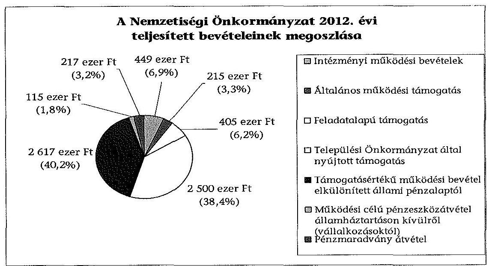
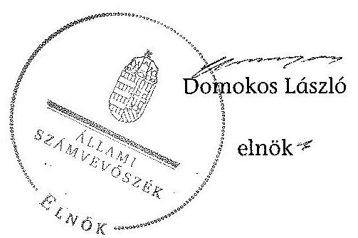

# ÁLLAMI   SZÁMVEVŐSZÉK 

## JELENTÉS

a helyi nemzetiségi önkormányzatok gazdálkodásának ellenőrzéséről
Kunmadarasi Roma Nemzetiségi Önkormányzat

---

# Állami Számvevőszék 

Iktatószám: V-0360-038/2014.
Témaszám: 1346
Vizsgálat-azonosító szám: V0652102

## Az ellenőrzést felügyelte:

## Brebán Andrea

felügyeleti vezető
Az ellenőrzést vezette és az ellenőrzés végrehajtásáért felelős:
Dér Lívia
ellenőrzésvezető
A számvevőszéki jelentést készítették és a jelentés összeállításában közreműködött:

## Szepes Béla

számvevő tanácsos
Az ellenőrzést végezték:

## Joó Erika

számvevő

## Szepes Béla

számvevő tanácsos

---

# TARTALOMJEGYZÉK 

BEVEZETÉS ..... 3
I. ÖSSZEGZŐ MEGÁLLAPÍTÁSOK, KÖVETKEZTETÉSEK, JAVASLATOK ..... 6
II. RÉSZLETES MEGÁLLAPÍTÁSOK ..... 14

1. A Nemzetiségi Önkormányzat és a Települési Önkormányzat együttműködésének szabályozása, a működési feltételek biztosítása ..... 14
2. A gazdálkodási feladatok ellátásának szabályszerűsége ..... 15
2.1. A költségvetésre és zárszámadásra, valamint a kincstári adatszolgáltatás rendjére vonatkozó jogszabályi előírások betartása ..... 15
2.2. A Nemzetiségi Önkormányzat gazdálkodásának szabályozottsága ..... 16
2.3. Az operatív gazdálkodási jogkörök kialakítása, gyakorlása ..... 17
3. A Nemzetiségi Önkormányzattal kapcsolatos gazdálkodási feladatok belső ellenőrzése ..... 18
4. A feladatalapú támogatás felhasználásának, elszámolásának szabályszerűsége, a Nemzetiségi Önkormányzat feladatellátása ..... 19
MELLÉKLET
5. számú A Nemzetiségi Önkormányzat 2012. évi gazdálkodásának főbb adatai, mutatói
FÜGGELÉKEK
6. számú Rövidítések jegyzéke
7. számú Értelmező szótár
8. számú A gazdálkodás értékelésének módszere

---

.

---

# JELENTÉS   a helyi nemzetiségi önkormányzatok gazdálkodásának ellenőrzéséről Kunmadarasi Roma Nemzetiségi Önkormányzat 

## BEVEZETÉS

A Nemzetiségi Önkormányzat az 1995. évben alakult, elnöke a 2010. évi helyhatósági választások óta látja el feladatát. A Nemzetiségi Önkormányzat intézményt, gazdasági társaságot és más szervezetet nem alapított, illetve társulásban nem vett részt. A négytagú Képviselő-testület a munkája segítésére bizottságot nem hozott létre. A jegyző kinevezése 2004. március 3-ától történt, tartós távolléte miatt az aljegyző 2012. november 1-jétől látta el a jegyzői feladatokat. A Nemzetiségi Önkormányzat költségvetési beszámolója szerint a 2012. évben a módosított költségvetési bevételi és kiadási előirányzat 6211 ezer Ft, a teljesített költségvetési bevétel 6518 ezer Ft, a teljesített költségvetési kiadás 6484 ezer Ft volt. A 2012. évi gazdálkodási adatokat részletesen az 1. számú mellékletben mutatjuk be.

Az Alaptörvény XXIX. cikk (1) bekezdése szerint a Magyarországon élő nemzetiségek államalkotó tényezők. Minden, valamely nemzetiséghez tartozó magyar állampolgárnak joga van önazonossága szabad vállalásához és megőrzéséhez. A hazánkban élő nemzetiségek helyi (települési és területi) valamint országos önkormányzatokat hozhatnak létre. A helyi nemzetiségi önkormányzatok gazdálkodási feladatait jogszabályi előírás alapján a székhely szerinti helyi önkormányzat polgármesteri hivatala látja el.

A nemzetiségek helyzete, támogatása mind hazai, mind EU-s szinten kiemelt figyelmet kap napjainkban. A helyi nemzetiségi önkormányzatok gazdálkodására és támogatási rendszerére vonatkozó jogszabályok a 2010-2012. években jelentős változásokon mentek át. A települési és területi nemzetiségi önkormányzatok gazdálkodásának, a részükre juttatott költségvetési támogatások felhasználásának ellenőrzését az ÁSZ 2012-ben sorozatjellegű ellenőrzés keretében indította el. A 2013. évi ellenőrzések e témacsoportos ellenőrzések folytatását jelentik, amelyet az ÁSZ 2014. első félévi ellenőrzési terve 12. témasorszámon tartalmaz.

Az ellenőrzés célja annak értékelése volt, hogy a Nemzetiségi Önkormányzat gazdálkodási kereteinek kialakítása, gazdálkodása és feladatellátása megfelelt-e a jogszabályoknak.

---

Ennek keretében értékeltük, hogy:

- a Nemzetiségi Önkormányzat és a Települési Önkormányzat együttműködésének szabályozása, a működési feltételek biztosítása megfelelt-e a jogszabályi előírásoknak;
- a felek együttműködése megfelelt-e a közöttük létrejött megállapodásnak a gazdálkodási feladatok szabályszerű ellátása során, ennek keretében betartották-e a Nemzetiségi Önkormányzat gazdálkodásához kapcsolódóan a költségvetésre és zárszámadásra, a gazdálkodás szabályozására, az operatív gazdálkodási jogkörök gyakorlására vonatkozó jogszabályi előírásokat;
- a jegyző biztosította-e a Nemzetiségi Önkormányzat gazdálkodásának belső ellenőrzését;
- a Nemzetiségi Önkormányzat feladatalapú támogatásának felhasználása, a folyósított feladatalapú támogatással történő elszámolás az előírásoknak megfelelő volt-e;
- a Nemzetiségi Önkormányzat feladatellátása összhangban volt-e a vonatkozó jogszabályi előírásokkal.

Az ellenőrzés várható hasznosulását négy szinten tervezzük. A törvényalkotás számára összegzett tapasztalatok állnak rendelkezésre a nemzetiségi önkormányzatok testületi döntéseinek, gazdálkodásának és a feladatalapú támogatás felhasználásának szabályszerűségéről, amelynek alapján következtetést lehet levonni arra, hogy indokolt-e esetleges jogszabályi módosítás kezdeményezése. Az ellenőrzés az ellenőrzött számára visszajelzést ad a működésében fellépő hiányosságokról, javaslataival hozzájárul azok kiküszöböléséhez, amely csökkentheti a későbbi ellenőrzések gyakoriságát. Az ellenőrzés megállapításai és javaslatai tanulságul szolgálhatnak más nemzetiségi önkormányzatok, szervezetek számára a rendezett gazdálkodási keretek kialakításához. A társadalom számára jelzi, hogy közpénz nem maradhat ellenőrizetlenül, az ÁSZ értékteremtő rend kialakításához és megőrzéséhez hozzájáruló tevékenysége pozitív hatással lesz a szervezetről kialakított összkép formálásában. Az ÁSZ szervezetén belül lehetőség nyílik arra, hogy a megállapítások szintetizálásával az intézmény a hozzáadott értéket teremtő elemző tevékenységét és tanácsadó szerepét erősítse.

A helyi nemzetiségi önkormányzatok gazdálkodásának ellenőrzéséről szóló jelentés I. fejezetének összegző része az ellenőrzés céljára adott rövid, szintetizáló összefoglalót és következtetéseket tartalmazza a II. fejezet részletes megállapításain alapulóan. A jelentés intézkedést igénylő megállapításait és javaslatait az összegzőben foglaltak mellett - az ellenőrzés során feltárt, a jelentés II. fejezetében rögzített részletes megállapítások alapozzák meg, illetve támasztják alá.

Az ellenőrzés típusa: szabályszerűségi ellenőrzés.
Az ellenőrzött időszak: a 2012. január 1. - 2012. december 31. közötti időszak. Az ellenőrzés kiterjedt a helyi nemzetiségi önkormányzatoknak juttatott 2012. évi feladatalapú támogatás 2013. évben való elszámolására is.

---

Ellenőrzött szervezet: a Kunmadarasi Roma Nemzetiségi Önkormányzat és a gazdálkodási feladatait ellátó Kunmadaras Nagyközség Önkormányzata.

Az ellenőrzés végrehajtásának jogszabályi alapját az ÁSZ tv. 5. § (2)-(3) és (6) bekezdéseiben foglaltak képezik.

Az ellenőrzés szakmai módszertana az ÁSZ hivatalos honlapján (www.asz.hu) közzétett szakmai szabályokon alapult, amely a Legfőbb Ellenőrző Intézmények Nemzetközi Szervezete (INTOSAI) által kiadott nemzetközi standardok (ISSAI) figyelembevételével készült.

A helyi nemzetiségi önkormányzatok gazdálkodásának ellenőrzése során értékeltük a Települési Önkormányzat és a Nemzetiségi Önkormányzat együttműködésének, a gazdálkodás szabályozottságának és a pénzügyi folyamatokban kulcsszerepet betöltő belső kontrollok (teljesítésigazolás és érvényesítés) működésének megfelelőségét. A kulcskontrollokat a működési és felhalmozási célú támogatásértékű kiadásoknál, az államháztartáson kívülre teljesített működési és felhalmozási célú pénzeszköz-átadásoknál, a dologi kiadásokkal kapcsolatos kifizetéseknél - véletlen mintavételi eljárást alkalmazva - ellenőriztük. Ellenőriztük, hogy a jegyző biztosította-e a Nemzetiségi Önkormányzat gazdálkodásának belső ellenőrzését. Értékeltük a feladatalapú támogatások felhasználásának, elszámolásának szabályszerűségét, a Nemzetiségi Önkormányzat feladatellátása és a jogszabályi előírások összhangját. A gazdálkodás értékelésének módszerét a 3. számú függelék tartalmazza.

Az ellenőrzés lefolytatásához a Nemzetiségi Önkormányzat és a gazdálkodási feladatait ellátó Települési Önkormányzat tanúsítványok és a kapcsolódó, dokumentumjegyzékben megjelölt dokumentumok elektronikus úton történő megküldésével, rendelkezésre bocsátásával szolgáltatott adatokat. Az adatszolgáltatás kontrollálása és szükség szerinti javítása a helyszíni ellenőrzés keretében történt.

Az ÁSZ tv. 29. § (1) bekezdése szerint a jelentéstervezetet megküldtük egyeztetésre a polgármesternek és a Nemzetiségi Önkormányzat elnökének, akik az ÁSZ tv. 29. § (2) bekezdésében foglalt észrevételezési jogukkal nem éltek, a jelentéstervezetre észrevételt nem tettek.

---

# I. ÖSSZEGZŐ MEGÁLLAPÍTÁSOK, KÖVETKEZTETÉSEK, JAVASLATOK 

A Nemzetiségi Önkormányzat és a Települési Önkormányzat együttműködésének szabályozása a feltárt tartalmi hiányosság ellenére megfelelt a jogszabályi előírásoknak. A Nemzetiségi Önkormányzat az ellenőrzött időszakban rendelkezett a Települési Önkormányzattal kötött együttműködési megállapodással. A 2012. január 1-jén hatályos, 2011. évben megkötött együttműködési megállapodásnak a gazdálkodási szabályok változása miatti, a Nek. ${ }_{2}$ tv.-ben 2012. január 31-ig előírt felülvizsgálatát nem végezték el. A 2012. december 31-én hatályos együttműködési megállapodás a jogszabályban foglaltaknak megfelelően tartalmazta a gazdálkodással kapcsolatos feladatokat. A Nemzetiségi Önkormányzat működési feltételeit hiányosan szabályozta, mert a Nek. ${ }_{2}$ tv. előírása ellenére nem tartalmazta a Nemzetiségi Önkormányzat működésével, gazdálkodásával kapcsolatos iratkezelési feladatok ellátását. A Nek. ${ }_{2}$ tv.-ben foglaltak ellenére a Nemzetiségi Önkormányzat SzMSz-e nem tartalmazta az együttműködési megállapodás szerinti működési feltételeket. A Települési Önkormányzat a Polgármesteri Hivatal útján, továbbá pénzügyi támogatással biztosította a Nemzetiségi Önkormányzat működésének személyi és tárgyi feltételeit.

A Nemzetiségi Önkormányzat 2012. évi költségvetésére és zárszámadására, valamint az adatszolgáltatásra vonatkozó jogszabályi előírások nem érvényesültek. A 2012. évi költségvetési határozat nem tartalmazta az Áht. ${ }_{2}$. és az Ávr. előírásai ellenére a költségvetési egyenleg összegét, az évközi többletigények, valamint az elmaradt bevételek pótlására szolgáló általános tartalékot és céltartalékot. A 2012. évi költségvetési határozat-tervezet előterjesztésekor - a jegyző mulasztása miatt - az Áht. ${ }_{2}$ előírása ellenére nem mutatták be szöveges indokolással együtt a Képviselő-testület részére tájékoztatásul a Nemzetiségi Önkormányzat költségvetési mérlegét közgazdasági tagolásban és előirányzat felhasználási tervét. A Nemzetiségi Önkormányzat az ellenőrzött időszakban a dologi kiadások és az államháztartáson kívülre átadott pénzeszköz előirányzatoknál - az előirányzat módosítás előterjesztése hiányában - nem döntött a felhasználáshoz szükséges mértékű módosításról, ezért a teljesített kiadások az Áht. ${ }_{2}$ előírását megsértve meghaladták a jóváhagyott előirányzatot. A zárszámadási határozat összehasonlíthatósága az elfogadott költségvetéssel biztosított volt, de a Képviselő-testület tájékoztatására az Áht. ${ }_{2}$ előírásai ellenére a költségvetési mérleget közgazdasági tagolásban, valamint a vagyonkimutatást nem készítették el. A 2012. évi zárszámadási határozatban az általános működési, továbbá a feladatalapú támogatásból származó bevételeket nem teljes körűen mutatták be, ezáltal nem voltak figyelemmel az Áht. ${ }_{2}$-ben foglaltakra. A jegyző a 2012. évi költségvetéshez kapcsolódó, a Nemzetiségi Önkormányzatra vonatkozó, kincstári adatszolgáltatási kötelezettségének hat esetben az Ávr.-ben, illetve az Áhsz. ${ }_{1}$-ben előírt határidőn túl tett eleget.

A gazdálkodás szabályozottsága nem volt megfelelő az ellenőrzött időszakban. A jegyző a Nemzetiségi Önkormányzat gazdálkodásának végrehajtásával kapcsolatos feladataira nem terjesztette ki a Bkr.-ben előírt ellenőrzési

---

nyomvonal és a szabálytalanságok kezelése eljárásrendje, továbbá a folyamatba épített előzetes, utólagos és vezetői ellenőrzés szabályozás hatályát. Nem készült a Polgármesteri Hivatalra a Számv. tv. szerinti eszközök és források értékelési szabályzata, valamint számlarend, ezáltal hiányzott annak Nemzetiségi Önkormányzatra történő kiterjesztése is. A Nemzetiségi Önkormányzat a Számv. tv.-ben előírt szabályzatok közül a leltárkészítésre és leltározásra, valamint a pénzkezelésre vonatkozó szabályozásokkal, továbbá számviteli politikával 2012. június 1-jétől, a Polgármesteri Hivatal szabályzatai hatályának kiterjesztése útján rendelkezett. A Polgármesteri Hivatal SzMSz-e az Ávr.-ben előírtak ellenére nem tartalmazta az SzMSz-ben nevesített munkakörökhöz tartozó - a Nemzetiségi Önkormányzat gazdálkodásának végrehajtásával kapcsolatos - feladat- és hatásköröket, a hatáskörök gyakorlásának módját, a helyettesítés rendjét, az ezekhez kapcsolódó felelősségi szabályokat. A tervezéssel, gazdálkodással, különösen az operatív gazdálkodási jogkörök gyakorlásának módjával, eljárási és dokumentációs részletszabályaival, valamint az ezeket végző személyek kijelölési rendjével, és az ellenőrzési, adatszolgáltatási feladatok teljesítésével kapcsolatos belső előírásokat az együttműködési megállapodás rögzítette.

A Nemzetiségi Önkormányzat gazdálkodása tekintetében az operatív gazdálkodási jogkörök kialakítása részben felelt meg a jogszabályi előírásoknak. A Nemzetiségi Önkormányzat elnöke - mint kötelezettségvállaló - az Ávr.-ben előírtak ellenére írásban nem jelölte ki a teljesítésigazolásra jogosult személyt, továbbá más képviselőt nem hatalmazott fel a kötelezettségvállalás és az utalványozás gyakorlására, így az Ávr.-ben előírt összeférhetetlenségi szabályok feltételeit nem biztosította.

A teljesítésigazolás és érvényesítés kulcskontrollok működésének megfelelőségét a dologi kiadások bizonylatainak tesztelése során az ellenőrzés gyengének értékelte, a hibák száma a lényegességi szintet, a kritikus hibahatárt elérte. A teljesítés igazolását az Ávr. előírása ellenére a jogkör gyakorlására kijelöléssel nem rendelkező személy jogosulatlanul látta el, ezért nem szabályszerűen történt a kifizetés jogosságának, összegszerűségének és a
 szerződésszerű teljesítésnek az igazolása. Az érvényesítő nem az Ávr.-ben előírtak szerint végezte el feladatát, mert nem ellenőrizte, hogy a megelőző ügymenetben az Ávr. és a gazdálkodási szabályzat előírásait betartották-e. Nem jelezte, hogy a teljesítésigazolás szabálytalan volt, továbbá hogy a százezer forintot el nem érő kifizetések rendjét az Ávr.-ben foglaltak ellenére belső szabályzatban nem rögzítették, az érvényesítés az Ávr.-ben előírtak ellenére nem foglalta magában az érvényesítésre utaló megjelölést. Nem észrevételezte az operatív gazdálkodási jogkörök gyakorlására jogosult személyekről és aláírás-mintájukról vezetendő naprakész nyilvántartás hiányát. Nem jelezte az utalványozó felé a fedezet rendelkezésre állásának a hiányát, ezáltal az Áht${ }_{2}$. előírása megsértését. A 2012. évi három legnagyobb összegű dologi kiadás bizonylatainak a tételes ellenőrzése során a teljesítésigazolás és az érvényesítés kulcskontrollok nem működtek megfelelően, a teljesítésigazolásnál feltárt hiányosságok megegyeztek a dologi kiadások tesztelésénél tett észrevételekkel, ezen túl az érvényesítő az utalványozó felé nem jelezte, hogy az Áht${ }_{2}$. előírását megsértve a kötelezettségvállalásra pénzügyi ellenjegyzés nélkül került sor. Az államháztartáson kívülre teljesített működési útpénzeszközátadás során a teljesítésigazolás és az érvényesítés kulcskontrollok nem működtek megfelelően, a feltárt hiányosságok a dologi kiadásoknál tett észrevételekkel részben egyezőek voltak. A civil szervezetnek nyújtott támogatás-

---

sok kifizetését megelőzően a teljesítés igazolására és az érvényesítésre kijelölt személyek az Ávr.-ben előírt ellenőrzési feladatukat nem látták el, mert a teljesítések igazolása és az érvényesítése nem történt meg. Érvényesítés - ennek keretében az összegszerűség, a fedezet meglétének, továbbá a megelőző ügymenetben a gazdálkodási szabályok betartása ellenőrzése és igazolása - hiányában az érvényesítő nem jelezte az utalványozó felé a fedezet rendelkezésre állásának a hiányát, ezáltal az Áht${ }_{2}$. előírása, továbbá a megelőző ügymenetben a teljesítésigazolásra és a támogatói okirat tartalmi hiányosságaira vonatkozó szabályok megsértését. A számvevőszéki ellenőrzés a kifizetések bizonylatainak ellenőrzése során - a rendelkezésre bocsátott dokumentumok alapján - vagyoni hátrányt okozó jogosulatlan kifizetést nem tárt fel, a kulcskontrollok működésében feltárt hiányosságok miatt nem biztosították a hibák megelőzését, feltárását és kijavítását.

A jegyző biztosította a Nemzetiségi Önkormányzat gazdálkodásával kapcsolatos végrehajtási feladatok belső ellenőrzését. Erre irányuló ellenőrzés lefolytatására a 2012. évben került sor, hiányosságot nem tártak fel.

A Nemzetiségi Önkormányzat a 2011. évben feladatalapú támogatásban nem részesült. A 2012. évben 405 ezer Ft feladatalapú támogatást kapott, amelyet a folyósítás évében a jogszabályi előírásokkal összhangban felhasznált. A feladatalapú támogatás elszámolása a támogatási kormányrendelet${ }_{2}$ előírása ellenére nem történt meg, a támogatás felhasználását, elszámolását az ellenőrzésre jogosult szervek nem ellenőrizték. A Nemzetiségi Önkormányzat feladatellátása - mind a kötelező, mind az önként vállalt feladatok tekintetében - összhangban volt a Nek.${ }_{2}$ tv. előírásaival. A kötelező feladatok keretében a képviselt közösség érdekképviseletével, esélyegyenlőségének megteremtésével kapcsolatos feladatok ellátását, a nemzetiségi közösség kulturális autonómiájának megerősítését szolgáló döntési, együttdöntési jogok gyakorlását valósították meg. Önként vállalt feladatot a közfoglalkoztatás és a hagyományápolás területén végeztek.

Az ÁSZ tv. 33. § (1) bekezdésében foglaltak értelmében az ellenőrzött szervezet vezetője köteles a jelentésben foglalt megállapításokhoz kapcsolódó intézkedési tervet összeállítani és azt a jelentés kézhezvételétől számított 30 napon belül az ÁSZ részére megküldeni. Amennyiben az intézkedési tervet határidőre nem küldi meg a szervezet, vagy az nem elfogadható, az ÁSZ elnöke az ÁSZ tv. 33. § (3) bekezdés a)-b) pontjaiban foglaltakat érvényesítheti.

A helyszíni ellenőrzés megállapításainak hasznosítása mellett javasoljuk:

# a jegyzőnek 

1. az együttműködés szabályozásával kapcsolatban

A 2011. évben kötött együttműködési megállapodás felülvizsgálatát a felek a Nek.${ }_{2}$ tv. 80. § (2) bekezdésében előírt határidőben nem végezték el. A 2012. december 31-én hatályos együttműködési megállapodás a Nek.${ }_{2}$ tv. 80. § (1) bekezdés e) pontjában foglaltak ellenére nem tartalmazta a Nemzetiségi Önkormányzat működésével, gazdálkodásával kapcsolatos iratkezelési feladatok ellátását. Továbbá a

---

Nek. 2 tv. 80. § (2) bekezdésében foglaltak ellenére az együttműködési megállapodás szerinti működési feltételeket nem rögzítették a Nemzetiségi Önkormányzat SzMSzében a megállapodás megkötését, módosítását követő 30 napon belül.

Javaslat
Az együttműködés szabályszerűsége érdekében:
a) készítse elő az együttműködési megállapodás módosítását, hogy az tartalmilag feleljen meg a Nek. 2 tv. 80. § (1) bekezdés e) pontjában foglalt előírásoknak;
b) készítse elő a Nemzetiségi Önkormányzat SzMSz-ének kiegészítését a Nek.${ }_{2}$ tv. 80. § (2) bekezdésében foglalt előírás alapján;
c) biztosítsa a jövőben az együttműködési megállapodás évenkénti felülvizsgálata során a Nek.${ }_{2}$ tv. 80. § (2) bekezdésében előírt határidő betartását.
2. a költségvetés és a zárszámadás szabályszerűségével kapcsolatban

A 2012. évi költségvetési határozat-tervezet az Áht.${ }_{2}$ 23. § (2) bekezdés c) pontja előírása ellenére nem tartalmazta a költségvetési egyenleg összegét, az Áht.${ }_{2}$ 23. § (3) bekezdésében és az Ávr. 24. § (1) bekezdés bc) pontjában foglaltak ellenére az évközi többletigények, valamint az elmaradt bevételek pótlására szolgáló általános tartalékot és céltartalékot. A 2012. évi költségvetés előterjesztésekor - a jegyző általi elkészítés hiányában - az Áht.${ }_{2}$ 24. § (4) bekezdés a) pontjának előírása ellenére tájékoztatásul - szöveges indoklással együtt - nem mutatták be a Nemzetiségi Önkormányzat költségvetési mérlegét közgazdasági tagolásban és az előirányzat felhasználási tervét. A zárszámadási határozat-tervezet előterjesztésekor - a jegyző mulasztása miatt - az Áht.${ }_{2}$ 91. § (2) bekezdés a) és c) pontjaiban foglaltak ellenére a Képviselőtestület részére tájékoztatásul nem mutatták be a költségvetési mérleget közgazdasági tagolásban, valamint a vagyonkimutatást. A 2012. évi zárszámadási határozatban az Áht.${ }_{2}$ 89. § (2) bekezdésében foglaltak ellenére az általános működési, továbbá a feladatalapú támogatásból származó bevételek összegét nem teljes körűen mutatták be.

A dologi kiadások és az államháztartáson kívülre átadott pénzeszköz előirányzatok tekintetében a kiadások teljesítése Áht.${ }_{2}$ 6. § (1) bekezdésében foglalt ellenére a jóváhagyott előirányzatot meghaladó összegű volt, ezáltal nem tartották be az Áht.${ }_{2}$ 36. § (1) bekezdéseiben foglalt előírásokat.

Javaslat
Gondoskodjon a jövőben:
a) a költségvetés szerkezetét és tartalmát meghatározó, az Áht.${ }_{2}$ 23. § (2) bekezdés c) pontjában és az Ávr. 24. § (1) bekezdésében foglalt előírás betartásáról, továbbá arról, hogy az Áht.${ }_{2}$ 24. § (4) bekezdés a) pontjában foglalt előírásnak megfelelően költségvetési határozat-tervezet előterjesztésekor a Képviselőtestület részére tájékoztatásul bemutatásra kerüljön - szöveges indoklással - a Nemzetiségi Önkormányzat költségvetési mérlege közgazdasági tagolásban, valamint az előirányzat felhasználási terve;

---

b) a zárszámadási határozat-tervezet előterjesztésekor arról, hogy az Áht. 2 91. § (2) bekezdés a) pontjában foglaltak szerint a Képviselő-testület részére tájékoztatásul bemutatásra kerüljön a költségvetési mérleg közgazdasági tagolásban, valamint a vagyonkimutatás, továbbá az Áht. 2 89. § (2) bekezdésének megfelelően a Nemzetiségi Önkormányzat összes bevételéről elszámoljanak;
c) az előirányzatok szükséges mértékű módosítására vonatkozó előterjesztés elkészítéséről az Áht. 2 36. § (1) bekezdése szerint a meghatározott előirányzatokon belül való gazdálkodás érdekében.
3. a kincstári adatszolgáltatási kötelezettséggel kapcsolatban

A jegyző a 2012. évi költségvetéshez kapcsolódó - a Nemzetiségi Önkormányzatra vonatkozó - kincstári adatszolgáltatási kötelezettségét hat esetben az Ávr. 33. §-ában, a 169. § (2) és a 170. § (5) bekezdéseiben, valamint az Áhsz., 10. § (5a) bekezdésében előírt - határidőn túl teljesítette.

Javaslat
Tegyen eleget adatszolgáltatási kötelezettségének az Ávr. 33. §-ában, a 169. § (2) és a 170. § (5) bekezdéseiben, valamint az Áhsz. 2 32. § (4) bekezdésében előírt határidő betartásával.
4. a gazdálkodási feladatok szabályozottságával kapcsolatban

A jegyző a Nemzetiségi Önkormányzat gazdálkodásának végrehajtásával kapcsolatos feladataira nem terjesztette ki a Bkr. 6. § (3)-(4) bekezdéseiben előírt ellenőrzési nyomvonal és a szabálytalanságok kezelése eljárásrendje, a Bkr. 8. § (2) bekezdése szerinti, folyamatba épített előzetes, utólagos és vezetői ellenőrzés szabályozás hatályát, továbbá a Polgármesteri Hivatal nem rendelkezett a Nemzetiségi Önkormányzat végrehajtási feladataira kiterjedő hatályú a Számv. tv. 14. § (5) bekezdés b) pontja szerinti eszközök és források értékelési szabályzatával, a Számv. tv. 161. § (1) bekezdése szerinti számlarenddel.

A Polgármesteri Hivatal SzMSz-e az Ávr. 13. § (1) bekezdés g) pontjában előírtak ellenére nem tartalmazta az SzMSz-ben nevesített munkakörökhöz tartozó - a Nemzetiségi Önkormányzat gazdálkodásának végrehajtásával kapcsolatos - feladat és hatásköröket, a hatáskörök gyakorlásának módját, a helyettesítés rendjét, valamint az ezekhez kapcsolódó felelősségi szabályokat.

Javaslat
A Nemzetiségi Önkormányzat gazdálkodásának végrehajtásával kapcsolatos feladataira kiterjedő hatállyal:
a) készítse el a Számv. tv. 14. § (5) bekezdés b) pontjában, továbbá a Számv. tv. 161. § (1) bekezdésében előírt számviteli szabályzatokat, valamint a Bkr. 6. § (3)(4) és a Bkr. 8. § (2) bekezdésében meghatározott szabályozásokat;
b) készítse el a Polgármesteri Hivatal SzMSz-ének módosítását, hogy az feleljen meg az Ávr. 13. § (1) bekezdés g) pontjában foglalt előírásnak.

---

5. a kulcskontrollok működésével kapcsolatban

A teljesítés igazolását nem, illetve az Ávr. 57. § (4) bekezdés előírása ellenére a jogkör gyakorlására kijelöléssel nem rendelkező személy jogosulatlanul látta el, ezért az Ávr. 57. § (1) és (3) bekezdéseiben foglaltak ellenére nem szabályszerűen történt a kifizetés jogosságának, összegszerűségének és a szerződésszerű teljesítésnek az ellenőrzése és az igazolása. Az érvényesítő nem végezte el, illetve nem az Ávr. 58. § (1)-(2) bekezdéseiben előírtak szerint látta el érvényesítési feladatát, mert annak ellenére érvényesítette a kiadásokat, hogy nem ellenőrizte a megelőző ügymenetben a jogszabályok betartását, továbbá nem jelezte, hogy a teljesítésigazolás szabálytalan volt és nem tárta fel a gazdálkodási szabályok érvényesülésének hiányát. Nem jelezte az utalványozó felé, hogy az Áht. 2 37. § (1) bekezdésében előírtak ellenére kötelezettségvállalására pénzügyi ellenjegyzés nélkül került sor. Az Ávr. 58. § (3) bekezdésében előírtak ellenére az érvényesítés nem foglalta magában az érvényesítésre utaló megjelölést.

Javaslat
Az operatív gazdálkodás működési hibáinak megelőzése, feltárása és kijavítása érdekében gondoskodjon arról, hogy:
a) a teljesítésigazolást az Ávr. 57. § (4) bekezdésében előírtak szerint kijelölt személy végezze az Ávr. 57. § (1) és (3) bekezdéseiben foglaltak betartásával;
b) az Ávr. 58. § (1)-(3) bekezdései alapján az érvényesítő lássa el ellenőrzési és jelzési feladatát;
c) a kötelezettségvállalásra az Áht. 2 37. § (1) bekezdésében előírtak szerinti pénzügyi ellenjegyzést követően kerüljön sor.
6. a feladatalapú támogatás elszámolásával kapcsolatban

A 2012. évi feladatalapú támogatás elszámolása a támogatási kormányrendelet 2 8. § (5) bekezdésében hivatkozott, „a helyi önkormányzatok elszámolási és ellenőrzési rendjére vonatkozó jogszabályok rendelkezései alkalmazandóak" előírása alapján az Áht. 2 57. § (3) bekezdésében foglaltak ellenére nem történt meg.

Javaslat
Intézkedjen az Áht. 2 27. § (2) bekezdésében meghatározott feladatkörében a Nemzetiségi Önkormányzat által igénybe vett 2012. évi feladatalapú támogatás rendeltetésszerű felhasználásáról szóló elszámolás elkészítéséről, az Áht${ }_{2}$. 53. § (1) bekezdése szerinti beszámolási kötelezettség teljesítéséhez.

# a polgármesternek 

A Nemzetiségi Önkormányzat és a Települési Önkormányzat együttműködését meghatározó - 2012. december
 31-én hatályos - együttműködési megállapodás a Nek. 2 tv. 80. § (1) bekezdés e) pontjában foglaltak ellenére nem tartalmazta a Nemzetiségi Önkormányzat működésével, gazdálkodásával kapcsolatos iratkezelési feladatok ellátását.

---

A Polgármesteri Hivatal SzMSz-e az Ávr. 13. § (1) bekezdés g) pontjában előírtak ellenére nem tartalmazta az SzMSz-ben nevesített munkakörökhöz tartozó - a Nemzetiségi Önkormányzat gazdálkodásával kapcsolatos - feladat- és hatásköröket, a hatáskörök gyakorlásának módját, a helyettesítés rendjét, valamint az ezekhez kapcsolódó felelősségi szabályokat.

Javaslat
Terjessze a Települési Önkormányzat Képviselő-testülete elé jóváhagyásra:
a) a Nek. 2 tv. 80. § (1) bekezdés e) pontjában foglalt előírások betartásával a jegyző által előkészített együttműködési megállapodás módosítását;
b) az Ávr. 13. § (1) bekezdés g) pontjában foglalt szabályozásra figyelemmel a módosított, jegyző által elkészített Polgármesteri Hivatal SzMSz-ét.

# a Nemzetiségi Önkormányzat elnökének 

1. A Nemzetiségi Önkormányzat és a Települési Önkormányzat együttműködését meghatározó - 2012. december 31-én hatályos - együttműködési megállapodás a Nek. 2 tv. 80. § (1) bekezdés e) pontjában foglaltak ellenére nem tartalmazta a Nemzetiségi Önkormányzat működésével, gazdálkodásával kapcsolatos iratkezelési feladatok ellátását. Továbbá a Nek. 2 tv. 80. § (2) bekezdésében foglaltak ellenére az együttműködési megállapodás szerinti működési feltételeket nem rögzítették a Nemzetiségi Önkormányzat SzMSz-ében a megállapodás megkötését, módosítását követő 30 napon belül.

Javaslat
Terjessze a Képviselő-testület elé jóváhagyásra:
a) a Nek. 2 tv. 80. § (1) bekezdés e) pontjában foglalt előírások betartásával a jegyző által előkészített együttműködési megállapodás módosítást;
b) a Nemzetiségi Önkormányzat SzMSz-ének a Nek. 2 tv. 80. § (2) bekezdésében foglaltaknak megfelelő a jegyző által előkészített módosítását az előírt határidőn belül.
2. A Nemzetiségi Önkormányzat elnöke, mint kötelezettségvállaló írásban nem hatalmazott fel az Ávr. 52. § (7) és 59. § (1) bekezdéseiben foglaltak alapján más nemzetiségi önkormányzati képviselőt kötelezettségvállalás és utalványozás gyakorlására annak ellenére, hogy a kifizetések során az utalványozási jogkört írásos felhatalmazás nélkül az elnökhelyettes - az összeférhetetlenségi követelmények biztosításához rendszeresen, jogosulatlanul gyakorolta.

Javaslat
Az Ávr. 60. §. (2) bekezdésében foglalt összeférhetetlenség fennállása esetén jelöljön ki további kötelezettségvállaló utalványozó személyt az Ávr. 52. § (7) bekezdés és az Ávr. 59. § (1) bekezdés előírásai alapján.

---

3. A teljesítésigazoló kijelölése az együttműködési megállapodásban (az elnök vagy megbízása alapján nemzetiségi képviselő) megtörtént, azonban ennek alapján a Nemzetiségi Önkormányzat elnöke az Ávr. 57. § (4) bekezdése alapján az összeférhetetlenségi szabályok érvényesítéséhez írásban a szükséges módon nem jelölte ki a teljesítésigazoló személyeket.

Javaslat
Írásban jelöljön ki a szükséges módon a teljesítés igazoló személyt az Ávr. 57. § (4) bekezdés előírása alapján.
4. A Nemzetiségi Önkormányzat elnöke a 2012. évi költségvetési határozat-tervezet előterjesztésekor - a jegyző mulasztása miatt - tájékoztatásul, szöveges indoklással együtt nem mutatta be az Áht. 2 24. § (4) bekezdés a) pontjában előírt Nemzetiségi Önkormányzat költségvetési mérlegét közgazdasági tagolásban és az előirányzat felhasználási tervét. A zárszámadási határozat-tervezet előterjesztésekor - a jegyző általi elkészítés hiányában - a Képviselő-testület tájékoztatására nem mutatta be az Áht. 2 91. § (2) bekezdés a) és c) pontjaiban előírtak ellenére a költségvetési mérleget közgazdasági tagolásban, valamint a vagyonkimutatást.

Javaslat
Gondoskodjon a jövőben a Képviselő-testület elé terjesztésekor:
a) a jegyző által előkészített költségvetési határozat-tervezet előterjesztésekor tájékoztatásul, szöveges indoklással együtt mutassa be az Áht. 2 24. § (4) bekezdés a) pontjában előírt Nemzetiségi Önkormányzat költségvetési mérlegét közgazdasági tagolásban és az előirányzat felhasználási tervét;
b) a jegyző által előkészített zárszámadási határozat-tervezet előterjesztésekor tájékoztatásul mutassa be az Áht. 2 91. § (2) bekezdés a) és c) pontjaiban előírt mérlegeket, kimutatásokat.
5. A 2012. évi feladatalapú támogatás elszámolása a támogatási kormányrendelet 2 8. § (5) bekezdésében hivatkozott, „a helyi önkormányzatok elszámolási és ellenőrzési rendjére vonatkozó jogszabályok rendelkezései alkalmazandóak" az Áht. 2 57. § (3) bekezdésében foglaltak ellenére nem történt meg.

Javaslat
Terjessze a Képviselő-testület elé a jegyző által az Áht. 2 53. § (1) bekezdése alapján beszámolási kötelezettség teljesítéséhez összeállított, a Nemzetiségi Önkormányzat által igénybe vett 2012. évi feladatalapú támogatás rendeltetésszerű felhasználásáról szóló elszámolását.

---

# II. RÉSZLETES MEGÁLLAPÍTÁSOK 

## 1. A Nemzetiségi Önkormányzat és a Települési Önkormányzat együttműködésének szabályozása, a működési feltételek biztosítása

A Nemzetiségi Önkormányzat és a Települési Önkormányzat együttműködésének szabályozása a feltárt tartalmi hiányosság ellenére megfelel a jogszabályi előírásoknak.

A Nemzetiségi Önkormányzat az ellenőrzött időszakban rendelkezett a Települési Önkormányzattal kötött együttműködési megállapodással¹. A 2012. január 1-jén hatályos, 2011. évben megkötött együttműködési megállapodásnak a gazdálkodási szabályok változása miatti, a Nek. 2 tv. 80. § (2) bekezdésben 2012. január 31-ig előírt felülvizsgálatát nem végezték el. Az együttműködési megállapodást a Nek. 2 tv. 159. § (3) bekezdésben előírtaknak megfelelve felülvizsgálták és 2012. június 1-jétől új együttműködési megállapodást kötöttek.

A 2012. december 31-én hatályos együttműködési megállapodás a jogszabályban foglaltaknak megfelelően tartalmazta a gazdálkodással kapcsolatos feladatokat. A Nemzetiségi Önkormányzat működési feltételeit hiányosan szabályozta, mert nem tartalmazta a Nek. 2 tv. 80. § (1) bekezdés e) pontjában foglaltak ellenére a Nemzetiségi Önkormányzat működésével, gazdálkodásával kapcsolatos iratkezelési feladatok ellátását.

A Nek. 2 tv. 80. § (2) bekezdésében foglaltak ellenére nem írták elő a Nemzetiségi Önkormányzat SzMSz-ében az együttműködési megállapodás szerinti működési feltételeket a megállapodás megkötését, módosítását követő harminc napon belül.

Települési Önkormányzat a Nemzetiségi Önkormányzat működésének személyi és tárgyi feltételeit a Polgármesteri Hivatal útján, továbbá pénzügyi támogatással biztosította.

[^0]
[^0]:    ${ }^{1}$ A 2012. május 31-éig hatályos megállapodást a Képviselő-testület a 45/2011. (V.17.) számú határozatával, a Települési Önkormányzat Képviselő-testülete a 79/2011. (V. 5.) számú határozatával hagyta jóvá. A 2012. június 1-jétől hatályos, a Nek. 2 tv. 159. § (3) bekezdésében foglaltak alapján megkötött együttműködési megállapodást a Képviselőtestület a 41/2012. (VI. 6.) határozatával, a Települési Önkormányzat Képviselőtestülete a 124/2012.(V.31.) számú határozatával fogadta el.

---

# 2. A GAZDÁLKODÁSI FELADATOK ELLÁTÁSÁNAK SZABÁLYSZERŰSÉGE 

### 2.1. A költségvetésre és zárszámadásra, valamint a kincstári adatszolgáltatás rendjére vonatkozó jogszabályi előírások betartása

A Nemzetiségi Önkormányzat 2012. évi költségvetésének és zárszámadásának tartalma, jóváhagyása, valamint a kapcsolódó adatszolgáltatás nem felelt meg a jogszabályi előírásoknak.

A 2012. évi költségvetési határozat nem tartalmazta:

- az Áht. 2 23. § (2) bekezdés c) pontja ellenére a költségvetési egyenleg összegét;
- az Áht. 2 23. § (3) bekezdése, és az Ávr. 24. § (1) bekezdés bc) pontjában foglaltak ellenére az évközi többletigények, valamint az elmaradt bevételek pótlására szolgáló általános tartalékot és céltartalékot.

A 2012. évi költségvetési határozat-tervezet előterjesztésekor - a jegyző mulasztása miatt - az Áht. 2 24. § (4) bekezdés a) pontja szerinti előírás ellenére tájékoztatásul nem mutatták be a Képviselő-testület részére szöveges indokolással együtt a Nemzetiségi Önkormányzat költségvetési mérlegét közgazdasági tagolásban és az előirányzat felhasználási tervét.

A Képviselő-testület a dologi kiadások és az államháztartáson kívülre átadott pénzeszköz előirányzatok tekintetében az ellenőrzött időszakban - az előirányzat módosítás előterjesztése hiányában - nem döntött a felhasználáshoz szükséges mértékű módosításáról. Ezen előirányzatoknál az Áht. 2 6. § (1) bekezdése ellenére a kiadások teljesítése 2012. évben a jóváhagyott előirányzatokat meghaladó összegű volt. Ezáltal nem tartották be az Áht. 2 36. § (1) bekezdésében foglalt előírást. Az adatokat az 1. számú melléklet mutatja be.

A zárszámadási határozat összehasonlíthatósága az elfogadott költségvetéssel biztosított volt. A zárszámadási határozat-tervezet előterjesztésekor - a jegyző mulasztása miatt - az Áht. 2 91. § (2) bekezdés a) és c) pontjaiban előírtak ellenére a Képviselő-testület részére tájékoztatásul nem mutatták be a költségvetési mérleget közgazdasági tagolásban, valamint a vagyonkimutatást.

A 2012. évi zárszámadási határozatban az általános működési, továbbá a feladatalapú támogatásból származó bevételeket nem teljes körűen mutatták be, ezáltal nem voltak figyelemmel az Áht. 2 89. § (2) bekezdésében foglaltakra.

A Kincstár 2012. február 17-én 215 ezer Ft összegű általános működési támogatást, 2012. július 19-én 405 ezer Ft feladatalapú támogatást utalt át a Nemzetiségi Önkormányzat bankszámlájára. Téves könyvelési helyesbítés miatt a 2012. évi zárszámadási határozat a két jogcím együttes bevételeként 339 ezer Ft-ot tartalmazott.

---

A jegyző a 2012. évi költségvetéshez kapcsolódó, a Nemzetiségi Önkormányzatra vonatkozó, kincstári adatszolgáltatási kötelezettségének hat esetben az Ávr. 33. §-ában, az Ávr. 169. § (2) bekezdésében az Ávr. 170. § (5) bekezdésében és az Áhsz.; 10. § (5a) bekezdésében előírt - határidőn túl tett eleget.

# 2.2. A Nemzetiségi Önkormányzat gazdálkodásának szabályozottsága 

A Nemzetiségi Önkormányzat gazdálkodásának szabályozottsága az ellenőrzött időszakban nem volt megfelelő.

A jegyző a Nemzetiségi Önkormányzat gazdálkodásának végrehajtásával kapcsolatos feladataira nem terjesztette ki a Bkr. 6. § (3)-(4) bekezdéseiben előírt ellenőrzési nyomvonal és a szabálytalanságok kezelése eljárásrendje, a Bkr. 8. § (2) bekezdése szerinti, folyamatba épített előzetes, utólagos és vezetői ellenőrzés szabályozás hatályát. Nem készült a Polgármesteri Hivatalra a Számv. tv. 14. § (5) bekezdés b) pontja szerinti eszközök és források értékelési szabályzata, és a Számv. tv. 161. § (1) bekezdése szerinti számlarend, ezáltal hiányzott annak Nemzetiségi Önkormányzatra történő kiterjesztése is. Ezekkel a szabályzatokkal a Nemzetiségi Önkormányzat önállóan sem rendelkezett.

A Nemzetiségi Önkormányzat a 2012. évben a Számv. tv.-ben előírt szabályzatok közül a leltárkészítésre és leltározásra, valamint a pénzkezelésre vonatkozó szabályozásokkal, továbbá 2012. június 1-jétől számviteli politikával, a Polgármesteri Hivatal szabályzatai hatályának kiterjesztése útján 2 rendelkezett.

A Polgármesteri Hivatal SzMSz-e az Ávr. 13. § (1) bekezdés g) pontjában előírtak ellenére nem tartalmazta az SzMSz-ben nevesített munkakörökhöz tartozó - a Nemzetiségi Önkormányzat gazdálkodásának végrehajtásával kapcsolatos - feladat és hatásköröket, a hatáskörök gyakorlásának módját, a helyettesítés rendjét, valamint az ezekhez kapcsolódó felelősségi szabályokat. Azokat - a helyettesítés rendjére vonatkozóan 2012. július 24-ig hiányosan - a munkaköri leírásokban rögzítették.

Az Ávr. 13. § (2) bekezdés a) pontban foglaltak szerinti belső szabályozás tartalmi követelményeit - a tervezéssel, gazdálkodással, különösen az operatív gazdálkodási jogkörök gyakorlásának módjával, eljárási és dokumentációs részletszabályaival, valamint az ezeket végző személyek kijelölési rendjével, és az ellenőrzési, adatszolgáltatási feladatok teljesítésével kapcsolatos belső előírásokat - az együttműködési megállapodás rögzítette.

[^0]
[^0]:    ${ }^{2}$ A 2012. június 1-jétől hatályos együttműködési megállapodás 2. pontjában rögzítették a szabályzat hatályának Nemzetiségi Önkormányzatra történő kiterjesztését.

---

# 2.3. Az operatív gazdálkodási jogkörök kialakítása, gyakorlása 

A Nemzetiségi Önkormányzat gazdálkodása tekintetében az operatív gazdálkodási jogkörök kialakítása részben felelt meg a jogszabályi előírásoknak.

A Nemzetiségi Önkormányzat elnöke, mint kötelezettségvállaló írásban nem hatalmazott fel az Ávr. 52. § (7) és 59. § (1) bekezdéseiben foglaltak alapján más nemzetiségi önkormányzati képviselőt kötelezettségvállalás és utalványozás gyakorlására annak ellenére, hogy a 2012. évben hatályos megállapodásban erről rendelkeztek, továbbá a kifizetések során az utalványozási jogkört írásos felhatalmazás nélkül az elnökhelyettes - az összeférhetetlenségi szabályok biztosításához rendszeresen, jogosulatlanul gyakorolta.

A teljesítésigazoló kijelölése az együttműködési megállapodásban (az elnök vagy megbízása
 alapján nemzetiségi képviselő) megtörtént, azonban ennek alapján a Nemzetiségi Önkormányzat elnöke az Ávr. 57. § (4) bekezdése alapján az összeférhetetlenségi szabályok érvényesítéséhez írásban a szükséges módon nem jelölte ki a teljesítésigazoló személyeket.

A Nemzetiségi Önkormányzatnál a 2012. évben a dologi kiadások teljesítése során a teljesítésigazolás és az érvényesítés kulcskontrollok működésének megfelelősége gyenge volt, a hibák száma a lényegességi szintet, a kritikus hibahatárt elérte, mert:

- a teljesítés igazolását az Ávr. 57. § (4) bekezdés előírása ellenére a jogkör gyakorlására kijelöléssel nem rendelkező személy jogosulatlanul látta el, ezért az Ávr. 57. § (1) és (3) bekezdéseiben foglaltak ellenére nem szabályszerűen történt a kifizetés jogosságának, összegszerűségének és a szerződésszerű teljesítésnek az igazolása.
- az érvényesítő az Ávr. 58. § (1) bekezdésében előírtak ellenére nem ellenőrizte, hogy a megelőző ügymenetben az Áht. ${ }_{2}$-ben, az Ávr.-ben és a gazdálkodási szabályzatban előírtakat betartották-e. Nem jelezte, hogy az Ávr. 57. § (1) bekezdésében előírtak ellenére a teljesítésigazolás szabálytalan volt, továbbá hogy a százezer forintot el nem érő kifizetések rendjét az Ávr. 53. § (2) bekezdésében foglaltak ellenére belső szabályzatban nem rögzítették, az érvényesítés az Ávr. 58. § (3) bekezdésében előírtak ellenére nem foglalta magában az érvényesítésre utaló megjelölést. Nem észrevételezte az Ávr. 60. § (3) bekezdésében előírt, az operatív gazdálkodási jogkörök gyakorlására jogosult személyekről és aláírás-mintájukról vezetendő naprakész nyilvántartás hiányát. Nem jelezte az utalványozó felé a fedezet rendelkezésre állásának a hiányát, ezáltal az Áht. 2 36. § (1) bekezdés előírása megsértését.

A 2012. évi három legnagyobb összegű dologi kiadás teljesítése bizonylatainak egyedi értékelése alapján a kifizetések teljesítését megelőzően a teljesítésigazolás és az érvényesítés kulcskontrollok nem működtek megfelelően. A feltárt hiányosságok megegyeztek a dologi kiadások tesztelésénél tett észrevételekkel. Továbbá az érvényesítő nem az Ávr. 58. § (1) és (2)

---

bekezdéseiben előírt módon látta el feladatát, mert az utalványozó felé nem jelezte, hogy az Áht. 2 37. § (1) bekezdés előírását megsértve a járda és kerékpártároló betonozási munkák kötelezettségvállalására pénzügyi ellenjegyzés nélkül került sor.

A Nemzetiségi Önkormányzatnál a 2012. évben az államháztartáson kívülre teljesített működési célú pénzeszközátadás során a teljesítésigazolás és az érvényesítés kulcskontrollok nem működtek megfelelően, a feltárt hiányosságok részben megegyeztek a dologi kiadásoknál feltárt hiányosságokkal, továbbá

- a teljesítésigazoló egy civil szervezetnek nyújtott 30 ezer Ft támogatás gazdasági esemény tekintetében Ávr. 57. § (1) és (3) bekezdésében foglalt ellenőrzési és igazolási feladatát nem látta el, mert a teljesítés igazolása nem történt meg;
- az érvényesítő - a civil szervezetnek nyújtott támogatás pénztári teljesítését megelőzően - nem tett eleget az Ávr. 58. § (1)-(2) bekezdéseiben előírtaknak, mert aláírása ellenére a támogatás érvényesítését nem végezte el. Az összegszerűség, a fedezet meglétének, továbbá a megelőző ügymenetben a gazdálkodási szabályok betartása ellenőrzése és igazolása hiányában az érvényesítő nem jelezte az utalványozó felé, a fedezet rendelkezésre állásának a hiányát, ezáltal az Áht. 2 36. § (1) bekezdés előírása, továbbá a megelőző ügymenetben a gazdálkodásra - a teljesítésigazolásra, a támogatói okirat tartalmi hiányosságaira - vonatkozó szabályok megsértését.

A támogatás kifizetéséhez bizonylatként egy testületi határozat kivonatot (támogatói okiratot) csatoltak, amely az Ávr. 73. § (1) bekezdés c), f), g) és h) pontjaiban foglaltak ellenére nem tartalmazta a támogatás felhasználásának határidejét, a beszámolással és ellenőrzéssel kapcsolatos szabályokat, a jogosulatlanul igénybe vett támogatás jogkövetkezményeit, visszafizetésének rendjét, a költségvetési támogatás felhasználását alátámasztó bizonylatok teljes körű megőrzésének határidejét.

Működési és felhalmozási célú támogatásértékű kiadás, valamint államháztartáson kívülre történő felhalmozási célú pénzeszközátadás nem történt.

A számvevőszéki ellenőrzés a kifizetések bizonylatainak ellenőrzése során - a rendelkezésre bocsátott dokumentumok alapján - vagyoni hátrányt okozó jogosulatlan kifizetést nem tárt fel, a kulcskontrollok működésében feltárt hiányosságok miatt nem biztosították a hibák megelőzését, feltárását és kijavítását.

# 3. A Nemzetiségi Önkormányzattal kapcsolatos gazdálkodási feladatok belső ellenőrzése 

A jegyző biztosította a Nemzetiségi Önkormányzat gazdálkodásával kapcsolatos végrehajtási feladatok belső ellenőrzését. A belső ellenőrzés a Nemzetiségi Önkormányzat gazdálkodása végrehajtási feladatait a 2012. évben ellenőrizte, amely kiterjedt az SzMSz, az együttműködési megállapodás, továbbá a Képviselő-testület működésének szabályszerűségére, a gazdálkodási és műkö-

---

dési feltételek biztosítására, a pénzgazdálkodásra, a munkaerő-gazdálkodásra, a számítástechnikai és egyéb eszközök használatára és nyilvántartására. A belső ellenőrzés hiányosságot nem tárt fel.

A 2012. június 1-jétől hatályos együttműködési megállapodás (9. pont) szerint: „A Nemzetiségi Önkormányzat belső ellenőrzését a Polgármesteri Hivatal által alkalmazott belső ellenőr végzi. Belső ellenőrzésre a Települési Önkormányzat Képviselőtestülete által elfogadott éves belső ellenőrzési tervben meghatározottak szerint kerül sor".

Az ellenőrzéshez szolgáltatott adatok alapján a Kormányhivatal 2012. március 28-án a Képviselő-testület 2012. január 25-ei üléséről készült jegyzőkönyvet illetően élt törvényességi felügyeleti eszközökkel, amelynek során törvényességi felhívást tett.

A Kormányhivatal kifogásolta, hogy az együttműködési megállapodás nem rögzítette a jegyző vagy megbízottja testületi ülésen való részvételének kötelezettségét, továbbá a Képviselő-testület 2012. január 25-ei ülésén a jegyző vagy megbízottja nem vett részt. A felhívásban jelezte, hogy a testületi ülésről készült jegyzőkönyv nem tartalmazta a testületi ülés helyét, az egyes napirendi pontokhoz nem csatoltak előterjesztést.

A törvényességi felhívás megállapításait a 2012. június 1-jétől hatályos együttműködési megállapodásban figyelembe vették, illetve az értesítést követő ülésén a jogszabálysértést megszüntették.

# 4. A feladatalapú támogatás felhasználásának, elszámolásának szabályszerűsége, a Nemzetiségi Önkormányzat feladatellátása 

A Nemzetiségi Önkormányzat a 2011. évben feladatalapú támogatásban nem részesült. A 2012. évben 405 ezer Ft összegű feladatalapú támogatást kapott, amelynek az összes bevételből való részesedését a következő diagram szemlélteti:

---

A 2012. évi feladatalapú támogatást a támogatási célokkal összhangban a folyósítás évében felhasználták.

A támogatás elszámolása a támogatási kormányrendelet ${ }_{2}$ 8. § (5) bekezdésében hivatkozott, „a helyi önkormányzatok elszámolási és ellenőrzési rendjére vonatkozó" jogszabályok rendelkezései alkalmazása előírása ellenére nem történt meg. A feladatalapú támogatás felhasználását, elszámolását az ellenőrzésre jogosult szervek nem ellenőrizték.

A Nemzetiségi Önkormányzat feladatellátásának tárgya a 2012. évben összhangban volt a Nek. ${ }_{2}$ tv. előírásaival. A Nek. ${ }_{2}$ tv. 115. §-a szerinti kötelező feladatok keretében a képviselt közösség érdekképviseletével, esélyegyenlőségének megteremtésével kapcsolatos feladatok ellátását, a nemzetiségi közösség kulturális autonómiájának megerősítését szolgáló döntési, együttdöntési jogok gyakorlását segítette. A Nemzetiségi Önkormányzat a Nek. ${ }_{2}$ tv. 116. § előírásai alapján önként vállalt feladatot látott el a közfoglalkoztatás és a hagyományápolás területén.
Budapest, 2014. július 16. nap

Melléklet: $\quad 1 \mathrm{db}$
Függelék: $\quad 3 \mathrm{db}$

---

# A Nemzetiségi Önkormányzat 2012. évi gazdálkodásának főbb adatai, mutatói

A) Bevételek

|  Megnevezés | Eredeti előirányzat | Módosított előirányzat | Teljesítés |   |
| --- | --- | --- | --- | --- |
|   |  |  |  | megoszlás (\%)  |
|  Intézményi működési bevételek | 0 | 500 | 449 | 6,9  |
|  Általános működési támogatás | 214 | 214 | 215 | 3,3  |
|  Feladatalapú támogatás | 300 | 300 | 405 | 6,2  |
|  Települési Önkormányzat által nyújtott támogatás | 2500 | 2500 | 2500 | 38,4  |
|  Támogatásértékű működési bevétel elkülönített állami pénzalaptól | 2612 | 2612 | 2617 | 40,2  |
|  Működési célú pénzeszközátvétel államháztartáson kívülről (vállalkozásoktól) | 0 | 85 | 115 | 1,8  |
|  Költségvetési bevételek | 5626 | 6211 | 6301 | 96,8  |
|  Pénzmaradvány átvétel | 0 | 0 | 217 | 3,2  |
|  Tárgyévi bevételek | 5626 | 6211 | 6518 | 100,0  |

B) Kiadások

|  Megnevezés | Eredeti előirányzat | Módosított előirányzat | Teljesítés |   |
| --- | --- | --- | --- | --- |
|   |  |  |  | megoszlás (\%)  |
|  Személyi juttatások | 3157 | 3242 | 3337 | 51,5  |
|  Munkaadókat terhelő járulékok és szociális hozzájárulási adó összesen | 507 | 507 | 408 | 6,3  |
|  Dologi kiadások | 1962 | 2462 | 2699 | 41,6  |
|  Működési célú pénzeszközátadások államháztartáson kívülre | 0 | 0 | 30 | 0,5  |
|  Működési kiadások összesen | 5626 | 6211 | 6474 | 99,9  |
|  Költségvetési kiadások | 5626 | 6211 | 6474 | 99,9  |
|  Függő, átfutó, kiegyenlítő kiadások | 0 | 0 | 10 | 0,1  |
|  Tárgyévi kiadások | 5626 | 6211 | 6484 | 100,0  |

---

.

---

# RÖVIDÍTÉSEK JEGYZÉKE 

| Törvények |  |
| :--: | :--: |
| Alaptörvény | Magyarország Alaptörvénye |
| Áht. 1 | Az államháztartásról szóló 1992. évi XXXVIII. törvény (hatályos 2011. december 31-éig) |
| Áht. 2 | Az államháztartásról szóló 2011. évi CXCV. törvény (hatályos 2011. december 31-étől) |
| ÁSZ tv. | Az Állami Számvevőszékről szóló 2011. évi LXVI. törvény (hatályos 2011. július 1-jétől) |
| Nek. ${ }_{1}$ tv. | A nemzeti és etnikai kisebbségek jogairól szóló 1993. évi LXXVII. törvény (hatályos 2011. december 31-éig) |
| Nek. ${ }_{2}$ tv. | A nemzetiségek jogairól szóló 2011. évi CLXXIX. törvény (hatályos 2011. december 20-ától) |
| Számv. tv. | A számvitelről szóló 2000. évi C. törvény |
| Rendeletek |  |
| Áhsz. 1 | Az államháztartás szervezetei beszámolási és könyvvezetési kötelezettségének sajátosságairól szóló 249/2000. (XII. 24.) Korm. rendelet |
| Áhsz. 2 | Az államháztartás számviteléről szóló 4/2013. (I. 11.) számú Korm. rendelet |
| Ávr. | Az államháztartásról szóló törvény végrehajtásáról szóló 368/2011. (XII. 31.) Korm. rendelet (hatályos 2012. január 1-jétől) |
| Bkr. | A költségvetési szervek belső kontrollrendszeréről és belső ellenőrzéséről szóló 370/2011. (XII. 31.) Korm. rendelet (hatályos 2012. január 1-jétől) |
| támogatási kormányrendelet ${ }_{1}$ | A kisebbségi önkormányzatoknak a központi költségvetésből, valamint fejezeti kezelésű előirányzatból nyújtott támogatások feltételrendszeréről és elszámolásának rendjéről szóló 342/2010. (XII. 28.) Korm. rendelet (hatályos 2012. március 6-áig) |
| támogatási kormányrendelet ${ }_{2}$ | A nemzetiségi célú előirányzatokból nyújtott támogatások feltételrendszeréről és elszámolásának rendjéről szóló 28/2012. (III. 6.) Korm. rendelet (hatályos 2012. december 31-éig) |
| Szórövidítések |  |
| ÁSZ | Állami Számvevőszék |
| EU | Európai Unió |
| jegyző | Kunmadaras Nagyközség Önkormányzat jegyzője |
| Képviselő-testület | Kunmadarasi Roma Nemzetiségi Önkormányzat Képviselő-testülete |
| Kincstár | Magyar Államkincstár |
| Kormányhivatal | Jász-Nagykun-Szolnok Megyei Kormányhivatal |

---

Nemzetiségi Önkormányzat
Nemzetiségi Önkormányzat elnöke
polgármester
Polgármesteri Hivatal

SzMSz
Települési Önkormányzat
Települési Önkormányzat Képviselő-testülete

Kunmadarasi Roma Nemzetiségi Önkormányzat
Kunmadarasi Roma Nemzetiségi Önkormányzat elnöke
Kunmadaras Nagyközség Önkormányzat polgármestere
Kunmadaras Nagyközség Önkormányzatának Polgármesteri Hivatala
Kunmadarasi Roma Nemzetiségi Önkormányzat Szervezeti és
 Működési Szabályzata
Kunmadaras Nagyközség Önkormányzata
Kunmadaras Nagyközség Önkormányzatának Képviselő-testülete

---

# ÉRTELMEZŐ SZÓTÁR 

együttműködési megállapodás
feladatalapú támogatás
kulcskontrollok működési feltételek

A nemzetközi önkormányzatnak a működési feltételei biztosítására, továbbá a bevételeivel és a kiadásaival kapcsolatban a tervezési, gazdálkodási, ellenőrzési, finanszírozási, adatszolgáltatási és beszámolási feladatai végrehajtására a székhelye szerinti települési önkormányzattal megkötött megállapodás. (Az Áht. ${ }_{1}$ 66. §-a, a Nek. ${ }_{2}$ tv. 80. § (2) bekezdése, valamint az Áht. ${ }_{2}$ 27. § (2) bekezdése alapján levezetett fogalom.)
A támogatási évben általános működési támogatásban részesült, és a Támogatónak a Kincstárhoz intézett, a feladatalapú támogatás utalására vonatkozó rendelkező levele keltének időpontjában működő nemzetiségi önkormányzatoknak kormányrendeletben rögzített feltételrendszer alapján nyújtható támogatás. A feladatalapú támogatás a nemzetiségi közügyeknek a nemzetiségi önkormányzatok által történő ellátását szolgálja. (A támogatási kormányrendelet ${ }_{1}$ 2. § (2) bekezdés c) pontja és a támogatási kormányrendelet ${ }_{2} 4 . \S$ (1) bekezdése alapján.) Teljesítés igazolása és az érvényesítés.
A települési önkormányzat által a helyi nemzetiségi önkormányzat testületi működéséhez a 2012. évben biztosítandó feltételek: a testületi működéshez igazodó helyiséghasználat, a postai, kézbesítési, gépelési, sokszorosítási feladatok ellátása és az ezzel járó költségek viselése. (Forrás: Nek. ${ }_{1}$ tv. 27. § (1)-(2) bekezdései, a Nek. ${ }_{2}$ tv. 159. § (3) bekezdésében foglalt átmeneti rendelkezés alapján)
A szabályozás szintjén - 2012. június 1-jéig megkötendő együttműködési megállapodásban - rögzítendő (és 2013. január 1-jétől a települési önkormányzat által biztosítandó) működési feltételek a következők:

- a helyi nemzetiségi önkormányzat részére havonta igény szerint, de legalább tizenhat órában, az önkormányzati feladat ellátásához szükséges tárgyi, technikai eszközökkel felszerelt helyiség ingyenes használata, a helyiséghez, továbbá a helyiség infrastruktúrájához kapcsolódó rezsiköltségek és fenntartási költségek viselése;
- a helyi nemzetiségi önkormányzat működéséhez (a testületi, tisztségviselői, képviselői feladatok ellátásához) szükséges tárgyi és személyi feltételek biztosítása;
- a testületi ülések előkészítése, különösen a meghívók, az előterjesztések, a testületi ülések jegyzőkönyveinek és valamennyi hivatalos levelezés előkészítése és postázása;
- a testületi döntések és a tisztségviselők döntéseinek előkészítése, a testületi és tisztségviselői döntéshozatalhoz

---

nemzetiség
nemzetiségi közügy
nemzetiségi önkormányzat
operatív gazdálkodási jogkörök
kapcsolódó nyilvántartási, sokszorosítási, postázási feladatok ellátása;

- a helyi nemzetiségi önkormányzat működésével, gazdálkodásával kapcsolatos nyilvántartási, iratkezelési feladatok ellátása;
- az előzőekben meghatározott feladatellátáshoz kapcsolódó költségek viselése a helyi nemzetiségi önkormányzat tagja és tisztségviselője telefonhasználata költségeinek kivételével.
(Forrás: Nek. 2 tv. 80. § (2) bekezdése a Nek. 2 tv. 159. § (3) bekezdésében foglalt átmeneti rendelkezés alapján)
Minden olyan, Magyarország területén legalább egy évszázada honos népcsoport, amely az állam lakossága körében számszerű kisebbségben van, a lakosság többi részétől saját nyelve, kultúrája és hagyományai különböztetik meg, egyben olyan összetartozás-tudatról tesz bizonyságot, amely mindezek megőrzésére, történelmileg kialakult közösségeik érdekeinek kifejezésére és védelmére irányul. (A Nek. 2 tv. 1. § (1) bekezdése alapján levezetett fogalom.)
Az egyéni és közösségi jogok érvényesülése, a nemzetiséghez tartozók érdekeinek kifejezésre juttatása - különösen az anyanyelv ápolása, örzése és gyarapítása, továbbá a nemzetiségek kulturális autonómiájának a nemzetiségi önkormányzatok által történő megvalósítása és megőrzése - érdekében a nemzetiséghez tartozók meghatározott közszolgáltatásokkal való ellátásával, ezen ügyek önálló vitelével és az ehhez szükséges szervezeti, személyi és anyagi feltételek megteremtésével összefüggő ügy. A közhatalmat gyakorló állami és helyi önkormányzati szervekben, továbbá a nemzetiségi önkormányzati szervekben való nemzetiségi képviselethez és mindezek szervezeti, személyi és anyagi feltételeinek biztosításához kapcsolódó ügy. (Nek. 2 tv. 2. § 1. pontjából levezetett fogalom.)
Törvényben meghatározott nemzetiségi közszolgáltatási feladatokat ellátó, testületi formában működő, jogi személyiséggel rendelkező, demokratikus választások útján, törvény alapján létrehozott szervezet, amely a nemzetiségi közösséget megillető jogosultságok érvényesítésére, a nemzetiségek érdekeinek védelmére és képviseletére, a feladat- és hatáskörébe tartozó nemzetiségi közügyek települési, területi vagy országos szinten történő önálló intézésére jön létre. (A Nek. 2 tv. 2. § 2. pontjából levezetett fogalom.)
A kötelezettségvállalás, a pénzügyi ellenjegyzés, az utalványozás, az érvényesítés és a teljesítésigazolás.
(Forrás: Áht. 2 36-38. §-ai és az Ávr. 52-60. §-ai)

---

# A GAZDÁLKODÁS ÉRTÉKELÉSÉNEK MÓDSZERE 

A helyi nemzetiségi önkormányzatok gazdálkodásának ellenőrzése keretében a nemzetiségi önkormányzat gazdálkodása kereteinek kialakítása, gazdálkodása megfelelőségének minősítéséhez az alábbi területeket értékeltük:

- a helyi nemzetiségi önkormányzat és a helyi önkormányzat együttműködése szabályozását, a megállapodásban előírt működési feltételek biztosítását;
- a helyi nemzetiségi önkormányzat jóváhagyott költségvetésére, zárszámadására, továbbá a kincstári adatszolgáltatás rendjére vonatkozó jogszabályi előírások betartását;
- a helyi nemzetiségi önkormányzat gazdálkodási feladataira vonatkozó szabályzatok jogszabályi előírások szerinti rendelkezésre állását;
- a helyi nemzetiségi önkormányzat gazdálkodása tekintetében az operatív gazdálkodási jogkörök kialakítása jogszabályi előírásoknak történő megfelelését;
- a helyi nemzetiségi önkormányzat részére folyósított feladatalapú támogatás felhasználása és elszámolása jogszabályi előírásoknak való megfelelését;
- a helyi nemzetiségi önkormányzattal összefüggő gazdálkodási feladatok tekintetében a jogszabályokban előírt belső ellenőrzés biztosítását.

A helyi nemzetiségi önkormányzat gazdálkodását az ellenőrzési program szerint a hat területhez kapcsolódóan feltett kérdésekre adott válaszok alapján értékeltük. A kérdésekhez rendelt súlyozott pontszámok alapján az elért összérték a megszerezhető maximális pontszám százalékában került kimutatásra. Ennek figyelembevételével a kialakított minősítések az alábbiak:

Megfelelő: $\quad 81 \%$-tól
Részben megfelelő: $61 \%-80 \%$
Nem megfelelő: $\quad 0 \%-60 \%$
A pénzügyi folyamatok belső kontrolljának ellenőrzése keretében a pénzügyi folyamatokban kulcsszerepet betöltő belső kontrollok - a teljesítésigazolás és az érvényesítés - működésének megfelelőségét értékeltük. A kulcskontrollok működésének értékeléséhez a kritériumokat jogszabályok határozzák meg. A kulcskontrollok működése megfelelőségének értékelése tekintetében lényeges minden olyan hiba, amely gátolja, hogy a kontrolltevékenység eredményesen működjön.

A két kulcskontroll működése megfelelőségének ellenőrzéséhez a dologi kiadások könyvviteli tételeiből szekvenciális (megállásos) mintavételi eljárással választottuk ki az ellenőrizendő tételeket. A kulcskontrollok megfelelőségének vizsgálata keretében a számvevő bizonyosságot szerez arról, hogy a rendelkezésre álló szabályozás és dokumentumok alapján a teljesítésigazoláshoz és az érvényesítéshez szükséges ellenőrzési lépéseket végrehajtották-e.

A kulcskontrollok működése „kiváló", „jó" vagy „gyenge" minősítést kaphatott. Az ellenőrzési program szerint feltett kérdésekhez rendelt súlyozott pontszámok alapján elért összérték a megszerezhető maximális pontszám százalékában került kimutatásra, mely alapján kialakított minősítések a következők:

| Kiváló: | $91 \%$-tól |
| :-- | :-- |
| Jó: | $71 \%-90 \%$ |
| Gyenge: | $0 \%-70 \%$ |

A kulcskontrollok működését:

- kiválónak értékeltük abban az esetben, ha azok működése megfelelt a hibák megelőzésére és kijavítására meghatározott szabályozásnak, valamint a legmagasabb szintű elvárásoknak;
- jónak minősítettük, ha a megállapított kisebb, tolerálható mértékű hiányosságok nem veszélyeztették az ellenőrzött területek hibáinak megelőzését és kijavítását;
- gyengének értékeltük, amennyiben a kontrollok működésében túl sok hiányosság fordult elő ahhoz, hogy a kontrollok biztosítsák a hibák megelőzését, feltárását, kijavítását.
