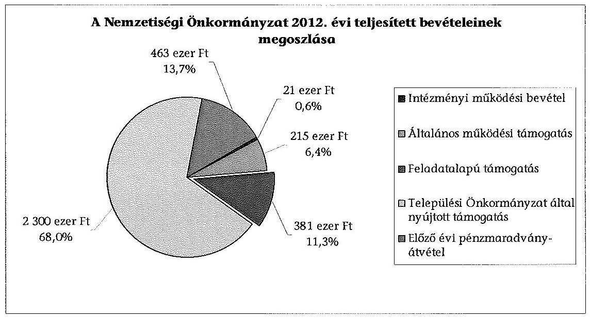
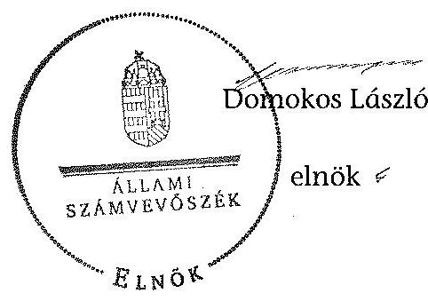

# ÁLLAMI   SZÁMVEVŐSZÉK 

## JELENTÉS

a helyi nemzetiségi önkormányzatok gazdálkodásának ellenőrzéséről
Budapest XXII. Kerületi Német Nemzetiségi Önkormányzat

---

# Állami Számvevőszék 

Iktatószám: V-0269-019/2014.
Témaszám: 1302
Vizsgálat-azonosító szám: V065286

## Az ellenőrzést felügyelte:

Horváth Balázs
felügyeleti vezető
Az ellenőrzést vezette és az ellenőrzés végrehajtásáért felelős:
Korsósné Vigh Andrea
ellenőrzésvezető
A számvevőszéki jelentést készítették és a jelentés összeállításában közremüködtek:

Buús Zoltánné Hütter Erzsébet
számvevő tanácsos
Turai Erzsébet
számvevő
Az ellenőrzést végezte:
Buús Zoltánné Hütter Erzsébet
számvevő tanácsos

A témához kapcsolódó eddig készített számvevőszéki jelentés:
Címe
sorszáma
Jelentés Budapest Főváros XXII. kerület Budafok-Tétény Önkor- 0347
mányzata gazdálkodásának átfogó ellenőrzéséről

---

# TARTALOMJEGYZÉK 

BEVEZETÉS ..... 3
I. ÖSSZEGZŐ MEGÁLLAPÍTÁSOK, KÖVETKEZTETÉSEK, JAVASLATOK ..... 6
II. RÉSZLETES MEGÁLLAPÍTÁSOK ..... 12

1. A Nemzetiségi Önkormányzat és a Települési Önkormányzat együttműködésének szabályozása, a működési feltételek biztosítása ..... 12
2. A gazdálkodási feladatok ellátásának szabályszerűsége ..... 13
2.1. A költségvetésre és a zárszámadásra, valamint a kincstári adatszolgáltatás rendjére vonatkozó jogszabályi előírások betartása ..... 13
2.2. A Nemzetiségi Önkormányzat gazdálkodásának szabályozottsága ..... 13
2.3. Az operatív gazdálkodási jogkörök kialakítása, gyakorlása ..... 14
3. A Nemzetiségi Önkormányzattal összefüggő gazdálkodási feladatok belső ellenőrzése ..... 16
4. A feladatalapú támogatás felhasználásának, elszámolásának szabályszerűsége, a Nemzetiségi Önkormányzat feladatellátása ..... 16
MELLÉKLETEK
5. számú A Nemzetiségi Önkormányzat 2012. évi gazdálkodásának főbb adatai, mutatói
2/A. számú Tájékoztatás a polgármesternek küldött el nem fogadott észrevételről
2/B. számú Tájékoztatás az elnöknek küldött el nem fogadott észrevételekről
FÜGGELÉKEK
6. számú Rövidítések jegyzéke
7. számú Értelmező szótár
8. számú A gazdálkodás értékelésének módszere

---

.

---

# JELENTÉS   a helyi nemzetiségi önkormányzatok gazdálkodásának ellenőrzéséről Budapest XXII. Kerületi Német Nemzetiségi Önkormányzat 

## BEVEZETÉS

A Nemzetiségi Önkormányzat 1994. évben alakult, elnöke az 1998. évi helyhatósági választások óta látja el feladatát. A Nemzetiségi Önkormányzat intézményt, gazdasági társaságot és más szervezetet nem alapított, illetve ezek társulásában nem vesz részt. A négytagú Képviselő-testület munkája segitésére bizottságot nem hozott létre. A Nemzetiségi Önkormányzatnak a költségvetési beszámolója szerint a 2012. évben a módosított költségvetési bevételi és kiadási előirányzata 3380 ezer Ft, a teljesített költségvetési bevétel 3380 ezer Ft, a teljesített költségvetési kiadás 3004 ezer Ft volt. A 2012. évi gazdálkodási adatokat részletesen az 1. számú mellékletben mutatjuk be.

Az Alaptörvény XXIX. cikk (1) bekezdése szerint a Magyarországon élő nemzetiségek államalkotó tényezők. Minden, valamely nemzetiséghez tartozó magyar állampolgárnak joga van önazonossága szabad vállalásához és megőrzéséhez. A hazánkban élő nemzetiségek helyi (települési és területi), valamint országos önkormányzatokat hozhatnak létre. A helyi nemzetiségi önkormányzatok gazdálkodási feladatait jogszabályi előírás alapján a székhely szerinti helyi önkormányzat polgármesteri hivatala látja el.

A nemzetiségek helyzete, támogatása mind hazai, mind EU-s szinten kiemelt figyelmet kap napjainkban. A helyi nemzetiségi önkormányzatok gazdálkodására és támogatási rendszerére vonatkozó jogszabályok a 2010-2012. években jelentős változásokon mentek át. A települési és területi nemzetiségi önkormányzatok gazdálkodásának, a részükre juttatott költségvetési támogatások felhasználásának ellenőrzését az ÁSZ a 2012. évben sorozatjellegú ellenőrzés keretében indította el. A 2013. évi ellenőrzések e témacsoportos ellenőrzések folytatását jelentik, amelyet az ÁSZ 2014. első félévi ellenőrzési terve 12. témasorszámon tartalmaz.

Az ellenőrzés célja annak értékelése volt, hogy a Nemzetiségi Önkormányzat gazdálkodási kereteinek kialakítása, gazdálkodása és feladatellátása megfelelt-e a jogszabályoknak.

Ennek keretében értékeltük, hogy:

- a Nemzetiségi Önkormányzat és a Települési Önkormányzat együttműködésének szabályozása, a múködési feltételek biztosítása megfelelt-e a jogszabályi előírásoknak;

---

- a felek együttműködése megfelelt-e a közöttük létrejött együttműködési megállapodásnak a gazdálkodási feladatok szabályszerű ellátása során, ennek keretében betartották-e a Nemzetiségi Önkormányzat gazdálkodásához kapcsolódóan a költségvetésre és zárszámadásra, a gazdálkodás szabályozására, az operatív gazdálkodási jogkörök gyakorlására vonatkozó jogszabályi előírásokat;
- a jegyző biztosította-e a Nemzetiségi Önkormányzat gazdálkodásának belső ellenőrzését;
- a Nemzetiségi Önkormányzat feladatalapú támogatásának felhasználása, a folyósított feladatalapú támogatással történő elszámolás az előírásoknak megfelelő volt-e;
- a Nemzetiségi Önkormányzat feladatellátása összhangban volt-e a vonatkozó jogszabályi előírásokkal.

Az ellenőrzés várható hasznosulását négy szinten tervezzük. A törvényalkotás számára összegzett tapasztalatok állnak rendelkezésre a nemzetiségi önkormányzatok testületi döntéseinek, gazdálkodásának és a feladatalapú támogatás felhasználásának szabályszerűségéről, amelynek alapján következtetést lehet levonni arra, hogy indokolt-e jogszabályi módosítás kezdeményezése. Az ellenőrzés az ellenőrzött számára visszajelzést ad a működésében fellépő hiányosságokról, javaslataival hozzájárul azok kiküszöböléséhez, amely csökkentheti a későbbi ellenőrzések gyakoriságát. Az ellenőrzés megállapításai és javaslatai tanulságul szolgálhatnak más nemzetiségi önkormányzatok, szervezetek számára a rendezett gazdálkodási keretek kialakításához. A társadalom számára jelzi, hogy közpénz nem maradhat ellenőrizetlenül, az ÁSZ értékteremtő rend kialakításához és megőrzéséhez hozzájáruló tevékenysége pozitív hatással lesz a szervezetről kialakított összkép formálásában. Az ÁSZ szervezetén belül lehetőség nyílik arra, hogy a megállapítások szintetizálásával az intézmény a hozzáadott értéket teremtő, elemző tevékenységét és tanácsadó szerepét erősítse.

A helyi nemzetiségi önkormányzatok gazdálkodásának ellenőrzéséről szóló jelentés I. fejezetének összegző része az ellenőrzés céljára adott rövid, szintetizáló összefoglalót és következtetéseket tartalmazza a II. fejezet részletes megállapításain alapulóan. A jelentés intézkedést igénylő megállapításait és javaslatait az összegzőben foglaltak mellett - az ellenőrzés során feltárt, a jelentés II. fejezetében rögzített részletes megállapítások alapozzák meg, illetve támasztják alá.

# Az ellenőrzés típusa: szabályszerűségi ellenőrzés 

Az ellenőrzött időszak: 2012. január 1. - 2012. december 31. közötti időszak. Az ellenőrzés kiterjedt a Nemzetiségi Önkormányzatnak juttatott, 2012. évi feladatalapú támogatás 2013. évben való elszámolására is.

Ellenőrzött szervezet: Budapest XXII. Kerületi Német Nemzetiségi Önkormányzat és a gazdálkodási feladatait ellátó Budafok-Tétény Budapest XXII. Kerületi Önkormányzata.

---

Az ellenőrzés végrehajtásának jogszabályi alapját az ÁSZ tv. 5. § (2)-(3) és (6) bekezdéseiben foglaltak képezik.

Az ellenőrzés szakmai módszertana az ÁSZ hivatalos honlapján (www.asz.hu) közzétett szakmai szabályokon alapult, amely a Legfőbb Ellenőrző Intézmények Nemzetközi Szervezete (INTOSAI) által kiadott nemzetközi standardok (ISSAI) figyelembevételével készült.

A helyi nemzetiségi önkormányzatok gazdálkodásának ellenőrzése során értékeltük a Települési Önkormányzat és a Nemzetiségi Önkormányzat együttmúködésének, a gazdálkodás szabályozottságának és a pénzügyi folyamatokban kulcsszerepet betöltő belső kontrollok (teljesítésigazolás és érvényesítés) múködésének megfelelőségét. A kulcskontrollokat a múködési és felhalmozási célú támogatásértékű kiadásoknál, az államháztartáson kívülre teljesített múködési és felhalmozási célú pénzeszköz-átadásoknál, a dologi kiadásokkal kapcsolatos kifizetéseknél - véletlen mintavételi eljárást alkalmazva - ellenőriztük. Ellenőriztük, hogy a jegyző biztosította-e a Nemzetiségi Önkormányzat gazdálkodásának belső ellenőrzését. Értékeltük a feladatalapú támogatások felhasználásának, elszámolásának szabályszerűségét, a Nemzetiségi Önkormányzat feladatellátása és a jogszabályi előírások összhangját. A minősítési szempontokat a 3. számú függelék tartalmazza.

Az ellenőrzés lefolytatásához a Nemzetiségi Önkormányzat és a gazdálkodási feladatait ellátó Települési Önkormányzat tanúsítványok és a kapcsolódó, dokumentumjegyzékben megjelölt dokumentumok elektronikus úton történő megküldésével, rendelkezésre bocsátásával szolgáltatott adatokat. Az adatszolgáltatás kontrollálása és szükség szerinti javítása a helyszíni ellenőrzés keretében történt.

Az ÁSZ tv. 29. § (1) bekezdése szerint a jelentéstervezetet megküldtük egyeztetésre a polgármester és a Nemzetiségi Önkormányzat elnöke részére. A polgármester és a Nemzetiségi Önkormányzat elnöke határidőben megküldött észrevétele és tájékoztatása alapján a jelentést nem módosítottuk. Az el nem fogadott észrevételek indoklását a jelentés 2/A. számú és 2/B. számú mellékletei tartalmazzák.

---

# 1. ÖSSZEGZŐ MEGÁLLAPÍTÁSOK, KÖVETKEZTETÉSEK, JAVASLATOK 

A Nemzetiségi Önkormányzat és a Települési Önkormányzat együttmüködésének szabályozása, a múködési feltételek biztosítása megfelelá a jogszabályi előírásoknak. A Nemzetiségi Önkormányzat az ellenőrzött időszakban rendelkezett a Települési Önkormányzattal megkötött együttműködési megállapodással. A felek a 2011. évben jóváhagyott együttmúködési megállapodásnak a Nek. 2 tv.-ben 2012. január 31-i határidőre előírt felülvizsgálatát nem végezték el, a 2012. június 1-jei határidőre előírt módosítási kötelezettségüknek eleget tettek. A 2012. december 31 -én hatályos együttmúködési megállapodásban az előírásoknak megfelelően rögzítették a Nemzetiségi Önkormányzat múködési feltételeit és - a pénzkezelési szabályzat elkészítésére vonatkozó előirás kivételével - a gazdálkodási feladatai ellátásának szabályait. A Települési Önkormányzat a 2012. évben a Polgármesteri Hivatal útján biztosította a Nemzetiségi Önkormányzat múködésének személyi és tárgyi feltételeit.

A Nemzetiségi Önkormányzat 2012. évi költségvetésének és zárszámadásának tartalma, jóváhagyása, valamint a kapcsolódó adatszolgáltatás megfelelit a jogszabályi előírásoknak. A Nemzetiségi Önkormányzat elnöke a jegyző által elkészített, 2012. évi költségvetési határozat tervezetét határidőben benyújtotta a Képviselő-testületnek, a jóváhagyott költségvetési határozat tartalma megfelelő a jogszabályi előírásoknak. A Képviselő-testület az előírt határidőig jóváhagyta a 2012. évi zárszámadási határozat tervezetét, amelynek tartalma megfelelő volt. A zárszámadási határozattervezet előterjesztésekor a Képviselő-testület részére tájékoztatásul nem mutatták be, az Áht. ${ }_{2}$ előírásai ellenére, a pénzeszközök változását. A zárszámadásban a Nemzetiségi Önkormányzat valamennyi bevételéről és kiadásáról elszámoltak, a költségvetéssel való összehasonlíthatóság biztosított volt.

A Nemzetiségi Önkormányzat gazdálkodásának szabályozottsága nem volt megfelelő. A Nemzetiségi Önkormányzat az ellenőrzött időszakban nem rendelkezett a Bkr.-ben előírt ellenőrzési nyomvonallal, a szabálytalanságok kezelésének eljárásrendjével, valamint a folyamatba épített, előzetes, utólagos és vezetői ellenőrzés szabályozással. A jegyző az Áht. ${ }_{2}$ és a Htv., a Nemzetiségi Önkormányzat elnöke az együttműködési megállapodás előirása ellenére a Számv. tv. szerinti pénzkezelési szabályzatot nem készítette el. A Számv. tv.-ben előírt leltározási és leltárkészítési szabályzattal, eszközök és források értékelési szabályzatával, valamint számviteli politikával a Nemzetiségi Önkormányzat a Polgármesteri Hivatal szabályzatai hatályának kiterjesztésével - rendelkezett. A Nemzetiségi Önkormányzat gazdálkodásával kapcsolatos munkakörökhöz tartozó feladat- és hatásköröket az ügyrend ${ }_{1,2}$-ben, a hatáskörök gyakorlásának módját, és az ezekre vonatkozó felelősségi szabályokat a polgármesteri hivatali SZMSZ ${ }_{1,2}$-ben, valamint a feladatokat ellátó köztisztviselők munkaköri leírásaiban rögzítették. A tervezéssel, gazdálkodással, az operatív gazdálkodási jogkörökkel kapcsolatos rendelkezéseket, kijelöléseket tartalmazó, Ávr. szerinti belső szabályozással - a kötelezettségvállalási szabályzat ${ }_{1,2}$-vel - a Nemzetiségi Önkormányzat önállóan rendelkezett.

---

A Nemzetiségi Önkormányzat gazdálkodása tekintetében az operatív gazdálkodási jogkörök kialakítása 2012. március 31-ig részben volt megfelelő, ezt követően megfelelt a jogszabályi előírásoknak. A Nemzetiségi Önkormányzat elnöke által a kötelezettségvállalásra és utalványozásra adott felhatalmazások és a teljesítésigazolásra történt kijelölés az ellenőrzött időszak egészében jogszerűek voltak. 2012. március 31-ig az Ávr. előírásával ellentétesen, a Nemzetiségi Önkormányzat elnöke jelölte ki írásban - a Polgármesteri Hivatal köztisztviselői közül - az érvényesítő személyeket, valamint a hatályos kötelezettségvállalási szabályzat ${ }_{1}$-ben foglaltak szerint az ellenjegyzési feladatok ellátására a Képviselő-testület két tagját, utóbbiak azonban az előírt szakképesítéssel nem rendelkeztek. 2012. április 1-jétől a belső szabályozást - a jogszabályi előírásoknak megfelelően - módosították, és a gazdasági vezető jelölte ki írásban az előírt képzettségi követelményeknek megfelelő személyeket a pénzügyi ellenjegyzés, valamint az érvényesítési feladatok ellátására.

A teljesítésigazolás és az érvényesítés kulcskontrollok múködésének megfelelőségét a dologi kiadások bizonylatainak tesztelése alapján az ellenőrzés gyengének értékelte, a hibák száma a lényegességi szintet, a kritikus hibahatárt elérte. A teljesítésigazoló, kötelezettségvállalási dokumentum hiányában, nem az Ávr.-ben előírtak szerint végezte a kiadások teljesítése jogosságának, összegszerűségének, valamint az ellenszolgáltatás teljesítésének ellenőrzését és igazolását. A teljesítésigazolás nem tartalmazta az igazolás dátumát és a teljesítés tényére történő utalást. Az érvényesítő nem az Ávr.-ben előírtak szerint végezte a kiadás összegszerűségének, a fedezet meglétének, valamint a megelőző ügymenetben az Ávr. és a kötelezettségvállalási szabályzat ${ }_{2}$ előírásai betartásának ellenőrzését. Az Ávr.-ben foglaltakat figyelmen kívül hagyva, nem jelezte az utalványozónak az Ávr. és a kötelezettségvállalási szabályzat ${ }_{2}$ megsértését. Nem észrevételezte a szabálytalan teljesítésigazolást és a kötelezettségvállalásnyilvántartás vezetésének hiányát. Nem kifogásolta, hogy az utalványokon az Ávr.-ben előírtak ellenére nem tüntették fel a költségvetési évet és a kötelezettségvállalás nyilvántartási számát. Az érvényesítés nem foglalta magában az érvényesítésre utaló megjelölést és az érvényesítés dátumát.

A 2012. évi, három legnagyobb összegű dologi kiadás bizonylatainak egyedi értékelése alapján a teljesítésigazolás és az érvényesítés kulcskontrollok nem múködtek megfelelően. A teljesítésigazolás egy esetben az Ávr.-ben előírtak ellenére nem történt meg, két esetben a feltárt hiányosságok azonosak voltak a dologi kiadásoknál részletezettekkel. Az érvényesítő egy esetben nem végezte el az Ávr.-ben előírt feladatát, az összegszerűségnek, a fedezet meglétének, továbbá a megelőző ügymenetben az Ávr. betartásának ellenőrzését, igazolását, mivel a kifizetést érvényesítés nélkül teljesítették. Két esetben a hiányosságok megegyeztek a dologi kiadásoknál feltártakkal. A Nemzetiségi Önkormányzatnál a 2012. évben teljesített, egy múködési célú támogatásértékű kiadás esetében a teljesítés igazolása és az érvényesítés kulcskontrollok nem múködtek megfelelően. A teljesítésigazolás az Ávr.-ben előírtak ellenére nem történt meg. Az érvényesítő - a dologi kiadásoknál feltárt hiányosságokon kívül - az Ávr.ben foglaltak ellenére teljesítésigazolás hiányában érvényesített, továbbá az utalványozónak nem jelezte, hogy a teljesítésigazolást, valamint a kötelezettségvállalás pénzügyi ellenjegyzését nem végezték el.

---

A jegyző a 2012. évben nem biztosította a Nemzetiségi Önkormányzat gazdálkodásával összefüggő végrehajtási feladatok belsö ellenőrzését. A Polgármesteri Hivatal 2012. évre vonatkozó éves ellenőrzési tervét megalapozó, a Ber.-ben előírt kockázatelemzés nem terjedt ki a Nemzetiségi Önkormányzat gazdálkodásával összefüggő végrehajtási feladatokra, azok tekintetében a 2012. évben belső ellenőrzési feladatot nem terveztek és nem végeztek.

A Nemzetiségi Önkormányzat a 2011. évben 683 ezer Ft feladatalapú támogatásban részesült, amelyből 2012. június 30 -án a kötelezettségvállalással nem terhelt maradvány 31 ezer Ft volt. A 2012. évben folyósított, 381 ezer Ft feladatalapú támogatásból a folyósítás évében 196 ezer Ft-ot a támogatási célokkal összhangban felhasználtak, melynek december 31-ei, kötelezettségvállalással nem terhelt maradványa 185 ezer Ft volt. A feladatalapú támogatás meghatározott célra fel nem használt, kötelezettségvállalással nem terhelt, 2011. évi, 31 ezer Ft és 2012. évi, 185 ezer Ft összegű maradványáról - az Áht. ${ }_{2}$ előírása ellenére - a Nemzetiségi Önkormányzat haladéktalanul nem mondott le, és nem fizette vissza a központi költségvetés javára. A 2011. és 2012. évi feladatalapú támogatások elszámolása a támogatási kormányrendelet ${ }_{1}$ és a támogatási kormányrendelet ${ }_{2}$ alapján az Áht. ${ }_{1}$ és az Áht. ${ }_{2}$ ellenére nem történt meg. A feladatalapú támogatás felhasználását, elszámolását az ellenőrzésre jogosult szervek nem ellenőrizték.

A Nemzetiségi Önkormányzat feladatellátásának tárgya összhangban volt a Nek. ${ }_{2}$ tv. előírásaival. Kötelező közfeladatként a képviselt közösség kulturális autonómiája megerősítése érdekében az együttdöntési jog gyakorlását, a közösség önszerveződésének szervezési és múködési feladatok ellátásával történő támogatását, kapcsolattartást civil szervezettel, nemzetiségi közösséghez kötődő kulturális javak megőrzését, valamint a nemzetiségi nyelven folyó nevelésre irányuló igények felmérését végezték. Önként vállalt feladat keretében a Nemzetiségi Önkormányzat által alapított díjat adományoztak, illetve német nyelvoktatást folytattak.

Az ÁSZ tv. 33. § (1) bekezdésében foglaltak értelmében az ellenőrzött szervezet vezetője köteles a jelentésben foglalt megállapításokhoz kapcsolódó intézkedési tervet összeállítani, és azt a jelentés kézhezvételétől számított 30 napon belül az ÁSZ részére megküldeni. Amennyiben az intézkedési tervet határidőre nem küldi meg a szervezet, vagy az nem elfogadható, az ÁSZ elnöke az ÁSZ tv. 33. § (3) bekezdés a)-b) pontjaiban foglaltakat érvényesítheti.

A helyszíni ellenőrzés megállapításainak hasznosítása mellett javasoljuk:

# a jegyzönek 

1. az együttműködés szabályozásával kapcsolatban

A 2012. január 1-jén hatályos, 2011. évben megkötött együttműködési megállapodást a Nek. ${ }_{2}$ tv. 80. § (2) bekezdésében előírtak ellenére 2012. január 31-éig nem vizsgálták felül.

---

Javaslat
Biztosítsa a jövőben az együttműködési megállapodás évenkénti felülvizsgálata során a Nek. ${ }_{2}$ tv. 80. § (2) bekezdésében előírt határidő betartását.
2. a zárszámadás szabályszerűségével kapcsolatban

A zárszámadási határozat tervezetének előterjesztésekor - a jegyző általi elkészítés hiányában - az Áht. 2 91. § (2) bekezdés a) pontjában foglaltak ellenére a pénzeszközök változását bemutató kimutatást a Képviselő-testület tájékoztatására nem mutatták be.

Javaslat
Gondoskodjon a jövőben arról, hogy a zárszámadási határozattervezet előterjesztésekor a Képviselő-testület részére tájékoztatásul bemutatásra kerüljön az Áht. 2 91. § (2) bekezdés a) pontjában foglalt előírásnak megfelelően a pénzeszközök változása.
3. a gazdálkodási feladatok szabályozottságával kapcsolatban

A Nemzetiségi Önkormányzat nem rendelkezett a Számv. tv. 14. § (5) bekezdés d) pontja szerinti pénzkezelési szabályzattal, amelynek elkészítése az Áht. 2 27. § (2) bekezdésében és a Htv. 140. § (1) bekezdés c) pontjában foglaltak alapján a jegyző, a 2012. júniustól hatályos együttműködési megállapodás értelmében a Nemzetiségi Önkormányzat elnökének feladata.

Javaslat
Készítse el a Számv. tv. 14. § (5) bekezdés d) pontja szerinti pénzkezelési szabályzatot, a Nemzetiségi Önkormányzat elnökének együttműködésével.
4. a kulcskontrollok múködésével kapcsolatban

A teljesítésigazoló nem, illetve - kötelezettségvállalási dokumentum hiányában nem szabályszerűen végezte el az Ávr. 57. § (1) és (3) bekezdéseiben előírt feladatát, mert nem ellenőrizte a kiadás teljesítésének jogosságát, összegszerűségét, az ellenszolgáltatás teljesítését, továbbá a teljesítésigazolás nem tartalmazta az igazolás dátumát és a teljesítés tényére történő utalást. Az érvényesítő nem, illetve nem szabályszerűen végezte el az Ávr. 58. § (1) bekezdésében előírt feladatát, az összegszerűség, a fedezet megléte, továbbá a megelőző ügymenetben az Ávr. és a kötelezettségvállalási szabályzat ${ }_{2}$ betartásának ellenőrzését. Az Ávr. 58. § (2) bekezdésében foglaltakat figyelmen kívül hagyva nem jelezte az utalványozónak az Ávr. és a belső szabályzat megsértését. Az érvényesítés az Ávr. 58. § (3) bekezdésében foglaltak ellenére nem tartalmazta az érvényesítésre utaló megjelölést és az érvényesítés dátumát.

Javaslat
Az operatív gazdálkodás múködési hibáinak megelőzése, feltárása és kijavítása érdekében gondoskodjon arról, hogy
a) a teljesítésigazolást minden esetben az Ávr. 57. § (1) és (3) bekezdéseiben előírtaknak megfelelően végezzék;

---

b) az érvényesítő minden esetben az Ávr. 58. § (1)-(3) bekezdéseiben előírtak szerint tegyen eleget az ellenőrzési és jelzési kötelezettségének.
5. a feladatalapú támogatás elszámolásával kapcsolatban

A 2011. évi és a 2012. évi feladatalapú támogatás elszámolása a támogatási kormányrendelet ${ }_{1} 7 . \S$ (2) bekezdésében és a támogatási kormányrendelet ${ }_{2} 8 . \S$ (5) bekezdésében hivatkozott „a helyi önkormányzatok elszámolási és ellenőrzési rendjére vonatkozó" jogszabályok rendelkezései alkalmazásának előírása alapján az Áht. ${ }_{1} 64 . \S$ (7) bekezdésében és az Áht. ${ }_{2} 57 . \S$ (3) bekezdésében foglaltak ellenére nem történt meg.

Javaslat
Intézkedjen az Áht. ${ }_{2}$ 27. § (2) bekezdésében meghatározott feladatkörében a Nemzetiségi Önkormányzat által igénybe vett feladatalapú támogatás rendeltetésszerű felhasználásáról szóló elszámolás elkészítéséről az Áht. ${ }_{2}$ 53. § (1) bekezdése szerinti beszámolási kötelezettség teljesítéséhez.

# a Nemzetiségi Önkormányzat elnökének 

1. A Nemzetiségi Önkormányzat elnöke a zárszámadási határozattervezet előterjesztésekor a Képviselő-testület tájékoztatására - a jegyző általi elkészítés hiányában - nem mutatta be az Áht. ${ }_{2}$ 91. § (2) bekezdés a) pontjában előírtak ellenére a pénzeszközök változását.

Javaslat
A jövőben a zárszámadási határozattervezet előterjesztésekor terjessze a Képviselőtestület elé tájékoztatásul a jegyző által elkészített, az Áht. ${ }_{2}$ 91. § (2) bekezdés a) pontjában előírt, a pénzeszközök változását bemutató kimutatást.
2. A Nemzetiségi Önkormányzat nem rendelkezett a Számv. tv. 14. § (5) bekezdés d) pontja szerinti pénzkezelési szabályzattal, amelynek elkészítése az Áht. ${ }_{2}$ 27. § (2) bekezdésében és a Htv. 140. § (1) bekezdés c) pontjában foglaltak alapján a jegyző, a 2012. júniustól hatályos együttműködési megállapodás III. 3.1. pontja értelmében a Nemzetiségi Önkormányzat elnökének feladata.

Javaslat
Közreműködjön a 2012. júniustól hatályos együttműködési megállapodás III. 3.1. pontja alapján, a Számv. tv. 14. § (5) bekezdés d) pontja szerinti pénzkezelési szabályzat jegyző általi elkészítésében.
3. A 2011. évi és a 2012. évi feladatalapú támogatás elszámolása a támogatási kormányrendelet ${ }_{1} 7 . \S$ (2) bekezdésében és a támogatási kormányrendelet ${ }_{2} 8 . \S$ (5) bekezdésében hivatkozott „a helyi önkormányzatok elszámolási és ellenőrzési rendjére vonatkozó" jogszabályok rendelkezései alkalmazásának előírása alapján az Áht. ${ }_{1} 64 . \S$ (7) bekezdésében és az Áht. ${ }_{2} 57 . \S$ (3) bekezdésében foglaltak ellenére nem történt meg.

---

Javaslat
Terjessze a Képviselő-testület elé jóváhagyásra az Áht. 2 53. § (1) bekezdés szerinti beszámolási kötelezettség teljesítéséhez összeállított, a Nemzetiségi Önkormányzat által igénybe vett feladatalapú támogatás rendeltetésszerű felhasználásáról szóló elszámolást.
4. A Nemzetiségi Önkormányzat nem tett eleget az Áht. 2 57. § (2) bekezdésében előírtaknak, mert a meghatározott célra fel nem használt, kötelezettségvállalással nem terhelt 2011. évi feladatalapú támogatás 2012. június 30 -ai 31 ezer Ft összegű és a 2012. évi feladatalapú támogatás 2012. december 31-ei 185 ezer Ft összegű maradványáról nem mondott le és nem fizette vissza azokat a központi költségvetés javára.

Javaslat
Terjessze a Képviselő-testület elé jóváhagyásra az Áht. 2 57/A. § (1) bekezdés előírásának megfelelően a 2011. évi és a 2012. évi feladatalapú támogatás kötelezettségvállalással nem terhelt maradványáról történő lemondást és intézkedjen a maradványok összegének visszafizetéséről a központi költségvetés javára.

---

# II. RÉSZLETES MEGÁLLAPÍTÁSOK 

## 1. A Nemzetiségi Önkormányzat És a Települési Önkormányzat EGYÜTTMÜKÖDÉSÉNEK SZABÁLYOZÁSA, A MÜKÖDÉSI FELTÉTELEK BIZTOSÍTÁSA

A Nemzetiségi Önkormányzat és a Települési Önkormányzat együttmüködésének szabályozása megfelelt a jogszabályi előírásoknak.

A Nemzetiségi Önkormányzat a 2012. év folyamán rendelkezett hatályban lévő, a Települési Önkormányzattal kötött együttműködési megállapodással¹. A 2012. január 1-jén hatályos, 2011. évben megkötött együttműködési megállapodást a felek a Nek. 2 tv. 80. § (2) bekezdésében előírtak ellenére 2012. január 31-éig nem vizsgálták felül. A Nek. ${ }_{2}$ tv. 159. § (3) bekezdésében előírt módosítást határidőn belül jóváhagyták.

A 2012. december 31-én hatályos együttműködési megállapodásban a Nemzetiségi Önkormányzat működési feltételeit az előírásoknak megfelelően szabályozták, azokat - a Nek. ${ }_{2}$ tv.-ben előírt határidőben - a Nemzetiségi Önkormányzat SZMSZ-ében rögzítették². Az együttműködési megállapodás tartalmazta a Nemzetiségi Önkormányzat gazdálkodási feladatai ellátásának szabályait, amelyek - a pénzkezelési szabályzat elkészítésére vonatkozó előírás kivételével - megfelelőek voltak.

Az együttműködési megállapodás III. 3.1. pontja szerint „A pénzkezelés rendjét az elnök saját hatáskörben szabályozza a vonatkozó jogszabályok betartásával."

A Települési Önkormányzat a Nemzetiségi Önkormányzat 2012. évi müködésének - Nek. 2 tv. 159. § (3) bekezdésében foglalt átmeneti rendelkezés alapján a Nek. 1 tv. 27. § (2)-(3) bekezdéseiben előírt - személyi és tárgyi feltételeit a Polgármesteri Hivatal útján biztosította.

[^0]
[^0]:    ${ }^{1}$ A 2012. május 24 -ig hatályos együttműködési megállapodást a Települési Önkormányzat Képviselő-testülete a 329/2011. (XII. 15.) számú, a Képviselő-testület a 48/2011. (XII. 28.) számú határozatával hagyta jóvá.
    A 2012. május 24 -től hatályos együttműködési megállapodást a Települési Önkormányzat Képviselő-testülete a 102/2012. (V. 17.) számú, a Képviselő-testület a 16/2012. (V. 25.) számú határozatával fogadta el.
    ${ }^{2}$ jóváhagyta a Képviselő-testület 17/2012. (V. 25.) számú határozata

---

# 2. A GAZDÁLKODÁSI FELADATOK ELLÁTÁSÁNAK SZABÁLYSZERŰSÉGE 

### 2.1. A költségvetésre és a zárszámadásra, valamint a kincstári adatszolgáltatás rendjére vonatkozó jogszabályi előírások betartása

A Nemzetiségi Önkormányzat 2012. évi költségvetésének és zárszámadásának tartalma, jóváhagyása, valamint a kapcsolódó adatszolgáltatás megfelelá a jogszabályi előírásoknak.

A Nemzetiségi Önkormányzat elnöke a jegyző által elkészített 2012. évi költségvetési határozat tervezetét határidőben benyújtotta a Képviselő-testületnek, a jóváhagyott költségvetés ${ }^{3}$ tartalma megfelelő a jogszabályi előírásoknak. A jegyző a 2012. évi költségvetéshez kapcsolódó, a Nemzetiségi Önkormányzatra vonatkozó kincstári adatszolgáltatási kötelezettségének egy kivétellel az előírásoknak megfelelően eleget tett. A Polgármesteri Hivatal az I. negyedéves időközi költségvetési jelentést az Ávr. 169. § (2) bekezdésében meghatározott határidőn túl küldte meg a Kincstár részére.

A jegyző által elkészített 2012. évi zárszámadási határozat tervezetét a Képvise-lő-testület az előírt határidőn belül jóváhagyta. Az elfogadott zárszámadási határozat ${ }^{4}$ tartalma és részletezettsége a jogszabályi előírásoknak megfelelő volt. A zárszámadási határozat tervezetének előterjesztésekor az Áht. 91. § (2)-(3) bekezdéseiben meghatározott mérlegeket, kimutatásokat a Képviselő-testület tájékoztatására bemutatták, kivéve a pénzeszközök változásáról szóló kimutatást, amelyet a jegyző nem készített el. A zárszámadásról szóló határozatban a Nemzetiségi Önkormányzat valamennyi bevételéről és kiadásáról elszámoltak, biztosították az elfogadott költségvetéssel való összehasonlíthatóságot.

### 2.2. A Nemzetiségi Önkormányzat gazdálkodásának szabályozottsága

A Nemzetiségi Önkormányzat gazdálkodásának szabályozottsága nem volt megfelelő.

A jegyző a Nemzetiségi Önkormányzat gazdálkodását hiányosan szabályozta. A Nemzetiségi Önkormányzat az ellenőrzött időszakban nem rendelkezett a Bkr. 6. § (3) és (4) bekezdéseiben előírt ellenőrzési nyomvonallal és szabálytalanságok kezelésének eljárásrendjével, a Bkr. 8. § (2) bekezdése szerinti folyamatba épített előzetes, utólagos és vezetői ellenőrzés szabályzattal, továbbá a Számv. tv. 161. § (1) bekezdésében előírt számlarenddel. A 24/2013. számú pol-gármesteri-jegyzői együttes intézkedés a Polgármesteri Hivatal fenti szabályzatainak a hatályát 2013. október 18-tól kiterjesztette a Nemzetiségi Önkormányzat gazdálkodási feladataira.

[^0]
[^0]:    ${ }^{3}$ A Képviselő-testület 8/2012. (II. 13.) számú határozata a Nemzetiségi Önkormányzat 2012. évi költségvetéséről.
    ${ }^{4}$ A Képviselő-testület 11/2013. (IV. 29.) számú határozata a Nemzetiségi Önkormányzat 2012. évi zárszámadásáról.

---

A Nemzetiségi Önkormányzat nem rendelkezett a Számv. tv. 14. § (5) bekezdés d) pontja szerinti pénzkezelési szabályzattal, amelynek elkészítése az Áht. 2 27. § (2) bekezdésében és a Htv. 140. § (1) bekezdés c) pontjában foglaltak alapján a jegyző, a 2012. júniustól hatályos együttmúködési megállapodás értelmében a Nemzetiségi Önkormányzat elnökének feladata.

A Számv. tv.-ben előírt leltározási és leltárkészítési szabályzattal, eszközök és források értékelési szabályzatával, valamint számviteli politikával ${ }^{5}$ a Nemzetiségi Önkormányzat - a Polgármesteri Hivatal szabályzatai hatályának kiterjesztésével - rendelkezett.

A Nemzetiségi Önkormányzat gazdálkodásával kapcsolatos munkakörökhöz tartozó feladat- és hatásköröket az ügyrend ${ }_{1,2}$-ben ${ }^{6}$, a hatáskörök gyakorlásának módját és az ezekre vonatkozó felelősségi szabályokat a polgármesteri hivatali SZMSZ ${ }_{1,2}$-ben, valamint a feladatokat ellátó köztisztviselők munkaköri leírásaiban rögzítették. A helyettesítés rendjét a polgármesteri hivatali SZMSZ ${ }_{1,2^{-}}$ ben meghatározták.

A tervezéssel, gazdálkodással, az operatív gazdálkodási jogkörökkel kapcsolatos rendelkezéseket, kijelöléseket tartalmazó, Ávr. szerinti belső szabályozással - a kötelezettségvállalási szabályzat ${ }_{1,2}$-vel - a Nemzetiségi Önkormányzat önállóan rendelkezett.

# 2.3. Az operatív gazdálkodási jogkörök kialakítása, gyakorlása 

A Nemzetiségi Önkormányzat gazdálkodása tekintetében az operatív gazdálkodási jogkörök kialakítása 2012. március 31-ig részben volt megfelelő, ezt követően megfelelt a jogszabályi előírásoknak.

Az ellenőrzött időszak egészében a kötelezettségvállalási szabályzat ${ }_{1,2}$-ben a kötelezettségvállalásra és az utalványozásra adott felhatalmazások, valamint a teljesítésigazoló személyek írásbeli kijelölése a jogszabályi előírásokkal összhangban történtek. A Nemzetiségi Önkormányzat elnöke az Ávr.-ben foglalt előírások alapján írásban felhatalmazott más képviselőt a kötelezettségvállalás és utalványozás gyakorlására, továbbá - mint kötelezettségvállaló - gondoskodott a teljesítésigazoló személyek írásbeli kijelöléséről.

Az ellenőrzött időszakban a gazdasági szervezettel rendelkező Polgármesteri Hivatalban a Nemzetiségi Önkormányzat kifizetései tekintetében, az Ávr. előírása szerint, a gazdasági vezető volt jogosult a pénzügyi ellenjegyzés és az érvényesítés gyakorlására, illetve e jogköröket ellátó személyeknek a - Polgármesteri Hivatal állományába tartozó, az előírt képzettségi követelményeknek megfelelő köztisztviselők közül történő - kijelölésére.

- 2012. március 31-ig - az Ávr. 55. § (2) bekezdés g) pontja és az Ávr. 58. § (4) bekezdése előírásával ellentétesen - a Nemzetiségi Önkormányzat elnöke

[^0]
[^0]:    ${ }^{5}$ A Számv. tv. 14. § (5) bekezdés d) pontja szerinti pénzkezelési szabályzat kivételével.
    ${ }^{6}$ Az ügyrend ${ }_{1}$ és ügyrend ${ }_{2} 5$. számú mellékletei tartalmazzák.

---

jelölte ki írásban - a Polgármesteri Hivatal köztisztviselői közül - az érvényesitő személyeket, valamint a hatályos kötelezettségvállalási szabályzat ${ }_{1}$-ben foglaltak szerint az ellenjegyzési feladatok ellátására a Képviselő-testület két tagját, utóbbiak azonban az előírt szakképesítéssel nem rendelkeztek.

- 2012. április 1-jétől a belső szabályozást - a jogszabályi előírásoknak megfelelően - módosították ${ }^{7}$, és a gazdasági vezető jelölte ki írásban az előírt képzettségi követelményeknek megfelelő személyeket a pénzügyi ellenjegyzés, valamint az érvényesítés ellátására.

A Nemzetiségi Önkormányzatnál a 2012. évben a dologi kiadások teljesítése során - a bizonylatok tesztelése alapján - a teljesítésigazolás és az érvényesítés kulcskontrollok múködésének megfelelősége gyenge volt, a hibák száma a lényegességi szintet, a kritikus hibahatárt elérte, mert

- a teljesítésigazoló nem az Ávr. 57. § (1) és (3) bekezdéseiben előírtak szerint végezte a kiadások teljesítése jogosságának, összegszerűségének, valamint az ellenszolgáltatás teljesítésének ellenőrzését és igazolását. A teljesítésigazolás előzetes írásbeli kötelezettségvállalás, a százezer forintot el nem érő kifizetések esetében pedig - a kötelezettségvállalási szabályzat ${ }_{2}$ I. 4. pontjában előírt - kötelezettségvállalási dokumentum hiányában történt. A teljesítésigazolás nem tartalmazta az igazolás dátumát és a teljesítés tényére történő utalást;
- az érvényesítő nem az Ávr. 58. § (1) bekezdésében előírtak szerint végezte a kiadás összegszerűségének, a fedezet meglétének, valamint a megelőző ügymenetben az Ávr. és a kötelezettségvállalási szabályzat ${ }_{2}$ előírásai betartásának ellenőrzését. Az Ávr. 58. § (2) bekezdésében foglaltakat figyelmen kívül hagyva, nem jelezte az utalványozónak az Ávr. és a kötelezettségvállalási szabályzat ${ }_{2}$ megsértését. Nem észrevételezte a szabálytalan teljesítésigazolást és a kötelezettségvállalás-nyilvántartás - Ávr. 56. § (1) bekezdésében előírt vezetésének hiányát. Nem kifogásolta, hogy az utalványokon az Ávr. 59. § (3) bekezdés b) és f) pontjaiban, valamint a (4) bekezdésében előírtak ellenére nem tüntették fel a költségvetési évet és a kötelezettségvállalás nyilvántartási számát. Az Ávr. 58. § (3) bekezdésében előírtak ellenére az érvényesítés nem foglalta magában az érvényesítésre utaló megjelölést és az érvényesítés dátumát.

A Nemzetiségi Önkormányzat 2012. évi, három legnagyobb összegű dologi kiadás teljesítése bizonylatainak egyedi értékelése alapján a teljesítésigazolás és az érvényesítés kulcskontrollok nem múködtek megfelelően:

- a teljesítésigazolás az Ávr. 57. § (1) és (3) bekezdéseiben előírtak ellenére egy esetben nem történt meg, két esetben a feltárt hiányosságok azonosak voltak a dologi kiadásoknál részletezettekkel;
- az érvényesítő egy esetben nem végezte el az Ávr. 58. § (1) és (2) bekezdéseiben előírt feladatát, az összegszerűségnek, a fedezet meglétének, továbbá a

[^0]
[^0]:    ${ }^{7}$ A kötelezettségvállalási szabályzat ${ }_{2}$ tartalmazza.

---

megelőző ügymenetben az Ávr. betartásának ellenőrzését, igazolását, mivel a kifizetést érvényesítés nélkül teljesítették. Két esetben a hiányosságok megegyeztek a dologi kiadásoknál feltártakkal.

A Nemzetiségi Önkormányzatnál a 2012. évben teljesített, egy, múködési célú támogatásértékủ kiadás esetében a teljesítés igazolása és az érvényesítés kulcskontrollok nem múködtek megfelelően. A teljesítésigazolás az Ávr. 57. § (1) és (3) bekezdéseinek előírása ellenére nem történt meg. Az érvényesítő - a dologi kiadásoknál feltárt hiányosságokon kívül - az Ávr. 58. § (1) bekezdése ellenére teljesítésigazolás hiányában érvényesített, továbbá az Ávr. 58. § (2) bekezdésében foglaltak ellenére az utalványozónak nem jelezte, hogy a teljesítésigazolást, valamint a kötelezettségvállalás - Áht. ${ }_{2}$ 37. § (1) bekezdésében előírt - pénzügyi ellenjegyzését nem végezték el.

Múködési és felhalmozási célú pénzeszközátadást államháztartáson kívülre az ellenőrzött időszakban nem teljesítettek.

A Nemzetiségi Önkormányzatnál a kulcskontrollok 2012. évi múködésében feltárt hiányosságokkal összefüggésben az ellenőrzés - a rendelkezésre bocsátott dokumentumok alapján - jogosulatlan kifizetést nem állapított meg, azonban a kulcskontrollok múködésében feltárt hiányosságok miatt nem biztosított a hibák megelőzése, feltárása és kijavítása.

# 3. A Nemzetiségi ÖNKORMÁNYZATtal ÖSSZEFÜGGŐ GAZDÁlKODÁSI FELADATOK BELSŐ ELLENŐRZÉSE 

A jegyző a 2012. évben nem biztosította a Nemzetiségi Önkormányzat gazdálkodásával összefüggő végrehajtási feladatok belső ellenőrzését. A Polgármesteri Hivatal 2012. évre vonatkozó éves ellenőrzési tervét megalapozó, a Ber. 21. § (2) bekezdésében előírt kockázatelemzés nem terjedt ki a Nemzetiségi Önkormányzat gazdálkodásával összefüggő végrehajtási feladatokra, azok tekintetében a 2012. évben belső ellenőrzési feladatot nem terveztek és nem végeztek.

A 2012-ben hatályos együttműködési megállapodások nem tértek ki a Nemzetiségi Önkormányzat gazdálkodásának végrehajtásával összefüggő belső ellenőrzési feladatok ellátására.

Az ellenőrzéshez szolgáltatott adatok alapján a 2012. évben a Kormányhivatal nem élt a Nemzetiségi Önkormányzatot illetően törvényességi felügyeleti eszközzel.

## 4. A feladatalapú támogatás felhasználásának, elszámolásának szabályszerüsége, a Nemzetiségi Önkormányzat FELADATELLÁTÁSA

A Nemzetiségi Önkormányzat a 2011. évben 683 ezer Ft feladatalapú támogatásban részesült, amelyből a folyósítás évében 439 ezer Ft-ot, 2012. június 30-ig további 213 ezer Ft-ot nemzetiségi közfeladat ellátására fordítottak. A 2012.

---

jánius 30-án fennálló, kötelezettségvállalással nem terhelt, 31 ezer Ft maradvány a támogatási kormányrendelet ${ }_{1} 7$. § (4) bekezdés előirása alapján, határidőn túl jogszerúen nem használható fel.

A támogatási kormányrendelet ${ }_{1} 7 . \S$ (4) bekezdésének előirása szerint a „feladatarányos támogatás tárgyévben fel nem használt (kötelezettségvállalással nem terhelt) maradványa a következö év június 30-álg kötelezettségvállalással terhelhetơ".

A Nemzetiségi Önkormányzat a 2012. évben 381 ezer Ft feladatalapú támogatásban részesült, amelynek az összes bevételhez viszonyított részarányát a következő ábra szemlélteti:

A 2012. évben folyósított feladatalapú támogatásból a folyósítás évében 196 ezer Ft-ot a támogatási célokkal összhangban felhasználtak, melynek december 31-ei, kötelezettségvállalással nem terhelt maradványa 185 ezer Ft volt. Ezen maradvány összege a támogatási kormányrendelet ${ }_{2}$ 7. §-ában foglaltak értelmében határidőn túl jogszerüen nem használható fel.

A Nemzetiségi Önkormányzat nem tett eleget az Áht. ${ }_{2}$ 57. § (2) bekezdésében előírtaknak azáltal, hogy a meghatározott célra fel nem használt, kötelezettségvállalással nem terhelt, 2011. évi feladatalapú támogatás 2012. június 30 -ai, 31 ezer Ft összegű és a 2012. évi támogatás 2012. december 31-ei, 185 ezer Ft összegű maradványáról haladéktalanul nem mondott le, és nem fizette vissza azt a központi költségvetés javára.

A 2011. és 2012. évi feladatalapú támogatás elszámolása a támogatási kormányrendelet ${ }_{1} 7$. § (2) bekezdésében, illetve a támogatási kormányrendelet ${ }_{2}$ 8. § (5) bekezdésében hivatkozott „a helyi önkormányzatok elszámolási és ellenőrzési rendjére vonatkozó" jogszabályok rendelkezései alkalmazásának előírása alapján az Áht. 164. § (7) bekezdése, illetve az Áht. 2 57. § (3) bekezdése ellenére, és figyelmen kívül hagyva az Áht. ${ }_{2}$ 27. § (2) bekezdésében előírtakat, nem történt meg.

---

A feladatalapú támogatás felhasználását, elszámolását az ellenőrzésre jogosult szervek nem ellenőrizték.

A Nemzetiségi Önkormányzat feladatellátásának tárgya összhangban volt a Nek. ${ }_{2}$ tv. előirásaival. Kötelező közfeladatként - a Nek. ${ }_{2}$ tv. 115. § e), f), g), i) pontjai alapján - a képviselt közösség kulturális autonómiája megerősítése érdekében az együttdöntési jog gyakorlását, a közösség önszerveződésének szervezési és múködési feladatok ellátásával történő támogatását, kapcsolattartást civil szervezettel, nemzetiségi közösséghez kötődő kulturális javak megőrzését, valamint a nemzetiségi nyelven folyó nevelésre irányuló igények felmérését végezték. Önként vállalt feladat keretében - a Nek. ${ }_{2}$ tv. 116. § (1) bekezdés b) pontja és a (2) bekezdése alapján - a Nemzetiségi Önkormányzat által alapított díjat adományoztak, illetve német nyelvoktatást folytattak.
Budapest, 2014. 16. hónap 14. nap

Melléklet: $\quad 3 \mathrm{db}$
Függelék: $\quad 3 \mathrm{db}$

---

# A Nemzetiségi Önkormányzat 2012. évi gazdálkodásának föbb adatai, mutatói

A) Bevételek

|  Megnevezés | Eredeti elöirányzat | Módosított
ezzer Ft | Teljesítés |   |
| --- | --- | --- | --- | --- |
|   |  |  |  | megoszlás  |
|  Intézményi múködési bevétel | 0 | 21 | 21 | $0,6 \%$  |
|  Általános múködési támogatás | 215 | 215 | 215 | $6,4 \%$  |
|  Feladatalapú támogatás | 0 | 381 | 381 | $11,3 \%$  |
|  Települési Önkormányzat által nyújtott támogatás | 0 | 2300 | 2300 | $68,0 \%$  |
|  Előző évi pénzmaradvány-átvétel | 0 | 463 | 463 | $13,7 \%$  |
|  Múködési költségvetés bevételei | 215 | 3380 | 3380 | $100,0 \%$  |
|  Költségvetési bevételek összesen | 215 | 3380 | 3380 | $100,0 \%$  |
|  Bevételek mindösszesen | 215 | 3380 | 3380 | $100,0 \%$  |

B) Kiadások

|  Megnevezés | Eredeti elöirányzat | Módosított
ezzer Ft | Teljesítés |   |
| --- | --- | --- | --- | --- |
|   |  |  |  | megoszlás  |
|  Munkaadókat terhelő járulékok és szociális hozzájárulási adó összesen | 0 | 10 | 10 | $0,3 \%$  |
|  Dologi kiadások | 215 | 3070 | 2694 | $89,7 \%$  |
|  Támogatásértékủ múködési kiadás | 0 | 300 | 300 | $10,0 \%$  |
|  Múködési kiadások összesen | 215 | 3380 | 3004 | $100,0 \%$  |
|  Költségvetési kiadások összesen | 215 | 3380 | 3004 | $100,0 \%$  |
|  Kiadások mindösszesen | 215 | 3380 | 3004 | $100,0 \%$  |

---

.

---

# TÁJÉKOZTATÁS   A POLGÁRMESTERNEK KÜLDÖTT EL NEM FOGADOTT ÉSZREVÉTELRŐL 

| Együttmúködési megállapodás felülvizsgálata |  |
| :--: | :--: |
| Észrevétel | „A felek a 2011. évben jóváhagyott együttmúködési megállapodásnak a Nek. tv-ben 2012.január 31-i határidőre előírt felülvizsgálatát nem végezték el..."   A megállapítással nem értek egyet. A nemzetiségi önkormányzatok és a helyi önkormányzat is tisztában volt a nemzetiségek jogairól szóló törvény azon előírásával, hogy a megállapodásokat minden év január 31-ig felül kell vizsgálni. Pontosan ezen határidő betartása miatt született meg a 329/2011. (XII.15.) önk. számú határozat az új megállapodás szövegének elfogadásáról, hiszen a képviselő-testületnek januárban nincsen munkaterv szerinti ülése, ezért a határidő betartása csak így volt biztosítható. E döntést követték a nemzetiségi önkormányzatok döntései, majd az új megállapodások aláírása, mely három nemzetiségi cinkormányzat tekintetében 2012 januárjában, kettő önkormányzat tekintetében még 2011 decemberében megtörtént. Fentiek alapján felek a jogszabály előírásának maradéktalanul eleget tettek, így kérem ezen negatív megállapítás helyesbítését a végleges jelentésekben. |
| Válasz | Az együttmúködési megállapodás felülvizsgálatával kapcsolatos észrevételét, illetve a határozat-hozatallal és az aláírással összefüggő tájékoztatását köszönöm, azonban a jelentéstervezetben szereplő megállapítást továbbra is fenntartjuk.   A Nek. tv. 80. § (2) bekezdése elöírja, hogy az együttmúködési megállapodást a feleknek minden év január 31-éig felül kell vizsgálni. A XXII. Kerület Önkormányzatának Képviselő-testülete 2011. december 15-én hozott határozatot az együttmúködési megállapodás szövegének elfogadásáról, melyet - a döntést követően - a nemzetiségi önkormányzatok határozataikkal (2011. december és 2012. január hónapban) jóváhagytak. 2012. január 1-jén a jogszabályi környezet jelentősen megváltozott (új Áht., Ávr.), és tekintettel arra, hogy a képviselötestületi döntés időpontja 2011. december 15-e volt, a 2012. január 1jén életbe lépő jogszabály-változásokat az együttmúködési megállapodások nem tartalmazták.   A 2012. június 4-én aláírt együttmúködési megállapodás hatályba lépéséig a XXII. Kerületi Önkormányzat és a kerületben múködő Nemzetiségi Önkormányzatok együttmúködése egy, már 2012. január 1-jén hatályát vesztett jogszabályok előírásait tartalmazó megállapodáson alapult.   Az évenkénti felülvizsgálat január 31-ei határidejének célja éppen az, hogy a fordulónappal bekövetkező változásokat, az ezek alapján szük- |

---

|  | séges módosításokat idốben el lehessen végezni. Az elôzố év december 15-ei Képviselố-testületi jóváhagyás eredményeként az elốirt évenkénti kötelező felülvizsgálat nem érte el valódi célját. |
| :--: | :--: |

---

# TÁJÉKOZTATÁS   AZ ELNÖKNEK KÜLDÖTT   EL NEM FOGADOTT ÉSZREVÉTELEKRŐL 

|  | Általános észrevételek a jelentéshez |
| :--: | :--: |
| Észrevétel | Az Önök által megküldött anyaggal nem tudok egyetérteni.   A Nemzetiségi Önkormányzatokat jogszabály hívta létre 1994-ben. Felkérésre és nagyszüleink iránti tiszteletből vállaltuk el a Nemzetiségi, akkor még kisebbségi Önkormányzat megalapítását. Miután kiderült, hogy Budafok-Tétényben milyen sokan szavaztak (több, mint 14 ezren) a német nemzetiségi Önkormányzatra, a feladatunkat komolyan vettük és a Német Nemzetiséghez kötődő hagyományokat felelevenítettük, iskolát alapítottunk, megalakítottuk a klubokat, un. német nyelv klub, kártya klubok, helytörténeti klub, amelyhez most már digitális múzeum tartozik. Van egy általunk támogatott autentikus sváb fúvós zenekarunk a Südofenblasskapelle. Kezdetben magunk állítottuk össze a költségvetésünket és ehhez kértünk és kaptunk támogatásokat. A rendelkezésünkre álló pénz keretből azonban szabadon gazdálkodhattunk, saját költségvetésünk alapján.   Magunk építettük fel, a múködéshez szükséges eszköz bázist, irodát alakítottunk ki, üres helyiséget kaptunk, amit mi rendeztünk be, bútorokkal, számítógéppel, fénymásolóval...stb. sörpadokat, sátrat, főző üstöt szereztünk be a szabadtéri rendezvényekhez, részben adományból, részben a nekünk biztosított pénzeszközökből, pályázatokból.   Az idő folyamán egyre kevésbé engedték meg számunkra, hogy eszközöket vásároljunk. A szabályozási rendszer mindig változott, amelyet igyekeztünk követni, kaptunk segítséget Budafok-Tétény Önkormányzatától (helyi önkormányzat) és a Jegyzői irodától együttmúködési megállapodás keretében.   A 2011. 2012. és 2013-as években az állami pénzeszközök címkézetlenül jöttek. A helyi önkormányzat támogatást már csak pályázati keretben nyújtott és programonként kellett elszámolni. Mindig minden fillér a számlánkra érkezett, ami kezdetben a helyi önkormányzat alszámlája volt, majd később saját számlánk. Minden fillérről elszámoltunk, soha egy fillért nem használtunk fel saját célra.   A Német Nemzetiségi Önkormányzat tagjai és én magam, mint elnök, a tevékenységünkért soha egy fillért nem vettünk fel, mindent lelkesedésből, a német származású lakosaink érdekében tettünk.   A társadalmi munkában végzett feladathoz nem rendelkezünk végzettséggel. Mindenkinek van családja, munkája..stb., ezt a tevékenységet a szabadidőnk terhére végeztük.   Ma már szakembert sem tudunk igénybe venni, mert arra semmiféle keretet nem biztosítanak számunkra, az eszköz vásárlást is szinte lehetetlenné tették. |

---

Így a vizsgálatukhoz szakmailag nem tudok hozzászólni. Azt tudom, hogy mindent kizárólag a német nemzetiség önkormányzat múködésére és programjára fordítottunk, mindig minden fillérrel elszámoltunk. A vizsgálat alatt, nem volt módom találkozni egy munkatársukkal sem, engem meg nem kérdeztek, kizárólag papírokat és számlákat ellenőriztek. írásban olyan dolgokat kértek számon, amelyeket utólag szabályoztak, de pénz átadásakor nem közöltek.
A farsangi rendezvény sorozatot mindig állami támogatásból és múlt évből áthozott keretből kell megoldani, mert az azévi pénzek, február közepéig még sehonnan nem érkeznek meg.
Az idei programjainkra minden fillérünk beszabályozott, így nem tudom, hogy egyáltalán honnan lenne lehetséges az utólagos számonkérésük anyagi vonzata esetén ennek eleget tenni.

Kérem vegyék figyelembe, hogy a Nemzetiségi önkormányzat már jogszabály erejénél fogva, csak 4 főből áll, akik sem költségtérítést, sem támogatást, sem díjazást ezért a társadalmi munkáért nem kapnak és nem is rendelkeznek számviteli és egyéb ismeretekkel, becsülettel, tisztességgel végzik a vállalt feladatukat. A felvett pénzekkel mindig fillérre elszámoltunk, hogy önök szerint ezt nem megfelelő címkézéssel láttuk el, kérem tekintsék bocsánatos bűnnek, mert mi a választásunkkor arra kaptunk felhatalmazást, hogy önállóan határozhatjuk meg programjainkat, tevékenységünket, költségvetésünket, önkormányzati keretben, s mint most vizsgálatukból kiderül, ez az önállóság már csak látszat, mert a pénzügyi rendszeren keresztül mindent meghatároznak és beszabályoznak.

Ehhez a szabályrendszerhez laikus társadalmi munkásoknak nehéz igazodni, ezért kérem a vizsgálatuknál vegyék figyelembe a múködési körülményeinket, és az általunk legnagyobb jószándék mellett elvégzett hatalmas és értékteremtő munkát.

Válasz A Nemzetiségi Önkormányzat múködésével összefüggő általános felvetéseihez kapcsolódóan tájékoztatom, hogy az Állami Számvevőszék a helyi nemzetiségi önkormányzatok 2012. évi gazdálkodásának ellenőrzését a hatályos jogszabályok alapján végezte, megállapításait ennek megfelelően tette.

A jelentéstervezet tartalmazza az ellenőrzés célját, mely alapján azt értékeltük, hogy a Nemzetiségi Önkormányzat gazdálkodási kereteinek kialakítása, gazdálkodása és feladatellátása megfelelt-e az ellenőrzött időszakban hatályos jogszabályoknak. A szabályszerűségi ellenőrzés egyéb múködési körülmények figyelembevételét nem teszi lehetővé.

A Nemzetiségi Önkormányzatnak nyújtott 2011. évi és 2012. évi feladatalapú támogatás felhasználásához, elszámolásához kapcsolódóan sem az ellenőrzés során, sem az észrevételéhez csatoltan dokumentumokkal nem igazolták az elszámolások teljesítését, illetve a feladatalapú támogatás maradványának - jogszabályban meghatározott határ-

---

időig való - kötelezettségvállalással történő terhelését. Az Állami Számvevőszék kizárólag dokumentumok alapján tehet megállapításokat.

Mindezek alapján a jelentéstervezetben szereplő megállapításainkat és javaslatainkat fenntartjuk, figyelemmel az Ön által adott teljességi nyilatkozatra, tanúsítványi adatszolgáltatásra.

---

.

---

# RÖVIDÍTÉSEK JEGYZÉKE 

## Törvények

Alaptörvény
Áht. 1
Áht. 2
ÁSZ tv.
Htv.

Nek. 1 tv.
Nek. 2 tv.
Számv. tv.

## Rendeletek

Ávr.

Ber.
Bkr.
támogatási kormányrendelet ${ }_{1}$
támogatási kormányrendelet ${ }_{2}$

## Határozatok

Polgármesteri Hivatal SZMSZ $_{1}$

Polgármesteri Hivatal SZMSZ $_{2}$

Magyarország Alaptörvénye
1992. évi XXXVIII. törvény az államháztartásról (hatályos 2011. december 31-ig)
2011. évi CXCV. törvény az államháztartásról (hatályos 2011. december 31-től)
az Állami Számvevőszékről szóló 2011. évi LXVI. törvény (hatályos 2011. július 1-jétől)
1991. évi XX. törvény a helyi önkormányzatok és szerveik, a köztársasági megbízottak, valamint egyes centrális alárendeltségú szervek feladat- és hatásköreiről
1993. évi LXXVII. törvény a nemzeti és etnikai kisebbségek jogairól (hatályos 2011. december 31-éig)
2011. évi CLXXIX. törvény a nemzetiségek jogairól (hatályos 2011. december 20-tól)
2000. évi C. törvény a számvitelről

368/2011. (XII. 31.) Korm. rendelet az államháztartásról szóló törvény végrehajtásáról (hatályos 2012. január 1jétől)
193/2003. (XI. 26.) Korm. rendelet a költségvetési szervek belső ellenőrzéséről (hatályos 2011. december 31-éig)
370/2011. (XII. 31.) Korm. rendelet a költségvetési szervek belső kontrollrendszeréről és belső ellenőrzéséről (hatályos 2012. január 1-jétől)
342/2010. (XII. 28.) Korm. rendelet a kisebbségi önkormányzatoknak a központi költségvetésből, valamint fejezeti kezelésű előirányzatból nyújtott támogatások feltételrendszeréről és elszámolásának rendjéről (hatályos 2012. március 6 -áig)
28/2012. (III. 6.) Korm. rendelet a nemzetiségi célú előirányzatokból nyújtott támogatások feltételrendszeréről és elszámolásának rendjéről (hatályos 2012. március 7étől 2012. december 31-éig)

a Települési Önkormányzat Képviselő-testületének 10/2011. (II. 10.) számú határozata Budafok-Tétény Budapest XXII. Kerületi Polgármesteri Hivatal Szervezeti és Múködési Szabályzatáról (hatályos 2012. április 30 -áig) a Települési Önkormányzat Képviselő-testületének 68/2012. (IV. 19.) számú határozata Budafok-Tétény Budapest XXII. Kerületi Polgármesteri Hivatal Szervezeti és Múködési Szabályzatáról (hatályos 2012. május 1jétől)

---

## Szórövidítések

ÁSZ
EU
gazdasági vezető
jegyzó
Képviselő-testület

Kincstár
Kormányhivatal
kötelezettségvállalási szabályzat ${ }_{1}$
kötelezettségvállalási szabályzat $_{2}$

Nemzetiségi Önkormányzat
Nemzetiségi Önkormányzat elnöke
polgármester

Polgármesteri Hivatal

## SZMSZ

Települési Önkormányzat
Települési Önkormányzat Képviselö-testülete
ügyrend $_{1}$
ügyrend $_{2}$

Állami Számvevőszék
Európai Unió
Budafok-Tétény Budapest XXII. Kerületi Polgármesteri Hivatal gazdasági vezetője
Budafok-Tétény Budapest XXII. Kerületi Önkormányzatának jegyzője
Budapest XXII. Kerületi Német Nemzetiségi Önkormányzat Képviselö-testülete
Magyar Államkincstár
Budapest Főváros Kormányhivatala
Budapest XXII. kerületi Német Kisebbségi Önkormányzat Elnökének 1/2011. számú intézkedése a Német Kisebbségi Önkormányzat kötelezettségvállalás, érvényesítés, utalványozás és ellenjegyzés rendjéről (hatályos 2012. március 31-ig)
Budapest XXII. Kerületi Német Nemzetiségi Önkormányzat szabályzata a kötelezettségvállalás, ellenjegyzés, teljesítés igazolása, érvényesítés, utalványozás gyakorlásának módjáról, eljárási és dokumentációs részletszabályairól valamint az ezeket végző személyek kijelöléséről (hatályos 2012. április 1-jétől)
Budapest XXII. Kerületi Német Nemzetiségi Önkormányzat
Budapest XXII. Kerületi Német Nemzetiségi Önkormányzat elnöke
Budafok-Tétény Budapest XXII. Kerületi Önkormányzatának polgármestere
Budafok-Tétény Budapest XXII. Kerületi Polgármesteri Hivatal
Szervezeti és Múködési Szabályzat
Budafok-Tétény Budapest XXII. Kerületi Önkormányzata
Budafok-Tétény Budapest XXII. Kerületi Önkormányzatának Képviselö-testülete
33/2011. számú jegyzői intézkedés Budafok-Tétény Budapest XXII. kerület Önkormányzata Polgármesteri Hivatalának Ügyrendje (hatályos 2011. szeptember 1-jétől) 21/2012. számú polgármesteri-jegyzői együttes intézkedés Budafok-Tétény Budapest XXII. kerület Önkormányzat Polgármesteri Hivatalának Ügyrendje (hatályos 2012. június 25 -étől)

---

# ÉRTELMEZŐ SZÓTÁR 

együttmúködési megállapodás
feladatalapú támogatás
kulcskontrollok
Nemzetiség

Nemzetiségi közügy

A nemzetiségi önkormányzatnak a múködési feltételei biztosítására, továbbá a bevételeivel és a kiadásaival kapcsolatban a tervezési, gazdálkodási, ellenőrzési, finanszírozási, adatszolgáltatási és beszámolási feladatai végrehajtására a székhelye szerinti települési önkormányzattal megkötött megállapodás. (Az Áht. ${ }_{1} 66 . \S$, a Nek. ${ }_{2}$ tv. 80. § (2) bekezdés, valamint az Áht. ${ }_{2} 27 . \S$ (2) bekezdés alapján levezetett fogalom.)
A támogatási évben általános múködési támogatásban részesült, és a Támogatónak a Kincstárhoz intézett, a feladatalapú támogatás utalására vonatkozó rendelkező levele keltének időpontjában múködő nemzetiségi önkormányzatoknak kormányrendeletben rögzített feltételrendszer alapján nyújtható támogatás. A feladatalapú támogatás a nemzetiségi közügyeknek a nemzetiségi önkormányzatok által történő ellátását szolgálja. (A támogatási kormányrendelet ${ }_{1} 2 . \S$ (2) bekezdés c) pont, és a támogatási kormányrendelet ${ }_{2} 4 . \S$ (1) bekezdése alapján.) Teljesítés igazolása és az érvényesítés.
Minden olyan Magyarország területén legalább egy évszázada honos népcsoport, amely az állam lakossága körében számszerú kisebbségben van, a lakosság többi részétől saját nyelve, kultúrája és hagyományai különböztetik meg, egyben olyan összetartozás-tudatról tesz bizonyságot, amely mindezek megőrzésére, történelmileg kialakult közösségeik érdekeinek kifejezésére és védelmére irányul. (A Nek. ${ }_{2}$ tv. 1. § (1) bekezdése alapján levezetett fogalom.)
Az egyéni és közösségi jogok érvényesülése, a nemzetiséghez tartozók érdekeinek kifejezésre juttatása - különösen az anyanyelv ápolása, őrzése és gyarapítása, továbbá a nemzetiségek kulturális autonómiájának a nemzetiségi önkormányzatok által történő megvalósítása és megőrzése - érdekében a nemzetiséghez tartozók meghatározott közszolgáltatásokkal való ellátásával, ezen ügyek önálló vitelével és az ehhez szükséges szervezeti, személyi és anyagi feltételek megteremtésével összefüggő ügy. A közhatalmat gyakorló állami és helyi önkormányzati szervekben, továbbá a nemzetiségi önkormányzati szervekben való nemzetiségi képviselethez és mindezek szervezeti, személyi és anyagi feltételeinek biztosításához kapcsolódó ügy. (Nek. ${ }_{2}$ tv. 2. § 1. pontjából levezetett fogalom.)

---

nemzetiségi önkormányzat

Törvényben meghatározott nemzetiségi közszolgáltatási feladatokat ellátó, testületi formában müködő, jogi személyiséggel rendelkező, demokratikus választások útján, törvény alapján létrehozott szervezet, amely a nemzetiségi közösséget megillető jogosultságok érvényesítésére, a nemzetiségek érdekeinek védelmére és képviseletére, a feladat- és hatáskörébe tartozó nemzetiségi közügyek települési, területi vagy országos szinten történő önálló intézésére jön létre. (A Nek. 2 tv. 2. § 2. pontjából levezetett fogalom.)

---

# A GAZDÁLKODÁS ÉRTÉKELÉSÉNEK MÓDSZERE 

A helyi nemzetiségi önkormányzatok gazdálkodásának ellenőrzése keretében az önkormányzat gazdálkodása kereteinek kialakítása, gazdálkodása megfelelőségének minösítéséhez az alábbi területeket értékeltük:

- a helyi nemzetiségi önkormányzat és a helyi önkormányzat együttmúködése szabályozását, az együttmúködési megállapodásban előírt múködési feltételek biztosítását;
- a helyi nemzetiségi önkormányzat jóváhagyott költségvetésére, zárszámadására, továbbá a kincstári adatszolgáltatás rendjére vonatkozó jogszabályi előírások betartását;
- a helyi nemzetiségi önkormányzatra vonatkozó gazdálkodási szabályzatok jogszabályi előírások szerinti rendelkezésre állását;
- a helyi nemzetiségi önkormányzat gazdálkodása tekintetében az operatív gazdálkodási jogkörök kialakítása jogszabályi előírásoknak történő megfelelését;
- a helyi nemzetiségi önkormányzattal összefüggő feladatalapú támogatás felhasználása és elszámolása jogszabályi előírásoknak való megfelelééét;
- a helyi nemzetiségi önkormányzattal összefüggő gazdálkodási feladatok tekintetében a jogszabályokban előírt belső ellenőrzés biztosítását.

A helyi nemzetiségi önkormányzat gazdálkodását az ellenőrzési program munkalapjain a hat területhez kapcsolódóan feltett kérdésekre adott válaszok alapján értékeltük. A kérdésekhez rendelt súlyozott pontszámok alapján elért összérték a megszerezhető maximális pontszám százalékában került kimutatásra. Ennek figyelembevételével kialakított minősítések a következőek voltak:

| Nem megfelelő: | $0-60 \%$ |
| :-- | :-- |
| Részben megfelelő: | $61-80 \%$ |
| Megfelelő: | $81 \%$-tól |

A pénzügyi folyamatok belső kontrolljának ellenőrzése keretében a pénzügyi folyamatokban kulcsszerepet betöltő belső kontrollok - a teljesítésigazolás és az érvényesítés - múködésének megfelelőségét értékeltük. A kulcskontrollok működésének értékeléséhez a kritériumokat jogszabályok határozták meg. A kulcskontrollok múködése megfelelőségének értékelése tekintetében lényeges minden olyan hiba, amely gátolja, hogy a kontrolltevékenység eredményesen működjön.

A két kulcskontroll múködése megfelelőségének ellenőrzéséhez a dologi és egyéb folyó kiadások könyvviteli tételeiből szekvenciális (megállásos) mintavé-

---

teli eljárással választottuk ki az ellenőrizendő tételeket. A kulcskontrollok megfelelőségének vizsgálata keretében a számvevő bizonyosságot szerez arról, hogy a rendelkezésre álló szabályozás és dokumentumok alapján a teljesítésigazoláshoz és az érvényesítéshez szükséges ellenőrzési lépéseket végrehajtották-e.

A kulcskontrollok múködése „kiváló", „jó" vagy „gyenge" minősítést kaphatott. A munkalapon feltett kérdésekhez rendelt súlyozott pontszámok alapján elért összérték a megszerezhető maximális pontszám százalékában került kimutatásra, mely alapján kialakított minősítések a következőek voltak:

| gyenge: | $0-70 \%$ |
| :-- | :-- |
| jó: | $71-90 \%$ |
| kiváló: | $91 \%$-tól |

A kulcskontrollok múködését:

- kiválónak értékeltük abban az esetben, ha azok múködése megfelel a hibák megelőzésére és kijavítására meghatározott szabályozásnak, valamint a legmagasabb szintű elvárásoknak;
- jónak minősítettük, ha a megállapított kisebb, tolerálható mértékű hiányosságok nem veszélyeztetik az ellenőrzött területek hibáinak megelőzését és kijavítását;
- gyengének értékeltük, amennyiben a kontrollok múködésében túl sok hiányosság fordul elő ahhoz, hogy a kontrollok biztosítsák a hibák megelőzését, feltárását, kijavítását.