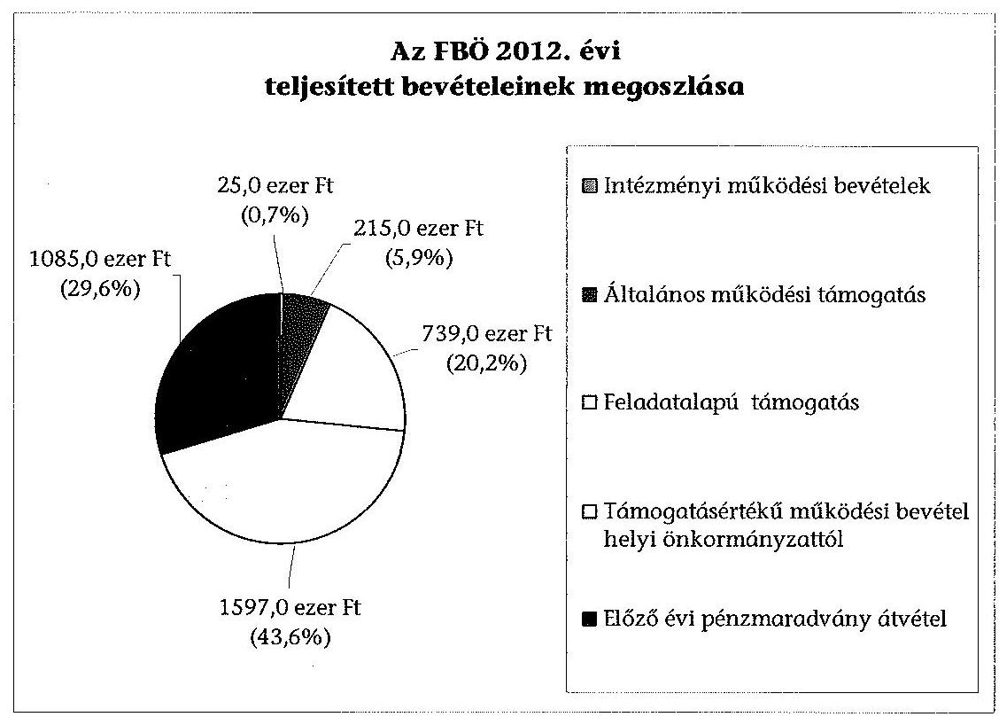
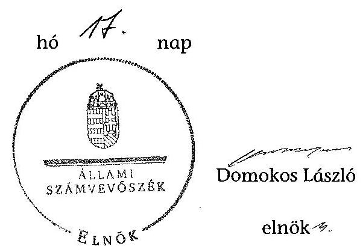

# ÁLLAMI   SZÁMVEVŐSZÉK 

## JELENTÉS

a helyi nemzetiségi önkormányzatok gazdálkodásának ellenőrzéséről
Ferencvárosi Bolgár Önkormányzat

---

# Állami Számvevőszék 

Iktatószám: V-0272-016/2014.
Témaszám: 1305
Vizsgálat-azonosító szám: V065225

## Az ellenőrzést felügyelte:

Horváth Balázs
felügyeleti vezető
Az ellenőrzést vezette és az ellenőrzés végrehajtásáért felelős:
Kisgergely István
ellenőrzésvezető
A számvevőszéki jelentést készítették és a jelentés összeállításában
közreműködtek:
Krupánszki Dóra
számvevő
Szeibel Gáborné
számvevő
Az ellenőrzést végezte:
Nagy László Imre
számvevő

---

# TARTALOMJEGYZÉK 

BEVEZETÉS ..... 3
I. ÖSSZEGZŐ MEGÁLLAPÍTÁSOK, KÖVETKEZTETÉSEK, JAVASLATOK ..... 6
II. RÉSZLETES MEGÁLLAPÍTÁSOK ..... 11

1. Az FBÖ és a Ferencvárosi Önkormányzat együttműködésének szabályozása, a működési feltételek biztosítása ..... 11
2. A gazdálkodási feladatok ellátásának szabályszerűsége ..... 13
2.1. A költségvetésre és a zárszámadásra, valamint a kincstári adatszolgáltatás rendjére vonatkozó jogszabályi előírások betartása ..... 13
2.2. Az FBÖ gazdálkodásának szabályozottsága ..... 14
2.3. Az operatív gazdálkodási jogkörök kialakítása, gyakorlása ..... 14
3. Az FBÖ-vel összefüggő gazdálkodási feladatok belső ellenőrzése ..... 16
4. A feladatalapú támogatás felhasználásának, elszámolásának szabályszerűsége, az FBÖ feladatellátása ..... 16

## MELLÉKLETEK

1. számú A Nemzetiségi Önkormányzat 2012. évi gazdálkodásának főbb adatai, mutatói
2. számú Tájékoztatás a polgármesternek küldött el nem fogadott észrevételekről

## FÜGGELÉKEK

1. számú Rövidítések jegyzéke
2. számú Értelmező szótár
3. számú A gazdálkodás értékelésének módszere

---

.

---

# JELENTÉS 

## a helyi nemzetiségi önkormányzatok gazdálkodásának ellenőrzéséről Ferencvárosi Bolgár Önkormányzat

## BEVEZETÉS

#### Abstract

Az FBÖ 2004. évben alakult, elnöke a 2010. évi helyhatósági választások óta látja el feladatát. Az FBÖ intézményt, gazdasági társaságot és más szervezetet nem alapított. A négytagú Képviselő-testület munkája segítésére bizottságot nem hozott létre. Az FBÖ-nek a költségvetési beszámolója szerint a 2012. évben a módosított költségvetési bevételi és kiadási előirányzata 2356 ezer Ft, a teljesített költségvetési bevétele 3661 ezer Ft, a teljesített költségvetési kiadása 2134 ezer Ft volt. A 2012. évi gazdálkodási adatokat részletesen az 1. számú mellékletben mutatjuk be.

Az Alaptörvény XXIX. cikk (1) bekezdése szerint a Magyarországon élő nemzetiségek államalkotó tényezők. Minden, valamely nemzetiséghez tartozó magyar állampolgárnak joga van önazonossága szabad vállalásához és megőrzéséhez. A hazánkban élő nemzetiségek helyi (települési és területi), valamint országos önkormányzatokat hozhatnak létre. A helyi nemzetiségi önkormányzatok gazdálkodási feladatait jogszabályi előírás alapján a székhely szerinti helyi önkormányzat polgármesteri hivatala látja el.

A nemzetiségek helyzete, támogatása mind hazai, mind EU-s szinten kiemelt figyelmet kap napjainkban. A helyi nemzetiségi önkormányzatok gazdálkodására és támogatási rendszerére vonatkozó jogszabályok a 2010-2012. években jelentős változásokon mentek át. A települési és területi nemzetiségi önkormányzatok gazdálkodásának, a részükre juttatott költségvetési támogatások felhasználásának ellenőrzését az ÁSZ a 2012. évben sorozatjellegű ellenőrzés keretében indította el. A 2013. évi ellenőrzések e témacsoportos ellenőrzések folytatását jelentik, amelyet az ÁSZ 2014. első félévi ellenőrzési terve 12 témasorszámon tartalmaz.

Az ellenőrzés célja annak értékelése volt, hogy az FBÖ gazdálkodási kereteinek kialakítása, gazdálkodása és feladatellátása megfelelt-e a jogszabályoknak.

Ennek keretében értékeltük, hogy:

- az FBÖ és a Ferencvárosi Önkormányzat együttműködésének szabályozása, a működési feltételek biztosítása megfelelt-e a jogszabályi előírásoknak;
- a felek együttműködése megfelelt-e a közöttük létrejött megállapodásnak a gazdálkodási feladatok szabályszerű ellátása során, ennek keretében betartották-e az FBÖ gazdálkodásához kapcsolódóan a költségvetésre és zárszám-

---

adásra, a gazdálkodás szabályozására, az operatív gazdálkodási jogkörök gyakorlására vonatkozó jogszabályi előírásokat;

- a jegyző biztosította-e az FBÖ gazdálkodásának belső ellenőrzését;
- az FBÖ feladatalapú támogatásának felhasználása, a folyósított feladatalapú támogatással történő elszámolás az előírásoknak megfelelő volt-e;
- az FBÖ feladatellátása összhangban volt-e a vonatkozó jogszabályi előírásokkal.

Az ellenőrzés várható hasznosulását négy szinten tervezzük. A törvényalkotás számára összegzett tapasztalatok állnak rendelkezésre a nemzetiségi önkormányzatok testületi döntéseinek, gazdálkodásának és a feladatalapú támogatás felhasználásának szabályszerűségéről, amelynek alapján következtetést lehet levonni arra, hogy indokolt-e jogszabályi módosítás kezdeményezése. Az ellenőrzés az ellenőrzött számára visszajelzést ad a működésében fellépő hiányosságokról, javaslataival hozzájárul azok kiküszöböléséhez, amely csökkentheti a későbbi ellenőrzések gyakoriságát. Az ellenőrzés megállapításai és javaslatai tanulságul szolgálhatnak más nemzetiségi önkormányzatok, szervezetek számára a rendezett gazdálkodási keretek kialakításához. A társadalom számára jelzi, hogy közpénz nem maradhat ellenőrizetlenül, az ÁSZ értékteremtő rend kialakításához és megőrzéséhez hozzájáruló tevékenysége pozitív hatással lesz a szervezetről kialakított összkép formálásában. Az ÁSZ szervezetén belül lehetőség nyílik arra, hogy a megállapítások szintetizálásával az intézmény a hozzáadott értéket teremtő elemző tevékenységét és tanácsadó szerepét erősítse.

Az FBÖ gazdálkodásának ellenőrzéséről szóló jelentés I. fejezetének összegző része az ellenőrzés céljára adott rövid, szintetizáló összefoglalót és következtetéseket tartalmazza a II. fejezet részletes megállapításain alapulóan. A jelentés intézkedést igénylő megállapításait és javaslatait - az összegzőben foglaltak mellett - az ellenőrzés során feltárt, a jelentés II. fejezetében rögzített részletes megállapítások alapozzák meg, illetve támasztják alá.

# Az ellenőrzés típusa: szabályszerűségi ellenőrzés 

Az ellenőrzött időszak: 2012. január 1. - 2012. december 31. közötti időszak. Az ellenőrzés kiterjedt az FBÖ-nek juttatott 2012. évi feladatalapú támogatás 2013. évben való elszámolására is.

Ellenőrzött szervezet: Ferencvárosi Bolgár Önkormányzat és a gazdálkodási feladatait ellátó Budapest Főváros IX. Kerület Ferencváros Önkormányzata.

Az ellenőrzés végrehajtásának jogszabályi alapját az ÁSZ tv. 5. § (2)(3) és (6) bekezdéseiben foglaltak képezik.

Az ellenőrzés szakmai módszertana az ÁSZ hivatalos honlapján (www.asz.hu) közzétett szakmai szabályokon alapult, amely a Legfőbb Ellenőrző Intézmények Nemzetközi Szervezete (INTOSAI) által kiadott nemzetközi standardok (ISSAI) figyelembevételével készült.

---

A helyi nemzetiségi önkormányzatok gazdálkodásának ellenőrzése során értékeltük az FBÖ és a Ferencvárosi Önkormányzat együttműködésének, a gazdálkodás szabályozottságának és a pénzügyi folyamatokban kulcsszerepet betöltő belső kontrollok (teljesítésigazolás és érvényesítés) működésének megfelelőségét. A kulcskontrollokat az államháztartáson kívülre teljesített működési célú pénzeszközátadásoknál, a dologi kiadásokkal kapcsolatos kifizetéseknél - véletlen mintavételi eljárást alkalmazva - ellenőriztük. Ellenőriztük, hogy a jegyző biztosította-e az FBÖ gazdálkodásának belső ellenőrzését. Értékeltük a feladatalapú támogatások felhasználásának, elszámolásának szabályszerűségét, az FBÖ feladatellátása és a jogszabályi előírások összhangját.

Az ellenőrzés lefolytatásához az FBÖ és a gazdálkodási feladatait ellátó Ferencvárosi Önkormányzat tanúsítványok és a kapcsolódó, dokumentumjegyzékben megjelölt dokumentumok elektronikus úton történő megküldésével, rendelkezésre bocsátásával szolgáltatott adatokat. Az adatszolgáltatás kontrollálása és szükség szerinti javítása a helyszíni ellenőrzés keretében történt. A minősítési szempontokat a 3. számú függelék tartalmazza.

Az ÁSZ tv. 29. § (1) bekezdése szerint a jelentéstervezetet megküldtük egyeztetésre a polgármester és az FBÖ elnöke részére. Az ÁSZ tv. 29. § (2) bekezdésében foglalt észrevételezési jogával az FBÖ elnöke nem élt. A polgármester határidőben megküldött észrevétele és tájékoztatása alapján a jelentést részben módosítottuk. Az el nem fogadott észrevételek indoklását a jelentés 2. számú melléklete tartalmazza.

---

# I. ÖSSZEGZŐ MEGÁLLAPÍTÁSOK, KÖVETKEZTETÉSEK, JAVASLATOK 

Az FBÖ és a Ferencvárosi Önkormányzat együttműködésének szabályozása nem felelt meg a jogszabályi előírásoknak. Az együttműködési megállapodásról az FBÖ Képviselő-testülete a Nek. 2 tv. előírása ellenére nem hozott határozatot. Az együttműködési megállapodást a Nek. 2 tv. előírása ellenére 2012. január 31-éig nem vizsgálták felül, és 2012. június 1-jéig nem történt meg a kiegészítése. A Nek. 2 tv. alapján a Kormányhivatal 2012. június 1-jét követően nem kezdeményezett egyeztetést a felek között együttműködési megállapodás megkötése, módosítása érdekében. A 2012. december 31-én hatályos együttműködési megállapodás nem tartalmazta a Nek. 2 tv. szerinti személyi és tárgyi működési feltételeket. A szabályozási hiányosságok ellenére a Ferencvárosi Önkormányzat az FBÖ részére az előírt működési feltételeket a Nek. 2 tv.-ben foglaltakra tekintettel - a 2011. évben érvényes szabályok alapján - biztosította a 2012. évben. A törzskönyvi nyilvántartási adatok módosításával, az önálló fizetési számla nyitásával és az adószám igénylésével kapcsolatos feladatokat elvégezték.

Az FBÖ 2012. évi költségvetésének, zárszámadásának tartalma, jóváhagyása, valamint a kapcsolódó 2012. évi adatszolgáltatás szabályszerűsége annak ellenére megfelelt a jogszabályi előírásoknak, hogy az FBÖ elnöke a 2012. évi költségvetés jegyző által előkészített tervezetét nem nyújtotta be a Képviselő-testületnek az Áht. 2-ben előírt határidőben. A jóváhagyott költségvetés tartalmazta az Áht. 2-ben és az Ávr.-ben foglalt előírások szerinti tartalmi elemeket. A jegyző által elkészített, 2012. évi zárszámadási határozat tervezetét az FBÖ elnöke az Áht. 2-ben foglalt tartalommal, határidőben beterjesztette a Képviselő-testületnek. A 2012. évi kincstári adatszolgáltatási kötelezettségnek hiánytalanul eleget tettek.

A Polgármesteri Hivatal rendelkezett az FBÖ-re is kiterjesztett számviteli politikával és a hozzá kapcsolódó szabályzatokkal, azonban az FBÖ gazdálkodásának szabályozottsága az ellenőrzött időszakban nem volt megfelelő, mivel a Polgármesteri hivatal SZMSZ-ében nem rögzítették az Ávr.-ben foglaltak szerint, az SZMSZ-ben nevesített munkakörökhöz tartozó, az FBÖ gazdálkodásával kapcsolatos feladat- és hatásköröket, a hatáskörök gyakorlásának módját, a helyettesítés rendjét, az ezekhez kapcsolódó felelősségi szabályokra vonatkozó előírásokat. A jegyző az FBÖ gazdálkodási feladataira vonatkozóan nem terjesztette ki a Bkr.-ben előírt ellenőrzési nyomvonalat és a szabálytalanságok kezelésének eljárásrendjét. Az ellenőrzési nyomvonalat 2013. október 1-jétől kiterjesztették az FBÖ-re.

Az operatív gazdálkodási jogkörök kialakítása megfelelt a jogszabályi előírásoknak. Az FBÖ elnöke 2012. március 5-én az Áht. 2 és az Ávr. előírásainak megfelelően írásban jelölt ki teljesítést igazoló személyt. Gazdasági szervezet hiányában a jegyző az Áht. 2 és az Ávr. előírásai alapján írásban jelölt ki megfelelő végzettséggel rendelkező köztisztviselőt a pénzügyi ellenjegyzés és az érvényesítés gyakorlására. A polgármester azonban a kötelezettségvállalási,

---

teljesítésigazolási és utalványozási jogköröket ellátókat az Ávr. előírásai ellenére, jogosulatlanul jelölte ki.

Az FBÖ részéről a 2012. évben egy esetben történt az államháztartáson kívülre, működési célra, 200 ezer Ft összegű pénzeszközátadás. A kulcskontrollok működése nem volt megfelelő, az érvényesítő az Ávr.-ben előírt feladatát nem látta el, mert nem ellenőrizte és nem jelezte, hogy a megelőző ügymenetben az Ávr. előírásai ellenére nem történt meg a teljesítés igazolása, az utalványrendeleten nem rögzítették a megterhelendő fizetési számla számát, megnevezését és a kötelezettségvállalás nyilvántartási számát.

Az FBÖ-nél a 2012. évben a dologi kiadások teljesítése során a teljesítésigazolás és az érvényesítés kulcskontrollok működésének megfelelősége gyenge volt, a hibák száma a lényegességi szintet, a kritikus hibahatárt elérte. Az érvényesítő az Ávr. előírása szerinti ellenőrzési és jelzési feladatát nem látta el, mert nem ellenőrizte a megelőző ügymenetben a jogszabályok és a belső szabályzatok betartását, nem jelezte, hogy a teljesítésigazolások során nem a Kötelezettségvállalási szabályzatban előírt nyomtatványt használták, az utalványrendeletekről az Ávr. előírása ellenére hiányzott a kötelezettségvállalás nyilvántartási száma, az előleggel történt elszámolásokban olyan számlákat is szerepeltettek, amelyek kiállítási dátuma megelőzte az előleg felvételének dátumát a Számv. tv. előírása ellenére. A dologi kiadások három legnagyobb összegű könyvelési tételének egyike esetében előfordult továbbá, hogy a teljesítésigazoló az Ávr. előírása ellenére nem ellenőrizte a kiadás teljesítésének jogosságát. A számvevőszéki ellenőrzés a rendelkezésre bocsátott dokumentumok alapján jogosulatlan kifizetést nem tárt fel.

A Polgármesteri Hivatal belső ellenőrzési tervét megalapozó kockázatelemzés kiterjedt az FBÖ gazdálkodásával összefüggő végrehajtási feladatokra. A kockázatelemzés során az FBÖ gazdálkodását nem ítélték magas kockázatúnak, ezért az FBÖ gazdálkodására vonatkozóan nem terveztek és nem végeztek belső ellenőrzést a 2012. évben.

Az FBÖ a 2011. évben 897 ezer Ft összegű feladatalapú támogatásban részesült, melyet
 maradvány nélkül felhasznált. Az FBÖ a 2012. évben 739 ezer Ft összegű feladatalapú támogatást kapott, melyből 2012-ben 523 ezer Ft-ot használt fel és 216 ezer Ft, kötelezettségvállalással nem terhelt maradványa keletkezett. A feladatalapú támogatás felhasználása és elszámolása nem volt megfelelő, mivel a támogatás tervezett felhasználási céljairól az FBÖ Képviselő-testülete nem hozott határozatot, az Áht. ${ }_{2}$ és a támogatási kormányrendelet ${ }_{2}$ előírásai ellenére a kötelezettségvállalással nem terhelt, 2012. évi maradványról nem mondtak le és nem fizették vissza azt a központi költségvetés javára, valamint az Áht. ${ }_{1,2}$ és a támogatási kormányrendelet ${ }_{1,2}$ előírásai ellenére nem történt meg az elszámolás.

Az FBÖ feladatellátásának tárgya a 2012. évben összhangban volt a Nek. ${ }_{2}$ tv. előírásaival.

Az ÁSZ tv. 33. § (1) bekezdésében foglaltak értelmében az ellenőrzött szervezet vezetője köteles a jelentésben foglalt megállapításokhoz kapcsolódó intézkedési tervet összeállítani és azt a jelentés kézhezvételétől számított 30 napon belül az ÁSZ részére

---

megküldeni. Amennyiben az intézkedési tervet határidőre nem küldi meg a szervezet, vagy az nem elfogadható, az ÁSZ elnöke az ÁSZ tv. 33. § (3) bekezdés a)-b) pontjaiban foglaltakat érvényesítheti.

A helyszíni ellenőrzés megállapításainak hasznosítása mellett javasoljuk:

# a jegyzőnek 

1. az együttműködés szabályozásával kapcsolatban

Az együttműködési megállapodást a Nek. ${ }_{2}$ tv. 80. § (2) bekezdésének előírása ellenére 2012. január 31-éig nem vizsgálták felül.

Javaslat
Biztosítsa a jövőben az együttműködési megállapodás Nek. ${ }_{2}$ tv. 80. § (2) bekezdésében előírt határidő szerinti, évenkénti felülvizsgálatát.
2. a gazdálkodás szabályozottságával kapcsolatban

A Polgármesteri Hivatal SZMSZ-e nem tartalmazta az Ávr. 13. § (1) bekezdés g) pontjában foglaltak szerinti, az SZMSZ-ben nevesített munkakörökhöz tartozó - az FBÖ gazdálkodásával kapcsolatos - feladat- és hatáskörökre, a hatáskörök gyakorlásának módjára, a helyettesítés rendjére, az ezekhez kapcsolódó felelősségi szabályokra vonatkozó előírásokat. A jegyző az FBÖ gazdálkodási feladataira nem határozta meg a Bkr. 6. § (4) bekezdésében előírt szabálytalanságok kezelésének eljárásrendjét.

Javaslat
A gazdálkodás szabályszerűsége érdekében az FBÖ gazdálkodására kiterjedően:
a) készítse el a Polgármesteri Hivatal SZMSZ-ének módosítását, hogy az tartalmazza az Ávr. 13. § (1) bekezdés g) pontjában foglaltakat;
b) módosítsa a Polgármesteri Hivatal Bkr. 6. § (4) bekezdése szerinti szabálytalanságok kezelésének eljárásrendjét.
3. a kulcskontrollok működésével kapcsolatban

A pénzeszközátadás esetén a teljesítésigazolás az Ávr. 57. § (1) bekezdése ellenére nem történt meg. Az érvényesítő az Ávr. 58. § (1)-(2) bekezdése szerinti feladatát nem látta el, mert nem ellenőrizte a megelőző ügymenetben a jogszabályi előírások betartását. Nem jelezte, hogy a teljesítésigazolás nem történt meg, nem tüntették fel az utalványrendeleteken a megterhelendő fizetési számla számát, megnevezését és a kötelezettségvállalás nyilvántartási számát, nem történt meg a számviteli nyilvántartásban egyes számlák késedelem nélküli rögzítése.

---

Javaslat
Az operatív gazdálkodás működési hibáinak megelőzése, feltárása és kijavítása érdekében gondoskodjon arról, hogy:
a) a teljesítésigazolást az Ávr. 57. § (1) bekezdésének előírása szerint minden esetben végezzék el;
b) az érvényesítő az Ávr. 58. § (1)-(2) bekezdéseiben előírt ellenőrzési és jelzési feladatait maradéktalanul lássa el.
4. a feladatalapú támogatás elszámolásával kapcsolatban

A 2011. évi feladatalapú támogatás elszámolása a támogatási kormányrendelet, 7. § (2) bekezdésében hivatkozott, valamint a 2012. évi feladatalapú támogatás elszámolása a támogatási kormányrendelet, 8. § (5) bekezdésében hivatkozott „a helyi önkormányzatok elszámolási és ellenőrzési rendjére vonatkozó jogszabályok rendelkezései alkalmazandóak" előírása alapján az Áht. 64. § (7) bekezdése és az Áht. 2 57. § (3) bekezdése ellenére nem történt meg.

Javaslat
Gondoskodjon az Áht. 2 27. § (2) bekezdésében meghatározott feladatkörében az FBÖ által igénybevett 2011. és 2012. évi feladatalapú támogatás rendeltetésszerű felhasználásáról szóló elszámolásának elkészítéséről az Áht. 2 53. § (1) bekezdése szerinti beszámolási kötelezettség teljesítéséhez.

# a polgármesternek 

A Polgármesteri Hivatal SZMSZ-e nem tartalmazta az Ávr. 13. § (1) bekezdés g) pontjában foglaltak szerinti, az SZMSZ-ben nevesített munkakörökhöz tartozó - az FBÖ gazdálkodásával kapcsolatos - feladat- és hatáskörökre, a hatáskörök gyakorlásának módjára, a helyettesítés rendjére, az ezekhez kapcsolódó felelősségi szabályokra vonatkozó előírásokat.

Javaslat
Terjessze a Ferencvárosi Önkormányzat Képviselő-testülete elé a Polgármesteri Hivatal SZMSZ-ének jegyző által elkészített módosítását, hogy az tartalmazza - az FBÖ gazdálkodásával kapcsolatosan - az Ávr. 13. § (1) bekezdés g) pontjában foglaltakat.

## az FBÖ elnökének

1. Az FBÖ elnöke a 2012. évi költségvetési határozat tervezetét az Áht. 2 24. § (2) bekezdésében előírt határidőn túl nyújtotta be a Képviselőtestületnek.

---

Javaslat
A költségvetési határozat tervezetét az Áht. ${ }_{2}$ 24. § (3) bekezdésében foglalt határidőig nyújtsa be a Képviselő-testületnek.
2. A 2011. évi feladatalapú támogatás elszámolása a támogatási kormányrendelet ${ }_{1}$ 7. § (2) bekezdésében hivatkozott, valamint a 2012. évi feladatalapú támogatás elszámolása a támogatási kormányrendelet ${ }_{2}$ 8. § (5) bekezdésében hivatkozott „a helyi önkormányzatok elszámolási és ellenőrzési rendjére vonatkozó jogszabályok rendelkezései alkalmazandóak" előírása alapján az Áht. 64. § (7) bekezdése, és az Áht. ${ }_{2}$ 57. § (3) bekezdése ellenére nem történt meg.

Javaslat
Terjessze a Képviselő-testület elé jóváhagyásra az Áht. ${ }_{2}$ 53. § (1) bekezdése szerinti beszámolási kötelezettség teljesítéséhez az FBÖ által igénybe vett 2011. és 2012. évi feladatalapú támogatás rendeltetésszerű felhasználásáról szóló elszámolást.
3. Az FBÖ nem tett eleget az Áht. ${ }_{2}$ 57. § (2) bekezdésében előírtaknak azáltal, hogy a meghatározott célra fel nem használt 2012. évi feladatalapú támogatás 2012. december 31-éig kötelezettségvállalással nem terhelt 216 ezer Ft összegű maradványáról nem mondott le és nem fizette vissza azt a központi költségvetés javára.

Javaslat
Terjessze a Képviselő-testület elé jóváhagyásra az Áht. ${ }_{2}$ 57/A. § (1) bekezdés előírásának megfelelően a 2012. évi feladatalapú támogatás kötelezettségvállalással nem terhelt, 216 ezer Ft összegű maradványáról történő lemondást és intézkedjen a maradvány összegének visszafizetésére a központi költségvetés javára.

---

# II. RÉSZLETES MEGÁLLAPÍTÁSOK 

## 1. Az FBÖ És a Ferencvárosi Önkormányzat Együttműködésének Szabályozása, a Működési Feltételek Biztosítása

Az FBÖ és a Ferencvárosi Önkormányzat együttműködésének szabályozása nem felelt meg a jogszabályi előírásoknak.

Az FBÖ az ellenőrzött időszakban rendelkezett a Ferencvárosi Önkormányzattal kötött együttműködési megállapodással. Az együttműködési megállapodás ${ }_{1}$ a Képviselő-testületek döntését követően, 2011. december 13-án került aláírásra. Az együttműködési megállapodás ${ }_{1}$-t a Nek. ${ }_{2}$ tv. 80. § (2) bekezdésének előírása ellenére 2012. január 31-éig nem vizsgálták felül, és a Nek. ${ }_{2}$ tv. 159. § (3) bekezdése alapján 2012. június 1-jéig nem történt meg a kiegészítése. A Nek. ${ }_{2}$ tv. 83. § (3) bekezdése alapján a Kormányhivatal 2012. június 1-jét követően nem kezdeményezett egyeztetést a felek között együttműködési megállapodás megkötése, módosítása érdekében. Az együttműködési megállapodás ${ }_{1}$ egyes részeinek érvényben tartása ${ }^{1}$ mellett, annak kiegészítéseként 2012. december 12-én az FBÖ és a Ferencvárosi Önkormányzat együttműködési megállapodás ${ }_{2}$-t kötött a Nek. ${ }_{2}$ tv. előírásának megfelelően, amelyet a polgármester átruházott hatáskörben ${ }^{2}$ írt alá. Az együttműködési megállapodás ${ }_{2}$-ról az FBÖ Képviselő-testülete a Nek. ${ }_{2}$ tv. 78. § (3) bekezdésének előírása ellenére nem hozott határozatot.

Az együttműködési megállapodás ${ }_{1}$ tartalmát az FBÖ 2011. október 20-án, a Ferencvárosi Önkormányzat Képviselő-testülete 2011. december 12-ei ülésén megtárgyalta ${ }^{3}$.

Az együttműködési megállapodás ${ }_{1}$ nem tartalmazta:

- a Nek. ${ }_{2}$ tv. 80. § (1) bekezdés a) pontja alapján az FBÖ részére havonta igény szerint, de legalább tizenhat órában, az önkormányzati feladat ellátásához szükséges tárgyi, technikai eszközökkel felszerelt helyiség ingyenes használatát, a helyiséghez, továbbá a helyiség infrastruktúrájához kapcsolódó rezsiköltségek és fenntartási költségek viselését;

[^0]
[^0]:    ${ }^{1}$ Az együttműködési megállapodás ${ }_{2} 8$. pontjában a költségvetés elkészítése jóváhagyásának eljárási rendjére, a költségvetési gazdálkodás bonyolításának rendjére, a beszámoló elkészítésének és jóváhagyásának eljárási rendjére, az ellenjegyzési, érvényesítési, utalványozási, teljesítésigazolással kapcsolatos feladatokra, a vagyontárgyak kezelésének rendjére, a számviteli, pénzügyi és információszolgáltatási tevékenység végzésének rendjére, a belső ellenőrzés elvégzésére vonatkozó szabályok érvényben tartásáról állapodtak meg.
    ${ }^{2}$ a 404/2012. (X. 04.) számú határozat 3. pontja
    ${ }^{3}$ Az FBÖ 32/2011. (X. 20.) számú határozata, illetve a Ferencvárosi Önkormányzat Képviselő-testületének 35/2011. (XII. 12.) számú rendelete a Szervezeti és Működési Szabályzatáról szóló 28/2011. (X. 11.) számú önkormányzati rendelet módosításáról.

---

- a Nek. ${ }_{2}$ tv. 80. § (1) bekezdés b) pontja alapján az önkormányzati működéshez (a testületi, tisztségviselői, képviselői feladatok ellátásához) szükséges tárgyi és személyi feltételek biztosítását;
- a Nek. ${ }_{2}$ tv. 80. § (1) bekezdés c) pontja alapján a testületi ülések előkészítését (meghívók, előterjesztések, hivatalos levelezés előkészítése, postázása, a testületi ülések jegyzőkönyveinek elkészítése, postázása);
- a Nek. ${ }_{2}$ tv. 80. § (1) bekezdés d) pontja alapján a testületi döntések és a tisztségviselők döntéseinek előkészítését, a testületi és tisztségviselői döntéshozatalhoz kapcsolódó nyilvántartási, sokszorosítási, postázási feladatok ellátását;
- a Nek. ${ }_{2}$ tv. 80. § (1) bekezdés e) pontja alapján az FBÖ működésével, gazdálkodásával kapcsolatos nyilvántartási, iratkezelési feladatok ellátását;
- a Nek. ${ }_{2}$ tv. 80. § (1) bekezdés g) pontja alapján a fenti feladatellátáshoz kapcsolódó költségek - a testületi tagok és tisztségviselők telefonhasználata költségei kivételével - viselését;
- a Nek. ${ }_{2}$ tv. 80. § (3) bekezdés a) pontja által előírt önálló fizetési számla nyitásával, törzskönyvi nyilvántartásba vételével és adószám igénylésével kapcsolatos feladatokat, azok felelőseinek konkrét kijelölését és végrehajtásának határidejét;
- a Nek. ${ }_{2}$ tv. 80. § (3) bekezdés b) pontja által előírt szakmai teljesítésigazolási feladatokat és felelőseinek konkrét kijelölését;
- a Nek. ${ }_{2}$ tv. 80. § (3) bekezdés c) pontja által előírt, az FBÖ kötelezettségvállalásaival összefüggő összeférhetetlenségi és nyilvántartási szabályokat;
- a Nek. ${ }_{2}$ tv. 80. § (3) bekezdés d) pontja által előírt, az FBÖ gazdálkodásának eljárási és dokumentációs részletszabályai közül a teljesítésigazolással, valamint az ezt végző személyek kijelölésének rendjével kapcsolatos előírásokat, feltételeket;
- a Nek. ${ }_{2}$ tv. 80. § (4) bekezdés ellenére azt, hogy a jegyző vagy annak - a jegyzővel azonos képesítési előírásoknak megfelelő - megbízottja a Ferencvárosi Önkormányzat megbízásából és képviseletében részt vesz az FBÖ testületi ülésein és jelzi, amennyiben törvénysértést észlel.

Az együttműködési megállapodás ${ }_{1}$ az Áht. ${ }_{2}$-ben foglaltak szerint tartalmazta a tervezési, gazdálkodási, ellenőrzési, finanszírozási, adatszolgáltatási és beszámolási feladatokat.

Az FBÖ 34/2013. (XI. 20.) számú határozatával elfogadta az FBÖ új SZMSZ-ének 2. számú mellékleteként az együttműködési megállapodás ${ }_{2}$-t és annak 2013. április 5-ei módosítását.

A szabályozási hiányosságok ellenére a Ferencvárosi Önkormányzat az FBÖ részére az előírt működési (személyi, tárgyi) feltételeket a Nek. ${ }_{2}$ tv. 159. § (3) bekezdésében foglaltakra tekintettel - a 2011. évben érvényes szabályok alapján, a Nek. ${ }_{1}$ tv. 27. § (1)-(2) bekezdéseiben foglaltak szerint - biztosította a 2012. évben. A
 törzskönyvi nyilvántartási adatok módosításával, az önálló fizetési számla nyitásával és az adószám igénylésével kapcsolatos feladatokat elvégezték.

A jegyző és az FBÖ elnöke által 2013. október 7-én tett nyilatkozat alapján a működési feltételeket a 2012. évben biztosították.

# 2. A GAZDÁLKODÁSI FELADATOK ELLÁTÁSÁNAK SZABÁLYSZERŰSÉGE 

### 2.1. A költségvetésre és a zárszámadásra, valamint a kincstári adatszolgáltatás rendjére vonatkozó jogszabályi előírások betartása

Az FBÖ 2012. évi költségvetésének, zárszámadásának tartalma, jóváhagyása, valamint a kapcsolódó 2012. évi adatszolgáltatás szabályszerűsége annak ellenére megfelelt a jogszabályi előírásoknak, hogy az FBÖ elnöke a 2012. évi költségvetés jegyző által előkészített tervezetét nem nyújtotta be a Képviselőtestület részére - az Áht. ${ }_{2} 24 . \S$ (2) bekezdésében foglaltak ellenére - az előírt határidőben ${ }^{4}$.

A jóváhagyott költségvetés tartalmazta az Áht. ${ }_{2}$-ben és az Ávr.-ben előírt tartalmi elemeket, a költségvetési bevételeket és a költségvetési kiadásokat előirányzat-csoportok, valamint kiemelt előirányzatok szerinti bontásban. A 2012. évi költségvetés előterjesztésekor a Képviselő-testület részére az Áht. ${ }_{2}$-ben foglaltaknak megfelelően bemutatták az előírt mérlegeket és kimutatásokat.

A jegyző által elkészített 2012. évi zárszámadási határozat tervezetét az FBÖ elnöke az Áht. ${ }_{2}$-ben foglaltak alapján, határidőn belül beterjesztette a Képviselő-testületnek. A 2012. évi zárszámadási határozat tervezetének előterjesztésénél a Képviselő-testület részére tájékoztatásul bemutatták az Áht. ${ }_{2}$-ben foglalt mérlegeket és kimutatásokat. A zárszámadásról alkotott határozat és az elfogadott költségvetés összehasonlíthatóságát biztosították, az FBÖ a zárszámadási határozatban valamennyi bevételéről és kiadásáról elszámolt.

A zárszámadási határozat szöveges részében a bevételi és a kiadási főösszegeket felcserélték.

A 2012. költségvetési évvel kapcsolatban az FBÖ a vonatkozó kincstári adatszolgáltatási kötelezettségének hiánytalanul eleget tett, a 2012. évi elemi költségvetését, a féléves és éves beszámolóját, valamint az időközi költségvetési- és mérlegjelentéseket az Ávr. szerinti határidőig megküldte a Kincstár részére.

[^0]
[^0]:    ${ }^{4}$ A képviselő-testületi ülés és a határozathozatal 2012. február 24-én volt.

---

# 2.2. Az FBÖ gazdálkodásának szabályozottsága 

Az FBÖ gazdálkodásának szabályozottsága az ellenőrzött időszakban nem volt megfelelő, mivel:

- a Polgármesteri Hivatal SZMSZ-ében - a munkaköri leírásokkal ellentétben - nem rögzítették az Ávr. 13. § (1) bekezdés g) pontjában foglaltak szerinti, az SZMSZ-ben nevesített munkakörökhöz tartozó - az FBÖ gazdálkodásával kapcsolatos - feladat- és hatáskörökre, a hatáskörök gyakorlásának módjára, a helyettesítés rendjére, az ezekhez kapcsolódó felelősségi szabályokra vonatkozó előírásokat ${ }^{5}$;
- a jegyző az FBÖ gazdálkodási feladataira nem terjesztette ki a Bkr. 6. § (3) és (4) bekezdéseiben előírt ellenőrzési nyomvonalat és a szabálytalanságok kezelésének eljárásrendjét.

A 2013. október 1-jétől hatályos ellenőrzési nyomvonalat már kiterjesztették az FBÖ-re is.

A 2012. évben a Polgármesteri Hivatal rendelkezett az FBÖ-re is kiterjesztett, a Számv. tv. által előírt számviteli politikával és ahhoz kapcsolódóan a gazdálkodásra vonatkozó szabályzatokkal: az eszközök és források értékelési szabályzatával, pénzkezelési szabályzattal, számlarenddel, leltározási- és leltárkészítési szabályzattal.

Az Áht. ${ }_{2}$-ben és az Ávr.-ben foglaltak szerint a tervezéssel, gazdálkodással, a kötelezettségvállalással, pénzügyi ellenjegyzéssel, teljesítésigazolással, az érvényesítés, utalványozás gyakorlásának módjával, eljárási és dokumentációs részletszabályaival, valamint az ezeket végző személyek kijelölésének rendjével, továbbá az ellenőrzési és adatszolgáltatási feladatok teljesítésével kapcsolatos belső előírásokat, feltételeket tartalmazó belső szabályzat ${ }^{6}$ rendelkezésre állt.

Az FBÖ gazdálkodásával kapcsolatos teendőket a feladatot ellátó köztisztviselők munkaköri leírásaiban részletesen rögzítették.

### 2.3. Az operatív gazdálkodási jogkörök kialakítása, gyakorlása

Az FBÖ gazdálkodása tekintetében az operatív gazdálkodási jogkörök kialakítása megfelelt a jogszabályi előírásoknak, mivel:

- az FBÖ elnöke 2012. március 5-én, az Áht. ${ }_{2}$ és az Ávr. előírásainak megfelelően írásban jelölt ki teljesítést igazoló személyt;

[^0]
[^0]:    ${ }^{5}$ A Polgármesteri Hivatal SZMSZ-ének VIII. pontjában az irodavezetők, irodavezető-helyettesek és csoportvezetők feladatait és felelősségi rendjét, a X. pontjában az egyes irodák és belső szervezeti egységek főbb feladatait és hatásköreit, a XI. pontjában a helyettesítés rendjét rögzítették.
    ${ }^{6}$ Kötelezettségvállalási szabályzat

---

- gazdasági szervezet hiányában a jegyző az Áht. ${ }_{2}$ és az Ávr. előírásai alapján írásban jelölt ki megfelelő végzettséggel rendelkező köztisztviselőt a pénzügyi ellenjegyzés és az érvényesítés gyakorlására.

A 2012. január 1. és március 5. közötti időszakban - az Ávr. 57. § (4) bekezdése ellenére - a teljesítésigazolók írásbeli kijelölése nem történt meg. A Ferencvárosi Önkormányzat polgármestere 2012. március 5-én meghatalmazást adott az FBÖ elnöke és elnökhelyettese részére kötelezettségvállalási, teljesítésigazolási, valamint utalványozási jogkörök gyakorlására, mely a Kötelezettségvállalási szabályzat 2. számú mellékletét képezte. A polgármester jogosulatlanul végezte a kijelölést, mert az ellentétes volt:

- az Ávr. 52. § (7) bekezdésében foglaltakkal, mely szerint a nemzetiségi önkormányzat kiadási előirányzatai terhére az FBÖ elnöke, vagy az általa írásban felhatalmazott személy vállalhat kötelezettséget;
- az Ávr. 57. § (4) bekezdésében foglaltakkal, mely szerint a teljesítés igazolására jogosult személyeket a kötelezettségvállaló írásban jelöli ki;
- az Ávr. 59. § (1) bekezdésében foglaltakkal, mely szerint az Ávr. 52. §-ában foglaltak szerint kell eljárni az utalványozásra jogosult személyek kijelölésekor.

Az FBÖ részéről egy esetben történt a 2012. évben államháztartáson kívülre, működési célú, 200 ezer Ft összegű pénzeszközátadás. A kulcskontrollok működése nem volt megfelelő. Az érvényesítő az Ávr. 58. § (1)(2) bekezdéseiben foglalt feladatát nem látta el, mert a megelőző ügymenetben nem ellenőrizte és nem jelezte, hogy az Ávr. 57. § (1) bekezdése ellenére nem történt meg a teljesítés igazolása, valamint azt, hogy az utalványrendeleten az Ávr. 59. § (3) bekezdésének e) és f) pontjaiban foglaltak ellenére nem szerepeltették a megterhelendő fizetési számla számát, megnevezését és a kötelezettségvállalás nyilvántartási számát.

Az FBÖ-nél a 2012. évben a dologi kiadások teljesítése során a teljesítésigazolás és az érvényesítés kulcskontrollok működésének megfelelősége gyenge volt, a hibák száma a lényegességi szintet, a kritikus hibahatárt elérte. Az érvényesítő az Ávr. 58. § (1)-(2) bekezdései ellenére feladatát nem látta el, mert nem ellenőrizte a megelőző ügymenetben a jogszabályi előírások és belső szabályzatok előírásainak betartását, valamint nem jelezte, hogy:

- a teljesítésigazolások során nem a Kötelezettségvállalási szabályzat 8.2 pontjában előírt, 9. számú melléklet szerinti teljesítésigazolás nyomtatványt használták;
- az Ávr. 59. § (3) bekezdés f) pontjában foglaltak ellenére az utalványrendeleteken nem tüntették fel a kötelezettségvállalás nyilvántartási számát;
- az előleggel történt elszámolásokban olyan számlákat is szerepeltettek, amelyek kiállítási dátuma megelőzte az előleg felvételének dátumát a Számv. tv. 165. § (3) bekezdésének a) pontja ellenére, amely alapján a számviteli bizonylatot a keletkezését követően késedelem nélkül rögzíteni kell a számviteli nyilvántartásban.

---

A dologi kiadások három legnagyobb összegű könyvelési tétele esetében egy esetben előfordult, hogy a számlához csatolt megbízási szerződésen nem a számlát kiállító szervezet bélyegzőlenyomata szerepelt, így a teljesítésigazoló nem ellenőrizte érdemben a kiadás teljesítésének jogosságát az Ávr. 57. § (1) bekezdésének megfelelően. Az érvényesítő az Ávr. 58. § (1)(2) bekezdéseiben foglalt feladatát nem látta el, mert a megelőző ügymenetben nem ellenőrizte és nem jelezte, hogy a teljesítésigazolások során nem a Kötelezettségvállalási szabályzat 8.2 pontjában előírt, 9. számú melléklet szerinti teljesítésigazolás nyomtatványt használták, valamint az utalványrendeleteken az Ávr. 59. § (3) bekezdés f) pontjában foglaltak ellenére nem tüntették fel a kötelezettségvállalások nyilvántartási számát.

A számvevőszéki ellenőrzés a kiadások dokumentumainak ellenőrzése, a rendelkezésre bocsátott dokumentumok alapján összeférhetetlenséget, továbbá jogosulatlan kifizetést nem tárt fel, azonban a kulcskontrollok működéséhez kapcsolódó hiányosságok miatt nem biztosították a hibák megelőzését, feltárását és kijavítását.

# 3. Az FBÖ-VEL ÖSSZEFÜGGŐ GAZDÁLKODÁSI FELADATOK BELSŐ ELLENŐRZÉSE 

A jegyző a 2012. évi belső ellenőrzési terv összeállítása során figyelemmel volt az FBÖ gazdálkodásának belső ellenőrzésére, mert a Polgármesteri Hivatal belső ellenőrzési tervét megalapozó kockázatelemzés kiterjedt az FBÖ gazdálkodásával összefüggő végrehajtási feladatokra. A kockázatelemzés alapján az FBÖ gazdálkodását nem ítélte magas kockázatúnak, ezért a belső ellenőrzési terv nem tartalmazott belső ellenőrzést az FBÖ gazdálkodására vonatkozóan. Az FBÖ-nél belső ellenőrzés lefolytatására nem került sor 2012-ben.

Az ellenőrzéshez szolgáltatott adatok alapján a 2012. évben a Kormányhivatal az FBÖ-t illetően nem élt törvényességi felügyeleti eszközökkel.

## 4. A feladatalapú támogatás felhasználásának, elszámolásának szabályszerűsége, az FBÖ feladatellátása

A feladatalapú támogatás felhasználása és elszámolása nem volt megfelelő.
Az FBÖ a 2012. évben 739 ezer Ft összegű feladatalapú támogatásban részesült. A támogatás összegét a költségvetés módosítása során figyelembe vették.

---

A feladatalapú támogatás összes bevételhez viszonyított részarányát a következő ábra szemlélteti.

A feladatalapú támogatás felhasználásáról előzetes terv nem készült, annak tervezett felhasználási céljairól a támogatás kiutalását megelőzően az FBÖ Képviselő-testülete nem hozott határozatot. Az FBÖ a folyósított feladatalapú támogatás összegével a 2012. évi költségvetési határozatát módosította, azonban abban sem jelölte meg a támogatás felhasználási céljait.

A 2012. évben folyósított feladatalapú támogatás felhasználása részben történt meg. Az 523 ezer Ft összegű felhasználás mellett a 2012. év végén 216 ezer Ft kötelezettségvállalással nem terhelt maradvány keletkezett, amelyről a támogatási kormányrendelet ${ }_{2} 14. \S$ (1) bekezdésének és az Áht. ${ }_{2} 57. \S$ (2) bekezdésének alapján haladéktalanul nem mondtak le és nem fizették vissza a központi költségvetés javára.

A 2012. évi 523 ezer Ft felhasználása során a „Nyugdíjasok karácsonya" eseményre 80 ezer Ft-ot, a „10 éves az önkormányzatiság" rendezvényre 50 ezer Ft-ot, a „Mikulásnapi rendezvényre" 193 ezer Ft-ot fordítottak, valamint a feladatalapú támogatás terhére számolták el a „JANTRA néptáncegyüttes" részére történt pénzeszközátadást is 200 ezer Ft összegben.

Az FBÖ a 2011. évben 897 ezer Ft összegű feladatalapú támogatásban részesült, amelyet az év folyamán felhasználtak, maradvány nem keletkezett.

A 2011. évi feladatalapú támogatás elszámolása a támogatási kormányrendelet ${ }_{1} 7. \S$ (2) bekezdésében hivatkozott, valamint a 2012. évi feladatalapú támogatás elszámolása a támogatási kormányrendelet ${ }_{2} 8. \S$ (5) bekezdésében hivatkozott „a helyi önkormányzatok elszámolási és ellenőrzési rendjére vonatkozó jogszabályok rendelkezései alkalmazandóak" előírása alapján az Áht. ${ }_{1} 64. \S$ (7) bekezdése és az Áht. ${ }_{2} 57. \S$ (3) bekezdése ellenére nem történt meg.

A 2012. évi zárszámadási határozat előterjesztésében az FBÖ felé bemutatták a feladatalapú támogatás összegét.

Az FBÖ-nél a feladatalapú támogatások felhasználását, elszámolását az ellenőrzésre jogosult szervek nem ellenőrizték.

Az FBÖ feladatellátásának tárgya a 2012. évben összhangban volt a Nek. ${ }_{2}$ tv. 115. §-ában foglalt előírásokkal. Az FBÖ kötelező közfeladatot látott el, kulturális rendezvények szervezésére hozott intézkedéseket, néptáncegyüttest támogatott. Az FBÖ a Nek. ${ }_{2}$ tv. 116. § (2) bekezdésében tiltott hatósági feladatokat nem végzett.

Budapest, 2014.

Melléklet: $\quad 2 \mathrm{db}$
Függelék: $\quad 3 \mathrm{db}$

---

# A Nemzetiségi Önkormányzat 2012. évi gazdálkodásának főbb adatai, mutatói

A) Bevételek

|  Megnevezés | Eredeti előirányzat | Módosított | Teljesítés  |
| --- | --- | --- | --- |
|   | ezer Ft |  | megoszlás
(%)  |
|  Intézményi működési bevételek | 0,0 | 4,0 | 25,0  |
|

  Általános működési támogatás | 0,0 | 215,0 | 215,0  |
|  Feladatalapú támogatás | 0,0 | 0,0 | 739,0  |
|  Támogatásértékű működési bevétel helyi önkormányzattól | 1267,0 | 1052,0 | 1597,0  |
|  Előző évi pénzmaradvány átvétel | 0,0 | 1085,0 | 1085,0  |
|  Költségvetési bevételek | 1267,0 | 2356,0 | 3661,0  |
|  Tárgyévi bevételek | 1267,0 | 2356,0 | 3661,0  |

B) Kiadások

|  Megnevezés | Eredeti előirányzat | Módosított | Teljesítés  |
| --- | --- | --- | --- |
|   |  |  | megoszlás
$(\%)$  |
|  Személyi juttatások | 300,0 | 300,0 | 46,0  |
|  Dologi kiadások | 967,0 | 2056,0 | 1888,0  |
|  Pénzeszközátadás államháztartáson kívülre | 0,0 | 0,0 | 200,0  |
|  Működési kiadások összesen | 1267,0 | 2356,0 | 2134,0  |
|  Költségvetési kiadások | 1267,0 | 2356,0 | 2134,0  |
|  Tárgyévi kiadások | 1267,0 | 2356,0 | 2134,0  |

---

.

---

# TÁJÉKOZTATÁS   A POLGÁRMESTERNEK KÜLDÖTT EL NEM FOGADOTT ÉSZREVÉTELEKRŐL 

| Észrevétel | A jelentéstervezet 1. és 2. pontjához kapcsolódóan:   Az ellenőrzési jelentéstervezetben megállapított hiányosságok egy részét az ellenőrzött időszakot követően, de még az ellenőrzés megelőzően megszüntettük, a jelentéstervezet ezeket meg is említi, melyet köszönettel vettünk.   A hiányosságok egy részét a helyszíni ellenőrzést követően, a záró tárgyaláson elhangzott javaslatok alapján a lehető leggyorsabb úton kijavítottuk. Ennek kapcsán módosításra került a Polgármesteri Hivatal SZMSZ-e. Bár álláspontunk szerint sem a Nek. Törvény, sem az Áht. Nem ír elő olyan kötelezettséget, melynek alapján kötelező lenne a nemzetiségek működésével kapcsolatos munkakör nevesítése, az ÁSZ kérésének megfelelően a Polgármesteri Hivatal SZMSZ-ében az egyes szervezeti egységek feladat-és hatásköreibe a korábbinál specifikáltabban kerültek meghatározásra ezen feladatok. Így rögzítésre kerültek a nemzetiségi önkormányzatok (beleérve az FBÖ-t) gazdálkodásával kapcsolatos feladat- és hatáskörök, a hatáskörök gyakorlásának módja, az ezekhez kapcsolódó felelősségi szabályok. Mellékelten megküldöm a Polgármesteri Hivatal módosított SZMSZ-ét.   A jelentéstervezetben említett együttműködési megállapodás 2012. december 12-én került aláírásra, azonban a törvényben előírt személyi és tárgyi feltételeket már annak aláírása előtt is biztosítottak voltak, amelyet a jegyző és a Ferencvárosi Bolgár Önkormányzat elnöke által 2012. október 7-én tett nyilatkozatban foglaltak alátámasztanak. A Bp. Főváros IX. Kerület Ferencváros Önkormányzatának Képviselőtestülete a 262/2012. (VI. 07.) számú határozatával döntött a Ferencvárosi Nemzetiségi Önkormányzatok részére történő helyiségek biztosításáról. Egyes Nemzetiségi Önkormányzatok azonban nem kívántak élni a törvény által biztosított jogokkal, így szüksége volt mindenkivel az adott helyzetre vonatkozó konkrét és részletes egyeztetés, melyek - tekintettel arra, hogy a különböző igények, szándékok összehangolását igényeltek - elhúzódtak. Ezen egyeztetések eredményeként a konkrét megállapodások megkötése 2012. december előtt nem tudott realizálódni, azonban a nemzetiségi jogok gyakorlása nem szenvedett csorbát, a Bp. IX. Kerület Ferencváros Önkormányzata biztosított minden feltételt, amely a nemzetiségi önkormányzat működéséhez szükséges volt, s amelyet igényelt.   A Ferencvárosi Bolgár Önkormányzat 34/2013. (XI. 20.) számú határozatával elfogadott új SZMSZ-ének mellékleteként elfogadott együttműködési megállapodás és annak módosítása minden kötelező tartalmi elemet magában foglalt, amelyet az Áht. és a Nek. törvény előírt. |
| :--: | :--: |
| Válasz | A Polgármesteri Hivatal SZMSZ-ének módosításáról, valamint az együttműködési megállapodás képviselő-testületi határozattal történő |

---

|  | elfogadásáról szóló tájékoztatását tudomásul vettem. Azonban felhívom a figyelmét arra, hogy az ellenőrzött időszakot követően megtett intézkedéseivel nem módosítjuk a jelentéstervezet tartalmát. Az ellenőrzött időszakban hatályos Polgármesteri Hivatal SZMSZ-e nem felelt meg teljes körűen a jogszabályi előírásoknak. Az erre vonatkozó javaslatot továbbra is fenntartjuk, mert a hiányosságok megszüntetésére a 2014. évben tett intézkedések nem vehetők figyelembe az ellenőrzött időszakra vonatkozó megállapításaink során. Az együttműködési megállapodás ${ }_{2}$ képviselő-testületi határozattal való elfogadása nem történt meg az ellenőrzött időszakban. Az intézkedési terv készítése során a jelentéstervezetben szereplő hiányosságokra megtett módosításait, intézkedéseit, már megtett intézkedésként kell majd szerepeltetnie. |
| :--: | :--: |
| Észrevétel | A jelentéstervezet 2.3. pontjához kapcsolódóan:   A jelentéstervezetben említett kulcskontrollok működésével kapcsolatos szabályozási hiányosságok megszüntetése érdekében, a teljesítésigazoló személyére, kijelölésére vonatkozó szabályozást a jövőben a jelentéstervezet javaslatait figyelembe véve alakítjuk ki. Megjegyzem azonban, hogy a teljesítést igazoló személy jogosultságának el nem fogadásával, ebből fakadóan az érvényesítői feladat ellátásának hiányosságával, illetve a kulcskontrollok működésének gyenge minősítésével nem értünk egyet az alábbi indokok miatt: A nemzetiségi önkormányzatok operatív gazdálkodási feladatait meghatározó helyi belső szabályozás szerint a nemzetiségi önkormányzatok teljesítésigazolásra jogosult személy értékhatártól függetlenül az elnök, vagy az általa erre írásban felhatalmazott személy. Mind a teljesítésigazoló, mind az érvényesítő ennek megfelelően látta el feladatát. Azokban az esetekben, ahol nem az elnök teljesítésigazolt, a szabályozásnak megfelelően az általa írásban felhatalmazott személy látta el a feladatot. Az Ávr. 57. § (4) bekezdése értelmében teljesítésigazolásra a kötelezettségvállaló által írásban kijelölt személy jogosult. Számunkra nyilvánvaló volt, hogy a jogalkotói szándék nem irányulhatott arra az esetre, hogy amennyiben a teljesítésigazoló az elnök, akkor önmagát jelölje ki a teljesítés igazolás elvégzésére, hiszen úgy gondoljuk, hogy az önmaga részére történő kijelölésnek értelme nincs, gyakorlati alkalmazása nem életszerű. Véleményünk szerint az elnök általi teljesítésigazolások esetében a kifizetések szabályszerűségi oldala nem sérült. Kötelezettségvállalóként a jogszabály elsősorban az elnököt nevesíti, a teljesítést igazoló személye ehhez igazodott, belső szabályozásunk erre épült, az összeférhetetlenség kizárásával. A törvényi szabályozás véleményünk szerint módosítást igényel.   A jelentéstervezet jogosan említi, hogy a 200 ezer Ft összegű pénzeszközátadás során nem történt meg a teljesítés igazolása, valójában azonban egy olyan támogatási megállapodás keretében fizetett összegről volt szó, ahol a támogatás célja szerinti felhasználás csak a jövőben valósul meg. A megállapodás aláírását testületi határozat jóváhagyása erősítette. Teljesítésigazolásnak értelme nem volt, tekintettel arra, hogy az esemény, melyre a támogatási összeg fizetve lett, még meg sem valósult. |

---

|  | A jelentéstervezet 7. oldalán olvasható az alábbi szöveg: „A dologi kiadások három legnagyobb összegű könyvelési tételének egyike esetében előfordult továbbá, hogy a teljesítésigazoló az Ávr. előírása ellenére nem ellenőrizte a kiadás teljesítésének jogosságát." A dologi kiadások három legnagyobb összegű számláit megvizsgáltuk, az alábbi szöveg szerepel rajtuk: „a számla jogosságát, összegszerűségét, és teljesítését igazolom".   Ugyancsak a 7. oldalon szerepel: „a teljesítésigazolások során nem a Kötelezettségvállalási szabályzatban előírt teljesítésigazolási nyomtatványt használták". A megállapítás helytálló, azonban a teljesítésigazolások számlán történő szerepeltetését (külön nyomtatvány helyett), kizárólag a nemzetiségi önkormányzatok elnökei kérésének eleget téve fogadtuk el. |
| :--: | :--: |
| Válasz | A kulcskontrollok működéséhez kapcsolódó, a nemzetiségi elnök teljesítésigazolására vonatkozó észrevételét elfogadom azzal, hogy az értékelés gyenge minősítését ez nem befolyásolja, mert a kulcskontrollok működésénél tapasztalt további hiányosságok súlya miatt a jelentéstervezethez kapcsolódó 3. számú függelékben szereplő értékelés eredménye változatlan marad.   A 200 ezer Ft összegű pénzeszközátadás során nem történt meg a teljesítés igazolása. Az Ávr. 57. § (1) bekezdésében foglaltaknak megfelelően a teljesítés igazolása során ellenőrizhető okmányok alapján ellenőrizni és igazolni kell a kiadások jogosságát, összegszerűségét, ellenszolgáltatást is magában foglaló kötelezettségvállalás esetében annak teljesítését. A pénzeszközátadásnál teljesítésigazolás során a rendelkezésre álló dokumentumok alapján a teljesítés igazolójának ellenőriznie kell a kifizetés jogosságát (pl.: a támogatásról szóló döntés, képviselőtestületi határozat, támogatási szerződés alapján.), valamint az összegszerűségét (pl.: milyen célra szól az átadott pénzeszköz, a kifizetett összeg egyezik-e a döntésről szóló határozatban, támogatási szerződésben szereplő összeggel). Ez a teljesítésigazolás nem azonos a támogató részére, a támogatás felhasználásáról szóló, számlák, bizonylatok alapján végzett elszámolással és annak felülvizsgálatával. Az indoklásom alapján a jelentéstervezetben foglaltakat továbbra is fenntartom.   A jelentéstervezet 7. oldalához tett észrevételét nem fogadom el, mivel a részletes megállapítások konkrétan tartalmazzák a hiányosságot: a részletes megállapítások 16. oldalán: „A dologi kiadások három legnagyobb összegű könyvelési tétele esetében a teljesítésigazolásokat az FBÖ elnöke az Ávr. 57. § (4) bekezdése ellenére szabályszerű kijelölés hiányában végezte. Egy esetben előfordult, hogy a számlához csatolt megbízási szerződésen nem a számlát kiállító szervezet bélyegzőlenyomata szerepelt, így a teljesítésigazoló nem ellenőrizte érdemben a kiadás teljesítésének jogosságát az Ávr. 57. § (1) bekezdésének megfelelően."   A jelentéstervezet 7. oldalán jelezte, hogy „a teljesítésigazolások során nem a Kötelezettségvállalási szabályzatban előírt teljesítésigazolási nyomtatványt használták", megállapítással egyetértett. A saját belső szabályza- |

---

|  | tukban azonban a nemzetiségi önkormányzatok elnökei szabályzattól eltérő gyakorlatát nem rögzítették. |
| :--: | :--: |
| Észrevétel | A jelentéstervezet 4. pontjához kapcsolódóan:   A feladatalapú támogatás felhasználásának, elszámolásának vizsgálatához kapcsolódó megállapításokat elfogadjuk, a nemzetiségi önkormányzat a 216 ezer Ft fel nem használt támogatást 2014. április 11-én kamataival együtt visszafizette. A Bolgár Önkormányzat a feladatalapú támogatás felhasználását 2014. április 10-i ülésén tárgyalta, 11/2014. (IV. 10.) FBÖ határozatával döntött a visszafizetésről. A kapcsolódó banki kivonat, továbbá a Képviselő-testületi ülés jegyzőkönyvét mellékelem. Megjegyzem, a feladatalapú támogatás elszámolásához kapcsolódó támogatási kormányrendelet szerinti szabályozás rendkívül hiányos. Nem szabályozza, hogy mikor, hogyan kell lemondani, elszámolni, mi a tárgyévi fel nem használt összeg visszafizetési határideje. A Magyar Államkincstárt az ügy tisztázása érdekében megkerestük, érdemi felvilágosítást nem tudtak adni. Más központi támogatásokkal ellentétben, ezen támogatási forma esetében maga a támogató sem kér semmilyen adatszolgáltatást a felhasználásról. |
| Válasz | Arra vonatkozó tájékoztatását, hogy a 2012. évi feladatalapú támogatás kötelezettségvállalással nem terhelt, fel nem használt, 216 ezer Ft összegű maradványát a 2014. évben visszafizették a központi költségvetés javára, tudomásul veszem. Ehhez kapcsolódóan a megtett intézkedést kérem az intézkedési tervben szerepeltetni. A feladatalapú támogatás elszámolásához kapcsolódó tájékoztatását köszönettel vettem. Az elszámolást a Képviselő-testület nem tárgyalta, elfogadott elszámolással nem rendelkezett a Ferencvárosi Bolgár Önkormányzat a feladatalapú támogatás felhasználására vonatkozóan. |

---

# RÖVIDÍTÉSEK JEGYZÉKE 

## Törvények

Alaptörvény
Áht. 1
Áht. 2
ÁSZ tv.
Nek. 1 tv.
Nek. 2 tv.
Számv. tv.

## Rendeletek

Ávr.

Bkr.
támogatási kormányrendelet ${ }_{1}$
támogatási kormányrendelet ${ }_{2}$

## Szórövidítések

ÁSZ
együttműködési megállapodás ${ }_{1}$
együttműködési megállapodás ${ }_{2}$

EU
FBÖ

Magyarország Alaptörvénye
1992. évi XXXVIII. törvény az államháztartásról (hatályos 2011. december 31-éig)
2011. évi CXCV. törvény az államháztartásról (hatályos 2011. december 31-étől)
2011. évi LXVI. törvény az Állami Számvevőszékről (hatályos 2011. július 1-jétől)
1993. évi LXXVII. törvény a nemzeti és etnikai kisebbségek jogairól (hatályos 2011. december 31-éig)
2011. évi CLXXIX. törvény a nemzetiségek jogairól (hatályos 2011. december 20-ától)
2000. évi C. törvény a számvitelről

368/2011. (XII. 31.) Korm. rendelet az államháztartásról szóló törvény végrehajtásáról (hatályos 2012. január 1-jétől)
370/2011. (XII. 31.) Korm. rendelet a költségvetési szervek belső kontrollrendszeréről és belső ellenőrzéséről (hatályos 2012. január 1-jétől)
342/2010.
 (XII. 28.) Korm. rendelet a kisebbségi önkormányzatoknak a központi költségvetésből, valamint fejezeti kezelésű előirányzatból nyújtott támogatások feltételrendszeréről és elszámolásának rendjéről (hatályos 2012. március 6-áig)
28/2012. (III. 6.) Korm. rendelet a nemzetiségi célú előirányzatokból nyújtott támogatások feltételrendszeréről és elszámolásának rendjéről (hatályos 2012. március 7-étől 2012. december 31-éig)

Állami Számvevőszék
a Ferencvárosi Bolgár Kisebbségi Önkormányzat 32/2011. (X. 20.) számú határozatával jóváhagyott, elnöke által 2011. október 20-án aláírt, a Ferencvárosi Önkormányzat polgármestere által átruházott hatáskörben, 2011. december 13-án aláírt pénzügyi együttműködési megállapodás
a Ferencvárosi Bolgár Önkormányzat elnöke és átruházott hatáskörben a Ferencvárosi Önkormányzat polgármestere által 2012. december 12-én aláírt együttműködési megállapodás
Európai Unió
Ferencvárosi Bolgár Önkormányzat

---

FBŐ SZMSZ-e

FBŐ új SZMSZ-e

Ferencvárosi Önkormányzat
Ferencvárosi Önkormányzat SZMSZ-e
jegyző
Képviselő-testület Kincstár
Kormányhivatal
Kötelezettségvállalási szabályzat
nemzetiségi önkormányzat elnöke polgármester

Polgármesteri Hivatal
Polgármesteri Hivatal SZMSZ-e
a Ferencvárosi Bolgár Kisebbségi Önkormányzat Képviselő-testületének 38/2010. (X. 20.) számú határozatával elfogadott Szervezeti és Működési Szabályzata
a Ferencvárosi Bolgár Önkormányzat Képviselőtestületének 34/2013. (XI. 20.) számú határozatával elfogadott Szervezeti és Működési Szabályzata
Budapest Főváros IX. Kerület Ferencváros Önkormányzata
Budapest Főváros IX. Kerület Önkormányzata Képviselőtestületének 28/2011. (X. 11.) számú rendelete Budapest Főváros IX. Kerület Önkormányzatának Szervezeti és Működési Szabályzatáról
Budapest Főváros IX. Kerület Ferencváros Önkormányzata jegyzője
Ferencvárosi Bolgár Önkormányzat Képviselő-testülete Magyar Államkincstár
Budapest Főváros Kormányhivatala
2/2012. (III. 02.) számú Polgármesteri és jegyzői együttes intézkedés Budapest Főváros IX. Kerület Ferencváros Önkormányzata és Polgármesteri Hivatalának kötelezettségvállalási, ellenjegyzési, teljesítésigazolási, utalványozási és érvényesítési rendjének szabályzatáról (hatályos 2012. március 5-étől)
Ferencvárosi Bolgár Önkormányzat elnöke
Budapest Főváros IX. Kerület Ferencváros Önkormányzata polgármestere
Budapest Főváros IX. Kerület Ferencváros Önkormányzata Polgármesteri Hivatala
Budapest Főváros IX. Kerület Ferencváros Önkormányzata Polgármesteri Hivatalának Szervezeti és Működési Szabályzata, melyet a Ferencvárosi Önkormányzat Képviselő-testülete a 266/2011. (IX. 21.), a 373/2011. (XII. 07.), a 332/2012. (IX. 07.) és a 487/2012. (XII. 06.) számú határozataival hagyott jóvá

---

# ÉRTELMEZŐ SZÓTÁR 

együttműködési megállapodás
feladatalapú támogatás
kulcskontrollok
nemzetiségi közügy

A nemzetiségi önkormányzatnak a működési feltételei biztosítására, továbbá a bevételeivel és a kiadásaival kapcsolatban a tervezési, gazdálkodási, ellenőrzési, finanszírozási, adatszolgáltatási és beszámolási feladatai végrehajtására a székhelye szerinti települési önkormányzattal megkötött megállapodás. (Forrás: Nek. 2 tv. 80 § (2) bekezdés, Áht. 2 27. § (2) bekezdés.)
A költségvetési évben általános működési támogatásban részesült, és a Támogatónak a Kincstárhoz intézett, a feladatalapú támogatás utalására vonatkozó rendelkező levele keltének időpontjában működő települési és területi kisebbségi önkormányzatoknak a támogatási kormányrendelet ${ }_{1}$-ben, illetve a támogatási kormányrendelet ${ }_{2}$-ben rögzített feltételrendszer alapján nyújtható támogatás. A támogatási kormányrendelet ${ }_{1}$ előírása szerint a feladatalapú támogatás a kisebbségi közügyeknek a települési és a területi kisebbségi önkormányzatok által történő ellátását szolgálja. A támogatási kormányrendelet ${ }_{2}$ rendelkezése szerint a feladatalapú támogatás a nemzetiségi önkormányzat által a Nek. ${ }_{2}$ tv szerinti nemzetiségi közfeladatok ellátásához közvetlenül kötődő támogatás. (Forrás: támogatási kormányrendelet ${ }_{1} 2$. § (2) bekezdés c), d) pont és 4. § (1) bekezdés, valamint a támogatási kormányrendelet ${ }_{2} 2$. § (2) bekezdés b), c) pont.) Teljesítés igazolása és az érvényesítés.
Az egyéni és közösségi jogok érvényesülése, a nemzetiséghez tartozók érdekeinek kifejezésre juttatása - különösen az anyanyelv ápolása, őrzése és gyarapítása, továbbá a nemzetiségek kulturális autonómiájának a nemzetiségi önkormányzatok által történő megvalósítása és megőrzése - érdekében a nemzetiséghez tartozók meghatározott közszolgáltatásokkal való ellátásával, ezen ügyek önálló vitelével és az ehhez szükséges szervezeti, személyi és anyagi feltételek megteremtésével összefüggő ügy. A közhatalmat gyakorló állami és helyi önkormányzati szervekben, továbbá a nemzetiségi önkormányzati szervekben való nemzetiségi képviselethez és mindezek szervezeti, személyi és anyagi feltételeinek biztosításához kapcsolódó ügy. (Forrás: Nek. 2 tv. 2. § 1. pont.)

---

nemzetiség
nemzetiségi önkormányzat

Minden olyan Magyarország területén legalább egy évszázada honos népcsoport, amely az állam lakossága körében számszerű kisebbségben van és a lakosság többi részétől saját nyelve és kultúrája, hagyományai különböztetik meg, egyben olyan összetartozás-tudatról tesz bizonyságot, amely mindezek megőrzésére, történelmileg kialakult közösségeik érdekeinek kifejezésére és védelmére irányul. (Forrás: Nek. 2 tv. 1. § (1) bekezdés.)
Törvényben meghatározott nemzetiségi közszolgáltatási feladatokat ellátó, testületi formában működő, jogi személyiséggel rendelkező, demokratikus választások útján törvény alapján létrehozott szervezet, amely a nemzetiségi közösséget megillető jogosultságok érvényesítésére, a nemzetiségek érdekeinek védelmére és képviseletére, a feladat- és hatáskörébe tartozó nemzetiségi közügyek települési, területi vagy országos szinten történő önálló intézésére jön létre. (Forrás: Nek. 2 tv. 2. § 2. pont.) A jelentésben e fogalmat a települési nemzetiségi önkormányzatokra leszűkítve alkalmazzuk.

---

# A GAZDÁLKODÁS ÉRTÉKELÉSÉNEK MÓDSZERE 

A helyi nemzetiségi önkormányzatok gazdálkodásának ellenőrzése keretében a nemzetiségi önkormányzat gazdálkodása kereteinek kialakítása, gazdálkodása megfelelőségének minősítéséhez az alábbi területeket értékeltük:

- a helyi nemzetiségi önkormányzat és a helyi önkormányzat együttműködése szabályozását, a megállapodásban előírt működési feltételek biztosítását;
- a helyi nemzetiségi önkormányzat jóváhagyott költségvetésére, zárszámadására, továbbá a kincstári adatszolgáltatás rendjére vonatkozó jogszabályi előírások betartását;
- a helyi nemzetiségi önkormányzat gazdálkodási feladataira vonatkozó szabályzatok jogszabályi előírások szerinti rendelkezésre állását;
- a helyi nemzetiségi önkormányzat gazdálkodása tekintetében az operatív gazdálkodási jogkörök kialakítása jogszabályi előírásoknak történő megfelelését;
- a helyi nemzetiségi önkormányzat részére folyósított feladatalapú támogatás felhasználása és elszámolása jogszabályi előírásoknak való megfelelését;
- a helyi nemzetiségi önkormányzattal összefüggő gazdálkodási feladatok tekintetében a jogszabályokban előírt belső ellenőrzés biztosítását.

A helyi nemzetiségi önkormányzat gazdálkodását az ellenőrzési program szerint a hat területhez kapcsolódóan feltett kérdésekre adott válaszok alapján értékeltük. A kérdésekhez rendelt súlyozott pontszámok alapján az elért összérték a megszerezhető maximális pontszám százalékában került kimutatásra. Ennek figyelembevételével a kialakított minősítések az alábbiak:

Megfelelő: $\quad 81 \%$-tól
Részben megfelelő: $61 \%-80 \%$
Nem megfelelő: $\quad 0 \%-60 \%$
A pénzügyi folyamatok belső kontrolljának ellenőrzése keretében a pénzügyi folyamatokban kulcsszerepet betöltő belső kontrollok - a teljesítésigazolás és az érvényesítés - működésének megfelelőségét értékeltük. A kulcskontrollok működésének értékeléséhez a kritériumokat jogszabályok határozzák meg. A kulcskontrollok működése megfelelőségének értékelése tekintetében lényeges minden olyan hiba, amely gátolja, hogy a kontrolltevékenység eredményesen működjön.

A két kulcskontroll működése megfelelőségének ellenőrzéséhez a dologi kiadások könyvviteli tételeiből szekvenciális (megállásos) mintavételi eljárással választottuk ki az ellenőrizendő tételeket. A kulcskontrollok megfelelőségének vizsgálata keretében a számvevő bizonyosságot szerez arról, hogy a rendelkezésre álló szabályozás és dokumentumok alapján a teljesítésigazoláshoz és az érvényesítéshez szükséges ellenőrzési lépéseket végrehajtották-e.

A kulcskontrollok működése „kiváló", „jó" vagy „gyenge" minősítést kaphatott. Az ellenőrzési program szerint feltett kérdésekhez rendelt súlyozott pontszámok alapján elért összérték a megszerezhető maximális pontszám százalékában került kimutatásra, mely alapján kialakított minősítések a következők:

| Kiváló: | $91 \%$-tól |
| :-- | :-- |
| Jó: | $71 \%-90 \%$ |
| Gyenge: | $0 \%-70 \%$ |

A kulcskontrollok működését:

- kiválónak értékeltük abban az esetben, ha azok működése megfelelt a hibák megelőzésére és kijavítására meghatározott szabályozásnak, valamint a legmagasabb szintű elvárásoknak;
- jónak minősítettük, ha a megállapított kisebb, tolerálható mértékű hiányosságok nem veszélyeztették az ellenőrzött területek hibáinak megelőzését és kijavítását;
- gyengének értékeltük, amennyiben a kontrollok működésében túl sok hiányosság fordult elő ahhoz, hogy a kontrollok biztosítsák a hibák megelőzését, feltárását, kijavítását.
