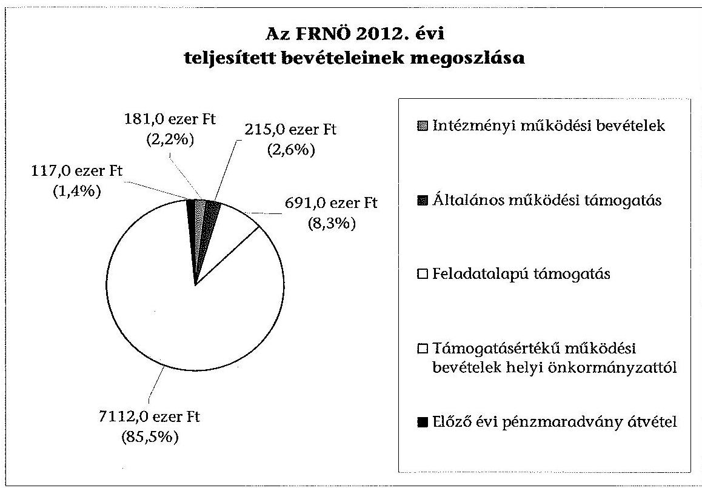
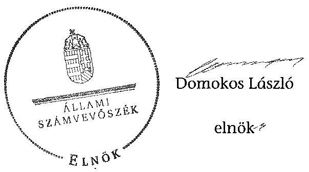

# ÁLLAMI   SZÁMVEVÔSZÉK 

## JELENTÉS

a helyi nemzetiségi önkormányzatok gazdálkodásának ellenőrzéséről
Ferencvárosi Roma Nemzetiségi Önkormányzat

---

# Állami Számvevőszék 

Iktatószám: V-0276-018/2014.
Témaszám: 1309
Vizsgálat-azonosító szám: V065229

## Az ellenőrzést felügyelte:

Horváth Balázs
felügyeleti vezető
Az ellenőrzést vezette és az ellenőrzés végrehajtásáért felelős:
Kisgergely István
ellenőrzésvezető
A számvevőszéki jelentést készítették és a jelentés összeállításában
közremüködtek:
Krupánszki Dóra
számvevő
Szeibel Gáborné
számvevő
Az ellenőrzést végezte:
Szeibel Gáborné
számvevő

---

# TARTALOMJEGYZÉK 

BEVEZETÉS ..... 3
I. ÖSSZEGZŐ MEGÁLLAPÍTÁSOK, KÖVETKEZTETÉSEK, JAVASLATOK ..... 6
II. RÉSZLETES MEGÁLLAPÍTÁSOK ..... 11

1. Az FRNÖ és a Ferencvárosi Önkormányzat együttműködésének szabályozása, a múködési feltételek biztosítása ..... 11
2. A gazdálkodási feladatok ellátásának szabályszerűsége ..... 13
2.1. A költségvetésre és a zárszámadásra, valamint a kincstári adatszolgáltatás rendjére vonatkozó jogszabályi előírások betartása ..... 13
2.2. Az FRNÖ gazdálkodásának szabályozottsága ..... 14
2.3. Az operatív gazdálkodási jogkörök kialakítása, gyakorlása ..... 14
3. Az FRNÖ-vel összefüggő gazdálkodási feladatok belső ellenőrzése ..... 16
4. A feladatalapú támogatás felhasználásának, elszámolásának szabályszerűsége, az FRNÖ feladatellátása ..... 16

## MELLÉKLETEK

1. számú A Nemzetiségi Önkormányzat 2012. évi gazdálkodásának főbb adatai, mutatói
2. számú Tájékoztatás a polgármesternek küldött el nem fogadott észrevételekről

## FÜGGELÉKEK

1. számú Rövidítések jegyzéke
2. számú Értelmező szótár
3. számú A gazdálkodás értékelésének módszere

---

.

---

# JELENTÉS   a helyi nemzetiségi önkormányzatok gazdálkodásának ellenőrzéséről Ferencvárosi Roma Nemzetiségi Önkormányzat 

## BEVEZETÉS

Az FRNÖ 1994. évben alakult, elnöke a 2010. évi helyhatósági választások óta látja el feladatát. Az FRNÖ intézményt, gazdasági társaságot és más szervezetet nem alapított. A négytagú Képviselő-testület munkája segitésére bizottságot nem hozott létre. Az FRNÖ-nek a költségvetési beszámolója szerint a 2012. évben a módositott költségvetési bevételi és kiadási előirányzata 4427 ezer Ft, a teljesitett költségvetési bevétele 8316 ezer Ft, a teljesitett költségvetési kiadása 8302 ezer Ft volt. A 2012. évi gazdálkodási adatokat részletesen az 1. számú mellékletben mutatjuk be.

Az Alaptörvény XXIX. cikk (1) bekezdése szerint a Magyarországon élő nemzetiségek államalkotó tényezők. Minden, valamely nemzetiséghez tartozó magyar állampolgárnak joga van önazonossága szabad vállalásához és megőrzéséhez. A hazánkban élő nemzetiségek helyi (települési és területi), valamint országos önkormányzatokat hozhatnak létre. A helyi nemzetiségi önkormányzatok gazdálkodási feladatait jogszabályi előírás alapján a székhely szerinti helyi önkormányzat polgármesteri hivatala látja el.

A nemzetiségek helyzete, támogatása mind hazai, mind EU-s szinten kiemelt figyelmet kap napjainkban. A helyi nemzetiségi önkormányzatok gazdálkodására és támogatási rendszerére vonatkozó jogszabályok a 2010-2012. években jelentős változásokon mentek át. A települési és területi nemzetiségi önkormányzatok gazdálkodásának, a részükre juttatott költségvetési támogatások felhasználásának ellenőrzését az ÁSZ a 2012. évben sorozatjellegú ellenőrzés keretében indította el. A 2013. évi ellenőrzések e témacsoportos ellenőrzések folytatását jelentik, amelyet az ÁSZ 2014. első félévi ellenőrzési terve 12 témasorszámon tartalmaz.

Az ellenőrzés célja annak értékelése volt, hogy az FRNÖ gazdálkodási kereteinek kialakítása, gazdálkodása és feladatellátása megfelelt-e a jogszabályoknak.

---

Ennek keretében értékeltük, hogy:

- az FRNÖ és a Ferencvárosi Önkormányzat együttműködésének szabályozása, a működési feltételek biztosítása megfelelt-e a jogszabályi előírásoknak;
- a felek együttműködése megfelelt-e a közöttük létrejött megállapodásnak a gazdálkodási feladatok szabályszerű ellátása során, ennek keretében betar-tották-e az FRNÖ gazdálkodásához kapcsolódóan a költségvetésre és zárszámadásra, a gazdálkodás szabályozására, az operatív gazdálkodási jogkörök gyakorlására vonatkozó jogszabályi előírásokat;
- a jegyző biztosította-e az FRNÖ gazdálkodásának belső ellenőrzését;
- az FRNÖ feladatalapú támogatásának felhasználása, a folyósított feladatalapú támogatással történő elszámolás az előírásoknak megfelelő volt-e;
- az FRNÖ feladatellátása összhangban volt-e a vonatkozó jogszabályi előírásokkal.

Az ellenőrzés várható hasznosulását négy szinten tervezzük. A törvényalkotás számára összegzett tapasztalatok állnak rendelkezésre a nemzetiségi önkormányzatok testületi döntéseinek, gazdálkodásának és a feladatalapú támogatás felhasználásának szabályszerűségéről, amelynek alapján következtetést lehet levonni arra, hogy indokolt-e jogszabályi módosítás kezdeményezése. Az ellenőrzés az ellenőrzött számára visszajelzést ad a működésében fellépő hiányosságokról, javaslataival hozzájárul azok kiküszöböléséhez, amely csökkentheti a későbbi ellenőrzések gyakoriságát. Az ellenőrzés megállapításai és javaslatai tanulságul szolgálhatnak más nemzetiségi önkormányzatok, szervezetek számára a rendezett gazdálkodási keretek kialakításához. A társadalom számára jelzi, hogy közpénz nem maradhat ellenőrizetlenül, az ÁSZ értékteremtő rend kialakításához és megőrzéséhez hozzájáruló tevékenysége pozitív hatással lesz a szervezetről kialakított összkép formálásában. Az ÁSZ szervezetén belül lehetőség nyílik arra, hogy a megállapítások szintetizálásával az intézmény a hozzáadott értéket teremtő elemző tevékenységét és tanácsadó szerepét erősítse.

Az FRNÖ gazdálkodásának ellenőrzéséről szóló jelentés I. fejezetének összegző része az ellenőrzés céljára adott rövid, szintetizáló összefoglalót és következtetéseket tartalmazza a II. fejezet részletes megállapításain alapulóan. A jelentés intézkedést igénylő megállapításait és javaslatait - az összegzőben foglaltak mellett - az ellenőrzés során feltárt, a jelentés II. fejezetében rögzített részletes megállapítások alapozzák meg, illetve támasztják alá.

Az ellenőrzés típusa: szabályszerűségi ellenőrzés
Az ellenőrzött időszak: a 2012. január 1. - 2012. december 31. közötti időszak. Az ellenőrzés kiterjedt az FRNÖ-nek juttatott 2012. évi támogatás 2013. évben való elszámolására is.

Ellenőrzött szervezet: a Budapest Főváros IX. Kerület Ferencvárosi Roma Nemzetiségi Önkormányzat és a gazdálkodási feladatait ellátó Budapest Főváros IX. Kerület Ferencvárosi Önkormányzata.

---

Az ellenőrzés végrehajtásának jogszabályi alapját az ÁSZ tv. 5. § (2)(3) és (6) bekezdéseiben foglaltak képezik.

Az ellenőrzés szakmai módszertana az ÁSZ hivatalos honlapján (www.asz.hu) közzétett szakmai szabályokon alapult, amely a Legfőbb Ellenőrző Intézmények Nemzetközi Szervezete (INTOSAI) által kiadott nemzetközi standardok (ISSAI) figyelembevételével készült.

A helyi nemzetiségi önkormányzatok gazdálkodásának ellenőrzése során értékeltük a Ferencvárosi Önkormányzat és az FRNÖ együttmúködésének, a gazdálkodás szabályozottságának és a pénzügyi folyamatokban kulcsszerepet betöltő belső kontrollok (teljesítésigazolás és érvényesítés) múködésének megfelelőségét. A kulcskontrollokat a dologi kiadásokkal kapcsolatos kifizetéseknél véletlen mintavételi eljárást alkalmazva - ellenőriztük. Ellenőriztük, hogy a jegyző biztosította-e az FRNÖ gazdálkodásának belső ellenőrzését. Értékeltük a feladatalapú támogatások felhasználásának, elszámolásának szabályszerűségét, az FRNÖ feladatellátása és a jogszabályi előírások összhangját.

Az ellenőrzés lefolytatásához az FRNÖ és a gazdálkodási feladatait ellátó Ferencvárosi Önkormányzat tanúsítványok és a kapcsolódó, dokumentumjegyzékben megjelölt dokumentumok elektronikus úton történő megküldésével, rendelkezésre bocsátásával szolgáltatott adatokat. Az adatszolgáltatás kontrollálása és szükség szerinti javítása a helyszíni ellenőrzés keretében történt. A minősitési szempontokat a 3. számú függelék tartalmazza.

Az ÁSZ tv. 29. § (1) bekezdése szerint a jelentéstervezetet megküldtük egyeztetésre a polgármester és az FRNÖ elnöke részére. Az ÁSZ tv. 29. § (2) bekezdésében foglalt észrevételezési jogával az FRNÖ elnöke nem élt. A polgármester határidőben megküldött észrevétele és tájékoztatása alapján a jelentést részben módosítottuk. Az el nem fogadott észrevételek indoklását a jelentés 2. számú melléklete tartalmazza.

---

# I. ÖSSZEGZŐ MEGÁLLAPÍTÁSOK, KÖVETKEZTETÉSEK, JAVASLATOK 

Az FRNÖ és a Ferencvárosi Önkormányzat együttmüködésének szabályozása nem felelt meg a jogszabályi előírásoknak. Az együttműködési megállapodás ${ }_{2}$-ról az FRNÖ Képviselő-testülete a Nek. 2 tv. előírása ellenére nem hozott határozatot. Az együttműködési megállapodás ${ }_{1}$-t a Nek. ${ }_{2}$ tv. előírása ellenére, 2012. január 31-éig nem vizsgálták felül, és nem történt meg 2012. június 1jéig a kiegészítése. A Nek. ${ }_{2}$ tv. alapján a Kormányhivatal 2012. június 1-jét követően nem kezdeményezett egyeztetést a felek között együttműködési megállapodás megkötése, módosítása érdekében. Az együttműködési megállapodás ${ }_{1}$ nem tartalmazta a Nek. ${ }_{2}$ tv. szerinti, személyi és tárgyi múködési feltételeket. A szabályozási hiányosságok ellenére a Ferencvárosi Önkormányzat az FRNÖ részére az előírt múködési feltételeket biztosította a 2012. évben. A törzskönyvi nyilvántartási adatok módosításával, az önálló fizetési számla nyitásával és az adószám igénylésével kapcsolatos feladatokat elvégezték.

Az FRNÖ 2012. évi költségvetésének, zárszámadásának tartalma, jóváhagyása, valamint a kapcsolódó 2012. évi adatszolgáltatás szabályszerűsége megfelelt a jogszabályi előírásoknak. Az FRNÖ elnöke határidőben benyújtotta a 2012. évi költségvetési határozat tervezetét a Képviselő-testületnek. A jóváhagyott költségvetés tartalmazta az Áht.-ben és az Ávr.-ben előírt tartalmi elemeket. A 2012. évi zárszámadási határozat tervezetét a jegyző az előírt határidőn belül elkészítette. Az FRNÖ elnöke beterjesztette a Képviselő-testület részére a zárszámadási határozat tervezetét, ebben bemutatták az Áht.-ben előírt mérlegeket és kimutatásokat. Az FRNÖ valamennyi bevételéről és kiadásáról elszámoltak. A kincstári adatszolgáltatási kötelezettségnek az Ávr.-ben előírt határidőig hiánytalanul eleget tettek.

A Polgármesteri Hivatal rendelkezett az FRNÖ-re is kiterjesztett számviteli politikával és a hozzá kapcsolódó szabályzatokkal, azonban az FRNÖ gazdálkodásának szabályozottsága az ellenőrzött időszakban nem volt megfelelő, mivel a Polgármesteri hivatal SZMSZ-ében nem rögzítették az Ávr.-ben foglaltak szerint, nevesített munkakörönként az FRNÖ gazdálkodásával kapcsolatos feladat- és hatásköröket, a hatáskörök gyakorlásának módját, a helyettesítés rendjét, az ezekhez kapcsolódó felelősségi szabályokat. A jegyző az FRNÖ gazdálkodási feladataira vonatkozóan nem terjesztette ki a Bkr.-ben előírt ellenőrzési nyomvonalát és a szabálytalanságok kezelésének eljárásrendjét. Az ellenőrzési nyomvonalat 2013. október 1-jétől kiterjesztették az FRNÖ-re.

Az operatív gazdálkodási jogkörök kialakítása megfelelt a jogszabályi előírásoknak, azonban a szabályszerű felhatalmazás és kijelölés 2012. szeptember 2-ától történt meg. Az FRNÖ elnöke az Áht. és az Ávr. előírásainak megfelelően írásban hatalmazott fel a kötelezettségvállalás és utalványozás gyakorlására más képviselőt, illetve jelölt ki teljesítésigazoló személyt. Gazdasági szervezet hiányában a jegyző az Áht. és az Ávr. előírásai alapján írásban jelölt ki megfelelő végzettségű köztisztviselőt a pénzügyi ellenjegyzés és az érvényesítés gyakorlására.

---

Az FRNÖ-nél a 2012. évben a dologi kiadások teljesítése során a teljesítésigazolás és az érvényesítés kulcskontrollok múködésének megfelelősége gyenge volt, a hibák száma a lényegességi szintet, a kritikus hibahatárt elérte. Az érvényesítő az Ávr. előírása szerinti ellenőrzési és jelzési feladatát nem látta el, mert nem ellenőrizte a megelőző ügymenetben a jogszabályok és a belső szabályzatok betartását, nem észrevételezte, hogy az Ávr.-ben rögzítettek ellenére az utalványrendeleteken nem tüntették fel a kötelezettségvállalás nyilvántartási számát. A teljesítésigazolások során nem a Kötelezettségvállalási szabályzatuk szerinti teljesítésigazolási nyomtatványt használták. Az előleggel való elszámolás során három kifizetéshez kapcsolódóan túllépték a Pénzkezelési szabályzatuk szerinti 30 napos elszámolási határidőt, valamint a felvett előleg összege meghaladta a Pénzkezelési szabályzatukban rögzített 500 ezer Ft-ot. Az előleg elszámolása során, az utalványrendeleten a kiadásokhoz kapcsolódóan az Ávr. előírása ellenére az érvényesítés dátumát nem szerepeltették. Az utalványrendeleten kettő kifizetés esetében a Számv. tv. előírása ellenére szabálytalanul javították az érvényesítés dátumát. A dologi kiadások három legnagyobb öszszegű könyvelési tétele esetében egyszer előfordult továbbá, hogy a kötelezettségvállalás dokumentumán az Ávr. előírásai ellenére, elmaradt a pénzügyi ellenjegyzés és a kötelezettségvállalás pontos dátumának a rögzítése. A kötelezettségvállalások nyilvántartásba vétele az Ávr.-ben foglaltak ellenére, nem a kötelezettség vállalásakor, hanem a pénzügyi teljesítéskor került rögzítésre. Az FRNÖ a 2012. évben nem teljesített az államháztartáson kívülre támogatásértékű kiadást, pénzeszközátadást. A számvevőszéki ellenőrzés a rendelkezésre bocsátott dokumentumok alapján nem tárt fel jogosulatlan kifizetést.

A Polgármesteri Hivatal belső ellenőrzési tervét megalapozó kockázatelemzés kiterjedt az FRNÖ gazdálkodásával összefüggő végrehajtási feladatokra. Az FRNÖ gazdálkodását nem minősítették magas kockázatúnak, ezért nem terveztek és nem végeztek belső ellenőrzést a 2012. évben.

Az FRNÖ a 2011. évben nem részesült feladatalapú támogatásban, a 2012. évi feladatalapú támogatás összege 691 ezer Ft volt. A feladatalapú támogatás felhasználása és elszámolása nem volt megfelelő. Az FRNÖ a feladatalapú támogatás tervezett felhasználásáról a támogatás folyósítását megelőzően nem hozott határozatot. Az Áht. előírása ellenére nem módosította a 2012. évi költségvetési határozatát a folyósított feladatalapú támogatás összegével. A 2012. évben folyósított támogatás felhasználása részben történt meg. Rendezvények, programok kiadásaira 447 ezer Ft-ot fordítottak. Az FRNÖ által szolgáltatott adatok alapján 244 ezer Ft-ot nem a kötelezö feladatok ellátására fordítottak. A 230 ezer Ft céltól eltérő felhasználás mellett a feladatalapú támogatás kötelezettségvállalással nem terhelt maradványa 2012. december 31én 14 ezer Ft volt, amelyről a támogatási kormányrendelet ${ }_{2}$, valamint az Áht. előírása ellenére nem mondtak le és nem fizették vissza a központi költségvetés javára. A 2012. évi feladatalapú támogatás elszámolása a támogatási kormányrendelet ${ }_{2}$ és az Áht. előírása ellenére nem történt meg. A feladatalapú támogatás felhasználását, elszámolását az ellenőrzésre jogosult, külső szervek nem ellenőrizték.

Az FRNÖ feladatellátásának tárgya a 2012. évben összhangban volt a Nek. ${ }_{2}$ tv. előírásaival.

---

Az ÁSZ tv. 33. § (1) bekezdésében foglaltak értelmében az ellenőrzött szervezet vezetője köteles a jelentésben foglalt megállapításokhoz kapcsolódó intézkedési tervet összeállítani, és azt a jelentés kézhezvételétől számított 30 napon belül az ÁSZ részére megküldeni. Amennyiben az intézkedési tervet határidőre nem küldi meg a szervezet, vagy az nem elfogadható, az ÁSZ elnöke az ÁSZ tv. 33. § (3) bekezdés a)-b) pontjaiban foglaltakat érvényesítheti.

A helyszíni ellenőrzés megállapításainak hasznosítása mellett javasoljuk:

# a jegyzőnek 

1. az együttműködés szabályozásával kapcsolatban

Az együttműködési megállapodás ${ }_{1}$-t a Nek. ${ }_{2}$ tv. 80. § (2) bekezdésének előírása ellenére 2012. január 31-éig nem vizsgálták felül.

Javaslat
Biztosítsa a jövőben az együttműködési megállapodás Nek. ${ }_{2}$ tv. 80. § (2) bekezdésében előírt határidő szerinti, évenkénti felülvizsgálatát.
2. a gazdálkodás szabályozottságával kapcsolatban

A Polgármesteri Hivatal SZMSZ-ében nem rögzítették az Ávr. 13. § (1) bekezdés g) pontjában foglaltak szerinti, az SZMSZ-ben nevesített munkakörökhöz tartozó - az FRNÖ gazdálkodásával kapcsolatos - feladat- és hatáskörökre, a hatáskörök gyakorlásának módjára, a helyettesítés rendjére, az ezekhez kapcsolódó felelősségi szabályokra vonatkozó előírásokat. A jegyző az FRNÖ gazdálkodási feladataira nem terjesztette ki a Bkr. 6. § (4) bekezdéseiben előírt szabálytalanságok kezelésének eljárásrendjét.

Javaslat
A gazdálkodás szabályszerűsége az FRNÖ gazdálkodására is kiterjedően:
a) készítse el a Polgármesteri Hivatal SZMSZ-ének módosítását, hogy az tartalmazza az Ávr. 13. § (1) bekezdés g) pontjában foglaltakat;
b) módosítsa a Polgármesteri Hivatal Bkr. 6. § (4) bekezdése szerinti a szabálytalanságok kezelésének eljárásrendjét.
3. a kulcskontrollok müködésével kapcsolatban

Az érvényesítő az Ávr. 58. § (1)-(2) bekezdése szerinti feladatát nem látta el, mert nem ellenőrizte a megelőző ügymenetben a jogszabályi előírások betartását, valamint nem jelezte, hogy nem tüntették fel az utalványrendeleteken a kötelezettségvállalás nyilvántartási számát és az érvényesítés időpontját, az utalványrendeleten szabálytalan javításokat végeztek, a kötelezettségvállalás dokumentumán elmaradt a pénzügyi ellenjegyzés és a kötelezettségvállalás dátumának a rögzítése. Továbbá nem jelezte a belső szabályzatok előírásainak megsértését és, hogy a kötelezettség-

---

vállalások nyilvántartásba vétele nem a kötelezettség vállalásakor, hanem a pénzügyi teljesítéskor történt meg.

Javaslat
Az operatív gazdálkodás működési hibáinak megelőzése, feltárása és kijavítása érdekében gondoskodjon arról, hogy az érvényesítő az Ávr. 58. § (1)-(2) bekezdésének megfelelően tegyen eleget ellenőrzési és jelzési kötelezettségének;
4. a feladatalapú támogatás elszámolásával kapcsolatban

A 2012. évi feladatalapú támogatás elszámolása a támogatási kormányrende$\mathrm{let}_{2}$ 8. § (5) bekezdésében hivatkozott „o helyi önkormányzatok elszámolási és ellenőrzési rendjére vonatkozó jogszabályok rendelkezései alkalmazandóak" előirása alapján az Áht. 57. § (3) bekezdése ellenére nem történt meg.

Javaslat
Gondoskodjon az Áht. 27. § (2) bekezdésében meghatározott feladatkörében az FRNÖ által igénybevett feladatalapú támogatás rendeltetésszerű felhasználásáról szóló elszámolásának elkészítéséről az Áht. 53. § (1) bekezdésében foglalt beszámolási kötelezettség teljesítéséhez.

# a polgármesternek 

A Polgármesteri Hivatal SZMSZ-ében nem rögzítették az Ávr. 13. § (1) bekezdés g) pontjában foglaltak szerinti, az SZMSZ-ben nevesített munkakörökhöz tartozó - az FRNÖ gazdálkodásával kapcsolatos - feladat- és hatáskörökre, a hatáskörök gyakorlásának módjára, a helyettesítés rendjére, az ezekhez kapcsolódó felelősségi szabályokra vonatkozó előírásokat.

Javaslat
Terjessze a Képviselő-testület elé a Polgármesteri Hivatal SZMSZ-ének jegyző által elkészített módosítását, hogy az tartalmazza - az FRNÖ gazdálkodásával kapcsolatosan - az Ávr. 13. § (1) bekezdés g) pontjában foglaltakat.

## az FRNÖ elnökének

1. A 2012. évi feladatalapú támogatás elszámolása a támogatási kormányrende$\mathrm{let}_{2}$ 8. § (5) bekezdésében hivatkozott „o helyi önkormányzatok elszámolási és ellenőrzési rendjére vonatkozó jogszabályok rendelkezései alkalmazandóak" előirása alapján az Áht. 57. § (3) bekezdése ellenére nem történt meg.

---

Javaslat
Terjessze a Képviselő- testület elé jóváhagyásra az Áht. 53. § (1) bekezdése szerinti beszámolási kötelezettség teljesítéséhez az FRNÖ által igénybevett feladatalapú támogatás rendeltetésszerú felhasználásáról szóló elszámolást.
2. Az FRNÖ nem tett eleget az Áht. 57. § (2) bekezdésében előírtaknak azáltal, hogy a 2012. évi feladatalapú támogatás céltól eltérő felhasználású és kötelezettségvállalással nem terhelt maradványból eredő 244 ezer Ft összegéről nem mondott le és nem fizette vissza azt a központi költségvetés javára.

Javaslat
Terjessze a képviselő-testület elé jóváhagyásra az Áht. 57/A. § (1) bekezdés előírásának megfelelően a 2012. évi feladatalapú támogatás kötelezettségvállalással nem terhelt 244 ezer Ft összegű maradványáról történő lemondást és intézkedjen a maradvány összegének visszafizetésére a központi költségvetés javára.

---

# II. RÉSZLETES MEGÁLLAPÍTÁSOK 

## 1. Az FRNÖ és a Ferencvárosi Önkormányzat együttmúködésének szabályozása, a múködési feltételek biztosítása

Az FRNÖ és a Ferencvárosi Önkormányzat együttműködésének szabályozása nem felelt meg a jogszabályi előírásoknak.

Az FRNÖ az ellenőrzött időszakban rendelkezett a Ferencvárosi Önkormányzattal kötött együttműködési megállapodással. Az együttműködési megállapodás ${ }_{1}$ a Képviselő-testületek döntését követően 2011. december 13-án került aláírásra. Az együttműködési megállapodás ${ }_{1}$-t a Nek. ${ }_{2}$ tv. 80. § (2) bekezdésének előírása ellenére 2012. január 31-éig nem vizsgálták felül, és a Nek. ${ }_{2}$ tv. 159. § (3) bekezdése alapján 2012. június 1-jéig nem történt meg a megállapodás kiegészítése. A Nek. ${ }_{2}$ tv. 83. § (3) bekezdése alapján a Kormányhivatal 2012. június 1-jét követően nem kezdeményezett egyeztetést a felek között együttműködési megállapodás megkötése, módosítása érdekében. Az együttműködési megállapodás, egyes részeinek érvényben tartásával ${ }^{1}$, annak kiegészítéseként 2012. december 12-én az FRNÖ és a Ferencvárosi Önkormányzat a Nek. ${ }_{2}$ tv. előírásának megfelelően együttműködési megállapodás ${ }_{2}$-t kötött, amelyet az FRNÖ elnöke és átruházott hatáskörben ${ }^{2}$ a polgármester írt alá. Az FRNÖ Képviselő-testülete a Nek. ${ }_{2}$ tv. 78. § (3) bekezdésének előírása ellenére nem hozott határozatot az együttműködési megállapodás ${ }_{2}$-ról.

A CKÖ elnöke 2011. október 24-én, valamint 2011. december 13-án a polgármester által átruházott hatáskörben aláírt együttmúködési megállapodás ${ }_{1}$-t a CKÖ Képviselő-testülete határozatával hagyta jóvá. Az együttmúködési megállapo-dás ${ }_{1}$-on szereplő dátum (2011. október 24.) nem valós, mivel ezen a napon a CKÖ Képviselő-testülete előzetesen tárgyalta volna az együttműködési megállapodás, tartalmát. A CKÖ Képviselő-testülete a 34/2011. (X. 24.) számú határozatával azonban úgy döntött, hogy az együttműködési megállapodás ${ }_{1}$-sal kapcsolatos előterjesztést leveszi a napirendről. Az együttmúködési megállapodás ${ }_{1}$-t erre az időpontra készítették el, és a 2011. október 24-ei dátummal látták el. Az együttműködési megállapodás ${ }_{1}$ tényleges aláírásakor a dátum módosítása annak ellenére nem történt meg, hogy a CKÖ 2011. november 7-én fogadta el az együttmúködési megállapodás ${ }_{1}$-t. Az együttműködési megállapodás ${ }_{1}$ tartalmát a Fe-

[^0]
[^0]:    ${ }^{1}$ Az együttműködési megállapodás ${ }_{2} 8$. pontjában a költségvetés elkészítése, jóváhagyása eljárási rendjére, a költségvetési gazdálkodás bonyolításának rendjére, a beszámoló elkészítésének és jóváhagyásának eljárási rendjére, az ellenjegyzési, érvényesítési, utalványozási, teljesítésigazolással kapcsolatos feladatokra, a vagyontárgyak kezelésének rendjére, a számviteli, pénzügyi és információszolgáltatási tevékenység végzésének rendjére, a belső ellenőrzés elvégzésére vonatkozó szabályok érvényben tartásáról állapodtak meg.
    ${ }^{2}$ a Ferencvárosi Önkormányzat Képviselő-testülete 404/2012. (X. 04.) számú határozatának a 3. pontja

---

rencvárosi Önkormányzat Képviselő-testülete 2011. december 12-ei ülésén tárgyalta meg ${ }^{3}$.

Az együttműködési megállapodás ${ }_{1}$ nem tartalmazta:

- a Nek. ${ }_{2}$ tv. 80. § (1) bekezdése a) pontja alapján az FRNÖ részére havonta igény szerint, de legalább tizenhat órában, az önkormányzati feladat ellátásához szükséges tárgyi, technikai eszközökkel felszerelt helyiség ingyenes használatát, a helyiséghez, továbbá a helyiség infrastruktúrájához kapcsolódó rezsiköltségek és fenntartási költségek viselését;
- a Nek. ${ }_{2}$ tv. 80. § (1) bekezdése b) pontja alapján az önkormányzati múködéshez (a testületi, tisztségviselői, képviselői feladatok ellátásához) szükséges tárgyi és személyi feltételek biztosítását;
- a Nek. ${ }_{2}$ tv. 80. § (1) bekezdése c) pontja alapján a testületi ülések előkészítését (meghívók, előterjesztések, hivatalos levelezés előkészítése, postázása, a testületi ülések jegyzőkönyveinek elkészítése, postázása);
- a Nek. ${ }_{2}$ tv. 80. § (1) bekezdése d) pontja alapján a testületi döntések és a tisztségviselők döntéseinek előkészítését, a testületi és tisztségviselői döntéshozatalhoz kapcsolódó nyilvántartási, sokszorosítási, postázási feladatok ellátását;
- a Nek. ${ }_{2}$ tv. 80. § 1) bekezdése e) pontja alapján az FRNÖ múködésével, gazdálkodásával kapcsolatos nyilvántartási, iratkezelési feladatok ellátását;
- a Nek. ${ }_{2}$ tv. 80. § (1) bekezdése g) pontja alapján a fenti feladatellátáshoz kapcsolódó költségek - a testületi tagok és tisztségviselők telefonhasználata költségei kivételével - viselését;
- a Nek. ${ }_{2}$ tv. 80. § (3) bekezdés a) pontja által előírt, önálló fizetési számla nyitásával, törzskönyvi nyilvántartásba vételével és adószám igénylésével kapcsolatos feladatokat, azok felelőseinek konkrét kijelölését és végrehajtásának határidejét;
- a Nek. ${ }_{2}$ tv. 80. § (3) bekezdés b) pontja által előírt szakmai teljesítésigazolási feladatokat és felelőseinek konkrét kijelölését;
- a Nek. ${ }_{2}$ tv. 80. § (3) bekezdés c) pontja által előírt, kötelezettségvállalással összefüggő összeférhetetlenségi és nyilvántartási szabályokat;
- a Nek. ${ }_{2}$ tv. 80. § (3) bekezdés d) pontja által előírt, az FRNÖ gazdálkodásának eljárási és dokumentációs részletszabályai közül a teljesítésigazolással, valamint az ezt végző személyek kijelölésének rendjével kapcsolatos előírásokat, feltételeket;
- a Nek. ${ }_{2}$ tv. 80. § (4) bekezdése ellenére azt, hogy a jegyző vagy annak - a jegyzővel azonos képesítési előírásoknak megfelelő - megbízottja a Ferencvá-

[^0]
[^0]:    ${ }^{3}$ A CKÖ 39/2011. (XI. 7.) számú határozata, illetve a Ferencvárosi Önkormányzat Kép-viselő-testületének 35/2011. (XII. 12.) számú rendelete a Szervezeti és Múködési Szabályzatáról szóló 28/2011. (X. 11.) számú önkormányzati rendelet módosításáról.

---

rosi Önkormányzat megbízásából és képviseletében részt vesz az FRNÖ testületi ülésein és jelzi, amennyiben törvénysértést észlel.

Az együttműködési megállapodás ${ }_{1}$ az Áht.-ben foglaltak szerint tartalmazta a tervezési, gazdálkodási, ellenőrzési, finanszírozási, adatszolgáltatási és beszámolási feladatokat.

Az FRNÖ a 71/2013. (XI. 15.) számú határozatával elfogadta az FRNÖ új SZMSZének 2. számú mellékleteként az együttmúködési megállapodás ${ }_{2}$-t és annak 2013. április 5 -ei módosítását.

A szabályozási hiányosságok ellenére a Ferencvárosi Önkormányzat az FRNÖ részére a Nek. ${ }_{1}$ tv. 27. § (1)-(2) bekezdései szerint az előírt működési feltételeket biztosította a 2012. évben. A törzskönyvi nyilvántartási adatok módosításával, az önálló fizetési számla nyitásával és az adószám igénylésével kapcsolatos feladatokat elvégezték.

# 2. A GAZDÁLKODÁSI FELADATOK ELLÁTÁSÁNAK SZABÁLYSZERŰSÉGE 

### 2.1. A költségvetésre és a zárszámadásra, valamint a kincstári adatszolgáltatás rendjére vonatkozó jogszabályi előírások betartása

Az FRNÖ 2012. évi költségvetésének, zárszámadásának tartalma, jóváhagyása, valamint a kapcsolódó 2012. évi adatszolgáltatás szabályszerűsége megfelelt a jogszabályi előírásoknak.

Az FRNÖ elnöke határidőben benyújtotta a 2012. évi költségvetési határozat tervezetét az Áht. előírásainak megfelelően a Képviselő-testületnek. A jóváhagyott költségvetés tartalmazta az Áht.-ben és az Ávr.-ben előírt tartalmi elemeket: a költségvetési bevételeket és a költségvetési kiadásokat előirányzatcsoportok, valamint kiemelt előirányzatok szerinti bontásban. A 2012. évi költségvetés előterjesztésekor a Képviselő-testület részére az Áht.-ben foglaltaknak megfelelően bemutatták az előírt mérlegeket és kimutatásokat.

A jegyző által elkészített 2012. évi zárszámadási határozat tervezetét az FRNÖ elnöke az Áht.-ben foglaltak alapján, határidőn belül beterjesztette a Képvise-lő-testületnek. A 2012. évi zárszámadási határozat tervezetének előterjesztésénél a Képviselő-testület részére tájékoztatásul bemutatták az Áht. előírása szerinti mérlegeket és kimutatásokat. A zárszámadásról alkotott határozat és az elfogadott költségvetés összehasonlíthatóságát biztosították. Az FRNÖ a zárszámadási határozatban valamennyi bevételéről és kiadásáról elszámolt.

A zárszámadási határozat szöveges részében a bevételi és a kiadási föösszegeket felcserélték.
A 2012. költségvetési évvel kapcsolatban az FRNÖ az adatszolgáltatási kötelezettségének hiánytalanul eleget tett, mivel a 2012. évi elemi költségvetést, a féléves- és éves beszámolót, valamint az időközi költségvetési- és mérlegjelentéseket az Ávr. szerinti határidőre megküldte a Kincstár részére.

---

# 2.2. Az FRNÖ gazdálkodásának szabályozottsága 

Az FRNÖ gazdálkodásának szabályozottsága az ellenőrzött időszakban nem volt megfelelő, mivel:

- a Polgármesteri Hivatal SZMSZ-ében nem rögzítették az Ávr. 13. § (1) bekezdés g) pontjában foglaltak szerinti, az SZMSZ-ben nevesített munkakörökhöz tartozó - az FRNÖ gazdálkodásával kapcsolatos - fel-adat- és hatáskörökre, a hatáskörök gyakorlásának módjára, a helyettesítés rendjére, az ezekhez kapcsolódó felelősségi szabályokra vonatkozó előírásokat ${ }^{4} ;$
- a jegyző a FRNÖ gazdálkodási feladataira nem terjesztette ki a Bkr. 6. § (3) és (4) bekezdéseiben előírt ellenőrzési nyomvonalat és a szabálytalanságok kezelésének eljárásrendjét.

A 2013. október 1-jétől hatályos ellenőrzési nyomvonalat már kiterjesztették az FRNÖ-re is.

A 2012. évben a Polgármesteri Hivatal rendelkezett az FRNÖ-re is kiterjesztett, a Számv. tv. által előírt számviteli politikával és kapcsolódóan a gazdálkodásra vonatkozó szabályzatokkal: pénzkezelési szabályzattal, számlarenddel, leltáro-zási- és leltárkészítési szabályzattal, eszközök és források értékelési szabályzatával.

Az Áht.-ben és az Ávr.-ben foglaltak szerint a tervezéssel, gazdálkodással, a kötelezettségvállalással, pénzügyi ellenjegyzéssel és teljesítésigazolással, az érvényesítés, utalványozás gyakorlásának módjával, eljárási és dokumentációs részletszabályaival, valamint az ezeket végző személyek kijelölésének rendjével, továbbá az ellenőrzési és adatszolgáltatási feladatok teljesítésével kapcsolatos belső előírásokat, feltételeket tartalmazó Kötelezettségvállalási szabályzat, rendelkezésre állt.

Az FRNÖ gazdálkodásával kapcsolatos teendőket a feladatokat ellátó köztisztviselők munkaköri leírásaiban részletesen rögzítették.

### 2.3. Az operatív gazdálkodási jogkörök kialakítása, gyakorlása

Az FRNÖ gazdálkodása tekintetében az operatív gazdálkodási jogkörök kialakítása 2012. szeptember 2-ától felelt meg a jogszabályi előírásoknak:

- Az FRNÖ elnöke az Áht. és az Ávr. előírásainak megfelelően írásban hatalmazott fel a kötelezettségvállalás és utalványozás gyakorlására más képviselőt, illetve jelölt ki teljesítésigazoló személyt, azonban a szabályszerű felha-

[^0]
[^0]:    ${ }^{4}$ A Polgármesteri Hivatal SZMSZ-ének VIII. pontjában az irodavezetők, Irodavezetőhelyettesek és csoportvezetők feladatait és felelősségi rendjét, a X. pontjában az egyes irodák és belső szervezeti egységek főbb feladatait és hatásköreit, a XI. pontjában a helyettesítés rendjét rögzítették

---

talmazás és kijelölés az Ávr. 2012. január 1-jei hatálybalépését követően, 2012. szeptember 2-ától történt meg;

- gazdasági szervezet hiányában a jegyző az Áht. és az Ávr. előírásai alapján írásban jelölt ki megfelelő végzettségű köztisztviselőt a pénzügyi ellenjegyzés és az érvényesítés gyakorlására.

A 2012. január 1. és március 5. közötti időszakban - az Ávr. 57. § (4) bekezdése ellenére - a teljesítésigazolók írásbeli kijelölése nem történt meg. A Ferencvárosi Önkormányzat polgármestere 2012. március 5-én meghatalmazást adott az FRNÖ elnöke és képviselője részére kötelezettségvállalási, teljesítésigazolási, valamint utalványozási jogkörök gyakorlására, mely a Kötelezettségvállalási szabályzat 2. sz. mellékletét képezte. A polgármester általi kijelölés azonban ellentétes volt:

- az Ávr. 52. § (7) bekezdésében foglaltakkal, mely szerint a nemzetiségi önkormányzat kiadási előirányzatai terhére az FRNÖ elnöke, vagy az általa írásban felhatalmazott személy vállalhat kötelezettséget;
- az Ávr. 57. § (4) bekezdésében foglaltakkal, mely szerint a teljesítés igazolására jogosult személyeket a kötelezettségvállaló írásban jelöli ki;
- az Ávr. 59. § (1) bekezdésében foglaltakkal, mely szerint az Ávr. 52. §-ában foglaltak szerint kell eljárni az utalványozásra jogosult személyek kijelölésekor.

Az FRNÖ-nél a 2012. évben a dologi kiadások teljesítése során a teljesítésigazolás és az érvényesítés kulcskontrollok működésének megfelelősége gyenge volt, a hibák száma a lényegességi szintet, a kritikus hibahatárt elérte.

Az érvényesítő az Ávr. 58. § (1)-(2) bekezdései ellenére feladatát nem látta el, mert nem ellenőrizte a megelőző ügymenetben a jogszabályi előírások és belső szabályzatok előírásainak betartását, valamint nem jelezte, hogy:

- a teljesítésigazolások során nem a Kötelezettségvállalási szabályzat 8.2. pontjában előírt (9. számú melléklet szerinti) teljesítésigazolás nyomtatványt használták;
- az Ávr. 59. § (3) bekezdése f) pontjában foglaltak ellenére az utalványrendeleteken nem tüntették fel a kötelezettségvállalás nyilvántartási számát;
- az előleggel való elszámolás során három kifizetéshez kapcsolódóan nem tartották be a Pénzkezelési szabályzat IV. 5.7. pontja szerinti 30 napos elszámolási határidőt; a felvett előleg összege túllépte a Pénzkezelési szabályzat IV. 5.2. pontjában rögzített 500 ezer Ft-ot; az utalványrendeleten a kiadásokhoz kapcsolódóan az Ávr. 58. § (3) bekezdésében foglaltak ellenére az érvényesítés dátumát nem szerepeltették (így nem állapítható meg, hogy az érvényesítés a teljesítésigazolások előtt, vagy azt követően történt);
- kettő kifizetés esetében az utalványrendeleten szabálytalanul (átfestéssel) javították az érvényesítés dátumát. A Számv. tv. 165. § (2) bekezdése szerint a számviteli nyilvántartásba csak szabályosan kiállított számviteli bizonylat alapján lehet adatokat bejegyezni.

---

Az FRNÖ gazdálkodása során a dologi kiadások közül a három legnagyobb összegű könyvelési tételnél az előleg elszámolása során kettő tétel esetében nem tartották be a Pénzkezelési szabályzat IV. 5.7. pontja szerinti 30 napos elszámolási határidőt. A felvett előleg összege túllépte a Pénzkezelési szabályzat IV. 5.2. pontja szerinti 500 ezer Ft-ot. Az előleg elszámolása során, az utalványrendeleten a kiadásokhoz kapcsolódóan az Ávr. 58. § (3) bekezdésében foglaltak ellenére az érvényesítés dátumát nem szerepeltették, ezért nem állapítható meg, hogy az érvényesítés a teljesítésigazolások előtt, vagy azt követően történt. Egy kifizetés esetén a kötelezettségvállalás dokumentumán az Ávr. 55. § (1) bekezdéseiben foglalt előírások ellenére, elmaradt a pénzügyi ellenjegyzés és a kötelezettségvállalás pontos dátumának a rögzítése, ezért a kötelezettségvállalás időpontjában nem kerülhetett megállapításra, hogy a szükséges szabad előirányzat rendelkezésre állt-e, valamint a kifizetés várható időpontjában a szabad fedezet rendelkezésre áll-e. Az utalványrendeleteken Ávr. 59. § (3) bekezdése f) pontjában foglaltak ellenére - nem tüntették fel a kötelezettségvállalás nyilvántartási számát. A teljesítésigazolások során nem a Kötelezettségvállalási szabályzat 8.2. pontjában előírt (9. számú melléklet szerinti) teljesítésigazolás nyomtatványt használták. A kötelezettségvállalások nyilvántartásba vétele - az Ávr. 56. § (1) bekezdésében foglaltak ellenére - nem a kötelezettség vállalásakor, hanem a pénzügyi teljesítéskor került rögzítésre.
Az FRNÖ a 2012. évben nem teljesített az államháztartáson kívülre támogatásértékű kiadást, pénzeszközátadást.
A számvevőszéki ellenőrzés a kiadások dokumentumainak ellenőrzése alapján nem tárt fel jogosulatlan kifizetést, azonban a kulcskontrollok múködéséhez kapcsolódó hiányosságok miatt nem biztosították a hibák megelőzését, feltárását és kijavítását.

# 3. Az FRNÖ-VEL ÖSSZEFÜGGŐ GAZDÁLKODÁSI FELADATOK BELSŐ ELLENŐRZÉSE 

A jegyző a 2012. éves belső ellenőrzési terv összeállítása során figyelemmel volt az FRNÖ gazdálkodásának belső ellenőrzésére, mert a Polgármesteri Hivatal belső ellenőrzési tervét megalapozó kockázatelemzés kiterjedt az FRNÖ gazdálkodásával összefüggő végrehajtási feladatokra. A kockázatelemzés alapján az FRNÖ gazdálkodását nem ítélte magas kockázatúnak, ezért a belső ellenőrzési terv nem tartalmazott belső ellenőrzést az FRNÖ gazdálkodására vonatkozóan. Az FRNÖ-nél belső ellenőrzés lefolytatására nem került sor 2012-ben.

Az ellenőrzéshez szolgáltatott adatok alapján a 2012. évben a Kormányhivatal az FRNÖ-t illetően nem élt törvényességi felügyeleti eszközökkel.

## 4. A feladatalapú támogatás felhasZNálásáNAK, elsZámoláSÁNAK SZABÁLYSZERŰSÉGE, AZ FRNÖ FELADATELLÁTÁSA

A feladatalapú támogatás felhasználása és elszámolása nem volt megfelelő.
Az FRNÖ a 2012. évben 691 ezer Ft feladatalapú támogatásban részesült, amelynek tervezett felhasználásáról a támogatás folyósítását megelőzően nem hozott határozatot. Az FRNÖ nem módosította - az Áht. 34. § (5) bekezdésében

---

foglaltak ellenére - a támogatás összegével a 2012. évi költségvetési előirányzatát. A feladatalapú támogatás összes bevételhez viszonyított részarányát a következő ábra szemlélteti.

A 2012. évben folyósított feladatalapú támogatás felhasználása részben történt meg a 2012. évben. Rendezvények, programok kiadásaira 447 ezer Ft-ot fordítottak.

Az FRNÖ a 447 ezer Ft összegű feladatalapú támogatást roma tanulók nyári táboroztatása költségeinek kiegészítésére ( 165 ezer Ft), családi rendezvényre ( 23 ezer Ft), '56-os megemlékezésre (koszorú 14 ezer Ft értékben), Halottak napi gyertyagyújtásra ( 47 ezer Ft), valamint Mikulás napi ünnepség kiadásaira (198 ezer Ft) használta fel. A részben feladatalapú támogatásból finanszírozott programok felhasználási céljairól egy esetet kivéve - '56-os megemlékezés alkalmából koszorúzás - határozat formájában döntött a Képviselő-testület.

Az FRNÖ által szolgáltatott adatok alapján 244 ezer Ft-ot nem a kötelező feladatok ellátására fordítottak. Az FRNÖ a 230 ezer Ft felhasználását nem mutatta be. A 230 ezer Ft céltól eltérő felhasználás mellett, a feladatalapú támogatás a kötelezettségvállalással nem terhelt maradványa 2012. december 31én 14 ezer Ft volt. A céltól eltérő felhasználás és a kötelezettségvállalással nem terhelt maradvány 244 ezer Ft összegéről, a támogatási kormányrende$\operatorname{let}_{2} 14 . \S$ (1) bekezdésének, valamint az Áht. 57. § (2) bekezdésének alapján haladéktalanul nem mondtak le és nem fizették vissza a központi költségvetés javára.

Az FRNÖ a 2011. évben nem részesült feladatalapú támogatásban.

---

A 2012. évi feladatalapú támogatás elszámolása a támogatási kormányrendelet ${ }_{2}$ 8. § (5) bekezdésében hivatkozott „a helyi önkormányzatok elszámolási és ellenőrzési rendjére vonatkozó jogszabályok rendelkezései alkalmazandóak" előírása alapján az Áht. 57. § (3) bekezdése ellenére nem történt meg.

A 2012. évi zárszámadás előterjesztéséről szóló határozatban bemutatták a feladatalapú támogatás összegét.

Az FRNÖ-nél a feladatalapú támogatás felhasználását, elszámolását az ellenőrzésre jogosult, külső szervek nem ellenőrizték.

Az FRNÖ feladatellátásának tárgya a 2012. évben, összhangban volt a Nek. ${ }_{2}$ tv. 115. §-ával. Az FRNÖ kötelező közfeladatot látott el, kulturális rendezvények szervezésére hozott intézkedéseket. A Nek. ${ }_{2}$ tv. 116. § (2) bekezdésében foglalt, tiltott hatósági tevékenységet nem végzett.
Budapest, 2014. 06. hó 4. nap

Melléklet: 2 db
Függelék: $\quad 3 \mathrm{db}$

---

# A Nemzetiségi Önkormányzat 2012. évi gazdálkodásának föbb adatai, mutatói

A) Bevételek

|  Megnevezés | Eredeti elöirányzat | Módosított | Teljesítés  |
| --- | --- | --- | --- |
|   | ezer Ft |  | megoszlás (\%)  |
|  Intézményi múködési bevételek | 0,0 | 165,0 | 181,0  |
|  Általános múködési támogatás | 0,0 | 215,0 | 215,0  |
|  Feladatalapú támogatás | 0,0 | 0,0 | 691,0  |
|  Támogatásért.múk. bev. helyi önkormányzattól | 4427,0 | 4212,0 | 7112,0  |
|  Előző évi pénzmaradvány átvétel | 0,0 | 117,0 | 117,0  |
|  Költségvetési bevételek | 4427,0 | 4709,0 | 8316,0  |
|  Tárgyévi bevételek | 4427,0 | 4709,0 | 8316,0  |

B) Kiadások

|  Megnevezés | Eredeti elöirányzat | Módosított | Teljesítés  |
| --- | --- | --- | --- |
|   | ezer Ft |  | megoszlás
(\%)  |
|  Személyi juttatások | 1395,0 | 1545,0 | 2052,0  |
|  Munkaadókat terhelő járulékok és szocális hozzájárulási adó összesen | 87,0 | 232,0 | 171,0  |
|  Dologi kiadások | 2945,0 | 2932,0 | 6079,0  |
|  Múködési kiadások összesen | 4427,0 | 4709,0 | 8302,0  |
|  Költségvetési kiadások | 4427,0 | 4709,0 | 8302,0  |
|  Tárgyévi kiadások | 4427,0 | 4709,0 | 8302,0  |

---

.

---

# TÁJÉKOZTATÁS   A POLGÁRMESTERNEK KÜLDÖTT EL NEM FOGADOTT ÉSZREVÉTELEKRŐL 

Észrevétel A jelentéstervezet 1. és 2. pontjához kapcsolódóan:
Az ellenőrzési jelentéstervezetben megállapított hiányosságok egy részét az ellenőrzött időszakot követően, de még az ellenőrzés megelőzően megszüntettük, a jelentéstervezet ezeket meg is említi, melyet köszönettel vettünk.
A hiányosságok egy részét a helyszíni ellenőrzést követően, a záró tárgyaláson elhangzott javaslatok alapján a lehető leggyorsabb úton kijavítottuk. Ennek kapcsán módosításra került a Polgármesteri Hivatal SZMSZ-e. Bár álláspontunk szerint sem a Nek. törvény, sem az Áht. Nem ír elő olyan kötelezettséget, melynek alapján kötelező lenne a nemzetiségek múködésével kapcsolatos munkakör nevesítése, az ÁSZ kérésének megfelelően a Polgármesteri Hivatal SZMSZ-ében az egyes szervezeti egységek feladat-és hatásköreibe a korábbinál specifikáltabban kerültek meghatározásra ezen feladatok. Így rögzítésre kerültek a nemzetiségi önkormányzatok (beleérve az FRNÖ-t) gazdálkodásával kapcsolatos feladat- és hatáskörök, a hatáskörök gyakorlásának módja, az ezekhez kapcsolódó felelősségi szabályok. Mellékelten megküldöm a Polgármesteri Hivatal módosított SZMSZ-ét.
A jelentéstervezetben említett együttmúködési megállapodás 2012. december 12-én került aláírásra, azonban a törvényben előírt személyi és tárgyi feltételeket már annak aláírása előtt is biztosítottak voltak, amelyet a jegyző és a Ferencvárosi Roma Nemzetiségi Önkormányzat elnöke által 2012. október 7-én tett nyilatkozatban foglaltak alátámasztanak. A Bp. Főváros IX. Kerület Ferencváros Önkormányzatának Képviselő-testülete a 262/2012. (VI. 07.) számú határozatával döntött a Ferencvárosi Nemzetiségi Önkormányzatok részére történő helyiségek biztosításáról. Egyes Nemzetiségi Önkormányzatok azonban nem kívántak élni a törvény által biztosított jogokkal, így szüksége volt mindenkivel az adott helyzetre vonatkozó konkrét és részletes egyeztetés, melyek - tekintettel arra, hogy a különböző igények, szándékok összehangolását igényeltek - elhúzódtak. Ezen egyeztetések eredményeként a konkrét megállapodások megkötése 2012. december előtt nem tudott realizálódni, azonban a nemzetiségi jogok gyakorlása ne szenvedett csorbát, a Bp. IX. Kerület Ferencváros Önkormányzata biztosított minden feltételt, amely a nemzetiségi önkormányzat múködéséhez szükséges volt, s amelyet igényelt.
A Ferencvárosi Roma Önkormányzat 71/2013. (XI. 15.) számú határozatával elfogadott új SZMSZ-ének mellékleteként elfogadott együttmúködési megállapodás és annak módosítása minden kötelező tartalmi elemet magában foglalt, amelyet az Áht. és a Nek. törvény előírt.
Válasz A Polgármesteri Hivatal SZMSZ-ének módosításáról, valamint az együttműködési megállapodás képviselő-testületi határozattal történő elfogadásáról szóló tájékoztatását tudomásul vettem. Azonban felhí-

---

|  | vom a figyelmét arra, hogy az ellenőrzött időszakot követően megtett intézkedéseivel nem módosítjuk a jelentéstervezet tartalmát. Az ellenőrzött időszakban hatályos Polgármesteri Hivatal SZMSZ-e nem felelt meg teljes körűen a jogszabályi előírásoknak. Az erre vonatkozó javaslatot továbbra is fenntartjuk, mert a hiányosságok megszüntetésére a 2014. évben tett intézkedések nem vehetők figyelembe az ellenőrzött időszakra vonatkozó megállapításaink során. Az együttmúködési megállapodás ${ }_{2}$ képviselő-testületi határozattal való elfogadása nem történt meg az ellenőrzött időszakban. Az intézkedési terv készítése során a jelentéstervezetben szereplő hiányosságokra megtett módosításait, intézkedéseit, már megtett intézkedésként kell majd szerepeltetnie. |
| :--: | :--: |
| Észrevétel | A jelentéstervezet 2.3. pontjához kapcsolódóan:   A jelentéstervezetben említett kulcskontrollok müködésével kapcsolatos szabályozási hiányosságok megszüntetése érdekében, a teljesítésigazoló személyére, kijelölésére vonatkozó szabályozást a jövőben a jelentéstervezet javaslatait figyelembe véve alakítjuk ki. Megjegyzem azonban, hogy a teljesítést igazoló személy jogosultságának el nem fogadásával, ebből fakadóan az érvényesitői feladat ellátásának hiányosságával, illetve a kulcskontrollok múködésének gyenge minősítésével nem értünk egyet az alábbi indokok miatt: A nemzetiségi önkormányzatok operatív gazdálkodási feladatait meghatározó helyi belső szabályozás szerint a nemzetiségi önkormányzatok teljesítésigazolásra jogosult személy értékhatártól függetlenül az elnök, vagy az általa erre írásban felhatalmazott személy. Mind a teljesítésigazoló, mind az érvényesítő ennek megfelelően látta el feladatát. Azokban az esetekben, ahol nem az elnök teljesítésigazolt, a szabályozásnak megfelelően az általa írásban felhatalmazott személy látta el a feladatot. Az Ávr. 57. § (4) bekezdése értelmében teljesítésigazolásra a kötelezettségvállaló által írásban kijelölt személy jogosult. Számunkra nyilvánvaló volt, hogy a jogalkotói szándék nem irányulhatott arra az esetre, hogy amennyiben a teljesítésigazoló az elnök, akkor önmagát jelölje kis a teljesítés igazolás elvégzésére, hiszen úgy gondoljuk, hogy az önmaga részére történő kijelölésnek értelme nincs, gyakorlati alkalmazása nem életszerü. Véleményünk szerint az elnök általi teljesítésigazolások esetében a kifizetések szabályszerüségi oldala nem sérült. Kötelezettségvállalóként a jogszabály elsősorban az elnököt nevesíti, a teljesítést igazoló személye ehhez igazodott, belső szabályozásunk erre épült, az összeférhetetlenség kizárásával. A törvényi szabályozás véleményünk szerint módosítást igényel.   A jelentéstervezet jogosan említi az előleg 30 napos elszámolási határidejének 3 esetben való túllépését, a reális helyzetkép bemutatása érdekében azonban az alábbiakat jegyzem meg: Előleg felvétele, illetve előleggel való elszámolás 14 esetben történt, ebből 2 esetben 30 napon túl volt az elszámolás, egy esetben a 30. nap vasárnapra esett, ezért az elszámolás a következő napon történt meg.   A jelentéstervezet 7. oldalán olvasható az alábbi szöveg: „Az előleggel való elszámolás során három kifizetéshez kapcsolódóan túllépték a Pénzkezelési szabályzatuk szerinti 30 napos elszámolási határidőt, va- |

---

|  | lamint a felvett előleg összege meghaladta a Pénzkezelési szabályzatukban rögzített 500 ezer Ft-ot. Az előleg elszámolása során az utalványrendeleten a kiadásokhoz kapcsolódóan az Ávr. előírása ellenére az érvényesítés dátumát nem szerepeltették.." A fenti bekezdésnek kérjük az alábbiak szerinti pontosítását: „az előleggel való elszámolás során három kifizetéshez kapcsolódóan túllépték a Pénzkezelési szabályzatuk szerinti 30 napos elszámolási határidőt, valamint egy esetben a felvett előleg összege meghaladta a Pénzkezelési szabályzatukban rögzített 500 ezer Ft-ot. Ezen előleg elszámolása során az utalványrendeleten a kiadásokhoz kapcsolódóan az Ávr. előírása ellenére az érvényesítés dátumát nem szerepeltették. Megjegyezem, hogy az ellenőrzés összesen a megfelelőségi teszt alapján $77+3$ darab számlát, továbbá a feladatalapú támogatás elszámolásához 26 számlát vizsgált. Összesen 106 db-ot. A fenti egy esetben a hiányzó dátum 0,9\%-os hibahatárnak felel meg. Ugyancsak a 7. oldalon szerepel: „a teljesítésigazolások során nem a Kötelezettségvállalási szabályzatban előírt teljesítésigazolási nyomtatványt használták". A megállapítás helytálló, azonban a teljesítésigazolások számlán történő szerepeltetését (külön nyomtatvány helyett), kizárólag a nemzetiségi önkormányzatok elnökei kérésének eleget téve fogadtuk el.   A jelentéstervezet 7. oldalán jogosan szerepel, hogy „A kötelezettségvállalások nyilvántartásba vétele az Ávr.-ben foglaltak ellenére, nem a kötelezettség vállalásakor, hanem a pénzügyi teljesítéskor került rögzítésre". Ehhez kapcsolódóan azonban megjegyezendő, hogy a belső szabályozás szerint a százezer forint alatti beszerzések (jellemzően utólagos elszámolások) esetében, amennyisben külön megrendelő nem készül, a beszerzést lebonyolító személynek feljegyzést kell készíteni, melyben fel kell tüntetni, hogy a beszerzésre milyen okból került sor. (Jogszabály alapján a százezer alatti előzetes írásbeli kötelezettségvállalás nem kötelező.) Ebből következik, hogy a feljegyzés utólagos, tehát a kötelezettségvállalás nyilvántartásba vételére sem kerülhet sor hamarabb, mint ahogy a feljegyzés elkészül. |
| :--: | :--: |
| Válasz | A kulcskontrollok múködéséhez kapcsolódó, a nemzetiségi elnök teljesítésigazolására vonatkozó észrevételét elfogadom azzal, hogy az értékelés gyenge minősítését ez nem befolyásolja, mert a kulcskontrollok múködésénél tapasztalt további hiányosságok súlya miatt a jelentéstervezethez kapcsolódó 3. számú függelékben szereplő értékelés eredménye változatlan marad.   Az előleggel való elszámoláshoz kapcsolódó észrevételét nem fogadom el, mivel a három kifizetés (dologi kiadás) egy előleg elszámolásához kapcsolódott, így a 30 napon túli elszámolás, a Pénzkezelési szabályzatban rögzített 500 ezer Ft túllépése, valamint az érvényesítés dátuma rögzítésének hiánya is helytálló. A jelentéstervezet is egy utalványrendeletre vonatkozik, amelyen az előleg elszámoláshoz kapcsolódó kiadások szerepeltek. A jelentéstervezet 7. oldalán jogosnak tartja, hogy „A kötelezettségvállalások nyilvántartásba vétele az Ávr.-ben foglaltak ellenére, nem a kötelezettség vállalásakor, hanem a pénzügyi teljesitéskor került rögzítésre". Ehhez a részhez kapcsolódó véleményéhez, mely szerint „a |

---

|  | százezer forint alatti beszerzések esetében, amennyiben külön megrendelö nem készül", mondat tartalmát kiegészítem azzal, hogy ez a megállapítás a jelentéstervezetben foglaltak szerint a dologi kiadások három legnagyobb összegű könyvelési tételéhez kapcsolódik, amely tételek mindhárom esetben meghaladták a százezer forintot. Az Ávr. 53. § (1) bekezdés a) pontja és az Önök belső szabályozása alapján is szükség volt az előzetes írásbeli kötelezettségvállalásra, valamint az Ávr. 56. § (1) bekezdésének megfelelően a kötelezettségvállalást követően annak nyilvántartásba vételére. |
| :--: | :--: |
| Észrevétel | A jelentéstervezet 4. pontjához kapcsolódóan:   A feladatalapú támogatás felhasználásának, elszámolásának vizsgálatához kapcsolódó megállapításokat elfogadjuk, a nemzetiségi önkormányzat a 244 e Ft fel nem használt támogatás 2014. április 11-én kamataival együtt visszafizette. A Roma Nemzetiségi Önkormányzat a feladatalapú támogatás felhasználását 2014. április 10-i ülésén tárgyalta, RNÖ 10/2014. (IV.10.) határozatával döntött a visszafizetésről. A kapcsolódó banki kivonatot, továbbá a Képviselő-testületi ülés jegyzőkönyvét mellékelem. Megjegyzem, a feladatalapú támogatás elszámolásához kapcsolódó támogatási kormányrendelet szerinti szabályozás rendkívül hiányos. Nem szabályozza, hogy mikor, hogyan kell lemondani, elszámolni, mi a tárgyévi fel nem használt összeg visszafizetési határideje. A Magyar Államkincstárt az ügy tisztázása érdekében megkerestük, érdemi felvilágosítást nem tudtak adni. Más központi támogatásokkal ellentétben, ezen támogatási forma esetében maga a támogató sem kér semmilyen adatszolgáltatást a felhasználásról. |
| Válasz | Arra vonatkozó tájékoztatását, hogy a 2012. évi feladatalapú támogatás kötelezettségvállalással nem terhelt, fel nem használt, 244 ezer Ft összegű maradványát a 2014. évben visszafizették a központi költségvetés javára, tudomásul veszem. Ehhez kapcsolódóan a megtett intézkedést kérem az intézkedési tervben szerepeltetni. A feladatalapú támogatás elszámolásához kapcsolódó tájékoztatását köszönettel vettem. Az elszámolást a Képviselő-testület nem tárgyalta, elfogadott elszámolással nem rendelkezett a Ferencvárosi Roma Nemzetiségi Önkormányzat a feladatalapú támogatás felhasználására vonatkozóan. |

---

# RÖVIDÍTÉSEK JEGYZÉKE 

## Törvények

Alaptörvény
Áht.
ÁSZ tv.
$\mathrm{Nek}_{1} 1 \mathrm{tv}$.
$\mathrm{Nek}_{2} \mathrm{tv}$.
Számv. tv.

## Rendeletek

Ávr.

Bkr.
támogatási kormányrendelet ${ }_{1}$
támogatási kormányrendelet ${ }_{2}$

## Szórövidítések

ÁSZ
együttmúködési megállapodás ${ }_{1}$
együttmúködési megállapodás ${ }_{2}$

EU
CKÖ
Ferencvárosi Önkormányzat

Magyarország Alaptörvénye
2011. évi CXCV. törvény az államháztartásról (hatályos 2011. december 31-étől)

2011. évi LXVI. törvény az Állami Számvevőszékről szóló (hatályos 2011. július 1-jétől)
1993. évi LXXVII. törvény a nemzeti és etnikai kisebbségek jogairól (hatályos 2011. december 31-éig)
2011. évi CLXXIX. törvény a nemzetiségek jogairól (hatályos 2011. december 20-ától)
2000. évi C. törvény a számvitelről

368/2011. (XII. 31.) Korm. rendelet az államháztartásról szóló törvény végrehajtásáról (hatályos 2012. január 1jétől)
370/2011. (XII. 31.) Korm. rendelet a költségvetési szervek belső kontrollrendszeréről és belső ellenőrzéséről (hatályos 2012. január 1-jétől)
342/2010. (XII. 28.) Korm. rendelet a kisebbségi önkormányzatoknak a központi költségvetésből, valamint fejezeti kezelésű előirányzatból nyújtott támogatások feltételrendszeréről és elszámolásának rendjéről (hatályos 2012. március 6 -áig)
28/2012. (III. 6.) Korm. rendelet a nemzetiségi célú előirányzatokból nyújtott támogatások feltételrendszeréről és elszámolásának rendjéről (hatályos 2012. március 7étől 2012. december 31-éig)

Állami Számvevőszék
a Ferencvárosi Cigány Kisebbségi Önkormányzat 39/2011. (XI. 7.) számú határozatával jóváhagyott, elnöke által, a Ferencvárosi Önkormányzat polgármestere által átruházott hatáskörben, 2011. december 13-án aláírt pénzügyi együttmúködési megállapodás
a Ferencvárosi Roma Nemzetiségi Önkormányzat elnöke és átruházott hatáskörben a Ferencvárosi Önkormányzat polgármestere által 2012. december 12-én aláírt együttmúködési megállapodás
Európai Unió
Ferencvárosi Cigány Kisebbségi Önkormányzat
Budapest Főváros IX. Kerületének Önkormányzata

---

Ferencvárosi Önkormányzat Képviselốtestülete
FRNÖ
FRNÖ elnöke
FRNÖ SZMSZ-e

FRNÖ új SZMSZ-e
jegyzó
Képviselő-testület

Kincstár
Kormányhivatal
Kötelezettségvállalási szabályzat
kulcskontrollok
Pénzkezelési szabályzat
polgármester
Polgármesteri Hivatal
Polgármesteri Hivatal SZMSZ-e

Budapest Főváros IX. Kerülete Önkormányzatának Kép-viselő-testülete

Ferencvárosi Roma Nemzetiségi Önkormányzat
Ferencvárosi Roma Nemzetiségi Önkormányzat elnöke
Ferencvárosi Roma Nemzetiségi Önkormányzat Képvise-lő-testületének 7/2011. (II. 10.) számú határozatával elfogadott Szervezeti és Múködési Szabályzata
a Ferencvárosi Roma Nemzetiségi Önkormányzat Képvi-selő-testületének 71/2013. (XI. 15.) számú határozatával elfogadott Szervezeti és Múködési Szabályzata
Budapest Főváros IX. Kerület Önkormányzata Polgármesteri Hivatalának jegyzője
Ferencvárosi Roma Nemzetiségi Önkormányzat Képvise-lő-testülete
Magyar Államkincstár
Budapest Főváros Kormányhivatala
2/2012. (III. 02.) számú Polgármesteri és jegyzői együttes intézkedés Budapest Főváros IX. Kerület Ferencváros Önkormányzata és Polgármesteri Hivatalának kötelezettségvállalási, ellenjegyzési, teljesítésigazolási, utalványozási és érvényesitési rendjének szabályzatáról (hatályos 2012. március 5 -étől)
a teljesítés igazolása és az érvényesítés
Budapest Főváros IX. Kerület Ferencváros Önkormányzat Polgármesteri Hivatalának Pénzkezelési szabályzata (hatályos 2012. április 1-jétől)
Budapest Főváros IX. Kerületének polgármestere
Budapest Főváros IX. Kerület Önkormányzatának Polgármesteri Hivatala
Budapest Főváros IX. Kerület Ferencváros Önkormányzata Polgármesteri Hivatalának Szervezeti és Múködési Szabályzata, amelyet a Ferencvárosi Önkormányzat Kép-viselő-testülete a 266/2011. (IX. 21.), a 373/2011. (XII. 07.), a 332/2012. (IX. 07.), és a 487/2012. (XII. 06.) számú határozataival hagyott jóvá

---

# ÉRTELMEZŐ SZÓTÁR 

együttmúködési megállapodás
feladatalapú támogatás
kulcskontrollok
nemzetiségi közügy

A nemzetiségi önkormányzatnak a múködési feltételei biztosítására, továbbá a bevételeivel és a kiadásaival kapcsolatban a tervezési, gazdálkodási, ellenőrzési, finanszírozási, adatszolgáltatási és beszámolási feladatai végrehajtására a székhelye szerinti települési önkormányzattal megkötött megállapodás. (Forrás: Nek. ${ }_{2}$ tv. 80 § (2) bekezdés, Áht. 27. § (2) bekezdés.)
A költségvetési évben általános múködési támogatásban részesült, és a Támogatónak a Kincstárhoz intézett, a feladatalapú támogatás utalására vonatkozó rendelkező levele keltének időpontjában múködő települési és területi kisebbségi önkormányzatoknak a támogatási kor-mányrendelet ${ }_{1}$-ben, illetve a támogatási kormányrende-let ${ }_{2}$-ben rögzített feltételrendszer alapján nyújtható támogatás. A támogatási kormányrendelet ${ }_{1}$ elöírása szerint a feladatalapú támogatás a kisebbségi közügyeknek a települési és a területi kisebbségi önkormányzatok által történő ellátását szolgálja. A támogatási kormányrendelet ${ }_{2}$ rendelkezése szerint a feladatalapú támogatás a nemzetiségi önkormányzat által a Nek. ${ }_{2}$ tv szerinti nemzetiségi közfeladatok ellátásához közvetlenül kötődő támogatás. (Forrás: támogatási kormányrendelet ${ }_{1}$ 2. § (2) bekezdés c), d) pont és 4. § (1) bekezdés, valamint a támogatási kormányrendelet ${ }_{2} 2 . \S$ (2) bekezdés b), c) pont.)
Teljesítés igazolása és az érvényesítés.
Az egyéni és közösségi jogok érvényesülése, a nemzetiséghez tartozók érdekeinek kifejezésre juttatása - különösen az anyanyelv ápolása, őrzése és gyarapítása, továbbá a nemzetiségek kulturális autonómiájának a nemzetiségi önkormányzatok által történő megvalósítása és megőrzése - érdekében a nemzetiséghez tartozók meghatározott közszolgáltatásokkal való ellátásával, ezen ügyek önálló vitelével és az ehhez szükséges szervezeti, személyi és anyagi feltételek megteremtésével összefüggő ügy. A közhatalmat gyakorló állami és helyi önkormányzati szervekben, továbbá a nemzetiségi önkormányzati szervekben való nemzetiségi képviselethez és mindezek szervezeti, személyi és anyagi feltételeinek biztosításához kapcsolódó ügy. (Forrás: Nek. ${ }_{2}$ tv. 2. § 1. pont.)

---

nemzetiség
nemzetiségi önkormányzat

Minden olyan Magyarország területén legalább egy évszázada honos népcsoport, amely az állam lakossága körében számszerú kisebbségben van és a lakosság többi részétől saját nyelve és kultúrája, hagyományai különböztetik meg, egyben olyan összetartozás-tudatról tesz bizonyságot, amely mindezek megőrzésére, történelmileg kialakult közösségeik érdekeinek kifejezésére és védelmére irányul. (Forrás: Nek. 2 tv. 1. § (1) bekezdés.)
Törvényben meghatározott nemzetiségi közszolgáltatási feladatokat ellátó, testületi formában múködő, jogi személyiséggel rendelkező, demokratikus választások útján törvény alapján létrehozott szervezet, amely a nemzetiségi közösséget megillető jogosultságok érvényesítésére, a nemzetiségek érdekeinek védelmére és képviseletére, a feladat- és hatáskörébe tartozó nemzetiségi közügyek települési, területi vagy országos szinten történő önálló intézésére jön létre. (Forrás: Nek. 2 tv. 2. § 2. pont.) A jelentésben e fogalmat a települési nemzetiségi önkormányzatokra leszűkítve alkalmazzuk.

---

# A GAZDÁLKODÁS ÉRTÉKELÉSÉNEK MÓDSZERE 

A helyi nemzetiségi önkormányzatok gazdálkodásának ellenőrzése keretében a nemzetiségi önkormányzat gazdálkodása kereteinek kialakítása, gazdálkodása megfelelőségének minősítéséhez az alábbi területeket értékeltük:

- a helyi nemzetiségi önkormányzat és a helyi önkormányzat együttmúködése szabályozását, a megállapodásban előírt működési feltételek biztosítását;
- a helyi nemzetiségi önkormányzat jóváhagyott költségvetésére, zárszámadására, továbbá a kincstári adatszolgáltatás rendjére vonatkozó jogszabályi előírások betartását;
- a helyi nemzetiségi önkormányzat gazdálkodási feladataira vonatkozó szabályzatok jogszabályi előírások szerinti rendelkezésre állását;
- a helyi nemzetiségi önkormányzat gazdálkodása tekintetében az operatív gazdálkodási jogkörök kialakítása jogszabályi előírásoknak történő megfelelését;
- a helyi nemzetiségi önkormányzat részére folyósított feladatalapú támogatás felhasználása és elszámolása jogszabályi előírásoknak való megfelelééét;
- a helyi nemzetiségi önkormányzattal összefüggő gazdálkodási feladatok tekintetében a jogszabályokban előírt belső ellenőrzés biztosítását.

A helyi nemzetiségi önkormányzat gazdálkodását az ellenőrzési program szerint a hat területhez kapcsolódóan feltett kérdésekre adott válaszok alapján értékeltük. A kérdésekhez rendelt súlyozott pontszámok alapján az elért összérték a megszerezhető maximális pontszám százalékában került kimutatásra. Ennek figyelembevételével a kialakított minősítések az alábbiak:

Megfelelő: $\quad 81 \%$-tól
Részben megfelelő: $61 \%-80 \%$
Nem megfelelő: $\quad 0 \%-60 \%$
A pénzügyi folyamatok belső kontrolljának ellenőrzése keretében a pénzügyi folyamatokban kulcsszerepet betöltő belső kontrollok - a teljesítésigazolás és az érvényesítés - múködésének megfelelőségét értékeltük. A kulcskontrollok működésének értékeléséhez a kritériumokat jogszabályok határozzák meg. A kulcskontrollok múködése megfelelőségének értékelése tekintetében lényeges minden olyan hiba, amely gátolja, hogy a kontrolltevékenység eredményesen múködjön.

A két kulcskontroll múködése megfelelőségének ellenőrzéséhez a dologi kiadások könyvviteli tételeiből szekvenciális (megállásos) mintavételi eljárással vá-

---

lasztottuk ki az ellenőrizendő tételeket. A kulcskontrollok megfelelőségének vizsgálata keretében a számvevő bizonyosságot szerez arról, hogy a rendelkezésre álló szabályozás és dokumentumok alapján a teljesítésigazoláshoz és az érvényesítéshez szükséges ellenőrzési lépéseket végrehajtották-e.

A kulcskontrollok múködése „kiváló", „jó" vagy „gyenge" minősítést kaphatott. Az ellenőrzési program szerint feltett kérdésekhez rendelt súlyozott pontszámok alapján elért összérték a megszerezhető maximális pontszám százalékában került kimutatásra, mely alapján kialakított minősítések a következők:

| Kiváló: | $91 \%$-tól |
| :-- | :-- |
| Jó: | $71 \%-90 \%$ |
| Gyenge: | $0 \%-70 \%$ |

A kulcskontrollok múködését:

- kiválónak értékeltük abban az esetben, ha azok múködése megfelelt a hibák megelőzésére és kijavítására meghatározott szabályozásnak, valamint a legmagasabb szintű elvárásoknak;
- jónak minősítettük, ha a megállapított kisebb, tolerálható mértékű hiányosságok nem veszélyeztették az ellenőrzött területek hibáinak megelőzését és kijavítását;
- gyengének értékeltük, amennyiben a kontrollok múködésében túl sok hiányosság fordult elő ahhoz, hogy a kontrollok biztosítsák a hibák megelőzését, feltárását, kijavítását.