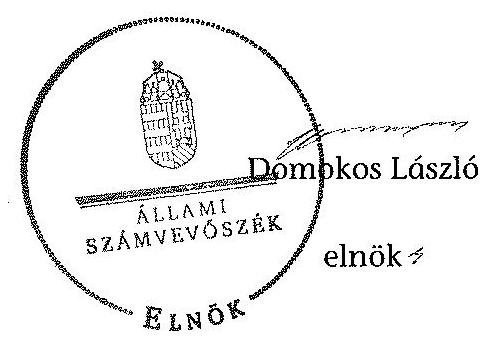

# ÁLLAMI   SZÁMVEVŐSZÉK 

## JELENTÉS

a helyi nemzetiségi önkormányzatok gazdálkodásának ellenőrzéséről
Ferencvárosi Szerb Nemzetiségi Önkormányzat

---

Állami Számvevőszék
Iktatószám: V-0279-017/2014.
Témaszám: 1312
Vizsgálat-azonosító szám: V065232
Az ellenőrzést felügyelte:
Horváth Balázs
felügyeleti vezető
Az ellenőrzést vezette és az ellenőrzés végrehajtásáért felelős:
Kisgergely István
ellenőrzésvezető
A számvevőszéki jelentést készítették és a jelentés összeállításában
közremüködtek:
Krupánszki Dóra
számvevő
Szeibel Gáborné
számvevő
Az ellenőrzést végezte:
Krupánszki Dóra
számvevő

---

# TARTALOMJEGYZÉK 

BEVEZETÉS ..... 3
I. ÖSSZEGZŐ MEGÁLLAPÍTÁSOK, KÖVETKEZTETÉSEK, JAVASLATOK ..... 6
II. RÉSZLETES MEGÁLLAPÍTÁSOK ..... 10

1. Az FSZNÖ és a Ferencvárosi Önkormányzat együttmúködésének szabályozása, a múködési feltételek biztosítása ..... 10
2. A gazdálkodási feladatok ellátásának szabályszerűsége ..... 12
2.1. A költségvetésre és a zárszámadásra, valamint a kincstári adatszolgáltatás rendjére vonatkozó jogszabályi előírások betartása ..... 12
2.2. Az FSZNÖ gazdálkodásának szabályozottsága ..... 12
2.3. Az operatív gazdálkodási jogkörök kialakítása, gyakorlása ..... 13
3. Az FSZNÖ-vel összefüggő gazdálkodási feladatok belső ellenőrzése ..... 15
4. A feladatalapú támogatás felhasználásának, elszámolásának szabályszerűsége, az FSZNÖ feladatellátása ..... 15
MELLÉKLETEK
5. számú Az FSZNÖ 2012. évi gazdálkodásának főbb adatai, mutatói
6. számú Tájékoztatás a polgármesternek küldött el nem fogadott észrevételekről
FÜGGELÉKEK
7. számú Rövidítések jegyzéke
8. számú Értelmező szótár
9. számú A gazdálkodás értékelésének módszere

---

.

---

# JELENTÉSTERVEZET   a helyi nemzetiségi önkormányzatok gazdálkodásának ellenőrzéséről Ferencvárosi Szerb Nemzetiségi Önkormányzat 

## BEVEZETÉS

Az FSZNÖ az 1998. évben alakult, elnöke a 2010. évi helyhatósági választások óta látja el feladatát. Az FSZNÖ intézményt, gazdasági társaságot és más szervezetet nem alapított. A négytagú Képviselő-testület munkája segítésére bizottságot nem hozott létre. Az FSZNÖ-nek a költségvetési beszámolója szerint a 2012. évben a módosított költségvetési bevételi és kiadási előirányzata 1819 ezer Ft, a teljesített költségvetési bevétele 2236 ezer Ft, a teljesített költségvetési kiadása 1564 ezer Ft volt. A 2012. évi gazdálkodási adatokat részletesen az 1. számú mellékletben mutatjuk be.

Az Alaptörvény XXIX. cikk (1) bekezdése szerint a Magyarországon élő nemzetiségek államalkotó tényezők. Minden, valamely nemzetiséghez tartozó magyar állampolgárnak joga van önazonossága szabad vállalásához és megőrzéséhez. A hazánkban élő́ nemzetiségek helyi (települési és területi), valamint országos önkormányzatokat hozhatnak létre. A helyi nemzetiségi önkormányzatok gazdálkodási feladatait jogszabályi előírás alapján a székhely szerinti helyi önkormányzat polgármesteri hivatala látja el.

A nemzetiségek helyzete, támogatása mind hazai, mind EU-s szinten kiemelt figyelmet kap napjainkban. A helyi nemzetiségi önkormányzatok gazdálkodására és támogatási rendszerére vonatkozó jogszabályok a 2010-2012. években jelentős változásokon mentek át. A települési és területi nemzetiségi önkormányzatok gazdálkodásának, a részükre juttatott költségvetési támogatások felhasználásának ellenőrzését az ÁSZ a 2012. évben sorozatjellegú ellenőrzés keretében indította el. A 2013. évi ellenőrzések e témacsoportos ellenőrzések folytatását jelentik, amelyet az ÁSZ 2014. első félévi ellenőrzési terve 12 témasorszámon tartalmaz.

Az ellenőrzés célja annak értékelése volt, hogy az FSZNÖ gazdálkodási kereteinek kialakítása, gazdálkodása és feladatellátása megfelelt-e a jogszabályoknak.

Ennek keretében értékeltük, hogy:

- az FSZNÖ és a Ferencvárosi Önkormányzat együttmúködésének szabályozása, a múködési feltételek biztosítása megfelelt-e a jogszabályi előírásoknak;
- a felek együttmúködése megfelelt-e a közöttük létrejött megállapodásnak a gazdálkodási feladatok szabályszerű ellátása során, ennek keretében betar-

---

tották-e a helyi nemzetiségi önkormányzat gazdálkodásához kapcsolódóan a költségvetésre és zárszámadásra, a gazdálkodás szabályozására, az operatív gazdálkodási jogkörök gyakorlására vonatkozó jogszabályi előírásokat;

- a jegyző biztosította-e az FSZNÖ gazdálkodásának belső ellenőrzését;
- az FSZNÖ feladatalapú támogatásának felhasználása, a folyósított feladatalapú támogatással történő elszámolás az előírásoknak megfelelő volt-e;
- az FSZNÖ feladatellátása összhangban volt-e a vonatkozó jogszabályi előírásokkal.

Az ellenőrzés várható hasznosulását négy szinten tervezzük. A törvényalkotás számára összegzett tapasztalatok állnak rendelkezésre a nemzetiségi önkormányzatok testületi döntéseinek, gazdálkodásának és a feladatalapú támogatás felhasználásának szabályszerűségéről, amelynek alapján következtetést lehet levonni arra, hogy indokolt-e jogszabályi módosítás kezdeményezése. Az ellenőrzés az ellenőrzött számára visszajelzést ad a múködésében fellépő hiányosságokról, javaslataival hozzájárul azok kiküszöböléséhez, amely csökkentheti a későbbi ellenőrzések gyakoriságát. Az ellenőrzés megállapításai és javaslatai tanulságul szolgálhatnak más nemzetiségi önkormányzatok, szervezetek számára a rendezett gazdálkodási keretek kialakításához. A társadalom számára jelzi, hogy közpénz nem maradhat ellenőrizetlenül, az ÁSZ értékteremtő rend kialakításához és megőrzéséhez hozzájáruló tevékenysége pozitív hatással lesz a szervezetről kialakított összkép formálásában. Az ÁSZ szervezetén belül lehetőség nyílik arra, hogy a megállapítások szintetizálásával az intézmény a hozzáadott értéket teremtő elemző tevékenységét és tanácsadó szerepét erősítse.

Az FSZNÖ gazdálkodásának ellenőrzéséről szóló jelentés I. fejezetének összegző része az ellenőrzés céljára adott rövid, szintetizáló összefoglalót és következtetéseket tartalmazza a II. fejezet részletes megállapításain alapulóan. A jelentés intézkedést igénylő megállapításait és javaslatait - az összegzőben foglaltak mellett - az ellenőrzés során feltárt, a jelentés II. fejezetében rögzített részletes megállapítások alapozzák meg, illetve támasztják alá.

Az ellenőrzés típusa: szabályszerűségi ellenőrzés
Az ellenőrzött időszak: a 2012. január 1. - 2012. december 31. közötti időszak.

Ellenőrzött szervezet: a Ferencvárosi Szerb Nemzetiségi Önkormányzat és a gazdálkodási feladatait ellátó Budapest Főváros IX. Kerület Ferencváros Önkormányzata.

Az ellenőrzés végrehajtásának jogszabályi alapját az ÁSZ tv. 5. § (2)-(3) és (6) bekezdéseiben foglaltak képezik.

Az ellenőrzés szakmai módszertana az ÁSZ hivatalos honlapján (www.asz.hu) közzétett szakmai szabályokon alapult, amely a Legfőbb Ellenőrző Intézmények Nemzetközi Szervezete (INTOSAI) által kiadott nemzetközi standardok (ISSAI) figyelembevételével készült.

---

A helyi nemzetiségi önkormányzatok gazdálkodásának ellenőrzése során értékeltük a Ferencvárosi Önkormányzat és az FSZNÖ együttmúködésének, a gazdálkodás szabályozottságának és a pénzügyi folyamatokban kulcsszerepet betöltő belső kontrollok (teljesítésigazolás és érvényesítés) működésének megfelelőségét. A kulcskontrollokat a dologi kiadásokkal kapcsolatos kifizetéseknél véletlen mintavételi eljárást alkalmazva - ellenőriztük. Ellenőriztük, hogy a jegyző biztosította-e az FSZNÖ gazdálkodásának belső ellenőrzését. Értékeltük a feladatalapú támogatások felhasználásának, elszámolásának szabályszerűségét, az FSZNÖ feladatellátása és a jogszabályi előírások összhangját.

Az ellenőrzés lefolytatásához az FSZNÖ és a gazdálkodási feladatait ellátó Ferencvárosi Önkormányzat tanúsítványok és a kapcsolódó, dokumentumjegyzékben megjelölt dokumentumok elektronikus úton történő megküldésével, rendelkezésre bocsátásával szolgáltatott adatokat. Az adatszolgáltatás kontrollálása és szükség szerinti javítása a helyszíni ellenőrzés keretében történt. A minősítési szempontokat a 3. számú függelék tartalmazza.

Az ÁSZ tv. 29. § (1) bekezdése szerint a jelentéstervezetet megküldtük egyeztetésre a polgármester és az FSZNÖ elnöke részére. Az ÁSZ tv. 29. § (2) bekezdésében foglalt észrevételezési jogával az FSZNÖ elnöke nem élt. A polgármester határidőben megküldött észrevétele és tájékoztatása alapján a jelentést részben módosítottuk. Az el nem fogadott észrevételek indoklását a jelentés 2. számú melléklete tartalmazza.

---

# I. ÖSSZEGZŐ MEGÁLLAPÍTÁSOK, KÖVETKEZTETÉSEK, JAVASLATOK 

Az FSZNÖ és a Ferencvárosi Önkormányzat együttmüködésének szabályozása nem felelt meg a jogszabályi előírásoknak. Az együttműködési megállapodás ${ }_{2}$-ről az FSZNÖ Képviselő-testülete a Nek. ${ }_{2}$ tv. előírása ellenére nem hozott határozatot. Az együttmúködési megállapodás ${ }_{1}$-et a Nek. ${ }_{2}$ tv. előírása ellenére 2012. január 31 -éig nem vizsgálták felül, és 2012. június 1 -jéig nem történt meg a kiegészítése. A Nek. ${ }_{2}$ tv. alapján a Kormányhivatal 2012. június 1-jét követően írásban nem kezdeményezett egyeztetést a felek között együttműködési megállapodás megkötése, módosítása érdekében. A 2012. december 31-én hatályos együttmúködési megállapodás ${ }_{1}$ nem tartalmazta a Nek. ${ }_{2}$ tv. szerinti személyi és tárgyi múködési feltételeket. A szabályozási hiányosságok ellenére a Ferencvárosi Önkormányzat az FSZNÖ részére az előírt múködési feltételeket a Nek. ${ }_{2}$ tv.-ben foglaltakra tekintettel - a 2011. évben érvényes szabályok alapján - előírásszerűen biztosította a 2012. évben. A törzskönyvi nyilvántartási adatok módosításával, az önálló fizetési számla nyitásával és az adószám igénylésével kapcsolatos feladatokat elvégezték.

Az FSZNÖ 2012. évi költségvetésének, zárszámadásának tartalma, jóváhagyása, valamint a kapcsolódó 2012. évi adatszolgáltatás szabályszerúsége annak ellenére megfelelt a jogszabályi előírásoknak, hogy a 2012. évi költségvetési határozat tervezetét az FSZNÖ elnöke az Áht. előírása ellenére, határidőn túl terjesztette a Képviselő-testület elé. A jóváhagyott költségvetés tartalmazta az Áht.-ben és az Ávr.-ben előírt tartalmi elemeket. A költségvetés és a zárszámadási határozat tervezetének előterjesztésekor a Képviselő-testület részére az Áht.-ben foglaltaknak megfelelően bemutatták az előírt mérlegeket és kimutatásokat. Az Áht.-nek megfelelően a zárszámadásról alkotott határozat és az elfogadott költségvetés összehasonlíthatóságát biztosították, az FSZNÖ valamennyi bevételéről és kiadásáról elszámoltak. A 2012. évben a kincstári adatszolgáltatási kötelezettségnek hiánytalanul eleget tettek.

A Polgármesteri Hivatal rendelkezett az FSZNÖ-re is kiterjesztett számviteli politikával és a hozzá kapcsolódó szabályzatokkal, azonban az FSZNÖ gazdálkodásának szabályozottsága az ellenőrzött időszakban nem volt megfelelő, mivel a Polgármesteri Hivatal SZMSZ-ében nem rögzítették az Ávr.-ben foglaltak szerint, az SZMSZ-ben nevesített munkakörökhöz tartozó, az FSZNÖ gazdálkodásával kapcsolatos feladat- és hatásköröket, a hatáskörök gyakorlásának módját, a helyettesítés rendjét, az ezekhez kapcsolódó felelősségi szabályokra vonatkozó előírásokat. A jegyző az FSZNÖ gazdálkodási feladataira vonatkozóan nem terjesztette ki a Bkr.-ben előírt ellenőrzési nyomvonalat és a szabálytalanságok kezelésének eljárásrendjét.

Az operatív gazdálkodási jogkörök kialakítása megfelelt a jogszabályi előírásoknak. Gazdasági szervezet hiányában a jegyző az Áht. és az Ávr. előírásai alapján írásban jelölt ki megfelelő végzettséggel rendelkező köztisztviselőt a pénzügyi ellenjegyzés és az érvényesítés gyakorlására. Az FSZNÖ elnöke 2012. március 5 -étől az Áht. és az Ávr. előírásai alapján írásban felhatalmazta

---

a kötelezettségvállalás és az utalványozás gyakorlására, valamint kijelölte teljesítésigazolásra az elnökhelyettest. A gazdálkodási jogkörök kialakítása annak ellenére megfelelt a jogszabályi előírásoknak, hogy a polgármester jogosulatlanul hatalmazta fel a FSZNÖ elnökét és helyettesét a kötelezettségvállalás és az utalványozás gyakorlására, valamint jelölte ki teljesítésigazolásra.

Az FSZNÖ-nél a 2012. évben a dologi kiadások teljesítése során a teljesítésigazolás és az érvényesítés kulcskontrollok múködésének megfelelősége gyenge volt, a hibák száma a lényegességi szintet, a kritikus hibahatárt elérte. A dologi kiadások teljesítésigazolása során az Ávr. előírása ellenére egy esetben nem történt meg a teljesítés igazolása. Az érvényesítő az Ávr.-ben előírt feladatait nem végezte el, mert a megelőző ügymenetben nem ellenőrizte és nem jelezte a teljesítésigazolások hiányosságait. A három legnagyobb összegű kiadás teljesítése közül egy esetben az Ávr. előírásai ellenére, nem történt meg a teljesítés igazolása. Az érvényesítő nem észrevételezte és nem jelezte, hogy öt esetben a kötelezettségvállalás nyilvántartási számát, két esetben a megterhelendő fizetési számla számát, megnevezését nem tüntették fel az utalványrendeleteken; a teljesítésigazolás három esetben nem a Kötelezettségvállalási szabályzatban előírt nyomtatványon történt; és az előleggel való elszámolás négy esetben nem történt meg a Pénzkezelési szabályzatban foglalt határidőben. Az FSZNÖ a 2012. évben nem teljesített támogatásértékű kiadást, valamint államháztartáson kívülre pénzeszközátadást. A számvevőszéki ellenőrzés a rendelkezésre bocsátott dokumentumok alapján jogosulatlan kifizetést nem tárt fel.

A Polgármesteri Hivatal belső ellenőrzési tervét megalapozó kockázatelemzés kiterjedt az FSZNÖ gazdálkodásával összefüggő végrehajtási feladatokra. A kockázatelemzés során az FSZNÖ gazdálkodását nem ítélték magas kockázatúnak, ezért az FSZNÖ gazdálkodására vonatkozóan nem terveztek és nem végeztek belső ellenőrzést a 2012. évben.

Az FSZNÖ a 2011. és a 2012. években nem részesült feladatalapú támogatásban.

A 2012. évben az FSZNÖ feladatellátásának tárgya összhangban volt a Nek. ${ }_{2}$ tv. előírásaival.

Az ÁSZ tv. 33. § (1) bekezdésében foglaltak értelmében az ellenőrzött szervezet vezetője köteles a jelentésben foglalt megállapításokhoz kapcsolódó intézkedési tervet összeállítani, és azt a jelentés kézhezvételétől számított 30 napon belül az ÁSZ részére megküldeni. Amennyiben az intézkedési tervet határidőre nem küldi meg a szervezet, vagy az nem elfogadható, az ÁSZ elnöke az ÁSZ tv. 33. § (3) bekezdés a)b) pontjaiban foglaltakat érvényesítheti.

A helyszíni ellenőrzés megállapításainak hasznosítása mellett javasoljuk:

# a jegyzönek 

1. az együttműködés szabályozásával kapcsolatban

Az együttműködési megállapodás ${ }_{1}$-et a Nek. ${ }_{2}$ tv. 80. § (2) bekezdésének előírása ellenére 2012. január 31-élg nem vizsgálták felül.

---

Javaslat
Biztosítsa a jövőben az együttműködési megállapodás évenkénti felülvizsgálata során a Nek. ${ }_{2}$ tv. 80. § (2) bekezdésében előírt határidő betartását.
2. a gazdálkodás szabályozottságával kapcsolatban

A Polgármesteri Hivatal SZMSZ-e nem tartalmazta az Ávr. 13. § (1) bekezdés g) pontjában foglaltak szerinti, az SZMSZ-ben nevesített munkakörökhöz tartozó - az FSZNÖ gazdálkodásával kapcsolatos - feladat- és hatáskörökre, a hatáskörök gyakorlásának módjára, a helyettesítés rendjére, az ezekhez kapcsolódó felelősségi szabályokra vonatkozó előírásokat. A jegyző az FSZNÖ gazdálkodási feladataira nem határozta meg a Bkr. 6. § (4) bekezdésében előírt szabálytalanságok kezelésének eljárásrendjét.

Javaslat
A gazdálkodás szabályszerűsége érdekében az FSZNÖ gazdálkodására is kiterjedően:
a) készítse elő a Polgármesteri Hivatal SZMSZ-ének módosítását, hogy az tartalmazza az Ávr. 13. § (1) bekezdés g) pontjában foglaltakat;
b) módosítsa a Polgármesteri Hivatal Bkr. 6. § (4) bekezdése szerinti szabálytalanságok kezelésének eljárásrendjét.
3. a kulcskontrollok múködésével kapcsolatban

A teljesítésigazolás az Ávr. 57. § (1) bekezdése ellenére kettő esetben nem történt meg. Az érvényesítő az Ávr. 58. § (1)-(2) bekezdései szerinti feladatát nem látta el, mert nem ellenőrizte a megelőző ügymenetben a jogszabályi előírások betartását, valamint nem jelezte, hogy nem történt meg a teljesítés igazolása, a megterhelendő fizetési számla számát, megnevezését, a kötelezettségvállalás nyilvántartási számát nem tüntették fel az utalványrendeleteken, továbbá nem a Kötelezettségvállalási szabályzatban előírt nyomtatványon történt a teljesítés igazolása. Az érvényesítő nem észrevételezte továbbá, hogy az előlegből történő vásárlások esetén az előleggel való elszámolás nem történt meg a Pénzkezelési szabályzatban előírt határidőben.

---

Javaslat
Az operatív gazdálkodás múködési hibáinak megelőzése, feltárása és kijavítása érdekében gondoskodjon arról, hogy:
a) a teljesítésigazolást az Ávr. 57. § (4) bekezdésének előirása szerint minden esetben végezzék el;
b) az érvényesítő az Ávr. 58. § (1)-(2) bekezdéseiben előírt ellenőrzési és jelzési feladatait maradéktalanul lássa el.

# a polgármesternek 

A Polgármesteri Hivatal SZMSZ-e nem tartalmazta az Ávr. 13. § (1) bekezdés g) pontjában foglaltak szerinti, az SZMSZ-ben nevesített munkakörökhöz tartozó - az FSZNÖ gazdálkodásával kapcsolatos - feladat- és hatáskörökre, a hatáskörök gyakorlásának módjára, a helyettesítés rendjére, az ezekhez kapcsolódó felelősségi szabályokra vonatkozó előírásokat.

Javaslat
Terjessze a Ferencvárosi Önkormányzat Képviselő-testülete elé a Polgármesteri Hivatal SZMSZ-ének jegyző által előkészített módosítását, hogy az tartalmazza - az FSZNÖ gazdálkodásával kapcsolatosan - az Ávr. 13. § (1) bekezdés g) pontjában foglaltakat.

## az FSZNÖ elnökének

Az FSZNÖ elnöke a 2012. évi költségvetési határozat tervezetét az Áht. 24. § (2) bekezdésében előírt határidőn túl nyújtotta be a Képviselő-testületnek.

Javaslat
A jövőben a költségvetési határozat tervezetét az Áht. 24. § (3) bekezdésében foglalt határidőig nyújtsa be a Képviselő-testületnek.

---

# II. RÉSZLETES MEGÁLLAPÍTÁSOK 

## 1. Az FSZNÖ És a Ferencvárosi Önkormányzat együttmúködésének szabályozása, a múködési feltételek biztosítása

Az FSZNÖ és a Ferencvárosi Önkormányzat együttműködésének szabályozása nem felelt meg a jogszabályi előírásoknak.

Az FSZNÖ az ellenőrzött időszakban rendelkezett a Ferencvárosi Önkormányzattal kötött együttmúködési megállapodással. A 2011. október 2-án az FSZNÖ elnöke, valamint 2011. december 13-án a polgármester által átruházott hatáskörben ${ }^{1}$ aláírt együttműködési megállapodás ${ }_{1}$-et az FSZNÖ Képviselő-testülete határozatával ${ }^{2}$ jóváhagyta. Az együttműködési megállapodás ${ }_{1}$-et a Nek. ${ }_{2}$ tv. 80. § (2) bekezdésének előírása ellenére 2012. január 31-éig nem vizsgálták felül, és a Nek. ${ }_{2}$ tv. 159. § (3) bekezdése alapján 2012. június 1-jéig nem történt meg a kiegészítése. A Nek. ${ }_{2}$ tv. 83. § (3) bekezdése alapján a Kormányhivatal 2012. június 1-jét követően írásban nem kezdeményezett egyeztetést a felek között együttműködési megállapodás megkötése, módosítása érdekében. Az együttműködési megállapodás ${ }_{1}$ egyes részeinek érvényben tartása ${ }^{3}$ mellett, annak kiegészítéseként, 2012. december 12-én az FSZNÖ és a Ferencvárosi Önkormányzat együttműködési megállapodás ${ }_{2}$-t kötött, amelyet az FSZNÖ elnöke és a polgármester ${ }^{4}$ aláírt. Az együttműködési megállapodás ${ }_{2}$-ről az FSZNÖ Kép-viselő-testülete a Nek. ${ }_{2}$ tv. 78. § (3) bekezdésének előírása ellenére nem hozott határozatot.

Az együttműködési megállapodás ${ }_{1}$ nem tartalmazta:

- a Nek. ${ }_{2}$ tv. 80. § (1) bekezdés a) pontja alapján az FSZNÖ részére havonta igény szerint, de legalább tizenhat órában, az önkormányzati feladat ellátásához szükséges tárgyi, technikai eszközökkel felszerelt helyiség ingyenes használatát, a helyiséghez, továbbá a helyiség infrastruktúrájához kapcsolódó rezsiköltségek és fenntartási költségek viselését;

[^0]
[^0]:    ${ }^{1}$ Budapest Főváros IX. Kerület Ferencváros Önkormányzata Képviselő-testületének 35/2011. (XII. 12.) önkormányzati rendelete a Szervezeti és Müködési szabályzatáról szóló 28/2011. (X. 11.) önkormányzati rendelet módosításáról 5. §-a.
    ${ }^{2}$ 19/2011. (09. 30.) számú határozat
    ${ }^{3}$ Az együttműködési megállapodás ${ }_{2}$ 8. pontjában a költségvetés elkészítése jóváhagyásának eljárási rendjére, a költségvetési gazdálkodás bonyolításának rendjére, a beszámoló elkészítésének és jóváhagyásának eljárási rendjére, az ellenjegyzési, érvényesítési, utalványozási, teljesítésigazolással kapcsolatos feladatokra, a vagyontárgyak kezelésének rendjére, a számviteli, pénzügyi és információszolgáltatási tevékenység végzésének rendjére, a belső ellenőrzés elvégzésére vonatkozó szabályok érvényben tartásáról állapodtak meg.
    ${ }^{4}$ A polgármester átruházott hatáskörben írta alá a 404/2012. (X. 04.) számú határozat 3. pontja alapján.

---

- a Nek. ${ }_{2}$ tv. 80. § (1) bekezdés b) pontja alapján az önkormányzati múködéshez (a testületi, tisztségviselői, képviselői feladatok ellátásához) szükséges tárgyi és személyi feltételek biztosítását;
- a Nek. ${ }_{2}$ tv. 80. § (1) bekezdés c) pontja alapján a testületi ülések előkészítését (meghívók, előterjesztések, hivatalos levelezés előkészítése, postázása, a testületi ülések jegyzőkönyveinek elkészítése, postázása);
- a Nek. ${ }_{2}$ tv. 80. § (1) bekezdés d) pontja alapján a testületi döntések és a tisztségviselők döntéseinek előkészítését, a testületi és tisztségviselői döntéshozatalhoz kapcsolódó nyilvántartási, sokszorosítási, postázási feladatok ellátását;
- a Nek. ${ }_{2}$ tv. 80. § (1) bekezdés e) pontja alapján az FSZNÖ múködésével, gazdálkodásával kapcsolatos nyilvántartási, iratkezelési feladatok ellátását;
- a Nek. ${ }_{2}$ tv. 80. § (1) bekezdés g) pontja alapján a fenti feladatellátáshoz kapcsolódó költségek - a testületi tagok és tisztségviselők telefonhasználata költségei kivételével - viselését;
- a Nek. ${ }_{2}$ tv. 80. § (3) bekezdés a) pontja által előírt, önálló fizetési számla nyitásával, törzskönyvi nyilvántartásba vételével és adószám igénylésével kapcsolatos feladatokat, azok felelőseinek konkrét kijelölését és végrehajtásának határidejét;
- a Nek. ${ }_{2}$ tv. 80. § (3) bekezdés b) pontja által előírt szakmai teljesítésigazolási feladatokat és felelőseinek konkrét kijelölését;
- a Nek. ${ }_{2}$ tv. 80. § (3) bekezdés c) pontja által előírt, az FSZNÖ kötelezettségvállalásaival összefüggő összeférhetetlenségi és nyilvántartási szabályokat;
- a Nek. ${ }_{2}$ tv. 80. § (3) bekezdés d) pontja által előírt, az FSZNÖ gazdálkodásának eljárási és dokumentációs részletszabályai közül a teljesítésigazolással, valamint az ezt végző személyek kijelölésének rendjével kapcsolatos előírásokat, feltételeket;
- a Nek. ${ }_{2}$ tv. 80. § (4) bekezdés ellenére azt, hogy a jegyző vagy annak - a jegyzővel azonos képesítési előírásoknak megfelelő - megbízottja a Ferencvárosi Önkormányzat megbízásából és képviseletében részt vesz az FSZNÖ testületi ülésein és jelzi, amennyiben törvénysértést észlel.

Az együttműködési megállapodás ${ }_{1}$ az Áht.-ben foglaltak szerint tartalmazta a tervezési, gazdálkodási, ellenőrzési, finanszírozási, adatszolgáltatási és beszámolási feladatokat.

Az FSZNÖ a 26/2013. (11.07.) számú határozatával elfogadta az FSZNÖ új SZMSZ-ének 2. számú mellékleteként az együttmúködési megállapodás ${ }_{2}$-t és annak 2013. április 5 -ei módosítását.

A szabályozási hiányosságok ellenére a Ferencvárosi Önkormányzat az FSZNÖ részére az elöírt múködési (személyi, tárgyi) feltételeket a Nek. ${ }_{2}$ tv. 159. § (3) bekezdésében foglaltakra tekintettel - a 2011. évben érvényes szabályok alapján, a Nek. 1 tv. 27. § (1)-(2) bekezdéseiben foglaltak szerint - biztosította a 2012. évben. A törzskönyvi nyilvántartási adatok módosí-

---

tásával, az önálló fizetési számla nyitásával és az adószám igénylésével kapcsolatos feladatokat elvégezték.

# 2. A GAZDÁlKODÁSI FELADATOK ELLÁTÁSÁNAK SZABÁLYSZERŰSÉGE 

### 2.1. A költségvetésre és a zárszámadásra, valamint a kincstári adatszolgáltatás rendjére vonatkozó jogszabályi előírások betartása

Az FSZNÖ 2012. évi költségvetésének, zárszámadásának tartalma, jóváhagyása, valamint a kapcsolódó 2012. évi adatszolgáltatás szabályszerűsége annak ellenére megfelelt a jogszabályi előírásoknak, hogy az FSZNÖ elnöke a 2012. évi költségvetési határozat tervezetét az Áht. 24. § (2) bekezdésében előírtak ellenére, határidőn túl ${ }^{5}$ nyújtotta be a Képviselő-testületnek.

A jóváhagyott ${ }^{6}$ költségvetés tartalmazta az Áht.-ben és az Ávr.-ben előírt tartalmi elemeket, a költségvetési bevételeket és a költségvetési kiadásokat elői-rányzat-csoportok, valamint kiemelt előirányzatok szerinti bontásban. A költségvetés tervezetének előterjesztésekor a Képviselő-testület részére az Áht.-ben foglaltaknak megfelelően bemutatták az előírt mérlegeket és kimutatásokat.

A 2012. évi zárszámadási határozat tervezetét a jegyző az Áht.-ben előírt határidőn belül elkészítette ${ }^{7}$, és az FSZNÖ elnöke a Képviselő-testület elé terjesztette. Az FSZNÖ a 2012. évi zárszámadásról határozatot ${ }^{8}$ hozott.

A 2012. évi zárszámadási határozat tervezetének előterjesztésénél a Képviselőtestület részére tájékoztatásul bemutatták az Áht. előírása szerinti mérlegeket és kimutatásokat. Az Áht.-nek megfelelően a zárszámadásról alkotott határozat és az elfogadott költségvetés összehasonlíthatóságát biztosították, az FSZNÖ valamennyi bevételéről és kiadásáról elszámoltak.

A 2012. költségvetési évvel kapcsolatban a jegyző az FSZNÖ-re vonatkozó kincstári adatszolgáltatási kötelezettségének hiánytalanul eleget tett, a 2012. évi elemi költségvetést, a féléves és éves beszámolót, valamint az időközi költségvetési- és mérlegjelentéseket az Ávr. szerinti határidőig megküldte a Kincstár részére.

### 2.2. Az FSZNÖ gazdálkodásának szabályozottsága

Az FSZNÖ gazdálkodásának szabályozottsága az ellenőrzött időszakban nem volt megfelelő, mivel:

[^0]
[^0]:    ${ }^{5}$ 2012. február 23-án
    ${ }^{6} 8 / 2012$. (02. 27.) számú határozat
    ${ }^{7}$ 2013. április 19-én
    ${ }^{8} 9 / 2013$. (05. 08.) számú határozat

---

- a Polgármesteri Hivatal SZMSZ-e - a munkaköri leírásokkal ellentétben nem tartalmazta az Ávr. 13. § (1) bekezdés g) pontjában foglaltak szerinti, az SZMSZ-ben nevesített munkakörökhöz tartozó - az FSZNÖ gazdálkodásával kapcsolatos - feladat- és hatáskörökre, a hatáskörök gyakorlásának módjára, a helyettesítés rendjére, az ezekhez kapcsolódó felelősségi szabályokra vonatkozó előírásokat ${ }^{9}$;
- a jegyző az FSZNÖ gazdálkodási feladataira nem terjesztette ki a Bkr. 6. § (3)-(4) bekezdéseiben előírt ellenőrzési nyomvonalat és a szabálytalanságok kezelésének eljárásrendjét.

A 2012. évben a Polgármesteri Hivatal rendelkezett az FSZNÖ-re is kiterjesztett, a Számv. tv. által előírt számviteli politikával és ahhoz kapcsolódóan a gazdálkodásra vonatkozó szabályzatokkal: eszközök és források értékelési szabályzatával, pénzkezelési szabályzattal, számlarenddel, eszközök és források leltárkészítési és leltározási szabályzatával.

Az Áht.-ben és az Ávr.-ben foglaltak szerint a tervezéssel, gazdálkodással, a kötelezettségvállalással, pénzügyi ellenjegyzéssel, teljesítésigazolással, az érvényesítés, utalványozás gyakorlásának módjával, eljárási és dokumentációs részletszabályaival, valamint az ezeket végző személyek kijelölésének rendjével, továbbá az ellenőrzési és adatszolgáltatási feladatok teljesítésével kapcsolatos belső előírásokat, feltételeket tartalmazó belső szabályzat ${ }^{10}$ rendelkezésre állt.

Az FSZNÖ gazdálkodásával kapcsolatos teendőket a feladatot ellátó köztisztviselők munkaköri leírásaiban részletesen rögzítették.

# 2.3. Az operatív gazdálkodási jogkörök kialakítása, gyakorlása 

Az FSZNÖ gazdálkodása tekintetében az operatív gazdálkodási jogkörök kialakítása megfelelt a jogszabályi előírásoknak, mivel:

- az FSZNÖ elnöke az Áht. és az Ávr. előírásai alapján - 2012. március 5-én írásban felhatalmazta a kötelezettségvállalás és az utalványozás gyakorlására, illetve kijelölte teljesítésigazolásra az elnökhelyettest;
- gazdasági szervezet hiányában a jegyző az Áht. és az Ávr. előírásai alapján írásban jelölt ki megfelelő végzettséggel rendelkező köztisztviselőt a pénzügyi ellenjegyzés és az érvényesítés gyakorlására.

A 2012. január 1. és március 5. közötti időszakban, az Ávr. 57. § (4) bekezdése ellenére a teljesítésigazolók írásbeli kijelölése nem történt meg. A Ferencvárosi Önkormányzat polgármestere az FSZNÖ elnökét és elnökhelyettesét

[^0]
[^0]:    ${ }^{9}$ A Polgármesteri Hivatal SZMSZ-ének VIII. pontjában az irodavezetők, irodavezetőhelyettesek és csoportvezetők feladatait és felelősségi rendjét, a X. pontjában az egyes irodák és belső szervezeti egységek főbb feladatait és hatásköreit, a XI. pontjában a helyettesítés rendjét rögzítették.
    ${ }^{10}$ Kötelezettségvállalási szabályzat

---

2012. március 5-én meghatalmazta ${ }^{11}$ a kötelezettségvállalási és az utalványozási jogkörök gyakorlására, valamint kijelölte teljesítésigazolásra. A polgármester jogosulatlanul végezte a kijelölést, mert az ellentétes volt:

- az Ávr. 52. § (7) bekezdésében foglaltakkal, mely szerint a nemzetiségi önkormányzat kiadási előirányzatai terhére az FSZNÖ elnöke, vagy az általa írásban felhatalmazott személy vállalhat kötelezettséget;
- az Ávr. 57. § (4) bekezdésében foglaltakkal, mely szerint a teljesítés igazolására jogosult személyeket a kötelezettségvállaló írásban jelöli ki;
- az Ávr. 59. § (1) bekezdésében foglaltakkal, mely szerint az Ávr. 52. §-ában foglaltak szerint kell eljárni az utalványozásra jogosult személyek kijelölésekor.

Az FSZNÖ-nél a 2012. évben a dologi kiadások teljesítése során a teljesítésigazolás és az érvényesítés kulcskontrollok müködésének megfelelősége gyenge volt, a hibák száma a lényegességi szintet, a kritikus hibahatárt elérte.

A teljesítésigazolás egy esetben az Ávr. 57. § (1) bekezdése ellenére nem történt meg, a teljesítésigazolásra jogosult aláírása hiányában nem ellenőrizte és nem igazolta a kiadások teljesítésének jogosságát, összegszerűségét és az ellenszolgáltatás teljesítését.

Az érvényesítő az Ávr. 58. § (1)-(2) bekezdései ellenére feladatát nem látta el, mert nem ellenőrizte a megelőző ügymenetben a jogszabályi előírások és belső szabályzatok előírásainak betartását, valamint nem jelezte, hogy:

- a teljesítésigazolás egy esetben az Ávr. 57. § (1) bekezdése ellenére nem történt meg;
- egy esetben nem a Kötelezettségvállalási szabályzat 8. 2. pontjában előírt nyomtatványon történt a teljesítés igazolása;
- egy esetben, az Ávr. 59. § (3) bekezdés e) pontjában foglaltak ellenére, az utalványrendeleten nem szerepeltették a megterhelendő fizetési számla számát, megnevezését;
- két esetben, az Ávr. 59. § (3) bekezdés f) pontjában foglaltak ellenére, a kötelezettségvállalás nyilvántartási számát nem tüntették fel az utalványrendeleten;
- két esetben, az előleggel való elszámolás nem történt meg a Pénzkezelési szabályzat IV. 5. 7. pontjában előírt 30 napos határidőben;
- egy esetben az elszámolás bizonylatát nem a Számv. tv. 165. § (2) bekezdésében előírtak szerint javították, továbbá az érvényesítő aláírási módja nem felelt meg, mert nem alkalmazta a jegyzői kijelölés alapján a helyettesítés „h" jelölését.

[^0]
[^0]:    ${ }^{11}$ a Kötelezettségvállalási szabályzat 2. számú mellékletében

---

A dologi kiadások három legnagyobb összegű kifizetésének egyedi ellenőrzése során egy esetben, az Ávr. 57. § (1) bekezdése ellenére a teljesítésigazolásra jogosult aláírása hiányában nem ellenőrizte és nem igazolta a kiadások teljesítésének jogosságát, összegszerűségét és az ellenszolgáltatás teljesítését. Az érvényesítő az Ávr. 58. § (1)-(2) bekezdéseiben foglalt feladatát nem látta el, mert nem ellenőrizte és nem jelezte a teljesítésigazolások hiányosságait. Az érvényesítő a megelőző ügymenetben egyik esetben sem ellenőrizte, illetve jelezte, hogy az utalványrendeleteken az Ávr. 59. § (3) bekezdés f) pontjában foglaltak ellenére nem tüntették fel a kötelezettségvállalás nyilvántartási számát, valamint azt, hogy a teljesítés igazolása két esetben nem a Kötelezettségvállalási szabályzat 8. 2. pontjában előírt nyomtatványon történt. Egy esetben nem észrevételezte, hogy az Ávr. 59. § (3) bekezdés e) pontjában foglaltak ellenére a megterhelendő fizetési számla számát és megnevezését nem szerepeltették az utalványrendeleten, két esetben pedig azt, hogy az előleggel történő elszámolás nem történt meg a Pénzkezelési szabályzat IV. 5. 7. pontjában előírt 30 napos határidőben.

Az FSZNÖ a 2012. évben nem teljesített támogatásértékű kiadást, valamint államháztartáson kívülre pénzeszközátadást.

A számvevőszéki ellenőrzés a kiadások dokumentumainak ellenőrzése, a rendelkezésre bocsátott dokumentumok alapján összeférhetetlenséget, továbbá jogosulatlan kifizetést nem tárt fel, azonban a kulcskontrollok múködéséhez kapcsolódó hiányosságok miatt nem biztosították a hibák megelőzését, feltárását és kijavítását.

# 3. Az FSZNÖ-VEL ÖSSZEFÜGGŐ GAZDÁlKODÁSI FELADATOK BELSŐ ELLENŐRZÉSE 

A jegyző a 2012. éves belső ellenőrzési terv összeállítása során figyelemmel volt az FSZNÖ gazdálkodásának belső ellenőrzésére, mert a Polgármesteri Hivatal belső ellenőrzési tervét megalapozó kockázatelemzés kiterjedt az FSZNÖ gazdálkodásával összefüggő végrehajtási feladatokra. A kockázatelemzés alapján az FSZNÖ gazdálkodását nem ítélték magas kockázatúnak, ezért a belső ellenőrzési terv nem tartalmazott belső ellenőrzést az FSZNÖ gazdálkodására vonatkozóan. Az FSZNÖ-nél belső ellenőrzés lefolytatására nem került sor a 2012. évben.

Az ellenőrzéshez szolgáltatott adatok alapján a 2012. évben a Kormányhivatal az FSZNÖ-t illetően nem élt törvényességi felügyeleti eszközökkel.

## 4. A feladatalapú támogatás felhasZNálásáNAK, elsZámolásáNAK SZABÁLYSZERŰSÉGE, AZ FSZNÖ FELADATELLÁTÁSA

Az FSZNÖ a 2011. és a 2012. években nem részesült feladatalapú támogatásban.

A 2012. évben az FSZNÖ feladatellátásának tárgya összhangban volt a Nek. 2 tv. 115. §-ával, kötelező közfeladatot látott el; kulturális programok, ren-

---

dezvények szervezésére hozott intézkedéseket. Az FSZNÖ a Nek. 2 tv. 116. § (2) bekezdésében foglalt hatósági feladatokat nem végzett.
Budapest, 2014. 8. hó 17. nap

Melléklet: $\quad 2 \mathrm{db}$
Függelék: $\quad 3 \mathrm{db}$

---

# Az FSZNO 2012. évi gazdálkodásának föbb adatai, mutatói

A) Bevételek

|  Megnevezés | Eredeti elöirányzat | Módosított
t | Teljesítés |   |
| --- | --- | --- | --- | --- |
|   |  | ezer Ft |  | megoszlás
$(\%)$  |
|  Intézményi múködési bevételek | 0,0 | 4,0 | 21,0 | 0,9  |
|  Általános múködési támogatás | 0,0 | 215,0 | 215,0 | 9,6  |
|  Támogatásértékủ múködési bevétel helyi önkormányzattól | 1157,0 | 942,0 | 1342,0 | 60,0  |
|  Előző évi pénzmaradvány átvétel | 0,0 | 658,0 | 658,0 | 29,5  |
|  Költségvetési bevételek | 1157,0 | 1819,0 | 2236,0 | 100,0  |
|  Tárgyévi bevételek | 1157,0 | 1819,0 | 2236,0 | 100,0  |

B) Kiadások

|  Megnevezés | Eredeti elöirányzat | Módosított | Teljesítés  |
| --- | --- | --- | --- |
|   |  | ezer Ft |   |
|  Személyi juttatások | 640,0 | 640,0 | 617,0  |
|  Munkaadókat terhelő járulékok és szocális hozzájárulási adó összesen | 132,0 | 167,0 | 116,0  |
|  Dologi kiadások | 385,0 | 1012,0 | 831,0  |
|  Müködési kiadások összesen | 1157,0 | 1819,0 | 1564,0  |
|  Költségvetési kiadások | 1157,0 | 1819,0 | 1564,0  |
|  Tárgyévi kiadások | 1157,0 | 1819,0 | 1564,0  |

---

.

---

# TÁJÉKOZTATÁS   A POLGÁRMESTERNEK KÜLDÖTT EL NEM FOGADOTT ÉSZREVÉTELEKRŐL 

Észrevétel A jelentéstervezet 1. és 2. pontjához kapcsolódóan:
Az ellenőrzési jelentéstervezetben megállapított hiányosságok egy részét az ellenőrzött időszakot követően, de még az ellenőrzés megelőzően megszüntettük. A többi nemzetiségi önkormányzathoz hasonlóan a Szerb Nemzetiségi Önkormányzat esetében is megtörtént a 2013. évben az együttmúködési megállapodás képviselő-testületi határozattal történő elfogadása és módosítása a Nek. tv-ben előírtak szerint, ennek dokumentumait rendelkezésre bocsátottuk.
A hiányosságok egy részét a helyszíni ellenőrzést követően, a záró tárgyaláson elhangzott javaslatok alapján a lehető leggyorsabb úton kijavítottuk.
Ennek kapcsán módosításra került a Polgármesteri Hivatal SZMSZ-e. Bár álláspontunk szerint sem a Nek. Törvény, sem az Áht. Nem ír elő olyan kötelezettséget, melynek alapján kötelező lenne a nemzetiségek múködésével kapcsolatos munkakör nevesítése, az ÁSZ kérésének megfelelően a Polgármesteri Hivatal SZMSZ-ében az egyes szervezeti egységek feladat-és hatásköreibe a korábbinál specifikáltabban kerültek meghatározásra ezen feladatok. Így rögzítésre kerültek a nemzetiségi önkormányzatok (beleérve az FSZNÖ-t) gazdálkodásával kapcsolatos feladat- és hatáskörök, a hatáskörök gyakorlásának módja, az ezekhez kapcsolódó felelősségi szabályok. Mellékelten megküldöm a Polgármesteri Hivatal módosított SZMSZ-ét.
A jelentéstervezetben említett együttmúködési megállapodás 2012. december 12-én került aláírásra, azonban a törvényben előírt személyi és tárgyi feltételeket már annak aláírása előtt is biztosítottak voltak, amelyet a jegyző és a Ferencvárosi Roma Nemzetiségi Önkormányzat elnöke által 2012. október 7 -én tett nyilatkozatban foglaltak alátámasztanak. A Bp. Főváros IX. Kerület Ferencváros Önkormányzatának Képviselő-testülete a 262/2012. (VI. 07.) számú határozatával döntött a Ferencvárosi Nemzetiségi Önkormányzatok részére történő helyiségek biztosításáról. Egyes Nemzetiségi Önkormányzatok azonban nem kívántak élni a törvény által biztosított jogokkal, így szüksége volt mindenkivel az adott helyzetre vonatkozó konkrét és részletes egyeztetés, melyek - tekintettel arra, hogy a különböző igények, szándékok összehangolását igényeltek - elhúzódtak. Ezen egyeztetések eredményeként a konkrét megállapodások megkötése 2012. december előtt nem tudott realizálódni, azonban a nemzetiségi jogok gyakorlása ne szenvedett csorbát, a Bp. IX. Kerület Ferencváros Önkormányzata biztosított minden feltételt, amely a nemzetiségi önkormányzat múködéséhez szükséges volt, s amelyet igényelt.
A Ferencvárosi Szerb Önkormányzat 26/2013. (XI. 07.) számú határozatával elfogadott új SZMSZ-ének mellékleteként elfogadott együttmúködési megállapodás és annak módosítása minden kötelező tartalmi

---

|  | elemet magában foglalt, amelyet az Áht. és a Nek. törvény előírt. |
| :--: | :--: |
| Válasz | A Polgármesteri Hivatal SZMSZ-ének módosításáról, valamint az együttmúködési megállapodás képviselő-testületi határozattal történő elfogadásáról szóló tájékoztatását tudomásul vettem. Azonban felhívom a figyelmét arra, hogy az ellenőrzött időszakot követően megtett intézkedéseivel nem módosítjuk a jelentéstervezet tartalmát. Az ellenőrzött időszakban hatályos Polgármesteri Hivatal SZMSZ-e nem felelt meg teljes körűen a jogszabályi előírásoknak. Az erre vonatkozó javaslatot továbbra is fenntartjuk, mert a hiányosságok megszüntetésére a 2014. évben tett intézkedések nem vehetők figyelembe az ellenőrzött időszakra vonatkozó megállapításaink során. Az együttmúködési megállapodás ${ }_{2}$ képviselő-testületi határozattal való elfogadása nem történt meg az ellenőrzött időszakban. Az intézkedési terv készítése során a jelentéstervezetben szereplő hiányosságokra megtett módosításait, intézkedéseit, már megtett intézkedésként kell majd szerepeltetnie. |
| Észrevétel | A jelentéstervezet 2.3. pontjához kapcsolódóan:   A jelentéstervezetben említett kulcskontrollok múködésével kapcsolatos szabályozási hiányosságok megszüntetése érdekében, a teljesítésigazoló személyére, kijelölésére vonatkozó szabályozást a jövőben a jelentéstervezet javaslatait figyelembe véve alakítjuk ki. Megjegyzem azonban, hogy a teljesítést igazoló személy jogosultságának el nem fogadásával, ebből fakadóan az érvényesítői feladat ellátásának hiányosságával, illetve a kulcskontrollok múködésének gyenge minősítésével nem értünk egyet az alábbi indokok miatt:   A nemzetiségi önkormányzatok operatív gazdálkodási feladatait meghatározó helyi belső szabályozás szerint a nemzetiségi önkormányzatok teljesítésigazolásra jogosult személy értékhatártól függetlenül az elnök, vagy az általa erre írásban felhatalmazott személy. Mind a teljesítésigazoló, mind az érvényesítő ennek megfelelően látta el feladatát. Azokban az esetekben, ahol nem az elnök teljesítésigazolt, a szabályozásnak megfelelően az általa írásban felhatalmazott személy látta el a feladatot. Az Ávr. 57. § (4) bekezdése értelmében teljesítésigazolásra a kötelezettségvállaló által írásban kijelölt személy jogosult. Számunkra nyilvánvaló volt, hogy a jogalkotói szándék nem irányulhatott arra az esetre, hogy amennyiben a teljesítésigazoló az elnök, akkor önmagát jelölje kis a teljesítés igazolás elvégzésére, hiszen úgy gondoljuk, hogy az önmaga részére történő kijelölésnek értelme nincs, gyakorlati alkalmazása nem életszerű. Véleményünk szerint az elnök általi teljesítésigazolások esetében a kifizetések szabályszerűségi oldala nem sérült. Kötelezettségvállalóként a jogszabály elsősorban az elnököt nevesíti, a teljesítést igazoló személye ehhez igazodott, belső szabályozásunk erre épült, az összeférhetetlenség kizárásával. A törvényi szabályozás véleményünk szerint módosítást igényel.   A jelentéstervezet 7. oldalán szerepel az a megállapítás, hogy „a dologi kiadások teljesítésekor az Ávr. előírása ellenére két esetben nem történt meg a teljesítés igazolása". Valamennyi számlát újra megvizsgáltunk, egy esetben a teljesítés igazolás szövege a számlán szerepel, az aláírás |

---

|  | valóban hiányzik. A többi számlánál megtaláltuk a teljesítésigazolásokat. Bizonyos számlák esetében a teljesítésigazolások a számla hátoldalán történtek.   Ugyancsak a 7. oldalon szerepel: „A teljesítésigazolás három esetében nem a Kötelezettségvállalási szabályzatban előírt nyomtatványt használták. A megállapítás helytálló, azonban a teljesítésigazolások számlán történő szerepeltetését (külön nyomtatvány helyett) kizárólag a nemzetiségi önkormányzatok elnökei kérésének eleget téve fogadtuk el. |
| :--: | :--: |
| Válasz | A kulcskontrollok múködéséhez kapcsolódó, a nemzetiségi elnök teljesítésigazolására vonatkozó észrevételét elfogadom azzal, hogy az értékelés gyenge minősítését ez nem befolyásolja, mert a kulcskontrollok múködésénél tapasztalt további hiányosságok súlya miatt a jelentéstervezethez kapcsolódó 3. számú függelékben szereplő értékelés eredménye változatlan marad.   A jelentéstervezet 7. oldalához tett észrevételét nem fogadom el, mivel a jelentéstervezet részletes megállapításainak 2.3. pontjában szerepel, hogy a dologi jellegű kiadások közül egy esetben, valamint a dologi kiadások három legnagyobb összegű kifizetései közül egy tételnél, öszszesen kettő tételnél hiányzott a teljesítés igazolójának az aláírása.   A jelentéstervezet 7. oldalához kapcsolódóan egyetértett azzal, hogy a teljesítésigazolások során nem a Kötelezettségvállalási szabályzatban előírt teljesítésigazolási nyomtatványt használták. Jelezte, hogy a nyomtatvány mellőzése a nemzetiségi önkormányzatok elnökei kérésére történt. A saját belső szabályzatukban azonban a szabályzattól eltérő gyakorlatot nem rögzítették, így megállapításunkat továbbra is fenntartjuk. |

---

.

---

# RÖVIDÍTÉSEK JEGYZÉKE 

## Törvények

Alaptörvény
Áht.
ÁSZ tv.
Nek. ${ }_{1}$ tv.
Nek. ${ }_{2}$ tv.
Számv. tv.

## Rendeletek

Ávr.

Bkr.
támogatási kormányrendelet ${ }_{1}$
támogatási kormányrendelet ${ }_{2}$

## Szórövidítések

ÁSZ
együttmúködési megállapodás ${ }_{1}$
együttmúködési megállapodás ${ }_{2}$

EU
Ferencvárosi Önkormányzat
FSZNÖ

Magyarország Alaptörvénye
2011. évi CXCV. törvény az államháztartásról (hatályos 2011. december 31-étől)

2011. évi LXVI. törvény az Állami Számvevőszékről (hatályos 2011. július 1-jétől)
1993. évi LXXVII. törvény a nemzeti és etnikai kisebbségek jogairól (hatályos 2011. december 31-éig)
2011. évi CLXXIX. törvény a nemzetiségek jogairól (hatályos 2011. december 20-ától)
2000. évi C. törvény a számvitelről

368/2011. (XII. 31.) Korm. rendelet az államháztartásról szóló törvény végrehajtásáról (hatályos 2012. január 1jétől)
370/2011. (XII. 31.) Korm. rendelet a költségvetési szervek belső kontrollrendszeréről és belső ellenőrzéséről (hatályos 2012. január 1-jétől)
342/2010. (XII. 28.) Korm. rendelet a kisebbségi önkormányzatoknak a központi költségvetésből, valamint fejezeti kezelésú előirányzatból nyújtott támogatások feltételrendszeréről és elszámolásának rendjéről (hatályos 2012. március 6 -áig)
28/2012. (III. 6.) Korm. rendelet a nemzetiségi célú előirányzatokból nyújtott támogatások feltételrendszeréről és elszámolásának rendjéről (hatályos 2012. március 7étől 2012. december 31-éig)

Állami Számvevőszék
a Ferencvárosi Szerb Kisebbségi Önkormányzat 19/2011. (09. 30.) számú határozatával jóváhagyott, elnöke által 2011. október 2-án aláírt, a Ferencvárosi Önkormányzat polgármestere által átruházott hatáskörben, 2011. december 13-án aláírt pénzügyi együttmúködési megállapodás
a Ferencvárosi Szerb Nemzetiségi Önkormányzat elnöke és átruházott hatáskörben a Ferencvárosi Önkormányzat polgármestere által 2012. december 12-én aláírt együttmúködési megállapodás
Európai Unió
Budapest Főváros IX. Kerület Ferencváros Önkormányzata
Ferencvárosi Szerb Nemzetiségi Önkormányzat

---

| FSZNÖ SZMSZ-e | a Ferencvárosi Szerb Kisebbségi Önkormányzat Képvise-lö-testületének 22/2010. (10. 20.) számú határozatával elfogadott Szervezeti és Müködési Szabályzata |
| :--: | :--: |
| FSZNÖ új SZMSZ-e | a Ferencvárosi Szerb Nemzetiségi Önkormányzat Képvi-selő-testületének 26/2013. (11. 07.) számú határozatával elfogadott Szervezeti és Müködési Szabályzata |
| jegyző | Budapest Főváros IX. Kerület Ferencváros Önkormányzata jegyzője |
| Képviselő-testület | Ferencvárosi Szerb Nemzetiségi Önkormányzat Képvise-lö-testülete |
| Kincstár | Magyar Államkincstár |
| Kormányhivatal | Budapest Főváros Kormányhivatala |
| Kötelezettségvállalási szabályzat | 2/2012. (III. 02.) számú Polgármesteri és jegyzői együttes intézkedés Budapest Főváros IX. Kerület Ferencváros Önkormányzata és Polgármesteri Hivatalának kötelezettségvállalási, ellenjegyzési, teljesítésigazolási, utalványozási és érvényesitési rendjének szabályzatáról (hatályos 2012. március 5 -étől) |
| Pénzkezelési szabályzat | Budapest Főváros IX. Kerület Ferencváros Önkormányzata Polgármesteri Hivatala Pénzkezelési szabályzata (hatályos 2012. április 1-jétől) |
| polgármester | Budapest Főváros IX. Kerület Ferencváros Önkormányzata polgármestere |
| Polgármesteri Hivatal | Budapest Főváros IX. Kerület Ferencváros Önkormányzata Polgármesteri Hivatala |
| Polgármesteri Hivatal SZMSZ-e | Budapest Főváros IX. Kerület Ferencváros Önkormányzata Polgármesteri Hivatalának Szervezeti és Müködési Szabályzata, melyet a Ferencvárosi Önkormányzat Kép-viselő-testülete a 266/2011. (IX. 21.), a 373/2011. (XII. 07.), a 332/2012. (IX. 07.) és a 487/2012. (XII. 06.) számú határozataival hagyott jóvá |

---

# ÉRTELMEZŐ SZÓTÁR 

együttmúködési megállapodás
feladatalapú támogatás
kulcskontrollok
nemzetiségi közügy

A nemzetiségi önkormányzatnak a múködési feltételei biztosítására, továbbá a bevételeivel és a kiadásaival kapcsolatban a tervezési, gazdálkodási, ellenőrzési, finanszírozási, adatszolgáltatási és beszámolási feladatai végrehajtására a székhelye szerinti települési önkormányzattal megkötött megállapodás. (Forrás: Nek. ${ }_{2}$ tv. 80 § (2) bekezdés, Áht. 27. § (2) bekezdés.)
A költségvetési évben általános múködési támogatásban részesült, és a Támogatónak a Kincstárhoz intézett, a feladatalapú támogatás utalására vonatkozó rendelkező levele keltének időpontjában müködő települési és területi kisebbségi önkormányzatoknak a támogatási kor-mányrendelet ${ }_{1}$-ben, illetve a támogatási kormányrende-let ${ }_{2}$-ben rögzített feltételrendszer alapján nyújtható támogatás. A támogatási kormányrendelet ${ }_{1}$ elöírása szerint a feladatalapú támogatás a kisebbségi közügyeknek a települési és a területi kisebbségi önkormányzatok által történő ellátását szolgálja. A támogatási kormányrendelet ${ }_{2}$ rendelkezése szerint a feladatalapú támogatás a nemzetiségi önkormányzat által a Nek. ${ }_{2}$ tv szerinti nemzetiségi közfeladatok ellátásához közvetlenül kötődő támogatás. (Forrás: támogatási kormányrendelet ${ }_{1}$ 2. § (2) bekezdés c), d) pont és 4. § (1) bekezdés, valamint a támogatási kormányrendelet ${ }_{2} 2 . \S$ (2) bekezdés b), c) pont.)
Teljesítés igazolása és az érvényesítés.
Az egyéni és közösségi jogok érvényesülése, a nemzetiséghez tartozók érdekeinek kifejezésre juttatása - különösen az anyanyelv ápolása, őrzése és gyarapítása, továbbá a nemzetiségek kulturális autonómiájának a nemzetiségi önkormányzatok által történő megvalósítása és megőrzése - érdekében a nemzetiséghez tartozók meghatározott közszolgáltatásokkal való ellátásával, ezen ügyek önálló vitelével és az ehhez szükséges szervezeti, személyi és anyagi feltételek megteremtésével összefüggő ügy. A közhatalmat gyakorló állami és helyi önkormányzati szervekben, továbbá a nemzetiségi önkormányzati szervekben való nemzetiségi képviselethez és mindezek szervezeti, személyi és anyagi feltételeinek biztosításához kapcsolódó ügy. (Forrás: Nek. ${ }_{2}$ tv. 2. § 1. pont.)

---

nemzetiség
nemzetiségi önkormányzat

Minden olyan Magyarország területén legalább egy évszázada honos népcsoport, amely az állam lakossága körében számszerú kisebbségben van és a lakosság többi részétől saját nyelve és kultúrája, hagyományai különböztetik meg, egyben olyan összetartozás-tudatról tesz bizonyságot, amely mindezek megőrzésére, történelmileg kialakult közösségeik érdekeinek kifejezésére és védelmére irányul. (Forrás: Nek. 2 tv. 1. § (1) bekezdés.)
Törvényben meghatározott nemzetiségi közszolgáltatási feladatokat ellátó, testületi formában múködő, jogi személyiséggel rendelkező, demokratikus választások útján törvény alapján létrehozott szervezet, amely a nemzetiségi közösséget megillető jogosultságok érvényesítésére, a nemzetiségek érdekeinek védelmére és képviseletére, a feladat- és hatáskörébe tartozó nemzetiségi közügyek települési, területi vagy országos szinten történő önálló intézésére jön létre. (Forrás: Nek. 2 tv. 2. § 2. pont.) A jelentésben e fogalmat a települési nemzetiségi önkormányzatokra leszűkítve alkalmazzuk.

---

# A GAZDÁLKODÁS ÉRTÉKELÉSÉNEK MÓDSZERE 

A helyi nemzetiségi önkormányzatok gazdálkodásának ellenőrzése keretében a nemzetiségi önkormányzat gazdálkodása kereteinek kialakítása, gazdálkodása megfelelőségének minősítéséhez az alábbi területeket értékeltük:

- a helyi nemzetiségi önkormányzat és a helyi önkormányzat együttmúködése szabályozását, a megállapodásban előírt működési feltételek biztosítását;
- a helyi nemzetiségi önkormányzat jóváhagyott költségvetésére, zárszámadására, továbbá a kincstári adatszolgáltatás rendjére vonatkozó jogszabályi előírások betartását;
- a helyi nemzetiségi önkormányzat gazdálkodási feladataira vonatkozó szabályzatok jogszabályi előírások szerinti rendelkezésre állását;
- a helyi nemzetiségi önkormányzat gazdálkodása tekintetében az operatív gazdálkodási jogkörök kialakítása jogszabályi előírásoknak történő megfelelését;
- a helyi nemzetiségi önkormányzat részére folyósított feladatalapú támogatás felhasználása és elszámolása jogszabályi előírásoknak való megfelelését;
- a helyi nemzetiségi önkormányzattal összefüggő gazdálkodási feladatok tekintetében a jogszabályokban előírt belső ellenőrzés biztosítását.

A helyi nemzetiségi önkormányzat gazdálkodását az ellenőrzési program szerint a hat területhez kapcsolódóan feltett kérdésekre adott válaszok alapján értékeltük. A kérdésekhez rendelt súlyozott pontszámok alapján az elért összérték a megszerezhető maximális pontszám százalékában került kimutatásra. Ennek figyelembevételével a kialakított minősítések az alábbiak:

Megfelelő: $\quad 81 \%$-tól
Részben megfelelő: $61 \%-80 \%$
Nem megfelelő: $\quad 0 \%-60 \%$
A pénzügyi folyamatok belső kontrolljának ellenőrzése keretében a pénzügyi folyamatokban kulcsszerepet betöltő belső kontrollok - a teljesítésigazolás és az érvényesítés - múködésének megfelelőségét értékeltük. A kulcskontrollok múködésének értékeléséhez a kritériumokat jogszabályok határozzák meg. A kulcskontrollok múködése megfelelőségének értékelése tekintetében lényeges minden olyan hiba, amely gátolja, hogy a kontrolltevékenység eredményesen múködjön.

A két kulcskontroll múködése megfelelőségének ellenőrzéséhez a dologi kiadások könyvviteli tételeiből szekvenciális (megállásos) mintavételi eljárással vá-

---

lasztottuk ki az ellenőrizendő tételeket. A kulcskontrollok megfelelőségének vizsgálata keretében a számvevő bizonyosságot szerez arról, hogy a rendelkezésre álló szabályozás és dokumentumok alapján a teljesítésigazoláshoz és az érvényesítéshez szükséges ellenőrzési lépéseket végrehajtották-e.

A kulcskontrollok működése „kiváló", „jó" vagy „gyenge" minősítést kaphatott. Az ellenőrzési program szerint feltett kérdésekhez rendelt súlyozott pontszámok alapján elért összérték a megszerezhető maximális pontszám százalékában került kimutatásra, mely alapján kialakított minősítések a következők:

| Kiváló: | $91 \%$-tól |
| :-- | :-- |
| Jó: | $71 \%-90 \%$ |
| Gyenge: | $0 \%-70 \%$ |

A kulcskontrollok múködését:

- kiválónak értékeltük abban az esetben, ha azok múködése megfelelt a hibák megelőzésére és kijavítására meghatározott szabályozásnak, valamint a legmagasabb szintű elvárásoknak;
- jónak minősítettük, ha a megállapított kisebb, tolerálható mértékű hiányosságok nem veszélyeztették az ellenőrzött területek hibáinak megelőzését és kijavítását;
- gyengének értékeltük, amennyiben a kontrollok múködésében túl sok hiányosság fordult elő ahhoz, hogy a kontrollok biztosítsák a hibák megelőzését, feltárását, kijavítását.