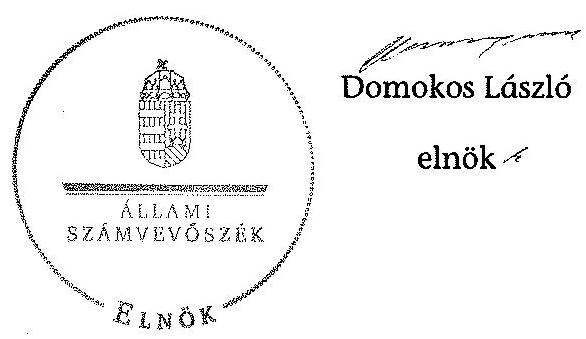

# JELENTÉS 

a helyi nemzetiségi önkormányzatok gazdálkodásának ellenőrzéséről
Erzsébetvárosi Román Nemzetiségi Önkormányzat

---

# Állami Számvevőszék 

Iktatószám: V-0253-019/2014.
Témaszám: 1287
Vizsgálat-azonosító szám: V065271

## Az ellenőrzést felügyelte:

Horváth Balázs
felügyeleti vezető
Az ellenőrzést vezette és az ellenőrzés végrehajtásáért felelős:
Korsósné Vigh Andrea
ellenőrzésvezető
A számvevőszéki jelentést készítették és a jelentés összeállításában közremúködtek:

Balogné Lehoczki Éva
számvevő
Keszthelyi Zoltán
számvevő tanácsos
Kovács Richárd
számvevő
Turai Erzsébet
számvevő
Az ellenőrzést végezte:
Kovács Richárd
számvevő

A témához kapcsolódó eddig készített számvevőszéki jelentés:
címe
sorszáma
Jelentés a Budapest Főváros VII. kerület Erzsébetváros Önkormány- 0656
zata gazdálkodási rendszerének 2006. évi átfogó ellenőrzéséről

---

# TARTALOMJEGYZÉK 

BEVEZETÉS ..... 3
I. ÖSSZEGZŐ MEGÁLLAPÍTÁSOK, KÖVETKEZTETÉSEK, JAVASLATOK ..... 6
II. RÉSZLETES MEGÁLLAPÍTÁSOK ..... 14

1. A Nemzetiségi Önkormányzat és a Települési Önkormányzat együttműködésének szabályozása, a működési feltételek biztosítása ..... 14
2. A gazdálkodási feladatok ellátásának szabályszerűsége ..... 15
2.1. A költségvetésre és a zárszámadásra, valamint a kincstári adatszolgáltatás rendjére vonatkozó jogszabályi előírások betartása ..... 15
2.2. A Nemzetiségi Önkormányzat gazdálkodásának szabályozottsága ..... 17
2.3. Az operatív gazdálkodási jogkörök kialakítása, gyakorlása ..... 18
3. A Nemzetiségi Önkormányzattal összefüggő gazdálkodási feladatok belső ellenőrzése ..... 21
4. A feladatalapú támogatás felhasználásának, elszámolásának szabályszerűsége, a Nemzetiségi Önkormányzat feladatellátása ..... 22
MELLÉKLET
5. számú A Nemzetiségi Önkormányzat 2012. évi gazdálkodásának főbb adatai, mutatói
6. számú Tájékoztatás a polgármesternek küldött el nem fogadott észrevételekről
FÜGGELÉKEK
7. számú Rövidítések jegyzéke
8. számú Értelmező szótár
9. számú A gazdálkodás értékelésének módszere

---

.

---

# JELENTÉS   a helyi nemzetiségi önkormányzatok gazdálkodásának ellenőrzéséről Erzsébetvárosi Román Nemzetiségi Önkormányzat 

## BEVEZETÉS

Az Erzsébetvárosi Román Nemzetiségi Önkormányzat 2010. évben alakult, elnöke a 2010 évi helyhatósági választások óta látja el feladatát. A Nemzetiségi Önkormányzat intézményt, gazdasági társaságot és más szervezetet nem alapított, illetve ezek társulásában nem vesz részt. A négytagú Képviselő-testület munkája segitésére bizottságot nem hozott létre. A Nemzetiségi Önkormányzatnak a költségvetési beszámolója szerint a 2012. évben a módosított költségvetési bevételi és kiadási elöirányzata 2184 ezer Ft, a teljesített költségvetési bevétel 3224 ezer Ft, a teljesített költségvetési kiadás 2273 ezer Ft volt. A 2012. évi gazdálkodási adatokat részletesen az 1. számú mellékletben mutatjuk be.

Az Alaptörvény XXIX. cikk (1) bekezdése szerint a Magyarországon élő nemzetiségek államalkotó tényezők. Minden, valamely nemzetiséghez tartozó magyar állampolgárnak joga van önazonossága szabad vállalásához és megőrzéséhez. A hazánkban élő nemzetiségek helyi (települési és területi), valamint országos önkormányzatokat hozhatnak létre. A helyi nemzetiségi önkormányzatok gazdálkodási feladatait jogszabályi előírás alapján a székhely szerinti helyi önkormányzat polgármesteri hivatala látja el.

A nemzetiségek helyzete, támogatása mind hazai, mind EU-s szinten kiemelt figyelmet kap napjainkban. A helyi nemzetiségi önkormányzatok gazdálkodására és támogatási rendszerére vonatkozó jogszabályok a 2010-2012. években jelentős változásokon mentek át. A települési és területi nemzetiségi önkormányzatok gazdálkodásának, a részükre juttatott költségvetési támogatások felhasználásának ellenőrzését az ÁSZ a 2012. évben sorozatjellegű ellenőrzés keretében indította el. A 2013. évi ellenőrzések e témacsoportos ellenőrzések folytatását jelentik, amelyet az ÁSZ 2014. első félévi ellenőrzési terve 12. témasorszámon tartalmaz.

Az ellenőrzés célja annak értékelése volt, hogy a Nemzetiségi Önkormányzat gazdálkodási kereteinek kialakítása, gazdálkodása és feladatellátása megfelelt-e a jogszabályoknak.

---

Ennek keretében értékeltük, hogy:

- a Nemzetiségi Önkormányzat és a Települési Önkormányzat együttműködésének szabályozása, a működési feltételek biztosítása megfelelte a jogszabályi előírásoknak;
- a felek együttműködése megfelelte a közöttük létrejött együttműködési megállapodásnak a gazdálkodási feladatok szabályszerú ellátása során, ennek keretében betartották-e a helyi Nemzetiségi Önkormányzat gazdálkodásához kapcsolódóan a költségvetésre és zárszámadásra, a gazdálkodás szabályozására, az operatív gazdálkodási jogkörök gyakorlására vonatkozó jogszabályi előírásokat;
- a jegyző biztosította-e a Nemzetiségi Önkormányzat gazdálkodásának belső ellenőrzését;
- a Nemzetiségi Önkormányzat feladatalapú támogatásának felhasználása, a folyósított feladatalapú támogatással történő elszámolás az előírásoknak megfelelő volt-e;
- a Nemzetiségi Önkormányzat feladatellátása összhangban volt-e a vonatkozó jogszabályi előírásokkal.

Az ellenőrzés várható hasznosulását négy szinten tervezzük. A törvényalkotás számára összegzett tapasztalatok állnak rendelkezésre a nemzetiségi önkormányzatok testületi döntéseinek, gazdálkodásának és a feladatalapú támogatás felhasználásának szabályszerűségéről, amelynek alapján következtetést lehet levonni arra, hogy indokolt-e jogszabályi módosítás kezdeményezése. Az ellenőrzés az ellenőrzött számára visszajelzést ad a működésében fellépő hiányosságokról, javaslataival hozzájárul azok kiküszöböléséhez, amely csökkentheti a későbbi ellenőrzések gyakoriságát. Az ellenőrzés megállapításai és javaslatai tanulságul szolgálhatnak más nemzetiségi önkormányzatok, szervezetek számára a rendezett gazdálkodási keretek kialakításához. A társadalom számára jelzi, hogy közpénz nem maradhat ellenőrizetlenül, az ÁSZ értékteremtő rend kialakításához és megőrzéséhez hozzájáruló tevékenysége pozitív hatással lesz a szervezetről kialakított összkép formálásában. Az ÁSZ szervezetén belül lehetőség nyílik arra, hogy a megállapítások szintetizálásával az intézmény a hozzáadott értéket teremtő elemző tevékenységét és tanácsadó szerepét erősítse.

A helyi nemzetiségi önkormányzatok gazdálkodásának ellenőrzéséről szóló jelentés I. fejezetének összegző része az ellenőrzés céljára adott rövid, szintetizáló összefoglalót és következtetéseket tartalmazza a II. fejezet részletes megállapításain alapulóan. A jelentés intézkedést igénylő megállapításait és javaslatait az összegzőben foglaltak mellett - az ellenőrzés során feltárt, a jelentés II. fejezetében rögzített részletes megállapítások alapozzák meg, illetve támasztják alá.

Az ellenőrzés típusa: szabályszerűségi ellenőrzés

---

Az ellenőrzött időszak: 2012. január 1. - 2012. december 31. közötti időszak. Az ellenőrzés kiterjedt a helyi nemzetiségi önkormányzatnak juttatott 2012. évi feladatalapú támogatás 2013. évben való elszámolására is.

Ellenőrzött szervezet: Erzsébetvárosi Román Nemzetiségi Önkormányzat és a gazdálkodási feladatait ellátó Budapest Főváros VII. Ker. Erzsébetváros Önkormányzata.

Az ellenőrzés végrehajtásának jogszabályi alapját az ÁSZ tv. 5. § (2)-(3) és (6) bekezdéseiben foglaltak képezik.

Az ellenőrzés szakmai módszertana az ÁSZ hivatalos honlapján (www.asz.hu) közzétett szakmai szabályokon alapult, amely a Legfőbb Ellenőrző Intézmények Nemzetközi Szervezete (INTOSAI) által kiadott nemzetközi standardok (ISSAI) figyelembevételével készült.

A helyi nemzetiségi önkormányzatok gazdálkodásának ellenőrzése során értékeltük a Települési Önkormányzat és a Nemzetiségi Önkormányzat együttmúködésének, a gazdálkodás szabályozottságának és a pénzügyi folyamatokban kulcsszerepet betöltő belső kontrollok (teljesítésigazolás és érvényesítés) múködésének megfelelőségét. A kulcskontrollokat a működési és felhalmozási célú támogatásértékű kiadásoknál, az államháztartáson kívülre teljesített múködési és felhalmozási célú pénzeszköz átadásoknál, a dologi kiadásokkal kapcsolatos kifizetéseknél - véletlen mintavételi eljárást alkalmazva - ellenőriztük. Ellenőriztük, hogy a jegyző biztosította-e a Nemzetiségi Önkormányzat gazdálkodásának belső ellenőrzését. Értékeltük a feladatalapú támogatások felhasználásának, elszámolásának szabályszerűségét, a Nemzetiségi Önkormányzat feladatellátása és a jogszabályi előírások összhangját. A minősítési szempontokat a 3. számú függelék tartalmazza.

Az ellenőrzés lefolytatásához a Nemzetiségi Önkormányzat és a gazdálkodási feladatait ellátó Települési Önkormányzat tanúsítványok és a kapcsolódó, dokumentumjegyzékben megjelölt dokumentumok elektronikus úton történő megküldésével, rendelkezésre bocsátásával szolgáltatott adatokat. Az adatszolgáltatás kontrollálása és szükség szerinti javítása a helyszíni ellenőrzés keretében történt.

Az ÁSZ tv. 29. § (1) bekezdése szerint a jelentéstervezetet megküldtük egyeztetésre a polgármesternek és a Nemzetiségi Önkormányzat elnökének. A Nemzetiségi Önkormányzat elnöke az ÁSZ tv. 29. § (2) bekezdésében foglalt észrevételezési jogával nem élt, a jelentéstervezetre észrevételt nem tett. A polgármester határidőben megküldött észrevétele és tájékoztatása alapján a jelentést módosítottuk, az el nem fogadott észrevételek indokolását a jelentés 2. számú melléklete tartalmazza.

---

# I. ÖSSZEGZŐ MEGÁLLAPÍTÁSOK, KÖVETKEZTETÉSEK, JAVASLATOK 

A Nemzetiségi Önkormányzat és a Települési Önkormányzat együttmúködésének szabályozása részben felelt meg a jogszabályi előírásoknak. A Nemzetiségi Önkormányzat a 2012. évben rendelkezett hatályos együttmúködési megállapodással a Települési Önkormányzattal történő együttmúködésre. Az együttműködési megállapodást - a Nek. ${ }_{2}$ tv.-ben előírt időpontig, 2012. január 31-ig - nem vizsgálták felül, annak módosítását a Nek. ${ }_{2}$ tv.-ben foglalt 2012. június 1-jei határidőn túl - a Kormányhivatal törvényességi felhívását követően - hajtották végre. A 2012. december 31-én hatályos együttmúködési megállapodásban nem rendelkeztek a Nek. ${ }_{2}$ tv. szerinti, a Nemzetiségi Önkormányzat múködésével, gazdálkodásával kapcsolatos iratkezelési feladatok ellátásáról. Az együttműködési megállapodás nem tartalmazta a Nemzetiségi Önkormányzat kötelezettségvállalásának SZMSZ-ben meghatározott szabályai közül a nyilvántartási kötelezettségeket. Nem tartalmazta továbbá a felelősök konkrét kijelölését a költségvetés előkészítésével és megalkotásával, a költségvetéssel összefüggő adatszolgáltatási kötelezettségek teljesítésével kapcsolatos határidők, együttmúködési kötelezettség vonatkozásában. Nem rögzítették az együttműködési megállapodásban a Nemzetiségi Önkormányzat önálló fizetési számla nyitásával, törzskönyvi nyilvántartásba vételével és az adószám igénylésével kapcsolatos határidőket és együttmúködési kötelezettségeket, valamint ezek felelőseinek konkrét kijelölését. A Nek. ${ }_{2}$ tv.-ben előírtak ellenére a Nemzetiségi Önkormányzat SZMSZ-ében nem rögzítették az együttműködési megállapodás szerinti múködési feltételeket annak megkötését, módosítását követő harminc napon belül. A 2012. évben megtartott négy képviselő-testületi ülés közül - a Nek. ${ }_{2}$ tv.-ben foglaltak, valamint az együttmúködési megállapodásban rögzítettek ellenére - egy esetben sem vett részt az ülésen a jegyző, vagy annak megbízottja. A Települési Önkormányzat a Nemzetiségi Önkormányzat múködésének személyi és tárgyi feltételeit a Polgármesteri Hivatal útján biztosította.

A Nemzetiségi Önkormányzat 2012. évi költségvetésének és zárszámadásának tartalma, jóváhagyása, valamint a kapcsolódó adatszolgáltatás nem felelt meg a jogszabályi előírásoknak. A Nemzetiségi Önkormányzat elnöke nem az Áht. ${ }_{2}$-ben előírt határidőn belül nyújtotta be a Képviselő-testületnek a 2012. évi költségvetési határozat tervezetét, mert azt a jegyző nem készítette el. A Polgármesteri Hivatal a Nemzetiségi Önkormányzat 2012. évi elemi költségvetéséről - az Ávr.-ben foglaltak ellenére - a költségvetési határozattervezet Képviselő-testület által történő jóváhagyása nélkül szolgáltatott adatot a Kincstárnak. A Képviselő-testület a 2012. évi költségvetést a Kormányhivatal törvényességi felhívását követően fogadta el. A Kincstárnak küldött adatszolgáltatás (elemi költségvetés) és a költségvetési határozat között a számszaki egyezőség nem volt biztosított. A költségvetési határozattervezet előterjesztésekor - az Áht. ${ }_{2}$-ben előírtak ellenére - nem mutatták be a Képviselő-testület részére tájékoztatásul szöveges indoklással együtt a költségvetési mérleget közgazdasági tagolásban és az előirányzat felhasználási tervet. A jóváhagyott költségvetési határozat - az Áht. ${ }_{2}$-ben foglaltak ellenére - nem tartalmazta a költségvetési

---

egyenleg összegét. A jegyző a 2012. évi költségvetéshez kapcsolódó kincstári adatszolgáltatási kötelezettségének öt esetben határidőn túl tett eleget. A Kép-viselő-testület a 2012. évi zárszámadási határozatot határidőn belül elfogadta. A határozattervezet előterjesztésekor az Áht. ${ }_{2}$ előirása ellenére nem mutatták be a Képviselő-testületnek tájékoztatásul a pénzeszközök változását és a vagyonkimutatást. A zárszámadás összehasonlíthatósága az elfogadott költségvetéssel nem volt biztosított, a költségvetési és a zárszámadási határozat mind szerkezetét tekintve, mind számszakilag eltért egymástól. A Nemzetiségi Önkormányzat a 2012. évi kiadásairól és bevételeiről - az Áht. ${ }_{2}$-ben foglaltak ellenére - részben számolt el. A zárszámadási határozat szövege a költségvetési beszámolóval egyezően tartalmazta a teljesített költségvetési bevétel, illetve a költségvetési kiadás főösszegét, a határozat - részletező adatokat bemutató melléklete azonban nem tartalmazta a költségvetési beszámolóban kimutatott valamennyi költségvetési kiadást és bevételt.

A Nemzetiségi Önkormányzat gazdálkodásának szabályozottsága nem volt megfelelő. A Nemzetiségi Önkormányzat a Polgármesteri Hivatal megfelelő szabályzatainak a nemzetiségi önkormányzatok gazdálkodási feladataira történő kiterjesztéséig - 2012. november 15-ig - nem rendelkezett a Bkr.-ben előírt ellenőrzési nyomvonallal, szabálytalanságok kezelésének eljárásrendjével és a folyamatba épített előzetes, utólagos és vezetői ellenőrzésről szóló szabályozással, a Számv. tv.-ben előírt leltározási és leltárkészítési szabályzattal. A Nemzetiségi Önkormányzat a 2012. évben rendelkezett - a Polgármesteri Hivatal szabályzatai hatályának kiterjesztésével, illetve önálló szabályozás útján számviteli politikával, eszközök és források értékelési szabályzatával, pénzkezelési szabályzattal. Rendelkezésre állt a Nemzetiségi Önkormányzat gazdálkodásával kapcsolatos feladat- és hatáskörökre vonatkozó, polgármesteri hivatali SZMSZ ${ }_{1,2,3}$, illetve ügyrend. A Nemzetiségi Önkormányzat rendelkezett a kötelezettségvállalás, pénzügyi ellenjegyzés, teljesítésigazolás, érvényesítés, utalványozás gyakorlásának módjával, eljárási szabályaival kapcsolatos előírásokat tartalmazó szabályzattal.

A Nemzetiségi Önkormányzat gazdálkodása tekintetében az operatív gazdálkodási jogkörök kialakítása nem felelt meg a jogszabályi előírásoknak. A gazdasági szervezettel rendelkező Polgármesteri Hivatal vonatkozásában - az Ávr.-ben foglaltak ellenére - nem jelölték ki a gazdasági vezető személyét. A jegyző úgy látott el a gazdasági vezető hatáskörébe tartozó feladatokat, hogy nem rendelkezett kijelöléssel és a kijelöléshez szükséges, az Ávr.-ben előírt képzettséggel. A pénzügyi ellenjegyzés és érvényesítés feladatok ellátására 2012. március 31-ét megelőzően adott jegyzői kijelölések megfeleltek az Ávr. előírásainak. A kijelölt személyek rendelkeztek a feladatuk ellátásához előírt képesítéssel. Az ezt követően adott kijelölések - az Ávr. módosulása következtében nem voltak jogszerűek. A Nemzetiségi Önkormányzat elnöke az Ávr.-ben foglaltaknak megfelelően írásban kijelölte a teljesítésigazolás jogkörének gyakorlására jogosult nemzetiségi önkormányzati képviselőket. Az összeférhetetlenség kizárásának szabályozási feltételét a kötelezettségvállalásra és az utalványozásra történő írásbeli felhatalmazásokkal biztosította.

A dologi kiadások bizonylatainak tesztelése alapján a teljesítésigazolás kulcskontroll megfelelően múködött, az érvényesítés kulcskontroll múködése nem volt megfelelő, a hibák száma a lényegességi szintet, a kritikus hibahatárt elér-

---

te, ezért a megfelelőségi teszt alapján a kulcskontrollok múködése összességében gyenge volt. Az érvényesítő nem szabályszerűen végezte az Ávr.-ben előírt feladatát. Nem jelezte az utalványozó felé, hogy a kötelezettségvállalási nyilvántartás számát az Ávr.-ben rögzítettek ellenére a bizonylaton nem tüntették fel, valamint, hogy a kötelezettségvállalásokról vezetett analitikus nyilvántartás és az előleg elszámolása során alkalmazott utalvány hiányosan tartalmazta az Ávr.-ben előírt tartalmi elemeket. Két esetben annak ellenére érvényesítette az előleg elszámolás keretében a bizonylatot, hogy a kifizetéshez kapcsolódó pénzkezelési gyakorlat - az előleg felvétel, elszámolás és ezek határidői tekintetében - nem felelt meg a pénzkezelésre vonatkozó belső szabályozásnak. Az ebből fakadó késedelmes számviteli elszámolás sértette a Számv. tv. előírásait, valamint a számviteli alapelvek közül a valódiság elvét. Továbbá az Szja tv.-ben előírt határidőn túl elszámolt előleg összege után az elszámolás tényleges időpontjáig számítandó kamatkedvezményt személyi jövedelemadó fizetési kötelezettség terheli. A helytelen pénzkezelési gyakorlat és a 2011. évről 2012. évre áthúzódó elszámolás hatásaként a 2012. évi költségvetési beszámoló szerinti költségvetési kiadások és bevételek összege jelentősen - az ellenőrzött bizonylatokkal összefüggésben 815 ezer Ft-tal - meghaladta a ténylegesen a 2012. évben teljesített kiadásokat és bevételeket.

A 2012. évi három legnagyobb összegű dologi kiadás bizonylatainak egyedi értékelése alapján a teljesítésigazolás kulcskontroll működése - eseti hiányosság mellett - megfelelő volt, az érvényesítés kulcskontroll nem működött megfelelően. A teljesítésigazoló egy esetben az Ávr.-ben előírtak ellenére - megfelelő dokumentum hiányában - nem ellenőrizte a kifizetések összegszerűségét. Az érvényesítés vonatkozásában a feltárt hiányosságok megegyeztek a dologi kiadások tesztelésénél tett észrevételekkel. Továbbá egy esetben - az Ávr.-ben foglaltak ellenére - az érvényesítő megfelelő dokumentumok hiányában nem ellenőrizte az összegszerűséget, valamint két esetben nem jelezte az utalványozó felé, hogy kötelezettségvállalásra - az Áht. ${ }_{1}$-ben és az Ámr.-ben foglaltak ellenére - ellenjegyzés nélkül került sor. A Nemzetiségi Önkormányzatnál a 2012. évben az államháztartáson kívülre teljesített múködési célú pénzeszközátadás teljesítése során a teljesítésigazolás kulcskontroll múködése megfelelő volt, az érvényesítés kulcskontroll nem működött megfelelően. Az érvényesítésre és a kötelezettségvállalások analitikus nyilvántartására vonatkozóan feltárt hiányosságok - a készpénzes kifizetésekkel kapcsolatos megállapítások kivételével - megegyeztek a dologi kiadások tesztelésénél tapasztaltakkal. Továbbá az érvényesítő nem jelezte az utalványozó felé, hogy a kötelezettségvállalásra az Ámr.-ben foglaltak ellenére ellenjegyzés nélkül került sor és nem kifogásolta a kiadás elszámolására vonatkozó helytelen főkönyvi számla kijelölést. A Nemzetiségi Önkormányzatnál a kulcskontrollok 2012. évi múködésében feltárt hiányosságokkal összefüggésben az ellenőrzés - a rendelkezésre bocsátott dokumentumok alapján - jogosulatlan kifizetést nem állapított meg, azonban a kulcskontrollok múködésében feltárt hiányosságok miatt nem biztosított a hibák megelőzése, feltárása és kijavítása.

A jegyző a 2012. évben biztosította a Nemzetiségi Önkormányzat gazdálkodásával összefüggő végrehajtási feladatok belső ellenőrzését. A Polgármesteri Hivatal 2012. évre vonatkozó éves ellenőrzési tervét megalapozó, a Ber.-ben előírt kockázatelemzés kiterjedt a Nemzetiségi Önkormányzat gazdálkodásával összefüggő végrehajtási feladatokra. A Polgármesteri Hivatal 2012. évre vonat-

---

kozó éves ellenőrzési terve tartalmazott belső ellenőrzési feladatot a Nemzetiségi Önkormányzat tekintetében, amelyet végrehajtottak. A Bkr.-ben foglaltaknak megfelelően az elvégzett ellenőrzésről ellenőrzési jelentés készült. A feltárt hiányosságok felszámolása érdekében a jegyző a felelősök és határidők megjelölésével intézkedési tervet készített.

A Nemzetiségi Önkormányzat a 2011. évben 812 ezer Ft feladatalapá támogatásban részesült, a 2012. évben ezen a címen támogatást nem kapott. A 2011. évben folyósított feladatalapú támogatást a tárgyévben felhasználták, illetve kötelezettségvállalással terhelték. A feladatalapú támogatás elszámolása a támogatási kormányrendelet; előírása alapján az Áht. ${ }_{1}$ rendelkezése ellenére nem történt meg. A támogatás felhasználását, elszámolását az ellenőrzésre jogosult szervek nem ellenőrizték. A Nemzetiségi Önkormányzat a 2012. évben a Képviselő-testület múködésén kívül - a tanúsítványon közölt adatok és az ellenőrzés részére átadott dokumentumok alapján - a Nek. 2 tv.-ben felsorolt kötelező közfeladatot nem látott el. Feladatellátásának tárgya az önként vállalt közfeladatok tekintetében a Nek. 2 tv. előírásaival összhangban volt. A Nemzetiségi Önkormányzat önként vállalt közfeladatot a hagyományápolás és közművelődés területeken végzett. Az önként vállalt közfeladatok ellátása keretében a Nemzetiségi Önkormányzat az Átláthatósági tv. összeférhetetlenségi előírását sértő támogatási és együttműködési megállapodást kötött. A 2012. évben nem került sor e támogatás pénzügyi teljesítésére, ezért jogosulatlan kifizetés az ellenőrzött időszakban nem volt.

Az ÁSZ tv. 33. § (1) bekezdésében foglaltak értelmében az ellenőrzött szervezet vezetője köteles a jelentésben foglalt megállapításokhoz kapcsolódó intézkedési tervet összeállítani, és azt a jelentés kézhezvételétől számított 30 napon belül az ÁSZ részére megküldeni. Amennyiben az intézkedési tervet határidőre nem küldi meg a szervezet, vagy az nem elfogadható, az ÁSZ elnöke az ÁSZ tv. 33. § (3) bekezdés a)-b) pontjaiban foglaltakat érvényesítheti.

A helyszíni ellenőrzés megállapításainak hasznosítása mellett javasoljuk:

# a jegyzőnek 

1. az együttmúködés szabályozásával kapcsolatban

A Nemzetiségi Önkormányzat és a Települési Önkormányzat együttműködését meghatározó együttműködési megállapodás nem felelt meg a Nek. 2 tv. 80. § (1) bekezdés e) pontjában és a Nek. 2 tv. 80. § (3) bekezdés a) és c) pontjaiban foglaltaknak. Az együttműködési megállapodást a felek a Nek. 2 tv. 80. § (2) bekezdésében előírt határidőn túl vizsgálták felül.

Javaslat
Az együttműködés szabályszerűsége érdekében:
a) készítse elő az együttműködési megállapodás módosítását, hogy az tartalmilag feleljen meg a Nek. 2 tv. 80. § (1) bekezdés e) pontjában, valamint a Nek. 2 tv. 80. § (3) bekezdés a) és c) pontjaiban foglaltaknak;

---

b) biztosítsa a jövőben az együttműködési megállapodás évenkénti felülvizsgálata során a Nek. ${ }_{2}$ tv. 80. § (2) bekezdésében előírt határidő betartását.
2. a költségvetés és a zárszámadás, valamint a kapcsolódó kincstári adatszolgáltatás szabályszerűségével kapcsolatban

A Nemzetiségi Önkormányzat 2012. évi költségvetéséről szóló határozattervezetet az Áht. ${ }_{2}$ 24. § (2) bekezdésében foglaltak ellenére nem a jegyző készítette el, hanem a Nemzetiségi Önkormányzat elnöke. A 2012. évi költségvetési határozattervezet előterjesztésekor - a jegyző mulasztása miatt - a Képviselő-testület részére tájékoztatásul nem mutatták be az Áht. ${ }_{2}$ 24. § (4) bekezdés a) pontjában előírt közgazdasági tagolású mérleget és az előirányzat felhasználási tervet szöveges indoklással együtt. A költségvetési határozat az Áht. ${ }_{2}$ 23. § (2) bekezdés c) pontjában foglaltak ellenére nem tartalmazta a költségvetési egyenleg összegét. A Nemzetiségi Önkormányzat elnöke a Nek. ${ }_{2}$ tv. 95. § (2) bekezdés f) pontjában előírtak ellenére a költségvetés elfogadásához kapcsolódó testületi ülésről készült jegyzőkönyvhöz nem csatolta a 2012. évi költségvetésről szóló előterjesztést. A 2012. évi zárszámadás összehasonlíthatósága az elfogadott költségvetéssel - az Áht. ${ }_{2}$ 89. § (1) bekezdésében foglaltak ellenére - nem volt biztosított. A zárszámadási határozattervezet előterjesztéskor az Áht. ${ }_{2}$ 91. § (2) bekezdés a) és c) pontjaiban foglaltak ellenére - a jegyző általi elkészítés hiányában - nem mutatták be a Képviselő-testület tájékoztatására a pénzeszközök változásáról szóló kimutatást, valamint a vagyonkimutatást. A Nemzetiségi Önkormányzat a zárszámadás során a 2012. évi kiadásairól és bevételeiről - az Áht. ${ }_{2}$ 89. § (2) bekezdése ellenére - részben számolt el. A Polgármesteri Hivatal a Nemzetiségi Önkormányzat elemi költségvetéséről az Ávr. 33. §-ában foglaltak ellenére a költségvetési határozattervezet Képviselő-testület elé terjesztése nélkül szolgáltatott adatot a Kincstárnak. A jegyző a 2012. évi költségvetéshez kapcsolódó, Nemzetiségi Önkormányzatra vonatkozó kincstári adatszolgáltatási kötelezettségének több esetben az Ávr. 33. §-ában, a 169. § (2) és a 170. § (5) bekezdéseiben előírt határidőn túl tett eleget.

Javaslat
Gondoskodjon a jövőben:
a) az Áht. ${ }_{2}$ 24. § (3) bekezdésében előírtaknak megfelelően a Nemzetiségi Önkormányzat költségvetési határozattervezetének előkészítéséről - figyelemmel az Áht. ${ }_{2}$ 23. § (2) bekezdés c) pontjában előírt tartalmi követelményre - továbbá arról, hogy az Áht. ${ }_{2}$ 24. § (4) bekezdés a) pontjában foglalt előírásnak megfelelően a költségvetési határozattervezet előterjesztésekor a Képviselő-testület részére tájékoztatásul mutassák be - szöveges indoklással - a Nemzetiségi Önkormányzat költségvetési mérlegét közgazdasági tagolásban, valamint előirányzat felhasználási tervét;
b) a zárszámadás során - az Áht. ${ }_{2}$ 89. § (2) bekezdése alapján - a Nemzetiségi Önkormányzat valamennyi kiadásáról és bevételéről történő elszámolásról, valamint arról, hogy a zárszámadási határozattervezet előterjesztésekor a Képviselőtestület részére tájékoztatásul bemutatásra kerüljön az Áht. ${ }_{2}$ 91. § (2) bekezdés a) és c) pontjaiban foglaltaknak megfelelően a pénzeszközök változása és a vagyonkimutatás;

---

c) a költségvetés és a zárszámadás Áht. 2 89. § (1) bekezdése szerinti összehasonlíthatóságának megteremtéséről;
d) a Nek. 2 tv. 95. § (2) bekezdés f) pontjában előírtak szerint a képviselő-testületi döntések előterjesztéseinek jegyzőkönyvben történő szerepeltetéséről;
e) a kincstári adatszolgáltatási kötelezettségnek az Ávr. 33. §-ában, 169. § (2) és a 170. § (5) bekezdéseiben előírt határidőben történő teljesítéséről.
3. a gazdálkodási feladatok szabályozottságával kapcsolatban

A gazdasági szervezettel rendelkező Polgármesteri Hivatal vonatkozásában a polgármesteri hivatali SZMSZ ${ }_{1,2,3}$-ban az Ávr. 11. § (2) bekezdés előírása ellenére nem jelölték ki a gazdasági vezető személyét. A jegyző úgy látott el a gazdasági vezető hatáskörébe tartozó feladatokat, hogy nem rendelkezett kijelöléssel és a kijelöléshez szükséges, az Ávr. 12. § (1) bekezdésben előírt képzettséggel.

Javaslat
Az operatív gazdálkodási jogkörök megfelelő kialakítása érdekében gondoskodjon a gazdasági vezetői álláshely betöltéséről az Ávr 11. § (8) bekezdése alapján úgy, hogy a kijelölt személy feleljen meg az Ávr. 12. § (1) bekezdése előírásának.
4. a kulcskontrollok múködésével kapcsolatban

Az érvényesítő nem szabályszerűen látta el az Ávr. 58. § (2) bekezdésében előírt feladatát, mert nem jelezte az utalványozó felé, hogy a kötelezettségvállalási nyilvántartás számát a bizonylaton nem tüntették fel, a kötelezettségvállalásokról vezetett analitikus nyilvántartás vezetése és az utalvány hiányos volt. Négy alkalommal annak ellenére érvényesítette az előleg elszámolása keretében a bizonylatokat, hogy a kifizetéshez kapcsolódó pénzkezelési gyakorlat sértette a Számv. tv. 165. § (3) bekezdésének előírásait, valamint nem felelt meg a Nemzetiségi Önkormányzat Pénztári és Pénzkezelési Szabályzata II. 3.2 és 3.4 pontjai előírásainak.

Javaslat
Az operatív gazdálkodás működési hibáinak megelőzése, feltárása és kijavítása érdekében gondoskodjon arról, hogy:
a) az érvényesítő minden esetben tegyen eleget az Ávr. 58. § (2) bekezdésében előírt ellenőrzési és jelzési kötelezettségének;
b) a Nemzetiségi Önkormányzat pénzkezelése feleljen meg a Számv. tv. 165. § (3) bekezdése, valamint a Nemzetiségi Önkormányzat Pénztári és Pénzkezelési Szabályzata II. 3.2 és 3.4 pontjai előírásainak.
5. a feladatalapú támogatás elszámolásával kapcsolatban

A 2011. évi feladatalapú támogatás elszámolása a támogatási kormányrendelet, 7. § (2) bekezdésében hivatkozott „a helyi önkormányzatok elszámolási és ellenőrzési rendjére vonatkozó" jogszabályok rendelkezései alkalmazása előírása alapján az Áht., 64. § (7) bekezdése ellenére nem történt meg.

---

Javaslat
Gondoskodjon az Áht. 2 27. § (2) bekezdésben meghatározott feladatkörében a Nemzetiségi Önkormányzat által igénybe vett feladatalapú támogatás rendeltetésszerű felhasználásáról szóló elszámolásának elkészítéséről az Áht. 2 53. § (1) bekezdése szerinti beszámolási kötelezettség teljesítéséhez.

# a polgármesternek 

1. A Nemzetiségi Önkormányzat és a Települési Önkormányzat együttműködését meghatározó együttműködési megállapodás nem felelt meg a Nek. 2 tv. 80. § (1) bekezdés e) pontjában és a Nek. 2 tv. 80. § (3) bekezdés a) és c) pontjaiban foglaltaknak.

Javaslat
Terjessze a Települési Önkormányzat Képviselő-testülete elé jóváhagyásra a Nek. 2 tv. 80. § (1) bekezdés e) pontjában, valamint a Nek. 2 tv. 80. § (3) bekezdés a) és c) pontjaiban foglalt előírások betartásával a jegyző által előkészített együttműködési megállapodás módosítását.
2. A Nemzetiségi Önkormányzat 2012. évben megtartott négy képviselő-testületi ülése közül - a Nek. 2 tv. 80. § (4) bekezdésében és az együttműködési megállapodásban előírtak ellenére - egy esetben sem vett részt a jegyző, vagy annak megbízottja.

Javaslat
A jövőben kérje számon a jegyzőtől - a Nek. 2 tv. 80. § (4) bekezdése és az együttműködési megállapodás előírása alapján - a Nemzetiségi Önkormányzat képviselőtestületi ülésein történő részvételt, vizsgálja meg a távolmaradás okait és szükség esetén intézkedjen a felelősség megállapítására.
3. A gazdasági szervezettel rendelkező Polgármesteri Hivatal vonatkozásában a polgármesteri hivatali SZMSZ $2_{1,2,3}$-ban az Ávr. 11. § (2) bekezdés előírása ellenére nem jelölték ki a gazdasági vezető személyét. A jegyző úgy látott el a gazdasági vezető hatáskörébe tartozó feladatokat, hogy nem rendelkezett kijelöléssel és a kijelöléshez szükséges, az Ávr. 12. § (1) bekezdésben előírt képzettséggel.

Javaslat
Gondoskodjon az Áht. 2 9. § (1) bekezdés c) pontja alapján a gazdasági vezető haladéktalan kinevezéséről/megbízásáról.

## a Nemzetiségi Önkormányzat elnökének

1. A Nemzetiségi Önkormányzat és a Települési Önkormányzat együttműködését meghatározó együttműködési megállapodás nem felelt meg a Nek. 2 tv. 80. § (1) bekezdés e) pontjában és a Nek. 2 tv. 80. § (3) bekezdés a) és c) pontjaiban foglaltaknak.

---

Javaslat
Terjessze a Képviselő-testület elé jóváhagyásra a Nek. ${ }_{2}$ tv. 80. § (1) bekezdés e) pontjában, valamint a Nek. ${ }_{2}$ tv. 80. § (3) bekezdés a) és c) pontjaiban foglalt előírások betartásával a jegyző által előkészített együttműködési megállapodás módosítását.
2. A Nemzetiségi Önkormányzat elnöke a 2012. évi költségvetési határozattervezetet a jegyző mulasztása miatt - nem az Áht. ${ }_{2} 24 . \S$ (2) bekezdésben előírt határidőn belül nyújtotta be a Képviselő-testület részére, az előterjesztésekor tájékoztatásul nem mutatták be az Áht. ${ }_{2} 24 . \S$ (4) bekezdés a) pontjában előírt előirányzat felhasználási tervet és költségvetési mérleget szöveges indoklással együtt. A zárszámadási határozattervezet előterjesztésekor - a jegyző általi elkészítés hiányában - az Áht. ${ }_{2} 91 . \S$ (2) bekezdés a) és c) pontjaiban foglaltak ellenére nem mutatták be a Képviselő-testület tájékoztatására a pénzeszközök változását, valamint a vagyonkimutatást.

Javaslat
Gondoskodjon a jövőben a Képviselő-testület elé terjesztésekor:
a) a jegyző által előkészített költségvetési határozattervezet Áht. ${ }_{2} 24 . \S$ (3) bekezdése szerinti benyújtási határidejének betartásáról, valamint arról, hogy a Képviselőtestület részére tájékoztatásul mutassák be az Áht. ${ }_{2} 24 . \S$ (4) bekezdés a) pontjában előírt előirányzat felhasználási tervet és költségvetési mérleget szöveges indoklással együtt;
b) a jegyző által előkészített zárszámadási határozattervezet beterjesztése mellett tájékoztatásul mutassa be az Áht. ${ }_{2} 91 . \S$ (2) bekezdés a) és c) pontjaiban előírt mérlegeket, kimutatásokat.
3. A 2011. évi feladatalapú támogatás elszámolása a támogatási kormányrendelet ${ }_{1}$ 7. § (2) bekezdésében hivatkozott „a helyi önkormányzatok elszámolási és ellenőrzési rendjére vonatkozó" jogszabályok rendelkezései alkalmazása előírása alapján az Áht. ${ }_{1}$ 64. § (7) bekezdése ellenére nem történt meg.

Javaslat
Terjessze a Képviselő-testület elé jóváhagyásra az Áht. ${ }_{2}$ 53. § (1) bekezdése szerinti beszámolási kötelezettség teljesítéséhez a Nemzetiségi Önkormányzat által igénybe vett 2011. évi feladatalapú támogatás rendeltetésszerű felhasználásáról szóló elszámolást.

---

# II. RÉSZLETES MEGÁLLAPÍTÁSOK 

## 1. A Nemzetiségi Önkormányzat és a Telepúlési Önkormányzat EGYÜTTMŰKÖDÉSÉNEK SZABÁLYOZÁSA, A MŰKÖDÉSI FELTÉTELEK BIZTOSÍTÁSA

A Nemzetiségi Önkormányzat és a Települési Önkormányzat együttmüködésének szabályozása részben felelt meg a jogszabályi előírásoknak.

A Nemzetiségi Önkormányzat rendelkezett a 2012. év folyamán hatályban lévő együttműködési megállapodással ${ }^{1}$ a Települési Önkormányzattal történő együttműködésre. A 2012. január 1-jén hatályos együttműködési megállapodást a Nek. 2 tv. 80. § (2) bekezdésében előírtak ellenére - 2012. január 31-ig nem vizsgálták felül annak ellenére, hogy a gazdálkodási szabályok változásai azt indokolták volna. A Nek. ${ }_{2}$ tv. 159. § (3) bekezdésében előírt módosítást a 2012. június 1-jei határidőn túl hajtották végre. A Kormányhivatal 2012. július 3-án² törvényességi felhívást tett a mulasztásban megnyilvánuló törvénysértés miatt, amely alapján az új, felülvizsgált és módosított együttmúködési megállapodást 2012. október 31-én írták alá.

A 2012. december 31-én hatályos együttmúködési megállapodásban egy kivétellel - megfelelően szabályozták a Nemzetiségi Önkormányzat múködési feltételeit. Az együttműködési megállapodásban nem rendelkeztek a Nek. 2 tv. 80. § (1) bekezdés e) pontja szerinti, a Nemzetiségi Önkormányzat múködésével, gazdálkodásával kapcsolatos iratkezelési feladatok ellátásáról. A Nek. 2 tv. 80. § (2) bekezdésében foglaltak ellenére a Nemzetiségi Önkormányzat SZMSZ-ében nem rögzítették az együttműködési megállapodás szerinti múködési feltételeket annak megkötését, módosítását követő harminc napon belül.

A Nemzetiségi Önkormányzat 2013 szeptemberében új SZMSZ-t³ fogadott el.
A 2012. december 31-én hatályos együttműködési megállapodás tartalmazta az Áht. ${ }_{2}$ 27. § (2) bekezdése szerinti, a Nemzetiségi Önkormányzat bevételeivel

[^0]
[^0]:    ${ }^{1}$ 2012. október 23-ig a Települési Önkormányzat Képviselő-testülete a 6/2011. (I. 7.) számú határozatával, a Képviselő-testület a 4/2011. (I. 23.) számú határozatával elfogadott együttműködési megállapodás volt érvényben. A Nek. 2 tv. előírásai alapján felülvizsgált és módosított, 2012. október 24-től hatályos együttműködési megállapodást a Települési Önkormányzat Képviselő-testülete az 542/2012. (IX. 20.) számú határozatával, a Képviselő-testület a 12/2012. (X. 18.) számú határozatával hagyta jóvá.
    ${ }^{2}$ A megbízott főigazgató V-B-004/00662-1/2012. számú levele.
    ${ }^{3}$ A Képviselő-testület 27/2013. (IX. 30.) számú határozatával elfogadott új Szervezeti és Múködési Szabályzat 2. számú melléklete a Települési Önkormányzattal kötött együttmúködési megállapodás.

---

és kiadásaival kapcsolatos feladatokat. A Nemzetiségi Önkormányzat gazdálkodási feladatai ellátásának szabályozása hiányos volt a Nek. ${ }_{2}$ tv. 80. § (3) bekezdés a) és c) pontjaiban foglaltak tekintetében, mivel nem tartalmazta:

- a felelősök konkrét kijelölését a Települési Önkormányzat és a Nemzetiségi Önkormányzat költségvetésének előkészítésével és megalkotásával, illetve a költségvetéssel összefüggő adatszolgáltatási kötelezettségek teljesítésével kapcsolatos határidők és együttmúködési kötelezettség tekintetében;
- a Nemzetiségi Önkormányzat önálló fizetési számla nyitásával, törzskönyvi nyilvántartásba vételével és az adószám igénylésével kapcsolatos határidőket és együttmúködési kötelezettségeket, valamint ezek felelőseinek konkrét megjelölését;
- a kötelezettségvállalásnak a Nemzetiségi Önkormányzat SZMSZ-ében meghatározott szabályai közül a nyilvántartási kötelezettségeket.

A 2012. december 31-én hatályos együttműködési megállapodás a Nek. ${ }_{2}$ tv. 80. § (4) bekezdésében foglaltaknak megfelelően tartalmazta, hogy a jegyző, vagy annak - a jegyzővel azonos képesítési előírásoknak megfelelő - megbízottja a Települési Önkormányzat megbízásából és képviseletében részt vesz a Nemzetiségi Önkormányzat testületi ülésein és jelzi, amennyiben törvénysértést észlel. A Nemzetiségi Önkormányzat 2012. évben megtartott négy képviselőtestületi ülés közül - a Nek. ${ }_{2}$ tv. 80. § (4) bekezdésében és az együttműködési megállapodásban előírtak ellenére - egy esetben sem vett részt a jegyző, vagy annak megbízottja.

A Települési Önkormányzat a Nemzetiségi Önkormányzat 2012. évi múködésének - Nek. ${ }_{2}$ tv. 159. § (3) bekezdésében foglalt átmeneti rendelkezés alapján a Nek. ${ }_{1}$ tv. 27. § (2)-(3) bekezdéseiben előírt - személyi és tárgyi feltételeit a Polgármesteri Hivatal útján biztosította.

# 2. A GAZDÁLKODÁSI FELADATOK ELLÁTÁSÁNAK SZABÁLYSZERŰSÉGE 

### 2.1. A költségvetésre és a zárszámadásra, valamint a kincstári adatszolgáltatás rendjére vonatkozó jogszabályi előírások betartása

A Nemzetiségi Önkormányzat 2012. évi költségvetésének és zárszámadásának tartalma, jóváhagyása, valamint a kapcsolódó adatszolgáltatás nem felelt meg a jogszabályi előírásoknak.

A Nemzetiségi Önkormányzat elnöke nem az Áht. ${ }_{2}$ 24. § (2) bekezdésében előírt határidőn ${ }^{4}$ belül nyújtotta be ${ }^{5}$ a Képviselő-testület részére a

[^0]
[^0]:    ${ }^{4}$ A jegyző által elkészített költségvetési határozat-tervezetet a nemzetiségi önkormányzat elnökének a központi költségvetésről szóló törvény kihirdetését követő negyvenötödik napig (2012. évben február 11-ig) kell benyújtania a képviselő-testületnek.
    ${ }^{5}$ A meghívó dátuma: 2012. július 1.

---

2012. évi költségvetésről szóló határozat tervezetét, mert azt a jegyzö nem készítette el ${ }^{6}$. A Polgármesteri Hivatal a Nemzetiségi Önkormányzat 2012. évi elemi költségvetéséről - az Ávr. 33. § ellenére - a költségvetési határozattervezet Képviselő-testület által történő jóváhagyása nélkül, 2012. március 13-án szolgáltatott adatot a Kincstárnak. A költségvetésről szóló határozatot ${ }^{7}$ a Nemzetiségi Önkormányzat elnöke által elkészített határozati javaslat alapján - 2012. július 8-án fogadta el a Képviselő-testület, miután a Kormányhivatal törvényességi felhívást tett a mulasztásban megnyilvánuló törvénysértés miatt. Az így jóváhagyott költségvetési határozat szerkezete nem volt megfelelő, az elemi költségvetéssel nem volt összehasonlítható, adattartalma az elemi költségvetés adataival nem egyezett meg. A Nemzetiségi Önkormányzat költségvetési határozata az Áht. 2 23. § (2) bekezdés c) pontjában foglaltak ellenére nem tartalmazta a költségvetési egyenleg összegét.

A 2012. évi költségvetési határozat tervezetének előterjesztésekor - a jegyző mulasztása miatt - az Áht. 2 24. § (4) bekezdés a) pontjában előírtak ellenére nem mutatták be a Képviselő-testület részére tájékoztatásul szöveges indoklással együtt a költségvetési mérleget közgazdasági tagolásban és az előirányzat felhasználási tervet.

A Nemzetiségi Önkormányzat elnöke a Nek. 3 tv. 95. § (2) bekezdés f) pontjában előírtak ellenére a költségvetés elfogadásához kapcsolódó testületi ülésről készült jegyzőkönyvhöz nem csatolta a 2012. évi költségvetésről szóló előterjesztést.

A jegyző a 2012. évi költségvetéshez kapcsolódó, Nemzetiségi Önkormányzatra vonatkozó kincstári adatszolgáltatási kötelezettségének öt esetben - az Ávr. 33. §-ában, 169. § (2) és 170. § (5) bekezdéseiben előírt - határidőn túl tett eleget ${ }^{8}$.

A Nemzetiségi Önkormányzat a 2012. évi zárszámadási határozatot az Áht. ${ }_{2}$-ben elöirt határidőn belül elfogadta ${ }^{9}$. A határozattervezet előterjesztésére, illetve a jóváhagyott határozatra vonatkozó hiányosságok az alábbiak voltak:

- a zárszámadási határozat tervezetének előterjesztésekor - a jegyző általi elkészítés hiányában - a Képviselő-testület tájékoztatására nem mutatták be az Áht. 2 91. § (2) bekezdés a) és c) pontjaiban előírtak ellenére a pénzeszközök változását, valamint a vagyonkimutatást;
- az Áht. 2 89. § (1) bekezdésében foglaltak ellenére nem biztosították a 2012. évi zárszámadás összehasonlíthatóságát az elfogadott költségvetéssel. A zár-

[^0]
[^0]:    ${ }^{6}$ A jegyző 2012. február 29-én kelt levelében tájékoztatta a Nemzetiségi Önkormányzat elnökét a költségvetési határozat meghozatalához szükséges információkról, ennek keretében - többek között - a 2012. évi általános múködési támogatás összegéről.
    ${ }^{7}$ A Képviselő-testület 8/2012. (VII. 8.) számú határozata a 2012. évi költségvetésről.
    ${ }^{8}$ Az adatszolgáltatási kötelezettséget a jegyző egy és hét nap közötti késedelemmel teljesítette.
    ${ }^{9}$ A Képviselő-testület 6/2013. (IV. 28.) számú határozata a zárszámadásról.

---

számadási határozatban szereplő adatsorok nem voltak megfeleltethetőek a költségvetési határozatban meghatározottakkal, az elfogadott költségvetés és a zárszámadás mind szerkezetét tekintve, mind számszakilag eltért egymástól;

- a 2012. évi zárszámadási határozat - részletező adatokat bemutató - melléklete a 2012. évi költségvetési beszámoló adataihoz képest a költségvetési bevételek, illetve a költségvetési kiadások teljesítésének főösszegét 815 ezer Fttal alacsonyabb összeggel tartalmazta. A zárszámadási határozat szövege a költségvetési beszámolóval egyezően, a határozat mellékletével azonban nem azonosan tartalmazta a teljesített költségvetési bevétel, illetve a költségvetési kiadás főösszegét. A Nemzetiségi Önkormányzat a zárszámadás során a 2012. évi kiadásairól és bevételeiről - az Âht. ${ }_{2}$ 89. § (2) bekezdésében foglaltak ellenére - részben számolt el, tekintettel a határozat melléklete és szövege közötti számszaki eltérésre, illetve arra, hogy a határozat melléklete nem tartalmazta a Nemzetiségi Önkormányzat valamennyi, a költségvetési beszámolóban kimutatott kiadását és bevételét.

# 2.2. A Nemzetiségi Önkormányzat gazdálkodásának szabályozottsága 

## A Nemzetiségi Önkormányzat gazdálkodásának szabályozottsága az ellenőrzött időszakban nem volt megfelelő.

A jegyző a Nemzetiségi Önkormányzat gazdálkodását hiányosan szabályozta, mert:

- a Számv. tv. 14. § (5) bekezdés a) pontjában előírtak ellenére a Nemzetiségi Önkormányzat a Polgármesteri Hivatal leltározási és leltárkészítési szabályzatának a nemzetiségi önkormányzatok gazdálkodási feladataira történő kiterjesztéséig ${ }^{10}$ - 2012. november 15 -ig - nem rendelkezett leltározási és leltárkészítési szabályzattal;
- a Nemzetiségi Önkormányzat a Polgármesteri Hivatal belső kontroll rendszerének keretébe tartozó szabályzatai hatályának a nemzetiségi önkormányzatok gazdálkodási feladataira történő kiterjesztéséig - 2012. november 15 -ig - nem rendelkezett a Bkr. 6. § (3)-(4) bekezdéseiben előírtak ellenére ellenőrzési nyomvonallal és szabálytalanságok kezelésének eljárásrendjével, a Bkr. 8. § (2) bekezdésében foglaltak ellenére a folyamatba épített előzetes, utólagos és vezetői ellenőrzésről szóló szabályozással.

A Nemzetiségi Önkormányzat az ellenőrzött időszakban rendelkezett - a Polgármesteri Hivatal szabályzatai hatályának kiterjesztésével, illetve önálló szabályozás útján - a Számv. tv-ben előírt számviteli politikával, eszközök és források értékelési szabályzatával, pénzkezelési szabályzattal, valamint az Ávr.ben előírtaknak megfelelően a Nemzetiségi Önkormányzat gazdálkodásával

[^0]
[^0]:    ${ }^{10}$ A 20/2012. számú jegyzői intézkedés a Budapest Főváros havi befizetések. Kerületi nemzetiségi önkormányzatok vonatkozásában egyes pénzügyi tárgyú szabályzatok és eljárásrendek hatályáról.

---

kapcsolatos feladat- és hatásköröket, a hatáskörök gyakorlásának módját és az ezekre vonatkozó felelősségi szabályokat a Polgármesteri Hivatali SZMSZ ${ }_{1,2,3}{ }^{-}$ ban, illetve ügyrendben rögzítették. A Nemzetiségi Önkormányzat rendelkezett az Áht. ${ }_{2}$-ben előírt, Ávr. szerinti kötelezettségvállalás, pénzügyi ellenjegyzés, teljesítésigazolás, érvényesítés, utalványozás gyakorlásának módjával, eljárási szabályaival kapcsolatos előírásokat tartalmazó szabályzattal.

A Polgármesteri Hivatalnál a Nemzetiségi Önkormányzat gazdálkodásával kapcsolatos feladatokat ellátó köztisztviselők munkaköri leírásai tartalmazták a Nemzetiségi Önkormányzat vonatkozásában ellátandó feladatokat.

# 2.3. Az operatív gazdálkodási jogkörök kialakítása, gyakorlása 

A Nemzetiségi Önkormányzat gazdálkodása tekintetében az operatív gazdálkodási jogkörök kialakítása nem felelt meg a jogszabályi előírásoknak.

A gazdasági szervezettel ${ }^{11}$ rendelkező Polgármesteri Hivatal vonatkozásában a polgármesteri hivatali SZMSZ ${ }_{1,2,3}$-ban az Ávr. 11. § (2) bekezdés előírása ellenére nem jelölték ki a gazdasági vezető személyét. A jegyző úgy látott el a gazdasági vezető hatáskörébe tartozó feladatokat, hogy nem rendelkezett kijelöléssel és a kijelöléshez szükséges, az Ávr. 12. § (1) bekezdésben előírt képzettséggel. A pénzügyi ellenjegyzés és érvényesítés feladatok ellátására 2012. március 31-ét megelőzően adott jegyzői kijelölések megfeleltek az Ávr. előírásainak. A kijelölt személyek rendelkeztek a feladatuk ellátásához előírt képesítéssel. Az Ávr. 55. § (2) bekezdés g) pontjának és az 58. § (4) bekezdésének 2012. március 31-től hatályos módosulása a gazdasági szervezettel rendelkező polgármesteri hivatalok esetén a jegyzői kijelölés lehetőségét megszüntette, ezért a pénzügyi ellenjegyzésre és érvényesítésre ezt követően adott jegyzői felhatalmazások nem voltak jogszerúek.

A Nemzetiségi Önkormányzat elnöke az Ávr. 57. § (4) bekezdésében foglaltaknak megfelelően írásban kijelölte a teljesítésigazolás jogkörének gyakorlására jogosult nemzetiségi önkormányzati képviselöket, az összeférhetetlenség kizárásának szabályozási feltételét az Ávr. előírása alapján a Nemzetiségi Önkormányzat képviselőinek kötelezettségvállalásra és utalványozásra történő írásbeli felhatalmazásával biztosította. A felhatalmazott képviselők aláírás mintája rendelkezésre állt.

A Nemzetiségi Önkormányzatnál a 2012. évre elszámolt dologi kiadások teljesítése során - a bizonylatok tesztelése alapján - a teljesítésigazolás kulcskontroll megfelelően múködött, az érvényesítés kulcskontroll múködése nem volt megfelelő, ezért a megfelelőségi teszt alapján a kulcskontrollok müködése összességében gyenge minősítésú volt. A hibák száma az ér-

[^0]
[^0]:    ${ }^{11}$ A polgármesteri hivatali SZMSZ ${ }_{1,2,3}$-ban meghatározták a gazdasági szervezetet, amelynek feladatait több szervezeti egység (Pénzügyi Iroda, Üzemeltetési Iroda, Városgazdálkodási Iroda) látta el.

---

vényesítés kulcskontroll esetében elérte a lényegességi szintet, a kritikus hibahatárt.

- a teljesítésigazoló az Ávr. 57. § (1) bekezdésében előírt feladatát megfelelően látta el;
- az érvényesítő az Ávr. 58. § (2) bekezdésében foglaltak ellenére egy esetben nem jelezte az utalványozónak, hogy a kötelezettségvállalási nyilvántartás számát az Ávr. 59. § (3) bekezdés f) pontja ellenére a bizonylaton nem tüntették fel. Nem jelezte, hogy a Nemzetiségi Önkormányzat kötelezettségvállalásairól vezetett analitikus nyilvántartás az Ávr. 56. § (1) bekezdésében előírt tartalmi elemek közül nem tartalmazta a kötelezettségvállalást tanúsító dokumentum megnevezését, a kötelezettségvállaló nevét, a kötelezettségvállalás évek és előirányzatok szerinti megoszlását. Két esetben nem jelezte, hogy a készpénzes - elszámolási előleg terhére történő - kifizetések esetében az előleg elszámolása során alkalmazott utalvány az Ávr. 59. § (3) bekezdés c) és f) pontjaiban foglaltak ellenére nem tartalmazta a kedvezményezett megnevezését és a kötelezettségvállalás nyilvántartási számát. Két esetben annak ellenére érvényesítette az előleg elszámolása keretében a bizonylatokat, hogy a kifizetéshez kapcsolódó pénzkezelési gyakorlat - az előleg felvétel, elszámolás és ezek határidői tekintetében - nem felelt meg a belső pénzkezelési szabályozásnak. Az ebből fakadó késedelmes számviteli elszámolás sértette a Számv. tv. 15. § (3) bekezdésében foglalt valódiság elvét és a Számv. tv. 165. § (3) bekezdés a) pontjának előírásait.

A 2012. évi három legnagyobb összegű dologi kiadás bizonylatainak egyedi értékelése alapján a kifizetések teljesítését megelőzően a teljesítésigazolás kulcskontroll múködése megfelelő volt, az érvényesítés kulcskontroll nem múködött megfelelően.

Az érvényesítés vonatkozásában a feltárt hiányosságok megegyeztek a dologi kiadások tesztelésénél tett észrevételekkel. Továbbá egy tételnél az Ávr. 58. § (1) bekezdése ellenére az érvényesítő nem ellenőrizte az összegszerúséget, mivel a kötelezettségvállalás dokumentuma nem tartalmazott összeget. Két esetben az Ávr. 58. § (2) bekezdése ellenére nem jelezte az utalványozó felé, hogy kötelezettségvállalásra - az Ámr. 74. § (1) bekezdésében foglaltak ellenére - ellenjegyzés nélkül került sor.

A dologi kiadások bizonylatainak tesztelése során kettő, a három legnagyobb dologi kiadás bizonylatainak egyedi értékelése során további kettő ellenőrzött készpénzes kifizetés esetében a Nemzetiségi Önkormányzat bankszámla kivonatai és a házipénztár forgalmáról készült kimutatás alapján megállapítható volt, hogy a bankszámláról történt készpénz felvételt követően a pénz bevételezése a házipénztárba (ezzel egyidejűleg az előlegként történő felvétel és elszámolás) - a kiadások 2011. évi teljesítését követő évben - 80 napos késéssel valósult meg. A készpénz felvételt a bankszámla kivonat alapján a Pénztár átvezetési számlára könyvelték, a valóságban azonban - a pénztárba történő bevételezésig - a pénz a bankszámláról felvevő képviselőnél volt anélkül, hogy azt elszámolási előlegként felvette volna. A helytelen pénzkezelési gyakorlatból fakadó késedelmes számviteli elszámolás nem felelt meg a Számv. tv. 15. § (3) bekezdésében foglaltaknak, mely szerint „A könyvvitelben rögzített és a beszámolóban szereplő tételeknek a valóságban is megtalálhatóknak, bizonyíthatóknak, kívül-

---

állók által is megállapíthatóknak kell lenniük". Sértette a Számv. tv. 165. § (3) bekezdése a) pontjának előírásait is, amelyek szerint a gazdasági eseményeket a pénzmozgással egyidejűleg kell a könyvekben rögzíteni. Megsértették továbbá a Román Nemzetiségi Önkormányzat Pénztári és Pénzkezelési Szabályzatának előírásait, amelyek szerint „II.3.2. pont: A kiadások készpénzben történő teljesitésekor a nemzetiségi önkormányzat elnöke vagy az általa meghatalmazott nemzetiségi önkormányzat képviselője a .... Bank ... fiókjában a fizetési számlájáról felveszi a szükséges összeget és azt a házipénztárba befizeti", valamint „II.3.4. pont: Az öszszeg a házipénztárból elszámolásra kiadott elölegként kerül kifizetésre a szabályzat I.3. pontja szerint". Az Szja tv. 72. § (4) bekezdés c) pontjában szereplő előírást figyelembe véve pedig az előleg elszámolásnak - ezzel egyidejűleg a gazdasági események könyvekben történő rögzítésének - legkésőbb 30 napon belül kellett volna megtörténnie. Ellenkező esetben az előleg összege után az elszámolás tényleges időpontjáig számítandó kamatkedvezményt ${ }^{12}$ személyi jövedelemadó fizetési kötelezettség terheli.

A helytelen pénzkezelési gyakorlat és elszámolás hatásaként a 2012. évi költségvetési beszámoló szerinti - az 1. számú mellékletben bemutatott - költségvetési kiadások és bevételek összege 815 ezer Ft-tal meghaladta a 2012. évben ténylegesen teljesített kiadásokat és bevételeket. A hiányosságok következtében a ténylegesen a 2011. évben teljesített kifizetéseket a számvitelben a 2012. évben számolták el kiadásként, ami érintette a 2011. évi pénzmaradvány elszámolást, a megállapított pénzmaradvány, ezáltal a 2012. évi bevételek között kimutatott pénzmaradvány átvétel összegét, valamint a 2012. évi kiadások öszszegét, indokolatlanul növelte a 2012. évi költségvetés főösszegét.

A Nemzetiségi Önkormányzatnál a 2012. évben az államháztartáson kívülre teljesített egy múködési célú pénzeszközátadás teljesítése so-rán-a bizonylat tesztelése alapján - a teljesítésigazolás kulcskontroll müködése megfelelő volt, az érvényesítés kulcskontroll nem müködött megfelelően.

- a teljesítésigazoló az Ávr. 57. § (1) bekezdésében előírt feladatát megfelelően látta el;
- az érvényesítő az Ávr. 58. § (2) bekezdésében foglaltak ellenére nem jelezte az utalványozó felé, hogy a támogatás kötelezettségvállalására - az Ámr. 74. § (1) bekezdésében foglaltak ellenére - ellenjegyzés nélkül került sor. Nem jelezte, hogy a Nemzetiségi Önkormányzat kötelezettségvállalásairól vezetett analitikus nyilvántartás az Ávr. 56. § (1) bekezdésében előírt tartalmi elemek közül nem tartalmazta a kötelezettségvállalást tanúsító dokumentum megnevezését, a kötelezettségvállaló nevét, a kötelezettségvállalás évek és előirányzatok szerinti megoszlását. Nem kifogásolta, hogy a kifizetéshez készített utalványrendeleten a kiadás elszámolására helytelenül a „müködési célú támogatásértékü kiadások központi költségvetési szervnek" fôkönyvi számlát jelölték ki a „müködési célú pénzeszközátadás államháztartáson kivülre" főkönyvi számla helyett.

[^0]
[^0]:    ${ }^{12}$ A mindenkori jegybanki alapkamat 5\%-százalékpottal növelt mértékével számított éves kamat időarányos része.

---

A Nemzetiségi Önkormányzatnál a kulcskontrollok 2012. évi múködésében feltárt hiányosságokkal összefüggésben az ellenőrzés - a rendelkezésre bocsátott dokumentumok alapján - jogosulatlan kifizetést nem állapított meg, azonban a kulcskontrollok múködésében feltárt hiányosságok miatt nem biztosított a hibák megelőzése, feltárása és kijavítása.

# 3. A Nemzetiségi ÖNKORMÁNYZATTAI. ÖSSZEFÜGGŐ GAZDÁlKODÁSI FELADATOK BELSŐ ELLENŐRZÉSE 

A jegyző a 2012. évben biztosította a Nemzetiségi Önkormányzat gazdálkodásával összefüggő végrehajtási feladatok belső ellenőrzését. A Polgármesteri Hivatal 2012. évre vonatkozó éves ellenőrzési tervét megalapozó, a Ber. 21. § (2) bekezdésében előírt kockázatelemzés kiterjedt a Nemzetiségi Önkormányzat gazdálkodásával összefüggő végrehajtási feladatokra.

A Polgármesteri Hivatal 2012. évre vonatkozó éves ellenőrzési terve tartalmazott ellenőrzési feladatot a Nemzetiségi Önkormányzat tekintetében, amelyet a tervezettel egyezően végrehajtottak. Az ellenőrzés célja annak megállapítása volt, hogy a Nemzetiségi Önkormányzat 2011. évi és a 2012. év I. félévi múködése, gazdálkodása megfelelt-e a hatályos jogszabályi előírásoknak. A 2012. évi belső ellenőrzésről - a Bkr. 26. § f) pontjában foglaltaknak megfelelően - jelentés készült.

A belső ellenőrzési jelentés megállapításai alapján tett javaslatok a Nemzetiségi Önkormányzat 2012. évi költségvetési és zárszámadási határozat tervezetének előterjesztése, jóváhagyása során az Ávr.-ben foglalt előírások betartására, az utólagos elszámolásra felvett ( 30 napon túli) előleggel kapcsolatos, Szja tv.-ben előírt adófizetési kötelezettség elszámolására, ennek a Nemzetiségi Önkormányzat Pénzkezelési szabályzatában való rögzítésére, valamint az SZMSZ-ének felülvizsgálatára vonatkoztak. A feltárt hiányosságok ellenére a Nemzetiségi Önkormányzat gazdálkodásának folyamatában kulcsszerepet betöltő belső kontrollok múködésének megfelelőségét a belső ellenőrzés jónak ítélte meg.

A jegyző a Bkr. 28. § c) pontja és a 45. § (2) bekezdésében előírtaknak megfelelően - a végrehajtásért felelős személyek és vonatkozó határidők megjelölésével - intézkedési tervet készített.

A tervezett intézkedések között szerepelt a feltárt hiányosságok nyilvánosságra hozatala, az SZMSZ felülvizsgálata, az Ávr.-ben foglaltak alapján a „feladatmegosztás rendje" aktualizálása. Mindhárom esetben a határidőt 2013. december 31ben jelölték meg.

A belső ellenőrzési vezető a Bkr. 22. § (1) bekezdés f) pontjának megfelelően a lezárt ellenőrzési jelentést megküldte a jegyzőnek, a benne foglaltakról - a 2013. január 15-én megtartott jegyzői értekezleten - tájékoztatta a Nemzetiségi Önkormányzat elnökét.

A Települési Önkormányzat és a Nemzetiségi Önkormányzat között létrejött, 2012. évben hatályos együttmúködési megállapodások tartalmazták, hogy „Az Erzsébetvárosi Román Nemzetiségi Önkormányzat operatív gazdálkodása lebonyolítá-

---

sának ellenőrzése - a Polgármesteri Hivatal gazdálkodásának részeként - a belső ellenőrzés feladatát képezi"

# 4. A feladatalapú támogatás felhasználásáNAK, elszámolásáNAK SzABÁLYSZERÚSÉGE, a NEMZETISÉGI ÖNKORMÁNYZAT FELADATELLÁTÁSA 

A Nemzetiségi Önkormányzat a 2011. évben 812 ezer Ft feladatalapú támogatásban részesült, a 2012. évben ezen a címen támogatást nem kapott. A 2011. évben folyósított feladatalapú támogatást 2011. december 31-ig felhasználták ( 312 ezer Ft ), illetve kötelezettségvállalással terhelték ( 500 ezer Ft).

A 2011. évben teljesült 312 ezer Ft összegű kifizetés - amely három tételt foglalt magában - előlegként és kiadásként történő számviteli elszámolására a 2.3. pontban ismertetettel azonos helytelen pénzkezelési és elszámolási gyakorlat következtében a 2012. évben került sor.

A 2011. évi feladatalapú támogatás elszámolása a támogatási kormányrendelet; 7. § (2) bekezdésében hivatkozott „a helyi önkormányzatok elszámolási és ellenőrzési rendjére vonatkozó" jogszabályok rendelkezései alkalmazása előírása alapján az Áht.; 64. § (7) bekezdése ellenére nem történt meg. A feladatalapú támogatás felhasználását, elszámolását - a rendelkezésre bocsátott dokumentumok alapján - az ellenőrzésre jogosult szervek nem ellenőrizték.

A Nemzetiségi Önkormányzat a 2012. évben a Képviselő-testület működésén kívül - a tanúsítványon közölt adatok és az ellenőrzés részére átadott dokumentumok alapján - a Nek. 3 tv. 115. §-ában felsorolt kötelezö közfeladatot nem látott el. Feladatellátásnak tárgya az önként vállalt közfeladatok vonatkozásában összhangban volt a Nek. ${ }_{2}$ tv. 116. § előírásaival. A Nemzetiségi Önkormányzat önként vállalt közfeladatot a hagyományápolás és közművelődés területén végzett.

Az önként vállalt közfeladatok ellátása keretében a Nemzetiségi Önkormányzat az Átláthatósági tv. 6. § (1) bekezdés a) és e) pontjaiban szabályozott összeférhetetlenségi előirását sértő „Támogatási és Együttmüködési Megállapodás" megkötéséről döntött ${ }^{13}$, amelyben a Nemzetiségi Önkormányzat elnöke és a Képviselő-testület egy tagja, mint az összeférhetetlenséggel érintett személyek részt vettek. E megállapodást a Nemzetiségi Önkormányzat elnöke a támogató, az érintett Képviselő-testületi tag a támogatott fél részéről, annak képviseletében írta alá.

Az Átláthatósági tv. 6. § (1) bekezdés a) és e) pontjainak együttes alkalmazásával megállapítható, hogy nem részesülhet támogatásban az az egyházi jogi személy, amely ügyintéző vagy képviseleti szervének tagja a támogatás nyújtásában döntéshozó is egyidejűleg.

[^0]
[^0]:    ${ }^{13}$ A Képviselő-testület a 42/2012. (XI. 25.) számú határozatával jóváhagyott megállapodásban megnevezett egyházi jogi személy részére 1000 ezer Ft támogatásról döntött. A támogatás összegét a Képviselő-testület 57/2012. (XII. 30.) számú határozatával 900 ezer Ft-ra módosította.

---

A „Támogatási és Együttmüködési Megállapodás" alapján a 2012. évben nem került sor a támogatás pénzügyi teljesítésére, ezért jogosulatlan kifizetés az ellenőrzött időszakban nem volt.

Budapest, 2014. 0G. hó 30 nap

Melléklet: $\quad 2 \mathrm{db}$
Függelék: $\quad 3 \mathrm{db}$

---

$\cdot$
$\cdot$
$\cdot$
$\cdot$
$\cdot$
$\cdot$
$\cdot$
$\cdot$
$\cdot$
$\cdot$
$\cdot$
$\cdot$
$\cdot$
$\cdot$
$\cdot$
$\cdot$
$\cdot$
$\cdot$
$\cdot$
$\cdot$
$\cdot$
$\cdot$
$\cdot$
$\cdot$
$\cdot$
$\cdot$
$\cdot$
$\cdot$
$\cdot$
$\cdot$
$\cdot$
$\cdot$
$\cdot$
$\cdot$
$\cdot$
$\cdot$
$\cdot$
$\cdot$
$\cdot$
$\cdot$
$\cdot$
$\cdot$
$\cdot$
$\cdot$
$\cdot$
$\cdot$
$\cdot$
$\cdot$
$\cdot$
$\cdot$
$\cdot$
$\cdot$
$\cdot$
$\cdot$
$\cdot$
$\cdot$
$\cdot$
$\cdot$
$\cdot$
$\cdot$
$\cdot$
$\cdot$
$\cdot$
$\cdot$
$\cdot$
$\cdot$
$\cdot$
$\cdot$
$\cdot$

---

# A Nemzetiségi Önkormányzat 2012. évi gazdálkodásának főbb adatai, mutatói

A) Bevételek

|  Megnevezés | Eredeti | Módosított | Teljesítés  |
| --- | --- | --- | --- |
|   | elöirányzat |  |   |
|   | ezer Ft |  | megoszlás  |
|  Általános múködési támogatás | 214 | 214 | 215  |
|  Települési Önkormányzat által nyújtott támogatás | 0 | 300 | 300  |
|  Intézményi múködési bevételek | 0 | 0 | 22  |
|  Maradvány felhasználás | 0 | 1670 | 0  |
|  Előző évi múködési célú pénzmaradvány átvétel | 0 | 0 | 2687  |
|  Múködési költségvetés bevételei | 214 | 2184 | 3224  |
|  Költségvetési bevételek összesen | 214 | 2184 | 3224  |
|  Bevételek mindösszesen | 214 | 2184 | 3224  |

B) Kiadások

|  Megnevezés | Eredeti | Módosított | Teljesítés  |
| --- | --- | --- | --- |
|   | elöirányzat |  |   |
|   | ezer Ft |  | megoszlás  |
|  Személyi juttatások | 0 | 0 | 92  |
|  Munkadókat terhelő járulékok és szociális hozzájárulási adó | 0 | 0 | 92  |
|  Dologi kiadások | 0 | 1184 | 1589  |
|  Egyéb múködési célú támogatások, kiadások | 0 | 1000 | 500  |
|  Múködési kiadások összesen | 0 | 2184 | 2273  |
|  Tartalékok | 214 | 0 | 0  |
|  Költségvetési kiadások összesen | 214 | 2184 | 2273  |
|  Kiadások mindösszesen | 214 | 2184 | 2273  |

---

.

---

# TÁJÉKOZTATÁS   A POLGÁRMESTERNEK KÜLDÖTT EL NEM FOGADOTT ÉSZREVÉTELEKRŐL 

| Együttmúködési megállapodások felülvizsgálata, módosítása |  |
| :--: | :--: |
| Észrevétel | 1. A helyszini vizsgálat során az eljáró számvevők megállapították, hogy a 2012. évben hatályos a nemzetiségi önkormányzat és a Települési Önkormányzat együttmúködésének szabályozása részben felelt meg a jogszabályi elöírásoknak. A számvevőkkel folytatott szóbeli konzultáció alapján a Hivatal munkatársai előkészítették az együttmúködési megállapodás felülvizsgálatát, és az ezen felülvizsgálat alapján elkészült, 2014. évre vonatkozó együttmúködési megállapodást a Képviselő-testület 2013. december 12-i ülésén a 825/2012. (XII. 12.) számú határozatával elfogadta. Ezen dokumentum tartalmazza a jelentésben leírt és hiányolt jogszabályi előírásoknak megfelelő rendelkezéseket is. |
| Válasz | Az I/1. pontban leírt tájékoztatását arról, hogy az együttmúködési megállapodás felülvizsgálatát és módosítását elvégezték és a módosított megállapodást a Képviselő-testület 2013. december 12-én elfogadta tudomásul veszem, de a jelentéstervezet erre vonatkozó megállapítását nem módosítjuk, mert az ellenőrzött időszakban hatályos együttmúködési megállapodás nem felelt meg teljes körűen a jogszabályi előírásoknak. Az erre vonatkozó javaslatot továbbra is fenntartjuk, mert a hiányosságok megszüntetésére a 2013. évben tett intézkedések nem vehetők figyelembe az ellenőrzött időszakra vonatkozó megállapításaink során. |
| Képviselő-testületi üléseken való részvétel |  |
| Észrevétel | 2. A jelentés megállapítja, hogy a 2012. évben tartott nemzetiségi önkormányzati üléseken több esetben nem vett részt a jegyző illetve a megbízottja. Az ellenőrzést végző számvevők a helyszíni vizsgálat során, a nemzetiségi önkormányzattal foglalkozó koordinátortól nyilatkozatot kértek arra vonatkozóan, hogy mi volt az oka annak, hogy a nemzetiségi önkormányzatok ülésein nem vett részt. A koordinátorok írásban nyilatkoztak arról, hogy a távolmaradás oka az volt, hogy több alkalommal utólag értesültek a megtartott ülésekről, illetőleg azokat olyan helyen (pl.: külföldön) vagy olyan időben (pl.: hétvégén vagy a késő esti órákban) tartották, hogy a köztisztviselő munkatársak azokon nem tudtak részt venni. Erről a körülményről nem szól a jelentés, illetőleg a nemzetiségi önkormányzat elnökei számára erre vonatkozóan nem fogalmaz meg a jelentés javaslatot. |
| Válasz | Az I/2. pontban adott, a jegyzőnek illetve megbízottjának a nemzetiségi önkormányzatok testületi ülésein történő részvétele elmaradásával kapcsolatos magyarázatát tudomásul veszem, de ez alapján a jelentés megállapítását nem módosítjuk, az ezzel kapcsolatos javaslatot to- |

---

|  | vábbra is fenntartjuk, mert az ellenőrzött időszakban több alkalommal nem vett részt a jegyző, illetve megbízottja a nemzetiségi önkormányzati üléseken. A jegyzői részvételnek a nemzetiségi önkormányzat oldaláról történő biztosítása, ennek feltételei (megfelelő helyszín, időpont, előzetes meghívás) az együttmúködési megállapodásban rögzíthetők az esetleges be nem tartás következményeinek, eljárásrendjének a szabályozásával együtt. |
| :--: | :--: |
| Gazdasági vezető kijelölésének hiánya |  |
| Észrevétel | A jelentések megállapítják, hogy a gazdasági szervezettel rendelkező Polgármesteri Hivatalban az Ávr. 11. § (2) bekezdésének előirása ellenére nem jelölték ki a gazdasági vezető személyét. A jegyző úgy látott el gazdasági vezető hatáskörébe tartozó feladatokat, hogy nem rendelkezett kijelöléssel és a kijelöléshez szükséges, az Ávr. 12. § (1) bekezdésében elöirt képzettséggel. Ezen megállapítással nem értünk egyet az alábbi jogszabályhelyekben megállapított szabályozások alapján:

Magyarország helyi önkormányzatairól szóló 2011. évi CLXXXIX. Törvény 81. §-a szerint:
81. § (I) A jegyző vezeti a polgármesteri hivatalt vagy a közös önkormányzati hivatalt.
(2) A jegyzőt az aljegyzó helyettesíti, ellátja a jegyző által meghatározott feladatokat.
(3) A jegyző:
a) dönt a jogszabály által hatáskörébe utalt államigazgatási ügyekben;
b) gyakorolja a munkáltatói jogokat a polgármesteri hivatal, a közös önkormányzati hivatal köztisztviselői és munkavállalói tekintetében, továbbá gyakorolja az egyéb munkáltatói jogokat az aljegyzó tekintetében;
c) gondoskodik az önkormányzat múködésével kapcsolatos feladatok ellátásáról;
d) tanácskozási joggal vesz részt a képviselő-testület, a képviselőtestület bizottságának ülésén;
e) jelzi a képviselő-testületnek, a képviselő-testület szervének és a polgármesternek, ha a döntésük, múködésük jogszabálysértő;
félévente beszámol a képviselő-testületnek a hivatal tevékenységéről;
g) döntésre előkészíti a polgármester hatáskörébe tartozó államigazgatási ügyeket;
h) dönt azokban a hatósági ügyekben, amelyeket a polgármester ad ót;
i) dönt a hatáskörébe utalt önkormányzati és önkormányzati hatósági ügyekben;
j) a hatáskörébe tartozó ügyekben szabályozza a kiadmányozás rendjét.

A helyi önkormányzatok és szerveik, a köztársasági megbízottak, valamint egyes centrális alárendeltségú szervek feladat- és hatásköreiről szóló 1991. évi XX. törvény 140. § (1) bekezdés f) pontja szerint: |

---

f) ellátja a polgármesteri hivatal, mint költségvetési szerv operatív gazdálkodási feladatai irányítását a képviselő-testület felhatalmazása alapján.
Az államháztartásról szóló törvény végrehajtásáról szóló 368/2011. (XII. 31.) Korm. rendelet (Ávr.) 9. § (1) bekezdése, valamint 11. § (2) bekezdése alapján:
9. § (1) (...) A gazdasági szervezet feladatait indokolt esetben több szervezeti egység is elláthatja, azonban az egyes szervezeti egységek által ellátott tevékenységek között párhuzamosság nem lehet. Ilyen esetben a szervezeti egységek összességét kell gazdasági szervezetnek tekinteni.
11. § (2) Ha a gazdasági szervezet feladatait a 9. § (1) bekezdésében foglaltak szerint több szervezeti egység látja el, gazdasági vezetőnek e szervezeti egységek vezetőinek irányítását végző, ennek hiányában a szervezeti és múködési szabályzatban megjelölt személyt kell tekinteni.
A fentiek alapján Budapest Főváros VII. kerület Erzsébetváros Önkormányzatának Képviselő-testülete elfogadta a Polgármesteri Hivatal Szervezeti és Múködési Szabályzatát, melyben akként rendelkezett, hogy a Hivatal gazdasági szervezetét létrehozza oly módon, hogy annak feladatait több szervezeti egység (Pénzügyi Iroda, Üzemeltetési és Ügyviteli Iroda, valamint a Városgazdálkodási Iroda) látja el. Az egyes szervezeti egységeknek a gazdasági szervezetben meghatározott konkrét feladatait azok ügyrendje tartalmazta. A gazdasági szervezet vezetőjéről külön nem született rendelkezés, így a fentiekben hivatkozott Ávr. 11. § (2) bekezdése szerint gazdasági vezetőnek e szervezeti egységek vezetőinek irányítását végző személyt kell tekinteni. A polgármesteri hivatal esetében ez a személy csakis a jegyző lehet. Az Ávr. 12. §-a tartalmazza ugyan a gazdasági vezetőre vonatkozó képesítési követelményeket, azonban a 11. § (2) bekezdése külön kitételként nem említi, hogy a szervezeti egységek vezetőinek irányítását végző személy csak és kizárólag akkor tekinthető a gazdasági szervezet vezetőjének, ha rendelkezik a 12. §-ban meghatározott képesítési követelményekkel. Márpedig a fentiek alapján, speciálisan a polgármesteri hivataloknál, abban az esetben, ha több szervezeti egység látja el a gazdasági szervezet feladatait, akkor az azokat irányító csak a jegyző lehet, a jegyző képesítési követelményeit pedig a közszolgálati tisztségviselökről szóló 2011. évi CXCIX. törvény 247. § (1) bekezdése határozza meg.

Álláspontom szerint tehát, a vázolt jogi környezet lehetővé teszi, hogy a jegyző ellássa a gazdasági szervezet vezetője számára meghatározott feladatokat.

Válasz
Az I/3. pontban a gazdasági vezető kijelölésének hiányával és a jegyző gazdasági vezető hatáskörébe tartozó feladatellátásával kapcsolatos észrevételét nem fogadom el, a megállapítást és az erre vonatkozó javaslatot továbbra is fenntartjuk. Tekintettel arra, hogy a gazdasági vezetői teendőket egyebekben ellátó jegyző nem rendelkezett az Ávr. 12. § (2) bekezdésében előírt képesítéssel. A közszolgálati tisztségviselőkről szóló 2011. évi CXCIX tör-

---

|  | vény. 247. §-ában a jegyzői kinevezéshez előírt képesítési követelmény nem egyenértékủ és nem helyettesíthető a gazdasági vezetőre vonatkozó képesítési követelménnyel. |
| :--: | :--: |
| Költségvetési határozattervezet elkészitése |  |
| Észrevétel | A 2012. évi költségvetésről szóló határozat tervezetet nem a jegyző készítette el, valamint a Polgármesteri Hivatal a Nemzetiségi önkormányzat 2012. évi elemi költségvetéséről - az Ávr. 33. § ellenére - a költségvetési határozattervezet Képviselő-testület által történő jóváhagyása nélkül szolgáltatott adatot a Kincstárnak megállapítást a következők miatt nem fogadjuk el:   A 2012. évi költségvetés tervezéséről a jegyző a KI/53769/2011/XIV iktatószámú, 2011. október 24 -én megküldött levélben tájékoztatta a Nemzetiségi Önkormányzatot, amelyben a Nemzetiségi Önkormányzat jövő évi elképzeléseinek, terveinek megküldésére, valamint a költségvetési évre vonatkozó feladatok és bevételi források áttekintésére hívta fel a figyelmet. A levélben leírtakra a Nemzetiségi Önkormányzat részéről nem érkezett válasz. Információ hiányában - a támogatási összeg tervezett felhasználását, annak ütemezését nem ismertük - a Magyar Államkincstár (a továbbiakban: MÁK) felé történt adatszolgáltatás céltartalék soron tartalmazta a kiadásokat.   Információ a jegyző részére nem állt rendelkezésre, így ennek hiányára vezethető vissza az, hogy nem készült előirányzat-felhasználási terv.   Megjegyezni szükséges továbbá, hogy a nemzetiségi önkormányzat képviselő-testületi üléseire benyújtott előterjesztések összeállítását, előkészítését minden esetben a Polgármesteri Hivatal szervezeti egységei végezték. |
| Válasz | Észrevételét a 2012. évi költségvetési határozattervezet jegyző általi elkészítésével kapcsolatos megállapításunkra vonatkozóan nem fogadom el, a megállapítást nem módosítjuk, az erre vonatkozó javaslatot továbbra is fenntartjuk. A jegyző a helyszíni ellenőrzés időszakában írásban nyilatkozott, hogy a költségvetési határozattervezetet nem készítette el. Megállapításunkat alátámasztja továbbá, hogy a 2012. évi költségvetési előterjesztés borítóján az előterjesztés elkészítőjeként a nemzetiségi önkormányzat elnöke szerepel. |
| Kincstári adatszolgáltatási kötelezettség |  |
| Észrevétel | „A jegyző kincstári adatszolgáltatási kötelezettségének öt esetben határidőn túl tett eleget" megállapítást a következők miatt nem fogadjuk el:   Az Ávr. 33. §-a szerinti határidőn túl teljesített adatszolgáltatásra vonatkozóan:   A 2012. évi elemi költségvetésről szóló kincstári adatszolgáltatás 2012. március 9-én elkészült, „mentett állapotban" szerepel a KGR státusztörténetében. Az elkészült elemi költségvetést a KGR programból kinyomtatva 2012. március 12-ig a nemzetiségi elnökök aláírták. |

---

|  | A MÁK KGR-programban a 2012. évi költségvetés adatainak feladása Erzsébetváros Önkormányzata összesen adatállománnyal történt, vagyis nem volt mód a nemzetiségi önkormányzatok költségvetését kü-lön-külön továbbítani a MÁK információs rendszerében. Az adatok jóváhagyása 2013. március 13-án - egy nappal a határidőt követően történt, a Magyar Államkincstárral folytatott egyeztetések alapján.   Az Ávr. 169. § (2) bekezdés, valamint a 170. § (5) bekezdés szerinti határidőn túl teljesitett adatszolgáltatásra vonatkozóan:   A III. negyedéves költségvetési jelentés határideje 2012. október 20-a (szombati nap), illetve október 25-e volt. Az adatszolgáltatás (költségvetési jelentés) „mentett állapotban" szerepelt a MÁK információs rendszerében már 2012. október18-án. Az október 20-át követő első munkanap október 24-e volt. E napon a MÁK 20 óra 12 perckor történt tájékoztatása alapján, az NGM-mel folytatott egyeztetésnek megfelelően verzióváltást végzett. A költségvetési jelentést 2012. október 25-én volt lehetséges teljesitetünk. A mérlegjelentés 2012. október 25-én „mentett állapotban" szerepel a MÁK információs rendszerében. Az információs rendszeren 2012. október 27-i értesítés alapján karbantartást végeztek. Valószínú, hogy ezt követően volt lehetséges az adatszolgáltatás továbbítása. |
| :--: | :--: |
| Válasz | Észrevételét a kincstári adatszolgáltatások határidőn túli teljesítésével kapcsolatosan nem fogadom el, a jelentéstervezet megállapítását és a javaslatot továbbra is fenntartjuk, mert az adatszolgáltatás teljesítéseként - az ellenőrzött nemzetiségi önkormányzatokra egységesen - az adatszolgáltatás Kincstárnak történő továbbításának dátumát vettük figyelembe, ennek alapján túllépték az adatszolgáltatásokra vonatkozóan az Ávr.-ben előírt határidőket. |
|  | Zárszámadási határozattervezet hiányossága |
| Észrevétel | A 2012. évi zárszámadási határozattervezet hiányosságaira vonatkozó megállapítást a következők miatt nem fogadom el:   „A zárszámadási határozat tervezetének elöterjesztésekor nem mutatták be a pénzeszközök változását."   A jegyző 2013. április 17-én levélben értesítette a Nemzetiségi Önkormányzatot a 2012. évi zárszámadás testület elé történő előterjesztés szükségességéről. A levél mellékletét képezték a 2012. évi beszámoló Magyar Államkincstár felé történt adatszolgáltatás szerinti űrlapjai, amelynek része a pénzeszközök változása is. |
| Válasz | A 2012. évi zárszámadási határozattervezet hiányosságaival kapcsolatos észrevételét nem fogadom el, mert az észrevételében jelzett jegyzői levél mellékletében szereplő, 2012. évi beszámoló űrlapjait, melyeknek része a pénzeszközök változása is nem bocsátották az ellenőrzés rendelkezésére a 2012. évi zárszámadási határozattervezet előterjesztéséhez mellékletként csatolva. Ezért a jelentéstervezet megállapítását és az ehhez kapcsolódó javaslatot továbbra is fenntartjuk. |

---

| Észrevétel | „A 2012. évi zárszámadási határozat - részletezõ adatokat bemutató - melléklete a 2012. évi költségvetési beszámoló adataihoz képest a költségvetési bevételek, illetve a költségvetési kiadósok teljesitésének fóösszegét 815 ezer Ft-tal alacsonyabb összeggel tartalmazza" megállapítást nem fogadjuk el:   A Román Nemzetiségi Önkormányzat 2012. évi elemi költségvetési beszámolója, valamint zárszámadási határozata a következő bevételi és kiadási teljesítési adatokat tartalmazza:   Költségvetési bevételek összesen a 2012. évi elemi beszámoló szerint 3224 ezer Ft, a 2012. évi zárszámadási határozat szerint 3224 ezer Ft, az adatok megegyeznek.   Költségvetési kiadások összesen a 2012. évi elemi beszámoló szerint 2273 ezer Ft, a 2012. évi zárszámadási határozat szerint 2273 ezer Ft, az adatok megegyeznek. |
| :--: | :--: |
| Válasz | A 2012. évi zárszámadási határozat és annak részletezõ melléklete eltérésével kapcsolatos észrevételét nem fogadom el, a jelentéstervezet megállapításait továbbra is fenntartjuk, mert a költségvetési beszámoló és a zárszámadási határozat fó adatai ugyan megegyeznek, azonban a mellékletben és a határozatban szereplő adatok eltérnek egymástól. |
| Kötelezettségvállalás analitikus nyilvántartásának hiányossága |  |
| Észrevétel | „Nem jelezte, hogy a Nemzetiségi Önkormányzat kötelezettségvállalásairól vezetett analitikus nyilvántartás az Avr. 56. § (1) bekezdésben elöirt tartalmi elemek közül nem tartalmazta a kötelezettségvállaló nevét, a kötelezettségvállalás évek és elöirányzatok szerinti megoszlását" megállapítás nem fogadható el a következök miatt:   A Fonás-SQL integrált pénzügyi program kötelezettségvállalás modulja teljes mértékben tartalmazza a hivatkozott jogszabályi elemeket. A nyilvántartásból tetszőleges adattartalmú lista bármikor lekérdezhető. A kötelezettségvállalás évek és előirányzatok szerinti megoszlása a Polgármesteri Hivatal által vezetett nyilvántartásból megismerhető. Az adatállomány kezelhetősége érdekében a kötelezettségvállaló nevét nem rögzítették, mivel kizárólag az elnök gyakorolta a kötelezettségvállalási jogkört.   A kötelezettségvállalás analitikus nyilvántartása alkalmas arra, hogy az egyes szerződések tekintetében a szabad keret meglétéről az érvényesítő meggyőződjön. E nyilvántartás alapján a szabad költségvetési előirányzatok rendelkezésre állása is ellenőrizhető'   Megjegyezni szükséges, hogy az Avr.56. § (1) bekezdése a tartalmi előírások tekintetében módosult, ennek ellenére a Polgármesteri Hivatal változatlan részletezettséggel és tartalommal vezeti a nyilvántartást. |
| Válasz | A kötelezettségvállalásról vezetett analitikus nyilvántartás tartalmi hiányosságaira vonatkozó megállapításra tett észrevételét nem fogadom el, a jelentéstervezet megállapítását nem módosítjuk, mert a hely- |

---

| színi ellenőrzés részére átadott lekérdezés nem tartalmazta a jogszabályi előírásoknak megfelelő tartalmi elemeket. |  |
| :--: | :--: |
| Utalványrendelet tartalmi hiányosságai |  |
| Észrevétel | „Az Av́r 58. § (2) bekezdésében foglaltak ellenére egy esetben nem jelezte az utalványozónak, hogy a kötelezettségvállalás nyilvántartási számát az Ávr. 59. § (3) bekezdés f) pontja ellenére a bizonylaton nem tüntették fel, két esetben nem jelezte, hogy a készpénzes előleg elszámolása során alkalmazott utalvány az Ávr. 59. § (3) bekezdés c) és f) pontjaiban foglaltak ellenére nem tartalmazta a kedvezményezett megnevezését és a kötelezettségvállalás nyilvántartási számát" megállapítást nem fogadjuk el a következők miatt:   Az utalványrendelet az előleg elszámolás kivételével minden esetben tartalmazza a kötelezettségvállalás nyilvántartási számát, a kedvezményezett megnevezését és egyéb adatokat.   Kizárólag az előleg elszámolásnál alkalmazott „összesítő utalvány" nem tartalmazta a felsorolt adatokat, azonban a számlák rögzítése a Forrás SQL pénzügyi programban egyedileg történt, tehát az érvényesítő a program alapján ellenőrizte a kötelezettségvállalás-nyilvántartás adatait. Az előleg elszámolás utalványrendeletéhez mellékelt részletező táblázat minden esetben tartalmazta kedvezményezettekként a számlákat.   Megjegyezni szükséges, hogy a korábbi ellenőrzések elfogadták az előleg elszámolás kialakított gyakorlatát. |
| Válasz | Az előleg elszámolás során az utalványrendelet tartalmi hiányosságaival kapcsolatos megállapításunkra vonatkozó észrevételét nem fogadom el, mert az észrevételében leírtak szerint is „az utalványrendelet az előleg elszámolás kivételével minden esetben tartalmazta" a hiányolt elemeket, megállapításunk pedig csak az előleg elszámolással kapcsolatos kifizetésekre vonatkozott. Az észrevételében hivatkozott „az előleg elszámolás utalványrendeletéhez mellékelt részletező táblázatot" nem bocsátották az ellenőrzés rendelkezésére a helyszíni ellenőrzés időszakában, ezért a jelentéstervezet megállapítását nem módosítjuk. |
| Pénzkezelési gyakorlat |  |
| Észrevétel | A pénzkezelési gyakorlat nem felelt meg a belső pénzkezelési szabályzatnak...sértette a Számv. tv. 15. § (3) bekezdésében foglalt valódiság elvét és a Számv. tv. 165. § (3) bekezdés a) pontjának elöírásait" megállapítást nem fogadjuk el a következők miatt:   Valamennyi kerületi nemzetiségi önkormányzat az Áht. 84. §-a alapján önálló fizetési számlával rendelkezik. A számlák feletti rendelkezési jogosultságot kizárólag a nemzetiségi önkormányzatok által bejelentett képviselők gyakorolják. A gazdasági eseményekről (készpénz felvét, utalás) a Polgármesteri Hivatal utólag, a bankkivonat megérkezését követően szerez tudomást.   A készpénzben felvett összegekhez a nemzetiségi önkormányzatok képviselője közvetlenül a bankszámláról történő készpénz felvétellel vagy |

---

|  | a bankkártya használatával jutott hozzá. Ezen összegeknek a nemzetiségi önkormányzatok házipénztárába történő befizetése - a szabályzattal ellentétesen - késedelmesen történik.   A szabályozás szerint a bankszámláról felvett készpénzt be kell fizetni a házipénztárba, majd a házipénztárból lehetséges felvenni, és elszámolni az előleget. A Polgármesteri Hivatal a gyakorlatban ezt az eljárást -a jegyző többszöri felszólítása ellenére - nem sikerült betartatni.   A nemzetiségi önkormányzatok Pénztári és pénzkezelési szabályzatában rögzített eljárási mód betartása garantálná a számviteli és gazdálkodási (Ávr. 45-60. §) szabályok érvényesitését. E szabályok betartására, konkrétan a bankszámláról felvett összegek szabályszerú kezelésére és elszámolására történő jegyzői felhívást számos levél igazolja. Az ellenjegyzési, teljesítésigazolási, utalványozási, érvényesitési feladatot többszöri felszólítás után lehetséges végrehajtani (nyilatkozat, valamint a felszólító levelek és e-mailek a helyszíni ellenőrzés során bemutatva). |
| :--: | :--: |
| Válasz | Arra vonatkozó megállapításunkra tett észrevételét, hogy a pénzkezelési gyakorlat sértette a törvényi előírásokat nem fogadom el, a jelentéstervezet erre vonatkozó megállapítását nem módosítjuk, a javaslatot továbbra is fenntartjuk. Az észrevételében leírtak magyarázatul szolgálnak a helytelen gyakorlat alkalmazására, amit a jegyző és a pénzügyi irodavezető a helyszíni ellenőrzést végző számvevők részére 2013. november 5 -én tett nyilatkozatával megerősített. |
| A pénzügyi ellenjegyzés hiánya |  |
| Észrevétel | Az érvényesítő két esetben az Ávr. 58.§ (2) bekezdése ellenére nem jelezte az utalványozó felé, hogy kötelezettségvállalásra - az Ávr. 55 § (1) bekezdésében foglaltak ellenére - pénzügyi ellenjegyzés nélkül került sor megállapítást nem fogadjuk el a következők miatt:   A vizsgálat alá vont két legnagyobb összegű dologi kiadás tekintetében: a 115.000 Ft os tétel esetén a kötelezettségvállalásra 2011. június 20 -án, a 156.200 Ft-os tétel esetében a kötelezettségvállalásra 2011. október 3-án került sor. Az akkor hatályos, az államháztartás múködési rendjéről szóló 292/2009. (XII. 19.) Kormányrendelet nem írta elő a kötelezettségvállalás pénzügyi ellenjegyzését. A kötelezettségvállalás ellenjegyzése a kötelezettségvállalás dokumentumán (Megrendelö) az arra jogosult képviselö aláírásával megtörtént. A számla elszámolás a készpénzes előleg-felvétel alapján történt, a már ismert pénzkezelési módon. A Román Nemzetiségi Önkormányzat és Hollósi Zoltán között létrejött megrendelés hivatkozik a „küldött árajánlatnak megfelelően" szövegrésszel arra, hogy a konkrét összegben is megtörtént a megállapodás. Az észrevételhez mellékeljük a fenti árajánlatot. Fenti, pénzügyi ellenjegyzésre vonatkozó észrevétel az 500.000 Ft összegű támogatási szerződésre is vonatkozik. A Budapesti Román Ortodox Egyházközség támogatási szerződését 2011. december 18-án kötötte meg a Román Nemzetiségi Önkormányzat elnöke és az ellenjegyzésre kijelölt képviselő. |

---

| Válasz | A pénzügyi ellenjegyzés hiányára vonatkozó észrevételét részben fogadom el, a jelentéstervezet megállapításait és javaslatát továbbra is fenntartjuk, azonban a megállapításban a jogszabályi hivatkozást módosítottuk, tekintettel arra, hogy az érintett kötelezettségvállalásra 2011-ben került sor. A kötelezettségvállalás időpontjában érvényes az Államháztartásról szóló 1992. évi XXXVIII. törvény az államháztartásról 74/A. § (2) bekezdése értelmében a kötelezettségvállalásra, valamint az utalvány ellenjegyzésére a helyi nemzetiségi önkormányzat gazdálkodását végrehajtó szervének vezetője külön kormányrendelet szerinti eljárási rendben - jogosult. A 2011. december 31-ig hatályos Ámr. 74. § (1) bekezdés előírja, hogy az ellenjegyzést az ellenjegyzés dátumának és az ellenjegyzés tényére történő utalás megjelölésével, az arra jogosult személy aláírásával kell igazolni. A hivatkozott dokumentumok nem felelnek meg a kormányrendelet előírásainak, mert nem szerepel rajtuk az ellenjegyzésre történő utalás. |
| :--: | :--: |

---

# **SOLUTIONS**

## **1. (a) (i)**

### **1.1.1.1.1.1.1.1.1.1.1.2.1.2.1.3.1.4.1.5.1.6.2.1.7.2.2.3.2.4.2.5.2.6.3.3.4.7.8.9.10.11.12.13.14.15.16.2.1.8)**

## **1.1.2.1.2.1.2.1.3.1.4.2.1.5.1.6.3.2.1.6.4.1.7.8.1.8.1.9.1.10.11.12.13.14.15.16.2.1.7.3.3.4.7.8.9.10.11.12.13.14.15.16.2.1.8)**

## **1.1.3.1.1.1.1.2.1.3.1.4.2.1.5.1.6.3.2.1.6.4.1.7.8.1.8.1.9.1.10.11.12.13.14.15.16.2.1.7.3.3.4.7.8.9.10.11.12.13.14.15.16.2.1.7.3.3.4.7.8.9.10.11.12.13.14.15.16.2.1.7.3.3.4.7.8.9.10.11.12.13.14.15.16.2.1.7.3.3.4.7.8.9.10.11.12.13.14.15.16.2.1.7.3.3.4.7.8.9.10.11.12.13.14.15.16.2.1.7.3.3.4.7.8.9.10.11.12.13.14.15.16.2.1.7.3.3.4.7.8.9.10.11.12.13.14.15.16.2.1.7.3.3.4.7.8.9.10.11.12.13.14.15.16.2.1.7.3.3.4.7.8.9.10.11.12.13.14.15.16.2.1.7.3.3.4.7.8.9.10.11.12.13.14.15.16.2.1.7.3.3.4.7.8.9.10.11.12.13.14.15.16.2.1.7.3.3.4.7.8.9.10.11.12.13.14.15.16.2.1.7.3.3.4.7.8.9.10.11.12.13.14.15.16.2.1.7.3.3.4.7.8.9.10.11.12.13.14.15.16.2.1.7.3.3.4.7.8.9.10.11.12.13.14.15.16.2.1.7.3.3.4.7.8.9.10.11.12.13.14.15.16.2.1.7.3.3.4.7.8.9.10.11.12.13.14.15.16.2.1.7.3.3.4.7.8.9.10.11.12.13.14.15.16.2.1.7.3.3.4.7.8.9.10.11.12.13.14.15.16.2.1.7.3.3.4.7.8.9.10.11.12.13.14.15.16.2.1.7.3.3.4.7.8.9.10.11.12.13.14.15.16.2.1.7.3.3.4.7.8.9.10.11.12.13.14.15.16.2.1.7.3.3.4.7.8.9.10.11.12.13.14.15.16.2.1.7.3.3.4.7.8.9.10.11.12.13.14.15.16.2.1.7.3.3.4.7.8.9.10.11.12.13.14.15.16.2.1.7.3.3.4.7.8.9.10.11.12.13.14.15.16.2.1.7.3.3.4.7.8.9.10.11.12.13.14.15.16.2.1.7.3.3.4.7.8.9.10.11.12.13.14.15.16.2.1.7.3.3.4.7.8.9.10.11.12.13.14.15.16.2.1.7.3.3.4.7.8.9.10.11.12.13.14.15.16.2.1.7.3.3.4.7.8.9.10.11.12.13.14.15.16.2.1.7.3.3.4.7.8.9.10.11.12.13.14.15.16.2.1.7.3.3.4.7.8.9.10.11.12.13.14.15.16.2.1.7.3.3.4.7.8.9.10.11.12.13.14.15.16.2.1.7.3.3.4.7.8.9.10.11.12.13.14.15.16.2.1.7.3.3.4.7.8.9.10.11.12.13.14.15.16.2.1.7.3.3.4.7.8.9.10.11.12.13.14.15.16.2.1.7.3.3.4.7.8.9.10.11.12.13.14.15.16.2.1.7.3.3.4.7.8.9.10.11.12.13.14.15.16.2.1.7.3.3.4.7.8.9.10.11.12.13.14.15.16.2.1.7.3.3.4.7.8.9.10.11.12.13.14.15.16.2.1.7.3.3.4.7.8.9.10.11.12.13.14.15.16.2.1.7.3.3.4.7.8.9.10.11.12.13.14.15.16.2.1.7.3.3.4.7.8.9.10.11.12.13.14.15.16.2.1.7.3.3.4.7.8.9.10.11.12.13.14.15.16.2.1.7.3.3.4.7.8.9.10.11.12.13.14.15.16.2.1.7.3.3.4.7.8.9.10.11.12.13.14.15.16.2.1.7.3.3.4.7.8.9.10.11.12.13.14.15.16.2.1.7.3.3.4.7.8.9.10.11.12.13.14.15.16.2.1.7.3.3.4.7.8.9.10.11.12.13.14.15.16.2.1.7.3.3.4.7.8.9.10.11.12.13.14.15.16.2.1.7.3.3.4.7.8.9.10.11.12.13.14.15.16.2.1.7.3.3.4.7.8.9.10.11.12.13.14.15.16.2.1.7.3.3.4.7.8.9.10.11.12.13.14.15.16.2.1.7.3.3.4.7.8.9.10.11.12.13.14.15.16.2.1.7.3.3.4.7.8.9.10.11.12.13.14.15.16.2.1.7.3.3.4.7.8.9.10.11.12.13.14.15.16.2.1.7.3.3.4.7.8.9.10.11.12.13.14.15.16.2.1.7.3.3.4.7.8.9.10.11.12.13.14.15.16.2.1.7.3.3.4.7.8.9.10.11.12.13.14.15.16.2.1.7.3.3.4.7.8.9.10.11.12.13.14.15.16.2.1.7.3.3.4.7.8.9.10.11.12.13.14.15.16.2.1.7.3.3.4.7.8.9.10.11.12.13.14.15.16.2.1.7.3.3.4.7.8.9.10.11.12.13.14.15.16.2.1.7.3.3.4.7.8.9.10.11.12.13.14.15.16.2.1.7.3.3.4.7.8.9.10.11.12.13.14.15.16.2.1.7.3.3.4.7.8.9.10.11.12.13.14.15.16.2.1.7.3.3.4.7.8.9.10.11.12.13.14.15.16.2.1.7.3.3.4.7.8.9.10.11.12.13.14.15.16.2.1.7.3.3.4.7.8.9.10.11.12.13.14.15.16.2.1.7.3.3.4.7.8.9.10.11.12.13.14.15.16.2.1.7.3.3.4.7.8.9.10.11.12.13.14.15.16.2.1.7.3.3.4.7.8.9.10.11.12.13.14.15.16.2.1.7.3.3.4.7.8.9.10.11.12.13.14.15.16.2.1.7.3.3.4.7.8.9.10.11.12.13.14.15.16.2.1.7.3.3.4.7.8.9.10.11.12.13.14.15.16.2.1.7.3.3.4.7.8.9.10.11.12.13.14.15.16.2.1.7.3.3.4.7.8.9.10.11.12.13.14.15.16.2.1.7.3.3.4.7.8.9.10.11.12.13.14.15.16.2.1.7.3.3.4.7.8.9.10.11.12.13.14.15.16.2.1.7.3.3.4.7.8.9.10.11.12.13.14.15.16.2.1.7.3.3.4.7.8.9.10.11.12.13.14.15.16.2.1.7.3.3.4.7.8.9.10.11.12.13.14.15.16.2.1.7.3.3.4.7.8.9.10.11.12.13.14.15.16.2.1.7.3.3.4.7.8.9.10.11.12.13.14.15.16.2.1.7.3.3.4.7.8.9.10.11.12.13.14.15.16.2.1.7.3.3.4.7.8.9.10.11.12.13.14.15.16.2.1.7.3.3.4.7.8.9.10.11.12.13.14.15.16.2.1.7.3.3.4.7.8.9.10.11.12.13.14.15.16.2.1.7.3.3.4.7.8.9.10.11.12.13.14.15.16.2.1.7.3.3.4.7.8.9.10.11.12.13.14.15.16.2.1.7.3.3.4.7.8.9.10.11.12.13.14.15.16.2.1.7.3.3.4.7.8.9.10.11.12.13.14.15.16.2.1.7.3.3.4.7.8.9.10.11.12.13.14.15.16.2.1.7.3.3.4.7.8.9.10.11.12.13.14.15.16.2.1.7.3.3.4.7.8.9.10.11.12.13.14.15.16.2.1.7.3.3.4.7.8.9.10.11.12.13.14.15.16.2.1.7.3.3.4.7.8.9.10.11.12.13.14.15.16.2.1.7.3.3.4.7.8.9.10.11.12.13.14.15.16.2.1.7.3.3.4.7.8.9.10.11.12.13.14.15.16.2.1.7.3.3.4.7.8.9.10.11.12.13.14.15.16.2.1.7.3.3.4.7.8.9.10.11.12.13.14.15.16.2.1.7.3.3.4.7.8.9.10.11.12.13.14.15.16.2.1.7.3.3.4.7.8.9.10.11.12.13.14.15.16.2.1.7.3.3.4.7.8.9.10.11.12.13.14.15.16.2.1.7.3.3.4.7.8.9.10.11.12.13.14.15.16.2.1.7.3.3.4.7.8.9.10.11.12.13.14.15.16.2.1.7.3.3.4.7.8.9.10.11.12.13.14.15.16.2.1.7.3.3.4.7.8.9.10.11.12.13.14.15.16.2.1.7.3.3.4.7.8.9.10.11.12.13.14.15.16.2.1.7.3.3.4.7.8.9.10.11.12.13.14.15.16.2.1.7.3.3.4.7.8.9.10.11.12.13.14.15.16.2.1.7.3.3.4.7.8.9.10.11.12.13.14.15.16.2.1.7.3.3.4.7.8.9.10.11.12.13.14.15.16.2.1.7.3.3.4.7.8.9.10.11.12.13.14.15.16.2.1.7.3.3.4.7.8.9.10.11.12.13.14.15.16.2.1.7.3.3.4.7.8.9.10.11.12.13.14.15.16.2.1.7.3.3.4.7.8.9.10.11.12.13.14.15.16.2.1.7.3.3.4.7.8.9.10.11.12.13.14.15.16.2.1.7.3.3.4.7.8.9.10.11.12.13.14.15.16.2.1.7.3.3.4.7.8.9.10.11.12.13.14.15.16.2.1.7.3.3.4.7.8.9.10.11.12.13.14.15.16.2.1.7.3.3.4.7.8.9.10.11.12.13.14.15.16.2.1.7.3.3.4.7.8.9.10.11.12.13.14.15.16.2.1.7.3.3.4.7.8.9.10.11.12.13.14.15.16.2.1.7.3.3.4.7.8.9.10.11.12.13.14.15.16.2.1.7.3.3.4.7.8.9.10.11.12.13.14.15.16.2.1.7.3.3.4.7.8.9.10.11.12.13.14.15.16.2.1.7.3.3.4.7.8.9.10.11.12.13.14.15.16.2.1.7.3.3.4.7.8.9.10.11.12.13.14.15.16.2.1.7.3.3.4.7.8.9.10.11.12.13.14.15.16.2.1.7.3.3.4.7.8.9.10.11.12.13.14.15.16.2.1.7.3.3.4.7.8.9.10.11.12.13.14.15.16.2.1.7.3.3.4.7.8.9.10.11.12.13.14.15.16.2.1.7.3.3.4.7.8.9.10.11.12.13.14.15.16.2.1.7.3.3.4.7.8.9.10.11.12.13.14.15.16.2.1.7.3.3.4.7.8.9.10.11.12.13.14.15.16.2.1.7.3.3.4.7.8.9.10.11.12.13.14.15.16.2.1.7.3.3.4.7.8.9.10.11.12.13.14.15.16.2.1.7.3.3.4.7.8.9.10.11.12.13.14.15.16.2.1.7.3.3.4.7.8.9.10.11.12.13.14.15.16.2.1.7.3.3.4.7.8.9.10.11.12.13.14.15.16.2.1.7.3.3.4.7.8.9.10.11.12.13.14.15.16.2.1.7.3.3.4.7.8.9.10.11.12.13.14.15.16.2.1.7.3.3.4.7.8.9.10.11.12.13.14.15.16.2.1.7.3.3.4.7.8.9.10.11.12.13.14.15.16.2.1.7.3.3.4.7.8.9.10.11.12.13.14.15.16.2.1.7.3.3.4.7.8.9.10.11.12.13.14.15.16.2.1.7.3.3.4.7.8.9.10.11.12.13.14.15.16.2.1.7.3.3.4.7.8.9.10.11.12.13.14.15.16.2.1.7.3.3.4.7.8.9.10.11.12.13.14.15.16.2.1.7.3.3.4.7.8.9.10.11.12.13.14.15.16.2.1.7.3.3.4.7.8.9.10.11.12.13.14.15.16.2.1.7.3.3.4.7.8.9.10.11.12.13.14.15.16.2.1.7.3.3.4.7.8.9.10.11.12.13.14.15.16.2.1.7.3.3.4.7.8.9.10.11.12.13.14.15.16.2.1.7.3.3.4.7.8.9.10.11.12.13.14.15.16.2.1.7.3.3.4.7.8.9.10.11.12.13.14.15.16.2.1.7.3.3.4.7.8.9.10.11.12.13.14.15.16.2.1.7.3.3.4.7.8.9.10.11.12.13.14.15.16.2.1.7.3.3.4.7.8.9.10.11.12.13.14.15.16.2.1.7.3.3.4.7.8.9.10.11.12.13.14.15.16.2.1.7.3.3.4.7.8.9.10.11.12.13.14.15.16.2.1.7.3.3.4.7.8.9.10.11.12.13.14.15.16.2.1.7.3.3.4.7.8.9.10.11.12.13.14.15.16.2.1.7.3.3.4.7.8.9.10.11.12.13.14.15.16.2.1.7.3.3.4.7.8.9.10.11.12.13.14.15.16.2.1.7.3.3.4.7.8.9.10.11.12.13.14.15.16.2.1.7.3.3.4.7.8.9.10.11.12.13.14.15.16.2.1.7.3.3.4.7.8.9.10.11.12.13.14.15.16.2.1.7.3.3.4.7.8.9.10.11.12.13.14.15.16.2.1.7.3.3.4.7.8.9.10.11.12.13.14.15.16.2.1.7.3.3.4.7.8.9.10.11.12.13.14.15.16.2.1.7.3.3.4.7.8.9.10.11.12.13.14.15.16.2.1.7.3.3.4.7.8.9.10.11.12.13.14.15.16.2.1.7.3.3.4.7.8.9.10.11.12.13.14.15.16.2.1.7.3.3.4.7.8.9.10.11.12.13.14.15.16.2.1.7.3.3.4.7.8.9.10.11.12.13.14.15.16.2.1.7.3.3.4.7.8.9.10.11.12.13.14.15.16.2.1.7.3.3.4.7.8.9.10.11.12.13.14.15.16.2.1.7.3.3.4.7.8.9.10.11.12.13.14.15.16.2.1.7.3.3.4.7.8.9.10.11.12.13.14.15.16.2.1.7.3.3.4.7.8.9.10.11.12.13.14.15.16.2.1.7.3.3.4.7.8.9.10.11.12.13.14.15.16.2.1.7.3.3.4.7.8.9.10.11.12.13.14.15.16.2.1.7.3.3.4.7.8.9.10.11.12.13.14.15.16.2.1.7.3.3.4.7.8.9.10.11.12.13.14.15.16.2.1.7.3.3.4.7.8.9.10.11.12.13.14.15.16.2.1.7.3.3.4.7.8.9.10.11.12.13.14.15.16.2.1.7.3.3.4.7.8.9.10.11.12.13.14.15.16.2.1.7.3.3.4.7.8.9.10.11.12.13.14.15.16.2.1.7.3.3.4.7.8.9.10.11.12.13.14.15.16.2.1.7.3.3.4.7.8.9.10.11.12.13.14.15.16.2.1.7.3.3.4.7.8.9.10.11.12.13.14.15.16.2.1.7.3.3.4.7.8.9.10.11.12.13.14.15.16.2.1.7.3.3.4.7.8.9.10.11.12.13.14.15.16.2.1.7.3.3.4.7.8.9.10.11.12.13.14.15.16.2.1.7.3.3.4.7.8.9.10.11.12.13.14.15.16.2.1.7.3.3.4.7.8.9.10.11.12.13.14.15.16.2.1.7.3.3.4.7.8.9.10.11.12.13.14.15.16.2.1.7.3.3.4.7.8.9.10.11.12.13.14.15.16.2.1.7.3.3.4.7.8.9.10.11.12.13.14.15.16.2.1.7.3.3.4.7.8.9.10.11.12.13.14.15.16.2.1.7.3.3.4.7.8.9.10.11.12.13.14.15.16.2.1.7.3.3.4.7.8.9.10.11.12.13.14.15.16.2.1.7.3.3.4.7.8.9.10.11.12.13.14.15.16.2.1.7.3.3.4.7.8.9.10.11.12.13.14.15.16.2.1.7.3.3.4.7.8.9.10.11.12.13.14.15.16.2.1.7.3.3.4.7.8.9.10.11.12.13.14.15.16.2.1.7.3.3.4.7.8.9.10.11.12.13.14.15.16.2.1.7.3.3.4.7.8.9.10.11.12.13.14.15.16.2.1.7.3.3.4.7.8.9.10.11.12.13.14.15.16.2.1.7.3.3.4.7.8.9.10.11.12.13.14.15.16.2.1.7.3.3.4.7.8.9.10.11.12.13.14.15.16.2.1.7.3.3.4.7.8.9.10.11.12.13.14.15.16.2.1.7.3.3.4.7.8.9.10.11.12.13.14.15.16.2.1.7.3.3.4.7.8.9.10.11.12.13.14.15.16.2.1.7.3.3.4.7.8.9.10.11.12.13.14.15.16.2.1.7.3.3.4.7.8.9.10.11.12.13.14.15.16.2.1.7.3.3.4.7.8.9.10.11.12.13.14.15.16.2.1.7.3.3.4.7.8.9.10.11.12.13.14.15.16.2.1.7.3.3.4.7.8.9.10.11.12.13.14.15.16.2.1.7.3.3.4.7.8.9.10.11.12.13.14.15.16.2.1.7.3.3.4.7.8.9.10.11.12.13.14.15.16.2.1.7.3.3.4.7.8.9.10.11.12.13.14.15.16.2.1.7.3.3.4.7.8.9.10.11.12.13.14.15.16.2.1.7.3.3.4.7.8.9.10.11.12.13.14.15.16.2.1.7.3.3.4.7.8.9.10.11.12.13.14.15.16.2.1.7.3.3.4.7.8.9.10.11.12.13.14.15.16.2.1.7.3.3.4.7.8.9.10.11.12.13.14.15.16.2.1.7.3.3.4.7.8.9.10.11.12.13.14.15.16.2.1.7.3.3.4.7.8.9.10.11.12.13.14.15.16.2.1.7.3.3.4.7.8.9.10.11.12.13.14.15.16.2.1.7.3.3.4.7.8.9.10.11.12.13.14.15.16.2.1.7.3.3.4.7.8.9.10.11.12.13.14.15.16.2.1.7.3.3.4.7.8.9.10.11.12.13.14.15.16.2.1.7.3.3.4.7.8.9.10.11.12.13.14.15.16.2.1.7.3.3.4.7.8.9.10.11.12.13.14.15.16.2.1.7.3.3.4.7.8.9.10.11.12.13.14.15.16.2.1.7.3.3.4.7.8.9.10.11.12.13.14.15.16.2.1.7.3.3.4.7.8.9.10.11.12.13.14.15.16.2.1.7.3.3.4.7.8.9.10.11.12.13.14.15.16.2.1.7.3.3.4.7.8.9.10.11.12.13.14.15.16.2.1.7.3.3.4.7.8.9.10.11.12.13.14.15.16.2.1.7.3.3.4.7.8.9.10.11.12.13.14.15.16.2.1.7.3.3.4.7.8.9.10.11.12.13.14.15.16.2.1.7.3.3.4.7.8.9.10.11.12.13.14.15.16.2.1.7.3.3.4.7.8.9.10.11.12.13.14.15.16.2.1.7.3.3.4.7.8.9.10.11.12.13.14.15.16.2.1.7.3.3.4.7.8.9.10.11.12.13.14.15.16.2.1.7.3.3.4.7.8.9.10.11.12.13.14.15.16.2.1.7.3.3.4.7.8.9.10.11.12.13.14.15.16.2.1.7.3.3.4.7.8.9.10.11.12.13.14.15.16.2.1.7.3.3.4.7.8.9.10.11.12.13.14.15.16.2.1.7.3.3.4.7.8.9.10.11.12.13.14.15.16.2.1.7.3.3.4.7.8.9.10.11.12.13.14.15.16.2.1.7.3.3.4.7.8.9.10.11.12.13.14.15.16.2.1.7.3.3.4.7.8.9.10.11.12.13.14.15.16.2.1.7.3.3.4.7.8.9.10.11.12.13.14.15.16.2.1.7.3.3.4.7.8.9.10.11.12.13.14.15.16.2.1.7.3.3.4.7.8.9.10.11.12.13.14.15.16.2.1.7.3.3.4.7.8.9.10.11.12.13.14.15.16.2.1.7.3.3.4.7.8.9.10.11.12.13.14.15.16.2.1.7.3.3.4.7.8.9.10.11.12.13.14.15.16.2.1.7.3.3.4.7.8.9.10.11.12.13.14.15.16.2.1.7.3.3.4.7.8.9.10.11.12.13.14.15.16.2.1.7.3.3.4.7.8.9.10.11.12.13.14.15.16.2.1.7.3.3.4.7.8.9.10.11.12.13.14.15.16.2.1.7.3.3.4.7.8.9.10.11.12.13.14.15.16.2.1.7.3.3.4.7.8.9.10.11.12.13.14.15.16.2.1.7.3.3.4.7.8.9.10.11.12.13.14.15.16.2.1.7.3.3.4.7.8.9.10.11.12.13.14.15.16.2.1.7.3.3.4.7.8.9.10.11.12.13.14.15.16.2.1.7.3.3.4.7.8.9.10.11.12.13.14.15.16.2.1.7.3.3.4.7.8.9.10.11.12.13.14.15.16.2.1.7.3.3.4.7.8.9.10.11.12.13.14.15.16.2.1.7.3.3.4.7.8.9.10.11.12.13.14.15.16.2.1.7.3.3.4.7.8.9.10.11.12.13.14.15.16.2.1.7.3.3.4.7.8.9.10.11.12.13.14.15.16.2.1.7.3.3.4.7.8.9.10.11.12.13.14.15.16.2.1.7.3.3.4.7.8.9.10.11.12.13.14.15.16.2.1.7.3.3.4.7.8.9.10.11.12.13.14.15.16.2.1.7.3.3.4.7.8.9.10.11.12.13.14.15.16.2.1.7.3.3.4.7.8.9.10.11.12.13.14.15.16.2.1.7.3.3.4.7.8.9.10.11.12.13.14.15.16.2.1.7.3.3.4.7.8.9.10.11.12.13.14.15.16.2.1.7.3.3.4.7.8.9.10.11.12.13.14.15.16.2.1.7.3.3.4.7.8.9.10.11.12.13.14.15.16.2.1.7.3.3.4.7.8.9.10.11.12.13.14.15.16.2.1.7.3.3.4.7.8.9.10.11.12.13.14.15.16.2.1.7.3.3.4.7.8.9.10.11.12.13.14.15.16.2.1.7.3.3.4.7.8.9.10.11.12.13.14.15.16.2.1.7.3.3.4.7.8.9.10.11.12.13.14.15.16.2.1.7.3.3.4.7.8.9.10.11.12.13.14.15.16.2.1.7.3.3.4.7.8.9.10.11.12.13.14.15.16.2.1.7.3.3.14.15.16.2.1.7.3.3.4.7.8.9.10.11.12.13.14.15.16.2.1.7.3.3.4.7.8.9.10.11.12.13.14.15.16.2.1.7.3.3.4.7.8.9.10.11.12.13.14.15.16.2.1.7.3.3.16.2.1.7.3.3.14.15.16.2.1.7.3.3.16.2.1.7.3.3.16.2.1.7.3.3.16.2.1.7.3.3.16.2.1.7.3.3.16.2.1.7.3.16.2.1.7.3.3.16.2.1.7.3.3.16.2.1.7.3.16.2.1.7.3.16.2.1.7.3.3.16.2.1.7.3.16.2.1.7.3.16.2.1.7.3.17.3.17.3.17.3.17.3.17.3.17.3.16.2.1.7.3.3.16.2.1.7.3.16.2.1.7.3.16.2.1.7.3.16.2.1.7.3.16.2.1.7.3.16.2.1.7.3.16.2.1.7.3.16.2.1.7.3.16.2.1.7.3.16.2.1.7.3.16.2.1.7.3.16.2.1.7.3.16.2.1.7.3.16.2.1.7.3.16.2.1.7.3.16.2.1.7.3.16.2.1.7.3.16.2.1.7.3.16.2.1.7.3.16.2.1.7.3.16.2.1.7.3.16.2.1.7.3.16.2.1.7.3.16.2.1.7.3.16.2.1.7.3.16.2.1.7.3.16.2.1.7.3.16.2.1.7.3.16.2.1.7.3.16.2.1.7.3.16.2.1.7.3.16.2.1.7.3.16.2.1.7.3.16.2.1.7.3.16.2.1.7.3.16.2.1.7.3.16.2.1.7.3.16.2.1.7.3.16.2.1.7.3.16.2.1.7.3.16.2.1.7.3.16.2.1.7.3.16.2.1.7.3.16.2.1.7.3.16.2.1.7.3.16.2.1.7.3.16.2.1.7.3.16.2.1.7.3.16.2.1.7.3.16.2.1.7.3.16.2.1.7.3.16.2.1.7.3.16.2.1.7.3.16.2.1.7.3.16.2.1.7.3.16.2.1.7.3.16.2.1.7.3.16.2.1.7.3.16.2.1.7.3.16.2.1.7.3.16.2.1.7.3.16.2.1.7.3.16.2.1.7.3.16.2.1.7.3.16.2.1.7.3.16.2.1.7.3.16.2.1.7.3.16.2.1.7.3.16.2.1.7.3.16.2.1.7.3.16.2.1.7.3.16.2.1.7.3.16.2.1.7.3.16.2.1.7.3.16.2.1.7.3.16.2.1.7.3.16.2.1.7.3.16.2.1.7.3.16.2.1.7.3.16.2.1.7.3.16.2.1.7.3.16.2.1.7.3.16.2.1.7.3.16.2.1.7.3.16.2.1.7.3.16.2.1.7.3.16.2.1.7.3.16.2.1.7.3.16.2.1.7.3.16.2.1.7.3.16.2.1.7.3.16.2.1.7.3.16.2.1.7.3.16.2.16.2.1.7.3.16.2.16.2.16.2.1.7.3.16.2.16.2.1.7.3.16.2.16.2.1.7.3.16.2.16.2.1.7.3.16.2.1.7.3.16.2.1.7.3.16.2.1.7.3.16.2.1.7.3.16.2.

---

# RÖVIDÍTÉSEK JEGYZÉKE 

## Törvények

Alaptörvény
Áht. 1
Áht. 2
ÁSZ tv.
Átláthatósági tv.
Nek. ${ }_{1}$ tv.
Nek. ${ }_{2}$ tv.
Számv. tv.
Szja tv.

## Rendeletek

Ámr.
Ávr.
Ber.
Bkr.
támogatási kormányrendelet ${ }_{1}$
támogatási kormányrendelet ${ }_{2}$

## Szórövidítések

ÁSZ
EU
jegyzó

Képviselő-testület

Magyarország Alaptörvénye
1992. évi XXXVIII. törvény az államháztartásról (hatályos 2011. december 31-ig)
2011. évi CXCV. törvény az államháztartásról (hatályos 2011. december 31-től)

Az Állami Számvevőszékről szóló 2011. évi LXVI. törvény (hatályos 2011. július 1-jétől)
2007. évi CLXXXI. törvény a közpénzekből nyújtott támogatások átláthatóságáról
1993. évi LXXVII. törvény a nemzeti és etnikai kisebbségek jogairól (hatályos 2011. december 31-ig)
2011. évi CLXXIX. törvény a nemzetiségek jogairól (hatályos 2011. december 20-tól)
2000. évi C. törvény a számvitelről
1995. évi CXVII. törvény a személyi jövedelemadóról

292/2009. (XII. 19.) Korm. rendelet az államháztartás múködési rendjéről (hatályos 2011. december 31-ig)
368/2011. (XII. 31.) Korm. rendelet az államháztartásról szóló törvény végrehajtásáról (hatályos 2012. január 1jétől)
193/2003. (XI. 26.) Korm. rendelet a költségvetési szervek belső ellenőrzéséről (hatályos 2011. december 31-ig)
370/2011. (XII. 31.) Korm. rendelet a költségvetési szervek belső kontrollrendszeréről és belső ellenőrzéséről (hatályos 2012. január 1-jétől)
342/2010. (XII. 28.) Korm. rendelet a kisebbségi önkormányzatoknak a központi költségvetésből, valamint fejezeti kezelésű előirányzatból nyújtott támogatások feltételrendszeréről és elszámolásának rendjéről (hatályos 2012. március 6 -ig)
28/2012. (III. 6.) Korm. rendelet a nemzetiségi célú előirányzatokból nyújtott támogatások feltételrendszeréről és elszámolásának rendjéről (hatályos 2012. március 7től 2012. december 31-ig)

Állami Számvevőszék
Európai Unió
Budapest Főváros VII. Kerület Erzsébetváros Önkormányzat Képviselő-testületének Polgármesteri Hivatala jegyzője
Erzsébetvárosi Román Nemzetiségi Önkormányzat Kép-viselő-testülete

---

| Kincstár | Magyar Államkincstár |
| :--: | :--: |
| Kormányhivatal | Budapest Főváros Kormányhivatala |
| Nemzetiségi Önkormányzat | Erzsébetvárosi Román Nemzetiségi Önkormányzat |
| Nemzetiségi Önkormányzat elnöke | Erzsébetvárosi Román Nemzetiségi Önkormányzat elnöke |
| Nemzetiségi Önkormányzat SZMSZ-e | A Képviselő-testületnek a Budapest Főváros VII. Kerület Erzsébetvárosi Román Kisebbségi Önkormányzat Képvi-selő-testülete Szervezeti és Müködési Szabályzatáról szóló 17/2011. (IX. 08.) számú határozatával elfogadott SZMSZ |
| polgármester | Budapest Főváros VII. Kerület Erzsébetváros Önkormányzata polgármestere |
| Polgármesteri Hivatal | Budapest Főváros VII. Kerület Erzsébetváros Önkormányzat Képviselő-testületének Polgármesteri Hivatala |
| polgármesteri hivatali SZMSZ $_{1}$ | A Polgármesteri Hivatal 813/2011 (XI. 17.) sz. határozattal jóváhagyott Szervezeti és Müködési Szabályzata (hatályos: 2012. január 1-jétől) |
| polgármesteri hivatali SZMSZ $_{2}$ | A Polgármesteri Hivatal 123/2012. (III. 22.) határozattal jóváhagyott Szervezeti és Müködési Szabályzata |
| polgármesteri hivatali SZMSZ $_{3}$ | A Polgármesteri Hivatal 692/2012. (XII. 10.) határozattal jóváhagyott Szervezeti és Müködési Szabályzata |
| Települési Önkormányzat | Budapest Főváros VII. Ker. Erzsébetváros Önkormányzata |
| Települési Önkormányzat Képviselő-testülete | Budapest Főváros VII. Kerület Erzsébetváros Önkormányzata Képviselő-testülete |

---

# ÉRTELMEZŐ SZÓTÁR 

együttmúködési megállapodás
feladatalapú támogatás
kulcskontrollok múködési feltételek

A nemzetiségi önkormányzatnak a múködési feltételei biztosítására, továbbá a bevételeivel és a kiadásaival kapcsolatban a tervezési, gazdálkodási, ellenőrzési, finanszírozási, adatszolgáltatási és beszámolási feladatai végrehajtására a székhelye szerinti települési önkormányzattal megkötött megállapodás. (Az Áht. 66. §, a Nek. 2 tv. 80. § (2) bekezdés, valamint az Áht. 27. § (2) bekezdés alapján levezetett fogalom.)
A támogatási évben általános múködési támogatásban részesült, és a Támogatónak a Kincstárhoz intézett, a feladatalapú támogatás utalására vonatkozó rendelkező levele keltének időpontjában múködő nemzetiségi önkormányzatoknak kormányrendeletben rögzített feltételrendszer alapján nyújtható támogatás. A feladatalapú támogatás a nemzetiségi közügyeknek a nemzetiségi önkormányzatok által történő ellátását szolgálja. (A támogatási kormányrendelet ${ }_{1}$ 2. § (2) bekezdés c) pont, és a támogatási kormányrendelet ${ }_{2}$ 4. § (1) bekezdése alapján.) Teljesítés igazolása és az érvényesítés.
A települési önkormányzat által a helyi nemzetiségi önkormányzat testületi múködéséhez a 2012. évben biztosítandó feltételek: a testületi múködéshez igazodó helyiséghasználat, a postai, kézbesítési, gépelési, sokszorosítási feladatok ellátása és az ezzel járó költségek viselése. (Forrás: Nek. 1 tv. 27. § (1)-(2) bekezdései, a Nek. 2 tv. 159. § (3) bekezdésében foglalt átmeneti rendelkezés alapján)

A szabályozás szintjén - 2012. június 1-jéig megkötendő együttműködési megállapodásban - rögzítendő (és 2013. január 1-jétől a települési önkormányzat által biztosítandó) múködési feltételek a következők:

- a helyi nemzetiségi önkormányzat részére havonta igény szerint, de legalább tizenhat órában, az önkormányzati feladat ellátásához szükséges tárgyi, technikai eszközökkel felszerelt helyiség ingyenes használata, a helyiséghez, továbbá a helyiség infrastruktúrájához kapcsolódó rezsiköltségek és fenntartási költségek viselése;
- a helyi nemzetiségi önkormányzat múködéséhez (a testületi, tisztségviselői, képviselői feladatok ellátásához) szükséges tárgyi és személyi feltételek biztosítása;
- a testületi ülések előkészítése, különösen a meghívók, az előterjesztések, a testületi ülések jegyzőkönyveinek és valamennyi hivatalos levelezés előkészítése és postázása;
- a testületi döntések és a tisztségviselők döntéseinek előkészítése, a testületi és tisztségviselői döntéshozatalhoz

---

nemzetiség
nemzetiségi közügy
nemzetiségi önkormányzat
operatív gazdálkodási jogkörök
kapcsolódó nyilvántartási, sokszorosítási, postázási feladatok ellátása;

- a helyi nemzetiségi önkormányzat múködésével, gazdálkodásával kapcsolatos nyilvántartási, iratkezelési feladatok ellátása;
- az előzőekben meghatározott feladatellátáshoz kapcsolódó költségek viselése a helyi nemzetiségi önkormányzat tagja és tisztségviselője telefonhasználata költségeinek kivételével.
(Forrás: Nek. 2 tv. 80. § (2) bekezdése a Nek. 2 tv. 159. § (3) bekezdésében foglalt átmeneti rendelkezés alapján)

Minden olyan Magyarország területén legalább egy évszázada honos népcsoport, amely az állam lakossága körében számszerú kisebbségben van, a lakosság többi részétől saját nyelve, kultúrája és hagyományai különböztetik meg, egyben olyan összetartozás-tudatról tesz bizonyságot, amely mindezek megőrzésére, történelmileg kialakult közösségeik érdekeinek kifejezésére és védelmére irányul. (A Nek. 2 tv. 1. § (1) bekezdése alapján levezetett fogalom.)
Az egyéni és közösségi jogok érvényesülése, a nemzetiséghez tartozók érdekeinek kifejezésre juttatása - különösen az anyanyelv ápolása, őrzése és gyarapítása, továbbá a nemzetiségek kulturális autonómiájának a nemzetiségi önkormányzatok által történő megvalósítása és megőrzése - érdekében a nemzetiséghez tartozók meghatározott közszolgáltatásokkal való ellátásával, ezen ügyek önálló vitelével és az ehhez szükséges szervezeti, személyi és anyagi feltételek megteremtésével összefüggő ügy. A közhatalmat gyakorló állami és helyi önkormányzati szervekben, továbbá a nemzetiségi önkormányzati szervekben való nemzetiségi képviselethez és mindezek szervezeti, személyi és anyagi feltételeinek biztosításához kapcsolódó ügy. (Nek. 2 tv. 2. § 1. pontjából levezetett fogalom.)
Törvényben meghatározott nemzetiségi közszolgáltatási feladatokat ellátó, testületi formában múködő, jogi személyiséggel rendelkező, demokratikus választások útján, törvény alapján létrehozott szervezet, amely a nemzetiségi közösséget megillető jogosultságok érvényesítésére, a nemzetiségek érdekeinek védelmére és képviseletére, a feladat- és hatáskörébe tartozó nemzetiségi közügyek települési, területi vagy országos szinten történő önálló intézésére jön létre. (A Nek. 2 tv. 2. § 2. pontjából levezetett fogalom.)
A kötelezettségvállalás, a pénzügyi ellenjegyzés, az utalványozás, az érvényesítés és a teljesítésigazolás.
(Forrás: Áht. 2 36-38. §-ai és az Ávr. 52-60. §-ai)

---

# A GAZDÁLKODÁS ÉRTÉKELÉSÉNEK MÓDSZERE 

A helyi nemzetiségi önkormányzatok gazdálkodásának ellenőrzése keretében az önkormányzat gazdálkodása kereteinek kialakítása, gazdálkodása megfelelőségének minősítéséhez az alábbi területeket értékeltük:

- a helyi nemzetiségi önkormányzat és a helyi önkormányzat együttmúködése szabályozását, az együttmúködési megállapodásban előírt múködési feltételek biztosítását;
- a helyi nemzetiségi önkormányzat jóváhagyott költségvetésére, zárszámadására, továbbá a kincstári adatszolgáltatás rendjére vonatkozó jogszabályi előírások betartását;
- a helyi nemzetiségi önkormányzatra vonatkozó gazdálkodási szabályzatok jogszabályi előírások szerinti rendelkezésre állását;
- a helyi nemzetiségi önkormányzat gazdálkodása tekintetében az operatív gazdálkodási jogkörök kialakítása jogszabályi előírásoknak történő megfelelését;
- a helyi nemzetiségi önkormányzattal összefüggő feladatalapú támogatás felhasználása és elszámolása jogszabályi előírásoknak való megfelelését;
- a helyi nemzetiségi önkormányzattal összefüggő gazdálkodási feladatok tekintetében a jogszabályokban előírt belső ellenőrzés biztosítását.

A helyi nemzetiségi önkormányzat gazdálkodását az ellenőrzési program munkalapjain a hat területhez kapcsolódóan feltett kérdésekre adott válaszok alapján értékeltük. A kérdésekhez rendelt súlyozott pontszámok alapján elért összérték a megszerezhető maximális pontszám százalékában került kimutatásra. Ennek figyelembevételével kialakított minősítések a következőek voltak:

| Nem megfelelő: | $0-60 \%$ |
| :-- | :-- |
| Részben megfelelő: | $61-80 \%$ |
| Megfelelő: | $81 \%$-tól |

A pénzügyi folyamatok belső kontrolljának ellenőrzése keretében a pénzügyi folyamatokban kulcsszerepet betöltő belső kontrollok - a teljesítésigazolás és az érvényesítés - múködésének megfelelőségét értékeltük. A kulcskontrollok múködésének értékeléséhez a kritériumokat jogszabályok határozták meg. A kulcskontrollok működése megfelelőségének értékelése tekintetében lényeges minden olyan hiba, amely gátolja, hogy a kontrolltevékenység eredményesen működjön.

A két kulcskontroll múködése megfelelőségének ellenőrzéséhez a dologi és egyéb folyó kiadások könyvviteli tételeiből szekvenciális (megállásos) mintavé-

---

teli eljárással választottuk ki az ellenőrizendő tételeket. A kulcskontrollok megfelelőségének vizsgálata keretében a számvevő bizonyosságot szerez arról, hogy a rendelkezésre álló szabályozás és dokumentumok alapján a teljesítésigazoláshoz és az érvényesítéshez szükséges ellenőrzési lépéseket végrehajtották-e.

A kulcskontrollok működése „kiváló", „jó" vagy „gyenge" minősítést kaphatott. A munkalapon feltett kérdésekhez rendelt súlyozott pontszámok alapján elért összérték a megszerezhető maximális pontszám százalékában került kimutatásra, mely alapján kialakított minősítések a következőek voltak:

| gyenge: | $0-70 \%$ |
| :-- | --: |
| jó: | $71-90 \%$ |
| kiváló: | $91 \%$-tól |

A kulcskontrollok múködését:

- kiválónak értékeltük abban az esetben, ha azok múködése megfelel a hibák megelőzésére és kijavítására meghatározott szabályozásnak, valamint a legmagasabb szintű elvárásoknak;
- jónak minősítettük, ha a megállapított kisebb, tolerálható mértékű hiányosságok nem veszélyeztetik az ellenőrzött területek hibáinak megelőzését és kijavítását;
- gyengének értékeltük, amennyiben a kontrollok múködésében túl sok hiányosság fordul elő ahhoz, hogy a kontrollok biztosítsák a hibák megelőzését, feltárását, kijavítását.