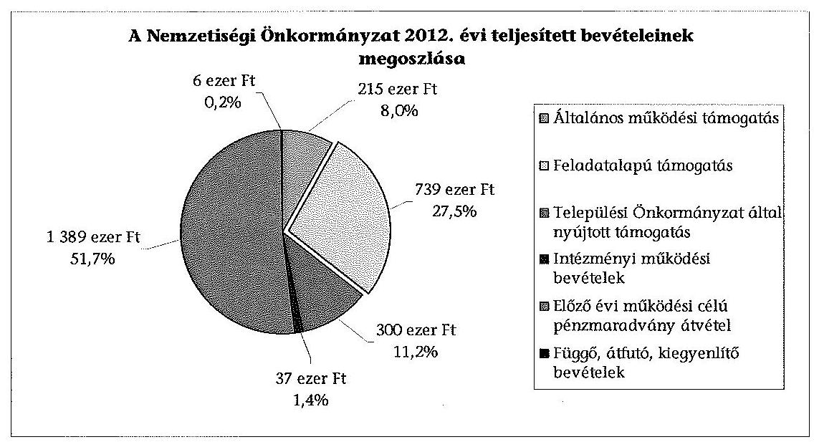
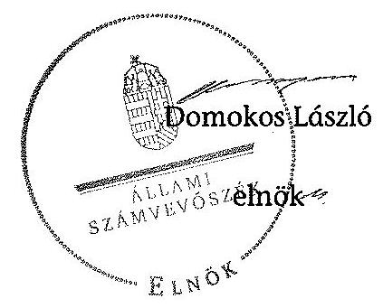

# JELENTÉS 

a helyi nemzetiségi önkormányzatok gazdálkodásának ellenőrzéséről
Erzsébetvárosi Szerb Nemzetiségi Önkormányzat

---

# Állami Számvevőszék 

Iktatószám: V-0255-014/2014.
Témaszám: 1289
Vizsgálat-azonosító szám: V065273

## Az ellenőrzést felügyelte:

Horváth Balázs
felügyeleti vezető
Az ellenőrzést vezette és az ellenőrzés végrehajtásáért felelős:
Korsósné Vigh Andrea
ellenőrzésvezető
A számvevőszéki jelentést készítették és a jelentés összeállításában
közreműködtek:
Balogné Lehoczki Éva
számvevő
Kovács Richárd
számvevő
Temesváry Miklós
számvevő tanácsos
Turai Erzsébet
számvevő
Az ellenőrzést végezte:
Kovács Richárd
számvevő
Laczi Hedvig Anna
számvevő

A témához kapcsolódó eddig készített számvevőszéki jelentés:
címe
sorszáma
Jelentés a Budapest Főváros VII. kerület Erzsébetváros Önkormány- 0656
zata gazdálkodási rendszerének 2006. évi átfogó ellenőrzéséről

---

# TARTALOMJEGYZÉK 

BEVEZETÉS ..... 3
I. ÖSSZEGZŐ MEGÁLLAPÍTÁSOK, KÖVETKEZTETÉSEK, JAVASLATOK ..... 6
II. RÉSZLETES MEGÁLLAPÍTÁSOK ..... 14

1. A Nemzetiségi Önkormányzat és a Települési Önkormányzat együttműködésének szabályozása, a működési feltételek biztosítása ..... 14
2. A gazdálkodási feladatok ellátásának szabályszerűsége ..... 15
2.1. A költségvetésre és a zárszámadásra, valamint a kincstári adatszolgáltatás rendjére vonatkozó jogszabályi előírások betartása ..... 15
2.2. A Nemzetiségi Önkormányzat gazdálkodásának szabályozottsága ..... 16
2.3. Az operatív gazdálkodási jogkörök kialakítása, gyakorlása ..... 17
3. A Nemzetiségi Önkormányzattal összefüggő gazdálkodási feladatok belső ellenőrzése ..... 20
4. A feladatalapú támogatás felhasználásának, elszámolásának szabályszerűsége, a Nemzetiségi Önkormányzat feladatellátása ..... 21

## MELLÉKLET

1. számú A Nemzetiségi Önkormányzat 2012. évi gazdálkodásának főbb adatai, mutatói
2. számú Tájékoztatás a polgármesternek küldött el nem fogadott észrevételekről

## FÜGGELÉKEK

1. számú Rövidítések jegyzéke
2. számú Értelmező szótár
3. számú A gazdálkodás értékelésének módszere

---

.

---

# JELENTÉS   a helyi nemzetiségi önkormányzatok gazdálkodásának ellenőrzéséről Erzsébetvárosi Szerb Nemzetiségi Önkormányzat 

## BEVEZETÉS

A Nemzetiségi Önkormányzat a 2010. évben alakult, elnöke a 2010. évi helyhatósági választások óta látja el feladatát. A Nemzetiségi Önkormányzat intézményt, gazdasági társaságot és más szervezetet nem alapított, illetve ezek társulásában nem vesz részt. A négytagú Képviselő-testület munkája segítésére bizottságot nem hozott létre. A Nemzetiségi Önkormányzatnak a költségvetési beszámolója szerint a 2012. évben a módosított költségvetési bevételi és kiadási előirányzata 2579 ezer Ft, a teljesített költségvetési bevétel 2680 ezer Ft, a teljesített költségvetési kiadás 1341 ezer Ft volt. A 2012. évi gazdálkodási adatokat részletesen az 1. számú mellékletben mutatjuk be.

Az Alaptörvény XXIX. cikk (1) bekezdése szerint a Magyarországon élő nemzetiségek államalkotó tényezők. Minden, valamely nemzetiséghez tartozó magyar állampolgárnak joga van önazonossága szabad vállalásához és megőrzéséhez. A hazánkban élő nemzetiségek helyi (települési és területi), valamint országos önkormányzatokat hozhatnak létre. A helyi nemzetiségi önkormányzatok gazdálkodási feladatait jogszabályi előírás alapján a székhely szerinti helyi önkormányzat polgármesteri hivatala látja el.

A nemzetiségek helyzete, támogatása mind hazai, mind EU-s szinten kiemelt figyelmet kap napjainkban. A helyi nemzetiségi önkormányzatok gazdálkodására és támogatási rendszerére vonatkozó jogszabályok a 2010-2012. években jelentős változásokon mentek át. A települési és területi nemzetiségi önkormányzatok gazdálkodásának, a részükre juttatott költségvetési támogatások felhasználásának ellenőrzését az ÁSZ a 2012. évben sorozatjellegű ellenőrzés keretében indította el. A 2013. évi ellenőrzések e témacsoportos ellenőrzések folytatását jelentik, amelyet az ÁSZ 2014. első félévi ellenőrzési terve 12. témasorszámon tartalmaz.

Az ellenőrzés célja annak értékelése volt, hogy a Nemzetiségi Önkormányzat gazdálkodási kereteinek kialakítása, gazdálkodása és feladatellátása megfelelt-e a jogszabályoknak.

---

Ennek keretében értékeltük, hogy:

- a Nemzetiségi Önkormányzat és a Települési Önkormányzat együttműködésének szabályozása, a működési feltételek biztosítása megfelelt-e a jogszabályi előírásoknak;
- a felek együttműködése megfelelt-e a közöttük létrejött együttműködési megállapodásnak a gazdálkodási feladatok szabályszerű ellátása során, ennek keretében betartották-e a helyi Nemzetiségi Önkormányzat gazdálkodásához kapcsolódóan a költségvetésre és zárszámadásra, a gazdálkodás szabályozására, az operatív gazdálkodási jogkörök gyakorlására vonatkozó jogszabályi előírásokat;
- a jegyző biztosította-e a Nemzetiségi Önkormányzat gazdálkodásának belső ellenőrzését;
- a Nemzetiségi Önkormányzat feladatalapú támogatásának felhasználása, a folyósított feladatalapú támogatással történő elszámolás az előírásoknak megfelelő volt-e;
- a Nemzetiségi Önkormányzat feladatellátása összhangban volt-e a vonatkozó jogszabályi előírásokkal.

Az ellenőrzés várható hasznosulását négy szinten tervezzük. A törvényalkotás számára összegzett tapasztalatok állnak rendelkezésre a nemzetiségi önkormányzatok testületi döntéseinek, gazdálkodásának és a feladatalapú támogatás felhasználásának szabályszerűségéről, amelynek alapján következtetést lehet levonni arra, hogy indokolt-e jogszabályi módosítás kezdeményezése. Az ellenőrzés az ellenőrzött számára visszajelzést ad a működésében fellépő hiányosságokról, javaslataival hozzájárul azok kiküszöböléséhez, amely csökkentheti a későbbi ellenőrzések gyakoriságát. Az ellenőrzés megállapításai és javaslatai tanulságul szolgálhatnak más nemzetiségi önkormányzatok, szervezetek számára a rendezett gazdálkodási keretek kialakításához. A társadalom számára jelzi, hogy közpénz nem maradhat ellenőrizetlenül, az ÁSZ értékteremtő rend kialakításához és megőrzéséhez hozzájáruló tevékenysége pozitív hatással lesz a szervezetről kialakított összkép formálásában. Az ÁSZ szervezetén belül lehetőség nyílik arra, hogy a megállapítások szintetizálásával az intézmény a hozzáadott értéket teremtő elemző tevékenységét és tanácsadó szerepét erősítse.

A helyi nemzetiségi önkormányzatok gazdálkodásának ellenőrzéséről szóló jelentés I. fejezetének összegző része az ellenőrzés céljára adott rövid, szintetizáló összefoglalót és következtetéseket tartalmazza a II. fejezet részletes megállapításain alapulóan. A jelentés intézkedést igénylő megállapításait és javaslatait az összegzőben foglaltak mellett - az ellenőrzés során feltárt, a jelentés II. fejezetében rögzített részletes megállapítások alapozzák meg, illetve támasztják alá.

---

Az ellenőrzés típusa: szabályszerűségi ellenőrzés
Az ellenőrzött időszak: 2012. január 1. - 2012. december 31. közötti időszak. Az ellenőrzés kiterjedt a helyi nemzetiségi önkormányzatnak juttatott 2012. évi feladatalapú támogatás 2013. évben való elszámolására is.

Ellenőrzött szervezet: Erzsébetvárosi Szerb Nemzetiségi Önkormányzat és a gazdálkodási feladatait ellátó Budapest Főváros VII. Ker. Erzsébetváros Önkormányzata.

Az ellenőrzés végrehajtásának jogszabályi alapját az ÁSZ tv. 5. § (2)-(3) és (6) bekezdéseiben foglaltak képezik.

Az ellenőrzés szakmai módszertana az ÁSZ hivatalos honlapján (www.asz.hu) közzétett szakmai szabályokon alapult, amely a Legfőbb Ellenőrző Intézmények Nemzetközi Szervezete (INTOSAI) által kiadott nemzetközi standardok (ISSAI) figyelembevételével készült.

A helyi nemzetiségi önkormányzatok gazdálkodásának ellenőrzése során értékeltük a Települési Önkormányzat és a Nemzetiségi Önkormányzat együttműködésének, a gazdálkodás szabályozottságának és a pénzügyi folyamatokban kulcsszerepet betöltő belső kontrollok (teljesítésigazolás és érvényesítés) működésének megfelelőségét. A kulcskontrollokat a működési és felhalmozási célú támogatásértékű kiadásoknál, az államháztartáson kívülre teljesített működési és felhalmozási célú pénzeszköz átadásoknál, a dologi kiadásokkal kapcsolatos kifizetéseknél - véletlen mintavételi eljárást alkalmazva - ellenőriztük. Ellenőriztük, hogy a jegyző biztosította-e a Nemzetiségi Önkormányzat gazdálkodásának belső ellenőrzését. Értékeltük a feladatalapú támogatások felhasználásának, elszámolásának szabályszerűségét, a Nemzetiségi Önkormányzat feladatellátása és a jogszabályi előírások összhangját. A minősítési szempontokat a 3. számú függelék tartalmazza.

Az ellenőrzés lefolytatásához a Nemzetiségi Önkormányzat és a gazdálkodási feladatait ellátó Települési Önkormányzat tanúsítványok és a kapcsolódó, dokumentumjegyzékben megjelölt dokumentumok elektronikus úton történő megküldésével, rendelkezésre bocsátásával szolgáltatott adatokat. Az adatszolgáltatás kontrollálása és szükség szerinti javítása a helyszíni ellenőrzés keretében történt.

Az ÁSZ tv. 29. § (1) bekezdése szerint a jelentéstervezetet megküldtük egyeztetésre a polgármesternek és a Nemzetiségi Önkormányzat elnökének. A Nemzetiségi Önkormányzat elnöke az ÁSZ tv. 29. § (2) bekezdésében foglalt észrevételezési jogával nem élt, a jelentéstervezetre észrevételt nem tett. A polgármester határidőben megküldött észrevétele és tájékoztatása alapján a jelentést módosítottuk, az el nem fogadott észrevételek indokolását a jelentés 2. számú melléklete tartalmazza.

---

# I. ÖSSZEGZŐ MEGÁLLAPÍTÁSOK, KÖVETKEZTETÉSEK, JAVASLATOK 

A Nemzetiségi Önkormányzat és a Települési Önkormányzat együttműködésének szabályozása részben felelt meg a jogszabályi előírásoknak. A Nemzetiségi Önkormányzat a 2012. évben rendelkezett hatályos együttműködési megállapodással a Települési Önkormányzattal történő együttműködésre. Az együttműködési megállapodást a Nek. 2 tv.-ben előírt időpontig, 2012. január 31-ig nem vizsgálták felül, annak módosítását a Nek. 2 tv.-ben foglalt 2012. június 1-jei határidőn túl hajtották végre. A 2012. december 31-én hatályos együttműködési megállapodásban nem rendelkeztek a Nek. 2 tv. szerinti, a Nemzetiségi Önkormányzat működésével, gazdálkodásával kapcsolatos iratkezelési feladatok ellátásáról. Az együttműködési megállapodás nem tartalmazta a Nemzetiségi Önkormányzat kötelezettségvállalásának SZMSZ-ben meghatározott szabályai közül a nyilvántartási kötelezettségeket. Nem tartalmazta továbbá a felelősök konkrét kijelölését a költségvetés előkészítésével és megalkotásával, a költségvetéssel összefüggő adatszolgáltatási kötelezettségek teljesítésével kapcsolatos határidők, együttműködési kötelezettség vonatkozásában. Nem rögzítették az együttműködési megállapodásban a Nemzetiségi Önkormányzat önálló fizetési számla nyitásával, törzskönyvi nyilvántartásba vételével és az adószám igénylésével kapcsolatos határidőket és együttműködési kötelezettségeket, valamint ezek felelőseinek konkrét kijelölését. A Nek. 2 tv.-ben előírtak ellenére a Nemzetiségi Önkormányzat SZMSZ-ében nem rögzítették az együttműködési megállapodás szerinti működési feltételeket annak megkötését, módosítását követő harminc napon belül. A 2012. évben megtartott tizenkét képviselő-testületi ülésen - a Nek. 2 tv.-ben foglaltak, valamint az együttműködési megállapodásban rögzítettek ellenére - nem vett részt a jegyző, illetve megbízottja. A Települési Önkormányzat a Nemzetiségi Önkormányzat működésének személyi és tárgyi feltételeit a Polgármesteri Hivatal útján biztosította.

A Nemzetiségi Önkormányzat 2012. évi költségvetésének és zárszámadásának tartalma, jóváhagyása, valamint a kapcsolódó adatszolgáltatás részben felelt meg a jogszabályi előírásoknak. A Nemzetiségi Önkormányzat elnöke az Áht. 2-ben előírt határidőn túl nyújtotta be a Képviselő-testületnek a 2012. évi költségvetési határozat tervezetét, amelyet az Áht. 2 előírása ellenére nem a jegyző készített el. A költségvetés előterjesztésekor a Képviselő-testület részére tájékoztatásul nem mutatták be az Áht. 2-ben előírt előirányzat felhasználási tervet szöveges indoklással. A jóváhagyott költségvetési határozat tartalma megfelelt a jogszabályi előírásoknak. A jegyző a 2012. évi költségvetéshez kapcsolódó kincstári adatszolgáltatási kötelezettségének hat esetben határidőn túl tett eleget. A Képviselő-testület a 2012. évi zárszámadási határozatot határidőn belül elfogadta. A határozattervezet előterjesztésekor - az Áht. 2-ben előírtak ellenére - a pénzeszközök változását és a vagyonkimutatást nem mutatták be tájékoztatásul a Képviselő-testületnek. A zárszámadás összehasonlíthatósága az elfogadott költségvetéssel részben volt biztosított. Az eredeti előirányzatot eltérő kiadási előirányzat soron - dologi, illetve céltartalék - jelenítették meg a költségvetési és a zárszámadási határozatban.

---

A Nemzetiségi Önkormányzat gazdálkodásának szabályozottsága nem volt megfelelő. A Nemzetiségi Önkormányzat a Polgármesteri Hivatal szabályzatainak a nemzetiségi önkormányzatok gazdálkodási feladataira történő kiterjesztéséig - 2012. november 15-ig - nem rendelkezett a Bkr.-ben előírt ellenőrzési nyomvonallal, szabálytalanságok kezelésének eljárásrendjével és a folyamatba épített előzetes, utólagos és vezetői ellenőrzésről szóló szabályozással, a Számv. tv.-ben előírt leltározási és leltárkészítési szabályzattal. A Nemzetiségi Önkormányzat a 2012. évben rendelkezett - a Polgármesteri Hivatal szabályzatai hatályának kiterjesztésével, illetve önálló szabályozás útján - számviteli politikával, eszközök és források értékelési szabályzatával, pénzkezelési szabályzattal. Rendelkezésre állt a Nemzetiségi Önkormányzat gazdálkodásával kapcsolatos feladat- és hatáskörökre vonatkozó polgármesteri hivatali SZMSZ1,2,3, illetve ügyrend. A Nemzetiségi Önkormányzat rendelkezett a kötelezettségvállalás, pénzügyi ellenjegyzés, teljesítésigazolás, érvényesítés, utalványozás gyakorlásának módjával, eljárási szabályaival kapcsolatos előírásokat tartalmazó szabályzattal.

A Nemzetiségi Önkormányzat gazdálkodása tekintetében az operatív gazdálkodási jogkörök kialakítása nem felelt meg a jogszabályi előírásoknak. A gazdasági szervezettel rendelkező Polgármesteri Hivatal vonatkozásában - az Ávr.-ben foglaltak ellenére - nem jelölték ki a gazdasági vezető személyét. A jegyző úgy látott el a gazdasági vezető hatáskörébe tartozó feladatokat, hogy nem rendelkezett kijelöléssel és a kijelöléshez szükséges, az Ávr.-ben előírt képzettséggel. A pénzügyi ellenjegyzés és érvényesítés feladatok ellátására 2012. március 31-ét megelőzően adott jegyzői kijelölések megfeleltek az Ávr. előírásainak. A kijelölt személyek rendelkeztek a feladatuk ellátásához előírt képesítéssel. Az ezt követően adott jegyzői kijelölések - az Ávr. módosulása következtében - nem
 voltak jogszerűek. A Nemzetiségi Önkormányzat elnöke az Ávr.-ben foglaltaknak megfelelően kijelölte a teljesítésigazolás jogkörének gyakorlására jogosult nemzetiségi önkormányzati képviselőt. Az összeférhetetlenség kizárásának szabályozási feltételét a kötelezettségvállalásra és az utalványozásra történő felhatalmazásokkal biztosította.

A dologi kiadások bizonylatainak tesztelése alapján a teljesítésigazolás megfelelően működött, az érvényesítés kulcskontrollja nem volt megfelelő, a hibák száma a lényegességi szintet, a kritikus hibahatárt elérte, ezért a megfelelőségi teszt alapján a kulcskontrollok működése összességében gyenge volt. Az érvényesítő nem szabályszerűen látta el az Ávr.-ben előírt feladatát, a fedezet meglétének, továbbá a megelőző ügymenetben a gazdálkodási szabályok betartásának ellenőrzését. Az utalványozó felé nem jelezte, hogy a kötelezettségvállalási nyilvántartás, valamint a készpénzes kifizetés esetében az előleg elszámolása során alkalmazott utalvány hiányosan tartalmazta az Ávr. szerinti tartalmi elemeket. Annak ellenére érvényesítette az előleg elszámolás keretében a bizonylatot, hogy a kifizetéshez kapcsolódó pénzkezelési gyakorlat - az előleg felvétel, elszámolás és ezek határidői tekintetében - nem felelt meg a pénzkezelésre vonatkozó belső szabályozásnak. Az ebből fakadó késedelmes elszámolás sértette a Számv. tv. előírásait, valamint a számviteli alapelvek közül a valódiság elvét. Továbbá az Szja. tv.-ben előírt határidőn túl elszámolt előleg összege után az elszámolás tényleges időpontjáig számítandó kamatkedvezményt személyi jövedelemadó fizetési kötelezettség terheli. A 2012. évi három legnagyobb összegű dologi kiadás bizonylatainak egyedi értékelése alapján a teljesítésigazolás kulcskontroll működése részben volt megfelelő, az érvényesítés kulcskontrollja nem működött megfelelően. A teljesítésigazoló a kiadások teljesítésének igazolását két esetben szabályszerűen végezte, egy esetben - az Ávr.-ben előírtak ellenére - nem látta el feladatát, mert aláírásával igazolta a kifizetési bizonylatot annak ellenére, hogy azon eltérő összeg szerepelt a szerződéshez képest, továbbá a számla nem tartalmazta a teljesített szolgáltatás megnevezését. Az érvényesítő nem szabályszerűen végezte az Ávr.-ben előírt feladatát, az összegszerűség, a fedezet meglétének, az ellenszolgáltatás teljesítésének, továbbá a megelőző ügymenetben a gazdálkodási szabályok betartásának ellenőrzését, valamint nem teljesítette jelzési kötelezettségét. A kötelezettségvállalás analitikus nyilvántartásának tartalmára vonatkozóan a feltárt hiányosságok megegyeztek a dologi kiadások tesztelésénél tett észrevételekkel. A Nemzetiségi Önkormányzatnál az ellenőrzött időszakban működési és felhalmozási célú támogatásértékű kiadás, valamint államháztartáson kívülre teljesített működési és felhalmozási célú pénzeszközátadás nem volt. A Nemzetiségi Önkormányzatnál a kulcskontrollok 2012. évi működésében feltárt hiányosságokkal összefüggésben az ellenőrzés - a rendelkezésre bocsátott dokumentumok alapján - jogosulatlan kifizetést nem állapított meg, azonban a kulcskontrollok működésében feltárt hiányosságok miatt nem biztosított a hibák megelőzése, feltárása és kijavítása.

A jegyző a 2012. évben nem biztosította a Nemzetiségi Önkormányzat gazdálkodásával összefüggő végrehajtási feladatok belső ellenőrzését. A Polgármesteri Hivatal 2012. évre vonatkozó éves ellenőrzési tervét megalapozó, a Ber.-ben előírt kockázatelemzés nem terjedt ki a Nemzetiségi Önkormányzat gazdálkodásával összefüggő végrehajtási feladatokra, azok tekintetében a 2012. évben belső ellenőrzési feladatot nem terveztek és nem végeztek. Ugyanakkor a Polgármesteri Hivatal 2012-2017. évek közötti időszakra vonatkozó stratégiai ellenőrzési terve a 2015. évre rögzítette a nemzetiségi önkormányzatok működésének és gazdálkodásának belső ellenőrzését a belső ellenőrzés stratégiai céljai között.

A Nemzetiségi Önkormányzat a 2011. évben 1281 ezer Ft feladatalapú támogatásban részesült, amelyet a felhasználásra (kötelezettségvállalásra) rendelkezésre álló időpontig teljes egészében a támogatási kormányrendelet előírásainak megfelelően felhasznált. A 2012-ben folyósított 739 ezer Ft összegű feladatalapú támogatást a támogatási kormányrendelet${ }_{2}$ előírásaival összhangban felhasználták. A 2011. és 2012. évi feladatalapú támogatás elszámolása a támogatási kormányrendelet${ }_{1,2}$ előírása alapján az Áht.${ }_{1,2}$ rendelkezése ellenére nem történt meg. A támogatás felhasználását, elszámolását az ellenőrzésre jogosult szervek nem ellenőrizték. A Nemzetiségi Önkormányzat a 2012. évben a Képviselő-testület működésén kívül - a tanúsítványon közölt adatok és az ellenőrzés részére átadott dokumentumok alapján - a Nek.${ }_{2}$ tv.-ben felsorolt kötelező közfeladatot nem látott el. Feladatellátásának tárgya az önként vállalt közfeladatok tekintetében összhangban volt a Nek.${ }_{2}$ tv.-ben foglaltakkal. A Nemzetiségi Önkormányzat önként vállalt közfeladatot a hagyományápolás és közművelődés területeken végzett.

Az ÁSZ tv. 33. § (1) bekezdésében foglaltak értelmében az ellenőrzött szervezet vezetője köteles a jelentésben foglalt megállapításokhoz kapcsolódó intézkedési tervet összeállítani, és azt a jelentés kézhezvételétől számított 30 napon belül az ÁSZ részére megküldeni. Amennyiben az intézkedési tervet határidőre nem küldi meg a szervezet, vagy az nem elfogadható, az ÁSZ elnöke az ÁSZ tv. 33. § (3) bekezdés a)-b) pontjaiban foglaltakat érvényesítheti.

A helyszíni ellenőrzés megállapításainak hasznosítása mellett Javasoljuk:

# a jegyzőnek 

1. az együttműködés szabályozásával kapcsolatban

A Nemzetiségi Önkormányzat és a Települési Önkormányzat együttműködését meghatározó együttműködési megállapodás nem felelt meg a Nek. 2 tv. 80. § (1) bekezdés e) pontjában és a Nek. 2 tv. 80. § (3) bekezdés a) és c) pontjaiban foglaltaknak. Az együttműködési megállapodást a felek a Nek. 2 tv. 80. § (2) bekezdésében előírt határidőn túl vizsgálták felül.

Javaslat
Az együttműködés szabályszerűsége érdekében:
a) készítse elő az együttműködési megállapodás módosítását, hogy az tartalmilag feleljen meg a Nek. 2 tv. 80. § (1) bekezdés e) pontjában, valamint a Nek. 2 tv. 80. § (3) bekezdés a) és c) pontjaiban foglaltaknak;
b) biztosítsa a jövőben az együttműködési megállapodás évenkénti felülvizsgálata során a Nek. 2 tv. 80. § (2) bekezdésében előírt határidő betartását.
2. a költségvetés és a zárszámadás, valamint a kapcsolódó kincstári adatszolgáltatás szabályszerűségével kapcsolatban

A Nemzetiségi Önkormányzat 2012. évi költségvetéséről szóló határozat tervezetét az Áht. 2 24. § (2) bekezdésében foglaltak ellenére nem a jegyző készítette el, hanem a Nemzetiségi Önkormányzat elnöke. A 2012. évi költségvetési határozattervezet előterjesztésekor - a jegyző mulasztása miatt - a Képviselő-testület részére tájékoztatásul nem mutatták be az Áht. 2 24. § (4) bekezdés a) pontjában előírt előirányzat felhasználási tervet szöveges indoklással. A 2012. évi zárszámadás összehasonlíthatósága az elfogadott költségvetéssel - az Áht. 2 89. § (1) bekezdésében foglaltak ellenére - részben volt biztosított. A zárszámadási határozattervezet előterjesztéskor az Áht. 2 91. § (2) bekezdés a) és c) pontjaiban foglaltak ellenére - a jegyző általi elkészítés hiányában - nem mutatták be a Képviselő-testület tájékoztatására a pénzeszközök változását, valamint a vagyonkimutatást. A jegyző a 2012. évi költségvetéshez kapcsolódó, a Nemzetiségi Önkormányzatra vonatkozó kincstári adatszolgáltatási kötelezettségének több esetben az Ávr. 33. §-ában, a 169. § (2) és a 170. § (5) bekezdéseiben előírt határidőn túl tett eleget.

Javaslat
Gondoskodjon a jövőben:
a) az Áht. 2 24. § (2) bekezdésében előírtaknak megfelelően a Nemzetiségi Önkormányzat költségvetési határozattervezetének előkészítéséről, továbbá arról, hogy az Áht. 2 24. § (4) bekezdés a) pontjában foglalt előírásnak megfelelően a költségvetési határozattervezet előterjesztésekor a Képviselő-testület részére tájékoztatásul bemutatásra kerüljön - szöveges indoklással - a Nemzetiségi Önkormányzat előirányzat felhasználási terve;
b) a zárszámadási határozattervezet előterjesztéskor, hogy a Képviselő-testület részére tájékoztatásul bemutatásra kerüljön az Áht. 2 91. § (2) bekezdés a) és c) pontjaiban foglaltaknak megfelelően a pénzeszközök változása és a vagyonkimutatás;
c) a költségvetés és a zárszámadás Áht. 2 89. § (1) bekezdése szerinti összehasonlíthatóságának megteremtéséről;
d) a kincstári adatszolgáltatási kötelezettségnek az Ávr. 33. §-ában, 169. § (2) és a 170. § (5) bekezdéseiben előírt határidőben történő teljesítéséről.
3. a gazdálkodási feladatok szabályozottságával kapcsolatban

A gazdasági szervezettel rendelkező Polgármesteri Hivatal vonatkozásában a polgármesteri hivatali SZMSZ${ }_{1,2,3}$-ban az Ávr. 11. § (2) bekezdés előírása ellenére nem jelölték ki a gazdasági vezető személyét. A jegyző úgy látott el a gazdasági vezető hatáskörébe tartozó feladatokat, hogy nem rendelkezett kijelöléssel és a kijelöléshez szükséges, az Ávr. 12. § (1) bekezdésben előírt képzettséggel.

Javaslat
Az operatív gazdálkodási jogkörök megfelelő kialakítása érdekében gondoskodjon a gazdasági vezetői álláshely betöltéséről az Ávr 11. § (2) bekezdése alapján úgy, hogy a kijelölt személy feleljen meg az Ávr. 12. § (1) bekezdés előírásának.
4. a kulcskontrollok működésével kapcsolatban

Az érvényesítő nem szabályszerűen látta el az Ávr. 58. § (1) és (2) bekezdéseiben előírt feladatát, mert nem ellenőrizte a fedezet meglétét és a megelőző ügymenetben a gazdálkodási szabályok betartását, valamint nem jelezte az utalványozónak, hogy a kötelezettségvállalásokról vezetett analitikus nyilvántartás a jogszabályban előírt tartalmi elemeket nem tartalmazta, továbbá, hogy az utalvány nem tartalmazta a kedvezményezett megnevezését és a kötelezettségvállalás nyilvántartási számát.

Három alkalommal annak ellenére érvényesítette a bizonylatokat, hogy a kifizetéshez kapcsolódó pénzkezelés sértette a Számv. tv. 165. § (3) bekezdésének előírásait, valamint nem felelt meg a Nemzetiségi Önkormányzat Pénztári és Pénzkezelési Szabályzata II. 3.2 és 3.4 pontjai előírásainak.

Javaslat
Az operatív gazdálkodás működési hibáinak megelőzése, feltárása és kijavítása érdekében gondoskodjon arról, hogy:
a) az érvényesítő minden esetben tegyen eleget az Ávr. 58. § (1) és (2) bekezdéseiben előírtak szerint az ellenőrzési és jelzési kötelezettségének;
b) a Nemzetiségi Önkormányzat pénzkezelése feleljen meg a Számv. tv. 165. § (3) bekezdésének, valamint a Nemzetiségi Önkormányzat Pénztári és Pénzkezelési Szabályzata II. 3.2 és 3.4 pontjai előírásainak.
5. a feladatalapú támogatás elszámolásával kapcsolatban

A 2011. és 2012. évi feladatalapú támogatás elszámolása a támogatási kormányrendelet${ }_{1}$ 7. § (2), illetve a támogatási kormányrendelet${ }_{2}$ 8. § (5) bekezdésében hivatkozott „a helyi önkormányzatok elszámolási és ellenőrzési rendjére vonatkozó" jogszabályok rendelkezései alkalmazásának előírása alapján az Áht.${ }_{1}$ 64. § (7) bekezdése és az Áht.${ }_{2}$ 57. § (3) bekezdése ellenére nem történt meg.

Javaslat
Gondoskodjon az Áht.${ }_{2}$ 27. § (2) bekezdésben meghatározott feladatkörében a Nemzetiségi Önkormányzat által igénybe vett feladatalapú támogatás rendeltetésszerű felhasználásáról szóló elszámolásának elkészítéséről az Áht.${ }_{2}$ 53. § (1) bekezdése szerinti beszámolási kötelezettség teljesítéséhez.

# a polgármesternek 

1. A Nemzetiségi Önkormányzat és a Települési Önkormányzat együttműködését meghatározó együttműködési megállapodás nem felelt meg a Nek.${ }_{2}$ tv. 80. § (1) bekezdés e) pontjában és a Nek.${ }_{2}$ tv. 80. § (3) bekezdés a) és c) pontjaiban foglaltaknak.

Javaslat
Terjessze a Települési Önkormányzat Képviselő-testülete elé jóváhagyásra a Nek.${ }_{2}$ tv. 80. § (1) bekezdés e) pontjában, valamint a Nek.${ }_{2}$ tv. 80. § (3) bekezdés a) és c) pontjaiban foglalt előírások betartásával a jegyző által előkészített együttműködési megállapodás módosítást.
2. A Nemzetiségi Önkormányzat 2012. évben megtartott tizenkét képviselő-testületi ülése közül - a Nek.${ }_{2}$ tv. 80. § (4) bekezdésében és az együttműködési megállapodásban előírtak ellenére - nem vett részt a jegyző, vagy annak megbízottja.

Javaslat
A jövőben kérje számon a jegyzőtől - a Nek.${ }_{2}$ tv. 80. § (4) bekezdése és az együttműködési megállapodás előírása alapján - a Nemzetiségi Önkormányzat képviselőtestületi ülésein történő részvételt, vizsgálja meg a távolmaradás okait és szükség esetén intézkedjen a felelősség megállapítására.
3. A gazdasági szervezettel rendelkező Polgármesteri Hivatal vonatkozásában a polgármesteri hivatali SZMSZ${ }_{1,2,3}$-ban az Ávr. 11. § (2) bekezdés előírása ellenére nem jelölték
 ki a gazdasági vezető személyét. A jegyző úgy látott el a gazdasági vezető hatáskörébe tartozó feladatokat, hogy nem rendelkezett kijelöléssel és a kijelöléshez szükséges, az Ávr. 12. § (1) bekezdésben előírt képzettséggel.

---

Javaslat
Gondoskodjon az Áht. 2 9. § (1) bekezdés c) pontja alapján a gazdasági vezető haladéktalan kinevezéséről/megbízásáról.

# a Nemzetiségi Önkormányzat elnökének 

1. A Nemzetiségi Önkormányzat és a Települési Önkormányzat együttműködését meghatározó együttműködési megállapodás nem felelt meg a Nek. 2 tv. 80. § (1) bekezdés e) pontjában és a Nek. 2 tv. 80. § (3) bekezdés a) és c) pontjaiban foglaltaknak.

Javaslat
Terjessze a Képviselő-testület elé jóváhagyásra a Nek. 2 tv. 80. § (1) bekezdés e) pontjában, valamint a Nek. 2 tv. 80. § (3) bekezdés a) és c) pontjaiban foglalt előírások betartásával a jegyző által előkészített együttműködési megállapodás módosítását.
2. A Nemzetiségi Önkormányzat elnöke a 2012. évi költségvetési határozattervezetet a jegyző mulasztása miatt - nem az Áht. 2 24. § (2) bekezdésében előírt határidőn belül nyújtotta be a Képviselő-testület részére, az előterjesztéskor tájékoztatásul nem mutatták be az Áht. 2 24. § (4) bekezdés a) pontjában előírt előirányzat felhasználási tervet szöveges indoklással. A zárszámadási határozattervezet előterjesztésekor - a jegyző általi elkészítés hiányában - a Képviselő-testület tájékoztatására nem mutatták be az Áht. 2 91. § (2) bekezdés a) és c) pontjaiban előírtak ellenére a pénzeszközök változását, valamint a vagyonkimutatást.

Javaslat
Gondoskodjon a jövőben a Képviselő-testület elé terjesztésekor:
a) a jegyző által előkészített költségvetési határozattervezet Áht. 2 24. § (3) bekezdése szerinti benyújtási határidejének betartásáról, valamint arról, hogy a Képviselőtestület részére tájékoztatásul mutassák be az Áht. 2 24. § (4) bekezdés a) pontjában előírt előirányzat felhasználási tervet szöveges indoklással együtt;
b) a jegyző által előkészített zárszámadási határozattervezet tájékoztatásul mutassa be az Áht. 2 91. § (2) bekezdés a) és c) pontjaiban előírt mérlegeket, kimutatásokat.
3. A 2011. és 2012. évi feladatalapú támogatás elszámolása a támogatási kormányrendelet, 7. § (2) illetve a támogatási kormányrendelet, 8. § (5) bekezdésében hivatkozott „a helyi önkormányzatok elszámolási és ellenőrzési rendjére vonatkozó" jogszabályok rendelkezései alkalmazásának előírása alapján az Áht., 64. § (7) bekezdése és az Áht. 2 57. § (3) bekezdése ellenére nem történt meg.

---

Javaslat
Terjessze a Képviselő-testület elé jóváhagyásra az Áht. 2 53. § (1) bekezdése szerinti beszámolási kötelezettség teljesítéséhez a Nemzetiségi Önkormányzat által igénybe vett 2011. és 2012. évi feladatalapú támogatás rendeltetésszerű felhasználásáról szóló elszámolást.

---

# II. RÉSZLETES MEGÁLLAPÍTÁSOK 

## 1. A Nemzetiségi Önkormányzat és a Települési Önkormányzat együttműködésének szabályozása, a működési feltételek biztosítása

A Nemzetiségi Önkormányzat és a Települési Önkormányzat együttműködésének szabályozása részben felelt meg a jogszabályi előírásoknak.

A Nemzetiségi Önkormányzat rendelkezett a 2012. év folyamán hatályban lévő együttműködési megállapodással ${ }^{1}$ a Települési Önkormányzattal történő együttműködésre. A 2012. január 1-jén hatályos együttműködési megállapodást - a Nek. 2 tv. 80. § (2) bekezdésében előírtak ellenére - 2012. január 31-ig nem vizsgálták felül annak ellenére, hogy a gazdálkodási szabályok változásai azt indokolták volna. A Nek. 2 tv. 159. § (3) bekezdésében előírt módosítást a 2012. június 1-jei határidőn túl hajtották végre.

A 2012. december 31-én hatályos együttműködési megállapodásban a működési feltételeket - egy kivétellel - megfelelően rögzítették. Az együttműködési megállapodásban nem rendelkeztek a Nek. 2 tv. 80. § (1) bekezdés e) pontja szerinti, a Nemzetiségi Önkormányzat működésével, gazdálkodásával kapcsolatos nyilvántartási, iratkezelési feladatok ellátásáról. A Nek. 2 tv. 80. § (2) bekezdésében foglaltak ellenére a Nemzetiségi Önkormányzat SZMSZ-ében nem rögzítették az együttműködési megállapodás szerinti működési feltételeket annak megkötését, módosítását követő harminc napon belül.

A Nemzetiségi Önkormányzat 2013 szeptemberében új SZMSZ-t² fogadott el.
A 2012. december 31-én hatályos együttműködési megállapodás tartalmazta az Áht. 2 27. § (2) bekezdése szerinti, a Nemzetiségi Önkormányzat bevételeivel és kiadásaival kapcsolatos feladatokat. A Nemzetiségi Önkormányzat gazdálkodási feladatai ellátásának szabályozása hiányos volt a Nek. 2 tv. 80. § (3) bekezdés a) és c) pontjaiban foglaltak tekintetében, mivel nem tartalmazta:

[^0]
[^0]:    ${ }^{1}$ A 2012. október 11-jéig hatályos együttműködési megállapodást a Települési Önkormányzat Képviselő-testülete a 6/2011. (I. 7.) számú határozatával, a Képviselő-testület a 71/2010. (XII. 28.) számú határozatával fogadta el. A 2012. október 12-től hatályos együttműködési megállapodást a Települési Önkormányzat Képviselő-testülete az 542/2012. (IX. 20.) számú határozatával, a Képviselő-testület a 43/2012. (X. 1.) számú határozatával hagyta jóvá.
    ${ }^{2}$ A Képviselő-testület 37/2013. (IX. 23.) számú határozatával elfogadott új Szervezeti és Működési Szabályzat mellékletét képezi a Települési Önkormányzattal kötött együttműködési megállapodás.

---

- a felelősök konkrét kijelölését, a Települési Önkormányzat és a Nemzetiségi Önkormányzat költségvetésének előkészítésével és megalkotásával, illetve a költségvetéssel összefüggő adatszolgáltatási kötelezettségek teljesítésével kapcsolatos határidők és együttműködési kötelezettségek tekintetében;
- a Nemzetiségi Önkormányzat önálló fizetési számla nyitásával, törzskönyvi nyilvántartásba vételével és az adószám igénylésével kapcsolatos határidőket és együttműködési kötelezettségeket, valamint ezek felelőseinek konkrét megjelölését;
- a kötelezettségvállalásnak a Nemzetiségi Önkormányzat SZMSZ-ében meghatározott szabályai közül a nyilvántartási kötelezettségeket.

A 2012. december 31-én hatályos együttműködési megállapodás a Nek. 2 tv. 80. § (4) bekezdésében foglaltaknak megfelelően tartalmazta, hogy a jegyző, vagy annak - a jegyzővel azonos képesítési előírásoknak megfelelő - megbízottja a Települési Önkormányzat megbízásából és képviseletében részt vesz a Nemzetiségi Önkormányzat testületi ülésein és jelzi, amennyiben törvénysértést észlel. A Nemzetiségi Önkormányzat 2012. évben megtartott tizenkét képviselőtestületi ülésén - a Nek. 2 tv. 80. § (4) bekezdésében és az együttműködési megállapodásban előírtak ellenére - nem vett részt a jegyző, vagy annak megbízottja.

A Települési Önkormányzat a Nemzetiségi Önkormányzat 2012. évi működésének - Nek. 2 tv. 159. § (3) bekezdésében foglalt átmeneti rendelkezés alapján a Nek. 1 tv. 27. § (2)-(3) bekezdéseiben előírt - személyi és tárgyi feltételeit a Polgármesteri Hivatal útján biztosította.

# 2. A GAZDÁLKODÁSI FELADATOK ELLÁTÁSÁNAK SZABÁLYSZERŰSÉGE 

### 2.1. A költségvetésre és a zárszámadásra, valamint a kincstári adatszolgáltatás rendjére vonatkozó jogszabályi előírások betartása

A Nemzetiségi Önkormányzat 2012. évi költségvetésének és zárszámadásának tartalma, jóváhagyása, valamint a kapcsolódó adatszolgáltatás részben felelt meg a jogszabályi előírásoknak.

A Nemzetiségi Önkormányzat elnöke nem az Áht. 2 24. § (2) bekezdésében előírt határidőn³ belül nyújtotta be⁴ a Képviselő-testület részére a 2012. évi költségvetésről szóló határozat tervezetét, amelyet az Áht. 2 24. § (2) bekezdésében foglaltak ellenére nem a jegyző, hanem a Nemzetiségi

[^0]
[^0]:    ${ }^{3}$ A jegyző által elkészített költségvetési határozattervezetet a nemzetiségi önkormányzat elnökének a központi költségvetésről szóló törvény kihirdetését követő negyvenötödik napig (a 2012. évben február 11-ig) kell benyújtania a képviselő-testületnek.
    ${ }^{4}$ A meghívó dátuma: 2012. március 2.

---

Önkormányzat elnöke készített el⁵. A költségvetésről szóló határozatot⁶ 2012. március 7-én fogadta el a Képviselő-testület a 2012. évi általános működési támogatás 215 ezer Ft-os összegével, amelyet dologi kiadásokra irányoztak elő. A költségvetési határozatban szereplő kiadási-bevételi főösszeg megegyezett a 2012. évi elemi költségvetésben eredeti előirányzatként rögzített kiadási-bevételi főösszeggel. A költségvetési határozat tartalma a jogszabályi előírásoknak megfelelő volt.

A 2012. évi költségvetés előterjesztésekor az Áht. 2 24. § (4) bekezdés a) pontjában előírtak ellenére a Képviselő-testület részére tájékoztatásul nem mutatták be az előirányzat felhasználási tervet szöveges indoklással.

A jegyző a 2012. évi költségvetéshez kapcsolódó, Nemzetiségi Önkormányzatra vonatkozó kincstári adatszolgáltatási kötelezettségének hat esetben⁷ az Ávr. 33. §-ában, 169. § (2) és 170. § (5) bekezdéseiben előírt határidőn túl tett eleget.

A Nemzetiségi Önkormányzat a 2012. évi zárszámadási határozatot az Áht. 2-ben előírt határidőn belül elfogadta⁸. A Nemzetiségi Önkormányzat az Áht. 2 előírásának megfelelően a zárszámadási határozatban valamennyi 2012. évi kiadásáról és bevételéről elszámolt. A határozattervezet előterjesztésére, illetve a jóváhagyott határozatra vonatkozó hiányosságok az alábbiak voltak:

- a zárszámadási határozat tervezetének előterjesztésekor - a jegyző általi elkészítés hiányában - az Áht. 2 91. § (2) bekezdésének a) és c) pontjában foglaltak ellenére a Képviselő-testület tájékoztatására nem mutatták be a pénzeszközök változását és a vagyonkimutatást;
- a 2012. évi zárszámadás összehasonlíthatósága az elfogadott költségvetéssel - az Áht. 2 89. § (1) bekezdésében foglaltak ellenére - részben volt biztosított. A költségvetési határozatban az állami támogatás tervezett összegének dologi kiadásokra történő felhasználásáról döntöttek. Az elemi költségvetésben és a zárszámadási határozat költségvetési mérlegében a kiadások eredeti előirányzatát céltartalékként mutatták ki.

# 2.2. A Nemzetiségi Önkormányzat gazdálkodásának szabályozottsága 

A Nemzetiségi Önkormányzat gazdálkodásának szabályozottsága az ellenőrzött időszakban nem volt megfelelő.

[^0]
[^0]:    ${ }^{5}$ A jegyző 2012. február 29-én kelt levelében tájékoztatta a Nemzetiségi Önkormányzat elnökét a költségvetési határozat meghozatalához szükséges információkról, ennek keretében - többek között - a 2012. évi általános működési támogatás összegéről.
    ${ }^{6}$ A Képviselő-testület 16/2012. (III. 7.) számú határozata a 2012. évi költségvetésről.
    ${ }^{7}$ Az adatszolgáltatási kötelezettséget egy és öt nap közötti késedelemmel teljesítette a jegyző.
    ${ }^{8}$ A Képviselő-testület 14/2013. (IV. 22.) számú határozata a zárszámadásról.

---

A jegyző a Nemzetiségi Önkormányzat gazdálkodását hiányosan szabályozta, mert:

- a Számv. tv. 14. § (5) bekezdés a) pontjában előírtak ellenére a Nemzetiségi Önkormányzat a Polgármesteri Hivatal leltározási és leltárkészítési szabályzatának a nemzetiségi önkormányzatok gazdálkodási feladataira történő kiterjesztéséig⁹ - 2012. november 15-ig - nem rendelkezett leltározási és leltárkészítési szabályzattal;
- a Nemzetiségi Önkormányzat a Polgármesteri Hivatal belső kontroll rendszerébe tartozó szabályzatai hatályának a nemzetiségi önkormányzatok gazdálkodási feladataira történő kiterjesztéséig - 2012. november 15-ig nem rendelkezett a Bkr. 6. § (3)-(4) bekezdéseiben előírtak ellenére ellenőrzési nyomvonallal és szabálytalanságok kezelésének eljárásrendjével, a Bkr. 8. § (2) bekezdésében foglaltak ellenére a folyamatba épített előzetes, utólagos és vezetői ellenőrzésről szóló szabályozással.

A Nemzetiségi Önkormányzat az ellenőrzött időszakban rendelkezett - a Polgármesteri Hivatal szabályzatai hatályának kiterjesztésével, illetve önálló szabályozás útján - a Számv. tv.-ben előírt számviteli politikával, eszközök és források értékelési szabályzatával, pénzkezelési szabályzattal, valamint rendelkezésre állt az Ávr.-ben előírt, a Nemzetiségi Önkormányzat gazdálkodásával kapcsolatos feladat- és hatáskörökre vonatkozó polgármesteri hivatali SZMSZ₁,₂,₃, illetve ügyrend. A Nemzetiségi Önkormányzat rendelkezett az Áht. 2-ben előírt, Ávr. szerinti kötelezettségvállalás, pénzügyi ellenjegyzés, teljesítésigazolás, érvényesítés, utalványozás gyakorlásának módjával, eljárási szabályaival kapcsolatos előírásokat tartalmazó szabályzattal.

A Polgármesteri Hivatalnál a Nemzetiségi Önkormányzat gazdálkodásával kapcsolatos feladatokat ellátó köztisztviselők munkaköri leírásai tartalmazták a Nemzetiségi Önkormányzat vonatkozásában ellátandó feladatokat.

# 2.3. Az operatív gazdálkodási jogkörök kialakítása, gyakorlása 

A Nemzetiségi Önkormányzat gazdálkodása tekintetében az operatív gazdálkodási jogkörök kialakítása nem felelt meg a jogszabályi előírásoknak.

A gazdasági szervezettel {
 }^{10}$ rendelkező Polgármesteri Hivatal vonatkozásában a polgármesteri hivatali SZMSZ ${ }_{1,2,3}$-ban az Ávr. 11. § (2) bekezdés előírása ellenére nem jelölték ki a gazdasági vezető személyét. A jegyző úgy látta el a gazdasági vezető hatáskörébe tartozó feladatokat, hogy nem rendelkezett kijelöléssel

[^0]
[^0]:    ${ }^{9}$ A 20/2012. számú jegyzői intézkedés a Budapest Főváros VII. kerületi nemzetiségi önkormányzatok vonatkozásában egyes pénzügyi tárgyú szabályzatok és eljárásrendek hatályáról.
    ${ }^{10}$ A polgármesteri hivatali SZMSZ ${ }_{1,2,3}$-ban meghatározták a gazdasági szervezetet, amelynek feladatait több szervezeti egység (Pénzügyi Iroda, Üzemeltetési Iroda, Városgazdálkodási Iroda) látta el.

---

és a kijelöléshez szükséges, az Ávr. 12. § (1) bekezdésben előírt képzettséggel. A pénzügyi ellenjegyzés és érvényesítés feladatok ellátására 2012. március 31-ét megelőzően adott jegyzői kijelölések megfeleltek az Ávr. előírásainak. A kijelölt személyek rendelkeztek a feladatuk ellátásához előírt képesítéssel. Az Ávr. 55. § (2) bekezdése g) pontjának és az 58. § (4) bekezdésének 2012. március 31-től hatályos módosulása a gazdasági szervezettel rendelkező polgármesteri hivatalok esetén a jegyzői kijelölés lehetőségét megszüntette, ezért a pénzügyi ellenjegyzésre és érvényesítésre ezt követően adott jegyzői felhatalmazások nem voltak jogszerűek.

A Nemzetiségi Önkormányzat elnöke a kötelezettségvállalás, az utalványozás, valamint a teljesítésigazolás jogkörének gyakorlására írásban felhatalmazott nemzetiségi önkormányzati képviselőket, akiknek aláírás mintája rendelkezésre állt.

A Nemzetiségi Önkormányzat dologi kiadásainak teljesítése során - a bizonylatok tesztelése alapján - a teljesítésigazolás kulcskontroll megfelelően működött, az érvényesítés kulcskontroll működése nem volt megfelelő, ezért a megfelelőségi teszt alapján a kulcskontrollok működése összességében gyenge minőségű volt. A hibák száma az érvényesítés kulcskontroll esetében a lényegességi szintet, a kritikus hibahatárt elérte.

- a teljesítésigazoló szabályszerűen látta el az Ávr. 57. § (1) bekezdésében előírt ellenőrzési feladatát;
- az érvényesítő nem szabályszerűen látta el az Ávr. 58. § (1) bekezdésében előírt feladatát, a fedezet megléte, továbbá a megelőző ügymenetben a gazdálkodási szabályok betartásának ellenőrzését. Az Ávr. 58. § (2) bekezdésében foglaltak ellenére nem jelezte az utalványozónak, hogy a Nemzetiségi Önkormányzat kötelezettségvállalásairól vezetett analitikus nyilvántartás az Ávr. 56. § (1) bekezdésében előírt tartalmi elemek közül nem tartalmazta a kötelezettségvállalást tanúsító dokumentum megnevezését, a kötelezettségvállaló nevét, a kötelezettségvállalás évek és előirányzatok szerinti megoszlását. Nem jelezte továbbá, hogy a készpénzes - elszámolási előleg terhére történő - kifizetés esetében az előleg elszámolása során alkalmazott utalvány az Ávr. 59. § (3) bekezdés c) és f) pontjaiban foglaltak ellenére nem tartalmazta a kedvezményezett megnevezését és a kötelezettségvállalás nyilvántartási számát. Annak ellenére érvényesítette az előleg elszámolása keretében a bizonylatot, hogy a kifizetéshez kapcsolódó pénzkezelési gyakorlat nem felelt meg a belső pénzkezelési szabályozásnak, sértette a számviteli alapelvek közül a Számv. tv. 15. § (3) bekezdésében foglalt valódiság elvét, a Számv. tv. 165. § (3) bekezdés a) pontjának előírásait.

Az ellenőrzött három készpénzes kifizetés esetében a Nemzetiségi Önkormányzat bankszámla kivonata és a házipénztár forgalmáról készült kimutatás alapján megállapítható volt, hogy a bankszámláról történt készpénz felvételt követően a pénz bevételezése a házipénztárba (ezzel egyidejűleg az előlegként történő felvétel és elszámolás) 4-6 hónapos késéssel valósult meg. A készpénz felvételt a bankszámla kivonat alapján a Pénztár átvezetési számlára könyvelték, a valóságban azonban - a pénztárba történő bevételezésig - a pénz a bankszámláról felvevő képviselőnél volt anélkül, hogy azt elszámolási előlegként felvette volna. A helytelen pénzkezelés gyakorlatból

---

fakadó késedelmes számviteli elszámolás nem felelt meg a Számv. tv. 15. § (3) bekezdésében foglaltaknak, mely szerint „A könyvvitelben rögzített és a beszámolóban szereplő tételeknek a valóságban is megtalálhatóknak, bizonyíthatóknak, külállók által is megállapíthatóknak kell lenniük". Sértette a Számv. tv. 165. § (3) bekezdés a) pontjának előírásait is, amelyek szerint a gazdasági eseményeket a pénzmozgással egyidejűleg kell a könyvekben rögzíteni. Megsértették továbbá a Szerb Nemzetiségi Önkormányzat Pénztári és Pénzkezelési Szabályzatának előírásait, amelyek szerint „II. 3.2. pont: A kiadások készpénzben történő teljesítésekor a nemzetiségi önkormányzat elnöke vagy az általa meghatalmazott nemzetiségi önkormányzat képviselője az OTP Bank ... fiókjában a fizetési számlájáról felveszi a szükséges összeget és azt a házipénztárba befizeti", valamint „II. 3.4. pont: Az összeg a házipénztárból elszámolásra kiadott előlegként kerül kifizetésre a szabályzat I. 3. pontja szerint". Az Szja tv. 72. § (4) bekezdés c) pontjában szereplő előírást figyelembe véve pedig az előleg elszámolásnak - ezzel egyidejűleg a gazdasági események könyvekben történő rögzítésének - legkésőbb 30 napon belül kellett volna megtörténnie. Ellenkező esetben az előleg összege után az elszámolás tényleges időpontjáig számítandó kamatkedvezményt ${ }^{11}$ személyi jövedelemadó fizetési kötelezettség terheli.

A 2012. évi három legnagyobb összegű dologi kiadás bizonylatainak egyedi értékelése alapján a kifizetések teljesítését megelőzően a teljesítésigazolás kulcskontroll működése két esetben megfelelő, egy esetben nem megfelelő volt, az érvényesítés kulcskontroll nem működött megfelelően.

- a teljesítésigazoló a kiadások teljesítésének igazolását kettő esetben szabályszerűen végezte, egy esetben - az Ávr. 57. § (1) bekezdéseiben előírtak ellenére - nem látta el feladatát, mert az aláírásával igazolta a kifizetési bizonylatot (számlát) annak ellenére, hogy azon eltérő összeg szerepelt a szerződéshez képest, továbbá a számla nem tartalmazta a teljesített szolgáltatás megnevezését;
- az érvényesítő nem szabályszerűen végezte az Ávr. 58. § (1) és (2) bekezdésében előírt feladatát, az összegszerűség, a fedezet megléte, az ellenszolgáltatás teljesítése, továbbá a megelőző ügymenetben a gazdálkodási szabályok betartásának ellenőrzését, továbbá nem teljesítette jelzési kötelezettségét. A kötelezettségvállalás analitikus nyilvántartás tartalmára vonatkozóan a feltárt hiányosságok megegyeztek a dologi kiadások tesztelésénél tett észrevételekkel.

A Nemzetiségi Önkormányzatnál az ellenőrzött időszakban működési és felhalmozási célú támogatásértékű kiadás, valamint államháztartáson kívülre teljesített működési és felhalmozási célú pénzeszközátadás nem volt.

A Nemzetiségi Önkormányzatnál a kulcskontrollok 2012. évi működésében feltárt hiányosságokkal összefüggésben - a rendelkezésre bocsátott dokumentumok alapján - az ellenőrzés jogosulatlan kifizetést nem állapított meg, azonban a kulcskontrollok működésében feltárt hiányosságok miatt nem biztosított a hibák megelőzése, feltárása és kijavítása.

# 3. A Nemzetiségi ÖNKORMÁNYZATNAK ÖSSZEFÜGGŐ GAZDÁLKODÁSI FELADATOK BELSŐ ELLENŐRZÉSE 

A jegyző a 2012. évben nem biztosította a Nemzetiségi Önkormányzat gazdálkodásával összefüggő végrehajtási feladatok belső ellenőrzését. A Polgármesteri Hivatal 2012. évre vonatkozó éves ellenőrzési tervét megalapozó, a Ber. 21. § (2) bekezdésében előírt kockázatelemzés nem terjedt ki a Nemzetiségi Önkormányzat gazdálkodásával összefüggő végrehajtási feladatokra.

#### Abstract

A stratégiai ellenőrzési terv ${ }^{12}$ 2015. évi céljai között szerepelt a kisebbségi önkormányzatok működésének és gazdálkodásának ellenőrzése ${ }^{13}$. 2011. szeptember 29-én a belső ellenőrzési vezető részvételével megtartott jegyzői értekezleten résztvevők - a stratégiai tervhez kapcsolódóan - a nemzetiségi önkormányzatok gazdálkodási folyamatait áttekintették, ennek során megállapították, hogy „a nemzetiségi önkormányzatok gazdálkodási alapjai és forrásuk igen csekély, így a kockázat nem az esetleges anyagi veszteségben, hanem a szabálytalanságokra vonatkoztathatóan értelmezhető". A megbeszélésen a jegyző kérte, hogy az anyagi kockázatoktól függetlenül a stratégiai tervhez igazodva - öt év alatt - valamennyi nemzetiségi önkormányzat működésének ellenőrzésére kerüljön sor. A 2012. évi ellenőrzési terv összeállításához készített emlékeztető ${ }^{14}$ szerint a belső ellenőrzési vezető a Nemzetiségi Önkormányzat 2012. évi belső ellenőrzését nem javasolta.

## A Polgármesteri Hivatal 2012. évre vonatkozó éves ellenőrzési terve nem tartalmazott a Nemzetiségi Önkormányzat gazdálkodása végrehajtása tekintetében ellenőrzési feladatot és nem került sor e feladatokkal összefüggő belső ellenőrzésére.

A Települési Önkormányzat és a Nemzetiségi Önkormányzat között létrejött, 2012. évben hatályos mindkét együttműködési megállapodás tartalmazta, hogy „Az Erzsébetvárosi Szerb Nemzetiségi Önkormányzat operatív gazdálkodása lebonyolításának ellenőrzése - a Polgármesteri Hivatal gazdálkodásának részeként - a belső ellenőrzés feladatát képezi".

Az ellenőrzéshez szolgáltatott adatok alapján a 2012. évben a Kormányhivatal a Nemzetiségi Önkormányzatot érintően nem élt törvényességi felügyeleti eszközökkel.

[^0]
[^0]:    ${ }^{12}$ Budapest Főváros VII. Kerület Erzsébetváros Önkormányzat Képviselő-testületének Polgármesteri Hivatala stratégiai belső ellenőrzési tervének felülvizsgálata 2012-2017.
    ${ }^{13}$ A belső ellenőrzési stratégiai tervet és a 2012. évre vonatkozó éves ellenőrzési tervet a Települési Önkormányzat Képviselő-testülete a 815/2011. (XI. 17.) számú határozatával hagyta jóvá.
    ${ }^{14}$ A belső ellenőrzési vezető által, a 2012. évi ellenőrzési terv összeállításához készített, 2011. október 3-án kelt emlékeztető.

---

# 4. A feladatalapú támogatás felhasználásának, elszámolásának szabályszerűsége, a Nemzetiségi Önkormányzat feladatellátása 

A Nemzetiségi Önkormányzat a 2011. évben 1281 ezer Ft feladatalapú támogatásban részesült, amelyet a felhasználásra (kötelezettségvállalásra) rendelkezésre álló időpontig, 2012. június 30-áig teljes egészében a támogatási kormányrendelet ${ }_{1}$ előírásaival összhangban felhasznált.

A Nemzetiségi Önkormányzat a 2012. évben 739 ezer Ft feladatalapú támogatásban részesült, melynek az összes bevételhez viszonyított részarányát a következő ábra szemlélteti.

A Nemzetiségi Önkormányzat a 2012. évben folyósított feladatalapú támogatás összegével a költségvetésének ${ }^{15}$ bevételi és kiadási előirányzatait növelte, a támogatást dologi kiadásokra tervezte fordítani, azonban a felhasználás konkrét céljáról nem döntött.

A 2012-ben folyósított feladatalapú támogatást a folyósítás évében, a támogatási kormányrendelet ${ }_{2}$ előírásaival összhangban felhasználták (459 ezer Ft), illetve kötelezettségvállalással terhelték (280 ezer Ft).

A 2011. és 2012. évi feladatalapú támogatás elszámolása a támogatási kormányrendelet ${ }_{1}$ 7. § (2) bekezdésében, illetve a támogatási kormányrendelet ${ }_{2}$ 8. § (5) bekezdésében hivatkozott „a helyi önkormányzatok elszámolási és ellenőrzési rendjére vonatkozó" jogszabályok rendelkezései alkalmazása előírása alapján az Áht. ${ }_{1}$ 64. § (7) bekezdése, és az Áht. ${ }_{2}$ 57. § (3) bekezdése ellenére nem történt meg. A feladatalapú támogatás felhasználását, elszámolását - a rendelkezésre bocsátott dokumentumok alapján - az ellenőrzésre jogosult szervek nem ellenőrizték.

A Nemzetiségi Önkormányzat a 2012. évben a Képviselő-testület működésén kívül - a tanúsítványon közölt adatok és az ellenőrzés részére átadott dokumentumok alapján - a Nek. 2 tv. 115. §-ában felsorolt kötelező közfeladatot nem látott el. Feladatellátásának tárgya az önként vállalt közfeladatok tekintetében összhangban volt a Nek. 2 tv.-ben foglaltakkal. A Nemzetiségi Önkormányzat önként vállalt közfeladatot a hagyományápolás és közművelődés területeken végzett.

Budapest, 2014. 09. 30. nap

Melléklet: $\quad 2 \mathrm{db}$
Függelék: $\quad 3 \mathrm{db}$

---

# A Nemzetiségi Önkormányzat 2012. évi gazdálkodásának főbb adatai, mutatói 

A) Bevételek

| Megnevezés | Eredeti előirányzat |  | Módosított   előirányzat | Teljesítés |
| :--: | :--: | :--: | :--: | :--: |
|  | ezer Ft |  |  | megoszlás |
| Általános működési támogatás | 214 | 214 | 215 | 8,0\% |
| Feladatalapú támogatás | 0 | 739 | 739 | 27,5\% |
| Települési Önkormányzat által nyújtott támogatás | 0

 | 300 | 300 | 11,2\% |
| Intézményi működési bevételek | 0 | 0 | 37 | 1,4\% |
| Maradvány felhasználás | 0 | 1326 | 0 | 0,0\% |
| Előző évi működési célú pénzmaradvány átvétel | 0 | 0 | 1389 | 51,7\% |
| Működési költségvetés bevételei | 214 | 2579 | 2680 | 99,8\% |
| Költségvetési bevételek összesen | 214 | 2579 | 2680 | 99,8\% |
| Függő, átfutó, kiegyenlítő bevételek | 0 | 0 | 6 | 0,2\% |
| Bevételek mindösszesen | 214 | 2579 | 2686 | 100,0\% |

B) Kiadások

| Megnevezés | Eredeti előirányzat | Módosított   ezer Ft | Teljesítés |
| :--: | :--: | :--: | :--: |
|  |  |  | megoszlás |
| Személyi juttatások | 0 | 346 | 0,0\% |
| Munkaadókat terhelő járulékok és szociális hozzájárulási adó | 0 | 94 | 0,3\% |
| Dologi kiadások | 0 | 2089 | 99,7\% |
| Tartalékok | 214 | 0 | 0,0\% |
| Működési kiadások összesen | 214 | 2529 | 100,0\% |
| Felhalmozási célú pénzeszközátadás államháztartáson kívülre | 0 | 50 | 0,0\% |
| Költségvetési kiadások összesen | 214 | 2579 | 100,0\% |
| Kiadások mindösszesen | 214 | 2579 | 100,0\% |

---

.

---

# TÁJÉKOZTATÁS   A POLGÁRMESTERNEK KÜLDÖTT   EL NEM FOGADOTT ÉSZREVÉTELEKRŐL 

| Együttműködési megállapodások felülvizsgálata, módosítása |  |
| :--: | :--: |
| Észrevétel | 1. A helyszíni vizsgálat során az eljáró számvevők megállapították, hogy a 2012. évben hatályos a nemzetiségi önkormányzat és a Települési Önkormányzat együttműködésének szabályozása részben felelt meg a jogszabályi előírásoknak. A számvevőkkel folytatott szóbeli konzultáció alapján a Hivatal munkatársai előkészítették az együttműködési megállapodás felülvizsgálatát, és az ezen felülvizsgálat alapján elkészült, 2014. évre vonatkozó együttműködési megállapodást a Képviselő-testület 2013. december 12-i ülésén a 825/2012. (XII. 12.) számú határozatával elfogadta. Ezen dokumentum tartalmazza a jelentésben leírt és hiányolt jogszabályi előírásoknak megfelelő rendelkezéseket is. |
| Válasz | Az I/1. pontban leírt tájékoztatását arról, hogy az együttműködési megállapodás felülvizsgálatát és módosítását elvégezték és a módosított megállapodást a Képviselő-testület 2013. december 12-én elfogadta tudomásul veszem, de a jelentéstervezet erre vonatkozó megállapítását nem módosítjuk, mert az ellenőrzött időszakban hatályos együttműködési megállapodás nem felelt meg teljes körűen a jogszabályi előírásoknak. Az erre vonatkozó javaslatot továbbra is fenntartjuk, mert a hiányosságok megszüntetésére a 2013. évben tett intézkedések nem vehetők figyelembe az ellenőrzött időszakra vonatkozó megállapításaink során. |
| Képviselő-testületi üléseken való részvétel |  |
| Észrevétel | 2. A jelentés megállapítja, hogy a 2012. évben tartott nemzetiségi önkormányzati üléseken több esetben nem vett részt a jegyző illetve a megbízottja. Az ellenőrzést végző számvevők a helyszíni vizsgálat során, a nemzetiségi önkormányzattal foglalkozó koordinátortól nyilatkozatot kértek arra vonatkozóan, hogy mi volt az oka annak, hogy a nemzetiségi önkormányzatok ülésein nem vett részt. A koordinátorok írásban nyilatkoztak arról, hogy a távolmaradás oka az volt, hogy több alkalommal utólag értesültek a megtartott ülésekről, illetőleg azokat olyan helyen (pl.: külföldön) vagy olyan időben (pl.: hétvégén vagy a késő esti órákban) tartották, hogy a köztisztviselő munkatársak azokon nem tudtak részt venni. Erről a körülményről nem szól a jelentés, illetőleg a nemzetiségi önkormányzat elnökei számára erre vonatkozóan nem fogalmaz meg a jelentés javaslatot. |
| Válasz | Az I/2. pontban adott, a jegyzőnek illetve megbízottjának a nemzetiségi önkormányzatok testületi ülésein történő részvétele elmaradásával kapcsolatos magyarázatát tudomásul veszem, de ez alapján a jelentés megállapítását nem módosítjuk, az ezzel kapcsolatos javaslatot to- |

---

|  | vábbra is fenntartjuk, mert az ellenőrzött időszakban több alkalommal nem vett részt a jegyző, illetve megbízottja a nemzetiségi önkormányzati üléseken. A jegyzői részvételnek a nemzetiségi önkormányzat oldaláról történő biztosítása, ennek feltételei (megfelelő helyszín, időpont, előzetes meghívás) az együttműködési megállapodásban rögzíthetők az esetleges be nem tartás következményeinek, eljárásrendjének a szabályozásával együtt. |
| :--: | :--: |
| Gazdasági vezető kijelölésének hiánya |  |
| Észrevétel | A jelentések megállapítják, hogy a gazdasági szervezettel rendelkező Polgármesteri Hivatalban az Ávr. 11. § (2) bekezdésének előírása ellenére nem jelölték ki a gazdasági vezető személyét. A jegyző úgy látott el gazdasági vezető hatáskörébe tartozó feladatokat, hogy nem rendelkezett kijelöléssel és a kijelöléshez szükséges, az Ávr. 12. § (1) bekezdésében előírt képzettséggel. Ezen megállapítással nem értünk egyet az alábbi jogszabályhelyekben megállapított szabályozások alapján:

Magyarország helyi önkormányzatairól szóló 2011. évi CLXXXIX. Törvény 81. §-a szerint:
81. § (I) A jegyző vezeti a polgármesteri hivatalt vagy a közös önkormányzati hivatalt.
(2) A jegyzőt az aljegyző helyettesíti, ellátja a jegyző által meghatározott feladatokat.
(3) A jegyző:
a) dönt a jogszabály által hatáskörébe utalt államigazgatási ügyekben;
b) gyakorolja a munkáltatói jogokat a polgármesteri hivatal, a közös önkormányzati hivatal köztisztviselői és munkavállalói tekintetében, továbbá gyakorolja az egyéb munkáltatói jogokat az aljegyzö tekintetében;
c) gondoskodik az önkormányzat működésével kapcsolatos feladatok ellátásáról;
d) tanácskozási joggal vesz részt a képviselő-testület, a képviselőtestület bizottságának ülésén;
e) jelzi a képviselő-testületnek, a képviselő-testület szervének és a polgármesternek, ha a döntésük, működésük jogszabálysértő;
félévente beszámol a képviselő-testületnek a hivatal tevékenységéről;
g) döntésre előkészíti a polgármester hatáskörébe tartozó államigazgatási ügyeket;
h) dönt azokban a hatósági ügyekben, amelyeket a polgármester ad át;
i) dönt a hatáskörébe utalt önkormányzati és önkormányzati hatósági ügyekben;
j) a hatáskörébe tartozó ügyekben szabályozza a kiadmányozás rendjét.

A helyi önkormányzatok és szerveik, a köztársasági megbízottak, valamint egyes centrális alárendeltségű szervek feladat- és hatásköreiről szóló 1991. évi XX. törvény 140. § (1) bekezdés f) pontja szerint: |

---

f) ellátja a polgármesteri hivatal, mint költségvetési szerv operatív gazdálkodási feladatai irányítását a képviselő-testület felhatalmazása alapján.
Az államháztartásról szóló törvény végrehajtásáról szóló 368/2011. (XII. 31.) Korm. rendelet (Ávr.) 9. § (1) bekezdése, valamint 11. § (2) bekezdése alapján:
9. § (1) (...) A gazdasági szervezet feladatait indokolt esetben több szervezeti egység is elláthatja, azonban az egyes szervezeti egységek által ellátott tevékenységek között párhuzamosság nem lehet. Ilyen esetben a szervezeti egységek összességét kell gazdasági szervezetnek tekinteni.
11. § (2) Ha a gazdasági szervezet feladatait a 9. § (1) bekezdésében foglaltak szerint több szervezeti egység látja el, gazdasági vezetőnek e szervezeti egységek vezetőinek irányítását végző, ennek hiányában a szervezeti és működési szabályzatban megjelölt személyt kell tekinteni.
A fentiek alapján Budapest Főváros VII. kerület Erzsébetváros Önkormányzatának Képviselő-testülete elfogadta a Polgármesteri Hivatal Szervezeti és Működési Szabályzatát, melyben akként rendelkezett, hogy a Hivatal gazdasági szervezetét létrehozza oly módon, hogy annak feladatait több szervezeti egység (Pénzügyi Iroda, Üzemeltetési és Ügyviteli Iroda, valamint a Városgazdálkodási Iroda) látja el. Az egyes szervezeti egységeknek a gazdasági szervezetben meghatározott konkrét feladatait azok ügyrendje tartalmazta. A gazdasági szervezet vezetőjéről külön nem született rendelkezés, így a fentiekben hivatkozott Ávr. 11. § (2) bekezdése szerint gazdasági vezetőnek e szervezeti egységek vezetőinek irányítását végző személyt kell tekinteni. A polgármesteri hivatal esetében ez a személy csakis a jegyző lehet. Az Ávr. 12. §-a tartalmazza ugyan a gazdasági vezetőre vonatkozó képesítési követelményeket, azonban a 11. § (2) bekezdése külön kitételként nem említi, hogy a szervezeti egységek vezetőinek irányítását végző személy csak és kizárólag akkor tekinthető a gazdasági szervezet vezetőjének, ha rendelkezik a 12. §-ban meghatározott képesítési követelményekkel. Márpedig a fentiek alapján, speciálisan a polgármesteri hivataloknál, abban az esetben, ha több szervezeti egység látja el a gazdasági szervezet feladatait, akkor az azokat irányító csak a jegyző lehet, a jegyző képesítési követelményeit pedig a közszolgálati tisztségviselőkről szóló 2011. évi CXCIX. törvény 247. § (1) bekezdése határozza meg.

Álláspontom szerint tehát, a vázolt jogi környezet lehetővé teszi, hogy a jegyző ellássa a gazdasági szervezet vezetője számára meghatározott feladatokat.

Válasz

Az I/3. pontban a gazdasági vezető kijelölésének hiányával és a jegyző gazdasági vezető hatáskörébe tartozó feladatellátásával kapcsolatos észrevételét nem fogadom el, a megállapítást és az erre vonatkozó javaslatot továbbra is fenntartjuk. Tekintettel arra, hogy a gazdasági vezetői teendőket egyebekben ellátó jegyző nem rendelkezett az Ávr. 12. § (2) bekezdésében előírt képesítéssel. A közszolgálati tisztségviselőkről szóló 2011. évi CXCIX törvény 247. §-ában a jegyzői kinevezéshez előírt képesítési követelmény nem egyenértékű és nem helyettesíthető a gazdasági vezetőre vonatkozó képesítési követelménnyel. |
| :--: | :--: |
| A belső ellenőrzés hiánya |  |
| Észrevétel | A jelentés megállapítja, hogy a jegyző a 2012. évben nem biztosította a nemzetiségi önkormányzat gazdálkodásával összefüggő végrehajtási feladatok belső ellenőrzését. Ugyanakkor azt is megállapította, hogy a Polgármesteri Hivatal 2012-2017. évek közötti időszakra vonatkozó stratégiai belső ellenőrzési terve a 2015. évre rögzítette a nemzetiségi önkormányzatok ellenőrzését a belső ellenőrzés stratégiai céljai között.   A nemzetiségi önkormányzatok gazdálkodásával összefüggő feladatok belső ellenőrzése folyamatosan - éves ellenőrzési terv alapján - történik. A stratégiai belső ellenőrzési terv azért rögzíti 2015. évre a nemzetiségi önkormányzatok működésének és gazdálkodásának ellenőrzését, mert a 2014. évi nemzetiségi választások után, a megválasztott nemzetiségi önkormányzatok gazdálkodásának ellenőrzését a Hivatal kiemelt stratégiai célként kezeli. A jelentések hivatkoznak is a 2011. szeptember 29-én - a belső ellenőrzési vezető részvételével - megtartott jegyzői értekezletre, amely értekezletről készült emlékeztető rögzítette a jegyző azon kérését, miszerint a stratégiai tervhez igazodva 5 év alatt valamennyi nemzetiségi önkormányzat működésének vizsgálatára kerüljön sor.   A fentiekben leírtak alapján tehát nem helytálló a jelentések azon megállapítása, mely szerint a jegyző nem biztosította a nemzetiségi önkormányzatok gazdálkodásával összefüggő végrehajtási feladatok belső ellenőrzését, mivel gyakorlatban a nemzetiségi önkormányzatok gazdálkodásával összefüggő feladatok belső ellenőrzése, évenként - az éves ellenőrzési tervben foglaltaknak megfelelően - folyamatosan a jegyzői értekezleten elhangzottaknak megfelelően történik. A nemzetiségi önkormányzatok tekintetében az ellenőrzési tevékenység a Hivatal belső ellenőri kapacitásának figyelembevételével biztosítva van. |
| Válasz | Az I/4. pontban a nemzetiségi önkormányzatok gazdálkodásával összefüggő végrehajtási feladatok belső ellenőrzésével kapcsolatos észrevételét nem fogadom el. Az ellenőrzési program szempontrendszere alapján a belső ellenőrzési tevékenységet a 2012. évi belső ellenőrzési tervet megalapozó kockázatelemzés, a 2012. évi belső ellenőrzési terv és az ez alapján lefolytatott belső ellenőrzések alapján minősítettük. Ez alapján a jegyző a Nemzetiségi Önkormányzat esetében a 2012. évben nem biztosította a nemzetiségi önkormányzat gazdálkodásával összefüggő végrehajtási feladatok belső ellenőrzését, mert sem az éves belső ellenőrzési tervet megalapozó kockázatelemzés nem terjedt ki a nemzetiségi önkormányzatra, sem belső ellenőrzés lefolytatására nem került sor az ellenőrzött időszakban. Ezért az ezzel kapcsolatos megállapításunkat a jelentéstervezetben továbbra is fenntartjuk. |

---

| Költségvetési határozattervezet elkészítése |  |
| :--: |

 :--: |
| Észrevétel | A 2012. évi költségvetésről szóló határozat tervezetét nem a jegyző készítette el megállapítást a következők miatt nem fogadjuk el:   A 2012. évi költségvetés tervezéséről a jegyző a KI/53769/2011/XIV iktatószámú, 2011. október 24-én megküldött levélben tájékoztatta a Nemzetiségi Önkormányzatot, amelyben a Nemzetiségi Önkormányzat jövő évi elképzeléseinek, terveinek megküldésére, valamint a költségvetési évre vonatkozó feladatok és bevételi források áttekintésére hívta fel a figyelmet. A levélben leírtakra a Nemzetiségi Önkormányzat részéről nem érkezett válasz. Információ hiányában - a támogatási összeg tervezett felhasználását, annak ütemezését nem ismertük - a Magyar Államkincstár (a továbbiakban: MÁK) felé történt adatszolgáltatás céltartalék soron tartalmazta a kiadásokat.   Megjegyezni szükséges továbbá, hogy a nemzetiségi önkormányzat képviselő-testületi üléseire benyújtott előterjesztések összeállítását, előkészítését minden esetben a Polgármesteri Hivatal szervezeti egységei végezték. |
| Válasz | Észrevételét a 2012. évi költségvetési határozattervezet jegyző általi elkészítésével kapcsolatos megállapításunkra vonatkozóan nem fogadom el, a megállapítást nem módosítjuk, az erre vonatkozó javaslatot továbbra is fenntartjuk. A jegyző a helyszíni ellenőrzés időszakában írásban nyilatkozott, hogy a költségvetési határozattervezetet nem készítette el. Megállapításunkat alátámasztja továbbá, hogy a 2012. évi költségvetési előterjesztés borítóján az előterjesztés elkészítőjeként a nemzetiségi önkormányzat elnöke szerepel. |
| Kincstári adatszolgáltatási kötelezettség |  |
| Észrevétel | A jegyző kincstári adatszolgáltatási kötelezettségének hat esetben határidőn túl tett eleget megállapítást a következők miatt nem fogadjuk el:   Az Ávr. 33. §-a szerinti határidőn túl teljesített adatszolgáltatásra vonatkozóan:   A 2012. évi elemi költségvetésről szóló kincstári adatszolgáltatás 2012. március 9-én elkészült, „mentett állapotban" szerepel a KGR státusztörténetében. Az elkészült elemi költségvetést a KGR programból kinyomtatva 2012. március 12-ig a nemzetiségi elnökök aláírták.   A MÁK KGR programban a 2012. évi költségvetés adatainak feladása Erzsébetváros Önkormányzata összesen adatállománnyal történt a MÁK információs rendszerében. Az adatok jóváhagyása 2013. március 13-án - egy nappal a határidőt követően - történt, a MÁK-kal folytatott egyeztetések alapján.   Az Ávr. 169. § (2) bekezdés, valamint a 170. § (5) bekezdés szerinti határidőn túl teljesített adatszolgáltatásra vonatkozóan:   A III. negyedéves költségvetési jelentés határideje 2012. október 20-a (szombati nap), illetve október 25-e volt. Az adatszolgáltatás (költség- |

---

|  | vetési jelentés) „mentett állapotban" szerepelt a MÁK információs rendszerében már 2012. október 18-án. Az október 20-át követő első munkanap október 24-e volt. E napon a MÁK 20 óra 12 perckor történt tájékoztatása alapján, az NGM-mel folytatott egyeztetésnek megfelelően verzióváltást végzett. A költségvetési jelentést 2012. október 25-én volt lehetséges teljesítenünk. A mérlegjelentés 2012. október 25-én „mentett állapotban" szerepel a MÁK információs rendszerében. Az információs rendszeren 2012. október 27-i értesítés alapján karbantartást végeztek. Valószínű, hogy ezt követően volt lehetséges az adatszolgáltatás továbbítása. |
| :--: | :--: |
| Válasz | Észrevételét a kincstári adatszolgáltatások határidőn túli teljesítésével kapcsolatosan nem fogadom el, a jelentéstervezet megállapítását és a javaslatot továbbra is fenntartjuk, mert az adatszolgáltatás teljesítéseként - az ellenőrzött nemzetiségi önkormányzatokra egységesen - az adatszolgáltatás Kincstárnak történő továbbításának dátumát vettük figyelembe, ennek alapján túllépték az adatszolgáltatásokra vonatkozóan az Ávr.-ben előírt határidőket. |
|  | Zárszámadási határozattervezet hiányossága |
| Észrevétel | A 2012. évi zárszámadási határozattervezet hiányosságaira vonatkozó megállapítást a következők miatt nem fogadjuk el:   A zárszámadási határozat tervezetének előterjesztésénél nem mutatták be a pénzeszközök változását.   A jegyző 2013. április 17-én levélben értesítette a Nemzetiségi Önkormányzatot a 2012. évi zárszámadás testület elé történő előterjesztés szükségességéről. A levél mellékletét képezték a 2012. évi beszámoló Magyar Államkincstár felé történt adatszolgáltatás szerinti űrlapjai, amelynek része a pénzeszközök változása is. |
| Válasz | A 2012. évi zárszámadási határozattervezet hiányosságaival kapcsolatos észrevételét nem fogadom el, mert az észrevételében jelzett jegyzői levél mellékletében szereplő, 2012. évi beszámoló űrlapjait, melyeknek része a pénzeszközök változása is, nem bocsátották az ellenőrzés rendelkezésére a 2012. évi zárszámadási határozattervezet előterjesztéséhez mellékletként csatolva. Ezért a jelentéstervezet megállapítását és az ehhez kapcsolódó javaslatot továbbra is fenntartjuk. |
|  | Kötelezettségvállalás analitikus nyilvántartásának hiányossága |
| Észrevétel | „Nem jelezte az utalványozónak, hogy a kötelezettségvállalásról vezetett analitikus nyilvántartás nem tartalmazta az Ávr. 56. § (1) bekezdésben előírt tartalmi elemek közül a kötelezettségvállalást tanúsító dokumentum megnevezését, a kötelezettségvállaló nevét, a kötelezettségvállalás évek és előirányzatok szerinti megoszlását" megállapítás nem fogadható el a következők miatt:   A Fonás-SQL integrált pénzügyi program kötelezettségvállalás modulja teljes mértékben tartalmazza a hivatkozott jogszabályi elemeket. A nyilvántartásból tetszőleges adattartalmú lista bármikor lekérdezhető. A kötelezettségvállalás évek és előirányzatok szerinti megoszlása a Pol- |

---

|  | gármesteri Hivatal által vezetett nyilvántartásból megismerhető. Az adatállomány kezelhetősége érdekében a kötelezettségvállaló nevét nem rögzítették, mivel kizárólag az elnök gyakorolta a kötelezettségvállalási jogkört.   A kötelezettségvállalás analitikus nyilvántartása alkalmas arra, hogy az egyes szerződések tekintetében a szabad keret meglétéről az érvényesítő meggyőződjön. E nyilvántartás alapján a szabad költségvetési előirányzatok rendelkezésre állása is ellenőrizhető   Megjegyezni szükséges, hogy az Ávr.56. § (1) bekezdése a tartalmi előírások tekintetében módosult, ennek ellenére a Polgármesteri Hivatal változatlan részletezettséggel és tartalommal vezeti a nyilvántartást. |
| :--: | :--: |
| Válasz | A kötelezettségvállalásról vezetett analitikus nyilvántartás tartalmi hiányosságaira vonatkozó megállapításra tett észrevételét nem fogadom el, a jelentéstervezet megállapítását nem módosítjuk, mert a helyszíni ellenőrzés részére átadott lekérdezés nem tartalmazta a jogszabályi előírásoknak megfelelő tartalmi elemeket. |
| Utalványrendelet tartalmi hiányosságai |  |
| Észrevétel | „Nem jelezte továbbá, hogy a készpénzes kifizetés esetében az előleg elszámolása során alkalmazott utalvány az Ávr. 59. § (3) bekezdés c) és f) pontjaiban foglaltak ellenére nem tartalmazta a kedvezményezett megnevezését, a kötelezettségvállalás nyilvántartási számát" megállapítást nem fogadjuk el a következők miatt:   Az utalványrendelet az előleg elszámolás kivételével minden esetben tartalmazza a kötelezettségvállalás nyilvántartási számát, a kedvezményezett megnevezését és egyéb adatokat.   Kizárólag az előleg elszámolásnál alkalmazott „összesítő utalvány" nem tartalmazta a felsorolt adatokat, azonban a számlák rögzítése a Forrás SQL pénzügyi programban egyedileg történt, tehát az érvényesítő a program alapján ellenőrizte a kötelezettségvállalás-nyilvántartás adatait. Az előleg elszámolás utalványrendeletéhez mellékelt részletező táblázat minden esetben tartalmazta kedvezményezettenként a számlákat.   Megjegyezni szükséges, hogy a korábbi ellenőrzések elfogadták az előleg elszámolás kialakított gyakorlatát. |
| Válasz | Az előleg elszámolás során az utalványrendelet tartalmi hiányosságaival kapcsolatos megállapításunkra vonatkozó észrevételét nem fogadom el, mert az észrevételében leírtak szerint is „az utalványrendelet az előleg elszámolás kivételével minden esetben tartalmazta" a hiányolt elemeket, megállapításunk pedig csak az előleg elszámolással kapcsolatos kifizetésekre vonatkozott. Az észrevételében hivatkozott „az előleg elszámolás utalványrendeletéhez mellékelt részletező táblázatot" nem bocsátották az ellenőrzés rendelkezésére a helyszíni ellenőrzés időszakában, ezért a jelentéstervezet megállapítását nem módosítjuk. |

---

# Pénzkezelési gyakorlat 

Észrevétel „A pénzkezelési gyakorlat sértette a a Számviteli alapelvek közül a Számv. tv. 15. § (3) bekezdésében foglalt valódiság elvét és a Számv. tv. 165. § (3) bekezdés a) pontjának előírásait" megállapítást nem fogadjuk el a következők miatt:
Valamennyi kerületi nemzetiségi önkormányzat az Áht. 84. §-a alapján önálló fizetési számlával rendelkezik. A számlák feletti rendelkezési jogosultságot kizárólag a nemzetiségi önkormányzatok által bejelentett képviselők gyakorolják. A gazdasági eseményekről (készpénz felvét, utalás) a Polgármesteri Hivatal utólag, a bankkivonat megérkezését követően szerez tudomást.
A készpénzben felvett összegekhez a nemzetiségi önkormányzatok képviselője közvetlenül a bankszámláról történő készpénz felvétellel vagy a bankkártya használatával jutott hozzá. Ezen összegeknek a nemzetiségi önkormányzatok házipénztárába történő befizetése - a szabályzattal ellentétesen - késedelmesen történik.
A szabályozás szerint a bankszámláról felvett készpénzt be kell fizetni a házipénztárba, majd a házipénztárból lehetséges felvenni, és elszámolni az előleget. A Polgármesteri Hivatal a gyakorlatban ezt az eljárást -a jegyző többszöri felszólítása ellenére - nem sikerült betartatni.

A nemzetiségi önkormányzatok Pénztári és pénzkezelési szabályzatában rögzített eljárási mód betartása garantálná a számviteli és gazdálkodási (Ávr. 45-60. §) szabályok érvényesítését. E szabályok betartására, konkrétan a bankszámláról felvett összegek szabályszerű kezelésére és elszámolására történő jegyzői felhívást számos levél igazolja.
Az ellenjegyzési, teljesítésigazolási, utalványozási, érvényesítési feladatot többszöri felszólítás után lehetséges végrehajtani (nyilatkozat, valamint a felszólító levelek és e-mailek a helyszíni ellenőrzés során bemutatva).
Válasz Arra vonatkozó megállapításunkra tett észrevételét, hogy a pénzkezelési gyakorlat sértette a törvényi előírásokat nem fogadom el, a jelentéstervezet erre vonatkozó megállapítását nem módosítjuk, a javaslatot továbra is fenntartjuk. Az észrevételében leírtak magyarázatul szolgálnak a helytelen gyakorlat alkalmazására, amit a jegyző és a pénzügyi irodavezető a helyszíni ellenőrzést végző számvevők részére 2013. november 5-én tett nyilatkozatával megerősített.

## Az előirányzat rendelkezésre állásának hiánya

Észrevétel Az érvényesítő nem szabályszerűen látta el az Ávr. 58. § (1) és (2) bekezdésében előírt feladatát, az összegszerűség, a fedezet megléte, az ellenszolgáltatás teljesítése, továbbá a megelőző ügymenetben a gazdálkodási szabályok betartásának ellenőrzését megállapítást nem fogadjuk el a következők miatt:
A vizsgálat alá vont három legnagyobb összegű dologi kiadás esetében a kötelezettségvállalás okmánya, a kötelezettségvállalás analitikus nyilvántartása, valamint a számla alapján az összegszerűség és a fede-

---

|  | zet megléte, valamint a teljesítés igazoló aláírása alapján a teljesítés   ellenőrzött volt. |
| :-- | :-- |
| Válasz | A három legnagyobb összegű kiadás ellenőrzésével kapcsolatosan az   érvényesítés hiányosságaira tett megállapításra tett észrevételét nem   fogadom el, mert észrevételében sem kifogásoltan megállapítottuk,   hogy egy esetben a teljesítésigazoló az aláírásával igazolta a kifizetési   bizonylatot (számlát) annak ellenére, hogy azon eltérő összeg szerepelt   a szerződéshez képest, továbbá a számla nem tartalmazta a teljesített   szolgáltatás megnevezését. Ez megalapozza az érvényesítésre vonatko-   zó megállapításunk helytállóságát, ezért a jelentéstervezetet nem mó-   dosítjuk. |

---

# **Chemistry**

## **Chemical Reactions**

### **Balancing Chemical Equations**

1. **Write the unbalanced equation:**
   - Example: $$C_3H_8 + O_2 \rightarrow CO_2 + H_2O$$

2. **Balance the equation:**
   - Example: $$2C_3H_8 + 7O_2 \rightarrow 6CO_2 + 8H_2O$$

3. **Balance the equation:**
   - Example: $$2C_3H_8 + 7O_2 \rightarrow 6CO_2 + 8H_2O$$

### **Types of Reactions**

1. **Combination Reaction:**
   - Example: $$2H_2 + O_2 \rightarrow 2H_2O$$

2. **Decomposition Reaction:**
   - Example: $$2H_2O_2 \rightarrow 2H_2O + O_2$$

3. **Single Displacement Reaction:**
   - Example: $$Zn + 2HCl \rightarrow ZnCl_2 + H_2$$

4. **Double Displacement Reaction:**
   - Example: $$AgNO_3 + NaCl \rightarrow AgCl + NaNO_3$$

5. **Combustion Reaction:**
   - Example: $$CH_4 + 2O_2 \rightarrow CO_2 + 2H_2O$$

## **Stoichiometry**

### **Mole Concept**

- **Mole (mol):** The amount of substance containing as many particles (atoms, molecules, ions) as there are atoms in exactly 12 grams of
 carbon-12.
- **Avogadro's Number:** $$6.022 \times 10^{23}$$ particles per mole.

### **Molar Mass**

- **Molar Mass:** The mass of one mole of a substance.
- Example: The molar mass of water ($$H_2O$$) is 18.015 g/mol.

### **Calculations**

1. **Moles to Mass:**
   - Formula: $$n = \frac{m}{M}$$
   - Example: Calculate the number of moles of $$H_2O$$ in 18 grams of water.
     - $$n = \frac{18 \, \text{g}}{18.015 \, \text{g/mol}} \approx 0.999 \, \text{mol}$$

2. **Moles to Mass:**
   - Formula: $$m = n \times M$$
   - Example: Calculate the mass of 1 mole of water.
     - $$m = 1 \, \text{mol} \times 18.015 \, \text{g/mol} = 18.015 \, \text{g}$$

## **Gas Laws**

### **Ideal Gas Law**

- **Equation:** $$PV = nRT$$
- **Variables:**
  - $$P$$: Pressure (atm)
  - $$V$$: Volume (L)
  - $$n$$: Number of moles (mol)
  - $$R$$: Ideal gas constant (0.0821 L·atm/mol·K)
  - $$T$$: Temperature (K)

### **Boyle's Law**

- **Equation:** $$P_1V_1 = P_2V_2$$
- **Variables:**
  - $$P_1$$: Pressure (atm)
  - $$V_1$$: Volume (L)
  - $$T$$: Temperature (K)
  - $$P_2$$: Pressure (atm)
  - $$V_2$$: Volume (L)
  - $$T$$: Temperature (K)

### **Boyle's Law (Boyle's Law)**

- **Equation:** This equation is incorrect.  Boyle's Law is  $$P_1V_1 = P_2V_2$$

- **Variables:**
  - $$P_1$$: Pressure (atm)
  - $$V_1$$: Volume (L)
  - $$P_2$$: Pressure (atm)
  - $$V_2$$: Volume (L)

## **Thermochemistry**

### **Enthalpy (H)**

- **Definition:** The heat content of a system at constant pressure.
- **Equation:** $$\Delta H = q_p$$
- **Variables:**
  - $$q_p$$: Heat transferred at constant pressure.

### **Hess's Law**

- **Statement:** The enthalpy change for a reaction is the same whether it occurs in one step or multiple steps.
- **Equation:** $$\Delta H_{\text{rxn}} = \sum \Delta H$$

- **Variables:**
  - $$\Delta H_{\text{rxn}}$$: Enthalpy change of the reaction.
  - $$\sum \Delta H$$: Sum of enthalpy changes for individual steps.

### **Hess's Law (Hess's Law)**

- **Statement:** The enthalpy change for a reaction is the same whether it occurs in one step or multiple steps.
- **Equation:** $$\Delta H_{\text{rxn}} = \sum \Delta H$$
- **Variables:**
  - $$\Delta H_{\text{rxn}}$$: Enthalpy change of the reaction.
  - $$\sum \Delta H$$: Sum of enthalpy changes for individual steps.

## **Electrochemistry**

### **Oxidation and Reduction**

- **Oxidation:** Loss of electrons.
- **Reduction:** Gain of electrons.

### **Galvanic Cells**

- **Definition:** A cell that converts chemical energy into electrical energy.
- **Components:**
  - Anode: Oxidation occurs.
  - Cathode: Reduction occurs.
  - Salt Bridge: Connects the two half-cells.

### **Nernst Equation**

- **Equation:** $$E = E^\circ - \frac{RT}{nF} \ln Q$$
- **Variables:**
  - $$E$$: Cell potential (V)
  - $$R$$: Ideal gas constant (8.314 J/mol·K)
  - $$T$$: Temperature (K)
  - $$n$$: Number of electrons transferred
  - $$F$$: Faraday constant (96,485 C/mol)
  - $$Q$$: Reaction quotient

---

# RÖVIDÍTÉSEK JEGYZÉKE 

| Törvények |  |
| :--: | :--: |
| Alaptörvény | Magyarország Alaptörvénye |
| Áht. 1 | 1992. évi XXXVIII. törvény az államháztartásról (hatályos 2011. december 31-ig) |
| Áht. 2 | 2011. évi CXCV. törvény az államháztartásról (hatályos 2011. december 31-től) |
| ÁSZ tv. | Az Állami Számvevőszékről szóló 2011. évi LXVI. törvény (hatályos 2011. július 1-jétől) |
| Nek. ${ }_{1}$ tv. | 1993. évi LXXVII. törvény a nemzeti és etnikai kisebbségek jogairól (hatályos 2011. december 31-ig) |
| Nek. ${ }_{2}$ tv. | 2011. évi CLXXIX. törvény a nemzetiségek jogairól (hatályos 2011. december 20-tól) |
| Számv. tv. | 2000. évi C. törvény a számvitelről |
| Szja tv. | 1995. évi CXVII. törvény a személyi jövedelemadóról |
| Rendeletek |  |
| Ávr. | 368/2011. (XII. 31.) Korm. rendelet az államháztartásról szóló törvény végrehajtásáról (hatályos 2012. január 1-jétől) |
| Ber. | 193/2003. (XI. 26.) Korm. rendelet a költségvetési szervek belső ellenőrzéséről (hatályos 2011. december 31-ig) |
| Bkr. | 370/2011. (XII. 31.) Korm. rendelet a költségvetési szervek belső kontrollrendszeréről és belső ellenőrzéséről (hatályos 2012. január 1-jétől) |
| támogatási kormányrendelet ${ }_{1}$ | 342/2010. (XII. 28.) Korm. rendelet a kisebbségi önkormányzatoknak a központi költségvetésből, valamint fejezeti kezelésű előirányzatból nyújtott támogatások feltételrendszeréről és elszámolásának rendjéről (hatályos 2012. március 6-ig) |
| támogatási kormányrendelet ${ }_{2}$ | 28/2012. (III. 6.) Korm. rendelet a nemzetiségi célú előirányzatokból nyújtott támogatások feltételrendszeréről és elszámolásának rendjéről (hatályos 2012. március 7-től 2012. december 31-ig) |
| Szórövidítések |  |
| ÁSZ | Állami Számvevőszék |
| EU | Európai Unió |
| jegyző | Budapest Főváros VII. Kerület Erzsébetváros Önkormányzat Képviselő-testületének Polgármesteri Hivatala jegyzője |
| Képviselő-testület | Erzsébetvárosi Szerb Nemzetiségi Önkormányzat Képviselő-testülete |
| Kormányhivatal | Budapest Főváros Kormányhivatala |
| Nemzetiségi Önkormányzat | Erzsébetvárosi Szerb Nemzetiségi Önkormányzat |

---

Nemzetiségi Önkormányzat elnöke
Nemzetiségi Önkormányzat SZMSZ-e
polgármester
Polgármesteri Hivatal
polgármesteri hivatali SZMSZ $_{1}$
polgármesteri hivatali SZMSZ $_{2}$
polgármesteri hivatali SZMSZ $_{3}$
Települési Önkormányzat
Települési Önkormányzat Képviselő-testülete

Erzsébetvárosi Szerb Nemzetiségi Önkormányzat elnöke
A Képviselő-testület 34/2011. (VII. 28.) számú határozata a Budapest Főváros VII. Kerület Erzsébetvárosi Szerb Kisebbségi Önkormányzat Képviselő-testülete Szervezeti és Működési Szabályzatának elfogadásáról.
Budapest Főváros VII. Kerület Erzsébetváros Önkormányzata polgármestere
Budapest Főváros VII. Kerület Erzsébetváros Önkormányzat Képviselő-testületének Polgármesteri Hivatala
A Polgármesteri Hivatal 813/2011. (XI. 17.) sz. határozattal jóváhagyott Szervezeti és Működési Szabályzata (hatályos 2012. január 1-jétől)
A Polgármesteri Hivatal 123/2012. (III. 22.) határozattal jóváhagyott Szervezeti és Működési Szabályzata
A Polgármesteri Hivatal 692/2012. (XII. 10.) határozattal jóváhagyott Szervezeti és Működési Szabályzata
Budapest Főváros VII. Ker. Erzsébetváros Önkormányzata
Budapest Főváros VII. Kerület Erzsébetváros Önkormányzata Képviselő-testülete

---

# ÉRTELMEZŐ SZÓTÁR 

együttműködési megállapodás
feladatalapú támogatás
kulcskontrollok működési feltételek

A nemzetiségi önkormányzatnak a működési feltételei biztosítására, továbbá a bevételeivel és a kiadásaival kapcsolatban a tervezési, gazdálkodási, ellenőrzési, finanszírozási, adatszolgáltatási és beszámolási feladatai végrehajtására a székhelye szerinti települési önkormányzattal megkötött megállapodás. (Az Áht., 66. §, a Nek. 2 tv. 80. § (2) bekezdés, valamint az Áht. 2 27. § (2) bekezdés alapján levezetett fogalom.)
A támogatási évben általános működési támogatásban részesült, és a Támogatónak a Kincstárhoz intézett, a feladatalapú támogatás utalására vonatkozó rendelkező levele keltének időpontjában működő nemzetiségi önkormányzatoknak kormányrendeletben rögzített feltételrendszer alapján nyújtható támogatás. A feladatalapú támogatás a nemzetiségi közügyeknek a nemzetiségi önkormányzatok által történő ellátását szolgálja. (A támogatási kormányrendelet; 2. § (2) bekezdés c) pont, és a támogatási kormányrendelet ${ }_{2}$ 4. § (1) bekezdése alapján.) Teljesítés igazolása és az érvényesítés.
A települési önkormányzat által a helyi nemzetiségi önkormányzat testületi működéséhez a 2012. évben biztosítandó feltételek: a testületi működéshez igazodó helyiséghasználat, a postai, kézbesítési, gépelési, sokszorosítási feladatok ellátása és az ezzel járó költségek viselése. (Forrás: Nek. 1 tv. 27. § (1)-(2) bekezdései, a Nek. 2 tv. 159. § (3) bekezdésében foglalt átmeneti rendelkezés alapján)

A szabályozás szintjén - 2012. június 1-jéig megkötendő együttműködési megállapodásban - rögzítendő (és 2013. január 1-jétől a települési önkormányzat által biztosítandó) működési feltételek a következők:

- a helyi nemzetiségi önkormányzat részére havonta igény szerint, de legalább tizenhat órában, az önkormányzati feladat ellátásához szükséges tárgyi, technikai eszközökkel felszerelt helyiség ingyenes használata, a helyiséghez, továbbá a helyiség infrastruktúrájához kapcsolódó rezsiköltségek és fenntartási költségek viselése;
- a helyi nemzetiségi önkormányzat működéséhez (a testületi, tisztségviselői, képviselői feladatok ellátásához) szükséges tárgyi és személyi feltételek biztosítása;
- a testületi ülések előkészítése, különösen a meghívók, az előterjesztések, a testületi ülések jegyzőkönyveinek és valamennyi hivatalos levelezés előkészítése és postázása;
- a testületi döntések és a tisztségviselők döntéseinek előkészítése, a testületi és tisztségviselői döntéshozatalhoz

---

nemzetiség
nemzetiségi közügy
nemzetiségi önkormányzat
operatív gazdálkodási jogkörök
kapcsolódó nyilvántartási, sokszorosítási, postázási feladatok ellátása;

- a helyi nemzetiségi önkormányzat működésével, gazdálkodásával kapcsolatos nyilvántartási, iratkezelési feladatok ellátása;
- az előzőekben meghatározott feladatellátáshoz kapcsolódó költségek viselése a helyi nemzetiségi önkormányzat tagja és tisztségviselője telefonhasználata költségeinek kivételével.
(Forrás: Nek. 2 tv. 80. § (2) bekezdése a Nek. 2 tv. 159. § (3) bekezdésében foglalt átmeneti rendelkezés alapján)

Minden olyan, Magyarország területén legalább egy évszázada honos népcsoport, amely az állam lakossága körében számszerű kisebbségben van, a lakosság többi részétől saját nyelve, kultúrája és hagyományai különböztetik meg, egyben olyan összetartozás-tudatról tesz bizonyságot, amely mindezek megőrzésére, történelmileg kialakult közösségeik érdekeinek kifejezésére és védelmére irányul. (A Nek. 2 tv. 1. § (1) bekezdése alapján levezetett fogalom.)
Az egyéni és közösségi jogok érvényesülése, a nemzetiséghez tartozók érdekeinek kifejezésre juttatása - különösen az anyanyelv ápolása, őrzése és gyarapítása, továbbá a nemzetiségek kulturális autonómiájának a nemzetiségi önkormányzatok által történő megvalósítása és megőrzése - érdekében a nemzetiséghez tartozók meghatározott közszolgáltatásokkal való ellátásával, ezen ügyek önálló vitelével és az ehhez szükséges szervezeti, személyi és anyagi feltételek megteremtésével összefüggő ügy. A közhatalmat gyakorló állami és helyi önkormányzati szervekben, továbbá a nemzetiségi önkormányzati szervekben való nemzetiségi képviselethez és mindezek szervezeti, személyi és anyagi feltételeinek biztosításához kapcsolódó ügy. (Nek. 2 tv. 2. § 1. pontjából levezetett fogalom.)
Törvényben meghatározott nemzetiségi közszolgáltatási feladatokat ellátó, testületi formában működő, jogi személyiséggel rendelkező, demokratikus választások útján, törvény alapján létrehozott szervezet, amely a nemzetiségi közösséget megillető jogosultságok érvényesítésére, a nemzetiségek érdekeinek védelmére és képviseletére, a feladat- és hatáskörébe tartozó nemzetiségi közügyek települési, területi vagy országos szinten történő önálló intézésére jön létre. (A Nek. 2 tv. 2. § 2. pontjából levezetett fogalom.)
A kötelezettségvállalás, a pénzügyi ellenjegyzés, az utalványozás, az érvényesítés és a teljesítésigazolás.
(Forrás: Áht. ${ }_{2}$ 36-38. §-ai és az Ávr. 52-60. §-ai)

---

# A GAZDÁLKODÁS ÉRTÉKELÉSÉNEK MÓDSZERE 

A helyi nemzetiségi önkormányzatok gazdálkodásának ellenőrzése keretében az önkormányzat gazdálkodása kereteinek kialakítása, gazdálkodása megfelelőségének minősítéséhez az alábbi területeket értékeltük:

- a helyi nemzetiségi önkormányzat és a helyi önkormányzat együttműködése szabályozását, az együttműködési megállapodásban előírt működési feltételek biztosítását;
- a helyi nemzetiségi önkormányzat jóváhagyott költségvetésére, zárszámadására, továbbá a kincstári adatszolgáltatás rendjére vonatkozó jogszabályi előírások betartását;
- a helyi nemzetiségi önkormányzatra vonatkozó gazdálkodási szabályzatok jogszabályi előírások szerinti rendelkezésre állását;
- a helyi nemzetiségi önkormányzat gazdálkodása tekintetében az operatív gazdálkodási jogkörök kialakítása jogszabályi előírásoknak történő megfelelését;
- a helyi nemzetiségi önkormányzattal összefüggő feladatalapú támogatás felhasználása és elszámolása jogszabályi előírásoknak való megfelelését;
- a helyi nemzetiségi önkormányzattal összefüggő gazdálkodási feladatok tekintetében a jogszabályokban előírt belső ellenőrzés biztosítását.

A helyi nemzetiségi önkormányzat gazdálkodását az ellenőrzési program munkalapjain a hat területhez kapcsolódóan feltett kérdésekre adott válaszok alapján értékeltük. A kérdésekhez rendelt súlyozott pontszámok alapján elért összérték a megszerezhető maximális pontszám százalékában került kimutatásra. Ennek figyelembevételével kialakított minősítések a következőek voltak:

| Nem megfelelő: | $0-60 \%$ |
| :-- | :-- |
| Részben megfelelő: | $61-80 \%$ |
| Megfelelő: | $81 \%$-tól |

A pénzügyi folyamatok belső kontrolljának ellenőrzése keretében a

 pénzügyi folyamatokban kulcsszerepet betöltő belső kontrollok – a teljesítésigazolás és az érvényesítés – működésének megfelelőségét értékeltük. A kulcskontrollok működésének értékeléséhez a kritériumokat jogszabályok határozták meg. A kulcskontrollok működése megfelelőségének értékelése tekintetében lényeges minden olyan hiba, amely gátolja, hogy a kontrolltevékenység eredményesen működjön.

A két kulcskontroll működése megfelelőségének ellenőrzéséhez a dologi és egyéb folyó kiadások könyvviteli tételeiből szekvenciális (megállásos) mintavételi eljárással választottuk ki az ellenőrizendő tételeket. A kulcskontrollok megfelelőségének vizsgálata keretében a számvevő bizonyosságot szerez arról, hogy a rendelkezésre álló szabályozás és dokumentumok alapján a teljesítésigazoláshoz és az érvényesítéshez szükséges ellenőrzési lépéseket végrehajtották-e.

A kulcskontrollok működése „kiváló”, „jó” vagy „gyenge” minősítést kaphatott. A munkalapon feltett kérdésekhez rendelt súlyozott pontszámok alapján elért összérték a megszerezhető maximális pontszám százalékában került kimutatásra, mely alapján kialakított minősítések a következőek voltak:

| gyenge: | $0-70 \%$ |
| :-- | --: |
| jó: | $71-90 \%$ |
| kiváló: | $91 \%$-tól |

A kulcskontrollok működését:

- kiválónak értékeltük abban az esetben, ha azok működése megfelel a hibák megelőzésére és kijavítására meghatározott szabályozásnak, valamint a legmagasabb szintű elvárásoknak;
- jónak minősítettük, ha a megállapított kisebb, tolerálható mértékű hiányosságok nem veszélyeztetik az ellenőrzött területek hibáinak megelőzését és kijavítását;
- gyengének értékeltük, amennyiben a kontrollok működésében túl sok hiányosság fordul elő ahhoz, hogy a kontrollok biztosítsák a hibák megelőzését, feltárását, kijavítását.
