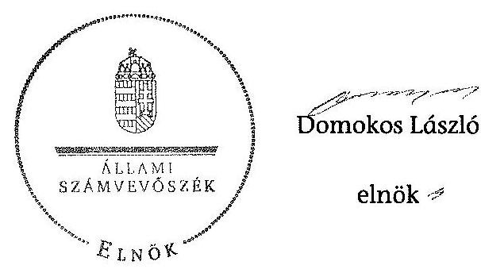

# JELENTÉS 

a helyi nemzetiségi önkormányzatok gazdálkodásának ellenőrzéséről
Terézvárosi Szerb Nemzetiségi Önkormányzat

---

# Állami Számvevőszék 

Iktatószám: V-0245-016/2014.
Témaszám: 1279
Vizsgálat-azonosító szám: V065263

## Az ellenőrzést felügyelte:

Horváth Balázs
felügyeleti vezető
Az ellenőrzést vezette és az ellenőrzés végrehajtásáért felelős:
Korsósné Vigh Andrea
ellenőrzésvezető
A számvevőszéki jelentést készítették és a jelentés összeállításában közreműködtek:

Győriné Franyó Éva
számvevő
Molnár Istvánné
számvevő tanácsos
Villányi Antal
számvevő tanácsos
Az ellenőrzést végezte:
Villányi Antal
számvevő tanácsos

A témához kapcsolódó eddig készített számvevőszéki jelentés:
címe
sorszáma
Jelentés a Budapest Főváros VI. kerület Terézváros Önkormányzata 0507
gazdálkodásának átfogó ellenőrzéséről

---

# TARTALOMJEGYZÉK 

BEVEZETÉS ..... 3
I. ÖSSZEGZŐ MEGÁLLAPÍTÁSOK, KÖVETKEZTETÉSEK, JAVASLATOK ..... 6
II. RÉSZLETES MEGÁLLAPÍTÁSOK ..... 14

1. A Nemzetiségi Önkormányzat és a Települési Önkormányzat együttműködésének szabályozása, a működési feltételek biztosítása ..... 14
2. A gazdálkodási feladatok ellátásának szabályszerűsége ..... 15
2.1. A költségvetésre és a zárszámadásra, valamint a kincstári adatszolgáltatás rendjére vonatkozó jogszabályi előírások betartása ..... 15
2.2. A Nemzetiségi Önkormányzat gazdálkodásának szabályozottsága ..... 17
2.3. Az operatív gazdálkodási jogkörök kialakítása, gyakorlása ..... 18
3. Önkormányzattal összefüggő gazdálkodási feladatok belső ellenőrzése ..... 18
4. A feladatalapú támogatás felhasználásának, elszámolásának szabályszerűsége, a Nemzetiségi Önkormányzat feladatellátása ..... 18

## MELLÉKLET

1. számú A Nemzetiségi Önkormányzat 2012. évi gazdálkodásának főbb adatai, mutatói

## FÜGGELÉKEK

1. számú Rövidítések jegyzéke
2. számú Értelmező szótár
3. számú A gazdálkodás értékelésének módszere

---

.

---

# JELENTÉS 

## a helyi nemzetiségi önkormányzatok gazdálkodásának ellenőrzéséről Terézvárosi Szerb Nemzetiségi Önkormányzat

## BEVEZETÉS

A Nemzetiségi Önkormányzat 2002. évben alakult, elnöke a 2006. évi helyhatósági választások óta látja el feladatát. A Nemzetiségi Önkormányzat intézményt, gazdasági társaságot és más szervezetet nem alapított, illetve ezek társulásában nem vesz részt. A Képviselő-testület munkája segítésére bizottságot nem hozott létre. A Nemzetiségi Önkormányzatnak a költségvetési beszámolója szerint a 2012. évben a módosított költségvetési bevételi és kiadási előirányzata 1006 ezer Ft, a teljesített költségvetési bevétel 1011 ezer Ft, a teljesített költségvetési kiadás 1010 ezer Ft volt. A 2012. évi gazdálkodási adatokat részletesen az 1. számú mellékletben mutatjuk be.

Az Alaptörvény XXIX. cikk (1) bekezdése szerint a Magyarországon élő nemzetiségek államalkotó tényezők. Minden, valamely nemzetiséghez tartozó magyar állampolgárnak joga van önazonossága szabad vállalásához és megőrzéséhez. A hazánkban élő nemzetiségek helyi (települési és területi), valamint országos önkormányzatokat hozhatnak létre. A helyi nemzetiségi önkormányzatok gazdálkodási feladatait jogszabályi előírás alapján a székhely szerinti helyi önkormányzat polgármesteri hivatala látja el.

A nemzetiségek helyzete, támogatása mind hazai, mind EU-s szinten kiemelt figyelmet kap napjainkban. A helyi nemzetiségi önkormányzatok gazdálkodására és támogatási rendszerére vonatkozó jogszabályok a 2010-2012. években jelentős változásokon mentek át. A települési és területi nemzetiségi önkormányzatok gazdálkodásának, a részükre juttatott költségvetési támogatások felhasználásának ellenőrzését az ÁSZ a 2012. évben sorozatjellegű ellenőrzés keretében indította el. A 2013. évi ellenőrzések e témacsoportos ellenőrzések folytatását jelentik, amelyet az ÁSZ 2014. első félévi ellenőrzési terve 12. témasorszámon tartalmaz.

Az ellenőrzés célja annak értékelése volt, hogy a Nemzetiségi Önkormányzat gazdálkodási kereteinek kialakítása, gazdálkodása és feladatellátása megfelel-e a jogszabályoknak.

---

Ennek keretében értékeltük, hogy:

- a Nemzetiségi Önkormányzat és a Települési Önkormányzat együttműködésének szabályozása, a működési feltételek biztosítása megfelelt-e a jogszabályi előírásoknak;
- a felek együttműködése megfelelt-e a közöttük létrejött együttműködési megállapodásnak a gazdálkodási feladatok szabályszerű ellátása során, ennek keretében betartották-e a Nemzetiségi Önkormányzat gazdálkodásához kapcsolódóan a költségvetésre és zárszámadásra, a gazdálkodás szabályozására, az operatív gazdálkodási jogkörök gyakorlására vonatkozó jogszabályi előírásokat;
- a jegyző biztosította-e a Nemzetiségi Önkormányzat gazdálkodásának belső ellenőrzését;
- a Nemzetiségi Önkormányzat feladatalapú támogatásának felhasználása, a folyósított feladatalapú támogatással történő elszámolás az előírásoknak megfelelő volt-e;
- a Nemzetiségi Önkormányzat feladatellátása összhangban volt-e a vonatkozó jogszabályi előírásokkal.

Az ellenőrzés várható hasznosulását négy szinten tervezzük. A törvényalkotás számára összegzett tapasztalatok állnak rendelkezésre a nemzetiségi önkormányzatok testületi döntéseinek, gazdálkodásának és a feladatalapú támogatás felhasználásának szabályszerűségéről, amelynek alapján következtetést lehet levonni arra, hogy indokolt-e jogszabályi módosítás kezdeményezése. Az ellenőrzés az ellenőrzött számára visszajelzést ad a működésében fellépő hiányosságokról, javaslataival hozzájárul azok kiküszöböléséhez, amely csökkentheti a későbbi ellenőrzések gyakoriságát. Az ellenőrzés megállapításai és javaslatai tanulságul szolgálhatnak más nemzetiségi önkormányzatok, szervezetek számára a rendezett gazdálkodási keretek kialakításához. A társadalom számára jelzi, hogy közpénz nem maradhat ellenőrizetlenül, az ÁSZ értékteremtő rend kialakításához és megőrzéséhez hozzájáruló tevékenysége pozitív hatással lesz a szervezetről kialakított összkép formálásában. Az ÁSZ szervezetén belül lehetőség nyílik arra, hogy a megállapítások szintetizálásával az intézmény a hozzáadott értéket teremtő elemző tevékenységét és tanácsadó szerepét erősítse.

A helyi nemzetiségi önkormányzatok gazdálkodásának ellenőrzéséről szóló jelentés I. fejezetének összegző része az ellenőrzés céljára adott rövid, szintetizáló összefoglalót és következtetéseket tartalmazza a II. fejezet részletes megállapításain alapulóan. A jelentés intézkedést igénylő megállapításait és javaslatait az összegzőben foglaltak mellett - az ellenőrzés során feltárt, a jelentés II. fejezetében rögzített részletes megállapítások alapozzák meg, illetve támasztják alá.

Az ellenőrzés típusa: szabályszerűségi ellenőrzés

---

Az ellenőrzött időszak: 2012. január 1. - 2012. december 31. közötti időszak. Az ellenőrzés kiterjedt a Nemzetiségi Önkormányzatnak juttatott 2012. évi feladatalapú támogatás 2013. évben való elszámolására is.

Ellenőrzött szervezet: Terézvárosi Szerb Nemzetiségi Önkormányzat és a gazdálkodási feladatait ellátó Budapest Főváros VI. Kerület Terézváros Önkormányzata.

Az ellenőrzés végrehajtásának jogszabályi alapját az ÁSZ tv. 5. § (2)-(3) és (6) bekezdéseiben foglaltak képezik.

Az ellenőrzés szakmai módszertana az ÁSZ hivatalos honlapján (www.asz.hu) közzétett szakmai szabályokon alapult, amely a Legfőbb Ellenőrző Intézmények Nemzetközi Szervezete (INTOSAI) által kiadott nemzetközi standardok (ISSAI) figyelembevételével készült.

A helyi nemzetiségi önkormányzatok gazdálkodásának ellenőrzése során értékeltük a Települési Önkormányzat és a Nemzetiségi Önkormányzat együttműködésének, a gazdálkodás szabályozottságának és a pénzügyi folyamatokban kulcsszerepet betöltő belső kontrollok (teljesítésigazolás és érvényesítés) működésének megfelelőségét. A kulcskontrollokat a működési és felhalmozási célú támogatásértékű kiadásoknál, az államháztartáson kívülre teljesített működési és felhalmozási célú pénzeszköz-átadásoknál, a dologi kiadásokkal kapcsolatos kifizetéseknél - véletlen mintavételi eljárást alkalmazva - ellenőriztük. Ellenőriztük, hogy a jegyző biztosította-e a Nemzetiségi Önkormányzat gazdálkodásának belső ellenőrzését. Értékeltük a feladatalapú támogatások felhasználásának, elszámolásának szabályszerűségét, a Nemzetiségi Önkormányzat feladatellátása és a jogszabályi előírások összhangját. A minősítési szempontokat a 3. számú függelék tartalmazza.

Az ellenőrzés lefolytatásához a Nemzetiségi Önkormányzat és a gazdálkodási feladatait ellátó Települési Önkormányzat tanúsítványok és a kapcsolódó, dokumentumjegyzékben megjelölt dokumentumok elektronikus úton történő megküldésével, rendelkezésre bocsátásával szolgáltatott adatokat. Az adatszolgáltatás kontrollálása és szükség szerinti javítása a helyszíni ellenőrzés keretében történt.

Az ÁSZ tv. 29. § (1) bekezdése szerint a jelentéstervezetet megküldtük egyeztetésre a polgármesternek és a Nemzetiségi Önkormányzat elnökének. A polgármester és a Nemzetiségi Önkormányzat elnöke az ÁSZ tv. 29. § (2) bekezdésében foglalt észrevételezési jogával nem élt, a jelentéstervezetre észrevételt nem tett.

---

# I. ÖSSZEGZŐ MEGÁLLAPÍTÁSOK, KÖVETKEZTETÉSEK, JAVASLATOK 

A Nemzetiségi Önkormányzat és a Települési Önkormányzat együttműködésének szabályozása részben felelt meg a jogszabályi előírásoknak. A Nemzetiségi Önkormányzat az ellenőrzött időszakban rendelkezett a Települési Önkormányzattal megkötött együttműködési megállapodással. A felek a 2011. évben jóváhagyott együttműködési megállapodásnak a Nek. 2 tv.-ben január 31-i határidőre előírt felülvizsgálatát nem végezték el, a 2012. június 1-jei határidőre előírt módosítási kötelezettségüknek eleget tettek. A 2012. december 31-én hatályos együttműködési megállapodásban a Nemzetiségi Önkormányzat működési feltételeit az előírásoknak megfelelően szabályozták, azonban ezt - a Nek. 2 tv.-ben előírtak ellenére - a Nemzetiségi Önkormányzat SZMSZ-ében nem rögzítették. A 2012. december 31-én hatályos együttműködési megállapodásban a Nemzetiségi Önkormányzat gazdálkodási feladatai ellátásának szabályozása az Áht. 2, valamint a Nek. 2 törvényben előírt tartalmi elemek tekintetében hiányos volt. Az együttműködési megállapodásban nem rögzítették a Nemzetiségi Önkormányzat bevételeivel, kiadásaival kapcsolatban a tervezési és adatszolgáltatási feladatok ellátásának részletes szabályait. Nem határozták meg a Nemzetiségi Önkormányzat önálló fizetési számla nyitásával, törzskönyvi nyilvántartásba vételével, adószám igénylésével, a költségvetés előkészítésével és megalkotásával, valamint a költségvetéssel összefüggő adatszolgáltatási kötelezettségek teljesítésével kapcsolatos határidőket, együttműködési kötelezettségeket a felelősök konkrét kijelölésével. Nem tartalmazta a Nemzetiségi Önkormányzat kötelezettségvállalásaival kapcsolatosan a Települési Önkormányzatot terhelő ellenjegyzési, érvényesítési feladatokat ellátók konkrét kijelölését, a Nemzetiségi Önkormányzat kötelezettségvállalásához kapcsolódó nyilvántartási kötelezettséget, továbbá a Nemzetiségi Önkormányzat működési feltételeinek és gazdálkodásának eljárási és dokumentációs részletszabályaival kapcsolatos előírásokat, feltételeket, valamint az ezeket végző személyek kijelölésének rendjét. A jegyző, vagy az általa megbízott azonos képesítési előírásoknak megfelelő megbízottja - a Nek. 2 tv.-ben előírt kötelezettségét elmulasztva - a Nemzetiségi Önkormányzat 2012. évi költségvetését és zárszámadását tárgyaló Képviselő-testületi ülésein nem vett részt. A Települési Önkormányzat biztosította a Nemzetiségi Önkormányzat működéséhez szükséges személyi és tárgyi feltételeket.

A Nemzetiségi Önkormányzat 2012. évi költségvetésének és zárszámadásának tartalma, jóváhagyása részben felelt meg a jogszabályi előírásoknak. A jegyző az Áht. 2 előírása ellenére nem készítette el a Nemzetiségi Önkormányzat költségvetési határozat tervezetét. A Nemzetiségi Önkormányzat elnöke a 2012. évi költségvetés tervezetét az előírt határidőben benyújtotta a Képviselőtestületnek. A költségvetés előterjesztésekor a Képviselő-testület tájékoztatására nem mutatták be az Áht. 2-ben előírt előirányzat felhasználási tervet és a költségvetési mérleg szöveges indoklását. A Nek. 2 tv.-ben előírtak ellenére a 2012. évi költségvetés és zárszámadás elfogadásához kapcsolódó jegyzőkönyvek nem tartalmazták az előterjesztéseket. A 2012. költségvetési évre vonatkozó kincstári adatszolgáltatási kötelezettségeket a jegyző határidőben teljesítette. A jegyző

---

zárszámadási határozattervezetet az Áht. 2 előírásai ellenére nem készítette el, de a Nemzetiségi Önkormányzat részére biztosította a 2012. évi zárszámadás tárgyalásához szükséges mellékleteket és táblázatokat, amelyet a Nemzetiségi Önkormányzat elnöke az Áht. 2 által előírt határidőben benyújtott a Képviselőtestület részére. A zárszámadás előterjesztésekor a Képviselő-testület tájékoztatására az Áht. 2-ben előírtak ellenére nem mutatták be a pénzeszközök változását és a vagyonkimutatást. A zárszámadás elfogadásáról a Képviselő-testület határozattal döntött. A zárszámadási határozat Áht. 2 szerinti összehasonlíthatósága az elfogadott költségvetéssel részben volt biztosított, az eredeti előirányzati adatokban mutatkozó számszaki eltérés miatt.

A gazdálkodás szabályozottsága nem volt megfelelő. A Nemzetiségi Önkormányzat az ellenőrzött időszak egészében nem rendelkezett a Bkr.-ben előírt ellenőrzési nyomvonallal, szabálytalanságok kezelésének eljárásrendjével, valamint a folyamatba épített, előzetes, utólagos és vezetői ellenőrzés szabályozással. A Nemzetiségi Önkormányzat 2012. június 1-jétől nem rendelkezett a Számv. tv.-ben előírt eszközök és források értékelési szabályzatával, számviteli politikával és számlarenddel. A Nemzetiségi Önkormányzat 2012. május 31-ig rendelkezett a gazdálkodására vonatkozó, a Számv. tv.-ben előírt szabályzatokkal, mert a hatályban lévő együttműködési megállapodásban előírták a Nemzetiségi Önkormányzat gazdálkodási feladatai ellátásához a Polgármesteri Hivatal belső szabályzatainak használatát. A 2012. június 1-jétől hatályos együttműködési megállapodás - a leltározási és leltárkészítési, valamint a pénzkezelési szabályzat kivételével - nem írta elő a Polgármesteri Hivatal szabályzatainak alkalmazását. A Polgármesteri Hivatal SZMSZ-e az Ávr. előírásai ellenére nem tartalmazta az SZMSZ-ben nevesített munkakörökhöz tartozó - a Nemzetiségi Önkormányzat gazdálkodásának végrehajtásával összefüggő - feladat- és hatásköröket, a hatáskörök gyakorlásának módját, a helyettesítés rendjét, valamint az ezekhez kapcsolódó felelősségi szabályokat. A kötelezettségvállalás módja tekintetében a gazdálkodási jogkörök szabályzata és a hatályos együttműködési megállapodás közötti összhang nem volt biztosított. Az együttműködési megállapodás szerint kötelezettségvállalás
 kizárólag ellenjegyzés után, írásban történhet, a gazdálkodási jogkörök szabályzata pedig tartalmazta - a százezer forintot el nem érő kifizetések esetében - az előzetes írásbeli kötelezettségvállalási dokumentum mellőzésének lehetőségét, azonban ennek rendjét az Ávr.-ben előírtak ellenére belső szabályzatban nem határozták meg.

A Nemzetiségi Önkormányzat gazdálkodása tekintetében az operatív gazdálkodási jogkörök kialakítása megfelelt a jogszabályi előírásoknak. A Települési Önkormányzat a 2012. évben rendelkezett gazdasági szervezettel, elkészítette ügyrendjét és a gazdasági szervezet vezetői feladatok ellátásával a polgármester írásban megbízta a Költségvetési és Intézménygazdálkodási Főosztály vezetőjét. A Települési Önkormányzat az Ávr.-ben foglaltak ellenére a Polgármesteri Hivatal SZMSZ-ében a gazdasági szervezetet nem nevesítette. A gazdasági szervezet vezetője rendelkezett az előírt szakképesítéssel, az általa írásban történt - a pénzügyi ellenjegyzőre és érvényesítőre vonatkozó - kijelölések jogszerűek voltak. A Nemzetiségi Önkormányzat elnöke, mint kötelezettségvállaló, az Ávr. előírását figyelembe véve - saját személyében - írásban kijelölte a teljesítésigazolót. A Nemzetiségi Önkormányzat elnöke a jogszabályban előírt összeférhetetlenségi szabályok betartásának szabályozási feltételeit nem

---

biztosította, nem jelölt ki más személyt a kötelezettségvállalási, utalványozási, teljesítésigazolási feladatok ellátására.

A Nemzetiségi Önkormányzat 2012. évben teljesített kiadásainak - a dologi kiadásoknál ellenőrzött bizonylatok alapján - 73%-át, 742 ezer Ft-ot szabálytalanul fizették ki, mert az ellenőrzött megrendelésekhez kapcsolódó döntéshozatalban a Nemzetiségi Önkormányzat elnöke a személyes érintettsége, erre vonatkozóan a Nek. 2 tv., valamint a Nemzetiségi Önkormányzat SZMSZ-ének előírásai ellenére részt vett.

A dologi kiadások bizonylatainak tesztelése alapján a teljesítésigazolás és az érvényesítés kulcskontrollok működésének megfelelősége gyenge volt, a hibák száma a lényegességi szintet, a kritikus hibahatárt elérte. A teljesítésigazoló az előzetes írásbeli kötelezettségvállalási dokumentum hiányában az Ávr.-ben előírt feladatát, a kiadások jogosságának, összegszerűségének valamint az ellenszolgáltatás teljesítésének ellenőrzését és igazolását nem szabályszerűen végezte el. Az érvényesítő nem az Ávr. előírása szerint végezte el feladatát, előzetes írásbeli kötelezettségvállalási dokumentum hiányában az összegszerűség, a fedezet megléte, továbbá a megelőző ügymenetben a gazdálkodási szabályok - ennek keretében az Ávr. - betartásának ellenőrzését, igazolását. Az utalványozó felé nem jelezte az együttműködési megállapodásban előírt előzetes írásbeli kötelezettségvállalási dokumentum hiányát, a szabálytalan teljesítésigazolást, továbbá hogy a kötelezettségvállalási nyilvántartás tartalmilag nem felelt meg az Ávr.-ben előírt követelményeknek. Az érvényesítés az Ávr.-ben foglaltak ellenére nem tartalmazta az érvényesítésre utalást. A Nemzetiségi Önkormányzatnál a 2012. évi dologi kiadások között a három legnagyobb összegű kiadás teljesítése során - a bizonylatok egyedi értékelése alapján - a teljesítésigazolás kulcskontroll két kifizetésnél megfelelően, egy esetben nem megfelelően működött, az érvényesítés kulcskontroll nem működött megfelelően. A feltárt szabálytalanságok a dologi kiadások tesztelésénél tett megállapításokkal azonosak voltak.

A Nemzetiségi Önkormányzatnál a 2012. évben az államháztartáson kívülre teljesített működési célú pénzeszközátadás, valamint a támogatásértékű működési kiadás teljesítése során a teljesítésigazolás és az érvényesítés kulcskontrollok nem működtek megfelelően. A kiadások teljesítésére az Ávr.-ben előírtak ellenére teljesítésigazolás nélkül került sor. Az érvényesítő nem az Ávr.-ben előírtak szerint látta el ellenőrzési feladatát, mert a megelőző ügymenetben a gazdálkodási szabályok előírásainak betartását nem ellenőrizte, nem jelezte a teljesítésigazolás hiányát. Az érvényesítéssel kapcsolatos egyéb - a kötelezettségvállalási nyilvántartással és az érvényesítés módjával összefüggő - hiányosságok megegyeztek a dologi kiadások tesztelésénél tett megállapításokkal.

A jegyző az ellenőrzött időszakban biztosította a Nemzetiségi Önkormányzat gazdálkodásával összefüggő végrehajtási feladatok belső ellenőrzését, mert a Polgármesteri Hivatal 2012. évi ellenőrzési tervét megalapozó kockázatelemzés kiterjedt a Nemzetiségi Önkormányzat gazdálkodásával összefüggő végrehajtási feladatok ellátására. Ennek kockázata a lefolytatott kockázatelemzés alapján alacsony volt, ezért az ellenőrzött időszakban belső ellenőrzési feladatot nem terveztek és nem végeztek.

---

A 2011. évben a Nemzetiségi Önkormányzat 470 ezer Ft feladatalapú támogatásban részesült, amelyet a kötelezettségvállalásra rendelkezésre álló időpontig a támogatási célnak megfelelően felhasznált. A Nemzetiségi Önkormányzat a 2012. évben feladatalapú támogatást nem kapott. A 2011. évi feladatalapú támogatás elszámolása a támogatási kormányrendelet ${ }_{1}$ előírása alapján az Áht. ${ }_{1}$ rendelkezése ellenére nem történt meg. A feladatalapú támogatás felhasználását, elszámolását az ellenőrzésre jogosult szervek nem ellenőrizték. A Nemzetiségi Önkormányzat feladatellátásának tárgya - mind a kötelező, mind az önként vállalt feladatok tekintetében - összhangban volt a Nek. ${ }_{2}$ tv.-ben foglaltakkal. A Nemzetiségi Önkormányzat kötelező közfeladatot látott el a képviselt közösség kulturális autonómiájának megerősítése érdekében. A Nemzetiségi Önkormányzat önként vállalt közfeladatot látott el a nemzetiségi kulturális önigazgatással összefüggő ügyekben, a hagyományápolás és közművelődés területén.

Az ÁSZ tv. 33. § (1) bekezdésében foglaltak értelmében az ellenőrzött szervezet vezetője köteles a jelentésben foglalt megállapításokhoz kapcsolódó intézkedési tervet összeállítani, és azt a jelentés kézhezvételétől számított 30 napon belül az ÁSZ részére megküldeni. Amennyiben az intézkedési tervet határidőre nem küldi meg a szervezet, vagy az nem elfogadható, az ÁSZ elnöke az ÁSZ tv. 33. § (3) bekezdés a)-b) pontjaiban foglaltakat érvényesítheti.

A helyszíni ellenőrzés megállapításainak hasznosítása mellett javasoljuk:

# a jegyzőnek 

1. az együttműködés szabályozásával kapcsolatban

A Nemzetiségi Önkormányzat és a Települési Önkormányzat együttműködését meghatározó - 2012. december 31-én hatályos - együttműködési megállapodás tartalmilag nem felelt meg az Áht. ${ }_{2}$ 27. § (2) bekezdésében, valamint a Nek. ${ }_{2}$ tv. 80. § (3) bekezdésében foglalt előírásoknak. A 2012. január 1-jén hatályos, 2011. évben megkötött együttműködési megállapodásnak a Nek. ${ }_{2}$ tv. 80. § (2) bekezdésében 2012. január 31-i határidőig előírt felülvizsgálatát nem végezték el.

A 2012. december 31-én hatályos együttműködési megállapodás szerinti működési feltételeket a Nek. ${ }_{2}$ tv. 80. § (2) bekezdésében előírtak ellenére a Nemzetiségi Önkormányzat SZMSZ-ében nem rögzítették.

Javaslat
Az együttműködés szabályszerűsége érdekében:
a) készítse elő az együttműködési megállapodás módosítását, hogy az tartalmilag feleljen meg az Áht. ${ }_{2}$ 27. § (2) bekezdésében, valamint a Nek. ${ }_{2}$ tv. 80. § (3) bekezdésében foglalt előírásoknak;
b) biztosítsa a jövőben az együttműködési megállapodás évenkénti felülvizsgálata során a Nek. ${ }_{2}$ tv. 80. § (2) bekezdésében előírt határidő betartását;

---

c) készítse elő a Nemzetiségi Önkormányzat SZMSZ-ének kiegészítését, hogy az megfeleljen a Nek. ${ }_{2}$ tv. 80. § (2) bekezdésében foglalt előírásoknak.
2. a költségvetés és a zárszámadás, valamint a kapcsolódó kincstári adatszolgáltatás szabályszerűségével kapcsolatban

Az Áht. 2 24. § (2) bekezdés előírása ellenére a jegyző nem készítette el a Nemzetiségi Önkormányzat költségvetési határozattervezetét. A 2012. évi költségvetés előterjesztésekor a Képviselő-testület részére - a jegyző mulasztása miatt - az Áht. ${ }_{2}$ 24. § (4) bekezdés a) pontjában előírtak ellenére tájékoztatásul nem mutatták be a Nemzetiségi Önkormányzat előirányzat felhasználási tervét, továbbá a költségvetési mérleg szöveges indoklását. A jegyző az Áht. ${ }_{2}$ 91. § (1) bekezdés előírása ellenére a zárszámadási határozattervezetet nem készítette el. A Képviselő-testület részére tájékoztatásul - a jegyző általi elkészítés hiányában - nem mutatták be az Áht. ${ }_{2}$ 91. § (2) bekezdés a) és c) pontjában előírtak ellenére a pénzeszközök változását és a vagyonkimutatást. Az Áht. ${ }_{2}$ 89. § (1) bekezdésében előírtak ellenére a költségvetés és a zárszámadás összehasonlíthatósága részben volt biztosított. A Nek. ${ }_{2}$ tv. 95. § (2) bekezdés f) pontjában előírtak ellenére a költségvetéshez és a zárszámadáshoz kapcsolódó jegyzőkönyvek nem tartalmazták az előterjesztéseket.

Javaslat
Gondoskodjon a jövőben:
a) az Áht. ${ }_{2}$ 24. § (2) bekezdésében előírtaknak megfelelően a Nemzetiségi Önkormányzat költségvetési határozattervezetének előkészítéséről, továbbá arról, hogy az Áht. ${ }_{2}$ 24. § (4) bekezdés a) pontjában foglalt előírásnak megfelelően a költségvetési határozattervezet előterjesztésekor a Képviselő-testület részére tájékoztatásul bemutatásra kerüljön a Nemzetiségi Önkormányzat előirányzat felhasználási terve és a költségvetési mérleg szöveges indoklással együtt;
b) az Áht. ${ }_{2}$ 91. § (1) bekezdésének megfelelően a Nemzetiségi Önkormányzat zárszámadási határozattervezetének előkészítéséről, továbbá arról, hogy a zárszámadási határozattervezet előterjesztésekor a Képviselő-testület részére tájékoztatásul bemutatásra kerüljön az Áht. ${ }_{2}$ 91. § (2) bekezdés a) és c) pontjában előírtak szerint a pénzeszközök változása és a vagyonkimutatás;
c) a költségvetés és a zárszámadás Áht. ${ }_{2}$ 89. § (1) bekezdése szerinti összehasonlíthatóságának megteremtéséről;
d) a Nek. ${ }_{2}$ tv. 95. § (2) bekezdés f) pontjában előírtak szerint a Képviselő-testületi döntések előterjesztéseinek jegyzőkönyvben történő szerepeltetéséről.
3. a gazdálkodási feladatok szabályozottságával kapcsolatban

A Nemzetiségi Önkormányzat az ellenőrzött időszak egészében nem rendelkezett a Bkr. 6. § (3)-(4) bekezdéseiben előírt ellenőrzési nyomvonallal és szabálytalanságok kezelésének eljárásrendjével, valamint a Bkr. 8. § (2) bekezdése szerinti folyamatba épített, előzetes, utólagos és vezetői ellenőrzés szabályozással. A Nemzetiségi Önkormányzat 2012. június 1-jétől nem rendelkezett a Számv. tv. 14. § (5) bekezdés b) pontjában előírt eszközök és források értékelési szabályzatával, a Számv. tv. 14. §

---

(3)-(4) bekezdéseiben előírt számviteli politikával, a Számv. tv. 161. § (1) bekezdésében előírt számlarenddel.

A jegyző a szabályozás során a gazdálkodási jogkörök szabályzata és a 2012. évben hatályos együttműködési megállapodás közötti összhangot - a százezer forintot el nem érő fizetési kötelezettségek esetében - nem biztosította. A gazdálkodási jogkörök szabályzatában az Ávr. 53. § (1) bekezdés a) pontjában foglaltak alapján lehetővé tették az előzetes írásbeli kötelezettségvállalás mellőzését, míg az együttműködési megállapodás az írásban történt kötelezettségvállalást tartalmazta összeghatártól függetlenül. Az előzetes írásbeli kötelezettségvállalást nem igénylő kifizetések rendjét - az Ávr. 53. § (2) bekezdésének előírásait figyelmen kívül hagyva - belső szabályzatban nem rögzítették.

A Polgármesteri Hivatal SZMSZ-e az Ávr. 13. § (1) bekezdés g) pontjában foglaltak ellenére nem tartalmazta az SZMSZ-ben nevesített munkakörökhöz tartozó - a Nemzetiségi Önkormányzat gazdálkodásának végrehajtásával kapcsolatos - feladat- és hatásköröket, a hatáskörök gyakorlásának módját, a helyettesítés rendjét, az ezekhez kapcsolódó felelősségi szabályokat.

Javaslat
A gazdálkodás szabályszerűsége érdekében a Nemzetiségi Önkormányzat gazdálkodására is kiterjedően:
a) gondoskodjon a Számv. tv. 14. § (3)-(4) bekezdéseiben és az (5) bekezdés b) pontjában előírt számviteli politika, az eszközök és források értékelési szabályzata, a Számv. tv. 161. § (1) bekezdésében előírt számlarend, illetve a Bkr. 6. § (3)-(4) és 8. § (2) bekezdésében előírtak szerinti ellenőrzési nyomvonal, szabálytalanságok kezelésének eljárásrendje, valamint folyamatba épített előzetes, utólagos és vezetői ellenőrzés szabályozás hatályának Nemzetiségi Önkormányzatra történő kiterjesztéséről;
b) biztosítsa a gazdálkodási jogkörök szabályzata és az együttműködési megállapodás közötti összhangot a százezer forintot el nem érő fizetési kötelezettségek vonatkozásában, továbbá az Ávr. 53. § (1) bekezdésében foglalt lehetőség alkalmazása esetén az Ávr. 53. § (2) bekezdésében előírtak alapján belső szabályzatban rögzítse az előzetes írásbeli kötelezettségvállalást nem igénylő kifizetések rendjét;
c) készítse elő a Polgármesteri Hivatal SZMSZ-ének módosítását, hogy az megfeleljen az Ávr. 13. § (1) bekezdése g) pontjában foglalt előírásnak.
4. a kulcskontrollok működésével kapcsolatban

A teljesítésigazoló az előzetes írásbeli kötelezettségvállalási dokumentum hiányában Ávr. 57. § (1) bekezdésében előírt feladatát, a kiadások jogosságának, összegszerűségének, valamint az ellenszolgáltatás teljesítésének ellenőrzését és igazolását nem szabályszerűen végezte el;

Az érvényesítő nem az Ávr. 58.
 § (1) és (2) bekezdésében előírtak szerint végezte el feladatát, mert nem ellenőrizte a megelőző ügymenetben a gazdálkodási szabályok betartását, valamint az utalványozó felé nem jelezte, hogy a teljesítésigazolás szabálytalanul történt. Az érvényesítés – az utalványon az érvényesítésre utaló megjelölés hiányában – nem az Ávr. 58. § (3) bekezdésében előírtak szerint történt.

Javaslat
Az operatív gazdálkodás működési hibáinak megelőzése, feltárása és kijavítása érdekében gondoskodjon arról, hogy:
a) a teljesítés igazolása minden esetben az Ávr. 57. § (1) bekezdésében előírtaknak megfelelően történjen;
b) az érvényesítő tegyen eleget az Ávr. 58. § (1)-(3) bekezdésében előírt ellenőrzési feladatának, jelzési és igazolási kötelezettségének.
5. a feladatalapú támogatás elszámolásával kapcsolatban

A 2011. évi feladatalapú támogatás elszámolása a támogatási kormányrendelet 7. § (2) bekezdésében hivatkozott „a helyi önkormányzatok elszámolási és ellenőrzési rendjére vonatkozó” jogszabályok rendelkezései alkalmazása előírása alapján az Áht. ${ }_{1}$ 64. § (7) bekezdése ellenére nem történt meg.

Javaslat
Gondoskodjon az Áht. ${ }_{2}$ 27. § (2) bekezdésben meghatározott feladatkörében a Nemzetiségi Önkormányzat által igénybe vett feladatalapú támogatás rendeltetésszerű felhasználásáról szóló elszámolásának elkészítéséről az Áht. ${ }_{2}$ 53. § (1) bekezdése szerinti beszámolási kötelezettség teljesítéséhez.

# a polgármesternek 

A Nemzetiségi Önkormányzat és a Települési Önkormányzat együttműködését meghatározó – 2012. december 31-én hatályos – együttműködési megállapodás tartalmilag nem felelt meg az Áht. ${ }_{2}$ 27. § (2) bekezdésében, valamint a Nek. ${ }_{2}$ tv. 80. § (3) bekezdésében foglalt előírásoknak.

A Polgármesteri Hivatal SZMSZ-e az Ávr. 13. § (1) bekezdés g) pontjában foglaltak ellenére nem tartalmazta az SZMSZ-ben nevesített munkakörökhöz tartozó – a Nemzetiségi Önkormányzat gazdálkodásának végrehajtásával kapcsolatos – feladat- és hatásköröket, a hatáskörök gyakorlásának módját, a helyettesítés rendjét, az ezekhez kapcsolódó felelősségi szabályokat.

Javaslat
Terjessze a Települési Önkormányzat Képviselő-testülete elé jóváhagyásra:
a) az Áht. ${ }_{2}$ 27. § (2) bekezdésében, valamint a Nek. ${ }_{2}$ tv. 80. § (3) bekezdésében foglalt előírásoknak megfelelő, a jegyző által előkészített együttműködési megállapodás módosítását;
b) a Polgármesteri Hivatal SZMSZ-ének jegyző által előkészített, az Ávr. 13. § (1) bekezdés g) pontjában megfogalmazott előírásoknak megfelelő módosítását.

---

# a Nemzetiségi Önkormányzat elnökének 

1. A Nemzetiségi Önkormányzat és a Települési Önkormányzat együttműködését meghatározó – 2012. december 31-én hatályos – együttműködési megállapodás tartalmilag nem felelt meg az Áht. ${ }_{2}$ 27. § (2) bekezdésében, valamint a Nek. ${ }_{2}$ tv. 80. § (3) bekezdésében foglalt előírásoknak.

A Nemzetiségi Önkormányzat a 2012. december 31-én hatályos együttműködési megállapodás szerinti működési feltételeket a Nek. ${ }_{2}$ tv. 80. § (2) bekezdésében előírtak ellenére a Nemzetiségi Önkormányzat SZMSZ-ében nem rögzítette.

Javaslat
Terjessze a Képviselő-testület elé jóváhagyásra:
a) az Áht. ${ }_{2}$ 27. § (2) bekezdésében, valamint a Nek. ${ }_{2}$ tv. 80. § (3) bekezdésében foglalt előírásoknak megfelelő, a jegyző által előkészített együttműködési megállapodás módosítását;
b) a Nemzetiségi Önkormányzat SZMSZ-ének a Nek. ${ }_{2}$ tv. 80. § (2) bekezdésében foglaltaknak megfelelő jegyző által előkészített módosítását.
2. A költségvetési határozattervezet előterjesztésekor a Képviselő-testület részére tájékoztatásul – a jegyző mulasztása miatt – nem mutatták be az Áht. ${ }_{2}$ 24. § (4) bekezdés a) pontjában előírtak ellenére a Nemzetiségi Önkormányzat előirányzat felhasználási tervét, valamint a költségvetési mérleg szöveges indoklását. A zárszámadási határozattervezet előterjesztésekor az Áht. ${ }_{2}$ 91. § (2) bekezdés a) és c) pontjaiban előírtak ellenére – a jegyző általi elkészítés hiányában – a Képviselő-testület tájékoztatására nem mutatták be a pénzeszközök változását és a vagyonkimutatást.

Javaslat
A jövőben a költségvetési és zárszámadási határozattervezetek előterjesztésekor terjessze a Képviselő-testület elé tájékoztatásra a jegyző által előkészített az Áht. ${ }_{2}$ 24. § (4) bekezdés a) pontjában, valamint az Áht. ${ }_{2}$ 91. § (2) bekezdés a) és c) pontjaiban előírt előirányzat felhasználási tervet, mérlegeket, kimutatásokat, szöveges indoklással együtt.
3. A 2011. évi feladatalapú támogatás elszámolása a támogatási kormányrendelet 7. § (2) bekezdésében hivatkozott „a helyi önkormányzatok elszámolási és ellenőrzési rendjére vonatkozó” jogszabályok rendelkezései alkalmazásának előírása alapján az Áht. ${ }_{1}$ 64. § (7) bekezdése ellenére nem történt meg.

Javaslat
Terjessze a Képviselő-testület elé jóváhagyásra az Áht. ${ }_{2}$ 53. § (1) bekezdése szerinti beszámolási kötelezettség teljesítéséhez a Nemzetiségi Önkormányzat által igénybe vett 2011. évi feladatalapú támogatás rendeltetésszerű felhasználásáról szóló elszámolást.

---

# II. RÉSZLETES MEGÁLLAPÍTÁSOK 

## 1. A Nemzetiségi Önkormányzat és a Települési Önkormányzat együttműködésének szabályozása, a működési feltételek biztosítása

A Nemzetiségi Önkormányzat és a Települési Önkormányzat együttműködésének szabályozása részben felelt meg a jogszabályi előírásoknak.

A Nemzetiségi Önkormányzat rendelkezett a 2012. év folyamán hatályban lévő, a Települési Önkormányzattal megkötött együttműködési megállapodással ${ }^{1}$. A felek a 2011. évben megkötött együttműködési megállapodásnak a Nek. ${ }_{2}$ tv. 80. § (2) bekezdésében január 31-i határidővel előírt felülvizsgálatát nem végezték el, a 2012. június 1-jei határidőre előírt módosítási kötelezettségüknek eleget tettek.

A 2012. december 31-én hatályos együttműködési megállapodásban a Nemzetiségi Önkormányzat működési feltételeit az előírásoknak megfelelően szabályozták, azonban a Nek. ${ }_{2}$ tv. 80. § (2) bekezdésében előírtak ellenére az együttműködési megállapodás szerinti működési feltételeket az együttműködési megállapodás megkötését követő harminc napon belül, illetve azt követően az ellenőrzött időszakban a Nemzetiségi Önkormányzat SZMSZ-ében nem rögzítették.

A 2012. december 31-én hatályos együttműködési megállapodásban a Nemzetiségi Önkormányzat gazdálkodásával kapcsolatos feladatokat, felelősöket és határidőket hiányosan szabályozták. Az együttműködési megállapodás nem tartalmazta az Áht. ${ }_{2}$ 27. § (2) bekezdés előírása ellenére a Nemzetiségi Önkormányzat bevételeivel és kiadásaival kapcsolatban a tervezési és adatszolgáltatási feladatok ellátásának részletes szabályait. Nem rögzítették továbbá a Nek. ${ }_{2}$ tv. 80. § (3) bekezdés a)-d) pontjaiban foglalt előírások ellenére:

- a költségvetés előkészítésével és megalkotásával, valamint a költségvetéssel összefüggő adatszolgáltatási kötelezettségek teljesítésével, továbbá az önálló fizetési számla nyitásával, törzskönyvi nyilvántartásba vételével és adószám igénylésével kapcsolatos határidőket, együttműködési kötelezettségeket és ezek felelőseinek konkrét kijelölését;

[^0]
[^0]:    ${ }^{1}$ A 2012. június 1-jéig hatályos megállapodást a Települési Önkormányzat Képviselőtestülete a 447/2010. (XII. 16.) számú, a Képviselő-testület a 2/2011. (I. 10.) számú határozatával hagyta jóvá
    A 2012. június 1-jétől hatályos megállapodást a Települési Önkormányzat Képviselőtestülete a 112/2012. (V. 31.) számú, a Képviselő-testület a 18/2012. (V. 28.) számú határozatával fogadta el.

---

- a Nemzetiségi Önkormányzat kötelezettségvállalásaival kapcsolatosan a Települési Önkormányzatot terhelő ellenjegyzési és érvényesítési feladatokat ellátók konkrét kijelölését;
- a Nemzetiségi Önkormányzat kötelezettségvállalásához kapcsolódó nyilvántartási kötelezettségeket;
- a Nemzetiségi Önkormányzat működési feltételeinek és gazdálkodásának eljárási és dokumentációs részletszabályaival kapcsolatos előírásokat, feltételeket, valamint az ezeket végző személyek kijelölését.

A 2012. június 1-jétől hatályos együttműködési megállapodás a jogszabályi előírásnak megfelelően tartalmazta, hogy a jegyző, vagy annak – a jegyzővel azonos képesítési előírásoknak megfelelő – megbízottja a helyi önkormányzat megbízásából és képviseletében részt vesz a Nemzetiségi Önkormányzat Képviselő-testületi ülésein és jelzi, amennyiben törvénysértést észlel. A Nemzetiségi Önkormányzat 2012. évi költségvetését és zárszámadását tárgyaló Képviselőtestületi ülésein a jegyző, vagy az általa megbízott azonos képesítési előírásoknak megfelelő megbízottja – a Nek. ${ }_{2}$ tv. 80. § (4) bekezdésben előírt kötelezettségét elmulasztva – nem vett részt.

A Települési Önkormányzat a Polgármesteri Hivatal útján biztosította a Nemzetiségi Önkormányzat 2012. évi működésének a – Nek. ${ }_{2}$ tv. 159. § (3) bekezdésében foglalt átmeneti rendelkezés alapján a Nek. ${ }_{1}$ tv. 27. § (2)-(3) bekezdésében előírt – személyi és tárgyi feltételeit.

# 2. A GAZDÁLKODÁSI FELADATOK ELLÁTÁSÁNAK SZABÁLYSZERŰSÉGE 

### 2.1. A költségvetésre és a zárszámadásra, valamint a kincstári adatszolgáltatás rendjére vonatkozó jogszabályi előírások betartása

A Nemzetiségi Önkormányzat 2012. évi költségvetésének és zárszámadásának tartalma, jóváhagyása részben felelt meg a jogszabályi előírásoknak.

A jegyző az Áht. ${ }_{2}$ 24. § (2) bekezdés előírása ellenére nem készítette el a Nemzetiségi Önkormányzat 2012. évi költségvetési határozat tervezetét.

A jegyző a 2012. június 1-jéig hatályban lévő együttműködési megállapodásban – a költségvetési határozat elfogadására – előírt határidőt ${ }^{2}$ követően nyújtott tá-

[^0]
[^0]:    ${ }^{2}$ A 2012. június 1-jéig hatályos együttműködési megállapodás 3.1.2. pontja előírta, hogy „a kisebbségi önkormányzat képviselő-testülete január 25-ig önállóan határozatban állapítja meg a költségvetését”.

---

jékoztatást ${ }^{3}$ a Nemzetiségi Önkormányzat elnökének a 2012. évi költségvetési tervezet megvitatásához és jóváhagyásához szükséges adatokról.

A Nemzetiségi Önkormányzat elnöke a 2012. évi költségvetés tervezetét az Áht. ${ }_{2}$-ben előírt határidőben ${ }^{4}$ benyújtotta a Képviselő-testületnek, a jóváhagyott költségvetés ${ }^{5}$ tartalmazta az Áht. ${ }_{2}$-ben és az Ávr.-ben előírt tartalmi elemeket. A 2012. évi költségvetés előterjesztésekor a Képviselő-testület részére az Áht. ${ }_{2}$ 24. § (4) bekezdés a) pontjában előírtak ellenére – a jegyző mulasztása miatt – tájékoztatásul nem mutatták be a Nemzetiségi Önkormányzat előirányzat felhasználási tervét és a költségvetési mérleg szöveges indoklását.

A Képviselő-testület a 2012. március 2-ai ülésén – a jegyző 2012. február 4-i tájékoztatása alapján – az éves bevételi és kiadási főösszegeket 214 ezer Ft-ra módosította ${ }^{6}$.

A Nemzetiségi Önkormányzat 2012. évi elemi költségvetését a Polgármesteri Hivatal nem a Képviselő-testület költségvetési határozata, hanem az általa összeállított, 2012. február 4-én közölt költségvetési tervezet adataival készítette el, amely négyezer forinttal több volt a Képviselő-testület költségvetési határozatában szereplő bevételi és kiadási főösszegeknél.

A jegyző a 2012. költségvetési évre vonatkozó a Nemzetiségi Önkormányzat kincstári adatszolgáltatási kötelezettségének az előírásoknak megfelelően eleget tett.

A jegyző az Áht. ${ }_{2}$ 91. § (1) bekezdésében előírtak ellenére nem készítette el a Nemzetiségi Önkormányzat zárszámadási határozat tervezetét, azonban a Nemzetiségi Önkormányzat részére biztosította a 2012. évi zárszámadás tárgyalásához szükséges mellékleteket, táblázatokat, melyeket a Nemzetiségi Önkormányzat elnöke az előírt határidőben benyújtott elfogadásra a Képviselő-testületnek. A zárszámadás elfogadásáról a Képviselőtestület határozattal ${ }^{7}$ döntött. A Nemzetiségi Önkormányzat elnöke a zárszámadás tervezetének előterjesztésekor az Áht. ${ }_{2}$ 91. § (2) bekezdés a) és c) pontjaiban előírtak ellenére a Képviselő-testület tájékoztatására – a jegyző általi elkészítés hiányában – nem mutatta be a pénzeszközök változását és a vagyonkimutatást.

A 2012. évi zárszámadásban a Nemzetiségi Önkormányzat valamennyi bevételéről és kiadásáról elszámoltak, azonban az Áht. ${ }_{2}$ 89. § (1) bekezdésben

[^0]
[^0]:    ${ }^{3}$ A jegyző a 2012. február 4-ei levelében és a csatolt öt mellékletben (1. számú melléklet: a bevételekről; 2. számú melléklet: a kiadásokról; 3. számú melléklet: a 2012. évi tervezett kiadások és bevételek mérlegszerű bemutatása; 4. számú melléklet: a 2012. évi előirányzat felhasználási ütemterv; 5. számú melléklet: Kiegészítő információk)
    ${ }^{4}$ A központi költségvetésről szóló törvény kihirdetését követő 45. napon belül.
    ${ }^{5}$ A 2012. évi költségvetést a Képviselő-testület a 3/2012. (I. 25.) számú határozatával hagyta jóvá 210 ezer Ft bevételi és kiadási főösszeggel.
    ${ }^{6}$ A 2012. évi költségvetés módosításáról szóló 10/2012. (III. 02.) számú határozat.
    ${ }^{7}$ A 2012. évi zárszámadást a

 Képviselő-testület a 10/2013. (IV. 30.) számú határozattal fogadta el.

---

előírtak ellenére az elfogadott költségvetéssel való összehasonlíthatóságot részben biztosították, mert a Nemzetiségi Önkormányzat jóváhagyott költségvetése és az elfogadott zárszámadási határozat számszaki adatait tartalmazó melléklet ${ }^{8}$ eredeti előirányzatának kiadási és bevételi adatai négyezer forint eltérést mutattak.

A Nemzetiségi Önkormányzat elnöke a Nek. 2 tv. 95. § (2) bekezdés f) pontjában előírtak ellenére - a költségvetéshez és annak módosításához, valamint a zárszámadás megtárgyalásához kapcsolódó - a 2012. január 25-ei, a 2012. március 2-ai, valamint a 2013. április 30-ai jegyzőkönyvekhez nem csatolta be az előterjesztéseket.

# 2.2. A Nemzetiségi Önkormányzat gazdálkodásának szabályozottsága 

A Nemzetiségi Önkormányzat gazdálkodásának szabályozottsága nem volt megfelelő.

A Nemzetiségi Önkormányzat az ellenőrzött időszak egészében nem rendelkezett a Bkr. 6. § (3) és (4) bekezdéseiben előírt ellenőrzési nyomvonallal, szabálytalanságok kezelésének eljárásrendjével, valamint a Bkr. 8. § (2) bekezdés szerinti folyamatba épített, előzetes, utólagos és vezetői ellenőrzés szabályzattal.

A Nemzetiségi Önkormányzat a gazdálkodási feladatok szabályszerű ellátásához 2012. június 1-jétől nem rendelkezett a következő szabályzatokkal:

- a Számv. tv. 14. § (5) bekezdés b) pontjában előírt eszközök és források értékelési szabályzata;
- a Számv. tv. 14. § (3) és (4) bekezdéseiben előírt számviteli politika;
- a Számv. tv. 161. § (1) bekezdésében előírt számlarend.

A Nemzetiségi Önkormányzat gazdálkodási feladatai végrehajtását ellátó Polgármesteri Hivatal szabályzatainak alkalmazását a 2012. június 1-jéig hatályos együttműködési megállapodás kiterjesztette a Nemzetiségi Önkormányzatra. A 2012. június 1-jétől hatályos együttműködési megállapodás - a leltározási és leltárkészítési, valamint a pénzkezelési szabályzat kivételével - nem írta elő a Polgármesteri Hivatal szabályzatainak alkalmazását.

A Polgármesteri Hivatal SZMSZ-e az Ávr. 13. § (1) bekezdés g) pontjában előírtak ellenére nem tartalmazta az SZMSZ-ben nevesített munkakörökhöz tartozó - a Nemzetiségi Önkormányzat gazdálkodásának végrehajtásával kapcsolatos - feladat- és hatásköröket, a hatáskörök gyakorlásának módját, a helyettesítés rendjét, az ezekhez kapcsolódó felelősségi szabályokat.

A jegyző a szabályozás során a gazdálkodási jogkörök szabályzata és a 2012. évben hatályos együttműködési megállapodások közötti összhangot - a százezer forintot el nem érő fizetési kötelezettségek esetében - nem biztosította.

[^0]
[^0]:    ${ }^{8}$ „Terézvárosi Szerb Nemzetiségi Önkormányzat beszámolója 2012. évi" címú táblázat

---

Az együttműködési megállapodás az írásban történt kötelezettségvállalást tartalmazta összeghatártól függetlenül. A gazdálkodási jogkörök szabályzatában az Ávr. 53. § (1) bekezdésében foglalt lehetőség alapján - a százezer forintot el nem érő kifizetéseknél - éltek az előzetes írásbeli kötelezettségvállalás mellőzésével. Az előzetes írásbeli kötelezettségvállalást nem igénylő kifizetések rendjét - az Ávr. 53. § (2) bekezdésének előírásait figyelmen kívül hagyva - belső szabályzatban nem rögzítették.

# 2.3. Az operatív gazdálkodási jogkörök kialakítása, gyakorlása 

A Nemzetiségi Önkormányzat gazdálkodása tekintetében az operatív gazdálkodási jogkörök kialakítása megfelelt a jogszabályi előírásoknak.

A Települési Önkormányzat a 2012. évben rendelkezett gazdasági szervezettel, mivel az Ávr. 13. § (5) bekezdésének előírásai szerint elkészítette az ügyrendjét és a gazdasági szervezet vezetőjének teendőivel a polgármester, írásban megbízta a Költségvetési és Intézménygazdálkodási Főosztály vezetőjét. A Települési Önkormányzat az Ávr. 13. § (1) bekezdés e) pontjában foglaltak ellenére a Polgármesteri Hivatal SZMSZ-ében a gazdasági szervezet ügyrendjének hatályba léptetésével egyidejűleg nem nevezte meg egyértelműen a Költségvetési és Intézménygazdálkodási Főosztályt, mint a Települési Önkormányzat gazdasági szervezetét. A gazdasági vezető rendelkezett az előírt szakképesítéssel, az általa történt személyre szóló megbízások (kijelölések) a pénzügyi ellenjegyző és az érvényesítő vonatkozásában jogszerűek voltak.

Az ellenőrzött időszakot követően módosították a Polgármesteri Hivatal SZMSZ-ét ${ }^{9}$, kiegészítették a gazdasági szervezet meghatározásával, a gazdasági vezető megnevezésével.

A Nemzetiségi Önkormányzat elnöke, mint kötelezettségvállaló az Ávr. előírását figyelembe véve - saját személyében - írásban kijelölte a teljesítésigazolót. A Nemzetiségi Önkormányzat elnöke a jogszabályban előírt összeférhetetlenségi szabályok betartásának szabályozási feltételeit nem biztosította, nem jelölt ki más személyt a kötelezettségvállalás, utalványozás, teljesítésigazolás feladatok ellátására.

A Nemzetiségi Önkormányzat 2012. évben teljesített kiadásainak - a dologi kiadásoknál ellenőrzött bizonylatok alapján - 73%-át, 742 ezer Ft-ot szabálytalanul fizették ki, mert az ellenőrzött nyolc megrendelés esetében a Nemzetiségi Önkormányzat elnöke a döntéshozatalban a személyes érintettsége, erre vonatkozóan a Nek. 2 tv. 94. § (1) bekezdése, valamint a Nemzetiségi Önkormányzat SZMSZ-ének 4. § 7. pontjában ${ }^{10}$ foglalt előírások ellenére részt vett.

[^0]
[^0]:    ${ }^{9}$ A Települési Önkormányzat Képviselő-testülete a 203/2013. (X. 24.) számú határozatával módosította a Polgármesteri Hivatal SZMSZ-ét.
    ${ }^{10}$ A testület döntéshozatalából kizárható az, akit, vagy akinek hozzátartozóját az ügy személyesen érinti. A képviselő köteles bejelenteni a személyes érintettséget.

---

A Nemzetiségi Önkormányzat elnöke - az ellenőrzött bizonylatok alapján nyolc, elsősorban rendezvényszervezéshez kapcsoló, szolgáltatás megrendelésére irányuló döntéshozatalban - a határozatok megszavazásában - a személyes érintettsége, a Nek. 3 tv. és a Nemzetiségi Önkormányzat SZMSZ-ének vonatkozó előírásai ellenére részt vett. A személyes érintettség bejelentése - a rendelkezésre bocsátott dokumentumok alapján - nem történt meg, arról a Képviselő-testület nem döntött. A megrendeléssel érintett szolgáltató vállalkozás mind a nyolc esetben az a kft. volt, amelynek a cégnyilvántartás adatai szerint a Nemzetiségi Önkormányzat elnöke a tagja és ügyvezetője, így egyben képviselője is volt. A Nemzetiségi Önkormányzat elnöke az általa képviselt kft.-től rendelte meg a szolgáltatást, és vállalt kötelezettséget a Nemzetiségi Önkormányzat szabad előirányzatai terhére. A rendezvények számláit a szolgáltató képviselőjeként a Nemzetiségi Önkormányzat elnöke állította ki, egyidejűleg - a megrendelő oldaláról - ő volt a teljesítésigazoló és az utalványozó is.

A Nemzetiségi Önkormányzatnál a 2012. évben a dologi kiadások teljesítése során - a bizonylatok tesztelése alapján - a teljesítésigazolás és az érvényesítés kulcskontrollok működésének megfelelősége gyenge volt, a hibák száma a lényegességi szintet, a kritikus hibahatárt elérte:

- a teljesítésigazoló az előzetes írásbeli kötelezettségvállalási dokumentum hiányában Ávr. 57. § (1) bekezdésében előírt feladatát, a kiadások jogosságának, összegszerűségének, valamint az ellenszolgáltatás teljesítésének ellenőrzését és igazolását nem szabályszerűen végezte el;
- az érvényesítő nem az Ávr. 58. § (1) és (2) bekezdésében előírtak szerint végezte el ellenőrzési feladatát, előzetes írásbeli kötelezettségvállalási dokumentum hiányában az összegszerűség, a fedezet megléte, továbbá a megelőző ügymenetben a gazdálkodási szabályok - ennek keretében az Ávr. előírásai - betartásának ellenőrzését. Nem kifogásolta és az utalványozó felé nem jelezte az összegszerűség ellenőrzéséhez szükséges - az együttműködési megállapodásban előírt - előzetes írásbeli kötelezettségvállalási dokumentum hiányát. Nem jelezte továbbá, hogy a Nemzetiségi Önkormányzat kötelezettségvállalási nyilvántartása tartalmilag nem felelt meg az Ávr. 56. § (1) bekezdésében előírt követelményeknek, mert nem tartalmazta a kötelezettségvállalást tanúsító dokumentum megnevezését, iktatószámát, keltét, a kötelezettségvállaló nevét, a jogosult azonosító adatait, a kifizetési határidőket. Az Ávr. 58. § (3) bekezdésében előírtak ellenére az érvényesítés nem foglalta magában az érvényesítésre utaló megjelölést.

A Nemzetiségi Önkormányzatnál a 2012. évi dologi kiadások között a három legnagyobb összegű kiadás teljesítése során - a bizonylatok egyedi értékelése alapján - a teljesítésigazolás kulcskontroll két kifizetésnél megfelelően, egy esetben nem megfelelően működött. Az érvényesítés kulcskontroll nem működött megfelelően. A teljesítésigazoló és az érvényesítő feladatellátása tekintetében feltárt szabálytalanságok a dologi kiadások tesztelésénél tett megállapításokkal azonosak voltak.

A Nemzetiségi Önkormányzatnál a 2012. évben az államháztartáson kívülre teljesített működési célú pénzeszközátadás, valamint a támogatásértékű működési kiadás teljesítése során a teljesítésigazolás és az érvényesítés kulcskontrollok nem működtek megfelelően. A kiadások teljesítésére az Ávr. 57. § (1) bekezdésében előírtak ellenére teljesítésigazolás nélkül került sor. Az érvényesítő nem az Ávr. 58. § (1) és (2) bekezdésében előírtak szerint látta el ellenőrzési feladatát, mert a megelőző ügymenetben az Ávr. és az egyéb jogszabályok előírásainak betartását nem ellenőrizte, nem jelezte a teljesítésigazolás hiányát. Az érvényesítéssel kapcsolatos egyéb - a kötelezettségvállalási nyilvántartással és az érvényesítés módjával összefüggő - hiányosságok megegyeztek a dologi kiadások tesztelésénél tett megállapításokkal.

# 3. ÖNKORMÁNYZATTAL ÖSSZEFÜGGŐ GAZDÁLKODÁSI FELADATOK BELSŐ ELLENŐRZÉSE 

A jegyző az ellenőrzött időszakban biztosította a Nemzetiségi Önkormányzat gazdálkodásával összefüggő végrehajtási feladatok belső ellenőrzését, mert a Polgármesteri Hivatal 2012. évi ellenőrzési tervét megalapozó kockázatelemzés kiterjedt a Nemzetiségi Önkormányzat gazdálkodásával összefüggő végrehajtási feladatok ellátására. Ennek kockázata a lefolytatott kockázatelemzés alapján alacsony volt, ezért az ellenőrzött időszakban belső ellenőrzési feladatot nem terveztek és nem végeztek.

A 2012. évben hatályos együttműködési megállapodás tartalmazta a belső ellenőrzés rendjét az alábbiak szerint: „A kisebbségi/nemzetiségi önkormányzat gazdálkodásának belső ellenőrzését a Polgármesteri Hivatal Belső Ellenőrzési Osztálya végzi a Belső Ellenőrzési Szabályzat értelemszerű alkalmazása mellett. A tervszerű ellenőrzés alkalmaiban a kisebbségi/nemzetiségi önkormányzat elnöke a jegyzővel egyeztet. A rendkívüli ellenőrzést a kisebbségi önkormányzat elnöke a jegyzőn keresztül kezdeményezi". A 2012. június 1-jétől hatályos együttműködési megállapodás még kiegészült az alábbi bevezetővel: „A belső kontrollrendszer kialakításánál figyelembe kell venni a költségvetési szervek belső kontrollrendszeréről és belső ellenőrzéséről szóló 370/2011. (XII. 31.) Korm. rendelet előírásait".

Az ellenőrzéshez szolgáltatott adatok alapján a 2012. évben a Kormányhivatal a Nemzetiségi Önkormányzatot illetően nem élt törvényességi felügyeleti eszközökkel.

## 4. A feladatalapú támogatás felhasználásának, elszámolásának szabályszerűsége, a Nemzetiségi Önkormányzat feladatellátása

A 2011. évben a Nemzetiségi Önkormányzat 470 ezer Ft feladatalapú támogatásban részesült, amelyet (378 ezer Ft-ot a folyósítás évében, 92 ezer Ft-ot a felhasználásra rendelkezésre álló időpontig, 2012. június 30-áig) a támogatási célnak megfelelően felhasznált. A 2012. évben a Nemzetiségi Önkormányzat feladatalapú támogatást nem kapott.

A 2011. évi feladatalapú támogatás elszámolása a támogatási kormányrendelet ${ }_{1}$ 7. § (2) bekezdésében hivatkozott „a helyi önkormányzatok elszámolási és ellenőrzési rendjére vonatkozó" jogszabályok rendelkezései alkalmazásának előírása alapján az Áht. ${ }_{1}$ 64. § (7) bekezdése ellenére nem történt meg. A feladatalapú támogatások felhasználását, elszámolását az ellenőrzésre jogosult szervek nem ellenőrizték.

---

A Nemzetiségi Önkormányzat feladatellátásának tárgya - mind a kötelező, mind az önként vállalt feladatok tekintetében - összhangban volt a Nek. ${ }_{2}$ tv.-ben foglaltakkal. A Nek. ${ }_{2}$ tv. 115. § f) pontja szerinti kötelező közfeladatot látott el a képviselt közösség kulturális autonómiájának megerősítése érdekében. A Nemzetiségi Önkormányzat a 2012. évben a Nek. ${ }_{2}$ tv. 116. § (2) bekezdés előírásaival összhangban önként vállalt közfeladatot a nemzetiségi oktatási és kulturális önigazgatással összefüggő ügyekben, a hagyományápolás és közművelődés területén látott el.

Budapest, 2014. 06. hónap 24. nap

Melléklet: $\quad 1 \mathrm{db}$
Függelék: $\quad 3 \mathrm{db}$

---

.

---

# A Nemzetiségi Önkormányzat 2012. évi gazdálkodásának főbb adatai, mutatói

A) Bevételek

|  Megnevezés | Eredeti előirányzat | Módosított | Teljesítés  |
| --- | --- | --- | --- |
|   | ezer Ft |  | megoszlás  |
|  Intézményi működési bevételek | 0 | 0 | 4  |
|  Általános működési támogatás | 214 | 214 | 215  |
|  Települési Önkormányzat által nyújtott támogatás | 0 |

 792 | 792  |
|  Működési költségvetés bevételei | 214 | 1006 | 1011  |
|  Költségvetési bevételek összesen | 214 | 1006 | 1011  |
|  Bevételek mindösszesen | 214 | 1006 | 1011  |

B) Kiadások

|  Megnevezés | Eredeti előirányzat | Módosított | Teljesítés  |
| --- | --- | --- | --- |
|   | ezer Ft |  | megoszlás  |
|  Dologi kiadások | 214 | 956 | 960  |
|  Támogatásértékű működési kiadások | 0 | 25 | 25  |
|  Működési célú pénzeszközaadások államháztartáson kívülre | 0 | 25 | 25  |
|  Működési kiadások összesen | 214 | 1006 | 1010  |
|  Költségvetési kiadások összesen | 214 | 1006 | 1010  |
|  Kiadások mindösszesen | 214 | 1006 | 1010  |

---

.

---

# RÖVIDÍTÉSEK JEGYZÉKE 

## Törvények

Alaptörvény
Áht. 1
Áht. 2
ÁSZ tv.
Nek. 1 tv.
Nek. 2 tv.
Számv. tv.
Ptk.

## Rendeletek

Ávr.

Bkr.
támogatási kormányrendelet ${ }_{1}$
támogatási kormányrendelet ${ }_{2}$

## Határozatok

Nemzetiségi Önkormányzat SZMSZ-e

Polgármesteri Hivatal SZMSZ-e

## Szórövidítések

ÁSZ
EU
gazdasági szervezet

Magyarország Alaptörvénye
1992. évi XXXVIII. törvény az államháztartásról (hatályos 2011. december 31-ig)
2011. évi CXCV. törvény az államháztartásról (hatályos 2011. december 31-től)

Az Állami Számvevőszékről szóló 2011. évi LXVI. törvény (hatályos 2011. július 1-jétől)
1993. évi LXXVII. törvény a nemzeti és etnikai kisebbségek jogairól (hatályos 2011. december 31-ig)
2011. évi CLXXIX. törvény a nemzetiségek jogairól (hatályos 2011. december 20-tól)
2000. évi C. törvény a számvitelről
1959. évi IV. törvény a Polgári Törvénykönyvről

368/2011. (XII. 31.) Korm. rendelet az államháztartásról szóló törvény végrehajtásáról (hatályos 2012. január 1-jétől)
370/2011. (XII. 31.) Korm. rendelet a költségvetési szervek belső kontrollrendszeréről és belső ellenőrzéséről (hatályos 2012. január 1-jétől)
342/2010. (XII. 28.) Korm. rendelet a kisebbségi önkormányzatoknak a központi költségvetésből, valamint fejezeti kezelésű előirányzatból nyújtott támogatások feltételrendszeréről és elszámolásának rendjéről (hatályos 2012. március 6-ig)
28/2012. (III. 6.) Korm. rendelet a nemzetiségi célú előirányzatokból nyújtott támogatások feltételrendszeréről és elszámolásának rendjéről (hatályos 2012. március 7-től)

32/2010. (X. 13.) számú határozat Terézvárosi Szerb Nemzetiségi Önkormányzat Szervezeti és Működési Szabályzatáról
A többször módosított 335/2005. (X. 20.) számú határozattal elfogadott Budapest Főváros VI. Kerület Terézváros Önkormányzat Polgármesteri Hivatalának Szervezeti és Működési Szabályzata

Állami Számvevőszék
Európai Unió
Budapest Főváros VI. Kerület Terézváros Önkormányzatának Polgármesteri Hivatala Költségvetési és Intézménygazdálkodási Főosztálya

---

gazdálkodási jogkörök szabályzata
jegyző
Képviselő-testület
Kormányhivatal
Nemzetiségi Önkormányzat
Nemzetiségi Önkormányzat elnöke
polgármester
Polgármesteri Hivatal
Települési Önkormányzat
Települési Önkormányzat Képviselő-testülete
ügyrend
$1 / 2012$. (I. 1.) számú polgármesteri-jegyzői közös utasítás a kötelezettségvállalási, pénzügyi ellenjegyzési, teljesítésigazolási, érvényesítési és utalványozási jogkör gyakorlásáról
Budapest Főváros VI. Kerület Terézváros Önkormányzat Polgármesteri Hivatalának jegyzője
Terézvárosi Szerb Nemzetiségi Önkormányzat Képviselőtestülete
Budapest Főváros Kormányhivatala
Terézvárosi Szerb Nemzetiségi Önkormányzat
Terézvárosi Szerb Nemzetiségi Önkormányzat elnöke
Budapest Főváros VI. Kerület Terézváros Önkormányzatának polgármestere
Budapest Főváros VI. Kerület Terézváros Önkormányzat Polgármesteri Hivatala
Budapest Főváros VI. Kerület Terézváros Önkormányzata
Budapest Főváros VI. Kerület Terézváros Önkormányzat Képviselő-testülete
Budapest Főváros VI. Kerület Terézváros Önkormányzatának Polgármesteri Hivatala gazdasági szervezetének 2012. január 15-től hatályos ügyrendje

---

# ÉRTELMEZŐ SZÓTÁR 

együttműködési megállapodás
feladatalapú támogatás
kulcskontrollok működési feltételek

A nemzetiségi önkormányzatnak a működési feltételei biztosítására, továbbá a bevételeivel és a kiadásaival kapcsolatban a tervezési, gazdálkodási, ellenőrzési, finanszírozási, adatszolgáltatási és beszámolási feladatai végrehajtására a székhelye szerinti települési önkormányzattal megkötött megállapodás. (Az Áht. 66. §-a, a Nek. 2 tv. 80. § (2) bekezdése, valamint az Áht. 27. § (2) bekezdése alapján levezetett fogalom.)

A támogatási évben általános működési támogatásban részesült, és a Támogatónak a Kincstárhoz intézett, a feladatalapú támogatás utalására vonatkozó rendelkező levele keltének időpontjában működő nemzetiségi önkormányzatoknak kormányrendeletben rögzített feltételrendszer alapján nyújtható támogatás. A feladatalapú támogatás a nemzetiségi közügyeknek a nemzetiségi önkormányzatok által történő ellátását szolgálja. (A támogatási kormányrendelet ${ }_{1}$ 2. § (2) bekezdés c) pontja és a támogatási kormányrendelet ${ }_{2} 4 . \S$ (1) bekezdése alapján.) Teljesítés igazolása és az érvényesítés.
A települési önkormányzat által a helyi nemzetiségi önkormányzat testületi működéséhez a 2012. évben biztosítandó feltételek: a testületi működéshez igazodó helyiséghasználat, a postai, kézbesítési, gépelési, sokszorosítási feladatok ellátása és az ezzel járó költségek viselése. (Forrás: Nek., tv. 27. § (1)-(2) bekezdései, a Nek. ${ }_{2}$ tv. 159. § (3) bekezdésében foglalt átmeneti rendelkezés alapján)

A szabályozás szintjén - 2012. június 1-jéig megkötendő együttműködési megállapodásban - rögzítendő (és 2013. január 1-jétől a települési önkormányzat által biztosítandó) működési feltételek a következők:

- a helyi nemzetiségi önkormányzat részére havonta igény szerint, de legalább tizenhat órában, az önkormányzati feladat ellátásához szükséges tárgyi, technikai eszközökkel felszerelt helyiség ingyenes használata, a helyiséghez, továbbá a helyiség infrastruktúrájához kapcsolódó rezsiköltségek és fenntartási költségek viselése;
- a helyi nemzetiségi önkormányzat működéséhez (a testületi, tisztségviselői, képviselői feladatok ellátásához) szükséges tárgyi és személyi feltételek biztosítása;
- a testületi ülések előkészítése, különösen a meghívók, az előterjesztések, a testületi ülések jegyzőkönyvelésének és valamennyi hivatalos levelezés előkészítése és postázása;
- a testületi döntések és a tisztségviselők döntéseinek előkészítése, a testületi és tisztségviselői döntéshozatalhoz

---

nemzetiség
nemzetiségi közügy
nemzetiségi önkormányzat
operatív gazdálkodási jogkörök
kapcsolódó nyilvántartási, sokszorosítási, postázási feladatok ellátása;

- a helyi nemzetiségi önkormányzat működésével, gazdálkodásával kapcsolatos nyilvántartási, iratkezelési feladatok ellátása;
- az előzőekben meghatározott feladatellátáshoz kapcsolódó költségek viselése a helyi nemzetiségi önkormányzat tagja és tisztségviselője telefonhasználata költségeinek kivételével.
(Forrás: A Nek. ${ }_{2}$ tv. 80 § (2) bekezdése a Nek. ${ }_{2}$ tv. 159. § (3) bekezdésében foglalt átmeneti rendelkezés alapján)

Minden olyan, Magyarország területén legalább egy évszázada honos népcsoport, amely az állam lakossága körében számszerű kisebbségben van, a lakosság többi részétől saját nyelve, kultúrája és hagyományai különböztetik meg, egyben olyan összetartozás-tudatról tesz bizonyságot, amely mindezek megőrzésére, történelmileg kialakult közösségeik érdekeinek kifejezésére és védelmére irányul. (A Nek. ${ }_{2}$ tv. 1. § (1) bekezdése alapján levezetett fogalom.)
Az egyéni és közösségi jogok érvényesülése, a nemzetiséghez tartozók érdekeinek kifejezésre juttatása - különösen az anyanyelv ápolása, őrzése és gyarapítása, továbbá a nemzetiségek kulturális autonómiájának a nemzetiségi önkormányzatok által történő megvalósítása és megőrzése - érdekében a nemzetiséghez tartozók meghatározott közszolgáltatásokkal való ellátásával, ezen ügyek önálló vitelével és az ehhez szükséges szervezeti, személyi és anyagi feltételek megteremtésével összefüggő ügy. A közhatalmat gyakorló állami és helyi önkormányzati szervekben, továbbá a nemzetiségi önkormányzati szervekben való nemzetiségi képviselethez és mindezek szervezeti, személyi és anyagi feltételeinek biztosításához kapcsolódó ügy. (A Nek. ${ }_{2}$ tv. 2. § 1. pontjából levezetett fogalom.)
Törvényben meghatározott nemzetiségi közszolgáltatási feladatokat ellátó, testületi formában működő, jogi személyiséggel rendelkező, demokratikus választások útján, törvény alapján létrehozott szervezet, amely a nemzetiségi közösséget megillető jogosultságok érvényesítésére, a nemzetiségek érdekeinek védelmére és képviseletére, a feladat- és hatáskörébe tartozó nemzetiségi közügyek települési, területi vagy országos szinten történő önálló intézésére jön létre. (A Nek. ${ }_{2}$ tv. 2. § 2. pontjából levezetett fogalom.)
A kötelezettségvállalás, a pénzügyi ellenjegyzés, az utalványozás, az érvényesítés és a teljesítésigazolás.
(Forrás: Az Áht. ${ }_{2}$ 36-38. §-ai és az Ávr. 52-60. §-ai)

---

# A GAZDÁLKODÁS ÉRTÉKELÉSÉNEK MÓDSZERE 

A helyi nemzetiségi önkormányzatok gazdálkodásának ellenőrzése keretében az önkormányzat gazdálkodása kereteinek kialakítása, gazdálkodása megfelelőségének minősítéséhez az alábbi területeket értékeltük:

- a helyi nemzetiségi önkormányzat és a helyi önkormányzat együttműködése szabályozását, az együttműködési megállapodásban előírt működési feltételek biztosítását;
- a helyi nemzetiségi önkormányzat jóváhagyott költségvetésére, zárszámadására, továbbá a kincstári adatszolgáltatás rendjére vonatkozó jogszabályi előírások betartását;
- a helyi nemzetiségi önkormányzatra vonatkozó gazdálkodási szabályzatok jogszabályi előírások szerinti rendelkezésre állását;
- a helyi nemzetiségi önkormányzat gazdálkodása tekintetében az operatív gazdálkodási jogkörök kialakítása jogszabályi előírásoknak történő megfelelését;
- a helyi nemzetiségi önkormányzattal összefüggő feladatalapú támogatás felhasználása és elszámolása jogszabályi előírásoknak való megfelelését;
- a helyi nemzetiségi önkormányzattal összefüggő gazdálkodási feladatok tekintetében a jogszabályokban előírt belső ellenőrzés biztosítását.

A helyi nemzetiségi önkormányzat gazdálkodását az ellenőrzési program munkalapjain a hat területhez kapcsolódóan feltett kérdésekre adott válaszok alapján értékeltük. A kérdésekhez rendelt súlyozott pontszámok alapján elért összérték a megszerezhető maximális pontszám százalékában került kimutatásra. Ennek figyelembevételével kialakított minősítések a következőek voltak:

| Nem megfelelő: | $0-60 \%$ |
| :-- | :-- |
| Részben megfelelő: | $61-80 \%$ |
| Megfelelő: | $81 \%$-tól |

A pénzügyi folyamatok belső kontrolljának ellenőrzése keretében a pénzügyi folyamatokban kulcsszerepet betöltő belső kontrollok - a teljesítésigazolás és az érvényesítés - működésének megfelelőségét értékeltük. A kulcskontrollok működésének értékeléséhez a kritériumokat jogszabályok határozták meg. A kulcskontrollok működése megfelelőségének értékelése tekintetében lényeges minden olyan hiba, amely gátolja, hogy a kontrolltevékenység eredményesen működjön.

A két kulcskontroll működése megfelelőségének ellenőrzéséhez a dologi és egyéb folyó kiadások könyvviteli tételeiből szekvenciális (megállásos) mintavé-

---

teli eljárással választottuk ki az ellenőrizendő tételeket. A kulcskontrollok megfelelőségének vizsgálata keretében a számvevő bizonyosságot szerez arról, hogy a rendelkezésre álló szabályozás és dokumentumok alapján a teljesítésigazoláshoz és az érvényesítéshez szükséges ellenőrzési lépéseket végrehajtották-e.

A kulcskontrollok működése „kiváló", „jó" vagy „gyenge" minősítést kaphatott. A munkalapon feltett kérdésekhez rendelt súlyozott pontszámok alapján elért összérték a megszerezhető maximális pontszám százalékában került kimutatásra, mely alapján kialakított minősítések a következőek voltak:

| gyenge: | $0-70 \%$ |
| :-- | --: |
| jó: | $71-90 \%$ |
| kiváló: | $91 \%$-tól |

A kulcskontrollok működését:

- kiválónak értékeltük abban az esetben, ha azok működése megfelel a hibák megelőzésére és kijavítására meghatározott szabályozásnak, valamint a legmagasabb szintű elvárásoknak;
- jónak minősítettük, ha a megállapított kisebb, tolerálható mértékű hiányosságok nem veszélyeztetik az ellenőrzött területek hibáinak megelőzését és kijavítását;
- gyengének értékeltük, amennyiben a kontrollok működésében túl sok hiányosság fordul elő ahhoz, hogy a kontrollok biztosítsák a hibák megelőzését, feltárását, kijavítását.

