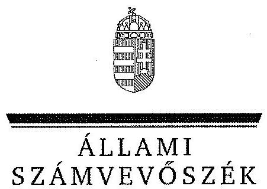
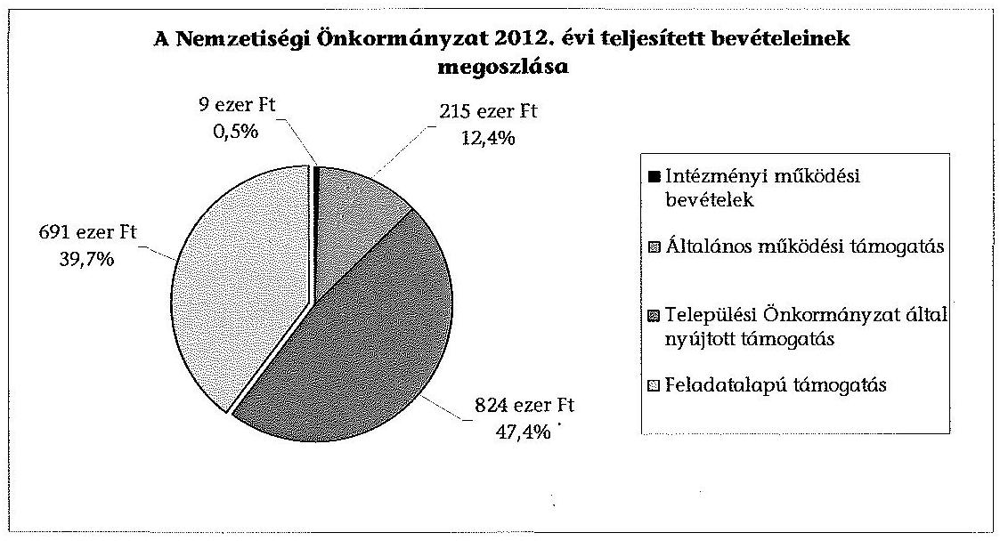
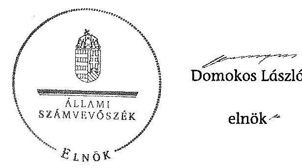

ÁLLAMI
SZÁMVEVŐSZÉK

# JELENTÉS 

a helyi nemzetiségi önkormányzatok gazdálkodásának ellenőrzéséről
Terézvárosi Szlovák Önkormányzat

---

# Állami Számvevőszék 

Iktatószám: V-0246-015/2014.
Témaszám: 1280
Vizsgálat-azonosító szám: V065264

## Az ellenőrzést felügyelte:

Horváth Balázs
felügyeleti vezető
Az ellenőrzést vezette és az ellenőrzés végrehajtásáért felelős:
Korsósné Vigh Andrea
ellenőrzésvezető
A számvevőszéki jelentést készítették és a jelentés összeállításában közremüködtek:

Győriné Franyó Éva
számvevő
Kerekes Gábor
számvevő
Molnár Istvánné
számvevő tanácsos
Az ellenőrzést végezte:
Kerekes Gábor
számvevő

A témához kapcsolódó eddig készített számvevőszéki jelentés:
címe
sorszáma
Jelentés a Budapest Főváros VI. kerület Terézváros Önkormányzata 0507
gazdálkodásának átfogó ellenőrzéséről

---

# TARTALOMJEGYZÉK 

BEVEZETÉS ..... 3
I. ÖSSZEGZŐ MEGÁLLAPÍTÁSOK, KÖVETKEZTETÉSEK, JAVASLATOK ..... 6
II. RÉSZLETES MEGÁLLAPÍTÁSOK ..... 14

1. A Nemzetiségi Önkormányzat és a Települési Önkormányzat együttműködésének szabályozása, a működési feltételek biztosítása ..... 14
2. A gazdálkodási feladatok ellátásának szabályszerűsége ..... 16
2.1. A költségvetésre és a zárszámadásra, valamint a kincstári adatszolgáltatás rendjére vonatkozó jogszabályi előírások betartása ..... 16
2.2. A Nemzetiségi Önkormányzat gazdálkodásának szabályozottsága ..... 17
2.3. Az operatív gazdálkodási jogkörök kialakítása, gyakorlása ..... 18
3. A Nemzetiségi Önkormányzattal összefüggő gazdálkodási feladatok belső ellenőrzése ..... 20
4. A feladatalapú támogatás felhasználásának, elszámolásának szabályszerűsége, a Nemzetiségi Önkormányzat feladatellátása ..... 21

## MELLÉKLET

1. számú A Nemzetiségi Önkormányzat 2012. évi gazdálkodásának főbb adatai, mutatói

## FÜGGELÉKEK

1. számú Rövidítések jegyzéke
2. számú Értelmező szótár
3. számú A gazdálkodás értékelésének módszere

---

.

---

# JELENTÉS 

## a helyi nemzetiségi önkormányzatok gazdálkodásának ellenőrzéséről Terézvárosi Szlovák Önkormányzat

## BEVEZETÉS

#### Abstract

A Nemzetiségi Önkormányzat az 1998. évben alakult, elnöke az 1998. évi helyhatósági választások óta látja el feladatát. A Nemzetiségi Önkormányzat intézményt, gazdasági társaságot és más szervezetet nem alapított, illetve ezek társulásában nem vesz részt. A négytagú Képviselő-testület munkája segitésére Kulturális és Tömegkommunikációs Bizottságot hozott létre. A Nemzetiségi Önkormányzatnak a költségvetési beszámolója szerint a 2012. évben a módosított költségvetési bevételi és kiadási elöirányzata 1729 ezer Ft, a teljesitett költségvetési bevétel 1739 ezer Ft, a teljesitett költségvetési kiadás 1730 ezer Ft volt. A 2012. évi gazdálkodási adatokat részletesen az 1. számú mellékletben mutatjuk be.

Az Alaptörvény XXIX. cikk (1) bekezdése szerint a Magyarországon élő nemzetiségek államalkotó tényezők. Minden, valamely nemzetiséghez tartozó magyar állampolgárnak joga van önazonossága szabad vállalásához és megőrzéséhez. A hazánkban élő nemzetiségek helyi (települési és területi), valamint országos önkormányzatokat hozhatnak létre. A helyi nemzetiségi önkormányzatok gazdálkodási feladatait jogszabályi előírás alapján a székhely szerinti helyi önkormányzat polgármesteri hivatala látja el.

A nemzetiségek helyzete, támogatása mind hazai, mind EU-s szinten kiemelt figyelmet kap napjainkban. A helyi nemzetiségi önkormányzatok gazdálkodására és támogatási rendszerére vonatkozó jogszabályok a 2010-2012. években jelentős változásokon mentek át. A települési és területi nemzetiségi önkormányzatok gazdálkodásának, a részükre juttatott költségvetési támogatások felhasználásának ellenőrzését az ÁSZ a 2012. évben sorozatjellegű ellenőrzés keretében indította el. A 2013. évi ellenőrzések e témacsoportos ellenőrzések folytatását jelentik, amelyet az ÁSZ 2014. első félévi ellenőrzési terve 12. témasorszámon tartalmaz.

Az ellenőrzés célja annak értékelése volt, hogy a Nemzetiségi Önkormányzat gazdálkodási kereteinek kialakítása, gazdálkodása és feladatellátása megfelelt-e a jogszabályoknak.

---

Ennek keretében értékeltük, hogy:

- a Nemzetiségi Önkormányzat és a Települési Önkormányzat együttműködésének szabályozása, a működési feltételek biztosítása megfelelt-e a jogszabályi előírásoknak;
- a felek együttműködése megfelelt-e a közöttük létrejött együttműködési megállapodásnak a gazdálkodási feladatok szabályszerű ellátása során, ennek keretében betartották-e a Nemzetiségi Önkormányzat gazdálkodásához kapcsolódóan a költségvetésre és zárszámadásra, a gazdálkodás szabályozására, az operatív gazdálkodási jogkörök gyakorlására vonatkozó jogszabályi előírásokat;
- a jegyző biztosította-e a Nemzetiségi Önkormányzat gazdálkodásának belső ellenőrzését;
- a Nemzetiségi Önkormányzat feladatalapú támogatásának felhasználása, a folyósított feladatalapú támogatással történő elszámolás az előírásoknak megfelelő volt-e;
- a Nemzetiségi Önkormányzat feladatellátása összhangban volt-e a vonatkozó jogszabályi előírásokkal.

Az ellenőrzés várható hasznosulását négy szinten tervezzük. A törvényalkotás számára összegzett tapasztalatok állnak rendelkezésre a nemzetiségi önkormányzatok testületi döntéseinek, gazdálkodásának és a feladatalapú támogatás felhasználásának szabályszerűségéről, amelynek alapján következtetést lehet levonni arra, hogy indokolt-e jogszabályi módosítás kezdeményezése. Az ellenőrzés az ellenőrzött számára visszajelzést ad a működésében fellépő hiányosságokról, javaslataival hozzájárul azok kiküszöböléséhez, amely csökkentheti a későbbi ellenőrzések gyakoriságát. Az ellenőrzés megállapításai és javaslatai tanulságul szolgálhatnak más nemzetiségi önkormányzatok, szervezetek számára a rendezett gazdálkodási keretek kialakításához. A társadalom számára jelzi, hogy közpénz nem maradhat ellenőrizetlenül, az ÁSZ értékteremtő rend kialakításához és megőrzéséhez hozzájáruló tevékenysége pozitív hatással lesz a szervezetről kialakított összkép formálásában. Az ÁSZ szervezetén belül lehetőség nyílik arra, hogy a megállapítások szintetizálásával az intézmény a hozzáadott értéket teremtő elemző tevékenységét és tanácsadó szerepét erősítse.

A Nemzetiségi Önkormányzat gazdálkodásának ellenőrzéséről szóló jelentés I. fejezetének összegző része az ellenőrzés céljára adott rövid, szintetizáló összefoglalót és következtetéseket tartalmazza a II. fejezet részletes megállapításain alapulóan. A jelentés intézkedést igénylő megállapításait és javaslatait - az összegzőben foglaltak mellett - az ellenőrzés során feltárt, a jelentés II. fejezetében rögzített részletes megállapítások alapozzák meg, illetve támasztják alá.

# Az ellenőrzés típusa: szabályszerűségi ellenőrzés 

Az ellenőrzött időszak: 2012. január 1. - 2012. december 31. közötti időszak. Az ellenőrzés kiterjedt a Nemzetiségi Önkormányzatnak juttatott 2012. évi feladatalapú támogatás 2013. évben való elszámolására is.

---

Ellenőrzött szervezet: Terézvárosi Szlovák Önkormányzat és a gazdálkodási feladatait ellátó Budapest Főváros VI. Kerület Terézváros Önkormányzata.

Az ellenőrzés végrehajtásának jogszabályi alapját az ÁSZ tv. 5. § (2)-(3) és (6) bekezdéseiben foglaltak képezik.

Az ellenőrzés szakmai módszertana az ÁSZ hivatalos honlapján (www.asz.hu) közzétett szakmai szabályokon alapult, amely a Legfőbb Ellenőrző Intézmények Nemzetközi Szervezete (INTOSAI) által kiadott nemzetközi standardok (ISSAI) figyelembevételével készült.

A helyi nemzetiségi önkormányzatok gazdálkodásának ellenőrzése során értékeltük a Települési Önkormányzat és a Nemzetiségi Önkormányzat együttmúködésének, a gazdálkodás szabályozottságának és a pénzügyi folyamatokban kulcsszerepet betöltő belső kontrollok (teljesítésigazolás és érvényesítés) múködésének megfelelőségét. A kulcskontrollokat a működési és felhalmozási célú támogatásértékű kiadásoknál, az államháztartáson kívülre teljesített múködési és felhalmozási célú pénzeszköz átadásoknál, a dologi kiadásokkal kapcsolatos kifizetéseknél - véletlen mintavételi eljárást alkalmazva - ellenőriztük. Ellenőriztük, hogy a jegyző biztosította-e a Nemzetiségi Önkormányzat gazdálkodásának belső ellenőrzését. Értékeltük a feladatalapú támogatások felhasználásának, elszámolásának szabályszerűségét, a Nemzetiségi Önkormányzat feladatellátása és a jogszabályi előírások összhangját. A minősítési szempontokat a 3. számú függelék tartalmazza.

Az ellenőrzés lefolytatásához a Nemzetiségi Önkormányzat és a gazdálkodási feladatait ellátó Települési Önkormányzat tanúsítványok és a kapcsolódó, dokumentumjegyzékben megjelölt dokumentumok elektronikus úton történő megküldésével, rendelkezésre bocsátásával szolgáltatott adatokat. Az adatszolgáltatás kontrollálása és szükség szerinti javítása a helyszíni ellenőrzés keretében történt.

Az ÁSZ tv. 29. § (1) bekezdése szerint a jelentéstervezetet megküldtük egyeztetésre a polgármesternek és a Nemzetiségi Önkormányzat elnökének. A polgármester és a Nemzetiségi Önkormányzat elnöke az ÁSZ tv. 29. § (2) bekezdésében foglalt észrevételezési jogával nem élt, a jelentéstervezetre észrevételt nem tett.

---

# I. ÖSSZEGZŐ MEGÁLLAPÍTÁSOK, KÖVETKEZTETÉSEK, JAVASLATOK 

A Nemzetiségi Önkormányzat és a Települési Önkormányzat együttmüködésének szabályozása nem felelt meg a jogszabályi előírásoknak. Az együttműködés az ellenőrzött időszakban a 2011. évben elfogadott együttmúködési megállapodáson alapult. A felek a 2011. évben megkötött együttmúködési megállapodásnak a Nek. 2 tv.-ben január 31-i határidővel előírt felülvizsgálatát nem végezték el, a 2012. június 1-jei határidőre előírt módosítási kötelezettségüknek nem tettek eleget. A Nek. 2 tv.-ben előírt határidőre a jegyző az együttműködési megállapodást előkészítette, azt az előírt határidőben a Települési Önkormányzat Képviselő-testülete és a Képviselő-testület egyaránt megtárgyalta, azonban csak a Települési Önkormányzat Képviselő-testülete hagyta jóvá határozattal. A Nek. 2 tv. szerinti együttmúködési megállapodással a felek az ellenőrzött időszakban nem rendelkeztek.

A 2012. december 31-én hatályos együttműködési megállapodás hiányosan és nem a hatályos jogszabályi - Nek. 2 tv., Áht. 2 - előírásoknak megfelelően szabályozta a Nemzetiségi Önkormányzat múködésének és gazdálkodásának feltételeit. Nem tartalmazta a Nemzetiségi Önkormányzat részére az ingyenes helyiséghasználat biztosítását havonta legalább tizenhat órában, a testületi ülésekhez a meghívók, előterjesztések előkészítését és postázását, a tisztségviselői döntéshozatalhoz kapcsolódó nyilvántartási feladatokat, valamint a Nemzetiségi Önkormányzat múködésével, gazdálkodásával kapcsolatos nyilvántartási, iratkezelési feladatok ellátását. Nem tartalmazta a Nemzetiségi Önkormányzat bevételeivel és kiadásaival kapcsolatban a tervezési, finanszírozási, adatszolgáltatási és beszámolási feladatok ellátásának részletes szabályait. Nem határozták meg a költségvetés előkészítésével és megalkotásával, valamint a költségvetéssel összefüggő adatszolgáltatási kötelezettségek teljesítésével kapcsolatos, továbbá a Nemzetiségi Önkormányzat részére az önálló fizetési számla nyitásával, törzskönyvi nyilvántartásba vételével és az adószám igénylésével kapcsolatos feladatokat, együttmúködési kötelezettséget, és nem jelölték ki ezek felelőseit. Nem tartalmazta a Nemzetiségi Önkormányzat kötelezettségvállalásaival kapcsolatosan a Települési Önkormányzatot terhelő ellenjegyzési, érvényesítési feladatokat ellátók konkrét kijelölését, továbbá a Nemzetiségi Önkormányzat kötelezettségvállalásának összeférhetetlenségi szabályait és nyilvántartási kötelezettségeit. Nem határozták meg a Nemzetiségi Önkormányzat múködési feltételeinek és gazdálkodásának eljárási és dokumentációs részletszabályaival kapcsolatos előírásokat, feltételeket, valamint nem rögzítették az ezeket végző személyek kijelölésének rendjét. A 2012. december 31-én hatályos együttműködési megállapodás nem tartalmazta a jegyző, vagy megbízottjának a Települési Önkormányzat megbízásából és képviseletében a Képviselőtestületi üléseken való részvételi, törvénysértés észlelése esetén a jelzési kötelezettségét. A Települési Önkormányzat biztosította a Nemzetiségi Önkormányzat múködéséhez szükséges személyi és tárgyi feltételeket.

A Nemzetiségi Önkormányzat 2012. évi költségvetésének és zárszámadásának tartalma, jóváhagyása részben felelt meg a jogszabályi előírásoknak.

---

A jegyző az Áht. ${ }_{2}$ előírása ellenére a költségvetési és zárszámadási határozattervezeteket nem készítette el a Nemzetiségi Önkormányzat részére. A határozatok mellékletét képező táblázatokat, kimutatásokat a jegyző a Nemzetiségi Önkormányzat elnökének rendelkezésére bocsátotta. A Nemzetiségi Önkormányzat elnöke a 2012. évi költségvetés tervezetét határidőben benyújtotta a Képviselő-testületnek. A jóváhagyott költségvetési határozat megfelelt a jogszabályokban előírt tartalmi követelményeknek. A költségvetés előterjesztésekor a Képviselő-testület részére tájékoztatásul nem mutatták be az Áht. ${ }_{2}$-ben előírt előirányzat felhasználási tervet és a költségvetési mérleg szöveges indoklását. A Nek. ${ }_{2}$ tv.-ben előírtak ellenére a 2012. évi költségvetés elfogadásához kapcsolódó jegyzőkönyvek nem tartalmazták az előterjesztéseket. A 2012. költségvetési évre vonatkozó kincstári adatszolgáltatási kötelezettségeket a jegyző határidőben teljesítette. A 2012. évi zárszámadási határozatot a Képviselő-testület határidőben jóváhagyta, a határozat tartalma, részletezettsége megfelelt a jogszabályi előírásoknak, azonban a költségvetéssel való összehasonlíthatóság az Áht. ${ }_{2}$ előírása ellenére - az eredeti előirányzati adatokban mutatkozó számszaki eltérés miatt részben volt biztosított. A zárszámadási határozattervezet előterjesztésekor a Képviselő-testület részére - a jegyző általi elkészítés hiányában - tájékoztatásul nem mutatták be az Áht. ${ }_{2}$ előírása ellenére a pénzeszközök változását és a vagyonkimutatást.

A gazdálkodás szabályozottsága nem volt megfelelő. A Nemzetiségi Önkormányzat az ellenőrzött időszak egészében nem rendelkezett a Bkr.-ben előírt ellenőrzési nyomvonallal, a szabálytalanságok kezelésének eljárásrendjével, valamint a folyamatba épített, előzetes, utólagos és vezetői ellenőrzés szabályozással. A Polgármesteri Hivatal SZMSZ-e az Ávr. előírásai ellenére nem tartalmazta az SZMSZ-ben nevesített munkakörökhöz tartozó - a Nemzetiségi Önkormányzat gazdálkodásának végrehajtásával összefüggő - feladat- és hatásköröket, a hatáskörök gyakorlásának módját, a helyettesítés rendjét, valamint az ezekhez kapcsolódó felelősségi szabályokat. A jegyző a szabályozás során a gazdálkodási jogkörök szabályzata és a 2012. évben hatályos együttmúködési megállapodás közötti összhangot - a százezer forintot el nem érő fizetési kötelezettségek esetében - nem biztosította. Az együttmúködési megállapodás az írásban történt kötelezettségvállalást tartalmazta összeghatártól függetlenül. A gazdálkodási jogkörök szabályzatában az Ávr.-ben foglalt lehetőség alapján a százezer forintot el nem érő kifizetések esetében éltek az előzetes írásbeli kötelezettségvállalás mellőzésével. Az előzetes írásbeli kötelezettségvállalást nem igénylő kifizetések rendjét - az Ávr. előírásait figyelmen kívül hagyva - belső szabályzatban nem rögzítették. A Nemzetiségi Önkormányzat az ellenőrzött időszakban rendelkezett a gazdálkodására vonatkozó, a Számv. tv-ben előírt szabályzatokkal, mert a hatályban lévő együttmúködési megállapodásban előírták a Nemzetiségi Önkormányzat gazdálkodási feladatai ellátásához a Polgármesteri Hivatal belső szabályzatainak használatát.

A Nemzetiségi Önkormányzat gazdálkodása tekintetében az operatív gazdálkodási jogkörök kialakítása megfelelt a jogszabályi előírásoknak. A Települési Önkormányzat a 2012. évben rendelkezett gazdasági szervezettel, elkészítette ügyrendjét és a gazdasági szervezet vezetői feladatok ellátásával a polgármester írásban megbízta a Költségvetési és Intézménygazdálkodási Főosztály vezetőjét. A Települési Önkormányzat az Ávr.-ben foglaltak ellenére a Polgármesteri Hivatal SZMSZ-ében a gazdasági szervezetet nem nevesítette. A

---

gazdasági szervezet vezetője rendelkezett az előírt szakképesítéssel, az általa írásban történt - a pénzügyi ellenjegyzőre és érvényesítőre vonatkozó - kijelölések jogszerűek voltak. A Nemzetiségi Önkormányzat elnöke - mint kötelezettségvállaló - kijelölte a teljesítésigazolásra jogosult személyt. A Nemzetiségi Önkormányzatnál a 2012. évben a dologi kiadások teljesítése során a bizonylatok tesztelése alapján a teljesítésigazolás és az érvényesítés kulcskontrollok múködésének megfelelősége gyenge volt. A hibák száma a lényegességi szintet, a kritikus hibahatárt elérte. A teljesítésigazoló - előzetes írásbeli kötelezettségvállalási dokumentum hiányában - nem szabályszerűen látta el az Ávr.-ben előírt feladatát, mivel nem ellenőrizte a kiadások teljesítésének jogosságát, öszszegszerűségét, valamint az ellenszolgáltatást is magában foglaló kötelezettségvállalás esetében annak teljesítését, továbbá teljesítésigazolást az Ávr.-ben előírtak ellenére a maga részére is végzett. Az érvényesítő nem az Ávr.-ben előírtak szerint végezte el ellenőrzési feladatát, a megelőző ügymenetben a gazdálkodási szabályok betartásának ellenőrzését. Nem jelezte az előzetes írásbeli kötelezettségvállalási dokumentum hiányát, a teljesítésigazolás során az összeférhetetlenségi szabályok megsértését, továbbá hogy a kötelezettségvállalási nyilvántartás tartalmilag nem felelt meg az Ávr.-ben előírtaknak. Az érvényesítés az Ávr.-ben előírtak ellenére nem tartalmazta az érvényesítésre történő utalást, valamint egy esetben az utalványozást követően történt meg.

A Nemzetiségi Önkormányzatnál a 2012. évi három legnagyobb összegű dologi kiadás teljesítésének egyedi értékelése alapján a teljesítésigazolás kontroll két kifizetésnél nem megfelelően, egynél megfelelően működött, az érvényesítés kontroll mindhárom kifizetésnél nem megfelelően múködött. A teljesítésigazoló az Ávr.-ben foglalt ellenőrzési és igazolási feladatát kettő esetben az előzetes írásbeli kötelezettségvállalási dokumentum hiányában nem szabályszerűen látta el. Az érvényesítő két kifizetésnél előzetes írásbeli kötelezettségvállalási dokumentum hiányában nem szabályszerűen végrehajtott teljesítésigazolás alapján végezte az érvényesítést, továbbá mindhárom kifizetés esetében nem tett eleget az Ávr.-ben előírt jelzési kötelezettségének, nem jelezte az írásbeli kötelezettségvállalási dokumentum hiányát, nem észrevételezte, hogy a Nemzetiségi Önkormányzat kötelezettségvállalási nyilvántartása tartalmilag nem felelt meg az Ávr.-ben előírtaknak. Az érvényesítések az Ávr-ben előírtak ellenére nem tartalmazták az érvényesítésre történő utalást.

A Nemzetiségi Önkormányzatnál a kettő működési célú támogatásértékű kiadás és az egy államháztartáson kívülre teljesített múködési célú pénzeszközátadás teljesítése során a teljesítésigazolás és az érvényesítés kulcskontrollok nem múködtek megfelelően. Az Ávr.-ben előírtak ellenére a kifizetéseket teljesítésigazolás nélkül hajtották végre. Az érvényesítő nem az Ávr.-ben foglalt előírások szerint látta el feladatát, mert nem ellenőrizte a megelőző ügymenet tekintetében az Ávr. előírásai és az egyéb jogszabályok betartását, a jogszabálytól eltérést - a teljesítésigazolás hiányát, az utalvány és a vezetett kötelezettségvállalási nyilvántartás tartalmi hiányosságait - nem jelezte az utalványozónak, továbbá nem az Ávr.-ben meghatározott módon végezte el az érvényesítést. A Nemzetiségi Önkormányzatnál a kulcskontrollok 2012. évi múködésében feltárt hiányosságokkal összefüggésben az ellenőrzés - a rendelkezésre bocsátott dokumentumok alapján - jogosulatlan kifizetést nem állapított meg, azonban a kulcskontrollok múködésében feltárt hiányosságok miatt nem biztosított a hibák megelőzése, feltárása és kijavítása.

---

A jegyző az ellenőrzött időszakban biztosította a Nemzetiségi Önkormányzat gazdálkodásával összefüggő végrehajtási feladatok belső ellenőrzését, mert a Polgármesteri Hivatal 2012. évi ellenőrzési tervét megalapozó kockázatelemzés kiterjedt a Nemzetiségi Önkormányzat gazdálkodásával összefüggő végrehajtási feladatok ellátására. Ennek kockázata a lefolytatott kockázatelemzés alapján alacsony volt, ezért erre vonatkozóan az ellenőrzött időszakban belső ellenőrzési feladatokat nem terveztek és nem végeztek.

A 2011. évben a Nemzetiségi Önkormányzat 1281 ezer Ft feladatalapú támogatásban részesült, amelyet a kötelezettségvállalásra rendelkezésre álló időpontig a támogatási célnak megfelelően felhasznált. A Nemzetiségi Önkormányzat a 2012. évben 691 ezer Ft összegű feladatalapú támogatást kapott, amelyet a támogatási célokkal összhangban felhasznált a folyósítás évében. A 2011. és 2012. évi feladatalapú támogatás elszámolása a támogatási kormányrendelet ${ }_{1,2}$ előírása alapján az Áht. ${ }_{1,2}$ rendelkezése ellenére nem történt meg. A támogatások felhasználását, elszámolását az ellenőrzésre jogosult szervek nem ellenőrizték. A Nemzetiségi Önkormányzat feladatellátásának tárgya - mind a kötelező, mind az önként vállalt feladatok tekintetében összhangban volt a Nek. ${ }_{2}$ tv. előírásaival. A Nemzetiségi Önkormányzat a kötelező közfeladatok keretében a képviselt közösség kulturális autonómiájának megerősítése érdekében helyi egyházi szervezettel való kapcsolattartás és támogatás terén látott el feladatot. Önként vállalt közfeladatot a helyi írott sajtó, a hagyományápolás és a közművelődés területén végeztek.

Az ÁSZ tv. 33. § (1) bekezdésében foglaltak értelmében az ellenőrzött szervezet vezetője köteles a jelentésben foglalt megállapításokhoz kapcsolódó intézkedési tervet összeállítani, és azt a jelentés kézhezvételétől számított 30 napon belül az ÁSZ részére megküldeni. Amennyiben az intézkedési tervet határidőre nem küldi meg a szervezet, vagy az nem elfogadható, az ÁSZ elnöke az ÁSZ tv. 33. § (3) bekezdés a)-b) pontjaiban foglaltakat érvényesítheti.

A helyszíni ellenőrzés megállapításainak hasznosítása mellett javasoljuk:

# a jegyzőnek 

1. az együttműködés szabályozásával kapcsolatban

A 2012. január 1-jén hatályos, 2011. évben megkötött együttműködési megállapodásnak a Nek. ${ }_{2}$ tv. 80. § (2) bekezdésben 2012. január 31-i határidőig előírt felülvizsgálatát nem végezték el. A Nemzetiségi Önkormányzat és a Települési Önkormányzat együttműködését meghatározó - 2012. december 31-én hatályos - együttműködési megállapodás tartalmilag nem felelt meg az Áht. ${ }_{2}$ 27. § (2) bekezdésében, valamint a Nek. ${ }_{2}$ tv. 80. § (3) bekezdésében foglalt előírásoknak.

Javaslat
Az együttműködés szabályszerűsége érdekében:
a) készítse elő az együttműködési megállapodás módosítását, hogy az tartalmilag feleljen meg az Áht. ${ }_{2}$ 27. § (2) bekezdésében, valamint a Nek. ${ }_{2}$ tv. 80. § (3) bekezdésében foglalt előírásoknak;

---

b) biztosítsa a jövőben az együttműködési megállapodás évenkénti felülvizsgálata során a Nek. 2 tv. 80. § (2) bekezdésében előírt határidő betartását;
2. a költségvetés és a zárszámadás, valamint a kapcsolódó kincstári adatszolgáltatás szabályszerűségével kapcsolatban

Az Áht. 2 24. § (2) bekezdésében előírtak ellenére a jegyző nem készítette el a költségvetési határozattervezetet. A 2012. évi költségvetés előterjesztésekor - a jegyző mulasztása miatt - a Képviselő-testület részére az Áht. 2 24. § (4) bekezdés a) pontjában előírtak ellenére tájékoztatásul nem mutatták be a Nemzetiségi Önkormányzat előirányzat felhasználási tervét és a költségvetési mérleg szöveges indoklását. A jegyző az Áht. 2 91. § (1) bekezdés előírása ellenére a zárszámadási határozattervezetet nem készítette el. A Képviselő-testület részére tájékoztatásul nem mutatták be - a jegyző általi elkészítés hiányában - az Áht. 2 91. § (2) bekezdés a) és c) pontjában előírtak ellenére a pénzeszközök változását és a vagyonkimutatást. Az Áht. 2 89. § (1) bekezdésében előírtak ellenére a költségvetés és a zárszámadás összehasonlíthatósága részben volt biztosított. A Nek. 2 tv. 95. § (2) bekezdés f) pontjában előírtak ellenére a költségvetést tárgyaló jegyzőkönyvek nem tartalmazták az előterjesztéseket.

Javaslat
Gondoskodjon a jövőben:
a) az Áht. 2 24. § (2) bekezdésének megfelelően a Nemzetiségi Önkormányzat költségvetési határozattervezetének előkészítéséről, valamint arról, hogy az Áht. 2 24. § (4) bekezdés a) pontjában foglalt előírásnak megfelelően a költségvetési határozattervezet előterjesztésekor a Képviselő-testület részére tájékoztatásul bemutatásra kerüljön a Nemzetiségi Önkormányzat előirányzat felhasználási terve és a költségvetési mérleg szöveges indoklással együtt;
b) az Áht. 2 91. § (1) bekezdésnek megfelelően a Nemzetiségi Önkormányzat zárszámadási határozattervezetének előkészítéséről, továbbá arról, hogy a zárszámadási határozattervezet előterjesztésekor a Képviselő-testület részére tájékoztatásul bemutatásra kerüljön az Áht. 2 91. § (2) bekezdés a) és c) pontjában előírtak szerint a pénzeszközök változása és a vagyonkimutatás;
c) a költségvetés és a zárszámadás Áht. 2 89. § (1) bekezdése szerinti összehasonlíthatóságának megteremtéséről;
d) a Nek. 2 tv. 95. § (2) bekezdés f) pontjában előírtak szerint a Képviselő-testületi döntések előterjesztéseinek jegyzőkönyvben történő szerepeltetéséről.
3. a gazdálkodási feladatok szabályozottságával kapcsolatban

A Nemzetiségi Önkormányzat az ellenőrzött időszak egészében nem rendelkezett a Bkr. 6. § (3)-(4) bekezdéseiben előírt ellenőrzési nyomvonallal és szabálytalanságok kezelésének eljárásrendjével, valamint a Bkr. 8. § (2) bekezdés szerinti folyamatba épített, előzetes, utólagos és vezetői ellenőrzés szabályozással. A Polgármesteri Hivatal SZMSZ-e nem tartalmazta az Ávr. 13. § (1) bekezdés g) pontjában foglaltak szerinti az SZMSZ-ben nevesített munkakörökhöz tartozó - a Nemzetiségi Önkormányzat gazdálkodásának végrehajtásával kapcsolatos - feladat- és hatáskörökre, a hatás-

---

körök gyakorlásának módjára, a helyettesítés rendjére, az ezekhez kapcsolódó felelősségi szabályokra vonatkozó előírásokat.

A jegyző a szabályozás során a gazdálkodási jogkörök szabályzata és a 2012. évben hatályos együttműködési megállapodások közötti összhangot - a százezer forintot el nem érő fizetési kötelezettségek esetében - nem biztosította. Az együttműködési megállapodás az írásban történt kötelezettségvállalást tartalmazta összeghatártól függetlenül. A gazdálkodási jogkörök szabályzatában az Ávr. 53. § (1) bekezdésében foglalt lehetőség alapján előírták az előzetes írásbeli kötelezettségvállalás mellőzését. Az előzetes írásbeli kötelezettségvállalást nem igénylő kifizetések rendjét - az Ávr. 53. § (2) bekezdésének előírásait figyelmen kívül hagyva - belső szabályzatban nem rögzítették.

Javaslat
A gazdálkodás szabályszerűsége érdekében a Nemzetiségi Önkormányzat gazdálkodásának végrehajtásával kapcsolatos feladatokra is kiterjedően:
a) gondoskodjon a Bkr. 6. § (3)-(4) és 8. § (2) bekezdéseiben előírtak szerinti ellenőrzési nyomvonal, szabálytalanságok kezelésének eljárásrendje, valamint a folyamatba épített, előzetes, utólagos és vezetői ellenőrzés szabályozás elkészítéséről;
b) készítse elő a Polgármesteri Hivatal SZMSZ-e módosítását, hogy az feleljen meg az Ávr. 13. § (1) bekezdése g) pontjában foglalt előírásnak;
c) biztosítsa a gazdálkodási jogkörök szabályzata és az együttműködési megállapodás közötti összhangot a százezer forintot el nem érő fizetési kötelezettségek vonatkozásában, továbbá az Ávr. 53. § (1) bekezdés a) pontjában foglalt lehetőség alkalmazása esetén belső szabályzatban rögzítse az Ávr. 53. § (2) bekezdésében előírtak szerint az előzetes írásbeli kötelezettségvállalást nem igénylő kifizetések rendjét.
4. a kulcskontrollok múködésével kapcsolatban

A teljesítésigazoló nem, vagy az előzetes írásbeli kötelezettségvállalási dokumentum hiányában nem szabályszerűen látta el az Ávr. 57. § (1) bekezdésében foglalt feladatát, mivel nem ellenőrizte a kiadások teljesítésének jogosságát, összegszerűségét, valamint az ellenszolgáltatást is magában foglaló kötelezettségvállalás esetében annak teljesítését, továbbá egy esetben a teljesítésigazolást az Ávr. 60. § (2) bekezdésében előírtak ellenére saját maga részére végezte el. Az érvényesítő nem az Ávr. 58. § (1)-(2) bekezdéseiben előírtak szerint végezte el feladatát, mert előzetes írásbeli kötelezettségvállalási dokumentum hiányában nem ellenőrizte az összegszerűséget, a fedezet meglétét, továbbá a megelőző ügymenetben a gazdálkodási szabályok - ennek keretében az Ávr. előírásai - betartását. Nem jelezte az utalványozónak, hogy a teljesítésigazolás nem, vagy nem szabályszerűen történt, hogy az utalványozás megelőzte az érvényesítést, és az utalvány nem tartalmazta a jóváírandó fizetési számla számát. Az Ávr. 58. § (3) bekezdésében foglaltak ellenére az érvényesítések nem tartalmazták az érvényesítésre történő utalást.

---

Javaslat
Az operatív gazdálkodás működési hibáinak megelőzése, feltárása és kijavítása érdekében gondoskodjon arról, hogy:
a) a teljesítés igazolása minden esetben az Ávr. 57. § (1) bekezdésben előírtaknak megfelelően, az összeférhetetlenségre vonatkozó Ávr. 60. § (2) bekezdésében foglaltak betartásával történjen;
b) az érvényesítő tegyen eleget az Ávr. 58. § (1)-(3) bekezdéseiben előírt ellenőrzési feladatának, jelzési és igazolási kötelezettségének.
5. a feladatalapú támogatás elszámolásával kapcsolatban

A 2011. évi és a 2012. évi feladatalapú támogatás elszámolása a támogatási kormányrendelet ${ }_{1} 7 . \S$ (2) bekezdésében, illetve a támogatási kormányrendelet ${ }_{2} 8 . \S$ (5) bekezdésében hivatkozott „a helyi önkormányzatok elszámolási rendjére vonatkozó" jogszabályok rendelkezései alkalmazásának előirása alapján az Áht. ${ }_{1} 64 . \S$ (7) bekezdése és az Áht. ${ }_{2} 57 . \S$ (3) bekezdése ellenére nem történt meg.

Javaslat
Gondoskodjon az Áht. ${ }_{2}$ 27. § (2) bekezdésben meghatározott feladatkörében a Nemzetiségi Önkormányzat által igénybe vett feladatalapú támogatások rendeltetésszerű felhasználásáról szóló elszámolásának elkészítéséről az Áht. ${ }_{2} 53 . \S$ (1) bekezdése szerinti beszámolási kötelezettség teljesítéséhez.

# a polgármesternek 

A Nemzetiségi Önkormányzat és a Települési Önkormányzat együttműködését meghatározó - 2012. december 31-én hatályos - együttműködési megállapodás tartalmilag nem felelt meg az Áht. ${ }_{2} 27 . \S$ (2) bekezdésében, valamint a Nek. ${ }_{2}$ tv. 80. § (3) bekezdésében foglalt előírásoknak.

A Polgármesteri Hivatal SZMSZ-e az Ávr. 13. § (1) bekezdés g) pontjában foglaltak ellenére nem tartalmazta az SZMSZ-ben nevesített munkakörökhöz tartozó - a Nemzetiségi Önkormányzat gazdálkodásának végrehajtásával kapcsolatos - feladatés hatásköröket, a hatáskörök gyakorlásának módját, a helyettesítés rendjét, az ezekhez kapcsolódó felelősségi szabályokat.

Javaslat
Terjessze a Települési Önkormányzat Képviselő-testülete elé jóváhagyásra:
a) az Áht. ${ }_{2}$ 27. § (2) bekezdésében, valamint a Nek. ${ }_{2}$ tv. 80. § (3) bekezdésében foglalt előírásoknak megfelelő jegyző által előkészített együttműködési megállapodás módosítását;
b) a Polgármesteri Hivatal SZMSZ-ének jegyző által előkészített, az Ávr. 13. § (1) bekezdés g) pontjában foglaltaknak megfelelő módosítását.

---

# a Nemzetiségi Önkormányzat elnökének 

1. A Nemzetiségi Önkormányzat és a Települési Önkormányzat együttműködését meghatározó - 2012. december 31-én hatályos - együttműködési megállapodás tartalmilag nem felelt meg az Áht. 2 27. § (2) bekezdésében, valamint a Nek. 2 tv. 80. § (3) bekezdésében foglalt előírásoknak.

Javaslat
Terjessze a Képviselő-testület elé jóváhagyásra az Áht. 2 27. § (2) bekezdésében, valamint a Nek. 2 tv. 80. § (3) bekezdése előírásainak megfelelő, a jegyző által előkészített együttműködési megállapodás módosítását.
2. A költségvetési határozattervezet előterjesztésekor a Képviselő-testület részére tájékoztatásul - a jegyző mulasztása miatt - nem mutatták be az Áht. 2 24. § (4) bekezdés a) pontjában előírtak ellenére a Nemzetiségi Önkormányzat előirányzat felhasználási tervét, valamint a költségvetési mérleg szöveges indoklását. A zárszámadási határozattervezet előterjesztésekor az Áht. 2 91. § (2) bekezdés a) és c) pontjaiban előírtak ellenére - a jegyző általi elkészítés hiányában - a Képviselő-testület tájékoztatására nem mutatták be a pénzeszközök változását és a vagyonkimutatást.

Javaslat
A jövőben a költségvetési és zárszámadási határozattervezetek előterjesztésekor terjessze a Képviselő-testület elé tájékoztatásra a jegyző által elkészített az Áht. 2 24. § (4) bekezdés a) pontjában, valamint az Áht. 2 91. § (2) bekezdés a) és c) pontjaiban előírt előirányzat felhasználási tervet, mérlegeket, kimutatásokat szöveges indoklással együtt.
3. A 2011. évi és a 2012. évi feladatalapú támogatások elszámolása a támogatási kormányrendelet ${ }_{1} 7 . \S$ (2) bekezdésében hivatkozott, illetve a támogatási kormányrendelet ${ }_{2} 8 . \S$ (5) bekezdésében hivatkozott „a helyi önkormányzatok elszámolási rendjére vonatkozó" jogszabályok rendelkezései alkalmazása előírása alapján az Áht. 1 64. § (7) bekezdése és az Áht. 2 57. § (3) bekezdése ellenére nem történt meg.

Javaslat
Terjessze a Képviselő-testület elé jóváhagyásra az Áht. 2 53. § (1) bekezdése szerinti beszámolási kötelezettség teljesítéséhez a Nemzetiségi Önkormányzat által igénybe vett 2011. és 2012. évi feladatalapú támogatás rendeltetésszerű felhasználásáról szóló elszámolást.

---

# II. RÉSZLETES MEGÁLLAPÍTÁSOK 

## 1. A Nemzetiségi Önkormányzat és a Telepúlési Önkormányzat együttmúködésének szabályozása, a múködési feltételek biztositása

A Nemzetiségi Önkormányzat és a Települési Önkormányzat együttmúködésének szabályozása nem felelt meg a jogszabályi előirásoknak.

A Nemzetiségi Önkormányzat rendelkezett a 2012. év folyamán hatályban lévő együttműködési megállapodással ${ }^{1}$ a Települési Önkormányzattal történő együttműködésre. A 2012. január 1-jén hatályos, 2011. évben megkötött együttműködési megállapodásnak a Nek. ${ }_{2}$ tv. 80. § (2) bekezdésben 2012. január 31-i határidőig előírt felülvizsgálatát nem végezték el. A Nek. ${ }_{2}$ tv. 159. § (3) bekezdésben előírt, 2012. június 1-jei határidőre a Nek. ${ }_{2}$ tv. szerinti feltételeknek megfelelő együttműködési megállapodást a jegyző előkészítette, azt az előírt határidőben a Települési Önkormányzat Képvise-lő-testülete és a Képviselő-testület egyaránt megtárgyalta ${ }^{2}$, azonban csak a Települési Önkormányzat Képviselő-testülete hagyta jóvá határozattal³. A Képvi-selő-testület a beterjesztett együttmúködési megállapodás-tervezet kiegészítésekkel történő elfogadásáról döntött ${ }^{4}$, és az ellenőrzött időszakon túl hagyta jóvá határozattal ${ }^{5}$. Így a 2012. év folyamán a 2011. évben - az Áht. ${ }_{1}$ és Nek. ${ }_{1}$ tv. szerint - megkötött együttműködési megállapodás volt érvényben.

A Nemzetiségi Önkormányzat múködési feltételeit a 2012. december 31-én hatályos együttmúködési megállapodás hiányosan szabályozta.
.Nem tartalmazta Nek. ${ }_{2}$ tv. 80. § (1) bekezdés a), c), d), e) pontjaiban foglaltak ellenére:

[^0]
[^0]:    ${ }^{1}$ A 2012. évben hatályos együttműködési megállapodást a Települési Önkormányzat Képviselő-testülete a 447/2010. (XII. 16.) számú, a Képviselő-testület a 12/2011. (III. 23.) számú határozatával hagyta jóvá.
    ${ }^{2}$ A jegyző által előkészített Nek. ${ }_{2}$ tv. szerinti együttműködési megállapodást a Képvise-lő-testület a 2012. május 25-i ülésén, a Települési Önkormányzat Képviselő-testülete a 2012. május 31-i ülésén tárgyalta.
    ${ }^{3}$ A Nek. ${ }_{2}$ tv. 159. § (3) bekezdésben előírt határidőre előkészített együttműködési megállapodás tervezetet a Települési Önkormányzat Képviselő-testülete a 112/2012. (V. 31.) számú határozatával fogadta el és felhatalmazta a polgármestert az együttmúködési megállapodás aláírására.
    ${ }^{4}$ A Képviselő-testület a 32/2012. (V. 25.) számú határozatával a beterjesztett együttmúködési megállapodás kiegészítésekkel történő elfogadásáról döntött.
    ${ }^{5}$ A Képviselő-testület az együttműködési megállapodás tervezetét a 6/2013. (II. 14.) számú határozatával fogadta el, mindkét fél általi aláírása 2013. február 19-én történt meg.

---

- a Nemzetiségi Önkormányzat részére az ingyenes helyiséghasználat biztosítását havonta legalább tizenhat órában;
- a testületi ülésekhez a meghívók, előterjesztések előkészítését és postázását;
- a tisztségviselői döntéshozatalhoz kapcsolódó nyilvántartási feladatokat, valamint
- a Nemzetiségi Önkormányzat múködésével, gazdálkodásával kapcsolatos nyilvántartási, iratkezelési feladatok ellátását.

A 2012. december 31-én hatályos együttműködési megállapodásban a Nemzetiségi Önkormányzat gazdálkodásával kapcsolatos feladatokat, felelősöket és határidőket hiányosan szabályozták. Az együttműködési megállapodás nem tartalmazta az Áht. 2 27. § (2) bekezdés előírása ellenére a Nemzetiségi Önkormányzat bevételeivel és kiadásaival kapcsolatban a tervezési, finanszírozási, adatszolgáltatási és beszámolási feladatok ellátásának részletes szabályait. Nem rögzítették továbbá a Nek. ${ }_{2}$ tv. 80. § (3) bekezdés a)-d) pontjaiban foglalt előírások ellenére:

- a költségvetés előkészítésével és megalkotásával, valamint a költségvetéssel összefüggő adatszolgáltatási kötelezettségek teljesítésével, továbbá az önálló fizetési számla nyitásával, törzskönyvi nyilvántartásba vételével és adószám igénylésével kapcsolatos határidőket, együttműködési kötelezettséget és ezek felelőseinek konkrét kijelölését;
- a Nemzetiségi Önkormányzat kötelezettségvállalásaival kapcsolatosan a Települési Önkormányzatot terhelő ellenjegyzési, érvényesítési feladatokat ellátók konkrét kijelölését;
- a Nemzetiségi Önkormányzat kötelezettségvállalásához kapcsolódó összeférhetetlenségi szabályokat, nyilvántartási kötelezettségeket;
- a Nemzetiségi Önkormányzat múködési feltételeinek és gazdálkodásának eljárási és dokumentációs részletszabályaival kapcsolatos előírásokat, feltételeket, valamint az ezeket végző személyek kijelölését.

A 2012. december 31-én hatályos együttműködési megállapodás a Nek. ${ }_{2}$ tv. 80. § (4) bekezdésben előírtak ellenére nem tartalmazta, hogy a jegyző, vagy annak - a jegyzővel azonos képesítési előírásoknak megfelelő - megbízottja a Települési Önkormányzat megbízásából és képviseletében részt vesz a Képviselő-testület ülésein és jelzi, amennyiben törvénysértést észlel.

A Települési Önkormányzat a Polgármesteri Hivatal útján biztosította a Nemzetiségi Önkormányzat 2012. évi múködésének a - Nek. ${ }_{2}$ tv. 159. § (3) bekezdésében foglalt átmeneti rendelkezés alapján a Nek. ${ }_{1}$ tv. 27. § (2)-(3) bekezdéseiben előírt - személyi és tárgyi feltételeit.

---

# 2. A GAZDÁLKODÁSI FELADATOK ELLÁTÁSÁNAK SZABÁLYSZERŰSÉGE 

### 2.1. A költségvetésre és a zárszámadásra, valamint a kincstári adatszolgáltatás rendjére vonatkozó jogszabályi előírások betartása

A Nemzetiségi Önkormányzat 2012. évi költségvetésének, zárszámadásának tartalma, jóváhagyása részben felelt meg a jogszabályi előírásoknak.

A jegyző az Áht. 2 24. § (2) bekezdésében előírtak ellenére a költségvetési határozattervezetet nem készítette el. A Nemzetiségi Önkormányzat elnöke a 2012. évi költségvetés tervezetét határidőben ${ }^{6}$ benyújtotta a Képvise-lö-testületnek, a jóváhagyott költségvetés ${ }^{7}$ tartalmazta az Áht. ${ }_{2}$-ben és az Ávr.-ben előírt tartalmi elemeket.

A 2012. évi költségvetés előterjesztésekor a Képviselő-testület részére az Áht. 2 24. § (4) bekezdés a) pontjában előírtak ellenére - a jegyző mulasztása miatt - tájékoztatásul nem mutatták be a Nemzetiségi Önkormányzat előirányzat felhasználási tervét és a költségvetési mérleg szöveges indoklását.

A jegyző a Polgármesteri Hivatal által előkészített 2012. évi költségvetés tervezet öt mellékletből álló számszerú kimunkálását a Nemzetiségi Önkormányzat 2012. évi költségvetési határozatának jóváhagyását követően, 2012. február 4-én küldte meg a Nemzetiségi Önkormányzat elnökének. A tervezetben a bevételi és kiadási főösszeg az általános múködési támogatás 2012. évi 215 ezer Ft összegével egyező volt. A Képviselő-testület a kiküldött összegre módosította ${ }^{8}$ a 2012. évi költségvetését.

A Polgármesteri Hivatal a Nemzetiségi Önkormányzat 2012. évi elemi költségvetését nem a Képviselő-testület költségvetési határozatának megfelelően, hanem az általa összeállított, 2012. február 4-én közölt költségvetési tervezet adataival készítette el, amely ötezer forinttal több volt a Képviselő-testület által jóváhagyott 2012. évi költségvetés bevételi és kiadási főösszegénél.

A Nek. ${ }_{2}$ tv. 95. § (2) bekezdés f) pontjában előírtak ellenére a költségvetéshez kapcsolódó 2012. január 27-i és a 2012. március 1-jei jegyzőkönyvek nem tartalmazták az előterjesztéseket.

[^0]
[^0]:    ${ }^{6}$ Az Áht. 2 24. § (2) bekezdés előírása szerint a központi költségvetésről szóló törvény kihirdetését követő 45 napon belül (2012. február 11-ig), a 2012. évi költségvetést a Kép-viselő-testület a 2012. január 27-i ülésén tárgyalta.
    ${ }^{7}$ A 2012. évi költségvetést a Képviselő-testület a 3/2012. (I. 27.) számú határozatával hagyta jóvá 210 ezer Ft bevételi és kiadási főösszeggel.
    ${ }^{8}$ A Képviselő-testület a 2012. évi költségvetését a 13/2012. (III. 1.) számú határozatával módosította az általános múködési támogatás összegének változása miatt.

---

A jegyző a 2012. évi költségvetéshez kapcsolódó, a Nemzetiségi Önkormányzatra vonatkozó kincstári adatszolgáltatási kötelezettségének a jogszabályi előírásoknak megfelelően eleget tett.

A jegyző az Áht. 2 91. § (1) bekezdés előírása ellenére a zárszámadási határozattervezetet nem készítette el, azonban annak megalapozását, majd mellékletét képező számszaki kimutatást a zárszámadás beterjesztéséhez a Nemzetiségi Önkormányzat elnökének rendelkezésére bocsátotta. A Nemzetiségi Önkormányzat elnöke az előírt határidőre benyújtotta a Nemzetiségi Önkormányzat 2012. évi zárszámadási határozat tervezetét a Képviselőtestületnek, amely azt határozatban ${ }^{9}$ jóváhagyta. A Képviselő-testület részére a jegyző általi elkészítés hiányában - tájékoztatásul nem mutatták be az Áht. 2 91. § (2) bekezdés a) és c) pontjaiban előírtak ellenére a pénzeszközök változását és a vagyonkimutatást.

A 2012. évi zárszámadásban a Nemzetiségi Önkormányzat valamennyi bevételéről és kiadásáról elszámoltak, azonban az Áht. 2 89. § (1) bekezdésben előírtak ellenére az elfogadott költségvetéssel való összehasonlíthatóságot részben biztosították, mert a Nemzetiségi Önkormányzat jóváhagyott költségvetése és az elfogadott zárszámadási határozat számszaki adatait tartalmazó mellékletek eredeti előirányzatának kiadási és bevételi adatai ötezer forinttal eltértek egymástól.

# 2.2. A Nemzetiségi Önkormányzat gazdálkodásának szabályozottsága 

## A Nemzetiségi Önkormányzat gazdálkodásának szabályozottsága nem volt megfelelő.

A Nemzetiségi Önkormányzat az ellenőrzött időszak egészében nem rendelkezett a Bkr. 6. § (3) és (4) bekezdésben előírt ellenőrzési nyomvonallal és szabálytalanságok kezelésének eljárásrendjével, valamint a Bkr. 8. § (2) bekezdés szerinti folyamatba épített, előzetes, utólagos és vezetői ellenőrzés szabályozással.

A Polgármesteri Hivatal SZMSZ-e nem tartalmazta az Ávr. 13. § (1) bekezdés g) pontjában foglaltak szerinti, az SZMSZ-ben nevesített munkakörökhöz tartozó a Nemzetiségi Önkormányzat gazdálkodásának végrehajtásával kapcsolatos -feladat- és hatáskörökre, a hatáskörök gyakorlásának módjára, a helyettesítés rendjére, az ezekhez kapcsolódó felelősségi szabályokra vonatkozó előírásokat. Az ellátandó feladatokat és a helyettesítés rendjét az ügyrend, valamint a feladatokat ellátó köztisztviselők munkaköri leírásai tartalmazták.

A jegyző a szabályozás során a gazdálkodási jogkörök szabályzata és a 2012. évben hatályos együttműködési megállapodás közötti összhangot - a százezer forintot el nem érő fizetési kötelezettségek esetében - nem biztosította. Az együttműködési megállapodás az írásban történt kötelezettségvállalást tartalmazta összeghatártól függetlenül. A gazdálkodási jogkörök szabályzatában az

[^0]
[^0]:    ${ }^{9}$ A Képviselő-testület a 16/2013. (III. 20.) számú határozatával hagyta jóvá a Nemzetiségi Önkormányzat 2012. évi zárszámadását.

---

Ávr. 53. § (1) bekezdésében foglalt lehetőség alapján a százezer forintot el nem érő kifizetések esetében éltek az előzetes írásbeli kötelezettségvállalás mellőzésével. Az előzetes írásbeli kötelezettségvállalást nem igénylő kifizetések rendjét - az Ávr. 53. § (2) bekezdésének előírásait figyelmen kívül hagyva - belső szabályzatban nem rögzítették.

A Nemzetiségi Önkormányzat az ellenőrzött időszakban rendelkezett a gazdálkodására vonatkozó, a Számv. tv. 14. §-ában előírt szabályzatokkal ${ }^{10}$, mert a 2012. évben hatályban lévő együttmúködési megállapodásban előírták, hogy a Nemzetiségi Önkormányzat gazdálkodási feladatait a Polgármesteri Hivatal belső szabályzatai szerint látja el a gazdasági szervezet.

# 2.3. Az operatív gazdálkodási jogkörök kialakítása, gyakorlása 

A Nemzetiségi Önkormányzat gazdálkodása tekintetében az operatív gazdálkodási jogkörök kialakítása megfelelt a jogszabályi előírásoknak.

A Települési Önkormányzat a 2012. évben rendelkezett gazdasági szervezettel, mivel elkészítette ennek az Ávr. 13. § (5) bekezdésben előírtak szerinti ügyrendjét, a gazdasági szervezet (Költségvetési és Intézménygazdálkodási Főosztály) maradéktalanul ellátta az Ávr. 9. § (1) bekezdésében a gazdasági szervezet számára előírt feladatokat. A polgármester a gazdasági szervezet vezetőjének teendőivel írásban megbízta a Költségvetési és Intézménygazdálkodási Főosztály vezetőjét. A Települési Önkormányzat - az Ávr. 13. § (1) bekezdés e) pontjában foglaltak ellenére - a Polgármesteri Hivatal SZMSZ-ében a gazdasági szervezet ügyrendjének hatályba léptetésével egyidejúleg nem nevezte meg egyértelműen a Költségvetési és Intézménygazdálkodási Főosztályt, mint a Települési Önkormányzat gazdasági szervezetét. A gazdasági vezető rendelkezett az előírt szakképesítéssel, az általa személyre szóló kijelölések a pénzügyi ellenjegyző és az érvényesítő vonatkozásában jogszerűek voltak.

Az ellenőrzött időszakot követőn módosították a Polgármesteri Hivatal SZMSZét ${ }^{11}$, kiegészítették a gazdasági szervezet meghatározásával, a gazdasági vezető megnevezésével.

A Nemzetiségi Önkormányzat elnöke - mint kötelezettségvállaló - az Ávr. 57. § (4) bekezdés előírásának megfelelően írásban kijelölte a teljesítésigazolásra jogosult személyt. A kötelezettségvállalás gyakorlására más képviselő részére írásbeli felhatalmazást nem adott, utalványozói feladatra írásban kijelölte a Képviselő-testület egyik tagját.

A Nemzetiségi Önkormányzatnál a 2012. évben a dologi kiadások teljesítése során a bizonylatok tesztelése alapján a teljesítésigazolás és az érvényesí-

[^0]
[^0]:    ${ }^{10}$ Leltározási és leltárkészítési szabályzattal, eszközök és források értékelési szabályzatával, pénzkezelési szabályzattal, számviteli politikával és számlarenddel.
    ${ }^{11}$ A Települési Önkormányzat Képviselő-testülete a 203/2013. (X. 24.) számú határozatával módosította a Polgármesteri Hivatal SZMSZ-ét.

---

tés kulcskontrollok múködésének megfelelősége gyenge volt. A hibák száma a lényegességi szintet, a kritikus hibahatárt elérte:

- a teljesítésigazoló előzetes írásbeli kötelezettségvállalási dokumentum hiányában nem szabályszerűen látta el az Ávr. 57. § (1) bekezdésben foglalt feladatát, mivel nem ellenőrizte a kiadások teljesítésének jogosságát, összegszerűségét, valamint az ellenszolgáltatást is magában foglaló kötelezettségvállalás esetében annak teljesítését, továbbá egy dologi kiadás esetében a teljesítésigazolást az Ávr. 60. § (2) bekezdésében előírt összeférhetetlenségi szabályok ellenére saját maga részére végezte el;
- az érvényesítő nem az Ávr. 58. § (1)-(2) bekezdésében előírtak szerint végezte el ellenőrzési feladatát, előzetes írásbeli kötelezettségvállalási dokumentum hiányában az összegszerűség, a fedezet megléte, továbbá a megelőző ügymenetben a gazdálkodási szabályok - ennek keretében az Ávr. előírásai betartásának ellenőrzését. Nem kifogásolta az összegszerűség ellenőrzéséhez szükséges - az együttműködési megállapodásban előírt - előzetes írásbeli kötelezettségvállalási dokumentum hiányát. Nem jelezte, hogy egy kifizetésnél a teljesítésigazoló - további személy teljesítésigazolásra történő kijelölésének hiánya következtében - az Ávr. 60. § (2) bekezdésében előírt összeférhetetlenségi szabályok ellenére saját maga részére végezte a teljesítésigazolást. Nem jelezte az utalványozónak továbbá, hogy a Nemzetiségi Önkormányzat kiadásairól vezetett kötelezettségvállalási nyilvántartás tartalmilag nem felelt meg az Ávr. 56. § (1) bekezdésben előírt követelményeknek, mert nem tartalmazta a kötelezettségvállalás nyilvántartási számát, a kötelezettségvállalást tanúsító dokumentum megnevezését, iktatószámát, keltét, a kötelezettségvállaló nevét, a jogosult azonosító adatait, a kifizetési határidőket. Az érvényesítések az Ávr. 58. § (3) bekezdésében előírtak ellenére nem tartalmazták az érvényesítésre utaló megjelölést, valamint egy esetben az érvényesítés az utalványozást követően - a pénztári kifizetés előtt - történt meg.

A Nemzetiségi Önkormányzatnál a 2012. évi három legnagyobb összegű dologi kiadás teljesítésének egyedi értékelése alapján a teljesítésigazolás kontroll kettő kifizetésnél nem megfelelően, egy kifizetésnél megfelelően múködött, az érvényesítés kontroll mindhárom kifizetésnél nem megfelelően múködött. A teljesítésigazoló az Ávr. 57. § (1) bekezdésében foglalt ellenőrzési és igazolási feladatát kettő esetben az előzetes írásbeli kötelezettségvállalási dokumentum hiányában nem szabályszerűen látta el. Az érvényesítő nem az Ávr. 58. § (1)-(2) bekezdésekben előírtak szerint végezte el ellenőrzési feladatát, a megelőző ügymenetben a gazdálkodási szabályok betartásának ellenőrzését, és nem tett eleget az utalványozó felé jelzési kötelezettségének. Nem jelezte az összegszerűség ellenőrzéséhez szükséges - az együttműködési megállapodásban előírt - előzetes írásbeli kötelezettségvállalási dokumentum hiányát, valamint a vezetett kötelezettségvállalási nyilvántartás dologi kiadások értékelésénél észrevételezett tartalmi hiányosságait. Az Ávr. 58. § (3) bekezdésében előírtak ellenére az érvényesítés a három kiadás egyikénél sem tartalmazta az érvényesítésre történő utalást.

A Nemzetiségi Önkormányzatnál a 2012. évben az államháztartáson kívülre teljesített egy múködési célú pénzeszköz átadás, valamint a kettő múködési célú támogatásértékú kiadás során a teljesítésigazolás és

---

az érvényesítés kulcskontrollok nem múködtek megfelelően. A kiadások teljesítésére mindhárom ellenőrzött tétel vonatkozásában az Ávr. 57. § (1) bekezdésében előírtak ellenére teljesítésigazolás nélkül került sor. Az érvényesítő nem az Ávr. 58. § (1)-(2) bekezdésében foglalt előírások szerint látta el feladatát, mert nem ellenőrizte a megelőző ügymenet tekintetében az Ávr. és az egyéb jogszabályok előírásainak betartását. A jogszabálytól eltérést - a teljesítésigazolás hiányát, továbbá, hogy az Ávr. 59. § (3) bekezdés e) pontjában előírtak ellenére az utalvány nem tartalmazta a jóváírandó fizetési számla számát - nem jelezte az utalványozónak. Az Ávr. 58. § (3) bekezdésében előírtak ellenére a múködési célú pénzeszközátadásnál az érvényesítés az utalványozást követően történt meg. A feltárt további - a kötelezettségvállalási nyilvántartás tartalmával és az érvényesítés módjával kapcsolatos - hiányosságok a dologi kiadások tesztelésénél feltártakkal megegyezőek voltak.

A Nemzetiségi Önkormányzatnál a 2012. évben államháztartáson kívülre teljesített felhalmozási célú pénzeszközátadás, valamint felhalmozási célú támogatásértékű kiadás nem volt.

A Nemzetiségi Önkormányzatnál a kulcskontrollok 2012. évi múködésében feltárt hiányosságokkal összefüggésben az ellenőrzés - a rendelkezésre bocsátott dokumentumok alapján - jogosulatlan kifizetést nem állapított meg, a kulcskontrollok múködésében feltárt hiányosságok azonban nem biztosítják a hibák megelőzését, feltárását és kijavítását.

# 3. A Nemzetiségi ÖNKORMÁnyZATTAI. ÖSSZEFÜGGŐ GAZDÁlKODÁSI FELADATOK BELSŐ ELLENŐRZÉSE 

A jegyzö az ellenőrzött időszakban biztosította a Nemzetiségi Önkormányzat gazdálkodásával összefüggő végrehajtási feladatok belsö ellenőrzését, mert a Polgármesteri Hivatal 2012. évi ellenőrzési tervét megalapozó kockázatelemzés kiterjedt a Nemzetiségi Önkormányzat gazdálkodásával összefüggő végrehajtási feladatok ellátására. Ennek kockázata a lefolytatott kockázatelemzés alapján alacsony volt, ezért erre vonatkozóan az ellenőrzött időszakban belső ellenőrzési feladatokat nem terveztek és nem végeztek.

A 2012. évben hatályos együttmúködési megállapodás az alábbiak szerint tartalmazta a belső ellenőrzés rendjét: „A kisebbségi önkormányzat gazdálkodásának belső ellenőrzését a Polgármesteri Hivatal Belső Ellenőrzési Osztálya végzi a Belső Ellenőrzési Szabályzat értelemszerü alkalmazása mellett. A tervszerü ellenőrzés alkalmaiban a kisebbségi önkormányzat elnöke a jegyzővel egyeztet. A rendkívüli ellenőrzést a kisebbségi önkormányzat elnöke a jegyzőn keresztül kezdeményezi".

Az ellenőrzéshez szolgáltatott adatok alapján a 2012. évben a Kormányhivatal a Nemzetiségi Önkormányzatot illetően nem élt törvényességi felügyeleti eszközökkel.

---

# 4. A feladatalapú támogatás felhasználásának, elszámolásának szabálySzerüsége, a Nemzetiségi Önkormányzat feladATELLÁTÁSA 

A 2011. évben a Nemzetiségi Önkormányzat 1281 ezer Ft feladatalapú támogatásban részesült, amelyet (ebből 1058 ezer Ft-ot a folyósítás évében, 223 ezer Ft-ot a felhasználásra, kötelezettségvállalásra rendelkezésre álló időpontig, 2012. június 30 -áig) a támogatási célnak megfelelően felhasznált.

A Nemzetiségi Önkormányzat a 2012. évben 691 ezer Ft feladatalapú támogatásban részesült, amelynek az összes bevételhez viszonyított részarányát a következő ábra szemlélteti:

A Képviselő-testület a feladatalapú támogatás összegével módosította ${ }^{12}$ a 2012. évi költségvetés dologi kiadásainak előirányzatát, a támogatás konkrét felhasználási céljait nem határozták meg. A feladatalapú támogatás teljes összegét a folyósítás évében a támogatási kormányrendelet ${ }_{2}$ előírásaival összhangban felhasználták.

A 2011. és 2012. évi feladatalapú támogatás elszámolása a támogatási kormányrendelet ${ }_{1} 7 . \S$ (2) bekezdésében, illetve a támogatási kormányrendelet ${ }_{2} 8 . \S$ (5) bekezdésében hivatkozott „a helyi önkormányzatok elszámolási és ellenőrzési rendjére vonatkozó" jogszabályok rendelkezései alkalmazásának előírása alapján az Áht. ${ }_{1} 64 . \S$ (7) bekezdése és az Áht. ${ }_{2} 57 . \S$ (3) bekezdése ellenére nem történt meg.

A feladatalapú támogatás felhasználását, elszámolását az ellenőrzésre jogosult szervek nem ellenőrizték.

[^0]
[^0]:    12 A Képviselő-testület a feladatalapú támogatás 691 ezer Ft összegével a 46/2012. (X. 11.) számú határozatával növelte meg a 2012. évi kiadási és bevételi előirányzatait.

---

A Nemzetiségi Önkormányzat feladatellátásának tárgya a 2012. évben összhangban volt a Nek. ${ }_{2}$ tv. előírásaival. A Nek. ${ }_{2}$ tv. 115. § f) pontja szerinti kötelező közfeladatot látott el a képviselt közösség kulturális autonómiájának megerősítése érdekében helyi egyházi szervezettel való kapcsolattartás és támogatás terén. A Nemzetiségi Önkormányzat a Nek. ${ }_{2}$ tv. 116. § (2) bekezdés előírásaival összhangban az írott sajtó, a hagyományápolás és a közművelődés területén végzett önként vállalt közfeladatot.

Budapest, 2014. 06. hó 24 nap

Melléklet: $\quad 1 \mathrm{db}$
Függelék: $\quad 3 \mathrm{db}$

---

# A Nemzetiségi Önkormányzat 2012. évi gazdálkodásának főbb adatai, mutatói

A) Bevételek

|  Megnevezés | Eredeti előirányzat | Módosított | Teljesítés  |
| --- | --- | --- | --- |
|   | ezer Ft |  | megoszlás  |
|  Intézményi múködési bevételek | 0 | 0 | 9  |
|  Általános múködési támogatás | 215 | 215 | 215  |
|  Települési Önkormányzat által nyújtott támogatás | 0 | 823 | 824  |
|  Feladatalapú támogatás | 0 | 691 | 691  |
|  Múködési költségvetés bevételei | 215 | 1729 | 1739  |
|  Költségvetési bevételek összesen | 215 | 1729 | 1739  |
|  Bevételek mindösszesen | 215 | 1729 | 1739  |

B) Kiadások

|  Megnevezés | Eredeti előirányzat | Módosított | Teljesítés  |
| --- | --- | --- | --- |
|   | ezer Ft |  | megoszlás  |
|  Személyi juttatások | 0 | 390 | 390  |
|  Munkaadókat terhelő járulékok és szociális hozzájárulási adó összesen | 0 | 188 | 181  |
|  Dologi kiadások | 215 | 1041 | 1049  |
|  Támogatásértékű kiadások | 0 | 80 | 80  |
|  Múködési célú pénzeszközátadás államháztartáson kívülre | 0 | 30 | 30  |
|  Múködési kiadások összesen | 215 | 1729 | 1730  |
|  Költségvetési kiadások összesen | 215 | 1729 | 1730  |
|  Kiadások mindösszesen | 215 | 1729 | 1730  |

---

.

---

# RÖVIDÍTÉSEK JEGYZÉKE 

## Törvények

Alaptörvény
Áht. 1
Áht. 2
ÁSZ tv.
Nek. 1 tv.
Nek. 2 tv.
Számv. tv.

## Rendeletek

Ávr.

Bkr.
támogatási kormányrendelet ${ }_{1}$
támogatási kormányrendelet ${ }_{2}$

## Határozatok

Polgármesteri Hivatal SZMSZ-e

## Szórövidítések

ÁSZ
EU
gazdasági szervezet
gazdálkodási jogkörök szabályzata

Magyarország Alaptörvénye
1992. évi XXXVIII. törvény az államháztartásról (hatályos 2011. december 31-ig)
2011. évi CXCV. törvény az államháztartásról (hatályos 2011. december 31-től)

Az Állami Számvevőszékről szóló 2011. évi LXVI. törvény (hatályos 2011. július 1-jétől)
1993. évi LXXVII. törvény a nemzeti és etnikai kisebbségek jogairól (hatályos 2011. december 31-ig)
2011. évi CLXXIX. törvény a nemzetiségek jogairól (hatályos 2011. december 20-tól)
2000. évi C. törvény a számvitelről

368/2011. (XII. 31.) Korm. rendelet az államháztartásról szóló törvény végrehajtásáról (hatályos 2012. január 1jétől)
370/2011. (XII. 31.) Korm. rendelet a költségvetési szervek belső kontrollrendszeréről és belső ellenőrzéséről (hatályos 2012. január 1-jétől)
342/2010. (XII. 28.) Korm. rendelet a kisebbségi önkormányzatoknak a központi költségvetésből, valamint fejezeti kezelésű előirányzatból nyújtott támogatások feltételrendszeréről és elszámolásának rendjéről (hatályos 2012. március 6 -ig)
28/2012. (III. 6.) Korm. rendelet a nemzetiségi célú előirányzatokból nyújtott támogatások feltételrendszeréről és elszámolásának rendjéről (hatályos 2012. március 7től)

A többször módosított 335/2005. (X. 20.) számú határozattal elfogadott Budapest Főváros VI. Kerület Terézváros Önkormányzat Polgármesteri Hivatalának Szervezeti és Múködési Szabályzata

Állami Számvevőszék
Európai Unió
Budapest Főváros VI. Kerület Terézváros Önkormányzatának Polgármesteri Hivatala Költségvetési és Intézménygazdálkodási Főosztálya
1/2012. (I. 1.) számú polgármesteri-jegyzői közös utasítás a kötelezettségvállalási, pénzügyi ellenjegyzési, teljesítésigazolási, érvényesítési és utalványozási jogkör gyakorlásáról

---

jegyzó
Képviselő-testület
Kormányhivatal
Nemzetiségi Önkormányzat
Nemzetiségi Önkormányzat elnöke
polgármester
Polgármesteri Hivatal
Települési Önkormányzat
Települési Önkormányzat Képviselő-testülete ügyrend

Budapest Főváros VI. Kerület Terézváros Önkormányzatának jegyzője
Terézvárosi Szlovák Önkormányzat Képviselő-testülete
Budapest Főváros Kormányhivatala
Terézvárosi Szlovák Önkormányzat
Terézvárosi Szlovák Önkormányzat elnöke
Budapest Főváros VI. Kerület Terézváros Önkormányzatának polgármestere
Budapest Főváros VI. Kerület Terézváros Önkormányzatának Polgármesteri Hivatala
Budapest Főváros VI. Kerület Terézváros Önkormányzata
Budapest Főváros VI. Kerület Terézváros Önkormányzatának Képviselő-testülete
Budapest Főváros VI. Kerület Terézváros Önkormányzatának Polgármesteri Hivatala gazdasági szervezetének 2012. január 15-től hatályos ügyrendje

---

# ÉRTELMEZŐ SZÓTÁR 

együttmúködési megállapodás
feladatalapú támogatás
kulcskontrollok múködési feltételek

A nemzetiségi önkormányzatnak a múködési feltételei biztosítására, továbbá a bevételeivel és a kiadásaival kapcsolatban a tervezési, gazdálkodási, ellenőrzési, finanszírozási, adatszolgáltatási és beszámolási feladatai végrehajtására a székhelye szerinti települési önkormányzattal megkötött megállapodás. (Az Áht. 66. §, a Nek. 2 tv. 80. § (2) bekezdés, valamint az Áht. 27. § (2) bekezdés alapján levezetett fogalom.)
A támogatási évben általános múködési támogatásban részesült, és a Támogatónak a Kincstárhoz intézett, a feladatalapú támogatás utalására vonatkozó rendelkező levele keltének időpontjában múködő nemzetiségi önkormányzatoknak kormányrendeletben rögzített feltételrendszer alapján nyújtható támogatás. A feladatalapú támogatás a nemzetiségi közügyeknek a nemzetiségi önkormányzatok által történő ellátását szolgálja. (A támogatási kormányrendelet ${ }_{1} 2 . \S$ (2) bekezdés c) pont, és a támogatási kormányrendelet ${ }_{2} 4 . \S$ (1) bekezdése alapján.) Teljesítés igazolása és az érvényesítés.
A települési önkormányzat által a helyi nemzetiségi önkormányzat testületi múködéséhez a 2012. évben biztosítandó feltételek: a testületi múködéshez igazodó helyiséghasználat, a postai, kézbesítési, gépelési, sokszorosítási feladatok ellátása és az ezzel járó költségek viselése. (Forrás: Nek., tv. 27. § (1)-(2) bekezdései, a Nek. 2 tv. 159. § (3) bekezdésében foglalt átmeneti rendelkezés alapján)

A szabályozás szintjén - 2012. június 1-jéig megkötendő együttműködési megállapodásban - rögzítendő (és 2013. január 1-jétől a települési önkormányzat által biztosítandó) múködési feltételek a következők:

- a helyi nemzetiségi önkormányzat részére havonta igény szerint, de legalább tizenhat órában, az önkormányzati feladat ellátásához szükséges tárgyi, technikai eszközökkel felszerelt helyiség ingyenes használata, a helyiséghez, továbbá a helyiség infrastruktúrájához kapcsolódó rezsiköltségek és fenntartási költségek viselése;
- a helyi nemzetiségi önkormányzat múködéséhez (a testületi, tisztségviselői, képviselői feladatok ellátásához) szükséges tárgyi és személyi feltételek biztosítása;
- a testületi ülések előkészítése, különösen a meghívók, az előterjesztések, a testületi ülések jegyzőkönyveinek és valamennyi hivatalos levelezés előkészítése és postázása;
- a testületi döntések és a tisztségviselők döntéseinek előkészítése, a testületi és tisztségviselői döntéshozatalhoz

---

nemzetiség
nemzetiségi közügy
nemzetiségi önkormányzat
operatív gazdálkodási jogkörök
kapcsolódó nyilvántartási, sokszorosítási, postázási feladatok ellátása;

- a helyi nemzetiségi önkormányzat múködésével, gazdálkodásával kapcsolatos nyilvántartási, iratkezelési feladatok ellátása;
- az előzőekben meghatározott feladatellátáshoz kapcsolódó költségek viselése a helyi nemzetiségi önkormányzat tagja és tisztségviselője telefonhasználata költségeinek kivételével.
(Forrás: Nek. 2 tv. 80. § (2) bekezdése a Nek. 2 tv. 159. § (3) bekezdésében foglalt átmeneti rendelkezés alapján)

Minden olyan Magyarország területén legalább egy évszázada honos népcsoport, amely az állam lakossága körében számszerú kisebbségben van, a lakosság többi részétől saját nyelve, kultúrája és hagyományai különböztetik meg, egyben olyan összetartozás-tudatról tesz bizonyságot, amely mindezek megőrzésére, történelmileg kialakult közösségeik érdekeinek kifejezésére és védelmére irányul. (A Nek. 2 tv. 1. § (1) bekezdése alapján levezetett fogalom.)
Az egyéni és közösségi jogok érvényesülése, a nemzetiséghez tartozók érdekeinek kifejezésre juttatása - különösen az anyanyelv ápolása, őrzése és gyarapítása, továbbá a nemzetiségek kulturális autonómiájának a nemzetiségi önkormányzatok által történő megvalósítása és megőrzése - érdekében a nemzetiséghez tartozók meghatározott közszolgáltatásokkal való ellátásával, ezen ügyek önálló vitelével és az ehhez szükséges szervezeti, személyi és anyagi feltételek megteremtésével összefüggő ügy. A közhatalmat gyakorló állami és helyi önkormányzati szervekben, továbbá a nemzetiségi önkormányzati szervekben való nemzetiségi képviselethez és mindezek szervezeti, személyi és anyagi feltételeinek biztosításához kapcsolódó ügy. (Nek. 2 tv. 2. § 1. pontjából levezetett fogalom.)
Törvényben meghatározott nemzetiségi közszolgáltatási feladatokat ellátó, testületi formában múködő, jogi személyiséggel rendelkező, demokratikus választások útján, törvény alapján létrehozott szervezet, amely a nemzetiségi közösséget megillető jogosultságok érvényesítésére, a nemzetiségek érdekeinek védelmére és képviseletére, a feladat- és hatáskörébe tartozó nemzetiségi közügyek települési, területi vagy országos szinten történő önálló intézésére jön létre. (A Nek. 2 tv. 2. § 2. pontjából levezetett fogalom.)
A kötelezettségvállalás, a pénzügyi ellenjegyzés, az utalványozás, az érvényesítés és a teljesítésigazolás.
(Forrás: Áht. 2 36-38. §-ai és az Ávr. 52-60. §-ai)

---

# A GAZDÁLKODÁS ÉRTÉKELÉSÉNEK MÓDSZERE 

A helyi nemzetiségi önkormányzatok gazdálkodásának ellenőrzése keretében az önkormányzat gazdálkodása kereteinek kialakítása, gazdálkodása megfelelőségének minősítéséhez az alábbi területeket értékeltük:

- a helyi nemzetiségi önkormányzat és a helyi önkormányzat együttmúködése szabályozását, az együttmúködési megállapodásban előírt múködési feltételek biztosítását;
- a helyi nemzetiségi önkormányzat jóváhagyott költségvetésére, zárszámadására, továbbá a kincstári adatszolgáltatás rendjére vonatkozó jogszabályi előírások betartását;
- a helyi nemzetiségi önkormányzatra vonatkozó gazdálkodási szabályzatok jogszabályi előírások szerinti rendelkezésre állását;
- a helyi nemzetiségi önkormányzat gazdálkodása tekintetében az operatív gazdálkodási jogkörök kialakítása jogszabályi előírásoknak történő megfelelését;
- a helyi nemzetiségi önkormányzattal összefüggő feladatalapú támogatás felhasználása és elszámolása jogszabályi előírásoknak való megfelelését;
- a helyi nemzetiségi önkormányzattal összefüggő gazdálkodási feladatok tekintetében a jogszabályokban előírt belső ellenőrzés biztosítását.

A helyi nemzetiségi önkormányzat gazdálkodását az ellenőrzési program munkalapjain a hat területhez kapcsolódóan feltett kérdésekre adott válaszok alapján értékeltük. A kérdésekhez rendelt súlyozott pontszámok alapján elért összérték a megszerezhető maximális pontszám százalékában került kimutatásra. Ennek figyelembevételével kialakított minősítések a következőek voltak:

| Nem megfelelő: | $0-60 \%$ |
| :-- | :-- |
| Részben megfelelő: | $61-80 \%$ |
| Megfelelő: | $81 \%$-tól |

A pénzügyi folyamatok belső kontrolljának ellenőrzése keretében a pénzügyi folyamatokban kulcsszerepet betöltő belső kontrollok - a teljesítésigazolás és az érvényesítés - múködésének megfelelőségét értékeltük. A kulcskontrollok működésének értékeléséhez a kritériumokat jogszabályok határozták meg. A kulcskontrollok múködése megfelelőségének értékelése tekintetében lényeges minden olyan hiba, amely gátolja, hogy a kontrolltevékenység eredményesen múködjön.

A két kulcskontroll múködése megfelelőségének ellenőrzéséhez a dologi és egyéb folyó kiadások könyvviteli tételeiből szekvenciális (megállásos) mintavé-

---

teli eljárással választottuk ki az ellenőrizendő tételeket. A kulcskontrollok megfelelőségének vizsgálata keretében a számvevő bizonyosságot szerez arról, hogy a rendelkezésre álló szabályozás és dokumentumok alapján a teljesítésigazoláshoz és az érvényesítéshez szükséges ellenőrzési lépéseket végrehajtották-e.

A kulcskontrollok működése „kiváló", „jó" vagy „gyenge" minősítést kaphatott. A munkalapon feltett kérdésekhez rendelt súlyozott pontszámok alapján elért összérték a megszerezhető maximális pontszám százalékában került kimutatásra, mely alapján kialakított minősítések a következőek voltak:

| gyenge: | $0-70 \%$ |
| :-- | --: |
| jó: | $71-90 \%$ |
| kiváló: | $91 \%$-tól |

A kulcskontrollok múködését:

- kiválónak értékeltük abban az esetben, ha azok múködése megfelel a hibák megelőzésére és kijavítására meghatározott szabályozásnak, valamint a legmagasabb szintű elvárásoknak;
- jónak minősítettük, ha a megállapított kisebb, tolerálható mértékű hiányosságok nem veszélyeztetik az ellenőrzött területek hibáinak megelőzését és kijavítását;
- gyengének értékeltük, amennyiben a kontrollok múködésében túl sok hiányosság fordul elő ahhoz, hogy a kontrollok biztosítsák a hibák megelőzését, feltárását, kijavítását.