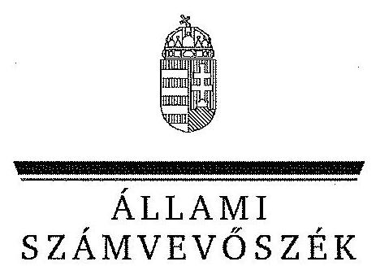
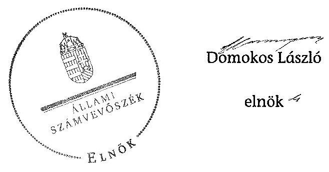

ÁLLAMI
SZÁMVEVŐSZÉK

# JELENTÉS 

a helyi nemzetiségi önkormányzatok gazdálkodásának ellenőrzéséről
Budapest Főváros XV. Kerületi Szerb Nemzetiségi Önkormányzat

---

# Állami Számvevőszék 

Iktatószám: V-0264-016/2014.
Témaszám: 1297
Vizsgálat-azonosító szám: V065281

## Az ellenőrzést felügyelte:

Horváth Balázs
felügyeleti vezető
Az ellenőrzést vezette és az ellenőrzés végrehajtásáért felelős:
Korsósné Vigh Andrea
ellenőrzésvezető
A számvevőszéki jelentést készítették és a jelentés összeállításában közremüködtek:

Buús Zoltánné Hütter Erzsébet
számvevő tanácsos
Batkiné Vas Anna
számvevő tanácsos
Az ellenőrzést végezte:
Szabó Erzsébet
számvevő tanácsos

A témához kapcsolódó eddig készített számvevőszéki jelentés:
címe
sorszáma
Jelentés a Budapest Főváros XV. kerület Rákospalota, Pestújhely, 0571
Úlpalota Önkormányzata gazdálkodási rendszerének átfogó ellen-
őrzéséről

---

# TARTALOMJEGYZÉK 

BEVEZETÉS ..... 3
I. ÖSSZEGZŐ MEGÁLLAPÍTÁSOK, KÖVETKEZTETÉSEK, JAVASLATOK ..... 6
II. RÉSZLETES MEGÁLLAPÍTÁSOK ..... 12

1. A Nemzetiségi Önkormányzat és a Települési Önkormányzat együttműködésének szabályozása, a múködési feltételek biztosítása ..... 12
2. A gazdálkodási feladatok ellátásának szabályszerűsége ..... 13
2.1. A költségvetésre és a zárszámadásra, valamint a kincstári adatszolgáltatás rendjére vonatkozó jogszabályi előírások betartása ..... 13
2.2. A Nemzetiségi Önkormányzat gazdálkodásának szabályozottsága ..... 14
2.3. Az operatív gazdálkodási jogkörök kialakítása, gyakorlása ..... 14
3. A Nemzetiségi Önkormányzattal összefüggő gazdálkodási feladatok belső ellenőrzése ..... 16
4. A feladatalapú támogatás felhasználásának, elszámolásának szabályszerűsége, a Nemzetiségi Önkormányzat feladatellátása ..... 16

## MELLÉKLET

1. számú A Nemzetiségi Önkormányzat 2012. évi gazdálkodásának főbb adatai, mutatói
2. számú Tájékoztatás a polgármesternek küldött el nem fogadott észrevételről

## FÜGGELÉKEK

1. számú Rövidítések jegyzéke
2. számú Értelmező szótár
3. számú A gazdálkodás értékelésének módszere

---

# **Chemistry**

## **Chemical Reactions**

### **Balancing Chemical Equations**

1. **Write the unbalanced equation:**
   - Example: $$C_3H_8 + O_2 \rightarrow CO_2 + H_2O$$

2. **Balance the equation:**
   - Example: $$2C_3H_8 + 7O_2 \rightarrow 6CO_2 + 8H_2O$$

3. **Balance the equation:**
   - Example: $$2C_3H_8 + 7O_2 \rightarrow 6CO_2 + 8H_2O$$

### **Types of Reactions**

1. **Combination Reaction:**
   - Example: $$2H_2 + O_2 \rightarrow 2H_2O$$

2. **Decomposition Reaction:**
   - Example: $$2H_2O_2 \rightarrow 2H_2O + O_2$$

3. **Single Displacement Reaction:**
   - Example: $$Zn + 2HCl \rightarrow ZnCl_2 + H_2$$

4. **Double Displacement Reaction:**
   - Example: $$AgNO_3 + NaCl \rightarrow AgCl + NaNO_3$$

5. **Combustion Reaction:**
   - Example: $$CH_4 + 2O_2 \rightarrow CO_2 + 2H_2O$$

## **Stoichiometry**

### **Mole Concept**

- **Mole (mol):** The amount of substance containing as many particles (atoms, molecules, ions) as there are atoms in exactly 12 grams of carbon-12.
- **Avogadro's Number:** $$6.022 \times 10^{23}$$ particles per mole.

### **Molar Mass**

- **Molar Mass:** The mass of one mole of a substance.
- Example: The molar mass of water ($$H_2O$$) is 18.015 g/mol.

### **Calculations**

1. **Moles to Mass:**
   - Formula: $$n = \frac{m}{M}$$
   - Example: Calculate the number of moles of $$H_2O$$ in 18 grams of water.
     - $$n = \frac{18.015 \, \text{g}}{18.015 \, \text{g/mol}} = 18.015 \, \text{g/mol}$$

2. **Moles to Mass:**
   - Formula: $$m = n \times M$$
   - Example: Calculate the mass of 18.015 g of water.
     - $$m = 18.015 \, \text{g/mol} = 18.015 \, \text{g/mol}$$

## **Gas Laws**

### **Ideal Gas Law**

- **Equation:** $$PV = nRT$$
- **Variables:**
  - $$P$$: Pressure (atm)
  - $$V$$: Volume (L)
  - $$n$$: Number of moles (mol)
  - $$R$$: Ideal gas constant (0.0821 L·atm/mol·K)
  - $$T$$: Temperature (K)

### **Boyle's Law**

- **Equation:** $$P_1V_1 = P_2V_2$$
- **Variables:**
  - P₁: Pressure (atm)
  - P₂: Volume (L)
  - P₃: Temperature (K)
  - P₁: Pressure (atm)
  - P₂: Volume (L)
  - P₃: Temperature (K)
  - P₁: Pressure (atm)

### **Boyle's Law (Boyle's Law)**

- **Equation:** $$\frac{P_1V_1}{P_2V_2} = \frac{P_1}{V} \times P_2V$$
- **Variables:**
  - P₁: Pressure (atm)
  - P₂: Volume (L)
  - P₃: Temperature (K)
  - P₁: Pressure (atm)
  - P₂: Volume (L)
  - P₁: Pressure (atm)

## **Thermochemistry**

### **Enthalpy (H)**

- **Definition:** The heat content of a system at constant pressure.
- **Equation:** $$\Delta H = q_p$$
- **Variables:**
  - $$q_p$$: Heat transferred at constant pressure.
  - $$q_p$$: Heat transferred at constant pressure.

### **Hess's Law**

- **Statement:** The enthalpy change for a reaction is the same whether it occurs in one step or multiple steps.
- **Equation:** $$\Delta H_{\text{rest}} = \Delta H - Q_p$$
- **Variables:**
  - $$Q_p$$: Heat transferred at constant pressure.
  - $$Q_p$$: Heat transferred at constant pressure.

### **Hess's Law (Hess's Law)**

- **Statement:** The enthalpy change for a reaction is the same whether it occurs in one step or multiple steps.
- **Equation:** $$\Delta H_{\text{rest}} = \Delta H - Q_p$$
- **Variables:**
  - $$H$$: Energy (K)
  - $$Q_p$$: Heat transferred at constant pressure.
  - $$Q_p$$: Heat transferred at constant pressure.

## **Electrochemistry**

### **Oxidation and Reduction**

- **Oxidation:** Loss of electrons.
- **Reduction:** Gain of electrons.

### **Galvanic Cells**

- **Definition:** A cell that converts chemical energy into electrical energy.
- **Components:**
  - Anode: Oxidation occurs.
  - Cathode: Reduction occurs.
  - Salt Bridge: Connects the two half-cells.

### **Nernst Equation**

- **Equation:** $$E = E^\circ - \frac{RT}{nF} \ln Q$$
- **Variables:**
  - $$E$$: Energy (K)
  - $$R$$: Ideal gas constant (0.0821 L·atm/mol·K)
  - $$T$$: Temperature (K)
  - $$n$$: Number of electrons transferred
  - $$F$$: Faraday constant (96,485 C/mol)
  - $$Q$$: Reaction quotient

---

# JELENTÉS 

## a helyi nemzetiségi önkormányzatok gazdálkodásának ellenőrzéséről Budapest Főváros XV. Kerületi Szerb Nemzetiségi Önkormányzat

## BEVEZETÉS

A Nemzetiségi Önkormányzat az 1998. évben alakult, elnöke az 1998. évi helyhatósági választások óta látja el feladatát. A Nemzetiségi Önkormányzat intézményt, gazdasági társaságot és más szervezetet nem alapított, illetve ezek társulásában nem vesz részt. A négytagú Képviselő-testület munkája segitésére bizottságot nem hozott létre. A Nemzetiségi Önkormányzatnak a költségvetési beszámolója szerint a 2012. évben a módosított költségvetési bevételi és kiadási előirányzata 581 ezer Ft, a teljesitett költségvetési bevétel 593 ezer Ft, a teljesített költségvetési kiadás 406 ezer Ft volt. A 2012. évi gazdálkodási adatokat részletesen az 1. számú mellékletben mutatjuk be.

Az Alaptörvény XXIX. cikk (1) bekezdése szerint a Magyarországon élő nemzetiségek államalkotó tényezők. Minden, valamely nemzetiséghez tartozó magyar állampolgárnak joga van önazonossága szabad vállalásához és megőrzéséhez. A hazánkban élő nemzetiségek helyi (települési és területi), valamint országos önkormányzatokat hozhatnak létre. A helyi nemzetiségi önkormányzatok gazdálkodási feladatait jogszabályi előírás alapján a székhely szerinti helyi önkormányzat polgármesteri hivatala látja el.

A nemzetiségek helyzete, támogatása mind hazai, mind EU-s szinten kiemelt figyelmet kap napjainkban. A helyi nemzetiségi önkormányzatok gazdálkodására és támogatási rendszerére vonatkozó jogszabályok a 2010-2012. években jelentős változásokon mentek át. A települési és területi nemzetiségi önkormányzatok gazdálkodásának, a részükre juttatott költségvetési támogatások felhasználásának ellenőrzését az ÁSZ a 2012. évben sorozatjellegű ellenőrzés keretében indította el. A 2013. évi ellenőrzések e témacsoportos ellenőrzések folytatását jelentik, amelyet az ÁSZ 2014. első félévi ellenőrzési terve 12. témasorszámon tartalmaz.

Az ellenőrzés célja annak értékelése volt, hogy a Nemzetiségi Önkormányzat gazdálkodási kereteinek kialakítása, gazdálkodása és feladatellátása megfelelt-e a jogszabályoknak.

Ennek keretében értékeltük, hogy:

- a Nemzetiségi Önkormányzat és a Települési Önkormányzat együttműködésének szabályozása, a múködési feltételek biztosítása megfelelt-e a jogszabályi előírásoknak;

---

- a felek együttműködése megfelelt-e a közöttük létrejött együttműködési megállapodásnak a gazdálkodási feladatok szabályszerű ellátása során, ennek keretében betartották-e a Nemzetiségi Önkormányzat gazdálkodásához kapcsolódóan a költségvetésre és zárszámadásra, a gazdálkodás szabályozására, az operatív gazdálkodási jogkörök gyakorlására vonatkozó jogszabályi előírásokat;
- a jegyző biztosította-e a Nemzetiségi Önkormányzat gazdálkodásának belső ellenőrzését;
- a Nemzetiségi Önkormányzat feladatalapú támogatásának felhasználása, a folyósított feladatalapú támogatással történő elszámolás az előírásoknak megfelelő volt-e;
- a Nemzetiségi Önkormányzat feladatellátása összhangban volt-e a vonatkozó jogszabályi előírásokkal.

Az ellenőrzés várható hasznosulását négy szinten tervezzük. A törvényalkotás számára összegzett tapasztalatok állnak rendelkezésre a nemzetiségi önkormányzatok testületi döntéseinek, gazdálkodásának és a feladatalapú támogatás felhasználásának szabályszerűségéről, amelynek alapján következtetést lehet levonni arra, hogy indokolt-e jogszabályi módosítás kezdeményezése. Az ellenőrzés az ellenőrzött számára visszajelzést ad a működésében fellépő hiányosságokról, javaslataival hozzájárul azok kiküszöböléséhez, amely csökkentheti a későbbi ellenőrzések gyakoriságát. Az ellenőrzés megállapításai és javaslatai tanulságul szolgálhatnak más nemzetiségi önkormányzatok, szervezetek számára a rendezett gazdálkodási keretek kialakításához. A társadalom számára jelzi, hogy közpénz nem maradhat ellenőrizetlenül, az ÁSZ értékteremtő rend kialakításához és megőrzéséhez hozzájáruló tevékenysége pozitív hatással lesz a szervezetről kialakított összkép formálásában. Az ÁSZ szervezetén belül lehetőség nyílik arra, hogy a megállapítások szintetizálásával az intézmény a hozzáadott értéket teremtő, elemző tevékenységét és tanácsadó szerepét erősítse.

A helyi nemzetiségi önkormányzatok gazdálkodásának ellenőrzéséről szóló jelentés I. fejezetének összegző része az ellenőrzés céljára adott rövid, szintetizáló összefoglalót és következtetéseket tartalmazza a II. fejezet részletes megállapításain alapulóan. A jelentés intézkedést igénylő megállapításait és javaslatait az összegzőben foglaltak mellett - az ellenőrzés során feltárt, a jelentés II. fejezetében rögzített részletes megállapítások alapozzák meg, illetve támasztják alá.

# Az ellenőrzés típusa: szabályszerűségi ellenőrzés 

Az ellenőrzött időszak: 2012. január 1. - 2012. december 31. közötti időszak. Az ellenőrzés kiterjedt a helyi nemzetiségi önkormányzatnak juttatott, 2012. évi feladatalapú támogatás 2013. évben való elszámolására is.

Ellenőrzött szervezet: Budapest Főváros XV. Kerületi Szerb Nemzetiségi Önkormányzat és a gazdálkodási feladatait ellátó Budapest Főváros XV. Kerület Rákospalota, Pestújhely, Újpalota Önkormányzata.

---

Az ellenőrzés végrehajtásának jogszabályi alapját az ÁSZ tv. 5. § (2)(3) és (6) bekezdéseiben foglaltak képezik.

Az ellenőrzés szakmai módszertana az ÁSZ hivatalos honlapján (www.asz.hu) közzétett szakmai szabályokon alapult, amely a Legfőbb Ellenőrző Intézmények Nemzetközi Szervezete (INTOSAI) által kiadott nemzetközi standardok (ISSAI) figyelembevételével készült.

A helyi nemzetiségi önkormányzatok gazdálkodásának ellenőrzése során értékeltük a Települési Önkormányzat és a Nemzetiségi Önkormányzat együttmúködésének, a gazdálkodás szabályozottságának és a pénzügyi folyamatokban kulcsszerepet betöltő belső kontrollok (teljesítésigazolás és érvényesítés) múködésének megfelelőségét. A kulcskontrollokat a múködési és felhalmozási célú támogatásértékű kiadásoknál, az államháztartáson kívülre teljesített múködési és felhalmozási célú pénzeszköz-átadásoknál, a dologi kiadásokkal kapcsolatos kifizetéseknél - véletlen mintavételi eljárást alkalmazva - ellenőriztük. Ellenőriztük, hogy a jegyző biztosította-e a Nemzetiségi Önkormányzat gazdálkodásának belső ellenőrzését. Értékeltük a feladatalapú támogatások felhasználásának, elszámolásának szabályszerűségét, a Nemzetiségi Önkormányzat feladatellátása és a jogszabályi előírások összhangját. A minősítési szempontokat a 3. számú függelék tartalmazza.

Az ellenőrzés lefolytatásához a Nemzetiségi Önkormányzat és a gazdálkodási feladatait ellátó Települési Önkormányzat tanúsítványok és a kapcsolódó, dokumentumjegyzékben megjelölt dokumentumok elektronikus úton történő megküldésével, rendelkezésre bocsátásával szolgáltatott adatokat. Az adatszolgáltatás kontrollálása és szükség szerinti javítása a helyszíni ellenőrzés keretében történt.

Az ÁSZ tv. 29. § (1) bekezdése szerint a jelentéstervezetet megküldtük egyeztetésre a polgármesternek és a Nemzetiségi Önkormányzat elnökének. A Nemzetiségi Önkormányzat elnöke az ÁSZ tv. 29. § (2) bekezdésében foglalt észrevételezési jogával nem élt, a jelentéstervezetre észrevételt nem tett. A polgármester határidőben megküldött észrevétele és tájékoztatása alapján a jelentést módosítottuk, az el nem fogadott észrevétel indokolását a jelentés 2. számú melléklete tartalmazza.

---

# I. ÖSSZEGZŐ MEGÁLLAPÍTÁSOK, KÖVETKEZTETÉSEK, JAVASLATOK 

A Nemzetiségi Önkormányzat és a Települési Önkormányzat együttmúködésének szabályozása - kisebb tartalmi hiányosságok kivételével - megfelelt a jogszabályi előírásoknak. A Nemzetiségi Önkormányzat az ellenőrzött időszakban rendelkezett a Települési Önkormányzattal kötött együttmúködési megállapodással. Annak felülvizsgálatát a Nek. 2 tv.-ben meghatározott határidőn túl, 2012 februárjában hajtották végre, melynek során a Nek. ${ }_{2}$ tv. alapján a múködési feltételek szabályozására vonatkozó módosításokat is elvégezték. A 2012. december 31 -én hatályos együttmúködési megállapodásban azonban a Nek. 2 tv.-ben foglaltak ellenére nem rögzítették a testületi döntések és a tisztségviselők döntései előkészítésének, a testületi és tisztségviselői döntéshozatalhoz kapcsolódó nyilvántartási feladatok ellátásának kötelezettségét. A 2012. december 31-én hatályos együttmúködési megállapodásban a Nek. ${ }_{2}$ tv. előírása ellenére nem határozták meg a Nemzetiségi Önkormányzat önálló fizetési számla nyitásával, törzskönyvi nyilvántartásba vételével és adószám igénylésével kapcsolatos határidőket és együttmúködési kötelezettségeket. A Nek. ${ }_{2}$ tv.ben foglaltak ellenére a Nemzetiségi Önkormányzat SZMSZ-e nem tartalmazta az együttmúködési megállapodás szerinti múködési feltételeket. A Települési Önkormányzat a 2012. évben biztosította a Nemzetiségi Önkormányzat múködésének személyi és tárgyi feltételeit.

A Nemzetiségi Önkormányzat 2012. évi költségvetésére és zárszámadására, valamint az adatszolgáltatásra vonatkozó jogszabályi előírások nem érvényesültek. A Nemzetiségi Önkormányzat elnöke a 2012. évi költségvetés határozattervezetét az előírt határidőig benyújtotta a Képviselő-testületnek. A 2012. évi költségvetés előterjesztésekor - a jegyző mulasztása miatt - az Áht. ${ }_{2}$ szerinti előírás ellenére nem mutatták be szöveges indokolással együtt a Képvi-selő-testület részére tájékoztatásul a Nemzetiségi Önkormányzat költségvetési mérlegét közgazdasági tagolásban és előirányzat felhasználási tervét. A jegyző a 2012. évi költségvetéshez kapcsolódó, a Nemzetiségi Önkormányzatra vonatkozó, kincstári adatszolgáltatási kötelezettségének négy esetben az előírt határidőn túl tett eleget. A jegyző az Áht. ${ }_{2}$-ben előírtak ellenére nem készítette el a Nemzetiségi Önkormányzat 2012. évi gazdálkodásáról a zárszámadási határozat tervezetét, a bevételeket és kiadásokat tartalmazó zárszámadást, továbbá a Képviselő-testület tájékoztatására a költségvetési mérleget közgazdasági tagolásban, a pénzeszközök változását, valamint a vagyonkimutatást. A zárszámadási határozattervezet és a tájékoztató kimutatások elkészítésének és beterjesztésének hiányában a Képviselő-testület által a 2012. évi zárszámadásról alkotott határozat az Áht. ${ }_{2}$-ben előírt tartalomnak nem volt megfelelő.

A Nemzetiségi Önkormányzat gazdálkodásának szabályozottsága részben volt megfelelő az ellenőrzött időszakban. A Nemzetiségi Önkormányzat a 2012. évben a Számv. tv.-ben előírt szabályzatokkal - a leltárkészítésre és leltározásra, az eszközök és források értékelésére, a pénz- és értékkezelésre vonatkozó szabályozásokkal, valamint számviteli politikával és számlarenddel -, továbbá az Áht. ${ }_{2}$-ben foglaltak szerinti, a tervezéssel, gazdálkodással kapcsolatos

---

szabályozással 2012. március 1-jétől, a Bkr.-ben előírt, a folyamatba épített előzetes, utólagos és vezetői ellenőrzési szabályozással a 2012. év egészében, a Polgármesteri Hivatal szabályzatai hatályának kiterjesztése útján rendelkezett. A Nemzetiségi Önkormányzat nem rendelkezett a Bkr.-ben előírt ellenőrzési nyomvonallal, szabálytalanságok kezelésének eljárásrendjével. A Polgármesteri Hivatal SZMSZ-e az Ávr. előírásának megfelelően tartalmazta az SZMSZ-ben nevesített munkakörökhöz tartozó - a Nemzetiségi Önkormányzat gazdálkodásával kapcsolatos - feladat- és hatásköröket, a hatáskörök gyakorlásának módját, a helyettesítés rendjét, az ezekhez kapcsolódó felelősségi szabályokat.

A Nemzetiségi Önkormányzat gazdálkodása tekintetében az operatív gazdálkodási jogkörök kialakítása megfelelt a jogszabályi előírásoknak. A Nemzetiségi Önkormányzat elnöke a Képviselő-testület egy tagjának a kötelezettségvállalás és az utalványozás gyakorlására adott felhatalmazással biztosította e jogkörök tekintetében az összeférhetetlenségi követelmények érvényesülésének feltételeit, továbbá az előírásoknak megfelelően kijelölte a teljesítésigazoló személyeket. A Nemzetiségi Önkormányzat Ávr.-ben meghatározott gazdálkodási tevékenységét a Polgármesteri Hivatal gazdasági szervezet nélkül, az állományába tartozó, megfelelő végzettségű személlyel látta el. A jegyző az Ávr.-ben biztosított jogkörében eljárva - írásban kijelölte a Polgármesteri Hivatal állományába tartozó, előírt végzettséggel rendelkező köztisztviselőket a pénzügyi ellenjegyzési, valamint az érvényesítési feladatok ellátására.

A dologi kiadások bizonylatainak tesztelése során a teljesítésigazolás és az érvényesítés kulcskontrollok működésének megfelelőségét az ellenőrzés összességében gyengének értékelte annak ellenére, hogy a teljesítésigazolás megfelelően működött. A hibák száma a lényegességi szintet, a kritikus hibahatárt elérte, mert az érvényesítő nem az Ávr.-ben foglaltaknak megfelelően végezte a fedezet meglétének és a megelőző ügymenetben az Ávr. betartásának ellenőrzését, valamint az utalványozónak nem jelezte az Ávr. megsértését. Nem észrevételezte a százezer forintot el nem érő kifizetések kötelezettségvállalásnyilvántartásba vételének hiányát, valamint, hogy az Ávr. előírása ellenére az utalványrendeleten nem tüntették fel a kötelezettségvállalás nyilvántartási számát. A Nemzetiségi Önkormányzat 2012. évi, három, legnagyobb összegű dologi kiadás teljesítése bizonylatainak egyedi értékelése alapján mindhárom kifizetés esetében a teljesítésigazolás kulcskontroll megfelelően működött, az érvényesítés kulcskontroll nem megfelelően működött. Múködési és felhalmozási célú támogatásértékű kiadást, valamint működési és felhalmozási célú pénzeszközátadást államháztartáson kívülre a 2012. évben nem teljesítettek. A feltárt hiányosságok azonosak voltak a dologi kiadásoknál részletezettekkel. A Nemzetiségi Önkormányzatnál a kulcskontrollok 2012. évi múködésében feltárt hiányosságokkal összefüggésben az ellenőrzés - a rendelkezésre bocsátott dokumentumok alapján - jogosulatlan kifizetést nem állapított meg, azonban a kulcskontrollok múködésében feltárt hiányosságok miatt nem biztosított a hibák megelőzése, feltárása és kijavítása.

A jegyző az ellenőrzött időszakban nem biztosította a Nemzetiségi Önkormányzat gazdálkodásával összefüggő végrehajtási feladatok belső ellenőrzését. A Polgármesteri Hivatal 2012. évre vonatkozó éves ellenőrzési tervét megalapozó, a Ber.-ben előírt kockázatelemzés nem terjedt ki a Nemzetiségi Önkormányzat gazdálkodásával összefüggő végrehajtási feladatok ellátására.

---

E feladatokra irányuló belső ellenőrzést a 2012. évben nem terveztek és nem végeztek.

A Nemzetiségi Önkormányzat a 2011. évben, tévesen, 85 ezer Ft feladatalapú támogatásban részesült. A támogató 2012. évben történt kezdeményezésére a visszafizetést 2012 szeptemberében teljesítették. A Nemzetiségi Önkormányzat a 2012. évben nem részesült feladatalapú támogatásban. A Nemzetiségi Önkormányzat a 2012. évben a Képviselő-testület működésén kívül - a tanúsítványon közölt adatok és az ellenőrzés részére átadott dokumentumok alapján kötelező közfeladatot nem látott el. Feladatellátásának tárgya az önként vállalt feladatok tekintetében összhangban volt a Nek. 2 tv. előírásaival. A Nemzetiségi Önkormányzat önként vállalt közfeladatokat kulturális és hagyományápolási területen végzett.

Az ÁSZ tv. 33. § (1) bekezdésében foglaltak értelmében az ellenőrzött szervezet vezetője köteles a jelentésben foglalt megállapításokhoz kapcsolódó intézkedési tervet összeállítani, és azt a jelentés kézhezvételétől számított 30 napon belül az ÁSZ részére megküldeni. Amennyiben az intézkedési tervet határidőre nem küldi meg a szervezet, vagy az nem elfogadható, az ÁSZ elnöke az ÁSZ tv. 33. § (3) bekezdés a)-b) pontjaiban foglaltakat érvényesítheti.

A helyszíni ellenőrzés megállapításainak hasznosítása mellett javasoljuk:

# a jegyzőnek 

1. az együttműködés szabályozásával kapcsolatban

A Nemzetiségi Önkormányzat és a Települési Önkormányzat együttműködését meghatározó - 2012. december 31-én hatályos - együttműködési megállapodásban a Nek. 2 tv. 80. § (3) bekezdés a) pontjában előírtak ellenére nem határozták meg az önálló fizetési számla nyitásával, törzskönyvi nyilvántartásba vételével és adószám igénylésével kapcsolatos határidőket és együttműködési kötelezettségeket. A 2012. január 1-jén hatályos együttműködési megállapodásnak a Nek. 2 tv. 80. § (2) bekezdésében - 2012. január 31-ig - előírt felülvizsgálatát határidőn túl végezték el. A Nemzetiségi Önkormányzat SZMSZ-ében a Nek. ${ }_{2}$ tv. 80. § (2) bekezdésében foglaltak ellenére nem rögzítették az együttműködési megállapodás szerinti működési feltételeket.

Javaslat
Az együttműködés szabályszerűsége érdekében:
a) készítse elő az együttműködési megállapodás módosítását, hogy az tartalmilag feleljen meg a Nek. 2 tv. 80. § (3) bekezdés a) pontjában foglalt előírásoknak;
b) biztosítsa a jövőben az együttműködési megállapodás évenkénti felülvizsgálata során a Nek. 2 tv. 80. § (2) bekezdésében előírt határidő betartását;
c) készítse elő a Nemzetiségi Önkormányzat SZMSZ-ének a Nek. ${ }_{2}$ tv. 80. § (2) bekezdésében foglalt előírás alapján történő kiegészítését.

---

2. a költségvetés és a zárszámadás, valamint a kapcsolódó kincstári adatszolgáltatás szabályszerűségével kapcsolatban

A költségvetési határozattervezet előterjesztésekor - a jegyző mulasztása miatt - a Képviselő-testület részére tájékoztatásul nem mutatták be az Áht. 2 24. § (4) bekezdés a) pontja szerinti költségvetési mérleget közgazdasági tagolásban és előirányzat felhasználási tervet szöveges indoklással együtt.

A jegyző nem készítette el az Áht. 2 91. § (1) bekezdésében és 89. § (1)(2) bekezdéseiben előírtak ellenére a Nemzetiségi Önkormányzat 2012. évi gazdálkodásáról a zárszámadási határozat tervezetét, továbbá a Képviselő-testület tájékoztatására az Áht. 2 91. § (2) bekezdés a) és c) pontjaiban előírtak ellenére a költségvetési mérleget közgazdasági tagolásban, a pénzeszközök változását és a vagyonkimutatást.

A jegyző a 2012. évi költségvetéshez kapcsolódó, a Nemzetiségi Önkormányzatra vonatkozó, kincstári adatszolgáltatási kötelezettségének több esetben - az Ávr. 169. § (2) és 170. § (5) bekezdéseiben előírt - határidőn túl tett eleget.

Javaslat
Gondoskodjon a jövőben:
a) az Áht. 2 24. § (4) bekezdés a) pontjában foglalt előírásnak megfelelően, hogy a Nemzetiségi Önkormányzat költségvetési határozattervezete előterjesztésekor a Képviselő-testület részére tájékoztatásul bemutatásra kerüljön szöveges indokolással együtt a Nemzetiségi Önkormányzat költségvetési mérlege közgazdasági tagolásban, valamint az előirányzat felhasználási terve;
b) az Áht. 2 89. § (1)-(2) bekezdéseiben előírtaknak megfelelő zárszámadási határozattervezet elkészítéséről, hogy azt a Nemzetiségi Önkormányzat elnöke az Áht. 2 91. § (1) bekezdésében előírtak szerint előterjeszthesse a Képviselőtestületnek, bemutatva az Áht. 2 91. § (2) bekezdés a) és c) pontjaiban foglalt mérlegeket és kimutatásokat;
c) a kincstári adatszolgáltatási kötelezettségek Ávr. 169. § (2) és 170. § (5) bekezdéseiben előírt határidőben történő teljesítéséről.
3. a gazdálkodási feladatok szabályozottságával kapcsolatban

A Nemzetiségi Önkormányzat nem rendelkezett a Bkr. 6. § (3)-(4) bekezdéseiben előírt ellenőrzési nyomvonallal és a szabálytalanságok kezelésének eljárásrendjével.

Javaslat
A gazdálkodás szabályszerűsége érdekében gondoskodjon a Bkr. 6. § (3)-(4) bekezdéseiben előírt ellenőrzési nyomvonal és a szabálytalanságok kezelése eljárásrendje hatályának a Nemzetiségi Önkormányzat gazdálkodási feladataira történő kiterjesztéséről.

---

4. a kulcskontrollok működésével kapcsolatban

Az érvényesítő nem az Ávr. 58. § (1)-(2) bekezdésében előírtak szerint végezte feladatát, mivel nem ellenőrizte a fedezet meglétét, továbbá a megelőző ügymenetben az Ávr.-ben foglaltak betartását, valamint nem jelezte az utalványozónak az Ávr. megsértését.

Javaslat
Az operatív gazdálkodás működési hibáinak megelőzése, feltárása és kijavítása érdekében gondoskodjon arról, hogy az érvényesítő tegyen eleget az Ávr. 58. § (1)(3) bekezdéseiben meghatározott ellenőrzési feladatának, valamint jelzési és igazolási kötelezettségének.

# a polgármesternek 

A Nemzetiségi Önkormányzat és a Települési Önkormányzat együttműködését meghatározó - 2012. december 31-én hatályos - együttműködési megállapodásban a Nek. ${ }_{2}$ tv. 80. § (3) bekezdés a) pontjában előírtak ellenére nem határozták meg az önálló fizetési számla nyitásával, törzskönyvi nyilvántartásba vételével és adószám igénylésével kapcsolatos határidőket és együttműködési kötelezettségeket.

Javaslat
Terjessze a Települési Önkormányzat Képviselő-testülete elé jóváhagyásra a jegyző által a Nek. ${ }_{2}$ tv. 80. § (3) bekezdés a) pontjában foglalt előírások betartásával előkészített együttműködési megállapodás módosítását.

## a Nemzetiségi Önkormányzat elnökének

1. A Nemzetiségi Önkormányzat és a Települési Önkormányzat együttműködését meghatározó - 2012. december 31-én hatályos - együttműködési megállapodásban a Nek. ${ }_{2}$ tv. 80. § (3) bekezdés a) pontjában előírtak ellenére nem határozták meg az önálló fizetési számla nyitásával, törzskönyvi nyilvántartásba vételével és adószám igénylésével kapcsolatos határidőket és együttműködési kötelezettségeket.

A Nemzetiségi Önkormányzat SZMSZ-ében a Nek. ${ }_{2}$ tv. 80. § (2) bekezdésében foglaltak ellenére nem rögzítették az együttműködési megállapodás szerinti működési feltételeket.

Javaslat
Terjessze a Képviselő-testület elé jóváhagyásra:
a) a jegyző által a Nek. ${ }_{2}$ tv. 80. § (3) bekezdés a) pontjában foglalt előírások betartásával előkészített együttműködési megállapodás módosítását;
b) a Nemzetiségi Önkormányzat SZMSZ-ének a Nek. ${ }_{2}$ tv. 80. § (2) bekezdésében foglaltaknak megfelelő, jegyző által előkészített módosítását.

---

2. A költségvetési határozattervezet előterjesztésekor - a jegyző mulasztása miatt - a Képviselő-testület részére tájékoztatásul nem mutatták be az Áht. 2 24. § (4) bekezdés a) pontja szerinti költségvetési mérleget közgazdasági tagolásban és előirányzat felhasználási tervet szöveges indoklással együtt.

A Képviselő-testület - a jegyző mulasztása miatt - a 2012. évi zárszámadásról az Áht. 2 91. § (1) bekezdésében foglaltak ellenére, nem az Áht. 2 89. § (1)(2) bekezdéseiben előírt tartalomnak megfelelő határozatot alkotott. A Nemzetiségi Önkormányzat elnöke - a jegyző általi elkészítés hiányában - a zárszámadási határozattervezet előterjesztésekor a Képviselő-testület tájékoztatására nem mutatta be, az Áht. 2 91. § (2) bekezdés a) és c) pontjaiban előírtak ellenére a költségvetési mérleget közgazdasági tagolásban, a pénzeszközök változását és a vagyonkimutatást.

Javaslat
A jövőben
a) gondoskodjon az Áht. 2 24. § (4) bekezdés a) pontjában foglalt előírásnak megfelelően, hogy a költségvetési határozattervezet előterjesztésekor a Képviselőtestület részére tájékoztatásul bemutatásra kerüljön a Nemzetiségi Önkormányzat költségvetési mérlege közgazdasági tagolásban, valamint az előirányzat felhasználási terve szöveges indokolással együtt;
b) terjessze a Képviselő-testület elé jóváhagyásra a jegyző által előkészített, az Áht. 2 91. § (2) bekezdésben előírt zárszámadási határozattervezetet, továbbá tájékoztatásra az Áht. 2 91. § (2) bekezdés a) és c) pontjaiban előírt mérlegeket, kimutatásokat.

---

# II. RÉSZLETES MEGÁLLAPÍTÁSOK 

## 1. A Nemzetiségi Önkormányzat és a Telepúlési Önkormányzat együttmúködésének szabályozása, a múködési feltételek biztositása

A Nemzetiségi Önkormányzat és a Települési Önkormányzat együttmúködésének szabályozása - kisebb tartalmi hiányosságok kivételével megfelel a jogszabályi előírásoknak.

A Nemzetiségi Önkormányzat az ellenőrzött időszakban rendelkezett a Települési Önkormányzattal kötött együttműködési megállapodással¹. A 2012. január 1-jén hatályos együttműködési megállapodásnak a Nek. 2 tv. 80. § (2) bekezdésében - 2012. január 31-ig - előírt felülvizsgálatát határidőn túl, 2012 februárjában végezték el. Ezzel egyidejűleg végrehajtották a múködési feltételek szabályozásának a Nek. ${ }_{2}$ tv. 159. § (3) bekezdésében a 2012. június 1-jel határidőre előírt módosítását.

A Nemzetiségi Önkormányzat múködési feltételeit a 2012. december 31-én hatályos együttműködési megállapodás a Nek. 2 tv. 80. § (1) bekezdés d) pontja tekintetében hiányosan szabályozta. Nem rögzítették a testületi döntések és a tisztségviselők döntései előkészítésének, a testületi és tisztségviselői döntéshozatalhoz kapcsolódó nyilvántartási feladatok ellátásának kötelezettségét. Az együttműködési megállapodást a 2013. évi felülvizsgálata során kiegészítették a testületi és a tisztségviselői döntések előkészítésének, valamint a döntéshozatalokhoz kapcsolódó nyilvántartási feladatok ellátásának kötelezettségével.

A Nek. 2 tv. 80. § (2) bekezdésében foglaltak ellenére a Nemzetiségi Önkormányzat SZMSZ-e ${ }^{2}$ nem tartalmazta az együttmúködési megállapodás szerinti múködési feltételeket.

A 2012. december 31-én hatályos együttműködési megállapodásban a Nek. ${ }_{2}$ tv. 80. § (3) bekezdés a) pontjában előírtak ellenére nem határozták meg a Nemzetiségi Önkormányzat önálló fizetési számla nyitásával, törzskönyvi nyilvántartásba vételével és adószám igénylésével kapcsolatos határidőket és együttmúködési kötelezettségeket.

[^0]
[^0]:    ${ }^{1}$ A 2012. február végéig hatályos együttműködési megállapodást a Képviselő-testület a 9/2011. (II. 08.) számú, a Települési Önkormányzat Képviselő-testülete a 126/2011. (II. 16.) számú határozattal fogadta el. A 2012. március 1-jétől hatályos, a Nek. 2 tv. 159. § (3) bekezdésében előírtak alapján megkötött együttműködési megállapodást a Képviselő-testület a 11/2012. (II. 16.) számú, a Települési Önkormányzat Kép-viselő-testülete a 119/2012. (II. 22.) számú határozattal hagyta jóvá.
    ${ }^{2}$ A Képviselő-testület a Nemzetiségi Önkormányzat SZMSZ-ét a 17/2011. (V. 24.) számú határozatával fogadta el.

---

A Települési Önkormányzat a Nemzetiségi Önkormányzat 2012. évi müködésének - a Nek. 2 tv. 159. § (3) bekezdésében foglalt átmeneti rendelkezés alapján a Nek. ${ }_{1}$ tv. 27. § (2)-(3) bekezdéseiben előírt - személyi és tárgyi feltételeit a Polgármesteri Hivatal útján biztosította.

# 2. A GAZDÁLKODÁSI FELADATOK ELLÁTÁSÁNAK SZABÁLYSZERŰSÉGE 

### 2.1. A költségvetésre és a zárszámadásra, valamint a kincstári adatszolgáltatás rendjére vonatkozó jogszabályi előírások betartása

A Nemzetiségi Önkormányzat 2012. évi költségvetésének és zárszámadásának tartalma, jóváhagyása, valamint a kapcsolódó adatszolgáltatás nem felelt meg a jogszabályi előírásoknak.

A Nemzetiségi Önkormányzat elnöke a jegyző által elkészített, 2012. évi költségvetés határozattervezetét az előírt határidőig benyújtotta ${ }^{3}$ a Képviselőtestületnek. A 2012. évi költségvetés előterjesztésekor - a jegyző mulasztása miatt - az Áht. ${ }_{2} 24$. § (4) bekezdés a) pontja szerinti előírás ellenére nem mutatták be szöveges indokolással együtt a Képviselő-testület részére tájékoztatásul a Nemzetiségi Önkormányzat költségvetési mérlegét közgazdasági tagolásban és az előirányzat felhasználási tervét.

A jegyző a 2012. évi költségvetéshez kapcsolódó, a Nemzetiségi Önkormányzatra vonatkozó, kincstári adatszolgáltatási kötelezettségének négy esetben - az Ávr. 169. § (2) és a 170. § (5) bekezdéseiben előírt - határidőn túl tett eleget.

A Nemzetiségi Önkormányzat 2012. évi zárszámadási határozatának elkészítése, elfogadása, tartalma tekintetében a jogszabályi előírások nem érvényesültek:

- a jegyző́ nem tett eleget az Áht. ${ }_{2}$ 91. § (1) bekezdésében előírtaknak, mert a Nemzetiségi Önkormányzat 2012. évi gazdálkodásáról a zárszámadási határozat tervezetét nem készítette el. Az Áht. ${ }_{2}$ 89. § (1)-(2) bekezdéseiben előírtak ellenére a 2012. évi költségvetési beszámoló alapján a költségvetés végrehajtásáról nem készítette el a Nemzetiségi Önkormányzat valamennyi bevételét és kiadását tartalmazó zárszámadást, továbbá a Képviselőtestület tájékoztatására az Áht. ${ }_{2} 91 . \S$ (2) bekezdés a) és c) pontjaiban előírtak ellenére a költségvetési mérleget közgazdasági tagolásban, a pénzeszközök változását, valamint a vagyonkimutatást;
- a zárszámadási határozattervezet és a tájékoztató kimutatások elkészítésének és beterjesztésének hiányában a Képviselö-testület a 2012. évi zárszámadásról az Áht. ${ }_{2}$ 91. § (1) bekezdésében foglaltak ellenére, nem az

[^0]
[^0]:    ${ }^{3}$ A Képviselő-testület a 8/2012. (II. 6.) számú határozatával döntött a Nemzetiségi Önkormányzat 2012. évi költségvetéséről.

---

Áht. 89. § (1)-(2) bekezdéseiben előírt tartalomnak megfelelő határozatot alkotott.

A 2013. április 14-i képviselő-testületi ülésen a 10/2013. (IV. 14.) határozatszámmal rögzítették a Nemzetiségi Önkormányzat 2012. évi zárszámadásának megtárgyalását és elfogadását, és mellékletként az éves elemi költségvetési beszámoló 80 -as űrlapját szerepeltették.

# 2.2. A Nemzetiségi Önkormányzat gazdálkodásának szabályozottsága 

A Nemzetiségi Önkormányzat gazdálkodásának szabályozottsága részben volt a jogszabályi előírásoknak megfelelő az ellenőrzött időszakban.

A Nemzetiségi Önkormányzat a 2012. évben a Számv. tv.-ben előírt szabályzatokkal - a leltárkészítésre és leltározásra, az eszközök és források értékelésére, a pénz- és értékkezelésre vonatkozó szabályozásokkal, valamint számviteli politikával és számlarenddel -, továbbá az Áht. ${ }_{2}$-ben foglaltak szerinti, a tervezéssel, gazdálkodással ${ }^{4}$ kapcsolatos szabályozással 2012. március 1-jétől, a Bkr.-ben előírt, a folyamatba épített előzetes, utólagos és vezetői ellenőrzési szabályozással a 2012. év egészében, a Polgármesteri Hivatal szabályzatai hatályának kiterjesztése útján ${ }^{5}$ rendelkezett.

A jegyző a Nemzetiségi Önkormányzat gazdálkodási feladataira nem terjesztette ki a Bkr. 6. § (3)-(4) bekezdéseiben előírt ellenőrzési nyomvonal és a szabálytalanságok kezelése eljárásrendjének hatályát. Ezekkel a szabályzatokkal a Nemzetiségi Önkormányzat önállóan sem rendelkezett.

A Polgármesteri Hivatal SZMSZ-e az Ávr. előírásának megfelelően tartalmazta az SZMSZ-ben nevesített munkakörökhöz tartozó - a Nemzetiségi Önkormányzat gazdálkodásával kapcsolatos - feladat- és hatásköröket, a hatáskörök gyakorlásának módját, a helyettesítés rendjét, az ezekhez kapcsolódó felelősségi szabályokat. Azokat a munkaköri leírásokban is rögzítették.

### 2.3. Az operatív gazdálkodási jogkörök kialakítása, gyakorlása

A Nemzetiségi Önkormányzat gazdálkodása tekintetében az operatív gazdálkodási jogkörök kialakítása megfelelt a jogszabályi előírásoknak.

A Nemzetiségi Önkormányzat elnöke a Képviselő-testület egy tagjának a kötelezettségvállalás és az utalványozás gyakorlására ${ }^{6}$ adott felhatalmazással biz-

[^0]
[^0]:    ${ }^{4}$ kötelezettségvállalással, pénzügyi ellenjegyzéssel, teljesítésigazolással, érvényesítéssel
    ${ }^{5}$ A 2012. március 1-jétől hatályos együttműködési megállapodás I. fejezet 10. pontjában rögzítették a szabályzatok hatályának Nemzetiségi Önkormányzatra történő kiterjesztését.
    ${ }^{6}$ 19/2011. (V. 24.) számú határozat

---

tosította e jogkörök tekintetében az összeférhetetlenségi követelmények érvényesülésének feltételeit, továbbá - mint kötelezettségvállaló - az előírásoknak megfelelően kijelölte a teljesítésigazoló ${ }^{7}$ személyeket.

Az operatív gazdálkodási feladatokat - kötelezettségvállalást, utalványozást, ellenjegyzést, érvényesítést és teljesítésigazolást - az ellenőrzött időszakban az együttmúködési megállapodásban, valamint a kötelezettségvállalás, utalványozás, ellenjegyzés és érvényesítés rendjének szabályozásáról szóló, a polgármester és a jegyző által kiadott együttes utasításokban ${ }^{8}$ rögzítették. A pénzügyi ellenjegyzést és az érvényesítést a Polgármesteri Hivatal - feladatellátáshoz szükséges végzettséggel és képzettséggel rendelkező - köztisztviselőinek feladataként határozták meg.

A Nemzetiségi Önkormányzat Ávr.-ben meghatározott gazdálkodási tevékenységét a Polgármesteri Hivatal gazdasági szervezet nélkül9, az állományába tartozó, megfelelő végzettségű személlyel látta el.

A jegyző - az Ávr. szerinti jogkörében eljárva - írásban kijelölte a Polgármesteri Hivatal állományába tartozó, előírt végzettséggel rendelkező köztisztviselöket a pénzügyi ellenjegyzési, valamint az érvényesítési feladatok ellátására.

A Nemzetiségi Önkormányzat dologi kiadásainak teljesítése során - a bizonylatok tesztelése alapján - a teljesítésigazolás és az érvényesítés kulcskontrollok múködésének megfelelősége összességében gyenge volt, annak ellenére, hogy a teljesítésigazolás kontroll megfelelően múködött. A hibák száma a lényegességi szintet, a kritikus hibahatárt elérte, mert az érvényesítő nem az Ávr. 58. § (1) bekezdésében előírtak szerint látta el ellenőrzési feladatát a fedezet megléte, továbbá a megelőző ügymenetben az Ávr.-ben foglaltak betartása tekintetében. Az Ávr. 58. § (2) bekezdésében foglaltakat figyelmen kívül hagyva, nem jelezte az utalványozónak az Ávr. megsértését. Nem észrevételezte, hogy a százezer forintot el nem érő kifizetések kötelezettségvállalásnyilvántartásba vétele - az Ávr. 56. § (1) bekezdésének előírása ellenére - nem történt meg. Nem kifogásolta, hogy az utalványrendelet - az Ávr. 59. § (3) bekezdés f) pontjában foglaltak ellenére - nem tartalmazta a kötelezettségvállalás nyilvántartási számát.

A Nemzetiségi Önkormányzat 2012. évi, három legnagyobb összegű dologi kiadás teljesítése bizonylatainak egyedi értékelése alapján mindhárom kifizetés esetében a teljesítésigazolás kulcskontroll megfelelően múködött, az érvényesítés kulcskontroll nem megfelelően múködött. A feltárt hiányosságok azonosak voltak a dologi kiadásoknál részletezettekkel.

[^0]
[^0]:    ${ }^{7}$ 29/2010. (X. 27.), 19/2011. (V. 24.) és 20/2011. (V. 24.) számú határozatok
    8 a polgármester és jegyző 2/2011. (III. 1.), 3/2012. (II. 7.), 10/2012. (VII. 12.) és 14/2012. (XII. 7.) számú együttes utasításai
    ${ }^{9}$ A polgármester és a jegyző - az 1/87961-11/2013. iktatószámú, 2013. október 17-ei keltủ - együttes nyilatkozatban nyilvánította ki, hogy a Polgármesteri Hivatalban nem alakítottak ki gazdasági szervezetet, a gazdasági szervezet számára meghatározott feladatokat két, elkülönült szervezeti egység látja el. Az érintett szervezeti egységek vezetöit gazdasági vezető, vagy kijelölt személy nem irányította.

---

Múködési és felhalmozási célú támogatásértékű kiadást, valamint működési és felhalmozási célú pénzeszközátadást államháztartáson kívülre a 2012. évben nem teljesítettek.

A Nemzetiségi Önkormányzatnál a kulcskontrollok 2012. évi múködésében feltárt hiányosságokkal összefüggésben az ellenőrzés - a rendelkezésre bocsátott dokumentumok alapján - jogosulatlan kifizetést nem állapított meg, azonban a kulcskontrollok múködésében feltárt hiányosságok miatt nem biztosított a hibák megelőzése, feltárása és kijavítása.

# 3. A Nemzetiségi ÖNKORMÁnyZATtal ÖSSZEFÜGGŐ GAZDÁLKODÁSI FELADATOK BELSŐ ELLENŐRZÉSE 

A jegyző az ellenőrzött időszakban nem biztosította a Polgármesteri Hivatalnál a Nemzetiségi Önkormányzat gazdálkodásával összefüggő végrehajtási feladatok belsö ellenőrzését.

A Polgármesteri Hivatal 2012. évre vonatkozó éves ellenőrzési tervét megalapozó, a Ber. 21. § (2) bekezdésében előírt kockázatelemzés nem terjedt ki a Nemzetiségi Önkormányzat gazdálkodásával összefüggő végrehajtási feladatokra, és azok tekintetében belső ellenőrzést a 2012. évben nem terveztek és nem végeztek.

A 2012. március 1-jéig hatályos együttműködési megállapodás nem tartalmazott a Nemzetiségi Önkormányzat gazdálkodási feladatainak végrehajtásával összefüggésben belső ellenőrzésre vonatkozó kötelezettséget, azonban az ezt követő időszakban érvényes együttmúködési megállapodás (VII. fejezet 3. pont) szerint: „A Nemzetiségi Önkormányzat belső ellenőrzését a Hivatal Belső Ellenőrzési Osztálya végzi".

Az ellenőrzéshez szolgáltatott adatok alapján, a Kormányhivatal a Nemzetiségi Önkormányzatnál a 2012. évben törvényességi ellenőrzést nem végzett, egyéb, törvényességi felügyeleti intézkedést nem tett.

## 4. A feladatalapú támogatás felhasZNálásáNAK, elsZámoláSÁNAK SZABÁLYSZERŰSÉGE, A NEMZETISÉGI ÖNKORMÁNYZAT FELADATELLÁTÁSA

A Nemzetiségi Önkormányzat a 2011. évben, tévesen, 85 ezer Ft feladatalapú támogatásban részesült, amelyből a folyósítás évében felhasznált összeg 61 ezer Ft, a 2011. évi támogatásmaradvány 24 ezer Ft volt. A támogató a 2012. évben kezdeményezte ${ }^{10}$ a tévesen folyósított támogatás visszafizetését. A Nemzetiségi Önkormányzat a feladatalapú támogatás teljes összegét 2012. szeptember 18-án visszautalta.

[^0]
[^0]:    ${ }^{10}$ a Közigazgatási és Igazságügyi Minisztérium Wekerle Sándor Alapkezelő NEMZ/1338/2012. számú, 2012. január 18-ai keltű levele

---

A Nemzetiségi Önkormányzat a 2012. évben feladatalapú támogatásban nem részesült.

A Nemzetiségi Önkormányzat a 2012. évben a Képviselő-testület múködésén kívül - a tanúsítványon közölt adatok és az ellenőrzés részére átadott dokumentumok alapján - a Nek. 2 tv. 115. §-ában foglaltak szerinti kötelező közfeladatot nem látott el. Feladatellátásának tárgya az önként vállalt feladatok tekintetében összhangban volt a Nek. 2 tv. elöírásaival. A Nemzetiségi Önkormányzat önként vállalt közfeladatokat - a Nek. 2 tv. 116. § (2) bekezdése alapján - kulturális és hagyományápolási területen végzett.

Budapest, 2014. 1)6. hónap 30. nap

Melléklet: 2 db
Függelék: 3 db

---

.

---

# A Nemzetiségi Önkormányzat 2012. évi gazdálkodásának főbb adatai, mutatói

A) Bevételek

|  Megnevezés | Eredeti előirányzat | Módosított | Teljesítés  |
| --- | --- | --- | --- |
|   | ezer Ft |  | megoszlás  |
|  Általános múködési támogatás | 215 | 215 | 215  |
|  Települési Önkormányzat által nyújtott támogatás | 0 | 334 | 346  |
|  Intézményi múködési bevételek, pénzmaradványátvétel | 24 | 32 | 32  |
|  Múködési költségvetés bevételei | 239 | 581 | 593  |
|  Költségvetési bevételek összesen | 239 | 581 | 593  |
|  Bevételek mindösszesen | 239 | 581 | 593  |

B) Kiadások

|  Megnevezés | Eredeti
előirányzat | Módosított | Teljesítés  |
| --- | --- | --- | --- |
|   | ezer Ft |  | megoszlás  |
|  Munkaadókat terhelő járulékok és szociális
hozzájárulási adó összesen | 0 | 8 | 8  |
|  Dologi kiadások | 150 | 545 | 370  |
|  Támogatásértékủ múködési kiadás | 89 | 0 | 0  |
|  Múködési kiadások összesen | 239 | 553 | 378  |
|  Felhalmozási kiadások összesen | 0 | 28 | 28  |
|  Költségvetési kiadások összesen | 239 | 581 | 406  |
|  Kiadások mindösszesen | 239 | 581 | 406  |

---

.

---

# TÁJÉKOZTATÁS   A POLGÁRMESTERNEK KÜLDÖTT   EL NEM FOGADOTT ÉSZREVÉTELRŐL 

| Szabályzat hiánya |  |
| :-- | :-- |
| Észrevétel | Tájékoztatom a Tisztelt Számvevőszéket, hogy a jegyző kiadta a sza-   bálytalanságok kezelésének eljárásrendjéről szóló új, 5/2014. (III.12.)   számú Jegyzői Utasítást, amely 2014. március 13-án lépett hatályba, és   már kiterjed a nemzetiségi önkormányzatokra is. |
| Válasz | Tájékoztatását arról, hogy a jegyző 2014. március 13-án kiadta a sza-   bálytalanságok kezelésének eljárásrendjéről szóló Jegyzői Utasítást tu-   domásul veszem, de a jelentéstervezetek megállapításait erre vonatko-   zóan nem módosítjuk, a javaslatot továbbra is fenntartjuk, mert az   ellenőrzött időszakban a Nemzetiségi Önkormányzatok nem rendelkezt   tek a fenti szabályzattal. A hiányosság megszüntetésére a 2014. évben   tett intézkedés nem vehető figyelembe az ellenőrzött időszakra vonat-   kozó megállapításunk során. |

---

$\cdot$
$\cdot$
$\cdot$
$\cdot$
$\cdot$
$\cdot$
$\cdot$
$\cdot$
$\cdot$
$\cdot$
$\cdot$
$\cdot$
$\cdot$
$\cdot$
$\cdot$
$\cdot$
$\cdot$
$\cdot$
$\cdot$
$\cdot$
$\cdot$
$\cdot$
$\cdot$
$\cdot$
$\cdot$
$\cdot$
$\cdot$
$\cdot$
$\cdot$
$\cdot$
$\cdot$
$\cdot$
$\cdot$
$\cdot$
$\cdot$
$\cdot$
$\cdot$
$\cdot$
$\cdot$
$\cdot$
$\cdot$
$\cdot$
$\cdot$
$\cdot$
$\cdot$
$\cdot$
$\cdot$
$\cdot$
$\cdot$
$\cdot$
$\cdot$
$\cdot$
$\cdot$
$\cdot$
$\cdot$
$\cdot$
$\cdot$
$\cdot$
$\cdot$
$\cdot$
$\cdot$
$\cdot$
$\cdot$
$\cdot$
$\cdot$
$\cdot$
$\cdot$
$\cdot$
$\cdot$
$\

---

# RÖVIDÍTÉSEK JEGYZÉKE 

## Törvények

Alaptörvény
Áht. 1
Áht. 2
ÁSZ tv.
Nek. 1 tv.
Nek. 2 tv.
Számv. tv.

## Rendeletek

Ávr.

Ber.
Bkr.
támogatási kormányrendelet ${ }_{1}$
támogatási kormányrendelet ${ }_{2}$

## Szórövidítések

ÁSZ
EU
jegyzó
Képviselő-testület
Kormányhivatal
Nemzetiségi Önkormányzat
Nemzetiségi Önkormányzat elnöke

Magyarország Alaptörvénye
1992. évi XXXVIII. törvény az államháztartásról (hatályos 2011. december 31-ig)
2011. évi CXCV. törvény az államháztartásról (hatályos 2011. december 31-től)

Az Állami Számvevőszékről szóló 2011. évi LXVI. törvény (hatályos 2011. július 1-jétől)
1993. évi LXXVII. törvény a nemzeti és etnikai kisebbségek jogairól (hatályos 2011. december 31-ig)
2011. évi CLXXIX. törvény a nemzetiségek jogairól (hatályos 2011. december 20-tól)
2000. évi C. törvény a számvitelről

368/2011. (XII. 31.) Korm. rendelet az államháztartásról szóló törvény végrehajtásáról (hatályos 2012. január 1jétől)
193/2003. (XI. 26.) Korm. rendelet a költségvetési szervek belső ellenőrzéséről (hatályos 2011. december 31-ig)
370/2011. (XII. 31.) Korm. rendelet a költségvetési szervek belső kontrollrendszeréről és belső ellenőrzéséről (hatályos 2012. január 1-jétől)
342/2010. (XII. 28.) Korm. rendelet a kisebbségi önkormányzatoknak a központi költségvetésből, valamint fejezeti kezelésű előirányzatból nyújtott támogatások feltételrendszeréről és elszámolásának rendjéről (hatályos 2012. március 6 -ig)

28/2012. (III. 6.) Korm. rendelet a nemzetiségi célú előirányzatokból nyújtott támogatások feltételrendszeréről és elszámolásának rendjéről (hatályos 2012. március 7től 2012. december 31-ig)

Állami Számvevőszék
Európai Unió
Budapest Főváros XV. Kerület Rákospalota, Pestújhely, Újpalota Önkormányzatának jegyzője
Budapest Főváros XV. Kerületi Szerb Nemzetiségi Önkormányzat Képviselő-testülete
Budapest Főváros Kormányhivatala
Budapest Főváros XV. Kerületi Szerb Nemzetiségi Önkormányzat
Budapest Főváros XV. Kerületi Szerb Nemzetiségi Önkormányzat elnöke

---

polgármester
Polgármesteri Hivatal
SZMSZ
Települési Önkormányzat
Települési Önkormányzat Képviselő-testülete

Budapest Főváros XV. Kerület Rákospalota, Pestújhely, Újpalota Önkormányzatának polgármestere
Budapest Főváros XV. Kerület Rákospalota, Pestújhely, Újpalota Önkormányzatának Polgármesteri Hivatala Szervezeti és Múködési Szabályzat
Budapest Főváros XV. Kerület Rákospalota, Pestújhely, Újpalota Önkormányzata
Budapest Főváros XV. Kerület Rákospalota, Pestújhely, Újpalota Önkormányzatának Képviselő-testülete

---

# ÉRTELMEZŐ SZÓTÁR 

együttmúködési megállapodás
feladatalapú támogatás
kulcskontrollok múködési feltételek

A nemzetiségi önkormányzatnak a múködési feltételei biztosítására, továbbá a bevételeivel és a kiadásaival kapcsolatban a tervezési, gazdálkodási, ellenőrzési, finanszírozási, adatszolgáltatási és beszámolási feladatai végrehajtására a székhelye szerinti települési önkormányzattal megkötött megállapodás. (Az Áht. ${ }_{1}$ 66. §-a, a Nek. ${ }_{2}$ tv. 80. § (2) bekezdése, valamint az Áht. ${ }_{2}$ 27. § (2) bekezdése alapján levezetett fogalom.)

A támogatási évben általános múködési támogatásban részesült, és a Támogatónak a Kincstárhoz intézett, a feladatalapú támogatás utalására vonatkozó rendelkező levele keltének időpontjában múködő nemzetiségi önkormányzatoknak kormányrendeletben rögzített feltételrendszer alapján nyújtható támogatás. A feladatalapú támogatás a nemzetiségi közügyeknek a nemzetiségi önkormányzatok által történő ellátását szolgálja. (A támogatási kormányrendelet ${ }_{1}$ 2. § (2) bekezdés c) pontja és a támogatási kormányrendelet ${ }_{2}$ 4. § (1) bekezdése alapján.) Teljesítés igazolása és az érvényesítés.
A települési önkormányzat által a helyi nemzetiségi önkormányzat testületi múködéséhez a 2012. évben biztosítandó feltételek: a testületi múködéshez igazodó helyiséghasználat, a postai, kézbesítési, gépelési, sokszorosítási feladatok ellátása és az ezzel járó költségek viselése. (Forrás: Nek. ${ }_{1}$ tv. 27. § (1)-(2) bekezdései, a Nek. ${ }_{2}$ tv. 159. § (3) bekezdésében foglalt átmeneti rendelkezés alapján)

A szabályozás szintjén - 2012. június 1-jéig megkötendő együttműködési megállapodásban - rögzítendő (és 2013. január 1-jétől a települési önkormányzat által biztosítandó) múködési feltételek a következők:

- a helyi nemzetiségi önkormányzat részére havonta igény szerint, de legalább tizenhat órában, az önkormányzati feladat ellátásához szükséges tárgyi, technikai eszközökkel felszerelt helyiség ingyenes használata, a helyiséghez, továbbá a helyiség infrastruktúrájához kapcsolódó rezsiköltségek és fenntartási költségek viselése;
- a helyi nemzetiségi önkormányzat múködéséhez (a testületi, tisztségviselői, képviselői feladatok ellátásához) szükséges tárgyi és személyi feltételek biztosítása;
- a testületi ülések előkészítése, különösen a meghívók, az előterjesztések, a testületi ülések jegyzőkönyveinek és valamennyi hivatalos levelezés előkészítése és postázása;
- a testületi döntések és a tisztségviselők döntéseinek előkészítése, a testületi és tisztségviselői döntéshozatalhoz

---

nemzetiség
nemzetiségi közügy
nemzetiségi önkormányzat
operatív gazdálkodási jogkörök
kapcsolódó nyilvántartási, sokszorosítási, postázási feladatok ellátása;

- a helyi nemzetiségi önkormányzat múködésével, gazdálkodásával kapcsolatos nyilvántartási, iratkezelési feladatok ellátása;
- az előzőekben meghatározott feladatellátáshoz kapcsolódó költségek viselése a helyi nemzetiségi önkormányzat tagja és tisztségviselője telefonhasználata költségeinek kivételével.
(Forrás: Nek. 2 tv. 80. § (2) bekezdése a Nek. 2 tv. 159. § (3) bekezdésében foglalt átmeneti rendelkezés alapján)

Minden olyan, Magyarország területén legalább egy évszázada honos népcsoport, amely az állam lakossága körében számszerú kisebbségben van, a lakosság többi részétől saját nyelve, kultúrája és hagyományai különböztetik meg, egyben olyan összetartozás-tudatról tesz bizonyságot, amely mindezek megőrzésére, történelmileg kialakult közösségeik érdekeinek kifejezésére és védelmére irányul. (A Nek. 2 tv. 1. § (1) bekezdése alapján levezetett fogalom.)
Az egyéni és közösségi jogok érvényesülése, a nemzetiséghez tartozók érdekeinek kifejezésre juttatása - különösen az anyanyelv ápolása, őrzése és gyarapítása, továbbá a nemzetiségek kulturális autonómiájának a nemzetiségi önkormányzatok által történő megvalósítása és megőrzése - érdekében a nemzetiséghez tartozók meghatározott közszolgáltatásokkal való ellátásával, ezen ügyek önálló vitelével és az ehhez szükséges szervezeti, személyi és anyagi feltételek megteremtésével összefüggő ügy. A közhatalmat gyakorló állami és helyi önkormányzati szervekben, továbbá a nemzetiségi önkormányzati szervekben való nemzetiségi képviselethez és mindezek szervezeti, személyi és anyagi feltételeinek biztosításához kapcsolódó ügy. (Nek. ${ }_{2}$ tv. 2. § 1. pontjából levezetett fogalom.)
Törvényben meghatározott nemzetiségi közszolgáltatási feladatokat ellátó, testületi formában múködő, jogi személyiséggel rendelkező, demokratikus választások útján, törvény alapján létrehozott szervezet, amely a nemzetiségi közösséget megillető jogosultságok érvényesítésére, a nemzetiségek érdekeinek védelmére és képviseletére, a feladat- és hatáskörébe tartozó nemzetiségi közügyek települési, területi vagy országos szinten történő önálló intézésére jön létre. (A Nek. 2 tv. 2. § 2. pontjából levezetett fogalom.)
A kötelezettségvállalás, a pénzügyi ellenjegyzés, az utalványozás, az érvényesítés és a teljesítésigazolás.
(Forrás: Áht. ${ }_{2}$ 36-38. §-ai és az Ávr. 52-60. §-ai)

---

# A GAZDÁLKODÁS ÉRTÉKELÉSÉNEK MÓDSZERE 

A helyi nemzetiségi önkormányzatok gazdálkodásának ellenőrzése keretében az önkormányzat gazdálkodása kereteinek kialakítása, gazdálkodása megfelelőségének minösítéséhez az alábbi területeket értékeltük:

- a helyi nemzetiségi önkormányzat és a helyi önkormányzat együttmúködése szabályozását, az együttmúködési megállapodásban előírt múködési feltételek biztosítását;
- a helyi nemzetiségi önkormányzat jóváhagyott költségvetésére, zárszámadására, továbbá a kincstári adatszolgáltatás rendjére vonatkozó jogszabályi előírások betartását;
- a helyi nemzetiségi önkormányzatra vonatkozó gazdálkodási szabályzatok jogszabályi előírások szerinti rendelkezésre állását;
- a helyi nemzetiségi önkormányzat gazdálkodása tekintetében az operatív gazdálkodási jogkörök kialakítása jogszabályi előírásoknak történő megfelelését;
- a helyi nemzetiségi önkormányzattal összefüggő feladatalapú támogatás felhasználása és elszámolása jogszabályi előírásoknak való megfelelését;
- a helyi nemzetiségi önkormányzattal összefüggő gazdálkodási feladatok tekintetében a jogszabályokban előírt belső ellenőrzés biztosítását.

A helyi nemzetiségi önkormányzat gazdálkodását az ellenőrzési program munkalapjain a hat területhez kapcsolódóan feltett kérdésekre adott válaszok alapján értékeltük. A kérdésekhez rendelt súlyozott pontszámok alapján elért összérték a megszerezhető maximális pontszám százalékában került kimutatásra. Ennek figyelembevételével kialakított minősítések a következőek voltak:

| Nem megfelelő: | $0-60 \%$ |
| :-- | :-- |
| Részben megfelelő: | $61-80 \%$ |
| Megfelelő: | $81 \%$-tól |

A pénzügyi folyamatok belső kontrolljának ellenőrzése keretében a pénzügyi folyamatokban kulcsszerepet betöltő belső kontrollok - a teljesítésigazolás és az érvényesítés - múködésének megfelelőségét értékeltük. A kulcskontrollok múködésének értékeléséhez a kritériumokat jogszabályok határozták meg. A kulcskontrollok működése megfelelőségének értékelése tekintetében lényeges minden olyan hiba, amely gátolja, hogy a kontrolltevékenység eredményesen működjön.

A két kulcskontroll múködése megfelelőségének ellenőrzéséhez a dologi és egyéb folyó kiadások könyvviteli tételeiből szekvenciális (megállásos) mintavé-

---

teli eljárással választottuk ki az ellenőrizendő tételeket. A kulcskontrollok megfelelőségének vizsgálata keretében a számvevő bizonyosságot szerez arról, hogy a rendelkezésre álló szabályozás és dokumentumok alapján a teljesítésigazoláshoz és az érvényesítéshez szükséges ellenőrzési lépéseket végrehajtották-e.

A kulcskontrollok működése „kiváló", „jó" vagy „gyenge" minősítést kaphatott. A munkalapon feltett kérdésekhez rendelt súlyozott pontszámok alapján elért összérték a megszerezhető maximális pontszám százalékában került kimutatásra, mely alapján kialakított minősítések a következőek voltak:

| gyenge: | $0-70 \%$ |
| :-- | --: |
| jó: | $71-90 \%$ |
| kiváló: | $91 \%$-tól |

A kulcskontrollok múködését:

- kiválónak értékeltük abban az esetben, ha azok múködése megfelel a hibák megelőzésére és kijavítására meghatározott szabályozásnak, valamint a legmagasabb szintű elvárásoknak;
- jónak minősítettük, ha a megállapított kisebb, tolerálható mértékű hiányosságok nem veszélyeztetik az ellenőrzött területek hibáinak megelőzését és kijavítását;
- gyengének értékeltük, amennyiben a kontrollok múködésében túl sok hiányosság fordul elő ahhoz, hogy a kontrollok biztosítsák a hibák megelőzését, feltárását, kijavítását.