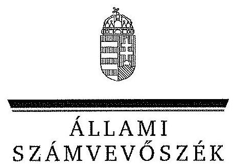
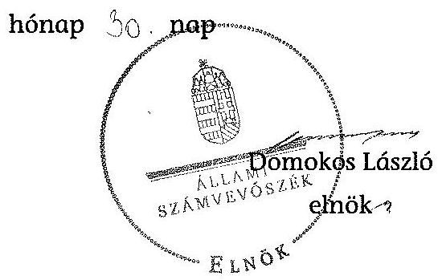

# JELENTÉS 

a helyi nemzetiségi önkormányzatok gazdálkodásának ellenőrzéséről Budapest Főváros XV. Kerületi Ukrán Nemzetiségi Önkormányzat

---

# Állami Számvevőszék 

Iktatószám: V-0265-012/2014.
Témaszám: 1298
Vizsgálat-azonosító szám: V065282

## Az ellenőrzést felügyelte:

Horváth Balázs
felügyeleti vezető
Az ellenőrzést vezette és az ellenőrzés végrehajtásáért felelős:
Korsósné Vigh Andrea
ellenőrzésvezető
A számvevőszéki jelentést készítették és a jelentés összeállításában
közreműködtek:
Szabó Erzsébet
számvevő tanácsos
Batkiné Vas Anna
számvevő tanácsos
Az ellenőrzést végezte:
Szabó Erzsébet
számvevő tanácsos

---

# TARTALOMJEGYZÉK 

BEVEZETÉS ..... 3
I. ÖSSZEGZŐ MEGÁLLAPÍTÁSOK, KÖVETKEZTETÉSEK ..... 6
II. RÉSZLETES MEGÁLLAPÍTÁSOK ..... 9

1. A Nemzetiségi Önkormányzat és a Települési Önkormányzat együttműködésének szabályozása, a működési feltételek biztosítása ..... 9
2. A gazdálkodási feladatok ellátásának szabályszerűsége ..... 10
2.1. A költségvetésre és a zárszámadásra, valamint a kincstári adatszolgáltatás rendjére vonatkozó jogszabályi előírások betartása ..... 10
2.2. A Nemzetiségi Önkormányzat gazdálkodásának szabályozottsága ..... 10
2.3. Az operatív gazdálkodási jogkörök kialakítása, gyakorlása ..... 11
3. A Nemzetiségi Önkormányzattal összefüggő gazdálkodási feladatok belső ellenőrzése ..... 13
4. A feladatalapú támogatás felhasználásának, elszámolásának szabályszerűsége, a Nemzetiségi Önkormányzat feladatellátása ..... 14
MELLÉKLET
5. számú A Nemzetiségi Önkormányzat 2012. évi gazdálkodásának főbb adatai, mutatói
FÜGGELÉKEK
6. számú Rövidítések jegyzéke
7. számú Értelmező szótár
8. számú A gazdálkodás értékelésének módszere

---

.

---

# JELENTÉS 

## a helyi nemzetiségi önkormányzatok gazdálkodásának ellenőrzéséről Budapest Főváros XV. Kerületi Ukrán Nemzetiségi Önkormányzat

## BEVEZETÉS

A Nemzetiségi Önkormányzat a 2010. évben alakult, elnöke a 2010. évi helyhatósági választások óta látta el feladatát. A Nemzetiségi Önkormányzat intézményt, gazdasági társaságot és más szervezetet nem alapított, illetve ezek társulásában nem vett részt. A négytagú Képviselő-testület munkája segítésére bizottságot nem hozott létre. A Nemzetiségi Önkormányzat a 2012. április 11-ei képviselő-testületi ülésen határozott a feloszlatásáról. A megszünése kapcsán készített évközi költségvetési beszámolója szerint a 2012. évben a módosított költségvetési bevételi és kiadási előirányzata 231 ezer Ft, a teljesített költségvetési bevétel 245 ezer Ft, a teljesített költségvetési kiadás 46 ezer Ft volt. A 2012. évi gazdálkodási adatokat részletesen az 1. számú mellékletben mutatjuk be.

Az Alaptörvény XXIX. cikk (1) bekezdése szerint a Magyarországon élő nemzetiségek államalkotó tényezők. Minden, valamely nemzetiséghez tartozó magyar állampolgárnak joga van önazonossága szabad vállalásához és megőrzéséhez. A hazánkban élő nemzetiségek helyi (települési és területi), valamint országos önkormányzatokat hozhatnak létre. A helyi nemzetiségi önkormányzatok gazdálkodási feladatait jogszabályi előírás alapján a székhely szerinti helyi önkormányzat polgármesteri hivatala látja el.

A nemzetiségek helyzete, támogatása mind hazai, mind EU-s szinten kiemelt figyelmet kap napjainkban. A helyi nemzetiségi önkormányzatok gazdálkodására és támogatási rendszerére vonatkozó jogszabályok a 2010-2012. években jelentős változásokon mentek át. A települési és területi nemzetiségi önkormányzatok gazdálkodásának, a részükre juttatott költségvetési támogatások felhasználásának ellenőrzését az ÁSZ a 2012. évben sorozatjellegű ellenőrzés keretében indította el. A 2013. évi ellenőrzések e témacsoportos ellenőrzések folytatását jelentik, amelyet az ÁSZ 2014. első félévi ellenőrzési terve 12. témasorszámon tartalmaz.

Az ellenőrzés célja annak értékelése volt, hogy a Nemzetiségi Önkormányzat gazdálkodási kereteinek kialakítása, gazdálkodása és feladatellátása megfelelt-e a jogszabályoknak.

---

Ennek keretében értékeltük, hogy:

- a Nemzetiségi Önkormányzat és a Települési Önkormányzat együttműködésének szabályozása, a működési feltételek biztosítása megfelelt-e a jogszabályi előírásoknak;
- a felek együttműködése megfelelt-e a közöttük létrejött együttműködési megállapodásnak a gazdálkodási feladatok szabályszerű ellátása során, ennek keretében betartották-e a Nemzetiségi Önkormányzat gazdálkodásához kapcsolódóan a költségvetésre és zárszámadásra, a gazdálkodás szabályozására, az operatív gazdálkodási jogkörök gyakorlására vonatkozó jogszabályi előírásokat;
- a jegyző biztosította-e a Nemzetiségi Önkormányzat gazdálkodásának belső ellenőrzését;
- a Nemzetiségi Önkormányzat feladatalapú támogatásának felhasználása, a folyósított feladatalapú támogatással történő elszámolás az előírásoknak megfelelő volt-e;
- a Nemzetiségi Önkormányzat feladatellátása összhangban volt-e a vonatkozó jogszabályi előírásokkal.

Az ellenőrzés várható hasznosulását négy szinten tervezzük. A törvényalkotás számára összegzett tapasztalatok állnak rendelkezésre a nemzetiségi önkormányzatok testületi döntéseinek, gazdálkodásának és a feladatalapú támogatás felhasználásának szabályszerűségéről, amelynek alapján következtetést lehet levonni arra, hogy indokolt-e jogszabályi módosítás kezdeményezése. Az ellenőrzés az ellenőrzött számára visszajelzést ad a működésében fellépő hiányosságokról, javaslataival hozzájárul azok kiküszöböléséhez, amely csökkentheti a későbbi ellenőrzések gyakoriságát. Az ellenőrzés megállapításai és javaslatai tanulságul szolgálhatnak más nemzetiségi önkormányzatok, szervezetek számára a rendezett gazdálkodási keretek kialakításához. A társadalom számára jelzi, hogy közpénz nem maradhat ellenőrizetlenül, az ÁSZ értékteremtő rend kialakításához és megőrzéséhez hozzájáruló tevékenysége pozitív hatással lesz a szervezetről kialakított összkép formálásában. Az ÁSZ szervezetén belül lehetőség nyílik arra, hogy a megállapítások szintetizálásával az intézmény a hozzáadott értéket teremtő, elemző tevékenységét és tanácsadó szerepét erősítse.

A helyi nemzetiségi önkormányzatok gazdálkodásának ellenőrzéséről szóló jelentés I. fejezetének összegző része az ellenőrzés céljára adott rövid, szintetizáló összefoglalót és következtetéseket tartalmazza a II. fejezet részletes megállapításain alapulóan.

Az ellenőrzés típusa: szabályszerűségi ellenőrzés
Az ellenőrzött időszak: 2012. január 1. - 2012. december 31. közötti időszak. Az ellenőrzés kiterjedt a helyi nemzetiségi önkormányzatnak juttatott, 2012. évi feladatalapú támogatás 2013. évben való elszámolására is.

---

Ellenőrzött szervezet: Budapest Főváros XV. Kerületi Ukrán Nemzetiségi Önkormányzat és a gazdálkodási feladatait ellátó Budapest Főváros XV. Kerület Rákospalota, Pestújhely, Újpalota Önkormányzata.

Az ellenőrzés végrehajtásának jogszabályi alapját az ÁSZ tv. 5. § (2)(3) és (6) bekezdéseiben foglaltak képezik.

Az ellenőrzés szakmai módszertana az ÁSZ hivatalos honlapján (www.asz.hu) közzétett szakmai szabályokon alapult, amely a Legfőbb Ellenőrző Intézmények Nemzetközi Szervezete (INTOSAI) által kiadott nemzetközi standardok (ISSAI) figyelembevételével készült.

A helyi nemzetiségi önkormányzatok gazdálkodásának ellenőrzése során értékeltük a Települési Önkormányzat és a Nemzetiségi Önkormányzat együttműködésének, a gazdálkodás szabályozottságának és a pénzügyi folyamatokban kulcsszerepet betöltő belső kontrollok (teljesítésigazolás és érvényesítés) működésének megfelelőségét. A kulcskontrollokat a működési és felhalmozási célú támogatásértékű kiadásoknál, az államháztartáson kívülre teljesített működési és felhalmozási célú pénzeszköz átadásoknál, a dologi kiadásokkal kapcsolatos kifizetéseknél - véletlen mintavételi eljárást alkalmazva - ellenőriztük. Ellenőriztük, hogy a jegyző biztosította-e a Nemzetiségi Önkormányzat gazdálkodásának belső ellenőrzését. Értékeltük a feladatalapú támogatások felhasználásának, elszámolásának szabályszerűségét, a Nemzetiségi Önkormányzat feladatellátása és a jogszabályi előírások összhangját. A minősítési szempontokat a 3. számú függelék tartalmazza.

Az ellenőrzés lefolytatásához a Nemzetiségi Önkormányzat és a gazdálkodási feladatait ellátó Települési Önkormányzat tanúsítványok és a kapcsolódó, dokumentumjegyzékben megjelölt dokumentumok elektronikus úton történő megküldésével, rendelkezésre bocsátásával szolgáltatott adatokat. Az adatszolgáltatás kontrollálása és szükség szerinti javítása a helyszíni ellenőrzés keretében történt.

Az ÁSZ tv. 29. § (1) bekezdése szerint a jelentéstervezetet megküldtük egyeztetésre a polgármesternek, aki az ÁSZ tv. 29. § (2) bekezdésében foglalt észrevételezési jogával nem élt.

---

# I. ÖSSZEGZŐ MEGÁLLAPÍTÁSOK, KÖVETKEZTETÉSEK 

A Képviselő-testület a 2012. április 11-ei ülésén - két képviselő mandátumáról való lemondásának tudomásul vételét követően - hozott határozatával feloszlatta önmagát. A Kincstár a Nemzetiségi Önkormányzatot - 2012. április 11-ei megszűnési dátummal - az általa vezetett közhiteles törzskönyvi nyilvántartásból törölte.

A Nemzetiségi Önkormányzat és a Települési Önkormányzat együttműködésének szabályozása - kisebb tartalmi hiányosságok kivételével - megfelelt a jogszabályi előírásoknak. A Nemzetiségi Önkormányzat az ellenőrzött időszakban - működésének időtartama alatt - rendelkezett a Települési Önkormányzattal kötött együttműködési megállapodással. Annak felülvizsgálatát a Nek.₂ tv.-ben meghatározott határidőn túl, 2012. februárjában hajtották végre, melynek során a Nek.₂ tv. alapján a működési feltételek szabályozására vonatkozó módosításokat is elvégezték. Az együttműködési megállapodásban azonban a Nek.₂ tv. előírása ellenére nem rögzítették a testületi döntések és a tisztségviselők döntései előkészítésének, a testületi és tisztségviselői döntéshozatalhoz kapcsolódó nyilvántartási feladatok ellátásának kötelezettségét, továbbá az önálló fizetési számla nyitásával, törzskönyvi nyilvántartásba vételével és adószám igénylésével kapcsolatos határidőket és együttműködési kötelezettségeket. A Nek.₂ tv.-ben foglaltak ellenére a Nemzetiségi Önkormányzat SZMSZ-e nem tartalmazta az együttműködési megállapodás szerinti működési feltételeket. A Települési Önkormányzat a Nemzetiségi Önkormányzat 2012. évi működésének időtartama alatt biztosította a személyi és tárgyi feltételeket.

A Nemzetiségi Önkormányzat 2012. évi költségvetésére, valamint az adatszolgáltatásra vonatkozó jogszabályi előírások nem érvényesültek. A Nemzetiségi Önkormányzat elnöke a 2012. évi költségvetés határozattervezetét az előírt határidőig benyújtotta a Képviselő-testületnek. A 2012. évi költségvetés előterjesztésekor - a jegyző mulasztása miatt - az Áht.₂-ben előírtak ellenére nem mutatták be szöveges indokolással együtt a Képviselő-testület részére tájékoztatásul a Nemzetiségi Önkormányzat költségvetési mérlegét közgazdasági tagolásban és előirányzat felhasználási tervét. A jegyző a 2012. évi költségvetéshez kapcsolódó, a Nemzetiségi Önkormányzatra vonatkozó, kincstári adatszolgáltatási kötelezettségének hat esetben az előírt határidőn túl tett eleget. A Nemzetiségi Önkormányzat 2012. április 11-ei megszűnése miatt 2012. évi zárszámadás nem készült, a megszűnéssel összefüggésben az Áhsz.-ben meghatározott, az elemi költségvetési beszámolónak megfelelő adattartalmú, évközi beszámolót elkészítették.

A Nemzetiségi Önkormányzat gazdálkodásának szabályozottsága részben volt megfelelő az ellenőrzött időszakban. A Nemzetiségi Önkormányzat a 2012. április 11-ei megszűnéséig a Számv. tv.-ben előírt szabályzatokkal - a leltárkészítésre és leltározásra, az eszközök és források értékelésére, a pénz- és értékkezelésre vonatkozó szabályozásokkal, valamint számviteli politikával és számlarenddel -, továbbá az Áht.₂-ben foglaltak szerinti, a tervezéssel, gazdálkodással kapcsolatos szabályozással 2012. március 1-jétől, a Polgármesteri Hivatal szabályzatai hatályának kiterjesztése útján rendelkezett. A Nemzetiségi Önkormányzat nem rendelkezett a Bkr.-ben előírt ellenőrzési nyomvonallal, szabálytalanságok kezelésének eljárásrendjével. A Polgármesteri Hivatal SZMSZ-e az Ávr. előírásának megfelelően tartalmazta az SZMSZ-ben nevesített munkakörökhöz tartozó - a Nemzetiségi Önkormányzat gazdálkodásával kapcsolatos - feladat- és hatásköröket, a hatáskörök gyakorlásának módját, a helyettesítés rendjét, az ezekhez kapcsolódó felelősségi szabályokat.

A Nemzetiségi Önkormányzat gazdálkodása tekintetében az operatív gazdálkodási jogkörök kialakítása részben felelt meg a jogszabályi előírásoknak. A Nemzetiségi Önkormányzat elnöke nem hatalmazott fel írásban a kötelezettségvállalás és utalványozás gyakorlására más képviselőt, valamint nem jelölt ki a 2012. március 1-jét megelőző időszakra teljesítést igazoló személyt. Az Ávr.-ben meghatározott összeférhetetlenségi követelmény érvényesülése nem volt biztosított - mivel a Képviselő-testület tagjai egymással közeli hozzátartozói viszonyban álltak -, ezért az összes kifizetés szabálytalan volt. A Nemzetiségi Önkormányzat Ávr.-ben meghatározott gazdálkodási tevékenységét a Polgármesteri Hivatal gazdasági szervezet nélkül, az állományába tartozó, megfelelő végzettségű személlyel látta el. A jegyző - az Ávr.-ben biztosított jogkörében eljárva - írásban kijelölte a Polgármesteri Hivatal állományába tartozó, előírt végzettséggel rendelkező köztisztviselőket a pénzügyi ellenjegyzési, valamint az érvényesítési feladatok ellátására.

A dologi kiadások bizonylatainak tesztelése során a teljesítésigazolás és az érvényesítés kulcskontrollok működésének megfelelőségét az ellenőrzés gyengének értékelte, a hibák száma a lényegességi szintet, a kritikus hibahatárt elérte. A teljesítésigazolást - az Ávr. szerinti kijelölés hiányában - a feladat ellátására jogosultsággal nem rendelkező személy végezte, aki az ellenőrzési és igazolási feladatot az Ávr.-ben előírt összeférhetetlenségi követelmény figyelmen kívül hagyásával látta el. Az érvényesítő nem az Ávr.-ben foglaltaknak megfelelően végezte a fedezet meglétének és a megelőző ügymenetben az Ávr. betartásának ellenőrzését, valamint az utalványozónak nem jelezte az Ávr. megsértését. Nem észrevételezte az arra jogosulatlan és összeférhetetlen személy által végzett teljesítésigazolást. Nem kifogásolta a százezer forintot el nem érő kifizetések kötelezettségvállalás-nyilvántartásba vételének hiányát, valamint, hogy az Ávr. előírása ellenére az utalványrendeleten nem tüntették fel a kötelezettségvállalás nyilvántartási számát. Az érvényesítés nem tartalmazta
 az érvényesítésre utaló megjelölést. A Nemzetiségi Önkormányzat 2012. évi három, legnagyobb összegű dologi kiadás teljesítése bizonylatainak egyedi értékelése alapján a teljesítésigazolás és az érvényesítés kulcskontrollok mindhárom kifizetés esetében nem működtek megfelelően. A feltárt hiányosságok azonosak voltak a dologi kiadásoknál részletezettekkel, melyből a teljesítésigazolást egy esetben végezte arra jogosultsággal nem rendelkező személy. Működési és felhalmozási célú támogatásértékű kiadást, valamint működési és felhalmozási célú pénzeszközátadást államháztartáson kívülre nem teljesítettek. A Nemzetiségi Önkormányzatnál a kulcskontrollok 2012. évi működésében feltárt hiányosságokkal összefüggésben az ellenőrzés - a rendelkezésre bocsátott dokumentumok alapján - jogosulatlan kifizetést nem állapított meg, azonban a kulcskontrollok működésében feltárt hiányosságok miatt nem volt biztosított a hibák megelőzése, feltárása és kijavítása.

---

A jegyző az ellenőrzött időszakban nem biztosította a Nemzetiségi Önkormányzat gazdálkodásával összefüggő végrehajtási feladatok belső ellenőrzését. A Polgármesteri Hivatal 2012. évre vonatkozó éves ellenőrzési tervét megalapozó, a Ber.-ben előírt kockázatelemzés nem terjedt ki a Nemzetiségi Önkormányzat gazdálkodásával összefüggő végrehajtási feladatok ellátására. E feladatokra irányuló belső ellenőrzést a 2012. évben nem terveztek és nem végeztek.

A Nemzetiségi Önkormányzat a 2011. évben 85 ezer Ft feladatalapú támogatásban részesült, amelyet a folyósítás évében felhasználtak. A 2011. évi feladatalapú támogatás elszámolása a támogatási kormányrendelet ${ }_{1}$ előírása alapján az Áht. ${ }_{1}$ rendelkezése ellenére nem történt meg. A Nemzetiségi Önkormányzat a 2012. évben nem részesült feladatalapú támogatásban. A Nemzetiségi Önkormányzat a 2012. évi működésének időtartama alatt a Képviselőtestület működésén kívül - a tanúsítványon közölt adatok és az ellenőrzés részére átadott dokumentumok alapján - kötelező közfeladatot nem látott el. Önként vállalt feladatot nem végzett.

A Nemzetiségi Önkormányzat megszünésével kapcsolatban a Nemzetiségi Önkormányzat elnöke az ideiglenes kezelői feladatokat a Nemzetiségi Önkormányzat tulajdonát képező (ingó) vagyon tekintetében a Nek. 2 tv.-ben foglaltak ellenére - az országos nemzetiségi önkormányzat helyett - a Települési Önkormányzat részére adta át. A vagyon átadás-átvételről az Áhsz. ${ }_{1}$-ben előírtak alapján jegyzőkönyv készült. A Nemzetiségi Önkormányzat elnöke munkakörét a Nek. ${ }_{2}$ tv.-ben foglaltak ellenére a Kormányhivatalnak nem adta át. A 2012. évi általános működési támogatás Nemzetiségi Önkormányzat megszűnése miatt - meg nem illető részét a támogatási kormányrendelet ${ }_{2}$-ben foglaltak szerint a Kincstárnak visszautalták. A 2012. évben felhasznált általános működési támogatást a Képviselő-testület működtetésére fordították.

---

# II. RÉSZLETES MEGÁLLAPÍTÁSOK 

## 1. A Nemzetiségi Önkormányzat És a Települési Önkormányzat EGYÜTTMŰKÖDÉSÉNEK SZABÁLYOZÁSA, A MŰKÖDÉSI FELTÉTELEK BIZTOSÍTÁSA

A Képviselő-testület a 2012. április 11-ei ülésén - két képviselő mandátumáról való lemondásának tudomásul vételét követően - hozott határozatával ${ }^{1}$ feloszlatta önmagát.

A Kincstár a Nemzetiségi Önkormányzatot - annak a törzskönyvi nyilvántartásból történő törlésre vonatkozó kérelme alapján - 2012. április 11-ei megszűnési és 2012. június 11-ei törlési dátummal az általa vezetett közhiteles törzskönyvi nyilvántartásból törölte ${ }^{2}$.

A Nemzetiségi Önkormányzat és a Települési Önkormányzat együttműködésének szabályozása - kisebb tartalmi hiányosságok kivételével - megfelelt a jogszabályi előírásoknak.

A Nemzetiségi Önkormányzat - 2012. évi működésének időtartama alatt - rendelkezett a Települési Önkormányzattal kötött együttműködési megállapodással ${ }^{3}$. A 2012. január 1-jén hatályos együttműködési megállapodásnak a Nek. ${ }_{2}$ tv. 80. § (2) bekezdésében - 2012. január 31-ig - előírt felülvizsgálatát határidőn túl, 2012 februárjában végezték el. Ezzel egyidejűleg végrehajtották a működési feltételek szabályozásának a Nek. ${ }_{2}$ tv. 159. § (3) bekezdésében a 2012. június 1-jei határidőre előírt módosítását.

A 2012. március 1-jétől a 2012. évi működésének időszakában hatályos együttműködési megállapodásban

- nem rögzítették a működési feltételek közül - a Nek. ${ }_{2}$ tv. 80. § (1) bekezdés d) pontjában foglaltak ellenére - a testületi döntések és a tisztségviselők döntései előkészítésének, a testületi és tisztségviselői döntéshozatalhoz kapcsolódó nyilvántartási feladatok ellátásának kötelezettségét;
- nem határozták meg a gazdálkodási feladatok ellátásának szabályai közül a Nek. ${ }_{2}$ tv. 80. § (3) bekezdés a) pontjában előírtak ellenére - a Nemzetiségi Önkormányzat önálló fizetési számla nyitásával, törzskönyvi nyilvántartás-

[^0]
[^0]:    ${ }^{1} 20 / 2012$. (IV. 11.)
    ${ }^{2}$ 01-TNY-290-4/2012-784472. számú határozat
    ${ }^{3}$ A 2012. február végéig hatályos együttműködési megállapodást a Képviselő-testület a 13/2011. (II. 08.) számú, a Települési Önkormányzat Képviselő-testülete a 126/2011. (II. 16.) számú határozattal fogadta el. A 2012. március 1-jétől hatályos, a Nek. ${ }_{2}$ tv. 159. § (3) bekezdésében előírtak alapján megkötött együttműködési megállapodást a Képviselő-testület a 28/2012. (II. 19.) számú, a Települési Önkormányzat Kép-viselő-testülete a 119/2012. (II. 22.) számú határozattal hagyta jóvá.

---

ba vételével és adószám igénylésével kapcsolatos határidőket és együttműködési kötelezettségeket.

A Nek. 2 tv. 80. § (2) bekezdésében foglaltak ellenére a Nemzetiségi Önkormányzat SZMSZ-e ${ }^{4}$ nem tartalmazta az együttműködési megállapodás szerinti működési feltételeket.

A Települési Önkormányzat a Nemzetiségi Önkormányzat 2012. évi működésének időtartama alatt a - Nek. 2 tv. 159. § (3) bekezdésében foglalt átmeneti rendelkezés alapján a Nek. ${ }_{1}$ tv. 27. § (2)-(3) bekezdéseiben előírt személyi és tárgyi feltételeket a Polgármesteri Hivatal útján biztosította.

# 2. A GAZDÁLKODÁSI FELADATOK ELLÁTÁSÁNAK SZABÁLYSZERŰSÉGE 

### 2.1. A költségvetésre és a zárszámadásra, valamint a kincstári adatszolgáltatás rendjére vonatkozó jogszabályi előírások betartása

A Nemzetiségi Önkormányzat 2012. évi költségvetésének tartalma, jóváhagyása, valamint a kapcsolódó adatszolgáltatás nem felelt meg a jogszabályi előírásoknak.

A Nemzetiségi Önkormányzat jegyző által elkészített, 2012. évi költségvetési határozattervezete az Áht. 2 24. § (4) bekezdésében előírtak ellenére szöveges indokolást, valamint a 24. § (4) bekezdés a) pontja szerinti költségvetési mérleget közgazdasági tagolásban és előirányzat-felhasználási tervet nem foglalt magában, így ezeket a Képviselő-testület részére tájékoztatásul nem mutatták be.

A jegyző a 2012. évi költségvetéshez kapcsolódó, a Nemzetiségi Önkormányzatra vonatkozó, kincstári adatszolgáltatási kötelezettségének hat esetben az Ávr. 169. § (2) és a 170. § (5) bekezdéseiben, valamint a Nemzetiségi Önkormányzat megszűnése miatti, évközi beszámoló ${ }^{5}$ megküldésére vonatkozó, az Áhsz. 1 10. § (14) bekezdésében ${ }^{6}$ előírt - határidőn túl - tett eleget.

A Nemzetiségi Önkormányzat év közbeni megszűnése miatt 2012. évi zárszámadás nem készült.

### 2.2. A Nemzetiségi Önkormányzat gazdálkodásának szabályozottsága

A Nemzetiségi Önkormányzat gazdálkodásának szabályozottsága részben volt a jogszabályi előírásoknak megfelelő az ellenőrzött időszakban.

[^0]
[^0]:    ${ }^{4}$ A Képviselő-testület a Nemzetiségi Önkormányzat SZMSZ-ét a 21/2011. (IV. 9.) számú határozatával fogadta el.
    ${ }^{5}$ az elemi költségvetési beszámolónak megfelelő adattartalommal elkészített beszámoló
    ${ }^{6}$ 2014. január 1-jétől az Áhsz. 2 34. § (1) bekezdése

---

A Nemzetiségi Önkormányzat a 2012. április 11-ei megszűnéséig a Számv. tv.-ben előírt szabályzatokkal - a leltárkészítésre és leltározásra, az eszközök és források értékelésére, a pénz- és értékkezelésre vonatkozó szabályozásokkal, valamint számviteli politikával és számlarenddel -, továbbá az Áht. ${ }_{2}$-ben foglaltak szerinti, a tervezéssel, gazdálkodással ${ }^{7}$ kapcsolatos szabályozással 2012. március 1-jétől, a Polgármesteri Hivatal szabályzatai hatályának kiterjesztése útján ${ }^{8}$ rendelkezett.

A jegyző a Nemzetiségi Önkormányzat gazdálkodási feladataira nem terjesztette ki a Bkr. 6. § (3)-(4) bekezdéseiben előírt ellenőrzési nyomvonal és a szabálytalanságok kezelése eljárásrendjének hatályát. Ezekkel a szabályzatokkal a Nemzetiségi Önkormányzat önállóan sem rendelkezett.

A Polgármesteri Hivatal SZMSZ-e az Ávr. előírásának megfelelően tartalmazta az SZMSZ-ben nevesített munkakörökhöz tartozó - a Nemzetiségi Önkormányzat gazdálkodásával kapcsolatos - feladat- és hatásköröket, a hatáskörök gyakorlásának módját, a helyettesítés rendjét, az ezekhez kapcsolódó felelősségi szabályokat. Azokat a munkaköri leírásokban is rögzítették.

# 2.3. Az operatív gazdálkodási jogkörök kialakítása, gyakorlása 

A Nemzetiségi Önkormányzat gazdálkodása tekintetében az operatív gazdálkodási jogkörök kialakítása részben felelt meg a jogszabályi előírásoknak.

A Nemzetiségi Önkormányzat elnöke nem hatalmazott fel írásban a kötelezettségvállalás és utalványozás gyakorlására más képviselőt, valamint az Ávr. 57. § (4) bekezdésében foglaltak ellenére, a 2012. március 1-jét megelőző időszakra nem jelölt ki teljesítést igazoló személyt. 2012. március 1-jétől a teljesítés igazolására a Nemzetiségi Önkormányzat elnöke volt jogosult. Az Ávr. 60. § (2) bekezdésében meghatározott összeférhetetlenségi követelmény érvényesülése nem volt - és más képviselő felhatalmazása, kijelölése esetén sem lett volna - biztosított, mivel a Képviselő-testület tagjai egymással közeli hozzátartozói ${ }^{9}$ viszonyban álltak. Az összeférhetetlenség miatt az összes kifizetés szabálytalan volt.

Az operatív gazdálkodási feladatokat - kötelezettségvállalást, utalványozást, ellenjegyzést, érvényesítést és teljesítésigazolást - a Nemzetiségi Önkormányzat 2012. évi működésének időszakában az együttműködési megállapodásban, valamint a kötelezettségvállalás, utalványozás, ellenjegyzés és érvényesítés rendjének szabályozásáról szóló, a polgármester és a jegyző által kiadott együttes utasí-

[^0]
[^0]:    ${ }^{7}$ kötelezettségvállalással, pénzügyi ellenjegyzéssel, teljesítésigazolással, érvényesítéssel
    ${ }^{8}$ A 2012. március 1-jétől hatályos együttműködési megállapodás I. fejezet 10. pontjában rögzítették a szabályzatok hatályának Nemzetiségi Önkormányzatra történő kiterjesztését.
    ${ }^{9}$ Egy, az ellenjegyzéssel kapcsolatos, 2010. október 26-ai keltű, a Nemzetiségi Önkormányzat elnöke által írt e-mail szerint a Képviselő-testület tagjai egymásnak közeli hozzátartozói: „szülő, testvér, gyermek".

---

tásokban ${ }^{10}$ rögzítették. A pénzügyi ellenjegyzést és az érvényesítést a Polgármesteri Hivatal - feladatellátáshoz szükséges végzettséggel és képzettséggel rendelkező - köztisztviselőinek feladataként határozták meg.

A Nemzetiségi Önkormányzat Ávr.-ben meghatározott gazdálkodási tevékenységét a Polgármesteri Hivatal gazdasági szervezet nélkül ${ }^{11}$, az állományába tartozó, megfelelő végzettségű személlyel látta el.

A jegyző - az Ávr. szerinti jogkörében eljárva - írásban kijelölte a Polgármesteri Hivatal állományába tartozó, előírt végzettséggel rendelkező köztisztviselőket a pénzügyi ellenjegyzési, valamint az érvényesítési feladatok ellátására.

A Nemzetiségi Önkormányzat dologi kiadásainak teljesítése során - a bizonylatok tesztelése alapján - a teljesítésigazolás és az érvényesítés kulcskontrollok működésének megfelelősége gyenge volt. A hibák száma a lényegességi szintet, a kritikus hibahatárt elérte:

- a teljesítésigazolást - 2012. március 1-jét megelőzően, az Ávr. 57. § (4) bekezdése szerinti kijelölés hiányában - a feladat ellátására jogosultsággal nem rendelkező személy ${ }^{12}$ végezte. A teljesítésigazoló az ellenőrzési és igazolási feladatát az Ávr. 60. § (2) bekezdésében foglalt összeférhetetlenségi követelmény figyelmen kívül hagyásával ${ }^{13}$ látta el;
- az érvényesítő nem az Ávr. 58. § (1) bekezdésében előírtak szerint látta el ellenőrzési feladatát a fedezet megléte, továbbá a megelőző ügymenetben a gazdálkodási szabályok betartása tekintetében. Az Ávr. 58. § (2) bekezdésében foglaltakat figyelmen kívül hagyva, nem jelezte az utalványozónak a jogszabályok, szabályzat megsértését. Nem észrevételezte az arra jogosulatlan és összeférhetetlen személy által végzett teljesítésigazolást. Nem kifogásolta, hogy a százezer forintot el nem érő kifizetések kötelezettségvállalásnyilvántartásba vétele - az Ávr. 56. § (1) bekezdésének előírása ellenére - nem történt meg, valamint az utalványrendelet - az Ávr. 59. § (3) bekezdés f) pontjában foglaltak ellenére - nem tartalmazta a kötelezettségvállalás

[^0]
[^0]:    ${ }^{10}$ a polgármester és a jegyző 2/2011. (III. 1.), valamint 3/2012. (II. 7.) számú együttes utasításai
    ${ }^{11}$ A

 polgármester és a jegyző - az 1/87961-11/2013. iktatószámú, 2013. október 17-ei kelű – együttes nyilatkozatban nyilvánította ki, hogy a Polgármesteri Hivatalban nem alakítottak ki gazdasági szervezetet, a gazdasági szervezet számára meghatározott feladatokat két, elkülönült szervezeti egység látja el. Az érintett szervezeti egységek vezetőit gazdasági vezető, vagy kijelölt személy nem irányította.
    ${ }^{12}$ A teljesítésigazolást végző személy - a Nemzetiségi Önkormányzat elnöke - 2012. március 1-jétől rendelkezett jogosultsággal ezen feladat ellátására.
    ${ }^{13}$ Mivel a Képviselő-testület tagjai - az ellenjegyzéssel kapcsolatos, 2010. október 26-ai kelű e-mail szerint - egymásnak közeli hozzátartozói, így a Képviselő-testület bármely tagja vette igénybe az ellenőrzés alá vont bizonylatban szereplő személyszállítási szolgáltatást, a Nemzetiségi Önkormányzat elnöke általi teljesítésigazolás az összeférhetetlenségi követelményre vonatkozó jogszabályi előírással ellentétes.

---

nyilvántartási számát. Az Ávr. 58. § (3) bekezdésében előírtak ellenére az érvényesítés nem foglalta magában az érvényesítésre utaló megjelölést.

A Nemzetiségi Önkormányzat 2012. évi, három, legnagyobb összegű dologi kiadás teljesítése bizonylatainak egyedi értékelése alapján a teljesítésigazolás és az érvényesítés kulcskontrollok mindhárom kifizetés esetében nem működtek megfelelően. A feltárt hiányosságok, szabálytalanságok azonosak voltak a dologi kiadásoknál részletezettekkel, melyekből a teljesítésigazolást egy esetben végezte arra jogosultsággal nem rendelkező személy.

Működési és felhalmozási célú támogatásértékű kiadást, valamint működési és felhalmozási célú pénzeszközátadást államháztartáson kívülre a 2012. évben nem teljesítettek.

A Nemzetiségi Önkormányzatnál a kulcskontrollok 2012. évi működésében feltárt hiányosságokkal összefüggésben az ellenőrzés - a rendelkezésre bocsátott dokumentumok alapján - jogosulatlan kifizetést nem állapított meg, azonban a kulcskontrollok működésében feltárt hiányosságok miatt nem volt biztosított a hibák megelőzése, feltárása és kijavítása.

# 3. A Nemzetiségi Önkormányzattal összefüggő gazdálkodási feladatok belső ellenőrzése 

A jegyző az ellenőrzött időszakban nem biztosította a Polgármesteri Hivatalnál a Nemzetiségi Önkormányzat gazdálkodásával összefüggő végrehajtási feladatok belső ellenőrzését.

A Polgármesteri Hivatal 2012. évre vonatkozó éves ellenőrzési tervét megalapozó, a Ber. 21. § (2) bekezdésében előírt kockázatelemzés nem terjedt ki a Nemzetiségi Önkormányzat gazdálkodásával összefüggő végrehajtási feladatokra, és azok tekintetében belső ellenőrzést a 2012. évben nem terveztek és nem végeztek.

A 2012. március 1-jéig hatályos együttműködési megállapodás nem tartalmazott a Nemzetiségi Önkormányzat gazdálkodási feladatainak végrehajtásával összefüggésben belső ellenőrzésre vonatkozó kötelezettséget, azonban az ezt követő időszakban érvényes együttműködési megállapodás (VII. fejezet 3. pont) szerint: „A Nemzetiségi Önkormányzat belső ellenőrzését a Hivatal Belső Ellenőrzési Osztálya végzi".

Az ellenőrzéshez szolgáltatott adatok alapján, a Kormányhivatal a Nemzetiségi Önkormányzatnál a 2012. évben - annak működésének időtartama alatt - törvényességi ellenőrzést nem végzett, egyéb, törvényességi felügyeleti intézkedést nem tett.

---

# 4. A feladatalapú támogatás felhasználásának, elszámolásának szabályszerűsége, a Nemzetiségi Önkormányzat feladatellátása 

A Nemzetiségi Önkormányzat a 2011. évben 85 ezer Ft feladatalapú támogatásban részesült, amelyet a folyósítás évében felhasználtak.

A 2011. évi feladatalapú támogatás elszámolása a támogatási kormányrendelet ${ }_{1} 7 . \S$ (2) bekezdésében hivatkozott „a helyi önkormányzatok elszámolási és ellenőrzési rendjére vonatkozó" jogszabályok rendelkezései alkalmazásának előírása alapján az Áht. 1 64. § (7) bekezdése ellenére nem történt meg. A feladatalapú támogatás felhasználását, elszámolását az ellenőrzésre jogosult szervek nem ellenőrizték. A Nemzetiségi Önkormányzat a 2012. évben feladatalapú támogatásban nem részesült.

A Nemzetiségi Önkormányzat a 2012. évi működésének időtartama alatt a Képviselő-testület működésén kívül - a tanúsítványon közölt adatok és az ellenőrzés részére átadott dokumentumok alapján - a Nek. 2 tv. 115. §-ában foglaltak szerinti kötelező közfeladatot nem látott el. A Nek. 2 tv. 116. §-a szerinti önként vállalt feladatot nem végzett.

A Nemzetiségi Önkormányzat megszünésével kapcsolatban a Nemzetiségi Önkormányzat elnöke az ideiglenes kezelői feladatokat, a Nemzetiségi Önkormányzat tulajdonát képező (ingó) vagyon ${ }^{14}$ tekintetében, a Nek. 2 tv. 139. § (1) bekezdésében foglaltak ellenére - az országos nemzetiségi önkormányzat helyett - a Települési Önkormányzat részére adta át. A vagyon átadás-átvételéről - az Áhsz. 1 13/A. § (6) bekezdésében előírtak alapján - jegyzőkönyv készült. A Nemzetiségi Önkormányzat elnöke munkakörét a Nek. 2 tv. 141. § (1) bekezdésében foglaltak ellenére, a Kormányhivatalnak nem adta át.

A 2012. évi általános működési támogatás Nemzetiségi Önkormányzat megszűnése miatt - meg nem illető részét a támogatási kormányrendelet ${ }_{2} 2$. § (6) bekezdésében foglaltak szerint a Kincstárnak visszautalták. A 2012. évben felhasznált általános működési támogatást a Képviselő-testület működtetésére fordították.
Budapest, 2014.

Melléklet: 1 db
Függelék: 3 db

[^0]
[^0]:    ${ }^{14}$ a 2012. április 25-ei kelű átadás-átvételi jegyzőkönyv szerint 1 db MG 5150 Canon multifunkcionális gép (könyv szerinti nettó értéke 32 ezer Ft)

---

# A Nemzetiségi Önkormányzat 2012. évi gazdálkodásának főbb adatai, mutatói

A) Bevételek

|  Megnevezés | Eredeti előirányzat | Módosított | Teljesítés  |
| --- | --- | --- | --- |
|   | ezer Ft |  | megoszlás  |
|  Általános működési támogatás | 215 | 215 | 215  |
|  Települési Önkormányzat által nyújtott támogatás | 0 | 0 | 14  |
|  Előző évi működési célú pénzmaradvány-átvétel | 16 | 16 | 16  |
|  Működési költségvetés bevételei | 231 | 231 | 245  |
|  Költségvetési bevételek összesen | 231 | 231 | 245  |
|  Bevételek mindösszesen | 231 | 231 | 245  |

B) Kiadások

|  Megnevezés | Eredeti előirányzat | Módosított | Teljesítés  |
| --- | --- | --- | --- |
|   | ezer Ft |  | megoszlás  |
|  Munkaadókat terhelő járulékok és szociális hozzájárulási adó | 0 | 0 | 1  |
|  Dologi kiadások | 231 | 231 | 45  |
|  Működési kiadások összesen | 231 | 231 | 46  |
|  Költségvetési kiadások összesen | 231 | 231 | 46  |
|  Kiadások mindösszesen | 231 | 231 | 46  |

---

# **Chemistry**

## **Chemical Reactions**

### **Balancing Chemical Equations**

1. **Write the unbalanced equation:**
   - Example: $$C_3H_8 + O_2 \rightarrow CO_2 + H_2O$$

2. **Balance the equation:**
   - Balance carbon atoms first.
   - Then balance hydrogen atoms.
   - Finally, balance oxygen atoms.
   - Balanced equation: $$C_3H_8 + 7O_2 \rightarrow 3CO_2 + 8H_2O$$

3. **Balance the equation:**
   - Balance oxygen atoms.
   - Finally, balance oxygen atoms.
   - Balanced equation: $$C_3H_8 + 7O_2 \rightarrow 3CO_2 + 8H_2O$$

### **Types of Reactions**

1. **Combination Reaction:**
   - Example: $$2H_2 + O_2 \rightarrow 2H_2O$$

2. **Decomposition Reaction:**
   - Example: $$2H_2O_2 \rightarrow 2H_2O + O_2$$

3. **Single Displacement Reaction:**
   - Example: $$Zn + 2HCl \rightarrow ZnCl_2 + H_2$$

4. **Double Displacement Reaction:**
   - Example: $$AgNO_3 + NaCl \rightarrow AgCl + NaNO_3$$

5. **Combustion Reaction:**
   - Example: $$CH_4 + 2O_2 \rightarrow CO_2 + 2H_2O$$

## **Stoichiometry**

### **Mole Concept**

- **Mole (mol):** The amount of substance containing as many particles (atoms, molecules, ions) as there are atoms in exactly 12 grams of carbon-12.
- **Avogadro's Number:** $$6.022 \times 10^{23}$$ particles per mole.

### **Molar Mass**

- **Molar Mass:** The mass of one mole of a substance.
- Example: The molar mass of water ($$H_2O$$) is 18.015 g/mol.

### **Calculations**

1. **Moles to Mass:**
   - Formula: $$n = \frac{m}{M}$$
   - Example: Calculate the number of moles of $$H_2O$$ in 18 grams of water.
     - $$n = \frac{18 \, \text{g}}{18.015 \, \text{g/mol}} \approx 0.999 \, \text{mol}$$

2. **Moles to Mass:**
   - Formula: $$m = n \times M$$
   - Example: Calculate the mass of 1 mole of water.
     - $$m = 1 \, \text{mol} \times 18.015 \, \text{g/mol} = 18.015 \, \text{g}$$

## **Gas Laws**

### **Ideal Gas Law**

- **Equation:** $$PV = nRT$$
- **Variables:**
  - $$P$$: Pressure (atm)
  - $$V$$: Volume (L)
  - $$n$$: Number of moles (mol)
  - $$R$$: Ideal gas constant (0.0821 L·atm/mol·K)
  - $$T$$: Temperature (K)

### **Boyle's Law**

- **Equation:** $$P_1V_1 = P_2V_2$$
- **Variables:**
  - P₁: Pressure (atm)
  - V₁: Volume (L)
  - P₂: Pressure (atm)
  - V₂: Volume (L)

### **Boyle's Law**

- **Equation:** $$P_1V_1 = P_2V_2$$
- **Variables:**
  - P₁: Pressure (atm)
  - V₁: Volume (L)
  - P₂: Pressure (atm)
  - V₂: Volume (L)

## **Thermochemistry**

### **Enthalpy Change (ΔH)**

- **Definition:** The heat content of a system at constant pressure.
- **Equation:** $$\Delta H = q_p$$

### **Hess's Law**

- **Statement:** The enthalpy change for a reaction is the same whether it occurs in one step or multiple steps.

### **Calculations**

1. **Moles to Mass:**
   - Formula: $$n = \frac{m}{M}$$
   - Example: Calculate the moles of $$H_2O$$ in 18 grams of water.
     - $$n = \frac{18 \, \text{g}}{18.015 \, \text{g/mol}} \approx 0.999 \, \text{mol}$$

2. **Moles to Mass:**
   - Formula: $$m = n \times M$$
   - Example: Calculate the mass of 1 mole of water.
     - $$m = 1 \, \text{mol} \times 18.015 \, \text{g/mol} = 18.015 \, \text{g}$$

## **Electrochemistry**

### **Oxidation and Reduction**

- **Oxidation:** Loss of electrons.
- **Reduction:** Gain of electrons.

### **Galvanic Cells**

- **Definition:** A cell that converts chemical energy into electrical energy.
- **Components:**
  - Anode: Oxidation occurs.
  - Cathode: Reduction occurs.
  - Salt Bridge: Connects the two half-cells.

### **Nernst Equation**

- **Equation:** $$E = E^\circ - \frac{RT}{nF} \ln Q$$
- **Variables:**
  - $$E$$: Cell potential
  - $$R$$: Ideal gas constant
  - $$T$$: Temperature (K)
  - $$n$$: Number of electrons transferred
  - $$F$$: Faraday constant
  - $$Q$$: Reaction quotient

---

# RÖVIDÍTÉSEK JEGYZÉKE 

| Törvények |  |
| :--: | :--: |
| Alaptörvény | Magyarország Alaptörvénye |
| Áht. 1 | 1992. évi XXXVIII. törvény az államháztartásról (hatályos 2011. december 31-ig) |
| Áht. 2 |

 2011. évi CXCV. törvény az államháztartásról (hatályos 2011. december 31-től) |
| ÁSZ tv. | Az Állami Számvevőszékről szóló 2011. évi LXVI. törvény (hatályos 2011. július 1-jétől) |
| Nek. ${ }_{1}$ tv. | 1993. évi LXXVII. törvény a nemzeti és etnikai kisebbségek jogairól (hatályos 2011. december 31-ig) |
| Nek. ${ }_{2}$ tv. | 2011. évi CLXXIX. törvény a nemzetiségek jogairól (hatályos 2011. december 20-tól) |
| Számv. tv. | 2000. évi C. törvény a számvitelről |
| Rendeletek |  |
| Áhsz. ${ }_{1}$ | 249/2000. (XII. 24.) Korm. rendelet az államháztartás szervezetei beszámolási és könyvvezetési kötelezettségének sajátosságairól (hatályos 2013. december 31-ig) |
| Áhsz. ${ }_{2}$ | 4/2013. (I. 11.) Korm. rendelet az államháztartás számviteléről (hatályos 2014. január 1-jétől) |
| Ávr. | 368/2011. (XII. 31.) Korm. rendelet az államháztartásról szóló törvény végrehajtásáról (hatályos 2012. január 1-jétől) |
| Ber. | 193/2003. (XI. 26.) Korm. rendelet a költségvetési szervek belső ellenőrzéséről (hatályos 2011. december 31-ig) |
| Bkr. | 370/2011. (XII. 31.) Korm. rendelet a költségvetési szervek belső kontrollrendszeréről és belső ellenőrzéséről (hatályos 2012. január 1-jétől) |
| támogatási kormányrendelet $_{1}$ | 342/2010. (XII. 28.) Korm. rendelet a kisebbségi önkormányzatoknak a központi költségvetésből, valamint fejezeti kezelésű előirányzatból nyújtott támogatások feltételrendszeréről és elszámolásának rendjéről (hatályos 2012. március 6-ig) |
| támogatási kormányrendelet $_{2}$ | 28/2012. (III. 6.) Korm. rendelet a nemzetiségi célú előirányzatokból nyújtott támogatások feltételrendszeréről és elszámolásának rendjéről (hatályos 2012. március 7-től 2012. december 31-ig) |
| Szórövidítések |  |
| ÁSZ | Állami Számvevőszék |
| EU | Európai Unió |
| jegyző | Budapest Főváros XV. Kerület Rákospalota, Pestújhely, Újpalota Önkormányzatának jegyzője |
| Képviselő-testület | Budapest Főváros XV. Kerületi Ukrán Nemzetiségi Önkormányzat Képviselő-testülete |
| Kincstár | Magyar Államkincstár |

---

Kormányhivatal
Nemzetiségi Önkormányzat
Nemzetiségi Önkormányzat elnöke polgármester

Polgármesteri Hivatal

## SZMSZ

Települési Önkormányzat
Települési Önkormányzat Képviselő-testülete

Budapest Főváros Kormányhivatala
Budapest Főváros XV. Kerületi Ukrán Nemzetiségi Önkormányzat
Budapest Főváros XV. Kerületi Ukrán Nemzetiségi Önkormányzat elnöke
Budapest Főváros XV. Kerület Rákospalota, Pestújhely, Újpalota Önkormányzatának polgármestere
Budapest Főváros XV. Kerület Rákospalota, Pestújhely, Újpalota Önkormányzatának Polgármesteri Hivatala Szervezeti és Működési Szabályzat
Budapest Főváros XV. Kerület Rákospalota, Pestújhely, Újpalota Önkormányzata
Budapest Főváros XV. Kerület Rákospalota, Pestújhely, Újpalota Önkormányzatának Képviselő-testülete

---

# ÉRTELMEZŐ SZÓTÁR 

együttműködési megállapodás
feladatalapú támogatás
kulcskontrollok működési feltételek

A nemzetiségi önkormányzatnak a működési feltételei biztosítására, továbbá a bevételeivel és a kiadásaival kapcsolatban a tervezési, gazdálkodási, ellenőrzési, finanszírozási, adatszolgáltatási és beszámolási feladatai végrehajtására a székhelye szerinti települési önkormányzattal megkötött megállapodás. (Az Áht., 66. §-a, a Nek. 3 tv. 80. § (2) bekezdése, valamint az Áht. 27. § (2) bekezdése alapján levezetett fogalom.)

A támogatási évben általános működési támogatásban részesült, és a Támogatónak a Kincstárhoz intézett, a feladatalapú támogatás utalására vonatkozó rendelkező levele keltének időpontjában működő nemzetiségi önkormányzatoknak kormányrendeletben rögzített feltételrendszer alapján nyújtható támogatás. A feladatalapú támogatás a nemzetiségi közügyeknek a nemzetiségi önkormányzatok által történő ellátását szolgálja. (A támogatási kormányrendelet ${ }_{1}$ 2. § (2) bekezdés c) pontja és a támogatási kormányrendelet ${ }_{2}$ 4. § (1) bekezdése alapján.) Teljesítés igazolása és az érvényesítés.
A települési önkormányzat által a helyi nemzetiségi önkormányzat testületi működéséhez a 2012. évben biztosítandó feltételek: a testületi működéshez igazodó helyiséghasználat, a postai, kézbesítési, gépelési, sokszorosítási feladatok ellátása és az ezzel járó költségek viselése. (Forrás: Nek. 3 tv. 27. § (1)-(2) bekezdései, a Nek. 2 tv. 159. § (3) bekezdésében foglalt átmeneti rendelkezés alapján)

A szabályozás szintjén - 2012. június 1-jéig megkötendő együttműködési megállapodásban - rögzítendő (és 2013. január 1-jétől a települési önkormányzat által biztosítandó) működési feltételek a következők:

- a helyi nemzetiségi önkormányzat részére havonta igény szerint, de legalább tizenhat órában, az önkormányzati feladat ellátásához szükséges tárgyi, technikai eszközökkel felszerelt helyiség ingyenes használata, a helyiséghez, továbbá a helyiség infrastruktúrájához kapcsolódó rezsiköltségek és fenntartási költségek viselése;
- a helyi nemzetiségi önkormányzat működéséhez (a testületi, tisztségviselői, képviselői feladatok ellátásához) szükséges tárgyi és személyi feltételek biztosítása;
- a testületi ülések előkészítése, különösen a meghívók, az előterjesztések, a testületi ülések jegyzőkönyveinek és valamennyi hivatalos levelezés előkészítése és postázása;
- a testületi döntések és a tisztségviselők döntéseinek előkészítése, a testületi és tisztségviselői döntéshozatalhoz

---

nemzetiség
nemzetiségi közügy
nemzetiségi önkormányzat
operatív gazdálkodási jogkörök
kapcsolódó nyilvántartási, sokszorosítási, postázási feladatok ellátása;

- a helyi nemzetiségi önkormányzat működésével, gazdálkodásával kapcsolatos nyilvántartási, iratkezelési feladatok ellátása;
- az előzőekben meghatározott feladatellátáshoz kapcsolódó költségek viselése a helyi nemzetiségi önkormányzat tagja és tisztségviselője telefonhasználata költségeinek kivételével.
(Forrás: Nek. 2 tv. 80. § (2) bekezdése a Nek. 2 tv. 159. § (3) bekezdésében foglalt átmeneti rendelkezés alapján)

Minden olyan, Magyarország területén legalább egy évszázada honos népcsoport, amely az állam lakossága körében számszerű kisebbségben van, a lakosság többi részétől saját nyelve, kultúrája és hagyományai különböztetik meg, egyben olyan összetartozás-tudatról tesz bizonyságot, amely mindezek megőrzésére, történelmileg kialakult közösségeik érdekeinek kifejezésére és védelmére irányul. (A Nek. 2 tv. 1. § (1) bekezdése alapján levezetett fogalom.)
Az egyéni és közösségi jogok érvényesülése, a nemzetiséghez tartozók érdekeinek kifejezésre juttatása - különösen az anyanyelv ápolása, őrzése és gyarapítása, továbbá a nemzetiségek kulturális autonómiájának a nemzetiségi önkormányzatok által történő megvalósítása és megőrzése - érdekében a nemzetiséghez tartozók meghatározott közszolgáltatásokkal való ellátásával, ezen ügyek önálló vitelével és az ehhez szükséges szervezeti, személyi és anyagi feltételek megteremtésével összefüggő ügy. A közhatalmat gyakorló állami és helyi önkormányzati szervekben, továbbá a nemzetiségi önkormányzati szervekben való nemzetiségi képviselethez és mindezek szervezeti, személyi és anyagi feltételeinek biztosításához kapcsolódó ügy. (Nek. 2 tv. 2. § 1. pontjából levezetett fogalom.)
Törvényben meghatározott nemzetiségi közszolgáltatási feladatokat ellátó, testületi formában működő, jogi személyiséggel rendelkező, demokratikus választások útján, törvény alapján létrehozott szervezet, amely a nemzetiségi közösséget megillető jogosultságok érvényesítésére, a nemzetiségek érdekeinek védelmére és képviseletére, a feladat- és hatáskörébe tartozó nemzetiségi közügyek települési, területi vagy országos szinten történő önálló intézésére jön létre. (A Nek. 2 tv. 2. § 2. pontjából levezetett fogalom.)
A kötelezettségvállalás, a pénzügyi ellenjegyzés, az utalványozás, az érvényesítés és a teljesítésigazolás.
(Forrás: Áht. 2 36-38. §-ai és az Ávr. 52-60. §-ai)

---

# A GAZDÁLKODÁS ÉRTÉKELÉSÉNEK MÓDSZERE 

A helyi nemzetiségi önkormányzatok gazdálkodásának ellenőrzése keretében az önkormányzat gazdálkodása kereteinek kialakítása, gazdálkodása megfelelőségének minősítéséhez az alábbi területeket értékeltük:

- a helyi nemzetiségi önkormányzat és a helyi önkormányzat együttműködése szabályozását, az együttműködési megállapodásban előírt működési feltételek biztosítását;
- a helyi nemzetiségi önkormányzat jóváhagyott költségvetésére, zárszámadására, továbbá a kincstári adatszolgáltatás rendjére vonatkozó jogszabályi előírások betartását;
- a helyi nemzetiségi önkormányzatra vonatkozó gazdálkodási szabályzatok jogszabályi előírások szerinti rendelkezésre állását;
- a helyi nemzetiségi önkormányzat gazdálkodása tekintetében az operatív gazdálkodási jogkörök kialakítása jogszabályi előírásoknak történő megfelelését;
- a helyi nemzetiségi önkormányzattal összefüggő feladatalapú támogatás felhasználása és elszámolása jogszabályi előírásoknak való megfelelését;
- a helyi nemzetiségi önkormányzattal összefüggő gazdálkodási feladatok tekintetében a jogszabályokban előírt belső ellenőrzés biztosítását.

A helyi nemzetiségi önkormányzat gazdálkodását az ellenőrzési program munkalapjain a hat területhez kapcsolódóan feltett kérdésekre adott válaszok alapján értékeltük. A kérdésekhez rendelt súlyozott pontszámok alapján elért összérték a megszerezhető maximális pontszám százalékában került kimutatásra. Ennek figyelembevételével kialakított minősítések a következőek voltak:

| Nem megfelelő: | $0-60 \%$ |
| :-- | :-- |
| Részben megfelelő: | $61-80 \%$ |
| Megfelelő: | $81 \%$-tól |

A pénzügyi folyamatok belső kontrolljának ellenőrzése keretében a pénzügyi folyamatokban kulcsszerepet betöltő belső kontrollok - a teljesítésigazolás és az érvényesítés - működésének megfelelőségét értékeltük. A kulcskontrollok működésének értékeléséhez a kritériumokat jogszabályok határozták meg. A kulcskontrollok működése megfelelőségének értékelése tekintetében lényeges minden olyan hiba, amely gátolja, hogy a kontrolltevékenység eredményesen működjön.

A két kulcskontroll működése megfelelőségének ellenőrzéséhez a dologi és egyéb folyó kiadások könyvviteli tételeiből szekvenciális (megállásos) mintavé-

---

teli eljárással választottuk ki az ellenőrizendő tételeket. A kulcskontrollok megfelelőségének vizsgálata keretében a számvevő bizonyosságot szerez arról, hogy a rendelkezésre álló szabályozás és dokumentumok alapján a teljesítésigazoláshoz és az érvényesítéshez szükséges ellenőrzési lépéseket végrehajtották-e.

A kulcskontrollok működése „kiváló", „jó" vagy „gyenge" minősítést kaphatott. A munkalapon feltett kérdésekhez rendelt súlyozott pontszámok alapján elért összérték a megszerezhető maximális pontszám százalékában került kimutatásra, mely alapján kialakított minősítések a következőek voltak:

| gyenge: | $0-70 \%$ |
| :-- | --: |
| jó: | $71-90 \%$ |
| kiváló: | $91 \%$-tól |

A kulcskontrollok működését:

- kiválónak értékeltük abban az esetben, ha azok működése megfelel a hibák megelőzésére és kijavítására meghatározott szabályozásnak, valamint a legmagasabb szintű elvárásoknak;
- jónak minősítettük, ha a megállapított kisebb, tolerálható mértékű hiányosságok nem veszélyeztetik az ellenőrzött területek hibáinak megelőzését és kijavítását;
- gyengének értékeltük, amennyiben a kontrollok működésében túl sok hiányosság fordul elő ahhoz, hogy a kontrollok biztosítsák a hibák megelőzését, feltárását, kijavítását.

