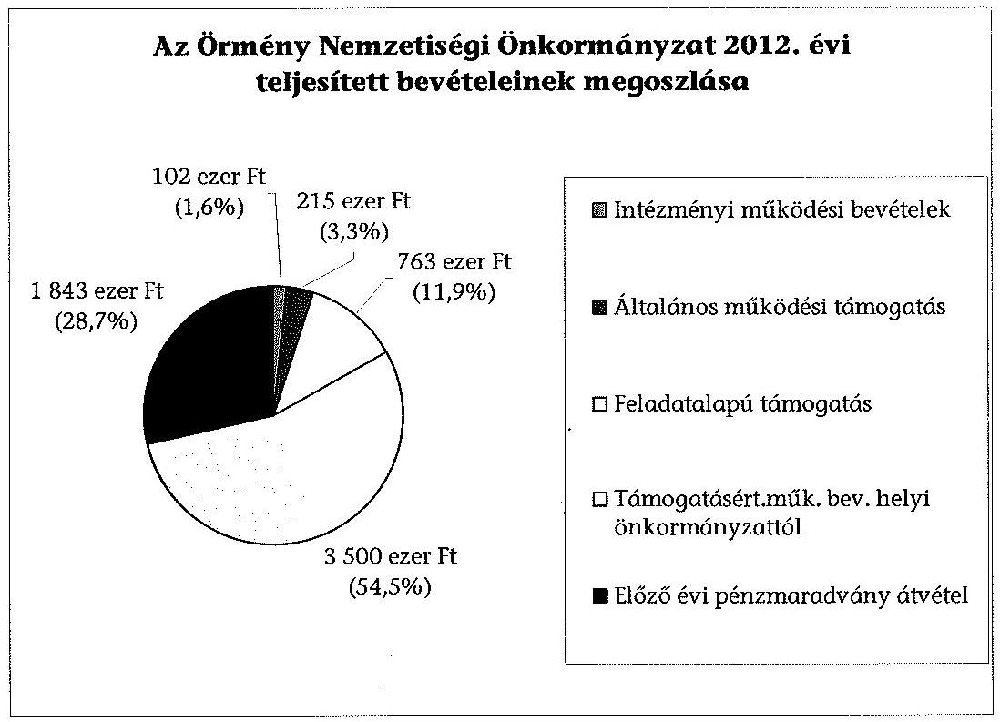
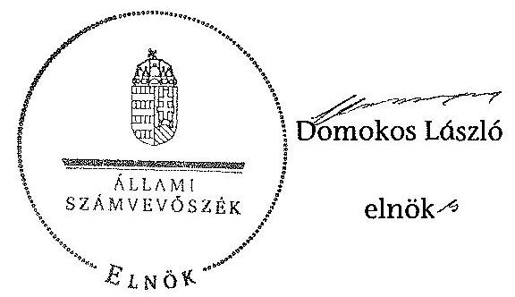

# ÁLLAMI   SZÁMVEVŐSZÉK 

## JELENTÉS

a helyi nemzetiségi önkormányzatok gazdálkodásának ellenőrzéséről
Budapest Főváros XIII. Kerületi Örmény Nemzetiségi Önkormányzat

---

# Állami Számvevőszék 

Iktatószám: V-0297-021/2014.
Témaszám: 1330
Vizsgálat-azonosító szám: V065250

## Az ellenőrzést felügyelte:

Horváth Balázs
felügyeleti vezető
Az ellenőrzést vezette és az ellenőrzés végrehajtásáért felelős:
Kisgergely István
ellenőrzésvezető
A számvevőszéki jelentést készítették és a jelentés összeállításában
közremüködtek:
Zachár Péterné
számvevő főtanácsos
Právitzné Pejkó Noémi
számvevő
Az ellenőrzést végezte:
Zachár Péterné
számvevő főtanácsos

---

# TARTALOMJEGYZÉK 

BEVEZETÉS ..... 3
I. ÖSSZEGZŐ MEGÁLLAPÍTÁSOK, KÖVETKEZTETÉSEK, JAVASLATOK ..... 6
II. RÉSZLETES MEGÁLLAPÍTÁSOK ..... 11

1. Az Örmény Nemzetiségi Önkormányzat és a XIII. Kerületi Önkormányzat együttműködésének szabályozása, a müködési feltételek biztosítása ..... 11
2. A gazdálkodási feladatok ellátásának szabályszerűsége ..... 12
2.1. A költségvetésre és a zárszámadásra, valamint a kincstári adatszolgáltatás rendjére vonatkozó jogszabályi előírások betartása ..... 12
2.2. Az Örmény Nemzetiségi Önkormányzat gazdálkodásának szabályozottsága ..... 13
2.3. Az operatív gazdálkodási jogkörök kialakítása, gyakorlása ..... 14
3. Az Örmény Nemzetiségi Önkormányzattal összefüggő gazdálkodási feladatok belső ellenőrzése ..... 15
4. A feladatalapú támogatás felhasználásának, elszámolásának szabályszerűsége ..... 17

## MELLÉKLETEK

1. számú Az Örmény Nemzetiségi Önkormányzat 2012. évi gazdálkodásának főbb adatai, mutatói
2/A. számú Tájékoztatás a polgármesternek küldött el nem fogadott észrevételekről
2/B. számú Tájékoztatás az elnöknek küldött el nem fogadott észrevételről

## FÜGGELÉKEK

1. számú Rövidítések jegyzéke
2. számú Értelmező szótár
3. számú A gazdálkodás értékelésének módszere

---

.

---

# JELENTÉS 

## A helyi nemzetiségi önkormányzatok gazdálkodásának ellenőrzéséről Budapest Főváros XIII. Kerületi Örmény Nemzetiségi Önkormányzat

## BEVEZETÉS

Az Örmény Nemzetiségi Önkormányzat az 1995. évben alakult, elnöke a 2010. évi helyhatósági választások óta látja el feladatát. Intézményt, gazdasági társaságot és más szervezetet nem alapított. A négytagú Képviselő-testület munkájának segítésére bizottságot nem hozott létre. Az Örmény Nemzetiségi Önkormányzat költségvetési beszámolója szerint a 2012. évben módosított költségvetési bevételi és kiadási előirányzata 6422 ezer Ft, a teljesített költségvetési bevétel 6423 ezer Ft, a teljesített költségvetési kiadás 4750 ezer Ft volt. A 2012. évi gazdálkodási adatokat részletesen az 1. számú mellékletben mutatjuk be.

Az Alaptörvény XXIX. cikk (1) bekezdése szerint a Magyarországon élő nemzetiségek államalkotó tényezők. Minden, valamely nemzetiséghez tartozó magyar állampolgárnak joga van önazonossága szabad vállalásához és megőrzéséhez. A hazánkban élő nemzetiségek helyi (települési és területi), valamint országos önkormányzatokat hozhatnak létre. A helyi nemzetiségi önkormányzatok gazdálkodási feladatait jogszabályi előírás alapján a székhely szerinti önkormányzat polgármesteri hivatala látja el.

A nemzetiségek helyzete, támogatása mind hazai, mind EU-s szinten kiemelt figyelmet kap napjainkban. A helyi nemzetiségi önkormányzatok gazdálkodására és támogatási rendszerére vonatkozó jogszabályok a 2010-2012. években jelentős változásokon mentek át. A települési és területi nemzetiségi önkormányzatok gazdálkodásának, a részükre juttatott költségvetési támogatások felhasználásának ellenőrzését az ÁSZ a 2012. évben sorozatjellegű ellenőrzés keretében indította el. A 2013. évi ellenőrzések e témacsoportos ellenőrzések folytatását jelentik, amelyet az ÁSZ 2014. évi első félévi ellenőrzési terve a 12-es témasorszámon tartalmaz.

Az ellenőrzés célja annak értékelése volt, hogy az Örmény Nemzetiségi Önkormányzat gazdálkodási kereteinek kialakítása, gazdálkodása és feladatellátása megfelelt-e a jogszabályoknak.

---

Ennek keretében értékeltük, hogy:

- Az Örmény Nemzetiségi Önkormányzat és a XIII. Kerületi Önkormányzat együttműködésének szabályozása, a működési feltételek biztosítása megfelel-e a jogszabályi előírásoknak;
- a felek együttmúködése megfelelt-e a közöttük létrejött megállapodásnak a gazdálkodási feladatok szabályszerű ellátása során, ennek keretében betartották-e az Örmény Nemzetiségi Önkormányzat gazdálkodásához kapcsolódóan a költségvetésre és zárszámadásra, a gazdálkodás szabályozására, az operatív gazdálkodási jogkörök gyakorlására vonatkozó jogszabályi előírásokat;
- a jegyző biztosította-e az Örmény Nemzetiségi Önkormányzat gazdálkodásának belső ellenőrzését;
- az Örmény Nemzetiségi Önkormányzat feladatalapú támogatásának felhasználása, a folyósított feladatalapú támogatással történő elszámolás az előírásoknak megfelelő volt-e;
- az Örmény Nemzetiségi Önkormányzat feladatellátása összhangban volt-e a vonatkozó jogszabályi előírásokkal.

Az ellenőrzés várható hasznosulását négy szinten tervezzük. A törvényalkotás számára összegzett tapasztalatok állnak rendelkezésre a nemzetiségi önkormányzatok testületi döntéseinek, gazdálkodásának és a feladatalapú támogatás felhasználásának szabályszerűségéről, amelynek alapján következtetést lehet levonni arra, hogy indokolt-e jogszabályi módosítás kezdeményezése. Az ellenőrzés az ellenőrzött számára visszajelzést ad a működésében fellépő hiányosságokról, javaslataival hozzájárul azok kiküszöböléséhez, amely csökkentheti a későbbi ellenőrzések gyakoriságát. Az ellenőrzés megállapításai és javaslatai tanulságul szolgálhatnak más nemzetiségi önkormányzatok, szervezetek számára a rendezett gazdálkodási keretek kialakításához. A társadalom számára jelzi, hogy közpénz nem maradhat ellenőrizetlenül, az ÁSZ értékteremtő rend kialakításához és megőrzéséhez hozzájáruló tevékenysége pozitív hatással lesz a szervezetről kialakított összkép formálásában. Az ÁSZ szervezetén belül lehetőség nyílik arra, hogy a megállapítások szintetizálásával az intézmény a hozzáadott értéket teremtő elemző tevékenységét és tanácsadó szerepét erősítse.

Az Örmény Nemzetiségi Önkormányzat gazdálkodásának ellenőrzéséről szóló jelentés I. fejezetének összegző része az ellenőrzés céljára adott rövid, szintetizáló összefoglalót és következtetéseket tartalmazza a II. fejezet részletes megállapításain alapulóan. A jelentés, intézkedést Igénylő megállapításait és javaslatait - az összegzőben foglaltak mellett - az ellenőrzés során feltárt, a jelentés II. fejezetében rögzített részletes megállapítások alapozzák meg, illetve támasztják alá.

Az ellenőrzés típusa: szabályszerűségi ellenőrzés

---

Az ellenőrzött időszak: a 2012 január 1. - 2012. december 31. közötti időszak. Az ellenőrzés kiterjedt az Örmény Nemzetiségi Önkormányzatnak juttatott 2012. évi támogatás 2013. évben való elszámolására is.

Ellenőrzött szervezet: a Budapest Főváros XIII. Kerületi Örmény Nemzetiségi Önkormányzat és a gazdálkodási feladatait ellátó XIII. Kerületi Önkormányzat.

Az ellenőrzés végrehajtásának jogszabályi alapját az ÁSZ tv. 5. § (2)-(3) és (6) bekezdéseiben foglaltak képezik.

Az ellenőrzés szakmai módszertana az ÁSZ hivatalos honlapján (www.asz.hu) közzétett szakmai szabályokon alapult, amely a Legfőbb Ellenőrző Intézmények Nemzetközi Szervezete (INTOSAI) által kiadott nemzetközi standardok (ISSAI) figyelembevételével készült.

Az Örmény Nemzetiségi Önkormányzat gazdálkodásának ellenőrzése során értékeltük a XIII. Kerületi Önkormányzat és az Örmény Nemzetiségi Önkormányzat együttműködésének, a gazdálkodás szabályozottságának és a pénzügyi folyamatokban kulcsszerepet betöltő belső kontrollok (teljesítésigazolás és érvényesítés) múködésének megfelelőségét. A kulcskontrollokat a múködési és felhalmozási célú támogatásértékű kiadásoknál, az államháztartáson kívülre teljesített múködési és felhalmozási célú pénzeszköz átadásoknál, a dologi kiadásokkal kapcsolatos kifizetéseknél - véletlen mintavételi eljárást alkalmazva - ellenőriztük. Ellenőriztük, hogy a jegyző biztosította-e az Örmény Nemzetiségi Önkormányzat gazdálkodásának belső ellenőrzését. Értékeltük a feladatalapú támogatások felhasználásának, elszámolásának szabályszerűségét, az Örmény Nemzetiségi Önkormányzat feladatellátása és a jogszabályi előírások összhangját.

Az ellenőrzés lefolytatásához az Örmény Nemzetiségi Önkormányzat és a gazdálkodási feladatait ellátó XIII. Kerületi Önkormányzat tanúsítványok és a kapcsolódó, dokumentumjegyzékben megjelölt dokumentumok elektronikus úton történő megküldésével, rendelkezésre bocsátásával szolgáltatott adatokat. Az adatszolgáltatás kontrollálása és szükség szerinti javítása a helyszíni ellenőrzés keretében történt. A minősítési szempontokat a 3. számú függelék tartalmazza.

Az ÁSZ tv. 29. § (1) bekezdése szerint a jelentéstervezetet megküldtük egyeztetésre a polgármester és az Örmény Nemzetiségi Önkormányzat elnöke részére. A polgármester és az Örmény Nemzetiségi Önkormányzat elnöke határidőben megküldött észrevétele és tájékoztatása alapján a jelentést nem módosítottuk. Az el nem fogadott észrevételek indoklását a jelentés 2/A. számú és 2/B. számú mellékletei tartalmazzák.

---

# I. ÖSSZEGZŐ MEGÁLLAPÍTÁSOK, KÖVETKEZTETÉSEK, JAVASLATOK 

Az Örmény Nemzetiségi Önkormányzat és a XIII. Kerületi Önkormányzat együttmüködésének szabályozása megfelelt a jogszabályi előírásoknak. Az Örmény Nemzetiségi Önkormányzat a 2012. évben rendelkezett hatályos megállapodással a XIII. Kerületi Önkormányzattal történő együttműködésre, azonban az együttműködési megállapodás ${ }_{1}$ 2012. évi - évenként kötelező - felülvizsgálatát a Nek. ${ }_{2}$ tv.-ben előírt határidőn túl végezték el. Az együttműködési megállapodás ${ }_{1}$ jogszabályváltozás miatti kiegészítését a törvényi határidőt betartva hajtották végre. Az együttműködési megállapodás ${ }_{2}$ a Nek. ${ }_{2}$ tv.-ben meghatározott tartalmi elemeket tartalmazta, az Örmény Nemzetiségi Önkormányzat múködésének feltételeit és a gazdálkodási feladatainak ellátását az előírásoknak megfelelően szabályozták. Múködésének előírt személyi és tárgyi feltételei biztosítottak voltak 2012. évben.

Az Örmény Nemzetiségi Önkormányzat 2012. évi költségvetésére és zárszámadására vonatkozó jogszabályi előírások érvényesültek. A jegyző az előírt határidőre elkészítette, az Örmény Nemzetiségi Önkormányzat elnöke határidőn belül a Képviselő-testület elé terjesztette a 2012. évi költségvetési és a zárszámadási határozat tervezetét. A költségvetés és a zárszámadás összeállítása során a határozat elkészítésére, tartalmi előírásaira, elfogadására és továbbítására vonatkozó jogszabályi előírások érvényesültek. A költségvetési és zárszámadási határozatok egymással összehasonlítható szerkezetben készültek. A zárszámadási határozatban az Örmény Nemzetiségi Önkormányzat valamenynyi bevételéről és kiadásáról elszámoltak. A jegyző az Örmény Nemzetiségi Önkormányzatra vonatkozó kincstári adatszolgáltatási kötelezettségét négy alkalommal késve teljesítette.

Az Örmény Nemzetiségi Önkormányzat gazdálkodásának szabályozottsága megfelelő volt. A gazdálkodási feladatok végrehajtását ellátó Polgármesteri Hivatal a 2012. évben a Számv. tv.-ben és a Bkr. által előírt gazdálkodást érintő szabályzatokkal az Örmény Nemzetiségi Önkormányzat gazdálkodási feladataira kiterjedő hatállyal rendelkezett. Az Örmény Nemzetiségi Önkormányzat gazdálkodásával kapcsolatos SZMSZ-ben nevesített munkakörökhöz tartozó feladat és hatásköröket, azok gyakorlásának módját, a helyettesítés rendjét, az ezekhez kapcsolódó felelősségi szabályokat a Polgármesteri Hivatal SZMSZ-e nem tartalmazta.

Az operatív gazdálkodási jogkörök kialakítása a jogszabályi előírásokkal összhangban történt, a pénzügyi ellenjegyzőket, az érvényesítőket a jegyző, mint a költségvetési szerv vezetője jelölte ki. A kötelezettségvállalásra, az utalványozásra jogosultak kijelölése, valamint a teljesítés igazoló megbízása az Áht. ${ }_{2}$-ben és az Ávr.-ben foglalt előírásoknak megfelelően történt.

A dologi kiadások teljesítése során a teljesítés igazolás és az érvényesítés kulcskontrollok múködésének megfelelősége kiváló volt.

---

A dologi kiadások között a három legnagyobb összegű kiadás teljesítése egyedi értékelése alapján a teljesítésigazolás, érvényesítés kulcskontrollok megfelelően múködtek.

Az államháztartáson kívülre teljesített pénzeszközátadásnál a kulcskontrollok múködése részben volt megfelelő, mert két esetben külföldi szervezeteket támogattak, ami nem függött össze nemzetiségi közfeladat ellátással. A számvevőszéki ellenőrzés a kifizetések dokumentumainak ellenőrzése alapján jogosulatlan kifizetést tárt fel.

Az Örmény Nemzetiségi Önkormányzat gazdálkodásával összefüggő végrehajtási feladatok belső ellenőrzése 2012. évben megfelelő volt. A Polgármesteri Hivatal jegyzöje biztosította az Örmény Nemzetiségi Önkormányzat gazdálkodásával összefüggő végrehajtási feladatok belső ellenőrzését, amit a 2012. évben érvényes együttműködési megállapodás ${ }_{1,2}$ is tartalmazott. A Polgármesteri Hivatal belső ellenőrzési tervét megalapozó kockázat elemzés kiterjedt az Örmény Nemzetiségi Önkormányzat gazdálkodásával összefüggő végrehajtási feladatokra. A nemzetiségek gazdálkodásával kapcsolatos kockázatot magas besorolásúnak minősítették, és évenkénti vizsgálatot tartottak szükségesnek. A 2012. évi belső ellenőrzés az önkormányzati támogatás 2012. év első félévi felhasználását ellenőrizte és megállapította, hogy az Örmény Nemzetiségi Önkormányzat gazdálkodása szabályszerű volt. Az ellenőrzés nem érintette a jelen ellenőrzés által feltárt hiányosságokat a szabálytalanul külföldi szervezeteknek juttatott pénzeszközök, illetve a feladat alapú támogatás elszámolására, felhasználására vonatkozóan.

A 2012. évben folyósított feladatalapú támogatás felhasználása, elszámolása a jogszabályi előírásoknak nem felelt meg. Az Örmény Nemzetiségi Önkormányzat a 2012. évben 763 ezer Ft feladatalapú támogatásban részesült, ebből 549 ezer Ft-ot használtak fel nemzetiségi közügyek érdekében. A 2012. évi feladatlapú támogatás 2012. december 31-ig kötelezettségvállalással nem terhelt maradványa 214 ezer Ft volt, amely a támogatási kormányrendelet ${ }_{2} 7 . \S$ előírása alapján határidőt követően jogszerűen nem használható fel.

Az Örmény Nemzetiségi Önkormányzat nem tett eleget az Áht. ${ }_{2}$-ben előírtaknak azáltal, hogy a meghatározott célra fel nem használt 2012. évi feladatalapú támogatás, 2012. december 31-éig kötelezettségvállalással nem terhelt maradványáról haladéktalanul nem mondott le és nem fizette vissza azt a központi költségvetés javára.

A 2011. és a 2012. évi feladatalapú támogatás elszámolása a támogatási kormányrendelet ${ }_{1,2}$ előírása alapján az Áht. ${ }_{1-2}$-ben foglaltak ellenére nem történt meg. A támogatás felhasználását, elszámolását az arra jogosult külső szervek nem ellenőrizték.

Az Örmény Nemzetiségi Önkormányzat hatósági tevékenységet nem végzett. Kötelezö, és önként vállalt feladat ellátásának tárgya összhangban volt a Nek. ${ }_{2}$ tv.-ben foglalt előírásokkal, kivéve a külföldre történő pénzeszköz átadást, mivel külföldi szervezetek támogatása nem minősül közfeladatnak.

---

Az ÁSZ tv. 33. § (1) bekezdésében foglaltak értelmében az ellenőrzött szervezet vezetője köteles a jelentésben foglalt megállapításokhoz kapcsolódó intézkedési tervet összeállítani és azt a jelentés kézhezvételétől számított 30 napon belül az ÁSZ részére megküldeni. Amennyiben az intézkedési tervet határidőre nem küldi meg a szervezet, vagy az nem elfogadható, az ÁSZ elnöke az ÁSZ tv. 33. § (3) bekezdés a)-b) pontjaiban foglaltakat érvényesítheti.

A helyszíni ellenőrzés megállapításainak hasznosítása mellett javasoljuk:

# a jegyzőnek 

1. az együttműködés szabályozásával kapcsolatban

Az együttműködési megállapodás ${ }_{1}$-et a Nek. ${ }_{2}$ tv. 80. § (2) bekezdésének előírása ellenére 2012. január 31-éig nem vizsgálták felül.

Javaslat
Biztosítsa a jövőben az együttműködési megállapodás évenkénti felülvizsgálata során a Nek. ${ }_{2}$ tv. 80. § (2) bekezdésében előírt határidő betartását.
2. a kincstári adatszolgáltatási kötelezettséggel kapcsolatban

A jegyző a 2012. évi költségvetéshez kapcsolódó, az Örmény Nemzetiségi Önkormányzatra vonatkozó kincstári adatszolgáltatási kötelezettségének az Ávr. 33. §ában meghatározott határidőn túl tett eleget, a negyedéves és éves időközi költségvetési jelentéseket az Ávr. 169. § (2) bekezdésben előírt határidőben nem küldte meg. A 2012. évi elemi költségvetési beszámolójának benyújtását az Áhsz. ${ }_{1} 10 . \S$ (5 a) bekezdésével ellentétben nem megfelelő határidőben teljesítette.

Javaslat
A jövőben a kincstári adatszolgáltatási kötelezettségeinek az Ávr. 33. §-ában és 169. § (2) bekezdésében, továbbá az Áhsz. 2 32. § (4) bekezdésében előírt határidők betartásával tegyen eleget.
3. a gazdálkodás szabályozottságával kapcsolatban

A Polgármesteri Hivatal SZMSZ-e nem tartalmazta az Ávr. 13. § (1) bekezdés g) pontjában foglaltak szerinti, az SZMSZ-ben nevesített munkakörökhöz tartozó - az Örmény Nemzetiségi Önkormányzat gazdálkodásával kapcsolatos - feladat- és hatáskörökre, a hatáskörök gyakorlásának módjára, a helyettesítés rendjére, az ezekhez kapcsolódó felelősségi szabályokra vonatkozó előírásokat.

Javaslat
Készítse elő a Polgármesteri Hivatal SZMSZ-e módosítását, hogy az tartalmazza - az Örmény Nemzetiségi Önkormányzat gazdálkodásával kapcsolatosan is - az Ávr. 13. § (1) bekezdés g) pontjában foglaltakat.

---

4. a feladatalapú támogatás elszámolásával kapcsolatban

A 2011. évi feladatalapú támogatás elszámolása a támogatási kormányrendelet ${ }_{1} 7 . \S$ (2) bekezdésében hivatkozott, valamint a 2012. évi feladatalapú támogatás elszámolása a támogatási kormányrendelet ${ }_{2} 8 . \S$ (5) bekezdésében hivatkozott „a helyi önkormányzatok elszámolási és ellenőrzési rendjére vonatkozó jogszabályok rendelkezései alkalmazandóak" előírása alapján az Áht. 1 64. § (7) bekezdése és az Áht. 2 57. § (4) bekezdése ellenére nem történt meg.

Javaslat
Gondoskodjon az Áht. 2 27. § (2) bekezdésében meghatározott feladatkörében az Örmény Nemzetiségi Önkormányzat által igénybevett 2011. és 2012. évi feladatalapú támogatás rendeltetésszerű felhasználásáról szóló elszámolásának elkészítéséről az Áht. 2 53. § (1) bekezdése szerinti beszámolási kötelezettség teljesítéséhez.

# a polgármesternek 

A Polgármesteri Hivatal SZMSZ-e nem tartalmazta az Ávr. 13. § (1) bekezdés g) pontjában foglaltak szerinti, az SZMSZ-ben nevesített munkakörökhöz tartozó - az Örmény Nemzetiségi Önkormányzat gazdálkodásával kapcsolatos - feladat- és hatáskörökre, a hatáskörök gyakorlásának módjára, a helyettesítés rendjére, az ezekhez kapcsolódó felelősségi szabályokra vonatkozó előírásokat.

Javaslat
Terjessze a XIII. Kerületi Önkormányzat Képviselő-testülete elé jóváhagyásra a Polgármesteri Hivatal SZMSZ-ének jegyző által előkészített módosítását, hogy az tartalmazza - az Örmény Nemzetiségi Önkormányzat gazdálkodásával kapcsolatosan is - az Ávr. 13. § (1) bekezdés g) pontjában foglaltakat.

## az Örmény Nemzetiségi Önkormányzat elnökének

1. A 2011. évi feladatalapú támogatás elszámolása a támogatási kormányrendelet ${ }_{1}$ 7. § (2) bekezdésében hivatkozott, valamint a 2012. évi feladatalapú támogatás elszámolása a támogatási kormányrendelet ${ }_{2} 8 . \S$ (5) bekezdésében hivatkozott „a helyi önkormányzatok elszámolási és ellenőrzési rendjére vonatkozó jogszabályok rendelkezései alkalmazandóak" előírása alapján az Áht. 1 64. § (7) bekezdése és az Áht. 2 57. § (4) bekezdése ellenére nem történt meg.

Javaslat
Terjessze a Képviselő-testület elé jóváhagyásra az Áht. 2 53. § (1) bekezdése szerinti beszámolási kötelezettség teljesítéséhez az Örmény Nemzetiségi Önkormányzat által igénybe vett 2011. és 2012. évi feladatalapú támogatás rendeltetésszerű felhasználásáról szóló elszámolást.
2. Az Örmény Nemzetiség Önkormányzat nem tett eleget az Áht. 2 57. § (2) bekezdésében előírtaknak azáltal, hogy a meghatározott célra fel nem használt 2012. évi feladatalapú támogatás 2012. december 31-éig kötelezettségvállalással nem terhelt

---

214 ezer Ft összegű maradványáról nem mondott le és nem fizette vissza azt a központi költségvetés javára.

Javaslat
Terjessze a Képviselő-testület elé jóváhagyásra az Áht. ${ }_{2}$ 57/A. § (1) bekezdés előírásának megfelelően a 2012. évi feladatalapú támogatás kötelezettségvállalással nem terhelt, 214 ezer Ft összegű maradványáról történő lemondást és intézkedjen a maradvány összegének visszafizetésére a központi költségvetés javára.
3. Az Örmény Nemzetiség Önkormányzat központi költségvetési támogatásból államháztartáson kívülre teljesített pénzeszközátadásként megállapodással, elszámolási kötelezettséggel összesen 180 ezer Ft támogatást nyújtott határon túli szervezeteknek. A Nek. ${ }_{2}$ tv. 115. §-ában, valamint a 116. § (1)-(2) bekezdéseiben, valamint a támogatási kormányrendelet ${ }_{2}$ előírásai között nem szerepel a külföldi szervezet támogatásának lehetősége, ezért az Örmény Nemzetiségi Önkormányzat a központi költségvetésből származó támogatást az Áht. ${ }_{2}$ 57. § (2) bekezdés ellenére nem a megjelölt célra használta fel.

Javaslat
Gondoskodjon a központi költségvetési támogatásból a határon túli szervezeteknek nyújtott 180 ezer Ft összegű támogatás központi költségvetés javára történő visszafizettetéséről az Áht. ${ }_{2}$ 75/A. § (1) bekezdés b) pontja szerinti céltól eltérő felhasználás miatt.

---

# II. RÉSZLETES MEGÁLLAPÍTÁSOK 

## 1. Az Örmény Nemzetiségi Önkormányzat És a XIII. Kerületi ÖNKORMÁNYZAT EGYÜTTMÜKÖDÉSÉNEK SZABÁLYOZÁSA, A MÜKÖDÉSI FELTÉTELEK BIZTOSÍTÁSA

Az Örmény Nemzetiségi Önkormányzat és a XIII. Kerületi Önkormányzat együttmüködésének szabályozása, a múködési feltételek biztosítása megfelelt a jogszabályi előírásoknak.

Az Örmény Nemzetiségi Önkormányzat rendelkezett a 2012. év folyamán hatályban lévő megállapodással, a XIII. Kerületi Önkormányzattal történő együttműködésre. Az együttműködés jóváhagyott megállapodásokon alapult.

A 2012. január 1-jén hatályos, 2010. december 9-én megkötött együttműködési megállapodás ${ }_{1}$-nek a gazdálkodási szabályok változása miatti - évenként köte-lező- felülvizsgálatát nem végezték el a Nek. ${ }_{2}$ tv. 80. § (2) bekezdésében meghatározott határidőre, 2012. január 31-éig. A Nek. ${ }_{2}$ tv. 159. § (3) bekezdésében előírt jogszabályváltozása miatti kiegészítést határidőben végrehajtották, és 2012. február 24-én aláírták az együttműködési megállapodás ${ }_{2}$ - $^{1}$.

A 2012. február 24-én aláírt együttműködési megállapodás ${ }_{2}$-t a polgármester az 1/2011. (I. 14.) számú Önkormányzati rendelet felhatalmazása, az Örmény Nemzetiségi Önkormányzat elnöke a Képviselő-testület 12/2012. (02. 09.) számú határozata alapján írta alá.

Az Örmény Nemzetiségi Önkormányzat múködésének személyi és tárgyi feltételeit, gazdálkodási feladatai ellátásának szabályait, azok teljesítési határidejét, felelőseit a jogszabályi előírásoknak megfelelően teljes körűen szabályozták az együttműködési megállapodás ${ }_{2}$-ben ${ }^{2}$.

Az Örmény Nemzetiségi Önkormányzat SZMSZ-ében az együttműködési megállapodás ${ }_{2}$-ben szereplő múködési feltételeket rögzítették. A XIII. Kerületi Önkormányzat az együttműködési megállapodás ${ }_{2}$-ben a Nek. ${ }_{2}$ tv.-nek megfelelően

[^0]
[^0]:    ${ }^{1}$ (VI-20/45/2012. (II. 24. ikt. sz.)
    ${ }^{2}$ Az együttműködési megállapodás ${ }_{2}$ kiterjedt a költségvetés elfogadásával, végrehajtásával, a gazdálkodással, zárszámadással kapcsolatos feladatokra, a költségvetési előirányzatok módosításának rendjére, a gazdálkodási jogkörökre, a költségvetés végrehajtására. A Nek. ${ }_{2}$ tv. 80. § (1) bekezdésnek megfelelően szabályozták a gazdálkodási feladatokat, azok teljesítési határidejét, felelőseit.

---

a gyakorlatban is biztosította az Örmény Nemzetiségi Önkormányzat múködéséhez szükséges személyi és tárgyi feltételeket ${ }^{3}$.

Az együttmúködési megállapodás ${ }_{2}$ értelmében: „A Nemzetiségi Önkormányzat tárgyévi jóváhagyott költségvetésében az Önkormányzat által biztosított támogatásnak része a Nemzetiségi Önkormányzat müködéséhez szükséges dittalanul biztosított irodahelyiségben felmerüló közüzemi és egyéb jellegü költségek fedezete."

A személyi feltételek biztosítása érdekében a Polgármesteri Hivatal egy fő dolgozójának munkaköri leírását 2011. szeptember 5-étől kezdődően kiegészítették a Kisebbségi (Nemzetiségi) Önkormányzatok gazdálkodásával kapcsolatos feladatok végrehajtásával.

A 2012. december 31-én hatályos együttmúködési megállapodás ${ }_{2}$ a Nek. ${ }_{2}$ tv. 80. § (4) bekezdés előírásának megfelelően tartalmazta, hogy a jegyző vagy annak - a jegyzővel azonos képesítési előírásoknak megfelelő - megbízottja a XIII. Kerületi Önkormányzat megbízásából és képviseletében részt vesz az Örmény Nemzetiségi Önkormányzat testületi ülésein és jelzi, amennyiben törvénysértést észlel.

# 2. A GAZDÁlKODÁSI FELADATOK ELLÁTÁSÁNAK SZABÁLYSZERŰSÉGE 

### 2.1. A költségvetésre és a zárszámadásra, valamint a kincstári adatszolgáltatás rendjére vonatkozó jogszabályi előírások betartása

Az Örmény Nemzetiségi Önkormányzat 2012. évi költségvetésének és zárszámadásának tartalma, valamint a kapcsolódó 2012. évi adatszolgáltatás megfelelt a jogszabályi előírásoknak.

Az Örmény Nemzetiségi Önkormányzat elnöke az Áht. ${ }_{2}$ 26. § (1) bekezdése alapján, az Áht. ${ }_{2} 24 . \S$ (2) bekezdésében előírtaknak megfelelően határidőben benyújtotta a Képviselő-testület részére a XIII. Kerületi Önkormányzat jegyzője által előkészített költségvetési határozat tervezetét ${ }^{4}$.

A jóváhagyott költségvetés tartalma megfelelt az Ávr. 24 § (1) bekezdésének, tartalmazta a költségvetési kiadásokat, bevételeket előirányzat csoportonkénti, kiemelt előirányzatonkénti bontásban. A 2012. évi költségvetés előterjesztésekor a Képviselő-testület részére az Áht. ${ }_{2}$-ben foglaltaknak megfelelően bemutatták az előírt mérlegeket és kimutatásokat.

A 2012. évi zárszámadási határozat tervezetét az Örmény Nemzetiségi Önkormányzat Képviselő-testülete az előírások szerinti határidőben megfelelő tarta-

[^0]
[^0]:    3. A Nemzetiségi Önkormányzatok elnökei közös nyilatkozatban erősítették meg, hogy a XIII. Kerületi Önkormányzat a kerületben múködő nemzetiségi önkormányzatok müködéséhez szükséges személyi és tárgyi feltételeket biztosítja.
    ${ }^{4}$ 11/2012. (02. 09.) határozat XIII. Kerületi Önkormányzat, Örmény Nemzetiségi Önkormányzat 2012. 02 09. 2. o. napirend 5. pontja

---

lommal és részletezettséggel fogadta el ${ }^{5}$. Az Áht. 91. § (2) bekezdésében előírt mérleget, kimutatásokat a zárszámadás előterjesztésekor tájékoztatásul bemutatták. A zárszámadásról szóló határozat megfelelt az Áht. 89 . § -ában foglalt előírásoknak, biztosított volt az összehasonlíthatósága az elfogadott költségvetéssel.

A jegyző a 2012. évi költségvetéshez kapcsolódó, az Örmény Nemzetiségi Önkormányzatra vonatkozó kincstári adatszolgáltatási kötelezettségének az Ávr. 33. §(1)-(2) bekezdésében meghatározott határidőn túl tett eleget, a negyedéves és éves időközi költségvetési jelentéseket az Ávr. 169. § (2) bekezdésében előírt határidőben nem adta fel, a 2012. év éves elemi költségvetési beszámolójának benyújtását az Áhsz. ${ }_{1} 10 . \S$ (5 a) bekezdésével ellentétben nem megfelelő határidőben teljesítette.

Az elemi költségvetés megküldésére 2012. március 13-án került sor. A 2012. évben a negyedéves és féléves időközi költségvetési jelentések feladásának határidő után tettek eleget április 24-én, július 21-én. Az éves beszámoló feladására 2013. március 12-én került sor 2013. március 10-e helyett.

# 2.2. Az Örmény Nemzetiségi Önkormányzat gazdálkodásának szabályozottsága 

Az Örmény Nemzetiségi Önkormányzat gazdálkodásának szabályozottsága megfelelő volt.

Az Örmény Nemzetiségi Önkormányzat gazdálkodási feladatainak végrehajtását ellátó Polgármesteri Hivatal a 2012. évben a jogszabályokban (Számv. tv.ben és a Bkr.-ben) előírt gazdálkodást érintő szabályzatainak ${ }^{6}$ hatályát kiterjesztette az Örmény Nemzetiségi Önkormányzat gazdálkodására.

A XIII. Kerületi Önkormányzat és az Örmény Nemzetiségi Önkormányzat között létrejött együttmúködési megállapodás ${ }_{2}$ 39. pontja szerint: „A Polgármesteri Hivatal számviteli politikája keretében elkészített szabályzatainak hatálya a Nemzetiségi Önkormányzatra is kiterjed."

A gazdálkodással kapcsolatos SZMSZ-ben nevesített munkakörökhöz tartozó feladat és hatásköröket, azok gyakorlásának módját, a helyettesítés rendjét, az ezekhez kapcsolódó felelőségi szabályokat az Ávr. 13. § (1) bekezdés g) pontjában foglalt előírás ellenére a Polgármesteri Hivatal SZMSZ-e nem tartalmazta, azokat a Polgármesteri Hivatal Egységes Úgyrendje ${ }^{7}$ rögzítette.

[^0]
[^0]:    ${ }^{5}$ 16/2013. (IV. 19.) számú határozat
    ${ }^{6}$ Számviteli politika, eszközök és források leltárkészítési és leltározási szabályzata, eszközök és források értékelési szabályzata, pénzkezelési szabályzat, számlarend, selejtezési szabályzat, önköltségszámítás rendjére vonatkozó szabályzat, valamint a XXII/1542/2011. (XII. 13.) számú Jegyzői Utasítás a Polgármesteri Hivatal belső kontroll szabályzatáról: ellenőrzési nyomvonal, szabálytalanságok kezelésének eljárásrendje, kockázatkezelési szabályzat.
    ${ }^{7}$ 160/2012. (XII. 13.) Önkormányzati határozat az Egységes Úgyrend módosításáról

---

A Polgármesteri Hivatalban a vizsgált időszakban két operatív gazdálkodási szabályzat ${ }^{8}$ volt érvényben, amelyek hatályát kiterjesztették az Örmény Nemzetiségi Önkormányzat gazdálkodására is. Az operatív gazdálkodási szabályzatban a 100 ezer Ft-ot el nem érő, előzetes írásbeli kötelezettségvállalást nem igényelő kifizetések rendjét meghatározták.

# 2.3. Az operatív gazdálkodási jogkörök kialakítása, gyakorlása 

Az Örmény Nemzetiségi Önkormányzat gazdálkodása tekintetében a 2012. évben az operatív gazdálkodási jogkörök kialakítása megfelelt a jogszabályi előírásoknak.

Az együttműködési megállapodás ${ }_{2}$ 24-31. pontja rendelkezett a gazdálkodási jogkörök részletes kialakításáról ${ }^{9}$.

A kötelezettségvállaló, utalványozó, szakmai teljesítés igazoló személy az Örmény Nemzetiségi Önkormányzat elnöke, illetve az általa felhatalmazott nemzetiségi önkormányzati képviselő volt. Az ellenjegyzésre, érvényesítésre a jegyző által az Ávr. 55. § (2) bekezdés g) pontja és az 58. § (4) bekezdései alapján írásban kijelölt, a Polgármesteri Hivatal állományába tartozó köztisztviselő volt jogosult, amit a hatályos együttmúködési megállapodás ${ }_{2}$ is tartalmazott. A Polgármesteri Hivatal pénzügyi ellenjegyzői és érvényesítői feladatokra kijelölt köztisztviselői a feladatuk ellátásához előírt képesítési követelményeknek megfeleltek.

A 2012. évben a hatályban lévő együttműködési megállapodás ${ }_{1,2}$-ben a jogszabályban előírtaknak megfelelően rendelkeztek az előzetes írásbeli kötelezettségvállalást nem igénylő - 100 ezer Ft-ot el nem érő - kifizetések rendjéről ${ }^{10}$. A nemzetiségi önkormányzatok gazdálkodásával kapcsolatos feladatokat ellátó ügyintéző az Ávr.-ben előírtaknak megfelelően gondoskodott a 100 ezer Ft-ot el nem érő tételek esetében a kifizetések teljesítésével egyidejúleg azok pénzügyi rendszerben való rögzítéséről, és a szabad előirányzat kiadási összegnek megfelelő lefoglalásáról. A 100 ezer Ft-ot meghaladó kötelezettségvállalásról a jogszabályban meghatározott tartalmú nyilvántartást vezettek.

Az Örmény Nemzetiségi Önkormányzat 2012. évi dologi kiadásainak teljesítéséhez tartozó bizonylatok tesztelése alapján a kulcskontrollok múködésének

[^0]
[^0]:    ${ }^{8}$ XXII/25-3/2010. (04. 29.), valamint XXII/1-11/2012. (07. 02.) számú polgármesterijegyzői együttes utasítás az Önkormányzat és a Polgármesteri Hivatal költségvetése végrehajtása során a kötelezettségvállalás és ellenjegyzés, a szakmai teljesítésigazolás, érvényesítés és utalványozás hatásköri rendjéről.
    ${ }^{9}$ Az együttmúködési megállapodás ${ }_{2}$ 24. pontja alapján az Örmény Nemzetiségi Önkormányzat előirányzatai terhére kötelezettséget vállalni és utalványozni kizárólag az elnök vagy az általa felhatalmazott Örmény Nemzetiségi Önkormányzati képviselő jogosult.
    ${ }^{10}$ Az együttműködési megállapodás ${ }_{2} 30$. pontja szerint „A 100.000 forint alatti elözetes kötelezettségvállalást nem igénylő kifizetéseket a Pénzügyi Osztály a teljesítést követően haladéktalanul felvezeti a nyilvántartásba."

---

megfelelősége kiváló volt a teljesítésigazoló, az érvényesítő a jogszabályi előírásoknak megfelelően látta el ellenőrzési feladatát.

A dologi kiadások között a három legnagyobb összegű kiadás teljesítése egyedi értékelése alapján a teljesítésigazolás, érvényesítés kulcskontrollok megfelelően múködtek.

Az államháztartáson kívülre teljesített pénzeszközátadásnál a kulcskontrollok működése részben volt megfelelő, mivel két alkalommal külföldi székhelyű szervezetet támogattak, ami nem függött össze a nemzetiségi közfeladat ellátással. A Nek. 2 tv. 115. §-a, a 116. § (1)-(2) bekezdései, valamint a támogatási kormányrendelet ${ }_{2}$ előírásai között nem szerepelt a külföldi szervezet támogatásának lehetősége. Az Örmény Nemzetiségi Önkormányzat a központi költségvetésből származó támogatást az Áht. ${ }_{2} 57 . \S$ (2) bekezdés ellenére nem a megjelölt célra használta fel.

Az Örmény Nemzetiségi Önkormányzat Képviselő-testülete a 2012. szeptember 17-ei ülésen ellenszavazat nélkül a 44/2012. (09. 17). számú határozatával döntött az erdélyi közösségekkel meglévő kapcsolata megerősítése érdekében a Katolikus Közösségi Ház bővítéséhez téglajegy, illetve Erzsébet napi rendezvény támogatásáról, összesen 180 ezer Ft összegben. Az érvényesítő az Ávr. 58. § (1) bekezdése ellenére az ellenőrzési feladatát nem látta el, mert nem észrevételezte, hogy az Ávr. 59. § (3) bekezdés e) pontjában rögzítettek ellenére nem tüntették fel az utalványrendeleten a jóváírandó fizetési számla számát és megnevezését. Az érvényesítő az Ávr. 58. § (2) bekezdése ellenére nem jelezte a teljesítésigazolás dátumának elírását.

A határon túli szervezetek támogatása nem tartozik a nemzetiségi önkormányzatok kötelező, illetve önként vállalt feladatai közé és nem a helyi nemzetiségi önkormányzati múködéssel közvetlenül összefüggő feladatokat szolgálja. Az ilyen módon felhasznált támogatás nem tekinthető jogszabályszerúnek, jogosulatlan kifizetésnek minősül.

# 3. Az Örmény Nemzetiségi Önkormányzattal összefüggő GAZDÁLKODÁSI FELADATOK BELSŐ ELLENŐRZÉSE 

Az Örmény Nemzetiségi Önkormányzat gazdálkodásával összefüggő végrehajtási feladatok belsö ellenőrzése 2012. évben megfelelő volt. Az aláírt együttműködési megállapodás ${ }_{1,2}$ tartalmazták a belső ellenőrzésre vonatkozó feltételeket, amelynek értelmében az Örmény Nemzetiségi Önkormányzatnál a XIII. Kerületi Önkormányzat költségvetéséből juttatott pénzeszközök felhasználását az Ellenőrzési Csoport évente ellenőrzi. A jegyző, a jogszabályi előírásoknak megfelelően biztosította az Örmény Nemzetiségi Önkormányzat gazdálkodásával összefüggő végrehajtási feladatok belső ellenőrzését ${ }^{11}$.

[^0]
[^0]:    ${ }^{11}$ A belső ellenőrök rendelkeztek munkaköri leírással, valamint az Áht. ${ }_{2} 70$. §-ban meghatározott engedéllyel, szerepeltek a költségvetési szervnél belső ellenőrzést végzők nyilvántartásában, illetve elkészítették a 2012. évre vonatkozó belső ellenőrzési kézikönyvet.

---

A 2012. évre vonatkozó belső ellenőrzési terv összeállítása során a jegyző figyelemmel volt az Örmény Nemzetiségi Önkormányzat gazdálkodásával összefüggő végrehajtási feladatok belső ellenőrzésére.

A 164/2011. (X. 13.) számú határozattal a XIII. Kerületi Önkormányzat Képvise-lő-testülete elfogadta és jóváhagyta a Polgármesteri Hivatal a 2012. évre vonatkozó kockázatelemzéssel alátámasztott éves belső ellenőrzési tervét, mely tartalmazta a kerületben múködő helyi kisebbségi/nemzetiségi önkormányzatok gazdálkodásának ellenőrzését.

A belső ellenőrzési tervet megalapozó kockázatelemzés kiterjedt az Örmény Nemzetiségi Önkormányzat gazdálkodásával összefüggő végrehajtási feladatokra. A nemzetiségek gazdálkodásával kapcsolatos kockázatot magas besorolásúnak minősítették, és évenkénti vizsgálatot tartottak szükségesnek.

Az éves belső ellenőrzési tervben foglaltaknak megfelelően az Ellenőrzési Csoport a 2012.-évben ellenőrizte ${ }^{12}$ a XIII. Kerületi Örmény Nemzetiségi Önkormányzat 2012. év első félévi gazdálkodását különös tekintettel az önkormányzati támogatásból megvalósult gazdasági eseményekre, így az nem érintette a jelen ellenőrzés által feltárt hiányosságokat a szabálytalanul külföldi szervezeteknek juttatott pénzeszközök, illetve a feladat alapú támogatás elszámolására, felhasználására vonatkozóan.

A belső ellenőrzés megállapította, hogy az örmény nemzetiségi önkormányzat költségvetésének végrehajtása során a gazdálkodás és az elszámolás szabályszerűen történt a vizsgált időszakban, betartották a szakmai teljesítésigazolás, az utalványozás, az ellenjegyzés, valamint az érvényesítés szabályait.

A belső ellenőrzési jelentésben megfogalmazottakat az Örmény Nemzetiségi Önkormányzat elnöke megismerte, azokra észrevételt nem tett ${ }^{13}$.

Az ellenőrzési jelentésben az Ellenőrzési Csoport az Örmény Nemzetiségi Önkormányzatnak két általános javaslatot tett, amelyek nem kapcsolódtak konkrét megállapításokhoz, így intézkedési tervet nem kellett készíteni.

A belső ellenőrzés javasolta, hogy az örmény nemzetiségi önkormányzat az elői-rányzat-felhasználásokat folyamatosan kísérje figyelemmel annak érdekében, hogy a szükséges átcsoportosításokat végrehajthassák, valamint hogy az időarányos bevételek az előző félévi fel nem használt pénzmaradvány összegei miatt ne mutassanak aránytalanságot.

A belső ellenőrzés javasolta továbbá, hogy a különböző rendezvényekre és kiadásokra fordított összegek esetében az örmény nemzetiségi önkormányzat által hozott határozatokban pontosabban határozzák meg a támogatott esemény helyét és időpontját, a támogatási keret esetében bruttó összeget határozzanak meg.

[^0]
[^0]:    ${ }^{12}$ A belső ellenőrzés által ellenőrzött időszak a 2012. év I. féléve volt, az ellenőrzés célja: „A nemzetiségi önkormányzatok részére biztosított pénzeszközök felhasználásának ellenőrzése".
    ${ }^{13}$ XVI/20-7/2012. iktatószámú jelentés

---

Az ellenőrzéshez szolgáltatott adatok alapján a 2012. évben a Kormányhivatal az Örmény Nemzetiségi Önkormányzatot illetően nem élt törvényességi felügyeleti eszközökkel.

# 4. A feladatalapú támogatás felhasZNÁlásáNAK, elsZámolÁSÁNAK SZABÁLYSZERŰSÉGE 

A 2012. évben folyósított feladatalapú támogatás felhasználása, elszámolása a jogszabályi előírásoknak nem felelt meg.

A 2012. évi feladatalapú támogatás összes bevételhez viszonyított részarányát a következő ábra szemlélteti:

A 2011. évben 1196 ezer Ft volt a feladatalapú támogatás összege, ebből áthúzódó maradvány nem képződött.

Az Örmény Nemzetiségi Önkormányzat a 2012. évben 763 ezer Ft feladatalapú támogatásban részesült, ebből 549 ezer Ft-ot használtak fel, 214 ezer Ft maradvány képződött.

A támogatás összegével az Örmény Nemzetiségi Önkormányzat Képviselőtestülete módosította az éves költségvetését. Erről és a felhasználási célokról határozattal döntöttek. A támogatás felhasználása érdekképviseleti, hagyományápolási és kulturális tevékenységre történt a Nek. ${ }_{2}$ tv. 2. § (1) bekezdés a) és b) pontjainak megfelelően, nemzetiségi közügyek érdekében. Ezen belül érdekképviseleti tevékenységre 166 ezer Ft-ot, hagyományápolásra 383 ezer Ft-ot fordítottak.

---

A 2012. évi feladatalapú támogatás 2012. december 31-ig kötelezettségvállalással nem terhelt maradványa 214 ezer Ft volt, amely a támogatási kormányrendelet ${ }_{2} 7$. § előirása alapján határidőt követően jogszerűen nem használható fel.

Az Örmény Nemzetiségi Önkormányzat nem tett eleget az Áht. 2 57. § (2) bekezdésében előírtaknak azáltal, hogy a meghatározott célra fel nem használt 2012. évi feladatalapú támogatás, 2012. december 31-éig kötelezettségvállalással nem terhelt 214 ezer Ft összegű maradványáról haladéktalanul nem mondott le és nem fizette vissza azt a központi költségvetés javára.

A 2011. és a 2012. évi feladatalapú támogatás elszámolása a támogatási kormányrendelet ${ }_{1} 7 . \S$ (2), illetve a támogatási kormányrendelet ${ }_{2} 8 . \S$ (5) bekezdésében hivatkozott „a helyi önkormányzatok elszámolási és ellenőrzési rendjére vonatkozó jogszabályok rendelkezései alkalmazandóak" előirása alapján az Áht. ${ }_{1} 64 . \S$ (7) bekezdése, és az Áht. ${ }_{2} 57 . \S$ (3) bekezdése ellenére nem történt meg.

A 2012. évi feladatalapú támogatásról részletes kimutatást készítettek a XIII. Kerületi Önkormányzat számára.

A feladatalapú támogatás felhasználását és elszámolását az ellenőrzésre jogosult szervek nem ellenőrizték.

Az Örmény Nemzetiségi Önkormányzat kötelező és önként vállalt feladatellátásának tárgya összhangban volt a Nek. 2 tv. 115. §, valamint a 116. § -ban foglalt előírásokkal, kivéve a külföldre történő pénzeszköz átadást, mivel külföldi szervezetek támogatása nem minősül közfeladatnak.

Az Örmény Nemzetiségi Önkormányzat a Nek. 2 tv. 116. § (2) bekezdésében tiltott hatósági feladatokat nem végzett.

Budapest, 2014. 06 . hó 24. nap

Melléklet: $\quad 3 \mathrm{db}$
Függelék: $\quad 3 \mathrm{db}$

---

# Az Örmény Nemzetiségi Önkormányzat 2012. évi gazdálkodásának föbb adatai, mutatói

A) Bevételek

|  Megnevezés | Eredeti elöirányzat | Módosított | Teljesítés  |
| --- | --- | --- | --- |
|   | ezer Ft |  | megoszlás
$(\%)$  |
|  Intézményi múködési bevételek | 0,0 | 101,0 | 102,0  |
|  Általános múködési támogatás | 215,0 | 215,0 | 215,0  |
|  Feladatalapú támogatás | 0 | 762,7 | 763,0  |
|  Támogatásért.múk. bev. helyi önkormányzattól | 3500,0 | 3500,0 | 3500,0  |
|  Előző évi pénzmaradvány átvétel | 0,0 | 1843,0 | 1843,0  |
|  Költségvetési bevételek | 3715,0 | 6422,0 | 6423,0  |
|  Tárgyévi bevételek | 3715,0 | 6422,0 | 6423,0  |

B) Kiadások

|  Megnevezés | Eredeti elöirányzat | Módosított | Teljesítés  |
| --- | --- | --- | --- |
|   | ezer Ft |  | megoszlás
$(\%)$  |
|  Személyi juttatások | 2513,0 | 2513,0 | 2471,0  |
|  Munkaadókat terhelő járulékok és szocális hozzájárulási adó összesen | 549,0 | 633,0 | 548,0  |
|  Dologi kiadások | 653,0 | 2993,0 | 1451,0  |
|  Péneszköz átadás Áht.-on kívülre | 0,0 | 283,0 | 280,0  |
|  Költségvetési kiadások | 3715,0 | 6422,0 | 4750,0  |
|  Tárgyévi kiadások | 3715,0 | 6422,0 | 4750,0  |

---

.

---

# TÁJÉKOZTATÁS   A POLGÁRMESTERNEK KÜLDÖTT EL NEM FOGADOTT ÉSZREVÉTELEKRŐL 

| Együttmüködési megállapodás felülvizsgálata |  |
| :--: | :--: |
| Észrevétel | A Polgármesteri Hivatalban az együttmúködési megállapodás felülvizsgálata 2012. január hónapban zajlott. A felülvizsgálat többszöri személyes egyeztetéssel, előzetes munkaanyagok elkészítésével és véleményezésével járt. A dokumentumokból megismerhető dátumok alapján a feladat határidőben történő elvégzésére lehet következtetni: az Örmény Nemzetiségi Önkormányzat képviselő-testülete - ahogy azt Önök is rögzítették a jelentéstervezetben - február 9-i határozatában felhatalmazta az elnököt a megállapodás aláírására, és a megállapodás aláírását megelőző pénzügyi ellenjegyzésre is február 9-én került sor. A körülmények mérlegelése során nem hagyható figyelmen kívül az a tény, hogy az Önkormányzat, a Polgármesteri Hivatal és a nemzetiségi önkormányzatok feladatait, együttmúködését, múködési körülményeit befolyásoló államháztartási szabályok 2012 januárjában gyökeresen megváltoztak. Az új múködési rend kialakítására rendelkezésre álló rendkívül rövid időszak alatt is betartottuk a jogszabályban elốrt határidőket. A Kerületi Önkormányzat vezetése a megállapodás aláírására egyszerre, a kerületben múködő valamennyi nemzetiségi önkormányzat elnökével egyeztetett időpontban, február 24-én kerített sort az esemény súlyának megfelelő ünnepélyes keretek között. |
| Válasz | Az együttmúködési megállapodás felülvizsgálatával kapcsolatos észrevételét, illetve az aláírással összefüggő tájékoztatását köszönöm, azonban a jelentéstervezetben szereplő megállapítást továbbra is fenntartjuk. Az ÁSZ kizárólag dokumentumok alapján tesz megállapításokat. Az ellenőrzés részére hitelt érdemlően - dokumentum hiányában nem tudták igazolni a felülvizsgálat 2012. január 31-ig történő elvégzését. |
| Kincstári adatszolgáltatási kötelezettség |  |
| Észrevétel | A kincstári adatszolgáltatási kötelezettségeknek a Kincstár által üzemeltetett internetes felületen teszünk eleget. A határidők betartására mindig fokozott figyelmet fordítunk, ennek ellenére többször előfordul, hogy a rendszer meghibásodása, programhibák javítása, korrekciója miatt az adatrögzítés, lezárás késedelmet szenved. Ezen eseményekről írásos dokumentumokkal nem rendelkezünk, többnyire csak telefonos tájékoztatást kapunk. A 2012. évi költségvetésről szóló adatszolgáltatás esetén a rendszerben rögzített dátumok bizonyítják, hogy a felvitt adatok mentése március 9-én megtörtént. A lezárás (véglegesítés) 2012. március 13-án 08 óra 04 perckor történt. Ezt a március 12-i határidő elmulasztásának tekinteni - különös tekintettel az előző ponthoz füzött a jogszabályi környezetre vonatkozó megjegyzésemre - véleményem |

---

|  | szerint túlzás. |
| :-- | :-- |
| Válasz | A kincstári adatszolgáltatással kapcsolatos észrevételét, illetve tájékoz-   tatását köszönjük, de a jelentéstervezetben szereplő megállapítást nem   módosítjuk. Az ellenőrzés részére rendelkezésre bocsátott dokumentu-   mok alapján az adatszolgáltatás határidőn túl történő teljesítése volt   megállapítható. A kincstári adatszolgáltatási rendszer programhíbái-   ról, a rendszer meghibásodásokról dokumentumokat nem mutattak   be, így azokat nem vehettük figyelembe. |

# Polgármesteri Hivatal SZMSZ-ének hiányossága 

Észrevétel Az államháztartásról szóló törvény végrehajtásáról szóló 359/2011.(XII.31.) Korm. rendelet 13.§ (1) bekezdés g) pontja alapján a költségvetési szerv szervezeti és múködési szabályzatának tartalmazna kell a „szervezeti és múködési szabályzatban nevesített munkakörökhöz tartozó feladat- és hatásköröket, a hatáskörök gyakorlásának módját, a helyettesítés rendjét, az ezekhez kapcsolódó felelősségi szabályokat". A jogszabály alapján kizárólag a hivatali SZMSZ-ben nevesített munkakörök vonatkozásában kell tartalmaznia a jelentés által hiányolt szabályokat az SZMSZ-nek. A vizsgált időszakban hatályos SZMSZ nem nevesítette a nemzetiségi önkormányzatok gazdálkodásával kapcsolatos munkakört, ezért a jogszabály szerint nem kell tartalmaznia az SZMSZ-nek az ezzel kapcsolatos feladat- és hatásköröket, a hatáskörök gyakorlásának módját, a helyettesítés rendjét, az ezekhez kapcsolódó felelősségi szabályokat.
A hivatkozott Kormányrendelet 13.§ (5) bekezdése alapján „a költségvetési szerv szervezeti egységei által ellátott feladatok munkafolyamatainak leírását, a szervezeti egység vezetőinek és alkalmazottainak fel-adat- és hatáskörét, a helyettesítés rendjét, továbbá a szervezeti egység költségvetési szerven belüli belső és azon kívüli külső kapcsolattartásának módját, szabályait - ha azokról a szervezeti és múködési szabályzat vagy a költségvetési szerv más szabályzata nem rendelkezik - a szervezeti egységek ügyrendje tartalmazza". E jogszabályhely is azt támasztja alá, hogy nem kell a költségvetési szerv által ellátott valamennyi feladathoz kapcsolódó munkakört a szervezeti és múködési szabályzatban rögzíteni, ezért a vizsgált időszakban hatályos hivatali SZMSZ nem sértette a Kormányrendelet 13.§-ában foglaltakat. Tájékoztatom, hogy Budapest Főváros XIII. Kerületi Önkormányzat Képviselőtestülete 2012. december 13. napján elfogadta a Polgármesteri Hivatal új Szervezeti és Múködési Rendjét, amely 2013.január 1. napján lépett hatályba.

Válasz A Polgármesteri Hivatal SZMSZ-ével kapcsolatos észrevételét, miszerint „a vizsgált időszakban hatályos SZMSZ nem nevesítette a nemzetiségi önkormányzatok gazdálkodásával kapcsolatos munkakört, ezért a jogszabály szerint nem kell tartalmaznia az SZMSZ-nek az ezzel kapcsolatos feladat- és hatásköröket, a hatáskörök gyakorlásának módját, a helyettesités rendjét, az ezekhez kapcsolódó felelősségi szabályokat" köszönöm, a megállapítást és a kapcsolódó javaslatot nem módosítjuk. Az Ávr. 13. § (5) bekezdése

---

|  | szerint amennyiben az SZMSZ nem tartalmazza ezeket a szabályokat, akkor azok más belső szabályzatban, illetve a szervezeti egységek ügyrendjében rögzítendők. Az ellenőrzés részére a nemzetiségi önkormányzatok gazdálkodásának végrehajtásával kapcsolatos feladatokat meghatározó szabályzatot, ügyrendet nem mutattak be, az SZMSZ sem tartalmazott erre vonatkozó utalást. Tájékoztatását, hogy a Polgármesteri Hivatal 2013. január 1-jétől hatályos új SZMSZ-t a Képviselő testület 2012. december 13-án elfogadta, tudomásul veszem, azonban megállapításokat csak az ellenőrzött időszakra vonatkozóan tehetünk. |
| :--: | :--: |
| Feladatalapú támogatás felhasználásának elszámolása |  |
| Észrevétel | A feladatalapú támogatást bevételként, felhasználását kiadásként tartalmazta a Nemzetiségi Önkormányzat gazdálkodásáról a Kincstárnak benyújtott éves beszámoló űrlapjai. Az Áht. nem rendelkezik e támogatási forma ettől elkülönülő, külön történő elszámolásáról, a Magyar Államkincstártól sem érkezett erre vonatkozó felhívás, így álláspontunk szerint jogszabályi kötelezettségünknek eleget tettünk. Ahogy azt Önök is pozitívumként megállapítják a jelentéstervezetben, a kerületi önkormányzat részére elkészült a feladatalapú támogatásról szóló részletes kimutatás, azaz a jegyzőek címzett 5. számú javaslatban szereplő feladatot végrehajtottuk. |
| Válasz | A 2011. évi feladatalapú támogatás elszámolásával kapcsolatban tett észrevételét nem fogadom el, a jelentéstervezetben szereplő megállapításunkat nem módosítjuk, az erre vonatkozó javaslatot továbbra is fenntartjuk. A 342/2010. (XII. 28.) Korm. rendelet 7. § (2) bekezdésének, valamint a 28/2012. (III. 6.) Korm. rendelet 8. § (5) bekezdésének előírása szerint a feladatalapú támogatással kapcsolatos elszámolás, ellenőrzés rendjére a helyi önkormányzatok elszámolási és ellenőrzési rendjére vonatkozó jogszabályok rendelkezései alkalmazandóak. Az államháztartásról szóló 1992. évi XXXVIII. törvény 64. § (7) bekezdése alapján a helyi önkormányzat a költségvetési év végét követően a tényleges mutatók alapján, külön jogszabályban meghatározott határidőig, a költségvetési törvény szabályai szerint elszámol az igénybe vett normatív hozzájárulásokkal és támogatásokkal. A 2011. évi CXCV. törvény 2012. évben hatályos 57. § (3) bekezdése szerint a helyi önkormányzat, a helyi nemzetiségi önkormányzat és a többcélú kistérségi társulás a költségvetési év végét követően elszámol az igénybe vett hozzájárulásokkal, támogatásokkal. A Nemzetiségi Önkormányzat a jogszabályban meghatározott elszámolásra vonatkozóan a szükséges dokumentumokat nem bocsátotta az ellenőrzés rendelkezésére. |

---

.

---

# TÁJÉKOZTATÁS   AZ ELNÖKNEK KÜLDÖTT   EL NEM FOGADOTT ÉSZREVÉTELRŐL 

| Határon túli szervezet támogatása |  |
| :--: | :--: |
| Észrevétel | A jelentéstervezet 10. oldalán „az Örmény Nemzetiségi Önkormányzat elnökének" cím alatt a 3. pontban a jelentéstervezet megállapítja, hogy az Örmény Nemzetiségi önkormányzat központi költségvetési támogatásból államháztartáson kívülre teljesített pénzeszközátadásként megállapodással, elszámolási kötelezettséggel összesen 180.000,Ft támogatást nyújtott határon túli szervezeteknek, és ezzel a központi költségvetésből származó támogatást az Áht. 57. § (2) bekezdése ellenére nem a megjelölt célra használta fel. Felhívja az elnököt, hogy gondoskodjon a határon túli szervezeteknek nyújtott 180.000,-Ft támogatás központi költségvetés javára történő visszafizetéséről. Álláspontom szerint a jelentéstervezet téves megállapítást tartalmaz, amelyből téves következtetést von le. A határon túli szervezeteknek nyújtott 180.000,Ft támogatás ugyanis nem a központi költségvetésből származó támogatásból, hanem más forrásból, a 2011. évi pénzmaradványból, a 2011. évi és a 2012. évi államháztartáson kívüli bevételből történt. A XIII. Kerületi Örmény Nemzetiségi Önkormányzat testülete 17/2012. (III.10.) határozattal döntött a 2011. évi pénzmaradvány nonprofitszervezetek támogatása céljára történő felhasználásáról. A 2012. évi eredeti költségvetésében a nemzetiségi önkormányzat a központi költségvetésből származó támogatás terhére nem tervezett be támogatást.   Mindebből pedig az következik, hogy Önkormányzatunk részéről központi költségvetési támogatás nem megjelölt célra történő felhasználására nem került sor, ezért e tekintetben az Örmény Nemzetiségi Önkormányzatot visszafizetési kötelezettség a központi költségvetés javára nem terheli. |
| Válasz | A Nemzetiségi Önkormányzat központi költségvetési támogatásból államháztartáson kívülre teljesített pénzeszközátadással kapcsolatos észrevételét köszönjük, azonban nem fogadjuk el. Az ÁSZ megállapítása - a jelentéstervezet mellékletét képező - 2012. évi beszámolón alapul, amely szerint a Nemzetiségi Önkormányzatnak államháztartáson kívülről származó bevétele nem volt. Ennek ellenére a határon túli szervezeteknek nyújtott támogatás forrásaként a 44/2012. (09.17.) számú határozat költségvetésen kívüli támogatást jelenít meg. A 2011. évi pénzmaradvány forrásáról, összetételéről a Nemzetiségi Önkormányzat nem szolgáltatott adatot az ellenőrzés részére. Mindezek alapján a megállapítást nem módosítjuk. |

---

.

---

# RÖVIDÍTÉSEK JEGYZÉKE 

| Törvények |  |
| :--: | :--: |
| Alaptörvény | Magyarország Alaptörvénye |
| Áht. 1 | 1992. évi XXXVIII. törvény az államháztartásról (hatályos 2011. december 31-éig) |
| Áht. 2 | 2011. évi CXCV. törvény az államháztartásról (hatályos 2011. december 31-étől) |
| ÁSZ tv. | Az Állami Számvevőszékről szóló 2011. évi LXVI. törvény (hatályos 2011. július 1-jétől) |
| Nek. ${ }_{1}$ tv. | 1993. évi LXXVII. törvény a nemzeti és etnikai kisebbségek jogairól (hatályos 2011. december 31-éig) |
| Nek. ${ }_{2}$ tv. | 2011. évi CLXXIX. törvény a nemzetiségek jogairól (hatályos 2011. december 20-ától) |
| Számv. tv. | 2000. évi C. törvény a számvitelről |
| Rendeletek |  |
| Áhsz. 1 | 249/2000. (XII. 24.) Korm. rendelet az államháztartás szervezetei beszámolási és könyvvezetési kötelezettségének sajátosságairól (hatályos 2013. december 31-éig) |
| Áhsz. 2 | 4/2013. (I. 11.) Korm. rendelet az államháztartás számviteléről (hatályos 2014. január 1-jétől) |
| Ávr. | 368/2011. (XII. 31.) Korm. rendelet az államháztartásról szóló törvény végrehajtásáról (hatályos 2012. január 1jétől) |
| Bkr. | 370/2011. (XII. 31.) Korm. rendelet a költségvetési szervek belső kontrollrendszeréről és belső ellenőrzéséről (hatályos 2012. január 1-jétől) |
| támogatási kormányrendelet ${ }_{1}$ | 342/2010. (XII. 28.) Korm. rendelet a kisebbségi önkormányzatoknak a központi költségvetésből, valamint fejezeti kezelésű előirányzatból nyújtott támogatások feltételrendszeréről és elszámolásának rendjéről (hatályos 2012. március 6 -áig) |
| támogatási kormányrendelet ${ }_{2}$ | 28/2012. (III. 6.) Korm. rendelet a nemzetiségi célú előirányzatokból nyújtott támogatások feltételrendszeréről és elszámolásának rendjéről (hatályos 2012. március 7-étől 2012. december 31-éig) |
| Szórövidítések |  |
| ÁSZ | Állami Számvevőszék |
| együttmúködési megállapodás ${ }_{1}$ | A 2010. december 9-én megkötött együttműködési megállapodás ${ }_{1}$ |
| együttmúködési megállapodás ${ }_{2}$ | A 2012. február 24-én aláírt együttmúködési megállapodás ${ }_{2}$-őt a polgármester az 1/2011. (I. 14.) számú Önkormányzati rendelet felhatalmazása, az Örmény Nemzetiségi Önkormányzat elnöke a Képviselő-testület 12/2012. (02. 09.) számú határozata alapján írta alá. |

---

| EU | Európai Unió |
| :--: | :--: |
| jegyző | Budapest Főváros XIII. Kerületi Önkormányzat jegyzője |
| Képviselö-testület | Budapest Főváros XIII. Kerületi Örmény Nemzetiségi Önkormányzat Képviselö-testület |
| Kincstár | Magyar Államkincstár |
| Kormányhivatal | Budapest Főváros Kormányhivatala |
| Örmény Nemzetiségi Önkormányzat | Budapest Főváros XIII. Kerületi Örmény Nemzetiségi Önkormányzat |
| Örmény Nemzetiségi Önkormányzat elnöke polgármester | Budapest Főváros XIII. Kerületi Örmény Nemzetiségi Önkormányzat elnöke   XIII. Kerületi Önkormányzat polgármestere |
| Polgármesteri Hivatal SZMSZ | XIII. Kerületi Polgármesteri Hivatal   Szervezeti és Múködési Szabályzat |
| XIII. Kerületi Önkormányzat | Budapest Főváros XIII. Kerületi Önkormányzat |
| XIII. Kerületi Önkormányzat Képviselötestülete | Budapest Főváros XIII. Kerületi Önkormányzat Képviselötestülete |

---

# ÉRTELMEZŐ SZÓTÁR 

együttmúködési megállapodás
feladatalapú támogatás
kulcskontrollok
nemzetiségi közügy

A nemzetiségi önkormányzatnak a múködési feltételei biztosítására, továbbá a bevételeivel és a kiadásalval kapcsolatban a tervezési, gazdálkodási, ellenőrzési, finanszírozási, adatszolgáltatási és beszámolási feladatai végrehajtására a székhelye szerinti települési önkormányzattal megkötött megállapodás. (Forrás: Nek. 2 tv. 80 § (2) bekezdés, Áht. 2 27. § (2) bekezdés.)
A költségvetési évben általános múködési támogatásban részesült, és a Támogatónak a Kincstárhoz intézett, a feladatalapú támogatás utalására vonatkozó rendelkező levele keltének időpontjában múködő települési és területi kisebbségi önkormányzatoknak a támogatási kor-mányrendelet ${ }_{1}$-ben, illetve a támogatási kormányrende-let ${ }_{2}$-ben rögzített feltételrendszer alapján nyújtható támogatás. A támogatási kormányrendelet ${ }_{1}$ elöírása szerint a feladatalapú támogatás a kisebbségi közügyeknek a települési és a területi kisebbségi önkormányzatok által történő ellátását szolgálja. A támogatási kormányrendelet ${ }_{2}$ rendelkezése szerint a feladatalapú támogatás a nemzetiségi önkormányzat által a Nek. 2 tv. szerinti nemzetiségi közfeladatok ellátásához közvetlenül kötődő támogatás. (Forrás: támogatási kormányrendelet ${ }_{1} 2 . \S$ (2) bekezdés c), d) pont és 4. § (1) bekezdés, valamint a támogatási kormányrendelet ${ }_{2} 2 . \S$ (2) bekezdés b), c) pont.) Teljesítés igazolása és az érvényesítés.
Az egyéni és közösségi jogok érvényesülése, a nemzetiséghez tartozók érdekeinek kifejezésre juttatása - különösen az anyanyelv ápolása, őrzése és gyarapítása, továbbá a nemzetiségek kulturális autonómiájának a nemzetiségi önkormányzatok által történő megvalósítása és megőrzése - érdekében a nemzetiséghez tartozók meghatározott közszolgáltatásokkal való ellátásával, ezen ügyek önálló vitelével és az ehhez szükséges szervezeti, személyi és anyagi feltételek megteremtésével összefüggő ügy. A közhatalmat gyakorló állami és helyi önkormányzati szervekben, továbbá a nemzetiségi önkormányzati szervekben való nemzetiségi képviselethez és mindezek szervezeti, személyi és anyagi feltételeinek biztosításához kapcsolódó ügy. (Forrás: Nek. 2 tv. 2. § 1. pont.)

---

nemzetiség
nemzetiségi önkormányzat

Minden olyan Magyarország területén legalább egy évszázada honos népcsoport, amely az állam lakossága körében számszerú kisebbségben van és a lakosság többi részétől saját nyelve és kultúrája, hagyományai különböztetik meg, egyben olyan összetartozás-tudatról tesz bizonyságot, amely mindezek megőrzésére, történelmileg kialakult közösségeik érdekeinek kifejezésére és védelmére irányul. (Forrás: Nek. 2 tv. 1. § (1) bekezdés.)
Törvényben meghatározott nemzetiségi közszolgáltatási feladatokat ellátó, testületi formában múködő, jogi személyiséggel rendelkező, demokratikus választások útján törvény alapján létrehozott szervezet, amely a nemzetiségi közösséget megillető jogosultságok érvényesítésére, a nemzetiségek érdekeinek védelmére és képviseletére, a feladat- és hatáskörébe tartozó nemzetiségi közügyek települési, területi vagy országos szinten történő önálló intézésére jön létre. (Forrás: Nek. 2 tv. 2. § 2. pont.) A jelentésben e fogalmat a települési nemzetiségi önkormányzatokra leszűkítve alkalmazzuk.

---

# A GAZDÁLKODÁS ÉRTÉKELÉSÉNEK MÓDSZERE 

A helyi nemzetiségi önkormányzatok gazdálkodásának ellenőrzése keretében a nemzetiségi önkormányzat gazdálkodása kereteinek kialakítása, gazdálkodása megfelelőségének minősítéséhez az alábbi területeket értékeltük:

- a helyi nemzetiségi önkormányzat és a helyi önkormányzat együttműködése szabályozását, a megállapodásban előírt működési feltételek biztosítását;
- a helyi nemzetiségi önkormányzat jóváhagyott költségvetésére, zárszámadására, továbbá a kincstári adatszolgáltatás rendjére vonatkozó jogszabályi előírások betartását;
- a helyi nemzetiségi önkormányzat gazdálkodási feladataira vonatkozó szabályzatok jogszabályi előírások szerinti rendelkezésre állását;
- a helyi nemzetiségi önkormányzat gazdálkodása tekintetében az operatív gazdálkodási jogkörök kialakítása jogszabályi előírásoknak történő megfelelését;
- a helyi nemzetiségi önkormányzat részére folyósított feladatalapú támogatás felhasználása és elszámolása jogszabályi előírásoknak való megfelelését;
- a helyi nemzetiségi önkormányzattal összefüggő gazdálkodási feladatok tekintetében a jogszabályokban előírt belső ellenőrzés biztosítását.

A helyi nemzetiségi önkormányzat gazdálkodását az ellenőrzési program szerint a hat területhez kapcsolódóan feltett kérdésekre adott válaszok alapján értékeltük. A kérdésekhez rendelt súlyozott pontszámok alapján az elért összérték a megszerezhető maximális pontszám százalékában került kimutatásra. Ennek figyelembevételével a kialakított minősítések az alábbiak:

Megfelelő: $\quad 81 \%$-tól
Részben megfelelő: $61 \%-80 \%$
Nem megfelelő: $\quad 0 \%-60 \%$
A pénzügyi folyamatok belső kontrolljának ellenőrzése keretében a pénzügyi folyamatokban kulcsszerepet betöltő belső kontrollok - a teljesítésigazolás és az érvényesítés - múködésének megfelelőségét értékeltük. A kulcskontrollok múködésének értékeléséhez a kritériumokat jogszabályok határozzák meg. A kulcskontrollok múködése megfelelőségének értékelése tekintetében lényeges minden olyan hiba, amely gátolja, hogy a kontrolltevékenység eredményesen múködjön.

A két kulcskontroll múködése megfelelőségének ellenőrzéséhez a dologi kiadások könyvviteli tételeiből szekvenciális (megállásos) mintavételi eljárással vá-

---

lasztottuk ki az ellenőrizendő tételeket. A kulcskontrollok megfelelőségének vizsgálata keretében a számvevő bizonyosságot szerez arról, hogy a rendelkezésre álló szabályozás és dokumentumok alapján a teljesítésigazoláshoz és az érvényesítéshez szükséges ellenőrzési lépéseket végrehajtották-e.

A kulcskontrollok működése „kiváló", „jó" vagy „gyenge" minősítést kaphatott. Az ellenőrzési program szerint feltett kérdésekhez rendelt súlyozott pontszámok alapján elért összérték a megszerezhető maximális pontszám százalékában került kimutatásra, mely alapján kialakított minősítések a következők:

| Kiváló: | $91 \%$-tól |
| :-- | :-- |
| Jó: | $71 \%-90 \%$ |
| Gyenge: | $0 \%-70 \%$ |

A kulcskontrollok múködését:

- kiválónak értékeltük abban az esetben, ha azok múködése megfelelt a hibák megelőzésére és kijavítására meghatározott szabályozásnak, valamint a legmagasabb szintű elvárásoknak;
- Jónak minősítettük, ha a megállapított kisebb, tolerálható mértékű hiányosságok nem veszélyeztették az ellenőrzött területek hibáinak megelőzését és kijavítását;
- gyengének értékeltük, amennyiben a kontrollok múködésében túl sok hiányosság fordult elő ahhoz, hogy a kontrollok biztosítsák a hibák megelőzését, feltárását, kijavítását.