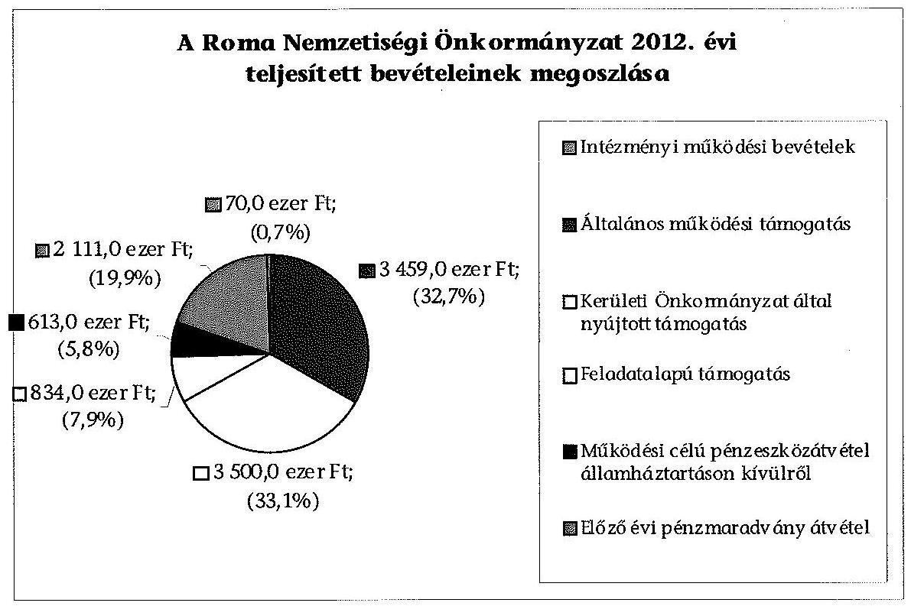

# ÁLLAMI   SZÁMVEVŐSZÉK 

## JELENTÉS

a helyi nemzetiségi önkormányzatok gazdálkodásának ellenőrzéséről
Budapest Főváros XIII. Kerületi Roma Nemzetiségi Önkormányzat

---

# Állami Számvevőszék 

Iktatószám: V-0298-022/2014.
Témaszám: 1331
Vizsgálat-azonosító szám: V065251

## Az ellenőrzést felügyelte:

Horváth Balázs
felügyeleti vezető
Az ellenőrzést vezette és az ellenőrzés végrehajtásáért felelős:
Kisgergely István
ellenőrzésvezető
A számvevőszéki jelentést készítették és a jelentés összeállításában közremüködtek:

Zachár Péterné
számvevő főtanácsos
Právitzné Pejkó Noémi
számvevő
Az ellenőrzést végezte:
Právitzné Pejkó Noémi
számvevő

---

# TARTALOMJEGYZÉK 

BEVEZETÉS ..... 3
I. ÖSSZEGZŐ MEGÁLLAPÍTÁSOK, KÖVETKEZTETÉSEK, JAVASLATOK ..... 6
II. RÉSZLETES MEGÁLLAPÍTÁSOK ..... 10

1. A Roma Nemzetiségi Önkormányzat és a XIII. Kerületi Önkormányzat együttműködésének szabályozása, a működési feltételek biztosítása ..... 10
2. A gazdálkodási feladatok ellátásának szabályszerűsége ..... 11
2.1. A költségvetésre és a zárszámadásra, valamint a kincstári adatszolgáltatás rendjére vonatkozó jogszabályi előírások betartása ..... 11
2.2. A Roma Nemzetiségi Önkormányzat gazdálkodásának szabályozottsága ..... 12
2.3. Az operatív gazdálkodási jogkörök kialakítása, gyakorlása ..... 13
3. A Roma Nemzetiségi Önkormányzattal összefüggő gazdálkodási feladatok belső ellenőrzése ..... 15
4. A feladatalapú támogatás felhasználásának, elszámolásának szabályszerűsége, a Roma Nemzetiségi Önkormányzat feladatellátása ..... 16
MELLÉKLETEK
5. számú A Roma Nemzetiségi Önkormányzat 2012. évi gazdálkodásának főbb adatai, mutatói
2/A. számú Tájékoztatás a polgármesternek küldött el nem fogadott észrevételekről
2/B. számú Tájékoztatás az elnöknek küldött el nem fogadott észrevételekről
FÜGGELÉKEK
6. számú Rövidítések jegyzéke
7. számú Értelmező szótár
8. számú A gazdálkodás értékelésének módszere

---

.

---

# JELENTÉS 

## a helyi nemzetiségi önkormányzatok gazdálkodásának ellenőrzéséről Budapest Főváros XIII. Kerületi Roma Nemzetiségi Önkormányzat

## BEVEZETÉS

A Roma Nemzetiségi Önkormányzat 1994. évben alakult, elnöke a 2006. évi helyhatósági választások óta látja el feladatát. A Roma Nemzetiségi Önkormányzat intézményt, gazdasági társaságot és más szervezetet nem alapított, illetve ezek társulásában nem vesz részt. A négytagú Képviselő-testület munkája segitésére bizottságot nem hozott létre. A Roma Nemzetiségi Önkormányzat költségvetési beszámolója szerint a 2012. évben a módosított költségvetési bevételi és kiadási előirányzata 10585 ezer Ft, a teljesített költségvetési bevétel 10587 ezer Ft, a teljesített költségvetési kiadás 9725 ezer Ft volt. A 2012. évi gazdálkodási adatokat részletesen az 1. számú mellékletben mutatjuk be.

Az Alaptörvény XXIX. cikk (1) bekezdése szerint a Magyarországon élő nemzetiségek államalkotó tényezők. Minden, valamely nemzetiséghez tartozó magyar állampolgárnak joga van önazonossága szabad vállalásához és megőrzéséhez. A hazánkban élő nemzetiségek helyi (települési és területi), valamint országos önkormányzatokat hozhatnak létre. A helyi nemzetiségi önkormányzatok gazdálkodási feladatait jogszabályi előírás alapján a székhely szerinti önkormányzat polgármesteri hivatala látja el.

A nemzetiségek helyzete, támogatása mind hazai, mind EU-s szinten kiemelt figyelmet kap napjainkban. A helyi nemzetiségi önkormányzatok gazdálkodására és támogatási rendszerére vonatkozó jogszabályok a 2010-2012. években jelentős változásokon mentek át. A települési és területi nemzetiségi önkormányzatok gazdálkodásának, a részükre juttatott költségvetési támogatások felhasználásának ellenőrzését az ÁSZ a 2012. évben sorozatjellegű ellenőrzés keretében indította el. A 2013. évi ellenőrzések e témacsoportos ellenőrzések folytatását jelentik, amelyet az ÁSZ 2014 első félévi ellenőrzési terve 12 témasorszámon tartalmaz.

Az ellenőrzés célja annak értékelése volt, hogy a Roma Nemzetiségi Önkormányzat gazdálkodási kereteinek kialakítása, gazdálkodása és feladatellátása megfelelt-e a jogszabályoknak.

---

Ennek keretében értékeltük, hogy:

- a Roma Nemzetiségi Önkormányzat és a XIII. Kerületi Önkormányzat együttműködésének szabályozása, a működési feltételek biztosítása megfelel-t-e a jogszabályi előírásoknak;
- a felek együttműködése megfelelt-e a közöttük létrejött megállapodásnak a gazdálkodási feladatok szabályszerű ellátása során, ennek keretében betartották-e a Roma Nemzetiségi Önkormányzat gazdálkodásához kapcsolódóan a költségvetésre és zárszámadásra, a gazdálkodás szabályozására, az operatív gazdálkodási jogkörök gyakorlására vonatkozó jogszabályi előírásokat;
- a jegyző biztosította-e a Roma Nemzetiségi Önkormányzat gazdálkodásának belső ellenőrzését;
- a Roma Nemzetiségi Önkormányzat feladatalapú támogatásának felhasználása, a folyósított feladatalapú támogatással történő elszámolás az előírásoknak megfelelő volt-e;
- a Roma Nemzetiségi Önkormányzat feladatellátása összhangban volt-e a vonatkozó jogszabályi előírásokkal.

Az ellenőrzés várható hasznosulását négy szinten tervezzük. A törvényalkotás számára összegzett tapasztalatok állnak rendelkezésre a nemzetiségi önkormányzatok testületi döntéseinek, gazdálkodásának és a feladatalapú támogatás felhasználásának szabályszerűségéről, amelynek alapján következtetést lehet levonni arra, hogy indokolt-e jogszabályi módosítás kezdeményezése. Az ellenőrzés az ellenőrzött számára visszajelzést ad a működésében fellépő hiányosságokról, javaslataival hozzájárul azok kiküszöböléséhez, amely csökkentheti a későbbi ellenőrzések gyakoriságát. Az ellenőrzés megállapításai és javaslatai tanulságul szolgálhatnak más nemzetiségi önkormányzatok, szervezetek számára a rendezett gazdálkodási keretek kialakításához. A társadalom számára jelzi, hogy közpénz nem maradhat ellenőrizetlenül, az ÁSZ értékteremtő rend kialakításához és megőrzéséhez hozzájáruló tevékenysége pozitív hatással lesz a szervezetről kialakított összkép formálásában. Az ÁSZ szervezetén belül lehetőség nyílik arra, hogy a megállapítások szintetizálásával az intézmény a hozzáadott értéket teremtő elemző tevékenységét és tanácsadó szerepét erősítse.

A Roma Nemzetiségi Önkormányzat gazdálkodásának ellenőrzéséről szóló jelentés I. fejezetének összegző része az ellenőrzés céljára adott rövid, szintetizáló összefoglalót és következtetéseket tartalmazza a II. fejezet részletes megállapításain alapulóan. A jelentés intézkedést igénylő megállapításait és javaslatait az összegzőben foglaltak mellett - az ellenőrzés során feltárt, a jelentés II. fejezetében rögzített részletes megállapítások alapozzák meg, illetve támasztják alá.

Az ellenőrzés típusa: szabályszerűségi ellenőrzés

---

Az ellenőrzött időszak: 2012. január 1. - 2012. december 31. közötti időszak. Az ellenőrzés kiterjedt a Roma Nemzetiségi Önkormányzatnak juttatott 2012. évi támogatás 2013. évben való elszámolására is.

Ellenőrzött szervezet: Budapest Főváros XIII. Kerületi Roma Nemzetiségi Önkormányzat és a gazdálkodási feladatait ellátó Budapest Főváros XIII. Kerületi Önkormányzata.

Az ellenőrzés végrehajtásának jogszabályi alapját az ÁSZ tv. 5. § (2)-(3) és (6) bekezdéseiben foglaltak képezik.

Az ellenőrzés szakmai módszertana az ÁSZ hivatalos honlapján (www.asz.hu) közzétett szakmai szabályokon alapult, amely a Legfőbb Ellenőrző Intézmények Nemzetközi Szervezete (INTOSAI) által kiadott nemzetközi standardok (ISSAI) figyelembevételével készült.

A Roma Nemzetiségi Önkormányzat gazdálkodásának ellenőrzése során értékeltük a XIII. Kerületi Önkormányzat és a Roma Nemzetiségi Önkormányzat együttműködésének, a gazdálkodás szabályozottságának és a pénzügyi folyamatokban kulcsszerepet betöltő belső kontrollok (teljesítésigazolás és érvényesítés) múködésének megfelelőségét. A kulcskontrollokat a múködési és felhalmozási célú támogatásértékű kiadásoknál, az államháztartáson kívülre teljesített működési és felhalmozási célú pénzeszköz átadásoknál, a dologi kiadásokkal kapcsolatos kifizetéseknél - véletlen mintavételi eljárást alkalmazva - ellenőriztük. Ellenőriztük, hogy a jegyző biztosította-e a Roma Nemzetiségi Önkormányzat gazdálkodásának belső ellenőrzését. Értékeltük a feladatalapú támogatások felhasználásának, elszámolásának szabályszerűségét, a Roma Nemzetiségi Önkormányzat feladatellátása és a jogszabályi előírások összhangját.

Az ellenőrzés lefolytatásához a Roma Nemzetiségi Önkormányzat és a gazdálkodási feladatait ellátó XIII. Kerületi Önkormányzat tanúsítványok és a kapcsolódó, dokumentumjegyzékben megjelölt dokumentumok elektronikus úton történő megküldésével, rendelkezésre bocsátásával szolgáltatott adatokat. Az adatszolgáltatás kontrollálása és szükség szerinti javítása a helyszíni ellenőrzés keretében történt. A minősítési szempontokat a 3. számú függelék tartalmazza.

Az ÁSZ tv. 29. § (1) bekezdése szerint a jelentéstervezetet megküldtük egyeztetésre a polgármester és a Roma Nemzetiségi Önkormányzat elnöke részére. A polgármester és a Roma Nemzetiségi Önkormányzat elnöke határidőben megküldött észrevétele és tájékoztatása alapján a jelentést módosítottuk. Az el nem fogadott észrevételek indoklását a jelentés 2/A. számú és 2/B. számú mellékletei tartalmazzák.

---

# I. ÖSSZEGZŐ MEGÁLLAPÍTÁSOK, KÖVETKEZTETÉSEK, JAVASLATOK 

A Roma Nemzetiségi Önkormányzat és a XIII. Kerületi Önkormányzat együttmúködésének szabályozása megfelelt a jogszabályi előírásoknak. A Roma Nemzetiségi Önkormányzat 2012. év folyamán rendelkezett hatályban lévő megállapodással a XIII. Kerületi Önkormányzattal történő együttmúködésre, azonban az együttmúködési megállapodás ${ }_{1}$ 2012. évi - évenként kötelező - felülvizsgálatát a Nek. ${ }_{2}$ tv.-ben előírt határidőn túl végezték el. Az együttműködési megállapodás ${ }_{1}$ jogszabályváltozás miatti kiegészítése megtörtént a Nek. ${ }_{2}$ tv.-ben előírt határidőn belül. Az együttműködési megállapodás ${ }_{2}$ a Nek. ${ }_{2}$ tv.-ben meghatározott tartalmi elemeket tartalmazta, a Roma Nemzetiségi Önkormányzat múködésének feltételeit és a gazdálkodási feladatainak ellátását az előírásoknak megfelelően szabályozták, működésének előírt személyi és tárgyi feltételei biztosítottak voltak 2012. évben.

A Roma Nemzetiségi Önkormányzat 2012. évi költségvetésének és zárszámadásának tartalma, jóváhagyása megfelelt a jogszabályi előírásoknak. A Roma Nemzetiségi Önkormányzat elnöke a 2012. évi költségvetés tervezetét az Áht. ${ }_{3}$-ben előírt határidőben benyújtotta a Képviselő-testületnek. A jóváhagyott költségvetés tartalmazta az Áht. ${ }_{2}$-ben és az Ávr.-ben meghatározott tartalmi elemeket. A Roma Nemzetiségi Önkormányzat elnöke a 2012. évi zárszámadást az előírt határidőben a Képviselő-testületnek benyújtotta, és az Áht. ${ }_{2}$-ben előírt mérlegeket és kimutatásokat tájékoztatásul bemutatta, biztosított volt az összehasonlíthatósága az elfogadott költségvetéssel. A jegyző a 2012. évi költségvetéshez kapcsolódó a Roma Nemzetiségi Önkormányzatra vonatkozó adatszolgáltatási kötelezettségeinek késve tett eleget.

A Roma Nemzetiségi Önkormányzat gazdálkodásának szabályozottsága megfelelő volt az ellenőrzött időszakban. A gazdálkodási feladatok végrehajtását ellátó Polgármesteri Hivatal a 2012. évben a Számv. tv.-ben, és a Bkr. által előírt gazdálkodást érintő szabályzatokkal a Roma Nemzetiségi Önkormányzat gazdálkodására kiterjedő hatállyal rendelkezett. A Roma Nemzetiségi Önkormányzat gazdálkodásával kapcsolatos az SZMSZ-ben nevesített munkakörökhöz tartozó feladat és hatásköröket, azok gyakorlásának módját, a helyettesítés rendjét, az ezekhez kapcsolódó felelősségi szabályokat a Polgármesteri Hivatal SZMSZ-e nem tartalmazta.

Az operatív gazdálkodási jogkörök kialakítása a jogszabályi előírásokkal összhangban történt, a pénzügyi ellenjegyzöket, az érvényesítőket a jegyző, mint a költségvetési szerv vezetője jelölte ki.

A 2012. évben a dologi kiadások teljesítése során a teljesítésigazolás és az érvényesítés kulcskontrollok az elvégzett teszt alapján kiválóan múködtek. A Roma Nemzetiségi Önkormányzatnál a 2012. évi dologi kiadások között a három legnagyobb összegű kiadás teljesítésének egyedi értékelése alapján a teljesítésigazolás és az érvényesítés kulcskontrollok múködése megfelelő volt.

---

Az államháztartáson kívülre történő működési és felhalmozási célú pénzeszközátadások esetében a teljesítésigazolás megfelelően, az érvényesítés kulcskontroll részben működött megfelelően, és több hiányosságot tárt fel az ellenőrzés. A feltárt hiányosságokkal összefüggésben a kifizetés dokumentumainak ellenőrzése alapján az ellenőrzés jogosulatlan kifizetésre utaló körülményt állapított meg. Egy esetben a kötelezettségvállalásra, a pénzügyi ellenjegyzés dátumának feltüntetése, valamint a kötelezettségvállaló aláírása nélkül került sor. Az Egyesület a pénzeszközátadás kapcsán utólag számolt el a támogatásokkal a Roma Nemzetiségi Önkormányzat felé. Az elszámolás során egy alkalommal a befogadásra kerülő számlát a cégnyilvántartásból bírósági határozattal törölt cég állította ki.

A Roma Nemzetiségi Önkormányzattal gazdálkodásával összefüggő végrehajtási feladatokkal kapcsolatosan a belsö̉ ellenőrzés kialakítása megfelelő volt. A jegyző az ellenőrzött időszakban biztosította a Nemzetiségi Önkormányzat gazdálkodásával összefüggő végrehajtási feladatok belső ellenőrzését. A belső ellenőrzési tervet megalapozó kockázatelemzés kiterjedt a nemzetiségi önkormányzatok gazdálkodásával összefüggő végrehajtási feladatokra. A nemzetiségek gazdálkodásával kapcsolatos kockázatot magas besorolásúnak minősítették, és évenkénti vizsgálatot tartanak szükségesnek. A Roma Nemzetiségi Önkormányzatot érintő tervezett ellenőrzést - 2012. év I. félévre vonatkozóan - az Ellenőrzési Csoport végrehajtotta.

A Roma Nemzetiségi Önkormányzat a 2011-ben, és a 2012. évben kapott feladatalapú támogatást a folyósítás évében felhasználta, maradvány nem keletkezett.

A Roma Nemzetiségi Önkormányzat részére 2012. évben folyósított feladatalapú támogatás felhasználása, elszámolása a jogszabályi előírásoknak részben volt megfelelő, mert az ellenőrzés részére átadott tanúsítvány szerint a feladatellátás egy esetben nem volt összhangban a vonatkozó jogszabályi előírások alapján elfogadott képviselőtestületi határozatban megjelölt célokkal. A társadalmi felzárkóztatás tevékenységen belül a Roma Nemzetiségi Önkormányzat kiadást számolt el egészségügyi szűrésre. A dokumentumok ellenőrzése alapján azonban nem egészségügyi szűrés történt, hanem a XIII. kerületi roma lakosság helyzetének kérdőíves felmérése.

A 2011. és a 2012. évi feladatalapú támogatás elszámolása a támogatási kormányrendelet ${ }_{1,2}$ előírása alapján az Áht. ${ }_{1-2}$-ben foglaltak ellenére nem történt meg. A támogatás felhasználását, elszámolását az arra jogosult külső szervek nem ellenőrizték.

A Roma Nemzetiségi Önkormányzat 2012-ben ellátott kötelező és önként vállalt közfeladatokat, a feladatellátások tárgya összhangban volt a Nek. ${ }_{2}$ törvényben foglalt előírásokkal, hatósági tevékenységet nem folytatott.

Az ÁSZ tv. 33. § (1) bekezdésében foglaltak értelmében az ellenőrzött szervezet vezetője köteles a jelentésben foglalt megállapításokhoz kapcsolódó intézkedési tervet összeállítani és azt a jelentés kézhezvételétől számított 30 napon belül az ÁSZ részére megküldeni. Amennyiben az intézkedési tervet határidőre nem

---

küldi meg a szervezet, vagy az nem elfogadható, az ÁSZ elnöke az ÁSZ tv. 33. § (3) bekezdés a)-b) pontjaiban foglaltakat érvényesítheti.

A helyszíni ellenőrzés megállapításainak hasznosítása mellett javasoljuk:

# a jegyzőnek 

1. az együttműködés szabályozásával kapcsolatban

Az együttműködési megállapodás ${ }_{1}$-t a Nek. 2 tv. 80. § (2) bekezdésének előírása ellenére 2012. január 31-éig nem vizsgálták felül.

Javaslat
Biztosítsa a jövőben az együttműködési megállapodás évenkénti felülvizsgálata során a Nek. 2 tv. 80. § (2) bekezdésében előírt határidő betartását.
2. a kincstári adatszolgáltatási kötelezettséggel kapcsolatban

A jegyző a 2012. évi költségvetéshez kapcsolódó, a Roma Nemzetiségi Önkormányzatra vonatkozó az Ávr. 33. §-ában, 169. § (2) bekezdésben, valamint az Áhsz. 10. § (5 a) bekezdésében előírt kincstári adatszolgáltatási kötelezettségének késve tett eleget.

Javaslat
A jövőben a kincstári adatszolgáltatási kötelezettségeinek az Ávr. 33. §-ában, 169. § (2) bekezdésében, továbbá az Áhsz. 2 32. § (4) bekezdésében előírt határidő betartásával tegyen eleget.
3. a gazdálkodás szabályozottságával, ellátásával kapcsolatban

A Polgármesteri Hivatal SZMSZ-e nem tartalmazta az Ávr. 13. § (1) bekezdés g) pontjában foglaltak szerinti, az SZMSZ-ben nevesített munkakörökhöz tartozó - a Roma Nemzetiségi Önkormányzat gazdálkodásával kapcsolatos - feladat- és hatáskörökre, a hatáskörök gyakorlásának módjára, a helyettesítés rendjére, az ezekhez kapcsolódó felelősségi szabályokra vonatkozó előírásokat.

Javaslat
Készítse elő a Polgármesteri Hivatal SZMSZ-ének módosítását, hogy az tartalmazza a Roma Nemzetiségi Önkormányzat gazdálkodásával kapcsolatosan is - az Ávr. 13. § (1) bekezdés g) pontjában foglaltakat.
4. a feladatalapú támogatás elszámolásával kapcsolatban

A 2011. és a 2012. évi feladatalapú támogatás elszámolása a támogatási kormányrendelet ${ }_{1}$ 7. § (2), illetve a támogatási kormányrendelet ${ }_{2}$ 8. § (5) bekezdésében hivatkozott „a helyi önkormányzatok elszámolási és ellenőrzési rendjére vonatkozó jogszabályok rendelkezései alkalmazandóak" előírása alapján az Áht. 1 64. § (7) bekezdése és az Áht. 2 57. § (3) bekezdése ellenére nem történt meg.

---

Javaslat
Gondoskodjon az Áht. 2 27. § (2) bekezdésében meghatározott feladatkörében az Roma Nemzetiségi Önkormányzat által igénybevett 2011. és 2012. évi feladatalapú támogatás rendeltetésszerű felhasználásáról szóló elszámolásának elkészítéséről, az Áht. 2 53. § (1) bekezdése szerinti beszámolási kötelezettség teljesítéséhez.

# a polgármesternek 

A Polgármesteri Hivatal SZMSZ-e nem tartalmazta az Ávr. 13. § (1) bekezdés g) pontjában foglaltak szerinti, az SZMSZ-ben nevesített munkakörökhöz tartozó - a Roma Nemzetiségi Önkormányzat gazdálkodásával kapcsolatos - feladat- és hatáskörökre, a hatáskörök gyakorlásának módjára, a helyettesítés rendjére, az ezekhez kapcsolódó felelősségi szabályokra vonatkozó előírásokat.

Javaslat
Terjessze a XIII. Kerületi Önkormányzat Képviselő-testülete elé jóváhagyásra a Polgármesteri Hivatal SZMSZ-e jegyző által előkészített módosítását, hogy az tartalmazza - a Roma Nemzetiségi Önkormányzat gazdálkodásával kapcsolatosan is - az Ávr. 13. § (1) bekezdés g) pontjában foglaltakat.

## a Nemzetiségi Önkormányzat elnökének

A 2011. és a 2012. évi feladatalapú támogatás elszámolása a támogatási kormányrendelet ${ }_{1}$ 7. § (2), illetve a támogatási kormányrendelet ${ }_{2}$ 8. § (5) bekezdésében hivatkozott „a helyi önkormányzatok elszámolási és ellenőrzési rendjére vonatkozó jogszabályok rendelkezései alkalmazandóak" előírása alapján az Áht. ${ }_{1}$ 64. § (7) bekezdése és az Áht. 2 57. § (3) bekezdése ellenére nem történt meg.

Javaslat
Terjessze a Képviselő-testület elé jóváhagyásra az Áht. 2 53. § (1) bekezdése szerinti beszámolási kötelezettség teljesítéséhez a Roma Nemzetiségi Önkormányzat által igénybe vett 2011. és 2012. évi feladatalapú támogatás rendeltetésszerú felhasználásáról szóló elszámolást.

---

# II. RÉSZLETES MEGÁLLAPÍTÁSOK 

## 1. A Roma Nemzetiségi Önkormányzat és a XIII. Kerületi ÖNKORMÁNYZAT EGYÜTTMÜKÖDÉSÉNEK SZABÁLYOZÁSA, A MÜKÖDÉSI FELTÉTELEK BIZTOSÍTÁSA

A Roma Nemzetiségi Önkormányzat és a XIII. Kerületi Önkormányzat együttmüködésének szabályozása, a múködési feltételek biztosítása megfelelt a jogszabályi előírásoknak.

A Roma Nemzetiségi Önkormányzat rendelkezett a 2012. év folyamán hatályban lévő megállapodással, a helyi önkormányzattal történő együttműködésre.

A 2012. január 1-jén hatályos, 2010. december 9-én megkötött együttműködési megállapodás ${ }_{1}$-nak a gazdálkodási szabályok változása miatti - évenkénti kötelezö - felülvizsgálatát nem végezték el a Nek. ${ }_{2}$ tv. 80. § (2) bekezdésében meghatározott határidőre, 2012. január 31-éig.

A jogszabályváltozás miatt, a Nek. ${ }_{2}$ tv. 159. § (3) bekezdésében előírt kiegészítést határidőben végrehajtották, és 2012. február 24-én aláírták az együttmúködési megállapodás ${ }_{2}$-t.

A 2012. február 24-én aláírt együttműködési megállapodás ${ }_{2}$-t a polgármester a 1/2011. (I. 14.) számú Önkormányzati rendelet felhatalmazása, a Roma Nemzetiségi Önkormányzat elnöke a Képviselő-testület 21/2012. (02. 09.) számú határozatának felhatalmazása alapján írta alá.

A Roma Nemzetiségi Önkormányzat múködésének személyi és tárgyi feltételeit, gazdálkodási feladatai ellátásának szabályait, azok teljesítési határidejét, felelőseit a jogszabályi előírásoknak megfelelően teljes körűen szabályozták az együttműködési megállapodás ${ }_{2}$-ban ${ }^{1}$.

A Roma Nemzetiségi Önkormányzat SZMSZ-ében az együttműködési megllapodás ${ }_{2}$-ben szereplő múködési feltételeket rögzítették.

A XIII. Kerületi Önkormányzat az együttműködési megállapodás ${ }_{2}$-ban a jogszabálynak megfelelően biztosította a Roma Nemzetiségi Önkormányzat múködéséhez szükséges személyi és tárgyi feltételeket².

[^0]
[^0]:    ${ }^{1}$ Az együttműködési megállapodás ${ }_{2}$ kiterjedt a költségvetés elfogadásával, végrehajtásával, a gazdálkodással, zárszámadással kapcsolatos feladatokra, a költségvetési előirányzatok módosításának rendjére, a gazdálkodási jogkörökre, a költségvetés végrehajtására. A Nek. ${ }_{2}$, tv. 80. § (1) bekezdésnek megfelelően szabályozták a gazdálkodási feladatokat, azok teljesítési határidejét, felelőseit.
    ${ }^{2}$ A Nemzetiségi Önkormányzat elnökei közös nyilatkozatban erősítették meg, hogy a XIII. Kerületi Önkormányzat a kerületben múködő nemzetiségi önkormányzatok múködéséhez szükséges személyi és tárgyi feltételeket biztosítja.

---

Az együttműködési megállapodás ${ }_{2}$ 20. pontja szerint „A Nemzetiségi Önkormányzat tárgyévi jóváhagyott költségvetésében az Önkormányzat által biztosított támogatásnak része a Nemzetiségi Önkormányzat müködéséhez szükséges - díttalanul biztosított - irodahelyiségben felmerülő közüzemi és egyéb jellegü költségek fedezete.".

A XIII. Kerületi Önkormányzat által biztosított irodahelyiség használatára vonatkozóan a XIII. Kerületi Önkormányzat, a Cigány Kisebbségi Önkormányzat ${ }^{3}$, valamint a közös helyiséghasználatban érintett Román Kisebbségi Önkormányzat 2010. november 30 -án, határozott időre - 2014. december 31-éig használati szerződést (VI-4/802/2010.) kötött.

A személyi feltételek biztosítása érdekében a Polgármesteri Hivatal egy fő dolgozójának munkaköri leírását 2011. szeptember 5-étől kezdődően kiegészítették a Kisebbségi (Nemzetiségi) Önkormányzatok gazdálkodásával kapcsolatos feladatok végrehajtásával.

A 2012. december 31 -én hatályos együttműködési megállapodás ${ }_{2}$ I./5. pontja a Nek. ${ }_{2}$ tv. 80. § (4) bekezdés előírásának megfelelően tartalmazta, hogy a jegyző vagy annak - a jegyzővel azonos képesítési előírásoknak megfelelő - megbízottja a XIII. Kerületi Önkormányzat megbízásából és képviseletében részt vesz a Roma Nemzetiségi Önkormányzat testületi ülésein és jelzi, amennyiben törvénysértést észlel.

# 2. A GAZDÁLKODÁSI FELADATOK ELLÁTÁSÁNAK SZABÁLYSZERŰSÉGE 

### 2.1. A költségvetésre és a zárszámadásra, valamint a kincstári adatszolgáltatás rendjére vonatkozó jogszabályi előírások betartása

A Roma Nemzetiségi Önkormányzat 2012. évi költségvetésének és zárszámadásának tartalma valamint a kapcsolódó 2012. évi adatszolgáltatás megfelelt ${ }^{4}$ a jogszabályi előírásoknak.

A Roma Nemzetiségi Önkormányzat elnöke az Áht. ${ }_{2}$ 24. § (2) bekezdésében előírt határidőre benyújtotta a Képviselő-testület részére a XIII. Kerületi Önkormányzat jegyzője által előkészített költségvetési határozattervezet.

A jóváhagyott költségvetés tartalma megfelelt az Ávr. 24 § (1) bekezdésében foglaltaknak, tartalmazta a költségvetési kiadásokat, bevételeket előirányzat csoportonkénti, kiemelt előirányzatonkénti bontásban. A 2012. évi költségvetés előterjesztésekor a Képviselő testület részére az Áht. ${ }_{2}$-ben foglaltaknak megfelelően bemutatták az előírt mérlegeket és kimutatásokat.

[^0]
[^0]:    ${ }^{3}$ A Használati szerződésben alkalmazott elnevezés.
    ${ }^{4}$ A Képviselő-testület 18/2012. (II. 9.) számú határozata a Roma Nemzetiségi Önkormányzat 2012. évi költségvetéséről, valamint a 17/2013. (IV. 18.) számú határozat a 2012. évi zárszámadásáról.

---

A jegyző által elkészített 2012. évi zárszámadási határozattervezetet a Roma Nemzetiségi Önkormányzat elnöke az Áht. 91. § (1) bekezdésében foglaltak alapján, határidőn belül benyújtotta a Képviselő-testületnek. Az Áht. 91. § (2) bekezdésében előírt mérlegeket, kimutatásokat a zárszámadás előterjesztésekor tájékoztatásul bemutatták. A zárszámadásról szóló határozat összehasonlíthatósága biztosított volt az elfogadott költségvetéssel.

A jegyző a 2012. évi költségvetéshez kapcsolódó, a Roma Nemzetiségi Önkormányzatra vonatkozóan az Ávr. 33. §, az Ávr. 169. § (2) bekezdésben, valamint az Áhsz. 10. § (5 a) bekezdésében előírt kincstári adatszolgáltatási kötelezettségének késve tett eleget.

Az elemi költségvetés megküldésére 2012. március 13-án került sor. A negyedéves és éves időközi költségvetési jelentések feladását a jegyző határidőn túl teljesítette, április 24-én és július 24-én. Az éves beszámoló feladására 2013. március 14én került sor a 2013. március 10-e helyett, melyet a Kincstár visszautasított, az újbóli feladás dátuma: 2013. április 2.

# 2.2. A Roma Nemzetiségi Önkormányzat gazdálkodásának szabályozottsága 

A Roma Nemzetiségi Önkormányzat gazdálkodásának szabályozottsága az ellenőrzött időszakban biztosított volt és megfelelt a jogszabályi előirásoknak.

A Roma Nemzetiségi Önkormányzat gazdálkodási feladatainak végrehajtását ellátó Polgármesteri Hivatal a 2012. évben a jogszabályokban (Számv. tv.ben, és a Bkr.) előírt gazdálkodást érintő szabályzatainak ${ }^{5}$ hatályát kiterjesztette a Roma Nemzetiségi Önkormányzat gazdálkodására.

A XIII. Kerületi Önkormányzat és a Roma Nemzetiségi Önkormányzat között létrejött együttmúködési megállapodás ${ }_{2}$ 39. pontja szerint: „A Polgármesteri Hivatal számviteli politikája keretében elkészített szabályzatainak hatálya a Nemzetiségi Önkormányzatra is kiterjed."

A Polgármesteri Hivatal számviteli politikájának 1.2.4. pontja ugyancsak megerősíti a számviteli politika mellékletét képező szabályzatok (pénz- és értékkezelési szabályzat, leltározási és leltárkészítési szabályzat, eszközök és források értékelési szabályzata, valamint önköltség számítási szabályzat) kiterjesztését a Roma Nemzetiségi Önkormányzatra.

A Polgármesteri Hivatal SZMSZ-e az Ávr. 13. § (1) bekezdés g) pontjában foglaltak ellenére nem tartalmazta az SZMSZ-ben nevesített munkakörökhöz tartozó - a Roma Nemzetiségi Önkormányzat gazdálkodásával kapcsolatos - feladat-

[^0]
[^0]:    ${ }^{5}$ Számviteli politika, eszközök és források leltárkészítési és leltározási szabályzata, eszközök és források értékelési szabályzata, pénzkezelési szabályzat, számlarend, selejtezési szabályzat, önköltségszámítás rendjére vonatkozó szabályzat, valamint a XXII/1542/2011. (XII.13.) számú Jegyzői Utasítás a Polgármesteri Hivatal belső kontroll szabályzatáról: ellenőrzési nyomvonal, szabálytalanságok kezelésének eljárásrendje, kockázatkezelési szabályzat.

---

és hatásköröket, a hatáskörök gyakorlásának módját, a helyettesítés rendjét, az ezekhez kapcsolódó felelősségi szabályokat ${ }^{6}$.

A Polgármesteri Hivatalban a vizsgált időszakban két operatív gazdálkodási szabályzat ${ }^{7}$ volt érvényben, amelyek hatályát kiterjesztették a Roma Nemzetiségi Önkormányzat gazdálkodására is. A szabályzatban a 100 ezer Ft-ot el nem érő, előzetes írásbeli kötelezettségvállalást nem igényelő kifizetések rendjét meghatározták.

A Roma Nemzetiségi Önkormányzat gazdálkodásával kapcsolatos feladatok ellátásának kötelezettségét a XIII. Kerületi Önkormányzat munkatársainak munkaköri leírása tartalmazta. A munkatársak rendelkeztek a jogszabályban előírt, megfelelő pénzügyi végzettséggel.

# 2.3. Az operatív gazdálkodási jogkörök kialakítása, gyakorlása 

A Roma Nemzetiségi Önkormányzat gazdálkodása tekintetében a 2012. évben az operatív gazdálkodási jogkörök kialakítása megfelelt a jogszabályi előírásoknak.

Az együttműködési megállapodás ${ }_{2}$ 24-31. pontja rendelkezett a gazdálkodási jogkörök részletes kialakításáról. ${ }^{8}$ A kötelezettségvállalásra, az utalványozásra adott felhatalmazás, valamint a teljesítést igazoló megbízása az Áht. ${ }_{2}$ 36. § (7) bekezdésében és az Ávr. 52. § (7) bekezdésében előírtaknak megfelelően történt.

A Roma Nemzetiségi Önkormányzat elnöke az előírásoknak megfelelően - nemzetiségi önkormányzati képviselőknek a kötelezettségvállalás és utalványozás gyakorlására történő felhatalmazással - biztosította az összeférhetetlenségi követelmények érvényesülésének szabályozási feltételeit.

A XIII. Kerületi Önkormányzat nem rendelkezett gazdasági szervezettel, ezért a jegyző jelölte ki írásban a pénzügyi ellenjegyzőket és az érvényesítőket az Ávr. 55. § (2) bekezdés g) pontja és az 58. § (4) bekezdései alapján. A Polgármesteri Hivatal pénzügyi ellenjegyzői és érvényesítői feladatokra kijelölt köztisztviselői a feladatuk ellátásához előírt képesítési követelményeknek megfeleltek.

[^0]
[^0]:    ${ }^{6}$ A gazdálkodással kapcsolatos feladat- és hatásköröket az egységes ügyrend módosításáról szóló 160/2012. (XII. 13.) számú önkormányzati határozat tartalmazta, illetve a munkaköri leírásokban rögzítették.
    ${ }^{7}$ XXII/25-3/2010. (04. 29.), valamint XXII/1-11/2012. (07. 02.) számú polgármesterijegyzői együttes utasítás az Önkormányzat és a Polgármesteri Hivatal költségvetése végrehajtása során a kötelezettségvállalás és ellenjegyzés, a szakmai teljesítésigazolás, érvényesítés és utalványozás hatásköri rendjéről.
    ${ }^{8}$ Az együttműködési megállapodás ${ }_{2}$ (VI-20/46/2012.) 24. pontja alapján a Roma Nemzetiségi Önkormányzat előirányzatai terhére kötelezettséget vállalni és utalványozni kizárólag az elnök vagy az általa felhatalmazott Roma Nemzetiségi Önkormányzati képviselő jogosult.

---

A 2012. évben hatályban lévő együttmúködési megállapodásokban a jogszabályban előírtaknak megfelelően rendelkeztek az előzetes írásbeli kötelezettségvállalást nem igénylő - 100 ezer Ft-ot el nem érő - kifizetések rendjéről. ${ }^{9}$ A nemzetiségi önkormányzatok gazdálkodásával kapcsolatos feladatokat ellátó ügyintéző az Ávr.-ben előírtaknak megfelelően gondoskodott a 100 ezer Ft-ot el nem érő tételek esetében a kifizetések teljesítésével egyidejúleg azok pénzügyi rendszerben való rögzítéséről, és a szabad előirányzat kiadási összegnek megfelelő lefoglalásáról. A 100 ezer Ft-ot meghaladó kötelezettségvállalásról a jogszabályban meghatározott tartalmú nyilvántartást vezettek.

A Roma Nemzetiségi Önkormányzatnál a 2012. évben a dologi kiadások teljesítése során a teljesítésigazolás és az érvényesítés kulcskontrollok működésének megfelelősége az elvégzett teszt alapján kiváló volt.

A Roma Nemzetiségi Önkormányzatnál a 2012. évi dologi kiadások között a három legnagyobb összegű kiadás ${ }^{10}$ teljesítésének egyedi értékelése alapján a teljesítésigazolás és az érvényesítés kulcskontrollok múködése megfelelő volt.

- Támogatásértékű kiadás, valamint államháztartáson kívülre történő működési és felhalmozási célú pénzeszközátadások esetében a kiválasztott öt gazdasági esemény tekintetében a teljesítés igazolás megfelelően, az érvényesítés kulcskontroll részben múködött megfelelően, mert az érvényesítő egy esetben nem az Ávr. 58. § (1) és (2) bekezdéseiben előírt módon látta el feladatát, nem ellenőrizte a megelőző ügymenetben a gazdálkodásra vonatkozó szabályok betartását. Az utalványozó felé nem jelezte, hogy az Ávr. 10. § (7) b) pont előírását megsértve a kötelezettségvállalásra, a pénzügyi ellenjegyzés dátumának feltüntetése, valamint a kötelezettségvállaló aláírása nélkül került sor, és ehhez a kötelezettségvállaláshoz kapcsolódott három tétel a mintatételként kiválasztott gazdasági események közül ${ }^{11}$. A jelentéstervezet észrevételezésére rendelkezésre álló időszakban a Nemzetiségi Önkormányzat elnöke hitelesített másolatban rendelkezésre bocsátotta a szerződés egy formailag megfelelő példányát.

A kulcskontrollok tesztelése során jogosulatlan kifizetésre utaló körülmény merült fel az alábbiakban részletezettek szerint:

- a pénzeszközátadás utólagos elszámolásához kapcsolódó számlák ellenőrzésekor megállapítást nyert, hogy egy esetben a cégnyilvántartásból bírósági

[^0]
[^0]:    ${ }^{9}$ Az együttműködési megállapodás 230 . pontja szerint „A 100.000 forint alatti elözetes kötelezettségvállalást nem igénylő kifizetéseket a Pénzügyi Osztály a teljesítést követően haladéktalanul felvezeti a nyilvántartásba.".
    ${ }^{10}$ A három legnagyobb összegű dologi kiadás: 290,0 ezer Ft adatfeldolgozás, 210,0 ezer Ft rendezvénybiztosítás, 178,0 ezer Ft egészségügyi szűrés (szociális felmérés).
    ${ }^{11}$ 2011. december 27-én Együttműködési megállapodás született a Budapest XIII. kerületi Cigány Kisebbségi Önkormányzat és az Egyesület között, melynek értelmében a Kisebbségi Önkormányzat 2012. január 1-jétől 2012. december 31-élg havonta 150 ezer Ft-ot utal át az Egyesület számlaszámára.

---

határozattal törölt cég ${ }^{12}$ által kiállított számlával történt az elszámolás, ami a teljesítésigazolás alapja volt.

Támogatási megállapodás alapján 200 ezer Ft összegű pénzeszközátadásra került sor az Egyesület részére. Az Egyesület számlával alátámasztottan elszámolt a támogatási összeggel. A cégnyilvántartásban szereplő adatok szerint, a számlát kiállító gazdasági társaságot a Borsod-Abaúj-Zemplén Megyei Bíróság ( 0509 021106) már a számla kibocsátást (2012. december. 7.) megelőzően törölte a nyilvántartásból 2012. október 16-án. Az Eljárási adatokban megfogalmazottak szerint a bíróság elrendelte a cég törlését a Cgt.05-11-002389/13. számú végzés jogerőre emelkedésére tekintettel.

# 3. A Roma Nemzetiségi Önkormányzattal összefüggő gazdÁlkODÁsi feladatok Belsó elLENŐrZÉSE 

A Roma Nemzetiségi Önkormányzat gazdálkodásával összefüggő végrehajtási feladatokkal kapcsolatosan a belső ellenőrzés kialakítása 2012-ben megfelelő volt.

A 2010. december 9-én, valamint a 2012. február 24-én aláírt együttműködési megállapodás ${ }_{1,2}$ tartalmazta a belső ellenőrzésre vonatkozó feltételeket. A jegyző, a jogszabályi előírásoknak megfelelően biztosította a Roma Nemzetiségi Önkormányzat gazdálkodásával összefüggő végrehajtási feladatok belső ellenőrzését ${ }^{13}$.

A 2012. évre vonatkozó belső ellenőrzési terv összeállítása során a jegyző figyelemmel volt a Roma Nemzetiségi Önkormányzat gazdálkodásával összefüggő végrehajtási feladatok belső ellenőrzésére.

A 164/2011. (X. 13.) számú határozattal a XIII. Kerületi Önkormányzat Képvise-lö-testülete elfogadta és jóváhagyta a Polgármesteri Hivatal 2012. évre vonatkozó kockázatelemzéssel alátámasztott éves belső ellenőrzési tervét, mely tartalmazta a kerületben múködő helyi kisebbségi/nemzetiségi önkormányzatok gazdálkodásának ellenőrzését.

A belső ellenőrzési tervet megalapozó kockázatelemzés kiterjedt a nemzetiségi önkormányzatok gazdálkodásról összefüggő végrehajtási feladatokra is. A nemzetiségek gazdálkodásával kapcsolatos kockázatot magas besorolásának minősítették, és évenkénti vizsgálatot tartottak szükségesnek.

[^0]
[^0]:    ${ }^{12}$ Adószám: 23122493-2-05 Cégkivonata alapján a megszűnés dátuma: 2012. október 16 .
    ${ }^{13}$ A belső ellenőrök rendelkeztek munkaköri leírással, valamint az Áht. 70. §-ban meghatározott engedéllyel, szerepeltek a költségvetési szervnél belső ellenőrzést végzők nyilvántartásában, illetve elkészítették a 2012. évre vonatkozó belső ellenőrzési kézikönyvet.

---

Az éves belső ellenőrzési tervben foglaltaknak megfelelően az Ellenőrzési Csoport 2012-ben ellenőrizte ${ }^{14}$ a XIII. kerületben múködő helyi Nemzetiségi Önkormányzatok gazdálkodását, és a megállapításairól jelentést készített.

A belső ellenőrzés megállapította, hogy a helyi nemzetiségi önkormányzatok költségvetésének végrehajtása során a gazdálkodás és az elszámolás szabályszerűen történt a vizsgált időszakban (2012. I. félév), betartották a szakmai teljesí-tés-igazolás, az utalványozás, az ellenjegyzés, valamint az érvényesítés szabályait.

A belső ellenőrzési jelentésben megfogalmazottakat a Roma Nemzetiségi Önkormányzat elnöke megismerte, azokra észrevételt nem tett ${ }^{15}$.

Az ellenőrzési jelentésben az Ellenőrzési Csoport a Nemzetiségi Önkormányzatoknak két általános javaslatot tett, amelyek nem kapcsolódtak konkrét megállapításokhoz, így intézkedési tervet nem kellett készíteni.

A belső ellenőrzés javasolta, hogy a nemzetiségi önkormányzatok az előirányzatfelhasználásokat folyamatosan kísérjék figyelemmel annak érdekében, hogy a szükséges átcsoportosításokat végrehajthassák, valamint hogy az időarányos bevételek az előző félévi fel nem használt pénzmaradvány összegei miatt ne mutassanak aránytalanságot.

A belső ellenőrzés javasolta továbbá, hogy a különböző rendezvényekre és kiadásokra fordított összegek esetében a nemzetiségi önkormányzatok által hozott határozatokban pontosabban határozzák meg a támogatott esemény helyét és időpontját, a támogatási keret esetében bruttó összeget határozzanak meg.

Az ellenőrzéshez szolgáltatott adatok alapján a 2012. évben a Kormányhivatal a Roma Nemzetiségi Önkormányzatot illetően nem élt törvényességi felügyeleti eszközökkel.

# 4. A feladatalapú támogatás felhasZNálásáNAK, elsZámolÁsának szAblálysZerüsége, a Roma NemZetiségi ÖnkormÁnyZAT FELADATELLÁTÁSA 

A 2012. évben folyósított feladatalapú támogatás felhasználása, elszámolása a jogszabályi előírásoknak részben volt megfelelő.

A feladatalapú támogatás összes bevételhez viszonyított részarányát a következő ábra szemlélteti.

[^0]
[^0]:    ${ }^{14}$ A belső ellenőrzés által ellenőrzött időszak a 2012. év I. féléve volt, az ellenőrzés célja: „A nemzetiségi önkormányzatok részére biztosított pénzeszközök felhasználásának ellenőrzése".
    ${ }^{15}$ A 2012. október 1-jén kelt, XVI/20-7/2012. iktatószámú Ellenőrzési Jelentés, valamint a Roma Nemzetiségi Önkormányzat elnöke által átvett, hitelesített Ellenőrzési Jelentés Kivonta, illetve Záradék.

---

A Roma Nemzetiségi Önkormányzat a 2011. évben folyósított feladatalapú támogatást teljes összegben felhasználta, maradványa 2011. december 31 -én nem volt. A 2012. évben a Roma Nemzetiségi Önkormányzat 834,3 ezer Ft feladatalapú támogatásban részesült, amelyet a folyósítás évében felhasznált, maradványa nem keletkezett.

A 2012. évi támogatás összegével a Roma Nemzetiségi Önkormányzat Képvise-lő-testülete módosította az éves költségvetését ${ }^{16}$.

A feladatalapú támogatások felhasználása - az ellenőrzés részére kiállított tanúsítvány szerint - egy estben nem volt összhangban a Nek. ${ }_{2}$ tv. 116. § elöírása alapján elfogadott határozatban megjelölt céllal. A társadalmi felzárkóztatás tevékenységen belül a Roma Nemzetiségi Önkormányzat 178 ezer Ft kiadást számolt el egészségügyi szűrésre. A kifizetések dokumentumainak ${ }^{17}$ ellenőrzése alapján azonban megállapítást nyert, hogy a tanúsítvány adataitól eltérően nem egészségügyi szűrés történt, hanem a XIII. kerületi roma lakosság egészségügyi állapotának és szociális helyzetének kérdőíves felmérése.

A 2011. és a 2012. évi feladatalapú támogatás elszámolása a támogatási kormányrendelet ${ }_{1} 7 . \S$ (2), illetve a támogatási kormányrendelet ${ }_{2}$

[^0]
[^0]:    ${ }^{16} 77 / 2012$. (09. 07.) számú határozat
    ${ }^{17}$ A támogatás felhasználásának alapja a Roma Nemzetiségi Önkormányzat 69/2012. (08. 13.) számú határozata volt: „3) A kerületi romák körében elvégzett egészségügyi és szociális felmérés alapján egy javaslat kidolgozása, melyet a kerületi Prevenciós központ vagy a szociális osztály részére továbbitunk. Ennek a javaslatnak a kidolgozására 200,0 ezer Ft-ot irányozunk elö, illetve az elnök felhatalmazást kért a testülettöl, hogy a legjobb ajánlatot fogadja el, és a szerzödést kösse meg."

---

8. § (5) bekezdésében hivatkozott „a helyi önkormányzatok elszámolási és ellenőrzési rendjére vonatkozó jogszabályok rendelkezései alkalmazandóak" előírása alapján az Áht. 64. § (7) bekezdése, és az Áht. 57 . § (3) bekezdése ellenére nem történt meg.

A 2012. évi feladatalapú támogatásról részletes kimutatást készítettek a XIII. Kerületi Önkormányzat számára.

A feladatalapú támogatások felhasználását, elszámolását az ellenőrzésre jogosult szervek nem ellenőrizték.

A Roma Nemzetiségi Önkormányzat kötelező és önként vállalt feladatellátásának tárgya összhangban volt a Nek. 2 tv. 115. §, valamint a 116. § -ban foglalt előírásokkal. A nemzetiségi oktatással és a tanoda múködtetésével kapcsolatosan kötelező feladatként, valamint az önként vállalt feladatok közül a hagyományápolás területén látott el feladatokat.

A Roma Nemzetiségi Önkormányzat intézményt nem tartott fenn, gazdasági társaságot, gazdálkodó szervezetet nem alapított, hatósági tevékenységet nem folytatott.

Budapest, 2014. 06. hó 24. nap

Melléklet: $\quad 3 \mathrm{db}$
Függelék: $\quad 3 \mathrm{db}$

Domokos László
elnök 4

---

# A Roma Nemzetiségi Önkormányzat 2012. évi gazdálkodásának föbb adatai, mutatói

A) Bevételek

|  Megnevezés | Eredeti elöirányzat | Módosított | Teljesítés  |
| --- | --- | --- | --- |
|   | ezer Ft |  | megoszlás
$(\%)$  |
|  Intézményi múködési bevételek | 0,0 | 69,0 | 70,0  |
|  Általános múködési támogatás | 215,0 | 3458,0 | 3459,0  |
|  Kerületi Önkormányzat által nyújtott támogatás | 3500,0 | 3500,0 | 3500,0  |
|  Feladatalapú támogatás | 0,0 | 834,0 | 834,0  |
|  Müködési célú pénzeszközátvétel állambáztartáson kívülföl | 0,0 | 613,0 | 613,0  |
|  Előző évi pénzmaradvány átvétel | 0,0 | 2111,0 | 2111,0  |
|  Költségvetési bevételek | 3715,0 | 10585,0 | 10587,0  |
|  Tárgyévi bevételek | 3715,0 | 10585,0 | 10587,0  |

B) Kiadások

|  Megnevezés | Eredeti elöirányzat | Módosított | Teljesítés  |
| --- | --- | --- | --- |
|   | ezer Ft |  | megoszlás
$(\%)$  |
|  Személyi juttatások | 0,0 | 2634,0 | 2633,0  |
|  Munkaadókat terhelő járulékok és szocális hozzájárulási adó összesen | 0,0 | 354,0 | 352,0  |
|  Dologi kiadások | 1915,0 | 4619,0 | 3940,0  |
|  Céltartalék | 1800,0 | 2978,0 | 2800,0  |
|  Müködési kiadások összesen | 3715,0 | 10585,0 | 9725,0  |
|  Költségvetési kiadások | 3715,0 | 10585,0 | 9725,0  |
|  Függő,átfutó, kiegyenlítő kiadások | 0,0 | 0,0 | 124,0  |
|  Tárgyévi kiadások | 3715,0 | 10585,0 | 9849,0  |

---

.

---

# TÁJÉKOZTATÁS   A POLGÁRMESTERNEK KÜLDÖTT EL NEM FOGADOTT ÉSZREVÉTELEKRŐL 

| Együttmúködési megállapodás felülvizsgálata |  |
| :--: | :--: |
| Észrevétel | A Polgármesteri Hivatalban az együttmúködési megállapodás felülvizsgálata 2012. január hónapban zajlott. A felülvizsgálat többszöri személyes egyeztetéssel, előzetes munkaanyagok elkészítésével és véleményezésével járt. A dokumentumokból megismerhető dátumok alapján a feladat határidőben történő elvégzésére lehet következtetni: a Roma Nemzetiségi Önkormányzat képviselő-testülete - ahogy azt Önök is rögzítették a jelentéstervezetben - február 9-i határozatában felhatalmazta az elnököt a megállapodás aláírására, és a megállapodás aláírását megelőző pénzügyi ellenjegyzésre is február 9-én került sor. A körülmények mérlegelése során nem hagyható figyelmen kívül az a tény, hogy az Önkormányzat, a Polgármesteri Hivatal és a nemzetiségi önkormányzatok feladatait, együttmúködését, múködési körülményeit befolyásoló államháztartási szabályok 2012 januárjában gyökeresen megváltoztak. Az új múködési rend kialakítására rendelkezésre álló rendkívül rövid időszak alatt is betartottuk a jogszabályban előírt határidőket. A Kerületi Önkormányzat vezetése a megállapodás aláírására egyszerre, a kerületben múködő valamennyi nemzetiségi önkormányzat elnökével egyeztetett időpontban, február 24-én kerített sort az esemény súlyának megfelelő ünnepélyes keretek között. |
| Válasz | Az együttmúködési megállapodás felülvizsgálatával kapcsolatos észrevételét, illetve az aláírással összefüggő tájékoztatását köszönöm, azonban a jelentéstervezetben szereplő megállapítást továbbra is fenntartjuk. Az ÁSZ kizárólag dokumentumok alapján tesz megállapításokat. Az ellenőrzés részére hitelt érdemlően - dokumentum hiányában - nem tudták igazolni a felülvizsgálat 2012. január 31-ig történő elvégzését. |
| Kincstári adatszolgáltatási kötelezettség |  |
| Észrevétel | A kincstári adatszolgáltatási kötelezettségeknek a Kincstár által üzemeltetett internetes felületen teszünk eleget. A határidők betartására mindig fokozott figyelmet fordítunk, ennek ellenére többször előfordul, hogy a rendszer meghibásodása, programhibák javítása, korrekciója miatt az adatrögzítés, lezárás késedelmet szenved. Ezen eseményekről írásos dokumentumokkal nem rendelkezünk, többnyire csak telefonos tájékoztatást kapunk. A 2012. évi költségvetésről szóló adatszolgáltatás esetén a rendszerben rögzített dátumok bizonyítják, hogy a felvitt adatok mentése március 9-én megtörtént. A lezárás (véglegesítés) 2012. március 13-án 08 óra 04 perckor történt. Ezt a március 12-i határidő elmulasztásának tekinteni - különös tekintettel az előző ponthoz füzött a jogszabályi környezetre vonatkozó megjegyzésemre - véleményem szerint túlzás. |

---

| Válasz | A kincstári adatszolgáltatással kapcsolatos észrevételét, illetve tájékoztatását köszönjük, de a jelentéstervezetben szereplő megállapítást nem módosítjuk. Az ellenőrzés részére rendelkezésre bocsátott dokumentumok alapján az adatszolgáltatás határidőn túl történő teljesítése volt megállapítható. A kincstári adatszolgáltatási rendszer programhibáiról, a rendszer meghibásodásokról dokumentumokat nem mutattak be, így azokat nem vehettük figyelembe. |
| :--: | :--: |
| Polgármesteri Hivatal SZMSZ-ének hiányossága |  |
| Észrevétel | Az államháztartásról szóló törvény végrehajtásáról szóló 359/2011.(XII.31.) Korm. rendelet 13.§ (1) bekezdés g) pontja alapján a költségvetési szerv szervezeti és múködési szabályzatának tartalmaznia kell a "szervezeti és múködési szabályzatban nevesített munkakörökhöz tartozó feladat- és hatásköröket, a hatáskörök gyakorlásának módját, a helyettesítés rendjét, az ezekhez kapcsolódó felelősségi szabályokat". A jogszabály alapján kizárólag a hivatali SZMSZ-ben nevesített munkakörök vonatkozásában kell tartalmaznia a jelentés által hiányolt szabályokat az SZMSZ-nek. A vizsgált időszakban hatályos SZMSZ nem nevesítette a nemzetiségi önkormányzatok gazdálkodásával kapcsolatos munkakört, ezért a jogszabály szerint nem kell tartalmazni az SZMSZ-nek az ezzel kapcsolatos feladat- és hatásköröket, a hatáskörök gyakorlásának módját, a helyettesítés rendjét, az ezekhez kapcsolódó felelősségi szabályokat.   A hivatkozott Kormányrendelet 13.§ (5) bekezdése alapján „a költségvetési szerv szervezeti egységei által ellátott feladatok munkafolyamatainak leírását, a szervezeti egység vezetőinek és alkalmazottainak fel-adat- és hatáskörét, a helyettesítés rendjét, továbbá a szervezeti egység költségvetési szerven belüli belső és azon kívüli külső kapcsolattartásának módját, szabályait - ha azokról a szervezeti és múködési szabályzat vagy a költségvetési szerv más szabályzata nem rendelkezik - a szervezeti egységek ügyrendje tartalmazza". E jogszabályhely is azt támasztja alá, hogy nem kell a költségvetési szerv által ellátott valamennyi feladathoz kapcsolódó munkakört a szervezeti és múködési szabályzatban rögzíteni, ezért a vizsgált időszakban hatályos hivatali SZMSZ nem sértette a Kormányrendelet 13.§-ában foglaltakat. Tájékoztatom, hogy Budapest Főváros XIII. Kerületi Önkormányzat Képviselőtestülete 2012. december 13. napján elfogadta a Polgármesteri Hivatal új Szervezeti és Múködési Rendjét, amely 2013.január 1. napján lépett hatályba. |
| Válasz | A Polgármesteri Hivatal SZMSZ-ével kapcsolatos észrevételét, miszerint „a vizsgált időszakban hatályos SZMSZ nem nevesítette a nemzetiségi önkormányzatok gazdálkodásával kapcsolatos munkakört, ezért a jogszabály szerint nem kell tartalmaznia az SZMSZ-nek az ezzel kapcsolatos feladat- és hatásköröket, a hatáskörök gyakorlásának módját, a helyettesités rendjét, az ezekhez kapcsolódó felelősségi szabályokat" köszönöm, a megállapítást és a kapcsolódó javaslatot nem módosítjuk. Az Ávr. 13. § (5) bekezdés szerint amennyiben az SZMSZ nem tartalmazza ezeket a szabályokat, akkor azok más belső szabályzatban, illetve a szervezeti egységek ügy- |

---

|  | rendjében rögzítendők. Az ellenőrzés részére a nemzetiségi önkormányzatok gazdálkodásának végrehajtásával kapcsolatos feladatokat meghatározó szabályzatot, ügyrendet nem mutattak be, az SZMSZ sem tartalmazott erre vonatkozó utalást. Tájékoztatását, hogy a Polgármesteri Hivatal 2013. január 1-jétől hatályos új SZMSZ-t a Képviselő testület 2012. december 13-án elfogadta, tudomásul veszem, azonban megállapításokat csak az ellenőrzött időszakra vonatkozóan tehetünk. |
| :--: | :--: |
| Feladatalapú támogatás felhasználásának elszámolása |  |
| Észrevétel | A feladatalapú támogatást bevételként, felhasználását kiadásként tartalmazta a Nemzetiségi Önkormányzat gazdálkodásáról a Kincstárnak benyújtott éves beszámoló űrlapjai. Az Áht. nem rendelkezik e támogatási forma ettől elkülönülő, külön történő elszámolásáról, a Magyar Államkincstártól sem érkezett erre vonatkozó felhívás, így álláspontunk szerint jogszabályi kötelezettségünknek eleget tettünk. Ahogy azt Önök is pozitívumként megállapítják a jelentéstervezetben, a kerületi önkormányzat részére elkészült a feladatalapú támogatásról szóló részletes kimutatás, azaz a jegyzőek címzett 5. számú javaslatban szereplő feladatot végrehajtottuk. |
| Válasz | A 2011. évi feladatalapú támogatás elszámolásával kapcsolatban tett észrevételét nem fogadom el, a jelentéstervezetben szereplő megállapításunkat nem módosítjuk, az erre vonatkozó javaslatot továbbra is fenntartjuk. A 342/2010. (XII. 28.) Korm. rendelet 7. § (2) bekezdésének, valamint a 28/2012. (III. 6.) Korm. rendelet 8. § (5) bekezdésének előírása szerint a feladatalapú támogatással kapcsolatos elszámolás, ellenőrzés rendjére a helyi önkormányzatok elszámolási és ellenőrzési rendjére vonatkozó jogszabályok rendelkezései alkalmazandóak. Az államháztartásról szóló 1992. évi XXXVIII. törvény 64. § (7) bekezdése alapján a helyi önkormányzat a költségvetési év végét követően a tényleges mutatók alapján, külön jogszabályban meghatározott határidőig, a költségvetési törvény szabályai szerint elszámol az igénybe vett normatív hozzájárulásokkal és támogatásokkal. A 2011. évi CXCV. törvény 2012. évben hatályos 57. § (3) bekezdése szerint a helyi önkormányzat, a helyi nemzetiségi önkormányzat és a többcélú kistérségi társulás a költségvetési év végét követően elszámol az igénybe vett hozzájárulásokkal, támogatásokkal. A Nemzetiségi Önkormányzat a jogszabályban meghatározott elszámolásra vonatkozóan a szükséges dokumentumokat nem bocsátotta az ellenőrzés rendelkezésére. |

---

.

---

# TÁJÉKOZTATÁS   AZ ELNÖKNEK KÜLDÖTT   EL NEM FOGADOTT ÉSZREVÉTELEKRŐL 

| Elszámoláshoz kapcsolódó számlák |  |
| :--: | :--: |
| Észrevétel | A „részletes megállapítás" 15. oldal 1. és 2. bekezdése tartalmazza, hogy a pénzeszközátadás utólagos elszámolásához kapcsolódó számlák ellenőrzésekor egy esetben a cégnyilvántartásból bírósági határozattal törölt cég által kiállított számlával történt az elszámolás. Az adott tétel ellentételezésekor a Roma Nemzetiségi Önkormányzat az érintett szervezet (MCDSZ. XIII. Ker. If. Tagszöv.) szaktudását, kompetenciáját vizsgálta a rá bízott feladatot maximálisan teljesítette, a Roma Nemzetiségi Önkormányzat felé a teljesítés megtörtént, a kiállított számla formailag megfelelt az addig a Roma Nemzetiségi Önkormányzat által ismert és megszokott számla típus ismérveinek.   Sajnos az ÁSZ megállapításban foglalt tény - miszerint a feladatot elvállaló és a Roma Nemzetiségi Önkormányzat felé, ténylegesen teljesítő vállalkozás a teljesítés időpontjában már törölt cég volt - a Roma Nemzetiségi Önkormányzat előtt nem volt ismert, mulasztásunkat annyiban kívánjuk kimenteni, hogy az érintett szervezet a Roma Nemzetiségi Önkormányzat felé egyébként szabályszerűen, a megállapodásnak megfelelően teljesített, de a cég törölt voltát igazolandó kivonat az érintett időszakban nem állt rendelkezésünkre. Ezt a tényt a hivatal mindig törlés után teszi közzé, az információ a kérdéses időszakban nem áll rendelkezésre. |
| Válasz | A cégnyilvántartásból bírósági határozattal törölt cég által kiállított számlával kapcsolatos tájékoztatását köszönöm, azonban a megállapításon nem módosítunk, mivel azt dokumentumok alapján tettük. |
| Feladatalapá támogatás felhasználása |  |
| Észrevétel | A „részletes megállapítás" 17. oldal 3. bekezdése szerint a Roma Nemzetiségi Önkormányzat a feladatalapú támogatás felhasználása egy esetben nem volt összhangban a Nek tv. 116. § előírása alapján elfogadott határozatban megjelölt céllal: társadalmi felzárkóztatás tevékenységen belül 178.000 Ft került elszámolásra egészségügyi szűrés jogcímen. A megállapítás azt is tartalmazza, hogy ,nem egészségügyi szűrés, hanem a XIII. kerületi roma lakosság egészségügyi állapotának és szociális helyzetének kérdőíves felmérése történt. Amelyet az alábbi testületi határozat is híven tükröz: Határozat szám: 56/2012.06.25 A megállapítással szoros összefüggésben előadjuk, hogy az egészségügyi szűrés és a lakosság egészségügyi állapotának és szociális helyzetének kérdőíves felmérése egymást nem kizáró, hanem mind inkább alátámasztó fogalmak. Mi az a tevékenység, amely egy adott területen élő lakosság egészségi állapotával összefüggően szűrésnek vagy nem szűrésnek számít?   Orvosi szempontból is, egy meghirdetett lehetőség egy egészségügyi |

---

|  | problémák feltárásara vonatkozó szűrésben minden esetben tartalmazza a kérdőíves felmérést. Az összegyűjtött adatok értékelése, a szükséges vizsgálatok elvégzése jelenti az egészségügyi szűrés további befejező mozzanatát, ami azonban nem zárja ki, hogy az elvégzett felmérés nem kapcsolódik, nem szerves része a határozatban megjelölt egészségügyi szűrés mozzanatának.   Álláspontunk szerint a megállapítás miszerint az elfogadott határozatban megjelölt céltól eltértünk, nem helytálló a használt fogalmak értelmezése során kétséget kizáróan nem bizonyított az egészségügyi szűrés és az egészségügyi és azzal szorosan összefüggő szociális helyzetre vonatkozó adatgyűjtés, felmérés elvégzése. |
| :--: | :--: |
| Válasz | A céltól eltérően felhasznált feladatalapú támogatással kapcsolatosan tett észrevételét nem fogadom el. A társadalmi felzárkóztatás tevékenységen belül a Roma Nemzetiségi Önkormányzat 178 ezer Ft kiadást számolt el egészségügyi szűrésre. A rendelkezésünkre bocsátott dokumentumok alapján azonban nem egészségügyi szűrés történt, hanem a Roma Nemzetiségi Önkormányzat 69/2012. (08. 13.) számú határozata alapján a XIII. kerületi roma lakosság egészségügyi állapotának és szociális helyzetének kérdőíves felmérése. Az ÁSZ megállapításainál a rendelkezésre álló dokumentumokat veheti figyelembe. |

---

# RÖVIDÍTÉSEK JEGYZÉKE 

| Törvények |  |
| :--: | :--: |
| Alaptörvény | Magyarország Alaptörvénye |
| Áht. 1 | az államháztartásról szóló 1992. évi XXXVIII. törvény (hatályos 2011. december 31-ig) |
| Áht. 2 | 2011. évi CXCV. törvény az államháztartásról (hatályos 2011. december 31-étől) |
| ÁSZ tv. | Az Állami Számvevőszékről szóló 2011. évi LXVI. törvény (hatályos 2011. július 1-jétől) |
| Nek. ${ }_{1}$ tv. | A nemzeti és etnikai kisebbségek jogairól szóló 1993. évi LXXVII. törvény (hatályos 2011. december 31-éig) |
| Nek. ${ }_{2}$ tv. | A nemzetiségek jogairól szóló 2011. évi CLXXIX. törvény (hatályos 2011. december 20-ától) |
| Számv. tv. | A számvitelről szóló 2000 . évi C. törvény |
| Rendeletek |  |
| Áhsz. 1 | Az államháztartás szervezetei beszámolási és könyvvezetési kötelezettségének sajátosságairól szóló 249/2000. (XII. 24.) Korm. rendelet |
| Áhsz. 2 | Az államháztartás számviteléről szóló 4/2013. (I.11.) Korm. rendelet |
| Ávr. | Az államháztartásról szóló törvény végrehajtásáról szóló 368/2011. (XII. 31.) Korm. rendelet (hatályos 2012. január 1-jétől) |
| Bkr. | A költségvetési szervek belső kontrollrendszeréről és belső ellenőrzéséről szóló 370/2011. (XII. 31.) Korm. rendelet (hatályos 2012. január 1-jétől) |
| támogatási kormányrendelet ${ }_{1}$ | A kisebbségi önkormányzatoknak a központi költségvetésből, valamint fejezeti kezelésű előirányzatból nyújtott támogatások feltételrendszeréről és elszámolásának rendjéről szóló 342/2010. (XII. 28.) Korm. rendelet (hatályos 2012. március 6 -álg) |
| támogatási kormányrendelet ${ }_{2}$ | A nemzetiségi célú előirányzatokból nyújtott támogatások feltételrendszeréről és elszámolásának rendjéről szóló 28/2012. (III. 6.) Korm. rendelet (hatályos 2012. december 31-éig) |
| Szórövidítések |  |
| ÁSZ | Állami Számvevőszék |
| Egyesület | Magyarországi Cigányok Demokratikus Szövetsége XIII. Kerületi Ifjúsági Tagszövetség |
| Ellenőrzési Csoport | Budapest Főváros XIII. Kerületi Polgármesteri Hivatal Ellenőrzési Csoport |
| EU | Európai Unió |
| jegyző | Budapest Főváros XIII. Kerületi Önkormányzat jegyzője |
| Képviselő-testület | Budapest Főváros XIII. Kerületi Roma Nemzetiségi Önkormányzat Képviselő-testülete |

---

| Kincstár | Magyar Államkincstár |
| :--: | :--: |
| Kormányhivatal   operatív gazdálkodási   szabályzat | Budapest Főváros Kormányhivatala   XXII/25-3/2010. (04. 29.), valamint XXII/1-   11/2012. (07. 02.) számú polgármesteri-jegyzői együttes   utasítás az Önkormányzat és a Polgármesteri Hivatal   költségvetése végrehajtása során a kötelezettségvállalás   és ellenjegyzés, a szakmai teljesítésigazolás, érvényesítés   és utalványozás hatásköri rendjéről |
| polgármester | Budapest Főváros XIII. Kerületi Önkormányzat polgármestere |
| Polgármesteri Hivatal | Budapest Főváros XIII. Kerületi Önkormányzat Polgármesteri Hivatala |
| Roma Nemzetiségi Önkormányzat | Budapest Főváros XIII. Kerületi Roma Nemzetiségi Önkormányzat |
| Roma Nemzetiségi Önkormányzat elnöke | Budapest Főváros XIII. Kerületi Roma Nemzetiségi Önkormányzat elnöke |
| SZMSZ | Szervezeti és Múködési Szabályzat |
| XIII. Kerületi Önkormányzat | Budapest Főváros XIII. Kerületi Önkormányzata |
| XIII. Kerületi Önkormányzat Képviselötestülete | Budapest Főváros XIII. Kerületi Önkormányzatának Kép-viselő-testülete |

---

# ÉRTELMEZŐ SZÓTÁR 

együttmúködési megállapodás
feladatalapú támogatás
kulcskontrollok
nemzetiségi közügy

A nemzetiségi önkormányzatnak a múködési feltételei biztosítására, továbbá a bevételeivel és a kiadásaival kapcsolatban a tervezési, gazdálkodási, ellenőrzési, finanszírozási, adatszolgáltatási és beszámolási feladatai végrehajtására a székhelye szerinti települési önkormányzattal megkötött megállapodás. (Forrás: Nek. 2 tv. 80 § (2) bekezdés, Áht. 27. § (2) bekezdés.)
A költségvetési évben általános múködési támogatásban részesült, és a Támogatónak a Kincstárhoz intézett, a feladatalapú támogatás utalására vonatkozó rendelkező levele keltének időpontjában múködő települési és területi kisebbségi önkormányzatoknak a támogatási kor-mányrendelet ${ }_{1}$-ben, illetve a támogatási kormányrende-let ${ }_{2}$-ben rögzített feltételrendszer alapján nyújtható támogatás. A támogatási kormányrendelet ${ }_{1}$ elöírása szerint a feladatalapú támogatás a kisebbségi közügyeknek a települési és a területi kisebbségi önkormányzatok által történő ellátását szolgálja. A támogatási kormányrendelet ${ }_{2}$ rendelkezése szerint a feladatalapú támogatás a nemzetiségi önkormányzat által a Nek. ${ }_{2}$ tv. szerinti nemzetiségi közfeladatok ellátásához közvetlenül kötődő támogatás. (Forrás: támogatási kormányrendelet ${ }_{1}$ 2. § (2) bekezdés c), d) pont és 4. § (1) bekezdés, valamint a támogatási kormányrendelet ${ }_{2} 2 . \S$ (2) bekezdés b), c) pont.) Teljesítés igazolása és az érvényesítés.
Az egyéni és közösségi jogok érvényesülése, a nemzetiséghez tartozók érdekeinek kifejezésre juttatása - különösen az anyanyelv ápolása, őrzése és gyarapítása, továbbá a nemzetiségek kulturális autonómiájának a nemzetiségi önkormányzatok által történő megvalósítása és megőrzése - érdekében a nemzetiséghez tartozók meghatározott közszolgáltatásokkal való ellátásával, ezen ügyek önálló vitelével és az ehhez szükséges szervezeti, személyi és anyagi feltételek megteremtésével összefüggő ügy. A közhatalmat gyakorló állami és helyi önkormányzati szervekben, továbbá a nemzetiségi önkormányzati szervekben való nemzetiségi képviselethez és mindezek szervezeti, személyi és anyagi feltételeinek biztosításához kapcsolódó ügy. (Forrás: Nek. 2 tv. 2. § 1. pont.)

---

nemzetiség
nemzetiségi önkormányzat

Minden olyan Magyarország területén legalább egy évszázada honos népcsoport, amely az állam lakossága körében számszerú kisebbségben van és a lakosság többi részétől saját nyelve és kultúrája, hagyományai különböztetik meg, egyben olyan összetartozás-tudatról tesz bizonyságot, amely mindezek megőrzésére, történelmileg kialakult közösségeik érdekeinek kifejezésére és védelmére irányul. (Forrás: Nek. 2 tv. 1. § (1) bekezdés.)
Törvényben meghatározott nemzetiségi közszolgáltatási feladatokat ellátó, testületi formában múködő, jogi személyiséggel rendelkező, demokratikus választások útján törvény alapján létrehozott szervezet, amely a nemzetiségi közösséget megillető jogosultságok érvényesítésére, a nemzetiségek érdekeinek védelmére és képviseletére, a feladat- és hatáskörébe tartozó nemzetiségi közügyek települési, területi vagy országos szinten történő önálló intézésére jön létre. (Forrás: Nek. 2 tv. 2. § 2. pont.) A jelentésben e fogalmat a települési nemzetiségi önkormányzatokra leszűkítve alkalmazzuk.

---

# A GAZDÁLKODÁS ÉRTÉKELÉSÉNEK MÓDSZERE 

A helyi nemzetiségi önkormányzatok gazdálkodásának ellenőrzése keretében a nemzetiségi önkormányzat gazdálkodása kereteinek kialakítása, gazdálkodása megfelelőségének minősítéséhez az alábbi területeket értékeltük:

- a helyi nemzetiségi önkormányzat és a helyi önkormányzat együttmúködése szabályozását, a megállapodásban előírt múködési feltételek biztosítását;
- a helyi nemzetiségi önkormányzat jóváhagyott költségvetésére, zárszámadására, továbbá a kincstári adatszolgáltatás rendjére vonatkozó jogszabályi előírások betartását;
- a helyi nemzetiségi önkormányzat gazdálkodási feladataira vonatkozó szabályzatok jogszabályi előírások szerinti rendelkezésre állását;
- a helyi nemzetiségi önkormányzat gazdálkodása tekintetében az operatív gazdálkodási jogkörök kialakítása jogszabályi előírásoknak történő megfelelését;
- a helyi nemzetiségi önkormányzat részére folyósított feladatalapú támogatás felhasználása és elszámolása jogszabályi előírásoknak való megfelelését;
- a helyi nemzetiségi önkormányzattal összefüggő gazdálkodási feladatok tekintetében a jogszabályokban előírt belső ellenőrzés biztosítását.

A helyi nemzetiségi önkormányzat gazdálkodását az ellenőrzési program szerint a hat területhez kapcsolódóan feltett kérdésekre adott válaszok alapján értékeltük. A kérdésekhez rendelt súlyozott pontszámok alapján az elért összérték a megszerezhető maximális pontszám százalékában került kimutatásra. Ennek figyelembevételével a kialakított minősítések az alábbiak:

Megfelelő: $\quad 81 \%$-tól
Részben megfelelő: $61 \%-80 \%$
Nem megfelelő: $\quad 0 \%-60 \%$
A pénzügyi folyamatok belső kontrolljának ellenőrzése keretében a pénzügyi folyamatokban kulcsszerepet betöltő belső kontrollok - a teljesítésigazolás és az érvényesítés - múködésének megfelelőségét értékeltük. A kulcskontrollok múködésének értékeléséhez a kritériumokat jogszabályok határozzák meg. A kulcskontrollok múködése megfelelőségének értékelése tekintetében lényeges minden olyan hiba, amely gátolja, hogy a kontrolltevékenység eredményesen múködjön.

A két kulcskontroll múködése megfelelőségének ellenőrzéséhez a dologi kiadások könyvviteli tételeiből szekvenciális (megállásos) mintavételi eljárással vá-

---

lasztottuk ki az ellenőrizendő tételeket. A kulcskontrollok megfelelőségének vizsgálata keretében a számvevő bizonyosságot szerez arról, hogy a rendelkezésre álló szabályozás és dokumentumok alapján a teljesítésigazoláshoz és az érvényesítéshez szükséges ellenőrzési lépéseket végrehajtották-e.

A kulcskontrollok működése „kiváló", „jó" vagy „gyenge" minősítést kaphatott. Az ellenőrzési program szerint feltett kérdésekhez rendelt súlyozott pontszámok alapján elért összérték a megszerezhető maximális pontszám százalékában került kimutatásra, mely alapján kialakított minősítések a következők:

| Kiváló: | $91 \%$-tól |
| :-- | :-- |
| Jó: | $71 \%-90 \%$ |
| Gyenge: | $0 \%-70 \%$ |

A kulcskontrollok múködését:

- kiválónak értékeltük abban az esetben, ha azok múködése megfelelt a hibák megelőzésére és kijavítására meghatározott szabályozásnak, valamint a legmagasabb szintű elvárásoknak;
- jónak minősítettük, ha a megállapított kisebb, tolerálható mértékű hiányosságok nem veszélyeztették az ellenőrzött területek hibáinak megelőzését és kijavítását;
- gyengének értékeltük, amennyiben a kontrollok múködésében túl sok hiányosság fordult elő ahhoz, hogy a kontrollok biztosítsák a hibák megelőzését, feltárását, kijavítását.