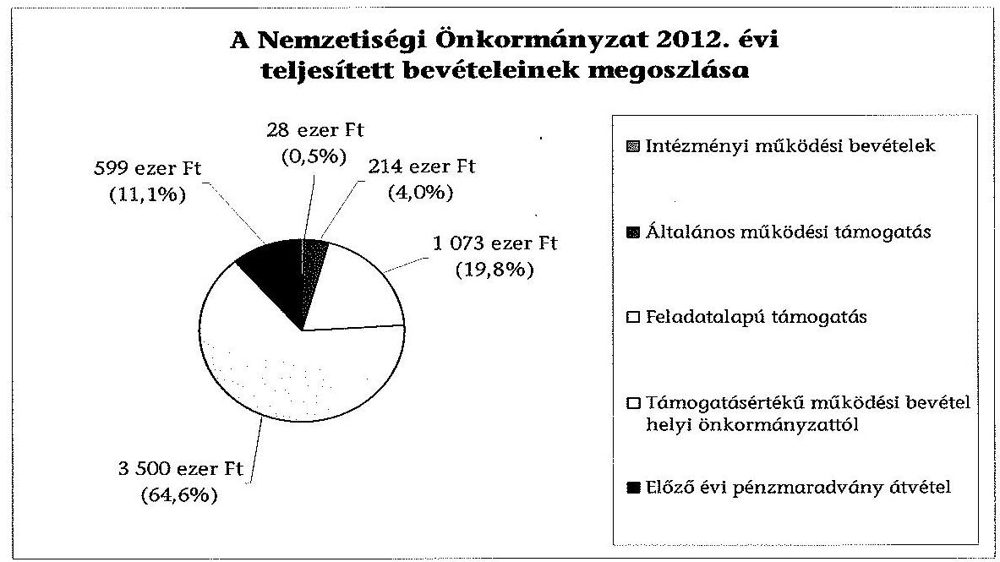
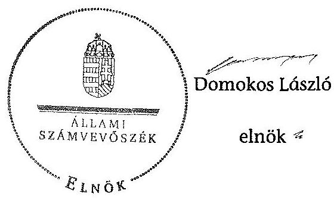

# JELENTÉS 

a helyi nemzetiségi önkormányzatok gazdálkodásának ellenőrzéséről
Budapest Főváros XIII. Kerületi Görög Nemzetiségi Önkormányzat

---

# Állami Számvevőszék 

Iktatószám: V-0293-017/2014.
Témaszám: 1326
Vizsgálat-azonosító szám: V065246

## Az ellenőrzést felügyelte:

Horváth Balázs
felügyeleti vezető
Az ellenőrzést vezette és az ellenőrzés végrehajtásáért felelős:
Kisgergely István
ellenőrzésvezető
A számvevőszéki jelentést készítették és a jelentés összeállításában
közremüködtek:
Zachár Péterné
számvevő főtanácsos
Právitzné Pejkó Noémi
számvevő
Az ellenőrzést végezte:
Dr. Nagymányai Péter
számvevő

---

# TARTALOMJEGYZÉK 

BEVEZETÉS ..... 3
I. ÖSSZEGZŐ MEGÁLLAPÍTÁSOK, KÖVETKEZTETÉSEK, JAVASLATOK ..... 6
II. RÉSZLETES MEGÁLLAPÍTÁSOK ..... 11

1. A Nemzetiségi Önkormányzat és a XIII. Kerületi Önkormányzat együttműködésének szabályozása, a működési feltételek biztosítása ..... 11
2. A gazdálkodási feladatok ellátásának szabályszerűsége ..... 12
2.1. A költségvetésre és a zárszámadásra, valamint a kincstári adatszolgáltatás rendjére vonatkozó jogszabályi előírások betartása ..... 12
2.2. A Nemzetiségi Önkormányzat gazdálkodásának szabályozottsága ..... 13
2.3. Az operatív gazdálkodási jogkörök kialakítása, gyakorlása ..... 14
3. A Nemzetiségi Önkormányzattal összefüggő gazdálkodási feladatok belső ellenőrzése ..... 15
4. A feladatalapú támogatás felhasználásának, elszámolásának szabályszerűsége, a Nemzetiségi Önkormányzat feladatellátása ..... 16
MELLÉKLETEK
5. számú A Nemzetiségi Önkormányzat 2012. évi gazdálkodásának főbb adatai, mutatói
2/A. számú Tájékoztatás a polgármesternek küldött el nem fogadott észrevételekről
2/B. számú Tájékoztatás az elnöknek küldött el nem fogadott észrevételről
FÜGGELÉKEK
6. számú Rövidítések jegyzéke
7. számú Értelmező szótár
8. számú A gazdálkodás értékelésének módszere

---

# **Chemistry**

## **Chemical Reactions**

### **Balancing Chemical Equations**

1. **Write the unbalanced equation:**
   - Example: $$C_3H_8 + O_2 \rightarrow CO_2 + H_2O$$

2. **Balance the equation:**
   - Example: $$2C_3H_8 + 7O_2 \rightarrow 6CO_2 + 8H_2O$$

3. **Balance the equation:**
   - Example: $$2C_3H_8 + 7O_2 \rightarrow 6CO_2 + 8H_2O$$

### **Types of Reactions**

1. **Combination Reaction:**
   - Example: $$2H_2 + O_2 \rightarrow 2H_2O$$

2. **Decomposition Reaction:**
   - Example: $$2H_2O_2 \rightarrow 2H_2O + O_2$$

3. **Single Displacement Reaction:**
   - Example: $$Zn + 2HCl \rightarrow ZnCl_2 + H_2$$

4. **Double Displacement Reaction:**
   - Example: $$AgNO_3 + NaCl \rightarrow AgCl + NaNO_3$$

5. **Combustion Reaction:**
   - Example: $$CH_4 + 2O_2 \rightarrow CO_2 + 2H_2O$$

## **Stoichiometry**

### **Mole Concept**

- **Mole (mol):** The amount of substance containing as many particles (atoms, molecules, ions) as there are atoms in exactly 12 grams of carbon-12.
- **Avogadro's Number:** $$6.022 \times 10^{23}$$ particles per mole.

### **Molar Mass**

- **Molar Mass:** The mass of one mole of a substance.
- Example: The molar mass of water ($$H_2O$$) is 18.015 g/mol.

### **Calculations**

1. **Moles to Mass:**
   - Formula: $$n = \frac{m}{M}$$
   - Example: Calculate the number of moles of $$H_2O$$ in 18 grams of water.
     - $$n = \frac{18.015 \, \text{g}}{18.015 \, \text{g/mol}} = 18.015 \, \text{g/mol}$$

2. **Moles to Mass:**
   - Formula: $$m = n \times M$$
   - Example: Calculate the mass of 18.015 g of water.
     - $$m = 18.015 \, \text{g/mol} = 18.015 \, \text{g/mol}$$

## **Gas Laws**

### **Ideal Gas Law**

- **Equation:** $$PV = nRT$$
- **Variables:**
  - $$P$$: Pressure (atm)
  - $$V$$: Volume (L)
  - $$n$$: Number of moles (mol)
  - $$R$$: Ideal gas constant (0.0821 L·atm/mol·K)
  - $$T$$: Temperature (K)

### **Boyle's Law**

- **Equation:** $$P_1V_1 = P_2V_2$$
- **Variables:**
  - P₁: Pressure (atm)
  - P₂: Volume (L)
  - P₃: Temperature (K)
  - P₁: Pressure (atm)
  - P₂: Volume (L)
  - P₃: Temperature (K)
  - P₁: Pressure (atm)

### **Boyle's Law**

- **Equation:** $$\frac{P_1V_1}{P_2V_2} = \frac{P_2V_2}{T_1}$$

## **Thermochemistry**

### **Enthalpy Change (ΔH)**

- **Definition:** The heat content of a system at constant pressure.
- **Equation:** $$\Delta H = q_p$$
- **Equation:** $$\Delta H = q_p + q_1$$
- **Example:** Calculate the heat content of 1.5 kJ/m^{2} of water.

### **Hess's Law**

- **Statement:** The enthalpy change for a reaction is the same whether it occurs in one step or multiple steps.
- **Example:** Calculate the enthalpy change for a reaction in a reaction with one mole of the substance.

### **Calculations**

1. **Moles to Mass:**
   - Formula: $$m = n \times M$$
   - Example: Calculate the mass of 1.5 kJ/m^{2} of water.
     - $$m = 1.5 \, \text{g/mol} = 24.01 \, \text{g/mol}$$

2. **Moles to Mass:**
   - Formula: $$m = n \times M$$
   - Example: Calculate the mass of 1.5 kJ/m^{2} of water.
     - $$m = 24.01 \, \text{g/mol} = 24.01 \, \text{g/mol}$$

## **Electrochemistry**

### **Oxidation and Reduction**

- **Oxidation:** Loss of electrons.
- **Reduction:** Gain of electrons.

### **Galvanic Cells**

- **Definition:** A cell that converts chemical energy into electrical energy.
- **Components:**
  - Anode: Oxidation occurs.
  - Cathode: Reduction occurs.
  - Salt Bridge: Connects the two half-cells.

### **Nernst Equation**

- **Equation:** $$E = E^\circ - \frac{RT}{nF} \ln Q$$
- **Variables:**
  - $$E$$: Cell potential
  - $$E^\circ$$: Standard cell potential
  - $$R$$: Ideal gas constant
  - $$T$$: Temperature (K)
  - $$n$$: Number of electrons transferred
  - $$F$$: Faraday constant (96,485 C/mol)
  - $$Q$$: Reaction quotient

---

# JELENTÉS 

## a helyi nemzetiségi önkormányzatok gazdálkodásának ellenőrzéséről Budapest Főváros XIII. Kerületi Görög Nemzetiségi Önkormányzat

## BEVEZETÉS

A Nemzetiségi Önkormányzat a 2003. évben alakult, elnöke a 2010. évi helyhatósági választások óta látja el feladatát. A Nemzetiségi Önkormányzat intézményt, gazdasági társaságot és más szervezetet nem alapított. A négytagú Képviselő-testület munkája segitésére bizottságot nem hozott létre. A Nemzetiségi Önkormányzatnak a költségvetési beszámolója szerint a 2012. évben a módosított költségvetési bevételi és kiadási előirányzata 5387 ezer Ft, a teljesített költségvetési bevétel 5414 ezer Ft, a teljesített költségvetési kiadás 4539 ezer Ft volt. A 2012. évi gazdálkodási adatokat részletesen az 1. számú mellékletben mutatjuk be.

Az Alaptörvény XXIX. cikk (1) bekezdése szerint a Magyarországon élő́ nemzetiségek államalkotó tényezők. Minden, valamely nemzetiséghez tartozó magyar állampolgárnak joga van önazonossága szabad vállalásához és megőrzéséhez. A hazánkban élő́ nemzetiségek helyi (települési és területi), valamint országos önkormányzatokat hozhatnak létre. A helyi nemzetiségi önkormányzatok gazdálkodási feladatait jogszabályi előírás alapján a székhely szerinti önkormányzat polgármesteri hivatala látja el.

A nemzetiségek helyzete, támogatása mind hazai, mind EU-s szinten kiemelt figyelmet kap napjainkban. A helyi nemzetiségi önkormányzatok gazdálkodására és támogatási rendszerére vonatkozó jogszabályok a 2010-2012. években jelentős változásokon mentek át. A települési és területi nemzetiségi önkormányzatok gazdálkodásának, a részükre juttatott költségvetési támogatások felhasználásának ellenőrzését az ÁSZ a 2012. évben témacsoportos ellenőrzés keretében indította el. A 2013. évi ellenőrzések e témacsoportos ellenőrzések folytatását jelentik, amelyet az ÁSZ 2014. első félévi ellenőrzési terve a 12. témasorszámon tartalmaz.

Az ellenőrzés célja annak értékelése volt, hogy a Nemzetiségi Önkormányzat gazdálkodási kereteinek kialakítása, gazdálkodása és feladatellátása megfelelt-e a jogszabályoknak.

---

Ennek keretében értékeltük, hogy:

- a Nemzetiségi Önkormányzat és a XIII. Kerületi Önkormányzat együttmúködésének szabályozása, a múködési feltételek biztosítása megfelelte a jogszabályi előírásoknak;
- a felek együttmúködése megfelelte a közöttük létrejött megállapodásnak a gazdálkodási feladatok szabályszerú ellátása során, ennek keretében betartották-e a Nemzetiségi Önkormányzat gazdálkodásához kapcsolódóan a költségvetésre és zárszámadásra, a gazdálkodás szabályozására, az operatív gazdálkodási jogkörök gyakorlására vonatkozó jogszabályi előírásokat;
- a jegyző biztosította-e a Nemzetiségi Önkormányzat gazdálkodásának belső ellenőrzését;
- a Nemzetiségi Önkormányzat feladatalapú támogatásának felhasználása, a folyósított feladatalapú támogatással történő elszámolás az előírásoknak megfelelő volt-e;
- a Nemzetiségi Önkormányzat feladatellátása összhangban volt-e a vonatkozó jogszabályi előírásokkal.

Az ellenőrzés várható hasznosulását négy szinten tervezzük. A törvényalkotás számára összegzett tapasztalatok állnak rendelkezésre a nemzetiségi önkormányzatok testületi döntéseinek, gazdálkodásának és a feladatalapú támogatás felhasználásának szabályszerűségéről, amelynek alapján következtetést lehet levonni arra, hogy indokolt-e jogszabályi módosítás kezdeményezése. Az ellenőrzés az ellenőrzött számára visszajelzést ad a múködésében fellépő hiányosságokról, javaslataival hozzájárul azok kiküszöböléséhez, amely csökkentheti a későbbi ellenőrzések gyakoriságát. Az ellenőrzés megállapításai és javaslatai tanulságul szolgálhatnak más nemzetiségi önkormányzatok, szervezetek számára a rendezett gazdálkodási keretek kialakításához. A társadalom számára jelzi, hogy közpénz nem maradhat ellenőrizetlenül, az ÁSZ értékteremtő rend kialakításához és megőrzéséhez hozzájáruló tevékenysége pozitív hatással lesz a szervezetről kialakított összkép formálásában. Az ÁSZ szervezetén belül lehetőség nyílik arra, hogy a megállapítások szintetizálásával az intézmény a hozzáadott értéket teremtő elemző tevékenységét és tanácsadó szerepét erősítse.

A Nemzetiségi Önkormányzat gazdálkodásának ellenőrzéséről szóló jelentés I. fejezetének összegző része az ellenőrzés céljára adott rövid, szintetizáló összefoglalót és következtetéseket tartalmazza a II. fejezet részletes megállapításain alapulóan. A jelentés intézkedést igénylő megállapításait és javaslatait - az összegzőben foglaltak mellett - az ellenőrzés során feltárt, a jelentés II. fejezetében rögzített részletes megállapítások alapozzák meg, illetve támasztják alá.

# Az ellenőrzés típusa: szabályszerűségi ellenőrzés 

Az ellenőrzött időszak: a 2012. január 1. - 2012. december 31. közötti időszak. Az ellenőrzés kiterjedt a Nemzetiségi Önkormányzatnak juttatott 2012. évi támogatás 2013. évben való elszámolására is.

---

Ellenőrzött szervezet: a Budapest Főváros XIII. Kerületi Görög Nemzetiségi Önkormányzat és a gazdálkodási feladatait ellátó Budapest Főváros XIII. Kerületi Önkormányzat.

Az ellenőrzés végrehajtásának jogszabályi alapját az ÁSZ tv. 5. § (2)-(3) és (6) bekezdéseiben foglaltak képezik.

Az ellenőrzés szakmai módszertana az ÁSZ hivatalos honlapján (www.asz.hu) közzétett szakmai szabályokon alapult, amely a Legfőbb Ellenőrző Intézmények Nemzetközi Szervezete (INTOSAI) által kiadott nemzetközi standardok (ISSAI) figyelembevételével készült.

A Nemzetiségi Önkormányzat gazdálkodásának ellenőrzése során értékeltük a XIII. Kerületi Önkormányzat és a Nemzetiségi Önkormányzat együttmúködésének, a gazdálkodás szabályozottságának és a pénzügyi folyamatokban kulcsszerepet betöltő belső kontrollok (teljesítésigazolás és érvényesítés) múködésének megfelelőségét. A kulcskontrollokat a múködési és felhalmozási célú támogatásértékű kiadásoknál, az államháztartáson kívülre teljesített múködési és felhalmozási célú pénzeszközátadásoknál, a dologi kiadásokkal kapcsolatos kifizetéseknél - véletlen mintavételi eljárást alkalmazva - ellenőriztük. Ellenőriztük, hogy a jegyző biztosította-e a Nemzetiségi Önkormányzat gazdálkodásának belső ellenőrzését. Értékeltük a feladatalapú támogatások felhasználásának, elszámolásának szabályszerűségét, a Nemzetiségi Önkormányzat feladatellátása és a jogszabályi előírások összhangját.

Az ellenőrzés lefolytatásához a Nemzetiségi Önkormányzat és a gazdálkodási feladatait ellátó XIII. Kerületi Önkormányzat tanúsítványok és a kapcsolódó, dokumentumjegyzékben megjelölt dokumentumok elektronikus úton történő megküldésével, rendelkezésre bocsátásával szolgáltatott adatokat. Az adatszolgáltatás kontrollálása és szükség szerinti javítása a helyszíni ellenőrzés keretében történt. A minősítési szempontokat a 3. számú függelék tartalmazza.

Az ÁSZ tv. 29. § (1) bekezdése szerint a jelentéstervezetet megküldtük egyeztetésre a polgármester és a Nemzetiségi Önkormányzat elnöke részére. A polgármester és a Nemzetiségi Önkormányzat elnöke határidőben megküldött észrevétele és tájékoztatása alapján a jelentést nem módosítottuk. Az el nem fogadott észrevételek indoklását a jelentés 2/A. számú és 2/B. számú mellékletei tartalmazzák.

---

# I. ÖSSZEGZŐ MEGÁLLAPÍTÁSOK, KÖVETKEZTETÉSEK, JAVASLATOK 

A Nemzetiségi Önkormányzat és a XIII. Kerületi Önkormányzat együttmúködésének szabályozása, múködési feltételek biztosítása a 2012. évben megfelelt a jogszabályi előírásoknak. A Nemzetiségi Önkormányzat a 2012. évben rendelkezett hatályos megállapodással a XIII. Kerületi Önkormányzattal történő együttműködésre, azonban az együttműködési megállapodás ${ }_{1}$ 2012. évi - évenként kötelező - felülvizsgálatát a Nek. tv.-ben előírt január 31-ei határidőn túl végezték el. Az együttmúködési megállapodás ${ }_{1}$ jogszabályváltozás miatti kiegészítése megtörtént a Nek. tv.-ben előírt határidőn belül. Az együttműködési megállapodás ${ }_{2}$ a Nek. tv.-ben meghatározott tartalmi elemeket tartalmazta, a Nemzetiségi Önkormányzat múködésének feltételeit és a gazdálkodási feladatainak ellátását az előírásoknak megfelelően szabályozták, múködésének előírt személyi és tárgyi feltételei biztosítottak voltak a 2012. évben. A Nek. tv.-ben foglaltak ellenére az együttműködési megállapodás ${ }_{2}$ szerinti múködési feltételeket nem rögzítették a Nemzetiségi Önkormányzat SZMSZ-ében az együttmúködési megállapodás ${ }_{2}$ megkötését, módosítását követő 30 napon belül.

A Nemzetiségi Önkormányzat 2012. évi költségvetésének és zárszámadásának tartalma, jóváhagyása megfelelt a jogszabályi előírásoknak. A Nemzetiségi Önkormányzat elnöke a 2012. évi költségvetés tervezetét az Áht. ${ }_{2}$-ben előírt határidőben benyújtotta a Képviselő-testületnek. A jóváhagyott költségvetés tartalmazta az Áht. ${ }_{2}$-ben és az Ávr.-ben meghatározott tartalmi elemeket. A Nemzetiségi Önkormányzat elnöke a 2012. évi zárszámadás tervezetét az előírt határidőben a Képviselő-testületnek benyújtotta, és az Áht. ${ }_{2}$-ben előírt mérlegeket és kimutatásokat tájékoztatásul bemutatta, biztosított volt a zárszámadás összehasonlíthatósága az elfogadott költségvetéssel. A zárszámadási határozatban a Nemzetiségi Önkormányzat valamennyi bevételéről és kiadásáról elszámoltak. A jegyző a 2012. évi költségvetéshez kapcsolódó, a Nemzetiségi Önkormányzatra vonatkozó kincstári adatszolgáltatási kötelezettségeinek az Áhsz. ${ }_{1}$-ben és az Ávr.-ben előírt határidőkön túl tett eleget.

A Nemzetiségi Önkormányzat gazdálkodásának szabályozottsága megfelelő volt az ellenőrzött időszakban. A gazdálkodási feladatok végrehajtását ellátó Polgármesteri Hivatal a 2012. évben a Számv. tv., és a Bkr. által előírt gazdálkodást érintő szabályzatokkal a Nemzetiségi Önkormányzat gazdálkodásának végrehajtási feladataira kiterjedő hatállyal rendelkezett. A Polgármesteri Hivatal SZMSZ-e az Ávr.-ben foglaltak ellenére nem tartalmazta az SZMSZben nevesített munkakörökhöz tartozó - a Nemzetiségi Önkormányzat gazdálkodásának végrehajtásával kapcsolatos - feladat- és hatásköröket, a hatáskörök gyakorlásának módját, a helyettesítés rendjét, az ezekhez kapcsolódó felelősségi szabályokat.

Az operatív gazdálkodási jogkörök kialakítása a jogszabályi előírásokkal összhangban történt, a pénzügyi ellenjegyzőket, az érvényesítőket az Ávr. alapján a jegyző, mint a költségvetési szerv vezetője jelölte ki. A Nemzetiségi Ön-

---

kormányzat elnöke az előírásoknak megfelelően a kötelezettségvállalás, az utalványozás és a teljesítésigazolás gyakorlására történő felhatalmazással biztosította az összeférhetetlenségi követelmények érvényesülésének szabályozási feltételeit.

A támogatásértékű kiadás, valamint az államháztartáson kívülre történő működési és felhalmozási célú pénzeszközátadások esetében a kiválasztott öt gazdasági esemény tekintetében a teljesítésigazolás és érvényesítés kulcskontrollok múködése megfelelő volt.

A dologi kiadások teljesítése során a teljesítésigazolás és az érvényesítés kulcskontrollok múködésének megfelelősége kiváló volt.

A 2012. évi dologi kiadások között a három legnagyobb összegű kiadás teljesítésének egyedi értékelése alapján a teljesítésigazolás és az érvényesítés kulcskontrollok megfelelően múködtek.

A Nemzetiségi Önkormányzat gazdálkodásával összefüggő végrehajtási feladatok belső ellenőrzésének kialakítása megfelelő volt. A jegyző biztosította a Nemzetiségi Önkormányzat gazdálkodásával összefüggő végrehajtási feladatok belső ellenőrzését, valamint az éves ellenőrzési terv összeállítása során figyelemmel volt a Nemzetiségi Önkormányzat gazdálkodásának belső ellenőrzésére. A belső ellenőrzési tervet megalapozó kockázatelemzés kiterjedt a nemzetiségi önkormányzatok gazdálkodásának végrehajtási feladataira. A nemzetiségek gazdálkodásával kapcsolatos kockázatot magas besorolásúnak minősítették, és évenkénti vizsgálatot tartottak szükségesnek. A Nemzetiségi Önkormányzatot érintő tervezett ellenőrzést - 2012. év I. félévre vonatkozóan - az Ellenőrzési Csoport végrehajtotta. A belső ellenőrzés nem érintette a jelen ellenőrzés által feltárt hiányosságokat a feladatalapú támogatás elszámolására, felhasználására vonatkozóan.

A Nemzetiségi Önkormányzat részére 2012. évben folyósított feladatalapú támogatás felhasználása, elszámolása a jogszabályi előírásoknak nem felelt meg. A Nemzetiségi Önkormányzat a 2012. évben 1073 ezer Ft feladatalapú támogatásban részesült. A 2012. évben folyósított támogatásból 806,1 ezer Ftot a Nek ${ }_{2}$ tv. előírásaival összhangban - a felhasználásra (kötelezettségvállalásra) rendelkezésre álló időpontig, 2012. december 31-éig - felhasználtak. A 2012. évi feladatalapú támogatás kötelezettségvállalással nem terhelt maradványa 266,9 ezer Ft volt, amely a támogatási kormányrendelet ${ }_{2}$ előírása alapján határidőt követően jogszerűen nem használható fel.

A Nemzetiségi Önkormányzat nem tett eleget az Áht. ${ }_{2}$-ben és a támogatási kormányrendelet ${ }_{2}$-ben előírtaknak, mert a meghatározott célra fel nem használt támogatás 2012. december 31-éig kötelezettségvállalással nem terhelt 266,9 ezer Ft összegű maradványáról haladéktalanul nem mondott le és nem fizette vissza azt a központi költségvetés javára.

A 2011. és a 2012. évi feladatalapú támogatás elszámolása a támogatási kormányrendelet ${ }_{1,2}$ előírása alapján az Áht. ${ }_{1-2}$-ben foglaltak ellenére nem történt meg. A támogatás felhasználását, elszámolását az arra jogosult külső szervek nem ellenőrizték.

---

A Nemzetiségi Önkormányzat a 2012. évben ellátott kötelező és önként vállalt közfeladatokat, a feladatellátások tárgya összhangban volt a Nek. törvényben foglalt előírásokkal, kulturális önigazgatással összefüggően, valamint a hagyományápolás és közmúvelődés területén látott el feladatokat.

Az ÁSZ tv. 33. § (1) bekezdésében foglaltak értelmében az ellenőrzött szervezet vezetője köteles a jelentésben foglalt megállapításokhoz kapcsolódó intézkedési tervet összeállítani és azt a jelentés kézhezvételétől számított 30 napon belül az ÁSZ részére megküldeni. Amennyiben az intézkedési tervet határidőre nem küldi meg a szervezet, vagy az nem elfogadható, az ÁSZ elnöke az ÁSZ tv. 33. § (3) bekezdés a)-b) pontjaiban foglaltakat érvényesítheti.

A helyszíni ellenőrzés megállapításainak hasznosítása mellett javasoljuk:

# a jegyzőnek 

1. az együttmúködés szabályozásával kapcsolatban

Az együttműködési megállapodás,-et a Nek. tv. 80. § (2) bekezdésének előírása ellenére 2012. január 31-éig nem vizsgálták felül.

A Nek. tv. 80. § (2) bekezdésében foglaltak ellenére az együttmúködési megállapodás ${ }_{2}$ szerinti múködési feltételeket nem rögzítették a Nemzetiségi Önkormányzat SZMSZ-ében az együttműködési megállapodás ${ }_{2}$ megkötését, módosítását követő 30 napon belül.

Javaslat
a) Biztosítsa a jövőben az együttműködési megállapodás évenkénti felülvizsgálata során a Nek. tv. 80. § (2) bekezdésében előírt határidő betartását.
b) Készítse elő a Nemzetiségi Önkormányzat SZMSZ-ének a Nek. tv. 80. § (2) bekezdésében foglalt előírás alapján történő kiegészítését.
2. a kincstári adatszolgáltatási kötelezettséggel kapcsolatban

A jegyző a 2012. évi költségvetéshez kapcsolódó, Nemzetiségi Önkormányzatra vonatkozó kincstári adatszolgáltatási kötelezettségének több esetben - az Ávr. 33. §ában, 169. § (2) bekezdésében és az Áhsz., 10. § (5a) bekezdésében előírt - határidőn túl tett eleget.

Javaslat
Gondoskodjon arról, hogy a Nemzetiségi Önkormányzatra vonatkozó kincstári adatszolgáltatási kötelezettségeinek az Ávr. 33. §-ában, 169. § (2) bekezdésében és az Áhsz. 2 32. § (4) bekezdésében előírt határidők betartásával tegyen eleget.
3. a gazdálkodás szabályozottságával kapcsolatban

A Polgármesteri Hivatal SZMSZ-e nem tartalmazta az Ávr. 13. § (1) bekezdés g) pontjában foglaltak szerinti, az SZMSZ-ben nevesített munkakörökhöz tartozó - a

---

Nemzetiségi Önkormányzat gazdálkodásának végrehajtásával kapcsolatos - feladités hatáskörökre, a hatáskörök gyakorlásának módjára, a helyettesítés rendjére, az ezekhez kapcsolódó felelősségi szabályokra vonatkozó előírásokat.

Javaslat
Készítse elő a Polgármesteri Hivatal SZMSZ-e módosítását, hogy az tartalmazza - a Nemzetiségi Önkormányzat gazdálkodásának végrehajtási feladataira vonatkozóan Ávr. 13. § (1) bekezdés g) pontjában foglaltakat.
4. a feladatalapú támogatás elszámolásával kapcsolatban

A 2011. évi feladatalapú támogatás elszámolása a támogatási kormányrendelet: 7. § (2) bekezdésében hivatkozott, valamint a 2012. évi feladatalapú támogatás elszámolása a támogatási kormányrendelet 2 8. § (5) bekezdésében hivatkozott „a helyi önkormányzatok elszámolási és ellenőrzési rendjére vonatkozó jogszabályok rendelkezései alkalmazandóak" előírása alapján az Áht. 64. § (7) bekezdése és az Áht. 2 57. § (3) bekezdése ellenére nem történt meg.

Javaslat
Gondoskodjon az Áht. 2 27. § (2) bekezdésében meghatározott feladatkörében a Nemzetiségi Önkormányzat által igénybevett 2011. és 2012. évi feladatalapú támogatás rendeltetésszerú felhasználásáról szóló elszámolásának elkészítéséről az Áht. 2 53. § (1) bekezdése szerinti beszámolási kötelezettség teljesítéséhez.

# a polgármesternek 

A Polgármesteri Hivatal SZMSZ-e nem tartalmazta az Ávr. 13. § (1) bekezdés g) pontjában foglaltak szerinti, az SZMSZ-ben nevesített munkakörökhöz tartozó - a Nemzetiségi Önkormányzat gazdálkodásának végrehajtásával kapcsolatos - feladités hatáskörökre, a hatáskörök gyakorlásának módjára, a helyettesítés rendjére, az ezekhez kapcsolódó felelősségi szabályokra vonatkozó előírásokat.

Javaslat
Terjessze a XIII. Kerületi Önkormányzat Képviselő-testülete elé jóváhagyásra a Polgármesteri Hivatal SZMSZ-ének jegyző által előkészített módosítását, hogy az tartalmazza - a Nemzetiségi Önkormányzat gazdálkodásának végrehajtására vonatkozóan - az Ávr. 13. § (1) bekezdés g) pontjában foglaltakat.

## a Nemzetiségi Önkormányzat elnökének

1. A Nek. tv. 80. § (2) bekezdésében foglaltak ellenére az együttmúködési megállapodás ${ }_{2}$ szerinti müködési feltételeket nem rögzítették a Nemzetiségi Önkormányzat SZMSZ-ében.

---

Javaslat
Terjessze a Képviselő-testület elé jóváhagyásra a Nemzetiségi Önkormányzat SZMSZ-ének jegyző által előkészített módosítását, hogy az megfeleljen a Nek. tv. 80. § (2) bekezdésében előírtaknak.
2. A 2011. évi feladatalapú támogatás elszámolása a támogatási kormányrendelet ${ }_{1}$ 7. § (2) bekezdésében hivatkozott, valamint a 2012. évi feladatalapú támogatás elszámolása a támogatási kormányrendelet ${ }_{2} 8 . \S$ (5) bekezdésében hivatkozott „a helyi önkormányzatok elszámolási és ellenőrzési rendjére vonatkozó jogszabályok rendelkezései alkalmazandóak" előírása alapján az Áht. 64. § (7) bekezdése és az Áht. 2 57. § (3) bekezdése ellenére nem történt meg.

Javaslat
Terjessze a Képviselő-testület elé jóváhagyásra az Áht. ${ }_{2}$ 53. § (1) bekezdése szerinti beszámolási kötelezettség teljesítéséhez a Nemzetiségi Önkormányzat által igénybe vett 2011. és 2012. évi feladatalapú támogatás felhasználásáról szóló elszámolást.
3. A Nemzetiségi Önkormányzat nem tett eleget az Áht. ${ }_{2}$ 57. § (2) bekezdésében előírtaknak, mert a meghatározott célra fel nem használt 2012. évi feladatalapú támogatás 2012. december 31-éig kötelezettségvállalással nem terhelt 266,9 ezer Ft összegű maradványáról nem mondott le és nem fizette vissza azt a központi költségvetés javára.

Javaslat
Terjessze a Képviselő-testület elé jóváhagyásra az Áht. ${ }_{2}$ 57/A. § (1) bekezdés előírásának megfelelően a 2012. évi feladatalapú támogatás kötelezettségvállalással nem terhelt, 266,9 ezer Ft összegű maradványáról történő lemondást és intézkedjen a maradvány összegének visszafizetésére a központi költségvetés javára.

---

# II. RÉSZLETES MEGÁLLAPÍTÁSOK 

## 1. A Nemzetiségi Önkormányzat És a XIII. Kerületi ÖnkORMÁNYZAT EGYÜTTMÜKÖDÉSÉNEK SZABÁLYOZÁSA, A MÜKÖDÉSI FELTÉTELEK BIZTOSÍTÁSA

A Nemzetiségi Önkormányzat és a XIII. Kerületi Önkormányzat együttmúködésének szabályozása, a múködési feltételek biztosítása a 2012. évben megfelelt a jogszabályi előírásoknak.

A Nemzetiségi Önkormányzat rendelkezett a 2012. év folyamán hatályban lévő megállapodással, a XIII. Kerületi Önkormányzattal történő együttműködésre.

A 2012. január 1-jén hatályos, 2010. december 9-én megkötött együttműködési megállapodás,-nek a gazdálkodási szabályok változása miatti - évenkénti kötelező - felülvizsgálatát a Nek. tv. 80. § (2) bekezdésében meghatározott január 31-ei határidőn túl végezték el.

A jogszabályváltozás miatt, a Nek. tv. 159. § (3) bekezdésében előírt kiegészítést határidőben végrehajtották, és 2012. február 24-én aláírták az együttműködési megállapodás ${ }_{2}$-őt.

Az együttműködési megállapodás ${ }_{2}$-őt a polgármester a 1/2011. (I. 14.) számú Önkormányzati rendelet felhatalmazása, a Nemzetiségi Önkormányzat Elnöke a Képviselő-testület 15/2012. (II. 09.) számú határozatának felhatalmazása alapján írta alá.

A Nemzetiségi Önkormányzat múködésének személyi és tárgyi feltételeit, gazdálkodási feladatai ellátásának szabályait, azok teljesítési határidejét, felelőseit a Nek. tv. 80. § (1) bekezdésének megfelelően teljes körűen szabályozták az együttműködési megállapodás ${ }_{2}$-ben.

A Nek. tv. 80. § (2) bekezdésében foglaltak ellenére azonban az együttműködési megállapodás ${ }_{2}$ szerinti múködési feltételeket nem rögzítették a Nemzetiségi Önkormányzat SZMSZ-ében az együttműködési megállapodás ${ }_{2}$ megkötését, módosítását követő 30 napon belül.

A XIII. Kerületi Önkormányzat az együttműködési megállapodás ${ }_{2}$-ben a Nek. tv.-nek megfelelően a gyakorlatban is biztosította a Nemzetiségi Önkormányzat müködéséhez szükséges személyi és tárgyi feltételeket. ${ }^{1}$

[^0]
[^0]:    ${ }^{1}$. Az együttműködési megállapodás ${ }_{2}$ 20. pontja szerint „A Nemzetiségi Önkormányzat tárgyévi jóváhagyott költségvetésében az Önkormányzat által biztosított támogatásnak része a Nemzetiségi Önkormányzat müködéséhez szükséges - dittalanul biztosított - irodahelyiségben felmerülő közüzemi és egyéb jellegü költségek fedezete."

---

A XIII. Kerületi Önkormányzat által biztosított irodahelyiség használatára vonatkozóan a Budapest Főváros XIII. Kerületi Önkormányzat, az Örmény, a Lengyel, a Horvát, a Szlovák, a Német, a Szerb, a Ruszin, a Görög és a Bolgár Kisebbségi Önkormányzatokkal 2010. december 16-án, határozott időre 2014. december 31-éig - használati szerződést kötött.

A személyi feltételek biztosítása érdekében a Polgármesteri Hivatal egy fő dolgozójának munkaköri leírását 2011. szeptember 5-étől kezdődően kiegészítették a Kisebbségi (Nemzetiségi) Önkormányzatok gazdálkodásával kapcsolatos feladatok végrehajtásával.

A 2012. december 31-én hatályos együttműködési megállapodás ${ }_{2}$ I./5. pontja a Nek. tv. 80. § (4) bekezdés előírásának megfelelően tartalmazta, hogy a jegyző vagy annak - a jegyzővel azonos képesítési előírásoknak megfelelő - megbízottja a XIII. Kerületi Önkormányzat megbízásából és képviseletében részt vesz a Nemzetiségi Önkormányzat testületi ülésein és jelzi, amennyiben törvénysértést észlel.

# 2. A GAZDÁlKODÁSI FELADATOK ELLÁTÁSÁNAK SZABÁLYSZERŰSÉGE 

### 2.1. A költségvetésre és a zárszámadásra, valamint a kincstári adatszolgáltatás rendjére vonatkozó jogszabályi előírások betartása

A Nemzetiségi Önkormányzat 2012. évi költségvetésének és zárszámadásának ${ }^{2}$ tartalma, jóváhagyása megfelelt a jogszabályi előírásoknak.

A Nemzetiségi Önkormányzat elnöke az Áht. ${ }_{2}$ 24. § (2) bekezdésében előírt határidőre benyújtotta a Képviselő-testület részére a XIII. Kerületi Önkormányzat jegyzője által előkészített költségvetési határozat-tervezetét. A jóváhagyott költségvetés tartalma megfelelt az Ávr. 24 § (1) bekezdésében foglaltaknak, tartalmazta az Áht. ${ }_{2}$ 23. § 2 bekezdés a) pontjának megfelelően a költségvetési kiadásokat, bevételeket előirányzat csoportonkénti, kiemelt előirányzatonkénti bontásban. A 2012. évi költségvetés tervezetének előterjesztésekor bemutatták a Képviselő testület részére az Áht. ${ }_{2}$-ben foglaltaknak megfelelően - szöveges indoklással együtt - az előírt mérlegeket és kimutatásokat.

A jegyző által elkészített 2012. évi zárszámadási határozat-tervezetet a Nemzetiségi Önkormányzat elnöke az Áht. ${ }_{2}$ 91. § (1) bekezdésében foglaltak alapján, határidőn belül benyújtotta a Képviselő-testületnek. Az Áht. ${ }_{2}$ 91. § (2) bekezdésében előírt mérlegeket, kimutatásokat a zárszámadás tervezetének előterjesztésekor tájékoztatásul bemutatták, az összehasonlíthatóság biztosított volt az elfogadott költségvetéssel. A zárszámadási határozatban a Nemzetiségi Önkormányzat valamennyi bevételéről és kiadásáról elszámoltak.

A jegyző a 2012. évi költségvetéshez kapcsolódó, a Nemzetiségi Önkormányzatra vonatkozó kincstári adatszolgáltatási kötelezettségének az Ávr. 33. §-ában

[^0]
[^0]:    ${ }^{2}$ A Képviselő-testületnek a 2012. évi költségvetéséről alkotott 11/2012. (II. 09.) számú és a 2012. évi zárszámadásáról alkotott 21/2013. (IV. 03.) számú határozatai.

---

meghatározott határidőn túl tett eleget, a negyedéves és éves időközi költségvetési jelentéseket az Ávr. 169. § (2) bekezdésében előírt határidőben nem küldte el, valamint a 2012. éves elemi költségvetési beszámolójának benyújtását nem az Áhsz.; 10. § (5) bekezdés a) pontjában előírt határidőben teljesítette.

# 2.2. A Nemzetiségi Önkormányzat gazdálkodásának szabályozottsága 

A Nemzetiségi Önkormányzat gazdálkodásának szabályozottsága az ellenőrzött időszakban megfelelt a jogszabályi előírásoknak.

A Nemzetiségi Önkormányzat gazdálkodási feladatainak végrehajtását ellátó Polgármesteri Hivatal a 2012. évben a Számv. tv és a Bkr.-ben előírt gazdálkodást érintő szabályzatainak ${ }^{3}$ hatályát kiterjesztette a Nemzetiségi Önkormányzat gazdálkodásának végrehajtási feladataira.

A XIII. Kerületi Önkormányzat és a Polgármesteri Hivatal számviteli politikájáról szóló XXII/1-13/2012. (VIII.30.) számú polgármesteri-jegyzői együttes utasítást 2012. augusztus 30 -án írták alá. A Polgármesteri Hivatal számviteli politikájának 1.2.4. pontja megerősíti a számviteli politika mellékletét képező szabályzatok hatályának kiterjesztését a Nemzetiségi Önkormányzatra.

A Polgármesteri Hivatal SZMSZ-e az Ávr. 13. § (1) bekezdés g) pontjában foglaltak ellenére nem tartalmazta az SZMSZ-ben nevesített munkakörökhöz tartozó - a Nemzetiségi Önkormányzat gazdálkodásának végrehajtásával kapcsolatos - feladat- és hatásköröket, a hatáskörök gyakorlásának módját, a helyettesítés rendjét, az ezekhez kapcsolódó felelősségi szabályokat. ${ }^{4}$

A Polgármesteri Hivatalban az ellenőrzött időszakban két operatív gazdálkodási szabályzat ${ }^{5}$ volt érvényben, amelyek hatályát kiterjesztették a Nemzetiségi Önkormányzat gazdálkodásának végrehajtási feladataira is. A szabályzatban a 100 ezer Ft-ot el nem érő, előzetes írásbeli kötelezettségvállalást nem igényelő kifizetések rendjét meghatározták.

[^0]
[^0]:    ${ }^{3}$ Számviteli politika, eszközök és források értékelési, leltárkészítési és leltározási szabályzata, pénzkezelési szabályzat, számlarend, selejtezési szabályzat, önköltségszámítás rendjére vonatkozó szabályzat, valamint a XXII/15-42/2011. (XII.13.) számú Jegyzői Utasítás a Polgármesteri Hivatal belső kontroll szabályzatáról: ellenőrzési nyomvonal, szabálytalanságok kezelésének eljárásrendje, kockázatkezelési szabályzat. A XIII. Kerületi Önkormányzat és a Nemzetiségi Önkormányzat között létrejött együttmúködési megállapodás ${ }_{2}$ 39. pontja szerint: „A Polgármesteri Hivatal számviteli politikája keretében elkészitett szabályzatainak hatálya a Nemzetiségi Önkormányzatra is kiterjed."
    ${ }^{4}$ A gazdálkodással kapcsolatos feladat- és hatásköröket az egységes ügyrend módosításáról szóló 160/2012. (XII. 13.) számú önkormányzati határozat tartalmazta, illetve a munkaköri leírásokban rögzítették.
    ${ }^{5}$ A XXII/25-3/2010. (04. 29.), valamint a XXII/1-11/2012. (07. 02.) számú polgármeste-ri-jegyzői együttes utasítás az Önkormányzat és a Polgármesteri Hivatal költségvetése végrehajtása során a kötelezettségvállalás és ellenjegyzés, a szakmai teljesítésigazolás, érvényesítés és utalványozás hatásköri rendjéről.

---

A Nemzetiségi Önkormányzat gazdálkodásával kapcsolatos feladatok ellátásának kötelezettségét a XIII. Kerületi Önkormányzat munkatársainak munkaköri leírásai tartalmazták. A munkatársak rendelkeztek a jogszabályban előírt, megfelelő pénzügyi végzettséggel.

# 2.3. Az operatív gazdálkodási jogkörök kialakítása, gyakorlása 

A Nemzetiségi Önkormányzatra vonatkozóan az operatív gazdálkodási jogkörök kialakítása a 2012. évben a jogszabályi előírásoknak megfelelő volt.

Az együttműködési megállapodás ${ }_{2}$ rendelkezett a gazdálkodási jogkörök részletes kialakításáról. ${ }^{6}$ A kötelezettségvállalásra, az utalványozásra adott felhatalmazás, valamint a teljesítést igazoló kijelölése az Áht. 2 36. § (7) bekezdésében és az Ávr. 52. § (7) bekezdésében előírtaknak megfelelően történt.

A Nemzetiségi Önkormányzat elnöke az előírásoknak megfelelően a kötelezettségvállalás, utalványozás és teljesítésigazolás gyakorlására történő felhatalmazással biztosította e jogkörök tekintetében az összeférhetetlenségi követelmények érvényesülésének szabályozási feltételeit.

A XIII. Kerületi Önkormányzat nem rendelkezett gazdasági szervezettel, ezért a jegyző jelölte ki írásban a pénzügyi ellenjegyzőket és az érvényesítőket az Ávr. 55. § (2) bekezdés g) pontja és az Ávr. 58. § (4) bekezdései alapján. A Polgármesteri Hivatal pénzügyi ellenjegyzői és érvényesítői feladatokra kijelölt köztisztviselői a feladatuk ellátásához előírt képesítési követelményeknek megfeleltek.

A Nemzetiségi Önkormányzatnál a 2012. évben a támogatásértékű kiadás, valamint az államháztartáson kívülre történő működési és felhalmozási célú pénzeszközátadások során a teljesítésigazolás és az érvényesítés kulcskontrollok megfelelően múködtek.

A Nemzetiségi Önkormányzatnál a 2012. évben a dologi kiadások teljesítése során a teljesítésigazolás és az érvényesítés kulcskontrollok múködése kiváló volt. A Nemzetiségi Önkormányzatnál a 2012. évi dologi kiadások között a három legnagyobb összegű kiadás ${ }^{7}$ teljesítése egyedi értékelése alapján a teljesítésigazolás és az érvényesítés kulcskontrollok megfelelően múködtek.

[^0]
[^0]:    ${ }^{6}$ Az együttmúködési megállapodás ${ }_{2} 24$. pontja alapján a Nemzetiségi Önkormányzat előirányzatai terhére kötelezettséget vállalni és utalványozni kizárólag az elnök vagy az általa felhatalmazott nemzetiségi önkormányzati képviselö jogosult.
    ${ }^{7}$ A 33/2012. (VII. 23) számú határozat alapján személyszállítás megrendelése, összességében 111 ezer Ft nettó értékben, 26/2012. (V. 7.) számú határozata alapján a XIII. kerületi nemzetiségi Fesztiválon való részvételhez 94,5 ezer Ft összegben Gasztronómiai bemutató megrendelése, a 42/2012. (IX. 3.) számú határozata alapján Görög nemzeti Ünnephez kapcsolódóan terembérlés és rendezvényszervezés 84 ezer Ft értékben.

---

A számvevőszéki ellenőrzés a kiadások dokumentumainak ellenőrzése, a rendelkezésre bocsátott dokumentumok alapján összeférhetetlenséget, továbbá jogosulatlan kifizetést nem tárt fel.

# 3. A Nemzetiségi ÖNKORMÁNYZATTAI ÖSSZEFÜGGŐ GAZDÁlKODÁSI FELADATOK BELSŐ ELLENŐRZÉSE 

A Nemzetiségi Önkormányzat gazdálkodásával összefüggő végrehajtási feladatok belső ellenőrzésének kialakítása a 2012. évben megfelelő volt.

Az együttműködési megállapodás ${ }_{1,2}$ tartalmazta a belső ellenőrzésre vonatkozó feltételeket. A jegyző a jogszabályi előírásoknak megfelelően biztosította a Nemzetiségi Önkormányzat gazdálkodásával összefüggő végrehajtási feladatok belső ellenőrzését ${ }^{8}$, mert a 2012. évre vonatkozó belső ellenőrzési terv összeállítása során figyelemmel volt a Nemzetiségi Önkormányzat gazdálkodásával összefüggő végrehajtási feladatok belső ellenőrzésére.

A belső ellenőrzési tervet megalapozó kockázatelemzés kiterjedt a nemzetiségi önkormányzatok végrehajtási feladataira. A nemzetiségek gazdálkodásával kapcsolatos kockázatot magas besorolásúnak minősítették, és évenkénti vizsgálatot tartottak szükségesnek. Az éves belső ellenőrzési tervben foglaltaknak megfelelően az Ellenőrzési Csoport a 2012. évben ellenőrizte ${ }^{9}$ a XIII. kerületben múködő helyi nemzetiségi önkormányzatok gazdálkodását, és a megállapításairól jelentést készített.

A belső ellenőrzés megállapította, hogy a helyi nemzetiségi önkormányzatok költségvetésének végrehajtása során a gazdálkodás és az elszámolás szabályszerűen történt a vizsgált időszakban, betartották a szakmai teljesítésigazolás, az utalványozás, az ellenjegyzés, valamint az érvényesítés szabályait.

A belső ellenőrzési jelentésben megfogalmazottakat a Nemzetiségi Önkormányzat elnöke megismerte, azokra észrevételt nem tett. ${ }^{10}$

Az ellenőrzési jelentésben az Ellenőrzési Csoport a nemzetiségi önkormányzatoknak két általános javaslatot tett, amelyek nem kapcsolódtak konkrét megállapításokhoz, így intézkedési tervet nem kellett készíteniük.

A belső ellenőrzés nem érintette a jelen ellenőrzés által feltárt hiányosságokat a feladatalapú támogatás elszámolására, felhasználására vonatkozóan.

[^0]
[^0]:    ${ }^{8}$ A belső ellenőrök rendelkeztek munkaköri leírással, valamint az Áht. 2 70. §-ában meghatározott engedéllyel, szerepeltek a költségvetési szervnél belső ellenőrzést végzők nyilvántartásában, illetve elkészítették a 2012. évre vonatkozó belső ellenőrzési kézikönyvet.
    ${ }^{9}$ A belső ellenőrzés által ellenőrzött időszak a 2012. év I. féléve volt, az ellenőrzés célja: „A nemzetiségi önkormányzatok részére biztosított pénzeszközök felhasználásának ellenőrzése".
    ${ }^{10}$ A 2012. október 2-án kelt, XVI/20-7/2012. iktatószámú Ellenőrzési Jelentés, valamint a Nemzetiségi Önkormányzat elnöke által átvett, hitelesített Ellenőrzési Jelentés Kivonta.

---

Az ellenőrzéshez szolgáltatott adatok alapján a 2012. évben a Kormányhivatal a Nemzetiségi Önkormányzatot illetően nem élt törvényességi felügyeleti eszközökkel.

# 4. A feladatalapú támogatás felhasználásának, elszámolásának szabályszerüsége, a Nemzetiségi Önkormányzat feladATELLÁTÁSA 

A 2012. évben folyósított feladatalapú támogatás felhasználása, elszámolása a jogszabályi előírásoknak nem volt megfelelő.

A Nemzetiségi Önkormányzat a 2011. évben 384,4 ezer Ft feladatalapú támogatásban részesült, amelyet a folyósítás évében felhasznált, maradvány nem képződött. A Nemzetiségi Önkormányzat a 2012. évben 1073 ezer Ft feladatalapú támogatásban részesült. A támogatás összegével a Nemzetiségi Önkormányzat Képviselő-testülete módosította az éves költségvetését ${ }^{11}$, erről és a felhasználási célokról határozattal döntöttek.

A feladatalapú támogatás összes bevételhez viszonyított részarányát a következő ábra szemlélteti:

A 2012. évben folyósított támogatásból 806,1 ezer Ft-ot a Nek. tv. előírásával összhangban - a felhasználásra rendelkezésre álló időpontig, 2012. december 31-éig - felhasználtak.

Érdekképviseleti tevékenységre a feladatalapú támogatásból összességében (tisztítószer vásárlásra, továbbá postaköltségre és irodaszer vásárlásra két-két esetben) 21,4 ezer Ft-ot fordítottak.

[^0]
[^0]:    ${ }^{11} 43 / 2012$. (IX. 3.) számú határozat

---

Hagyományőrzésre a feladatalapú támogatásból összességében (személyszállitás igénybevételére, koszorúzásra, reprezentációra, rendezvényen történő fellépésre, terembérlésre és támogatásokra) 784,7 ezer Ft-ot fordítottak.
2012. december 31 -én 266,9 ezer Ft volt a 2012. évi feladatalapú támogatás kötelezettségvállalással nem terhelt maradványa, amely a támogatási kormányrendelet ${ }_{2} 7$. § előírása alapján határidőt követően jogszerűen nem használható fel.

A Nemzetiségi Önkormányzat nem tett eleget az Áht. 2 57. § (2) bekezdésében és a támogatási kormányrendelet ${ }_{2} 14 . \S$ (1) bekezdésében előírtaknak azáltal, hogy a meghatározott célra fel nem használt támogatás 2012. december 31-éig kötelezettségvállalással nem terhelt 266,9 ezer Ft összegű maradványáról haladéktalanul nem mondott le és nem fizette vissza azt a központi költségvetés javára.

A 2011. és a 2012. évi feladatalapú támogatás elszámolása a támogatási kormányrendelet ${ }_{1} 7 . \S$ (2), illetve a támogatási kormányrendelet ${ }_{2} 8 . \S$ (5) bekezdésében hivatkozott „a helyi önkormányzatok elszámolási és ellenőrzési rendjére vonatkozó jogszabályok rendelkezései alkalmazandóak" előírása alapján az Áht. ${ }_{1} 64 . \S$ (7) bekezdése, és az Áht. ${ }_{2} 57 . \S$ (3) bekezdése ellenére nem történt meg.

A 2012. évi feladatalapú támogatásról részletes kimutatást készítettek a XIII. Kerületi Önkormányzat számára.

A feladatalapú támogatások felhasználását, elszámolását az ellenőrzésre jogosult szervek nem ellenőrizték.

A Nemzetiségi Önkormányzat kötelező és önként vállalt feladatellátásának tárgya összhangban volt a Nek. tv. 115-116. §-aiban foglalt előírásokkal, kulturális önigazgatással összefüggően, valamint a hagyományápolás és közművelődés területén látott el feladatokat.

A Nemzetiségi Önkormányzat a Nek. tv. 116. § (2) bekezdésében tiltott hatósági tevékenységet nem végzett.

Budapest, 2014. OG. hó 24. nap

Melléklet: $\quad 3 \mathrm{db}$
Függelék: $\quad 3 \mathrm{db}$

---

.

---

# A Nemzetiségi Önkormányzat 2012. évi gazdálkodásának föbb adatai, mutatói

A) Bevételek

|  Megnevezés | Eredeti elöirányzat | Módosított | Teljesítés  |
| --- | --- | --- | --- |
|   | ezer Ft |  | megoszlás
$(\%)$  |
|  Intézményi múködési bevételek | 0 | 0 | 28  |
|  Általános múködési támogatás | 215 | 215 | 214  |
|  Feladatalapú támogatás | 0 | 1073 | 1073  |
|  Támogatásértékủ múködési bevétel helyi önkormányzattal | 3500 | 3500 | 3500  |
|  Előző évi pénzmaradvány átvétel | 0 | 599 | 599  |
|  Költségvetési bevételek | 3715 | 5387 | 5414  |
|  Tárgyévi bevételek | 3715 | 5387 | 5414  |

B) Kiadások

|  Megnevezés | Eredeti elöirányzat | Módosított | Teljesítés  |
| --- | --- | --- | --- |
|   | ezer Ft |  | megoszlás
$(\%)$  |
|  Személyi juttatások | 2040 | 2040 | 2040  |
|  Munkaadókat terhelő járulékok és szocális hozzájárulási adó összesen | 551 | 593 | 523  |
|  Dologi kiadások | 851 | 2053 | 1288  |
|  Egyéb múködési célú támogatások | 273 | 701 | 688  |
|  Müködési kiadások összesen | 3715 | 5387 | 4539  |
|  Költségvetési kiadások | 3715 | 5387 | 4539  |
|  Tárgyévi kiadások | 3715 | 5387 | 4539  |

---

.

---

# TÁJÉKOZTATÁS   A POLGÁRMESTERNEK KÜLDÖTT EL NEM FOGADOTT ÉSZREVÉTELEKRŐL 

| Együttmúködési megállapodás felülvizsgálata |  |
| :--: | :--: |
| Észrevétel | A Polgármesteri Hivatalban az együttmúködési megállapodás felülvizsgálata 2012. január hónapban zajlott. A felülvizsgálat többszöri személyes egyeztetéssel, előzetes munkaanyagok elkészítésével és véleményezésével járt. A dokumentumokból megismerhető dátumok alapján a feladat határidőben történő elvégzésére lehet következtetni: a Görög Nemzetiségi Önkormányzat képviselö-testülete - ahogy azt Önök is rögzítették a jelentéstervezetben - február 9-i határozatában felhatalmazta az elnököt a megállapodás aláírására, és a megállapodás aláírását megelőző pénzügyi ellenjegyzésre is február 9-én került sor. Álláspontom szerint a körülmények mérlegelése során nem hagyható figyelmen kívül az a tény, hogy az Önkormányzat, a Polgármesteri Hivatal és a nemzetiségi önkormányzatok feladatait, együttmúködését, múködési körülményeit befolyásoló államháztartási szabályok 2012 januárjában gyökeresen megváltoztak. Az új múködési rend kialakítására rendelkezésre álló rendkívül rövid időszak alatt is betartottuk a jogszabályban elốrt határidőket. A Kerületi Önkormányzat vezetése a megállapodás aláírására egyszerre, a kerületben múködő valamennyi nemzetiségi önkormányzat elnökével egyeztetett időpontban, február 24-én kerített sort az esemény súlyának megfelelő ünnepélyes keretek között. |
| Válasz | Az együttmúködési megállapodás felülvizsgálatával kapcsolatos észrevételét, illetve az aláírással összefüggő tájékoztatását köszönöm, azonban a jelentéstervezetben szereplő megállapítást fenntartjuk. Az ÁSZ kizárólag dokumentumok alapján tesz megállapításokat. Az ellenőrzés részére hitelt érdemlően - dokumentum hiányában - nem tudták igazolni a felülvizsgálat január 31-ig történő elvégzését. |
| Kincstári adatszolgáltatási kötelezettség |  |
| Észrevétel | A kincstári adatszolgáltatási kötelezettségeknek a Kincstár által üzemeltetett internetes felületen teszünk eleget. A határidők betartására mindig fokozott figyelmet fordítunk, ennek ellenére többször előfordul, hogy a rendszer meghibásodása, programhibák javítása, korrekciója miatt az adatrögzités, lezárás késedelmet szenved. Ezen eseményekről írásos dokumentumokkal nem rendelkezünk, többnyire csak telefonos tájékoztatást kapunk. |
| Válasz | A kincstári adatszolgáltatással kapcsolatos észrevételét, illetve tájékoztatását köszönöm, de a jelentéstervezetben szereplő megállapítást nem módosítjuk. Az ellenőrzés részére rendelkezésre bocsátott dokumentumok alapján az adatszolgáltatás határidőn túl történő teljesítése volt megállapítható. A programhibákról, rendszer meghibásodásokról do- |

---

|  | kumentumokat nem mutattak be, így azokat nem vehettük figyelembe. |
| :--: | :--: |
| Polgármesteri Hivatal SZMSZ-ének hiányossága |  |
| Észrevétel | Az államháztartásról szóló törvény végrehajtásáról szóló 359/2011.(XII.31.) Korm. rendelet 13.§ (1) bekezdés g) pontja alapján a költségvetési szerv szervezeti és múködési szabályzatának tartalmaznia kell a „szervezeti és múködési szabályzatban nevesített munkakörökhöz tartozó feladat- és hatásköröket, a hatáskörök gyakorlásának módját, a helyettesítés rendjét, az ezekhez kapcsolódó felelősségi szabályokat". A jogszabály alapján kizárólag a hivatali SZMSZ-ben nevesített munkakörök vonatkozásában kell tartalmaznia a jelentés által hiányolt szabályokat az SZMSZ-nek. A vizsgált időszakban hatályos SZMSZ nem nevesítette a nemzetiségi önkormányzatok gazdálkodásával kapcsolatos munkakört, ezért a jogszabály szerint nem kell tartalmaznia az SZMSZ-nek az ezzel kapcsolatos feladat- és hatásköröket, a hatáskörök gyakorlásának módját, a helyettesítés rendjét, az ezekhez kapcsolódó felelősségi szabályokat.   A hivatkozott Kormányrendelet 13.§ (5) bekezdése alapján „a költségvetési szerv szervezeti egységei által ellátott feladatok munkafolyamatainak leírását, a szervezeti egység vezetőinek és alkalmazottainak fel-adat- és hatáskörét, a helyettesítés rendjét, továbbá a szervezeti egység költségvetési szerven belüli belső és azon kívüli külső kapcsolattartásának módját, szabályait - ha azokról a szervezeti és múködési szabályzat vagy a költségvetési szerv más szabályzata nem rendelkezik - a szervezeti egységek ügyrendje tartalmazza". E jogszabályhely is azt támasztja alá, hogy nem kell a költségvetési szerv által ellátott valamennyi feladathoz kapcsolódó munkakört a szervezeti és múködési szabályzatban rögzíteni, ezért a vizsgált időszakban hatályos hivatali SZMSZ nem sértette a Kormányrendelet 13.§-ában foglaltakat. Tájékoztatom, hogy Budapest Főváros XIII. Kerületi Önkormányzat Képviselőtestülete 2012. december 13. napján elfogadta a Polgármesteri Hivatal új Szervezeti és Múködési Rendjét, amely 2013.január 1. napján lépett hatályba. |
| Válasz | A Polgármesteri Hivatal SZMSZ-ével kapcsolatos észrevételét, miszerint „a vizsgált időszakban hatályos SZMSZ nem nevesítette a nemzetiségi önkormányzatok gazdálkodásával kapcsolatos munkakört, ezért a jogszabály szerint nem kell tartalmaznia az SZMSZ-nek az ezzel kapcsolatos feladat- és hatásköröket, a hatáskörök gyakorlásának módját, a helyettesités rendjét, az ezekhez kapcsolódó felelősségi szabályokat" köszönöm, a megállapítást és a kapcsolódó javaslatot nem módosítjuk. Az Ávr. 13. § (5) bekezdés szerint amennyiben az SZMSZ nem tartalmazza ezeket a szabályokat, akkor azok más belső szabályzatban, illetve a szervezeti egységek ügyrendjében rögzítendők. Az ellenőrzés részére a nemzetiségi önkormányzatok gazdálkodásának végrehajtásával kapcsolatos feladatokat meghatározó szabályzatot, ügyrendet nem mutattak be, az SZMSZ sem tartalmazott erre vonatkozó utalást. Tájékoztatását, hogy a Polgármesteri Hivatal 2013. január 1-jétől hatályos új SZMSZ-t a Képviselő testü- |

---

|  | let 2012. december 13-án elfogadta, tudomásul veszem, azonban megállapításokat csak az ellenőrzött időszakra vonatkozóan tehetünk. |
| :--: | :--: |
| Feladatalapú támogatás felhasználásának elszámolása |  |
| Észrevétel | A feladatalapú támogatást bevételként, felhasználását kiadásként tartalmazta a Nemzetiségi Önkormányzat gazdálkodásáról a Kincstárnak benyújtott éves beszámoló űrlapjai. Az Áht. nem rendelkezik e támogatási forma ettől elkülönülő, külön történő elszámolásáról, a Magyar Államkincstártól sem érkezett erre vonatkozó felhívás, így álláspontunk szerint jogszabályi kötelezettségünknek eleget tettünk. Ahogy azt Önök is pozitívumként megállapítják a jelentéstervezetben, a kerületi önkormányzat részére elkészült a feladatalapú támogatásról szóló részletes kimutatás. |
| Válasz | A feladatalapú támogatás elszámolásával kapcsolatban tett észrevételét nem fogadom el, a jelentéstervezetben szereplő megállapításunkat nem módosítjuk, az erre vonatkozó javaslatot továbbra is fenntartjuk. A 342/2010. (XII. 28.) Korm. rendelet 7. § (2) bekezdésének, valamint a 28/2012. (III. 6.) Korm. rendelet 8. § (5) bekezdésének előirása szerint a feladatalapú támogatással kapcsolatos elszámolás, ellenőrzés rendjére a helyi önkormányzatok elszámolási és ellenőrzési rendjére vonatkozó jogszabályok rendelkezései alkalmazandóak. Az államháztartásról szóló 1992. évi XXXVIII. törvény 64. § (7) bekezdése alapján a helyi önkormányzat a költségvetési év végét követően a tényleges mutatók alapján, külön jogszabályban meghatározott határidőig, a költségvetési törvény szabályai szerint elszámol az igénybe vett normatív hozzájárulásokkal és támogatásokkal. A 2011. évi CXCV. törvény 2012. évben hatályos 57. § (3) bekezdése szerint a helyi önkormányzat, a helyi nemzetiségi önkormányzat és a többcélú kistérségi társulás a költségvetési év végét követően elszámol az igénybe vett hozzájárulásokkal, támogatásokkal. A Nemzetiségi Önkormányzat a jogszabályban meghatározott elszámolásra vonatkozóan a szükséges dokumentumokat nem bocsátotta az ellenőrzés rendelkezésére. |
| Feladatalapú támogatás maradványának felhasználása |  |
| Észrevétel | Álláspontom szerint a megállapítás két okból sem helytálló.   1. A 28/2012. (III.6.) Kormányrendelet 2012. december 31-ig hatályos 7. §-a csak a tárgyévben fel nem használt, de még a tárgyévben kötelezettségvállalással terhelt maradványáról rendelkezik: „a tárgyévet követően is felhasználható". A jogszabály nem rendelkezik a tárgyévben fel nem használt, a tárgyévben kötelezettségvállalással nem terhelt maradványról, így a jelentéstervezet olyan előírást olyan előírást tulajdonít a kormányrendeletnek, mely abban nem szerepel: a Kormányrendelet nem mondja ki, hogy e maradvány nem használható fel a tárgyévet követően. Az államháztartásról szóló törvény 57. § (2) bekezdése felsorolja, hogy mely esetekben kell a költségvetési támogatásról lemondani (jogosulatlan igénybevétel, nem a megjelölt célra történő |

---

|  | felhasználás, jogszabályban rögzített arányt meghaladó mértékű támogatás igénybevétele, igénylésnél valótlan adat közlése). Ezen esetek egyike sem áll fenn a nemzetiségi önkormányzat 2012. évi feladatalapú támogatása esetén.   2. A 428/2012. (XII.29.) Kormányrendelet 2013. január 1-jén lépett hatályba, és a 6. § (3) bekezdése kimondja, hogy a feladatarányos költségvetési támogatás költségvetési évben fel nem használt része a következő év június 30-ig kötelezettségvállalással terhelhető (de még itt sem szab véghatáridőt a felhasználásra). A kormányrendelet hatályát a jogalkotó nem szűkítette le a 2013. évi támogatás felhasználására, így az 2013. január 1-től minden támogatásra alkalmazandó. Vélhetően a jogalkotói szándék is annak megerősítése volt, hogy a nemzetiségi önkormányzatoknak 2012-ben az év második felében kifizetett éves támogatás 2013-ban felhasználható legyen. |
| :--: | :--: |
| Válasz | A feladatalapú támogatás kötelezettségvállalással nem terhelt maradványával összefüggő - a Nemzetiségi Önkormányzat elnökének szóló javaslathoz kapcsolódó - észrevételét köszönöm, azonban a jelentéstervezet megállapításán nem módosítunk. A 28/2012. (III. 6.) Korm. rendelet 7. § előirása alapján: „A települési és területi nemzetiségi önkormányzat által a feladatarányos támogatás tárgyévben fel nem használt, de még a tárgyévben kötelezettségvállalással terhelt maradványa tárgyévet követően is felhasználható." A jogszabályi előírás alapján a 2012. évben folyósított feladatalapú támogatást még a 2012. évben kellett volna kötelezettségvállalással terhelni, hogy 2013-ban jogszerűen felhasználható legyen, azonban az ezt alátámasztó dokumentumot a Nemzetiségi Önkormányzat nem bocsátotta az ellenőrzés rendelkezésére, és az észrevételéhez sem csatolta.   Az ÁSZ szabályszerűségi ellenőrzése során a jelentéstervezet megállapításai csak az ellenőrzött időszakban hatályos jogszabályokon alapulhatnak. A 428/2012. (XII. 29.) Korm. rendelet 2013. január 1-jétől hatályos, így az visszamenőleg nem vehető figyelembe. |

---

# TÁJÉKOZTATÁS   AZ ELNÖKNEK KÜLDÖTT   EL NEM FOGADOTT ÉSZREVÉTELRŐL 

| Feladatalapú támogatás felhasználása |  |
| :--: | :--: |
| Észrevétel | 28/2012. (III.6.) Korm.rendelet   7. § A települési és területi nemzetiségi önkormányzat által a feladatarányos támogatás tárgyévben fel nem használt, de még a tárgyévben kötelezettségvállalással terhelt maradványa tárgyévet követően is felhasználható.   (Nem költségvetési tárgyévet ír elő, hanem feladatarányos tárgyévet ír elő.) Ezt egyféleképpen lehet értelmezni, ha 2012. augusztusban kaptuk a feladatalapú támogatást, akkor 2013. első félévig kell felhasználni. Önkormányzatunk eleget tett az egy éven belüli felhasználásnak.   6. A visszafizetésből keletkezett maradvány azonos célú felhasználása   8. § (1) A tárgyévben a fel nem használt és visszautalt feladatalapú támogatás tárgyévben kerül felosztásra a feladatalapú támogatásban részesült nemzetiségi önkormányzatok között, a (3) bekezdés szerint.   (2) A Kincstár a települési és területi nemzetiségi önkormányzatok által viszszafizetett támogatási összegről legkésóbb a tárgyév november 1. napjáig tájékoztatja a Támogatót.   (3)A visszafizetésből keletkezett maradványt a Támogató a feladatalapú támogatásra jogosult települési és területi nemzetiségi önkormányzatok között felosztja, a támogatás összegét a Támogató a feladatalapú támogatásra vonatkozó döntése során megállapított pontszámok, valamint a fel nem használt és visszautalt támogatások együttes összege alapján állapítja meg, minden év november 15 -élg.   Nem költségvetési évet ír a jogszabály, hanem tárgyévet!!! A feladatalapú támogatás összege 1 évre szól.   A 2012. évi feladatalapú támogatás 266,9 ezer Ft, 2013. évi feladatalapú támogatást az év első félévében felhasználásra került nyílt nemzetiségi hagyományőrző rendezvényekre, melyről határozatok is születtek. Az elvégzett feladatokról pedig beszámolók történtek. Ezért úgy érzem, a jogszabálynak eleget tettünk, visszafizetését nem érzem jogosnak. |
| Válasz | A 2012. évi feladatalapú támogatás kötelezettségvállalással nem terhelt maradványának felhasználásáról küldött tájékoztatását köszönettel vettem, azonban a megállapításon nem módosítunk, mivel azt dokumentumok alapján tettük. |

---

A 28/2012. (III. 6.) Korm. rendelet 7. § előírása alapján: „A települési és területi nemzetiségi önkormányzat által a feladatarányos támogatás tárgyévben fel nem használt, de még a tárgyévben kötelezettségvállalással terhelt maradványa tárgyévet követően is felhasználható." A jogszabályi előírás alapján a 2012. évben folyósított feladatalapú támogatást még a 2012. évben kellett volna kötelezettségvállalással terhelni, azonban az ezt alátámasztó dokumentumot nem bocsátotta az ellenőrzés rendelkezésére, és az észrevételéhez sem csatolta.

---

# RÖVIDÍTÉSEK JEGYZÉKE 

## Törvények

Alaptörvény
Áht. 1
Áht. 2
ÁSZ tv.
Nek. tv.
Számv. tv.

## Rendeletek

Áhsz. 1

Áhsz. 2
Ávr.

Bkr.
támogatási kormányrendelet ${ }_{1}$
támogatási kormányrendelet ${ }_{2}$

## Szórövidítések

ÁSZ
együttmúködési megállapodás ${ }_{1}$
együttmúködési megállapodás ${ }_{2}$
Ellenőrzési Csoport
EU
jegyzó
Képviselő-testület

Magyarország Alaptörvénye
az államháztartásról szóló 1992. évi XXXVIII. törvény (hatályos 2011. december 31-ig)
az államháztartásról szóló 2011. évi CXCV. törvény (hatályos 2011. december 31-étől)
Az Állami Számvevőszékről szóló 2011. évi LXVI. törvény (hatályos 2011. július 1-jétől)
A nemzetiségek jogairól szóló 2011. évi CLXXIX. törvény (hatályos 2011. december 20-ától)
A számvitelről szóló 2000 . évi C. törvény
Az államháztartás szervezetei beszámolási és könyvvezetési kötelezettségének sajátosságairól szóló 249/2000. (XII. 24.) Korm. rendelet

Az államháztartás számviteléről szóló 4/2013. (I. 11.) Korm. rendelet
Az államháztartásról szóló törvény végrehajtásáról szóló 368/2011. (XII. 31.) Korm. rendelet (hatályos 2012. január 1-jétől)
A költségvetési szervek belső kontrollrendszeréről és belső ellenőrzéséről szóló 370/2011. (XII. 31.) Korm. rendelet (hatályos 2012. január 1-jétől)
A kisebbségi önkormányzatoknak a központi költségvetésből, valamint fejezeti kezelésű előirányzatból nyújtott támogatások feltételrendszeréről és elszámolásának rendjéről szóló 342/2010. (XII. 28.) Korm. rendelet (hatályos 2012. március 6 -áig)
A nemzetiségi célú előirányzatokból nyújtott támogatások feltételrendszeréről és elszámolásának rendjéről szóló 28/2012. (III. 6.) Korm. rendelet (hatályos 2012. december 31-élg)

Állami Számvevőszék
a 2010. december 9-étől érvényben lévő együttműködési megállapodás
a 2012. február 24-én aláírt együttműködési megállapodás
Budapest Főváros XIII. Kerületi Polgármesteri Hivatal Ellenőrzési Csoport
Európai Unió
Budapest Főváros XIII. Kerületi Önkormányzat jegyzője
Budapest Főváros XIII. Kerületi Görög Nemzetiségi Önkormányzat Képviselő-testülete

---

| Kincstár | Magyar Államkincstár |
| :--: | :--: |
| Kormányhivatal | Budapest Főváros Kormányhivatala |
| Nemzetiségi Önkormányzat | Budapest Főváros XIII. Kerületi Görög Nemzetiségi Önkormányzat |
| Nemzetiségi Önkormányzat elnöke | Budapest Főváros XIII. Kerületi Görög Nemzetiségi Önkormányzat elnöke |
| operatív gazdálkodási   szabályzat | XXII/25-3/2010. (04. 29.), valamint XXII/1-11/2012. (07. 02.) számú polgármesteri-jegyzői együttes utasítás az Önkormányzat és a Polgármesteri Hivatal költségvetése végrehajtása során a kötelezettségvállalás és ellenjegyzés, a szakmai teljesítésigazolás, érvényesítés és utalványozás hatásköri rendjéről |
| polgármester | Budapest Főváros XIII. Kerületi Önkormányzat polgármestere |
| Polgármesteri Hivatal | Budapest Főváros XIII. Kerületi Önkormányzat Polgármesteri Hivatala |
| SZMSZ | Szervezeti és Müködési Szabályzat |
| XIII. Kerületi Önkormányzat | Budapest Főváros XIII. Kerületi Önkormányzata |
| XIII. Kerületi Önkormányzat Képviselötestülete | Budapest Főváros XIII. Kerületi Önkormányzatának Kép-viselő-testülete |

---

# ÉRTELMEZŐ SZÓTÁR 

együttmúködési megállapodás
feladatalapú támogatás
kulcskontrollok múködési feltételek

A nemzetiségi önkormányzatnak a múködési feltételei biztosítására, továbbá a bevételeivel és a kiadásaival kapcsolatban a tervezési, gazdálkodási, ellenőrzési, finanszírozási, adatszolgáltatási és beszámolási feladatai végrehajtására a székhelye szerinti települési önkormányzattal megkötött megállapodás. (Forrás: Nek. 2 tv. 80 § (2) bekezdés, Áht. 2 27. § (2) bekezdés.)
A költségvetési évben általános múködési támogatásban részesült, és a Támogatónak a Kincstárhoz intézett, a feladatalapú támogatás utalására vonatkozó rendelkező levele keltének időpontjában múködő települési és területi kisebbségi önkormányzatoknak a támogatási kor-mányrendelet ${ }_{1}$-ben, illetve a támogatási kormányrende-let ${ }_{2}$-ben rögzített feltételrendszer alapján nyújtható támogatás. A támogatási kormányrendelet ${ }_{1}$ elöirása szerint a feladatalapú támogatás a kisebbségi közügyeknek a települési és a területi kisebbségi önkormányzatok által történő ellátását szolgálja. A támogatási kormányrendelet ${ }_{2}$ rendelkezése szerint a feladatalapú támogatás a nemzetiségi önkormányzat által a Nek. ${ }_{2}$ tv. szerinti nemzetiségi közfeladatok ellátásához közvetlenül kötődő támogatás. (Forrás: támogatási kormányrendelet ${ }_{1} 2 . \S$ (2) bekezdés c), d) pont és 4. § (1) bekezdés, valamint a támogatási kormányrendelet ${ }_{2} 2 . \S$ (2) bekezdés b), c) pont.)
Teljesítés igazolása és az érvényesítés.
A települési önkormányzat által a helyi nemzetiségi önkormányzat testületi múködéséhez a 2012. évben biztosítandó feltételek: a testületi múködéshez igazodó helyiséghasználat, a postai, kézbesítési, gépelési, sokszorosítási feladatok ellátása és az ezzel járó költségek viselése. (Forrás: Nek.; tv. 27. § (1)-(2) bekezdései, a Nek. ${ }_{2}$ tv. 159. § (3) bekezdésében foglalt átmeneti rendelkezés alapján)

A szabályozás szintjén - 2012. június 1-jéig megkötendő együttműködési megállapodásban - rögzítendő (és 2013. január 1-jétől a települési önkormányzat által biztosítandó) múködési feltételek a következők:

- a helyi nemzetiségi önkormányzat részére havonta igény szerint, de legalább tizenhat órában, az önkormányzati feladat ellátásához szükséges tárgyi, technikai eszközökkel felszerelt helyiség ingyenes használata, a helyiséghez, továbbá a helyiség infrastruktúrájához kapcsolódó rezsiköltségek és fenntartási költségek viselése;
- a helyi nemzetiségi önkormányzat múködéséhez (a testületi, tisztségviselői, képviselői feladatok ellátásához) szükséges tárgyi és személyi feltételek biztosítása;

---

- a testületi ülések előkészítése, különösen a meghívók, az előterjesztések, a testületi ülések jegyzőkönyveinek és valamennyi hivatalos levelezés előkészítése és postázása;
- a testületi döntések és a tisztségviselők döntéseinek előkészítése, a testületi és tisztségviselői döntéshozatalhoz kapcsolódó nyilvántartási, sokszorosítási, postázási feladatok ellátása;
- a helyi nemzetiségi önkormányzat múködésével, gazdálkodásával kapcsolatos nyilvántartási, iratkezelési feladatok ellátása;
- az előzőekben meghatározott feladatellátáshoz kapcsolódó költségek viselése a helyi nemzetiségi önkormányzat tagja és tisztségviselője telefonhasználata költségeinek kivételével.
(Forrás: Nek. 2 tv. 80. § (2) bekezdése a Nek. 2 tv. 159. § (3) bekezdésében foglalt átmeneti rendelkezés alapján.)
nemzetiség
nemzetiségi közzügy
nemzetiségi önkormányzat

Minden olyan Magyarország területén legalább egy évszázada honos népcsoport, amely az állam lakossága körében számszerú kisebbségben van és a lakosság többi részétől saját nyelve és kultúrája, hagyományai különböztetik meg, egyben olyan összetartozás-tudatról tesz bizonyságot, amely mindezek megőrzésére, történelmileg kialakult közösségeik érdekeinek kifejezésére és védelmére irányul. (Forrás: Nek. 2 tv. 1. § (1) bekezdés.)
Az egyéni és közösségi jogok érvényesülése, a nemzetiséghez tartozók érdekeinek kifejezésre juttatása - különösen az anyanyelv ápolása, őrzése és gyarapítása, továbbá a nemzetiségek kulturális autonómiájának a nemzetiségi önkormányzatok által történő megvalósítása és megőrzése - érdekében a nemzetiséghez tartozók meghatározott közszolgáltatásokkal való ellátásával, ezen ügyek önálló vitelével és az ehhez szükséges szervezeti, személyi és anyagi feltételek megteremtésével összefüggő ügy. A közhatalmat gyakorló állami és helyi önkormányzati szervekben, továbbá a nemzetiségi önkormányzati szervekben való nemzetiségi képviselethez és mindezek szervezeti, személyi és anyagi feltételeinek biztosításához kapcsolódó ügy. (Forrás: Nek. 2 tv. 2. § 1. pont.)
Törvényben meghatározott nemzetiségi közszolgáltatási feladatokat ellátó, testületi formában múködő, jogi személyiséggel rendelkező, demokratikus választások útján törvény alapján létrehozott szervezet, amely a nemzetiségi közösséget megillető jogosultságok érvényesítésére, a nemzetiségek érdekeinek védelmére és képviseletére, a feladat- és hatáskörébe tartozó nemzetiségi közügyek települési, területi vagy országos szinten történő önálló intézésére jön létre. (Forrás: Nek. 2 tv. 2. § 2. pont.) A jelen-

---

operatív gazdálkodási jogkörök
tésben e fogalmat a települési nemzetiségi önkormányzatokra leszúkítve alkalmazzuk.
A kötelezettségvállalás, a pénzügyi ellenjegyzés, az utalványozás, az érvényesités és a teljesítésigazolás. (Forrás: Áht. 3 36-38. §-ai és az Ávr. 52-60. §-ai.)

---

.

---

# A GAZDÁLKODÁS ÉRTÉKELÉSÉNEK MÓDSZERE 

A helyi nemzetiségi önkormányzatok gazdálkodásának ellenőrzése keretében a nemzetiségi önkormányzat gazdálkodása kereteinek kialakítása, gazdálkodása megfelelőségének minősítéséhez az alábbi területeket értékeltük:

- a helyi nemzetiségi önkormányzat és a helyi önkormányzat együttműködése szabályozását, a megállapodásban előírt múködési feltételek biztosítását;
- a helyi nemzetiségi önkormányzat jóváhagyott költségvetésére, zárszámadására, továbbá a kincstári adatszolgáltatás rendjére vonatkozó jogszabályi előírások betartását;
- a helyi nemzetiségi önkormányzat gazdálkodási feladataira vonatkozó szabályzatok jogszabályi előírások szerinti rendelkezésre állását;
- a helyi nemzetiségi önkormányzat gazdálkodása tekintetében az operatív gazdálkodási jogkörök kialakítása jogszabályi előírásoknak történő megfelelését;
- a helyi nemzetiségi önkormányzat részére folyósított feladatalapú támogatás felhasználása és elszámolása jogszabályi előírásoknak való megfelelését;
- a helyi nemzetiségi önkormányzattal összefüggő gazdálkodási feladatok tekintetében a jogszabályokban előírt belső ellenőrzés biztosítását.

A helyi nemzetiségi önkormányzat gazdálkodását az ellenőrzési program szerint a hat területhez kapcsolódóan feltett kérdésekre adott válaszok alapján értékeltük. A kérdésekhez rendelt súlyozott pontszámok alapján az elért összérték a megszerezhető maximális pontszám százalékában került kimutatásra. Ennek figyelembevételével a kialakított minősítések az alábbiak:

Megfelelő: $\quad 81 \%$-tól
Részben megfelelő: $61 \%-80 \%$
Nem megfelelő: $\quad 0 \%-60 \%$
A pénzügyi folyamatok belső kontrolljának ellenőrzése keretében a pénzügyi folyamatokban kulcsszerepet betöltő belső kontrollok - a teljesítésigazolás és az érvényesítés - múködésének megfelelőségét értékeltük. A kulcskontrollok múködésének értékeléséhez a kritériumokat jogszabályok határozzák meg. A kulcskontrollok múködése megfelelőségének értékelése tekintetében lényeges minden olyan hiba, amely gátolja, hogy a kontrolltevékenység eredményesen múködjön.

A két kulcskontroll múködése megfelelőségének ellenőrzéséhez a dologi kiadások könyvviteli tételeiből szekvenciális (megállásos) mintavételi eljárással vá-

---

lasztottuk ki az ellenőrizendő tételeket. A kulcskontrollok megfelelőségének vizsgálata keretében a számvevő bizonyosságot szerez arról, hogy a rendelkezésre álló szabályozás és dokumentumok alapján a teljesítésigazoláshoz és az érvényesítéshez szükséges ellenőrzési lépéseket végrehajtották-e.

A kulcskontrollok működése „kiváló", „jó" vagy „gyenge" minősítést kaphatott. Az ellenőrzési program szerint feltett kérdésekhez rendelt súlyozott pontszámok alapján elért összérték a megszerezhető maximális pontszám százalékában került kimutatásra, mely alapján kialakított minősítések a következők:

| Kiváló: | $91 \%$-tól |
| :-- | :-- |
| Jó: | $71 \%-90 \%$ |
| Gyenge: | $0 \%-70 \%$ |

A kulcskontrollok múködését:

- kiválónak értékeltük abban az esetben, ha azok múködése megfelel a hibák megelőzésére és kijavítására meghatározott szabályozásnak, valamint a legmagasabb szintű elvárásoknak;
- jónak minősítettük, ha a megállapított kisebb, tolerálható mértékű hiányosságok nem veszélyeztették az ellenőrzött területek hibáinak megelőzését és kijavítását;
- gyengének értékeltük, amennyiben a kontrollok múködésében túl sok hiányosság fordult elő ahhoz, hogy a kontrollok biztosítsák a hibák megelőzését, feltárását, kijavítását.