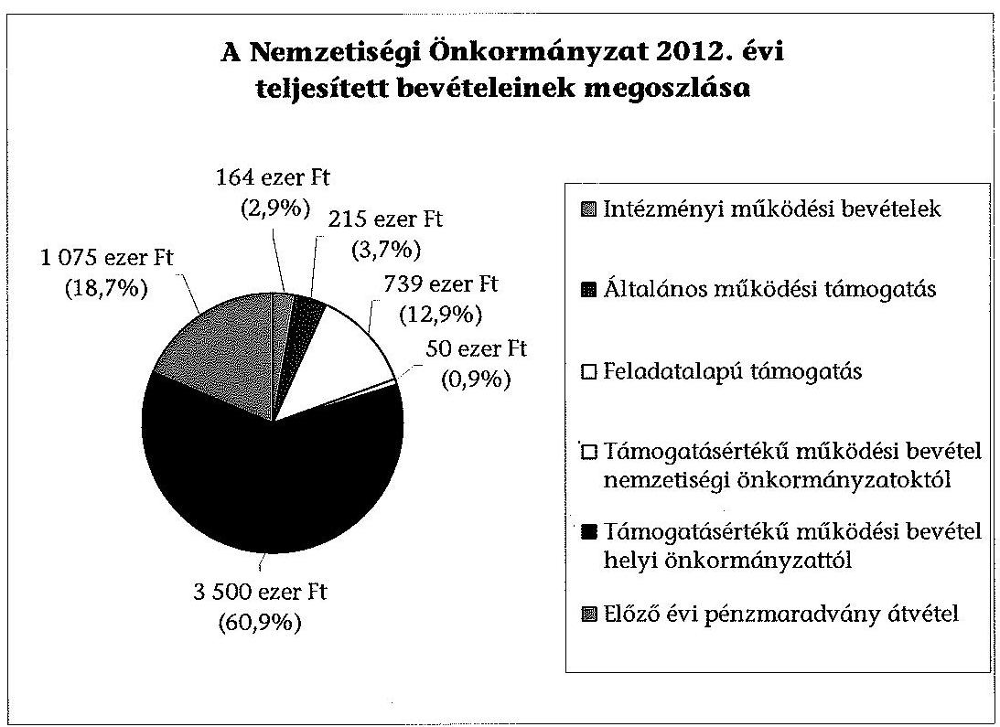
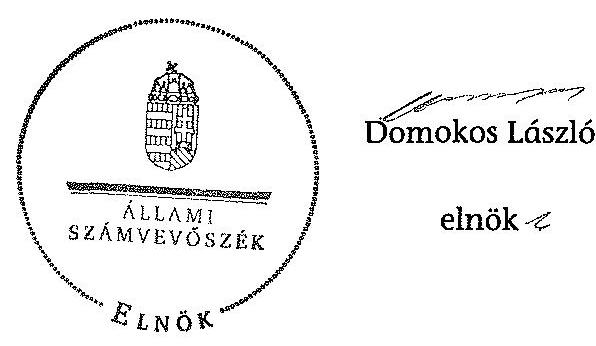

# ÁLLAMI   SZÁMVEVŐSZÉK 

## JELENTÉS

a helyi nemzetiségi önkormányzatok gazdálkodásának ellenőrzéséről
Budapest Főváros XIII. Kerületi Ruszin Nemzetiségi Önkormányzat

---

# Állami Számvevőszék 

Iktatószám: V-0300-017/2014.
Témaszám: 1333
Vizsgálat-azonosító szám: V065253

## Az ellenőrzést felügyelte:

Horváth Balázs
felügyeleti vezető
Az ellenőrzést vezette és az ellenőrzés végrehajtásáért felelős:
Kisgergely István
ellenőrzésvezető
A számvevőszéki jelentést készítették és a jelentés összeállításában
közremüködtek:
Zachár Péterné
számvevő főtanácsos
Právitzné Pejkó Noémi
számvevő
Az ellenőrzést végezte:
Ganter Ildikó
számvevő

---

# TARTALOMJEGYZÉK 

BEVEZETÉS ..... 3
I. ÖSSZEGZŐ MEGÁLLAPÍTÁSOK, KÖVETKEZTETÉSEK, JAVASLATOK ..... 6
II. RÉSZLETES MEGÁLLAPÍTÁSOK ..... 11

1. A Nemzetiségi Önkormányzat és a XIII. Kerületi Önkormányzat együttműködésének szabályozása, a müködési feltételek biztosítása ..... 11
2. A gazdálkodási feladatok ellátásának szabályszerűsége ..... 12
2.1. A költségvetésre és a zárszámadásra, valamint a kincstári adatszolgáltatás rendjére vonatkozó jogszabályi előírások betartása ..... 12
2.2. A Nemzetiségi Önkormányzat gazdálkodásának szabályozottsága ..... 13
2.3. Az operatív gazdálkodási jogkörök kialakítása, gyakorlása ..... 14
3. A Nemzetiségi Önkormányzattal összefüggő gazdálkodási feladatok belső ellenőrzése ..... 15
4. A feladatalapú támogatás felhasználásának, elszámolásának szabályszerűsége, a Nemzetiségi Önkormányzat feladatellátása ..... 16
MELLÉKLETEK
5. számú A Nemzetiségi Önkormányzat 2012. évi gazdálkodásának főbb adatai, mutatói
6. számú Tájékoztatás a polgármesternek küldött el nem fogadott észrevételekről
FÜGGELÉKEK
7. számú Rövidítések jegyzéke
8. számú Értelmező szótár
9. számú A gazdálkodás értékelésének módszere

---

.

---

# JELENTÉS 

## A helyi nemzetiségi önkormányzatok gazdálkodásának ellenőrzéséről Budapest Főváros XIII. Kerületi Ruszin Nemzetiségi Önkormányzat

## BEVEZETÉS

A Nemzetiségi Önkormányzat a 2003. évben alakult, elnöke 2010. óta látja el feladatát. A Nemzetiségi Önkormányzat intézményt, gazdasági társaságot és más szervezetet nem alapított. A négytagú Képviselő-testület munkája segítésére bizottságot nem hozott létre. A Nemzetiségi Önkormányzatnak a költségvetési beszámolója szerint a 2012. évben a módosított költségvetési bevételi és kiadási előirányzata 5742 ezer Ft, a teljesített költségvetési bevétele 5743 ezer Ft, a teljesített költségvetési kiadása 4782 ezer Ft volt. A 2012. évi gazdálkodási adatokat az 1. számú mellékletben mutatjuk be.

Az Alaptörvény XXIX. cikk (1) bekezdése szerint a Magyarországon élő nemzetiségek államalkotó tényezők. Minden, valamely nemzetiséghez tartozó magyar állampolgárnak joga van önazonossága szabad vállalásához és megőrzéséhez. A hazánkban élő nemzetiségek helyi (települési és területi), valamint országos önkormányzatokat hozhatnak létre. A helyi nemzetiségi önkormányzatok gazdálkodási feladatait jogszabályi előírás alapján székhely szerinti önkormányzat polgármesteri hivatala látja el.

A nemzetiségek helyzete, támogatása mind hazai, mind EU-s szinten kiemelt figyelmet kap napjainkban. A helyi nemzetiségi önkormányzatok gazdálkodására és támogatási rendszerére vonatkozó jogszabályok a 2010-2012. években jelentős változásokon mentek át. A települési és területi nemzetiségi önkormányzatok gazdálkodásának, a részükre juttatott költségvetési támogatások felhasználásának ellenőrzését az ÁSZ a 2012. évben témacsoportos ellenőrzés keretében indította el. A 2013. évi ellenőrzések e témacsoportos ellenőrzések folytatását jelentik, amelyet az ÁSZ 2014. évi első félévi ellenőrzési terve 12. témasorszámon tartalmaz.

Az ellenőrzés célja annak értékelése volt, hogy a Nemzetiségi Önkormányzat gazdálkodási kereteinek kialakítása, gazdálkodása és feladatellátása megfelelt-e a jogszabályoknak.

---

Ennek keretében értékeltük, hogy:

- a Nemzetiségi Önkormányzat és a XIII. Kerületi Önkormányzat együttmúködésének szabályozása, a múködési feltételek biztosítása megfelelte a jogszabályi előírásoknak;
- a felek együttmúködése megfelelte a közöttük létrejött megállapodásnak a gazdálkodási feladatok szabályszerú ellátása során, ennek keretében betartották-e a Nemzetiségi Önkormányzat gazdálkodásához kapcsolódóan a költségvetésre és zárszámadásra, a gazdálkodás szabályozására, az operatív gazdálkodási jogkörök gyakorlására vonatkozó jogszabályi előírásokat;
- a jegyző biztosította-e a Nemzetiségi Önkormányzat gazdálkodásának belsö ellenőrzését;
- a Nemzetiségi Önkormányzat feladatalapú támogatásának felhasználása, a folyósított feladatalapú támogatással történő elszámolás az előírásoknak megfelelő volt-e;
- a Nemzetiségi Önkormányzat feladatellátása összhangban volt-e a vonatkozó jogszabályi előírásokkal.

Az ellenőrzés várható hasznosulását négy szinten tervezzük. A törvényalkotás számára összegzett tapasztalatok állnak rendelkezésre a nemzetiségi önkormányzatok testületi döntéseinek, gazdálkodásának és a feladatalapú támogatás felhasználásának szabályszerűségéről, amelynek alapján következtetést lehet levonni arra, hogy indokolt-e jogszabályi módosítás kezdeményezése. Az ellenőrzés az ellenőrzött számára visszajelzést ad a múködésében fellépő hiányosságokról, javaslataival hozzájárul azok kiküszöböléséhez, amely csökkentheti a későbbi ellenőrzések gyakoriságát. Az ellenőrzés megállapításai és javaslatai tanulságul szolgálhatnak más nemzetiségi önkormányzatok, szervezetek számára a rendezett gazdálkodási keretek kialakításához. A társadalom számára jelzi, hogy közpénz nem maradhat ellenőrizetlenül, az ÁSZ értékteremtő rend kialakításához és megőrzéséhez hozzájáruló tevékenysége pozitív hatással lesz a szervezetről kialakított összkép formálásában. Az ÁSZ szervezetén belül lehetőség nyílik arra, hogy a megállapítások szintetizálásával az intézmény a hozzáadott értéket teremtő elemző tevékenységét és tanácsadó szerepét erősítse.

A Nemzetiségi Önkormányzat gazdálkodásának ellenőrzéséről szóló jelentés I. fejezetének összegző része az ellenőrzés céljára adott rövid, szintetizáló összefoglalót és következtetéseket tartalmazza a II. fejezet részletes megállapításain alapulóan. A jelentés, intézkedést igénylő megállapításait és javaslatait - az összegzőben foglaltak mellett - az ellenőrzés során feltárt, a jelentés II. fejezetében rögzített részletes megállapítások alapozzák meg, illetve támasztják alá.

# Az ellenőrzés típusa: szabályszerűségi ellenőrzés 

Az ellenőrzött időszak: a 2012. január 1. - 2012. december 31. közötti időszak. Az ellenőrzés kiterjedt a Nemzetiségi Önkormányzatnak juttatott 2012. évi támogatás 2013. évben való elszámolására is.

---

Ellenőrzött szervezet: Budapest Főváros XIII. Kerületi Ruszin Nemzetiségi Önkormányzat és a gazdálkodási feladatait ellátó XIII. Kerületi Önkormányzat.

Az ellenőrzés végrehajtásának jogszabályi alapját az ÁSZ tv. 5. § (2)(3) és (6) bekezdéseiben foglaltak képezik.

Az ellenőrzés szakmai módszertana az ÁSZ hivatalos honlapján (www.asz.hu) közzétett szakmai szabályokon alapult, amely a Legfőbb Ellenőrző Intézmények Nemzetközi Szervezete (INTOSAI) által kiadott nemzetközi standardok (ISSAI) figyelembevételével készült.

A Nemzetiségi Önkormányzat gazdálkodásának ellenőrzése során értékeltük a XIII. Kerületi Önkormányzat és a Nemzetiségi Önkormányzat együttmúködésének, a gazdálkodás szabályozottságának és a pénzügyi folyamatokban kulcsszerepet betöltő belső kontrollok (teljesítésigazolás és érvényesítés) múködésének megfelelőségét. A kulcskontrollokat a dologi kiadásokkal kapcsolatos kifizetéseknél - véletlen mintavételi eljárást alkalmazva - ellenőriztük. Ellenőriztük, hogy a jegyző biztosította-e a Nemzetiségi Önkormányzat gazdálkodásának belső ellenőrzését. Értékeltük a feladatalapú támogatások felhasználásának, elszámolásának szabályszerűségét, a Nemzetiségi Önkormányzat feladatellátása és a Jogszabályi előírások összhangját.

Az ellenőrzés lefolytatásához a Nemzetiségi Önkormányzat és a gazdálkodási feladatait ellátó XIII. Kerületi Önkormányzat tanúsítványok és a kapcsolódó, dokumentumjegyzékben megjelölt dokumentumok elektronikus úton történő megküldésével, rendelkezésre bocsátásával szolgáltatott adatokat. Az adatszolgáltatás kontrollálása és szükség szerinti javítása a helyszíni ellenőrzés keretében történt. A minősítési szempontokat a 3. számú függelék tartalmazza.

Az ÁSZ tv. 29. § (1) bekezdése szerint a jelentéstervezetet megküldtük egyeztetésre a polgármester és a Nemzetiségi Önkormányzat elnöke részére. A polgármester határidőben megküldött észrevétele és tájékoztatása alapján a jelentést módosítottuk. Az el nem fogadott észrevételek indoklását a jelentés 2. számú melléklete tartalmazza.

---

# I. ÖSSZEGZŐ MEGÁLLAPÍTÁSOK, KÖVETKEZTETÉSEK, JAVASLATOK 

A Nemzetiségi Önkormányzat és a XIII. Kerületi Önkormányzat együttmúködésének szabályozása, a múködési feltételek biztosítása megfelelt a jogszabályi előírásoknak. A Nemzetiségi Önkormányzat rendelkezett a 2012. év folyamán hatályban lévő együttműködési megállapodással a XIII. Kerületi Önkormányzattal. A 2012. január 1-jén hatályos, 2010. december 9-én megkötött együttműködési megállapodás ${ }_{1}$-nek a gazdálkodási szabályok változása miatti felülvizsgálatát a Nek. tv.-ben előírtak ellenére 2012. január 31-éig nem végezték el. A Nek. tv.-ben előírt kiegészítést - a 2012. június 1-jei határidőt betartva - végrehajtották, az együttmúködési megállapodás ${ }_{2}$-őt 2012. február 24én írták alá. A kerület polgármestere az 1/2011.(I. 14.) számú Önkormányzati rendelet felhatalmazása alapján írta alá az együttműködési megállapodás ${ }_{2}$-őt, A Nemzetiségi Önkormányzat múködésének feltételeit a jogszabályi előírásoknak megfelelően szabályozták a 2012. december 31-én hatályos együttmúködési megállapodás ${ }_{2}$-ben, amely a gazdálkodási feladatok ellátásának szabályait is teljes körűen tartalmazta. A Nek. tv.-ben foglaltak ellenére azonban az együttműködési megállapodás ${ }_{2}$ szerinti múködési feltételeket nem rögzítették a Nemzetiségi Önkormányzat SZMSZ-ében az együttműködési megállapodás ${ }_{2}$ megkötését, módosítását követő 30 napon belül. A XIII. Kerületi Önkormányzat az együttmúködési megállapodás ${ }_{2}$-ben biztosította a Nemzetiségi Önkormányzat múködéséhez szükséges személyi és tárgyi feltételeket.

A Nemzetiségi Önkormányzat 2012. évi költségvetésének és zárszámadásának tartalma, jóváhagyása megfelelt a jogszabályi előírásoknak. A Nemzetiségi Önkormányzat elnöke a 2012. évi költségvetés tervezetét az Áht ${ }_{2}$. előírása szerinti határidőben benyújtotta a Képviselő-testületnek. A jóváhagyott költségvetés az Áht. ${ }_{2}$-ben és az Ávr.-ben előírt tartalomnak megfelelő volt. A jegyző által elkészített 2012. évi zárszámadási határozat-tervezet megfelelt a jogszabályi előírásoknak, a Nemzetiségi Önkormányzat elnöke határidőn belül beterjesztette a Képviselő-testületnek, elfogadása megtörtént. A jegyző a 2012. költségvetéshez kapcsolódó kincstári adatszolgáltatási kötelezettségeinek az Áhsz. ${ }_{1}$-ben és az Ávr.-ben előírt határidőkön túl tett eleget.

A Nemzetiségi Önkormányzat gazdálkodásnak szabályozottsága az ellenőrzött időszakban megfelelt a jogszabályi előírásoknak. A gazdálkodási feladatok végrehajtását ellátó Polgármesteri Hivatal a 2012. évben a Számv. tv.ben és a Bkr.-ben előírt, gazdálkodást érintő szabályzatokkal a Nemzetiségi Önkormányzat gazdálkodásnak végrehajtási feladataira kiterjedő hatállyal rendelkezett. A Nemzetiségi Önkormányzat gazdálkodásának végrehajtási feladataira vonatkozó nevesített munkakörökhöz tartozó feladat- és hatásköröket, azok gyakorlásának módját, a helyettesítés rendjét, az ezekhez kapcsolódó felelősségi szabályokat az Ávr. előírása ellenére a Polgármesteri Hivatal SZMSZében nem rögzítették.

A Nemzetiségi Önkormányzat gazdálkodása tekintetében az operatív gazdálkodási jogkörök kialakítása megfelelt a jogszabályi előírásoknak. A

---

2012. évben a Nemzetiségi Önkormányzatra vonatkozóan az operatív gazdálkodási jogkörök kialakítása a kötelezettségvállalásra, az utalványozásra adott felhatalmazás, valamint a teljesítésigazoló kijelölése a jogszabályi előírásoknak megfelelt. A pénzügyi ellenjegyzőt és érvényesitőt a jegyző mint a költségvetési szerv vezetője jelölte ki. A Nemzetiségi Önkormányzat elnöke a nemzetiségi önkormányzati képviselők kötelezettségvállalás és utalványozás gyakorlására történő felhatalmazásával biztosította az összeférhetetlenségi követelmények érvényesülését.

A Nemzetiségi Önkormányzatnál a 2012. évben a dologi kiadások teljesítése során a kulcskontrollok múködésének megfelelősége kiváló volt, a teljesítésigazoló és az érvényesítő a jogszabályi előírásoknak megfelelően látták el ellenőrzési feladataikat. A dologi kiadások között a három legnagyobb összegű kiadás teljesítésének egyedi értékelése alapján a teljesítésigazolás és az érvényesítés kulcskontrollok megfelelően múködtek. Támogatásértékű kiadást, valamint államháztartáson kívülre történő pénzeszközátadást nem teljesítettek. A Nemzetiségi Önkormányzatnál a számvevőszéki ellenőrzés a rendelkezésre bocsátott dokumentumok alapján jogosulatlan kifizetést nem állapított meg.

A Nemzetiségi Önkormányzat gazdálkodásával összefüggő végrehajtási feladatok belső ellenőrzése a 2012. évben megfelelő volt. A Polgármesteri Hivatal jegyzője biztosította a Nemzetiségi Önkormányzat gazdálkodásával összefüggő végrehajtási feladatok belső ellenőrzését, amit az együttmúködési megállapodás ${ }_{1,2}$ is tartalmazott. A Polgármesteri Hivatal belső ellenőrzési tervét megalapozó kockázatelemzés kiterjedt a Nemzetiségi Önkormányzat gazdálkodásával összefüggő végrehajtási feladatokra. A nemzetiségek gazdálkodásával kapcsolatos kockázatot magas besorolásúnak minősítették, és évenkénti vizsgálatot tartottak szükségesnek. A 2012. évi belső ellenőrzés az önkormányzati támogatás 2012. év első félévi felhasználását ellenőrizte és megállapította, hogy a Nemzetiségi Önkormányzat gazdálkodása szabályszerű volt. Az ellenőrzés nem érintette a számvevőszéki ellenőrzés által feltárt hiányosságokat, valamint a feladatalapú támogatások elszámolását.

A Nemzetiségi Önkormányzat részére folyósított feladatalapú támogatás elszámolása a jogszabályi előírásoknak nem felelt meg. A Nemzetiségi Önkormányzat a 2012. évben 739 ezer Ft feladatalapú támogatást kapott, amit a támogatási célokkal összhangban a folyósítás évében használt fel. A 2011. és a 2012. évi feladatalapú támogatások elszámolása a támogatási kormányrendelet ${ }_{1,3}$ előírása alapján, az Áht. ${ }_{1,3}$-ben foglaltak ellenére nem történt meg a támogató felé. A támogatás felhasználását az arra jogosult szervek nem ellenőrizték.

A Nemzetiségi Önkormányzat kötelező és önként vállalt feladatellátásának tárgya összhangban volt a Nek.tv. 115-116. §-aiban foglalt előírásokkal, a nemzetiségi oktatással és kulturális önigazgatással összefüggő ügyekben.

Az ÁSZ tv. 33. § (1) bekezdésében foglaltak értelmében az ellenőrzött szervezet vezetője köteles a jelentésben foglalt megállapításokhoz kapcsolódó intézkedési tervet összeállítani és azt a jelentés kézhezvételétől számított 30 napon belül az ÁSZ részére megküldeni. Amennyiben az intézkedési tervet határidőre nem

---

küldi meg a szervezet, vagy az nem elfogadható, az ÁSZ elnöke az ÁSZ tv. 33. § (3) bekezdés a)-b) pontjaiban foglaltakat érvényesítheti.

A helyszíni ellenőrzés megállapításainak hasznosítása mellett javasoljuk:

# a jegyzőnek 

1. az együttműködés szabályozásával kapcsolatban

Az együttműködési megállapodás ${ }_{1}$-et a Nek. tv. 80. § (2) bekezdésének előírása ellenére 2012. január 31-élg nem vizsgálták felül.

A Nek. tv. 80. § (2) bekezdésében foglaltak ellenére az együttműködési megállapodás ${ }_{2}$ szerinti müködési feltételeket nem rögzítették a Nemzetiségi Önkormányzat SZMSZ-ében az együttműködési megállapodás ${ }_{2}$ megkötését, módosítását követő 30 napon belül.

Javaslat
a) Biztosítsa a jövőben az együttműködési megállapodás évenkénti felülvizsgálata során a Nek. tv. 80. §(2) bekezdésében előírt határidő betartását.
b) Készítse elő a Nemzetiségi Önkormányzat SZMSZ-ének a Nek. tv. 80. § (2) bekezdésében foglalt előírás alapján történő kiegészítését.
2. a kincstári adatszolgáltatási kötelezettséggel kapcsolatban

A jegyző a 2012. évi költségvetéshez kapcsolódó, Nemzetiségi Önkormányzatra vonatkozó kincstári adatszolgáltatási kötelezettségének több esetben - az Ávr. 33. §, 169. § (2) bekezdésében és az Áhsz. 1 10. § (5a) bekezdésében előírt - határidőn túl tett eleget.

Javaslat
Gondoskodjon arról, hogy a Nemzetiségi Önkormányzatra vonatkozó kincstári adatszolgáltatási kötelezettségeinek az Ávr. 33. §-ában, 169. § (2) bekezdésében és az Áhsz. 2 32. § (4) bekezdésében előírt határidők betartásával tegyen eleget.
3. a gazdálkodás szabályozottságával kapcsolatban

A Polgármesteri Hivatal SZMSZ-e nem tartalmazta az Ávr. 13. § (1) bekezdés g) pontjában foglaltak szerinti, az SZMSZ-ben nevesített munkakörökhöz tartozó - a Nemzetiségi Önkormányzat gazdálkodásának végrehajtásával kapcsolatos - feladat- és hatáskörökre, a hatáskörök gyakorlásának módjára, a helyettesítés rendjére, az ezekhez kapcsolódó felelősségi szabályokra vonatkozó előírásokat.

Javaslat

---

Készítse elő a Polgármesteri Hivatal SZMSZ-ének módosítását, hogy az tartalmazza a Nemzetiségi Önkormányzat gazdálkodásának végrehajtási feladataira vonatkozóan - az Ávr. 13. § (1) bekezdés g) pontjában foglaltakat.
4. a feladatalapú támogatás elszámolásával kapcsolatban

A 2011. évi feladatalapú támogatás elszámolása a támogatási kormányrendelet1 7. § (2) bekezdésében hivatkozott, valamint a 2012. évi feladatalapú támogatás elszámolása a támogatási kormányrendelet2 8. § (5) bekezdésében hivatkozott „a helyi önkormányzatok elszámolási és ellenőrzési rendjére vonatkozó jogszabályok rendelkezései alkalmazandóak" előírása alapján az Áht. 64. § (7) bekezdése és az Áht. 2 57. § (3) bekezdése ellenére nem történt meg.

Javaslat
Gondoskodjon az Áht. 2 27. § (2) bekezdésében meghatározott feladatkörében a Nemzetiségi Önkormányzat által igénybevett 2011. és 2012. évi feladatalapú támogatás felhasználásáról szóló elszámolásának elkészítéséről az Áht. 2 53. § (1) bekezdése szerinti beszámolási kötelezettség teljesítéséhez.

# a polgármesternek 

A Polgármesteri Hivatal SZMSZ-e nem tartalmazta az Ávr. 13. § (1) bekezdés g) pontjában foglaltak szerinti, az SZMSZ-ben nevesített munkakörökhöz tartozó - a Nemzetiségi Önkormányzat gazdálkodásának végrehajtásával kapcsolatos - feladat- és hatáskörökre, a hatáskörök gyakorlásának módjára, a helyettesítés rendjére, az ezekhez kapcsolódó felelősségi szabályokra vonatkozó előírásokat.

Javaslat
Terjessze a XIII. Kerületi Önkormányzat Képviselő-testülete elé jóváhagyásra a Polgármesteri Hivatal SZMSZ-ének jegyző által előkészített módosítását, hogy az tartalmazza - a Nemzetiségi Önkormányzat gazdálkodási feladatainak végrehajtására vonatkozóan - az Ávr. 13. § (1) bekezdés g) pontjában foglaltakat.

## a Nemzetiségi Önkormányzat elnökének

1. A Nek. tv. 80. § (2) bekezdésében foglaltak ellenére az együttműködési megállapodás ${ }_{2}$ szerinti müködési feltételeket nem rögzítették a Nemzetiségi Önkormányzat SZMSZ-ében.

Javaslat
Terjessze a Képviselő-testület elé jóváhagyásra a Nemzetiségi Önkormányzat SZMSZ-ének jegyző által előkészített módosítását, hogy az megfeleljen a Nek. tv. 80. § (2) bekezdésében előírtaknak.
2. A 2011. évi feladatalapú támogatás elszámolása a támogatási kormányrendelet ${ }_{1}$ 7. § (2) bekezdésében hivatkozott, valamint a 2012. évi feladatalapú támogatás

---

elszámolása a támogatási kormányrendelet ${ }_{2} 8 . \S$ (5) bekezdésében hivatkozott „a helyi önkormányzatok elszámolási és ellenőrzési rendjére vonatkozó jogszabályok rendelkezései alkalmazandóak" előírása alapján az Áht. ${ }_{1} 64 . \S$ (7) bekezdése és az Áht. ${ }_{2} 57 . \S$ (3) bekezdése ellenére nem történt meg.

Javaslat
Terjessze a Képviselő-testület elé jóváhagyásra az Áht. ${ }_{2} 53 . \S$ (1) bekezdése szerinti beszámolási kötelezettség teljesítéséhez a Nemzetiségi Önkormányzat által igénybe vett 2011. és 2012. évi feladatalapú támogatás felhasználásáról szóló elszámolást.

---

# II. RÉSZLETES MEGÁLLAPÍTÁSOK 

## 1. A Nemzetiségi Önkormányzat és a XIII. Kerületi ÖnkORMÁNYZAT EGYÜTTMÜKÖDÉSÉNEK SZABÁLYOZÁSA, A MÜKÖDÉSI FELTÉTELEK BIZTOSÍTÁSA

A Nemzetiségi Önkormányzat és a XIII. Kerületi Önkormányzat együttmúködésének szabályozása, a múködési feltételek biztosítása megfelelt a jogszabályi előírásoknak.

A Nemzetiségi Önkormányzat rendelkezett a 2012. év folyamán hatályban lévő együttműködési megállapodással a XIII. Kerületi Önkormányzattal. A 2012. január 1-jén hatályos, 2010. december 9-én megkötött együttműködési megállapodás ${ }_{1}$-nek a gazdálkodási szabályok változása miatti felülvizsgálatát a Nek. tv. 80. § (2) bekezdésében előírtak ellenére 2012. január 31-éig nem végezték el. A Nek. tv. 159. § (3) bekezdésében előírt kiegészítést - a 2012. június 1-jei határidőt betartva - végrehajtották, az együttműködési megállapodás ${ }_{2}$-t 2012. február 24-én írták alá.

A Nemzetiségi Önkormányzat az együttműködési megállapodás ${ }_{1}$-et a 40/2010. (XI. 18.) számú, az együttműködési megállapodás ${ }_{2}$-őt a 11/2012. (II. 10.) számú határozatával fogadta el. A kerület polgármestere az 1/2011.(I. 14.) számú Önkormányzati rendelet felhatalmazása alapján írta alá az együttműködési megállapodás ${ }_{2}$-őt. A XIII. Kerületi Önkormányzat Képviselőtestülete nemzetiségi önkormányzatonként önkormányzati határozatot nem alkotott az együttműködési megállapodások felülvizsgálatáról és elfogadásáról, azt külön rendeletben szabályozta.

A Nemzetiségi Önkormányzat múködésének feltételeit a jogszabályi előírásoknak megfelelően szabályozták a 2012. december 31-én hatályos együttműködési megállapodás ${ }_{2}$-ben. A Nek. tv. 80. § (2) bekezdésében foglaltak ellenére azonban az együttműködési megállapodás ${ }_{2}$ szerinti múködési feltételeket nem rögzítették a Nemzetiségi Önkormányzat SZMSZ-ében az együttműködési megállapodás ${ }_{2}$ megkötését, módosítását követő 30 napon belül ${ }^{1}$.

A Nemzetiségi Önkormányzat gazdálkodási feladatai ellátásának szabályait az együttműködési megállapodás ${ }_{2}$-ben teljes körűen rögzítették.

[^0]
[^0]:    ${ }^{1}$ A Nemzetiségi Önkormányzat Szervezeti és Működési Szabályzatát 2012. február 10én módosították (8/2012. (II. 10.) határozat), 2012. évben további módosításra nem került sor.

---

A XIII. Kerületi Önkormányzat az együttműködési megállapodás ${ }_{2}$-ben a Nek. tv. 80. § (1) bekezdésének megfelelően a gyakorlatban is biztosította a Nemzetiségi Önkormányzat múködéséhez szükséges személyi és tárgyi feltételeket. ${ }^{2}$

A személyi feltételek biztosítottak voltak, 2011. szeptember 5-étől a Polgármesteri Hivatal egy fő dolgozójának munkaköri kötelezettségébe tartozik a nemzetiségi önkormányzatok gazdálkodásával kapcsolatos feladatok ellátása.

Az együttműködési megállapodás ${ }_{2}$ tartalmazta a Nek. tv. 80. § (4) bekezdés előírásának megfelelően, hogy a jegyző vagy annak - a jegyzővel azonos képesítési előírásoknak megfelelő - megbízottja a helyi önkormányzat megbízásából és képviseletében részt vesz a helyi nemzetiségi önkormányzat testületi ülésein és jelzi amennyiben törvénysértést észlel.

# 2. A GAZDÁlKODÁSI FELADATOK ELLÁTÁSÁNAK SZABÁLYSZERŰSÉGE 

### 2.1. A költségvetésre és a zárszámadásra, valamint a kincstári adatszolgáltatás rendjére vonatkozó jogszabályi előírások betartása

A Nemzetiségi Önkormányzat 2012. évi költségvetésének és zárszámadásának tartalma, jóváhagyása megfelelt a jogszabályi előírásoknak.

A Nemzetiségi Önkormányzat elnöke a 2012. évi költségvetés tervezetét az Áht. ${ }_{2}$ 24. § (2) bekezdés előírása szerinti határidőben ${ }^{3}$ benyújtotta a Képviselőtestületnek. A jóváhagyott költségvetés ${ }^{4}$ az Áht. ${ }_{2}$-ben és az Ávr.-ben előírt tartalomnak megfelelő volt.

A jegyző által elkészített 2012. évi zárszámadási határozat-tervezetet a Nemzetiségi Önkormányzat elnöke az Áht. ${ }_{2}$-ben foglaltak alapján, határidőn belül terjesztette be a Képviselő-testületnek. A jogszabályban előírt mérlegeket, kimutatásokat a zárszámadás előterjesztésekor tájékoztatásul bemutatták, és biztosították az összehasonlíthatóságát az elfogadott költségvetéssel. A zárszámadásban ${ }^{5}$ a Nemzetiségi Önkormányzat valamennyi bevételéről és kiadásáról elszámoltak.

A jegyző a 2012. évi költségvetési évhez kapcsolódó, kincstári adatszolgáltatási kötelezettségének határidőn túl tett eleget.

[^0]
[^0]:    ${ }^{2}$ Az együttműködési megállapodás ${ }_{2}$ 20. pontja szerint „A Nemzetiségi Önkormányzat tárgyévi jóváhagyott költségvetésében az Önkormányzat által biztosított támogatásnak része a Nemzetiségi Önkormányzat müködéséhez szükséges - díjtalanul biztosított - irodahelyiségben felmerülő közüzemi és egyéb jellegü költségek fedezete."
    ${ }^{3}$ 2012. február 10-1 előterjesztés a Nemzetiségi Önkormányzat 2012. évi költségvetéséről.
    ${ }^{4}$ A Képviselő-testület 5/2012. (II. 10.) számú határozata a Nemzetiségi Önkormányzat 2012. évi költségvetéséről.
    ${ }^{5}$ A Képviselő-testület 22/2013. (IV. 8.) számú határozata a Nemzetiségi Önkormányzat 2012. évi zárszámadásáról.

---

Az elemi költségvetést nem az Ávr. 33. §(1)-(2) bekezdésében, a negyedéves és éves időközi költségvetési jelentéseket nem az Ávr. 169. § (2)bekezdésében, a 2012. év éves elemi költségvetési beszámolójának benyújtását nem az Áhsz.; 10. § (5 ) bekezdés a) pontjában előírt határidőben teljesítette.

# 2.2. A Nemzetiségi Önkormányzat gazdálkodásának szabályozottsága 

A Nemzetiségi Önkormányzat gazdálkodásnak szabályozottsága az ellenőrzött időszakban megfelelt a jogszabályi előírásoknak.

A gazdálkodási feladatok végrehajtását ellátó Polgármesteri Hivatal a 2012. évben a Számv. tv.-ben és a Bkr.-ben előírt, gazdálkodást érintő szabályzatokkal ${ }^{6}$ a Nemzetiségi Önkormányzat gazdálkodási feladataira kiterjedő hatállyal rendelkezett.

Az Önkormányzat és a Polgármesteri Hivatal számviteli politikájáról szóló XXII/1-13/2012. (VIII. 30.) számú polgármesteri-jegyzői együttes utasítást 2012. augusztus 30 -án írták alá, amely az aláírás napján lépett hatályba, „rendelkezéselt a 2012. évtől kezdödően kell alkalmazni".

A Polgármesteri Hivatal SZMSZ-e az Ávr. 13. § (1) bekezdés g) pontjában foglaltak ellenére nem tartalmazta az SZMSZ-ben nevesített munkakörökhöz tartozó - a Nemzetiségi Önkormányzat gazdálkodásának végrehajtási feladataira vonatkozó feladat- és hatásköröket, a hatáskörök gyakorlásának módját, a helyettesítés rendjét, az ezekhez kapcsolódó felelősségi szabályokat ${ }^{7}$.

A Polgármesteri Hivatalban az ellenőrzött időszakban két operatív gazdálkodási szabályzat ${ }^{8}$ volt érvényben, amelyek hatályát kiterjesztették a Nemzetiségi Önkormányzat gazdálkodási feladataira. Az együttmúködési megállapodás ${ }_{2}$ ben szabályozták az előzetes írásbeli kötelezettségvállalást nem igénylő, 100 ezer forintot el nem érő kifizetések rendjét. A 100 ezer Ft meghaladó kötelezettségvállalásról az Ávr.-nek megfelelő tartalmú nyilvántartást vezettek. A szabályzat értelmében a 100 ezer Ft el nem érő, előzetes írásbeli kötelezettségvállalást nem igényelő kifizetések esetében a kifizetések teljesítésével egyidejűleg gondoskodtak azok pénzügyi rendszerben való rögzítéséről és a szabad előirányzat kiadási összegnek megfelelő lefoglalásáról.

[^0]
[^0]:    ${ }^{6}$ Számviteli politika, eszközök és források értékelési, leltárkészítési és leltározási szabályzata, pénzkezelési szabályzat, számlarend, selejtezési szabályzat, önköltségszámítás rendjére vonatkozó szabályzat, valamint a XXII/15-42/2011. (XII. 13.) számú Jegyzöi Utasítás a Polgármesteri Hivatal belső kontroll szabályzatáról: ellenőrzési nyomvonal, szabálytalanságok kezelésének eljárásrendje, kockázatkezelési szabályzat.
    ${ }^{7}$ A gazdálkodással kapcsolatos feladat- és hatásköröket az egységes ügyrend módosításáról szóló 160/2012. (XII. 13.) számú önkormányzati határozat tartalmazza.
    ${ }^{8}$ XXII/25-3/2010. (IV. 29.), valamint XXII/1-11/2012. (VII. 2.) számú polgármesterijegyzői együttes utasítás az Önkormányzat és a Polgármesteri Hivatal költségvetése végrehajtása során a kötelezettségvállalás és ellenjegyzés, a szakmai teljesítésigazolás, érvényesítés és utalványozás hatásköri rendjéről.

---

# 2.3. Az operatív gazdálkodási jogkörök kialakítása, gyakorlása 

A Nemzetiségi Önkormányzat az operatív gazdálkodási jogköröket a jogszabályi elöírásoknak megfelelően alakította ki.

Az ellenjegyzésre, érvényesítésre a jegyző által írásban kijelölt, a Polgármesteri Hivatal állományába tartozó köztisztviselő volt jogosult. A Polgármesteri Hivatal pénzügyi ellenjegyzői és érvényesítői feladatokra kijelölt köztisztviselői a feladatuk ellátásához előírt képesítési követelményeknek megfeleltek.

A Nemzetiségi Önkormányzat elnöke az Áht ${ }_{2}$ 36. § (7) bekezdése és az Ávr. 52. § (7) bekezdése alapján nemzetiségi önkormányzati képviselőnek a kötelezettségvállalás, teljesítésigazolás és utalványozás gyakorlására történő felhatalmazása során biztosította az összeférhetetlenségi követelményeknek való megfelelőséget ${ }^{9}$.

A Nemzetiségi Önkormányzatnál a 2012. évben a dologi kiadások teljesítéséhez tartozó bizonylatok tesztelése alapján a kulcskontrollok múködésének megfelelősége kiváló volt, a teljesítésigazoló és az érvényesítő a jogszabályi előírásoknak megfelelően látták el ellenőrzési feladataikat.

A dologi kiadások között a három legnagyobb összegű kiadás teljesítésének egyedi értékelése alapján a teljesítésigazolás és az érvényesítés kulcskontrollok megfelelően múködtek.

Múködési és felhalmozási célú, támogatásértékű kiadás, valamint államháztartáson kívülre történő működési és felhalmozási célú pénzeszközátadást nem teljesítettek.

A Nemzetiségi Önkormányzatnál a számvevőszéki ellenőrzés a rendelkezésre bocsátott dokumentumok alapján összeférhetetlenséget, továbbá jogosulatlan kifizetést nem tárt fel.

[^0]
[^0]:    ${ }^{9}$ Az együttműködési megállapodás szerint „A 100.000 Ft alatti elözetes kötelezettségvállalást nem igénylő kifizetéseket a Pénzügyi Osztály a teljesitést követően haladéktalanul felvezeti a nyilvántartásba."

---

# 3. A Nemzetiségi Önkormányzattal összefüggő gazdálkodÁsi feladatok belsö elLENÖrzése 

A Nemzetiségi Önkormányzat gazdálkodásával összefüggő végrehajtási feladatok belsö ellenörzése a 2012. évben megfelelő volt.

Az együttműködési megállapodás ${ }_{1,2}$ tartalmazta a belső ellenőrzésre vonatkozó feltételeket, amelynek értelmében a Nemzetiségi Önkormányzatnál a XIII. Kerületi Önkormányzat költségvetéséből juttatott pénzeszközök felhasználását az Ellenőrzési Csoport évente ellenőrzi.

A 2012. évre vonatkozó belső ellenőrzési terv összeállítása során a jegyző figyelemmel volt a Nemzetiségi Önkormányzat gazdálkodásával összefüggő végrehajtási feladatok belső ellenőrzésére.

A belső ellenőrzési tervet megalapozó kockázatelemzés kiterjedt a Nemzetiségi Önkormányzat gazdálkodásával összefüggő végrehajtási feladatokra. A nemzetiségek gazdálkodásával kapcsolatos kockázatot magas besorolásúnak minősítették, és évenkénti vizsgálatot tartottak szükségesnek.

Az éves belső ellenőrzési tervben foglaltaknak megfelelően az Ellenőrzési Csoport a 2012. évben ellenőrizte ${ }^{10}$ a XIII. Kerületi Nemzetiségi Önkormányzat 2012. év első félévi gazdálkodását, különös tekintettel az önkormányzati támogatásból megvalósult gazdasági eseményekre, így az nem érintette a számvevőszéki ellenőrzés által feltárt hiányosságokat.

A belső ellenőrzés megállapította, hogy a helyi nemzetiségi önkormányzatok költségvetésének végrehajtása során a gazdálkodás és az elszámolás szabályszerűen történt a vizsgált időszakban, betartották a szakmai teljesítésigazolás, az utalványozás, az ellenjegyzés, valamint az érvényesítés szabályait.

A belső ellenőrzési jelentésben megfogalmazottakat a Nemzetiségi Önkormányzat elnöke megismerte, azokra észrevételt nem tett ${ }^{11}$.

Az ellenőrzési jelentésben az Ellenőrzési Csoport a Nemzetiségi Önkormányzatnak két általános javaslatot tett, amelyek nem kapcsolódtak konkrét megállapításokhoz, így intézkedési tervet nem kellett készíteni.

Az ellenőrzéshez szolgáltatott adatok alapján a 2012. évben a Kormányhivatal a Nemzetiségi Önkormányzatot illetően nem élt törvényességi felügyeleti eszközökkel.

[^0]
[^0]:    ${ }^{10}$ A belső ellenőrzés által ellenőrzött időszak a 2012. év I. féléve volt, az ellenőrzés célja: „A nemzetiségi önkormányzatok részére biztosított pénzeszközök felhasználásának ellenőrzése".
    ${ }^{11}$ XVI/20-7/2012. iktatószámú jelentés

---

# 4. A feladatalapú támogatás felhasZNálásáNAK, elsZámoláSÁNAK SZABÁLYSZERÜSÉGE, A NEMZETISÉGI ÖNKORMÁNYZAT FELADATELLÁTÁSA 

A Nemzetiségi Önkormányzat részére folyósított feladatalapú támogatás elszámolása a jogszabályi előírásoknak nem felelt meg.

A Nemzetiségi Önkormányzat a 2011. évben 1068 ezer Ft feladatalapú támogatásban részesült, amelyet maradvány nélkül felhasználtak.

A 2012. évi feladatalapú támogatás összes bevételhez viszonyított részarányát a következő ábra szemlélteti.

A Nemzetiségi Önkormányzat a 2012. évben 739 ezer Ft feladatalapú támogatást kapott. A 2012. évi feladatalapú támogatást a támogatási célokkal összhangban a folyósítás évében hagyományápolásra ( 358 ezer Ft), érdekképviseletre ( 350 ezer Ft), közművelődési feladatokra ( 31 ezer Ft) használták fel.

A 2011. és a 2012. évi feladatalapú támogatás elszámolása a támogatási kormányrendelet ${ }_{1} 7 . \S$ (2), illetve a támogatási kormányrendelet ${ }_{2} 8 . \S$ (5) bekezdésében hivatkozott „a helyi önkormányzatok elszámolási és ellenőrzési rendjére vonatkozó jogszabályok rendelkezései alkalmazandóak" előírása alapján az Áht. ${ }_{1} 64 . \S$ (7) bekezdése, és az Áht. ${ }_{2} 57 . \S$ (3) bekezdése ellenére nem történt meg.

A 2012. évi feladatalapú támogatásról részletes kimutatást készítettek a XIII. Kerületi Önkormányzat számára.

---

A feladatalapú támogatások felhasználását, elszámolását az ellenőrzésre jogosult szervek nem ellenőrizték.

A Nemzetiségi Önkormányzat kötelező és önként vállalt feladatellátásának tárgya összhangban volt a Nek. tv. 115-116. §-aiban foglalt előírásokkal, kulturális önigazgatással összefüggően, valamint a hagyományápolás és a közmúvelődés területén láttak el feladatokat.

A Nemzetiségi Önkormányzat a Nek. tv. 116. §(2) bekezdésében tiltott hatósági feladatokat nem végzett.

Budapest, 2014. 06. hó 24. nap

Melléklet: $\quad 2 \mathrm{db}$
Függelék: $\quad 3 \mathrm{db}$

---

.

---

# A Nemzetiségi Önkormányzat 2012. évi gazdálkodásának föbb adatai, mutatói

A) Bevételek

|  Megnevezés | Eredeti elöirányzat | Módosított
2012. év | Teljesítés  |
| --- | --- | --- | --- |
|   | ezer Ft |  | megoszlás
$(\%)$  |
|  Intézményi múködési bevételek | 0 | 163 | 164  |
|  Általános múködési támogatás | 215 | 215 | 215  |
|  Feladatalapú támogatás | 0 | 739 | 739  |
|  Támogatásértékủ múködési bevétel nemzetiségi önkormányzatoktól | 0 | 50 | 50  |
|  Támogatásértékủ múködési bevétel helyi önkormányzattól | 3500 | 3500 | 3500  |
|  Előző évi pénzmaradvány átvétel | 0 | 1075 | 1075  |
|  Költségvetési bevételek | 3715 | 5742 | 5743  |
|  Tárgyévi bevételek | 3715 | 5742 | 5743  |

B) Kiadások

|  Megnevezés | Eredeti elöirányzat | Módosított 2012. év | Teljesítés  |
| --- | --- | --- | --- |
|   | ezer Ft |  | megoszlás
$(\%)$  |
|  Személyi juttatások | 1800 | 1800 | 1800  |
|  Munkoadókat terhelő járulékok és szocális hozzájárulási adó összesen | 486 | 499 | 437  |
|  Dologi kiadások | 1429 | 3443 | 2545  |
|  Költségvetési kiadások | 3715 | 5742 | 4782  |
|  Tárgyévi kiadások | 3715 | 5742 | 4782  |

---

.

---

# TÁJÉKOZTATÁS   A POLGÁRMESTERNEK KÜLDÖTT EL NEM FOGADOTT ÉSZREVÉTELEKRŐL 

| Együttmúködési megállapodás felülvizsgálata |  |
| :--: | :--: |
| Észrevétel | A Polgármesteri Hivatalban az együttmúködési megállapodás felülvizsgálata 2012. január hónapban zajlott. A felülvizsgálat többszöri személyes egyeztetéssel, előzetes munkaanyagok elkészítésével és véleményezésével járt. A dokumentumokból megismerhető dátumok alapján a feladat határidőben történő elvégzésére lehet következtetni: a Ruszin Nemzetiségi Önkormányzat képviselö-testülete - ahogy azt Önök is rögzítették a jelentéstervezetben - február 9-i határozatában felhatalmazta az elnököt a megállapodás aláírására, és a megállapodás aláírását megelőző pénzügyi ellenjegyzésre is február 9-én került sor. Álláspontom szerint a körülmények mérlegelése során nem hagyható figyelmen kívül az a tény, hogy az Önkormányzat, a Polgármesteri Hivatal és a nemzetiségi önkormányzatok feladatait, együttmúködését, múködési körülményeit befolyásoló államháztartási szabályok 2012 januárjában gyökeresen megváltoztak. Az új múködési rend kialakítására rendelkezésre álló rendkívül rövid időszak alatt is betartottuk a jogszabályban elốrt határidőket. A Kerületi Önkormányzat vezetése a megállapodás aláírására egyszerre, a kerületben múködő valamennyi nemzetiségi önkormányzat elnökével egyeztetett időpontban, február 24-én kerített sort az esemény súlyának megfelelő ünnepélyes keretek között. |
| Válasz | Az együttmúködési megállapodás felülvizsgálatával kapcsolatos észrevételét, illetve az aláírással összefüggő tájékoztatását köszönöm, azonban a jelentéstervezetben szereplő megállapítást fenntartjuk. Az ÁSZ kizárólag dokumentumok alapján tesz megállapításokat. Az ellenőrzés részére hitelt érdemlően - dokumentum hiányában - nem tudták igazolni a felülvizsgálat január 31-ig történő elvégzését. |
| Kincstári adatszolgáltatási kötelezettség |  |
| Észrevétel | A kincstári adatszolgáltatási kötelezettségeknek a Kincstár által üzemeltetett internetes felületen teszünk eleget. A határidők betartására mindig fokozott figyelmet fordítunk, ennek ellenére többször előfordul, hogy a rendszer meghibásodása, programhibák javítása, korrekciója miatt az adatrögzítés, lezárás késedelmet szenved. Ezen eseményekről írásos dokumentumokkal nem rendelkezünk, többnyire csak telefonos tájékoztatást kapunk. |
| Válasz | A kincstári adatszolgáltatással kapcsolatos észrevételét, illetve tájékoztatását köszönöm, de a jelentéstervezetben szereplő megállapítást nem módosítjuk. Az ellenőrzés részére rendelkezésre bocsátott dokumentumok alapján az adatszolgáltatás határidőn túl történő teljesítése volt megállapítható. A programhibákról, rendszer meghibásodásokról do- |

---

|  | kumentumokat nem mutattak be, így azokat nem vehettük figyelembe. |
| :--: | :--: |
| Polgármesteri Hivatal SZMSZ-ének hiányossága |  |
| Észrevétel | Az államháztartásról szóló törvény végrehajtásáról szóló 359/2011.(XII.31.) Korm. rendelet 13.§ (1) bekezdés g) pontja alapján a költségvetési szerv szervezeti és múködési szabályzatának tartalmaznia kell a „szervezeti és múködési szabályzatban nevesített munkakörökhöz tartozó feladat- és hatásköröket, a hatáskörök gyakorlásának módját, a helyettesítés rendjét, az ezekhez kapcsolódó felelősségi szabályokat". A jogszabály alapján kizárólag a hivatali SZMSZ-ben nevesített munkakörök vonatkozásában kell tartalmaznia a jelentés által hiányolt szabályokat az SZMSZ-nek. A vizsgált időszakban hatályos SZMSZ nem nevesítette a nemzetiségi önkormányzatok gazdálkodásával kapcsolatos munkakört, ezért a jogszabály szerint nem kell tartalmaznia az SZMSZ-nek az ezzel kapcsolatos feladat- és hatásköröket, a hatáskörök gyakorlásának módját, a helyettesítés rendjét, az ezekhez kapcsolódó felelősségi szabályokat.   A hivatkozott Kormányrendelet 13.§ (5) bekezdése alapján „a költségvetési szerv szervezeti egységei által ellátott feladatok munkafolyamatainak leírását, a szervezeti egység vezetőinek és alkalmazottainak fel-adat- és hatáskörét, a helyettesítés rendjét, továbbá a szervezeti egység költségvetési szerven belüli belső és azon kívüli külső kapcsolattartásának módját, szabályait - ha azokról a szervezeti és múködési szabályzat vagy a költségvetési szerv más szabályzata nem rendelkezik - a szervezeti egységek ügyrendje tartalmazza". E jogszabályhely is azt támasztja alá, hogy nem kell a költségvetési szerv által ellátott valamennyi feladathoz kapcsolódó munkakört a szervezeti és múködési szabályzatban rögzíteni, ezért a vizsgált időszakban hatályos hivatali SZMSZ nem sértette a Kormányrendelet 13.§-ában foglaltakat. Tájékoztatom, hogy Budapest Főváros XIII. Kerületi Önkormányzat Képviselőtestülete 2012. december 13. napján elfogadta a Polgármesteri Hivatal új Szervezeti és Múködési Rendjét, amely 2013.január 1. napján lépett hatályba. |
| Válasz | A Polgármesteri Hivatal SZMSZ-ével kapcsolatos észrevételét, miszerint „a vizsgált időszakban hatályos SZMSZ nem nevesítette a nemzetiségi önkormányzatok gazdálkodásával kapcsolatos munkakört, ezért a jogszabály szerint nem kell tartalmaznia az SZMSZ-nek az ezzel kapcsolatos feladat- és hatásköröket, a hatáskörök gyakorlásának módját, a helyettesités rendjét, az ezekhez kapcsolódó felelősségi szabályokat" köszönöm, a megállapítást és a kapcsolódó javaslatot nem módosítjuk. Az Ávr. 13. § (5) bekezdés szerint amennyiben az SZMSZ nem tartalmazza ezeket a szabályokat, akkor azok más belső szabályzatban, illetve a szervezeti egységek ügyrendjében rögzítendők. Az ellenőrzés részére a nemzetiségi önkormányzatok gazdálkodásának végrehajtásával kapcsolatos feladatokat meghatározó szabályzatot, ügyrendet nem mutattak be, az SZMSZ sem tartalmazott erre vonatkozó utalást. Tájékoztatását, hogy a Polgármesteri Hivatal 2013. január 1-jétől hatályos új SZMSZ-t a Képviselő testü- |

---

|  | let 2012. december 13-án elfogadta, tudomásul veszem, azonban megállapításokat csak az ellenőrzött időszakra vonatkozóan tehetünk. |
| :--: | :--: |
| Feladatalapú támogatás felhasználásának elszámolása |  |
| Észrevétel | A feladatalapú támogatást bevételként, felhasználását kiadásként tartalmazta a Nemzetiségi Önkormányzat gazdálkodásáról a Kincstárnak benyújtott éves beszámoló űrlapjai. Az Áht. nem rendelkezik e támogatási forma ettől elkülönülő, külön történő elszámolásáról, a Magyar Államkincstártól sem érkezett erre vonatkozó felhívás, így álláspontunk szerint jogszabályi kötelezettségünknek eleget tettünk. Ahogy azt Önök is pozitívumként megállapítják a jelentéstervezetben, a kerületi önkormányzat részére elkészült a feladatalapú támogatásról szóló részletes kimutatás. |
| Válasz | A feladatalapú támogatás elszámolásával kapcsolatban tett észrevételét nem fogadom el, a jelentéstervezetben szereplő megállapításunkat nem módosítjuk, az erre vonatkozó javaslatot továbbra is fenntartjuk. A 342/2010. (XII. 28.) Korm. rendelet 7. § (2) bekezdésének, valamint a 28/2012. (III. 6.) Korm. rendelet 8. § (5) bekezdésének előirása szerint a feladatalapú támogatással kapcsolatos elszámolás, ellenőrzés rendjére a helyi önkormányzatok elszámolási és ellenőrzési rendjére vonatkozó jogszabályok rendelkezései alkalmazandóak. Az államháztartásról szóló 1992. évi XXXVIII. törvény 64. § (7) bekezdése alapján a helyi önkormányzat a költségvetési év végét követően a tényleges mutatók alapján, külön jogszabályban meghatározott határidőig, a költségvetési törvény szabályai szerint elszámol az igénybe vett normatív hozzájárulásokkal és támogatásokkal. A 2011. évi CXCV. törvény 2012. évben hatályos 57. § (3) bekezdése szerint a helyi önkormányzat, a helyi nemzetiségi önkormányzat és a többcélú kistérségi társulás a költségvetési év végét követően elszámol az igénybe vett hozzájárulásokkal, támogatásokkal. A Nemzetiségi Önkormányzat a jogszabályban meghatározott elszámolásra vonatkozóan a szükséges dokumentumokat nem bocsátotta az ellenőrzés rendelkezésére. |

---

.

---

# RÖVIDÍTÉSEK JEGYZÉKE 

| Törvények |  |
| :--: | :--: |
| Alaptörvény | Magyarország Alaptörvénye |
| Áht. 1 | 1992. évi XXXVIII. törvény az államháztartásról (hatályos 2011. december 31-éig) |
| Áht. 2 | 2011. évi CXCV. törvény az államháztartásról (hatályos 2011. december 31-étől) |
| ÁSZ tv. | Az Állami Számvevőszékről szóló 2011. évi LXVI. törvény (hatályos 2011. július 1-jétől) |
| Nek. tv. | 2011. évi CLXXIX. törvény a nemzetiségek jogairól (hatályos 2011. december 20-tól) |
| Számv. tv. | 2000. évi C. törvény a számvitelről |
| Rendeletek |  |
| Áhsz. 1 | 249/2000. (XII. 24.) Korm. rendelet az államháztartás szervezetel beszámolási és könyvvezetési kötelezettségének sajátosságairól (hatályos 2013. december 31-éig) |
| Áhsz. 2 | 4/2013. (I. 11.) Korm. rendelet az államháztartás számviteléről (hatályos 2014. január 1-jétől) |
| Ávr. | 368/2011. (XII. 31.) Korm. rendelet az államháztartásról szóló törvény végrehajtásáról (hatályos 2012. január 1jétől) |
| Bkr. | 370/2011. (XII. 31.) Korm. rendelet a költségvetési szervek belső kontrollrendszeréről és belső ellenőrzéséről (hatályos 2012. január 1-jétől) |
| támogatási kormányrendelet ${ }_{1}$ | 342/2010. (XII. 28.) Korm. rendelet a kisebbségi önkormányzatoknak a központi költségvetésből, valamint fejezeti kezelésű előirányzatból nyújtott támogatások feltételrendszeréről és elszámolásának rendjéről (hatályos 2011. december 31-ig) |
| támogatási kormányrendelet ${ }_{2}$ | 28/2012. (III. 6.) Korm. rendelet a nemzetiségi célú előirányzatokból nyújtott támogatások feltételrendszeréről és elszámolásának rendjéről (hatályos 2012. január 1jétől 2012. december 31-ig) |
| Szórövidítések |  |
| ÁSZ | Állami Számvevőszék |
| Együttmúködési megállapodás ${ }_{1}$ | a 2010. december 9-től érvényben lévő együttmúködési megállapodás ${ }_{1}$-et a Ruszin Nemzetiségi Önkormányzat a 40/2010. (XI. 18.) sz. határozatával fogadta el. |
| Együttmúködési megállapodás ${ }_{2}$ | az együttmúködési megállapodás ${ }_{2}$-t 2012. február 24-én írták alá, a 11/2012. (II. 10.) számú határozatával fogadta el. |
| EU | Európai Unió |
| jegyző | Budapest Főváros XIII. Kerületi Önkormányzat jegyzője |

---

Képviselő-testület
Kincstár
Kormányhivatal
Nemzetiségi Önkormányzat
Nemzetiségi Önkormányzat elnöke
polgármester
Polgármesteri Hivatal SZMSZ
XIII. Kerületi Önkormányzat

Budapest Főváros XIII. Kerületi Ruszin Nemzetiségi Önkormányzat Képviselő-testület
Magyar Államkincstár
Budapest Főváros Kormányhivatala
Budapest Főváros XIII. Kerületi Ruszin Nemzetiségi Önkormányzat
Budapest Főváros XIII. Kerületi Ruszin Nemzetiségi Önkormányzat elnöke
Budapest Főváros XIII. Kerületi Önkormányzat polgármestere
Budapest Főváros XIII. Kerületi Polgármesteri Hivatal
Szervezeti és Múködési Szabályzat
Budapest Főváros XIII. Kerületi Önkormányzat Polgármesteri Hivatal

---

# ÉRTELMEZŐ SZÓTÁR 

együttmúködési megállapodás
feladatalapú támogatás
kulcskontrollok múködési feltételek

A nemzetiségi önkormányzatnak a múködési feltételei biztosítására, továbbá a bevételeivel és a kiadásaival kapcsolatban a tervezési, gazdálkodási, ellenőrzési, finanszírozási, adatszolgáltatási és beszámolási feladatai végrehajtására a székhelye szerinti települési önkormányzattal megkötött megállapodás. (Forrás: Nek. 2 tv. 80 § (2) bekezdés, Áht. 2 27. § (2) bekezdés.)
A költségvetési évben általános múködési támogatásban részesült, és a Támogatónak a Kincstárhoz intézett, a feladatalapú támogatás utalására vonatkozó rendelkező levele keltének időpontjában múködő települési és területi kisebbségi önkormányzatoknak a támogatási kor-mányrendelet ${ }_{1}$-ben, illetve a támogatási kormányrende-let ${ }_{2}$-ben rögzített feltételrendszer alapján nyújtható támogatás. A támogatási kormányrendelet ${ }_{1}$ elöírása szerint a feladatalapú támogatás a kisebbségi közügyeknek a települési és a területi kisebbségi önkormányzatok által történő ellátását szolgálja. A támogatási kormányrendelet ${ }_{2}$ rendelkezése szerint a feladatalapú támogatás a nemzetiségi önkormányzat által a Nek. 2 tv. szerinti nemzetiségi közfeladatok ellátásához közvetlenül kötődő támogatás. (Forrás: támogatási kormányrendelet ${ }_{1} 2 . \S$ (2) bekezdés c), d) pont és 4. § (1) bekezdés, valamint a támogatási kormányrendelet ${ }_{2} 2 . \S$ (2) bekezdés b), c) pont.)
Teljesítés igazolása és az érvényesítés.
A települési önkormányzat által a helyi nemzetiségi önkormányzat testületi múködéséhez a 2012. évben biztosítandó feltételek: a testületi múködéshez igazodó helyiséghasználat, a postai, kézbesítési, gépelési, sokszorosítási feladatok ellátása és az ezzel járó költségek viselése. (Forrás: Nek. 1 tv. 27. § (1)-(2) bekezdései, a Nek. 2 tv. 159. § (3) bekezdésében foglalt átmeneti rendelkezés alapján)

A szabályozás szintjén - 2012. június 1-jéig megkötendő együttműködési megállapodásban - rögzítendő (és 2013. január 1-jétől a települési önkormányzat által biztosítandó) múködési feltételek a következők:

- a helyi nemzetiségi önkormányzat részére havonta igény szerint, de legalább tizenhat órában, az önkormányzati feladat ellátásához szükséges tárgyi, technikai eszközökkel felszerelt helyiség ingyenes használata, a helyiséghez, továbbá a helyiség infrastruktúrájához kapcsolódó rezsiköltségek és fenntartási költségek viselése;
- a helyi nemzetiségi önkormányzat múködéséhez (a testületi, tisztségviselői, képviselői feladatok ellátásához) szükséges tárgyi és személyi feltételek biztosítása;

---

- a testületi ülések előkészítése, különösen a meghívók, az előterjesztések, a testületi ülések jegyzőkönyveinek és valamennyi hivatalos levelezés előkészítése és postázása;
- a testületi döntések és a tisztségviselők döntéseinek előkészítése, a testületi és tisztségviselői döntéshozatalhoz kapcsolódó nyilvántartási, sokszorosítási, postázási feladatok ellátása;
- a helyi nemzetiségi önkormányzat múködésével, gazdálkodásával kapcsolatos nyilvántartási, iratkezelési feladatok ellátása;
- az előzőekben meghatározott feladatellátáshoz kapcsolódó költségek viselése a helyi nemzetiségi önkormányzat tagja és tisztségviselője telefonhasználata költségeinek kivételével.
(Forrás: Nek. 2 tv. 80. § (2) bekezdése a Nek. 2 tv. 159. § (3) bekezdésében foglalt átmeneti rendelkezés alapján.)
nemzetiség
nemzetiségi közügy
nemzetiségi önkormányzat

Minden olyan Magyarország területén legalább egy évszázada honos népcsoport, amely az állam lakossága körében számszerú kisebbségben van és a lakosság többi részétől saját nyelve és kultúrája, hagyományai különböztetik meg, egyben olyan összetartozás-tudatról tesz bizonyságot, amely mindezek megőrzésére, történelmileg kialakult közösségeik érdekeinek kifejezésére és védelmére irányul. (Forrás: Nek. 2 tv. 1. § (1) bekezdés.)
Az egyéni és közösségi jogok érvényesülése, a nemzetiséghez tartozók érdekeinek kifejezésre juttatása - különösen az anyanyelv ápolása, őrzése és gyarapítása, továbbá a nemzetiségek kulturális autonómiájának a nemzetiségi önkormányzatok által történő megvalósítása és megőrzése - érdekében a nemzetiséghez tartozók meghatározott közszolgáltatásokkal való ellátásával, ezen ügyek önálló vitelével és az ehhez szükséges szervezeti, személyi és anyagi feltételek megteremtésével összefüggő ügy. A közhatalmat gyakorló állami és helyi önkormányzati szervekben, továbbá a nemzetiségi önkormányzati szervekben való nemzetiségi képviselethez és mindezek szervezeti, személyi és anyagi feltételeinek biztosításához kapcsolódó ügy. (Forrás: Nek. 2 tv. 2. § 1. pont.)
Törvényben meghatározott nemzetiségi közszolgáltatási feladatokat ellátó, testületi formában múködő, jogi személyiséggel rendelkező, demokratikus választások útján törvény alapján létrehozott szervezet, amely a nemzetiségi közösséget megillető jogosultságok érvényesítésére, a nemzetiségek érdekeinek védelmére és képviseletére, a feladat- és hatáskörébe tartozó nemzetiségi közügyek települési, területi vagy országos szinten történő önálló intézésére jön létre. (Forrás: Nek. 2 tv. 2. § 2. pont.) A jelen-

---

operatív gazdálkodási jogkörök
tésben e fogalmat a települési nemzetiségi önkormányzatokra leszűkítve alkalmazzuk.
A kötelezettségvállalás, a pénzügyi ellenjegyzés, az utalványozás, az érvényesítés és a teljesítésigazolás. (Forrás: Áht. 2 36-38. §-ai és az Ávr. 52-60. §-ai.)

---

$\cdot$
$\cdot$
$\cdot$
$\cdot$
$\cdot$
$\cdot$
$\cdot$
$\cdot$
$\cdot$
$\cdot$
$\cdot$
$\cdot$
$\cdot$
$\cdot$
$\cdot$
$\cdot$
$\cdot$
$\cdot$
$\cdot$
$\cdot$
$\cdot$
$\cdot$
$\cdot$
$\cdot$
$\cdot$
$\cdot$
$\cdot$
$\cdot$
$\cdot$
$\cdot$
$\cdot$
$\cdot$
$\cdot$
$\cdot$
$\cdot$
$\cdot$
$\cdot$
$\cdot$
$\cdot$
$\cdot$
$\cdot$
$\cdot$
$\cdot$
$\cdot$
$\cdot$
$\cdot$
$\cdot$
$\cdot$
$\cdot$
$\cdot$
$\cdot$
$\cdot$
$\cdot$
$\cdot$
$\cdot$
$\cdot$
$\cdot$
$\cdot$
$\cdot$
$\cdot$
$\cdot$
$\cdot$
$\cdot$
$\cdot$
$\cdot$
$\cdot$
$\cdot$
$\cdot$
$\cdot$
$\

---

# A GAZDÁLKODÁS ÉRTÉKELÉSÉNEK MÓDSZERE 

A helyi nemzetiségi önkormányzatok gazdálkodásának ellenőrzése keretében a nemzetiségi önkormányzat gazdálkodása kereteinek kialakitása, gazdálkodása megfelelőségének minősitéséhez az alábbi területeket értékeltük:

- a helyi nemzetiségi önkormányzat és a helyi önkormányzat együttmúködése szabályozását, a megállapodásban előírt működési feltételek biztosítását;
- a helyi nemzetiségi önkormányzat jóváhagyott költségvetésére, zárszámadására, továbbá a kincstári adatszolgáltatás rendjére vonatkozó jogszabályi előírások betartását;
- a helyi nemzetiségi önkormányzat gazdálkodási feladataira vonatkozó szabályzatok jogszabályi előírások szerinti rendelkezésre állását;
- a helyi nemzetiségi önkormányzat gazdálkodása tekintetében az operatív gazdálkodási jogkörök kialakítása jogszabályi előírásoknak történő megfelelését;
- a helyi nemzetiségi önkormányzat részére folyósított feladatalapú támogatás felhasználása és elszámolása jogszabályi előírásoknak való megfelelééét;
- a helyi nemzetiségi önkormányzattal összefüggő gazdálkodási feladatok tekintetében a jogszabályokban előírt belső ellenőrzés biztosítását.

A helyi nemzetiségi önkormányzat gazdálkodását az ellenőrzési program szerint a hat területhez kapcsolódóan feltett kérdésekre adott válaszok alapján értékeltük. A kérdésekhez rendelt súlyozott pontszámok alapján az elért összérték a megszerezhető maximális pontszám százalékában került kimutatásra. Ennek figyelembevételével a kialakított minősítések az alábbiak:

Megfelelő: $\quad 81 \%$-tól
Részben megfelelő: $61 \%-80 \%$
Nem megfelelő: $\quad 0 \%-60 \%$
A pénzügyi folyamatok belső kontrolljának ellenőrzése keretében a pénzügyi folyamatokban kulcsszerepet betöltő belsö kontrollok - a teljesítésigazolás és az érvényesítés - múködésének megfelelőségét értékeltük. A kulcskontrollok múködésének értékeléséhez a kritériumokat jogszabályok határozzák meg. A kulcskontrollok múködése megfelelőségének értékelése tekintetében lényeges minden olyan hiba, amely gátolja, hogy a kontrolltevékenység eredményesen múködjön.

A két kulcskontroll múködése megfelelőségének ellenőrzéséhez a dologi kiadások könyvviteli tételeiből szekvenciális (megállásos) mintavételi eljárással vá-

---

lasztottuk ki az ellenőrizendő tételeket. A kulcskontrollok megfelelőségének vizsgálata keretében a számvevő bizonyosságot szerez arról, hogy a rendelkezésre álló szabályozás és dokumentumok alapján a teljesítésigazoláshoz és az érvényesítéshez szükséges ellenőrzési lépéseket végrehajtották-e.

A kulcskontrollok működése „kiváló", „jó" vagy „gyenge" minősítést kaphatott. Az ellenőrzési program szerint feltett kérdésekhez rendelt súlyozott pontszámok alapján elért összérték a megszerezhető maximális pontszám százalékában került kimutatásra, mely alapján kialakított minősítések a következők:

| Kiváló: | $91 \%$-tól |
| :-- | :-- |
| Jó: | $71 \%-90 \%$ |
| Gyenge: | $0 \%-70 \%$ |

A kulcskontrollok működését:

- kiválónak értékeltük abban az esetben, ha azok múködése megfelelt a hibák megelőzésére és kijavítására meghatározott szabályozásnak, valamint a legmagasabb szintű elvárásoknak;
- jónak minősítettük, ha a megállapított kisebb, tolerálható mértékű hiányosságok nem veszélyeztették az ellenőrzött területek hibáinak megelőzését és kijavítását;
- gyengének értékeltük, amennyiben a kontrollok működésében túl sok hiányosság fordult elő ahhoz, hogy a kontrollok biztosítsák a hibák megelőzését, feltárását, kijavítását.