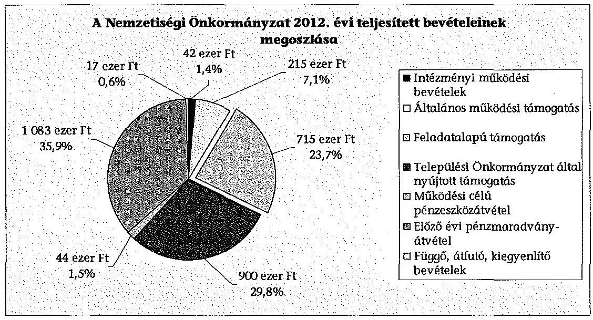
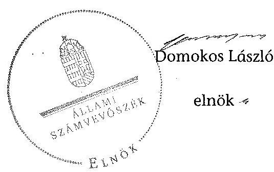

# ÁLLAMI   SZÁMVEVŐSZÉK 

## JELENTÉS

a helyi nemzetiségi önkormányzatok gazdálkodásának ellenőrzéséről
Budapest XXII. Kerületi Horvát Önkormányzat

---

# Állami Számvevőszék 

Iktatószám: V-0268-013/2014.
Témaszám: 1301
Vizsgálat-azonosító szám: V065285

## Az ellenőrzést felügyelte:

Horváth Balázs
felügyeleti vezető
Az ellenőrzést vezette és az ellenőrzés végrehajtásáért felelős:
Korsósné Vigh Andrea
ellenőrzésvezető
A számvevőszéki jelentést készítették és a jelentés összeállításában közreműködtek:

Keszthelyi Zoltán
számvevő tanácsos
Turai Erzsébet
számvevő
Az ellenőrzést végezte:
Keszthelyi Zoltán
számvevő tanácsos

A témához kapcsolódó eddig készített számvevőszéki jelentés:
Címe
sorszáma
Budapest Főváros XXII. kerület Budafok-Tétény Önkormányzata 0347
gazdálkodásának átfogó ellenőrzéséről

---

# TARTALOMJEGYZÉK 

BEVEZETÉS ..... 3
I. ÖSSZEGZŐ MEGÁLLAPÍTÁSOK, KÖVETKEZTETÉSEK, JAVASLATOK ..... 6
II. RÉSZLETES MEGÁLLAPÍTÁSOK ..... 12

1. A Nemzetiségi Önkormányzat és a Települési Önkormányzat együttműködésének szabályozása, a működési feltételek biztosítása ..... 12
2. A gazdálkodási feladatok ellátásának szabályszerűsége ..... 13
2.1. A költségvetésre és a zárszámadásra, valamint a kincstári adatszolgáltatás rendjére vonatkozó jogszabályi előírások betartása ..... 13
2.2. A Nemzetiségi Önkormányzat gazdálkodásának szabályozottsága ..... 13
2.3. Az operatív gazdálkodási jogkörök kialakítása, gyakorlása ..... 14
3. A Nemzetiségi Önkormányzattal összefüggő gazdálkodási feladatok belső ellenőrzése ..... 16
4. A feladatalapú támogatás felhasználásának, elszámolásának szabályszerűsége, a Nemzetiségi Önkormányzat feladatellátása ..... 16
MELLÉKLET
5. számú A Nemzetiségi Önkormányzat 2012. évi gazdálkodásának főbb adatai, mutatói
6. számú Tájékoztatás a polgármesternek küldött el nem fogadott észrevételről
FÜGGELÉKEK
7. számú Rövidítések jegyzéke
8. számú Értelmező szótár
9. számú A gazdálkodás értékelésének módszere

---

.

---

# JELENTÉS 

## a helyi nemzetiségi önkormányzatok gazdálkodásának ellenőrzéséről Budapest XXII. Kerületi Horvát Önkormányzat

## BEVEZETÉS

#### Abstract

A Nemzetiségi Önkormányzat az 1994. évben alakult, elnöke a 2002. évi helyhatósági választások óta látja el feladatát. A Nemzetiségi Önkormányzat intézményt, gazdasági társaságot és más szervezetet nem alapított, illetve ezek társulásában nem vesz részt. A négytagú Képviselő-testület munkája segítésére bizottságot nem hozott létre. A Nemzetiségi Önkormányzatnak a költségvetési beszámolója szerint a 2012. évben a módosított költségvetési bevételi és kiadási előirányzata 3000 ezer Ft, a teljesített költségvetési bevétel 2999 ezer Ft, a teljesített költségvetési kiadás 2031 ezer Ft volt. A 2012. évi gazdálkodási adatokat részletesen az 1. számú mellékletben mutatjuk be.

Az Alaptörvény XXIX. cikk (1) bekezdése szerint a Magyarországon élő nemzetiségek államalkotó tényezők. Minden, valamely nemzetiséghez tartozó magyar állampolgárnak joga van önazonossága szabad vállalásához és megőrzéséhez. A hazánkban élő nemzetiségek helyi (települési és területi), valamint országos önkormányzatokat hozhatnak létre. A helyi nemzetiségi önkormányzatok gazdálkodási feladatait jogszabályi előírás alapján a székhely szerinti helyi önkormányzat polgármesteri hivatala látja el.

A nemzetiségek helyzete, támogatása mind hazai, mind EU-s szinten kiemelt figyelmet kap napjainkban. A helyi nemzetiségi önkormányzatok gazdálkodására és támogatási rendszerére vonatkozó jogszabályok a 2010-2012. években jelentős változásokon mentek át. A települési és területi nemzetiségi önkormányzatok gazdálkodásának, a részükre juttatott költségvetési támogatások felhasználásának ellenőrzését az ÁSZ a 2012. évben sorozatjellegű ellenőrzés keretében indította el. A 2013. évi ellenőrzések e témacsoportos ellenőrzések folytatását jelentik, amelyet az ÁSZ 2014. első félévi ellenőrzési terve 12. témasorszámon tartalmaz.

Az ellenőrzés célja annak értékelése volt, hogy a Nemzetiségi Önkormányzat gazdálkodási kereteinek kialakítása, gazdálkodása és feladatellátása megfelelt-e a jogszabályoknak.

---

Ennek keretében értékeltük, hogy:

- a Nemzetiségi Önkormányzat és a Települési Önkormányzat együttműködésének szabályozása, a működési feltételek biztosítása megfelelt-e a jogszabályi előírásoknak;
- a felek együttműködése megfelelt-e a közöttük létrejött együttműködési megállapodásnak a gazdálkodási feladatok szabályszerű ellátása során, ennek keretében betartották-e a Nemzetiségi Önkormányzat gazdálkodásához kapcsolódóan a költségvetésre és zárszámadásra, a gazdálkodás szabályozására, az operatív gazdálkodási jogkörök gyakorlására vonatkozó jogszabályi előírásokat;
- a jegyző biztosította-e a Nemzetiségi Önkormányzat gazdálkodásának belső ellenőrzését;
- a Nemzetiségi Önkormányzat feladatalapú támogatásának felhasználása, a folyósított feladatalapú támogatással történő elszámolás az előírásoknak megfelelő volt-e;
- a Nemzetiségi Önkormányzat feladatellátása összhangban volt-e a vonatkozó jogszabályi előírásokkal.

Az ellenőrzés várható hasznosulását négy szinten tervezzük. A törvényalkotás számára összegzett tapasztalatok állnak rendelkezésre a nemzetiségi önkormányzatok testületi döntéseinek, gazdálkodásának és a feladatalapú támogatás felhasználásának szabályszerűségéről, amelynek alapján következtetést lehet levonni arra, hogy indokolt-e jogszabályi módosítás kezdeményezése. Az ellenőrzés az ellenőrzött számára visszajelzést ad a működésében fellépő hiányosságokról, javaslataival hozzájárul azok kiküszöböléséhez, amely csökkentheti a későbbi ellenőrzések gyakoriságát. Az ellenőrzés megállapításai és javaslatai tanulságul szolgálhatnak más nemzetiségi önkormányzatok, szervezetek számára a rendezett gazdálkodási keretek kialakításához. A társadalom számára jelzi, hogy közpénz nem maradhat ellenőrizetlenül, az ÁSZ értékteremtő rend kialakításához és megőrzéséhez hozzájáruló tevékenysége pozitív hatással lesz a szervezetről kialakított összkép formálásában. Az ÁSZ szervezetén belül lehetőség nyílik arra, hogy a megállapítások szintetizálásával az intézmény a hozzáadott értéket teremtő elemző tevékenységét és tanácsadó szerepét erősítse.

A helyi nemzetiségi önkormányzatok gazdálkodásának ellenőrzéséről szóló jelentés I. fejezetének összegző része az ellenőrzés céljára adott rövid, szintetizáló összefoglalót és következtetéseket tartalmazza a II. fejezet részletes megállapításain alapulóan. A jelentés intézkedést igénylő megállapításait és javaslatait az összegzőben foglaltak mellett - az ellenőrzés során feltárt, a jelentés II. fejezetében rögzített részletes megállapítások alapozzák meg, illetve támasztják alá.

---

Az ellenőrzés típusa: szabályszerűségi ellenőrzés
Az ellenőrzött időszak: 2012. január 1. - 2012. december 31. közötti időszak. Az ellenőrzés kiterjedt a Nemzetiségi Önkormányzatnak juttatott 2012. évi feladatalapú támogatás 2013. évben való elszámolására is.

Ellenőrzött szervezet: Budapest XXII. Kerületi Horvát Önkormányzat és a gazdálkodási feladatait ellátó Budafok-Tétény Budapest XXII. Kerületi Önkormányzata.

Az ellenőrzés végrehajtásának jogszabályi alapját az ÁSZ tv. 5. § (2)-(3) és (6) bekezdéseiben foglaltak képezik.

Az ellenőrzés szakmai módszertana az ÁSZ hivatalos honlapján (www.asz.hu) közzétett szakmai szabályokon alapult, amely a Legfőbb Ellenőrző Intézmények Nemzetközi Szervezete (INTOSAI) által kiadott nemzetközi standardok (ISSAI) figyelembevételével készült.

A helyi nemzetiségi önkormányzatok gazdálkodásának ellenőrzése során értékeltük a Települési Önkormányzat és a Nemzetiségi Önkormányzat együttműködésének, a gazdálkodás szabályozottságának és a pénzügyi folyamatokban kulcsszerepet betöltő belső kontrollok (teljesítésigazolás és érvényesítés) működésének megfelelőségét. A kulcskontrollokat a működési és felhalmozási célú támogatásértékű kiadásoknál, az államháztartáson kívülre teljesített működési és felhalmozási célú pénzeszköz átadásoknál, a dologi kiadásokkal kapcsolatos kifizetéseknél - véletlen mintavételi eljárást alkalmazva - ellenőriztük. Ellenőriztük, hogy a jegyző biztosította-e a Nemzetiségi Önkormányzat gazdálkodásának belső ellenőrzését. Értékeltük a feladatalapú támogatások felhasználásának, elszámolásának szabályszerűségét, a Nemzetiségi Önkormányzat feladatellátása és a jogszabályi előírások összhangját. A minősítési szempontokat a 3. számú függelék tartalmazza.

Az ellenőrzés lefolytatásához a Nemzetiségi Önkormányzat és a gazdálkodási feladatait ellátó Települési Önkormányzat tanúsítványok és a kapcsolódó, dokumentumjegyzékben megjelölt dokumentumok elektronikus úton történő megküldésével, rendelkezésre bocsátásával szolgáltatott adatokat. Az adatszolgáltatás kontrollálása és szükség szerinti javítása a helyszíni ellenőrzés keretében történt.

Az ÁSZ tv. 29. § (1) bekezdése szerint a jelentéstervezetet megküldtük észrevételezésre a polgármester és a Nemzetiségi Önkormányzat elnöke részére. A Nemzetiségi Önkormányzat elnöke az ÁSZ tv. 29. § (2) bekezdésében foglalt észrevételezési jogával nem élt, a jelentéstervezetre észrevételt nem tett. A polgármester határidőben megküldött észrevétele és tájékoztatása alapján a jelentést nem módosítottuk. Az el nem fogadott észrevétel indoklását a jelentés 2. számú melléklete tartalmazza.

---

# 1. ÖSSZEGZŐ MEGÁLLAPÍTÁSOK, KÖVETKEZTETÉSEK, JAVASLATOK 

A Nemzetiségi Önkormányzat és a Települési Önkormányzat együttműködésének szabályozása, a működési feltételek biztosítása megfelelt a jogszabályi előírásoknak. A Nemzetiségi Önkormányzat az ellenőrzött időszakban rendelkezett a Települési Önkormányzattal megkötött együttműködési megállapodással. A felek a 2011. évben jóváhagyott együttműködési megállapodásnak a Nek. 2 tv.-ben 2012. január 31-i határidőre előírt felülvizsgálatát nem végezték el, a 2012. június 1-jei határidőre előírt módosítási kötelezettségüknek eleget tettek. A 2012. december 31-én hatályos együttműködési megállapodásban az előírásoknak megfelelően rögzítették a Nemzetiségi Önkormányzat működési feltételeit és - a pénzkezelési szabályzat elkészítésére vonatkozó előírás kivételével - a gazdálkodási feladatai ellátásának szabályait. A Települési Önkormányzat a 2012. évben a Polgármesteri Hivatal útján biztosította a Nemzetiségi Önkormányzat működésének személyi és tárgyi feltételeit.

A Nemzetiségi Önkormányzat 2012. évi költségvetésének és zárszámadásának tartalma, jóváhagyása, valamint a kapcsolódó adatszolgáltatás megfelelt a jogszabályi előírásoknak. A Nemzetiségi Önkormányzat elnöke a jegyző által elkészített, 2012. évi költségvetési határozat tervezetét határidőben benyújtotta a Képviselő-testületnek, a jóváhagyott költségvetési határozat tartalma megfelelt a jogszabályi előírásoknak. A Képviselő-testület az előírt határidőig jóváhagyta a 2012. évi zárszámadási határozat tervezetét, amelynek tartalma megfelelő volt. A zárszámadási határozattervezet előterjesztésekor a Képviselő-testület részére tájékoztatásul nem mutatták be az Áht. ₂ előírásai ellenére a pénzeszközök változását. A zárszámadásban a Nemzetiségi Önkormányzat valamennyi bevételéről és kiadásáról elszámoltak, a költségvetéssel való összehasonlíthatóság biztosított volt.

A Nemzetiségi Önkormányzat gazdálkodásának szabályozottsága nem volt megfelelő. A Nemzetiségi Önkormányzat az ellenőrzött időszakban nem rendelkezett a Bkr.-ben előírt ellenőrzési nyomvonallal, a szabálytalanságok kezelésének eljárásrendjével, valamint a folyamatba épített, előzetes, utólagos és vezetői ellenőrzés szabályozással. A jegyző az Áht. ₂ és a Htv., a Nemzetiségi Önkormányzat elnöke az együttműködési megállapodás előírása ellenére a Számv. tv. szerinti pénzkezelési szabályzatot nem készítette el. A Számv. tv-ben előírt leltározási és leltárkészítési szabályzattal, eszközök és források értékelési szabályzatával, valamint számviteli politikával - a Polgármesteri Hivatal szabályzatai hatályának kiterjesztésével - rendelkezett. A Nemzetiségi Önkormányzat gazdálkodásával kapcsolatos munkakörökhöz tartozó feladat- és hatásköröket az ügyrend₁,₂-ben, a hatáskörök gyakorlásának módját, és az ezekre vonatkozó felelősségi szabályokat a polgármesteri hivatali SZMSZ₁,₂-ben, valamint a feladatokat ellátó köztisztviselők munkaköri leírásaiban rögzítették. A tervezéssel, gazdálkodással, az operatív gazdálkodási jogkörökkel kapcsolatos rendelkezéseket, kijelöléseket tartalmazó, Ávr. szerinti belső szabályozással - a kötelezettségvállalási szabályzattal₁,₂ - a Nemzetiségi Önkormányzat önállóan rendelkezett.

---

A Nemzetiségi Önkormányzat gazdálkodása tekintetében az operatív gazdálkodási jogkörök kialakítása 2012. március 31-ig részben volt megfelelő, ezt követően megfelelt a jogszabályi előírásoknak. A Nemzetiségi Önkormányzat elnöke által a kötelezettségvállalásra és az utalványozásra adott felhatalmazások, valamint a teljesítésigazoló személyek írásbeli kijelölései az ellenőrzött időszak egészében jogszerűek voltak. 2012. március 31-ig - az Ávr. előírásaival ellentétesen - a Nemzetiségi Önkormányzat elnöke jelölte ki írásban - a Polgármesteri Hivatal köztisztviselői közül - az érvényesítő személyeket, valamint a hatályos kötelezettségvállalási szabályzat₁-ben foglaltak szerint az ellenjegyzési feladatok ellátására a Képviselő-testület egyik tagját, aki az előírt szakképesítéssel nem rendelkezett. 2012. április 1-jétől a belső szabályozást - a jogszabályi előírásoknak megfelelően - módosították és a gazdasági vezető jelölte ki írásban az előírt képzettségi követelményeknek megfelelő személyeket a pénzügyi ellenjegyzés valamint az érvényesítési feladatok ellátására.

A Nemzetiségi Önkormányzatnál a 2012. évben a dologi kiadások teljesítése során a bizonylatok tesztelése alapján a teljesítésigazolás és az érvényesítés kulcskontrollok működésének megfelelősége gyenge volt, a hibák száma a lényegességi szintet, a kritikus hibahatárt elérte. A teljesítésigazoló egy esetben nem végezte el, továbbá - a kötelezettségvállalási szabályzat₂-ben előírt írásbeli kötelezettségvállalási dokumentum hiányában - nem szabályszerűen látta el az Ávr.-ben előírt feladatát, a kiadás jogossága, összegszerűsége és az ellenszolgáltatás teljesítésének ellenőrzését, igazolását. A teljesítésigazolások az Ávr.-ben előírtak ellenére nem tartalmazták az igazolás dátumát. Az érvényesítő nem az Ávr.-ben előírtak szerint végezte el ellenőrzési feladatát, a megelőző ügymenetben a gazdálkodási szabályok betartásának ellenőrzését. Az érvényesítést nem, illetve nem szabályszerűen végrehajtott teljesítésigazolás alapján végezte, nem észrevételezte, hogy
 az utalványokon nem tüntették fel a kötelezettségvállalás nyilvántartási számát, továbbá az utalványozás dátumát. Nem jelezte, hogy a százezer forintot el nem érő kötelezettségvállalásokat a nyilvántartásba nem vezették be, továbbá az érvényesítés az Ávr.-ben előírtak ellenére nem tartalmazta az érvényesítésre történő utalást és az érvényesítés dátumát.

A Nemzetiségi Önkormányzatnál a 2012. évi három legnagyobb összegű dologi kiadás teljesítésének egyedi értékelése alapján a teljesítésigazolás és az érvényesítés kontroll mindhárom kifizetésnél nem megfelelően működött. A teljesítésigazoló az Ávr.-ben foglalt ellenőrzési és igazolási feladatát egy esetben az előzetes írásbeli kötelezettségvállalási dokumentum, egy esetben a belső szabályzat szerinti írásbeli kötelezettségvállalási dokumentum hiányában nem szabályszerűen látta el. Az érvényesítő nem szabályszerűen végrehajtott teljesítésigazolás alapján végezte az érvényesítést, valamint nem tett eleget az Ávr.-ben előírt jelzési kötelezettségének, mert nem jelezte az utalványozó felé, hogy egy kifizetésnél ellenjegyzés nélkül történt kötelezettségvállalás, továbbá, hogy az utalványok nem tartalmazták az utalványozás dátumát és a kötelezettségvállalás nyilvántartási számát. Az érvényesítés az Ávr.-ben előírtak ellenére két esetben nem tartalmazta az érvényesítés dátumát, az érvényesítésre történő utalás mindhárom kiadás érvényesítésénél elmaradt. A Nemzetiségi Önkormányzatnál a kulcskontrollok 2012. évi működésében feltárt hiányosságokkal összefüggésben az ellenőrzés - a rendelkezésre bocsátott dokumentumok alapján - jogosulatlan kifizetést nem állapított meg, azonban a kulcskontrollok

---

működésében feltárt hiányosságok miatt nem biztosított a hibák megelőzése, feltárása és kijavítása.

A jegyző a 2012. évben nem biztosította a Nemzetiségi Önkormányzat gazdálkodásával összefüggő végrehajtási feladatok belső ellenőrzését. A Polgármesteri Hivatal 2012. évre vonatkozó éves ellenőrzési tervét megalapozó, a Ber.-ben előírt kockázatelemzés nem terjedt ki a Nemzetiségi Önkormányzat gazdálkodásával összefüggő végrehajtási feladatokra, azok tekintetében a 2012. évben belső ellenőrzési feladatot nem terveztek és nem végeztek.

A Nemzetiségi Önkormányzat a 2011. évben 854 ezer Ft feladatalapú támogatásban részesült. Ennek teljes összege 2012. június 30-ig kötelezettségvállalással nem terhelt maradvány volt. A 2012. évben a Nemzetiségi Önkormányzat 715 ezer Ft feladatalapú támogatást kapott, amelyből 334 ezer Ft-ot a folyósítás évében a támogatási célokkal összhangban felhasznált. A 2011. évi feladatalapú támogatás 2012. június 30-ig fel nem használt, kötelezettségvállalással nem terhelt maradványa 854 ezer Ft, a 2012. évi feladatalapú támogatás 2012. december 31-ig fel nem használt és kötelezettségvállalással nem terhelt maradványa 381 ezer Ft volt, amelyekről - mint meghatározott célra fel nem használt támogatás - az Áht. ${ }_{2}$ előírása ellenére a Nemzetiségi Önkormányzat haladéktalanul nem mondott le és nem fizette vissza a központi költségvetés javára. A 2011. és 2012. évi feladatalapú támogatás elszámolása a támogatási kormányrendelet ${ }_{1,2}$ előírása alapján az Áht. ${ }_{1,2}$ rendelkezése ellenére nem történt meg. A támogatás felhasználását, elszámolását az ellenőrzésre jogosult szervek nem ellenőrizték.

A Nemzetiségi Önkormányzat feladatellátásának tárgya - mind a kötelező, mind az önként vállalt feladatok tekintetében - összhangban volt a Nek. ${ }_{2}$ tv. előírásaival. Kötelező közfeladatai keretében a képviselt közösség kulturális autonómiájának megerősítése érdekében a közösség önszerveződésének szervezési és működtetési feladatainak ellátását támogatta, a nemzetiségi közösséghez kötődő kulturális javak megőrzése érdekében szükséges intézkedést kezdeményezett, valamint a nemzetiségi nyelven folyó nevelésre és oktatásra irányuló igények felmérését látta el. Önként vállalt közfeladatot a helyi írott és elektronikus sajtó, a hagyományápolás és közművelődés terén végzett.

Az ÁSZ tv. 33. § (1) bekezdésében foglaltak értelmében az ellenőrzött szervezet vezetője köteles a jelentésben foglalt megállapításokhoz kapcsolódó intézkedési tervet összeállítani, és azt a jelentés kézhezvételétől számított 30 napon belül az ÁSZ részére megküldeni. Amennyiben az intézkedési tervet határidőre nem küldi meg a szervezet, vagy az nem elfogadható, az ÁSZ elnöke az ÁSZ tv. 33. § (3) bekezdés a)-b) pontjaiban foglaltakat érvényesítheti.

A helyszíni ellenőrzés megállapításainak hasznosítása mellett javasoljuk:

# a jegyzőnek 

1. az együttműködés szabályozásával kapcsolatban

A 2012. január 1-jén hatályos, 2011. évben megkötött együttműködési megállapodást a Nek. ${ }_{2}$ tv. 80. § (2) bekezdésében előírtak ellenére 2012. január 31-éig nem vizsgálták felül.

---

Javaslat
Biztosítsa a jövőben az együttműködési megállapodás évenkénti felülvizsgálata során a Nek. ${ }_{2}$ tv. 80. § (2) bekezdésében előírt határidő betartását.
2. a zárszámadás szabályszerűségével kapcsolatban

A zárszámadási határozattervezet előterjesztésekor - a jegyző általi elkészítés hiányában - az Áht. 2 91. § (2) bekezdés a) pontjában foglaltak ellenére a pénzeszközök változásáról szóló kimutatást a Képviselő-testület tájékoztatására nem mutatták be.

Javaslat
Gondoskodjon a jövőben arról, hogy a zárszámadási határozattervezet előterjesztésekor a Képviselő-testület részére tájékoztatásul bemutatásra kerüljön az Áht. 2 91. § (2) bekezdés a) pontjában foglalt előírásnak megfelelően a pénzeszközök változása.
3. A Nemzetiségi Önkormányzat nem rendelkezett a Számv. tv. 14. § (5) bekezdés d) pontja szerinti pénzkezelési szabályzattal, amelynek elkészítése az Áht. 2 27. § (2) bekezdésében és a Htv. 140. § (1) bekezdés c) pontjában foglaltak alapján a jegyző, a 2012. júniustól hatályos együttműködési megállapodás értelmében a Nemzetiségi Önkormányzat elnökének feladata.

Javaslat
Készítse el a Számv. tv. 14. § (5) bekezdés d) pontja szerinti pénzkezelési szabályzatot, a Nemzetiségi Önkormányzat elnökének együttműködésével.
4. a kulcskontrollok működésével kapcsolatban

A teljesítésigazoló nem, vagy a belső szabályzatban előírt kötelezettségvállalási dokumentum hiányában nem szabályszerűen látta el az Ávr. 57. § (1) és (3) bekezdéseiben foglalt feladatát, mivel nem ellenőrizte a kiadás teljesítésének jogosságát, összegszerűségét, az ellenszolgáltatások teljesítését, valamint a teljesítésigazolások nem tartalmazták az igazolás dátumát. Az érvényesítő nem az Ávr. 58. § (1)-(2) bekezdéseiben előírtak szerint végezte el az összegszerűség, a fedezet megléte, továbbá a megelőző ügymenetben a gazdálkodási szabályok - ennek keretében az Ávr. előírásai - betartásának ellenőrzését. Nem jelezte az utalványozónak az írásbeli kötelezettségvállalási dokumentum hiányát, a kötelezettségvállalási nyilvántartás nem megfelelő vezetését, az utalványok tartalmi hiányosságait. Az Ávr. 58. § (3) bekezdésében előírtak ellenére a kiadások érvényesítése során az érvényesítésre utaló megjelölés hiányzott.

Javaslat
Az operatív gazdálkodás működési hibáinak megelőzése, feltárása és kijavítása érdekében gondoskodjon arról, hogy:
a) a teljesítésigazolást minden esetben az Ávr. 57. § (1) és (3) bekezdéseiben előírtaknak megfelelően végezzék;

---

b) az érvényesítő minden esetben az Ávr. 58. § (1)-(3) bekezdéseiben előírtak szerint tegyen eleget az ellenőrzési és jelzési kötelezettségének.
5. a feladatalapú támogatás elszámolásával kapcsolatban

A 2011. és 2012. évi feladatalapú támogatás elszámolása a támogatási kormányrendelet ${ }_{1} 7 . \S$ (2) bekezdésében, valamint a támogatási kormányrendelet ${ }_{2} 8 . \S$ (5) bekezdésében hivatkozott „a helyi önkormányzatok elszámolási és ellenőrzési rendjére vonatkozó" jogszabályok rendelkezései alkalmazása előírása alapján az Áht. ${ }_{1} 64 . \S$ (7) bekezdésében és az Áht. ${ }_{2} 57 . \S$ (3) bekezdésében foglaltak ellenére nem történt meg.

Javaslat
Gondoskodjon az Áht. ${ }_{2} 27 . \S$ (2) bekezdésben meghatározott feladatkörében a Nemzetiségi Önkormányzat által igénybe vett feladatalapú támogatás rendeltetésszerű felhasználásáról szóló elszámolásának elkészítéséről az Áht. ${ }_{2} 53 . \S$ (1) bekezdése szerinti beszámolási kötelezettség teljesítéséhez.

# a Nemzetiségi Önkormányzat elnökének 

1. A Nemzetiségi Önkormányzat elnöke a zárszámadási határozattervezet előterjesztésekor az Áht. ${ }_{2} 91 . \S$ (2) bekezdés a) pontjában előírtak ellenére - a jegyző általi elkészítés hiányában - a Képviselő-testület tájékoztatására nem mutatta be a pénzeszközök változását.

Javaslat
A jövőben a zárszámadási határozattervezet előterjesztésekor terjessze a Képviselőtestület elé tájékoztatásul a jegyző által elkészített, az Áht. ${ }_{2} 91 . \S$ (2) bekezdés a) pontjában előírt, a pénzeszközök változásáról szóló kimutatást.
2. A Nemzetiségi Önkormányzat nem rendelkezett a Számv. tv. 14. § (5) bekezdés d) pontja szerinti pénzkezelési szabályzattal, amelynek elkészítése az Áht. ${ }_{2} 27 . \S$ (2) bekezdésében és a Htv. 140. § (1) bekezdés c) pontjában foglaltak alapján a jegyző, a 2012. júniustól hatályos együttműködési megállapodás III. 3.1. pontja értelmében a Nemzetiségi Önkormányzat elnökének feladata.

Javaslat
Működjön közre a 2012. júniustól hatályos együttműködési megállapodás III. 3.1. pontja alapján, a Számv. tv. 14. § (5) bekezdés d) pontja szerinti pénzkezelési szabályzat jegyző általi elkészítésében.
3. A 2011. és 2012. évi feladatalapú támogatás elszámolása a támogatási kormányrendelet ${ }_{1} 7 . \S$ (2) bekezdésében, valamint a támogatási kormányrendelet ${ }_{2} 8 . \S$ (5) bekezdésében hivatkozott „a helyi önkormányzatok elszámolási és ellenőrzési rendjére vonatkozó" jogszabályok rendelkezései alkalmazása előírása alapján az Áht. ${ }_{1} 64 . \S$ (7) bekezdése, és az Áht. ${ }_{2} 57 . \S$ (3) bekezdésében foglaltak ellenére nem történt meg.

---

Javaslat
Terjessze a Képviselő-testület elé jóváhagyásra az Áht. 2 53. § (1) bekezdése szerinti beszámolási kötelezettség teljesítéséhez a Nemzetiségi Önkormányzat által igénybe vett 2011. és 2012. évi feladatalapú támogatás rendeltetésszerű felhasználásáról szóló elszámolást.
4. A Nemzetiségi Önkormányzat nem tett eleget az Áht. 2 57. § (2) bekezdésében előírtaknak, mert a meghatározott célra fel nem használt, kötelezettségvállalással nem terhelt 2011. évi feladatalapú támogatás 2012. június 30-ai 854 ezer Ft és a 2012. évi feladatalapú támogatás 2012. december 31-ei 381 ezer Ft összegű maradványáról nem mondott le és nem fizette vissza azokat a központi költségvetés javára.

Javaslat
Terjessze a Képviselő-testület elé jóváhagyásra az Áht. 2 57/A. § (1) bekezdés előírásának megfelelően a 2011. és 2012. évi feladatalapú támogatások kötelezettségvállalással nem terhelt maradványairól történő lemondást és intézkedjen a maradványok összegének visszafizetéséről a központi költségvetés javára.

---

# II. RÉSZLETES MEGÁLLAPÍTÁSOK 

## 1. A Nemzetiségi Önkormányzat és a Települési Önkormányzat együttműködésének szabályozása, a Működési feltételek biztosítása

A Nemzetiségi Önkormányzat és a Települési Önkormányzat együttműködésének szabályozása megfelelt a jogszabályi előírásoknak.

A Nemzetiségi Önkormányzat a 2012. év folyamán rendelkezett hatályban lévő, a Települési Önkormányzattal kötött együttműködési megállapodással ${ }^{1}$. A 2012. január 1-jén hatályos, 2011. évben megkötött együttműködési megállapodást a felek a Nek. 2 tv. 80. § (2) bekezdésében előírtak ellenére 2012. január 31-éig nem vizsgálták felül. A Nek. 2 tv. 159. § (3) bekezdésében előírt módosítást határidőn belül jóváhagyták.

A 2012. december 31-én hatályos együttműködési megállapodásban a Nemzetiségi Önkormányzat működési feltételeit a jogszabályi előírásoknak megfelelően szabályozták, azokat - a Nek. 2 tv.-ben előírt határidőben - a Nemzetiségi Önkormányzat SZMSZ-ében rögzítették². Az együttműködési megállapodás tartalmazta a Nemzetiségi Önkormányzat gazdálkodási feladatai ellátásának szabályait, amelyek - a pénzkezelési szabályzat elkészítésére vonatkozó előírás kivételével - megfelelőek voltak.

Az együttműködési megállapodás III. 3.1. pontja szerint „A pénzkezelés rendjét az elnök saját hatáskörben szabályozza a vonatkozó jogszabályok betartásával."

A Települési Önkormányzat a Nemzetiségi Önkormányzat 2012. évi működésének - Nek. 2 tv. 159. § (3) bekezdésében foglalt átmeneti rendelkezés alapján a Nek. 1 tv. 27. § (2)-(3) bekezdéseiben előírt - személyi és tárgyi feltételeit a Polgármesteri Hivatal útján biztosította.

[^0]
[^0]:    ${ }^{1}$ 2012. május 23-ig hatályos együttműködési megállapodást a Települési Önkormányzat Képviselő-testülete a 329/2011. (XII. 15.) számú, a Képviselő-testület a 63/2011. (XII. 28.) számú határozatával hagyta jóvá.
    A 2012.
 május 24-étől hatályos együttműködési megállapodást a Települési Önkormányzat Képviselő-testülete a 102/2012. (V. 17.) számú, a Képviselő-testület a 15/2012. (V. 21.) számú határozatával fogadta el.
    ${ }^{2}$ Jóváhagyta a Képviselő-testület 16/2012. (V. 21.) számú határozata.

---

# 2. A GAZDÁLKODÁSI FELADATOK ELLÁTÁSÁNAK SZABÁLYSZERŰSÉGE 

### 2.1. A költségvetésre és a zárszámadásra, valamint a kincstári adatszolgáltatás rendjére vonatkozó jogszabályi előírások betartása

A Nemzetiségi Önkormányzat 2012. évi költségvetésének és zárszámadásának tartalma, jóváhagyása, valamint a kapcsolódó adatszolgáltatás megfelelt a jogszabályi előírásoknak.

A Nemzetiségi Önkormányzat elnöke a jegyző által elkészített 2012. évi költségvetési határozat tervezetét határidőben benyújtotta a Képviselő-testületnek, a jóváhagyott költségvetés ${ }^{3}$ tartalma megfelelt a jogszabályi előírásoknak. A jegyző a 2012. évi költségvetéshez kapcsolódó, a Nemzetiségi Önkormányzatra vonatkozó kincstári adatszolgáltatási kötelezettségének egy kivétellel az előírásoknak megfelelően eleget tett. A Polgármesteri Hivatal az I. negyedéves időközi költségvetési jelentést az Ávr. 169. § (2) bekezdésében meghatározott határidőn túl küldte meg a Kincstár részére.

A jegyző által elkészített 2012. évi zárszámadási határozat tervezetét a Képviselő-testület az előírt határidőn belül jóváhagyta. Az elfogadott zárszámadási határozat ${ }^{4}$ tartalma és részletezettsége a jogszabályi előírásoknak megfelelő volt. A zárszámadási határozat tervezetének előterjesztésekor az Áht. ${ }_{2}$ 91. § (2)-(3) bekezdéseiben meghatározott mérlegeket, kimutatásokat a Képviselő-testület tájékoztatására bemutatták, kivéve a pénzeszközök változásáról szóló kimutatást, amelyet a jegyző nem készített el. A zárszámadásról szóló határozatban a Nemzetiségi Önkormányzat valamennyi bevételéről és kiadásáról elszámoltak, biztosították az elfogadott költségvetéssel való összehasonlíthatóságot.

### 2.2. A Nemzetiségi Önkormányzat gazdálkodásának szabályozottsága

A Nemzetiségi Önkormányzat gazdálkodásának szabályozottsága nem volt megfelelő.

A jegyző a Nemzetiségi Önkormányzat gazdálkodását hiányosan szabályozta. A Nemzetiségi Önkormányzat az ellenőrzött időszakban nem rendelkezett a Bkr. 6. § (3) és (4) bekezdéseiben előírt ellenőrzési nyomvonallal és szabálytalanságok kezelésének eljárásrendjével, a Bkr. 8. § (2) bekezdése szerinti folyamatba épített előzetes, utólagos és vezetői ellenőrzés szabályozással, továbbá a Számv. tv. 161. § (1) bekezdésében előírt számlarenddel. A 24/2013. számú polgármesteri-jegyzői együttes intézkedés a Polgármesteri Hivatal fenti szabályzatainak a hatályát 2013. október 18-tól kiterjesztette a Nemzetiségi Önkormányzat gazdálkodási feladataira.

[^0]
[^0]:    ${ }^{3}$ A Képviselő-testület 6/2012. (II. 13.) számú határozata a Nemzetiségi Önkormányzat 2012. évi költségvetéséről.
    ${ }^{4}$ A Képviselő-testület 18/2013. (IV. 29.) számú határozata a Nemzetiségi Önkormányzat 2012. évi zárszámadásáról.

---

A Nemzetiségi Önkormányzat nem rendelkezett a Számv. tv. 14. § (5) bekezdés d) pontja szerinti pénzkezelési szabályzattal, amelynek elkészítése az Áht. ${ }_{2}$ 27. § (2) bekezdésében és a Htv. 140. § (1) bekezdés c) pontjában foglaltak alapján a jegyző, a 2012. júniustól hatályos együttműködési megállapodás értelmében a Nemzetiségi Önkormányzat elnökének feladata.

A Számv. tv.-ben előírt leltározási és leltárkészítési szabályzattal, eszközök és források értékelési szabályzatával, valamint számviteli politikával ${ }^{5}$ a Nemzetiségi Önkormányzat - a Polgármesteri Hivatal szabályzatai hatályának kiterjesztésével - rendelkezett.

A Nemzetiségi Önkormányzat gazdálkodásával kapcsolatos munkakörökhöz tartozó feladat- és hatásköröket az ügyrend ${ }_{1,2}$-ben ${ }^{6}$, a hatáskörök gyakorlásának módját és az ezekre vonatkozó felelősségi szabályokat a polgármesteri hivatali SZMSZ${ }_{1,2}$-ben, valamint a feladatokat ellátó köztisztviselők munkaköri leírásaiban rögzítették. A helyettesítés rendjét a polgármesteri hivatali SZMSZ${ }_{1,2}$-ben meghatározták.

A tervezéssel, gazdálkodással, az operatív gazdálkodási jogkörökkel kapcsolatos rendelkezéseket, kijelöléseket tartalmazó, Ávr. szerinti belső szabályozással - a kötelezettségvállalási szabályzat${ }_{1,2}$-vel - a Nemzetiségi Önkormányzat önállóan rendelkezett.

# 2.3. Az operatív gazdálkodási jogkörök kialakítása, gyakorlása 

A Nemzetiségi Önkormányzat gazdálkodása tekintetében az operatív gazdálkodási jogkörök kialakítása 2012. március 31-ig részben volt megfelelő, ezt követően megfelelt a jogszabályi előírásoknak.

Az ellenőrzött időszak egészében a kötelezettségvállalási szabályzat${ }_{1,2}$-ben a kötelezettségvállalásra és az utalványozásra adott felhatalmazások, valamint a teljesítésigazoló személyek írásbeli kijelölése a jogszabályi előírásokkal összhangban történtek. A Nemzetiségi Önkormányzat elnöke az Ávr.-ben foglalt előírások alapján írásban felhatalmazott más képviselőt a kötelezettségvállalás és utalványozás gyakorlására, továbbá - mint kötelezettségvállaló - gondoskodott a teljesítésigazoló személyek írásbeli kijelöléséről.

Az ellenőrzött időszakban a gazdasági szervezettel rendelkező Polgármesteri Hivatalban a Nemzetiségi Önkormányzat kifizetései tekintetében az Ávr. előírása szerint a gazdasági vezető volt jogosult a pénzügyi ellenjegyzés és az érvényesítés gyakorlására, illetve e jogköröket ellátó személyeknek - a Polgármesteri Hivatal állományába tartozó, az előírt képzettségi követelményeknek megfelelő köztisztviselők közül történő - kijelölésére.

- 2012. március 31-ig - az Ávr. 55. § (2) bekezdés g) pontja és az Ávr. 58. § (4) bekezdése előírásával ellentétesen - a Nemzetiségi Önkormányzat elnöke

[^0]
[^0]:    ${ }^{5}$ A Számv. tv. 14. § (5) bekezdés d) pontja szerinti pénzkezelési szabályzat kivételével.
    ${ }^{6}$ Az ügyrend ${ }_{1}$ és ügyrend ${ }_{2}$ 5. számú mellékletei tartalmazzák.

---

jelölte ki írásban - a Polgármesteri Hivatal köztisztviselői közül - az érvényesítő személyeket, valamint a hatályos kötelezettségvállalási szabályzat${ }_{1}$-ben foglaltak szerint az ellenjegyzési feladatok ellátására a Képviselő-testület egyik tagját, aki az előírt szakképesítéssel nem rendelkezett.

- 2012. április 1-jétől a belső szabályozást - a jogszabályi előírásoknak megfelelően - módosították ${ }^{7}$, és a gazdasági vezető jelölte ki írásban az előírt képzettségi követelményeknek megfelelő személyeket a pénzügyi ellenjegyzés, valamint az érvényesítés ellátására.

A Nemzetiségi Önkormányzatnál a 2012. évben a dologi kiadások teljesítése során - a bizonylatok tesztelése alapján - a teljesítésigazolás és az érvényesítés kulcskontrollok működésének megfelelősége gyenge volt. A hibák száma a lényegességi szintet, a kritikus hibahatárt elérte, mert:

- a teljesítésigazoló egy kiadás esetében nem végezte el a teljesítés igazolását, további négy kiadás kifizetését megelőzően pedig a kötelezettségvállalási szabályzat${ }_{2}$-ben előírt írásbeli kötelezettségvállalási dokumentum hiányában nem szabályszerűen látta el az Ávr. 57. § (1) bekezdésben foglalt feladatát, a kiadások teljesítésének jogosságát, összegszerűségét, valamint az ellenszolgáltatás teljesítésének ellenőrzését, igazolását, továbbá az Ávr. 57. § (3) bekezdésben előírtak ellenére a teljesítésigazolások nem tartalmazták az igazolás dátumát;
- az érvényesítő nem az Ávr. 58. § (1)-(2) bekezdésében előírtak szerint végezte el ellenőrzési és jelzési feladatát, írásbeli kötelezettségvállalási dokumentum hiányában az összegszerűség, a fedezet megléte, továbbá a megelőző ügymenetben a gazdálkodási szabályok - ennek keretében az Ávr. előírásai betartásának ellenőrzését. Nem kifogásolta az összegszerűség ellenőrzéséhez szükséges - a kötelezettségvállalási szabályzat${ }_{2}$-ben előírt - írásbeli kötelezettségvállalási dokumentum hiányát. Nem jelezte az utalványozónak, hogy a Nemzetiségi Önkormányzat kötelezettségvállalási nyilvántartásába az Ávr. 56. § (1) bekezdésben előírtak ellenére a százezer forintot el nem érő kiadásokat nem vezették be, az utalványok az Ávr. 59. § (3) bekezdés f)g) pontjaiban előírtak ellenére nem tartalmazták a kötelezettségvállalás nyilvántartási számát, valamint az utalványozás dátumát. Az érvényesítés az érvényesítésre utaló megjelölés és az érvényesítés dátumának feltüntetése hiányában - nem az Ávr. 58. § (3) bekezdésében előírt módon történt.

A Nemzetiségi Önkormányzatnál a 2012. évi három legnagyobb összegű dologi kiadás teljesítése bizonylatainak egyedi értékelése alapján a teljesítésigazolás és az érvényesítés kulcskontrollok nem működtek megfelelően. A teljesítésigazoló az Ávr. 57. § (1) és (3) bekezdésében foglalt ellenőrzési és igazolási feladatát egy esetben előzetes írásbeli kötelezettségvállalási dokumentum, egy esetben a kötelezettségvállalási szabályzat${ }_{2}$-ben előírt írásbeli kötelezettségvállalási dokumentum hiányában nem szabályszerűen látta el, továbbá a teljesítésigazolás a három kiadás egyikében sem tartalmazta a teljesítésigazolás dátumát. Az érvényesítő nem szabályszerűen végezte el az Ávr. 58. § (1) és (2) bekezdésében előírt ellenőrzési és jelzési feladatát, mert nem je-

[^0]
[^0]:    ${ }^{7}$ A kötelezettségvállalási szabályzat${ }_{2}$ tartalmazza.

---

lezte az utalványozónak, hogy egy kiadásra az Áht. ${ }_{2}$ 37. § (1) bekezdésben előírtak ellenére ellenjegyzés nélkül vállaltak kötelezettséget, továbbá a kifizetések utalványai az Ávr. 59. § (3) bekezdés f) és g) pontjaiban előírtak ellenére nem tartalmazták a kötelezettségvállalás nyilvántartási számát és az utalványozás dátumát. Az Ávr. 58. § (3) bekezdésben előírtak ellenére az érvényesítések nem tartalmazták az érvényesítésre utaló megjelölést, továbbá két kiadásnál az érvényesítés dátumát sem.

Működési és felhalmozási célú támogatásértékű kiadás, valamint államháztartáson kívülre teljesített működési és felhalmozási célú pénzeszközátadás nem történt.

A Nemzetiségi Önkormányzatnál a kulcskontrollok 2012. évi működésében feltárt hiányosságokkal összefüggésben az ellenőrzés - a rendelkezésre bocsátott dokumentumok alapján - jogosulatlan kifizetést nem állapított meg, azonban a kulcskontrollok működésében feltárt hiányosságok miatt nem biztosított a hibák megelőzése, feltárása és kijavítása.

# 3. A Nemzetiségi ÖNKORMÁNYZATTAL ÖSSZEFÜGGŐ GAZDÁLKODÁSI FELADATOK BELSŐ ELLENŐRZÉSE 

A jegyző a 2012. évben nem biztosította a Nemzetiségi Önkormányzat gazdálkodásával összefüggő végrehajtási feladatok belső ellenőrzését. A Polgármesteri Hivatal 2012. évre vonatkozó éves ellenőrzési tervét megalapozó, a Ber. 21. § (2) bekezdésében előírt kockázatelemzés nem terjedt ki a Nemzetiségi Önkormányzat gazdálkodásával összefüggő végrehajtási feladatokra, azok tekintetében a 2012. évben belső ellenőrzési feladatot nem terveztek és nem végeztek.

A 2012-ben hatályos együttműködési megállapodások nem tértek ki a Nemzetiségi Önkormányzat gazdálkodásának végrehajtásával összefüggő belső ellenőrzési feladatok ellátására.

Az ellenőrzéshez szolgáltatott adatok alapján a 2012. évben a Kormányhivatal a Nemzetiségi Önkormányzatot illetően nem élt törvényességi felügyeleti eszközökkel.

## 4. A feladatalapú támogatás felhasználásának, elszámolásának szabályszerűsége, a Nemzetiségi Önkormányzat FELADATELLÁTÁSA

A 2011. évben a Nemzetiségi Önkormányzat 854 ezer Ft feladatalapú támogatásban részesült. A 2011. évi feladatalapú támogatás teljes, 854 ezer Ft összege 2012. június 30-ig fel nem használt kötelezettségvállalással nem terhelt maradvány volt, mely a támogatási kormányrendelet; 7. § (4) bekezdés előírása alapján, határidőn túl jogszerűen nem használható fel.

---

A támogatási kormányrendelet ${ }_{1}$ 7. § (4) bekezdésének előírása szerint a „feladatarányos támogatás tárgyévben fel nem használt (kötelezettségvállalással nem terhelt) maradványa a következő év június 30-áig kötelezettségvállalással terhelhető".

A Nemzetiségi Önkormányzat a 2012. évben 715 ezer Ft feladatalapú támogatásban részesült, amelynek az összes bevételhez viszonyított részarányát a következő ábra szemlélteti.

A Képviselő-testület a feladatalapú támogatás összegével módosította a 2012. évi költségvetés dologi kiadásainak ${ }^{8}$ előirányzatát, a támogatás konkrét felhasználási céljait nem határozták meg.

A Nemzetiségi Önkormányzat a 2012. évi feladatalapú támogatásából a támogatási célnak megfelelően a folyósítás évében felhasznált 334 ezer Ft-ot. A 2012. évi támogatás 2012. december 31-ig kötelezettségvállalással nem terhelt maradványa - az ellenőrzött tanúsítványi adatok alapján 381 ezer Ft volt, amely a támogatási kormányrendelet ${ }_{2}$ 7. § előírása alapján határidőt követően jogszerűen nem használható fel.

A támogatási kormányrendelet ${ }_{2}$ 7. § előírása szerint a „feladatarányos támogatás tárgyévben fel nem használt, de még a tárgyévben kötelezettségvállalással terhelt maradványa tárgyévet követően is felhasználható".

A Nemzetiségi Önkormányzat nem tett eleget az Áht. ${ }_{2}$ 57. § (2) bekezdésében előírtaknak azáltal, hogy a meghatározott célra fel nem használt, 2011. évi feladatalapú támogatás 854 ezer Ft összegű maradványáról, továbbá a 2012. évi feladatalapú támogatás 381 ezer Ft összegű maradványáról haladéktalanul nem mondott le, és nem fizette vissza azt
 a központi költségvetés javára.

[^0]
[^0]:    ${ }^{8}$ A Képviselő-testület a feladatalapú támogatás összegével a 38/2012. (XI. 6.) számú határozatával növelte meg a kiadási és bevételi előirányzatait.

---

A 2011. és 2012. évi feladatalapú támogatás elszámolása a támogatási kormányrendelet ${ }_{1}$ 7. § (2) bekezdésében, valamint a támogatási kormányrendelet ${ }_{2}$ 8. § (5) bekezdésében hivatkozott „a helyi önkormányzatok elszámolási és ellenőrzési rendjére vonatkozó" jogszabályok rendelkezései alkalmazásának előírása alapján az Áht. ${ }_{1}$ 64. § (7) bekezdése és az Áht. ${ }_{2}$ 57. § (3) bekezdése ellenére, és figyelmen kívül hagyva az Áht. ${ }_{2}$ 27. § (2) bekezdésében előírtakat, nem történt meg. A feladatalapú támogatások felhasználását, elszámolását az ellenőrzésre jogosult szervek nem ellenőrizték.

A Nemzetiségi Önkormányzat feladatellátásának tárgya a 2012. évben összhangban volt a Nek. ${ }_{2}$ tv. előírásaival. A Nek. ${ }_{2}$ tv. 115. § f), g) és i) pontjai szerinti kötelező közfeladatot látott el a képviselt közösség kulturális autonómiájának megerősítése érdekében a közösség önszerveződésének szervezési és működtetési feladatok ellátásának segítésével, a nemzetiségi közösséghez kötődő kulturális javak megőrzése érdekében szükséges intézkedést kezdeményezett, valamint a nemzetiségi nyelven folyó nevelésre és oktatásra irányuló igények felmérését látta el. A Nemzetiségi Önkormányzat a Nek. ${ }_{2}$ tv. 116. § (2) bekezdés előírásával összhangban végzett önként vállalt közfeladatot a helyi írott és elektronikus sajtó, a hagyományápolás és közművelődés területén.

Budapest, 2014. 177. hónap 14. nap

|  |  |
| :-- | :-- |
| Melléklet: | 2 db |
| Függelék: | 3 db |

---

# A Nemzetiségi Önkormányzat 2012. évi gazdálkodásának főbb adatai, mutatói

A) Bevételek

|  Megnevezés | Eredeti előirányzat | Módosított
ezer Ft | Teljesítés |   |
| --- | --- | --- | --- | --- |
|   |  |  |  | megoszlás  |
|  Intézményi működési bevételek | 0 | 42 | 42 | $1,4 \%$  |
|  Általános működési támogatás | 215 | 215 | 215 | $7,1 \%$  |
|  Feladatalapú támogatás | 0 | 715 | 715 | $23,7 \%$  |
|  Települési Önkormányzat által nyújtott támogatás | 0 | 900 | 900 | $29,8 \%$  |
|  Működési célú pénzeszközátvétel | 0 | 44 | 44 | $1,5 \%$  |
|  Előző évi pénzmaradvány-átvétel | 0 | 1084 | 1083 | $35,9 \%$  |
|  Működési költségvetés bevételei | 215 | 3000 | 2999 | $99,4 \%$  |
|  Költségvetési bevételek összesen | 215 | 3000 | 2999 | $99,4 \%$  |
|  Függő, átfutó, kiegyenlítő bevételek | 0 | 0 | 17 | $0,6 \%$  |
|  Bevételek mindösszesen | 215 | 3000 | 3016 | $100,0 \%$  |

B) Kiadások

|  Megnevezés | Eredeti előirányzat | Módosított
ezer Ft | Teljesítés |   |
| --- | --- | --- | --- | --- |
|   |  |  |  | megoszlás  |
|  Munkaadókat terhelő járulékok és szociális hozzájárulási adó összesen | 0 | 52 | 51 | $2,5 \%$  |
|  Dologi kiadások | 215 | 2676 | 1708 | $84,1 \%$  |
|  Működési kiadások összesen | 215 | 2728 | 1759 | $86,6 \%$  |
|  Felhalmozási kiadások összesen | 0 | 272 | 272 | $13,4 \%$  |
|  Költségvetési kiadások összesen | 215 | 3000 | 2031 | $100,0 \%$  |
|  Kiadások mindösszesen | 215 | 3000 | 2031 | $100,0 \%$  |

---

.

---

# TÁJÉKOZTATÁS   A POLGÁRMESTERNEK KÜLDÖTT EL NEM FOGADOTT ÉSZREVÉTELRŐL 

| Együttműködési megállapodás felülvizsgálata |  |
| :--: | :--: |
| Észrevétel | ,,A felek a 2011. évben jóváhagyott együttműködési megállapodásnak a Nek. tv-ben 2012. január 31-i határidőre előírt felülvizsgálatát nem végezték el..."   A megállapítással nem értek egyet. A nemzetiségi önkormányzatok és a helyi önkormányzat is tisztában volt a nemzetiségek jogairól szóló törvény azon előírásával, hogy a megállapodásokat minden év január 31-ig felül kell vizsgálni. Pontosan ezen határidő betartása miatt született meg a 329/2011. (XII.15.) önk. számú határozat az új megállapodás szövegének elfogadásáról, hiszen a képviselő-testületnek januárban nincsen munkaterv szerinti ülése, ezért a határidő betartása csak így volt biztosítható. E döntést követték a nemzetiségi önkormányzatok döntései, majd az új megállapodások aláírása, mely három nemzetiségi önkormányzat tekintetében 2012 januárjában, kettő önkormányzat tekintetében még 2011 decemberében megtörtént. Fentiek alapján felek a jogszabály előírásának maradéktalanul eleget tettek, így kérem ezen negatív megállapítás helyesbítését a végleges jelentésekben. |
| Válasz | Az együttműködési megállapodás felülvizsgálatával kapcsolatos észrevételét, illetve a határozat-hozatallal és az aláírással összefüggő tájékoztatását köszönöm, azonban a jelentéstervezetben szereplő megállapítást továbbra is fenntartjuk.   A Nek. tv. 80. § (2) bekezdése előírja, hogy az együttműködési megállapodást a feleknek minden év január 31-éig felül kell vizsgálni. A XXII. Kerület Önkormányzatának Képviselő-testülete 2011. december 15-én hozott határozatot az együttműködési megállapodás szövegének elfogadásáról, melyet - a döntést követően - a nemzetiségi önkormányzatok határozataikkal (2011. december és 2012. január hónapban) jóváhagytak. 2012. január 1-jén a jogszabályi környezet jelentősen megváltozott (új Áht., Ávr.), és tekintettel arra, hogy a képviselőtestületi döntés időpontja 2011. december 15-e volt, a 2012. január 1-jén életbe lépő jogszabály-változásokat az együttműködési megállapodások nem tartalmazták.   A 2012. június 4-én aláírt együttműködési megállapodás hatályba lépéséig a XXII. Kerületi Önkormányzat és a kerületben működő Nemzetiségi Önkormányzatok együttműködése egy, már 2012. január 1-jén hatályát vesztett jogszabályok előírásait tartalmazó megállapodáson alapult.   Az évenkénti felülvizsgálat január 31-ei határidejének célja éppen az, hogy a fordulónappal bekövetkező változásokat, az ezek alapján szükséges módosításokat időben el lehessen végezni. Az előző év december 15-ei Képviselő-testületi jóváhagyás eredményeként az előírt évenkénti kötelező felülvizsgálat nem érte el valódi célját. |
| :--: | :--: |

---

# RÖVIDÍTÉSEK JEGYZÉKE 

## Törvények

Alaptörvény
Áht. 1
Áht. 2
ÁSZ tv.
Htv.

Nek. ${ }_{1}$ tv.
Nek. ${ }_{2}$ tv.
Számv. tv.

## Rendeletek

Ávr.

Ber.
Bkr.
támogatási kormányrendelet ${ }_{1}$
támogatási kormányrendelet ${ }_{2}$

## Határozatok

Polgármesteri Hivatal SZMSZ $_{1}$

Polgármesteri Hivatal SZMSZ $_{2}$

Magyarország Alaptörvénye
1992. évi XXXVIII. törvény az államháztartásról (hatályos 2011. december 31-ig)
2011. évi CXCV. törvény az államháztartásról (hatályos 2011. december 31-től)
az Állami Számvevőszékről szóló 2011. évi LXVI. törvény (hatályos 2011. július 1-jétől)
1991. évi XX. törvény a helyi önkormányzatok és szerveik, a köztársasági megbízottak, valamint egyes centrális alárendeltségű szervek feladat- és hatásköreiről
1993. évi LXXVII. törvény a nemzeti és etnikai kisebbségek jogairól (hatályos 2011. december 31-ig)
2011. évi CLXXIX. törvény a nemzetiségek jogairól (hatályos 2011. december 20-tól)
2000. évi C. törvény a számvitelről
368/2011. (XII. 31.) Korm. rendelet az államháztartásról szóló törvény végrehajtásáról (hatályos 2012. január 1-jétől)
193/2003. (XI. 26.) Korm. rendelet a költségvetési szervek belső ellenőrzéséről (hatályos 2011. december 31-ig)
370/2011. (XII. 31.) Korm. rendelet a költségvetési szervek belső kontrollrendszeréről és belső ellenőrzéséről (hatályos 2012. január 1-jétől)
342/2010. (XII. 28.) Korm. rendelet a kisebbségi önkormányzatoknak a központi költségvetésből, valamint fejezeti kezelésű előirányzatból nyújtott támogatások feltételrendszeréről és elszámolásának rendjéről (hatályos 2012. március 6-ig)
28/2012. (III. 6.) Korm. rendelet a nemzetiségi célú előirányzatokból nyújtott támogatások feltételrendszeréről és elszámolásának rendjéről (hatályos 2012. március 7-étől 2012. december 31-ig)

A Települési Önkormányzat Képviselő-testületének 10/2011. (II. 10.) számú határozata Budafok-Tétény Budapest XXII. Kerületi Polgármesteri Hivatal Szervezeti és Működési Szabályzatáról (hatályos 2012. április 30-áig) a Települési Önkormányzat Képviselő-testületének 68/2012. (IV. 19.) számú határozata Budafok-Tétény Budapest XXII. Kerületi Polgármesteri Hivatal Szervezeti és Működési Szabályzatáról (hatályos 2012. május 1-jétől)

---

## Szórövidítések

ÁSZ
EU
gazdasági vezető
jegyző
Képviselő-testület

## Kincstár

Kormányhivatal
kötelezettségvállalási szabályzat ${ }_{1}$
kötelezettségvállalási szabályzat ${ }_{2}$

Nemzetiségi Önkormányzat
Nemzetiségi Önkormányzat elnöke polgármester

Polgármesteri Hivatal
SZMSZ
Települési Önkormányzat
Települési Önkormányzat Képviselő-testülete ügyrend ${ }_{1}$
ügyrend $_{2}$

Állami Számvevőszék
Európai Unió
Budafok-Tétény Budapest XXII. Kerületi Polgármesteri Hivatal gazdasági vezetője
Budafok-Tétény Budapest XXII. Kerületi Önkormányzatának jegyzője
Budapest XXII. Kerületi Horvát Önkormányzat Képviselő-testülete
Magyar Államkincstár
Budapest Főváros Kormányhivatala
Budapest XXII. kerületi Horvát Kisebbségi Önkormányzat Elnökének 1/2011. számú intézkedése a Horvát Kisebbségi Önkormányzat kötelezettségvállalás, érvényesítés, utalványozás és ellenjegyzés rendjéről (hatályos 2012. március 31-ig)

Budapest XXII. Kerületi Horvát Önkormányzat szabályzata a kötelezettségvállalás, ellenjegyzés, teljesítés igazolása, érvényesítés, utalványozás gyakorlásának módjáról, eljárási és dokumentációs részletszabályairól, valamint az ezeket végző személyek kijelöléséről (hatályos 2012. április 1-jétől)

Budapest XXII. Kerületi Horvát Önkormányzat
Budapest XXII. Kerületi Horvát Önkormányzat elnöke
Budafok-Tétény Budapest XXII. Kerületi Önkormányzatának polgármestere
Budafok-Tétény Budapest XXII. Kerületi Polgármesteri Hivatal
Szervezeti és Működési Szabályzat
Budafok-Tétény Budapest XXII. Kerületi Önkormányzata
Budafok-Tétény Budapest XXII. Kerületi Önkormányzatának Képviselő-testülete
33/2011. számú jegyzői intézkedés Budafok-Tétény Budapest XXII. kerület Önkormányzata Polgármesteri Hivatalának Ügyrendje (hatályos 2011. szeptember 1-jétől)
21/2012. számú polgármesteri-jegyzői együttes intézkedés Budafok-Tétény Budapest XXII. kerület Önkormányzat Polgármesteri Hivatalának Ügyrendje (hatályos 2012. június 25-étől)

---

# ÉRTELMEZŐ SZÓTÁR 

együttműködési megállapodás
feladatalapú támogatás
kulcskontrollok
nemzetiség
nemzetiségi közügy

A nemzetiségi önkormányzatnak a működési feltételei biztosítására, továbbá a bevételeivel és a kiadásaival kapcsolatban a tervezési, gazdálkodási, ellenőrzési, finanszírozási, adatszolgáltatási és beszámolási feladatai végrehajtására a székhelye szerinti települési önkormányzattal megkötött megállapodás. (Az Áht. ${ }_{1}$ 66. §, a Nek. 2 tv. 80. § (2) bekezdés, valamint az Áht. 27. § (2) bekezdés alapján levezetett fogalom.)
A támogatási évben általános működési támogatásban részesült, és a Támogatónak a Kincstárhoz intézett, a feladatalapú támogatás utalására vonatkozó rendelkező levele keltének időpontjában működő nemzetiségi önkormányzatoknak kormányrendeletben rögzített feltételrendszer alapján nyújtható támogatás. A feladatalapú támogatás a nemzetiségi közügyeknek a nemzetiségi önkormányzatok által történő ellátását szolgálja. (A támogatási kormányrendelet ${ }_{1}$ 2. § (2) bekezdés c) pont, és a támogatási kormányrendelet ${ }_{2}$ 4. § (1) bekezdése alapján.) Teljesítés igazolása és az érvényesítés.
Minden olyan Magyarország területén legalább egy évszázada honos népcsoport, amely az állam lakossága körében számszerű kisebbségben van, a lakosság többi részétől saját nyelve, kultúrája és hagyományai különböztetik meg, egyben olyan összetartozás-tudatról tesz bizonyságot, amely mindezek megőrzésére, történelmileg kialakult közösségeik érdekeinek kifejezésére és védelmére irányul. (A Nek. 2 tv. 1. § (1) bekezdése alapján levezetett fogalom.)
Az egyéni és közösségi jogok érvényesülése, a nemzetiséghez tartozók érdekeinek kifejezésre juttatása - különösen az anyanyelv ápolása, őrzése és gyarapítása, továbbá a nemzetiségek kulturális autonómiájának a nemzetiségi önkormányzatok által történő megvalósítása és megőrzése - érdekében a nemzetiséghez tartozók meghatározott közszolgáltatásokkal való ellátásával, ezen ügyek önálló vitelével és az ehhez szükséges szervezeti, személyi és anyagi feltételek megteremtésével összefüggő ügy. A közhatalmat gyakorló állami és helyi önkormányzati szervekben, továbbá a nemzetiségi önkormányzati szervekben való nemzetiségi képviselethez és mindezek szervezeti, személyi és anyagi feltételeinek biztosításához kapcsolódó ügy. (Nek. 2 tv. 2. § 1. pontjából levezetett fogalom.)

---

nemzetiségi önkormányzat

Törvényben meghatározott nemzetiségi közszolgáltatási feladatokat ellátó, testületi formában működő, jogi
 személyiséggel rendelkező, demokratikus választások útján, törvény alapján létrehozott szervezet, amely a nemzetiségi közösséget megillető jogosultságok érvényesítésére, a nemzetiségek érdekeinek védelmére és képviseletére, a feladat- és hatáskörébe tartozó nemzetiségi közügyek települési, területi vagy országos szinten történő önálló intézésére jön létre. (A Nem. ${ }_{2}$ tv. 2. § 2. pontjából levezetett fogalom.)

---

# A GAZDÁLKODÁS ÉRTÉKELÉSÉNEK MÓDSZERE 

A helyi nemzetiségi önkormányzatok gazdálkodásának ellenőrzése keretében az önkormányzat gazdálkodása kereteinek kialakítása, gazdálkodása megfelelőségének minősítéséhez az alábbi területeket értékeltük:

- a helyi nemzetiségi önkormányzat és a helyi önkormányzat együttműködése szabályozását, az együttműködési megállapodásban előírt működési feltételek biztosítását;
- a helyi nemzetiségi önkormányzat jóváhagyott költségvetésére, zárszámadására, továbbá a kincstári adatszolgáltatás rendjére vonatkozó jogszabályi előírások betartását;
- a helyi nemzetiségi önkormányzatra vonatkozó gazdálkodási szabályzatok jogszabályi előírások szerinti rendelkezésre állását;
- a helyi nemzetiségi önkormányzat gazdálkodása tekintetében az operatív gazdálkodási jogkörök kialakítása jogszabályi előírásoknak történő megfelelését;
- a helyi nemzetiségi önkormányzattal összefüggő feladatalapú támogatás felhasználása és elszámolása jogszabályi előírásoknak való megfelelését;
- a helyi nemzetiségi önkormányzattal összefüggő gazdálkodási feladatok tekintetében a jogszabályokban előírt belső ellenőrzés biztosítását.

A helyi nemzetiségi önkormányzat gazdálkodását az ellenőrzési program munkalapjain a hat területhez kapcsolódóan feltett kérdésekre adott válaszok alapján értékeltük. A kérdésekhez rendelt súlyozott pontszámok alapján elért összérték a megszerezhető maximális pontszám százalékában került kimutatásra. Ennek figyelembevételével kialakított minősítések a következőek voltak:

| Nem megfelelő: | $0-60 \%$ |
| :-- | :-- |
| Részben megfelelő: | $61-80 \%$ |
| Megfelelő: | $81 \%$-tól |

A pénzügyi folyamatok belső kontrolljának ellenőrzése keretében a pénzügyi folyamatokban kulcsszerepet betöltő belső kontrollok - a teljesítésigazolás és az érvényesítés - működésének megfelelőségét értékeltük. A kulcskontrollok működésének értékeléséhez a kritériumokat jogszabályok határozták meg. A kulcskontrollok működése megfelelőségének értékelése tekintetében lényeges minden olyan hiba, amely gátolja, hogy a kontrolltevékenység eredményesen működjön.

A két kulcskontroll működése megfelelőségének ellenőrzéséhez a dologi és egyéb folyó kiadások könyvviteli tételeiből szekvenciális (megállásos) mintavé-

---

teli eljárással választottuk ki az ellenőrizendő tételeket. A kulcskontrollok megfelelőségének vizsgálata keretében a számvevő bizonyosságot szerez arról, hogy a rendelkezésre álló szabályozás és dokumentumok alapján a teljesítésigazoláshoz és az érvényesítéshez szükséges ellenőrzési lépéseket végrehajtották-e.

A kulcskontrollok működése „kiváló", „jó" vagy „gyenge" minősítést kaphatott. A munkalapon feltett kérdésekhez rendelt súlyozott pontszámok alapján elért összérték a megszerezhető maximális pontszám százalékában került kimutatásra, mely alapján kialakított minősítések a következőek voltak:

| gyenge: | $0-70 \%$ |
| :-- | --: |
| jó: | $71-90 \%$ |
| kiváló: | $91 \%$-tól |

A kulcskontrollok működését:

- kiválónak értékeltük abban az esetben, ha azok működése megfelel a hibák megelőzésére és kijavítására meghatározott szabályozásnak, valamint a legmagasabb szintű elvárásoknak;
- jónak minősítettük, ha a megállapított kisebb, tolerálható mértékű hiányosságok nem veszélyeztetik az ellenőrzött területek hibáinak megelőzését és kijavítását;
- gyengének értékeltük, amennyiben a kontrollok működésében túl sok hiányosság fordul elő ahhoz, hogy a kontrollok biztosítsák a hibák megelőzését, feltárását, kijavítását.
