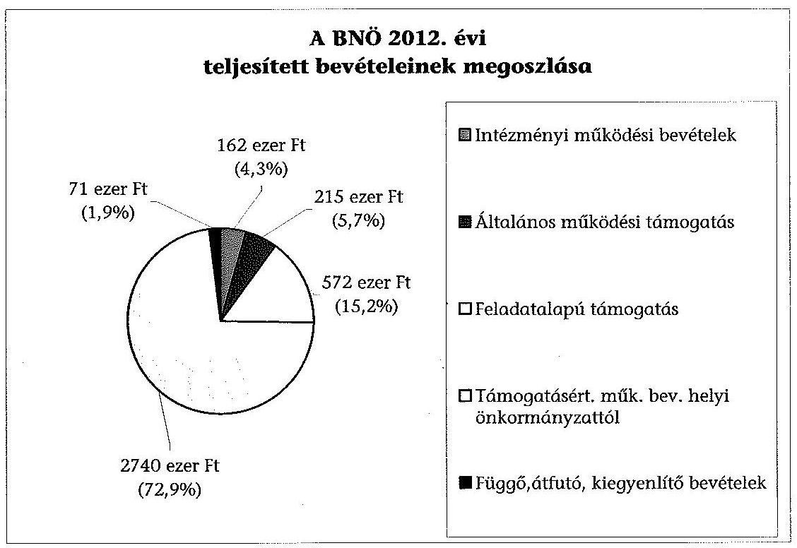
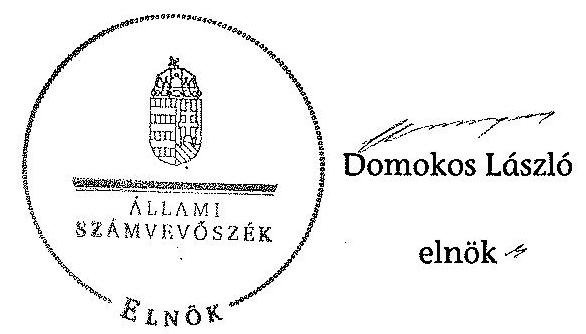

# ÁLLAMI   SZÁMVEVŐSZÉK 

## JELENTÉS

a helyi nemzetiségi önkormányzatok gazdálkodásának ellenőrzéséről
Bolgár Nemzetiségi Önkormányzat (XVIII. kerületi)

---

# Állami Számvevőszék 

Iktatószám: V-0335-022/2014.
Témaszám: 1369
Vizsgálat-azonosító szám: V065291
Az ellenőrzést felügyelte:
Horváth Balázs
felügyeleti vezető
Az ellenőrzést vezette és az ellenőrzés végrehajtásáért felelős:
Kisgergely István
ellenőrzésvezető
A számvevőszéki jelentést készítették és a jelentés összeállításában
közremüködtek:
Komlósiné Bogár Éva
számvevő tanácsos
Varsányiné Dudás Eleonóra
számvevő
Az ellenőrzést végezte:
Dr. Ernst László
számvevő tanácsos

---

# TARTALOMJEGYZÉK 

BEVEZETÉS ..... 3
I. ÖSSZEGZŐ MEGÁLLAPÍTÁSOK, KÖVETKEZTETÉSEK, JAVASLATOK ..... 6
II. RÉSZLETES MEGÁLLAPÍTÁSOK ..... 12

1. A BNÖ és a XVIII. kerületi Önkormányzat együttmúködésének szabályozása, a múködési feltételek biztosítása ..... 12
2. A gazdálkodási feladatok ellátásának szabályszerűsége ..... 13
2.1. A költségvetésre és a zárszámadásra, valamint a kincstári adatszolgáltatás rendjére vonatkozó jogszabályi előírások betartása ..... 13
2.2. A BNÖ gazdálkodásának szabályozottsága ..... 14
2.3. Az operatív gazdálkodási jogkörök kialakítása, gyakorlása ..... 14
3. A BNÖ gazdálkodásával összefüggő feladatok belső ellenőrzése ..... 16
4. A feladatalapú támogatás felhasználásának, elszámolásának szabályszerűsége, a BNÖ feladatellátása ..... 17
MELLÉKLETEK
5. számú A BNÖ 2012. évi gazdálkodásának főbb adatai, mutatói
6. számú Tájékoztatás a polgármesternek küldött el nem fogadott észrevételekről
FÜGGELÉKEK
7. számú Rövidítések jegyzéke
8. számú Értelmező szótár
9. számú A gazdálkodás értékelésének módszere

---

.

---

# JELENTÉS 

## a helyi nemzetiségi önkormányzatok gazdálkodásának ellenőrzéséről Bolgár Nemzetiségi Önkormányzat (XVIII. kerületi)

## BEVEZETÉS

A BNÖ az 1998. évben alakult, elnöke a 2010. évi helyhatósági választások óta látja el feladatát. A BNÖ intézményt, gazdasági társaságot és más szervezetet nem alapított. A négytagú Képviselő-testület munkája segítésére bizottságot nem hozott létre. A BNÖ-nek a költségvetési beszámolója szerint a 2012. évben a módosított költségvetési bevételi és kiadási előirányzata 3646 ezer Ft, a teljesített költségvetési bevétele 3689 ezer Ft, a teljesített költségvetési kiadása 1950 ezer Ft volt. A 2012. évi gazdálkodási adatokat részletesen az 1. számú mellékletben mutatjuk be.

Az Alaptörvény XXIX. cikk (1) bekezdése szerint a Magyarországon élő nemzetiségek államalkotó tényezők. Minden, valamely nemzetiséghez tartozó magyar állampolgárnak joga van önazonossága szabad vállalásához és megőrzéséhez. A hazánkban élő nemzetiségek helyi (települési és területi), valamint országos önkormányzatokat hozhatnak létre. A helyi nemzetiségi önkormányzatok gazdálkodási feladatait jogszabályi előírás alapján a székhely szerinti helyi önkormányzat polgármesteri hivatala látja el.

A nemzetiségek helyzete, támogatása mind hazai, mind EU-s szinten kiemelt figyelmet kap napjainkban. A helyi nemzetiségi önkormányzatok gazdálkodására és támogatási rendszerére vonatkozó jogszabályok a 2010-2012. években jelentős változásokon mentek át. A települési és területi nemzetiségi önkormányzatok gazdálkodásának, a részükre juttatott költségvetési támogatások felhasználásának ellenőrzését az ÁSZ a 2012. évben sorozatjellegú ellenőrzés keretében indította el. A 2013. évi ellenőrzések e témacsoportos ellenőrzések folytatását jelentik, amelyet az ÁSZ 2014 első félévi ellenőrzési terve 12. témasorszámon tartalmaz.

Az ellenőrzés célja annak értékelése volt, hogy a BNÖ gazdálkodási kereteinek kialakítása, gazdálkodása és feladatellátása megfelelt-e a jogszabályoknak.

Ennek keretében értékeltük, hogy:

- a BNÖ és a XVIII. kerületi Önkormányzat együttműködésének szabályozása, a működési feltételek biztosítása megfelelt-e a jogszabályi előírásoknak;

---

- a felek együttműködése megfelelt-e a közöttük létrejött megállapodásnak a gazdálkodási feladatok szabályszerű ellátása során, ennek keretében betar-tották-e a BNÖ gazdálkodásához kapcsolódóan a költségvetésre és zárszámadásra, a gazdálkodás szabályozására, az operatív gazdálkodási jogkörök gyakorlására vonatkozó jogszabályi előírásokat;
- a jegyző biztosította-e a BNÖ gazdálkodásának belső ellenőrzését;
- a BNÖ feladatalapú támogatásának felhasználása, a folyósított feladatalapú támogatással történő elszámolás az előírásoknak megfelelő volt-e;
- a BNÖ feladatellátása összhangban volt-e a vonatkozó jogszabályi előírásokkal.

Az ellenőrzés várható hasznosulását négy szinten tervezzük. A törvényalkotás számára összegzett tapasztalatok állnak rendelkezésre a nemzetiségi önkormányzatok testületi döntéseinek, gazdálkodásának és a feladatalapú támogatás felhasználásának szabályszerűségéről, amelynek alapján következtetést lehet levonni arra, hogy indokolt-e jogszabályi módosítás kezdeményezése. Az ellenőrzés az ellenőrzött számára visszajelzést ad a működésében fellépő hiányosságokról, javaslataival hozzájárul azok kiküszöböléséhez, amely csökkentheti a későbbi ellenőrzések gyakoriságát. Az ellenőrzés megállapításai és javaslatai tanulságul szolgálhatnak más nemzetiségi önkormányzatok, szervezetek számára a rendezett gazdálkodási keretek kialakításához. A társadalom számára jelzi, hogy közpénz nem maradhat ellenőrizetlenül, az ÁSZ értékteremtő rend kialakításához és megőrzéséhez hozzájáruló tevékenysége pozitív hatással lesz a szervezetről kialakított összkép formálásában. Az ÁSZ szervezetén belül lehetőség nyílik arra, hogy a megállapítások szintetizálásával az intézmény a hozzáadott értéket teremtő elemző tevékenységét és tanácsadó szerepét erősítse.

A BNÖ gazdálkodásának ellenőrzéséről szóló jelentés I. fejezetének összegző része az ellenőrzés céljára adott rövid, szintetizáló összefoglalót és következtetéseket tartalmazza a II. fejezet részletes megállapításain alapulóan. A jelentés intézkedést igénylő megállapításait és javaslatait - az összegzőben foglaltak mellett - az ellenőrzés során feltárt, a jelentés II. fejezetében rögzített részletes megállapítások alapozzák meg, illetve támasztják alá.

Az ellenőrzés típusa: szabályszerűségi ellenőrzés
Az ellenőrzött időszak: a 2012. január 1. - 2012. december 31. közötti időszak. Az ellenőrzés kiterjedt a BNÖ-nek juttatott 2012. évi támogatás 2013. évben való elszámolására is.

Ellenőrzött szervezet: a Bolgár Nemzetiségi Önkormányzat és a gazdálkodási feladatait ellátó Budapest XVIII. Kerület Pestszentlőrinc-Pestszentimre Önkormányzat.

Az ellenőrzés végrehajtásának jogszabályi alapját az ÁSZ tv. 5. § (2)-(3) és (6) bekezdéseiben foglaltak képezik.

---

Az ellenőrzés szakmai módszertana az ÁSZ hivatalos honlapján (www.asz.hu) közzétett szakmai szabályokon alapult, amely a Legfőbb Ellenőrző Intézmények Nemzetközi Szervezete (INTOSAI) által kiadott nemzetközi standardok (ISSAI) figyelembevételével készült.

A helyi nemzetiségi önkormányzatok gazdálkodásának ellenőrzése során értékeltük a XVIII. kerületi Önkormányzat és a BNÖ együttműködésének, a gazdálkodás szabályozottságának és a pénzügyi folyamatokban kulcsszerepet betöltő belső kontrollok (teljesítésigazolás és érvényesítés) múködésének megfelelőségét. A kulcskontrollokat a működési és felhalmozási célú támogatásértékű kiadásoknál, az államháztartáson kívülre teljesített múködési és felhalmozási célú pénzeszköz átadásoknál, a dologi kiadásokkal kapcsolatos kifizetéseknél véletlen mintavételi eljárást alkalmazva - ellenőriztük. Ellenőriztük, hogy a jegyző biztosította-e a BNÖ gazdálkodásának belső ellenőrzését. Értékeltük a feladatalapú támogatások felhasználásának, elszámolásának szabályszerűségét, a BNÖ feladatellátása és a jogszabályi előírások összhangját.

Az ellenőrzés lefolytatásához a BNÖ és a gazdálkodási feladatait ellátó XVIII. kerületi Önkormányzat tanúsítványok és a kapcsolódó, dokumentumjegyzékben megjelölt dokumentumok elektronikus úton történő megküldésével, rendelkezésre bocsátásával szolgáltatott adatokat. Az adatszolgáltatás kontrollálása és szükség szerinti javítása a helyszíni ellenőrzés keretében történt. A minősítési szempontokat a 3. számú függelék tartalmazza.

Az ÁSZ tv. 29. § (1) bekezdése szerint a jelentéstervezetet megküldtük egyeztetésre a polgármesternek és a Nemzetiségi Önkormányzat elnökének. A polgármester határidőben megküldött észrevétele és tájékoztatása alapján a jelentést nem módosítottuk, az el nem fogadott észrevételek indoklását a jelentés 2. számú melléklete tartalmazza.

---

# I. ÖSSZEGZŐ MEGÁLLAPÍTÁSOK, KÖVETKEZTETÉSEK, JAVASLATOK 

A BNÖ és a XVIII. kerületi Önkormányzat együttmúködésének szabályozása megfelelt a jogszabályi előírásoknak, a BNÖ a 2012. év folyamán rendelkezett a XVIII. kerületi Önkormányzattal megkötött, hatályos együttmúködési megállapodással. A 2011. évben hatályos együttmúködési megállapodás ${ }_{1}$-nek a Nek. ${ }_{2}$ tv-ben meghatározott, a gazdálkodási szabályok változása miatti felülvizsgálatát nem végezték el határidőre, azonban az együttmúködési megállapodás ${ }_{1}$ kiegészítését a Nek. ${ }_{2}$ tv-ben rögzített határidőn belül 2012 márciusában végrehajtották. A múködés feltételeit az előírásoknak megfelelően szabályozták, azonban azokat a Nek. ${ }_{2}$ tv-ben foglaltak ellenére az együttmúködési megállapodás ${ }_{2}$ megkötését, módosítását követő 30 napon belül nem rögzítették a BNÖ SZMSZ-ében. A BNÖ gazdálkodási feladatai ellátásának szabályait - az Áht. ${ }_{2}$-nek és a Nek. ${ }_{2}$ tv.-nek megfelelően - a 2012. december 31-én hatályos együttműködési megállapodás ${ }_{2}$-ban teljes körűen rögzítették. A BNÖ működésének előírt személyi és tárgyi feltételeit a XVIII. kerületi Önkormányzat 2012ben biztosította.

A szabályozási hiányosságok kijavítására az ellenőrzött időszakot követően intézkedtek. A BNÖ SZMSZ-ének módosítása és az együttmúködési megállapodás ${ }_{2}$ felülvizsgálata 2013 decemberében megtörtént. Az együttmúködési megállapodás ${ }_{2}$ mellékleteként elkészült a tárgyi feltételeket tartalmazó helyiséghasználati rend.

A BNÖ 2012. évi költségvetésének és zárszámadásának tartalma, jóváhagyása, valamint a kapcsolódó adatszolgáltatás szabályszerűsége nem felelt meg a jogszabályi előírásoknak.

A BNÖ elnöke a 2012. évi költségvetés tervezetét az Áht. ${ }_{2}$-ben előírt határidőben benyújtotta a Képviselő-testületnek. A jóváhagyott költségvetési határozat az Áht. ${ }_{2}$ előírása ellenére nem tartalmazta a BNÖ mérlegét közgazdasági tagolásban, szöveges indokolással és az előirányzat-felhasználási tervet. A BNÖ elnöke a jegyző által elkészített 2012. évi zárszámadási határozat-tervezetet határidőben beterjesztette a Képviselő-testületnek, azonban az előterjesztésben nem mutatták be az Áht. ${ }_{2}$-ben előírt mérlegeket és kimutatásokat. A Képviselőtestület 2012. évi zárszámadásról szóló határozata nem az Áht. ${ }_{2}$ szerinti részletezettségű volt, így nem biztosította az összehasonlíthatóságot az elfogadott elemi költségvetéssel, továbbá nem mutatta be a BNÖ bevételei és kiadásai összegét. A jegyző az ellenőrzött időszakban az Áhsz. ${ }_{1}$-ben és az Ávr.-ben előírt, a BNÖ-re vonatkozó kincstári adatszolgáltatási kötelezettségeit teljesítette, azonban az elemi költségvetés, a negyedéves időközi költségvetési és a mérlegjelentések, valamint a féléves és az éves elemi költségvetési beszámoló vonatkozásában a jogszabályban előírt határidőket nem tartotta be.

A BNÖ gazdálkodásának szabályozottsága az ellenőrzött időszakban megfelelt a jogszabályi előírásoknak. A gazdálkodási feladatok végrehajtását ellátó Polgármesteri Hivatal 2012-ben a Számv. tv. és a Bkr. által előírt gazdál-

---

kodásra vonatkozó előírt szabályzatok hatályát a BNÖ gazdálkodására is kiterjesztette. A Polgármesteri Hivatal SZMSZ-e tartalmazta az Ávr.-ben foglaltak szerinti, a BNÖ gazdálkodásával kapcsolatos feladat- és hatásköröket, a hatáskörök gyakorlásának módját, az ezekhez kapcsolódó felelősségi szabályokat.

A BNÖ gazdálkodása tekintetében az operatív gazdálkodási jogkörök kialakítása megfelelt az előírásoknak, azonban a BNÖ elnöke a teljesítést igazoló személyek írásbeli kijelölését, a gazdasági vezető a pénzügyi ellenjegyzők és az érvényesítő személyek kijelölését az Ávr. hatályba lépését követően csak 2012. május 20 -ától tette meg. A Polgármesteri Hivatal rendelkezett gazdasági szervezettel, a gazdasági vezető végzettsége megfelelt az Ávr.-ben előírt szakképesítési követelményeknek.

A BNÖ a 2012. évben az államháztartáson kívülre történt működési célú pénzeszközátadás teljesítése során a teljesítésigazolás és az érvényesítési kulcskontrollok megfelelően múködtek.

A BNÖ-nél a 2012. évben a dologi kiadások teljesítése során a teljesítés igazolása és az érvényesítés kulcskontrollok múködésének megfelelősége gyenge volt, a hibák száma a lényegességi szintet, a kritikus hibahatárt elérte. Az Ávr.ben foglaltak ellenére a kiadás teljesítésének igazolását és az érvényesítést jogosulatlan személyek végezték 2012. május 20-a előtt. A teljesítésigazoló nem tartotta be az operatív gazdálkodási szabályzat ${ }_{1,2}$ előírásait az igazolás során. Az érvényesítő nem ellenőrizte, hogy a megelőző ügymenetben az Ávr. és az operatív gazdálkodási szabályzat ${ }_{1,2}$ előírásait betartották-e, nem jelezte az utalványozónak, hogy a teljesítésigazolás szabálytalan volt, továbbá nem észrevételezte a vezetett kötelezettségvállalási nyilvántartás tartalmi hiányosságait. A dologi kiadások három legnagyobb összegű könyvelési tételeinél a teljesítésigazoló nem tartotta be az operatív gazdálkodási szabályzat ${ }_{1,2}$ előírásait az igazolás során, továbbá az érvényesítő nem észrevételezte a teljesítésigazolás hiányosságait, valamint az Ávr.-ben foglalt előírások betartásának ellenőrzését nem végezte el. A számvevőszéki ellenőrzés a kiadások dokumentumainak ellenőrzése alapján összeférhetetlenséget, továbbá jogosulatlan kifizetést nem tárt fel, a kulcskontrollok múködéséhez kapcsolódó hiányosságok miatt nem biztosított a hibák megelőzése, feltárása és kijavítása.

A jegyző a jogszabályi előírásoknak megfelelően biztosította a BNÖ gazdálkodásával összefüggő végrehajtási feladatok belső ellenőrzését. A Polgármesteri Hivatal éves belső ellenőrzési tervét megalapozó kockázatelemzés kiterjedt a nemzetiségi önkormányzatok gazdálkodásával összefüggő végrehajtási feladatok ellátására, amely alacsony kockázati minősítést kapott. A módosított éves belső ellenőrzési terv szerinti, a nemzetiségi önkormányzatokra vonatkozó célellenőrzést végrehajtották. Az ellenőrzési jelentésben megállapított hiányosságok kijavítására a Bkr.-ben meghatározott határidőn túl készített a jegyző intézkedési tervet. Az intézkedések megvalósítása folyamatban volt, 2012-ben kettő, 2013-ban négy javaslathoz készített a jegyző intézkedési tervet.

A BNÖ részére a 2011. és a 2012. években folyósított feladatalapú támogatás felhasználása, elszámolása nem felelt meg a jogszabályi előírásoknak. A 2011. évben a BNÖ 1153 ezer Ft feladatalapú támogatásban részesült, amelyből a 2012. június 30 -án kötelezettségvállalással nem terhelt maradványa

---

389 ezer Ft volt. A BNÖ a 2012. évben 572 ezer Ft feladatalapú támogatásban részesült. A Képviselő-testület az Áht. ${ }_{2}$-ben előírtak szerint nem módosította a költségvetést a támogatás összegével. A keletkezett maradvány 2012. december 31-én 308 ezer Ft, kötelezettségvállalással nem terhelt volt. A BNÖ nem tett eleget az Áht. ${ }_{1,2}$-ben előírtaknak azáltal, hogy a meghatározott célra fel nem használt támogatás 2012. évi 308 ezer Ft és 2011. évi 389 ezer Ft összegű maradványáról haladéktalanul nem mondott le és nem fizette vissza azt a központi költségvetés javára. A feladatalapú támogatásokról a támogatási kormányrendelet ${ }_{1,2}$ előirása alapján az Áht. ${ }_{1,2}$-ben foglaltak ellenére az elszámolások nem történtek meg, a támogatások felhasználását, elszámolását az ellenőrzésre jogosult szervek nem ellenőrizték.

A BNÖ kötelező és önként vállalt feladatellátásának tárgya összhangban volt a Nek. ${ }_{2}$ tv. előírásalval. A BNÖ a Nek. ${ }_{2}$ tv.-ben meghatározott hatósági tevékenységet nem végzett.

Az ÁSZ tv. 33. § (1) bekezdésében foglaltak értelmében az ellenőrzött szervezet vezetője köteles a jelentésben foglalt megállapításokhoz kapcsolódó intézkedési tervet összeállítani, és azt a jelentés kézhezvételétől számított 30 napon belül az ÁSZ részére megküldeni. Amennyiben az intézkedési tervet határidőre nem küldi meg a szervezet, vagy az nem elfogadható, az ÁSZ elnöke az ÁSZ tv. 33. § (3) bekezdés a)-b) pontjaiban foglaltakat érvényesítheti.

A helyszíni ellenőrzés megállapításainak hasznosítása mellett javasoljuk:

# a jegyzönek 

1. az együttmúködés szabályozásával kapcsolatban

Az együttműködési megállapodás ${ }_{1}$-t a Nek. ${ }_{2}$ tv. 80. § (2) bekezdésének előírása ellenére 2012. január 31-éig nem vizsgálták felül.

Javaslat
Biztosítsa a jövőben az együttműködési megállapodás évenkénti felülvizsgálata során a Nek. ${ }_{2}$ tv. 80. § (2) bekezdésében előírt határidő betartását.
2. a költségvetés és zárszámadás szabályszerűségével kapcsolatban

A 2012. évi költségvetési határozat-tervezet előterjesztésekor az Áht. ${ }_{2}$ 24. § (4) bekezdés a) pontjában előírtak ellenére - a jegyző mulasztása miatt - nem mutatták be a Képviselő-testületnek tájékoztatásul szöveges indoklással a BNÖ költségvetési mérlegét közgazdasági tagolásban és az előirányzat-felhasználási tervét. A zárszámadási határozat-tervezet előterjesztésekor - az Áht. ${ }_{2}$ 91. § (2) bekezdés a) pontjában foglaltak ellenére - nem készítette el a Képviselő-testület részére tájékoztatásul az előírt mérlegeket és kimutatásokat. Az Áht. ${ }_{2}$ 89. § (1) bekezdésében foglaltak ellenére a zárszámadás nem volt összehasonlítható a 2012. évben elfogadott költségvetéssel.

---

# Javaslat 

Készítse elő a jövőben:
a) a költségvetési határozat-tervezet előterjesztéséhez az Áht. 2 24. § (4) bekezdés a) pontja előírásainak megfelelően a Képviselő-testület részére tájékoztatásul mutassa be szöveges indoklással együtt a költségvetési mérleget közgazdasági tagolásban és az előirányzat-felhasználási tervet;
b) a zárszámadási határozat-tervezet előterjesztéséhez az Áht. 2 91. § (2) bekezdés a) pontjának megfelelően a Képviselő-testületnek a tájékoztatásul bemutatandó mérlegeket és kimutatásokat, továbbá biztosítsa az Áht. 2 89. § (1) bekezdése szerint a zárszámadás elfogadott költségvetéssel való összehasonlíthatóságát.
3. a kincstári adatszolgáltatás szabályszerűségével kapcsolatban

A jegyző a BNÖ-vel összefüggő 2012. évi kincstári adatszolgáltatási kötelezettségének késve tett eleget, a 2012. évi elemi költségvetést az Ávr. 33. §-ában előírt, a negyedéves időközi költségvetési jelentéseket az Ávr. 169. § (2) bekezdésében előírt, az időközi mérlegjelentéseket az Ávr. 170. § (5) bekezdésében előírt, az I. féléves és éves elemi költségvetési beszámolóját az Áhsz.; 10. § (5a) bekezdésében előírt adatszolgáltatási határidőn túl küldte meg a Kincstár területileg illetékes szervének.

Javaslat
Gondoskodjon a jövőben a kincstári adatszolgáltatási kötelezettségekre vonatkozó az Ávr. 33. §-ában, 169. § (2) és 170. § (5) bekezdéseiben, valamint az Áhsz. 2 32. § (4) bekezdésében előírt határidők betartásáról.
4. a kulcskontrollok müködésével kapcsolatban

A teljesítésigazoló nem megfelelően látta el az Ávr. 57. § (1) bekezdésében előírt ellenőrzési feladatát, a teljesítésigazolás során az operatív gazdálkodási szabályzat ${ }_{2}$-ben a teljesítésigazolásra előírt 3. számú mellékletet nem csatolta a számlákhoz.

Az érvényesítő nem az Ávr. 58. § (1)-(2) bekezdésében és az operatív gazdálkodási szabályzat ${ }_{2}$ előírásai szerint látta el ellenőrzési és jelzési feladatát, mert nem ellenőrizte a fedezet meglétét, továbbá nem jelezte az utalványozónak, hogy a 100 ezer Ft alatti kötelezettségvállalások nyilvántartása nem felelt meg az Ávr. 56. § (1) bekezdésében előírtaknak.

Javaslat
Az operatív gazdálkodás működési hibáinak megelőzése, feltárása és kijavítása érdekében gondoskodjon arról, hogy:
a) a teljesítésigazolást az Ávr. 57. § (1) bekezdésében és az operatív gazdálkodási szabályzat ${ }_{2}$-ben előírtak szerint végezzék;
b) az Ávr. 58. § (1)-(2) bekezdései alapján az érvényesítő lássa el ellenőrzési és jelzési feladatát.

---

5. a belső ellenőrzéssel kapcsolatban

A 2012. évben elvégzett belső ellenőrzésről készült jelentésben megállapított hiányosságok megszüntetésére készített intézkedési terv vonatkozásában a jegyző nem tartotta be a Bkr. 45. § (3) bekezdésében előírt határidőt, mivel a belső ellenőrzés által tett javaslatok közül négy esetben azt a lezárt ellenőrzési jelentés kézhezvételét követő 8 napon túl készítette el.

Javaslat
A jövőben gondoskodjon arról, hogy a belső ellenőrzési jelentésben megállapított hiányosságok megszüntetésére a Bkr. 45. § (3) bekezdésében előírt határidőben készüljenek el az intézkedési tervek.
6. a feladatalapú támogatás elszámolásával kapcsolatban

A 2011. évi feladatalapú támogatás elszámolása a támogatási kormányrendelet ${ }_{1} 7 . \S$ (2) bekezdésében hivatkozott, valamint a 2012. évi feladatalapú támogatás elszámolása a támogatási kormányrendelet ${ }_{2}$ 8. § (5) bekezdésében hivatkozott „a helyi önkormányzatok elszámolási és ellenőrzési rendjére vonatkozó jogszabályok rendelkezései alkalmazandóak" előirása alapján az Áht. ${ }_{1} 64 . \S$ (7) bekezdése és az Áht. ${ }_{2} 57 . \S$ (3) bekezdése ellenére nem történt meg.

Javaslat:
Intézkedjen az Áht. ${ }_{2}$ 27. § (2) bekezdésében meghatározott feladatkörében a BNÖ által igénybe vett 2011. évi és 2012. évi feladatalapú támogatás rendeltetésszerú felhasználásáról szóló elszámolás elkészítéséről, az Áht. ${ }_{2}$ 53. § (1) bekezdése szerinti beszámolási kötelezettség teljesítéséhez.

# a Nemzetiségi Önkormányzat elnökének 

1. A Nemzetiségi Önkormányzat elnöke a 2012. évi költségvetési határozat-tervezet előterjesztésekor - a jegyző mulasztása miatt - a Képviselő-testület részére az Áht. ${ }_{2}$ 24. § (4) bekezdés a) pontjában előírtak ellenére szöveges indoklással a BNÖ költségvetési mérlegét közgazdasági tagolásban és az előirányzat-felhasználási tervét tájékoztatásul nem mutatta be. A zárszámadáshoz az Áht. ${ }_{2}$ 91. § (2) bekezdés a) pontja ellenére - a jegyző általi elkészítés hiányában - nem mutatták be a Képvi-selő-testület részére tájékoztatásul az előírt mérlegeket és kimutatásokat.

Javaslat
A jövőben a költségvetési és zárszámadási határozat-tervezet Képviselő-testület elé terjesztésekor tájékoztatásul mutassa be a jegyző által előkészített, az Áht. ${ }_{2}$ 24. § (4) bekezdés a) pontjában előírt költségvetési mérleget közgazdasági tagolásban és az előirányzat-felhasználási tervet szöveges indoklással, továbbá az Áht. ${ }_{2}$ 91. § (2) bekezdés a) pontja szerinti mérlegeket, kimutatásokat.
2. A 2011. évi feladatalapú támogatás elszámolása a támogatási kormányrendelet ${ }_{1} 7 . \S$ (2) bekezdésében hivatkozott, valamint a 2012. évi feladatalapú támogatás elszámolása a támogatási kormányrendelet ${ }_{2}$ 8. § (5) bekezdésében hivatkozott „a

---

helyi önkormányzatok elszámolási és ellenőrzési rendjére vonatkozó jogszabályok rendelkezései alkalmazandóak" előírása alapján az Áht. 64. § (7) bekezdése és az Áht. 2 57. § (3) bekezdése ellenére nem történt meg.

Javaslat
Terjessze a Képviselő-testület elé jóváhagyásra az Áht. 2 53. § (1) bekezdése szerinti beszámolási kötelezettség teljesítéséhez összeállított, a BNÖ által igénybe vett 2011. és 2012. évi feladatalapú támogatás rendeltetésszerű felhasználásáról szóló elszámolást.
3. A BNÖ nem tett eleget az Áht. 2 57. § (2) bekezdésében előírtaknak azáltal, hogy a meghatározott célra fel nem használt 2012. évi feladatalapú támogatás 2012. december 31 -éig kötelezettségvállalással nem terhelt 308 ezer Ft, valamint a 2011. évi támogatás 2012. június 30 -án fennálló, kötelezettségvállalással nem terhelt 389,2 ezer Ft összegű maradványáról nem mondott le és nem fizette vissza azt a központi költségvetés javára.

Javaslat
Terjessze a Képviselő-testület elé jóváhagyásra az Áht. 2 57/A. § (1) bekezdés előírásának megfelelően a 2012. évi feladatalapú támogatás kötelezettségvállalással nem terhelt 308 ezer Ft, valamint a 2011. évi feladatalapú támogatás kötelezettségvállalással nem terhelt 389,2 ezer Ft összegű maradványáról történő lemondást és intézkedjen a maradványok összegének visszafizetéséről a központi költségvetés javára.

---

# II. RÉSZLETES MEGÁLLAPÍTÁSOK 

## 1. A BNÖ És a XVIII. kerÜleti ÖNKORMÁNYZAT EGYÜTTMÜKÖDÉSÉNEK SZABÁLYOZÁSA, A MŰKÖDÉSI FELTÉTELEK BIZTOSÍTÁSA

A BNÖ és a XVIII. kerületi Önkormányzat együttmúködésének szabályozása megfelelt a jogszabályi előírásoknak.

A BNÖ a 2012. év folyamán rendelkezett a XVIII. kerületi Önkormányzattal megkötött, hatályos együttműködési megállapodás ${ }_{1-2}$-sal ${ }^{1}$. A 2012. január 1-jén hatályos, 2005. február 1-jén megkötött együttműködési megállapodás ${ }_{1}$-nek a gazdálkodási szabályok változása miatti felülvizsgálatát nem végezték el a Nek. ${ }_{2}$ tv. 80. § (2) bekezdésében meghatározott, január 31-ei határidőre. A Nek. ${ }_{2}$ tv. 159. § (3) bekezdésében előírt módosítást határidőben végrehajtották, amelynek eredményeképpen az együttmúködési megállapodás ${ }_{2}$-t 2012. március 7 -én írták alá.

A 2012. december 31-én hatályos együttműködési megállapodás ${ }_{2}$-ben a BNÖ működési feltételeit az előírásoknak megfelelően szabályozták, azonban azokat a Nek. ${ }_{2}$ tv. 80. § (2) bekezdésében foglaltak ellenére a megállapodás megkötését, módosítását követő 30 napon belül nem rögzítették a BNÖ SZMSZ-ében.

Az ellenőrzött időszakot követően a Képviselő-testület elfogadta a BNÖ módosított SZMSZ-ét², amelynek melléklete az együttmúködési megállapodás ${ }_{3}$.

A BNÖ gazdálkodási feladatai ellátásának szabályait - az Áht. ${ }_{2}$-nek és a Nek. ${ }_{2}$ tv.-nek megfelelően - a 2012. december 31-én hatályos együttműködési megállapodás ${ }_{2}$-ben teljes körűen rögzítették. Az együttműködési megállapodás ${ }_{2}$ az érvényesítők jegyző általi kijelölését tartalmazta ${ }^{3}$, amely nem felelt meg az Áht. ${ }_{2}$ 38. § (2) bekezdésében és az Ávr. 55. § (2) bekezdés g) pontjában, illetve az 58. § (4) bekezdésében előírtaknak.

Az ellenőrzött időszakot követően, 2013. október 11-én kötött együttműködési megállapodás ${ }_{3}$ már a jogszabályoknak megfelelően tartalmazta az érvényesítő kijelölését.

A BNÖ működésének előírt személyi és tárgyi feltételeit a XVIII. kerületi Önkormányzat biztosította 2012-ben, azonban az együttműködési megállapodás ${ }_{2}$ -
${ }^{1}$ A 2005. február 1-jén megkötött együttműködési megállapodás helyett 2012. március 7-én kötöttek újat, amelyet a Képviselő-testület a 13/2012. (III. 06.) számú határozatával, a XVIII. kerületi Önkormányzat Képviselő-testülete a 14/2012. (III. 13.) számú rendeletével fogadott el.
${ }^{2}$ A 37/2013. (XII. 6.) számú BNÖ határozat az egységes szerkezetbe foglalt SZMSZ elfogadásáról.
${ }^{3}$ A 38/46296-3/2012. iktatószámú együttműködési megállapodás ${ }_{2}$ 8. oldalának 16. pontja.

---

ben külön megállapodásként meghatározott helyiséghasználati rendet 2012. év végéig nem készítették el.

Az ellenőrzött időszakot követően, a 2013. évi együttműködési megállapodás ${ }_{2} 1$. számú mellékleteként elkészítették a helyiséghasználati rendet.

# 2. A GAZDÁLKODÁSI FELADATOK ELLÁTÁSÁNAK SZABÁLYSZERŰSÉGE 

### 2.1. A költségvetésre és a zárszámadásra, valamint a kincstári adatszolgáltatás rendjére vonatkozó jogszabályi előírások betartása

A BNÖ 2012. évi költségvetésének és zárszámadásának tartalma, jóváhagyása, valamint a kapcsolódó adatszolgáltatás nem felelt meg a jogszabályi előírásoknak.

A BNÖ elnöke a 2012. évi költségvetés tervezetét az Áht. ${ }_{2}$-ben előírt határidőben benyújtotta a Képviselő-testületnek. A Képviselő-testület által jóváhagyott költségvetés ${ }^{4}$ azonban az Áht. ${ }_{2} 24 . \S$ (4) bekezdés a) pontjában előírtak ellenére nem tartalmazta a BNÖ költségvetési mérlegét szöveges indoklással, közgazdasági tagolásban és az előirányzat-felhasználási tervét.

A jegyző által elkészített 2012. évi zárszámadási határozat-tervezetet a BNÖ elnöke az Áht. ${ }_{2}$-ben előírt határidőn belül, 2012. április 10-én beterjesztette a Képviselő-testületnek. Az előterjesztésben nem mutatták be az Áht. ${ }_{2} 91 . \S$ (2) bekezdés a) pontja szerinti - az Áht. ${ }_{2} 24 . \S$ (4) bekezdésében előírt - mérlegeket és kimutatásokat, a jegyzőkönyvhöz a BNÖ 2012. évi éves beszámolóját mellékelték.

A 2012. évi zárszámadásról szóló határozat ${ }^{5}$ az Áht. ${ }_{2}$ 89. § -a ellenére nem biztosította az összehasonlíthatóságot az elfogadott költségvetéssel, a BNÖ nem mutatta be bevételei és kiadásai összegét, továbbá a feladatalapú támogatás felhasználásáról sem számoltak el.

A jegyző az ellenőrzött időszakban az Áhsz. ${ }_{1}$-ben és az Ávr.-ben előírt, a BNÖ-re vonatkozó kincstári adatszolgáltatási kötelezettségeinek eleget tett, azonban a határidőket nem tartotta be:

- a 2012. évi elemi költségvetéshez kapcsolódó, az Ávr. 33. §-ában előírt adatszolgáltatást késedelmesen ${ }^{6}, 2012$. március 28 -án teljesítette;
- a 2012. évi negyedéves időközi költségvetési jelentéseket az Ávr. 169. § (2) bekezdésében előírt határidőkön túl ${ }^{7}$ (2012. április 24-én, júli-

[^0]
[^0]:    ${ }^{4}$ A 9/2012. (II. 11.) számú BNÖ határozat a 2012. évi költségvetés elfogadásáról.
    ${ }^{5}$ A 11/2013. (IV. 26.) számú BNÖ határozat a 2012. évi zárszámadás elfogadásáról.
    ${ }^{6}$ Az előterjesztés időpontja 2012. február 2-a volt, a késedelmes napok száma 23.
    ${ }^{7}$ A jogszabályban előírt határidő április 20., július 20., október 20.; a késedelmes napok száma 4, 6, 5 nap volt.

---

us 26 -án, október 29 -én), az éves költségvetési jelentést 2013. január 19-én, határidőben teljesítette;

- a 2012. évi időközi mérlegjelentéseket az Ávr. 170. § (5) bekezdésében előírt határidőkön túl ${ }^{8}$ (2012. április 27 -én, augusztus 1-jén, október 29-én) teljesítette;
- a 2012. évi I. féléves és éves elemi költségvetési beszámolóját az Áhsz. 10. § (5a) bekezdésében előírt határidőkön túl ${ }^{9}, 2012$. augusztus 14én, illetve 2013. március 14 -én késedelmesen nyújtotta be. A beszámolókat 2012. augusztus 9 -én, illetve 2013. március 11-én, szintén késedelmesen ${ }^{10}$ készítették el.

# 2.2. A BNÖ gazdálkodásának szabályozottsága 

A BNÖ gazdálkodásának szabályozottsága az ellenőrzött időszakban megfelel a jogszabályi előírásoknak.

A gazdálkodási feladatok végrehajtását ellátó Polgármesteri Hivatal 2012-ben a Számv. tv.-ben és a Bkr.-ben előírt, gazdálkodást érintő szabályzatokkal a BNÖ gazdálkodására is kiterjedő hatállyal rendelkezett ${ }^{11}$.

A Polgármesteri Hivatal SZMSZ-e tartalmazta az Ávr. 13. § (1) bekezdés g) pontjában foglaltak szerinti, a BNÖ gazdálkodásával kapcsolatos feladat- és hatásköröket, a hatáskörök gyakorlásának módját, a helyettesítés rendjét, az ezekhez kapcsolódó felelősségi szabályokat.

### 2.3. Az operatív gazdálkodási jogkörök kialakítása, gyakorlása

A BNÖ gazdálkodása tekintetében az operatív gazdálkodási jogkörök kialakítása megfelelt a jogszabályi előírásoknak, azonban:

[^0]
[^0]:    ${ }^{8}$ A jogszabályban előírt határidő́ április 25., július 25., október 25.; a késedelmes napok száma $2,7,4$ nap volt.
    ${ }^{9}$ A jogszabályban előírt határidő a féléves beszámolónál 2012. augusztus 10., az éves beszámolónál 2013. március 10.; a késedelmes napok száma 4, illetve 2 nap volt.
    ${ }^{10}$ A jogszabályban előírt határidő a féléves beszámolónál 2012. július 31., az éves beszámolónál 2013. február 28.; a késedelmes napok száma 9, illetve 11 nap volt.
    ${ }^{11}$ Számviteli politika, Eszközök és források leltárkészítési és leltározási szabályzata, Eszközök és források értékelési szabályzata, Pénz és értékkezelési szabályzat, Számlarend, ellenőrzési nyomvonal, szabálytalanságok kezelésének eljárásrendje, kockázatkezelési szabályzat, folyamatba épített, előzetes, utólagos és vezetői ellenőrzés szabályozása, gazdasági szervezet ügyrendje, munkaköri leírások. A Polgármesteri Hivatalban az ellenőrzött időszakban két gazdálkodási szabályzat volt érvényben: a gazdálkodási szabályzat ${ }_{1}$-et 2011-ben többször módosították [21/2011. (III. 16.), 28/2011. (V. 16.), 33/2011. (VII. 15.), 34/2011. (VIII. 1.), 37/2011. (IX. 1.), 42/2011. (XI. 14.)]. A 2012. május 20-ától hatályos gazdálkodási szabályzat ${ }_{2}$-t a 41/2012. (X. 17.) és a 45/2012. (XII. 18.) számú polgármesteri-jegyzői együttes utasításokkal módosították.

---

- a BNÖ elnöke az Áht. 2 38. § (2) bekezdése és az Ávr. 57. § (4) bekezdése ellenére a teljesítésigazoló személyek írásbeli kijelölését csak 2012. május 20ától végezte el az operatív gazdálkodási szabályzat ${ }_{2}$ hatályba lépésével;
- a Polgármesteri Hivatalban a gazdasági vezetö ${ }^{12}$ az Áht. 2 38. § (2) bekezdésében és az Ávr. 55. § (2) bekezdés g) pontjában, illetve az 58. § (4) bekezdésében előírtak ellenére csak 2012. május 20-ától hatalmazott fel más személyt a pénzügyi ellenjegyzésre és az érvényesítésre.

A Polgármesteri Hivatal az ellenőrzött időszakban rendelkezett gazdasági szervezettel ${ }^{13}$, a gazdasági vezető végzettsége megfelelt az Ávr.-ben előírt szakképesítési követelményeknek.

A BNÖ-nél a 2012. évben az államháztartáson kívülre teljesített múködési célú pénzeszközátadás teljesítése során a teljesítésigazolás és az érvényesítés kulcskontrollok megfelelően múködtek.

A BNÖ-nél a 2012. évben a dologi kiadások teljesítése során a teljesítés igazolása és az érvényesítés kulcskontrollok müködésének megfelelősége gyenge volt, a hibák száma a lényegességi szintet, a kritikus hibahatárt elérte, mert:

- a teljesítés igazolását az Ávr. 57. § (4) bekezdése előírása ellenére a jogkör gyakorlására 2012. május 19-éig a BNÖ elnöke általi kijelöléssel nem rendelkező személy jogosulatlanul látta el, ezért az Ávr. 57. § (3) bekezdésben foglaltak ellenére nem szabályszerűen történt a kifizetés jogosságának, öszszegszerűségének és a szerződésszerű teljesítésnek az igazolása;
- a teljesítésigazoló az Ávr. 57 § (1) bekezdésében foglaltak ellenére, a kiadások teljesítése jogosságának ellenőrzését, a kiadások összegszerűségének igazolását, valamint a teljesített 100 ezer Ft alatti kifizetések esetében az ellenszolgáltatás teljesítésének igazolását a vezetett kötelezettségvállalási nyilvántartás hiányosságai miatt ${ }^{14}$ nem végezte el;
- a teljesítésigazoló az operatív gazdálkodási szabályzat ${ }_{2}$ előírása ellenére a teljesítésigazolásra előírt 3. számú mellékletet nem csatolta a számlák mellé, az igazolásra használt bélyegző szövege nem tartalmazta a teljesítés megtörténtének az igazolását;
- az érvényesítő 2012. május 19-éig nem jogszerű kijelölés alapján látta el feladatát, mivel arra nem a gazdasági vezető jelölte ki, az

[^0]
[^0]:    ${ }^{12}$ A gazdasági vezető által írásban kijelölt pénzügyi ellenjegyző és az érvényesítők alá-írás-mintáját a gazdálkodási szabályzat ${ }_{2}$ melléklete tartalmazta.
    ${ }^{13}$ A Polgármesteri Hivatal SZMSZ-éről szóló, a 43/2011. (XI. 4.) számú, illetve a 3/2012. (IV. 2.) számú polgármesteri-jegyzői együttes utasítás 5.3. pontja szerint a Gazdasági és Költségvetési Iroda látja el a gazdálkodással összefüggő feladatokat.
    ${ }^{14}$ Az írásbeli kötelezettségvállalást nem igénylő 100 ezer Ft alatti kifizetésekkel kapcsolatban alkalmazott, több kifizetést összevontan kezelő és utólagos kötelezettségvállalás nyilvántartást vezettek, amely nem felelt meg az Ávr. 56. § (1) bekezdésében foglalt előírásnak.

---

Áht. 2 38. § (2) bekezdésében és az Ávr. 55. § (2) bekezdés g) pontjában, illetve az 58. § (4) bekezdésében előírtak ellenére;

- az érvényesítő a kiadások érvényesítése során nem az Ávr. 58. § (1)(2) bekezdéseiben és az operatív gazdálkodási szabályzat ${ }_{1,2}$-ben előírtak szerint látta el az ellenőrzési feladatát. Nem ellenőrizte a fedezet meglétét, nem jelezte az utalványozónak, hogy a 100 ezer Ft alatti kötelezettségvállalások nyilvántartása nem felelt meg az Ávr. 56. § (1) bekezdésében előírtaknak, mert nem tartalmazta a kötelezettségvállalást tanúsító dokumentum iktatószámát, a kötelezettségvállaló nevét, a jogosult azonosító adatait, a kötelezettségvállalás összegének évek és előirányzatok szerinti megoszlását, a kifizetési határidőket, továbbá a teljesítési adatokat. Nem észrevételezte továbbá, hogy az operatív gazdálkodási szabályzat ${ }_{1,2}$ szerint a teljesítésigazolásra előírt 3. számú mellékletet nem csatolták a számlák mellé, a teljesítésigazolást nem szabályszerűen végezték el, valamint az Ávr. 58. § (2) bekezdése ellenére az érvényesítő nem győződött meg arról, hogy a teljesítésigazoló kijelölése megfelelt-e az Ávr. 57. § (4) bekezdésében foglaltaknak.

A BNÖ-nél a 2012. évben a dologi kiadások három legnagyobb összegú kiadás teljesítése egyedi értékelése alapján a teljesítésigazolás és az érvényesítés kulcskontrollok nem múködtek megfelelően, mert:

- a teljesítésigazoló az Ávr. 57 § (1) bekezdésében foglaltak ellenére, a kiadások teljesítése jogosságának ellenőrzését, a kiadások összegszerűségének igazolását, valamint a teljesített 100 ezer Ft alatti kifizetések esetében az ellenszolgáltatás teljesítésének igazolását a vezetett kötelezettségvállalási nyilvántartás hiányosságai miatt ${ }^{15}$ - nem végezte el;
- az érvényesítő nem jelezte, hogy az operatív gazdálkodási szabályzat ${ }_{1,2}$ szerint a teljesítésigazolásra előírt 3. számú mellékletet nem csatolták a számlák mellé, a teljesítésigazolást nem végezték el;
- az érvényesítő az Ávr. 58. § (1) bekezdésében foglaltak ellenére nem észrevételezte, hogy a 100 ezer Ft-ot elérő kifizetésre előzetes írásbeli kötelezettségvállalás nélkül került sor.

A számvevőszéki ellenőrzés a kiadások dokumentumainak ellenőrzése alapján összeférhetetlenséget, továbbá jogosulatlan kifizetést nem tárt fel, a kulcskontrollok működéséhez kapcsolódó hiányosságok miatt nem biztosított a hibák megelőzése, feltárása és kijavítása.

# 3. A BNÖ GAZDÁLKODÁSÁVAL ÖSSZEFÜGGŐ FELADATOK BELSŐ ELLENŐRZÉSE 

A BNÖ gazdálkodásával összefüggő végrehajtási feladatok belső ellenőrzése megfelelő volt.

[^0]
[^0]:    ${ }^{15}$ Az írásbeli kötelezettségvállalást nem igénylő 100 ezer Ft alatti kifizetésekkel kapcsolatban alkalmazott, több kifizetést összevontan kezelő és utólagos kötelezettségvállalás nyilvántartást vezettek, amely nem felelt meg az Ávr. 56. § (1) bekezdésében foglalt előírásnak.

---

A jegyző a jogszabályi előírásoknak megfelelően biztosította a BNÖ gazdálkodásával összefüggő végrehajtási feladatok belső ellenőrzését ${ }^{16}$. A Polgármesteri Hivatal éves belső ellenőrzési tervét megalapozó kockázatelemzés kiterjedt a nemzetiségi önkormányzatok gazdálkodásával összefüggő végrehajtási feladatok ellátására, amely alacsony kockázati minősítést kapott. A 2012. évi módosított éves belső ellenőrzési terv alapján a nemzetiségi önkormányzatok célellenőrzését megvalósították, az ellenőrzésről készült jelentést ${ }^{17}$ a Belső Ellenőrzési Csoport vezetője 2012. október 16-án bemutatta a jegyzőnek.

A lefolytatott belső ellenőrzés megállapította, hogy nem készítették el az együttműködési megállapodásban előírtak szerint a helyiséghasználati rendet. A nemzetiségi önkormányzatok SZMSZ-el nem tartalmazták a múködési feltételeket. A GKI ügyrendje nem tartalmazta a nemzetiségi önkormányzatokkal kapcsolatos feladatokat, valamint hiányoztak az utalványozási joggal rendelkezők aláírás mintái, továbbá az ellenőrzött dokumentumok esetében hiányosságot állapítottak meg a pénzügyi kontrollok múködésére vonatkozóan.

Az ellenőrzés megállapításai hasznosultak, azonban a feltárt hiányosságok megszűntetése érdekében a jegyző a Bkr. 45. § (3) bekezdésében meghatározott határidőn túl ${ }^{18}$, 2012-ben kettő, 2013-ban négy javaslathoz készített intézkedési tervet. A 2012. évi intézkedési tervben foglaltakat megvalósították, a 2013. évi intézkedési terv végrehajtása folyamatban volt.

A 2012. évben hatályos együttműködési megállapodás ${ }_{1,2}$ tartalmazta a BNÖvel összefüggő belső ellenőrzési feladatok ellátását. A megállapodásban foglaltak szerint a könyvvizsgáló ellenőrzési tevékenységén kívül a BNÖ pénzügyi ellenőrzését a XVIII. kerületi Önkormányzat belső ellenőre is ellátta.

Az ellenőrzéshez szolgáltatott adatok alapján a 2012. évben a Kormányhivatal a BNÖ-t illetően nem élt törvényességi felügyeleti eszközökkel.

# 4. A feladatalapú támogatás felhasználásának, elsZámolásáNAK SzABÁLYSZERÜSÉGE, A BNÖ FELADATELLÁTÁSA 

A BNÖ részére a 2011. és a 2012. években folyósított feladatalapú támogatás felhasználása, elszámolása nem felelt meg a jogszabályi előírásoknak.

[^0]
[^0]:    ${ }^{16}$ A belső ellenőrök rendelkeztek munkaköri leírással, valamint az Áht. 70 . §-ában meghatározott engedéllyel, szerepeltek a költségvetési szervnél belső ellenőrzést végzők nyilvántartásában, valamint elkészítették a 2012. évre vonatkozó belső ellenőrzési kézikönyvet, amely a 7/2012. (II. 15.) számú polgármesteri és jegyzöl együttes utasítás alapján lépett hatályba.
    ${ }^{17}$ 8/73697-6/2012. iktatószámú belső ellenőrzési jelentés „A Nemzetiségi Önkormányzatok átalakulásának, hivatali kontrolljai kialakításának vizsgálatáról", ellenőrzés alá vont időszak 2011. január - 2012. augusztus
    ${ }^{18}$ A jogszabályban meghatározott határidő az intézkedési terv elkészítésére a lezárt ellenőrzési jelentés kézhezvételétől számított 8 napon belül, az intézkedési tervek kelte 2012. november 5-e és 2013. október 14-e.

---

A 2011. évben a BNÖ 1153 ezer Ft feladatalapú támogatásban részesült, amelyből 2011. december 31-én a kötelezettségvállalással nem terhelt maradvány összege 518 ezer Ft volt. A maradvány összegéből a támogatási kormányrendelet ${ }_{1} 7 . \S$ (4) bekezdésében meghatározott, felhasználásra rendelkezésre álló időpontig, 2012. június 30 -áig 129 ezer Ft-ot használtak fel a támogatási céloknak megfelelően, a fel nem használt maradvány összege 389 ezer Ft volt.

A BNÖ nem tett eleget az Áht. ${ }_{2}$ 57. § (2) bekezdésében előírtaknak azáltal, hogy a meghatározott célra fel nem használt 2011. évi feladatalapú támogatás kötelezettségvállalással nem terhelt 389 ezer Ft összegű maradványáról haladéktalanul nem mondott le és nem fizette vissza azt a központi költségvetés javára.

A 2012. évi feladatalapú támogatás összes bevételhez viszonyított részarányát a következő ábra szemlélteti:

A BNÖ a 2012. évben 572 ezer Ft feladatalapú támogatásban részesült, amelyet a Kincstár 2012. október 12-én utalt a BNÖ bankszámlájára. A Képviselőtestület a 2012. évi költségvetést az Áht. ${ }_{2} 34 . \S$ (5) bekezdésében foglaltak ellenére a támogatás összegével nem módosította, a felhasználás konkrét céljairól nem döntött. A 2012. évben folyósított támogatásból tárgyévben 264 ezer Ft-ot a Nek. ${ }_{2}$ tv. 2. §-ában foglaltak szerinti nemzetiségi közügyek érdekében használtak fel. A keletkezett 308 ezer Ft maradvány 2012. december 31-én nem volt kötelezettségvállalással terhelt. A támogatási kormányrendelet ${ }_{2} 7 . \S$-a szerint a feladatalapú támogatás maradványából a tárgyévet követően csak a még a tárgyévben kötelezettségvállalással terhelt összeg használható fel.

A BNÖ nem tett eleget a támogatási kormányrendelet ${ }_{2} 14 . \S$ (1) bekezdésében és az Áht. ${ }_{2} 57 . \S$ (2) bekezdésében előírtaknak azáltal, hogy a meghatározott

---

célra fel nem használt támogatás 308 ezer Ft összegű maradványáról haladéktalanul nem mondott le és nem fizette vissza azt a központi költségvetés javára.

A 2011. évi feladatalapú támogatás elszámolása a támogatási kormányrendelet ${ }_{1} 7 . \S$ (2) bekezdésében hivatkozott, valamint a 2012. évi feladatalapú támogatás elszámolása a támogatási kormányrendelet ${ }_{2}$ 8. § (5) bekezdésében hivatkozott „a helyi önkormányzatok elszámolási és ellenőrzési rendjére vonatkozó jogszabályok rendelkezései alkalmazandóak" előirása alapján az Áht. ${ }_{1} 64 . \S$ (7) bekezdése és az Áht. ${ }_{2}$ 57. § (3) bekezdése ellenére nem történt meg a BNÖ részéről.

A feladatalapú támogatás felhasználását, elszámolását az ellenőrzésre jogosult szervek 2012-ben a BNÖ-nél nem ellenőrizték.

A BNÖ kötelező és önként vállalat feladatellátásának tárgya összhangban volt a Nek. ${ }_{2}$ tv. 115. §-ában és 116. §-ában foglalt előírásokkal. A BNÖ kötelező közfeladatot látott el a képviselt közösség kulturális autonómiájának megerősítése, a közösség önszerveződésének érdekében. A BNÖ a Nek. ${ }_{2}$ tv. 116. § (2) bekezdésében meghatározott hatósági tevékenységet nem végzett.

Budapest, 2014. C6. hó 24 .nap

Melléklet: $\quad 2 \mathrm{db}$
Függelék: $\quad 3 \mathrm{db}$

---

.

---

# A BNÖ 2012. évi gazdálkodásának föbb adatai, mutatói 

A) Bevételek:

| Megnevezés | Eredeti elöirányzat |  | Módosított   elölényzat | Teljesités |
| :--: | :--: | :--: | :--: | :--: |
|  |  | ezer Ft |  | $\begin{gathered} \text { megoszlás } \\ (\%) \end{gathered}$ |
| Intézményi müködési bevételek | 0,0 | 81,0 | 162,0 | 4,3 |
| Általános müködési támogatás | 215,0 | 215,0 | 215,0 | 5,7 |
| Feladatalapú támogatás | 0,0 | 572,0 | 572,0 | 15,2 |
| Támogatásért, múk. bev. helyi önkormányzattól | 1116,0 | 2778,0 | 2740,0 | 72,9 |
| Költségvetési bevételek | 1331,0 | 3646,0 | 3689,0 | 98,1 |
| Függő,átfutó, kiegyenlítő bevételek | 0,0 | 0,0 | 71,0 | 1,9 |
| Tárgyévi bevételek | 1331,0 | 3646,0 | 3760,0 | 100,0 |

B) Kiadások:

| Megnevezés | Eredeti elöirányzat | Módosított | Teljesités |
| :--: | :--: | :--: | :--: |
|  |  |  |  |
|  |  | ezer Ft |  |
| Személyi juttatások | 840,0 | 870,0 | 870,0 | 44,6 |
| Munkaadókat terhelő járulékok és szocális hozzájárulási adó összesen | 243,0 | 243,0 | 219,0 | 11,2 |
| Dologi kiadások | 248,0 | 2313,0 | 671,0 | 34,4 |
| Egyéb müködési célú támogatások | 0,0 | 220,0 | 190,0 | 9,7 |
| Müködési kiadások összesen | 1331,0 | 3646,0 | 1950,0 | 100,0 |
| Költségvetési kiadások | 1331,0 | 3636,0 | 1950,0 | 100,0 |
| Tárgyévi kiadások | 1331,0 | 3646,0 | 1950,0 | 100,0 |

---

.

---

# TÁJÉKOZTATÁS   A POLGÁRMESTERNEK KÜLDÖTT EL NEM FOGADOTT ÉSZREVÉTELEKRŐL 

| Kincstári adatszolgáltatás |  |
| :--: | :--: |
| Észrevétel | A kincstári adatszolgáltatási kötelezettségek határidőben történő teljesítésével kapcsolatosan megjegyeznénk, hogy számos esetben a kincstári adatfeltöltő felület nem megfelelő müködése okozza a késedelmet. A jövőben hangsúlyt fektetünk arra, hogy státusz riportokkal bizonyítani tudjuk, hogy a késedelem rajtunk kívülálló okok miatt következett be. |
| Válasz | Az észrevétele 3. pontjában a kincstári adatfeltöltő rendszer múködésére vonatkozó tájékoztatását tudomásul vesszem, de erre vonatkozóan a jelentéstervezet megállapítását nem módosítjuk, mert a helyszíni ellenőrzés során nem volt bizonyított, hogy a késedelmes adatszolgáltatást az adatfeltöltő felület nem megfelelő működése okozta. |
| Kulcskontrollok múködése |  |
| Észrevétel | A 2012. január 1. és május 20. közötti időszakban a pénzügyi ellenjegyzést, a teljesítés igazolást, valamint az érvényesítést az akkor hatályos szabályzatunk szerint jogosult személyek végezték. 2012. május 20. napján lépett hatályba a szabályzat módosítása, mely így már összhangba került a jogszabályi változásokkal. Megjegyeznénk, hogy a szabályzat módosításának (jogszabályváltozásokhoz való igazításának) hatályba lépését megelőzően is ugyanezen személyek végezték az említett tevékenységeket. A jövőben kiemelt figyelmet fordítunk arra, hogy az operatív gazdálkodási szabályzat a mindenkori jogszabályváltozásokhoz naprakészen hozzáigazításra kerüljön.   Készpénzes kifizetések esetén ( a nemzetiségi önkormányzatoknál jelentős a készpénzes kifizetések száma) a kötelezettségvállalási szabályzatunk 4. számú mellékletét (készpénzes összesítő) használjuk, ezekben az esetekben nem szükséges a 3. számú melléklet használata. Az igazolásra használt bélyegző szövege valóban nem tartalmazza szövegszerűen a „teljesítés igazolás" szót, azonban álláspontunk szerint a „kifizetés jogosságát igazolom" kitétel egyértelmúen teljesítés igazolást jelent.   Véleményünk szerint az érvényesítő az érvényesítést megelőző ügymenet vonatkozásában maradéktalanul ellátta ellenőrzései feladatát (a kifizetés jogosságának, összegszerűségének, a fedezet meglétének, va- |

---

|  | lamint a szerződésszerű teljesítés ellenőrzése), csupán az utalványozó   felé nem jelezte a teljesítésigazolással kapcsolatos szabályzat módosítás   szükségességét. |
| :-- | :-- |
| Válasz | Az észrevétele 4. pontjában a kulcskontrollok müködésével kapcsolatos   észrevételét nem fogadom el, a jelentéstervezetet nem módosítjuk. A gaz-   dálkodási jogkörök gyakorlására vonatkozó szabályzat 2012. május 20-án   történő hatályba lépését megelőzően a teljesítésigazolásokat az arra kijelöl-   léssel nem rendelkező személy, jogosulatlanul végezte. A szabályzat hatály-   balépését követően a teljesítésigazolás jogosulatlan személy által történő   elvégzésére vonatkozó megállapítás nem szerepel a jelentéstervezetben és   erre vonatkozóan javaslatot sem fogalmaztunk meg. A készpénzes kifizeté-   sek esetében a teljesítésigazolás szabálytalan elvégzésére és az érvényesítő   ellenőrzési és jelzési kötelezettségének elmulasztására vonatkozó megállapításonkat és az erre vonatkozó javaslatot továbbra is fenntartjuk, mert a teljesítés igazolására használt nyomtatvány (4. számú melléklet), valamint az   igazolásra használt bélyegző szövege nem tesz eleget az Ávr. 57. § (1) be-   kezdése előírásának, mely szerint a teljesítés megtörténtének igazolása ma-   gába foglalja a kiadások teljesítése jogosságának, összegszerüségének el-   lenőrzését és igazolását és az ellenszolgáltatást is magába foglaló kötelezet-   ségvállalás esetében annak teljesítését. Erre tekintettel a bélyegzőn szereplő   szövegrész nem elégséges a teljesítés megtörténtének igazolására. Az érvé-   nyesítő a teljesítésigazolás szabálytalanságára, a kötelezettségvállalási nyil-   vántartás hiányosságára vonatkozó ellenőrzési és jelzési kötelezettségét nem   teljesítette. |
| Feladatalapú támogatás elszámolása |  |
| Észrevétel | A 2011. évi, valamint a 2012. évi feladatalapú támogatás el-   számolása megtörtént, az elszámolásról készült jegyzőköny-   veket a helyszíni vizsgálat lezárultát megelőzően átadtuk az   ÁSZ munkatársai részére.   A BNÖ képviselő-testülete a 41/2013 (XII. 6.) számú BNÖ határozatá-   val döntött a 2011. évi 389 ezer forintos, valamint a 2012. évi 308 ezer   forintos fel nem használt feladatalapú támogatás maradványról való   lemondásról, és annak központi költségvetés részére való visszafizetése-   ről. Az ÁSZ munkatársaival történt egyeztetéseknek megfelelően a   nemzetiségi önkormányzat a visszafizetésről a vizsgálati jelentésterve-   zet átvételét követően intézkedik, így a visszafizetés jelenleg folyamat-   ban van. |
| Válasz | A 2011. és 2012. évi feladatalapú támogatás elszámolásával kapcsolatban   tett észrevételét nem fogadom el, a jelentéstervezetben szereplő megállapításonkat nem módosítjuk, az erre vonatkozó javaslatot továbbra is fenntart-   juk. A 342/2010. (XII. 28.) Korm. rendelet 7. § (2) bekezdésének, valamint   a 28/2012. (III. 6.) Korm. rendelet 8. § (5) bekezdésének előírása szerint a   feladatalapú támogatással kapcsolatos elszámolás, ellenőrzés rendjére a he-   lyi önkormányzatok elszámolási és ellenőrzési rendjére vonatkozó jogsza- |

---

bályok rendelkezései alkalmazandóak. Az államháztartásról szóló 1992. évi
XXXVIII. törvény 64. § (7) bekezdése alapján a helyi önkormányzat a költségvetési év végét követően a tényleges mutatók alapján, külön jogszabályban meghatározott határidőig, a költségvetési törvény szabályai szerint elszámol az igénybe vett normatív hozzájárulásokkal és támogatásokkal. A 2011. évi CXCV. törvény 2012. évben hatályos 57. § (3) bekezdése szerint a helyi önkormányzat, a helyi nemzetiségi önkormányzat és a többcélú kistérségi társulás a költségvetési év végét követően elszámol az igénybe vett hozzájárulásokkal, támogatásokkal. Az ellenőrzés részére átadott, a helyszíni ellenőrzés időszakában készített elszámolást a Képviselő-testület nem tárgyalta meg és nem fogadta el, a költségvetési év végét követően elkészített hivatalos, elfogadott elszámolással nem rendelkezett a Nemzetiségi Önkormányzat a feladatalapú támogatás felhasználására vonatkozóan.

---

$\cdot$
$\cdot$
$\cdot$
$\cdot$
$\cdot$
$\cdot$
$\cdot$
$\cdot$
$\cdot$
$\cdot$
$\cdot$
$\cdot$
$\cdot$
$\cdot$
$\cdot$
$\cdot$
$\cdot$
$\cdot$
$\cdot$
$\cdot$
$\cdot$
$\cdot$
$\cdot$
$\cdot$
$\cdot$
$\cdot$
$\cdot$
$\cdot$
$\cdot$
$\cdot$
$\cdot$
$\cdot$
$\cdot$
$\cdot$
$\cdot$
$\cdot$
$\cdot$
$\cdot$
$\cdot$
$\cdot$
$\cdot$
$\cdot$
$\cdot$
$\cdot$
$\cdot$
$\cdot$
$\cdot$
$\cdot$
$\cdot$
$\cdot$
$\cdot$
$\cdot$
$\cdot$
$\cdot$
$\cdot$
$\cdot$
$\cdot$
$\cdot$
$\cdot$
$\cdot$
$\cdot$
$\cdot$
$\cdot$
$\cdot$
$\cdot$
$\cdot$
$\cdot$
$\cdot$
$\

---

# RÖVIDÍTÉSEK JEGYZÉKE 

## Törvények

Alaptörvény
Áht. 1
Áht. 2
ÁSZ tv.
Nek. 1 tv.
Nek. 2 tv.
Számv. tv.

## Rendeletek

Áhsz. 1
Áhsz. 2
Ávr.

Bkr.
támogatási kormányrendelet ${ }_{1}$
támogatási kormányrendelet ${ }_{2}$

## Szórövidítések

ÁSZ
BNÖ
BNÖ elnöke
BNÖ SZMSZ-e

Magyarország Alaptörvénye
1992. évi XXXVIII. törvény az államháztartásról (hatályos 2011. december 31-éig)
2011. évi CXCV. törvény az államháztartásról (hatályos 2011. december 31-étől)

Az Állami Számvevőszékről szóló 2011. évi LXVI. törvény (hatályos 2011. július 1-jétől)
1993. évi LXXVII. törvény a nemzeti és etnikai kisebbségek jogairól (hatályos 2011. december 31-éig)
2011. évi CLXXIX. törvény a nemzetiségek jogairól (hatályos 2011. december 20-ától)
2000. évi C. törvény a számvitelről

249/2000. (XII. 24.) Korm. rendelet az államháztartás szervezetei beszámolási és könyvvezetési kötelezettségének sajátosságairól (hatályos 2013. december 31-éig)
4/2013. (I. 11.) Korm. rendelet az államháztartás számviteléről (hatályos 2014. január 1-jétől)
368/2011. (XII. 31.) Korm. rendelet az államháztartásról szóló törvény végrehajtásáról (hatályos 2012. január 1jétől)
370/2011. (XII. 31.) Korm. rendelet a költségvetési szervek belső kontrollrendszeréről és belső ellenőrzéséről (hatályos 2012. január 1-jétől)
342/2010. (XII. 28.) Korm. rendelet a kisebbségi önkormányzatoknak a központi költségvetésből, valamint fejezeti kezelésű előirányzatból nyújtott támogatások feltételrendszeréről és elszámolásának rendjéről (hatályos 2012. március 6 -áig)
28/2012. (III. 6.) Korm. rendelet a nemzetiségi célú előirányzatokból nyújtott támogatások feltételrendszeréről és elszámolásának rendjéről (hatályos 2012. március 7étől 2012. december 31-éig)

Állami Számvevőszék
Bolgár Nemzetiségi Önkormányzat
Bolgár Nemzetiségi Önkormányzat elnöke
Budapest XVIII. kerületi Bolgár Kisebbségi Önkormányzat Szervezeti és Müködési Szabályzata (hatályos 2011. május 22-étől)

---

együttmúködési megállapodás ${ }_{1}$
együttmúködési megállapodás $2$
együttmúködési megállapodás $_{3}$
gazdasági szervezet ügyrendje
gazdálkodási szabály$\mathrm{zat}_{1}$
gazdálkodási szabály$\mathrm{zat}_{2}$
GKI
jegyzó
Képviselö-testület

Kincstár
Kormányhivatal
polgármester
Polgármesteri Hivatal
Polgármesteri Hivatal SZMSZ-e
XVIII. kerületi Önkormányzat
XVIII. kerületi Önkormányzat Képviselötestülete

Budapest XVIII. Kerületi Bolgár Kisebbségi Önkormányzat elnöke és a XVIII. Kerület PestszentlőrincPestszentimre Önkormányzat polgármestere által 2005. február 1-jén aláírt együttmúködési megállapodás
Bolgár Nemzetiségi Önkormányzat 13/2012. (III. 6.) számú határozatával elfogadott, 2012. március 7-én aláírt, a XVIII. Kerület Pestszentlőrinc-Pestszentimre Önkormányzat polgármestere által aláírt együttmúködési megállapodás
Bolgár Nemzetiségi Önkormányzat 37/2013. (XII. 6.) számú határozatával elfogadott, 2013. október 11-én aláírt, a XVIII. Kerület Pestszentlőrinc-Pestszentimre Önkormányzat polgármestere által aláírt együttmúködési megállapodás
35/2011. (VIII. 1.) és a 39/2012. (XI. 15.) polgármesteri és jegyzői utasítással kiadott GKI Ügyrendje
Az 1/2011. (I. 3.) számú polgármesteri-jegyzői együttes utasítással kiadott Kötelezettségvállalás, ellenjegyzés, szakmai teljesítésigazolás, érvényesítés és utalványozás szabályzata (hatályos 2011. január 3-ától 2012. május 19-éig)
a 10/2012. (V. 20.) számú polgármesteri-jegyzői együttes utasítással kiadott Kötelezettségvállalás, pénzügyi ellenjegyzés, teljesítésigazolás, érvényesítés és utalványozás szabályzata (hatályos 2012. május 20-ától)
Gazdasági és Költségvetési Iroda
Budapest XVIII. Kerület Pestszentlőrinc-Pestszentimre Önkormányzatának jegyzője
Bolgár Kisebbségi Önkormányzat Képviselö-testülete 2011. december 31-ig, Bolgár Nemzetiségi Önkormányzat Képviselö-testülete 2012. január 1-jétől
Magyar Államkincstár
Budapest Főváros Kormányhivatala
Budapest XVIII. kerület Pestszentlőrinc-Pestszentimre Önkormányzatának polgármestere
Budapest XVIII. Kerület Pestszentlőrinc-Pestszentimre Önkormányzatának Polgármesteri Hivatala
43/2011. (XI. 04.) számú polgármesteri-jegyzői együttes utasítás a Budapest XVIII. Kerület PestszentlőrincPestszentimre Polgármesteri Hivatalának Szervezeti és Múködési Szabályzatáról (hatályos 2012. április 15-éig), módosítva a 3/2012. (IV. 16.) polgármesteri-jegyzői együttes utasítással (hatályos 2012. április 16-ától)
Budapest XVIII. Kerület Pestszentlőrinc-Pestszentimre Önkormányzata
Budapest XVIII. Kerület Pestszentlőrinc-Pestszentimre Önkormányzatának Képviselö-testülete

---

# ÉRTELMEZŐ SZÓTÁR 

együttmúködési megállapodás
feladatalapú támogatás
kulcskontrollok
nemzetiségi közügy

A nemzetiségi önkormányzatnak a múködési feltételei biztosítására, továbbá a bevételeivel és a kiadásaival kapcsolatban a tervezési, gazdálkodási, ellenőrzési, finanszírozási, adatszolgáltatási és beszámolási feladatai végrehajtására a székhelye szerinti települési önkormányzattal megkötött megállapodás. (Forrás: Nek. 2 tv. 80 § (2) bekezdés, Áht. 2 27. § (2) bekezdés.)
A költségvetési évben általános múködési támogatásban részesült, és a Támogatónak a Kincstárhoz intézett, a feladatalapú támogatás utalására vonatkozó rendelkező levele keltének időpontjában múködő települési és területi kisebbségi önkormányzatoknak a támogatási kor-mányrendelet ${ }_{1}$-ben, illetve a támogatási kormányrende-let ${ }_{2}$-ben rögzített feltételrendszer alapján nyújtható támogatás. A támogatási kormányrendelet ${ }_{1}$ elöírása szerint a feladatalapú támogatás a kisebbségi közügyeknek a települési és a területi kisebbségi önkormányzatok által történő ellátását szolgálja. A támogatási kormányrendelet ${ }_{2}$ rendelkezése szerint a feladatalapú támogatás a nemzetiségi önkormányzat által a Nek. ${ }_{2}$ tv szerinti nemzetiségi közfeladatok ellátásához közvetlenül kötődő támogatás. (Forrás: támogatási kormányrendelet ${ }_{1} 2 . \S$ (2) bekezdés c), d) pont és 4. § (1) bekezdés, valamint a támogatási kormányrendelet ${ }_{2} 2 . \S$ (2) bekezdés b), c) pont.)
Teljesítés igazolása és az érvényesítés.
Az egyéni és közösségi jogok érvényesülése, a nemzetiséghez tartozók érdekeinek kifejezésre juttatása - különösen az anyanyelv ápolása, őrzése és gyarapítása, továbbá a nemzetiségek kulturális autonómiájának a nemzetiségi önkormányzatok által történő megvalósítása és megőrzése - érdekében a nemzetiséghez tartozók meghatározott közszolgáltatásokkal való ellátásával, ezen ügyek önálló vitelével és az ehhez szükséges szervezeti, személyi és anyagi feltételek megteremtésével összefüggő úgy. A közhatalmat gyakorló állami és helyi önkormányzati szervekben, továbbá a nemzetiségi önkormányzati szervekben való nemzetiségi képviselethez és mindezek szervezeti, személyi és anyagi feltételeinek biztosításához kapcsolódó ügy. (Forrás: Nek. 2 tv. 2. § 1. pont.)

---

nemzetiség
nemzetiségi önkormányzat

Minden olyan Magyarország területén legalább egy évszázada honos népcsoport, amely az állam lakossága körében számszerú kisebbségben van és a lakosság többi részétől saját nyelve és kultúrája, hagyományai különböztetik meg, egyben olyan összetartozás-tudatról tesz bizonyságot, amely mindezek megőrzésére, történelmileg kialakult közösségeik érdekeinek kifejezésére és védelmére irányul. (Forrás: Nek. ${ }_{2}$ tv. 1. § (1) bekezdés.)
Törvényben meghatározott nemzetiségi közszolgáltatási feladatokat ellátó, testületi formában múködő, jogi személyiséggel rendelkező, demokratikus választások útján törvény alapján létrehozott szervezet, amely a nemzetiségi közösséget megillető jogosultságok érvényesítésére, a nemzetiségek érdekeinek védelmére és képviseletére, a feladat- és hatáskörébe tartozó nemzetiségi közügyek települési, területi vagy országos szinten történő önálló intézésére jön létre. (Forrás: Nek. ${ }_{2}$ tv. 2. § 2. pont.) A jelentésben e fogalmat a települési nemzetiségi önkormányzatokra leszűkítve alkalmazzuk.

---

# A GAZDÁLKODÁS ÉRTÉKELÉSÉNEK MÓDSZERE 

A helyi nemzetiségi önkormányzatok gazdálkodásának ellenőrzése keretében a nemzetiségi önkormányzat gazdálkodása kereteinek kialakítása, gazdálkodása megfelelőségének minősítéséhez az alábbi területeket értékeltük:

- a helyi nemzetiségi önkormányzat és a helyi önkormányzat együttműködése szabályozását, a megállapodásban előírt működési feltételek biztosítását;
- a helyi nemzetiségi önkormányzat jóváhagyott költségvetésére, zárszámadására, továbbá a kincstári adatszolgáltatás rendjére vonatkozó jogszabályi előírások betartását;
- a helyi nemzetiségi önkormányzat gazdálkodási feladataira vonatkozó szabályzatok jogszabályi előírások szerinti rendelkezésre állását;
- a helyi nemzetiségi önkormányzat gazdálkodása tekintetében az operatív gazdálkodási jogkörök kialakítása jogszabályi előírásoknak történő megfelelését;
- a helyi nemzetiségi önkormányzat részére folyósított feladatalapú támogatás felhasználása és elszámolása jogszabályi előírásoknak való megfelelését;
- a helyi nemzetiségi önkormányzattal összefüggő gazdálkodási feladatok tekintetében a jogszabályokban előírt belső ellenőrzés biztosítását.

A helyi nemzetiségi önkormányzat gazdálkodását az ellenőrzési program szerint a hat területhez kapcsolódóan feltett kérdésekre adott válaszok alapján értékeltük. A kérdésekhez rendelt súlyozott pontszámok alapján az elért összérték a megszerezhető maximális pontszám százalékában került kimutatásra. Ennek figyelembevételével a kialakított minősítések az alábbiak:

Megfelelő: $\quad 81 \%$-tól
Részben megfelelő: $61 \%-80 \%$
Nem megfelelő: $\quad 0 \%-60 \%$
A pénzügyi folyamatok belső kontrolljának ellenőrzése keretében a pénzügyi folyamatokban kulcsszerepet betöltő belső kontrollok - a teljesítésigazolás és az érvényesítés - múködésének megfelelőségét értékeltük. A kulcskontrollok működésének értékeléséhez a kritériumokat jogszabályok határozzák meg. A kulcskontrollok múködése megfelelőségének értékelése tekintetében lényeges minden olyan hiba, amely gátolja, hogy a kontrolltevékenység eredményesen múködjön.

A két kulcskontroll múködése megfelelőségének ellenőrzéséhez a dologi kiadások könyvviteli tételeiből szekvenciális (megállásos) mintavételi eljárással vá-

---

lasztottuk ki az ellenőrizendő tételeket. A kulcskontrollok megfelelőségének vizsgálata keretében a számvevő bizonyosságot szerez arról, hogy a rendelkezésre álló szabályozás és dokumentumok alapján a teljesítésigazoláshoz és az érvényesítéshez szükséges ellenőrzési lépéseket végrehajtották-e.

A kulcskontrollok múködése „kiváló", „jó" vagy „gyenge" minősítést kaphatott. Az ellenőrzési program szerint feltett kérdésekhez rendelt súlyozott pontszámok alapján elért összérték a megszerezhető maximális pontszám százalékában került kimutatásra, mely alapján kialakított minősítések a következők:

| Kiváló: | $91 \%$-tól |
| :-- | :-- |
| Jó: | $71 \%-90 \%$ |
| Gyenge: | $0 \%-70 \%$ |

A kulcskontrollok múködését:

- kiválónak értékeltük abban az esetben, ha azok múködése megfelelt a hibák megelőzésére és kijavítására meghatározott szabályozásnak, valamint a legmagasabb szintű elvárásoknak;
- jónak minősítettük, ha a megállapított kisebb, tolerálható mértékű hiányosságok nem veszélyeztették az ellenőrzött területek hibáinak megelőzését és kijavítását;
- gyengének értékeltük, amennyiben a kontrollok működésében túl sok hiányosság fordult elő ahhoz, hogy a kontrollok biztosítsák a hibák megelőzését, feltárását, kijavítását.