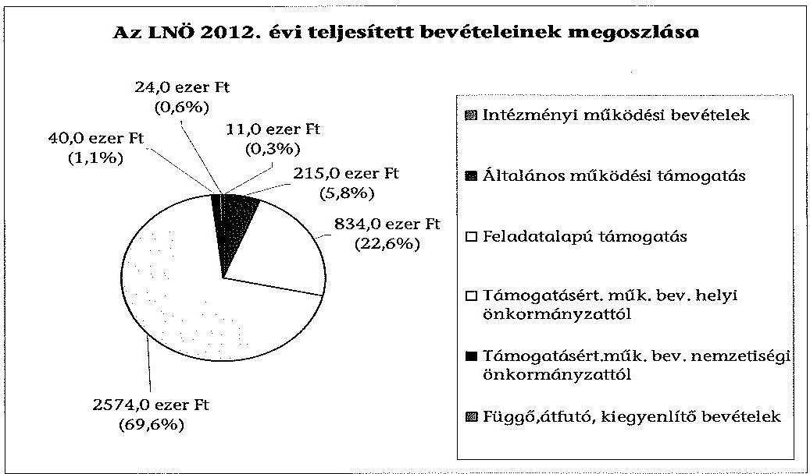
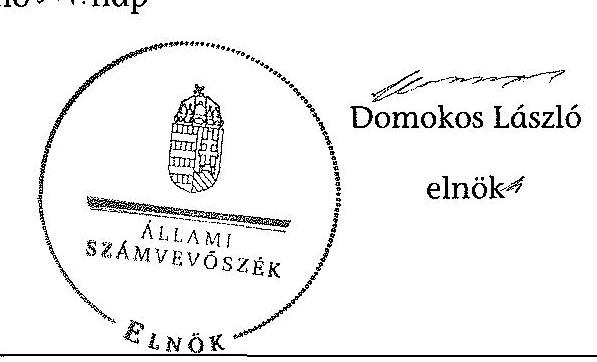

# ÁLLAMI   SZÁMVEVŐSZÉK 

## JELENTÉS

a helyi nemzetiségi önkormányzatok gazdálkodásának ellenőrzéséről
Lengyel Nemzetiségi Önkormányzat (XVIII. kerületi)

---

# Állami Számvevőszék 

Iktatószám: V-0329-025/2014.
Témaszám: 1363
Vizsgálat-azonosító szám: V065294

## Az ellenőrzést felügyelte:

Horváth Balázs
felügyeleti vezető
Az ellenőrzést vezette és az ellenőrzés végrehajtásáért felelős:
Kisgergely István
ellenőrzésvezető
A számvevőszéki jelentést készítették és a jelentés összeállításában
közreműködtek:
Komlósiné Bogár Éva
számvevő tanácsos
Varsányiné Dudás Eleonóra
számvevő
Az ellenőrzést végezte:
Varsányiné Dudás Eleonóra
számvevő

---

# TARTALOMJEGYZÉK 

BEVEZETÉS ..... 3
I. ÖSSZEGZŐ MEGÁLLAPÍTÁSOK, KÖVETKEZTETÉSEK, JAVASLATOK ..... 6
II. RÉSZLETES MEGÁLLAPÍTÁSOK ..... 12

1. Az LNÖ és a XVIII. kerületi Önkormányzat együttműködésének szabályozása, a működési feltételek biztosítása ..... 12
2. A gazdálkodási feladatok ellátásának szabályszerűsége ..... 13
2.1. A költségvetésre és a zárszámadásra, valamint a kincstári adatszolgáltatás rendjére vonatkozó jogszabályi előírások betartása ..... 13
2.2. Az LNÖ gazdálkodásának szabályozottsága ..... 14
2.3. Az operatív gazdálkodási jogkörök kialakítása, gyakorlása ..... 15
3. Az LNÖ-vel összefüggő gazdálkodási feladatok belső ellenőrzése ..... 16
4. A feladatalapú támogatás felhasználásának, elszámolásának szabályszerűsége, az LNÖ feladatellátása ..... 17

## MELLÉKLET

1. számú Az LNÖ 2012. évi gazdálkodásának főbb adatai, mutatói
2. számú Tájékoztatás a polgármesternek küldött el nem fogadott észrevételekről

## FÜGGELÉKEK

1. számú Rövidítések jegyzéke
2. számú Értelmező szótár
3. számú A gazdálkodás értékelésének módszere

---

.

---

# JELENTÉS 

## a helyi nemzetiségi önkormányzatok gazdálkodásának ellenőrzéséről Lengyel Nemzetiségi Önkormányzat (XVIII. kerületi)

## BEVEZETÉS

Az LNÖ 1998. évben alakult, elnöke a 2006. évi helyhatósági választások óta látja el feladatát. Az LNÖ intézményt, gazdasági társaságot és más szervezetet nem alapított. A négytagú Képviselő-testület munkája segítésére bizottságot nem hozott létre. Az LNÖ-nek a költségvetési beszámolója szerint a 2012. évben a módosított költségvetési bevételi és kiadási előirányzata 3682 ezer Ft, a teljesített költségvetési bevétele 3674 ezer Ft, a teljesített költségvetési kiadása 3038 ezer Ft volt. A 2012. évi gazdálkodási adatokat részletesen az 1. számú mellékletben mutatjuk be.

Az Alaptörvény XXIX. cikk (1) bekezdése szerint a Magyarországon élő nemzetiségek államalkotó tényezők. Minden, valamely nemzetiséghez tartozó magyar állampolgárnak joga van önazonossága szabad vállalásához és megőrzéséhez. A hazánkban élő nemzetiségek helyi (települési és területi), valamint országos önkormányzatokat hozhatnak létre. A helyi nemzetiségi önkormányzatok gazdálkodási feladatait jogszabályi előírás alapján a székhely szerinti helyi önkormányzat polgármesteri hivatala látja el.

A nemzetiségek helyzete, támogatása mind hazai, mind EU-s szinten kiemelt figyelmet kap napjainkban. A helyi nemzetiségi önkormányzatok gazdálkodására és támogatási rendszerére vonatkozó jogszabályok a 2010-2012. években jelentős változásokon mentek át. A települési és területi nemzetiségi önkormányzatok gazdálkodásának, a részükre juttatott költségvetési támogatások felhasználásának ellenőrzését az ÁSZ a 2012. évben sorozatjellegű ellenőrzés keretében indította el. A 2013. évi ellenőrzések e témacsoportos ellenőrzések folytatását jelentik, amelyet az ÁSZ 2014 első félévi ellenőrzési terve 12. témasorszámon tartalmaz.

Az ellenőrzés célja annak értékelése volt, hogy az LNÖ gazdálkodási kereteinek kialakítása, gazdálkodása és feladatellátása megfelelt-e a jogszabályoknak.

Ennek keretében értékeltük, hogy:

- az LNÖ és a XVIII. kerületi Önkormányzat együttműködésének szabályozása, a működési feltételek biztosítása megfelelt-e a jogszabályi előírásoknak;

---

- a felek együttműködése megfelelt-e a közöttük létrejött megállapodásnak a gazdálkodási feladatok szabályszerű ellátása során, ennek keretében betartották-e az LNÖ gazdálkodásához kapcsolódóan a költségvetésre és zárszámadásra, a gazdálkodás szabályozására, az operatív gazdálkodási jogkörök gyakorlására vonatkozó jogszabályi előírásokat;
- a jegyző biztosította-e az LNÖ gazdálkodásának belső ellenőrzését;
- az LNÖ feladatalapú támogatásának felhasználása, a folyósított feladatalapú támogatással történő elszámolás az előírásoknak megfelelő volt-e;
- az LNÖ feladatellátása összhangban volt-e a vonatkozó jogszabályi előírásokkal.

Az ellenőrzés várható hasznosulását négy szinten tervezzük. A törvényalkotás számára összegzett tapasztalatok állnak rendelkezésre a nemzetiségi önkormányzatok testületi döntéseinek, gazdálkodásának és a feladatalapú támogatás felhasználásának szabályszerűségéről, amelynek alapján következtetést lehet levonni arra, hogy indokolt-e jogszabályi módosítás kezdeményezése. Az ellenőrzés az ellenőrzött számára visszajelzést ad a működésében fellépő hiányosságokról, javaslataival hozzájárul azok kiküszöböléséhez, amely csökkentheti a későbbi ellenőrzések gyakoriságát. Az ellenőrzés megállapításai és javaslatai tanulságul szolgálhatnak más nemzetiségi önkormányzatok, szervezetek számára a rendezett gazdálkodási keretek kialakításához. A társadalom számára jelzi, hogy közpénz nem maradhat ellenőrizetlenül, az ÁSZ értékteremtő rend kialakításához és megőrzéséhez hozzájáruló tevékenysége pozitív hatással lesz a szervezetről kialakított összkép formálásában. Az ÁSZ szervezetén belül lehetőség nyílik arra, hogy a megállapítások szintetizálásával az intézmény a hozzáadott értéket teremtő elemző tevékenységét és tanácsadó szerepét erősítse.

Az LNÖ gazdálkodásának ellenőrzéséről szóló jelentés I. fejezetének összegző része az ellenőrzés céljára adott rövid, szintetizáló összefoglalót és következtetéseket tartalmazza a II. fejezet részletes megállapításain alapulóan. A jelentés intézkedést igénylő megállapításait és javaslatait - az összegzőben foglaltak mellett - az ellenőrzés során feltárt, a jelentés II. fejezetében rögzített részletes megállapítások alapozzák meg, illetve támasztják alá.

Az ellenőrzés típusa: szabályszerűségi ellenőrzés
Az ellenőrzött időszak: 2012. január 1. - 2012. december 31. közötti időszak. Az ellenőrzés kiterjedt a helyi nemzetiségi önkormányzatnak juttatott 2012. évi támogatás 2013. évben való elszámolására is.

Ellenőrzött szervezet: Lengyel Nemzetiségi Önkormányzat és a gazdálkodási feladatait ellátó Budapest XVIII. Kerület Pestszentlőrinc-Pestszentimre Önkormányzat.

Az ellenőrzés végrehajtásának jogszabályi alapját az ÁSZ tv. 5. § (2)-(3) és (6) bekezdéseiben foglaltak képezik.

---

Az ellenőrzés szakmai módszertana az ÁSZ hivatalos honlapján (www.asz.hu) közzétett szakmai szabályokon alapult, amely a Legfőbb Ellenőrző Intézmények Nemzetközi Szervezete (INTOSAI) által kiadott nemzetközi standardok (ISSAI) figyelembevételével készült.

A helyi nemzetiségi önkormányzatok gazdálkodásának ellenőrzése során értékeltük a XVIII. kerületi Önkormányzat és az LNÖ együttműködésének, a gazdálkodás szabályozottságának és a pénzügyi folyamatokban kulcsszerepet betöltő belső kontrollok (teljesítésigazolás és érvényesítés) működésének megfelelőségét. A kulcskontrollokat a dologi kiadásokkal kapcsolatos kifizetéseknél véletlen mintavételi eljárást alkalmazva ellenőriztük. Ellenőriztük, hogy a jegyző biztosította-e az LNÖ gazdálkodásának belső ellenőrzését. Értékeltük a feladatalapú támogatások felhasználásának, elszámolásának szabályszerűségét, az LNÖ feladatellátása és a jogszabályi előírások összhangját.

Az ellenőrzés lefolytatásához az LNÖ és a gazdálkodási feladatait ellátó XVIII. kerületi Önkormányzat tanúsítványok és a kapcsolódó, dokumentumjegyzékben megjelölt dokumentumok elektronikus úton történő megküldésével, rendelkezésre bocsátásával szolgáltatott adatokat. Az adatszolgáltatás kontrollálása és szükség szerinti javítása a helyszíni ellenőrzés keretében történt. A minősítési szempontokat a 3. számú függelék tartalmazza.

Az ÁSZ tv. 29. § (1) bekezdése szerint a jelentéstervezetet megküldtük egyeztetésre a polgármesternek és a Nemzetiségi Önkormányzat elnökének. A Nemzetiségi Önkormányzat elnöke az ÁSZ tv. 29. § (2) bekezdésében foglalt észrevételezési jogával nem élt, a jelentéstervezetre észrevételt nem tett. A polgármester határidőben megküldött észrevétele és tájékoztatása alapján a jelentést módosítottuk, az el nem fogadott észrevételek indokolását a jelentés 2. számú melléklete tartalmazza.

---

# I. ÖSSZEGZŐ MEGÁLLAPÍTÁSOK, KÖVETKEZTETÉSEK, JAVASLATOK 

Az LNÖ és a XVIII. kerületi Önkormányzat együttműködésének szabályozása megfelelt a jogszabályi előírásoknak, az LNÖ a 2012. év folyamán rendelkezett a XVIII. kerületi Önkormányzattal megkötött, hatályos együttműködési megállapodással. A 2005-ben megkötött együttműködési megállapodás 1-nek a Nek. 2 tv-ben meghatározott, a gazdálkodási szabályok változása miatti felülvizsgálatát nem végezték el határidőre, azonban az együttműködési megállapodás 1 kiegészítését a Nek. 2 tv-ben rögzített határidőn belül 2012 márciusában végrehajtották. A működés feltételeit az előírásoknak megfelelően szabályozták, azonban azokat a Nek. 2 tv-ben foglaltak ellenére az együttműködési megállapodás 2 megkötését, módosítását követő 30 napon belül nem rögzítették az LNÖ SZMSZ-ében. Az LNÖ gazdálkodási feladatai ellátásának szabályait -az Áht. 1,2-nek és a Nek. 2 tv.-nek megfelelően - a 2012. december 31-én hatályos együttműködési megállapodás 2-ban teljes körűen rögzítették. Az LNÖ működési feltételeit a XVIII. kerületi Önkormányzat biztosította 2012-ben, azonban nem készítették el az együttműködési megállapodás 1-2-ban meghatározott Helyiséghasználati rendet.

A szabályozási hiányosságok kijavítására az ellenőrzött időszakot követően intézkedtek, megtörtént az LNÖ SZMSZ-ének módosítása és felülvizsgálták együttműködési megállapodás 2-t, amelynek melléklete az elkészült Helyiséghasználati rend.

Az LNÖ 2012. évi költségvetésének és zárszámadásának tartalma, jóváhagyása, valamint a kapcsolódó adatszolgáltatás nem felelt meg a jogszabályi előírásoknak. A Képviselő-testület által jóváhagyott 2012. évi költségvetésben nem mutatták be teljes körűen az Áht. 2-ben és az Ávr.-ben meghatározott mérlegeket és kimutatásokat. A jegyző által elkészített 2012. évi zárszámadási határozattervezetet az LNÖ elnöke az Áht. 2-ben előírt határidőn belül beterjesztette a Képviselő-testületnek, azonban abban nem mutatták be az Áht. 2-ben előírt mérlegeket és kimutatásokat. A Képviselő-testület 2012. évi zárszámadásról szóló határozata nem az Áht. 2 szerinti részletezettségű volt, így nem biztosította az összehasonlíthatóságot az elfogadott elemi költségvetéssel, továbbá nem mutatta be az LNÖ bevételei és kiadásai összegét. Az elfogadott éves beszámoló tartalma megfelelt a jogszabályi előírásoknak. A jegyző az ellenőrzött időszakban az Áhsz. 1-ben és az Ávr.-ben előírt, az LNÖ-re vonatkozó kincstári adatszolgáltatási kötelezettségeit teljesítette, azonban az elemi költségvetés, a negyedéves időközi költségvetési és a mérlegjelentések, valamint a féléves és az éves elemi költségvetési beszámoló vonatkozásában a jogszabályban előírt határidőket nem tartotta be.

Az LNÖ gazdálkodásának szabályozottsága az ellenőrzött időszakban megfelelt a jogszabályi előírásoknak. A gazdálkodási feladatok végrehajtását ellátó Polgármesteri Hivatal 2012-ben a Számv. tv. és a Bkr. által előírt gazdálkodásra vonatkozó szabályzatok hatályát az LNÖ gazdálkodására is kiterjesztette. A Polgármesteri Hivatal SZMSZ-e tartalmazta az Ávr.-ben foglaltak szerinti, az LNÖ gazdálkodásával kapcsolatos feladat- és hatásköröket, a hatáskörök gyakorlásának módját, az ezekhez kapcsolódó felelősségi szabályokat. Az ellátandó feladatokat és a helyettesítés rendjét a gazdasági szervezet ügyrendje tartalmazta.

Az LNÖ gazdálkodása tekintetében az operatív gazdálkodási jogkörök kialakítása megfelelt az előírásoknak, azonban az LNÖ elnöke a teljesítést igazoló személy írásbeli kijelölését, a gazdasági vezető a pénzügyi ellenjegyzők és az érvényesítő személyek kijelölését az Ávr. hatályba lépését követően csak 2012. május 20-ától tette meg. A Polgármesteri Hivatal rendelkezett gazdasági szervezettel, a gazdasági vezető végzettsége megfelelt az Ávr.-ben előírt szakképesítési követelményeknek.

Az LNÖ-nél a 2012. évben a dologi kiadások teljesítése során a teljesítés igazolása és az érvényesítés kulcskontrollok működésének megfelelősége gyenge volt, a hibák száma a lényegességi szintet, a kritikus hibahatárt elérte. Az Ávr.-ben foglaltak ellenére a kiadás teljesítésének igazolását és az érvényesítést jogosulatlan személyek végezték 2012. május 20-a előtt. A teljesítésigazoló nem tartotta be a belső szabályzat előírásait az igazolás során. Az érvényesítő nem ellenőrizte, hogy a megelőző ügymenetben az Ávr. és az operatív gazdálkodási szabályzat 1,2 előírásait betartották-e, nem jelezte az utalványozónak, hogy a teljesítésigazolás szabálytalan volt, továbbá nem észrevételezte a vezetett kötelezettségvállalási nyilvántartás tartalmi hiányosságait. A dologi kiadások három legnagyobb összegű könyvelési tételének egyike esetében jogosulatlan személy általi teljesítésigazolás és érvényesítés fordult elő. A számvevőszéki ellenőrzés a rendelkezésre bocsátott bizonylatok alapján a kiadások dokumentumainak ellenőrzése során összeférhetetlenséget, illetve jogosulatlan kifizetést nem tárt fel, a kulcskontrollok működéséhez kapcsolódó hiányosságok miatt nem biztosították a hibák megelőzését, feltárását és kijavítását. Az LNÖ a 2012. évben nem teljesített támogatásértékű kiadást, valamint államháztartáson kívülre működési és felhalmozási célra pénzeszközátadást.

A jegyző a jogszabályi előírásoknak megfelelően biztosította az LNÖ gazdálkodásával összefüggő végrehajtási feladatok belső ellenőrzését. A
 Polgármesteri Hivatal éves belső ellenőrzési tervét megalapozó kockázatelemzés kiterjedt a nemzetiségi önkormányzatok gazdálkodásával összefüggő végrehajtási feladatok ellátására, amely alacsony kockázati minősítést kapott. A módosított éves belső ellenőrzési terv szerinti, a nemzetiségi önkormányzatokra vonatkozó célellenőrzést megvalósították. A nemzetiségi önkormányzatok részére az ellenőrzési jelentés-tervezetet küldte meg a Belső Ellenőrzési Csoport. Az ellenőrzési jelentésben megállapított hiányosságok kijavítására a Bkr.-ben meghatározott határidőn túl készített a jegyző intézkedési tervet. Az intézkedések megvalósítása folyamatban volt, 2012-ben kettő, 2013-ban négy javaslathoz készített a jegyző intézkedési tervet.

Az LNÖ részére a 2011. és a 2012. években folyósított feladatalapú támogatás felhasználása, elszámolása nem felelt meg a jogszabályi előírásoknak. Az LNÖ a 2012. évben 834,3 ezer Ft feladatalapú támogatásban részesült, amelyet a Kincstár 2012. december 4-én utalt ki. A Képviselő-testület a költségvetést a támogatással módosította, a felhasználás konkrét céljairól döntött. A tárgyévben 205,7 ezer Ft-ot a Nek. ${ }_{2}$ tv. szerinti nemzetiségi közügyek érdekében felhasználtak, a feladatalapú támogatásból 628,6 ezer Ft kötelezettségvállalással nem terhelt maradvány keletkezett. Az LNÖ nem tett eleget az Áht. ${ }_{2}$-ben előírtaknak azáltal, hogy a keletkezett 628,6 ezer Ft összegű, kötelezettségvállalással nem terhelt maradványáról nem mondott le és nem fizette vissza azt a központi költségvetés javára.

A 2011. évben az LNÖ 1110,6 ezer Ft feladatalapú támogatásban részesült, amelyből 2011. december 31-én a kötelezettségvállalással nem terhelt maradvány összege 241,0 ezer Ft volt. Az LNÖ a maradvány összegét a támogatási kormányrendelet ${ }_{1}$-ben meghatározott, felhasználásra rendelkezésre álló időpontig teljes egészében a támogatási céloknak megfelelően felhasználta. A feladatalapú támogatásokról a támogatási kormányrendelet ${ }_{1,2}$ előírása alapján az Áht. ${ }_{1,2}$-ben foglaltak ellenére az elszámolások nem történtek meg, a támogatások felhasználását, elszámolását az ellenőrzésre jogosult szervek nem ellenőrizték.

Az LNÖ kötelező és önként vállalt feladatellátásának tárgya az ellenőrzött 2012. évben összhangban volt a Nek. ${ }_{2}$ tv. előírásaival. Az LNÖ a Nek. ${ }_{2}$ tv.-ben meghatározott hatósági tevékenységet nem végzett.

Az ÁSZ tv. 33. § (1) bekezdésében foglaltak értelmében az ellenőrzött szervezet vezetője köteles a jelentésben foglalt megállapításokhoz kapcsolódó intézkedési tervet összeállítani, és azt a jelentés kézhezvételétől számított 30 napon belül az ÁSZ részére megküldeni. Amennyiben az intézkedési tervet határidőre nem küldi meg a szervezet, vagy az nem elfogadható, az ÁSZ elnöke az ÁSZ tv. 33. § (3) bekezdés a)-b) pontjaiban foglaltakat érvényesítheti.

A helyszíni ellenőrzés megállapításainak hasznosítása mellett javasoljuk:

# a jegyzőnek 

1. az együttműködés szabályozásával kapcsolatban

Az együttműködési megállapodás ${ }_{1}$-t a Nek. ${ }_{2}$ tv. 80. § (2) bekezdésének előírása ellenére 2012. január 31-éig nem vizsgálták felül.

Javaslat
Biztosítsa a jövőben az együttműködési megállapodás évenkénti felülvizsgálata során a Nek. ${ }_{2}$ tv. 80. § (2) bekezdésében előírt határidő betartását.
2. a költségvetési és zárszámadási határozattal, valamint a kincstári adatszolgáltatással kapcsolatban

A költségvetés előterjesztésekor az Áht. ${ }_{2}$ 24. § (4) bekezdés a) pontjában előírtak ellenére - a jegyző mulasztása miatt - nem mutatták be tájékoztatásul a Képviselőtestületnek szöveges indoklással együtt az LNÖ költségvetési mérlegét közgazdasági tagolásban és az előirányzat-felhasználási tervét. A zárszámadásról szóló előterjesztésben - a jegyző általi elkészítés hiányában - nem mutatták be az Áht. ${ }_{2}$ 91. § (2) bekezdés a) pontja szerinti mérlegeket és kimutatásokat. Az Áht. ${ }_{2}$ 89. § (1) bekezdésében foglaltak ellenére a zárszámadás nem volt összehasonlítható a 2012. évben elfogadott költségvetéssel.

A jegyző az LNÖ-re vonatkozó az Ávr. 33. §-ában, 169. § (2) bekezdésében és 170. § (5) bekezdésében, valamint az Áhsz. 10. § (5a) bekezdésében előírt 2012. évi kincstári adatszolgáltatási kötelezettségének késve tett eleget.

Javaslat
A költségvetés és zárszámadás szabályszerűsége, az előírt adatszolgáltatás betartása érdekében a jövőben gondoskodjon arról, hogy
a) a költségvetési és zárszámadási határozattervezetek előterjesztésekor a Képviselőtestület részére tájékoztatásul mutassák be az Áht. ${ }_{2}$ 24. § (4) bekezdés a) pontja és az Áht. ${ }_{2}$ 91. § (2) bekezdés a) pontja szerinti mérlegeket és kimutatásokat;
b) a zárszámadást az Áht. ${ }_{2}$ 89. § (1) bekezdése előírása szerint az elfogadott költségvetéssel összehasonlítható módon készítsék el;
c) a kincstári adatszolgáltatási kötelezettségeinek az Ávr. 33. §-ában, 169. § (2) és 170. § (5) bekezdéseiben, valamint az Áhsz. ${ }_{2}$ 32. § (4) bekezdésében előírt határidők betartásával tegyenek eleget.
3. a kulcskontrollok működésével kapcsolatban

Az Ávr. 57. § (3) bekezdésben foglaltak ellenére nem szabályszerűen történt a kifizetés jogosságának, összegszerűségének és a szerződésszerű teljesítésnek az igazolása, a teljesítésigazolás során az operatív gazdálkodási szabályzat ${ }_{2}$-ben a teljesítésigazolásra előírt 3. számú mellékletet nem csatolták a számlákhoz;

Az érvényesítő nem az Ávr. 58. § (1)-(2) bekezdésében és az operatív gazdálkodási szabályzat ${ }_{2}$ előírásai szerint látta el ellenőrzési feladatát, mert nem ellenőrizte a megelőző ügymenetben a jogszabályi és a belső szabályzat előírásainak betartását, nem jelezte, hogy a teljesítés igazolása nem szabályszerűen történt.

Javaslat
Az operatív gazdálkodás működési hibáinak megelőzése, feltárása és kijavítása érdekében gondoskodjon arról, hogy:
a) a teljesítésigazolást az Ávr. 57. § (3) bekezdésében előírtak szerint végezzék el;
b) az Ávr. 58. § (1)-(2) bekezdései alapján az érvényesítő maradéktalanul lássa el ellenőrzési és jelzési feladatát.
4. a belső ellenőrzéssel kapcsolatban

A 2012. évben elvégzett belső ellenőrzésről készült jelentésben megállapított hiányosságok megszüntetésére készített intézkedési terv vonatkozásában a jegyző nem tartotta be a Bkr. 45. § (3) bekezdésében előírt határidőt, mivel a belső ellenőrzés által tett javaslatok közül négy esetben azt a lezárt ellenőrzési jelentés kézhezvételét követő 8 napon túl készítette el.

Javaslat
A jövőben intézkedjen, hogy a belső ellenőrzési jelentésben megállapított hiányosságok megszüntetésére a Bkr. 45. § (3) bekezdésében előírt határidőben készüljenek el az intézkedési tervek.
5. a feladatalapú támogatás elszámolásával kapcsolatban

A 2011. évi feladatalapú támogatás elszámolása a támogatási kormányrendelet 7. § (2) bekezdésében hivatkozott, valamint a 2012. évi feladatalapú támogatás elszámolása a támogatási kormányrendelet 8. § (5) bekezdésében hivatkozott „a helyi önkormányzatok elszámolási és ellenőrzési rendjére vonatkozó jogszabályok rendelkezései alkalmazandóak" előírása alapján az Áht. 64. § (7) bekezdése és az Áht. ${ }_{2}$ 57. § (3) bekezdése ellenére nem történt meg.

Javaslat:
Intézkedjen az Áht. ${ }_{2}$ 27. § (2) bekezdésében meghatározott feladatkörében a LNÖ által igénybe vett 2011. évi és 2012. évi feladatalapú támogatás rendeltetésszerű felhasználásáról szóló elszámolás elkészítéséről, az Áht. ${ }_{2}$ 53. § (1) bekezdése szerinti beszámolási kötelezettség teljesítéséhez.

# a Nemzetiségi Önkormányzat elnökének 

1. A költségvetés előterjesztésekor az Áht. ${ }_{2}$ 24. § (4) bekezdés a) pontjában előírtak ellenére nem mutatták be - a jegyző mulasztása miatt - a Képviselő-testületnek tájékoztatásul szöveges indoklással a LNÖ költségvetési mérlegét közgazdasági tagolásban és az előirányzat-felhasználási tervét. A zárszámadásról szóló előterjesztésben - a jegyző általi elkészítés hiányában - nem mutatták be az Áht. ${ }_{2}$ 91. § (2) bekezdés a) pontja szerinti mérlegeket és kimutatásokat

Javaslat
Terjessze a jövőben a költségvetési és a zárszámadási határozattervezetek előterjesztésekor a Képviselő-testület elé tájékoztatásul - a jegyző által előkészített - az Áht. ${ }_{2}$ 24. § (4) bekezdése a) pontjában és az Áht. ${ }_{2}$ 91. § (2) bekezdés a) pontjában előírt mérlegeket és kimutatásokat.
2. Az LNÖ nem tett eleget az Áht. ${ }_{2}$ 57. § (2) bekezdésében előírtaknak azáltal, hogy a meghatározott célra fel nem használt 2012. évi feladatalapú támogatás 2012. december 31-éig kötelezettségvállalással nem terhelt 628,6 ezer Ft összegű maradványáról nem mondott le és nem fizette vissza azt a központi költségvetés javára.

Javaslat
Terjessze a Képviselő-testület elé jóváhagyásra az Áht. ${ }_{2}$ 57/A. § (1) bekezdés előírásának megfelelően a 2012. évi feladatalapú támogatás kötelezettségvállalással nem terhelt maradványáról történő lemondást és intézkedjen a maradvány összegének visszafizetéséről a központi költségvetés javára.

3. A 2011. évi feladatalapú támogatás elszámolása a támogatási kormányrendelet ${ }_{1}$ 7. § (2) bekezdésében hivatkozott, valamint a 2012. évi feladatalapú támogatás elszámolása a támogatási kormányrendelet ${ }_{2}$ 8. § (5) bekezdésében hivatkozott „a helyi önkormányzatok elszámolási és ellenőrzési rendjére vonatkozó jogszabályok rendelkezései alkalmazandóak" előírása alapján az Áht. ${ }_{1}$ 64. § (7) bekezdése és az Áht. ${ }_{2}$ 57. § (3) bekezdése ellenére nem történt meg.

Javaslat
Terjessze a Képviselő-testület elé jóváhagyásra az Áht. ${ }_{2}$ 53. § (1) bekezdése szerinti beszámolási kötelezettség teljesítéséhez összeállított, az LNÖ által igénybe vett 2011. és 2012. évi feladatalapú támogatás rendeltetésszerű felhasználásáról szóló elszámolást.

# II. RÉSZLETES MEGÁLLAPÍTÁSOK 

## 1. Az LNÖ És a XVIII. Kerületi Önkormányzat együttműködésének szabályozása, a működési feltételek biztosítása

Az LNÖ és a XVIII. kerületi Önkormányzat együttműködésének szabályozása megfelelt a jogszabályi előírásoknak.

Az LNÖ a 2012. év folyamán rendelkezett a XVIII. kerületi Önkormányzattal megkötött, hatályos együttműködési megállapodás ${ }_{1-2}$-sal ${ }^{1}$. A 2012. január 1-jén hatályos, 2005. február 1-jén megkötött együttműködési megállapodás ${ }_{1}$-nak a gazdálkodási szabályok változása miatti felülvizsgálatát nem végezték el a Nek. ${ }_{2}$ tv. 80. § (2) bekezdésében meghatározott határidőre, 2012. január 31-éig. A Nek. ${ }_{2}$ tv. 159. § (3) bekezdésében előírt módosítást és kiegészítést határidőben végrehajtották, amelynek eredményeképpen az együttműködési megállapodás ${ }_{2}$-t 2012. március 12-én írták alá.

A 2012. december 31-én hatályos együttműködési megállapodás ${ }_{2}$-ban az LNÖ működési feltételeit az előírásoknak megfelelően szabályozták, azonban azokat a Nek. ${ }_{2}$ tv. 80. § (2) bekezdésében foglaltak ellenére a megállapodás megkötését, módosítását követő 30 napon belül nem rögzítették az LNÖ SZMSZ-ében.

Az ellenőrzött időszakot követően a Képviselő-testület elfogadta az LNÖ módosított SZMSZ-ét ${ }^{2}$, amelynek melléklete az együttműködési megállapodás ${ }_{3}$.

Az LNÖ gazdálkodási feladatai ellátásának szabályait - az Áht. ${ }_{2}$-nek és a Nek. ${ }_{2}$ tv.-nek megfelelően - a 2012. december 31-én hatályos együttműködési megállapodás ${ }_{2}$-ban teljes körűen rögzítették. Az együttműködési megállapodás ${ }_{2}$ az érvényesítők jegyző általi kijelölését tartalmazta ${ }^{3}$, amely nem felelt meg az Áht. ${ }_{2}$ 38. § (2) bekezdésében és az Ávr. 55. § (2) bekezdés g) pontjában, illetve az 58. § (4) bekezdésében előírtaknak.

Az ellenőrzött időszakot követően, 2013. október 11-én kötött együttműködési megállapodás ${ }_{3}$ már a jogszabályoknak megfelelően tartalmazta az érvényesítő kijelölését.

Az LNÖ működésének előírt személyi és tárgyi feltételeit a XVIII. kerületi Önkormányzat biztosította 2012-ben, azonban az együttműködési megállapodás ${ }_{2}$-ban külön megállapodásként meghatározott Helyiséghasználati rendet 2012. évben
 végéig nem készítették el.

Az ellenőrzött időszakot követően elkészített 2013. évi együttműködési megállapodás ${ }_{3} 1$. számú mellékleteként meghatározták a Helyiséghasználati rendet.

# 2. A GAZDÁLKODÁSI FELADATOK ELLÁTÁSÁNAK SZABÁLYSZERŰSÉGE 

### 2.1. A költségvetésre és a zárszámadásra, valamint a kincstári adatszolgáltatás rendjére vonatkozó jogszabályi előírások betartása

Az LNÖ 2012. évi költségvetésének és zárszámadásának tartalma, jóváhagyása, valamint a kapcsolódó adatszolgáltatás nem felelt meg a jogszabályi előírásoknak.

Az LNÖ elnöke a 2012. évi költségvetési határozat tervezetét az Áht. ${ }_{2}$-ben előírt határidőben benyújtotta a Képviselő-testületnek. A Képviselő-testület által jóváhagyott költségvetésben ${ }^{4}$ azonban az Áht. ${ }_{2} 24 . \S$ (4) bekezdés a) pontjában előírtak ellenére nem mutatták be szöveges indoklással az LNÖ költségvetési mérlegét közgazdasági tagolásban és az előirányzat-felhasználási tervét.

A jegyző által elkészített 2012. évi zárszámadási határozat-tervezetet az LNÖ elnöke az Áht. ${ }_{2}$-ben előírt határidőn belül, 2012. április 10-én beterjesztette a Képviselő-testületnek. Az előterjesztésben nem mutatták be az Áht. ${ }_{2} 91 . \S$ (2) bekezdés a) pontja szerinti - az Áht. ${ }_{2} 24 . \S$ (4) bekezdésében előírt - mérlegeket és kimutatásokat, a jegyzőkönyvhöz az LNÖ 2012. évi éves beszámolóját mellékelték.

A 2012. évi zárszámadásról szóló határozat ${ }^{5}$ az Áht. ${ }_{2}$ 89. § (1) bekezdése ellenére nem biztosította az összehasonlíthatóságot az elfogadott költségvetéssel. A jóváhagyott határozatában az LNÖ nem mutatta be bevételei és kiadásai összegét.

A jegyző az ellenőrzött időszakban az Áhsz. ${ }_{1}$-ben és az Ávr.-ben előírt, az LNÖ-re vonatkozó kincstári adatszolgáltatási kötelezettségeinek eleget tett, azonban a határidőket nem tartotta be:

- a 2012. évi elemi költségvetéshez kapcsolódó, az Ávr. 33. §-ában előírt adatszolgáltatást késedelmesen ${ }^{6}$, 2012. március 28-án teljesítette;
- a 2012. évi negyedéves időközi költségvetési jelentéseket az Ávr. 169. § (2) bekezdésében előírt határidőkön túl ${ }^{7}$ (2012. április 24-én, július 26-án, október 29-én), az éves költségvetési jelentést 2013. január 19-én, határidőben teljesítette;

[^0]
[^0]:    ${ }^{4}$ A 2/2012. (II. 2.) számú LNÖ határozat a 2012. évi költségvetés elfogadásáról.
    ${ }^{5}$ A 18/2013. (IV. 10.) számú LNÖ határozat a 2012. évi zárszámadás és a 19/2013. (IV. 10.) számú LNÖ határozat a 2012. évi éves beszámoló elfogadásáról.
    ${ }^{6}$ Az előterjesztés időpontja 2012. február 2-a volt, a késedelmes napok száma 23.
    ${ }^{7}$ A jogszabályban előírt határidő április 20., július 20., október 20.; a késedelmes napok száma 4, 6, 5 nap volt.

---

- a 2012. évi időközi mérlegjelentéseket az Ávr. 170. § (5) bekezdésében előírt határidőkön túl ${ }^{8}$ (2012. április 27-én, augusztus 1-jén, október 29-én) teljesítette;
- a 2012. évi I. féléves és éves elemi költségvetési beszámolóját az Áhsz. 10. § (5a) bekezdésében előírt határidőkön túl ${ }^{9}$, 2012. augusztus 14-én, illetve 2013. március 14-én késedelmesen nyújtotta be. A beszámolókat 2012. augusztus 9-én, illetve 2013. március 11-én, szintén késedelmesen ${ }^{10}$ készítették el.

# 2.2. Az LNÖ gazdálkodásának szabályozottsága 

Az LNÖ gazdálkodásának szabályozottsága az ellenőrzött időszakban megfelelt a jogszabályi előírásoknak.

A gazdálkodási feladatok végrehajtását ellátó Polgármesteri Hivatal 2012-ben a Számv. tv.-ben és a Bkr.-ben előírt, gazdálkodásra vonatkozó szabályzatok ${ }^{11}$ hatályát az LNÖ gazdálkodására is kiterjesztette.

A Polgármesteri Hivatal SZMSZ-e tartalmazta az Ávr. 13. § (1) bekezdés g) pontjában foglaltak szerinti, az LNÖ gazdálkodásával kapcsolatos feladat- és hatásköröket, a hatáskörök gyakorlásának módját, a helyettesítés rendjét, az ezekhez kapcsolódó felelősségi szabályokat. A Polgármesteri Hivatalban az LNÖ gazdálkodásával összefüggésben ellátandó feladatokat és a helyettesítés rendjét a gazdasági szervezet ügyrendje tartalmazta.

[^0]
[^0]:    ${ }^{8}$ A jogszabályban előírt határidő április 25., július 25., október 25.; a késedelmes napok száma 2, 7, 4 nap volt.
    ${ }^{9}$ A jogszabályban előírt határidő a féléves beszámolónál 2012. augusztus 10., az éves beszámolónál 2013. március 10.; a késedelmes napok száma 4, illetve 2 nap volt.
    ${ }^{10}$ A jogszabályban előírt határidő a féléves beszámolónál 2012. július 31., az éves beszámolónál 2013. február 28.; a késedelmes napok száma 9, illetve 11 nap volt.
    ${ }^{11}$ Számviteli politika, Eszközök és források leltárkészítési és leltározási szabályzata, Eszközök és források értékelési szabályzata, Pénz és értékkezelési szabályzat, Számlarend, ellenőrzési nyomvonal, szabálytalanságok kezelésének eljárásrendje, kockázatkezelési szabályzat, folyamatba épített, előzetes, utólagos és vezetői ellenőrzés szabályozása, gazdasági szervezet ügyrendje, munkaköri leírások. A Polgármesteri Hivatalban az ellenőrzött időszakban két gazdálkodási szabályzat volt érvényben: a gazdálkodási szabályzat ${ }_{1}$-et 2011-ben többször módosították [21/2011. (III. 16.), 28/2011. (V. 16.), 33/2011. (VII. 15.), 34/2011. (VIII. 1.), 37/2011. (IX. 1.), 42/2011. (XI. 14.)]. A 2012. május 20-ától hatályos gazdálkodási szabályzat ${ }_{2}$-t a 41/2012. (X. 17.) és a 45/2012. (XII. 18.) számú polgármesteri-jegyzői együttes utasításokkal módosították.

---

# 2.3. Az operatív gazdálkodási jogkörök kialakítása, gyakorlása 

Az LNÖ gazdálkodása tekintetében az operatív gazdálkodási jogkörök kialakítása megfelelt a jogszabályi előírásoknak, azonban:

- az LNÖ elnöke az Áht. ${ }_{3} 38. § (2) bekezdése és az Ávr. 57. § (4) bekezdése ellenére a teljesítésigazoló személyek írásbeli kijelölését csak 2012. május 20-ától végezte el az operatív gazdálkodási szabályzat ${ }_{2}$ hatályba lépésével;
- a Polgármesteri Hivatalban a gazdasági vezető ${ }^{12}$ 2012. május 20-ától hatalmazott fel más személyt a pénzügyi ellenjegyzésre és az érvényesítésre.

A Polgármesteri Hivatal az ellenőrzött időszakban rendelkezett gazdasági szervezettel ${ }^{13}$, a gazdasági vezető végzettsége megfelelt az Ávr.-ben előírt szakképesítési követelményeknek.

Az LNÖ-nél a 2012. évben a dologi kiadások teljesítése során a teljesítés igazolása és az érvényesítés kulcskontrollok működésének megfelelősége gyenge volt, a hibák száma a lényegességi szintet, a kritikus hibahatárt elérte, mert:

- a teljesítés igazolását az Ávr. 57. § (4) bekezdése előírása ellenére 2012. május 19-éig az LNÖ elnöke általi kijelöléssel nem rendelkező személy jogosulatlanul látta el, ezért az Ávr. 57. § (3) bekezdésben foglaltak ellenére nem szabályszerűen történt a kifizetés jogosságának, összegszerűségének és a szerződésszerű teljesítésnek az igazolása;
- a teljesítésigazoló az operatív gazdálkodási szabályzat ${ }_{3}$ szerint a teljesítésigazolásra előírt 3. számú mellékletet nem csatolta a számlák mellé, az igazolásra használt bélyegző szövege nem tartalmazta a teljesítés megtörténtének az igazolását;
- az érvényesítő 2012. május 19-éig nem jogszerű kijelölés alapján látta el feladatát, mivel arra nem a gazdasági vezető jelölte ki, az Áht. ${ }_{2} 38. § (2) bekezdésében és az Ávr. 55. § (2) bekezdés g) pontjában, illetve az 58. § (4) bekezdésében előírtak ellenére;
- az érvényesítő a kiadások érvényesítése során nem az Ávr. 58. § (1)(2) bekezdéseiben és az operatív gazdálkodási szabályzat ${ }_{1,2}$-ban előírtak szerint látta el az ellenőrzési feladatát. Nem ellenőrizte és nem jelezte az utalványozónak, hogy a 100 ezer Ft alatti kötelezettségvállalások nyilvántartása nem felelt meg az Ávr. 56. § (1) bekezdésében előírtaknak, mert nem tartalmazta a kötelezettségvállalást tanúsító dokumentum iktatószámát, a kötelezettségvállaló nevét, a jogosult azonosító adatait, a kötelezettségvállalás összegének évek és előirányzatok szerinti megoszlását, a kifizetési határidőket, továbbá a teljesítési adatokat. Nem észrevételezte továbbá, hogy az operatív gazdálkodási szabályzat ${ }_{1,2}$ szerint a teljesítésigazolásra előírt 3. számú mellékletet nem csatolták a számlák mellé, a teljesítésigazolást nem szabályszerűen végezték el, valamint az Ávr. 58. § (2) bekezdése ellenére az érvényesítő nem győződött meg az Ávr. 57. § (4) bekezdésében foglaltak betartásáról (a teljesítés igazolását végző személyt a kötelezettségvállaló jelölte-e ki).

Az LNÖ-nél a 2012. évben a dologi kiadások három legnagyobb összegű kiadás teljesítése egyedi értékelése alapján a teljesítésigazolás és az érvényesítés kulcskontroll egy kifizetésnél nem működött megfelelően. A teljesítésigazolást és az érvényesítést arra jogszerű kijelöléssel nem rendelkező személyek látták el.

A számvevőszéki ellenőrzés a kiadások dokumentumainak ellenőrzése alapján összeférhetetlenséget, továbbá jogosulatlan kifizetést nem tárt fel, a kulcskontrollok működéséhez kapcsolódó hiányosságok miatt nem biztosított a hibák megelőzése, feltárása és kijavítása.

Az LNÖ a 2012. évben támogatásértékű kiadást, valamint államháztartáson kívülre működési és felhalmozási célra pénzeszközátadást nem teljesített.

# 3. Az LNÖ-VEL ÖSSZEFÜGGŐ GAZDÁLKODÁSI FELADATOK BELSŐ ELLENŐRZÉSE 

Az LNÖ gazdálkodásával összefüggő végrehajtási feladatok belső ellenőrzése megfelelő volt.

A jegyző a jogszabályi előírásoknak megfelelően biztosította az LNÖ gazdálkodásával összefüggő végrehajtási feladatok belső ellenőrzését ${ }^{14}$. A Polgármesteri Hivatal éves belső ellenőrzési tervét megalapozó kockázatelemzés kiterjedt a nemzetiségi önkormányzatok gazdálkodásával összefüggő végrehajtási feladatok ellátására, amely alacsony kockázati minősítést kapott. A 2012. évi módosított éves belső ellenőrzési terv alapján a nemzetiségi önkormányzatok célellenőrzését elvégezték, a belső ellenőrzésről készült jelentést ${ }^{15}$ a Belső Ellenőrzési Csoport vezetője 2012. október 16-án bemutatta a jegyzőnek.

A lefolytatott belső ellenőrzés megállapította, hogy nem készítették el az együttműködési megállapodásban előírtak szerint a helyiséghasználati rendet. A nemzetiségi önkormányzatok SZMSZ-ei nem tartalmazták a működési feltételeket. A GKI ügyrendje nem tartalmazta a nemzetiségi önkormányzatokkal kapcsolatos feladatokat, valamint hiányoztak az utalványozási joggal rendelkezők aláírás

[^0]
[^0]:    ${ }^{12}$ A gazdasági vezető által írásban kijelölt pénzügyi ellenjegyző és az érvényesítők aláírás-mintáját a gazdálkodási szabályzat ${ }_{2}$ melléklete tartalmazta.
    ${ }^{13}$ A Polgármesteri Hivatal SZMSZ-éről szóló, a 43/2011. (XI. 4.) számú, illetve a 3/2012. (IV. 2.) számú polgármesteri-jegyzői együttes utasítás 5.3. pontja szerint a Gazdasági és Költségvetési Iroda látja el a gazdálkodással összefüggő feladatokat.
    ${ }^{14}$ A belső ellenőrök rendelkeztek munkaköri leírással, valamint az Áht. ${ }_{2}$ 70. §-ában meghatározott engedéllyel, szerepeltek a költségvetési szervnél belső ellenőrzést végzők nyilvántartásában, valamint elkészítették a 2012. évre vonatkozó belső ellenőrzési kézikönyvet, amely a 7/2012. (II. 15.) számú polgármesteri és jegyzői együttes utasítás alapján lépett hatályba.
    ${ }^{15}$ 8/73697-6/2012. iktatószámú belső ellenőrzési jelentés „A Nemzetiségi Önkormányzatok átalakulásának, hivatali kontrolljai kialakításának vizsgálata"-ról.

---

mintái, továbbá az ellenőrzött dokumentumok esetében hiányosságot állapítottak meg a pénzügyi kontrollok működésére vonatkozóan.

A nemzetiségi önkormányzatok részére csak az ellenőrzési jelentés-tervezetet küldték meg.

Az ellenőrzés megállapításai hasznosultak, a feltárt hiányosságok megszüntetése érdekében a jegyző a Bkr. 45. § (3) bekezdésében meghatározott határidőn túl ${ }^{16}$, 2012-ben kettő, 2013-ban négy javaslathoz készített intézkedési tervet. A 2012. évi intézkedési tervben foglaltakat megvalósították, a 2013. évi intézkedési terv végrehajtása folyamatban volt.

A 2012. évben hatályos együttműködési megállapodás ${ }_{1,2}$ tartalmazták az LNÖ-vel összefüggő belső ellenőrzési feladatok ellátását. A megállapodásokban foglaltak szerint a könyvvizsgáló ellenőrzési tevékenységén kívül az LNÖ pénzügyi ellenőrzését a XVIII. kerületi Önkormányzat belső ellenőre is ellátta.

Az ellenőrzéshez szolgáltatott adatok alapján a 2012. évben a Kormányhivatal az LNÖ-t illetően nem élt törvényességi felügyeleti eszközökkel.

# 4. A feladatalapú támogatás felhasználásának, elszámolásának szabályszerűsége, az LNÖ feladatellátása 

Az LNÖ részére a 2011.
 és a 2012. években folyósított feladatalapú támogatás felhasználása, elszámolása nem felelt meg a jogszabályi előírásoknak.

A feladatalapú támogatás összes bevételhez viszonyított részarányát a következő ábra szemlélteti.

[^0]
[^0]:    ${ }^{16}$ A jogszabályban meghatározott határidő az intézkedési terv elkészítésére a lezárt ellenőrzési jelentés kézhezvételétől számított 8 napon belül, az intézkedési tervek kelte 2012. november 5-e és 2013. október 14-e.

---

Az LNÖ a 2012. évben 834,3 ezer Ft feladatalapú támogatásban részesült, amelyet a Kincstár 2012. december 4-én utalt az LNÖ bankszámlájára. A Képviselőtestület 2012. december 28-án a 64/2012. (XII. 28.) számú LNÖ határozatban a költségvetést a támogatással módosította, a 65/2012. (XII. 28.) számú LNÖ határozatban a felhasználás konkrét céljairól döntött. A támogatást az év végén történt kiutalása miatt a folyósítás évében nem használták fel teljes körűen. A tárgyévi 205,7 ezer Ft kiadást a Nek. ${ }_{2}$ tv. 2. §-ában foglaltak szerint nemzetiségi közügyek érdekében használták fel. A keletkezett 628,6 ezer Ft maradvány 2012. december 31-én nem volt kötelezettségvállalással terhelt. A támogatási kormányrendelet ${ }_{2}$ 7. §-a szerint a feladatalapú támogatás maradványából a tárgyévet követően a kötelezettségvállalással terhelt összeg használható fel.

Az LNÖ nem tett eleget a támogatási kormányrendelet ${ }_{2} 14. §$ (1) bekezdésében és az Áht. ${ }_{2} 57. §$ (2) bekezdésében előírtaknak azáltal, hogy a meghatározott célra fel nem használt támogatás 628,6 ezer Ft összegű maradványáról haladéktalanul nem mondott le és nem fizette vissza azt a központi költségvetés javára.

A 2011. évben az LNÖ 1110,6 ezer Ft feladatalapú támogatásban részesült, amelyből 2011. december 31-én a kötelezettségvállalással nem terhelt maradvány összege 241,0 ezer Ft volt. A maradvány összegét a támogatási kormányrendelet ${ }_{1}$-ben meghatározott, felhasználásra rendelkezésre álló időpontig, 2012. június 30-áig teljes egészében a támogatási céloknak megfelelően felhasználta.

A 2011. évi feladatalapú támogatás elszámolása a támogatási kormányrendelet ${ }_{1} 7. §$ (2) bekezdésében hivatkozott, valamint a 2012. évi feladatalapú támogatás elszámolása a támogatási kormányrendelet ${ }_{2} 8. §$ (5) bekezdésében hivatkozott „a helyi önkormányzatok elszámolási és ellenőrzési rendjére vonatkozó jogszabályok rendelkezései alkalmazandóak" előírása alapján az Áht. ${ }_{1} 64. §$ (7) bekezdése és az Áht. ${ }_{2} 57. §$ (3) bekezdése ellenére nem történt meg az LNÖ részéről.

A feladatalapú támogatás felhasználását, elszámolását az ellenőrzésre jogosult szervek 2012-ben az LNÖ-nél nem ellenőrizték.

Az LNÖ kötelező és önként vállalt feladatellátásának tárgya összhangban volt a Nek. ${ }_{2}$ tv. 115. §-ában és 116. §-ában foglalt előírásokkal. Az LNÖ kötelező közfeladatot látott el, kulturális rendezvények, anyanyelvi tábor szervezésére hozott intézkedéseket, néptánc oktatást támogatott. Az LNÖ a Nek. ${ }_{2}$ tv. 116. § (2) bekezdésében meghatározott hatósági tevékenységet nem végzett.

Budapest, 2014. 06. hó 24. nap

Melléklet: 2 db
Függelék: $\quad 3 \mathrm{db}$

---

# Az LNÖ 2012. évi gazdálkodásának főbb adatai, mutatói

A) Bevételek

|  Megnevezés | Eredeti előirányzat | Módosított | Teljesítés  |
| --- | --- | --- | --- |
|   | ezer Ft |  | megoszlás (%)  |
|  Intézményi működési bevételek | 0,0 | 11,0 | 11,0  |
|  Általános működési támogatás | 215,0 | 215,0 | 215,0  |
|  Feladatalapú támogatás | 0,0 | 834,0 | 834,0  |
|  Támogatásért. múk. bev. helyi önkormányzattól | 1215,0 | 2622,0 | 2574,0  |
|  Támogatásért.múk. bev. nemzetiségi önkormányzattól | 0,0 | 0,0 | 40,0  |
|  Költségvetési bevételek | 1430,0 | 3682,0 | 3674,0  |
|  Függő,átfutó, kiegyenlítő bevételek | 0,0 | 0,0 | 24,0  |
|  Tárgyévi bevételek | 1430,0 | 3682,0 | 3698,0  |

B) Kiadások

|  Megnevezés | Eredeti előirányzat | Módosított | Teljesítés  |
| --- | --- | --- | --- |
|   |  |  | 2014  |
|   |  |  | 2015  |
|  Személyi juttatások | 227,0 | 245,0 | 224,0  |
|  Munkaadókat terhelő járulékok és szociális hozzájárulási adó összesen | 46,0 | 50,0 | 50,0  |
|  Dologi kiadások | 957,0 | 3187,0 | 2764,0  |
|  Egyéb működési célú támogatások | 200,0 | 200,0 | 0,0  |
|  Működési kiadások összesen | 1430,0 | 3682,0 | 3038,0  |
|  Költségvetési kiadások | 1430,0 | 3682,0 | 3038,0  |
|  Tárgyévi kiadások | 1430,0 | 3682,0 | 3038,0  |

---

.

---

# TÁJÉKOZTATÁS   A POLGÁRMESTERNEK KÜLDÖTT EL NEM FOGADOTT ÉSZREVÉTELEKRŐL 

| Észrevétel | 1. Az együttműködés szabályozása   A jelentéstervezet megállapítja, hogy a XVIII. Kerületi Önkormányzat és a XVIII. kerületi nemzetiségi önkormányzatok között létrejött hatályos együttműködési megállapodás minden szempontból megfelel a jogszabályi előírásoknak és az ellenőrzés ideje alatt minden hiányosság pótlásra került.   Mind a 2013. évben, mind a 2014. évben az együttműködési megállapodás felülvizsgálata a Nek. tv. 80. § (2) bekezdésében szereplő határidőig megtörtént. Az együttműködési megállapodásokat a nemzetiségi önkormányzatok egyöntetűen elfogadták és aláírták.   A jövőben is kiemelt figyelmet fordítunk a Nek. tv-ben szereplő rendelkezéseknek, így az együttműködési megállapodás felülvizsgálatára vonatkozó rendelkezésnek is maradéktalanul eleget teszünk és a hatályos együttműködési megállapodásokat minden év január 31-ig felülvizsgáljuk. |
| :--: | :--: |
|  | 2. Költségvetés, zárszámadás, kincstári adatszolgáltatás:   A nemzetiségi önkormányzat 2013. évi költségvetése módosításra került, a költségvetés módosítási határozattervezet előterjesztésekor a Képviselő-testület részére tájékoztatásul bemutatásra kerültek az Áht. 24. § (4) bekezdés a) pontja és az Áht. 91. § (2) bekezdés a) pontja szerinti mérlegek és kimutatások (költségvetési mérleg közgazdasági tagolásban, előirányzat felhasználási terv). A 2014. évi költségvetés szintén a hatályos jogszabályi rendelkezések figyelembe vételével készült el, a jövőben kiemelt figyelemmel gondoskodunk arról, hogy az éves költségvetések a mindenkor a hatályos jogszabályok alapján készüljenek. A 2013-as évtől kezdődően a zárszámadási határozat-tervezetek előterjesztésekor a Képviselő-testület részére tájékoztatásul bemutatásra kerülnek az Áht. 24. § (4) bekezdés a) pontja és az Áht. 91. § (2) bekezdés a) pontja szerinti mérlegek és kimutatások. A zárszámadás az Áht. 89. § (1) bekezdés előírása szerint az elfogadott költségvetéssel összehasonlítható módon kerül összeállításra.   A kincstári adatszolgáltatási kötelezettségek határidőben történő teljesítésével kapcsolatosan tájékoztatjuk, hogy számos esetben a kincstári adatfeltöltő felület nem megfelelő működése okozza a késedelmet. A jövőben hangsúlyt fektetünk arra, hogy státusz riportokkal bizonyítani tudjuk, hogy a késedelem rajtunk kívülálló okok miatt következett be. |
| Válasz | Tudomásul veszem a számvevőszéki ellenőrzés nyomán - az ellenőrzött időszakot követően megtett - az 1. és 2. pontban részletezett intézkedéseiről adott tájékoztatását, amelyeket az intézkedési terv összeállításánál végrehajtott feladatként kérem szerepeltetni. |

---

| Észrevétel | 3. Kulcskontrollok működtetése:   Készpénzes kifizetések esetén (a nemzetiségi önkormányzatoknál jelentős a készpénzes kifizetések száma) a kötelezettségvállalási szabályzatunk 4. számú mellékletét (készpénzes összesítő) használjuk, ezekben az esetekben nem szükséges a 3. számú melléklet használata. Az igazolásra használt bélyegző szövege valóban nem tartalmazza szövegszerűen a „teljesítés igazolás" szót, azonban álláspontunk szerint a „kifizetés jogosságát igazolom" kitétel egyértelműen teljesítés igazolást jelent.   Véleményünk szerint az érvényesítő az érvényesítést megelőző ügymenet vonatkozásában maradéktalanul ellátta ellenőrzési feladatát (a kifizetés jogosságának összegszerűségének, valamint a szerződésszerű teljesítés ellenőrzése), csupán az utalványozó felé nem jelezte a teljesítésigazolással kapcsolatos szabályzat módosítás szükségességét. |
| :--: | :--: |
| Válasz | A készpénzes kifizetések esetében a teljesítésigazolás szabálytalan elvégzésére és az érvényesítő ellenőrzési és jelzési kötelezettségének elmulasztására vonatkozó megállapításunkat és az erre vonatkozó javaslatot továbbra is fenntartjuk, mert a teljesítés igazolására használt nyomtatvány (4. számú melléklet), valamint az igazolásra használt bélyegző szövege nem tartalmazta a teljesítésigazolás megjelölést. Az Ávr. 57. § (1) bekezdése alapján a teljesítés megtörténtének igazolása magában foglalja a kiadások teljesítése jogosságának, összegszerűségének ellenőrzését és igazolását és az ellenszolgáltatást is magában foglaló kötelezettségvállalás esetén annak teljesítését. Erre tekintettel a bélyegzőn szereplő szövegrész nem elégséges a teljesítés megtörténtének az igazolására. Az érvényesítő a teljesítésigazolás szabálytalanságára vonatkozó ellenőrzési és jelzési kötelezettségét nem teljesítette. |
| Észrevétel | 4. A belső ellenőrzéssel kapcsolatban:   A jelentés-tervezet 17. oldalán a megállapítás, hogy „a 2013. évi intézkedési terv végrehajtása folyamatban volt" Az intézkedési tervben meghatározott intézkedések mindegyikének végrehajtása megtörtént 2013. decemberre. Szintén itt található az a megállapítás, mely szerint a nemzetiségi önkormányzatok részére csak a belső ellenőrzési jelentéstervezet került megküldésre. A végleges jelentés átadását igazoló dokumentációt nem tudtuk bemutatni, mert azok a munkakör átadásátvétel miatt nem voltak fellelhetőek, azonban ezzel szemben a nemzetiségi önkormányzat a végleges jelentést is kézhez kapta, melyről a Nemzetiségi önkormányzat Elnökének nyilatkozatát jelen észrevételünkhöz mellékelten csatolunk. |
| Válasz | A belső ellenőrzéssel kapcsolatban a Nemzetiségi Önkormányzat elnöke részére a végleges jelentés átadására vonatkozó észrevételét nem fogadom el, a jelentéstervezetben szereplő megállapítást nem módosítjuk. Az ÁSZ kizárólag dokumentumok alapján tesz megállapításokat, az ellenőrzés részére hitelt érdemlően - dokumentum hiányában nem tudták igazolni a végleges jelentés átadását. |

---

| Észrevétel | 5. A feladatalapú támogatások elszámolása:   A 2011. évi, valamint a 2012. évi feladatalapú támogatás elszámolása megtörtént, az elszámolásról készült jegyzőkönyveket a helyszíni vizsgálat lezárultát megelőzően átadtuk az ÁSZ munkatársai részére.   A 2012. évi feladatalapú támogatás elszámolásánál a Budapest Főváros Kormányhivatal (a törvényességi felügyeletet gyakorló szerv), valamint az Emberi Erőforrás Minisztérium írásbeli állásfoglalásának megfelelően jártunk el, azaz a támogatás felhasználásának kimutatásakor figyelembe vettük azon kiadási tételeket is, melyekre vonatkozóan a kötelezettségvállalás 2013. június 30-ig megtörtént. (A 628 ezer forint összegű 2012. évi maradvány valóban nem volt kötelezettségvállalással terhelt 2012. december 31-én, azonban az előzőek alapján a kötelezettségvállalással való terhelhetőségre 2013. június 30-ig van lehetőség.) Ennek alapján az elszámolás nem mutat ki visszafizetési kötelezettséget. Mivel a feladatalapú költségvetési támogatási összegek maradéktalanul felhasználásra kerültek, ezért a XVIII. kerületi Önkormányzat ennek megfelelően járt el az elszámolás kapcsán és további feladatot nem jelentett a XVIII. kerületi önkormányzat számára. |
| :--: | :--: |
| Válasz | A 2011. és 2012. évi feladatalapú támogatás elszámolásával kapcsolatban tett észrevételét nem fogadom el, a jelentéstervezetben szereplő megállapításunkat nem módosítjuk, az erre vonatkozó javaslatot továbbra is fenntartjuk. A 342/2010. (XII. 28.) Korm. rendelet 7. § (2) bekezdésének, valamint a 28/2012. (III. 6.) Korm. rendelet 8. § (5) bekezdésének előírása szerint a feladatalapú támogatással kapcsolatos elszámolás, ellenőrzés rendjére a helyi önkormányzatok elszámolási és ellenőrzési rendjére vonatkozó jogszabályok rendelkezései alkalmazandóak. Az államháztartásról szóló 1992.
 évi XXXVIII. törvény 64. § (7) bekezdése alapján a helyi önkormányzat a költségvetési év végét követően a tényleges mutatók alapján, külön jogszabályban meghatározott határidőig, a költségvetési törvény szabályai szerint elszámol az igénybe vett normatív hozzájárulásokkal és támogatásokkal. A 2011. évi CXCV. törvény 2012. évben hatályos 57. § (3) bekezdése szerint a helyi önkormányzat, a helyi nemzetiségi önkormányzat és a többcélú kistérségi társulás a költségvetési év végét követően elszámol az igénybe vett hozzájárulásokkal, támogatásokkal. Az ellenőrzés részére átadott, a helyszíni ellenőrzés időszakában készített elszámolást a Képviselő-testület nem tárgyalta meg és nem fogadta el, a költségvetési év végét követően elkészített hivatalos, elfogadott elszámolással nem rendelkezett a Nemzetiségi Önkormányzat a feladatalapú támogatás felhasználására vonatkozóan.   Az Emberi Erőforrások Minisztériuma és a Budapest Főváros Kormányhivatal állásfoglalásával kapcsolatos tájékoztatását tudomásul veszem, de a jelentéstervezet megállapításait erre vonatkozóan nem módosítjuk. Az ÁSZ szabályszerűségi ellenőrzése során a jelentéstervezetek megállapításai csak az ellenőrzési időszakban hatályos jogszabályokon alapulhatnak. A 28/2012. (III. 6.) Korm. rendelet 7. §-a szerint a feladatarányos támogatás tárgyévben fel nem használt, de még a tárgy- |

---

|  | évben kötelezettségvállalással terhelt maradványa használható csak fel a tárgyévet követően. Ennek alapján a 2012. december 31-ig kötelezettségvállalással nem terhelt maradványról való lemondás, illetve a központi költségvetés javára történő visszafizetés kötelezettségét továbbra is fenntartjuk. |
| :--: | :--: |

---

# RÖVIDÍTÉSEK JEGYZÉKE 

| Törvények |  |
| :--: | :--: |
| Alaptörvény | Magyarország Alaptörvénye |
| Áht. 1 | 1992. évi XXXVIII. törvény az államháztartásról (hatályos 2011. december 31-éig) |
| Áht. 2 | 2011. évi CXCV. törvény az államháztartásról (hatályos 2011. december 31-étől) |
| ÁSZ tv. | Az Állami Számvevőszékről szóló 2011. évi LXVI. törvény (hatályos 2011. július 1-jétől) |
| Nek. ${ }_{1}$ tv. | 1993. évi LXXVII. törvény a nemzeti és etnikai kisebbségek jogairól (hatályos 2011. december 31-éig) |
| Nek. ${ }_{2}$ tv. | 2011. évi CLXXIX. törvény a nemzetiségek jogairól (hatályos 2011. december 20-tól) |
| Számv. tv. | 2000. évi C. törvény a számvitelről |
| Rendeletek |  |
| Áhsz. 1 | 249/2000. (XII. 24.) Korm. rendelet az államháztartás szervezetei beszámolási és könyvvezetési kötelezettségének sajátosságairól (hatályos 2013. december 31-éig) |
| Áhsz. 2 | 4/2013. (I. 11.) Korm. rendelet az államháztartás számviteléről (hatályos 2014. január 1-jétől) |
| Ávr. | 368/2011. (XII. 31.) Korm. rendelet az államháztartásról szóló törvény végrehajtásáról (hatályos 2012. január 1-jétől) |
| Bkr. | 370/2011. (XII. 31.) Korm. rendelet a költségvetési szervek belső kontrollrendszeréről és belső ellenőrzéséről (hatályos 2012. január 1-jétől) |
| támogatási kormányrendelet ${ }_{1}$ | 342/2010. (XII. 28.) Korm. rendelet a kisebbségi önkormányzatoknak a központi költségvetésből, valamint fejezeti kezelésű előirányzatból nyújtott támogatások feltételrendszeréről és elszámolásának rendjéről (hatályos 2012. március 6-áig) |
| támogatási kormányrendelet ${ }_{2}$ | 28/2012. (III. 6.) Korm. rendelet a nemzetiségi célú előirányzatokból nyújtott támogatások feltételrendszeréről és elszámolásának rendjéről (hatályos 2012. március 7-étől 2012. december 31-éig) |
| Szórövidítések |  |
| ÁSZ | Állami Számvevőszék |
| együttműködési megállapodás ${ }_{1}$ | Budapest XVIII. Kerületi Lengyel Kisebbségi Önkormányzat elnöke és a XVIII. Kerület Pestszentlőrinc-Pestszentimre Önkormányzat polgármestere által 2005. február 1-jén aláírt együttműködési megállapodás |

---

együttműködési megállapodás ${ }_{2}$
együttműködési megállapodás $_{3}$
operatív gazdálkodási szabályzat ${ }_{1}$
operatív gazdálkodási szabályzat ${ }_{2}$

GKI
jegyző
Képviselő-testület
Kincstár
Kormányhivatal
LNÖ
LNÖ SZMSZ-e
polgármester
Polgármesteri Hivatal
Polgármesteri Hivatal SZMSZ-e

XVIII. kerületi Önkormányzat Képviselőtestülete
XVIII. kerületi Önkormányzat

Lengyel Nemzetiségi Önkormányzat 5/2012. (III. 12) számú határozatával elfogadott, 2012. március 29-én aláírt, a XVIII. Kerület Pestszentlőrinc-Pestszentimre Önkormányzat polgármestere által aláírt együttműködési megállapodás
Lengyel Nemzetiségi Önkormányzat 56/2013. (XII. 7.) számú határozatával elfogadott, 2013. október 11-én aláírt, a XVIII. Kerület Pestszentlőrinc-Pestszentimre Önkormányzat polgármestere által aláírt együttműködési megállapodás
az 1/2011. (I. 3.) számú polgármesteri-jegyzői együttes utasítással kiadott Kötelezettségvállalás, ellenjegyzés, szakmai teljesítés-igazolás, érvényesítés és utalványozás szabályzata (hatályos 2011. január 3-ától 2012. május 19-éig)
a 10/2012. (V. 20.) számú polgármesteri-jegyzői együttes utasítással kiadott Kötelezettségvállalás, pénzügyi ellenjegyzés, teljesítés-igazolás, érvényesítés és utalványozás szabályzata (hatályos 2012. május 20-ától)
Gazdasági és Költségvetési Iroda
Budapest XVIII. kerület Pestszentlőrinc-Pestszentimre Önkormányzat jegyzője
Lengyel Nemzetiségi Önkormányzat Képviselő-testülete Magyar Államkincstár
Budapest Főváros Kormányhivatala
Lengyel Nemzetiségi Önkormányzata
24/2011. (V. 20.) számú határozattal elfogadott Budapest XVIII. kerületi Lengyel Kisebbségi Önkormányzat Szervezeti és Működési Szabályzata
Budapest XVIII. kerület Pestszentlőrinc-Pestszentimre polgármestere
Budapest XVIII. kerület Pestszentlőrinc-Pestszentimre Önkormányzat Polgármesteri Hivatala
43/2011. (XI. 04.) számú polgármesteri-jegyzői együttes utasítás a Budapest XVIII. Kerület Pestszentlőrinc-Pestszentimre Polgármesteri Hivatalának Szervezeti és Működési Szabályzatáról (hatályos 2012. április 15-éig), módosítva a 3/2012. (IV. 16.) polgármesteri-jegyzői együttes utasítással (hatályos 2012. április 16-ától)
Budapest XVIII. kerület Pestszentlőrinc-Pestszentimre Önkormányzat Képviselő-testülete

Budapest XVIII. kerület Pestszentlőrinc-Pestszentimre Önkormányzata

---

# ÉRTELMEZŐ SZÓTÁR 

együttműködési megállapodás
feladatalapú támogatás
kulcskontrollok
nemzetiségi közügy

A nemzetiségi önkormányzatnak a működési feltételei biztosítására, továbbá a bevételeivel és a kiadásaival kapcsolatban a tervezési, gazdálkodási, ellenőrzési, finanszírozási, adatszolgáltatási és beszámolási feladatai végrehajtására a székhelye szerinti települési önkormányzattal megkötött megállapodás. (Forrás: Nek. 2 tv. 80 § (2) bekezdés, Áht. 27. § (2) bekezdés.)
A költségvetési évben általános működési támogatásban részesült, és a Támogatónak a Kincstárhoz intézett, a feladatalapú támogatás utalására vonatkozó rendelkező levele keltének időpontjában működő települési és területi kisebbségi önkormányzatoknak a támogatási kormányrendelet ${ }_{1}$-ben, illetve a támogatási kormányrende-let ${ }_{2}$-ben rögzített feltételrendszer alapján nyújtható támogatás. A támogatási kormányrendelet ${ }_{1}$ előírása szerint a feladatalapú támogatás a kisebbségi közügyeknek a települési és a területi kisebbségi önkormányzatok által történő ellátását szolgálja. A támogatási kormányrendelet ${ }_{2}$ rendelkezése szerint a feladatalapú támogatás a nemzetiségi önkormányzat által a Nek. ${ }_{2}$ tv szerinti nemzetiségi közfeladatok ellátásához közvetlenül kötődő támogatás. (Forrás: támogatási kormányrendelet ${ }_{1}$ 2. § (2) bekezdés c), d) pont és 4. § (1) bekezdés, valamint a támogatási kormányrendelet ${ }_{2} 2. § (2) bekezdés b), c) pont.)
Teljesítés igazolása és az érvényesítés.
Az egyéni és közösségi jogok érvényesülése, a nemzetiséghez tartozók érdekeinek kifejezésre juttatása - különösen az anyanyelv ápolása, őrzése és gyarapítása, továbbá a nemzetiségek kulturális autonómiájának a nemzetiségi önkormányzatok által történő megvalósítása és megőrzése - érdekében a nemzetiséghez tartozók meghatározott közszolgáltatásokkal való ellátásával, ezen ügyek önálló vitelével és az ehhez szükséges szervezeti, személyi és anyagi feltételek megteremtésével összefüggő ügy. A közhatalmat gyakorló állami és helyi önkormányzati szervekben, továbbá a nemzetiségi önkormányzati szervekben való nemzetiségi képviselethez és mindezek szervezeti, személyi és anyagi feltételeinek biztosításához kapcsolódó ügy. (Forrás: Nek. 2 tv. 2. § 1. pont.)

---

nemzetiség
nemzetiségi önkormányzat

Minden olyan Magyarország területén legalább egy évszázada honos népcsoport, amely az állam lakossága körében számszerú kisebbségben van és a lakosság többi részétől saját nyelve és kultúrája, hagyományai különböztetik meg, egyben olyan összetartozás-tudatról tesz bizonyságot, amely mindezek megőrzésére, történelmileg kialakult közösségeik érdekeinek kifejezésére és védelmére irányul. (Forrás: Nek. 2 tv. 1. § (1) bekezdés.)
Törvényben meghatározott nemzetiségi közszolgáltatási feladatokat ellátó, testületi formában működő, jogi személyiséggel rendelkező, demokratikus választások útján törvény alapján létrehozott szervezet, amely a nemzetiségi közösséget megillető jogosultságok érvényesítésére, a nemzetiségek érdekeinek védelmére és képviseletére, a feladat- és hatáskörébe tartozó nemzetiségi közügyek települési, területi vagy országos szinten történő önálló intézésére jön létre. (Forrás: Nek. 2 tv. 2. § 2. pont.) A jelentésben e fogalmat a települési nemzetiségi önkormányzatokra leszűkítve alkalmazzuk.

---

# A GAZDÁLKODÁS ÉRTÉKELÉSÉNEK MÓDSZERE 

A helyi nemzetiségi önkormányzatok gazdálkodásának ellenőrzése keretében az önkormányzat gazdálkodása kereteinek kialakítása, gazdálkodása megfelelőségének minősítéséhez az alábbi területeket értékeltük:

- a helyi nemzetiségi önkormányzat és a helyi önkormányzat együttműködése szabályozását, a megállapodásban előírt működési feltételek biztosítását;
- a helyi nemzetiségi önkormányzat jóváhagyott költségvetésére, zárszámadására, továbbá a kincstári adatszolgáltatás rendjére vonatkozó jogszabályi előírások betartását;
- a helyi nemzetiségi önkormányzatra vonatkozó gazdálkodási szabályzatok jogszabályi előírások szerinti rendelkezésre állását;
- a helyi nemzetiségi önkormányzat gazdálkodása tekintetében az operatív gazdálkodási jogkörök kialakítása jogszabályi előírásoknak történő megfelelését;
- a helyi nemzetiségi önkormányzattal összefüggő feladatalapú támogatás felhasználása és elszámolása jogszabályi előírásoknak való megfelelését;
- a helyi nemzetiségi önkormányzattal összefüggő gazdálkodási feladatok tekintetében a jogszabályokban előírt belső ellenőrzés biztosítását.

A helyi kisebbségi önkormányzat gazdálkodását az ellenőrzési program munkalapjain a hat területhez kapcsolódóan feltett kérdésekre adott válaszok alapján értékeltük. A kérdésekhez rendelt súlyozott pontszámok alapján elért összérték a megszerezhető maximális pontszám százalékában került kimutatásra. Ennek figyelembevételével kialakított minősítések a következőek voltak:

Megfelelő: $\quad 81 \%$-tól
Részben megfelelő: $\quad 61-80 \%$
Nem megfelelő: $\quad 0-60 \%$
A pénzügyi folyamatok belső kontrolljának ellenőrzése keretében a pénzügyi folyamatokban kulcsszerepet betöltő belső kontrollok - a teljesítésigazolás és az érvényesítés - működésének megfelelőségét értékeltük. A kulcskontrollok működésének értékeléséhez a kritériumokat jogszabályok határozták meg. A kulcskontrollok működése megfelelőségének értékelése tekintetében lényeges minden olyan hiba, amely gátolja, hogy a kontrolltevékenység eredményesen működjön.

A két kulcskontroll működése megfelelőségének ellenőrzéséhez a dologi és egyéb folyó kiadások könyvviteli tételeiből szekvenciális (megállásos) mintavételi eljárással választottuk ki az ellenőrizendő tételeket. A kulcskontrollok meg-

---

felelőségének vizsgálata keretében a számvevő bizonyosságot szerez arról, hogy a rendelkezésre álló szabályozás és dokumentumok alapján a teljesítésigazoláshoz és az érvényesítéshez szükséges ellenőrzési lépéseket végrehajtották-e.

A kulcskontrollok működése „kiváló", „jó" vagy „gyenge" minősítést kaphatott. A munkalapon feltett kérdésekhez rendelt súlyozott pontszámok alapján elért összérték a megszerezhető maximális pontszám százalékában került kimutatásra, mely alapján kialakított minősítések a következőek voltak:

| Kiváló: | $91 \%$-tól |
| :-- | --: |
| Jó: | $71-90 \%$ |
| Gyenge: | $0-70 \%$ |

A kulcskontrollok működését:

- kiválónak értékeltük abban az esetben, ha azok működése megfelel a hibák megelőzésére és kijavítására meghatározott szabályozásnak, valamint a legmagasabb szintű elvárásoknak;
- jónak minősítettük, ha a megállapított kisebb, tolerálható mértékű hiányosságok nem veszélyeztetik az ellenőrzött területek hibáinak megelőzését és kijavítását;
- gyengének értékeltük, amennyiben a kontrollok működésében túl sok hiányosság fordul elő ahhoz, hogy a kontrollok biztosítsák a hibák megelőzését, feltárását, kijavítását.

