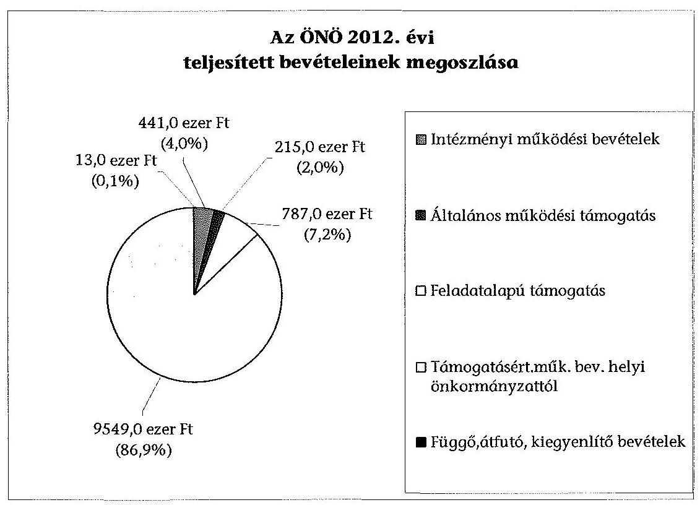
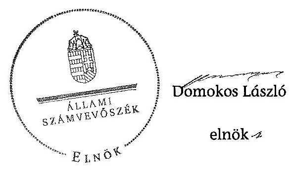

# ÁLLAMI   SZÁMVEVŐSZÉK 

## JELENTÉS

a helyi nemzetiségi önkormányzatok gazdálkodásának ellenőrzéséről
Örmény Nemzetiségi Önkormányzat (XVIII. kerületi)

---

Állami Számvevőszék
Iktatószám: V-0331-020/2014.
Témaszám: 1365
Vizsgálat-azonosító szám: V065296
Az ellenőrzést felügyelte:
Horváth Balázs
felügyeleti vezető
Az ellenőrzést vezette és az ellenőrzés végrehajtásáért felelős:
Kisgergely István
ellenőrzésvezető
A számvevőszéki jelentést készítették és a jelentés összeállításában
közreműködtek:
Komlósiné Bogár Éva
számvevő tanácsos
Varsányiné Dudás Eleonóra
számvevő
Az ellenőrzést végezte:
Komlósiné Bogár Éva
számvevő tanácsos

---

# TARTALOMJEGYZÉK 

BEVEZETÉS ..... 3
I. ÖSSZEGZŐ MEGÁLLAPÍTÁSOK, KÖVETKEZTETÉSEK, JAVASLATOK ..... 6
II. RÉSZLETES MEGÁLLAPÍTÁSOK ..... 11

1. Az ÖNÖ és a XVIII. kerületi Önkormányzat együttműködésének szabályozása, a működési feltételek biztosítása ..... 11
2. A gazdálkodási feladatok ellátásának szabályszerűsége ..... 12
2.1. A költségvetésre és a zárszámadásra, valamint a kincstári adatszolgáltatás rendjére vonatkozó jogszabályi előírások betartása ..... 12
2.2. Az ÖNÖ gazdálkodásának szabályozottsága ..... 13
2.3. Az operatív gazdálkodási jogkörök kialakítása, gyakorlása ..... 14
3. Az ÖNÖ-vel kapcsolatos gazdálkodási feladatok belső ellenőrzése ..... 15
4. A feladatalapú támogatás felhasználásának, elszámolásának szabályszerűsége, az ÖNÖ feladatellátása ..... 16

## MELLÉKLET

1. számú Az ÖNÖ 2012. évi gazdálkodásának főbb adatai, mutatói
2. számú Tájékoztatás a polgármesternek küldött el nem fogadott észrevételekről

## FÜGGELÉKEK

1. számú Rövidítések jegyzéke
2. számú Értelmező szótár
3. számú A gazdálkodás értékelésének módszere

---

# **Chemistry**

## **Chemical Reactions**

### **Balancing Chemical Equations**

1. **Write the unbalanced equation:**
   - Example: $$C_3H_8 + O_2 \rightarrow CO_2 + H_2O$$

2. **Balance the equation:**
   - Example: $$2C_3H_8 + 7O_2 \rightarrow 6CO_2 + 8H_2O$$

3. **Balance the equation:**
   - Example: $$2C_3H_8 + 7O_2 \rightarrow 6CO_2 + 8H_2O$$

### **Types of Reactions**

1. **Combination Reaction:**
   - Example: $$2H_2 + O_2 \rightarrow 2H_2O$$

2. **Decomposition Reaction:**
   - Example: $$2H_2O_2 \rightarrow 2H_2O + O_2$$

3. **Single Displacement Reaction:**
   - Example: $$Zn + 2HCl \rightarrow ZnCl_2 + H_2$$

4. **Double Displacement Reaction:**
   - Example: $$AgNO_3 + NaCl \rightarrow AgCl + NaNO_3$$

5. **Combustion Reaction:**
   - Example: $$CH_4 + 2O_2 \rightarrow CO_2 + 2H_2O$$

## **Stoichiometry**

### **Mole Concept**

- **Mole (mol):** The amount of substance containing as many particles (atoms, molecules, ions) as there are atoms in exactly 12 grams of carbon-12.
- **Avogadro's Number:** $$6.022 \times 10^{23}$$ particles per mole.

### **Molar Mass**

- **Molar Mass:** The mass of one mole of a substance.
- Example: The molar mass of water ($$H_2O$$) is 18.015 g/mol.

### **Calculations**

1. **Moles to Mass:**
   - Formula: $$n = \frac{m}{M}$$
   - Example: Calculate the number of moles of $$H_2O$$ in 18 grams of water.
     - $$n = \frac{18 \, \text{g}}{18.015 \, \text{g/mol}} \approx 0.999 \, \text{mol}$$

2. **Moles to Mass:**
   - Formula: $$m = n \times M$$
   - Example: Calculate the mass of 1 mole of water.
     - $$m = 1 \, \text{mol} \times 18.015 \, \text{g/mol} = 18.015 \, \text{g}$$

## **Gas Laws**

### **Ideal Gas Law**

- **Equation:** $$PV = nRT$$
- **Variables:**
  - $$P$$: Pressure (atm)
  - $$V$$: Volume (L)
  - $$n$$: Number of moles (mol)
  - $$R$$: Ideal gas constant (0.0821 L·atm/mol·K)
  - $$T$$: Temperature (K)

### **Boyle's Law**

- **Equation:** $$P_1V_1 = P_2V_2$$
- **Variables:**
  - $$P_1$$: Pressure (atm)
  - $$V_1$$: Volume (L)
  - $$P_2$$: Pressure (atm)
  - $$V_2$$: Volume (L)

### **Boyle's Law (Boyle's Law)**

- **Equation:** $$\frac{P_1V_1}{T_1} = \frac{P_2V_2}{T_2}$$
- **Variables:**
  - $$P_1$$: Pressure (atm)
  - $$V_1$$: Volume (L)
  - $$T_1$$: Temperature (K)
  - $$P_2$$: Pressure (atm)
  - $$V_2$$: Volume (L)
  - $$T_2$$: Temperature (K)

## **Thermochemistry**

### **Enthalpy (H)**

- **Definition:** The heat content of a system at constant pressure.
- **Equation:** $$\Delta H = q_p$$
- **Variables:**
  - $$\Delta H$$: Change in enthalpy
  - $$q_p$$: Heat transferred at constant pressure.

### **Hess's Law**

- **Statement:** The enthalpy change for a reaction is the same whether it occurs in one step or multiple steps.
- **Equation:** $$\Delta H_{\text{reaction}} = \sum \Delta H_{\text{products}} - \sum \Delta H_{\text{reactants}}$$
- **Variables:**
  - $$\Delta H_{\text{reaction}}$$: Enthalpy change of the reaction
  - $$\Delta H_{\text{products}}$$: Enthalpy of products
  - $$\Delta H_{\text{reactants}}$$: Enthalpy of reactants

### **Hess's Law (Hess's Law)**

- **Statement:** The enthalpy change for a reaction is the same whether it occurs in one step or multiple steps.
- **Equation:** $$\Delta H_{\text{reaction}} = \sum \Delta H_{\text{products}} - \sum \Delta H_{\text{reactants}}$$
- **Variables:**
  - $$\Delta H_{\text{reaction}}$$: Enthalpy change of the reaction
  - $$\Delta H_{\text{products}}$$: Enthalpy of products
  - $$\Delta H_{\text{reactants}}$$: Enthalpy of reactants

## **Electrochemistry**

### **Oxidation and Reduction**

- **Oxidation:** Loss of electrons.
- **Reduction:** Gain of electrons.

### **Galvanic Cells**

- **Definition:** A cell that converts chemical energy into electrical energy.
- **Components:**
  - Anode: Oxidation occurs.
  - Cathode: Reduction occurs.
  - Salt Bridge: Connects the two half-cells.

### **Nernst Equation**

- **Equation:** $$E = E^\circ - \frac{RT}{nF} \ln Q$$
- **Variables:**
  - $$E$$: Cell potential (V)
  - $$E^\circ$$: Standard cell potential (V)
  - $$R$$: Ideal gas constant (8.314 J/mol·K)
  - $$T$$: Temperature (K)
  - $$n$$: Number of electrons transferred
  - $$F$$: Faraday constant (96485 C/mol)
  - $$Q$$: Reaction quotient

---

# JELENTÉS 

## a helyi nemzetiségi önkormányzatok gazdálkodásának ellenőrzéséről Örmény Nemzetiségi Önkormányzat (XVIII. kerületi)

## BEVEZETÉS

Az ÖNÖ 1998. évben alakult, elnöke 1998. november 5-től látja el feladatát. Az ÖNÖ intézményt, gazdasági társaságot és más szervezetet nem alapított. A négytagú Képviselő-testület munkája segítésére bizottságot nem hozott létre. Az ÖNÖ költségvetési beszámolója szerint a 2012. évben a módosított költségvetési bevételi és kiadási előirányzata 11064 ezer Ft, a teljesített költségvetési bevétele 10992 ezer Ft, a teljesített költségvetési kiadása 2181 ezer Ft volt. A 2012. évi gazdálkodási adatokat részletesen az 1. számú mellékletben mutatjuk be.

Az Alaptörvény XXIX. cikk (1) bekezdése szerint a Magyarországon élő nemzetiségek államalkotó tényezők. Minden, valamely nemzetiséghez tartozó magyar állampolgárnak joga van önazonossága szabad vállalásához és megőrzéséhez. A hazánkban élő nemzetiségek helyi (települési és területi) valamint országos önkormányzatokat hozhatnak létre. A helyi nemzetiségi önkormányzatok gazdálkodási feladatait jogszabályi előírás alapján a székhely szerinti helyi önkormányzat polgármesteri hivatala látja el.

A nemzetiségek helyzete, támogatása mind hazai, mind EU-s szinten kiemelt figyelmet kap napjainkban. A helyi nemzetiségi önkormányzatok gazdálkodására és támogatási rendszerére vonatkozó jogszabályok a 2010-2012. években jelentős változásokon mentek át. A települési és területi nemzetiségi önkormányzatok gazdálkodásának, a részükre juttatott költségvetési támogatások felhasználásának ellenőrzését az ÁSZ 2012-ben sorozatjellegű ellenőrzés keretében indította el. A 2013. évi ellenőrzések folytatását e témacsoportos ellenőrzések jelentik, amelyet az ÁSZ 2014 első félévi ellenőrzési terve 12 témaszámon tartalmaz.

Az ellenőrzés célja annak értékelése volt, hogy az ÖNÖ gazdálkodási kereteinek kialakítása, gazdálkodása és feladatellátása megfelelt-e a jogszabályoknak.

---

Ennek keretében értékeltük, hogy:

- Az ÖNÖ és a XVIII. kerületi Önkormányzat együttműködésének szabályozása, a működési feltételek biztosítása megfelelt-e a jogszabályi előírásoknak;
- a felek együttműködése megfelelt-e a közöttük létrejött megállapodásnak a gazdálkodási feladatok szabályszerű ellátása során, ennek keretében betartották-e az ÖNÖ gazdálkodásához kapcsolódóan a költségvetésre és zárszámadásra, a gazdálkodás szabályozására, az operatív gazdálkodási jogkörök gyakorlására vonatkozó jogszabályi előírásokat;
- a jegyző biztosította-e az ÖNÖ gazdálkodásának belső ellenőrzését;
- az ÖNÖ feladatalapú támogatásának felhasználása, a folyósított feladatalapú támogatással történő elszámolás az előírásoknak megfelelő volt-e;
- az ÖNÖ feladatellátása összhangban volt-e a vonatkozó jogszabályi előírásokkal.

Az ellenőrzés várható hasznosulását négy szinten tervezzük. A törvényalkotás számára összegzett tapasztalatok állnak rendelkezésre a nemzetiségi önkormányzatok testületi döntéseinek, gazdálkodásának és a feladatalapú támogatás felhasználásának szabályszerűségéről, amelynek alapján következtetést lehet levonni arra, hogy indokolt-e esetleges jogszabályi módosítás kezdeményezése. Az ellenőrzés az ellenőrzött számára visszajelzést ad a működésében fellépő hiányosságokról, javaslataival hozzájárul azok kiküszöböléséhez, amely csökkentheti a későbbi ellenőrzések gyakoriságát. Az ellenőrzés megállapításai és javaslatai tanulságul szolgálhatnak más nemzetiségi önkormányzatok, szervezetek számára a rendezett gazdálkodási keretek kialakításához. A társadalom számára jelzi, hogy közpénz nem maradhat ellenőrizetlenül, az ÁSZ értékteremtő rend kialakításához és megőrzéséhez hozzájáruló tevékenysége pozitív hatással lesz a szervezetről kialakított összkép formálásában. Az ÁSZ szervezetén belül lehetőség nyílik arra, hogy a megállapítások szintetizálásával az intézmény a hozzáadott értéket teremtő elemző tevékenységét és tanácsadó szerepét erősítse.

Az ÖNÖ gazdálkodásának ellenőrzéséről szóló jelentés I. fejezetének összegző része az ellenőrzés céljára adott rövid, szintetizáló összefoglalót és következtetéseket tartalmazza a II. fejezet részletes megállapításain alapulóan. A jelentés intézkedést igénylő megállapításait és javaslatait - az összegzőben foglaltak mellett - az ellenőrzés során feltárt, a jelentés II. fejezetében rögzített részletes megállapítások alapozzák meg, illetve támasztják alá.

Az ellenőrzés típusa: szabályszerűségi ellenőrzés.
Az ellenőrzött időszak: 2012. január 1. - 2012. december 31. közötti időszak. Az ellenőrzés kiterjedt az ÖNÖ-nak juttatott 2012. évi feladatalapú támogatás 2013. évben való elszámolására is.

Ellenőrzött szervezet: Örmény Nemzetiségi Önkormányzat és a gazdálkodási feladatait ellátó Budapest XVIII. Kerület Pestszentlőrinc-Pestszentimre Önkormányzat.

---

Az ellenőrzés végrehajtásának jogszabályi alapját az ÁSZ tv. 5. § (2)-(3) és (6) bekezdéseiben foglaltak képezik.

Az ellenőrzés szakmai módszertana az ÁSZ hivatalos honlapján (www.asz.hu) közzétett szakmai szabályokon alapult, amely a Legfőbb Ellenőrző Intézmények Nemzetközi Szervezete (INTOSAI) által kiadott nemzetközi standardok (ISSAI) figyelembevételével készült.

A helyi nemzetiségi önkormányzatok gazdálkodásának ellenőrzése során értékeltük az ÖNÖ és a XVIII. kerületi Önkormányzat együttműködésének, a gazdálkodás szabályozottságának és a pénzügyi folyamatokban kulcsszerepet betöltő belső kontrollok (teljesítésigazolás és érvényesítés) működésének megfelelőségét. A kulcskontrollokat a dologi kiadásokkal kapcsolatos kifizetéseknél véletlen mintavételi eljárást alkalmazva ellenőriztük. Ellenőriztük, hogy a jegyző biztosította-e az ÖNÖ gazdálkodásának belső ellenőrzését. Értékeltük a feladatalapú támogatások felhasználásának, elszámolásának szabályszerűségét, az ÖNÖ feladatellátása és a jogszabályi előírások összhangját.

Az ellenőrzés lefolytatásához az ÖNÖ és a gazdálkodási feladatait ellátó XVIII. kerületi Önkormányzat tanúsítványok és a kapcsolódó, dokumentumjegyzékben megjelölt dokumentumok elektronikus úton történő megküldésével, rendelkezésre bocsátásával szolgáltatott adatokat. Az adatszolgáltatás kontrollálása és szükség szerinti javítása a helyszíni ellenőrzés keretében történt. A gazdálkodás értékelésének módszerét a 3. számú függelék tartalmazza.

Az ÁSZ tv. 29. § (1) bekezdése szerint a jelentéstervezetet megküldtük egyeztetésre a polgármesternek és a Nemzetiségi Önkormányzat elnökének. A Nemzetiségi Önkormányzat elnöke az ÁSZ tv. 29. § (2) bekezdésében foglalt észrevételezési jogával nem élt, a jelentéstervezetre észrevételt nem tett. A polgármester határidőben megküldött észrevétele és tájékoztatása alapján a jelentést módosítottuk, az el nem fogadott észrevételek indokolását a jelentés 2. számú melléklete tartalmazza.

---

# I. ÖSSZEGZŐ MEGÁLLAPÍTÁSOK, KÖVETKEZTETÉSEK, JAVASLATOK 

Az ÖNÖ és a XVIII. kerületi Önkormányzat együttműködésének szabályozása, a működési feltételek biztosítása megfelelt a jogszabályi előírásoknak. Az ÖNÖ a 2012. évben rendelkezett hatályos megállapodással a XVIII. kerületi Önkormányzattal történő együttműködésre. A felek a 2005. évben megkötött együttműködési megállapodás 1-nek a Nek. 2 tv.-ben meghatározott, január 31-i határidővel előírt felülvizsgálatát nem végezték el. Az együttműködési

 megállapodás ${ }_{1}$ Nek. ${ }_{2}$ tv.-ben előírt módosítási kötelezettségüknek határidőben, 2012. március 29-én eleget tettek. A 2012. december 31-én hatályos együttműködési megállapodás ${ }_{2}$-ban az ÖNÖ működési feltételeit az előírásoknak megfelelően szabályozták, azonban ezt - a Nek. ${ }_{2}$ tv.-ben előírtak ellenére - az együttműködési megállapodás ${ }_{2}$ megkötését követő harminc napon belül az ÖNÖ SZMSZ-ében nem rögzítették. A XVIII. kerületi Önkormányzat a 2012. év során a működési feltételeket biztosította. A szabályozási hiányosságok kijavítására az ellenőrzött időszakot követően intézkedtek. Az ÖNÖ SZMSZ-ének módosítása és az együttműködési megállapodás ${ }_{3}$ felülvizsgálata 2013 decemberében megtörtént. Az együttműködési megállapodás mellékleteként elkészült a tárgyi feltételeket tartalmazó helyiséghasználati rend.

Az ÖNÖ 2012. évi költségvetésének és zárszámadásának tartalma, jóváhagyása, valamint a kapcsolódó 2012. évi adatszolgáltatás szabályszerűsége nem felelt meg a jogszabályi előírásoknak. Az ÖNÖ elnöke a 2012. évi költségvetés tervezetét határidőben benyújtotta a Képviselő-testületnek. A jóváhagyott költségvetési határozat az Áht. ${ }_{2}$ előírása ellenére nem tartalmazta az ÖNÖ költségvetési bevételeit előirányzat-csoportok, kiemelt előirányzatok szerinti bontásban. A Képviselő-testület részére nem mutatták be az Áht. ${ }_{2}$-ban előírt mérleget közgazdasági tagolásban, szöveges indokolással és az előirányzatfelhasználási tervet. Az ÖNÖ elnöke a jegyző által elkészített 2012. évi zárszámadási határozat-tervezetet határidőben terjesztette be a Képviselőtestületnek. Az ÖNÖ 2012. évi zárszámadásáról a Képviselő-testület határozatot hozott és elfogadta a 2012. évi elemi beszámolót. A zárszámadás nem felelt meg a jogszabályi előírásoknak, mert a határozat-tervezet előterjesztésekor az Áht. ${ }_{2}$-ban előírtak ellenére a Képviselő-testület részére tájékoztatásul nem mutatták be az Áht. ${ }_{2}$-ban előírt mérlegeket és kimutatásokat, továbbá az nem volt összehasonlítható a 2012. évben elfogadott költségvetéssel. A 2012. költségvetési évre vonatkozó kincstári adatszolgáltatási kötelezettségeket - az éves költségvetési és a mérlegjelentések kivételével - a jegyző nem Áhsz. ben és az Ávr.-ben előírt határidőben teljesítette.

A gazdálkodás szabályozottsága a jogszabályi követelményeknek megfelelő volt. A gazdálkodási feladatok végrehajtását ellátó Polgármesteri Hivatal a 2012. évben kiterjesztette a Számv. tv. és a Bkr. által előírt gazdálkodásra vonatkozó szabályzatok hatályát az ÖNÖ gazdálkodási feladataira. Az ÖNÖ gazdálkodásával kapcsolatos feladat- és hatásköröket, a hatáskörök gyakorlásának módját, és az ezekre vonatkozó felelősségi szabályokat a Polgármesteri Hivatal SZMSZ-ében rögzítették.

---

Az operatív gazdálkodási jogkörök kialakítása megfelelt a jogszabályi előírásoknak. A teljesítés igazolására és az érvényesítői feladatok ellátására vonatkozó szabályszerű írásbeli felhatalmazások és kijelölések azonban az Ávr. 2012. január 1-jét követően 2012. május 20-ától történtek meg. Az ÖNÖ-nál a 2012. évben a dologi kiadások teljesítése során a teljesítésigazolás és érvényesítés kulcskontrollok működésének megfelelősége gyenge volt. A hibák száma a lényegességi szintet, a kritikus hibahatárt elérte. A teljesítésigazoló nem szabályszerűen látta el az Ávr.-ben előírt feladatát, mert a kiadás jogossága, összegszerűsége és az ellenszolgáltatás teljesítésének ellenőrzését 2012. május 19-éig jogosulatlanul végezte, továbbá nem tartotta be az operatív gazdálkodási szabályzat ${ }_{1-2}$-ban előírtakat. Az érvényesítő az Áht. ${ }_{2}$-ban és az Ávr.-ben előírtak ellenére 2012. május 19-éig nem jogszerű kijelölés alapján látta el feladatát. Nem ellenőrizte, hogy a megelőző ügymenetben az Ávr. és az operatív gazdálkodási szabályzat ${ }_{1-2}$ előírásait betartották-e, aláírása ellenére elmaradt az érvényesítés dátumának rögzítése és nem észrevételezte a vezetett kötelezettségvállalási nyilvántartás tartalmi hiányosságait. A dologi kiadások három legnagyobb összegű könyvelési tétele közül az Ávr. előírása ellenére egy esetben történt jogosulatlan személy általi teljesítésigazolás és érvényesítés. Az ÖNÖ-nál 2012-ben támogatásértékű kiadás, valamint államháztartáson kívülre történő pénzeszközátadás nem történt. A számvevőszéki ellenőrzés a kiadások dokumentumainak ellenőrzése alapján összeférhetetlenséget, továbbá jogosulatlan kifizetést nem tárt fel, a kulcskontrollok működéséhez kapcsolódó hiányosságok miatt azonban nem biztosították a hibák megelőzését, feltárását és kijavítását.

A jegyző a Polgármesteri Hivatalnál az ÖNÖ gazdálkodásával összefüggő végrehajtási feladatok belső ellenőrzését biztosította. A Polgármesteri Hivatal 2012. évre vonatkozó éves ellenőrzési tervét megalapozó kockázatelemzés kiterjedt az ÖNÖ gazdálkodásával összefüggő végrehajtási feladatokra. A kockázatelemzés a nemzetiségi önkormányzatok gazdálkodását alacsony kockázatúnak minősítette. Belső ellenőrzési feladatot a 2012. évben eredetileg nem terveztek, azonban a jogszabályi változások miatt egy esetben végeztek. A belső ellenőrzés által megállapított hiányosságok kijavítására a Bkr.-ben meghatározott határidőn túl készítettek intézkedési tervet.

Az ÖNÖ részére 2011. és 2012. évben folyósított feladatalapú támogatás felhasználása, elszámolása részben volt megfelelő. Az ÖNÖ-nál a 2011. évi feladatalapú támogatás maradványa 292,9 ezer Ft volt, amelyet 2012. június 30-áig felhasználtak a tervezett nemzetiségi feladatokra. A 2012. évben 786,6 ezer Ft összegű támogatást kaptak, amelyet a jogszabályi előírásokkal összhangban és a Képviselő-testület által meghatározott nemzetiségi programokra, feladatokra fordítottak. A 2011. és a 2012. évi feladatalapú támogatás elszámolása az Áht. ${ }_{1,2}$-ben valamint a támogatási kormányrendelet ${ }_{1,2}$-ben előírtak ellenére nem történt meg, a támogatás felhasználását, elszámolását az ellenőrzésre jogosult szervek nem ellenőrizték.

Az ÖNÖ feladatellátásának tárgya összhangban volt a Nek. ${ }_{2}$ tv. előírásaival.

Az ÁSZ tv. 33. § (1) bekezdésében foglaltak értelmében az ellenőrzött szervezet vezetője köteles a jelentésben foglalt megállapításokhoz kapcsolódó intézkedési

---

tervet összeállítani és azt a jelentés kézhezvételétől számított 30 napon belül az ÁSZ részére megküldeni. Amennyiben az intézkedési tervet határidőre nem küldi meg a szervezet, vagy az nem elfogadható, az ÁSZ elnöke az ÁSZ tv. 33. § (3) bekezdés a)-b) pontjaiban foglaltakat érvényesítheti.

A helyszíni ellenőrzés megállapításainak hasznosítása mellett javasoljuk:

# a jegyzőnek 

1. az együttműködés szabályozásával kapcsolatban

Az együttműködési megállapodás-t a Nek. 2 tv. 80. § (2) bekezdésének előírása ellenére 2012. január 31-éig nem vizsgálták felül.

Javaslat
Biztosítsa a jövőben az együttműködési megállapodás évenkénti felülvizsgálata során a Nek. 2 tv. 80. § (2) bekezdésében előírt határidő betartását.
2. a költségvetési és zárszámadási határozattal, valamint a kincstári adatszolgáltatással kapcsolatban

A költségvetési határozat nem tartalmazta - az Áht. 2 23. § (2) bekezdés a) pontjában foglaltak ellenére - az ÖNÖ költségvetési bevételeit előirányzat-csoportok, kiemelt előirányzatok szerinti bontásban, az Ávr. 24. § (1) bekezdés a) pontjában előírtak ellenére a bevételeket, ezen belül is a központi költségvetésből származó támogatásokat. A költségvetési határozattervezet előterjesztésekor - a jegyző mulasztása miatt az Áht. 2 24. § (4) bekezdés a) pontjában előírtak ellenére nem mutatták be a Képviselő-testületnek tájékoztatásul szöveges indoklással együtt az ÖNÖ költségvetési mérlegét közgazdasági tagolásban és az előirányzat-felhasználási tervet. A zárszámadási határozat-tervezet előterjesztésekor - a jegyző általi elkészítés hiányában - az Áht. 2 91. § (2) bekezdés a) pontjában foglaltak ellenére nem mutatták be a Képviselő-testület részére tájékoztatásul az előírt mérlegeket és kimutatásokat. Az Áht. 2 89. § (1) bekezdésében foglaltak ellenére a zárszámadás nem volt összehasonlítható a 2012. évben elfogadott költségvetéssel.

A jegyző az ÖNÖ-re vonatkozóan a 2012. évi költségvetéshez kapcsolódó az Ávr. 33. §-ában, 169. § (2) bekezdésében, 170. § (5) bekezdésében, valamint az Áhsz.: 10. § (5a) bekezdésében előírt kincstári adatszolgáltatási kötelezettségének késve tett eleget.

Javaslat
A költségvetési és zárszámadási határozattervezet valamint a kincstári adatszolgáltatás szabályszerűsége érdekében gondoskodjon a jövőben arról, hogy:
a) a költségvetési határozat-tervezet előkészítése és előterjesztése során tartsák be az Áht. 2 23. § (2) bekezdés a) és a 24. § (4) bekezdés a) pontjaiban, valamint az Ávr. 24. § (1) bekezdés a) pontjában foglaltakat;

---

b) a zárszámadási határozat-tervezet előterjesztéséhez az Áht. 2 91. § (2) bekezdés a) pontja előírásának megfelelően készítsék elő a Képviselő-testületnek tájékoztatásul az előírt mérlegeket és kimutatásokat, továbbá a zárszámadás feleljen meg az Áht. 2 89. § (1) bekezdése előírásainak;
c) a kincstári adatszolgáltatási kötelezettségeknek az Ávr. 33. §-ában , 169. § (2) és 170. § (5) bekezdéseiben, valamint az Áhsz. 2 32. § (4) bekezdésében előírt határidők betartásával tegyenek eleget.
3. a kulcskontrollok működésével kapcsolatban

Az Ávr. 57. § (3) bekezdésben foglaltak ellenére nem szabályszerűen történt a kifizetés jogosságának, összegszerűségének és a teljesítésnek az igazolása.

Az érvényesítő nem az Ávr. 58. § (1) -(3) bekezdéseiben előírtak szerint végezte feladatát, mert nem ellenőrizte, hogy a megelőző ügymenetben a jogszabályok és a belső szabályzat előírásait betartották-e, az érvényesítés dátumát a bizonylaton nem tüntette fel és nem jelezte az utalványozónak, hogy a teljesítésigazolás szabálytalan volt.

Javaslat
Az operatív gazdálkodás működési hibáinak megelőzése, feltárása és kijavítása érdekében gondoskodjon arról, hogy:
a) a teljesítésigazolást az Ávr. 57. § (3) bekezdésében előírtak szerint végezzék el;
b) az Ávr. 58. § (1)-(3) bekezdései alapján az érvényesítő maradéktalanul lássa el ellenőrzési és jelzési feladatát.
4. a belső ellenőrzéssel kapcsolatban

A 2012. évben elvégzett ellenőrzésről készült jelentésben megállapított hiányosságok megszüntetésére készített intézkedési terv vonatkozásában a jegyző nem tartotta be a Bkr. 45. § (3) bekezdésében előírt határidőt, mivel azt a belső ellenőrzés által tett javaslatok esetében a lezárt ellenőrzési jelentés kézhezvételét követő 8 napon túl készítette el.

Javaslat
A jövőben intézkedjen, hogy a belső ellenőrzési jelentésben megállapított hiányosságok megszüntetésére a Bkr. 45. § (3) bekezdésében előírt határidőben készüljenek el az intézkedési tervek.
5. a feladatalapú támogatás elszámolásával kapcsolatban

A 2011. évi feladatalapú támogatás elszámolása a támogatási kormányrendelet; 7. § (2) bekezdésében hivatkozott, valamint a 2012. évi feladatalapú támogatás elszámolása a támogatási kormányrendelet; 8. § (5) bekezdésében hivatkozott „a helyi önkormányzatok elszámolási és ellenőrzési rendjére vonatkozó jogszabályok rendelkezései alkalmazandóak" előírása alapján az Áht. 1 64. § (7) bekezdése, és az Áht. 2 57. § (3) bekezdése ellenére nem történt meg.

---

Javaslat
Gondoskodjon az Áht. 2 27. § (2) bekezdésében meghatározott feladatkörében az Örmény Nemzetiségi Önkormányzat által igénybe vett 2011. évi és 2012. évi feladatalapú támogatás rendeltetésszerű felhasználásáról szóló elszámolás elkészítéséről az Áht. 2 53. § (1) bekezdése szerinti elszámolás teljesítéséhez.

# A Nemzetiségi Önkormányzat elnökének 

1. A költségvetési határozattervezet előterjesztésekor az Áht. 2 24. § (4) bekezdés a) pontjában előírtak ellenére - a jegyző mulasztása miatt - nem mutatták be a Képviselő-testületnek tájékoztatásul az ÖNÖ költségvetési mérlegét közgazdasági tagolásban szöveges indokolással együtt és az előirányzat-felhasználási tervét. A zárszámadási határozat-tervezet előterjesztésekor - a jegyző általi elkészítés hiányában - az Áht. 2 91. § (2) bekezdés a) pontjában foglaltak ellenére nem mutatták be a Képviselő-testület részére tájékoztatásul az előírt mérlegeket és kimutatásokat.

Javaslat
Terjessze a jövőben a költségvetés és a zárszámadás előterjesztésekor a Képviselőtestület elé tájékoztatásul - a jegyző által előkészített - az Áht. 2 24. § (4) bekezdése a) pontjában és az Áht. 2 91. § (2) bekezdés a) pontjában előírt mérlegeket és kimutatásokat.
2. A 2011. évi feladatalapú támogatás elszámolása a támogatási kormányrendelet: 7. § (2) bekezdésében hivatkozott, valamint a 2012. évi feladatalapú támogatás elszámolása a támogatási kormányrendelet ${ }_{2}$ 8. § (5) bekezdésében hivatkozott „a helyi önkormányzatok elszámolási és ellenőrzési rendjére vonatkozó jogszabályok rendelkezései alkalmazandóak" előírása alapján az Áht.: 64. § (7) bekezdése, és
 az Áht. 2. 57. § (3) bekezdése ellenére nem történt meg.

Javaslat
Terjessze a Képviselő-testület elé jóváhagyásra az Áht. 2. 53. § (1) bekezdése szerinti beszámolási kötelezettség teljesítéséhez az Ön által igénybe vett 2011. és 2012. évi feladatalapú támogatás rendeltetésszerű felhasználásáról szóló elszámolást.

---

# II. RÉSZLETES MEGÁLLAPÍTÁSOK 

## 1. Az Ön És a XVIII. Kerületi Önkormányzat Együttműködésének Szabályozása, a Működési Feltételek Biztosítása

Az Ön és a XVIII. kerületi Önkormányzat együttműködésének szabályozása, a működési feltételek biztosítása megfelelt a jogszabályi előírásoknak.

Az Ön rendelkezett a 2012. év folyamán hatályban lévő megállapodás$_{1,2}$-sal$^1$ a XVIII. kerületi Önkormányzattal történő együttműködésre.

A 2012. január 1-jén hatályos, 2005. évben megkötött együttműködési megállapodás$_1$-nak a Nek. $_2$ tv. 80. § (2) bekezdésben 2012. január 31-ei határidőig előírt felülvizsgálatát nem végezték el.

A Nek. $_2$ tv. 159. § (3) bekezdésben előírt módosítási kötelezettségüknek határidőn belül$^2$ eleget tettek. A 2012. december 31-én hatályos együttműködési megállapodás$_2$-ban a Nek. $_2$ tv. előírásainak megfelelően szabályozták az Ön működésének feltételeit, melyeket azonban a Nek. $_2$ tv. 80. § (2) bekezdésében előírtak ellenére nem rögzítettek az Ön SZMSZ-ében az együttműködési megállapodás megkötését követő harminc napon belül$^3$.

Az Ön és a XVIII. kerületi Önkormányzat által megkötött - 2012. december 31-én hatályos - együttműködési megállapodás$_2$-ban az Ön gazdálkodásával kapcsolatos feladatokat, felelősöket és határidőket - egy kivétellel - az előírásoknak megfelelően szabályozták. Az együttműködési megállapodás$_2$ az Áht. $_2$ 38. § (2) bekezdésében és az Ávr. 55. § (2) bekezdés g) pontjában, illetve az 58. § (4) bekezdésében előírtak ellenére az érvényesítők jegyző általi kijelölését tartalmazta$^4$.

A XVIII. kerületi Önkormányzat a Polgármesteri Hivatal útján biztosította az Ön 2012. évi működésének a - Nek. $_2$ tv. 159. § (3) bekezdésében foglalt át-

[^0]
[^0]:    $^1$ A 2012. március 28-ától hatályos együttműködési megállapodás$_1$-et a XVIII. kerületi Önkormányzat a 7/2005. (II. 01.) számú rendeletével, a Képviselő-testület a 25/2004. (XII. 22.) számú határozatával hagyta jóvá.
    A 2012. március 29-étől hatályos együttműködési megállapodás$_2$-t a XVIII. kerületi Önkormányzat a 14/2012. (III. 13.) számú rendeletével fogadta el, a Képviselő-testület a 8/2012. (III. 29.) számú határozattal hagyta jóvá.
    $^2$ 2012. március 29-én
    $^3$ A Képviselő-testület az Ön SZMSZ-ét 2013 decemberében módosította, amelynek mellékletét képezi a felülvizsgált és a működési feltételeket tartalmazó együttműködési megállapodás$_3$.
    $^4$ Az ellenőrzött időszakot követően, 2013. október 11-én kötött együttműködési megállapodás$_3$ az érvényesítők kijelölésével kapcsolatos feladatok ellátását az Áht. $_2$-ban és az Ávr.-ben előírtaknak megfelelően tartalmazta.

---

meneti rendelkezés alapján a Nek. $_1$ tv. 27. § (2)-(3) bekezdéseiben előírt - személyi és tárgyi feltételeit.

# 2. A GAZDÁLKODÁSI FELADATOK ELLÁTÁSÁNAK SZABÁLYSZERŰSÉGE 

### 2.1. A költségvetésre és a zárszámadásra, valamint a kincstári adatszolgáltatás rendjére vonatkozó jogszabályi előírások betartása

Az Ön 2012. évi költségvetésének, a zárszámadásának tartalma, jóváhagyása, valamint a kapcsolódó adatszolgáltatás nem felelt meg a jogszabályi előírásoknak.

Az Ön elnöke a 2012. évi költségvetés tervezetét határidőben$^5$ benyújtotta a Képviselő-testületnek. A jóváhagyott 2012. évi költségvetési határozat$^6$ tartalma tekintetében az Áht. $_2$-ben és az Ávr.-ben foglaltak nem érvényesültek, az előírt tartalmi elemek közül nem tartalmazta:

- az Áht. 2. 23. § (2) bekezdés a) pontjában foglaltak ellenére az Ön költségvetési bevételeit előirányzat-csoportok, kiemelt előirányzatok szerinti bontásban;
- az Ávr. 24. § (1) bekezdés a) pontjában előírtak ellenére az Ön bevételeit, így különösen a központi költségvetésből származó támogatásokat;
- az Áht. 2. 24. § (4) bekezdés a) pontjában előírtak ellenére nem mutatták be a Képviselő-testületnek az Ön költségvetési mérlegét közgazdasági tagolásban szöveges indokolással együtt és az előirányzat-felhasználási tervét.

Az Ön elnöke a jegyző által elkészített 2012. évi zárszámadási határozattervezetet - írásos előterjesztés nélkül - határidőben terjesztette be a Képviselőtestületnek. A Képviselő-testület - 2012. április 11-i ülésén - megtárgyalta és elfogadta$^7$ az Ön zárszámadását és a 2012. évi elemi beszámolót. A beszámoló tartalma megfelelt a jogszabályi előírásoknak, azonban a zárszámadási határozattervezet előterjesztésekor a Képviselő-testület részére tájékoztatásul - az Áht. 2. 91. § (2) bekezdés a) pontjában foglaltak ellenére - nem mutatták be az Áht. 2. 24. § (4) bekezdésében előírt mérlegeket és kimutatásokat. A 2012. évi zárszámadást a Képviselő-testület nem az Áht. 2. 89. § (1) bekezdése szerinti részletezettségben hagyta jóvá, így nem volt biztosított az összehasonlíthatóság az elfogadott költségvetéssel. A 2012. évi zárszámadási határozatban az Ön nem mutatta be bevételei és kiadásai összegét, továbbá a feladatalapú támogatás felhasználásáról sem számolt el.

[^0]
[^0]:    $^5$ Az Áht. 2. 24. § (2) bekezdés előírása szerint a központi költségvetésről szóló törvény kihirdetését követő 45. napig (2012. február 11-ig), a 2012. évi költségvetést a Képviselőtestület a 2012. február 9-i ülésén tárgyalta.
    $^6$ A 2012. évi költségvetést a Képviselő-testület a 2/2012. (II. 09.) számú határozatával hagyta jóvá 2513 ezer Ft bevételi és kiadási főösszeggel.
    $^7$ 15/2013. (IV. 11.) szám alatt, rögzítve a 38/7298-3/2013. iktatószámú jegyzőkönyvben

---

A jegyző az Ön-nel összefüggő 2012. évi kincstári adatszolgáltatási kötelezettségét teljesítette, azonban az előírt határidőket nem tartotta be, mert:

- a 2012. évi elemi költségvetéshez kapcsolódó, az Ávr. 33. § (1)(2) bekezdéseiben előírt adatszolgáltatást késedelmesen$^8$., 2012. március 28-án teljesítette;
- a 2012. évi negyedéves időközi költségvetési jelentéseket az Ávr. 169. § (2) bekezdésében előírt határidőkön túl (2012. április 24-én, július 26-án, október 29-én)$^9$, az éves költségvetési jelentést 2013. január 19-én, határidőben teljesítette;
- a 2012. évi időközi mérlegjelentéseket az Ávr. 170. § (5) bekezdésében előírt határidőkön túl (2012. április 27-én, augusztus 1-jén, október 29-én)$^{10}$., az éves mérlegjelentést határidőben, 2013. március 14-én teljesítette;
- a 2012. I. féléves és éves elemi költségvetési beszámolóját az Áhsz 1. 10. § (5a) bekezdésben előírt határidőkön túl$^{11}$, 2012. augusztus 14-én, illetve 2013. március 14-én nyújtotta be. A beszámolókat 2012. augusztus 9-én, illetve 2013. március 11-én, a jogszabályban előírt határidőktől eltérően, 10-10 nap késedelemmel készítették el.

# 2.2. Az Ön gazdálkodásának szabályozottsága 

Az Ön gazdálkodásának szabályozottsága az ellenőrzött időszakban megfelelt a jogszabályi előírásoknak.

A gazdálkodási feladatok végrehajtását ellátó Polgármesteri Hivatal a 2012. évben a Számv. tv. és a Bkr. által előírt$^{12}$ gazdálkodásra vonatkozó szabályzatokkal rendelkezett. A gazdálkodásra vonatkozó szabályzatok hatályát az Ön gazdálkodási feladataira kiterjesztették.

A Polgármesteri Hivatal SZMSZ-e tartalmazta az Ávr. 13. § (1) bekezdés g) pontjában foglaltak szerinti, az Ön gazdálkodásával kapcsolatos feladat- és hatásköröket, a hatáskörök gyakorlásának módját, a helyettesítés rendjét, az ezekhez kapcsolódó felelősségi szabályokat.

[^0]
[^0]:    $^8$ A jogszabályban előírt határidő - a költségvetési határozattervezetének Képviselőtestület elé történt előterjesztését követő 30 napon belül, azaz - 2012. március 10-e, a késedelmes napok száma 18 nap volt.
    $^9$ A jogszabályban előírt határidő 2012. április 20., július 20., október 20.; a késedelmes napok száma 4, 6, 5 nap volt.
    $^{10}$ A jogszabályban előírt határidő 2012. április 25., július 25., október 25.; a késedelmes napok száma 2, 7, 4 nap volt.
    $^{11}$ A jogszabályban előírt határidő a féléves beszámolónál 2012. augusztus 10., az éves beszámolónál 2013. március 10.; a késedelmes napok száma 4-4 nap volt.
    $^{12}$ A 2012. évben hatályos leltározási és leltárkészítési szabályzat, eszközök és források értékelési szabályzata, pénzkezelési szabályzat, számviteli politika, számlarend, ellenőrzési nyomvonal, szabálytalanságkezelési szabályzat, folyamatba épített előzetes, utólagos és vezetői ellenőrzési szabályzat, munkaköri leírások, gazdasági szervezet ügyrendje.

---

# 2.3. Az operatív gazdálkodási jogkörök kialakítása, gyakorlása 

Az Ön gazdálkodása tekintetében az operatív gazdálkodási jogkörök kialakítása annak ellenére megfelelt az előírásoknak, hogy a szabályszerű felhatalmazások és kijelölések az Ávr. 2012. január 1-jei hatálybalépését követően, év közben történtek meg:

- az Ön elnöke az Áht. 3. 38. § (2) bekezdése és az Ávr. 57. § (4) bekezdése$^{13}$ ellenére a teljesítésigazoló személyek írásbeli kijelölését csak 2012. május 20-ától adta meg, illetve végezte el az operatív gazdálkodási szabályzat$_2$ hatálybalépésével;
- a Polgármesteri Hivatalban a gazdasági vezető$^{14}$ 2012. május 20-ától hatalmazott fel más személyt a pénzügyi ellenjegyzésre és az érvényesítésre.

A gazdasági vezető rendelkezett az előírt szakképesítéssel, írásban kijelölte az Áht. $_2$ és az Ávr. előírásainak megfelelően a pénzügyi ellenjegyzőt és az érvényesítőket, a jogosultakat és aláírás mintájukat az operatív gazdálkodási szabályzat$_{1,2}$ melléklete tartalmazta.

Az érvényesítői feladatok ellátásával megbízottak közül a kontroller munkakört betöltő személy a jogszabályban előírt végzettséggel rendelkezett, azonban munkaköri leírása nem tartalmazta az érvényesítői jogosultságot.

Az Ön-nél a 2012. évben a dologi kiadások teljesítése során a teljesítésigazolás és az érvényesítés kulcskontrollok működésének megfelelősége gyenge volt. A hibák száma a lényegességi szintet, a kritikus hibahatárt elérte, mivel:

- a teljesítés igazolását az Ávr. 57. § (4) bekezdésének előírása ellenére a jogkör gyakorlására 2012. május 19-ig az Ön elnöke által kijelöléssel nem rendelkező személy jogosulatlanul látta el, ezért az Ávr. 57. § (1) bekezdésben foglaltak ellenére nem szabályszerűen történt a kifizetés jogosságának, összegszerűségének és a teljesítésnek az igazolása;
- a teljesítésigazoló az operatív gazdálkodási szabályzat$_2$ szerint a teljesítésigazolásra előírt 3. számú mellékletet nem csatolta a számlák mellé, az igazolásra használt bélyegző szövege nem tartalmazta a teljesítés megtörténtének az igazolását;
- az érvényesítő - az Áht. 3. 38. § (2) bekezdésében és az Ávr. 55. § (2) bekezdés g) pontjában, illetve az 58. § (4) bekezdésében előírtak ellenére 2012. május 19-ig nem jogszerű kijelölés alapján látta el feladatát, mivel a feladat ellátásával nem a gazdasági vezető bízta meg;
- az érvényesítő feladatát nem az Ávr. 58. § (1) és (2) bekezdéseiben előírtak szerint végezte, mert nem ellenőrizte, hogy a megelőző ügymenetben az

[^0]
[^0]:    $^{13}$ A jogszabályban előírt határidő 2012. január 1-je volt.
    $^{14}$ A gazdasági vezető által írásban kijelölt pénzügyi ellenjegyző és az érvényesítők aláírásmintáját a gazdálkodási szabályzat$_2$ melléklete tartalmazta.

---

Ávr. és az operatív gazdálkodási szabályzat$_{1,2}$ előírásait betartották-e és aláírása ellenére elmaradt az Ávr. 58. § (3) bekezdésében foglaltak alapján az érvényesítés dátumának rögzítése;

- az érvényesítő az Ávr. 58. § (2) bekezdésében
 előírtak ellenére nem jelezte az utalványozónak, hogy az Önök kiadásairól vezetett 100 ezer Ft alatti kötelezettségvállalási nyilvántartás tartalmilag nem felel meg az Ávr. 56. § (1) bekezdésében előírt követelménynek, mert nem tartalmazta a kötelezettségvállalást tanúsító dokumentum iktatószámát, a kötelezettségvállaló nevét, a jogosult azonosító adatait, a kötelezettségvállalás évek és előirányzatok szerinti megoszlását, a kifizetési határidőket, továbbá a teljesítési adatokat.

Az Önöknél a 2012. évben a három legnagyobb összegű dologi kiadás bizonylatainak egyedi értékelése alapján a teljesítésigazolás és az érvényesítés kulcskontroll egy kifizetésnél nem működött megfelelően. A teljesítésigazolást az Ávr. 57. § (4) bekezdésének előírása ellenére és az érvényesítést arra jogszerű kijelöléssel nem rendelkező személyek látták el.

Az Önöknél 2012-ben működési és felhalmozási célú támogatásértékű kiadás, valamint államháztartáson kívülre történő működési és felhalmozási célú pénzeszközátadás nem történt.

A számvevőszéki ellenőrzés a kiadások dokumentumainak ellenőrzése alapján összeférhetetlenséget, továbbá jogosulatlan kifizetést nem tárt fel, a kulcskontrollok működéséhez kapcsolódó hiányosságok miatt nem biztosították a hibák megelőzését, feltárását és kijavítását.

# 3. Az Önökvel KAPCSOLATOS GAZDÁLKODÁSI Feladatok Belső ELLENŐRZÉSE 

Az Önök gazdálkodásával összefüggő végrehajtási feladatok belső ellenőrzése megfelelő volt.

A jegyző a jogszabályi előírásoknak megfelelően biztosította az Önök gazdálkodásával összefüggő végrehajtási feladatok belső ellenőrzését ${ }^{15}$. A Polgármesteri Hivatal éves belső ellenőrzési tervét megalapozó kockázatelemzés kiterjedt a nemzetiségi önkormányzatok gazdálkodásával összefüggő végrehajtási feladatok ellátására, amely alacsony kockázati minősítést kapott. A 2012. évi módosított éves belső ellenőrzési terv alapján a nemzetiségi önkormányzatok célellenőrzését végezték, a belső ellenőrzésről készült jelentést ${ }^{16}$ a Belső Ellenőrzési Csoport vezetője 2012. október 16-án bemutatta a jegyzőnek.

[^0]
[^0]:    ${ }^{15}$ A belső ellenőrök rendelkeztek munkaköri leírással, valamint az Áht. ${ }_{2}$ 70. §-ában meghatározott engedéllyel, szerepeltek a költségvetési szervnél belső ellenőrzést végzők nyilvántartásában, valamint elkészítették a 2012. évre vonatkozó belső ellenőrzési kézikönyvet, amely a 7/2012. (II. 15.) számú polgármesteri és jegyzői együttes utasítás alapján lépett hatályba.
    ${ }^{16}$ 8/73697-6/2012. iktatószámú belső ellenőrzési jelentés „A Nemzetiségi Önkormányzatok átalakulásának, hivatali kontrolljai kialakításának vizsgálatáról".

---

A lefolytatott belső ellenőrzés megállapította, hogy nem készítették el az együttműködési megállapodásban előírtak szerint a helyiséghasználati rendet. A nemzetiségi önkormányzatok SZMSZ-ei nem tartalmazták a működési feltételeket. A GKI ügyrendje nem tartalmazta a nemzetiségi önkormányzatokkal kapcsolatos feladatokat, valamint hiányoztak az utalványozási joggal rendelkezők aláírás mintái, valamint az ellenőrzött dokumentumok esetében hiányosságot állapítottak meg a pénzügyi kontrollok működésére vonatkozóan.

A nemzetiségi önkormányzatok részére csak az ellenőrzési jelentés-tervezetet küldték meg.

Az ellenőrzés megállapításai hasznosultak, a feltárt hiányosságok megszüntetése érdekében a jegyző a Bkr. 45. § (3) bekezdésében meghatározott határidőn túl ${ }^{17}$, 2012-ben kettő, 2013-ban négy javaslathoz készített intézkedési tervet. A 2012. évi intézkedési tervben foglaltakat megvalósították, a 2013. évi intézkedési terv végrehajtása folyamatban volt.

A 2012. évben hatályos együttműködési megállapodások tartalmazták az Önökvel összefüggő belső ellenőrzési feladatok ellátását. A megállapodásokban foglaltak szerint a könyvvizsgáló ellenőrzési tevékenységén kívül az Önök pénzügyi ellenőrzését a XVIII. kerületi Önkormányzat belső ellenőre is ellátta.

Az ellenőrzéshez szolgáltatott adatok alapján a 2012. évben a Kormányhivatal az Önöket illetően nem élt törvényességi felügyeleti eszközökkel.

# 4. A feladatalapú támogatás felhasználásának, elszámolásának szabályszerűsége, az Önök feladatellátása 

Az Önök részére 2011. és 2012. évben folyósított feladatalapú támogatás felhasználása, elszámolása részben volt megfelelő.

A feladatalapú támogatás összes bevételhez viszonyított részarányát a következő ábra szemlélteti.

[^0]
[^0]:    ${ }^{17}$ A jogszabályban meghatározott határidő az intézkedési terv elkészítésére a lezárt ellenőrzési jelentés kézhezvételétől számított 8 napon belül, az intézkedési tervek kelte 2012. november 5-e és 2013. október 14-e.

---

Az Önök a 2012. évben 786,6 ezer Ft összegű feladatalapú támogatásban részesült. A Képviselő-testület 2012. november 19-én módosította ${ }^{18}$ a költségvetést a jóváhagyott feladatalapú támogatás összegével. Az Önök a 2012. évi feladatalapú támogatást a Képviselő-testület által meghatározott nemzetiségi támogatási célokkal összhangban a folyósítás évében felhasználta.

A 2011. évben folyósított feladatalapú támogatásból a maradvány összege 2012. január 1-jén 292,9 ezer Ft volt, amelyet 2012. június 30-áig felhasználtak.

A 2011. évi feladatalapú támogatás elszámolása a támogatási kormányrendelet ${ }_{1} 7 . \S$ (2) bekezdésében hivatkozott, valamint a 2012. évi feladatalapú támogatás elszámolása a támogatási kormányrendelet ${ }_{2} 8 . \S$ (5) bekezdésében hivatkozott „a helyi önkormányzatok elszámolási és ellenőrzési rendjére vonatkozó jogszabályok rendelkezései alkalmazandóak" előírása alapján az Áht. ${ }_{1} 64 . \S$ (7) bekezdése és az Áht. ${ }_{2} 57 . \S$ (3) bekezdése ellenére nem történt meg. A feladatalapú támogatás felhasználását, elszámolását az ellenőrzésre jogosult szervek nem ellenőrizték.

Az Önök feladatellátásának tárgya a 2012. évben összhangban volt a Nek. ${ }_{2}$ tv. előírásaival. A Nek. ${ }_{2}$ tv. 115. § f) pontja szerinti kötelező közfeladatot látott el a képviselt közösség kulturális autonómiájának megerősítése érdekében a közösség önszerveződésének szervezési és működtetési feladatok ellátásának segítésével. A Nek. ${ }_{2}$ tv. 116. § (2) bekezdés előírásaival összhangban végzett önként vállalt közfeladatot a hagyományápolás és a közművelődés területén. Az Önök a Nek. 2 tv. 116. § (2) bekezdésében tiltott hatósági feladatokat nem végeztek.

Budapest, 2014. 06. hó 24. nap

Melléklet: $\quad 2 \mathrm{db}$
Függelék: $\quad 3 \mathrm{db}$

---

# Az Önök 2012. évi gazdálkodásának főbb adatai, mutatói

A) Bevételek

|  Megnevezés | Eredeti előirányzat | Módosított | Teljesítés  |
| --- | --- | --- | --- |
|   | ezer Ft |  | megoszlás (\%)  |
|  Intézményi működési bevételek | 0,0 | 441,0 | 441,0  |
|  Általános működési támogatás | 215,0 | 215,0 | 215,0  |
|  Feladatalapú támogatás | 0,0 | 787,0 | 787,0  |
|  Települési Önkormányzat által nyújtott támogatás | 1074,0 | 9621,0 | 9549,0  |
|  Költségvetési bevételek | 1289,0 | 11064,0 | 10992,0  |
|  Függő,átfutó, kiegyenlítő bevételek | 0 | 0 | 13,0  |
|  Tárgyévi bevételek | 1289,0 | 11064,0 | 11005,0  |

B) Kiadások

|  Megnevezés | Eredeti előirányzat | Módosított | Teljesítés  |
| --- | --- | --- | --- |
|   |  |  | megoszlás (%)  |
|  Személyi juttatások | 227,0 | 227,0 | 207,0  |
|  Munkaadókat terhelő járulékok és szociális hozzájárulási adó összesen | 52,0 | 85,0 | 32,0  |
|  Dologi kiadások | 860,0 | 10602,0 | 1942,0  |
|  Pénzeszköz átadás | 150,0 | 150,0 | 0,0  |
|  Működési kiadások összesen | 1289,0 | 11064,0 | 2181,0  |
|  Költségvetési kiadások | 1289,0 | 11064,0 | 2181,0  |
|  Tárgyévi kiadások | 1289,0 | 11064,0 | 2181,0  |

---

.

---

# TÁJÉKOZTATÁS   A POLGÁRMESTERNEK KÜLDÖTT   EL NEM FOGADOTT ÉSZREVÉTELEKRŐL 

| Észrevétel | 1. Az együttműködés szabályozása   A jelentéstervezet megállapítja, hogy a XVIII. Kerületi Önkormányzat és a XVIII. kerületi nemzetiségi önkormányzatok között létrejött hatályos együttműködési megállapodás minden szempontból megfelel a jogszabályi előírásoknak és az ellenőrzés ideje alatt minden hiányosság pótlásra került.   Mind a 2013. évben, mind a 2014. évben az együttműködési megállapodás felülvizsgálata a Nek. tv. 80. § (2) bekezdésében szereplő határidőig megtörtént. Az együttműködési megállapodásokat a nemzetiségi önkormányzatok egyöntetűen elfogadták és aláírták.   A jövőben is kiemelt figyelmet fordítunk a Nek. tv-ben szereplő rendelkezéseknek, így az együttműködési megállapodás felülvizsgálatára vonatkozó rendelkezésnek is maradéktalanul eleget teszünk és a hatályos együttműködési megállapodásokat minden év január 31-ig felülvizsgáljuk. |
| :--: | :--: |
|  | 2. Költségvetés, zárszámadás, kincstári adatszolgáltatás:   A nemzetiségi önkormányzat 2013. évi költségvetése módosításra került, a költségvetés módosítási határozattervezet előkészítésekor és előterjesztésekor az Áht. 23. § (2) bekezdés a), a 24. § (4) bekezdés a) pontjaiban, valamint az Ávr. 24. § (1) bekezdés a) pontjában foglaltak maradéktalanul betartásra kerültek (előirányzat csoportok, kiemelt előirányzatok szerinti bontás). A Képviselő-testület részére tájékoztatásul bemutatásra kerültek az Áht. 24. § (4) bekezdés a) pontja és az Áht. 91 § (2) bekezdés a) pontja szerinti mérlegek és kimutatások (költségvetési mérleg közgazdasági tagolásban, előirányzat felhasználási terv). A 2014. évi költségvetés szintén a hatályos jogszabályi rendelkezések figyelembe vételével készült el, a jövőben kiemelt figyelemmel gondoskodunk arról, hogy az éves költségvetések a mindenkor hatályos jogszabályok alapján készüljenek el. A 2013-as évtől kezdődően a zárszámadási határozattervezetek előterjesztésekor a Képviselő-testület részére tájékoztatásul bemutatásra kerülnek az Áht. 24. § (4) bekezdés a) pontja és az Áht. 91 § (2) bekezdés a) pontja szerinti mérlegek és kimutatások. A zárszámadás az Áht. 89. § (1) bekezdés előírása szerint az elfogadott költségvetéssel összehasonlítható módon kerül összeállításra.   A kincstári adatszolgáltatási kötelezettségek határidőben történő teljesítésével kapcsolatosan tájékoztatjuk, hogy számos esetben a kincstári adatfeltöltő felület nem megfelelő működése okozza a késedelmet. A jövőben hangsúlyt fektetünk arra, hogy státusz riportokkal bizonyítani tudjuk, hogy a késedelem rajtunk kívülálló okok miatt következett be. |
| Válasz | Tudomásul veszem a számvevőszéki ellenőrzés nyomán - az ellenőrzött időszakot követően megtett - az 1. és 2. pontban részletezett intézkedé- |

---

|  | seiről adott tájékoztatását, amelyeket az intézkedési terv összeállításánál végrehajtott feladatként kérem szerepeltetni. |
| :--: | :--: |
| Észrevétel | 3. Kulcskontrollok működtetése:   Készpénzes kifizetések esetén (a nemzetiségi önkormányzatoknál jelentős a készpénzes kifizetések száma) a kötelezettségvállalási szabályzatunk 4. számú mellékletét (készpénzes összesítő) használjuk, ezekben az esetekben nem szükséges a 3. számú melléklet használata. Az igazolásra használt bélyegző szövege valóban nem tartalmazza szövegszerűen a „teljesítés igazolás" szót, azonban álláspontunk szerint a „kifizetés jogosságát igazolom" kitétel egyértelműen teljesítés igazolást jelent.   Véleményünk szerint az érvényesítő az érvényesítést megelőző ügymenet vonatkozásában maradéktalanul ellátta ellenőrzési feladatát (a kifizetés jogosságának összegszerűségének, valamint a szerződésszerű teljesítés ellenőrzése), csupán az utalványozó felé nem jelezte a teljesítésigazolással kapcsolatos szabályzat módosítás szükségességét. |
| Válasz | A készpénzes kifizetések esetében a teljesítésigazolás szabálytalan elvégzésére és az érvényesítő ellenőrzési és jelzési kötelezettségének elmulasztására vonatkozó megállapításunkat és az erre vonatkozó javaslatot továbbra is fenntartjuk, mert a teljesítés igazolására használt nyomtatvány (4. számú melléklet), valamint az igazolásra használt bélyegző szövege nem tartalmazta a teljesítésigazolás megjelölést. Az Ávr. 57. § (1) bekezdése alapján a teljesítés megtörténtének igazolása magában foglalja a kiadások teljesítése jogosságának, összegszerűségének ellenőrzését és igazolását és az ellenszolgáltatást is magában foglaló kötelezettségvállalás esetén annak teljesítését. Erre tekintettel a bélyegzőn szereplő szövegrész nem elégséges a teljesítés megtörténtének az igazolására. Az érvényesítő a teljesítésigazolás szabálytalanságára vonatkozó ellenőrzési és
 jelzési kötelezettségét nem teljesítette. |
| Észrevétel | 4. A belső ellenőrzéssel kapcsolatban:   A jelentés-tervezet 17. oldalán a megállapítás, hogy „a 2013. évi intézkedési terv végrehajtása folyamatban volt". Az intézkedési tervben meghatározott intézkedések mindegyikének végrehajtása megtörtént 2013. decemberre. Szintén itt található az a megállapítás, mely szerint a nemzetiségi önkormányzatok részére csak a belső ellenőrzési jelentéstervezet került megküldésre. A végleges jelentés átadását igazoló dokumentációt nem tudtuk bemutatni, mert azok a munkakör átadásátvétel miatt nem voltak fellelhetőek, azonban ezzel szemben a nemzetiségi önkormányzat a végleges jelentést is kézhez kapta, melyről a Nemzetiségi önkormányzat Elnökének nyilatkozatát jelen észrevételünkhöz mellékelten csatolunk. |
| Válasz | A belső ellenőrzéssel kapcsolatban a Nemzetiségi Önkormányzat elnöke részére a végleges jelentés átadására vonatkozó észrevételét nem fogadom el, a jelentéstervezetben szereplő megállapítást nem módosítjuk. Az ÁSZ kizárólag dokumentumok alapján tesz megállapításokat, az ellenőrzés részére hitelt érdemlően - dokumentum hiányában - |

---

|  | nem tudták igazolni a végleges jelentés átadását. |
| :-- | :-- |
| Észrevétel | 5. A feladatalapú támogatások elszámolása:   A 2011. évi, valamint a 2012. évi feladatalapú támogatás elszámolása   megtörtént, az elszámolásról készült jegyzőkönyveket a helyszíni vizs-   gálat lezárultát megelőzően átadtuk az ÁSZ munkatársai részére. |
| Válasz | A 2011. és 2012. évi feladatalapú támogatás elszámolásával kapcsolatban tett észrevételét nem fogadom el, a jelentéstervezetben szereplő   megállapításunkat nem módosítjuk, az erre vonatkozó javaslatot to-   vábbra is fenntartjuk. A 342/2010. (XII. 28.) Korm. rendelet 7. §   (2) bekezdésének, valamint a 28/2012. (III. 6.) Korm. rendelet 8. § (5)   bekezdésének előírása szerint a feladatalapú támogatással kapcsolatos   elszámolás, ellenőrzés rendjére a helyi önkormányzatok elszámolási és   ellenőrzési rendjére vonatkozó jogszabályok rendelkezései alkalmazandóak. Az államháztartásról szóló 1992. évi XXXVIII. törvény   64. § (7) bekezdése alapján a helyi önkormányzat a költségvetési év   végét követően a tényleges mutatók alapján, külön jogszabályban   meghatározott határidőig, a költségvetési törvény szabályai szerint   elszámol az igénybe vett normatív hozzájárulásokkal és támogatásokkal. A 2011. évi CXCV. törvény 2012. évben hatályos 57. § (3) bekezdése szerint a helyi önkormányzat, a helyi nemzetiségi önkormányzat és   a többcélú kistérségi társulás a költségvetési év végét követően elszámol az igénybe vett hozzájárulásokkal, támogatásokkal. Az ellenőrzés   részére átadott, a helyszíni ellenőrzés időszakában készített elszámolást   a Képviselő-testület nem tárgyalta meg és nem fogadta el, a költségvetési év végét követően elkészített hivatalos, elfogadott elszámolással   nem rendelkezett a Nemzetiségi Önkormányzat a feladatalapú támogatás felhasználására vonatkozóan. |

---

.

---

# RÖVIDÍTÉSEK JEGYZÉKE 

## Törvények

Alaptörvény
Áht. 1
Áht. 2
ÁSZ tv.
Nek. 1 tv.
Nek. 2 tv.
Számv. tv.

## Rendeletek

Áhsz. 1
Áhsz. 2
Ávr.

Bkr.
támogatási kormányrendelet $_{1}$
támogatási kormányrendelet $_{2}$

## Szórövidítések

ÁSZ
együttműködési megállapodás $_{1}$

Magyarország Alaptörvénye
1992. évi XXXVIII. törvény az államháztartásról (hatályos 2011. december 31-ig)
2011. évi CXCV. törvény az államháztartásról (hatályos 2011. december 31-től)

Az Állami Számvevőszékről szóló 2011. évi LXVI. törvény (hatályos 2011. július 1-jétől)
1993. évi LXXVII. törvény a nemzeti és etnikai kisebbségek jogairól (hatályos 2011. december 31-ig)
2011. évi CLXXIX. törvény a nemzetiségek jogairól (hatályos 2011. december 20-tól)
2000. évi C. törvény a számvitelről

249/2000. (XII. 24.) Korm. rendelet az államháztartás szervezetei beszámolási és könyvvezetési kötelezettségének sajátosságairól (hatályos 2013. december 31-éig)
4/2013. (I. 11.) Korm. rendelet az államháztartás számviteléről (hatályos 2014. január 1-jétől)
368/2011. (XII. 31.) Korm. rendelet az államháztartásról szóló törvény végrehajtásáról (hatályos 2012. január 1-jétől)
370/2011. (XII. 31.) Korm. rendelet a költségvetési szervek belső kontrollrendszeréről és belső ellenőrzéséről (hatályos 2012. január 1-jétől)
342/2010. (XII. 28.) Korm. rendelet a kisebbségi önkormányzatoknak a központi költségvetésből, valamint fejezeti kezelésű előirányzatból nyújtott támogatások feltételrendszeréről és elszámolásának rendjéről (hatályos 2012. március 6-áig)
28/2012. (III. 6.) Korm. rendelet a nemzetiségi célú előirányzatokból nyújtott támogatások feltételrendszeréről és elszámolásának rendjéről (hatályos 2012. március 7-étől 2012. december 31-éig)

Állami Számvevőszék
Budapest XVIII. Kerületi Örmény Kisebbségi Önkormányzat 25/2004. (XII. 24.) számú határozatával elfogadott, 2005. február 1-jén aláírt, a XVIII. Kerület Pestszentlőrinc-Pestszentimre Önkormányzat polgármestere által aláírt együttműködési megállapodás

---

együttműködési megállapodás $_{2}$
együttműködési megállapodás $_{3}$
gazdálkodási szabályzat$_{1}$
gazdálkodási szabályzat$_{2}$
jegyző
XVIII. kerületi Önkormányzat
XVIII. kerületi Önkormányzat Képviselőtestülete
Képviselő-testület

Kincstár
Kormányhivatal
kulcskontrollok
ÖNÖ
ÖNÖ elnöke
ÖNÖ SZMSZ-e

Polgármesteri Hivatal
Polgármesteri Hivatal SZMSZ-e

Örmény Nemzetiségi Önkormányzat 14/2012. (III. 13) számú határozatával elfogadott, 2012. március 29-én aláírt, a XVIII. Kerület Pestszentlőrinc-Pestszentimre Önkormányzat polgármestere által aláírt együttműködési megállapodás
Örmény Nemzetiségi Önkormányzat 64/2013. (XII. 16.) számú határozatával elfogadott, 2013. október 11-én aláírt, a XVIII. Kerület Pestszentlőrinc-Pestszentimre Önkormányzat polgármestere által aláírt együttműködési megállapodás
az 1/2011. (I. 3.) számú polgármesteri-jegyzői együttes utasítással kiadott Kötelezettségvállalás, ellenjegyzés, szakmai teljesítés-igazolás, érvényesítés és utalványozás szabályzata (hatályos 2011. január 3-ától 2012. március 19-éig)
a 10/2012. (V. 20.) számú polgármesteri-jegyzői együttes utasítással kiadott Kötelezettségvállalás, pénzügyi ellenjegyzés, teljesítés-igazolás, érvényesítés és utalványozás szabályzata (hatályos 2012. május 20-ától)
Budapest XVIII. Kerület Pestszentlőrinc-Pestszentimre Önkormányzatának jegyzője
Budapest XVIII. Kerület Pestszentlőrinc-Pestszentimre Önkormányzata
Budapest XVIII. Kerület Pestszentlőrinc-Pestszentimre Önkormányzatának Képviselő-testülete

Örmény Kisebbségi Önkormányzat Képviselő-testülete 2011. december 31-ig, Örmény Nemzetiségi Önkormányzat Képviselő-testülete 2012. január 1-jétől
Magyar Államkincstár
Budapest Főváros Kormányhivatala
a teljesítés igazolása és az érvényesítés
Örmény Nemzetiségi Önkormányzat
Örmény Nemzetiségi Önkormányzat elnöke
19/2011. (V. 19.) számú határozattal elfogadott Budapest XVIII. Kerületi Örmény Önkormányzat Szervezeti és Működési Szabályzata
Budapest XVIII. Kerület Pestszentlőrinc-Pestszentimre Önkormányzatának Polgármesteri Hivatala
43/2011. (XI. 04.) számú polgármesteri-jegyzői együttes utasítás a Budapest XVIII. Kerület Pestszentlőrinc-Pestszentimre Polgármesteri Hivatalának Szervezeti és Működési Szabályzatáról (hatályos 2012. április 15-éig), módosítva a 3/2012. (IV. 16.) polgármesteri-jegyzői együttes utasítással (hatályos 2012. április 16-ától)

---

# ÉRTELMEZŐ SZÓTÁR 

együttműködési megállapodás
feladatalapú támogatás
kulcskontrollok
nemzetiségi közügy

A nemzetiségi önkormányzatnak a működési feltételei biztosítására, továbbá a bevételeivel és a kiadásaival kapcsolatban a tervezési, gazdálkodási, ellenőrzési, finanszírozási, adatszolgáltatási és beszámolási feladatai végrehajtására a székhelye szerinti települési önkormányzattal megkötött megállapodás. (Forrás: Nek. 2 tv. 80 § (2) bekezdés, Áht. 27. § (2) bekezdés.)
A költségvetési évben általános működési támogatásban részesült, és a Támogatónak a Kincstárhoz intézett, a feladatalapú támogatás utalására vonatkozó rendelkező levele keltének időpontjában működő települési és területi kisebbségi önkormányzatoknak a támogatási kormányrendelet $_{1}$-ben, illetve a támogatási kormányrendelet $_{2}$-ben rögzített feltételrendszer alapján nyújtható támogatás. A támogatási kormányrendelet $_{1}$ előírása szerint a feladatalapú támogatás a kisebbségi közügyeknek a települési és a területi kisebbségi önkormányzatok által történő ellátását szolgálja. A támogatási kormányrendelet $_{2}$ rendelkezése szerint a feladatalapú támogatás a nemzetiségi önkormányzat által a Nek. $_{2}$ tv szerinti nemzetiségi közfeladatok ellátásához közvetlenül kötődő támogatás. (Forrás: támogatási kormányrendelet $_{1}$ 2. § (2) bekezdés c), d) pont és 4. § (1) bekezdés, valamint a támogatási kormányrendelet $_{2}$ 2. § (2) bekezdés b), c) pont.)
Teljesítés igazolása és az érvényesítés.
Az egyéni és közösségi jogok érvényesülése, a nemzetiséghez tartozók érdekeinek kifejezésre juttatása - különösen az anyanyelv ápolása, őrzése és gyarapítása, továbbá a nemzetiségek kulturális autonómiájának a nemzetiségi önkormányzatok által történő megvalósítása és megőrzése - érdekében a nemzetiséghez tartozók meghatározott közszolgáltatásokkal való ellátásával, ezen ügyek önálló vitelével és az ehhez szükséges szervezeti, személyi és anyagi feltételek megteremtésével összefüggő ügy. A közhatalmat gyakorló állami és helyi önkormányzati szervekben, továbbá a nemzetiségi önkormányzati szervekben való nemzetiségi képviselethez és mindezek szervezeti, személyi és anyagi feltételeinek biztosításához kapcsolódó ügy. (Forrás: Nek. 2 tv. 2. § 1. pont.)

---

nemzetiség
nemzetiségi önkormányzat

Minden olyan Magyarország területén legalább egy évszázada honos népcsoport, amely az állam lakossága körében számszerú kisebbségben van és a lakosság többi részétől saját nyelve és kultúrája, hagyományai különböztetik meg, egyben olyan összetartozás-tudatról tesz bizonyságot, amely mindezek megőrzésére, történelmileg kialakult közösségeik érdekeinek kifejezésére és védelmére irányul. (Forrás: Nek. 2 tv. 1. § (1) bekezdés.)
Törvényben meghatározott nemzetiségi közszolgáltatási feladatokat ellátó, testületi formában működő, jogi személyiséggel rendelkező, demokratikus választások útján törvény alapján létrehozott szervezet, amely a nemzetiségi közösséget megillető jogosultságok érvényesítésére, a nemzetiségek érdekeinek védelmére és képviseletére, a feladat- és hatáskörébe tartozó nemzetiségi közügyek települési, területi vagy országos szinten történő önálló intézésére jön létre. (Forrás: Nek. 2 tv. 2. § 2. pont.) A jelentésben e fogalmat a települési nemzetiségi önkormányzatokra leszűkítve alkalmazzuk.

---

# A GAZDÁLKODÁS ÉRTÉKELÉSÉNEK MÓDSZERE 

A helyi nemzetiségi önkormányzatok gazdálkodásának ellenőrzése keretében az önkormányzat gazdálkodása kereteinek kialakítása, gazdálkodása megfelelőségének minősítéséhez az alábbi területeket értékeltük:

- a helyi nemzetiségi önkormányzat és a helyi önkormányzat együttműködése szabályozását, a megállapodásban előírt működési feltételek biztosítását;
- a helyi nemzetiségi önkormányzat jóváhagyott költségvetésére, zárszámadására, továbbá a kincstári adatszolgáltatás rendjére vonatkozó jogszabályi előírások betartását;
- a helyi nemzetiségi önkormányzatra vonatkozó gazdálkodási szabályzatok jogszabályi előírások szerinti rendelkezésre állását;
- a helyi nemzetiségi önkormányzat gazdálkodása tekintetében az operatív gazdálkodási jogkörök kialakítása jogszabályi előírásoknak történő megfelelését;
- a helyi nemzetiségi önkormányzattal összefüggő feladatalapú támogatás felhasználása és elszámolása jogszabályi előírásoknak való megfelelését;
- a helyi nemzetiségi önkormányzattal összefüggő gazdálkodási feladatok tekintetében a jogszabályokban előírt belső ellenőrzés biztosítását.

A helyi nemzetiségi önkormányzat gazdálkodását az ellenőrzési program munkalapjain a hat területhez kapcsolódóan feltett kérdésekre adott válaszok alapján értékeltük. A kérdésekhez rendelt súlyozott pontszámok alapján elért összérték a megszerezhető maximális pontszám százalékában került kimutatásra. Ennek figyelembevételével kialakított minősítések a következőek voltak:

Megfelelő: $\quad 81 \%$-tól
Részben megfelelő: $\quad 61-80 \%$
Nem megfelelő: $\quad 0-60 \%$
A pénzügyi folyamatok belső kontrolljának ellenőrzése keretében a pénzügyi folyamatokban kulcsszerepet betöltő belső kontrollok - a teljesítésigazolás és az érvényesítés - működésének megfelelőségét értékeltük. A kulcskontrollok működésének értékeléséhez a kritériumokat jogszabályok határozták meg. A kulcskontrollok működése megfelelőségének értékelése tekintetében lényeges minden olyan hiba, amely gátolja, hogy a kontrolltevékenység eredményesen működjön.

A két kulcskontroll működése megfelelőségének ellenőrzéséhez a dologi és egyéb folyó kiadások könyvviteli tételeiből szekvenciális (megállásos) mintavételi eljárással választottuk ki az ellenőrizendő tételeket. A kulcskontrollok meg-

---

felelőségének vizsgálata keretében a számvevő bizonyosságot szerez arról, hogy a rendelkezésre álló szabályozás és dokumentumok alapján a teljesítésigazoláshoz és az érvényesítéshez szükséges ellenőrzési lépéseket végrehajtották-e.

A kulcskontrollok működése „kiváló", „jó" vagy „gyenge" minősítést kaphatott. A munkalapon feltett kérdésekhez rendelt súlyozott pontszámok alapján elért összérték a megszerezhető maximális pontszám százalékában került kimutatásra, mely alapján kialakított minősítések a következőek voltak:

| Kiváló: | $91 \%$-tól |
| :-- | --: |
| Jó: | $71-90 \%$ |
| Gyenge: | $0-70 \%$ |

A kulcskontrollok működését:

- kiválónak értékeltük abban az esetben, ha azok működése megfelel a hibák megelőzésére és kijavítására meghatározott szabályozásnak, valamint a legmagasabb szintű elvárásoknak;
- jónak minősítettük, ha a megállapított kisebb, tolerálható mértékű hiányosságok nem veszélyeztetik az ellenőrzött területek hibáinak megelőzését és kijavítását;
- gyengének értékeltük, amennyiben a kontrollok működésében túl sok hiányosság fordul elő ahhoz, hogy a kontrollok biztosítsák a hibák megelőzését, feltárását, kijavítását.

