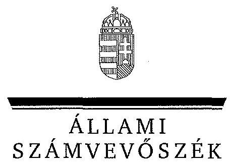
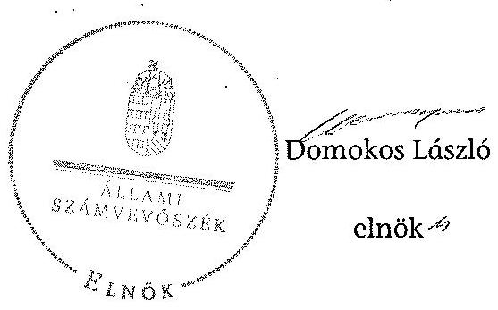
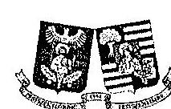
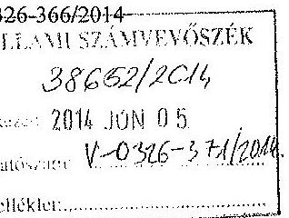
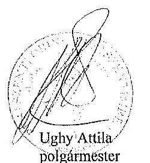
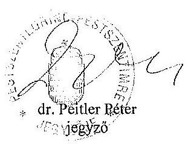
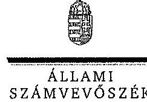
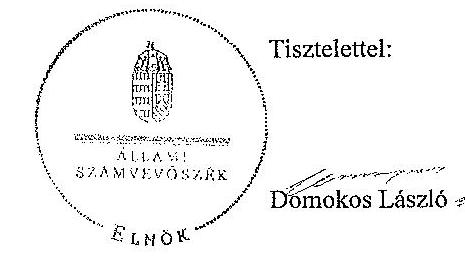
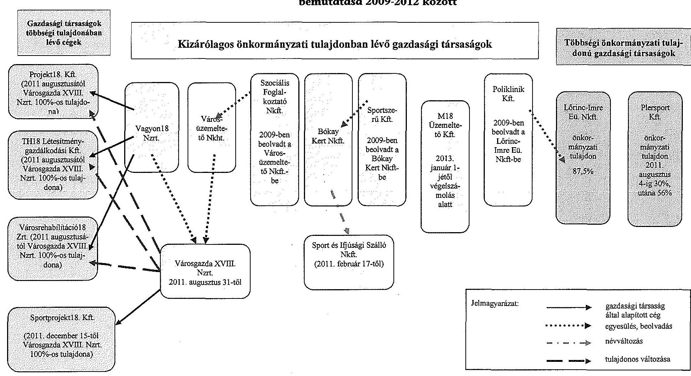

# JELENTÉS 

az önkormányzatok vagyongazdálkodása szabályszerűségének ellenőrzéséről
Budapest Főváros XVIII. kerület Pestszentlőrinc-Pestszentimre

---

# Állami Számvevőszék 

Iktatószám: V-0326-374/2014.
Témaszám: 1360
Vizsgálat-azonosító szám: V065113
Az ellenőrzést felügyelte:
Makkai Mária
felügyeleti vezető
Az ellenőrzést vezette és az ellenőrzés végrehajtásáért felelős:
Páncsics Judit
ellenőrzésvezető
A jelentés összeállításában közremüködtek:
Moder Beatrix
számvevő főtanácsos
Csontosné Kiss Margit
számvevő tanácsos
Az ellenőrzést végezték:
Csontosné Kiss Margit Vértényi Gábor Jenő Zagyi Judit
számvevő tanácsos számvevő
számvevő tanácsos

---

# TARTALOMJEGYZÉK 

BEVEZETÉS ..... 3
I. ÖSSZEGZŐ MEGÁLLAPÍTÁSOK, KÖVETKEZTETÉSEK, JAVASLATOK ..... 6
II. RÉSZLETES MEGÁLLAPÍTÁSOK ..... 12

1. A vagyongazdálkodási tevékenység szabályozása ..... 12
1.1. A vagyongazdálkodási tevékenység szabályozásának megfelelősége ..... 12
1.2. A vagyon használatba és üzemeltetésbe adásának, és a koncessziós jog gyakorlásának szabályszerűsége ..... 14
1.3. A vagyonüzemeltetésére, használatára kötött szerződések felülvizsgálata ..... 15
2. A vagyongazdálkodási tevékenység szabályszerűsége ..... 16
2.1. A vagyon nyilvántartása, a vagyon összetételének változása, a döntések és a gazdasági események szabályszerűsége ..... 16
2.1.1. A vagyon nyilvántartásának megfelelősége ..... 16
2.1.2. A vagyon értékének és összetételének változása ..... 18
2.1.3. A vagyon változását eredményező döntések és gazdasági események szabályszerűsége ..... 19
2.2. A térítés nélküli vagyon átadás és átvétel szabályszerűsége ..... 21
2.3. A beruházási és felújítási döntések és végrehajtásuk szabályszerűsége ..... 23
2.4. A tartós részesedésekkel történő gazdálkodás ..... 25
2.5. A vagyon értékesítésének, hasznosításának, a követelés elengedésének szabályszerűsége ..... 26
2.6. Az önkormányzati gazdasági társaságok tulajdonosi felügyelete ..... 28
3. Az integritás érvényesülése a vagyongazdálkodásban ..... 30
4. A belső és a külső ellenőrzések hasznosulása ..... 31
4.1. A belső ellenőrzés javaslatainak hasznosulása ..... 31
4.2. A külső ellenőrzések javaslatainak hasznosulása ..... 32

---

# MELLÉKLETEK 

1. számú Budapest Főváros XVIII. kerület Pestszentlőrinc-Pestszentimre Önkormányzata vagyonának főbb adatai 2009. január 1-je és 2012. december 31-e között
2. számú Budapest Főváros XVIII. kerület Pestszentlőrinc-Pestszentimre Önkormányzata felújítási és beruházási kiadásai, valamint az elszámolt értékcsökkenés bemutatása 2009-2012 között
3. számú Budapest Főváros XVIII. kerület Pestszentlőrinc-Pestszentimre Önkormányzata polgármesterének észrevétele
4. számú Budapest Főváros XVIII. kerület Pestszentlőrinc-Pestszentimre Önkormányzata polgármesterének észrevételére adott válasz

## FÜGGELÉKEK

1. számú Rövidítések jegyzéke
2. számú Értelmező szótár
3. számú Budapest Főváros XVIII. kerület Pestszentlőrinc-Pestszentimre Önkormányzata gazdasági társaságainak bemutatása 2009-2012 között

---

# JELENTÉS 

## az önkormányzatok vagyongazdálkodása szabályszerűségének ellenőrzéséről Budapest Főváros XVIII. kerület Pestszentlőrinc-Pestszentimre

## BEVEZETÉS

Az ÁSZ kiemelten fontosnak tartja az ÁSZ tv. 5. § (4) és (5) bekezdése alapján az önkormányzati vagyon kezelésének, a vagyonnal való gazdálkodási szabályok betartásának az ellenőrzését. Az ellenőrzés feladata a vagyongazdálkodással kapcsolatban a közpénzek átláthatósága, nyilvánossága érdekében a jogszabályokban, belső szabályzatokban megfogalmazott előírások érvényesülésének áttekintése. Az ÁSZ nem csak az ellenőrzött szervezet vagyongazdálkodásának a hibáira mutat rá, számon kérve azok kijavítását, hanem megállapításaival, javaslataival segíti a közpénzzel, a közvagyonnal való felelős gazdálkodást.

Az önkormányzati vagyon alapvető funkciója, hogy a közérdeket és egyúttal az önkormányzati célok megvalósítását szolgálja. A feladatellátás terén elsősorban a kötelezően ellátandó feladatok végrehajtását hivatott szolgálni, amely mellett az önként vállalt feladatok ellátása is megvalósulhat.

Az ÁSZ stratégiájában hangsúlyos szerepet szán annak, hogy szilárd szakmai alapon álló, értékteremtő ellenőrzéseivel előmozdítsa a közpénzügyek átláthatóságát, rendezettségét. Az ÁSZ a vagyongazdálkodás ellenőrzésén keresztül közreműködik az integritás alapú közigazgatási kultúra kialakításában.

Az ellenőrzés célja annak megállapítása volt, hogy az önkormányzat vagyongazdálkodási tevékenységének szabályozottsága és tevékenysége a jogszabályi előírásokkal összhangban volt-e, átlátható, a jogszabályi előírásoknak megfelelő volt-e a vagyon nyilvántartása, a külső és belső ellenőrzések megállapításai hozzájárultak-e az önkormányzati vagyongazdálkodási tevékenység szabályszerűségéhez.

Ennek keretében értékeltük, hogy az Önkormányzat:

- szabályszerűen alakította-e ki a vagyongazdálkodási tevékenységének kereteit;
- biztosította-e a vagyongazdálkodás szabályszerűségét, megalapozottan hoz-ta-e, és jogszerűen, szabályszerűen hajtotta-e végre a vagyonváltozást eredményező meghatározó jelentőségű döntéseket, valamint gondoskodott-e az általa alapított vagy tulajdonosi részvételével működő gazdasági társaságokkal kapcsolatos tulajdonosi joggyakorlásról;

---

- gondoskodott-e vagyongazdálkodási tevékenysége során az integritás (feddhetetlenség) szempontjainak érvényesüléséről;
- belső ellenőrzése elősegítette-e a vagyongazdálkodás szabályszerű működését, valamint hasznosította-e a külső és belső ellenőrzések megállapításait, javaslatait.

Az ellenőrzés típusa szabályszerűségi ellenőrzés.
Az ellenőrzött időszak: az ellenőrzés a 2009. január 1. és 2012. december 31. közötti időszakra terjedt ki, kitekintéssel a helyszíni ellenőrzés befejezéséig (2013. december 21-éig) tartó időszak releváns vagyongazdálkodási folyamataira. Az egyes közbeszerzési eljárások lefolytatásának ellenőrzése 2012. január 1jétől a helyszíni ellenőrzés kezdetét megelőző negyedév utolsó napjáig (2013. szeptember 30-ig), az Nvtv. egyes rendelkezései végrehajtásának ellenőrzése 2012-től, a helyszíni ellenőrzés befejezéséig tartott.

Az ellenőrzött szervezet: Budapest Főváros XVIII. kerület PestszentlőrincPestszentimre Önkormányzata.

Az ellenőrzés végrehajtásának jogszabályi alapját az ÁSZ tv. 5. § (4) bekezdésének a) pontja és (5) bekezdése, valamint az államháztartásról szóló 2011. évi CXCV. törvény 61. § (2) bekezdésében foglaltak képezik.

Az ellenőrzés szakmai módszertana az ÁSZ hivatalos honlapján közzétett szakmai szabályokon alapult, amely a Legfőbb Ellenőrző Intézmények Nemzetközi Szervezete (INTOSAI) által kiadott nemzetközi standardok (ISSAI) figyelembevételével készült.

Az ellenőrzést az ÁSZ hatályos szervezeti szabályai és az ellenőrzési programban foglalt értékelési szempontok szerint folytattuk le. Megállapításainkat a helyszíni ellenőrzés tapasztalataira, az ellenőrzött szervezettől bekért dokumentumokra, a kitöltött tanúsítványok elemzésére, az adott időszakban hatályos jogszabályok és belső szabályzatok előírásaira alapoztuk. A részesedések értékelését tételesen ellenőriztük, míg irányított mintavétellel választottuk ki a legnagyobb értékű térítésmentes átadás-átvételeket, a beruházásokat, felújításokat, a közbeszerzési eljárásokat, a vagyonértékesítéseket és hasznosításokat, valamint a követelés elengedéseket. Ezen túl a belső kontrollok megfelelő működését a vagyonváltozásokkal kapcsolatos 2009-2012. évi gazdasági események közül a Polgármesteri hivatal számviteli nyilvántartásaiból választott véletlen minta alapján, megállásos (többlépcsős) megfelelőségi teszttel ellenőriztük.

Budapest Főváros XVIII. kerület Pestszentlőrinc-Pestszentimre lakosainak száma 2012. január 1-jén 94663 fő volt. A 2010. évi önkormányzati választásokig a 31 tagú Képviselő-testület munkáját hét állandó bizottság segítette. Az önkormányzati választások után a Képviselő-testület létszáma 21 főre, az állandó bizottságok száma hatra csökkent. A Képviselő-testület 2010 novemberétől Elszámoltatási Munkacsoportot, 2011 márciusától további négy - csapadékvíz- és talajvíz elvezetéssel, zaj- és környezetvédelemmel, területrendezéssel és emlékhelyek kialakításával foglalkozó - munkacsoportot is létre hozott. A polgármester ${ }_{2}$ a 2010. évi önkormányzati választás óta tölti be tisztségét, a jegyző ${ }_{2} 2011$. november 14-től látja el feladatait. A Polgármesteri hivatal 2012. december 31-

---

én nyolc szervezeti egységre tagolódott. A gazdasági szervezet feladatait a Polgármesteri hivatal Gazdasági és Költségvetési Irodája, a vagyongazdálkodással kapcsolatos feladatokat a Vagyongazdálkodási és Műszaki Iroda, valamint feladat ellátási szerződés alapján - a Városgazda XVIII. Nzrt. látta el. A foglalkoztatott köztisztviselők száma 2012. december 31-én 248 fő volt.

Az Önkormányzat 2012. évben az önállóan működő és gazdálkodó Polgármesteri hivatalon felül négy önállóan működő és gazdálkodó, valamint 48 önállóan működő költségvetési szervvel látta el a feladatát. Az Önkormányzatnak öt gazdasági társaságban volt többségi tulajdonosi részesedése, amelyből három az Önkormányzat kizárólagos tulajdonában állt. A kizárólagos tulajdonú társaságok közül a Városgazda XVIII. Nzrt. a helyi közszolgáltatások keretében ellátta a településfejlesztés, a településrendezés, a vízrendezés és csapadékvízelvezetés, a csatornázás, a lakásgazdálkodás, valamint a kerületi szabadidős és közművelődési feladatokat. A Sport és Ifjúsági Szálló Kft. 2012-től az önkormányzati feladatok ellátásában nem vett részt. Az M18 Üzemeltető Kft. végelszámolás alatt áll, közfeladatot 2011-től nem látott el. A Lőrinc-Imre Eü. Nkft. biztosította - 87,5\%-os önkormányzati részesedéssel - az egészségügyi alapellátást és a szakorvosi ellátást. A Plersport Kft. a müködésével - 56,0\%-os önkormányzati részesedéssel - a sport feladatot támogatta.

Az ellenőrzött időszakban az Önkormányzat vállalkozási tevékenységet nem végzett, PPP konstrukcióban fejlesztést nem valósított meg, vagyonkezelési, haszonélvezeti és koncessziós jogot alapító szerződést nem kötött. Az ÁSZ az ellenőrzött időszakban számvevőszéki jelentéssel lezárt ellenőrzést az Önkormányzatnál nem végzett.

Az Önkormányzat könyvviteli mérleg szerinti vagyona 2012. december 31-én 106800,8 millió Ft volt, 5886,7 millió Ft-tal, 5,2\%-kal csökkent az ellenőrzött időszakban. Az Önkormányzat összes rövid és hosszú lejáratú kötelezettsége 2012. december 31-én 10519,8 millió Ft volt. A pénzintézeti kötelezettség állomány értéke 8050,9 millió Ft volt, melyből a rövid lejáratú kötelezettségek között kimutatott forgóeszköz hitel összege 4050,0 millió Ft-ot tett ki, a hosszú lejáratú hitel következő évben esedékes törlesztő részlete 16,8 millió Ft volt. A 2013. évi 3222,9 millió Ft összegű adósság átvállalás eredményeként az Önkormányzat pénzintézetekkel szembeni tartozás állománya 4828,0 millió Ft-ra csökkent. A 2012. évi költségvetési beszámolója szerint 17358,7 millió Ft költségvetési bevételt ért el és 17106,5 millió Ft költségvetési kiadást teljesített. A felhalmozási célú kiadások összege 2012-ben 911,6 millió Ft volt, melyből felújításokra és beruházásokra 864,3 millió Ft-ot fordítottak.

Az Önkormányzat vagyonának főbb adatait, a felújítási és beruházási kiadásokat, valamint az elszámolt értékcsökkenést az 1-2. számú mellékletek mutatják be. A jelentéstervezetben alkalmazott rövidítéseket és az egyes fogalmak magyarázatát az 1-2. számú függelékek tartalmazzák, az önkormányzati tulajdoni részesedéssel működő gazdasági társaságokat a 3. számú függelék ismerteti.

Az ÁSZ a 2011. évi LXVI. törvény 29. §-a szerint a jelentéstervezetet megküldte Budapest Főváros XVIII. kerület Pestszentlőrinc-Pestszentimre Önkormányzata polgármesterének egyeztetésre. A polgármester észrevételét és az arra adott választ a jelentés 3-4. számú mellékletei tartalmazzák.

---

# I. ÖSSZEGZŐ MEGÁLLAPÍTÁSOK, KÖVETKEZTETÉSEK, JAVASLATOK 

Az Önkormányzatnál a vagyongazdálkodással kapcsolatos feladat- és hatásköröket a jogszabályi előírásoknak megfelelően önkormányzati rendeletekben és belső szabályzatokban szabályozták. Az Ötv.-ben foglaltaknak megfelelően a vagyongazdálkodási rendelet ${ }_{1}$-ben meghatározták az önkormányzati feladatellátást biztosító törzsvagyont, ezen belül a forgalomképtelen és a korlátozottan forgalomképes vagyonelemek körét és a forgalomképesség megváltoztatásának módját. Részletesen szabályozták a vagyon hasznosításának, ingyenes átadás-átvételének, a vagyonkezelői jog megszerzésének, gyakorlásának és a vagyonkezelés ellenőrzésének eljárásrendjét, meghatározták azon vagyonelemek körét, amelyekre vagyonkezelői jog létesíthető. Vagyonkezelői szerződést 2009-2012 között nem kötöttek. A Képviselő-testület az Nvtv.-ben rögzített határidőn túl, 2013. május 31 -én rendelkezett a vagyongazdálkodási rendelet ${ }_{2}$ ben arról, hogy nem minősít a forgalomképtelen vagyonelemek köréből egyet sem nemzetgazdasági szempontból kiemelt jelentőségű vagyonná.

A Képviselő-testület élt az Ötv.-ben biztosított jogával és a vagyongazdálkodási rendelet ${ }_{1}$-ben, valamint az önkormányzati $\mathrm{SZMSZ}_{2}$-ben a polgármester ${ }_{1,2}$-nek és a Tulajdonosi Bizottságnak adott át értékhatároktól függően vagyongazdálkodási feladatokhoz kapcsolódó hatáskört. Az átruházott hatáskörök gyakorlói a vagyongazdálkodási rendelet ${ }_{1}$-ben, valamint az önkormányzati $\mathrm{SZMSZ}_{2}$-ben előírt negyedévenkénti beszámolási kötelezettségüknek nem tettek eleget.

A jegyző ${ }_{1,2}$ a Polgármesteri hivatal számviteli rendjét a Htv. előírásainak megfelelően kialakította. A Polgármesteri hivatal számviteli politikával és a hozzá kapcsolódó - pénzkezelési, leltározási, selejtezési és értékelési - szabályzatokkal rendelkezett. A leltározási szabályzat ${ }_{1,2}$-ben a leltározással kapcsolatos részlet szabályokat - az Áhsz. ${ }_{1}$-ben foglaltak alapján - saját hatáskörben előírták, rendelkeztek arról, hogy a leltári eltérések okát ki kell vizsgálni, de a leltárhiány leírását engedélyező jogkört nem nevesítették.

A törzsvagyon, ezen belül a forgalomképtelen és korlátozottan forgalomképes, illetve a forgalomképes (üzleti) vagyon elkülönített nyilvántartását a főkönyvi számlák alábontásával, a számlákhoz kapcsolódó analitikus nyilvántartások vezetésével biztosították. A 2009-2012. években a vagyonkimutatásokat a zárszámadással együtt a Képviselő-testületnek bemutatták, melyek tartalma a 2009. évet kivéve - megfelelt az Áhsz. ${ }_{1}$ előírásainak. A 2009. évi vagyonkimutatás nem tartalmazta az érték nélkül nyilvántartott eszközök állományát, a „0"-ra leírt, de használatban lévő, illetve használaton kívüli eszközök állományát, valamint a mérlegben értékkel nem szereplő kötelezettségeket.

Az ingatlanvagyon-kataszter értékadatai az ingatlanvagyon számviteli nyilvántartás szerinti bruttó érték adataival a 2009., a 2010. és a 2012. években - a 147/1992. (XI. 6.) Korm. rendeletben foglaltak ellenére - nem egyeztek meg.

---

Az ingatlanvagyon-kataszter megfelelő adatai és a közhiteles nyilvántartást vezető illetékes földhivatal azonos tartalmú adatai között az egyezőség a 147/1992. (XI. 6.) Korm. rendeletben előírtak ellenére a 2009-2012. években dokumentummal alátámasztottan - nem igazolt.

Az Önkormányzatnál a 2009-2012. évi számviteli mérlegekben kimutatott eszközök és források értékét kiértékelt leltárral támasztották alá. A 2010-2012. években az üzemeltetésre és koncesszióba átadott épületek értékét az Áhsz-1 előírása ellenére nem az üzemeltető, illetve a koncessziós jogot gyakorló által mennyiségi felvétel alapján készített, hitelesített leltárral támasztották alá, azokat a Polgármesteri hivatal leltározta. A belső ellenőrzés 2011-ben ellenőrizte a Polgármesteri hivatal 2010. évi vagyonbeszerzési, nyilvántartási, leltározási és selejtezési tevékenységét és számos hiányosságot tárt fel, amely alapján a négy köztisztviselővel szemben kezdeményeztek fegyelmi eljárást. A Polgármesteri hivatalban a gépek, berendezések és felszerelések 2011. évi mennyiségi felvétellel készült és kiértékelt leltárai alapján a számviteli nyilvántartáshoz képest mennyiségbeli és értékbeli eltérést, hiányt állapítottak meg. A hiány okát tételesen nem vizsgálták ki. A szabályozás hiányában a Gazdálkodási és Költségvetési Irodavezető - feladatkörében eljárva jogszerűen - intézkedett a leltárhiány számviteli nyilvántartásokból történő kivezetésére és elszámolására.

A gazdálkodási jogköröket 2009-2012 között a kötelezettségvállalási szabály-zat ${ }_{1-3}$-ban - az Ámr. ${ }_{1,2}$, illetve az Ávr. előírásainak megfelelően - szabályozták. A Polgármesteri hivatalban a 2009-2012. években a gazdálkodási jogkörök gyakorlása során betartották az összeférhetetlenségi követelményeket. A 20092012. években - az ellenőrzött mintatételek alapján - az Ámr. ${ }_{1,3}$-ben és az Ávr.ben előírtak ellenére a vagyongazdálkodással kapcsolatos kiadásokat megalapozó kötelezettségvállalásokat nem előzte meg ellenjegyzés. 2010-2011-ben a bevételek beszedését megelőzően az Ámr. ${ }_{2}$-ben és kötelezettségvállalási szabályzat ${ }_{1,3}$-ben előírtak ellenére elmaradt a szakmai teljesítésigazolás, valamint az arra felhatalmazott személyek nem szabályszerűen végezték el a bevételek érvényesítését. A mintatételek ellenőrzése során jogosulatlan kifizetés, illetve bevétel beszedés nem történt. A Polgármesteri hivatalban a kötelezettségvállalásokról vezetett nyilvántartás 2010-2012-ben nem felelt meg az Ámr. ${ }_{2}$, illetve az Ávr. előírásainak, mert nem tartalmazta a kötelezettségvállaló nevét, a jogosult azonosító adatait, a kötelezettségvállalás előirányzatok szerinti megoszlását és a kifizetési határidőket.

Az Önkormányzat vagyona a 2009. évi 112687,5 millió Ft-os nyitó értékről 2012. év végére 106800,8 millió Ft-ra, $5,2 \%$-kal csökkent. A vagyon csökkenését az üzemeltetésre átadott eszközöknél a csatorna közmú vagyon Fővárosi Önkormányzat részére történő átadása és a lakóingatlanok piaci értékének csökkenése, az ingatlanoknál a beruházások és felújítások értékét meghaladóan elszámolt értékcsökkenés okozta. A befektetett pénzügyi eszközök körében a Képviselő-testület 2009-ben a Vagyon18 Nzrt.-ben négy ingatlan apportálásával 225 millió Ft-os tőkeemelést hajtott végre, 2011-ben a Városgazda XVIII. Nzrt. jegyzett tőkéjét a jogelőd társaságok jegyzett tőkéjénél - azok 2010. évi veszteséges gazdálkodása következtében - 779,0 millió Ft-tal alacsonyabb öszszegben állapította meg. A forgó eszközök állományának csökkenését elsősorban a pénzeszközök értékének csökkenése okozta. A 2009-2012. években 4614,6 millió Ft-ot fordítottak fejlesztésre, az elszámolt értékcsökkenés összege

---

4825,6 millió Ft volt. A fejlesztések pénzügyi fedezetét uniós támogatásokból, kötvény kibocsátásból, valamint saját forrásokból biztosították.

Az ellenőrzött beruházások és felújítások 2009-2012-ben a gazdasági progra $\mathrm{m}_{1,2}$-ben foglaltak alapján, az önkormányzati feladatellátással összhangban valósultak meg. Az ellenőrzött felújítások közül 2009-ben a lakások, valamint a krízisszálló kialakítására vonatkozó 32,3 millió Ft, illetve 24,9 millió Ft összegű szerződéseket az alpolgármester írta alá annak ellenére, hogy a kötelezettségvállalási szabályzat ${ }_{1}$ alapján kötelezettségvállalásra 10 millió Ft-ig volt jogosult. A beruházások és felújítások állományba vétele szabályszerűen megtörtént, a vagyon értékének változását az ingatlan-vagyonkataszteri nyilvántartásban átvezették.

Az Önkormányzat a 2009-2010. években Fejlesztési Keretszerződést kötött a kizárólagos tulajdonában álló Városüzemeltető Nkft.-vel fejlesztési munkák megvalósítására. A Kbt. ${ }_{1}$ 2/A. §-a csak az ún. házon belüli beszerzésekre adott lehetőséget közbeszerzési eljárás mellőzésével, ennek ellenére a Fejlesztési Keretszerződések tartalmazták, hogy az Nkft. igénybe vehet külső alvállalkozókat a feladatok ellátására. A 2009-2010. években megkötött Fejlesztési Keretszerződések a fentiek miatt nem feleltek meg a Kbt. ${ }_{1}$ előírásának. A Kbt. ${ }_{1}$ alapján a Közbeszerzési Döntőbizottság előtti jogorvoslati eljárás kezdeményezésére a jogsértéstől számított egy éven belül volt lehetőség, ezért az ÁSZ jogorvoslati eljárást nem kezdeményezett. Az Önkormányzat a 2011. évtől Fejlesztési Keretszerződést nem kötött.

Az Önkormányzat a 2012. évben és 2013. év I-III. negyedévében összesen 19 közbeszerzési eljárást indított 968,5 millió Ft + áfa beszerzési értékben. A beruházási feladatok ellenőrzött közbeszerzési eljárásait szabályszerűen folytatták le.

A vagyonváltozásokhoz kapcsolódó döntéseket az arra felhatalmazott személyek hozták. A térítés nélküli vagyonátadások és vagyonátvételek számviteli nyilvántartásból való kivezetése, illetve nyilvántartásba vétele az előírásoknak megfelelően megtörtént. Az Önkormányzatnál ellenőrzött esetekben a vagyontárgyak értékesítése során betartották a versenyeztetési eljárás szabályait, az értékesítéseket megelőzően értékbecslést készítettek. A tárgyi eszközök hasznosítására hozott döntésekkel azonos tartalmú szerződéseket, megállapodásokat kötöttek, a szerződésekben az Önkormányzat érdekeit védő garanciális elemeket rögzítették. A behajthatatlan követelések minősítése és leírása az Áhsz. ${ }_{1}$ előírásaival összhangban történt.

Az Önkormányzatnál az Áhsz. ${ }_{1}$-ben előírtak ellenére a 2009-2010. években az éves beszámolók kiegészítő mellékletében nem mutatták be a $25 \%$-ot meghaladó arányú részesedések adatait, az előírásnak a 2011. évtől tettek eleget.

2009-ben az Önkormányzat a vagyonüzemeltetési feladatokat öt kizárólagos tulajdonában álló gazdasági társasággal látta el, a társaságok 2011. évi átalakításával az üzemletetési feladatokat a Városgazda XVIII. Nzrt.-hez csoportosították át. A Képviselő-testület a kizárólagos önkormányzati tulajdonban lévő gazdasági társaságok feletti tulajdonosi joggyakorlás keretében a 20092012. évekről szóló éves beszámolókat, a közhasznú társaságok közhasznúsági

---

jelentéseit, valamint a következő évre szóló üzleti terveket elfogadta. Az Önkormányzatnak tőkepótlási kötelezettsége - a kizárólagos tulajdonában lévő társaságok veszteséges gazdálkodása miatt - a Sport és Ifjúsági Szálló Nkft.-nél és az M18 Üzemeltető Kft.-nél keletkezett, melynek a Gt.-ben előírtaknak megfelelően eleget tett. A Képviselő-testület az ellenőrzött időszakban a Városüzemeltető Nkft. (jogutódja a Városgazda XVIII. Nzrt.) forgóeszköz hiteléhez, a Lő-rinc-Imre Eü. Nkft. folyószámlahiteléhez és a Sport és Ifjúsági Szálló Nkft. 2011ben felvett kölcsönéhez vállalt készfizető kezességet. A kezességvállalásról szóló döntést megelőzően nem végezték el az önkormányzati adósságot keletkeztető kötelezettségvállalás felső határára vonatkozó - az Ötv. -ben meghatározott számításokat, de a hiányosság miatt az értékhatárt nem lépték túl. A Sport és Ifjúsági Szálló Nkft. kölcsönéhez vállalt kezesség 2012. évi beváltása miatt az Önkormányzatnál 2013 júniusában 85,2 millió Ft követelést tartottak nyilván az Nkft.-vel szemben.

A nem kizárólagos önkormányzati tulajdonban lévő Plersport Kft. saját tőkéje a veszteséges gazdálkodás következtében a 2009-2012. években negatív volt. A társaság tőkehelyzetét - mivel egymást követő két teljes üzleti évben a cég nem rendelkezett a társasági formájára kötelezően előírt jegyzett tőkének megfelelő összegű saját tőkével - a 2010. évi beszámoló elfogadását követő három hónapon belül a tagoknak a Gt. előírása alapján rendezniük kellett volna, de ez nem történt meg. Az Önkormányzat 2012-ben a Tulajdonosi Bizottság átruházott hatáskörben hozott döntése alapján 20 millió Ft összegű tagi kölcsönt nyújtott a Kft.-nek 2013. június 30-i visszafizetési határidővel.

A közérdekú gazdálkodási adatok nyilvánosságának biztosítása, a közpénzek vagyongazdálkodással összefüggő felhasználásának átláthatósága érdekében a jegyző ${ }_{1,2}$ az ellenőrzött években a jogszabályon alapuló közzétételi kötelezettségének eleget tett.

A Polgármesteri hivatalban a vagyongazdálkodási tevékenység szabályozása és múködtetése részben felelt meg a feddhetetlenség, az átláthatóság és az elszámoltathatóság jogszabályi előírásainak. A vagyongazdálkodási tevékenység integritása - a szabályozottság ellenére - nem volt teljes körűen biztosított, mert az Önkormányzat - annak célszerűsége ellenére - nem rendelkezett integritáspolitikával, a vagyongazdálkodási tevékenység vonatkozásában korrupciós kockázat elemzést nem végeztek. A Kttv. szerinti etikai alapelvek részletes tartalmát a Képviselő-testület 2012 márciusa helyett csak 2013 májusában fogadta el.

Az Önkormányzatnál a 2007-2011. években a belső ellenőrzést stratégiai terv, valamint éves ellenőrzési tervek alapján végezték. A 2012. évi éves ellenőrzési tervet a Pénzügyi bizottság jóváhagyta, de a Bkr.-ben előírtak ellenére 2012-től stratégiai ellenőrzési tervvel nem rendelkeztek. 2009-2012 között a belső ellenőrzési kézikönyvet a Ber., illetve a Bkr. előírása ellenére nem vizsgálták felül, a hiányosságot 2013-ban pótolták. Az Önkormányzatnál az ellenőrzött időszakban elvégzett 97 belső ellenőrzésből 18 érintette a vagyongazdálkodást. A belsö ellenőrzés javaslatokat fogalmazott meg a közbeszerzési kötelezettség jogi egyeztetésére, a leltározás, készletgazdálkodás szabályozására, a leltárfelelősség érvényesíthetőségére, fegyelmi felelősségre vonásra, ellenőrzési nyomvonalak kialakítására. A belső ellenőrzés megállapításaival és javaslataival elősegítette

---

a vagyongazdálkodási tevékenység szabályozási és múködési hiányosságainak megszüntetését.

A könyvvizsgáló az Önkormányzat 2009-2012. évi beszámolóit megbízhatónak és hitelesnek minősítette, 2009-ben és 2010-ben a vagyongazdálkodás minőségének javításával kapcsolatos észrevételeket fogalmazott meg, melyeket az Önkormányzatnál hasznosítottak.

A jegyző ${ }_{1,2}$ a külső ellenőrzések nyilvántartásáról a 2009-2011. években a Ber., a 2012. évben a Bkr. rendelkezései ellenére nem gondoskodott.

Az Önkormányzatnál - az adatszolgáltatásuk alapján - a 2009-2012. években a Pro Régio Ügynökség, az EUTAF, a Kincstár, a MAG Zrt., és a Fővárosi Földhivatal végeztek ellenőrzéseket, a feltárt hibák kijavításáról intézkedtek.

Az Állami Számvevőszékről szóló 2011. évi LXVI. törvény 33. § (1) bekezdésében foglaltak értelmében a jelentésben foglalt megállapításokhoz kapcsolódó intézkedési tervet köteles az ellenőrzött szervezet vezetője összeállítani, és azt a jelentés kézhezvételétől számított 30 napon belül az ÁSZ részére megküldeni. Amennyiben az intézkedési tervet határidőben nem küldi meg a szervezet, vagy az nem elfogadható, az ÁSZ elnöke a hivatkozott törvény 33. § (3) bekezdés a)-b) pontjaiban foglaltakat érvényesítheti.

Az ellenőrzés intézkedést igénylő megállapításai és javaslatai:

# a jegyzőnek 

1. A számviteli nyilvántartás ingatlanvagyon adatainak az ingatlanvagyon-kataszter adataival való egyezőségét a 2009., 2010. és a 2012. években - a 147/1992. (XI. 6.) Korm. rendelet 1. § (3) bekezdésében és 2. számú mellékletében foglaltak ellenére nem biztosították. Az ingatlanvagyon-kataszter megfelelő adatai és a közhiteles nyilvántartást vezető illetékes földhivatal azonos tartalmú adatai közötti egyezőséget nem vizsgálták, a Földhivatallal az adatokat az ellenőrzött időszakban nem egyeztették. Az ingatlanvagyon-kataszter megfelelő adatai és a közhiteles nyilvántartást vezető illetékes földhivatal azonos tartalmú adatai közötti egyezőség a 147/1992. (XI. 6.) Korm. rendelet 1. § (2) bekezdésének előírása ellenére a 2009-2012. években - dokumentummal alátámasztottan - nem igazolt.

Javaslat:
Intézkedjen arról, hogy a 147/1992. (XII. 6) Korm. rendelet 1. § (2)-(3) bekezdéseiben előírtaknak megfelelően az ingatlanvagyon kataszter adatai egyezzenek meg a földhivatal ingatlan-nyilvántartás azonos tartalmú adataival, továbbá biztosítsa az egyezőséget az ingatlanvagyon kataszter és az ingatlanok számviteli nyilvántartása szerinti bruttó érték adatok között.
2. Az ellenőrzött időszakban változatlan tartalommal hatályos volt a 2005-ben, 20 évre kötött építési koncessziós szerződés egy rendezvényterem és étterem üzemeltetésére. A koncesszióba adott épület mérleg szerinti értéket az Áhsz., 37. § (4) bekezdésében foglaltak ellenére a 2010-2012. években nem az üzemeltetést végző által ké-

---

szített és hitelesített leltárral támasztották alá, azokat a Polgármesteri hivatal leltározta.

Javaslat:
Intézkedjen, hogy a koncesszióba adott eszközök mérleg tételeit az Áhsz. 2 22. § (2) bekezdés a) pontjában előírtaknak megfelelően a múködtető által elkészített és hitelesített leltárral támasszák alá.
3. A Polgármesteri hivatalban a leltározási szabályzat ${ }_{1,2}$-ben előírták, hogy a leltári eltérések okát vizsgálni kell, de a leltárhiány leírásának engedélyezésére vonatkozó jogkört nem nevesítették.

Javaslat:
Intézkedjen, hogy a leltározási szabályzat kiegészítésre kerüljön a leltárhiány leírását engedélyező személy jogkörének megnevezésével.
4. A Polgármesteri hivatalban vezetett kötelezettségvállalás nyilvántartás nem felelt meg az Ámr. 2 75. § (1) és az Ávr. 56. § (1) bekezdésében előírtaknak, mert nem tartalmazta a kötelezettségvállaló nevét, a jogosult azonosító adatait, a kötelezettségvállalás előirányzatok szerinti megoszlását és a kifizetési határidőket, a kötelezettségvállalást tanúsító dokumentum iktatószámát, továbbá a teljesítési adatokat.

Javaslat:
Intézkedjen, hogy a kötelezettségvállalásokról az Áhsz. 2 14. számú mellékletének II.4. pontjában előírt tartalomnak megfelelő nyilvántartást vezessék.
5. Az Önkormányzat nem rendelkezett a 2012-től a Bkr. 22. § (1) bekezdésében előírtak ellenére a Képviselő-testület által jóváhagyott belső ellenőrzési stratégiai ellenőrzési tervvel.

Javaslat:
Intézkedjen, hogy a belső ellenőrzési vezető készítse el és jóváhagyásra nyújtsa be a Képviselő-testületnek a Bkr. 22. § (1) bekezdés b) pontjának megfelelően a belső ellenőrzés stratégiai ellenőrzési tervét.
6. Az Önkormányzatnál a 2009-2011. években a Ber. 29/A. § (1) bekezdésében, a 2012. évben a Bkr. 14. § (1) bekezdésében előírtak ellenére a külső ellenőrzésekről nyilvántartást nem vezettek.

Javaslat:
Intézkedjen a Bkr. 14. § (1) bekezdésében foglaltak szerint a külső ellenőrzések nyilvántartásának vezetéséről.

---

# II. RÉSZLETES MEGÁLLAPÍTÁSOK 

## 1. A VAGYONGAZDÁLKODÁSI TEVÉKENYSÉG SZABÁLYOZÁSA

### 1.1. A vagyongazdálkodási tevékenység szabályozásának megfelelősége

A Képviselő-testület a Htv. 138. § (1) bekezdés j) pontjában foglalt kötelezettségének eleget téve a vagyongazdálkodási feladat- és hatásköröket a teljes vagyoni körre kiterjedően önkormányzati rendeletekben szabályozta. A vagyongazdálkodási rendelet ${ }_{1}$-ben meghatározták az önkormányzati feladatellátást biztosító törzsvagyont, ezen belül a forgalomképtelen és a korlátozottan forgalomképes vagyonelemek körét, a forgalomképesség megváltoztatásának módját. A Képviselő-testület az Nvtv. 18. § (1) bekezdésében meghatározott határidőig (2012. március 1-jéig) nem döntött arról, hogy a törzsvagyonba tartozó forgalomképtelen vagyonelemei közül valamelyiket minősíti-e nemzetgazdasági szempontból kiemelt jelentőségű nemzeti vagyonná. A hiányosságot a 2013. május 31 -én hatályba lépett vagyongazdálkodási rendelet ${ }_{2}$-ben pótolták, melyben rögzítették, hogy az Önkormányzatnak nincs nemzetgazdasági szempontból kiemelt jelentőségű nemzeti vagyona.

A Képviselő-testület élt az Ötv. 9. § (3) bekezdésében ${ }^{1}$ biztosított jogával és a vagyongazdálkodási rendelet ${ }_{1}$-ben, valamint az önkormányzati SZMSZ ${ }_{2}$-ben a vagyontárgy típusától függően, értékhatárokhoz kötve - a polgármester ${ }_{1,2}{ }^{-}$ nek és a Tulajdonosi Bizottságnak adott át a vagyongazdálkodási feladatokhoz kapcsolódó hatáskört. Az átruházott hatáskörök gyakorlói részére előírta, hogy negyedévenként kötelesek beszámolni a döntéseik alapján elidegenített ingatlanokról, de a beszámolási kötelezettségüknek az ellenőrzött időszakban nem tettek eleget.

A Képviselő-testület a vagyongazdálkodási rendelet ${ }_{1}$-ben az Ötv. 80/A.-80/B. §aiban ${ }^{2}$ és az Áht. ${ }_{1}$ 105/A. §-ában foglaltaknak megfelelően szabályozta a vagyonkezelői jog alapításának eljárásrendjét és a vagyonkezelői jog gyakorlásának ellenőrzését, valamint meghatározta azon vagyonelemek körét, amelyekre vagyonkezelői jog létesíthető. Az Önkormányzat 2009-2012 között vagyonkezelői szerződést nem kötött.

Az önkormányzati vagyon térítésmentes átruházásának jogcímeit és módját a vagyongazdálkodási rendelet ${ }_{1}$-ben az Áht. ${ }_{1}$ 108. § (2) bekezdésében foglaltaknak megfelelően, illetve 2012 márciusától az Nvtv. 13. § (3) bekezdésével összhangban szabályozták.

[^0]
[^0]:    ${ }^{1}$ 2013. január 1-jétől az Mötv. 41. § (4) bekezdése tartalmazza
    ${ }^{2}$ 2013. január 1-jétől az Mötv. 109. §-a tartalmazza

---

A vagyonhasznosítások nyilvános pályáztatási kötelezettség értékhatárát a vagyongazdálkodási rendelet ${ }_{1}$-ben az Âht. 108. § (1) bekezdésében, illetve az Nvtv. 11. § (16) bekezdésében előírtakat figyelembe véve a Képviselő-testület 2,0 millió Ft-ban határozta meg.

A Képviselő-testület az Nvtv. 9. § (1) bekezdésében előírt közép- és hosszú távú vagyongazdálkodási tervet 2013. május 23 -án fogadta el.

A jegyző ${ }_{1,2}$ a Polgármesteri hivatal számviteli rendjét a Htv. 140. § (1) bekezdés c) pontjában foglaltaknak megfelelően kialakította. A Polgármesteri hivatal a Számv. tv. 14. §-ában és az Âhsz. ${ }_{1} 8$. §-ában ${ }^{3}$ előírt - számviteli politika ${ }_{1-2}{ }^{-}$ tel és a hozzá kapcsolódó pénzkezelési, leltározási, selejtezési és értékelési - szabályzatokkal rendelkezett. A jegyző ${ }_{1,2}$ a számviteli politika ${ }_{1-2}$-ben - az Âhsz. ${ }_{1}$ ben előírtaknak megfelelően - meghatározta a befektetett eszközök értékcsökkenésének elszámolási módját. Az Önkormányzat önállóan múködő és gazdálkodó költségvetési szervei számviteli rendjének kialakításához a polgármester ${ }_{1}$ és a jegyző együttes utasítást ${ }^{4}$ adott ki, mellyel megfelelő keretet biztosítottak az önkormányzati beszámoló elkészítéséhez.

A Polgármesteri hivatalban a leltározási szabályzat ${ }_{1,2}$-ben évenkénti leltározást írtak elő az Âhsz. 1 37. § (1)-(3) bekezdésében ${ }^{5}$ foglaltaknak megfelelően. A 2010. évtől az üzemeltetésre átadott eszközök leltározási módjának szabályozása megfelelt az Âhsz. ${ }_{1} 37 . \S$ (4) bekezdésében ${ }^{6}$ foglaltaknak, mivel előírták, hogy az üzemeltetésre átadott eszközöket az üzemeltetést végző szerv által elkészített és hitelesített leltárral kell alátámasztani. A leltározási szabályzat ${ }_{1,2}$-ben - az Âhsz. 37. § (5) bekezdésében foglaltaknak megfelelően - saját hatáskörben kialakították a leltározással kapcsolatos részlet szabályokat, előírták, hogy a leltár eltérések okát ki kell vizsgálni, de a leltárhiány leírását engedélyező jogkört nem nevesítették.

A kötelezettségvállalási szabályzat ${ }_{1,2}$-ben 2009-2011 között az Ámr. ${ }_{1}$ 134-138. §aiban, illetve az Ámr. ${ }_{2}$ 72-80. §-aiban előírtaknak megfelelően határozták meg az operatív gazdálkodással összefüggő eljárásrendet, jogkörgyakorlást, összeférhetetlenségi követelményeket. A 2012. január 1-jétől az Ávr. 52-60. §-aiban előírtakat késedelmesen, 2012. május 20 -tól vezették át a kötelezettségvállalási szabályzat ${ }_{2}$-ban. A gazdasági szervezettel rendelkező Polgármesteri hivatalban a pénzügyi ellenjegyzést és az érvényesítést végző személyeket - az Âht. 2 38. § (2) bekezdésében, valamint az Ávr. 55. § (2) bekezdés f) pontjában és 58. § (4) bekezdésében foglaltak ellenére - 2012 januárjától május 19-ig nem a gazdasági vezető, hanem a jegyző ${ }_{2}$ jelölte ki.

[^0]
[^0]:    ${ }^{3}$ 2014. január 1-jétől az Âhsz. ${ }_{2}$ 50. §-a szabályozza
    ${ }^{4}$ 28/2008. (XII. 1.) polgármesteri és jegyzői együttes utasítás: Iránymutató az önkormányzat önállóan gazdálkodó költségvetési szervei egységes számviteli rendjének kialakításához.
    ${ }^{5}$ 2014. január 1-jétől az Âhsz. ${ }_{2}$ 22. §-a szabályozza
    ${ }^{6}$ Megállapította a 317/2009. (XII. 29.) Korm. rendelet 18. §-a. Először a 2010. évről készített beszámolókra kellett alkalmazni. 2014. január 1-jétől az Âhsz. ${ }_{2}$ 22. § (2) bekezdés a) pontja szerint csak a koncesszióba, vagyonkezelésbe adott eszközöket kell a múködtető, vagyonkezelő által elkészített és hitelesített leltárral alátámasztani.

---

A volt állami tulajdonú lakóépületekben lévő lakások elidegenítéséből származó bevételek elkülönített számlán történő elhelyezését a Lakás tv. 62. § (1) bekezdésében foglaltaknak megfelelően szabályozták.

Az Eisztv. előírásainak megfelelően az adatvédelmi szabályzat ${ }_{1,2}$-ben meghatározták a közérdekű adatok nyilvánossága biztosításának eszközeit, a nyilvánosságra hozatal módját és felelősét a céljellegű működési és fejlesztési támogatásokra, a vagyonnal való gazdálkodással összefüggő szerződésekre, az Önkormányzat költségvetésére, illetve beszámolójára vonatkozóan.

Az önkormányzati SZMSZ ${ }_{1,2}$ nem részletezte az Önkormányzat kötelezően ellátandó és önként vállalt feladatait. Az önkormányzati SZMSZ ${ }_{1,2}$ 2012. március 12-ig előírta, hogy az Önkormányzat kötelezően ellátandó, illetve önként vállalt feladatait a költségvetési és a zárszámadási rendeletekben kell megjeleníteni. A kötelező és önként vállalt feladatok körét, azok ellátásának mértékét és módját csak a 2009. évi zárszámadási rendelet tartalmazta, a 2010. évi költségvetési rendeletben csak a feladatellátás mértéke jelent meg. A 2011-2012. évi költségvetési és zárszámadási rendeletekben nem mutatták be az Önkormányzat kötelező és az önként vállalt feladatait ${ }^{7}$.

Az Önkormányzat a feladatait az intézményrendszerén, a többségi tulajdonában lévő közhasznú gazdasági társaságain, az általa alapított közalapítványokon, továbbá egyházakkal kötött szerződések útján látta el.

Az Önkormányzat a Magyar Evangélikus Egyháznak a 2011. évben térítésmentesen átadta az oktatási feladatok ellátásához az egyik gimnázium és általános iskola ingóságait, az ingatlanait pedig 99 évre az egyház használatába adta. A közoktatási feladatok átadásához az oktatási célú ingatlanok ingyenes használatba adása, illetve a berendezések és felszerelések tulajdonba adása szabályszerű volt. A Képviselő-testület döntése alapján a Rózsa Művelődési Házat 2012. szeptember 1-jéig a Városgazda XVIII. Nzrt. működtette, ezt követően a Kondor Béla Közösségi Ház és Intézményei telephelyeként, költségvetési intézményként látta el feladatait.

# 1.2. A vagyon használatba és üzemeltetésbe adásának, és a koncessziós jog gyakorlásának szabályszerűsége 

Az Önkormányzat 2012. december 31-i mérlegében kimutatott 12673,4 millió Ft értékű üzemeltetésre és koncesszióba adott vagyonát a kizárólagos tulajdonában álló Városgazda XVIII. Nzrt., valamint a koncesszióba adott rendezvényterem és étterem koncessziós jogát gyakorló kezelte.

Az Önkormányzat 2009-ben a vagyonüzemeltetési feladatok ellátásával öt kizárólagos tulajdonában álló gazdasági társaságot bízott meg, majd a társaságok átalakításával 2011-ben az üzemletetési feladatokat a Városgazda XVIII. Nzrt.hez csoportosította át.

[^0]
[^0]:    ${ }^{7}$ Az Önkormányzat 2014. évi költségvetésről szóló 2/2014. (II. 14.) számú rendelete tartalmazza a kötelezö és önként vállalt feladatok bevételeit és kiadásait.

---

Az ellenőrzött üzemeltetési szerződésekben rögzítették a kötelezően ellátandó önkormányzati közfeladatot és az üzemeltetésre átadott vagyonnal való gazdálkodás részletes szabályait. A célszerúség ellenére nem határozták meg az üzemeltetett önkormányzati vagyonnal kapcsolatban az adatszolgáltatási kötelezettséget, valamint a leltározással kapcsolatban a társaságra háruló feladatokat. A szerződések nem tartalmaztak a szerződéses feltételeket biztosító garanciális elemeket.

Az üzemeltetésbe adott eszközök után az Önkormányzatnál 2009-2012 között összesen 668,1 millió Ft értékcsökkenést számoltak el. Önkormányzati lakások felújítására (Hengersor u. 55. és 39., Vándor Sándor u. 1., Darányi u 56., Üllői út 386., Havanna u. 78.) 159,3 millió Ft-ot fordítottak.

Az ellenőrzött időszakban változatlan tartalommal hatályos volt a 2005-ben, 20 évre kötött építési koncessziós szerződés egy rendezvényterem és étterem üzemeltetésére. A szerződést a Kbt., VI. fejezete szerinti nyílt eljárás lefolytatását követően a nyertes ajánlattevővel kötötték meg. A közbeszerzésről és a szerződéskötésről a hatályos Ötv. 80. § (1) bekezdésének megfelelően a Képviselőtestület döntött. A szerződésben rögzítették a kötelezően ellátandó önkormányzati közfeladatot, azonban nem határozták meg a koncesszióba adott önkormányzati vagyonnal kapcsolatos adatszolgáltatási kötelezettséget az Áhsz.; 9. számú melléklete - a számlaosztályok tartalmára vonatkozó előírások - 1. f) pontjában ${ }^{8}$ előírtak szerint. A koncessziós szerződésben rögzítették, hogy az ingatlant folyamatosan jó műszaki és esztétikai állapotban kell tartani.

# 1.3. A vagyonüzemeltetésére, használatára kötött szerződések felülvizsgálata 

Az Önkormányzatnak 2009. január 1-jén hét kizárólagos tulajdonú gazdasági társasága volt, továbbá egy gazdasági társaságban 87,5\%-os részesedési aránynyal, egyben pedig $30 \%$-os részesedési aránnyal rendelkezett. Az Önkormányzat kizárólagos tulajdonában lévő gazdasági társaságok száma 2012. december 31-éig háromra csökkent, mert négy gazdasági társaságot összeolvadással megszüntettek. A nem kizárólagos önkormányzati tulajdonban lévő gazdasági társaságok száma nem változott, azonban képviselő-testületi döntés alapján 2011. évben a Plersport Kft.-ben lévő $30 \%$-os részesedési arány 780 ezer Ft névértékű üzletrész vásárlással $56 \%$-ra emelkedett.

Az Önkormányzat 2012. december 31-én csak olyan gazdasági társaságokban rendelkezett tulajdonosi részesedéssel, amelyek az Nvtv. 3. § (1) bekezdés 1. pontja alapján átlátható szervezetnek minősülnek. A két nem kizárólagos önkormányzati tulajdonban lévő gazdasági társasága közül a Lőrinc-Imre Eü. Nkft.-ben az Önkormányzaton kívül csak természetes személyek a tulajdonostársak, a Plersport Kft.-ben az Önkormányzat 56\%-os tulajdonrészén felül, három természetes személy $34 \%$-os részesedést birtokolt, ezen kívül a MalévBudapest Airport HungaroControl Sport Club, mint civil szervezet a részvények

[^0]
[^0]:    ${ }^{8}$ 2014. január 1-jétől az Áhsz., 14. számú mellékletének IX./1. és 2. pontja tartalmazza a koncesszióba adott eszközök nyilvántartására és az állományváltozások elszámolására vonatkozó előírásokat.

---

10\%-ával rendelkezett. A 2012. decemberi tulajdonosi szerkezet alapján a társaságok átlátható szervezetnek minősültek.

Az Önkormányzat üzemeltetési szerződést csak a kizárólagos tulajdonában álló gazdasági társaságokkal kötött. A koncesszióba adott ingatlant működtető betéti társaság bel- és kültagjai természetes személyek. Az Önkormányzat adatszolgáltatása szerint 2012. II. félévétől a bérbe- és használatba adott ingatlanokra kötött szerződéseknél az érintettek az Nvtv. 3. § (1) bekezdése alapján benyújtották az átlátható szervezetről szóló nyilatkozatukat.

# 2. A VAGYONGAZDÁLKODÁSI TEVÉKENYSÉG SZABÁLYSZERŰSÉGE 

### 2.1. A vagyon nyilvántartása, a vagyon összetételének változása, a döntések és a gazdasági események szabályszerűsége

### 2.1.1. A vagyon nyilvántartásának megfelelősége

Az Önkormányzatnál a számviteli nyilvántartásokban a főkönyvi számlák alábontásával, valamint a számlákhoz kapcsolódó analitikus nyilvántartások vezetésével biztosították a törzsvagyonnak a többi vagyontárgytól elkülönített nyilvántartását.

A 2009-2012. években az Önkormányzatnál az Ötv. 78. § (2) bekezdésének, illetve az Mötv. 110. § (2) bekezdésének megfelelően a vagyonkimutatásokat elkészítették és a zárszámadási rendelettervezetek előterjesztésekor - az Áht. 118. § (2) bekezdés 2. c), illetve az Áht. 91. § (2) bekezdés c) pontjának előírása szerint - a Képviselő-testület részére tájékoztatásul bemutatták. A vagyonkimutatásokat a vagyongazdálkodási rendelet ${ }_{1}$-ben meghatározott szerkezetben készítették el, azok tartalmazták az Önkormányzat és intézményei saját vagyonát tételesen, törzsvagyon ezen belül forgalomképtelen és korlátozottan forgalomképes, illetve forgalomképes vagyon bontásban.

Az Önkormányzatnál a 2009. évben - az Áhsz. ${ }_{1}$ 44/A. § (3) bekezdésében ${ }^{9}$ foglaltak ellenére - a vagyonkimutatásban nem mutatták ki az érték nélkül nyilvántartott eszközök állományát, a „0"ra leírt, de használatban lévő, illetve használaton kívüli eszközök állományát, valamint a mérlegben értékkel nem szereplő kötelezettségeket, ideértve a kezesség-, illetve garanciavállalással kapcsolatos függő kötelezettségeket. A 2010-2012. években a vagyonkimutatások megfeleltek az előírásoknak.

Az önkormányzati ingatlanvagyonról a 147/1992. (XI. 6.) Korm. rendeletnek megfelelően ingatlanvagyon-katasztert vezettek. A számviteli nyilvántartás ingatlanvagyon adatainak az ingatlanvagyon-kataszter adataival való egyezőségét a 2009., 2010. és a 2012. években - a 147/1992. (XI. 6.) Korm. rendelet 1. § (3) bekezdésében és 2. számú mellékletében foglaltak ellenére - nem bizto-

[^0]
[^0]:    ${ }^{9}$ 2014. január 1-jétől az Áhsz. 2 30. § (3) bekezdése tartalmazza

---

sították, mivel az ingatlanvagyon kataszterben kimutatott értékek az ingatlanok számviteli nyilvántartás szerinti bruttó értékétől eltértek.

Egy beruházást a számviteli nyilvántartásban 2009. évben 124,7 millió Ft értékben aktiváltak, az ingatlanvagyon-kataszterben csak 2010. II. negyedévében vezették át.

A 2010. évben bérbe adott óvodai ingatlan 24,6 millió Ft-os bruttó értékét és az elszámolt értékcsökkenést is a számviteli nyilvántartásból tévesen, térítésmentes átadásként kivezették, az ingatlanvagyon-kataszter adataiban - helyesen - továbbra is szerepelt. A 2011. évi számviteli nyilvántartásokban a téves elszámolást rendezték.

Az ingatlanvagyon-kataszter 2012. december 31-i bruttó érték adata és a számviteli beszámoló bruttó értéke közötti 5,5 millió Ft eltérést az ingatlan-kataszterben tévesen megjelenő, az Örmény Nemzetiségi Önkormányzat tulajdonát képező emlékmú értéke adta ki.

Az ingatlanvagyon-kataszter megfelelő adatai és a földhivatali ingatlan nyilvántartás azonos tartalmú adatai közötti egyezőséget nem vizsgálták, a földhivatali egyeztetésre az ellenőrzött időszakban nem került sor. A 2009-2012. években az ingatlanvagyon-kataszter adatlapjainak megfelelő adatai, valamint a földhivatali ingatlan-nyilvántartás azonos tartalmú adatai közötti egyezőség - dokumentumokkal alátámasztottan - a 147/1992. (XI. 6.) Korm. rendelet 1. § (2) bekezdésében előírtak ellenére nem igazolt. A jegyző ${ }_{2}$ nyilatkozata szerint a 2013. évben kezdeményezték az adatok egyeztetését a Fővárosi Földhivatallal.

Az Önkormányzatnál a 2009-2012. években az Áhsz. ${ }_{1} 37 . \S$ (1) bekezdésében ${ }^{10}$ előírt december 31-ei fordulónappal történő leltározási kötelezettségnek eleget tettek, a könyvviteli mérlegeket leltárral alátámasztották. Az üzemeltetésre átadott és a koncesszióba adott épületek mérlegben szereplő́ értékét az Áhsz. ${ }_{1} 37 . \S$ (4) bekezdésében ${ }^{11}$ foglaltak ellenére a 2010-2012. években nem az üzemeltetők és a koncessziós jogot gyakorló által hitelesített leltárral támasztották alá, azokat a Polgármesteri hivatal leltározta. A 2009. és a 2010. évben az eszközök értékét mennyiségi felvétellel készült leltárakkal támasztották alá és a kiértékelt leltárak alapján eltérést nem állapítottak meg a számviteli nyilvántartáshoz képest. A 2011. évben a belső ellenőrzés ellenőrizte a Polgármesteri hivatal 2010. évi vagyonbeszerzési, nyilvántartási, leltározási és selejtezési tevékenységét és számos hiányosságot állapított meg. A 2011. évi leltár kiértékelésekor 82 darab mennyiségben és értékben nyilvántartott gép, berendezés és felszerelés, és 259 darab mennyiségben nyilvántartott kisértékű tárgyi eszköz hiányát állapították meg. A 2011. évi leltár kiértékelő jegyzökönyvben a Gazdálkodási és Költségvetési Irodavezető az eltérések okát tételesen nem vizsgálta, csak összefoglalóan indokolta. A Kttv. 162. § (8) bekezdése alapján a leltárhiányért való kártérítési felelősséget a leltárfelvétel befejezését követő 60 napon belül el kell bírálni, a jogvesztő határidőre tekintettel a felelősség utólag nem állapítható meg. A leltározási szabályzat ${ }_{1,2}$-ben - az Áhsz. ${ }_{1} 37$. § (5) bekezdésében

[^0]
[^0]:    ${ }^{10}$ 2014. január 1-jétől az Áhsz. ${ }_{2}$ 22. § -a szabályozza
    ${ }^{11}$ 2014. január 1-jétől az Áhsz. ${ }_{2}$ 22. § (2) bekezdés a) pontja szabályozza

---

előírtaknak megfelelően - saját hatáskörben meghatározták a leltározás részletszabályait, előírták, hogy a leltári eltérések okait vizsgálni kell, de a hiány leírását engedélyező jogkört nem nevesítették. Szabályozás hiányában az Irodavezető feladat körében eljárva, jogszerűen intézkedett a leltárhiány számviteli nyilvántartásokból történő kivezetésére és elszámolására.

A 2011. évi leltározás során a számviteli nyilvántartáshoz képest nettó 0,7 millió Ft eltérés mutatkozott, melyből 0,4 millió Ft-ot leltárhiányként elszámoltak. Egy 0,3 millió Ft értékű köztéri betlehemes installáció eltűnése miatt rendőrségi feljelentést tettek. Az értékkel kimutatott és hiányként elszámolt 82 darab tárgyi eszköz könyvszerinti bruttó értéke 15,3 millió Ft, az elszámolt értékcsökkenés összege 14,9 millió Ft volt.

A belső ellenőrzés a gépjármú és eszköznyilvántartó, valamint a műszakigazdasági ügyintézők 2010. évi tevékenységéről, az irányítási, végrehajtási, pénzügyi lebonyolítási, beszámolási és ellenőrzési rendszerek müködéséről készült 2011. évi jelentésében feltárta, hogy a gondnokságon az egyik munkatársnál több hivatali mobil telefon is volt, amelyekkel nem tudott elszámolni, a magáncélú beszélgetések mobiltelefon számláit nem fizette ki. A dolgozóval szemben rendőrségi feljelentést tettek. A belső ellenőri jelentésben megállapították azt is, hogy a tárgyi eszköz átadás-átvételi bizonylaton névre szólóan, az átvevő aláírásával ellátva adták át az eszközöket, de az eszközök átadását-átvételét igazoló bizonylatokat csak esetlegesen továbbították a Gazdasági és Költségvetési Iroda felé, ezért azok leltári nyilvántartása nem volt megbízható, illetve a dolgozói kártérítési felelősség sem érvényesíthető.

A 2012. évben ismeretlen tettes eltulajdonított egy önkormányzati tulajdonban lévő személygépkocsit. A feljelentést megtették, de a nyomozást annak eredménytelensége miatt a hatóság 2013-ban felfüggesztette. A gépjárműre biztosítási alkusz cégen keresztül kötöttek Casco biztosítást, azonban az esedékes díjakat nem fizették meg, ezért a biztosító nem térítette meg az Önkormányzat kárát. Az Önkormányzat a biztosítási alkusz céggel tárgyalást folytatott a keletkezett kár megtérítése érdekében, de egyezség a helyszíni ellenőrzés befejezéséig nem jött létre.

Az ellenőrzött időszakban 0,5 millió Ft értékben selejteztek le eszközöket, melyeket megsemmisítettek. Selejtezést 2009. és 2010. évben kettő-kettő, 2011-ben négy alkalommal végeztek. A 2010. és a 2011. évi selejtezési eljárásban nettó értéken nyilvántartott mobiltelefonokat, mobil klímaberendezéseket, kihangosító szetteket és dekorációs táblákat is leselejteztek. A selejtezési jegyzőkönyvekben - két 2011. évi jegyzőkönyvet kivéve - nem jelölték meg a selejtezési szabályzat ${ }_{1,2}$-ben előírtak ellenére a selejtté válás okát, valamint a selejt tényének alátámasztására szolgáló dokumentumok sem voltak fellelhetők. A számviteli nyilvántartásokban a selejt elszámolását és a nyilvántartásokból történő kivezetését a selejtezési szabályzat ${ }_{1,2}$ előírásának megfelelően végezték el.

# 2.1.2. A vagyon értékének és összetételének változása 

Az Önkormányzat vagyona a 2009. évi 112 687,5 millió Ft-os nyitó értékről 2012. év végére 106800,8 millió Ft-ra, 5,2\%-kal csökkent, elsősorban az üzemeltetésre átadott eszközök, a befektetett pénzügyi eszközök és a pénzeszközök értékének csökkenése következtében.

---

Az ingatlanok és a kapcsolódó vagyoni értékű jogok állományi értéke a 2009. évi 91134,5 millió Ft-os nyitó értékről a 2012. évre 0,3\%-kal, 265,7 millió Ft-tal csökkent, melynek oka, hogy az értékesített és a térítésmentesen átadott ingatlanok nettó értéke, valamint az elszámolt értékcsökkenés együttes összege meghaladta a felújításokból és a beruházásokból származó vagyon növekedés összegét.

Az összes eszközértéken belül az üzemeltetésre, kezelésre átadott eszközök részaránya $14,1 \%$-ról $11,9 \%$-ra, állományi értéke a 2009 . évről a 2012. évre 15859,7 millió Ft-ról 12673,4 millió Ft-ra, 20,1\%-kal csökkent. A csökkenést elsősorban a csatorna közmú vagyon Fővárosi Önkormányzat részére történő átadása, valamint a lakóingatlanok piaci értékének csökkenése okozta.

A befektetett pénzügyi eszközök értéke az ellenőrzött időszak alatt 1084,5 millió Ft-ról 504,7 millió Ft-ra csökkent. A Képviselő-testület döntése alapján a Vagyon18 Nzrt.-ben négy ingatlan apportálásával 225 millió Ft-os tőkeemelést hajtottak végre, majd 2011-ben a Vagyon18 Nzrt. és a Városüzemeltető Nkft. egyesítésével létrehozott új társaság, a Városgazda XVIII. Nzrt. jegyzett tőkéjét a jogelőd társaságok jegyzett tőkéjénél - azok 2010. évi veszteséges gazdálkodása következtében - 779,0 millió Ft-tal alacsonyabb értéken állapították meg.

A 2009-2012. években az elszámolt értékcsökkenés összege 4825,6 millió Ft volt. Az adott időszak alatt az Önkormányzatnál felújításra 2393,3 millió Ft-ot, beruházásra 2221,3 millió Ft-ot fordítottak. Az eszközök átlagos használhatósági foka a 2009. év végén kimutatott $91,2 \%$-ról a 2012 . év végére $88,1 \%$-ra csökkent.

A forgóeszközök értéke 3645,1 millió Ft-ról 1949,3 millió Ft-ra csökkent, amit döntően a pénzeszközök 2083,3 millió Ft-os csökkenése és a követelések növekedése okozott.

Az Önkormányzat könyvviteli mérleg szerinti forrásain belül a saját tőke és a tartalék 104605,7 millió Ft-os együttes összege 2009-ről 2012-re 8,0\%-kal, 8324,7 millió Ft-tal csökkent. A kötelezettségek értéke több mint 30,2\%-kal, 2438,0 Ft-tal nőtt. A hosszú lejáratú kötelezettségek 2009. évi 3350,4 millió Ftos nyitó állománya 2012-re 5002,6 millió Ft-ra emelkedett a 2009. évi 1000,0 millió Ft névértékű kötvénykibocsátásból eredő kötelezettség, valamint a deviza alapú kötelezettségek árfolyamváltozásának együttes hatására.

# 2.1.3. A vagyon változását eredményező döntések és gazdasági események szabályszerűsége 

A vagyongazdálkodási döntések végrehajtása során betartották a vagyongazdálkodási rendelet ${ }_{1}$-ben, a lakásgazdálkodási rendelet ${ }_{1,2}$-ben, valamint a képviselő-testületi határozatokban foglaltakat. A vagyonváltozáshoz kapcsolódó döntéshozatalok során a döntéshozók az arra felhatalmazott személyek voltak. A szerződéseket a képviselő-testületi döntéseknek megfelelő tartalommal kötötték meg.

---

A Polgármesteri hivatalban, a 2009-2012. években a gazdálkodási jogkörök gyakorlása során az Ámr. 138. § (1)-(3) bekezdésében, az Ámr. 2 80. § (1)-(2) bekezdésében, valamint a 2012. évben az Ávr. 60. § (1)-(2) bekezdéseiben rögzített összeférhetetlenségi követelményeket betartották.

A Polgármesteri hivatalban, a 2009-2012. években a vagyongazdálkodással kapcsolatos kiadások teljesítését és a bevételek beszedését megelőzően - az ellenőrzött mintatételek alapján - nem, illetve nem szabályszerűen végezték el a gazdálkodási jogkörök gyakorlásával felhatalmazott személyek az előírt feladatokat:

- a 2009-2011. évek között az Áht. 100/C. § (3) bekezdésében és az Ámr. 1 134. § (8), illetve az Ámr. 2 74. § (1) bekezdésében előírtak ellenére az arra kijelölt személy ellenjegyzése nem előzte meg - ingatlan vásárlásánál, tervezési díj elszámolásánál, közvilágítás bővítésénél - összesen 15,3 millió Ft értékű kötelezettségvállalást. A kötelezettségvállalások ellenjegyzésének hiányában elmaradt a szabad előirányzat és a pénzügyi fedezet rendelkezésre állásának, valamint a gazdálkodásra vonatkozó szabályok betartásának ellenőrzése. A 2012. évben az Ávr. 55. § (1) bekezdésének előirása ellenére 0,7 millió Ft értékű kötelezettségvállalásra - mérőhely bővítésre, polcrendszer kialakításra, épületbontásra - pénzügyi ellenjegyzés nélkül került sor. Az érvényesítő aláírása ellenére nem végezte el a jogszabályban előírt ellenőrzési feladatokat, mert nem jelezte az utalványozónak, hogy a kifizetéseket megalapozó kötelezettségvállalás nem volt szabályszerű. Az ellenőrzött tételeknél a 2009-2012. években a kiadások érvényesítését megelőzően a szakmai teljesítések igazolása megtörtént;
- a 2009. évben 158,2 millió Ft értékű ingatlan értékesítés bevételéhez nem csatolták a kötelezettségvállalási szabályzat ${ }_{1}$-ben előírt utalványlapot. A számlákon szerepelt az érvényesítésre és az utalványozásra felhatalmazott személyek aláírása, azonban az nem tartalmazta az érvényesítésre és a bevétel beszedésének elrendelésére történő utalást, ezért az aláírások nem feleltek meg az Ámr. 135. § (3), illetve az Ámr. 137. § (3) bekezdéseiben előírtaknak. 2010-ben és 2011-ben 11,8 millió Ft értékű ingatlan értékesítési bevételnél nem történt meg a szakmai teljesítés igazolása az Ámr. 2 76. § (3) bekezdésének és kötelezettségvállalási szabályzat ${ }_{1,2}$ előírása ellenére. Az érvényesítő az Ámr. 2 77. § (1) bekezdésében előírtak ellenére szakmai teljesítésigazolás hiányában érvényesítette a bevételeket. A 2012. évben a bevételek szakmai teljesítés igazolása az ellenőrzött tételeknél megtörtént;
- 2012-ben - az Ávr. 55. § (2) bekezdés f) pontjában, illetve az 58. § (4) bekezdésében előírtak ellenére - május 19-ig az érvényesítést nem a gazdasági vezető, illetve az általa kijelölt, hanem a jegyzö ${ }_{2}$ által jogszerútlenül kijelölt személyek végezték. Az ellenőrzött, szabálytalanul érvényesített - csapadékvíz elvezetésre, bontási munkára, polcrendszer kialakítására, lámpatest felszerelésére kiállított - számlák összege 5,9 millió Ft volt;
- a kötelezettségvállalás nyilvántartása a 2010-2012. években nem felelt meg az Ámr. 2 75. § (1) bekezdésének, illetve az Ávr. 56. § (1) bekezdésének, mert nem tartalmazta a kötelezettségvállaló nevét, a jogosult azonosító adatait, a kötelezettségvállalás előirányzatok szerinti megoszlását és a kifizetési határ-

---

időket, a kötelezettségvállalást tanúsító dokumentum iktatószámát, továbbá a teljesítési adatokat;

- a 2009. évben az ellenőrzött esetek 20,0\%-ánál, 2010-ben 6,8\%-ánál, 2012ben $10,0 \%$-ánál a kötelezettségvállalás, illetve utalvány ellenjegyzője, az érvényesítő és a szakmai teljesítés igazoló aláírása mellett a dátumot nem tüntette fel, így nem igazolható, hogy a kontrolltevékenységeket - a jogszabályi előírásoknak megfelelően - a bevételek beszedésének, illetve a kiadások teljesítésének elrendelése előtt végezték el.

Az ellenőrzött mintatételek esetében jogosulatlan kifizetés, illetve bevétel beszedés nem történt. A gazdálkodási jogkörök gyakorlásánál tapasztalt hiányosságok ellenére a jegyző ${ }_{1,2}$ - az Ámr. ${ }_{1} 23$. számú és az Ámr. ${ }_{2} 21$. számú, illetve a Bkr. 1. számú melléklete szerinti - nyilatkozataiban azt rögzítette, hogy gondoskodott a kontrollok megfelelő működéséről.

A jegyző ${ }_{1,2}$ az Önkormányzat honlapján a közérdekű gazdálkodási adatok nyilvánosságának biztosítása érdekében közzétette a 2009-2012. évi költségvetési és zárszámadási rendeleteket, elemi költségvetéseket, beszámolókat. A céljellegú múködési és fejlesztési támogatások közzétételével eleget tettek az Áht. ${ }_{1}$ 15/A. § (1) bekezdésében, valamint az Eisztv. 6. § (1) bekezdésében és mellékletében ${ }^{12}$ foglaltaknak. A jegyző ${ }_{1,2}$ az ellenőrzött időszakban eleget tett az Áht. ${ }_{1}$ 15/B. § (1) bekezdésében ${ }^{13}$ előírt, a vagyongazdálkodással összefüggő - a nettó ötmillió Ft-ot elérő vagy azt meghaladó értékű - árubeszerzésre, építési beruházásra, szolgáltatás megrendelésre, vagyonértékesítésre vonatkozó szerződések főbb adatai közzétételére vonatkozó kötelezettségének.

A 2010. évben a helyi önkormányzati képviselők és polgármester általános választását megelőző 30 nappal a polgármester ${ }_{1}$ az Áht. ${ }_{1} 50 /$ A. § (4) bekezdése szerint elkészítette és a Képviselő-testület részére bemutatta, valamint az Önkormányzat honlapján közzé tette az Önkormányzat vagyoni helyzetét bemutató részletes jelentést.

# 2.2. A térítés nélküli vagyon átadás és átvétel szabályszerűsége 

Az Önkormányzatnál a 2009-2012. években államháztartáson belülre 14147,7 millió Ft bruttó értékben, államháztartáson kívülre 110,2 millió Ft bruttó értékben történt térítés nélküli vagyonátadás. A térítésmentes vagyonátvétel bruttó értéke ezen időszakban államháztartáson belülről 13 355,7 millió Ft, államháztartáson kívülről 6,5 millió Ft volt.

Az államháztartáson belüli térítésmentes átadások 94,1\%-át, a térítésmentes átvételek $99,8 \%$-át az Önkormányzat intézményei közötti vagyonmozgások tették ki, ami alapvetően abból adódott, hogy a GESZ gazdálkodási jogkörébe tartozó önállóan múködő költségvetési szervek ingatlanai 2012-ben a Polgármesteri hi-

[^0]
[^0]:    ${ }^{12}$ 2012. január 1-jétől az Info tv. 33. § (1) bekezdés és 1. számú melléklet III. 3. pontja írja elő.
    ${ }^{13}$ 2012. január 1-jétől az Info tv. 1. számú melléklet III. 4. pontja írja elő.

---

vatalhoz kerültek, az ingatlanátadások a szociális intézmények átszervezéséhez kapcsolódtak. Az egyéb államháztartáson belüli térítésmentes átadások közül a legnagyobb értékű az Önkormányzat beruházásában 2007-2008. években épült szennyvízcsatorna hálózat Fővárosi Önkormányzatnak történő 2010. évi átadása volt.

A helyszínen tételesen két térítésmentes átadást és két térítésmentes átvételt ellenőriztünk.

A Képviselő-testület 2011-ben a Magyarországi Evangélikus Egyháznak a gimnáziumi és az általános iskolai feladat átadáshoz kapcsolódóan 99 évre ingyenes használatba adta a feladatellátást szolgáló ingatlanokat, egyidejúleg térítésmentesen átadta annak 19,1 millió Ft értékű berendezéseit, felszereléseit.

A 2011. évben képviselő-testületi határozat alapján, önkormányzati ingatlan megközelíthetőségének biztosítása érdekében 61,5 millió Ft értékű ingatlancserét valósítottak meg egy magánszeméllyel. A csereszerződés alapján az átadott ingatlant téves jogcímen - államháztartáson kívülre térítésmentesen átadott eszközként - vezették ki a számviteli nyilvántartásokból. A helytelen elszámolás az önkormányzat vagyonának összetételét és értékét nem befolyásolta.

A polgármester átruházott hatáskörben hozott döntése alapján, 2011-ben a Vagyon18 Nzrt.-től átvettek egy 1,8 millió Ft értékű gépkocsit.

A Képviselő-testület 2008. évi döntése alapján, a 2009. évben aláírt megállapodással az Önkormányzat térítésmentesen átvette - a 25,7 millió Ft bruttó értéken nyilvántartott - a XVIII. kerület Szakály utca nyomvonalához tartozó földrészleteket Budapest Főváros Önkormányzatától, az Ötv.-ben foglalt feladat ellátási kötelezettséghez rendelten.

A térítésmentes átadás-átvételek során a jogszabályokban foglalt előírásokat betartották. A döntéseket az arra jogosultak, a közfeladatok ellátásának változásával összhangban hozták. Az eszközök átadás-átvételének bizonylatolása, a számviteli nyilvántartásból való kivezetése, nyilvántartásba vétele - a csereszerződés téves elszámolása kivételével - a szabályzatokban előírtaknak megfelelően történt. Az ingatlanok esetében a változásokat a vagyonkataszteri nyilvántartásban is rögzítették.

A helyszíni ellenőrzés során megállapítottuk továbbá, hogy egy alapítványnak oktatási-nevelési célra bérbe adott ingatlan értékét 2010-ben tévesen térítésmentes átadásként kivezették a számviteli nyilvántartásból, a hibát a 2011. évben észlelték, és az eszközöket nyilvántartásba vették.

Az Önkormányzat 2010 márciusában Képviselő-testületi határozat alapján 40 évre oktatási, nevelési célra bérbe adta egy alapítvány részére az egyik óvodáját és a hozzá tartozó tárgyi eszközöket. A bérbe adott 24,6 millió Ft bruttó értékű ingatlant és 3,1 millió Ft bruttó értékủ tárgyi eszközt a GESZ 2010. május 31-vel tévesen, térítésmentes átadásként kivezette a nyilvántartásaiból, így a tárgyi eszközök értéke az Önkormányzat 2010. évi mérlegében nem szerepelt. Az ingatlanva-gyon-kataszterből az ingatlanokat nem vezették ki. A Polgármesteri hivatal 2011 áprilisában észlelte a hibát, és az eszközöket állományba vette.

---

# 2.3. A beruházási és felújítási döntések és végrehajtásuk szabályszerűsége 

Az Önkormányzat a 2009-2012. években 4614,6 millió Ft-ot fordított felújításokra és beruházásokra. Az Önkormányzat rendelkezett az Ötv. 91. § (6) bekezdésének megfelelő, a 2007-2010., valamint a 2011-2014. évekre szóló gazdasági program ${ }_{1,2}$-vel, amelyek tartalmazták az adott időtávban megvalósítandó fejlesztéseket. A 2009-2012 között megvalósult beruházások és felújítások utak építése, felújítása, iskolák, óvodák és bölcsődék korszerűsítése, felújítása, telek vásárlása és elektromos hálózat rekonstrukciója, közintézmények akadálymentesítése - a gazdasági program ${ }_{1,2}$-ben foglaltakkal összhangban voltak.

Az Önkormányzat fejlesztési tevékenységének ellenőrzése a 3-3 legmagasabb bekerülési értékű beruházás és felújítás ellenőrzésén keresztül történt.

A beruházások közül ellenőriztük a Polgármesteri hivatal elektromos hálózatának 125,0 millió Ft értékű rekonstrukcióját, a Karinthy Frigyes Gimnázium 151,0 millió Ft értékű és a Darus utcai Általános iskola 131,0 millió Ft értékű energetikai korszerúsítését. A felújítások közül a Darányi utca 56. szám alatt 32,3 millió Ft értékben lakások kialakítását, a Hengersor utca 39. szám alatti krízisszálló 24,9 millió Ft értékű, valamint a Hengersor utca 55. szám alatti hét lakásos ingatlan 47,9 millió Ft értékű korszerúsítését ellenőriztük.

Az ellenőrzött beruházások a Képviselő-testület jóváhagyásával, közbeszerzési eljárás lefolytatása után valósultak meg. A beruházási szerződésekben meghatározták a vállalkozó kötelezettségeit és a szerződés teljesítését biztosító garanciális elemeket. A több szakmát is érintő beruházások esetében az Önkormányzat a kizárólagos tulajdonában lévő Városgazda XVIII. Nzrt.-t bízta meg a projektmenedzseri és a műszaki ellenőri feladatok ellátásával.

Az ellenőrzött beruházásokkal kapcsolatos kötelezettségvállalási, ellenjegyzési, teljesítésigazolási, érvényesítési, utalványozási és utalvány ellenjegyzési jogköröket 2009-2012. években az arra felhatalmazott személyek gyakorolták. A beruházásokhoz kapcsolódó 49 ellenőrzött kifizetésből 19 esetben fordult elő, hogy nem szerepelt dátum valamelyik gazdálkodási jogkörnél (ellenjegyzés, érvényesítés, utalványozás).

A fejlesztések forrása a saját bevételek mellett Európai Uniós támogatásból és kötvénykibocsátásból származó bevétel volt. Az ellenőrzött beruházások meglévő épületek korszerűsítéséhez kapcsolódtak, amelyeknél a fenntarthatóság, működtetés nem igényelt többletforrást.

A Képviselő-testület az ellenőrzött felújításokra vonatkozóan egyedi döntéseket hozott. Az Önkormányzat az ellenőrzött három felújítást az M18 Üzemeltető Kft.-vel és a Vagyon18 Nzrt.-vel végeztette. Az ellenőrzött három felújítás közül a 2009-ben megkötött - 32,3 millió Ft, illetve 24,9 millió Ft összegű, a képviselő-testületi döntésekkel azonos tartalmú - szerződéseket az alpolgármester írta alá annak ellenére, hogy a kötelezettségvállalási szabályzat ${ }_{1}$ alapján kötelezettségvállalásra 10 millió Ft-ig volt jogosult. A felújítási szerződésekben a szerződés teljesítését biztosító garanciális elemeket meghatározták.

---

Az ellenőrzött felújítási kiadásoknál az érvényesítő és az utalvány ellenjegyzőjének aláírása mellett nem szerepeltek dátumok.

Az elkészült beruházások és felújítások műszaki átvétele és a teljesítés igazolása jegyzőkönyvek alapján történt. A beruházások és felújítások határidőre megvalósultak, kötbér vagy egyéb szankció alkalmazására nem került sor. Az ellenőrzött beruházásokat és felújításokat a számviteli nyilvántartásokban szabályszerűen állományba vették, a Polgármesteri hivatal elektromos rekonstrukciójánál az állományba vétel a 2009. évben megtörtént, azonban a vagyonváltozást az ingatlanvagyon-kataszteri nyilvántartásban csak 2010. II. negyedévében vezették át.

Az Önkormányzat 2012. január 1-jétől 2013. év III. negyedév végéig összesen 19 közbeszerzési eljárást indított. A közbeszerzési eljárásokból 15 darab a felhalmozási tevékenységhez kapcsolódott 857,6 millió $\mathrm{Ft}+$ áfa értékben, míg négy darab a múködési kiadásokkal volt összefüggésben 110,9 millió $\mathrm{Ft}+$ áfa értékben. A pályázatok közül három eredménytelenül zárult. Az eljárások közül kettő közvetlen felhívással induló tárgyalás nélküli eljárás, 13 hirdetmény nélkül induló tárgyalásos eljárás, négy pedig nyílt eljárás volt. Az Önkormányzat által a 2012. évben és a 2013. I-III. negyedévében indított közbeszerzési eljárásai ellen nem kezdeményeztek jogorvoslati eljárást. Tételes ellenőrzésre a XVIII. Nemes utca 1-60. szám között a közlekedésfejlesztési munkák 125,1 millió Ft + áfa értékű, a Pestszentimre Városközpont megújítása 247,8 millió Ft + áfa értékű, valamint a Karinthy Frigyes Gimnázium energetikai korszerűsítése 112,6 millió Ft + áfa értékű beruházásokra kiírt közbeszerzési eljárásoknál került sor. Az ellenőrzött közbeszerzési eljárások lebonyolítása megfelelt a Kbt. ${ }_{2}$ előírásainak. Az ajánlattételi felhívásokban rögzítették a bírálati szempontokat, a bíráló bizottság kijelölése az előírásoknak megfelelően történt. Az ajánlattevők ajánlatait a bíráló bizottság értékelte, a szerződést az öszszességében legelőnyösebb ajánlattevővel kötötték meg.

Az Önkormányzat a 2009-2010. években Fejlesztési Keretszerződést kötött a kizárólagos tulajdonában álló Városüzemeltető Nkft.-vel fejlesztési munkák megvalósítására. A Fejlesztési Keretszerződések rögzítették, hogy „a felek kijelentik, hogy a közöttük létrejövő szerződés a közbeszerzésekről szóló 2003. évi CXXIX. törvény 2/A. §-ának hatálya alá tartozik." A Kbt., 2/A. §-ában meghatározott jogszabályi előírás csak az ún. házon belüli beszerzésekre adott lehetőséget közbeszerzési eljárás mellőzésével. A szerződések ugyanakkor tartalmazták azt is, hogy az Nkft. igénybe vehet további külső alvállalkozókat a feladatok ellátására, ezért nem teljesült a Kbt. 2 /A. § (1) bekezdés a) pontjában előírt követelmény. Az Önkormányzat által a 2009-2010. években megkötött Fejlesztési Keretszerződések nem feleltek meg a Kbt. 2 /A. §-ának. A Kbt. 327. § (2) bekezdés a) pontja alapján a Közbeszerzési Döntőbizottság előtti jogorvoslati eljárás kezdeményezésére a jogsértéstől számított egy éven belül volt lehetőség. A jogvesztő határidő eltelte miatt az ÁSZ jogorvoslati eljárást nem kezdeményezett. Az Önkormányzat a 2011. évtől Fejlesztési Keretszerződést nem kötött.

A 2011. évben az Önkormányzatnál figyelmen kívül hagyták a Kbt. ${ }_{1}$ előírásait az irodaszerek beszerzése esetében annak ellenére, hogy azok beszerzési értéke meghaladta a költségvetési törvényben meghatározott nettó nyolc millió Ft-os értékhatárt.

---

Az Önkormányzat 2009-2012. évi közbeszerzési terveit a honlapon közzétették. A közbeszerzések 2012. évi éves statisztikai összegzésének közzététele a Kbt. 2 31. § (1) bekezdésében foglaltak ellenére elmaradt.

# 2.4. A tartós részesedésekkel történő gazdálkodás 

Az Önkormányzat tulajdonában lévő tartós részesedések könyv szerinti értéke a 2009. év eleji 908,7 millió Ft-ról a 2012. év végére 353,5 millió Ft-ra csökkent. A tartós részesedések értékének változását az Önkormányzat kizárólagos tulajdonában lévő gazdasági társaságok átalakítása, összevonása, társaságban való részesedés növelése és az elszámolt, illetve visszaírt értékvesztések együttesen okozták.

A 2009. évben 225,0 millió Ft értékű tőkeemelést hajtottak végre a Vagyon18 Nzrt.-ben. A Városüzemeltető Nkft. és a Vagyon18 Nzrt. 2011. évi egyesítése során létrehozott Városgazda XVIII. Nzrt. jegyzett tőkéjét a Képviselő-testület 779,0 millió Ft-tal alacsonyabb összegben állapította meg az egybeolvadt társaságok jegyzett tőkéjéhez képest, a társaságok 2010. évi veszteséges gazdálkodása következtében. A Plersport Kft-ben 2011-ben további 26\%-os, 780 ezer Ft értékű részesedést vásároltak. A részesedések értékének változását okozták továbbá a piaci érték változásából adódó értékvesztés, illetve annak visszaírása.

A 2009-2010. években az Önkormányzat éves beszámolói kiegészítő mellékletének szöveges értékelésében az Áhsz. 140 . § (9) bekezdésében előírtak ellenére nem mutatták be a $25 \%$-ot meghaladó arányú részesedések adatait, 2011. évtől az előírásnak eleget tettek.

Az Önkormányzatnál minden évben vizsgálták a tartós részesedéseknél az értékhelyesbítés és az értékvesztés elszámolásának, illetve visszaírásának szükségességét. A 2009-2012. évi költségvetési beszámoló adatai szerint a Budapesti Értéktőzsdén jegyzett részesedések után a 2009. évben 9,9 millió Ft értékhelyesbítést számoltak el. A 2009. és azt megelőző években összesen elszámolt értékhelyesbítésből 2010-2012 között 28,8 millió Ft visszaírás történt. Ezen felül az ellenőrzött időszakban összesen 2,0 millió Ft értékvesztés elszámolására került sor. Az elszámolások során - a Plersport Kft.-ben lévő 1,7 millió Ft könyv szerinti értékű részesedés kivételével - a Számv. tv. 58. §-a és az Áhsz. 1 32/A. § (2) bekezdése előírásainak ${ }^{14}$ megfelelően jártak el. A Plersport Kft.-ben lévő 1,7 millió Ft értékű részesedés esetében a társaság 2010. évi beszámolója alapján - az értékelési szabályzat ${ }_{2}$ előírása ellenére - a 2011. és 2012. évi önkormányzati beszámolókban a társaság tőkehiányos állapota miatt indokolt 1,7 millió Ft értékvesztést nem számolták el.

Az Önkormányzat a tulajdonosi részesedése utáni osztalékról nem mondott le, osztalékot a 2009-2010. években összesen 10,3 millió Ft értékben az ELMŰ Nyrt. ${ }^{15}$ részvényei után vett fel.

[^0]
[^0]:    ${ }^{14}$ 2014. január 1-jétől az Áhsz. 2 53. §-a szabályozza
    ${ }^{15}$ Budapesti Elektromos Művek Nyilvánosan Múködő Részvénytársaság

---

Az Önkormányzatnál tőkepótlási kötelezettség a kizárólagos tulajdonában álló társaságok veszteséges múködése miatt keletkezett. Az M18 Üzemeltető Kft. részére 2011. évben 11,0 millió Ft összegben, a Sport és Ifjúsági Szálló Kft. részére - a 2011. évi 58,0 millió Ft-os és a 2012. évi 75,7 millió Ft-os negatív saját tőke miatt - 2013-ban 96,0 millió Ft értékben teljesítette a tőkepótlási kötelezettségét.

Az Önkormányzat 20 millió Ft összegű tagi kölcsönt nyújtott a Plersport Kft.nek a Tulajdonosi Bizottság 2012. november 14-i átruházott hatáskörben hozott döntése alapján. A tagi kölcsön visszafizetésének határideje 2013. június 30 -án járt le. A társaság a kölcsöntartozását a helyszíni ellenőrzés lezárásáig nem rendezte.

A Képviselő-testület az ellenőrzött időszakban a 87,5\%-os tulajdonában lévő Lőrinc-Imre Eü. Nkft és két kizárólagos tulajdonában álló gazdasági társasága érdekében vállalt készfizető kezességet. A kezességvállalásról szóló döntést megelőzően nem végezték el - Ötv. 88. § (1) bekezdésében meghatározott - az önkormányzati adósságot keletkeztető kötelezettségvállalás felső határára vonatkozó számításokat, de a hiányosság miatt az értékhatárt az Önkormányzatnál nem lépték túl.

- A Lőrinc-Imre Eü. Nkft. 2008. március 31-én kötött folyószámlahitel szerződéséhez vállalt kezességet a Képviselő-testület felhatalmazása alapján a polgármester ${ }_{1}$ 2010. június 2-án 2011. május 10 -éig meghosszabbította.
- A Képviselő-testület az Önkormányzat kizárólagos tulajdonában lévő Városüzemeltető Nkft. (és a jogutód Városgazda XVIII. Nzrt.) 2005. augusztus 26-án kötött évi 500 millió Ft-os, majd 2012. október 5-étől 600 millió Ft öszszegű forgóeszköz hiteléhez vállalt készfizető kezességet.
- A Városgazda XVIII. Nzrt. 2011 szeptemberében - a Képviselő-testület alapítói jogkörében hozott döntése alapján - 85,3 millió Ft kölcsönt nyújtott a Sport és Ifjúsági Szálló Nkft.-nek a forráshiánya rendezésére. Az Nkft. tartozásáért a Képviselő-testület készfizető kezességet vállalt. A Városgazda XVIII. Nzrt. 2011 decemberében a kölcsönkövetelését a tulajdonában lévő Projekt18 Kft.-be apportálta. A Sport és Ifjúsági Szálló Nkft. a kölcsönt nem tudta teljes egészében visszafizetni, ezért a Projekt18 Kft. kérte az Önkormányzattól, mint kezestől a kölcsön visszafizetését. A Képviselő-testület 2012. júliusi döntése alapján a kezességvállalásból eredő 80,3 millió Ft tőke és 4,9 millió Ft kamattartozást - kompenzációs megállapodással - beszámította a Projekt18 Kft.-nek az Önkormányzat felé fennálló haszonbérleti díj tartozásába. Az Önkormányzatnál a Sport és Ifjúsági Szálló Nkft.-vel szemben a kezességbeváltáshoz kapcsolódóan 2013 júniusában 85,2 millió Ft tőke- és kamat követelést tartottak nyilván.

# 2.5. A vagyon értékesítésének, hasznosításának, a követelés elengedésének szabályszerűsége 

Az ellenőrzött időszakban és azt megelőző években kötött szerződésekből a tárgyi eszközök hasznosítására 2012. december 31-én 45 szerződés volt hatályban, ezen felül piaci alapon négy, szociális alapon 1456 lakást adtak bérbe. Nem

---

lakáscélú helyiségek ingyenes használatára 2012 előtt 17 db szerződést kötöttek alapítványokkal, egyesületekkel, egyházakkal.

Az Önkormányzat a vagyontárgyak hasznosítása során betartotta az Áht-1 108. § (1), az Nvtv. 13. § (1) bekezdéseinek, valamint a vagyongazdálkodási ren-delet ${ }_{1}$-nek az önkormányzati ingatlanvagyonra vonatkozó versenyeztetési eljárási szabályait. Az Önkormányzatnál az ellenőrzött esetekben a tárgyi eszközök hasznosítására hozott döntésekkel azonos tartalmú szerződéseket, megállapodásokat kötöttek. A szerződésekben szerepeltek az Önkormányzat érdekeit védő garanciális elemek, érvényesültek a késedelmes fizetés szankciói.

A vagyonértékesítés szabályainak betartását a két legnagyobb értékű ingatlanértékesítésnél ellenőriztük. Az ellenőrzött értékesítéseket megelőzően a piaci ár meghatározása érdekében minden esetben készítettek értékbecslést.

Az önkormányzati tulajdonban lévő Üllői út 775 . szám alatti 26,8 millió Ft-os ingatlanértékesítés megfelelő a jogszabályi előirásoknak. Az értékesítést értékbecslés előzte meg, és az abban meghatározott áron értékesítették az ingatlant. Az értékesítésre megkötött szerződésbe beépítették az Önkormányzat érdekeit védő garanciális elemeket.

Az Önkormányzat tulajdonában álló Üllői út 747. szám alatti ingatlan megvásárlására a bérlő a 2009. évben jelezte vételi szándékát, a kérelmet 2009. április 20-án a Tulajdonosi Bizottság elutasította. A Képviselő-testület 2009 szeptemberében, értékbecslő által megállapított 29,5 millió Ft értékben - nyílt árverés formájában - kijelölte az ingatlant értékesítésre. Az árverés érdeklődő hiányában meghiúsult. Az árverés után a bérlő 2010 áprilisában ismételten jelezte vételi szándékát és egyben kérte, hogy az ingatlanon végrehajtott értéknövelő beruházás 4,7 millió Ft-os értékét vegyék figyelembe az értékesítésnél. A bérlő az általa végrehajtott beruházással kapcsolatban az Önkormányzattal történő egyeztetési kötelezettségének nem tett eleget, a beruházást a bérbeadó előzetes hozzájárulása nélkül hajtotta végre. Képviselő-testület 2010 augusztusában döntött az ingatlan újbóli nyílt árverésen történő értékesítéséről és arról, hogy az ingatlan vételárából a Kft. részére az általa végzett, dokumentumokkal igazolt értéknövelő beruházások ellenértéke kerüljön megtérítésre, illetve a vételárba beszámításra. Az árverésen egyedül az elővásárlási joggal rendelkező bérlő vett részt, az Önkormányzatnál az eladási ár megállapításánál a nettó 29,5 millió Ft kikiáltási árat csökkentették a bérlő által dokumentumokkal igazolt beruházás 4,7 millió Ft-os értékével.

A vagyonelemekben bekövetkezett változások rögzítése szabályszerűen kiállított bizonylatok alapján a Számv. tv. 165. § (2) bekezdésének megfelelően történt.

Az egyéb vagyonhasznosítás eljárási szabályainak betartását két ingatlan hasznosításánál ellenőriztük.

A Képviselő-testület döntése alapján az Önkormányzat a Budapest Airport Zrt.vel korábban kötött szerződés 2010. decemberi lejártát követően, a 2011. májusi sikertelen pályázat után, 2011. december 8-án öt évre kötött újabb ingatlanbérleti szerződést. A szerződésben visszamenőlegesen érvényesítették a korábbi szerződés lejártát követő időre vonatkozó bérbeadói jogokat is.

A 2011. évben a Képviselő-testület három ingatlant 99 évre ingyenesen használatba adott az Evangélikus Egyháznak közfeladat ellátás céljára, gimnáziumi és

---

általános iskolai oktatáshoz. A szerződésben rögzítették a használót terhelő kötelezettségeket (közüzemi, karbantartási, őrzési, vagyon- és felelősségbiztosítási díjak viselését), az épületek főszerkezetét érintő építési munkákhoz, fejlesztésekhez előírták az előzetes tulajdonosi hozzájárulást, az értéknövelő beruházásokról és felújításokról hivatalos tájékoztatás adását.

Az Önkormányzat az üresen álló ingatlanjait a lakásgazdálkodási rendelet ${ }_{1,2}$ előírásainak megfelelően, illetve a gazdasági program ${ }_{1,2}$-ben meghatározott célok és feltételek alapján hasznosította. Az Önkormányzat adatszolgáltatása alapján az ellenőrzött időszakban 57 helyiség volt használaton kívül, ebből 45 - a Havanna lakótelepen található kis alapterületű tároló helyiség - 1993. december 3-tól áll üresen. Az üresen álló ingatlanok közül három - két óváhely és egy műhely - korlátozottan forgalomképes. A használaton kívüli ingatlanok nettó értéke 65,6 millió Ft volt, az ingatlanok fenntartására, állagmegóvására a 2009-2012. években 18,9 millió Ft-ot fordítottak.

Az Önkormányzat a Lakás tv. 63/A. § (1) bekezdésének megfelelően a volt állami tulajdonú lakások elidegenítéséből származó bevételének ötven százalékát a Fővárosi Önkormányzat elkülönített számlájára befizette. A Kincstár a befizetési kötelezettség teljesítéseként benyújtott elszámolást elfogadta.

Az Áht. ${ }_{2}$ 97. §-ának megfelelően a vagyongazdálkodási rendelet ${ }_{1}$-ben szabályozták a követelésről való lemondás részleteit. A Polgármesteri hivatalban a számviteli politika ${ }_{1-5}$-ben meghatározták a követelések behajthatatlanná minősítési feltételeit és módját. A vagyongazdálkodási rendelet ${ }_{1}$ szerint kis összegű követelést behajtásra előírni nem kellett.

Az Önkormányzatnál az ellenőrzött időszakban követelés elengedéséről nem döntöttek. Behajthatatlanság címén 63 esetben, összesen 25,6 millió Ft összegű követelést írtak le. A 2009-2012. években öt esetet kivéve a polgármester ${ }_{1,2}$ hozta meg a döntést, egy esetben a Képviselő-testület, négy esetben a Gyámhivatal vezetője. A behajthatatlan követelések leírását három szerződés esetében ellenőriztük. A leírt követelések megfeleltek a behajthatatlanná minősítés Áhsz. ${ }_{1}$ ben előírt feltételeinek.

Bérleti- és villamos energia dí tartozásokat 4,1 millió Ft értékben írtak le a tartozást felhalmozó társaság egyszerúsített felszámolása miatt. Közterület-használati dí címen 3,0 millió Ft értékű tartozást nyilvánítottak behajthatatlan követelésnek az adósok felszámolása és cégjegyzékből törlése miatt, valamint 1,1 millió Ft földhasználati bérleti díj beszedésére kezdeményezett végrehajtási eljárás vagyon hiányában eredménytelenül zárult.

# 2.6. Az önkormányzati gazdasági társaságok tulajdonosi felügyelete 

Az Önkormányzat 2009. január 1-én kilenc ${ }^{16}$ gazdasági társaságot múködtetett alapfeladatainak ellátására, melyből hét az Önkormányzat kizárólagos tulaj-

[^0]
[^0]:    ${ }^{16}$ Városüzemeltető Nkft., Vagyon18 Nzrt., Bókay Kert Nkft., Szociális Foglalkoztató Nkft., Plersport Kft., Lőrinc-Imre Eü. Nkft., M18 Üzemeltető Kft., Sportszerű Kft., Poliklinik Nkft.

---

donában állt. A társaságok száma 2012. év végére ötre csökkent, melyből három az Önkormányzat kizárólagos tulajdonában állt.

2009-ben a Bókay Kert Nkft.-be integrálták a Sportszerú Kft.-t. A Bókay Kert Nkft. neve 2011-től Sport és Ifjúsági Szálló Kft.-re változott. A Poliklinik Nkft. 2009-ben beolvadt a Lőrinc-Imre Eü. Nkft.-be. A Szociális Foglalkoztató Nkft. 2009-ben beolvadt a Városüzemeltető Nkft.-be, majd 2011. augusztus 31-én a Városüzemeltető Nkft. beolvadt a Vagyon18 Nzrt.-be, melyből létrejött a Városgazda XVIII. Nzrt.

A Képviselő-testület a tulajdonosi joggyakorlása során a kizárólagos tulajdonában lévő gazdasági társaságok alapító okiratában meghatározta az ellátandó feladatokat, az alapító kizárólagos hatáskörébe tartozó döntések körét, az igazgatóság, illetve felügyelő bizottság feladat és hatáskörét. A Képviselőtestület megválasztotta a kizárólagos tulajdonában lévő gazdasági társaságok tisztségviselőit, a felügyelőbizottsági tagokat, a többségi tulajdonában lévő társaságoknál pedig felhatalmazta a tulajdonosi képviseletet ellátó személyeket.

A Képviselő-testület kizárólagos tulajdonában lévő gazdasági társaságok 20092012. évekről szóló beszámolóit, a közhasznú társaságok közhasznúsági jelentéseit, valamint a következő évre szóló üzleti terveit elfogadta. A Képviselőtestület nem számoltatta be az igazgatósági és felügyelő bizottsági tagokat, illetve a képviseleti joggal rendelkezőket a tulajdonosi érdekek érvényesítéséről. A gazdasági társaságok gazdálkodásának belső ellenőrzéséről nem gondoskodtak teljes körűen, 2009-2012 között csak a Bókay Kert Nkft., az Egészségügyi Szolgáltató Nkft., valamint a Városgazda XVIII. Nzrt. tevékenységét ellenőrizte az önkormányzati belső ellenőrzés.

A Plersport Kft. 2011-ben az Önkormányzat 56\%-os többségi tulajdonába került, így a társaság a Taktv. 1. § a) pontja alapján köztulajdonban álló gazdasági társaságnak minősült. A társaságnál a Taktv. 4. § (1) bekezdése szerint kötelezően létrehozandó felügyelőbizottságot több mint másfél évvel később (2013. május 22 -én) hozták létre.

A Plersport Kft. saját tőkéje valamennyi ellenőrzött évben negatív volt (2009ben -16,1 millió Ft, 2010-ben -11,3 millió Ft, 2011-ben -24,1 millió Ft, 2012-ben $-44,1$ millió Ft). A Gt. 51. § (1) bekezdése ${ }^{17}$ alapján a társaság tőkehelyzetét a tagoknak a 2010. évi beszámoló elfogadását követő három hónapon belül rendezniük kellett volna, de erre a helyszíni ellenőrzés lezárásáig nem került sor. A Plersport Kft. tőke helyzetének rendezése érdekében az ügyvezető kötelezettsége lett volna a taggyúlés összehívása a Gt. 143. § (2) bekezdés a) pontja ${ }^{18}$ szerint. A Gt. előírása ellenére az ügyvezető nem hívta össze a taggyűlést a társaság helyzetének rendezése érdekében.

A Plersport Kft. könyvvizsgálója szerint a 2011. és a 2012. évi beszámoló megbízható és valós képet adott a társaság helyzetéről. A könyvvizsgáló nyilatkozata szerint a 2011. évi számviteli beszámolót elfogadó taggyűlésre a könyvvizsgálói jelentés mellékleteként csatolt egy vezetői levelet, amelyben felhívta az

[^0]
[^0]:    ${ }^{17}$ 2014. március 15 -től Ptk. ${ }_{2}$ 3:133. § (2) bekezdése írja elő
    ${ }^{18}$ 2014. március 15 -től Ptk. ${ }_{2}$ 3:189. § (1) bekezdés a) pontja írja elő

---

ügyvezető figyelmét a Gt. 51. §-ban foglalt kötelezettség teljesítésére, illetve mulasztás esetén annak a jogkövetkezményeire.

A Képviselő-testület a Plersport Kft. 2011. és 2012. évi beszámolóit 2013 májusában elfogadta, további intézkedést nem rendelt el annak ellenére, hogy a Gt. 49. § (1) bekezdése ${ }^{19}$ alapján a szavazatok legalább öt százalékával rendelkező tagok is kezdeményezhetik a taggyúlés összehívását. A Képviselő-testület 2013 szeptemberében tárgyalta a társaság tőkehelyzetével kapcsolatos előterjesztést és felhatalmazta a polgármestert, hogy javasolja a taggyűlésnek a társasági szerződés módosítását. A taggyűlés összehívására a helyszíni ellenőrzés végéig nem került sor. A társaság tőkehelyzetének rendezését hátráltathatja, hogy a taggyűlési határozatok meghozatalához a társasági szerződés alapján a tagok egyhangú döntése szükséges.

# 3. AZ INTEGRITÁS ÉRVÉNYESÜLÉSE A VAGYONGAZDÁLKODÁSBAN 

Az önkormányzati SZMSZ ${ }_{1,2}$-ben meghatározták az Önkormányzat szerveinek működési rendjét és feladatait, jog- és hatásköreit, valamint a képviselők és hozzátartozóik vagyonnyilatkozat tételére vonatkozó eljárás és ellenőrzés rendjét. A Polgármesteri hivatal múködésének részletes rendjét a hivatali SZMSZ ${ }_{1,2}{ }^{-}$ ben rögzítették.

A jegyzö ${ }_{1,2}$ kialakította az Önkormányzat és intézményei egységes számviteli rendjét, elkészítette a jogszabályokban előírt gazdálkodási szabályzatokat, a gazdálkodáshoz kapcsolódó és pénzügyi kihatással bíró, jogszabályban nem szabályozott kérdésekről belső szabályzatokban rendelkezett. Szabályozták a gazdálkodási jogkörök gyakorlását, a jogszabályi előírásokkal összhangban meghatározták az összeférhetetlenségi előírásokat. A gazdasági szervezet elkészítette az ügyrendjét.

A Polgármesteri hivatalban az adatvédelmi szabályzat ${ }_{1,2}$-ben szabályozták az adatvédelem, az adatbiztonság és a közérdekű adatok közzétételének rendjét. A közbeszerzésekre vonatkozó szabályok meghatározásával biztosították a beszerzések átlátható, egységes lebonyolításának kereteit, meghatározták a közbeszerzési eljárásokkal kapcsolatos felelősségi rendet, amit azonban az eljárásba bevont külső személyekre, szervezetekre nem terjesztettek ki.

A Polgármesteri hivatal 2006-ban hatályba léptetett szabálytalanságkezelési eljárásrendjének a Bkr. 21. § előírásai szerinti aktualizálása csak 2013 decemberében valósult meg.

A Polgármesteri hivatal rendelkezett kockázatkezelési szabályzattal, de a kockázatok kezelése a gyakorlatban nem érvényesült. Az Önkormányzat szerveinek vezetői nem hívták fel az alkalmazottak figyelmét a jellemző kockázatokra és a kockázatokat megelőző intézkedésekre. A kockázatelemzés és a kockázatkezelési rendszer kiépítése az Önkormányzat szaktevékenységeire - kérdőíves felméréssel - 2013 szeptemberétől elkezdődött.

[^0]
[^0]:    ${ }^{19}$ 2014. március 15 -től Ptk. ${ }_{2}$ 3:103. § (1) bekezdése

---

A Polgármesteri hivatal 2012. április 16-ig rendelkezett a gazdálkodással kapcsolatos feladatokra vonatkozó ellenőrzési nyomvonallal, a 2012. április 16-tól hatályba léptetett hivatali SZMSZ ${ }_{1}$-nak az ellenőrzési nyomvonal már nem volt a melléklete. Az Önkormányzat működési folyamatainak teljes rendszerére az ellenőrzési nyomvonal csak 2013 decemberében készült el.

A Képviselő-testület a Polgármesteri hivatal - Kttv. 231. §-ában előírt - etikai kódexét 2012 márciusa helyett 2013. május 15 -én hagyta jóvá.

Az egységes közszolgálati szabályzat ${ }_{1.4}$-ben általánosságban, a vagyongazdálkodási tevékenységben részt vevőkre is kiterjedően szabályozták a köztisztviselők és közalkalmazottak összeférhetetlenségének eseteit. A vagyonnyilatkozat tétel eljárási szabályait meghatározták. Az új munkatársak kiválasztására a közszolgálati szabályzat előírásai szerint írtak ki álláspályázatot, az erkölcsi bizonyítvány a kinevezés feltétele volt. A szervezeten belüli és kívüli kommunikáció érvényesítését, a közérdekú adatok védelmét a közszolgálati szabályzat ${ }_{1.4}{ }^{-}$ ben rögzítették. Nem szabályozták azonban a különféle ajándékok, meghívások, utaztatás elfogadásának feltételeit.

A vagyongazdálkodással összefüggő döntések előkészítése, meghozatala és végrehajtása során a „négy szem elve" a jogszabályokban előírt, egymásra épülő kontrollokon keresztül érvényesült.

A vagyongazdálkodásra vonatkozó szabályok megsértése miatt a 2009-2012. években a jegyző ${ }_{2}$ nyilatkozata szerint a Polgármesteri hivatalban 2011-ben négy köztisztviselővel és egy költségvetési szerv vezetőjével szemben folytattak le fegyelmi eljárást. Kötelességszegés miatti etikai eljárást 2009-2012-ben nem kezdeményeztek.

Az Önkormányzat az ÁSZ-tól a 2013. évben integritás kérdőív kitöltésére kapott felkérést, amelynek eleget tett.

A Polgármesteri hivatalban a vagyongazdálkodási tevékenység szabályozása részben felelt meg a feddhetetlenség, az átláthatóság és elszámoltathatóság jogszabályi előírásainak, mivel az Önkormányzat - annak célszerűsége ellenére - nem rendelkezett integritáspolitikával, nem végeztek korrupciós kockázatelemzést. A Polgármesteri hivatal nem rendelkezett aktualizált szabálytalanságkezelési eljárásrenddel és az Önkormányzat múködésének teljes rendszerére az ellenőrzési nyomvonalat nem alakították ki. Az integritási szemlélet erősödését mutatja, hogy 2013-ban megkezdték a szabályzatok aktualizálását, illetve a hiányzó szabályzatok pótlását.

# 4. A BELSŐ ÉS A KÜLSŐ ELLENŐRZÉSEK HASZNOSULÁSA 

### 4.1. A belső ellenőrzés javaslatainak hasznosulása

A 2009-2012. években a belső ellenőrzési feladatokat a hivatali SZMSZ ${ }_{1-3}$-ban meghatározottak szerint a Polgármesteri hivatal saját szervezeti egysége útján látták el. A belső ellenőrrel szembeni összeférhetetlenségi előírások érvényesültek.

---

A Polgármesteri hivatalban a belső ellenőrzési kézikönyv kétévenkénti felülvizsgálatát a Ber. 5. § (3) bekezdés és a Bkr. 17. § (4) bekezdés előírása ellenére nem végezték el, a felülvizsgálatra csak 2013 decemberében került sor.

Az Önkormányzatnál a 2007-2011. években a belső ellenőrzést jóváhagyott stratégiai terv, valamint éves ellenőrzési tervek alapján végezték. A 2012. évi éves ellenőrzési tervet a Pénzügyi bizottság jóváhagyta, de 2012-től a Bkr. 30. §ának megfelelő stratégiai ellenőrzési tervvel nem rendelkeztek. Az Önkormányzat az éves ellenőrzési terveit a Ber. 18. §-ának megfelelően kockázatelemzéssel támasztotta alá, melyeket a Pénzügyi bizottság - a Képviselő-testület által kapott felhatalmazása alapján - hagyott jóvá.

A 2009-2012. években az Önkormányzatnál összesen 97 belső ellenőrzést végeztek, amelyből 18 db ellenőrzés érintette a vagyongazdálkodást. A belső ellenőrzés javaslatokat fogalmazott meg a pályázatok kezelésének folyamatára, egységes szerződésminták kialakítására, az EU-s források felhasználásának ellenőrzésére, a beruházási, a lakásgazdálkodási folyamat ellenőrzésére, a közbeszerzési kötelezettség jogi egyeztetésére, a leltározás, készletgazdálkodás folyamatának teljes szabályozására, a leltárfelelősség érvényesíthetőségére, fegyelmi felelősségre vonásra, ellenőrzési nyomvonalak kialakítására. A vagyongazdálkodással kapcsolatos 18 ellenőrzés 173 javaslatot fogalmazott meg. A belső ellenőrzés a megállapításaival és javaslataival elősegítette a vagyongazdálkodás szabályozási és múködési hiányosságainak megszüntetését.

Az ellenőrzött szervezetek a Ber. 29. §-ában, illetve a Bkr. 45. §-ában meghatározott határidőn túl készítették el az intézkedési terveket, hét javaslatra pedig nem írtak elő intézkedést. Nem hasznosult a leltárhiányért való felelősség meghatározására és az elszámolásokhoz egységes formanyomtatványok alkalmazására, valamint a közszolgálati szabályzat kiegészítésére tett javaslat.

Az intézkedési tervekben meghatározott feladatok végrehajtásáról az ellenőrzött szervek, szervezeti egységek vezetői a Ber. 29/A. § (4) bekezdésében ${ }^{20}$ előírtak ellenére nem számoltak be. A belső ellenőrzésekről készített nyilvántartás megfelelt a Ber. 32. §-a, a Bkr. 47. §-a és a Bkr. 50. §-a által előírt követelményeknek.

# 4.2. A külső ellenőrzések javaslatainak hasznosulása 

A könyvvizsgáló az Önkormányzat 2009-2012. évekre vonatkozó éves költségvetési beszámolóit megbízhatónak és hitelesnek minősítette. A beszámolókon túl értékelte az Önkormányzat költségvetési rendelettervezeteit, illetve azok módosításainak megfelelőségét. A könyvvizsgáló 2009-ben javasolta egységes vagyon-nyilvántartási rendszer kialakítását, továbbá a 2010-es évre az ingatlanok záró bruttó értékének forgalomképesség szerinti bemutatását, valamint az Áhsz. ${ }_{1}$ változása következtében az induló tőke és a tőkeváltozások pozitív összegének összevezetését és tartós tőkeként történő kimutatását. A könyvvizsgáló javaslatait az Önkormányzat hasznosította.

[^0]
[^0]:    ${ }^{20}$ 2012. január 1-jétől a Bkr. 46. §-a szabályozza

---

A jegyzö ${ }_{1,2}$ a külső ellenőrzések nyilvántartásáról a 2009-2011. években a Ber. 29/A. §, a 2012. évben a Bkr. 14. § (1) bekezdés rendelkezései ellenére nem gondoskodott.

Az Önkormányzat adatszolgáltatása alapján a 2009-2012. években külső szervek (Pro Régio Ügynökség, az EUTAF, a Kincstár, a MAG Zrt., a Fővárosi Földhivatal) a fejlesztések támogatásával, földhivatali díjfizetési renddel kapcsolatban végeztek ellenőrzéseket. A Kincstár nem állapított meg hiányosságot.

A Pro Régio Ügynökség megállapította, hogy a beruházás a múszaki leírásban és a pályázatban szereplő paraméterekkel valósult meg. Hiányosságként rögzítette, hogy az építési beruházás dokumentumai nem álltak rendelkezésre a helyszíni szemle során, valamint a pénzügyi dokumentációk hiányosok voltak. Az előírt hiánypótlásokat határidőben teljesítették.

Az EUTAF megállapította, hogy a vállalkozói szerződésekről és azok módosításáról a tájékoztató hirdetményt határidőn túl nyújtották be.

A MAG Zrt. megállapította, hogy a beruházás nem teljes mértékben a múszaki leírásban és a pályázatban szereplő paraméterekkel valósult meg. Az Önkormányzat intézkedett a hiányosságok kijavításáról és a tervszerú múszaki tartalom megvalósításáról.

A Fővárosi Földhivatal adminisztratív jellegű hiányosságokat állapított meg a díjmentes szolgáltatásokra vonatokozóan, amelyek javítása megtörtént.

Budapest, 2014. 40. hó 2.4. nap

Melléklet: $\quad 4 \mathrm{db}$
Függelék: $\quad 3 \mathrm{db}$

---

# **Chemistry**

## **Chemical Reactions**

### **Balancing Chemical Equations**

1. **Write the unbalanced equation:**
   - Example: $$C_3H_8 + O_2 \rightarrow CO_2 + H_2O$$

2. **Balance the equation:**
   - Balance carbon atoms first.
   - Then balance hydrogen atoms.
   - Finally, balance oxygen atoms.
   - Balanced equation: $$C_3H_8 + 7O_2 \rightarrow 3CO_2 + 4H_2O$$

### **Types of Reactions**

1. **Combination Reaction:**
   - Example: $$2H_2 + O_2 \rightarrow 2H_2O$$

2. **Decomposition Reaction:**
   - Example: $$2H_2O_2 \rightarrow 2H_2O + O_2$$

3. **Single Displacement Reaction:**
   - Example: $$Zn + 2HCl \rightarrow ZnCl_2 + H_2$$

4. **Double Displacement Reaction:**
   - Example: $$AgNO_3 + NaCl \rightarrow AgCl + NaNO_3$$

5. **Combustion Reaction:**
   - Example: $$CH_4 + 2O_2 \rightarrow CO_2 + 2H_2O$$

## **Stoichiometry**

### **Mole Concept**

- **Mole (mol):** The amount of substance containing as many particles (atoms, molecules, ions) as there are atoms in exactly 12 grams of carbon-12.
- **Avogadro's Number:** $$6.022 \times 10^{23}$$ particles per mole.

### **Molar Mass**

- **Molar Mass:** The mass of one mole of a substance.
- Example: The molar mass of water ($$H_2O$$) is 18.015 g/mol.

### **Calculations**

1. **Moles to Mass:**
   - Formula: $$n = \frac{m}{M}$$
   - Example: Calculate the number of moles of $$H_2O$$ in 18 grams of water.
     - $$n = \frac{18.015 \, \text{g}}{18.015 \, \text{g/mol}} = 18.015 \, \text{g/mol}$$

2. **Moles to Mass:**
   - Formula: $$m = n \times M$$
   - Example: Calculate the mass of 18.015 g of water.
     - $$m = 18.015 \, \text{g/mol} = 18.015 \, \text{g/mol}$$

## **Gas Laws**

### **Ideal Gas Law**

- **Equation:** $$PV = nRT$$
  - P: Pressure
  - V: Volume
  - n: Number of moles
  - R: Ideal gas constant (0.0821 L·atm/mol·K)
  - T: Temperature (Kelvin)

### **Boyle's Law**

- **Equation:** $$P_1V_1 = P_2V_2$$
  - P: Pressure
  - V: Volume
  - n: Number of moles
  - R: Ideal gas constant (0.0821 L·atm/mol·K)
  - T: Temperature (Kelvin)

### **Boyle's Law (Boyle's Law of 1832)**

- **Equation:** $$\frac{P_1V_1}{P_2V_2} = \frac{P_1}{2V_1} = \frac{P_2}{2V_2}$$

## **Thermochemistry**

### **Enthalpy (H)**

- **Definition:** The heat content of a system at constant pressure.
- **Equation:** $$\Delta H = q_p$$
  - q: Heat transferred at constant pressure
  - q: Heat transferred at constant pressure

### **Hess's Law**

- **Statement:** The enthalpy change for a reaction is the same whether it occurs in one step or multiple steps.
- **Example:**
  - $$C_3H_8 + 7O_2 \rightarrow 3CO_2 + 4H_2O$$

  - $$\text{ΔH_2O} = -3.021 \text{ J}$$
  - $$\Delta H = -0.0001 \Delta H$$

## **Electrochemistry**

### **Oxidation and Reduction**

- **Oxidation:** Loss of electrons.
- **Reduction:** Gain of electrons.

### **Galvanic Cells**

- **Definition:** A cell that converts chemical energy into electrical energy.
- **Components:**
  - Anode: Oxidation occurs.
  - Cathode: Reduction occurs.
  - Salt Bridge: Connects the two half-cells.

### **Nernst Equation**

- **Equation:** $$E = E^\circ - \frac{RT}{nF} \ln Q$$
  - E: Cell potential
  - E: Cell potential
  - R: Ideal gas constant
  - T: Temperature (Kelvin)
  - n: Number of moles of electrons transferred
  - F: Faraday constant (96,485 C/mol)
  - Q: Reaction quotient

---

# Budapest Főváros XVIII. kerület Pestszentlőrinc-Pestszentimre Önkormányzata vagyonának főbb adatai 2009. január 1-je és 2012. december 31-e között

|  ㄱ | Mérlegsor megnevezése | 2009. január 1. (millió Ft) | 2009. december 31. (millió Ft) | 2010. december 31. (millió Ft) | 2011. december 31. (millió Ft) | 2012. december 31. (millió Ft) | Változás \%-a 2012. december 31. / 2009. január 1. (Előző időszak=100\%)  |
| --- | --- | --- | --- | --- | --- | --- | --- |
|  1. | 2. | 3. | 4. | 5. | 6. | 7. | 12.  |
|  1. | Immateriális javak | 99,8 | 52,9 | 46,3 | 30,0 | 16,5 | 16,5\%  |
|  2. | Tárgyi eszközök | 91998,4 | 92249,0 | 92428,4 | 91991,2 | 91656,9 | 99,6\%  |
|  3. | ebből: ingatlanok | 91134,5 | 91425,6 | 91448,5 | 91149,0 | 90868,8 | 99,7\%  |
|  4. | beruházások, felújítások | 287,0 | 204,7 | 332,6 | 293,4 | 363,1 | 126,5\%  |
|  5. | Befektetett pénzügyi eszközök | 1084,5 | 1321,5 | 1323,2 | 542,7 | 504,7 | 46,5\%  |
|  6. | Üzemeltetésre átadott eszközök | 15859,7 | 15046,8 | 13724,1 | 12853,6 | 12673,4 | 79,9\%  |
|  7. | Befektetett eszközök összesen | 109042,4 | 108670,2 | 107522,0 | 105417,5 | 104851,5 | 96,2\%  |
|  8. | Forgóeszközök összesen | 3645,1 | 3196,8 | 1942,6 | 1820,7 | 1949,3 | 53,5\%  |
|  9. | ebből: követelések | 730,5 | 892,9 | 961,3 | 994,5 | 1129,8 | 154,7\%  |
|  10. | pénzeszközök | 2588,9 | 1802,2 | 323,4 | 186,3 | 505,6 | 19,5\%  |
|  11. | Eszközök összesen | 112687,5 | 111867,0 | 109464,6 | 107238,2 | 106800,8 | 94,8\%  |
|  12. | Saját tőke összesen | 102053,7 | 100289,9 | 98595,5 | 96943,9 | 95608,6 | 93,7\%  |
|  13. | Tartalék összesen | 2552,0 | 1946,0 | 834,7 | 567,3 | 672,4 | 26,3\%  |
|  14. | Kötelezettségek összesen | 8081,8 | 9631,1 | 10034,4 | 9727,0 | 10519,8 | 130,2\%  |
|  15. | ebből: hosszú lejáratú kötelezettségek | 3350,4 | 4307,2 | 4251,9 | 4212,0 | 5002,6 | 149,3\%  |
|  16. | ebből: kötvény | 0,0 | 3000,0 | 3000,0 | 3000,0 | 3853,7 | -  |
|  17. | hitel | 2108,4 | 90,4 | 67,2 | 50,4 | 33,6 | 1,6\%  |
|  18. | rövid lejáratú kötelezettségek | 4372,3 | 4971,8 | 5641,2 | 5260,7 | 5375,7 | 122,9\%  |
|  19. | ebből: kötvény | 0,0 | 0,0 | 0,0 | 0,0 | 96,8 | -  |
|  20. | hitel | 3219,6 | 3717,9 | 4316,8 | 4197,0 | 4066,8 | -  |
|  21. | Források összesen: | 112687,5 | 111867,0 | 109464,6 | 107238,2 | 106800,8 | 94,8\%  |

Forrás: Magyar Államkincstár éves költségvetési beszámoló "01" számú úriap adatai.

---

# **Chemistry**

## **Chemical Reactions**

### **Balancing Chemical Equations**

1. **Write the unbalanced equation:**
   - Example: $$C_3H_8 + O_2 \rightarrow CO_2 + H_2O$$

2. **Balance the equation:**
   - Example: $$2C_3H_8 + 7O_2 \rightarrow 6CO_2 + 8H_2O$$

3. **Balance the equation:**
   - Example: $$2C_3H_8 + 7O_2 \rightarrow 6CO_2 + 8H_2O$$

### **Types of Reactions**

1. **Combination Reaction:**
   - Example: $$2H_2 + O_2 \rightarrow 2H_2O$$

2. **Decomposition Reaction:**
   - Example: $$2H_2O_2 \rightarrow 2H_2O + O_2$$

3. **Single Displacement Reaction:**
   - Example: $$Zn + 2HCl \rightarrow ZnCl_2 + H_2$$

4. **Double Displacement Reaction:**
   - Example: $$AgNO_3 + NaCl \rightarrow AgCl + NaNO_3$$

5. **Combustion Reaction:**
   - Example: $$CH_4 + 2O_2 \rightarrow CO_2 + 2H_2O$$

## **Stoichiometry**

### **Mole Concept**

- **Mole (mol):** The amount of substance containing as many particles (atoms, molecules, ions) as there are atoms in exactly 12 grams of carbon-12.
- **Avogadro's Number:** $$6.022 \times 10^{23}$$ particles per mole.

### **Molar Mass**

- **Molar Mass:** The mass of one mole of a substance.
- Example: The molar mass of water ($$H_2O$$) is 18.015 g/mol.

### **Calculations**

1. **Moles to Mass:**
   - Formula: $$n = \frac{m}{M}$$
   - Example: Calculate the number of moles of $$H_2O$$ in 18 grams of water.
     - $$n = \frac{18.015 \, \text{g}}{18.015 \, \text{g/mol}} = 18.015 \, \text{g/mol}$$

2. **Moles to Mass:**
   - Formula: $$m = n \times M$$
   - Example: Calculate the mass of 18.015 g of water.
     - $$m = 18.015 \, \text{g/mol} = 18.015 \, \text{g/mol}$$

## **Gas Laws**

### **Ideal Gas Law**

- **Equation:** $$PV = nRT$$
- **Variables:**
  - $$P$$: Pressure (atm)
  - $$V$$: Volume (L)
  - $$n$$: Number of moles (mol)
  - $$R$$: Ideal gas constant (0.0821 L·atm/mol·K)
  - $$T$$: Temperature (K)

### **Boyle's Law**

- **Equation:** $$P_1V_1 = P_2V_2$$
- **Variables:**
  - P₁: Pressure (atm)
  - P₂: Volume (L)
  - P₃: Temperature (K)
  - P₁: Pressure (atm)
  - P₂: Volume (L)
  - P₃: Temperature (K)
  - P₁: Pressure (atm)

### **Boyle's Law (Boyle's Law)**

- **Equation:** $$\frac{P_1V_1}{P_2V_2} = \frac{P_2V_2}{T_1} = \frac{P_1}{T_2}$$

## **Thermochemistry**

### **Enthalpy (H)**

- **Definition:** The heat content of a system at constant pressure.
- **Equation:** $$\Delta H = q_p$$
- **Variables:**
  - $$q_p$$: Heat transferred at constant pressure.
  - $$q_p$$: Heat transferred at constant pressure.

### **Hess's Law**

- **Statement:** The enthalpy change for a reaction is the same whether it occurs in one step or multiple steps.
- **Equation:** $$\Delta H_{\text{rest}} = \Delta H - Q_{\text{rest}}$$
- **Variables:**
  - $$\Delta H$$: Heat transferred at constant pressure.
  - $$\Delta H$$: Heat transferred at constant pressure.

### **Hess's Law (Hess's Law)**

- **Statement:** The enthalpy change for a reaction is the same whether it occurs in one step or multiple steps.
- **Equation:** $$\Delta H_{\text{rest}} = \Delta H - Q_{\text{rest}}$$
- **Variables:**
  - $$\Delta H$$: Heat transferred at constant pressure.
  - $$\Delta H$$: Heat transferred at constant pressure.

## **Electrochemistry**

### **Oxidation and Reduction**

- **Oxidation:** Loss of electrons.
- **Reduction:** Gain of electrons.

### **Galvanic Cells**

- **Definition:** A cell that converts chemical energy into electrical energy.
- **Components:**
  - Anode: Oxidation occurs.
  - Cathode: Reduction occurs.
  - Salt Bridge: Connects the two half-cells.

### **Nernst Equation**

- **Equation:** $$E = E^\circ - \frac{RT}{nF} \ln Q$$
- **Variables:**
  - $$E$$: Energy (K)
  - $$E^\circ$$: Standard deviation of the energy (J)
  - $$E$$: Standard deviation of the energy (J)
  - $$E$$: Standard deviation of the energy (J)
  - $$n$$: Number of moles of electrons transferred
  - $$F$$: Faraday constant (96,485 C/mol)
  - $$Q$$: Reaction quotient

---

2. SZÁMÚ MELLÉKLET a V-0326-374/2014. SZÁMÚ JELENTÉSHEZ

Budapest Főváros XVIII. kerület Pestszentlőrinc - Pestszentimre Önkormányzata felújítási és beruházási kiadásai, valamint az elszámolt értékcsökkenés

|  |   |   |   |   |
| --- | --- | --- | --- | --- |
|  millió Ft |  |  |  |   |
|   | 2009. év | 2010. év | 2011. év | 2012. év  |
|  ☐ Felújítási kiadások | 869,2 | 727,7 | 247,5 | 548,9  |
|  ☐ Beruházási kiadások | 727,3 | 806,9 | 371,7 | 315,4  |
|  ☐ Elszámolt értékcsökkenés | 1 255,3 | 1 114,9 | 1 252,0 | 1 203,4  |

---

.

---

# BUDAPEST FÖVÁROS XVIII. KERÜLET PESTSZENTLÖRINC-PESTSZENTIMRE ÖNKORMÁNYZAT 

Állami Számvevőszék
1364 Budapest 4. Pf: 54.
Domokos László Elnök részére

Tisztelt Elnök Úr!

Köszönettel vettük 2014. május 15 -én kelt levelüket, melynek mellékletekėnt megküldték részünkre „Az önkormányzatok vagyongazdálkodása szabályszersüségének ellenőrzéséről - Budapest Föváros XVIII. kerület Pestszentlő́ric-Pestszentimre" címmel készített számvevőszéki jelentéstervezetet.

A jelentéstervezetet áttanulmányoztuk és azzal kapcsolatban a következő észrevételt tesszük:

## 1. Ingatlanvagyon-kataszter, földhivatali nyilvántartás, számviteli nyilvántartás

2013. december 31-én az ingatlanvagyon-kataszter értékadatai az ingatlanvagyon számviteli nyilvántartásának bruttó értékadataival már megegyeznek, a jövőben kiemelt figyelmet fordítunk az egyezőség biztosítására és fenntartására.

A földhivatali nyilvántartás és az ingatlanvagyon kataszter egyezősége érdekében földhivatali tulajdonjog bejegyzỏ határozatok átvezetésén túlmenően napjainkig részletekben kérjük le az önkormányzat tulajdonában lévő ingatlanok tulajdoni lapjait,

A földhivatali adategyeztetéssel kapcsolatos szerződés az önkormányzat által aláírásra került, az adategyeztetés folyamatban van.

## 2. Leltározás, leltározási szabályzat

A jelenleg hatályos leltározási szabályzatunk rendelkezik arról, hogy az üzemeltetésre és koncesszióba átadott eszközök esetében a leltározás az üzemeltető, illetve a koncessziós jogot gyakorló által végrehajtott mennyiségi felvétel alapján valósuljon meg. Véleményünk szerint 20092012. években az üzemeltető általi mennyiségi felvétel megvalósult szálltal, hogy az üzemeltető értékbecslést készített az üzemeltetésre átadott forgalomképes ingatlanok vonatkozásában, tekintettel arra, hogy számviteli politikánk előírja a piaci alapú értékelést ezen eszközök esetében.

A 2013. évi leltár során az értékbecslés mellett külön nevesített, az üzemeltető általi mennyiségi felvétel is készült. A jövőben kiemelt figyelmet fordítunk ezen rendelkezés maradéktalan, nem csak tartalmi, hanem formai betartására is. A leltározási szabályzat soron következő módosításakor ugyanakkor rendelkezni kívánunk arról is, hogy ezen eszközcsoport esetében az üzemeltető általi mennyiségi felvételt a hivatal három évente saját mennyiségi felvétellel ellenőrizze.

[^0]
[^0]:    1184 BUDAPEST ÚLLÓI ÚT 400. POSTA: 1675 BUDAPEST PF. 49. TEL.:296-1320 FAX:296-1321 WWW.BF1R.HU
    POLGTIT@BF1R.HU

---

# 3. Leitárhiány leírásával kapcsolatos jogkör kialakítása 

A leltározási szabályzat soron következő módosításakor a leltárhiány leírását engedélyező jogkör kialakításra kerül.

## 4. Teljesítés igazolás, érvényesítés, kötelezettségvállalások nyilvántartása

- Bevételek beszedéséhez kapcsolódó szakmai teljesités igazolás: Az Amr. 76. § (2) bekezdése szerint belső szabályzat előírhatja a bevételek meghatározott körére is a szakmai teljesités igazolásának kötelezettségét. Az Avr. 57. § (2) bekezdése továbbra is hatályban tartja az előző szabályt. Az önkormányzat kötelezettségvállalási szabályzata az előzőeknek megfelelően rendelkezik a szakmai teljesítés igazolás kötelezettségéről bevételek esetén. A számvevőszéki jelentéstervezet nehezményezi a teljesítés igazolások hiányát.

Kötelezettségvállalási szabályzatunk szerint kézi utalványoknál a szabályzat 10. számú mellékletét kell használni, mely tartalmazza „A beérkezett bevétel jogosságát és összegszerűségét igazolom" kitételt. Gépi utalványok esetében az utalványon szerepel „A bevétel beszedésének jogosultságát a mellékelt okmányok alapján igazolom" kitétel. A bevételek vonatkozásában ezen dokumentumokat használjuk, melyek - véleményünk szerint - tartalmilag egyenértékủek a teljesítés igazolással. Álláspontunk szerint a hiányosság nem a teljesítés igazolások meg nem létében, hanem esetenként a teljesítésigazoláson feltüntetendő dátum hiányában jelentkezik.

Véleményünk szerint az érvényesítő az érvényesítési megelőző ügymenet vonatkozásában maradéktalanul ellátta ellenőrzési feladatát, csupán az utalványozó felé nem jelezte a kérdéses esetekben, hogy a teljesítés igazolásról hiányzik az igazolás dátuma.

- Kötelezettségvállalások nyilvántartása: A 2014-es, önkormányzatokat érintő számviteli változások kötelezővé teszik a kötelezettségvállalások számviteli nyilvántartását, tehát nem csak az előirányzatokat és teljesítéseket, hanem a kötelezettségvállalásokat is könyvelni szükséges a megfelelő adattartalommal. Az önkormányzat által használt pénzügyi-számviteli szoftver előzőeknek megfelelő átállítása megvalósult.
- Ellenjegyzö, teljesités igazoló, érvényesitő kijelölése: A 2012. január 1. és május 20. közötti időszakban a pénzügyi ellenjegyzést, a teljesítés igazolást, valamint az érvényesítést az akkor hatályos szabályzatunk szerint jogosult személyek végezték. 2012. május 20. napján lépett hatályba a szabályzat módosítása, mely így már összhangba került a jogszabályi változásokkal. Megjegyeznénk, hogy a szabályzat módosításának (jogszabályváltozásokhoz való igazításának) hatályba lépését megelőzően is ugyanezen személyek végezték az említett tevékenységeket. A jövőben kiemelt figyelmet fordítunk arra, hogy az operatív gazdálkodási szabályzat a mindenkori jogszabályváltozásokhoz naprakészen hozzáigazításra kerüljön.

## 5. Belső ellenőrzési stratégiai ellenőrzési tervezet

A stratégiai ellenőrzési tervet a Képvielső-testület következő ülésén jóváhagyásra előterjesztjük.

---

# 6. Nyilvántartás külső ellenőrzésekről 

A jelentés tervezet 33. oldal első bekezdésében megfogalmazták, hogy a külső ellenőrzések nyilvántartását a Hivatal nem készítette el. Kérjük, hogy - hasonlóan a 30. oldal utolsó bekezdésében leírtakhoz - szíveskedjenek figyelembe venni, hogy az ellenőrzés ideje alatt a vizsgált időszakra vonatkozó nyilvántartást elkészítettük és átadtuk az ellenőröknek, továbbá azt is, hogy 2013-ban ezt a hiányosságot már pótoltuk és ettől kezdve a nyilvántartást minden évre vonatkozóan elkészítjük.

A jelentés egyéb, belső ellenőrzéssel kapcsolatos megállapításai vonatkozásában az intézkedési terv elkészítését elkezdtük.

Budapest, 2014. 2014 Jïk. 3

Tisztelettel:

---

# **Chemistry**

## **Chemical Reactions**

### **Balancing Chemical Equations**

1. **Write the unbalanced equation:**
   - Example: $$C_3H_8 + O_2 \rightarrow CO_2 + H_2O$$

2. **Balance the equation:**
   - Balance carbon atoms first.
   - Then balance hydrogen atoms.
   - Finally, balance oxygen atoms.
   - Balanced equation: $$C_3H_8 + 7O_2 \rightarrow 3CO_2 + 4H_2O$$

### **Types of Reactions**

1. **Combination Reaction:**
   - Example: $$2H_2 + O_2 \rightarrow 2H_2O$$

2. **Decomposition Reaction:**
   - Example: $$2H_2O_2 \rightarrow 2H_2O + O_2$$

3. **Single Displacement Reaction:**
   - Example: $$Zn + 2HCl \rightarrow ZnCl_2 + H_2$$

4. **Double Displacement Reaction:**
   - Example: $$AgNO_3 + NaCl \rightarrow AgCl + NaNO_3$$

5. **Combustion Reaction:**
   - Example: $$CH_4 + 2O_2 \rightarrow CO_2 + 2H_2O$$

## **Stoichiometry**

### **Mole Concept**

- **Mole (mol):** The amount of substance containing as many particles (atoms, molecules, ions) as there are atoms in exactly 12 grams of carbon-12.
- **Avogadro's Number:** $$6.022 \times 10^{23}$$ particles per mole.

### **Molar Mass**

- **Molar Mass:** The mass of one mole of a substance.
- Example: The molar mass of water ($$H_2O$$) is 18.015 g/mol.

### **Calculations**

1. **Moles to Mass:**
   - Formula: $$n = \frac{m}{M}$$
   - Example: Calculate the number of moles of $$H_2O$$ in 18 grams of water.
     - $$n = \frac{18.015 \, \text{g}}{18.015 \, \text{g/mol}} = 18.015 \, \text{g/mol}$$

2. **Moles to Mass:**
   - Formula: $$m = n \times M$$
   - Example: Calculate the mass of 18.015 g of water.
     - $$m = 18.015 \, \text{g/mol} = 18.015 \, \text{g/mol}$$

## **Gas Laws**

### **Ideal Gas Law**

- **Equation:** $$PV = nRT$$
  - P: Pressure
  - V: Volume
  - n: Number of moles
  - R: Ideal gas constant (0.0821 L·atm/mol·K)
  - T: Temperature (Kelvin)

### **Boyle's Law**

- **Equation:** $$P_1V_1 = P_2V_2$$
  - P: Pressure
  - V: Volume
  - n: Number of moles
  - R: Ideal gas constant (0.0821 L·atm/mol·K)
  - T: Temperature (Kelvin)

### **Boyle's Law (Boyle's Law of 1832)**

- **Equation:** $$\frac{P_1V_1}{P_2V_2} = \frac{P_1}{2V_1}$$

## **Thermochemistry**

### **Enthalpy (H)**

- **Definition:** The heat content of a system at constant pressure.
- **Equation:** $$\Delta H = q_p$$
  - H: Heat
  - P: Pressure
  - V: Volume
  - n: Number of moles
  - R: Ideal gas constant (0.0821 L·atm/mol·K)
  - T: Temperature (Kelvin)
  - n: Temperature (Kelvin)

### **Hess's Law**

- **Statement:** The enthalpy change for a reaction is the same whether it occurs in one step or multiple steps.
- **Equation:** $$\Delta H = q_p$$
  - H: Heat
  - P: Pressure
  - V: Volume
  - n: Number of moles
  - R: Ideal gas constant (0.0821 L·atm/mol·K)
  - T: Temperature (Kelvin)
  - n: Temperature (Kelvin)

## **Electrochemistry**

### **Oxidation and Reduction**

- **Oxidation:** Loss of electrons.
- **Reduction:** Gain of electrons.

### **Galvanic Cells**

- **Definition:** A cell that converts chemical energy into electrical energy.
- **Components:**
  - Anode: Oxidation occurs.
  - Cathode: Reduction occurs.
  - Salt Bridge: Connects the two half-cells.

### **Nernst Equation**

- **Equation:** $$E = E^\circ - \frac{RT}{nF} \ln Q$$
  - E: Cell potential
  - E: Cell potential
  - R: Ideal gas constant
  - T: Temperature (Kelvin)
  - n: Number of moles
  - F: Faraday constant (96,485 C/mol)
  - Q: Reaction quotient

## **Acids and Bases**

### **Arrhenius Theory**

- **Acid:** Substance that dissociates in water to produce H⁺ ions.
- **Base:** Substance that dissociates in water to produce OH⁻ ions.
- **Base:** Substance that dissociates in water to produce OH⁻ ions.

### **Brønsted-Lowry Theory**

- **Acid:** Proton donor.
- **Base:** Proton acceptor.
- **Base:** Proton acceptor.

### **Lewis Theory**

- **Acid:** Electron pair acceptor.
- **Base:** Electron pair donor.
- **Base:** Electron pair donor.

## **Nuclear Chemistry**

### **Radioactive Decay**

- **Alpha Decay (α):** The decay of a substance to another energy.
- **Beta Decay (β):** The decay of a substance to another energy.

### **Half-Life (t₁/₂)**

- **Definition:** The time required for a quantity to decay.
- **Equation:** $$t₁/₂ = (ln(2RT)) / (ln(1RT))$$
  - T₁/₂: Half-life
  - T₁/₂: Half-life
  - t: Time

## **Organic Chemistry**

### **Functional Groups**

- **Alkanes:** -C=O -C=18 -C=18 -C=18 -C=18 -C=18 -C=18 -C=18 -C=18 -C=18 -C=18 -C=18 -C=18 -C=18 -C=18 -C=18 -C=18 -C=18 -C=18 -C=18 -C=18 -C=18 -C=18 -C=18 -C=18 -C=18 -C=18 -C=18 -C=18 -C=18 -C=18 -C=18 -C=18 -C=18 -C=18 -C=18 -C=18 -C=18 -C=18 -C=18 -C=18 -

---

#  

Ikt.szám: V-0326-372/2014.

Ughy Attila úr
polgármester
Budapest Főváros XVIII. Kerület
Pestszentlőrinc-Pestszentimre Önkormányzata

## Budapest

## Tisztelt Polgármester Úr!

A „Jelentéstervezet az önkormányzatok vagyongazdálkodása szabályszerüségének ellenőrzéséről - Budapest Föváros XVIII. kerület Pestszentlőrinc-Pestszentimre" címủ jelentéstervezetre tett észrevételeit köszönettel megkaptam.

Az Állami Számvevőszék észrevételekre vonatkozó álláspontjáról a felügyeleti vezető által készített részletes tájékoztatást csatoltan megküldöm.

Tájékoztatom Polgármester urat, hogy a számvevőszéki jelentés mellékleteként szerepeltetjük a jelentéstervezethez tett észrevételeit, valamint az azokra adott válaszunkat.

Budapest, 2014. 05 hó 64 nap

Melléklet: Tájékoztatás az el nem fogadott észrevételekről

---

# Tájékoztatás   az el nem fogadott észrevételekről 

A „Jelentéstervezet az önkormányzatok vagyongazdálkodása szabályszcriüségének ellenörzéséről - Budapest Föváros XVIII. kerülei Pestszentlőrine-Pestszentimre" címü jelentéstervezetre 2014. június 5 -én érkezett észrevételeit áttekintettük, azok kezelésével kapcsolatban a következő tájékoztatást adom.

## 2. Leltározás, leltározási szabályzat

Az észrevétel a jelentéstervezet 7. oldal második bekezdés második mondatához, valamint a 2. számú intézkedést igénylő megállapításhoz kapcsolódóan nem vitatja, hogy a koncesszióba és az üzemeltetésbe átadott épületek mérleg szerinti értékét a 2010-2012. években nem az üzemeltetést végző által készített és hitelesített leltárral támasztották alá. Véleményük szerint a mennyiségi felvétellel történő leltározás az üzemeltető által készített értékbecsléssel megvalósult.

A 2010-2012. években a forgalomképes ingatlanok értékeléséhez készített értékbecslés nem azonos a mérleg tételeit alátámasztó, az Ábsz, 1 37. § (2) - (4) bekezdésében előírt leltárral, ezért a jelentéstervezet módosítása nem indokolt.

## 4. Teljesítésigazolás, érvényesités, kötelezettségvállalások nyilvántartása

Jelentéstervezet 7. oldal 3. bekezdés és 20. oldal 4 bekezdés
Véleményük szerint a kézi utalványoknál és a gépi utalványok esetében „A beérkezett bevétel jogosságát és összegszerűségét igazolom", illetve „A bevételek beszedésének jogosultságát a mellékelt okmányok alapján igazolom" szövegrész tartalmilag egyenértékủ a teljesítés igazolással, továbbá a hiányosság a teljesítésigazoláson feltüntetendő dátum hiányában jelentkezik.

A teljesítésigazolás akkor fogadható el, amennyiben az tartalmazza az Ámr. 2 76. § (3) bekezdésében előírt tartalmi elemeket, melynek észrevételével megegyezően a hivatkozott szakmai teljesítésigazolások 2010-2011-ben nem feleltek meg. Az Ámr. 2 76. § (3) bekezdésében foglaltak alapján a szakmai teljesítést az igazolás dátumának és a teljesítés tényére történő utalás megjelölésével az arra jogosult személy aláírásával kell igazolni.

A kötelezettségvállalások nyilvántartása, valamint az ellenjegyzö, teljesítés igazoló, érvényesitő kijelöléséhez kapcsolódó észrevételek az eltérésekre adnak magyarázatot, továbbá tájékoztatnak az ellenőrzési időszakot követően a megállapított hiányosságokra tett intézkedésekről, ezért a jelentéstervezet kapcsolódó megállapításának módosítása nem indokolt.

---

# 6. Nyilvántartás külső ellenőrzésről 

Az észrevétel azt a megállapítást nem vitatja, hogy a külső ellenőrzések nyilvántartásáról 20092012 között a jegyző ${ }_{1,2}$ nem gondoskodott. Az észrevételeiket a jelentés mellékleteként szerepeltetjük. Erre tekintettel a hiányosságok megszüntetésére vonatkozó részt, mivel azt az észrevétel tartalmazza, a jelentésben megjeleníteni nem indokolt.

Az észrevételük 1., 3. és 5. pontjában leírtak a jelentéstervezetben szereplő 1., 3. és 5. számú javaslatok végrehajtására tett intézkedésekről adnak tájékoztatást, amelyek a jelentéstervezet módosítását nem indokolják.

Tájékoztatom, hogy az Állami Számvevőszékről szóló 2011. évi LXVI. törvény 33. § (1) bekezdésében foglaltaknak megfelelően az ellenőrzött szervezet vezetője köteles a számvevőszéki jelentésben foglalt megállapításokhoz kapcsolódóan intézkedési tervet készíteni és azt a jelentés kézhezvételétől számított 30 napon belül az ÁSZ részére megküldeni. A számvevőszéki jelentésben az intézkedést igénylő megállapítások alapján tett javaslatok hasznosítására vonatkozó tervezett vagy már végrehajtott intézkedéseket, így az észrevételben foglalt intézkedéseket is ezen intézkedési tervben indokolt szerepeltetni. Az intézkedési tervben foglaltak végrehajtását az Állami Számvevőszék utóellenőrzés keretében ellenőrizheti.

Budapest, 2014. év
Hó 26. nap

Makkai Mária
felügyeleti vezető

---

# **SOLUTIONS**

## **PROBLEM 1**

### **Part (a)**

**PROBLEM 1**

**(a)**

**Part (a)**

**PROBLEM 2**

**(a)**

**Part (a)**

**PROBLEM 3**

**(a)**

**Part (a)**

**PROBLEM 4**

**(a)**

**Part (a)**

**PROBLEM 5**

**(a)**

**Part (a)**

**PROBLEM 6**

**(a)**

**Part (a)**

**PROBLEM 7**

**(a)**

**Part (a)**

**PROBLEM 8**

**(a)**

**Part (a)**

**PROBLEM 9**

**(a)**

**Part (a)**

**PROBLEM 10**

**(a)**

**Part (a)**

**PROBLEM 11**

**(a)**

**Part (a)**

**PROBLEM 12**

**(a)**

**Part (a)**

**PROBLEM 13**

**(a)**

**Part (a)**

**PROBLEM 14**

**(a)**

**Part (a)**

**PROBLEM 15**

**(a)**

**Part (a)**

**PROBLEM 16**

**(a)**

**Part (a)**

**PROBLEM 17**

**(a)**

**Part (a)**

**PROBLEM 18**

**(a)**

**Part (a)**

**PROBLEM 19**

**(a)**

**Part (a)**

**PROBLEM 20**

**(a)**

**Part (a)**

**PROBLEM 21**

**(a)**

**Part (a)**

**PROBLEM 22**

**(a)**

**Part (a)**

**PROBLEM 23**

**(a)**

**Part (a)**

**PROBLEM 24**

**(a)**

**Part (a)**

**PROBLEM 25**

**(a)**

**Part (a)**

**PROBLEM 26**

**(a)**

**Part (a)**

**PROBLEM 27**

**(a)**

**Part (a)**

**PROBLEM 28**

**(a)**

**Part (a)**

**PROBLEM 29**

**(a)**

**Part (a)**

**PROBLEM 30**

**(a)**

**Part (a)**

**PROBLEM 31**

**(a)**

**Part (a)**

**PROBLEM 32**

**(a)**

**Part (a)**

**PROBLEM 33**

**(a)**

**Part (a)**

**PROBLEM 34**

**(a)**

**Part (a)**

**PROBLEM 35**

**(a)**

**Part (a)**

**PROBLEM 36**

**(a)**

**Part (a)**

**PROBLEM 37**

**(a)**

**Part (a)**

**PROBLEM 38**

**(a)**

**Part (a)**

**PROBLEM 39**

**(a)**

**Part (a)**

**PROBLEM 40**

**(a)**

**Part (a)**

**PROBLEM 41**

**(a)**

**Part (a)**

**PROBLEM 42**

**(a)**

**Part (a)**

**PROBLEM 43**

**(a)**

**Part (a)**

**PROBLEM 44**

**(a)**

**Part (a)**

**PROBLEM 45**

**(a)**

**Part (a)**

**PROBLEM 46**

**(a)**

**Part (a)**

**PROBLEM 47**

**(a)**

**Part (a)**

**PROBLEM 48**

**(a)**

**Part (a)**

**PROBLEM 49**

**(a)**

**Part (a)**

**PROBLEM 50**

**(a)**

**Part (a)**

**PROBLEM 51**

**(a)**

**Part (a)**

**PROBLEM 52**

**(a)**

**Part (a)**

**PROBLEM 53**

**(a)**

**Part (a)**

**PROBLEM 54**

**(a)**

**Part (a)**

**PROBLEM 55**

**(a)**

**Part (a)**

**PROBLEM 56**

**(a)**

**Part (a)**

**PROBLEM 57**

**(a)**

**Part (a)**

**PROBLEM 58**

**(a)**

**Part (a)**

**PROBLEM 59**

**(a)**

**Part (a)**

**PROBLEM 60**

**(a)**

**Part (a)**

**PROBLEM 61**

**(a)**

**Part (a)**

**PROBLEM 62**

**(a)**

**Part (a)**

**PROBLEM 63**

**(a)**

**Part (a)**

**PROBLEM 64**

**(a)**

**Part (a)**

**PROBLEM 65**

**(a)**

**Part (a)**

**PROBLEM 66**

**(a)**

**Part (a)**

**PROBLEM 67**

**(a)**

**Part (a)**

**PROBLEM 68**

**(a)**

**Part (a)**

**PROBLEM 69**

**(a)**

**Part (a)**

**PROBLEM 70**

**(a)**

**Part (a)**

**PROBLEM 71**

**(a)**

**Part (a)**

**PROBLEM 72**

**(a)**

**Part (a)**

**PROBLEM 73**

**(a)**

**Part (a)**

**PROBLEM 74**

**(a)**

**Part (a)**

**PROBLEM 75**

**(a)**

**Part (a)**

**PROBLEM 76**

**(a)**

**Part (a)**

**PROBLEM 77**

**(a)**

**Part (a)**

**PROBLEM 78**

**(a)**

**Part (a)**

**PROBLEM 79**

**(a)**

**Part (a)**

**PROBLEM 80**

**(a)**

**Part (a)**

**PROBLEM 81**

**(a)**

**Part (a)**

**PROBLEM 82**

**(a)**

**Part (a)**

**PROBLEM 83**

**(a)**

**Part (a)**

**PROBLEM 84**

**(a)**

**Part (a)**

**PROBLEM 85**

**(a)**

**Part (a)**

**PROBLEM 86**

**(a)**

**Part (a)**

**PROBLEM 87**

**(a)**

**Part (a)**

**PROBLEM 88**

**(a)**

**Part (a)**

**PROBLEM 89**

**(a)**

**Part (a)**

**PROBLEM 90**

**(a)**

**Part (a)**

**PROBLEM 91**

**(a)**

**Part (a)**

**PROBLEM 92**

**(a)**

**Part (a)**

**PROBLEM 93**

**(a)**

**Part (a)**

**PROBLEM 94**

**(a)**

**Part (a)**

**PROBLEM 95**

**(a)**

**Part (a)**

**PROBLEM 96**

**(a)**

**Part (a)**

**PROBLEM 97**

**(a)**

**Part (a)**

**PROBLEM 98**

**(a)**

**Part (a)**

**PROBLEM 99**

**(a)**

**Part (a)**

**PROBLEM 100**

**(a)**

**Part (a)**

**PROBLEM 101**

**(a)**

**Part (a)**

**PROBLEM 102**

**(a)**

**Part (a)**

**PROBLEM 103**

**(a)**

**Part (a)**

**PROBLEM 104**

**(a)**

**Part (a)**

**PROBLEM 105**

**(a)**

**Part (a)**

**PROBLEM 106**

**(a)**

**Part (a)**

**PROBLEM 107**

**(a)**

**Part (a)**

**PROBLEM 108**

**(a)**

**Part (a)**

**PROBLEM 109**

**(a)**

**Part (a)**

**PROBLEM 110**

**(a)**

**Part (a)**

**PROBLEM 111**

**(a)**

**Part (a)**

**PROBLEM 112**

**(a)**

**Part (a)**

**PROBLEM 113**

**(a)**

**Part (a)**

**PROBLEM 114**

**(a)**

**Part (a)**

**PROBLEM 115**

**(a)**

**Part (a)**

**PROBLEM 116**

**(a)**

**Part (a)**

**PROBLEM 117**

**(a)**

**Part (a)**

**PROBLEM 118**

**(a)**

**Part (a)**

**PROBLEM 119**

**(a)**

**Part (a)**

**PROBLEM 120**

**(a)**

**Part (a)**

**PROBLEM 121**

**(a)**

**Part (a)**

**PROBLEM 122**

**(a)**

**Part (a)**

**PROBLEM 123**

**(a)**

**Part (a)**

**PROBLEM 124**

**(a)**

**Part (a)**

**PROBLEM 125**

**(a)**

**Part (a)**

**PROBLEM 126**

**(a)**

**Part (a)**

**PROBLEM 127**

**(a)**

**Part (a)**

**PROBLEM 128**

**(a)**

**Part (a)**

**PROBLEM 129**

**(a)**

**Part (a)**

**PROBLEM 130**

**(a)**

**Part (a)**

**PROBLEM 131**

**(a)**

**Part (a)**

**PROBLEM 132**

**(a)**

**Part (a)**

**PROBLEM 133**

**(a)**

**Part (a)**

**PROBLEM 134**

**(a)**

**Part (a)**

**PROBLEM 135**

**(a)**

**Part (a)**

**PROBLEM 136**

**(a)**

**Part (a)**

**PROBLEM 137**

**(a)**

**Part (a)**

**PROBLEM 138**

**(a)**

**Part (a)**

**PROBLEM 139**

**(a)**

**Part (a)**

**PROBLEM 140**

**(a)**

**Part (a)**

**PROBLEM 141**

**(a)**

**Part (a)**

**PROBLEM 142**

**(a)**

**Part (a)**

**PROBLEM 143**

**(a)**

**Part (a)**

**PROBLEM 144**

**(a)**

**Part (a)**

**PROBLEM 145**

**(a)**

**Part (a)**

**PROBLEM 146**

**(a)**

**Part (a)**

**PROBLEM 147**

**(a)**

**Part (a)**

**PROBLEM 148**

**(a)**

**Part (a)**

**PROBLEM 149**

**(a)**

**Part (a)**

**PROBLEM 150**

**(a)**

**Part (a)**

**PROBLEM 151**

**(a)**

**Part (a)**

**PROBLEM 152**

**(a)**

**Part (a)**

**PROBLEM 153**

**(a)**

**Part (a)**

**PROBLEM 154**

**(a)**

**Part (a)**

**PROBLEM 155**

**(a)**

**Part (a)**

**PROBLEM 156**

**(a)**

**Part (a)**

**PROBLEM 157**

**(a)**

**Part (a)**

**PROBLEM 158**

**(a)**

**Part (a)**

**PROBLEM 159**

**(a)**

**Part (a)**

**PROBLEM 160**

**(a)**

**Part (a)**

**PROBLEM 161**

**(a)**

**Part (a)**

**PROBLEM 162**

**(a)**

**Part (a)**

**PROBLEM 163**

**(a)**

**Part (a)**

**PROBLEM 164**

**(a)**

**Part (a)**

**PROBLEM 165**

**(a)**

**Part (a)**

**PROBLEM 166**

**(a)**

**Part (a)**

**PROBLEM 167**

**(a)**

**Part (a)**

**PROBLEM 168**

**(a)**

**Part (a)**

**PROBLEM 169**

**(a)**

**Part (a)**

**PROBLEM 170**

**(a)**

**Part (a)**

**PROBLEM 171**

**(a)**

**Part (a)**

**PROBLEM 172**

**(a)**

**Part (a)**

**PROBLEM 173**

**(a)**

**Part (a)**

**PROBLEM 174**

**(a)**

**Part (a)**

**PROBLEM 175**

**(a)**

**Part (a)**

**PROBLEM 176**

**(a)**

**Part (a)**

**PROBLEM 177**

**(a)**

**Part (a)**

**PROBLEM 178**

**(a)**

**Part (a)**

**PROBLEM 179**

**(a)**

**Part (a)**

**PROBLEM 180**

**(a)**

**Part (a)**

**PROBLEM 181**

**(a)**

**Part (a)**

**PROBLEM 182**

**(a)**

**Part (a)**

**PROBLEM 183**

**(a)**

**Part (a)**

**PROBLEM 184**

**(a)**

**Part (a)**

**PROBLEM 185**

**(a)**

**Part (a)**

**PROBLEM 186**

**(a)**

**Part (a)**

**PROBLEM 187**

**(a)**

**Part (a)**

**PROBLEM 188**

**(a)**

**Part (a)**

**PROBLEM 189**

**(a)**

**Part (a)**

**PROBLEM 190**

**(a)**

**Part (a)**

**PROBLEM 191**

**(a)**

**Part (a)**

**PROBLEM 192)**

**(a)**

**Part (a)**

**PROBLEM 193)**

**(a)**

**Part (a)**

**PROBLEM 194)**

**(a)**

**Part (a)**

**PROBLEM 195)**

**(a)**

**Part (a)**

**PROBLEM 196)**

**(a)**

**Part (a)**

**PROBLEM 197)**

**(a)**

**Part (a)**

**PROBLEM 198)**

**(a)**

**Part (a)**

**PROBLEM 199)**

**(a)**

**Part (a)**

**PROBLEM 200)**

**(a)**

**Part (a)**

**PROBLEM 201)**

**(a)**

**Part (a)**

**PROBLEM 202)**

**(a)**

**Part (a)**

**PROBLEM 203)**

**(a)**

**Part (a)**

**PROBLEM 204)**

**(a)**

**Part (a)**

**PROBLEM 205)**

**(a)**

**Part (a)**

**PROBLEM 206)**

**(a)**

**Part (a)**

**PROBLEM 207)**

**(a)**

**Part (a)**

**PROBLEM 208)**

**(a)**

**Part (a)**

**PROBLEM 209)**

**(a)**

**Part (a)**

**PROBLEM 210)**

**(a)**

**Part (a)**

**PROBLEM 211)**

**(a)**

**Part (a)**

**PROBLEM 212)**

**(a)**

**Part (a)**

**PROBLEM 213)**

**(a)**

**Part (a)**

**PROBLEM 214)**

**(a)**

**Part (a)**

**PROBLEM 215)**

**(a)**

**Part (a)**

**PROBLEM 216)**

**(a)**

**Part (a)**

**PROBLEM 217)**

**(a)**

**Part (a)**

**PROBLEM 218)**

**(a)**

**Part (a)**

**PROBLEM 219)**

**(a)**

**Part (a)**

**PROBLEM 220)**

**(a)**

**Part (a)**

**PROBLEM 221)**

**(a)**

**Part (a)**

**PROBLEM 222)**

**(a)**

**Part (a)**

**PROBLEM 223)**

**(a)**

**Part (a)**

**PROBLEM 224)**

**(a)**

**Part (a)**

**PROBLEM 225)**

**(a)**

**Part (a)**

**PROBLEM 226)**

**(a)**

**Part (a)**

**PROBLEM 227)**

**(a)**

**Part (a)**

**PROBLEM 228)**

**(a)**

**Part (a)**

**PROBLEM 229)**

**(a)**

**Part (a)**

**PROBLEM 230)**

**(a)**

**Part (a)**

**PROBLEM 231)**

**(a)**

**Part (a)**

**PROBLEM 232)**

**(a)**

**Part (a)**

**PROBLEM 233)**

**(a)**

**Part (a)**

**PROBLEM 234)**

**(a)**

**Part (a)**

**PROBLEM 235)**

**(a)**

**Part (a)**

**PROBLEM 236)**

**(a)**

**Part (a)**

**PROBLEM 237)**

**(a)**

**Part (a)**

**PROBLEM 238)**

**(a)**

**Part (a)**

**PROBLEM 239)**

**(a)**

**Part (a)**

**PROBLEM 240)**

**(a)**

**Part (a)**

**PROBLEM 241)**

**(a)**

**Part (a)**

**PROBLEM 242)**

**(a)**

**Part (a)**

**PROBLEM 243)**

**(a)**

**Part (a)**

**PROBLEM 244)**

**(a)**

**Part (a)**

**PROBLEM 245)**

**(a)**

**Part (a)**

**PROBLEM 246)**

**(a)**

**Part (a)**

**PROBLEM 247)**

**(a)**

**Part (a)**

**PROBLEM 248)**

**(a)**

**Part (a)**

**PROBLEM 249)**

**(a)**

**Part (a)**

**PROBLEM 250)**

**(a)**

**Part (a)**

**PROBLEM 251)**

**(a)**

**Part (a)**

**PROBLEM 252)**

**(a)**

**Part (a)**

**PROBLEM 253)**

**(a)**

**Part (a)**

**PROBLEM 254)**

**(a)**

**Part (a)**

**PROBLEM 255)**

**(a)**

**Part (a)**

**PROBLEM 256)**

**(a)**

**Part (a)**

**PROBLEM 257)**

**(a)**

**Part (a)**

**PROBLEM 258)**

**(a)**

**Part (a)**

**PROBLEM 259)**

**(a)**

**Part (a)**

**PROBLEM 260)**

**(a)**

**Part (a)**

**PROBLEM 261)**

**(a)**

**Part (a)**

**PROBLEM 262)**

**(a)**

**Part (a)**

**PROBLEM 263)**

**(a)**

**Part (a)**

**PROBLEM 264)**

**(a)**

**Part (a)**

**PROBLEM 265)**

**(a)**

**Part (a)**

**PROBLEM 266)**

**(a)**

**Part (a)**

**PROBLEM 267)**

**(a)**

**Part (a)**

**PROBLEM 268)**

**(a)**

**Part (a)**

**PROBLEM 269)**

**(a)**

**Part (a)**

**PROBLEM 270)**

**(a)**

**Part (a)**

**PROBLEM 271)**

**(a)**

**Part (a)**

**PROBLEM 272)**

**(a)**

**Part (a)**

**PROBLEM 273)**

**(a)**

**Part (a)**

**PROBLEM 274)**

**(a)**

**Part (a)**

**PROBLEM 275)**

**(a)**

**Part (a)**

**PROBLEM 276)**

**(a)**

**Part (a)**

**PROBLEM 277)**

**(a)**

**Part (a)**

**PROBLEM 278)**

**(a)**

**Part (a)**

**PROBLEM 279)**

**(a)**

**Part (a)**

**PROBLEM 280)**

**(a)**

**Part (a)**

**PROBLEM 281)**

**(a)**

**Part (a)**

**PROBLEM 282)**

**(a)**

**Part (a)**

**PROBLEM 283)**

**(a)**

**Part (a)**

**PROBLEM 284)**

**(a)**

**Part (a)**

**PROBLEM 285)**

**(a)**

**Part (a)**

**PROBLEM 286)**

**(a)**

**Part (a)**

**PROBLEM 287)**

**(a)**

**Part (a)**

**PROBLEM 288)**

**(a)**

**Part (a)**

**PROBLEM 289)**

**(a)**

**Part (a)**

**PROBLEM 290)**

**(a)**

**Part (a)**

**PROBLEM 291)**

**(a)**

**Part (a)**

**PROBLEM 292)**

**(a)**

**Part (a)**

**PROBLEM 293)**

**(a)**

**Part (a)**

**PROBLEM 294)**

**(a)**

**Part (a)**

**PROBLEM 295)**

**(a)**

**Part (a)**

**PROBLEM 296)**

**(a)**

**Part (a)**

**PROBLEM 297)**

**(a)**

**Part (a)**

**PROBLEM 298)**

**(a)**

**Part (a)**

**PROBLEM 299)**

**(a)**

**Part (a)**

**PROBLEM 291)**

**(a)**

**Part (a)**

**PROBLEM 292)**

**(a)**

**Part (a)**

**PROBLEM 293)**

**(a)**

**Part (a)**

**PROBLEM 294)**

**(a)**

**Part (a)**

**PROBLEM 295)**

**(a)**

**Part (a)**

**PROBLEM 296)**

**(a)**

**Part (a)**

**PROBLEM 297)**

**(a)**

**Part (a)**

**PROBLEM 298)**

**(a)**

**Part (a)**

**PROBLEM 299)**

**(a)**

**Part (a)**

**PROBLEM 291)**

**(a)**

**Part (a)**

**PROBLEM 292)**

**(a)**

**Part (a)**

**PROBLEM 293)**

**(a)**

**Part (a)**

**PROBLEM 294)**

**(a)**

**Part (a)**

**PROBLEM 295)**

**(a)**

**Part (a)**

**PROBLEM 296)**

**(a)**

**Part (a)**

**PROBLEM 297)**

**(a)**

**Part (a)**

**PROBLEM 298)**

**(a)**

**Part (a)**

**PROBLEM 299)**

**(a)**

**Part (a)**

**PROBLEM 290)**

**(a)**

**Part (a)**

**PROBLEM 291)**

**(a)**

**Part (a)**

**PROBLEM 292)**

**(a)**

**Part (a)**

**PROBLEM 293)**

**(a)**

**Part (a)**

**PROBLEM 294)**

**(a)**

**Part (a)**

**PROBLEM 295)**

**(a)**

**Part (a)**

**PROBLEM 296)**

**(a)**

**Part (a)**

**PROBLEM 297)**

**(a)**

**Part (a)**

**PROBLEM 298)**

**(a)**

**Part (a)**

**PROBLEM 299)**

**(a)**

**Part (a)**

**PROBLEM 291)**

**(a)**

**Part (a)**

**PROBLEM 292)**

**(a)**

**Part (a)**

**PROBLEM 293)**

**(a)**

**Part (a)**

**PROBLEM 294)**

**(a)**

**Part (a)**

**PROBLEM 295)**

**(a)**

**Part (a)**

**PROBLEM 296)**

**(a)**

**Part (a)**

**PROBLEM 297)**

**(a)**

**Part (a)**

**PROBLEM 298)**

**(a)**

**Part (a)**

**PROBLEM 299)**

**(a)**

**Part (a)**

**PROBLEM 291)**

**(a)**

**Part (a)**

**PROBLEM 292)**

**(a)**

**Part (a)**

**PROBLEM 293)**

**(a)**

**Part (a)**

**PROBLEM 294)**

**(a)**

**Part (a)**

**PROBLEM 295)**

**(a)**

**Part (a)**

**PROBLEM 296)**

**(a)**

**Part (a)**

**PROBLEM 297)**

**(a)**

**Part (a)**

**PROBLEM 298)**

**(a)**

**Part (a)**

**PROBLEM 299)**

**(a)**

**Part (a)**

**PROBLEM 291)**

**(a)**

**Part (a)**

**PROBLEM 292)**

**(a)**

**Part (a)**

**PROBLEM 293)**

**(a)**

**Part (a)**

**PROBLEM 294)**

**(a)**

**Part (a)**

**PROBLEM 295)**

**(a)**

**Part (a)**

**PROBLEM 296)**

**(a)**

**Part (a)**

**PROBLEM 297)**

**(a)**

**Part (a)**

**PROBLEM 298)**

**(a)**

**Part (a)**

**PROBLEM 299)**

**(a)**

**Part (a)**

**PROBLEM 291)**

**(a)**

**Part (a)**

**PROBLEM 292)**

**(a)**

**Part (a)**

**PROBLEM 293)**

**(a)**

**Part (a)**

**PROBLEM 294)**

**(a)**

**Part (a)**

**PROBLEM 295)**

**(a)**

**Part (a)**

**PROBLEM 296)**

**(a)**

**Part (a)**

**PROBLEM 297)**

**(a)**

**Part (a)**

**PROBLEM 298)**

**(a)**

**Part (a)**

**PROBLEM 299)**

**(a)**

**Part (a)**

**PROBLEM 291)**

**(a)**

**Part (a)**

**PROBLEM 292)**

**(a)**

**Part (a)**

**PROBLEM 293)**

**(a)**

**Part (a)**

**PROBLEM 294)**

**(a)**

**Part (a)**

**PROBLEM 295)**

**(a)**

**Part (a)**

**PROBLEM 296)**

**(a)**

**Part (a)**

**PROBLEM 297)**

**(a)**

**Part (a)**

**PROBLEM 298)**

**(a)**

**Part (a)**

**PROBLEM 299)**

**(a)**

**Part (a)**

**PROBLEM 291)**

**(a)**

**Part (a)**

**PROBLEM 292)**

**(a)**

**Part (a)**

**PROBLEM 293)**

**(a)**

**Part (a)**

**PROBLEM 294)**

**(a)**

**Part (a)**

**PROBLEM 295)**

**(a)**

**Part (a)**

**PROBLEM 296)**

**(a)**

**Part (a)**

**PROBLEM 297)**

**(a)**

**Part (a)**

**PROBLEM 298)**

**(a)**

**Part (a)**

**PROBLEM 299)**

**(a)**

**Part (a)**

**PROBLEM 291)**

**(a)**

**Part (a)**

**PROBLEM 292)**

**(a)**

**Part (a)**

**PROBLEM 293)**

**(a)**

**Part (a)**

**PROBLEM 294)**

**(a)**

**Part (a)**

**PROBLEM 295)**

**(a)**

**Part (a)**

**PROBLEM 296)**

**(a)**

**Part (a)**

**PROBLEM 297)**

**(a)**

**Part (a)**

**PROBLEM 298)**

**(a)**

**Part (a)**

**PROBLEM 299)**

**(a)**

**Part (a)**

**PROBLEM 291)**

**(a)**

**Part (a)**

**PROBLEM 292)**

**(a)**

**Part (a)**

**PROBLEM 293)**

**(a)**

**Part (a)**

**PROBLEM 294)**

**(a)**

**Part (a)**

**PROBLEM 295)**

**(a)**

**Part (a)**

**PROBLEM 296)**

**(a)**

**Part (a)**

**PROBLEM 297)**

**(a)**

**Part (a)**

**PROBLEM 298)**

**(a)**

**Part (a)**

**PROBLEM 299)**

**(a)**

**Part (a)**

**PROBLEM 291)**

**(a)**

**Part (a)**

**PROBLEM 292)**

**(a)**

**Part (a)**

**PROBLEM 293)**

**(a)**

**Part (a)**

**PROBLEM 294)**

**(a)**

**Part (a)**

**PROBLEM 295)**

**(a)**

**Part (a)**

**PROBLEM 296)**

**(a)**

**Part (a)**

**PROBLEM 297)**

**(a)**

**Part (a)**

**PROBLEM 298)**

**(a)**

**Part (a)**

**PROBLEM 299)**

**(a)**

**Part (a)**

**PROBLEM 291)**

**(a)**

**Part (a)**

**PROBLEM 292)**

**(a)**

**Part (a)**

**PROBLEM 293)**

**(a)**

**Part (a)**

**PROBLEM 294)**

**(a)**

**Part (a)**

**PROBLEM 295)**

**(a)**

**Part (a)**

**PROBLEM 296)**

**(a)**

**Part (a)**

**PROBLEM 297)**

**(a)**

**Part (a)**

**PROBLEM 298)**

**(a)**

**Part (a)**

**PROBLEM 299)**

**(a)**

**Part (a)**

**PROBLEM 291)**

**(a)**

**Part (a)**

**PROBLEM 292)**

**(a)**

**Part (a)**

**PROBLEM 293)**

**(a)**

**Part (a)**

**PROBLEM 294)**

**(a)**

**Part (a)**

**PROBLEM 295)**

**(a)**

**Part (a)**

**PROBLEM 296)**

**(a)**

**Part (a)**

**PROBLEM 297)**

**(a)**

**Part (a)**

**PROBLEM 298)**

**(a)**

**Part (a)**

**PROBLEM 299)**

**(a)**

**Part (a)**

**PROBLEM 291)**

**(a)**

**Part (a)**

**PROBLEM 292)**

**(a)**

**Part (a)**

**PROBLEM 293)**

**(a)**

**Part (a)**

**PROBLEM 294)**

**(a)**

**Part (a)**

**PROBLEM 295)**

**(a)**

**Part (a)**

**PROBLEM 296)**

**(a)**

**Part (a)**

**PROBLEM 297)**

**(a)**

**Part (a)**

**PROBLEM 298)**

**(a)**

**Part (a)**

**PROBLEM 299)**

**(a)**

**Part (a)**

**PROBLEM 291)**

**(a)**

**Part (a)**

**PROBLEM 292)**

**(a)**

**Part (a)**

**PROBLEM 293)**

**(a)**

**Part (a)**

**PROBLEM 294)**

**(a)**

**Part (a)**

**PROBLEM 295)**

**(a)**

**Part (a)**

**PROBLEM 296)**

**(a)**

**Part (a)**

**PROBLEM 297)**

**(a)**

**Part (a)**

**PROBLEM 298)**

**(a)**

**Part (a)**

**PROBLEM 299)**

**(a)**

**Part (a)**

**PROBLEM 291)**

**(a)**

**Part (a)**

**PROBLEM 292)**

**(a)**

**Part (a)**

**PROBLEM 293)**

**(a)**

**Part (a)**

**PROBLEM 294)**

**(a)**

**Part (a)**

**PROBLEM 295)**

**(a)**

**Part (a)**

**PROBLEM 296)**

**(a)**

**Part (a)**

**PROBLEM 297)**

**(a)**

**Part (a)**

**PROBLEM 298)**

**(a)**

**Part (a)**

**PROBLEM 299)**

**(a)**

**Part (a)**

**PROBLEM 291)**

**(a)**

**Part (a)**

**PROBLEM 292)**

**(a)**

**Part (a)**

**PROBLEM 293)**

**(a)**

**Part (a)**

**PROBLEM 294)**

**(a)**

**Part (a)**

**PROBLEM 295)**

**(a)**

**Part (a)**

**PROBLEM 296)**

**(a)**

**Part (a)**

**PROBLEM 297)**

**(a)**

**Part (a)**

**PROBLEM 298)**

**(a)**

**Part (a)**

**PROBLEM 299)**

**(a)**

**Part (a)**

**PROBLEM 291)**

**(a)**

**Part (a)**

**PROBLEM 292)**

**(a)**

**Part (a)**

**PROBLEM 293)**

**(a)**

**Part (a)**

**PROBLEM 294)**

**(a)**

**Part (a)**

**PROBLEM 295)**

**(a)**

**Part (a)**

**PROBLEM 296)**

**(a)**

**Part (a)**

**PROBLEM 297)**

**(a)**

**Part (a)**

**PROBLEM 298)**

**(a)**

**Part (a)**

**PROBLEM 299)**

**(a)**

**Part (a)**

**PROBLEM 291)**

**(a)**

**Part (a)**

**PROBLEM 292)**

**(a)**

**Part (a)**

**PROBLEM 293)**

**(a)**

**Part (a)**

**PROBLEM 294)**

**(a)**

**Part (a)**

**PROBLEM 295)**

**(a)**

**Part (a)**

**PROBLEM 296)**

**(a)**

**Part (a)**

**PROBLEM 297)**

**(a)**

**Part (a)**

**PROBLEM 298)**

**(a)**

**Part (a)**

**PROBLEM 299)**

**(a)**

**Part (a)**

**PROBLEM 291)**

**(a)**

**Part (a)**

**PROBLEM 292)**

**(a)**

**Part (a)**

**PROBLEM 293)**

**(a)**

**Part (a)**

**PROBLEM 294)**

**(a)**

**Part (a)**

**PROBLEM 295)**

**(a)**

**Part (a)**

**PROBLEM 296)**

**(a)**

**Part (a)**

**PROBLEM 297)**

**(a)**

**Part (a)**

**PROBLEM 298)**

**(a)**

**Part (a)**

**PROBLEM 299)**

**(a)**

**Part (a)**

**PROBLEM 291)**

**(a)**

**Part (a)**

**PROBLEM 292)**

**(a)**

**Part (a)**

**PROBLEM 293)**

**(a)**

**Part (a)**

**PROBLEM 294)**

**(a)**

**Part (a)**

**PROBLEM 295)**

**(a)**

**Part (a)**

**PROBLEM 296)**

**(a)**

**Part (a)**

**PROBLEM 297)**

**(a)**

**Part (a)**

**PROBLEM 298)**

**(a)**

**Part (a)**

**PROBLEM 299)**

**(a)**

**Part (a)**

**PROBLEM 291)**

**(a)**

**Part (a)**

**PROBLEM 292)**

**(a)**

**Part (a)**

**PROBLEM 293)**

**(a)**

**Part (a)**

**PROBLEM 294)**

**(a)**

**Part (a)**

**PROBLEM 295)**

**(a)**

**Part (a)**

**PROBLEM 296)**

**(a)**

**Part (a)**

**PROBLEM 297)**

**(a)**

**Part (a)**

**PROBLEM 298)**

**(a)**

**Part (a)**

**PROBLEM 299)**

**(a)**

**Part (a)**

**PROBLEM 291)**

**(a)**

**Part (a)**

**PROBLEM 292)**

**(a)**

**Part (a)**

**PROBLEM 293)**

**(a)**

**Part (a)**

**PROBLEM 294)**

**(a)**

**Part (a)**

**PROBLEM 295)**

**(a)**

**Part (a)**

**PROBLEM 296)**

**(a)**

**Part (a)**

**PROBLEM 297)**

**(a)**

**Part (a)**

**PROBLEM 298)**

**(a)**

**Part (a)**

**PROBLEM 299)**

**(a)**

**Part (a)**

**PROBLEM 291)**

**(a)**

**Part (a)**

**PROBLEM 292)**

**(a)**

**Part (a)**

**PROBLEM 293)**

**(a)**

**Part (a)**

**PROBLEM 294)**

**(a)**

**Part (a)**

**PROBLEM 295)**

**(a)**

**Part (a)**

**PROBLEM 296)**

**(a)**

**Part (a)**

**PROBLEM 297)**

**(a)**

**Part (a)**

**PROBLEM 298)**

**(a)**

**Part (a)**

**PROBLEM 299)**

**(a)**

**Part (a)**

**PROBLEM 291)**

**(a)**

**Part (a)**

**PROBLEM 292)**

**(a)**

**Part (a)**

**PROBLEM 293)**

**(a)**

**Part (a)**

**PROBLEM 294)**

**(a)**

**Part (a)**

**PROBLEM 295)**

**(a)**

**Part (a)**

**PROBLEM 296)**

**(a)**

**Part (a)**

**PROBLEM 297)**

**(a)**

**Part (a)**

**PROBLEM 298)**

**(a)**

**Part (a)**

**PROBLEM 299)**

**(a)**

**Part (a)**

**PROBLEM 291)**

**(a)**

**Part (a)**

**PROBLEM 292)**

**(a)**

**Part (a)**

**PROBLEM 293)**

**(a)**

**Part (a)**

**PROBLEM 294)**

**(a)**

**Part (a)**

**PROBLEM 295)**

**(a)**

**Part (a)**

**PROBLEM 296)**

**(a)**

**Part (a)**

**PROBLEM 297)**

**(a)**

**Part (a)**

**PROBLEM 298)**

**(a)**

**Part (a)**

**PROBLEM 299)**

**(a)**

**Part (a)**

**PROBLEM 291)**

**(a)**

**Part (a)**

**PROBLEM 292)**

**(a)**

**Part (a)**

**PROBLEM 293)**

**(a)**

**Part (a)**

**PROBLEM 294)**

**(a)**

**Part (a)**

**PROBLEM 295)**

**(a)**

**Part (a)**

**PROBLEM 296)**

**(a)**

**Part (a)**

**PROBLEM 297)**

**(a)**

**Part (a)**

**PROBLEM 298)**

**(a)**

**Part (a)**

**PROBLEM 299)**

**(a)**

**Part (a)**

**PROBLEM 291)**

**(a)**

**Part (a)**

**PROBLEM 292)**

**(a)**

**Part (a)**

**PROBLEM 293)**

**(a)**

**Part (a)**

**PROBLEM 294)**

**(a)**

**Part (a)**

**PROBLEM 295)**

**(a)**

**Part (a)**

**PROBLEM 296)**

**(a)**

**Part (a)**

**PROBLEM 297)**

**(a)**

**Part (a)**

**PROBLEM 298)**

**(a)**

**Part (a)**

**PROBLEM 299)**

**(a)**

**Part (a)**

**PROBLEM 291)**

**(a)**

**Part (a)**

**PROBLEM 292)**

**(a)**

**Part (a)**

**PROBLEM 293)**

**(a)**

**Part (a)**

**PROBLEM 294)**

**(a)**

**Part (a)**

**PROBLEM 295)**

**(a)**

**Part (a)**

**PROBLEM 296)**

**(a)**

**Part (a)**

**PROBLEM 297)**

**(a)**

**Part (a)**

**PROBLEM 298)**

**(a)**

**Part (a)**

**PROBLEM 299)**

**(a)**

**Part (a)**

**PROBLEM 291)**

**(a)**

**Part (a)**

**PROBLEM 292)**

**(a)**

**Part (a)**

**PROBLEM 293)**

**(a)**

**Part (a)**

**PROBLEM 294)**

**(a)**

**Part (a)**

**PROBLEM 295)**

**(a)**

**Part (a)**

**PROBLEM 296)**

**(a)**

**Part (a)**

**PROBLEM 297)**

**(a)**

**Part (a)**

**PROBLEM 298)**

**(a)**

**Part (a)**

**PROBLEM 299)**

**(a)**

**Part (a)**

**PROBLEM 291)**

**(a)**

**Part (a)**

**PROBLEM 292)**

**(a)**

**Part (a)**

**PROBLEM 293)**

**(a)**

**Part (a)**

**PROBLEM 294)**

**(a)**

**Part (a)**

**PROBLEM 295)**

**(a)**

**Part (a)**

**PROBLEM 296)**

**(a)**

**Part (a)**

**PROBLEM 297)**

**(a)**

**Part (a)**

**PROBLEM 298)**

**(a)**

**Part (a)**

**PROBLEM 299)**

**(a)**

**Part (a)**

**PROBLEM 291)**

**(a)**

**Part (a)**

**PROBLEM 292)**

**(a)**

**Part (a)**

**PROBLEM 293)**

**(a)**

**Part (a)**

**PROBLEM 294)**

**(a)**

**Part (a)**

**PROBLEM 295)**

**(a)**

**Part (a)**

**PROBLEM 296)**

**(a)**

**Part (a)**

**PROBLEM 297)**

**(a)**

**Part (a)**

**PROBLEM 298)**

**(a)**

**Part (a)**

**PROBLEM 299)**

**(a)**

**Part (a)**

**PROBLEM 291)**

**(a)**

**Part (a)**

**PROBLEM 292)**

**(a)**

**Part (a)**

**PROBLEM 293)**

**(a)**

**Part (a)**

**PROBLEM 294)**

**(a)**

**Part (a)**

**PROBLEM 295)**

**(a)**

**Part (a)**

**PROBLEM 296)**

**(a)**

**Part (a)**

**PROBLEM 297)**

**(a)**

**Part (a)**

**PROBLEM 298)**

**(a)**

**Part (a)**

**PROBLEM 299)**

**(a)**

**Part (a)**

**PROBLEM 291)**

**(a)**

**Part (a)**

**PROBLEM 292)**

**(a)**

**Part (a)**

**PROBLEM 293)**

**(a)**

**Part (a)**

**PROBLEM 294)**

**(a)**

**Part (a)**

**PROBLEM 295)**

**(a)**

**Part (a)**

**PROBLEM 297)**

**(a)**

**Part (a)**

**PROBLEM 298)**

**(a)**

**Part (a)**

**PROBLEM 299)**

**(a)**

**Part (a)**

**PROBLEM 291)**

**(a)**

**Part (a)**

**PROBLEM 292)**

**(a)**

**Part (a)**

**PROBLEM 293)**

**(a)**

**Part (a)**

**PROBLEM 294)**

**(a)**

**Part (a)**

**PROBLEM 295)**

**(a)**

**Part (a)**

**PROBLEM 296)**

**(a)**

**Part (a)**

**PROBLEM 297)**

**(a)**

**Part (a)**

**PROBLEM 298)**

**(a)**

**Part (a)**

**PROBLEM 299)**

**(a)**

**Part (a)**

**PROBLEM 291)**

**(a)**

**Part (a)**

**PROBLEM 292)**

**(a)**

**Part (a)**

**PROBLEM 293)**

**(a)**

**Part (a)**

**PROBLEM 294)**

**(a)**

**Part (a)**

**PROBLEM 295)**

**(a)**

**Part (a)**

**PROBLEM 297)**

**(a)**

**Part (a)**

**PROBLEM 298)**

**(a)**

**Part (a)**

**PROBLEM 299)**

**(a)**

**Part (a)**

**PROBLEM 299)**

**(a)**

**Part (a)**

**PROBLEM 291)**

**(a)**

**Part (a)**

**PROBLEM 292)**

**(a)**

**Part (a)**

**PROBLEM 293)**

**(a)**

**Part (a)**

**PROBLEM 294)**

**(a)**

**Part (a)**

**PROBLEM 295)**

**(a)**

**Part (a)**

**PROBLEM 296)**

**(a)**

**Part (a)**

**PROBLEM 297)**

**(a)**

**Part (a)**

**PROBLEM 298)**

**(a)**

**Part (a)**

**PROBLEM 299)**

**(a)**

**Part (a)**

**PROBLEM 291)**

**(a)**

**Part (a)**

**PROBLEM 292)**

**(a)**

**Part (a)**

**PROBLEM 293)**

**(a)**

**Part (a)**

**PROBLEM 294)**

**(a)**

**Part (a)**

**PROBLEM 295)**

**(a)**

**Part (a)**

**PROBLEM 297)**

**(a)**

**Part (a)**

**PROBLEM 298)**

**(a)**

**Part (a)**

**PROBLEM 299)**

**(a)**

**Part (a)**

**PROBLEM 291)**

**(a)**

**Part (a)**

**PROBLEM 292)**

**(a)**

**Part (a)**

**PROBLEM 293)**

**(a)**

**Part (a)**

**PROBLEM 294)**

**(a)**

**Part (a)**

**PROBLEM 295)**

**(a)**

**Part (a)**

**PROBLEM 297)**

**(a)**

**Part (a)**

**PROBLEM 298)**

**(a)**

**Part (a)**

**PROBLEM 299)**

**(a)**

**Part (a)**

**PROBLEM 299)**

**(a)**

**Part (a)**

**PROBLEM 297)**

**(a)**

**Part (a)**

**PROBLEM 298)**

**(a)**

**Part (a)**

**PROBLEM 299)**

**(a)**

**Part (a)**

**PROBLEM 299)**

**(a)**

**Part (a)**

**PROBLEM 291)**

**(a)**

**Part (a)**

**PROBLEM 292)**

**(a)**

**Part (a)**

**PROBLEM 293)**

**(a)**

**Part (a)**

**PROBLEM 294)**

**(a)**

**Part (a)**

**PROBLEM 295)**

**(a)**

**Part (a)**

**PROBLEM 297)**

**(a)**

**Part (a)**

**PROBLEM 298)**

**(a)**

**Part (a)**

**PROBLEM 299)**

**(a)**

**Part (a)**

**PROBLEM 299)**

**(a)**

**Part (a)**

**PROBLEM 298)**

**(a)**

**Part (a)**

**PROBLEM 299)**

**(a)**

**Part (a)**

**PROBLEM 299)**

**(a)**

**Part (a)**

**PROBLEM 298)**

**(a)**

**Part (a)**

**PROBLEM 299)**

**(a)**

**Part (a)**

**PROBLEM 297)**

**(a)**

**Part (a)**

**PROBLEM 298)**

**(a)**

**Part (a)**

**PROBLEM 299)**

**(a)**

**Part (a)**

**PROBLEM 299)**

**(a)**

**Part (a)**

**PROBLEM 298)**

**(a)**

**Part (a)**

**PROBLEM 299)**

**(a)**

**Part (a)**

**PROBLEM 299)**

**(a)**

**Part (a)**

**PROBLEM 298)**

**(a)**

**Part (a)**

**PROBLEM 299)**

**(a)**

**Part (a)**

**PROBLEM 299)**

**(a)**

**Part (a)**

**PROBLEM 298)**

**(a)**

**Part (a)**

**PROBLEM 299)**

**(a)**

**Part (a)**

**PROBLEM 299)**

**(a)**

**Part (a)**

**PROBLEM 298)**

**(a)**

**Part (a)**

**PROBLEM 299)**

**(a)**

**Part (a)**

**PROBLEM 299)**

**(a)**

**Part (a)**

**PROBLEM 298)**

**(a)**

**Part (a)**

**PROBLEM 299)**

**(a)**

**Part (a)**

**PROBLEM 299)**

**(a)**

**Part (a)**

**PROBLEM 298)**

**(a)**

**Part (a)**

**PROBLEM 299)**

**(a)**

**Part (a)**

**PROBLEM 298)**

**(a)**

**Part (a)**

**PROBLEM 299)**

**(a)**

**Part (a)**

**PROBLEM 298)**

**(a)**

**Part (a)**

**PROBLEM 299)**

**(a)**

**Part (a)**

**PROBLEM 298)**

**(a)**

**Part (a)**

**PROBLEM 298)**

**(a)**

**Part (a)**

**PROBLEM 299)**

**(a)**

**Part (a)**

**PROBLEM 298)**

**(a)**

**Part (a)**

**PROBLEM 298)**

**(a)**

**Part (a)**

**PROBLEM 298)**

**(a)**

**Part (a)**

**PROBLEM 298)**

**(a)**

**Part (a)**

**PROBLEM 298)**

**(a)**

**Part (a)**

**PROBLEM 298)**

**(a)**

**Part (a)**

**PROBLEM 298)**

**(a)**

**Part (a)**

**PROBLEM 298)**

**(a)**

**Part (a)**

**PROBLEM 298)**

**(a)**

**Part (a)**

**PROBLEM 298)**

**(a)**

**Part (a)**

**PROBLEM 298)**

**(a)**

**Part (a)**

**PROBLEM 298)**

**(a)**

**Part (a)**

**PROBLEM 298)**

**(a)**

**Part (a)**

**PROBLEM 298)**

**(a)**

**Part (a)**

**PROBLEM 298)**

**(a)**

**Part (a)**

**PROBLEM 298)**

**(a)**

**Part (a)**

**PROBLEM 298)**

**(a)**

**Part (a)**

**PROBLEM 298)**

**(a)**

**Part (a)**

**PROBLEM 298)**

**(a)**

**Part (a)**

**PROBLEM 298)**

**(a)**

**Part (a)**

**PROBLEM 298)**

**(a)**

**Part (a)**

**PROBLEM 298)**

**(a)**

**Part (a)**

**PROBLEM 298)**

**(a)**

**Part (a)**

**PROBLEM 298)**

**(a)**

**Part (a)**

**PROBLEM 298)**

**(a)**

**Part (a)**

**PROBLEM 298)**

**(a)**

**Part (a)**

**PROBLEM 298)**

**(a)**

**Part (a)**

**PROBLEM 298)**

**(a)**

**Part (a)**

**PROBLEM 298)**

**(a)**

**Part (a)**

**PROBLEM 298)**

**(a)**

**Part (a)**

**PROBLEM 298)**

**(a)**

**Part (a)**

**PROBLEM 298)**

**(a)**

**Part (a)**

**PROBLEM 298)**

**(a)**

**Part (a)**

**PROBLEM 298)**

**(a)**

**Part (a)**

**PROBLEM 298)**

**(a)**

**Part (a)**

**PROBLEM 298)**

**(a)**

**Part (a)**

**PROBLEM 298)**

**(a)**

**Part (a)**

**PROBLEM 298)**

**(a)**

**Part (a)**

**PROBLEM 298)**

**(a)**

**Part (a)**

**PROBLEM 298)**

**(a)**

**Part (a)**

**PROBLEM 298)**

**(a)**

**Part (a)**

**PROBLEM 298)**

**(a)**

**Part (a)**

**PROBLEM 298)**

**(a)**

**Part (a)**

**PROBLEM 298)**

**(a)**

**Part (a)**

**PROBLEM 298)**

**(a)**

**Part (a)**

**PROBLEM 298)**

**(a)**

**Part (a)**

**PROBLEM 298)**

**(a)**

**Part (a)**

**PROBLEM 298)**

**(a)**

**Part (a)**

**PROBLEM 298)**

**(a)**

**Part (a)**

**PROBLEM 298)**

**(a)**

**Part (a)**

**PROBLEM 298)**

**(a)**

**Part (a)**

**PROBLEM 298)**

**(a)**

**Part (a)**

**PROBLEM 298)**

**(a)**

**Part (a)**

**PROBLEM 298)**

**(a)**

**Part (a)**

**PROBLEM 298)**

**(a)**

**Part (a)**

**PROBLEM 298)**

**(a)**

**Part (a)**

**PROBLEM 298)**

**(a)**

**Part (a)**

**PROBLEM 298)**

**(a)**

**Part (a)**

**PROBLEM 298)**

**(a)**

**Part (a)**

**PROBLEM 298)**

**(a)**

**Part (a)**

**PROBLEM 298)**

**(a)**

**Part (a)**

**PROBLEM 298)**

**(a)**

**Part (a)**

**PROBLEM 298)**

**(a)**

**Part (a)**

**PROBLEM 298)**

**(a)**

**Part (a)**

**PROBLEM 298)**

**(a)**

**Part (a)**

**PROBLEM 298)**

**(a)**

**Part (a)**

**PROBLEM 298)**

**(a)**

**Part (a)**

**PROBLEM 298)**

**(a)**

**Part (a)**

**PROBLEM 298)**

**(a)**

**Part (a)**

**PROBLEM 298)**

**(a)**

**Part (a)**

**PROBLEM 298)**

**(a)**

**Part (a)**

**PROBLEM 298)**

**(a)**

**Part (a)**

**PROBLEM 298)**

**(a)**

**Part (a)**

**PROBLEM 298)**

**(a)**

**Part (a)**

**PROBLEM 298)**

**(a)**

**Part (a)**

**PROBLEM 298)**

**(a)**

**Part (a)**

**PROBLEM 298)**

**(a)**

**Part (a)**

**PROBLEM 298)**

**(a)**

**Part (a)**

**PROBLEM 298)**

**(a)**

**Part (a)**

**PROBLEM 298)**

**(a)**

**Part (a)**

**PROBLEM 298)**

**(a)**

**Part (a)**

**PROBLEM 298)**

**(a)**

**Part (a)**

**PROBLEM 298)**

**(a)**

**Part (a)**

**PROBLEM 298)**

**(a)**

**Part (a)**

**PROBLEM 298)**

**(a)**

**Part (a)**

**PROBLEM 298)**

**(a)**

**Part (a)**

**PROBLEM 298)**

**(a)**

**Part (a)**

**PROBLEM 298)**

**(a)**

**Part (

---

# RÖVIDÍTÉSEK JEGYZÉKE 

| Törvények |  |
| :--: | :--: |
| Áht. 1 | az államháztartásról szóló 1992. évi XXXVIII. törvény (hatálytalan 2012. január 1-jétől) |
| Áht. 2 | az államháztartásról szóló 2011. évi CXCV. törvény (hatályos 2012. január 1-jétől) |
| ÁSZ tv. | 2011. évi LXVI. törvény az Állami Számvevőszékről |
| Eisztv. | az elektronikus információszabadságról szóló 2005. évi XC. törvény (hatálytalan 2012. január 1-jétől) |
| Gt. | A gazdasági társaságokról szóló 2006. évi IV. törvény (hatálytalan 2014. március 15 -től) |
| Htv. | a helyi önkormányzatok és szerveik, a köztársasági megbízottak, valamint egyes centrális alárendeltségú szervek feladat- és hatásköreiről szóló 1991. évi XX. törvény |
| Info tv. | az információs önrendelkezési jogról és az információszabadságról szóló 2011. év CXII. törvény (hatályos 2012. január 1jétől) |
| Kbt. $_{1}$ | a közbeszerzésekről szóló 2003. évi CXXIX. törvény (hatálytalan 2012. január 1-jétől) |
| Kbt. 2 | a közbeszerzésekről szóló 2011. évi CVIII. törvény (hatályos 2011. augusztus 21-től, kivéve a 180. § (2) bekezdésében meghatározott paragrafusok egyes bekezdéseit és a mellékleteket, amelyek 2012. január 1-jétől léptek hatályba) |
| Lakás tv. | a lakások és helyiségek bérletére, valamint az elidegesítésükre vonatkozó egyes szabályokról szóló 1993. évi LXXVIII. törvény |
| Mötv. | Magyarország helyi önkormányzatairól szóló 2011. évi CLXXXIX. törvény (hatályos 2012. január 1-jétől, kivéve a 144. § (2)-(5) bekezdéseiben meghatározott paragrafusok egyes bekezdéseit, pontjait, amelyek 2013. január 1-jén, illetve a 2014. évi általános önkormányzati választások napján lépnek hatályba) |
| Nvtv. | a nemzeti vagyonról szóló 2011. évi CXCVI. törvény (hatályos 2011. december 31-től, kivéve a 20. § (2)-(3) bekezdéseiben meghatározott paragrafusokat) |
| Ötv. | a helyi önkormányzatokról szóló 1990. évi LXV. törvény |
| Ptk. $_{1}$ | A Polgári Törvénykönyvről szóló 1954. évi IV. törvény (hatálytalan 2014. március 15 -től) |
| Ptk. 2 | A Polgári Törvénykönyvről szóló 2013. évi V. törvény (hatályos 2014. március 15 -től) |
| Számv. tv. | a számvitelről szóló 2000 . évi C. törvény |
| Taktv. | A köztulajdonban álló gazdasági társaságok takarékosabb müködéséről szóló 2009. évi CXXII. törvény |

---

# Rendeletek 

Áhsz. 1

Áhsz. 2

Ámr. 1
Ámr. 2
Ávr.

Ber.
Bkr.

147/1992. (XI. 6.)
Korm. rendelet
lakásgazdálkodási rendelet ${ }_{1}$
lakásgazdálkodási rendelet ${ }_{2}$
önkormányzati SZMSZ $_{1}$
önkormányzati SZMSZ $_{2}$
vagyongazdálkodási rendelet ${ }_{1}$
vagyongazdálkodási rendelet ${ }_{2}$

az államháztartás szervezetei beszámolási és könyvvezetési kötelezettségének sajátosságairól szóló 249/2000. (XII. 24.) Korm. rendelet (hatálytalan 2014. január 1-jétől)
az államháztartás számviteléről szóló 4/2013. (I. 11.) Korm. rendelet (hatályos 2014. január 1-jétől)
az államháztartás múködési rendjéről szóló 217/1998. (XII. 30.) Korm. rendelet (hatálytalan 2010. január 1-jétől)
az államháztartás múködési rendjéről szóló 292/2009. (XII. 19.) Korm. rendelet (hatálytalan 2012. január 1-jétől)
az államháztartásról szóló törvény végrehajtásáról szóló 368/2011. (XII. 31.) Korm. rendelet (hatályos 2012. január 1jétől)
a költségvetési szervek belső ellenőrzéséről szóló 193/2003. (XI. 26.) Korm. rendelet (hatálytalan 2012. január 1-jétől)
a költségvetési szervek belső kontrollrendszeréről és belső ellenőrzéséről szóló 370/2011. (XII. 31.) Korm. rendelet (hatályos 2012. január 1-jétől, kivéve a 15. § (5) bekezdése, mely 2012. július 1-jétől hatályos)
az önkormányzatok tulajdonában lévő ingatlanvagyon nyilvántartási és adatszolgáltatási rendjéről szóló 147/1992. (XI. 6.) Korm. rendelet
Budapest XVIII. kerület Pestszentlőrinc-Pestszentimre Önkormányzata Képviselő-testületének 30/2006. (V. 02.) számú rendelete a lakások bérletéről és elidegenítéséről (hatálytalan 2011. június 1 -jétől)
Budapest XVIII. kerület Pestszentlőrinc-Pestszentimre Önkormányzata Képviselő-testületének 19/2011. (V. 31.) számú rendelete a lakások bérletéről és elidegenítéséről (hatályos: 2011. június 1 -jétől)
Budapest XVIII. kerület Pestszentlőrinc-Pestszentimre Önkormányzata Képviselő-testületének 25/1995. (VIII. 31.) számú rendelete az Önkormányzat Képviselő-testületének Szervezeti és Múködési Szabályzatáról (hatálytalan 2012. január 1-jétől)
Budapest XVIII. kerület Pestszentlőrinc-Pestszentimre Önkormányzata Képviselő-testületének 42/2011. (XII. 20.) számú rendelete az Önkormányzat Képviselő-testületének Szervezeti és Múködési Szabályzatáról (hatályos 2012. január 1-jétől)
Budapest XVIII. kerület Pestszentlőrinc-Pestszentimre Önkormányzata Képviselő-testületének 29/1997. (X. 21.) számú rendelete az Önkormányzat vagyonáról, a vagyontárgyak feletti tulajdonosi jogok gyakorlásáról (hatálytalan 2013. május 31től)
Budapest XVIII. kerület Pestszentlőrinc-Pestszentimre Önkormányzata Képviselő-testületének 15/2013. (V. 31.) számú rendelete az Önkormányzat vagyonáról, a vagyontárgyak feletti tulajdonosi jogok gyakorlásáról (hatályos 2013. május 31-től)

---

2009. évi költségvetési rendelet
2010. évi költségvetési rendelet
2011. évi költségvetési rendelet
2012. évi költségvetési rendelet
2009. évi zárszámadási rendelet
2010. évi zárszámadási rendelet
2011. évi zárszámadási rendelet
2012. évi zárszámadási rendelet

## Szórövidítések

adatvédelmi szabályzat $_{1}$
adatvédelmi szabályzat $_{2}$
áfa
ÁSZ
belső ellenőrzési
kézikönyv
Bókay Kert Nkft.
EUTAF
értékelési szabály-zat $_{1}$
értékelési szabály-zat $_{2}$
értékelési szabály-zat $_{3}$

Budapest XVIII. kerület Pestszentlőrinc-Pestszentimre Önkormányzata Képviselő-testületének a 2009. évi költségvetésről szóló 13/2009. (III. 10.) számú rendelete
Budapest XVIII. kerület Pestszentlőrinc-Pestszentimre Önkormányzata Képviselő testületének a 2010. évi költségvetésről szóló 6/2010. (III. 1.) számú rendelete
Budapest XVIII. kerület Pestszentlőrinc-Pestszentimre Önkormányzata Képviselő testületének a 2011. évi költségvetésről szóló 3/2011. (II. 8.) számú rendelete
Budapest XVIII. kerület Pestszentlőrinc-Pestszentimre Önkormányzata Képviselő testületének a 2012. évi költségvetésről szóló 6/2012. (III. 13.) számú rendelete
Budapest XVIII. kerület Pestszentlőrinc-Pestszentimre Önkormányzata Képviselő-testületének 18/2010. (V. 4.) számú rendelete az Önkormányzat 2009. évi zárszámadásáról
Budapest XVIII. kerület Pestszentlőrinc-Pestszentimre Önkormányzata Képviselő-testületének 10/2011. (V. 3.) számú rendelete az Önkormányzat 2010. évi zárszámadásáról
Budapest XVIII. kerület Pestszentlőrinc-Pestszentimre Önkormányzata Képviselő-testületének 24/2012. (V. 4.) számú rendelete az Önkormányzat 2011. évi zárszámadásáról
Budapest XVIII. kerület Pestszentlőrinc-Pestszentimre Önkormányzata Képviselő-testületének 14/2013. (V. 31.) számú rendelete az Önkormányzat 2012. évi zárszámadásáról

Adatvédelmi, adatbiztonsági és közzétételi szabályzat (hatálytalan 2012. április 15-től)
2/2012. (IV. 15.) számú polgármesteri-jegyzői együttes utasítás az adatvédelmi, adatbiztonsági, közzétételi, közérdekú adatok megtekintésére irányuló igények teljesítésére vonatkozó szabályzatról (hatályos 2012. április 15-től)
általános forgalmi adó
Állami Számvevőszék
A Budapest XVIII. kerület Pestszentlőrinc-Pestszentimre Önkormányzatának 7/2010. (II. 15.) polgármesteri és jegyzői együttes utasítása (hatályos 2010. február 15-től)
Budapest XVIII. kerület Bókay Kert Közhasznú Nonprofit Kft. Európai Támogatásokat Auditáló Főigazgatóság
16/2008. (IX. 15.) számú polgármesteri és jegyzői együttes utasítás az Eszközök és Források Értékelési Szabályzatának kiadásáról (hatálytalan 2010. július 1-jétől)
17/2010. (VII. 1.) számú polgármesteri és jegyzői együttes utasítás az Eszközök és Források Értékelési Szabályzatának kiadásáról (hatálytalan 2011. január 3-tól)
5/2011. (I. 3.) számú polgármesteri és jegyzői együttes utasítás az Eszközök és Források Értékelési Szabályzatának kiadásáról (hatályos 2011. január 3-tól)

---

gazdasági progra $\mathrm{m}_{1}$
gazdasági progra $\mathrm{m}_{2}$

GESZ
hivatali SZMSZ $_{1}$
hivatali SZMSZ $_{2}$
hivatali SZMSZ $_{3}$
jegyzö ${ }_{1}$
jegyzö ${ }_{2}$
Képviselö-testület
Kincstár
kötelezettségválla-
lási szabályzat ${ }_{1}$
kötelezettségválla-
lási szabályzat ${ }_{2}$
kötelezettségválla-
lási szabályzat ${ }_{3}$
közszolgálati szabályzat ${ }_{1}$
közszolgálati szabályzat ${ }_{2}$

Budapest XVIII. kerület Pestszentlőrinc-Pestszentimre Önkormányzata Képviselő-testületének az 527/2007. (V. 17.) számú határozatával elfogadott 2007-2010. évekre vonatkozó Gazdasági program
Budapest XVIII. kerület Pestszentlőrinc-Pestszentimre Önkormányzata Képviselő-testületének a 332/2011. (IV. 28.) számú határozatával elfogadott 2011-2014. évekre vonatkozó Gazdasági program
Budapest XVIII. kerület Gazdasági Ellátó Szolgálat
Budapest XVIII. kerület Pestszentlőrinc-Pestszentimre Önkormányzata Polgármesteri Hivatalának Szervezeti és Müködési szabályzata, melyet a Képviselő-testület a 98/2004. (II. 26.) számú határozatával fogadott el (hatálytalan 2011. november 11 -tól)
43/2011. (XI. 4.) számú polgármesteri-jegyzői együttes utasítás Budapest XVIII. kerület Pestszentlőrinc-Pestszentimre Önkormányzata Polgármesteri Hivatalának Szervezeti és Müködési szabályzatáról (hatálytalan 2012. április 16-tól)
3/2012. (IV. 2.) számú polgármesteri-jegyzői együttes utasítás Budapest XVIII. kerület Pestszentlőrinc-Pestszentimre Önkormányzata Polgármesteri Hivatalának Szervezeti és Müködési szabályzatáról (hatályos 2012. április 16-tól)
Budapest XVIII. kerület Pestszentlőrinc-Pestszentimre Önkormányzatának címzetes főjegyzője (2011. október 31-ig)
Budapest XVIII. kerület Pestszentlőrinc-Pestszentimre Önkormányzatának Jegyzője (2011. november 14-től)
Budapest XVIII. kerület Pestszentlőrinc-Pestszentimre Önkormányzatának Képviselö-testülete
Magyar Államkincstár
22/2007. (IX. 1.) számú polgármesteri-jegyzői együttes utasítás a kötelezettségvállalás, ellenjegyzés, szakmai teljesítésigazolás, érvényesítés és utalványozás szabályzatáról (hatálytalan 2011. január 3-tól)
1/2011. (I. 3.) számú polgármesteri-jegyzői együttes utasítás a kötelezettségvállalás, ellenjegyzés, szakmai teljesítésigazolás, érvényesítés és utalványozás szabályzatáról (hatálytalan 2012. május 20-tól)
10/2012. (V. 20.) számú polgármesteri-jegyzői együttes utasítás a kötelezettségvállalás, ellenjegyzés, szakmai teljesítésigazolás, érvényesítés és utalványozás szabályzatáról (hatályos 2012. május 20-tól)
Polgármesteri és Jegyzői együttes utasítás a Polgármesteri Hivatal Egységes Közszolgálati Szabályzatáról (hatálytalan 2011. július 1-jétől)
Polgármesteri és Jegyzői együttes utasítás a Polgármesteri Hivatal Egységes Közszolgálati Szabályzatáról (hatálytalan 2012. március 1-jétől)

---

közszolgálati szabályzat $_{3}$
közszolgálati szabályzat $_{4}$
leltározási szabályzat $_{1}$
leltározási szabályzat $_{2}$
Lőrinc-Imre Eü. Nkft.
MAG Zrt.
MNV. Zrt.
M18 Üzemeltető Kft.
Önkormányzat

Plersport Kft.

Pénzügyi bizottság
polgármester $_{1}$
polgármester $_{2}$
polgármester $_{2}$
Pro Régio Ügynökség
Polgármesteri hivatal
selejtezési szabály$\mathrm{zat}_{1}$
selejtezési szabály$\mathrm{zat}_{2}$
Sport és Ifjúsági Szálló Nkft.
Sportszerű Kft.

6/2012. (III. 1.) számú polgármesteri és jegyzői együttes utasítás a Polgármesteri Hivatal egységes közszolgálati szabályzatáról (hatálytalan 2012. május 4 -től)
8/2012. (V. 3.) számú polgármesteri és jegyzői együttes utasítás a Polgármesteri Hivatal egységes közszolgálati szabályzatáról (hatálytalan 2013. április 16-tól)
20/2007. (IX. 1.) számú polgármesteri és jegyzői együttes utasítás az eszközök és források leltározási és leltárkészítési szabályzatáról (hatálytalan 2011. január 3-tól)
10/2011. (I. 3.) számú polgármesteri és jegyzői együttes utasítás az eszközök és források leltározási és leltárkészítési szabályzatáról (hatályos 2011. január 3-tól)
Budapest XVIII. kerület Pestszentlőrinc-Pestszentimre Egészségügyi Szolgáltató Nonprofit Kiemelten Közhasznú Kft.
Magyar Gazdaságfejlesztési Központ Zrt.
Magyar Nemzeti Vagyonkezelő Zrt.
M18 Műszaki Üzemeltető és Karbantartó Kft.
Budapest XVIII. kerület Pestszentlőrinc-Pestszentimre Önkormányzata (2013. május 8-ig); Budapest Főváros XVIII. kerület Pestszentlőrinc-Pestszentimre Önkormányzata (2013. május 8tól)
PLERSPORT Pestszentlőrinc-Elektromos-Rév Sport Szervező és Szolgáltató Kft. (2011. augusztus 4-től FTC-PLER Kézilabdasport Kft.)
Budapest XVIII. kerület Pestszentlőrinc-Pestszentimre Önkormányzatának Pénzügyi Ellenőrzési bizottsága
Budapest XVIII. kerület Pestszentlőrinc-Pestszentimre Önkormányzatának Polgármestere (2010. október 3-ig)
Budapest XVIII. kerület Pestszentlőrinc-Pestszentimre Önkormányzatának Polgármestere (2010. október 4-től)
Pro Regio Közép-Magyarországi Regionális Fejlesztési és Szolgáltató Nonprofit Közhasznú Kft.
Budapest XVIII. kerület Pestszentlőrinc-Pestszentimre Önkormányzatának Polgármesteri Hivatala
21/2007. (IX. 1.) számú polgármesteri-jegyzői együttes utasítás a felesleges vagyontárgyak hasznosításának selejtezésének szabályzatáról (hatálytalan 2011. január 3-tól)
7/2011. (I. 3.) számú polgármesteri és jegyzői együttes utasítás a felesleges vagyontárgyak hasznosításának selejtezésének szabályzatáról (hatályos 2011. január 3-tól)
Sport és Ifjúsági Szálló Közhasznú Nonprofit Kft.
Sportszerű Sporttevékenységet Szervező és Sportlétesítményeket Üzemeltető Kft.

---

számviteli politika $12 / 2008$ (VI. 15.) számú polgármesteri-jegyzői együttes utasítás a Polgármesteri Hivatal számviteli politikájáról (hatálytalan 2009. május 1-jétől)
számviteli politika $11 / 2009$. (V. 1.) számú polgármesteri-jegyzői együttes utasítás a Polgármesteri Hivatal számviteli politikájáról (hatálytalan 2010. május 1-jétől)
számviteli politika $13 / 2010$. (V. 1.) számú polgármesteri-jegyzői együttes utasítás a Polgármesteri Hivatal számviteli politikájáról (hatálytalan 2011. május 1-jétől)
számviteli politika $30 / 2011$. (V. 1.) számú polgármesteri-jegyzői együttes utasítás a Polgármesteri Hivatal számviteli politikájáról (hatálytalan 2012. november 16 -tól)
számviteli politika $43 / 2012$. (XI. 15.) számú polgármesteri-jegyzői együttes utasítás a Polgármesteri Hivatal számviteli politikájáról (hatályos 2012. november 16 -tól)

Szociális Foglalkoztató Nkft.
Tulajdonosi bizottság
Vagyon18 Nzrt.
Városgazda XVIII.
Nzrt.
Városüzemeltető
Nkft.

Budapest Főváros XVIII. kerületi Szociális Foglalkoztató és Rehabilitációs Nonprofit Kft.
Budapest XVIII. kerület Pestszentlőrinc-Pestszentimre Önkormányzatának Tulajdonosi bizottsága
Vagyon18 Budapest XVIII. kerület PestszentlőrincPestszentimre Önkormányzat Vagyonkezelő Zrt.
Városgazda XVIII. kerület Nonprofit Zrt.
Budapest XVIII. kerület Városüzemeltető Nonprofit Kft.

---

# ÉRTELMEZŐ SZÓTÁR 

átlátható szervezet
befektetett eszközök
beruházás
fejlesztés
felújítás
forgalomképtelen vagyon

Államigazgatási, egyházi, köztestületi, önkormányzati, nemzetközi szervezet vagy gazdálkodó szervezet, amely a törvényben meghatározott feltételek szerinti tulajdonosi szerkezettel rendelkezik, illetve azon civil szervezet vagy vízi társulat, amelynek a törvényben meghatározott feltételek szerint vezető tisztségviselői megismerhetők. (Forrás: Nvtv. 3. § (1) bekezdés 1. pontja)
Befektetett eszközként csak olyan eszközt szabad kimutatni, amelynek az a rendeltetése, hogy az államháztartás szervezetének tevékenységét tartósan, legalább egy éven túl szolgálja. A befektetett eszközök közé az immateriális javakat, a tárgyi eszközöket, a befektetett pénzügyi eszközöket és az üzemeltetésre, kezelésre átadott, koncesszióba, vagyonkezelésbe adott, illetve vagyonkezelésbe vett eszközöket kell besorolni. (Forrás: Áhsz., 16. § (1)-(2) bekezdései)
A tárgyi eszköz beszerzése, létesítése, saját vállalkozásban történő előállítása, a beszerzett tárgyi eszköz üzembe helyezése. A beruházás a meglévő tárgyi eszköz bővítését, rendeltetésének megváltoztatását, átalakítását, élettartamának, teljesítőképességének közvetlen növelését eredményező tevékenység. (Forrás: Számv. tv. 3. § (4) bekezdés 7. pont)
Alapvetően felhalmozási kiadásokban megtestesülő tevékenység, amely új, vagy a korábbinál műszaki, technikai szempontból korszerűbb tárgyi eszköz létrehozására irányul, illetve meglévő tárgyi eszköz műszaki, technikai paramétereinek korszerűsítését valósítja meg. (Forrás: Ávr. 1. § b) pont)
Az elhasználódott tárgyi eszköz eredeti állaga (kapacitása, pontossága) helyreállítását szolgáló időszakonként visszatérő olyan tevékenység, melynek során az eszköz élettartama megnövekszik, minősége, használata jelentősen javul, így a pótlólagos ráfordításból a jövőben gazdasági előnyök származnak. (Forrás: Számv. tv. 3. § (4) bekezdés 8. pont)
Forgalomképtelenek a helyi közutak és műtárgyaik, a terek, a parkok, továbbá a helyi önkormányzat kizárólagos tulajdonában álló, az Ötv. 9. § (5) bekezdése szerinti gazdasági társaságban fennálló részesedés - a 68/D. §-ban foglalt kivétellel - és minden más ingatlan és ingó dolog, amelyet törvény vagy a helyi önkormányzat forgalomképtelennek nyilvánít. (Forrás: Ötv. 79. § (2) bekezdés a) pontja, hatálytalan 2012. január 1-jétől)

Az a nemzeti vagyon, amely az Nvtv.-ben meghatározott kivétellel nem idegeníthető el, vagyonkezelői jog, jogszabályon alapuló, továbbá az ingatlanra közérdekből külön jogszabályban feljogosított szervek javára alapított használati jog, vezetékjog vagy ugyanezen okokból alapított szolgalom, továbbá a helyi önkormányzat javára alapított vezetékjog

---

garanciavállalás
hasznosítás
ingatlanvagyon-
kataszter
integritás
kezességvállalás
korlátozottan forgalomképes vagyon
kivételével nem terhelhető meg, biztosítékul nem adható, azon osztott tulajdon nem létesíthető. (Forrás: Nvtv. 3. § (1) bekezdés 3. pontja, hatályos 2012. január 1-jétől)
A garanciavállalás valamilyen esemény jövőbeni bekövetkezéséhez kapcsolódó kötelezettségvállalás. Az önkormányzat kötelezettségvállalása arra vonatkozóan, hogy a szerződésben meghatározott feltételek beálltakor a garancia kedvezményezettje számára, meghatározott összegig, határozott időpontig, felszólításra azonnal fizet. Ez a kötelezettség az önkormányzat számára azzal a bizonytalansággal jár, hogy nem tudja, hogy ezt a kötelezettségvállalását igénybe veszik$\cdot$ e vagy nem, és ha igen, mikor, milyen összeg erejéig.
A tulajdonosi joggyakorló vagy a nemzeti vagyon használója által a nemzeti vagyon birtoklásának, használatának, hasznok szedése jogának bármely - a tulajdonjog átruházását nem eredményező - jogcímen történő átengedése, ide nem értve a vagyonkezelésbe adást, valamint a haszonélvezeti jog alapítását. (Forrás: Nvtv. 3. § (1) bekezdés 4. pontja)
Az ingatlanvagyon-kataszter elkülönítetten tartalmazza törzsvagyon és egyéb vagyon szerinti bontásban - az ingatlanra vonatkozó főbb adatokat, továbbá, ha rendelkezésre áll, az ingatlan számviteli nyilvántartás szerinti bruttó értékét, értékbecslés esetén a becsült értékét. (Forrás: 147/1992. (XI. 6.) Korm. rendelet 1. § (3) bekezdése)

Az államigazgatási szerv múködésének a rá vonatkozó szabályoknak, valamint a hivatali szervezet vezetője és az irányító szerv által meghatározott célkitűzéseknek, értékeknek és elveknek megfelelő múködése. (Forrás: 50/2013. (II. 25.) Korm. rendelet 2. § a) pontja)
A kezesség járulékos kötelezettségvállalás, amely lehet egyszerű vagy készfizető, és mindig feltételezi a főkötelezettet. Az egyszerű kezességvállalás esetén a kezes mindaddig megtagadhatja a teljesítést, míg az mindazoktól behajtható, akik őt megelőzően vállaltak kötelezettséget. A készfizető kezest nem illeti meg a sortartás kifogása. A fentiek következtében a kezességvállalás esetében az önkormányzatnak a futamidő teljes időtartama alatt azzal kell számolnia, hogy ha a főkötelezett elmulasztja teljesíteni a fizetést, a vállalt kötelezettséget vele szemben érvényesítik az adott időpontban fennálló összeg erejéig. (Forrás: Ptk., 272-276. §-ai)
Korlátozottan forgalomképesek a közművek, az intézmények és középületek, továbbá a helyi önkormányzat által meghatározott ingatlanok és ingó vagyontárgyak. (Forrás: Ötv. 79. § (2) bekezdés b) pontja, hatálytalan 2012. január 1-jétől)
A helyi önkormányzat kizárólagos tulajdonába, valamint a nemzetgazdasági szempontból kiemelt jelentőségű nemzeti vagyonba nem tartozó azon nemzeti vagyon, amelyről törvényben, illetve - a helyi önkormányzat tulajdonában álló

---

közfeladat
nemzeti vagyon használója

PPP (Public Private Partnership)
törzsvagyon
tulajdonosi joggyakorló
vagyon esetében - törvényben vagy a helyi önkormányzat rendeletében meghatározott feltételek szerint lehet rendelkezni. (Forrás: Nvtv. 3. § (1) bekezdés 6. pontja, hatályos 2012. január 1-jétől)
Jogszabályban meghatározott állami vagy önkormányzati feladat, amit az arra kötelezett közérdekből, jogszabályban meghatározott követelményeknek és feltételeknek megfelelve végez, ideértve a lakosság közszolgáltatásokkal való ellátását, továbbá az állam nemzetközi szerződésekben vállalt kötelezettségeiből adódó közérdekű feladatokat, valamint e feladatok ellátásához szükséges infrastruktúra biztosítását is. (Forrás: Nvtv. 3. § (1) bekezdés 7. pont)
Az a természetes személy, jogi személy vagy jogi személyiséggel nem rendelkező szervezet, aki, vagy amely állami vagyont törvény vagy szerződés alapján, a helyi önkormányzat vagyonát törvény, a helyi önkormányzat rendelete vagy szerződés alapján bármely jogcímen birtokol, használ, szedi annak hasznait. Nem tartozik e körbe a tulajdonosi joggyakorló. (Forrás: Nvtv. 3. § (1) bekezdés 11. pont)
Az állami és a magánszféra együttmúködésének egyik formája, amelynek keretében a közcél a magánszféra jelentős mértékű közreműködésével valósul meg. Az állam (önkormányzat) a közszolgáltatások létrehozását a tradicionálisnál komplexebb módon bízza a magánszférára. Az együttmúködés hosszú távra szól. A magán partner felelőssége az infrastruktúra tervezésére, megépítésére, müködtetésére és legalább részben a projekt finanszírozására terjed ki. Az állam (önkormányzat) és/vagy a szolgáltatások igénybe vevője szolgáltatási díjat fizet.
A törzsvagyon körébe tartozó tulajdon vagy forgalomképtelen, vagy korlátozottan forgalomképes. (Forrás: Otv. 78. § és 79. §, hatálytalan 2012. január 1-jétől)

A helyi önkormányzat tulajdonában lévő azon vagyon, amely közvetlenül a kötelező önkormányzati feladatkör ellátását vagy hatáskör gyakorlását szolgálja, és amelyet
a) az Nvtv. kizárólagos önkormányzati tulajdonban álló vagyonnak minősít;
b) törvény vagy a helyi önkormányzat rendelete nemzetgazdasági szempontból kiemelt jelentőségű nemzeti vagyonnak minősít;
c) törvény vagy a helyi önkormányzat rendelete korlátozottan forgalomképes vagyonelemként állapít meg. (Forrás: Nvtv. 5. § (2) bekezdése, hatályos 2012. január 1-jétől)
Aki a nemzeti vagyon felett az államot vagy a helyi önkormányzatot megillető tulajdonosi jogok és kötelezettségek összességének gyakorlására jogosult. (Forrás: Nvtv. 3. § (1) bekezdés 17. pont)

---

| üzleti vagyon | A nemzeti vagyon azon része, amely nem tartozik az önkormányzati vagyon esetén a törzsvagyonba. (Forrás: Nvtv. 3. § (1) bekezdés 18. pont) |
| :--: | :--: |
| vagyongazdálkodás | A vagyonnal felelős módon, rendeltetésszerüen kell gazdálkodni. (Forrás: Áht.; 104. § (3) bekezdése, hatálytalan 2012. január 1-jétől)   A nemzeti vagyongazdálkodás feladata a nemzeti vagyon rendeltetésének megfelelő, az állam, az önkormányzat mindenkori teherbíró képességéhez igazodó, elsődlegesen a közfeladatok ellátásához és a mindenkori társadalmi szükségletek kielégítéséhez szükséges, egységes elveken alapuló, átlátható, hatékony és költségtakarékos müködtetése, értékének megőrzése, állagának védelme, értéknövelő használata, hasznosítása, gyarapítása, továbbá az állam vagy a helyi önkormányzat feladatának ellátása szempontjából feleslegessé váló vagyontárgyak elidegenítése. (Forrás: Nvtv. 7. § (2) bekezdése, hatályos 2012. január 1-jétől) |
| vagyonkezelő | A helyi önkormányzat tulajdonában álló nemzeti vagyon tekintetében az önkormányzati társulás, a költségvetési szerv vagy önkormányzati intézmény, a köztestület, az állam, a helyi önkormányzat, annak szervei és intézményei 100\%-os tulajdonában álló gazdálkodó szervezet, illetve annak 100\%os tulajdonában álló gazdálkodó szervezet. (Forrás: Nvtv. 3. § (1) bekezdés 19. pont) |
| vagyonkimutatás | A helyi önkormányzat képviselő-testülete részére a zárszámadáshoz csatolt vagyonkimutatás az önkormányzat és intézményei saját vagyonának adatait (eszközeit és kötelezettségeit) mutatja be. (Forrás: Áhsz.; 44/A. § (1) bekezdés) |

---

# Budapest Főváros XVIII. kerület Pestszentlőrinc-Pestszentimre Önkormányzata gazdasági társaságainak bemutatása 2009-2012 között 

