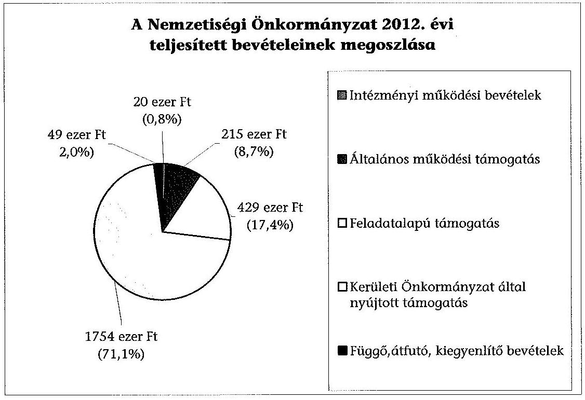
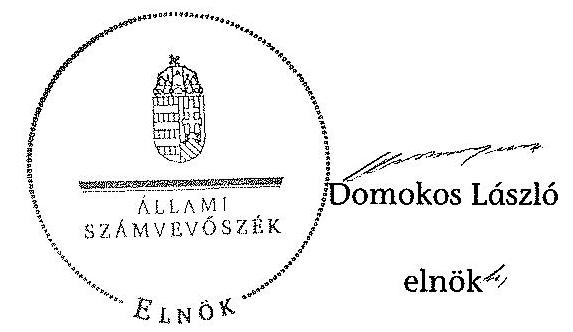

# ÁLLAMI   SZÁMVEVŐSZÉK 

## JELENTÉS

a helyi nemzetiségi önkormányzatok gazdálkodásának ellenőrzéséről
Horvát Nemzetiségi Önkormányzat (XVIII. kerületi)

---

# Állami Számvevőszék 

Iktatószám: V-0328-016/2014.
Témaszám: 1362
Vizsgálat-azonosító szám: V065293
Az ellenőrzést felügyelte:
Horváth Balázs
felügyeleti vezető
Az ellenőrzést vezette és az ellenőrzés végrehajtásáért felelős:
Kisgergely István
ellenőrzésvezető
A számvevőszéki jelentést készítették és a jelentés összeállításában
közreműködtek:
Komlósiné Bogár Éva
számvevő tanácsos
Varsányiné Dudás Eleonóra
számvevő
Az ellenőrzést végezte:
Dr. Ernst László
számvevő tanácsos

---

# TARTALOMJEGYZÉK 

BEVEZETÉS ..... 3
I. ÖSSZEGZŐ MEGÁLLAPÍTÁSOK, KÖVETKEZTETÉSEK, JAVASLATOK ..... 6
II. RÉSZLETES MEGÁLLAPÍTÁSOK ..... 12

1. A Nemzetiségi Önkormányzat és a Kerületi Önkormányzat együttműködésének szabályozása, a működési feltételek biztosítása ..... 12
2. A gazdálkodási feladatok ellátásának szabályszerűsége ..... 13
2.1. A költségvetésre és a zárszámadásra, valamint a kincstári adatszolgáltatás rendjére vonatkozó jogszabályi előírások betartása ..... 13
2.2. A Nemzetiségi Önkormányzat gazdálkodásának szabályozottsága ..... 14
2.3. Az operatív gazdálkodási jogkörök kialakítása, gyakorlása ..... 15
3. A Nemzetiségi Önkormányzat gazdálkodásával összefüggő feladatok belső ellenőrzése ..... 17
4. A feladatalapú támogatás felhasználásának, elszámolásának szabályszerűsége, a Nemzetiségi Önkormányzat feladatellátása ..... 18
MELLÉKLET
5. számú A Nemzetiségi Önkormányzat 2012. évi gazdálkodásának főbb adatai, mutatói
6. számú Tájékoztatás a polgármesternek küldött el nem fogadott észrevételekről
FÜGGELÉKEK
7. számú Rövidítések jegyzéke
8. számú Értelmező szótár
9. számú A gazdálkodás értékelésének módszere

---

.

---

# JELENTÉS   a helyi nemzetiségi önkormányzatok gazdálkodásának ellenőrzéséről Horvát Nemzetiségi Önkormányzat (XVIII. kerületi) 

## BEVEZETÉS

A Nemzetiségi Önkormányzat az 1995. évben alakult, elnöke az 1995. évi helyhatósági választások óta látja el feladatát. A Nemzetiségi Önkormányzat intézményt, gazdasági társaságot és más szervezetet nem alapított. A négytagú Képviselő-testület munkája segítésére bizottságot nem hozott létre. A Nemzetiségi Önkormányzatnak a költségvetési beszámolója szerint a 2012. évben a módosított költségvetési bevételi és kiadási előirányzata 2617 ezer Ft, a teljesített költségvetési bevétele 2418 ezer Ft, a teljesített költségvetési kiadása 2091 ezer Ft volt. A 2012. évi gazdálkodási adatokat részletesen az 1. számú mellékletben mutatjuk be.

Az Alaptörvény XXIX. cikk (1) bekezdése szerint a Magyarországon élő nemzetiségek államalkotó tényezők. Minden, valamely nemzetiséghez tartozó magyar állampolgárnak joga van önazonossága szabad vállalásához és megőrzéséhez. A hazánkban élő nemzetiségek helyi (települési és területi), valamint országos önkormányzatokat hozhatnak létre. A helyi nemzetiségi önkormányzatok gazdálkodási feladatait jogszabályi előírás alapján a székhely szerinti helyi önkormányzat polgármesteri hivatala látja el.

A nemzetiségek helyzete, támogatása mind hazai, mind EU-s szinten kiemelt figyelmet kap napjainkban. A helyi nemzetiségi önkormányzatok gazdálkodására és támogatási rendszerére vonatkozó jogszabályok a 2010-2012. években jelentős változásokon mentek át. A települési és területi nemzetiségi önkormányzatok gazdálkodásának, a részükre juttatott költségvetési támogatások felhasználásának ellenőrzését az ÁSZ a 2012. évben sorozatjellegű ellenőrzés keretében indította el. A 2013. évi ellenőrzések e témacsoportos ellenőrzések folytatását jelentik, amelyet az ÁSZ 2014 első félévi ellenőrzési terve a 12. témasorszámon tartalmaz.

Az ellenőrzés célja annak értékelése volt, hogy a Nemzetiségi Önkormányzat gazdálkodási kereteinek kialakítása, gazdálkodása és feladatellátása megfelelt-e a jogszabályoknak.

---

Ennek keretében értékeltük, hogy:

- a Nemzetiségi Önkormányzat és a Kerületi Önkormányzat együttműködésének szabályozása, a működési feltételek biztosítása megfelelt-e a jogszabályi előírásoknak;
- a felek együttműködése megfelelt-e a közöttük létrejött megállapodásnak a gazdálkodási feladatok szabályszerű ellátása során, ennek keretében betartották-e a Nemzetiségi Önkormányzat gazdálkodásához kapcsolódóan a költségvetésre és zárszámadásra, a gazdálkodás szabályozására, az operatív gazdálkodási jogkörök gyakorlására vonatkozó jogszabályi előírásokat;
- a jegyző biztosította-e a Nemzetiségi Önkormányzat gazdálkodásának belső ellenőrzését;
- a Nemzetiségi Önkormányzat feladatalapú támogatásának felhasználása, a folyósított feladatalapú támogatással történő elszámolás az előírásoknak megfelelő volt-e;
- a Nemzetiségi Önkormányzat feladatellátása összhangban volt-e a vonatkozó jogszabályi előírásokkal.

Az ellenőrzés várható hasznosulását négy szinten tervezzük. A törvényalkotás számára összegzett tapasztalatok állnak rendelkezésre a nemzetiségi önkormányzatok testületi döntéseinek, gazdálkodásának és a feladatalapú támogatás felhasználásának szabályszerűségéről, amelynek alapján következtetést lehet levonni arra, hogy indokolt-e jogszabályi módosítás kezdeményezése. Az ellenőrzés az ellenőrzött számára visszajelzést ad a működésében fellépő hiányosságokról, javaslataival hozzájárul azok kiküszöböléséhez, amely csökkentheti a későbbi ellenőrzések gyakoriságát. Az ellenőrzés megállapításai és javaslatai tanulságul szolgálhatnak más nemzetiségi önkormányzatok, szervezetek számára a rendezett gazdálkodási keretek kialakításához. A társadalom számára jelzi, hogy közpénz nem maradhat ellenőrizetlenül, az ÁSZ értékteremtő rend kialakításához és megőrzéséhez hozzájáruló tevékenysége pozitív hatással lesz a szervezetről kialakított összkép formálásában. Az ÁSZ szervezetén belül lehetőség nyílik arra, hogy a megállapítások szintetizálásával az intézmény a hozzáadott értéket teremtő elemző tevékenységeét és tanácsadó szerepét erősítse.

A Nemzetiségi Önkormányzat gazdálkodásának ellenőrzéséről szóló jelentés I. fejezetének összegző része az ellenőrzés céljára adott rövid, szintetizáló összefoglalót és következtetéseket tartalmazza a II. fejezet részletes megállapításain alapulóan. A jelentés intézkedést igénylő megállapításait és javaslatait - az összegzőben foglaltak mellett - az ellenőrzés során feltárt, a jelentés II. fejezetében rögzített részletes megállapítások alapozzák meg, illetve támasztják alá.

Az ellenőrzés típusa: szabályszerűségi ellenőrzés
Az ellenőrzött időszak: a 2012. január 1. - 2012. december 31. közötti időszak. Az ellenőrzés kiterjedt a Nemzetiségi Önkormányzatnak juttatott 2012. évi támogatás 2013. évben való elszámolására is.

---

Ellenőrzött szervezet: a Horvát Nemzetiségi Önkormányzat és a gazdálkodási feladatait ellátó Budapest XVIII. Kerület Pestszentlőrinc-Pestszentimre Önkormányzat.

Az ellenőrzés végrehajtásának jogszabályi alapját az ÁSZ tv. 5. § (2)-(3) és (6) bekezdéseiben foglaltak képezik.

Az ellenőrzés szakmai módszertana az ÁSZ hivatalos honlapján (www.asz.hu) közzétett szakmai szabályokon alapult, amely a Legfőbb Ellenőrző Intézmények Nemzetközi Szervezete (INTOSAI) által kiadott nemzetközi standardok (ISSAI) figyelembevételével készült.

A helyi nemzetiségi önkormányzatok gazdálkodásának ellenőrzése során értékeltük a Kerületi Önkormányzat és a Nemzetiségi Önkormányzat együttműködésének, a gazdálkodás szabályozottságának és a pénzügyi folyamatokban kulcsszerepet betöltő belső kontrollok (teljesítésigazolás és érvényesítés) működésének megfelelőségét. A kulcskontrollokat a dologi kiadásokkal kapcsolatos kifizetéseknél - véletlen mintavételi eljárást alkalmazva - ellenőriztük. Ellenőriztük, hogy a jegyző biztosította-e a Nemzetiségi Önkormányzat gazdálkodásának belső ellenőrzését. Értékeltük a feladatalapú támogatások felhasználásának, elszámolásának szabályszerűségét, a Nemzetiségi Önkormányzat feladatellátása és a jogszabályi előírások összhangját.

Az ellenőrzés lefolytatásához a Nemzetiségi Önkormányzat és a gazdálkodási feladatait ellátó Kerületi Önkormányzat tanúsítványok és a kapcsolódó, dokumentumjegyzékben megjelölt dokumentumok elektronikus úton történő megküldésével, rendelkezésre bocsátásával szolgáltatott adatokat. Az adatszolgáltatás kontrollálása és szükség szerinti javítása a helyszíni ellenőrzés keretében történt. A minősítési szempontokat a 3. számú függelék tartalmazza.

Az ÁSZ tv. 29. § (1) bekezdése szerint a jelentéstervezetet megküldtük egyeztetésre a polgármesternek és a Nemzetiségi Önkormányzat elnökének. A polgármester határidőben megküldött észrevételei és tájékoztatása alapján a jelentést nem módosítottuk, az el nem fogadott észrevételek indoklását a jelentés 2. számú melléklete tartalmazza.

---

# I. ÖSSZEGZŐ MEGÁLLAPÍTÁSOK, KÖVETKEZTETÉSEK, JAVASLATOK 

A Nemzetiségi Önkormányzat és a Kerületi Önkormányzat együttműködésének szabályozása megfelelt a jogszabályi előírásoknak, a Nemzetiségi Önkormányzat a 2012. év folyamán rendelkezett a Kerületi Önkormányzattal megkötött, hatályos együttműködési megállapodás(ok)val. A 2005-ben megkötött együttműködési megállapodás(ok)nak a Nek. tv-ben meghatározott, a gazdálkodási szabályok változása miatti felülvizsgálatát nem végezték el az előírt 2012. január 31-ei határidőre, azonban az együttműködési megállapodás(ok) módosítását a Nek. tv-ben rögzített határidőn belül 2012 márciusában végrehajtották. A működés feltételeit az előírásoknak megfelelően szabályozták, azonban azokat a Nek. tv-ben foglaltak ellenére az együttműködési megállapodás(ok) megkötését, módosítását követő 30 napon belül nem rögzítették a Nemzetiségi Önkormányzat SZMSZ-ében. Az együttműködési megállapodás(ok) az Áht. és az Ávr. előírásai ellenére az érvényesítők jegyző általi kijelölését tartalmazta a gazdasági vezető általi kijelölés helyett. A Nemzetiségi Önkormányzat működésének előírt személyi és tárgyi feltételeit a Kerületi Önkormányzat 2012-ben biztosította.

A Nemzetiségi Önkormányzat SZMSZ-ének módosítása és az együttműködési megállapodás(ok) felülvizsgálata 2013 decemberében megtörtént.

A Nemzetiségi Önkormányzat 2012. évi költségvetésének és zárszámadásának tartalma, jóváhagyása, valamint a kapcsolódó adatszolgáltatás szabályszerűsége nem felelt meg a jogszabályi előírásoknak. A Nemzetiségi Önkormányzat elnöke a 2012. évi költségvetés tervezetét az Áht.-ben előírt határidőben benyújtotta a Képviselő-testületnek. Az elfogadott költségvetésről a Képviselő-testület határozatot hozott. A költségvetési határozattervezet előterjesztésekor - a jegyző mulasztása miatt - az Áht.-ben előírtak ellenére a Képviselőtestület részére tájékoztatásul nem mutatták be szöveges indokolással a Nemzetiségi Önkormányzat költségvetési mérlegét közgazdasági tagolásban és az előirányzat-felhasználási tervét. A Nemzetiségi Önkormányzat elnöke a 2012. évi zárszámadási határozattervezetet határidőben beterjesztette a Képviselőtestületnek, azonban az előterjesztésben - a jegyző mulasztása miatt - nem mutatták be az Áht.-ben előírt mérlegeket és kimutatásokat. A Képviselőtestület 2012. évi zárszámadásról szóló határozata nem az Áht. szerinti részletezettségű volt, így nem biztosította az összehasonlíthatóságot az elfogadott elemi költségvetéssel, továbbá nem mutatta be a Nemzetiségi Önkormányzat bevételei és kiadásai összegét, valamint a feladatalapú támogatás felhasználásáról sem számoltak el. A 2012. költségvetési évre vonatkozó kincstári adatszolgáltatási kötelezettségeket - az éves költségvetési és a mérlegjelentések kivételével - a jegyző nem az Áhsz.-ben és az Ávr.-ben előírt határidőben teljesítette.

A Nemzetiségi Önkormányzat gazdálkodásának szabályozottsága az ellenőrzött időszakban megfelelt a jogszabályi előírásoknak. A gazdálkodási feladatok végrehajtását ellátó Polgármesteri Hivatal 2012-ben a Számv. tv. és a Bkr. által előírt, gazdálkodásának végrehajtási feladataira vonatkozó szabály-

---

zatok hatályát a Nemzetiségi Önkormányzat gazdálkodására is kiterjesztette. A Polgármesteri Hivatal SZMSZ-e tartalmazta az Ávr.-ben foglaltak szerinti, a Nemzetiségi Önkormányzat gazdálkodásának végrehajtásával kapcsolatos feladat- és hatásköröket, a hatáskörök gyakorlásának módját, az ezekhez kapcsolódó felelősségi szabályokat.

A Nemzetiségi Önkormányzat gazdálkodása tekintetében az operatív gazdálkodási jogkörök kialakítása 2012. május 20-ától felelt meg az előírásoknak, mivel akkortól történt meg a Nemzetiségi Önkormányzat elnöke által a teljesítést igazoló személyek írásbeli kijelölése, valamint a gazdasági vezető által a pénzügyi ellenjegyzők és az érvényesítő személyek kijelölése. A Polgármesteri Hivatal rendelkezett gazdasági szervezettel, a gazdasági vezető végzettsége megfelelt az Ávr.-ben előírt szakképesítési követelményeknek.

A Nemzetiségi Önkormányzatnál a 2012. évben a dologi kiadások teljesítése során a teljesítés igazolása és az érvényesítés kulcskontrollok működésének megfelelősége gyenge volt, a hibák száma a lényegességi szintet, a kritikus hibahatárt elérte. Az Ávr.-ben foglaltak ellenére a kiadás teljesítésének igazolását és az érvényesítést jogosulatlan személyek végezték 2012. május 20-a előtt. A teljesítésigazoló nem tartotta be az operatív gazdálkodási szabályzat(ok) előírásait a feladatának ellátása során. Az Ávr. előírása ellenére az érvényesítő nem ellenőrizte a fedezet meglétét, a jogszabályok és az operatív gazdálkodási szabályzat(ok) előírásainak betartását a megelőző ügymenet során, a teljesítésigazoló kijelölését, valamint nem jelezte az utalványozónak, hogy a teljesítésigazolás szabálytalan volt, továbbá nem észrevételezte a vezetett kötelezettségvállalási nyilvántartás tartalmi hiányosságait. A dologi kiadások három legnagyobb összegű könyvelési tételei közül két esetben az érvényesítő az Ávr.-ben foglalt előírások betartásának ellenőrzését nem végezte el a fedezet meglétére, egy esetben az összegszerűségre vonatkozóan, valamint nem észrevételezte az előzetes írásbeli kötelezettségvállalás hiányát. A számvevőszéki ellenőrzés a kiadások dokumentumainak ellenőrzése alapján összeférhetetlenséget, továbbá jogosulatlan kifizetést nem tárt fel, azonban a kulcskontrollok működéséhez kapcsolódó hiányosságok miatt nem volt biztosított a hibák megelőzése, feltárása és kijavítása. A
 Nemzetiségi Önkormányzat a 2012. évben nem teljesített támogatásértékű kiadást, valamint államháztartáson kívülre működési és felhalmozási célú pénzeszközátadást.

A jegyző a jogszabályi előírásoknak megfelelően biztosította a Nemzetiségi Önkormányzat gazdálkodásával összefüggő végrehajtási feladatok belső ellenőrzését. A Polgármesteri Hivatal éves belső ellenőrzési tervét megalapozó kockázatelemzés kiterjedt a nemzetiségi önkormányzatok gazdálkodásával összefüggő végrehajtási feladatok ellátására, amely alacsony kockázati minősítést kapott. A módosított éves belső ellenőrzési terv szerinti, a nemzetiségi önkormányzatokra vonatkozó célellenőrzést végrehajtották. Az ellenőrzési jelentés hiányosságokat állapított meg a nemzetiségi önkormányzatok együttműködési megállapodásaival, SZMSZ-eivel kapcsolatban, valamint a pénzügyi kontrollok működésére vonatkozóan, amelyek megegyeztek a számvevőszéki ellenőrzés megállapításaival. A belső ellenőrzési jelentésben feltárt hiányosságok kijavítására a Bkr.-ben meghatározott határidőn túl, 2012-ben kettő, 2013-ban négy javaslathoz készített a jegyző intézkedési tervet.

---

A Nemzetiségi Önkormányzat részére folyósított feladatalapú támogatás elszámolása a 2011. és a 2012. években, felhasználása a 2012. évben nem felelt meg a jogszabályi előírásoknak. A 2011. évben a Nemzetiségi Önkormányzat 214 ezer Ft feladatalapú támogatásban részesült, amelyet teljes egészében a támogatási céloknak megfelelően felhasznált. A Nemzetiségi Önkormányzat a 2012. évben 429 ezer Ft feladatalapú támogatásban részesült, amelyből a 2012. december 31-ei állapot szerint 129 ezer Ft, kötelezettségvállalással nem terhelt maradványa keletkezett. A Nemzetiségi Önkormányzat nem tett eleget az Áht. ${ }_{2}$-ben előírtaknak azáltal, hogy a meghatározott célra fel nem használt támogatás 2012. évi 129 ezer Ft összegű maradványáról haladéktalanul nem mondott le és nem fizette vissza azt a központi költségvetés javára. A feladatalapú támogatásokról a támogatási kormányrendelet ${ }_{1,2}$ előírása alapján az Áht. ${ }_{1,2}$-ben foglaltak ellenére az elszámolások nem történtek meg, a támogatások felhasználását, elszámolását az ellenőrzésre jogosult szervek nem ellenőrizték.

A Nemzetiségi Önkormányzat kötelező feladatellátásának tárgya összhangban volt a Nek. ${ }_{2}$ tv. előírásaival, tevékenységét a képviselt közösség kulturális autonómiájának megerősítése, a közösség önszerveződésének, a nemzetiségi közösséghez kötődő kulturális javak megőrzése érdekében végezte, önként vállalt feladatokat nem látott el.

Az ÁSZ tv. 33. § (1) bekezdésében foglaltak értelmében az ellenőrzött szervezet vezetője köteles a jelentésben foglalt megállapításokhoz kapcsolódó intézkedési tervet összeállítani és azt a jelentés kézhezvételétől számított 30 napon belül az ÁSZ részére megküldeni. Amennyiben az intézkedési tervet határidőre nem küldi meg a szervezet, vagy az nem elfogadható, az ÁSZ elnöke az ÁSZ tv. 33. § (3) bekezdés a)-b) pontjaiban foglaltakat érvényesítheti.

A helyszíni ellenőrzés megállapításainak hasznosítása mellett javasoljuk:

# a jegyzőnek 

1. az együttműködés szabályozásával kapcsolatban

A Nemzetiségi Önkormányzat és a Kerületi Önkormányzat nem tett eleget az együttműködési megállapodás ${ }_{1}$ - a Nek. ${ }_{2}$ tv. 80. § (2) bekezdésében előírt - 2012. január 31-éig elvégzendő éves felülvizsgálati kötelezettségének.

Javaslat:
Biztosítsa a jövőben az együttműködési megállapodás évenkénti felülvizsgálata során a Nek. ${ }_{2}$ tv. 80. § (2) bekezdésében előírt határidő betartását;
2. a költségvetési és zárszámadási határozattal, valamint a kincstári adatszolgáltatással kapcsolatban

A költségvetési határozattervezet előterjesztésekor az Áht. ${ }_{2}$ 24. § (4) bekezdés a) pontjában előírtak ellenére - a jegyző mulasztása miatt - a Képviselő-testületnek tájékoztatásul nem mutatták be - szöveges indokolással együtt - a Nemzetiségi Önkormányzat költségvetési mérlegét közgazdasági tagolásban és az előirányzat fel-

---

használási tervét. A zárszámadási határozattervezet előterjesztésekor - a jegyző mulasztása miatt - nem mutatták be a Képviselő-testület részére tájékoztatásul az Áht. 2 91. § (2) bekezdés a) pontjában előírt mérlegeket és kimutatásokat. Az Áht. 2 89. § (1) bekezdésében foglaltak ellenére a zárszámadás nem volt összehasonlítható a 2012. évben elfogadott költségvetéssel. A 2012. évi zárszámadási határozatban az Áht. 2 89. § (2) bekezdés előírása ellenére a Nemzetiségi Önkormányzat nem mutatta be bevételei és kiadásai összegét.

A jegyző a 2012. évi költségvetéshez kapcsolódó, Nemzetiségi Önkormányzatra vonatkozó kincstári adatszolgáltatási kötelezettségének több esetben - az Ávr. 33. §, 169. § (2) és 170. § (5) bekezdéseiben és az Áhsz. 1 10. § (5a) bekezdésében előírt határidőn túl tett eleget.

Javaslat
Gondoskodjon arról, hogy:
a) a költségvetési határozattervezet előterjesztésekor az Áht. 2 24. § (4) bekezdés a) pontjában foglaltaknak megfelelően a Képviselő-testület részére tájékoztatásul mutassák be - szöveges indokolással együtt - a Nemzetiségi Önkormányzat költségvetési mérlegét közgazdasági tagolásban és az előirányzat felhasználási tervét;
b) a zárszámadási határozattervezet előterjesztésekor a Képviselő-testület részére bemutatásra kerüljenek az Áht. 2 91. § (2) bekezdés a) pontjában előírt mérlegek és kimutatások.
c) a zárszámadási határozat-tervezet feleljen meg az Áht. 2 89. § előírásainak;
d) a kincstári adatszolgáltatási kötelezettségeinek az Ávr. 33. §-ában, 169. § (2) és 170. § (5) bekezdéseiben és az Áhsz. 2 32. § (4) bekezdésében előírt határidők betartásával tegyen eleget.
3. a kulcskontrollok működésével kapcsolatban

A teljesítésigazoló az Ávr. 57. § (3) bekezdésével ellentétesen nem szabályszerűen látta el feladatát, nem tartotta be az operatív gazdálkodási szabályzat ${ }_{1,2}$-ban előírtakat.

Az érvényesítő nem az Ávr. 58. § (1)-(2) bekezdéseiben előírtak szerint végezte feladatát, mert nem ellenőrizte a fedezet meglétét és az összegszerűséget, valamint, hogy a megelőző ügymenetben a jogszabályok és az operatív gazdálkodási szabály-zat ${ }_{1,2}$ előírásait betartották-e. Nem jelezte az utalványozónak a teljesítésigazolás szabálytalan elvégzését és nem észrevételezte a vezetett kötelezettségvállalási nyilvántartás tartalmi hiányosságait.

---

Javaslat
Az operatív gazdálkodás működési hibáinak megelőzése, feltárása és kijavítása érdekében gondoskodjon arról, hogy:
a) a teljesítésigazolás az Ávr. 57. § (3) bekezdéseiben előírtaknak megfelelően történjen;
b) az érvényesítő az Ávr. 58. § (1)-(2) bekezdései alapján maradéktalanul lássa el ellenőrzési és jelzési feladatát.
4. a belső ellenőrzéssel kapcsolatban

A 2012. évben elvégzett ellenőrzésről készült jelentésben megállapított hiányosságok megszüntetésére a jegyző a Bkr. 45. § (3) bekezdésében előírt határidőn túl készített intézkedési tervet.

Javaslat
Intézkedjen, hogy a belső ellenőrzési jelentésben megállapított hiányosságok megszüntetésére a Bkr. 45. § (3) bekezdésében előírt határidőben készüljenek el az intézkedési tervek.
5. a feladatalapú támogatás elszámolásával kapcsolatban

A 2011. évi feladatalapú támogatás elszámolása a támogatási kormányrendelet ${ }_{1}$ 7. § (2) bekezdésében hivatkozott, valamint a 2012. évi feladatalapú támogatás elszámolása a támogatási kormányrendelet ${ }_{2}$ 8. § (5) bekezdésében hivatkozott, „a helyi önkormányzatok elszámolási és ellenőrzési rendjére vonatkozó jogszabályok" előírása alapján az Áht. ${ }_{1}$ 64. § (7) bekezdése és az Áht. ${ }_{2}$ 57. § (3) bekezdése ellenére nem történt meg.

Javaslat:
Intézkedjen az Áht. ${ }_{2}$ 27. § (2) bekezdésében meghatározott feladatkörében a Nemzetiségi Önkormányzat által igénybe vett 2011. évi és 2012. évi feladatalapú támogatás felhasználásáról szóló elszámolás elkészítéséről, az Áht ${ }_{2}$. 53. § (1) bekezdése szerinti beszámolási kötelezettség teljesítéséhez.

# a Nemzetiségi Önkormányzat elnökének 

1. A Nemzetiségi Önkormányzat elnöke a költségvetési határozattervezet előterjesztésekor - a jegyző mulasztása miatt - nem mutatta be a Képviselő-testületnek tájékoztatásul szöveges indoklással az Áht. ${ }_{2}$ 24. § (4) bekezdés a) pontjában előírt költségvetési mérleget közgazdasági tagolásban és az előirányzat-felhasználási tervet.

A zárszámadási határozattervezet előterjesztésekor - a jegyző általi elkészítés hiányában - nem mutatta be a Képviselő-testület részére tájékoztatásul az Áht. ${ }_{2}$ 91. § (2) bekezdés a) pontjában előírt mérlegeket és kimutatásokat.

---

# Javaslat 

A költségvetési és zárszámadási határozattervezet előterjesztésekor mutassa be a Képviselő-testület részére tájékoztatásul - a jegyző által előkészített - az Áht. 24. § (4) bekezdése a) pontjában, valamint 91. § (2) bekezdés a) pontjában előírt mérlegeket és kimutatásokat.
2. A Nemzetiségi Önkormányzat a támogatási kormányrendelet ${ }_{2}$ 14. § (1) bekezdése alapján nem tett eleget az Áht. 2 57. § (2) bekezdésében előírtaknak, mert a meghatározott célra fel nem használt 2012. évi feladatalapú támogatás 129 ezer Ft összegű maradványáról haladéktalanul nem mondott le és nem fizette vissza azt a központi költségvetés javára.

Javaslat
Terjessze a Képviselő testület elé jóváhagyásra az Áht. ${ }_{2}$ 57/A. § (1) bekezdés előírásának megfelelően a 2012. évi feladatalapú támogatás kötelezettségvállalással nem terhelt maradványáról történő lemondást és intézkedjen a maradvány összegének visszafizetéséről a központi költségvetés javára.
3. A 2011. évi feladatalapú támogatás elszámolása a támogatási kormányrendelet ${ }_{1}$ 7. § (2) bekezdésében hivatkozott, valamint a 2012. évi feladatalapú támogatás elszámolása a támogatási kormányrendelet ${ }_{2}$ 8. § (5) bekezdésében hivatkozott „a helyi önkormányzatok elszámolási és ellenőrzési rendjére vonatkozó jogszabályok" előírása alapján az Áht. 64. § (7) bekezdése és az Áht. 2 57. § (3) bekezdése ellenére nem történt meg.

Javaslat
Terjessze a Képviselő-testület elé jóváhagyásra az Áht. ${ }_{2}$ 53. § (1) bekezdése szerinti beszámolási kötelezettség teljesítéséhez összeállított, a Nemzetiségi Önkormányzat által igénybe vett 2011. és 2012. évi feladatalapú támogatás felhasználásáról szóló elszámolást.

---

# II. RÉSZLETES MEGÁLLAPÍTÁSOK 

## 1. A Nemzetiségi Önkormányzat és a Kerületi Önkormányzat együttműködésének szabályozása, a működési feltételek biztosítása

A Nemzetiségi Önkormányzat és a Kerületi Önkormányzat együttműködésének szabályozása megfelel a jogszabályi előírásoknak.

A Nemzetiségi Önkormányzat a 2012. év folyamán rendelkezett a Kerületi Önkormányzattal megkötött, hatályos együttműködési megállapodás ${ }_{1.2}$-vel ${ }^{1}$. A 2012. január 1-jén hatályos, 2005. február 1-jén megkötött együttműködési megállapodás ${ }_{1}$-nek a gazdálkodási szabályok változása miatti felülvizsgálatát nem végezték el a Nek. ${ }_{2}$ tv. 80. § (2) bekezdésében meghatározott, január 31-ei határidőre. A Nek. ${ }_{2}$ tv. 159. § (3) bekezdésében előírt módosítást határidőben végrehajtották, amelynek eredményeképpen az együttműködési megállapo-dás ${ }_{2}$-t 2012. március 20-án írták alá.

A 2012. december 31-én hatályos együttműködési megállapodás ${ }_{2}$-ben a Nemzetiségi Önkormányzat működési feltételeit az előírásoknak megfelelően szabályozták, azonban azokat a Nek. ${ }_{2}$ tv. 80. § (2) bekezdésében foglaltak ellenére a megállapodás megkötését, módosítását követő 30 napon belül nem rögzítették a Nemzetiségi Önkormányzat SZMSZ-ében.

Az ellenőrzött időszakot követően a Képviselő-testület elfogadta a Nemzetiségi Önkormányzat módosított SZMSZ-ét², amelynek melléklete az együttműködési megállapodás ${ }_{3}$.

A Nemzetiségi Önkormányzat gazdálkodási feladatai ellátásának szabályait -az Áht. ${ }_{2}$-nek és a Nek. ${ }_{2}$ tv.-nek megfelelően - a 2012. december 31-én hatályos együttműködési megállapodás ${ }_{2}$-ben teljes körűen rögzítették. Az együttműködési megállapodás ${ }_{2}$ az érvényesítők jegyző általi kijelölését tartalmazta ${ }^{3}$, amely nem felelt meg az Áht. 2 38. § (2) bekezdésében és az Ávr. 55. § (2) bekezdés g) pontjában, illetve az 58. § (4) bekezdésében előírtaknak, mely szerint a kijelölésre a gazdasági vezető jogosult.

[^0]
[^0]:    ${ }^{1}$ A 2005. február 1-jén megkötött együttműködési megállapodás helyett 2012. március 20-án kötöttek újat, amelyet a Képviselő-testület a 12/2012. (III. 20.) számú határozatával, a Kerületi Önkormányzat Képviselő-testülete a 14/2012. (III. 13.) számú rendeletével fogadott el.
    ${ }^{2}$ A Nemzetiségi Önkormányzat 62/2013. (XII. 6.) számú határozata az egységes szerkezetbe foglalt SZMSZ elfogadásáról.
    ${ }^{3}$ A 38/46296-2/2012. iktatószámú együttműködési megállapodás ${ }_{2}$ 8. oldalának 16. pontja.

---

Az ellenőrzött időszakot követően, 2013. október 11-én
 kötött együttműködési megállapodás ${ }_{3}$ az érvényesítő gazdasági vezető általi kijelölését tartalmazta.

A Nemzetiségi Önkormányzat működésének előírt személyi és tárgyi feltételeit a Kerületi Önkormányzat biztosította 2012-ben, azonban az együttműködési megállapodás ${ }_{2}$-ben külön megállapodásként meghatározott helyiséghasználati rendet 2012. év végéig nem készítették el.

Az ellenőrzött időszakot követően, a 2013. évi együttműködési megállapodás ${ }_{3}$ 1. számú mellékleteként elkészítették a helyiséghasználati rendet.

# 2. A GAZDÁLKODÁSI FELADATOK ELLÁTÁSÁNAK SZABÁLYSZERŰSÉGE 

### 2.1. A költségvetésre és a zárszámadásra, valamint a kincstári adatszolgáltatás rendjére vonatkozó jogszabályi előírások betartása

A Nemzetiségi Önkormányzat 2012. évi költségvetésének és zárszámadásának tartalma, jóváhagyása, valamint a kapcsolódó adatszolgáltatás nem felelt meg a jogszabályi előírásoknak.

A Nemzetiségi Önkormányzat elnöke a 2012. évi költségvetés tervezetét az Áht. ${ }_{2}$-ben előírt határidőben benyújtotta a Képviselő-testületnek ${ }^{4}$. A Képviselőtestület a költségvetésről határozatot hozott. A költségvetési határozattervezet előterjesztésekor tájékoztatásul nem mutatták be a Képviselő-testületnek szöveges indoklással - a jegyző mulasztása miatt - az Áht. ${ }_{2} 24$. § (4) bekezdés a) pontjában előírtak ellenére a Nemzetiségi Önkormányzat költségvetési mérlegét közgazdasági tagolásban és az előirányzat-felhasználási tervet.

A Nemzetiségi Önkormányzat elnöke a 2012. évi zárszámadási határozattervezetet az Áht. ${ }_{2}$-ben előírt határidőn belül, 2012. április 11-én szóban terjesztette be a Képviselő-testületnek. Az előterjesztésben - a jegyző mulasztása miatt - nem mutatták be a Képviselő-testületnek tájékoztatásul az Áht. ${ }_{2} 91 . \S$ (2) bekezdés a) pontja szerinti - az Áht. ${ }_{2} 24$. § (4) bekezdésében előírt - mérlegeket és kimutatásokat, a jegyzőkönyvhöz a Nemzetiségi Önkormányzat 2012. évi éves beszámolóját mellékelték ${ }^{5}$.

[^0]
[^0]:    ${ }^{4}$ A Nemzetiségi Önkormányzat elnöke a jegyzővel, valamint a GKI vezetőjével folytatott szóbeli egyeztetés alapján maga készítette el a költségvetési határozat tervezetét.
    ${ }^{5}$ A Nemzetiségi Önkormányzat elnöke a jegyzővel, valamint a GKI vezetőjével folytatott szóbeli egyeztetés alapján maga készítette el a zárszámadási határozat tervezetét.

---

A 2012. évi zárszámadásról szóló határozat ${ }^{6}$ az Áht. ${ }_{2}$ 89. §-a ellenére nem biztosította az összehasonlíthatóságot az elfogadott költségvetéssel, a Nemzetiségi Önkormányzat nem mutatta be bevételei és kiadásai összegét, továbbá a feladatalapú támogatás felhasználásáról sem számoltak el.

A jegyző az ellenőrzött időszakban az Áhsz. ${ }_{1}$-ben és az Ávr.-ben előírt, a Nemzetiségi Önkormányzatra vonatkozó kincstári adatszolgáltatási kötelezettségeinek eleget tett, azonban a határidőket nem tartotta be:

- a 2012. évi elemi költségvetéshez kapcsolódó, az Ávr. 33. §-ában előírt adatszolgáltatást késedelmesen ${ }^{7}, 2012$. március 28-án teljesítette;
- a 2012. évi negyedéves időközi költségvetési jelentéseket az Ávr. 169. § (2) bekezdésében előírt határidőkön túl ${ }^{8}$ (2012. április 24-én, július 26-án, október 29-én), az éves költségvetési jelentést 2013. január 19-én, határidőben teljesítette;
- a 2012. évi időközi mérlegjelentéseket az Ávr. 170. § (5) bekezdésében előírt határidőkön túl ${ }^{9}$ (2012. április 27-én, augusztus 1-jén, október 29-én) teljesítette;
- a 2012. évi I. féléves és éves elemi költségvetési beszámolóját az Áhsz. ${ }_{1} 10 . \S$ (5a) bekezdésében előírt határidőkön túl ${ }^{10}$, 2012. augusztus 14-én, illetve 2013. március 14-én késedelmesen nyújtotta be. A beszámolókat 2012. augusztus 9-én, illetve 2013. március 11-én, szintén késedelmesen ${ }^{11}$ készítették el.

# 2.2. A Nemzetiségi Önkormányzat gazdálkodásának szabályozottsága 

A Nemzetiségi Önkormányzat gazdálkodásának szabályozottsága az ellenőrzött időszakban megfelelt a jogszabályi előírásoknak.

A gazdálkodási feladatok végrehajtását ellátó Polgármesteri Hivatal 2012-ben a Számv. tv.-ben és a Bkr.-ben előírt, gazdálkodásának végrehajtási feladataira

[^0]
[^0]:    ${ }^{6}$ A Nemzetiségi Önkormányzat 22/2013. (IV. 04.) számú határozata a 2012. évi zárszámadás elfogadásáról.
    ${ }^{7}$ Az előterjesztés időpontja 2012. február 7-e volt, a késedelmes napok száma 20.
    ${ }^{8}$ A jogszabályban előírt határidő április 20., július 20., október 20.; a késedelmes napok száma 4, 6, 5 nap volt.
    ${ }^{9}$ A jogszabályban előírt határidő április 25., július 25., október 25.; a késedelmes napok száma 2, 7, 4 nap volt.
    ${ }^{10}$ A jogszabályban előírt határidő a féléves beszámolónál 2012. augusztus 10., az éves beszámolónál 2013. március 10.; a késedelmes napok száma 4, illetve 2 nap volt.
    ${ }^{11}$ A jogszabályban előírt határidő a féléves beszámolónál 2012. július 31., az éves beszámolónál 2013. február 28.; a késedelmes napok száma 9, illetve 11 nap volt.

---

vonatkozó szabályzatokkal a Nemzetiségi Önkormányzat gazdálkodásának végrehajtási feladataira is kiterjedő hatállyal rendelkezett ${ }^{12}$.

A Polgármesteri Hivatal SZMSZ-e tartalmazta az Ávr. 13. § (1) bekezdés g) pontjában foglaltak szerinti, a Nemzetiségi Önkormányzat gazdálkodásának végrehajtásával kapcsolatos feladat- és hatásköröket, a hatáskörök gyakorlásának módját, a helyettesítés rendjét, az ezekhez kapcsolódó felelősségi szabályokat.

# 2.3. Az operatív gazdálkodási jogkörök kialakítása, gyakorlása 

A Nemzetiségi Önkormányzat gazdálkodása tekintetében az operatív gazdálkodási jogkörök kialakítása 2012. május 20-ától megfelelt a jogszabályi előírásoknak, mert a szabályszerű felhatalmazások és kijelölések az Ávr. 2012. január 1-jei hatálybalépését követően, év közben történtek meg:

- a Nemzetiségi Önkormányzat elnöke az Áht. ${ }_{2}$ 38. § (2) bekezdése és az Ávr. 57. § (4) bekezdése ellenére a teljesítésigazoló személyek írásbeli kijelölését csak 2012. május 20-ától végezte el az operatív gazdálkodási szabály$\mathrm{zat}_{2}$ hatályba lépésével;
- a Polgármesteri Hivatalban a gazdasági vezető ${ }^{13}$ az Áht. ${ }_{2} 38 . \S$ (2) bekezdésében és az Ávr. 55. § (2) bekezdés g) pontjában, illetve az 58. § (4) bekezdésében előírtak ellenére 2012. május 20-ától hatalmazott fel más személyt a pénzügyi ellenjegyzésre és az érvényesítésre.

A Polgármesteri Hivatal az ellenőrzött időszakban rendelkezett gazdasági szervezettel ${ }^{14}$, a gazdasági vezető végzettsége megfelelt az Ávr.-ben előírt szakképesítési követelményeknek.

A Nemzetiségi Önkormányzatnál a 2012. évben a dologi kiadások teljesítése során a teljesítés igazolása és az érvényesítés kulcskontrollok működésének megfelelősége gyenge volt, a hibák száma a lényegességi szintet, a kritikus hibahatárt elérte, mert:

- a teljesítés igazolását 2012. május 19-éig az Ávr. 57. § (4) bekezdése szerinti szabályszerű kijelöléssel nem rendelkező személy jogosulatlanul látta el, ezért az Ávr. 57. § (3) bekezdésben foglaltak ellenére nem szabályszerűen történt a kifizetés jogosságának, összegszerűségének és a szerződésszerű teljesítésnek az igazolása;
- a teljesítésigazoló az operatív gazdálkodási szabályzat ${ }_{2}$ szerint a teljesítésigazolásra előírt 3. számú mellékletet nem csatolta a számlák mellé, az igazolásra használt bélyegző szövege nem tartalmazta a teljesítés megtörténtének az igazolását;
- az érvényesítő 2012. május 19-éig nem jogszerű kijelölés alapján látta el feladatát, mivel arra nem a gazdasági vezető jelölte ki, az Áht. ${ }_{2} 38 . \S$ (2) bekezdésében és az Ávr. 55. § (2) bekezdés g) pontjában, illetve az 58. § (4) bekezdésében előírtak ellenére;
- az érvényesítő a kiadások érvényesítése során nem az Ávr. 58. § (1)(2) bekezdéseiben és az operatív gazdálkodási szabályzat ${ }_{1,2}$-ben előírtak szerint látta el az ellenőrzési feladatát. Nem ellenőrizte a fedezet meglétét és a megelőző ügymenetben a jogszabályi előírások és a belső szabályzatok betartását. Nem jelezte az utalványozónak, hogy a 100 ezer Ft alatti kötelezettségvállalások nyilvántartása nem felelt meg az Ávr. 56. § (1) bekezdésében előírtaknak, mert nem tartalmazta a kötelezettségvállalást tanúsító dokumentum iktatószámát, a kötelezettségvállaló nevét, a jogosult azonosító adatait, a kötelezettségvállalás összegének évek és előirányzatok szerinti megoszlását, a kifizetési határidőket, továbbá a teljesítési adatokat. Nem észrevételezte továbbá, hogy az operatív gazdálkodási szabályzat ${ }_{1,2}$ szerint a teljesítésigazolásra előírt 3. számú mellékletet nem csatolták a számlák mellé, a teljesítésigazolást nem szabályszerűen végezték el, valamint az érvényesítő nem győződött meg arról, hogy a teljesítésigazoló kijelölése megfelelt-e az Ávr. 57. § (4) bekezdésében foglaltaknak.

A Nemzetiségi Önkormányzatnál a 2012. évben a dologi kiadások három legnagyobb összegű kiadás teljesítése egyedi értékelése alapján a teljesítésigazolás és az érvényesítés kulcskontrollok nem működtek megfelelően, mert:

- egy tétel esetében a teljesítésigazoló az operatív gazdálkodási szabályzat ${ }_{2}$ szerint a teljesítésigazolásra előírt 3. számú mellékletet nem csatolta a számla mellé, az igazolásra használt bélyegző szövege nem tartalmazta a teljesítés megtörténtének az igazolását;
- az érvényesítő az Ávr. 53. (1) bekezdés a) pontjában foglalt előírások betartásának ellenőrzését nem végezte el, mert nem észrevételezte, hogy a 100 ezer Ft-ot elérő kifizetésekre előzetes írásbeli kötelezettségvállalás nélkül került sor, továbbá két tétel esetében a fedezet meglétének ellenőrzését, egy tételnél az összegszerűség ellenőrzését nem végezte el.

A számvevőszéki ellenőrzés a kiadások dokumentumainak ellenőrzése alapján összeférhetetlenséget, továbbá jogosulatlan kifizetést nem tárt fel, azonban a

[^0]
[^0]:    ${ }^{12}$ Számviteli politika, Eszközök és források leltárkészítési és leltározási szabályzata, Eszközök és források értékelési szabályzata, Pénz és értékkezelési szabályzat, Számlarend, ellenőrzési nyomvonal, szabálytalanságok kezelésének eljárásrendje, kockázatkezelési szabályzat, folyamatba épített, előzetes, utólagos és vezetői ellenőrzés szabályozása, gazdasági szervezet ügyrendje, munkaköri leírások. A Polgármesteri Hivatalban az ellenőrzött időszakban két gazdálkodási szabályzat volt érvényben: az operatív gazdálkodási szabályzat ${ }_{1}$-et 2011-ben többször módosították. [21/2011. (III. 16.), 28/2011. (V. 16.), 33/2011. (VII. 15.), 34/2011. (VIII. 1.), 37/2011. (IX. 1.), 42/2011. (XI. 14.)]. A 2012. május 20-ától hatályos operatív gazdálkodási szabályzat ${ }_{2}$-t a 41/2012. (X. 17.) és a 45/2012. (XII. 18.) számú polgármesteri-jegyzői együttes utasításokkal módosították.
    ${ }^{13}$ A gazdasági vezető által írásban kijelölt pénzügyi ellenjegyző és az érvényesítők aláírás-mintáját az operatív gazdálkodási szabályzat ${ }_{2}$ melléklete tartalmazta.
    ${ }^{14}$ A Polgármesteri Hivatal SZMSZ-éről szóló, a 43/2011. (XI. 4.) számú, illetve a 3/2012. (IV. 2.) számú polgármesteri-jegyzői együttes utasítás 5.3. pontja szerint a GKI látta el a gazdálkodással összefüggő feladatokat.

---

kulcskontrollok működéséhez kapcsolódó hiányosságok miatt nem volt biztosított a hibák megelőzése, feltárása és kijavítása.

A Nemzetiségi Önkormányzat a 2012. évben támogatásértékű kiadást, valamint államháztartáson kívülre működési és felhalmozási célú pénzeszközátadást nem teljesített.

# 3. A Nemzetiségi Önkormányzat gazdálkodásával összefüggő feladatok belső ellenőrzése 

A Nemzetiségi Önkormányzat gazdálkodásával összefüggő végrehajtási feladatok belső ellenőrzése megfelelő volt.

A jegyző a jogszabályi előírásoknak megfelelően biztosította a Nemzetiségi Önkormányzat gazdálkodásával összefüggő végrehajtási feladatok belső ellenőrzését ${ }^{15}$. A Polgármesteri Hivatal éves belső ellenőrzési tervét megalapozó kockázatelemzés kiterjedt a nemzetiségi önkormányzatok gazdálkodásával összefüggő végrehajtási feladatok ellátására, amely alacsony kockázati minősítést kapott. A 2012. évi módosított éves belső ellenőrzési terv alapján a nemzetiségi önkormányzatok célellenőrzését megvalósították, az ellenőrzésről készült jelentést ${ }^{16}$ a Belső Ellenőrzési Csoport vezetője 2012. október 16-án bemutatta a jegyzőnek.

A lefolytatott belső ellenőrzés megállapította, hogy nem készítették el az együttműködési megállapodásban előírtak szerint a helyiséghasználati rendet. A nemzetiségi önkormányzatok SZMSZ-ei nem tartalmazták a működési feltételeket. A GKI ügyrendje nem tartalmazta a nemzetiségi

 önkormányzatokkal kapcsolatos feladatokat, valamint hiányoztak az utalványozási joggal rendelkezők aláírásmintái, továbbá az ellenőrzött dokumentumok esetében hiányosságot állapítottak meg a pénzügyi kontrollok működésére vonatkozóan.

Az ellenőrzés által feltárt hiányosságok megszűntetése érdekében a jegyző a Bkr. 45. § (3) bekezdésében meghatározott határidőn túl ${ }^{17}$, 2012-ben kettő, 2013-ban négy javaslathoz készített intézkedési tervet. A 2012. évi intézkedési tervben foglaltakat megvalósították.

A 2012. évben hatályos együttműködési megállapodás ${ }_{1,2}$ tartalmazta a Nemzetiségi Önkormányzattal összefüggő belső ellenőrzési feladatok ellátását. A meg-

[^0]
[^0]:    ${ }^{15}$ A belső ellenőrök rendelkeztek munkaköri leírással, valamint az Áht. ${ }_{2} 70$. §-ában meghatározott engedéllyel, szerepeltek a költségvetési szervnél belső ellenőrzést végzők nyilvántartásában, valamint elkészítették a 2012. évre vonatkozó belső ellenőrzési kézikönyvet, amely a 7/2012. (II. 15.) számú polgármesteri és jegyzői együttes utasítás alapján lépett hatályba.
    ${ }^{16}$ 8/73697-6/2012. iktatószámú belső ellenőrzési jelentés „A Nemzetiségi Önkormányzatok átalakulásának, hivatali kontrolljai kialakításának vizsgálatáról", ellenőrzés alá vont időszak 2011. január - 2012. augusztus.
    ${ }^{17}$ A jogszabályban meghatározott határidő az intézkedési terv elkészítésére a lezárt ellenőrzési jelentés kézhezvételétől számított 8 napon belül, az intézkedési tervek kelte 2012. november 5-e és 2013. október 14-e.

---

állapodásokban foglaltak szerint a könyvvizsgáló ellenőrzési tevékenységén kívül a Nemzetiségi Önkormányzat pénzügyi ellenőrzését a Kerületi Önkormányzat belső ellenőre is ellátta.

Az ellenőrzéshez szolgáltatott adatok alapján a 2012. évben a Kormányhivatal a Nemzetiségi Önkormányzatot illetően nem élt törvényességi felügyeleti eszközökkel.

# 4. A feladatalapú támogatás felhasználásának, elszámolásának szabályszerűsége, a Nemzetiségi Önkormányzat feladatellátása 

A Nemzetiségi Önkormányzat részére folyósított feladatalapú támogatás elszámolása a 2011. és a 2012. években, felhasználása a 2012. évben nem felelt meg a jogszabályi előírásoknak.

A 2011. évben a Nemzetiségi Önkormányzat 214 ezer Ft feladatalapú támogatásban részesült, amelyet a folyósítás évében a támogatási céloknak megfelelően felhasznált.

A 2012. évi feladatalapú támogatás összes bevételhez viszonyított részarányát a következő ábra szemlélteti:

A Nemzetiségi Önkormányzat a 2012. évben 429 ezer Ft feladatalapú támogatásban részesült, amelyet a Kincstár 2012. október 12-én utalt a Nemzetiségi Önkormányzat bankszámlájára. A Képviselő-testület a 2012. évi költségvetést a támogatás összegével módosította, a felhasználás konkrét céljairól a folyósítást követően döntött. A 2012. évben folyósított támogatásból tárgyévben

---

300 ezer Ft-ot a Nek. ${ }_{2}$ tv. 2. §-ában foglaltak szerinti nemzetiségi közügyek érdekében használták fel. A keletkezett 129 ezer Ft maradvány 2012. december 31-én nem volt kötelezettségvállalással terhelt. A támogatási kormányrendelet ${ }_{2}$ 7. §-a szerint a feladatalapú támogatás maradványából a tárgyévet követően csak a még a tárgyévben kötelezettségvállalással terhelt összeg használható fel.

A Nemzetiségi Önkormányzat nem tett eleget a támogatási kormányrendelet ${ }_{2}$ 14. § (1) bekezdésében és az Áht. ${ }_{2}$ 57. § (2) bekezdésében előírtaknak azáltal, hogy a meghatározott célra fel nem használt támogatás 129 ezer Ft összegű maradványáról haladéktalanul nem mondott le és nem fizette vissza azt a központi költségvetés javára.

A 2011. évi feladatalapú támogatás elszámolása a támogatási kormányrendelet ${ }_{1} 7 . \S$ (2) bekezdésében hivatkozott, valamint a 2012. évi feladatalapú támogatás elszámolása a támogatási kormányrendelet ${ }_{2} 8 . \S$ (5) bekezdésében hivatkozott „a helyi önkormányzatok elszámolási és ellenőrzési rendjére vonatkozó jogszabályok rendelkezései alkalmazandóak" előírása alapján az Áht. ${ }_{1} 64 . \S$ (7) bekezdése és az Áht. ${ }_{2} 57 . \S$ (3) bekezdése ellenére nem történt meg a Nemzetiségi Önkormányzat részéről.

A feladatalapú támogatás felhasználását, elszámolását az ellenőrzésre jogosult szervek 2012-ben a Nemzetiségi Önkormányzatnál nem ellenőrizték.

A Nemzetiségi Önkormányzat kötelező feladatellátásának tárgya összhangban volt a Nek. ${ }_{2}$ tv. 115. §-ában foglalt előírásokkal. A Nemzetiségi Önkormányzat kötelező közfeladatot látott el a képviselt közösség kulturális autonómiájának megerősítése, a közösség önszerveződésének, a nemzetiségi közösséghez kötődő kulturális javak megőrzése érdekében. A Nemzetiségi Önkormányzat nem látott el önként vállalt feladatokat, a Nek. ${ }_{2}$ tv. 116. § (2) bekezdésében meghatározott hatósági tevékenységet nem végzett.

Budapest, 2014. 1)G. hó 30. nap

Melléklet: $\quad 2 \mathrm{db}$
Függelék: $\quad 3 \mathrm{db}$

---

.

---

# A Nemzetiségi Önkormányzat 2012. évi gazdálkodásának főbb adatai, mutatói 

A) Bevételek:

| Megnevezés | Eredeti előirányzat |  | Módosított   előirányzat | Teljesítés |
| :--: | :--: | :--: | :--: | :--: |
|  |  |  |  | megoszlás   (\%) |
| Intézményi működési bevételek | 0 | 0 | 20 | 0,8 |
| Általános működési támogatás | 215 | 215 | 215 | 8,7 |
| Feladatalapú támogatás | 0 | 429 | 429 | 17,4 |
| Kerületi Önkormányzat által nyújtott támogatás | 1125 | 1973 | 1754 | 71,1 |
| Költségvetési bevételek | 1340 | 2617 | 2418 | 98,0 |
| Függő,átfutó,kiegyenlítő bevételek | 0 | 0 | 49 | 2,0 |
| Tárgyévi bevételek | 1340 | 2617 | 2467 | 100 |

B) Kiadások:

| Megnevezés | Eredeti előirányzat | Módosított   előirányzat | Teljesítés |
| :--: | :--: | :--: | :--: |
|  |  |  | megoszlás   (\%) |
| Személyi juttatások | 690 | 690 | 480 | 23,0 |
| Munkaadókat terhelő járulékok és szociális hozzájárulási adó összesen | 200 | 200 | 118 | 5,6 |
| Dologi kiadások | 450 | 1727 | 1493 | 71,4 |
| Működési kiadások összesen | 1340 | 2617 | 2091 | 100 |
| Költségvetési kiadások | 1340 | 2617 | 2091 | 100 |
| Tárgyévi kiadások | 1340 | 2617 | 2091 | 100 |

---

.

---

# TÁJÉKOZTATÁS   A polgármesternek küldött el nem fogadott észrevételekről 

Észrevétel

## 1. Az együttműködés szabályozása

A jelentéstervezet megállapítja, hogy a XVIII. Kerületi Önkormányzat és a XVIII. kerületi nemzetiségi önkormányzatok között létrejött hatályos együttműködési megállapodás minden szempontból megfelel a jogszabályi előírásoknak és az ellenőrzés ideje alatt minden hiányosság pótlásra került.
Mind a 2013. évben, mind a 2014. évben az együttműködési megállapodás felülvizsgálata a Nek. tv. 80. § (2) bekezdésében szereplő határidőig megtörtént. Az együttműködési megállapodásokat a nemzetiségi önkormányzatok egyöntetűen elfogadták és aláírták.
A jövőben is kiemelt figyelmet fordítunk a Nek. tv-ben szereplő rendelkezéseknek, így az együttműködési megállapodás felülvizsgálatára vonatkozó rendelkezésnek is maradéktalanul eleget teszünk és a hatályos együttműködési megállapodásokat minden év január 31-ig felülvizsgáljuk.

## 2. Költségvetés, zárszámadás, kincstári adatszolgáltatás:

A nemzetiségi önkormányzat 2013. évi költségvetése módosításra került, a költségvetés módosítási határozattervezet előkészítésekor és előterjesztésekor az Áht. 23. § (2) bekezdés a), a 24. § (4) bekezdés a) pontjaiban, valamint az Ávr. 24. § (1) bekezdés a) pontjában foglaltak maradéktalanul betartásra kerültek (bevételi és kiadási főösszeg, előirányzat csoportok, kiemelt előirányzatok szerinti bontás).
A Képviselő-testület részére tájékoztatásul bemutatásra kerültek az Áht. 24. § (4) bekezdés a) pontja és az Áht. 91 § (2) bekezdés a) pontja szerinti mérlegek és kimutatások (költségvetési mérleg közgazdasági tagolásban, előirányzat felhasználási terv). A 2014. évi költségvetés szintén a hatályos jogszabályi rendelkezések figyelembe vételével készült el, a jövőben kiemelt figyelemmel gondoskodunk arról, hogy az éves költségvetések a mindenkor a hatályos jogszabályok alapján készüljenek el.
A 2013-as évtől kezdődően a zárszámadási határozattervezetek előterjesztésekor a Képviselő-testület részére tájékoztatásul bemutatásra kerülnek az Áht. 24. § (4) bekezdés a) pontja és az Áht. 91 § (2) bekezdés a) pontja szerinti mérlegek és kimutatások. A zárszámadás az Áht. 89. § (1) bekezdés előírása szerint az elfogadott költségvetéssel összehasonlítható módon kerül összeállításra, a bevételi és kiadási főösszegek bemutatásra kerültek.
A kincstári adatszolgáltatási kötelezettségek határidőben történő teljesítésével kapcsolatosan tájékoztatjuk, hogy számos esetben a kincstári adatfeltöltő felület nem megfelelő működése okozza a késedelmet. A jövőben hangsúlyt fektetünk arra, hogy státusz riportokkal bizonyítani tudjuk, hogy a késedelem rajtunk kívülálló okok miatt következett be.

---

| Válasz | Tudomásul veszem a számvevőszéki ellenőrzés nyomán - az ellenőrzött időszakot követően megtett - az 1. és 2. pontban részletezett intézkedéseiről adott tájékoztatását, amelyeket az intézkedési terv összeállításánál végrehajtott feladatként kérem szerepeltetni. |
| :--: | :--: |
| Észrevétel | Kulcskontrollok működtetése:   A 2012. január 1. és május 20. között időszakban a pénzügyi ellenjegyzést, a teljesítés igazolását, valamint az érvényesítést az akkor hatályos szabályzatunk szerint jogosult személyek végezték. 2012. május 20. napján lépett hatályba a szabályzat módosítása, mely így már összhangba került a jogszabályi változásokkal. Megjegyeznénk, hogy a szabályzat módosításának (jogszabályváltozásokhoz való igazításának) hatályba lépését megelőzően is ugyanezen személyek végezték az említett tevékenységet. A jövőben kiemelt figyelmet fordítunk arra, hogy az operatív gazdálkodási szabályzat a mindenkori jogszabályváltozásokhoz naprakészen hozzáigazításra kerüljön.   Készpénzes kifizetések esetén (a nemzetiségi önkormányzatoknál jelentős a készpénzes kifizetések száma) a kötelezettségvállalási szabályzatunk 4. számú mellékletét (készpénzes összesítő) használjuk, ezekben az esetekben nem szükséges a 3. számú melléklet használata. Az igazolásra használt bélyegző szövege valóban nem tartalmazza szövegszerűen a „teljesítés igazolás" szót, azonban álláspontunk szerint a „kifizetés jogosságát igazolom" kitétel egyértelműen teljesítés igazolást jelent.   Véleményünk szerint az érvényesítő az érvényesítést megelőző ügymenet vonatkozásában maradéktalanul ellátta ellenőrzési feladatát (a kifizetés jogosságának összegszerűségének, valamint a szerződésszerű teljesítés ellenőrzése), csupán az utalványozó felé nem jelezte a teljesítésigazolással kapcsolatos szabályzat módosítás szükségességét. |
| Válasz | Az észrevétele 3. pontjában a kulcskontrollok működésével kapcsolatos észrevételét nem fogadom el. A gazdálkodási jogkörök gyakorlására vonatkozó szabályzat 2012. május 20-án történő hatályba lépését követően a teljesítésigazolásokat az arra kijelöléssel rendelkező személy végezte, a jogosulatlanul végzett teljesítésigazolásra vonatkozó megállapítás a május 20-át megelőző időszakra vonatkozott, ezért a jelentéstervezetben a jegyzőnek ezzel kapcsolatban nem is tettünk javaslatot. A készpénzes kifizetések esetében a teljesítésigazolás szabálytalan elvégzésére és az érvényesítő ellenőrzési és jelzési kötelezettségének elmulasztására vonatkozó megállapításunkat és az erre vonatkozó javaslatot továbbra is fenntartjuk, mert a teljesítés igazolására használt nyomtatvány (4. számú melléklet), valamint az igazolásra használt bélyegző szövege nem tartalmazta a teljesítésigazolás megjelölést. Az Ávr. 57. § (1) bekezdése alapján a teljesítés megtörténtének igazolása magában foglalja a kiadások teljesítése jogosságának, összegszerűségének ellenőrzését és igazolását és az ellenszolgáltatást is magában foglaló kötelezettségvállalás esetén annak teljesítését. Erre tekintettel a bélyegzőn szereplő szövegrész nem elégséges a teljesítés megtörténtének az igazolására. Az érvényesítő a teljesítésigazolás szabálytalanságára vonatkozó ellenőrzési és jelzési kötelezettségét nem teljesítette. |

---

| Észrevétel | A feladatalapú támogatások elszámolása:   A 2011. évi, valamint a 2012. évi feladatalapú támogatás elszámolása megtörtént, az elszámolásról készült jegyzőkönyveket a helyszíni vizsgálat lezárultát megelőzően átadtuk az ÁSZ munkatársai részére.   A 2012. évi feladatalapú támogatás elszámolásánál a Budapest Főváros Kormányhivatal (a törvényességi felügyeletet gyakorló szerv), valamint az Emberi Erőforrás Minisztérium írásbeli állásfoglalásának megfelelően jártunk el, azaz a támogatás felhasználásának kimutatásakor figyelembe
 vettük azon kiadási tételeket is, melyekre vonatkozóan a kötelezettségvállalás 2013. június 30-ig megtörtént. (A 129 ezer forint összegű 2012. évi maradvány valóban nem volt kötelezettségvállalással terhelt 2012. december 31-én, azonban az előzőek alapján a kötelezettségvállalással való terhelhetőségre 2013. június 30-ig van lehetőség.) Ennek alapján az elszámolás nem mutat ki visszafizetési kötelezettséget. |
| :--: | :--: |
| Válasz | A 2011. és 2012. évi feladatalapú támogatás elszámolásával kapcsolatban tett észrevételét nem fogadom el, a jelentéstervezetben szereplő megállapításunkat nem módosítjuk, az erre vonatkozó javaslatot továbbra is fenntartjuk. A 342/2010. (XII. 28.) Korm. rendelet 7. § (2) bekezdésének, valamint a 28/2012. (III. 6.) Korm. rendelet 8. § (5) bekezdésének előírása szerint a feladatalapú támogatással kapcsolatos elszámolás, ellenőrzés rendjére a helyi önkormányzatok elszámolási és ellenőrzési rendjére vonatkozó jogszabályok rendelkezései alkalmazandóak. Az államháztartásról szóló 1992. évi XXXVIII. törvény 64. § (7) bekezdése alapján a helyi önkormányzat a költségvetési év végét követően a tényleges mutatók alapján, külön jogszabályban meghatározott határidőig, a költségvetési törvény szabályai szerint elszámol az igénybe vett normatív hozzájárulásokkal és támogatásokkal. A 2011. évi CXCV. törvény 2012. évben hatályos 57. § (3) bekezdése szerint a helyi önkormányzat, a helyi nemzetiségi önkormányzat és a többcélú kistérségi társulás a költségvetési év végét követően elszámol az igénybe vett hozzájárulásokkal, támogatásokkal. Az ellenőrzés részére átadott, a helyszíni ellenőrzés időszakában készített elszámolást a Képviselő-testület nem tárgyalta meg és nem fogadta el, a költségvetési év végét követően elkészített hivatalos, elfogadott elszámolással nem rendelkezett a Nemzetiségi Önkormányzat a feladatalapú támogatás felhasználására vonatkozóan. Az Emberi Erőforrások Minisztériuma és a Budapest Főváros Kormányhivatal állásfoglalásával kapcsolatos tájékoztatását tudomásul veszem, de a jelentéstervezet megállapításait erre vonatkozóan nem módosítjuk. Az ÁSZ szabályszerűségi ellenőrzése során a jelentéstervezetek megállapításai csak az ellenőrzési időszakban hatályos jogszabályokon alapulhatnak. A 28/2012. (III. 6.) Korm. rendelet 7. §-a szerint a feladatarányos támogatás tárgyévben fel nem használt, de még a tárgyévben kötelezettségvállalással terhelt maradványa használható csak fel a tárgyévet követően. Ennek alapján a 2012. december 31-ig kötelezettségvállalással nem terhelt maradványról való lemondás, illetve a központi költségvetés javára történő visszafizetés kötelezettségét továbbra is fenntartjuk. |

---

# **Chemistry**

## **Chemical Reactions**

### **Balancing Chemical Equations**

1. **Write the unbalanced equation:**
   - Example: $$C_3H_8 + O_2 \rightarrow CO_2 + H_2O$$

2. **Balance the equation:**
   - Example: $$2C_3H_8 + 7O_2 \rightarrow 6CO_2 + 8H_2O$$

3. **Balance the equation:**
   - Example: $$2C_3H_8 + 7O_2 \rightarrow 6CO_2 + 8H_2O$$

### **Types of Reactions**

1. **Combination Reaction:**
   - Example: $$2H_2 + O_2 \rightarrow 2H_2O$$

2. **Decomposition Reaction:**
   - Example: $$2H_2O_2 \rightarrow 2H_2O + O_2$$

3. **Single Displacement Reaction:**
   - Example: $$Zn + 2HCl \rightarrow ZnCl_2 + H_2$$

4. **Double Displacement Reaction:**
   - Example: $$AgNO_3 + NaCl \rightarrow AgCl + NaNO_3$$

5. **Combustion Reaction:**
   - Example: $$CH_4 + 2O_2 \rightarrow CO_2 + 2H_2O$$

## **Stoichiometry**

### **Mole Concept**

- **Mole (mol):** The amount of substance containing as many particles (atoms, molecules, ions) as there are atoms in exactly 12 grams of carbon-12.
- **Avogadro's Number:** $$6.022 \times 10^{23}$$ particles per mole.

### **Molar Mass**

- **Molar Mass:** The mass of one mole of a substance.
- Example: The molar mass of water ($$H_2O$$) is 18.015 g/mol.

### **Calculations**

1. **Moles to Mass:**
   - Formula: $$n = \frac{m}{M}$$
   - Example: Calculate the number of moles of $$H_2O$$ in 18 grams of water.
     - $$n = \frac{18 \, \text{g}}{18.015 \, \text{g/mol}} \approx 0.999 \, \text{mol}$$

2. **Moles to Mass:**
   - Formula: $$m = n \times M$$
   - Example: Calculate the mass of 1 mole of water.
     - $$m = 1 \, \text{mol} \times 18.015 \, \text{g/mol} = 18.015 \, \text{g}$$

## **Gas Laws**

### **Ideal Gas Law**

- **Equation:** $$PV = nRT$$
- **Variables:**
  - $$P$$: Pressure (atm)
  - $$V$$: Volume (L)
  - $$n$$: Number of moles (mol)
  - $$R$$: Ideal gas constant (0.0821 L·atm/mol·K)
  - $$T$$: Temperature (K)

### **Boyle's Law**

- **Equation:** $$P_1V_1 = P_2V_2$$
- **Variables:**
  - $$P_1$$: Initial pressure (atm)
  - $$V_1$$: Initial volume (L)
  - $$P_2$$: Final pressure (atm)
  - $$V_2$$: Final volume (L)

### **Boyle's Law (Ideal Gas Law)**

- **Equation:** $$\frac{P_1V_1}{T_1} = \frac{P_2V_2}{T_2}$$  (This is the combined gas law, incorporating temperature)

## **Thermochemistry**

### **Enthalpy (H)**

- **Definition:** The heat content of a system at constant pressure.
- **Equation:** $$\Delta H = q_p$$
- **Example:**  The provided example is incomplete and needs more information to calculate the heat content.

### **Hess's Law**

- **Statement:** The enthalpy change for a reaction is the same whether it occurs in one step or multiple steps.
- **Example:** The provided example is incomplete and needs specific reactions to apply Hess's Law.

### **Hess's Law 2.0**

- **Statement:** The enthalpy change for a reaction is the same whether it occurs in one step or multiple steps.
- **Example:** The provided example is incomplete and needs specific reactions to apply Hess's Law.

## **Electrochemistry**

### **Oxidation and Reduction**

- **Oxidation:** Loss of electrons.
- **Reduction:** Gain of electrons.

### **Galvanic Cells**

- **Definition:** A cell that converts chemical energy into electrical energy.
- **Components:**
  - Anode: Oxidation occurs.
  - Cathode: Reduction occurs.
  - Salt Bridge: Connects the two half-cells.

### **Nernst Equation**

- **Equation:** $$E = E^\circ - \frac{RT}{nF} \ln Q$$
- **Variables:**
  - $$E$$: Cell potential
  - $$E^\circ$$: Standard cell potential
  - $$R$$: Ideal gas constant
  - $$T$$: Temperature (K)
  - $$n$$: Number of electrons transferred
  - $$F$$: Faraday constant
  - $$Q$$: Reaction quotient

---

# RÖVIDÍTÉSEK JEGYZÉKE 

## Törvények

Alaptörvény
Áht. 1
Áht. 2
ÁSZ tv.
Nek. 1 tv.
Nek. 2 tv.
Számv. tv.

## Rendeletek

Áhsz. 1

Áhsz. 2
Ávr.

Bkr.
támogatási kormányrendelet ${ }_{1}$
támogatási kormányrendelet ${ }_{2}$

## Szórövidítések

ÁSZ
együttműködési megállapodás ${ }_{1}$

Magyarország Alaptörvénye
1992. évi XXXVIII. törvény az államháztartásról (hatályos 2011. december 31-éig)
2011. évi CXCV. törvény az államháztartásról (hatályos 2011. december 31-étől)

Az Állami Számvevőszékről szóló 2011. évi LXVI. törvény (hatályos 2011. július 1-jétől)
1993. évi LXXVII. törvény a nemzeti és etnikai kisebbségek jogairól (hatályos 2011. december 31-éig)
2011. évi CLXXIX. törvény a nemzetiségek jogairól (hatályos 2011. december 20-ától)
2000. évi C. törvény a számvitelről

249/2000. (XII. 24.) Korm. rendelet az államháztartás szervezetei beszámolási és könyvvezetési kötelezettségének sajátosságairól (hatályos 2013. december 31-éig)
4/2013. (I. 11.) Korm. rendelet az államháztartás számviteléről (hatályos 2014. január 1-jétől)
368/2011. (XII. 31.) Korm. rendelet az államháztartásról szóló törvény végrehajtásáról (hatályos 2012. január 1-jétől)
370/2011. (XII. 31.) Korm. rendelet a költségvetési szervek belső kontrollrendszeréről és belső ellenőrzéséről (hatályos 2012. január 1-jétől)
342/2010. (XII. 28.) Korm. rendelet a kisebbségi önkormányzatoknak a központi költségvetésből, valamint fejezeti kezelésű előirányzatból nyújtott támogatások feltételrendszeréről és elszámolásának rendjéről (hatályos 2012. március 6-áig)
28/2012. (III. 6.) Korm. rendelet a nemzetiségi célú előirányzatokból nyújtott támogatások feltételrendszeréről és elszámolásának rendjéről (hatályos 2012. március 7-étől 2012. december 31-éig)

Állami Számvevőszék
Budapest XVIII. Kerületi Horvát Kisebbségi Önkormányzat elnöke és a XVIII. Kerület Pestszentlőrinc-Pestszentimre Önkormányzat polgármestere által 2005. február 1-jén aláírt, 38-15/2005/4 iktatószámú együttműködési megállapodás

---

együttműködési megállapodás $_{2}$
együttműködési megállapodás $_{2}$
operatív gazdálkodási szabályzat ${ }_{1}$
operatív gazdálkodási szabályzat ${ }_{2}$

GKI
GKI ügyrendje
jegyző
Kerületi Önkormányzat
Kerületi Önkormányzat Képviselő-testülete
Képviselő-testület
Kincstár
Kormányhivatal
Nemzetiségi Önkormányzat
Nemzetiségi Önkormányzat SZMSZ-e
polgármester
Polgármesteri Hivatal
Polgármesteri Hivatal SZMSZ-e

Horvát Nemzetiségi Önkormányzat 12/2012. (III. 20.) számú határozatával elfogadott, 2012. március 20-án aláírt, a XVIII. Kerület Pestszentlőrinc-Pestszentimre Önkormányzat polgármestere által aláírt együttműködési megállapodás
Horvát Nemzetiségi Önkormányzat 62/2013. (XII. 6.) számú határozatával elfogadott, 2013. október 11-én aláírt, a XVIII. Kerület Pestszentlőrinc-Pestszentimre Önkormányzat polgármestere által aláírt együttműködési megállapodás
az 1/2011. (I. 3.) számú polgármesteri-jegyzői együttes utasítással kiadott Kötelezettségvállalás, ellenjegyzés, szakmai teljesítés-igazolás, érvényesítés és utalványozás szabályzata (hatályos 2011. január 3-ától 2012. május 19-éig)
a 10/2012. (V. 20.) számú polgármesteri-jegyzői együttes utasítással kiadott Kötelezettségvállalás, pénzügyi ellenjegyzés, teljesítés-igazolás, érvényesítés és utalványozás szabályzata (hatályos 2012. május 20-ától)
Gazdasági és Költségvetési Iroda
35/2011. (VIII. 1.) és a 39/2012. (XI. 15.) polgármesteri és jegyzői utasítással kiadott Gazdasági és Költségvetési Iroda Ügyrendje
Budapest XVIII. kerület Pestszentlőrinc-Pestszentimre Önkormányzat jegyzője
Budapest XVIII. kerület Pestszentlőrinc-Pestszentimre Önkormányzata
Budapest XVIII. kerület Pestszentlőrinc-Pestszentimre Önkormányzat Képviselő-testülete
Horvát Nemzetiségi Önkormányzat Képviselő-testülete
Magyar Államkincstár
Budapest Főváros Kormányhivatala
Horvát Nemzetiségi Önkormányzat
17/2011. (04. 29.) számú határozattal elfogadott Budapest XVIII. kerületi Horvát Kisebbségi Önkormányzat Szervezeti és Működési Szabályzata
Budapest XVIII. kerület Pestszentlőrinc-Pestszentimre polgármestere
Budapest XVIII. kerület Pestszentlőrinc-Pestszentimre Önkormányzat Polgármesteri Hivatala
43/2011. (XI. 04.) számú polgármesteri-jegyzői együttes utasítás a Budapest XVIII. Kerület Pestszentlőrinc-Pestszentimre Polgármesteri Hivatalának Szervezeti és Működési Szabályzatáról (hatályos 2012. április 15-éig), módosítva a 3/2012. (IV. 16.) polgármesteri-jegyzői együttes utasítással (hatályos 2012. április 16-ától)

---

# ÉRTELMEZŐ SZÓTÁR 

együttműködési megállapodás
feladatalapú támogatás
kulcskontrollok működési feltételek

A nemzetiségi önkormányzatnak a működési feltételei biztosítására, továbbá a bevételeivel és a kiadásaival kapcsolatban a tervezési, gazdálkodási, ellenőrzési, finanszírozási, adatszolgáltatási és beszámolási feladatai végrehajtására a székhelye szerinti települési önkormányzattal megkötött megállapodás. (Forrás: Nek. 3 tv. 80 § (2) bekezdés, Áht. 2 27. § (2) bekezdés.)
A költségvetési évben általános működési támogatásban részesült, és a Támogatónak a Kincstárhoz intézett, a feladatalapú támogatás utalására vonatkozó rendelkező levele keltének időpontjában működő települési és területi kisebbségi önkormányzatoknak a támogatási kormányrendelet ${ }_{1}$-ben, illetve a támogatási kormányrendelet ${ }_{2}$-ben rögzített feltételrendszer alapján nyújtható támogatás. A támogatási kormányrendelet ${ }_{1}$ előírása szerint a feladatalapú támogatás a kisebbségi közügyeknek a települési és a területi kisebbségi önkormányzatok által történő ellátását szolgálja. A támogatási kormányrendelet ${ }_{2}$ rendelkezése szerint a feladatalapú támogatás a nemzetiségi önkormányzat által a Nek. ${ }_{2}$ tv szerinti nemzetiségi közfeladatok ellátásához közvetlenül kötődő támogatás. (Forrás: támogatási kormányrendelet ${ }_{1}$ 2. § (2) bekezdés c), d) pont és 4. § (1) bekezdés, valamint a támogatási kormányrendelet ${ }_{2}$ 2. § (2) bekezdés b), c) pont.)
Teljesítés igazolása és az érvényesítés.
A települési önkormányzat által a helyi nemzetiségi önkormányzat testületi működéséhez a 2012. évben biztosítandó feltételek: a testületi működéshez igazodó helyiséghasználat, a postai, kézbesítési, gépelési, sokszorosítási feladatok ellátása és az ezzel járó költségek viselése. (Forrás: Nek. 1 tv. 27. § (1)-(2) bekezdései, a Nek. 2 tv. 159. § (3) bekezdésében foglalt átmeneti rendelkezés alapján)

A szabályozás szintjén - 2012. június 1-jéig megkötendő együttműködési megállapodásban - rögzítendő (és 2013. január 1-jétől a települési önkormányzat által biztosítandó) működési feltételek a következők:

- a helyi nemzetiségi önkormányzat részére havonta igény szerint, de legalább tizenhat órában, az önkormányzati feladat ellátásához szükséges tárgyi, technikai eszközökkel felszerelt helyiség ingyenes használata, a helyiséghez, továbbá a helyiség infrastruktúrájához kapcsolódó rezsiköltségek és fenntartási költségek viselése;
- a helyi nemzetiségi önkormányzat működéséhez (a testületi, tisztségviselői, képviselői feladatok ellátásához) szükséges

 tárgyi és személyi feltételek biztosítása;

---

- a testületi ülések előkészítése, különösen a meghívók, az előterjesztések, a testületi ülések jegyzőkönyveinek és valamennyi hivatalos levelezés előkészítése és postázása;
- a testületi döntések és a tisztségviselők döntéseinek előkészítése, a testületi és tisztségviselői döntéshozatalhoz kapcsolódó nyilvántartási, sokszorosítási, postázási feladatok ellátása;
- a helyi nemzetiségi önkormányzat működésével, gazdálkodásával kapcsolatos nyilvántartási, iratkezelési feladatok ellátása;
- az előzőekben meghatározott feladatellátáshoz kapcsolódó költségek viselése a helyi nemzetiségi önkormányzat tagja és tisztségviselője telefonhasználata költségeinek kivételével.
(Forrás: Nek. ${ }_{2}$ tv. 80. § (2) bekezdése a Nek. ${ }_{2}$ tv. 159. § (3) bekezdésében foglalt átmeneti rendelkezés alapján.)
nemzetiség
nemzetiségi közügy

Minden olyan Magyarország területén legalább egy évszázada honos népcsoport, amely az állam lakossága körében számszerű kisebbségben van és a lakosság többi részétől saját nyelve és kultúrája, hagyományai különböztetik meg, egyben olyan összetartozás-tudatról tesz bizonyságot, amely mindezek megőrzésére, történelmileg kialakult közösségeik érdekeinek kifejezésére és védelmére irányul. (Forrás: Nek. ${ }_{2}$ tv. 1. § (1) bekezdés.)
Az egyéni és közösségi jogok érvényesülése, a nemzetiséghez tartozók érdekeinek kifejezésre juttatása - különösen az anyanyelv ápolása, őrzése és gyarapítása, továbbá a nemzetiségek kulturális autonómiájának a nemzetiségi önkormányzatok által történő megvalósítása és megőrzése - érdekében a nemzetiséghez tartozók meghatározott közszolgáltatásokkal való ellátásával, ezen ügyek önálló vitelével és az ehhez szükséges szervezeti, személyi és anyagi feltételek megteremtésével összefüggő ügy. A közhatalmat gyakorló állami és helyi önkormányzati szervekben, továbbá a nemzetiségi önkormányzati szervekben való nemzetiségi képviselethez és mindezek szervezeti, személyi és anyagi feltételeinek biztosításához kapcsolódó ügy. (Forrás: Nek. ${ }_{2}$ tv. 2. § 1. pont.)

---

nemzetiségi önkormányzat
operatív gazdálkodási jogkörök
nemzetiség
nemzetiségi önkormányzat

Törvényben meghatározott nemzetiségi közszolgáltatási feladatokat ellátó, testületi formában működő, jogi személyiséggel rendelkező, demokratikus választások útján törvény alapján létrehozott szervezet, amely a nemzetiségi közösséget megillető jogosultságok érvényesítésére, a nemzetiségek érdekeinek védelmére és képviseletére, a feladat- és hatáskörébe tartozó nemzetiségi közügyek települési, területi vagy országos szinten történő önálló intézésére jön létre. (Forrás: Nek. 2 tv. 2. § 2. pont.) A jelentésben e fogalmat a települési nemzetiségi önkormányzatokra leszűkítve alkalmazzuk.
A kötelezettségvállalás, a pénzügyi ellenjegyzés, az utalványozás, az érvényesítés és a teljesítésigazolás. (Forrás: Áht. ${ }_{2}$ 36-38. §-ai és az Ávr. 52-60. §-ai.)
Minden olyan Magyarország területén legalább egy évszázada honos népcsoport, amely az állam lakossága körében számszerű kisebbségben van és a lakosság többi részétől saját nyelve és kultúrája, hagyományai különböztetik meg, egyben olyan összetartozás-tudatról tesz bizonyságot, amely mindezek megőrzésére, történelmileg kialakult közösségeik érdekeinek kifejezésére és védelmére irányul. (Forrás: Nek. ${ }_{2}$ tv. 1. § (1) bekezdés.)
Törvényben meghatározott nemzetiségi közszolgáltatási feladatokat ellátó, testületi formában működő, jogi személyiséggel rendelkező, demokratikus választások útján törvény alapján létrehozott szervezet, amely a nemzetiségi közösséget megillető jogosultságok érvényesítésére, a nemzetiségek érdekeinek védelmére és képviseletére, a feladat- és hatáskörébe tartozó nemzetiségi közügyek települési, területi vagy országos szinten történő önálló intézésére jön létre. (Forrás: Nek. 2 tv. 2. § 2. pont.) A jelentésben e fogalmat a települési nemzetiségi önkormányzatokra leszűkítve alkalmazzuk.

---

.

---

# A GAZDÁLKODÁS ÉRTÉKELÉSÉNEK MÓDSZERE 

A helyi nemzetiségi önkormányzatok gazdálkodásának ellenőrzése keretében a nemzetiségi önkormányzat gazdálkodása kereteinek kialakítása, gazdálkodása megfelelőségének minősítéséhez az alábbi területeket értékeltük:

- a helyi nemzetiségi önkormányzat és a helyi önkormányzat együttműködése szabályozását, a megállapodásban előírt működési feltételek biztosítását;
- a helyi nemzetiségi önkormányzat jóváhagyott költségvetésére, zárszámadására, továbbá a kincstári adatszolgáltatás rendjére vonatkozó jogszabályi előírások betartását;
- a helyi nemzetiségi önkormányzat gazdálkodási feladataira vonatkozó szabályzatok jogszabályi előírások szerinti rendelkezésre állását;
- a helyi nemzetiségi önkormányzat gazdálkodása tekintetében az operatív gazdálkodási jogkörök kialakítása jogszabályi előírásoknak történő megfelelését;
- a helyi nemzetiségi önkormányzat részére folyósított feladatalapú támogatás felhasználása és elszámolása jogszabályi előírásoknak való megfelelését;
- a helyi nemzetiségi önkormányzattal összefüggő gazdálkodási feladatok tekintetében a jogszabályokban előírt belső ellenőrzés biztosítását.

A helyi nemzetiségi önkormányzat gazdálkodását az ellenőrzési program szerint a hat területhez kapcsolódóan feltett kérdésekre adott válaszok alapján értékeltük. A kérdésekhez rendelt súlyozott pontszámok alapján az elért összérték a megszerezhető maximális pontszám százalékában került kimutatásra. Ennek figyelembevételével a kialakított minősítések az alábbiak:

Megfelelő: $\quad 81 \%$-tól
Részben megfelelő: $61 \%-80 \%$
Nem megfelelő: $\quad 0 \%-60 \%$
A pénzügyi folyamatok belső kontrolljának ellenőrzése keretében a pénzügyi folyamatokban kulcsszerepet betöltő belső kontrollok - a teljesítésigazolás és az érvényesítés - működésének megfelelőségét értékeltük. A kulcskontrollok működésének értékeléséhez a kritériumokat jogszabályok határozzák meg. A kulcskontrollok működése megfelelőségének értékelése tekintetében lényeges minden olyan hiba, amely gátolja, hogy a kontrolltevékenység eredményesen működjön.

A két kulcskontroll működése megfelelőségének ellenőrzéséhez a dologi kiadások könyvviteli tételeiből szekvenciális (megállásos) mintavételi eljárással választottuk ki az ellenőrizendő tételeket. A kulcskontrollok megfelelőségének vizsgálata keretében a számvevő bizonyosságot szerez arról, hogy a rendelkezésre álló szabályozás és dokumentumok alapján a teljesítésigazoláshoz és az érvényesítéshez szükséges ellenőrzési lépéseket végrehajtották-e.

A kulcskontrollok működése „kiváló", „jó" vagy „gyenge" minősítést kaphatott. Az ellenőrzési program szerint feltett kérdésekhez rendelt súlyozott pontszámok alapján elért összérték a megszerezhető maximális pontszám százalékában került kimutatásra, mely alapján kialakított minősítések a következők:

| Kiváló: | $91 \%$-tól |
| :-- | :-- |
| Jó: | $71 \%-90 \%$ |
| Gyenge: | $0 \%-70 \%$ |

A kulcskontrollok működését:

- kiválónak értékeltük abban az esetben, ha azok működése megfelelt a hibák megelőzésére és kijavítására meghatározott szabályozásnak, valamint a legmagasabb szintű elvárásoknak;
- jónak minősítettük, ha a megállapított kisebb, tolerálható mértékű hiányosságok nem veszélyeztették az ellenőrzött területek hibáinak megelőzését és kijavítását;
- gyengének értékeltük, amennyiben a kontrollok működésében túl sok hiányosság fordult elő ahhoz, hogy a kontrollok biztosítsák a hibák megelőzését, feltárását, kijavítását.
