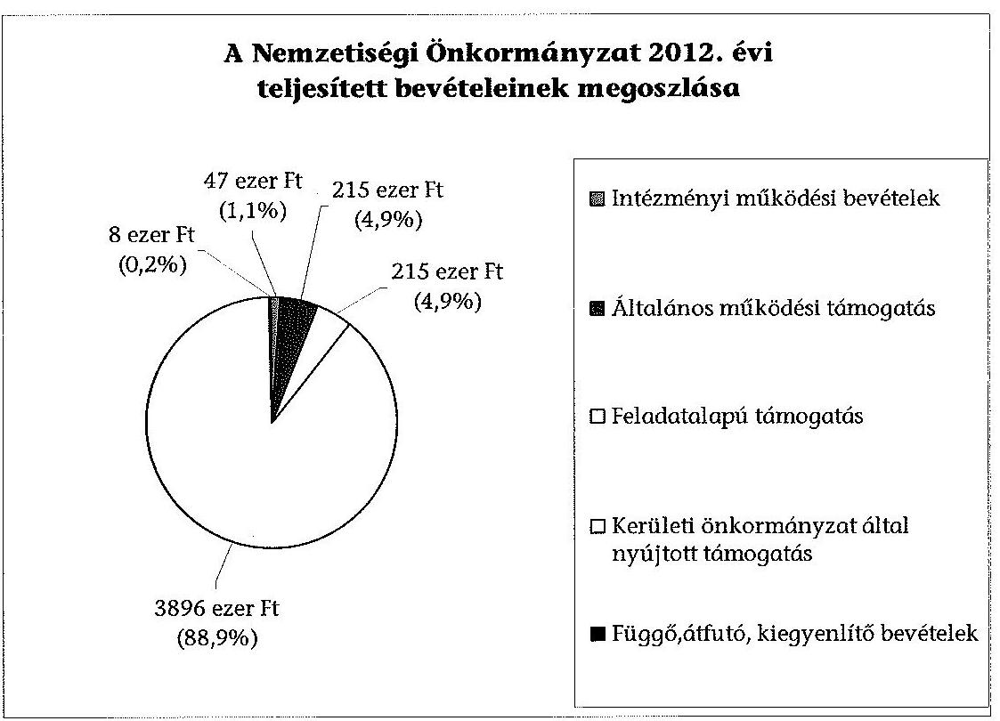
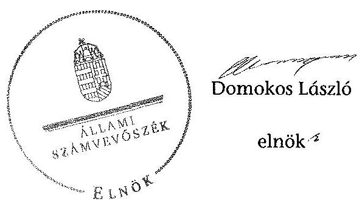

# ÁLLAMI   SZÁMVEVŐSZÉK 

## JELENTÉS

a helyi nemzetiségi önkormányzatok gazdálkodásának ellenőrzéséről
Roma Nemzetiségi Önkormányzat (XVIII. kerületi)

---

# Állami Számvevőszék 

Iktatószám: V-0336-018/2014.
Témaszám: 1370
Vizsgálat-azonosító szám: V065297
Az ellenőrzést felügyelte:
Horváth Balázs
felügyeleti vezető
Az ellenőrzést vezette és az ellenőrzés végrehajtásáért felelős:
Kisgergely István
ellenőrzésvezető
A számvevőszéki jelentést készítették és a jelentés összeállításában
közreműködtek:
Komlósiné Bogár Éva
számvevő tanácsos
Varsányiné Dudás Eleonóra
számvevő
Az ellenőrzést végezte:
Kováts T. Balázs
számvevő

---

# TARTALOMJEGYZÉK 

BEVEZETÉS ..... 3
I. ÖSSZEGZŐ MEGÁLLAPÍTÁSOK, KÖVETKEZTETÉSEK, JAVASLATOK ..... 6
II. RÉSZLETES MEGÁLLAPÍTÁSOK ..... 12
1 A Nemzetiségi Önkormányzat és a Kerületi Önkormányzat együttműködésének szabályozása, a működési feltételek biztosítása ..... 12
2 A gazdálkodási feladatok ellátásának szabályszerűsége ..... 13
2.1 A költségvetésre és a zárszámadásra, valamint a kincstári adatszolgáltatás rendjére vonatkozó jogszabályi előírások betartása ..... 13
2.2 A Nemzetiségi Önkormányzat gazdálkodásának szabályozottsága ..... 14
2.3 Az operatív gazdálkodási jogkörök kialakítása, gyakorlása ..... 15
3 A Nemzetiségi Önkormányzat gazdálkodásával kapcsolatos feladatok belső ellenőrzése ..... 16
4 A feladatalapú támogatás felhasználásának, elszámolásának szabályszerűsége, a Nemzetiségi Önkormányzat feladatellátása ..... 17
MELLÉKLET

1. számú A Nemzetiségi Önkormányzat 2012. évi gazdálkodásának főbb adatai, mutatói
2. számú Tájékoztatás a polgármesternek küldött el nem fogadott észrevételekről

## FÜGGELÉKEK

1. számú Rövidítések jegyzéke
2. számú Értelmező szótár
3. számú A gazdálkodás értékelésének módszere

---

.

---

# JELENTÉS   a helyi nemzetiségi önkormányzatok gazdálkodásának ellenőrzéséről Roma Nemzetiségi Önkormányzat (XVIII. kerületi) 

## BEVEZETÉS

A Nemzetiségi Önkormányzat az 1995. évben alakult, elnöke az 1998. évi helyhatósági választások óta látja el feladatát. A Nemzetiségi Önkormányzat intézményt, gazdasági társaságot és más szervezetet nem alapított. A négytagú Képviselő-testület munkája segítésére bizottságot nem hozott létre. A Nemzetiségi Önkormányzat költségvetési beszámolója szerint a 2012. évben a módosított költségvetési bevételi és kiadási előirányzata 4411 ezer Ft, a teljesített költségvetési bevétele 4373 ezer Ft, a teljesített költségvetési kiadása 3619 ezer Ft volt. A 2012. évi gazdálkodási adatokat részletesen az 1. számú mellékletben mutatjuk be.

Az Alaptörvény XXIX. cikk (1) bekezdése szerint a Magyarországon élő nemzetiségek államalkotó tényezők. Minden, valamely nemzetiséghez tartozó magyar állampolgárnak joga van önazonossága szabad vállalásához és megőrzéséhez. A hazánkban élő nemzetiségek helyi (települési és területi) valamint országos önkormányzatokat hozhatnak létre. A helyi nemzetiségi önkormányzatok gazdálkodási feladatait jogszabályi előírás alapján a székhely szerinti helyi önkormányzat polgármesteri hivatala látja el.

A nemzetiségek helyzete, támogatása mind hazai, mind EU-s szinten kiemelt figyelmet kap napjainkban. A helyi nemzetiségi önkormányzatok gazdálkodására és támogatási rendszerére vonatkozó jogszabályok a 2010-2012. években jelentős változásokon mentek át. A települési és területi nemzetiségi önkormányzatok gazdálkodásának, a részükre juttatott költségvetési támogatások felhasználásának ellenőrzését az ÁSZ 2012-ben sorozatjellegű ellenőrzés keretében indította el. A 2013. évi ellenőrzések e témacsoportos ellenőrzések folytatását jelentik, amelyet az ÁSZ 2014 első félévi ellenőrzési terve a 12. témasorszámon tartalmaz.

Az ellenőrzés célja annak értékelése volt, hogy a Nemzetiségi Önkormányzat gazdálkodási kereteinek kialakítása, gazdálkodása és feladatellátása megfelelt-e a jogszabályoknak.

---

Ennek keretében értékeltük, hogy:

- a Nemzetiségi Önkormányzat és a Kerületi Önkormányzat együttműködésének szabályozása, a működési feltételek biztosítása megfelelt-e a jogszabályi előírásoknak;
- a felek együttműködése megfelelt-e a közöttük létrejött megállapodásnak a gazdálkodási feladatok szabályszerű ellátása során, ennek keretében betartották-e a Nemzetiségi Önkormányzat gazdálkodásához kapcsolódóan a költségvetésre és zárszámadásra, a gazdálkodás szabályozására, az operatív gazdálkodási jogkörök gyakorlására vonatkozó jogszabályi előírásokat;
- a jegyző biztosította-e a Nemzetiségi Önkormányzat gazdálkodásának belső ellenőrzését;
- a Nemzetiségi Önkormányzat feladatalapú támogatásának felhasználása, a folyósított feladatalapú támogatással történő elszámolás az előírásoknak megfelelő volt-e;
- a Nemzetiségi Önkormányzat feladatellátása összhangban volt-e a vonatkozó jogszabályi előírásokkal.

Az ellenőrzés várható hasznosulását négy szinten tervezzük. A törvényalkotás számára összegzett tapasztalatok állnak rendelkezésre a nemzetiségi önkormányzatok testületi döntéseinek, gazdálkodásának és a feladatalapú támogatás felhasználásának szabályszerűségéről, amelynek alapján következtetést lehet levonni arra, hogy indokolt-e esetleges jogszabályi módosítás kezdeményezése. Az ellenőrzés az ellenőrzött számára visszajelzést ad a működésében fellépő hiányosságokról, javaslataival hozzájárul azok kiküszöböléséhez, amely csökkentheti a későbbi ellenőrzések gyakoriságát. Az ellenőrzés megállapításai és javaslatai tanulságul szolgálhatnak más nemzetiségi önkormányzatok, szervezetek számára a rendezett gazdálkodási keretek kialakításához. A társadalom számára jelzi, hogy közpénz nem maradhat ellenőrizetlenül, az ÁSZ értékteremtő rend kialakításához és megőrzéséhez hozzájáruló tevékenysége pozitív hatással lesz a szervezetről kialakított összkép formálásában. Az ÁSZ szervezetén belül lehetőség nyílik arra, hogy a megállapítások szintetizálásával az intézmény a hozzáadott értéket teremtő elemző tevékenységét és tanácsadó szerepét erősítse.

A Nemzetiségi Önkormányzat gazdálkodásának ellenőrzéséről szóló jelentés I. fejezetének összegző része az ellenőrzés céljára adott rövid, szintetizáló összefoglalót és következtetéseket tartalmazza a II. fejezet részletes megállapításain alapulóan. A jelentés intézkedést igénylő megállapításait és javaslatait - az összegzőben foglaltak mellett - az ellenőrzés során feltárt, a jelentés II. fejezetében rögzített részletes megállapítások alapozzák meg, illetve támasztják alá.

Az ellenőrzés típusa: szabályszerűségi ellenőrzés.
Az ellenőrzött időszak: a 2012. január 1. - 2012. december 31. közötti időszak. Az ellenőrzés kiterjedt a Nemzetiségi Önkormányzatnak juttatott 2012. évi feladatalapú támogatás 2013. évben való elszámolására is.

---

Ellenőrzött szervezet: Roma Nemzetiségi Önkormányzat és a gazdálkodási feladatait ellátó Budapest XVIII. Kerület Pestszentlőrinc-Pestszentimre Önkormányzat.

Az ellenőrzés végrehajtásának jogszabályi alapját az ÁSZ tv. 5. § (2)-(3) és (6) bekezdéseiben foglaltak képezik.

Az ellenőrzés szakmai módszertana az ÁSZ hivatalos honlapján (www.asz.hu) közzétett szakmai szabályokon alapult, amely a Legfőbb Ellenőrző Intézmények Nemzetközi Szervezete (INTOSAI) által kiadott nemzetközi standardok (ISSAI) figyelembevételével készült.

A helyi nemzetiségi önkormányzatok gazdálkodásának ellenőrzése során értékeltük a Nemzetiségi Önkormányzat és a Kerületi Önkormányzat együttműködésének, a gazdálkodás szabályozottságának és a pénzügyi folyamatokban kulcsszerepet betöltő belső kontrollok (teljesítésigazolás és érvényesítés) működésének megfelelőségét. A kulcskontrollokat a működési és felhalmozási célú támogatásértékű kiadásoknál, az államháztartáson kívülre teljesített működési és felhalmozási célú pénzeszköz átadásoknál és a dologi kiadásokkal kapcsolatos kifizetéseknél - véletlen mintavételi eljárást alkalmazva - ellenőriztük. Ellenőriztük, hogy a jegyző biztosította-e a Nemzetiségi Önkormányzat gazdálkodásának belső ellenőrzését. Értékeltük a feladatalapú támogatások felhasználásának, elszámolásának szabályszerűségét, a Nemzetiségi Önkormányzat feladatellátása és a jogszabályi előírások összhangját.

Az ellenőrzés lefolytatásához a Nemzetiségi Önkormányzat és a gazdálkodási feladatait ellátó Kerületi Önkormányzat tanúsítványok és a kapcsolódó, dokumentumjegyzékben megjelölt dokumentumok elektronikus úton történő megküldésével, rendelkezésre bocsátásával szolgáltatott adatokat. Az adatszolgáltatás kontrollálása és szükség szerinti javítása a helyszíni ellenőrzés keretében történt. A gazdálkodás értékelésének módszerét a 3. számú függelék tartalmazza.

Az ÁSZ tv. 29. § (1) bekezdése szerint a jelentéstervezetet megküldtük egyeztetésre a polgármesternek és a Nemzetiségi Önkormányzat elnökének. A polgármester határidőben megküldött észrevétele és tájékoztatása alapján a jelentést nem módosítottuk, az el nem fogadott észrevételek indoklását a jelentés 2. számú melléklete tartalmazza.

---

# I. ÖSSZEGZŐ MEGÁLLAPÍTÁSOK, KÖVETKEZTETÉSEK, JAVASLATOK 

A Nemzetiségi Önkormányzat és a Kerületi Önkormányzat együttműködésének szabályozása, a működési feltételek biztosítása megfelelt a jogszabályi előírásoknak. A Nemzetiségi Önkormányzat a 2012. évben rendelkezett hatályos együttműködési megállapodás ${ }^{1,2}$-vel a Kerületi Önkormányzattal történő együttműködésre. A felek a 2005. évben megkötött együttműködési megállapodás ${ }^{1}$-nek a Nek. ${ }^{2}$ tv.-ben meghatározott, 2012. január 31-ei határidővel előírt felülvizsgálatát nem végezték el. Az együttműködési megállapodás ${ }^{1}$ Nek. ${ }^{2}$ tv.-ben előírt módosítási kötelezettségüknek határidőben, 2012. március 29-én eleget tettek. A 2012. december 31-én hatályos együttműködési megállapodás ${ }^{2}$ ben a Nemzetiségi Önkormányzat működési feltételeit az előírásoknak megfelelően szabályozták, azonban ezt - a Nek. ${ }^{2}$ tv.-ben előírtak ellenére - az együttműködési megállapodás ${ }^{2}$ megkötését követő harminc napon belül a Nemzetiségi Önkormányzat SZMSZ-ében nem rögzítették. A Nemzetiségi Önkormányzat gazdálkodási feladatai ellátásának szabályait - az Áht. ${ }^{2}$-nek és a Nek. ${ }^{2}$ tv.nek megfelelően - a 2012. december 31-én hatályos együttműködési megállapodás ${ }^{2}$-ben teljes körűen rögzítették, azonban az együttműködési megállapodás ${ }^{2}$ az Áht. ${ }^{2}$ és az Ávr. előírásai ellenére az érvényesítők jegyző általi kijelölését tartalmazta a gazdasági vezető általi kijelölés helyett. A Kerületi Önkormányzat a 2012. év során a működési feltételeket biztosította. Az együttműködési megállapodás ${ }^{2}$ mellékleteként elkészült a helyiséghasználati rend.

A Nemzetiségi Önkormányzat 2012. évi költségvetésének és zárszámadásának tartalma, jóváhagyása, valamint a kapcsolódó 2012. évi adatszolgáltatás szabályszerűsége nem felelt meg a jogszabályi előírásoknak. A Nemzetiségi Önkormányzat elnöke a 2012. évi költségvetési és zárszámadási határozat tervezetét az Áht. ${ }^{2}$-ben meghatározott határidőben benyújtotta a Képviselő-testületnek. A költségvetési határozattervezet előterjesztésekor az Áht. ${ }^{2}$-ben előírtak ellenére - a jegyző mulasztása miatt - a Képviselő-testület részére tájékoztatásul nem mutatták be szöveges indokolással a Nemzetiségi Önkormányzat költségvetési mérlegét közgazdasági tagolásban és az előirányzatfelhasználási tervét. A Nemzetiségi Önkormányzat 2012. évi költségvetéséről és zárszámadásáról a Képviselő-testület határozatot hozott és elfogadta a 2012. évi elemi beszámolót. A zárszámadási határozattervezet előterjesztésekor az Áht. ${ }^{2}$-ben előírtak ellenére - a jegyző mulasztása miatt - a Képviselő-testület részére tájékoztatásul nem mutatták be az Áht. ${ }^{2}$-ben előírt mérlegeket és kimutatásokat, továbbá a zárszámadás nem volt összehasonlítható a 2012. évben elfogadott költségvetéssel. A 2012. évi zárszámadási határozatban az Áht. ${ }^{2}$ előírása ellenére a Nemzetiségi Önkormányzat nem mutatta be bevételei és kiadásai összegét. A 2012. költségvetési évre vonatkozó kincstári adatszolgáltatási kötelezettségeket - az éves költségvetési és a mérlegjelentések kivételével - a jegyző nem az Áhsz. ${ }^{1}$-ben és az Ávr.-ben előírt határidőben teljesítette.

A gazdálkodás szabályozottsága a jogszabályi követelményeknek megfelelt. A gazdálkodási feladatok végrehajtását ellátó Polgármesteri Hivatal a 2012. évben kiterjesztette a Számv. tv. és a Bkr. által előírt gazdálkodásra vo-

---

natkozó szabályzatok hatályát a Nemzetiségi Önkormányzat gazdálkodásának végrehajtási feladataira is. A Nemzetiségi Önkormányzat gazdálkodásának végrehajtásával kapcsolatos feladat- és hatásköröket, a hatáskörök gyakorlásának módját, és az ezekre vonatkozó felelősségi szabályokat a Polgármesteri Hivatal SZMSZ-ében rögzítették.

Az operatív gazdálkodási jogkörök kialakítása 2012. május 20-ától felelt meg a jogszabályi előírásoknak, mivel a teljesítés igazolására és az érvényesítői feladatok ellátására vonatkozó szabályszerű felhatalmazásokat és kijelöléseket a jogosultak ettől az időponttól kezdődően adták meg.

A Nemzetiségi Önkormányzat részéről a 2012. évben két esetben történt az államháztartáson kívülre, működési célra pénzeszközátadás. A támogatásértékű kiadások teljesítése során a teljesítésigazolás és az érvényesítés kulcskontrollok megfelelően működtek. A teljesítésigazoló és az érvényesítő az Ávr. előírásai és operatív gazdálkodási szabályzat ${ }_{2}$ alapján jogszerűen látták el az ellenőrzési feladatokat. A Nemzetiségi Önkormányzatnál a 2012. évben a dologi kiadások teljesítése során a teljesítésigazolás és érvényesítés kulcskontrollok működésének megfelelősége gyenge volt, a hibák száma a lényegességi szintet, a kritikus hibahatárt elérte. A teljesítésigazoló nem szabályszerűen látta el az Ávr.-ben előírt feladatát, mert a kiadás jogossága, összegszerűsége és az ellenszolgáltatás teljesítésének ellenőrzését 2012. május 19-ét megelőzően jogosulatlanul végezte, továbbá nem tartotta be az operatív gazdálkodási szabályzat ${ }^{1,2}$-ben előírtakat. Az érvényesítő az Áht. ${ }^{3}$-ben és az Ávr.-ben előírtak ellenére 2012. május 19-éig nem jogszerű kijelölés alapján látta el ellenőrzési feladatát. Nem ellenőrizte, hogy a megelőző ügymenetben az Ávr. és az operatív gazdálkodási szabályzat ${ }^{1,2}$ előírásait betartották-e,
 nem jelezte, hogy a teljesítésigazolások szabálytalanul történtek és nem észrevételezte a vezetett kötelezettségvállalási nyilvántartás tartalmi hiányosságait. A dologi kiadások három legnagyobb összegű könyvelési tétele esetében az Ávr. előírása ellenére nem történt meg a kiadás teljesítésének igazolása, amelynek elmaradását az érvényesítő az Ávr. előírása ellenére nem jelezte. A számvevőszéki ellenőrzés a kiadások dokumentumainak ellenőrzése alapján összeférhetetlenséget, továbbá jogosulatlan kifizetést nem tárt fel, a kulcskontrollok működéséhez kapcsolódó hiányosságok miatt azonban nem biztosított a hibák megelőzése, feltárása és kijavítása.

A jegyző a Polgármesteri Hivatalnál a Nemzetiségi Önkormányzat gazdálkodásával összefüggő végrehajtási feladatok belső ellenőrzését biztosította. A Polgármesteri Hivatal 2012. évre vonatkozó éves ellenőrzési tervét megalapozó kockázatelemzés kiterjedt a Nemzetiségi Önkormányzat gazdálkodásával összefüggő végrehajtási feladatokra. A kockázatelemzés a nemzetiségi önkormányzatok gazdálkodását alacsony kockázatúnak minősítette. Belső ellenőrzési feladatot a 2012. évben eredetileg nem terveztek, azonban a jogszabályi változások miatt egy esetben végeztek. A belső ellenőrzésről készült jelentésben a pénzügyi kontrollok működése, a nemzetiségi önkormányzatok SZMSZ-e és az együttműködési megállapodás ${ }_{2}$ vonatkozásában feltárt hiányosságok egyezőek voltak a számvevőszéki ellenőrzés megállapításaival. A jegyző a belső ellenőrzés által megállapított hiányosságok kijavítására a Bkr.-ben meghatározott határidőn túl készített intézkedési tervet.

---

A Nemzetiségi Önkormányzat részére 2011. és 2012. évben folyósított feladatalapú támogatás elszámolása nem, felhasználása megfelelő volt. A Nemzetiségi Önkormányzat a 2011. évben 513 ezer Ft feladatalapú támogatásban részesült, amit a folyósítás évében felhasználtak a nemzetiségi feladatokra. A 2012. évben 215 ezer Ft összegű támogatást kaptak, amelyet a jogszabályi előírásokkal összhangban és a Képviselő-testület által meghatározott nemzetiségi programokra, feladatokra fordítottak. A 2011. és a 2012. évi feladatalapú támogatás elszámolása az Áht. ${ }_{1,2}$-ben valamint a támogatási kormányrendelet ${ }_{1,2}$-ben előírtak ellenére nem történt meg, a támogatás felhasználását, elszámolását az ellenőrzésre jogosult szervek nem ellenőrizték.

A Nemzetiségi Önkormányzat kötelező és önként vállalt feladatellátásának tárgya összhangban volt a Nek. 2 tv. előírásaival, tevékenységét a képviselt közösség kulturális autonómiájának megerősítése, a közösség önszerveződésének érdekében végezte.

Az ÁSZ tv. 33. § (1) bekezdésében foglaltak értelmében az ellenőrzött szervezet vezetője köteles a jelentésben foglalt megállapításokhoz kapcsolódó intézkedési tervet összeállítani és azt a jelentés kézhezvételétől számított 30 napon belül az ÁSZ részére megküldeni. Amennyiben az intézkedési tervet határidőre nem küldi meg a szervezet, vagy az nem elfogadható, az ÁSZ elnöke az ÁSZ tv. 33. § (3) bekezdés a)-b) pontjaiban foglaltakat érvényesítheti.

A helyszíni ellenőrzés megállapításainak hasznosítása mellett javasoljuk:

# a jegyzőnek 

1. az együttműködés szabályozásával kapcsolatban

A Nemzetiségi Önkormányzat és a Kerületi Önkormányzat nem tett eleget az együttműködési megállapodás ${ }_{1}$ - a Nek. ${ }_{2}$ tv. 80. § (2) bekezdésében előírt - 2012. január 31-éig elvégzendő éves felülvizsgálati kötelezettségének.

Javaslat:
Biztosítsa a jövőben az együttműködési megállapodás évenkénti felülvizsgálata során a Nek. ${ }_{2}$ tv. 80. § (2) bekezdésében előírt határidő betartását;
2. a költségvetési és zárszámadási határozattal, valamint a kincstári adatszolgáltatással kapcsolatban

A költségvetési határozattervezet előterjesztésekor az Áht. ${ }_{2}$ 24. § (4) bekezdés a) pontjában előírtak ellenére - a jegyző mulasztása miatt - a Képviselő-testületnek tájékoztatásul nem mutatták be - szöveges indokolással együtt - a Nemzetiségi Önkormányzat költségvetési mérlegét közgazdasági tagolásban és az előirányzat felhasználási tervét. A zárszámadási határozattervezet előterjesztésekor - a jegyző mulasztása miatt - nem mutatták be a Képviselő-testület részére tájékoztatásul az Áht. ${ }_{2} 91 . \S$ (2) bekezdés a) pontjában előírt mérlegeket és kimutatásokat. Az Áht. ${ }_{2} 89 . \S$ (1) bekezdésében foglaltak ellenére a zárszámadás nem volt összehasonlítható a 2012. évben elfogadott költségvetéssel. A 2012. évi zárszámadási határo-

---

zatban a 89. § (2) bekezdése előírása ellenére a Nemzetiségi Önkormányzat nem mutatta be bevételei és kiadásai összegét.

A jegyző a 2012. évi költségvetéshez kapcsolódó, Nemzetiségi Önkormányzatra vonatkozó kincstári adatszolgáltatási kötelezettségének több esetben - az Ávr. 33. §, 169. § (2) és 170. § (5) bekezdéseiben és az Áhsz. 10. § (5a) bekezdésében előírt határidőn túl tett eleget.

Javaslat
Gondoskodjon arról, hogy:
a) a költségvetési határozattervezet előterjesztésekor az Áht. 2 24. § (4) bekezdés a) pontjában foglaltaknak megfelelően a Képviselő-testület részére tájékoztatásul mutassák be - szöveges indokolással együtt - a Nemzetiségi Önkormányzat költségvetési mérlegét közgazdasági tagolásban és az előirányzat felhasználási tervét;
b) a zárszámadási határozattervezet előterjesztésekor a Képviselő-testület részére bemutatásra kerüljenek az Áht. 2 91. § (2) bekezdés a) pontjában előírt mérlegek és kimutatások.
c) a zárszámadási határozat-tervezet feleljen meg az Áht. 2 89. § (1)-(2) bekezdései előírásainak;
d) a kincstári adatszolgáltatási kötelezettségeinek az Ávr. 33. §-ában, 169. § (2) és 170. § (5) bekezdéseiben és az Áhsz. 2 32. § (4) bekezdésében előírt határidők betartásával tegyen eleget.
3. a kulcskontrollok működésével kapcsolatban

A teljesítésigazolás Ávr. 57. § (1) és (3) bekezdéseivel ellentétesen nem szabályszerűen történt meg, továbbá a teljesítésigazolás során nem tartották be az operatív gazdálkodási szabályzat ${ }_{1,2}$-ban előírtakat.

Az érvényesítő nem az Ávr. 58. § (1)-(2) bekezdéseiben előírtak szerint végezte feladatát, mert nem ellenőrizte, hogy a megelőző ügymenetben a jogszabályok és az operatív gazdálkodási szabályzat ${ }_{1,2}$ előírásait betartották-e. Nem jelezte az utalványozónak, hogy nem, illetve nem szabályszerűen történt a teljesítésigazolás, és nem észrevételezte a vezetett kötelezettségvállalási nyilvántartás tartalmi hiányosságait.

Javaslat
Az operatív gazdálkodás működési hibáinak megelőzése, feltárása és kijavítása érdekében gondoskodjon arról, hogy:
a) a teljesítésigazolást az Ávr. 57. § (1) és (3) bekezdéseiben előírtaknak megfelelően végezzék;
b) az érvényesítő az Ávr. 58. § (1)-(2) bekezdései alapján maradéktalanul lássa el ellenőrzési és jelzési feladatát.

---

4. a belső ellenőrzéssel kapcsolatban

A 2012. évben elvégzett ellenőrzésről készült jelentésben megállapított hiányosságok megszüntetésére a jegyző a Bkr. 45. § (3) bekezdésében előírt határidőn túl készített intézkedési tervet.

Javaslat
Intézkedjen, hogy a belső ellenőrzési jelentésben megállapított hiányosságok megszüntetésére a Bkr. 45. § (3) bekezdésében előírt határidőben készüljenek el az intézkedési tervek.
5. a feladatalapú támogatás elszámolásával kapcsolatban

A 2011. évi feladatalapú támogatás elszámolása a támogatási kormányrendelet ${ }_{1}$ 7. § (2) bekezdésében hivatkozott, valamint a 2012. évi feladatalapú támogatás elszámolása a támogatási kormányrendelet ${ }_{2} 8 . \S$ (5) bekezdésében hivatkozott, „a helyi önkormányzatok elszámolási és ellenőrzési rendjére vonatkozó jogszabályok" előírása alapján az Áht. ${ }_{1} 64 . \S$ (7) bekezdése és az Áht. ${ }_{2} 57 . \S$ (3) bekezdése ellenére nem történt meg.

Javaslat:
Intézkedjen az Áht. ${ }_{2}$ 27. § (2) bekezdésében meghatározott feladatkörében a Nemzetiségi Önkormányzat által igénybe vett 2011. évi és 2012. évi feladatalapú támogatás felhasználásáról szóló elszámolás elkészítéséről, az Áht. ${ }_{2} 53 . \S$ (1) bekezdése szerinti beszámolási kötelezettség teljesítéséhez.

# a Nemzetiségi Önkormányzat elnökének 

1. A Nemzetiségi Önkormányzat elnöke a költségvetési határozattervezet előterjesztésekor - a jegyző mulasztása miatt - nem mutatta be szöveges indoklással a Képviselő-testületnek tájékoztatásul az Áht. ${ }_{2}$ 24. § (4) bekezdés a) pontjában előírt költségvetési mérleget közgazdasági tagolásban és az előirányzat-felhasználási tervet.

A zárszámadási határozattervezet előterjesztésekor - a jegyző általi elkészítés hiányában - nem mutatta be a Képviselő-testület részére tájékoztatásul az Áht. ${ }_{2}$ 91. § (2) bekezdés a) pontjában előírt mérlegeket és kimutatásokat.

Javaslat
A költségvetési és zárszámadási határozattervezet előterjesztésekor mutassa be a Képviselő-testület részére tájékoztatásul - a jegyző által előkészített - az Áht. ${ }_{2}$ 24. § (4) bekezdése a) pontjában, valamint 91. § (2) bekezdés a) pontjában előírt mérlegeket és kimutatásokat.
2. A 2011. évi feladatalapú támogatás elszámolása a támogatási kormányrendelet ${ }_{1} 7 . \S$ (2) bekezdésében hivatkozott, valamint a 2012. évi feladatalapú támogatás elszámolása a támogatási kormányrendelet ${ }_{2} 8 . \S$ (5) bekezdésében hivatkozott „a helyi önkormányzatok elszámolási és ellenőrzési rendjére vonatkozó jogszabályok" elő-

---

írása alapján az Áht. 64. § (7) bekezdése és az Áht. 2 57. § (3) bekezdése ellenére nem történt meg.

Javaslat
Terjessze a Képviselő-testület elé jóváhagyásra az Áht. 2 53. § (1) bekezdése szerinti beszámolási kötelezettség teljesítéséhez összeállított, a Nemzetiségi Önkormányzat által igénybe vett 2011. és 2012. évi feladatalapú támogatás felhasználásáról szóló elszámolást.

---

# II. RÉSZLETES MEGÁLLAPÍTÁSOK 

## 1. A Nemzetiségi Önkormányzat és a Kerületi Önkormányzat EGYÜTTMŰKÖDÉSÉNEK SZABÁLYOZÁSA, A MŰKÖDÉSI FELTÉTELEK BIZTOSÍTÁSA

A Nemzetiségi Önkormányzat és a Kerületi Önkormányzat együttműködésének szabályozása, a működési feltételek biztosítása megfelelte a jogszabályi előírásoknak.

A Nemzetiségi Önkormányzat rendelkezett a 2012. év folyamán hatályban lévő megállapodás ${ }_{1,2}$-vel ${ }^{1}$ a Kerületi Önkormányzattal történő együttműködésre.

A 2012. január 1-jén hatályos, 2005. évben megkötött együttműködési megállapodás ${ }_{1}$-nek a Nek. ${ }_{2}$ tv. 80. § (2) bekezdésben 2012. január 31-ei határidőig előírt felülvizsgálatát nem végezték el.

A Nek. ${ }_{2}$ tv. 159. § (3) bekezdésben előírt módosítási kötelezettségüknek határidőn belül ${ }^{2}$ eleget tettek. A 2012. december 31-én hatályos együttműködési megállapodás ${ }_{2}$-ben a Nek. ${ }_{2}$ tv. előírásainak megfelelően szabályozták a Nemzetiségi Önkormányzat működésének feltételeit, melyeket azonban a Nek. ${ }_{2}$ tv. 80. § (2) bekezdésében előírtak ellenére nem rögzítettek a Nemzetiségi Önkormányzat SZMSZ-ében az együttműködési megállapodás megkötését, módosítását követő harminc napon belül ${ }^{3}$.

A Nemzetiségi Önkormányzat és a Kerületi Önkormányzat által megkötött 2012. december 31-én hatályos - együttműködési megállapodás ${ }_{2}$-ben a Nemzetiségi Önkormányzat gazdálkodásával kapcsolatos feladatokat, felelősöket és határidőket - egy kivétellel - az előírásoknak megfelelően szabályozták. Az együttműködési megállapodás ${ }_{2}$ az érvényesítők jegyző általi kijelölését tartalmazta, azonban az Áht. ${ }_{2} 38 . \S$ (2) bekezdésében és az Ávr. 55. § (2) bekezdés g) pontjában, illetve az 58. § (4) bekezdésében előírtak szerint a kijelölésekre a gazdasági vezető volt jogosult.

[^0]
[^0]:    ${ }^{1}$ A 2012. március 22-éig hatályos együttműködési megállapodás ${ }_{1}$-et a Kerületi Önkormányzat a 7/2005. (II. 01.) számú rendeletével, a Képviselő-testület a 25/2004. (XII. 23.) számú határozatával hagyta jóvá.
    A 2012. március 23-ától hatályos együttműködési megállapodás ${ }_{2}$-t a Kerületi Önkormányzat a 14/2012. (III. 13.) számú rendeletével fogadta el, a Képviselő-testület a 11/2012. (III. 08.) számú határozattal hagyta jóvá.
    ${ }^{2}$ 2012. március 23-án
    ${ }^{3}$ A Képviselő-testület a Nemzetiségi Önkormányzat SZMSZ-ét 2013 decemberében módosította, amelynek mellékletét képezi az együttműködési megállapodás ${ }_{3}$. Az együttműködési megállapodás ${ }_{3}$ mellékleteként elkészült a helyiséghasználati rend.

---

A Kerületi Önkormányzat a Polgármesteri Hivatal útján biztosította a Nemzetiségi Önkormányzat 2012. évi működésének a - Nek. 2 tv. 159. § (3) bekezdésében foglalt átmeneti rendelkezés alapján a Nek. ${ }_{1}$ tv. 27. § (2)-(3) bekezdéseiben előírt - személyi és tárgyi feltételeit.

# 2. A GAZDÁLKODÁSI FELADATOK ELLÁTÁSÁNAK SZABÁLYSZERŰSÉGE 

### 2.1. A költségvetésre és a zárszámadásra, valamint a kincstári adatszolgáltatás rendjére vonatkozó jogszabályi előírások betartása

A Nemzetiségi Önkormányzat 2012. évi költségvetésének, a zárszámadásának tartalma, jóváhagyása, valamint a kapcsolódó adatszolgáltatás nem felelt meg a jogszabályi előírásoknak.

A Nemzetiségi Önkormányzat elnöke a 2012. évi költségvetés tervezetét határidőben ${ }^{4}$ benyújtotta a Képviselő-testületnek, azonban a költségvetési határozat ${ }^{5}$ teljes körűen nem tartalmazta az Áht. ${ }_{2}$-ben és az Ávr.-ben előírtakat. A költségvetési határozat-tervezet előterjesztésekor az Áht. ${ }_{2} 24 . \S$ (4) bekezdés a) pontjában előírtak ellenére - a jegyző mulasztása miatt - nem mutatták be a Képvise-lő-testületnek tájékoztatásul szöveges indokolással a Nemzetiségi Önkormányzat költségvetési mérlegét közgazdasági tagolásban és az előirányzatfelhasználási tervét.

A Nemzetiségi Önkormányzat elnöke a jegyző által elkészített 2012. évi zárszámadási határozat-tervezetet az Áht. ${ }_{2}$ 91. § (1) bekezdésében előírt határidőben terjesztette be a Képviselő-testületnek. A Képviselő-testület 2012. április 30-ai ülésén - megtárgyalta és elfogadta ${ }^{6}$ a Nemzetiségi Önkormányzat zárszámadását és a 2012. évi elemi beszámolót. A beszámoló tartalma megfelelt a jogszabályi előírásoknak, azonban a zárszámadási határozattervezet előterjesztésekor a Képviselő-testület részére tájékoztatásul - a jegyző mulasztása miatt - az Áht. ${ }_{2} 91 . \S$ (2) bekezdés a) pontjában foglaltak ellenére nem mutatták be az Áht. ${ }_{2} 24 . \S$ (4) bekezdésében előírt mérlegeket és kimutatásokat. A 2012. évi zárszámadást a Képviselő-testület nem az Áht. ${ }_{2} 89 . \S$ (1) bekezdése szerinti részletezettségben hagyta jóvá, így nem volt biztosított az összehasonlíthatóság az elfogadott költségvetéssel. A 2012. évi zárszámadási határozatban az Áht. ${ }_{2} 89 . \S$ (2) bekezdésének előírása ellenére a Nemzetiségi Önkormányzat nem mutatta be bevételei és kiadásai összegét.

[^0]
[^0]:    ${ }^{4}$ Az Áht. 24. § (2) bekezdés előírása szerint a központi költségvetésről szóló törvény kihirdetését követő 45. napig (2012. február 11-ig), a 2012. évi költségvetést a Képviselőtestület a 2012. február 8-i ülésén tárgyalta.
    ${ }^{5}$ A 2012. évi költségvetést a Képviselő-testület a 6/2012. (II. 08.) számú határozatával hagyta jóvá.
    ${ }^{6}$ 30/2013. (IV. 30.) szám alatt, rögzítve a 38/7315-13/2013. iktatószámú jegyzőkönyvben

---

A jegyző a Nemzetiségi Önkormányzattal összefüggő 2012. évi kincstári adatszolgáltatási kötelezettségét teljesítette, azonban az előírt határidőket nem tartotta be, mert:

- a 2012. évi elemi költségvetéshez kapcsolódó, az Ávr. 33. § -ában előírt adatszolgáltatást késedelmesen ${ }^{7}, 2012$. március 28-án teljesítette;
- a 2012. évi negyedéves időközi költségvetési jelentéseket az Ávr. 169. § (2) bekezdésében előírt határidőkön túl (2012. április 24-én, július 26-án, október 29-én) ${ }^{8}$, az éves költségvetési jelentést 2013. január 19-én, határidőben teljesítette;
- a 2012. évi időközi mérlegjelentéseket az Ávr. 170. § (5) bekezdésében előírt határidőkön túl (2012. április 27-én, augusztus 1-jén, október 29-én) ${ }^{9}$, az éves mérlegjelentést határidőben, 2013. március 14-én teljesítette;
- a 2012. I. féléves és éves elemi költségvetési beszámolóját az Áhsz., 10. § (5a) bekezdésben előírt határidőkön túl ${ }^{10}$, 2012. augusztus 14-én, illetve 2013. március 14-én nyújtotta be. A beszámolókat 2012. augusztus 9-én, illetve 2013. március 11-én, a jogszabályban előírt határidőktől eltérően, 9, illetve 11 nap késedelemmel készítették el.

# 2.2. A Nemzetiségi Önkormányzat gazdálkodásának szabályozottsága 

A Nemzetiségi Önkormányzat gazdálkodásának szabályozottsága az ellenőrzött időszakban megfelelt a jogszabályi előírásoknak.

A gazdálkodási feladatok végrehajtását ellátó Polgármesteri Hivatal a 2012. évben a Számv. tv. és a Bkr. által előírt ${ }^{11}$ gazdálkodási szabályzatokkal rendelkezett. A gazdálkodásra vonatkozó szabályzatok hatályát a Nemzetiségi Önkormányzat gazdálkodásának végrehajtási feladataira kiterjesztették.

A Nemzetiségi Önkormányzat gazdálkodásának végrehajtásával kapcsolatos feladat- és hatásköröket, a hatáskörök gyakorlásának módját, és az ezekre vo-

[^0]
[^0]:    ${ }^{7}$ A jogszabályban előírt határidő - a költségvetési határozat-tervezetének Képviselőtestület elé történt előterjesztését követő 30 napon belül, azaz - 2012 március 10-e, a késedelmes napok száma 18 nap volt.
    ${ }^{8}$ A jogszabályban előírt határidő 2012. április 20., július 20., október 20.; a késedelmes napok száma 4, 6, 5 nap volt.
    ${ }^{9}$ A jogszabályban előírt határidő 2012. április 25., július 25., október 25.; a késedelmes napok száma 2, 7, 4 nap volt.
    ${ }^{10}$ A jogszabályban előírt határidő a féléves beszámolónál 2012. augusztus 10., az éves beszámolónál 2013. március 10.; a késedelmes napok száma 4-4 nap volt.
    ${ }^{11}$ A 2012. évben hatályos számviteli politika, leltározási és leltárkészítési szabályzat, pénzkezelési szabályzat, eszközök és források értékelési szabályzata, számlarend, ellenőrzési nyomvonal, szabálytalanságkezelési szabályzat, folyamatba épített előzetes, utólagos és vezetői ellenőrzési szabályzat, munkaköri leírások, gazdasági szervezet ügyrendje, operatív gazdálkodási szabályzat ${ }_{1-2}$.

---

natkozó felelősségi szabályokat az ellenőrzött időszakban a Polgármesteri Hivatal SZMSZ-ében rögzítették.

# 2.3. Az operatív gazdálkodási jogkörök kialakítása, gyakorlása 

A Nemzetiségi Önkormányzat gazdálkodása tekintetében az operatív gazdálkodási jogkörök kialakítása 2012. május 20-ától felelt meg a jogszabályi előírásoknak, mivel a teljesítés igazolására és az érvényesítői feladatok ellátására vonatkozó szabályszerű felhatalmazásokat és kijelöléseket a jogosultak ettől az időponttól kezdődően adták meg:

- a Nemzetiségi Önkormányzat elnöke az Áht. 2 38. § (2) bekezdése és az Ávr. 57. § (4) bekezdése ${ }^{12}$ ellenére a teljesítésigazoló személyek írásbeli kijelölését csak 2012. május 20-ától végezte el az operatív gazdálkodási szabályzat ${ }_{2}$ hatályba lépésével;
- a Polgármesteri Hivatalban a gazdasági vezető ${ }^{13}$ az Áht. 2 38. § (2) bekezdésében és az Ávr. 55. § (2) bekezdés g) pontjában, illetve az 58. § (4) bekezdésében előírtak ellenére csak 2012. május 20-ától hatalmazott fel más személyt a pénzügyi ellenjegyzésre és az érvényesítésre.

A Polgármesteri Hivatal az ellenőrzött időszakban rendelkezett gazdasági szervezettel ${ }^{14}$, a gazdasági vezető végzettsége megfelelt az Ávr.-ben előírt szakképesítési követelményeknek.

A Nemzetiségi Önkormányzat részéről két esetben, összesen 1300 ezer Ft összegben történt a 2012. évben államháztartáson kívülre működési célú pénzeszközátadás. A kifizetések teljesítését megelőzően a teljesítésigazolás és az érvényesítés kulcskontrollok megfelelően működtek. A pénzeszközátadásokról mindkét alkalommal a Képviselő-testület határozatban ${ }^{15}$ döntött.

A Nemzetiségi Önkormányzatnál a 2012. évben a dologi kiadások teljesítése során a teljesítésigazolás és az érvényesítés kulcskontrollok működésének megfelelősége gyenge volt. A hibák száma a lényegességi szintet, a kritikus hibahatárt elérte, mivel:

- a teljesítés igazolását az Ávr. 57. § (4) bekezdésének előírása ellenére a jogkör gyakorlására 2012. május 19-éig a Nemzetiségi Önkormányzat elnöke által kijelöléssel nem rendelkező személy jogosulatlanul látta el, ezért az Ávr. 57. § (3) bekezdésben foglaltak ellenére nem szabályszerűen történt a kifizetés jogosságának, összegszerűségének és a teljesítésnek az igazolása;

[^0]
[^0]:    ${ }^{12}$ A jogszabályban előírt határidő 2012. január 1-je volt.
    ${ }^{13}$ A gazdasági vezető által írásban kijelölt pénzügyi ellenjegyző és az érvényesítők alá-írás-mintáját az operatív gazdálkodási szabályzat ${ }_{2}$ melléklete tartalmazta.
    ${ }^{14}$ A Polgármesteri Hivatal SZMSZ-éről szóló, a 43/2011. (XI. 4.) számú, illetve a 3/2012. (IV. 2.) számú polgármesteri-jegyzői együttes utasítás 5.3. pontja szerint a Gazdasági és Költségvetési Iroda látja el a gazdálkodással összefüggő feladatokat.
    ${ }^{15} 35 / 2012$ (V. 15.) számú és az 50/2012. (IX. 09.) számú határozatokban

---

- a teljesítésigazoló az operatív gazdálkodási szabályzat ${ }_{2}$ szerint a teljesítésigazolásra előírt 3. számú mellékletet nem csatolta a számlák mellé, az igazolásra használt bélyegző szövege nem tartalmazta a teljesítés megtörténtének az igazolását;
- az érvényesítő - az Áht. ${ }_{2}$ 38. § (2) bekezdésében és az Ávr. 55. § (2) bekezdés g) pontjában, illetve az 58. § (4) bekezdésében előírtak ellenére - 2012. május 19-éig nem jogszerű kijelölés alapján látta el feladatát, mivel a feladatellátásával nem a gazdasági vezető bízta meg;
- az érvényesítő feladatát nem az Ávr. 58. § (1) bekezdésében előírtak szerint végezte, mert nem ellenőrizte, hogy a megelőző ügymenetben az Ávr. 57. § (1) bekezdésében és az operatív gazdálkodási szabályzat ${ }_{1.2}$ előírásait betartották-e;
- az érvényesítő az Ávr. 58. § (2) bekezdésben előírtak ellenére nem jelezte az utalványozónak a teljesítés igazolás szabálytalanságát, továbbá azt, hogy a Nemzetiségi Önkormányzat kiadásairól vezetett 100 ezer Ft alatti kötelezettségvállalási nyilvántartás tartalmilag nem felelt meg az Ávr. 56. § (1) bekezdésében előírt követelménynek, mert nem tartalmazta a kötelezettségvállalást tanúsító dokumentum iktatószámát, a kötelezettségvállaló nevét, a jogosult azonosító adatait, a kötelezettségvállalás évek és előirányzatok szerinti megoszlását, a kifizetési határidőket, továbbá a teljesítési adatokat.

A Nemzetiségi Önkormányzatnál a 2012. évben a három legnagyobb összegű dologi kiadás bizonylatainak egyedi értékelése alapján a teljesítésigazolás és az érvényesítés kulcskontrollok nem működtek megfelelően, mivel:

- a teljesítésigazoló az Ávr. 57. § (3) bekezdésében foglaltak ellenére nem igazolta a teljesítés elvégzését, továbbá az operatív gazdálkodási szabályzat ${ }_{1.2}$ szerint a teljesítésigazolásra előírt 3. számú mellékletet nem csatolta a számlák mellé;
- az érvényesítő feladatát nem az Ávr. 58. § (1) és (2) bekezdéseiben előírtak szerint végezte, mert nem ellenőrizte, hogy a megelőző ügymenetben az Ávr. és az operatív gazdálkodási szabályzat ${ }_{1.2}$ előírásait betartották-e, nem jelezte a teljesítésigazolás szabálytalanságát.

A számvevőszéki ellenőrzés a kiadások dokumentumainak ellenőrzése alapján összeférhetetlenséget, továbbá jogosulatlan kifizetést nem tárt fel, a kulcskontrollok működéséhez kapcsolódó hiányosságok miatt azonban nem biztosított a hibák megelőzése, feltárása és kijavítása.

# 3. A Nemzetiségi Önkormányzat gazdálkodásával KAPCSOLATOS FELADATOK BELSŐ ELLENŐRZÉSE 

A Nemzetiségi Önkormányzat gazdálkodásával összefüggő végrehajtási feladatok belső ellenőrzése megfelelő volt.

---

A jegyző a jogszabályi előírásoknak megfelelően biztosította a Nemzetiségi Önkormányzat gazdálkodásával összefüggő feladatok belső ellenőrzését ${ }^{16}$. A Polgármesteri Hivatal éves belső ellenőrzési tervét megalapozó kockázatelemzés kiterjedt a nemzetiségi önkormányzatok gazdálkodásával összefüggő végrehajtási feladatok ellátására, amely alacsony kockázati minősítést kapott. A 2012. évi módosított éves belső ellenőrzési terv alapján a nemzetiségi önkormányzatok célellenőrzését elvégezték, a belső ellenőrzésről készült jelentést ${ }^{17}$ a Belső Ellenőrzési Csoport vezetője 2012. október 16-án bemutatta a jegyzőnek.

A lefolytatott belső ellenőrzés megállapította, hogy nem készítették el az együttműködési megállapodásban előírtak szerint a helyiséghasználati rendet. A nemzetiségi önkormányzatok SZMSZ-ei nem tartalmazták a működési feltételeket. A GKI ügyrendje nem tartalmazza a nemzetiségi önkormányzatokkal kapcsolatos feladatokat, valamint hiányoztak az utalványozási joggal rendelkezők aláírás mintái, továbbá az ellenőrzött dokumentumok esetében hiányosságot állapítottak meg a pénzügyi kontrollok működésére vonatkozóan.

Az ellenőrzés megállapításai hasznosultak, a feltárt hiányosságok megszűntetése érdekében a jegyző a Bkr. 45. § (3) bekezdésében meghatározott határidőn túl ${ }^{18}$, 2012-ben kettő, 2013-ban négy javaslathoz készített intézkedési tervet. A 2012. évi intézkedési tervben foglaltakat megvalósították.

A 2012. évben hatályos együttműködési megállapodás ${ }_{1,2}$ tartalmazta a Nemzetiségi Önkormányzattal összefüggő belső ellenőrzési feladatok ellátását. A megállapodásban foglaltak szerint a könyvvizsgáló ellenőrzési tevékenységén kívül a Nemzetiségi Önkormányzat pénzügyi ellenőrzését a Kerületi Önkormányzat belső ellenőre is ellátta.

Az ellenőrzéshez szolgáltatott adatok alapján a 2012. évben a Kormányhivatal a Nemzetiségi Önkormányzatot illetően nem élt törvényességi felügyeleti eszközökkel.

# 4. A feladatalapú támogatás felhasználásának, elszámolásának szabályszerűsége, a Nemzetiségi Önkormányzat feladatellátása 

A Nemzetiségi Önkormányzat részére 2011. és 2012. évben folyósított feladatalapú támogatás elszámolása nem, felhasználása megfelelő volt.

[^0]
[^0]:    ${ }^{16}$ A belső ellenőrök rendelkeztek munkaköri leírással, valamint az Áht. 70 . §-ában meghatározott engedéllyel, szerepeltek a költségvetési szervnél belső ellenőrzést végzők nyilvántartásában, valamint elkészítették a 2012. évre vonatkozó belső ellenőrzési kézikönyvet, amely a 7/2012. (II. 15.) számú polgármesteri és jegyzői együttes utasítás alapján lépett hatályba.
    ${ }^{17}$ 8/73697-6/2012. iktatószámú belső ellenőrzési jelentés „A Nemzetiségi Önkormányzatok átalakulásának, hivatali kontrolljai kialakításának vizsgálatáról".
    ${ }^{18}$ A jogszabályban meghatározott határidő az intézkedési terv elkészítésére a lezárt ellenőrzési jelentés kézhezvételétől számított 8 napon belül, az intézkedési tervek kelte 2012. november 5-e és 2013. október 14-e.

---

A Nemzetiségi Önkormányzat a 2011. évben kapott 513 ezer Ft feladatalapú támogatást a folyósítás évében nemzetiségi feladatokra felhasználta.

A 2012. évi feladatalapú támogatás összes bevételhez viszonyított részarányát az alábbi ábra szemlélteti:

A Nemzetiségi Önkormányzat a 2012. évben 215 ezer Ft összegű feladatalapú támogatásban részesült. A Nemzetiségi Önkormányzat a 2012. évi feladatalapú támogatást a Képviselő-testület által meghatározott nemzetiségi támogatási célokkal összhangban a folyósítás évében felhasználta. A Képviselő-testület az Áht. ${ }_{2}$-nak megfelelően 2012. november 11-én módosította ${ }^{19}$ a költségvetést a jóváhagyott feladatalapú támogatás összegével.

A 2011. évi feladatalapú támogatás elszámolása a támogatási kormányrendelet ${ }_{1}$ 7. § (2) bekezdésében hivatkozott, valamint a 2012. évi feladatalapú támogatás elszámolása a támogatási kormányrendelet ${ }_{2} 8 . \S$ (5) bekezdésében hivatkozott „a helyi önkormányzatok elszámolási és ellenőrzési rendjére vonatkozó jogszabályok rendelkezései alkalmazandóak" előírása alapján az Áht. ${ }_{1} 64 . \S$ (7) bekezdése és az Áht. ${ }_{2} 57 . \S$ (3) bekezdése ellenére nem történt meg a Nemzetiségi Önkormányzat részéről. A feladatalapú támogatás felhasználását, elszámolását az ellenőrzésre jogosult szervek nem ellenőrizték.

A Nemzetiségi Önkormányzat feladatellátásának tárgya a 2012. évben összhangban volt a Nek. ${ }_{2}$ tv. előírásaival. A Nek. ${ }_{2}$ tv. 115. § f) pontja szerinti kötelező közfeladatot látott el a képviselt közösség kulturális autonómiájának meg-

[^0]
[^0]:    ${ }^{19}$ 72/2012. (XI. 11.) számú határozat

---

erősítése érdekében a közösség önszerveződésének szervezési és működtetési feladatok ellátásának segítésével. A Nek. ${ }_{2}$ tv. 116. § (2) bekezdés előírásaival összhangban végzett önként vállalt közfeladatot a hagyományápolás és a közművelődés területén. A Nemzetiségi Önkormányzat a Nek. ${ }_{2}$ tv. 116. § (2) bekezdésében tiltott hatósági feladatokat nem végzett.

Budapest, 2014 06. hó 30 nap

Melléklet: $\quad 2 \mathrm{db}$
Függelék: $\quad 3 \mathrm{db}$

---

# **Chemistry**

## **Chemical Reactions**

### **Balancing Chemical Equations**

1. **Write the unbalanced equation:**
   - Example: $$C_3H_8 + O_2 \rightarrow CO_2 + H_2O$$

2. **Balance the equation:**
   - Example: $$2C_3H_8 + 7O_2 \rightarrow 6CO_2 + 8H_2O$$

3. **Balance the equation:**
   - Example: $$2C_3H_8 + 7O_2 \rightarrow 6CO_2 + 8H_2O$$

### **Types of Reactions**

1. **Combination Reaction:**
   - Example: $$2H_2 + O_2 \rightarrow 2H_2O$$

2. **Decomposition Reaction:**
   - Example: $$2H_2O_2 \rightarrow 2H_2O + O_2$$

3. **Single Displacement Reaction:**
   - Example: $$Zn + 2HCl \rightarrow ZnCl_2 + H_2$$

4. **Double Displacement Reaction:**
   - Example: $$AgNO_3 + NaCl \rightarrow AgCl + NaNO_3$$

5. **Combustion Reaction:**
   - Example: $$CH_4 + 2O_2 \rightarrow CO_2 + 2H_2O$$

## **Stoichiometry**

### **Mole Concept**

- **Mole (mol):** The amount of substance containing as many particles (atoms, molecules, ions) as there are atoms in exactly 12 grams of carbon-12.
- **Avogadro's Number:** $$6.022 \times 10^{23}$$ particles per mole.

### **Molar Mass**

- **Molar Mass:** The mass of one mole of a substance.
- Example: The molar mass of water ($$H_2O$$) is 18.015 g/mol.

### **Calculations**

1. **Moles to Mass:**
   - Formula: $$n = \frac{m}{M}$$
   - Example: Calculate the number of moles of $$H_2O$$ in 18 grams of water.
     - $$n = \frac{18.015 \, \text{g}}{18.015 \, \text{g/mol}} = 18.015 \, \text{g/mol}$$

2. **Moles to Mass:**
   - Formula: $$m = n \times M$$
   - Example: Calculate the mass of 18.015 g of water.
     - $$m = 18.015 \, \text{g/mol} = 18.015 \, \text{g/mol}$$

## **Gas Laws**

### **Ideal Gas Law**

- **Equation:** $$PV = nRT$$
- **Variables:**
  - $$P$$: Pressure (atm)
  - $$V$$: Volume (L)
  - $$n$$: Number of moles (mol)
  - $$R$$: Ideal gas constant (0.0821 L·atm/mol·K)
  - $$T$$: Temperature (K)

### **Boyle's Law**

- **Equation:** $$P_1V_1 = P_2V_2$$
- **Variables:**
  - P₁: Pressure (atm)
  - P₂: Volume (L)
  - P₃: Pressure (atm)
  - P₁: Pressure (atm)
  - P₂: Volume (L)
  - P₃: Pressure (atm)
  - P₁: Pressure (atm)

### **Boyle's Law (Boyle's Law)**

- **Equation:** $$\frac{P_1V_1}{P_2V_2} = \frac{P_1}{V} \times P_2V$$
- **Variables:**
  - P₁: Pressure (atm)
  - P₂: Volume (L)
  - P₃: Pressure (atm)
  - P₁: Pressure (atm)
  - P₂: Volume (L)
  - P₃: Pressure (atm)

## **Thermochemistry**

### **Enthalpy (H)**

- **Definition:** The heat content of a system at constant pressure.
- **Change in Enthalpy (ΔH):** $$ΔH = q_p$$
- **Change in Enthalpy (ΔH_2):** $$ΔH_2H_2 + q_1$$
- **Change in Enthalpy (ΔH_1):** $$ΔH_1H_1 + q_2$$
- **Change in Enthalpy (ΔH_2H):** $$ΔH_2H_2 + q_1$$

### **Hess's Law**

- **Statement:** The enthalpy change for a reaction is the same whether it occurs in one step or multiple steps.
- **Equation:** $$\Delta H = q_p \Delta H_2$$
- **Statement:** The enthalpy change for a reaction is the same whether it occurs in one step or multiple steps.

### **Hess's Law (Hess's Law)**

- **Statement:** The enthalpy change for a reaction is the same whether it occurs in one step or multiple steps.
- **Equation:** $$\Delta H_2 = q_p \Delta H_2$$
- **Statement:** The enthalpy change for a reaction is the same whether it occurs in one step or multiple steps.

### **Calculations**

1. **Moles to Mass:**
   - Formula: $$n = \frac{m}{M}$$
   - Example: Calculate the moles of $$H_2O$$ in 18 grams of water.
     - $$n = \frac{18.015 \, \text{g}}{18.015 \, \text{g/mol}} = 18.015 \, \text{g/mol}$$

2. **Moles to Mass:**
   - Formula: $$m = n \times M$$
   - Example: Calculate the moles of $$H_2O$$ in 18 grams of water.
     - $$m = 18.015 \, \text{g}}{18.015 \, \text{g/mol}} = 18.015 \, \text{g/mol}$$

## **Electrochemistry**

### **Oxidation and Reduction**

- **Oxidation:** Loss of electrons.
- **Reduction:** Gain of electrons.

### **Galvanic Cells**

- **Definition:** A cell that converts chemical energy into electrical energy.
- **Components:**
  - Anode: Oxidation occurs.
  - Cathode: Reduction occurs.
  - Salt Bridge: Connects the two half-cells.

### **Nernst Equation**

- **Equation:** $$E = E^\circ - \frac{RT}{nF} \ln Q$$
- **Variables:**
  - $$E$$: Cell potential (V)
  - $$E^\circ$$: Standard cell potential (V)
  - $$R$$: Ideal gas constant (0.0821 L·atm/mol·K)
  - $$T$$: Temperature (K)
  - $$n$$: Number of electrons transferred
  - $$F$$: Faraday constant (96,485 C/mol)
  - $$Q$$: Reaction quotient

---

# A Nemzetiségi Önkormányzat 2012. évi gazdálkodásának főbb adatai, mutatói 

A) Bevételek

| Megnevezés | Eredeti előirányzat | Módosított   eger Ft | Teljesités |  |
| :--: | :--: | :--: | :--: | :--: |
|  |  |  |  | megoszlás   (\%) |
| Intézményi működési bevételek | 0 | 47 | 47 | 1,1 |
| Általános működési támogatás | 215 | 215 | 215 | 4,9 |
| Feladatalapú támogatás | 0 | 215 | 215 | 4,9 |
| Kerületi Önkormányzat által nyújtott támogatás | 1793 | 3934 | 3896 | 88,9 |
| Költségvetési bevételek | 2008 | 4411 | 4373 | 99,8 |
| Függő,átfutó, kiegyenlítő bevételek | 0 | 0 | 8 | 0,2 |
| Tárgyévi bevételek | 2008 | 4411 | 4381 | 100 |

B) Kiadások

| Megnevezés | Eredeti előirányzat | Módosított   eger Ft | Teljesités |  |
| :--: | :--: | :--: | :--: | :--: |
|  |  |  |  | megoszlás   (\%) |
| Személyi juttatások | 120 | 120 | 100 | 2,8 |
| Munkaadókat terhelő járulékok és szociális hozzájárulási adó összesen | 46 | 46 | 29 | 0,8 |
| Dologi kiadások | 842 | 2945 | 2190 | 60,5 |
| Pénzeszköz átadás | 1000 | 1300 | 1300 | 35,9 |
| Működési kiadások összesen | 2008 | 4411 | 3619 | 100 |
| Költségvetési kiadások | 2008 | 4411 | 3619 | 100 |
| Tárgyévi kiadások | 2008 | 4411 | 3619 | 100 |

---

# **Chemistry**

## **Chemical Reactions**

### **Balancing Chemical Equations**

1. **Write the unbalanced equation:**
   - Example: $$C_3H_8 + O_2 \rightarrow CO_2 + H_2O$$

2. **Balance the equation:**
   - Balance carbon atoms first.
   - Then balance hydrogen atoms.
   - Finally, balance oxygen atoms.
   - Balanced equation: $$C_3H_8 + 7O_2 \rightarrow 3CO_2 + 4H_2O$$

3. **Balance the equation:**
   - Balance oxygen atoms.
   - Finally, balance oxygen atoms.
   - Balanced equation: $$C_3H_8 + 7O_2 \rightarrow 3CO_2 + 4H_2O$$

### **Types of Reactions**

1. **Combination Reaction:**
   - Example: $$2H_2 + O_2 \rightarrow 2H_2O$$

2. **Decomposition Reaction:**
   - Example: $$2H_2O_2 \rightarrow 2H_2O + O_2$$

3. **Single Displacement Reaction:**
   - Example: $$Zn + 2HCl \rightarrow ZnCl_2 + H_2$$

4. **Double Displacement Reaction:**
   - Example: $$AgNO_3 + NaCl \rightarrow AgCl + NaNO_3$$

5. **Combustion Reaction:**
   - Example: $$CH_4 + 2O_2 \rightarrow CO_2 + 2H_2O$$

## **Stoichiometry**

### **Mole Concept**

- **Mole (mol):** The amount of substance containing as many particles (atoms, molecules, ions) as there are atoms in exactly 12 grams of carbon-12.
- **Avogadro's Number:** $$6.022 \times 10^{23}$$ particles per mole.

### **Molar Mass**

- **Molar Mass:** The mass of one mole of a substance.
- Example: The molar mass of water ($$H_2O$$) is 18.015 g/mol.

### **Calculations**

1. **Moles to Mass:**
   - Formula: $$n = \frac{m}{M}$$
   - Example: Calculate the number of moles of $$H_2O$$ in 18 grams of water.
   - $$n = \frac{18.015 \, \text{g}}{18.015 \, \text{g/mol}} = 18.015 \, \text{g/mol}$$

2. **Moles to Mass:**
   - Formula: $$m = n \times M$$
   - Example: Calculate the mass of 18.015 g of water.
     - $$m = 18.015 \, \text{g/mol} = 18.015 \, \text{g/mol}$$

## **Gas Laws**

### **Ideal Gas Law**

- **Equation:** $$PV = nRT$$
- **Variables:**
  - $$P$$: Pressure (atm)
  - $$V$$: Volume (L)
  - $$n$$: Number of moles (mol)
  - $$R$$: Ideal gas constant (0.0821 L·atm/mol·K)
  - $$T$$: Temperature (K)

### **Boyle's Law**

- **Equation:** $$P_1V_1 = P_2V_2$$
- **Variables:**
  - P₁: Pressure (atm)
  - P₂: Volume (L)
  - P₃: Temperature (K)
  - P₁: Pressure (atm)
  - P₂: Volume (L)
  - P₃: Temperature (K)
  - P₁: Pressure (atm)
  - P₂: Volume (L)
  - P₃: Temperature (atm)
  - P₁: Pressure (atm)

### **Boyle's Law**

- **Equation:** $$P_1V_1 = P_2V_2$$
- **Variables:**
  - P₁: Pressure (atm)
  - P₂: Volume (L)
  - P₃: Temperature (K)
  - P₁: Pressure (atm)
  - P₂: Volume (L)
  - P₃: Temperature (atm)
  - P₁: Pressure (atm)
  - P₂: Volume (L)
  - P₃: Temperature (atm)
  - P₁: Pressure (atm)

## **Thermochemistry**

### **Enthalpy (H)**

- **Definition:** The heat content of a system at constant pressure.
- **Change in Enthalpy (ΔH):** $$ΔH = q_p$$
- **Change in Enthalpy (ΔHₑ):** $$ΔHₑ = q_p$$
- **Change in Enthalpy (ΔHₑₑ):** $$ΔHₑₑ = q_p$$
- **Change in Enthalpy (ΔHₑₑₑₑ):** $$ΔHₑₑₑₑₑₑₑₑₑₑₑₑₑₑₑₑₑₑₑₑₑₑₑₑₑₑₑₑₑₑₑₑₑₑₑₑₑₑₑₑₑₑₑₑₑₑₑₑₑₑₑₑₑₑₑₑₑₑₑₑₑₑₑₑₑₑₑₑₑₑₑₑₑₑₑₑₑₑₑₑₑₑₑₑₑₑₑₑₑₑₑₑₑₑₑₑₑₑₑₑₑ

---

# TÁJÉKOZTATÁS   A POLGÁRMESTERNEK KÜLDÖTT EL NEM FOGADOTT ÉSZREVÉTELEKRŐL 

## Észrevétel

## 1. Az együttműködés szabályozása

A jelentéstervezet megállapítja, hogy a XVIII. Kerületi Önkormányzat és a XVIII. kerületi nemzetiségi önkormányzatok között létrejött hatályos együttműködési megállapodás minden szempontból megfelel a jogszabályi előírásoknak és az ellenőrzés ideje alatt minden hiányosság pótlásra került.
Mind a 2013. évben, mind a 2014. évben az együttműködési megállapodás felülvizsgálata a Nek. tv. 80. § (2) bekezdésében szereplő határidőig megtörtént. Az együttműködési megállapodásokat a nemzetiségi önkormányzatok egyöntetűen elfogadták és aláírták.
A jövőben is kiemelt figyelmet fordítunk a Nek. tv-ben szereplő rendelkezéseknek, így az együttműködési megállapodás felülvizsgálatára vonatkozó rendelkezésnek is maradéktalanul eleget teszünk és a hatályos együttműködési megállapodásokat minden év január 31-ig felülvizsgáljuk.

## 2. Költségvetés, zárszámadás, kincstári adatszolgáltatás:

A nemzetiségi önkormányzat 2013. évi költségvetése módosításra került, a költségvetés módosítási határozattervezet előkészítésekor és előterjesztésekor az Áht. 23. § (2) bekezdés a), a 24. § (4) bekezdés a) pontjaiban, valamint az Ávr. 24. § (1) bekezdés a pontjában foglaltak maradéktalanul betartásra kerültek (bevételi és kiadási főösszeg, előirányzat csoportok, kiemelt előirányzatok szerinti bontás).
A Képviselő-testület részére tájékoztatásul bemutatásra kerültek az Áht. 24. § (4) bekezdés a) pontja és az Áht. 91 § (2) bekezdés a) pontja szerinti mérlegek és kimutatások (költségvetési mérleg közgazdasági tagolásban, előirányzat felhasználási terv). A 2014. évi költségvetés szintén a hatályos jogszabályi rendelkezések figyelembe vételével készült el, a jövőben kiemelt figyelemmel gondoskodunk arról, hogy az éves költségvetések a mindenkor a hatályos jogszabályok alapján készüljenek el.
A 2013-as évtől kezdődően a zárszámadási határozat-tervezetek előterjesztésekor a Képviselő-testület részére tájékoztatásul bemutatásra kerülnek az Áht. 24. § (4) bekezdés a) pontja és az Áht. 91 § (2) bekezdés a) pontja szerinti mérlegek és kimutatások. A zárszámadás az Áht. 89. § (1) bekezdés előírása szerint az elfogadott költségvetéssel összehasonlítható módon kerül összeállításra, a bevételi és kiadási főösszegek bemutatásra kerültek.
A kincstári adatszolgáltatási kötelezettségek határidőben történő teljesítésével kapcsolatosan megjegyeznénk, hogy számos esetben a kincstári adatfeltöltő felület nem megfelelő működése okozza a késedelmet. A jövőben hangsúlyt fektetünk arra, hogy státusz riportokkal bizonyítani tudjuk, hogy a késedelem rajtunk kívülálló okok miatt következett be.

---

| Válasz | Tudomásul veszem a számvevőszéki ellenőrzés nyomán - az ellenőrzött időszakot követően megtett - az 1. és 2. pontban részletezett intézkedéseiről adott tájékoztatását, amelyeket az intézkedési terv összeállításánál végrehajtott feladatként kérem szerepeltetni. |
| :--: | :--: |
| Észrevétel | Kulcskontrollok működtetése:   A 2012. január 1. és május 20. közötti időszakban a pénzügyi ellenjegyzést, a teljesítés igazolást, valamint az érvényesítést az akkor hatályos szabályzatunk szerint jogosult személyek végezték. 2012. május 20. napján lépett hatályba a szabályzat módosítása, mely így már összhangba került a jogszabályi változásokkal. Megjegyeznénk, hogy a szabályzat módosításának (jogszabályváltozásokhoz való igazításának) hatályba lépését megelőzően is ugyanezen személyek végezték az említett tevékenységet. A jövőben kiemelt figyelmet fordítunk arra, hogy az operatív gazdálkodási szabályzat a mindenkori jogszabályváltozásokhoz naprakészen hozzáigazításra kerüljön.   Készpénzes kifizetések esetén (a nemzetiségi önkormányzatoknál jelentős a készpénzes kifizetések száma) a kötelezettségvállalási szabályzatunk 4. számú mellékletét (készpénzes összesítő) használjuk, ezekben az esetekben nem szükséges a 3. számú melléklet használata. Az igazolásra használt bélyegző szövege valóban nem tartalmazza szövegszerűen a „teljesítés igazolás" szót, azonban álláspontunk szerint a „kifizetés jogosságát igazolom" kitétel egyértelműen teljesítés igazolást jelent. Véleményünk szerint az érvényesítő az érvényesítést megelőző ügymenet vonatkozásában maradéktalanul ellátta ellenőrzési feladatát (a kifizetés jogosságának összegszerűségének, valamint a szerződésszerű teljesítés ellenőrzése), csupán az utalványozó felé nem jelezte a teljesítésigazolással kapcsolatos szabályzat módosítás szükségességét. |
| Válasz | Az észrevétele 3. pontjában a kulcskontrollok működésével kapcsolatos észrevételét nem fogadom el. A gazdálkodási jogkörök gyakorlására vonatkozó szabályzat 2012. május 20-án történő hatályba lépését követően a teljesítésigazolásokat az arra kijelöléssel rendelkező személy végezte, a jogosulatlanul végzett teljesítésigazolásra vonatkozó megállapítás a május 20 -át megelőző időszakra vonatkozott, ezért a jelentéstervezetben a jegyzőnek ezzel kapcsolatban nem is tettünk javaslatot. A készpénzes kifizetések esetében a teljesítésigazolás szabálytalan elvégzésére és az érvényesítő ellenőrzési és jelzési kötelezettségének elmulasztására vonatkozó megállapításunkat és az erre vonatkozó javaslatot továbbra is fenntartjuk, mert a teljesítés igazolására használt nyomtatvány (4. számú melléklet), valamint az igazolásra használt bélyegző szövege nem tartalmazta a teljesítésigazolás megjelölést. Az Ávr. 57. § (1) bekezdése alapján a teljesítés megtörténtének igazolása magában foglalja a kiadások teljesítése jogosságának, összegszerűségének ellenőrzését és igazolását és az ellenszolgáltatást is magában foglaló kötelezettségvállalás esetén annak teljesítését. Erre tekintettel a bélyegzőn szereplő szövegrész nem elégséges a teljesítés megtörténtének az igazolására. Az érvényesítő a teljesítésigazolás szabálytalanságára vonatkozó ellenőrzési és jelzési kötelezettségét nem teljesítette. |

---

| Észrevétel | A feladatalapú támogatások elszámolása:   A 2011. évi, valamint a 2012. évi feladatalapú támogatás elszámolása   megtörtént, az elszámolásról készült jegyzőkönyveket a helyszíni vizs-   gálat lezárultát megelőzően átadtuk az ÁSZ munkatársai részére. |
| :--: | :-- |
| Válasz | A 2011. és 2012. évi feladatalapú támogatás elszámolásával kapcso-   latban tett észrevételét nem fogadom el, a jelentéstervezetben szereplő   megállapításunkat nem módosítjuk, az erre vonatkozó javaslatot to-   vábbra is fenntartjuk. A 342/2010. (XII. 28.) Korm. rendelet 7. §   (2) bekezdésének, valamint a 28/2012. (III. 6.) Korm. rendelet 8. § (5)   bekezdésének előírása szerint a feladatalapú támogatással kapcsolatos   elszámolás, ellenőrzés rendjére a helyi önkormányzatok elszámolási és   ellenőrzési rendjére vonatkozó jogszabályok rendelkezései alkalmazandóak. Az államháztartásról szóló 1992. évi XXXVIII. törvény   64. § (7) bekezdése alapján a helyi önkormányzat a költségvetési év   végét követően a tényleges mutatók alapján, külön jogszabályban   meghatározott határidőig, a költségvetési törvény szabályai szerint   elszámol az igénybe vett normatív hozzájárulásokkal és támogatások-   kal. A 2011. évi CXCV. törvény 2012. évben hatályos 57. § (3) bekezdé-   se szerint a helyi önkormányzat, a helyi nemzetiségi önkormányzat és   a többcélú kistérségi társulás a költségvetési év végét követően elszá-   mol az igénybe vett hozzájárulásokkal, támogatásokkal. Az ellenőrzés   részére átadott, a helyszíni ellenőrzés időszakában készített elszámolási   a Képviselő-testület nem tárgyalta meg és nem fogadta el, a költségve-   tési év végét követően elkészített hivatalos, elfogadott elszámolással   nem rendelkezett a Nemzetiségi Önkormányzat a feladatalapú támo-   gatás felhasználására vonatkozóan. |

---

# **Chemistry**

## **Chemical Reactions**

### **Balancing Chemical Equations**

1. **Write the unbalanced equation:**
   - Example: $$C_3H_8 + O_2 \rightarrow CO_2 + H_2O$$

2. **Balance the equation:**
   - Example: $$2C_3H_8 + 7O_2 \rightarrow 6CO_2 + 8H_2O$$

3. **Balance the equation:**
   - Example: $$2C_3H_8 + 7O_2 \rightarrow 6CO_2 + 8H_2O$$

### **Types of Reactions**

1. **Combination Reaction:**
   - Example: $$2H_2 + O_2 \rightarrow 2H_2O$$

2. **Decomposition Reaction:**
   - Example: $$2H_2O_2 \rightarrow 2H_2O + O_2$$

3. **Single Displacement Reaction:**
   - Example: $$Zn + 2HCl \rightarrow ZnCl_2 + H_2$$

4. **Double Displacement Reaction:**
   - Example: $$AgNO_3 + NaCl \rightarrow AgCl + NaNO_3$$

5. **Combustion Reaction:**
   - Example: $$CH_4 + 2O_2 \rightarrow CO_2 + 2H_2O$$

## **Stoichiometry**

### **Mole Concept**

- **Mole (mol):** The amount of substance containing as many particles (atoms, molecules, ions) as there are atoms in exactly 12 grams of carbon-12.
- **Avogadro's Number:** $$6.022 \times 10^{23}$$ particles per mole.

### **Molar Mass**

- **Molar Mass:** The mass of one mole of a substance.
- Example: The molar mass of water ($$H_2O$$) is 18.015 g/mol.

### **Calculations**

1. **Moles to Mass:**
   - Formula: $$n = \frac{m}{M}$$
   - Example: Calculate the number of moles of $$H_2O$$ in 18 grams of water.
     - $$n = \frac{18.015 \, \text{g}}{18.015 \, \text{g/mol}} = 18.015 \, \text{g/mol}$$

2. **Moles to Mass:**
   - Formula: $$m = n \times M$$
   - Example: Calculate the mass of 18.015 g of water.
     - $$m = 18.015 \, \text{g/mol} = 18.015 \, \text{g/mol}$$

## **Gas Laws**

### **Ideal Gas Law**

- **Equation:** $$PV = nRT$$
- **Variables:**
  - $$P$$: Pressure (atm)
  - $$V$$: Volume (L)
  - $$n$$: Number of moles (mol)
  - $$R$$: Ideal gas constant (0.0821 L·atm/mol·K)
  - $$T$$: Temperature (K)

### **Boyle's Law**

- **Equation:** $$P_1V_1 = P_2V_2$$
- **Variables:**
  - P₁: Pressure (atm)
  - P₂: Volume (L)
  - P₃: Temperature (K)
  - P₁: Pressure (atm)
  - P₂: Volume (L)
  - P₃: Temperature (K)

### **Boyle's Law (Boyle's Law)**

- **Equation:** $$\frac{P_1V_1}{P_2V_2} = \frac{P_1}{V_1}$$

## **Thermochemistry**

### **Enthalpy Change (ΔH)**

- **Definition:** The heat content of a system at constant pressure.
- **Equation:** $$\Delta H = q_p$$
- **Equation:** $$\Delta H = q_p + \frac{Q_p}{2}$$

### **Hess's Law**

- **Statement:** The enthalpy change for a reaction is the same whether it occurs in one step or multiple steps.
- **Equation:** $$\Delta H_{\text{reaction}} = \Delta H - q_p$$
- **Statement:** The enthalpy change for a reaction is
 the same whether it occurs in one step or multiple steps.

### **Hess's Law (ΔH)**

- **Statement:** The enthalpy change for a reaction is the same whether it occurs in one step or multiple steps.
- **Equation:** $$\Delta H_{\text{ΔH}} = q_p$$
- **Statement:** The enthalpy change for a reaction is the same whether it occurs in one step or multiple steps.

## **Electrochemistry**

### **Oxidation and Reduction**

- **Oxidation:** Loss of electrons.
- **Reduction:** Gain of electrons.

### **Galvanic Cells**

- **Definition:** A cell that converts chemical energy into electrical energy.
- **Components:**
  - Anode: Oxidation occurs.
  - Cathode: Reduction occurs.
  - Salt Bridge: Connects the two half-cells.

### **Nernst Equation**

- **Equation:** $$E = E^\circ - \frac{RT}{nF} \ln Q$$
- **Variables:**
  - E: Cell potential
  - R: Ideal gas constant
  - F: Faraday constant
  - R: Standard cell potential
  - Q: Reaction quotient

## **Electrochemistry**

### **Oxidation and Reduction**

- **Oxidation:** Loss of electrons.
- **Reduction:** Gain of electrons.
- **Reduction:** Gain of electrons.

### **Oxidation and Reduction**

- **Oxidation:** Gain of electrons.
- **Reduction:** Gain of electrons.

### **Electrochemical Cells**

- **Definition:** A cell that converts chemical energy into electrical energy.
- **Components:**
  - Anode: Oxidation occurs.
  - Cathode: Reduction occurs.
  - Salt Bridge: Connects the two half-cells.

### **Oxidation and Reduction**

- **Oxidation:** Gain of electrons.
- **Reduction:** Gain of electrons.

## **Organic Chemistry**

### **Functional Groups**

- **Alkanes:** -C=O -C=18 -C=18 -C=18 -C=18 -C=18 -C=18 -C=18 -C=18 -C=18 -C=18 -C=18 -C=18 -C=18 -C=18 -C=18 -C=18 -C=18 -C=18 -C=18 -C=18 -C=18 -C=18 -C=18 -C=18 -C=18 -C=18 -C=18 -C=18 -C=18 -C=18 -C=18 -C=18 -C=18 -C=18 -C=18 -C=18 -C=18 -C=18 -C=18 -C=18 -C

---

# RÖVIDÍTÉSEK JEGYZÉKE 

## Törvények

Alaptörvény
Áht. 1
Áht. 2
ÁSZ tv.
Nek. 1 tv.
Nek. 2 tv.
Számv. tv.

## Rendeletek

Áhsz. 1

Áhsz. 2
Ávr.

Bkr.
támogatási kormányrendelet ${ }_{1}$
támogatási kormányrendelet ${ }_{2}$

## Szórövidítések

ÁSZ
együttműködési megállapodás ${ }_{1}$

Magyarország Alaptörvénye
1992. évi XXXVIII. törvény az államháztartásról (hatályos 2011. december 31-ig)
2011. évi CXCV. törvény az államháztartásról (hatályos 2011. december 31-től)

Az Állami Számvevőszékről szóló 2011. évi LXVI. törvény (hatályos 2011. július 1-jétől)
1993. évi LXXVII. törvény a nemzeti és etnikai kisebbségek jogairól (hatályos 2011. december 31-ig)
2011. évi CLXXIX. törvény a nemzetiségek jogairól (hatályos 2011. december 20-tól)
2000. évi C. törvény a számvitelről

249/2000. (XII. 24.) Korm. rendelet az államháztartás szervezetei beszámolási és könyvvezetési kötelezettségének sajátosságairól (hatályos 2013. december 31-éig)
4/2013. (I. 11.) Korm. rendelet az államháztartás számviteléről (hatályos 2014. január 1-jétől)
368/2011. (XII. 31.) Korm. rendelet az államháztartásról szóló törvény végrehajtásáról (hatályos 2012. január 1jétől)
370/2011. (XII. 31.) Korm. rendelet a költségvetési szervek belső kontrollrendszeréről és belső ellenőrzéséről (hatályos 2012. január 1-jétől)
342/2010. (XII. 28.) Korm. rendelet a kisebbségi önkormányzatoknak a központi költségvetésből, valamint fejezeti kezelésű előirányzatból nyújtott támogatások feltételrendszeréről és elszámolásának rendjéről (hatályos 2012. március 6-áig)
28/2012. (III. 6.) Korm. rendelet a nemzetiségi célú előirányzatokból nyújtott támogatások feltételrendszeréről és elszámolásának rendjéről (hatályos 2012. március 7étől 2012. december 31-éig)

Állami Számvevőszék
Budapest XVIII. Kerületi Cigány Kisebbségi Önkormányzat 25/2004. (XII. 23.) számú határozatával elfogadott, 2005. február 1-jén aláirt, a XVIII. Kerület Pestszentlőrinc-Pestszentimre Önkormányzat polgármestere által aláírt együttműködési megállapodás

---

együttműködési megállapodás $_{2}$
együttműködési megállapodás $_{3}$
operatív gazdálkodási szabályzat $_{1}$
operatív gazdálkodási szabályzat $_{2}$
jegyző

GKI
Kerületi Önkormányzat
Kerületi Önkormányzat Képviselő-testülete
Képviselő-testület

Kincstár
Kormányhivatal
kulcskontrollok
Nemzetiségi Önkormányzat
Nemzetiségi Önkormányzat elnöke
Nemzetiségi Önkormányzat SZMSZ-e

Polgármesteri Hivatal

Roma Nemzetiségi Önkormányzat 11/2012. (III. 08) számú határozatával elfogadott, 2012. március 20-án aláírt, a XVIII. Kerület Pestszentlőrinc-Pestszentimre Önkormányzat polgármestere által aláírt együttműködési megállapodás
Roma Nemzetiségi Önkormányzat 92/2013. (XII. 07.) számú határozatával elfogadott, 2013. október 11-én aláírt, a XVIII. Kerület Pestszentlőrinc-Pestszentimre Önkormányzat polgármestere által aláírt együttműködési megállapodás
az 1/2011. (I. 3.) számú polgármesteri-jegyzői együttes utasítással kiadott Kötelezettségvállalás, ellenjegyzés, szakmai teljesítés-igazolás, érvényesítés és utalványozás szabályzata (hatályos 2011. január 3-ától 2012. március 19-éig)
a 10/2012. (V. 20.) számú polgármesteri-jegyzői együttes utasítással kiadott Kötelezettségvállalás, pénzügyi ellenjegyzés, teljesítés-igazolás, érvényesítés és utalványozás szabályzata (hatályos 2012. május 20-ától)
Budapest XVIII. Kerület Pestszentlőrinc-Pestszentimre Önkormányzatának jegyzője

Gazdasági és Költségvetési Iroda
Budapest XVIII. Kerület Pestszentlőrinc-Pestszentimre Önkormányzata
Budapest XVIII. Kerület Pestszentlőrinc-Pestszentimre Önkormányzatának Képviselő-testülete
Cigány Kisebbségi Önkormányzat Képviselő-testülete 2011. december 31-éig, Roma Nemzetiségi Önkormányzat Képviselő-testülete 2012. január 1-jétől
Magyar Államkincstár
Budapest Főváros Kormányhivatala
a teljesítés igazolása és az érvényesítés
Roma Nemzetiségi Önkormányzat
Roma Nemzetiségi Önkormányzat elnöke
10/2011. (V. 21.) számú határozattal elfogadott Budapest XVIII. Kerületi Cigány Önkormányzat Szervezeti és Működési Szabályzata
Budapest XVIII. Kerület Pestszentlőrinc-Pestszentimre Önkormányzatának Polgármesteri Hivatala

---

Polgármesteri Hivatal SZMSZ-e

43/2011. (XI. 04.) számú polgármesteri-jegyzői együttes utasítás a Budapest XVIII. Kerület PestszentlőrincPestszentimre Polgármesteri Hivatalának Szervezeti és Működési Szabályzatáról (hatályos 2012. április 15-éig), módosítva a 3/2012. (IV. 16.) polgármesteri-jegyzői együttes utasítással (hatályos 2012. április 16-ától)

---

.

---

# ÉRTELMEZŐ SZÓTÁR 

együttműködési megállapodás
feladatalapú támogatás
kulcskontrollok működési feltételek

A nemzetiségi önkormányzatnak a működési feltételei biztosítására, továbbá a bevételeivel és a kiadásaival kapcsolatban a tervezési, gazdálkodási, ellenőrzési, finanszírozási, adatszolgáltatási és beszámolási feladatai végrehajtására a székhelye szerinti települési önkormányzattal megkötött megállapodás. (Az Áht. ${ }_{1} 66 . \S$, a Nek. ${ }_{2}$ tv. 80. § (2) bekezdés, valamint az Áht. ${ }_{2} 27 . \S$ (2) bekezdés alapján levezetett fogalom.)
A támogatási évben általános működési támogatásban részesült, és a Támogatónak a Kincstárhoz intézett, a feladatalapú támogatás utalására vonatkozó rendelkező levele keltének időpontjában működő nemzetiségi önkormányzatoknak kormányrendeletben rögzített feltételrendszer alapján nyújtható támogatás. A feladatalapú támogatás a nemzetiségi közügyeknek a nemzetiségi önkormányzatok által történő ellátását szolgálja. (A támogatási kormányrendelet ${ }_{1}$ 2. § (2) bekezdés c) pont, és a támogatási kormányrendelet ${ }_{2} 4 . \S$ (1) bekezdése alapján.) Teljesítés igazolása és az érvényesítés.
A települési önkormányzat által a helyi nemzetiségi önkormányzat testületi működéséhez a 2012. évben biztosítandó feltételek: a testületi működéshez igazodó helyiséghasználat, a postai, kézbesítési, gépelési, sokszorosítási feladatok ellátása és az ezzel járó költségek viselése. (Forrás: Nek. ${ }_{1}$ tv. 27. § (1)-(2) bekezdései, a Nek. ${ }_{2}$ tv. 159. § (3) bekezdésében foglalt átmeneti rendelkezés alapján)

A szabályozás szintjén - 2012. június 1-jéig megkötendő együttműködési megállapodásban - rögzítendő (és 2013. január 1-jétől a települési önkormányzat által biztosítandó) működési feltételek a következők:

- a helyi nemzetiségi önkormányzat részére havonta igény szerint, de legalább tizenhat órában, az önkormányzati feladat ellátásához szükséges tárgyi, technikai eszközökkel felszerelt helyiség ingyenes használata, a helyiséghez, továbbá a helyiség infrastruktúrájához kapcsolódó rezsiköltségek és fenntartási költségek viselése;
- a helyi nemzetiségi önkormányzat működéséhez (a testületi, tisztségviselői, képviselői feladatok ellátásához) szükséges tárgyi és személyi feltételek biztosítása;
- a testületi ülések előkészítése, különösen a meghívók, az előterjesztések, a testületi ülések jegyzőkönyveinek és valamennyi hivatalos levelezés előkészítése és postázása;
- a testületi döntések és a tisztségviselők döntéseinek előkészítése, a testületi és tisztségviselői döntéshozatalhoz

---

nemzetiség
nemzetiségi közügy
nemzetiségi önkormányzat
operatív gazdálkodási jogkörök
kapcsolódó nyilvántartási, sokszorosítási, postázási feladatok ellátása;

- a helyi nemzetiségi önkormányzat működésével, gazdálkodásával kapcsolatos nyilvántartási, iratkezelési feladatok ellátása;
- az előzőekben meghatározott feladatellátáshoz kapcsolódó költségek viselése a helyi nemzetiségi önkormányzat tagja és tisztségviselője telefonhasználata költségeinek kivételével.
(Forrás: Nek. 2 tv. 80 § (2) bekezdése a Nek. 2 tv. 159. § (3) bekezdésében foglalt átmeneti rendelkezés alapján)

Minden olyan Magyarország területén legalább egy évszázada honos népcsoport, amely az állam lakossága körében számszerű kisebbségben van, a lakosság többi részétől saját nyelve, kultúrája és hagyományai különböztetik meg, egyben olyan összetartozás-tudatról tesz bizonyságot, amely mindezek megőrzésére, történelmileg kialakult közösségeik érdekeinek kifejezésére és védelmére irányul. (A Nek. 2 tv. 1. § (1) bekezdése alapján levezetett fogalom.)
Az egyéni és közösségi jogok érvényesülése, a nemzetiséghez tartozók érdekeinek kifejezésre juttatása - különösen az anyanyelv ápolása, őrzése és gyarapítása, továbbá a nemzetiségek kulturális autonómiájának a nemzetiségi önkormányzatok által történő megvalósítása és megőrzése - érdekében a nemzetiséghez tartozók meghatározott közszolgáltatásokkal való ellátásával, ezen ügyek önálló vitelével és az ehhez szükséges szervezeti, személyi és anyagi feltételek megteremtésével összefüggő ügy. A közhatalmat gyakorló állami és helyi önkormányzati szervekben, továbbá a nemzetiségi önkormányzati szervekben való nemzetiségi képviselethez és mindezek szervezeti, személyi és anyagi feltételeinek biztosításához kapcsolódó ügy. (Nek. 2 tv. 2. § 1. pontjából levezetett fogalom.)
Törvényben meghatározott nemzetiségi közszolgáltatási feladatokat ellátó, testületi formában működő, jogi személyiséggel rendelkező, demokratikus választások útján, törvény alapján létrehozott szervezet, amely a nemzetiségi közösséget megillető jogosultságok érvényesítésére, a nemzetiségek érdekeinek védelmére és képviseletére, a feladat- és hatáskörébe tartozó nemzetiségi közügyek települési, területi vagy országos szinten történő önálló intézésére jön létre. (A Nek. 2 tv. 2. § 2. pontjából levezetett fogalom.)
A kötelezettségvállalás, a pénzügyi ellenjegyzés, az utalványozás, az érvényesítés és a teljesítésigazolás.
(Forrás: Áht. 2 36-38. §-ai és az Ávr. 52-60. §-ai)

---

# A GAZDÁLKODÁS ÉRTÉKELÉSÉNEK MÓDSZERE 

A helyi nemzetiségi önkormányzatok gazdálkodásának ellenőrzése keretében a nemzetiségi önkormányzat gazdálkodása kereteinek kialakítása, gazdálkodása megfelelőségének minősítéséhez az alábbi területeket értékeltük:

- a helyi nemzetiségi önkormányzat és a helyi önkormányzat együttműködése szabályozását, a megállapodásban előírt működési feltételek biztosítását;
- a helyi nemzetiségi önkormányzat jóváhagyott költségvetésére, zárszámadására, továbbá a kincstári adatszolgáltatás rendjére vonatkozó jogszabályi előírások betartását;
- a helyi nemzetiségi önkormányzat gazdálkodási feladataira vonatkozó szabályzatok jogszabályi előírások szerinti rendelkezésre állását;
- a helyi nemzetiségi önkormányzat gazdálkodása tekintetében az operatív gazdálkodási jogkörök kialakítása jogszabályi előírásoknak történő megfelelését;
- a helyi nemzetiségi önkormányzat részére folyósított feladatalapú támogatás felhasználása és elszámolása jogszabályi előírásoknak való megfelelését;
- a helyi nemzetiségi önkormányzattal összefüggő gazdálkodási feladatok tekintetében a jogszabályokban előírt belső ellenőrzés biztosítását.

A helyi nemzetiségi önkormányzat gazdálkodását az ellenőrzési program szerint a hat területhez kapcsolódóan feltett kérdésekre adott válaszok alapján értékeltük. A kérdésekhez rendelt súlyozott pontszámok alapján az elért összérték a megszerezhető maximális pontszám százalékában került kimutatásra. Ennek figyelembevételével a kialakított minősítések az alábbiak:

Megfelelő: $\quad 81 \%$-tól
Részben megfelelő: $61 \%-80 \%$
Nem megfelelő: $\quad 0 \%-60 \%$
A pénzügyi folyamatok belső kontrolljának ellenőrzése keretében a pénzügyi folyamatokban kulcsszerepet betöltő belső kontrollok - a teljesítésigazolás és az érvényesítés - működésének megfelelőségét értékeltük. A kulcskontrollok működésének értékeléséhez a kritériumokat jogszabályok határozzák meg. A kulcskontrollok működése megfelelőségének értékelése tekintetében lényeges minden olyan hiba, amely gátolja, hogy a kontrolltevékenység eredményesen működjön.

A két kulcskontroll működése megfelelőségének ellenőrzéséhez a dologi kiadások könyvviteli tételeiből szekvenciális (megállásos) mintavételi eljárással vá-

---

lasztottuk ki az ellenőrizendő tételeket. A kulcskontrollok megfelelőségének vizsgálata keretében a számvevő bizonyosságot szerez arról, hogy a rendelkezésre álló szabályozás és dokumentumok alapján a teljesítésigazoláshoz és az érvényesítéshez szükséges ellenőrzési lépéseket végrehajtották-e.

A kulcskontrollok működése „kiváló", „jó" vagy „gyenge" minősítést kaphatott. Az ellenőrzési program szerint feltett kérdésekhez rendelt súlyozott pontszámok alapján elért összérték a megszerezhető maximális pontszám százalékában került kimutatásra, mely alapján kialakított minősítések a következők:

| Kiváló: | $91 \%$-tól |
| :-- | :-- |
| Jó: | $71 \%-90 \%$ |
| Gyenge: | $0 \%-70 \%$ |

A kulcskontrollok működését:

- kiválónak értékeltük abban az esetben, ha azok működése megfelelt a hibák megelőzésére és kijavítására meghatározott szabályozásnak, valamint a legmagasabb szintű elvárásoknak;
- jónak minősítettük, ha a megállapított kisebb, tolerálható mértékű hiányosságok nem veszélyeztették az
 ellenőrzött területek hibáinak megelőzését és kijavítását;
- gyengének értékeltük, amennyiben a kontrollok működésében túl sok hiányosság fordult elő ahhoz, hogy a kontrollok biztosítsák a hibák megelőzését, feltárását, kijavítását.
