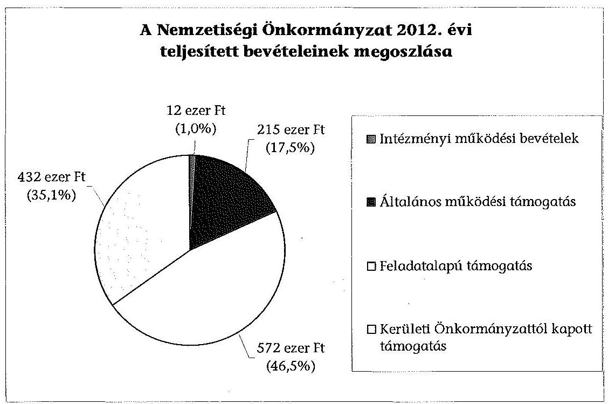
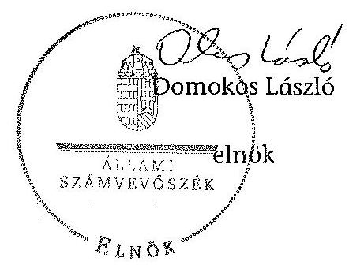

# ÁLLAMI   SZÁMVEVŐSZÉK 

## JELENTÉS

a helyi nemzetiségi önkormányzatok gazdálkodásának ellenőrzéséről
Budapest Főváros XVI. Kerületi Lengyel Önkormányzat

---

Állami Számvevőszék
Iktatószám: V-0284-013/2014.
Témaszám: 1317
Vizsgálat-azonosító szám: V065237
Az ellenőrzést felügyelte:
Horváth Balázs
felügyeleti vezető
Az ellenőrzést vezette és az ellenőrzés végrehajtásáért felelős:
Kisgergely István
ellenőrzésvezető
A számvevőszéki jelentést készítették és a jelentés összeállításában
közreműködtek:
Belovai Sándorné
számvevő főtanácsos
Varga József
számvevő tanácsos
Az ellenőrzést végezte:
Rábai György
számvevő

---

# TARTALOMJEGYZÉK 

BEVEZETÉS ..... 3
I. ÖSSZEGZŐ MEGÁLLAPÍTÁSOK, KÖVETKEZTETÉSEK, JAVASLATOK ..... 6
II. RÉSZLETES MEGÁLLAPÍTÁSOK ..... 14

1. A Nemzetiségi Önkormányzat és a XVI. Kerületi Önkormányzat együttműködésének szabályozása, a működési feltételek biztosítása ..... 14
2. A gazdálkodási feladatok ellátásának szabályszerűsége ..... 15
2.1. A költségvetésre és a zárszámadásra, valamint a kincstári adatszolgáltatás rendjére vonatkozó jogszabályi előírások betartása ..... 15
2.2. A Nemzetiségi Önkormányzat gazdálkodásának szabályozottsága ..... 16
2.3. Az operatív gazdálkodási jogkörök kialakítása, gyakorlása ..... 16
3. A Nemzetiségi Önkormányzattal összefüggő gazdálkodási feladatok belső ellenőrzése ..... 18
4. A feladatalapú támogatás felhasználásának, elszámolásának szabályszerűsége, a Nemzetiségi Önkormányzat feladatellátása ..... 19
MELLÉKLET
5. számú A Nemzetiségi Önkormányzat 2012. évi gazdálkodásának főbb adatai, mutatói
FÜGGELÉKEK
6. számú Rövidítések jegyzéke
7. számú Értelmező szótár
8. számú A gazdálkodás értékelésének módszere

---

.

---

# JELENTÉS   a helyi nemzetiségi önkormányzatok gazdálkodásának ellenőrzéséről Budapest Főváros XVI. Kerületi Lengyel Önkormányzat 

## BEVEZETÉS

A Nemzetiségi Önkormányzat 2008. évben alakult, elnöke az alapítás óta látja el feladatát. A Nemzetiségi Önkormányzat intézményt, gazdasági társaságot és más szervezetet nem alapított. A négytagú Képviselő-testület munkája segítésére bizottságot nem hozott létre. A Nemzetiségi Önkormányzat költségvetési beszámolója szerint a 2012. évben a módosított költségvetési bevételi és kiadási előirányzata 1231 ezer Ft, a teljesített költségvetési bevétele 1231 ezer Ft, a teljesített költségvetési kiadása 931 ezer Ft volt. A 2012. évi gazdálkodási adatokat részletesen az 1. számú mellékletben mutatjuk be.

Az Alaptörvény XXIX. cikk (1) bekezdése szerint a Magyarországon élő nemzetiségek államalkotó tényezők. Minden, valamely nemzetiséghez tartozó magyar állampolgárnak joga van önazonossága szabad vállalásához és megőrzéséhez. A hazánkban élő nemzetiségek helyi (települési és területi), valamint országos önkormányzatokat hozhatnak létre. A helyi nemzetiségi önkormányzatok gazdálkodási feladatait jogszabályi előírás alapján a székhely szerinti helyi önkormányzat polgármesteri hivatala látja el.

A nemzetiségek helyzete, támogatása mind hazai, mind EU-s szinten kiemelt figyelmet kap napjainkban. A helyi nemzetiségi önkormányzatok gazdálkodására és támogatási rendszerére vonatkozó jogszabályok a 2010-2012. években jelentős változásokon mentek át. A települési és területi nemzetiségi önkormányzatok gazdálkodásának, a részükre juttatott költségvetési támogatások felhasználásának ellenőrzését az ÁSZ a 2012. évben sorozatjellegű ellenőrzés keretében indította el. A 2013. évi ellenőrzések e témacsoportos ellenőrzések folytatását jelentik, amelyet az ÁSZ 2014 első félévi ellenőrzési terve 12. témaszámon tartalmaz.

Az ellenőrzés célja annak értékelése volt, hogy a Nemzetiségi Önkormányzat gazdálkodási kereteinek kialakítása, gazdálkodása és feladatellátása megfelelt-e a jogszabályoknak.

---

Ennek keretében értékeltük, hogy:

- a Nemzetiségi Önkormányzat és a XVI. Kerületi Önkormányzat együttműködésének szabályozása, a működési feltételek biztosítása megfelelt-e a jogszabályi előírásoknak;
- a Nemzetiségi Önkormányzat és a XVI. Kerületi Önkormányzat együttműködése megfelelt-e a közöttük létrejött megállapodásnak a gazdálkodási feladatok szabályszerű ellátása során, ennek keretében betartották-e a helyi nemzetiségi önkormányzat gazdálkodásához kapcsolódóan a költségvetésre és zárszámadásra, a gazdálkodás szabályozására, az operatív gazdálkodási jogkörök gyakorlására vonatkozó jogszabályi előírásokat;
- a jegyző biztosította-e a Nemzetiségi Önkormányzat gazdálkodásának belső ellenőrzését;
- a Nemzetiségi Önkormányzat feladatalapú támogatásának felhasználása, a folyósított feladatalapú támogatással történő elszámolás az előírásoknak megfelelő volt-e;
- a Nemzetiségi Önkormányzat feladatellátása összhangban volt-e a vonatkozó jogszabályi előírásokkal.

Az ellenőrzés várható hasznosulását négy szinten tervezzük. A törvényalkotás számára összegzett tapasztalatok állnak rendelkezésre a nemzetiségi önkormányzatok testületi döntéseinek, gazdálkodásának és a feladatalapú támogatás felhasználásának szabályszerűségéről, amelynek alapján következtetést lehet levonni arra, hogy indokolt-e jogszabályi módosítás kezdeményezése. Az ellenőrzés az ellenőrzött számára visszajelzést ad a működésében fellépő hiányosságokról, javaslataival hozzájárul azok kiküszöböléséhez, amely csökkentheti a későbbi ellenőrzések gyakoriságát. Az ellenőrzés megállapításai és javaslatai tanulságul szolgálhatnak más nemzetiségi önkormányzatok, szervezetek számára a rendezett gazdálkodási keretek kialakításához. A társadalom számára jelzi, hogy közpénz nem maradhat ellenőrizetlenül, az ÁSZ értékteremtő rend kialakításához és megőrzéséhez hozzájáruló tevékenysége pozitív hatással lesz a szervezetről kialakított összkép formálásában. Az ÁSZ szervezetén belül lehetőség nyílik arra, hogy a megállapítások szintetizálásával az intézmény a hozzáadott értéket teremtő elemző tevékenységét és tanácsadó szerepét erősítse.

A Nemzetiségi Önkormányzat gazdálkodásának ellenőrzéséről szóló jelentés I. fejezetének összegző része az ellenőrzés céljára adott rövid, szintetizáló összefoglalót és következtetéseket tartalmazza a II. fejezet részletes megállapításain alapulóan. A jelentés intézkedést igénylő megállapításait és javaslatait - az összegzőben foglaltak mellett - az ellenőrzés során feltárt, a jelentés II. fejezetében rögzített részletes megállapítások alapozzák meg, illetve támasztják alá.

Az ellenőrzés típusa: szabályszerűségi ellenőrzés
Az ellenőrzött időszak: a 2012. január 1. - 2012. december 31. közötti időszak. Az ellenőrzés kiterjedt a helyi nemzetiségi önkormányzatnak juttatott 2012. évi támogatás 2013. évben való elszámolására is.

---

Ellenőrzött szervezet: a Budapest Főváros XVI. Kerületi Lengyel Önkormányzat és a gazdálkodási feladatait ellátó Budapest Főváros XVI. Kerületi Önkormányzat.

Az ellenőrzés végrehajtásának jogszabályi alapját az ÁSZ tv. 5. § (2)-(3) és (6) bekezdéseiben foglaltak képezik.

Az ellenőrzés szakmai módszertana az ÁSZ hivatalos honlapján (www.asz.hu) közzétett szakmai szabályokon alapult, amely a Legfőbb Ellenőrző Intézmények Nemzetközi Szervezete (INTOSAI) által kiadott nemzetközi standardok (ISSAI) figyelembevételével készült.

A helyi nemzetiségi önkormányzatok gazdálkodásának ellenőrzése során értékeltük a XVI. Kerületi Önkormányzat és a Nemzetiségi Önkormányzat együttműködésének, a gazdálkodás szabályozottságának és a pénzügyi folyamatokban kulcsszerepet betöltő belső kontrollok (teljesítésigazolás és érvényesítés) működésének megfelelőségét. A kulcskontrollokat a működési és felhalmozási célú támogatásértékű kiadásoknál, az államháztartáson kívülre teljesített működési és felhalmozási célú pénzeszköz átadásoknál, a dologi kiadásokkal kapcsolatos kifizetéseknél - véletlen mintavételi eljárást alkalmazva - ellenőriztük. Ellenőriztük, hogy a jegyző biztosította-e a Nemzetiségi Önkormányzat gazdálkodásának belső ellenőrzését. Értékeltük a feladatalapú támogatások felhasználásának, elszámolásának szabályszerűségét, a Nemzetiségi Önkormányzat feladatellátása és a jogszabályi előírások összhangját.

Az ellenőrzés lefolytatásához a Nemzetiségi Önkormányzat és a gazdálkodási feladatait ellátó XVI. Kerületi Önkormányzat a tanúsítványok és a kapcsolódó, dokumentumjegyzékben megjelölt dokumentumok elektronikus úton történő megküldésével, rendelkezésre bocsátásával szolgáltatott adatokat. Az adatszolgáltatás kontrollálása és szükség szerinti javítása a helyszíni ellenőrzés keretében történt. A minősítési szempontokat a 3. számú függelék tartalmazza.

Az ÁSZ tv. 29. § (1) bekezdése szerint a jelentéstervezetet megküldtük észrevételezésre a polgármesternek és a Nemzetiségi Önkormányzat elnökének. A polgármester és a Nemzetiségi Önkormányzat elnöke az ÁSZ tv. 29. § (2) bekezdésében foglalt észrevételezési jogával nem élt, a jelentéstervezetre észrevételt nem tett.

---

# I. ÖSSZEGZŐ MEGÁLLAPÍTÁSOK, KÖVETKEZTETÉSEK, JAVASLATOK 

A Nemzetiségi Önkormányzat és a XVI. Kerületi Önkormányzat együttműködésének szabályozása részben felelt meg a jogszabályi előírásoknak. A 2012. évben az együttműködési megállapodás ${ }_{1,2}$ volt hatályban, azonban az együttműködési megállapodás ${ }_{1}$-et a Nek. ${ }_{2}$ tv. előírása ellenére 2012. január 31-éig nem vizsgálták felül és nem történt meg a kiegészítése 2012. június 1-jéig. Az együttműködési megállapodás ${ }_{2}$ aláírása a Nek. ${ }_{2}$ tv.-ben előírt határidőhöz képest 4 nappal később, 2012. június 5-én történt meg, záró rendelkezései szerinti, 2012. július 1-ei hatályba lépéssel. Az együttműködési megállapodás ${ }_{2}$ aláírásával az együttműködési megállapodás ${ }_{1}$ hatályát vesztette. A Nemzetiségi Önkormányzat a 2012. június 6-a és június 30-a közötti időszakban is rendelkezett a működésére vonatkozó hatályos, az operatív gazdálkodás szabályait is rögzítő Számviteli politikával. Az együttműködési megállapodás ${ }_{2}$ tartalmazta az Áht. ${ }_{2}$-ben előírt tervezési, finanszírozási és adatszolgáltatási feladatok ellátását, azonban nem tartalmazta a Nek. ${ }_{2}$ tv.-ben előírt teljesítésigazolásra illetve a kötelezettségvállalások nyilvántartásának vezetési kötelezettségeit, valamint a Nemzetiségi Önkormányzat testületi ülésein a jegyző megbízásából résztvevő személy képesítési követelményeit. Az együttműködési megállapodás ${ }_{2}$ szerinti működési feltételeket a Nek. ${ }_{2}$ tv.-ben foglaltak ellenére a megállapodás megkötését követő harminc napon belül nem vezették át a Nemzetiségi Önkormányzat SZMSZ-ében. A szabályozási hiányosságok ellenére a XVI. Kerületi Önkormányzat a Nemzetiségi Önkormányzat részére biztosította működésének a Nek. ${ }_{2}$ tv.-ben foglalt személyi és tárgyi feltételeit a 2012. évben.

A Nemzetiségi Önkormányzat 2012. évi költségvetésével, zárszámadásával, a kapcsolódó kincstári adatszolgáltatással összefüggésben ellátott feladatok megfeleltek a jogszabályi előírásoknak. A Nemzetiségi Önkormányzat elnöke a 2012. évi költségvetés tervezetét az Áht. ${ }_{2}$ előírásainak megfelelően határidőben benyújtotta a Képviselő-testületnek, amelyet az elfogadott. A költségvetési határozattervezet előterjesztésekor tájékoztatásul - szöveges indoklással - nem mutatták be az Áht. ${ }_{2}$-ben előírt költségvetési mérleget közgazdasági tagolásban, csak az előirányzat-felhasználási tervet. A jegyző által elkészített 2012. évi zárszámadási határozat tervezetének előterjesztésekor a Képviselőtestületnek tájékoztatásul bemutatták az Áht. ${ }_{2}$-ben előírt mérlegeket és kimutatásokat. A zárszámadás és az elfogadott költségvetés összehasonlíthatóságát biztosították, a zárszámadás a Nemzetiségi Önkormányzat valamennyi bevételét és kiadásait tartalmazta. A jegyző az ellenőrzött időszakban az Áhsz. ${ }_{1}$-ben és az Ávr.-ben előírt, a Nemzetiségi Önkormányzatra vonatkozó kincstári adatszolgáltatási kötelezettségeit az előírt határidőben teljesítette.

A Nemzetiségi Önkormányzat gazdálkodásának szabályozottsága nem volt megfelelő. A Nemzetiségi Önkormányzat rendelkezett a Számv. tv. által előírt Számviteli politikával és a hozzá kapcsolódó, gazdálkodásának végrehajtási feladatait előíró szabályzatokkal. Az operatív gazdálkodásra vonatkozó, a Számviteli politikába foglalt szabályozás az Ávr. előírásai ellenére nem tartalmazta a teljesítésigazolás gyakorlásának módjával, eljárási és dokumentációs

---

részletszabályaival, a teljesítésigazolást végző személyek kijelölésével, valamint a 100 ezer Ft alatti, előzetes írásbeli kötelezettségvállalást nem igénylő kifizetések rendjét. A XVI. Kerületi Önkormányzat Polgármesteri Hivatala rendelkezett a Bkr.-ben előírt ellenőrzési nyomvonallal és a szabálytalanságok kezelésének eljárásrendjével, de azok hatályát a Nemzetiségi Önkormányzat gazdálkodásának végrehajtási feladataira nem terjesztették ki, azokkal a Nemzetiségi Önkormányzat önállóan sem rendelkezett. A Polgármesteri Hivatal SZMSZ-ében rögzítették a tervezéssel, gazdálkodással, - annak részeként a pénzügyi ellenjegyzéssel, az érvényesítéssel, az ezeket végző személyek kijelölésével, - az ellenőrzési és adatszolgáltatási feladatok teljesítésével kapcsolatos belső előírásokat, azonban az Ávr. előírásával ellentétben nem szabályozták az SZMSZ-ben nevesített munkakörökhöz tartozó - a Nemzetiségi Önkormányzat gazdálkodásának végrehajtásával kapcsolatos - feladat- és hatáskörökre, a hatáskörök gyakorlásának módjára, a helyettesítés rendjére vonatkozó előírásokat.

A Nemzetiségi Önkormányzat gazdálkodása tekintetében az operatív gazdálkodási jogkörök kialakítása részben felelt meg a jogszabályi előírásoknak, mert az Áht. ${ }_{2}$ és az Ávr. előírásai ellenére hiányosan szabályozta a teljesítés-igazolást, nem állt rendelkezésre a teljesítésigazoló aláírás-mintája és a Nemzetiségi Önkormányzat által vállalt kötelezettségekről nem vezették az Ávr.-ben előírt nyilvántartást. A jegyző az Ávr. előírásainak megfelelően szabályszerűen jelölte ki a pénzügyi ellenjegyzésre és az érvényesítésre jogosultakat, mert a XVI. Kerületi Önkormányzat az ellenőrzött időszakban nem rendelkezett gazdasági szervezettel.

A Nemzetiségi Önkormányzatnál a 2012. évben államháztartáson kívülre történt pénzeszköz átadás teljesítése során a teljesítésigazolás és az érvényesítés kulcskontrollok működése nem felelt meg az Ávr. előírásainak, mert nem jelölték ki írásban a teljesítésigazolót. Az érvényesítő összegszerűségre vonatkozó ellenőrzése nem a teljesítésigazoláson alapult, az Ávr.-ben előírt kötelezettségvállalási nyilvántartás hiányában nem ellenőrizte
 a fedezet rendelkezésre állását és nem végezte el a formai szabályok betartásának ellenőrzését. Érvényesítéskor az Ávr. előírásainak ellenére elmaradt a belső szabályzatban foglalt előírások ellenőrzése, mert az érvényesítő nem észrevételezte, hogy a teljesítésigazolást írásbeli kijelöléssel nem rendelkező személy végezte.

A Nemzetiségi Önkormányzatnál a 2012. évben a dologi kiadások teljesítése során a teljesítésigazolás és az érvényesítés kulcskontrollok működésének megfelelősége gyenge volt, a hibák száma a lényegességi szintet, a kritikus hibahatárt elérte. Az Ávr. előírásai ellenére a teljesítés igazoló nem rendelkezett írásbeli kijelöléssel. Az érvényesítő nem jelezte az utalványozónak, hogy a teljesítésigazolás szabálytalan volt, továbbá nem észrevételezte az Ávr.-ben előírt kötelezettségvállalási nyilvántartás vezetésének hiányát. A dologi kiadások közül kiválasztott három legnagyobb összegű kifizetés esetében a teljesítésigazolás és az érvényesítés kulcskontrollok működése nem volt megfelelő, a hiányosságok megegyeztek a dologi kiadások ellenőrzésénél leírtakkal.

A Nemzetiségi Önkormányzatnál a számvevőszéki ellenőrzés a rendelkezésre bocsátott bizonylatok alapján a kifizetések dokumentumainak ellenőrzése alapján összeférhetetlenséget, illetve jogosulatlan kifizetést nem tárt fel, a

---

kulcskontrollok működéséhez kapcsolódó hiányosságok miatt azonban nem biztosították a hibák megelőzését, feltárását és kijavítását.

A Nemzetiségi Önkormányzat gazdálkodási feladatainak belső ellenőrzése megfelelő volt. Az együttműködési megállapodás ${ }_{1,2}$-ben rögzítették, hogy a Polgármesteri Hivatal belső ellenőrzési tevékenysége kiterjedt a Nemzetiségi Önkormányzat számviteli nyilvántartásainak ellenőrzésére. A Polgármesteri Hivatal 2012. évi belső ellenőrzési terve tartalmazta a kerületben működő nemzetiségi önkormányzatok gazdálkodásának 2010-2011. évekre vonatkozó ellenőrzését, de azt a Ber.-ben foglaltak ellenére nem alapozták meg kockázatelemzéssel. A tervezett ellenőrzést elvégezték, az ellenőrzési jelentés hiányosságokat állapított meg, javaslatokat tett, de azoknak nem volt címzettje, nem tartalmazta, hogy mely nemzetiségi önkormányzatokra vonatkoznak a megállapítások. A jegyző a Nemzetiségi Önkormányzatot érintő belső ellenőrzés megállapításairól annak elnökét és a Képviselő-testületét nem tájékoztatta, ezért a belső ellenőrzési jelentés elkészítésekor hatályos együttműködési megállapodás ${ }_{1} 6$. pontjában foglalt realizálási feladatainak végrehajtása elmaradt. A feltárt hiányosságok miatt a belső ellenőrzési tevékenység részben hasznosult a Nemzetiségi Önkormányzat operatív gazdálkodási feladatainak végrehajtásában.

A Nemzetiségi Önkormányzat részére 2011. és 2012. évben folyósított feladatalapú támogatás elszámolása nem felelt meg a jogszabályi előírásoknak. A 2011. évi feladatalapú támogatásból maradvány nem keletkezett. A 2012. évben folyósított 572 ezer Ft feladatalapú támogatásból 2012. december 31-ei 19 ezer Ft maradvány nem volt kötelezettségvállalással terhelt, a Nemzetiségi Önkormányzat nem tett eleget az Áht. ${ }_{2}$-ben előírtaknak, a meghatározott célra fel nem használt támogatás maradványáról haladéktalanul nem mondott le, és nem fizette vissza azt a központi költségvetés javára. A feladatalapú támogatásokról a támogatási kormányrendelet ${ }_{1,2}$ előírása alapján az Áht. ${ }_{1,2}$-ben foglaltak ellenére az elszámolások nem történtek meg, a támogatások felhasználását, elszámolását az ellenőrzésre jogosult szervek nem ellenőrizték.
2012. évben a Nemzetiségi Önkormányzat - a képviselt közösség kulturális autonómiájának megerősítése érdekében, helyi egyházi szervezetek kapcsolattartásával, valamint kulturális önigazgatással összefüggő - kötelező és önként vállalt feladatellátásának tárgya összhangban volt a Nek. ${ }_{2}$ tv. 115. § -ában és a 116. §-ában foglalt előírásokkal.

Az ÁSZ tv. 33. § (1) bekezdésében foglaltak értelmében az ellenőrzött szervezet vezetője köteles a jelentésben foglalt megállapításokhoz kapcsolódó intézkedési tervet összeállítani és azt a jelentés kézhezvételétől számított 30 napon belül az ÁSZ részére megküldeni. Amennyiben az intézkedési tervet határidőre nem küldi meg a szervezet, vagy az nem elfogadható, az ÁSZ elnöke az ÁSZ tv. 33. § (3) bekezdés a)-b) pontjaiban foglaltakat érvényesítheti.

---

A helyszíni ellenőrzés megállapításainak hasznosítása mellett javasoljuk:

# a jegyzőnek 

1. az együttműködés szabályozásával kapcsolatban

Az együttműködési megállapodás ${ }_{1}$-t a Nek. ${ }_{2}$ tv. 80. § (2) bekezdésének előírása ellenére 2012. január 31-éig nem vizsgálták felül.

A Nek. ${ }_{2}$ tv. 80. § (3) bekezdésének b)-d) pontjaiban foglaltak ellenére az együttműködési megállapodás ${ }_{2}$-ben nem rögzítették a szakmai teljesítésigazolási feladatok eljárási és dokumentációs részletszabályait, a teljesítésigazolást végző feladatait, a felelősök konkrét kijelölését, továbbá nem írták elő a kötelezettségvállalások nyilvántartásának vezetését. A Nek. ${ }_{2}$ tv. 80. § (4) bekezdésében foglaltak ellenére az együttműködési megállapodás ${ }_{2}$ nem tartalmazta a testületi ülésen a jegyző megbízásából résztvevő személy képesítési követelményét.

A Nek. ${ }_{2}$ tv. 80. § (2) bekezdésében foglaltak ellenére az együttműködési megállapodás ${ }_{2}$ szerinti működési feltételeket nem rögzítették a Nemzetiségi Önkormányzat SZMSZ-ében.

Javaslat:
Az együttműködés szabályszerűsége érdekében:
a) biztosítsa a jövőben az együttműködési megállapodás évenkénti felülvizsgálata során a Nek. ${ }_{2}$ tv. 80. § (2) bekezdésében előírt határidő betartását;
b) készítse elő az együttműködési megállapodás ${ }_{2}$ módosítását, hogy az tartalmilag feleljen meg a Nek. ${ }_{2}$ tv. 80. § (3) bekezdés b)-d) pontjaiban, valamint a Nek. ${ }_{2}$ tv. 80. § (4) bekezdésében foglalt előírásoknak;
c) készítse elő a Nemzetiségi Önkormányzat SZMSZ-ének a Nek. ${ }_{2}$ tv. 80. § (2) bekezdésében foglalt előírás alapján történő kiegészítését.
2. a költségvetés előterjesztésével kapcsolatban

A 2012. évi költségvetési határozat-tervezet előterjesztésekor - a jegyző mulasztása miatt - az Áht. ${ }_{2}$ 24. § (4) bekezdés a) pontjában előírtak ellenére nem mutatták be a Képviselő-testületnek tájékoztatásul - szöveges indoklással - a Nemzetiségi Önkormányzat költségvetési mérlegét közgazdasági tagolásban.

Javaslat
Készítse elő a jövőben a költségvetési határozattervezet előterjesztéséhez a Képviselő-testület tájékoztatására az Áht. ${ }_{2}$ 24. § (4) bekezdés a) pontja előírásainak megfelelően a költségvetési mérleget közgazdasági tagolásban szöveges indoklással együtt.

---

3. a gazdálkodási feladatok szabályozottságával kapcsolatban

A Polgármesteri Hivatal SZMSZ-e nem tartalmazta az Ávr. 13. § (1) bekezdés g) pontjában foglaltak szerinti, az SZMSZ-ben nevesített munkakörökhöz tartozó - a Nemzetiségi Önkormányzat gazdálkodásának végrehajtásával kapcsolatos - feladat- és hatáskörökre, a hatáskörök gyakorlásának módjára, a helyettesítés rendjére, az ezekhez kapcsolódó felelősségi szabályokra vonatkozó előírásokat. A Bkr. 6. § (3)-(4) bekezdései szerinti ellenőrzési nyomvonal és szabálytalanságok kezelésének eljárásrendje nem terjedt ki a Nemzetiségi Önkormányzat gazdálkodásának végrehajtási feladataira, azokkal a Nemzetiségi Önkormányzat önállóan sem rendelkezett.

A Számviteli politikában az operatív gazdálkodásra vonatkozó feladatok végrehajtási szabályai az Ávr. 53. § (2) bekezdésben foglaltak ellenére nem tartalmazták a 100 ezer Ft alatti kötelezettségvállalással, a teljesítésigazolás gyakorlásának módjával, eljárási és dokumentációs részletszabályaival, valamint a teljesítésigazolást végző személyek kijelölésével kapcsolatos rendelkezéseket.

Javaslat
A gazdálkodás szabályszerűsége érdekében a Nemzetiségi Önkormányzat gazdálkodásának végrehajtására is kiterjedően:
a) készítse el a Polgármesteri Hivatal SZMSZ-ének módosítását, hogy az tartalmazza az Ávr. 13. § (1) bekezdés g) pontjában foglaltakat;
b) módosítsa a Polgármesteri Hivatal Bkr. 6. § (3)-(4) bekezdései szerinti ellenőrzési nyomvonalát és a szabálytalanságok kezelése eljárásrendjének hatályát;
c) egészítse ki a Számviteli politika operatív gazdálkodási feladatokra vonatkozó végrehajtási szabályait az Ávr. 53. § (2) bekezdésben foglaltaknak megfelelően.
4. a kulcskontrollok működésével kapcsolatban

A teljesítésigazolást az Ávr. 57. § (4) bekezdése szerinti szabályszerű kijelöléssel nem rendelkező személy végezte, valamint hiányzott a teljesítésigazoló az Ávr. 60. § (3) bekezdésben előírt aláírás-mintája, ezért az Ávr. 57. § (3) bekezdésében foglaltak ellenére nem szabályszerűen történt a kifizetés jogosságának, összegszerűségének igazolása.

Az érvényesítő az Ávr. 58. § (1) bekezdése ellenére nem látta el feladatát, mert az összegszerűségre vonatkozó ellenőrzése nem szabályszerű teljesítésigazoláson alapult, nem ellenőrizte a fedezet rendelkezésre állását és a megelőző ügymenetben a jogszabályi előírások betartását. Nem jelezte az utalványozónak az Ávr. 58. § (2) bekezdés előírása ellenére, hogy a teljesítésigazolások szabálytalanul történtek, a kötelezettségvállalási nyilvántartást nem vezették, továbbá nem állt rendelkezésre a teljesítésigazoló aláírás mintája.

---

# Javaslat 

Az operatív gazdálkodás működési hibáinak megelőzése, feltárása és kijavítása érdekében gondoskodjon arról, hogy:
a) a teljesítésigazolást az Ávr. 57. § (4) bekezdése szerinti szabályszerű kijelöléssel és az Ávr. 60. § (3) bekezdésben előírt aláírás-mintával rendelkező személy minden esetben az Ávr. 57. § (3) bekezdéseiben előírtaknak megfelelően végezze;
b) az érvényesítő maradéktalanul tegyen eleget az Ávr. 58. § (1)-(2) bekezdéseiben előírt ellenőrzési és jelzési kötelezettségének.
5. a feladatalapú támogatás elszámolásával kapcsolatban

A 2011. évi feladatalapú támogatás elszámolása a támogatási kormányrendelet ${ }_{1}$ 7. § (2) bekezdésében hivatkozott, valamint a 2012. évi feladatalapú támogatás elszámolása a támogatási kormányrendelet ${ }_{2}$ 8. § (5) bekezdésében hivatkozott „a helyi önkormányzatok elszámolási és ellenőrzési rendjére vonatkozó jogszabályok rendelkezései alkalmazandóak" előírása alapján az Áht. ${ }_{1}$ 64. § (7) bekezdése, és az Áht. ${ }_{2}$ 57. § (3) bekezdése ellenére nem történt meg.

Javaslat
Intézkedjen az Áht. ${ }_{2}$ 27. § (2) bekezdésében meghatározott feladatkörében a Nemzetiségi Önkormányzat által igénybe vett 2011. évi és 2012. évi feladatalapú támogatás felhasználásáról szóló elszámolás elkészítéséről, az Áht. ${ }_{2}$ 53. § (1) bekezdése szerinti beszámolási kötelezettség teljesítéséhez.

## a polgármesternek

A Nek. ${ }_{2}$ tv. 80. § (3) bekezdésének b)-d) pontjaiban foglaltak ellenére az együttműködési megállapodás ${ }_{2}$-ben nem rögzítették a teljesítésigazolási feladatok eljárási és dokumentációs részletszabályait, a teljesítésigazolást végző feladatait, a felelősök konkrét kijelölését, továbbá a kötelezettségvállalások nyilvántartásának vezetését. A Nek. ${ }_{2}$ tv. 80. § (4) bekezdésében foglaltak ellenére az együttműködési megállapodás ${ }_{2}$ nem tartalmazta a testületi ülésen a jegyző megbízásából résztvevő személy képesítési követelményeit.

A Polgármesteri Hivatal SZMSZ-e nem tartalmazta az Ávr. 13. § (1) bekezdés g) pontjában foglaltak szerinti, az SZMSZ-ben nevesített munkakörökhöz tartozó - a Nemzetiségi Önkormányzat gazdálkodásának végrehajtásával kapcsolatos - feladat- és hatáskörökre, a hatáskörök gyakorlásának módjára, a helyettesítés rendjére, az ezekhez kapcsolódó felelősségi szabályokra vonatkozó előírásokat.

Javaslat
Terjessze a XVI. Kerületi Önkormányzat Képviselő-testülete elé jóváhagyásra:
a) az együttműködési megállapodás jegyző által előkészített módosítását, hogy az tartalmilag megfeleljen a Nek. ${ }_{2}$ tv. 80. § (3) bekezdés b)-d) pontjaiban, valamint a Nek. ${ }_{2}$ tv. 80. § (4) bekezdésében foglalt előírásoknak;

---

b) a Polgármesteri Hivatal SZMSZ-ének a jegyző által elkészített módosítását, hogy az tartalmazza - a Nemzetiségi Önkormányzat gazdálkodásának végrehajtására vonatkozóan - az Ávr. 13. § (1) bekezdés g) pontjában foglaltakat.

# a Nemzetiségi Önkormányzat elnökének 

1. A Nek. 2 tv. 80. § (3) bekezdésének b)-d) pontjaiban foglaltak ellenére az együttműködési megállapodás ${ }_{2}$-ben nem rögzítették a teljesítésigazolási feladatok eljárási és dokumentációs részletszabályait, a teljesítésigazolást végző feladatait, a felelősök konkrét kijelölését, továbbá a kötelezettségvállalások nyilvántartásának vezetését. A Nek. 2 tv. 80. § (4) bekezdésében foglaltak ellenére az együttműködési megállapodás ${ }_{2}$ nem tartalmazta a testületi ülésen a jegyző megbízásából résztvevő személy képesítési követelményeit.

A Nek. 2 tv. 80. § (2) bekezdésében foglaltak ellenére az együttműködési megállapodás ${ }_{2}$ szerinti működési feltételeket nem rögzítették a Nemzetiségi Önkormányzat SZMSZ-ében.

Javaslat
Terjessze a Képviselő-testület elé jóváhagyásra:
a) a jegyző által előkészített együttműködési megállapodás ${ }_{2}$ módosítását, hogy az tartalmilag megfeleljen a Nek. 2 tv. 80. § (3) bekezdés b)-d) pontjaiban, valamint a Nek. 2 tv. 80. § (4) bekezdésében foglalt előírásoknak;
b) a Nemzetiségi Önkormányzat SZMSZ-ének jegyző által előkészített módosítását, hogy az megfeleljen a Nek. 2 tv. 80. §
 (2) bekezdésében előírtaknak.
2. A Nemzetiségi Önkormányzat elnöke a 2012. évi költségvetés előterjesztésekor - a jegyző mulasztása miatt - a Képviselő-testület részére tájékoztatásul az Áht. 2. 24. § (4) bekezdés a) pontjában előírtak ellenére nem mutatta be szöveges indoklással a Nemzetiségi Önkormányzat költségvetési mérlegét közgazdasági tagolásban.

Javaslat
A jövőben a költségvetési határozattervezet Képviselő-testület elé terjesztésekor tájékoztatásul mutassa be - szöveges indoklással együtt - a jegyző által előkészített, az Áht. 2. 24. § (4) bekezdés a) pontjában előírt költségvetési mérleget közgazdasági tagolásban.
3. A Nemzetiségi Önkormányzat elnöke, mint kötelezettségvállaló, az Ávr. 57. § (4) bekezdésében foglalt előírások ellenére nem jelölt ki írásban teljesítésigazolókat.

Javaslat
Jelölje ki az Ávr. 57. § (4) bekezdésében foglalt előírásoknak megfelelően írásban a teljesítésigazolókat.

---

4. A 2011. évi feladatalapú támogatás elszámolása a támogatási kormányrendelet ${ }_{1}$ 7. § (2) bekezdésében hivatkozott, valamint a 2012. évi feladatalapú támogatás elszámolása a támogatási kormányrendelet ${ }_{2}$ 8. § (5) bekezdésében hivatkozott „a helyi önkormányzatok elszámolási és ellenőrzési rendjére vonatkozó jogszabályok rendelkezései alkalmazandóak" előírása alapján az Áht. ${ }_{1}$ 64. § (7) bekezdése és az Áht. ${ }_{2}$ 57. § (3) bekezdése ellenére nem történt meg.

Javaslat
Terjessze a Képviselő-testület elé az Áht. ${ }_{2}$ 53. § (1) bekezdése szerinti beszámolási kötelezettség teljesítéséhez összeállított, a Nemzetiségi Önkormányzat által igénybevett 2011. és 2012. évi feladatalapú támogatás felhasználásáról szóló elszámolást.
5. A Nemzetiségi Önkormányzat nem tett eleget az Áht. ${ }_{2}$ 57. § (2) bekezdésében előírtaknak azáltal, hogy a meghatározott célra fel nem használt 2012. évi feladatalapú támogatás 2012. december 31-éig kötelezettségvállalással nem terhelt 19 ezer Ft összegű maradványáról nem mondott le és nem fizette vissza azt a központi költségvetés javára.

Javaslat
Terjessze a Képviselő-testület elé jóváhagyásra az Áht. ${ }_{2}$ 57/A. § (1) bekezdés előírásának megfelelően a 2012. évi feladatalapú támogatás kötelezettségvállalással nem terhelt 19 ezer Ft összegű maradványáról történő lemondást és intézkedjen a maradvány összegének visszafizetésére a központi költségvetés javára.

---

# II. RÉSZLETES MEGÁLLAPÍTÁSOK 

## 1. A Nemzetiségi Önkormányzat És a XVI. Kerületi Önkormányzat Együttműködésének Szabályozása, a Működési Feltételek Biztosítása

A Nemzetiségi Önkormányzat és a XVI. Kerületi Önkormányzat együttműködésének szabályozása részben felelt meg a jogszabályi előírásoknak. A 2012. évben az együttműködési megállapodás ${ }_{1,2}$ volt hatályban.

Az együttműködési megállapodás ${ }_{1}$ felülvizsgálatát a Nek. ${ }_{2}$ tv. 80. § (2) bekezdésében előírtak ellenére 2012. január 31-éig nem végezték el, és kiegészítése sem történt meg 2012. június 1-jéig a Nek. ${ }_{2}$ tv. 159. § (3) bekezdése alapján. Az együttműködési megállapodás ${ }_{2}$ aláírása 2012. június 5-én került sor, azaz a Nek. tv. 159. § (3) bekezdésében foglalt megállapodás megkötésének kötelezettségét 4 nap késedelemmel teljesítették. Az együttműködési megállapodás ${ }_{2}$ záró rendelkezései szerint annak aláírásával az 2010. évi együttműködési megállapodás ${ }_{1}$ hatályát vesztette, az együttműködési megállapodás ${ }_{2}$ rendelkezéseit csak 2012. július 1-étől kellett alkalmazni. A Nemzetiségi Önkormányzat a 2012. június 6-a és június 30-a közötti időszakban is rendelkezett hatályos, az operatív gazdálkodás szabályait is rögzítő Számviteli politikával. Az együttműködési megállapodás ${ }_{2}$ megkötését a XVI. Kerületi Önkormányzat Képviselő-testülete és a Nemzetiségi Önkormányzat Képviselő-testülete határozataikkal ${ }^{2}$ jóváhagyták.

Az együttműködési megállapodás ${ }_{2}$ a Nemzetiségi Önkormányzat működési feltételeit a Nek. ${ }_{2}$ tv.-ben foglaltaknak részben megfelelően tartalmazta. A Nemzetiségi Önkormányzat nem tett eleget a Nek. ${ }_{2}$ tv. 80. § (2) bekezdésében előírt kötelezettségének, mert az együttműködési megállapodás ${ }_{2}$ megkötését követő 30 napon belül nem rögzítette SZMSZ-ében a megállapodás szerinti működési feltételeket.

Az együttműködési megállapodás ${ }_{2}$ tartalmazta az Áht. ${ }_{2}$ 27. §. (2) bekezdésében előírt tervezési, finanszírozási és adatszolgáltatási feladatok ellátását, azonban az operatív gazdálkodási feladatok ellátásának szabályai közül nem tartalmazta a Nek. ${ }_{2}$ tv. 80. § (3) bekezdésében foglaltak szerint a teljesítésigazolási feladatok eljárási és dokumentációs részletszabályait, a teljesítésigazolást végző felelősök konkrét kijelölését, továbbá nem írták elő a kötelezettségvállalások nyilvántartásának vezetését.

Az együttműködési megállapodás ${ }_{2}$ a Nek. ${ }_{2}$ tv. 80. § (4) bekezdés előírásának megfelelően tartalmazta, hogy a nemzetiségi referens a jegyző megbízásából és képviseletében részt vesz a Nemzetiségi Önkormányzat testületi ülésein és jelzi,

[^0]
[^0]:    ${ }^{1}$ 460/2010. (XII. 8.) Kt., 38/2010. (XI. 2.) LKÖ határozatok
    ${ }^{2}$ 264/2012. (V.30.) Kt., 18/2012. (05. 04.) LÖ határozatok

---

amennyiben törvénysértést észlel, de nem tartalmazta, hogy a Nemzetiségi Önkormányzat ülésein a jegyző megbízásából részt vevő személy képesítésének meg kell felelnie a jegyzőkre előírt képesítési követelményeknek.

Az együttműködési megállapodás ${ }_{2}$-ben rögzítették a belső ellenőrzésre és a felelősségre vonatkozó feltételeket, amely szerint a Polgármesteri Hivatal belső ellenőrzési tevékenysége a Nemzetiségi Önkormányzat esetében a számviteli nyilvántartások ellenőrzésére terjedt ki.
„A Nemzetiségi Önkormányzat számviteli nyilvántartásának ellenőrzésére a Polgármesteri Hivatal szervezetéhez tartozó függetlenített belső ellenőrzés feladatát képezi. A Nemzetiségi Önkormányzat gazdálkodásának biztonságáért a képviselő-testület, szabályszerűségéért az elnök felel. A veszteséges gazdálkodás következményeiért Budapest Főváros XVI. Kerületi Önkormányzat nem tartozik felelősséggel."

A XVI. Kerületi Önkormányzat 2012-ben - a szabályozási hiányosságok ellenére - gondoskodott a Nek. ${ }_{2}$ tv. szerinti működés személyi- és tárgyi feltételeinek biztosításáról a Nemzetiségi Önkormányzat számára.

# 2. A GAZDÁLKODÁSI FELADATOK ELLÁTÁSÁNAK SZABÁLYSZERŰSÉGE 

### 2.1. A költségvetésre és a zárszámadásra, valamint a kincstári adatszolgáltatás rendjére vonatkozó jogszabályi előírások betartása

A Nemzetiségi Önkormányzat működéséhez kapcsolódóan a 2012. évben a költségvetés készítésével, a zárszámadással és a kincstári adatszolgáltatással összefüggésben ellátott feladatok megfeleltek a jogszabályi előírásoknak.

A Nemzetiségi Önkormányzat elnöke a 2012. évi költségvetés tervezetét az Áht. ${ }_{2}$-ben előírt határidőben benyújtotta a Képviselő-testületnek, amelyet az elfogadott. A költségvetési határozattervezet előterjesztésekor tájékoztatásul szöveges indoklással - nem mutatták be az Áht. ${ }_{2}$ 24. § (4) bekezdés a) pontjában előírtak ellenére a Nemzetiségi Önkormányzat költségvetési mérlegét közgazdasági tagolásban, csak az előirányzat-felhasználási tervet.

A jegyző által elkészített 2012. évi zárszámadási határozat tervezetét a Nemzetiségi Önkormányzat elnöke az Áht. ${ }_{2}$-ben előírt határidőn belül terjesztette a Képviselő-testület elé, amelyben tájékoztatásul bemutatták az Áht. ${ }_{2}$-ben foglalt mérlegeket és kimutatásokat. A Képviselő-testület a zárszámadásról határozatot hozott. Az elfogadott költségvetés és a zárszámadás összehasonlíthatóságát biztosították, a zárszámadás a Nemzetiségi Önkormányzat valamennyi bevételét és kiadását tartalmazta.

A jegyző az ellenőrzött időszakban a Nemzetiségi Önkormányzat részére az Áhsz. ${ }_{1}$-ben és az Ávr.-ben előírt 2012. évi adatszolgáltatásokat határidőben teljesítette a Kincstár felé.

---

# 2.2. A Nemzetiségi Önkormányzat gazdálkodásának szabályozottsága 

A Nemzetiségi Önkormányzat gazdálkodásának szabályozottsága az ellenőrzött időszakban nem felelt meg a jogszabályi előírásoknak.

A Nemzetiségi Önkormányzat rendelkezett a Számv. tv által előírt saját Számviteli politikával, és az annak mellékletét képező önálló szabályzatokkal ${ }^{3}$. A Számviteli politikában rögzítették az operatív gazdálkodásra vonatkozó feladatok végrehajtási szabályait is, amelyek azonban az Ávr. 13. § (2) bekezdés a) pontjában foglaltak ellenére nem tartalmazták a teljesítésigazolás gyakorlásának módjával, eljárási és dokumentációs részletszabályaival, valamint a teljesítésigazolást végző személyek kijelölésével kapcsolatos rendelkezéseket. Nem szabályozták az Ávr. 53. § (2) bekezdésben előírt, a 100 ezer Ft alatti, előzetes írásbeli kötelezettségvállalást nem igénylő kifizetések rendjét.

A XVI. Kerületi Önkormányzat Polgármesteri Hivatala rendelkezett a Bkr. 6. § (3)-(4) bekezdéseiben előírt ellenőrzési nyomvonallal és a szabálytalanságok kezelésének eljárásrendjével, de azok hatályát a Nemzetiségi Önkormányzat gazdálkodásának végrehajtási feladataira nem terjesztették ki, ezekkel a szabályzatokkal a Nemzetiségi Önkormányzat önállóan sem rendelkezett.

A Polgármesteri Hivatal SZMSZ-ében a Nemzetiségi Önkormányzatra is kiterjedő hatállyal az Áht. ${ }_{2}$-ben és az Ávr.-ben foglaltak szerint rögzítették a tervezéssel, az operatív gazdálkodással, - annak részeként a pénzügyi ellenjegyzéssel, az érvényesítés, utalványozás gyakorlásának módjával, eljárási és dokumentálási részletszabályaival, valamint az ezeket végző személyek kijelölésének rendjével, - az ellenőrzési és adatszolgáltatási feladatok teljesítésével kapcsolatos belső előírásokat, feltételeket. A Polgármesteri Hivatal SZMSZ-e nem tartalmazta az Ávr. 13. § (1) bekezdés g) pontjában foglaltak szerinti, az SZMSZ-ben nevesített munkakörökhöz tartozó - a Nemzetiségi Önkormányzat gazdálkodásának végrehajtásával kapcsolatos - feladat- és hatáskörökre, a hatáskörök gyakorlásának módjára, a helyettesítés rendjére, az ezekhez kapcsolódó felelősségi szabályokra vonatkozó előírásokat.

### 2.3. Az operatív gazdálkodási jogkörök kialakítása, gyakorlása

A Nemzetiségi Önkormányzat gazdálkodása tekintetében az operatív gazdálkodási jogkörök kialakítása részben felelt meg a jogszabályi előírásoknak.

A jegyző az Áht. ${ }_{2}$ és az Ávr. előírásainak megfelelően írásban kijelölte a Nemzetiségi Önkormányzat kötelezettségvállalásaira és kifizetéseire vonatkozóan a pénzügyi ellenjegyzésre és az érvényesítésre jogosultakat. A kijelölések az ellenőrzés időszakára vonatkozóan jogszerűek voltak, mert a XVI. Kerületi Önkormányzat nem rendelkezett gazdasági szervezettel.

[^0]
[^0]:    ${ }^{3}$ Pénzkezelési Szabályzat, Eszközök és Források Értékelési Szabályzata, Leltározási Szabályzat, Számlarend, Számlatükör.

---

Az operatív gazdálkodási jogkörök kialakítását tartalmazó belső szabályozás azonban hiányos volt, mert:

- a Nemzetiségi Önkormányzat elnöke, mint kötelezettségvállaló az Ávr. 57. § (4) bekezdésében előírtak ellenére írásban nem jelölt ki teljesítésigazolót;
- az Ávr. 60. § (3) bekezdésében előírt aláírás-minta nem állt rendelkezésre a teljesítésigazoló aláírásának azonosításához ${ }^{4}$;
- A Nemzetiségi Önkormányzat által vállalt kötelezettségekről nem vezették az Ávr. 56. § (1) bekezdésében előírt nyilvántartást.

A Nemzetiségi Önkormányzatnál a 2012. évben államháztartáson kívülre teljesített pénzeszköz átadásnál a teljesítésigazolás és az érvényesítés kulcskontrollok működése nem volt megfelelő, mert az Ávr. 58. § (1)-(2) bekezdéseiben foglaltak ellenére az érvényesítő összegszerűségre vonatkozó ellenőrzése nem a szabályszerű teljesítésigazoláson alapult, annak jogszerű ellátását - az Ávr. 60. § (3) bekezdésben előírt aláírás-minta hiányában - nem ellenőrizte és nem jelezte az Ávr. 56. § (1) bekezdésében előírt kötelezettségvállalási nyilvántartás hiányát.

A Nemzetiségi Önkormányzatnál a 2012. évben a dologi kiadások teljesítése során a teljesítésigazolás és az érvényesítés kulcskontrollok működése gyenge volt, a hibák száma a lényegességi szintet, a kritikus hibahatárt elérte, mert:

- a teljesítés igazolását az Ávr. 57. § (4) bekezdésének előírása ellenére a jogkör gyakorlására írásbeli kijelöléssel nem rendelkező - jogosulatlan - személy látta el, ezért az Ávr. 57. § (3) bekezdésben foglaltak ellenére nem szabályszerűen történt a kifizetés jogosságának, összegszerűségének és a szerződésszerű teljesítésnek az igazolása;
- az érvényesítő nem az Ávr. 58. § (1) bekezdésében előírtak szerint végezte feladatát, mert az összegszerűségre vonatkozó ellenőrzése nem szabályszerű teljesítésigazoláson alapult;
- az érvényesítő az Ávr. 58. § (2) bekezdésében előírtak ellenére nem jelezte az utalványozónak a teljesítésigazolás szabálytalanságát, valamint az Ávr. 56. § (1) bekezdésében előírt kötelezettségvállalási nyilvántartás vezetésének hiányát.

A Nemzetiségi Önkormányzatnál a 2012. évi dologi kiadások közül kiválasztott három legnagyobb összegű kiadás esetében az Ávr. 57. § (4) bekezdésében előírtak ellenére a teljesítésigazoló nem rendelkezett írásbeli kijelöléssel, az Ávr. 60. § (3) bekezdésében foglaltak ellenére nem állt rendelkezésre az aláírásmintája. Az érvényesítéssel kapcsolatban feltárt hiányosságok megegyeztek
 a dologi kiadásoknál leírtakkal.

[^0]
[^0]:    ${ }^{4}$ A XVI. Kerületi Önkormányzat nyilatkozata szerint nem rendelkeztek az Ávr. 60. § (3) bekezdésében előírt, az operatív gazdálkodási jogköröket gyakorlókra vonatkozó naprakész nyilvántartással.

---

A Nemzetiségi Önkormányzatnál a számvevőszéki ellenőrzés a rendelkezésre bocsátott bizonylatok alapján a kifizetések dokumentumainak ellenőrzése alapján összeférhetetlenséget, illetve jogosulatlan kifizetést nem tárt fel, a kulcskontrollok működéséhez kapcsolódó hiányosságok miatt azonban nem biztosították a hibák megelőzését, feltárását és kijavítását.

# 3. A Nemzetiségi Önkormányzat gazdálkodási feladatok belső ellenőrzése 

A Polgármesteri Hivatal belső ellenőrzése keretében a Nemzetiségi Önkormányzat gazdálkodásával összefüggő végrehajtási feladatok belső ellenőrzése megfelelő volt.

A 2012. június 5-én aláírt együttműködési megállapodás ${ }_{2}$ XI. fejezetében rögzítették, hogy a Nemzetiségi Önkormányzat számviteli nyilvántartásának ellenőrzése a Polgármesteri Hivatal szervezetéhez tartozó függetlenített belső ellenőrzés feladatát képezi.

A 2012. évi belső ellenőrzési tervet a belső ellenőrzési vezető elkészítette és a jegyző ellenjegyzésével a polgármester 2011. október 11-én terjesztette a XVI. Kerületi Önkormányzat Képviselő-testülete elé, azonban a Ber. 21. § (2) bekezdésében foglaltak ellenére a belső ellenőrzési tervet megalapozó kockázatelemzés nem terjedt ki a nemzetiségi önkormányzatok gazdálkodásával összefüggő végrehajtási feladatokra.

A 2012. évi ellenőrzési tervben egy ellenőrzést terveztek a kerület nemzetiségi önkormányzataival kapcsolatban, "A költségvetési juttatások megalapozottsága dokumentálás, koordináció, elszámolás, könyvelés bizonylatok megléte, szabályossága, folyamata" címmel, a 2010-2011. évekre vonatkozóan. Az ellenőrzést végrehajtották, amelyről 2012. március 12-én készült el a jelentés. A jelentés hiányosságokat állapított meg, javaslatokat tett, de azoknak nem volt címzettje, nem tartalmazta, hogy a megállapítások mely nemzetiségi önkormányzatra vonatkoznak.

Az ellenőrzés megállapításairól a jegyző nem tájékoztatta a Nemzetiségi Önkormányzat elnökét, ezért az elnök a belső ellenőrzési jelentés elkészítésekor hatályos együttműködési megállapodás ${ }_{1}$ 6. pontjában foglalt realizálási feladatainak végrehajtása elmaradt. A feltárt hiányosságok miatt a belső ellenőrzési tevékenység részben hasznosult a Nemzetiségi Önkormányzat operatív gazdálkodási feladatainak végrehajtásában, mert a belső ellenőri jelentés elkészülte után is előfordult a teljesítésigazolás, az érvényesítés és nyilvántartás vezetésének hiánya.

Az ellenőrzéshez szolgáltatott adatok alapján a 2012. évben a Kormányhivatal a Nemzetiségi Önkormányzatot illetően nem élt törvényességi felügyeleti eszközökkel.

---

# 4. A feladatalapú támogatás felhasználásának, elszámolásának szabályszerűsége, a Nemzetiségi Önkormányzat feladatellátása 

A Nemzetiségi Önkormányzat részére 2011. és 2012. évben folyósított feladatalapú támogatás elszámolása a jogszabályi előírásoknak nem felelt meg.

A Nemzetiségi Önkormányzat 2011. évben 726 ezer Ft feladatalapú támogatásban részesült, amelyből maradvány nem keletkezett.

A 2012. évi feladatalapú támogatás összes bevételhez viszonyított részarányát a következő ábra szemlélteti:

2012. évben 572 ezer Ft feladatalapú támogatásban részesült, amely összeggel a 2012. évi költségvetést az Áht. ${ }_{2}$ előírásainak megfelelően módosították ${ }^{5}$. A feladatalapú támogatás 2012. december 31-ei maradványa 19 ezer Ft volt, amelyet kötelezettségvállalással nem terheltek. A támogatási kormányrendelet ${ }_{2}$ 7. §-a szerint a feladatalapú támogatás maradványából a tárgyévet követően csak a tárgyévben kötelezettségvállalással terhelt összeg használható fel.

A Nemzetiségi Önkormányzat nem tett eleget a támogatási kormányrendelet ${ }_{2}$ 14. § (1) bekezdésében és az Áht. ${ }_{2}$ 57. § (2) bekezdésében előírtaknak azáltal, hogy a meghatározott célra fel nem használt támogatás 19 ezer Ft összegű maradványáról haladéktalanul nem mondott le és nem fizette vissza azt a központi költségvetés javára.

[^0]
[^0]:    ${ }^{5} 23 / 2012$ (10.16.) LÖ határozat

---

A 2011. feladatalapú támogatás elszámolása a támogatási kormányrendelet ${ }_{1}$ 7. § (2) bekezdésében hivatkozott, valamint a 2012. évi feladatalapú támogatás elszámolása a támogatási kormányrendelet ${ }_{2}$ 8. § (5) bekezdésében hivatkozott „a helyi önkormányzatok elszámolási és ellenőrzési rendjére vonatkozó jogszabályok rendelkezései alkalmazandóak" előírása alapján az Áht. 64. § (7) bekezdése és az Áht. 2 57. § (3) bekezdése előírása ellenére nem történt meg a Nemzetiségi Önkormányzat részéről.

A feladatalapú támogatás felhasználását, elszámolását az ellenőrzésre jogosult szervek nem ellenőrizték.
2012. évben a Nemzetiségi Önkormányzat - a képviselt közösség kulturális autonómiájának megerősítése érdekében, helyi egyházi szervezetek kapcsolattartásával, valamint kulturális önigazgatással összefüggő - kötelező és önként vállalt feladatellátásának tárgya összhangban volt a Nek. 2 tv. 115. §-ában és a 116. §-ában foglalt előírásokkal. A Nek. 2 tv. 116. § (2) bekezdésében foglalt hatósági feladatokat - az ellenőrzött tételek alapján - nem végzett.

Budapest, 2014. 97. hó 97. nap

| Melléklet | 1 db |
| :-- | :-- |
| Függelék: | 3 db |

---

# A Nemzetiségi Önkormányzat 2012. évi gazdálkodásának főbb adatai, mutatói

A) Bevételek

|  Megnevezés | Eredeti előirányzat | Módosított
előirányzat | Teljesítés |   |
| --- | --- | --- | --- | --- |
|   |  |  |  | megoszlás
$(\%)$  |
|  Intézményi működési bevételek | 17 | 12 | 12 | 1,0  |
|  Általános működési támogatás | 209 | 215 | 215 | 17,5  |
|  Feladatalapú támogatás | 0 | 572 | 572 | 46,5  |
|  Kerületi Önkormányzattól kapott támogatás | 766 | 432 | 432 | 35,1  |
|  Előző évi pénzmaradvány átvétel | 432 | 0 | 0 | 0,0  |
|  Költségvetési bevételek | 1424 | 1231 | 1231 | 100  |
|  Tárgyévi bevételek | 1424 | 1231 | 1231 | 100  |

B) Kiadások

|  Megnevezés | Eredeti előirányzat | Módosított előirányzat | Teljesítés |   |
| --- | --- | --- | --- | --- |
|   |  |  |  | megoszlás
$(\%)$  |
|  Személyi juttatások | 79 | 30 | 26 | 2,8  |
|  Munkaadókat terhelő járulékok és szociális hozzájárulási adó összesen | 21 | 10 | 8 | 0,9  |
|  Dologi kiadások | 1300 | 1079 | 844 | 90,7  |
|  Működési célú pénzeszközátadás államháztartáson kívülre | 0 | 50 | 50 | 5,4  |
|  Céltartalékok | 24 | 62 | 0 | 0,0  |
|  Függő, átfutó, kiegyenlítő kiadások | 0 | 0 | 3 | 0,3  |
|  Költségvetési kiadások | 1424 | 1231 | 931 | 100  |
|  Tárgyévi kiadások | 1424 | 1231 | 931 | 100  |

---

.

---

# RÖVIDÍTÉSEK JEGYZÉKE 

## Törvények

Alaptörvény
Áht. 1
Áht. 2
ÁSZ tv.
Nek. ${ }_{1}$ tv.
Nek. ${ }_{2}$ tv.
Számv. tv.

## Rendeletek

Áhsz. 1

Áhsz. 2
Ávr.

Ber.
Bkr.
támogatási kormányrendelet ${ }_{1}$
támogatási kormányrendelet ${ }_{2}$

## Szórövidítések

ÁSZ
együttműködési megállapodás ${ }_{1}$

Magyarország Alaptörvénye
az államháztartásról szóló 1992. évi XXXVIII. törvény (hatályos 2011. december 31-éig)
az államháztartásról szóló 2011. évi CXCV. törvény (hatályos 2011. december 31-étől)
Az Állami Számvevőszékről szóló 2011. évi LXVI. törvény (hatályos 2011. július 1-jétől)
a nemzeti és etnikai kisebbségek jogairól szóló 1993. évi LXXVII. törvény (hatályos 2011. december 31-éig)
a nemzetiségek jogairól szóló 2011. évi CLXXIX. törvény (hatályos 2011. december 20-ától)
2000. évi C. törvény a számvitelről

249/2000. (XII. 24.) Korm. rendelet az államháztartás szervezetei beszámolási és könyvvezetési kötelezettségének sajátosságairól (hatályos 2013. december 31-éig)
4/2013. (I. 11.) Korm. rendelet az államháztartás számviteléről (hatályos 2014. január 1-jétől)
368/2011. (XII. 31.) Korm. rendelet az államháztartásról szóló törvény végrehajtásáról (hatályos 2012. január 1-jétől)
193/2003. (XI. 26.) Korm. rendelet a költségvetési szervek belső ellenőrzéséről (hatályos 2011. december 31-éig)
370/2011. (XII. 31.) Korm. rendelet a költségvetési szervek belső kontrollrendszeréről és belső ellenőrzéséről (hatályos 2012. január 1-jétől)
342/2010. (XII. 28.) Korm. rendelet a kisebbségi önkormányzatoknak a központi költségvetésből, valamint fejezeti kezelésű előirányzatból nyújtott támogatások feltételrendszeréről és elszámolásának rendjéről (hatályos 2012. március 6-áig)
28/2012. (III. 6.) Korm. rendelet a nemzetiségi célú előirányzatokból nyújtott támogatások feltételrendszeréről és elszámolásának rendjéről (hatályos 2012. március 7-től 2012. december 31-éig)

Állami Számvevőszék
Budapest Főváros XVI. Kerületi Önkormányzat Képviselőtestületének 460/2010. (XII. 8.) Kt. sz., valamint Budapest Főváros XVI. Kerületi Lengyel Önkormányzat Képviselőtestülete által hozott 38/2010. (XI. 2.) LKÖ sz. határozattal elfogadott, és 2010. december 20-án aláírt együttműködési megállapodás

---

együttműködési megállapodás ${ }_{2}$

| EU | Budapest Főváros XVI. Kerületi Önkormányzat Képviselőtestületének 264/2012. (V. 30.) Kt. sz., valamint Budapest Főváros XVI. Kerületi Lengyel Nemzetiségi Önkormányzat Képviselőtestülete által hozott 18/2012. (05. 04.) LÖ sz. határozattal elfogadott, és 2012. június 5-én aláírt együttműködési megállapodás (hatályos 2012. július 1-jétől) |
| :--: | :--: |
|  | Európai Unió |
| jegyző | Budapest Főváros XVI. Kerületi Önkormányzat jegyzője |
| Kincstár | Magyar Államkincstár |
| Kormányhivatal | Budapest Főváros Kormányhivatala |
| Kt. | Budapest Főváros XVI. Kerületi Önkormányzat Képviselőtestülete |
| LÖ | Lengyel Önkormányzat (Lengyel Önkormányzat határozatai megnevezésében) |
| LKÖ | Lengyel Kisebbségi Önkormányzat (Lengyel Önkormányzat határozatai megnevezésében) |
| Nemzetiségi Önkormányzat | Budapest Főváros XVI. Kerületi Lengyel Önkormányzat |
| Nemzetiségi Önkormányzat elnöke | Budapest Főváros XVI. Kerületi Lengyel Önkormányzat elnöke |
| Nemzetiségi Önkormányzat Képviselőtestület | Budapest Főváros XVI. Kerületi Lengyel Önkormányzat Képviselő-testülete |
| polgármester | Budapest Főváros XVI. Kerületi Önkormányzat polgármestere |
| Polgármesteri Hivatal | Budapest Főváros XVI. Kerületi Önkormányzat Polgármesteri Hivatala |
| Polgármesteri Hivatal SZMSZ-e | Budapest Főváros XVI. Kerületi Önkormányzat Polgármesteri Hivatalának Szervezeti és Működési Szabályzata, melyet a XVI. Kerületi Önkormányzat Képviselő-testülete a 178/2011. (IV. 13.) számú határozatával fogadott el |
| XVI. Kerületi Önkormányzat | Budapest Főváros XVI. Kerületi Önkormányzat |

---

# ÉRTELMEZŐ SZÓTÁR 

együttműködési megállapodás
feladatalapú támogatás
kulcskontrollok működési feltételek

A nemzetiségi önkormányzatnak a működési feltételei biztosítására, továbbá a bevételeivel és a kiadásaival kapcsolatban a tervezési, gazdálkodási, ellenőrzési, finanszírozási, adatszolgáltatási és beszámolási feladatai végrehajtására a székhelye szerinti települési önkormányzattal megkötött megállapodás. (Forrás: Nek. ${ }_{2}$ tv. 80 § (2) bekezdés, Áht. ${ }_{2}$ 27. § (2) bekezdés.)
A költségvetési évben általános működési támogatásban részesült, és a Támogatónak a Kincstárhoz intézett, a feladatalapú támogatás utalására vonatkozó rendelkező levele keltének időpontjában működő települési és területi kisebbségi önkormányzatoknak a támogatási kormányrendelet ${ }_{1}$-ben, illetve a támogatási kormányrendelet ${ }_{2}$-ben rögzített feltételrendszer alapján nyújtható támogatás. A támogatási kormányrendelet ${ }_{1}$ előírása szerint a feladatalapú támogatás a kisebbségi közügyeknek a települési és a területi kisebbségi önkormányzatok által történő ellátását szolgálja. A támogatási kormányrendelet ${ }_{2}$ rendelkezése szerint a feladatalapú támogatás a nemzetiségi önkormányzat által a Nek. ${ }_{2}$ tv szerinti nemzetiségi közfeladatok ellátásához közvetlenül kötődő támogatás. (Forrás: támogatási kormányrendelet ${ }_{1}$ 2. § (2) bekezdés c), d) pont és 4. § (1) bekezdés, valamint a támogatási kormányrendelet ${ }_{2}$ 2. § (2) bekezdés b), c) pont.)
Teljesítés igazolása és az érvényesítés.
A települési önkormányzat által a helyi nemzetiségi önkormányzat testületi működéséhez a 2012. évben biztosítandó feltételek: a testületi működéshez igazodó helyiséghasználat, a postai, kézbesítési, gépelési, sokszorosítási feladatok ellátása és az ezzel járó költségek viselése.
 (Forrás: Nek. ${ }_{1}$ tv. 27. § (1)-(2) bekezdései, a Nek. ${ }_{2}$ tv. 159. § (3) bekezdésében foglalt átmeneti rendelkezés alapján)

A szabályozás szintjén - 2012. június 1-jéig megkötendő együttműködési megállapodásban - rögzítendő (és 2013. január 1-jétől a települési önkormányzat által biztosítandó) működési feltételek a következők:

- a helyi nemzetiségi önkormányzat részére havonta igény szerint, de legalább tizenhat órában, az önkormányzati feladat ellátásához szükséges tárgyi, technikai eszközökkel felszerelt helyiség ingyenes használata, a helyiséghez, továbbá a helyiség infrastruktúrájához kapcsolódó rezsiköltségek és fenntartási költségek viselése;
- a helyi nemzetiségi önkormányzat működéséhez (a testületi, tisztségviselői, képviselői feladatok ellátásához) szükséges tárgyi és személyi feltételek biztosítása;

---

nemzetiségi közügy
nemzetiség
nemzetiségi önkormányzat

- a testületi ülések előkészítése, különösen a meghívók, az előterjesztések, a testületi ülések jegyzőkönyveinek és valamennyi hivatalos levelezés előkészítése és postázása;
- a testületi döntések és a tisztségviselők döntéseinek előkészítése, a testületi és tisztségviselői döntéshozatalhoz kapcsolódó nyilvántartási, sokszorosítási, postázási feladatok ellátása;
- a helyi nemzetiségi önkormányzat működésével, gazdálkodásával kapcsolatos nyilvántartási, iratkezelési feladatok ellátása;
- az előzőekben meghatározott feladatellátáshoz kapcsolódó költségek viselése a helyi nemzetiségi önkormányzat tagja és tisztségviselője telefonhasználata költségeinek kivételével.
(Forrás: Nek. 2 tv. 80. § (2) bekezdése a Nek. 2 tv. 159. § (3) bekezdésében foglalt átmeneti rendelkezés alapján.)

Az egyéni és közösségi jogok érvényesülése, a nemzetiséghez tartozók érdekeinek kifejezésre juttatása - különösen az anyanyelv ápolása, őrzése és gyarapítása, továbbá a nemzetiségek kulturális autonómiájának a nemzetiségi önkormányzatok által történő megvalósítása és megőrzése - érdekében a nemzetiséghez tartozók meghatározott közszolgáltatásokkal való ellátásával, ezen ügyek önálló vitelével és az ehhez szükséges szervezeti, személyi és anyagi feltételek megteremtésével összefüggő ügy. A közhatalmat gyakorló állami és helyi önkormányzati szervekben, továbbá a nemzetiségi önkormányzati szervekben való nemzetiségi képviselethez és mindezek szervezeti, személyi és anyagi feltételeinek biztosításához kapcsolódó ügy. (Forrás: Nek. 2 tv. 2. § 1. pont.)
Minden olyan Magyarország területén legalább egy évszázada honos népcsoport, amely az állam lakossága körében számszerű kisebbségben van és a lakosság többi részétől saját nyelve és kultúrája, hagyományai különböztetik meg, egyben olyan összetartozás-tudatról tesz bizonyságot, amely mindezek megőrzésére, történelmileg kialakult közösségeik érdekeinek kifejezésére és védelmére irányul. (Forrás: Nek. 2 tv. 1. § (1) bekezdés.)
Törvényben meghatározott nemzetiségi közszolgáltatási feladatokat ellátó, testületi formában működő, jogi személyiséggel rendelkező, demokratikus választások útján törvény alapján létrehozott szervezet, amely a nemzetiségi közösséget megillető jogosultságok érvényesítésére, a nemzetiségek érdekeinek védelmére és képviseletére, a feladat- és hatáskörébe tartozó nemzetiségi közügyek települési, területi vagy országos szinten történő önálló intézésére jön létre. (Forrás: Nek. 2 tv. 2. § 2. pont.) A jelen-

---

operatív gazdálkodási jogkörök
tésben e fogalmat a települési nemzetiségi önkormányzatokra leszűkítve alkalmazzuk.
A kötelezettségvállalás, a pénzügyi ellenjegyzés, az utalványozás, az érvényesítés és a teljesítésigazolás. (Forrás: Áht. 36-38. §-ai és az Ávr. 52-60. §-ai.)

---

.

---

# A GAZDÁLKODÁS ÉRTÉKELÉSÉNEK MÓDSZERE 

A helyi nemzetiségi önkormányzatok gazdálkodásának ellenőrzése keretében a nemzetiségi önkormányzat gazdálkodása kereteinek kialakítása, gazdálkodása megfelelőségének minősítéséhez az alábbi területeket értékeltük:

- a helyi nemzetiségi önkormányzat és a helyi önkormányzat együttműködése szabályozását, a megállapodásban előírt működési feltételek biztosítását;
- a helyi nemzetiségi önkormányzat jóváhagyott költségvetésére, zárszámadására, továbbá a kincstári adatszolgáltatás rendjére vonatkozó jogszabályi előírások betartását;
- a helyi nemzetiségi önkormányzat gazdálkodási feladataira vonatkozó szabályzatok jogszabályi előírások szerinti rendelkezésre állását;
- a helyi nemzetiségi önkormányzat gazdálkodása tekintetében az operatív gazdálkodási jogkörök kialakítása jogszabályi előírásoknak történő megfelelését;
- a helyi nemzetiségi önkormányzat részére folyósított feladatalapú támogatás felhasználása és elszámolása jogszabályi előírásoknak való megfelelését;
- a helyi nemzetiségi önkormányzattal összefüggő gazdálkodási feladatok tekintetében a jogszabályokban előírt belső ellenőrzés biztosítását.

A helyi nemzetiségi önkormányzat gazdálkodását az ellenőrzési program szerint a hat területhez kapcsolódóan feltett kérdésekre adott válaszok alapján értékeltük. A kérdésekhez rendelt súlyozott pontszámok alapján az elért összérték a megszerezhető maximális pontszám százalékában került kimutatásra. Ennek figyelembevételével a kialakított minősítések az alábbiak:

Megfelelő: $\quad 81 \%$-tól
Részben megfelelő: $61 \%-80 \%$
Nem megfelelő: $\quad 0 \%-60 \%$
A pénzügyi folyamatok belső kontrolljának ellenőrzése keretében a pénzügyi folyamatokban kulcsszerepet betöltő belső kontrollok - a teljesítésigazolás és az érvényesítés - működésének megfelelőségét értékeltük. A kulcskontrollok működésének értékeléséhez a kritériumokat jogszabályok határozzák meg. A kulcskontrollok működése megfelelőségének értékelése tekintetében lényeges minden olyan hiba, amely gátolja, hogy a kontrolltevékenység eredményesen működjön.

A két kulcskontroll működése megfelelőségének ellenőrzéséhez a dologi kiadások könyvviteli tételeiből szekvenciális (megállásos) mintavételi eljárással választottuk ki az ellenőrizendő tételeket. A kulcskontrollok megfelelőségének vizsgálata keretében a számvevő bizonyosságot szerez arról, hogy a rendelkezésre álló szabályozás és dokumentumok alapján a teljesítésigazoláshoz és az érvényesítéshez szükséges ellenőrzési lépéseket végrehajtották-e.

A kulcskontrollok működése „kiváló", „jó" vagy „gyenge" minősítést kaphatott. Az ellenőrzési program szerint feltett kérdésekhez rendelt súlyozott pontszámok alapján elért összérték a megszerezhető maximális pontszám százalékában került kimutatásra, mely alapján kialakított minősítések a következők:

| Kiváló: | $91 \%$-tól |
| :-- | :-- |
| Jó: | $71 \%-90 \%$ |
| Gyenge: | $0 \%-70 \%$ |

A kulcskontrollok működését:

- kiválónak értékeltük abban az esetben, ha azok működése megfelelt a hibák megelőzésére és kijavítására meghatározott szabályozásnak, valamint a legmagasabb szintű elvárásoknak;
- jónak minősítettük, ha a megállapított kisebb, tolerálható mértékű hiányosságok nem veszélyeztették az ellenőrzött területek hibáinak megelőzését és kijavítását;
- gyengének értékeltük, amennyiben a kontrollok működésében túl sok hiányosság fordult elő ahhoz, hogy a kontrollok biztosítsák a hibák megelőzését, feltárását, kijavítását.
