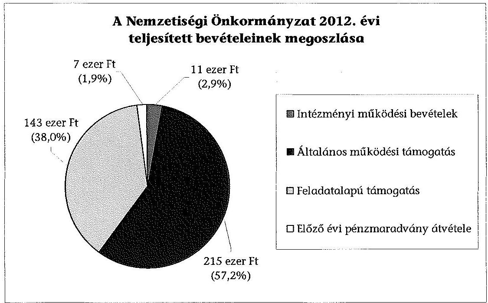
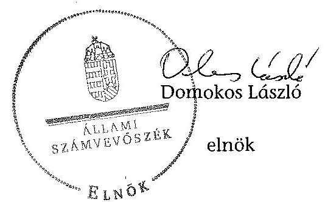

# ÁLLAMI   SZÁMVEVŐSZÉK 

## JELENTÉS

a helyi nemzetiségi önkormányzatok gazdálkodásának ellenőrzéséről
XVI. Kerületi Örmény Önkormányzat

---

# Állami Számvevőszék 

Iktatószám: V-0286-009/2014.
Témaszám: 1319
Vizsgálat-azonosító szám: V065239

## Az ellenőrzést felügyelte:

Horváth Balázs
felügyeleti vezető
Az ellenőrzést vezette és az ellenőrzés végrehajtásáért felelős:
Kisgergely István
ellenőrzésvezető
A számvevőszéki jelentést készítették és a jelentés összeállításában
közremüködtek:
Belovai Sándorné
számvevő főtanácsos
Varga József
számvevő tanácsos
Az ellenőrzést végezte:
Varga József
számvevő tanácsos

---

# TARTALOMJEGYZÉK 

BEVEZETÉS ..... 3
I. ÖSSZEGZŐ MEGÁLLAPÍTÁSOK, KÖVETKEZTETÉSEK, JAVASLATOK ..... 6
II. RÉSZLETES MEGÁLLAPÍTÁSOK ..... 14

1. A Nemzetiségi Önkormányzat és a XVI. Kerületi Önkormányzat együttműködésének szabályozása, a múködési feltételek biztosítása ..... 14
2. A gazdálkodási feladatok ellátásának szabályszerűsége ..... 15
2.1. A költségvetésre és a zárszámadásra, valamint a kincstári adatszolgáltatás rendjére vonatkozó jogszabályi előírások betartása ..... 15
2.2. A Nemzetiségi Önkormányzat gazdálkodásának szabályozottsága ..... 16
2.3. Az operatív gazdálkodási jogkörök kialakítása, gyakorlása ..... 17
3. A Nemzetiségi Önkormányzattal összefüggő gazdálkodási feladatok belső ellenőrzése ..... 18
4. A feladatalapú támogatás felhasználásának, elszámolásának szabályszerűsége, a Nemzetiségi Önkormányzat feladatellátása ..... 19
MELLÉKLETEK
5. számú A Nemzetiségi Önkormányzat 2012. évi gazdálkodásának főbb adatai, mutatói
FÜGGELÉKEK
6. számú Rövidítések jegyzéke
7. számú Értelmező szótár
8. számú A gazdálkodás értékelésének módszere

---

.

---

# JELENTÉS 

## a helyi nemzetiségi önkormányzatok gazdálkodásának ellenőrzéséről XVI. Kerületi Örmény Önkormányzat

## BEVEZETÉS

A Nemzetiségi Önkormányzat 1998-ban alakult, elnöke a 2010. évi helyhatósági választások óta látja el feladatát. A Nemzetiségi Önkormányzat intézményt, gazdasági társaságot és más szervezetet nem alapított. A négytagú Képviselő-testület munkája segítésére bizottságot nem hozott létre. A Nemzetiségi Önkormányzatnak a költségvetési beszámolója szerint a 2012. évben a módosított költségvetési bevételi és kiadási előirányzata 376 ezer Ft, a teljesített költségvetési bevétele 376 ezer Ft, a teljesített költségvetési kiadása 338 ezer Ft volt. A 2012. évi gazdálkodási adatokat részletesen az 1. számú mellékletben mutatjuk be.

Az Alaptörvény XXIX. cikk (1) bekezdése szerint a Magyarországon élő nemzetiségek államalkotó tényezők. Minden, valamely nemzetiséghez tartozó magyar állampolgárnak joga van önazonossága szabad vállalásához és megőrzéséhez. A hazánkban élő nemzetiségek helyi (települési és területi), valamint országos önkormányzatokat hozhatnak létre. A helyi nemzetiségi önkormányzatok gazdálkodási feladatait jogszabályi előírás alapján a székhely szerinti helyi önkormányzat polgármesteri hivatala látja el.

A nemzetiségek helyzete, támogatása mind hazai, mind EU-s szinten kiemelt figyelmet kap napjainkban. A helyi nemzetiségi önkormányzatok gazdálkodására és támogatási rendszerére vonatkozó jogszabályok a 2010-2012. években jelentős változásokon mentek át. A települési és területi nemzetiségi önkormányzatok gazdálkodásának, a részükre juttatott költségvetési támogatások felhasználásának ellenőrzését az ÁSZ a 2012. évben sorozatjellegű ellenőrzés keretében indította el. A 2013. évi ellenőrzések e témacsoportos ellenőrzések folytatását jelentik, amelyet az ÁSZ 2014 első félévi ellenőrzési terve 12. témasorszámon tartalmaz.

Az ellenőrzés célja annak értékelése volt, hogy a Nemzetiségi Önkormányzat gazdálkodási kereteinek kialakítása, gazdálkodása és feladatellátása megfelelt-e a jogszabályoknak.

Ennek keretében értékeltük, hogy:

- a Nemzetiségi Önkormányzat és a XVI. Kerületi Önkormányzat együttmúködésének szabályozása, a múködési feltételek biztosítása megfelelt-e a jogszabályi előírásoknak;

---

- a felek együttmúködése megfelelt-e a közöttük létrejött megállapodásnak a gazdálkodási feladatok szabályszerű ellátása során, ennek keretében betar-tották-e a Nemzetiségi Önkormányzat gazdálkodásához kapcsolódóan a költségvetésre és zárszámadásra, a gazdálkodás szabályozására, az operatív gazdálkodási jogkörök gyakorlására vonatkozó jogszabályi előírásokat;
- a jegyző biztosította-e a Nemzetiségi Önkormányzat gazdálkodásának belső ellenőrzését;
- a Nemzetiségi Önkormányzat feladatalapú támogatásának felhasználása, a folyósított feladatalapú támogatással történő elszámolás az előírásoknak megfelelő volt-e;
- a Nemzetiségi Önkormányzat feladatellátása összhangban volt-e a vonatkozó jogszabályi előírásokkal.

Az ellenőrzés várható hasznosulását négy szinten tervezzük. A törvényalkotás számára összegzett tapasztalatok állnak rendelkezésre a nemzetiségi önkormányzatok testületi döntéseinek, gazdálkodásának és a feladatalapú támogatás felhasználásának szabályszerűségéről, amelynek alapján következtetést lehet levonni arra, hogy indokolt-e jogszabályi módosítás kezdeményezése. Az ellenőrzés az ellenőrzött számára visszajelzést ad a működésében fellépő hiányosságokról, javaslataival hozzájárul azok kiküszöböléséhez, amely csökkentheti a későbbi ellenőrzések gyakoriságát. Az ellenőrzés megállapításai és javaslatai tanulságul szolgálhatnak más nemzetiségi önkormányzatok, szervezetek számára a rendezett gazdálkodási keretek kialakításához. A társadalom számára jelzi, hogy közpénz nem maradhat ellenőrizetlenül, az ÁSZ értékteremtő rend kialakításához és megőrzéséhez hozzájáruló tevékenysége pozitív hatással lesz a szervezetről kialakított összkép formálásában. Az ÁSZ szervezetén belül lehetőség nyílik arra, hogy a megállapítások szintetizálásával az intézmény a hozzáadott értéket teremtő elemző tevékenységét és tanácsadó szerepét erősítse.

A Nemzetiségi Önkormányzat gazdálkodásának ellenőrzéséről szóló jelentés I. fejezetének összegző része az ellenőrzés céljára adott rövid, szintetizáló összefoglalót és következtetéseket tartalmazza a II. fejezet részletes megállapításain alapulóan. A jelentés intézkedést igénylő megállapításait és javaslatait - az összegzőben foglaltak mellett - az ellenőrzés során feltárt, a jelentés II. fejezetében rögzített részletes megállapítások alapozzák meg, illetve támasztják alá.

# Az ellenőrzés típusa: szabályszerűségi ellenőrzés 

Az ellenőrzött időszak: a 2012. január 1. - 2012. december 31. közötti időszak. Az ellenőrzés kiterjedt a Nemzetiségi Önkormányzatnak juttatott 2012. évi támogatás 2013. évben való elszámolására is.

Ellenőrzött szervezet: XVI. Kerületi Örmény Önkormányzat és a gazdálkodási feladatait ellátó Budapest Főváros XVI. Kerületi Önkormányzat.

Az ellenőrzés végrehajtásának jogszabályi alapját az ÁSZ tv. 5. § (2)-(3) és (6) bekezdéseiben foglaltak képezik.

---

Az ellenőrzés szakmai módszertana az ÁSZ hivatalos honlapján (www.asz.hu) közzétett szakmai szabályokon alapult, amely a Legfőbb Ellenőrző Intézmények Nemzetközi Szervezete (INTOSAI) által kiadott nemzetközi standardok (ISSAI) figyelembevételével készült.

A helyi nemzetiségi önkormányzatok gazdálkodásának ellenőrzése során értékeltük a XVI. Kerületi Önkormányzat és a Nemzetiségi Önkormányzat együttmúködésének, a gazdálkodás szabályozottságának és a pénzügyi folyamatokban kulcsszerepet betöltő belső kontrollok (teljesítésigazolás és érvényesítés) múködésének megfelelőségét. A kulcskontrollokat a múködési és felhalmozási célú támogatásértékű kiadásoknál, az államháztartáson kívülre teljesített múködési és felhalmozási célú pénzeszköz átadásoknál, a dologi kiadásokkal kapcsolatos kifizetéseknél - véletlen mintavételi eljárást alkalmazva - ellenőriztük. Ellenőriztük, hogy a jegyző biztosította-e a Nemzetiségi Önkormányzat gazdálkodásának belső ellenőrzését. Értékeltük a feladatalapú támogatások felhasználásának, elszámolásának szabályszerűségét, a Nemzetiségi Önkormányzat feladatellátása és a jogszabályi előírások összhangját.

Az ellenőrzés lefolytatásához a Nemzetiségi Önkormányzat és a gazdálkodási feladatait ellátó XVI. Kerületi Önkormányzat tanúsítványok és a kapcsolódó, dokumentumjegyzékben megjelölt dokumentumok elektronikus úton történő megküldésével, rendelkezésre bocsátásával szolgáltatott adatokat. Az adatszolgáltatás kontrollálása és szükség szerinti javítása a helyszíni ellenőrzés keretében történt. A minősítési szempontokat a 3. számú függelék tartalmazza.

Az ÁSZ tv. 29. § (1) bekezdése szerint a jelentéstervezetet megküldtük észrevételezésre a polgármesternek és a Nemzetiségi Önkormányzat elnökének. A polgármester és a Nemzetiségi Önkormányzat elnöke az ÁSZ tv. 29. § (2) bekezdésében foglalt észrevételezési jogával nem élt, a jelentéstervezetre észrevételt nem tett.

---

# I. ÖSSZEGZŐ MEGÁLLAPÍTÁSOK, KÖVETKEZTETÉSEK, JAVASLATOK 

A Nemzetiségi Önkormányzat és a XVI. Kerületi Önkormányzat együttmúködésének szabályozása részben felelt meg a jogszabályi előírásoknak. A 2012. évben az együttműködési megállapodás ${ }_{1,2}$ volt hatályban, azonban az együttműködési megállapodás ${ }_{1}$-et a Nek. ${ }_{2}$ tv. előírása ellenére 2012. január 31éig nem vizsgálták felül és nem történt meg a kiegészítése 2012. június 1-jéig. A Nek. ${ }_{2}$ tv alapján elkészített együttműködési megállapodás ${ }_{2}$ aláírása a törvényben meghatározott 2012. június 1-jei határidőt követően, június 5 -én történt meg, záró rendelkezései szerinti, 2012. július 1-jei hatályba lépéssel. Az együttműködési megállapodás ${ }_{2}$ aláírásával az együttműködési megállapodás ${ }_{1}$ hatályát vesztette. A Nemzetiségi Önkormányzat a 2012. június 6-a és június 30-a közötti időszakban is rendelkezett a múködésére vonatkozó hatályos, az operatív gazdálkodás szabályait is rögzítő Számviteli politikával. A 2012. december 31-én hatályos együttműködési megállapodás ${ }_{2}$-ben a Nek. ${ }_{2}$ tv.-ben foglaltaktól eltérően a tervezési, gazdálkodási, finanszírozási, adatszolgáltatási és beszámolási feladatok ellátásának szabályait csak részben rögzítették, nem írták elő a teljesítésigazolásra illetve a kötelezettségvállalások nyilvántartására vonatkozó szabályokat, valamint a Nemzetiségi Önkormányzat testületi ülésein a jegyző megbízásából résztvevő személy képesítési követelményeit. Az együttműködési megállapodás ${ }_{2}$ szerinti múködési feltételeket a Nek. ${ }_{2}$ tv.-ben foglaltak ellenére a megállapodás megkötését követő harminc napon belül nem vezették át a Nemzetiségi Önkormányzat SZMSZ-ében. A XVI. Kerületi Önkormányzat a Nemzetiségi Önkormányzat múködésének személyi és tárgyi feltételeit a szabályozási hiányosságok ellenére biztosította.

A Nemzetiségi Önkormányzat 2012. évi költségvetésének, zárszámadásának tartalma, jóváhagyása, szabályszerűsége, az előírt határidők betartása részben felelt meg, a kapcsolódó 2012. évi adatszolgáltatás szabályszerűsége megfelelt a jogszabályi előírásoknak. A Nemzetiségi Önkormányzat elnöke az Áht. ${ }_{2}$-ben meghatározott időpontig benyújtotta a 2012. évi költségvetési határozat tervezetét a Képviselő-testületnek. A jóváhagyott költségvetés tartalmazta az előírt tartalmi elemeket, azonban az Áht. ${ }_{2}$-ban előírtak ellenére a Képviselőtestületnek tájékoztatásul - szöveges indoklással - nem mutatták be a Nemzetiségi Önkormányzat költségvetési mérlegét közgazdasági tagolásban, valamint az előirányzat felhasználási tervét. A 2012. évi zárszámadás határozat-tervezet Képviselő-testületnek történő előterjesztésekor a Nemzetiségi Önkormányzat elnöke nem tartotta be az Áht. ${ }_{2}$-ban előírt határidőt. A 2012. évi zárszámadás határozat-tervezetének előterjesztésekor a Képviselő-testületnek tájékoztatásul bemutatták az Áht. ${ }_{2}$-ben előírt mérlegeket és kimutatásokat. A zárszámadás és az elfogadott költségvetés összehasonlíthatóságát biztosították, a beszámoló a Nemzetiségi Önkormányzat valamennyi bevételét és kiadását tartalmazta. A jegyző az Áhsz. ${ }_{1}$-ben és az Ávr.-ben előírt, a Nemzetiségi Önkormányzatra vonatkozó kincstári adatszolgáltatási kötelezettségeit az előírt határidőben teljesítette.

---

A Nemzetiségi Önkormányzat gazdálkodásának szabályozottsága nem volt megfelelő, mert a Polgármesteri Hivatal SZMSZ-e az Ávr. előírása ellenére nem tartalmazta az SZMSZ-ben nevesített munkakörökhöz tartozó, a Nemzetiségi Önkormányzat gazdálkodásának végrehajtásával kapcsolatos feladat- és hatáskörökre, a hatáskörök gyakorlásának módjára, a helyettesítés rendjére, az ezekhez kapcsolódó felelősségi szabályokra vonatkozó előírásokat. A Nemzetiségi Önkormányzat rendelkezett a Számv. tv. által előírt Számviteli politikával és a hozzá kapcsolódó, gazdálkodásra vonatkozó szabályzatokkal. A Számviteli politikában rögzített, az operatív gazdálkodásra vonatkozó szabályozás az Ávr. előírásai ellenére nem tartalmazta a teljesítésigazolás gyakorlásának módjával, eljárási és dokumentációs részlet-szabályaival, valamint a teljesítésigazolást végző személyek kijelölésével kapcsolatos rendelkezéseket. A Nemzetiségi Önkormányzat gazdálkodásának végrehajtási feladataira nem terjesztették ki a Bkr.-ben előírt, a XVI. Kerületi Önkormányzat Polgármesteri Hivatalára kiadott ellenőrzési nyomvonalat és a szabálytalanságok kezelése eljárásrendjének hatályát, ezekkel a szabályzatokkal a Nemzetiségi Önkormányzat önállóan sem rendelkezett. A Polgármesteri Hivatal SZMSZ-ében az Áht. ${ }_{2}$-ben és az Ávr.-ben foglaltak szerint rögzítették a tervezéssel, gazdálkodással, a pénzügyi ellenjegyzéssel, az érvényesítés módjával, eljárási és dokumentálási részletszabályaival, valamint az ezeket végző személyek kijelölésének rendjével, az ellenőrzési és adatszolgáltatási feladatok teljesítésével kapcsolatos belső előírásokat.

A Nemzetiségi Önkormányzatnál az operatív gazdálkodási jogkörök kialakítása részben felelt meg a jogszabályi előírásoknak, mert a Nemzetiségi Önkormányzat elnöke az Áht. ${ }_{2}$ és az Ávr. előírásainak ellenére hiányosan szabályozta a teljesítésigazolást, nem állt rendelkezésre a teljesítésigazoló aláírásmintája, és a Nemzetiségi Önkormányzat által vállalt kötelezettségekről nem vezették az Ávr.-ben előírt nyilvántartást. A jegyző az Ávr. előírásainak megfelelően szabályszerűen jelölte ki a pénzügyi ellenjegyzésre és az érvényesítésre jogosultakat, mert a XVI. Kerületi Önkormányzat az ellenőrzött időszakban nem rendelkezett gazdasági szervezettel.

A Nemzetiségi Önkormányzatnál a 2012. évben államháztartáson kívülre történt pénzeszköz átadás teljesítése során a teljesítésigazolás és az érvényesítés kulcskontrollok múködése nem volt megfelelő, mert a támogatás átutalására az Ávr. előírásai ellenére teljesítésigazolás és érvényesítés nélkül került sor.

A Nemzetiségi Önkormányzatnál a 2012. évben dologi kiadások teljesítése során a teljesítésigazolás és az érvényesítés kulcskontrollok múködésének megfelelősége gyenge volt, a hibák száma a lényegességi szintet, a kritikus hibahatárt elérte. Az Ávr. előírásai ellenére nem jelöltek ki írásban teljesítésigazolót, a teljesítés igazolását a Nemzetiségi Önkormányzat elnöke nem dokumentálta megfelelően. Az érvényesítő nem az Ávr. előírásai alapján végezte feladatát, mert nem a teljesítésigazolás alapján érvényesített, nem jelezte az utalványozónak, hogy a teljesítésigazolás szabálytalan volt, továbbá nem észrevételezte az Ávr.-ben előírt kötelezettségvállalási nyilvántartás vezetésének a hiányát. A dologi kiadások közül kiválasztott három legnagyobb összegű kifizetés esetében a teljesítésigazolás és az érvényesítés kulcskontrollok múködése nem volt megfelelő. Az Ávr. előírásai ellenére a teljesítésigazolás szabálytalanul történt,

---

az érvényesítéssel kapcsolatban feltárt hiányosságok megegyeztek a dologi kiadásoknál leírtakkal.

A számvevőszéki ellenőrzés a kiadások dokumentumainak ellenőrzése alapján összeférhetetlenséget, továbbá jogosulatlan kifizetést nem tárt fel, a kulcskontrollok működéséhez kapcsolódó hiányosságok miatt azonban nem biztosított a hibák megelőzése, feltárása és kijavítása.

A Nemzetiségi Önkormányzat gazdálkodási feladatainak belső ellenőrzése megfelelő volt. Az együttműködési megállapodás ${ }_{1,2}$-ben rögzítették, hogy a Polgármesteri Hivatal belső ellenőrzési tevékenysége kiterjed a Nemzetiségi Önkormányzat számviteli nyilvántartásainak ellenőrzésére. A Polgármesteri Hivatal 2012. évi belső ellenőrzési tervét megalapozó kockázatelemzés nem terjedt ki a Nemzetiségi Önkormányzat gazdálkodásával összefüggő végrehajtási feladatokra. A 2012. évre tervezett, 2010-2011. évekre vonatkozó ellenőrzést elvégezték, az ellenőrzési jelentés hiányosságokat állapított meg, javaslatokat tett, de azoknak nem volt címzettje, nem tartalmazta, hogy mely nemzetiségi önkormányzatra vonatkoznak a megállapítások. A jegyző a Nemzetiségi Önkormányzatot érintő belső ellenőrzés megállapításairól annak elnökét és a Nemzetiségi Önkormányzat Képviselő-testületét nem tájékoztatta, ezért a belső ellenőrzési jelentés elkészítésekor hatályos együttműködési megállapodás ${ }_{1}$ 6. pontjában foglalt realizálási feladatok végrehajtása elmaradt. A feltárt hiányosságok miatt a belső ellenőrzési tevékenység részben hasznosult a Nemzetiségi Önkormányzat operatív gazdálkodási feladatainak végrehajtásában. Az ellenőrzéshez szolgáltatott adatok alapján a Kormányhivatal 2012-ben a Nemzetiségi Önkormányzatot illetően nem élt törvényességi felügyeleti eszközökkel.

A Nemzetiségi Önkormányzat részére 2011. és 2012. évben folyósított feladatalapú támogatás elszámolása nem felelt meg a jogszabályi előírásoknak. Nemzetiségi Önkormányzat 2011. évi feladatalapú támogatásából maradvány nem keletkezett. A 2012. évi 143 ezer Ft feladatalapú támogatást a Nemzetiségi Önkormányzat a támogatási céloknak megfelelően felhasználta, maradványa 2012. december 31 -én nem volt. A feladatalapú támogatásokról a támogatási kormányrendelet ${ }_{1,2}$ előírása alapján az Áht. ${ }_{1,2}$-ben foglaltak ellenére az elszámolások nem történtek meg, a támogatások felhasználását, elszámolását az ellenőrzésre jogosult szervek nem ellenőrizték.

A Nemzetiségi Önkormányzat 2012. évi kötelező és önként vállalt feladatellátásának tárgya - a képviselt közösség esélyegyenlőségének megteremtésével kapcsolatos feladatok ellátása, kapcsolat a helyi nemzetiségi civil szervezetekkel, a területén múködő vallási közösséggel, hagyományápolás, kulturális, ifjúsági program - összhangban volt a Nek. ${ }_{2}$ tv.-ben foglalt előírásokkal.

Az ÁSZ tv. 33. § (1) bekezdésében foglaltak értelmében az ellenőrzött szervezet vezetője köteles a jelentésben foglalt megállapításokhoz kapcsolódó intézkedési tervet összeállítani és azt a jelentés kézhezvételétől számított 30 napon belül az ÁSZ részére megküldeni. Amennyiben az intézkedési tervet határidőre nem küldi meg a szervezet, vagy az nem elfogadható, az ÁSZ elnöke az ÁSZ tv. 33. § (3) bekezdés a)-b) pontjaiban foglaltakat érvényesítheti.

---

A helyszíni ellenőrzés megállapításainak hasznosítása mellett javasoljuk:

# a jegyzőnek 

1. az együttműködés szabályozásával kapcsolatban

Az együttműködési megállapodás ${ }_{1}$-et a Nek. 2 tv. 80. § (2) bekezdésének előírása ellenére 2012. január 31 -éig nem vizsgálták felül.

A Nek. 2 tv. 80. § (3) bekezdésének b)-d) pontjaiban foglaltak ellenére az együttmúködési megállapodás ${ }_{2}$-ben nem rögzítették a szakmai teljesítésigazolási feladatok eljárási és dokumentációs részletszabályait, a teljesítésigazolást végző feladatait, a felelősök konkrét kijelölését, továbbá nem írták elő a kötelezettségvállalások nyilvántartására vonatkozó szabályokat. A Nek. 2 tv. 80. § (4) bekezdésében foglaltak ellenére az együttműködési megállapodás ${ }_{2}$ nem tartalmazta, a testületi ülésen a jegyző megbízásából résztvevő személy képesítési követelményeit.

A Nek. 2 tv. 80. § (2) bekezdésében foglaltak ellenére az együttműködési megállapodás szerinti müködési feltételeket nem rögzítették a Nemzetiségi Önkormányzat SZMSZ-ében.

Javaslat
Az együttműködés szabályszerűsége érdekében:
a) biztosítsa a jövőben az együttműködési megállapodás évenkénti felülvizsgálata során a Nek. 2 tv. 80. § (2) bekezdésében előírt határidő betartását;
b) készítse elő az együttműködési megállapodás ${ }_{2}$ módosítását, hogy az tartalmilag feleljen meg a Nek. 2 tv. 80. § (3) bekezdés b), c) és d) pontjaiban, valamint a Nek. 2 tv. 80. § (4) bekezdésében foglalt előírásoknak;
c) készítse elő a Nemzetiségi Önkormányzat SZMSZ-ének a Nek. 2 tv. 80. § (2) bekezdésében foglalt előírás alapján történő kiegészítését.
2. a költségvetés előterjesztésével kapcsolatban

A 2012. évi költségvetési határozattervezet előterjesztésekor - a jegyző mulasztása miatt - az Áht. 2 24. § (4) bekezdés a) pontjában foglaltak ellenére nem mutatták be a Képviselő-testületnek tájékoztatásul - szöveges indoklással - a Nemzetiségi Önkormányzat költségvetési mérlegét közgazdasági tagolásban és az előirányzatfelhasználási tervét.

Javaslat
Készítse elő a jövőben a költségvetési határozattervezet előterjesztéséhez a Képvise-lő-testület tájékoztatására az Áht. 2 24. § (4) bekezdés a) pontja előírásainak megfelelően szöveges indoklással együtt a Nemzetiségi Önkormányzat költségvetési mérlegét közgazdasági tagolásban és az előirányzat-felhasználási tervet.

---

3. a gazdálkodási feladatok szabályozottságával kapcsolatban

A Polgármesteri Hivatal SZMSZ-e nem tartalmazta az Ávr. 13. § (1) bekezdés g) pontjában foglaltak szerinti, az SZMSZ-ben nevesített munkakörökhöz tartozó - a Nemzetiségi Önkormányzat gazdálkodásának végrehajtásával kapcsolatos - feladatés hatáskörökre, a hatáskörök gyakorlásának módjára, a helyettesítés rendjére, az ezekhez kapcsolódó felelősségi szabályokra vonatkozó előírásokat. A XVI. Kerületi Önkormányzat Polgármesteri Hivatala rendelkezett a Bkr. 6. § (3)-(4) bekezdései szerinti ellenőrzési nyomvonal és szabálytalanságok kezelésének eljárásrendje szabályzattal, de annak hatályát a jegyző a nemzetiségi önkormányzat gazdálkodásával kapcsolatos feladatokra nem terjesztette ki, azokkal a Nemzetiségi Önkormányzat önállóan sem rendelkezett.

A Számviteli politikában az operatív gazdálkodásra vonatkozó feladatok végrehajtási szabályai az Ávr. 13. § (2) bekezdés a) pontjában foglaltak ellenére nem tartalmazták a teljesítésigazolás gyakorlásának módjával, eljárási és dokumentációs részletszabályaival. Nem készítették el az Ávr. 53. § (2) bekezdésében előírtak ellenére az előzetes írásbeli kötelezettségvállalást nem igénylő kifizetések rendjét.

Javaslat
A gazdálkodás szabályszerűsége érdekében a Nemzetiségi Önkormányzat gazdálkodására is kiterjedően:
a) készítse el a Polgármesteri Hivatal SZMSZ-ének módosítását, hogy az tartalmazza az Ávr. 13. § (1) bekezdés g) pontjában foglaltakat;
b) módosítsa a Polgármesteri Hivatal Bkr. 6. § (3)-(4) bekezdései szerinti ellenőrzési nyomvonala és a szabálytalanságok kezelése eljárásrendjének hatályát, vagy készítsen a Nemzetiségi Önkormányzat gazdálkodásával kapcsolatos feladatokra önálló szabályozást;
c) egészítse ki a Számviteli politika operatív gazdálkodási feladatokra vonatkozó végrehajtási szabályait az Ávr. 13. § (2) bekezdés a) pontjában, valamint az Ávr. 53. § (2) bekezdésében foglaltaknak megfelelően.
4. a kulcskontrollok múködésével kapcsolatban

A teljesítésigazolást az Ávr. 57. § (1) és (3) bekezdésében foglaltak ellenére nem, illetve nem szabályszerűen végezték el, nem az Ávr. 57. § (4) bekezdése szerinti szabályszerű, írásbeli kijelöléssel rendelkező személy végezte.

Az Ávr. 58. § (1)-(3) bekezdése ellenére nem történt meg az érvényesítés, illetve az érvényesítő nem látta el feladatát, mert nem ellenőrizte a megelőző ügymenetben a jogszabályi előírások betartását, nem jelezte az utalványozónak, hogy nem, illetve nem szabályszerűen történt meg a teljesítésigazolás, az Ávr. 56. § (1) bekezdésében előírt kötelezettségvállalási nyilvántartást nem vezették.

---

Javaslat
Az operatív gazdálkodás müködési hibáinak megelőzése, feltárása és kijavítása érdekében gondoskodjon arról, hogy:
a) a teljesítésigazolást Ávr. 57. § (4) bekezdése szerinti szabályszerű kijelöléssel rendelkező személy, az Ávr. 57. § (1) és (3) bekezdéseiben előírtaknak megfelelően végezze, a teljesítésigazoló aláírás mintája az Ávr. 60. § (3) bekezdésében foglaltak szerint rendelkezésre álljon;
b) az érvényesítő tegyen eleget az Ávr. 58. § (1)-(3) bekezdéseiben előírt ellenőrzési feladatának, jelzési és igazolási kötelezettségének.
5. a feladatalapú támogatás elszámolásával kapcsolatban

A 2011. évi feladatalapú támogatás elszámolása a támogatási kormányrendelet ${ }_{1}$ 7. § (2) bekezdésében hivatkozott, valamint a 2012. évi feladatalapú támogatás elszámolása a támogatási kormányrendelet ${ }_{2} 8 . \S$ (5) bekezdésében hivatkozott „a helyi önkormányzatok elszámolási és ellenőrzési rendjére vonatkozó jogszabályok rendelkezései alkalmazandóak" előírása alapján az Áht. ${ }_{1} 64 . \S$ (7) bekezdése, és az Áht. ${ }_{2} 57 . \S$ (3) bekezdése ellenére nem történt meg.

Javaslat
Intézkedjen az Áht. ${ }_{2}$ 27. § (2) bekezdésében meghatározott feladatkörében a Nemzetiségi Önkormányzat által igénybevett 2011. és 2012. évi feladatalapú támogatás rendeltetésszerű felhasználásáról szóló elszámolás elkészítéséről, az Áht. ${ }_{2} 53 . \S$ (1) bekezdése szerinti beszámolási kötelezettség teljesítéséhez.

# a polgármesternek 

A Nek. ${ }_{2}$ tv. 80. § (3) bekezdésének b)-d) pontjaiban foglaltak ellenére az együttműködési megállapodás ${ }_{2}$-ben nem rögzítették a szakmai teljesítésigazolási feladatok eljárási és dokumentációs részletszabályait, a teljesítésigazolást végző feladatait, a felelősök konkrét kijelölését, továbbá nem írták elő a kötelezettségvállalások nyilvántartására vonatkozó szabályokat. A Nek. ${ }_{2}$ tv. 80. § (4) bekezdésében foglaltak ellenére az együttműködési megállapodás ${ }_{2}$ nem tartalmazta, a testületi ülésen a jegyző megbízásából résztvevő személy képesítési követelményeit.

A Polgármesteri Hivatal SZMSZ-e nem tartalmazta az Ávr. 13. § (1) bekezdés g) pontjában foglaltak szerinti, az SZMSZ-ben nevesített munkakörökhöz tartozó - a Nemzetiségi Önkormányzat gazdálkodásának végrehajtásával kapcsolatos - feladatés hatáskörökre, a hatáskörök gyakorlásának módjára, a helyettesítés rendjére, az ezekhez kapcsolódó felelősségi szabályokra vonatkozó előírásokat.

---

Javaslat
Terjessze a XVI. Kerületi Önkormányzat Képviselő-testülete elé jóváhagyásra:
a) az együttműködési megállapodás jegyző által előkészített módosítását, hogy az tartalmilag megfeleljen a Nek. 2 tv. 80. § (3) bekezdés b), c), és d) pontjaiban, valamint a Nek. 2 tv. 80. § (4) bekezdésében foglalt előírásoknak;
b) a Polgármesteri Hivatal SZMSZ-ének jegyző által elkészített módosítását, hogy az tartalmazza - a Nemzetiségi Önkormányzat gazdálkodásának végrehajtására vonatkozóan - az Ávr. 13. § (1) bekezdés g) pontjában foglaltakat.

# a Nemzetiségi Önkormányzat elnökének 

1. A Nek. 2 tv. 80. § (3) bekezdésének b)-d) pontjaiban foglaltak ellenére az együttmüködési megállapodás ${ }_{2}$-ben nem rögzítették a szakmai teljesítésigazolási feladatok eljárási és dokumentációs részletszabályait, a teljesítésigazolást végző feladatait, a felelősök konkrét kijelölését, továbbá nem írták elő a kötelezettségvállalások nyilvántartására vonatkozó szabályokat. A Nek. 2 tv. 80. § (4) bekezdésében foglaltak ellenére az együttműködési megállapodás ${ }_{2}$ nem tartalmazta, a testületi ülésen a jegyző megbízásából résztvevő személy képesítési követelményeit.

A Nek. 2 tv. 80. § (2) bekezdésében foglaltak ellenére az együttműködési megállapodás ${ }_{2}$ szerinti müködési feltételeket nem rögzítették a Nemzetiségi Önkormányzat SZMSZ-ében.

Javaslat
Terjessze a Képviselő-testület elé jóváhagyásra:
a) a jegyző által előkészített együttműködési megállapodás ${ }_{2}$ módosítását, hogy az tartalmilag megfeleljen a Nek. 2 tv. 80. § (3) bekezdés b), c) és d) pontjaiban, valamint a Nek. 2 tv. 80. § (4) bekezdésében foglalt előírásoknak;
b) a Nemzetiségi Önkormányzat SZMSZ-ének jegyző által előkészített módosítását, hogy az megfeleljen a Nek. 2 tv. 80. § (2) bekezdésében előírtaknak.
2. A Nemzetiségi Önkormányzat elnöke a 2012. évi költségvetés előterjesztésekor - a jegyző mulasztása miatt - a Képviselő-testület részére tájékoztatásul az Áht. 2 24. § (4) bekezdés a) pontjában előírtak ellenére nem mutatta be szöveges indoklással a Nemzetiségi Önkormányzat költségvetési mérlegét közgazdasági tagolásban és az előirányzat-felhasználási tervét. A 2012. évi zárszámadási határozattervezet Képviselő-testületnek történő előterjesztésekor a Nemzetiségi Önkormányzat elnöke nem tartotta be az Áht. 2 91. § (1) és (3) bekezdéseiben előírt határidőt.

Javaslat
A jövőben gondoskodjon arról, hogy:
a) a költségvetési határozattervezet előterjesztésekor a Képviselő-testület elé terjesztésekor tájékoztatásul mutassa be - szöveges indoklással együtt - a jegyző által

---

elkészített, az Áht. 2 24. § (4) bekezdés a) pontjában előírt költségvetési mérleget közgazdasági tagolásban és az előirányzat-felhasználási tervet;
b) a Nemzetiségi Önkormányzat zárszámadásának jegyző által elkészített tervezetét az Áht. 2 91. § (1) és (3) bekezdéseiben előírt határidőben terjessze a Képviselőtestület elé.
3. A Nemzetiségi Önkormányzat elnöke, mint kötelezettségvállaló az Ávr. 57. § (4) bekezdésében foglalt előírások ellenére nem jelölt ki írásban teljesítésigazolót és ezért az aláírás minta az Ávr. 60. § (3) bekezdésében előírtak ellenére sem állt rendelkezésre.

Javaslat
Gondoskodjon arról, hogy:
a) az Ávr. 57. § (4) bekezdésében foglalt előírásoknak megfelelően a teljesítésigazolók kijelölése írásban történjen meg;
b) a teljesítésigazoló jogkörök gyakorlására kijelölt személyek aláírás mintája az Ávr. 60. § (3) bekezdésében előírtaknak megfelelően az aláírás-nyilvántartásban naprakész állapotban rendelkezésre álljon.
4. A 2011. évi feladatalapú támogatás elszámolása a támogatási kormányrendelet, 7. § (2) bekezdésében hivatkozott, valamint a 2012. évi feladatalapú támogatás elszámolása a támogatási kormányrendelet 2 8. § (5) bekezdésében hivatkozott „a helyi önkormányzatok elszámolási és ellenőrzési rendjére vonatkozó jogszabályok rendelkezései alkalmazandóak" előírása alapján az Áht. 1 64. § (7) bekezdése, és az Áht. 2 57. § (3) bekezdése ellenére nem történt meg.

Javaslat
Terjessze a Képviselő-testület elé az Áht. 2 53. § (1) bekezdése szerinti beszámolási kötelezettség teljesítéséhez összeállított, a Nemzetiségi Önkormányzat által igénybevett 2011. és 2012. évi feladatalapú támogatás rendeltetésszerű felhasználásáról szóló elszámolást.

---

# II. RÉSZLETES MEGÁLLAPÍTÁSOK 

## 1. A Nemzetiségi Önkormányzat és a XVI. Kerületi Önkormányzat eGyüttmúködésének szabályozása, a múködési FELTÉTELEK BIZTOSÍTÁSA

A Nemzetiségi Önkormányzat és a XVI. Kerületi Önkormányzat együttmúködésének szabályozása részben felelt meg a jogszabályi előírásoknak.

A 2010. december 20-án aláírt ${ }^{1}$ együttműködési megállapodás ${ }_{1}$-nek a Nek. ${ }_{2}$ tv. 80. § (2) bekezdésében előírtak szerinti felülvizsgálata 2012. január 31-éig, valamint a Nek. ${ }_{2}$ tv. 159. § (3) bekezdése szerinti kiegészítése 2012. június 1-jéig nem történt meg. A Nek. ${ }_{2}$ tv hatálybalépését követően előkészítették az új együttműködési megállapodás ${ }_{2}$ tervezetét, amelynek aláírására ${ }^{2} 2012$. június 5én, a Nek. tv. 159. § (3) bekezdésében foglalt határidőhöz képest négy napos késedelemmel került sor. Az együttműködési megállapodás ${ }_{2}$ záró rendelkezései szerint annak aláírásával a 2010. évi együttműködési megállapodás ${ }_{1}$ hatályát vesztette, az együttműködési megállapodás ${ }_{2}$ rendelkezéseit csak 2012. július 1jétől kellett alkalmazni. A Nemzetiségi Önkormányzat a 2012. június 6-a és június 30-a közötti időszakban is rendelkezett hatályos, az operatív gazdálkodás szabályait is rögzítő Számviteli politikával.

A 2012. december 31-én hatályos együttműködési megállapodás ${ }_{2}$ tartalmazta a Nek. ${ }_{2}$ tv. által meghatározott személyi és tárgyi múködési feltételek biztosítását. A XVI. Kerületi Önkormányzat az együttműködési megállapodás ${ }_{2}$-ben vállalta a technikai eszközökkel felszerelt helyiség ingyenes biztosítását, a rezsiköltségek fizetését, a testületi ülések előkészítését, a kapcsolódó adminisztrációs és postázási feladatok ellátását. A helyiség és a technikai eszközök átadásának dokumentumai azonban nem álltak rendelkezésre.

Az Áht. ${ }_{2}$-ben előírt tervezési, gazdálkodási, finanszírozási, adatszolgáltatási és beszámolási feladatok ellátásának szabályait az együttműködési megállapo-dás ${ }_{1,2}$-ben részben rögzítették ${ }^{3}$. Az együttműködési megállapodás ${ }_{2}$ szerint a Nemzetiségi Önkormányzat részéről kötelezettségvállalásra, utalványozásra a Nemzetiségi Önkormányzat elnöke jogosult, az ellenjegyzési, érvényesítési feladatokat a XVI. Kerületi Önkormányzat jegyzője által a jogszabályi előírások-

[^0]
[^0]:    ${ }^{1}$ Az együttműködési megállapodás ${ }_{1}$-et a XVI. Kerületi Önkormányzat a 459/2010. (XII. 8.) számú, a Nemzetiségi Önkormányzat Képviselő-testülete a 28/2010. (10. 28.) számú határozatával hagyta jóvá.
    ${ }^{2}$ Az együttműködési megállapodás ${ }_{2}$-t a XVI. Kerületi Önkormányzat a 263/2012. (5. 30.) számú, a Nemzetiségi Önkormányzat Képviselő-testülete a 10/2012. (5. 11.) ÖÖ számú határozatával hagyta jóvá.
    ${ }^{3}$ Az önálló fizetési számla nyitása és a Nemzetiségi Önkormányzat törzskönyvi bejegyzése és adószámmal való ellátása az együttmúködési megállapodás ${ }_{2}$ aláírása előtt már megtörtént.

---

nak megfelelően kijelölt munkatársai látták el. Az együttműködési megállapo-dás ${ }_{2}$-ben rögzítették a belső ellenőrzésre és a felelősségre vonatkozó feltételeket, amely szerint a Polgármesteri Hivatal belső ellenőrzési tevékenysége a Nemzetiségi Önkormányzat esetében a számviteli nyilvántartások ellenőrzésére terjedt ki.
„A Nemzetiségi Önkormányzat számviteli nyilvántartásának ellenőrzése a Polgármesteri Hivatal szervezetéhez tartozó függetlenített belső ellenőrzés feladatát képezi. A Nemzetiségi Önkormányzat gazdálkodásának biztonságáért, a képviselő-testület szabályszerűségéért az elnök felel. A veszteséges gazdálkodás következményeiért Budapest Fóváros XVI. Kerületi Önkormányzat nem tartozik felelősséggel."

Az együttműködési megállapodás ${ }_{2}$ az operatív gazdálkodási feladatok ellátásának szabályai közül nem tartalmazta a Nek. ${ }_{2}$ tv. 80. § (3) bekezdésében foglaltak szerint a teljesítésigazolási feladatok eljárási és dokumentációs részletszabályait, a teljesítésigazolást végző felelősök kijelölését, az Ávr. 36. § (2) bekezdésének megfelelően az előzetes írásba foglalást nem igénylő kifizetések rendjét, továbbá nem írták elő a kötelezettségvállalások nyilvántartásának vezetését.

A személyi feltételek biztosításának részeként a XVI. Kerületi Önkormányzat referenst jelölt ki, azonban az együttműködési megállapodás ${ }_{2}$-ben a Nek. ${ }_{2}$ tv. 80. § (4) bekezdése előírásával ellentétesen nem írták elő, hogy a Nemzetiségi Önkormányzat testületi ülésein a jegyző megbízásából résztvevő személy képesítésének meg kell felelnie a jegyzőre vonatkozó képesítési előírásoknak.

A Nek. ${ }_{2}$ tv. 80. § (2) bekezdésében foglalt előírás ellenére a Nemzetiségi Önkormányzat SZMSZ-ében nem rögzítették az együttműködési megállapodás ${ }_{2}$ szerinti múködési feltételeket annak megkötését követő harminc napon belül.

A XVI. Kerületi Önkormányzat - a szabályozás hiányossága ellenére - biztosította a Nemzetiségi Önkormányzat működéséhez szükséges személyi és tárgyi feltételeket.

# 2. A GAZDÁLKODÁSI FELADATOK ELLÁTÁSÁNAK SZABÁLYSZERŰSÉGE 

### 2.1. A költségvetésre és a zárszámadásra, valamint a kincstári adatszolgáltatás rendjére vonatkozó jogszabályi előírások betartása

A Nemzetiségi Önkormányzat 2012. évi költségvetésének és zárszámadásának tartalma, jóváhagyása, az előírt határidők betartása részben felelt meg, a kapcsolódó 2012. évi - Kincstár részére történt - adatszolgáltatás szabályszerűsége megfelelt a jogszabályi előírásoknak.

A Nemzetiségi Önkormányzat elnöke a 2012. évi költségvetés tervezetét az Áht. ${ }_{2}$-ben előírt határidőben benyújtotta a Képviselő-testületnek. A jóváhagyott

---

költségvetés ${ }^{4}$ tartalmazta az Áht. ${ }_{2}$-ben és az Ávr.-ben előírt tartalmi elemeket: a költségvetési bevételeket és azokkal megegyező összegű költségvetési kiadásokat előirányzat-csoportok, kiemelt előirányzatok szerinti bontásban, szöveges indokolással együtt, de az Áht. ${ }_{2} 24$. § (4) bekezdés a) pontjában foglaltak ellenére tájékoztatásul nem mutatták be a Nemzetiségi Önkormányzat költségvetési mérlegét közgazdasági tagolásban, valamint az előirányzat felhasználási tervet.

A jegyző által elkészített 2012. évi zárszámadási határozattervezetet az Áht. ${ }_{2} 91 . \S$ (1) és (3) bekezdéseiben előírt határidőt követően tárgyalta és fogadta el a Nemzetiségi Önkormányzat Képviselő-testülete. A 2012. évi zárszámadási határozat ${ }^{5}$ tervezetének előterjesztésében a Nemzetiségi Önkormányzat Képviselő-testülete részére tájékoztatásul bemutatták az Áht. ${ }_{2}$-ben foglalt mérlegeket és kimutatásokat. A zárszámadás és az elfogadott költségvetés összehasonlíthatóságát az Áht. ${ }_{2}$-ben foglaltak szerint biztosították, a beszámoló a Nemzetiségi Önkormányzat valamennyi bevételét és kiadását tartalmazta.

A jegyző a 2012. évre előírt, a Nemzetiségi Önkormányzatra vonatkozó kincstári adatszolgáltatási kötelezettségének hiánytalanul, az Áhsz. ${ }_{1}$-ben és az Ávr.ben előírt határidőben eleget tett.

# 2.2. A Nemzetiségi Önkormányzat gazdálkodásának szabályozottsága 

A Nemzetiségi Önkormányzat gazdálkodásának szabályozottsága az ellenőrzött időszakban nem felelt meg a jogszabályi előírásoknak.

A Nemzetiségi Önkormányzat rendelkezett a Számv. tv. által előírt saját Számviteli politikával, és az annak mellékletét képező önálló szabályzatokkal ${ }^{6}$. A Számviteli politikában rögzítették az operatív gazdálkodásra vonatkozó feladatok végrehajtási szabályait is, amelyek azonban az Ávr. 13. § (2) bekezdésében foglaltak ellenére nem tartalmazták a teljesítésigazolás gyakorlásának módjával, eljárási és dokumentációs részletszabályaival, valamint a teljesítésigazolást végző személyek kijelölésével kapcsolatos rendelkezéseket. Nem készítették el az Ávr. 53. § (2) bekezdésében előírtak ellenére az előzetes írásbeli kötelezettségvállalást nem igénylő kifizetések rendjét.

A XVI. Kerületi Önkormányzat Polgármesteri Hivatala rendelkezett a Bkr. 6. § (3)-(4) bekezdéseiben előírt ellenőrzési nyomvonallal és a szabálytalanságok kezelésének eljárásrendjével, de ezek hatályát nem terjesztették ki a Nemzetiségi Önkormányzat gazdálkodásának végrehajtási feladataira és önállóan sem rendelkezett a Nemzetiségi Önkormányzat ezekkel a szabályzatokkal.

[^0]
[^0]:    ${ }^{4}$ Elfogadása a 22/2011. (12. 12.) ÖÖ határozattal történt.
    ${ }^{5}$ A 2013. augusztus 8 -án kelt meghívóval összehívott, 2013. augusztus 15 -én megtartott Képviselő-testületi ülésen 12/2013. (VIII. 15.) ÖÖ számmal elfogadott határozat.
    ${ }^{6}$ Pénzkezelési Szabályzat, Eszközök és Források Értékelési Szabályzata, Leltározási Szabályzat, Számlarend.

---

A Polgármesteri Hivatal SZMSZ-ében az Áht. ${ }_{2}$-ben és az Ávr.-ben foglaltak szerint rögzítették a tervezéssel, az operatív gazdálkodással, a pénzügyi ellenjegyzéssel, az érvényesítés módjával, eljárási és dokumentálási részletszabályaival, valamint az ezeket végző személyek kijelölésének rendjével, az ellenőrzési és adatszolgáltatási feladatok teljesítésével kapcsolatos belső előírásokat. A Polgármesteri Hivatal SZMSZ-e nem tartalmazta az Ávr. 13. § (1) bekezdés g) pontjában foglaltak szerinti, az SZMSZ-ben nevesített munkakörökhöz tartozó - a Nemzetiségi Önkormányzat gazdálkodásának végrehajtásával kapcsolatos - feladat- és hatáskörökre, a hatáskörök gyakorlásának módjára, a helyettesítés rendjére, az ezekhez kapcsolódó felelősségi szabályokra vonatkozó előírásokat.

# 2.3. Az operatív gazdálkodási jogkörök kialakítása, gyakorlása 

A Nemzetiségi Önkormányzat gazdálkodása tekintetében az operatív gazdálkodási jogkörök kialakítása részben felelt meg a jogszabályi előírásoknak. A jegyző az Áht. ${ }_{2}$ és az Ávr. előírásainak megfelelően írásban kijelölte a Nemzetiségi Önkormányzat kötelezettségvállalásaira és kifizetéseire vonatkozóan a pénzügyi ellenjegyzésre és az érvényesítésre jogosultakat. A kijelölések az ellenőrzés időszakára vonatkozóan jogszerűek voltak, mert a XVI. Kerületi Önkormányzat nem rendelkezett gazdasági szervezettel.

Az operatív gazdálkodási jogkörök kialakítását tartalmazó belső szabályozás hiányos volt, mert:

- a Nemzetiségi Önkormányzat elnöke, mint kötelezettségvállaló, az Áht. ${ }_{2}$ 38. § (2) bekezdése és az Ávr. 57. § (4) bekezdésében előírtak ellenére írásban nem jelölt ki teljesítésigazolót, és az Ávr. 60. § (3) bekezdésében előírt aláírás-minta sem állt rendelkezésre a teljesítésigazolást végző személyek aláírásának azonosításához;
- a Nemzetiségi Önkormányzat által vállalt kötelezettségekről nem vezették az Ávr. 56. § (1) bekezdésében előírt nyilvántartást.

Az államháztartáson kívülre történt pénzeszköz átadás teljesítése során a teljesítésigazolás és az érvényesítés kulcskontrollok múködése nem volt megfelelő, mert az átutalásra az Ávr. 57. § (1) és (3) bekezdésében foglaltak ellenére teljesítésigazolás nélkül került sor. Az utalványozás előtti érvényesítés az Ávr. 58. (3) bekezdésében foglaltak ellenére nem történt meg.

A Nemzetiségi Önkormányzatnál a 2012. évben a dologi kiadások teljesítése során a teljesítésigazolás és az érvényesítés kulcskontrollok múködésének megfelelősége gyenge volt, a hibák száma a lényegességi szintet, a kritikus hibahatárt elérte, mert:

- a Nemzetiségi Önkormányzat elnöke két esetben az Ávr. 57. § (3) bekezdésben foglaltak ellenére nem rögzítette, hogy teljesítésigazolás céljából látta el aláírásával a számlákat, valamint az Ávr. 60. § (3) bekezdésében foglaltak ellenére nem állt rendelkezésre az aláírás-mintája;

---

- az érvényesítő nem az Ávr. 58. § (1) bekezdésében előírtak szerint végezte feladatát, mert az összegszerűségre vonatkozó ellenőrzése nem szabályszerű teljesítésigazoláson alapult, a teljesítésigazoló aláírását - aláírás-minta hiányában - nem ellenőrizte. Nem kifogásolta, hogy teljesítésigazolás az Ávr. 57. § (1) és (3) bekezdéseiben foglaltaknak nem felelt meg. Nem jelezte az utalványozónak az Ávr. 56. § (1) bekezdésben és az operatív gazdálkodásra vonatkozó Számviteli politikában előírt kötelezettségvállalási nyilvántartás vezetésének hiányát.

A Nemzetiségi Önkormányzatnál a 2012. évi dologi kiadások közül kiválasztott három legnagyobb összegű kifizetés esetében a teljesítésigazolás és az érvényesítés kulcskontrollok működése nem volt megfelelő. Az Ávr. 57. § (4) bekezdésében előírtak ellenére a teljesítésigazoló nem rendelkezett írásbeli kijelöléssel, az Ávr. 60. § (3) bekezdésében foglaltak ellenére nem állt rendelkezésre az aláírás-mintája. Az érvényesítéssel kapcsolatban feltárt hiányosságok megegyeztek a dologi kiadásoknál leírtakkal.

A számvevőszéki ellenőrzés a kiadások dokumentumainak ellenőrzése alapján összeférhetetlenséget, továbbá jogosulatlan kifizetést nem tárt fel, a kulcskontrollok múködéséhez kapcsolódó hiányosságok miatt azonban nem biztosított a hibák megelőzése, feltárása és kijavítása.

# 3. A Nemzetiségi ÖNKORMÁNYZATTAL ÖSSZEFÜGGŐ GAZDÁlKODÁSI FELADATOK BELSŐ ELLENŐRZÉSE 

A Polgármesteri Hivatal belső ellenőrzése keretében végzett, a Nemzetiségi Önkormányzat gazdálkodásával összefüggő végrehajtási feladataira kiterjedő belső ellenőrzés megfelelő volt.

Az együttmúködési megállapodás ${ }_{1,2}$ tartalmazta, hogy a Nemzetiségi Önkormányzat számviteli nyilvántartásának ellenőrzése a Polgármesteri Hivatal szervezetéhez tartozó függetlenített belső ellenőrzés feladatát képezi.

A 2012. évi belső ellenőrzési tervet a belső ellenőrzési vezető elkészítette és a jegyző ellenjegyzésével a polgármester 2011. október 11-én terjesztette a XVI. Kerületi Önkormányzat Képviselő-testülete elé, azonban a Ber. 21. § (2) bekezdésében foglaltak ellenére a belső ellenőrzési tervet megalapozó kockázatelemzés nem terjedt ki a nemzetiségi önkormányzatok gazdálkodásával összefüggő végrehajtási feladatokra.

A 2012. évi ellenőrzési tervben egy ellenőrzést terveztek a nemzetiségi önkormányzatokkal kapcsolatban, „A költségvetési juttatások megalapozottsága dokumentálás, koordináció, elszámolás, könyvelés bizonylatainak megléte, szabályossága, folyamata" címmel, a 2010-2011. évekre vonatkozóan. Az ellenőrzést végrehajtották, amelyről 2012. március 12-én készült el a jelentés. A belső ellenőrzési jelentés hiányosságokat állapított meg, javaslatokat tett, de azoknak nem volt címzettje, nem tartalmazta, hogy mely nemzetiségi önkormányzatra vonatkoznak a megállapítások.

Az ellenőrzés megállapításairól a jegyző nem tájékoztatta a Nemzetiségi Önkormányzat elnökét és a Képviselő-testületet, ezért az elnök a belső ellenőrzési

---

jelentés elkészítésekor hatályos együttműködési megállapodás; 6. pontjában foglalt realizálási feladatainak végrehajtása elmaradt. A feltárt hiányosságok miatt a belső ellenőrzési tevékenység részben hasznosult a Nemzeti Önkormányzat operatív gazdálkodási feladatainak végrehajtásában, mert a belső ellenőri jelentés elkészülte után is hiányoztak teljesítésigazolások.

Az ellenőrzéshez szolgáltatott adatok alapján a 2012. évben a Kormányhivatal a Nemzetiségi Önkormányzatot illetően nem élt törvényességi felügyeleti eszközökkel.

# 4. A feladatalapú támogatás felhasználásáNAK, elszámolásának szabálySzerüsége, a Nemzetiségi Önkormányzat feladATELLÁTÁSA 

A Nemzetiségi Önkormányzat részére 2011. és 2012. évben folyósított feladatalapú támogatás elszámolása nem felelt meg a jogszabályi előírásoknak.

A 2011. évi feladatalapú támogatás 43 ezer Ft-os összegéből 2012. január 1-jén nem volt maradvány.

A 2012. évi feladatalapú támogatás összes bevételhez viszonyított részarányát a következő ábra szemlélteti:

A 2012. évben kapott, 2012. július 19-én átutalt 143 ezer Ft feladatalapú támogatással az éves költségvetést az Áht. 2 34. § (5) bekezdésében foglaltak ellenére nem módosították.

Az éves költségvetésben csak 2013-ban került sor a pénzeszközátadás előirányzatának módosítására a 7/2013. (III. 14) számú határozattal, annak ellenére, hogy az Áht. ${ }_{2}$ elöírása alapján a Képviselő-testület az előirányzat-módosítás, előirány-zat-átcsoportosítás átvezetése miatt költségvetését - az első negyedév kivételével -

---

negyedévenként, a döntése szerinti időpontokban, de legkésőbb az éves költségvetési beszámoló elkészitésének határidejéig, december 31-ei hatállyal módosítja.

A támogatást a Nek. 2 tv. 2. §-ában foglaltak szerinti nemzetiségi közügyek érdekében használtak fel, a 2012. évi feladatalapú támogatásból maradvány nem keletkezett.

A 2011. évi feladatalapú támogatás elszámolása a támogatási kormányrendelet, 7. § (2) bekezdésében hivatkozott, valamint a 2012. évi feladatalapú támogatás elszámolása a támogatási kormányrendelet 2 8. § (5) bekezdésében hivatkozott „a helyi önkormányzatok elszámolási és ellenőrzési rendjére vonatkozó jogszabályok rendelkezései alkalmazandóak" előirása alapján az Áht. 1 64. § (7) bekezdése, és az Áht. 2 57. § (3) bekezdése ellenére nem történt meg a Nemzetiségi Önkormányzat részéről.

A feladatalapú támogatás felhasználását, elszámolását az ellenőrzésre jogosult külső szervek nem ellenőrizték.

A Nemzetiségi Önkormányzat 2012. évi kötelező és önként vállalt feladatellátásának tárgya - a képviselt közösség esélyegyenlőségének megteremtésével kapcsolatos feladatok ellátása, kapcsolat a helyi nemzetiségi civil szervezetekkel, a területén múködő vallási közösséggel, hagyományápolás, kulturális, ifjúsági program - összhangban volt a Nek. 2 tv.-ben foglalt előírásokkal.

A Nemzetiségi Önkormányzat a Nek. 2 tv. 116. § (2) bekezdésében foglalt hatósági feladatokat - az ellenőrzött tételek alapján - nem végzett.

Budapest, 2014. 17. hó 07 .nap

Melléklet: $\quad 1 \mathrm{db}$
Függelék: $\quad 3 \mathrm{db}$

---

# A Nemzetiségi Önkormányzat 2012. évi gazdálkodásának föbb adatai, mutatói

A) Bevételek

|  Megnevezés | Eredeti elöirányzat | Módosított elöirányzat | Teljesítés |   |
| --- | --- | --- | --- | --- |
|   |  |  |  | $\begin{gathered} \text { megoszlás } \ (\%) \end{gathered}$  |
|  Intézményi múködési bevételek | 50 | 11 | 11 | 2,9  |
|  Általános múködési támogatás | 209 | 215 | 215 | 57,2  |
|  Feladatalapú támogatás | 0 | 143 | 143 | 38,0  |
|  Kerületi Önkormányzat támogatása | 300 | 7 | 7 | 1,9  |
|  Pénzforgalmi bevételek összesen | 559 | 376 | 376 | 100  |
|  Előző évi maradvány | 7 | 0 | 0 | 0  |
|  Költségvetési bevételek | 566 | 376 | 376 | 100  |
|  Bevételek összesen | 566 | 376 | 376 | 100  |

B) Kiadások

|  Megnevezés | Eredeti elöirányzat | Módosított elöirányzat | Teljesítés |   |
| --- | --- | --- | --- | --- |
|   |  |  |  | megoszlás
(\%)  |
|  Dologi kiadások | 500 | 319 | 313 | 90,9  |
|  Müködési célú pénzeszkózátadások államháztartáson
kivülre | 0 | 25 | 25 | 7,4  |
|  Tervezett maradvány és tartalék elöirányzata | 66 | 32 | 0 | 0,0  |
|  Müködési kiadások összesen | 566 | 376 | 338 | 98,3  |
|  Költségvetési kiadások | 566 | 376 | 338 | 98,3  |
|  Függő, átfutó, kiegyenlítő kiadások | 0 | 0 | 6 | 1,7  |
|  Kiadások összesen | 566 | 376 | 344 | 100  |

---

.

---

# RÖVIDÍTÉSEK JEGYZÉKE 

## Törvények

Alaptörvény
Áht. 1
Áht. 2
ÁSZ tv.
Nek. ${ }_{1}$ tv.
Nek. 2 tv.
Számv. tv.

## Rendeletek

Áhsz. 1

Áhsz. 2
Ávr.

Ber.
Bkr.
támogatási kormányrendelet ${ }_{1}$
támogatási kormányrendelet ${ }_{2}$

## Szórövidítések

ÁSZ
együttmúködési megállapodás ${ }_{1}$
együttmúködési megállapodás ${ }_{2}$

Magyarország Alaptörvénye
az államháztartásról szóló 1992. évi XXXVIII. törvény, hatályos 2011. december 31-ig
2011. évi CXCV. törvény az államháztartásról (hatályos 2011. december 31-étől)

Az Állami Számvevőszékről szóló 2011. évi LXVI. törvény (hatályos 2011. július 1-jétől)
1993. évi LXXVII. törvény a nemzeti és etnikai kisebbségek jogairól (hatályos 2011. december 31-éig)
2011. évi CLXXIX. törvény a nemzetiségek jogairól (hatályos 2011. december 20-ától)
2000. évi C. törvény a számvitelről

249/2000. (XII. 24.) Korm. rendelet az államháztartás szervezetei beszámolási és könyvvezetési kötelezettségének sajátosságairól (hatályos 2013. december 31-ig.)
4/2013. (I. 11.) Korm. rendelet az államháztartás számviteléről (hatályos 2014. január 1-jétől.)
368/2011. (XII. 31.) Korm. rendelet az államháztartásról szóló törvény végrehajtásáról (hatályos 2012. január 1jétől)
193/2003. (XI. 26.) Korm. rendelet a költségvetési szervek belső ellenőrzéséről (hatályos 2011. december 31-éig)
370/2011. (XII. 31.) Korm. rendelet a költségvetési szervek belső kontrollrendszeréről és belső ellenőrzéséről (hatályos 2012. január 1-jétől)
342/2010. (XII. 28.) Korm. rendelet a kisebbségi önkormányzatoknak a központi költségvetésből, valamint fejezeti kezelésű előirányzatból nyújtott támogatások feltételrendszeréről és elszámolásának rendjéről (hatályos 2011. december. 31-től 2012. március 6 -ig)
28/2012. (III. 6.) Korm. rendelet a nemzetiségi célú előirányzatokból nyújtott támogatások feltételrendszeréről és elszámolásának rendjéről (hatályos 2012. március 7 -től 2012. december 31-éig)

Állami Számvevőszék
A Nek. ${ }_{1}$ tv. alapján készült, a polgármester és a Nemzetiségi Önkormányzat elnöke által 2010. december 20-án aláírt megállapodás
A Nek. 2 tv. alapján készült, a polgármester és a Nemzetiségi Önkormányzat elnöke által 2012. június 5-én aláírt megállapodás

---

| EU | Európai Unió |
| :--: | :--: |
| jegyző | Budapest Főváros XVI. Kerületi Önkormányzat jegyzője |
| Kormányhivatal | Budapest Főváros Kormányhivatala |
| Nemzetiségi Önkormányzat elnöke | XVI. Kerületi Örmény Önkormányzat elnöke |
| Nemzetiségi Önkormányzat | XVI. Kerületi Örmény Önkormányzat |
| Nemzetiségi Önkormányzat Képviselötestülete | XVI. Kerületi Örmény Önkormányzatának Képviselötestülete |
| Nemzetiségi Önkormányzat SZMSZ-e | XVI. Kerületi Örmény Önkormányzat Szervezeti és Múködési Szabályzata, melyet a XVI. Kerületi Örmény Önkormányzat Képviselő-testülete a 4/2012. (01. 31.) számú határozatával fogadott el |
| ÖKÖ | Örmény Kisebbségi Önkormányzat (a kisebbségi Önkormányzat határozatai megnevezésében 2012. január 31ig.) |
| ÖÖ | Örmény Önkormányzat (az Örmény Önkormányzat határozatai megnevezésében 2012. február 1-től.) |
| polgármester | Budapest Főváros XVI. Kerületi Önkormányzat polgármester |
| Polgármesteri Hivatal | Budapest Főváros XVI. Kerületi Önkormányzat Polgármesteri Hivatala |
| Polgármesteri Hivatal SZMSZ-e | Budapest Főváros XVI. Kerületi Önkormányzat Polgármesteri Hivatalának Szervezeti és Müködési Szabályzata, melyet a XVI. Kerületi Önkormányzat Képviselő-testülete a 178/2011. (IV. 13.) számú határozatával fogadott el |
| XVI. Kerületi Önkormányzat | Budapest Főváros XVI. Kerületi Önkormányzat |

---

# ÉRTELMEZŐ SZÓTÁR 

együttmúködési megállapodás
feladatalapú támogatás
kulcskontrollok múködési feltételek

A nemzetiségi önkormányzatnak a múködési feltételei biztosítására, továbbá a bevételeivel és a kiadásaival kapcsolatban a tervezési, gazdálkodási, ellenőrzési, finanszírozási, adatszolgáltatási és beszámolási feladatai végrehajtására a székhelye szerinti települési önkormányzattal megkötött megállapodás. (Forrás: Nek. 2 tv. 80 § (2) bekezdés, Áht. 2 27. § (2) bekezdés.)
A költségvetési évben általános múködési támogatásban részesült, és a Támogatónak a Kincstárhoz intézett, a feladatalapú támogatás utalására vonatkozó rendelkező levele keltének időpontjában múködő települési és területi kisebbségi önkormányzatoknak a támogatási kor-mányrendelet ${ }_{1}$-ben, illetve a támogatási kormányrende-let ${ }_{2}$-ben rögzített feltételrendszer alapján nyújtható támogatás. A támogatási kormányrendelet ${ }_{1}$ elöírása szerint a feladatalapú támogatás a kisebbségi közügyeknek a települési és a területi kisebbségi önkormányzatok által történő ellátását szolgálja. A támogatási kormányrendelet ${ }_{2}$ rendelkezése szerint a feladatalapú támogatás a nemzetiségi önkormányzat által a Nek. ${ }_{2}$ tv. szerinti nemzetiségi közfeladatok ellátásához közvetlenül kötődő támogatás. (Forrás: támogatási kormányrendelet ${ }_{1}$ 2. § (2) bekezdés c), d) pont és 4. § (1) bekezdés, valamint a támogatási kormányrendelet ${ }_{2} 2 . \S$ (2) bekezdés b), c) pont.)
Teljesítés igazolása és az érvényesítés.
A települési önkormányzat által a helyi nemzetiségi önkormányzat testületi múködéséhez a 2012. évben biztosítandó feltételek: a testületi múködéshez igazodó helyiséghasználat, a postai, kézbesítési, gépelési, sokszorosítási feladatok ellátása és az ezzel járó költségek viselése. (Forrás: Nek. 1 tv. 27. § (1)-(2) bekezdései, a Nek. 2 tv. 159. § (3) bekezdésében foglalt átmeneti rendelkezés alapján)

A szabályozás szintjén - 2012. június 1-jéig megkötendő együttműködési megállapodásban - rögzítendő (és 2013. január 1-jétől a települési önkormányzat által biztosítandó) múködési feltételek a következők:

- a helyi nemzetiségi önkormányzat részére havonta igény szerint, de legalább tizenhat órában, az önkormányzati feladat ellátásához szükséges tárgyi, technikai eszközökkel felszerelt helyiség ingyenes használata, a helyiséghez, továbbá a helyiség infrastruktúrájához kapcsolódó rezsiköltségek és fenntartási költségek viselése;
- a helyi nemzetiségi önkormányzat múködéséhez (a testületi, tisztségviselői, képviselői feladatok ellátásához) szükséges tárgyi és személyi feltételek biztosítása;

---

- a testületi ülések előkészítése, különösen a meghívók, az előterjesztések, a testületi ülések jegyzőkönyveinek és valamennyi hivatalos levelezés előkészítése és postázása;
- a testületi döntések és a tisztségviselők döntéseinek előkészítése, a testületi és tisztségviselői döntéshozatalhoz kapcsolódó nyilvántartási, sokszorosítási, postázási feladatok ellátása;
- a helyi nemzetiségi önkormányzat múködésével, gazdálkodásával kapcsolatos nyilvántartási, iratkezelési feladatok ellátása;
- az előzőekben meghatározott feladatellátáshoz kapcsolódó költségek viselése a helyi nemzetiségi önkormányzat tagja és tisztségviselője telefonhasználata költségeinek kivételével.
(Forrás: Nek. 2 tv. 80. § (2) bekezdése a Nek. 2 tv. 159. § (3) bekezdésében foglalt átmeneti rendelkezés alapján.)
nemzetiség
nemzetiségi közügy
nemzetiségi önkormányzat

Minden olyan Magyarország területén legalább egy évszázada honos népcsoport, amely az állam lakossága körében számszerú kisebbségben van és a lakosság többi részétől saját nyelve és kultúrája, hagyományai különböztetik meg, egyben olyan összetartozás-tudatról tesz bizonyságot, amely mindezek megőrzésére, történelmileg kialakult közösségeik érdekeinek kifejezésére és védelmére irányul. (Forrás: Nek. 2 tv. 1. § (1) bekezdés.)
Az egyéni és közösségi jogok érvényesülése, a nemzetiséghez tartozók érdekeinek kifejezésre juttatása - különösen az anyanyelv ápolása, őrzése és gyarapítása, továbbá a nemzetiségek kulturális autonómiájának a nemzetiségi önkormányzatok által történő megvalósítása és megőrzése - érdekében a nemzetiséghez tartozók meghatározott közszolgáltatásokkal való ellátásával, ezen ügyek önálló vitelével és az ehhez szükséges szervezeti, személyi és anyagi feltételek megteremtésével összefüggő ügy. A közhatalmat gyakorló állami és helyi önkormányzati szervekben, továbbá a nemzetiségi önkormányzati szervekben való nemzetiségi képviselethez és mindezek szervezeti, személyi és anyagi feltételeinek biztosításához kapcsolódó ügy. (Forrás: Nek. 2 tv. 2. § 1. pont.)
Törvényben meghatározott nemzetiségi közszolgáltatási feladatokat ellátó, testületi formában múködő, jogi személyiséggel rendelkező, demokratikus választások útján törvény alapján létrehozott szervezet, amely a nemzetiségi közösséget megillető jogosultságok érvényesítésére, a nemzetiségek érdekeinek védelmére és képviseletére, a feladat- és hatáskörébe tartozó nemzetiségi közügyek települési, területi vagy országos szinten történő önálló intézésére jön létre. (Forrás: Nek. 2 tv. 2. § 2. pont.) A jelen-

---

operatív gazdálkodási jogkörök
tésben e fogalmat a települési nemzetiségi önkormányzatokra leszúkítve alkalmazzuk.
A kötelezettségvállalás, a pénzügyi ellenjegyzés, az utalványozás, az érvényesítés és a teljesítésigazolás. (Forrás: Áht. 2 36-38. §-ai és az Ávr. 52-60. §-ai.)

---

# **Chemistry**

## **Chemical Reactions**

### **Balancing Chemical Equations**

1. **Write the unbalanced equation:**
   - Example: $$C_3H_8 + O_2 \rightarrow CO_2 + H_2O$$

2. **Balance the equation:**
   - Example: $$2C_3H_8 + 7O_2 \rightarrow 6CO_2 + 8H_2O$$

3. **Balance the equation:**
   - Example: $$2C_3H_8 + 7O_2 \rightarrow 6CO_2 + 8H_2O$$

### **Types of Reactions**

1. **Combination Reaction:**
   - Example: $$2H_2 + O_2 \rightarrow 2H_2O$$

2. **Decomposition Reaction:**
   - Example: $$2H_2O_2 \rightarrow 2H_2O + O_2$$

3. **Single Displacement Reaction:**
   - Example: $$Zn + 2HCl \rightarrow ZnCl_2 + H_2$$

4. **Double Displacement Reaction:**
   - Example: $$AgNO_3 + NaCl \rightarrow AgCl + NaNO_3$$

5. **Combustion Reaction:**
   - Example: $$CH_4 + 2O_2 \rightarrow CO_2 + 2H_2O$$

## **Stoichiometry**

### **Mole Concept**

- **Mole (mol):** The amount of substance containing as many particles (atoms, molecules, ions) as there are atoms in exactly 12 grams of carbon-12.
- **Avogadro's Number:** $$6.022 \times 10^{23}$$ particles per mole.

### **Molar Mass**

- **Molar Mass:** The mass of one mole of a substance.
- Example: The molar mass of water ($$H_2O$$) is 18.015 g/mol.

### **Calculations**

1. **Moles to Mass:**
   - Formula: $$n = \frac{m}{M}$$
   - Example: Calculate the number of moles of $$H_2O$$ in 18 grams of water.
     - $$n = \frac{18.015 \, \text{g}}{18.015 \, \text{g/mol}} = 18.015 \, \text{g/mol}$$

2. **Moles to Mass:**
   - Formula: $$m = n \times M$$
   - Example: Calculate the mass of 18.015 g of water.
     - $$m = 18.015 \, \text{g/mol} = 18.015 \, \text{g/mol}$$

## **Gas Laws**

### **Ideal Gas Law**

- **Equation:** $$PV = nRT$$
- **Variables:**
  - $$P$$: Pressure (atm)
  - $$V$$: Volume (L)
  - $$n$$: Number of moles (mol)
  - $$R$$: Ideal gas constant (0.0821 L·atm/mol·K)
  - $$T$$: Temperature (K)

### **Boyle's Law**

- **Equation:** $$P_1V_1 = P_2V_2$$
- **Variables:**
  - P₁: Pressure (atm)
  - P₂: Volume (L)
  - P₃: Pressure (atm)
  - P₁: Pressure (atm)
  - P₂: Volume (L)
  - P₃: Pressure (atm)
  - P₁: Pressure (atm)

### **Boyle's Law (Boyle's Law)**

- **Equation:** $$\frac{P_1V_1}{P_2V_2} = \frac{P_1}{V_1}$$

## **Thermochemistry**

### **Enthalpy (H)**

- **Definition:** The heat content of a system at constant pressure.
- **Equation:** $$\Delta H = q_p$$
- **Variables:**
  - $$q_p$$: Heat transferred at constant pressure.
  - $$q_p$$: Heat transferred at constant pressure.

### **Hess's Law**

- **Statement:** The enthalpy change for a reaction is the same whether it occurs in one step or multiple steps.
- **Equation:** $$\Delta H = q_p + \Delta H_0$$
- **Variables:**
  - $$q_p$$: Heat transferred at constant pressure.
  - $$q_p$$: Heat transferred at constant pressure.

## **Electrochemistry**

### **Oxidation and Reduction**

- **Oxidation:** Loss of electrons.
- **Reduction:** Gain of electrons.

### **Galvanic Cells**

- **Definition:** A cell that converts chemical energy into electrical energy.
- **Components:**
  - Anode: Oxidation occurs.
  - Cathode: Reduction occurs.
  - Salt Bridge: Connects the two half-cells.

### **Nernst Equation**

- **Equation:** $$E = E^\circ - \frac{RT}{nF} \ln Q$$
- **Variables:**
  - $$E$$: Energy (K)
  - $$E^\circ$$: Heat transferred (J)
  - $$E$$: Heat transferred (J)
  - $$Q$$: Reaction quotient

---

# A GAZDÁLKODÁS ÉRTÉKELÉSÉNEK MÓDSZERE 

A helyi nemzetiségi önkormányzatok gazdálkodásának ellenőrzése keretében a nemzetiségi önkormányzat gazdálkodása kereteinek kialakítása, gazdálkodása megfelelőségének minősítéséhez az alábbi területeket értékeltük:

- a helyi nemzetiségi önkormányzat és a helyi önkormányzat együttmúködése szabályozását, a megállapodásban előírt működési feltételek biztosítását;
- a helyi nemzetiségi önkormányzat jóváhagyott költségvetésére, zárszámadására, továbbá a kincstári adatszolgáltatás rendjére vonatkozó jogszabályi előírások betartását;
- a helyi nemzetiségi önkormányzat gazdálkodási feladataira vonatkozó szabályzatok jogszabályi előírások szerinti rendelkezésre állását;
- a helyi nemzetiségi önkormányzat gazdálkodása tekintetében az operatív gazdálkodási jogkörök kialakítása jogszabályi előírásoknak történő megfelelését;
- a helyi nemzetiségi önkormányzat részére folyósított feladatalapú támogatás felhasználása és elszámolása jogszabályi előírásoknak való megfelelését;
- a helyi nemzetiségi önkormányzattal összefüggő gazdálkodási feladatok tekintetében a jogszabályokban előírt belső ellenőrzés biztosítását.

A helyi nemzetiségi önkormányzat gazdálkodását az ellenőrzési program szerint a hat területhez kapcsolódóan feltett kérdésekre adott válaszok alapján értékeltük. A kérdésekhez rendelt súlyozott pontszámok alapján az elért összérték a megszerezhető maximális pontszám százalékában került kimutatásra. Ennek figyelembevételével a kialakított minősítések az alábbiak:

Megfelelő: $\quad 81 \%$-tól
Részben megfelelő: $61 \%-80 \%$
Nem megfelelő: $\quad 0 \%-60 \%$
A pénzügyi folyamatok belső kontrolljának ellenőrzése keretében a pénzügyi folyamatokban kulcsszerepet betöltő belső kontrollok - a teljesítésigazolás és az érvényesítés - múködésének megfelelőségét értékeltük. A kulcskontrollok múködésének értékeléséhez a kritériumokat jogszabályok határozzák meg. A kulcskontrollok múködése megfelelőségének értékelése tekintetében lényeges minden olyan hiba, amely gátolja, hogy a kontrolltevékenység eredményesen múködjön.

A két kulcskontroll múködése megfelelőségének ellenőrzéséhez a dologi kiadások könyvviteli tételeiből szekvenciális (megállásos) mintavételi eljárással vá-

---

lasztottuk ki az ellenőrizendő tételeket. A kulcskontrollok megfelelőségének vizsgálata keretében a számvevő bizonyosságot szerez arról, hogy a rendelkezésre álló szabályozás és dokumentumok alapján a teljesítésigazoláshoz és az érvényesítéshez szükséges ellenőrzési lépéseket végrehajtották-e.

A kulcskontrollok múködése „kiváló", „jó" vagy „gyenge" minősítést kaphatott. Az ellenőrzési program szerint feltett kérdésekhez rendelt súlyozott pontszámok alapján elért összérték a megszerezhető maximális pontszám százalékában került kimutatásra, mely alapján kialakított minősítések a következők:

| Kiváló: | $91 \%$-tól |
| :-- | :-- |
| Jó: | $71 \%-90 \%$ |
| Gyenge: | $0 \%-70 \%$ |

A kulcskontrollok múködését:

- kiválónak értékeltük abban az esetben, ha azok múködése megfelelt a hibák megelőzésére és kijavítására meghatározott szabályozásnak, valamint a legmagasabb szintű elvárásoknak;
- jónak minősítettük, ha a megállapított kisebb, tolerálható mértékű hiányosságok nem veszélyeztették az ellenőrzött területek hibáinak megelőzését és kijavítását;
- gyengének értékeltük, amennyiben a kontrollok múködésében túl sok hiányosság fordult elő ahhoz, hogy a kontrollok biztosítsák a hibák megelőzését, feltárását, kijavítását.