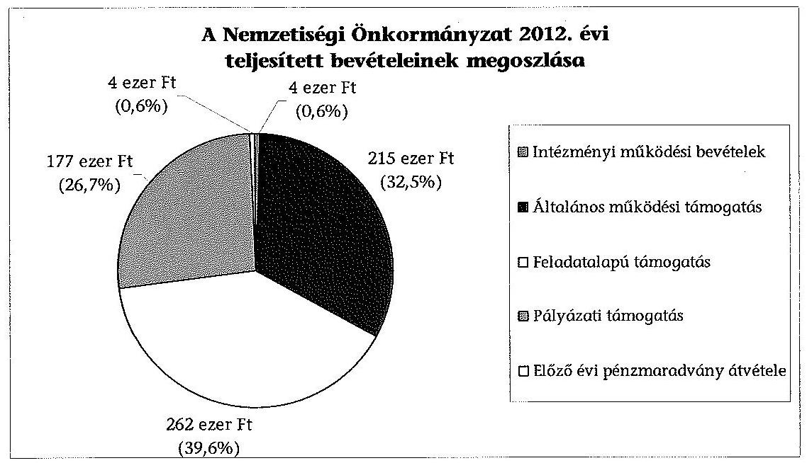
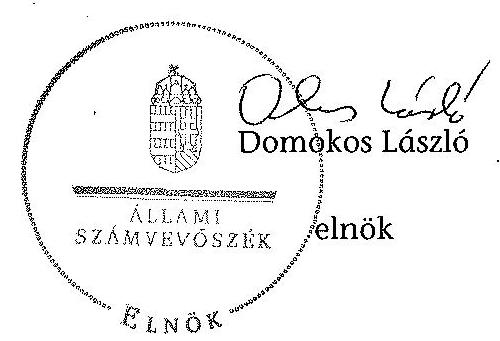

# ÁLLAMI   SZÁMVEVŐSZÉK 

## JELENTÉS

a helyi nemzetiségi önkormányzatok gazdálkodásának ellenőrzéséről
Budapest Főváros XVI. Kerületi Roma Önkormányzat

---

# Állami Számvevőszék 

Iktatószám: V-0287-015/2014.
Témaszám: 1320
Vizsgálat-azonosító szám: V065240
Az ellenőrzést felügyelte:
Horváth Balázs
felügyeleti vezető
Az ellenőrzést vezette és az ellenőrzés végrehajtásáért felelős:
Kisgergely István
ellenőrzésvezető
A számvevőszéki jelentést készítették és a jelentés összeállításában
közreműködött:
Beloval Sándorné
számvevő főtanácsos
Varga József
számvevő tanácsos
Az ellenőrzést végezte:
Varga József
számvevő tanácsos

---

# TARTALOMJEGYZÉK 

BEVEZETÉS ..... 3
I. ÖSSZEGZŐ MEGÁLLAPÍTÁSOK, KÖVETKEZTETÉSEK, JAVASLATOK ..... 6
II. RÉSZLETES MEGÁLLAPÍTÁSOK ..... 13

1. A Nemzetiségi Önkormányzat és a XVI. Kerületi Önkormányzat együttműködésének szabályozása, a működési feltételek biztosítása ..... 13
2. A gazdálkodási feladatok ellátásának szabályszerűsége ..... 14
2.1. A költségvetésre és a zárszámadásra, valamint a kincstári adatszolgáltatás rendjére vonatkozó jogszabályi előírások betartása ..... 14
2.2. A Nemzetiségi Önkormányzat gazdálkodásának szabályozottsága ..... 15
2.3. Az operatív gazdálkodási jogkörök kialakítása, gyakorlása ..... 16
3. A Nemzetiségi Önkormányzattal összefüggő gazdálkodási feladatok belső ellenőrzése ..... 17
4. A feladatalapú támogatás felhasználásának, elszámolásának szabályszerűsége, a Nemzetiségi Önkormányzat feladatellátása ..... 18
MELLÉKLETEK
5. számú A Nemzetiségi Önkormányzat 2012. évi gazdálkodásának főbb adatai, mutatói
FÜGGELÉKEK
6. számú Rövidítések jegyzéke
7. számú Értelmező szótár
8. számú A gazdálkodás értékelésének módszere

---

.

---

# JELENTÉS   a helyi nemzetiségi önkormányzatok gazdálkodásának ellenőrzéséről Budapest Főváros XVI. Kerületi Roma Önkormányzat 

## BEVEZETÉS

A Nemzetiségi Önkormányzat 1995-ben alakult, elnöke a 2010. évi helyhatósági választások óta látja el feladatát. A Nemzetiségi Önkormányzat intézményt, gazdasági társaságot és más szervezetet nem alapított. A négytagú Képviselő-testület munkája segítésére bizottságot nem hozott létre. A Nemzetiségi Önkormányzatnak a költségvetési beszámolója szerint a 2012. évben a módosított költségvetési bevételi és kiadási előirányzata 662 ezer Ft, a teljesített költségvetési bevétele 662 ezer Ft, a teljesített költségvetési kiadása 657 ezer Ft volt. A 2012. évi gazdálkodási adatokat részletesen az 1. számú mellékletben mutatjuk be.

Az Alaptörvény XXIX. cikk (1) bekezdése szerint a Magyarországon élő nemzetiségek államalkotó tényezők. Minden, valamely nemzetiséghez tartozó magyar állampolgárnak joga van önazonossága szabad vállalásához és megőrzéséhez. A hazánkban élő nemzetiségek helyi (települési és területi), valamint országos önkormányzatokat hozhatnak létre. A helyi nemzetiségi önkormányzatok gazdálkodási feladatait jogszabályi előírás alapján a székhely szerinti helyi önkormányzat polgármesteri hivatala látja el.

A nemzetiségek helyzete, támogatása mind hazai, mind EU-s szinten kiemelt figyelmet kap napjainkban. A helyi nemzetiségi önkormányzatok gazdálkodására és támogatási rendszerére vonatkozó jogszabályok a 2010-2012. években jelentős változásokon mentek át. A települési és területi nemzetiségi önkormányzatok gazdálkodásának, a részükre juttatott költségvetési támogatások felhasználásának ellenőrzését az ÁSZ a 2012. évben sorozatjellegű ellenőrzés keretében indította el. A 2013. évi ellenőrzések e témacsoportos ellenőrzések folytatását jelentik, amelyet az ÁSZ 2014 első félévi ellenőrzési terve 12 témasorszámon tartalmaz.

Az ellenőrzés célja annak értékelése volt, hogy a Nemzetiségi Önkormányzat gazdálkodási kereteinek kialakítása, gazdálkodása és feladatellátása megfelelt-e a jogszabályoknak.

---

Ennek keretében értékeltük, hogy:

- a Nemzetiségi Önkormányzat és a XVI. Kerületi Önkormányzat együttműködésének szabályozása, a működési feltételek biztosítása megfelelt-e a jogszabályi előírásoknak;
- a felek együttműködése megfelelt-e a közöttük létrejött megállapodásnak a gazdálkodási feladatok szabályszerű ellátása során, ennek keretében betartották-e a helyi nemzetiségi önkormányzat gazdálkodásához kapcsolódóan a költségvetésre és zárszámadásra, a gazdálkodás szabályozására, az operatív gazdálkodási jogkörök gyakorlására vonatkozó jogszabályi előírásokat;
- a jegyző biztosította-e a nemzetiségi önkormányzat gazdálkodásának belső ellenőrzését;
- a nemzetiségi önkormányzat feladatalapú támogatásának felhasználása, a folyósított feladatalapú támogatással történő elszámolás az előírásoknak megfelelő volt-e;
- a nemzetiségi önkormányzat feladatellátása összhangban volt-e a vonatkozó jogszabályi előírásokkal.

Az ellenőrzés várható hasznosulását négy szinten tervezzük. A törvényalkotás számára összegzett tapasztalatok állnak rendelkezésre a nemzetiségi önkormányzatok testületi döntéseinek, gazdálkodásának és a feladatalapú támogatás felhasználásának szabályszerűségéről, amelynek alapján következtetést lehet levonni arra, hogy indokolt-e jogszabályi módosítás kezdeményezése. Az ellenőrzés az ellenőrzött számára visszajelzést ad a működésében fellépő hiányosságokról, javaslataival hozzájárul azok kiküszöböléséhez, amely csökkentheti a későbbi ellenőrzések gyakoriságát. Az ellenőrzés megállapításai és javaslatai tanulságul szolgálhatnak más nemzetiségi önkormányzatok, szervezetek számára a rendezett gazdálkodási keretek kialakításához. A társadalom számára jelzi, hogy közpénz nem maradhat ellenőrizetlenül, az ÁSZ értékteremtő rend kialakításához és megőrzéséhez hozzájáruló tevékenysége pozitív hatással lesz a szervezetről kialakított összkép formálásában. Az ÁSZ szervezetén belül lehetőség nyílik arra, hogy a megállapítások szintetizálásával az intézmény a hozzáadott értéket teremtő elemző tevékenységét és tanácsadó szerepét erősítse.

A Nemzetiségi Önkormányzat gazdálkodásának ellenőrzéséről szóló jelentés I. fejezetének összegző része az ellenőrzés céljára adott rövid, szintetizáló összefoglalót és következtetéseket tartalmazza a II. fejezet részletes megállapításain alapulóan. A jelentés intézkedést igénylő megállapításait és javaslatait - az összegzőben foglaltak mellett - az ellenőrzés során feltárt, a jelentés II. fejezetében rögzített részletes megállapítások alapozzák meg, illetve támasztják alá.

# Az ellenőrzés típusa: szabályszerűségi ellenőrzés 

Az ellenőrzött időszak: a 2012. január 1. - 2012. december 31. közötti időszak. Az ellenőrzés kiterjedt a helyi nemzetiségi önkormányzatnak juttatott 2012. évi támogatás 2013. évben való elszámolására is.

---

Ellenőrzött szervezet: Budapest Főváros XVI. Kerületi Roma Önkormányzat és a gazdálkodási feladatait ellátó Budapest Főváros XVI. Kerületi Önkormányzat.

Az ellenőrzés végrehajtásának jogszabályi alapját az ÁSZ tv. 5. § (2)-(3) és (6) bekezdéseiben foglaltak képezik.

Az ellenőrzés szakmai módszertana az ÁSZ hivatalos honlapján (www.asz.hu) közzétett szakmai szabályokon alapult, amely a Legfőbb Ellenőrző Intézmények Nemzetközi Szervezete (INTOSAI) által kiadott nemzetközi standardok (ISSAI) figyelembevételével készült.

A helyi nemzetiségi önkormányzatok gazdálkodásának ellenőrzése során értékeltük a XVI. Kerületi Önkormányzat és a Nemzetiségi Önkormányzat együttműködésének, a gazdálkodás szabályozottságának és a pénzügyi folyamatokban kulcsszerepet betöltő belső kontrollok (teljesítésigazolás és érvényesítés) működésének megfelelőségét. A kulcskontrollokat a működési és felhalmozási célú támogatásértékű kiadásoknál, a dologi kiadásokkal kapcsolatos kifizetéseknél - véletlen mintavételi eljárást alkalmazva - ellenőriztük. Ellenőriztük, hogy a jegyző biztosította-e a Nemzetiségi Önkormányzat gazdálkodásának belső ellenőrzését. Értékeltük a feladatalapú támogatások felhasználásának, elszámolásának szabályszerűségét, a Nemzetiségi Önkormányzat feladatellátása és a jogszabályi előírások összhangját.

Az ellenőrzés lefolytatásához a Nemzetiségi Önkormányzat és a gazdálkodási feladatait ellátó XVI. Kerületi Önkormányzat tanúsítványok és a kapcsolódó, dokumentumjegyzékben megjelölt dokumentumok elektronikus úton történő megküldésével, rendelkezésre bocsátásával szolgáltatott adatokat. Az adatszolgáltatás kontrollálása és szükség szerinti javítása a helyszíni ellenőrzés keretében történt. A minősítési szempontokat a 3. számú függelék tartalmazza.

Az ÁSZ tv. 29. § (1) bekezdése szerint a jelentéstervezetet megküldtük észrevételezésre a polgármesternek és a Nemzetiségi Önkormányzat elnökének. A polgármester és a Nemzetiségi Önkormányzat elnöke az ÁSZ tv. 29. § (2) bekezdésében foglalt észrevételezési jogával nem élt, a jelentéstervezetre észrevételt nem tett.

---

# I. ÖSSZEGZŐ MEGÁLLAPÍTÁSOK, KÖVETKEZTETÉSEK, JAVASLATOK 

A Nemzetiségi Önkormányzat és a XVI. Kerületi Önkormányzat együttműködésének szabályozása részben felelt meg a jogszabályi előírásoknak. A 2010-ben kötött együttműködési megállapodást a Nek. tv. előírása ellenére 2012. január 31-éig nem vizsgálták felül, 2012. június 1-jéig nem történt meg az együttműködési megállapodás kiegészítése, aláírása. A 2012. december 31-én hatályban lévő együttműködési megállapodás a Nek. tv.-ben foglaltaknak részben megfelelően szabályozta a Nemzetiségi Önkormányzat működésének feltételeit. Az Áht.-ben előírtak közül tartalmazta a tervezési, gazdálkodási, ellenőrzési, finanszírozási, adatszolgáltatási és beszámolási feladatokat, azonban a Nek. tv. előírása ellenére nem rendelkeztek benne a teljesítésigazolás eljárási és dokumentációs szabályairól. Nem írták elő a kötelezettségvállalások nyilvántartásának vezetését, valamint a Nemzetiségi Önkormányzat testületi ülésein a jegyző megbízásából részt vevő személy képesítési követelményeit. Az együttműködési megállapodás szerinti működési feltételeket a Nek. tv. előírása ellenére a megállapodás megkötését követő 30 napon belül nem rögzítették a Nemzetiségi Önkormányzat SZMSZ-ében. A szabályozási hiányosságok ellenére a XVI. Kerületi Önkormányzat a Nemzetiségi Önkormányzat részére 2012-ben biztosította az előírt működési feltételeket.

A Nemzetiségi Önkormányzat 2012. évi költségvetésének és zárszámadásának tartalma, jóváhagyása, az előírt határidők betartása részben felelt meg, a kapcsolódó 2012. évi adatszolgáltatás szabályszerűsége megfelelt a jogszabályi előírásoknak. A Nemzetiségi Önkormányzat 2012. évi költségvetési határozat-tervezetét az Áht. előírásainak megfelelő határidőben elkészítették és benyújtották a Képviselő-testületnek, amely azt jóváhagyta. A költségvetési határozattervezet előterjesztésekor tájékoztatásul - szöveges indoklással - nem mutatták be az Áht.-ben előírt költségvetési mérleget közgazdasági tagolásban, valamint az előirányzat felhasználási tervet. A zárszámadási határozat tervezetét az Áht.-ben előírt határidőt követően terjesztették a Képviselőtestület elé. A zárszámadás és az elfogadott költségvetés összehasonlíthatóságát az Áht. előírásának megfelelően biztosították. A zárszámadás a Nemzetiségi Önkormányzat valamennyi bevételét és kiadásait tartalmazta. Az év során az előírt kincstári adatszolgáltatási kötelezettségnek a jegyző az Ávr.-ben előírt határidőben eleget tett.

A gazdálkodás szabályozottsága nem volt megfelelő, mert a Polgármesteri Hivatal SZMSZ-e az Ávr. előírása ellenére nem tartalmazta az SZMSZ-ben nevesített munkakörökhöz tartozó, a Nemzetiségi Önkormányzat gazdálkodásának végrehajtásával kapcsolatos feladat- és hatáskörökre, a hatáskörök gyakorlásának módjára, a helyettesítés rendjére, az ezekhez kapcsolódó felelősségi szabályokra vonatkozó előírásokat. A Nemzetiségi Önkormányzat rendelkezett a Számv. tv-ben előírt számviteli politikával és a kapcsolódó leltározási és leltár-készítési-, az eszközök és források értékelési szabályzatával, pénzkezelési szabályzattal és számlarenddel, azonban a számviteli politikában rögzített, operatív gazdálkodásra vonatkozó szabályozás az Ávr. előírása ellenére nem tartal-

---

mazta a teljesítésigazolás gyakorlásának módjával, eljárási és dokumentációs részlet-szabályaival, valamint a teljesítésigazolást végző személyek kijelölésével kapcsolatos rendelkezéseket. A Nemzetiségi Önkormányzat gazdálkodásának végrehajtási feladataira nem terjesztették ki a Bkr.-ben előírt, a XVI. Kerületi Önkormányzat Polgármesteri Hivatalára kiadott ellenőrzési nyomvonalat és a szabálytalanságok kezelése eljárásrendjének hatályát, azokkal a Nemzetiségi Önkormányzat önállóan sem rendelkezett. A Polgármesteri Hivatal SZMSZ-ében rögzítették a tervezéssel, gazdálkodással, a pénzügyi ellenjegyzéssel, az érvényesítés módjával, eljárási és dokumentálási részletszabályaival, valamint az ezeket végző személyek kijelölésének rendjével, az ellenőrzési és adatszolgáltatási feladatok teljesítésével kapcsolatos belső előírásokat.

A Nemzetiségi Önkormányzat gazdálkodása tekintetében az operatív gazdálkodási jogkörök kialakítása részben felelt meg a jogszabályi előírásoknak, mert a Nemzetiségi Önkormányzat elnöke az Áht. 2 és az Ávr. előírásainak ellenére hiányosan szabályozta a teljesítésigazolást, nem állt rendelkezésre a teljesítésigazolást végző személy aláírás-mintája és a Nemzetiségi Önkormányzat által vállalt kötelezettségekről nem vezették az Ávr.-ben előírt nyilvántartást. A jegyző az Ávr. előírásainak megfelelően, szabályszerűen jelölte ki a pénzügyi ellenjegyzésre és az érvényesítésre jogosultakat, mert a XVI. Kerületi Önkormányzat az ellenőrzött időszakban nem rendelkezett gazdasági szervezettel.

A Nemzetiségi Önkormányzatnál a 2012. évben a dologi kiadások teljesítése során a teljesítésigazolás és az érvényesítés kulcskontrollok működésének megfelelősége gyenge volt, a hibák száma a lényegességi szintet, a kritikus hibahatárt elérte. A Nemzetiségi Önkormányzat elnöke az Ávr. előírásai ellenére jogszerűtlenül végezte a teljesítésigazolási feladatokat. Teljesítésigazolást és utalványozást az Ávr. előírásai ellenére közeli hozzátartozója javára is végzett. Az érvényesítő nem az Ávr. előírásai alapján végezte feladatát, mert nem a teljesítés igazolása alapján érvényesített, nem észrevételezte, hogy a teljesítésigazolást jogszerűtlenül történt, nem jelezte a kötelezettségvállalási nyilvántartás vezetésének hiányát. A dologi kiadások közül kiválasztott három legnagyobb összegű kiadás teljesítése során a teljesítésigazolás és az érvényesítés kulcskontrollok működése
 nem volt megfelelő. Az Ávr. előírásai ellenére a teljesítésigazoló jogszerűtlenül végezte feladatát. Az érvényesítéssel kapcsolatban feltárt hiányosságok megegyeztek a dologi kiadásoknál leírtakkal. A Nemzetiségi Önkormányzat a 2012. évben államháztartáson kívülre működési, vagy felhalmozási célú pénzeszközátadást nem teljesített. A számvevőszéki ellenőrzés a kiadások dokumentumainak ellenőrzése alapján jogosulatlan kifizetést nem tárt fel, azonban a kulcskontrollok működéséhez kapcsolódó hiányosságok miatt nem biztosított a hibák megelőzése, feltárása és kijavítása.

A jegyző a Polgármesteri Hivatal belső ellenőrzése keretében biztosította a Nemzetiségi Önkormányzat gazdálkodásával összefüggő végrehajtási feladatok belső ellenőrzését. Az együttműködési megállapodás $_{1,3}$-ban rögzítették, hogy a Polgármesteri Hivatal belső ellenőrzési tevékenysége kiterjed a Nemzetiségi Önkormányzat számviteli nyilvántartásainak ellenőrzésére. A Polgármesteri Hivatal 2012. évi belső ellenőrzési tervét megalapozó, a Ber.-ben előírt kockázatelemzés nem terjedt ki a Nemzetiségi Önkormányzat gazdálkodásával összefüggő végrehajtási feladatokra. A 2012. évre tervezett belső ellenőrzést elvégezték, az ellenőrzési jelentés hiányosságokat állapított meg, javaslatokat tett, de azoknak nem volt címzettje, nem tartalmazta, hogy mely nemzetiségi önkormányzatra vonatkoznak a megállapítások. A jegyző a Nemzetiségi Önkormányzatot érintő belső ellenőrzés megállapításairól annak elnökét és a Képviselő-testületét nem tájékoztatta, ezért az elnök a belső ellenőrzési jelentés elkészítésekor hatályos együttműködési megállapodás $_{1}$ 6. pontjában foglalt realizálási feladatainak végrehajtása elmaradt. A feltárt hiányosságok miatt a belső ellenőrzési tevékenység részben hasznosult a Nemzetiségi Önkormányzat operatív gazdálkodási feladatainak végrehajtásában. Az ellenőrzéshez szolgáltatott adatok alapján a Kormányhivatal 2012-ben a Nemzetiségi Önkormányzatot illetően nem élt törvényességi felügyeleti eszközökkel.

A Nemzetiségi Önkormányzat részére 2011. és 2012. évben folyósított feladatalapú támogatás elszámolása a jogszabályi előírásoknak nem felelt meg. A Nemzetiségi Önkormányzat a 2011. évi 256,3 ezer Ft összegű feladatalapú támogatását a tárgyévben teljes összegében felhasználta. A 2012. évben 262 ezer Ft feladatalapú támogatásban részesült. A Nemzetiségi Önkormányzat a kapott támogatás összegével 2012. évi költségvetését módosította. A feladatalapú támogatás felhasználására határozatokat hoztak, amelyek alapján a támogatást a 2012. évben teljes egészében felhasználták. A feladatalapú támogatásokról a támogatási kormányrendelet $_{1,2}$ előírása alapján az Áht $_{1,2}$-ben foglaltak ellenére az elszámolások nem történtek meg, a támogatások felhasználását, elszámolását az ellenőrzésre jogosult szervek nem ellenőrizték.

A Nemzetiségi Önkormányzat kötelező és önként vállalt feladatellátásának tárgya - a képviselt közösség esélyegyenlőségének megteremtésével kapcsolatos feladatok ellátása, kapcsolat a helyi nemzetiségi civil szervezetekkel, oktatási, kulturális és ifjúsági programok - összhangban volt a Nek. $_{2}$ tv.-ben foglalt előírásokkal.

Az ÁSZ tv. 33. § (1) bekezdésében foglaltak értelmében az ellenőrzött szervezet vezetője köteles a jelentésben foglalt megállapításokhoz kapcsolódó intézkedési tervet összeállítani és azt a jelentés kézhezvételétől számított 30 napon belül az ÁSZ részére megküldeni. Amennyiben az intézkedési tervet határidőre nem küldi meg a szervezet, vagy az nem elfogadható, az ÁSZ elnöke az ÁSZ tv. 33. § (3) bekezdés a)-b) pontjaiban foglaltakat érvényesítheti.

A helyszíni ellenőrzés megállapításainak hasznosítása mellett javasoljuk:

# a jegyzőnek 

1. az együttműködés szabályozásával kapcsolatban

Az együttműködési megállapodás $_{1}$-t a Nek. $_{2}$ tv. 80. § (2) bekezdésének előírása ellenére 2012. január 31-éig nem vizsgálták felül.

A Nek. $_{2}$ tv. 80. § (3) bekezdésének b)-d) pontjaiban foglaltak ellenére az együttműködési megállapodás $_{2}$-ben nem rögzítették a szakmai teljesítésigazolási feladatok eljárási és dokumentációs részletszabályait, a teljesítésigazolást végző feladatait, a felelősök konkrét kijelölését, továbbá nem írták elő a kötelezettségvállalások nyilvántartására vonatkozó szabályokat. A Nek. $_{2}$ tv. 80. § (4) bekezdésében foglaltak ellenére a megállapodás nem tartalmazta a testületi ülésen a jegyző megbízásából résztvevő személy képesítési követelményeit.

A Nek. 2 tv. 80. § (2) bekezdésében foglaltak ellenére az együttműködési megállapodásban rögzített működési feltételeket nem rögzítették a Nemzetiségi Önkormányzat SZMSZ-ében.

Javaslat
Az együttműködés szabályszerűsége érdekében:
a) biztosítsa a jövőben az együttműködési megállapodás évenkénti felülvizsgálata során a Nek. 2 tv. 80. § (2) bekezdésében előírt határidő betartását;
b) készítse elő az együttműködési megállapodás $_{2}$ módosítását, hogy az tartalmilag feleljen meg a Nek. 2 tv. 80. § (3) bekezdés b)-d) pontjaiban, valamint a Nek. 2 tv. 80. § (4) bekezdésében foglalt előírásoknak;
c) készítse elő a Nemzetiségi Önkormányzat SZMSZ-ének a Nek. $_{2}$ tv. 80. § (2) bekezdésében foglalt előírás alapján történő kiegészítését.
2. a költségvetés előterjesztésével kapcsolatban

A 2012. évi költségvetési határozattervezet előterjesztésekor - a jegyző mulasztása miatt - a Képviselő-testület részére tájékoztatásul nem mutatták be - szöveges indoklással - az Áht. $_{2}$ 24. § (4) bekezdés a) pontjában előírt költségvetési mérleget közgazdasági tagolásban, valamint az előirányzat felhasználási tervet.

Javaslat
Készítse elő a jövőben a költségvetési határozattervezet előterjesztéséhez a Képviselő-testület tájékoztatására az Áht. $_{2}$ 24. § (4) bekezdés a) pontja előírásának megfelelően szöveges indoklással együtt a Nemzetiségi Önkormányzat költségvetési mérlegét közgazdasági tagolásban, valamint az előirányzat felhasználási tervet.
3. a gazdálkodás szabályozottságával kapcsolatban

A Polgármesteri Hivatal SZMSZ-e nem tartalmazta az Ávr. 13. § (1) bekezdés g) pontjában foglaltak szerinti, az SZMSZ-ben nevesített munkakörökhöz tartozó - a Nemzetiségi Önkormányzat gazdálkodásának végrehajtásával kapcsolatos - feladat- és hatáskörökre, a hatáskörök gyakorlásának módjára, a helyettesítés rendjére, az ezekhez kapcsolódó felelősségi szabályokra vonatkozó előírásokat. A Bkr. 6. § (3)(4) bekezdései szerinti ellenőrzési nyomvonal és szabálytalanságok kezelésének eljárásrendje nem terjedt ki a Nemzetiségi Önkormányzat gazdálkodásának végrehajtási feladataira, ezekkel a szabályzatokkal a Nemzetiségi Önkormányzat önállóan sem rendelkezett.

A Számviteli politikában az operatív gazdálkodásra vonatkozó szabályok az Ávr. 53. § (2) bekezdésben foglaltak ellenére nem tartalmazták a 100 ezer Ft alatti, előzetes írásbeli kötelezettségvállalást nem igénylő kifizetések rendjével, a teljesítésigazolás gyakorlásának módjával, eljárási és dokumentációs részletszabályaival, valamint a teljesítésigazolást végző személyek kijelölésével kapcsolatos rendelkezéseket.

Javaslat
A gazdálkodás szabályszerűsége érdekében a Nemzetiségi Önkormányzat gazdálkodására is kiterjedően:
a) készítse el a Polgármesteri Hivatal SZMSZ-ének módosítását, hogy az tartalmazza az Ávr. 13. § (1) bekezdés g) pontjában foglaltakat;
b) módosítsa a Polgármesteri Hivatal Bkr. 6. § (3)-(4) bekezdései szerinti ellenőrzési nyomvonalát és a szabálytalanságok kezelése eljárásrendjének hatályát;
c) egészítse ki a Számviteli politika operatív gazdálkodási feladatokra vonatkozó végrehajtási szabályait az Ávr. 53. § (2) bekezdésben foglaltaknak megfelelően.
4. a kulcskontrollok működésével kapcsolatban

A teljesítésigazolást nem az Ávr. 57. § (4) bekezdése szerinti, szabályszerű kijelöléssel rendelkező személy végezte, ezért az Ávr. 57. § (3) bekezdésével ellentétesen nem szabályszerűen történt a kifizetés jogosságának, összegszerűségének és a szerződésszerű teljesítésnek az igazolása, továbbá a teljesítésigazoló az Ávr. 60. § (2) bekezdésében foglaltak ellenére a teljesítésigazolást a Ptk. 685. § (2) bekezdésében meghatározott közeli hozzátartozója javára látta el.

Az érvényesítő az Ávr. 58. § (1)-(2) bekezdése ellenére nem látta el feladatát, mert nem ellenőrizte a megelőző ügymenetben a jogszabályi előírások betartását és nem jelezte az utalványozónak, hogy nem szabályszerűen történt meg a teljesítésigazolás, az Ávr. 56. §. (1) bekezdésében előírt kötelezettségvállalási nyilvántartást nem vezették.

Javaslat
Az operatív gazdálkodás működési hibáinak megelőzése, feltárása és kijavítása érdekében gondoskodjon arról, hogy:
a) a teljesítésigazolást az Ávr. 57. § (4) bekezdése szerinti, szabályszerű kijelöléssel rendelkező személy az Ávr. 57. § (3) bekezdésében előírtaknak megfelelően, az Ávr. 60. § (2) bekezdésében foglalt összeférhetetlenségi követelmények betartásával végezze;
b) az érvényesítő az Ávr. 58. § (1)-(2) bekezdésének megfelelően maradéktalanul végezze el ellenőrzési és jelzési feladatait.

5. a feladatalapú támogatás elszámolásával kapcsolatban

A 2011. évi feladatalapú támogatás elszámolása a támogatási kormányrendelet $_{1}$ 7. § (2) bekezdésében hivatkozott, valamint a 2012. évi feladatalapú támogatás elszámolása a támogatási kormányrendelet $_{2}$ 8. § (5) bekezdésében hivatkozott „a helyi önkormányzatok elszámolási és ellenőrzési rendjére vonatkozó jogszabályok rendelkezései alkalmazandóak" előírása alapján az Áht. 64. § (7) bekezdése, és az Áht. 2 57. § (3) bekezdése ellenére nem történt meg.

Javaslat
Gondoskodjon az Áht. 2 27. § (2) bekezdésében meghatározott feladatkörében a Nemzetiségi Önkormányzat által igénybevett 2011. és 2012. évi feladatalapú támogatás felhasználásáról szóló elszámolás elkészítéséről, az Áht. 2 53. § (1) bekezdésében szerinti beszámolási kötelezettség teljesítéséhez.

# a polgármesternek 

A Nek. 2 tv. 80. § (3) bekezdésének b)-d) pontjaiban foglaltak ellenére az együttműködési megállapodás $_{2}$-ben nem rögzítették a szakmai teljesítésigazolási feladatok eljárási és dokumentációs részletszabályait, a teljesítésigazolást végző feladatait, a felelősök konkrét kijelölését, továbbá nem írták elő a kötelezettségvállalások nyilvántartására vonatkozó szabályokat. A Nek. 2 tv. 80. § (4) bekezdésében foglaltak ellenére az együttműködési megállapodás $_{2}$ nem tartalmazta a testületi ülésen a jegyző megbízásából résztvevő személy képesítési követelményeit.

A Polgármesteri Hivatal SZMSZ-e nem tartalmazta az Ávr. 13. § (1) bekezdés g) pontjában foglaltak szerinti, az SZMSZ-ben nevesített munkakörökhöz tartozó - a Nemzetiségi Önkormányzat gazdálkodásának végrehajtásával kapcsolatos - feladat- és hatáskörökre, a hatáskörök gyakorlásának módjára, a helyettesítés rendjére, az ezekhez kapcsolódó felelősségi szabályokra vonatkozó előírásokat.

Javaslat
Terjessze a XVI. Kerületi Önkormányzat Képviselő-testülete elé jóváhagyásra:
a) az együttműködési megállapodás jegyző által előkészített módosítását, hogy az tartalmilag megfeleljen a Nek. 2 tv. 80. § (3) bekezdés b-d) pontjaiban, valamint a Nek. 2 tv. 80. § (4) bekezdésében foglalt előírásoknak;
b) a Polgármesteri Hivatal SZMSZ-ének jegyző által elkészített módosítását, hogy az tartalmazza - a Nemzetiségi Önkormányzat gazdálkodásának végrehajtására vonatkozóan - az Ávr. 13. § (1) bekezdés g) pontjában foglaltakat.

## a Nemzetiségi Önkormányzat elnökének

1. A Nek. 2 tv. 80. § (3) bekezdésének b)-d) pontjaiban foglaltak ellenére az együttműködési megállapodás $_{2}$-ben nem rögzítették a szakmai teljesítésigazolási feladatok eljárási és dokumentációs részletszabályait, a teljesítésigazolást végző feladatait, a felelősök konkrét kijelölését, továbbá nem írták elő a kötelezettségvállalások nyilvántartására vonatkozó szabályokat. A Nek. 2 tv. 80. § (4) bekezdésében foglaltak ellenére a megállapodás nem tartalmazta a testületi ülésen a jegyző megbízásából résztvevő személy képesítési követelményeit.

A Nek. 2 tv. 80. § (2) bekezdésében foglaltak ellenére az együttműködési megállapodás szerinti működési feltételeket nem rögzítették a Nemzetiségi Önkormányzat SZMSZ-ében.

Javaslat
Terjessze a Képviselő-testület elé jóváhagyásra:
a) a jegyző által előkészített együttműködési megállapodás $_{2}$ módosítását, hogy az tartalmilag megfeleljen a Nek. 2 tv. 80. § (3) bekezdés b-d) pontjában, valamint a Nek. 2 tv. 80. § (4) bekezdésében foglalt előírásoknak;
b) a Nemzetiségi Önkormányzat SZMSZ-ének jegyző által előkészített módosítását, hogy az megfeleljen a Nek. 2 tv. 80. § (2) bekezdésében előírtaknak.
2. A Nemzetiségi Önkormányzat elnöke a 2012. évi költségvetés előterjesztésekor - a jegyző mulasztása miatt - a Képviselő-testület részére tájékoztatásul az Áht. 2 24. § (4) bekezdés a) pontjában előírtak ellenére nem mutatta be szöveges indoklással a Nemzetiségi Önkormányzat költségvetési mérlegét közgazdasági tagolásban és az előirányzat-felhasználási tervét.

Javaslat
A jövőben a költségvetési határozattervezet Képviselő-testület elé terjesztésekor tájékoztatásul mutassa be - szöveges indoklással együtt - a jegyző által elkészített, az Áht. 2 24. § (4) bekezdés a) pontjában előírt költségvetési mérleget közgazdasági tagolásban és az előirányzat-felhasználási tervet.
3. A Nemzetiségi Önkormányzat elnöke, mint kötelezettségvállaló az Ávr. 57. § (4) bekezdésében foglalt előírások
 ellenére nem jelölt ki írásban teljesítésigazolókat.

Javaslat
Jelölje ki az Ávr. 57. § (4) bekezdésében foglalt előírásoknak megfelelően írásban a teljesítésigazolókat.
4. A 2011. évi feladatalapú támogatás elszámolása a támogatási kormányrendelet 7. § (2) bekezdésében hivatkozott, valamint a 2012. évi feladatalapú támogatás elszámolása a támogatási kormányrendelet 8. § (5) bekezdésében hivatkozott „a helyi önkormányzatok elszámolási és ellenőrzési rendjére vonatkozó jogszabályok rendelkezései alkalmazandóak" előírása alapján az Áht. 64. § (7) bekezdése, és az Áht. 57. § (3) bekezdése ellenére nem történt meg.

Javaslat
Terjessze a Képviselő-testület elé az Áht. 53. § (1) bekezdése szerinti beszámolási kötelezettség teljesítéséhez összeállított, a Nemzetiségi Önkormányzat által igénybevett 2011. és 2012. évi feladatalapú támogatás felhasználásáról szóló elszámolást.

---

# II. RÉSZLETES MEGÁLLAPÍTÁSOK 

## 1. A Nemzetiségi Önkormányzat és a XVI. Kerületi Önkormányzat együttműködésének szabályozása, a működési feltételek biztosítása

A Nemzetiségi Önkormányzat és a XVI. Kerületi Önkormányzat együttműködésének szabályozása, a működési feltételek biztosítása részben felelt meg a jogszabályi előírásoknak.

A 2010. december 20-án aláírt együttműködési megállapodásnak a felülvizsgálata 2012. január 31-ig nem történt meg, de a Nek. tv hatálybalépését követően előkészítették az új együttműködési megállapodás tervezetét, amelynek aláírására az előírt június 1-jei határidőt követően, 2012. október 19-én került sor. A Kormányhivatal írásban nem kezdeményezett egyeztetést a Nemzetiségi Önkormányzat és a XVI. Kerületi Önkormányzat között az együttműködési megállapodás megkötésére.

Az együttműködési megállapodás tervezetét a Nemzetiségi Önkormányzat Képviselő-testülete 2012. május 20-án megtárgyalta és határozatával arról döntött, hogy a Nemzetiségi Önkormányzat elnöke a határozat melléklete szerinti feltételekkel június 15-ig aláírhatja a megállapodást.

A mellékletben rögzítették, hogy 2012 második félévében a Nemzetiségi Önkormányzat és a XVI. Kerületi Önkormányzat 2012. második félévében hét évre szóló szándéknyilatkozatot ír alá a „Roma Integráció a XVI. Kerületben 2013-2020" projekt megvalósítására. A tervezet szerint a program kiterjed „az oktatásra, kultúrára, a foglalkoztatásra, szociális ügyekre, egészségügyre, lakáshelyzetre, a hátrányos megkülönböztetésre, rendszeres sportolási lehetőségre valamint egy roma közösségi ház fenntartására ahol a roma képviselők is végezhetik a munkájukat". Ezt a feltételt a XVI. Kerületi Önkormányzat nem fogadta el, ami az együttműködési megállapodás aláírásának késedelmét okozta.

Az együttműködési megállapodás a Nemzetiségi Önkormányzat működési feltételeit a Nek. tv. 80. § (1) bekezdésében foglaltaknak részben megfelelően tartalmazta. A Nemzetiségi Önkormányzat nem tett eleget a Nek. tv. 80. § (2) bekezdésében előírt kötelezettségének, mert az együttműködési megállapodás megkötését követő 30 napon belül nem rögzítette SZMSZ-ében a megállapodás szerinti működési feltételeket.

Az Áht.-ben előírt tervezési, gazdálkodási, finanszírozási, adatszolgáltatási és beszámolási feladatok ellátásának szabályait az együttműködési megállapodásban csak részben rögzítették, mert:

- nem gondoskodtak a Nek. tv. 80. § (3) bekezdés b) és d) pontjaiban foglaltaknak megfelelően a teljesítésigazolási feladatok ellátásáról, nem szabá-

[^0]
[^0]:    ${ }^{1}$ A 13/2012. (V. 20.) számú határozattal.

---

lyozták az előzetes írásba foglalást nem igénylő kifizetések rendjét, annak részeként a teljesítésigazolást végző feladatait, az eljárási és dokumentációs részletszabályokat;

- nem írták elő a Nek. tv. 80. § (3) bekezdés c) pontjában foglaltaknak megfelelően a kötelezettségvállalások nyilvántartásának vezetését.

A személyi feltételek biztosításának részeként a XVI. Kerületi Önkormányzat vállalta referens kijelölését, azonban az együttműködési megállapodás a Nek. tv. 80. § (4) bekezdésében foglaltak ellenére nem tartalmazta, hogy a Nemzetiségi Önkormányzat ülésein a jegyző megbízásából részt vevő személy képesítésének meg kell felelnie a jegyzőkre előírt képesítési követelményeknek.

Az együttműködési megállapodásban rögzítették a belső ellenőrzésre és a felelősségre vonatkozó feltételeket, amely szerint a Polgármesteri Hivatal belső ellenőrzési tevékenysége kiterjed a Nemzetiségi Önkormányzat számviteli nyilvántartásainak ellenőrzésére.
„A Nemzetiségi Önkormányzat számviteli nyilvántartásának ellenőrzése a Polgármesteri Hivatal szervezetéhez tartozó függetlenített belső ellenőrzés feladatát képezi. A Nemzetiségi Önkormányzat gazdálkodásának biztonságáért, a képviselő-testület szabályszerűségéért az elnök felel. A veszteséges gazdálkodás következményeiért Budapest Főváros XVI. Kerületi Önkormányzat nem tartozik felelősséggel."

A XVI. Kerületi Önkormányzat - a szabályozás hiányossága ellenére - biztosította a Nemzetiségi Önkormányzat működéséhez szükséges személyi és tárgyi feltételeket.

# 2. A GAZDÁLKODÁSI FELADATOK ELLÁTÁSÁNAK SZABÁLYSZERŰSÉGE 

### 2.1. A költségvetésre és a zárszámadásra, valamint a kincstári adatszolgáltatás rendjére vonatkozó jogszabályi előírások betartása

A Nemzetiségi Önkormányzat 2012. évi költségvetésének és zárszámadásának tartalma, jóváhagyása részben felelt meg, a kapcsolódó - Kincstár részére történő - 2012. évi adatszolgáltatás szabályszerűsége megfelelt a jogszabályi előírásoknak.

A Nemzetiségi Önkormányzat elnöke a 2012. évi költségvetés tervezetét az Áht. előírásainak megfelelően határidőben benyújtotta a Képviselőtestületnek. A jóváhagyott költségvetés tartalmazta az Áht.-ben és az Ávr.-ben előírt tartalmi elemeket, a költségvetési bevételeket és azokkal megegyező összegű költségvetési kiadásokat előirányzat-csoportok, kiemelt előirányzatok szerinti bontásban szöveges indoklással együtt, de az Áht. 24. § (4) bekezdés a) pontjában foglaltak ellenére nem tartalmazta az önkormányzat költségvetési mérlegét közgazdasági tagolásban és az előirányzat felhasználási tervet.

[^0]
[^0]:    ${ }^{2}$ A Képviselő-testület 30/2011. (XII. 21.) számú határozata a Nemzetiségi Önkormányzat 2012. évi költségvetéséről.

---

A jegyző által elkészített 2012. évi zárszámadási határozat-tervezetét a Nemzetiségi Önkormányzat elnöke az Áht. 91. § (1) bekezdésében előírt határidő után terjesztette a Képviselő-testület elé.

A Polgármesteri Hivatalban nem dokumentálták a zárszámadási határozat tervezetének a Nemzetiségi Önkormányzat elnöke részére történő átadását, ezért nem állapítható meg, hogy a határozat előkészítése, vagy a tervezet átvételétől az előterjesztésig eltelt idő miatt következett-e be a késedelem.

A 2012. évi zárszámadási határozat tervezetének előterjesztésénél a Képviselőtestület részére az előterjesztésben tájékoztatásul bemutatták az Áht.-ben foglalt mérlegeket és kimutatásokat. A zárszámadásról a Képviselő-testület határozatot hozott. A zárszámadás és az elfogadott költségvetés összehasonlíthatóságát biztosították, a zárszámadás a Nemzetiségi Önkormányzat valamennyi bevételét és kiadását tartalmazta.

A jegyző a Nemzetiségi Önkormányzat részére előírt 2012. évi adatszolgáltatást az Áhsz.-ben és az Ávr.-ben előírt határidőkre teljesítette a Kincstár felé.

# 2.2. A Nemzetiségi Önkormányzat gazdálkodásának szabályozottsága 

A Nemzetiségi Önkormányzat gazdálkodásának szabályozottsága - az ellenőrzött időszakban - nem felelt meg a jogszabályi előírásoknak, mivel:

- a Polgármesteri Hivatal SZMSZ-e nem tartalmazta az Ávr. 13. § (1) bekezdés g) pontjában foglaltak szerinti, az SZMSZ-ben nevesített munkakörökhöz tartozó - a Nemzetiségi Önkormányzat gazdálkodásának végrehajtásával kapcsolatos - feladat- és hatáskörökre, a hatáskörök gyakorlásának módjára, a helyettesítés rendjére, az ezekhez kapcsolódó felelősségi szabályokra vonatkozó előírásokat;
- az operatív gazdálkodásra vonatkozó szabályokat a Nemzetiségi Önkormányzat önálló számviteli politikájában rögzítették, azonban a szabályozás az Ávr. 53. § (2) bekezdésében foglaltak ellenére nem tartalmazta a 100 ezer Ft alatti, előzetes írásbeli kötelezettségvállalást nem igénylő kifizetések rendjével, az Ávr. 13. § (2) a) pontjában foglaltak ellenére a teljesítésigazolás gyakorlásának módjával, eljárási és dokumentációs részletszabályaival, valamint a teljesítésigazolást végző személyek kijelölésével kapcsolatos rendelkezéseket;
- a XVI. Kerületi Önkormányzat Polgármesteri Hivatala rendelkezett a Bkr. 6. § (3)-(4) bekezdéseiben előírt ellenőrzési nyomvonalat és a szabálytalanságok kezelésének eljárásrendjével, de annak hatályát a Nemzetiségi Önkormányzat gazdálkodásának végrehajtási feladataira nem terjesztették

[^0]
[^0]:    ${ }^{3}$ A zárszámadást a Képviselő-testület a 2013. május 25-i meghívóval összehívott, 2013. május 27-i ülésén fogadta el.
    ${ }^{4}$ A Képviselő-testület 51/2013. (V. 27.) számú határozata a Nemzetiségi Önkormányzat 2012. évi zárszámadásáról.

---

ki, ezekkel a szabályzatokkal a Nemzetiségi Önkormányzat önállóan sem rendelkezett.

A Nemzetiségi Önkormányzat rendelkezett a Számv. tv. által előírt számviteli politikával és annak mellékleteiként a gazdálkodásra vonatkozó - leltározási és leltárkészítési, az eszközök és források értékelési, pénzkezelési és számlarend - szabályzatokkal.

# 2.3. Az operatív gazdálkodási jogkörök kialakítása, gyakorlása 

A Nemzetiségi Önkormányzat gazdálkodása tekintetében az operatív gazdálkodási jogkörök kialakítása részben felelt meg a jogszabályi előírásoknak, mivel a jegyző az Áht. és az Ávr. előírásainak megfelelően írásban kijelölte a Nemzetiségi Önkormányzat kötelezettségvállalásaira és kifizetéseire vonatkozóan a pénzügyi ellenjegyzésre és az érvényesítésre jogosultakat. A számviteli politikában az operatív gazdálkodási jogkörök kialakítása azonban hiányos, azok gyakorlása nem megfelelő volt, mert:

- a Nemzetiségi Önkormányzat elnöke, mint kötelezettségvállaló az Ávr. 57. § (4) bekezdésében foglalt kijelölési kötelezettségének nem tett eleget, írásban nem jelölt ki teljesítésigazolót, és az Ávr. 60. § (3) bekezdésében előírt aláírás-minta sem állt rendelkezésre a teljesítésigazolást végző személy aláírásának azonosításához;
- a Nemzetiségi Önkormányzat által vállalt kötelezettségekről nem vezették az Ávr. 56. § (1) bekezdésében előírt nyilvántartást.

A Nemzetiségi Önkormányzatnál a 2012. évben a dologi kiadások teljesítése során a teljesítésigazolás és az érvényesítés kulcskontrollok működésének megfelelősége gyenge volt, a hibák száma a lényegességi szintet, a kritikus hibahatárt elérte, mert:

- a teljesítés igazolását az Ávr. 57. § (4) bekezdései előírása ellenére a jogkör gyakorlására szabályszerű kijelöléssel és az Ávr. 60. § (3) bekezdésében előírt aláírás-mintával nem rendelkező személy - jogosulatlanul - látta el, ezért az Ávr. 57. § (1) és (3) bekezdésben foglaltak ellenére nem szabályszerűen történt a kifizetés jogosságának, összegszerűségének és a szerződésszerű teljesítésnek az igazolása;
- a teljesítésigazoló az Ávr. 60. § (2) bekezdésében foglaltak ellenére a kiküldetési rendelvények igazolását a Ptk. 685. § (2) bekezdésében meghatározott közeli hozzátartozója javára végezte;
- az érvényesítő nem az Ávr. 58. § (1)-(2) bekezdéseiben előírtak szerint végezte feladatát, mert nem a teljesítés igazolása alapján érvényesített, a teljesítésigazolásnál előfordult szabálytalanságokat nem jelezte az utalványozónak;

[^0]
[^0]:    ${ }^{5}$ 2012. február 21-én kiadott szabályzat

---

- az érvényesítő nem észrevételezte az Ávr. 56. § (1) bekezdésben előírt kötelezettségvállalási nyilvántartás vezetésének hiányát.

A Nemzetiségi Önkormányzatnál a 2012. évben a dologi kiadások közül kiválasztott három legnagyobb összegű kiadás teljesítése során a teljesítésigazolás és az érvényesítés kulcskontrollok működése nem volt megfelelő. A teljesítésigazoló az Ávr. 57. § (4) bekezdése ellenére nem rendelkezett írásbeli kijelöléssel, valamint az Ávr. 60. § (3) bekezdésében foglaltak ellenére hiányzott az aláírás-mintája. Az érvényesítéssel kapcsolatban feltárt hiányosságok megegyeztek a dologi kiadásoknál leírtakkal.

A Nemzetiségi Önkormányzat a 2012. évben támogatásértékű működési és felhalmozási célú kiadást, illetve működési és felhalmozási célú pénzeszközátadást nem teljesített.

A számvevőszéki ellenőrzés a kiadások dokumentumainak ellenőrzése alapján jogosulatlan kifizetést nem tárt fel, a kulcskontrollok működéséhez kapcsolódó hiányosságok miatt azonban nem biztosított a hibák megelőzése, feltárása és kijavítása.

# 3. A Nemzetiségi Önkormányzattal összefüggő gazdálkodási feladatok belső ellenőrzése 

A jegyző a Polgármesteri Hivatal belső ellenőrzése keretében biztosította a Nemzetiségi Önkormányzat gazdálkodásával összefüggő végrehajtási feladatok belső ellenőrzését.

A 2012. október 19-én aláírt együttműködési megállapodás XI. fejezetében rögzítették, hogy a Nemzetiségi Önkormányzat számviteli nyilvántartásának ellenőrzése a Polgármesteri Hivatal szervezetéhez tartozó függetlenített belső ellenőrzés feladatát képezi.

A 2012. évi belső ellenőrzési tervet a
 belső ellenőrzési vezető elkészítette és a jegyző ellenjegyzésével a polgármester terjesztette a XVI. Kerületi Önkormányzat Képviselő-testülete elé 2011. október 11-én, azonban a Ber. 21. § (2) bekezdésében foglaltak ellenére a belső ellenőrzési tervet megalapozó kockázatelemzés nem terjedt ki a nemzetiségi önkormányzatok gazdálkodásával összefüggő végrehajtási feladatokra.

A 2012. évi ellenőrzési tervben egy ellenőrzést terveztek a nemzetiségi önkormányzatokkal kapcsolatban, „A költségvetési juttatások megalapozottsága, dokumentálás, koordináció, elszámolás, könyvelés bizonylatainak megléte, szabályossága, folyamata" címmel, a 2010-2011. évekre vonatkozóan. Az ellenőrzést végrehajtották, amelyről 2012. március 12-én készült el a jelentés. A belső ellenőrzési jelentés hiányosságokat állapított meg és javaslatokat tett, de azoknak nem volt címzettje, nem tartalmazta, hogy mely nemzetiségi önkormányzatokra vonatkoznak a megállapítások.

Az ellenőrzés megállapításairól a jegyző nem tájékoztatta a Nemzetiségi Önkormányzat elnökét és a Képviselő-testületet, ezért az elnök a belső ellenőrzési jelentés elkészítésekor hatályos együttműködési megállapodás ${ }_{1} 6$. pontjában

---

foglalt realizálási feladatainak végrehajtása elmaradt. A feltárt hiányosságok miatt a belső ellenőrzési tevékenység részben hasznosult a Nemzetiségi Önkormányzat operatív gazdálkodási feladatainak végrehajtásában, mert a belső ellenőri jelentés után is hiányoztak teljesítésigazolások.

Az ellenőrzéshez szolgáltatott adatok alapján a 2012. évben a Kormányhivatal a Nemzetiségi Önkormányzatot illetően nem élt törvényességi felügyeleti eszközökkel.

# 4. A feladatalapú támogatás felhasználásának, elszámolásának szabályszerűsége, a Nemzetiségi Önkormányzat feladatellátása 

A Nemzetiségi Önkormányzat részére 2011. és 2012. évben folyósított feladatalapú támogatás elszámolása nem felelt meg a jogszabályi követelményeknek.

A Nemzetiségi Önkormányzat a 2011. évi 256,3 ezer Ft összegű feladatalapú támogatást tárgyévben felhasználta, maradványt ${ }^{6}$ nem mutatott ki.

A feladatalapú támogatáson kívül 2011-ben pályázaton is nyert el támogatást a Nemzetiségi Önkormányzat, amelyről a pályázat kiírója felé teljesítette az elszámolást.

A 2012. évi feladatalapú támogatás összes bevételhez viszonyított részarányát a következő ábra szemlélteti:

[^0]
[^0]:    ${ }^{6}$ A Nemzetiségi Önkormányzat négyezer Ft pénzmaradvánnyal rendelkezett 2011. december 31-én, ami feladatalapú támogatásból származó hányadot nem tartalmazott.

---

A 2012. évben a Nemzetiségi Önkormányzat 262 ezer Ft feladatalapú támogatásban részesült. A költségvetési határozat módosítását a 166/2012. (VII. 07.) számú határozattal fogadta el a Nemzetiségi Önkormányzat. A feladatalapú támogatás felhasználására határozatokat hoztak. A 2012. évi feladatalapú támogatás teljes összegét a határozatokban szereplő feladatok finanszírozására fordították, maradvány nem keletkezett.

A 2011. feladatalapú támogatás elszámolása a támogatási kormányrendelet ${ }_{1}$ 7. § (2) bekezdésében hivatkozott, valamint a 2012. évi feladatalapú támogatás elszámolása a támogatási kormányrendelet ${ }_{2}$ 8. § (5) bekezdésében hivatkozott „a helyi önkormányzatok elszámolási és ellenőrzési rendjére vonatkozó jogszabályok rendelkezései alkalmazandóak" előírása alapján, az Áht. ${ }_{1}$ 64. § (7) bekezdése és az Áht. ${ }_{2}$ 57. § (3) bekezdése ellenére nem történt meg.

A feladatalapú támogatás felhasználását, elszámolását az ellenőrzésre jogosult szervek nem ellenőrizték.

A Nemzetiségi Önkormányzat kötelező és önként vállalt feladatellátásának tárgya - a képviselt közösség esélyegyenlőségének megteremtésével kapcsolatos feladatok ellátása, kapcsolat a helyi nemzetiségi civil szervezetekkel, oktatási, kulturális és ifjúsági programok - összhangban volt a Nek. ${ }_{2}$ tv.-ben foglalt előírásokkal.

A Nemzetiségi Önkormányzat a Nek. ${ }_{2}$ tv. 116. § (2) bekezdésében foglalt hatósági feladatokat - az ellenőrzött tételek alapján - nem végezte.

Budapest, 2014. 1) 7. hó 07 nap

Melléklet: $\quad 1 \mathrm{db}$
Függelék: $\quad 3 \mathrm{db}$

---

.

---

# A Nemzetiségi Önkormányzat 2012. évi gazdálkodásának főbb adatai, mutatói 

A) Bevételek

| Megnevezés | Eredeti előirányzat | Módosított   ezer Ft | Teljesítés |  |
| :--: | :--: | :--: | :--: | :--: |
|  |  |  |  | megoszlás   (\%) |
| Intézményi működési bevételek | 310 | 4 | 4 | 0,6 |
| Általános működési támogatás | 209 | 215 | 215 | 32,5 |
| Feladatalapú támogatás | 300 | 262 | 262 | 39,6 |
| Pályázati támogatás | 0 | 177 | 177 | 26,7 |
| Előző évi pénzmaradvány átvétele | 4 | 4 | 4 | 0,6 |
| Költségvetési bevételek | 823 | 662 | 662 | 100 |
| Bevételek összesen | 823 | 662 | 662 | 100 |

B) Kiadások

| Megnevezés | Eredeti előirányzat | Módosított   ezer Ft | Teljesítés |  |
| :--: | :--: | :--: | :--: | :--: |
|  |  |  |  | megoszlás   (\%) |
| Dologi kiadások | 800 | 657 | 657 | 100,0 |
| Tervezett maradvány és tartalék előirányzata | 23 | 5 | 0 | 0,0 |
| Működési kiadások összesen | 823 | 662 | 657 | 100 |
| Költségvetési kiadások | 823 | 662 | 657 | 100 |
| Kiadások összesen | 823 | 662 | 657 | 100 |

---

.

---

# RÖVIDÍTÉSEK JEGYZÉKE 

## Törvények

Alaptörvény
Áht. 1
Áht. 2
ÁSZ tv.
Nek. 1 tv.
Nek. 2 tv.
Ptk.
Számv. tv.

## Rendeletek

Áhsz. 1

Áhsz. 2
Ávr.

Ber.
Bkr.
támogatási kormányrendelet ${ }_{1}$
támogatási kormányrendelet ${ }_{2}$

## Szórövidítések

ÁSZ

Magyarország Alaptörvénye
az államháztartásról szóló 1992. évi XXXVIII. törvény (hatályos 2011. december 31-ig)
2011. évi CXCV. törvény az államháztartásról (hatályos 2011. december 31-től)

Az Állami Számvevőszékről szóló 2011. évi LXVI. törvény (hatályos 2011. július 1-jétől)
1993. évi LXXVII. törvény a nemzeti és etnikai kisebbségek jogairól (hatályos 2011. december 31-ig)
2011. évi CLXXIX. törvény a nemzetiségek jogairól (hatályos 2011. december 20-tól)
1959. évi IV. törvény a Polgári Törvénykönyvről
2000. évi C. törvény a számvitelről

249/2000. (XII. 24.) Korm. rendelet az államháztartás szervezetei beszámolási és könyvvezetési kötelezettségének sajátosságairól (hatályos 2013. december 31-ig.)
4/2013. (I. 11.) Korm. rendelet az államháztartás számviteléről (hatályos 2014. január 1-jétől.)
368/2011. (XII. 31.) Korm. rendelet az államháztartásról szóló törvény végrehajtásáról (hatályos 2012. január 1-jétől)
193/2003. (XI. 26.) Korm. rendelet a költségvetési szervek belső ellenőrzéséről (hatályos 2011. december 31-ig)
370/2011. (XII. 31.) Korm. rendelet a költségvetési szervek belső kontrollrendszeréről és belső ellenőrzéséről (hatályos 2012. január 1-jétől)
342/2010. (XII. 28.) Korm. rendelet a kisebbségi önkormányzatoknak a központi költségvetésből, valamint fejezeti kezelésű előirányzatból nyújtott támogatások feltételrendszeréről és elszámolásának rendjéről (hatályos 2011. december 31-ig)

28/2012. (III. 6.) Korm. rendelet a nemzetiségi célú előirányzatokból nyújtott támogatások feltételrendszeréről és elszámolásának rendjéről (hatályos 2012. január 1-jétől 2012. december 31-ig)

Állami Számvevőszék

---

együttműködési megállapodás ${ }_{1}$
együttműködési megállapodás $_{2}$

EU
jegyző
Képviselő-testület
Kincstár
Kormányhivatal
Nemzetiségi Önkormányzat
Nemzetiségi Önkormányzat elnöke
Nemzetiségi Önkormányzat SZMSZ-e
polgármester
Polgármesteri Hivatal
Polgármesteri Hivatal SZMSZ-e
XVI. Kerületi Önkormányzat
XVI. Kerületi Önkormányzat Képviselőtestülete
a Budapest Főváros XVI. Kerületi Roma Önkormányzat 27/2010. (XI. 30.) számú határozatával, valamint Budapest Főváros XVI. Kerületi Önkormányzat 456/2010. (XII. 08.) számú határozatával jóváhagyott, 2010. december 20-án aláírt együttműködési megállapodás (hatályos 2010. december 20-tól 2012. október 19-ig)
a Budapest Főváros XVI. Kerületi Roma Önkormányzat 31/2012. (X. 12.) számú határozatával, valamint Budapest Főváros XVI. Kerületi Önkormányzat 260/2012. (V. 30.) számú határozatával jóváhagyott, 2012. október 19-én aláírt együttműködési megállapodás (hatályos 2012. október 20-tól)
Európai Unió
27/2010. (XI. 30.) számú jegyzője
Budapest Főváros XVI. Kerületi Roma Önkormányzat Képviselő-testülete
Magyar Államkincstár
Budapest Főváros Kormányhivatala
Budapest Főváros XVI. Kerületi Roma Önkormányzat
Budapest Főváros XVI. Kerületi Roma Önkormányzat elnöke
Budapest Főváros XVI. Kerületi Roma Nemzetiségi Önkormányzat Szervezeti és Működési Szabályzata, melyet Budapest Főváros XVI. Kerületi Roma Nemzetiségi Önkormányzatának Képviselő-testülete a 2/2012. (01.27.) számú határozatával fogadott el
Budapest Főváros XVI. Kerületi Önkormányzat polgármestere
Budapest Főváros XVI. Kerületi Önkormányzat Polgármesteri Hivatala
Budapest Főváros XVI. Kerületi Önkormányzat Polgármesteri Hivatalának Szervezeti és Működési Szabályzata, melyet a XVI. Kerületi Önkormányzat Képviselő-testülete a 178/2011. (IV. 13.) számú határozatával fogadott el
Budapest Főváros XVI. Kerületi Önkormányzat
Budapest Főváros XVI. Kerületi Önkormányzat Képviselő-testülete

---

# ÉRTELMEZŐ SZÓTÁR 

együttműködési megállapodás
feladatalapú támogatás
kulcskontrollok működési feltételek

A nemzetiségi önkormányzatnak a működési feltételei biztosítására, továbbá a bevételeivel és a kiadásaival kapcsolatban a tervezési, gazdálkodási, ellenőrzési, finanszírozási, adatszolgáltatási és beszámolási feladatai végrehajtására a székhelye szerinti települési önkormányzattal megkötött megállapodás. (Forrás: Nek. 3 tv. 80 § (2) bekezdés, Áht. 2 27. § (2) bekezdés.)
A költségvetési évben általános működési támogatásban részesült, és a Támogatónak a Kincstárhoz intézett, a feladatalapú támogatás utalására vonatkozó rendelkező levele keltének időpontjában működő települési és területi kisebbségi önkormányzatoknak a támogatási kormányrendelet ${ }_{1}$-ben, illetve a támogatási kormányrendelet ${ }_{2}$-ben rögzített feltételrendszer alapján nyújtható támogatás. A támogatási kormányrendelet ${ }_{1}$ előírása szerint a feladatalapú támogatás a kisebbségi közügyeknek a települési és a területi kisebbségi önkormányzatok által történő ellátását szolgálja. A támogatási kormányrendelet ${ }_{2}$ rendelkezése szerint a feladatalapú támogatás a nemzetiségi önkormányzat által a Nek. ${ }_{2}$ tv. szerinti nemzetiségi közfeladatok ellátásához közvetlenül kötődő támogatás. (Forrás: támogatási kormányrendelet ${ }_{1}$ 2. § (2) bekezdés c), d) pont és 4. § (1) bekezdés, valamint a támogatási kormányrendelet ${ }_{2}$ 2. § (2) bekezdés b), c) pont.)
Teljesítés igazolása és az érvényesítés.
A települési önkormányzat által a helyi nemzetiségi önkormányzat testületi működéséhez a 2012. évben biztosítandó feltételek: a testületi működéshez igazodó helyiséghasználat, a postai, kézbesítési, gépelési, sokszorosítási feladatok ellátása és az ezzel járó költségek viselése. (Forrás: Nek. 1 tv. 27. § (1)-(2) bekezdései, a Nek. 2 tv. 159. § (3) bekezdésében foglalt átmeneti rendelkezés alapján)

A szabályozás szintjén - 2012. június 1-jéig megkötendő együttműködési megállapodásban - rögzítendő (és 2013. január 1-jétől a települési önkormányzat által biztosítandó) működési feltételek a következők:

- a helyi nemzetiségi önkormányzat részére havonta igény szerint, de legalább tizenhat órában, az önkormányzati feladat ellátásához szükséges tárgyi, technikai eszközökkel felszerelt helyiség ingyenes használata, a helyiséghez, továbbá a helyiség infrastruktúrájához kapcsolódó rezsiköltségek és fenntartási költségek viselése;
- a helyi nemzetiségi önkormányzat működéséhez (a testületi, tisztségviselői, képviselői feladatok ellátásához) szükséges tárgyi és személyi feltételek biztosítása;

---

nemzetiség
nemzetiségi közügy
nemzetiségi önkormányzat

- a testületi ülések előkészítése, különösen a meghívók, az előterjesztések, a testületi ülések jegyzőkönyveinek és valamennyi hivatalos levelezés előkészítése és postázása;
- a testületi döntések és a tisztségviselők döntéseinek előkészítése, a testületi és tisztségviselői döntéshozatalhoz kapcsolódó nyilvántartási, sokszorosítási, postázási feladatok ellátása;
- a helyi nemzetiségi önkormányzat működésével, gazdálkodásával kapcsolatos nyilvántartási, iratkezelési feladatok ellátása;
- az előzőekben meghatározott feladatellátáshoz kapcsolódó költségek viselése a helyi nemzetiségi önkormányzat tagja és tisztségviselője telefonhasználata költségeinek kivételével.
(Forrás: Nek. 2 tv. 80. § (2) bekezdése a Nek. 2 tv. 159. § (3) bekezdésében foglalt átmeneti rendelkezés alapján.)

Minden olyan Magyarország területén legalább egy évszázada honos népcsoport, amely az állam lakossága körében számszerű kisebbségben van és a lakosság többi részétől saját nyelve és kultúrája, hagyományai különböztetik meg, egyben olyan összetartozás-tudatról tesz bizonyságot, amely mindezek megőrzésére, történelmileg kialakult közösségeik érdekeinek kifejezésére és védelmére irányul. (Forrás: Nek. 2 tv. 1. § (1) bekezdés.)
Az egyéni és közösségi jogok érvényesülése, a nemzetiséghez tartozók érdekeinek kifejezésre juttatása - különösen az anyanyelv ápolása, őrzése és gyarapítása, továbbá a nemzetiségek kulturális autonómiájának a nemzetiségi önkormányzatok által történő megvalósítása és megőrzése - érdekében a nemzetiséghez tartozók meghatározott közszolgáltatásokkal való ellátásával, ezen ügyek önálló vitelével és az ehhez szükséges szervezeti, személyi és anyagi feltételek megteremtésével összefüggő ügy. A közhatalmat gyakorló állami és helyi önkormányzati
 szervekben, továbbá a nemzetiségi önkormányzati szervekben való nemzetiségi képviselethez és mindezek szervezeti, személyi és anyagi feltételeinek biztosításához kapcsolódó ügy. (Forrás: Nek. 2 tv. 2. § 1. pont.)
Törvényben meghatározott nemzetiségi közszolgáltatási feladatokat ellátó, testületi formában működő, jogi személyiséggel rendelkező, demokratikus választások útján törvény alapján létrehozott szervezet, amely a nemzetiségi közösséget megillető jogosultságok érvényesítésére, a nemzetiségek érdekeinek védelmére és képviseletére, a feladat- és hatáskörébe tartozó nemzetiségi közügyek települési, területi vagy országos szinten történő önálló intézésére jön létre. (Forrás: Nek. 2 tv. 2. § 2. pont.) A jelen-

---

operatív gazdálkodási jogkörök
tésben e fogalmat a települési nemzetiségi önkormányzatokra leszűkítve alkalmazzuk.
A kötelezettségvállalás, a pénzügyi ellenjegyzés, az utalványozás, az érvényesítés és a teljesítésigazolás. (Forrás: Áht. 36-38. §-ai és az Ávr. 52-60. §-ai.)

---

.

---

# A GAZDÁLKODÁS ÉRTÉKELÉSÉNEK MÓDSZERE 

A helyi nemzetiségi önkormányzatok gazdálkodásának ellenőrzése keretében a nemzetiségi önkormányzat gazdálkodása kereteinek kialakítása, gazdálkodása megfelelőségének minősítéséhez az alábbi területeket értékeltük:

- a helyi nemzetiségi önkormányzat és a helyi önkormányzat együttműködése szabályozását, a megállapodásban előírt működési feltételek biztosítását;
- a helyi nemzetiségi önkormányzat jóváhagyott költségvetésére, zárszámadására, továbbá a kincstári adatszolgáltatás rendjére vonatkozó jogszabályi előírások betartását;
- a helyi nemzetiségi önkormányzat gazdálkodási feladataira vonatkozó szabályzatok jogszabályi előírások szerinti rendelkezésre állását;
- a helyi nemzetiségi önkormányzat gazdálkodása tekintetében az operatív gazdálkodási jogkörök kialakítása jogszabályi előírásoknak történő megfelelését;
- a helyi nemzetiségi önkormányzat részére folyósított feladatalapú támogatás felhasználása és elszámolása jogszabályi előírásoknak való megfelelését;
- a helyi nemzetiségi önkormányzattal összefüggő gazdálkodási feladatok tekintetében a jogszabályokban előírt belső ellenőrzés biztosítását.

A helyi nemzetiségi önkormányzat gazdálkodását az ellenőrzési program szerint a hat területhez kapcsolódóan feltett kérdésekre adott válaszok alapján értékeltük. A kérdésekhez rendelt súlyozott pontszámok alapján az elért összérték a megszerezhető maximális pontszám százalékában került kimutatásra. Ennek figyelembevételével a kialakított minősítések az alábbiak:

Megfelelő: $\quad 81 \%$-tól
Részben megfelelő: $61 \%-80 \%$
Nem megfelelő: $\quad 0 \%-60 \%$
A pénzügyi folyamatok belső kontrolljának ellenőrzése keretében a pénzügyi folyamatokban kulcsszerepet betöltő belső kontrollok - a teljesítésigazolás és az érvényesítés - működésének megfelelőségét értékeltük. A kulcskontrollok működésének értékeléséhez a kritériumokat jogszabályok határozzák meg. A kulcskontrollok működése megfelelőségének értékelése tekintetében lényeges minden olyan hiba, amely gátolja, hogy a kontrolltevékenység eredményesen működjön.

A két kulcskontroll működése megfelelőségének ellenőrzéséhez a dologi kiadások könyvviteli tételeiből szekvenciális (megállásos) mintavételi eljárással választottuk ki az ellenőrizendő tételeket. A kulcskontrollok megfelelőségének vizsgálata keretében a számvevő bizonyosságot szerez arról, hogy a rendelkezésre álló szabályozás és dokumentumok alapján a teljesítésigazoláshoz és az érvényesítéshez szükséges ellenőrzési lépéseket végrehajtották-e.

A kulcskontrollok működése „kiváló", „jó" vagy „gyenge" minősítést kaphatott. Az ellenőrzési program szerint feltett kérdésekhez rendelt súlyozott pontszámok alapján elért összérték a megszerezhető maximális pontszám százalékában került kimutatásra, mely alapján kialakított minősítések a következők:

| Kiváló: | $91 \%$-tól |
| :-- | :-- |
| Jó: | $71 \%-90 \%$ |
| Gyenge: | $0 \%-70 \%$ |

A kulcskontrollok működését:

- kiválónak értékeltük abban az esetben, ha azok működése megfelelt a hibák megelőzésére és kijavítására meghatározott szabályozásnak, valamint a legmagasabb szintű elvárásoknak;
- jónak minősítettük, ha a megállapított kisebb, tolerálható mértékű hiányosságok nem veszélyeztették az ellenőrzött területek hibáinak megelőzését és kijavítását;
- gyengének értékeltük, amennyiben a kontrollok működésében túl sok hiányosság fordult elő ahhoz, hogy a kontrollok biztosítsák a hibák megelőzését, feltárását, kijavítását.
