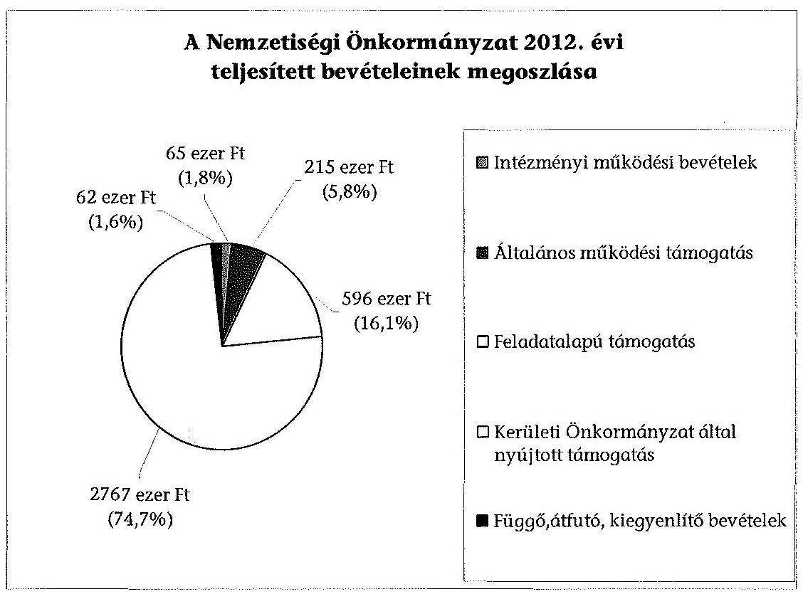
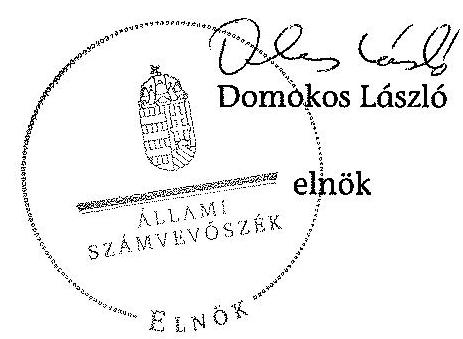

# ÁLLAMI   SZÁMVEVŐSZÉK 

## JELENTÉS

a helyi nemzetiségi önkormányzatok gazdálkodásának ellenőrzéséről
Szerb Nemzetiségi Önkormányzat (XVIII. kerületi)

---

# Állami Számvevőszék 

Iktatószám: V-0333-021/2014.
Témaszám: 1367
Vizsgálat-azonosító szám: V065299
Az ellenőrzést felügyelte:
Horváth Balázs
felügyeleti vezető
Az ellenőrzést vezette és az ellenőrzés végrehajtásáért felelős:
Kisgergely István
ellenőrzésvezető
A számvevőszéki jelentést készítették és a jelentés összeállításában
közremüködtek:
Komlósiné Bogár Éva
számvevő tanácsos
Varsányiné Dudás Eleonóra
számvevő
Az ellenőrzést végezték:

| Balogh András | Komlósiné Bogár Éva | Varsányiné Dudás |
| :-- | :-- | :-- |
| számvevő | számvevő tanácsos | Eleonóra   számvevő |

---

# TARTALOMJEGYZÉK 

BEVEZETÉS ..... 3
I. ÖSSZEGZŐ MEGÁLLAPÍTÁSOK, KÖVETKEZTETÉSEK, JAVASLATOK ..... 6
II. RÉSZLETES MEGÁLLAPÍTÁSOK ..... 13

1. A Nemzetiségi Önkormányzat és a Kerületi Önkormányzat együttműködésének szabályozása, a múködési feltételek biztosítása ..... 13
2. A gazdálkodási feladatok ellátásának szabályszerűsége ..... 14
2.1. A költségvetésre és a zárszámadásra, valamint a kincstári adatszolgáltatás rendjére vonatkozó jogszabályi előírások betartása ..... 14
2.2. A Nemzetiségi Önkormányzat gazdálkodásának szabályozottsága ..... 15
2.3. Az operatív gazdálkodási jogkörök kialakítása, gyakorlása ..... 16
3. A Nemzetiségi Önkormányzat gazdálkodásával összefüggő feladatok belső ellenőrzése ..... 18
4. A feladatalapú támogatás felhasználásának, elszámolásának szabályszerűsége, a Nemzetiségi Önkormányzat feladatellátása ..... 19
MELLÉKLET
5. számú A Nemzetiségi Önkormányzat 2012. évi gazdálkodásának főbb adatai, mutatói
6. számú Tájékoztatás a polgármesternek küldött el nem fogadott észrevételekről
FÜGGELÉKEK
7. számú Rövidítések jegyzéke
8. számú Értelmező szótár
9. számú A gazdálkodás értékelésének módszere

---

# **Chemistry**

## **Chemical Reactions**

### **Balancing Chemical Equations**

1. **Write the unbalanced equation:**
   - Example: $$C_3H_8 + O_2 \rightarrow CO_2 + H_2O$$

2. **Balance the equation:**
   - Balance carbon atoms first.
   - Then balance hydrogen atoms.
   - Finally, balance oxygen atoms.
   - Balanced equation: $$C_3H_8 + 7O_2 \rightarrow 3CO_2 + 4H_2O$$

3. **Balance the equation:**
   - Balance oxygen atoms.
   - Finally, balance oxygen atoms.
   - Balanced equation: $$C_3H_8 + 7O_2 \rightarrow 3CO_2 + 4H_2O$$

### **Types of Reactions**

1. **Combination Reaction:**
   - Example: $$2H_2 + O_2 \rightarrow 2H_2O$$

2. **Decomposition Reaction:**
   - Example: $$2H_2O_2 \rightarrow 2H_2O + O_2$$

3. **Single Displacement Reaction:**
   - Example: $$Zn + 2HCl \rightarrow ZnCl_2 + H_2$$

4. **Double Displacement Reaction:**
   - Example: $$AgNO_3 + NaCl \rightarrow AgCl + NaNO_3$$

5. **Combustion Reaction:**
   - Example: $$CH_4 + 2O_2 \rightarrow CO_2 + 2H_2O$$

## **Stoichiometry**

### **Mole Concept**

- **Mole (mol):** The amount of substance containing as many particles (atoms, molecules, ions) as there are atoms in exactly 12 grams of carbon-12.
- **Avogadro's Number:** $$6.022 \times 10^{23}$$ particles per mole.

### **Molar Mass**

- **Molar Mass:** The mass of one mole of a substance.
- Example: The molar mass of water ($$H_2O$$) is 18.015 g/mol.

### **Calculations**

1. **Moles to Mass:**
   - Formula: $$n = \frac{m}{M}$$
   - Example: Calculate the number of moles of $$H_2O$$ in 18 grams of water.
     - $$n = \frac{18.015 \, \text{g}}{18.015 \, \text{g/mol}} = 18.015 \, \text{g/mol}$$

2. **Mass to Moles:**
   - Formula: $$m = n \times M$$
   - Example: Calculate the mass of 18.015 g of 18 grams of water.
     - $$m = 18.015 \, \text{g/mol} = 18.015 \, \text{g/mol}$$

## **Gas Laws**

### **Ideal Gas Law**

- **Equation:** $$PV = nRT$$
- **Variables:**
  - $$P$$: Pressure (atm)
  - $$V$$: Volume (L)
  - $$n$$: Number of moles (mol)
  - $$R$$: Ideal gas constant (0.0821 L·atm/mol·K)
  - $$T$$: Temperature (K)

### **Boyle's Law**

- **Equation:** $$P_1V_1 = P_2V_2$$
- **Variables:**
  - P₁: Pressure (atm)
  - P₂: Volume (L)
  - P₃: Temperature (K)
  - P₁: Pressure (atm)
  - P₂: Volume (L)
  - P₃: Temperature (K)
  - P₁: Pressure (atm)
  - P₂: Volume (L)
  - P₃: Temperature (atm)
  - P₁: Pressure (atm)

### **Boyle's Law**

- **Equation:** $$P_1V_1 = P_2V_2$$
- **Variables:**
  - P₁: Pressure (atm)
  - P₂: Volume (L)
  - P₃: Temperature (K)
  - P₁: Pressure (atm)
  - P₂: Volume (L)
  - P₃: Temperature (atm)
  - P₁: Pressure (atm)
  - P₂: Volume (L)
  - P₃: Temperature (atm)
  - P₁: Pressure (atm)

## **Thermochemistry**

### **Enthalpy (H)**

- **Definition:** The heat content of a system at constant pressure.
- **Equation:** $$\Delta H = q_p$$
- **Variables:**
  - $$q_p$$: Heat transferred at constant pressure.
  - $$q_p$$: Heat transferred at constant pressure.
  - $$\Delta H$$: Heat transferred at constant pressure.

### **Hess's Law**

- **Statement:** The enthalpy change for a reaction is the same whether it occurs in one step or multiple steps.
- **Example:** The enthalpy change for a reaction is the same whether it occurs in one step or multiple steps.

### **Calculations**

1. **Moles to Mass:**
   - Formula: $$n = \frac{m}{M}$$
   - Example: Calculate the moles of $$H_2O$$ in 18 grams of water.
     - $$n = \frac{18.015 \, \text{g}}{18.015 \, \text{g/mol}} = 18.015 \, \text{g/mol}$$

2. **Mass to Mass:**
   - Formula: $$m = n \times M$$
   - Example: Calculate the mass of 18.015 g of 18 grams of water.
     - $$m = 18.015 \, \text{g/mol} = 18.015 \, \text{g/mol}$$

## **Electrochemistry**

### **Oxidation and Reduction**

- **Oxidation:** Loss of electrons.
- **Reduction:** Gain of electrons.
- **Example:** The oxidation of oxygen to oxygen is $$O_2 \rightarrow O_2 + O_2$$

### **Galvanic Cells**

- **Definition:** A cell that converts chemical energy into electrical energy.
- **Components:**
  - Anode: Oxidation occurs.
  - Cathode: Reduction occurs.
  - Salt Bridge: Connects the two half-cells.

### **Nernst Equation**

- **Equation:** $$E = E^\circ - \frac{RT}{nF} \ln Q$$
- **Variables:**
  - $$E$$: Energy (K)
  - $$R$$: Ideal gas constant (0.0821 L·atm/mol·K)
  - $$T$$: Temperature (K)
  - $$n$$: Number of moles (mol)
  - $$F$$: Faraday constant (96,485 C/mol)
  - $$Q$$: Reaction quotient

---

# JELENTÉS   a helyi nemzetiségi önkormányzatok gazdálkodásának ellenőrzéséről Szerb Nemzetiségi Önkormányzat (XVIII. kerületi) 

## BEVEZETÉS

A Nemzetiségi Önkormányzat az 1998. évben alakult, elnöke 2005. augusztus 18-ától látja el feladatát. A Nemzetiségi Önkormányzat intézményt, gazdasági társaságot és más szervezetet nem alapított. A négytagú Képviselő-testület munkája segítésére bizottságot nem hozott létre. A Nemzetiségi Önkormányzat költségvetési beszámolója szerint a 2012. évben a módosított költségvetési bevételi és kiadási előirányzata 3722 ezer Ft, a teljesített költségvetési bevétele 3643 ezer Ft, a teljesített költségvetési kiadása 3217 ezer Ft volt. A 2012. évi gazdálkodási adatokat részletesen az 1. számú mellékletben mutatjuk be.

Az Alaptörvény XXIX. cikk (1) bekezdése szerint a Magyarországon élő nemzetiségek államalkotó tényezők. Minden, valamely nemzetiséghez tartozó magyar állampolgárnak joga van önazonossága szabad vállalásához és megőrzéséhez. A hazánkban élő nemzetiségek helyi (települési és területi) valamint országos önkormányzatokat hozhatnak létre. A helyi nemzetiségi önkormányzatok gazdálkodási feladatait jogszabályi előírás alapján a székhely szerinti helyi önkormányzat polgármesteri hivatala látja el.

A nemzetiségek helyzete, támogatása mind hazai, mind EU-s szinten kiemelt figyelmet kap napjainkban. A helyi nemzetiségi önkormányzatok gazdálkodására és támogatási rendszerére vonatkozó jogszabályok a 2010-2012. években jelentős változásokon mentek át. A települési és területi nemzetiségi önkormányzatok gazdálkodásának, a részükre juttatott költségvetési támogatások felhasználásának ellenőrzését az ÁSZ 2012-ben sorozatjellegű ellenőrzés keretében indította el. A 2013. évi ellenőrzések folytatását e témacsoportos ellenőrzések jelentik, amelyet az ÁSZ 2014 első félévi ellenőrzési terve a 12. témaszámon tartalmaz.

Az ellenőrzés célja annak értékelése volt, hogy a Nemzetiségi Önkormányzat gazdálkodási kereteinek kialakítása, gazdálkodása és feladatellátása megfelelt-e a jogszabályoknak.

---

Ennek keretében értékeltük, hogy:

- a Nemzetiségi Önkormányzat és a Kerületi Önkormányzat együttműködésének szabályozása, a működési feltételek biztosítása megfelelt-e a jogszabályi előírásoknak;
- a felek együttműködése megfelelt-e a közöttük létrejött megállapodásnak a gazdálkodási feladatok szabályszerű ellátása során, ennek keretében betartották-e a Nemzetiségi Önkormányzat gazdálkodásához kapcsolódóan a költségvetésre és zárszámadásra, a gazdálkodás szabályozására, az operatív gazdálkodási jogkörök gyakorlására vonatkozó jogszabályi előírásokat;
- a jegyző biztosította-e a Nemzetiségi Önkormányzat gazdálkodásának belső ellenőrzését;
- a Nemzetiségi Önkormányzat feladatalapú támogatásának felhasználása, a folyósított feladatalapú támogatással történő elszámolás az előírásoknak megfelelő volt-e;
- a Nemzetiségi Önkormányzat feladatellátása összhangban volt-e a vonatkozó jogszabályi előírásokkal.

Az ellenőrzés várható hasznosulását négy szinten tervezzük. A törvényalkotás számára összegzett tapasztalatok állnak rendelkezésre a nemzetiségi önkormányzatok testületi döntéseinek, gazdálkodásának és a feladatalapú támogatás felhasználásának szabályszerűségéről, amelynek alapján következtetést lehet levonni arra, hogy indokolt-e esetleges jogszabályi módosítás kezdeményezése. Az ellenőrzés az ellenőrzött számára visszajelzést ad a működésében fellépő hiányosságokról, javaslataival hozzájárul azok kiküszöböléséhez, amely csökkentheti a későbbi ellenőrzések gyakoriságát. Az ellenőrzés megállapításai és javaslatai tanulságul szolgálhatnak más nemzetiségi önkormányzatok, szervezetek számára a rendezett gazdálkodási keretek kialakításához. A társadalom számára jelzi, hogy közpénz nem maradhat ellenőrizetlenül, az ÁSZ értékteremtő rend kialakításához és megőrzéséhez hozzájáruló tevékenysége pozitív hatással lesz a szervezetről kialakított összkép formálásában. Az ÁSZ szervezetén belül lehetőség nyílik arra, hogy a megállapítások szintetizálásával az intézmény a hozzáadott értéket teremtő elemző tevékenységét és tanácsadó szerepét erősítse.

A Nemzetiségi Önkormányzat gazdálkodásának ellenőrzéséről szóló jelentés I. fejezetének összegző része az ellenőrzés céljára adott rövid, szintetizáló összefoglalót és következtetéseket tartalmazza a II. fejezet részletes megállapításain alapulóan. A jelentés intézkedést igénylő megállapításait és javaslatait - az összegzőben foglaltak mellett - az ellenőrzés során feltárt, a jelentés II. fejezetében rögzített részletes megállapítások alapozzák meg, illetve támasztják alá.

Az ellenőrzés típusa: szabályszerűségi ellenőrzés.
Az ellenőrzött időszak: a 2012. január 1. - 2012. december 31. közötti időszak. Az ellenőrzés kiterjedt a Nemzetiségi Önkormányzatnak juttatott 2012. évi feladatalapú támogatás 2013. évben való elszámolására is.

---

Ellenőrzött szervezet: Szerb Nemzetiségi Önkormányzat és a gazdálkodási feladatait ellátó Budapest XVIII. Kerület Pestszentlőrinc-Pestszentimre Önkormányzat.

Az ellenőrzés végrehajtásának jogszabályi alapját az ÁSZ tv. 5. § (2)-(3) és (6) bekezdéseiben foglaltak képezik.

Az ellenőrzés szakmai módszertana az ÁSZ hivatalos honlapján (www.asz.hu) közzétett szakmai szabályokon alapult, amely a Legfőbb Ellenőrző Intézmények Nemzetközi Szervezete (INTOSAI) által kiadott nemzetközi standardok (ISSAI) figyelembevételével készült.

A helyi nemzetiségi önkormányzatok gazdálkodásának ellenőrzése során értékeltük a Nemzetiségi Önkormányzat és a Kerületi Önkormányzat együttműködésének, a gazdálkodás szabályozottságának és a pénzügyi folyamatokban kulcsszerepet betöltő belső kontrollok (teljesítésigazolás és érvényesítés) múködésének megfelelőségét. A kulcskontrollokat a múködési és felhalmozási célú támogatásértékű kiadásoknál, az államháztartáson kívülre teljesített múködési és felhalmozási célú pénzeszköz átadásoknál és a dologi kiadásokkal kapcsolatos kifizetéseknél - véletlen mintavételi eljárást alkalmazva - ellenőriztük. Ellenőriztük, hogy a jegyző biztosította-e a Nemzetiségi Önkormányzat gazdálkodásának belső ellenőrzését. Értékeltük a feladatalapú támogatások felhasználásának, elszámolásának szabályszerűségét, a Nemzetiségi Önkormányzat feladatellátása és a jogszabályi előírások összhangját.

Az ellenőrzés lefolytatásához a Nemzetiségi Önkormányzat és a gazdálkodási feladatait ellátó Kerületi Önkormányzat tanúsítványok és a kapcsolódó, dokumentumjegyzékben megjelölt dokumentumok elektronikus úton történő megküldésével, rendelkezésre bocsátásával szolgáltatott adatokat. Az adatszolgáltatás kontrollálása és szükség szerinti javítása a helyszíni ellenőrzés keretében történt. A gazdálkodás értékelésének módszerét a 3. számú függelék tartalmazza.

Az ÁSZ tv. 29. § (1) bekezdése szerint a jelentéstervezetet megküldtük észrevételezésre a polgármesternek és a Nemzetiségi Önkormányzat elnökének. A Nemzetiségi Önkormányzat elnöke az ÁSZ tv. 29. § (2) bekezdésében foglalt észrevételezési jogával nem élt, a jelentéstervezetre észrevételt nem tett. A polgármester határidőben megküldött észrevétele és tájékoztatása alapján a jelentést nem módosítottuk, az el nem fogadott észrevételek indokolását a jelentés 2. számú melléklete tartalmazza.

---

# I. ÖSSZEGZŐ MEGÁLLAPÍTÁSOK, KÖVETKEZTETÉSEK, JAVASLATOK 

A Nemzetiségi Önkormányzat és a Kerületi Önkormányzat együttmúködésének szabályozása, a múködési feltételek biztosítása megfelelt a jogszabályi előírásoknak. A Nemzetiségi Önkormányzat a 2012. évben rendelkezett hatályos együttműködési megállapodás ${ }_{1,2}$-vel a Kerületi Önkormányzattal történő együttműködésre. A felek a 2005. évben megkötött együttműködési megállapo-dás ${ }_{1}$-nek a Nek. ${ }_{2}$ tv.-ben meghatározott, 2012. január 31-ei határidővel előírt felülvizsgálatát nem végezték el. Az együttmúködési megállapodás ${ }_{1}$ Nek. ${ }_{2}$ tv.ben előírt módosítási kötelezettségüknek határidőben, 2012. március 29-én eleget tettek. A 2012. december 31-én hatályos együttmúködési megállapodás ${ }_{2}$ ben a Nemzetiségi Önkormányzat múködési feltételeit az előírásoknak megfelelően szabályozták, azonban ezt - a Nek. ${ }_{2}$ tv.-ben előírtak ellenére - az együttműködési megállapodás ${ }_{2}$ megkötését követő harminc napon belül a Nemzetiségi Önkormányzat SZMSZ-ében nem rögzítették. A Kerületi Önkormányzat a 2012. év során a múködési feltételeket biztosította. A Nemzetiségi Önkormányzat gazdálkodás végrehajtási feladatai ellátásának szabályait - az Áht. ${ }_{2}$-nek és a Nek. ${ }_{2}$ tv.-nek megfelelően - a 2012. december 31-én hatályos együttműködési megállapodás ${ }_{2}$-ben teljes körűen rögzítették.

A Nemzetiségi Önkormányzat SZMSZ-ének módosítása és az együttműködési megállapodás ${ }_{2}$ felülvizsgálata 2013 decemberében megtörtént. Az együttmúködési megállapodás ${ }_{2}$ mellékleteként elkészült a tárgyi feltételeket tartalmazó helyiséghasználati rend.

A Nemzetiségi Önkormányzat 2012. évi költségvetésének és zárszámadásának tartalma, jóváhagyása, valamint a kapcsolódó 2012. évi adatszolgáltatás szabályszerúsége nem felelt meg a jogszabályi előírásoknak. A Nemzetiségi Önkormányzat elnöke a 2012. évi költségvetési és zárszámadási határozat tervezetét az Áht. ${ }_{2}$-ben meghatározott határidőben benyújtotta a Képvise-lő-testületnek. A költségvetési határozattervezet előterjesztésekor az Áht. ${ }_{2}$-ben előírtak ellenére - a jegyző mulasztása miatt - a Képviselő-testület részére tájékoztatásul nem mutatták be szöveges indokolással a Nemzetiségi Önkormányzat költségvetési mérlegét közgazdasági tagolásban és az előirányzatfelhasználási tervét. A Nemzetiségi Önkormányzat 2012. évi költségvetéséről és zárszámadásáról a Képviselő-testület határozatot hozott és elfogadta a 2012. évi elemi beszámolót. A zárszámadási határozattervezet előterjesztésekor az Áht. ${ }_{2}$-ben előírtak ellenére - a jegyző mulasztása miatt - a Képviselő-testület részére tájékoztatásul nem mutatták be az Áht. ${ }_{2}$-ben előírt mérlegeket és kimutatásokat, továbbá a zárszámadás nem volt összehasonlítható a 2012. évben elfogadott költségvetéssel. A 2012. évi zárszámadási határozatban az Áht. ${ }_{2}$ előirása ellenére a Nemzetiségi Önkormányzat nem mutatta be bevételei és kiadásai összegét. A 2012. költségvetési évre vonatkozó kincstári adatszolgáltatási kötelezettségeket - az éves költségvetési és a mérlegjelentések kivételével - a jegyző nem Áhsz. ${ }_{1}$-ben és az Ávr.-ben előírt határidőben teljesítette.

---

A gazdálkodás szabályozottsága a jogszabályi követelményeknek megfelelt. A gazdálkodási feladatok végrehajtását ellátó Polgármesteri Hivatal a Számv. tv., és a Bkr. által előírt gazdálkodási szabályzatok hatályát a 2012. évben kiterjesztette a Nemzetiségi Önkormányzat gazdálkodásának végrehajtási feladataira. A Nemzetiségi Önkormányzat gazdálkodásának végrehajtásával kapcsolatos feladat- és hatásköröket, a hatáskörök gyakorlásának módját, és az ezekre vonatkozó felelősségi szabályokat a Polgármesteri Hivatal SZMSZ-ében rögzítették.

Az operatív gazdálkodási jogkörök kialakítása 2012. május 20-ától felelt meg a jogszabályi előírásoknak, mivel a teljesítés igazolására és az érvényesítői feladatok ellátására vonatkozó szabályszerű felhatalmazásokat és kijelöléseket a jogosultak ettől az időponttól kezdődően adták meg.

A Nemzetiségi Önkormányzat részéről a 2012. évben egy esetben történt az államháztartáson kívülre, múködési célra pénzeszközátadás. A támogatásértékű kiadás teljesítése során a teljesítésigazolás és érvényesítés kulcskontrollok nem működtek megfelelően. A teljesítésigazoló az Ávr. előírásainak ellenére nem jogszerűen látta el ellenőrzési feladatát, valamint nem tartotta be az öszszeférhetetlenségi szabályokat, mert nem rendelkezett a Nemzetiségi Önkormányzat elnöke általi kijelöléssel és az Ávr.-ben előírtak ellenére közeli hozzátartozó számára látott el teljesítésigazolási tevékenységet. Az érvényesítő nem rendelkezett szabályszerű kijelöléssel, továbbá nem az Ávr.-ben előírtak szerint végezte ellenőrzési feladatát, mert nem kifogásolta meg, hogy a teljesítésigazolás szabálytalan volt és az Áhsz. ${ }_{1}$-ben foglaltak ellenére nem jelezte a teljesített kiadás hibás számlakijelölését. A Nemzetiségi Önkormányzatnál a 2012. évben a dologi kiadások teljesítése során a teljesítésigazolás és érvényesítés kulcskontrollok múködésének megfelelősége gyenge volt, a hibák száma a lényegességi szintet, a kritikus hibahatárt elérte. A teljesítésigazoló nem szabályszerűen látta el az Ávr.-ben előírt feladatát, mert a kiadás jogossága, összegszerűsége és az ellenszolgáltatás teljesítésének ellenőrzését 2012. május 19-éig jogosulatlanul végezte, továbbá nem tartotta be az Ávr. előírásai ellenére az összeférhetetlenségi követelményeket, valamint az operatív gazdálkodási szabály-zat ${ }_{1,2}$-ben előírtakat. Az érvényesítő az Áht. ${ }_{2}$-ben és az Ávr.-ben előírtak ellenére 2012. május 19-éig nem jogszerű kijelölés alapján látta el ellenőrzési feladatát. Nem ellenőrizte, hogy a megelőző ügymenetben az Ávr. és az operatív gazdálkodási szabályzat ${ }_{1,2}$ előírásait betartották-e és nem jelezte a vezetett kötelezettségvállalási nyilvántartás tartalmi hiányosságait. Nem észrevételezte továbbá, hogy az előleg rendezésénél nem tartották be a pénzkezelési szabályzatban előírt 30 napon belüli elszámolási határidőt. A dologi kiadások három legnagyobb összegű könyvelési tételeinél a teljesítésigazolás és az érvényesítés kulcskontrollok nem múködtek megfelelően, a feltárt hiányosságok megegyezőek voltak a dologi kiadásoknál tett észrevételekkel. A számvevőszéki ellenőrzés a kiadások dokumentumainak ellenőrzése alapján jogosulatlan kifizetést nem tárt fel, a kulcskontrollok múködéséhez kapcsolódó hiányosságok miatt azonban nem volt biztosított a hibák megelőzése, feltárása és kijavítása.

A jegyző a Polgármesteri Hivatalnál a Nemzetiségi Önkormányzat gazdálkodásával összefüggő végrehajtási feladatok belső ellenőrzését biztosította. A Polgármesteri Hivatal 2012. évre vonatkozó éves ellenőrzési tervét megalapozó kockázatelemzés kiterjedt a Nemzetiségi Önkormányzat gazdálkodásával ösz-

---

szefüggő végrehajtási feladatokra. A kockázatelemzés a nemzetiségi önkormányzatok gazdálkodását alacsony kockázatúnak minősítette. Belső ellenőrzési feladatot a 2012. évben eredetileg nem terveztek, azonban a jogszabályi változások miatt egy esetben végeztek. A belső ellenőrzésről készült jelentésben a pénzügyi kontrollok múködése, a nemzetiségi önkormányzatok SZMSZ-e és az együttműködési megállapodás ${ }_{2}$ vonatkozásában feltárt hiányosságok egyezőek voltak a számvevőszéki ellenőrzés megállapításaival. A belső ellenőrzés által megállapított hiányosságok kijavítására a Bkr.-ben meghatározott határidőn túl készítettek intézkedési tervet.

A feladatalapú támogatás felhasználása a 2011. évben nem felelt meg, a 2012. évben megfelelt a jogszabályi előírásoknak. A 2011. évi 1495 ezer Ft öszszegű feladatalapú támogatásból a maradvány 1039 ezer Ft volt, amelyből a Nemzetiségi Önkormányzat 2012. június 30 -áig 823 ezer Ft-ot használt fel a nemzetiségi feladatokra. A 2011. évi feladatalapú támogatás kötelezettségvállalással nem terhelt maradványa 2012. június 30 -án 216 ezer Ft volt. A Nemzetiségi Önkormányzat nem tett eleget az Áht. ${ }_{2}$-ben előírtaknak azáltal, hogy a keletkezett 2011. évi kötelezettségvállalással nem terhelt maradványáról nem mondott le és nem fizette vissza azt a központi költségvetés javára. A Nemzetiségi Önkormányzat a 2012. évben 596 ezer Ft összegű támogatásban részesült, amelyet a jogszabályi előírásokkal összhangban és a Képviselő-testület által meghatározott nemzetiségi programokra, feladatokra fordított. A 2011. és a 2012. évi feladatalapú támogatásról az Áht. ${ }_{1,2}$-ben és a támogatási kormányrendelet ${ }_{1,2}$-ben előírt elszámolás nem történt meg, a támogatások felhasználását, elszámolását az ellenőrzésre jogosult szervek nem ellenőrizték.

A Nemzetiségi Önkormányzat kötelező és önként vállalt feladatellátásának tárgya összhangban volt a Nek. ${ }_{2}$ tv. előírásaival, tevékenységét a képviselt közösség kulturális autonómiájának megerősítése, a közösség önszerveződésének érdekében végezte.

Az ÁSZ tv. 33. § (1) bekezdésében foglaltak értelmében az ellenőrzött szervezet vezetője köteles a jelentésben foglalt megállapításokhoz kapcsolódó intézkedési tervet összeállítani és azt a jelentés kézhezvételétől számított 30 napon belül az ÁSZ részére megküldeni. Amennyiben az intézkedési tervet határidőre nem küldi meg a szervezet, vagy az nem elfogadható, az ÁSZ elnöke az ÁSZ tv. 33. § (3) bekezdés a)-b) pontjaiban foglaltakat érvényesítheti.

A helyszíni ellenőrzés megállapításainak hasznosítása mellett javasoljuk:

# a jegyzönek 

1. az együttműködés szabályozásával kapcsolatban

A Nemzetiségi Önkormányzat és a Kerületi Önkormányzat nem tett eleget az együttműködési megállapodás ${ }_{1}$ - a Nek. ${ }_{2}$ tv. 80. § (2) bekezdésében előírt - 2012. január 31-élg elvégzendő éves felülvizsgálati kötelezettségének.

---

Javaslat:
Biztosítsa a jövőben az együttműködési megállapodás évenkénti felülvizsgálata során a Nek. ${ }_{2}$ tv. 80. § (2) bekezdésében előírt határidő betartását.
2. a költségvetési és zárszámadási határozattal, valamint a kincstári adatszolgáltatással kapcsolatban

A költségvetési határozattervezet előterjesztésekor az Áht. 2 24. § (4) bekezdés a) pontjában előírtak ellenére - a jegyző mulasztása miatt - a Képviselő-testületnek tájékoztatásul nem mutatták be - szöveges indokolással együtt - a Nemzetiségi Önkormányzat költségvetési mérlegét közgazdasági tagolásban és az előirányzat felhasználási tervét. A zárszámadási határozattervezet előterjesztésekor - a jegyző mulasztása miatt - nem mutatták be a Képviselő-testület részére tájékoztatásul az Áht. 2 91. § (2) bekezdés a) pontjában előírt mérlegeket és kimutatásokat. Az Áht. 2 89. § (1) bekezdésében foglaltak ellenére a zárszámadás nem volt összehasonlítható a 2012. évben elfogadott költségvetéssel. A 2012. évi zárszámadási határozatban az Áht. 2 89. § (2) bekezdés a) pont előírása ellenére a Nemzetiségi Önkormányzat nem mutatta be bevételei és kiadásai összegét.

A jegyző a 2012. évi költségvetéshez kapcsolódó, Nemzetiségi Önkormányzatra vonatkozó kincstári adatszolgáltatási kötelezettségének több esetben - az Ávr. 33. §, 169. § (2) és 170. § (5) bekezdéseiben és az Áhsz. 10. § (5a) bekezdésében előírt határidőn túl tett eleget.

Javaslat
Gondoskodjon arról, hogy:
a) a költségvetési határozattervezet előterjesztésekor az Áht. 2 24. § (4) bekezdés a) pontjában foglaltaknak megfelelően a Képviselő-testület részére tájékoztatásul mutassák be - szöveges indokolással együtt - a Nemzetiségi Önkormányzat költségvetési mérlegét közgazdasági tagolásban és az előirányzat felhasználási tervét;
b) a zárszámadási határozattervezet előterjesztésekor a Képviselő-testület részére bemutatásra kerüljenek az Áht. 2 91. § (2) bekezdés a) pontjában előírt mérlegek és kimutatások;
c) a zárszámadási határozat-tervezet feleljen meg az Áht. 2 89. § előírásainak;
d) a kincstári adatszolgáltatási kötelezettségeinek az Ávr. 33. §-ában, 169. § (2) és 170. § (5) bekezdésében és az Áhsz. 2 32. § (4) bekezdésében előírt határidők betartásával tegyen eleget.
3. a kulcskontrollok múködésével kapcsolatban

A teljesítésigazoló az Ávr. 57. § (3) bekezdésével ellentétesen nem szabályszerűen látta el feladatát, nem tartotta be az operatív gazdálkodási szabályzat ${ }_{1,2}$-ban előírtakat, valamint az Ávr. 60. § (2) bekezdésében előírtak ellenére az összeférhetetlenségi szabályokat.

---

Az érvényesítő nem az Ávr. 58. § (1)-(2) bekezdéseiben előírtak szerint végezte feladatát, mert nem ellenőrizte, hogy a megelőző ügymenetben a jogszabályok és az operatív gazdálkodási szabályzat ${ }_{1,2}$ elöírásait betartották-e. Nem jelezte az utalványozónak a teljesítésigazolás szabálytalan elvégzését, a teljesített kiadás hibás számlakijelölését, a vezetett kötelezettségvállalási nyilvántartás tartalmi hiányosságait, valamint, hogy az előleg rendezésénél nem tartották be a pénzkezelési szabályzatban előírt elszámolási határidőt.

Javaslat
Az operatív gazdálkodás müködési hibáinak megelőzése, feltárása és kijavítása érdekében gondoskodjon arról, hogy:
a) a teljesítésigazolást az Ávr. 57. § (3) bekezdéseiben előírtaknak megfelelően az arra jogosult az Ávr. 60. § (2) bekezdése szerinti összeférhetetlenségi követelmény betartásával végezze;
b) az érvényesítő az Ávr. 58. § (1)-(2) bekezdései alapján maradéktalanul lássa el ellenőrzési és jelzési feladatát.
4. a belső ellenőrzéssel kapcsolatban

A 2012. évben elvégzett ellenőrzésről készült jelentésben megállapított hiányosságok megszüntetésére a jegyző a Bkr. 45. § (3) bekezdésében előírt határidőn túl készített intézkedési tervet.

Javaslat
Intézkedjen, hogy a belső ellenőrzési jelentésben megállapított hiányosságok megszüntetésére a Bkr. 45. § (3) bekezdésében előírt határidőben készüljenek el az intézkedési tervek.
5. a feladatalapú támogatás elszámolásával kapcsolatban

A 2011. évi feladatalapú támogatás elszámolása a támogatási kormányrendelet ${ }_{1} 7 . \S$ (2) bekezdésében hivatkozott, valamint a 2012. évi feladatalapú támogatás elszámolása a támogatási kormányrendelet ${ }_{2} 8 . \S$ (5) bekezdésében hivatkozott, „a helyi önkormányzatok elszámolási és ellenőrzési rendjére vonatkozó jogszabályok" előírása alapján az Áht. ${ }_{1} 64 . \S$ (7) bekezdése és az Áht. ${ }_{2} 57 . \S$ (3) bekezdése ellenére nem történt meg.

Javaslat:
Intézkedjen az Áht. 2 27. § (2) bekezdésében meghatározott feladatkörében a Nemzetiségi Önkormányzat által igénybe vett 2011. évi és 2012. évi feladatalapú támogatás felhasználásáról szóló elszámolás elkészítéséről, az Áht ${ }_{2}$. 53. § (1) bekezdése szerinti beszámolási kötelezettség teljesítéséhez.

---

# a Nemzetiségi Önkormányzat elnökének 

1. A Nemzetiségi Önkormányzat elnöke a költségvetési határozattervezet előterjesztésekor nem mutatta be szöveges indoklással - a jegyző mulasztása miatt - a Képvise-lő-testületnek tájékoztatásul az Áht. 2 24. § (4) bekezdés a) pontjában előírt költségvetési mérleget közgazdasági tagolásban és az előirányzat-felhasználási tervet.

A zárszámadási határozattervezet előterjesztésekor - a jegyző általi elkészítés hiányában - nem mutatták be a Képviselő-testület részére tájékoztatásul az Áht. 2 91. § (2) bekezdés a) pontjában előírt mérlegeket és kimutatásokat.

Javaslat
A költségvetési és zárszámadási határozattervezet előterjesztésekor mutassa be a Képviselő-testület részére tájékoztatásul - a jegyző által előkészített - az Áht. 2 24. § (4) bekezdése a) pontjában, valamint 91. § (2) bekezdés a) pontjában előírt mérlegeket és kimutatásokat.
2. A teljesítés igazoló az Ávr. 60. § (2) bekezdésében előírtak ellenére nem tartotta be az összeférhetetlenségi követelményt, mivel közeli hozzátartozó számára végzett teljesítésigazolási tevékenységet.

Javaslat
Intézkedjen a szabálytalanságok kapcsán a számvevőszéki ellenőrzés által feltárt hiányosságok tekintetében az esetleges munkajogi felelősséggel kapcsolatos körülmények kivizsgálása iránt, és a vizsgálat eredményének függvényében hozza meg a szükséges intézkedéseket.
3. A Nemzetiségi Önkormányzat nem tett eleget az Áht. 2 57. § (2) bekezdésében előírtaknak, mert a meghatározott célra fel nem használt 2011. évi feladatalapú támogatás 216 ezer Ft összegű maradványáról haladéktalanul nem mondott le és nem fizette vissza azt a központi költségvetés javára.

Javaslat
Terjessze a Képviselő testület elé jóváhagyásra az Áht. 2 57/A. § (1) bekezdés előírásának megfelelően a 2011. évi feladatalapú támogatás kötelezettségvállalással nem terhelt maradványáról történő lemondást és intézkedjen a maradvány összegének visszafizetéséről a központi költségvetés javára.
4. A 2011. évi feladatalapú támogatás elszámolása a támogatási kormányrendelet ${ }_{1} 7 . \S$ (2) bekezdésében hivatkozott, valamint a 2012. évi feladatalapú támogatás elszámolása a támogatási kormányrendelet ${ }_{2} 8 . \S$ (5) bekezdésében hivatkozott „a helyi önkormányzatok elszámolási és ellenőrzési rendjére vonatkozó jogszabályok" előírása alapján az Áht. 1 64. § (7) bekezdése és az Áht. 2 57. § (3) bekezdése ellenére nem történt meg.

---

Javaslat
Terjessze a Képviselő-testület elé jóváhagyásra az Áht. 2 53. § (1) bekezdése szerinti beszámolási kötelezettség teljesítéséhez összeállított, a Nemzetiségi Önkormányzat által igénybe vett 2011. és 2012. évi feladatalapú támogatás felhasználásáról szóló elszámolást.

---

# II. RÉSZLETES MEGÁLLAPÍTÁSOK 

## 1. A Nemzetiségi Önkormányzat és a Kerületi ÖnkormányZAT EGYÜTTMŰKÖDÉSÉNEK SZABÁLYOZÁSA, A MÜKÖDÉSI FELTÉTELEK BIZTOSÍTÁSA

A Nemzetiségi Önkormányzat és a Kerületi Önkormányzat együttműködésének szabályozása, a működési feltételek biztosítása megfelel t a jogszabályi előírásoknak.

A Nemzetiségi Önkormányzat rendelkezett a 2012. év folyamán hatályban lévő megállapodás ${ }_{1,2}$-vel ${ }^{1}$ a Kerületi Önkormányzattal történő együttműködésre.

A 2012. január 1-jén hatályos, 2005. évben megkötött együttműködési megállapodás ${ }_{1}$-nek a Nek. ${ }_{2}$ tv. 80. § (2) bekezdésben 2012. január 31-ei határidőig előírt felülvizsgálatát nem végezték el.

A Nek. ${ }_{2}$ tv. 159. § (3) bekezdésben előírt módosítási kötelezettségüknek határidőn belül ${ }^{2}$ eleget tettek. A 2012. december 31-én hatályos együttműködési megállapodás ${ }_{2}$-ben a Nek. ${ }_{2}$ tv. előírásainak megfelelően szabályozták a Nemzetiségi Önkormányzat müködésének feltételeit, melyeket azonban a Nek. ${ }_{2}$ tv. 80. § (2) bekezdésében előírtak ellenére nem rögzítettek a Nemzetiségi Önkormányzat SZMSZ-ében az együttműködési megállapodás ${ }_{2}$ megkötését követő harminc napon belül³.

A Nemzetiségi Önkormányzat és a Kerületi Önkormányzat által megkötött 2012. december 31-én hatályos - együttműködési megállapodás ${ }_{2}$-ben a Nemzetiségi Önkormányzat gazdálkodásával kapcsolatos feladatokat, felelősöket és határidőket - egy kivétellel - az előírásoknak megfelelően szabályozták. Az együttműködési megállapodás ${ }_{2}$ az érvényesítők jegyző általi kijelölését tartalmazta, azonban az Áht. ${ }_{2}$ 38. § (2) bekezdésében és az Ávr. 55. § (2) bekezdés g) pontjában, illetve az 58. § (4) bekezdésében előírtak szerint a kijelölésekre a gazdasági vezető volt jogosult.

[^0]
[^0]:    ${ }^{1}$ A 2012. március 21-éig hatályos együttműködési megállapodás ${ }_{1}$-et a Kerületi Önkormányzat a 7/2005. (II. 01.) számú rendeletével, a Képviselő-testület a 6/2005. (I. 10.) számú határozatával hagyta jóvá.
    A 2012. március 22-étől hatályos együttműködési megállapodás ${ }_{2}$-t a Kerületi Önkormányzat a 14/2012. (III. 13.) számú rendeletével fogadta el, a Képviselő-testület a 20/2012. (III. 09.) számú határozattal hagyta jóvá.
    ${ }^{2}$ 2012. március 22-én
    ${ }^{3}$ A Képviselő-testület a Nemzetiségi Önkormányzat SZMSZ-ét 2013 decemberében módosította, amelynek mellékletét képezi az együttműködési megállapodás ${ }_{3}$. Az együttműködési megállapodás ${ }_{3}$ mellékleteként elkészült a tárgyi feltételeket tartalmazó helyiséghasználati rend.

---

A Kerületi Önkormányzat a Polgármesteri Hivatal útján biztosította a Nemzetiségi Önkormányzat 2012. évi múködésének a - Nek. 3 tv. 159. § (3) bekezdésében foglalt átmeneti rendelkezés alapján a Nek. 1 tv. 27. § (2)-(3) bekezdéseiben előírt - személyi és tárgyi feltételeit.

# 2. A GAZDÁlKODÁSI FELADATOK ELLÁTÁSÁNAK SZABÁLYSZERŰSÉGE 

### 2.1. A költségvetésre és a zárszámadásra, valamint a kincstári adatszolgáltatás rendjére vonatkozó jogszabályi előírások betartása

A Nemzetiségi Önkormányzat 2012. évi költségvetésének, a zárszámadásának tartalma, jóváhagyása, valamint a kapcsolódó adatszolgáltatás nem felelt meg a jogszabályi előírásoknak.

A Nemzetiségi Önkormányzat elnöke a 2012. évi költségvetés tervezetét határidőben ${ }^{4}$ benyújtotta a Képviselő-testületnek, azonban a költségvetési határozat ${ }^{5}$ teljes körűen nem tartalmazta az Áht. ${ }_{2}$-ben és az Ávr.-ben előírtakat. Az Áht. 24. § (4) bekezdés a) pontjában előírtak ellenére - a jegyző mulasztása miatt - nem mutatták be a Képviselő-testületnek tájékoztatásul szöveges indokolással a Nemzetiségi Önkormányzat költségvetési mérlegét közgazdasági tagolásban és az előirányzat-felhasználási tervét.

A Nemzetiségi Önkormányzat elnöke a jegyző által elkészített 2012. évi zárszámadási határozat-tervezetet az Áht. 2 91. § (1) bekezdésében meghatározott határidőben terjesztette be a Képviselő-testületnek. A Képviselő-testület 2012. április 11-i ülésén - tárgyalta meg és fogadta el a Nemzetiségi Önkormányzat zárszámadását ${ }^{6}$ és a 2012. évi elemi beszámolót. A beszámoló tartalma megfelelt a jogszabályi előírásoknak, azonban a zárszámadási határozattervezet előterjesztésekor a Képviselő-testület részére tájékoztatásul, az Áht. 2 91. § (2) bekezdés a) pontjában foglaltak ellenére - a jegyző mulasztása miatt - nem mutatták be az Áht. 2 24. § (4) bekezdésében előírt mérlegeket és kimutatásokat. Az Áht. 2 89. § (1) bekezdésében foglaltak ellenére a zárszámadás nem volt összehasonlítható a 2012. évben elfogadott költségvetéssel. A 2012. évi zárszámadási határozatban az Áht. 2 89. § (2) bekezdésének előírása ellenére a Nemzetiségi Önkormányzat nem mutatta be bevételei és kiadásai összegét.

[^0]
[^0]:    ${ }^{4}$ A határidő az Áht. 24. § (2) bekezdés előirása szerint a központi költségvetésről szóló törvény kihirdetését követő 45. nap (2012. február 11), a 2012. évi költségvetést a Kép-viselő-testület a 2012. február 9-i ülésén tárgyalta.
    ${ }^{5}$ A 2012. évi költségvetést a Képviselő-testület a 6/2012. (II. 09.) számú határozatával hagyta jóvá.
    ${ }^{6}$ 23/2013. (IV. 22.) számú határozattal

---

A jegyző a Nemzetiségi Önkormányzattal összefüggő 2012. évi kincstári adatszolgáltatási kötelezettségét teljesítette, azonban az előírt határidőket nem tartotta be, mert:

- a 2012. évi elemi költségvetéshez kapcsolódó, az Ávr. 33. § -ában előírt adatszolgáltatást késedelmesen ${ }^{7}, 2012$. március 28 -án teljesítette;
- a 2012. évi negyedéves időközi költségvetési jelentéseket az Ávr. 169. § (2) bekezdésében előírt határidőkön túl (2012. április 24-én, július 26 -án, október 29-én) ${ }^{8}$ az éves költségvetési jelentést 2013. január 19-én, határidőben teljesítette;
- a 2012. évi időközi mérlegjelentéseket az Ávr. 170. § (5) bekezdésében előírt határidőkön túl (2012. április 27-én, augusztus 1-jén, október 29-én) ${ }^{9}$,, az éves mérlegjelentést határidőben, 2013. március 14-én teljesítette;
- a 2012. I. féléves és éves elemi költségvetési beszámolóját az Áhsz., 10. § (5a) bekezdésben előírt határidőkön túl ${ }^{10}$, 2012. augusztus 14-én, illetve 2013. március 14-én nyújtotta be. A beszámolókat 2012. augusztus 9én, illetve 2013. március 11-én, a jogszabályban előírt határidőktől eltérően, 9 , illetve 11 nap késedelemmel készítették el.

# 2.2. A Nemzetiségi Önkormányzat gazdálkodásának szabályozottsága 

A Nemzetiségi Önkormányzat gazdálkodásának szabályozottsága az ellenőrzött időszakban megfelelt a jogszabályi előírásoknak.

A gazdálkodási feladatok végrehajtását ellátó Polgármesteri Hivatal a 2012. évben a Számv. tv. és a Bkr. által előírt ${ }^{11}$ gazdálkodási szabályzatokkal rendelkezett. A gazdálkodásra vonatkozó szabályzatok hatályát a Nemzetiségi Önkormányzat gazdálkodásának végrehajtási feladataira kiterjesztették.

A Nemzetiségi Önkormányzat gazdálkodásának végrehajtásával kapcsolatos feladat- és hatásköröket, a hatáskörök gyakorlásának módját, és az ezekre vo-

[^0]
[^0]:    ${ }^{7}$ A jogszabályban előírt határidő - a költségvetési határozat-tervezetének Képviselőtestület elé történt előterjesztését követő 30 napon belül, azaz - 2012 március 10-e, a késedelmes napok száma 18 nap volt.
    ${ }^{8}$ A jogszabályban előírt határidő 2012. április 20., július 20., október 20.; a késedelmes napok száma 4, 6, 5 nap volt.
    ${ }^{9}$ A jogszabályban előírt határidő 2012. április 25., július 25., október 25.; a késedelmes napok száma $2,7,4$ nap volt.
    ${ }^{10}$ A jogszabályban előírt határidő a féléves beszámolónál 2012. augusztus 10., az éves beszámolónál 2013. március 10.; a késedelmes napok száma 4-4 nap volt.
    ${ }^{11}$ A 2012. évben hatályos számviteli politika, leltározási és leltárkészítési szabályzat, pénzkezelési szabályzat, eszközök és források értékelési szabályzata, számlarend, ellenőrzési nyomvonal, szabálytalanságkezelési szabályzat, folyamatba épített előzetes, utólagos és vezetői ellenőrzési szabályzat, munkaköri leírások, gazdasági szervezet ügyrendje, operatív gazdálkodási szabályzat ${ }_{1-2}$.

---

natkozó felelősségi szabályokat az ellenőrzött időszakban a Polgármesteri Hivatal SZMSZ-ében rögzítették.

# 2.3. Az operatív gazdálkodási jogkörök kialakítása, gyakorlása 

A Nemzetiségi Önkormányzat gazdálkodása tekintetében az operatív gazdálkodási jogkörök kialakítása 2012. május 20-ától felelt meg a jogszabályi előírásoknak, mivel a teljesítés igazolására és az érvényesítői feladatok ellátására vonatkozó szabályszerű felhatalmazásokat és kijelöléseket a jogosultak ettől az időponttól kezdődően adták meg:

- a Nemzetiségi Önkormányzat elnöke az Áht. 2 38. § (2) bekezdése és az Ávr. 57. § (4) bekezdése ellenére a teljesítésigazoló személyek írásbeli kijelölését csak 2012. május 20-ától adta meg, illetve végezte el az operatív gazdálkodási szabályzat ${ }_{2}$ hatályba lépésével;
- a Polgármesteri Hivatalban a gazdasági vezetö ${ }^{12}$ az Áht. 2 38. § (2) bekezdésében és az Ávr. 55. § (2) bekezdés g) pontjában, illetve az 58. § (4) bekezdésében előírtak ellenére 2012. május 20-ától hatalmazott fel más személyt a pénzügyi ellenjegyzésre és az érvényesítésre.

A Polgármesteri Hivatal az ellenőrzött időszakban rendelkezett gazdasági szervezettel ${ }^{13}$, a gazdasági vezető végzettsége megfelelt az Ávr.-ben előírt szakképesítési követelményeknek.

A Nemzetiségi Önkormányzat részéről egy esetben történt a 2012. évben államháztartáson kívülre, múködési célú, 80 ezer Ft összegű pénzeszközátadás. A kifizetés teljesítését megelőzően a teljesítésigazolás és az érvényesítés kulcskontrollok nem múködtek megfelelően, mert:

- a teljesítés igazolását az Ávr. 57. § (4) bekezdésének előírása ellenére a jogkör gyakorlására 2012. május 19-ig a Nemzetiségi Önkormányzat elnöke által kijelöléssel nem rendelkező személy jogosulatlanul látta el, ezért az Ávr. 57. § (3) bekezdésben foglaltak ellenére nem szabályszerűen történt a kifizetés jogosságának, összegszerűségének és a teljesítésnek az igazolása, továbbá az Ávr. 60. § (2) bekezdésében előírtak ellenére nem tartotta be az összeférhetetlenségi követelményt, mivel közeli hozzátartozó számára végzett teljesítésigazolási tevékenységet ${ }^{14}$;
- az érvényesítő - az Áht. 2 38. § (2) bekezdésében és az Ávr. 55. § (2) bekezdés g) pontjában, illetve az 58. § (4) bekezdésében előírtak ellenére - nem

[^0]
[^0]:    ${ }^{12}$ A gazdasági vezető által írásban kijelölt pénzügyi ellenjegyzó és az érvényesítők alá-írás-mintáját az operatív gazdálkodási szabályzat ${ }_{2}$ melléklete tartalmazta.
    ${ }^{13}$ A Polgármesteri Hivatal SZMSZ-éről szóló, a 43/2011. (XI. 4.) számú, illetve a 3/2012. (IV. 2.) számú polgármesteri-jegyzői együttes utasítás 5.3. pontja szerint a Gazdasági és Költségvetési Iroda látja el a gazdálkodással összefüggő feladatokat.
    ${ }^{14}$ egy Sveti Száva tanulmányi ösztöndíj esetében

---

jogszerű kijelölés alapján látta el feladatát, mivel a feladat ellátásával nem a gazdasági vezető bízta meg;

- az érvényesítő feladatát nem az Ávr. 58. § (1) és (2) bekezdéseiben előírtak szerint végezte, mert nem ellenőrizte, hogy a megelőző ügymenetben az Ávr. előírásait betartották-e, továbbá nem jelezte, hogy a teljesítésigazolás szabálytalan volt;
- az érvényesítő a dologi kiadások között tévesen elszámolt (valós tartalmát tekintve ellátottak pénzbeli juttatása) egy kifizetés ${ }^{15}$ teljesítését megelőzően nem az Ávr. 58. § (1) bekezdés előírásának megfelelően látta el ellenőrzési feladatát, mert az Áhsz. ${ }_{1}$ 47. § (1) bekezdésében előírtak ellenére nem kifogásolta meg a hibás számlakijelölést.

A Nemzetiségi Önkormányzatnál a 2012. évben a dologi kiadások teljesítése során a teljesítésigazolás és az érvényesítés kulcskontrollok múködésének megfelelősége gyenge volt. A hibák száma a lényegességi szintet, a kritikus hibahatárt elérte, mivel:

- a teljesítés igazolását az Ávr. 57. § (4) bekezdésének előirrása ellenére a jogkör gyakorlására 2012. május 19-ig a Nemzetiségi Önkormányzat elnöke által kijelöléssel nem rendelkező személy jogosulatlanul látta el, ezért az Ávr. 57. § (3) bekezdésben foglaltak ellenére nem szabályszerűen történt a kifizetés jogosságának, összegszerűségének és a teljesítésnek az igazolása;
- a teljesítésigazoló az operatív gazdálkodási szabályzat ${ }_{2}$ szerint a teljesítésigazolásra előírt 3. számú mellékletet nem csatolta a számlák mellé, az igazolásra használt bélyegző szövege nem tartalmazta a teljesítés megtörténtének az igazolását;
- az érvényesítő - az Áht. 2 38. § (2) bekezdésében és az Ávr. 55. § (2) bekezdés g) pontjában, illetve az 58. § (4) bekezdésében előírtak ellenére 2012. május 19-ig nem jogszerú kijelölés alapján látta el feladatát, mivel a feladat ellátásával nem a gazdasági vezető bízta meg;
- az érvényesítő feladatát nem az Ávr. 58. § (1) és (2) bekezdéseiben előírtak szerint végezte, mert nem ellenőrizte, hogy a megelőző ügymenetben az Ávr. és az operatív gazdálkodási szabályzat ${ }_{1,2}$ előírásait betartották-e, továbbá nem jelezte, hogy a teljesítésigazolás szabálytalan volt;
- az érvényesítő a dologi kiadások között tévesen elszámolt (valós tartalmát tekintve ellátottak pénzbeli juttatása) egy kifizetés teljesítését megelőzően feladatát nem az Ávr. 58. § (2) bekezdés előírásának megfelelően látta el, mert nem kifogásolta az Áhsz. 47. § (1) bekezdésében előírtak ellenére a hibás számlakijelölést, továbbá azt sem észrevételezte, hogy az előleg rendezésénél nem tartották be a pénzkezelési szabályzatban előírt 30 napon belüli elszámolási határidőt;
- az érvényesítő az Ávr. 58. § (2) bekezdésben előírtak ellenére nem jelezte az utalványozónak, hogy a Nemzetiségi Önkormányzat kiadásairól vezetett

[^0]
[^0]:    ${ }^{15}$ Sveti Száva tanulmányi ösztöndíj

---

100 ezer Ft alatti kötelezettségvállalási nyilvántartás tartalmilag nem felel meg az Ávr. 56. § (1) bekezdésében előírt követelménynek, mert nem tartalmazta a kötelezettségvállalást tanúsító dokumentum, iktatószámát, a kötelezettségvállaló nevét, a jogosult azonosító adatait, a kötelezettségvállalás évek és előirányzatok szerinti megoszlását, a kifizetési határidőket, továbbá a teljesítési adatokat.

A Nemzetiségi Önkormányzatnál a 2012. évben a három legnagyobb összegű dologi kiadás bizonylatainak egyedi értékelése alapján a teljesítésigazolás és az érvényesítés kulcskontrollok nem működtek megfelelően. A feltárt hiányosságok megegyeztek a dologi kiadásoknál tett észrevételekkel.

A számvevőszéki ellenőrzés a kiadások dokumentumainak ellenőrzése alapján jogosulatlan kifizetést nem tárt fel, a kulcskontrollok múködéséhez kapcsolódó hiányosságok miatt nem biztosított a hibák megelőzése, feltárása és kijavítása.

# 3. A Nemzetiségi ÖNKORMÁnyZAT GAZDÁlKODÁSÁVAL ÖSSZEFÜGGŐ FELADATOK BELSŐ ELLENŐRZÉSE 

A Nemzetiségi Önkormányzat gazdálkodásával összefüggő végrehajtási feladatok belső ellenőrzése megfelelő volt.

A jegyző a jogszabályi előírásoknak megfelelően biztosította a Nemzetiségi Önkormányzat gazdálkodásával összefüggő feladatok belső ellenőrzését ${ }^{16}$. A Polgármesteri Hivatal éves belső ellenőrzési tervét megalapozó kockázatelemzés kiterjedt a nemzetiségi önkormányzatok gazdálkodásával összefüggő végrehajtási feladatok ellátására, amely alacsony kockázati minősítést kapott. A 2012. évi módosított éves belső ellenőrzési terv alapján a nemzetiségi önkormányzatok célellenőrzését végezték, a belső ellenőrzésről készült jelentést ${ }^{17}$ a Belső Ellenőrzési Csoport vezetője 2012. október 16-án bemutatta a jegyzőnek.

A lefolytatott belső ellenőrzés megállapította, hogy nem készítették el az együttműködési megállapodásban előírtak szerint a helyiséghasználati rendet. A nemzetiségi önkormányzatok SZMSZ-ei nem tartalmazták a múködési feltételeket. A gazdasági szervezet ügyrendje nem tartalmazta a nemzetiségi önkormányzatokkal kapcsolatos feladatokat, valamint hiányoztak az utalványozási joggal rendelkezők aláírás mintái, valamint az ellenőrzött dokumentumok esetében hiányosságot állapítottak meg a pénzügyi kontrollok múködésére vonatkozóan.

Az ellenőrzés megállapításai hasznosultak, a feltárt hiányosságok megszüntetése érdekében a jegyző a Bkr. 45. § (3) bekezdésében meghatározott határidőn

[^0]
[^0]:    ${ }^{16}$ A belső ellenőrök rendelkeztek munkaköri leírással, valamint az Áht. 70. §-ában meghatározott engedéllyel, szerepeltek a költségvetési szervnél belső ellenőrzést végzők nyilvántartásában, valamint elkészítették a 2012. évre vonatkozó belső ellenőrzési kézikönyvet, amely a 7/2012. (II. 15.) számú polgármesteri és jegyzői együttes utasítás alapján lépett hatályba.
    ${ }^{17}$ 8/73697-6/2012. Iktatószámú belső ellenőrzési jelentés „A Nemzetiségi Önkormányzatok átalakulásának, hivatali kontrolljai kialakításának vizsgálatáról".

---

túl ${ }^{18}$, 2012-ben kettő, 2013-ban négy javaslathoz készített intézkedési tervet. A 2012. évi intézkedési tervben foglaltakat megvalósították.

A 2012. évben hatályos együttmúködési megállapodások tartalmazták a Nemzetiségi Önkormányzattal összefüggő belső ellenőrzési feladatok ellátását. A megállapodásokban foglaltak szerint a könyvvizsgáló ellenőrzési tevékenységén kívül a Nemzetiségi Önkormányzat pénzügyi ellenőrzését a Kerületi Önkormányzat belső ellenőre is ellátta.

Az ellenőrzéshez szolgáltatott adatok alapján a 2012. évben a Kormányhivatal a Nemzetiségi Önkormányzatot illetően nem élt törvényességi felügyeleti eszközökkel.

# 4. A feladatalapú támogatás felhasználásáNAK, elszámolásáNAK szabálySzerüsége, a Nemzetiségi ÖNKORMÁnyZAT FELADATELLÁTÁSA 

A feladatalapú támogatás felhasználása a 2011. évben nem felelt meg, a 2012. évben megfelelt a jogszabályi előírásoknak.

A 2011. évben folyósított 1495 ezer Ft feladatalapú támogatásból 2012. január 1-jén 1039 ezer Ft maradvány keletkezett, amelyből 823 ezer Ft-ot használtak fel 2012. június 30 -áig nemzetiségi feladatokra. A 2011. évi feladatalapú támogatás kötelezettségvállalással nem terhelt maradványa 2012. június 30 -án 216 ezer Ft volt. A Nemzetiségi Önkormányzat nem tett eleget a támogatási kormányrendelet ${ }_{1} 7 . \S$ (4) bekezdésében és az Âht. ${ }_{2}$ 57. § (2) bekezdésében előírtaknak azáltal, hogy a meghatározott célra fel nem használt támogatás 216 ezer Ft összegű maradványáról haladéktalanul nem mondott le és nem fizette vissza azt a központi költségvetés javára.

[^0]
[^0]:    ${ }^{18}$ A jogszabályban meghatározott határidő az intézkedési terv elkészitésére a lezárt ellenőrzési jelentés kézhezvételétől számított 8 napon belül, az intézkedési tervek kelte 2012. november 5-e és 2013. október 14-e.

---

A 2012. évi feladatalapú támogatás összes bevételhez viszonyított részarányát az alábbi ábra szemlélteti:

A Nemzetiségi Önkormányzat a 2012. évben 596 ezer Ft összegű feladatalapú támogatásban részesült. A Képviselő-testület a Nemzetiségi Önkormányzat 2012. évi költségvetési határozatát az Áht. 34. § (5) bekezdésében foglaltak ellenére a jóváhagyott feladatalapú támogatás összegével nem módosította. A 2012. évi feladatalapú támogatást a Képviselő-testület által meghatározott nemzetiségi támogatási célokkal összhangban a folyósítás évében felhasználták.

A 2011. évi feladatalapú támogatás elszámolása a támogatási kormányrendelet ${ }_{1} 7 . \S$ (2) bekezdésében hivatkozott, valamint a 2012. évi feladatalapú támogatás elszámolása a támogatási kormányrendelet ${ }_{2} 8 . \S$ (5) bekezdésében hivatkozott „a helyi önkormányzatok elszámolási és ellenőrzési rendjére vonatkozó jogszabályok rendelkezései alkalmazandóak" előirása alapján az Áht. ${ }_{1} 64 . \S$ (7) bekezdése és az Áht. ${ }_{2} 57 . \S$ (3) bekezdése ellenére nem történt meg a Nemzetiségi Önkormányzat részéről. A feladatalapú támogatás felhasználását, elszámolását az ellenőrzésre jogosult szervek nem ellenőrizték.

---

A Nemzetiségi Önkormányzat feladatellátásának tárgya a 2012. évben, összhangban volt a Nek. 2 tv. előírásaival. A Nek. 2 tv. 115. § f) pontja szerinti kötelező közfeladatot látott el a képviselt közösség kulturális autonómiájának megerősítése érdekében a közösség önszerveződésének szervezési és müködtetési feladatok ellátásának segítésével. A Nek. 2 tv. 116. § (2) bekezdés előírásaival összhangban végzett önként vállalt közfeladatot a hagyományápolás és a közművelődés területén. A Nemzetiségi Önkormányzat a Nek. 2 tv. 116. § (2) bekezdésében tiltott hatósági feladatokat nem végzett.

Budapest, 2014. 174. hó 97 -nap

| Melléklet: | 2 db |
| :-- | :-- |
| Függelék: | 3 db |

---

.

---

# A Nemzetiségi Önkormányzat 2012. évi gazdálkodásának főbb adatai, mutatói 

A) Bevételek:

| Megnevezés | Eredeti elöirányzat | Módosított   ezer Ft | Teljesités |  |
| :--: | :--: | :--: | :--: | :--: |
|  |  |  |  | megoszlás   (\%) |
| Intézményi múködési bevételek | 0 | 0 | 65 | 1,8 |
| Általános múködési támogatás | 215 | 215 | 215 | 5,8 |
| Feladatalapú támogatás | 0 | 596 | 596 | 16,1 |
| Kerületi Önkormányzat által nyújtott támogatás | 902 | 2911 | 2767 | 74,7 |
| Költségvetési bevételek | 1117 | 3722 | 3643 | 98,4 |
| Függő,átfutó, kiegyenlítỏ bevételek | 0 | 0 | 62 | 1,6 |
| Tárgyévi bevételek | 1117 | 3722 | 3705 | 100 |

B) Kiadások:

| Megnevezés | Eredeti elöirányzat | Módosított   ezer Ft | Teljesités |  |
| :--: | :--: | :--: | :--: | :--: |
|  |  |  |  | megoszlás   (\%) |
| Személyi juttatások | 720 | 820 | 817 | 25,4 |
| Munkaadókat terhelő járulékok és szocális hozzájárulási adó összesen | 208 | 231 | 204 | 6,3 |
| Dologi kiadások | 189 | 2139 | 1664 | 51,7 |
| Pénzeszköz átadás | 0 | 80 | 80 | 2,5 |
| Müködési kiadások összesen | 1117 | 3270 | 2765 | 85,9 |
| Felhalmozási kiadások | 0 | 452 | 452 | 14,1 |
| Költségvetési kiadások | 1117 | 3722 | 3217 | 100 |
| Tárgyévi kiadások | 1117 | 3722 | 3217 | 100 |

---

.

---

# TÁJÉKOZTATÁS   A POLGÁRMESTERNEK KÜLDÖTT EL NEM FOGADOTT ÉSZREVÉTELEKRŐL 

## Észrevétel

## 1. Az együttmúködés szabályozása

A jelentéstervezet megállapítja, hogy a XVIII. Kerületi Önkormányzat és a XVIII. kerületi nemzetiségi önkormányzatok között létrejött hatályos együttmúködési megállapodás minden szempontból megfelel a jogszabályi előírásoknak és az ellenőrzés ideje alatt minden hiányosság pótlásra került.
Mind a 2013. évben, mind a 2014. évben az együttműködési megállapodás felülvizsgálata a Nek. tv. 80. § (2) bekezdésében szereplő határidőig megtörtént. Az együttműködési megállapodásokat a nemzetiségi önkormányzatok egyöntetűen elfogadták és aláírták.
A jövőben is kiemelt figyelmet fordítunk a Nek. tv-ben szereplő rendelkezéseknek, így az együttműködési megállapodás felülvizsgálatára vonatkozó rendelkezésnek is maradéktalanul eleget teszünk és a hatályos együttműködési megállapodásokat minden év január 31-ig felülvizsgáljuk.

## 2. Költségvetés, zárszámadás, kincstári adatszolgáltatás

A nemzetiségi önkormányzat 2013. évi költségvetése módosításra került, a költségvetés módosítási határozattervezet előterjesztésekor az Áht. 23. § (2) bekezdés a), a 24. § (4) bekezdés a) pontjaiban, valamint az Ávr. 24. § (1) bekezdés a) pontjában foglaltak maradéktalanul betartásra kerültek (bevételi és kiadási főösszeg, előirányzat csoportok, kiemelt előirányzatok szerinti bontás). A Képviselő-testület részére tájékoztatásul bemutatásra kerültek az Áht. 24. § (4) bekezdés a) pontja és az Áht. 91. § (2) bekezdés a) pontja szerinti mérlegek és kimutatások (költségvetési mérleg közgazdasági tagolásban, előirányzat felhasználási terv). A 2014. évi költségvetés szintén a hatályos jogszabályi rendelkezések figyelembe vételével készült el, a jövőben kiemelt figyelemmel gondoskodunk arról, hogy az éves költségvetések a mindenkor hatályos jogszabályok alapján készüljenek. A 2013-as évtől kezdődően a zárszámadási határozat-tervezetek előterjesztésekor a Képviselőtestület részére tájékoztatásul bemutatásra kerülnek az Áht. 24. § (4) bekezdés a) pontja és az Áht. 91. § (2) bekezdés a) pontja szerinti mérlegek és kimutatások. A zárszámadás az Áht. 89. § (l) bekezdés előirrása szerint az elfogadott költségvetéssel összehasonlítható módon kerül összeállításra.
A kincstári adatszolgáltatási kötelezettségek határidőben történő teljesítésével kapcsolatosan tájékoztatjuk, hogy számos esetben a kincstári adatfeltöltő felület nem megfelelő működése okozza a késedelmet. A jövőben hangsúlyt fektetünk arra, hogy státusz riportokkal bizonyítani tudjuk, hogy a késedelem rajtunk kívülálló okok miatt következett be.

---

|  | 4. Belső ellenőrzés   A jövőben kiemelt figyelmet fordítunk a belső ellenőrzési jelentésben megállapított hiányosságok megszüntetésére készítendő intézkedési tervekre vonatkozóan a Bkr. 45. § (3) bekezdésében előírt határidő betartására. |
| :--: | :--: |
| Válasz | Tudomásul veszem - a számvevőszéki ellenőrzés nyomán - az ellenőrzött időszakot követően megtett, az 1. és 2. pontban részletezett intézkedéseiről adott tájékoztatását, amelyeket az intézkedési terv összeállításánál végrehajtott feladatként kérem szerepeltetni. Az ÁSZ tudomásul veszi az észrevétel 4. pontjában foglaltakat is, felhívva a figyelmet arra, hogy az abban foglaltakat az ÁSZ részére összeállított intézkedési tervben szerepeltessék intézkedési tervpontként. |
| Észrevétel | 3. Kulcskontrollok múködtetése   A 2012. január 1. és május 20. közötti időszakban a pénzügyi ellenjegyzést, a teljesítés igazolást, valamint az érvényesítést az akkor hatályos szabályzatunk szerint jogosult személyek végezték.   2012. május 20. napján lépett hatályba a szabályzat módosítása, mely így már összhangba került a jogszabályi változásokkal. Megjegyeznénk, hogy a szabályzat módosításának (jogszabályváltozásokhoz való igazításának) hatályba lépését megelőzően is ugyanezen személyek végezték az említett tevékenységeket. A jövőben kiemelt figyelmet fordítunk arra, hogy az operatív gazdálkodási szabályzat a mindenkori jogszabályváltozásokhoz naprakészen hozzáigazításra kerüljön.   Készpénzes kifizetések esetén (a nemzetiségi önkormányzatoknál jelentős a készpénzes kifizetések száma) a kötelezettségvállalási szabályzatunk 4. számú mellékletét (készpénzes összesítő) használjuk, ezekben az esetekben nem szükséges a 3. számú melléklet használata. Az igazolásra használt bélyegző szövege valóban nem tartalmazza szövegszerüen a „teljesítés igazolás" szót, azonban álláspontunk szerint a „kifizetés jogosságát igazolom" kitétel egyértelműen teljesítés igazolást jelent.   Véleményünk szerint az érvényesítő az érvényesítést megelőző ügymenet vonatkozásában maradéktalanul ellátta ellenőrzési feladatát (a kifizetés jogosságának összegszerűségének, valamint a szerződésszerű teljesítés ellenőrzése), csupán az utalványozó felé nem jelezte a teljesítésigazolással kapcsolatos szabályzat módosítás szükségességét. |
| Válasz | Az észrevétele 3. pontjában a kulcskontrollok múködésével kapcsolatos észrevételét nem fogadom el. A gazdálkodási jogkörök gyakorlására vonatkozó szabályzat 2012. május 20 -án történő hatályba lépését követően a teljesítésigazolásokat az arra kijelöléssel rendelkező személy végezte, a jogosulatlanul végzett teljesítésigazolásra vonatkozó megállapítás a május 20 -át megelőző időszakra vonatkozott, ezért a jelentéstervezetben a jegyzőnek ezzel kapcsolatban nem is tettünk javaslatot.   A készpénzes kifizetések esetében a teljesítésigazolás szabálytalan elvégzésére és az érvényesítő ellenőrzési és jelzési kötelezettségének elmulasztására vonatkozó megállapításunkat és az erre vonatkozó javasla- |

---

|  | tot továbbra is fenntartjuk, mert a teljesítés igazolására használt nyomtatvány (4. számú melléklet), valamint az igazolásra használt bélyegző szövege nem tartalmazta a teljesítésigazolás megjelölést. Az Ávr. 57. § (1) bekezdése alapján a teljesítés megtörténtének igazolása magában foglalja a kiadások teljesítése jogosságának, összegszerűségének ellenőrzését és igazolását és az ellenszolgáltatást is magában foglaló kötelezettségvállalás esetén annak teljesítését. Erre tekintettel a bélyegzőn szereplő szövegrész nem elégséges a teljesítés megtörténtének az igazolására. Az érvényesítő a teljesítésigazolás szabálytalanságára vonatkozó ellenőrzési és jelzési kötelezettségét nem teljesítette. |
| :--: | :--: |
| Észrevétel | 5. A feladatalapú támogatások elszámolása   A 2011. évi, valamint a 2012. évi feladatalapú támogatás elszámolása megtörtént, az elszámolásról készült jegyzőkönyveket a helyszíni vizsgálat lezárultát megelőzően átadtuk az ÁSZ munkatársai részére.   Az SZNÖ Képviselő-testülete a 64/2013 (XII. 8.) számú SZNÖ határozatával úgy döntött, hogy a 20ll. évi feladatalapú költségvetési támogatás 2012. június 30. után felhasznált 215.896.-Ft-os összegét zárolja mindaddig, amíg az Állami Számvevőszék vizsgálata be nem fejeződik. Ezt követően, amennyiben a vizsgálat visszafizetést határoz meg akkor egyrészt fellebbezést nyújt be az összeg elengedésére, mivel a pénzt változatlanul nemzetiségi feladat ellátásra fordították, másrészt az Emberi Erőforrás Minisztériumának Egyházi, Nemzetiségi és Civil Társadalmi Kapcsolatokért Felelős Államtitkárságától állásfoglalást kérnek a kialakult helyzetről. A jelzett összegről ezeknek az információknak az ismeretében hoznak végleges döntést. |
| Válasz | A 2011. és 2012. évi feladatalapú támogatás elszámolásával kapcsolatban tett észrevételét nem fogadom el, a jelentéstervezetben szereplő megállapításunkat nem módosítjuk, az erre vonatkozó javaslatot továbbra is fenntartjuk. A 342/2010. (XII. 28.) Korm. rendelet 7. § (2) bekezdésének, valamint a 28/2012. (III. 6.) Korm. rendelet 8. § (5) bekezdésének előírása szerint a feladatalapú támogatással kapcsolatos elszámolás, ellenőrzés rendjére a helyi önkormányzatok elszámolási és ellenőrzési rendjére vonatkozó jogszabályok rendelkezései alkalmazandóak. Az államháztartásról szóló 1992. évi XXXVIII. törvény 64. § (7) bekezdése alapján a helyi önkormányzat a költségvetési év végét követően a tényleges mutatók alapján, külön jogszabályban meghatározott határidőig, a költségvetési törvény szabályai szerint elszámol az igénybe vett normatív hozzájárulásokkal és támogatásokkal. A 2011. évi CXCV. törvény 2012. évben hatályos 57. § (3) bekezdése szerint a helyi önkormányzat, a helyi nemzetiségi önkormányzat és a többcélú kistérségi társulás a költségvetési év végét követően elszámol az igénybe vett hozzájárulásokkal, támogatásokkal. Az ellenőrzés részére átadott, a helyszíni ellenőrzés időszakában készített elszámolást a Képviselő-testület nem tárgyalta meg és nem fogadta el. A költségvetési év végét követően elkészített, elfogadott elszámolással nem rendelkezett a Nemzetiségi Önkormányzat a feladatalapú támogatás felhasználására vonatkozóan. |

---

Az Emberi Erőforrások Minisztériumának Egyházi, Nemzetiségi és Civil Társadalmi Kapcsolatokért Felelős Államtitkárságától állásfoglalással kapcsolatos tájékoztatását tudomásul veszem, de a jelentéstervezet megállapításait erre vonatkozóan nem módosítjuk. Az ÁSZ szabályszerűségi ellenőrzése során a jelentéstervezetek megállapításai csak az ellenőrzési időszakban hatályos jogszabályokon alapulhatnak. A 342/2010. (XII. 28.) Korm. rendelet 7. §-a szerint a feladatarányos támogatás fel nem használt maradványáról nem mondott le és nem fizette vissza azt a központi költségvetés javára. Ennek alapján a 2012. június 30 -ig kötelezettségvállalással nem terhelt maradványról való lemondás, illetve a központi költségvetés javára történő visszafizetés kötelezettségét továbbra is fenntartjuk.

---

# RÖVIDÍTÉSEK JEGYZÉKE 

| Törvények |  |
| :--: | :--: |
| Alaptörvény | Magyarország Alaptörvénye |
| Áht. 1 | 1992. évi XXXVIII. törvény az államháztartásról (hatályos 2011. december 31-éig) |
| Áht. 2 | 2011. évi CXCV. törvény az államháztartásról (hatályos 2011. december 31-étől) |
| ÁSZ tv. | Az Állami Számvevőszékről szóló 2011. évi LXVI. törvény (hatályos 2011. július 1-jétől) |
| Nek. ${ }_{1}$ tv. | 1993. évi LXXVII. törvény a nemzeti és etnikai kisebbségek jogairól (hatályos 2011. december 31-ig) |
| Nek. ${ }_{2}$ tv. | 2011. évi CLXXIX. törvény a nemzetiségek jogairól (hatályos 2011. december 20-tól) |
| Számv. tv. | 2000. évi C. törvény a számvitelről |
| Rendeletek |  |
| Áhsz. 1 | 249/2000. (XII. 24.) Korm. rendelet az államháztartás szervezetei beszámolási és könyvvezetési kötelezettségének sajátosságairól (hatályos 2013. december 31-éig) |
| Áhsz. 2 | 4/2013. (I. 11.) Korm. rendelet az államháztartás számviteléről (hatályos 2014. január 1-jétől) |
| Ávr. | 368/2011. (XII. 31.) Korm. rendelet az államháztartásról szóló törvény végrehajtásáról (hatályos 2012. január 1jétől) |
| Bkr. | 370/2011. (XII. 31.) Korm. rendelet a költségvetési szervek belső kontrollrendszeréről és belső ellenőrzéséről (hatályos 2012. január 1-jétől) |
| támogatási kormányrendelet ${ }_{1}$ | 342/2010. (XII. 28.) Korm. rendelet a kisebbségi önkormányzatoknak a központi költségvetésből, valamint fejezeti kezelésű előirányzatból nyújtott támogatások feltételrendszeréről és elszámolásának rendjéről (hatályos 2012. március 6 -áig) |
| támogatási kormányrendelet ${ }_{2}$ | 28/2012. (III. 6.) Korm. rendelet a nemzetiségi célú előirányzatokból nyújtott támogatások feltételrendszeréről és elszámolásának rendjéről (hatályos 2012. március 7étől 2012. december 31-éig) |
| Szórövidítések |  |
| ÁSZ | Állami Számvevőszék |
| együttműködési megállapodás ${ }_{1}$ | Budapest XVIII. Kerületi Szerb Kisebbségi Önkormányzat 6/2005. (I. 10.) számú határozatával elfogadott, 2005. február 1-jén aláírt, a XVIII. Kerület Pestszentlőrinc-Pestszentimre Önkormányzat polgármestere által aláírt együttmúködési megállapodás |

---

együttmúködési megállapodás ${ }_{2}$

Együttmúködési megállapodás ${ }_{3}$

GKI
jegyzó

Kerületi Önkormányzat

Kerületi Önkormányzat Képviselö-testülete

Képviselö-testület

Kincstár
Kormányhivatal
kulcskontrollok
Nemzetiségi Önkormányzat
Nemzetiségi Önkormányzat elnöke
Nemzetiségi Önkormányzat SZMSZ-e
operatív gazdálkodási szabályzat ${ }_{1}$
operatív gazdálkodási szabályzat ${ }_{2}$

Polgármesteri Hivatal

Szerb Nemzetiségi Önkormányzat 14/2012. (III. 13) számú határozatával elfogadott, 2012. március 22-én aláírt, a XVIII. Kerület Pestszentlőrinc-Pestszentimre Önkormányzat polgármestere által aláirt együttmúködési megállapodás
Szerb Nemzetiségi Önkormányzat 63/2013. (XII. 08.) számú határozatával elfogadott SZMSZ 2. számú melléklete, amely az SZNÖ elnöke és a XVIII. Kerület Pestszentlőrinc-Pestszentimre Önkormányzat polgármestere által 2013. október 11-én aláírt együttmúködési megállapodás
Gazdasági és Költségvetési Iroda
Budapest XVIII. Kerület Pestszentlőrinc-Pestszentimre Önkormányzatának jegyzője
Budapest XVIII. Kerület Pestszentlőrinc-Pestszentimre Önkormányzata

Budapest XVIII. Kerület Pestszentlőrinc-Pestszentimre Önkormányzatának Képviselö-testülete

Szerb Kisebbségi Önkormányzat Képviselő-testülete 2011. december 31-ig, Szerb Nemzetiségi Önkormányzat Képviselő-testülete 2012. január 1-jétől
Magyar Államkincstár
Budapest Főváros Kormányhivatala
a teljesítés igazolása és az érvényesítés
Szerb Nemzetiségi Önkormányzat
Szerb Nemzetiségi Önkormányzat elnöke
21/2011. (V. 06.) számú határozattal elfogadott Budapest XVIII. Kerületi Szerb Önkormányzat Szervezeti és Múködési Szabályzata
az 1/2011. (I. 3.) számú polgármesteri-jegyzői együttes utasítással kiadott Kötelezettségvállalás, ellenjegyzés, szakmai teljesítés-igazolás, érvényesítés és utalványozás szabályzata (hatályos 2011. január 3-ától 2012. március 19-élg)
a 10/2012. (V. 20.) számú polgármesteri-jegyzői együttes utasítással kiadott Kötelezettségvállalás, pénzügyi ellenjegyzés, teljesítés-igazolás, érvényesítés és utalványozás szabályzata (hatályos 2012. május 20-ától)
Budapest XVIII. Kerület Pestszentlőrinc-Pestszentimre Önkormányzatának Polgármesteri Hivatala

---

Polgármesteri Hivatal SZMSZ-e

43/2011. (XI. 04.) számú polgármesteri-jegyzői együttes utasítás a Budapest XVIII. Kerület PestszentlőrincPestszentimre Polgármesteri Hivatalának Szervezeti és Müködési Szabályzatáról (hatályos 2012. április 15-éig), módosítva a 3/2012. (IV. 16.) polgármesteri-jegyzői együttes utasítással (hatályos 2012. április 16-ától)

---

$\cdot$
$\cdot$

---

# ÉRTELMEZŐ SZÓTÁR 

együttmúködési megállapodás
feladatalapú támogatás
kulcskontrollok múködési feltételek

A nemzetiségi önkormányzatnak a múködési feltételei biztosítására, továbbá a bevételeivel és a kiadásaival kapcsolatban a tervezési, gazdálkodási, ellenőrzési, finanszírozási, adatszolgáltatási és beszámolási feladatai végrehajtására a székhelye szerinti települési önkormányzattal megkötött megállapodás. (Az Áht. 66. §, a Nek. 2 tv. 80. § (2) bekezdés, valamint az Áht. 27. § (2) bekezdés alapján levezetett fogalom.)
A támogatási évben általános múködési támogatásban részesült, és a Támogatónak a Kincstárhoz intézett, a feladatalapú támogatás utalására vonatkozó rendelkező levele keltének időpontjában múködő nemzetiségi önkormányzatoknak kormányrendeletben rögzített feltételrendszer alapján nyújtható támogatás. A feladatalapú támogatás a nemzetiségi közügyeknek a nemzetiségi önkormányzatok által történő ellátását szolgálja. (A támogatási kormányrendelet ${ }_{1} 2 . \S$ (2) bekezdés c) pont, és a támogatási kormányrendelet ${ }_{2} 4 . \S$ (1) bekezdése alapján.) Teljesítés igazolása és az érvényesítés.
A települési önkormányzat által a helyi nemzetiségi önkormányzat testületi múködéséhez a 2012. évben biztosítandó feltételek: a testületi múködéshez igazodó helyiséghasználat, a postai, kézbesítési, gépelési, sokszorosítási feladatok ellátása és az ezzel járó költségek viselése. (Forrás: Nek., tv. 27. § (1)-(2) bekezdései, a Nek. ${ }_{2}$ tv. 159. § (3) bekezdésében foglalt átmeneti rendelkezés alapján)

A szabályozás szintjén - 2012. június 1-jéig megkötendő együttműködési megállapodásban - rögzítendő (és 2013. január 1-jétől a települési önkormányzat által biztosítandó) múködési feltételek a következők:

- a helyi nemzetiségi önkormányzat részére havonta igény szerint, de legalább tizenhat órában, az önkormányzati feladat ellátásához szükséges tárgyi, technikai eszközökkel felszerelt helyiség ingyenes használata, a helyiséghez, továbbá a helyiség infrastruktúrájához kapcsolódó rezsiköltségek és fenntartási költségek viselése;
- a helyi nemzetiségi önkormányzat múködéséhez (a testületi, tisztségviselői, képviselői feladatok ellátásához) szükséges tárgyi és személyi feltételek biztosítása;
- a testületi ülések előkészítése, különösen a meghívók, az előterjesztések, a testületi ülések jegyzőkönyveinek és valamennyi hivatalos levelezés előkészítése és postázása;
- a testületi döntések és a tisztségviselők döntéseinek előkészítése, a testületi és tisztségviselői döntéshozatalhoz

---

nemzetiség
nemzetiségi közügy
nemzetiségi önkormányzat
operatív gazdálkodási jogkörök
kapcsolódó nyilvántartási, sokszorosítási, postázási feladatok ellátása;

- a helyi nemzetiségi önkormányzat müködésével, gazdálkodásával kapcsolatos nyilvántartási, iratkezelési feladatok ellátása;
- az előzőekben meghatározott feladatellátáshoz kapcsolódó költségek viselése a helyi nemzetiségi önkormányzat tagja és tisztségviselője telefonhasználata költségeinek kivételével.
(Forrás: Nek. 2 tv. 80 § (2) bekezdése a Nek. 2 tv. 159. § (3) bekezdésében foglalt átmeneti rendelkezés alapján)

Minden olyan Magyarország területén legalább egy évszázada honos népcsoport, amely az állam lakossága körében számszerú kisebbségben van, a lakosság többi részétől saját nyelve, kultúrája és hagyományai különböztetik meg, egyben olyan összetartozás-tudatról tesz bizonyságot, amely mindezek megőrzésére, történelmileg kialakult közösségeik érdekeinek kifejezésére és védelmére irányul. (A Nek. 2 tv. 1. § (1) bekezdése alapján levezetett fogalom.)
Az egyéni és közösségi jogok érvényesülése, a nemzetiséghez tartozók érdekeinek kifejezésre juttatása - különösen az anyanyelv ápolása, őrzése és gyarapítása, továbbá a nemzetiségek kulturális autonómiájának a nemzetiségi önkormányzatok által történő megvalósítása és megőrzése - érdekében a nemzetiséghez tartozók meghatározott közszolgáltatásokkal való ellátásával, ezen ügyek önálló vitelével és az ehhez szükséges szervezeti, személyi és anyagi feltételek megteremtésével összefüggő ügy. A közhatalmat gyakorló állami és helyi önkormányzati szervekben, továbbá a nemzetiségi önkormányzati szervekben való nemzetiségi képviselethez és mindezek szervezeti, személyi és anyagi feltételeinek biztosításához kapcsolódó ügy. (Nek. 2 tv. 2. § 1. pontjából levezetett fogalom.)
Törvényben meghatározott nemzetiségi közszolgáltatási feladatokat ellátó, testületi formában múködő, jogi személyiséggel rendelkező, demokratikus választások útján, törvény alapján létrehozott szervezet, amely a nemzetiségi közösséget megillető jogosultságok érvényesítésére, a nemzetiségek érdekeinek védelmére és képviseletére, a feladat- és hatáskörébe tartozó nemzetiségi közügyek települési, területi vagy országos szinten történő önálló intézésére jön létre. (A Nek. 2 tv. 2. § 2. pontjából levezetett fogalom.)
A kötelezettségvállalás, a pénzügyi ellenjegyzés, az utalványozás, az érvényesítés és a teljesítésigazolás.
(Forrás: Áht. 2 36-38. §-ai és az Ávr. 52-60. §-ai)

---

# A GAZDÁLKODÁS ÉRTÉKELÉSÉNEK MÓDSZERE 

A helyi nemzetiségi önkormányzatok gazdálkodásának ellenőrzése keretében a nemzetiségi önkormányzat gazdálkodása kereteinek kialakítása, gazdálkodása megfelelőségének minősítéséhez az alábbi területeket értékeltük:

- a helyi nemzetiségi önkormányzat és a helyi önkormányzat együttmúködése szabályozását, a megállapodásban előírt működési feltételek biztosítását;
- a helyi nemzetiségi önkormányzat jóváhagyott költségvetésére, zárszámadására, továbbá a kincstári adatszolgáltatás rendjére vonatkozó jogszabályi előírások betartását;
- a helyi nemzetiségi önkormányzat gazdálkodási feladataira vonatkozó szabályzatok jogszabályi előírások szerinti rendelkezésre állását;
- a helyi nemzetiségi önkormányzat gazdálkodása tekintetében az operatív gazdálkodási jogkörök kialakítása jogszabályi előírásoknak történő megfelelését;
- a helyi nemzetiségi önkormányzat részére folyósított feladatalapú támogatás felhasználása és elszámolása jogszabályi előírásoknak való megfelelését;
- a helyi nemzetiségi önkormányzattal összefüggő gazdálkodási feladatok tekintetében a jogszabályokban előírt belső ellenőrzés biztosítását.

A helyi nemzetiségi önkormányzat gazdálkodását az ellenőrzési program szerint a hat területhez kapcsolódóan feltett kérdésekre adott válaszok alapján értékeltük. A kérdésekhez rendelt súlyozott pontszámok alapján az elért összérték a megszerezhető maximális pontszám százalékában került kimutatásra. Ennek figyelembevételével a kialakított minősítések az alábbiak:

Megfelelő: $\quad 81 \%$-tól
Részben megfelelő: $61 \%-80 \%$
Nem megfelelő: $\quad 0 \%-60 \%$
A pénzügyi folyamatok belső kontrolljának ellenőrzése keretében a pénzügyi folyamatokban kulcsszerepet betöltő belső kontrollok - a teljesítésigazolás és az érvényesítés - múködésének megfelelőségét értékeltük. A kulcskontrollok múködésének értékeléséhez a kritériumokat jogszabályok határozzák meg. A kulcskontrollok múködése megfelelőségének értékelése tekintetében lényeges minden olyan hiba, amely gátolja, hogy a kontrolltevékenység eredményesen múködjön.

A két kulcskontroll múködése megfelelőségének ellenőrzéséhez a dologi kiadások könyvviteli tételeiből szekvenciális (megállásos) mintavételi eljárással vá-

---

lasztottuk ki az ellenőrizendő tételeket. A kulcskontrollok megfelelőségének vizsgálata keretében a számvevő bizonyosságot szerez arról, hogy a rendelkezésre álló szabályozás és dokumentumok alapján a teljesítésigazoláshoz és az érvényesítéshez szükséges ellenőrzési lépéseket végrehajtották-e.

A kulcskontrollok múködése „kiváló", „jó" vagy „gyenge" minősítést kaphatott. Az ellenőrzési program szerint feltett kérdésekhez rendelt súlyozott pontszámok alapján elért összérték a megszerezhető maximális pontszám százalékában került kimutatásra, mely alapján kialakított minősítések a következők:

| Kiváló: | $91 \%$-tól |
| :-- | :-- |
| Jó: | $71 \%-90 \%$ |
| Gyenge: | $0 \%-70 \%$ |

A kulcskontrollok múködését:

- kiválónak értékeltük abban az esetben, ha azok múködése megfelelt a hibák megelőzésére és kijavítására meghatározott szabályozásnak, valamint a legmagasabb szintű elvárásoknak;
- jónak minősítettük, ha a megállapított kisebb, tolerálható mértékű hiányosságok nem veszélyeztették az ellenőrzött területek hibáinak megelőzését és kijavítását;
- gyengének értékeltük, amennyiben a kontrollok múködésében túl sok hiányosság fordult elő ahhoz, hogy a kontrollok biztosítsák a hibák megelőzését, feltárását, kijavítását.