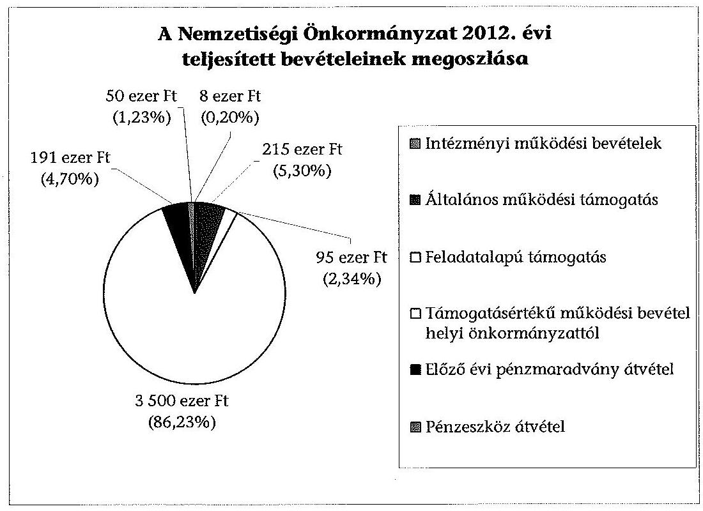
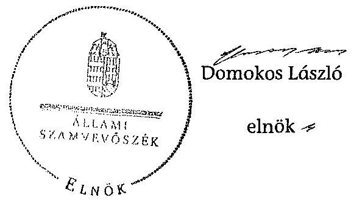

# ÁLLAMI   SZÁMVEVŐSZÉK 

## JELENTÉS

a helyi nemzetiségi önkormányzatok gazdálkodásának ellenőrzéséről
XIII. Kerületi Horvát Nemzetiségi Önkormányzat

---

Állami Számvevőszék
Iktatószám: V-0294-021/2014.
Témaszám: 1327
Vizsgálat-azonosító szám: V065247
Az ellenőrzést felügyelte:
Horváth Balázs
felügyeleti vezető
Az ellenőrzést vezette és az ellenőrzés végrehajtásáért felelős:
Kisgergely István
ellenőrzésvezető
A számvevőszéki jelentést készítették és a jelentés összeállításában
közreműködtek:
Zachár Péterné
számvevő főtanácsos
Právitzné Pejkó Noémi
számvevő
Az ellenőrzést végezte:
Ganter Ildikó
számvevő

---

# TARTALOMJEGYZÉK 

BEVEZETÉS ..... 3
I. ÖSSZEGZŐ MEGÁLLAPÍTÁSOK, KÖVETKEZTETÉSEK, JAVASLATOK ..... 6
II. RÉSZLETES MEGÁLLAPÍTÁSOK ..... 11

1. A Nemzetiségi Önkormányzat és a XIII. kerületi Önkormányzat együttműködésének szabályozása, a működési feltételek biztosítása ..... 11
2. A gazdálkodási feladatok ellátásának szabályszerűsége ..... 12
2.1. A költségvetésre és a zárszámadásra, valamint a kincstári adatszolgáltatás rendjére vonatkozó jogszabályi előírások betartása ..... 12
2.2. A Nemzetiségi Önkormányzat gazdálkodásának szabályozottsága ..... 13
2.3. Az operatív gazdálkodási jogkörök kialakítása, gyakorlása ..... 14
3. A Nemzetiségi Önkormányzattal összefüggő gazdálkodási feladatok belső ellenőrzése ..... 14
4. A feladatalapú támogatás felhasználásának, elszámolásának szabályszerűsége, a Nemzetiségi Önkormányzat feladatellátása ..... 15
MELLÉKLETEK
5. számú A Nemzetiségi Önkormányzat 2012. évi gazdálkodásának főbb adatai, mutatói
6. számú Tájékoztatás a polgármesternek küldött el nem fogadott észrevételekről
FÜGGELÉKEK
7. számú Rövidítések jegyzéke
8. számú Értelmező szótár
9. számú A gazdálkodás értékelésének módszere

---

.

---

# JELENTÉS   a helyi nemzetiségi önkormányzatok gazdálkodásának ellenőrzéséről XIII. Kerületi Horvát Nemzetiségi Önkormányzat 

## BEVEZETÉS

A Nemzetiségi Önkormányzat a 2003. évben alakult, elnöke a 2010. évi helyhatósági választások óta látja el feladatát. A Nemzetiségi Önkormányzat intézményt, gazdasági társaságot és más szervezetet nem alapított. A négytagú Képviselő-testület munkája segítésére bizottságot nem hozott létre. A Nemzetiségi Önkormányzatnak a költségvetési beszámolója szerint a 2012. évben a módosított költségvetési bevételi és kiadási előirányzata 4059 ezer Ft, a teljesített költségvetési bevétel 4059 ezer Ft, a teljesített költségvetési kiadás 4050 ezer Ft volt.

Az Alaptörvény XXIX. cikk (1) bekezdése szerint a Magyarországon élő nemzetiségek államalkotó tényezők. Minden, valamely nemzetiséghez tartozó magyar állampolgárnak joga van önazonossága szabad vállalásához és megőrzéséhez. A hazánkban élő nemzetiségek helyi (települési és területi), valamint országos önkormányzatokat hozhatnak létre. A helyi nemzetiségi önkormányzatok gazdálkodási feladatait jogszabályi előírás alapján a székhely helyi önkormányzat polgármesteri hivatala látja el.

A nemzetiségek helyzete, támogatása mind hazai, mind EU-s szinten kiemelt figyelmet kap napjainkban. A helyi nemzetiségi önkormányzatok gazdálkodására és támogatási rendszerére vonatkozó jogszabályok a 2010-2012. években jelentős változásokon mentek át. A települési és területi nemzetiségi önkormányzatok gazdálkodásának, a részükre juttatott költségvetési támogatások felhasználásának ellenőrzését az ÁSZ a 2012. évben sorozatjellegű ellenőrzés keretében indította el. A 2013. évi ellenőrzések e témacsoportos ellenőrzések folytatását jelentik, amelyet az ÁSZ 2014. első félévi ellenőrzési terve a 12. témasorszámon tartalmaz.

Az ellenőrzés célja annak értékelése volt, hogy a Nemzetiségi Önkormányzat gazdálkodási kereteinek kialakítása, gazdálkodása és feladatellátása megfelelt-e a jogszabályoknak.

Ennek keretében értékeltük, hogy:

- a Nemzetiségi Önkormányzat és a XIII. Kerületi Önkormányzat együttműködésének szabályozása, a működési feltételek biztosítása megfelelt-e a jogszabályi előírásoknak;

---

- a felek együttműködése megfelelt-e a közöttük létrejött megállapodásnak a gazdálkodási feladatok szabályszerű ellátása során, ennek keretében betartották-e a Nemzetiségi Önkormányzat gazdálkodásához kapcsolódóan a költségvetésre és zárszámadásra, a gazdálkodás szabályozására, az operatív gazdálkodási jogkörök gyakorlására vonatkozó jogszabályi előírásokat;
- a jegyző biztosította-e a Nemzetiségi Önkormányzat gazdálkodásának belső ellenőrzését;
- a Nemzetiségi Önkormányzat feladatalapú támogatásának felhasználása, a folyósított feladatalapú támogatással történő elszámolás az előírásoknak megfelelő volt-e;
- a Nemzetiségi Önkormányzat feladatellátása összhangban volt-e a vonatkozó jogszabályi előírásokkal.

Az ellenőrzés várható hasznosulását négy szinten tervezzük. A törvényalkotás számára összegzett tapasztalatok állnak rendelkezésre a nemzetiségi önkormányzatok testületi döntéseinek, gazdálkodásának és a feladatalapú támogatás felhasználásának szabályszerűségéről, amelynek alapján következtetést lehet levonni arra, hogy indokolt-e jogszabályi módosítás kezdeményezése. Az ellenőrzés az ellenőrzött számára visszajelzést ad a működésében fellépő hiányosságokról, javaslataival hozzájárul azok kiküszöböléséhez, amely csökkentheti a későbbi ellenőrzések gyakoriságát. Az ellenőrzés megállapításai és javaslatai tanulságul szolgálhatnak más nemzetiségi önkormányzatok, szervezetek számára a rendezett gazdálkodási keretek kialakításához. A társadalom számára jelzi, hogy közpénz nem maradhat ellenőrizetlenül, az ÁSZ értékteremtő rend kialakításához és megőrzéséhez hozzájáruló tevékenysége pozitív hatással lesz a szervezetről kialakított összkép formálásában. Az ÁSZ szervezetén belül lehetőség nyílik arra, hogy a megállapítások szintetizálásával az intézmény a hozzáadott értéket teremtő elemző tevékenységét és tanácsadó szerepét erősítse.

A Nemzetiségi Önkormányzat gazdálkodásának ellenőrzéséről szóló jelentés I. fejezetének összegző része az ellenőrzés céljára adott rövid, szintetizáló összefoglalót és következtetéseket tartalmazza a II. fejezet részletes megállapításain alapulóan. A jelentés intézkedést igénylő megállapításait és javaslatait - az összegzőben foglaltak mellett - az ellenőrzés során feltárt, a jelentés II. fejezetében rögzített részletes megállapítások alapozzák meg, illetve támasztják alá.

Az ellenőrzés típusa: szabályszerűségi ellenőrzés
Az ellenőrzött időszak: a 2012. január 1. - 2012. december 31. közötti időszak. Az ellenőrzés kiterjedt a Nemzetiségi Önkormányzatnak juttatott 2012. évi támogatás 2013. évben való elszámolására is.

Ellenőrzött szervezet: a XIII. Kerületi Horvát Nemzetiségi Önkormányzat és a gazdálkodási feladatait ellátó Budapest Főváros XIII. Kerületi Önkormányzat.

Az ellenőrzés végrehajtásának jogszabályi alapját az ÁSZ tv. 5. § (2)(3) és (6) bekezdéseiben foglaltak képezik.

---

Az ellenőrzés szakmai módszertana az ÁSZ hivatalos honlapján (www.asz.hu) közzétett szakmai szabályokon alapult, amely a Legfőbb Ellenőrző Intézmények Nemzetközi Szervezete (INTOSAI) által kiadott nemzetközi standardok (ISSAI) figyelembevételével készült.

A helyi nemzetiségi önkormányzatok gazdálkodásának ellenőrzése során értékeltük a XIII. Kerületi Önkormányzat és a Nemzetiségi Önkormányzat együttműködésének, a gazdálkodás szabályozottságának és a pénzügyi folyamatokban kulcsszerepet betöltő belső kontrollok (teljesítésigazolás és érvényesítés) működésének megfelelőségét. A kulcskontrollokat a dologi kiadásokkal kapcsolatos kifizetéseknél - mintavételi eljárást alkalmazva - ellenőriztük.

Ellenőriztük, hogy a jegyző biztosította-e a Nemzetiségi Önkormányzat gazdálkodásának belső ellenőrzését. Értékeltük a feladatalapú támogatások felhasználásának, elszámolásának szabályszerűségét, a Nemzetiségi Önkormányzat feladatellátása és a jogszabályi előírások összhangját.

Az ellenőrzés lefolytatásához a Nemzetiségi Önkormányzat és a gazdálkodási feladatait ellátó XIII. Kerületi Önkormányzat tanúsítványok és a kapcsolódó, dokumentumjegyzékben megjelölt dokumentumok elektronikus úton történő megküldésével, rendelkezésre bocsátásával szolgáltatott adatokat. Az adatszolgáltatás kontrollálása és szükség szerinti javítása a helyszíni ellenőrzés keretében történt. A minősítési szempontokat a 3. számú függelék tartalmazza.

Az ÁSZ tv. 29. § (1) bekezdése szerint a jelentéstervezetet megküldtük észrevételezésre a polgármester és a Nemzetiségi Önkormányzat elnöke részére. A Nemzetiségi Önkormányzat elnöke észrevételt nem tett, jövőbeni intézkedésekről adott tájékoztatást. A polgármester határidőben megküldött észrevétele és tájékoztatása alapján a jelentést nem módosítottuk. Az el nem fogadott észrevételek indoklását a jelentés 2. számú melléklete tartalmazza.

---

# I. ÖSSZEGZŐ MEGÁLLAPÍTÁSOK, KÖVETKEZTETÉSEK, JAVASLATOK 

A Nemzetiségi Önkormányzat és a XIII. Kerületi Önkormányzat együttműködésének szabályozása, a működési feltételek biztosítása megfelelt a jogszabályi előírásoknak. A Nemzetiségi Önkormányzat rendelkezett a 2012. év folyamán hatályban lévő együttműködési megállapodással a XIII. Kerületi Önkormányzattal. A 2012. január 1-jén hatályos, 2010. december 9-én megkötött együttműködési megállapodás ${ }_{1}$-nek a gazdálkodási szabályok változása miatti felülvizsgálatát, a Nek. tv.-ben előírt 2012. január 31-ei határidőn túl végezték el. A Nek. tv.-ben előírt kiegészítést végrehajtották, a 2012. június 1-jei határidőt betartva, 2012. február 24-én aláírták az együttműködési megállapodás ${ }_{2}$-őt. Az együttműködési megállapodás ${ }_{1,2}$-őt a Nemzetiségi Önkormányzat Képviselő-testülete határozattal elfogadta. A Nemzetiségi Önkormányzat működésének feltételeit a jogszabályi előírásoknak megfelelően szabályozták a 2012. december 31-én hatályos megállapodás ${ }_{2}$-ben. A Nek. tv.-ben foglaltak ellenére azonban az együttműködési megállapodás ${ }_{2}$ szerinti működési feltételeket nem rögzítették a Nemzetiségi Önkormányzat SZMSZ-ében. A Nemzetiségi Önkormányzat gazdálkodási feladatai ellátásának szabályait, valamint a működéshez szükséges személyi és tárgyi feltételeket az együttműködési megállapodás ${ }_{2}$ tartalmazta.

A Nemzetiségi Önkormányzat 2012. évi költségvetésének és zárszámadásának tartalma, jóváhagyása megfelelt a jogszabályi előírásoknak. A Nemzetiségi Önkormányzat elnöke a 2012. évi költségvetés tervezetét az Áht. ${ }_{2}$ előírása szerinti határidőben benyújtotta a Képviselő-testületnek. A jóváhagyott költségvetés az Áht. ${ }_{2}$-ben és az Ávr.-ben előírt tartalomnak megfelelő volt. A jegyző által elkészített 2012. évi zárszámadási határozat-tervezetet a Nemzetiségi Önkormányzat elnöke az Áht. ${ }_{2}$-ben foglaltak alapján, határidőn belül terjesztette be a Képviselő-testületnek. A 2012. évi zárszámadási határozatban valamennyi bevétel és kiadás bemutatásra került, az elfogadott költségvetéssel való összehasonlíthatóságot biztosították. A jegyző a 2012. évi költségvetéshez kapcsolódó, a Nemzetiségi Önkormányzatra vonatkozó kincstári adatszolgáltatási kötelezettségeinek az Áhsz. ${ }_{1}$-ben és az Ávr.-ben előírt határidőkön túl tett eleget.

A Nemzetiségi Önkormányzat gazdálkodásának szabályozottsága az ellenőrzött időszakban megfelelt a jogszabályi előírásoknak. A gazdálkodási feladatok végrehajtását ellátó Polgármesteri Hivatal a 2012. évben a Számv. tv.-ben, és a Bkr.-ben előírt, gazdálkodást érintő szabályzatokkal rendelkezett, ezek hatályát kiterjesztették a Nemzetiségi Önkormányzat gazdálkodásának végrehajtási feladataira. A Polgármesteri Hivatal SZMSZ-e azonban az Ávr.-ben foglaltak ellenére nem tartalmazta az SZMSZ-ben nevesített munkakörökhöz tartozó - a Nemzetiségi Önkormányzat gazdálkodásának végrehajtásával kapcsolatos - feladat- és hatásköröket, a hatáskörök gyakorlásának módját, a helyettesítés rendjét, az ezekhez kapcsolódó felelősségi szabályokat.

---

Az operatív gazdálkodási jogkörök kialakítása, a kötelezettségvállalásra és az utalványozásra adott felhatalmazás, a teljesítésigazoló kijelölése megfelelte a jogszabályi előírásoknak. A pénzügyi ellenjegyzőt és az érvényesítőt a jegyző, mint a hivatal vezetője jelölte ki. A Nemzetiségi Önkormányzat elnöke a nemzetiségi önkormányzati képviselők kötelezettségvállalás, utalványozás és teljesítésigazolás gyakorlására történő kijelölésével biztosította az összeférhetetlenségi követelmények érvényesülését.

A Nemzetiségi Önkormányzatnál a 2012. évben a dologi kiadások teljesítése során a kulcskontrollok működésének megfelelősége kiváló volt, a teljesítésigazoló és az érvényesítő a jogszabályi előírásoknak megfelelően látta el ellenőrzési feladatát. A Nemzetiségi Önkormányzat 2012. évi dologi kiadásai között a három legnagyobb összegű kiadás teljesítésekor - a bizonylatok egyedi értékelése alapján - a teljesítésigazolás és az érvényesítés kulcskontrollok megfelelően működtek. Támogatásértékű kiadást, valamint államháztartáson kívülre történő működési és felhalmozási célú pénzeszközátadást nem teljesítettek.

A Nemzetiségi Önkormányzat gazdálkodásával összefüggő végrehajtási feladatok belső ellenőrzésének kialakítása a 2012. évben megfelelő volt. A jegyző biztosította a Nemzetiségi Önkormányzat gazdálkodásával összefüggő végrehajtási feladatok belső ellenőrzését. A belső ellenőrzési tervet megalapozó kockázatelemzés kiterjedt a Nemzetiségi Önkormányzat gazdálkodásával összefüggő végrehajtási feladatokra. A nemzetiségek gazdálkodásával kapcsolatos kockázatot magas besorolásúnak minősítették, és évenkénti ellenőrzést tartottak szükségesnek. A 2012. évi belső ellenőrzés az önkormányzati támogatás 2012. év első félévi felhasználását ellenőrizte és megállapította, hogy a Nemzetiségi Önkormányzat gazdálkodása szabályszerű volt. Az ellenőrzés nem érintette a számvevőszéki ellenőrzés által feltárt hiányosságokat a feladatalapú támogatások elszámolására vonatkozóan.

A Nemzetiségi Önkormányzat részére 2011. évben és a 2012. évben folyósított feladatalapú támogatás elszámolása a jogszabályi előírásoknak nem felelt meg. A Nemzetiségi Önkormányzat a 2011. évben 42,7 ezer Ft, a 2012. évben 95 ezer Ft feladatalapú támogatást kapott, amelyet a folyósítás évében felhasznált. A 2011. és a 2012. évi feladatalapú támogatás elszámolása a támogatási kormányrendelet ${ }_{1,2}$ előírása alapján, az Áht. ${ }_{1,2}$-ben foglaltak ellenére nem történt meg. A feladatalapú támogatás felhasználását és elszámolását az arra jogosult külső szervek nem ellenőrizték.

A 2012. évben a Nemzetiségi Önkormányzat feladatellátásának tárgya összhangban volt a Nek. tv.-ben foglalt előírásokkal, kötelező feladatként közmeghallgatást, önként vállalt feladatként
 nemzetiségi fesztivált rendeztek.

Az ÁSZ tv. 33. § (1) bekezdésében foglaltak értelmében az ellenőrzött szervezet vezetője köteles a jelentésben foglalt megállapításokhoz kapcsolódó intézkedési tervet összeállítani és azt a jelentés kézhezvételétől számított 30 napon belül az ÁSZ részére megküldeni. Amennyiben az intézkedési tervet határidőre nem küldi meg a szervezet, vagy az nem elfogadható, az ÁSZ elnöke az ÁSZ tv. 33. § (3) bekezdés a)-b) pontjaiban foglaltakat érvényesítheti.

---

A helyszíni ellenőrzés megállapításainak hasznosítása mellett Javasoljuk:

# a jegyzőnek 

1. az együttműködés szabályozásával kapcsolatban

Az együttműködési megállapodás ${ }_{1}$-et a Nek. tv. 80. § (2) bekezdésének előírása ellenére 2012. január 31-éig nem vizsgálták felül.

A Nek. tv. 80. § (2) bekezdésében foglaltak ellenére az együttműködési megállapodás ${ }_{2}$ szerinti működési feltételeket nem rögzítették a Nemzetiségi Önkormányzat SZMSZ-ében.

Javaslat
a) biztosítsa a jövőben az együttműködési megállapodás évenkénti felülvizsgálata során a Nek. tv. 80. § (2) bekezdésében előírt határidő betartását;
b) készítse elő a Nemzetiségi Önkormányzat SZMSZ-ének a Nek. tv. 80. § (2) bekezdésében foglalt előírásnak megfelelő kiegészítését.
2. a kincstári adatszolgáltatási kötelezettséggel kapcsolatban

A jegyző a 2012. évi költségvetéshez kapcsolódó, a Nemzetiségi Önkormányzatra vonatkozó kincstári adatszolgáltatási kötelezettségének több esetben - az Ávr. 33. §-ában, 169. § (2) bekezdésében és az Áhsz. 10. § (5a) bekezdésében előírt - határidőn túl tett eleget.

Javaslat
Gondoskodjon arról, hogy a Nemzetiségi Önkormányzatra vonatkozó kincstári adatszolgáltatási kötelezettségeinek az Ávr. 33. §-ában, 169. § (2) bekezdésében és az Áhsz. 10. § (5a) bekezdésében előírt határidők betartásával tegyen eleget.
3. a gazdálkodás szabályozottságával kapcsolatban

A Polgármesteri Hivatal SZMSZ-e nem tartalmazta az Ávr. 13. § (1) bekezdés g) pontjában foglaltak szerinti, az SZMSZ-ben nevesített munkakörökhöz tartozó - a Nemzetiségi Önkormányzat gazdálkodásának végrehajtásával kapcsolatos - feladat- és hatáskörökre, a hatáskörök gyakorlásának módjára, a helyettesítés rendjére, az ezekhez kapcsolódó felelősségi szabályokra vonatkozó előírásokat.

Javaslat
Készítse el a Polgármesteri Hivatal SZMSZ-e módosítását, hogy az tartalmazza - a Nemzetiségi Önkormányzat gazdálkodásának végrehajtási feladataira vonatkozóan az Ávr. 13. § (1) bekezdés g) pontjában foglaltakat.
4. a feladatalapú támogatás elszámolásával kapcsolatban

A 2011. évi feladatalapú támogatás elszámolása a támogatási kormányrendelet ${ }_{1}$ 7. § (2) bekezdésében hivatkozott, valamint a 2012. évi feladatalapú támogatás

---

elszámolása a támogatási kormányrendelet ${ }_{2}$ 8. § (5) bekezdésében hivatkozott „a helyi önkormányzatok elszámolási és ellenőrzési rendjére vonatkozó jogszabályok rendelkezései alkalmazandóak" előírása alapján az Áht. 64. § (7) bekezdése és az Áht. 57. § (3) bekezdése ellenére nem történt meg.

Javaslat
Gondoskodjon az Áht. 57. § (2) bekezdésében meghatározott feladatkörében a Nemzetiségi Önkormányzat által igénybevett 2011. és 2012. évi feladatalapú támogatás rendeltetésszerű felhasználásáról szóló elszámolásának elkészítéséről az Áht. 53. § (1) bekezdése szerinti beszámolási kötelezettség teljesítéséhez.

# a polgármesternek 

A Polgármesteri Hivatal SZMSZ-e nem tartalmazta az Ávr. 13. § (1) bekezdés g) pontjában foglaltak szerinti, az SZMSZ-ben nevesített munkakörökhöz tartozó - a Nemzetiségi Önkormányzat gazdálkodásának végrehajtásával kapcsolatos - feladat- és hatáskörökre, a hatáskörök gyakorlásának módjára, a helyettesítés rendjére, az ezekhez kapcsolódó felelősségi szabályokra vonatkozó előírásokat.

Javaslat
Terjessze a XIII. Kerületi Önkormányzat Képviselő-testülete elé jóváhagyásra a Polgármesteri Hivatal SZMSZ-ének jegyző által elkészített módosítását, hogy az tartalmazza - a Nemzetiségi Önkormányzat gazdálkodásának végrehajtására vonatkozóan - az Ávr. 13. § (1) bekezdés g) pontjában foglaltakat.

## a Nemzetiségi Önkormányzat elnökének

1. A Nek. tv. 80. § (2) bekezdésében foglaltak ellenére az együttműködési megállapodás ${ }_{2}$ szerinti működési feltételeket nem rögzítették a Nemzetiségi Önkormányzat SZMSZ-ében.

Javaslat
Terjessze a Képviselő-testület elé jóváhagyásra a Nemzetiségi Önkormányzat SZMSZ-ének jegyző által előkészített módosítását, hogy az megfeleljen a Nek. tv. 80. § (2) bekezdésében előírtaknak.
2. A 2011. évi feladatalapú támogatás elszámolása a támogatási kormányrendelet ${ }_{1}$ 7. § (2) bekezdésében hivatkozott, valamint a 2012. évi feladatalapú támogatás elszámolása a támogatási kormányrendelet ${ }_{2}$ 8. § (5) bekezdésében hivatkozott „a helyi önkormányzatok elszámolási és ellenőrzési rendjére vonatkozó jogszabályok rendelkezései alkalmazandóak" előírása alapján az Áht. 64. § (7) bekezdése és az Áht. 57. § (3) bekezdése ellenére nem történt meg.

---

Javaslat
Terjessze a Képviselő-testület elé jóváhagyásra az Áht. 53. § (1) bekezdése szerinti beszámolási kötelezettség teljesítéséhez a Nemzetiségi Önkormányzat által igénybe vett 2011. és 2012. évi feladatalapú támogatás felhasználásáról szóló elszámolást.

---

# II. RÉSZLETES MEGÁLLAPÍTÁSOK 

## 1. A Nemzetiségi Önkormányzat és a XIII. kerületi Önkormányzat együttműködésének szabályozása, a működési feltételek biztosítása

A Nemzetiségi Önkormányzat és a XIII. Kerületi Önkormányzat együttműködésének szabályozása, a működési feltételek biztosítása megfelelt a jogszabályi előírásoknak.

A Nemzetiségi Önkormányzat rendelkezett a 2012. év folyamán hatályban lévő együttműködési megállapodással a XIII. Kerületi Önkormányzattal. A 2012. január 1-jén hatályos, 2010. december 9-én megkötött együttműködési megállapodás ${ }_{1}$-nek a gazdálkodási szabályok változása miatti - évenként kötelező - felülvizsgálatát, a Nek. tv. 80. § (2) bekezdésében előírt 2012. január 31-i határidőn túl végezték el. A Nek. tv. 159. § (3) bekezdésében előírt kiegészítést végrehajtották, a 2012. június 1-jei határidőt betartva, 2012. február 24-én aláírták az együttműködési megállapodás ${ }_{2}$-t.

Az együttműködési megállapodás ${ }_{1,2}$-t a Nemzetiségi Önkormányzat Képviselőtestülete határozattal elfogadta ${ }^{1}$. Az együttműködési megállapodás ${ }_{2}$-t a polgármester az 1/2011. (I. 14.) számú Önkormányzati rendelet felhatalmazása alapján kötötte.

A Nemzetiségi Önkormányzat működésének feltételeit a jogszabályi előírásoknak megfelelően szabályozták a 2012. december 31-én hatályos együttműködési megállapodás ${ }_{2}$-ben. A Nek. tv. 80. § (2) bekezdésében foglaltak ellenére azonban az együttműködési megállapodás ${ }_{2}$ szerinti működési feltételeket nem rögzítették a Nemzetiségi Önkormányzat SZMSZ-ében a megállapodás megkötését, módosítását követő 30 napon belül².

A Nemzetiségi Önkormányzat gazdálkodási feladatai ellátásának szabályait az együttműködési megállapodás ${ }_{2}$-ben teljes körűen rögzítették.

A XIII. Kerületi Önkormányzat az együttműködési megállapodás ${ }_{2}$-ben biztosította a Nemzetiségi Önkormányzat működéséhez szükséges személyi és tárgyi feltételeket.

[^0]
[^0]:    1 Az együttműködési megállapodás ${ }_{1}$-et a Nemzetiségi Önkormányzat 31/2010. (XI. 19.) számú határozatával, az együttműködési megállapodás ${ }_{2}$-t a 07/2012. (II. 8.) számú határozatával, a polgármester önkormányzati rendelet felhatalmazása alapján fogadta el.
    2 A Nemzetiségi Önkormányzat Szervezeti és Működési Szabályzatát a 17/2011. (VI.3.) számú határozattal fogadták el, további módosításra a 2011-2012 években, illetve a helyszíni ellenőrzés lezárásáig nem került sor.

---

Az együttműködési megállapodás ${ }_{2}$ tartalmazta a Nek. tv. 80. § (4) bekezdés előírásának megfelelően, hogy a jegyző vagy annak - a jegyzővel azonos képesítési előírásoknak megfelelő - megbízottja a helyi önkormányzat megbízásából és képviseletében részt vesz a helyi nemzetiségi önkormányzat testületi ülésein és jelzi, amennyiben törvénysértést észlel.

# 2. A gazdálkodási feladatok ellátásának szabályszerűsége 

### 2.1. A költségvetésre és a zárszámadásra, valamint a kincstári adatszolgáltatás rendjére vonatkozó jogszabályi előírások betartása

A Nemzetiségi Önkormányzat 2012. évi költségvetésének és zárszámadásának tartalma, jóváhagyása megfelelt a jogszabályi előírásoknak.

A Nemzetiségi Önkormányzat elnöke a 2012. évi költségvetés tervezetét az Áht. előírása szerinti határidőben ${ }^{3}$ benyújtotta a Képviselő-testületnek. A jóváhagyott költségvetés ${ }^{4}$ az Áht.-ben és az Ávr.-ben előírt tartalommal készült.

A jegyző által elkészített 2012. évi zárszámadási határozat-tervezetet a Nemzetiségi Önkormányzat elnöke az Áht.-ben foglaltak alapján, határidőn belül terjesztette be a Képviselő-testületnek. Az Áht.-ben előírt mérlegeket, kimutatásokat a zárszámadás előterjesztésekor tájékoztatásul bemutatták, és biztosították az összehasonlíthatóságát az elfogadott költségvetéssel. A zárszámadási határozatban ${ }^{5}$ a Nemzetiségi Önkormányzat valamennyi bevételét és kiadását bemutatták.

A jegyző a 2012. évi költségvetéshez kapcsolódó, a Nemzetiségi Önkormányzatra vonatkozó kincstári adatszolgáltatási kötelezettségének az Ávr. 33. §-ban és az Áhsz. 10. § (5a) bekezdésében meghatározott határidőn túl tett eleget. A negyedéves és éves időközi költségvetési jelentéseket az Ávr. 169. § (2) bekezdésében előírt határidőben nem teljesítette, a 2012. év éves elemi költségvetési beszámolójának benyújtását az Áhsz. 10. § (5a) pontjával ellentétben nem megfelelő határidőben teljesítette.

A 2012. évi költségvetéshez kapcsolódó, a Nemzetiségi Önkormányzatra vonatkozóan a negyedéves és éves időközi költségvetési jelentéseket négy, három, öt nap késedelemmel, a 2012. évi éves elemi költségvetési beszámolót három nap késedelemmel adták fel.

[^0]
[^0]:    ${ }^{3}$ 2012. február 8-i előterjesztés a Nemzetiségi Önkormányzat 2012. évi költségvetéséről.
    ${ }^{4}$ A Képviselő-testület 06/2012. (II. 8.) számú határozata a Nemzetiségi Önkormányzat 2012. évi költségvetéséről.
    ${ }^{5}$ A Képviselő-testület 10/2013. (IV. 22.) számú határozata a Nemzetiségi Önkormányzat 2012. évi zárszámadásáról.

---

# 2.2. A Nemzetiségi Önkormányzat gazdálkodásának szabályozottsága 

A Nemzetiségi Önkormányzat gazdálkodásának szabályozottsága az ellenőrzött időszakban megfelelt a jogszabályi előírásoknak.

A gazdálkodási feladatok végrehajtását ellátó Polgármesteri Hivatal a 2012. évben a Számv. tv.-ben és a Bkr.-ben előírt, gazdálkodást érintő szabályzatokkal ${ }^{6}$ a Nemzetiségi Önkormányzat gazdálkodásának végrehajtási feladataira kiterjedő hatállyal rendelkezett.

Az Önkormányzat és a Polgármesteri Hivatal számviteli politikájáról szóló XXII/1-13/2012. (VIII. 30.) számú polgármesteri-jegyzői együttes utasítást 2012. augusztus 30-án írták alá, amely az aláírás napján lépett hatályba, „rendelkezést a 2012. évtől kezdődően kell alkalmazni".

A Polgármesteri Hivatal SZMSZ-e az Ávr. 13. § (1) bekezdés g) pontjában foglaltak ellenére nem tartalmazta az SZMSZ-ben nevesített munkakörökhöz tartozó - a Nemzetiségi Önkormányzat gazdálkodásának végrehajtásával kapcsolatos - feladat- és hatásköröket, a hatáskörök gyakorlásának módját, a helyettesítés rendjét, az ezekhez kapcsolódó felelősségi szabályokat ${ }^{7}$.

A Polgármesteri Hivatalban az ellenőrzött időszakban két operatív gazdálkodási szabályzat ${ }^{8}$ volt érvényben, amelyek hatályát kiterjesztették a Nemzetiségi Önkormányzat gazdálkodásának végrehajtási feladataira. A szabályzatban a 100 ezer forintot el nem érő, előzetes írásbeli kötelezettségvállalást nem igénylő kifizetések rendjét meghatározták.

A Polgármesteri Hivatal egy fő dolgozójának munkaköri kötelezettségébe tartozott a nemzetiségi önkormányzatok gazdálkodásával kapcsolatos végrehajtási feladatok ellátása.

[^0]
[^0]:    ${ }^{6}$ Számviteli politika, eszközök és források leltárkészítési és leltározási szabályzata, eszközök és források értékelési szabályzata, pénzkezelési szabályzat, számlarend, selejtezési szabályzat, önköltségszámítás rendjére vonatkozó szabályzat, ellenőrzési nyomvonal, szabálytalanságok kezelésének eljárásrendje, kockázatkezelési szabályzat, folyamatba épített előzetes, utólagos és vezetői ellenőrzés (FEUVE) szabályozás.
    ${ }^{7}$ A gazdálkodással kapcsolatos feladat- és hatásköröket a 160/2012. (XII. 13.) számú önkormányzati határozat az egységes ügyrend módosításáról tartalmazza.
    ${ }^{8}$ A XXII/25-3/2010. (IV. 29.) számú, valamint az azt hatályon kívül helyező a XXII/111/2012. (VII. 02.) számú polgármesteri-jegyzői együttes utasítás az Önkormányzat és a Polgármesteri Hivatal költségvetése végrehajtása során a kötelezettségvállalás és ellenjegyzés, a szakmai teljesítésigazolás, érvényesítés és utalványozás hatásköri rendjéről.

---

# 2.3. Az operatív gazdálkodási jogkörök kialakítása, gyakorlása 

## Az operatív gazdálkodási jogkörök kialakítása megfelelt a jogszabályi előírásoknak.

Az együttműködési megállapodás ${ }_{2}$ rendelkezett a gazdálkodási jogkörök részletes kialakításáról ${ }^{9}$.

A Nemzetiségi Önkormányzat elnöke a nemzetiségi önkormányzati képviselők kötelezettségvállalás, utalványozás és teljesítésigazolás gyakorlására történő kijelölésével biztosította az összeférhetetlenségi követelmények érvényesülését. Az ellenjegyzésre és az érvényesítésre a jegyző által az Ávr. 55. § (2) bekezdés g)
 pontja és az 58. § (4) bekezdései alapján írásban kijelölt, a Polgármesteri Hivatal állományába tartozó köztisztviselő volt jogosult. A Polgármesteri Hivatal pénzügyi ellenjegyzői és érvényesítői feladatokra kijelölt köztisztviselői a feladatuk ellátásához előírt képesítési követelményeknek megfeleltek.

A Nemzetiségi Önkormányzatnál a 2012. évben a dologi kiadások teljesítése során a teljesítésigazolás és az érvényesítés kulcskontrollok működésének megfelelősége kiváló volt.

A Nemzetiségi Önkormányzat 2012. évi dologi kiadásai között a három legnagyobb összegű kiadás teljesítésekor - a bizonylatok egyedi értékelése alapján - a teljesítésigazolás és az érvényesítés kulcskontrollok megfelelően működtek.

Támogatásértékű kiadást, valamint államháztartáson kívülre történő működési és felhalmozási célú pénzeszközátadást nem teljesítettek.

A Nemzetiségi Önkormányzatnál a számvevőszéki ellenőrzés a rendelkezésére bocsátott dokumentumok alapján összeférhetetlenséget, jogosulatlan kifizetést nem tárt fel.

## 3. A Nemzetiségi Önkormányzattal összefüggő gazdálkodási feladatok belső ellenőrzése

A Nemzetiségi Önkormányzat gazdálkodásával összefüggő feladatok végrehajtásának belső ellenőrzésének kialakítása a 2012. évben megfelelő volt.

A XIII. Kerületi Önkormányzat jegyzője biztosította a Polgármesteri Hivatalnál a Nemzetiségi Önkormányzat gazdálkodásával összefüggő végrehajtási feladatok belső ellenőrzését.

Az aláírt együttműködési megállapodás ${ }_{1,2}$ tartalmazta a belső ellenőrzésre vonatkozó feltételeket, amelynek értelmében a Nemzetiségi Önkormányzatnál a

[^0]
[^0]:    ${ }^{9}$ Az együttműködési megállapodás ${ }_{2}$ 24. pontja alapján a Nemzetiségi Önkormányzat előirányzatai terhére kötelezettséget vállalni és utalványozni kizárólag az elnök vagy az általa felhatalmazott nemzetiségi önkormányzati képviselő jogosult.

---

XIII. Kerületi Önkormányzat költségvetéséből juttatott pénzeszközök felhasználását az Ellenőrzési Csoport évente ellenőrzi.

A belső ellenőrzési tervet megalapozó kockázatelemzés kiterjedt a Nemzetiségi Önkormányzat gazdálkodásával összefüggő végrehajtási feladatokra. A nemzetiségek gazdálkodásával kapcsolatos kockázatot magas besorolásúnak minősítették, és évenkénti vizsgálatot tartottak szükségesnek.

Az éves belső ellenőrzési tervben foglaltaknak megfelelően az Ellenőrzési Csoport a 2012. évben ellenőrizte ${ }^{10}$ a Nemzetiségi Önkormányzat 2012. év első félévi gazdálkodását, különös tekintettel az önkormányzati támogatásból megvalósult gazdasági eseményekre, azonban az nem érintette a jelen ellenőrzés által feltárt hiányosságokat a feladatalapú támogatás elszámolására vonatkozóan.

A belső ellenőrzés megállapította, hogy a helyi nemzetiségi önkormányzatok költségvetésének végrehajtása során a gazdálkodás és az elszámolás szabályszerűen történt az ellenőrzött időszakban, betartották a szakmai teljesítésigazolás, az utalványozás, az ellenjegyzés, valamint az érvényesítés szabályait.

A belső ellenőrzési jelentésben megfogalmazottakat a Nemzetiségi Önkormányzat elnöke megismerte, azokra észrevételt nem tett.

Az ellenőrzéshez szolgáltatott adatok alapján a 2012. évben a Kormányhivatal a Nemzetiségi Önkormányzatot illetően nem élt törvényességi felügyeleti eszközökkel.

# 4. A feladatalapú támogatás felhasználásának, elszámolásának szabályszerűsége, a Nemzetiségi Önkormányzat feladatellátása 

A Nemzetiségi Önkormányzat részére a 2011-2012. években folyósított feladatalapú támogatás elszámolása a jogszabályi előírásoknak nem felelt meg.

A 2012. évi feladatalapú támogatás összes bevételhez viszonyított részarányát a következő ábra szemlélteti:

[^0]
[^0]:    ${ }^{10}$ A belső ellenőrzés által ellenőrzött időszak a 2012. év első féléve volt, az ellenőrzés célja: „A nemzetiségi önkormányzatok részére biztosított pénzeszközök felhasználásának ellenőrzése".

---

A 2011. évben a Nemzetiségi Önkormányzat 43 ezer Ft feladatalapú támogatással rendelkezett, amit a támogatás évében felhasznált.

A Nemzetiségi Önkormányzat a 2012. évben 95 ezer Ft feladatalapú támogatást kapott.

A kapott feladatalapú támogatásból 30 ezer Ft-ot egészségügyi hozzájárulásra, 65 ezer Ft-ot reprezentációra (adómentesen adott kiadásra, nyílt rendezvényre) terveztek fordítani, az erre vonatkozó határozatot a 20/2012. (X. 19.) számú határozattal módosítottak, így a támogatási összeget számítógép vásárlására használták fel.

A 2011. és a 2012. évi feladatalapú támogatás elszámolása a támogatási kormányrendelet ${ }_{1} 7 . \S$ (2), illetve a támogatási kormányrendelet ${ }_{2} 8 . \S$ (5) bekezdésében hivatkozott „a helyi önkormányzatok elszámolási és ellenőrzési rendjére vonatkozó jogszabályok rendelkezései alkalmazandóak" előírása alapján az Áht. ${ }_{1} 64 . \S$ (7) bekezdése, és az Áht. ${ }_{2} 57 . \S$ (3) bekezdése ellenére nem történt meg. A feladatalapú támogatások felhasználását, elszámolását az ellenőrzésre jogosult külső szervek nem ellenőrizték.

---

A Nemzetiségi Önkormányzat kötelező és önként vállalt feladatellátásának tárgya összhangban volt a Nek. tv. 115. §, valamint a 116. §-aiban foglalt előírásokkal, kötelező feladatként közmeghallgatást, önként vállalt feladatként nemzetiségi fesztivált rendeztek.

A Nemzetiségi Önkormányzat a Nek. tv. 116. § (2) bekezdésében tiltott hatósági feladatokat nem végzett.

Budapest, 2014. 11. hó 18. nap

Melléklet: $\quad 2 \mathrm{db}$
Függelék: $\quad 3 \mathrm{db}$

---

# **Chemistry**

## **Chemical Reactions**

### **Balancing Chemical Equations**

1. **Write the unbalanced equation:**
   - Example: $$C_3H_8 + O_2 \rightarrow CO_2 + H_2O$$

2. **Balance the equation:**
   - Balance carbon atoms first.
   - Then balance hydrogen atoms.
   - Finally, balance oxygen atoms.
   - Balanced equation: $$C_3H_8 + 7O_2 \rightarrow 3CO_2 + 4H_2O$$

3. **Balance the equation:**
   - Balance oxygen atoms.
   - Finally, balance oxygen atoms.
   - Balanced equation: $$C_3H_8 + 7O_2 \rightarrow 3CO_2 + 4H_2O$$

### **Types of Reactions**

1. **Combination Reaction:**
   - Example: $$2H_2 + O_2 \rightarrow 2H_2O$$

2. **Decomposition Reaction:**
   - Example: $$2H_2O_2 \rightarrow 2H_2O + O_2$$

3. **Single Displacement Reaction:**
   - Example: $$Zn + 2HCl \rightarrow ZnCl_2 + H_2$$

4. **Double Displacement Reaction:**
   - Example: $$AgNO_3 + NaCl \rightarrow AgCl + NaNO_3$$

5. **Combustion Reaction:**
   - Example: $$CH_4 + 2O_2 \rightarrow CO_2 + 2H_2O$$

## **Stoichiometry**

### **Mole Concept**

- **Mole (mol):** The amount of substance containing as many particles (atoms, molecules, ions) as there are atoms in exactly 12 grams of carbon-12.
- **Avogadro's Number:** $$6.022 \times 10^{23}$$ particles per mole.

### **Molar Mass**

- **Molar Mass:** The mass of one mole of a substance.
- Example: The molar mass of water ($$H_2O$$) is 18.015 g/mol.

### **Calculations**

1. **Moles to Mass:**
   - Formula: $$n = \frac{m}{M}$$
   - Example: Calculate the number of moles of $$H_2O$$ in 18 grams of water.
     - $$n = \frac{18 \, \text{g}}{18.015 \, \text{g/mol}} \approx 0.999 \, \text{mol}$$

2. **Mass to Moles:**
   - Formula: $$m = n \times M$$
   - Example: Calculate the mass of 1 mole of water.
     - $$m = 1 \, \text{mol} \times 18.015 \, \text{g/mol} = 18.015 \, \text{g}$$

## **Gas Laws**

### **Ideal Gas Law**

- **Equation:** $$PV = nRT$$
  - P = Pressure (atm)
  - V = Volume (L)
  - n = Number of moles (mol)
  - R = Ideal gas constant (0.0821 L·atm/mol·K)
  - T = Temperature (K)

### **Boyle's Law**

- **Equation:** $$P_1V_1 = P_2V_2$$
  - P₁ = Pressure (atm)
  - V₁ = Volume (L)
  - n = Number of moles (mol)
  - R = Ideal gas constant (0.0821 L·atm/mol·K)
  - T = Temperature (K)

### **Boyle's Law**

- **Equation:** $$\frac{P_1V_1}{T_1} = \frac{P_2V_2}{T_2}$$
  - P₁ = Pressure (atm)
  - V₁ = Volume (L)
  - n = Number of moles (mol)
  - R = Ideal gas constant (0.0821 L·atm/mol·K)
  - T = Temperature (K)

### **Boyle's Law**

- **Equation:** $$\frac{P_1V_1}{T_1} = \frac{P_2V_2}{T_2}$$

## **Thermochemistry**

### **Enthalpy (H)**

- **Definition:** The heat content of a system at constant pressure.
- **Equation:** $$\Delta H = q_p$$
  - qₚ = Heat transferred at constant pressure.

### **Hess's Law**

- **Statement:** The enthalpy change for a reaction is the same whether it occurs in one step or multiple steps.
- **Example:** The enthalpy change for a reaction is the same whether it occurs in one step or multiple steps.

### **Calorimetry**

- **Equation:** $$q = mc\Delta T$$
  - q = Heat transferred
  - m = Mass
  - c = Specific heat capacity
  - ΔT = Change in temperature

### **Calorimetry of Enthalpy**

- **Equation:** $$\Delta H = -q_{cal}$$
  - qcal = Heat absorbed by the calorimeter

## **Electrochemistry**

### **Oxidation and Reduction**

- **Oxidation:** Loss of electrons.
- **Reduction:** Gain of electrons.

### **Galvanic Cells**

- **Definition:** A cell that converts chemical energy into electrical energy.
- **Components:**
  - Anode: Oxidation occurs.
  - Cathode: Reduction occurs.
  - Salt Bridge: Connects the two half-cells.

### **Nernst Equation**

- **Equation:** $$E = E^\circ - \frac{RT}{nF} \ln Q$$
  - E = Cell potential
  - R = Ideal gas constant
  - T = Temperature (K)
  - n = Number of moles of electrons transferred
  - F = Faraday constant
  - Q = Reaction quotient

## **Electrochemistry**

### **Oxidation and Reduction**

- **Oxidation:** Loss of electrons.
- **Reduction:** Gain of electrons.
- **Reduction:** Gain of electrons.

### **Electrochemical Cells**

- **Definition:** A cell that converts chemical energy into electrical energy.
- **Components:**
  - Anode: Oxidation occurs.
  - Cathode: Reduction occurs.
  - Salt Bridge: Connects the two half-cells.

### **Nernst Equation**

- **Equation:** $$E = E^\circ - \frac{RT}{nF} \ln Q$$
  - E = Cell potential
  - R = Ideal gas constant
  - T = Temperature (K)
  - n = Number of moles of electrons transferred
  - F = Faraday constant
  - Q = Reaction quotient

---

# A Nemzetiségi Önkormányzat 2012. évi gazdálkodásának főbb adatai, mutatói

A) Bevételek

|  Megnevezés | Eredeti előirányzat | Módosított | Teljesítés  |
| --- | --- | --- | --- |
|   | ezer Ft |  | megoszlás (\%)  |
|  Intézményi működési bevételek | 0 | 8 | 8  |
|  Általános működési támogatás | 215 | 215 | 215  |
|  Feladatalapú támogatás | 0 | 95 | 95  |
|  Támogatásért.műk. bev. helyi önkormányzattól | 3500 | 3500 | 3500  |
|  Előző évi pénzmaradvány átvétel | 0 | 191 | 191  |
|  Pénzeszköz átvétel áht-n kívülről | 0 | 50 | 50  |
|  Költségvetési bevételek | 3715 | 4059 | 4059  |
|  Tárgyévi bevételek | 3715 | 4059 | 4059  |

B) Kiadások

|  Megnevezés | Eredeti előirányzat | Módosított | Teljesítés  |
| --- | --- | --- | --- |
|   | ezer Ft |  | megoszlás (\%)  |
|  Személyi juttatások | 2664 | 2556 | 2555  |
|  Munkaadókat terhelő járulékok és szociális hozzájárulási adó összesen | 603 | 600 | 598  |
|  Dologi kiadások | 448 | 506 | 501  |
|  Felhalmozási kiadások | 0 | 397 | 396  |
|  Költségvetési kiadások | 3715 | 4059 | 4050  |
|  Tárgyévi kiadások | 3715 | 4059 | 4050  |

---

# **Chemistry**

## **Chemical Reactions**

### **Balancing Chemical Equations**

1. **Write the unbalanced equation:**
   -

 $$C_3H_8 + O_2 \rightarrow CO_2 + H_2O$$

2. **Balance the equation:**
   - Balance carbon atoms first.
   - Then balance hydrogen atoms.
   - Finally, balance oxygen atoms.
   - Balanced equation: $$C_3H_8 + 7O_2 \rightarrow 3CO_2 + 4H_2O$$

3. **Balance the equation:**
   - Balance oxygen atoms.
   - Finally, balance oxygen atoms.
   - Balanced equation: $$C_3H_8 + 7O_2 \rightarrow 3CO_2 + 4H_2O$$

### **Types of Reactions**

1. **Combination Reaction:**
   - Example: $$2H_2 + O_2 \rightarrow 2H_2O$$

2. **Decomposition Reaction:**
   - Example: $$2H_2O_2 \rightarrow 2H_2O + O_2$$

3. **Single Displacement Reaction:**
   - Example: $$Zn + 2HCl \rightarrow ZnCl_2 + H_2$$

4. **Double Displacement Reaction:**
   - Example: $$AgNO_3 + NaCl \rightarrow AgCl + NaNO_3$$

5. **Combustion Reaction:**
   - Example: $$CH_4 + 2O_2 \rightarrow CO_2 + 2H_2O$$

## **Stoichiometry**

### **Mole Concept**

- **Mole (mol):** The amount of substance containing as many particles (atoms, molecules, ions) as there are atoms in exactly 12 grams of carbon-12.
- **Avogadro's Number:** $$6.022 \times 10^{23}$$ particles per mole.

### **Molar Mass**

- **Molar Mass:** The mass of one mole of a substance.
- Example: The molar mass of water ($$H_2O$$) is 18.015 g/mol.

### **Calculations**

1. **Moles to Mass:**
   - Formula: $$n = \frac{m}{M}$$
   - Example: Calculate the number of moles of $$H_2O$$ in 18 grams of water.
     - $$n = \frac{18 \, \text{g}}{18.015 \, \text{g/mol}} \approx 0.999 \, \text{mol}$$

2. **Mass to Moles:**
   - Formula: $$m = n \times M$$
   - Example: Calculate the mass of 1 mole of water.
     - $$m = 1 \, \text{mol} \times 18.015 \, \text{g/mol} = 18.015 \, \text{g}$$

## **Gas Laws**

### **Ideal Gas Law**

- **Equation:** $$PV = nRT$$
- **Variables:**
  - $$P$$: Pressure (atm)
  - $$V$$: Volume (L)
  - $$n$$: Number of moles (mol)
  - $$R$$: Ideal gas constant (0.0821 L·atm/mol·K)
  - $$T$$: Temperature (K)

### **Boyle's Law**

- **Equation:** $$P_1V_1 = P_2V_2$$
- **Variables:**
  - $$P_1$$: Initial pressure (atm)
  - $$V_1$$: Initial volume (L)
  - $$P_2$$: Final pressure (atm)
  - $$V_2$$: Final volume (L)

## **Thermochemistry**

### **Enthalpy (H)**

- **Definition:** The heat content of a system at constant pressure.
- **Equation:** $$\Delta H = q_p$$
- **Variables:**
  - $$\Delta H$$: Change in enthalpy
  - $$q_p$$: Heat transferred at constant pressure.

### **Hess's Law**

- **Statement:** The enthalpy change for a reaction is the same whether it occurs in one step or multiple steps.
- **Equation:** $$\Delta H_{reaction} = \sum \Delta H_{products} - \sum \Delta H_{reactants}$$

---

# TÁJÉKOZTATÁS   A POLGÁRMESTERNEK KÜLDÖTT EL NEM FOGADOTT ÉSZREVÉTELEKRŐL 

| Együttműködési megállapodás felülvizsgálata |  |
| :--: | :--: |
| Észrevétel | A Polgármesteri Hivatalban az együttműködési megállapodás felülvizsgálata 2012. január hónapban zajlott. A felülvizsgálat többszöri személyes egyeztetéssel, előzetes munkaanyagok elkészítésével és véleményezésével járt. A dokumentumokból megismerhető dátumok alapján a feladat határidőben történő elvégzésére lehet következtetni: a Horvát Nemzetiségi Önkormányzat képviselő-testülete, - ahogy azt Önök is rögzítették a jelentéstervezetben - február 9-i határozatában felhatalmazta az elnököt a megállapodás aláírására, és a megállapodás aláírását megelőző pénzügyi ellenjegyzésre is február 9-én került sor. A körülmények mérlegelése során nem hagyható figyelmen kívül az a tény, hogy az Önkormányzat, a Polgármesteri Hivatal és a nemzetiségi önkormányzatok feladatait, együttműködését, működési körülményeit befolyásoló államháztartási szabályok 2012 januárjában gyökeresen megváltoztak. Az új működési rend kialakítására rendelkezésre álló rendkívül rövid időszak alatt is betartottuk a jogszabályban előírt határidőket.   A Kerületi Önkormányzat vezetése a megállapodás aláírására egyszerre, a kerületben működő valamennyi nemzetiségi önkormányzat elnökével egyeztetett időpontban, február 24-én kerített sort az esemény súlyának megfelelő ünnepélyes keretek között. |
| Válasz | Az együttműködési megállapodás felülvizsgálatával kapcsolatos észrevételét, illetve az aláírással összefüggő tájékoztatását köszönöm, azonban a jelentéstervezetben szereplő megállapítást fenntartjuk. Az ÁSZ kizárólag dokumentumok alapján tesz megállapításokat. Az ellenőrzés részére hitelt érdemlően - dokumentum hiányában - nem tudták igazolni a felülvizsgálat január 31-ig történő elvégzését. |
| Kincstári adatszolgáltatási kötelezettség |  |
| Észrevétel | A kincstári adatszolgáltatási kötelezettségeknek a Kincstár által üzemeltetett internetes felületen teszünk eleget. A határidők betartására mindig fokozott figyelmet fordítunk, ennek ellenére többször előfordul, hogy a rendszer meghibásodása, programhibák javítása, korrekciója miatt az adatrögzítés, lezárás késedelmet szenved. Ezen eseményekről írásos dokumentumokkal nem rendelkezünk, többnyire csak telefonos tájékoztatást kapunk. |
| Válasz | A kincstári adatszolgáltatással kapcsolatos észrevételét, illetve tájékoztatását köszönöm, de a jelentéstervezetben szereplő megállapítást nem módosítjuk. Az ellenőrzés részére rendelkezésre bocsátott dokumentumok alapján az adatszolgáltatás határidőn túl történő teljesítése volt |

---

|  | megállapítható. A programhibákról, rendszer meghibásodásokról dokumentumokat nem mutattak be, így azokat nem vehettük figyelembe. |
| :--: | :--: |
| Polgármesteri Hivatal SZMSZ-ének hiányossága |  |
| Észrevétel | Az államháztartásról szóló törvény végrehajtásáról szóló 359/2011. (XII.31.) Korm. rendelet 13. § (1) bekezdés g) pontja alapján a költségvetési szerv szervezeti és működési szabályzatának tartalmaznia kell a „szervezeti és működési szabályzatban nevesített munkakörökhöz tartozó feladat- és hatásköröket, a hatáskörök gyakorlásának módját, a helyettesítés rendjét, az ezekhez kapcsolódó felelősségi szabályokat". A jogszabály alapján kizárólag a hivatali SZMSZ-ben nevesített munkakörök vonatkozásában kell tartalmaznia a jelentés által hiányolt szabályokat az SZMSZ-nek. A vizsgált időszakban hatályos SZMSZ nem nevesítette a nemzetiségi önkormányzatok gazdálkodásával kapcsolatos munkakört, ezért a jogszabály szerint nem kell tartalmaznia az SZMSZ-nek az ezzel kapcsolatos feladat- és hatásköröket, a hatáskörök gyakorlásának módját, a helyettesítés rendjét, az ezekhez kapcsolódó felelősségi szabályokat.   A hivatkozott Kormányrendelet 13. § (5) bekezdése alapján „a költségvetési szerv szervezeti egységei által ellátott feladatok munkafolyamatainak leírását, a szervezeti egység vezetőinek és alkalmazottainak feladat- és hatáskörét, a helyettesítés rendjét, továbbá a szervezeti egység költségvetési szerven belüli belső és azon kívüli külső kapcsolattartásának módját, szabályait - ha azokról a szervezeti és működési szabályzat vagy a költségvetési szerv más szabályzata nem rendelkezik - a szervezeti egységek ügyrendje tartalmazza". E jogszabályhely is azt támasztja alá, hogy nem kell a költségvetési szerv által ellátott valamennyi feladathoz kapcsolódó munkakört a szervezeti és működési szabályzatban rögzíteni, ezért a vizsgált időszakban hatályos hivatali SZMSZ nem sértette a Kormányrendelet 13. §-ában foglaltakat. Tájékoztatom, hogy Budapest Főváros XIII. Kerületi Önkormányzat Képviselő-testülete 2012. december 13. napján elfogadta a Polgármesteri Hivatal új Szervezeti és Működési Rendjét, amely 2013. január 1. napján lépett hatályba. |
| Válasz | A Polgármesteri Hivatal SZMSZ-ével kapcsolatos észrevételét, miszerint „a vizsgált időszakban hatályos SZMSZ nem nevesítette a nemzetiségi önkormányzatok gazdálkodásával kapcsolatos munkakört, ezért a jogszabály szerint nem kell tartalmaznia az SZMSZ-nek az ezzel kapcsolatos feladat- és hatásköröket, a hatáskörök gyakorlásának módját, a helyettesítés rendjét, az ezekhez kapcsolódó felelősségi szabályokat" köszönöm, a megállapítást és a kapcsolódó javaslatot nem módosítjuk. Az államháztartásról szóló törvény végrehajtásáról szóló 368/2011. (XII. 31.) Korm. rendelet 13. § (5) bekezdése szerint amennyiben az SZMSZ nem tartalmazza ezeket a szabályokat, akkor azok más belső szabályzatban, illetve a szervezeti egységek ügyrendjében rögzítendők. Az ellenőrzés részére a nemzetiségi önkormányzatok gazdálkodásának végrehajtásával kapcsolatos feladatokat meghatározó szabályzatot, ügyrendet nem mutat- |

---

|  | tak be, az SZMSZ sem tartalmazott erre vonatkozó utalást. Tájékoztatását, hogy a Polgármesteri Hivatal 2013. január 1-jétől hatályos új SZMSZ-t a Képviselő testület 2012. december 13-án elfogadta, tudomásul veszem, azonban megállapításokat csak az ellenőrzött időszakra vonatkozóan tehetünk. |
| :--: | :--: |
| Feladatalapú támogatás felhasználásának elszámolása |  |
| Észrevétel | A feladatalapú támogatást bevételként, felhasználását kiadásként tartalmazta a Nemzetiségi Önkormányzat gazdálkodásáról a Kincstárnak benyújtott éves beszámoló űrlapjai. Az Áht. nem rendelkezik e támogatási forma ettől elkülönülő, külön történő elszámolásáról, a Magyar Államkincstártól sem érkezett erre vonatkozó felhívás, így álláspontunk szerint jogszabályi kötelezettségünknek eleget tettünk. Ahogy azt Önök is pozitívumként megállapítják a jelentéstervezetben, a kerületi önkormányzat részére elkészült a feladatalapú támogatásról szóló részletes kimutatás, azaz a jegyzőnek címzett 5. számú javaslatban szereplő feladatot végrehajtottuk. |
| Válasz | A feladatalapú támogatás elszámolásával kapcsolatban tett észrevételét nem fogadom el, a jelentéstervezetben szereplő megállapításunkat nem módosítjuk, az erre vonatkozó javaslatot továbbra is fenntartjuk. A 342/2010. (XII. 28.) Korm. rendelet 7. § (2) bekezdésének, valamint a 28/2012. (III. 6.) Korm. rendelet 8. § (5) bekezdésének előírása szerint a feladatalapú támogatással kapcsolatos elszámolás, ellenőrzés rendjére a helyi önkormányzatok elszámolási és ellenőrzési rendjére vonatkozó jogszabályok rendelkezései alkalmazandóak. Az államháztartásról szóló 1992. évi XXXVIII. törvény 64. § (7) bekezdése alapján a helyi önkormányzat a költségvetési év végét követően a tényleges mutatók alapján, külön jogszabályban meghatározott határidőig, a költségvetési törvény szabályai szerint elszámol az igénybe vett normatív hozzájárulásokkal és támogatásokkal. A 2011. évi CXCV. törvény 2012. évben hatályos 57. § (3) bekezdése szerint a helyi önkormányzat, a helyi nemzetiségi önkormányzat és a többcélú kistérségi társulás a költségvetési év végét követően elszámol az igénybe vett hozzájárulásokkal, támogatásokkal. A Nemzetiségi Önkormányzat a jogszabályban meghatározott elszámolásra vonatkozóan a szükséges dokumentumokat nem bocsátotta az ellenőrzés rendelkezésére. |

---

# **Chemistry**

## **Chemical Reactions**

### **Balancing Chemical Equations**

1. **Write the unbalanced equation:**
   - Example: $$C_3H_8 + O_2 \rightarrow CO_2 + H_2O$$

2. **Balance the equation:**
   - Balance carbon atoms first.
   - Then balance hydrogen atoms.
   - Finally, balance oxygen atoms.
   - Balanced equation: $$C_3H_8 + 7O_2 \rightarrow 3CO_2 + 4H_2O$$

3. **Balance the equation:**
   - Balance oxygen atoms.
   - Finally, balance oxygen atoms.
   - Balanced equation: $$C_3H_8 + 7O_2 \rightarrow 3CO_2 + 4H_2O$$

### **Types of Reactions**

1. **Combination Reaction:**
   - Example: $$2H_2 + O_2 \rightarrow 2H_2O$$

2. **Decomposition Reaction:**
   - Example: $$2H_2O_2 \rightarrow 2H_2O + O_2$$

3. **Single Displacement Reaction:**
   - Example: $$Zn + 2HCl \rightarrow ZnCl_2 + H_2$$

4. **Double Displacement Reaction:**
   - Example: $$AgNO_3 + NaCl \rightarrow AgCl + NaNO_3$$

5. **Combustion Reaction:**
   - Example: $$CH_4 + 2O_2 \rightarrow CO_2 + 2H_2O$$

## **Stoichiometry**

### **Mole Concept**

- **Mole (mol):** The amount of substance containing as many

 particles (atoms, molecules, ions) as there are atoms in exactly 12 grams of carbon-12.
- **Avogadro's Number:** $$6.022 \times 10^{23}$$ particles per mole.

### **Molar Mass**

- **Molar Mass:** The mass of one mole of a substance.
- Example: The molar mass of water ($$H_2O$$) is 18.015 g/mol.

### **Calculations**

1. **Moles to Mass:**
   - Formula: $$n = \frac{m}{M}$$
   - Example: Calculate the number of moles of $$H_2O$$ in 18 grams of water.
     - $$n = \frac{18 \, \text{g}}{18.015 \, \text{g/mol}} \approx 0.999 \, \text{mol}$$

2. **Mass to Moles:**
   - Formula: $$m = n \times M$$
   - Example: Calculate the mass of 1 mole of water.
     - $$m = 1 \, \text{mol} \times 18.015 \, \text{g/mol} = 18.015 \, \text{g}$$

## **Gas Laws**

### **Ideal Gas Law**

- **Equation:** $$PV = nRT$$
  - P = Pressure (atm)
  - V = Volume (L)
  - n = Number of moles (mol)
  - R = Ideal gas constant (0.0821 L·atm/mol·K)
  - T = Temperature (K)

### **Boyle's Law**

- **Equation:** $$P_1V_1 = P_2V_2$$
  - P₁ = Pressure (atm)
  - V₁ = Volume (L)
  - n = Number of moles (mol)
  - R = Ideal gas constant (0.0821 L·atm/mol·K)
  - T = Temperature (K)

### **Boyle's Law**

- **Equation:** $$\frac{P_1V_1}{T_1} = \frac{P_2V_2}{T_2}$$

## **Thermochemistry**

### **Enthalpy (H)**

- **Definition:** The heat content of a system at constant pressure.
- **Equation:** $$\Delta H = q_p$$
  - qₚ = Heat transferred at constant pressure.

### **Hess's Law**

- **Statement:** The enthalpy change for a reaction is the same whether it occurs in one step or multiple steps.
- **Equation:** $$\Delta H_{\text{reaction}} = \sum \Delta H$$

## **Electrochemistry**

### **Oxidation and Reduction**

- **Oxidation:** Loss of electrons.
- **Reduction:** Gain of electrons.

### **Galvanic Cells**

- **Definition:** A cell that converts chemical energy into electrical energy.
- **Components:**
  - Anode: Oxidation occurs.
  - Cathode: Reduction occurs.
  - Salt Bridge: Connects the two half-cells.

### **Nernst Equation**

- **Equation:** $$E = E^\circ - \frac{RT}{nF} \ln Q$$
  - E = Cell potential (V)
  - E° = Standard cell potential (V)
  - R = Ideal gas constant (8.314 J/mol·K)
  - T = Temperature (K)
  - n = Number of moles of electrons transferred
  - F = Faraday constant (96,485 C/mol)
  - Q = Reaction quotient

---

# RÖVIDÍTÉSEK JEGYZÉKE 

| Törvények |  |
| :--: | :--: |
| Alaptörvény | Magyarország Alaptörvénye |
| Áht. 1 | az államháztartásról szóló 1992. évi XXXVIII. törvény (hatályos 2011. december 31-ig) |
| Áht. 2 | 2011. évi CXCV. törvény az államháztartásról (hatályos 2011. december 31-től) |
| ÁSZ tv. | Az Állami Számvevőszékről szóló 2011. évi LXVI. törvény (hatályos 2011. július 1-jétől) |
| Nek. tv. | 2011. évi CLXXIX. törvény a nemzetiségek jogairól (hatályos 2011. december 20-tól) |
| Számv. tv. | 2000. évi C. törvény a számvitelről |
| Rendeletek |  |
| Áhsz. 1 | 249/2000. (XII. 24.) Korm. rendelet az államháztartás szervezetei beszámolási és könyvvezetési kötelezettségének sajátosságairól (hatályos 2013. december 31-éig) |
| Áhsz. 2 | 4/2013. (I. 11.) Korm. rendelet az államháztartás számviteléről (hatályos 2014. január 1-jétől) |
| Ávr. | 368/2011. (XII. 31.) Korm. rendelet az államháztartásról szóló törvény végrehajtásáról (hatályos 2012. január 1-jétől) |
| Bkr. | 370/2011. (XII. 31.) Korm. rendelet a költségvetési szervek belső kontrollrendszeréről és belső ellenőrzéséről (hatályos 2012. január 1-jétől) |
| támogatási kormányrendelet ${ }_{1}$ | 342/2010. (XII. 28.) Korm. rendelet a kisebbségi önkormányzatoknak a központi költségvetésből, valamint fejezeti kezelésű előirányzatból nyújtott támogatások feltételrendszeréről és elszámolásának rendjéről (hatályos 2012. március 31-ig) |
| támogatási kormányrendelet ${ }_{2}$ | 28/2012. (III. 6.) Korm. rendelet a nemzetiségi célú előirányzatokból nyújtott támogatások feltételrendszeréről és elszámolásának rendjéről (hatályos 2012. március 7-től 2012. december 31-ig) |
| Szórövidítések |  |
| ÁSZ | Állami Számvevőszék |
| együttműködési megállapodás ${ }_{1}$ | A 2010. december 9-től érvényben lévő együttműködési megállapodás ${ }_{1}$. Az együttműködési megállapodás ${ }_{1}$-et a Nemzetiségi Önkormányzat 31/2010. (XI. 19.) számú határozatával fogadta el. |
| együttműködési megállapodás ${ }_{2}$ | Az együttműködési megállapodás ${ }_{2}$-t 2012. február 24-én írták alá, az együttműködési megállapodás ${ }_{2}$-t a Nemzetiségi Önkormányzat 07/2012. (II. 8.) számú határozatával, a polgármester önkormányzati rendelet felhatalmazása alapján fogadta el. |
| EU | Európai Unió |

---

jegyző
Képviselő-testület

Kincstár
Kormányhivatal
Nemzetiségi Önkormányzat
Nemzetiségi Önkormányzat elnöke
polgármester

Polgármesteri Hivatal SZMSZ
XIII. Kerületi Önkormányzat

Budapest Főváros XIII. Kerületi Önkormányzat jegyzője XIII. Kerületi Horvát Nemzetiségi Önkormányzat Képviselő-testület
Magyar Államkincstár
Budapest Főváros Kormányhivatala
XIII. Kerületi Horvát Nemzetiségi Önkormányzat

XIII. Kerületi Horvát Nemzetiségi Önkormányzat elnöke

Budapest Főváros XIII. Kerületi Önkormányzat polgármestere
Budapest Főváros XIII. Kerületi Polgármesteri Hivatal Szervezeti és Működési Szabályzata
Budapest Főváros XIII. Kerületi Önkormányzat

---

# ÉRTELMEZŐ SZÓTÁR 

együttműködési megállapodás
feladatalapú támogatás
kulcskontrollok működési feltételek

A nemzetiségi önkormányzatnak a működési feltételei biztosítására, továbbá a bevételeivel és a kiadásaival kapcsolatban a tervezési, gazdálkodási, ellenőrzési, finanszírozási, adatszolgáltatási és beszámolási feladatai végrehajtására a székhelye szerinti települési önkormányzattal megkötött megállapodás. (Forrás: Nek. 2 tv. 80 § (2) bekezdés, Áht. 2 27. § (2) bekezdés.)
A költségvetési évben általános működési támogatásban részesült, és a Támogatónak a Kincstárhoz intézett, a feladatalapú támogatás utalására vonatkozó rendelkező levele keltének időpontjában működő települési és területi kisebbségi önkormányzatoknak a támogatási kormányrendelet ${ }_{1}$-ben, illetve a támogatási kormányrendelet ${ }_{2}$-ben rögzített feltételrendszer alapján nyújtható támogatás. A támogatási kormányrendelet ${ }_{1}$ előírása szerint a feladatalapú támogatás a kisebbségi közügyeknek a települési és a területi kisebbségi önkormányzatok által történő ellátását szolgálja. A támogatási kormányrendelet ${ }_{2}$ rendelkezése szerint a feladatalapú támogatás a nemzetiségi önkormányzat által a Nek. 2 tv. szerinti nemzetiségi közfeladatok ellátásához közvetlenül kötődő támogatás. (Forrás: támogatási kormányrendelet ${ }_{1}$ 2. § (2) bekezdés c), d) pont és 4. § (1) bekezdés, valamint a támogatási kormányrendelet ${ }_{2} 2 . \S$ (2) bekezdés b), c) pont.) Teljesítés igazolása és az érvényesítés.
A települési önkormányzat által a helyi nemzetiségi önkormányzat testületi működéséhez a 2012. évben biztosítandó feltételek: a testületi működéshez igazodó helyiséghasználat, a postai, kézbesítési, gépelési, sokszorosítási feladatok ellátása és az ezzel járó költségek viselése. (Forrás: Nek. 1 tv. 27. § (1)-(2) bekezdései, a Nek. 2 tv. 159. § (3) bekezdésében foglalt átmeneti rendelkezés alapján)

A szabályozás szintjén - 2012. június 1-jéig megkötendő együttműködési megállapodásban - rögzítendő (és 2013. január 1-jétől a települési önkormányzat által biztosítandó) működési feltételek a következők:

- a helyi nemzetiségi önkormányzat részére havonta igény szerint, de legalább tizenhat órában, az önkormányzati feladat ellátásához szükséges tárgyi, technikai eszközökkel felszerelt helyiség ingyenes használata, a helyiséghez, továbbá a helyiség infrastruktúrájához kapcsolódó rezsiköltségek és fenntartási költségek viselése;
- a helyi nemzetiségi önkormányzat működéséhez (a testületi, tisztségviselői, képviselői feladatok ellátásához) szükséges tárgyi és személyi feltételek biztosítása;

---

nemzetiség
nemzetiségi közügy
nemzetiségi önkormányzat

- a testületi ülések előkészítése, különösen a meghívók, az előterjesztések, a testületi ülések jegyzőkönyveinek és valamennyi hivatalos levelezés előkészítése és postázása;
- a testületi döntések és a tisztségviselők döntéseinek előkészítése, a testületi és tisztségviselői döntéshozatalhoz kapcsolódó nyilvántartási, sokszorosítási, postázási feladatok ellátása;
- a helyi nemzetiségi önkormányzat működésével, gazdálkodásával kapcsolatos nyilvántartási, iratkezelési feladatok ellátása;
- az előzőekben meghatározott feladatellátáshoz kapcsolódó költségek viselése a helyi nemzetiségi önkormányzat tagja és tisztségviselője telefonhasználata költségeinek kivételével.
(Forrás: Nek. 2 tv. 80. § (2) bekezdése a Nek. 2 tv. 159. § (3) bekezdésében foglalt átmeneti rendelkezés alapján.)

Minden olyan Magyarország területén legalább egy évszázada honos népcsoport, amely az állam lakossága körében számszerű kisebbségben van és a lakosság többi részétől saját nyelve és kultúrája, hagyományai különböztetik meg, egyben olyan összetartozás-tudatról tesz bizonyságot, amely mindezek megőrzésére, történelmileg kialakult közösségeik érdekeinek kifejezésére és védelmére irányul. (Forrás: Nek. 2 tv. 1. § (1) bekezdés.)
Az egyéni és közösségi jogok érvényesülése, a nemzetiséghez tartozók érdekeinek kifejezésre juttatása - különösen az anyanyelv ápolása, őrzése és gyarapítása, továbbá a nemzetiségek kulturális autonómiájának a nemzetiségi önkormányzatok által történő megvalósítása és megőrzése - érdekében a nemzetiséghez tartozók meghatározott közszolgáltatásokkal való ellátásával, ezen ügyek önálló vitelével és az ehhez szükséges szervezeti, személyi és anyagi feltételek megteremtésével összefüggő ügy. A közhatalmat gyakorló állami és helyi önkormányzati szervekben, továbbá a nemzetiségi önkormányzati szervekben való nemzetiségi képviselethez és mindezek szervezeti, személyi és anyagi feltételeinek biztosításához kapcsolódó ügy. (Forrás: Nek. 2 tv. 2. § 1. pont.)
Törvényben meghatározott nemzetiségi közszolgáltatási feladatokat ellátó, testületi formában működő, jogi személyiséggel rendelkező, demokratikus választások útján törvény alapján létrehozott szervezet, amely a nemzetiségi közösséget megillető jogosultságok érvényesítésére, a nemzetiségek érdekeinek védelmére és képviseletére, a feladat- és hatáskörébe tartozó nemzetiségi közügyek települési, területi vagy országos szinten történő önálló intézésére jön létre. (Forrás: Nek. 2 tv. 2. § 2. pont.) A jelen-

---

operatív gazdálkodási jogkörök
tésben e fogalmat a települési nemzetiségi önkormányzatokra leszűkítve alkalmazzuk.
A kötelezettségvállalás, a pénzügyi ellenjegyzés, az utalványozás, az érvényesítés és a teljesítésigazolás. (Forrás: Áht. 2 36-38. §-ai és az Ávr. 52-60. §-ai.)

---

# **Chemistry**

## **Chemical Reactions**

### **Balancing Chemical Equations**

1. **Write the unbalanced equation:**
   - Example: $$C_3H_8 + O_2 \rightarrow CO_2 + H_2O$$

2. **Balance the equation:**
   - Balance carbon atoms first.
   - Then balance hydrogen atoms.
   - Finally, balance oxygen atoms.
   - Balanced equation: $$C_3H_8 + 5O_2 \rightarrow 3CO_2 + 4H_2O$$

3. **Balance the equation:**
   - Balance oxygen atoms.
   - Finally, balance oxygen atoms.
   - Balanced equation: $$C_3H_8 + 5O_2 \rightarrow 3CO_2 + 4H_2O$$

### **Types of Reactions**

1. **Combination Reaction:**
   - Example: $$2H_2 + O_2 \rightarrow 2H_2O$$

2. **Decomposition Reaction:**
   - Example: $$2H_2O_2 \rightarrow 2H_2O + O_2$$

3. **Single Displacement Reaction:**
   - Example: $$Zn + 2HCl \rightarrow ZnCl_2 + H_2$$

4. **Double Displacement Reaction:**
   - Example: $$AgNO_3 + NaCl \rightarrow AgCl + NaNO_3$$

5. **Combustion Reaction:**
   - Example: $$CH_4 + 2O_2 \rightarrow CO_2 + 2H_2O$$

## **Stoichiometry**

### **Mole Concept**

- **Mole (mol):** The amount of substance containing as many

 moles of $$H_2O$$ in 18 grams of water.
     - $$n = \frac{18.015 \, \text{g}}{18.015 \, \text{g/mol}} = 1 \, \text{mol}$$

2. **Mass to Moles:**
   - Formula: $$m = n \times M$$
   - Example: Calculate the mass of 18 grams of water.
     - $$m = 1 \, \text{mol} \times 18.015 \, \text{g/mol} = 18.015 \, \text{g}$$

## **Gas Laws**

### **Ideal Gas Law**

- **Equation:** $$PV = nRT$$
- **Variables:**
  - $$P$$: Pressure (atm)
  - $$V$$: Volume (L)
  - $$n$$: Number of moles (mol)
  - $$R$$: Ideal gas constant (0.0821 L·atm/mol·K)
  - $$T$$: Temperature (K)

### **Boyle's Law**

- **Equation:** $$P_1V_1 = P_2V_2$$
- **Variables:**
  - $$P_1$$: Pressure (atm)
  - $$V_1$$: Volume (L)
  - $$T_1$$: Temperature (K)
  - $$P_2$$: Pressure (atm)
  - $$V_2$$: Volume (L)
  - $$T_2$$: Temperature (K)

### **Boyle's Law (Boyle's Law)**

- **Equation:** $$\frac{P_1V_1}{T_1} = \frac{P_2V_2}{T_2}$$

## **Thermochemistry**

### **Enthalpy (H)**

- **Definition:** The heat content of a system at constant pressure.
- **Equation:** $$\Delta H = q_p$$
- **Variables:**
  - $$q_p$$: Heat transferred at constant pressure.

### **Hess's Law**

- **Statement:** The enthalpy change for a reaction is the same whether it occurs in one step or multiple steps.
- **Equation:** $$\Delta H_{\text{rxn}} = \sum \Delta H$$
- **Variables:**
  - $$\Delta H$$: Enthalpy change

### **Hess's Law (Hess's Law)**

- **Statement:** The enthalpy change for a reaction is the same whether it occurs in one step or multiple steps.
- **Equation:** $$\Delta H_{\text{rxn}} = \sum \Delta H$$
- **Variables:**
  - $$\Delta H$$: Enthalpy change

## **Electrochemistry**

### **Oxidation and Reduction**

- **Oxidation:** Loss of electrons.
- **Reduction:** Gain of electrons.

### **Galvanic Cells**

- **Definition:** A cell that converts chemical energy into electrical energy.
- **Components:**
  - Anode: Oxidation occurs.
  - Cathode: Reduction occurs.
  - Salt Bridge: Connects the two half-cells.

### **Nernst Equation**

- **Equation:** $$E = E^\circ - \frac{RT}{nF} \ln Q$$
- **Variables:**
  - $$E$$: Cell potential (V)
  - $$E^\circ$$: Standard cell potential (V)
  - $$R$$: Ideal gas constant (8.314 J/mol·K)
  - $$T$$: Temperature (K)
  - $$n$$: Number of electrons transferred
  - $$F$$: Faraday constant (96485 C/mol)
  - $$Q$$: Reaction quotient

---

# A GAZDÁLKODÁS ÉRTÉKELÉSÉNEK MÓDSZERE 

A helyi nemzetiségi önkormányzatok gazdálkodásának ellenőrzése keretében a nemzetiségi önkormányzat gazdálkodása kereteinek kialakítása, gazdálkodása megfelelőségének minősítéséhez az alábbi területeket értékeltük:

- a helyi nemzetiségi önkormányzat és a helyi önkormányzat együttműködése szabályozását, a megállapodásban előírt működési feltételek biztosítását;
- a helyi nemzetiségi önkormányzat jóváhagyott költségvetésére, zárszámadására, továbbá a kincstári adatszolgáltatás rendjére vonatkozó jogszabályi előírások betartását;
- a helyi nemzetiségi önkormányzat gazdálkodási feladataira vonatkozó szabályzatok jogszabályi előírások szerinti rendelkezésre állását;
- a helyi nemzetiségi önkormányzat gazdálkodása tekintetében az operatív gazdálkodási jogkörök kialakítása jogszabályi előírásoknak történő megfelelését;
- a helyi nemzetiségi önkormányzat részére folyósított feladatalapú támogatás felhasználása és elszámolása jogszabályi előírásoknak való megfelelését;
- a helyi nemzetiségi önkormányzattal összefüggő gazdálkodási feladatok tekintetében a jogszabályokban előírt belső ellenőrzés biztosítását.

A helyi nemzetiségi önkormányzat gazdálkodását az ellenőrzési program szerint a hat területhez kapcsolódóan feltett kérdésekre adott válaszok alapján értékeltük. A kérdésekhez rendelt súlyozott pontszámok alapján az elért összérték a megszerezhető maximális pontszám százalékában került kimutatásra. Ennek figyelembevételével a kialakított minősítések az alábbiak:

Megfelelő: $\quad 81 \%$-tól
Részben megfelelő: $61 \%-80 \%$
Nem megfelelő: $\quad 0 \%-60 \%$
A pénzügyi folyamatok belső kontrolljának ellenőrzése keretében a pénzügyi folyamatokban kulcsszerepet betöltő belső kontrollok - a teljesítésigazolás és az érvényesítés - működésének megfelelőségét értékeltük. A kulcskontrollok működésének értékeléséhez a kritériumokat jogszabályok határozzák meg. A kulcskontrollok működése megfelelőségének értékelése tekintetében lényeges minden olyan hiba, amely gátolja, hogy a kontrolltevékenység eredményesen működjön.

A két kulcskontroll működése megfelelőségének ellenőrzéséhez a dologi kiadások könyvviteli tételeiből szekvenciális (megállásos) mintavételi eljárással választottuk ki az ellenőrizendő tételeket. A kulcskontrollok megfelelőségének vizsgálata keretében a számvevő bizonyosságot szerez arról, hogy a rendelkezésre álló szabályozás és dokumentumok alapján a teljesítésigazoláshoz és az érvényesítéshez szükséges ellenőrzési lépéseket végrehajtották-e.

A kulcskontrollok működése „kiváló", „jó" vagy „gyenge" minősítést kaphatott. Az ellenőrzési program szerint feltett kérdésekhez rendelt súlyozott pontszámok alapján elért összérték a megszerezhető maximális pontszám százalékában került kimutatásra, mely alapján kialakított minősítések a következők:

| Kiváló: | $91 \%$-tól |
| :-- | :-- |
| Jó: | $71 \%-90 \%$ |
| Gyenge: | $0 \%-70 \%$ |

A kulcskontrollok működését:

- kiválónak értékeltük abban az esetben, ha azok működése megfelelt a hibák megelőzésére és kijavítására meghatározott szabályozásnak, valamint a legmagasabb szintű elvárásoknak;
- jónak minősítettük, ha a megállapított kisebb, tolerálható mértékű hiányosságok nem veszélyeztették az ellenőrzött területek hibáinak megelőzését és kijavítását;
- gyengének értékeltük, amennyiben a kontrollok működésében túl sok hiányosság fordult elő ahhoz, hogy a kontrollok biztosítsák a hibák megelőzését, feltárását, kijavítását.

