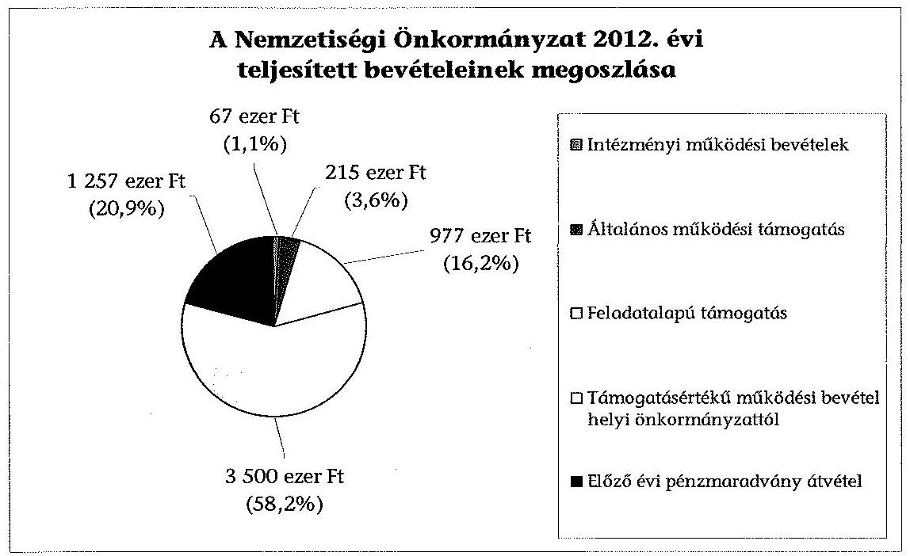
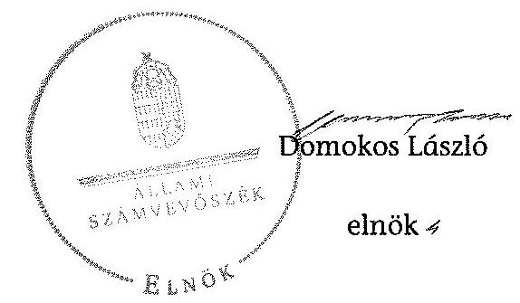

# ÁLLAMI   SZÁMVEVŐSZÉK 

## JELENTÉS

a helyi nemzetiségi önkormányzatok gazdálkodásának ellenőrzéséről
Budapest Főváros XIII. Kerületi Lengyel Nemzetiségi Önkormányzat

---

Állami Számvevőszék
Iktatószám: V-0295-016/2014.
Témaszám: 1328
Vizsgálat-azonosító szám: V065248
Az ellenőrzést felügyelte:
Horváth Balázs
felügyeleti vezető
Az ellenőrzést vezette és az ellenőrzés végrehajtásáért felelős:
Kisgergely István
ellenőrzésvezető
A számvevőszéki jelentést készítették és a jelentés összeállításában
közremüködtek:
Právitzné Pejkó Noémi
számvevő
Zachár Péterné
számvevő főtanácsos
Az ellenőrzést végezte:
Dr. Nagymányai Péter
számvevő

---

# TARTALOMJEGYZÉK 

BEVEZETÉS ..... 3
I. ÖSSZEGZŐ MEGÁLLAPÍTÁSOK, KÖVETKEZTETÉSEK, JAVASLATOK ..... 6
II. RÉSZLETES MEGÁLLAPÍTÁSOK ..... 11

1. A Nemzetiségi Önkormányzat és a XIII. Kerületi Önkormányzat együttműködésének szabályozása, a működési feltételek biztosítása ..... 11
2. A gazdálkodási feladatok ellátásának szabályszerűsége ..... 12
2.1. A költségvetésre és a zárszámadásra, valamint a kincstári adatszolgáltatás rendjére vonatkozó jogszabályi előírások betartása ..... 12
2.2. A Nemzetiségi Önkormányzat gazdálkodásának szabályozottsága ..... 13
2.3. Az operatív gazdálkodási jogkörök kialakítása, gyakorlása ..... 13
3. A Nemzetiségi Önkormányzattal összefüggő gazdálkodási feladatok belső ellenőrzése ..... 14
4. A feladatalapú támogatás felhasználásának, elszámolásának szabályszerűsége, a Nemzetiségi Önkormányzat feladatellátása ..... 15

## MELLÉKLETEK

1. számú A Nemzetiségi Önkormányzat 2012. évi gazdálkodásának főbb adatai, mutatói
2/A. számú Tájékoztatás a polgármesternek küldött el nem fogadott észrevételekről
2/B. számú Tájékoztatás az elnöknek küldött el nem fogadott észrevételről

## FÜGGELÉKEK

1. számú Rövidítések jegyzéke
2. számú Értelmező szótár
3. számú A gazdálkodás értékelésének módszere

---

.

---

# JELENTÉS   a helyi nemzetiségi önkormányzatok gazdálkodásának ellenőrzéséről Budapest Főváros XIII. Kerületi Lengyel Nemzetiségi Önkormányzat 

## BEVEZETÉS

A Nemzetiségi Önkormányzat a 2003. évben alakult, elnöke a 2010. évi helyhatósági választások óta látja el feladatát. A Nemzetiségi Önkormányzat intézményt, gazdasági társaságot és más szervezetet nem alapított. A négytagú Képviselő-testület munkája segittésére bizottságot nem hozott létre. A Nemzetiségi Önkormányzatnak a költségvetési beszámolója szerint a 2012. évben a módosított költségvetési bevételi és kiadási előirányzata 6016 ezer Ft, a teljesített költségvetési bevétele 6016 ezer Ft, a teljesített költségvetési kiadása 3529 ezer Ft volt. A 2012. évi gazdálkodási adatokat részletesen az 1. számú mellékletben mutatjuk be.

Az Alaptörvény XXIX. cikk (1) bekezdése szerint a Magyarországon élő nemzetiségek államalkotó tényezők. Minden, valamely nemzetiséghez tartozó magyar állampolgárnak joga van önazonossága szabad vállalásához és megőrzéséhez. A hazánkban élő nemzetiségek helyi (települési és területi), valamint országos önkormányzatokat hozhatnak létre. A helyi nemzetiségi önkormányzatok gazdálkodási feladatait jogszabályi előírás alapján a székhely szerinti önkormányzat polgármesteri hivatala látja el.

A nemzetiségek helyzete, támogatása mind hazai, mind EU-s szinten kiemelt figyelmet kap napjainkban. A helyi nemzetiségi önkormányzatok gazdálkodására és támogatási rendszerére vonatkozó jogszabályok a 2010-2012. években jelentős változásokon mentek át. A települési és területi nemzetiségi önkormányzatok gazdálkodásának, a részükre juttatott költségvetési támogatások felhasználásának ellenőrzését az ÁSZ a 2012. évben témacsoportos ellenőrzés keretében indította el. A 2013. évi ellenőrzések e témacsoportos ellenőrzések folytatását jelentik, amelyet az ÁSZ 2014. első félévi ellenőrzési terve 12. témasorszámon tartalmaz.

Az ellenőrzés célja annak értékelése volt, hogy a Nemzetiségi Önkormányzat gazdálkodási kereteinek kialakítása, gazdálkodása és feladatellátása megfelelt-e a jogszabályoknak.

---

Ennek keretében értékeltük, hogy:

- a Nemzetiségi Önkormányzat és a XIII. Kerületi Önkormányzat együttmúködésének szabályozása, a múködési feltételek biztosítása megfelelte a jogszabályi előírásoknak;
- a felek együttműködése megfelelte a közöttük létrejött megállapodásnak a gazdálkodási feladatok szabályszerű ellátása során, ennek keretében betartották-e a helyi nemzetiségi önkormányzat gazdálkodásához kapcsolódóan a költségvetésre és zárszámadásra, a gazdálkodás szabályozására, az operatív gazdálkodási jogkörök gyakorlására vonatkozó jogszabályi előírásokat;
- a jegyző biztosította-e a Nemzetiségi Önkormányzat gazdálkodásának belső ellenőrzését;
- a Nemzetiségi Önkormányzat feladatalapú támogatásának felhasználása, a folyósított feladatalapú támogatással történő elszámolás az előírásoknak megfelelő volt-e;
- a Nemzetiségi Önkormányzat feladatellátása összhangban volt-e a vonatkozó jogszabályi előírásokkal.

Az ellenőrzés várható hasznosulását négy szinten tervezzük. A törvényalkotás számára összegzett tapasztalatok állnak rendelkezésre a nemzetiségi önkormányzatok testületi döntéseinek, gazdálkodásának és a feladatalapú támogatás felhasználásának szabályszerűségéről, amelynek alapján következtetést lehet levonni arra, hogy indokolt-e jogszabályi módosítás kezdeményezése. Az ellenőrzés az ellenőrzött számára visszajelzést ad a működésében fellépő hiányosságokról, javaslataival hozzájárul azok kiküszöböléséhez, amely csökkentheti a későbbi ellenőrzések gyakoriságát. Az ellenőrzés megállapításai és javaslatai tanulságul szolgálhatnak más nemzetiségi önkormányzatok, szervezetek számára a rendezett gazdálkodási keretek kialakításához. A társadalom számára jelzi, hogy közpénz nem maradhat ellenőrizetlenül, az ÁSZ értékteremtő rend kialakításához és megőrzéséhez hozzájáruló tevékenysége pozitív hatással lesz a szervezetről kialakított összkép formálásában. Az ÁSZ szervezetén belül lehetőség nyílik arra, hogy a megállapítások szintetizálásával az intézmény a hozzáadott értéket teremtő elemző tevékenységét és tanácsadó szerepét erősítse.

A Nemzetiségi Önkormányzat gazdálkodásának ellenőrzéséről szóló jelentés I. fejezetének összegző része az ellenőrzés céljára adott rövid, szintetizáló összefoglalót és következtetéseket tartalmazza a II. fejezet részletes megállapításain alapulóan. A jelentés intézkedést igénylő megállapításait és javaslatait - az összegzőben foglaltak mellett - az ellenőrzés során feltárt, a jelentés II. fejezetében rögzített részletes megállapítások alapozzák meg, illetve támasztják alá.

Az ellenőrzés típusa: szabályszerűségi ellenőrzés
Az ellenőrzött időszak: a 2012. január 1. - 2012. december 31. közötti időszak. Az ellenőrzés kiterjedt a Nemzetiségi Önkormányzatnak juttatott 2012. évi támogatás 2013. évben való elszámolására is.

---

Ellenőrzött szervezet: Budapest Főváros XIII. Kerületi Lengyel Nemzetiségi Önkormányzat és a gazdálkodási feladatait ellátó Budapest Főváros XIII. Kerületi Önkormányzat.

Az ellenőrzés végrehajtásának jogszabályi alapját az ÁSZ tv. 5. § (2)-(3) és (6) bekezdéseiben foglaltak képezik.

Az ellenőrzés szakmai módszertana az ÁSZ hivatalos honlapján (www.asz.hu) közzétett szakmai szabályokon alapult, amely a Legfőbb Ellenőrző Intézmények Nemzetközi Szervezete (INTOSAI) által kiadott nemzetközi standardok (ISSAI) figyelembevételével készült.

A Nemzetiségi Önkormányzat gazdálkodásának ellenőrzése során értékeltük a XIII. Kerületi Önkormányzat és a Nemzetiségi Önkormányzat együttműködésének, a gazdálkodás szabályozottságának és a pénzügyi folyamatokban kulcsszerepet betöltő belső kontrollok (teljesítésigazolás és érvényesítés) működésének megfelelőségét. A kulcskontrollokat a működési és felhalmozási célú támogatásértékű kiadásoknál, az államháztartáson kívülre teljesített múködési és felhalmozási célú pénzeszközátadásoknál, a dologi kiadásokkal kapcsolatos kifizetéseknél - véletlen mintavételi eljárást alkalmazva - ellenőriztük. Ellenőriztük, hogy a jegyző biztosította-e a Nemzetiségi Önkormányzat gazdálkodásának belső ellenőrzését. Értékeltük a feladatalapú támogatások felhasználásának, elszámolásának szabályszerűségét, a Nemzetiségi Önkormányzat feladatellátása és a jogszabályi előírások összhangját.

Az ellenőrzés lefolytatásához a Nemzetiségi Önkormányzat és a gazdálkodási feladatait ellátó XIII. Kerületi Önkormányzat tanúsítványok és a kapcsolódó, dokumentumjegyzékben megjelölt dokumentumok elektronikus úton történő megküldésével, rendelkezésre bocsátásával szolgáltatott adatokat. Az adatszolgáltatás kontrollálása és szükség szerinti javítása a helyszíni ellenőrzés keretében történt. A minősítési szempontokat a 3. számú függelék tartalmazza.

Az ÁSZ tv. 29. § (1) bekezdése szerint a jelentéstervezetet megküldtük észrevételezésre a polgármester és a Nemzetiségi Önkormányzat elnöke részére. A polgármester és a Nemzetiségi Önkormányzat elnöke határidőben megküldött észrevétele és tájékoztatása alapján a jelentést nem módosítottuk. Az el nem fogadott észrevételek indoklását a jelentés $2 / \mathrm{A}$. és $2 / \mathrm{B}$. számú mellékletei tartalmazzák.

---

# I. ÖSSZEGZŐ MEGÁLLAPÍTÁSOK, KÖVETKEZTETÉSEK, JAVASLATOK 

A Nemzetiségi Önkormányzat és a XIII. Kerületi Önkormányzat együttmúködésének szabályozása, múködési feltételeinek biztosítása a 2012. évben megfelelt a jogszabályi előírásoknak. A Nemzetiségi Önkormányzat a 2012. év folyamán rendelkezett hatályban lévő megállapodással a XIII. Kerületi Önkormányzattal történő együttműködésre, azonban az együttműködési megállapodás ${ }_{1}$ 2012. évi - évenként kötelező - felülvizsgálatát a Nek. tv.ben előírt január 31-ei határidőn túl végezték el. Az együttműködési megállapodás ${ }_{1}$ jogszabályváltozás miatti kiegészítése megtörtént a Nek. tv.-ben előírt határidőn belül. Az együttműködési megállapodás ${ }_{2}$ a Nek. tv.-ben meghatározott tartalmi elemeket tartalmazta, a Nemzetiségi Önkormányzat múködésének feltételeit és a gazdálkodási feladatainak ellátását az előírásoknak megfelelően szabályozták, működésének előírt személyi és tárgyi feltételei biztosítottak voltak a 2012. évben. A Nek. tv.-ben foglaltak ellenére az együttműködési megállapodás ${ }_{2}$-ben meghatározott múködési feltételeket nem rögzítették a Nemzetiségi Önkormányzat SZMSZ-ében.

A Nemzetiségi Önkormányzat 2012. évi költségvetésének és zárszámadásának tartalma, jóváhagyása megfelelt a jogszabályi előírásoknak. A Nemzetiségi Önkormányzat elnöke a 2012. évi költségvetés tervezetét az Áht. ${ }_{2}$-ben előírt határidőben és tartalommal - szöveges indoklással együtt - benyújtotta a Képviselő-testületnek. A jóváhagyott költségvetés tartalmazta az Áht. ${ }_{2}$-ben és az Ávr.-ben meghatározott tartalmi elemeket. A Nemzetiségi Önkormányzat elnöke a 2012. évi zárszámadás tervezetét az előírt határidőben a Képviselőtestületnek benyújtotta, és az Áht. ${ }_{2}$-ben előírt mérlegeket és kimutatásokat tájékoztatásul bemutatta. A zárszámadási határozat összehasonlíthatósága az elfogadott költségvetéssel biztosított volt. A jegyző a 2012. évi költségvetéshez kapcsolódó, a Nemzetiségi Önkormányzatra vonatkozó kincstári adatszolgáltatási kötelezettségeinek az Áhsz. ${ }_{1}$-ben és az Ávr.-ben előírt határidőkön túl tett eleget.

A Nemzetiségi Önkormányzat gazdálkodásának szabályozottsága megfelelő volt az ellenőrzött időszakban. A gazdálkodási feladatok végrehajtását ellátó Polgármesteri Hivatal a 2012. évben a Számv. tv.-ben, és a Bkr.-ben előírt, a gazdálkodást érintő szabályzatokkal a Nemzetiségi Önkormányzat gazdálkodásának végrehajtási feladataira kiterjedő hatállyal rendelkezett. A Polgármesteri Hivatal SZMSZ-e nem tartalmazta a Nemzetiségi Önkormányzat gazdálkodásának végrehajtásával kapcsolatos, az SZMSZ-ben nevesített munkakörökhöz tartozó feladat- és hatásköröket, azok gyakorlásának módját, a helyettesítés rendjét, az ezekhez kapcsolódó felelősségi szabályokat.

Az operatív gazdálkodási jogkörök kialakítása a jogszabályi előírásokkal összhangban történt, a pénzügyi ellenjegyzöket, az érvényesítőket a jegyző, mint a költségvetési szerv vezetője jelölte ki. A Nemzetiségi Önkormányzat elnöke az előírásoknak megfelelően a kötelezettségvállalás, utalványozásra adott

---

felhatalmazással, és a teljesítésigazolás gyakorlására történő kijelöléssel biztosította az összeférhetetlenségi követelmények érvényesülését.

A dologi kiadások teljesítése során a teljesítésigazolás és az érvényesítés kulcskontrollok múködésének megfelelősége kiváló volt. A 2012. évi dologi kiadások között a három legnagyobb összegű kiadás teljesítésének egyedi értékelése alapján, a teljesítésigazolás és az érvényesítés kulcskontrollok megfelelően múködtek.

Támogatásértékű kiadás, valamint államháztartáson kívülre történő működési és felhalmozási célú pénzeszközátadások esetében a kiválasztott gazdasági események tekintetében a teljesítésigazolás és érvényesítés kulcskontrollok megfelelően múködtek.

A Nemzetiségi Önkormányzat gazdálkodásával összefüggő végrehajtási feladatok belső ellenőrzésének kialakítása megfelelő volt. A jegyző biztosította a Nemzetiségi Önkormányzat gazdálkodásával összefüggő végrehajtási feladatok belső ellenőrzését. A belső ellenőrzési tervet megalapozó kockázatelemzés kiterjedt a nemzetiségi önkormányzatok gazdálkodásával összefüggő végrehajtási feladatokra. A nemzetiségek gazdálkodásával kapcsolatos kockázatot magas besorolásúnak minősítették, és évenkénti vizsgálatot tartottak szükségesnek. A Nemzetiségi Önkormányzatot érintő tervezett ellenőrzést, kiemelten az önkormányzati támogatás felhasználását - 2012. év I. félévre vonatkozóan - az Ellenőrzési Csoport végrehajtotta. A belső ellenőrzés nem érintette a számvevőszéki ellenőrzés által feltárt hiányosságokat a feladatalapú támogatás elszámolására, felhasználására vonatkozóan.

A Nemzetiségi Önkormányzat részére a 2011. évben és a 2012. évben folyósított feladatalapú támogatás elszámolása nem felelt meg a jogszabályi előírásoknak. A Nemzetiségi Önkormányzat a 2011. évben 1068 ezer Ft, a 2012. évben 977 ezer Ft feladatalapú támogatásban részesült. A 2011. évben folyósított feladatalapú támogatást maradvány nélkül felhasználták. A 2012. évben folyósított támogatásból 680 ezer Ft-ot a Nek. tv-ben foglaltakkal összhangban felhasználtak, 2012. december 31 -én 297 ezer Ft volt a feladatalapú támogatás maradványa, azonban ebből az összegből 150 ezer Ft-ot nem terheltek kötelezettségvállalással. A Nemzetiségi Önkormányzat nem tett eleget az Áht. ${ }_{2}$-ben előírtaknak azáltal, hogy a meghatározott célra fel nem használt támogatás, 2012. december 31-éig kötelezettségvállalással nem terhelt 150 ezer Ft összegű maradványáról haladéktalanul nem mondott le és nem fizette vissza azt a központi költségvetés javára. A 2011. és a 2012. évi feladatalapú támogatás elszámolása a támogatási kormányrendelet ${ }_{1,2}$ előírása alapján az Áht. ${ }_{1,2}$-ben foglaltak ellenére nem történt meg. A támogatás felhasználását, elszámolását az arra jogosult külső szervek nem ellenőrizték.

A Nemzetiségi Önkormányzat 2012. évben kötelező és önként vállalt közfeladatokat látott el kulturális önigazgatással összefüggő ügyekben, valamint a hagyományápolás és közművelődés területén. A feladatellátásának tárgya összhangban volt a Nek. tv-ben foglalt előírásokkal.

Az ÁSZ tv. 33. § (1) bekezdésében foglaltak értelmében az ellenőrzött szervezet vezetője köteles a jelentésben foglalt megállapításokhoz kapcsolódó intézkedési

---

tervet összeállítani és azt a jelentés kézhezvételétől számított 30 napon belül az ÁSZ részére megküldeni. Amennyiben az intézkedési tervet határidőre nem küldi meg a szervezet, vagy az nem elfogadható, az ÁSZ elnöke az ÁSZ tv. 33. § (3) bekezdés a)-b) pontjaiban foglaltakat érvényesítheti.

A helyszíni ellenőrzés megállapításainak hasznosítása mellett javasoljuk:

# a jegyzőnek 

1. az együttműködés szabályozásával kapcsolatban

Az együttműködési megállapodás ${ }_{1}$-et a Nek. tv. 80. § (2) bekezdésének előírása ellenére 2012. január 31-éig nem vizsgálták felül.

A Nek. tv. 80. § (2) bekezdésében foglaltak ellenére az együttműködési megállapodás ${ }_{2}$ szerinti múködési feltételeket nem rögzítették a Nemzetiségi Önkormányzat SZMSZ-ében.

Javaslat
a) biztosítsa a jövőben az együttműködési megállapodás évenkénti felülvizsgálata során a Nek. tv. 80. § (2) bekezdésében előírt határidő betartását;
b) készítse elő a Nemzetiségi Önkormányzat SZMSZ-ének a Nek. tv. 80. § (2) bekezdésében foglalt előírásnak megfelelő kiegészítését.
2. a kincstári adatszolgáltatási kötelezettséggel kapcsolatban

A jegyző a 2012. évi költségvetéshez kapcsolódó, a Nemzetiségi Önkormányzatra vonatkozó kincstári adatszolgáltatási kötelezettségének több esetben - az Ávr. 33. §ában, 169. § (2) bekezdésében és az Áhsz. 10. § (5a) bekezdésében előírt - határidőn túl tett eleget.

Javaslat
Gondoskodjon arról, hogy a Nemzetiségi Önkormányzatra vonatkozó kincstári adatszolgáltatási kötelezettségeinek az Ávr. 33. §-ában, 169. § (2) bekezdésében és az Áhsz. 32. § (4) bekezdésében előírt határidők betartásával tegyen eleget.
3. a gazdálkodás szabályozottságával kapcsolatban

A Polgármesteri Hivatal SZMSZ-e nem tartalmazta az Ávr. 13. § (1) bekezdés g) pontjában foglaltak szerinti, az SZMSZ-ben nevesített munkakörökhöz tartozó - a Nemzetiségi Önkormányzat gazdálkodásának végrehajtásával kapcsolatos - feladatés hatáskörökre, a hatáskörök gyakorlásának módjára, a helyettesítés rendjére, az ezekhez kapcsolódó felelősségi szabályokra vonatkozó előírásokat.

---

Javaslat
Készítse el a Polgármesteri Hivatal SZMSZ-e módosítását, hogy az tartalmazza - a Nemzetiségi Önkormányzat gazdálkodásának végrehajtási feladataira vonatkozóan az Ávr. 13. § (1) bekezdés g) pontjában foglaltakat.
4. a feladatalapú támogatás elszámolásával kapcsolatban

A 2011. évi feladatalapú támogatás elszámolása a támogatási kormányrendelet ${ }_{1} 7 . \S$ (2) bekezdésében hivatkozott, valamint a 2012. évi feladatalapú támogatás elszámolása a támogatási kormányrendelet ${ }_{2} 8 . \S$ (5) bekezdésében hivatkozott „a helyi önkormányzatok elszámolási és ellenőrzési rendjére vonatkozó jogszabályok rendelkezései alkalmazandóak" előirrása alapján az Áht. 1 64. § (7) bekezdése és az Áht. ${ }_{2}$ 57. § (3) bekezdése ellenére nem történt meg.

Javaslat
Gondoskodjon az Áht. 2 27. § (2) bekezdésében meghatározott feladatkörében a Nemzetiségi Önkormányzat által igénybevett 2011. és 2012. évi feladatalapú támogatás rendeltetésszerú felhasználásáról szóló elszámolásának elkészítéséről az Áht. 2 53. § (1) bekezdése szerinti beszámolási kötelezettség teljesítéséhez.

# a polgármesternek 

A Polgármesteri Hivatal SZMSZ-e nem tartalmazta az Ávr. 13. § (1) bekezdés g) pontjában foglaltak szerinti, az SZMSZ-ben nevesített munkakörökhöz tartozó - a Nemzetiségi Önkormányzat gazdálkodásának végrehajtásával kapcsolatos - feladatés hatáskörökre, a hatáskörök gyakorlásának módjára, a helyettesítés rendjére, az ezekhez kapcsolódó felelősségi szabályokra vonatkozó előírásokat.

Javaslat
Terjessze a XIII. Kerületi Önkormányzat Képviselő-testülete elé jóváhagyásra a Polgármesteri Hivatal SZMSZ-ének jegyző által elkészített módosítását, hogy az tartalmazza - a Nemzetiségi Önkormányzat gazdálkodásának végrehajtására vonatkozóan - az Ávr. 13. § (1) bekezdés g) pontjában foglaltakat.

## a Nemzetiségi Önkormányzat elnökének

1. A Nek. tv. 80. § (2) bekezdésében foglaltak ellenére az együttmúködési megállapodás ${ }_{2}$ szerinti müködési feltételeket nem rögzítették a Nemzetiségi Önkormányzat SZMSZ-ében.

Javaslat
Terjessze a Képviselő-testület elé jóváhagyásra a Nemzetiségi Önkormányzat SZMSZ-ének jegyző által előkészített módosítását, hogy az megfeleljen a Nek. tv. 80. § (2) bekezdésében előírtaknak.

---

2. A 2011. évi feladatalapú támogatás elszámolása a támogatási kormányrendelet ${ }_{1}$ 7. § (2) bekezdésében hivatkozott, valamint a 2012. évi feladatalapú támogatás elszámolása a támogatási kormányrendelet ${ }_{2}$ 8. § (5) bekezdésében hivatkozott „a helyi önkormányzatok elszámolási és ellenőrzési rendjére vonatkozó jogszabályok rendelkezései alkalmazandóak" előírása alapján az Áht. ${ }_{1} 64 . \S$ (7) bekezdése és az Áht. ${ }_{2}$ 57. § (3) bekezdése ellenére nem történt meg.

Javaslat
Terjessze a Képviselő-testület elé jóváhagyásra az Áht. ${ }_{2}$ 53. § (1) bekezdése szerinti beszámolási kötelezettség teljesítéséhez a Nemzetiségi Önkormányzat által igénybe vett 2011. és 2012. évi feladatalapú támogatás felhasználásáról szóló elszámolást.
3. A Nemzetiségi Önkormányzat nem tett eleget az Áht. ${ }_{2}$ 57. § (2) bekezdésében előírtaknak, mert a meghatározott célra fel nem használt 2012. évi feladatalapú támogatás 2012. december 31-éig kötelezettségvállalással nem terhelt 150 ezer Ft összegű maradványáról nem mondott le és nem fizette vissza azt a központi költségvetés javára.

Javaslat
Terjessze a Képviselő-testület elé jóváhagyásra az Áht. ${ }_{2}$ 57/A. § (1) bekezdés előírásának megfelelően a 2012. évi feladatalapú támogatás kötelezettségvállalással nem terhelt maradványáról történő lemondást és intézkedjen a maradvány összegének visszafizetésére a központi költségvetés javára.

---

# II. RÉSZLETES MEGÁLLAPÍTÁSOK 

## 1. A Nemzetiségi Önkormányzat És a XIII. Kerületi ÖnkORMÁNYZAT EGYÜTTMÜKÖDÉSÉNEK SZABÁLYOZÁSA, A MÜKÖDÉSI FELTÉTELEK BIZTOSÍTÁSA

A Nemzetiségi Önkormányzat és a XIII. Kerületi Önkormányzat együttmúködésének szabályozása, a múködési feltételek biztosítása a 2012. évben megfelelt a jogszabályi előírásoknak.

A Nemzetiségi Önkormányzat rendelkezett a 2012. év folyamán hatályban lévő megállapodással, a helyi önkormányzattal történő együttműködésre. A 2012. január 1-jén hatályos, 2010. december 9-én megkötött együttműködési megállapodás,-nek a gazdálkodási szabályok változása miatti - évenkénti kötelező - felülvizsgálatát a Nek. tv. 80. § (2) bekezdésében meghatározott január 31-ei határidőn túl végezték el.

A jogszabályváltozás miatt, a Nek. tv. 159. § (3) bekezdésében előírt kiegészítést határidőben végrehajtották, és 2012. február 24-én aláírták az együttműködési megállapodás ${ }_{2}$-t.

Az együttműködési megállapodás ${ }_{2}$-t a polgármester a 1/2011. (I. 14.) számú Önkormányzati rendelet felhatalmazása, a Nemzetiségi Önkormányzat elnöke a Képviselő-testület 11/2012. (II. 10.) számú határozatának felhatalmazása alapján írta alá.

A Nemzetiségi Önkormányzat múködésének személyi és tárgyi feltételeit, gazdálkodásának végrehajtásával kapcsolatos feladatai ellátásának szabályait, azok teljesítési határidejét, felelőseit a Nek. tv. 80. § (1) bekezdésnek megfelelően teljes körűen szabályozták az együttműködési megállapodás ${ }_{2}$-ben.

A Nek. tv. 80. § (2) bekezdésében foglaltak ellenére az együttműködési megállapodás ${ }_{2}$-ben meghatározott múködési feltételeket nem rögzítették a Nemzetiségi Önkormányzat SZMSZ-ében az együttműködési megállapodás ${ }_{2}$ megkötését követő harminc napon belül ${ }^{1}$.

A XIII. Kerületi Önkormányzat az együttműködési megállapodás ${ }_{2}$-ben a Nek. tv. előírásának megfelelően biztosította a Nemzetiségi Önkormányzat múködéséhez szükséges feltételeket.

Az együttműködési megállapodás ${ }_{2}$ 20. pontja szerint „a Nemzetiségi Önkormányzat tárgyévi jóváhagyott költségvetésében az Önkormányzat által biztosított támogatásnak része a Nemzetiségi Önkormányzat müködéséhez szükséges - díttalanul biztosított irodahelyiségben felmerülő közüzemi és egyéb jellegü költségek fedezete".

[^0]
[^0]:    ${ }^{1}$ A harminc napon túl, 2012. évben sem vezették át az SZMSZ-ben az együttműködési megállapodás ${ }_{2}$ szerinti múködési feltételeket.

---

A 2012. december 31-én hatályos együttműködési megállapodás ${ }_{2}$ a Nek. tv. 80. § (4) bekezdés előírásának megfelelően tartalmazta, hogy a jegyző, vagy annak - a jegyzővel azonos képesítési előírásoknak megfelelő - megbízottja a XIII. Kerületi Önkormányzat megbízásából és képviseletében részt vesz a Nemzetiségi Önkormányzat testületi ülésein és jelzi, amennyiben törvénysértést észlel.

# 2. A GAZDÁLKODÁSI FELADATOK ELLÁTÁSÁNAK SZABÁLYSZERŰSÉGE 

### 2.1. A költségvetésre és a zárszámadásra, valamint a kincstári adatszolgáltatás rendjére vonatkozó jogszabályi előírások betartása

A Nemzetiségi Önkormányzat 2012. évi költségvetésének és zárszámadásának ${ }^{2}$ tartalma, jóváhagyása megfelelt a jogszabályi előírásoknak.

A Nemzetiségi Önkormányzat elnöke az Áht. ${ }_{2}$-ben előírt határidőre benyújtotta a Képviselő-testület részére a jegyző által előkészített költségvetési határozattervezet.

A jóváhagyott költségvetés tartalma megfelelt az Ávr. -ben foglaltaknak, tartalmazta a költségvetési kiadásokat, bevételeket előirányzat csoportonkénti, kiemelt előirányzatonkénti bontásban. A 2012. évi költségvetés előterjesztésekor a Képviselő testület részére az Áht. ${ }_{2}$-ben foglaltaknak megfelelően bemutatták szöveges indoklással együtt - az előírt mérlegeket és kimutatásokat.

A jegyző által elkészített 2012. évi zárszámadási határozattervezetet a Nemzetiségi Önkormányzat elnöke az Áht. ${ }_{2}$ 91. § (1) bekezdésében foglaltak alapján, határidőn belül benyújtotta a Képviselő-testületnek. Az Áht. ${ }_{2}$-ben előírt mérlegeket, kimutatásokat a zárszámadás tervezetének előterjesztésekor tájékoztatásul bemutatták. A zárszámadásról szóló határozat összehasonlíthatósága biztosított volt az elfogadott költségvetéssel.

A jegyző a 2012. évi költségvetéshez kapcsolódó, a Nemzetiségi Önkormányzatra vonatkozó kincstári az Ávr. 33. §-ában, az Ávr. 169. § (2) bekezdésében, valamint az Áhsz. 10. § (5a) bekezdésében előírt kincstári adatszolgáltatási kötelezettségének határidőn túl tett eleget.

Az elemi költségvetés, valamint a 2012. évi I., II., III. negyedéves költségvetési jelentések feladásának a határidő után tett eleget március 13-án, illetve április 24én, július 23-án és október 25-én. Az éves beszámoló feladására 2013. március 13-án került sor.

[^0]
[^0]:    ${ }^{2}$ A Képviselő-testületnek a Nemzetiségi Önkormányzat 2012. évi költségvetéséről hozott 11/2012. (II. 09.) számú és a 2012. évi zárszámadásáról hozott 21/2013. (IV. 03.) számú határozatai.

---

# 2.2. A Nemzetiségi Önkormányzat gazdálkodásának szabályozottsága 

A Nemzetiségi Önkormányzat gazdálkodásának szabályozottsága az ellenőrzött időszakban biztosított volt és megfelelt a jogszabályi előírásoknak.

A Nemzetiségi Önkormányzat gazdálkodási feladatainak végrehajtását ellátó Polgármesteri Hivatal a 2012. évben a Számv. tv.-ben, és a Bkr.-ben előírt, a gazdálkodás végrehajtási feladatait érintő szabályzatainak ${ }^{3}$ hatályát kiterjesztette a Nemzetiségi Önkormányzatra.

A Polgármesteri Hivatal SZMSZ-e az Ávr. 13. § (1) bekezdés g) pontjában foglaltak ellenére nem tartalmazta az SZMSZ-ben nevesített munkakörökhöz tartozó - a Nemzetiségi Önkormányzat gazdálkodásának végrehajtásával kapcsolatos - feladat- és hatásköröket, a hatáskörök gyakorlásának módját, a helyettesítés rendjét, az ezekhez kapcsolódó felelősségi szabályokat ${ }^{4}$.

A Polgármesteri Hivatalban az ellenőrzött időszakban két operatív gazdálkodási szabályzat ${ }^{5}$ volt érvényben, amelyek hatályát kiterjesztették a Nemzetiségi Önkormányzat gazdálkodásának végrehajtási feladataira is.

A Nemzetiségi Önkormányzat gazdálkodásával kapcsolatos feladatok ellátásának kötelezettségét a Polgármesteri Hivatal munkatársainak munkaköri leírásai tartalmazták.

### 2.3. Az operatív gazdálkodási jogkörök kialakítása, gyakorlása

A Nemzetiségi Önkormányzat gazdálkodása tekintetében a 2012. évben az operatív gazdálkodási jogkörök kialakítása megfelelt a jogszabályi előírásoknak.

Az együttmúködési megállapodás ${ }_{2}$ rendelkezett a gazdálkodási jogkörök részletes kialakításáról. ${ }^{6}$ A kötelezettségvállalásra, az utalványozásra adott felha-

[^0]
[^0]:    ${ }^{3}$ Számviteli politika, eszközök és források leltárkészítési és leltározási szabályzata, eszközök és források értékelési szabályzata, pénzkezelési szabályzat, számlarend, selejtezési szabályzat, önköltségszámítás rendjére vonatkozó szabályzat, valamint a XXII/1542/2011. (XII.13.) számú jegyzői Utasítás a Polgármesteri Hivatal belső kontroll szabályzatáról (ellenőrzési nyomvonal, szabálytalanságok kezelésének eljárásrendje, kockázatkezelési szabályzat).
    ${ }^{4}$ A gazdálkodással kapcsolatos feladat- és hatásköröket az egységes ügyrend módosításáról szóló 160/2012. (XII. 13.) számú önkormányzati határozat tartalmazta, illetve a munkaköri leírásokban rögzítették.
    ${ }^{5}$ A XXII/25-3/2010. (04. 29.) számú, valamint az azt hatályon kívül helyező XXII/111/2012. (07. 02.) számú polgármesteri-jegyzői együttes utasítás az Önkormányzat és a Polgármesteri Hivatal költségvetése végrehajtása során a kötelezettségvállalás és ellenjegyzés, a szakmai teljesítésigazolás, érvényesítés és utalványozás hatásköri rendjéről.

---

talmazás, valamint a teljesítést igazoló kijelölése az Áht. 36. § (7) bekezdésében és az Ávr. 52. § (7) bekezdésében előírtaknak megfelelően történt.

A Nemzetiségi Önkormányzat elnöke az előírásoknak megfelelően a kötelezettségvállalás, utalványozásra adott felhatalmazással, és a teljesítésigazolás gyakorlására történő kijelöléssel biztosította az összeférhetetlenségi követelmények érvényesülését.

A XIII. Kerületi Önkormányzat nem rendelkezett gazdasági szervezettel, ezért a jegyző jelölte ki írásban a pénzügyi ellenjegyzöket és az érvényesítőket az Ávr. 55. § (2) bekezdés g) pontja és az 58. § (4) bekezdései alapján. A Polgármesteri Hivatal pénzügyi ellenjegyzői és érvényesítői feladatokra kijelölt köztisztviselői a feladatuk ellátásához előírt képesítési követelményeknek megfeleltek.

Támogatásértékű kiadás, valamint államháztartáson kívülre történő működési és felhalmozási célú pénzeszközátadások esetében a kiválasztott öt gazdasági esemény tekintetében a kulcskontrollok müködése megfelelő volt.

A Nemzetiségi Önkormányzatnál a 2012. évben a dologi kiadások teljesítése során a teljesítésigazolás és az érvényesítés kulcskontrollok múködése kiváló volt. A Nemzetiségi Önkormányzatnál a 2012. évi dologi kiadások között a három legnagyobb összegű kiadás teljesítése egyedi értékelése alapján a teljesítésigazolás és az érvényesítés kulcskontrollok megfelelően múködtek.

# 3. A Nemzetiségi Önkormányzattal összefüGGŐ GAZDÁlKODÁSI FELADATOK BELSŐ ELLENŐRZÉSE 

A Nemzetiségi Önkormányzat gazdálkodásával összefüggő végrehajtási feladatokkal kapcsolatosan a belső ellenőrzés kialakítása a 2012. évben megfelelő volt.

Az együttműködési megállapodás ${ }_{1,2}$ tartalmazta a belső ellenőrzésre vonatkozó feltételeket. A jegyző, a jogszabályi előírásoknak megfelelően biztosította a Nemzetiségi Önkormányzat gazdálkodásával összefüggő végrehajtási feladatok belső ellenőrzését.

A belső ellenőrzési tervet megalapozó kockázatelemzés kiterjedt a nemzetiségi önkormányzatok gazdálkodásának végrehajtási feladataira. A nemzetiségek gazdálkodásával összefüggő végrehajtási feladatokkal kapcsolatos kockázatot magas besorolásúnak minősítették, és évenkénti vizsgálatot tartottak szükségesnek.

[^0]
[^0]:    ${ }^{6}$ Az együttműködési megállapodás ${ }_{2} 24$. pontja alapján a Nemzetiségi Önkormányzat előirányzatai terhére kötelezettséget vállalni és utalványozni kizárólag az elnök vagy az általa felhatalmazott Nemzetiségi Önkormányzati képviselő jogosult.

---

Az éves belső ellenőrzési tervben foglaltaknak megfelelően az Ellenőrzési Csoport 2012. évben ellenőrizte ${ }^{7}$ a XIII. kerületben múködő helyi nemzetiségi önkormányzatok 2012. év első félévi gazdálkodásának végrehajtását, különös tekintettel az önkormányzati támogatásból megvalósult gazdasági eseményekre, így az nem érintette a jelen ellenőrzés által feltárt hiányosságokat a feladatalapú támogatás elszámolására, felhasználására vonatkozóan.

A belső ellenőrzés megállapította, hogy a helyi nemzetiségi önkormányzatok költségvetésének végrehajtása során a gazdálkodás és az elszámolás szabályszerűen történt az ellenőrzött időszakban (2012. I. félév), betartották a szakmai telje-sítés-igazolás, az utalványozás, az ellenjegyzés, valamint az érvényesítés szabályait.

A belső ellenőrzési jelentésben megfogalmazottakat a Nemzetiségi Önkormányzat elnöke megismerte, azokra észrevételt nem tett ${ }^{8}$. Az ellenőrzési jelentésben az Ellenőrzési Csoport a Nemzetiségi Önkormányzatnak két általános javaslatot tett, amelyek nem kapcsolódtak konkrét megállapításokhoz, így intézkedési tervet nem kellett készíteni.

A belső ellenőrzés javasolta, hogy a nemzetiségi önkormányzatok az előirányzatfelhasználásokat folyamatosan kísérjék figyelemmel annak érdekében, hogy a szükséges átcsoportosításokat végrehajthassák, valamint az időarányos bevételek az előző félévi fel nem használt pénzmaradvány összegei miatt ne mutassanak aránytalanságot. A belső ellenőrzés javasolta továbbá, hogy a különböző rendezvényekre és kiadásokra fordított összegek esetében a nemzetiségi önkormányzatok által hozott határozatokban pontosabban határozzák meg a támogatott esemény helyét és időpontját, a támogatási keret esetében bruttó összeget határozzanak meg.

Az ellenőrzéshez szolgáltatott adatok alapján a 2012. évben a Kormányhivatal a Nemzetiségi Önkormányzatot illetően nem élt törvényességi felügyeleti eszközökkel.

# 4. A feladatalapú támogatás felhasZNálásáNAK, elsZámoláSÁNAK SZABÁLYSZERÜSÉGE, A NEMZETISÉGI ÖNKORMÁNYZAT FELADATELLÁTÁSA 

A 2011. és a 2012. években folyósított feladatalapú támogatás elszámolása nem felelt meg a jogszabályi előírásoknak.

A Nemzetiségi Önkormányzat a 2011. évben 1068 ezer Ft feladatalapú támogatásban részesült, amelyet tárgyévben felhasznált, maradvány nem keletkezett. A Nemzetiségi Önkormányzat a 2012. évben 977 ezer Ft feladatalapú tá-

[^0]
[^0]:    ${ }^{7}$ A belső ellenőrzés által ellenőrzött időszak a 2012. év I. féléve volt, az ellenőrzés célja: „A nemzetiségi önkormányzatok részére biztosított pénzeszközök felhasználásának ellenőrzése".
    ${ }^{8}$ A 2012. október 1-jén kelt, XVI/20-7/2012. iktatószámú Ellenőrzési Jelentés, valamint a Nemzetiségi Önkormányzat elnöke által átvett, hitelesített Ellenőrzési Jelentés Kivonata, illetve Záradék.

---

mogatásban részesült, a támogatás összegével módosította ${ }^{9}$ a 2012. évi költségvetését.

A 2012. évi feladatalapú támogatás összes bevételhez viszonyított részarányát a következő ábra szemlélteti:

A 2012. évben folyósított feladatalapú támogatásból 680 ezer Ft-ot a jogszabályi előírásokkal összhangban -2012. december 31-ig - felhasználtak. A Nemzetiségi Önkormányzat feladatalapú támogatás felhasználása összhangban volt a Nek. tv. 2. § (1) bekezdés előírásaival.
2012. december 31-én 297 ezer Ft volt a feladatalapú támogatás maradványa, a maradvány felhasználásáról a Képviselő-testület határozatában döntött, azonban ebből az összegből 150 ezer Ft-ot nem terheltek kötelezettségvállalással, amely a támogatási kormányrendelet ${ }_{2} 7 . \S$ előírása alapján határidőt követően jogszerűen nem használható fel.

A Nemzetiségi Önkormányzat nem tett eleget az Áht. ${ }_{2}$ 57. § (2) bekezdésében előírtaknak azáltal, hogy a meghatározott célra fel nem használt támogatás, 2012. december 31-éig kötelezettségvállalással nem terhelt 150 ezer Ft összegű maradványáról haladéktalanul nem mondott le és nem fizette vissza azt a központi költségvetés javára.

A 2011. és a 2012. évi feladatalapú támogatás elszámolása a támogatási kormányrendelet ${ }_{1} 7 . \S$ (2), illetve a támogatási kormányrendelet ${ }_{2} 8 . \S$ (5) bekezdésében hivatkozott „a helyi önkormányzatok elszámolási és ellenőrzési rendjére vonatkozó jogszabályok rendelkezései alkalmazandóak" előírása

[^0]
[^0]:    ${ }^{9}$ A 38/2012. (IX. 13.) számú határozat

---

alapján az Áht. 64. § (7) bekezdése, és az Áht. 2 57. § (3) bekezdése ellenére nem történt meg.

A feladatalapú támogatások felhasználását, elszámolását az ellenőrzésre jogosult szervek nem ellenőrizték.

A Nemzetiségi Önkormányzat 2012. évben kötelező és önként vállalt közfeladatokat látott el kulturális önigazgatással összefüggő ügyekben, valamint a hagyományápolás és közmúvelődés területén. A feladatellátásának tárgya összhangban volt a Nek. tv-ben foglalt előírásokkal.

A Nemzetiségi Önkormányzat a Nek. tv. 116. § (2) bekezdésében tiltott hatósági tevékenységet nem végzett.
Budapest, 2014. 03 hónap 18 . nap

Melléklet: $\quad 3 \mathrm{db}$
Függelék: $\quad 3 \mathrm{db}$

---

.

---

# A Lengyel Nemzetiségi Önkormányzat 2012. évi gazdálkodásának föbb adatai, mutatói

A) Bevételek

|  Megnevezés | Eredeti elöirányzat | Módosított | Teljesítés  |
| --- | --- | --- | --- |
|   | ezer Ft |  | megoszlás  |
|  Intézményi múködési bevételek | 0 | 67 | 67  |
|  Általános múködési támogatás | 215 | 215 | 215  |
|  Feladatalapú támogatás | 0 | 977 | 977  |
|  Támogatásértékủ múködési bevétel helyi önkormányzattól | 3500 | 3500 | 3500  |
|  Előző évi pénzmaradvány átvétel | 0 | 1257 | 1257  |
|  Költségvetési bevételek | 3715 | 6016 | 6016  |
|  Tárgyévi bevételek | 3715 | 6016 | 6016  |

B) Kiadások

|  Megnevezés | Eredeti elöirányzat | Módosított | Teljesítés  |
| --- | --- | --- | --- |
|   | ezer Ft |  | megoszlás  |
|  Személyi juttatások | 1824 | 1824 | 1797  |
|  Munkaadókat terhelő járulékok és szocális hozzájárulási adó összesen | 492 | 506 | 443  |
|  Dologi kiadások | 1399 | 3236 | 1009  |
|  Egyéb múködési célú támogatás | 0 | 450 | 280  |
|  Müködési kiadások összesen | 3715 | 6016 | 3529  |
|  Költségvetési kiadások | 3715 | 6016 | 3529  |
|  Tárgyévi kiadások | 3715 | 6016 | 3529  |

---

.

---

# TÁJÉKOZTATÁS   A POLGÁRMESTERNEK KÜLDÖTT   EL NEM FOGADOTT ÉSZREVÉTELEKRŐL 

| Együttmúködési megállapodás felülvizsgálata |  |
| :--: | :--: |
| Észrevétel | A Polgármesteri Hivatalban az együttmúködési megállapodás felülvizsgálata 2012. január hónapban zajlott. A felülvizsgálat többszöri személyes egyeztetéssel, előzetes munkaanyagok elkészítésével és véleményezésével járt. A dokumentumokból megismerhető dátumok alapján a feladat határidőben történő elvégzésére lehet következtetni: a Lengyel Nemzetiségi Önkormányzat képviselő-testülete, - ahogy azt Önök is rögzítették a jelentéstervezetben - február 9-i határozatában felhatalmazta az elnököt a megállapodás aláírására, és a megállapodás aláírását megelőző pénzügyi ellenjegyzésre is február 9-én került sor. A körülmények mérlegelése során nem hagyható figyelmen kívül az a tény, hogy az Önkormányzat, a Polgármesteri Hivatal és a nemzetiségi önkormányzatok feladatait, együttmúködését, múködési körülményeit befolyásoló államháztartási szabályok 2012 januárjában gyökeresen megváltoztak. Az új múködési rend kialakítására rendelkezésre álló rendkívül rövid időszak alatt is betartottuk a jogszabályban előírt határidőket.   A Kerületi Önkormányzat vezetése a megállapodás aláírására egyszerre, a kerületben múködő valamennyi nemzetiségi önkormányzat elnökével egyeztetett időpontban, február 24-én kerített sort az esemény súlyának megfelelő ünnepélyes keretek között. |
| Válasz | Az együttmúködési megállapodás felülvizsgálatával kapcsolatos észrevételét, illetve az aláírással összefüggő tájékoztatását köszönöm, azonban a jelentéstervezetben szereplő megállapítást fenntartjuk. Az ÁSZ kizárólag dokumentumok alapján tesz megállapításokat. Az ellenőrzés részére hitelt érdemlően - dokumentum hiányában - nem tudták igazolni a felülvizsgálat január 31-ig történő elvégzését. |
| Kincstári adatszolgáltatási kötelezettség |  |
| Észrevétel | A kincstári adatszolgáltatási kötelezettségeknek a Kincstár által üzemeltetett internetes felületen teszünk eleget. A határidők betartására mindig fokozott figyelmet fordítunk, ennek ellenére többször előfordul, hogy a rendszer meghibásodása, programhibák javítása, korrekciója miatt az adatrögzítés, lezárás késedelmet szenved. Ezen eseményekről írásos dokumentumokkal nem rendelkezünk, többnyire csak telefonos tájékoztatást kapunk. |
| Válasz | A kincstári adatszolgáltatással kapcsolatos észrevételét, illetve tájékoztatását köszönöm, de a jelentéstervezetben szereplő megállapítást nem módosítjuk. Az ellenőrzés részére rendelkezésre bocsátott dokumentumok alapján az adatszolgáltatás határidőn túl történő teljesítése volt |

---

|  | megállapítható. A programhibákról, rendszer meghibásodásokról dokumentumokat nem mutattak be, így azokat nem vehettük figyelembe. |
| :--: | :--: |
| Polgármesteri Hivatal SZMSZ-ének hiányossága |  |
| Észrevétel | Az államháztartásról szóló törvény végrehajtásáról szóló 359/2011. (XII.31.) Korm. rendelet 13. § (1) bekezdés g) pontja alapján a költségvetési szerv szervezeti és múködési szabályzatának tartalmaznia kell a „szervezeti és múködési szabályzatban nevesített munkakörökhöz tartozó feladat- és hatásköröket, a hatáskörök gyakorlásának módját, a helyettesítés rendjét, az ezekhez kapcsolódó felelősségi szabályokat". A jogszabály alapján kizárólag a hivatali SZMSZ-ben nevesített munkakörök vonatkozásában kell tartalmaznia a jelentés által hiányolt szabályokat az SZMSZ-nek. A vizsgált időszakban hatályos SZMSZ nem nevesítette a nemzetiségi önkormányzatok gazdálkodásával kapcsolatos munkakört, ezért a jogszabály szerint nem kell tartalmaznia az SZMSZ-nek az ezzel kapcsolatos feladat- és hatásköröket, a hatáskörök gyakorlásának módját, a helyettesítés rendjét, az ezekhez kapcsolódó felelősségi szabályokat.   A hivatkozott Kormányrendelet 13. § (5) bekezdése alapján „a költségvetési szerv szervezeti egységei által ellátott feladatok munkafolyamatainak leírását, a szervezeti egység vezetőinek és alkalmazottainak fel-adat- és hatáskörét, a helyettesítés rendjét, továbbá a szervezeti egység költségvetési szerven belüli belső és azon kívüli külső kapcsolattartásának módját, szabályait - ha azokról a szervezeti és múködési szabályzat vagy a költségvetési szerv más szabályzata nem rendelkezik - a szervezeti egységek ügyrendje tartalmazza". E jogszabályhely is azt támasztja alá, hogy nem kell a költségvetési szerv által ellátott valamennyi feladathoz kapcsolódó munkakört a szervezeti és múködési szabályzatban rögzíteni, ezért a vizsgált időszakban hatályos hivatali SZMSZ nem sértette a Kormányrendelet 13. §-ában foglaltakat. Tájékoztatom, hogy Budapest Főváros XIII. Kerületi Önkormányzat Képvi-selő-testülete 2012. december 13. napján elfogadta a Polgármesteri Hivatal új Szervezeti és Múködési Rendjét, amely 2013. január 1. napján lépett hatályba. |
| Válasz | A Polgármesteri Hivatal SZMSZ-ével kapcsolatos észrevételét, miszerint „a vizsgált időszakban hatályos SZMSZ nem nevesítette a nemzetiségi önkormányzatok gazdálkodásával kapcsolatos munkakört, ezért a jogszabály szerint nem kell tartalmaznia az SZMSZ-nek az ezzel kapcsolatos feladat- és hatásköröket, a hatáskörök gyakorlásának módját, a helyettesités rendjét, az ezekhez kapcsolódó felelősségi szabályokat" köszönöm, a megállapítást és a kapcsolódó javaslatot nem módosítjuk. Az államháztartásról szóló törvény végrehajtásáról szóló 368/2011. (XII. 31.) Korm. rendelet 13. § (5) bekezdése szerint amennyiben az SZMSZ nem tartalmazza ezeket a szabályokat, akkor azok más belső szabályzatban, illetve a szervezeti egységek ügyrendjében rögzítendők. Az ellenőrzés részére a nemzetiségi önkormányzatok gazdálkodásának végrehajtásával kapcsolatos feladatokat meghatározó szabályzatot, ügyrendet nem mutat- |

---

|  | tak be, az SZMSZ sem tartalmazott erre vonatkozó utalást. Tájékoztatását, hogy a Polgármesteri Hivatal 2013. január 1-jétől hatályos új SZMSZ-t a Képviselő testület 2012. december 13-án elfogadta, tudomásul veszem, azonban megállapításokat csak az ellenőrzött időszakra vonatkozóan tehetünk. |
| :--: | :--: |
| Feladatalapú támogatás felhasználásának elszámolása |  |
| Észrevétel | A feladatalapú támogatást bevételként, felhasználását kiadásként tartalmazta a Nemzetiségi Önkormányzat gazdálkodásáról a Kincstárnak benyújtott éves beszámoló űrlapjai. Az Áht. nem rendelkezik e támogatási forma ettől elkülönülő, külön történő elszámolásáról, a Magyar Államkincstártól sem érkezett erre vonatkozó felhívás, így álláspontunk szerint jogszabályi kötelezettségünknek eleget tettünk. Ahogy azt Önök is pozitívumként megállapítják a jelentéstervezetben, a kerületi önkormányzat részére elkészült a feladatalapú támogatásról szóló részletes kimutatás, azaz a jegyzőnek címzett 5. számú javaslatban szereplő feladatot végrehajtottuk. |
| Válasz | A feladatalapú támogatás elszámolásával kapcsolatban tett észrevételét nem fogadom el, a jelentéstervezetben szereplő megállapításunkat nem módosítjuk, az erre vonatkozó javaslatot továbbra is fenntartjuk. A 342/2010. (XII. 28.) Korm. rendelet 7. § (2) bekezdésének, valamint a 28/2012. (III. 6.) Korm. rendelet 8. § (5) bekezdésének előirása szerint a feladatalapú támogatással kapcsolatos elszámolás, ellenőrzés rendjére a helyi önkormányzatok elszámolási és ellenőrzési rendjére vonatkozó jogszabályok rendelkezései alkalmazandóak. Az államháztartásról szóló 1992. évi XXXVIII. törvény 64. § (7) bekezdése alapján a helyi önkormányzat a költségvetési év végét követően a tényleges mutatók alapján, külön jogszabályban meghatározott határidőig, a költségvetési törvény szabályai szerint elszámol az igénybe vett normatív hozzájárulásokkal és támogatásokkal. A 2011. évi CXCV. törvény 2012. évben hatályos 57. § (3) bekezdése szerint a helyi önkormányzat, a helyi nemzetiségi önkormányzat és a többcélú kistérségi társulás a költségvetési év végét követően elszámol az igénybe vett hozzájárulásokkal, támogatásokkal. A Nemzetiségi Önkormányzat a jogszabályban meghatározott elszámolásra vonatkozóan a szükséges dokumentumokat nem bocsátotta az ellenőrzés rendelkezésére. |

---

# **SOLUTIONS**

## **PROBLEM 1**

### **Part (a)**

**PROBLEM 1**

**PROBLEM 2**

**PROBLEM 3**

**PROBLEM 4**

**PROBLEM 5**

**PROBLEM 6**

**PROBLEM 7**

**PROBLEM 8**

**PROBLEM 9**

**PROBLEM 10**

**PROBLEM 11**

**PROBLEM 12**

**PROBLEM 13**

**PROBLEM 14**

**PROBLEM 15**

**PROBLEM 16**

**PROBLEM 17**

**PROBLEM 18**

**PROBLEM 19**

**PROBLEM 20**

**PROBLEM 21**

**PROBLEM 22**

**PROBLEM 23**

**PROBLEM 24**

**PROBLEM 25**

**PROBLEM 26**

**PROBLEM 27**

**PROBLEM 28**

**PROBLEM 29**

**PROBLEM 30**

**PROBLEM 31**

**PROBLEM 32**

**PROBLEM 33**

**PROBLEM 34**

**PROBLEM 35**

**PROBLEM 36**

**PROBLEM 37**

**PROBLEM 38**

**PROBLEM 39**

**PROBLEM 40**

**PROBLEM 41**

**PROBLEM 42**

**PROBLEM 43**

**PROBLEM 44**

**PROBLEM 45**

**PROBLEM 46**

**PROBLEM 47**

**PROBLEM 48**

**PROBLEM 49**

**PROBLEM 50**

**PROBLEM 51**

**PROBLEM 52**

**PROBLEM 53**

**PROBLEM 54**

**PROBLEM 55**

**PROBLEM 56**

**PROBLEM 57**

**PROBLEM 58**

**PROBLEM 59**

**PROBLEM 60**

**PROBLEM 61**

**PROBLEM 62**

**PROBLEM 63**

**PROBLEM 64**

**PROBLEM 65**

**PROBLEM 66**

**PROBLEM 67**

**PROBLEM 68**

**PROBLEM 69**

**PROBLEM 70**

**PROBLEM 71**

**PROBLEM 72**

**PROBLEM 73**

**PROBLEM 74**

**PROBLEM 75**

**PROBLEM 76**

**PROBLEM 77**

**PROBLEM 78**

**PROBLEM 79**

**PROBLEM 80**

**PROBLEM 81**

**PROBLEM 82**

**PROBLEM 83**

**PROBLEM 84**

**PROBLEM 85**

**PROBLEM 86**

**PROBLEM 87**

**PROBLEM 88**

**PROBLEM 89**

**PROBLEM 90**

**PROBLEM 91**

**PROBLEM 92**

**PROBLEM 93**

**PROBLEM 94**

**PROBLEM 95**

**PROBLEM 96**

**PROBLEM 97**

**PROBLEM 98**

**PROBLEM 99**

**PROBLEM 100**

**PROBLEM 101**

**PROBLEM 102**

**PROBLEM 103**

**PROBLEM 104**

**PROBLEM 105**

**PROBLEM 106**

**PROBLEM 107**

**PROBLEM 108**

**PROBLEM 109**

**PROBLEM 110**

**PROBLEM 111**

**PROBLEM 112**

**PROBLEM 113**

**PROBLEM 114**

**PROBLEM 115**

**PROBLEM 116**

**PROBLEM 117**

**PROBLEM 118**

**PROBLEM 119**

**PROBLEM 120**

**PROBLEM 121**

**PROBLEM 122**

**PROBLEM 123**

**PROBLEM 124**

**PROBLEM 125**

**PROBLEM 126**

**PROBLEM 127**

**PROBLEM 128**

**PROBLEM 129**

**PROBLEM 130**

**PROBLEM 131**

**PROBLEM 132**

**PROBLEM 133**

**PROBLEM 134**

**PROBLEM 135**

**PROBLEM 136**

**PROBLEM 137**

**PROBLEM 138**

**PROBLEM 139**

**PROBLEM 140**

**PROBLEM 141**

**PROBLEM 142**

**PROBLEM 143**

**PROBLEM 144**

**PROBLEM 145**

**PROBLEM 146**

**PROBLEM 147**

**PROBLEM 148**

**PROBLEM 149**

**PROBLEM 150**

**PROBLEM 151**

**PROBLEM 152**

**PROBLEM 153**

**PROBLEM 154**

**PROBLEM 155**

**PROBLEM 156**

**PROBLEM 157**

**PROBLEM 158**

**PROBLEM 159**

**PROBLEM 160**

**PROBLEM 161**

**PROBLEM 162**

**PROBLEM 163**

**PROBLEM 164**

**PROBLEM 165**

**PROBLEM 166**

**PROBLEM 167**

**PROBLEM 168**

**PROBLEM 169**

**PROBLEM 170**

**PROBLEM 171**

**PROBLEM 172**

**PROBLEM 173**

**PROBLEM 174**

**PROBLEM 175**

**PROBLEM 176**

**PROBLEM 177**

**PROBLEM 178**

**PROBLEM 179**

**PROBLEM 180**

**PROBLEM 181**

**PROBLEM 182**

**PROBLEM 183**

**PROBLEM 184**

**PROBLEM 185**

**PROBLEM 186**

**PROBLEM 187**

**PROBLEM 188**

**PROBLEM 189**

**PROBLEM 190**

**PROBLEM 191**

**PROBLEM 192**

**PROBLEM 193**

**PROBLEM 194**

**PROBLEM 195**

**PROBLEM 196**

**PROBLEM 197**

**PROBLEM 198**

**PROBLEM 199**

**PROBLEM 200**

**PROBLEM 201**

**PROBLEM 202**

**PROBLEM 203**

**PROBLEM 204**

**PROBLEM 205**

**PROBLEM 206**

**PROBLEM 207**

**PROBLEM 208**

**PROBLEM 209**

**PROBLEM 210**

**PROBLEM 211**

**PROBLEM 212**

**PROBLEM 213**

**PROBLEM 214**

**PROBLEM 215**

**PROBLEM 216**

**PROBLEM 217**

**PROBLEM 218**

**PROBLEM 219**

**PROBLEM 220**

**PROBLEM 221**

**PROBLEM 222**

**PROBLEM 223**

**PROBLEM 224**

**PROBLEM 225**

**PROBLEM 226**

**PROBLEM 227**

**PROBLEM 228**

**PROBLEM 229**

**PROBLEM 230**

**PROBLEM 231**

**PROBLEM 232**

**PROBLEM 233**

**PROBLEM 234**

**PROBLEM 235**

**PROBLEM 236**

**PROBLEM 237**

**PROBLEM 238**

**PROBLEM 239**

**PROBLEM 240**

**PROBLEM 241**

**PROBLEM 242**

**PROBLEM 243**

**PROBLEM 244**

**PROBLEM 245**

**PROBLEM 246**

**PROBLEM 247**

**PROBLEM 248**

**PROBLEM 249**

**PROBLEM 250**

**PROBLEM 251**

**PROBLEM 252**

**PROBLEM 253**

**PROBLEM 254**

**PROBLEM 255**

**PROBLEM 256**

**PROBLEM 257**

**PROBLEM 258**

**PROBLEM 259**

**PROBLEM 260**

**PROBLEM 261**

**PROBLEM 262**

**PROBLEM 263**

**PROBLEM 264**

**PROBLEM 265**

**PROBLEM 266**

**PROBLEM 267**

**PROBLEM 268**

**PROBLEM 269**

**PROBLEM 270**

**PROBLEM 271**

**PROBLEM 272**

**PROBLEM 273**

**PROBLEM 274**

**PROBLEM 275**

**PROBLEM 276**

**PROBLEM 277**

**PROBLEM 278**

**PROBLEM 279**

**PROBLEM 280**

**PROBLEM 281**

**PROBLEM 282**

**PROBLEM 283**

**PROBLEM 284**

**PROBLEM 285**

**PROBLEM 286**

**PROBLEM 287**

**PROBLEM 288**

**PROBLEM 289**

**PROBLEM 290**

**PROBLEM 291**

**PROBLEM 292**

**PROBLEM 293**

**PROBLEM 294**

**PROBLEM 295**

**PROBLEM 296**

**PROBLEM 297**

**PROBLEM 298**

**PROBLEM 299**

**PROBLEM 300**

**PROBLEM 301**

**PROBLEM 302**

**PROBLEM 303**

**PROBLEM 304**

**PROBLEM 305**

**PROBLEM 306**

**PROBLEM 307**

**PROBLEM 308**

**PROBLEM 309**

**PROBLEM 310**

**PROBLEM 311**

**PROBLEM 312**

**PROBLEM 313**

**PROBLEM 314**

**PROBLEM 315**

**PROBLEM 316**

**PROBLEM 317**

**PROBLEM 318**

**PROBLEM 319**

**PROBLEM 320**

**PROBLEM 321**

**PROBLEM 322**

**PROBLEM 323**

**PROBLEM 324**

**PROBLEM 325**

**PROBLEM 326**

**PROBLEM 327**

**PROBLEM 328**

**PROBLEM 329**

**PROBLEM 330**

**PROBLEM 331**

**PROBLEM 332**

**PROBLEM 333**

**PROBLEM 334**

**PROBLEM 335**

**PROBLEM 336**

**PROBLEM 337**

**PROBLEM 338**

**PROBLEM 339**

**PROBLEM 340**

**PROBLEM 341**

**PROBLEM 342**

**PROBLEM 343**

**PROBLEM 344**

**PROBLEM 345**

**PROBLEM 346**

**PROBLEM 347**

**PROBLEM 348**

**PROBLEM 349**

**PROBLEM 350**

**PROBLEM 351**

**PROBLEM 352**

**PROBLEM 353**

**PROBLEM 354**

**PROBLEM 355**

**PROBLEM 356**

**PROBLEM 357**

**PROBLEM 358**

**PROBLEM 359**

**PROBLEM 360**

**PROBLEM 361**

**PROBLEM 362**

**PROBLEM 363**

**PROBLEM 364**

**PROBLEM 365**

**PROBLEM 366**

**PROBLEM 367**

**PROBLEM 368**

**PROBLEM 369**

**PROBLEM 370**

**PROBLEM 371**

**PROBLEM 372**

**PROBLEM 373**

**PROBLEM 374**

**PROBLEM 375**

**PROBLEM 376**

**PROBLEM 377**

**PROBLEM 378**

**PROBLEM 379**

**PROBLEM 380**

**PROBLEM 381**

**PROBLEM 382**

**PROBLEM 383**

**PROBLEM 384**

**PROBLEM 385**

**PROBLEM 386**

**PROBLEM 387**

**PROBLEM 388**

**PROBLEM 389**

**PROBLEM 390**

**PROBLEM 391**

**PROBLEM 392**

**PROBLEM 393**

**PROBLEM 394**

**PROBLEM 395**

**PROBLEM 396**

**PROBLEM 397**

**PROBLEM 398**

**PROBLEM 399**

**PROBLEM 400**

**PROBLEM 401**

**PROBLEM 402**

**PROBLEM 403**

**PROBLEM 404**

**PROBLEM 405**

**PROBLEM 406**

**PROBLEM 407**

**PROBLEM 408**

**PROBLEM 409**

**PROBLEM 410**

**PROBLEM 411**

**PROBLEM 412**

**PROBLEM 413**

**PROBLEM 414**

**PROBLEM 415**

**PROBLEM 416**

**PROBLEM 417**

**PROBLEM 418**

**PROBLEM 419**

**PROBLEM 420**

**PROBLEM 421**

**PROBLEM 422**

**PROBLEM 423**

**PROBLEM 424**

**PROBLEM 425**

**PROBLEM 426**

**PROBLEM 427**

**PROBLEM 428**

**PROBLEM 429**

**PROBLEM 430**

**PROBLEM 431**

**PROBLEM 432**

**PROBLEM 433**

**PROBLEM 434**

**PROBLEM 435**

**PROBLEM 436**

**PROBLEM 437**

**PROBLEM 438**

**PROBLEM 439**

**PROBLEM 440**

**PROBLEM 441**

**PROBLEM 442**

**PROBLEM 443**

**PROBLEM 444**

**PROBLEM 445**

**PROBLEM 446**

**PROBLEM 447**

**PROBLEM 448**

**PROBLEM 449**

**PROBLEM 450**

**PROBLEM 451**

**PROBLEM 452**

**PROBLEM 453**

**PROBLEM 454**

**PROBLEM 455**

**PROBLEM 456**

**PROBLEM 457**

**PROBLEM 458**

**PROBLEM 459**

**PROBLEM 460**

**PROBLEM 461**

**PROBLEM 462**

**PROBLEM 463**

**PROBLEM 464**

**PROBLEM 465**

**PROBLEM 466**

**PROBLEM 467**

**PROBLEM 468**

**PROBLEM 469**

**PROBLEM 470**

**PROBLEM 471**

**PROBLEM 472**

**PROBLEM 473**

**PROBLEM 474**

**PROBLEM 475**

**PROBLEM 476**

**PROBLEM 477**

**PROBLEM 478**

**PROBLEM 479**

**PROBLEM 480**

**PROBLEM 481**

**PROBLEM 482**

**PROBLEM 483**

**PROBLEM 484**

**PROBLEM 485**

**PROBLEM 486**

**PROBLEM 487**

**PROBLEM 488**

**PROBLEM 489**

**PROBLEM 490**

**PROBLEM 491**

**PROBLEM 492**

**PROBLEM 493**

**PROBLEM 494**

**PROBLEM 495**

**PROBLEM 496**

**PROBLEM 497**

**PROBLEM 498**

**PROBLEM 499**

**PROBLEM 500**

**PROBLEM 501**

**PROBLEM 502**

**PROBLEM 503**

**PROBLEM 504**

**PROBLEM 505**

**PROBLEM 506**

**PROBLEM 507**

**PROBLEM 508**

**PROBLEM 509**

**PROBLEM 510**

**PROBLEM 511**

**PROBLEM 512**

**PROBLEM 513**

**PROBLEM 514**

**PROBLEM 515**

**PROBLEM 516**

**PROBLEM 517**

**PROBLEM 518**

**PROBLEM 519**

**PROBLEM 520**

**PROBLEM 521**

**PROBLEM 522**

**PROBLEM 523**

**PROBLEM 524**

**PROBLEM 525**

**PROBLEM 526**

**PROBLEM 527**

**PROBLEM 528**

**PROBLEM 529**

**PROBLEM 530**

**PROBLEM 531**

**PROBLEM 532**

**PROBLEM 533**

**PROBLEM 534**

**PROBLEM 535**

**PROBLEM 536**

**PROBLEM 537**

**PROBLEM 538**

**PROBLEM 539**

**PROBLEM 540**

**PROBLEM 541**

**PROBLEM 542**

**PROBLEM 543**

**PROBLEM 544**

**PROBLEM 545**

**PROBLEM 546**

**PROBLEM 547**

**PROBLEM 548**

**PROBLEM 549**

**PROBLEM 550**

**PROBLEM 551**

**PROBLEM 552**

**PROBLEM 553**

**PROBLEM 554**

**PROBLEM 555**

**PROBLEM 556**

**PROBLEM 557**

**PROBLEM 558**

**PROBLEM 559**

**PROBLEM 560**

**PROBLEM 561**

**PROBLEM 562**

**PROBLEM 563**

**PROBLEM 564**

**PROBLEM 565**

**PROBLEM 566**

**PROBLEM 567**

**PROBLEM 568**

**PROBLEM 569**

**PROBLEM 570**

**PROBLEM 571**

**PROBLEM 572**

**PROBLEM 573**

**PROBLEM 574**

**PROBLEM 575**

**PROBLEM 576**

**PROBLEM 577**

**PROBLEM 578**

**PROBLEM 579**

**PROBLEM 580**

**PROBLEM 581**

**PROBLEM 582**

**PROBLEM 583**

**PROBLEM 584**

**PROBLEM 585**

**PROBLEM 586**

**PROBLEM 587**

**PROBLEM 588**

**PROBLEM 589**

**PROBLEM 590**

**PROBLEM 591**

**PROBLEM 592**

**PROBLEM 593**

**PROBLEM 594**

**PROBLEM 595**

**PROBLEM 596**

**PROBLEM 597**

**PROBLEM 598**

**PROBLEM 599**

**PROBLEM 591**

**PROBLEM 592**

**PROBLEM 593**

**PROBLEM 594**

**PROBLEM 595**

**PROBLEM 596**

**PROBLEM 597**

**PROBLEM 598**

**PROBLEM 599**

**PROBLEM 591**

**PROBLEM 592**

**PROBLEM 593**

**PROBLEM 594**

**PROBLEM 595**

**PROBLEM 596**

**PROBLEM 597**

**PROBLEM 598**

**PROBLEM 599**

**PROBLEM 591**

**PROBLEM 592**

**PROBLEM 593**

**PROBLEM 594**

**PROBLEM 595**

**PROBLEM 596**

**PROBLEM 597**

**PROBLEM 598**

**PROBLEM 599**

**PROBLEM 591**

**PROBLEM 592**

**PROBLEM 593**

**PROBLEM 594**

**PROBLEM 595**

**PROBLEM 596**

**PROBLEM 597**

**PROBLEM 598**

**PROBLEM 599**

**PROBLEM 591**

**PROBLEM 592**

**PROBLEM 593**

**PROBLEM 594**

**PROBLEM 595**

**PROBLEM 596**

**PROBLEM 597**

**PROBLEM 598**

**PROBLEM 599**

**PROBLEM 591**

**PROBLEM 592**

**PROBLEM 593**

**PROBLEM 594**

**PROBLEM 595**

**PROBLEM 596**

**PROBLEM 597**

**PROBLEM 598**

**PROBLEM 599**

**PROBLEM 591**

**PROBLEM 592**

**PROBLEM 593**

**PROBLEM 594**

**PROBLEM 595**

**PROBLEM 596**

**PROBLEM 597**

**PROBLEM 598**

**PROBLEM 599**

**PROBLEM 591**

**PROBLEM 592**

**PROBLEM 593**

**PROBLEM 594**

**PROBLEM 595**

**PROBLEM 596**

**PROBLEM 597**

**PROBLEM 598**

**PROBLEM 599**

**PROBLEM 591**

**PROBLEM 592**

**PROBLEM 593**

**PROBLEM 594**

**PROBLEM 595**

**PROBLEM 596**

**PROBLEM 597**

**PROBLEM 598**

**PROBLEM 599**

**PROBLEM 591**

**PROBLEM 592**

**PROBLEM 593**

**PROBLEM 594**

**PROBLEM 595**

**PROBLEM 596**

**PROBLEM 597**

**PROBLEM 598**

**PROBLEM 599**

**PROBLEM 591**

**PROBLEM 592**

**PROBLEM 593**

**PROBLEM 594**

**PROBLEM 595**

**PROBLEM 596**

**PROBLEM 597**

**PROBLEM 598**

**PROBLEM 599**

**PROBLEM 591**

**PROBLEM 592**

**PROBLEM 593**

**PROBLEM 594**

**PROBLEM 595**

**PROBLEM 596**

**PROBLEM 597**

**PROBLEM 598**

**PROBLEM 599**

**PROBLEM 591**

**PROBLEM 592**

**PROBLEM 593**

**PROBLEM 594**

**PROBLEM 595**

**PROBLEM 596**

**PROBLEM 597**

**PROBLEM 598**

**PROBLEM 599**

**PROBLEM 591**

**PROBLEM 592**

**PROBLEM 593**

**PROBLEM 594**

**PROBLEM 595**

**PROBLEM 596**

**PROBLEM 597**

**PROBLEM 598**

**PROBLEM 599**

**PROBLEM 591**

**PROBLEM 592**

**PROBLEM 593**

**PROBLEM 594**

**PROBLEM 595**

**PROBLEM 596**

**PROBLEM 597**

**PROBLEM 598**

**PROBLEM 599**

**PROBLEM 591**

**PROBLEM 592**

**PROBLEM 593**

**PROBLEM 594**

**PROBLEM 595**

**PROBLEM 596**

**PROBLEM 597**

**PROBLEM 598**

**PROBLEM 599**

**PROBLEM 591**

**PROBLEM 592**

**PROBLEM 593**

**PROBLEM 594**

**PROBLEM 595**

**PROBLEM 596**

**PROBLEM 597**

**PROBLEM 598**

**PROBLEM 599**

**PROBLEM 591**

**PROBLEM 592**

**PROBLEM 593**

**PROBLEM 594**

**PROBLEM 595**

**PROBLEM 596**

**PROBLEM 597**

**PROBLEM 598**

**PROBLEM 599**

**PROBLEM 591**

**PROBLEM 592**

**PROBLEM 593**

**PROBLEM 594**

**PROBLEM 595**

**PROBLEM 596**

**PROBLEM 597**

**PROBLEM 598**

**PROBLEM 599**

**PROBLEM 591**

**PROBLEM 592**

**PROBLEM 593**

**PROBLEM 594**

**PROBLEM 595**

**PROBLEM 596**

**PROBLEM 597**

**PROBLEM 598**

**PROBLEM 599**

**PROBLEM 591**

**PROBLEM 592**

**PROBLEM 593**

**PROBLEM 594**

**PROBLEM 595**

**PROBLEM 596**

**PROBLEM 597**

**PROBLEM 598**

**PROBLEM 599**

**PROBLEM 591**

**PROBLEM 592**

**PROBLEM 593**

**PROBLEM 594**

**PROBLEM 595**

**PROBLEM 596**

**PROBLEM 597**

**PROBLEM 598**

**PROBLEM 599**

**PROBLEM 591**

**PROBLEM 592**

**PROBLEM 593**

**PROBLEM 594**

**PROBLEM 595**

**PROBLEM 596**

**PROBLEM 597**

**PROBLEM 598**

**PROBLEM 599**

**PROBLEM 591**

**PROBLEM 592**

**PROBLEM 593**

**PROBLEM 594**

**PROBLEM 595**

**PROBLEM 596**

**PROBLEM 597**

**PROBLEM 598**

**PROBLEM 599**

**PROBLEM 591**

**PROBLEM 592**

**PROBLEM 593**

**PROBLEM 594**

**PROBLEM 595**

**PROBLEM 596**

**PROBLEM 597**

**PROBLEM 598**

**PROBLEM 599**

**PROBLEM 591**

**PROBLEM 592**

**PROBLEM 593**

**PROBLEM 594**

**PROBLEM 595**

**PROBLEM 596**

**PROBLEM 597**

**PROBLEM 598**

**PROBLEM 599**

**PROBLEM 591**

**PROBLEM 592**

**PROBLEM 593**

**PROBLEM 594**

**PROBLEM 595**

**PROBLEM 596**

**PROBLEM 597**

**PROBLEM 598**

**PROBLEM 599**

**PROBLEM 591**

**PROBLEM 592**

**PROBLEM 593**

**PROBLEM 594**

**PROBLEM 595**

**PROBLEM 596**

**PROBLEM 597**

**PROBLEM 598**

**PROBLEM 599**

**PROBLEM 591**

**PROBLEM 592**

**PROBLEM 593**

**PROBLEM 594**

**PROBLEM 595**

**PROBLEM 596**

**PROBLEM 597**

**PROBLEM 598**

**PROBLEM 599**

**PROBLEM 591**

**PROBLEM 592**

**PROBLEM 593**

**PROBLEM 594**

**PROBLEM 595**

**PROBLEM 596**

**PROBLEM 597**

**PROBLEM 598**

**PROBLEM 599**

**PROBLEM 591**

**PROBLEM 592**

**PROBLEM 593**

**PROBLEM 594**

**PROBLEM 595**

**PROBLEM 596**

**PROBLEM 597**

**PROBLEM 598**

**PROBLEM 599**

**PROBLEM 591**

**PROBLEM 592**

**PROBLEM 593**

**PROBLEM 594**

**PROBLEM 595**

**PROBLEM 596**

**PROBLEM 597**

**PROBLEM 598**

**PROBLEM 599**

**PROBLEM 591**

**PROBLEM 592**

**PROBLEM 593**

**PROBLEM 594**

**PROBLEM 595**

**PROBLEM 596**

**PROBLEM 597**

**PROBLEM 598**

**PROBLEM 599**

**PROBLEM 591**

**PROBLEM 592**

**PROBLEM 593**

**PROBLEM 594**

**PROBLEM 595**

**PROBLEM 596**

**PROBLEM 597**

**PROBLEM 598**

**PROBLEM 599**

**PROBLEM 591**

**PROBLEM 592**

**PROBLEM 593**

**PROBLEM 594**

**PROBLEM 595**

**PROBLEM 596**

**PROBLEM 597**

**PROBLEM 598**

**PROBLEM 599**

**PROBLEM 591**

**PROBLEM 592**

**PROBLEM 593**

**PROBLEM 594**

**PROBLEM 595**

**PROBLEM 596**

**PROBLEM 597**

**PROBLEM 598**

**PROBLEM 599**

**PROBLEM 591**

**PROBLEM 592**

**PROBLEM 593**

**PROBLEM 594**

**PROBLEM 595**

**PROBLEM 596**

**PROBLEM 597**

**PROBLEM 598**

**PROBLEM 599**

**PROBLEM 591**

**PROBLEM 592**

**PROBLEM 593**

**PROBLEM 594**

**PROBLEM 595**

**PROBLEM 596**

**PROBLEM 597**

**PROBLEM 598**

**PROBLEM 599**

**PROBLEM 591**

**PROBLEM 592**

**PROBLEM 593**

**PROBLEM 594**

**PROBLEM 595**

**PROBLEM 596**

**PROBLEM 597**

**PROBLEM 598**

**PROBLEM 599**

**PROBLEM 591**

**PROBLEM 592**

**PROBLEM 593**

**PROBLEM 594**

**PROBLEM 595**

**PROBLEM 596**

**PROBLEM 597**

**PROBLEM 598**

**PROBLEM 599**

**PROBLEM 591**

**PROBLEM 592**

**PROBLEM 593**

**PROBLEM 594**

**PROBLEM 595**

**PROBLEM 596**

**PROBLEM 597**

**PROBLEM 598**

**PROBLEM 599**

**PROBLEM 591**

**PROBLEM 592**

**PROBLEM 593**

**PROBLEM 594**

**PROBLEM 595**

**PROBLEM 596**

**PROBLEM 597**

**PROBLEM 598**

**PROBLEM 599**

**PROBLEM 591**

**PROBLEM 592**

**PROBLEM 593**

**PROBLEM 594**

**PROBLEM 595**

**PROBLEM 596**

**PROBLEM 597**

**PROBLEM 598**

**PROBLEM 599**

**PROBLEM 591**

**PROBLEM 592**

**PROBLEM 593**

**PROBLEM 594**

**PROBLEM 595**

**PROBLEM 596**

**PROBLEM 597**

**PROBLEM 598**

**PROBLEM 599**

**PROBLEM 591**

**PROBLEM 592**

**PROBLEM 593**

**PROBLEM 594**

**PROBLEM 595**

**PROBLEM 596**

**PROBLEM 597**

**PROBLEM 598**

**PROBLEM 599**

**PROBLEM 591**

**PROBLEM 592**

**PROBLEM 593**

**PROBLEM 594**

**PROBLEM 595**

**PROBLEM 596**

**PROBLEM 597**

**PROBLEM 598**

**PROBLEM 599**

**PROBLEM 591**

**PROBLEM 592**

**PROBLEM 593**

**PROBLEM 594**

**PROBLEM 595**

**PROBLEM 596**

**PROBLEM 597**

**PROBLEM 598**

**PROBLEM 599**

**PROBLEM 591**

**PROBLEM 592**

**PROBLEM 593**

**PROBLEM 594**

**PROBLEM 595**

**PROBLEM 596**

**PROBLEM 597**

**PROBLEM 598**

**PROBLEM 599**

**PROBLEM 591**

**PROBLEM 592**

**PROBLEM 593**

**PROBLEM 594**

**PROBLEM 595**

**PROBLEM 596**

**PROBLEM 597**

**PROBLEM 598**

**PROBLEM 599**

**PROBLEM 591**

**PROBLEM 592**

**PROBLEM 593**

**PROBLEM 594**

**PROBLEM 595**

**PROBLEM 596**

**PROBLEM 597**

**PROBLEM 598**

**PROBLEM 599**

**PROBLEM 591**

**PROBLEM 592**

**PROBLEM 593**

**PROBLEM 594**

**PROBLEM 595**

**PROBLEM 596**

**PROBLEM 597**

**PROBLEM 598**

**PROBLEM 599**

**PROBLEM 591**

**PROBLEM 592**

**PROBLEM 593**

**PROBLEM 594**

**PROBLEM 595**

**PROBLEM 596**

**PROBLEM 597**

**PROBLEM 598**

**PROBLEM 599**

**PROBLEM 591**

**PROBLEM 592**

**PROBLEM 593**

**PROBLEM 594**

**PROBLEM 595**

**PROBLEM 596**

**PROBLEM 597**

**PROBLEM 598**

**PROBLEM 599**

**PROBLEM 591**

**PROBLEM 592**

**PROBLEM 593**

**PROBLEM 594**

**PROBLEM 595**

**PROBLEM 596**

**PROBLEM 597**

**PROBLEM 598**

**PROBLEM 599**

**PROBLEM 591**

**PROBLEM 592**

**PROBLEM 593**

**PROBLEM 594**

**PROBLEM 595**

**PROBLEM 596**

**PROBLEM 597**

**PROBLEM 598**

**PROBLEM 599**

**PROBLEM 591**

**PROBLEM 592**

**PROBLEM 593**

**PROBLEM 594**

**PROBLEM 595**

**PROBLEM 596**

**PROBLEM 597**

**PROBLEM 598**

**PROBLEM 599**

**PROBLEM 591**

**PROBLEM 592**

**PROBLEM 593**

**PROBLEM 594**

**PROBLEM 595**

**PROBLEM 596**

**PROBLEM 597**

**PROBLEM 598**

**PROBLEM 599**

**PROBLEM 591**

**PROBLEM 592**

**PROBLEM 593**

**PROBLEM 594**

**PROBLEM 595**

**PROBLEM 596**

**PROBLEM 597**

**PROBLEM 598**

**PROBLEM 599**

**PROBLEM 591**

**PROBLEM 592**

**PROBLEM 593**

**PROBLEM 594**

**PROBLEM 595**

**PROBLEM 596**

**PROBLEM 597**

**PROBLEM 598**

**PROBLEM 599**

**PROBLEM 591**

**PROBLEM 592**

**PROBLEM 593**

**PROBLEM 594**

**PROBLEM 595**

**PROBLEM 596**

**PROBLEM 597**

**PROBLEM 598**

**PROBLEM 599**

**PROBLEM 591**

**PROBLEM 592**

**PROBLEM 593**

**PROBLEM 594**

**PROBLEM 595**

**PROBLEM 596**

**PROBLEM 597**

**PROBLEM 598**

**PROBLEM 599**

**PROBLEM 591**

**PROBLEM 592**

**PROBLEM 593**

**PROBLEM 594**

**PROBLEM 595**

**PROBLEM 596**

**PROBLEM 597**

**PROBLEM 598**

**PROBLEM 599**

**PROBLEM 591**

**PROBLEM 592**

**PROBLEM 593**

**PROBLEM 594**

**PROBLEM 595**

**PROBLEM 596**

**PROBLEM 597**

**PROBLEM 598**

**PROBLEM 599**

**PROBLEM 591**

**PROBLEM 592**

**PROBLEM 593**

**PROBLEM 594**

**PROBLEM 595**

**PROBLEM 596**

**PROBLEM 597**

**PROBLEM 598**

**PROBLEM 599**

**PROBLEM 591**

**PROBLEM 592**

**PROBLEM 593**

**PROBLEM 594**

**PROBLEM 595**

**PROBLEM 596**

**PROBLEM 597**

**PROBLEM 598**

**PROBLEM 599**

**PROBLEM 591**

**PROBLEM 592**

**PROBLEM 593**

**PROBLEM 594**

**PROBLEM 595**

**PROBLEM 596**

**PROBLEM 597**

**PROBLEM 598**

**PROBLEM 599**

**PROBLEM 591**

**PROBLEM 592**

**PROBLEM 593**

**PROBLEM 594**

**PROBLEM 595**

**PROBLEM 596**

**PROBLEM 597**

**PROBLEM 598**

**PROBLEM 599**

**PROBLEM 591**

**PROBLEM 592**

**PROBLEM 593**

**PROBLEM 594**

**PROBLEM 595**

**PROBLEM 596**

**PROBLEM 597**

**PROBLEM 598**

**PROBLEM 599**

**PROBLEM 591**

**PROBLEM 592**

**PROBLEM 593**

**PROBLEM 594**

**PROBLEM 595**

**PROBLEM 596**

**PROBLEM 597**

**PROBLEM 598**

**PROBLEM 599**

**PROBLEM 591**

**PROBLEM 592**

**PROBLEM 593**

**PROBLEM 594**

**PROBLEM 595**

**PROBLEM 596**

**PROBLEM 597**

**PROBLEM 598**

**PROBLEM 599**

**PROBLEM 591**

**PROBLEM 592**

**PROBLEM 593**

**PROBLEM 594**

**PROBLEM 595**

**PROBLEM 596**

**PROBLEM 597**

**PROBLEM 598**

**PROBLEM 599**

**PROBLEM 591**

**PROBLEM 592**

**PROBLEM 593**

**PROBLEM 594**

**PROBLEM 595**

**PROBLEM 596**

**PROBLEM 597**

**PROBLEM 598**

**PROBLEM 599**

**PROBLEM 599**

**PROBLEM 591**

**PROBLEM 592**

**PROBLEM 593**

**PROBLEM 594**

**PROBLEM 595**

**PROBLEM 596**

**PROBLEM 597**

**PROBLEM 598**

**PROBLEM 599**

**PROBLEM 591**

**PROBLEM 592**

**PROBLEM 593**

**PROBLEM 594**

**PROBLEM 595**

**PROBLEM 597**

**PROBLEM 598**

**PROBLEM 599**

**PROBLEM 591**

**PROBLEM 592**

**PROBLEM 593**

**PROBLEM 594**

**PROBLEM 595**

**PROBLEM 596**

**PROBLEM 597**

**PROBLEM 598**

**PROBLEM 599**

**PROBLEM 591**

**PROBLEM 592**

**PROBLEM 593**

**PROBLEM 594**

**PROBLEM 595**

**PROBLEM 597**

**PROBLEM 598**

**PROBLEM 599**

**PROBLEM 591**

**PROBLEM 592**

**PROBLEM 593**

**PROBLEM 594**

**PROBLEM 595**

**PROBLEM 596**

**PROBLEM 597**

**PROBLEM 598**

**PROBLEM 599**

**PROBLEM 590**

**PROBLEM 591**

**PROBLEM 592**

**PROBLEM 593**

**PROBLEM 594**

**PROBLEM 595**

**PROBLEM 596**

**PROBLEM 597**

**PROBLEM 598**

**PROBLEM 599**

**PROBLEM 591**

**PROBLEM 592**

**PROBLEM 593**

**PROBLEM 594**

**PROBLEM 595**

**PROBLEM 597**

**PROBLEM 598**

**PROBLEM 599**

**PROBLEM 591**

**PROBLEM 592**

**PROBLEM 593**

**PROBLEM 594**

**PROBLEM 595**

**PROBLEM 596**

**PROBLEM 597**

**PROBLEM 598**

**PROBLEM 599**

**PROBLEM 599**

**PROBLEM 591**

**PROBLEM 592**

**PROBLEM 593**

**PROBLEM 594**

**PROBLEM 595**

**PROBLEM 596**

**PROBLEM 597**

**PROBLEM 598**

**PROBLEM 599**

**PROBLEM 599**

**PROBLEM 590**

**PROBLEM 591**

**PROBLEM 592**

**PROBLEM 593**

**PROBLEM 594**

**PROBLEM 595**

**PROBLEM 596**

**PROBLEM 597**

**PROBLEM 598**

**PROBLEM 599**

**PROBLEM 591**

**PROBLEM 592**

**PROBLEM 593**

**PROBLEM 594**

**PROBLEM 595**

**PROBLEM 597**

**PROBLEM 598**

**PROBLEM 599**

**PROBLEM 591**

**PROBLEM 592**

**PROBLEM 593**

**PROBLEM 594**

**PROBLEM 595**

**PROBLEM 596**

**PROBLEM 597**

**PROBLEM 598**

**PROBLEM 599**

**PROBLEM 599**

**PROBLEM 591**

**PROBLEM 592**

**PROBLEM 593**

**PROBLEM 594**

**PROBLEM 595**

**PROBLEM 596**

**PROBLEM 597**

**PROBLEM 598**

**PROBLEM 599**

**PROBLEM 599**

**PROBLEM 591**

**PROBLEM 592**

**PROBLEM 593**

**PROBLEM 594**

**PROBLEM 595**

**PROBLEM 597**

**PROBLEM 598**

**PROBLEM 599**

**PROBLEM 599**

**PROBLEM 599**

**PROBLEM 591**

**PROBLEM 592**

**PROBLEM 593**

**PROBLEM 594**

**PROBLEM 595**

**PROBLEM 596**

**PROBLEM 597**

**PROBLEM 598**

**PROBLEM 599**

**PROBLEM 5992**

**PROBLEM 593**

**PROBLEM 594**

**PROBLEM 595**

**PROBLEM 596**

**PROBLEM 597**

**PROBLEM 598**

**PROBLEM 599**

**PROBLEM 599**

**PROBLEM 599**

**PROBLEM 599**

**PROBLEM 599**

**PROBLEM 599**

**PROBLEM 591**

**PROBLEM 592**

**PROBLEM 593**

**PROBLEM 594**

**PROBLEM 595**

**PROBLEM 596**

**PROBLEM 597**

**PROBLEM 598**

**PROBLEM 599**

**PROBLEM 599**

**PROBLEM 599**

**PROBLEM 597**

**PROBLEM 598**

**PROBLEM 599**

**PROBLEM 599**

**PROBLEM 599**

**PROBLEM 599**

**PROBLEM 591**

**PROBLEM 592**

**PROBLEM 593**

**PROBLEM 594**

**PROBLEM 595**

**PROBLEM 596**

**PROBLEM 597**

**PROBLEM 598**

**PROBLEM 599**

**PROBLEM 599**

**PROBLEM 599**

**PROBLEM 597**

**PROBLEM 598**

**PROBLEM 599**

**PROBLEM 599**

**PROBLEM 599**

**PROBLEM 599**

**PROBLEM 599**

**PROBLEM 599**

**PROBLEM 599**

**PROBLEM 599**

**PROBLEM 599**

**PROBLEM 599**

**PROBLEM 599**

**PROBLEM 599**

**PROBLEM 599**

**PROBLEM 599**

**PROBLEM 599**

**PROBLEM 599**

**PROBLEM 599**

**PROBLEM 599**

**PROBLEM 599**

**PROBLEM 599**

**PROBLEM 599**

**PROBLEM 599**

**PROBLEM 599**

**PROBLEM 599**

**PROBLEM 599**

**PROBLEM 599**

**PROBLEM 599**

**PROBLEM 599**

**PROBLEM 599**

**PROBLEM 599**

**PROBLEM 599**

---

# TÁJÉKOZTATÁS   AZ ELNÖKNEK KÜLDÖTT   EL NEM FOGADOTT ÉSZREVÉTELRŐL 

| Feladatalapú támogatás felhasználása |  |
| :--: | :--: |
| Észrevétel | A Budapest Főváros XIII. kerületi Lengyel Nemzetiségi Önkormányzat 2012. 12. 20 -án határozott a 150 000.-Ft feladatalapú támogatás felhasználásáról (Lengyel- Magyar Barátság Napja alkalmából megrendezésre kerülő rendezvénnyel kapcsolatosan. Határozat szám: 71/2012. (XII.20.). Mivel a 2012. évi feladatalapú támogatás összege a Lengyel kultúrájának, hagyományainak megőrzésére jogszerűen maradéktalanul felhasználásra került, ezért kérjük a végleges jelentésből törölni szíveskedjen. |
| Válasz | A 2012. évi feladatalapú támogatás kötelezettségvállalással nem ter-   helt maradványának felhasználásáról küldött tájékoztatását köszönet-   tel vettem, azonban a megállapításon nem módosítunk, mivel azt do-   kumentumok alapján tettük.   A 28/2012. (III. 6.) Korm. rendelet 7. § elöírása alapján: „A települési és területi nemzetiségi önkormányzat által a feladatarányos támogatás tárgyévében fel nem használt, de még a tárgyévben kötelezettségvállalással terhelt maradványa tárgyévet követően is felhasználható." A jogszabályi előírás alapján a 2012. évben folyósított feladatalapú támogatást még a 2012. évben kellett volna kötelezettségvállalással terhelni, azonban az ezt alátámasztó dokumentumot nem bocsátotta az ellenőrzés rendelkezésére, és az észrevételéhez sem csatolta.   Az államháztartásról szóló 2011. évi CXCV. törvény 2. § (1) bekezdés o) pontja alapján a kötelezettségvállalás a kiadási előirányzat terhére fizetési kötelezettség vállalásáról szóló, szabályszerűen megtett jognyilatkozat. Kötelezettségvállalási jognyilatkozatot az államháztartásról szóló törvény végrehajtásáról szóló 368/2011. (XII. 31.) Korm. rendelet 52. § (1) bekezdés c) pontja és a (7) bekezdése értelmében a nemzetiségi önkormányzat elnöke vagy az általa írásban felhatalmazott nemzetiségi önkormányzati képviselő jogosult tenni. A hivatkozott jogszabályi előírások alapján a Nemzetiségi Önkormányzatnál a képviselő-testületi határozat nem tekinthető kötelezettségvállalási jognyilatkozatnak. |

---

# **Chemistry**

## **Chemical Reactions**

### **Balancing Chemical Equations**

1. **Write the unbalanced equation:**
   - Example: $$C_3H_8 + O_2 \rightarrow CO_2 + H_2O$$

2. **Balance the equation:**
   - Balance carbon atoms first.
   - Then balance hydrogen atoms.
   - Finally, balance oxygen atoms.
   - Balanced equation: $$C_3H_8 + 7O_2 \rightarrow 3CO_2 + 4H_2O$$

3. **Balance the equation:**
   - Balance oxygen atoms.
   - Finally, balance oxygen atoms.
   - Balanced equation: $$C_3H_8 + 7O_2 \rightarrow 3CO_2 + 4H_2O$$

### **Types of Reactions**

1. **Combination Reaction:**
   - Example: $$2H_2 + O_2 \rightarrow 2H_2O$$

2. **Decomposition Reaction:**
   - Example: $$2H_2O_2 \rightarrow 2H_2O + O_2$$

3. **Single Displacement Reaction:**
   - Example: $$Zn + 2HCl \rightarrow ZnCl_2 + H_2$$

4. **Double Displacement Reaction:**
   - Example: $$AgNO_3 + NaCl \rightarrow AgCl + NaNO_3$$

5. **Combustion Reaction:**
   - Example: $$CH_4 + 2O_2 \rightarrow CO_2 + 2H_2O$$

## **Stoichiometry**

### **Mole Concept**

- **Mole (mol):** The amount of substance containing as many particles (atoms, molecules, ions) as there are atoms in exactly 12 grams of carbon-12.
- **Avogadro's Number:** $$6.022 \times 10^{23}$$ particles per mole.

### **Molar Mass**

- **Molar Mass:** The mass of one mole of a substance.
- Example: The molar mass of water ($$H_2O$$) is 18.015 g/mol.

### **Calculations**

1. **Moles to Mass:**
   - Formula: $$n = \frac{m}{M}$$
   - Example: Calculate the number of moles of $$H_2O$$ in 18 grams of water.
     - $$n = \frac{18.015 \, \text{g}}{18.015 \, \text{g/mol}} = 18.015 \, \text{g/mol}$$

2. **Mass to Moles:**
   - Formula: $$m = n \times M$$
   - Example: Calculate the mass of 18.015 g of 18 grams of water.
     - $$m = 18.015 \, \text{g/mol} = 18.015 \, \text{g/mol}$$

## **Gas Laws**

### **Ideal Gas Law**

- **Equation:** $$PV = nRT$$
- **Variables:**
  - $$P$$: Pressure (atm)
  - $$V$$: Volume (L)
  - $$n$$: Number of moles (mol)
  - $$R$$: Ideal gas constant (0.0821 L·atm/mol·K)
  - $$T$$: Temperature (K)

### **Boyle's Law**

- **Equation:** $$P_1V_1 = P_2V_2$$
- **Variables:**
  - P₁: Pressure (atm)
  - P₂: Volume (L)
  - P₃: Pressure (atm)
  - P₁: Pressure (atm)
  - P₂: Volume (L)
  - P₃: Pressure (atm)
  - P₁: Pressure (atm)
  - P₂: Volume (L)
  - P₃: Pressure (atm)
  - P₁: Pressure (atm)
  - P₂: Volume (L)
  - P₃: Pressure (atm)
  - P₁: Pressure (atm)

## **Thermochemistry**

### **Enthalpy (H)**

- **Definition:** The heat content of a system at constant pressure.
- **Equation:** $$\Delta H = q_p$$
- **Variables:**
  - $$q_p$$: Heat transferred at constant pressure.
  - $$q_p$$: Heat transferred at constant pressure.
  - $$\Delta H$$: Heat transferred at constant pressure.

### **Hess's Law**

- **Statement:** The enthalpy change for a reaction is the same whether it occurs in one step or multiple steps.
- **Equation:** $$\Delta H = q_p - \Delta H$$

---

# RÖVIDÍTÉSEK JEGYZÉKE 

## Törvények

Alaptörvény
Áht. 1
Áht. 2
ÁSZ tv.
Nek. tv.
Számv. tv.

## Rendeletek

Áhsz. 1

Áhsz. 2
Ávr.

Bkr.
támogatási kormányrendelet ${ }_{1}$
támogatási kormányrendelet ${ }_{2}$

## Szórövidítések

ÁSZ
együttmúködési megállapodás ${ }_{1}$
együttmúködési megállapodás ${ }_{2}$
Ellenőrzési Csoport
EU
jegyzó
Képviselő-testület

Magyarország Alaptörvénye
az államháztartásról szóló 1992. évi XXXVIII. törvény (hatályos 2011. december 31-ig)
az államháztartásról szóló 2011. évi CXCV. törvény (hatályos 2011. december 31-től)
Az Állami Számvevőszékről szóló 2011. évi LXVI. törvény (hatályos 2011. július 1-jétől)
A nemzetiségek jogairól szóló 2011. évi CLXXIX. törvény (hatályos 2011. december 20-tól)
A számvitelről szóló 2000 . évi C. törvény

Az államháztartás szervezetei beszámolási és könyvvezetési kötelezettségének sajátosságairól szóló 249/2000. (XII. 24.) Korm. rendelet (hatályos 2013. december 31-ig)

Az államháztartás számviteléről szóló 4/2013. (I. 11.) Korm. rendelet (hatályos 2014. január 1-jétől)
Az államháztartásról szóló törvény végrehajtásáról szóló 368/2011. (XII. 31.) Korm. rendelet (hatályos 2012. január 1-jétől)
A költségvetési szervek belső kontrollrendszeréről és belső ellenőrzéséről szóló 370/2011. (XII. 31.) Korm. rendelet (hatályos 2012. január 1-jétől)
A kisebbségi önkormányzatoknak a központi költségvetésből, valamint fejezeti kezelésű előirányzatból nyújtott támogatások feltételrendszeréről és elszámolásának rendjéről szóló 342/2010. (XII. 28.) Korm. rendelet (hatályos 2012. március 6 -ig)
A nemzetiségi célú előirányzatokból nyújtott támogatások feltételrendszeréről és elszámolásának rendjéről szóló 28/2012. (III. 6.) Korm. rendelet (hatályos 2012. december 31-ig)

Állami Számvevőszék
a 2010. december 9-től érvényben lévő együttműködési megállapodás
a 2012. február 24-től érvényben lévő együttműködési megállapodás
Budapest Főváros XIII. Kerületi Polgármesteri Hivatal Ellenőrzési Csoport
Európai Unió
Budapest Főváros XIII. Kerületi Önkormányzat jegyzője
Budapest Főváros XIII. Kerületi Lengyel Nemzetiségi Önkormányzat Képviselő-testülete

---

| Kincstár | Magyar Államkincstár |
| :--: | :--: |
| Kormányhivatal | Budapest Főváros Kormányhivatala |
| Nemzetiségi Önkormányzat | Budapest Főváros XIII. Kerületi Lengyel Nemzetiségi Önkormányzat |
| Nemzetiségi Önkormányzat elnöke | Budapest Főváros XIII. Kerületi Lengyel Nemzetiségi Önkormányzat elnöke |
| operatív gazdálkodási szabályzat | XXII/25-3/2010. (04. 29.), valamint XXII/1-11/2012. (07. 02.) számú polgármesteri-jegyzői együttes utasítás az Önkormányzat és a Polgármesteri Hivatal költségvetése végrehajtása során a kötelezettségvállalás és ellenjegyzés, a szakmai teljesítésigazolás, érvényesítés és utalványozás hatásköri rendjéről |
| polgármester | Budapest Főváros XIII. Kerületi Önkormányzat polgármestere |
| Polgármesteri Hivatal SZMSZ | Budapest Főváros XIII. Kerületi Polgármesteri Hivatal Szervezeti és Múködési Szabályzat |
| XIII. Kerületi Önkormányzat | Budapest Főváros XIII. Kerületi Önkormányzat |
| XIII. Kerületi Önkormányzat Képviselötestülete | Budapest Főváros XIII. Kerületi Önkormányzatának Kép-viselő-testülete |

---

# ÉRTELMEZŐ SZÓTÁR 

együttmúködési megállapodás
feladatalapú támogatás
kulcskontrollok múködési feltételek

A nemzetiségi önkormányzatnak a múködési feltételei biztosítására, továbbá a bevételeivel és a kiadásaival kapcsolatban a tervezési, gazdálkodási, ellenőrzési, finanszírozási, adatszolgáltatási és beszámolási feladatai végrehajtására a székhelye szerinti települési önkormányzattal megkötött megállapodás. (Forrás: Nek. 2 tv. 80 § (2) bekezdés, Áht. 2 27. § (2) bekezdés.)
A költségvetési évben általános múködési támogatásban részesült, és a Támogatónak a Kincstárhoz intézett, a feladatalapú támogatás utalására vonatkozó rendelkező levele keltének időpontjában múködő települési és területi kisebbségi önkormányzatoknak a támogatási kor-mányrendelet ${ }_{1}$-ben, illetve a támogatási kormányrende-let ${ }_{2}$-ben rögzített feltételrendszer alapján nyújtható támogatás. A támogatási kormányrendelet ${ }_{1}$ elöírása szerint a feladatalapú támogatás a kisebbségi közügyeknek a települési és a területi kisebbségi önkormányzatok által történő ellátását szolgálja. A támogatási kormányrendelet ${ }_{2}$ rendelkezése szerint a feladatalapú támogatás a nemzetiségi önkormányzat által a Nek. ${ }_{2}$ tv. szerinti nemzetiségi közfeladatok ellátásához közvetlenül kötődő támogatás. (Forrás: támogatási kormányrendelet ${ }_{1}$ 2. § (2) bekezdés c), d) pont és 4. § (1) bekezdés, valamint a támogatási kormányrendelet ${ }_{2} 2 . \S$ (2) bekezdés b), c) pont.)
Teljesítés igazolása és az érvényesítés.
A települési önkormányzat által a helyi nemzetiségi önkormányzat testületi múködéséhez a 2012. évben biztosítandó feltételek: a testületi múködéshez igazodó helyiséghasználat, a postai, kézbesítési, gépelési, sokszorosítási feladatok ellátása és az ezzel járó költségek viselése. (Forrás: Nek. 1 tv. 27. § (1)-(2) bekezdései, a Nek. 2 tv. 159. § (3) bekezdésében foglalt átmeneti rendelkezés alapján)

A szabályozás szintjén - 2012. június 1-jéig megkötendő együttműködési megállapodásban - rögzítendő (és 2013. január 1-jétől a települési önkormányzat által biztosítandó) múködési feltételek a következők:

- a helyi nemzetiségi önkormányzat részére havonta igény szerint, de legalább tizenhat órában, az önkormányzati feladat ellátásához szükséges tárgyi, technikai eszközökkel felszerelt helyiség ingyenes használata, a helyiséghez, továbbá a helyiség infrastruktúrájához kapcsolódó rezsiköltségek és fenntartási költségek viselése;
- a helyi nemzetiségi önkormányzat múködéséhez (a testületi, tisztségviselői, képviselői feladatok ellátásához) szükséges tárgyi és személyi feltételek biztosítása;

---

- a testületi ülések előkészítése, különösen a meghívók, az előterjesztések, a testületi ülések jegyzőkönyveinek és valamennyi hivatalos levelezés előkészítése és postázása;
- a testületi döntések és a tisztségviselők döntéseinek előkészítése, a testületi és tisztségviselői döntéshozatalhoz kapcsolódó nyilvántartási, sokszorosítási, postázási feladatok ellátása;
- a helyi nemzetiségi önkormányzat múködésével, gazdálkodásával kapcsolatos nyilvántartási, iratkezelési feladatok ellátása;
- az előzőekben meghatározott feladatellátáshoz kapcsolódó költségek viselése a helyi nemzetiségi önkormányzat tagja és tisztségviselője telefonhasználata költségeinek kivételével.
(Forrás: Nek. 2 tv. 80. § (2) bekezdése a Nek. 2 tv. 159. § (3) bekezdésében foglalt átmeneti rendelkezés alapján.)
nemzetiség
nemzetiségi közügy
nemzetiségi önkormányzat

Minden olyan Magyarország területén legalább egy évszázada honos népcsoport, amely az állam lakossága körében számszerú kisebbségben van és a lakosság többi részétől saját nyelve és kultúrája, hagyományai különböztetik meg, egyben olyan összetartozás-tudatról tesz bizonyságot, amely mindezek megőrzésére, történelmileg kialakult közösségeik érdekeinek kifejezésére és védelmére irányul. (Forrás: Nek. 2 tv. 1. § (1) bekezdés.)
Az egyéni és közösségi jogok érvényesülése, a nemzetiséghez tartozók érdekeinek kifejezésre juttatása - különösen az anyanyelv ápolása, őrzése és gyarapítása, továbbá a nemzetiségek kulturális autonómiájának a nemzetiségi önkormányzatok által történő megvalósítása és megőrzése - érdekében a nemzetiséghez tartozók meghatározott közszolgáltatásokkal való ellátásával, ezen ügyek önálló vitelével és az ehhez szükséges szervezeti, személyi és anyagi feltételek megteremtésével összefüggő ügy. A közhatalmat gyakorló állami és helyi önkormányzati szervekben, továbbá a nemzetiségi önkormányzati szervekben való nemzetiségi képviselethez és mindezek szervezeti, személyi és anyagi feltételeinek biztosításához kapcsolódó ügy. (Forrás: Nek. 2 tv. 2. § 1. pont.)
Törvényben meghatározott nemzetiségi közszolgáltatási feladatokat ellátó, testületi formában múködő, jogi személyiséggel rendelkező, demokratikus választások útján törvény alapján létrehozott szervezet, amely a nemzetiségi közösséget megillető jogosultságok érvényesítésére, a nemzetiségek érdekeinek védelmére és képviseletére, a feladat- és hatáskörébe tartozó nemzetiségi közügyek települési, területi vagy országos szinten történő önálló intézésére jön létre. (Forrás: Nek. 2 tv. 2. § 2. pont.) A jelen-

---

operatív gazdálkodási jogkörök
tésben e fogalmat a települési nemzetiségi önkormányzatokra leszúkítve alkalmazzuk.
A kötelezettségvállalás, a pénzügyi ellenjegyzés, az utalványozás, az érvényesítés és a teljesítésigazolás. (Forrás: Áht. 36 -38. §-ai és az Ávr. 52-60. §-ai.)

---

# **Chemistry**

## **Chemical Reactions**

### **Balancing Chemical Equations**

1. **Write the unbalanced equation:**
   - Example: $$C_3H_8 + O_2 \rightarrow CO_2 + H_2O$$

2. **Balance the equation:**
   - Example: $$2C_3H_8 + 7O_2 \rightarrow 6CO_2 + 8H_2O$$

3. **Balance the equation:**
   - Example: $$2C_3H_8 + 7O_2 \rightarrow 6CO_2 + 8H_2O$$

### **Types of Reactions**

1. **Combination Reaction:**
   - Example: $$2H_2 + O_2 \rightarrow 2H_2O$$

2. **Decomposition Reaction:**
   - Example: $$2H_2O_2 \rightarrow 2H_2O + O_2$$

3. **Single Displacement Reaction:**
   - Example: $$Zn + 2HCl \rightarrow ZnCl_2 + H_2$$

4. **Double Displacement Reaction:**
   - Example: $$AgNO_3 + NaCl \rightarrow AgCl + NaNO_3$$

5. **Combustion Reaction:**
   - Example: $$CH_4 + 2O_2 \rightarrow CO_2 + 2H_2O$$

## **Stoichiometry**

### **Mole Concept**

- **Mole (mol):** The amount of substance containing as many particles (atoms, molecules, ions) as there are atoms in exactly 12 grams of carbon-12.
- **Avogadro's Number:** $$6.022 \times 10^{23}$$ particles per mole.

### **Molar Mass**

- **Molar Mass:** The mass of one mole of a substance.
- Example: The molar mass of water ($$H_2O$$) is 18.015 g/mol.

### **Calculations**

1. **Moles to Mass:**
   - Formula: $$n = \frac{m}{M}$$
   - Example: Calculate the number of moles of $$H_2O$$ in 18 grams of water.
     - $$n = \frac{18.015 \, \text{g}}{18.015 \, \text{g/mol}} = 18.015 \, \text{g/mol}$$

2. **Moles to Mass:**
   - Formula: $$m = n \times M$$
   - Example: Calculate the mass of 18.015 g of water.
     - $$m = 18.015 \, \text{g/mol} = 18.015 \, \text{g/mol}$$

## **Gas Laws**

### **Ideal Gas Law**

- **Equation:** $$PV = nRT$$
- **Variables:**
  - $$P$$: Pressure (atm)
  - $$V$$: Volume (L)
  - $$n$$: Number of moles (mol)
  - $$R$$: Ideal gas constant (0.0821 L·atm/mol·K)
  - $$T$$: Temperature (K)

### **Boyle's Law**

- **Equation:** $$P_1V_1 = P_2V_2$$
- **Variables:**
  - P₁: Pressure (atm)
  - P₂: Volume (L)
  - P₃: Pressure (atm)
  - P₁: Pressure (atm)
  - P₂: Volume (L)
  - P₃: Pressure (atm)
  - P₁: Pressure (atm)

### **Boyle's Law (Ideal Gas Law)**

- **Equation:** $$\frac{P_1V_1}{P_2V_2} = \frac{V_1}{T_1}$$
- **Variables:**
  - P₁: Pressure (atm)
  - P₂: Volume (L)
  - P₃: Pressure (atm)
  - P₁: Pressure (atm)
  - P₂: Volume (L)
  - P₃: Pressure (atm)

## **Thermochemistry**

### **Enthalpy (H)**

- **Definition:** The heat content of a system at constant pressure.
- **Change in Enthalpy (ΔH):** $$ΔH = q_p$$
- **Change in Enthalpy (ΔH_2):** $$ΔH_2H_2 + q_1$$
- **Change in Enthalpy (ΔH_1):** $$ΔH_1H_1 + q_2$$

### **Hess's Law**

- **Statement:** The enthalpy change for a reaction is the same whether it occurs in one step or multiple steps.
- **Equation:** $$\Delta H = q_p \Delta H_2$$
  - The enthalpy change for a reaction is the same whether it occurs in one step or multiple steps.

### **Hess's Law (Hess's Law 1)**

- **Statement:** The enthalpy change for a reaction is the same whether it occurs in one step or multiple steps.
- **Equation:** $$\Delta H_1H_1 + \Delta H_2H_1 \rightarrow \Delta H_1H_2$$
  - The enthalpy change for a reaction is the same whether it occurs in one step or multiple steps.

### **Calculations**

1. **Moles to Mass:**
   - Formula: $$m = n \times M$$
   - Example: Calculate the moles of $$H_2O$$ in 18 grams of water.
     - $$m = \frac{18.015 \, \text{g}}{18.015 \, \text{g/mol}} = 18.015 \, \text{g/mol}$$

2. **Moles to Mass:**
   - Formula: $$m = n \times M$$
   - Example: Calculate the mass of 18.015 g of water.
     - $$m = 18.015 \, \text{g/mol} = 18.015 \, \text{g/mol}$$

## **Electrochemistry**

### **Oxidation and Reduction**

- **Oxidation:** Loss of electrons.
- **Reduction:** Gain of electrons.

### **Galvanic Cells**

- **Definition:** A cell that converts chemical energy into electrical energy.
- **Components:**
  - Anode: Oxidation occurs.
  - Cathode: Reduction occurs.
  - Salt Bridge: Connects the two half-cells.

### **Nernst Equation**

- **Equation:** $$E = E^\circ - \frac{RT}{nF} \ln Q$$
- **Variables:**
  - $$E$$: Cell potential
  - $$R$$: Ideal gas constant
  - $$T$$: Temperature (K)
  - $$n$$: Number of electrons transferred
  - $$F$$: Faraday constant
  - $$Q$$: Reaction quotient

---

# A GAZDÁLKODÁS ÉRTÉKELÉSÉNEK MÓDSZERE 

A helyi nemzetiségi önkormányzatok gazdálkodásának ellenőrzése keretében a nemzetiségi önkormányzat gazdálkodása keretelnek kialakítása, gazdálkodása megfelelőségének minősítéséhez az alábbi területeket értékeltük:

- a helyi nemzetiségi önkormányzat és a helyi önkormányzat együttműködése szabályozását, a megállapodásban előírt működési feltételek biztosítását;
- a helyi nemzetiségi önkormányzat jóváhagyott költségvetésére, zárszámadására, továbbá a kincstári adatszolgáltatás rendjére vonatkozó jogszabályi előírások betartását;
- a helyi nemzetiségi önkormányzat gazdálkodási feladataira vonatkozó szabályzatok jogszabályi előírások szerinti rendelkezésre állását;
- a helyi nemzetiségi önkormányzat gazdálkodása tekintetében az operatív gazdálkodási jogkörök kialakítása jogszabályi előírásoknak történő megfelelését;
- a helyi nemzetiségi önkormányzat részére folyósított feladatalapú támogatás felhasználása és elszámolása jogszabályi előírásoknak való megfelelését;
- a helyi nemzetiségi önkormányzattal összefüggő gazdálkodási feladatok tekintetében a jogszabályokban előírt belső ellenőrzés biztosítását.

A helyi nemzetiségi önkormányzat gazdálkodását az ellenőrzési program szerint a hat területhez kapcsolódóan feltett kérdésekre adott válaszok alapján értékeltük. A kérdésekhez rendelt súlyozott pontszámok alapján az elért összérték a megszerezhető maximális pontszám százalékában került kimutatásra. Ennek figyelembevételével a kialakított minősítések az alábbiak:

Megfelelő: $\quad 81 \%$-tól
Részben megfelelő: $61 \%-80 \%$
Nem megfelelő: . $0 \%-60 \%$
A pénzügyi folyamatok belső kontrolljának ellenőrzése keretében a pénzügyi folyamatokban kulcsszerepet betöltő belső kontrollok - a teljesítésigazolás és az érvényesítés - múködésének megfelelőségét értékeltük. A kulcskontrollok működésének értékeléséhez a kritériumokat jogszabályok határozzák meg. A kulcskontrollok múködése megfelelőségének értékelése tekintetében lényeges minden olyan hiba, amely gátolja, hogy a kontrolltevékenység eredményesen működjön.

A két kulcskontroll múködése megfelelőségének ellenőrzéséhez a dologi kiadások könyvviteli tételeiből szekvenciális (megállásos) mintavételi eljárással vá-

---

lasztottuk ki az ellenőrizendő tételeket. A kulcskontrollok megfelelőségének vizsgálata keretében a számvevő bizonyosságot szerez arról, hogy a rendelkezésre álló szabályozás és dokumentumok alapján a teljesítésigazoláshoz és az érvényesítéshez szükséges ellenőrzési lépéseket végrehajtották-e.

A kulcskontrollok működése „kiváló", „jó" vagy „gyenge" minősítést kaphatott. Az ellenőrzési program szerint feltett kérdésekhez rendelt súlyozott pontszámok alapján elért összérték a megszerezhető maximális pontszám százalékában került kimutatásra, mely alapján kialakított minősítések a következők:

| Kiváló: | $91 \%$-tól |
| :-- | :-- |
| Jó: | $71 \%-90 \%$ |
| Gyenge: | $0 \%-70 \%$ |

A kulcskontrollok működését:

- kiválónak értékeltük abban az esetben, ha azok müködése megfelelt a hibák megelőzésére és kijavítására meghatározott szabályozásnak, valamint a legmagasabb szintű elvárásoknak;
- jónak minősítettük, ha a megállapított kisebb, tolerálható mértékű hiányosságok nem veszélyeztették az ellenőrzött területek hibáinak megelőzését és kijavítását;
- gyengének értékeltük, amennyiben a kontrollok működésében túl sok hiányosság fordult elő ahhoz, hogy a kontrollok biztosítsák a hibák megelőzését, feltárását, kijavítását.