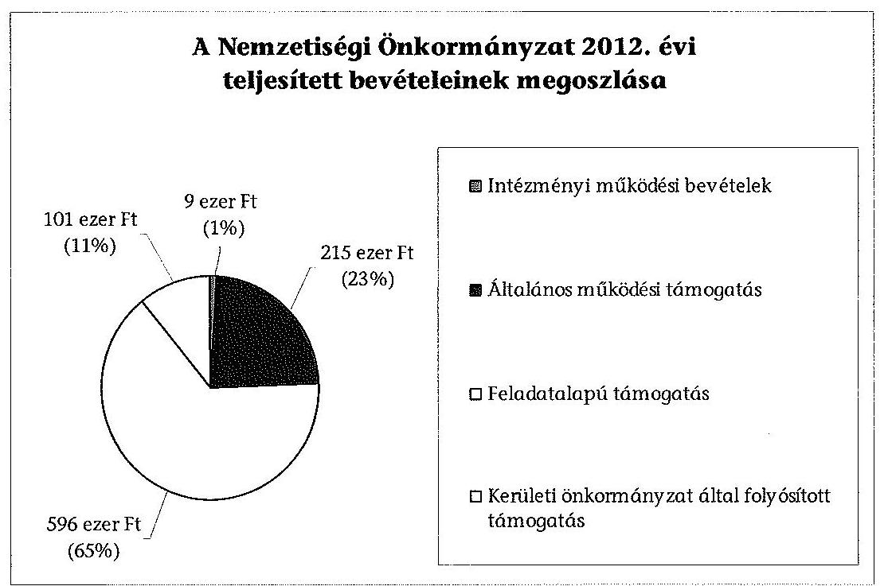
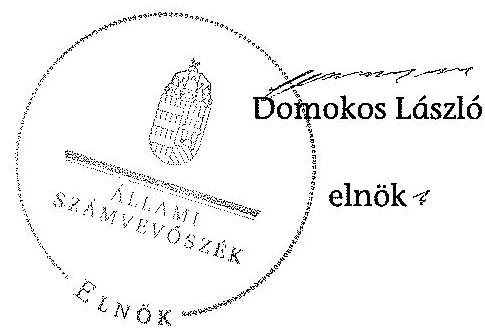

# JELENTÉS 

a helyi nemzetiségi önkormányzatok gazdálkodásának ellenőrzéséről

Budapest Főváros XVI. Kerületi Ruszin Önkormányzat

---

# Állami Számvevőszék 

Iktatószám: V-0289-009/2014.
Témaszám: 1322
Vizsgálat-azonosító szám: V065242
Az ellenőrzést felügyelte:
Horváth Balázs
felügyeleti vezető
Az ellenőrzést vezette és az ellenőrzés végrehajtásáért felelős:
Kisgergely István
ellenőrzésvezető
A számvevőszéki jelentést készítették és a jelentés összeállításában
közremüködtek:
Belovai Sándorné
számvevő főtanácsos
Varga József
számvevő tanácsos
Az ellenőrzést végezte:
Rábai György
számvevő

---

# TARTALOMJEGYZÉK 

BEVEZETÉS ..... 3
I. ÖSSZEGZŐ MEGÁLLAPÍTÁSOK, KÖVETKEZTETÉSEK, JAVASLATOK ..... 6
II. RÉSZLETES MEGÁLLAPÍTÁSOK ..... 13

1. A Nemzetiségi Önkormányzat és a XVI. Kerületi Önkormányzat együttmúködésének szabályozása, a múködési feltételek biztosítása ..... 13
2. A gazdálkodási feladatok ellátásának szabályszerűsége ..... 14
2.1. A költségvetésre és a zárszámadásra, valamint a kincstári adatszolgáltatás rendjére vonatkozó jogszabályi előírások betartása ..... 14
2.2. A Nemzetiségi Önkormányzat gazdálkodásának szabályozottsága ..... 15
2.3. Az operatív gazdálkodási jogkörök kialakítása, gyakorlása ..... 15
3. A Nemzetiségi Önkormányzattal összefüggő gazdálkodási feladatok belső ellenőrzése ..... 17
4. A feladatalapú támogatás felhasználásának, elszámolásának szabályszerűsége, a Nemzetiségi Önkormányzat feladatellátása ..... 17
MELLÉKLETEK
5. számú A Nemzetiségi Önkormányzat 2012. évi gazdálkodásának főbb adatai, mutatói
FÜGGELÉKEK
6. számú Rövidítések jegyzéke
7. számú Értelmező szótár
8. számú A gazdálkodás értékelésének módszere

---

.

---

# JELENTÉS   a helyi nemzetiségi önkormányzatok gazdálkodásának ellenőrzéséről Budapest Főváros XVI. Kerületi Ruszin Önkormányzat 

## BEVEZETÉS

A Nemzetiségi Önkormányzat a 2002. évben alakult, elnöke a 2010. évi helyhatósági választások óta látja el feladatát. A Nemzetiségi Önkormányzat intézményt, gazdasági társaságot és más szervezetet nem alapított, illetve ezek társulásában nem vesz részt. A négytagú képviselő-testület munkája segittésére bizottságot nem hozott létre. A Nemzetiségi Önkormányzatnak a költségvetési beszámolója szerint a 2012. évben a módosított költségvetési bevételi és kiadási előirányzata 921 ezer Ft, a teljesített költségvetési bevétele 921 ezer Ft, a teljesített költségvetési kiadása 824 ezer Ft volt. A 2012. évi gazdálkodási adatokat részletesen az 1. számú mellékletben mutatjuk be.

Az Alaptörvény XXIX. cikk (1) bekezdése szerint a Magyarországon élő nemzetiségek államalkotó tényezők. Minden, valamely nemzetiséghez tartozó magyar állampolgárnak joga van önazonossága szabad vállalásához és megőrzéséhez. A hazánkban élő nemzetiségek helyi (települési és területi), valamint országos önkormányzatokat hozhatnak létre. A helyi nemzetiségi önkormányzatok gazdálkodási feladatait jogszabályi előírás alapján a székhely szerinti helyi önkormányzat polgármesteri hivatala látja el.

A nemzetiségek helyzete, támogatása mind hazai, mind Európai Uniós (továbbiakban: EU) szinten kiemelt figyelmet kap napjainkban. A helyi nemzetiségi önkormányzatok gazdálkodására és támogatási rendszerére vonatkozó jogszabályok a 2010-2012. években jelentős változásokon mentek át. A települési és területi nemzetiségi önkormányzatok gazdálkodásának, a részükre juttatott költségvetési támogatások felhasználásának ellenőrzését az Állami Számvevőszék (továbbiakban: ÁSZ) a 2012. évben sorozatjellegú ellenőrzés keretében indította el. A 2013. évi ellenőrzések e témacsoportos ellenőrzések folytatását jelentik, amelyet az ÁSZ 2014. első félévi ellenőrzési terve 12. témasorszámon tartalmaz.

Az ellenőrzés célja annak értékelése volt, hogy a Nemzetiségi Önkormányzat gazdálkodási kereteinek kialakítása, gazdálkodása és feladatellátása megfelelt-e a jogszabályoknak.

---

Ennek keretében értékeltük, hogy:

- a Nemzetiségi Önkormányzat és a XVI. Kerületi Önkormányzat együttmúködésének szabályozása, a működési feltételek biztosítása megfelelt-e a jogszabályi előírásoknak;
- a Nemzetiségi Önkormányzat és a XVI. Kerületi Önkormányzat együttmúködése megfelelt-e a közöttük létrejött megállapodásnak a gazdálkodási feladatok szabályszerű ellátása során, ennek keretében betartották-e a helyi nemzetiségi önkormányzat gazdálkodásához kapcsolódóan a költségvetésre és zárszámadásra, a gazdálkodás szabályozására, az operatív gazdálkodási jogkörök gyakorlására vonatkozó jogszabályi előírásokat;
- a jegyző biztosította-e a Nemzetiségi Önkormányzat gazdálkodásának belső ellenőrzését;
- a Nemzetiségi Önkormányzat feladatalapú támogatásának felhasználása, a folyósított feladatalapú támogatással történő elszámolás az előírásoknak megfelelő volt-e;
- a Nemzetiségi Önkormányzat feladatellátása összhangban volt-e a vonatkozó jogszabályi előírásokkal.

Az ellenőrzés várható hasznosulását négy szinten tervezzük. A törvényalkotás számára összegzett tapasztalatok állnak rendelkezésre a nemzetiségi önkormányzatok testületi döntéseinek, gazdálkodásának és a feladatalapú támogatás felhasználásának szabályszerűségéről, amelynek alapján következtetést lehet levonni arra, hogy indokolt-e jogszabályi módosítás kezdeményezése. Az ellenőrzés az ellenőrzött számára visszajelzést ad a működésében fellépő hiányosságokról, javaslataival hozzájárul azok kiküszöböléséhez, amely csökkentheti a későbbi ellenőrzések gyakoriságát. Az ellenőrzés megállapításai és javaslatai tanulságul szolgálhatnak más nemzetiségi önkormányzatok, szervezetek számára a rendezett gazdálkodási keretek kialakításához. A társadalom számára jelzi, hogy közpénz nem maradhat ellenőrizetlenül, az ÁSZ értékteremtő rend kialakításához és megőrzéséhez hozzájáruló tevékenysége pozitív hatással lesz a szervezetről kialakított összkép formálásában. Az ÁSZ szervezetén belül lehetőség nyílik arra, hogy a megállapítások szintetizálásával az intézmény a hozzáadott értéket teremtő elemző tevékenységét és tanácsadó szerepét erősítse.

A Nemzetiségi Önkormányzat gazdálkodásának ellenőrzéséről szóló jelentés I. fejezetének összegző része az ellenőrzés céljára adott rövid, szintetizáló összefoglalót és következtetéseket tartalmazza a II. fejezet részletes megállapításain alapulóan. A jelentés intézkedést igénylő megállapításait és javaslatait - az öszszegzőben foglaltak mellett - az ellenőrzés során feltárt, a jelentés II. fejezetében rögzített részletes megállapítások alapozzák meg, illetve támasztják alá.

# Az ellenőrzés típusa: szabályszerűségi ellenőrzés 

Az ellenőrzött időszak: a 2012. január 1. - 2012. december 31. közötti időszak. Az ellenőrzés kiterjedt a helyi nemzetiségi önkormányzatnak juttatott 2012. évi támogatás 2013. évben való elszámolására is.

---

Ellenőrzött szervezet: a Budapest Főváros XVI. Kerületi Ruszin Önkormányzat és a gazdálkodási feladatait ellátó Budapest Főváros XVI. Kerületi Önkormányzat.

Az ellenőrzés végrehajtásának jogszabályi alapját az ÁSZ tv. 5. § (2)-(3) és (6) bekezdéseiben foglaltak képezik.

Az ellenőrzés szakmai módszertana az ÁSZ hivatalos honlapján (www.asz.hu) közzétett szakmai szabályokon alapult, amely a Legfőbb Ellenőrző Intézmények Nemzetközi Szervezete (INTOSAI) által kiadott nemzetközi standardok (ISSAI) figyelembevételével készült.

A helyi nemzetiségi önkormányzatok gazdálkodásának ellenőrzése során értékeltük a XVI. Kerületi Önkormányzat és a Nemzetiségi Önkormányzat együttmúködésének, a gazdálkodás szabályozottságának és a pénzügyi folyamatokban kulcsszerepet betöltő belső kontrollok (teljesítésigazolás és érvényesítés) működésének megfelelőségét. A kulcskontrollokat a működési és felhalmozási célú támogatásértékű kiadásoknál, az államháztartáson kívülre teljesített müködési és felhalmozási célú pénzeszköz átadásoknál, a dologi kiadásokkal kapcsolatos kifizetéseknél - véletlen mintavételi eljárást alkalmazva - ellenőriztük. Ellenőriztük, hogy a jegyző biztosította-e a Nemzetiségi Önkormányzat gazdálkodásának belső ellenőrzését. Értékeltük a feladatalapú támogatások felhasználásának, elszámolásának szabályszerűségét, a Nemzetiségi Önkormányzat feladatellátása és a jogszabályi előírások összhangját.

Az ellenőrzés lefolytatásához a Nemzetiségi Önkormányzat és a gazdálkodási feladatait ellátó XVI. Kerületi Önkormányzat a tanúsítványok és a kapcsolódó, dokumentumjegyzékben megjelölt dokumentumok elektronikus úton történő megküldésével, rendelkezésre bocsátásával szolgáltatott adatokat. Az adatszolgáltatás kontrollálása és szükség szerinti javítása a helyszíni ellenőrzés keretében történt. A minősítési szempontokat a 3. számú függelék tartalmazza.

Az ÁSZ tv. 29. § (1) bekezdése szerint a jelentéstervezetet megküldtük észrevételezésre a polgármesternek és a Nemzetiségi Önkormányzat elnökének. A polgármester és a Nemzetiségi Önkormányzat elnöke az ÁSZ tv. 29. § (2) bekezdésében foglalt észrevételezési jogával nem élt, a jelentéstervezetre észrevételt nem tett.

---

# I. ÖSSZEGZŐ MEGÁLLAPÍTÁSOK, KÖVETKEZTETÉSEK, JAVASLATOK 

A Nemzetiségi Önkormányzat és a XVI. Kerületi Önkormányzat együttmúködésének szabályozása részben felelt meg a jogszabályi előírásoknak. A 2012. évben az együttmúködési megállapodás ${ }_{1,2}$ volt hatályban. A 2010-ben kötött együttműködési megállapodás ${ }_{1}$-et a Nek. ${ }_{2}$ tv. előírása ellenére 2012. január 31-élg nem vizsgálták felül, az együttmúködési megállapodás ${ }_{2}$-t a Nek. ${ }_{2}$ tv.-ben előírt 2012. június 1-iei határidő után négy nap késedelemmel írták alá. Az együttmúködési megállapodás ${ }_{2}$ tartalmazta az Áht. ${ }_{2}$-ben előírt tervezési, finanszírozási és adatszolgáltatási feladatok ellátását, nem tartalmazta a Nek. ${ }_{2}$ tv.-ben előírt operatív gazdálkodási feladatok ellátásának eljárási és dokumentációs részletszabályait, a kötelezettségvállalások nyilvántartásának vezetési kötelezettségeit, valamint a Nemzetiségi Önkormányzat testületi ülésein a jegyző megbízásából résztvevő személy - jegyzőével megegyező - képesítési követelményeit. Az együttműködési megállapodás ${ }_{2}$ szerinti múködési feltételeket a Nek. ${ }_{2}$ tv.-ben foglaltak ellenére a megállapodás megkötését követően nem rögzítették a Nemzetiségi Önkormányzat SZMSZ-ében. A szabályozási hiányosságok ellenére a XVI. Kerületi Önkormányzat a Nemzetiségi Önkormányzat részére biztosította a Nek. ${ }_{2}$ tv.-ben foglaltak szerint a múködésének személyi- és tárgyi feltételeit.

A Nemzetiségi Önkormányzat 2012. évi költségvetésével, zárszámadásával, valamint a kapcsolódó kincstári adatszolgáltatással összefüggésben ellátott feladatok megfeleltek a jogszabályi előírásoknak. A Nemzetiségi Önkormányzat elnöke a 2012. évi költségvetési határozat-tervezetét az Áht. ${ }_{2}$ előírásainak megfelelően határidőben benyújtotta a Képviselő-testületnek, amelyet határozattal elfogadtak. A jóváhagyott költségvetési határozat tartalmazta az Áht. ${ }_{2}$-ben és az Ávr.-ben előírt főbb tartalmi elemeket, de az Áht. ${ }_{2}$-ben előírtak ellenére a Képviselő-testületnek nem mutatták be tájékoztatásul - szöveges indoklással együtt - a Nemzetiségi Önkormányzat költségvetési mérlegét közgazdasági tagolásban. A jegyző által elkészített 2012. évi zárszámadási határozat tervezetét a Nemzetiségi Önkormányzat elnöke az Áht. ${ }_{2}$-ben előírt határidőn túl terjesztette a Képviselő-testület elé. A 2012. évi zárszámadási határozat tervezetének előterjesztésekor a Képviselő-testületnek tájékoztatásul bemutatták az Áht. ${ }_{2}$-ben foglalt mérlegeket és kimutatásokat. A zárszámadásról hozott határozat és az elfogadott költségvetés összehasonlíthatóságát biztosították, a zárszámadás a Nemzetiségi Önkormányzat valamennyi bevételét és kiadását tartalmazta. A jegyző a Nemzetiségi Önkormányzat részére az Áhsz. ${ }_{1}$-ben és az Ávr.-ben előírt, a gazdálkodással összefüggő 2012. évi adatszolgáltatásokat az előírt határidőben teljesítette a Kincstár felé.

A Nemzetiségi Önkormányzat gazdálkodásának szabályozottsága nem volt megfelelő. A Nemzetiségi Önkormányzat rendelkezett a Számv. tv. által előírt Számviteli politikával és a hozzá kapcsolódó, gazdálkodásának végrehajtási feladatait előíró szabályzatokkal. Az operatív gazdálkodásra vonatkozó, a Számviteli politikába foglalt szabályozás az Ávr. előírásai ellenére nem tartalmazta a teljesítésigazolás gyakorlásának módjával, eljárási és dokumentációs

---

részletszabályaival, a teljesítésigazolást végző személyek kijelölésével kapcsolatos előírásokat, valamint a 100 ezer Ft alatti, előzetes írásbeli kötelezettségvállalást nem igénylő kifizetések rendjét, annak ellenére, hogy a Nemzetiségi Önkormányzatnál éltek az írásbeli kötelezettségvállalás mellőzésének lehetőségével. A XVI. Kerületi Önkormányzat rendelkezett a Bkr.-ben előírt ellenőrzési nyomvonallal és a szabálytalanságok kezelésének eljárásrendjével, de a jegyző azok hatályát a Nemzetiségi Önkormányzat gazdálkodásának végrehajtási feladataira nem terjesztette ki, arra önálló szabályzatot sem készített. A Polgármesteri Hivatal SZMSZ-ében rögzítették a tervezéssel, gazdálkodással, - annak részeként a pénzügyi ellenjegyzéssel, az érvényesítéssel, az ezeket végző személyek kijelölésével, - az ellenőrzési és adatszolgáltatási feladatok teljesítésével kapcsolatos belső előírásokat, azonban az Ávr. előírásával ellentétben nem szabályozták az SZMSZ-ben nevesített munkakörökhöz tartozó - a Nemzetiségi Önkormányzat gazdálkodásának végrehajtásával kapcsolatos - feladotés hatáskörökre, a hatáskörök gyakorlásának módjára, a helyettesítés rendjére vonatkozó előírásokat.

A Nemzetiségi Önkormányzat gazdálkodása tekintetében az operatív gazdálkodási jogkörök kialakítása részben felelt meg a jogszabályi előírásoknak, mert az Áht. ${ }_{2}$ és az Ávr. előírásai ellenére a Nemzetiségi Önkormányzat elnöke 2012. június 5 -ig nem jelölte ki a teljesítésigazolásra jogosult személyt, továbbá a kijelölést követően az Ávr. szerinti - az operatív gazdálkodási jogkörök gyakorlására jogosult személyekről és alárrás mintájukról vezetett - nyilvántartás aktualizálásáról nem gondoskodott. A jegyző - gazdasági szervezet hiányában - jogszerűen, az Áht. ${ }_{2}$ és az Ávr. előírásainak megfelelően jelölte ki a pénzügyi ellenjegyzésre és az érvényesítésre jogosultakat.

A 2012. évben a dologi kiadások teljesítése során a teljesítésigazolás és az érvényesítés kulcskontrollok múködésének megfelelősége gyenge volt, a hibák száma a lényegességi szintet, a kritikus hibahatárt elérte. A teljesítés igazolását 2012. június 5 -ig az Ávr. előírása ellenére a jogkör gyakorlására kijelöléssel nem rendelkező személy jogosulatlanul végezte. A 2012. június 5 -ét követő kifizetések esetében - az írásbeli kötelezettségvállalást nem igénylő kifizetések rendjének szabályozási hiányossága miatt - ellenőrizhető okmányok hiányában a teljesítésigazoló az aláírása ellenére az Ávr.-ben foglalt feladatait nem látta el, nem ellenőrizte a kifizetés jogosságát, összegszerüségét és az ellenszolgáltatás teljesítését. Az érvényesítő az Ávr. előírásai ellenére nem jelezte az utalványozónak, hogy a teljesítésigazolás szabálytalan volt, továbbá nem észrevételezte az Ávr.-ben előírt kötelezettségvállalási nyilvántartás vezetésének a hiányát. A Nemzetiségi Önkormányzatnál a 2012. évi dologi kiadások között a három legnagyobb összegű kiadás teljesítése alapján a teljesítésigazolás és az érvényesítés kulcskontrollok nem múködtek megfelelően. A feltárt hiányosságok megegyeztek a dologi kiadásoknál leírtakkal. A Nemzetiségi Önkormányzatnál a 2012. évben államháztartáson kívülre teljesített pénzeszközátadás, illetve támogatásértékủ kiadás nem volt.

A számvevőszéki ellenőrzés a kiadások dokumentumainak ellenőrzése alapján összeférhetetlenséget, továbbá jogosulatlan kifizetést nem tárt fel, azonban a kulcskontrollok múködéséhez kapcsolódó hiányosságok miatt nem biztosított a hibák megelőzése, feltárása és kijavítása.

---

A Nemzetiségi Önkormányzat gazdálkodásával összefüggő végrehajtási feladatok belsö ellenörzése megfelelő volt. Az együttmúködési megállapodás ${ }_{1,2}$-ben rögzítették, hogy a Polgármesteri Hivatal belső ellenőrzési tevékenysége kiterjed a Nemzetiségi Önkormányzat számviteli nyilvántartásainak ellenőrzésére. A Polgármesteri Hivatal 2012. évi belső ellenőrzési terve tartalmazta a kerületben múködő nemzetiségi önkormányzatok gazdálkodásának 2010-2011. évekre vonatkozó ellenőrzését, de azt a Ber.-ben foglaltak ellenére nem alapozták meg kockázatelemzéssel. A 2012. évre tervezett belső ellenőrzést elvégezték, az ellenőrzési jelentés hiányosságokat állapított meg, javaslatokat tett, de azoknak nem volt címzettje, nem tartalmazta, hogy kire vonatkoznak a megállapítások. A jegyző a Nemzetiségi Önkormányzatot érintő belső ellenőrzés megállapításairól annak elnökét és a Képviselő-testületét nem tájékoztatta, ezért az elnök a belső ellenőrzési jelentés elkészítésekor hatályos együttmúködési megállapo-dás ${ }_{1}$-ben foglalt realizálási feladatainak végrehajtása elmaradt. A feltárt hiányosságok miatt a belső ellenőrzési tevékenység részben hasznosult a Nemzetiségi Önkormányzat operatív gazdálkodási feladatainak végrehajtásában. Az ellenőrzéshez szolgáltatott adatok alapján a Kormányhivatal 2012. évben a Nemzetiségi Önkormányzatot illetően nem élt törvényességi felügyeleti eszközökkel.

A Nemzetiségi Önkormányzat részére 2011. és 2012. évben folyósított feladatalapú támogatás elszámolása a jogszabályi előírásoknak nem felelt meg. A Nemzetiségi Önkormányzat mindkét évben a megítélt feladatalapú támogatását teljes összegben, az előírt célokra felhasználta. A feladatalapú támogatásokról a támogatási kormányrendelet ${ }_{1,2}$ előírása alapján az Áht. ${ }_{1,2}{ }^{-}$ ben foglaltak ellenére az elszámolások nem történtek meg, a támogatások felhasználását, elszámolását az ellenőrzésre jogosult szervek nem ellenőrizték.

A Nemzetiségi Önkormányzat 2012. évi kötelező és önként vállalt feladatellátásának tárgya - a nemzetiségi közösség kulturális autonómiája megerősítését szolgáló döntési jogok gyakorlása, kapcsolattartás a képviselt közösség helyi nemzetiségi szervezeteivel, egyházi szervezetekkel - összhangban volt a Nek. ${ }_{2}$ tv.-ben foglalt előírásokkal.

Az ÁSZ tv. 33. § (1) bekezdésében foglaltak értelmében az ellenőrzött szervezet vezetője köteles a jelentésben foglalt megállapításokhoz kapcsolódó intézkedési tervet összeállítani és azt a jelentés kézhezvételétől számított 30 napon belül az ÁSZ részére megküldeni. Amennyiben az intézkedési tervet határidőre nem küldi meg a szervezet, vagy az nem elfogadható, az ÁSZ elnöke az ÁSZ tv. 33. § (3) bekezdés a)-b) pontjaiban foglaltakat érvényesítheti.

A helyszíni ellenőrzés megállapításainak hasznosítása mellett javasoljuk:

# a jegyzönek 

1. az együttműködés szabályozásával kapcsolatban

Az együttműködési megállapodás ${ }_{1}$-t a Nek. ${ }_{2}$ tv. 80. § (2) bekezdésének előírása ellenére 2012. január 31-éig nem vizsgálták felül.

---

A Nek. ${ }_{2}$ tv. 80. § (3) bekezdésének c)-d) pontjaiban foglaltak ellenére az együttmüködési megállapodás ${ }_{2}$-ben nem rögzítették a teljesítésigazolási feladatok eljárási és dokumentációs részletszabályait, továbbá nem írták elő a kötelezettségvállalások nyilvántartására vonatkozó szabályokat. A Nek. ${ }_{2}$ tv. 80. § (4) bekezdésében foglaltak ellenére az együttműködési megállapodás ${ }_{2}$ nem tartalmazta a testületi ülésen a jegyző megbízásából résztvevő személy képesítési követelményeit.

A Nek. ${ }_{2}$ tv. 80. § (2) bekezdésében foglaltak ellenére az együttműködési megállapodás ${ }_{2}$ szerinti müködési feltételeket nem rögzítették a Nemzetiségi Önkormányzat SZMSZ-ében.

Javaslat:
Az együttműködés szabályszerűsége érdekében:
a) biztosítsa a jövőben az együttműködési megállapodás évenkénti felülvizsgálata során a Nek. ${ }_{2}$ tv. 80. § (2) bekezdésében előírt határidő betartását;
b) készítse elő az együttműködési megállapodás ${ }_{2}$ módosítását, hogy az tartalmilag feleljen meg a Nek. ${ }_{2}$ tv. 80. § (3) bekezdés c)-d) pontjaiban, valamint a Nek. ${ }_{2}$ tv. 80. § (4) bekezdésében foglalt előírásoknak;
c) készítse el a Nemzetiségi Önkormányzat SZMSZ-ének a Nek. ${ }_{2}$ tv. 80. § (2) bekezdésében foglalt előírásnak megfelelő kiegészítését.
2. a költségvetés előterjesztésével kapcsolatban

A 2012. évi költségvetési határozattervezet előterjesztésekor - a jegyző mulasztása miatt - az Áht. ${ }_{2}$ 24. § (4) bekezdés a) pontjában előírtak ellenére nem mutatták be a Képviselő-testületnek tájékoztatásul - szöveges indoklással - a Nemzetiségi Önkormányzat költségvetési mérlegét közgazdasági tagolásban.

Javaslat
Készítse el a jövőben a költségvetési határozattervezet előterjesztéséhez a Képviselőtestület tájékoztatására az Áht. ${ }_{2}$ 24. § (4) bekezdés a) pontja előírásainak megfelelően szöveges indoklással együtt a költségvetési mérleget közgazdasági tagolásban.
3. a gazdálkodási feladatok szabályozottságával kapcsolatban

A Polgármesteri Hivatal SZMSZ-e nem tartalmazta az Ávr. 13. § (1) bekezdés g) pontjában foglaltak szerinti, az SZMSZ-ben nevesített munkakörökhöz tartozó - a Nemzetiségi Önkormányzat gazdálkodásának végrehajtásával kapcsolatos - feladatés hatáskörökre, a hatáskörök gyakorlásának módjára, a helyettesítés rendjére, az ezekhez kapcsolódó felelősségi szabályokra vonatkozó előírásokat. A Bkr. 6. § (3)-(4) bekezdései szerinti ellenőrzési nyomvonal és szabálytalanságok kezelésének eljárásrendje nem terjedt ki a Nemzetiségi Önkormányzat gazdálkodásának végrehajtási feladataira és arra vonatkozóan önálló szabályzat sem készült.

---

Javaslat
A gazdálkodás szabályszerűsége érdekében a Nemzetiségi Önkormányzat gazdálkodásának végrehajtására is kiterjedően:
a) készítse el a Polgármesteri Hivatal SZMSZ-ének módosítását, hogy az tartalmazza az Ávr. 13. § (1) bekezdés g) pontjában foglaltakat;
b) gondoskodjon a Bkr. 6. § (3)-(4) bekezdései szerinti ellenőrzési nyomvonal és a szabálytalanságok kezelése eljárásrendjének kialakításáról.
4. a kulcskontrollok müködésével kapcsolatban

A 2012. június 5 -ét követő kifizetések esetében - az írásbeli kötelezettségvállalást nem igénylő kifizetések rendjének szabályozási hiányossága miatt - ellenőrizhető okmányok hiányában a teljesítésigazoló az aláírása ellenére az Ávr. 57. § (1) bekezdésében foglalt feladatait nem látta el, nem ellenőrizte a kifizetés jogosságát, öszszegszerűségét és az ellenszolgáltatás teljesítését;

Az érvényesítő az Ávr. 58. § (1) bekezdése ellenére nem látta el feladatát, mert az összegszerűségre vonatkozó ellenőrzése nem szabályszerű teljesítésigazoláson alapult, nem ellenőrizte a megelőző ügymenetben a jogszabályi előírások betartását. Nem jelezte az utalványozónak az Ávr. 58. § (2) bekezdés előírása ellenére, hogy a teljesítésigazolások szabálytalanul történtek, a kötelezettségvállalási nyilvántartást nem vezették, annak következményeként a kötelezettségvállalás nyilvántartási számát nem tüntették fel a pénztárbizonylatokon.

Javaslat
Az operatív gazdálkodás működési hibáinak megelőzése, feltárása és kijavítása érdekében gondoskodjon arról, hogy:
a) a teljesítésigazolást minden esetben az Ávr. 57. § (1) bekezdésében előírtaknak megfelelően végezzék el;
b) az érvényesítő maradéktalanul tegyen eleget az Ávr. 58. § (1)-(2) bekezdéseiben előírt ellenőrzési feladatának és jelzési kötelezettségének.
5. a feladatalapú támogatás elszámolásával kapcsolatban

A 2011. évi feladatalapú támogatás elszámolása a támogatási kormányrendelet ${ }_{1}$ 7. § (2) bekezdésében hivatkozott, valamint a 2012. évi feladatalapú támogatás elszámolása a támogatási kormányrendelet ${ }_{2}$ 8. § (5) bekezdésében hivatkozott „a helyi önkormányzatok elszámolási és ellenőrzési rendjére vonatkozó jogszabályok rendelkezései alkalmazandóak" előírása alapján az Áht. ${ }_{1}$ 64. § (7) bekezdése, és az Áht. ${ }_{2}$ 57. § (3) bekezdése ellenére nem történt meg.

Javaslat
Intézkedjen az Áht. ${ }_{2}$ 27. § (2) bekezdésében meghatározott feladatkörében a Nemzetiségi Önkormányzat által igénybevett 2011. és 2012. évi feladatalapú támogatás

---

felhasználásáról szóló elszámolás elkészítéséről az Áht. 2 53. § (1) bekezdése szerinti beszámolási kötelezettség teljesítéséhez.

# a polgármesternek 

A Nek. 2 tv. 80. § (3) bekezdésének c)-d) pontjaiban foglaltak ellenére az együttmúködési megállapodás ${ }_{2}$-ben nem rögzítették a teljesítésigazolási feladatok eljárási és dokumentációs részletszabályait, továbbá nem írták elő a kötelezettségvállalások nyilvántartására vonatkozó szabályokat. A Nek. 2 tv. 80. § (4) bekezdésében foglaltak ellenére az együttműködési megállapodás ${ }_{2}$ nem tartalmazta a testületi ülésen a jegyző megbízásából résztvevő személy képesítési követelményeit.

A Polgármesteri Hivatal SZMSZ-e nem tartalmazta az Ávr. 13. § (1) bekezdés g) pontjában foglaltak szerinti, az SZMSZ-ben nevesített munkakörökhöz tartozó - a Nemzetiségi Önkormányzat gazdálkodásának végrehajtásával kapcsolatos - feladatés hatáskörökre, a hatáskörök gyakorlásának módjára, a helyettesítés rendjére, az ezekhez kapcsolódó felelősségi szabályokra vonatkozó előírásokat.

Javaslat
Terjessze a XVI. Kerületi Önkormányzat Képviselő-testülete elé jóváhagyásra:
a) az együttműködési megállapodás jegyző által előkészített módosítását, hogy az tartalmilag megfeleljen a Nek. 2 tv. 80. § (3) bekezdés c)-d) pontjaiban, valamint a Nek. 2 tv. 80. § (4) bekezdésében foglalt előírásoknak;
b) a Polgármesteri Hivatal SZMSZ-ének a jegyző által elkészített módosítását, hogy az tartalmazza - a Nemzetiségi Önkormányzat gazdálkodásának végrehajtására vonatkozóan - az Ávr. 13. § (1) bekezdés g) pontjában foglaltakat.

## a Nemzetiségi Önkormányzat elnökének

1. A Nek. 2 tv. 80. § (3) bekezdésének c)-d) pontjaiban foglaltak ellenére az együttmúködési megállapodás ${ }_{2}$-ben nem rögzítették a teljesítésigazolási feladatok eljárási és dokumentációs részletszabályait, továbbá nem írták elő a kötelezettségvállalások nyilvántartására vonatkozó szabályokat. A Nek. 2 tv. 80. § (4) bekezdésében foglaltak ellenére az együttmúködési megállapodás ${ }_{2}$ nem tartalmazta a testületi ülésen a jegyző megbízásából résztvevő személy képesítési követelményeit.

A Nek. 2 tv. 80. § (2) bekezdésében foglaltak ellenére az együttmúködési megállapodás ${ }_{2}$ szerinti múködési feltételeket nem rögzítették a Nemzetiségi Önkormányzat SZMSZ-ében.

Javaslat
Terjessze a Képviselő-testület elé jóváhagyásra:
a) a jegyző által előkészített együttműködési megállapodás ${ }_{2}$ módosítását, hogy az tartalmilag megfeleljen a Nek. 2 tv. 80. § (3) bekezdés c)-d) pontjaiban, valamint a Nek. 2 tv. 80. § (4) bekezdésében foglalt előírásoknak;

---

b) a Nemzetiségi Önkormányzat SZMSZ-ének jegyző által elkészített módosítását, hogy az megfeleljen a Nek. ${ }_{2}$ tv. 80. § (2) bekezdésében előírtaknak.
2. A Nemzetiségi Önkormányzat elnöke a 2012. évi költségvetési határozattervezet előterjesztésekor - a jegyző mulasztása miatt - a Képviselő-testület részére tájékoztatásul az Áht. ${ }_{2} 24 . \S$ (4) bekezdés a) pontjában előírtak ellenére nem mutatta be szöveges indoklással a Nemzetiségi Önkormányzat költségvetési mérlegét közgazdasági tagolásban. A 2012. évi zárszámadási határozattervezet Képviselő-testületnek történő előterjesztésekor a Nemzetiségi Önkormányzat elnöke nem tartotta be az Áht. ${ }_{2}$ 91. § (1) és (3) bekezdéseiben előírt határidőt.

Javaslat
A jövőben gondoskodjon arról, hogy:
a) a költségvetési határozattervezet Képviselő-testület elé terjesztésekor tájékoztatásul mutassa be - szöveges indoklással együtt - a jegyző által elkészített, az Áht. ${ }_{2} 24 . \S$ (4) bekezdés a) pontjában előírt költségvetési mérleget közgazdasági tagolásban;
b) a Nemzetiségi Önkormányzat zárszámadásának jegyző által elkészített tervezetét az Áht. ${ }_{2}$ 91. § (1) és (3) bekezdéseiben előírt határidőben terjessze a Képviselőtestület elé.
3. A 2011. évi feladatalapú támogatás elszámolása a támogatási kormányrendelet ${ }_{1}$ 7. § (2) bekezdésében hivatkozott, valamint a 2012. évi feladatalapú támogatás elszámolása a támogatási kormányrendelet ${ }_{2} 8 . \S$ (5) bekezdésében hivatkozott „a helyi önkormányzatok elszámolási és ellenőrzési rendjére vonatkozó jogszabályok rendelkezései alkalmazandóak" előírása alapján az Áht. ${ }_{1} 64 . \S$ (7) bekezdése, és az Áht. ${ }_{2} 57 . \S$ (3) bekezdése ellenére nem történt meg.

Javaslat
Terjessze a Képviselő-testület elé az Áht. ${ }_{2}$ 53. § (1) bekezdése szerinti beszámolási kötelezettség teljesítéséhez összeállított, a Nemzetiségi Önkormányzat által igénybevett 2011. és 2012. évi feladatalapú támogatás felhasználásáról szóló elszámolást.

---

# II. RÉSZLETES MEGÁLLAPÍTÁSOK 

## 1. A Nemzetiségi Önkormányzat és a XVI. Kerületi ÖnkormÁNYZAT EGYÜTTMŰKÖDÉSÉNEK SZABÁLYOZÁSA, A MÜKÖDÉSI FELTÉTELEK BIZTOSÍTÁSA

A Nemzetiségi Önkormányzat és a XVI. Kerületi Önkormányzat együttmüködésének szabályozása részben felelt meg a jogszabályi előírásoknak. A 2012. évben az együttműködési megállapodás ${ }_{1,2}$ volt hatályban.

A 2012. január 1-jén hatályos, 2010. évben megkötött ${ }^{1}$ együttműködési megállapodás ${ }_{1}$ felülvizsgálatát a Nek. ${ }_{2}$ tv. 80. § (2) bekezdésében előírtak ellenére 2012. január 31-ig nem végezték el. Az együttműködési megállapodás ${ }_{2}$ aláírása 2012. június 5 -én történt meg, azaz a Nek. tv. 159. § (3) bekezdésében foglalt megállapodás megkötésének kötelezettségét 4 nap késedelemmel teljesítették. Az együttműködési megállapodás ${ }_{2}$ megkötését a XVI. Kerületi Önkormányzat Képviselő-testülete és a Nemzetiségi Önkormányzat Képviselő-testülete határozataikkal jóváhagyták².

Az együttműködési megállapodás ${ }_{2}$ a Nemzetiségi Önkormányzat múködési feltételeit a Nek. ${ }_{2}$ tv.-ben foglaltaknak részben megfelelően tartalmazta. A Nemzetiségi Önkormányzat nem tett eleget a Nek. ${ }_{2}$ tv. 80. § (2) bekezdésében előírt kötelezettségének, mert az együttműködési megállapodás ${ }_{2}$ megkötését követően az ellenőrzött időszakban nem rögzítette SZMSZ-ében a megállapodás szerinti múködési feltételeket.

Az együttműködési megállapodás ${ }_{2}$ tartalmazta az Áht. ${ }_{2}$ 27. § (2) bekezdésében előírt tervezési, finanszírozási és adatszolgáltatási feladatok ellátását, azonban az operatív gazdálkodási feladatok ellátásának szabályai közül nem tartalmazta a Nek. ${ }_{2}$ tv. 80. § (3) bekezdése d) pontjában foglaltak szerint a teljesítésigazolási feladatok eljárási és dokumentációs részletszabályait, továbbá nem írták elő a Nek. ${ }_{2}$ tv. 80. § (3) bekezdés c) pontjának megfelelően a kötelezettségvállalások nyilvántartásának vezetését.

Az együttműködési megállapodás ${ }_{2}$ a Nek. ${ }_{2}$ tv. 80. § (4) bekezdés előírásának megfelelően tartalmazta, hogy a nemzetiségi referens a jegyző megbízásából és képviseletében részt vesz a Nemzetiségi Önkormányzat testületi ülésein és jelzi, amennyiben törvénysértést észlel, de nem tartalmazta a nemzetiségi referens képesítésére vonatkozó előírást, amelynek a jegyzőével azonosnak kell lennie.

[^0]
[^0]:    ${ }^{1}$ 463/2010. (XII. 8.) Kt., 29/2010. (XI. 30.) RUKÖ határozatok
    ${ }^{2}$ 267/2012. (04. 27.) Kt.,34/2012. (04. 27.) RUÖ határozatok

---

Az együttmúködési megállapodás ${ }_{1,2}$-ben rögzítették a belső ellenőrzésre és a felelősségre vonatkozó feltételeket, amely szerint a Polgármesteri Hivatal belső ellenőrzési tevékenysége a számviteli nyilvántartások ellenőrzésére terjed ki.

A XVI. Kerületi Önkormányzat - a szabályozási hiányosságok ellenére - a Nemzetiségi Önkormányzat múködésének személyi- és tárgyi feltételeit 2012ben biztosította.

# 2. A GAZDÁLKODÁSI FELADATOK ELLÁTÁSÁNAK SZABÁLYSZERŰSÉGE 

### 2.1. A költségvetésre és a zárszámadásra, valamint a kincstári adatszolgáltatás rendjére vonatkozó jogszabályi előirások betartása

A gazdálkodási feladatok ellátása keretében a Nemzetiségi Önkormányzat 2012. évi költségvetésével, zárszámadásával, valamint a kapcsolódó kincstári adatszolgáltatással összefüggő feladatok megfeleltek a jogszabályi előírásoknak. A Nemzetiségi Önkormányzat elnöke a 2012. évre vonatkozóan elkészített költségvetés ${ }^{3}$ tervezetét az Áht. ${ }_{2}$ előírásainak megfelelően határidőben benyújtotta a Képviselő-testületnek, amelyet az elfogadott. A költségvetési határozattervezet előterjesztésekor nem mutatták be tájékoztatásul - szöveges indoklással - az Áht. ${ }_{2} 24 . \S$ (4) bekezdés a) pontjában előírtak szerint a Nemzetiségi Önkormányzat költségvetési mérlegét közgazdasági tagolásban.

A jegyző által elkészített 2012. évi zárszámadási határozat ${ }^{4}$ tervezetét a Nemzetiségi Önkormányzat elnöke az Áht. ${ }_{2}$-ben előírt határidőn túl terjesztette a Kép-viselő-testület elé.

A 2012. évi zárszámadási határozat tervezetének előterjesztésekor a Képviselőtestületnek tájékoztatásul bemutatták az Áht. ${ }_{2}$-ben foglalt mérlegeket és kimutatásokat. A zárszámadásról hozott határozat és az elfogadott költségvetés öszszehasonlíthatóságát biztosították, a zárszámadás a Nemzetiségi Önkormányzat valamennyi bevételét és kiadását tartalmazta.

A jegyző a Nemzetiségi Önkormányzatra vonatkozó, az Áhsz. ${ }_{1}$-ben és az Ávr.ben előírt, a gazdálkodással összefüggő 2012. évi adatszolgáltatásokat az előírt határidőn belül teljesítette a Kincstár felé.

[^0]
[^0]:    ${ }^{3} 3 / 2012$. (01. 16.) RUÖ határozat
    ${ }^{4}$ 25/2013. (V. 18.) RUÖ határozat

---

# 2.2. A Nemzetiségi Önkormányzat gazdálkodásának szabályozottsága 

A Nemzetiségi Önkormányzat gazdálkodásának szabályozottsága - az ellenőrzött időszakban - nem felelt meg a jogszabályi előírásoknak.

A Nemzetiségi Önkormányzat rendelkezett a Számv. tv. és az Áhsz. ${ }_{1}$ által előírt saját Számviteli politikával és annak mellékletét képező önálló szabályzatok$\mathrm{kal}^{3}$. A Számviteli politikában rögzítették a gazdálkodásra vonatkozó feladatok végrehajtási szabályait is, amelyek azonban nem tartalmazták az Ávr. 53. § (2) bekezdése szerinti, a 100 ezer Ft alatti, előzetes írásbeli kötelezettségvállalást nem igénylő kifizetések rendjét annak ellenére, hogy a Nemzetiségi Önkormányzatnál éltek az írásbeli kötelezettségvállalás mellőzésének lehetőségével.

A XVI. Kerületi Önkormányzat rendelkezett Bkr. 6. § (3)-(4) bekezdéseiben előírt ellenőrzési nyomvonallal és a szabálytalanságok kezelésének eljárásrendjével, de a jegyző azok hatályát a Nemzetiségi Önkormányzat gazdálkodásának végrehajtási feladataira nem terjesztette ki, azokra vonatkozóan önálló szabályzatot sem adott ki.

A Polgármesteri Hivatal SZMSZ-e nem tartalmazta az Ávr. 13. § (1) bekezdés g) pontjában foglaltak szerinti, az SZMSZ-ben nevesített munkakörökhöz tartozó - a Nemzetiségi Önkormányzat gazdálkodásának végrehajtásával kapcsolatos - feladat- és hatáskörökre, a hatáskörök gyakorlásának módjára, a helyettesítés rendjére, az ezekhez kapcsolódó felelősségi szabályokra vonatkozó előírásokat.

A Polgármesteri Hivatal SZMSZ-ében a Nemzetiségi Önkormányzatra is kiterjedő hatállyal az Áht. ${ }_{2}$-ben és az Ávr.-ben foglaltak szerint rögzítették a tervezéssel, gazdálkodással, - annak részeként a pénzügyi ellenjegyzéssel, az érvényesítés, utalványozás gyakorlásának módjával, eljárási és dokumentálási részletszabályaival, valamint az ezeket végző személyek kijelölésének rendjével - az ellenőrzési és adatszolgáltatási feladatok teljesítésével kapcsolatos belső előírásokat, feltételeket.

### 2.3. Az operatív gazdálkodási jogkörök kialakítása, gyakorlása

A Nemzetiségi Önkormányzat gazdálkodása tekintetében az operatív gazdálkodási jogkörök kialakítása részben felelt meg a jogszabályi előírásoknak.

A jegyző az Áht. ${ }_{2}$ és az Ávr. előírásainak megfelelően írásban kijelölte a Nemzetiségi Önkormányzat kötelezettségvállalásaira és kifizetéseire vonatkozóan a pénzügyi ellenjegyzésre és az érvényesítésre jogosultakat. A kijelölések az ellen-

[^0]
[^0]:    ${ }^{3}$ Pénzkezelési Szabályzat, Eszközök és Források Értékelési Szabályzata, Leltározási Szabályzat, Számlarend, Számlatükör.

---

őrzés időszakára vonatkozóan jogszerűek voltak, mert a XVI. Kerületi Önkormányzat nem rendelkezett gazdasági szervezettel.

Az operatív gazdálkodási jogkörök kialakítását tartalmazó belső szabályozás azonban hiányos volt, mert:

- a Nemzetiségi Önkormányzat elnöke, mint kötelezettségvállaló a 2012. június 5 -ei együttmúködési megállapodás ${ }_{2}$ értelmében teljesítésigazolásra is jogosult. Az Áht. 2 38. § (2) bekezdése és az Ávr. 57. § (4) bekezdésében előírtak ellenére 2012. június 5 -ig nem jelölték ki a teljesítésigazolásra jogosult személyt, továbbá a kijelölést követően az Ávr. 60. § (3) bekezdése szerinti az operatív gazdálkodási jogkörök gyakorlására jogosult személyekről és aláírás mintájukról vezetett - nyilvántartás aktualizálásáról nem gondoskodtak;
- a Nemzetiségi Önkormányzat által vállalt kötelezettségekről nem vezették az Ávr. 56. § (1) bekezdésében előírt nyilvántartást.

A Nemzetiségi Önkormányzatnál a 2012. évben államháztartáson kívülre teljesített pénzeszközátadás, illetve támogatásértékú kiadás nem volt.

A Nemzetiségi Önkormányzatnál a 2012. évben a dologi kiadások teljesítése során a teljesítésigazolás és az érvényesítés kulcskontrollok múködése gyenge volt, a hibák száma a lényegességi szintet, a kritikus hibahatárt elérte, mert:

- a teljesítés igazolását 2012. június 5 -ig az Ávr. 57. § (4) bekezdésének előírása ellenére a jogkör gyakorlására kijelöléssel nem rendelkező személy jogosulatlanul végezte. A 2012. június 5 -ét követő kifizetések esetében - az írásbeli kötelezettségvállalást nem igénylő kifizetések rendjének szabályozási hiányossága miatt - ellenőrizhető okmányok hiányában a teljesítésigazoló az aláírása ellenére az Ávr. 57. § (1) bekezdésében foglalt feladatait nem látta el, nem ellenőrizte a kifizetés jogosságát, összegszerűségét és az ellenszolgáltatás teljesítését;
- az érvényesítő nem az Ávr. 58. § (1)-(2) bekezdéseiben előírtak szerint végezte feladatát, mert az összegszerűségre vonatkozó ellenőrzése nem szabályszerű teljesítésigazoláson alapult, és az Ávr. 58. § (2) bekezdésében előírtak ellenére nem jelezte az utalványozónak az Ávr. 57. § (3) bekezdésében előírt teljesítésigazolás szabálytalanságát, valamint az Ávr. 56. § (1) bekezdésében előírt kötelezettségvállalási nyilvántartás vezetésének hiányát.

A Nemzetiségi Önkormányzatnál a 2012. évi dologi kiadások közül kiválasztott három legnagyobb összegű kiadás esetében a teljesítésigazolás és az érvényesítés kulcskontrollok múködése nem volt megfelelő, a feltárt hiányosságok megegyeztek a dologi kiadások tesztelésénél leírtakkal.

A Nemzetiségi Önkormányzatnál a számvevőszéki ellenőrzés a rendelkezésre bocsátott bizonylatok alapján a kifizetések dokumentumainak ellenőrzése alapján összeférhetetlenséget, illetve jogosulatlan kifizetést nem tárt fel, a kulcskontrollok múködéséhez kapcsolódó hiányosságok miatt azonban nem biztosították a hibák megelőzését, feltárását és kijavítását.

---

# 3. A Nemzetiségi Önkormányzattal összefüggő gazdálkodÁsi feladatok belsö elLENÖrzése 

A Nemzetiségi Önkormányzat gazdálkodásával összefüggő végrehajtási feladatokra kiterjedő belső ellenőrzés megfelelő volt.

Az együttmúködési megállapodás ${ }_{1,2}$ tartalmazta, hogy a Nemzetiségi Önkormányzat számviteli nyilvántartásának ellenőrzése a Polgármesteri Hivatal szervezetéhez tartozó függetlenített belső ellenőrzés feladatát képezi.

A 2012. évi belső ellenőrzési tervet a belső ellenőrzési vezető elkészítette és a jegyző ellenjegyzésével a polgármester 2011. október 11-én terjesztette a XVI. Kerületi Önkormányzat Képviselő-testülete elé, azonban a Ber. 21. § (2) bekezdésében foglaltak ellenére a belső ellenőrzési tervet megalapozó kockázatelemzés nem terjedt ki a nemzetiségi önkormányzatok gazdálkodásával összefüggő végrehajtási feladatokra.

A 2012. évi ellenőrzési tervben egy ellenőrzést terveztek a kerület nemzetiségi önkormányzataival kapcsolatban, "A költségvetési juttatások megalapozottsága dokumentálás, koordináció, elszámolás, könyvelés bizonylatainak megléte, szabályossága, folyamata" címmel. A 2012. évre tervezett, 2010-2011. évekre vonatkozó ellenőrzést elvégezték, az ellenőrzési jelentés hiányosságokat állapított meg, javaslatokat tett, de azoknak nem volt címzettje, nem tartalmazta, hogy kire vonatkoznak a megállapítások. A jegyző a Nemzetiségi Önkormányzatot érintő belső ellenőrzés megállapításairól annak elnökét és a Nemzetiségi Önkormányzat Képviselő-testületét nem tájékoztatta, ezért az elnök nem tett eleget a belső ellenőrzési jelentés elkészítésekor hatályos együttmúködési megállapodás ${ }_{1}$ 6. pontjában foglalt realizálási feladatainak, azok végrehajtása elmaradt. A feltárt hiányosságok miatt a belső ellenőrzési tevékenység részben hasznosult a Nemzetiségi Önkormányzat operatív gazdálkodási feladatainak végrehajtásában, mert a belső ellenőrzési jelentés után sem voltak jogszerúek a teljesítésigazolások.

Az ellenőrzéshez szolgáltatott adatok alapján a 2012. évben a Kormányhivatal a Nemzetiségi Önkormányzatot illetően nem élt törvényességi felügyeleti eszközökkel.

## 4. A feladatalapú támogatás felhasználásának, elszámolásának szabályszerűsége, a Nemzetiségi Önkormányzat feladATELLÁtása

A Nemzetiségi Önkormányzat részére 2011. és 2012. évben folyósított feladatalapú támogatás felhasználása a céloknak megfelelően történt, elszámolása azonban a jogszabályi előirásoknak nem felelt meg.

A Nemzetiségi Önkormányzat 2011. évben 812 ezer Ft feladatalapú támogatásban részesült, amelyből 2011. december 31-én maradvány nem volt.

---

A 2012. évi feladatalapú támogatás összes bevételhez viszonyított részarányát a következő ábra szemlélteti:

A Nemzetiségi Önkormányzat 2012-ben 596 ezer Ft összegű feladatalapú támogatásban részesült, amelyet nemzetiségi közügyekre felhasználtak, maradvány nem keletkezett. A feladatalapú támogatás összegével a 2012. évi költségvetést módosították ${ }^{6}$.

A 2011. évi feladatalapú támogatás elszámolása a támogatási kormányrendelet ${ }_{1} 7 . \S$ (2) bekezdésében hivatkozott, valamint a 2012. évi feladatalapú támogatás elszámolása a támogatási kormányrendelet ${ }_{2} 8 . \S$ (5) bekezdésében hivatkozott „a helyi önkormányzatok elszámolási és ellenőrzési rendjére vonatkozó jogszabályok rendelkezései alkalmazandóak" előírása alapján az Áht. ${ }_{1} 64 . \S$ (7) bekezdése és az Áht. ${ }_{2} 57 . \S$ (3) bekezdése előírása ellenére nem történt meg a Nemzetiségi Önkormányzat részéről.

A feladatalapú támogatás felhasználását, elszámolását az ellenőrzésre jogosult szervek nem ellenőrizték.

[^0]
[^0]:    ${ }^{6} 41 / 2012$ (07. 27.) RUÖ határozat

---

A Nemzetiségi Önkormányzat kötelező és önként vállalt feladatellátásának tárgya - a nemzetiségi közösség kulturális autonómiája megerősítését szolgáló döntési jogok gyakorlása, kapcsolattartás a képviselt közösség helyi nemzetiségi szervezeteivel, egyházi szervezetekkel - a 2012. évben összhangban volt a Nek. ${ }_{2}$ tv. 115. § és 116. §-aiban foglalt előírásokkal, a Nek. ${ }_{2}$ tv. 116. § (2) bekezdésében foglalt hatósági feladatokat nem végzett.

Budapest, 2014. 07. hó 14. nap

Melléklet: 1 db
Függelék: $\quad 3 \mathrm{db}$

---

.

---

# A Nemzetiségi Önkormányzat 2012. évi gazdálkodásának főbb adatai, mutatói

A) Bevételek

|  Megnevezés | Eredeti elöirányzat | Módosított | Teljesítés  |
| --- | --- | --- | --- |
|   | ezer Ft |  | megoszlás  |
|  Intézményi múködési bevételek | 90 | 9 | 1,0  |
|  Általános múködési támogatás | 209 | 215 | 23,3  |
|  Feladatalapú támogatás | 0 | 596 | 64,7  |
|  Kerületi önkormányzat által folyósított támogatás | 811 | 101 | 11,0  |
|  Előző évi pénzmaradvány átvétele | 101 | 0 | 0,0  |
|  Költségvetési bevételek | 1211 | 921 | 100,0  |
|  Tárgyévi bevételek | 1211 | 921 | 100,0  |

B) Kiadások

|  Megnevezés | Eredeti elöirányzat | Módosított | Teljesítés  |
| --- | --- | --- | --- |
|   | ezer Ft |  | megoszlás  |
|  Személyi juttatások | 79 | 0 | 0,0  |
|  Munkaadókat terhelő járulékok és szocális hozzájárulási adó összesen | 21 | 0 | 0,0  |
|  Dologi kiadások | 1100 | 899 | 100,0  |
|  Tartalékok, maradvány elszámolása | 11 | 22 | 0,0  |
|  Müködési kiadások összesen | 1211 | 921 | 100,0  |
|  Költségvetési kiadások | 1211 | 921 | 100,0  |
|  Tárgyévi kiadások | 1211 | 921 | 100,0  |

---

.

---

# RÖVIDÍTÉSEK JEGYZÉKE 

## Törvények

Alaptörvény
Áht. 1
Áht. 2
ÁSZ tv.
Nek. 1 tv.
Nek. 2 tv.
Számv. tv.

## Rendeletek

Áhsz. 1

Áhsz. 2
Ávr.

Bkr.

Ber.
támogatási kormányrendelet ${ }_{1}$
támogatási kormányrendelet ${ }_{2}$

## Szórövidítések

ÁSZ
együttmúködési megállapodás ${ }_{1}$

Magyarország Alaptörvénye
az államháztartásról szóló 1992. évi XXXVIII. törvény, hatályos 2011. december 31-ig
az államháztartásról szóló 2011. évi CXCV. törvény (hatályos 2011. december 31-étől)
az Állami Számvevőszékről szóló 2011. évi LXVI. törvény (hatályos 2011. július 1-jétől)
a nemzeti és etnikai kisebbségek jogairól szóló 1993. évi LXXVII. törvény (hatályos 2011. december 31-ig)
a nemzetiségek jogairól szóló 2011. évi CLXXIX. törvény (hatályos 2011. december 20-tól)
a számvitelről szóló 2000 . évi C. törvény
249/2000. (XII. 24.) Korm. rendelet az államháztartás szervezetei beszámolási és könyvvezetési kötelezettségének sajátosságairól
4/2013. (I. 11.) Korm. rendelet az államháztartás számviteléről (hatályos 2014. január 1-jétől)
368/2011. (XII. 31.) Korm. rendelet az államháztartásról szóló törvény végrehajtásáról (hatályos 2012. január 1jétől)
370/2011. (XII. 31.) Korm. rendelet a költségvetési szervek belső kontrollrendszeréről és belső ellenőrzéséről (hatályos 2012. január 1-jétől)
193/2003. (XI. 26.) Korm. rendelet a költségvetési szervek belső ellenőrzéséről (hatályos 2011. december 31-éig)
342/2010. (XII. 28.) Korm. rendelet a kisebbségi önkormányzatoknak a központi költségvetésből, valamint fejezeti kezelésű előirányzatból nyújtott támogatások feltételrendszeréről és elszámolásának rendjéről (hatályos 2012. március 6 -ig)

28/2012. (III. 6.) Korm. rendelet a nemzetiségi célú előirányzatokból nyújtott támogatások feltételrendszeréről és elszámolásának rendjéről (hatályos 2012. március 7-től 2012. december 31-ig)

Állami Számvevőszék
Budapest Főváros XVI. Kerületi Önkormányzat Képviselő testületének 463/2010. (XII. 8.) Kt., sz, valamint Budapest Főváros XVI. Kerületi Ruszin Önkormányzat Képviselő testülete által hozott 29/2010. (11. 30.)RUKÖ sz. határozattal elfogadott, és 2010. december 20 -án aláírt együttmúködési megállapodás

---

együttmúködési megállapodás ${ }_{2}$

EU
jegyzó
Kt.
Kincstár
Kormányhivatal
Nemzetiségi Önkormányzat
Polgármesteri Hivatal
Polgármesteri Hivatal SZMSZ-e

RUÖ, RUKÖ
Nemzetiségi Önkormányzat SZMSZ-e

XVI. Kerületi Önkormányzat

Budapest Főváros XVI. Kerületi Önkormányzat Képviselő testületének 267/2012. (V. 30.) Kt. sz, valamint Budapest Főváros XVI. Kerületi Ruszin Önkormányzat Képviseló testülete által hozott 34/2012. (04. 27.) RUÖ sz. határozattal elfogadott, és 2012. június 5 -én aláírt együttmúködési megállapodás (hatályos 2012. július 1-tól)
Európai Unió
Budapest Főváros XVI. Kerületi Önkormányzat Jegyzője
Budapest Főváros XVI. Kerületi Önkormányzat Budapest Főváros XVI. Kerületi Önkormányzat Képviselő-testület
Magyar Államkincstár
Budapest Főváros Kormányhivatala
Budapest Főváros XVI. Kerületi Ruszin Önkormányzat
Budapest Főváros XVI. Kerületi Önkormányzat Polgármesteri Hivatala
Budapest Főváros XVI. Kerületi Önkormányzat Polgármesteri Hivatalának Szervezeti és Múködési Szabályzata, melyet a XVI. Kerületi Önkormányzat Képviselő-testülete a 178/2011. (IV. 13.) számú határozatával fogadott el
Ruszin Önkormányzat, Ruszin Kisebbségi Önkormányzat (határozatok száma utáni rövidítések)
Budapest Főváros XVI. Kerületi Ruszin Önkormányzat Szervezeti és Müködési Szabályzata, amelyet 13/2012. (01. 26.) RUKÖ. számú határozattal fogadott el a Képvise-lö-testület.
Budapest Főváros XVI. Kerületi Önkormányzat

---

# ÉRTELMEZŐ SZÓTÁR 

együttmúködési megállapodás
feladatalapú támogatás
kulcskontrollok múködési feltételek

A nemzetiségi önkormányzatnak a múködési feltételei biztosítására, továbbá a bevételeivel és a kiadásaival kapcsolatban a tervezési, gazdálkodási, ellenőrzési, finanszírozási, adatszolgáltatási és beszámolási feladatai végrehajtására a székhelye szerinti települési önkormányzattal megkötött megállapodás. (Forrás: Nek. 2 tv. 80 § (2) bekezdés, Áht. 2 27. § (2) bekezdés.)
A költségvetési évben általános múködési támogatásban részesült, és a Támogatónak a Kincstárhoz intézett, a feladatalapú támogatás utalására vonatkozó rendelkező levele keltének időpontjában múködő települési és területi kisebbségi önkormányzatoknak a támogatási kor-mányrendelet ${ }_{1}$-ben, illetve a támogatási kormányrende-let ${ }_{2}$-ben rögzített feltételrendszer alapján nyújtható támogatás. A támogatási kormányrendelet ${ }_{1}$ elöírása szerint a feladatalapú támogatás a kisebbségi közügyeknek a települési és a területi kisebbségi önkormányzatok által történő ellátását szolgálja. A támogatási kormányrendelet ${ }_{2}$ rendelkezése szerint a feladatalapú támogatás a nemzetiségi önkormányzat által a Nek. 2 tv. szerinti nemzetiségi közfeladatok ellátásához közvetlenül kötődő támogatás. (Forrás: támogatási kormányrendelet ${ }_{1} 2 . \S$ (2) bekezdés c), d) pont és 4. § (1) bekezdés, valamint a támogatási kormányrendelet ${ }_{2} 2 . \S$ (2) bekezdés b), c) pont.)
Teljesítés igazolása és az érvényesítés.
A települési önkormányzat által a helyi nemzetiségi önkormányzat testületi múködéséhez a 2012. évben biztosítandó feltételek: a testületi múködéshez igazodó helyiséghasználat, a postai, kézbesítési, gépelési, sokszorosítási feladatok ellátása és az ezzel járó költségek viselése. (Forrás: Nek. 1 tv. 27. § (1)-(2) bekezdései, a Nek. 2 tv. 159. § (3) bekezdésében foglalt átmeneti rendelkezés alapján)

A szabályozás szintjén - 2012. június 1-jéig megkötendő együttműködési megállapodásban - rögzítendő (és 2013. január 1-jétől a települési önkormányzat által biztosítandó) múködési feltételek a következők:

- a helyi nemzetiségi önkormányzat részére havonta igény szerint, de legalább tizenhat órában, az önkormányzati feladat ellátásához szükséges tárgyi, technikai eszközökkel felszerelt helyiség ingyenes használata, a helyiséghez, továbbá a helyiség infrastruktúrájához kapcsolódó rezsiköltségek és fenntartási költségek viselése;
- a helyi nemzetiségi önkormányzat múködéséhez (a testületi, tisztségviselői, képviselői feladatok ellátásához) szükséges tárgyi és személyi feltételek biztosítása;

---

- a testületi ülések előkészítése, különösen a meghívók, az előterjesztések, a testületi ülések jegyzőkönyveinek és valamennyi hivatalos levelezés előkészítése és postázása;
- a testületi döntések és a tisztségviselők döntéseinek előkészítése, a testületi és tisztségviselői döntéshozatalhoz kapcsolódó nyilvántartási, sokszorosítási, postázási feladatok ellátása;
- a helyi nemzetiségi önkormányzat múködésével, gazdálkodásával kapcsolatos nyilvántartási, iratkezelési feladatok ellátása;
- az előzőekben meghatározott feladatellátáshoz kapcsolódó költségek viselése a helyi nemzetiségi önkormányzat tagja és tisztségviselöje telefonhasználata költségeinek kivételével.
(Forrás: Nek. 2 tv. 80. § (2) bekezdése a Nek. 2 tv. 159. § (3) bekezdésében foglalt átmeneti rendelkezés alapján.)
nemzetiség
nemzetiségi közügy
nemzetiségi önkormányzat

Minden olyan Magyarország területén legalább egy évszázada honos népcsoport, amely az állam lakossága körében számszerú kisebbségben van és a lakosság többi részétől saját nyelve és kultúrája, hagyományai különböztetik meg, egyben olyan összetartozás-tudatról tesz bizonyságot, amely mindezek megőrzésére, történelmileg kialakult közösségeik érdekeinek kifejezésére és védelmére irányul. (Forrás: Nek. 2 tv. 1. § (1) bekezdés.)
Az egyéni és közösségi jogok érvényesülése, a nemzetiséghez tartozók érdekeinek kifejezésre juttatása - különösen az anyanyelv ápolása, őrzése és gyarapítása, továbbá a nemzetiségek kulturális autonómiájának a nemzetiségi önkormányzatok által történő megvalósítása és megőrzése - érdekében a nemzetiséghez tartozók meghatározott közszolgáltatásokkal való ellátásával, ezen ügyek önálló vitelével és az ehhez szükséges szervezeti, személyi és anyagi feltételek megteremtésével összefüggő ügy. A közhatalmat gyakorló állami és helyi önkormányzati szervekben, továbbá a nemzetiségi önkormányzati szervekben való nemzetiségi képviselethez és mindezek szervezeti, személyi és anyagi feltételeinek biztosításához kapcsolódó ügy. (Forrás: Nek. 2 tv. 2. § 1. pont.)
Törvényben meghatározott nemzetiségi közszolgáltatási feladatokat ellátó, testületi formában múködő, jogi személyiséggel rendelkező, demokratikus választások útján törvény alapján létrehozott szervezet, amely a nemzetiségi közösséget megillető jogosultságok érvényesítésére, a nemzetiségek érdekeinek védelmére és képviseletére, a feladat- és hatáskörébe tartozó nemzetiségi közügyek települési, területi vagy országos szinten történő önálló intézésére jön létre. (Forrás: Nek. 2 tv. 2. § 2. pont.) A jelen-

---

operatív gazdálkodási jogkörök
tésben e fogalmat a települési nemzetiségi önkormányzatokra leszükítve alkalmazzuk.
A kötelezettségvállalás, a pénzügyi ellenjegyzés, az utalványozás, az érvényesítés és a teljesítésigazolás. (Forrás: Áht. 36-38. §-ai és az Ávr. 52-60. §-ai.)

---

.

---

# A GAZDÁLKODÁS ÉRTÉKELÉSÉNEK MÓDSZERE 

A helyi nemzetiségi önkormányzatok gazdálkodásának ellenőrzése keretében a nemzetiségi önkormányzat gazdálkodása kereteinek kialakítása, gazdálkodása megfelelőségének minősítéséhez az alábbi területeket értékeltük:

- a helyi nemzetiségi önkormányzat és a helyi önkormányzat együttmúködése szabályozását, a megállapodásban előírt működési feltételek biztosítását;
- a helyi nemzetiségi önkormányzat jóváhagyott költségvetésére, zárszámadására, továbbá a kincstári adatszolgáltatás rendjére vonatkozó jogszabályi előírások betartását;
- a helyi nemzetiségi önkormányzat gazdálkodási feladataira vonatkozó szabályzatok jogszabályi előírások szerinti rendelkezésre állását;
- a helyi nemzetiségi önkormányzat gazdálkodása tekintetében az operatív gazdálkodási jogkörök kialakítása jogszabályi előírásoknak történő megfelelését;
- a helyi nemzetiségi önkormányzat részére folyósított feladatalapú támogatás felhasználása és elszámolása jogszabályi előírásoknak való megfelelését;
- a helyi nemzetiségi önkormányzattal összefüggő gazdálkodási feladatok tekintetében a jogszabályokban előírt belső ellenőrzés biztosítását.

A helyi nemzetiségi önkormányzat gazdálkodását az ellenőrzési program szerint a hat területhez kapcsolódóan feltett kérdésekre adott válaszok alapján értékeltük. A kérdésekhez rendelt súlyozott pontszámok alapján az elért összérték a megszerezhető maximális pontszám százalékában került kimutatásra. Ennek figyelembevételével a kialakított minősítések az alábbiak:

Megfelelő: $\quad 81 \%$-tól
Részben megfelelő: $61 \%-80 \%$
Nem megfelelő: $\quad 0 \%-60 \%$
A pénzügyi folyamatok belső kontrolljának ellenőrzése keretében a pénzügyi folyamatokban kulcsszerepet betöltő belső kontrollok - a teljesítésigazolás és az érvényesítés - múködésének megfelelőségét értékeltük. A kulcskontrollok múködésének értékeléséhez a kritériumokat jogszabályok határozzák meg. A kulcskontrollok múködése megfelelőségének értékelése tekintetében lényeges minden olyan hiba, amely gátolja, hogy a kontrolltevékenység eredményesen múködjön.

A két kulcskontroll múködése megfelelőségének ellenőrzéséhez a dologi kiadások könyvviteli tételeiből szekvenciális (megállásos) mintavételi eljárással vá-

---

lasztottuk ki az ellenőrizendő tételeket. A kulcskontrollok megfelelőségének vizsgálata keretében a számvevő bizonyosságot szerez arról, hogy a rendelkezésre álló szabályozás és dokumentumok alapján a teljesítésigazoláshoz és az érvényesítéshez szükséges ellenőrzési lépéseket végrehajtották-e.

A kulcskontrollok működése „kiváló", „jó" vagy „gyenge" minősítést kaphatott. Az ellenőrzési program szerint feltett kérdésekhez rendelt súlyozott pontszámok alapján elért összérték a megszerezhető maximális pontszám százalékában került kimutatásra, mely alapján kialakított minősítések a következők:

| Kiváló: | $91 \%$-tól |
| :-- | :-- |
| Jó: | $71 \%-90 \%$ |
| Gyenge: | $0 \%-70 \%$ |

A kulcskontrollok működését:

- kiválónak értékeltük abban az esetben, ha azok múködése megfelelt a hibák megelőzésére és kijavítására meghatározott szabályozásnak, valamint a legmagasabb szintű elvárásoknak;
- jónak minősítettük, ha a megállapított kisebb, tolerálható mértékű hiányosságok nem veszélyeztették az ellenőrzött területek hibáinak megelőzését és kijavítását;
- gyengének értékeltük, amennyiben a kontrollok működésében túl sok hiányosság fordult elő ahhoz, hogy a kontrollok biztosítsák a hibák megelőzését, feltárását, kijavítását.