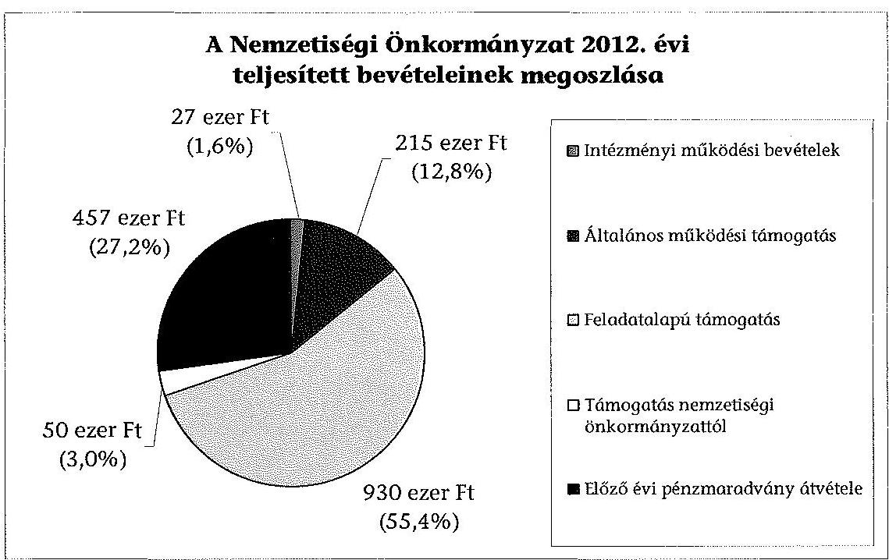
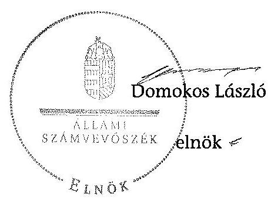

# JELENTÉS 

a helyi nemzetiségi önkormányzatok gazdálkodásának ellenőrzéséről
Budapest XVI. Kerületi Szlovák Önkormányzat

---

# Állami Számvevőszék 

Iktatószám: V-0290-009/2014.
Témaszám: 1323
Vizsgálat-azonosító szám: V065243
Az ellenőrzést felügyelte:
Horváth Balázs
felügyeleti vezető
Az ellenőrzést vezette és az ellenőrzés végrehajtásáért felelős:
Kisgergely István
ellenőrzésvezető
A számvevőszéki jelentést készítették és a jelentés összeállításában
közremüködtek:
Belovai Sándorné
számvevő főtanácsos
Varga József
számvevő tanácsos
Az ellenőrzést végezték:
Szilas István
Számvevő tanácsos

Biró Csaba
számvevő

---

# TARTALOMJEGYZÉK 

BEVEZETÉS ..... 3
I. ÖSSZEGZŐ MEGÁLLAPÍTÁSOK, KÖVETKEZTETÉSEK, JAVASLATOK ..... 6
II. RÉSZLETES MEGÁLLAPÍTÁSOK ..... 14

1. A Nemzetiségi Önkormányzat és a XVI. Kerületi Önkormányzat együttműködésének szabályozása, a működési feltételek biztosítása ..... 14
2. A gazdálkodási feladatok ellátásának szabályszerűsége ..... 15
2.1. A költségvetésre és a zárszámadásra, valamint a kincstári adatszolgáltatás rendjére vonatkozó jogszabályi előírások betartása ..... 15
2.2. A Nemzetiségi Önkormányzat gazdálkodásának szabályozottsága ..... 16
2.3. Az operatív gazdálkodási jogkörök kialakítása, gyakorlása ..... 16
3. A Nemzetiségi Önkormányzattal összefüggő gazdálkodási feladatok belső ellenőrzése ..... 18
4. A feladatalapú támogatás felhasználásának, elszámolásának szabályszerűsége, a Nemzetiségi Önkormányzat feladatellátása ..... 18
MELLÉKLETEK
5. számú A Nemzetiségi Önkormányzat 2012. évi gazdálkodásának főbb adatai, mutatói
FÜGGELÉKEK
6. számú Rövidítések jegyzéke
7. számú Értelmező szótár
8. számú A gazdálkodás értékelésének módszere

---

.

---

# JELENTÉS 

## a helyi nemzetiségi önkormányzatok gazdálkodásának ellenőrzéséről Budapest XVI. Kerületi Szlovák Önkormányzat

## BEVEZETÉS

A Nemzetiségi Önkormányzat 1998-ban alakult, elnöke a 2010. évi helyhatósági választások óta látja el feladatát. A négytagú Képviselő-testület munkája segittésére háromtagú Oktatási Bizottságot és háromtagú Kulturális Bizottságot hozott létre. A Nemzetiségi Önkormányzat intézményt, gazdasági társaságot és más szervezetet nem alapított, illetve ezek társulásában nem vett részt. A Nemzetiségi Önkormányzatnak a költségvetési beszámolója szerint a 2012. évben a módosított költségvetési bevételi és kiadási előirányzata 1679 ezer Ft, a teljesített költségvetési bevétele 1679 ezer Ft, a teljesített költségvetési kiadása 977 ezer Ft volt. A 2012. évi gazdálkodási adatokat részletesen az 1. számú mellékletben mutatjuk be.

Az Alaptörvény XXIX. cikk (1) bekezdése szerint a Magyarországon élő nemzetiségek államalkotó tényezők. Minden, valamely nemzetiséghez tartozó magyar állampolgárnak joga van önazonossága szabad vállalásához és megőrzéséhez. A hazánkban élő nemzetiségek helyi (települési és területi), valamint országos önkormányzatokat hozhatnak létre. A helyi nemzetiségi önkormányzatok gazdálkodási feladatait jogszabályi előírás alapján a székhely szerinti helyi önkormányzat polgármesteri hivatala látja el.

A nemzetiségek helyzete, támogatása mind hazai, mind EU-s szinten kiemelt figyelmet kap napjainkban. A helyi nemzetiségi önkormányzatok gazdálkodására és támogatási rendszerére vonatkozó jogszabályok a 2010-2012. években jelentős változásokon mentek át. A települési és területi nemzetiségi önkormányzatok gazdálkodásának, a részükre juttatott költségvetési támogatások felhasználásának ellenőrzését az ÁSZ a 2012. évben sorozatjellegú ellenőrzés keretében indította el. A 2013. évi ellenőrzések e témacsoportos ellenőrzések folytatását jelentik, amelyet az ÁSZ 2014 első félévi ellenőrzési terve 12. témasorszámon tartalmaz.

Az ellenőrzés célja annak értékelése volt, hogy a Nemzetiségi Önkormányzat gazdálkodási kereteinek kialakítása, gazdálkodása és feladatellátása megfelelt-e a jogszabályoknak.

Ennek keretében értékeltük, hogy:

- a Nemzetiségi Önkormányzat és a XVI. Kerületi Önkormányzat együttmúködésének szabályozása, a múködési feltételek biztosítása megfelelt-e a jogszabályi előírásoknak;

---

- a felek együttműködése megfelelt-e a közöttük létrejött megállapodásnak a gazdálkodási feladatok szabályszerű ellátása során, ennek keretében betartották-e a Nemzetiségi Önkormányzat gazdálkodásához kapcsolódóan a költségvetésre és zárszámadásra, a gazdálkodás szabályozására, az operatív gazdálkodási jogkörök gyakorlására vonatkozó jogszabályi előírásokat;
- a jegyző biztosította-e a Nemzetiségi Önkormányzat gazdálkodásának belső ellenőrzését;
- a Nemzetiségi Önkormányzat feladatalapú támogatásának felhasználása, a folyósított feladatalapú támogatással történő elszámolás az előírásoknak megfelelő volt-e;
- a Nemzetiségi Önkormányzat feladatellátása összhangban volt-e a vonatkozó jogszabályi előírásokkal.

Az ellenőrzés várható hasznosulását négy szinten tervezzük. A törvényalkotás számára összegzett tapasztalatok állnak rendelkezésre a nemzetiségi önkormányzatok testületi döntéseinek, gazdálkodásának és a feladatalapú támogatás felhasználásának szabályszerűségéről, amelynek alapján következtetést lehet levonni arra, hogy indokolt-e jogszabályi módosítás kezdeményezése. Az ellenőrzés az ellenőrzött számára visszajelzést ad a működésében fellépő hiányosságokról, javaslataival hozzájárul azok kiküszöböléséhez, amely csökkentheti a későbbi ellenőrzések gyakoriságát. Az ellenőrzés megállapításai és javaslatai tanulságul szolgálhatnak más nemzetiségi önkormányzatok, szervezetek számára a rendezett gazdálkodási keretek kialakításához. A társadalom számára jelzi, hogy közpénz nem maradhat ellenőrizetlenül, az ÁSZ értékteremtő rend kialakításához és megőrzéséhez hozzájáruló tevékenysége pozitív hatással lesz a szervezetről kialakított összkép formálásában. Az ÁSZ szervezetén belül lehetőség nyílik arra, hogy a megállapítások szintetizálásával az intézmény a hozzáadott értéket teremtő elemző tevékenységét és tanácsadó szerepét erősítse.

A Nemzetiségi Önkormányzat gazdálkodásának ellenőrzéséről szóló jelentés I. fejezetének összegző része az ellenőrzés céljára adott rövid, szintetizáló összefoglalót és következtetéseket tartalmazza a II. fejezet részletes megállapításain alapulóan. A jelentés intézkedést igénylő megállapításait és javaslatait - az öszszegzőben foglaltak mellett - az ellenőrzés során feltárt, a jelentés II. fejezetében rögzített részletes megállapítások alapozzák meg, illetve támasztják alá.

Az ellenőrzés típusa: szabályszerűségi ellenőrzés
Az ellenőrzött időszak: a 2012. január 1. - 2012. december 31. közötti időszak. Az ellenőrzés kiterjedt a Nemzetiségi Önkormányzatnak juttatott 2012. évi támogatás 2013. évben való elszámolására is.

Ellenőrzött szervezet: a Budapest XVI. Kerületi Szlovák Önkormányzat és a gazdálkodási feladatait ellátó Budapest Főváros XVI. Kerületi Önkormányzat.

Az ellenőrzés végrehajtásának jogszabályi alapját az ÁSZ tv. 5. § (2)-(3) és (6) bekezdéseiben foglaltak képezik.

---

Az ellenőrzés szakmai módszertana az ÁSZ hivatalos honlapján (www.asz.hu) közzétett szakmai szabályokon alapult, amely a Legfőbb Ellenőrző Intézmények Nemzetközi Szervezete (INTOSAI) által kiadott nemzetközi standardok (ISSAI) figyelembevételével készült.

A helyi nemzetiségi önkormányzatok gazdálkodásának ellenőrzése során értékeltük a XVI. Kerületi Önkormányzat és a Nemzetiségi Önkormányzat együttmúködésének, a gazdálkodás szabályozottságának és a pénzügyi folyamatokban kulcsszerepet betöltő belső kontrollok (teljesítésigazolás és érvényesítés) múködésének megfelelőségét. A kulcskontrollokat a múködési és felhalmozási célú támogatásértékű kiadásoknál, az államháztartáson kívülre teljesített múködési és felhalmozási célú pénzeszköz átadásoknál, a dologi kiadásokkal kapcsolatos kifizetéseknél - véletlen mintavételi eljárást alkalmazva - ellenőriztük. Ellenőriztük, hogy a jegyző biztosította-e a Nemzetiségi Önkormányzat gazdálkodásának belső ellenőrzését. Értékeltük a feladatalapú támogatások felhasználásának, elszámolásának szabályszerűségét, a Nemzetiségi Önkormányzat feladatellátása és a jogszabályi előírások összhangját.

Az ellenőrzés lefolytatásához a Nemzetiségi Önkormányzat és a gazdálkodási feladatait ellátó XVI. Kerületi Önkormányzat tanúsítványok és a kapcsolódó, dokumentumjegyzékben megjelölt dokumentumok elektronikus úton történő megküldésével, rendelkezésre bocsátásával szolgáltatott adatokat. Az adatszolgáltatás kontrollálása és szükség szerinti javítása a helyszíni ellenőrzés keretében történt. A minősítési szempontokat a 3. számú függelék tartalmazza.

Az ÁSZ tv. 29. § (1) bekezdése szerint a jelentéstervezetet megküldtük észrevételezésre a polgármesternek és a Nemzetiségi Önkormányzat elnökének. A polgármester és a Nemzetiségi Önkormányzat elnöke az ÁSZ tv. 29. § (2) bekezdésében foglalt észrevételezési jogával nem élt, a jelentéstervezetre észrevételt nem tett.

---

# I. ÖSSZEGZŐ MEGÁLLAPÍTÁSOK, KÖVETKEZTETÉSEK, JAVASLATOK 

A Nemzetiségi Önkormányzat és a XVI. Kerületi Önkormányzat együttmúködésének szabályozása részben felelt meg a jogszabályi előírásoknak. A 2012. évben az együttműködési megállapodás ${ }_{1,2}$ volt hatályban, azonban az együttműködési megállapodás ${ }_{1}$-et a Nek. ${ }_{2}$ tv. előírása ellenére 2012. január 31éig nem vizsgálták felül és nem történt meg a kiegészítése 2012. június 1-jéig. A Nek. ${ }_{2}$ tv. alapján elkészített együttműködési megállapodás ${ }_{2}$ aláírása a törvényben meghatározott 2012. június 1-jei határidőt követően, június 26-án történt meg, amely záró rendelkezései szerint 2012. július 1-én lépett hatályba. A 2012. december 31-én hatályos együttműködési megállapodás ${ }_{2}$-ben a Nek. ${ }_{2}$ tv.-ben foglaltaktól eltérően a tervezési, gazdálkodási, finanszírozási, adatszolgáltatási és beszámolási feladatok ellátásának szabályait csak részben rögzítették, nem határozták meg a teljesítésigazolás eljárási és dokumentációs részletszabályait, valamint a kötelezettségvállalások nyilvántartására vonatkozó szabályokat, valamint a Nemzetiségi Önkormányzat testületi ülésein a jegyző megbízásából résztvevő személy képesítési követelményeit. Az együttműködési megállapodás ${ }_{2}$ szerinti múködési feltételeket a Nek. ${ }_{2}$ tv.-ben foglaltak ellenére a megállapodás megkötését követően nem rögzítették a Nemzetiségi Önkormányzat SZMSZében. A XVI. Kerületi Önkormányzat a Nemzetiségi Önkormányzat múködésének személyi és tárgyi feltételeit a szabályozási hiányosságok ellenére biztosította.

A Nemzetiségi Önkormányzat 2012. évi költségvetésének, zárszámadásának tartalma, jóváhagyása, valamint a kapcsolódó 2012. évi adatszolgáltatás szabályszerűsége megfelelt a jogszabályi előírásoknak. A Nemzetiségi Önkormányzat elnöke az Áht. ${ }_{2}$-ben meghatározott időpontig benyújtotta a 2012. évi költségvetési határozat tervezetét a Képviselő-testületnek. A jóváhagyott költségvetés tartalmazta az előírt tartalmi elemeket, azonban az Áht. ${ }_{2}$ ben előírtak ellenére a Képviselő-testületnek tájékoztatásul - szöveges indoklással - nem mutatták be a Nemzetiségi Önkormányzat költségvetési mérlegét közgazdasági tagolásban, valamint az előirányzat felhasználási tervét. A 2012. évi zárszámadási határozat tervezetét a Nemzetiségi Önkormányzat elnöke határidőben terjesztette a Képviselő-testület elé, amelyről határozatot hoztak. A 2012. évi zárszámadási határozat tervezetének előterjesztésénél a Képvi-selő-testület részére az előterjesztésben tájékoztatásul bemutatták az Áht. ${ }_{2}$-ben foglalt mérlegeket és kimutatásokat. A zárszámadásról alkotott határozat és az elfogadott költségvetés összehasonlíthatóságát biztosították, a beszámoló a Nemzetiségi Önkormányzat valamennyi bevételét és kiadását tartalmazta. A jegyző a kincstári adatszolgáltatási kötelezettségeknek az Ávr.-ben előírt határidőben eleget tett.

A Nemzetiségi Önkormányzat gazdálkodásának szabályozottsága nem volt megfelelő, mert a Polgármesteri Hivatal SZMSZ-e az Ávr. előírása ellenére nem tartalmazta az SZMSZ-ben nevesített munkakörökhöz tartozó, a Nemzetiségi Önkormányzat gazdálkodásának végrehajtásával kapcsolatos feladat- és hatáskörökre, a hatáskörök gyakorlásának módjára, a helyettesítés rendjére, az

---

ezekhez kapcsolódó felelősségi szabályokra vonatkozó előírásokat. A Nemzetiségi Önkormányzat rendelkezett a Számv. tv. által előírt Számviteli politikával és a hozzá kapcsolódó, gazdálkodásra vonatkozó szabályzatokkal. A Számviteli politikában rögzített, az operatív gazdálkodásra vonatkozó szabályozás az Ávr. előírásai ellenére nem tartalmazta a teljesítésigazolás gyakorlásának módjával, eljárási és dokumentációs részlet-szabályaival, valamint a teljesítésigazolást végző személyek kijelölésével kapcsolatos rendelkezéseket, továbbá a 100 ezer Ft alatti, előzetes írásbeli kötelezettségvállalást nem igénylő kifizetések rendjét annak ellenére, hogy a Nemzetiségi Önkormányzatnál éltek az írásbeli kötelezettségvállalás mellőzésének lehetőségével. A XVI. Kerületi Önkormányzat rendelkezett a Bkr.-ben előírt ellenőrzési nyomvonallal és a szabálytalanságok kezelésének eljárás-rendjével, de a jegyző a Nemzetiségi Önkormányzat gazdálkodásának végrehajtási feladataira nem terjesztette ki azok hatályát illetve önálló szabályzatot nem adott ki. A Polgármesteri Hivatal SZMSZ-ében az Áht. ${ }_{2}$-ben és az Ávr.-ben foglaltak szerint rögzítették a tervezéssel, gazdálkodással, a pénzügyi ellenjegyzéssel, az érvényesítés módjával, eljárási és dokumentálási részletszabályaival, valamint az ezeket végző személyek kijelölésének rendjével, az ellenőrzési és adatszolgáltatási feladatok teljesítésével kapcsolatos belső előírásokat.

A Nemzetiségi Önkormányzatnál az operatív gazdálkodási jogkörök kialakítása részben felelt meg a jogszabályi előírásoknak, mert a Nemzetiségi Önkormányzat elnöke az Áht. 2 és az Ávr. előírásainak ellenére a teljesítésigazolással és a kötelezettségvállalások nyilvántartásával kapcsolatos szabályozást az együttmúködési megállapodás ${ }_{2}$-nél ismertetettek szerint elmulasztotta. A jegyző - gazdasági szervezet hiányában - az Áht. ${ }_{2}$ és az Ávr. előírásainak megfelelően szabályszerűen jelölte ki a pénzügyi ellenjegyzésre és az érvényesítésre jogosultakat.

Az államháztartáson kívülre teljesített pénzeszköz átadásakor a teljesítésigazolás és az érvényesítés kulcskontrollok múködése nem volt megfelelő, mert a támogatás átutalására az Ávr. előírása ellenére teljesítésigazolás nélkül került sor, az érvényesítő az Ávr. szerinti ellenőrzési feladatait nem látta el, mert nem a teljesítésigazolás alapján érvényesített, nem jelezte az utalványozónak a teljesítésigazolás, valamint a kötelezettségvállalási nyilvántartás hiányát.

A dologi kiadások teljesítése során a teljesítésigazolás és az érvényesítés kulcskontrollok múködésének megfelelősége gyenge volt, a hibák száma a lényegességi szintet, a kritikus hibahatárt elérte. A teljesítés igazolását 2012. július 1-jéig az Ávr. előírása ellenére a jogkör gyakorlására kijelöléssel nem rendelkező személy jogosulatlanul látta el. A 2012. július 1-jét követő kifizetések esetében - az írásbeli kötelezettségvállalást nem igénylő kifizetések rendjének szabályozási hiányossága miatt - a teljesítésigazoló az aláírása ellenére ellenőrizhető okmányok hiányában az Ávr.-ben foglalt feladatait nem látta el, nem ellenőrizte a kifizetés jogosságát, összegszerűségét és az ellenszolgáltatás teljesítését. Az érvényesítő nem az Ávr.-ben előírtak szerint végezte feladatát, mert az összegszerűségre vonatkozó ellenőrzése nem szabályszerű teljesítésigazoláson alapult, nem jelezte az utalványozónak a szabályszerű teljesítésigazolás elmaradását, valamint kötelezettségvállalási nyilvántartás vezetésének hiányát.

---

A dologi kiadások közül kiválasztott három legnagyobb összegű kifizetés esetében a teljesítésigazolás és az érvényesítés kulcskontrollok múködése nem volt megfelelő, a feltárt hiányosságok megegyeztek a dologi kiadások tesztelésénél leírtakkal. A számvevőszéki ellenőrzés a kiadások dokumentumainak ellenőrzése alapján összeférhetetlenséget, továbbá jogosulatlan kifizetést nem tárt fel. A kulcskontrollok múködéséhez kapcsolódó hiányosságok miatt a hibák megelőzése, feltárása és kijavítása nem volt biztosított.

A Nemzetiségi Önkormányzat gazdálkodási feladatainak belső ellenőrzése megfelelő volt. Az együttműködési megállapodás ${ }_{1,2}$-ben rögzítették, hogy a Polgármesteri Hivatal belső ellenőrzési tevékenysége kiterjed a Nemzetiségi Önkormányzat számviteli nyilvántartásainak ellenőrzésére. A Polgármesteri Hivatal 2012. évi belső ellenőrzési tervét megalapozó kockázatelemzés nem terjedt ki a Nemzetiségi Önkormányzat gazdálkodásával összefüggő végrehajtási feladatokra. A 2012. évre tervezett, 2010-2011. évekre vonatkozó ellenőrzést elvégezték, az ellenőrzési jelentés hiányosságokat állapított meg, javaslatokat tett, de azoknak nem volt címzettje, nem tartalmazta, hogy kire vonatkoznak a megállapítások. A jegyző a Nemzetiségi Önkormányzatot érintő belső ellenőrzés megállapításairól annak elnökét és a Nemzetiségi Önkormányzat Képvise-lő-testületét nem tájékoztatta, ezért az elnök nem tett eleget a belső ellenőrzési jelentés elkészítésekor hatályos együttműködési megállapodás ${ }_{1} 6$. pontjában foglalt realizálási feladatainak, azok végrehajtása elmaradt. A feltárt hiányosságok miatt a belső ellenőrzési tevékenység részben hasznosult a Nemzeti Önkormányzat operatív gazdálkodási feladatainak végrehajtásában. Az ellenőrzéshez szolgáltatott adatok alapján a Kormányhivatal 2012-ben a Nemzetiségi Önkormányzatot illetően nem élt törvényességi felügyeleti eszközökkel.

A Nemzetiségi Önkormányzat részére 2012. évben folyósított feladatalapú támogatás felhasználása és a 2011-2012. évben folyósított támogatás elszámolása nem felelt meg a jogszabályi előírásoknak. A Nemzetiségi Önkormányzat 2011. évi 683,5 ezer Ft feladatalapú támogatásból maradványt nem mutatott ki. A 2012. évi 929,6 ezer Ft feladatalapú támogatásból 814,5 ezer Ft-ot a Nemzetiségi Önkormányzat határozatainak megfelelően kulturális programokra, egyházzal, anyaországgal és civil szervezetekkel való kapcsolattartásra, nemzetiségi napi rendezvényre fordították. A 2012. december 31-i 115,1 ezer Ft maradvány 2013. június 30 -ig történő felhasználására kötelezettségvállalási dokumentum nem készült. A kötelezettségvállalással nem terhelt maradvány a támogatási kormányrendelet ${ }_{2}$ előírása alapján határidőt követően jogszerűen nem használható fel. A Nemzetiségi Önkormányzat nem tett eleget az Áht. ${ }_{2}$ ben előírtaknak azáltal, hogy a meghatározott célra fel nem használt 2012. évi feladatalapú támogatás, 2012. december 31-éig kötelezettségvállalással nem terhelt maradványáról haladéktalanul nem mondott le és nem fizette vissza azt a központi költségvetés javára. A feladatalapú támogatásokról a támogatási kormányrendelet ${ }_{1,2}$ előírása alapján az Áht. ${ }_{1,2}$-ben foglaltak ellenére az elszámolások nem történtek meg, a támogatások felhasználását, elszámolását az ellenőrzésre jogosult szervek nem ellenőrizték.

A Nemzetiségi Önkormányzat kötelező és önként vállalt feladatellátásának tárgya - a képviselt közösség esélyegyenlőségének megteremtésével kapcsolatos feladatok ellátása, a helyi nemzetiségi, egyházi és civil közösségekkel történő együttműködés, hagyományápolás, kulturális, ifjúsági program, szlovák nyel-

---

vű lap kiadásának támogatása - összhangban volt a Nek. 2 tv.-ben foglalt előírásokkal.

Az ÁSZ tv. 33. § (1) bekezdésében foglaltak értelmében az ellenőrzött szervezet vezetője köteles a jelentésben foglalt megállapításokhoz kapcsolódó intézkedési tervet összeállítani és azt a jelentés kézhezvételétől számított 30 napon belül az ÁSZ részére megküldeni. Amennyiben az intézkedési tervet határidőre nem küldi meg a szervezet, vagy az nem elfogadható, az ÁSZ elnöke az ÁSZ tv. 33. § (3) bekezdés a)-b) pontjaiban foglaltakat érvényesítheti.

A helyszíni ellenőrzés megállapításainak hasznosítása mellett javasoljuk:

# a jegyzőnek 

1. az együttműködés szabályozásával kapcsolatban

Az együttműködési megállapodás ${ }_{1}$-t a Nek. 2 tv. 80. § (2) bekezdésének előírása ellenére 2012. január 31-élig nem vizsgálták felül.

A Nek. 2 tv. 80. § (3) bekezdésének c)-d) pontjaiban foglaltak ellenére az együttmúködési megállapodás ${ }_{2}$-ben nem rögzítették a teljesítésigazolási feladatok eljárási és dokumentációs részletszabályait, továbbá nem írták elő a kötelezettségvállalások nyilvántartására vonatkozó szabályokat. A Nek. 2 tv. 80. § (4) bekezdésében foglaltak ellenére az együttműködési megállapodás ${ }_{2}$ nem tartalmazta a testületi ülésen a jegyző megbízásából résztvevő személy képesítési követelményeit.

A Nek. 2 tv. 80. § (2) bekezdésében foglaltak ellenére az együttműködési megállapodás ${ }_{2}$ szerinti müködési feltételeket nem rögzítették a Nemzetiségi Önkormányzat SZMSZ-ében.

Javaslat:
Az együttműködés szabályszerűsége érdekében:
a) biztosítsa a jövőben az együttműködési megállapodás évenkénti felülvizsgálata során a Nek. 2 tv. 80. § (2) bekezdésében előírt határidő betartását;
b) készítse elő az együttműködési megállapodás ${ }_{2}$ módosítását, hogy az tartalmilag feleljen meg a Nek. 2 tv. 80. § (3) bekezdés c)-d) pontjaiban, valamint a Nek. 2 tv. 80. § (4) bekezdésében foglalt előírásoknak;
c) készítse el a Nemzetiségi Önkormányzat SZMSZ-ének a Nek. 2 tv. 80. § (2) bekezdésében foglalt előírásnak megfelelő kiegészítését.
2. a költségvetés előterjesztésével kapcsolatban

A 2012. évi költségvetési határozattervezet előterjesztésekor - a jegyző mulasztása miatt - az Áht. 2 24. § (4) bekezdés a) pontjában előírtak ellenére nem mutatták be a Képviselő-testületnek tájékoztatásul - szöveges indoklással - a Nemzetiségi Önkormányzat költségvetési mérlegét közgazdasági tagolásban és az előirányzatfelhasználási tervét.

---

# Javaslat 

Készítse el a jövőben a költségvetési határozattervezet előterjesztéséhez a Képviselőtestület tájékoztatására az Áht. 24. § (4) bekezdés a) pontja előírásainak megfelelően szöveges indoklással együtt a költségvetési mérleget közgazdasági tagolásban és az előirányzat-felhasználási tervet.
3. a gazdálkodási feladatok szabályozottságával kapcsolatban

A Polgármesteri Hivatal SZMSZ-e nem tartalmazta az Ávr. 13. § (1) bekezdés g) pontjában foglaltak szerinti, az SZMSZ-ben nevesített munkakörökhöz tartozó - a Nemzetiségi Önkormányzat gazdálkodásának végrehajtásával kapcsolatos - feladatés hatáskörökre, a hatáskörök gyakorlásának módjára, a helyettesítés rendjére, az ezekhez kapcsolódó felelősségi szabályokra vonatkozó előírásokat. A Bkr. 6. § (3)-(4) bekezdései szerinti ellenőrzési nyomvonal és szabálytalanságok kezelésének eljárásrendje nem terjedt ki a Nemzetiségi Önkormányzat gazdálkodásának végrehajtási feladataira és arra vonatkozóan önálló szabályzat sem készült.

A Számviteli politikában az operatív gazdálkodásra vonatkozó feladatok végrehajtási szabályai az Ávr. 13. § (2) bekezdés a) pontjában foglaltak ellenére nem tartalmazták a teljesítésigazolás gyakorlásának módjával, eljárási és dokumentációs részletszabályaival, valamint a teljesítésigazolást végző személyek kijelölésével kapcsolatos rendelkezéseket.

## Javaslat

A gazdálkodás szabályszerűsége érdekében a Nemzetiségi Önkormányzat gazdálkodásának végrehajtására is kiterjedően:
a) készítse el a Polgármesteri Hivatal SZMSZ-ének módosítását, hogy az tartalmazza az Ávr. 13. § (1) bekezdés g) pontjában foglaltakat;
b) gondoskodjon a Bkr. 6. § (3)-(4) bekezdései szerinti ellenőrzési nyomvonal és a szabálytalanságok kezelése eljárásrendjének kialakításáról;
c) egészítse ki a Számviteli politika operatív gazdálkodási feladatokra vonatkozó végrehajtási szabályait az Ávr. 13. § (2) bekezdés a) pontjában foglaltaknak megfelelően.
4. a kulcskontrollok müködésével kapcsolatban

A 2012. július 1-jét követő kifizetések esetében - az írásbeli kötelezettségvállalást nem igénylő kifizetések rendjének szabályozási hiányossága miatt - a teljesítésigazoló az aláírása ellenére ellenőrizhető okmányok hiányában az Ávr. 57. § (1) bekezdésben foglalt feladatait nem látta el, nem ellenőrizte a kifizetés jogosságát, összegszerűségét és az ellenszolgáltatás teljesítését.

Az érvényesítő nem az Ávr. 58. § (1) bekezdésében előírtak szerint végezte feladatát, mert az összegszerűségre vonatkozó ellenőrzése nem szabályszerű teljesítésigazoláson alapult, az Ávr. 58. § (2) bekezdésében foglaltak ellenére nem jelezte az utalványozónak a szabályszerű teljesítésigazolás elmaradását, valamint az

---

Ávr. 56. § (1) bekezdésben előírt kötelezettségvállalási nyilvántartás vezetésének hiányát.

Javaslat
Az operatív gazdálkodás múködési hibáinak megelőzése, feltárása és kijavítása érdekében gondoskodjon arról, hogy:
a) a teljesítésigazolást minden esetben az Ávr. 57. § (1) bekezdésében előírtaknak megfelelően végezzék el;
b) az érvényesítő maradéktalanul tegyen eleget az Ávr. 58. § (1)-(2) bekezdéseiben előírt ellenőrzési feladatának és jeízési kötelezettségének.
5. a feladatalapú támogatás elszámolásával kapcsolatban

A 2011. évi feladatalapú támogatás elszámolása a támogatási kormányrendelet ${ }_{1}$ 7. § (2) bekezdésében hivatkozott, valamint a 2012. évi feladatalapú támogatás elszámolása a támogatási kormányrendelet ${ }_{2} 8 . \S$ (5) bekezdésében hivatkozott „a helyi önkormányzatok elszámolási és ellenőrzési rendjére vonatkozó jogszabályok rendelkezései alkalmazandóak" előirása alapján az Áht. ${ }_{1} 64 . \S$ (7) bekezdése, és az Áht. ${ }_{2} 57 . \S$ (3) bekezdése ellenére nem történt meg.

Javaslat
Intézkedjen az Áht. ${ }_{2}$ 27. § (2) bekezdésében meghatározott feladatkörében a Nemzetiségi Önkormányzat által igénybevett 2011. és 2012. évi feladatalapú támogatás felhasználásáról szóló elszámolás elkészítéséről az Áht. ${ }_{2}$ 53. § (1) bekezdése szerinti beszámolási kötelezettség teljesítéséhez.

# a polgármesternek 

A Nek. ${ }_{2}$ tv. 80. § (3) bekezdésének c)-d) pontjaiban foglaltak ellenére az együttmúködési megállapodás ${ }_{2}$-ben nem rögzítették a teljesítésigazolási feladatok eljárási és dokumentációs részletszabályait, továbbá nem írták elő a kötelezettségvállalások nyilvántartására vonatkozó szabályokat. A Nek. ${ }_{2}$ tv. 80. § (4) bekezdésében foglaltak ellenére az együttműködési megállapodás ${ }_{2}$ nem tartalmazta a testületi ülésen a jegyző megbízásából résztvevő személy képesítési követelményeit.

A Polgármesteri Hivatal SZMSZ-e nem tartalmazta az Ávr. 13. § (1) bekezdés g) pontjában foglaltak szerinti, az SZMSZ-ben nevesített munkakörökhöz tartozó - a Nemzetiségi Önkormányzat gazdálkodásának végrehajtásával kapcsolatos - feladatés hatáskörökre, a hatáskörök gyakorlásának módjára, a helyettesítés rendjére, az ezekhez kapcsolódó felelősségi szabályokra vonatkozó előírásokat.

---

Javaslat
Terjessze a XVI. Kerületi Önkormányzat Képviselő-testülete elé jóváhagyásra:
a) az együttműködési megállapodás jegyző által előkészített módosítását, hogy az tartalmilag megfeleljen a Nek. 2 tv. 80. § (3) bekezdés c)-d) pontjaiban, valamint a Nek. 2 tv. 80. § (4) bekezdésében foglalt előírásoknak;
b) a Polgármesteri Hivatal SZMSZ-ének a jegyző által elkészített módosítását, hogy az tartalmazza - a Nemzetiségi Önkormányzat gazdálkodásának végrehajtására vonatkozóan - az Ávr. 13. § (1) bekezdés g) pontjában foglaltakat.

# a Nemzetiségi Önkormányzat elnökének 

1. A Nek. 2 tv. 80. § (3) bekezdésének c)-d) pontjaiban foglaltak ellenére az együttmüködési megállapodás ${ }_{2}$-ben nem rögzítették a teljesítésigazolási feladatok eljárási és dokumentációs részletszabályait, továbbá nem írták elő a kötelezettségvállalások nyilvántartására vonatkozó szabályokat. A Nek. 2 tv. 80. § (4) bekezdésében foglaltak ellenére az együttműködési megállapodás ${ }_{2}$ nem tartalmazta a testületi ülésen a jegyző megbízásából résztvevő személy képesítési követelményeit.

A Nek. 2 tv. 80. § (2) bekezdésében foglaltak ellenére az együttműködési megállapodás ${ }_{2}$ szerinti müködési feltételeket nem rögzítették a Nemzetiségi Önkormányzat SZMSZ-ében.

Javaslat
Terjessze a Képviselő-testület elé jóváhagyásra:
a) a jegyző által előkészített együttműködési megállapodás ${ }_{2}$ módosítását, hogy az tartalmilag megfeleljen a Nek. 2 tv. 80. § (3) bekezdés c)-d) pontjaiban, valamint a Nek. 2 tv. 80. § (4) bekezdésében foglalt előírásoknak;
b) a Nemzetiségi Önkormányzat SZMSZ-ének jegyző által elkészített módosítását, hogy az megfeleljen a Nek. 2 tv. 80. § (2) bekezdésében előírtaknak.
2. A Nemzetiségi Önkormányzat elnöke a 2012. évi költségvetési határozattervezet előterjesztésekor - a jegyző mulasztása miatt - a Képviselő-testület részére tájékoztatásul az Áht. 2 24. § (4) bekezdés a) pontjában előírtak ellenére nem mutatta be szöveges indoklással a Nemzetiségi Önkormányzat költségvetési mérlegét közgazdasági tagolásban és az előirányzat-felhasználási tervét.

Javaslat
A jövőben a költségvetési határozattervezet Képviselő-testület elé terjesztésekor tájékoztatásul mutassa be - szöveges indoklással együtt - a jegyző által elkészített, az Áht. 2 24. § (4) bekezdés a) pontjában előírt költségvetési mérleget közgazdasági tagolásban és az előirányzat-felhasználási tervet.
3. A 2011. évi feladatalapú támogatás elszámolása a támogatási kormányrendelet, 7. § (2) bekezdésében hivatkozott, valamint a 2012. évi feladatalapú támogatás el-

---

számolása a támogatási kormányrendelet 2 8. § (5) bekezdésében hivatkozott „a helyi önkormányzatok elszámolási és ellenőrzési rendjére vonatkozó jogszabályok rendelkezései alkalmazandóak" előirása alapján az Áht. 64. § (7) bekezdése, és az Áht. 2 57. § (3) bekezdése ellenére nem történt meg.

Javaslat
Terjessze a Képviselő-testület elé az Áht. 2 53. § (1) bekezdése szerinti beszámolási kötelezettség teljesítéséhez összeállított, a Nemzetiségi Önkormányzat által igénybevett 2011. és 2012. évi feladatalapú támogatás felhasználásáról szóló elszámolást.
4. A Nemzetiség Önkormányzat nem tett eleget az Áht. 2 57. § (2) bekezdésében előírtaknak azáltal, hogy a meghatározott célra fel nem használt 2012. évi feladatalapú támogatás 2012. december 31-éig kötelezettségvállalással nem terhelt 115,1 ezer Ft összegű maradványáról nem mondott le és nem fizette vissza azt a központi költségvetés javára.

Javaslat
Terjessze a Képviselő-testület elé jóváhagyásra az Áht. 2 57/A. § (1) bekezdés előírásának megfelelően a 2012. évi feladatalapú támogatás kötelezettségvállalással nem terhelt maradványáról történő lemondást és intézkedjen a maradvány összegének visszafizetésére a központi költségvetés javára.

---

# II. RÉSZLETES MEGÁLLAPÍTÁSOK 

## 1. A Nemzetiségi Önkormányzat És a XVI. Kerületi ÖnkormÁnyZAT EGYÜTTMÜKÖDÉSÉNEK SZABÁLYOZÁSA, A MÜKÖDÉSI FELTÉTELEK BIZTOSÍTÁSA

A Nemzetiségi Önkormányzat és a XVI. Kerületi Önkormányzat együttműködésének szabályozása részben felelt meg a jogszabályi előírásoknak.

A 2010. december 20-án aláírt együttműködési megállapodás ${ }_{1}$-nek a Nek. ${ }_{2}$ tv. 80. § (2) bekezdésében előírtak szerinti felülvizsgálata 2012. január 31-éig, valamint a Nek. ${ }_{2}$ tv. 159. § (3) bekezdése szerinti kiegészítése 2012. június 1-jéig nem történt meg. A Nek. ${ }_{2}$ tv hatálybalépését követően előkészítették az új együttműködési megállapodás ${ }_{2}$ tervezetét, amelynek aláírására 2012. június 26-án, a Nek. tv. 159. § (3) bekezdésében foglalt határidőt követően került sor.

A 2012. december 31-én hatályos együttműködési megállapodás ${ }_{2}$ részben tartalmazta a Nemzetiségi Önkormányzat múködéséhez a Nek. ${ }_{2}$ tv. által meghatározott múködési feltételek biztosítását. A XVI. Kerületi Önkormányzat az együttműködési megállapodás ${ }_{2}$-ben vállalta a technikai eszközökkel felszerelt helyiség ingyenes biztosítását, a rezsiköltségek fizetését, a testületi ülések előkészítését, a kapcsolódó adminisztrációs és postázási feladatok ellátását.

Az Áht. ${ }_{2}$-ben előírt tervezési, gazdálkodási, finanszírozási, adatszolgáltatási és beszámolási feladatok ellátásának szabályait az együttműködési megállapo-dás ${ }_{1,2}$-ben részben rögzítették ${ }^{1}$. Az együttmúködési megállapodás ${ }_{2}$ szerint a Nemzetiségi Önkormányzat részéről kötelezettségvállalásra, utalványozásra a Nemzetiségi Önkormányzat elnöke jogosult, az ellenjegyzési, érvényesítési feladatokat a XVI. Kerületi Önkormányzat jegyzője által a jogszabályi előírásoknak megfelelően kijelölt munkatársai látták el. Az együttmúködési megállapo-dás ${ }_{1,2}$-ben rögzítették a belső ellenőrzésre vonatkozó feltételeket, amely szerint a Polgármesteri Hivatal belső ellenőrzési tevékenysége a Nemzetiségi Önkormányzat számviteli nyilvántartásainak ellenőrzésére terjedt ki.

Az együttműködési megállapodás ${ }_{2}$ az operatív gazdálkodási feladatok ellátásának szabályai közül nem tartalmazta a Nek. ${ }_{2}$ tv. 80. § (3) bekezdés c) és d) pontjaiban foglaltak ellenére a teljesítésigazolás eljárási és dokumentációs részletszabályait, valamint a kötelezettségvállalások nyilvántartására vonatkozó szabályokat.

A személyi feltételek biztosításának részeként a XVI. Kerületi Önkormányzat referenst jelölt ki, azonban az együttmúködési megállapodás ${ }_{2}$-ben a

[^0]
[^0]:    ${ }^{1}$ Az önálló fizetési számla nyitása és a Nemzetiségi Önkormányzat törzskönyvi bejegyzése és adószámmal való ellátása az együttmúködési megállapodás ${ }_{2}$ aláírása előtt már megtörtént.

---

Nek. ${ }_{2}$ tv. 80. § (4) bekezdése előírásával ellentétesen nem írták elő, hogy a Nemzetiségi Önkormányzat testületi ülésein a jegyző megbízásából résztvevő személy képesítésének meg kell felelnie a jegyzőkre vonatkozó képesítési követelményeknek ${ }^{2}$.

A Nek. ${ }_{2}$ tv. 80. § (2) bekezdésében foglalt előírás ellenére az együttmúködési megállapodás ${ }_{2}$ szerinti múködési feltételeket - a megállapodás megkötését követően - az ellenőrzött időszakban a Nemzetiségi Önkormányzat SZMSZ-ében nem rögzítették.

A XVI. Kerületi Önkormányzat - a szabályozás hiányossága ellenére - biztosította a Nemzetiségi Önkormányzat működéséhez szükséges személyi és tárgyi feltételeket.

# 2. A GAZDÁLKODÁSI FELADATOK ELLÁTÁSÁNAK SZABÁLYSZERŰSÉGE 

### 2.1. A költségvetésre és a zárszámadásra, valamint a kincstári adatszolgáltatás rendjére vonatkozó jogszabályi előirások betartása

A Nemzetiségi Önkormányzat 2012. évi költségvetésének és zárszámadásának tartalma, jóváhagyása, valamint a kapcsolódó 2012. évi adatszolgáltatás szabályszerűsége megfelelt a jogszabályi előírásoknak.

Az elnök a 2012. évi költségvetés tervezetét az Áht. ${ }_{2}$ előírásainak megfelelően határidőben benyújtotta a Képviselő-testületnek. A jóváhagyott költségvetés ${ }^{3}$ tartalmazta a költségvetési bevételeket és az azokkal megegyező összegű költségvetési kiadásokat előirányzat-csoportok, kiemelt előirányzatok szerinti bontásban szöveges indoklással, de az Áht. ${ }_{2} 24 . \S$ (4) bekezdés a) pontjában foglaltak ellenére a Képviselő-testületnek nem mutatták be a Nemzetiségi Önkormányzat költségvetési mérlegét közgazdasági tagolásban, valamint az előirányzat felhasználási tervet.

A jegyző által elkészített 2012. évi zárszámadási határozattervezetet a Nemzetiségi Önkormányzat elnöke határidőben terjesztette a Képviselő-testület elé, amelyről határozatot hoztak. A zárszámadási határozat tervezetének előterjesztésénél a Képviselő-testület részére az előterjesztésben tájékoztatásul bemutatták az Áht. ${ }_{2}$-ben foglalt mérlegeket és kimutatásokat. A zárszámadásról alkotott határozat és az elfogadott költségvetés összehasonlíthatóságát biztosították, a beszámoló a Nemzetiségi Önkormányzat valamennyi bevételét és kiadását tartalmazta.

A jegyző a 2012. évre előírt, a Nemzetiségi Önkormányzatra vonatkozó kincstári adatszolgáltatási kötelezettségének hiánytalanul, az Áhsz. ${ }_{1}$-ben és az Ávr.ben előírt határidőben eleget tett.

[^0]
[^0]:    ${ }^{2}$ A nemzetiségi referens rendelkezett a Nek. ${ }_{2}$ tv-ben előírt képesítéssel.
    ${ }^{3}$ Elfogadása a 3/2012. (01. 23.) SZÖ határozattal történt.

---

# 2.2. A Nemzetiségi Önkormányzat gazdálkodásának szabályozottsága 

A Nemzetiségi Önkormányzat gazdálkodásának szabályozottsága az ellenőrzött időszakban nem felelt meg a jogszabályi előírásoknak.

A Nemzetiségi Önkormányzat rendelkezett a Számv. tv. által előírt saját Számviteli politikával, és az annak mellékletét képező önálló szabályzatokkal ${ }^{4}$. A Számviteli politikában rögzítették az operatív gazdálkodásra vonatkozó feladatok végrehajtási szabályait is, amelyek azonban nem tartalmazták az Ávr. 53. § (2) bekezdése szerinti 100 ezer Ft alatti, előzetes írásbeli kötelezettségvállalást nem igénylő kifizetések rendjét annak ellenére, hogy a Nemzetiségi Önkormányzatnál éltek az írásbeli kötelezettségvállalás mellőzésének lehetőségével.

A XVI. Kerületi Önkormányzat rendelkezett a Bkr. 6. § (3)-(4) bekezdéseiben előírt ellenőrzési nyomvonallal és a szabálytalanságok kezelésének eljárásrendjével, de a jegyző a Nemzetiségi Önkormányzat gazdálkodásának végrehajtási feladataira nem terjesztette azok hatályát és önálló szabályzatot sem készített.

A Polgármesteri Hivatal SZMSZ-ében az Áht. ${ }_{2}$-ben és az Ávr.-ben foglaltak szerint rögzítették a tervezéssel, az operatív gazdálkodással, a pénzügyi ellenjegyzéssel, az érvényesítés módjával, eljárási és dokumentálási részletszabályaival, valamint az ezeket végző személyek kijelölésének rendjével, az ellenőrzési és adatszolgáltatási feladatok teljesítésével kapcsolatos belső előírásokat. A Polgármesteri Hivatal SZMSZ-e nem tartalmazta az Ávr. 13. § (1) bekezdés g) pontjában foglaltak szerinti, az SZMSZ-ben nevesített munkakörökhöz tartozó - a Nemzetiségi Önkormányzat gazdálkodásának végrehajtásával kapcsolatos - feladat- és hatáskörökre, a hatáskörök gyakorlásának módjára, a helyettesítés rendjére, az ezekhez kapcsolódó felelősségi szabályokra vonatkozó előírásokat.

### 2.3. Az operatív gazdálkodási jogkörök kialakítása, gyakorlása

A Nemzetiségi Önkormányzat gazdálkodása tekintetében az operatív gazdálkodási jogkörök kialakítása részben felelt meg a jogszabályi előírásoknak. A jegyző - gazdasági szervezet hiányában - az Áht. ${ }_{2}$ és az Ávr. előírásainak megfelelően írásban kijelölte a Nemzetiségi Önkormányzat kötelezettségvállalásaihoz és kifizetéseihez kapcsolódóan a pénzügyi ellenjegyzésre és az érvényesítésre jogosultakat. A kijelölések az ellenőrzés időszakára vonatkozóan jogszerűek voltak, mert a XVI. Kerületi Önkormányzat nem rendelkezett gazdasági szervezettel.

Az operatív gazdálkodási jogkörök kialakítását tartalmazó belső szabályozás hiányos, a feladatellátás szabályellenes volt, mert:

[^0]
[^0]:    ${ }^{4}$ Pénzkezelési Szabályzat, Eszközök és Források Értékelési Szabályzata, Leltározási Szabályzat, Számlarend.

---

- a Nemzetiségi Önkormányzat elnöke, mint kötelezettségvállaló 2012. július 1-jéig nem jelölte ki teljesítésigazolásra jogosult személyt, továbbá a július 1jei kijelölést követően az Ávr. 60. § (3) bekezdés szerinti - az operatív gazdálkodási jogkörök gyakorlására jogosult személyekről és aláírás mintájukról vezetett - nyilvántartás aktualizálásáról nem gondoskodott;
- a Nemzetiségi Önkormányzat által vállalt kötelezettségekről nem vezették az Ávr. 56. § (1) bekezdésében előírt nyilvántartást.

Az államháztartáson kívülre teljesített pénzeszköz átadások teljesítése során a teljesítésigazolás és az érvényesítés kulcskontrollok múködése nem volt megfelelő, mert a támogatás átutalására az Ávr. 57. § (1) és (3) bekezdésében foglaltak ellenére teljesítésigazolás nélkül került sor. Az érvényesítő nem az Ávr. 58. § (1) és (2) bekezdéseiben előírtak szerint végezte feladatát, mert nem a teljesítés igazolása alapján érvényesített, nem észrevételezte, hogy az Ávr. 57. § (1) és (3) bekezdéseiben előírt teljesítésigazolás nem történt meg. Nem jelezte az utalványozónak az Ávr. 56. § (1) bekezdésben előírt kötelezettségvállalási nyilvántartás vezetésének hiányát.

A 2012. évben a dologi kiadások teljesítése során a teljesítésigazolás és az érvényesítés kulcskontrollok müködésének megfelelősége gyenge volt, a hibák száma a lényegességi szintet, a kritikus hibahatárt elérte, mert:

- a teljesítés igazolását 2012. július 1-jéig az Ávr. 57. § (4) bekezdéseinek előírása ellenére a jogkör gyakorlására kijelöléssel nem rendelkező személy jogosulatlanul látta el. A 2012. július 1-jét követő kifizetések esetében - az írásbeli kötelezettségvállalást nem igénylő kifizetések rendjének szabályozási hiányossága miatt - a teljesítésigazoló az aláírása ellenére ellenőrizhető okmányok hiányában az Ávr. 57. § (1) bekezdésben foglalt feladatait nem látta el, nem ellenőrizte a kifizetés jogosságát, összegszerűségét és az ellenszolgáltatás teljesítését;
- az érvényesítő nem az Ávr. 58. § (1) bekezdésében előírtak szerint végezte feladatát, mert az összegszerűségre vonatkozó ellenőrzése nem szabályszerű teljesítésigazoláson alapult, az Ávr. 58. § (2) bekezdésében foglaltak ellenére nem jelezte az utalványozónak a szabályszerű teljesítésigazolás elmaradását, valamint az Ávr. 56. § (1) bekezdésben előírt kötelezettségvállalási nyilvántartás vezetésének hiányát.

A Nemzetiségi Önkormányzatnál a 2012. évi dologi kiadások közül kiválasztott három legnagyobb összegű kifizetés esetében a teljesítésigazolás és az érvényesítés kulcskontrollok múködése nem volt megfelelő, a feltárt hiányosságok megegyeztek a dologi kiadások tesztelésénél leírtakkal.

A számvevőszéki ellenőrzés a kiadások dokumentumainak ellenőrzése alapján összeférhetetlenséget, továbbá jogosulatlan kifizetést nem tárt fel, a kulcskontrollok működéséhez kapcsolódó hiányosságok miatt nem biztosított a hibák megelőzése, feltárása és kijavítása.

---

# 3. A Nemzetiségi Önkormányzattal összefüGGŐ GAZDÁlKODÁSI FELADATOK BELSŐ ELLENŐRZÉSE 

A Nemzetiségi Önkormányzatnál a belső ellenőrzési feladatok ellátása megfelelő volt, a Polgármesteri Hivatal belső ellenőrzése keretében végzett, a Nemzetiségi Önkormányzat gazdálkodásával összefüggő végrehajtási feladataira kiterjedő belső ellenőrzés megfelelő volt.

Az együttmúködési megállapodás ${ }_{1,2}$ tartalmazta, hogy a Nemzetiségi Önkormányzat számviteli nyilvántartásának ellenőrzése a Polgármesteri Hivatal szervezetéhez tartozó függetlenített belső ellenőrzés feladatát képezi.

A 2012. évi belső ellenőrzési tervet a belső ellenőrzési vezető elkészítette és a jegyző ellenjegyzésével a polgármester 2011. október 11-én terjesztette a XVI. Kerületi Önkormányzat Képviselő-testülete elé, azonban a Ber. 21. § (2) bekezdésében foglaltak ellenére a belső ellenőrzési tervet megalapozó kockázatelemzés nem terjedt ki a nemzetiségi önkormányzatok gazdálkodásával összefüggő végrehajtási feladatokra.

A 2012. évi ellenőrzési tervben egy ellenőrzést terveztek a nemzetiségi önkormányzatokkal kapcsolatban, „A költségvetési juttatások megalapozottsága dokumentálás, koordináció, elszámolás, könyvelés bizonylatainak megléte, szabályossága, folyamata" címmel, a 2010-2011. évekre vonatkozóan. Az ellenőrzést végrehajtották, amelyről 2012. március 12-én készült el a jelentés. A belső ellenőrzési jelentés hiányosságokat állapított meg és javaslatokat tett, de azoknak nem volt címzettje, nem tartalmazta, hogy kire vonatkoznak a megállapítások.

Az ellenőrzés megállapításairól a jegyző nem tájékoztatta a Nemzetiségi Önkormányzat elnökét és a Képviselő-testületet, ezért az elnök a belső ellenőrzési jelentés elkészítésekor hatályos együttmúködési megállapodás; 6. pontjában foglalt realizálási feladatainak végrehajtása elmaradt. A feltárt hiányosságok miatt a belső ellenőrzési tevékenység részben hasznosult a Nemzetiségi Önkormányzat operatív gazdálkodási feladatainak végrehajtásában, mert a belső ellenőri jelentés után sem voltak szabályszerűek a teljesítésigazolások.

Az ellenőrzéshez szolgáltatott adatok alapján a 2012. évben a Kormányhivatal a Nemzetiségi Önkormányzatot illetően nem élt törvényességi felügyeleti eszközökkel.

## 4. A feladatalapú támogatás felhasZNálásáNAK, elsZámoláSÁNAK SZABÁLYSZERÜSÉGE, A NEMZETISÉGI ÖNKORMÁNYZAT FELADATELLÁTÁSA

A Nemzetiségi Önkormányzat részére 2012. évben folyósított feladatalapú támogatás felhasználása és a 2011-2012. évben folyósított támogatás elszámolása nem felelt meg a jogszabályi előírásoknak.

A 2011. évben folyósított feladatalapú támogatás 683,5 ezer Ft-os összegéből nem volt maradvány.

---

A 2012. évi feladatalapú támogatás összes bevételhez viszonyított részarányát a következő ábra szemlélteti:

A 2012. évi 929,6 ezer Ft feladatalapú támogatással módosították az éves költségvetést, a programokra fordított kiadás 814,5 ezer Ft volt.

A 2012. feladatalapú támogatás maradványa 2012. december 31-én 115,1 ezer Ft volt, amelynek felhasználására kötelezettségvállalás nem történt.

A 2012. évi feladatlapú támogatás 2012. december 31-ig kötelezettségvállalással nem terhelt maradványa a támogatási kormányrendelet ${ }_{2} 7$. § előírása alapján határidőt követően jogszerűen nem használható fel.

A Nemzetiségi Önkormányzat nem tett eleget az Áht. 2 57. § (2) bekezdésében előírtaknak azáltal, hogy a meghatározott célra fel nem használt 2012. évi feladatalapú támogatás, 2012. december 31-éig kötelezettségvállalással nem terhelt 115,1 ezer Ft összegű maradványáról haladéktalanul nem mondott le és nem fizette vissza azt a központi költségvetés javára.

A 2011. évi feladatalapú támogatás elszámolása a támogatási kormányrendelet ${ }_{1} 7 . \S$ (2) bekezdésében hivatkozott, valamint a 2012. évi feladatalapú támogatás elszámolása a támogatási kormányrendelet ${ }_{2} 8 . \S$ (5) bekezdésében hivatkozott „a helyi önkormányzatok elszámolási és ellenőrzési rendjére vonatkozó jogszabályok rendelkezései alkalmazandóak" előírása alapján az Áht. ${ }_{1} 64 . \S$ (7) bekezdése, és az Áht. 2 57. § (3) bekezdése ellenére nem történt meg.

A feladatalapú támogatás felhasználását, elszámolását az ellenőrzésre jogosult külső szervek nem ellenőrizték.

A Nemzetiségi Önkormányzat kötelező, valamint önként vállalt feladatellátásának tárgya - a képviselt közösség esélyegyenlőségének megteremtésével kap-

---

csolatos feladatok ellátása, a helyi nemzetiségi, egyházi és civil közösségekkel történő együttműködés, hagyományápolás, kulturális, ifjúsági program, szlovák nyelvű lap kiadásának támogatása - összhangban volt a Nek. 2 törvény 115. §-ában és 116. §-ában foglalt előírásokkal.

A Nemzetiségi Önkormányzat a Nek. 2 tv. 116. § (2) bekezdésében foglalt hatósági feladatokat nem végzett.

Budapest, 2014. 07 . hó 15 nap

| Melléklet: | 1 db |
| :-- | :-- |
| Függelék: | 3 db |

---

# A Nemzetiségi Önkormányzat 2012. évi gazdálkodásának föbb adatai, mutatói

A) Bevételek

|  Megnevezés | Eredeti elöirányzat | Módosított | Teljesítés  |
| --- | --- | --- | --- |
|   | ezer Ft |  | megoszlás
$(\%)$  |
|  Intézményi múködési bevételek | 10 | 27 | 27  |
|  Általános múködési támogatás | 209 | 215 | 215  |
|  Feladatalapú támogatás | 773 | 930 | 930  |
|  Támogatás nemzetiségi önkormányzattól | 0 | 50 | 50  |
|  Előző évi pénzmaradvány átvétele | 457 | 457 | 457  |
|  Pénzforgalmi bevételek összesen | 1449 | 1679 | 1679  |
|  Bevételek összesen | 1449 | 1679 | 1679  |

B) Kiadások

|  Megnevezés | Eredeti elöirányzat | Módosított | Teljesítés  |
| --- | --- | --- | --- |
|   |  |  | 2012.  |
|   |  |  | 2012.  |
|  Dologi kiadások | 1400 | 1587 | 907  |
|  Támogatásértékủ múködési kiadások | 0 | 30 | 30  |
|  Múködési célú pénzeszkózatadások államháztartáson
kivülre | 0 | 40 | 40  |
|  Tervezett maradvány és tartalék elöirányzata | 49 | 22 | 0  |
|  Múködési kiadások összesen | 1449 | 1679 | 977  |
|  Pénzforgalmi kiadások összesen | 1449 | 1679 | 977  |
|  Kiadások összesen | 1449 | 1679 | 977  |

---

.

---

# RÖVIDÍTÉSEK JEGYZÉKE 

## Törvények

Alaptörvény
Áht. 1
Áht. 2
ÁSZ tv.
Nek. ${ }_{1}$ tv.
Nek. ${ }_{2}$ tv.
Számv. tv.

## Rendeletek

Áhsz. 1

Áhsz. 2
Ávr.

Ber.
Bkr.
támogatási kormányrendelet ${ }_{1}$

## Szórövidítések

ÁSZ
együttmúködési megállapodás ${ }_{1}$
együttmúködési megállapodás ${ }_{2}$
EU
jegyzó

Magyarország Alaptörvénye
az államháztartásról szóló 1992. évi XXXVIII. törvény (hatályos 2011. december 31-ig)
2011. évi CXCV. törvény az államháztartásról (hatályos 2011. december 31-étől)

Az Állami Számvevőszékről szóló 2011. évi LXVI. törvény (hatályos 2011. július 1-jétől)
1993. évi LXXVII. törvény a nemzeti és etnikai kisebbségek jogairól (hatályos 2011. december 31-éig)
2011. évi CLXXIX. törvény a nemzetiségek jogairól (hatályos 2011. december 20-ától)
2000. évi C. törvény a számvitelről

249/2000. (XII. 24.) Korm. rendelet az államháztartás szervezeti beszámolási és könyvvezetési kötelezettségének sajátosságairól (hatályos 2013. december 31-ig.)
4/2013. (I. 11.) Korm. rendelet az államháztartás számviteléről (hatályos 2014. január 1-jétől.)
368/2011. (XII. 31.) Korm. rendelet az államháztartásról szóló törvény végrehajtásáról (hatályos 2012. január 1jétől)
193/2003. (XI. 26.) Korm. rendelet a költségvetési szervek belső ellenőrzéséről (hatályos 2011. december 31-éig)
370/2011. (XII. 31.) Korm. rendelet a költségvetési szervek belső kontrollrendszeréről és belső ellenőrzéséről (hatályos 2012. január 1-jétől)
342/2010. (XII. 28.) Korm. rendelet a kisebbségi önkormányzatoknak a központi költségvetésből, valamint fejezeti kezelésú előirányzatból nyújtott támogatások feltételrendszeréről és elszámolásának rendjéről (hatályos 2011. december. 31-től 2012. március 6 -ig)
28/2012. (III. 6.) Korm. rendelet a nemzetiségi célú előirányzatokból nyújtott támogatások feltételrendszeréről és elszámolásának rendjéről (hatályos 2012. március 7 -től 2012. december 31-éig)

Állami Számvevőszék
A Nek. ${ }_{1}$ tv. alapján készült, a polgármester és az elnök által 2010. december 20-án aláírt megállapodás
A Nek. ${ }_{2}$ tv. alapján készült, a polgármester és az elnök által 2012. június 5-én aláírt megállapodás
Európai Unió
Budapest Főváros XVI. Kerületi Önkormányzat jegyzője

---

Kormányhivatal
Nemzetiségi Önkormányzat
Nemzetiségi Önkormányzat elnöke
Nemzetiségi Önkormányzat Képviselốtestülete
Nemzetiségi Önkormányzat SZMSZ-e
polgármester
Polgármesteri Hivatal
Polgármesteri Hivatal SZMSZ-e

Számviteli politika
SZKÖ
SZÖ
XVI. Kerületi Önkormányzat

Budapest Fôváros Kormányhivatala
Budapest XVI. Kerületi Szlovák Önkormányzat
Budapest XVI. Kerületi Szlovák Önkormányzat elnöke
Budapest XVI. Kerületi Szlovák Önkormányzatának Kép-viselő-testülete

Budapest XVI. Kerületi Szlovák Kisebbségi Önkormányzat 5/2012. (01. 23.) SZKÖ számú határozatával elfogadott szervezeti és múködési szabályzat. (Hatályos 2012. január 24-től)
Budapest Fôváros XVI. Kerületi Önkormányzat polgármestere
Budapest Fôváros XVI. Kerületi Önkormányzat Polgármesteri Hivatala
Budapest Fôváros XVI. Kerületi Önkormányzat Polgármesteri Hivatalának Szervezeti és Múködési Szabályzata, melyet a XVI. Kerületi Önkormányzat Képviselő-testülete a 178/2011. (IV. 13.) számú határozatával fogadott el
Budapest Fôváros XVI. Kerületi Szlovák Önkormányzat 2012. 02. 21-én kiadott számviteli politikája
Szlovák Kisebbségi Önkormányzat (a Szlovák Önkormányzat határozatai megnevezésében 2012. 01. 24-ig)
Szlovák Önkormányzat (a Szlovák Önkormányzat határozatai megnevezésében 2012. 01. 24-től)
Budapest Fôváros XVI. Kerületi Önkormányzat

---

# ÉRTELMEZŐ SZÓTÁR 

együttmúködési megállapodás
feladatalapú támogatás
kulcskontrollok múködési feltételek

A nemzetiségi önkormányzatnak a múködési feltételei biztosítására, továbbá a bevételeivel és a kiadásaival kapcsolatban a tervezési, gazdálkodási, ellenőrzési, finanszírozási, adatszolgáltatási és beszámolási feladatai végrehajtására a székhelye szerinti települési önkormányzattal megkötött megállapodás. (Forrás: Nek. 2 tv. 80 § (2) bekezdés, Áht. 2 27. § (2) bekezdés.)
A költségvetési évben általános múködési támogatásban részesült, és a Támogatónak a Kincstárhoz intézett, a feladatalapú támogatás utalására vonatkozó rendelkező levele keltének időpontjában múködő települési és területi kisebbségi önkormányzatoknak a támogatási kor-mányrendelet ${ }_{1}$-ben, illetve a támogatási kormányrende-let ${ }_{2}$-ben rögzített feltételrendszer alapján nyújtható támogatás. A támogatási kormányrendelet ${ }_{1}$ előírása szerint a feladatalapú támogatás a kisebbségi közügyeknek a települési és a területi kisebbségi önkormányzatok által történő ellátását szolgálja. A támogatási kormányrendelet ${ }_{2}$ rendelkezése szerint a feladatalapú támogatás a nemzetiségi önkormányzat által a Nek. 2 tv. szerinti nemzetiségi közfeladatok ellátásához közvetlenül kötődő támogatás. (Forrás: támogatási kormányrendelet ${ }_{1}$ 2. § (2) bekezdés c), d) pont és 4. § (1) bekezdés, valamint a támogatási kormányrendelet ${ }_{2} 2$. § (2) bekezdés b), c) pont.) Teljesítés igazolása és az érvényesítés.
A települési önkormányzat által a helyi nemzetiségi önkormányzat testületi múködéséhez a 2012. évben biztosítandó feltételek: a testületi múködéshez igazodó helyiséghasználat, a postai, kézbesítési, gépelési, sokszorosítási feladatok ellátása és az ezzel járó költségek viselése. (Forrás: Nek. 1 tv. 27. § (1)-(2) bekezdései, a Nek. 2 tv. 159. § (3) bekezdésében foglalt átmeneti rendelkezés alapján)

A szabályozás szintjén - 2012. június 1-jéig megkötendő együttműködési megállapodásban - rögzítendő (és 2013. január 1-jétől a települési önkormányzat által biztosítandó) múködési feltételek a következők:

- a helyi nemzetiségi önkormányzat részére havonta igény szerint, de legalább tizenhat órában, az önkormányzati feladat ellátásához szükséges tárgyi, technikai eszközökkel felszerelt helyiség ingyenes használata, a helyiséghez, továbbá a helyiség infrastruktúrájához kapcsolódó rezsiköltségek és fenntartási költségek viselése;
- a helyi nemzetiségi önkormányzat múködéséhez (a testületi, tisztségviselői, képviselői feladatok ellátásához) szükséges tárgyi és személyi feltételek biztosítása;

---

nemzetiség
nemzetiségi közügy
nemzetiségi önkormányzat

- a testületi ülések előkészítése, különösen a meghívók, az előterjesztések, a testületi ülések jegyzőkönyveinek és valamennyi hivatalos levelezés előkészítése és postázása;
- a testületi döntések és a tisztségviselők döntéseinek előkészítése, a testületi és tisztségviselői döntéshozatalhoz kapcsolódó nyilvántartási, sokszorosítási, postázási feladatok ellátása;
- a helyi nemzetiségi önkormányzat múködésével, gazdálkodásával kapcsolatos nyilvántartási, iratkezelési feladatok ellátása;
- az előzőekben meghatározott feladatellátáshoz kapcsolódó költségek viselése a helyi nemzetiségi önkormányzat tagja és tisztségviselője telefonhasználata költségeinek kivételével.
(Forrás: Nek. 2 tv. 80. § (2) bekezdése a Nek. 2 tv. 159. § (3) bekezdésében foglalt átmeneti rendelkezés alapján.)

Minden olyan Magyarország területén legalább egy évszázada honos népcsoport, amely az állam lakossága körében számszerú kisebbségben van és a lakosság többi részétől saját nyelve és kultúrája, hagyományai különböztetik meg, egyben olyan összetartozás-tudatról tesz bizonyságot, amely mindezek megőrzésére, történelmileg kialakult közösségeik érdekeinek kifejezésére és védelmére irányul. (Forrás: Nek. 2 tv. 1. § (1) bekezdés.)
Az egyéni és közösségi jogok érvényesülése, a nemzetiséghez tartozók érdekeinek kifejezésre juttatása - különösen az anyanyelv ápolása, őrzése és gyarapítása, továbbá a nemzetiségek kulturális autonómiájának a nemzetiségi önkormányzatok által történő megvalósítása és megőrzése - érdekében a nemzetiséghez tartozók meghatározott közszolgáltatásokkal való ellátásával, ezen ügyek önálló vitelével és az ehhez szükséges szervezeti, személyi és anyagi feltételek megteremtésével összefüggő úgy. A közhatalmat gyakorló állami és helyi önkormányzati szervekben, továbbá a nemzetiségi önkormányzati szervekben való nemzetiségi képviselethez és mindezek szervezeti, személyi és anyagi feltételeinek biztosításához kapcsolódó ügy. (Forrás: Nek. 2 tv. 2. § 1. pont.)
Törvényben meghatározott nemzetiségi közszolgáltatási feladatokat ellátó, testületi formában múködő, jogi személyiséggel rendelkező, demokratikus választások útján törvény alapján létrehozott szervezet, amely a nemzetiségi közösséget megillető jogosultságok érvényesítésére, a nemzetiségek érdekeinek védelmére és képviseletére, a feladat- és hatáskörébe tartozó nemzetiségi közügyek települési, területi vagy országos szinten történő önálló intézésére jön létre. (Forrás: Nek. 2 tv. 2. § 2. pont.) A jelen-

---

operatív gazdálkodási jogkörök
tésben e fogalmat a települési nemzetiségi önkormányzatokra leszúkítve alkalmazzuk.
A kötelezettségvállalás, a pénzügyi ellenjegyzés, az utalványozás, az érvényesítés és a teljesítésigazolás. (Forrás: Áht. 2 36-38. §-ai és az Ávr. 52-60. §-ai.)

---

.

---

# A GAZDÁLKODÁS ÉRTÉKELÉSÉNEK MÓDSZERE 

A helyi nemzetiségi önkormányzatok gazdálkodásának ellenőrzése keretében a nemzetiségi önkormányzat gazdálkodása kereteinek kialakitása, gazdálkodása megfelelőségének minösítéséhez az alábbi területeket értékeltük:

- a helyi nemzetiségi önkormányzat és a helyi önkormányzat együttmúködése szabályozását, a megállapodásban előírt múködési feltételek biztosítását;
- a helyi nemzetiségi önkormányzat jóváhagyott költségvetésére, zárszámadására, továbbá a kincstári adatszolgáltatás rendjére vonatkozó jogszabályi előírások betartását;
- a helyi nemzetiségi önkormányzat gazdálkodási feladataira vonatkozó szabályzatok jogszabályi előírások szerinti rendelkezésre állását;
- a helyi nemzetiségi önkormányzat gazdálkodása tekintetében az operatív gazdálkodási jogkörök kialakítása jogszabályi előírásoknak történő megfelelését;
- a helyi nemzetiségi önkormányzat részére folyósított feladatalapú támogatás felhasználása és elszámolása jogszabályi előírásoknak való megfelelését;
- a helyi nemzetiségi önkormányzattal összefüggő gazdálkodási feladatok tekintetében a jogszabályokban előírt belső ellenőrzés biztosítását.

A helyi nemzetiségi önkormányzat gazdálkodását az ellenőrzési program szerint a hat területhez kapcsolódóan feltett kérdésekre adott válaszok alapján értékeltük. A kérdésekhez rendelt súlyozott pontszámok alapján az elért összérték a megszerezhető maximális pontszám százalékában került kimutatásra. Ennek figyelembevételével a kialakított minősítések az alábbiak:

Megfelelő: $\quad 81 \%$-tól
Részben megfelelő: $61 \%-80 \%$
Nem megfelelő: $\quad 0 \%-60 \%$
A pénzügyi folyamatok belső kontrolljának ellenőrzése keretében a pénzügyi folyamatokban kulcsszerepet betöltő belsö kontrollok - a teljesítésigazolás és az érvényesítés - müködésének megfelelőségét értékeltük. A kulcskontrollok múködésének értékeléséhez a kritériumokat jogszabályok határozzák meg. A kulcskontrollok múködése megfelelőségének értékelése tekintetében lényeges minden olyan hiba, amely gátolja, hogy a kontrolltevékenység eredményesen múködjön.

A két kulcskontroll múködése megfelelőségének ellenőrzéséhez a dologi kiadások könyvviteli tételeiből szekvenciális (megállásos) mintavételi eljárással vá-

---

lasztottuk ki az ellenőrizendő tételeket. A kulcskontrollok megfelelőségének vizsgálata keretében a számvevő bizonyosságot szerez arról, hogy a rendelkezésre álló szabályozás és dokumentumok alapján a teljesítésigazoláshoz és az érvényesítéshez szükséges ellenőrzési lépéseket végrehajtották-e.

A kulcskontrollok működése „kiváló", „jó" vagy „gyenge" minősítést kaphatott. Az ellenőrzési program szerint feltett kérdésekhez rendelt súlyozott pontszámok alapján elért összérték a megszerezhető maximális pontszám százalékában került kimutatásra, mely alapján kialakított minősítések a következők:

| Kiváló: | $91 \%$-tól |
| :-- | :-- |
| Jó: | $71 \%-90 \%$ |
| Gyenge: | $0 \%-70 \%$ |

A kulcskontrollok múködését:

- kiválónak értékeltük abban az esetben, ha azok múködése megfelelt a hibák megelőzésére és kijavítására meghatározott szabályozásnak, valamint a legmagasabb szintű elvárásoknak;
- jónak minősítettük, ha a megállapított kisebb, tolerálható mértékű hiányosságok nem veszélyeztették az ellenőrzött területek hibáinak megelőzését és kijavítását;
- gyengének értékeltük, amennyiben a kontrollok múködésében túl sok hiányosság fordult elő ahhoz, hogy a kontrollok biztosítsák a hibák megelőzését, feltárását, kijavítását.