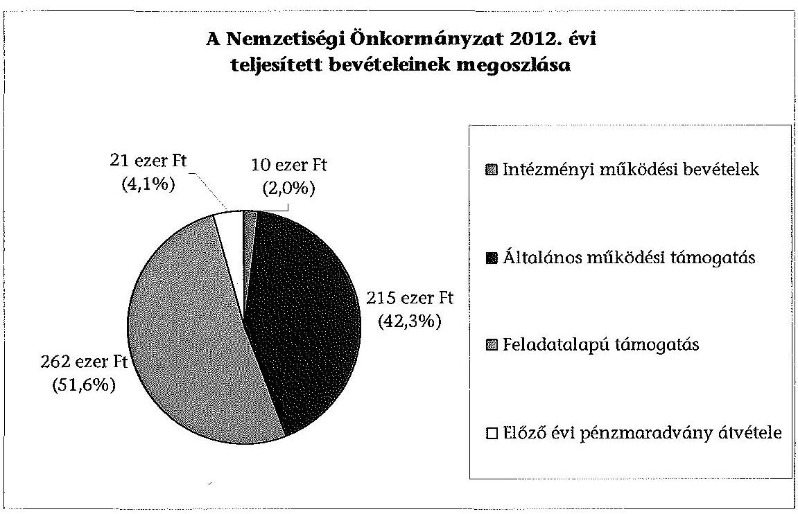
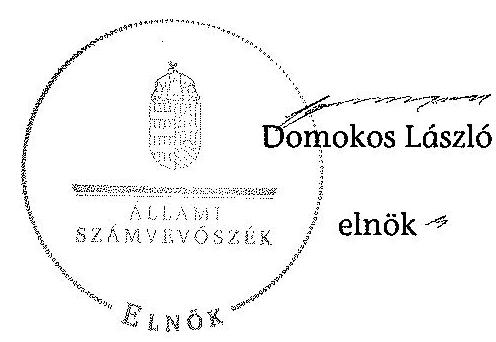

# ÁLLAMI   SZÁMVEVŐSZÉK 

## JELENTÉS

a helyi nemzetiségi önkormányzatok gazdálkodásának ellenőrzéséről
Budapest Főváros XVI. Kerületi Ukrán Önkormányzat

---

# Állami Számvevőszék 

Iktatószám: V-0291-011/2014.
Témaszám: 1324
Vizsgálat-azonosító szám: V065244
Az ellenőrzést felügyelte:
Horváth Balázs
felügyeleti vezető
Az ellenőrzést vezette és az ellenőrzés végrehajtásáért felelős:
Kisgergely István
ellenőrzésvezető
A számvevőszéki jelentést készítették és a jelentés összeállításában
közremüködtek:
Belovai Sándorné
számvevő főtanácsos
Varga József
számvevő tanácsos
Az ellenőrzést végezte:
Balogh András
számvevő

---

# TARTALOMJEGYZÉK 

BEVEZETÉS ..... 3
I. ÖSSZEGZŐ MEGÁLLAPÍTÁSOK, KÖVETKEZTETÉSEK, JAVASLATOK ..... 6
II. RÉSZLETES MEGÁLLAPÍTÁSOK ..... 13

1. A Nemzetiségi Önkormányzat és a XVI. Kerületi Önkormányzat együttmúködésének szabályozása, a múködési feltételek biztosítása ..... 13
2. A gazdálkodási feladatok ellátásának szabályszerűsége ..... 14
2.1. A költségvetésre és a zárszámadásra, valamint a kincstári adatszolgáltatás rendjére vonatkozó jogszabályi előírások betartása ..... 14
2.2. A Nemzetiségi Önkormányzat gazdálkodásának szabályozottsága ..... 15
2.3. Az operatív gazdálkodási jogkörök kialakítása, gyakorlása ..... 16
3. A Nemzetiségi Önkormányzattal összefüggő gazdálkodási feladatok belső ellenőrzése ..... 16
4. A feladatalapú támogatás felhasználásának, elszámolásának szabályszerűsége, a Nemzetiségi Önkormányzat feladatellátása ..... 17
MELLÉKLETEK
5. számú A Nemzetiségi Önkormányzat 2012. évi gazdálkodásának főbb adatai, mutatói
FÜGGELÉKEK
6. számú Rövidítések jegyzéke
7. számú Értelmező szótár
8. számú A gazdálkodás értékelésének módszere

---

.

---

# JELENTÉS   a helyi nemzetiségi önkormányzatok gazdálkodásának ellenőrzéséről Budapest Főváros XVI. Kerületi Ukrán Önkormányzat 

## BEVEZETÉS

A Nemzetiségi Önkormányzat 2010-ben alakult, elnöke 2010. október 18-ától látja el feladatát. A Nemzetiségi Önkormányzat intézményt, gazdasági társaságot és más szervezetet nem alapított, illetve ezek társulásában nem vett részt. A négytagú Képviselő-testület munkája segítésére bizottságot nem hozott létre. A Nemzetiségi Önkormányzatnak a költségvetési beszámolója szerint a 2012. évben a módosított költségvetési bevételi és kiadási előirányzata 508 ezer Ft, a teljesített költségvetési bevétele 508 ezer Ft, a teljesített költségvetési kiadása 205 ezer Ft volt. A 2012. évi gazdálkodási adatokat részletesen az 1. számú mellékletben mutatjuk be.

Az Alaptörvény XXIX. cikk (1) bekezdése szerint a Magyarországon élő nemzetiségek államalkotó tényezők. Minden, valamely nemzetiséghez tartozó magyar állampolgárnak joga van önazonossága szabad vállalásához és megőrzéséhez. A hazánkban élő nemzetiségek helyi (települési és területi), valamint országos önkormányzatokat hozhatnak létre. A helyi nemzetiségi önkormányzatok gazdálkodási feladatait jogszabályi előírás alapján a székhely szerinti helyi önkormányzat polgármesteri hivatala látja el.

A nemzetiségek helyzete, támogatása mind hazai, mind EU-s szinten kiemelt figyelmet kap napjainkban. A helyi nemzetiségi önkormányzatok gazdálkodására és támogatási rendszerére vonatkozó jogszabályok a 2010-2012. években jelentős változásokon mentek át. A települési és területi nemzetiségi önkormányzatok gazdálkodásának, a részükre juttatott költségvetési támogatások felhasználásának ellenőrzését az ÁSZ a 2012. évben sorozatjellegú ellenőrzés keretében indította el. A 2013. évi ellenőrzések e témacsoportos ellenőrzések folytatását jelentik, amelyet az ÁSZ 2014 első félévi ellenőrzési terve 12. témasorszámon tartalmaz.

Az ellenőrzés célja annak értékelése volt, hogy a Nemzetiségi Önkormányzat gazdálkodási kereteinek kialakítása, gazdálkodása és feladatellátása megfelelt-e a jogszabályoknak.

---

Ennek keretében értékeltük, hogy:

- a Nemzetiségi Önkormányzat és a XVI. Kerületi Önkormányzat együttmúködésének szabályozása, a múködési feltételek biztosítása megfelelt-e a jogszabályi előírásoknak;
- a felek együttműködése megfelelt-e a közöttük létrejött megállapodásnak a gazdálkodási feladatok szabályszerű ellátása során, ennek keretében betartották-e a Nemzetiségi Önkormányzat gazdálkodásához kapcsolódóan a költségvetésre és zárszámadásra, a gazdálkodás szabályozására, az operatív gazdálkodási jogkörök gyakorlására vonatkozó jogszabályi előírásokat;
- a jegyző biztosította-e a Nemzetiségi Önkormányzat gazdálkodásának belső ellenőrzését;
- a Nemzetiségi Önkormányzat feladatalapú támogatásának felhasználása, a folyósított feladatalapú támogatással történő elszámolás az előírásoknak megfelelő volt-e;
- a Nemzetiségi Önkormányzat feladatellátása összhangban volt-e a vonatkozó jogszabályi előírásokkal.

Az ellenőrzés várható hasznosulását négy szinten tervezzük. A törvényalkotás számára összegzett tapasztalatok állnak rendelkezésre a Nemzetiségi önkormányzatok testületi döntéseinek, gazdálkodásának és a feladatalapú támogatás felhasználásának szabályszerűségéről, amelynek alapján következtetést lehet levonni arra, hogy indokolt-e jogszabályi módosítás kezdeményezése. Az ellenőrzés az ellenőrzött számára visszajelzést ad a működésében fellépő hiányosságokról, javaslataival hozzájárul azok kiküszöböléséhez, amely csökkentheti a későbbi ellenőrzések gyakoriságát. Az ellenőrzés megállapításai és javaslatai tanulságul szolgálhatnak más nemzetiségi önkormányzatok, szervezetek számára a rendezett gazdálkodási keretek kialakításához. A társadalom számára jelzi, hogy közpénz nem maradhat ellenőrizetlenül, az ÁSZ értékteremtő rend kialakításához és megőrzéséhez hozzájáruló tevékenysége pozitív hatással lesz a szervezetről kialakított összkép formálásában. Az ÁSZ szervezetén belül lehetőség nyílik arra, hogy a megállapítások szintetizálásával az intézmény a hozzáadott értéket teremtő elemző tevékenységét és tanácsadó szerepét erősítse.

A Nemzetiségi Önkormányzat gazdálkodásának ellenőrzéséről szóló jelentés I. fejezetének összegző része az ellenőrzés céljára adott rövid, szintetizáló összefoglalót és következtetéseket tartalmazza a II. fejezet részletes megállapításain alapulóan. A jelentés intézkedést igénylő megállapításait és javaslatait - az öszszegzőben foglaltak mellett - az ellenőrzés során feltárt, a jelentés II. fejezetében rögzített részletes megállapítások alapozzák meg, illetve támasztják alá.

# Az ellenőrzés típusa: szabályszerűségi ellenőrzés 

Az ellenőrzött időszak: a 2012. január 1. - 2012. december 31. közötti időszak. Az ellenőrzés kiterjedt a Nemzetiségi Önkormányzatnak juttatott 2012. évi támogatás 2013. évben való elszámolására is.

---

Ellenőrzött szervezet: a Budapest Főváros XVI. Kerületi Ukrán Önkormányzat és a gazdálkodási feladatait ellátó Budapest Főváros XVI. Kerületi Önkormányzat.

Az ellenőrzés végrehajtásának jogszabályi alapját az ÁSZ tv. 5. § (2)-(3) és (6) bekezdéseiben foglaltak képezik.

Az ellenőrzés szakmai módszertana az ÁSZ hivatalos honlapján (www.asz.hu) közzétett szakmai szabályokon alapult, amely a Legfőbb Ellenőrző Intézmények Nemzetközi Szervezete (INTOSAI) által kiadott nemzetközi standardok (ISSAI) figyelembevételével készült.

A helyi nemzetiségi önkormányzatok gazdálkodásának ellenőrzése során értékeltük a XVI. Kerületi Önkormányzat és a Nemzetiségi Önkormányzat együttmúködésének, a gazdálkodás szabályozottságának és a pénzügyi folyamatokban kulcsszerepet betöltő belső kontrollok (teljesítésigazolás és érvényesítés) működésének megfelelőségét. A kulcskontrollokat a működési és felhalmozási célú támogatásértékű kiadásoknál, az államháztartáson kívülre teljesített múködési és felhalmozási célú pénzeszköz átadásoknál, a dologi kiadásokkal kapcsolatos kifizetéseknél - véletlen mintavételi eljárást alkalmazva - ellenőriztük. Ellenőriztük, hogy a jegyző biztosította-e a Nemzetiségi Önkormányzat gazdálkodásának belső ellenőrzését. Értékeltük a feladatalapú támogatások felhasználásának, elszámolásának szabályszerűségét, a Nemzetiségi Önkormányzat feladatellátása és a jogszabályi előírások összhangját.

Az ellenőrzés lefolytatásához a Nemzetiségi Önkormányzat és a gazdálkodási feladatait ellátó XVI. Kerületi Önkormányzat tanúsítványok és a kapcsolódó, dokumentumjegyzékben megjelölt dokumentumok elektronikus úton történő megküldésével, rendelkezésre bocsátásával szolgáltatott adatokat. Az adatszolgáltatás kontrollálása és szükség szerinti javítása a helyszíni ellenőrzés keretében történt. A minősítési szempontokat a 3. számú függelék tartalmazza.

Az ÁSZ tv. 29. § (1) bekezdése szerint a jelentéstervezetet megküldtük észrevételezésre a polgármesternek és a Nemzetiségi Önkormányzat elnökének. A polgármester és a Nemzetiségi Önkormányzat elnöke az ÁSZ tv. 29. § (2) bekezdésében foglalt észrevételezési jogával nem élt, a jelentéstervezetre észrevételt nem tett.

---

# I. ÖSSZEGZŐ MEGÁLLAPÍTÁSOK, KÖVETKEZTETÉSEK, JAVASLATOK 

A Nemzetiségi Önkormányzat és a XVI. Kerületi Önkormányzat együttmúködésének szabályozása részben felelt meg a jogszabályi előírásoknak. A 2012. évben az együttműködési megállapodás ${ }_{1,2}$ volt hatályban, de az együttmúködési megállapodás ${ }_{1}$-et a Nek. ${ }_{2}$ tv. előírása ellenére 2012. január 31-élg nem vizsgálták felül. Az együttmúködési megállapodás ${ }_{2}$ aláírása a törvényben meghatározott 2012. június 1-jel határidőt követően, június 17-én történt meg. A 2012. december 31-én hatályos együttműködési megállapodás ${ }_{2}$-ben a Nemzetiségi Önkormányzat múködési feltételeit az előírásoknak megfelelően szabályozták, azonban e szabályokat - a Nek. ${ }_{2}$ tv.-ben előírtak ellenére - az együttmúködési megállapodás megkötését követően a Nemzetiségi Önkormányzat SZMSZ-ében nem rögzítették. Az előírt tervezési, gazdálkodási, finanszírozási, adatszolgáltatási és beszámolási feladatok ellátásának szabályait csak részben rögzítették az együttműködési megállapodás ${ }_{2}$-ban, mert hiányoztak a teljesítésigazolás dokumentációs részletszabályai, a kötelezettségvállalások nyilvántartására vonatkozó szabályok. Az együttműködési megállapodás ${ }_{2}$-ben a Nek. ${ }_{2}$ tv. előírásától eltérően nem rögzítették a Nemzetiségi Önkormányzat testületi ülésein a jegyző megbízásából résztvevő személy képesítési követelményeit. A szabályozási hiányosságok ellenére a XVI. Kerületi Önkormányzat a Nemzetiségi Önkormányzat részére 2012-ben biztosította a Nek. ${ }_{2}$ tv.-ben előírt múködési feltételeket.

A Nemzetiségi Önkormányzat 2012. évi költségvetésének, zárszámadásának tartalma, jóváhagyása, valamint a kapcsolódó 2012. évi adatszolgáltatás szabályszerűsége megfelelő volt. A Nemzetiségi Önkormányzat elnöke a 2012. évi költségvetés tervezetét még Magyarország 2012. évi központi költségvetéséről szóló törvény kihirdetését megelőzően, a jogszabályban meghatározott időpontig benyújtotta a Képviselő-testületnek, de előterjesztésekor tájékoztatásul - szöveges indoklással - nem mutatták be az Áht. ${ }_{2}$-ben előírt költségvetési mérleget közgazdasági tagolásban, valamint az előirányzat felhasználási tervet. A jegyző a kincstári adatszolgáltatási kötelezettségeknek egy esetben késve tett eleget. A 2012. évi zárszámadási határozat tervezetét a Nemzetiségi Önkormányzat elnöke az előírt határidő előtt terjesztette be a Képviselő-testület részére, arról a Képviselő-testület határozatot hozott. A 2012. évi zárszámadási határozat tervezetének előterjesztésénél a Képviselő-testület részére az előterjesztésben tájékoztatásul bemutatták az Áht. ${ }_{2}$-ben foglalt mérlegeket és kimutatásokat. A zárszámadásról alkotott határozat és az elfogadott költségvetés öszszehasonlíthatóságát biztosították, a beszámoló a Nemzetiségi Önkormányzat valamennyi bevételét és kiadását tartalmazta.

A Nemzetiségi Önkormányzat gazdálkodásának szabályozottsága nem volt megfelelő, mert a Polgármesteri Hivatal SZMSZ-e az Ávr. előírása ellenére nem tartalmazta az SZMSZ-ben nevesített munkakörökhöz tartozó, a Nemzetiségi Önkormányzat gazdálkodásával kapcsolatos feladat- és hatáskörökre, a hatáskörök gyakorlásának módjára, a helyettesítés rendjére, az ezekhez kapcsolódó felelősségi szabályokra vonatkozó előírásokat. A gazdálkodásra vonat-

---

kozó szabályozás az Ávr. előírása ellenére nem tartalmazta a teljesítésigazolás gyakorlásának módjával, eljárási és dokumentációs részletszabályaival, valamint a teljesítésigazolást végző személyek kijelölésével kapcsolatos rendelkezéseket, valamint a 100 ezer Ft alatti, előzetes írásbeli kötelezettségvállalást nem igénylő kifizetések rendjét annak ellenére, hogy a Nemzetiségi Önkormányzatnál éltek az írásbeli kötelezettségvállalás mellőzésének lehetőségével. A XVI. Kerületi Önkormányzat rendelkezett a Bkr.-ben előírt ellenőrzési nyomvonallal és a szabálytalanságok kezelésének eljárásrendjével, de a jegyző a Nemzetiségi Önkormányzat gazdálkodásának végrehajtási feladataira nem terjesztette ki azok hatályát, illetve önálló szabályzatot nem adott ki. A Polgármesteri Hivatal SZMSZ-ében rögzítették a tervezéssel, gazdálkodással, a pénzügyi ellenjegyzéssel, az érvényesítés módjával, eljárási és dokumentálási részletszabályaival, valamint az ezeket végző személyek kijelölésének rendjével, az ellenőrzési és adatszolgáltatási feladatok teljesítésével kapcsolatos belső előírásokat.

A Nemzetiségi Önkormányzatnál az operatív gazdálkodási jogkörök kialakítása részben felelt meg a jogszabályi előírásoknak, mert a Nemzetiségi Önkormányzat elnöke az Áht. ${ }_{2}$ és az Ávr. előírásainak ellenére nem jelölt ki teljesítést igazoló személyt, ezért nem állt rendelkezésre a teljesítésigazoló aláírás mintája, továbbá nem vezették a Nemzetiségi Önkormányzat által vállalt kötelezettségekről az Ávr.-ben előírt nyilvántartást. A jegyző az Ávr. előírásainak megfelelően kijelölte a pénzügyi ellenjegyzésre és az érvényesítésre jogosultakat.

A 2012. évben a dologi kiadások teljesítése során a kulcskontrollok múködésének megfelelősége nem volt értékelhető. A 2012. évi összes teljesített kiadás 204,9 ezer Ft volt, melyből 193,8 ezer Ft-ot jogerős végrehajtható határozat alapján a végrehajtó azonnali beszedési megbízással emelt le a Nemzetiségi Önkormányzat számlájáról 2012. július 3-án. A további 11,1 ezer Ft számlavezetési díj, amit a számlavezető szedett be a bankszámlaszerződés alapján. Az ellenőrzési programban meghatározott kontrollok e kifizetések esetében nem múködnek. A Nemzetiségi Önkormányzatnál a 2012. évben az államháztartáson kívülre teljesített múködési/felhalmozási célú pénzeszközátadásra, támogatásértékű kiadások teljesítésére nem került sor. A számvevőszéki ellenőrzés a kiadások dokumentumainak ellenőrzése alapján összeférhetetlenséget, továbbá jogosulatlan kifizetést nem tárt fel.

A Nemzetiségi Önkormányzatnál a belső ellenőrzési feladatok ellátása megfelelő volt, a jegyző a Polgármesteri Hivatal belső ellenőrzése keretében biztosította a Nemzetiségi Önkormányzat gazdálkodásával összefüggő végrehajtási feladatok belső ellenőrzését. Az együttmúködési megállapodás ${ }_{1,2}$-ben rögzítették, hogy a Polgármesteri Hivatal belső ellenőrzési tevékenysége kiterjed a Nemzetiségi Önkormányzat számviteli nyilvántartásainak ellenőrzésére. A Polgármesteri Hivatal 2012. évi belső ellenőrzési tervét megalapozó, a Ber.-ben előírt kockázatelemzés nem terjedt ki a Nemzetiségi Önkormányzat gazdálkodásával összefüggő végrehajtási feladatokra. A 2012. évre tervezett belső ellenőrzést elvégezték, az ellenőrzési jelentés hiányosságokat állapított meg, javaslatokat tett, de azoknak nem volt címzettje, nem tartalmazta, hogy kire vonatkoznak a megállapítások. A jegyző a Nemzetiségi Önkormányzatot érintő belső ellenőrzés megállapításairól annak elnökét és a Képviselő-testületét nem tájékoztatta, ezért az elnök a belső ellenőrzési jelentés elkészítésekor hatályos

---

együttműködési megállapodás ${ }_{1} 6$. pontjában foglalt realizálási feladatainak végrehajtása elmaradt. Az ellenőrzéshez szolgáltatott adatok alapján a Kormányhivatal 2012-ben a Nemzetiségi Önkormányzatot illetően nem élt törvényességi felügyeleti eszközökkel.

A Nemzetiségi Önkormányzat részére 2012. évben folyósított feladatalapú támogatás felhasználása és a 2011-2012. évben folyósított támogatás elszámolása nem felelt meg a jogszabályi előírásoknak. A Nemzetiségi Önkormányzat 2011. évi 128,1 ezer Ft feladatalapú támogatásból maradványt 2011. december 31-én nem mutattak ki. A 2012. évi 262,2 ezer Ft feladatalapú támogatást kötelezettségvállalással nem terhelték, visszafizetésére nem intézkedtek. A feladatalapú támogatásokról a támogatási kormányrendelet ${ }_{1,2}$ előírása alapján az Áht. ${ }_{1,2}$-ben foglaltak ellenére az elszámolások nem történtek meg, a támogatások felhasználását, elszámolását az ellenőrzésre jogosult szervek nem ellenőrizték.

A Nemzetiségi Önkormányzat kötelező és önként vállalt feladatellátásának tárgya - a képviselt közösség esélyegyenlőségének megteremtésével kapcsolatos feladatok ellátása, kapcsolat a helyi nemzetiségi civil szervezetekkel, közmeghallgatás a nemzetiség helyi feladatairól - összhangban volt a Nek. 2 tv.-ben foglalt előírásokkal.

Az ÁSZ tv. 33. § (1) bekezdésében foglaltak értelmében az ellenőrzött szervezet vezetője köteles a jelentésben foglalt megállapításokhoz kapcsolódó intézkedési tervet összeállítani és azt a jelentés kézhezvételétől számított 30 napon belül az ÁSZ részére megküldeni. Amennyiben az intézkedési tervet határidőre nem küldi meg a szervezet, vagy az nem elfogadható, az ÁSZ elnöke az ÁSZ tv. 33. § (3) bekezdés a)-b) pontjaiban foglaltakat érvényesítheti.

A helyszíni ellenőrzés megállapításainak hasznosítása mellett javasoljuk:

# a jegyzőnek 

1. az együttmúködés szabályozásával kapcsolatban

Az együttműködési megállapodás ${ }_{1}$-t a Nek. ${ }_{2}$ tv. 80. § (2) bekezdésének előírása ellenére 2012. január 31-éig nem vizsgálták felül.

A Nek. ${ }_{2}$ tv. 80. § (3) bekezdésének c)-d) pontjaiban foglaltak ellenére az együttmúködési megállapodás ${ }_{2}$-ben nem rögzítették a teljesítésigazolási feladatok eljárási és dokumentációs részletszabályait, továbbá nem írták elő a kötelezettségvállalások nyilvántartására vonatkozó szabályokat. A Nek. ${ }_{2}$ tv. 80. § (4) bekezdésében foglaltak ellenére az együttmúködési megállapodás ${ }_{2}$ nem tartalmazta a testületi ülésen a jegyző megbízásából résztvevő személy képesítési követelményeit.

A Nek. ${ }_{2}$ tv. 80. § (2) bekezdésében foglaltak ellenére az együttműködési megállapodás ${ }_{2}$ szerinti müködési feltételeket nem rögzítették a Nemzetiségi Önkormányzat SZMSZ-ében.

---

Javaslat:
Az együttműködés szabályszerűsége érdekében:
a) biztosítsa a jövőben az együttmüködési megállapodás évenkénti felülvizsgálata során a Nek. 2 tv. 80. § (2) bekezdésében előírt határidő betartását;
b) készítse elő az együttmüködési megállapodás ${ }_{2}$ módosítását, hogy az tartalmilag feleljen meg a Nek. 2 tv. 80. § (3) bekezdés c)-d) pontjaiban, valamint a Nek. 2 tv. 80. § (4) bekezdésében foglalt előírásoknak;
c) készítse el a Nemzetiségi Önkormányzat SZMSZ-ének a Nek. 2 tv. 80. § (2) bekezdésében foglalt előírásnak megfelelő kiegészítését.
2. a költségvetés előterjesztésével kapcsolatban

A 2012. évi költségvetési határozattervezet előterjesztésekor - a jegyző mulasztása miatt - az Áht. 2 24. § (4) bekezdés a) pontjában előírtak ellenére nem mutatták be a Képviselő-testületnek tájékoztatásul - szöveges indoklással - a Nemzetiségi Önkormányzat költségvetési mérlegét közgazdasági tagolásban és az előirányzatfelhasználási tervét.

A jegyző a 2012. évi költségvetéshez kapcsolódó, Nemzetiségi Önkormányzatra vonatkozó kincstári adatszolgáltatási kötelezettségének egy esetben - az Áhsz. 10. § (5a) bekezdésében előírt - határidőn túl tett eleget.

Javaslat
A jövőben
a) készítse el a költségvetési határozattervezet előterjesztéséhez a Képviselő-testület tájékoztatására az Áht. 2 24. § (4) bekezdés a) pontja előírásainak megfelelően szöveges indoklással együtt a költségvetési mérleget közgazdasági tagolásban és az előirányzat-felhasználási tervet;
b) a kincstári adatszolgáltatási kötelezettségeinek az Áhsz. 2 32. § (4) bekezdésében előírt határidők betartásával tegyen eleget.
3. a gazdálkodási feladatok szabályozottságával kapcsolatban

A Polgármesteri Hivatal SZMSZ-e nem tartalmazta az Ávr. 13. § (1) bekezdés g) pontjában foglaltak szerinti, az SZMSZ-ben nevesített munkakörökhöz tartozó - a Nemzetiségi Önkormányzat gazdálkodásának végrehajtásával kapcsolatos - feladatés hatáskörökre, a hatáskörök gyakorlásának módjára, a helyettesítés rendjére, az ezekhez kapcsolódó felelősségi szabályokra vonatkozó előírásokat. A Bkr. 6. § (3)-(4) bekezdései szerinti ellenőrzési nyomvonal és szabálytalanságok kezelésének eljárásrendje nem terjedt ki a Nemzetiségi Önkormányzat gazdálkodásának végrehajtási feladataira, arra vonatkozóan önálló szabályzat sem készült.

---

Javaslat
A gazdálkodás szabályszerűsége érdekében a Nemzetiségi Önkormányzat gazdálkodásának végrehajtására is kiterjedően:
a) készítse el a Polgármesteri Hivatal SZMSZ-ének módosítását, hogy az tartalmazza az Ávr. 13. § (1) bekezdés g) pontjában foglaltakat;
b) gondoskodjon Bkr. 6. § (3)-(4) bekezdései szerinti ellenőrzési nyomvonal és a szabálytalanságok kezelése eljárásrendjének kialakításáról.
4. a feladatalapú támogatás elszámolásával kapcsolatban

A 2011. évi feladatalapú támogatás elszámolása a támogatási kormányrendelet ${ }_{1}$ 7. § (2) bekezdésében hivatkozott, valamint a 2012. évi feladatalapú támogatás elszámolása a támogatási kormányrendelet ${ }_{2}$ 8. § (5) bekezdésében hivatkozott „a helyi önkormányzatok elszámolási és ellenőrzési rendjére vonatkozó jogszabályok rendelkezései alkalmazandóak" előírása alapján az Áht ${ }_{1} 64 . \S$ (7) bekezdése, és az Áht. ${ }_{2} 57 . \S$ (3) bekezdése ellenére nem történt meg.

Javaslat
Intézkedjen az Áht. ${ }_{2}$ 27. § (2) bekezdésében meghatározott feladatkörében a Nemzetiségi Önkormányzat által igénybevett 2011. és 2012. évi feladatalapú támogatás felhasználásáról szóló elszámolás elkészítéséről az Áht. ${ }_{2}$ 53. § (1) bekezdése szerinti beszámolási kötelezettség teljesítéséhez.

# a polgármesternek 

A Nek. ${ }_{2}$ tv. 80. § (3) bekezdésének c)-d) pontjaiban foglaltak ellenére az együttmúködési megállapodás ${ }_{2}$-ben nem rögzítették a teljesítésigazolási feladatok eljárási és dokumentációs részletszabályait, továbbá nem írták elő a kötelezettségvállalások nyilvántartására vonatkozó szabályokat. A Nek. ${ }_{2}$ tv. 80. § (4) bekezdésében foglaltak ellenére az együttműködési megállapodás ${ }_{2}$ nem tartalmazta a testületi ülésen a jegyző megbízásából résztvevő személy képesítési követelményeit.

A Polgármesteri Hivatal SZMSZ-e nem tartalmazta az Ávr. 13. § (1) bekezdés g) pontjában foglaltak szerinti, az SZMSZ-ben nevesített munkakörökhöz tartozó - a Nemzetiségi Önkormányzat gazdálkodásának végrehajtásával kapcsolatos - feladatés hatáskörökre, a hatáskörök gyakorlásának módjára, a helyettesítés rendjére, az ezekhez kapcsolódó felelősségi szabályokra vonatkozó előírásokat.

Javaslat
Terjessze a XVI. Kerületi Önkormányzat Képviselő-testülete elé jóváhagyásra:
a) az együttműködési megállapodás jegyző által előkészített módosítását, hogy az tartalmilag megfeleljen a Nek. ${ }_{2}$ tv. 80. § (3) bekezdés c)-d) pontjaiban, valamint a Nek. ${ }_{2}$ tv. 80. § (4) bekezdésében foglalt előírásoknak;

---

b) a Polgármesteri Hivatal SZMSZ-ének a jegyző által elkészített módosítását, hogy az tartalmazza - a Nemzetiségi Önkormányzat gazdálkodásának végrehajtására vonatkozóan - az Ávr. 13. § (1) bekezdés g) pontjában foglaltakat.

# a Nemzetiségi Önkormányzat elnökének 

1. A Nek. 2 tv. 80. § (3) bekezdésének c)-d) pontjaiban foglaltak ellenére az együttmüködési megállapodás ${ }_{2}$-ben nem rögzítették a teljesítésigazolási feladatok eljárási és dokumentációs részletszabályait, továbbá nem írták elő a kötelezettségvállalások nyilvántartására vonatkozó szabályokat. A Nek. 2 tv. 80. § (4) bekezdésében foglaltak ellenére az együttműködési megállapodás ${ }_{2}$ nem tartalmazta a testületi ülésen a jegyző megbízásából résztvevő személy képesítési követelményeit.

A Nek. 2 tv. 80. § (2) bekezdésében foglaltak ellenére az együttműködési megállapodás ${ }_{2}$ szerinti müködési feltételeket nem rögzítették a Nemzetiségi Önkormányzat SZMSZ-ében.

Javaslat
Terjessze a Képviselő-testület elé jóváhagyásra:
a) a jegyző által előkészített együttműködési megállapodás ${ }_{2}$ módosítását, hogy az tartalmilag megfeleljen a Nek. 2 tv. 80. § (3) bekezdés c)-d) pontjaiban, valamint a Nek. 2 tv. 80. § (4) bekezdésében foglalt előírásoknak;
b) a Nemzetiségi Önkormányzat SZMSZ-ének jegyző által elkészített módosítását, hogy az megfeleljen a Nek. 2 tv. 80. § (2) bekezdésében előírtaknak.
2. A Nemzetiségi Önkormányzat elnöke a 2012. évi költségvetési határozattervezet előterjesztésekor - a jegyző mulasztása miatt - a Képviselő-testület részére tájékoztatásul az Áht. 2 24. § (4) bekezdés a) pontjában előírtak ellenére nem mutatta be szöveges indoklással a Nemzetiségi Önkormányzat költségvetési mérlegét közgazdasági tagolásban és az előirányzat-felhasználási tervét.

Javaslat
A jövőben a költségvetési határozattervezet Képviselő-testület elé terjesztésekor tájékoztatásul mutassa be - szöveges indoklással együtt - a jegyző által elkészített, az Áht. 2 24. § (4) bekezdés a) pontjában előírt költségvetési mérleget közgazdasági tagolásban és az előirányzat-felhasználási tervet.
3. A 2011. évi feladatalapú támogatás elszámolása a támogatási kormányrendelet ${ }_{1}$ 7. § (2) bekezdésében hivatkozott, valamint a 2012. évi feladatalapú támogatás elszámolása a támogatási kormányrendelet ${ }_{2}$ 8. § (5) bekezdésében hivatkozott „a helyi önkormányzatok elszámolási és ellenőrzési rendjére vonatkozó jogszabályok rendelkezései alkalmazandóak" előirása alapján az Áht. 1 64. § (7) bekezdése, és az Áht. 2 57. § (3) bekezdése ellenére nem történt meg.

---

Javaslat
Terjessze a Képviselő-testület elé az Áht. 2 53. § (1) bekezdése szerinti beszámolási kötelezettség teljesítéséhez összeállított, a Nemzetiségi Önkormányzat által igénybevett 2011. és 2012. évi feladatalapú támogatás felhasználásáról szóló elszámolást.
4. A Nemzetiség Önkormányzat nem tett eleget az Áht. 2 57. § (2) bekezdésében előírtaknak azáltal, hogy a meghatározott célra fel nem használt 2012. évi feladatalapú támogatás 2012. december 31-éig kötelezettségvállalással nem terhelt 262,2 ezer Ft összegű maradványáról nem mondott le és nem fizette vissza azt a központi költségvetés javára.

Javaslat
Terjessze a Képviselő-testület elé jóváhagyásra az Áht. 2 57/A. § (1) bekezdés előírásának megfelelően a 2012. évi feladatalapú támogatás kötelezettségvállalással nem terhelt maradványáról történő lemondást és intézkedjen a maradvány összegének visszafizetésére a központi költségvetés javára.

---

# II. RÉSZLETES MEGÁLLAPÍTÁSOK 

## 1. A Nemzetiségi Önkormányzat és a XVI. Kerületi ÖnkormÁnyZAT EGYÜTTMÜKÖDÉSÉNEK SZABÁLYOZÁSA, A MÜKÖDÉSI FELTÉTELEK BIZTOSÍTÁSA

A Nemzetiségi Önkormányzat és a XVI. Kerületi Önkormányzat együttműködésének szabályozása részben felelt meg a jogszabályi előírásoknak.

A 2010. december 20-án aláírt együttműködési megállapodás ${ }_{1}$-nek a Nek. ${ }_{2}$ tv. 80. § (2) bekezdésében előírtak szerinti felülvizsgálata 2012. január 31-éig, valamint a Nek. ${ }_{2}$ tv. 159. § (3) bekezdése szerinti kiegészítése 2012. június 1-jéig nem történt meg. A Nek. ${ }_{2}$ tv hatálybalépését követően előkészítették az új együttműködési megállapodás ${ }_{2}$ tervezetét ${ }^{1}$, amelynek aláírására 2012. június 17-én, a Nek. ${ }_{2}$ tv. 159. § (3) bekezdésében foglalt határidőhöz képest 16 napos késedelemmel került sor. A késedelmes aláírás miatt a Kormányhivatal írásban nem kezdeményezett egyeztetést.

A 2012. december 31-én hatályos együttműködési megállapodás ${ }_{2}$ részben tartalmazta a Nek. ${ }_{2}$ tv. által meghatározott személyi és tárgyi múködési feltételek biztosítását. A XVI. Kerületi Önkormányzat az együttműködési megállapo-dás ${ }_{2}$-ben vállalta a technikai eszközökkel felszerelt helyiség ingyenes biztosítását, a rezsiköltségek fizetését, a testületi ülések előkészítését, a kapcsolódó adminisztrációs és postázási feladatok ellátását. A helyiség és a technikai eszközök átadásának dokumentumai nem álltak rendelkezésre.

Az együttműködési megállapodás ${ }_{2}$ a Nemzetiségi Önkormányzat múködési feltételeit a Nek. ${ }_{2}$ tv.-ben foglaltaknak megfelelően tartalmazta. A Nemzetiségi Önkormányzat nem tett eleget a Nek. ${ }_{2}$ tv. 80. § (2) bekezdésében előírt kötelezettségének, mert az együttműködési megállapodás ${ }_{2}$ megkötését követően az ellenőrzött időszakban nem rögzítette SZMSZ-ében a megállapodás szerinti múködési feltételeket.

Az Áht. ${ }_{2}$-ben előírt tervezési, gazdálkodási, finanszírozási, adatszolgáltatási és beszámolási feladatok ellátásának szabályait az együttműködési megállapo-dás ${ }_{2}$-ben csak részben rögzítették, mert:

- nem szabályozták a Nek. ${ }_{2}$ tv. 80. § (3) bekezdés d) pontjában foglaltaknak megfelelően a teljesítésigazolás eljárási és dokumentációs részletszabályait;
- nem írták elő a Nek. ${ }_{2}$ tv. 80. § (3) bekezdés c) pontjában foglaltaknak megfelelően a kötelezettségvállalások nyilvántartásának vezetését.

[^0]
[^0]:    ${ }^{1}$ Az együttműködési megállapodás ${ }_{2}$-t a XVI. Kerületi Önkormányzat 269/2012. (V. 30.) Kt, a Nemzetiségi Önkormányzat 11/2012. (05. 11.) UÖ számú határozatával hagyta jóvá.

---

A személyi feltételek biztosításának részeként a XVI. Kerületi Önkormányzat vállalta referens kijelölését, azonban az együttmúködési megállapodás a Nek. ${ }_{2}$ tv. 80. § (4) bekezdésében foglaltak ellenére nem tartalmazta, hogy a Nemzetiségi Önkormányzat testületi ülésein a jegyző megbízásából résztvevő személy képesítésének meg kell felelnie a jegyzőkre vonatkozó képesítési követelményeknek ${ }^{2}$.

Az együttmúködési megállapodás ${ }_{1-2}$-ben rögzítették a belső ellenőrzésre és a felelősségre vonatkozó feltételeket, amely szerint a Polgármesteri Hivatal belső ellenőrzési tevékenysége kiterjed a Nemzetiségi Önkormányzat számviteli nyilvántartásainak ellenőrzésére.

A XVI. Kerületi Önkormányzat - a szabályozás hiányossága ellenére - biztosította a Nemzetiségi Önkormányzat müködéséhez szükséges személyi és tárgyi feltételeket.

# 2. A GAZDÁlKODÁSI FELADATOK ELLÁTÁSÁNAK SZABÁLYSZERŰSÉGE 

### 2.1. A költségvetésre és a zárszámadásra, valamint a kincstári adatszolgáltatás rendjére vonatkozó jogszabályi előírások betartása

A Nemzetiségi Önkormányzat 2012. évi költségvetésének és zárszámadásának tartalma, jóváhagyása, valamint a kapcsolódó 2012. évi adatszolgáltatás szabályszerűsége megfelelt a jogszabályi előírásoknak.

Az elnök a 2012. évi költségvetés tervezetét még Magyarország 2012. évi központi költségvetéséről szóló törvény kihirdetését megelőzően ${ }^{3}$ benyújtotta a Képviselő-testületnek. A jóváhagyott költségvetés ${ }^{4}$ tartalmazta az Áht. ${ }_{2}$-ben és az Ávr.-ben előírt tartalmi elemeket, a költségvetési bevételeket és azokkal megegyező összegű költségvetési kiadásokat előirányzat-csoportok, kiemelt előirányzatok szerinti bontásban, de az Áht. ${ }_{2}$ 24. § (4) bekezdés a) pontjában foglaltak ellenére a Képviselő-testületnek nem mutatták be szöveges indoklással együtt a helyi önkormányzat költségvetési mérlegét közgazdasági tagolásban, valamint az előirányzat felhasználási tervet.

A jegyző a Nemzetiségi Önkormányzat 2012. évre előírt kincstári adatszolgáltatási kötelezettségének eleget tett, azonban az Áhsz. ${ }_{1} 10 . \S$ (5a) bekezdésében előírt - a 2012. évi elemi költségvetési beszámolóhoz kapcsolódó - adatszolgáltatást 2013. március 10-ei határidőn túl, 2013. március 14-én teljesítette a Kincstár részére.

[^0]
[^0]:    ${ }^{2}$ A nemzetiségi referens rendelkezett a Nek. ${ }_{2}$ tv.-ben előírt képesítéssel.
    ${ }^{3}$ A kihirdetésre 2011. december 28-án került sor a Magyar Közlöny 161. számában.
    ${ }^{4}$ A Nemzetiségi Önkormányzat 2012. évi költségvetési határozat tervezetét az elnök 2011. december 20-án terjesztette a Képviselő-testület elé és azt 24/2011. (12. 20.) UKÖ számú határozattal hagyta jóvá.

---

A Nemzetiségi Önkormányzat elnöke határidöben beterjesztette a Képvise-lő-testület részére a 2012. évi zárszámadási határozat-tervezetet. A Kép-viselő-testület a zárszámadásról határozatot ${ }^{5}$ hozott. A 2012. évi zárszámadási határozat tervezetének előterjesztésénél a Képviselő-testület részére az előterjesztésben tájékoztatásul bemutatták az Áht. ${ }_{2}$-ben foglalt mérlegeket és kimutatásokat, valamint elkészítették a szöveges indoklást. A zárszámadásról alkotott határozat és az elfogadott költségvetés összehasonlíthatóságát biztosították, a beszámoló a Nemzetiségi Önkormányzat valamennyi bevételét és kiadását tartalmazta.

# 2.2. A Nemzetiségi Önkormányzat gazdálkodásának szabályozottsága 

A Nemzetiségi Önkormányzat gazdálkodásának szabályozottsága az ellenőrzött időszakban nem volt megfelelő, mivel:

- a Polgármesteri Hivatal SZMSZ-e nem tartalmazta az Ávr. 13 § (1) bekezdés g) pontjában foglaltak szerinti, az SZMSZ-ben nevesített munkakörökhöz tartozó - a Nemzetiségi Önkormányzat gazdálkodásával kapcsolatos - fel-adat- és hatáskörökre, a hatáskörök gyakorlásának módjára, a helyettesítés rendjére, az ezekhez kapcsolódó felelősségi szabályokra vonatkozó előírásokat;
- a gazdálkodásra vonatkozó szabályokat tartalmazó számviteli politika ${ }^{6}$ nem tartalmazta az Ávr. 53. § (2) bekezdése szerinti 100 ezer Ft alatti, előzetes írásbeli kötelezettségvállalást nem igénylő kifizetések rendjét annak ellenére, hogy a Nemzetiségi Önkormányzatnál éltek az írásbeli kötelezettségvállalás mellőzésének lehetőségével;
- a XVI. Kerületi Önkormányzat rendelkezett a Bkr. 6. § (3)-(4) bekezdéseiben előírt ellenőrzési nyomvonallal és a szabálytalanságok kezelésének eljárásrendjével, de a jegyző a Nemzetiségi Önkormányzat gazdálkodásának végrehajtási feladataira nem terjesztette ki azok hatályát, illetve önálló szabályzatot nem adott ki.

A Nemzetiségi Önkormányzat gazdálkodásának szabályozottsága annak ellenére nem volt megfelelő, hogy rendelkezett a Számv. tv. által előírt számviteli politikával ${ }^{7}$ és a kapcsolódó leltározási és leltárkészítési-, az eszközök és források értékelési szabályzatával, pénzkezelési szabályzattal és számlarenddel.

A Polgármesteri Hivatal SZMSZ-ében rögzítették a tervezéssel, gazdálkodással, a pénzügyi ellenjegyzéssel, az érvényesítés módjával, eljárási és dokumentálási részletszabályaival, valamint az ezeket végző személyek kijelölésének rendjével,

[^0]
[^0]:    ${ }^{5}$ A Képviselő-testület a 2013. április 29-ei ülésen tárgyalta meg a 2012. évi zárszámadást, amelyről a 49/2013. (IV. 29.) UÖ számú határozat készült.
    ${ }^{6}$ A gazdálkodási feladatok szabályozására önálló szabályzatot nem készítettek, azokat a megállapított hiányosságokkal a számviteli politika tartalmazta.
    ${ }^{7}$ 2012. február 21-én kiadott szabályzat

---

az ellenőrzési és adatszolgáltatási feladatok teljesítésével kapcsolatos belső előírásokat.

# 2.3. Az operatív gazdálkodási jogkörök kialakítása, gyakorlása 

A Nemzetiségi Önkormányzat gazdálkodása tekintetében az operatív gazdálkodási jogkörök kialakítása részben felelt meg a jogszabályi előírásoknak. A jegyző az Áht-2 és az Ávr. előírásainak megfelelően írásban kijelölte a Nemzetiségi Önkormányzat kötelezettségvállalásaira és kifizetéseire vonatkozóan a pénzügyi ellenjegyzésre és az érvényesítésre jogosultakat. A kijelölések az ellenőrzés időszakára vonatkozóan jogszerűek voltak, mert a XVI. Kerületi Önkormányzat nem rendelkezett gazdasági szervezettel. Az operatív gazdálkodási jogkörök kialakítását tartalmazó számviteli politikában nem szabályozták, illetve a gyakorlatban elmulasztották az alábbiakat:

- a Nemzetiségi Önkormányzat elnöke, mint kötelezettségvállaló 2012. június 17-ig nem jelölte ki a teljesítésigazolásra jogosult személyt, továbbá a június 17-i kijelölést követően az Ávr. 60. § (3) bekezdése szerinti - az operatív gazdálkodási jogkörök gyakorlására jogosult személyekről és aláírás mintájukról vezetett - nyilvántartás aktualizálásáról nem gondoskodott;
- a Nemzetiségi Önkormányzat által vállalt kötelezettségekről nem vezették az Ávr. 56. § (1) bekezdésében előírt nyilvántartást.

A Nemzetiségi Önkormányzatnál a 2012. évben az államháztartáson kívülre teljesített múködési/felhalmozási célú pénzeszközátadásra, támogatásértékű kiadások teljesítésére nem került sor.

A 2012. évben a dologi kiadások esetében a kulcskontrollok múködésének megfelelősége nem volt értékelhető. A 2012. évi összes teljesített kiadás 204,9 ezer Ft volt, melyből 193,8 ezer Ft-ot a 0100-32Vh-400065/2012/1 számú végrehajtható határozat alapján a végrehajtó azonnali beszedési megbízással hatósági átutalás jogcímen emelt le a Nemzetiségi Önkormányzat számlájáról 2012. július 3-án. További 11,1 ezer Ft számlavezetési díjat a számlavezető szedett be a bankszámlaszerződés alapján.

A végrehajtott összeg az Áht. 36. § (2) bekezdése alapján más fizetési kötelezettségnek minősül. Az Ávr. 57. § (3) bekezdése alapján nem szükséges a teljesítésigazolást a más fizetési kötelezettségek vonatkozásában előírni, azt a belső szabályozás sem tartalmazta. A bankszámla vezetésével és az azon végzett múveletekkel kapcsolatban a számlavezető által felszámított díjakkal, költségekkel kapcsolatos kiadásokat az Ávr. 59. § (5) bekezdés b) pontja alapján nem kell utalványozni.

## 3. A Nemzetiségi Önkormányzattal öSSZEFÜGGŐ GAZDÁlKODÁSI FELADATOK BELSŐ ELLENŐRZÉSE

A Nemzetiségi Önkormányzatnál a belső ellenőrzési feladatok ellátása megfelelő volt, a jegyző a Polgármesteri Hivatal belső ellenőrzése keretében

---

biztosította a Nemzetiségi Önkormányzat gazdálkodásával összefüggő végrehajtási feladatok belső ellenőrzését.

A 2010. december 20-án aláírt együttműködési megállapodás ${ }_{1}$-nek a 6 . pontjában, és a 2012. október 19-én aláírt együttműködési megállapodás ${ }_{2}$ XI. fejezetében rögzítették, hogy a Nemzetiségi Önkormányzat számviteli nyilvántartásának ellenőrzése a Polgármesteri Hivatal szervezetéhez tartozó függetlenített belső ellenőrzés feladatát képezi.

A 2012. évi belső ellenőrzési tervet a belső ellenőrzési vezető elkészítette és a jegyző ellenjegyzésével a polgármester terjesztette a XVI. Kerületi Önkormányzat Képviselő-testülete elé 2011. október 11-én, azonban a Ber. 21. § (2) bekezdésében foglaltak ellenére a belső ellenőrzési tervet megalapozó kockázatelemzés nem terjedt ki a nemzetiségi önkormányzatok gazdálkodásával összefüggő végrehajtási feladatokra.

A 2012. évi ellenőrzési tervben egy ellenőrzést terveztek a nemzetiségi önkormányzatokkal kapcsolatban, „A költségvetési juttatások megalapozottsága dokumentálás, koordináció, elszámolás, könyvelés bizonylatainak megléte, szabályossága, folyamata" címmel, a 2010-2011. évekre vonatkozóan. Az ellenőrzést végrehajtották, amelyről 2012. március 12 -én készült el a jelentés. A belső ellenőrzési jelentés hiányosságokat állapított meg és javaslatokat tett, de azoknak nem volt címzettje, nem tartalmazta, hogy kire vonatkoznak a megállapítások.

Az ellenőrzés megállapításairól a jegyző nem tájékoztatta a Nemzetiségi Önkormányzat elnökét és a Képviselő-testületet, ezért az elnök a belső ellenőrzési jelentés elkészítésekor hatályos együttműködési megállapodás ${ }_{1} 6$. pontjában foglalt realizálási feladatainak végrehajtása elmaradt.

Az ellenőrzéshez szolgáltatott adatok alapján a 2012. évben a Kormányhivatal a Nemzetiségi Önkormányzatot illetően nem élt törvényességi felügyeleti eszközökkel.

# 4. A feladatalapú támogatás felhasZNálásáNAK, elsZámoláSÁnAK SZABÁLYSZERÜSÉGE, A NEMZETISÉGI ÖNKORMÁNYZAT FELADATELLÁTÁSA 

A Nemzetiségi Önkormányzat részére 2012. évben folyósított feladatalapú támogatás felhasználása, és a 2011-2012. évi támogatás elszámolása a jogszabályi előírásoknak nem felelt meg.

A 2011. évben a Nemzetiségi Önkormányzat 128,1 ezer Ft összegű feladatalapú támogatásban részesült, amelyből 2011. december 31-én maradvány nem keletkezett.

---

A 2012. évi feladatalapú támogatás összes bevételhez viszonyított részarányát a következő ábra szemlélteti:

A Nemzetiségi Önkormányzat 2012. évben 262,2 ezer Ft összegű feladatalapú támogatásban részesült. A Nemzetiségi Önkormányzat a 2012. évi költségvetési határozatát módosította a 2012. évben folyósított feladatalapú támogatás összegével, de a 2012. évi feladatalapú támogatást a folyósítás évében nem használta fel, és 2012. december 31-ig kötelezettségvállalással nem terhelte. A 2012. évi feladatlapú támogatás 2012. december 31-ig kötelezettségvállalással nem terhelt maradványa a támogatási kormányrendelet ${ }_{2}$ 7. § előírása alapján határidőt követően jogszerűen nem használható fel.

A Nemzetiségi Önkormányzat nem tett eleget az Áht. ${ }_{2}$ 57. § (2) bekezdésében előírtaknak azáltal, hogy a meghatározott célra fel nem használt 2012. évi feladatalapú támogatás, 2012. december 31-éig kötelezettségvállalással nem terhelt 262,2 ezer Ft összegű maradványáról haladéktalanul nem mondott le és nem fizette vissza azt a központi költségvetés javára.

A 2011. évi feladatalapú támogatás elszámolása a támogatási kormányrendelet ${ }_{1} 7 . \S$ (2) bekezdésében hivatkozott, valamint a 2012. évi feladatalapú támogatás elszámolása a támogatási kormányrendelet ${ }_{2} 8 . \S$ (5) bekezdésében hivatkozott „a helyi önkormányzatok elszámolási és ellenőrzési rendjére vonatkozó jogszabályok rendelkezései alkalmazandóak" előírása alapján az Áht. ${ }_{1} 64 . \S$ (7) bekezdése, és az Áht. ${ }_{2} 57 . \S$ (3) bekezdése ellenére nem történt meg.

A feladatalapú támogatás felhasználását, elszámolását az ellenőrzésre jogosult szervek nem ellenőrizték.

---

A Nemzetiségi Önkormányzat 2012. évben közmeghallgatást tartott. A 2013. évben megvalósítandó feladatokról a Képviselő-testület határozatot hozott, majd a közmeghallgatáson ismertették azokat.

A Nemzetiségi Önkormányzat kötelező, valamint önként vállalt feladatellátásának tárgya - a képviselt közösség esélyegyenlőségének megteremtésével kapcsolatos feladatok ellátása, kapcsolat a helyi nemzetiségi civil szervezetekkel, közmeghallgatás a nemzetiség helyi feladatairól - összhangban volt a Nek. 2 tv. 115. §-ában és 116. §-ában foglalt előírásokkal.

A Nemzetiségi Önkormányzat a Nek. ${ }_{2}$ tv. 116. § (2) bekezdésében foglalt hatósági feladatokat nem végzett.

Budapest, 2014. 17 hó 15 nap

| Melléklet: | 1 db |
| :-- | :-- |
| Függelék: | 3 db |

---

.

---

# A Nemzetiségi Önkormányzat 2012. évi gazdálkodásának főbb adatai, mutatói

A) Bevételek

|  Megnevezés | Eredeti elöirányzat | Módosított | Teljesítés  |
| --- | --- | --- | --- |
|   | ezer Ft |  | megoszlás  |
|  Intézményi müködési bevételek | 60 | 10 | 10  |
|  Általános müködési támogatás | 209 | 215 | 215  |
|  Feladatalapú támogatás | 130 | 262 | 262  |
|  Előző évi pénzmaradvány átvétele | 21 | 21 | 21  |
|  Költségvetési bevételek: | 420 | 508 | 508  |
|  Bevételek összesen | 420 | 508 | 508  |

B) Kiadások

|  Megnevezés | Eredeti elöirányzat | Módosított | Teljesítés  |
| --- | --- | --- | --- |
|   | ezer Ft |  | megoszlás  |
|  Személyi juttatások | 79 | 0 | 0  |
|  Munkaadókat terhelő járulékok és szocális hozzájárulási adó összesen | 21 | 0 | 0  |
|  Dologi kiadások | 300 | 500 | 205  |
|  Tervezett maradvány és tartalék elöirányzata | 20 | 8 | 0  |
|  Müködési kiadások összesen | 420 | 508 | 205  |
|  Költségvetési kiadások: | 420 | 508 | 205  |
|  Kiadások összesen | 420 | 508 | 205  |

---

.

---

# RÖVIDÍTÉSEK JEGYZÉKE 

## Törvények

Alaptörvény
Áht. 1
Áht. 2
ÁSZ tv.
Nek. 1 tv.
Nek. 2 tv.
Számv. tv.

## Rendeletek

Áhsz. 1

Áhsz. 2
Ávr.

Ber.
Bkr.
támogatási kormányrendelet ${ }_{1}$
támogatási kormányrendelet ${ }_{2}$

## Szórövidítések

ÁSZ
együttmúködési megállapodás ${ }_{1}$

Magyarország Alaptörvénye
az államháztartásról szóló 1992. évi XXXVIII. törvény (hatályos 2011. december 31-ig)
2011. évi CXCV. törvény az államháztartásról (hatályos 2011. december 31-étől)

Az Állami Számvevőszékről szóló 2011. évi LXVI. törvény (hatályos 2011. július 1-jétől)
1993. évi LXXVII. törvény a nemzeti és etnikai kisebbségek jogairól (hatályos 2011. december 31-éig)
2011. évi CLXXIX. törvény a nemzetiségek jogairól (hatályos 2011. december 20-ától)
2000. évi C. törvény a számvitelről

249/2000. (XII. 24.) Korm. rendelet az államháztartás szervezeti beszámolási és könyvvezetési kötelezettségének sajátosságairól (hatályos 2013. december 31-ig)
4/2013. (I. 11.) Korm. rendelet az államháztartás számviteléről (hatályos 2014. január 1-jétől)
368/2011. (XII. 31.) Korm. rendelet az államháztartásról szóló törvény végrehajtásáról (hatályos 2012. január 1jétől)
193/2003. (XI. 26.) Korm. rendelet a költségvetési szervek belső ellenőrzéséről (hatályos 2011. december 31-éig)
370/2011. (XII. 31.) Korm. rendelet a költségvetési szervek belső kontrollrendszeréről és belső ellenőrzéséről (hatályos 2012. január 1-jétől)
342/2010. (XII. 28.) Korm. rendelet a kisebbségi önkormányzatoknak a központi költségvetésből, valamint fejezeti kezelésú előirányzatból nyújtott támogatások feltételrendszeréről és elszámolásának rendjéről (hatályos 2011. december. 31-től 2012. március 6 -ig)
28/2012. (III. 6.) Korm. rendelet a nemzetiségi célú előirányzatokból nyújtott támogatások feltételrendszeréről és elszámolásának rendjéről (hatályos 2012. március 7 -től 2012. december 31-éig)

Állami Számvevőszék
Budapest Főváros XVI. kerületi Önkormányzat Képviselőtestülete és a Budapest Főváros XVI. kerületi Ukrán Önkormányzat Képviselő-testülete között megkötött együttmúködési megállapodás (hatályos 2010. december 20ától)

---

együttmúködési megállapodás ${ }_{2}$
elnök

## EU

jegyzó
Képviselő-testület
Kormányhivatal
Nemzetiségi Önkormányzat
polgármester
Polgármesteri Hivatal
Polgármesteri Hivatal SZMSZ-e

Számviteli politika
UKÖ
UÖ
Ukrán Önkormányzat SZMSZ-e
XVI. Kerületi Önkormányzat

Budapest Főváros XVI. kerületi Önkormányzat Képviselőtestülete és a Budapest Főváros XVI. kerületi Ukrán Önkormányzat Képviselő-testülete között megkötött együttmúködési megállapodás (hatályos 2012. július 1-jétől)
Budapest Főváros XVI. Kerületi Ukrán Önkormányzat elnöke
Európai Unió
Budapest Főváros XVI. Kerületi Önkormányzat jegyzője
Budapest Főváros XVI. Kerületi Urán Önkormányzatának Képviselö-testülete
Budapest Főváros Kormányhivatala
Budapest Főváros XVI. Kerületi Ukrán Önkormányzat
Budapest Főváros XVI. Kerületi Önkormányzat polgármestere
Budapest Főváros XVI. Kerületi Önkormányzat Polgármesteri Hivatala
Budapest Főváros XVI. Kerületi Önkormányzat Polgármesteri Hivatalának Szervezeti és Múködési Szabályzata, melyet a XVI. Kerületi Önkormányzat Képviselő-testülete a 178/2011. (IV. 13.) számú határozatával fogadott el
Budapest Főváros XVI. Kerületi Ukrán Önkormányzat 2012. 02. 21-én kiadott számviteli politikája
Ukrán Kisebbségi Önkormányzat (az Ukrán Önkormányzat határozatai megnevezésében 2012. 02. 01-ig)
az Ukrán Önkormányzat (az Ukrán Önkormányzat határozatai megnevezésében 2012. 01. 01-től)
Budapest Főváros XVI. Kerületi Ukrán Kisebbségi Önkormányzat 4/2012. (01. 31.) UKÖ számú határozatával elfogadott szervezeti és müködési szabályzat. (Hatályos 2012. február 1-től)

Budapest Főváros XVI. Kerületi Önkormányzat

---

# ÉRTELMEZŐ SZÓTÁR 

együttmúködési megállapodás
feladatalapú támogatás
kulcskontrollok múködési feltételek

A nemzetiségi önkormányzatnak a múködési feltételei biztosítására, továbbá a bevételeivel és a kiadásaival kapcsolatban a tervezési, gazdálkodási, ellenőrzési, finanszírozási, adatszolgáltatási és beszámolási feladatai végrehajtására a székhelye szerinti települési önkormányzattal megkötött megállapodás. (Forrás: Nek. 2 tv. 80 § (2) bekezdés, Áht. 2 27. § (2) bekezdés.)
A költségvetési évben általános múködési támogatásban részesült, és a Támogatónak a Kincstárhoz intézett, a feladatalapú támogatás utalására vonatkozó rendelkező levele keltének időpontjában múködő települési és területi kisebbségi önkormányzatoknak a támogatási kor-mányrendelet ${ }_{1}$-ben, illetve a támogatási kormányrende-let ${ }_{2}$-ben rögzített feltételrendszer alapján nyújtható támogatás. A támogatási kormányrendelet ${ }_{1}$ elöírása szerint a feladatalapú támogatás a kisebbségi közügyeknek a települési és a területi kisebbségi önkormányzatok által történő ellátását szolgálja. A támogatási kormányrendelet ${ }_{2}$ rendelkezése szerint a feladatalapú támogatás a nemzetiségi önkormányzat által a Nek. 2 tv. szerinti nemzetiségi közfeladatok ellátásához közvetlenül kötődő támogatás. (Forrás: támogatási kormányrendelet ${ }_{1}$ 2. § (2) bekezdés c), d) pont és 4. § (1) bekezdés, valamint a támogatási kormányrendelet ${ }_{2} 2 . \S$ (2) bekezdés b), c) pont.) Teljesítés igazolása és az érvényesítés.
A települési önkormányzat által a helyi nemzetiségi önkormányzat testületi múködéséhez a 2012. évben biztosítandó feltételek: a testületi múködéshez igazodó helyiséghasználat, a postai, kézbesítési, gépelési, sokszorosítási feladatok ellátása és az ezzel járó költségek viselése. (Forrás: Nek. 1 tv. 27. § (1)-(2) bekezdései, a Nek. 2 tv. 159. § (3) bekezdésében foglalt átmeneti rendelkezés alapján)

A szabályozás szintjén - 2012. június 1-jéig megkötendő együttműködési megállapodásban - rögzítendő (és 2013. január 1-jétől a települési önkormányzat által biztosítandó) múködési feltételek a következők:

- a helyi nemzetiségi önkormányzat részére havonta igény szerint, de legalább tizenhat órában, az önkormányzati feladat ellátásához szükséges tárgyi, technikai eszközökkel felszerelt helyiség ingyenes használata, a helyiséghez, továbbá a helyiség infrastruktúrájához kapcsolódó rezsiköltségek és fenntartási költségek viselése;
- a helyi nemzetiségi önkormányzat múködéséhez (a testületi, tisztségviselői, képviselői feladatok ellátásához) szükséges tárgyi és személyi feltételek biztosítása;

---

nemzetiség
nemzetiségi közügy
nemzetiségi önkormányzat

- a testületi ülések előkészítése, különösen a meghívók, az előterjesztések, a testületi ülések jegyzőkönyveinek és valamennyi hivatalos levelezés előkészítése és postázása;
- a testületi döntések és a tisztségviselők döntéseinek előkészítése, a testületi és tisztségviselői döntéshozatalhoz kapcsolódó nyilvántartási, sokszorosítási, postázási feladatok ellátása;
- a helyi nemzetiségi önkormányzat múködésével, gazdálkodásával kapcsolatos nyilvántartási, iratkezelési feladatok ellátása;
- az előzőekben meghatározott feladatellátáshoz kapcsolódó költségek viselése a helyi nemzetiségi önkormányzat tagja és tisztségviselője telefonhasználata költségeinek kivételével.
(Forrás: Nek. 2 tv. 80. § (2) bekezdése a Nek. 2 tv. 159. § (3) bekezdésében foglalt átmeneti rendelkezés alapján.)

Minden olyan Magyarország területén legalább egy évszázada honos népcsoport, amely az állam lakossága körében számszerú kisebbségben van és a lakosság többi részétől saját nyelve és kultúrája, hagyományai különböztetik meg, egyben olyan összetartozás-tudatról tesz bizonyságot, amely mindezek megőrzésére, történelmileg kialakult közösségeik érdekeinek kifejezésére és védelmére irányul. (Forrás: Nek. 2 tv. 1. § (1) bekezdés.)
Az egyéni és közösségi jogok érvényesülése, a nemzetiséghez tartozók érdekeinek kifejezésre juttatása - különösen az anyanyelv ápolása, őrzése és gyarapítása, továbbá a nemzetiségek kulturális autonómiájának a nemzetiségi önkormányzatok által történő megvalósítása és megőrzése - érdekében a nemzetiséghez tartozók meghatározott közszolgáltatásokkal való ellátásával, ezen ügyek önálló vitelével és az ehhez szükséges szervezeti, személyi és anyagi feltételek megteremtésével összefüggő ügy. A közhatalmat gyakorló állami és helyi önkormányzati szervekben, továbbá a nemzetiségi önkormányzati szervekben való nemzetiségi képviselethez és mindezek szervezeti, személyi és anyagi feltételeinek biztosításához kapcsolódó ügy. (Forrás: Nek. 2 tv. 2. § 1. pont.)
Törvényben meghatározott nemzetiségi közszolgáltatási feladatokat ellátó, testületi formában múködő, jogi személyiséggel rendelkező, demokratikus választások útján törvény alapján létrehozott szervezet, amely a nemzetiségi közösséget megillető jogosultságok érvényesítésére, a nemzetiségek érdekeinek védelmére és képviseletére, a feladat- és hatáskörébe tartozó nemzetiségi közügyek települési, területi vagy országos szinten történő önálló intézésére jön létre. (Forrás: Nek. 2 tv. 2. § 2. pont.) A jelen-

---

operatív gazdálkodási jogkörök
tésben e fogalmat a települési nemzetiségi önkormányzatokra leszúkítve alkalmazzuk.
A kötelezettségvállalás, a pénzügyi ellenjegyzés, az utalványozás, az érvényesítés és a teljesítésigazolás. (Forrás: Áht. 36-38. §-ai és az Ávr. 52-60. §-ai.)

---

.

---

# A GAZDÁLKODÁS ÉRTÉKELÉSÉNEK MÓDSZERE 

A helyi nemzetiségi önkormányzatok gazdálkodásának ellenőrzése keretében a nemzetiségi önkormányzat gazdálkodása kereteinek kialakitása, gazdálkodása megfelelőségének minősítéséhez az alábbi területeket értékeltük:

- a helyi nemzetiségi önkormányzat és a helyi önkormányzat együttműködése szabályozását, a megállapodásban előírt működési feltételek biztosítását;
- a helyi nemzetiségi önkormányzat jóváhagyott költségvetésére, zárszámadására, továbbá a kincstári adatszolgáltatás rendjére vonatkozó jogszabályi előírások betartását;
- a helyi nemzetiségi önkormányzat gazdálkodási feladataira vonatkozó szabályzatok jogszabályi előírások szerinti rendelkezésre állását;
- a helyi nemzetiségi önkormányzat gazdálkodása tekintetében az operatív gazdálkodási jogkörök kialakítása jogszabályi előírásoknak történő megfelelését;
- a helyi nemzetiségi önkormányzat részére folyósított feladatalapú támogatás felhasználása és elszámolása jogszabályi előírásoknak való megfelelését;
- a helyi nemzetiségi önkormányzattal összefüggő gazdálkodási feladatok tekintetében a jogszabályokban előírt belső ellenőrzés biztosítását.

A helyi nemzetiségi önkormányzat gazdálkodását az ellenőrzési program szerint a hat területhez kapcsolódóan feltett kérdésekre adott válaszok alapján értékeltük. A kérdésekhez rendelt súlyozott pontszámok alapján az elért összérték a megszerezhető maximális pontszám százalékában került kimutatásra. Ennek figyelembevételével a kialakított minősítések az alábbiak:

Megfelelő: $\quad 81 \%$-tól
Részben megfelelő: $61 \%-80 \%$
Nem megfelelő: $\quad 0 \%-60 \%$
A pénzügyi folyamatok belső kontrolljának ellenőrzése keretében a pénzügyi folyamatokban kulcsszerepet betöltő belsö kontrollok - a teljesítésigazolás és az érvényesítés - müködésének megfelelőségét értékeltük. A kulcskontrollok működésének értékeléséhez a kritériumokat jogszabályok határozzák meg. A kulcskontrollok múködése megfelelőségének értékelése tekintetében lényeges minden olyan hiba, amely gátolja, hogy a kontrolltevékenység eredményesen múködjön.

A két kulcskontroll múködése megfelelőségének ellenőrzéséhez a dologi kiadások könyvviteli tételeiből szekvenciális (megállásos) mintavételi eljárással vá-

---

lasztottuk ki az ellenőrizendő tételeket. A kulcskontrollok megfelelőségének vizsgálata keretében a számvevő bizonyosságot szerez arról, hogy a rendelkezésre álló szabályozás és dokumentumok alapján a teljesítésigazoláshoz és az érvényesítéshez szükséges ellenőrzési lépéseket végrehajtották-e.

A kulcskontrollok működése „kiváló", „jó" vagy „gyenge" minősítést kaphatott. Az ellenőrzési program szerint feltett kérdésekhez rendelt súlyozott pontszámok alapján elért összérték a megszerezhető maximális pontszám százalékában került kimutatásra, mely alapján kialakított minősítések a következők:

| Kiváló: | $91 \%$-tól |
| :-- | :-- |
| Jó: | $71 \%-90 \%$ |
| Gyenge: | $0 \%-70 \%$ |

A kulcskontrollok múködését:

- kiválónak értékeltük abban az esetben, ha azok múködése megfelelt a hibák megelőzésére és kijavítására meghatározott szabályozásnak, valamint a legmagasabb szintű elvárásoknak;
- jónak minősítettük, ha a megállapított kisebb, tolerálható mértékű hiányosságok nem veszélyeztették az ellenőrzött területek hibáinak megelőzését és kijavítását;
- gyengének értékeltük, amennyiben a kontrollok múködésében túl sok hiányosság fordult elő ahhoz, hogy a kontrollok biztosítsák a hibák megelőzését, feltárását, kijavítását.