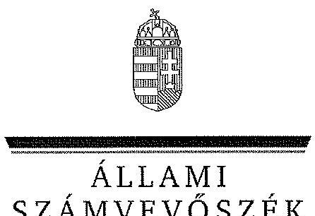

ÁLLAMI
SZÁMVEVŐSZÉK

# JELENTÉS 

a települési önkormányzatok társulásának és feladatellátásának ellenőrzéséről

---

Állami Számvevőszék
Iktatószám: V-0170-485/2014.
Témaszám: 1205.
Vizsgálat-azonosító szám: V05440
Az ellenőrzést felügyelte:
Holman Magdolna Julianna
felügyeleti vezető
Az ellenőrzés végrehajtásáért felelős:
Bialkó Zsolt Gyula
ellenőrzésvezető
Az ellenőrzést vezette:
Bialkó Zsolt Gyula
ellenőrzésvezető
Az összefoglaló jelentést készítették, valamint a számvevői munkaanyagok feldolgozásában és a jelentés összeállításában közreműködtek:

Luhály Matild
számvevő tanácsos
Dr. Mezei Imréné
számvevő tanácsos
Mokánszkiné Mengyi Andrea
számvevő tanácsos
Szabó Tamás
számvevő tanácsos
Szihalminé Kovács Zsuzsanna
számvevő tanácsos
Az ellenőrzést végezték:

| Beck Miklós | Beke Andrea | Bus András Péter |
| :-- | :-- | :-- |
| számvevő tanácsos | számvevő | számvevő |
| Buús Zoltánné Hütter | Eigner György | Fórián Erika |
| Erzsébet | számvevő tanácsos | számvevő tanácsos |
| számvevő tanácsos |  |  |
| Gál Magdolna | Hegyes Mária | Humli Tamásné |
| számvevő | számvevő tanácsos | számvevő tanácsos |
| Huszárné Borbás | Iszakné Dóczé Katalin | Kozma Gábor |
| Melinda | számvevő tanácsos | számvevő tanácsos |
| számvevő |  |  |
| Liziczai Imréné | Luhály Matild | Mokánszkiné Mengyi |
| számvevő | számvevő | Andrea |
|  |  | számvevő tanácsos |

---

Nyikon Zsigmondné számvevő tanácsos

Sipos Attila számvevő

## Tótfalusi Zoltán

számvevő tanácsos

## A témához kapcsolódó eddig készített számvevőszéki jelentések:

## címe

Jelentés a települési önkormányzatok többcélú kistérségi társulásainak a közszolgáltatások és területfejlesztési feladatok ellátásában betöltött szerepének ellenőrzéséről

## Puskás Balázs

számvevő

Szihalminé Kovács
Zsuzsanna
számvevő tanácsos

---

# **Chemistry**

## **Chemical Reactions**

### **Balancing Chemical Equations**

1. **Write the unbalanced equation:**
   - Example: $$C_3H_8 + O_2 \rightarrow CO_2 + H_2O$$

2. **Balance the equation:**
   - Balance carbon atoms first.
   - Then balance hydrogen atoms.
   - Finally, balance oxygen atoms.
   - Balanced equation: $$C_3H_8 + 7O_2 \rightarrow 3CO_2 + 4H_2O$$

3. **Balance the equation:**
   - Balance oxygen atoms.
   - Finally, balance oxygen atoms.
   - Balanced equation: $$C_3H_8 + 7O_2 \rightarrow 3CO_2 + 4H_2O$$

### **Types of Reactions**

1. **Combination Reaction:**
   - Example: $$2H_2 + O_2 \rightarrow 2H_2O$$

2. **Decomposition Reaction:**
   - Example: $$2H_2O_2 \rightarrow 2H_2O + O_2$$

3. **Single Displacement Reaction:**
   - Example: $$Zn + 2HCl \rightarrow ZnCl_2 + H_2$$

4. **Double Displacement Reaction:**
   - Example: $$AgNO_3 + NaCl \rightarrow AgCl + NaNO_3$$

5. **Combustion Reaction:**
   - Example: $$CH_4 + 2O_2 \rightarrow CO_2 + 2H_2O$$

## **Stoichiometry**

### **Mole Concept**

- **Mole (mol):** The amount of substance containing as many particles (atoms, molecules, ions) as there are atoms in exactly 12 grams of carbon-12.
- **Avogadro's Number:** $$6.022 \times 10^{23}$$ particles per mole.

### **Molar Mass**

- **Molar Mass:** The mass of one mole of a substance.
- Example: The molar mass of water ($$H_2O$$) is 18.015 g/mol.

### **Calculations**

1. **Moles to Mass:**
   - Formula: $$n = \frac{m}{M}$$
   - Example: Calculate the number of moles of $$H_2O$$ in 18 grams of water.
     - $$n = \frac{18 \, \text{g}}{18.015 \, \text{g/mol}} \approx 0.999 \, \text{mol}$$

2. **Mass to Moles:**
   - Formula: $$m = n \times M$$
   - Example: Calculate the mass of 1 mole of water.
     - $$m = 1 \, \text{mol} \times 18.015 \, \text{g/mol} = 18.015 \, \text{g}$$

## **Gas Laws**

### **Ideal Gas Law**

- **Equation:** $$PV = nRT$$
- **Variables:**
  - $$P$$: Pressure (atm)
  - $$V$$: Volume (L)
  - $$n$$: Number of moles (mol)
  - $$R$$: Ideal gas constant (0.0821 L·atm/mol·K)
  - $$T$$: Temperature (K)

### **Boyle's Law**

- **Equation:** $$P_1V_1 = P_2V_2$$

### **Boyle's Law**

- **Equation:** $$\frac{P_1V_1}{T_1} = \frac{P_2V_2}{T_2}$$

## **Thermochemistry**

### **Enthalpy (H)**

- **Definition:** The heat content of a system at constant pressure.
- **Equation:** $$\Delta H = q_p$$
- **Variables:**
  - $$q_p$$: Heat transferred at constant pressure.
  - $$\Delta H$$: Change in enthalpy (ΔH).
  - **Example:** The heat content of water (H₂O) at constant pressure.

### **Hess's Law**

- **Statement:** The enthalpy change for a reaction is the same whether it occurs in one step or multiple steps.
- **Example:** The enthalpy change for a reaction is the same whether it occurs in one step or multiple steps.

### **Hess's Law 2.0**

- **Statement:** The enthalpy change for a reaction is the same whether it occurs in one step or multiple steps.
- **Example:** The enthalpy change for a reaction is the same whether it occurs in one step or multiple steps.

## **Electrochemistry**

### **Oxidation and Reduction**

- **Oxidation:** Loss of electrons.
- **Reduction:** Gain of electrons.

### **Galvanic Cells**

- **Definition:** A cell that converts chemical energy into electrical energy.
- **Components:**
  - Anode: Oxidation occurs.
  - Cathode: Reduction occurs.
  - Salt Bridge: Connects the two half-cells.

### **Nernst Equation**

- **Equation:** $$E = E^\circ - \frac{RT}{nF} \ln Q$$
- **Variables:**
  - $$E$$: Cell potential (V)
  - $$E^\circ$$: Standard cell potential (V)
  - $$T$$: Temperature (K)
  - $$n$$: Number of electrons transferred
  - $$F$$: Faraday constant (96,485 C/mol)
  - $$Q$$: Reaction quotient

---

# TARTALOMJEGYZÉK 

BEVEZETÉS ..... 9
I. ÖSSZEGZŐ MEGÁLLAPÍTÁSOK, KÖVETKEZTETÉSEK, JAVASLATOK ..... 13
II. RÉSZLETES MEGÁLLAPÍTÁSOK ..... 21

1. A társulási megállapodások, belső szabályzatok szabályszerűsége, az átlátható, összehangolt és szabályos működés, feladatellátás biztosítása ..... 21
1.1. A társulási megállapodás megkötésének, tartalmának és módosításának, a társulás működési rendje kialakításának jogszabályi megfelelősége és átláthatósága ..... 21
1.2. A társulások működésének jogszabályi megfelelősége ..... 25
2. A társulások vagyonának nyilvántartása, a tulajdonviszonyok rendezettsége, a kapott támogatások felhasználásának és nyilvántartásának szabályszerűsége ..... 30
2.1. A társulások vagyonkezelésének szabályszerűsége ..... 30
2.2. A közfeladatok működési feltételei és azok ellátásához biztosított támogatások felhasználásának szabályszerűsége. A feladatellátáshoz szükséges források rendelkezésre állása ..... 33
3. Az átalakulással, megszüntetéssel kapcsolatos döntések szabályszerűsége ..... 39
3.1. A társulási megállapodás Mötv. szerinti felülvizsgálata ..... 39
3.2. A vagyonnal kapcsolatos döntések szabályszerűsége ..... 40
4. A társulásos feladatellátás monitoringja ..... 41
5. A korábban tett ÁSZ javaslatok hasznosulása ..... 45

---

# MELLÉKLETEK 

1. számú Az ellenőrzött társulások rövidített megnevezése, székhely önkormányzatának megnevezése, megszűnésének dátuma a 2013. június 30 -ai adatok alapján
2. számú A települési önkormányzatok társulásának és feladatellátásának ellenőrzéséhez a társult önkormányzatok által kitöltött kérdőívek kiértékelésének összegzése
3. számú A 2008-2011. években a jogszabályi előírásokat figyelmen kívül hagyó, valamint a jogszabályban biztosított szabályozási lehetőséggel nem élő társulások megnevezése
4. számú A Belügyminisztérium önkormányzati államtitkárának jelentéstervezethez tett észrevétele
5. számú Az ÁSZ válasza a Belügyminisztérium önkormányzati államtitkárának jelentéstervezethez tett észrevételéhez
6. számú Gyomaendrőd Város Önkormányzata polgármesterének jelentéstervezethez tett észrevételei
7. számú Az ÁSZ válasza Gyomaendrőd Város Önkormányzata polgármesterének jelentéstervezethez tett észrevételeihez
8. számú Szentes Város Önkormányzata alpolgármesterének jelentéstervezethez tett észrevételei
9. számú Az ÁSZ válasza Szentes Város Önkormányzata alpolgármesterének jelentéstervezethez tett észrevételeihez
10. számú Az Igazságügyi Minisztérium osztályvezetőjének jelentéstervezethez kapcsolódó tájékoztatása
11. számú Pilisvörösvár Város Önkormányzata polgármesterének jelentéstervezethez kapcsolódó tájékoztatása
12. számú Pogányvölgyi Többcélú Kistérségi Társulás elnökének jelentéstervezethez kapcsolódó tájékoztatása
13. számú Veresegyház Kistérség Önkormányzatainak Többcélú Társulása elnökének jelentéstervezethez kapcsolódó tájékoztatása
14. számú Az Emberi Erőforrások Minisztériuma miniszterének jelentéstervezethez kapcsolódó tájékoztatása
15. számú A Nemzetgazdasági Minisztérium államháztartásért felelős államtitkárának jelentéstervezethez tett észrevétele
16. számú Az ÁSZ válasza a Nemzetgazdasági Minisztérium államháztartásért felelős államtitkárának jelentéstervezethez tett észrevételéhez
17. számú Szekszárd és Térsége Önkormányzati Társulás elnökének jelentéstervezethez kapcsolódó tájékoztatása
18. számú Szekszárd és Környéke Szociális Alapszolgáltatási és Szakosított Ellátási Társulás elnökének jelentéstervezethez kapcsolódó tájékoztatása
19. számú Szekszárd és Környéke Alapellátási és Szakosított Ellátási Társulás elnöké-

---

nek jelentéstervezethez kapcsolódó tájékoztatása
20. számú Szekszárd és Szálka Óvodafenntartó Társulása elnökének jelentéstervezethez kapcsolódó tájékoztatása
21. számú Szekszárd és Környéke Központi Ügyeleti Társulás elnökének jelentéstervezethez kapcsolódó tájékoztatása
22. számú Szekszárd-Szedres-Medina Óvodafenntartó Társulás elnökének jelentéstervezethez kapcsolódó tájékoztatása
23. számú Szentes Város Önkormányzata polgármesterének jelentéstervezethez kapcsolódó tájékoztatása

---

.

---

# RÖVIDÍTÉSEK JEGYZÉKE 

## Törvények

Áht. 1
Áht. 2
Alkotmány
ÁSZ tv.
Jat.
Közokt. tv.
Mötv.
Ötv.
Számv. tv.
Szoctv.
Tftv.
Tkt. tv.
Ttv.
2009. évi Kvtv.
2012. évi Kvtv.

## Rendeletek

Áhsz.
Ámr.
az államháztartásról szóló 1992. évi XXXVIII. törvény ${ }^{1}$
az államháztartásról szóló 2011. évi CXCV. törvény
a Magyar Köztársaság Alkotmányáról szóló 1949. évi XX. törvény ${ }^{2}$
az Állami Számvevőszékről szóló 2011. évi LXVI. törvény
a jogalkotásról szóló 2010. évi CXXX. törvény
a közoktatásról szóló 1993. évi LXXIX. törvény
Magyarország helyi önkormányzatairól szóló 2011. évi CLXXXIX. törvény
a helyi önkormányzatokról szóló 1990. évi LXV. törvény ${ }^{3}$
a számvitelről szóló 2000. évi C. törvény
a szociális igazgatásról és szociális ellátásokról szóló 1993. évi III. törvény
a területfejlesztésről és a területrendezésről szóló 1996. évi XXI. törvény
a települési önkormányzatok többcélú kistérségi társulásáról szóló 2004. évi CVII. törvény ${ }^{4}$
a helyi önkormányzatok társulásairól és együttműködéséről szóló 1997. évi CXXXV. törvény ${ }^{5}$
a Magyar Köztársaság 2009. évi költségvetéséről szóló 2008. évi CII. törvény
Magyarország 2012. évi központi költségvetéséről szóló 2011. évi CLXXXVIII. törvény
az államháztartás szervezetei beszámolási és könyvvezetési kötelezettségének sajátosságairól szóló 249/2000. (XII. 24.) Korm. rendelet ${ }^{6}$
az államháztartás működési rendjéről szóló 292/2009. (XII. 19.) Korm. rendelet ${ }^{7}$

[^0]
[^0]:    ${ }^{1}$ Hatályon kívül helyezte a 2011. évi CXCV. törvény 114. § (2) bekezdése. Hatálytalan: 2012. január 1-jétől.
    ${ }^{2}$ Hatályon kívül helyezte Magyarország Alaptörvényének átmeneti rendelkezései 31. cikk (3) a) pontja. Hatálytalan: 2012. január 1-jétől.
    ${ }^{3}$ Hatályon kívül helyezte a 2011. évi CLXXXIX. törvény 156. § (3) bekezdése. Hatálytalan a 2014. évi általános önkormányzati választások napjától.
    ${ }^{4}$ Hatályon kívül helyezte a 2011. évi CLXXXIX. törvény 157. § c) pontja. Hatálytalan: 2013. január 1-jétől.
    ${ }^{5}$ Hatályon kívül helyezte a 2011. évi CLXXXIX. törvény 157. § a) pontja. Hatálytalan: 2013. január 1-jétől.
    ${ }^{6}$ Hatályon kívül helyezte a 4/2013. (I. 11) Korm. rendelet 57. § a) pontja. Hatálytalan: 2014. január 1-jétől.

---

Ávr.
Ber.
18/2008. (III. 28.) ÖTM rendelet

## Szórövidítések

AB
ÁSZ
BM
EMMI
intézményi társulás
KIM
Kincstár
KLIK
Kormány
NEFMI
NGM
ÖM
ÖTM
többcélú társulás
az államháztartás végrehajtásáról szóló 368/2011. (XII. 31.) Korm. rendelet
a költségvetési szervek belső ellenőrzéséről szóló 193/2003. (XI. 26.) Korm. rendelet ${ }^{8}$
a kistelepülési iskolák és a körjegyzőségek tárgyi feltételeinek javításával, valamint közösségi buszok beszerzésével kapcsolatos egyszeri költségvetési támogatás igénybevételének részletes feltételeiről szóló 18/2008. (III. 28.) ÖTM rendelet

Alkotmánybíróság
Állami Számvevőszék
Belügyminisztérium
Emberi Erőforrások Minisztériuma
a Ttv. 7. §, 8. § vagy 9. § szerinti intézményi társulás
Közigazgatási és Igazságügyi Minisztérium
Magyar Államkincstár
Klebelsberg Intézményi Hálózat
 Intézményfenntartó Központ
Magyarország Kormánya
Nemzeti Erőforrás Minisztérium
Nemzetgazdasági Minisztérium
Önkormányzati Minisztérium
Önkormányzati és Területfejlesztési Minisztérium
a Tkt. tv. alapján létrejött települési önkormányzatok többcélú kistérségi társulása

[^0]
[^0]:    ${ }^{7}$ Hatályon kívül helyezte a 368/2011. (XII. 31.) Korm. rendelet 177. § b) pontja. Hatálytalan: 2012. január 1-jétől.
    ${ }^{8}$ Hatályon kívül helyezte a 368/2011. (XII. 31.) Korm. rendelet 177. § b) pontja. Hatálytalan: 2012. január 1-jétől.

---

# ÉRTELMEZŐ SZÓTÁR 

| Ebr42 rendszer | Az Ebr42 a BM által működtetett web-alapú, pénzügyi-kontrolling-számviteli feladatokat ellátó, folyamatkövető információs rendszer, a helyi önkormányzatok és többcélú kistérségi társulások normatív hozzájárulásainak, normatív, kötött felhasználású támogatásainak és egyes pályázati támogatásainak igénylési rendszere. |
| :--: | :--: |
| közoktatás | A közoktatás kiterjedt az óvodai nevelésre, az iskolai nevelésre-oktatásra, a kollégiumi nevelésre-oktatásra, továbbá az ezekkel összefüggő szolgáltató és igazgatási tevékenységre. (Közokt. tv. 2. § (1) bekezdéséből levezetett fogalom) |
| közoktatási intézmények | A Közokt. tv. 20. § (1) bekezdése alapján a közoktatás nevelő, valamint nevelő és oktató intézményei az óvoda, az általános iskola, a szakiskola, a gimnázium, szakközépiskola, az alapfokú művészetoktatási intézmény, a gyógypedagógiai, konduktív pedagógiai nevelési-oktatási intézmény, a diákotthon és kollégium. |
| monitoring rendszer | Az Ámr. 160. § (1) bekezdése alapján a költségvetési szerv vezetője által működtetett rendszer, amely lehetővé teszi a szervezet tevékenységének, a célok megvalósításának nyomon követését. |
| társulás | Gyűjtőfogalom, amely 2012. december 31-éig az Ötv., Ttv. és Tkt. tv., 2013. január 1-jétől az Mötv. IV. fejezete alapján alakult/átalakult és működő társulások összessége. A társulások az önkormányzatok képviselő-testületei önkéntes és szabad elhatározásából, egyenjogúságuk tiszteletben tartásával, a kölcsönös előnyök és az arányos teherviselés alapján írásbeli megállapodással jöttek létre. |
| társulások átalakulása | A különböző törvényi szabályozás hatálya alatt létrehozott társulások esetében a társult önkormányzatoknak 2013. június 30-ig felül kellett vizsgálniuk társulási megállapodásukat, s dönteniük kellett a többcélú kistérségi társulás jogutód nélküli megszűntetéséről, illetve a társulási megállapodás Mötv. szabályai szerinti módosításával a társulás átalakításáról. |
| többcélú kistérségi társulás | A Tkt. tv. 1. § (1) bekezdése alapján a többcélú kistérségi társulás - az önkormányzatok önkéntes társulásával - a kistérségbe tartozó települési önkormányzatok döntése alapján jött létre. Egy kistérségben csak egy többcélú kistérségi társulás alakulhatott, amely részt vehetett a kistérség területének összehangolt fejlesztésében és a településfejlesztés összehangolásában, vállalhatta kistérségi szinten a szolgáltatások biztosítását, szervezését, intéz- |

---

mények fenntartását. A többcélú társulás több közösen nyújtott, vagy szervezett szolgáltatást és intézmény fenntartását egy társulásban fogta össze, ennek keretében az ellátott feladatok után többlet anyagi támogatásra volt jogosult.

---

# JELENTÉS 

## a települési önkormányzatok társulásának és feladatellátásának ellenőrzéséről

## BEVEZETÉS

A társulás joga az Alkotmány ${ }^{9}$ értelmében a helyi önkormányzatok alapjoga, amelynek alapvető szabályait és egyes formáit a helyi önkormányzatokról szóló 1990. évi LXV. törvény (Ötv.) tartalmazta. Az Országgyűlés a helyi önkormányzatok együttműködésének bővítése, közös érdekű feladataik célszerűbb, gazdaságosabb és hatékonyabb megvalósítása, a közszolgáltatások színvonalának javítása, a térségi kapcsolatok elmélyítése, a társulásos kapcsolatok általánosabbá és tartósabbá tétele érdekében alkotta meg a helyi önkormányzatok társulásairól és együttműködéséről szóló 1997. évi CXXXV. törvényt (Ttv.). Az e törvény szabályozása alapján létrejövő társulások a közösen felvállalt feladat súlyának, megvalósíthatóságának függvényében egyaránt lehettek jogi személyiséggel rendelkező, vagy jogi személyiség nélküli társulások.

Az önkormányzatok együttműködésének külön törvényben nevesített formája volt az önálló jogi személyiséggel rendelkező többcélú kistérségi társulás, amelyet a települési önkormányzatok többcélú kistérségi társulásáról szóló 2004. évi CVII. törvényben (Tkt. tv.) foglaltak alapján az adott statisztikai kistérségben működő települési önkormányzatok hozhattak létre. A többcélú kistérségi társulások létrehozásának törvényben deklarált célja az önkormányzatok többcélú kistérségi társulásainak intézményesítése, a kistérségek összehangolt fejlesztésének előmozdítása, az önkormányzati közszolgáltatások színvonalának kiegyenlítése és emelése volt.

A helyi önkormányzatok társulásai - élve a szabályozás adta lehetőségekkel - sokszínűek voltak, kapcsolatrendszerük bonyolult volt, nem alkottak homogén csoportot. Egy-egy önkormányzat (a többcélú kistérségi társulásban való részvétel általánossá válása mellett) több jogi és nem jogi személyiségű társulásnak is tagja lehetett, az általuk ellátott feladatok köre és mélysége a társuló önkormányzatok megállapodásában foglaltaktól függött. Az éves költségvetési törvények a társulásokat megillető támogatások esetében nem tettek különbséget abban, hogy a társulások jogi személyiségűek, vagy sem. A jogi személyiséggel nem rendelkező társulásokat a közhiteles törzskönyvi nyilvántartásba be sem kellett jegyezni.

[^0]
[^0]:    ${ }^{9}$ az Alkotmány 44/A. § h) pontja. A 2012. január 1-jétől hatályos Magyarország Alaptörvénye is biztosítja a társulás jogát a helyi önkormányzatok számára (32. cikk (1) bekezdés k) pontja).

---

A társulások egységes szabályozását 2013. január 1-jei hatállyal a Magyarország helyi önkormányzatairól szóló 2011. évi CLXXXIX. törvény (Mötv.) IV. fejezete biztosítja. Az Ötv., a Ttv. és a Tkt. tv. társulásokra vonatkozó korábbi előírásai ez időtől hatályukat vesztették, de ez nem jelentette a társulások automatikus megszűnését. A társulás, mint az önkormányzati együttműködés jogintézménye, a társulásos feladatellátásról való döntés továbbra is az önkormányzatok hatáskörében maradt.

Az önkormányzati társulási megállapodásokat a képviselő-testületek 2013. június 30-ig kötelesek voltak felülvizsgálni, és az Mötv. rendelkezéseinek megfelelően módosítani. A felülvizsgálatot követően a társulások - a törvény erejénél fogva - csak jogi személyiséggel rendelkező társulásként működhettek tovább vagy dönthettek a társulás megszüntetéséről is, azonban kötelező feladataik ellátásáról ebben az esetben is gondoskodniuk kell.

Az ellenőrzés a Tkt. tv. és a Ttv. hatálya alá tartozó társulások ellenőrzésére terjedt ki, melyben a Ttv. hatálya alá tartozó társulások feladatellátás tekintetében a többcélú társulásokhoz tartoztak.

Az ellenőrzés célja annak értékelése volt, hogy a települési önkormányzatok által megkötött társulási megállapodások, a társulások működése szabályos volt-e, a társulások a szabályszerű feladatellátást biztosították-e, a korábbi ÁSZ ellenőrzések megállapításai, javaslatai hasznosultak-e.

# Ennek keretében értékeltük, hogy: 

- az ellenőrzött időszakban a társulási megállapodás megkötése, a belső szabályzatok megalkotása szabályos volt-e, azok előírásai az átlátható, összehangolt és szabályos működést, feladatellátást biztosították-e;
- a társulások vagyonának nyilvántartása szabályszerű, a tulajdonviszonyok rendezettek voltak-e, a kapott támogatások felhasználása szabályszerű volt-e;
- az átalakulással, megszüntetéssel kapcsolatos döntések megfeleltek-e az Mötv. előírásainak;
- a társulások működésének és feladatellátásának átláthatóbbá tétele érdekében korábban tett ÁSZ javaslatok hasznosultak-e;
- a központi szabályozás szintjén a központi döntéshozatal mennyiben járult hozzá az önkormányzati feladatok társulásban történő ellátásához.

Az ellenőrzés várható hasznosulását négy szinten tervezzük. A törvényalkotás számára rendelkezésre álló összegzett tapasztalatok hozzájárulnak a közszolgáltatás feladat és finanszírozási rendszerét érintő további átalakításának megalapozásához, a társulásos feladatellátás újragondolásához. Az ellenőrzés eredményei a jogalkotót az elfogadott új jogszabályok pontosításában segíthetik azzal, hogy a társulások működését és feladatellátását érintő jogszabályok megalapozottságának értékelése, illetve a helyszíni ellenőrzés tapasztalatai alapján a szabályozási válaszok elégségességéről, megfelelőségéről következtetések vonhatók le. Az ellenőrzöttek körében hozzájárul a szabályozásbeli hiányosságok felszámolásához. A társadalom számára információt ad a társulásos

---

feladatellátás működéséről, reálisan tájékoztat a rendszer átalakításának indokoltságáról. Jelzi továbbá, hogy a közpénz felhasználás ellenőrzése ezen a területen sem kerülhető meg. Az ellenőrzés szintetizált megállapításai a szervezeten belül lehetőséget adnak arra, hogy elemző tevékenységünk részeként a társulásos feladatellátás eredményességi, célszerűségi szempontból való értékelésére sor kerüljön.

Az ellenőrzés típusa: szabályszerűségi ellenőrzés.
Az ellenőrzés végrehajtásának jogszabályi alapját az Állami Számvevőszékről szóló 2011. évi LXVI. törvény (ÁSZ tv.) 5. § (2)-(3) és (6) bekezdéseiben foglaltak képezték.

Az ellenőrzés alá vont időszak: társulások központi és helyi szabályozása, működése és feladatellátása szabályszerűségének ellenőrzése a 2008-2011. évekre terjedt ki. Az átalakulással, megszüntetéssel kapcsolatos döntések ellenőrzése a 2012. évet és a 2013. év I. félévét érintette.

A korábbi ÁSZ ellenőrzés javaslatai hasznosulásának értékelése keretében a települési önkormányzatok többcélú kistérségi társulásainak a közszolgáltatások és területfejlesztési feladatok ellátásában betöltött szerepének ellenőrzése ${ }^{10}$ során tett javaslatok teljesülésének utóellenőrzése történt.

Az ellenőrzés szakmai módszertana az ÁSZ hivatalos honlapján (www.asz.hu) közzétett szakmai szabályokon alapult, amely a Legfőbb Ellenőrző Intézmények Nemzetközi Szervezete (INTOSAI) által kiadott nemzetközi standardok (ISSAI) figyelembevételével készült.

Az ellenőrzés során a reprezentatív mintavétel alapján kiválasztott szervezeteknél a jogszabályok és a közjogi szervezetszabályozó eszközök előírásainak való megfelelés, az ellenőrzési szempontok érvényesülésének ellenőrzése az elegendő és megfelelő bizonyítékok összegyűjtésével, elemzésével történt. Ennek keretében az ellenőrzés összehasonlító elemzéssel, megismételt számítással, nyilatkoztatással, dokumentumok megtekintésével és elemzésével valósult meg.

A helyszíni ellenőrzés a közoktatási, szociális és egészségügyi feladatokat ellátó, a Tkt. tv. alapján létrejött többcélú társulásokra, a Ttv. 7. §, 8. § és 9. §-a szerinti intézményi társulások székhely önkormányzataira, továbbá a Belügyminisztériumra, az Emberi Erőforrások Minisztériumára, a Nemzetgazdasági Minisztériumra, valamint a Közigazgatási és Igazságügyi Minisztériumra terjedt ki. A 2011. december 31-én működő különféle társulási szervezetek közül reprezentatív mintavétel alapján 66-ot választottunk ki ellenőrzésre, az ezeknél tett megállapítások alapján vontunk le általános érvényű következtetéseket. Az ellenőrzött társulásokat, valamint ezek székhely önkormányzatainak tételes felsorolását az 1. számú melléklet tartalmazza. Az ellenőrzött intézményi társulásokban részt vevő önkormányzatokat az ÁSZ - a társulásokkal és azok feladatellátásával kapcsolatosan - kérdőív kitöltésére kérte fel. Az önkormányzatok által kitöltött kérdőívekre adott válaszok kiértékelését a 2. számú melléklet tartalmazza.

[^0]
[^0]:    ${ }^{10} 0817$ számú ÁSZ jelentés

---

Az Állami Számvevőszékről szóló 2011. évi LXVI. törvény 29. §-a szerint a jelentéstervezetet megküldtük egyeztetésre a még működő társulások, a székhely önkormányzatok, valamint a Belügyminisztérium, az Emberi Erőforrások Minisztériuma, az Igazságügyi Minisztérium és a Nemzetgazdasági Minisztérium részére. A beérkezett észrevételeket és az ezekre adott válaszokat, és azok indokolását a jelentés 4-23. számú mellékletei tartalmazzák.

---

# I. ÖSSZEGZŐ MEGÁLLAPÍTÁSOK, KÖVETKEZTETÉSEK, JAVASLATOK 

A helyi önkormányzatok az Ötv.-ben meghatározott társulási jogaik gyakorlati érvényesítése, közös érdekű feladataik célszerűbb, gazdaságosabb és hatékonyabb megvalósítása, a polgároknak nyújtott közszolgáltatásaik színvonalának javítása, a térségi kapcsolatok elmélyítése, a társulások általánosabbá és tartósabbá tétele, valamint a települési önkormányzatok többcélú társulásainak intézményesítése, a kistérségek összehangolt fejlesztésének előmozdítása, az önkormányzati közszolgáltatások színvonalának kiegyenlített emelése érdekében eltérő típusú társulásokat hozhattak létre. Azonban a különböző törvényi szabályozások (Tkt. tv., Ttv.), illetve a társult önkormányzatok társulási megállapodásai a célok elérését és megvalósulásának eredményességét mérő, számon kérhető kritériumokat nem fogalmaztak meg.

Az ellenőrzött időszakban a számon kérhető kritériumok hiánya, a társulási megállapodások és a belső szabályzatok tartalmi hiányosságai, illetve az ezekből adódó működési szabálytalanságok korlátozták a társulások átlátható, összehangolt és szabályos feladatellátását.

A többcélú társulások 41,2%-a nem rögzítette maradéktalanul a Tkt. tv.-ben előírt kötelező tartalmi elemeket a társulási megállapodásokban. A társulási megállapodások valamennyi szabálytalanságot elkövető többcélú társulásnál megjelenő hiányossága volt, hogy - a Tkt. tv.-ben foglaltak ellenére - intézmény, illetve más szervezet közös alapítása esetén az alapítói jogok gyakorlására vonatkozó részletes rendelkezéseket nem tartalmazta. A többcélú társulások 52,9%-a nem élt a Tkt. tv. erre adott felhatalmazásával, a társulási megállapodásában a kötelező
 tartalmi elemeken kívül egyéb, a működésükre vonatkozó szabályokat nem határozott meg.

A többcélú társulások a vonatkozó törvényben előírtakat betartva közös döntéshozó szervet, társulási tanácsot hoztak létre. A társulási tanács tagjait megillető szavazatot a Tkt. tv.-ben foglaltaknak megfelelően szabályozták. Valamennyi többcélú társulás rendelkezett a társulási tanács által elfogadott SZMSZ-szel. A többcélú társulások társulási tanácsai meghatározták a társulási tanács működésének részletes működési szabályait, illetve rögzítették a társulási megállapodásában a társulási tanács működésével kapcsolatos hivatali teendők ellátásának a módját. A társulási tanácsok döntéseiket - tekintettel a Tkt. tv.-ben foglaltakra - a társulási megállapodásban meghatározott szavazati jogok figyelembe vételével hozták meg. Az önálló munkaszervezetet létrehozó többcélú társulások - a 2011. év végén a többcélú társulások 82,4%-a - társulási megállapodásai minden esetben tartalmazták a munkaszervezetben foglalkoztatottakra vonatkozóan a munkáltatói jogok gyakorlásának rendjét. A többcélú társulások társulási tanácsainak 88,2%-a Tkt. tv. előírásának megfelelve - a többcélú társulások tevékenységének és gazdálkodásának ellenőrzése céljából - létrehozta a pénzügyi bizottságot, melynek összetételét és működési rendjét meghatározta. A többcélú társulások pénzügyi bizottságai a 2008-2011.

---

években a többcélú társulások tevékenységét és gazdálkodását azonban nem ellenőrizték.

A 2008-2011. években a többcélú társulások 76,5%-a nem teremtette meg gazdálkodása szabályszerűségének a feltételeit azzal, hogy nem aktualizálta a Számv. tv-ben előírtaknak megfelelően a szabályzatokat. A többcélú társulások 70,6%-ánál nem határoztak meg költségvetési támogatások igénylésével, annak évközi módosításával és elszámolásával összefüggő kapcsolattartásra, adatszolgáltatásra és felelősségvállalásra vonatkozó szabályokat a saját intézményeik és a feladatellátásba bevont intézményi társulások által fenntartott intézmények részére. A többcélú társulások 64,7%-ánál nem végezték el a költségvetési támogatások igénybevételének alapját képező mutatószámok ellenőrzését a belső kontrollrendszereik erre vonatkozó előírásának hiánya miatt.

A feltárt szabálytalanságok ellenére a többcélú társulások feladatellátása önálló jogi személyiségükből is következően - összességében átláthatóbb, szervezettebb volt az intézményi társulásokénál.

Az intézményi társulásokban résztvevő önkormányzatok - a kérdőívre adott válaszaik alapján - a társulásos feladatellátást ösztönző tényezők közül a többlet pénzügyi forrás elérését, a gazdaságosabb feladatellátást és a szolgáltatás biztosítását tartották a legfontosabbnak. Kiemelt szempontként fogalmazták meg azt is, hogy a közszolgáltatások társulásban történő megszervezése esetén kevesebb összeggel kellett a feladatellátáshoz saját forrásaikból hozzájárulniuk. Ezt támasztja alá, hogy a Ttv. alapján létrehozott különböző intézményi társulások 98,0%-a a társulásos feladatellátást ösztönző támogatásban részesülő - a Ttv. 8. és 9. § hatálya alá sorolt - társulási típushoz tartozott. A Ttv. 7. §-ának hatálya alá tartozó társulások működéséhez jogszabály szerint rendszeres ösztönző működési támogatás nem kapcsolódott.

A társulási megállapodásokban - az ellenőrzött időszakban végrehajtott módosításokat is figyelembe véve - az intézményi társulások több mint kétharmada, 69,4%-a nem rögzítette teljes körűen az Ötv. és a Ttv. szerinti kötelező tartalmi elemeket. A társulási megállapodásaik jellemző hiányossága volt, hogy a Ttv.-ben foglaltak ellenére nem határozták meg az önkormányzatok által vállalt pénzügyi hozzájárulás nem teljesítése esetén irányadó eljárást, a társuláshoz való csatlakozás és a társulási megállapodás felmondásának részletes szabályait, valamint a társulás megszűnése esetére az elszámolás rendjét. Az intézményi társulások 67,3%-a Ttv.-ben foglalt felhatalmazás ellenére nem élt azzal a lehetőséggel, hogy a társulási megállapodásában a kötelező tartalmi elemeken kívül további, a működésére vonatkozó szabályokat, vagy a társulási célok megvalósulása érdekében számon kérhető kritériumokat határozzon meg.

A feladatellátás biztosítása és a saját intézménye fenntartása érdekében - az arányos teherviselés elvét feladva - a székhely önkormányzatok többsége nem kötelezte a tagokat hozzájárulás megfizetésére. A Ttv. 8. §-a és a Ttv. 9. §-a alapján létrejött intézményi társulások 47,9%-ának a társulási megállapodása tartalmazta az ellenőrzött időszak végén, hogy a tagönkormányzatok a működtetés biztosítása érdekében hozzájárulást kötelesek fizetni. A hozzájárulási kötelezettséget előíró intézményi társulások 30,4%-ának a székhely önkor-

---

mányzata azonban - a társulási megállapodásban foglaltak ellenére - nem kérte a tagönkormányzatok hozzájárulását, a központi költségvetési támogatásokat meghaladó kiadásokat saját bevételeikből fedezték. Azoknak az intézményi társulásoknak a 21,7%-a, amelyek a hozzájárulási kötelezettséget előírták, és kérték a hozzájárulás megfizetését, nem teljesítő tagjaikkal szemben nem éltek az inkasszó benyújtásának jogával. A tagi hozzájárulást nem kérő Ttv. 8. §a alapján létrejött intézményi társulások - a Ttv. 8. §-a alapján alakult intézményi társulások 37,8%-ának - székhely önkormányzatai, a Ttv.-ben előírtakat figyelmen kívül hagyva a költségvetést érintő döntéseiket a társult tagok egyetértésének kikérése nélkül hozták meg.

A szabályozás hiányosságai mellett nehezítette az átláthatóságot, hogy a Ttv.ben előírtak ellenére a társulás tevékenységéről, pénzügyi helyzetéről, a társulási cél megvalósulásáról szóló, legalább évente egyszeri, a képviselő-testületek felé való beszámolási kötelezettséget az intézményi társulások 63,3%-ánál nem teljesítették a tagönkormányzatok polgármesterei. Az intézményi társulások 46,9%-a nem élt azzal a Ttv. által biztosított felhatalmazással sem, hogy a társulási megállapodásában a polgármesterei számára gyakoribb beszámolási kötelezettséget határozzon meg, illetve nem rögzített ezen beszámolókra vonatkozó formai vagy tartalmi követelményeket.

A Ttv. 9. §-a alapján alakult intézményi társulások a Ttv. előírását betartva létrehozták a működését biztosító közös döntéshozó szervet, a társulási tanácsot. A társulási tanácsok jogkörét a Ttv. figyelembe vételével határozták meg. Ezen intézményi társulások 54,5%-ánál a Ttv.-ben foglaltakat megsértve a társulási tanács saját működésének részletes szabályait nem alkotta meg. A törvény előírását figyelmen kívül hagyva a Ttv. 9. §-a alapján alakult intézményi társulások 45,5%-ának döntéseit nem társulási tanács hozta meg. Ezekben az esetekben az elnök, illetve a társulási tanács felhatalmazott képviselője nem hívta össze a társulási tanácsot, vagy nem a társulási tanácsok, hanem azzal tagságában megegyező közös képviselő-testületek határoztak a társulási tanács hatáskörébe tartozó ügyekben.

Az intézményi társulások jogi személyiséggel nem rendelkeztek, ezért belső szabályzatok készítésére nem voltak kötelezettek, ez a székhely önkormányzatok feladata volt. A társult feladatok ellátását végző önkormányzatok és intézmények gazdálkodására vonatkozó belső szabályzatok csak részben tartalmaztak sajátos - a társulás működésével kapcsolatos - szabályozást. Az Áht. 1-ben foglaltak szerint a költségvetési támogatások igénylése és elszámolása az intézményi társulás székhely önkormányzatának, vagy a társulási megállapodásban megjelölt önkormányzatnak volt a feladata. A székhely önkormányzatok 89,8%-a esetében az Áht. 1-ben előírt belső kontrollrendszer nem terjedt ki az intézményi társulások rendelkezésére álló források igénylésének és elszámolásának ellenőrzésére. A szabályozásbeli hiányosságok az intézményi társulások működésére is hatással voltak. Annak ellenére, hogy az intézményi társulások 83,7%-a bekérte a feladatot ellátó tagintézmények vezetőitől a költségvetési támogatás igényléséhez közölt adatokat megalapozó dokumentumokat, az intézményi társulások 55,1%-ánál rendszerszintű kockázatot magában hordozva nem végezték el a - költségvetési támogatások igénybevételének alapját képező - mutatószámok ellenőrzését a belső kontrollrendszer erre vonatkozó előírása hiánya miatt.

---

A belső kontrollrendszer szabályozásának és működésének a hiánya miatt az intézményi társulásoknál - a többcélú társulásokhoz hasonlóan - a támogatások igénylésének és felhasználásának a szabályszerűsége nem volt biztosított.

A Ttv. 9. §-a alapján létrejött társulások a társulási megállapodásaikban a Ttv.ben foglaltak alapján rögzítették, hogy a társulás tagjai célszerűségi és gazdasági szempontból ellenőrzik a társulás működését. Ennek ellenére a társulási megállapodásban meghatározott módon a kötelezettséget előíró intézményi társulások 63,6% a Ttv.-ben foglaltakat megsértve nem végezte el az ellenőrzést.

A közoktatási, szociális és egészségügyi intézményi feladatokat ellátó társulások a jogszabályban meghatározott költségvetési támogatás-igénylési feltételeknek megfeleltek. A működés során azonban a Közokt. tv. előírása ellenére a közoktatási intézmények egyötöde SZMSZ-ének elfogadásáról nem a fenntartó társulás, hanem a székhely önkormányzat képviselő-testülete döntött. A társulások 57,7%-a megsértette a Közokt. tv. előírását, mert négyévenként legalább egy alkalommal nem látták el az ellenőrzési feladataikat. Az intézmények fenntartóinak 44,0%-a nem tett eleget a 2011. évben a Szoctv.-ben előírt, a működés törvényességére vonatkozó ellenőrzési kötelezettségének.

A többcélú társulások, illetve az intézményi társulások székhely önkormányzatai a társult feladatok ellátásával kapcsolatban megvalósított fejlesztésekre kapott támogatásokkal - egy kivételével - elszámoltak, mindezek alapján a tulajdonviszonyok a társulások 98,5%-ánál rendezettek voltak. A többcélú társulások a feladatellátásuk során saját bevételeikből és pályázati forrásokból megvalósított fejlesztéseiket a jogszabályi előírásoknak és a megállapodásban foglaltaknak megfelelően saját vagyonukként tartották nyilván. Az intézményi társulások esetében a pályázati forrás segítségével létrejött vagyon a támogatási szerződésekben támogatottként megjelölt önkormányzatok tulajdonába került. Az intézményi társulások székhely önkormányzatai a fejlesztések végrehajtása, aktiválása, illetve nyilvántartásba vétele során három esetben nem tettek eleget a Számv. tv. és az Áhsz. előírásainak, a pályázati úton szerzett vagyon szabályszerű nyilvántartásának.

A 2013. január 1-jén működő társulások társulási megállapodását - az előírt határidőn belül - az Mötv. alapján felülvizsgálták, a jogi személyiséggel nem rendelkező intézményi társulásokat jogi személyiségűvé alakították vagy megszüntették. Az átalakulással, megszüntetéssel kapcsolatos döntések - azok 97,9%-ában - megfeleltek az Mötv. előírásainak.

A társulásos feladatellátás monitoringja működtetésének feltételeit a minisztériumok korlátozottan biztosították. Az államigazgatási hivatalok 2009. január 1-je és 2010. szeptember 1-je közötti időszakban törvényességi ellenőrzéseket - jogi szabályozás hiánya miatt - nem végeztek az önkormányzati társulások körében. Az ellenőrzött időszakban a minisztériumok nem alakítottak ki az önkormányzati társulásokra egységes nyilvántartást. A monitoringot támogató nyilvántartás a jogi személyiségű többcélú társulások átláthatóságát biztosította, azonban a nem jogi személyiségű intézményi társulásokra vonatkozóan csak a költségvetési támogatásban részesülő feladatot ellátó önkormányzatok igénylésein és beszámolóin keresztül nyújtott információt.

---

A települési önkormányzatok többcélú társulásainak ellenőrzéséről szóló 0817. számú jelentés megállapításai alapján az ÁSZ a Kormánynak egy, az önkormányzati miniszternek nyolc, a pénzügyminiszternek kettő javaslatot fogalmazott meg. A társulások működésének és feladatellátásának átláthatóbbá tétele érdekében tett javaslatok közül nem hasznosult négy, az önkormányzati miniszternek tett javaslat.

Az ÁSZ tv. 33. § (1) bekezdésében foglaltak értelmében az ellenőrzött szervezet vezetője köteles a jelentésben foglalt megállapításokhoz kapcsolódó intézkedési tervet összeállítani, és azt a jelentés kézhezvételétől számított 30 napon belül az ÁSZ részére megküldeni. Amennyiben az intézkedési tervet határidőre nem küldi meg a szervezet, az ÁSZ elnöke a hivatkozott törvény 33. § (3) bekezdés a)-b) pontjaiban foglaltakat érvényesítheti.

Az ellenőrzés intézkedést igénylő megállapításai és javaslatai:

# Balmazújvárosi Kistérség Többcélú Társulása, Ceglédi Többcélú Kistérségi Társulás, Homokháti Kistérség Többcélú Társulása, Körös-Szögi Kistérség Többcélú Társulása, Mezőcsát Kistérség Többcélú Társulása elnökének 

A társulási megállapodás a Tkt. tv. 3. § (1) j) pontjában foglaltak ellenére nem tartalmazta az intézmény, illetve más szervezet közös alapítása esetén az alapítói jogok gyakorlására vonatkozó részletes rendelkezéseket.

Javaslat:
Tekintse át a hatályos társulási megállapodást, és szükség esetén intézkedjen annak érdekében, hogy a társulási megállapodás tartalmazza az Mötv. 93. § 11. pontjában foglaltak alapján az intézmény közös alapítása esetén az alapítói jogok gyakorlására vonatkozó részletes rendelkezéséket.

Balmazújvárosi Kistérség Többcélú Társulása, Bodrogközi Többcélú Kistérségi Társulás, Ceglédi Többcélú Kistérségi Társulás, Dombóvár és Környéke Többcélú Kistérségi Társulás, Homokháti Kistérség Többcélú Társulása, Körös-Szögi Kistérség Többcélú Társulása, Mezőcsát
 Kistérség Többcélú Társulása, Szekszárd és Térsége Önkormányzati Társulás, Veresegyházi Kistérség Önkormányzatainak Többcélú Társulása, Völgységi Önkormányzatok Társulása elnökének

A 2008-2011. években a többcélú társulások 76,5%-a nem aktualizálta a jogszabályi előírásoknak megfelelően a kötelezően előírt szabályzatokat. Ezzel megsértették a Számv. tv. 14. § (11) bekezdésében foglalt előírásokat.

Javaslat:
Gondoskodjon a számviteli politika és az annak keretében elkészítendő szabályzatok Számv. tv. 14. § (11) bekezdésében előírtaknak megfelelő aktualizálásáról.

---

Bogyiszló-Fácánkert Óvodafenntartó Társulás, Galgamácsa és Vácegres Napközi Otthonos Óvodai Társulás, Gyulaj-Pári Önkormányzatok Óvodai Társulása, Humánszolgáltató Társulás, Gyomaendrőd-Csárdaszállás-Hunya Települési Önkormányzati Társulás, Hidasnémeti Óvodafenntartó Társulás, Kondoros-Kardos Köznevelési Intézményfenntartó Társulás, Nagyrozvágy-Kisrozvágy Óvodai Intézményfenntartó Társulás, Pilisvörösvár és Környéke Szociális Intézményfenntartó Társulás, Szek-szárd-Szedres-Medina Óvodafenntartó Társulás, Szekszárd és Szálka Óvodafenntartó Társulása, Szekszárd és Környéke Központi Ügyeleti Társulás elnökének

Az ellenőrzött időszakban működő intézményi társulások 69,4%-a nem rögzítette teljes körűen társulási megállapodásokban - a végrehajtott módosításokat is figyelembe véve - az Ötv. és a Ttv. szerinti kötelező tartalmi elemeket. Az intézményi társulások társulási megállapodásainak jellemző hiányosságai voltak, hogy a Ttv. 8. § (4) bekezdés f) és g) pontjaiban foglaltak ellenére nem határozták meg az önkormányzatok által vállalt pénzügyi hozzájárulás nem teljesítése esetén irányadó eljárást, a társuláshoz való csatlakozás és a társulási megállapodás felmondásának részletes szabályait, valamint a társulás megszűnése esetére az elszámolás rendjét.

Javaslat:
Tekintse át a hatályos társulási megállapodást és szükség esetén intézkedjen annak érdekében, hogy a társulási megállapodás tartalmazza az Ötv. 93. § 1-19. pontjában foglaltakat.

# Bogyiszló Község Önkormányzata jegyzőjének 

Bogyiszló Község Önkormányzata a 2010. évben pályázati forrásból megvalósított általános iskola és óvoda informatika infrastruktúra fejlesztése keretében beszerzett számítógépekről az üzembe helyezési okmányt 2010. október 21-én kiállították, azonban a számviteli nyilvántartásban vagyonnövekményként nem mutatták ki. A számviteli nyilvántartásban nem rögzítettek minden gazdasági eseményt, amely az eszközökre és a forrásokra hatással volt, ezért a beszámoló nem tartalmazott minden tételt. Ezzel megsértették a Számv. tv. 15. § (2)-(3) bekezdéseiben előírt teljesség és valódiság számviteli alapelveket. A nyilvántartások nem előírás szerinti vezetésével megsértették a Számv. tv. 161. § (3) bekezdés előírását, mert nem biztosították a főkönyvi könyvelés és az analitikus nyilvántartások érték adatai közötti egyeztetés lehetőségét. Nem tartották be továbbá a könyvviteli mérleg tartalmára vonatkozó előírások közül az Áhsz. 18. § (3) bekezdésében foglaltakat, mert a fejlesztés értékét nem mutatták ki a gépek, berendezések és felszerelések között.

Javaslat:
Intézkedjen a fejlesztések számviteli elszámolása és nyilvántartása során a Számv. tv. 15. § (2)-(3) és 161. § (3) bekezdésében, valamint az államháztartás számviteléről szóló 4/2013. (I.11.) Korm. rendelet 11. § (4) bekezdés a) pontjában foglalt előírások betartásáról.

---

# Nagyrozvágy Község Önkormányzata jegyzőjének 

A nagyrozvágyi általános iskola 2009. évi felújításának 19 millió Ft-os értékét a főkönyvi könyvelésben az ingatlanok állományi számláján nem rögzítették. A 2008. évben benyújtott informatikai fejlesztési pályázaton nyert támogatásból 2011-ben beszerzett számítástechnikai eszközök 6 millió Ft-os értékének aktiválása elmaradt. A számviteli nyilvántartásban nem rögzítettek minden gazdasági eseményt, amely az eszközökre és a forrásokra hatással volt, ezért a beszámoló nem tartalmazott minden tételt. Ezzel megsértették a Számv. tv. 15. § (2)-(3) bekezdéseiben előírt teljesség és valódiság számviteli alapelveket. A nyilvántartások nem előírás szerinti vezetésével megsértették a Számv. tv 161. § (3) bekezdés előírását, mert nem biztosították a főkönyvi könyvelés és az analitikus nyilvántartások érték adatai közötti egyeztetés lehetőségét. Nem tartották be továbbá a könyvviteli mérleg tartalmára vonatkozó előírások közül az Áhsz. 18. § (3) bekezdésében foglaltakat, mert a fejlesztés értékét nem mutatták ki a gépek, berendezések és felszerelések között.

Javaslat:
Intézkedjen a fejlesztések számviteli elszámolása és nyilvántartása során a Számv. tv. 15. § (2)-(3) és 161. § (3) bekezdésében, valamint az államháztartás számviteléről szóló 4/2013. (I.11.) Korm. rendelet 11. § (4) bekezdés a) pontjában foglalt előírások betartásáról.

## Cikó Község Önkormányzata jegyzőjének

Az Általános Iskola önálló gazdálkodásának megszűnése során a Polgármesteri Hivatal által átvett intézményi vagyonról leltár nem állt rendelkezésre, az eszközök meglétét nem igazolták. Ezzel megsértették a Számv. tv. 169. §-ában foglalt bizonylat megőrzési kötelezettséget. A pályázati forrásokból beszerzett eszközökről analitikus nyilvántartás nem készült. A számviteli nyilvántartások hiánya miatt nem volt megállapítható, hogy a társult feladatellátást végző Általános Iskola által pályázati pénzeszközökből beszerzett eszközök az Önkormányzat vagyonába beépültek-e. Ezzel megsértették a Számv. tv. 15. § (2)-(3) bekezdésében foglalt teljesség és valódiság elvét.

Javaslat:
Rendelje el a társult feladatellátáshoz kapcsolódó eszközök Számv. tv. 69. §-a szerinti tételes leltározását, és biztosítsa a Számv. tv. 15. § (2)-(3) bekezdésében foglalt teljesség és valódiság elvének betartását.

## Bogyiszló Község Önkormányzata polgármesterének

Az intézményi társulás székhely önkormányzata a fejlesztések végrehajtása, aktiválása, illetve nyilvántartásba vétele során nem tett eleget a Számv. tv. és az Áhsz. előírásainak. A számviteli nyilvántartásban nem rögzítettek minden gazdasági eseményt, amely az eszközökre és a forrásokra hatással volt, ezért a beszámoló nem tartalmazott minden tételt. Ezzel megsértették a Számv. tv. 15. § (2)-(3) bekezdéseiben előírt teljesség és valódiság számviteli alapelveket. A nyilvántartások nem előírás szerinti vezetésével megsértették a Számv. tv 161. § (3) bekezdés előírását, mert nem biztosították a főkönyvi könyvelés és az analitikus nyilvántartások érték adatai közötti egyeztetés lehetőségét. Nem tartották be továbbá a könyvviteli mérleg tartalmára vonatkozó előírások közül az Áhsz. 18. § (3) bekezdésében foglaltakat.

Javaslat:
Intézkedjen a feltárt hiányosságok és szabálytalanságok tekintetében a munkajogi felelősség kivizsgálására irányuló eljárás megindítása iránt és ennek eredményének ismeretében a szükséges intézkedéseket tegye meg.

# Cikó Község Önkormányzata polgármesterének 

Az Általános Iskola önálló gazdálkodásának megszűnése során a Polgármesteri Hivatal által átvett intézményi vagyonról leltár nem állt rendelkezésre, az eszközök meglétét nem igazolták. Ezzel megsértették a Számv. tv. 169. §-ában foglalt bizonylat megőrzési kötelezettséget. A pályázati forrásokból beszerzett eszközökről analitikus nyilvántartás nem készült. A számviteli nyilvántartások hiánya miatt nem volt megállapítható, hogy a társult feladatellátást végző Általános Iskola által pályázati pénzeszközökből beszerzett eszközök az Önkormányzat vagyonába beépültek-e. Ezzel megsértették a Számv. tv. 15. § (2)-(3) bekezdésében foglalt teljesség és valódiság elvét.

Javaslat:
Intézkedjen a feltárt hiányosságok és szabálytalanságok tekintetében a munkajogi felelősség kivizsgálására irányuló eljárás megindítása iránt és ennek eredményének ismeretében a szükséges intézkedéseket tegye meg.

## Nagyrozvágy Község Önkormányzata polgármesterének

Az intézményi társulás székhely önkormányzata a fejlesztések végrehajtása, aktiválása, illetve nyilvántartásba vétele során nem tett eleget a Számv. tv. és az Áhsz. előírásainak. A számviteli nyilvántartásban nem rögzítettek minden gazdasági eseményt, amely az eszközökre és a forrásokra hatással volt, ezért a beszámoló nem tartalmazott minden tételt. Ezzel megsértették a Számv. tv. 15. § (2)-(3) bekezdéseiben előírt teljesség és valódiság számviteli alapelveket. A nyilvántartások nem előírás szerinti vezetésével megsértették a Számv. tv 161. § (3) bekezdés előírását, mert nem biztosították a főkönyvi könyvelés és az analitikus nyilvántartások érték adatai közötti egyeztetés lehetőségét. Nem tartották be továbbá a mérleg tartalmára vonatkozó előírások közül az Áhsz. 18. § (3) bekezdésében foglaltakat.

Javaslat:
Intézkedjen a feltárt hiányosságok és szabálytalanságok tekintetében a munkajogi felelősség kivizsgálására irányuló eljárás megindítása iránt és ennek eredményének ismeretében a szükséges intézkedéseket tegye meg.

---

# II. RÉSZLETES MEGÁLLAPÍTÁSOK 

## 1. A Társulási megállapodások, Belső szabályzatok szabályszerűsége, az átlátható, összehangolt és szabályos működés, feladatellátás biztosítása

### 1.1. A társulási megállapodás megkötésének, tartalmának és módosításának, a társulás működési rendje kialakításának jogszabályi megfelelősége és átláthatósága

Az Ötv. 41. § (1) bekezdésében foglaltak szerint a települési önkormányzatok képviselő-testületei feladataik hatékonyabb, célszerűbb megoldására szabadon társulhattak. Az Ötv. 41. § (3) bekezdés alapján a társulási megállapodás egyes feltételeit a jogalkotó két önálló külön törvényben határozta meg. A Ttv. az intézményi társulások, a Tkt. tv. pedig a többcélú társulások megalakulását és működését szabályozta. Az ellenőrzés körébe vont 66 társulás megalakításának szabályozása szerinti megoszlását a következő ábra szemlélteti:

1. számú ábra
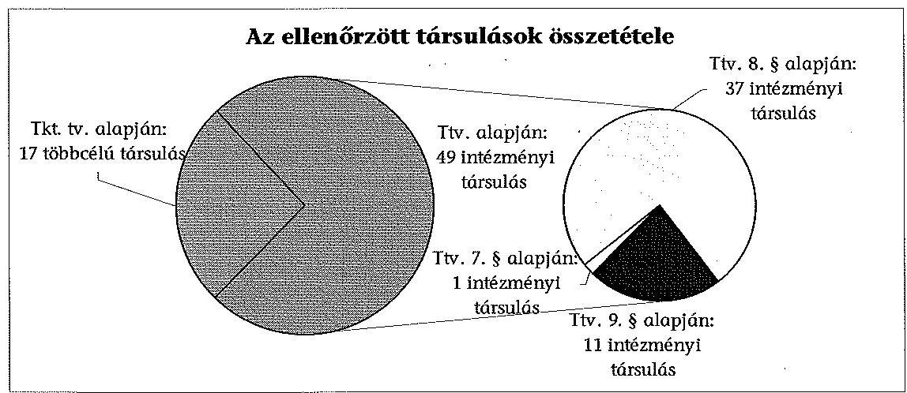

A helyszínen ellenőrzött többcélú társulásokat és az intézményi társulásokat Ttv. szerinti típusonként - az 1. számú melléklet rögzíti.

Az ellenőrzött társulások döntő része az ellenőrzés időszakát megelőzően alakult meg. A 2008. és 2011. közötti években 5 intézményi társulás jött létre, többcélú társulás létrehozataláról nem döntöttek. Ebben az időszakban csak egy esetben készült szakmai-gazdasági elemzés a közfeladatok társulási formában történő ellátásának megalapozására, az intézményi társulások létrehozására.

A 2008-2011. években a közfeladatok ellátásához kapcsolódóan a társulási megállapodások feladatellátásra vonatkozó módosításának 23,1%-ánál (15 esetben) készült szakmai-gazdasági elemzés. Az ellenőrzött évek alatt a különféle társulások mindössze 44 esetben $^{11}$ értékelték, hogy a közfeladat társulási formában történő ellátása meghozta-e a kívánt eredményt. Ezek a társulások úgy ítélték meg, hogy elérték a közfeladat társulásos ellátásától várt szakmai és gazdasági eredményt.

Az intézményi társulások feladatellátásával kapcsolatosan a kérdőívet kitöltő tagönkormányzatok 46,8%-a (96 önkormányzat) válaszolta azt, hogy a képviselő-testület értékelte a közös feladatellátás tapasztalatait. A többcélú társulások feladatellátásával kapcsolatosan adott válaszokban az önkormányzatok 59,5%-ánál számolt be a polgármesterük - az előírások szerint - a többcélú társulás társulási tanácsában végzett tevékenységéről és 42,4% állította azt, hogy a képviselő-testület értékelte a többcélú társulás útján ellátott feladatokat.

A többcélú társulások 41,2%-a nem rögzítette a Tkt. tv. 3. § (1) bekezdésében előírt kötelező tartalmi elemeket a társulási megállapodásokban.

A többcélú társulások társulási megállapodásainak fő hiányossága volt, hogy a Tkt. tv. 3. § (1) bekezdés j) pontjában foglaltak ellenére - intézmény, illetve más szervezet közös alapítása esetén az alapítói jogok gyakorlására vonatkozó részletes rendelkezéseket, a társulási megállapodások 41,2%-a nem tartalmazta $^{12}$. A Tkt. tv. 3. § (1) bekezdés a)-i) pontjában előírtakat a többcélú társulások társulási megállapodásai tartalmazták.

A Tkt. tv. a társulási célok megvalósulása érdekében számon kérhető kritériumokat nem fogalmazott meg, azonban lehetővé tette, hogy a többcélú társulások a társulási megállapodásaikban rögzítsék azt, amiben a tagok megállapodtak. A többcélú társulások 52,9%-a nem élt a Tkt. tv. 3. § (2) bekezdés k) pontjában foglalt felhatalmazással, a társulási megállapodásában a kötelező tartalmi elemeken kívül egyéb, a működésükre vonatkozó szabályokat nem határozott meg.

A többcélú társulások Tkt. tv. 5. § (1) bekezdésében előírtakat betartva közös döntéshozó szervet, társulási tanácsot hoztak létre. A társulási tanács tagjait megillető szavazatot a Tkt. tv. 8. § (1) bekezdésében foglaltaknak megfelelően szabályozták. A többcélú társulások közül valamennyi rendelkezett a társulási tanács által elfogadott SZMSZ-szel, illetve 88,2%-uk a Tkt. tv. 11. § (3) bekezdése alapján szabályszerűen létrehozta a pénzügyi bizottságot, melynek összetételét és működési rendjét a társulási tanács meghatározta.

A Mezőcsáti Többcélú Társulás társulási tanácsa a Tkt. tv. 11. § (3) bekezdésében rögzítettekkel ellentétben - a 2010. évi helyhatósági választásokat követően pénzügyi bizottságot nem hozott létre. A Balmazújvárosi Többcélú Társulás társulási tanácsa a pénzügyi bizottság létrehozásánál a Tkt. tv. 11. §
 (3) bekezdésének előírását figyelmen kívül hagyta, mert a pénzügyi bizottság tagjainak több mint a felét nem a társulási tanács tagjai közül választották.

[^0]
[^0]:    ${ }^{11}$ az ellenőrzött időszak 4 éve alatt a 66 társulás által dokumentáltan elvégzett értékelésének számadata
    ${ }^{12}$ A 3. számú melléklet 1. pontja tartalmazza a szabálytalanságot elkövető többcélú társulások megnevezését.

---

A többcélú társulások 5,9\%-ánál a társulásban részt vevő önkormányzatok száma meghaladta a 25-öt, ezért a Tkt. tv. 9. § (1) bekezdésének megfelelően a társulási tanács a tagjai közül elnökséget választott. 2008 és 2011 között többcélú társulások 47,1\%-ának a társulási tanácsa döntései előkészítésére, végrehajtásának szervezésére a Tkt. tv. 11. § (2) bekezdése alapján egyéb ${ }^{13}$ bizottságot is létrehozott.

A 2008-2011. években a többcélú társulások a Számv. tv. 14. § (3)-(4) és (5) bekezdéseiben előírt szabályzatokkal rendelkeztek, azonban a 76,5\%-a nem aktualizálta a jogszabályban foglaltaknak megfelelően a kötelezően előírt szabályzatokat ${ }^{14}$. Ezzel megsértették a Számv. tv. 14. § (11) bekezdésében meghatározottakat. A többcélú társulások 76,5\%-a ${ }^{15}$ számviteli politika keretében kialakított szabályzataiban - az Áhsz. 8. § (3) bekezdésében foglaltak ellenére - nem határozott meg olyan - a társulási működéssel kapcsolatos - sajátos szabályokat, melyek az Áhsz. 49. § (1) és (3) bekezdéseiben foglaltak teljesítését a tagok által befizetett hozzájárulások nyilvántartására és az ehhez kapcsolódó egyeztetések elvégzésére vonatkozóan is biztosították volna. Az Áht. ${ }_{1} 62$. § (4) bekezdésben foglaltak teljesítése érdekében a többcélú társulások 70,6\%-a nem határozott meg ${ }^{16}$ a költségvetési támogatások igénylésével, annak évközi módosításával és elszámolásával összefüggő kapcsolattartásra, adatszolgáltatásra és felelősségvállalásra vonatkozó szabályokat a saját intézményei és a feladatellátásba bevont intézményi társulás által fenntartott intézmények részére. Ezeknél a többcélú társulásoknál - rendszerszintű kockázatot magában hordozva - az Áht. ${ }_{1} 121 . \S$ (1) bekezdésében előírtak alapján kialakított és működtetett belső kontrollrendszer nem terjedt ki a rendelkezésére álló források igénylésére és elszámolására.

A 2008 és 2011 között az intézményi társulások 10,2\%-a jött létre. Az ellenőrzött időszakban létrejött intézményi társulások 80\%-ánál a társulási megállapodásainak megkötése és kötelező tartalma megfelelt a jogszabályi előírásoknak.

Az ellenőrzött időszakban létrejött 5 intézményi társulás közül a Tiszakécskei Intézményi Társulás társulási megállapodása nem tartalmazta az Ötv. 43. § (2) bekezdésben előírt kötelező tartalmi elemek közül a közös intézmény tevékenységi és ellátási körét.

Az ellenőrzött időszakban működő intézményi társulások 69,4\%-a ${ }^{17}$ nem rögzítette teljes körűen társulási megállapodásokban - a végrehajtott módosításokat is figyelembe véve - az Ötv. és a Ttv. szerinti kötelező tartalmi ele-

[^0]
[^0]:    ${ }^{13}$ például: közbeszerzési bizottság, leltározási bizottság
    ${ }^{14}$ A 3. számú melléklet 2. pontja tartalmazza a szabálytalanságot elkövető többcélú társulások megnevezését.
    ${ }^{15}$ A 3. számú melléklet 3. pontja tartalmazza a szabálytalanságot elkövető többcélú társulások megnevezését.
    ${ }^{16}$ A 3. számú melléklet 4. pontja tartalmazza a szabálytalanságot elkövető többcélú társulások megnevezését.
    ${ }^{17}$ A 3. számú melléklet 5. pontja tartalmazza a szabálytalanságot elkövető intézményi társulások megnevezését.

---

meket. Az intézményi társulások társulási megállapodásainak jellemző hiányosságai voltak, hogy a Ttv. 8. § (4) bekezdés f) és g) pontjaiban foglaltak ${ }^{18}$ ellenére nem határozták meg az önkormányzatok által vállalt pénzügyi hozzájárulás nem teljesítése esetén irányadó eljárást, a társuláshoz való csatlakozás és a társulási megállapodás felmondásának részletes szabályait, valamint a társulás megszűnése esetére az elszámolás rendjét. A Ttv. 6. § (4) bekezdésében előírtak ellenére az intézményi társulások 63,3\%-ánál nem teljesítették ${ }^{19}$ a tagönkormányzatok polgármesterei a legalább évente egyszeri - a társulás tevékenységéről, pénzügyi helyzetéről, a társulási cél megvalósulásáról szóló - a képviselő-testületek felé való beszámolási kötelezettséget. Az intézményi társulások 46,9\%-a ${ }^{20}$ a Ttv. által biztosított felhatalmazással nem élt, a társulási megállapodásában a legalább évente egyszeri beszámolási kötelezettségen túl a polgármesterei számára gyakoribb beszámolási kötelezettséget nem határozott meg, illetve nem rögzített ezen beszámolókra vonatkozó formai vagy tartalmi követelményeket.

A Ttv. a társulási célok megvalósulása érdekében számon kérhető kritériumokat nem fogalmazott meg, azonban a Ttv. 7. § (2) bekezdés g) pontjában, valamint a Ttv. 8. § (4) bekezdés l) pontjában lehetőséget biztosított az intézményi társulások számára, hogy a társulási megállapodásában a kötelező tartalmi elemeken kívül rögzítsék azt, amiben a képviselő-testületek megállapodtak, valamint a működésére vonatkozó szabályokat ${ }^{21}$ határozzanak meg. Az intézményi társulások 67,3\%-a ${ }^{22}$ nem élt a Ttv.-ben foglalt felhatalmazással.

A Ttv. 9. §-a alapján alakult intézményi társulások a Ttv. 10. §. (1) bekezdésében előírtakat betartva létrehozták a működését biztosító közös döntéshozó szervet, a társulási tanácsot. A társulási tanácsok jogkörét a Ttv. 10. § (2)-(3) bekezdéseinek figyelembe vételével határozták meg. A társulás tagjai megállapodtak abban, hogy a társulási tanács az általuk választott meghatározott számú - helyi önkormányzati képviselőkből áll, vagy arról döntöttek, hogy társulás tagjait a polgármesterek képviselik és egyik társulási tag sem rendelkezik a szavazatok több mint a felével.

Az intézményi társulások jogi személyiséggel nem rendelkeztek, ezért az Áhsz. 8. § (3) bekezdésében foglaltakat figyelembe véve a társulásra vonatkozó sajátosságokat székhely önkormányzatok belső szabályzatainak kellett tartalmaznia. A társult feladatok ellátását végző önkormányzatok és intézmények

[^0]
[^0]:    ${ }^{18}$ A Ttv. 8. § (4) bekezdés f) és g) pontjainak előírásai hatályosak voltak a Ttv. 8. és a 9. §-a alapján létrejött intézményi társulásokra is.
    ${ }^{19}$ A 3. számú melléklet 6. pontja tartalmazza a szabálytalanságot elkövető intézményi társulások megnevezését.
    ${ }^{20}$ A 3. számú melléklet 7. pontja tartalmazza azoknak az intézményi társulások a megnevezését, amelyek nem éltek a törvényi felhatalmazással.
    ${ }^{21}$ A működés részletes szabályozása érdekében az intézményi társulások szabályozhatták például a működéssel kapcsolatos dokumentumok elfogadásának rendjét, a közfeladattal kapcsolatos célokat, fejlesztendő területeket, a civil szervezetekkel való kapcsolattartás módját, az együttműködés rendjét.
    ${ }^{22}$ A 3. számú melléklet 8. pontja tartalmazza azoknak az intézményi társulások a megnevezését, amelyek nem éltek a törvényi felhatalmazással.

---

gazdálkodására vonatkozó belső szabályzatok csak részben tartalmaztak sajátos - a társulás működésével kapcsolatos - szabályozást. Az ellenőrzött időszak végén, 2011-ben az intézményi társulás székhely önkormányzatai 91,8\%-ának a számviteli politika keretében kialakított szabályzatai nem tartalmaztak olyan előírásokat, melyek az Áhsz. 49. § (1) és (3) bekezdéseiben foglaltak teljesítését a tagok által befizetett hozzájárulások nyilvántartására és az ehhez kapcsolódó egyeztetések elvégzésére vonatkozóan is biztosították volna ${ }^{23}$. Az Áht. 164. § (8) bekezdésében foglaltak szerint a költségvetési támogatások igénylése és elszámolása az intézményi társulás székhely önkormányzatának, vagy a társulási megállapodásban megjelölt önkormányzatnak volt a feladata. A székhely önkormányzatok 89,8\%-ánál ${ }^{24}$ az Áht. ${ }_{1}$ 121. § (1) bekezdése ${ }^{25}$ alapján kialakított és működtetett belső kontrollrendszer - rendszerszintű kockázatot rejtve magában - nem terjedt ki az intézményi társulások rendelkezésére álló források igénylésére és elszámolására.

# 1.2. A társulások működésének jogszabályi megfelelősége 

A többcélú társulások társulási tanácsai a Tkt. tv. 5. § (3) bekezdésében foglaltaknak megfelelően a társulási tanács tagjai közül, titkos szavazással elnököt választottak. A többcélú társulások 94,1\%-ánál élve a Tkt. tv. 5. § (3) bekezdésében biztosított felhatalmazással az elnök munkájának segítésére elnökhelyetteseket választottak. Az elnök helyettesítésének rendjét - a többcélú társulások 5,9\%-a kivételével - a társulási megállapodásokban meghatározták.

A 2010. évi helyhatósági választásokat követően - az ellenőrzött időszak végéig a Mezőcsáti Többcélú Társulás társulási tanácsa elnökhelyettest nem választott és a Völgységi Többcélú Társulás társulási megállapodása a Tkt. tv. 5. § (3) bekezdésében foglaltak ellenére az elnök helyettesítésének rendjét részletesen nem szabályozta.

A többcélú társulások a Tkt. tv.-ben rögzítetteket betartva meghatározták a társulási tanács működésének részletes működési szabályait. A társulási tanácsok döntéseiket - tekintettel a Tkt. tv.-ben foglaltakra - a társulási megállapodásban meghatározott szavazati jogok figyelembe vételével hozták meg.

A 2008-2011. években a többcélú társulások pénzügyi bizottságai a Tkt. tv. 11. § (3) bekezdésében rögzített létrehozás céljának megfelelő kötelezettségeiket nem teljesítették, mivel a többcélú társulások tevékenységét és gazdálkodását nem ellenőrizték ${ }^{26}$. A költségvetést érintő döntésekkel kapcsolatos véleményezésekről, a pénzügyi bizottság javaslatáról, intézkedéséről a több-

[^0]
[^0]:    ${ }^{23}$ A 3. számú melléklet 9. pontja tartalmazza a szabálytalanságot elkövető intézményi társulások megnevezését.
    ${ }^{24}$ A 3. számú melléklet 10. pontja tartalmazza a szabálytalanságot elkövető intézményi társulások megnevezését.
    ${ }^{25}$ 2011. január 1-jétől Áht. ${ }_{1}$ 121/A. § (4) bekezdése
    ${ }^{26}$ A 3. számú melléklet 11. pontja tartalmazza a szabálytalanságot elkövető többcélú társulások megnevezését.

---

célú társulások 41,2\%-ánál a Tkt. tv. 11. § (2) bekezdésében foglaltak ellenére a bizottság elnöke a társulási tanács elnökét írásban nem tájékoztatta.

Az adatszolgáltatás során a többcélú társulások 64,7\%-a nyilatkozta, hogy a pénzügyi bizottság ellenőrzést végzett, azonban ténylegesen ezek a pénzügyi bizottságok a többcélú társulás költségvetésének tervezését, végrehajtását véleményezték és részt vettek egyéb, a költségvetést érintő döntések előkészítésében is.

Oktatási bizottságot - élve a Tkt. tv. által adott felhatalmazással - a többcélú társulások 41,2\%-a ${ }^{27}$ alakított, ezek 28,6\%-a a Közokt. tv. 89/A. § (9) bekezdésében foglaltakat megsértve a közoktatással összefüggő döntések előkészítésében nem vett részt.

A többcélú társulások mindegyike rögzítette társulási megállapodásában - a Tkt. tv. 3. § (1) bekezdés i) pontjának megfelelően - a társulási tanács működésével kapcsolatos hivatali teendők ellátásának a módját. A 2008. évben a többcélú társulások 29,4\%-ánál a székhely település önkormányzata képviselő-testületének hivatala látta el a társulási tanács működésével kapcsolatos hivatali teendőket, a többi (70,6\%) többcélú társulásnál erre a feladatra költségvetési szervként elkülönült munkaszervezetet hoztak létre. A 2011. év végére már a többcélú társulások 82,4\%-ánál működött önálló munkaszervezet, kiváltva ezzel a székhely önkormányzat képviselő-testülete hivatalának a társulás munkavégzésében való közreműködését. Azoknál a többcélú társulásoknál ahol a munkaszervezet feladatait a többcélú társulások székhely önkormányzatának hivatala látta el, a munkaszervezet feladatait ellátó munkatársak munkaköri leírásai tartalmazták a társulással kapcsolatos feladatokat. Az önálló munkaszervezetet létrehozó többcélú társulások társulási megállapodásai minden esetben tartalmazták a munkaszervezetben foglalkoztatottakra vonatkozóan a munkáltatói jogok gyakorlásának rendjét. A létrehozott munkaszervezetek minden esetben rendelkeztek alapító okirattal. A többcélú társulások munkaszervezeteinek működése a társulási megállapodásban rögzítetteknek, a jogszabályi feltételeknek - a többcélú társulások 94,1\%-ánál -megfelelt.

Az Abaúj-Hegyközi Többcélú Társulás munkaszervezetének munkavállalói a köztisztviselők jogállásáról szóló 1992. évi XXIII. tv. 1. § (1) bekezdésében
 foglaltak ${ }^{28}$ ellenére köztisztviselői kinevezéssel rendelkeztek.

A települési önkormányzatok együttműködése bővült az ellenőrzött időszakban, mivel az intézményi társulások száma 5-tel, a többcélú társulások által fenntartott intézmények száma 4-gyel nőtt. A közös feladatellátásban résztvevő önkormányzatok száma a közoktatási feladatoknál 30-cal, a szociális- illetve az egészségügyi feladatoknál 21-gyel gyarapodott. A többcélú társulások által végzett tevékenységek valamelyikének közös ellátásában 2008. január 1-jén az

[^0]
[^0]:    ${ }^{27}$ A feladatellátása alapján négy saját intézménnyel oktatási feladatot ellátó és három szervezési tevékenységet végző - oktatási feladatát intézményi társulással kötött megállapodás alapján ellátó - többcélú társulás hozott létre oktatási bizottságot.
    ${ }^{28}$ A köztisztviselők jogállásáról szóló 1992. évi XXIII. tv. hatálya a helyi önkormányzat képviselő-testületének hivatala és hatósági igazgatási társulása, közterület-felügyelete, a körjegyzőség köztisztviselőinek és ügykezelőinek közszolgálati jogviszonyára terjed ki.

---

ellenőrzött kistérséget alkotó összes önkormányzat és 17 kistérségen kívüli önkormányzat vett részt. 2008 és 2011 között kettő kistérségen kívüli önkormányzat csatlakozott az ellenőrzött többcélú társulásokhoz, így 2011. december 31-én a közös feladatellátásban résztvevő önkormányzatok száma 259 volt.

A többcélú társulások a saját fenntartású intézményei, a hozzá kapcsolódó intézményi társulások, valamint szerződés vagy megállapodás útján történő feladatellátáshoz is jogosultak voltak költségvetési támogatások igénybevételére. A költségvetési támogatás igénybevételét (igénylés, módosítás, elszámolás) megalapozó dokumentumokat a többcélú társulások 82,4%-a bekérte a feladatot ellátóktól, azonban ezek 57,1%-ánál a szükséges egyeztetéseket nem végezték el. Ebből következően a költségvetési támogatások igénybevételére a többcélú társulások 64,7%-ánál ${ }^{29}$ a feladatot ellátók kontroll nélküli adatszolgáltatása alapján került sor. Ezeknél a többcélú társulásoknál az Áht. 121. § (1) bekezdésében ${ }^{30}$ előírtak alapján kialakított és működtetett belső kontrollrendszer nem terjedt ki a költségvetési támogatások igénybevételének ellenőrzésére.

A Ttv. 9. §-a alapján létrehozott intézményi társulások a Ttv. előírásait betartva, a társulási tanács tagjai közül választotta meg az elnökét, valamint a társulási tanács a társulási megállapodásban meghatározott szavazati jogok figyelembe vételével hozta meg döntéseit. Ezen intézményi társulások 54,5%-ánál ${ }^{31}$ a Ttv. 14. § (2) bekezdésében foglaltakat megsértve a társulási tanács saját működésének részletes szabályait nem alkotta meg.

A Ttv. 9. § alapján létrejött intézményi társulások 45,5%-ánál a Ttv. 11. §-ában ${ }^{32}$ foglaltak ellenére nem a társulási tanácsok, hanem a székhely önkormányzat képviselő-testülete, a társulási tanáccsal tagságában megegyező közös képviselő-testületek döntöttek a társulási megállapodásban meghatározott és a társulás tagjai által átruházott önkormányzati feladat- és hatáskörökben. A Ttv. 13. § (3) bekezdés a) pontjában foglaltakat betartva a Ttv. 9. §-a alapján létrejött intézményi társulások 90,9%-ánál az ellenőrzött időszakban a társulási tanács ülését szükség szerint, de legalább évente két alkalommal összehívta az elnök vagy a társulási tanács felhatalmazott képviselője.

A Ttv. 9. § alapján létrejött intézményi társulások 9,1%-ának döntéseit nem a társulási tanács hozta meg, mivel azt a Ttv. 13. § (3) bekezdés a) pontjában foglaltakat megsértve a társulási tanács összehívása elmaradt.

[^0]
[^0]:    ${ }^{29}$ A költségvetési támogatás igénybevételét megalapozó dokumentumokat a 17-ből 14 többcélú társulás bekérte a feladatot ellátóktól, azonban ezek közül 8 többcélú társulásnál a szükséges egyeztetéseket nem végezték el. Ebből következően a költségvetési támogatások igénybevételére a többcélú társulások 64,7%-ánál (11 többcélú társulás) a feladatot ellátók kontroll nélküli adatszolgáltatása alapján került sor.
    ${ }^{30}$ 2011. január 1-jétől Áht. 121/A. § (4) bekezdése
    ${ }^{31}$ A 3. számú melléklet 12. pontja tartalmazza a szabálytalanságot elkövető intézményi társulások megnevezését
    ${ }^{32}$ A 3. számú melléklet 13. pontja tartalmazza a szabálytalanságot elkövető intézményi társulások megnevezését

---

A Kecskeméti Intézményi Társulás a Ttv. és a társulási megállapodás egyes pontjai tekintetében nem megfelelően működött. Az Intézményi Társulást szociális alapszolgáltatások biztosítása érdekében alapította két település önkormányzata 2006-ban. A társulási megállapodás alapján a kéttagú társulási tanács a Ttv. 13. § (3) bekezdés a) pontjában foglaltak ellenére 2008-2010 években nem ülésezett, döntést nem hozott. A társulási tanács a társulási megállapodásban meghatározottak ellenére célszerűségi és gazdasági szempontból nem ellenőrizte a társulás működését. A társulási megállapodásban előírt ellenőrzési bizottságot nem alakították meg és nem működtették.

A Ttv. 9. §-a alapján létrejött intézményi társulások 18,2%-ánál a döntéseket a Ttv. 13. §-ának előírása ellenére nem a társulási tanács ülésén, hanem azzal tagságában megegyező közös képviselő-testületi ülésen hozták meg.

A két Galgamácsai Intézményi Társulás társult önkormányzatai egy körjegyzőséghez tartoztak, ebből adódóan a körjegyzőség működésével kapcsolatos döntésüket közös képviselő-testületi ülésen hozták. Ehhez igazodóan alakították ki a társulási tanácsok működtetését is, mivel minden képviselő tagja lett mindkét társulási tanácsnak. A Ttv. 13. §-a értelmében a társulási tanács döntését ülésén, határozattal kellett meghoznia. A Galgamácsai Intézményi Társulásoknál az együttes képviselő-testületi üléseken döntéseikről nem társulási tanácsi döntést, hanem képviselő-testületi határozatokat hoztak. Az intézményi társulásoknál a társulási tanács formailag nem működött, azonban a társulási megállapodásokban meghatározott társulási tanácsi feladatokat az együttes képviselő-testületi ülés elvégezte, ezért az intézményi társulások működése tartalmában megfelelt a Ttv.-ben meghatározott feltételeknek.

A Ttv. 9. §-a alapján létrejött intézményi társulások 18,2%-a (Gyulaji- és a Jakabszállási Intézményi Társulás) által fenntartott közoktatási intézmény SZMSZ-éről nem a fenntartó intézményi társulás társulási tanácsa, hanem a székhely önkormányzat képviselő-testülete döntött.

A Ttv. 9. §-a alapján létrejött társulások a társulási megállapodásaikban a Ttv. 6. § (3) bekezdésében foglaltak alapján rögzítették, hogy a társulás tagjai célszerűségi és gazdasági szempontból ellenőrizik a társulás működését. A Ttv. 9. §-a alapján létrejött intézményi társulások 63,6%-ánál a társulás tagjai nem ellenőrizték a társulási megállapodásban meghatározott módon, célszerűségi és gazdasági szempontból a társulás működését ${ }^{33}$.

A Ttv. 8. §-a alapján létrehozott intézményi társulások 2,7%-ának működése nem felelt meg a törvényi előírásoknak, mivel nem tettek eleget a Ttv. 8. § (1) bekezdésében foglalt „két vagy több képviselő-testülete” megléte feltételének.

A Nagyrozvágyi Intézményi Társulás működése nem felelt meg a jogszabályi követelményeknek és a társulási megállapodásban rögzített szabályozásnak. Az Intézményi Társulás 2007-ben jött létre az Ötv. 43. § (1) bekezdése szerint, a társulási megállapodást a Ttv. 8. §-a alapján kötötték meg. Semjén Község Önkormányzata a 2009. évben kivált a társulásból, ennek ellenére - a Ttv. 8. § (4) be-

[^0]
[^0]:    ${ }^{33}$ A 3. számú melléklet 14. pontja tartalmazza a szabálytalanságot elkövető intézményi társulások megnevezését.

---

kezdésében foglaltakat figyelmen kívül hagyva - a társulási megállapodást nem módosították. Nagyrozvágy-Kisrozvágy községek az Ötv. 44. § (1) bekezdése alapján is társultak közös képviselő-testület létrehozásával. A képviselő-testületek társulása következtében Nagyrozvágy és Kisrozvágy Községek Társult Képviselőtestülete egy képviselő-testületnek minősült, így az intézményi társulás Semjén kiválása után 2009-2010. években nem felelt meg a Ttv. 8. § (1) bekezdésében foglalt „két vagy több képviselő-testülete” megléte feltételének. Nagyrozvágy és Kisrozvágy Községek Önkormányzata népszavazás eredményeként 2010. december 31-ével megszüntette a képviselő-testületek társulását. A közoktatás feladatellátására vonatkozóan 2007-ben megkötött társulási megállapodást a két képviselő-testület 2011. év áprilisában módosította.

Az intézményi társulások 83,7%-a kérte be a feladatot ellátó tagintézmények vezetőitől a költségvetési támogatás igényléséhez közölt adatokat megalapozó dokumentumokat. Az intézményi társulások 55,1%-ánál ${ }^{34}$ nem végezték el a - költségvetési támogatások igénybevételének alapját képező mutatószámok ellenőrzését, mivel az Áht. 121. § (1) bekezdésében ${ }^{35}$ előírtak alapján kialakított és működtetett belső kontrollrendszer erre a feladatra nem terjedt ki${ }^{36}$.

Külső szervek (szakhatósági, törvényességi, egyéb) ellenőrzést a többcélú társulások 76,5%-ánál, a Ttv. 9. § alapján működő intézményi társulások 54,5%-ánál végeztek a 2008-2011. években.

Szakhatósági ellenőrzést jellemzően a Foglalkoztatási és Szociális Hivatal, ÁNTSZ, gyámhivatalok végeztek. A törvényes működést - a 2009. január 1-je és 2010. szeptember 1-je közötti időszak kivételével (okai részletezve a 4. pontban) a kormányhivatalok (közigazgatási hivatalok) ellenőrizték. Egyéb ellenőrzést a Kincstár, az EU-s pályázatokhoz kapcsolódóan az irányító hatóság és a közreműködő szervezetek végeztek.

Az ellenőrzött többcélú társulások 69,2%-ánál tettek a külső ellenőrző szervek intézkedést igénylő megállapításokat.

A Bodrogközi Többcélú Társulásnál egy törvényességi ellenőrzés, négy szakhatósági ellenőrzés és öt kincstári ellenőrzés tett intézkedést igénylő megállapítást. A feltárt hiányosságok megszüntetését szolgáló intézkedési tervet a munkaszervezet vezetője nem készített.

[^0]
[^0]:    ${ }^{34}$ A 3. számú melléklet 15. pontja tartalmazza a szabálytalanságot elkövető intézményi társulások megnevezését.
    ${ }^{35}$ 2011. január 1-jétől Áht. 121/A. § (4) bekezdése
    ${ }^{36}$ A költségvetési támogatások igénylésével, elszámolásával, ellenőrzésével és visszafizetési kötelezettségének szabályozásával kapcsolatban 2012. január 1-jei hatállyal az Áht. 57-57/B. §-ai, valamint az annak végrehajtására vonatkozó Ávr. 101-107. §-ai tartalmaznak előírásokat. Az Ávr. 103. §-a szerint a társulás által ellátott feladatokhoz kapcsolódó központi költségvetésből származó támogatásokat az intézmény székhelye vagy a társulási megállapodásban meghatározott helyi önkormányzat igényelheti. A támogatással való elszámolás az igénylésre jogosult feladata.

---

A külső szerv által ellenőrzött Ttv. 9. § alapján működő intézményi társulások 66,7%-ánál az ellenőrzést végző szervek intézkedést igénylő megállapítást tettek.

A hiányosságok megszüntetésére két intézményi társulásnál (Bogyiszlói- és Tiszakécskei Intézményi Társulás) nem készítettek intézkedési tervet.

# 2. A TÁRSULÁSOK VAGYONÁNAK NYILVÁNTARTÁSA, A TULAJDONVISZONYOK RENDEZETTSÉGE, A KAPOTT TÁMOGATÁSOK FELHASZNÁLÁSÁNAK ÉS NYILVÁNTARTÁSÁNAK SZABÁLYSZERŰSÉGE 

### 2.1. A társulások vagyonkezelésének szabályszerűsége

A feladatellátáshoz szükséges vagyon használatát mind a Tkt. tv., mind a Ttv. alapján létrejött társulások esetében biztosították a társult önkormányzatok az ellenőrzött időszakban. A társulási megállapodásokban rögzítették, hogy a társult feladatok ellátását a tagok által bevitt vagyon is szolgálja. A többcélú társulások 5,9%-a esetében pedig nem biztosították az összhangot a társulási megállapodás és a társult feladatellátást szolgáló intézmények alapító okirataiban foglaltakkal. Az Ötv. 80. § (5) bekezdésében foglaltakat megsértve az intézményi társulások 2,0%-a a bevitt vagyont nem a tagönkormányzatok tulajdonaként, hanem a székhely önkormányzat vagyonaként mutatta ki.

#### Abstract

A Veresegyházi Többcélú Társulás a társulási megállapodásban és a feladatellátást szolgáló intézmények alapító okirataiban foglaltak összhangját nem biztosította. A vagyon az Ötv. előírásának megfelelően az önkormányzatok tulajdonában maradt, azonban az alapító okiratokban a vagyon tulajdonosaként a Veresegyházi Többcélú Társulás került megnevezésre, illetve a vagyon feletti rendelkezés joga is őt illette meg. A vagyon gyarapodását az Ötv. előírásának megfelelően, a társulás közös vagyonaként mutatták ki.

A Vilmányi Intézményi Társulás esetében a feladat ellátását szolgáló ingatlanok a társult önkormányzatok közös tulajdonában voltak (Vilmány, Mogyoróska és Hejce Községi Önkormányzatok). Ezzel ellentétben a közös tulajdonban lévő vagyont 100%-ban a székhely önkormányzat vagyonaként tartották nyilván.

A többcélú társulások a feladatellátásuk során saját bevételeikből és pályázati forrásokból megvalósított fejlesztéseiket saját vagyonukként mutatták ki. A tagönkormányzatok részére átadott eszközöket - a számviteli nyilvántartásaikban -
 szabályszerűen, üzemeltetésre átadott eszközként tartották nyilván. Az üzemeltetésre történő átadást, illetve átvételt jegyzőkönyvvel igazolták.

Az intézményi társulások jogi személyiséggel nem rendelkeztek, így társulásként fejlesztést nem valósítottak meg, pályázatot nem nyújtottak be. A társult feladatellátáshoz kapcsolódó fejlesztéseket és pályázatokat a tagönkormányzatok önállóan nyújtották be és valósították meg. Az így létrejött vagyon a lebonyolító önkormányzatok, illetve a támogatási szerződésekben támogatottként megjelölt, pályázó önkormányzatok tulajdonába került. Az intézményi társulások székhely önkormányzatai a fejlesztések

---

végrehajtása, aktiválása, illetve nyilvántartásba vétele során a következő esetekben nem tettek eleget a jogszabályi előírásoknak:

- Bogyiszló Önkormányzata - a Bogyiszlói Intézményi Társulás székhely önkormányzata - a 2010. évben pályázati forrásból valósította meg az általános iskola és óvoda informatika infrastruktúra fejlesztését. A fejlesztés keretében beszerzett számítógépekről az üzembe helyezési okmányt 2010. október 21-én kiállították. A számviteli nyilvántartásban vagyonnövekményként nem mutatták ki, nem rögzítettek minden gazdasági eseményt, amely az eszközökre és a forrásokra hatással volt. Ezért a beszámoló sem tartalmazott minden gazdasági eseményt. Ezzel megsértették a Számv. tv. 165. § (1) bekezdésében, illetve a Számv. tv. 15. § (2)-(3) bekezdéseiben előírt teljesség és valódiság számviteli alapelveket. A nyilvántartások nem előírás szerinti vezetésével megsértették a Számv. tv. 161. § (3) bekezdés előírását, mert nem biztosították a főkönyvi könyvelés és az analitikus nyilvántartások érték adatai közötti egyeztetés lehetőségét. Nem tartották be az Áhsz. 18. § (3) bekezdésében foglaltakat, mert a fejlesztés értékét nem mutatták ki a gépek, berendezések és felszerelések között. Nem tartották be továbbá a támogatói okirat 9. n) pontjában - a projekt fenntartási időszakára vonatkozóan - a vagyonkezelésre előírt kötelezettséget, és a vagyonvédelmi előírásokat. A fejlesztéssel létrehozott eszközök kizárólag a pályázathoz kapcsolódó nyilvántartásokból voltak beazonosíthatóak és fellelhetőek a feladatot ellátó intézményben. Az intézményvezető, a jegyző, és a polgármester nyilatkozata alapján az eszközök a pályázathoz kapcsolódó nyilvántartásokból beazonosíthatóak és fellelhetőek a feladatot ellátó intézményben;
- a Szentes-Derekegyház Intézményi Társulás székhely önkormányzata a 2010. évben az Általános Iskola derekegyházi tagiskolájának fűtéskorszerűsítését valósította meg 7 millió Ft pályázati forrásból. A fejlesztéshez szükséges 10,0%-os saját forrást a tagönkormányzat biztosította. A fejlesztés értékét a befejezetlen beruházások, felújítások állományából a Számv. tv. 26. § (7) bekezdése és az Áhsz. 9. számú melléklete 1. g) pontja előírása ellenére - a beruházás üzembe-helyezését, műszaki átadását követően - nem vezették ki és nem aktiválták;
- Nagyrozvágyi Intézményi Társulás székhely önkormányzatának jegyzője az Áhsz. 49. § (3)-(5) bekezdései ellenére nem alakította ki az analitikus nyilvántartás rendszerét, illetve nem szabályozta az analitikus nyilvántartási rendszer és a főkönyvi nyilvántartás kapcsolatrendszerét. A nagyrozvágyi általános iskola 2009. évi felújításának 19 millió Ft-os értékét az ingatlan egyedi nyilvántartólapjára nem vezették fel, a főkönyvi könyvelésben az ingatlanok állományi számláján nem rögzítették. A 2008. évben benyújtott informatikai fejlesztési pályázaton nyert támogatásból 2011-ben beszerzett számítástechnikai eszközök 6 millió Ft-os értékének aktiválása elmaradt. A számviteli nyilvántartásban nem rögzítettek minden gazdasági eseményt, amely az eszközökre és a forrásokra hatással volt, ezért a beszámoló nem tartalmazott minden gazdasági eseményt. Ezzel megsértették a Számv. tv. 165. § (1) bekezdésében, illetve a Számv. tv. 15. § (2)-(3) bekezdéseiben előírt teljesség és valódiság számviteli alapelveket. A nyilvántartások nem előírás szerinti vezetésével megsértet-

---

ték a Számv. tv 161. § (3) bekezdés előírását, mert nem biztosították a főkönyvi könyvelés és az analitikus nyilvántartások érték adatai közötti egyeztetés lehetőségét. Nem tartották be továbbá a könyvviteli mérleg tartalmára vonatkozó előírások közül az Áhsz. 18. § (3) bekezdésében foglaltakat, mert a fejlesztés értékét nem mutatták ki a gépek, berendezések és felszerelések között. A jegyző nyilatkozata alapján az eszközök az intézménynél fellelhetők, illetve a feltárt hiányosságok megszüntetésére az ellenőrzés megkezdését követően intézkedéseket tettek;

- Cikói Intézményi Társulás székhely önkormányzatának jegyzője az analitikus nyilvántartás rendszerét, a főkönyvi nyilvántartással való kapcsolatát a pénzügyi gazdasági feladatokat ellátó Polgármesteri Hivatal 37 számlarendjében az Áhsz. 49. § (3)-(5) bekezdések rendelkezései ellenére nem alakította ki. Az Önkormányzatnál nem álltak rendelkezésre az Általános Iskola 2008. - 2011. évek beszámolói és a kapcsolódó számviteli nyilvántartások. Az Általános Iskola 38 önálló gazdálkodásának megszűnése során a Polgármesteri Hivatal által átvett intézményi vagyonról leltár nem állt rendelkezésre. Ezzel megsértették a Számv. tv. 169. §-ában foglalt, bizonylat megőrzési kötelezettséget. A pályázati forrásokból beszerzett eszközökről analitikus nyilvántartás nem készült. A számviteli nyilvántartások hiánya miatt nem volt megállapítható, hogy a társult feladatellátást végző Általános Iskola által pályázati pénzeszközökből beszerzett eszközök az Önkormányzat vagyonába beépültek-e. Ezzel megsértették a Számv. tv. 12. §-ában előírt könyvvezetési kötelezettségre vonatkozó előírást, valamint a Számv. tv. 15. § (2) és (3) bekezdésében foglalt teljesség és valódiság elvét. A számviteli nyilvántartások hiánya meghiúsította a pályázati pénzeszközökből beszerzett eszközök vagyonként való kimutatásának megállapítását.

A 2009., a 2010. és a 2011. évben a társulások 6,1%-ánál 39 idegenítettek el támogatással létrehozott vagyont. Az elidegenítések során a jogszabályi előírásokat betartották.

Társulásból való kiválásra 2008-ban, az intézményi társulások 2,0%-ánál került sor.

A Ttv. 8. § alapján alakult Vilmányi Intézményi Társulásból 2008. szeptember 1-jével kiváló Fony Község Önkormányzat Képviselő-testülete a kiválási szándékról szóló döntés meghozatalával egyidejűleg a közös vagyonról lemondott a székhely önkormányzat javára.

[^0]
[^0]:    ${ }^{37}$ Cikó Község Önkormányzatának Polgármesteri Hivatala
    ${ }^{38}$ Cikói Intézményi Társulás által fenntartott általános iskola
    ${ }^{39}$ a Paksi Többcélú Társulásnál, a Szentesi Többcélú Társulásnál, a Kecskeméti Többcélú Társulásnál és a Ruzsa Intézményi Társulásnál

---

# 2.2. A közfeladatok működési feltételei és azok ellátásához biztosított támogatások felhasználásának szabályszerűsége. A feladatellátáshoz szükséges források rendelkezésre állása 

Közoktatási-, szociális- és egészségügyi feladatokat a többcélú társulások a Tkt. tv. alapján saját intézménnyel, a szervező tevékenységük révén az intézményi társulások által fenntartott intézményeken keresztül, illetve a szerződés vagy megállapodás útján történő feladatellátással láthattak el. Az intézményi társulások a Ttv. alapján az általuk fenntartott intézmények bevonásával látták el a kötelező feladataikat.

A központi költségvetési támogatások mindenkori Kvtv.-ben előírt igénylési feltételeinek - részben a társulások működésére vonatkozó számon kérhető kritériumok hiánya következtében - a közoktatási, a szociális és az egészségügyi feladatok ellátását végző társulások megfeleltek:

- a közoktatási feladatokat ellátó intézményi- és többcélú társulások 2008-2011. évek Kvtv.-einek 3. számú mellékletében előírt igénylési feltételeknek megfelelően a társulási megállapodásokban rögzítették a közös feladatellátás módját, hogy az intézményt közösen alapítják, közösen üzemeltetik, illetve költségvetését közösen határozzák meg. Az intézményi társulások esetében az intézmény fenntartójának székhelye a közoktatási intézmény székhelyével minden esetben megegyezett. Ugyanazon közoktatási feladat ellátására az intézményi társulások nem tartottak fenn több önálló OM azonosítóval rendelkező intézményt. Az általános iskolai feladatokat is ellátó társulások esetében a közoktatási intézmények a székhely szerinti településeken 8 évfolyammal működtek. A bejáró gyermekek utaztatását 8 társulás iskolabusz működtetésével, 5 társulás iskolabusz szolgáltatás vásárlásával és egy társulás menetrend szerinti autóbusz szolgáltatás vásárlásával biztosította. A gyermekek, tanulók mellett - az előírt feltételeknek megfelelően - kísérő is utazott.
- a társult szociális feladatokat ellátó intézmények és szolgáltatók a jogszabályi előírásoknak megfelelően 2008-2011 között érvényes és hatályos működési engedéllyel rendelkeztek. A működési engedélyekben ellátási területenként a feladatot ellátó önkormányzatokat egy kivétellel (Gyomaendrődi Intézményi Társulás) maradéktalanul feltüntették;
- az egészségügyi feladatok ellátására az intézményi- és a többcélú társulások, illetve a feladatok ellátását végző szervezetek érvényes és hatályos működési engedélyekkel rendelkeztek.

Közoktatási intézményi feladatokat 2011. december 31-én 52 ellenőrzött társulás látott el. A feladatellátásban 5 többcélú társulás saját intézményével vett részt. Az ellenőrzött időszakban a többcélú társulások saját intézménnyel ellátott feladatellátó helyeinek száma nem változott. A társulási megállapodásokban a társult önkormányzatok az ellátni kívánt feladatokat meghatározták. Az ellenőrzött időszakban a társulások feladatellátásának változása a következők szerint alakult:

---

t. számú táblázat

A társulások által ellátott közoktatási feladatok feladatellátóhelyeinek száma 2008-2011 között
feladatellátóhelyek száma

|  | 2008. év |  | 2009. év |  | 2010. év |  | 2011. év |  |
| :--: | :--: | :--: | :--: | :--: | :--: | :--: | :--: | :--: |
|  | intézmény   társulás | többcélú   társulás | intézmény   társulás | többcélú   társulás | intézmény   társulás | többcélú   társulás | intézmény   társulás | többcélú   társulás |
| Ovodai nevelés | 27 | 3 | 27 | 3 | 29 | 3 | 29 | 3 |
| Általános iskolai oktatás 1-4 évfolyam | 10 | 2 | 10 | 2 | 13 | 2 | 13 | 2 |
| Általános iskolai oktatás 5-8 évfolyam | 5 | 0 | 4 | 0 | 1 | 0 | 1 | 0 |
| Általános iskolai oktatás 1-8 évfolyam | 28 | 4 | 28 | 4 | 29 | 4 | 31 | 4 |
| Középfokú oktatás | 0 | 1 | 0 | 1 | 0 | 1 | 0 | 1 |

Megjegyzés: A többcélú társulásokra vonatkozó adat a saját intézménnyel ellátott feladatellátó helyek számát rögzíti. Az intézményi társulások feladatellátó helye a székhely önkormányzat intézményét és az esetlegesen hozzá kapcsolódó tagintézményeket jelentik, melyeket intézményi társulásonként egy feladatellátó helyként tekintettünk.

Közoktatási intézmény létesítéséről, átszervezéséről 2008-2011 között 15 társulás határozott. A döntések osztályok, óvodai csoportok megszüntetésére és átszervezésére, intézmények egyesülésére, tagintézmények bezárására, intézmény közös fenntartásba vételére, fejlesztő iskolai intézményegység létrehozására irányultak. Az átszervezések oka a gyermeklétszám változása, illetve a költségvetési támogatások igénylési feltételei változásának követése volt.

A közoktatási intézmények SZMSZ-szel rendelkeztek, azonban 10 intézményi társulás (Cegléd, Gyomaendrőd, Gyulaj, Jakabszállás, Kondoros, Nagyrozvágy, és a három Ricse székhellyel működő Intézményi Társulás) esetében az ellenőrzött időszakban annak elfogadásáról a Közokt. tv. 102. § (2) bekezdés f) pontja ellenére nem a fenntartó intézményi társulás döntött, hanem a székhely önkormányzat. Az 52 közoktatási feladatot ellátó társulás 57,7%-a megsértette 40 a Közokt. tv. 102. § (2) bekezdés d) és g) pontjában foglaltakat, mert négyévenként legalább egy alkalommal nem ellenőrizték a közoktatási intézmények gazdálkodását, működésének törvényességét, nem értékelték a szakmai munkájának eredményességét és a pedagógiai-szakmai munka eredményességét.

A 2011. évben a közoktatási feladatokat ellátó társulások közül 21 nem értékelte a pedagógiai szakmai munka eredményességét. Négyévenként legalább egy alkalommal 22 társulás esetében a fenntartó nem ellenőrizte az intézmény gazdálkodását és 24 az intézmény működésének törvényességét. A társult feladat ellátását végző intézmény működésének hatékonyságát 27 fenntartó, míg a közoktatási intézmény szakmai munkájának eredményességét 26 fenntartó nem ellenőrizte.

Szociális feladatokat 2011. december 31-én 25 társulás látott
 el. A feladatellátásban 14 intézményi társulás és 11 többcélú társulás saját intézményével vett részt. Az ellenőrzött időszak végére a többcélú társulások saját intézménnyel biztosított feladatellátása a házi segítségnyújtás, az étkeztetés és az idősek nappali ellátása területén bővült az időszak kezdetéhez képest. Az ellátott szociális feladatokat, a feladatok ellátását végző társulások számát és annak alakulását 2008-2011 között a következő táblázat tartalmazza.

[^0]
[^0]:    ${ }^{40}$ A 3. számú melléklet 16. pontja tartalmazza a szabálytalanságot elkövető társulások megnevezését.

---

A társulások által ellátott szociális feladatok 2008-2011 között

|  | 2008. év |  | 2009. év |  | 2010. év |  | 2011. év |   |
| --- | --- | --- | --- | --- | --- | --- | --- | --- |
|  | intézmény | többcélú | intézmény | többcélú | intézmény | többcélú | intézmény | többcélú  |
|  | társulás | társulás | társulás | társulás | társulás | társulás | társulás | társulás  |
|  Talogondnoki szolgáltatás | 0 | 0 | 1 | 0 | 1 | 0 | 1 | 0  |
|  Tanyagondnoki szolgáltatás | 3 | 1 | 4 | 1 | 4 | 1 | 4 | 1  |
|  Étkeztetés | 11 | 3 | 12 | 3 | 12 | 4 | 12 | 5  |
|  Házi segítségnyújtás | 13 | 8 | 13 | 8 | 13 | 8 | 13 | 9  |
|  Családsegítés | 13 | 7 | 13 | 7 | 13 | 7 | 14 | 7  |
|  Jelzőrendszeres házi segítségnyújtás | 8 | 8 | 10 | 8 | 9 | 8 | 9 | 8  |
|  Közösségi ellátások | 8 | 1 | 8 | 1 | 8 | 1 | 8 | 1  |
|  Támogató szolgáltatás | 9 | 1 | 10 | 1 | 11 | 1 | 11 | 1  |
|  Utcai szociális munka | 1 | 0 | 1 | 0 | 1 | 0 | 1 | 0  |
|  Idősek nappali ellátása | 8 | 6 | 9 | 6 | 9 | 6 | 9 | 7  |
|  Egyedülállók nappali ellátása | 5 | 1 | 5 | 1 | 7 | 1 | 8 | 1  |
|  Pszichiátriai és | 2 | 1 | 4 | 1 | 4 | 1 | 4 | 1  |
|  szenvedélybetegek nappali ellátása | 2 | 0 | 2 | 0 | 2 | 0 | 2 | 0  |
|  Nappali melegedő | 2 | 0 | 2 | 0 | 2 | 0 | 2 | 0  |
|  Demens személyek nappali ellátása | 1 | 0 | 1 | 0 | 1 | 0 | 1 | 0  |
|  Éjjeli menedékhely | 3 | 0 | 3 | 0 | 3 | 0 | 3 | 0  |
|  Hajléktalan személyek átmeneti szállása | 2 | 1 | 2 | 1 | 2 | 1 | 2 | 1  |

Megjegyzés: A többcélú társulásokra vonatkozó adat a saját intézménnyel ellátott feladatok számát rögzíti. Az intézményi társulásoknál a székhely vagy a megállapodás alapján feladatot ellátó önkormányzat által végzett feladatot társulásunként egyszer vettük figyelembe, függetlenül annak szervezésétől.

A szociális feladatokat ellátó intézmények fenntartói nem tettek eleget ellenőrzési kötelezettségeiknek. A Szoc.tv. 92/B. § (1) bekezdés b) és d) pontjában foglaltak ellenére a társulások 36,0 %-a nem ellenőrizte ${ }^{41}$ az intézmény működésének törvényességét, a végzett szakmai munkát, valamint nem értékelte évente egy alkalommal a szakmai munka eredményességét.

A 25-ből 9 társulás a 2011. évben nem ellenőrizte az intézménye működésének törvényességét és a végzett szakmai munkát, valamint 6 társulás nem értékelte az általa fenntartott intézmény szakmai munkájának eredményességét.

Egészségügyi feladatokat 12 társulás látott el saját intézménnyel, illetve a feladat ellátására irányuló szerződés keretében külső szolgáltató szervezettel. A feladatellátásban 5 többcélú társulás saját intézményével vett részt, az ellenőrzött időszakban az ügyeleti feladatellátás területén bővült a többcélú társulások szerepvállalása.
3. számú melléklet

A társulások által ellátott egészségügyi ellátások 2008-2011 között

|  | feladatot ellátók száma |  |  |  |  |  |  |  |
| :--: | :--: | :--: | :--: | :--: | :--: | :--: | :--: | :--: |
|  | 2008. év |  | 2009. év |  | 2010. év |  | 2011. év |  |
|  | intézmény | többcélú | intézmény | többcélú | intézmény | többcélú | intézmény | többcélú  |
|  | társulás | társulás | társulás | társulás | társulás | társulás | társulás | társulás |
| Házi gyermekorvosi ellátás | 0 | 0 | 0 | 0 | 0 | 0 | 1 | 0 |
| Védőnői ellátás | 0 | 2 | 1 | 2 | 1 | 2 | 1 | 2 |
| Iskola egészségügyi ellátás | 0 | 1 | 0 | 1 | 0 | 1 | 0 | 1 |
| Ügyeleti ellátás | 7 | 2 | 9 | 2 | 8 | 4 | 8 | 4 |

Megjegyzések: A többcélú társulásokra vonatkozó adat a saját intézménnyel ellátott feladatok számát rögzíti. Az intézményi társulásoknál a székhely vagy a megállapodás alapján feladatot ellátó önkormányzat által végzett feladatot társulásunként egyszer vettük figyelembe, függetlenül annak szervezésétől.

A társulási megállapodások esetenként nem tartalmazták az ellátotti kört, az ellátás helyét, az OEP-pel a finanszírozási szerződésre jogosultak körét, a fel-

[^0]
[^0]:    ${ }^{41}$ A 3. számú melléklet 17. pontja tartalmazza a szabálytalanságot elkövető társulások megnevezését.

---

adatok költségeinek viselési módját, valamint a megállapodás időtartamát. A társulások által fenntartott intézmények esetében a működési engedélyekben valamennyi feladatot ellátó önkormányzatot feltüntették ellátási területenként.

Az ellenőrzött időszakban az Áhsz. 49. § (1) és (3) bekezdéseiben foglaltakkal ellentétben a tagönkormányzatok hozzájárulásait a társulások 21,2 %-a${ }^{42}$, a feladatok ellátására átadott pénzeszközöket a társulások 4,5 %-a${ }^{43}$, a többcélú társulásoktól átvett pénzeszközöket az intézményi társulások 16,3 %-a${ }^{44}$ nem tartotta elkülönítetten nyilván.

A 2008 és 2011 között megvalósított fejlesztések az ágazati szakmai fejlesztési koncepciókban rögzített céloknak megfelelően történtek. A fejlesztések eredményeként létrejött eszközök működtetésére és fenntartására a többcélú társulások a költségvetésükben, illetve az intézményi társulások esetében a társulási megállapodásokban foglaltaknak megfelelően - a székhely önkormányzatok költségvetésében biztosítottak fedezetet. A fejlesztéseket a támogatási szerződésekben meghatározott műszaki tartalommal valósították meg. A támogatásokkal a többcélú társulások, illetve a fejlesztéseket lebonyolító intézményi társulási székhely önkormányzatok elszámoltak.

Külső szervezetek az elszámolások ellenőrzése során 3 intézményi társulás székhely önkormányzata esetében állapítottak meg hiányosságokat:

- a közreműködő szervezet az eszközök egyedi beazonosíthatóságát igazoló eszköznyilvántartás hiányát állapította meg egy intézményi társulásnál. Az eszköznyilvántartást hiánypótlás keretében elkészítették. Ugyanennél az intézményi társulásnál a projektmenedzser bérének és járulékainak számfejtése és tényleges pénzügyi teljesítése nem a székhely, hanem tagönkormányzat nyilvántartásában szerepelt, ezért az elszámolását az ellenőrzés elutasításra javasolta;
- egy általános iskola fűtéskorszerűsítésének pályázati forrásból való valósításakor a pénzügyi beszámolót nem küldték meg határidőben. A BM, mint támogató felhívta az önkormányzat figyelmét arra, hogy a záró beszámoló hiánya miatt jogosulatlanul igénybe vett támogatási összeget vissza kell fizetnie. Az önkormányzat a felhívásra reagálva a pénzügyi beszámolót megküldte;
- egy önkormányzat pályázati tevékenysége során 2008 és 2011 között két alkalommal nem tett eleget a támogatási szerződésben foglaltaknak. A támogatások elszámolásának ellenőrzése során a Kincstár 12,1 millió Ft, valamint 12,5 millió Ft, összesen 24,6 millió Ft összegű szabálytalan felhasználást állapított meg.

A pályázatok esetében a teljes támogatási összeget az önkormányzat nem a támogatási szerződésben rögzített feltételeknek megfelelően, hanem működési kiadásainak finanszírozására használta fel. Az Önkormányzat a támogatások fel nem használatáról a zárszámadás keretében elszámolt. A 2009. évi beszámolójában 12,1 millió Ft, a 2010. és a 2011. évi beszámolójában 12,5 millió Ft visszafizetendő összeget mutatott ki.

Az Önkormányzat az általános iskola tetőszerkezetének felújítási pályázata esetében a támogatás összegének visszafizetésére 2009. december 29-én a Kincstárhoz részletfizetési kérelmet nyújtott be, amely alapján a tartozás 12 részletben történő megfizetését engedélyezték. Az első törlesztő részletet (1,0 millió Ft) az Önkormányzat 2010. április 26-án utalta át a Kincstár részére, majd további törlesztést nem teljesített. Mivel az Önkormányzat nem tett eleget a részletfizetési kötelezettségének, a Kincstár egyösszegű fizetési kötelezettségre szólította fel, amelynek az Önkormányzat az előírt határidőben nem tett eleget. A Kincstár élve az Áht., 64/D. § (12) bekezdésben foglalt felhatalmazással - azonnali beszedési megbízást nyújtott be az Önkormányzat ellen. Összesen 4,7 millió Ft beszedése történt meg az Önkormányzat költségvetési elszámolási számlájáról. Az Önkormányzatnak a Kincstár felé fennálló tartozása - a polgármester által adott nyilatkozat alapján - az ellenőrzött időszak végén 6,4 millió Ft volt.

Az óvoda felújítására, akadálymentesítésére, korszerűsítésére és bővítésére irányuló pályázat esetében az Önkormányzat 2013. június 30-áig a visszafizetési kötelezettségének nem tett eleget. A polgármester által adott nyilatkozat alapján az Önkormányzatnak a Kincstár felé fennálló tartozása az ellenőrzött időszak végén 12,5 millió Ft volt.

A Ttv. 7. § alapján alakult intézményi társulás, a Szekszárd Ügyeleti Társulás feladatot ellátó önkormányzata a Ttv. szerint megbízási díjat kérhetett volna a tagönkormányzatoktól, azonban az ellátott feladat OEP finanszírozása miatt ezzel nem élt. A Ttv. 8. §-a és a Ttv. 9. §-a alapján létrejött intézményi társulások 47,9 %-ának a társulási megállapodása tartalmazta az ellenőrzött időszak végén, hogy a tagönkormányzatok a működtetés biztosítása érdekében hozzájárulást kötelesek fizetni. Ezen intézményi társulások 30,4 %-ának ${ }^{45}$ a székhely önkormányzata - a társulási megállapodásban foglaltak ellenére - nem kérte a tagönkormányzatok hozzájárulását, a központi költségvetési támogatásokat meghaladó kiadásokat saját bevételeikből fedezték. Az intézményi társulások

 28,6%-ának - a Ttv. 8. §-a alapján alakult intézményi társulások 37,8%-ának - székhely önkormányzatai, amelyek a tagi hozzájárulást nem kérő a Ttv. 8. §-a alapján létrejött $^{46}$ intézményi társulások székhelyei közül kerültek ki, a Ttv. 8. § (3) bekezdésében előírtakat figyelmen kívül hagyva a költségvetést érintő döntéseiket a társult tagok egyetértésének kikérése nélkül hozták meg.

[^0]
[^0]:    $^{45}$ A 3. számú melléklet 18. pontja tartalmazza a szabálytalanságot elkövető intézményi társulások megnevezését.
    $^{46}$ A többi - a Ttv. 9. §-a alapján alakult 11 - intézményi társulásnál az irányítói jogokat a társulási tanács gyakorolta.

---

A Ttv. 8. §-a alapján alakult intézményi társulások esetében, a Ttv. 8. § (3) bekezdése értelmében a társulási megállapodásban meghatározott költségvetést érintő döntéshez a képviselő-testületek mindegyikének egyetértése szükséges. Az intézményi társulások 8,7%-ánál székhely önkormányzatok a társult feladat ellátásával kapcsolatos költségvetési döntések során nem a társulási megállapodásokban foglaltak szerint jártak.

A Ricse-Lácacséke és Ricse-Dámóc Intézményi Társulások székhely önkormányzata 2009. június 30-a előtt a Ttv. 8. § (3) bekezdésében és a társulási megállapodásban foglaltakkal ellentétben, nem kérte ki a tagönkormányzatok véleményét az Intézményi Társulások költségvetését érintő kérdésekben.

A Kecskeméti Egészségügyi Intézményi Társulás esetében a társulási megállapodás tartalmazta a társult feladatellátás közös finanszírozását, a költségek megosztásának módját és a hozzájárulás arányát. A társult önkormányzatok nem a Ttv. 8. § (3) bekezdésében és a társulási megállapodásban foglaltak szerint jártak el, mert nem hozott döntést minden társult önkormányzat képviselő-testülete a társult feladatellátást végző intézmény költségvetésének elfogadásáról.

A tagönkormányzatok a társulási megállapodásban előírt hozzájárulási kötelezettségüket nem minden esetben teljesítették, a feladatokat ellátók felé tartozásaik keletkeztek. A hozzájárulási kötelezettségeiket nem teljesítő tagjaikkal szemben a többcélú társulások 29,4%-a, a tagi hozzájárulást előíró intézményi társulások 27,3%-a nem a társulási megállapodásban foglaltaknak megfelelően járt el.

A Kőrös-Szögi Többcélú Társulás a tartozások behajtására nem tett lépéseket. A Társulás felé Gyomaendrőd Város Önkormányzatának 2009-ben 0,8 millió Ft tartozása volt, amelyet behajthatatlannak minősítettek és a könyvekből kivezették.

A Ceglédi, a Szentesi, a Kerekegyházi, a Kecskeméti Többcélú Társulások, a Szentes-Derekegyház és a Szekszárd-Alapellátási Intézményi Társulások a tartozással érintett önkormányzatokat felszólították kötelezettségeik teljesítésére, de azonnali beszedési megbízást nem nyújtottak be.

Nagyrozvágy és Kisrozvágy Községi Önkormányzatok a 2012. évben ingatlan csereszerződést kötöttek. Ebben rögzítették, hogy Kisrozvágynak a korábbi intézményi társulást illető hozzájárulási kötelezettsége rendezésre került és egymással szemben a két önkormányzatnak követelése nem áll fenn.

Szekszárd-Medina Intézményi Társulásnál Medina község kérte a hozzájárulási tartozása kamatmentes, részletekben történő teljesítését, amelyhez a székhely önkormányzat hozzájárult. A tagönkormányzat a kötelezettségét továbbra sem teljesítette, azonban a székhely önkormányzat a követelése érvényesítésére azonnali beszedési megbízást nem nyújtott be.

Boldogkőváraljai Intézményi Társulás részére a tagok közül Boldogkőújfalu község 2008-2011 között, míg Arka község a 2010-2011. években teljesítette késedelmesen a hozzájárulási kötelezettségét. A székhely Önkormányzat a késedelmesen teljesítő önkormányzatokat felszólította a kötelezettségük teljesítésére. Ezt követően azonban - a társulási megállapodásban foglaltaktól eltérően - nem intézkedett a tartozás behajtását illetően.

---

A polgármesterek az intézményi társulások 63,3%-a $^{47}$ esetében - a Ttv. 6. § (4) bekezdésében foglaltak ellenére - nem számoltak be az önkormányzataik képviselő-testületei felé a feladatok ellátásáról, a kapott működési hozzájárulásokról, fejlesztési támogatásokról, a pénzügyi helyzetről és a társulási cél megvalósulásáról.

# 3. AZ ÁTALAKULÁSSAL, MEGSZÜNTETÉSSEL KAPCSOLATOS DÖNTÉSEK SZABÁLYSZERŰSÉGE 

### 3.1. A társulási megállapodás Mötv. szerinti felülvizsgálata

A helyi önkormányzatok társulásainak egységes szabályozását 2013. január 1-jei hatállyal az Mötv. léptette életbe.

Az ellenőrzött társulások a többcélú társulások 11,8%-a és az intézményi társulások 34,7%-a az Mötv. hatálybalépését megelőzően, 2012. december 31-én megszűnt.

A Pilis-Buda-Zsámbék Többcélú Társulás 11 tagönkormányzat társulásból történő kilépését követően jogutód nélkül megszűnt, mivel a Tkt. tv. 1. § (8) bekezdése alapján a társulás megszűnt, mivel tagjainak száma a Tkt. tv. 1. § (2) bekezdés a) pontjában meghatározott szám alá csökkent. A Kecskeméti Többcélú Társulás jogutód nélküli megszűnéséről a központi források kivonására, és a közösen ellátott feladatok csökkenésére való hivatkozással a társulási tanács döntött.

Az ellenőrzött intézményi társulások közül 17, közoktatási feladatokat ellátó intézményi társulás megszüntetésének jellemző oka volt, hogy jogszabályi változás következtében települési önkormányzati társulás állami köznevelési alapfeladatot 2013. január 1-jétől nem láthatott el. A Klebelsberg Intézményfenntartó Központról (KLIK) szóló 202/2012. (VII. 27.) Korm. rendelet alapján a korábbi települési önkormányzati fenntartású nevelési-oktatási intézmények fenntartója 2013. január 1-jétől az állam, a fenntartásért felelős szervezet a KLIK lett.

A megszűnt és az átalakult társulásokat az 1. számú melléklet mutatja be.
Az Mötv. 146. § (1) bekezdése alapján, a 2013. január 1-jén működő ellenőrzött 15 többcélú társulás és 32 intézményi társulás társulási megállapodását a képviselő-testületeknek 2013. június 30-ig felül kellett vizsgálni. A módosítást úgy kellett elvégezni, hogy a módosított társulási megállapodás ne legyen ellentétes az Mötv. IV. fejezetével, amely a társulásokra vonatkozó általános szabályokról rendelkezik. A felülvizsgálat során az addig jogi személyiséggel nem rendelkező társulásokat $^{48}$ az Mötv. 87. §-ának előírása szerint jogi személyiségűvé kellett átalakítani vagy meg kellett szűntetni. A felülvizsgálat valamennyi társulási megállapodás esetében megtörtént az előírt határidőn belül.

[^0]
[^0]:    $^{47}$ A 3. számú melléklet 19. pontja tartalmazza a szabálytalanságot elkövető intézményi társulások megnevezését.
    $^{48}$ a Ttv. 7., 8. és 9. §-a alapján működő intézményi társulások

---

A többcélú társulások módosított társulási megállapodásait - a többcélú társulások 13,3%-ának kivételével - a tagönkormányzatok képviselőtestületei minősített többséggel meghozott határozattal fogadták el, és egyben döntöttek a társulások további működtetéséről.

A Szentesi Többcélú Társulásban tag Fábiánsebestyén Község Önkormányzata határozatot hozott arról, hogy a társulási megállapodás módosításához nem járul hozzá (a többi tag minősített többséggel fogadta el a módosítást). A területileg illetékes kormányhivatal 2013. szeptember 10-én törvényességi felhívással élt a mulasztásos törvénysértés megszüntetése érdekében, és felhívta a társulás elnökét a szükséges intézkedések megtételére, és azokról írásban történő tájékoztatás megadására. A Dunakanyar Többcélú Társulás módosított társulási megállapodását a 19 tagönkormányzatból 7 tagönkormányzat nem hagyta jóvá, ezért a társulási tanács 2013. szeptember 6-án határozatot hozott a társulás jogutód nélküli megszüntetéséről.

Az intézményi társulások társulási megállapodásainak szintén megtörtént a felülvizsgálata. Ennek eredményeként az intézményi társulások 56,3%-át jogi személyiségű társulássá alakították át, az intézményi társulások 43,7%-a$^{49}$ esetében a társulás 2013. június 30-ával történő megszűntetéséről döntöttek. A társulások megszűnését a tagönkormányzatok képviselő-testületei - valamennyi társulás esetében - minősített többséggel hozott határozattal fogadták el. A megszűnt intézményi társulások tagönkormányzatai a kötelező szociális és közoktatási (óvodai nevelés) feladatokat 2013. július 1-jétől önállóan, illetve más önkormányzattal kötött megállapodás alapján látják el.

# 3.2. A vagyonnal kapcsolatos döntések szabályszerűsége 

A két megszűnt többcélú társulás esetében azok megalakulásakor a társuló települési önkormányzatok nem adtak át vagyont a létrejövő társulásnak. A többcélú társulások vagyonaként a működés alatt létrejött vagyon gyarapodását mutatták ki. Megszűnéskor a leltárral alátámasztott beszámolóban szereplő vagyont szabályosan, a Pilis-Buda-Zsámbék Többcélú Társulás esetében a társulási megállapodásban, a Kecskeméti Többcélú Társulásnál a vagyonfelosztási szerződésben foglaltak szerint osztották fel.

A Pilis-Buda-Zsámbék Többcélú Társulás eszközei a társulás működése alatt haszonszerződés alapján a tagönkormányzatok használatában voltak. A megszűnés kapcsán az eszközök a társulás és a tagönkormányzatok között létrejött megállapodás alapján a tagönkormányzatok tulajdonába kerültek.

A Kecskeméti Többcélú Társulás megszűnésekor hatályos társulási megállapodás előírta, hogy „a Társulás megszűnése esetén a társulás tagjai a közös vagyoni vagyonfelosztási szerződés alapján osztják fel.". A vagyonfelosztási szerződésben rendezőelvként rögzítették, hogy a társulás által a feladatellátáshoz kapcsolódóan használatra átadott tárgyi eszközök a települési önkormányzatok tulajdonába kerülnek, illetve a vagyonból a tagok a vagyoni hozzájárulásuk arányában részesülnek (kivéve azokat a követeléseket és kötelezettségeket, melyek felmerülése adott önkormányzathoz köthető). A vagyonfelosztási szerződésben döntöttek a KLIK részére a többcélú társulás által fenntartott közoktatási intézménnyel kapcsolatos jogok és kötelezettségek átadásáról is.

[^0]
[^0]:    $^{49}$ 3 szociális feladatot ellátó és 11 közoktatási intézményi társulás

---

szére a többcélú társulás által fenntartott közoktatási intézménnyel kapcsolatos jogok és kötelezettségek átadásáról is.

A 2012. december 31-én, illetve 2013. június 30-án megszűnt intézményi társulások jogi személyiséggel nem rendelkező társulások voltak, megszűnésükkor saját vagyonuk nem volt. Az intézményi társulások megalakulásakor a társult tagok vagyont a létrejövő társulás tulajdonába nem adtak át, a működés során pályázati forrásból beszerzett eszközök a támogatási szerződésben megnevezett, támogatott tagönkormányzat tulajdonát képezték. A társulások felülvizsgált társulási megállapodásai tartalmazták az Mötv. 93. § 17. pontjában előírtaknak megfelelően a társulásból történő kiválás és kizárás feltételeit, a 18. pontja alapján a társulás megszűnése esetén a tagok egymással való elszámolásának kötelezettségét, módját, illetve a társulások 2,1%-ának kivételével a társulás vagyonával kapcsolatos előírásokat.

A Helvéciai Intézményi Társulás felülvizsgált társulási megállapodása az Mötv. 93. § 10. pontjában előírtak ellenére nem tartalmazta a társulás vagyonát és a vagyonátadás feltételeit, a tulajdonosi jogok és kötelezettségek gyakorlásának rendjét.

A társulások közül egy - a Kőrös-szögi Többcélú Társulás - részesült a 2012. évi Kvtv. 76/C. §-ban rögzítettek alapján adósságkonszolidációban, mely révén a beruházási hiteléből fennálló 14866 ezer Ft tartozását kiegyenlítette. A társulás a 2012. évi Kvtv. 76/C. §-ban rögzítettek alapján a beruházási hitelből fennálló 14866 ezer Ft tartozás megfizetéséhez vett igénybe költségvetési támogatást. A költségvetési támogatást a 2012. évi Kvtv. előírásait betartva a hitel fedezetéül szolgáló biztosítékból (óvadék) visszafizették, az elszámolás a Kincstár részére - határidőben - megtörtént. A többcélú társulásoknak 2012. december 31-én hosszúlejáratú kötelezettségük nem volt.

# 4. A TÁRSULÁSOS FELADATELLÁTÁS MONITORINGJA 

A Jat. 16. § (2) bekezdése alapján a jogszabály előkészítéséért felelős miniszter a törvény és a kormányrendelet tervezetét az igazságügyért felelős miniszterrel egyetértésben terjeszti a Kormány elé. Az önkormányzati társulások jogi szabályozási rendszerének átalakítása során figyelembe vették a Jat-ban meghatározott előkészítési, véleményezési és felülvizsgálati elveket.

A társulásos feladatellátás monitoringja működtetésének feltételeit a minisztériumok korlátozottan biztosították. Az államigazgatási hivatalok 2009. január 1-je és 2010. szeptember 1-je közötti időszakban törvényességi ellenőrzéseket jogi szabályozás hiánya miatt - nem végeztek az önkormányzati társulások körében. Az önkormányzati miniszter feladat- és hatásköréről szóló 132/2008. (V. 14.) Korm. rendelet alapján kapott felhatalmazás szerint az önkormányzati és területfejlesztési miniszter ellátta az önkormányzatok törvényességi ellenőrzésének szakmai irányítását. A 2010-2013 években a közigazgatási és igazságügyi miniszter a közigazgatás szervezésért való a 212/2010. (VII. 1.) Korm. rendelet II. fejezetében előírt felelőssége keretében felelt a társulások törvényességi felügyeletének szakmai irányításáért.

---

A 2008-2013. I. félévéig általános hatáskörű területi államigazgatási szervek $^{50}$ eltérő törvényességi ellenőrzési jogosultsággal rendelkeztek a helyi önkormányzatok és az önkormányzati társulások működése szabályszerűségének feladatellátása tekintetében. A helyi önkormányzati társulások törvényességi ellenőrzésének szakmai irányítása 2008. május 14-ig az ÖTM, 2008. május 15-től
 2010. június 30-ig az ÖM hatáskörébe tartozott, azonban 2009. január 1-je és 2010. szeptember 1-je között nem volt biztosított. A KIM 2010. július 1-jétől látta el a helyi önkormányzatok, valamint a helyi önkormányzatok társulásai törvényességi ellenőrzésének, – az Mötv. hatályba lépését követően a törvényességi felügyeletének – szakmai irányítását.

A regionális államigazgatási hivatalok 2009. január 1-je és 2010. szeptember 1-je között, mint a Kormány általános hatáskörű területi államigazgatási szervei működtek, azonban a helyi önkormányzatok felett törvényességi ellenőrzési jogkörrel nem rendelkeztek. Ebben a 20 hónapban az államigazgatási hivatalok törvényességi ellenőrzéseket nem végeztek az önkormányzati társulások körében. Ennek következtében elmaradt a társulási megállapodások felülvizsgálata, amely így nem tárta fel, hogy az intézményfenntartó társulások egy részének működése nem felelt meg a Ttv. 8. §-a, illetve 9. §-a előírásainak.

A Kormány az Ötv. módosítása nélkül és a közigazgatási hivatalokról szóló 297/2006. (XII. 23.) Korm. rendelettel megegyező tartalommal, lényeges változtatások nélkül fogadta el a 2008. július 1-jétől hatályba lépett közigazgatási hivatalokról szóló 177/2008. (VII. 1.) Korm. rendeletet. Az AB döntése szerint az Alkotmány 44/C. §-át sértő alkotmányellenes helyzet jött létre azáltal, hogy az Országgyűlés az Ötv.-ben nem szabályozta a helyi önkormányzatok felett törvényességi ellenőrzést gyakorló közigazgatási hivatalok jogállását. Az AB az alkotmányellenes helyzet fenntartása miatt 2008. december 31-ei hatállyal megsemmisítette a közigazgatási hivatalokról szóló 177/2008. (VII. 1.) Korm. rendeletet. A Kormány 2010. szeptember 1-jével ismételten létrehozta a megyei közigazgatási hivatalokat, amelyek 2011. január 1-jétől a megyei kormányhivatalokként már ismételten jogosultak lettek a helyi önkormányzatok feletti törvényességi ellenőrzési jogkör gyakorlására. Az Mötv. előírásai szerint 2012. január 1-jétől a megyei kormányhivatalok a helyi önkormányzatok felett a törvényességi ellenőrzés helyett törvényességi felügyeleti jogkört gyakoroltak.

A KIM nyilvántartásai szerint a Ttv. és a Tkt. tv. alapján működő társulások 2008-2013. évek közötti törvényességi- és felügyeleti ellenőrzése során a közigazgatási hivatalok a 2008. évben 532 törvényességi észrevételt tettek. A KIM törvényességi ellenőrzési hatásköre megszűnését követően – 2009. január 1-je és 2010. szeptember 1-je között – átalakultak az államigazgatási hivatalok által alkalmazott módszerek, és a szóbeli konzultációra, a tanácsüléseken való rendszeres és személyes részvételre korlátozódtak. A 2010. szeptemberében visszaállított törvényességi ellenőrzési hatáskör alapján 72 észrevétel megtételére került sor a 2010. év végéig. A kormányhivatalok a 2011. évben 247 törvényességi észrevételt, míg a 2012. évben 63 észrevételt tettek. A 2013. év I. félévében a társulások működését érintően 31 törvényességi felügyeleti intézkedés történt.

[^0]
[^0]:    ${ }^{50}$ Az ellenőrzött időszakban közigazgatási hivatal, államigazgatási hivatal, kormányhivatal elnevezéssel működtek.

---

A törvényességi ellenőrzések, majd a felügyeleti intézkedések hatására a társulások működése, a törvényesség fenntartása érdekében tett intézkedések hatékonysága 2011. évtől folyamatosan javult, amelyet a törvényességi észrevételek számának csökkenése is alátámasztott.

A kormányhivatalok beszámolója szerint a Ttv. alapján megalakult társulások egy részénél a tényleges működés nem egyezett meg a társulási szerveződés jogszabályi alapjával. A Ttv. 8. §-a vagy 9. §-a alapján létrehozott intézményi társulások egy része a kormányhivatalok álláspontja szerint a Ttv. 7. §-a szerinti feladatellátó (megállapodáson alapuló, jellemzően konkrét fejlesztési cél megvalósítására irányuló) társulásként működött.

A 2010. évtől a Kormány általános hatáskörű területi államigazgatási szerve ellenőrzései alapján értékelte a helyi önkormányzatok társulásai törvényességi ellenőrzésének és felügyeletének tapasztalatait. A törvényességi felügyelet egységes gyakorlása érdekében a jogalkalmazást segítő, részletes módszertani útmutatókat készített. Negyedévente szakmai értekezleteket tartott a fővárosi és megyei kormányhivatalok törvényességi felügyeleti főosztályai részére.

A KIM monitoring tevékenysége a közigazgatási hivatalok által rendszeresen megküldött törvényességi felügyelet ellenőrzésével kapcsolatos adatszolgáltatásra épült. Ennek keretében a KIM Területi Közigazgatásért és Választásokért Felelős Államtitkára ${ }^{51}$ 2012. december 21-én kiadmányozta a „fővárosi és megyei kormányhivataloknak a helyi önkormányzatok törvényességi felügyeletével kapcsolatos 2013. évi ellenőrzési munkatervéről” szóló dokumentumot. Ebben a kormányhivatalok 2013. IV. negyedévi feladataként annak vizsgálatát határozták meg, hogy a helyi önkormányzatok a hat hónapos határidőt betartva tettek-e eleget az Mötv. 146. § (1) bekezdésében foglalt, az önkormányzatok társulási megállapodásait érintő felülvizsgálati kötelezettségüknek és az Mötv. 87-94. §-ainak megfelelő módosításának.

Az ellenőrzés részét képezte annak bemutatása, hogy hány társulás esetében döntött úgy a helyi önkormányzat képviselő-testülete, hogy a társulást megszünteti és hány esetben került sor a társulási megállapodások módosítására, valamint a módosított társulási megállapodások alapján a helyi önkormányzatok milyen feladatokat látnak el. Emellett az ellenőrzési jelentés céljaként meghatározták az alkalmazott törvényességi felügyeleti eszközök és azok eredményének összesítését is ${ }^{52}$.

A BM az Ebr42 rendszer működtetésével korlátozottan ellátta a társulásos feladatellátás monitorozását is.

A 2008. évi költségvetési törvényjavaslathoz kapcsolódó mutatószám-felmérést az önkormányzatok és többcélú társulások már az Ebr42 rendszerben, webes felületen nyújtották be. A rendszerben mérték fel a költségvetési törvényjavaslatot megalapozó mutatószámokat, a költségvetési törvények elfogadása után a kiegészítő adatokat, valamint az évközi lemondásokat, pótigényléseket, a feladat-

[^0]
[^0]:    ${ }^{51}$ 2013. szeptember 14-től Területi Közigazgatásért Felelős Államtitkár
    ${ }^{52}$ Az ellenőrzések határideje 2013. december 31-e, az ellenőrzési jelentések elkészítésének határideje 2014. január 15-e volt. Az ellenőrzési jelentések közigazgatási és igazságügyi miniszter részére történő felterjesztésének határideje 2014. január 20-a volt.

---

illetve intézmény átadásból eredő módosításokat. A 2010. évtől az Ebr42 rendszerben biztosították a BM kezelésében lévő helyi önkormányzatok részére kiírt pályázati úton nyújtott támogatási adatlapok feltöltését.

Az Ebr42 rendszer alkalmas volt arra, hogy a monitoring rendszer részeként a vezetők számára gyorsan és hatékonyan információt szolgáltasson akár konkrét önkormányzatokról vagy azok csoportjairól, valamint a többcélú társulásokat jellemző adatok összegyűjtéséhez, kimutatások készítéséhez is segítséget nyújtott. Az innen nyert információk és értékelések támogatták az önkormányzati finanszírozási rendszer továbbfejlesztéséről, a többcélú társulások ösztönzéséről szóló jogszabály-módosításokat. Azonban a nyilvántartás teljes körűsége a társulások esetében nem volt biztosított, mivel az Ebr42 funkciója alapvetően a többcélú társulások támogatásigénylés nyilvántartására épült. Az Ebr42 nem tartalmazott információt az intézményi társulásokkal kapcsolatban, mivel a nem jogi személyiségű társulások esetében a feladatellátással kapcsolatos központi támogatás igénylésére az önkormányzatok voltak jogosultak. Ennek következtében az Ebr42 a Ttv. alapján létrejött intézményi társulások monitoringjának támogatására korlátozottan volt alkalmas.

A BM és az NGM monitoring tevékenysége keretében, – a mindenkori éves költségvetés tervezéséhez kapcsolódóan – a Kincstáron keresztül megalapozó és kiegészítő felméréseket végzett többcélú társulásonkénti és támogatási jogcímenkénti bontásban. Emellett a többcélú társulások központi költségvetésből származó forrásai elszámolása szabályszerűségének felülvizsgálatakor a Kincstár Hálózatirányítási Igazgatója utasítást adott ki annak eljárásrendjéről. Az eljárásrend alkalmazását a Regionális Igazgatóságok Államháztartási Irodáira kiterjedően kötelezően rendelték el. Az ellenőrzött időszak mindegyik évében a Kincstár által kiadott eljárásrend legfontosabb célkitűzése volt, hogy a többcélú társulásokat megillető tárgyévi állami támogatások, hozzájárulások igénylésének szabályszerűségi felülvizsgálatát azonos eljárási szabályok szerint végezzék az egységes és helyes gyakorlat megvalósítása érdekében. A kincstári felülvizsgálatok megállapítása szerint a legtöbb szabálytalanság azoknál a támogatási jogcímeknél fordult elő, amelyek újként kerültek bevezetésre vagy szabályaik jelentősen megváltoztak. A monitoring során – a kincstári ellenőrzés által feltárt – leggyakoribb szabálytalanság az volt, hogy az önkormányzatok által a többcélú társulás felé a központi források igénylésének és elszámolásának megalapozásához szolgáltatott adatok eltértek az önkormányzatok nyilvántartásában lévő adatoktól.

A Szociális és Munkaügyi Minisztérium 2008-tól 2010. júliusáig az államigazgatási hivatalok, az NEFMI/EMMI 2010. júliusától a kormányhivatalok szociális és gyámhivatala ellenőrzései alapján értékelte a települési önkormányzatok társulásai által fenntartott szociális alap- vagy szakosított ellátás, illetve gyermekjóléti alapellátást nyújtó szolgáltatók, intézmények körében lefolytatott hatósági ellenőrzések tapasztalatait. A 2010-2012. évek között a NEFMI/EMMI közoktatási szakterülete a monitoring eredményeként kezdeményezte a többcélú társulásoknál, a feladatellátók támogatására vonatkozó elem, az iskolapszichológusi hálózat fejlesztésének támogatását ${ }^{53}$, illetve 2011. évben pályázatot írtak ki a helyi önkormányzatok és társulásaik részére a kisiskolák újraindítására.

# 5. A KORÁBBAN TETT ÁSZ JAVASLATOK HASZNOSULÁSA

A települési önkormányzatok többcélú társulásainak ellenőrzéséről szóló 0817 számú ÁSZ jelentés ${ }^{54}$ megállapításai alapján az ÁSZ a Kormánynak egy, az önkormányzati miniszternek nyolc, a pénzügyminiszternek kettő javaslatot fogalmazott meg.

A Kormány részére tett, a többcélú társulások szabályozási rendszere továbbfejlesztésének feladataira, a közszolgáltatások struktúrájában betöltött szerepének meghatározására és az ezt megalapozó szabályozás önkormányzati finanszírozással való összehangolására vonatkozó javaslat hasznosult, mivel a követelményrendszer és a támogatás igénybevételének feltételrendszere 2009. évtől szigorodott. Az Mötv. megalkotásával az önkormányzati feladatellátás 2013. január 1-jétől átalakult, és ezzel együtt a finanszírozási rendszer is alapjaiban változott meg. Új finanszírozási struktúra került kialakításra, a normatív támogatási rendszer helyett feladatfinanszírozást vezettek be. A korábban az önkormányzatok által ellátott feladatok egy részét (oktatás, egészségügy területén) az állam vette át.

Az önkormányzati miniszter részére megfogalmazott javaslatok közül négy hasznosult, négy nem teljesült.

A hasznosult javaslatok a következők voltak:

- az ösztönző támogatások feltételrendszerének felülvizsgálata és értékelése megtörtént. A társulások ösztönző rendszerét az önkormányzati normatív támogatások rendszerével összehangolták. A támogatáshoz jutás feltételrendszerének egységesítése a 2009. évi Kvtv. előkészítése során kiemelt figyelmet kapott;
- a közigazgatási hivatalok fokozottabban ellenőrizték a Tkt. tv. 12. § (2) bekezdése alapján a Tftv.-ben és a Tkt. tv-ben foglalt előírások betartását. A többcélú társulások hatályos társulási megállapodásait a 2008. őszén célirányos ellenőrzés keretében vizsgálták, amelynek célja a Tkt. tv. alapján megkötött társulási megállapodás jogszerűségének vizsgálata, illetve a társulási megállapodásban jellemzően alkalmazott szabálytalanságok feltárása volt. A közigazgatási hivatalok 117 esetben, a megállapodások 68%-ával kapcsolatban tettek törvényességi észrevételt;
- a normatív kötött felhasználású támogatások igénylésére vonatkozó költségvetési szabályok egyértelműbbé és kiszámíthatóbbá tétele érdekében az

[^0]
[^0]:    ${ }^{53}$ Az esélyegyenlőség érvényesülésének közoktatásban történő előmozdítását szolgáló egyes intézkedésekről szóló 2061/2008. (V. 16.) Korm. határozat 3. pontja alapján.
    ${ }^{54}$ Jelentés a települési önkormányzatok többcélú kistérségi társulásainak ellenőrzéséről, 2008. július

---

előző évi tapasztalatok alapján minden évben felülvizsgálták és módosították az éves költségvetési törvények előírásait. Az ellenőrzések egységes szemléletűvé tétele érdekében a kincstári dolgozók részére továbbképzéseket tartottak. Az ÖM szakmai segítségként elkészítette a többcélú társulások 2008. évi normatív kötött támogatások elszámolását megalapozó, analitikus nyilvántartást szolgáló Excel táblázatot, amely a 2009. évtől a költségvetési év végét követő tényleges mutatók mellett kiszámította a társulások számára járó tényleges összeget;

- a bejáró tanulók után igényelhető ösztönző támogatás szabályai a 2009. évi Kvtv.-ben pontosításra kerültek és a többcélú társulás, illetve intézményi társulások által fenntartott óvodákba és az általános iskolák 1-8. évfolyamára járó gyermekek létszáma után vált igényelhetővé;

A következő javaslatok nem hasznosultak:

- az önkormányzati miniszter nem dolgoztatott ki olyan méretgazdaságossági szempontokat érvényesítő mutatókat, amelyek a többcélú társulások és az önkormányzati közös feladatellátás eredményeinek értékelését lehetővé tette volna;
- az önkormányzati miniszter nem kezdeményezte a szociális és munkaügyi miniszternél az ellátottak számához igazodó finanszírozás bevezetését, illetve a civil
 szféra, illetve külső szervezetek bevonásával elvégzendő feladatok meghatározását;
- az önkormányzati miniszter nem kezdeményezte a pénzügyminiszternél a belső ellenőrzés kistérségi szintű ellátásának ösztönzését biztosító normatív, kötött felhasználású támogatások igénybevételéhez szükséges feltételek felülvizsgálatát, annak érdekében, hogy a támogatások biztosítsák a feladatellátás különböző formáinak arányos ösztönzését;
- az önkormányzati miniszter nem kezdeményezte az oktatási és kulturális miniszternél a közoktatási feladatok közös ellátását ösztönző normatív, kötött felhasználású támogatások igénybevételéhez szükséges feltételek felülvizsgálatát, annak érdekében, hogy a támogatások a feladatok többcélú társulások által fenntartott intézményekben történő ellátását ösztönözzék.

---

# A pénzügyminiszter részére megfogalmazott két javaslat hasznosult: 

- a Ber. kiegészült a 32/B. §-sal, amely szabályozta a többcélú társulások keretei között ellátott belső ellenőrzési feladatok eljárási és hatásköri rendjét;
- a pénzügyi információs rendszer keretében, a 2010. évi beszámoló tartalmának kiegészítésével biztosították, hogy a többcélú társulások ösztönző támogatásának igénylése és elszámolása feladatmutatókhoz rendelten elemezhető és ellenőrizhető legyen.

Budapest, 2014. 10.
hó 20. nap

Melléklet: 23 db
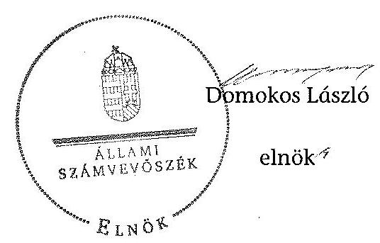

---

Az ellenőrzött társulások rövidített megnevezése, székhely önkormányzatának megnevezése, megszűnésének dátuma a 2013. június 30-ai adatok alapján

|  Sorszám | Hivatalos név | Rövidítés | Székhely önkormányzat | Megszünés, átalakulás dátuma  |
| --- | --- | --- | --- | --- |
|  Többcélú társulások |  |  |  |   |
|  1. | Abaúj-Hegyközi Többcélú Kistérségi Társulás | Abaúj-Hegyközi Többcélú Társulás | Gönc Város Önkormányzata | Tovább működik  |
|  2. | Balmazújvárosi Kistérség Többcélú Társulása | Balmazújvárosi Többcélú Társulás | Balmazújváros Város Önkormányzata | Tovább működik  |
|  3. | Bodrogközi Többcélú Kistérségi társulás | Bodrogközi Többcélú Társulás | Cigánd Város Önkormányzata | Tovább működik  |
|  4. | Ceglédi Többcélú Kistérségi Társulás | Ceglédi Többcélú Társulás | Cegléd Város Önkormányzata | Tovább működik  |
|  5. | Dombóvár és Környéke Többcélú Kistérségi Társulás | Dombóvári Többcélú Társulás | Dombóvár Város Önkormányzata | Tovább működik  |
|  6. | Dunakanyar Többcélú Önkormányzati Kistérségi Társulás | Dunakanyar Többcélú Társulás | Vác Város Önkormányzata | Tovább működik  |
|  7. | Homokháti Kistérség Többcélú Társulása | Homokháti Többcélú Társulás | Mórahalom Város Önkormányzata | Tovább működik  |
|  8. | Kecskemét és Térsége Többcélú Társulás | Kecskeméti Többcélú Társulás | Kecskemét Megyei Jogú Város Önkormányzata | Megszünt 2012. december 31.  |
|  9. | Körös-Szögi Kistérség Többcélú Társulás | Körös-Szögi Többcélú Társulás | Szarvas Város Önkormányzata | Tovább működik  |
|  10. | Mezőcsát Kistérség Többcélú Társulása | Mezőcsáti Többcélú Társulás | Mezőcsát Város Önkormányzata | Tovább működik  |
|  11. | Paksi Többcélú Kistérségi Társulás | Paksi Többcélú Társulás | Paks Város Önkormányzata | Tovább működik  |
|  12. | Pilis-Buda-Zsámbék Többcélú Kistérségi Társulás | Pilis-Buda-Zsámbék Többcélú Társulás | Pilisvörösvár Város Önkormányzata | Megszünt 2012. december 31.  |
|  13. | Pogányvölgyi Többcélú Kistérségi Társulás | Pogányvölgyi Többcélú Társulás | Lengyeltóti Város Önkormányzata | Tovább működik  |
|  14. | Szekszárd és Térsége Többcélú Kistérségi Társulás | Szekszárdi Többcélú Társulás | Szekszárd Megyei Jogú Város Önkormányzata | Tovább működik  |
|  15. | Szentes Többcélú Kistérségi Társulás | Szentesi Többcélú Társulás | Szentes Város Önkormányzata | Tovább működik  |
|  16. | Veresegyházi Kistérség Önkormányzatainak Többcélú Társulása | Veresegyházi Többcélú Társulás | Veresegyház Város Önkormányzata | Tovább működik  |
|  17. | Völgységi Többcélú Kistérségi Társulás | Völgységi Többcélú Társulás | Bonyhád Város Önkormányzata | Tovább működik  |

---

Az ellenőrzött társulások rövidített megnevezése, székhely önkormányzatának megnevezése, megszűnésének dátuma a 2013. június 30-ai adatok alapján

|  A Ttv. 9. § alapján alakult intézményi társulások |  |  |  |   |
| --- | --- | --- | --- | --- |
|  1. | Helvécia Ballószög Közoktatási Intézményi Társulás | Ballószögi Intézményi Társulás | Ballószög Község Önkormányzata | Átalakult  |
|  2. | Bogyisziö-Fácánkert Közoktatási Intézményi Társulás | Bogyisziői Intézményi Társulás | Bogyisziő Község Önkormányzata | Átalakult  |
|  3. | Galgamácsa, Vácegres, Váckisújfalu Általános Iskolai Oktatási Intézményi Társulás | Galgamácsai Iskolai Intézményi Társulás | Galgamácsa Község Önkormányzata | Megszünt 2012. december 31.  |
|  4. | Galgamácsa és Vácegres és Váckisújfalu Napközi Orthonos Óvoda Intézményi Társulás | Galgamácsai Óvodai Intézményi Társulás | Galgamácsa Község Önkormányzata | Átalakult  |
|  5. | Gyulaj - Pári Önkormányzatok Óvodai Társulása | Gyulaji Intézményi Társulás | Gyulaj Község Önkormányzata | Átalakult  |
|  6. | Helvécia és Mikrotérsége Szociális és Gyermekjóléti Feladatellátó Társulás | Helvéciai Intézményi Társulás | Helvécia Nagyközség Önkormányzata | Átalakult  |
|  7. | Jakabszállás-Fülöpjakab Közoktatási Intézményfenntartó Társulása | Jakabszállási Intézményi Társulás | Jakabszállás Község Önkormányzata | Megszünt 2013. június 30.  |
|  8. | Kecskemét Megyei Jogú Város és Városföld Község Szociális Feladatellátó Társulás | Kecskeméti Intézményi Társulás | Kecskemét Megyei Jogú Város Önkormányzata | Megszünt 2013. június 30.  |
|  9. | Kerekegyháza és Térsége Gyermekjóléti és Szociális Feladatellátó Társulás | Kerekegyházai Intézményi Társulás | Kerekegyháza Város Önkormányzata | Átalakult  |
|  10. | Szakcs, Kocsola, Nak, Lápafő, Várong Községek Közoktatási Intézményi Társulása | Szakcsi Intézményi Társulás | Szakcs Község Önkormányzata | Megszünt 2012. december 31.  |
|  11. | Tiszakécske Város és Környéke Szociális Feladatellátó Társulás | Tiszakécskei Intézményi Társulás | Tiszakécske Város Önkormányzata | Megszünt 2013. június 30.  |
|  A Ttv. 8. § alapján alakult intézményi társulások |  |  |  |   |
|  1. | Petőfi Sándor Közös Igazgatású Általános Iskola és Óvoda Intézményfenntartói Társulás | Acsai Intézményi Társulás | Acsa Községi Önkormányzat | Megszünt 2012. december 31.  |
|  2. | Humánszolgáltató Társulás | Albertirsai Intézményi Társulás | Albertirsa Város Önkormányzata | Átalakult  |
|  3. | Aparhant, Mucsfa, Nagyvejke közsegek Közoktatási Társulása | Aparhanti Intézményi Társulás | Aparhant Község Önkormányzata | Megszünt 2012. december 31.  |
|  4. | Boldogkőváralja Közoktatási Intézményfenntartó Társulás | Boldogkőváraljai Intézményi Társulás | Boldogkőváralja Község Önkormányzata | Megszünt 2012. december 31.  |
|  5. | Cegléd Közoktatási Intézményi Társulás | Ceglédi Intézményi Társulás | Cegléd Város Önkormányzata | Megszünt 2012. december 31.  |
|  6. | Cigándi Intézményfenntartó Társulás | Cigándi Intézményi Társulás | Cigánd Város Önkormányzata | Átalakult  |

---

Az ellenőrzött társulások rövidített megnevezése, székhely önkormányzatának megnevezése, megszűnésének dátuma a 2013. június 30-ai adatok alapján

|  7. | Cikó-Mőcsény-Grábóc Közoktatási Intézményfenntartó Társulás | Cikói Intézményi Társulás | Cikó Község Önkormányzata | Megszünt 2013. június 30.  |
| --- | --- | --- | --- | --- |
|  8. | Dunaszentgyörgy és Fécánkert Önkormányzatok Alapfokú Oktatási és Nevelési Intézményfenntartó Társulása | Dunaszentgyörgyi Intézményi Társulás | Dunaszentgyörgy Község Önkormányzata | Megszünt 2012. december 31.  |
|  9. | Gelej - Mezönagymihály Óvoda-fenntartó Társulás | Geleji Intézményi Társulás | Gelej Község Önkormányzata | Megszünt 2013. június 30.  |
|  10. | Gyomaendrőd-Csárdaszállás-Hunya Intézményi Társulás | Gyomaendrődi Intézményi Társulás | Gyomaendrőd Város Önkormányzata | Átalakult  |
|  11. | Hidasnémeti Közoktatási Intézményfenntartó Társulás | Hidasnémeti Intézményi Társulás | Hidasnémeti Község Önkormányzata | Átalakult  |
|  12. | Kecskemét és Térsége Ügyeleti Társulás | Kecskeméti Egészségügyi Társulás | Kecskemét Megyei Jogú Város Önkormányzata | Megszünt 2013. június 30.  |
|  13. | Kondoros-Kardos Köznevelési Intézményfenntartó Társulás | Kondorosi Intézményi Társulás | Kondoros Város Önkormányzata | Átalakult  |
|  14. | Nagyrozvágy-Kisrozvágy-Semjén Községek Közoktatási Intézményi Társulás | Nagyrozvágyi Intézményi Társulás | Nagyrozvágy Község Önkormányzata | Átalakult  |
|  15. | Csemő és Nyársapát Községek Közoktatási Társulása | Nyársapáti Intézményi Társulás | Nyársapát Község Önkormányzata | Megszünt 2012. december 31.  |
|  16. | Pilisvörösvár és Környéke Szociális Intézményfenntartó Társulás | Pilisvörösvári Intézményi Társulás | Pilisvörösvár Város Önkormányzata | Átalakult  |
|  17. | Ricse-Dámóc Községek Közoktatási Intézményi Társulása | Ricse-Dámóc Intézményi Társulás | Ricse Nagyközség Önkormányzata | Megszünt 2013. június 30.  |
|  18. | Ricse-Semjén Községek Közoktatási Intézményi Társulása | Ricse-Semjén Intézményi Társulás | Ricse Nagyközség Önkormányzata | Megszünt 2013. június 30.  |
|  19. | Ricse-Lácacséke Községek Közoktatási Intézményi Társulása | Ricse-Lácacséke Intézményi Társulás | Ricse Nagyközség Önkormányzata | Megszünt 2013. június 30.  |
|  20. | Ruzsa és Pusztamérges Községi Napközlorthonos Óvodai Társulás | Ruzsai Intézményi Társulás | Ruzsa Község Önkormányzata | Megszünt 2013. június 30.  |
|  21. | Szekszárd és Környéke Alapellátási és Szakosított Eljátéki Társulás | Szekszárd és Környéke Alapellátási Társulás | Szekszárd Megyei Jogú Város Önkormányzata | Átalakult  |
|  22. | Szekszárd és Környéke Szociális Alapszolgáltatási és Szakosított Eljátéki Társulás | Szekszárd és Környéke Szociális Társulás | Szekszárd Megyei Jogú Város Önkormányzata | Átalakult  |
|  23. | Szekszárd és Medina Közoktatási Intézményfenntartó Társulása | Szekszárd-Medina Intézményi Társulás | Szekszárd Megyei Jogú Város Önkormányzata | Átalakult  |
|  24. | Szekszárd és Síogárd Közoktatási Intézményi Társulása | Szekszárd-Sióagárd Intézményi Társulás | Szekszárd Megyei Jogú Város Önkormányzata | Megszünt 2013. június 30.  |

---

Az ellenőrzött társulások rövidített megnevezése, székhely önkormányzatának megnevezése, megszűnésének dátuma a 2013. június 30-ai adatok alapján

|  25. | Szekszárd és Szedres Közoktatási Intézményfenntartó Társulás | Szekszárd-Szedres Intézményi Társulás | Szekszárd Megyei Jogú Város Önkormányzata | Megszünt 2013. június 30.  |
| --- | --- | --- | --- | --- |
|  26. | Szekszárd és Szálka Óvodafenntartó Társulása | Szekszárd-Szálka Óvodai Intézményi Társulás | Szekszárd Megyei Jogú Város Önkormányzata | Átalakult  |
|  27. | Szekszárd és Szálka Közoktatási Intézményfenntartó Társulás | Szekszárd-Szálka Iskolai Intézményi Társulás | Szekszárd Megyei Jogú Város Önkormányzata | Megszünt 2012. december 31.  |
|  28. | Szentesi Kistérség Önkormányzatainak Személyes Gondoskodást Nyújtő Intézményi Társulása | Szentesi Szociális Intézményi Társulás | Szentes Város Önkormányzata | Átalakult  |
|  29. | Szentes és Nagytőke Önkormányzatainak Általános Iskolai Intézményfenntartó Társulása | Szentes-Nagytőke Intézményi Társulás | Szentes Város Önkormányzata |
 | Megszünt 2012. december 31.  |
|  30. | Szentes Város és Derekegyház Község Önkormányzatainak Általános Iskolai Intézményfenntartó Társulása | Szentes-Derekegyház Intézményi Társulás | Szentes Város Önkormányzata | Megszünt 2012. december 31.  |
|  31. | Szentes és Eperjes Önkormányzatainak Óvodai Intézményi Társulása | Szentes-Eperjes Intézményi Társulás | Szentes Város Önkormányzata | Megszünt 2013. június 30.  |
|  32. | Sződ-Csörög Önkormányzati Intézményfenntartó Társulás | Sződ-Csörög Intézményi Társulás | Sződ Község Önkormányzata | Megszünt 2012. december 31.  |
|  33. | Sződ-Keszeg Közoktatási Intézményi Társulás | Sződ-Keszeg Intézményi Társulás | Sződ Község Önkormányzata | Megszünt 2012. december 31.  |
|  34. | Teveli Közoktatási Intézményfenntartó Társulás | Sződ-Teveli Intézményi Társulás | Teveli Község Önkormányzata | Megszünt 2012. december 31.  |
|  35. | Vác - Püspökszlágy Alapfokú Oktatási és Nevelési Intézményi Társulás | Váci Intézményi Társulás | Váci Intézményi Társulás | Vác Város Önkormányzata  |
|  36. | Vácrátót-Vácfokú Önkormányzati Intézményfenntartó Társulás | Vácrátóti Intézményi Társulás | Vácrátót Község Önkormányzata | Megszünt 2012. december 31.  |
|  37. | Vilmány Közoktatási Intézményfenntartó Társulás | Vilmányi Intézményi Társulás | Vilmány Község Önkormányzata | Megszünt 2012. december 31.  |
|  A Ttv. 7. § alapján alakult intézményi társulások |  |  |  |   |
|  1. | Szekszárd és Környéke Központi Ügyeleti Társulás | Szekszárd Ügyeleti Társulás | Szekszárd Megyei Jogú Város Önkormányzata | Átalakult  |

---

# A települési önkormányzatok társulásának és feladatellátásának ellenőrzéséhez a társult önkormányzatok által kitöltött kérdőívek kiértékelésének összegzése 

A helyszínen ellenőrzött intézményi társulásokban részt vevő önkormányzatokat az ÁSZ a társulásokkal és azok feladatellátásával kapcsolatosan - kérdőív kitöltésére is kötelezte.

A megkérdezett önkormányzatok 6 fokozatú skálán (0-5) értékelték, hogy a feladatok társulásos formában történő ellátását a 2008-2013. év 1. félév közötti időszakban mely tényezők indokolták. Az értékelés szerint a társulásos feladatellátást ösztönző tényezők között döntő szerepet tulajdonítottak a gazdaságosabb feladatellátásnak (4,42), ezt követően a többlet pénzügyi forrás elérését (4,28) és a szolgáltatás biztosítását (4,21) tartották fontosnak. Kiemelt szerep jutott még annak, hogy az önkormányzatnak kevesebb összeggel kell a feladatellátáshoz hozzájárulni (3,91), hogy a hatékonyabb működtetést biztosítsák (3,85).

A kérdőívet kitöltők 68,6%-a (140) válaszolta, hogy az önkormányzat - a társulási döntés megalapozása érdekében - értékelte az egyes feladatok ellátását. Kevesebben, 51,0%-uk (104) jelezte azt, hogy felmérték a lakosság körében jelentkező igényeket és szakmailag elemezték a feladatellátás színvonalát. A válaszadók 33,8%-a (69) állította azt, hogy a társulás létrehozása előtt készített gazdasági elemzést, elvégezte a költséghatékonysági számításokat.

Az intézményi társulások feladatellátásával kapcsolatosan a válaszadók 71,7%-a (147), közölte azt, hogy a polgármesterük - az előírásoknak megfelelően - beszámolt a képviselőtestületnek a társulás tevékenységéről, pénzügyi helyzetéről, a társulási cél megvalósulásáról és 46,8%-uk (96) válaszolta azt, hogy a képviselő-testület értékelte a közös feladatellátás tapasztalatait. A többcélú társulások feladatellátásával kapcsolatosan adott válaszokban az önkormányzatok 59,5%-ánál (122) számolt be a polgármesterük - az előírások szerint - a többcélú társulás társulási tanácsában végzett tevékenységéről és 42,4% (86) állította azt, hogy a képviselő-testület értékelte a többcélú társulás útján ellátott feladatokat.

Az önkormányzatok a 2008-2011 évek között a társulásos feladatellátásból a többcélú társulástól 39 esetben (3,6%), az intézményi társulástól 69 esetben (4,4%) vettek vissza közszolgáltatást, hogy más formában lássák el azokat a feladatokat. A visszavett közszolgáltatások 40,7%-a (44) a szociális, 32,4%-a (35) az egészségügyi és 26,9%-a (29) a közoktatási feladatellátást érintette.

A kitöltött kérdőívek szerint a 2008-2011 években az önkormányzatok saját költségvetési szervei útján ellátott egyes közszolgáltatások száma 7,5%-kal (-48) csökkent, míg a társulásos formában végzett közszolgáltatások száma nőtt, az intézményi társulásoknál 1,7%-kal (+14), a többcélú társulásoknál 20,8%-kal (+85). A 2011. év végétől 2013. január 1-jére az ellátott egyes közszolgáltatások száma mindhárom ellátási módnál csökkent, összességében 15,6%-kal (-286). Az ellátott közszolgáltatások számának csökkenését több mint fele arányban, 60,5%-ban (-173) a közoktatási rendszer átalakítása okozta, mivel a közoktatás feladatellátása állami kézbe került. Az adatszolgáltatás szerint az Mötv. szerinti tár-

---

sulás útján 2013. 07. 01-én 284 közszolgáltatási feladat ellátása valósult meg a megkérdezett önkormányzatok számára. Egyéb módon, államháztartáson belüli, illetve kívüli szervezettel közfeladat ellátása a 2008-2013. I. félévének időszakában csak az egészségügyi feladatok ellátásánál volt jellemző.

Összességében megállapítható, hogy az önkormányzatokat a közszolgáltatások társulásos formában történő ellátására leginkább a hatékonyabb, gazdaságosabb feladatellátás és a többlet pénzügyi forrás elérése, valamint a saját források felszabadításának lehetősége ösztönzi. A válaszadók több mint a fele értékelte úgy, hogy a feladat társulásos formában történő ellátását szakmailag megalapozottan készítette elő, valamint közel fele arányban állították, hogy a társulásos feladatellátást a képviselő-testület értékelte. A 2008-2011 évek között a társulásban végzett közszolgáltatások ellátását mintegy 4%-os arányban vették vissza a társulástól. A 2013. évi jogszabályi változások a társulásos feladatellátást is átalakították, csökkent a társulások száma, a közoktatás feladatának ellátását az állam vette át.

---

# A 2008-2011. ÉVEKBEN A JOGSZABÁLYI ELŐÍRÁSOKAT FIGYELMEN KÍVÜL HAGYÓ, VALAMINT A JOGSZABÁLYBAN BIZTOSÍTOTT SZABÁLYOZÁSI LEHETŐSÉGGEL NEM ÉLŐ TÁRSULÁSOK MEGNEVEZÉSE 

(A felsorolást a jelentés szövege nem tartalmazza)

1. pont A társulási megállapodások a következő többcélú társulásoknál nem tartalmazták teljes körűen a Tkt. tv. 3. § (1) bekezdésében előírt kötelező tartalmi elemeket:

- Balmazújvárosi Többcélú Társulás
- Ceglédi Többcélú Társulás
- Homokháti Többcélú Társulás
- Kecskeméti Többcélú Társulás
- Körös-Szögi Többcélú Társulás
- Mezőcsáti Többcélú Társulás
- Pilis-Buda-Zsámbék Többcélú Társulás

2. pont A 2008-2011. években a többcélú társulások a Számv. tv. 14. § (3)-(4) és (5) bekezdéseiben előírt szabályzatokkal rendelkeztek, azonban a 76,5%-a nem aktualizálta a jogszabályban foglaltaknak megfelelően a kötelezően előírt szabályzatokat:

- Balmazújvárosi Többcélú Társulás
- Bodrogközi Többcélú Társulás
- Ceglédi Többcélú Társulás
- Dombóvári Többcélú Társulás
- Dunakanyar Többcélú Társulás
- Homokháti Többcélú Társulás
- Kecskeméti Többcélú Társulás
- Körös-Szögi Többcélú Társulás
- Mezőcsáti Többcélú Társulás
- Pilis-Buda-Zsámbék Többcélú Társulás

---

- Szekszárdi Többcélú Társulás
- Veresegyházi Többcélú Társulás
- Völgységi Többcélú Társulás

3. pont A következő többcélú társulások számviteli politika keretében kialakított szabályzataikban - az Áhsz. 8. § (3) bekezdésében foglaltak ellenére - nem határoztak meg olyan - a társulásos működéssel kapcsolatos - sajátos szabályokat, melyek az Áhsz. 49. § (1) és (3) bekezdéseiben foglaltak teljesítését a tagok által befizetett hozzájárulások nyilvántartására és az ehhez kapcsolódó egyeztetések elvégzésére vonatkozóan is biztosították volna:

- Abaúj-Hegyközi Többcélú Társulás
- Balmazújvárosi Többcélú Társulás
- Bodrogközi Többcélú Társulás
- Dombóvári Többcélú Társulás
- Dunakanyar Többcélú Társulás
- Homokháti Többcélú Társulás
- Kecskeméti Többcélú Társulás
- Mezőcsáti Többcélú Társulás
- Pilis-Buda-Zsámbék Többcélú Társulás
- Pogányvölgyi Többcélú Társulás
- Szekszárdi Többcélú Társulás
- Veresegyházi Többcélú Társulás
- Völgységi Többcélú Társulás

4. pont Az Áht., 62. § (4) bekezdésben foglaltak teljesítése érdekében a többcélú társulások 70,6%-a nem határozott meg a költségvetési támogatások igénylésével, annak évközi módosításával és elszámolásával összefüggő kapcsolattartásra, adatszolgáltatásra és felelősségvállalásra vonatkozó szabályokat a saját intézményei és a feladatellátásba bevont intézményi társulás által fenntartott intézmények részére. Ezeknél a többcélú társulásoknál - rendszerszintű kockázatot magában hordozva - az Áht., 121. § (1) bekezdésében előírtak alapján kialakított és működtetett belső kontrollrendszer nem terjedt ki a rendelkezésére álló források igénylésére és elszámolására:

- Abaúj-Hegyközi Többcélú Társulás
- Balmazújvárosi Többcélú Társulás
- Dombóvári Többcélú Társulás

---

- Dunakanyar Többcélú Társulás
- Homokháti Többcélú Társulás
- Körös-Szögi Többcélú Társulás
- Mezőcsáti Többcélú Társulás
- Pilis-Buda-Zsámbék Többcélú Társulás
- Szekszárdi Többcélú Társulás
- Szentesi Többcélú Társulás
- Veresegyházi Többcélú Társulás
- Völgységi Többcélú Társulás

5. pont A társulási megállapodások a következő intézményi társulásoknál nem tartalmazták teljes körűen az Ötv. és a Ttv. szerinti kötelező tartalmi elemeket:

- Ballószögi Intézményi Társulás
- Bogyiszlói Intézményi Társulás
- Galgamácsai Iskolai Intézményi Társulás
- Galgamácsai Óvodai Intézményi Társulás
- Gyulaji Intézményi Társulás
- Kecskeméti Intézményi Társulás
- Tiszakécskei Intézményi Társulás
- Acsai Intézményi Társulás
- Albertirsai Intézményi Társulás
- Aparhanti Intézményi Társulás
- Boldogkőváraljai Intézményi Társulás
- Ceglédi Intézményi Társulás
- Cikói Intézményi Társulás
- Gyomaendrődi Intézményi Társulás
- Hidasnémeti Intézményi Társulás
- Kecskeméti Egészségügyi Társulás
- Kondorosi Intézményi Társulás

---

- Nagyrozvágyi Intézményi Társulás
- Nyársapáti Intézményi Társulás
- Pilisvörösvári Intézményi Társulás
- Ricse-Dámóc Intézményi Társulás
- Ricse-Semjén Intézményi Társulás
- Ricse-Lácacséke Intézményi Társulás
- Szekszárd-Medina Intézményi Társulás
- Szekszárd-Sióagárd Intézményi Társulás
- Szekszárd-Szedres Intézményi Társulás
- Szekszárd-Szálka Óvodai Intézményi Társulás
- Szekszárd-Szálka Iskolai Intézményi Társulás
- Szentesi Szociális Intézményi Társulás
- Sződ-Csörög Intézményi Társulás
- Sződ-Keszeg Intézményi Társulás
- Vácrátóti Intézményi Társulás
- Vilmányi Intézményi Társulás
- Szekszárd Ügyeleti Társulás

6. pont A Ttv. 6. § (4) bekezdésében foglaltak ellenére - a társulás tevékenységéről, a pénzügyi helyzetéről és a társulási cél megvalósulásáról - nem készítettek beszámolót a képviselő-testületeik felé a következő intézményi társulások önkormányzatainak polgármesterei:

- Acsai Intézményi Társulás
- Albertirsai Intézményi Társulás
- Bogyiszlói Intézményi Társulás
- Boldogkőváraljai Intézményi Társulás
- Ceglédi Intézményi Társulás
- Dunaszentgyörgyi Intézményi Társulás
- Galgamácsai Iskolai Intézményi Társulás
- Galgamácsai Óvodai Intézményi Társulás

---

- Gyulaji Intézményi Társulás
- Hidasnémeti Intézményi Társulás
- Kecskeméti Intézményi Társulás
- Kecskeméti Egészségügyi Társulás
- Nagyrozvágyi Intézményi Társulás
- Nyársapáti Intézményi Társulás
- Pilisvörösvári Intézményi Társulás
- Ricse-Dámóc Intézményi Társulás
- Ricse-Lácacséke Intézményi Társulás
- Ricse-Semjén Intézményi Társulás
- Szakcsi Intézményi Társulás
- Szekszárd Ügyeleti Társulás
- Szekszárd-Medina Intézményi Társulás
- Szekszárd-Sióagárd Intézményi Társulás
- Szekszárd-Szedres Intézményi Társulás
- Szekszárd-Szálka Óvodai Intézményi Társulás
- Szekszárd-Szálka Iskolai Intézményi társulás
- Szekszárd és Környéke Szociális Társulás
- Szentesi Szociális Intézményi Társulás
- Sződ-Csörög Intézményi Társulás
- Sződ-Keszeg Intézményi Társulás
- Váci Intézményi Társulás
- Vilmányi Intézményi Társulás

7. pont A Ttv. 6. § (4) bekezdésében biztosított szabályozási lehetőséggel a következő intézményi társulások nem éltek:

- Acsai Intézményi Társulás
- Albertirsai Intézményi Társulás
- Bogyiszlói Intézményi Társulás

---

- Boldogkőváraljai Intézményi Társulás
- Ceglédi Intézményi Társulás
- Galgamácsai Iskolai Intézményi Társulás
- Galgamácsai Óvodai Intézményi Társulás
- Hidasnémeti Intézményi társulás
- Kecskeméti Egészségügyi Társulás
- Nagyrozvágyi Intézményi Társulás
- Ricse-Dámóc Intézményi Társulás
- Ricse-Lácacséke Intézményi Társulás
- Ricse Lácacséke Intézményi Társulás
- Ricse-Semjén Intézményi Társulása
- Szekszárd Ügyeleti Társulás
- Szekszárd-Sióagárd Intézményi Társulás
- Szekszárd-Szedres Intézményi Társulás
- Szekszárd-Szálka Óvodai Intézményi Társulás
- Szekszárd-Szálka Iskolai Intézményi Társulás
- Szekszárd és Környéke Szociális Társulás
- Szőcs-Csörög Intézményi Társulás
- Vilmányi Intézményi Társulás

8. pont A Ttv. 7. § (2) bekezdés g) pontjában, valamint a Ttv. 8. § (4) bekezdés 1) pontjában biztosított szabályozási lehetőséggel nem élő intézményi társulások:

- Bogyiszlói Intézményi Társulás
- Gyulaji Intézményi Társulás
- Kecskeméti Intézményi Társulás
- Tiszakécskei Intézményi Társulás
- Acsai Intézményi Társulás
- Albertirsai Intézményi Társulás
- Aparhanti Intézményi Társulás

---

- Boldogkőváraljai Intézményi Társulás
- Ceglédi Intézményi Társulás
- Cikói Intézményi Társulás
- Gyomaendrődi Intézményi Társulás
- Hidasnémeti Intézményi Társulás
- Kecskeméti Egészségügyi Társulás
- Kondorosi Intézményi Társulás
- Nagyrozvágyi Intézményi Társulás
- Nyársapáti Intézményi Társulás
- Pilisvörösvári Intézményi Társulás
- Ricse-Dámóc Intézményi Társulás
- Ricse-Semjén Intézményi Társulás
- Ricse-Lácacséke Intézményi Társulás
- Szekszárd-Medina Intézményi Társulás
- Szekszárd-Sióagárd Intézményi Társulás
- Szekszárd-Szedres Intézményi Társulás
- Szekszárd-Szálka Óvodai Intézményi Társulás
- Szekszárd-Szálka Iskolai Intézményi Társulás
- Szentesi Szociális Intézményi Társulás
- Szentes-Nagytőke Intézményi Társulás
- Szentes-Derekegyház Intézményi Társulás
- Sződ-Csörög Intézményi Társulás
- Sződ-Keszeg Intézményi Társulás
- Vácrátóti Intézményi Társulás
- Vilmányi Intézményi Társulás
- Szekszárd Ügyeleti Társulás

9. pont Az
 ellenőrzött időszak végén, 2011-ben a következő intézményi társulások székhely önkormányzatai a számviteli politika keretében kialakított szabályzatai nem tartalmaztak olyan előírásokat, melyek az Áhsz. 49. § (1) és (3) bekezdéseiben foglaltak teljesítését a tagok által befizetett hozzájárulások nyilvántartására és az ehhez kapcsolódó egyeztetések elvégzésére vonatkozóan is biztosították volna:

- Bogyiszlói Intézményi Társulás
- Galgamácsai Iskolai Intézményi Társulás
- Galgamácsai Óvodai Intézményi Társulás
- Gyulaji Intézményi Társulás
- Helvéciai Intézményi Társulás
- Jakabszállási Intézményi Társulás
- Kecskeméti Intézményi Társulás
- Kerekegyházai Intézményi Társulás
- Szakcsi Intézményi Társulás
- Tiszakécskei Intézményi Társulás
- Acsai Intézményi Társulás
- Albertirsai Intézményi Társulás
- Aparhanti Intézményi Társulás
- Boldogkőváraljai Intézményi Társulás
- Ceglédi Intézményi Társulás
- Cigándi Intézményi Társulás
- Cikói Intézményi Társulás
- Dunaszentgyörgyi Intézményi Társulás
- Geleji Intézményi Társulás
- Hidasnémeti Intézményi Társulás
- Kecskeméti Egészségügyi Társulás
- Kondorosi Intézményi Társulás
- Nagyrozvágyi Intézményi Társulás
- Nyársapáti Intézményi Társulás
- Pilisvörösvári Intézményi Társulás
- Ricse-Dámóc Intézményi Társulás

- Ricse-Semjén Intézményi Társulás
- Ricse-Lácacséke Intézményi Társulás
- Szekszárd és Környéke Alapellátási Társulás
- Szekszárd és Környéke Szociális Társulás
- Szekszárd-Medina Intézményi Társulás
- Szekszárd-Sióagárd Intézményi Társulás
- Szekszárd-Szedres Intézményi Társulás
- Szekszárd-Szálka Óvodai Intézményi Társulás
- Szekszárd-Szálka Iskolai Intézményi Társulás
- Szentesi Szociális Intézményi Társulás
- Szentes-Nagytőke Intézményi Társulás
- Szentes-Derekegyház Intézményi Társulás
- Szentes-Eperjes Intézményi Társulás
- Sződ-Csörög Intézményi Társulás
- Sződ-Keszeg Intézményi Társulás
- Tevel Intézményi Társulás
- Vácrátóti Intézményi Társulás
- Vilmányi Intézményi Társulás
- Szekszárd Ügyeleti Társulás

10. pont Az Áht.; 64. § (8) bekezdésében foglaltak szerint a költségvetési támogatások igénylése és elszámolása az intézményi társulás székhely önkormányzatának, vagy a társulási megállapodásban megjelölt önkormányzatnak volt a feladata. A következő székhely önkormányzatoknak az Áht.; 121. § (1) bekezdése alapján kialakított és működtetett belső kontrollrendszere - rendszerszintű kockázatot rejtve magában - nem terjedt ki az intézményi társulások rendelkezésére álló források igénylésére és elszámolására:

- Ballószögi Intézményi Társulás
- Bogyiszlói Intézményi Társulás
- Galgamácsai Iskolai Intézményi Társulás
- Galgamácsai Óvodai Intézményi Társulás
- Gyulaji Intézményi Társulás

- Helvéciai Intézményi Társulás
- Jakabszállási Intézményi Társulás
- Kecskeméti Intézményi Társulás
- Kerekegyházai Intézményi Társulás
- Szakcsi Intézményi Társulás
- Tiszakécskei Intézményi Társulás
- Acsai Intézményi Társulás
- Albertirsai Intézményi Társulás
- Aparhanti Intézményi Társulás
- Boldogkőváraljai Intézményi Társulás
- Ceglédi Intézményi Társulás
- Cikói Intézményi Társulás
- Dunaszentgyörgyi Intézményi Társulás
- Geleji Intézményi Társulás
- Gyomaendrődi Intézményi Társulás
- Hidasnémeti Intézményi Társulás
- Kecskeméti Egészségügyi Társulás
- Kondorosi Intézményi Társulás
- Nagyrozvágyi Intézményi Társulás
- Nyársapáti Intézményi Társulás
- Pilisvörösvári Intézményi Társulás
- Ricse-Dámóc Intézményi Társulás
- Ricse-Semjén Intézményi Társulás
- Ricse-Lácacséke Intézményi Társulás
- Ruzsai Intézményi Társulás
- Szekszárd és Környéke Alapellátási Társulás
- Szekszárd és Környéke Szociális Társulás
- Szekszárd-Medina Intézményi Társulás

- Szekszárd-Sióagárd Intézményi Társulás
- Szekszárd-Szedres Intézményi Társulás
- Szekszárd-Szálka Óvodai Intézményi Társulás
- Szekszárd-Szálka Iskolai Intézményi Társulás
- Szentesi Szociális Intézményi Társulás
- Sződ-Csörög Intézményi Társulás
- Sződ-Keszeg Intézményi Társulás
- Váci Intézményi Társulás
- Vácrátóti Intézményi Társulás
- Vilmányi Intézményi Társulás
- Szekszárd Ügyeleti Társulás

11. pont A 2008-2011. években a következő többcélú társulások pénzügyi bizottságai nem teljesítették a Tkt. tv. 11. § (3) bekezdésében rögzített létrehozási célnak megfelelő ellenőrzési kötelezettségeiket:

- Abaúj-Hegyközi Többcélú Társulás
- Balmazújvárosi Többcélú Társulás
- Bodrogközi Többcélú Társulás
- Ceglédi Többcélú Társulás
- Dombóvári Többcélú Társulás
- Dunakanyar Többcélú Társulás
- Homokháti Többcélú Társulás
- Kecskeméti Többcélú Társulás
- Körös-Szögi Többcélú Társulás
- Mezőcsáti Többcélú Társulás
- Paksi Többcélú Társulás
- Pilis-Buda-Zsámbék Többcélú Társulás
- Pogányvölgyi Többcélú Társulás
- Szekszárdi Többcélú Társulás
- Szentesi Többcélú Társulás

- Veresegyházi Többcélú Társulás
- Völgységi Többcélú Társulás

12. pont A következő intézményi társulások nem alkották meg a Ttv. 14. § (2) bekezdésében foglaltakat megsértve a társulási tanács saját működésének részletes szabályait:

- Galgamácsai Iskolai Intézményi Társulás
- Galgamácsai Óvodai Intézményi Társulás
- Kecskeméti Intézményi Társulás
- Kerekegyházai Intézményi Társulás
- Tiszakécskei Intézményi Társulás

13. pont A Ttv. 11. §-ában foglaltak ellenére a következő - a Ttv. 9. § alapján létrejött - intézményi társulásoknál nem a társulási tanácsok döntöttek a társulási megállapodásban meghatározott és a társulás tagjai által átruházott önkormányzati feladat- és hatáskörökben:

- Galgamácsai Iskolai Intézményi Társulás
- Galgamácsai Óvodai Intézményi Társulás
- Gyulaji Intézményi Társulás
- Jakabszállási Intézményi Társulás
- Kecskeméti Intézményi Társulás

14. pont A Ttv. 6. § (3) bekezdésében foglaltakat megsértve a következő intézményi társulásoknál a társulás tagjai nem ellenőrizték a társulási megállapodásban előírt módon célszerűségi és gazdasági szempontból a társulás működését:

- Bogyiszlói Intézményi Társulás
- Helvéciai Intézményi Társulás
- Jakabszállási Intézményi Társulás
- Kecskeméti Intézményi Társulás
- Kerekegyházai Intézményi Társulás
- Szakcsi Intézményi Társulás
- Tiszakécskei Intézményi Társulás

15. pont A következő intézményi társulások nem végezték el a - költségvetési támogatások igénybevételének alapját képező - mutatószámok ellenőrzését, mivel erre a feladatra az Áht.; 121. § (1) bekezdésében előírtak alapján kialakított és működtetett belső kontrollrendszer nem terjedt ki:

- Acsai Intézményi Társulás
- Ballószögi Intézményi Társulás
- Bogyiszlói Intézményi Társulás
- Boldogkőváraljai Intézményi Társulás
- Cikói Intézményi Társulás
- Dunaszentgyörgyi Intézményi Társulás
- Hidasnémeti Intézményi Társulás
- Jakabszállási Intézményi Társulás
- Kecskeméti Intézményi Társulás
- Kondorosi Intézményi Társulás
- Nagyrozvágyi Intézményi Társulás
- Nyársapáti Intézményi Társulás
- Pilisvörösvári Intézményi Társulás
- Ricse-Dámóc Intézményi Társulás
- Ricse-Semjén Intézményi Társulás
- Ricse-Lácacséke Intézményi Társulás
- Szekszárd és Környéke Alapellátási Társulás
- Szekszárd és Környéke Szociális Társulás
- Szekszárd-Medina Intézményi Társulás
- Szekszárd-Sióagárd Intézményi Társulás
- Szekszárd-Szedres Intézményi Társulás
- Szekszárd-Szálka Óvodai Intézményi Társulás
- Szekszárd-Szálka Iskolai Intézményi Társulás
- Sződ-Csörög Intézményi Társulás
- Sződ-Keszeg Intézményi Társulás
- Vácrátóti Intézményi Társulás

- Vilmányi Intézményi Társulás

16. pont A következő társulások sértették meg a Közokt. tv. 102. § (2) bekezdés d) és g) pontjában foglaltakat, mert négyévenként legalább egy alkalommal nem ellenőrizték a közoktatási intézmények gazdálkodását, működésének törvényességét, nem értékelték a szakmai munkájának eredményességét és a pedagógiaiszakmai munka eredményességét:

- Acsai Intézményi Társulás
- Ballószögi Intézményi Társulás
- Balmazújvárosi Többcélú Társulás
- Bogyiszlói Intézményi Társulás
- Boldogkőváraljai Intézményi Társulás
- Ceglédi Intézményi Társulás
- Cikói Intézményi Társulás
- Dombóvári Többcélú Társulás
- Geleji Intézményi Társulás
- Gyulaji Intézményi Társulás
- Hidasnémeti Intézményi Társulás
- Jakabszállási Intézményi Társulás
- Kecskeméti Többcélú Társulás
- Nagyrozvágyi Intézményi Társulás
- Nyársapáti Intézményi Társulás
- Ricse-Dámóc Intézményi Társulás
- Ricse-Lácacséke Intézményi Társulás
- Ricse-Semjén Intézményi Társulás
- Szakcsi Intézményi Társulás
- Szekszárd-Medina Intézményi Társulás
- Szekszárd-Sióagárd Intézményi Társulás
- Szekszárd-Szedres Intézményi Társulás
- Szekszárd-Szálka Óvodai Intézményi Társulás
- Szekszárd-Szálka Iskolai Intézményi Társulás

- Szentes-Eperjes Intézményi Társulás
- Sződ-Csörög Intézményi Társulás
- Sződ-Tevel Intézményi Társulás
- Váci Intézményi Társulás
- Vácrátóti Intézményi Társulás
- Vilmányi Intézményi Társulás

17. pont A Szoc.tv. 92/B. § (1) bekezdés b) és d) pontjában foglaltak ellenére a következő társulások nem teljes körűen tettek eleget ezen jogszabályi előírásoknak és mint fenntartók nem ellenőrizték az intézmény működésének törvényességét, a végzett szakmai munkát, valamint nem értékelték évente egy alkalommal a szakmai munka eredményességét:

- Albertirsai Intézményi Társulás
- Bodrogközi Többcélú Társulás
- Dombóvári Többcélú Társulás
- Gyomaendrődi Intézményi Társulás
- Homokháti Többcélú Társulás
- Mezőcsáti Többcélú Társulás
- Szekszárd és Környéke Szociális Társulás
- Szekszárd Ügyeleti Társulás
- Tiszakécske Intézményi Társulás

18. pont A társulási megállapodásban foglaltak ellenére, a következő intézményi társulások székhely önkormányzata nem kérte a tagönkormányzatok hozzájárulását a működési feltételek biztosításához:

- Cikói Intézményi Társulás
- Dunaszentgyörgyi Intézményi Társulás
- Kecskeméti Intézményi Társulás
- Kecskeméti Egészségügyi Társulás
- Ricse-Dámóc Intézményi Társulás (2009. július 30-ig)
- Ricse-Lácacséke Intézményi Társulás (2009. július 30-ig)
- Váci Intézményi Társulás

19. pont A Ttv. 6. § (4) bekezdésében foglaltak ellenére - a társulás tevékenységéről, a pénzügyi helyzetéről és a társulási cél megvalósulásáról - nem készítettek beszámolót a képviselő-testületeik felé a következő Intézményi Társulások önkormányzatainak polgármesterei:

- Acsai Intézményi Társulás
- Albertirsai Intézményi Társulás
- Bogyiszlói Intézményi Társulás
- Boldogkőváraljai Intézményi Társulás
- Ceglédi Intézményi Társulás
- Galgamácsai Iskolai Intézményi Társulás
- Galgamácsai Óvodai Intézményi Társulás
- Hidasnémeti Intézményi társulás
- Kecskeméti Egészségügyi Társulás
- Nagyrozvágyi Intézményi Társulás
- Ricse-Dámóc Intézményi Társulás
- Ricse-Lácacséke Intézményi Társulás
- Ricse Lácacséke Intézményi Társulás
- Ricse-Semjén Intézményi Társulása
- Szekszárd Ügyeleti Társulás
- Szekszárd-Sióagárd Intézményi Társulás
- Szekszárd-Szedres Intézményi Társulás
- Szekszárd-Szálka Óvodai Intézményi Társulás
- Szekszárd-Szálka Iskolai Intézményi Társulás
- Szekszárd és Környéke Szociális Társulás
- Szőcs-Csörög Intézményi Társulás
- Vilmányi Intézményi Társulás

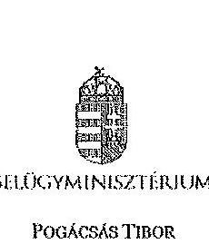

BELÜGYMINISZTÉRIUM
POGÁCSÁS TIBOR
önkormányzati átlanúzkár

Iktatószám: BMÖGF / 50 - 10 (2014)

Domokos László úr részére,
elnök

Állami Számvevőszék
Budapest
Apáczai Csere János utca 10.
1052

Tisztelt Elnök Úr!

A települési önkormányzatok társulásainak és feladatellátásának ellenőrzéséről készült ÁSZ Jelentés tervezetével
összefüggésben - Belügyminiszter úr megbízásából - az alábbiakról tájékoztatom.

A Jelentés-tervezet a helyi önkormányzatok támogatásait tartalmazó fejezet vonatkozásában a
belügyminiszternek nem fogalmaz meg új javaslatot, azonban a Jelentés-tervezet 46. oldalán található
„5. Korábban tett ÁSZ javaslatok hasznosulása" pontban jelzett azon megállapítással, mely szerint az
önkormányzati miniszter részére megfogalmazott javaslatok közül négy nem teljesült, nem értünk egyet.
Álláspontunkat az alábbiakkal indokoljuk.

A költségvetési törvény külön mellékletben tartalmazott feltételrendszert, mely a kiegészítő támogatások
igénylését lehetővé tette. A feltételrendszer olyan összefüggésben került meghatározásra, mely a minimális
méretgazdaságossági szempontokon alapult.

A Minisztérium az igénylés szabályrendszerének kialakítása, és finanszírozás feltételeinek alakítása, javítása
érdekében tett lépéseit a költségvetési törvénytervezetek tükrözik. Az egyes tárcák javaslatai a törvénytervezet
közigazgatási egyeztetése során érvényesültek.

Emellett lényeges megjegyeznünk, hogy a támogatás igénybevételének feltételeire vonatkozó ösztönzési és
szabályozási rendszer ágazati kérdéseinek meghatározása a tárcák közös feladata, és az önkormányzati
miniszternek a költségvetési törvény vonatkozásában nem volt koordinációs hatásköre.

A fentiek alapján kérjük, hogy a javaslatok hasznosulásával kapcsolatban tett megállapítás - miszerint azok nem
teljesültek - kerüljön korrigálásra, és a végleges jelentésben „részben hasznosultak"-ként szerepeljenek.

Budapest, 2014. június 10.

Tisztelettel:

Készült: 2 példányban
Kapják: 1. sz. Címzett
2. sz. Irattár

Pogácsás Tibor

1

# **Chemistry**

## **Chemical Reactions**

### **Balancing Chemical Equations**

1. **Write the unbalanced equation:**
   - Example: $$C_3H_8 + O_2 \rightarrow CO_2 + H_2O$$

2. **Balance the equation:**
   - Balance carbon atoms first.
   - Then balance hydrogen atoms.
   - Finally, balance oxygen atoms.
   - Balanced equation: $$C_3H_8 + 7O_2 \rightarrow 3CO_2 + 4H_2O$$

### **Types of Reactions**

1. **Combination Reaction:**
   - Example: $$2H_2 + O_2 \rightarrow 2H_2O$$

2. **Decomposition Reaction:**
   - Example: $$2H_2O_2 \rightarrow 2H_2O + O_2$$

3. **Single Displacement Reaction:**
   - Example: $$Zn + 2HCl \rightarrow ZnCl_2 + H_2$$

4. **Double Displacement Reaction:**
   - Example: $$AgNO_3 + NaCl \rightarrow AgCl + NaNO_3$$

5. **Combustion Reaction:**
   - Example: $$CH_4 + 2O_2 \rightarrow CO_2 + 2H_2O$$

## **Stoichiometry**

### **Mole Concept**

- **Mole (mol):** The amount of substance containing as many particles (atoms, molecules, ions) as there are atoms in exactly 12 grams of carbon-12.
- **Avogadro's Number:** $$6.022 \times 10^{23}$$ particles per mole.

### **Molar Mass**

- **Molar Mass:** The mass of one mole of a substance.
- Example: The molar mass of water ($$H_2O$$) is 18.015 g/mol.

### **Calculations**

1. **Moles to Mass:**
   - Formula: $$n = \frac{m}{M}$$
   - Example: Calculate the number of moles of $$H_2O$$ in 18 grams of water.
     - $$n = \frac{18.015 \, \text{g}}{18.015 \, \text{g/mol}} = 1 \, \text{mol}$$

2. **Moles to Mass:**
   - Formula: $$m = n \times M$$
   - Example: Calculate the mass of 1 mole of water.
     - $$m = 1 \, \text{mol} \times 18.015 \, \text{g/mol} = 18.015 \, \text{g}$$

## **Gas Laws**

### **Ideal Gas Law**

- **Equation:** $$PV = nRT$$
  - P: Pressure
  - V: Volume
  - n: Number of moles
  - R: Ideal gas constant (0.0821 L·atm/mol·K)
  - T: Temperature (Kelvin)

### **Boyle's Law**

-
 **Equation:** $$P_1V_1 = P_2V_2$$
  - P: Pressure
  - V: Volume
  - n: Number of moles
  - R: Ideal gas constant (0.0821 L·atm/mol·K)
  - T: Temperature (Kelvin)

### **Boyle's Law (Boyle's Law of 1832)**

- **Equation:** $$\frac{P_1V_1}{P_2V_2} = \frac{P_1}{2V_1}$$

## **Thermochemistry**

### **Enthalpy (H)**

- **Definition:** The heat content of a system at constant pressure.
- **Equation:** $$\Delta H = q_p$$
  - H: Heat
  - P: Pressure
  - V: Volume
  - n: Number of moles
  - R: Ideal gas constant (0.0821 L·atm/mol·K)
  - T: Temperature (Kelvin)
  - n: Number of moles of H₂O

### **Hess's Law**

- **Statement:** The enthalpy change for a reaction is the same whether it occurs in one step or multiple steps.
- **Equation:** $$\Delta H = q_p$$
  - H: Heat
  - P: Pressure
  - V: Volume
  - n: Number of moles
  - R: Ideal gas constant (0.0821 L·atm/mol·K)
  - T: Temperature (Kelvin)
  - n: Number of moles of H₂O

## **Electrochemistry**

### **Oxidation and Reduction**

- **Oxidation:** Loss of electrons.
- **Reduction:** Gain of electrons.

### **Galvanic Cells**

- **Definition:** A cell that converts chemical energy into electrical energy.
- **Components:**
  - Anode: Oxidation occurs.
  - Cathode: Reduction occurs.
  - Salt Bridge: Connects the two half-cells.

### **Nernst Equation**

- **Equation:** $$E = E^\circ - \frac{RT}{nF} \ln Q$$
  - E: Cell potential
  - E: Cell potential
  - R: Ideal gas constant
  - T: Temperature (Kelvin)
  - n: Number of moles of electrons transferred
  - F: Faraday constant (96,485 C/mol)
  - Q: Reaction quotient

## **Acids and Bases**

### **Arrhenius Theory**

- **Acid:** Substance that dissociates in water to produce H⁺ ions.
- **Base:** Substance that dissociates in water to produce OH⁻ ions.
- **Acid:** Proton donor.
- **Base:** Proton acceptor.

### **Brønsted-Lowry Theory**

- **Acid:** Proton donor.
- **Base:** Proton acceptor.

### **Lewis Theory**

- **Acid:** Electron pair acceptor.
- **Base:** Electron pair donor.

### **Lewis's Law**

- **Acid:** Electron pair acceptor.
- **Base:** Electron pair donor.

## **Thermochemistry**

### **Enthalpy (H)**

- **Definition:** The heat content of a system at constant pressure.
- **Equation:** $$\Delta H = q_p$$
  - H: Heat
  - P: Pressure
  - V: Volume
  - n: Number of moles of H₂O
  - R: Ideal gas constant (0.0821 L·atm/mol·K)
  - T: Temperature (Kelvin)
  - n: Number of moles of H₂O

### **Hess's Law**

- **Statement:** The enthalpy change for a reaction is the same whether it occurs in one step or multiple steps.
- **Statement:** The enthalpy change for a reaction is the same whether it occurs in one step or multiple steps.

## **Electrochemistry**

### **Oxidation and Reduction**

- **Oxidation:** Loss of electrons.
- **Reduction:** Gain of electrons.
- **Reduction:** Gain of electrons.

### **Electrochemical Cells**

- **Definition:** A cell that converts chemical energy into electrical energy.
- **Components:**
  - Anode: Oxidation occurs.
  - Cathode: Reduction occurs.
  - Salt Bridge: Connects the two half-cells.

### **Nernst Equation**

- **Equation:** $$E = E^\circ - \frac{RT}{nF} \ln Q$$
  - E: Cell potential
  - R: Ideal gas constant
  - T: Temperature (Kelvin)
  - n: Number of moles of electrons transferred
  - F: Faraday constant (96,485 C/mol)
  - Q: Reaction quotient

## **Electrochemistry**

### **Oxidation and Reduction**

- **Oxidation:** Loss of electrons.
- **Reduction:** Gain of electrons.
- **Reduction:** Gain of electrons.

### **Electrochemical Cells**

- **Definition:** A cell that converts chemical energy into electrical energy.
- **Components:**
  - Anode: Oxidation occurs.
  - Cathode: Reduction occurs.
  - Salt Bridge: Connects the two half-cells.

### **Nernst Equation**

- **Equation:** $$E = E^\circ - \frac{RT}{nF} \ln Q$$
  - E: Cell potential
  - R: Ideal gas constant
  - T: Temperature (Kelvin)
  - n: Number of moles of electrons transferred
  - F: Faraday constant (96,485 C/mol)
  - Q: Reaction quotient

## **Organic Chemistry**

### **Functional Groups**

- **Alkanes:** -C=O -C=18 -C=18 -C=18 -C=18 -C=18 -C=18 -C=18 -C=18 -C=18 -C=18 -C=18 -C=18 -C=18 -C=18 -C=18 -C=18 -C=18 -C=18 -C=18 -C=18 -C=18 -C=18 -C=18 -C=18 -C=18 -C=18 -C=18 -C=18 -C=18 -C=18 -C=18 -C=18 -C=18 -C=18 -C=18 -C=18 -C=18 -C=18 -C=18 -C=18 -

---

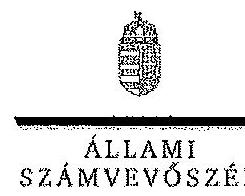

ELHÖK

Ikt. szám: V-0170-476/2014.

Dr. Pintér Sándor úr
miniszter
Belügyminisztérium

Budapest

Tisztelt Miniszter Úr!

A települési önkormányzatok társulásának és feladatellátásának ellenőrzéséről készített számvevőszéki jelentéstervezetre - Belügyminiszter úr megbízásából - Pogácsás Tibor önkormányzati államtitkár úr által tett észrevételt köszönettel megkaptam.

Az Állami Számvevőszék észrevételre vonatkozó álláspontjáról a felügyeleti vezető által készített részletes tájékoztatást csatoltan megküldöm.

Tájékoztatom Miniszter urat, hogy a jelentésben az Állami Számvevőszékről szóló 2011. évi LXVI. törvény 29. § (3) bekezdése alapján az el nem fogadott észrevételt szerepeltetjük az elutasítás indokának feltüntetésével együtt.

Budapest, 2014. 27. hó 18. nap

Tisztelettel:

Domokos László *

Melléklet: Tájékoztatás az el nem fogadott észrevételről

1052 BUDAPEST, APÁCZAI CSERÉP SÁROS UTCA 10. 1364 Budapest 4. Pf. 54 telefon: 404 8191 fax: 404 8201

---

# Tájékoztatás 

## az el nem fogadott észrevételről

A települési önkormányzatok társulásának és feladatellátásának ellenőrzéséről készített jelentéstervezetre a BMÖGF/39-10/2014. iktatószámú levelében Pogácsás Tibor önkormányzati államtitkár észrevételét áttekintettük, annak kezeléséről az alábbi tájékoztatást adom.

A jelentéstervezethez tett észrevételét nem fogadtuk el. Megállapításunk nem a kiegészítő támogatások igénylésével kapcsolatos méretgazdaságossági szempontokon alapuló feltételrendszer kidolgozásának hiányára vonatkozott, hanem azon méretgazdaságossági szempontokat érvényesítő mutatókra, amelyek a többcélú társulások és az önkormányzati közös feladatellátás eredményeinek értékelését lehetővé tették volna. A költségvetési törvényekben szereplő kiegészítő támogatások a feladatellátás finanszírozására vonatkoznak és nem tartalmaznak a támogatástól elvárt követelményeket.

Budapest, 2014. 66. hó 63. nap

Holman Magdolna
felügyeleti vezető

---

# Gyomaendrőd VÁROS ÖNKORMÁNYZATA 

5500 GYOMAENDRŐD, SELYEM ÚT 124.

| Ügyiratszám: | V. 179/2014. | Tárgy: Reagálás a települési önkormányzatok társulásának és feladatellátásának ellenőrzéséről megküldött jelentéstervezetre |  |
| :--: | :--: | :--: | :--: |
| Ügyintéző: | Szilágyiné Bácsi   Gabriella | Hiv. szám: |  |
| Telefon: | 66-521-604 | Melléklet: | 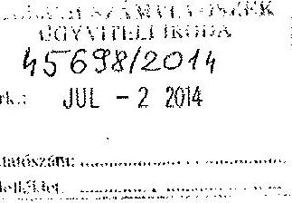 |
| Állami Számvevőszék   Budapest-4   Pf.: 54.   1364 |  |  |  |

## Tisztelt Állami Számvevőszék!

A 2014. június 13-án érkezett „A települési önkormányzatok társulásának és feladatellátásának ellenőrzéséről" készített számvevőszéki jelentéstervezet megállapításaira az alábbi észrevételeket szeretnénk tenni.

Az ellenőrzés intézkedést igénylő megállapításai és javaslatai között szerepelt a Gyomaendrőd, Csárdaszállás, Hunya Települési Önkormányzati Társulás társulási megállapodására vonatkozó azon hiányosság, miszerint az intézményi társulás társulási megállapodásában nem került meghatározásra a helyi önkormányzatok társulásairól és együttműködéséről szóló 1997. évi CXXXV. törvény 8. §. (4) bekezdés f) és g) pontjában rögzített tartalmi elem.

A Gyomaendrőd-Csárdaszállás-Hunya Intézményi Társulás társulási megállapodása tartalmazza a fizetési kötelezettséget nem teljesítő önkormányzatokkal szemben történő beszedési megbízás alkalmazását, valamint a társuláshoz való csatlakozás, a társulási megállapodás felmondásának szabályait, illetve a társulás megszűnése esetén az elszámolás rendjét is.

A 2013. június 30-ától hatályos Gyomaendrőd, Csárdaszállás, Hunya Települési Önkormányzati Társulás társulási megállapodása is tartalmazza a Magyarország helyi önkormányzatairól szóló 2011. évi CLXXXIX. törvény 93. §. 1-19. pontjában foglalt kötelező tartalmi elemeket.

A jelentéstervezet 3. számú mellékletének 2. pontjában megfogalmazottakra az alábbiak szerint kívánunk reagálni.

---

A jogszabály a társulási megállapodás tartalmára vonatkozóan lehetőséget biztosít arra, hogy rögzítésre kerüljenek azok az egyéb feltételek is, amiben a társulás tagjai megállapodnak. A Gyomaendrőd-Csárdaszállás-Hunya Intézményi Társulás tagjai nem kívántak többlet feltételeket meghatározni, ezért nem rögzítettek működésre vonatkozó egyéb szabályokat a társulási megállapodásban.

A 3. számú melléklet 6. pontja értelmében a Gyomaendrőd-Csárdaszállás-Hunya Intézményi Társulás társulási megállapodása nem tartalmazta teljes körűen a helyi önkormányzatokról szóló 1990. évi LXV. törvény és a helyi önkormányzatok társulásairól és együttműködéséről szóló 1997. évi CXXXV. törvény szerinti kötelező tartalmi elemeket. Kérdésünk: Intézményi társulásunk esetében mely elemek hiányoztak?

A 3. számú melléklet 9. pontja lehetőséget biztosít az intézményi társulások számára olyan feltételek szabályozására, amit a társulás tagjai szükségesnek látnak. Az intézményi társulásban részt vevő önkormányzatok nem tartották szükségesnek, hogy a kötelező elemeken kívül egyéb feltételeket is szabályozzanak.

A 3. számú melléklet 11. pontjában megfogalmazottakra reagálva az alábbi tájékoztatást kívánjuk nyújtani. Gyomaendrőd Város Önkormányzatának éves belső ellenőrzési terve alapján minden évben megtörtént a normatív állami támogatás elszámolásának belső ellenőr által történő felülvizsgálata, mely ellenőrzés minden esetben az igénylés megalapozottságára is kiterjedt.

A 3. számú melléklet 18. pontjában megfogalmazottakra az alábbi észrevételt kívánjuk tenni. A társulás mint fenntartó a szakmai munka ellenőrzéséről készített beszámolót minden évben megismerte és jóváhagyta. A törvényességi ellenőrzés a szakmai szervek részéről valósult meg.

Gyomaendrőd Város Önkormányzata köszöni a lehetőséget az észrevételek és reagálások megtételére.

Gyomaendrőd, 2014. június 27.
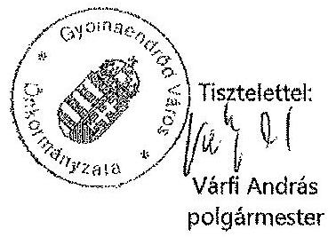

---

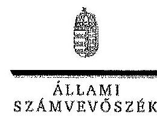

ELNÖK

Ikt. szám: V-0170-477/2014.

Várfi András úr
polgármester
Gyomsendrőd Város Önkormányzata

Gyomsendrőd

Tisztelt Polgármester Úr!

A települési önkormányzatok társulásának és feladatellátásának ellenőrzéséről készített számvevőszéki jelentéstervezetre tett észrevételeit köszönettel megkaptam.

Az Állami Számvevőszék észrevételekre vonatkozó álláspontjáról a felügyeleti vezető által készített részletes tájékoztatást csatoltan megküldöm.

Tájékoztatom Polgármester urat, hogy a jelentésben – az Állami Számvevőszékről szóló 2011. évi LXVI. törvény 29. § (3) bekezdése alapján – az el nem fogadott észrevételt szerepeltetjük az elutasítás indokának feltüntetésével együtt. Az elfogadott észrevételeket a jelentés szövegezésénél figyelembe vesszük.

Budapest, 2014. 07. hó 10. nap

Tisztelettel:

Domokos László

Melléklet: Tájékoztatás az elfogadott és az el nem fogadott észrevételekről

1052 BUDAPEST, APÁCZAI CSERÉP SÁROS UTCA 10. 1354 Budapest 4. Pf. 54 telefon: 484 9201 fax: 484 9201

1

---

# Tájékoztatás 

## az elfogadott és az el nem fogadott észrevételekről

A települési önkormányzatok társulásának és feladatellátásának ellenőrzéséről készített jelentéstervezetre a V. 179/2014. iktatószámú levelében tett észrevételeit áttekintettük, azok kezeléséről az alábbi tájékoztatást adom.

A jelentéstervezet intézkedést igénylő megállapítására és javaslatára tett észrevételét nem fogadtuk el. Amint azt a jelentéstervezet 24. oldalán is rögzítettük, az ellenőrzött időszakban működő intézményi társulások 69,4 %-a nem rögzítette teljes körűen a társulási megállapodásokban - a végrehajtott módosításokat is figyelembe véve - az Ötv. és a Ttv. szerinti kötelező tartalmi elemeket. Gyomaendrőd-Csárdaszállás-Hunya Intézményi Társulás esetében az Ttv. 8. § (4) bekezdés c) pontjában foglaltaktól eltérően a 2011. évben nem tartalmazta a társulás által ellátott valamennyi feladatot. A társult önkormányzatok képviselő-testületei 2011-ben döntöttek az ellátott feladatok óvodai nevelési feladatokkal való bővítéséről, azonban a társulási megállapodás módosítására nem került sor. A jelentés szövegezésénél az intézkedést igénylő megállapításokat kiegészítjük a jelentéstervezet 24. oldal első bekezdésében foglalt megállapítással. Egyben örömmel vettük azon tájékoztatását, hogy a 2013. június 30-tól hatályos társulási megállapodás tartalmazza a Magyarország helyi önkormányzatairól szóló 2011. évi CLXXXIX. törvény 93. § 1-19. pontjában foglaltakat. Ehhez kapcsolódik a jelentéstervezet 3. számú mellékletének 6. pontjával kapcsolatos észrevétele is. Az ellenőrzés során feltárt hiányosság volt, hogy a társulási megállapodás az Ötv. és a Ttv.
 előírása ellenére a közösen fenntartott intézmény tevékenységi körére vonatkozóan a 2011. évben nem tartalmazta az óvodai nevelési tevékenységet és annak ellátási körét.

A jelentéstervezet 3. számú mellékletének 2. pontjára tett észrevételét nem fogadtuk el. A melléklet tényként, nem pedig hibaként kezeli, ha a társulás a kötelező tartalmi elemeken kívül nem határozott meg a működésre vonatkozó egyéb szabályokat. A megállapítás érdemben nem befolyásolja jelentésünk tartalmát.

A jelentéstervezet 3. számú mellékletének 9. pontjára tett észrevételét nem fogadtuk el. A melléklet tényként, nem pedig hibaként kezeli, ha a társulás képviselő-testületei nem határoztak meg egyéb szabályozási feltételeket. A megállapítás érdemben nem befolyásolja jelentésünk tartalmát.

A jelentéstervezet 3. számú melléklet 11. pontjára tett észrevételét nem fogadtuk el. A belső kontrollrendszer a kockázatok kezelése és tárgyilagos bizonyosság megszerzése érdekében kialakított folyamatrendszer. A belső kontrollrendszer magában foglalja a kontrollkörnyezetet, a kockázatkezelési rendszert, a kontrolltevékenységeket, az információs és kommunikációs rendszert, a nyomon követési rendszert (monitoring) és része a belső ellenőrzés. A megállapításhoz tett észrevételében a kontrollrendszer egy területére, a belső ellenőrzésre hivatkozik.

Részben fogadtuk el a 3. számú melléklet 18. pontjára tett észrevételét. A szociális igazgatásról és szociális ellátásokról szóló 1993. évi III. törvény 92/B. § (1) bekezdés b) pontja szerint ellenőrzi az intézmény működésének törvényességét, d) pontja szerint pedig ellenőrzi és évente egy alkalommal értékeli a szakmai munka eredményességét. Észrevétele nem tartalmaz arra vonatkozó információt és azt alátámasztó bizonyítékot, hogy a fenntartó részéről ellenőrzés történt volna. Erre vonatkozó dokumentumot az ellenőrzést végzők részére sem adtak át. A 3. számú melléklet 18. pontjában szereplő megállapítást pontosítjuk a tekintetben, hogy az ellenőrzés és a szakmai munka értékelése elkülönüljön.

Budapest, 2014. 04. hó 30. nap
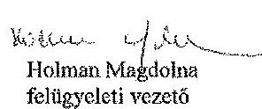

---

.

---

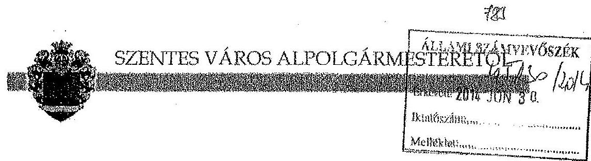

Ikt.szám: U-20037/2014.
Tárgy: Észrevételek jelentés tervezethez

Állami Számvevőszék
Domokos László elnök úr részére
Budapest
Pf.: 54.
1364

# Tisztelt Elnök Úr! 

Hivatkozással a V-0170-456/2014 ikt. számú levelükben foglaltakra a települési önkormányzatok társulásának és feladatellátásának ellenőrzéséről készített jelentéstervezetben foglalt megállapításokra, az alábbi észrevételeket tesszük:

- A jelentéstervezet 2.1. pontjában a 31-32. oldalon a Szentes-Derekegyház Intézményi Társulás vonatkozásában leírtakhoz kapcsolódóan jelezzük, hogy időközben a hivatkozott fejlesztés értékének a befejezetlen beruházások, felújítások állományából történő kivezetése és aktiválása megtörtént.
- A jelentéstervezet 3. sz. mellékletének 2. pontjában olvasható megállapítás a többcélú kistérségi társulásokra vonatkozik és a működésüket szabályozó Tkt. Törvényre hivatkozik. Ezzel szemben a felsorolásban intézményi társulások felsorolása történik meg.
Tekintettel a megállapítás szövegére a vonatkozó felsorolásban tévesen szerepel a Szentesi Szociális Intézményi Társulás, mivel az nem többcélú kistérségi társulásként működött.
- A jelentéstervezet 3. sz. mellékletének 18. pontjában olvasható megállapításhoz kapcsolódóan felhívjuk a figyelmet, hogy a Szentesi Szociális Intézményi Társulás esetében a társult feladatellátás nem terjedt ki a fenntartott intézmények minden szakmai feladatára, így a Szoc. tv. 92/A (1) bekezdés alapján a fenntartói feladatokat Szentes Város Önkormányzatának kellett ellátnia. Az intézmények alapító okiratában a megyei kormányhivatal a települési önkormányzatot kérte fenntartóként megjelölni.
E szerepkörében a város önkormányzata a hivatkozott megállapításban leírt feladatokat folyamatosan ellátta, kötelezettségeinek eleget tett.
A szakmai munkáról évente beszámolt Szentes Kistérség Többcélú Társulása Társulási Tanácsának, azzal, hogy a kiadott beszámolót a tanácsot alkotó települési képviselők tovább vihetik a saját települési képviselő-testületeik felé,

---

# SZENTES VÁROS ALPOLGÁRMESTERÉTŐL 

Tekintettel arra, hogy az ellenőrzésben érintett Szentes Kistérség Többcélú Társulása képviselője részére a fent hivatkozott jelentéstervezet nem került megküldésre önkormányzatunk Társulásban betöltött tagsági szerepe kapcsán az alábbiakat jelezzük:

- A jelentéstervezet 40. oldalán a 3.1. pontban leírtakhoz kapcsolódóan a teljesség érdekében - jelezzük, hogy az Mötv. 146. § (1) bekezdése az érintett önkormányzatok képviselő-testületei kötelezettségévé tette, hogy a törvény 2013. január 1-i hatálybalépése előtt megkötött társulási megállapodásokat felülvizsgálják és a törvény rendelkezéseinek megfelelően, módosítsák hat hónapon belül.
Eszerint a felülvizsgálati kötelezettség nem a társulások - társulási tanácsok - törvényi kötelezettsége, hanem a tag önkormányzatok képviselő-testületeié.
A fentiek alapján jelezzük, hogy a Csongrád Megyei Kormányhivatal a Szentes Kistérség Többcélú Társulása mellett egyidejűleg a mulasztással közvetlenül érintett Fábiánsebestyén Község Önkormányzatának képviselő-testülete részére is törvényességi felhívást adott ki.
Mivel a Hivatal megállapítása szerint a Megállapodás felülvizsgálata csak akkor tekinthető bevégzettnek, ha valamennyi tagönkormányzat meghozta az ehhez szükséges döntéseket, a fentiek alapján tehát a Megállapodás módosítását illetően mulasztásos jogzértés állt elő, amelyet a társult önkormányzatok képviselő-testületei tudnak megszüntetni.
A leírtak alapján a társulási tanács elnöke, illetve a Társulás csak közvetett módon képes befolyásolni a törvényesség betartását, amelyet a települési önkormányzatokkal történő folyamatos egyeztetéssel meg is tett.
- A jelentéstervezet 1. sz. mellékletében foglaltakhoz kapcsolódóan jelezzük, hogy Szentes Kistérség Többcélú Társulása 2013. december 31-i dátummal jogutód nélkül megszűnt.
- A jelentéstervezet 3. sz. mellékletének 18. pontjában olvasható megállapításhoz kapcsolódóan jelezzük, hogy Szentes Kistérség Többcélú Társulása a munkaszervezetén kívül más intézményt - így szociális intézményt sem - nem tartott fenn.
Ez alapján kérjük, hogy a vonatkozó felsorolásból Szentes Kistérség Többcélú Társulása kerüljön törlésre.

A további eredményes együttműködés reményében!
Tisztelettel:

Szentes, 2014. június 25.
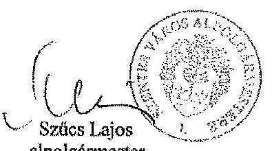
alpolgármester

---

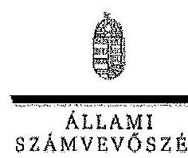

ELNÖK

Ikt. szám: V-0170-478/2014.

# Szirbik Imre úr 

polgármester
Szentes Város Önkormányzata

## Szentes

## Tisztelt Polgármester Úr!

A települési önkormányzatok társulásának és feladatellátásának ellenőrzéséről készített számvevőszéki jelentéstervezetre Szűcs Lajos alpolgármester úr által tett észrevételt köszönettel megkaptam.

Az Állami Számvevőszék észrevételekre vonatkozó álláspontjáról a felügyeleti vezető által készített részletes tájékoztatást csatoltan megküldöm.

Tájékoztatom Polgármester urat, hogy a jelentésben - az Állami Számvevőszékről szóló 2011. évi LXVI. törvény 29. § (3) bekezdése alapján - az el nem fogadott észrevételeket szerepeltetjük az elutasítás indokának feltüntetésével együtt. Az elfogadott észrevételeket a jelentés szövegezésénél figyelembe vesszük.

Tekintettel arra, hogy az Állami Számvevőszékről szóló 2011. évi LXVI. törvény 29. § (2) bekezdése szerint az ellenőrzött szervezet vezetője és a felelősként megjelölt személy tehet írásban észrevételt, Szűcs Lajos alpolgármester úr észrevételét csak akkor szerepeltetjük a jelentésben, ha azt Polgármester úr megerősíti.

Budapest, 2014.
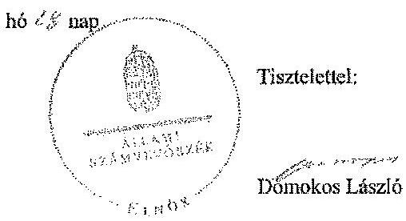

Melléklet: Tájékoztatás az elfogadott és az el nem fogadott észrevételekről

---

# Tájékoztatás 

## az elfogadott és az el nem fogadott észrevételekről

A települési önkormányzatok társulásának és feladatellátásának ellenőrzéséről készített jelentéstervezetre az U-20037/2014. iktatószámú levelében tett észrevételeit áttekintettük, azok kezeléséről az alábbi tájékoztatást adom.

A jelentéstervezet 2.1. pontjához tett észrevételéhez kapcsolódóan tájékoztatom, hogy megállapításunk a 2010. évre vonatkozóan helytálló. Örömmel értesültünk azonban arról, hogy időközben a fejlesztés értékének a befejezetlen beruházások, felújítások állományából történő kivezetése és aktiválása megtörtént.

A jelentéstervezet 3. számú melléklet 2. pontjára tett észrevételét elfogadtuk, azt a jelentés szövegezésénél figyelembe vesszük.

A jelentéstervezet 3. számú melléklet 18. pontjára tett észrevételét elfogadtuk, azt a jelentés szövegezésénél figyelembe vesszük.

A jelentéstervezetben Szentes Kistérség Többcélú Társulására tett észrevételeivel kapcsolatban tájékoztatom, hogy a társulás - mind az Ön állítása, mind a MÁK törzskönyvi nyilvántartásának adatai alapján - 2013. december 31-i dátummal jogutód nélkül megszűnt. A társulás részére ennek megfelelően a jelentéstervezetet nem állt módunkban elküldeni, ugyanis a társulásnak már nem volt törvényes képviselője. A jelentéstervezet 1. számú melléklete a 2013. június 30-ai dátumot tükrözi, így a Szentes Kistérség Többcélú Társulása, mint működő társulás, helyesen szerepel a táblázatban. Tájékoztatom, hogy a jelentéstervezet 3.1. pontjához tett jelzése megállapításainkat - a társulás jogutód nélküli megszűnése miatt - nem befolyásolja, ugyanakkor a társulási megállapodások felülvizsgálatára kötelezettekkel a megállapításunkat kiegészítjük, valamint pontosítjuk.

Elfogadjuk a 3. számú melléklet 18. pontjához tett észrevételét, a felsorolásból töröljük a Szentes Kistérség Többcélú Társulását.

Budapest, 2014. 29. hó 28. nap

Holman Magdolna
felügyeleti vezető

---

# IGAZSÁGÜGYI MINISZTÉRIUM 

JOGI TÁJÉKOZTATÁSI- ÉS KOORDINÁCIÓS OSZTÁLY
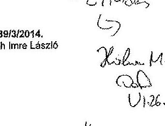

## Budapest

Apáczai Csere János utca 10.
1052

## Tisztelt Elnök Úr!

Dr. Trócsányi László Igazságügyi Miniszter Úrhoz címzett levelére, megtisztelő bizalmát megköszönve, az alábbi tájékoztatást adjuk.

A Tárcánknak megküldött számvevőszéki jelentéstervezetet a Belügyminisztériumhoz továbbítottuk, hivatkozva a Kormány tagjainak feladat- és hatásköréről szóló 152/2014. (VI. 6.). Korm. rendelet 21. § 8. pontjára.

Megértését köszönjük.

Budapest, 2014. június 7.
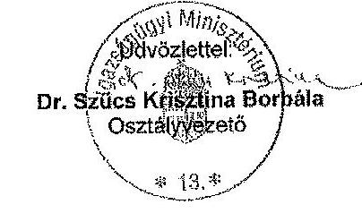

---

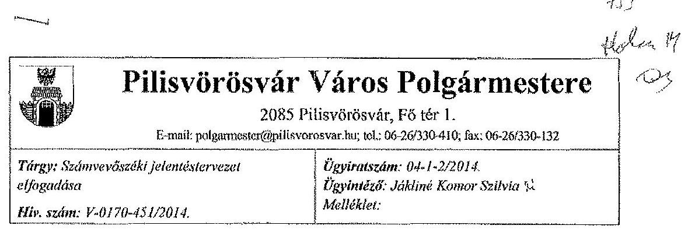

Domokos László elnök úr részére
Állami Számvevőszék
1052 Budapest Apáczai Csere János u. 10.

Tisztelt Elnök Úr!
A Pilisvörösvár Város Önkormányzatánál a települési önkormányzatok társulásának és feladatellátásának ellenőrzése témában 2013. júliusában lefolytatott Állami Számvevőszéki vizsgálat megküldött jelentéstervezetét köszönettel elfogadjuk, a dokumentummal kapcsolatosan nem kívánunk észrevételt tenni.

Pilisvörösvár, 2014. június 18.

Üdvözlettel:

---

# 12. SZAMÚ MELLÉKLET A V-0170-485/2014. SZAMÚ JELENTÉSHEZ 

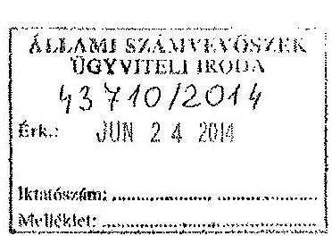

Pogányvölgyi Többcélú Kistérségi Társulás Elnöke 8693 Lengyeltóti, Zrínyi u.2.

Ügyiratszám: 3966-2/2014
Ügyintéző: Huberné Bajzik Ibolya

Állami Számvevőszék
Domokos László elnök részére

## Budapest

Apáczai Csere János utca 4.
1364

Tisztelt Elnök Úr! !

A V-0170-424/2014 iktatószámon nyilvántartott Jelentéstervezetet, mely a települési önkormányzatok társulásának és feladatellátásának ellenőrzéséről szólt 2014. június 13-án megkaptuk és áttanulmányoztuk. Örömmel vettük tudomásul, hogy az ellenőrzésről készített jelentéstervezetben a Pogányvölgyi Többcélú Kistérségi Társulásnak intézkedést igénylő megállapításokat és javaslatokat nem állapítottak meg.
Az Állami Számvevőszékről szóló 2011. évi LXVI. törvény 29.§ (2) bekezdése értelmében nem kívánunk észrevételt tenni.

Lengyeltóti, 2014. június 19.
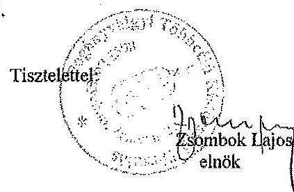

---

# VERESEGYHÁZ KISTÉRSÉG ÖNKORMÁNYZATAINAK TÖBBCÉLÚ TÁRSULÁSA 

2112 Veresegyház Fő út 33.
Levelezési cím: 2112 Veresegyház Pf. 21. Telefon: 0628888627
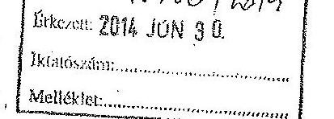

Állami Számvevőszék Elnöke
1052 Budapest, Apáczai Csere János u. 10.
Domokos László elnök részére

Tárgy: ÁSZ ellenőrzés jelentéstervezetének tudomásulvétele
Jsz.: 724412014
Zelen

## Tisztelt Elnök Úr!

A települési önkormányzatok társulásának és feladatellátásának ellenőrzéséről szóló - a 2008-2011. évekre vonatkozó - 2012. évben végzett ÁSZ vizsgálatról készített jelentéstervezetet megkaptuk, a Veresegyházi Kistérség Önkormányzatainak Többcélú Társulására vonatkozó észrevételeket tudomásul vesszük.

Veresegyház, 2014. június 23.
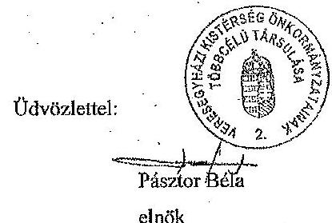

---

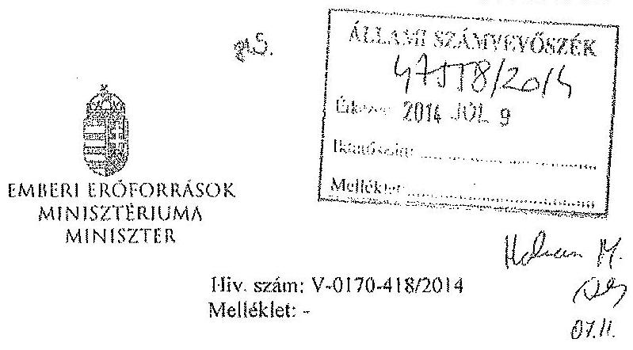

Domokos László részére
elnök
Állami Számvevőszék
Budapest
Apáczai Csere János u. 10.
1052

Tárgy: Észrevétel „a települési önkormányzatok társulásának és feladatellátásának ellenőrzéséről" című számvevőszéki jelentéstervezethez

Tisztelt Elnök Úr!

Az Állami Számvevőszék által készített, „a települési önkormányzatok társulásának és feladatellátásának ellenőrzéséről" című jelentéstervezethez nem teszek észrevételt.

Budapest, 2014. július 4.
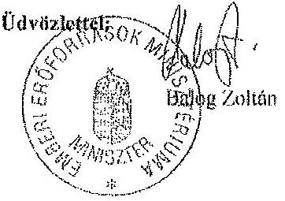

---

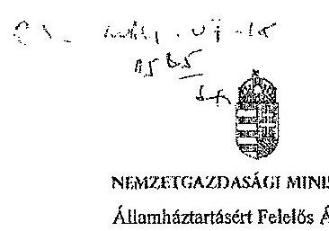

NEMZETGAZDASÁGI MINISZTÉRIUM
Államháztartásért Felelős Államtitkár

Domokos László úr részére
elnök

Állami Számvevőszék
Budapest
Apáczai Csere János u. 10.
1052

Iktatószám: NGM/ 19493 /2/2014.
Hiv.szám: V-0170-419/2014.

Tárgy: A települési önkormányzatok
társulásának és feladatellátásának
ellenőrzéséről készített számvevőszéki
jelentés tervezetének véleményezése

# Tisztelt Elnök Úr! 

Köszönettel vettem a települési önkormányzatok társulásának és feladatellátásának ellenőrzéséről készített számvevőszéki jelentés tervezetének megküldését.

A dokumentum áttekintését követően megállapítható, hogy az átfogó képet nyújt a társulások létrejöttének és működésének jogszabályi hátteréről, a szervezetek által ellátott közfeladatok köréről, azok forrásáról, központi költségvetési támogatásáról és a vagyonkezelés sajátosságairól. A Jelentéstervezet megállapításai helytállók, és hasznosnak tartom a korábban e témában tett ÁSZ javaslatok áttekintését is.

Mindezek ismeretében a szakmailag pontos megfogalmazás érdekében a tervezet részletes megállapításokat tartalmazó fejezetében írtakhoz (44. oldal 4. bekezdés) a következő szövegjavaslatot teszem:
„Az Ebr42 nem tartalmazott információt az intézményi társulásokkal kapcsolatban, mivel azok nem jogi személyiségű társulások voltak és a feladatellátásukkal kapcsolatos központi támogatás igénylésére az önkormányzatok voltak jogosultak. Ennek következtében az Ebr42 a Ttv. alapján létrejött nem jogi személyiségű intézményi társulások monitoringjának támogatására korlátozottan volt alkalmas."

Kérem javaslatom szíves figyelembevételét a Jelentés véglegesítése során, valamint ezúton köszönöm munkatársainak munkáját, alapos, mélyreható elemzését.

Budapest, 2014. július 9.
Üdvözlettel:
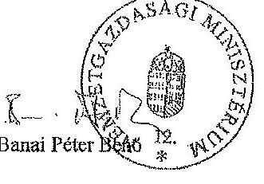

---

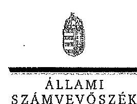

ELNÖK

Ikt. szám: V-0170-556/2014.

# Varga Mihály úr 

miniszter
Nemzetgazdasági Minisztérium

## Budapest

## Tisztelt Miniszter Úr!

A települési önkormányzatok társulásának és feladatellátásának ellenőrzéséről készített számvevőszéki jelentéstervezetre Banai Péter Benő államháztartásért felelős államtitkár úr által tett észrevételt köszönettel megkaptam.

Az Állami Számvevőszék észrevételre vonatkozó álláspontjáról a felügyeleti
 vezető által készített részletes tájékoztatást csatoltan megküldöm.

Tájékoztatom Miniszter urat, hogy a jelentés szövegezésénél az elfogadott észrevételt figyelembe vesszük.

Budapest, 2014. 02. hó 1. nap
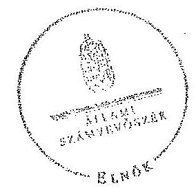

Tisztelettel:

Domokos László*

Melléklet: Tájékoztatás az elfogadott észrevételről

---

# Tájékoztatás 

## az elfogadott észrevételről

A települési önkormányzatok társulásának és feladatellátásának ellenőrzéséről készített számvevőszéki jelentéstervezetre az NGM/19493/2/2014. iktatószámú levélben tett észrevételt áttekintettük, annak kezeléséről az alábbi tájékoztatást adom.

A jelentéstervezet 44. oldal 4. bekezdésére vonatkozó észrevételt elfogadtuk. Az ebből adódó módosítást a számvevőszéki jelentés készítésénél figyelembe vesszük.

Tájékoztatom, hogy a számvevőszéki jelentés mellékleteként szerepeltetjük a jelentéstervezethez tett észrevételét, valamint arra adott válaszunkat.

Budapest, 2014. 04. hó 24. nap

Holman Magdolna
felügyeleti vezető

---

# 846 

## SZEKSZÁRD ÉS TÉRSÉGE ÖNKORMÁNYZATI TÁRSULÁS

Állami Számvevőszék
Domokos László Úr részére

Budapest, 4.
Pf. 54.
1364

Tárgy: Állami Számvevőszék által készített jelentéstervezet elfogadása

## Tisztelt Domokos László Úr!

Iktatószám: IV.4.9.17.2014. VYVÖSZÉK Ügyintéző: Hajdúné Varga Andrea
Érkezési idő: 2014. 01. 14. 5.84/24
Iktatószám:
Megjegyzés:
Helyen 14
123
Kur

A 2014. június 11. napján kelt levelében értesítették, hogy az Állami Számvevőszékről szóló 2011. évi LXVI. törvény 29. § (2) bekezdése értelmében 15 napon belül Társulásunk írásban észrevételt tehet a települési önkormányzatok társulásának és feladatellátásának ellenőrzéséről készített számvevőszéki jelentéstervezetre.

A Szekszárd és Térsége Önkormányzati Társulás 2014. június 25-i társulási tanácsülésén ismertetésre kerültek a társulási tanács tagjai részére a jelentéstervezet vonatkozó rendelkezései, amelyet valamennyi jelenlévő társulási tanácstag elfogadott, arra észrevételt nem tett.

Levelem mellékleteként megküldöm a 2014. június 25-i társulási tanács ülésének jegyzőkönyvéből készült határozat kivonatot.

Szekszárd, 2014. június 17.

Melléklet:
1 db határozat kivonat
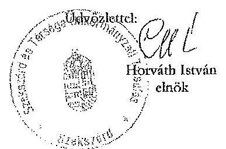

7100 Szekszárd, Béla király tér 8. Telefon és Fax: 74/504-113
E-mail : kistreferens@szekszard.hu

---

# Határozati kivonat a Szekszárd és Térsége Önkormányzati Társulás Társulási Tanácsának 2014. június 25 -én tartott ülésének jegyzőkönyvéből 

14/2014. (VI.25.) SZTÖT határozat

Tárgy: Állami Számvevőszék által készített - a települési önkormányzatok társulásának és feladatellátásának ellenőrzéséről - jelentéstervezet elfogadása

A Szekszárd és Térsége Önkormányzati Társulás Társulási Tanácsa az Állami Számvevőszék által készített jelentéstervezetet a települési önkormányzatok társulásának és feladatellátásának ellenőrzéséről elfogadásra javasolja, az abban, a Társulásra tett megállapításokra vonatkozóan észrevételt nem tesz.

Felelős: Horváth István elnök
Határidő: 2014. június 25.

A kiadmány hiteléül:
Szekszárd, 2014. június 26.

---

Szekszárd és Környéke Szociális Alapszolgáltatási és Szakositott Ellátási Társulás

| Társulási Tanács elnöke |  | ÁLLAMI SZÁMVEVŐSZÉK  |
| --- | --- | --- |
|  Állami Számvevőszék | Iktatószám: IV. | Érkezés: 2016. 01. 06.
Iktatószám: K-0170-430/2014. |
|  |   |   |
|  |   |   |
|  |   |   |

Tisztelt Domokos László Úr!

A 2014. június 11. napján kelt levelében értesítették, hogy az Állami Számvevőszékről szóló 2011. évi LXVI. törvény 29. § (2) bekezdése értelmében 15 napon belül írásban észrevételt tehetek a települési önkormányzatok társulásának és feladatellátásának ellenőrzéséről készített számvevőszéki jelentéstervezetre.
2014. június 25. napján a Szekszárd és Környéke Szociális Alapszolgáltatási és Szakositott Ellátási Társulás társulási tanácsülésén ismertetésre került a társulási tanács tagjaival a számvevőszéki jelentéstervezet vonatkozó rendelkezései, melyet valamennyi jelenlévő társulási tanács tag elfogadott, arra észrevételt nem tett.

Mellékelten csatolom a 2014. június 25-i határozati kivonatot a társulási tanács ülésének jegyzőkönyvéből.

Szekszárd, 2014. június 26.
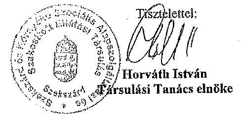

---

# Szekszárd és Környéke Szociális Alapszolgáltatási és Szakositott Ellátási Társulás Társulási Tanács elnöke 

Határozati kivonat a Szekszárd és Környéke Szociális Alapszolgáltatási és Szakositott Ellátási Társulás 2014. június 25-i ülésének jegyzőkönyvéből

## 12/2014. (VI. 25.) TT határozat   Tájékoztató a Szekszárd és Környéke Szociális Alapszolgáltatási és Szakositott Ellátási Társulásnál végzett ÁSZ ellenőrzés megállapításairól

A Szekszárd és Környéke Szociális Alapszolgáltatási és Szakositott Ellátási Társulás Társulási Tanácsa az Állami Számvevőszék által készített jelentéstervezetet a települési önkormányzatok társulásának és feladatellátásának ellenőrzéséről elfogadja, a Társulásra tett megállapításokra vonatkozóan észrevételt nem tesz.

Határidő: 2014. június 25.
Felelős: Horváth István a Társulási Tanács elnöke

A kiadmány hiteléül:
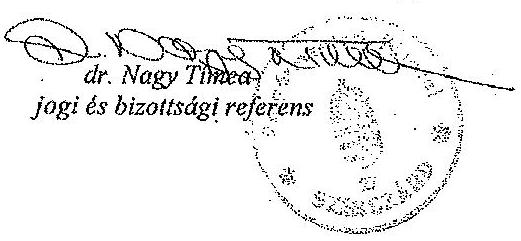

---

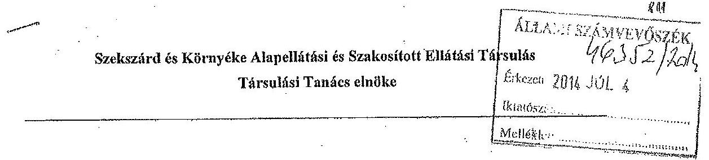

Állami Számvevőszék
Domokos László Úr részére

Iktatószám: IV. 441/2014.
Hiv. szám: V-0170-455/2014.

BUDAPEST, 4.
Pf. 54
1364

Tisztelt Domokos László Úr!

A 2014. június 11. napján kelt levelében értesítették, hogy az Állami Számvevőszékről szóló 2011. évi LXVI. törvény 29. § (2) bekezdése értelmében 15 napon belül írásban észrevételt tehetek a települési önkormányzatok társulásának és feladatellátásának ellenőrzéséről készített számvevőszéki jelentéstervezetre.
2014. június 25. napján a Szekszárd és Környéke Alapellátási és Szakositott Ellátási Társulás társulási tanácsülésén ismertetésre került a társulási tanács tagjaival a számvevőszéki jelentéstervezet vonatkozó rendelkezései, melyet valamennyi jelenlévő társulási tanács tag elfogadott, arra észrevételt nem tett.

Mellékelten csatolom a 2014. június 25-i határozati kivonatot a társulási tanács ülésének jegyzőkönyvéből.

Szekszárd, 2014. június 26.
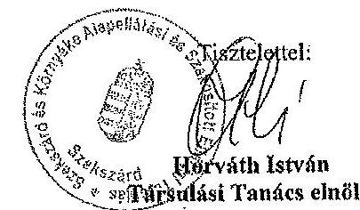

---

# Szekszárd és Környéke Alapellátási és Szakositott Ellátási Társulás Társulási Tanács elnöke 

Határozati kivonat a Szekszárd és Környéke Alapellátási és Szakositott Ellátási Társulás 2014. június 25-i ülésének jegyzőkönyvéből

## 10/2014. (VI. 25.) TT határozat

Tájékoztató a Szekszárd és Környéke Alapellátási és Szakositott Ellátási Társulásnál végzett ÁSZ ellenőrzés megállapításairól

A Szekszárd és Környéke Alapellátási és Szakositott Ellátási Társulás Társulási Tanácsa az Állami Számvevőszék által készített jelentéstervezetet a települési önkormányzatok társulásának és feladatellátásának ellenőrzéséről elfogadja, a Társulásra tett megállapításokra vonatkozóan észrevételt nem tesz.

Határidő: 2014. június 25.
Felelős: Horváth István a Társulási Tanács elnöke

A kiadmány hiteléül:
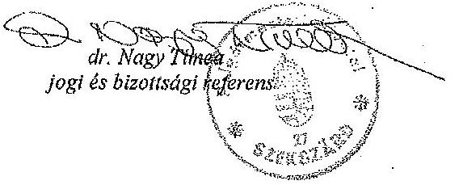

---

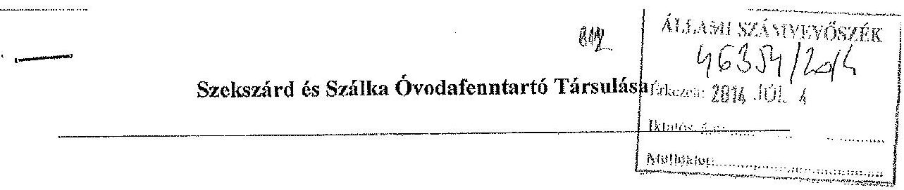

# Állami Számvevőszék 

Domokos László elnök

## Budapest

Apáczai Csere János u. 10.
1052

## Tisztelt Elnök Úr!

A fenti számon Szekszárd és Szálka Óvodafenntartó Társulásának megküldött számvevőszéki jelentéstervezettel kapcsolatban észrevételt nem kívánok tenni.

A társulás döntéshozó szerve, a társulási tanács 2014. június 25-i ülésén megismerte a jelentéstervezet Szekszárd és Szálka Óvodafenntartó Társulására, továbbá Szekszárd és Szálka Közoktatási Intézményfenntartó Társulására vonatkozó megállapításait, s azzal kapcsolatban a mellékelt határozatban foglaltak szerint döntött.

Szekszárd, 2014. június 27.
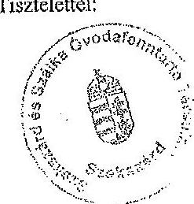

Horváth István Társulási Tanács elnöke

---

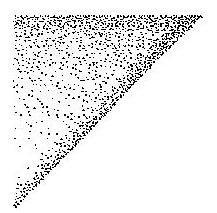

# Kivonat 

Szekszárd és Szálka Óvodafenntartó Társulása Társulási Tanácsa 2014. június 25-én megtartott ülésének jegyzőkönyvéből

## Szekszárd és Szálka Óvodafenntartó Társulása Társulási Tanácsának 18/2014. (VI.25.) határozata

a települési önkormányzatok társulására és feladatellátására vonatkozó, 2013 nyarán végzett ÁSZ ellenőrzés megállapításairól

Szekszárd és Szálka Óvodafenntartó Társulása Társulási Tanácsa az Állami Számvevőszék által készített, a települési önkormányzatok társulásának és feladatellátásának ellenőrzéséről összeállított jelentéstervezetben Szekszárd és Szálka Óvodafenntartó Társulására tett megállapításokra észrevételt nem tesz.

Határidő: 2014. június 25.
Felelős: Horváth István Társulási Tanács elnöke

Horváth István sk.
Társulási Tanács elnöke

Dr. Göttlinger István sk.
Amreinné dr. Gál Klaudia jegyző távollétében
jegyzőt helyettesítő aljegyző,
munkaszervezet-vezető

A kivonat hiteléül:

Amreinné dr. Gál Klaudia jegyző távollétében:

Szekszárd, 2014. június 27.
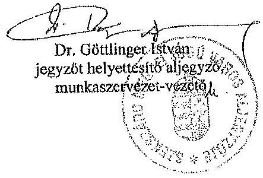

---

# Szekszárd és Környéke Központi Ügyeleti Társulás Társulási Tanács elnöke 

Állami Számvevőszék
Domokos László Úr részére
BUDAPEST, 4.
Pf. 54
1364

Iktatószám: IV. 442/2014.
Hiv. szám: V-0170-455/2014.

Tisztelt Domokos László Úr!

A 2014. június 11. napján kelt levelében értesítették, hogy az Állami Számvevőszékről szóló 2011. évi LXVI. törvény 29. § (2) bekezdése értelmében 15 napon belül írásban észrevételt tehetek a települési önkormányzatok társulásának és feladatellátásának ellenőrzéséről készített számvevőszéki jelentéstervezetre.
2014. június 25. napján a Szekszárd és Környéke Központi Ügyeleti Társulás társulási tanácsülésén ismertetésre került a társulási tanács tagjaival a számvevőszéki jelentéstervezet vonatkozó rendelkezései, melyet valamennyi jelenlévő társulási tanács tag elfogadott, arra észrevételt nem tett.

Mellékelten csatolom a 2014. június 25-i határozati kivonatot a társulási tanács ülésének jegyzőkönyvéből.

Szekszárd, 2014. június 26.
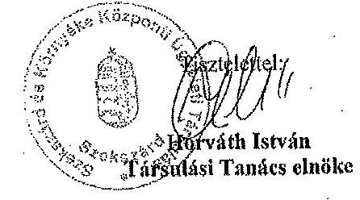

---

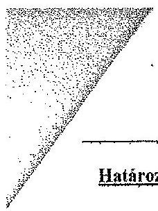

# Szekszárd és Környéke Központi Ügyeleti Társulás Társulási Tanács elnöke 

Határozati kivonat a Szekszárd és Környéke Központi Ügyeleti Társulás 2014. június 25-i ülésének jegyzőkönyvéből

10/2014. (VI. 25.) TT határozat Tájékoztató a Szekszárd és Környéke Központi Ügyeleti Társulásnál végzett ÁSZ ellenőrzés megállapításairól

A Szekszárd és Környéke Központi Ügyeleti Társulás Társulási Tanácsa az Állami Számvevőszék által készített jelentéstervezetet a települési önkormányzatok társulásának és feladatellátásának ellenőrzéséről elfogadja, a Társulásra tett megállapításokra vonatkozóan észrevételt nem tesz.

Határidő: 2014. június 25.
Felelős: Horváth István a Társulási Tanács elnöke

A kiadmány hiteléül:
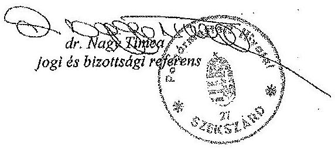

---

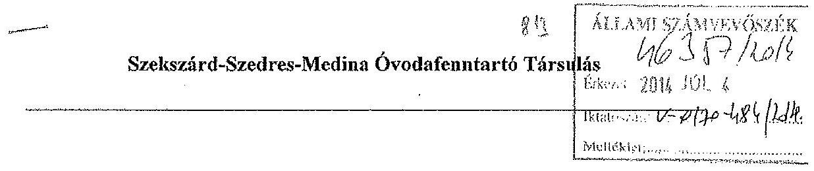

# Szekszárd-Szedres-Medina Óvodafenntartó Társulás 

Tárgy: Számvevőszéki jelentéstervezet
Melléklet: -
Hiv. szám: V-0170-411/2014.

Állami Számvevőszék
Domokos László elnök

## Budapest

Apáczai Csere János u. 10.
1052

## Tisztelt Elnök Úr!

A fenti számon a Szekszárd-Szedres-Medina Óvodafenntartó Társulásnak megküldött számvevőszéki jelentéstervezettel kapcsolatban észrevételt nem kívánok tenni.

A társulás döntéshozó szerve, a társulási tanács 2014. június 25-i ülésén megismerte a jelentéstervezet Szekszárd és Szedres Közoktatási Intézményfenntartó Társulására, továbbá Szekszárd és Medina Közoktatási Intézményfenntartó Társulására vonatkozó megállapításait, s azt határozathozatal nélkül tudomásul vette.

Szekszárd, 2014. június 27.
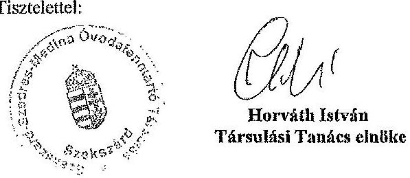

7100 Szekszárd, Béla király tér 8. Telefon: 74/504-174
E-mail: muvelodes@szekszard.hu

---

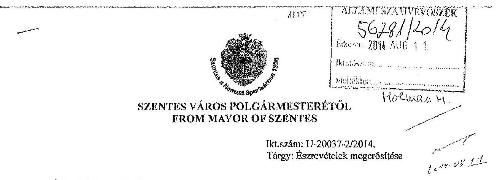

Állami Számvevőszék
Domokos László elnök úr részére Budapest
Pf.: 54.
1364

# Tisztelt Elnök Úr! 

Hivatkozással a V-0170-478/2014 ikt. számú levelükben foglaltakra a települési önkormányzatok társulásának és feladatellátásának ellenőrzéséről készített jelentéstervezethez kapcsolódóan önkormányzatunk nevében megküldött - a Szűcs Lajos alpolgármester úr által jegyzett - észrevételekkel kapcsolatosan az alábbiakról tájékoztatom.

A jelentéstervezettel kapcsolatos V-0170-456/2014 ikt. számú levelükben foglaltak szerint a jelentéstervezettel kapcsolatos észrevételeinket 2014. június 30-ig tehettük meg.
A határidőt megelőző napokban távollétemben Szűcs Lajos alpolgármester úr helyettesített, így az Önök által megadott határidőt figyelembe véve Szentes Város Önkormányzata képviseletében teljes jogkörrel járt el.

A fentiek alapján alpolgármester úr által jegyzett észrevételekkel egyetértek, azokat megerősítem.

A további eredményes együttműködés reményében!
Tisztelettel:

Szentes, 2014. augusztus 4.
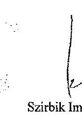

Szírbik Imre
polgármester
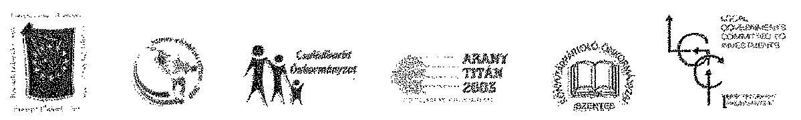
