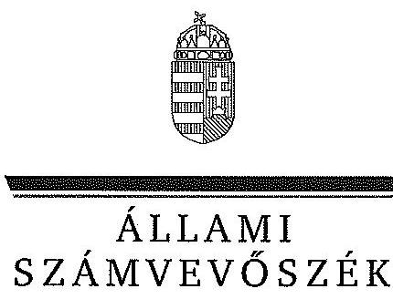

ÁLLAMI
SZÁMVEVŐSZÉK

# JELENTÉS 

az önkormányzatok pénzügyi gazdálkodási
helyzete értékelésének, és gazdálkodása
szabályosságának ellenőrzéséről
Kunmadaras
14195
2014. augusztus

---

# Állami Számvevőszék 

Iktatószám: V-0357-063/2014.
Témaszám: 1349
Vizsgálat-azonosító szám: V065011

## Az ellenőrzést felügyelte:

## Renkó Zsuzsanna

felügyeleti vezető
Az ellenőrzést vezette és az ellenőrzés végrehajtásáért felelős:
Mohl Anna
ellenőrzésvezető
A számvevőszéki jelentés összeállításában közreműködött:
Baksa Anikó
számvevő tanácsos
Az ellenőrzést végezték:

| Joó Erika | Szepes Béla Bálint |
| :-- | :-- |
| számvevő | számvevő tanácsos |

---

# TARTALOMJEGYZÉK 

BEVEZETÉS ..... 3
I. ÖSSZEGZŐ MEGÁLLAPÍTÁSOK, KÖVETKEZTETÉSEK, JAVASLATOK ..... 6
II. RÉSZLETES MEGÁLLAPÍTÁSOK ..... 14

1. Az Önkormányzat kötelező és önként vállalt feladatai, a feladatellátás szervezeti kereteinek változása ..... 14
2. A pénzügyi egyensúly fenntartását veszélyeztető pénzügyi kockázatok, ezek csökkentése érdekében tett intézkedések ..... 17
3. Az Önkormányzat kötelezettségeinek állománya, azok összetételének változása, az adósságkonszolidáció hatása ..... 23
4. Az Önkormányzat pénzügyi gazdálkodása során érvényesített integritási szempontok ..... 29

---

# MELLÉKLETEK 

1/A. számú Az Önkormányzat bevételei és kiadásai, valamint adósságszolgálata a 2010-2013. év I. félév közötti időszakban (a CLF módszer szerint, a Kvtv. 72. § (1) bekezdésében foglalt adósságátvállaláshoz kapcsolódó pénzügyi teljesítések nélkül)
1/B. számú Az Önkormányzat bevételei és kiadásai a Kvtv. 72. § (1) bekezdésében foglalt adósságátvállaláshoz kapcsolódó pénzügyi teljesítések nélkül 2013. év I. félévében (a CLF módszer szerint)
2. számú Az Önkormányzat által a 2010. és a 2013. év I. félév között megvalósított fejlesztési feladatok érdekében teljesített felhalmozási kiadások és az ezekhez vállalt kötelezettségek összegzése
3. számú Az Önkormányzat kötelezettségeinek és egyes kötelezettségvállalásainak 2010. december 31-ei és 2013. június 30 -ai állománya, valamint a 2013. év II. félévben és az azt követő években várható kötelezettségek, kötelezettségvállalások miatti kiadások
4. számú Kunmadaras Nagyközség Önkormányzata Polgármesterének a jelentéstervezethez tett észrevétele
5. számú Az ÁSZ válasza Kunmadaras Nagyközség Önkormányzata Polgármesterének a jelentéstervezethez tett észrevételére

## FÜGGELÉKEK

1. számú Rövidítések jegyzéke
2. számú Fogalomtár

---

# JELENTÉS 

## az önkormányzatok pénzügyi gazdálkodási helyzete értékelésének, és gazdálkodása szabályosságának ellenőrzéséről Kunmadaras

## BEVEZETÉS

Az ÁSZ a stratégiájában célul tűzte ki, hogy az önkormányzatok ellenőrzése során azok pénzügyi-gazdasági helyzetét értékeli, kockázatait feltárja, valamint az ellenőrzések helyszíneit objektív mutatószámrendszer alapján választja ki.

Az államháztartás önkormányzati alrendszerében az utóbbi években megjelenő gazdálkodási nehézségek, a pénzforgalmi hiány növekedése, az eladósodás az ÁSZ figyelmét az önkormányzatok pénzügyi helyzetére irányította. Az elkövetkezendő évek költségvetési hiánycéljainak tarthatósága érdekében indokolt, hogy az önkormányzatok pénzügyi helyzetelemzése és az egyensúlyi helyzetet befolyásoló kockázatok feltárása továbbra is kiemelt hangsúlyt kapjon az ÁSZ tevékenységében.

A közigazgatás átalakításának keretében - a helyi igazgatás és önkormányzás hatékonyabbá tétele érdekében - az önkormányzatokra vonatkozóan 2012-ben újraszabályozták mind a sarkalatos, mind az önkormányzatok mindennapi múködését rendező törvényeket és a feladatok végrehajtását biztosító előírásokat. Az önkormányzati feladatellátást érintő átalakítások jelentős része 2013-ban következett be azzal, hogy az igazgatási, az oktatási és a szociális ellátásban a feladatok jelentős hányadát átvette az állam. Ahhoz, hogy az önkormányzatok meg tudjanak felelni a számukra meghatározott - szigorúbb gazdálkodási szabályoknak, és az új feltételek mellett is biztosítható legyen a közszolgáltatások megfelelő színvonalú ellátása, szükséges volt a pénzügyigazdasági rendszerük alapjainak megszilárdítása. Ezt a célt szolgálja az adósságkonszolidáció, amely az önkormányzatok múködését és fejlesztését segítő, de korábban az állam által nem fedezett kiadásokkal kapcsolatos kötelezettségvállalások differenciált mértékű átvállalását jelenti.

Az ÁSZ a 2013. év II. félévi ellenőrzési tervében a 23. számú, az önkormányzatok pénzügyi gazdálkodási helyzete értékelésének, és gazdálkodása szabályosságának - 2013. évben induló - ellenőrzésével az önkormányzatok 2011. évben megkezdett helyzetelemzését folytatja. Az adósságkonszolidáció az önkormányzatok pénzügyi egyensúlyi helyzetére egyértelműen kedvező hatást gyakorolt. Az önkormányzati alrendszerben a 2013-tól bevezetett új feladatfinanszírozási rendszer keretein belül az adott települési önkormányzat feladata a pénzügyi egyensúly megteremtése, hosszú távú fenntartása. Az adósságkonszolidáció, a feladat-ellátási és finanszírozási rendszer változásának 2013. év

---

I. félévet követő hatása az ellenőrzött időszak alapján - az intézkedések bevezetése óta eltelt idő rövidségére tekintettel - még nem állapítható meg. A pénz-ügyi-egyensúlyi helyzet jövőbeni alakulása - figyelemmel az adósságkonszolidáció folytatására - a törvényi rendelkezések hosszabb távú érvényesülése után elemezhető, értékelhető. Erre tekintettel kiemelt fontosságú az önkormányzatok pénzügyi egyensúlyi helyzetére ható kockázatok feltárása, az ezzel kapcsolatos folyamatok, trendek bemutatása. Az ÁSZ ennek megfelelően a jövőben is tovább folytatja az önkormányzatok pénzügyi gazdálkodási helyzetét értékelő témacsoportos ellenőrzéseit.

Az ellenőrzések kockázatalapú megközelítése keretében megtörténik az önkormányzatok adósságkezelési és likviditási helyzetének értékelése, a pénzügyi egyensúly minősítése, továbbá az alrendszerben 2013-ban bekövetkezett változások hatásának értékelése.

Az ellenőrzés - eredményének várható hatásaként - megállapításaival segítséget nyújthat a pénzügyi helyzet értékeléséhez, a pénzügyi egyensúly helyreállítása érdekében szükségessé váló önkormányzati intézkedések megtételéhez. Az ellenőrzés során továbbra is célunk az államháztartás önkormányzati alrendszerére jellemző információk összegzésével támogatni az Országgyúlés munkáját a törvényalkotásban, a források elosztásában.

Az ellenőrzés célja: az Önkormányzat pénzügyi helyzetének, szabályosságának értékelése, a pénzügyi egyensúly alakulására hatással lévő folyamatoknak és a pénzügyi egyensúly alakulására ható kockázatoknak a feltárása.

# Ennek keretében értékeltük, hogy: 

- a kötelező és önként vállalt feladatok ellátása, ezen belül az ellátott feladatok körének, az ellátást biztosító szervezeti formáknak a változása milyen hatást gyakorolt a pénzügyi egyensúlyi helyzetre;
- az Önkormányzat pénzügyi - múködési és felhalmozási - egyensúlya milyen irányban változott, a változást milyen okok idézték elő, továbbá milyen intézkedéseket tettek az egyensúly biztosítása, illetve javítása érdekében, az intézkedések hatására javult-e az Önkormányzat pénzügyi helyzete;
- a költségvetési kiadások finanszírozása érdekében vállalt, pénzintézetekkel szembeni kötelezettségek, a szállítói és egyéb kötelezettségek hogyan alakultak, az adósságkonszolidáció után fennmaradt kötelezettségek teljesítésének kockázatai miként befolyásolják a jövőbeli pénzügyi egyensúlyi helyzetet.

Az önkormányzatok korrupcióval szembeni veszélyeztetettségének csökkentése érdekében új feladatként felmértük az integritási szemlélet érvényesülését a pénzügyi gazdálkodási folyamatokban.

Utóellenőrzésre nem került sor, mivel az ÁSZ az ellenőrzött időszakban az Önkormányzatnál számvevőszéki jelentéssel lezárt ellenőrzést nem végzett.

Az ellenőrzési célokban megfogalmazott kérdések értékelési kritériumai a gazdálkodásra vonatkozó jogszabályok és a pénzügyi egyensúly biztosításának, valamint a pénzügyi helyzettel és gazdálkodással kapcsolatos kockázatok keze-

---

lésének követelménye. Az ellenőrzés az ellenőrzési célok eléréséhez elemző, értékelő, a pénzügyi helyzet kockázatát is minősítő eljárásokat alkalmazott.

Az ellenőrzés típusa: szabályszerűségi ellenőrzés

# Ellenőrzött szervezet: Kunmadaras Nagyközség Önkormányzata 

Az ellenőrzött időszak: a 2010. január 1-jétől 2013. június 30-ig terjedő időszak, figyelemmel az ellenőrzés célja vonatkozásában megfogalmazottakra. A pénzintézetekkel szembeni kötelezettségek állományának vizsgálatakor az ellenőrzött időszakban fennálló kötelezettségeket vette figyelembe az ellenőrzés.

Az ellenőrzés szakmai módszertana az ÁSZ hivatalos honlapján (www.asz.hu) közzétett szakmai szabályokon alapult, amely a Legfőbb Ellenőrző Intézmények Nemzetközi Szervezete (INTOSAI) által kiadott nemzetközi standardok (ISSAI) figyelembevételével készült.

Az ellenőrzés jogszabályi alapját az ÁSZ tv. 1. § (3) bekezdésének, 5. § (2)-(6) bekezdéseinek, valamint az Áht. 61. § (2) bekezdésének előírásai képezik.

Az ellenőrzés során használt rövidítéseket az 1. számú, az egyes fogalmak magyarázatát a 2. számú függelék tartalmazza.

Kunmadaras nagyközség állandó lakosainak száma 2010. január 1-jén 5878 fő, 2013. január 1-jén 5819 fő volt. Az Önkormányzat elemi költségvetési beszámolója szerint a 2012. évben 1321,5 millió Ft költségvetési bevételt ért el és 1284,1 millió Ft költségvetési kiadást teljesített. A 2012. december 31-i könyvviteli mérleg szerint 1921,5 millió Ft értékű vagyonnal rendelkezett, a rövid lejáratú kötelezettségállomány 16,6 millió Ft, a hosszú lejáratú kötelezettségállománya 139,5 millió Ft volt. Az Önkormányzat 2013. június 30 -án a Madarasi Kenyér Kft.-ben és a KunAirport Kft.-ben 100,0\%-os tulajdoni részesedéssel rendelkezett, más társaságban nem volt érdekeltsége. Az aljegyzö - a jegyző tartós távolléte miatt - 2012. november 1-jétől látta el a jegyzői feladatokat. A foglalkoztatott köztisztviselők száma 2013. január 1-jén 18 fő volt.

Az ÁSZ tv. 29. § (1) bekezdése szerint a jelentéstervezetet megküldtük a polgármester részére, aki az ÁSZ tv. 29. § (2) bekezdésében foglalt észrevételezési jogával élt, a jelentéstervezetre észrevételt tett.

---

# I. ÖSSZEGZŐ MEGÁLLAPÍTÁSOK, KÖVETKEZTETÉSEK, JAVASLATOK 

Kunmadaras Nagyközség Önkormányzata pénzügyi egyensúlya az ellenőrzött időszakra vonatkozóan feltárt kockázatok alapján rövid távon biztosított volt. Az Önkormányzat pénzügyi egyensúlyi helyzete az ellenőrzött időszakban folyamatosan javuló tendenciát mutatott, a múködési jövedelem 2011-től már fedezetet nyújtott a tőketörlesztési kötelezettségekre. A 2013. év I. félévi 70,0\%os mértékű ( 105,9 millió Ft tőketartozást és annak járulékait érintő) adósságkonszolidáció hatására a pénzintézeti kötelezettségek jelentősen csökkentek.

A múködési jövedelemtermelő képesség megőrzése esetén a képződő bevételek várhatóan biztosítják a fennálló kötelezettségek jövőbeni fedezetét, azonban a múködési és felhalmozási egyensúly hosszú távú fenntartásához elkülönített tartalék képzése indokolt.

Az Önkormányzat költségvetésének elemzését a CLF módszerrel számított mutatók alapján végeztük. A pénzügyi kapacitás 2010-2013. év I. félév közötti változását - a 2013. évi adósságkonszolidáció pénzforgalmi hatása nélkül számítva - a következő ábra mutatja be:
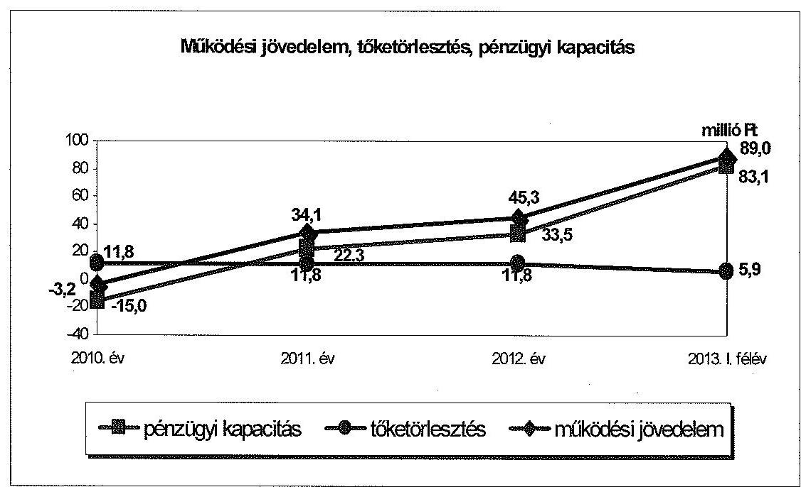

Az Önkormányzat a 2010. év és a 2013. év I. félév között összesen 4478,9 millió Ft költségvetési bevételt ért el, és 4275,3 millió Ft költségvetési kiadást teljesített. A folyó költségvetés egyenlege (müködési jövedelem) 2010-ben 3,2 millió Ft hiányt, a 2011-2013. év I. félévében összesen 168,4 millió Ft többletet mutatott. Az Önkormányzat kizárólag a 2011. évben részesült 31,9 millió Ft összegben müködőképesség megőrzését szolgáló támogatásban. A múködési jövedelem 2011-ben az ÖNHIKI támogatás nélkül is po-

---

zitív értékű volt, ezért a támogatás esetleges elmaradása bevételi kitettséget nem jelentett. A múködési jövedelem 2010. évi negatív értéke, valamint 2011. évi ÖNHIKI támogatás nélküli összege alacsony múködési jövedelemtermelő képesség miatti kockázatot jelzett.

A nettó múködési jövedelem az ellenőrzött időszakban a működési jövedelem kedvező tendenciája következtében a 2011. évtől javult. A 2010. évben -15,0 millió Ft volt, az azt követő időszakban pozitív értéket mutatott. A pénzügyi kapacitás 2010. évi negatív értékét elsősorban a múködési hiány okozta, amelyet tovább csökkentett az Önkormányzat 11,8 millió Ft adósságszolgálati kötelezettsége.

A felhalmozási költségvetés egyenlege a 2010. és a 2012. években negatív ( $-3,7$ millió Ft és $-8,0$ millió Ft ), míg a 2011. évben ( 13,8 millió Ft ) és 2013. év I. félévben ( 36,2 millió Ft ) pozitív volt. A felhalmozási forráshiánynak a felhalmozási kiadásokhoz viszonyított aránya 2010-ben 28,0\%, 2012-ben 11,2\% volt. A felhalmozási forráshiányra 2010-ben az előző évi tartalék, 2012-ben a nettó múködési jövedelem nyújtott fedezetet. A 2012. évi felhalmozási forráshiány az EU támogatás fel nem használt előlege miatt 27,2 millió Ft-tal magasabb lett volna a beszámoló szerint, amennyiben az előleg számviteli elszámolása az Áhsz. ${ }_{1}$ előírásainak megfelelően átfutó bevételként történik.

Az Önkormányzat adatszolgáltatása alapján a 2010-2013. év I. félév között befejezett fejlesztések 105,0 millió Ft-os bekerülési költségének forrását 83,1 millió Ft ( $79,1 \%$ ) egyéb központi támogatás, valamint 21,9 millió Ft ( $20,9 \%$ ) saját bevétel képezte. A 2013. június 30 -án folyamatban lévő fejlesztésekre az ellenőrzött időszakban 103,9 millió Ft-ot fordítottak, amelyre 94,5\% ( 98,2 millió Ft) EU-s támogatást, 5,5\% ( 5,7 millió Ft) saját bevételt használtak fel. A folyamatban lévő beruházások miatt jelentkező jövőbeni kötelezettség 83,7 millió Ft, amelyhez 67,3 millió Ft EU-s támogatás ( $80,4 \%$ ) áll rendelkezésre. Önkormányzati saját forrásból kell biztosítani 16,4 millió Ft-ot (19,6\%), amelyhez a fedezet a múködési jövedelemtermelő képesség fenntartása mellett a rendelkezésre álló szabad pénzmaradványból biztosítható.

Az Önkormányzatnak finanszírozási igénye a CLF módszer szerint csak 2010-ben keletkezett 18,7 millió Ft összegben, amelyet a korábbi években képződött tartalékokból fedeztek. Az ellenőrzött időszak további éveiben a nettó múködési jövedelem és a felhalmozási költségvetés egyenlege (2011. évben 36,1 millió Ft, a 2012. évben 25,5 millió Ft, a 2013. év I. félévében 119,3 millió Ft) finanszírozási többletet mutatott.

Az ellenőrzött időszakban a múködési kiadásokon belül az önként vállalt feladatok kiadásainak részaránya a 2010. évi $0,6 \%$-ról ( 7,8 millió Ft-ról) a 2013. év I. félév végére $3,6 \%$-ra ( 19,9 millió Ft-ra) növekedett. Ennek okai az önként vállalt feladatok körének bővülése és az ellátására fordított kiadások emelkedése, valamint a kötelező feladatokat érintő feladatátadások miatt bekövetkező kiadás csökkenés voltak. A 2010. évben a 3,2 millió Ft múködési hiány miatt az önként vállalt feladatokra fordított folyó kiadások múködési kockázatot jelentettek. A 2011-2013. év I. féléve közötti időszakban az önként vállalt feladatok miatt múködési kockázat már nem jelentkezett, mivel a saját hatáskörben végrehajtott megtakarítási intézkedések eredményeként a múködési

---

jövedelemtermelő képesség javult. Az önként vállalt feladatokhoz kapcsolódó fejlesztésekre 2013. év I. félévében felhasznált 12,0 millió Ft a 100,0\%-os EU-s támogatásból történő finanszírozásra tekintettel felhalmozási kockázatot nem jelentett.

A 2010-2013. év I. félév között a kötelező és az önként vállalt feladatellátás szervezeti kereteiben jelentős változás történt. 2013. január 1-jével az általános iskola állami fenntartásba került, továbbá az Önkormányzat egyes államigazgatási feladatait a járási kormányhivatal látja el. Az ellenőrzött időszakban megvalósult állami feladatátvételek - az Önkormányzat adatszolgáltatása alapján - összességében 25,6 millió Ft megtakarítást eredményeztek. A saját hatáskörben végrehajtott bevételnövelő és kiadáscsökkentő intézkedések az ellenőrzött időszakban együttesen az Önkormányzat kimutatása alapján 35,8 millió Ft-tal javították a pénzügyi egyensúlyi helyzetet.

A pénzintézetekkel szemben 2010. január 1-jén fennálló kötelezettségállomány 2013. június 30 -ára 186,6 millió Ft-ról 39,5 millió Ft-ra csökkent. Az ellenőrzött időszakban hitel felvételére nem került sor. A Magyar Állam az adósságkonszolidáció keretében a két hosszú lejáratú hitelből fennálló 105,9 millió Ft tőketartozást és járulékait ( 0,4 millió Ft kamat) vállalta át. Az ellenőrzött időszak végén fennálló hitelszerződésben foglaltak alapján a pénzintézeti kötelezettségállomány 2013. július 1-jét követő időszakban esedékessé váló tőketörlesztési és kamatfizetési kötelezettségei 47,0 millió Ft-ot tettek ki. Az Önkormányzatnál a banki kitettség miatti kockázat nem állt fenn az ellenőrzött időszakban.

Az adósságkonszolidációt követően fennmaradt pénzintézeti kötelezettségek teljesítésére a fedezet - a múködési jövedelemtermelő képesség 2012-2013. év I. félévi szintjének megőrzése, valamint a finanszírozásba bevonható szabad pénzeszközökből elkülönített tartalék képzése esetén - biztosítható.

Az Önkormányzat 2010-2012. évi mérlegében kimutatott szállítói tartozások adatai nem megbízhatóak, mert azokat a leltárak nem támasztják alá a kimutatott értékben. Az ellenőrzött időszakban a szállítói állomány a mérleg szerint 4,0 millió Ft-ról 9,5 millió Ft-ra nőtt. A leltárban 2010-ben a mérlegben szereplő 4,0 millió Ft-tal szemben 6,9 millió Ft volt. A 2011. évi mérlegben feltüntetett 0,8 millió Ft-os szállítói tartozással szemben a leltár 10,1 millió Ft végösszegű volt. 2012-ben pedig a leltár 4,9 millió Ft-ot tartalmazott a mérlegben kimutatott 4,8 millió Ft-tal szemben. Az Önkormányzat adatszolgáltatása szerint az összes szállítói tartozás 30 napon belüli lejárt esedékességú volt, mivel azokat a számlákat is lejártnak tekintették, amelyeknek a fizetési határideje még nem járt le. Az Önkormányzat adatszolgáltatásában szereplő szállítói tartozások nagyságrendje, illetve lejárata alapján a pénzügyi egyensúly szempontjából kiemelt kockázat nem állapítható meg, azonban a számviteli nyilvántartások feltárt hiányossága a szállítói tartozások pénzügyi helyzetre gyakorolt hatásának értékelése tekintetében kockázatot hordoz.

Az Önkormányzatnak a pénzügyi gazdálkodás során figyelmet kell fordítania az integritási szemlélet teljes körű érvényesítésére.

---

Az ellenőrzés során a gazdálkodási feladatok ellátásával kapcsolatban az alábbi szabályszerűségi hibákat tártuk fel:

- az Önkormányzat a 2013. évi költségvetési rendeletében az Áht.-ben foglalt előírások ellenére a hitel tőkeösszegének törlesztését, valamint a költségvetési maradványt nem finanszírozási célú kiadásként, illetve bevételként vette figyelembe, ezáltal a költségvetés egyenlegét nem az Áht. előírásai alapján állapította meg;
- az Önkormányzatnál a szállítói kötelezettségekről az - Áhsz.1-ben foglalt előírással ellentétben - a 2010-2011. évben nem vezettek analitikus nyilvántartást. A 2012. évtől rendelkezésre álló analitikus nyilvántartás nem volt alkalmas az elemi költségvetési beszámoló adatainak valóságnak megfelelő, áttekinthető módon történő alátámasztására. Ennek következményeként a 2010-2012. évek mérlegeiben a kötelezettségeket nem a valóságnak megfelelő összegben mutatták ki, valamint a nyilvántartásokból nem álltak rendelkezésre a 30, illetve a 60 napon túli kiegyenlítetlen szállítói kötelezettségállományra vonatkozó információk. Az Áhsz.1-ben foglaltakat megsértve nem az év végi leltározás alapján, illetve azzal egyezően mutatták ki a szállítói kötelezettségek állományát a 2010-2012. évi mérlegekben. Ezzel sérült az Sztv.-ben rögzített valódiság, továbbá a negatív szállítói kötelezettség kimutatása miatt a világosság elve;
- az Önkormányzat 2010-2012. évi beszámolói mérlegeinek eszköz és forrás oldalán tévesen szerepeltettek 1967,0 millió Ft összegben, leltárral illetve analitikus nyilvántartással alá nem támasztott költségvetési aktív kiegyenlítő, továbbá passzív kiegyenlítő elszámolásokat megsértve az Sztv.-ben és az Áhsz.1-ben foglaltakat. A tévesen könyvelt tételeket a helyszíni ellenőrzést megelőzően feltárták és részben javították. A mérleg eszközoldalán 0,1 millió Ft tisztázatlan tétel maradt, melynek rendezése időpontjaként a 2013. évi zárást jelölték meg;
- a jegyző1 a 2011. évben egy gazdasági társasággal szemben fennálló követelést - az Áhsz.1-ben foglalt feltétel bekövetkezése ellenére - behajthatatlanságra tekintettel nem törölt. A követelést az adós ellen indult felszámolási eljárásban az Önkormányzat hitelezői igényként nem jelentette be. A gazdasági társaság a jogerősen lezárult felszámolási eljárást követően megszűnt, ennek ellenére az Önkormányzatnál a követelést a 2011. évi beszámoló készítésekor hitelezési veszteségként nem írták le, azt nem vezették ki a számviteli nyilvántartásokból, a 2011-2012. évi mérlegekben továbbra is szerepeltették.

Az ÁSZ tv. 33. § (1) bekezdésében foglaltak értelmében az ellenőrzött szervezet vezetője köteles a jelentésben foglalt megállapításokhoz kapcsolódó intézkedési tervet összeállítani, és azt a jelentés kézhezvételétől számított harminc napon belül az ÁSZ részére megküldeni. Amennyiben az intézkedési tervet határidőn belül nem küldi meg a szervezet vezetője, vagy az továbbra sem elfogadható, az ÁSZ elnöke a hivatkozott törvény 33. § (3) bekezdés a-b) pontjaiban foglaltakat érvényesítheti.

---

# Az ellenőrzés intézkedést igénylő megállapításai és javaslatai: 

## a polgármesternek

1. Az Önkormányzat pénzügyi egyensúlya az ellenőrzött időszakra vonatkozóan feltárt kockázatok alapján rövid távon biztosított volt. A folyó költségvetés egyenlege 2010-ben 3,2 millió Ft hiányt, a 2011-2013. év I. félévében összesen 168,4 millió Ft többletet mutatott. Az Önkormányzat kizárólag a 2011. évben részesült 31,9 millió Ft összegben működőképesség megőrzését szolgáló támogatásban. A 2011. évtől a működési jövedelem fedezetet nyújtott a tőketörlesztési kötelezettségekre. A saját hatáskörben tett bevételnövelő és kiadáscsökkentő intézkedések révén a pénzügyi egyensúly helyreállt, azonban a működési és felhalmozási egyensúly hosszú távú fenntartásához szükséges elkülönített tartalék képzésére vonatkozó szabályozás kialakítása indokolt. Az Önkormányzat fizetőképességének fenntartásához az ellenőrzött időszakban likvid hitelt nem vett igénybe. A 2013. év I. félév végén az adósságkonszolidációt követően - egy beruházási hitelből állt fenn pénzintézeti kötelezettségállomány, amely 39,5 millió Ft volt.

Javaslat:
A működési jövedelemtermelő képesség és a feladatellátás összhangjának, valamint a pénzügyi egyensúly hosszú távú fenntarthatósága érdekében felelősök és határidők megjelölésével kezdeményezzen intézkedéseket, melyek keretében:
a) a költségvetési rendelettervezet, valamint annak évközi módosítása előterjesztését megelőzően mérjék fel a bevételszerző, kiadáscsökkentő lehetőségeket, és terjessze a Képviselő-testület elé a bevételek növelését, a kiadások csökkentését célzó intézkedések bevezetéséhez szükséges - a Htv. 140. § (1) bekezdés a) pontja alapján a jegyző által elkészített - döntési javaslatát;
b) terjesszen a Képviselő-testület elé jóváhagyásra - a Htv. 140. § (1) bekezdés a) pontja alapján a jegyző által elkészített - az Önkormányzat gazdasági helyzetének elemzésén alapuló, a pénzügyi egyensúlyi helyzet hosszú távú megőrzését és az adósságállomány újratermelődésének elkerülését biztosító intézkedéseket tartalmazó stabilizációs programot;
c) terjesszen a Képviselő-testület elé - a Htv. 140. § (1) bekezdés a) pontja alapján a jegyző által elkészített - döntési javaslatot, amelyben a gazdálkodás biztonsága, a fizetőképesség megőrzése érdekében meghatározzák a működési és felhalmozási egyensúly hosszú távú fenntartásához szükséges elkülönített tartalék nagyságát, képzésének, felhasználásának szabályait.
2. A jegyzőnek címzett 2. és 3. számú javaslatokat megalapozó intézkedést igénylő megállapításokban az ÁSZ a számviteli nyilvántartások vezetésénél, illetve a beszámolók összeállításánál jogszabálysértéseket tárt fel.

Javaslat:
Intézkedjen az ÁSZ által a számviteli nyilvántartások vezetésével, a beszámolók öszszeállításával kapcsolatosan feltárt szabálytalanságok tekintetében a munkajogi fele-

---

lősség kivizsgálására irányuló eljárás megindítása iránt és ennek eredményének ismeretében a szükséges intézkedéseket tegye meg.

# a jegyzőnek 

1. A 2013. évi költségvetési rendelettervezet összeállítása során az Áht. 73. § (1) bekezdés ab) és ad) pontjaiban foglaltak ellenére a hitel tőkeösszegének törlesztését, valamint a költségvetési maradványt (előző évi pénzmaradvány igénybevétele) nem finanszírozási célú kiadásként és bevételként vették figyelembe, ezáltal a költségvetés egyenlegét nem az Áht. 5. § (3) bekezdésében előírtak alapján állapították meg.

Javaslat:
Intézkedjen, hogy a költségvetési rendelettervezet összeállítása során az Áht. 73. § (1) bekezdés ab) és ad) pontjaiban foglalt előírások szerint a hitel tőkeösszegének törlesztését finanszírozási célú kiadásként, a költségvetési maradványt finanszírozási célú bevételként vegyék figyelembe.
2. A 2010-2012. évi számviteli beszámolók mérlegeiben a szállítókkal szembeni kötelezettségek - az Sztv. 15. § (3) bekezdése szerinti valódiság elvének ellenére - nem a valóságnak megfelelő összegben szerepeltek. A mérlegben kimutatott szállítói tartozást - az Áhsz.1 számlaosztályok tartalmára vonatkozó előírásairól szóló 9 . számú melléklet 4 . pont dm ) alpontjában ${ }^{1}$ foglaltakat megsértve - nem a kötelezettségek év végi leltározása alapján, a leltározás során kiállított dokumentumok szerinti értékben állapították meg. Ezáltal az Áhsz. ${ }_{1}$ 37. § (2) bekezdésének ${ }^{2}$ előírása ellenére a mérlegben kimutatott szállítói állomány valódiságát a leltárak nem támasztották alá. A 2012. évi mérlegben az összes szállítói állományból a tárgyévet követő évet terhelő szállítói kötelezettség összegét negatív összegben ( $-8,6$ millió Ft) szerepeltették, amely ellentétes a Sztv. 15. § (3) bekezdése szerinti valódiság és a 15. § (4) bekezdése szerinti világosság elvével, továbbá az Áhsz. ${ }_{1}$ 26. § (1) bekezdésének ${ }^{3}$ előírásával, mely szerint a kötelezettségek a szállítási, vállalkozási, szolgáltatási és egyéb szerződésből eredő, pénzértékben kifejezett elismert tartozások, amelyek - többek között a szállító, a vállalkozó, a szolgáltató által már teljesített, az államháztartás szervezete által elfogadott, elismert szállításhoz, szolgáltatáshoz kapcsolódnak. A szállítói kötelezettségekről az - Áhsz. ${ }_{1} 49 . \S$ (1) bekezdése ${ }^{4}$, valamint a 9. számú melléklet 4. pont da) alpontjában ${ }^{5}$ foglalt előírással ellentétben - a 2010-2011. években nem vezettek analitikus nyilvántartást, a 2012. évtől rendelkezésre álló analitikus nyilvántartás pedig nem volt alkalmas az elemi költségvetési beszámoló adatainak valóságnak megfelelő, áttekinthető módon történő alátámasztására. A nyilvántartás nem tartalmazta

[^0]
[^0]:    ${ }^{1}$ Hatálytalan 2014. január 1-jétől.
    ${ }^{2}$ Hatálytalan 2014. január 1-jétől, a 2014. január 1-jétől hatályos jogszabályi előírás: Áhsz. 2 22. § (1)-(2) bekezdései.
    ${ }^{3}$ Hatálytalan 2014. január 1-jétől, a 2014. január 1-jétől hatályos jogszabályi előírás: Áhsz. 2 1. § (1) bekezdés 9. pontja és a 14. § (8) bekezdése.
    ${ }^{4}$ Hatálytalan 2014. január 1-jétől, a 2014. január 1-jétől hatályos jogszabályi előírás: az Áhsz. 3 39. § (3) bekezdése és a 45. § (3) bekezdése.
    ${ }^{5}$ Hatálytalan 2014. január 1-jétől, a 2014. január 1-jétől hatályos előírás: Áhsz. 2 14. számú melléklet II. pontja.

---

a kötelezettség keletkezésének időpontját és összegét, a kedvezményezett adatait, a kötelezettség teljesítésének időpontját, az adóköteles és adómentes tevékenységhez kapcsolódó, valamint a 30, illetve a 60 napon túli kiegyenlítetlen kötelezettségek állományára vonatkozó információkat.

Javaslat:
Az Önkormányzat kötelezettségeinek számviteli nyilvántartásokban való, jogszabályi előírásoknak megfelelő kimutatása érdekében:
a) intézkedjen, hogy a beszámoló elkészítése és a könyvvezetés során - ideértve a szállítókkal szembeni kötelezettségek számviteli nyilvántartásával kapcsolatos feladatok ellátását - a Sztv. 15. § (3) bekezdésében előírt valódiság és a 15. § (4) bekezdése szerinti világosság elvét érvényesítsék;
b) biztosítsa, hogy az Áhsz. 2 22. § (1)-(2) bekezdéseiben foglalt előírásoknak megfelelően a mérleg tételeinek alátámasztásához olyan leltárt állítsanak össze, amely tételesen, ellenőrizhető módon tartalmazza a mérlegben szereplő eszközöket és forrásokat. A leltározást az Sztv. 69. §-ában foglalt előírások szerint hajtsák végre;
c) intézkedjen, hogy az Áhsz. 2 14. § (8) bekezdésében foglalt előírásnak megfelelően a mérlegben a kötelezettségek között az egységes rovatrend szerinti rovatokhoz kapcsolódóan vezetett nyilvántartási számlákon nyilvántartott végleges kötelezettségvállalásokat, más fizetési kötelezettségeket mutassák ki mindaddig, amíg azokat pénzügyileg ki nem egyenlítették, el nem engedték vagy egyéb módon nem rendezték;
d) biztosítsa, hogy az Áhsz. 2 1. § (1) bekezdés 9. pontjában előírtak szerint végleges kötelezettségvállalásként, más fizetési kötelezettségként a pénzértékben kifejezett, jogszabályból, jogerős bírói ítéletből vagy hatósági határozatból, szerződésből - ideértve az átvállalt kötelezettségeket is - jogszerűen eredő elismert tartozást mutassák ki, amely kifizetésének feltételeit a másik fél már teljesítette. Ilyennek minősül többek között - a jogszabályban felsorolt jogcímek közül - a teljesítésigazolással ellátott számlázott termékértékesítésért vagy szolgáltatásnyújtásért fizetendő ellenérték;
e) a költségvetési és a pénzügyi könyvvezetés jogszabályi előírásoknak megfelelő teljesítése érdekében intézkedjen, hogy az Áhsz. 2 39. § (3) bekezdésében és a 45. § (3) bekezdésében foglaltak alapján az Önkormányzat által vezetendő részletező nyilvántartások kötelező minimum tartalmát a szállítókkal szembeni kötelezettségek esetében az Áhsz. 14. számú melléklete II. pontjában előírt szerint állapítsák meg, valamint gondoskodjon a részletező nyilvántartások előzőek szerinti tartalommal történő vezetéséről.
3. Az Önkormányzat 2011. és 2012. évi mérlegeiben a követelések között - az Áhsz. 1 5. § 3. d) pontjában és a 34. § (10) bekezdésében foglalt előírás ${ }^{6}$ ellenére - egy felszámolási eljárást követően a 2011. évben megszűnt gazdasági társasággal szembe-

[^0]
[^0]:    ${ }^{6}$ Hatálytalan 2014. január 1-jétől, a 2014. január 1-jétől hatályos jogszabályi előírás: az Áhsz. 2 1. § (1) bekezdés 1. a) pontja (hivatkozva a Sztv. 3. § (4) bekezdés 10. pont f) alpontjára), az Áhsz. 2 13. § (5) bekezdése és a 26. § (11) bekezdés e) pontja.

---

ni 2,5 millió Ft összegű követelést is kimutattak, a 2011. évi mérlegkészítéskor a behajthatatlan követelést hitelezési veszteségként nem írták le, a követelést a számviteli nyilvántartásokból nem vezették ki.

Javaslat:
Intézkedjen, hogy az Önkormányzatnál - az Áhsz. 1. § (1) bekezdés 1. a) pontjában és a Sztv. 3. § (4) bekezdés 10. pont f) alpontjában előírtak szerint - a bíróság előtt nem érvényesíthető, ezáltal behajthatatlannak minősülő követelés összegét a mérlegben az Áhsz. 13. § (5) bekezdésében előírtak szerint ne mutassák ki. A behajthatatlanná minősített követelés leírt összegét az Áhsz. 26. § (11) bekezdés e) pontjában előírtak szerint a különféle egyéb ráfordítások között számolják el.

---

# II. RÉSZLETES MEGÁLLAPÍTÁSOK 

## 1. Az ÖNKORMÁNYZAT KÖTELEZŐ ÉS ÖNKÉNT VÁLLALT FELADATAI, A FELADATELLÁTÁS SZERVEZETI KERETEINEK VÁLTOZÁSA

Az Önkormányzat a kötelező és önként vállalt feladatok körét az ellenőrzött időszakban az SZMSZ-ében meghatározta. A 2013. évi költségvetési rendeletben az Önkormányzat és intézményei tekintetében a kötelező és az önként vállalt feladatokra tervezett bevételeket és kiadásokat nem különítették el, annak ellenére, hogy azt az Áht. 23. § (2) bekezdés a-b) pontjában foglalt előírások kötelezővé tették. Az Önkormányzat a 2013. szeptember 11-től hatályba lépő 2013. évi költségvetési rendelete módosításában ${ }^{7}$ intézményenként meghatározta a költségvetési bevételek és kiadások mértékét kötelező és önként vállalt feladatok szerinti bontásban.

Az Önkormányzat kötelező feladatai körében biztosította az óvodai nevelést és az általános iskolai oktatást, a szociális alapszolgáltatási feladatokat, az egészségügyi alapellátáson belül a házi orvosi feladatokat, a védőnői és fogorvosi ellátást, a közművelődési, az igazgatási, a városüzemeltetési (víz és csatornaszolgáltatás, hulladékszállítás, közvilágítás, lakásgazdálkodási és vagyonüzemeltetési, közterület felügyelet) és a közbiztonsági feladatokat. Az SZMSZ 4. § (2) bekezdésben foglaltak szerinti önként vállalt feladat a Madarasi Kenyér Kft. múködtetése, valamint a KunAirport Kft. - a volt szovjet repülőtér hasznosítása érdekében történő - üzemeltetése volt. A Képviselő-testületnek az SZMSZ 4. § (3) bekezdés rendelkezései szerint az önként vállalt feladatok tárgyában az éves költségvetésben a fedezet biztosításával egyidejűleg kell állást foglalnia. A Képviselő-testület az éves költségvetésében - amennyiben ezt a pénzügyi helyzete lehetővé teszi, és nem veszélyezteti a kötelező feladatai ellátását - a helyi civil és társadalmi szervek számára múködési feltételeik biztosításához anyagi hozzájárulást nyújthat. A polgármester és a jegyző ${ }_{2}$ írásbeli nyilatkozata ${ }^{8}$ alapján az önként vállalt feladatokat - az Önkormányzat adatszolgáltatása alapján - a két gazdasági társaság üzemeltetésén túl az egyes civil szervezetek támogatásai képezték.

A 2013. évi költségvetési rendelet szeptemberi módosításakor az Önkormányzat önként vállalt feladatai közé sorolta a repülőtér ${ }^{9}$ egyes kapcsolódó területeinek mezőgazdasági célú hasznosítását mezőgazdasági közfoglalkoztatási programként a MTBSZSZ keretei között.

[^0]
[^0]:    ${ }^{7}$ Az Önkormányzat 8/2013. (IX. 10.) számú rendelete.
    ${ }^{8}$ A jegyzö ${ }_{2}$ és a polgármester 2014. január 10-én tett közös nyilatkozata a kötelező és önként vállalt feladatokról.
    ${ }^{9}$ A 1167/2002. (X. 10.) számú Korm. határozat 11. pontja keretében foglalkoztatáspolitikai és iparfejlesztési célra térítésmentesen az Önkormányzat tulajdonába került a kunmadarasi repülőtér (042., 0111/2., 070/2., 0492/2., 0462/12. helyrajzi számon).

---

A közfoglalkoztatási program keretében konyhakerti növények termesztését kezdték meg három hektáron 2013. május 15 -én a kunmadarasi repülőtér szabadföldi szántóterületén. A program keretében megtermelt konyhakerti növényeket az MTBSZSZ múködtetésében lévő, a diákélelmezést biztosító konyha használta fel, a képződő többlet pedig értékesítésre került.

Az Önkormányzat adatszolgáltatása alapján önként vállalt feladatként a 2010. évben 7,8 millió Ft, a 2011. évben 2,2 millió Ft, a 2012. évben 1,2 millió Ft, míg 2013. év I. félévében 0,4 millió Ft támogatást juttatott a különböző társadalmi szervezetek részére. Az önként vállalt feladatok bővülése következtében a mezőgazdasági közfoglalkoztatási program támogatásaként 2013. év I. félévben 19,5 millió Ft kiadást teljesített az Önkormányzat.

Az ellenőrzött időszakban a múködési kiadásokon belül az önként vállalt feladatok folyó kiadásainak részaránya a 2010. évi $\mathbf{0 , 6 \% - r o ́ l}$ ( 7,8 millió Ft-ról) a 2013. év I. félév végére 3,6\%-ra ( 19,9 millió Ft-ra) növekedett, az önként vállalt feladatok körének bővülése és az ellátására fordított kiadások emelkedése, valamint a kötelező feladatokat érintő állami feladatátvételek miatt bekövetkezett kiadás csökkenése miatt.

A 2010. évben a 3,2 millió Ft múködési hiány mellett az önként vállalt feladatokra fordított folyó kiadások múködési kockázatot jelentettek. A 2011-2013. év I. féléve közötti időszakban az önként vállalt feladatok múködési kockázatot már nem jelentettek. A saját hatáskörben végrehajtott megtakarítási intézkedések eredményeként a múködési jövedelemtermelő képesség javult.

A múködési kiadások összege 2013. év I. félévében 549,2 millió $\mathrm{Ft}^{10}$ volt, amely egész évre számítva $11,9 \%$-os csökkenést jelentett a 2010. évi 1246,1 millió Ft összegű működési kiadásokhoz viszonyítva.

A közoktatási feladatok ellátására fordított kiadások részaránya a 2010. évi 18,3\%-ról ( 228,5 millió Ft-ról) a 2013. év I. félév végére 8,7\%-ra ( 47,5 millió Ftra) csökkent az általános iskola 2013. január 1-jétől történő állami átadása miatt. A közoktatási feladatok között az ellenőrzött időszakban az Önkormányzat önként vállalt feladatot nem látott el.

A szociális és gyermekjóléti feladatokra fordított kiadások részaránya a 2010. évi $3,2 \%$-ról ( 39,7 millió Ft-ról) a 2013. év I. félév végére $5,8 \%$-ra ( 31,9 millió Ft-ra) növekedett. A növekedést az okozta, hogy a 2013. évben az ellátott feladatok köre bővült ${ }^{11}$ a demens betegek, majd a pszichés betegek nappali ellátásával.

Az igazgatási és egyéb feladatokra fordított kiadások részaránya a 2010. évi $74,2 \%$-ról ( 924,1 millió Ft-ról) a 2013. év I. félév végére $80,6 \%$-ra

[^0]
[^0]:    ${ }^{10}$ Az Önkormányzat adatszolgáltatásában meghatározott 565,5 millió Ft müködési kiadás a felhalmozású célú kamat és a felhalmozási célú fordított áfa összegét is tartalmazta, amelyeket a CLF módszer szerint a felhalmozási kiadások között szerepeltetünk.
    ${ }^{11}$ Szociális Szolgáltató Központ Szakmai Programja alapján, melyet a Képviselő-testület a 210/2013. (VI. 14.) számú határozatával fogadott el.

---

(459,4 millió Ft-ra) növekedett. A növekedés - az egyéb feladatokat érintően - a 2013. évtől újként jelentkező önként vállalt feladat miatt következett be, melyre az első félévben 19,5 millió Ft-ot fordítottak.

Az Önkormányzat adatszolgáltatása alapján a növénytermesztéshez, mint önként vállalt feladathoz kapcsolódó fejlesztésre 2013. év I. félévében felhasznált 12,0 millió Ft a 100,0\%-os EU-s támogatásból történő finanszírozásra tekintettel felhalmozási kockázatot nem jelentett.

Az ellenőrzött időszakban megvalósult állami feladatátvételek - az Önkormányzat adatszolgáltatása alapján - összességében 25,6 millió Ft megtakarítást eredményeztek.

Az általános iskola állami fenntartásba vétele éves szinten a 89,2 millió Ft kiadás-megtakarítás és 68,5 millió Ft bevételkiesés együttes hatásaként 20,7 millió Ft-tal javította az Önkormányzat pénzügyi helyzetét.

Az Önkormányzat az általános iskola ingó- és ingatlanvagyonának állami fenntartásáról döntött ${ }^{12}$, így 2013. január 1. és 2015. augusztus 31-e közötti időszakra havi 2,0 millió Ft hozzájárulást fizetnek. A Képviselő-testület elfogadta ${ }^{13}$ a hozzájárulás mértékét, ugyanakkor határozatában rögzítette, hogy a hozzájárulási kötelezettséget a jogvesztő határidő miatti kényszerből fogadja el, de vitatja annak szükségességét és mértékét, tekintettel a normatíva alapjának változására.

Az Önkormányzat számításai szerint a 2013. évben 4,9 millió Ft megtakarítást eredményezett az egyes államigazgatási feladatok járási kormányhivatal részére történő átadása.

A 2013. évi költségvetési rendeletben meghatározott és a Polgármesteri Hivatalban 2013. január 1-jén ténylegesen foglalkoztatott köztisztviselők létszáma 18 fő volt, amely magasabb, mint a Polgármesteri Hivatal múködésének támogatására - a Kvtv. 2. számú melléklet 1.1 a) pont alapján - megállapított 14,23 fős alaplétszám.

Az Önkormányzatnál az önállóan működő költségvetési szervek gazdálkodási feladatait a Polgármesteri Hivatal látta el, amelyhez a 2010. évben hat, a 2013. év I. félévében öt önállóan múködő költségvetési szerv tartozott.

Az Önkormányzat - a közvilágítás kivételével - kötelező és önként vállalt feladatait saját költségvetési szerveivel látta el. A feladatok ellátásának módja - az állami feladatátvételek kivételével - az ellenőrzött időszakban nem változott.

A kötelező és az önként vállalt feladatokra fordított kiadások arányának, mértékének és azok változásának a pénzügyi egyensúlyi helyzetre

[^0]
[^0]:    ${ }^{12}$ A Képviselő-testület 219/2012. (IX. 27.) számú és a 264/2012. (X. 31.) számú határozatai.
    ${ }^{13}$ A Képviselő-testület 37/2012. (XII. 12.) számú határozata.

---

gyakorolt hatását az Önkormányzat a 2010-2012. években és 2013. év I. félévében nem értékelte.

# 2. A PÉNZÜGYI EGYENSÚLY FENNTARTÁSÁT VESZÉLYEZTETŐ PÉNZÜGYI KOCKÁZATOK, EZEK CSÖKKENTÉSE ÉRDEKÉBEN TETT INTÉZKEDÉSEK 

Az Önkormányzat költségvetésének elemzését a CLF módszer szerint hajtottuk végre. A 2013. év I. félévnél a valós jövedelemtermelő képesség bemutatása érdekében az elemzés során nem vettük figyelembe az adósságkonszolidációhoz kapcsolódó bevételeket és kiadásokat. Az adósságkonszolidációra vonatkozóan az Önkormányzat 2013. év I. félévi beszámolója 106,3 millió Ft felhalmozási költségvetési támogatást, ezzel szemben 105,9 millió Ft hiteltörlesztést és 0,4 millió Ft felhalmozási célú kamatkiadást tartalmazott.

A CLF módszer szerinti önkormányzati részletes adatokat 2010-2013. év I. félév között az 1/A. számú melléklet, az adósságkonszolidációhoz kapcsolódó bevételek és kiadások pénzügyi egyensúlyi helyzetre gyakorolt hatását az 1/B. számú melléklet, a főbb önkormányzati adatokat a következő tábla mutatja be:

|  |  |  |  | millió Ft |
| :--: | :--: | :--: | :--: | :--: |
| Megnevezés | 2010. év | 2011. év | 2012. év | $\begin{gathered} 2013 . \text { I. } \\ \text { félév } \end{gathered}$ |
| Folyó bevételek | 1242,9 | 1163,3 | 1258,2 | 638,2 |
| Folyó kiadások | 1246,1 | 1129,2 | 1212,9 | 549,2 |
| Múködési jövedelem | $-3,2$ | 34,1 | 45,3 | 89,0 |
| Felhalmozási bevételek | 9,4 | 22,6 | 63,3 | 81,0 |
| Felhalmozási kiadások | 13,1 | 8,8 | 71,3 | 44,8 |
| Felhalmozási költségvetés egyenlege | $-3,7$ | 13,8 | $-8,0$ | 36,2 |
| Folyó és felhalmozási bevételek összesen | 1252,3 | 1185,9 | 1321,5 | 719,2 |
| Folyó és felhalmozási kiadások összesen | 1259,2 | 1138,0 | 1284,1 | 594,0 |
| Finanszírozási múveletek nélküli pozíció | $-6,9$ | 47,9 | 37,4 | 125,2 |
| Finanszírozási múveletek egyenlege | $-37,9$ | 8,4 | $-19,7$ | $-60,9$ |
| Tárgyévi pénzügyi pozíció | $-44,8$ | 56,4 | 17,7 | 64,4 |
| Hiteltörlesztés, értékpapír beváltás | 11,8 | 11,8 | 11,8 | 5,9 |
| Nettó múködési jövedelem | $-15,0$ | 22,3 | 33,5 | 83,1 |

Az Önkormányzat a 2010. év és a 2013. év I. félév között összesen 4478,9 millió Ft költségvetési bevételt ért el, és 4275,3 millió Ft költségvetési kiadást teljesített.

Az Önkormányzat folyó költségvetésének egyenlege az ellenőrzött időszakban a 2010. év kivételével pozitív volt, a 2011-2013. év I. félévében összesen 168,4 millió Ft többletet mutatott. A múködési jövedelem a 2010. évi -3,2 millió Ft-ról elsősorban az ÖNHIKI támogatás ( 31,9 millió Ft) hatására a 2011. évre 34,1 millió Ft-ra növekedett. Ebben az évben a működőképesség megőrzésére kapott támogatás nélkül is pozitív lett volna a működési jövedelem ( 2,2 millió Ft), ezért az ÖNHIKI támogatás esetleges elmaradása miatt bevételi kitettség az Önkormányzatnál nem jelentkezett. A müködési jövedelem 2010. évi negatív értéke, valamint a 2011. évi ÖNHIKI támogatás nélküli öszszege alacsony működési jövedelemtermelő képesség miatti kockázatot jelzett.

---

A múködési jövedelem a 2012. évre az előző évihez képest 32,8\%-kal (45,3 millió Ft-ra) nőtt az Önkormányzat által saját hatáskörben tett bevételnövelő és kiadáscsökkentő intézkedések hatására. A múködési jövedelem 2013. év I. félévi további jelentős növekedését a saját hatáskörben tett intézkedések, valamint az állami feladatátvételek hatására jelentkező megtakarítások eredményezték.

A felhalmozási költségvetés egyenlege a 2010. és a 2012. években negatív ( $-3,7$ millió Ft és $-8,0$ millió Ft ), míg a 2011. évben ( 13,8 millió Ft ) és 2013. év I. félévben ( 36,2 millió Ft ) pozitív volt. A felhalmozási forráshiánynak a felhalmozási kiadásokhoz viszonyított aránya 2010-ben $28,0 \%$ ( 3,7 millió Ft ), 2012-ben $11,2 \%$ ( 8,0 millió Ft ) volt. A felhalmozási forráshiányra 2010-ben az előző évi tartalék, 2012-ben a nettó múködési jövedelem nyújtott fedezetet. A 2012. évi felhalmozási forráshiány az EU támogatás előlegére kapott 44,8 millió Ft-ból fel nem használt 27,2 millió Ft-tal magasabb lett volna a beszámoló szerint, amennyiben az előleg számviteli elszámolása - az Áhsz. 26. § (10) bekezdésében, valamint az Áhsz., 9. számú melléklet 4. pont h) alpontjában foglaltaknak megfelelően - átfutó bevételként történt volna.

A képződő múködési jövedelem a 2010. év kivételével fedezetet nyújtott a tóketörlesztési kötelezettségek teljesítésére. Az Önkormányzat pénzügyi kapacitása (nettó múködési jövedelme) az ellenőrzött időszakban a 2011. évtől javult. A nettó múködési jövedelem a 2010. évben negatív volt ( 15,0 millió Ft). A pénzügyi kapacitás negatív értékének oka, hogy a 2010. évben már a múködési jövedelem is negatív volt ( $-3,2$ millió Ft), amely tovább csökkent az éves törlesztési kötelezettség miatt. A növekvő múködési jövedelem eredményeként a nettó múködési jövedelem a 2011. évben 22,3 millió Ft-ra, a 2012. évben 33,5 millió Ft-ra nőtt, míg a 2013. év I. félév végén már 83,1 millió Ft volt.

Az Önkormányzatnál finanszírozási igény ${ }^{14}$ a CLF módszer szerint csak 2010-ben keletkezett 18,7 millió Ft összegben, amelyet a korábbi években képződött tartalékokból fedeztek. Az ellenőrzött időszak további éveiben a nettó múködési jövedelem és a felhalmozási költségvetés összevont egyenlege (a 2011. évben 36,1 millió Ft, a 2012. évben 25,5 millió Ft, a 2013. év I. félévében 119,3 millió Ft) finanszírozási többletet mutatott.

Az Önkormányzat összes folyó bevétele az ellenőrzött időszakban nem változott jelentős mértékben. A költségvetési támogatás ${ }^{15}$ a 2011. évben az előző évhez képest 222,4 millió Ft-tal, a 2012. évben 16,9 millió Ft-tal csökkent. A folyó bevételeket meghatározó költségvetési támogatás aránya az összes folyó bevételen belül a 2010. évi $65,3 \%$-ról ( 811,8 millió Ft-ról) a 2012. évre $45,5 \%$-ra ( 572,5 millió Ft-ra) csökkent, a 2013. év I. félévben $54,2 \%$ ( 345,9 millió Ft ) volt. A költségvetési támogatás jelentős csökkenését a közfoglalkoztatáshoz biztosított támogatások csökkenése okozta, mivel a közfoglalkoztatottak száma a 2010. évi 331 fơről a 2012. évre 93 főre, $71,9 \%$-kal csökkent.

[^0]
[^0]:    ${ }^{14}$ A nettó múködési jövedelem és a felhalmozási költségvetés együttes negatív egyenlege.
    ${ }^{15}$ ÖNHIKI támogatás nélkül számított

---

Az Önkormányzat a helyi adók közül kizárólag az iparúzési adót vetette ki, melynek mértéke elérte a törvényben meghatározott maximális mértéket. Az iparúzési adóból származó bevétel a 2010. évben 43,9 millió Ft, a 2011. évben 58,6 millió Ft, a 2012. évben 46,3 millió Ft, valamint a 2013. év I. félévben - a 45,0 millió Ft éves előirányzat mellett - 30,5 millió Ft volt.

A három legnagyobb adóalanytól származó iparúzési adó bevétel az önkormányzati adatszolgáltatás alapján nem érte el a realizált adóbevételek 75,0\%át, ezért a helyi adóbevételek nem jelentettek bevételi kitettséget ${ }^{16}$.

Az Önkormányzat a 30,0 millió Ft ÖNHIKI ${ }^{17}$ támogatás mellett 1,9 millió Ft összegben közoktatási feladatellátáshoz kapcsolódóan felmerült fizetési kötelezettségek rendezésére ${ }^{18}$ kapott támogatást a 2011. évben. Az államháztartáson belülről folyósított támogatások emelkedésében szerepe volt a közfoglalkoztatáshoz kapcsolódó támogatás változó számviteli elszámolásának.

A felhalmozási bevételek a 2010. évi 9,4 millió Ft-ról 2011-re 22,6 millió Ft-ra, majd 2012-re 63,3 millió Ft-ra nőttek. A beszámoló szerint 2013. év I. félévében 81,0 millió Ft felhalmozási bevétel keletkezett, mely teljes összegében központi támogatásból származott. A 2012. évi felhalmozási bevételekben költségvetési (végleges) bevételként számolták el - az Áhsz. 26. § (10) bekezdésében, valamint 9. számú melléklet 4. pontja h) alpontjában foglalt előírást megsértve - az EU támogatások előlegére kapott 44,8 millió Ft-ot, amelyet átfutó bevételként kellett volna nyilvántartásba venni ${ }^{19}$. A 2013. év I. félévi beszámolóban a támogatással megvalósuló, folyamatban lévő fejlesztésekre kapott bevételekből 34,1 millió Ft-ot felhalmozási bevétel helyett átfutó bevételként mutattak ki, amelynek költségvetési bevételként történő elszámolását az év végi zárlati munkálatokat megelőzően kell a számviteli szabályok szerint elvégezni.

Az ellenőrzött időszakban az Önkormányzat a kizárólagos tulajdonában álló Madarasi Kenyér Kft.-től évente 3,0 millió Ft, a KunAirport Kft.-től a 2011. évben 4,0 millió Ft osztalék-bevételhez jutott.

A felhalmozási bevételek 2011-2013. évek közötti növekedését a központi támogatások folyamatos növekedése okozta. Az ellenőrzött időszakban a beszámolóban kimutatott fejlesztési feladatok megvalósítását biztosító forrásokban meghatározóak ( $87,2 \%, 153,8$ millió Ft) voltak az államháztartáson belülről kapott (EU-s és hazai) források, valamint a felhalmozási célú költségvetési támogatások.

[^0]
[^0]:    ${ }^{16}$ A helyi iparúzési adóbevételből a három legnagyobb adót fizető adóalanytól származott a 2011. évben $26,2 \%$, a 2012. évben $48,2 \%$.
    ${ }^{17}$ BMÖGF/87/3558/2011. Iktatószámú miniszteri döntés szerint 30,0 millió Ft „önhibájukon kivül hátrányos helyzetben lévő önkormányzatok támogatása" címen.
    ${ }^{18}$ BMÖGF/87/3557/2011. Iktatószámú miniszteri döntés alapján 1,9 millió Ft "önhibájukon kivül hátrányos helyzetben lévő önkormányzatok támogatása" címen.
    ${ }^{19}$ A 2013. évben az előleg teljes összegében felhasználásra került, így a helytelen számviteli elszámolást megszüntették.

---

Az 5/2012. (III. 1.) BM rendelet alapján az Önkormányzat felzárkóztatási támogatást ( 12,0 millió Ft) kapott. A 7/2011. (III. 9) BM rendelet szerint „3. Iskolai és utánpótlás sport infrastruktúra-fejlesztésre, felújításra" 2012-ben ( 16,2 millió Ft) központi forráshoz jutottak. Az 58/2011. (XII. 23.) BM rendelet alapján 2012-ben a közfoglalkoztatáshoz kapcsolódó eszközbeszerzésre az Önkormányzat 16,1 millió Ft támogatásban részesült. A START program eszközbeszerzéseire a 2012. évben 11,7 millió Ft, 2013-ban 28,8 millió Ft támogatást realizáltak. A 2012. évben a szociális alapszolgáltatási központhoz 17,6 millió Ft EU-s támogatást kaptak, valamint egyéb feladatokra 2,6 millió Ft egyéb központi támogatás érkezett. A 2013. év I. félévében két EU-s támogatással megvalósításra kerülő projekthez (szociális alapszolgáltatási központ korszerűsítése, valamint a szennyvíztisztító telep korszerűsítésére) 86,3 millió Ft támogatáshoz jutottak. ${ }^{20}$

A folyó kiadások az előző évhez viszonyítva a 2011. évben 9,4\%-kal (116,9 millió Ft-tal) csökkentek, a 2012. évben 7,4\%-kal (83,7 millió Ft-tal) növekedtek. A működési kiadásokon belül a személyi jellegű kiadások csökkenése volt a legnagyobb mértékű, amely a 2010. évi 765,1 millió Ft-hoz viszonyítva a 2012. évre 38,4\%-os (293,7 millió Ft-os) elmaradást jelentett. Az Önkormányzat adatszolgáltatása alapján a közfoglalkoztatás keretében foglalkoztatottak létszámának nagyarányú és folyamatos mérséklődése ${ }^{21}$ eredményezte a személyi juttatások és a munkaadót terhelő járulékok csökkenését. A dologi kiadásoknál a 2012. évben a 20,2\%-os ( 48,4 millió Ft-os) növekedés különösen a közvetített szolgáltatások kiadásainak ${ }^{22}$ és a rehabilitációs hozzájárulás emelkedő összegéből eredt.

A transzferkiadások a 2010. évi 234,0 millió Ft-ról a 2012. évre 324,4 millió Ft-ra nőttek. A társadalom-, szociálpolitikai és egyéb juttatások jogcímen teljesített kiadások a 2010. évben 220,8 millió Ft-ot, a 2012. évben 320,4 millió Ft-ot tettek ki a közfoglalkoztatás volumenének párhuzamos csökkenése mellett. A 2010. évi 13,2 millió Ft-ról a 2012. évben 4,0 millió Ft-ra csökkent a transzferkiadásokon belül a múködési célú pénzeszközátadás a nonprofit szervezetek részére.

A felhalmozási kiadások aránya az összes kiadáson belül 2012-ben és 2013. év I. félévében a korábbi évek 1,0\% körüli értékéről 5,5\%-ra, majd 7,5\%-ra növekedett.

A felhalmozási kiadások a 2010. évben elsősorban ingatlan felújításokat tartalmaztak, így az általános iskolai épület és óvodai vizesblokk felújítását. A 2012. évi 71,3 millió Ft felhalmozási kiadást elsősorban gép felújításra, szoftvervásárlásra, ingatlan felújításra és számítógép beszerzésekre fordították. A

[^0]
[^0]:    ${ }^{20}$ Az adatok az Önkormányzat 2. számú melléklethez benyújtott adatszolgáltatásán alapulnak és tartalmazzák az átfutó bevételek között nyilvántartásba vett támogatásokat is.
    ${ }^{21}$ A közfoglalkoztatásban résztvevők éves átlagos statisztikai állományi létszáma a 2010. évben 331 fő (teljes munkaidőben 181, rész munkaidőben 150 fő), a 2011. évben 164 fő (teljes munkaidőben 52 fő, rész munkaidőben 112 fő), a 2012. évben 93 fő (teljes munkaidőben 59 fő, rész munkaidőben 34 fő) volt.
    ${ }^{22}$ Az MTBSZSZ által az Önkormányzat egyéb intézményeinek kiszámlázott élelmezési szolgáltatás.

---

2011. évben megkezdődött általános iskolai tornaterem felújítását a 2012. évben befejezték.

A 2012. évben több központi támogatású fejlesztésre ${ }^{23}$ került sor, illetve egy EU-s beruházás is megkezdődött ${ }^{24}$. A 2013. év I. félévében folytatódott a szociális intézmény fejlesztése, EU-s támogatásból megkezdték a szennyvíztisztító telep korszerűsítését, valamint újabb START programhoz kapott támogatásból eszközvásárlások történtek.

A 2010-2013. év I. félév között befejezett fejlesztések 105,0 millió Ft-os bekerülési költségének forrását 83,1 millió Ft ( $79,1 \%$ ) egyéb központi támogatás, valamint 21,9 millió Ft ( $20,9 \%$ ) önkormányzati saját bevétel képezte.

Az Önkormányzat a 2013. június 30 -án folyamatban lévő „KEOP-7.1.0/11-2012-0037 Kunmadaras Nagyközség szennyvízcsatornázása és tisztító telep korszerüsítése" tárgyú beruházáshoz és az „ÉAOP-4.1.3/A-11-2012-0047 Infrastruk-túra-fejlesztés a korszerü szociális alapellátások feltételeinek megteremtése érdekében Kunmadaras Nagyközségben" című fejlesztéseire az ellenőrzött időszakban 103,9 millió Ft-ot fordított, amelyhez 94,5\% ( 98,2 millió Ft) EU-s támogatást, $5,5 \%$ ( 5,7 millió Ft) saját bevételt használt fel.

A folyamatban lévő beruházások miatt jelentkező jövőbeni kötelezettség 83,7 millió Ft, amelyhez 67,3 millió Ft EU-s támogatás ( $80,4 \%$ ) áll rendelkezésre. Önkormányzati saját forrásból kell biztosítani 16,4 millió Ft-ot ( $19,6 \%$ ), amelyhez a fedezet a múködési jövedelemtermelő képesség fenntartása mellett a rendelkezésre álló szabad pénzmaradványból biztosítható. A 2010-2013. év I. félév között megvalósított fejlesztési feladatok érdekében teljesített felhalmozási kiadásokat és az ezekhez vállalt kötelezettségeket a 2. számú melléklet mutatja be ${ }^{25}$.

Az ellenőrzött időszakban a megvalósult fejlesztések jövőbeni üzemeltetésük tekintetében alacsony kockázatot jelentettek, mivel a korszerúsítés miatt jelentkező megtakarítások kompenzálják az alapterület növelésével járó kiadásnövekedést.

[^0]
[^0]:    ${ }^{23}$ A 7/2011. (III. 9.) BM rendelet alapján Iskolai és utánpótlás sport infrastruktúrafejlesztésre, felújításra kapott támogatásból a tornaszoba fejlesztés, az 5/2012. (III. 1.) BM rendelet Önkormányzati felzárkóztatási támogatásából a repülőtér területén biztosított gazdálkodási tevékenység ellátásához történő eszközvásárlás, továbbá a START program eszközfejlesztésére kapott támogatásból történő eszközbeszerzés.
    ${ }^{24}$ A ÉAOP-4.1.3/A-11-2012-0047 Infrastruktúra-fejlesztés a korszerü szociális alapellátások feltételeinek megteremtése érdekében Kunmadaras Nagyközségben címú támogatásból a szociális alapszolgáltatást biztosító intézmény ingatlan fejlesztése.
    ${ }^{25}$ A 2. számú mellékletben feltüntetett adatok az 1. számú melléklet felhalmozási kiadási adataitól eltérést a folyamatban lévő EU támogatott beruházások miatt mutatnak. Az utófinanszírozott EU-s beruházások esetén az Áhsz. ${ }_{1}$-ben biztosított lehetőséggel élve a felhalmozási kiadásokat mindaddig átfutó kiadásként számolják el a könyvvitelben, amíg az elszámolást követően a forrás nem érkezik meg az Önkormányzathoz. További eltérést okoz, hogy a CLF módszer a befizetett fordított áfát, valamint a felhalmozási kamatot is felhalmozási kiadásként mutatja ki.

---

Az ellenőrzött időszakban az Önkormányzat a kizárólagos tulajdonában álló gazdasági társaságok részére pénzeszközt nem adott át.

Az ellenőrzött időszakban a költségvetés egyensúlyi helyzetének biztosítása érdekében végrehajtott kiadáscsökkentő intézkedések között a személyi jellegű kiadásokhoz kapcsolódó megtakarítás 11,1 millió Ft volt, amelyet a köztisztviselők illetménykiegészítésének 10\%-os mértékre történő csökkentése ${ }^{26}$ eredményezett. Az Önkormányzat évről évre folyamatosan csökkentette a civil szervezetek részére átadott pénzeszközök összegét, amely a 2010. évi bázishoz képest összességében az ellenőrzött időszakban 23,5 millió Ft megtakarítást eredményezett. Az ellenőrzött időszakban a bevételnövelő (eszközök hasznosítása) intézkedések 1,2 millió Ft többletbevételt eredményeztek. A bevételnövelő és kiadáscsökkentő intézkedések együttesen 35,8 millió Ft-tal javították az Önkormányzat pénzügyi egyensúlyát.

Az Önkormányzatnál és költségvetési szerveinél az engedélyezett álláshelyek száma a 2010. január 1-jei 156-ról 2012. december 31-re 161-re nőtt, a foglalkoztatottak létszáma 156 fơről 159-re növekedett. A Szociális Szolgáltató Központban emelték meg az álláshelyek számát 3 fővel, mivel a személyi feltételek biztosítása pályázati feltétel volt.

Az Önkormányzatnál a 2013. évi költségvetési rendelettervezet összeállítása során az Áht. 73. § (1) bekezdés ab) és ad) pontjaiban foglaltak ellenére a hitel tőkeösszegének törlesztését ( 12,2 millió Ft), valamint a költségvetési maradványt ( 43,3 millió Ft előző évi pénzmaradvány igénybevétele) nem finanszírozási célú kiadásként, illetve bevételként vették figyelembe, ezáltal a költségvetés egyenlegét nem az Áht. 5. § (3) bekezdésében előírtak alapján állapították meg.

Az Önkormányzat 2013. évi költségvetési rendeletében a költségvetési bevételek és kiadások különbözeteként tervezett 31,2 millió Ft hiány ${ }^{27}$ a felhalmozási tételekhez kapcsolódott, a múködési költségvetésben a 2013. évi költségvetési rendelet 1,6 millió Ft többletet jelzett. A 2013. évi költségvetési rendeletben a tárgyévi hiány, valamint a korábbi években keletkezett adósságszolgálat miatti tőketörlesztési kötelezettség finanszírozását az előző évben képződött pénzmaradványból tervezték biztosítani.

Az elszámolt értékcsökkenésből az eszközök pótlására külön alapot nem képeztek ${ }^{28}$. A 2010-2012. években a befektetett eszközök után a főkönyvi könyvelésben összesen 223,2 millió Ft értékcsökkenést számoltak el. Az Önkormányzat adatszolgáltatása szerint a fejlesztési kiadásokból az eszközpótlásra fordított összeg 28,3 millió Ft volt. Az eszközök használhatósági foka folyama-

[^0]
[^0]:    ${ }^{26}$ A 27/2011. (II. 24.) számú képviselő-testületi határozatban az illetményalap korábbi 20,0\%-os eltérítését 10,0\%-ra csökkentették.
    ${ }^{27}$ A központi információs rendszerbe leadott elemi költségvetésben a költségvetési bevételek összegét 760,7 millió Ft-ban, a költségvetési kiadások összegét 791,9 millió Ft-ban mutatták ki.
    ${ }^{28}$ A hatályos jogszabályok az eszközpótlásra szolgáló alap képzésére nem írtak elő kötelezettséget.

---

tosan csökkenő tendenciát mutatott, a 2010. évben 71,5\%, 2011-ben 68,7\%, a 2012. évben $66,4 \%$ volt.

Az Önkormányzat a 2010-2014. évekre vonatkozó ${ }^{29}$ gazdasági programjában öt évre visszatekintve bemutatta, hogy a fizetőképessége fenntartásához külön állami támogatást, illetve működési hitelt nem vett igénybe, pénzügyi, likviditási helyzete kiegyensúlyozott volt. Az Önkormányzat a gazdasági programban meghatározott célkitűzések megvalósításához szükséges anyagi források biztosítása érdekében rögzítette, hogy a kitűzött célokat lehetőség szerint hitelfelvétel nélkül, minél több pályázati forrás bevonásával valósítsa meg.

# 3. Az ÖNKORMÁNYZAT KÖTELEZETTSÉGEINEK ÁllomÁnVA, AZOK ÖSSZETÉTELÉNEK VÁLTOZÁSA, AZ ADÓSSÁGKONSZOLIDÁCIÓ HATÁSA 

Az Önkormányzat 2010. január 1-jén fennálló pénzintézetekkel szembeni kötelezettségállománya 186,6 millió Ft-ról 39,5 millió Ft-ra csökkent az ellenőrzött időszakban. Az Önkormányzatnak a pénzintézetekkel szemben 2010-2013. év I. félév végén fennálló kötelezettségeit a következő ábra mutatja be ${ }^{30}$ :
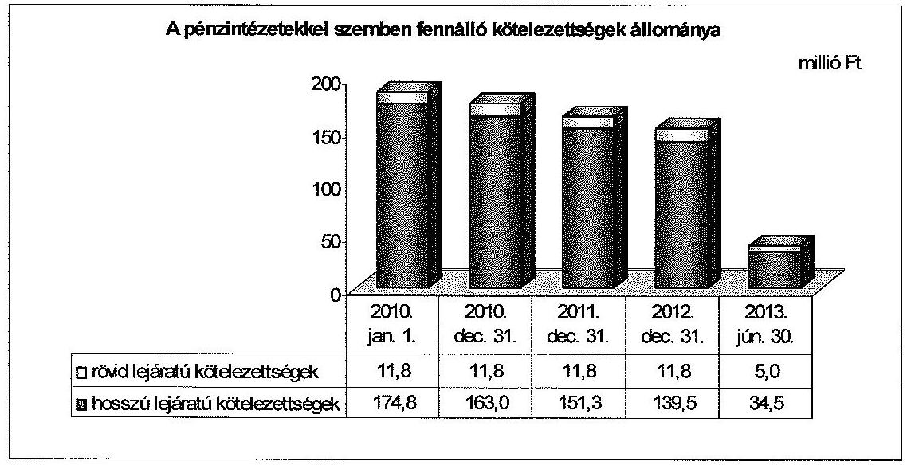

Az Önkormányzat a 2010-2012. évi mérlegelben az Sztv. 15. § (3) bekezdése szerinti valódiság elvét megsértve a pénzintézetekkel szemben fennálló rövid és hosszú lejáratú kötelezettségeit nem a valóságnak megfelelő összegben szerepeltette. A rövid lejáratú hiteltartozások (a mérleg fordulónapját követő évben esedékes törlesztő részletek) nem a hitelszerződésekben foglaltaknak megfelelően szerepeltek, mivel azok alapján a fizetési kötelezettség 11,8 millió Ft volt, a

[^0]
[^0]:    ${ }^{29}$ A gazdasági programot a Képviselő-testület a 32/2011. (II. 24.) számú határozatával fogadta el.
    ${ }^{30}$ A rövid és hosszú lejáratú kötelezettségek feltüntetése az Önkormányzat mérlegében foglaltaktól eltérően az Önkormányzat által a helyszíni ellenőrzés során készített adatszolgáltatásnak megfelelően kerül bemutatásra.

---

mérlegben kimutatott 12,0 millió Ft-tal szemben. A 0,2 millió Ft-os eltérés egyúttal növelte a mérlegben szerepeltetett hosszú lejáratú kötelezettségek öszszegét. A mérlegekben az összes pénzintézeti kötelezettség állománya megfelelően került kimutatásra.

A pénzintézeti kötelezettségek 2010. január 1-jén fennálló 186,6 millió Ft-os állományát az ellenőrzött időszakot megelőzően összesen 191,0 millió Ft összegben felvett két forintalapú, hosszú lejáratú hitelből fennálló tartozások tették ki. Az Önkormányzat 2006. május 19-én az „Önkormányzati infrastruktúrafejlesztési hitelprogram" keretében a költségvetésében meghatározott hitelcélokra két hosszú lejáratú hitelt vett fel. A húsz éves futamidőre kötött fejlesztési hitelek lejáratát 2026. május 18 -ában határozták meg.

Az Önkormányzat a beruházási hitelszerződéseket közbeszerzési eljárás mellőzésével kötötte meg. Tekintettel arra, hogy az Önkormányzat a Kbt-1 22. § (1) bekezdés d) pontja alapján ${ }^{31}$ a Kbt-1 hatálya alá tartozó szervezet, az Önkormányzat a szerződések megkötésével megsértette a Kbt-1 240. § (1) bekezdésében ${ }^{32}$ előírt közbeszerzési eljárás lefolytatásának kötelezettségét. A jogvesztő határidő eltelte miatt az ÁSZ-nak nem állt módjában jogorvoslati eljárást kezdeményezni.

A 2006. május 19-én aláírt egyik szerződés alapján 85,0 millió Ft összegű hitelkeretből igénybevett 80,0 millió Ft-os hitel felhasználásaként általános beruházási célokat, valamint közoktatási célú beruházásokat jelöltek meg. Az ugyanazon a napon kötött másik szerződés alapján a 120,0 millió Ft-ban fennálló hitelkeret esetében a felvett 111,0 millió Ft-os hitel céljai környezetvédelemi, valamint kulturális infrastruktúra kialakításához kapcsolódó fejlesztési kiadások voltak.

Az Önkormányzat pénzügyi egyensúlyi helyzetét jelentősen javította az adósságkonszolidáció. A két hosszú lejáratú hitelből fennálló, a konszolidációban érintett tartozás 151,3 millió Ft volt, amely kötelezettségek teljesítését 70,0\%-os támogatás keretében a Magyar Állam 105,9 millió Ft adósság és Kvtv. 72. § (1) bekezdésében meghatározott járulékait 0,4 millió Ft összegben vállalta át. A 2013. év I. félévében 5,9 millió Ft hitel törlesztése történt meg az adósságkonszolidáció során átvállalt törlesztésen kívül. A két hitelből a 2006. május 19-én 120,0 millió Ft összegre kötött, 2007. január 8. és 2008. augusztus 27. között 111,0 millió Ft összegben felvett hitelből a teljes hátralévő kötelezettséget ( 89,1 millió Ft-ot) konszolidálták, ezért az ellenőrzött időszak végén csak egy hosszú lejáratú hitelből származó 39,5 millió Ft pénzintézeti kötelezettség állt fenn ${ }^{33}$.

[^0]
[^0]:    ${ }^{31}$ Hatálytalan 2012. január 1-jétől. A 2012. január 1-jétől hatályos előírás: Kbt. 2 6. § (1) bekezdés b) pontja.
    ${ }^{32}$ Hatálytalan 2012. január 1-jétől. A 2012. január 1-jétől hatályos előírás: Kbt- 1 119. § és $120 . \S \mathrm{k})$ pontja.
    ${ }^{33}$ A 2006. május 19-én önkormányzati beruházási célú, alap- és kötelező feladatok ellátásának finanszírozására 80,0 millió Ft összegben felvett hitel, amelynek kamatkondíciója Reuters 3 havi EURIBOR $+1,54 \%$ volt.

---

Az ellenőrzött időszak végén fennálló hitelszerződésben foglaltak alapján a pénzintézeti kötelezettségállomány 2013. július 1-jét követő időszakban esedékessé váló tőketörlesztési és kamatfizetési kötelezettségei 47,0 millió Ft-ot tettek ki. Az Önkormányzat egyes kötelezettségei állományát, és a várható kiadásokat az 3. számú melléklet mutatja be.

Az adósságkonszolidációt követően fennmaradt pénzintézeti kötelezettségek teljesítésére a fedezet - a múködési jövedelemtermelő képesség 2012-2013. év I. félévi szintjének megőrzése, valamint a finanszírozásba bevonható szabad pénzeszközökből elkülönített tartalék képzése esetén - biztosítható.

Az Önkormányzat a fizetőképességét az ellenőrzött időszakban folyószámlaés munkabér-megelőlegezési, valamint egyéb likvid hitelek igénybevétele nélkül tudta fenntartani. Az esetlegesen jelentkező likviditási zavarok kezelésére az Önkormányzat az ellenőrzött időszakban folyamatosan, évenként megújított folyószámlahitel szerződésekkel 25,0 millió Ft összegű hitelkeretet tartott fenn. A hitelkeret fenntartása nem okozott költségeket, mivel a szerződés szerint a jutalékfizetés a folyószámlahitel igénybevételekor vált volna esedékessé. Az Önkormányzatnál a banki kitettség miatti kockázat nem állt fenn az ellenőrzött időszakban.

Az Önkormányzat adatszolgáltatása és mérlegei alapján 2010-2013. év I. félév közötti szállítói és lejárt szállítói állományát az alábbi ábra mutatja be:
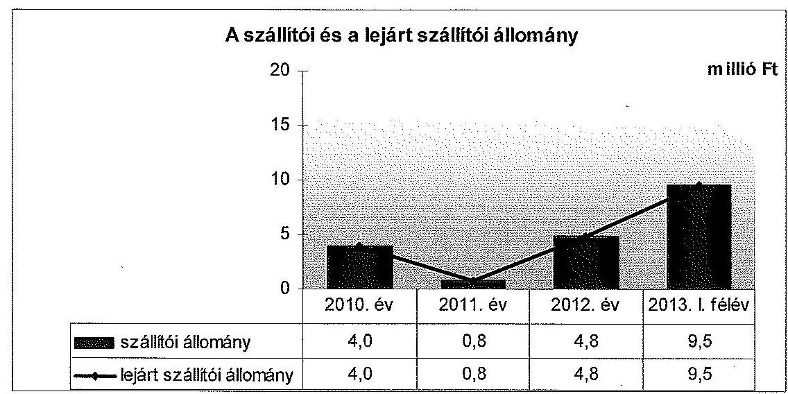

Az Önkormányzat a szállítókról analitikus nyilvántartást a 2010-2011. évben nem vezetett, a 2012. évtől vezetett nyilvántartás pedig nem felelt meg az Áhsz. 49. § (1) bekezdésében ${ }^{34}$ foglaltaknak, valamint az Áhsz. 1 9. számú melléklete 4. pont da) ${ }^{35}$ alpontja előírásainak. A nyilvántartás nem tartalmazta a kötelezettség keletkezésének időpontját és összegét, a kedvezményezett adatait,

[^0]
[^0]:    ${ }^{34}$ Hatálytalan 2014. január 1-jétől, a 2014. január 1-jétől hatályos új jogszabályi előírás: az Áhsz. 2 39. § (3) bekezdése és a 45. § (3) bekezdése.
    ${ }^{35}$ Hatálytalan 2014. január 1-jétől, a 2014. január 1-jétől hatályos előírás: az Áhsz. 2 14. számú melléklet II. pontja.

---

a kötelezettség teljesítésének időpontját, az adóköteles és az adómentes tevékenységhez kapcsolódó adatokat.

Emiatt az Önkormányzat által kimutatott lejárt szállítói állomány számviteli nyilvántartásokkal nem volt alátámasztott, mivel a 30, illetve a 60 napon túli kiegyenlítetlen kötelezettségállományra vonatkozó információk a nyilvántartásban nem szerepeltek. Az Önkormányzatnak az adatszolgáltatás készítésekor nem állt rendelkezésére a szállítók lejárati időpontot és fizetési határidőt tartalmazó részletezése. Az Önkormányzat adatszolgáltatása szerint az összes lejárt szállítói kötelezettség 30 napon belüli esedékességű volt, az adatszolgáltatásban azonban azokat a szállítói tartozásokat is lejárt szállítói állományként mutatták ki, amelyeknek még nem járt le a fizetési határideje.

Az Áhsz. 1 9. számú melléklet 4. pont dm) alpontjában foglaltakat megsértve nem az év végi leltározás alapján, illetve azzal egyezően mutatták ki a szállítói kötelezettségek állományát a 2010-2012. évi mérlegekben. Az Önkormányzatnál az éves beszámolókban kimutatott szállítói kötelezettségek összegeitől eltérő összegű leltárívek álltak rendelkezésre, ezért az Áhsz. 1 37. § (2) ${ }^{36}$ bekezdésében rögzítettek ellenére az ellenőrzött időszak könyvviteli mérlegeiben kimutatott szállítói állományok valódiságát a leltárak nem támasztották alá.

Az Önkormányzat az éves beszámoló könyvviteli mérlegében a 2010. évben 4,0 millió Ft, a 2011. évben 0,8 millió Ft, a 2012. évben 4,8 millió Ft szállítói kötelezettséget szerepeltetett. Az Önkormányzat által bemutatott leltárívek szerint 2010. december 31 -én 6,9 millió Ft, 2011. december 31-én 10,1 millió Ft, 2012. december 31-én 4,9 millió Ft volt a szállítók állománya. A szállítói kötelezettségek 2013. június 30 -án 9,5 millió Ft-ot tettek ki ${ }^{37}$.

A szállítók számviteli nyilvántartásának hiányossága, az adatok megbízhatatlansága a szállítói tartozások pénzügyi helyzetre gyakorolt hatásának értékelése tekintetében kockázatot hordoz.

A 2012. évi beszámoló mérlegében az Önkormányzat a kötelezettségek áruszállításból és szolgáltatásból (szállítók) mérlegsoron összesen 4,8 millió Ft-ot mutatott ki, amelyből a tárgyévi költségvetést terhelő szállítói kötelezettség mérlegsoron 13,4 millió Ft-ot, a tárgyévet követő évet terhelő szállítói kötelezettség mérlegsoron negatív összeget ( $-8,6$ millió Ft-ot) szerepeltetett. A könyvvitelben rögzített és a beszámolóban szereplő tételek a valóságban nem voltak megtalálhatóak, bizonyíthatóak, kívülállók által is megállapíthatók. A mérlegsorokban kimutatott állományi értékeket a leltárak nem támasztották alá.

A 2012. évi mérlegben az összes szállítói állományból a tárgyévet követő évet terhelő szállítói kötelezettség negatív értékben történő szerepeltetése ellentétes volt a Sztv. 15. § (3) bekezdése szerinti valódiság elvével, to-

[^0]
[^0]:    ${ }^{36}$ Hatálytalan 2014. január 1-jétől, a 2014. január 1-jétől hatályos új jogszabályi előírás: az Áhsz. 22. § (1) és (2) bekezdése.
    ${ }^{37}$ Az Áhsz. ${ }_{1}$-nek megfelelő adattartalmú szállítói nyilvántartás, valamint leltározási kötelezettség hiányában az összeg megbízhatósága nem ítélhető meg.

---

vábbá az Áhsz. 1 26. § (1) bekezdésének előírásával, mely szerint a kötelezettségek a szállítási, vállalkozási, szolgáltatási és egyéb szerződésből eredő, pénzértékben kifejezett elismert tartozások, amelyek - többek között - a szállító, a vállalkozó, a szolgáltató által már teljesített, az államháztartás szervezete által elfogadott, elismert szállításhoz, szolgáltatáshoz kapcsolódnak. A negatív értéket sem gazdasági esemény, sem bizonylat nem igazolhatta, ezért sérült az Sztv. 15. § (4) bekezdésében foglalt világosság elve, mert a beszámoló negatív szállítói állományt feltüntető sora nem volt érthető, illetve értelmezhető.

A fennálló szállítói kötelezettségek - a 2010. év kivételével - nagyságrendjükre és lejáratukra, valamint a pozitív pénzügyi kapacitásra tekintettel az Önkormányzatnál szállítói kitettséget nem jelentettek.

Az ellenőrzött időszakban az Önkormányzat éves beszámolóiról készült könyvvizsgálói jelentések auditálási eltérést nem tartalmaztak, szabálytalanságok megszüntetésére vonatkozó intézkedéseket nem írtak elő, továbbá nem fogalmaztak meg a pénzügyi helyzetre vonatkozó javaslatokat.

Az Önkormányzat 2010-2012. évi beszámolói mérlegeinek eszköz és forrás oldalán - az Sztv. 15. § (3) bekezdésében és a 69. § (1)-(2) bekezdéseiben, valamint az Áhsz. 37. § (1)-(2) bekezdéseiben ${ }^{38}$ és a 49. § (1) bekezdésében ${ }^{39}$ foglalt előírásokat megsértve - 1967,0 millió Ft összegben, leltárral, illetve analitikus nyilvántartással alá nem támasztott, ismeretlen eredetű költségvetési aktív kiegyenlítő, továbbá költségvetési passzív kiegyenlítő elszámolásokat szerepeltettek.

Az ellenőrzött időszak éves beszámolói részét képező mérlegek a források között a költségvetési passzív kiegyenlítő elszámolások soron tartalmaztak egy 1967,0 millió Ft-os tételt. Az eszköz oldalon a költségvetési aktív kiegyenlítő elszámolások soron szintén feltüntették a 1967,0 millió Ft összeget. Az Önkormányzat tájékoztatása ${ }^{40}$ szerint ezek az összegek a 2003. évben jelentek meg a mérlegben. A téves könyvelési tételek eredetéről a rendelkezésre álló dokumentumok nem nyújtottak információt, továbbá az alkalmazottak sem rendelkeztek ismeretekkel.

A Polgármesteri Hivatal 2013. november 29-én az 1967,0 millió Ft-os tévesen könyvelt tételeket a helyszíni ellenőrzést megelőzően feltárta és 0,1 millió Ft kivételével javította, a számviteli nyilvántartásokból kivezette ${ }^{41}$.
${ }^{38}$ Hatálytalan 2014. január 1-jétől, a 2014. január 1-jétől hatályos új jogszabályi előírás: az Áhsz. 2 22. § (1)-(2) bekezdései.
${ }^{39}$ Hatálytalan 2014. január 1-jétől, a 2014. január 1-jétől hatályos új jogszabályi előírás: az Áhsz. 2 39. § (3) bekezdése és a 45. § (3) bekezdése.
${ }^{40}$ 1554/2013. Iktatószámú levél a Magyar Államkincstár Jász-Nagykun-Szolnok Megyei Igazgatósága részére a 2012. évi beszámoló magyarázatáról - mellékletként csatolva a 4/2004. (IV. 9.) számú rendelet az Önkormányzat 2003. évi gazdálkodásának zárszámadásáról.
${ }^{41}$ A rendezést alátámasztó dokumentum a 2013. november 29-ei keltezésű feljegyzés az Önkormányzat „2013. évi mérlegtételek felülvizsgálata és rendezése" tárgyában, valamint a pénzforgalom nélküli elszámolások (4992 számú) főkönyvi számla 2013. december 1-jei könyvelési naplója.

---

A hiba jelentős összegűnek minősült, nagysága a 2012. évben a mérleg főöszszeg 50,6\%-a volt. A pénzforgalom nélküli összevezetést követően a mérleg eszközoldalán fennmaradó 0,1 millió Ft tisztázatlan tétel maradt, melynek rendezése időpontjaként a 2013. évi zárást jelölték meg.

Az Önkormányzat az ellenőrzött időszakban nem engedett el követelést és behajthatatlanság címén követelés törlésére nem került sor. Követelésként tartják nyilván a 2003. október 29 -én, a repülőtér bérbeadására kötött szerződés alapján az Önkormányzat által a 2004. évben 2,5 millió Ft összegben elvégzett, a szerződésben foglalt önkormányzati kötelezettségeknek csak részbeni teljesítését biztosító közműberuházás értékét. Az Önkormányzatnál 2010-ben jogi képviselő bevonásával megállapítást nyert, hogy a bérleti szerződés alapján a beruházási kiadás megtérítésére kötelezett gazdasági társaság 2009-ben megszűnt, a céget a cégnyilvántartásból törölték ${ }^{42}$, ennek ellenére nem minősítették a követelést behajthatatlannak. Az Önkormányzat a társasággal szemben fennálló követelését a felszámolási eljárás során hitelezői igényként nem jelentette be.

A jegyző ${ }_{1}$ a 2011. évben a gazdasági társasággal szemben fennálló követelést az Áhsz. ${ }_{1} 5 . \S 3$. d) pontjában foglalt feltétel ${ }^{43}$ bekövetkezése ellenére - behajthatatlanságra tekintettel nem törölte. A követelést az Áhsz. ${ }_{1} 34 . \S$ (10) bekezdésében foglalt előírás ${ }^{44}$ ellenére a 2011. évi beszámolóban hitelezési veszteségként nem írták le, a követelést nem vezették ki a számviteli nyilvántartásokból, azt a 2011-2012. évek beszámoló mérlegeiben továbbra is szerepeltették.

A hosszú lejáratú hitelek fedezeteként az Önkormányzat tulajdonát képező ingatlanokon jelzálogjog bejegyzés nem történt.

Az Önkormányzat minősített többségi befolyás alatt álló gazdasági társaságai a Madarasi Kenyér Kft. és a KunAirport Kft., 100\%-os önkormányzati tulajdonban voltak. A Madarasi Kenyér Kft.-ben a jegyzett tőke összege 11,3 millió Ft, a KunAirport Kft.-ben 3,0 millió Ft. A gazdasági társaságok nem vettek részt az Önkormányzat kötelező és önként vállalt feladatainak ellátásában.

A Madarasi Kenyér Kft. mérleg szerinti összes kötelezettsége a 2010. évi 11,1 millió Ft-ról 2012-re 8,6 millió Ft-ra csökkent, a 2013. év I. félévi állapot szerint 10,8 millió Ft volt. Az Önkormányzat részére a társaság évente 3,0 millió Ft osztalékot fizetett nyereségéből és a korábbi években képződött eredménytartalékából.

[^0]
[^0]:    ${ }^{42}$ A cégnyilvántartás adatai ezzel ellentétben azt támasztják alá, hogy a cég végelszámolása 2009. május 11 -én kezdődött, amely felszámolásba ment át 2009. november 5étől. A felszámolás 2011. május 25 -én fejeződött be, és a céget a cégnyilvántartásból 2011. június 23 -án törölték.
    ${ }^{43}$ Hatálytalan 2014. január 1-jétől, a 2014. január 1-jétől hatályos új jogszabályi előírás: az Áhsz. ${ }_{2} 1 . \S$ (1) bekezdés 1. a) pontja és a Sztv. 3. § (4) bekezdés 10. pont f) alpontja.
    ${ }^{44}$ Hatálytalan 2014. január 1-jétől, a 2014. január 1-jétől hatályos új jogszabályi előírás: az Áhsz. ${ }_{2} 13 . \S$ (5) bekezdése.

---

A KunAirport Kft. mérleg szerinti összes kötelezettsége a 2010. évi 6,5 millió Ft-ról 2013. június 30 -ára fokozatosan 3,9 millió Ft-ra csökkent ${ }^{45}$. A KunAirport Kft. 2011-ben 4,0 millió Ft osztalékot fizetett az Önkormányzatnak. Az Önkormányzat a KunAirport Kft. jogutód nélküli, végelszámolással történő megszüntetéséről határozott 2013. június 27 -én ${ }^{46}$. Tevékenységének az MTBSZSZ általi folytatásáról döntött, amelynek alapító okiratát 2013. június 27-én módosította. A KunAirport Kft. „v.a." vagyonkezelői jogának korlátozásáról és a vagyonkezelői feladat MTBSZSZ-hez sorolásáról határozott ${ }^{47}$.

A gazdasági társaságok gazdálkodása, fennálló kötelezettségei nem jelentettek mérlegen kívüli tételek miatti kockázatot az Önkormányzat pénzügyi egyensúlyi helyzetére, mivel az ellenőrzött időszakban egyik kft. sem vett igénybe hitelt, nem rendelkezett lízing kötelezettséggel, nem bocsátott ki kötvényt és nem volt folyamatban kötelezettséget keletkeztető peres eljárásuk.

# 4. Az ÖNKORMÁNYZAT PÉNZÜGYI GAZDÁLKODÁSA SORÁN ÉRVÉNYESÍTETT INTEGRITÁSI SZEMPONTOK 

A pénzügyi gazdálkodás során - a „négy szem elvének" alkalmazása, az etikai elvárások és az összeférhetetlenség szabályozása tekintetében - érvényesült az integritási szemlélet. A telefonok kivételével az Önkormányzat tulajdonában lévő egyéb eszközök használatára és a pénzügyi helyzetet, az adósságterheket befolyásoló döntések előtti kockázatokra vonatkozó szabályozás, valamint a közérdekű bejelentések kezelésére alkalmas rendszer múködtetésének hiánya azonban arra utal, hogy az Önkormányzatnak figyelmet kell fordítania az integritási szemlélet teljes körü érvényesítésére.

Integritás kérdőívet az ellenőrzött időszakban nem töltöttek ki annak ellenére, hogy a Polgármesteri Hivatal a 2011-2013. években, az Önkormányzat 2013-ban felkérést kapott a kérdőív kitöltésére.

Az Önkormányzat nem rendelkezik etikai szabályzattal, azonban az SZMSZ-ben a FEUVE szabályzathoz ${ }^{48}$ kapcsolódó dokumentumok között az I/A. pont a szabálytalanságok kezelését szabályozta. A szabálytalanságok típusai között sorolja fel a szándékosan okozott szabálytalanságok körét, amely az etikai vétségek nevesített eseteit is tartalmazza. Az Önkormányzat SZMSZ-ében a FEUVE I. fejezet 6. pontja „A pénzügyi irányitási és ellenőrzési rendszerrel szemben támasztott követelményeket" szabályozza etikai szempontok szerint.

A „négy szem elve" alkalmazásának kötelezettségét az Önkormányzat SZMSZ-ében, a FEUVE fejezet 2. pontjában előírták. Kiemelték a központi előírások és a helyi szabályok betartásának eszközei közül az egymásra épülő, egymást ellenőrző folyamatok rendszerét.

[^0]
[^0]:    ${ }^{45}$ A 2011. évben 4,3 millió Ft, 2012-ben 4,2 millió Ft volt.
    ${ }^{46}$ A Képviselő-testület 194/2013. (VI. 27.) számú határozata alapján.
    ${ }^{47}$ A Képviselő-testület 213/2013. (VIII. 14.) számú határozata.
    ${ }^{48}$ Az Önkormányzat FEUVE szabályzata 2011. április 1-jén lépett hatályba az SZMSZ 8. számú függelékeként a polgármester és a jegyző ${ }_{1}$ jóváhagyásával.

---

A 2013. január 1-jétől hatályos gazdálkodási ügyrend 1.1.6. pontja tartalmazza a gazdálkodási jogkörök gyakorlására vonatkozó összeférhetetlenség szabályait. A gazdálkodási jogkörök szabályozása az Önkormányzatnál hiányos volt, mivel 2010. január 1-jétől 2013. január 1-jéig a jogkörök gyakorlóinak aláírás mintája nem állt rendelkezésre.

Az önkormányzati tulajdonú telefonok használatát a jegyző ${ }_{2}$ 2013. január 1-jétől ${ }^{49}$ szabályozta. Az Önkormányzat tulajdonában, kezelésében lévő egyéb eszközök használatára vonatkozó szabályokat nem határozták meg.

Az Önkormányzat nem múködtetett kívülről érkező közérdekű bejelentéseket kezelő rendszert, a közérdekű bejelentések kezelésére vonatkozó eljárásrendet nem határozták meg.

Az Önkormányzat pénzügyi helyzetét, adósságterheit befolyásoló döntések előtti kockázatok felmérésének szükségességét és szabályait nem írták elő.

Budapest, 2014. O 8 . hó 14 .nap

| Melléklet: | 6 db |
| :-- | :-- |
| Függelék: | 2 db |

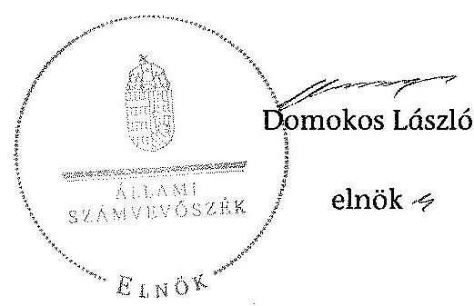

[^0]
[^0]:    ${ }^{49}$ A jegyző ${ }_{2}$ által 2012. december 31-én jóváhagyott, 2013. január 1-jétől hatályos „Vezetékes és rádiótelefonok használatának szabályzata".

---

### 1. FOLYÓ KÖLTŐÉGVETÉS*

|   | 2010. év | 2011. év | 2012. év | 2013. év
1. tétév  |
| --- | --- | --- | --- | --- |
|  1.1.1. Saját működési bevételek | 146,2 | 173,0 | 213,1 | 109,1  |
|  1.1.2. Költégyetési támogatások ÖNHIKI támogatások nélkül** | 811,6 | 588,4 | 572,5 | 345,9  |
|  1.1.3. Átongedett bevételek | 215,9 | 207,8 | 199,5 | 5,3  |
|  1.1.4. Áltamháztartáson belülről kapott támogatások | 66,8 | 160,8 | 150,4 | 179,5  |
|  1.1.5. Elővítő és külföldről kapott bevételek | 0,0 | 0,0 | 0,0 | 0,0  |
|  1.1.6. Áltamháztartáson kívülről kapott bevételek | 0,5 | 0,0 | 0,0 | 0,0  |
|  1.1.7. Horám- és kamatbevételek | 1,6 | 6,4 | 2,0 | 0,4  |
|  1.1.8. Kölcsönök visszatérülése, igénybevétele | 0,0 | 0,0 | 0,0 | 0,0  |
|  1.1.9. Előrző év pénzmaradvány átvétel | 0,0 | 0,0 | 120,7 | 0,0  |
|  1.1.10. A működőképesség megőrzését szolgáló kiegészítő támogatások (ÖNHIKI) | 0,0 | 31,9 | 0,0 | 0,0  |
|  1.1. Folyó bevételek = 1.1.1.+1.1.2.+1.1.3.+1.1.4.+1.1.5.+1.1.6.+1.1.7.+1.1.8.+1.1.9.+1.1.10. | 1 242,0 | 1 162,3 | 1 258,2 | 626,2  |
|  1.2.1. Működési kiadások kamatkiadások nélkül | 1 004,3 | 828,3 | 759,6 | 413,6  |
|  1.2.2. Áltamháztartáson belülre átadott pénzeszközök | 3,9 | 4,1 | 5,3 | 0,8  |
|  1.2.3.1. Fájlalkozásoknak | 0,0 | 0,0 | 0,0 | 0,0  |
|  1.2.3.2. EU-nak, illetve külföldre | 0,0 | 0,0 | 0,0 | 0,0  |
|  1.2.3.3. Magánszemélyeknek | 220,8 | 288,1 | 320,4 | 133,3  |
|  1.2.3.4. Nonprofit szervozotoknak | 13,2 | 5,8 | 4,0 | 1,2  |
|  1.2.5. Tramszfarkiadások (=1.2.3.1.+1.2.3.2.+1.2.3.3.+1.2.3.4.) | 234,0 | 295,8 | 324,4 | 134,5  |
|  1.2.6. Kamatkiadások | 4,6 | 0,8 | 0,4 | 0,2  |
|  1.2.7. Kölcsönök nyújtása, törlesztése | 0,0 | 0,0 | 0,0 | 0,0  |
|  1.2.8. Előző év pénzmaradvány átadás | 0,0 | 0,0 | 125,2 | 0,0  |
|  1.2. Folyó kiadások = 1.2.1.+1.2.2.+1.2.3.+1.2.4.+1.2.5.+1.2.6. | 1 246,1 | 1 129,7 | 1 212,9 | 549,2  |
|  1.3. Folyó költségvetés egyenlege, működési jövedelem (1.1. - 1.2.) | -3,2 | 94,1 | 45,3 | 89,0  |
|  2. FELHALMOZÁSI KÖLTŐÉGVETÉS*** |  |  |  |   |
|  2.1.1. Saját tökebevételek | 7,6 | 7,0 | 3,1 | 0,0  |
|  2.1.2. Költégyetési támogatások | 0,0 | 14,6 | 12,0 | 1,2  |
|  2.1.3. Áltamháztartáson belülről kapott támogatások | 0,0 | 0,0 | 46,2 | 19,6  |
|  2.1.4. EU-tól és külföldről kapott támogatások | 0,0 | 0,0 | 0,0 | 0,0  |
|  2.1.5. Áltamháztartáson kívülről kapott bevételek | 0,0 | 0,0 | 1,8 | 0,0  |
|  2.1.6. Horám- és kamatbevételek | 0,2 | 0,0 | 0,0 | 0,0  |
|  2.1.7. Kölcsönök visszatérülése, igénybevétele | 1,6 | 0,1 | 0,1 | 0,0  |
|  2.1.8. Előző év pénzmaradvány átvétel | 0,0 | 0,0 | 0,0 | 0,0  |
|  2.1. Feltalmozási bevételek = 2.1.1.+2.1.2.+2.1.3.+2.1.4.+2.1.5.+2.1.6.+2.1.7.+2.1.8. | 9,4 | 22,5 | 63,3 | 81,0  |
|  2.2.1. Saját beruházási kiadás átával | 5,2 | 2,1 | 50,0 | 28,5  |
|  2.2.2. Saját felújítási kiadás átával | 7,9 | 2,2 | 16,1 | 6,0  |
|  2.2.3. Áltamháztartáson belülre átadott pénzeszközök | 0,0 | 0,0 | 0,0 | 0,0  |
|  2.2.4. EU-nak és külföldnek adott pénzeszközök | 0,0 | 0,0 | 0,0 | 0,0  |
|  2.2.5. Áltamháztartáson kívülre adott pénzeszközök | 0,0 | 0,0 | 0,0 | 0,0  |
|  2.2.6. Befektetési célú részcsedések vásárlása | 0,0 | 0,0 | 0,0 | 0,0  |
|  2.2.7. Kamatkiadások | 0,0 | 4,5 | 3,2 | 0,5  |
|  2.2.8. Kölcsönök nyújtása, törlesztése | 0,0 | 0,0 | 0,0 | 0,0  |
|  2.2.9. Előző év pénzmaradvány átadás | 0,0 | 0,0 | 0,0 | 0,0  |
|  2.2.10. ÁFA befizetések | 0,0 | 0,0 | 0,0 | 15,4  |
|  2.2. Feltalmozási kiadások = 2.2.1.+2.2.2.+2.2.3.+2.2.4.+2.2.5.+2.2.6.+2.2.7.+2.2.8.+2.2.9.+2.2.10. | 13,1 | 6,5 | 71,3 | 44,8  |
|  2.3. Feltalmozási költségvetés egyenlege (2.1. - 2.2.) | -3,7 | 13,6 | -8,0 | 36,2  |
|  3. FINANSZÍROZÁSI MŰVELETEK NÉLKÜLI (GFS) POZÍGÓ (1.3.+2.3.) | -8,9 | 47,9 | 37,4 | 125,2  |
|  4. FINANSZÍROZÁSI MŰVELETEK |  |  |  |   |
|  4.1. Hőszéltétel | 0,0 | 0,0 | 0,0 | 0,0  |
|  4.2. Hőszőtrétsziós | 11,0 | 11,6 | 11,8 | 6,8  |
|  4.3. Forgatási és befektetési célú értékpapírok kibocsátása | 0,0 | 0,0 | 0,0 | 0,0  |
|  4.4. Forgatási és befektetési célú értékpapírok beváltása | 0,0 | 0,0 | 0,0 | 0,0  |
|  4.5. Forgatási és befektetési célú értékpapírok értékesítése | 0,0 | 0,0 | 0,0 | 0,0  |
|  4.6. Forgatási és befektetési célú értékpapírok vásárlása | 0,0 | 0,0 | 0,0 | 0,0  |
|  4.7. Egyéb finanszírozási bevételek (függő, átfutó, kiegyenlítő) | 0,0 | 4,0 | 0,3 | -38,7  |
|  4.8. Egyéb finanszírozási kiadások (függő, átfutó, kiegyenlítő) | 26,2 | -16,2 | 8,2 | 16,3  |
|  4.9. Finanszírozási műveletek egyenlege (4.1.-4.2.+4.3.-4.4.+4.5.-4.6.+4.7.-4.8.) | -37,9 | 8,4 | -19,7 | -50,9  |
|  5. TÁRGYÉVI PÉNZÜGYI POZÍGÓ (1.3.+ 2.3.+4.9.) | -44,8 | 56,4 | 17,7 | 64,4  |
|  6. NETTÓ MŰKÖDÉSI JÖVEDELEM = működési jövedelem (1.3.) - töketörlesztés (4.2.+4.4.) | -15,0 | 22,3 | 33,5 | 63,1  |
|  TÁJÉKOZTATÓ ADATOK |  |  |  |   |
|  Összes kötelezettség | 178,6 | 163,9 | 156,1 | 48,0  |
|  ebből rövid lejáratú | 15,8 | 12,6 | 16,0 | 14,5  |
|  Összes szállítói kötelezettség | 4,0 | 0,8 | 4,8 | 9,5  |
|  ebből lejárt (tanúsítványból) | 4,0 | 0,8 | 4,8 | 9,5  |
|  Pénz- és tökepleni kötelezettség (adósság) | 174,6 | 163,1 | 151,3 | 39,5  |
|  ebből rövid lejáratú | 11,8 | 11,8 | 11,8 | 5,0  |
|  ebből hosszú lejáratú kötelezettségek következő évet terhelő törlesztő részletek (analitikai) | 11,8 | 11,8 | 11,8 | 5,0  |
|  PPP szerződéses állomány jelenértékén (tanúsítványból) | 0,0 | 0,0 | 0,0 | 0,0  |
|  ebből lejárt szolgáltatási díj miatti kötelezettség | 0,0 | 0,0 | 0,0 | 0,0  |
|  Fényeszerén-, törzió- és munkabár által mai díjeges állománya (tanúsítványból) | 0,0 | 0,0 | 0,0 | 0,0  |
|  Kezesség és garanciaváladások (tanúsítványból) | 0,0 | 0,0 | 0,0 | 0,0  |
|  Jógyerős bírósági feltételezési adódó kötelezettségek (tanúsítványból) | 0,0 | 0,0 | 0,0 | 0,0  |
|  Finanszírozásba bevonható eszközök | 23,1 | 79,2 | 96,9 | 161,2  |
|  Tartós hitelviszonyt megtestesítő értékpapírok | 0,0 | 0,0 | 0,0 | 0,0  |
|  Hosszú lejáratú bankbetétek | 0,0 | 0,0 | 0,0 | 0,0  |
|  Értékpapírok | 0,0 | 0,0 | 0,0 | 0,0  |
|  Pénzeszközök (idegen nélkül) | 23,1 | 79,2 | 96,9 | 161,2  |

- A költségvetési szerveknéi a számviteli szabályoknak megfelelően a bevételekben nem térül, a kiadásokban nem jelenik meg az amortizáció, a vagyoni helyzetet az egyenleg befolyásolja.

* A költségvetési támogatásból a feltalmozzási célú részt az Önkormányzat edatszolgáltatása szerinti mértékben vettük figyelembe a 2.1.2., a 2.1.6., illetve a 2.2.7. sorokon.

*** Bevételekben vagyonmegőrzésre és -bővítésre fordítható források.

---

.

---

Az Önkormányzat bevételei és kiadásai a Kvtv. 72. § (1) bekezdésében foglalt adósságátvállaláshoz kapcsolódó pénzügyi teljesítések nélkül 2013. év I. félévében (a CLF módszer szerint) mifió FI

|  1. FOLYÓ KÖLTSÉGVETÉS* | beszámoló szerinti adatok | az adósság átvállaláshoz kapcsolódó bevételek III. kiadások | módosított adatok  |
| --- | --- | --- | --- |
|   | 1. | 2. | 1.+2.  |
|  1.1.1. Saját müködési bevételek | 109,1 |  | 109,1  |
|  1.1.2. Költségvetési támogatások ÖNHIKI támogatások nélkül** | 345,9 |  | 345,9  |
|  1.1.3. Átengedett bevételek | 3,3 |  | 3,3  |
|  1.1.4. Államháztartáson belülről kapott támogatások | 179,5 |  | 179,5  |
|  1.1.5. EU-tól és külföldről kapott bevételek | 0,0 |  | 0,0  |
|  1.1.6. Államháztartáson kívülről kapott bevételek | 0,0 |  | 0,0  |
|  1.1.7. Hozam- és kamatbevételek | 0,4 |  | 0,4  |
|  1.1.8. Kölcsönök visszatérülése, igénybevétele | 0,0 |  | 0,0  |
|  1.1.9. Előző évi pénzmaradvány átvétel | 0,0 |  | 0,0  |
|  1.1.10. A müködőképesség megőrzését szolgáló kiegészítő támogatások | 0,0 |  | 0,0  |
|  1.1. Folyó bevételek $=1.1 .1 .+1.1 .2 .+1.1 .3 .+1.1 .4 .+1.1 .5 .+1.1 .6 .+1.1 .7 .+1.1 .8 .+1.1 .9 .+1.1 .10$. | 638,2 |  | 638,2  |
|  1.2.1. Müködési kiadások kamatkiadások nélkül | 413,6 |  | 413,6  |
|  1.2.2. Államháztartáson belülre átadott pénzeszközök | 0,8 |  | 0,8  |
|  1.2.3.1. vállalkozásoknak | 0,0 |  | 0,0  |
|  1.2.3.2. EU-nak, illetve külföldre | 0,0 |  | 0,0  |
|  1.2.3.3. magánszemélyeknek | 133,3 |  | 133,3  |
|  1.2.3.4. nonprofit szervezetelenek | 1,2 |  | 1,2  |
|  1.2.3. Transzferkiadások ( $=1.2 .3 .1 .+1.2 .3 .2 .+1.2 .3 .3 .+1.2 .3 .4$. | 134,5 |  | 134,5  |
|  1.2.4. Kamatkiadások | 0,3 |  | 0,3  |
|  1.2.5. Kölcsönök nyújtása, törlesztése | 0,0 |  | 0,0  |
|  1.2.6. Előző évi pénzmaradvány átadás | 0,0 |  | 0,0  |
|  1.2. Folyó kiadások $=1.2 .1 .+1.2 .2 .+1.2 .3 .+1.2 .4 .+1.2 .5 .+1.2 .6$. | 549,2 |  | 549,2  |
|  1.3. Folyó költségvetés egyenlege, müködési jövedelem (1.1. - 1.2.) | 89,0 |  | 89,0  |
|  2. FELHALMOZÁSI KÖLTSÉGVETÉS*** |  |  |   |
|  2.1.1. Saját tőkebevételek | 0,0 |  | 0,0  |
|  2.1.2. Költségvetési támogatások | 107,5 | $-106,3$ | 1,2  |
|  2.1.3. Államháztartáson belülről kapott támogatások | 79,8 |  | 79,8  |
|  2.1.4. EU-tól és külföldről kapott támogatások | 0,0 |  | 0,0  |
|  2.1.5. Államháztartáson kívülről kapott bevételek | 0,0 |  | 0,0  |
|  2.1.6. Hozam- és kamatbevételek | 0,0 |  | 0,0  |
|  2.1.7. Kölcsönök visszatérülése, igénybevétele | 0,0 |  | 0,0  |
|  2.1.8. Előző évi pénzmaradvány átvétel | 0,0 |  | 0,0  |
|  2.1. Felhalmozási bevételek $=2.1 .1 .+2.1 .2 .+2.1 .3 .+2.1 .4 .+2.1 .5 .+2.1 .6 .+2.1 .7 .+2.1 .8$. | 187,3 | $-106,3$ | 81,0  |
|  2.2.1. Saját beruházási kiadás átával | 28,9 |  | 28,9  |
|  2.2.2. Saját felújítási kiadás átával | 0,0 |  | 0,0  |
|  2.2.3. Államháztartáson belülre átadott pénzeszközök | 0,0 |  | 0,0  |
|  2.2.4. EU-nak és külföldnek adott pénzeszközök | 0,0 |  | 0,0  |
|  2.2.5. Államháztartáson kívülre adott pénzeszközök | 0,0 |  | 0,0  |
|  2.2.6. Befektetési célú részesedések vásárlása | 0,0 |  | 0,0  |
|  2.2.7. Kamatkiadások | 0,8 | $-0,4$ | 0,5  |
|  2.2.8. Kölcsönök nyújtása, törlesztése | 0,0 |  | 0,0  |
|  2.2.9. Előző évi pénzmaradvány átadás | 0,0 |  | 0,0  |
|  2.2.10. ÁFA befizetések | 15,4 |  | 15,4  |
|  2.2. Felhalmozási kiadások $=2.2 .1 .+2.2 .2 .+2.2 .3 .+2.2 .4 .+2.2 .5 .+2.2 .6 .+2.2 .7 .+2.2 .8 .+2.2 .9 .+2.2 .10$. | 45,2 | $-0,4$ | 44,8  |
|  2.3. Felhalmozási költségvetés egyenlege (2.1. - 2.2.) | 142,1 | $-105,9$ | 36,2  |
|  3. FINANSZÍROZÁSI MÜVELETEK NÉLKÜLI (GFS) POZÍCIÓ (1.3.+2.3.) | 231,1 | $-105,9$ | 125,2  |
|  4. FINANSZÍROZÁSI MÜVELETEK |  |  |   |
|  4.1. Hitelfelvétel | 0,0 |  | 0,0  |
|  4.2. Hitelförlesztés | 111,8 | $-105,9$ | 5,9  |
|  4.3. Forgatási és befektetési célú értékpapírok kibocsátása | 0,0 |  | 0,0  |
|  4.4. Forgatási és befektetési célú értékpapírok beváltása | 0,0 |  | 0,0  |
|  4.5. Forgatási és befektetési célú értékpapírok értékesítése | 0,0 |  | 0,0  |
|  4.6. Forgatási és befektetési célú értékpapírok vásárlása | 0,0 |  | 0,0  |
|  4.7. Egyéb finanszírozási bevételek (függő, átfutó, kiegyenlítő) | $-38,7$ |  | $-38,7$  |
|  4.8. Egyéb finanszírozási kiadások (függő, átfutó, kiegyenlítő) | 16,3 |  | 16,3  |
|  4.9. Finanszírozási műveletek egyenlege (4.1.-4.2.+4.3.-4.4.+4.5.-4.6.+4.7.-4.8.) | $-166,8$ | 105,9 | $-60,0$  |
|  5. TÁRGYÉVI PÉNZÜGYI POZÍCIÓ (1.3.+ 2.3.+4.9.) | 64,4 |  | 64,4  |
|  6. NETTÓ MÜKÖDÉSI JÖVEDELEM = müködési jövedelem (1.3.) - tőketörlesztés (4.2.+4.4.) | $-22,8$ | 105,9 | 83,1  |

- A költségvetési szerveknéi a számviteli szabályoknak megfelelően a bevételekben nem térül, a kiadásokban nem jelenik meg az amortizáció, a vagyoni helyzetet az egyenleg befolyásolja. ** A költségvetési támogatásból a felhalmozási célú részt az Önkormányzat adatszolgáltatása szerinti mértékben vettük figyelembe a 2.1.2., a 2.1.6., illetve a 2.2.7. sorokon. *** Bevételekben vagyonmegőrzésre és -bővítésre fordítható források.

---

.

---

### 2. SZÁMÚ MELÜÉKLET A V-0357-063/2014. SZÁMÚ JELENTÉSHEZ

Az Önkormányzat által a 2010. és a 2013. év I. félév között megvalósított fejlesztési feladatok érdekében teljesített felhalmozási kiadások és az ezekhez vállalt kötelezettségek összegzése

|  Év | Fejlesztési feladat típusa |  |  |  |  |  |  |  |  |  |  |  |  |  |  |  |  |  |  |  |  |  |  |  |   |
| --- | --- | --- | --- | --- | --- | --- | --- | --- | --- | --- | --- | --- | --- | --- | --- | --- | --- | --- | --- | --- | --- | --- | --- | --- | --- |
|   |  |  |  |  |  |  |  |  |  |  |  |  |  |  |  |  |  |  | 2013. június 30. utáni kötelezettségvállalások |  |  |  |  |  |   |
|   |  |  |  |  |  |  |  |  |  |  |  |  |  |  |  |  |  |  |  |  |  |  |  |  |   |
|   |  |  |  |  |  |  |  |  |  |  |  |  |  |  |  |  |  |  |  |  |  |  |  |  |   |
|   |  |  |  |  |  |  |  |  |  |  |  |  |  |  |  |  |  |  |  |  |  |  |  |  |   |
|   |  |  |  |  |  |  |  |  |  |  |  |  |  |  |  |  |  |  |  |  |  |  |  |  |   |
|   |  |  |  |  |  |  |  |  |  |  |  |  |  |  |  |  |  |  |  |  |  |  |  |  |   |
|   |  |  |  |  |  |  |  |  |  |  |  |  |  |  |  |  |  |  |  |  |  |  |  |  |   |
|   |  |  |  |  |  |  |  |  |  |  |  |  |  |  |  |  |  |  |  |  |  |  |  |  |   |
|   |  |  |  |  |  |  |  |  |  |  |  |  |  |  |  |  |  |  |  |  |  |  |  |  |   |
|   |  |  |  |  |  |  |  |  |  |  |  |  |  |  |  |  |  |  |  |  |  |  |  |  |   |
|   |  |  |  |  |  |  |  |  |  |  |  |  |  |  |  |  |  |  |  |  |  |  |  |  |   |
|   |  |  |  |  |  |  |  |  |  |  |  |  |  |  |  |  |  |  |  |  |  |  |  |  |   |
|   |  |  |  |  |  |  |  |  |  |  |  |  |  |  |  |  |  |  |  |  |  |  |  |  |   |
|   |  |  |  |  |  |  |  |  |  |  |  |  |  |  |  |  |  |  |  |  |  |  |  |  |   |
|   |  |  |  |  |  |  |  |  |  |  |  |  |  |  |  |  |  |  |  |  |  |  |  |  |   |
|   |  |  |  |  |  |  |  |  |  |  |  |  |  |  |  |  |  |  |  |  |  |  |  |  |   |
|   |  |  |  |  |  |  |  |  |  |  |  |  |  |  |  |  |  |  |  |  |  |  |  |  |   |
|   |  |  |  |  |  |  |  |  |  |  |  |  |  |  |  |  |  |  |  |  |  |  |  |  |   |
|   |  |  |  |  |  |  |  |  |  |  |  |  |  |  |  |  |  |  |  |  |  |  |  |  |   |
|   |  |  |  |  |  |  |  |  |  |  |  |  |  |  |  |  |  |  |  |  |  |  |  |  |   |
|   |  |  |  |  |  |  |  |  |  |  |  |  |  |  |  |  |  |  |  |  |  |  |  |  |   |
|   |  |  |  |  |  |  |  |  |  |  |  |  |  |  |  |  |  |  |  |  |  |  |  |  |   |
|   |  |  |  |  |  |  |  |  |  |  |  |  |  |  |  |  |  |  |  |  |  |  |  |  |   |
|   |  |  |  |  |  |  |  |  |  |  |  |  |  |  |  |  |  |  |  |  |  |  |  |  |   |
|   |  |  |  |  |  |  |  |  |  |  |  |  |  |  |  |  |  |  |  |  |  |  |  |  |   |
|   |  |  |  |  |  |  |  |  |  |  |  |  |  |  |  |  |  |  |  |  |  |  |  |  |   |
|   |  |  |  |  |  |  |  |  |  |  |  |  |  |  |  |  |  |  |  |  |  |  |  |  |   |
|   |  |  |  |  |  |  |  |  |  |  |  |  |  |  |  |  |  |  |  |  |  |  |  |  |   |
|   |  |  |  |  |  |  |  |  |  |  |  |  |  |  |  |  |  |  |  |  |  |  |  |  |   |
|   |  |  |  |  |  |  |  |  |  |  |  |  |  |  |  |  |  |  |  |  |  |  |  |  |   |
|   |  |  |  |  |  |  |  |  |  |  |  |  |  |  |  |  |  |  |  |  |  |  |  |  |   |
|   |  |  |  |  |  |  |  |  |  |  |  |  |  |  |  |  |  |  |  |  |  |  |  |  |   |
|   |

---

.

---

Az Önkormányzat kötelezettségeinek és egyes kötelezettségvállalásainak 2010. december 31-ei és 2013. június 30-ai állománya, valamint a 2013. év II. félévben és az azt követő években várható kötelezettségek, kötelezettségvállalások miatti kiadások

|  Megnevezés | Állomány 2010. december 31-én | Állomány 2013. június 30-án | A 2013. év I. félév végén fennálló kötelezettségek, kötelezettségvállalások alapján várható kiadások* |   |
| --- | --- | --- | --- | --- |
|   |  |  | a 2013. július 1. és 2015. december 31. közötti időszakban | a 2016. évtől  |
|  Fejlesztési hiteltartozás | 174,8 | 39,5 | 14,5 | 32,5  |
|  Pénzintézeti kötelezettségek összesen: | 174,8 | 39,5 | 14,5 | 32,5  |
|  Szállítói kötelezettség | 4,0 | 9,5 | 9,5 | 0,0  |
|  Kötelezettségek összesen: | 178,8 | 49,0 | 24,0 | 32,5  |

- : A 2013. év I. félév végén fennálló kötelezettségek, kötelezettségvállalások alapján a tőketörlesztés a várható kamatkiadásokkal együtt számítva. Az adatok az adósságkonszolidációt követően, 2013. június 30-án fennálló hitelszerződés alapján kerültek feltüntetésre.

---

.

---

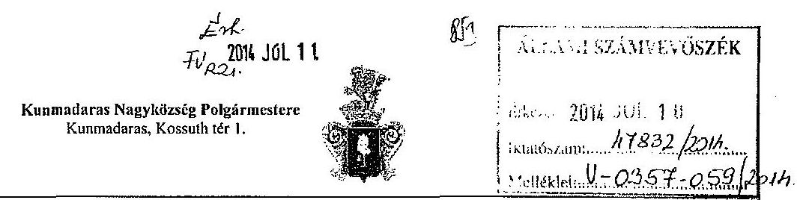

2460-2/2014.
Állami Számvevőszék
Domokos László
Elnök

# Budapest 

Pf. 54.
1052
Tárgy: Észrevétel az Állami Számvevőszék V-0357-052/2014 számú „Jelentéstervezet az önkormányzatok pénzügyi gazdálkodási helyzete értékelésének, és gazdálkodásának szabályossága ellenőrzéséről Kunmadaras 2014" tárgyú megállapításaival kapcsolatban.

## Tisztelt Elnök Úr!

A tárgyban megnevezett jelentés tervezetet áttanulmányoztam, melynek során figyelemmel voltam az ellenőrzés időszaka alatt történt eseményekre, a hozzám eljutott információkra és a településen zajló körülményekre is.

Jól tudom, hogy az Állami Számvevőszék feladata és szerepe mennyire fontos az önkormányzatok gazdálkodásának ellenőrzésében is, - és azzal egyetértek, magam is kifejezetten szükségesnek tartom. Települési vezetőként régóta látom el feladatom, így maga az ellenőrzés a ciklus befejezése előtti időszakban természetesen még indokoltabb és olyan megállapításokat tesz, hibákat, szabálytalanságokat tár fel, iránymutatást határoz meg, amely tapasztalatot is ad az elmúlt időszak történéseiről, előremutató javaslatokat tesz, egyben arra is alkalmas, hogy saját tevékenységem értékeljem.
A jelentéstervezetet olvasva és az első mondatomban írottakra figyelemmel azonban kétséget kizáróan egy szubjektív anyagot tanulmányozhattam át, amely nem csupán az ellenőrzésben tapasztalt tényekre vonatkozóan, hanem részben politikai nyomásra, bejelentésekre, névtelen vagy egyes közösségek, pártok mögötti személyek feljelentései alapján, talán már nem is az önkormányzat gazdálkodásának ellenőrzésére, hanem személyemre vonatkozott nagyobb arányban, ami társult más hatóságok vizsgálatához párhuzamban.

Természetesen elfogadom, tudomásul veszem, mert ha a polgármester törvénysértő, akkor bizony neki is felelnie kell. Gondolataim azonban azért tartottam szükségesnek az elején lejegyezni, mert aki a közéletben 30 éves közszolgálati múlttal bír, a figyelme kiterjed arra is, hogy melyik politikus mondja el zártabb közösségben, hogy feljelentetik a polgármestert és még meg is teszik egy párszor, mert nem az ő emberük, ki kell fárasztani, vagy eltakarítani, más megvilágítást ad a lényegnek.

---

# Kunmadaras Nagykösség Polgármestere 

Kunmadaras, Kossuth tér 1.

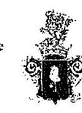

- 2 -

Ezek természetesen nem zavarnak, mert ilyen az élet, csak meglepővé válik, ha az ellenőrzést végző szervezet érezhetően kényszeresen is keresi a hibát, pedig az természetesen létezik általában, hisz mindannyian emberek és nem hibátlanok vagyunk.

Tehát szubjektív a jelentéstervezet és maga az ellenőrzés megállapításai tévesek helyenként. A szubjektívitás kétséget kizáróan tényként fogalmazódik meg részemről az alábbiak miatt:

- Az ellenőrzés megkezdésekor összefoglaló tájékoztatást adtam a jogszabályváltozásból fakadó és halmozottan hátrányos önkormányzatunkat még hátrányosabban helyzetbe hozó döntésekről, úgy mint,
a./ a képesség kibontakoztató program negatív hatása ahol a törvényi jogszabályi rendelkezés „Az osztály vagy csoport létszámát úgy kell meghatározni, hogy a halmozottan hátrányos (HHH) tanulók aránya, az összlétszámhoz viszonyítva nem haladhatja meg az osztály vagy csoport létszámának $20 \%$-át" Kunmadarast 4,4 millió Ft normatíva illette volna meg képesség kibontakoztató program célja alapján, amely éppen a halmozottan hátrányos helyzetű településeket kellett volna szolgálja, de településünk „, abba a bűnbe esett" hogy a jogalkotás pillanatában minden egyes osztály illetve csoport $86 \%$ arányban tartalmazott halmozottan hátrányos helyzetü gyermeket, amit semmiképp nem lehetett $20 \%$ alá vinni a fizikai megvalósítás hiánya miatt, így a feladatot el kellett végeznünk, mivel a pedagógiai program tartalmazta, de nem használhattuk fel a 4,4 millió Ft. normatívát.
b./Tájékoztatást adtam arról is, hogy a konszolidációt párhuzamba állítva az általános iskola állami fenntartásba vételével, nem stabilizálódott önkormányzatunk, hisz a fejlesztési hitel és kamata éves összege maximum 16 millió Ft. volt, míg az iskolára az állam általi átvétel után havi 2 millió Ft, azaz évi 24 millió Ft. megfizetésére kötelezték önkormányzatunkat, ez pedig évente - 8 millió Ft-ot jelent, az Önök számítása szerint is 4 milliót, akkor hol van az állam költségvetést segítő szerepe? Kunmadaras önkormányzata a hitel előfinanszírozását úgy végezte el és maradéktalanul megfizette a fejlesztési hitel részleteit és 7,5 millió Ft összeget a 200 millió Ft-os hitel keretből le sem hívott, de a teljes össze után fizette a tőkét és kamatot és a CIB Banknak keletkezett önkormányzatunk felé kamat visszafizetési kötelezettsége.
Úgy gondolom, ha egy halmozottan hátrányos helyzetü önkormányzat folyószámla hitel, kötvénykibocsájtás és müködési forráshiány nélkül elvégezte a feladatát, dicséretet ugyan nem, de az megérdemelné, hogy a pozitív dolgok az objektivitás miatt említésre kerüljenek.
Különösen akkor, ha tudjuk hány önkormányzat került konszolidálásra annak ellenére, vagy annak tudatában, hogy hitelállománya és kötvény kibocsátásának összege messze meghaladta a törvényi szabályozásban megfogalmazott hitelfelvételi korlátot.

---

c.) Kiemelt súllyal adtam hangot és jeleztem annak tényét, hogy a Magyar Nemzeti Vagyonkezelő Zrt. nem válaszol a képviselő-testület határozatban feltett kérdéseire és az ismételten megfogalmazott határozatokra sem, melyben a repülőtéri vasúti iparvágány ügye, az önkormányzat részére meg nem fizetett és kárelhárítás során a kárelhárítás türésének jogi keretein túli, egyezségen alapuló területhasználatért meghatározott összeg költségvetésünkből való hiánya, vagy a kárelhárítás során szétrombolt szennyvízrendszer helyetti szennyvízakna megvalósítás költsége és a lebontott ingatlanok ellenértékének megfizetésére vonatkozó összeg. Jelen állapot szerint annyi tájékoztatást kaptunk az MNV Zrt. Elnök -vezérigazgatója részéről, hogy kivizsgálásra kerül az ügy.
d./ Jeleztem az ellenőrzés során és a Mohl Anna asszony látogatásakor is a fenti tényeket, valamint azt is, hogy az ellenőrzött időszakban az is előfordult, hogy a diákélelmezés kiegészítő támogatására vonatkozó előirányzatot előbb leutalták, mint a pályázat benyújtása, mert vélhetőleg világos volt, hogy olyan önkormányzat, amely az elmúlt évben 883 gyermekre főzött nyáron szociális étkeztetés gyanánt, ( a megyeszékhely önkormányzat csupán 270 före azonos időben) jogosult, azonban a pályázat benyújtása után, de a pályázat érdemi bírálatát megelőzően visszavonásra került 4,875 millió Ft. Ezt az összeget előbb a szerkezetátalakítási tartalék előirányzata terhére jóváhagyták „Gyermekétkeztetési feladatok támogatásának kiegészítése" címszó alatt majd visszavonásra került jogosulatlanság miatt.
e./ Jeleztem annak tényét is, hogy az év végi utolsó havi közfoglalkoztatás bére nem nem került kiutalásra a Magyar Államkincstár részéről annak ellenére, hogy a közcélú dolgozók szerződése az év utolsó napjával befejeződött és a törvényi rendelkezés szerint az utolsó munkában töltött napon el kell számolni a munkavállalóval és iratait kiadni.
Így tekintettel arra, hogy az egyébként is nehezen élő családok kerültek veszélybe és méltatlan helyzetbe is az év végi ünnepekre családjukkal szemben, az önkormányzat előlegezte meg bérük $50 \%$-át, ami szintén jelentős terhet rótt az önkormányzatra. Az állami intézkedés miatt pedig, esetleges munkaügyi perekben is lehetett volna vesztes vesztes az önkormányzat, mivel a közcélú foglalkoztatás kötelmei szerint ez utóbbi a munkáltató.

Ebben a néhány ( $\mathrm{a}, \mathrm{b} \mathrm{c}, \mathrm{d}, \mathrm{e}$ ) pontokban röviden vázolt esemény olyan állami döntések, módosítások, mulasztások tényét mutatja be, melyek kifejezetten váratlan, gyors döntésre kényszerítették önkormányzatunkat és igenis súlyosan befolyásolták az önkormányzat akkori likviditási mutatóit vagy gazdasági stabilitását a bekövetkezés időszakában, sőt peres eljárás esetén újabb kárt okoz. Nem lehet a költségvetési kapcsolatok ilyen hibái mellett szó nélkül elmenni, bárki is mond értékítéletet rólunk, hiszen ezek figyelmen kívül hagyása elkerüli a gazdálkodás objektív helyzetének láthatóvá tételét.

---

# 4. SZÁMÚ MELLÉKLET A V-0357-063/2014. SZÁMÚ JELENTÉSHEZ 

## Konnadaras Nagyközség Polgármestere

Kunmadaras, Kossuth tér 1.
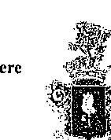

A jelentéstervezetből mintha szándékosan kimaradtak volna ezek a tényszerủ események és a tervezet még csak véletlenül sem utal akár egy konkrét esetre sem, amely az állami oldal azon részét megmutatja, amely jelentősen befolyásolta a kunmadarasi önkormányzat gazdálkodásának mutatói, ez esetben pedig minden kétséget kizáróan a jelentéstervezetben megállapítottak bár valós gondolatok és megállapítások, de az nem az objektív igazság.

Úgy érzem, hogyha egy önkormányzat ellenőrzésekor, a jelentéstervezetben foglalt nagyon komoly pénzügyi, államháztartási ismereteteken nyugvó számvevőszéki ellenőrzés történik és tapasztalható olyan tény, adat, információ, netán állami döntési mechanizmusban negatívum, mely egy vagy bármely önkormányzat tevékenységét, pénzügyi stabilitását, likviditását egy pillanatra is megzavarja szükségszerủ lett volna lejegyezni, mert akkor objektív és akkor hiteles a megállapítás.

Zavaróan hatott az is és erről is említést tettem, hogy a KSH többször ellentétes adatokat szolgáltat a teleptilés lakónépességéről és ennek pontositására a Képviselő-testület határozatban kérte a KSH-t, hogy hitelesen fogalmazza meg mennyi Kunmadaras lakónépessége. Ugyanis az eltérő adatok miatt nem mindegy a létszámarányos költségvetési támogatás, de az esetleges normatíva visszafizetés kötelezettségének hatása sem.

Másrészt fontos az állami szervek hibáinak megemlitése nem csak az objektív igazság miatt, hanem azért is, mert annak felszínre hozása magát az állam adott képviselőjét is készteti jobb, pontosabb müködésre és mindkét fél számára mutat egy megfelelő jövőképet a hibák, hiányosságok elkerülésére.

Téves a jelentés tervezet, ezért helytelen megállapítást tett a tekintetben, hogy az önkormányzat közbeszerzési eljárás nélkül vette igénybe a fejlesztési hitelt és ezzel megsértette a kht-t.

A fejlesztési hitel biztosítására Kormánydöntés alapján központi közbeszerzéssel lefolytatott eljárásban a Magyar Fejlesztési Bank került kijelölésre és a Bank által előzetesen vizsgált ajánlattevő Bankok listája az MFB honlapján került feltüntetésre. Ebben a listában szereplő Bankokat lehetett a közbeszerzési eljárásba bevonni refinanszírozásra, mely önkormányzatunk részéről megtörtént és a közbeszerzési eljárás, a hitelszerződések mellékletét képező 68/2006(IV.20.) képviselő-testületi határozattal került lezárásra

Ugyanakkor maguk a hitelszerződések szövegei 7.4 pontjaiban kifejezetten kitémek arra, hogy azok létrejötte közbeszerzési eljárás eredménye.

---

# Kunnudaras Nagyközség Polgármestere   Kunnudaras, Kossuth tér I. 

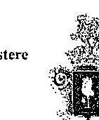

A „Sikeres Magyarországért" önkormányzati infrastruktúra hitelprogram részünkröl megkötött GAP- 027543 és a GAQ-027544 számú két hitelszerződése azonos módon, azonos tartalommal és a szerződés azonos pontjai alatt(7.4) az alábbiakat tartalmazza:
„...a szerződés megkötésére a közbeszerzésekről szóló 2003. évi CXXIX törvény (kbt) szerint lefolytatott eljárás eredménycként, az ajánlati felhívás, a dokumentáció és az ajánlat tartalmának megfelelően került sor. A Kbt. 303. § értelmében, a felek csak akkor módosíthatják a szerzödésnek azt a részét, amely a felhívás, a dokumentáció és az ajánlat tartalma alapján került meghatározásra, ha a szerződést követően -á a szerződéskor elöre nem látható ok következtében - beállott körülmény miatt valamelyik fél lényeges jogos érdekét sérti."

Kérem, szíveskedjenek állításom ellenörzését követően az említett megállapítást pontosítani.

## Tisztelt Elnük Úrt

Tájékoztatom, hogy a jelentéstervezet 27. oldalán említett 2010-2012 évi önkormányzati beszámolói mérlegelben helytelenül szereplő 1.967,0 Ft tévesen könyvelt és 0,1 millió Ft kivételével történő javítás megállapítás óta, a 0,1 millió Ft nyilvántartásból kivezetésre intézkedtem.

Kunmadaras Önkormányzata gazdálkodásának ellenőrzésekor megfogalmazott jelentéstervezet első oldalán írott keserủ véleményem nem az Önök szervezetének munkája minősítése, hanem egy körülöttem kialakult élethelyzet jellemzése, egy olyan bevezetés volt az észrevétel megtételekor, melyröl úgy érzem tudnia kellett.
Az ellenőrzés idöszaka alatt a településen néhány bölcs politikus kijelentésére támaszkodva a lakosság jelentős része indulatskat gerjesztett azért, mert a szóbeszéd szerint az ÖNHIKI támogatásként kapott pénz az önkormányzat ellopta, így a NNI Korrupcióellenes Igazgatósághoz is feljelentés tettek és hangoztatták mely napon visznek el bilincsben. A településen élők nyugodtabb hányada azonban tisztában volt azzal, hogy tisztességesen végzem a munkám és lehet ehhez tudásom nem a legjobb, de a tisztességes munka végzésre vonatkozó szándékom nem kérdőjelezhető meg.

Ilyen környezetben nem volt egyszerủ minden területen helyt állni, de hiszem és tudom, tisztelettel szolgáltam az ellenőrzésben résztvevő számvevő kollégái munkáját és vezetőiket is és minden olyan körülményt vagy tényt öszintén és segitőszándékkal tártam fel, melyről ismeretem volt.

---

# Kunmadaras Nagyközség Polgármestere 

Kunmadaras, Konsults tér 1.
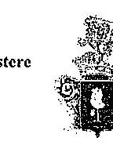

A jelentéstervezetre tett észrevételem két témára irányult igazán, melyek közül az egyik a pontokba szedett és költségvetést érintő állami feladatok hatása, a másik a hitelfelvételre vonatkozó közbeszerzésre utaló helyesbítés.
Csupán említéssel kiegészítést tettem a beszámolókból még különbségként jelentkező 0,1 millió Ft. kivezetésére történő intézkedés megtételére.

Megítélésem szerint, ha egy önkormányzat a Kormány rendelkezése alapján halmozottan hátrányos helyzetű, bűnügyileg veszélyeztetett s ennek ellenére látva az önkormányzati gazdálkodások többségét, megőrizte fizetőképességét és nem rendelkezik folyószámla, bér vagy egyéb hitellel (és ez igaz a konszolidációt megelőző időszakra is) a feltárt hibák mellett egy mondattal elismerést is érdemelne e tekintetben.

Összefoglalva tehát kijelentem, hogy az ellenőrzés időszaka alatt én személy szerint sokat tanultam és pozitívan hatott rám azért, mert átéreztem és megismerhettem az ellenőrzés szempontjából helyesnek itélt gazdálkodásra vonatkozó elvárást, a stratégiát és azt is, hogyan célszerű a feltárt hibákat megfételően javítani és a jövőben kikerülni, pontosan, jobb gazdálkodásra törekedni.

Tennészetesen a jelentés tervezetet a tett észrevételek mellett azt elfogadom, tudomásul veszem.
Az önkormányzati gazdálkodást segítő ellenőrzésben résztvevőknek a munkáját kivétel nélkül megköszönöm.

Önnek és munkatársainak további tevékenységükhöz jó erőt és egészséget kívánva,

Kunmadaras, 2014. július 3.
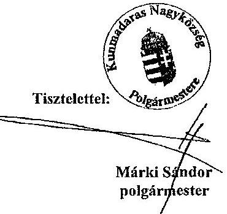

Tol.: (59)-527-342 (59)-527-343
Fax: (59)-527-334
E-mail: markis@t-email.hu

---

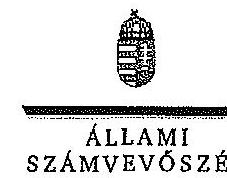

ELNÉK

Ikt.szám: V-0357-058/2014.

# Márki Sándor úr 

polgármester
Kunmadaras Nagyközség Önkormányzata

## Kunmadaras

## Tisztelt Polgármester Úr!

Köszönettel megkaptam „Az önkormányzatok pénzügyi gazdálkodási helyzete értékelésének, és gazdálkodása szabályosságának ellenörzéséről - Kunmadaras" címú jelentéstervezetre tett észrevételét.

A jelentéstervezet megállapításaira vonatkozó észrevételét az Állami Számvevőszékről szóló 2011. évi LXVI. törvény (a továbbiakban: ÁSZ tv.) 29. § (2) bekezdésében meghatározott tizenöt napos határidőn belül küldte meg. Az Állami Számvevőszék észrevétellel kapcsolatos álláspontját a mellékletként csatolt, a felügyeleti vezető által készített indokolás tartalmazza.

Tájékoztatom Polgármester Urat, hogy az ÁSZ tv. 29. § (3) bekezdése alapján a számvevőszéki jelentésben az el nem fogadott észrevételeket az elutasítás indokolásával szerepeltetjük.

Budapest, 2014. 07 hó. 10 nap

Tisztelettel:
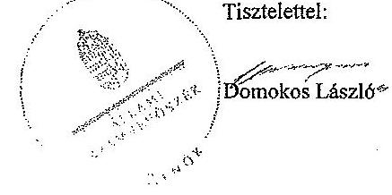

Melléklet: Észrevételekre adott válasz

---

# Észrevételekre adott válasz 

| Észrevétel: | Jelentéstervezet összegaö megállapítások 6-13. oldal megállapitásait érintően: |
| :-- | :-- |
|  | Az észrevétel szerint Polgármester úr úgy gondolja, ha egy halmozottan hátrá- |
|  | nyos helyzetü önkormányzat folyószámlahitel, kötvénykibocsátás és müködési |
|  | forráshiány nélkül elvégezte a feladatát, dicséretet ugyan nem, de azt megér- |
|  | demelné, hogy a pozitív dolgok az objektivitás miatt említésre kerüljenek. |
| Válasz: | Az Állami Számvevöszék az észrevételt nem fogadja el. |
| Indoklás: | A jelentéstervezet részletes megállapításain alapuló összegző megállapítások, |
|  | következtetések, javaslatok fejezetben az ellenőrzés által megállapított pozitív |
|  | folyamatok, illetve körülmények is rögzitésre kerültek az alábbiak szerint: |
|  | - a 6. oldal 1. és 2. bekezdése tartalmazza, hogy az Önkormányzat pénzügyi |
|  | egyensúlyi helyzete az ellenőrzött időszakban folyamatosan javuló tenden- |
|  | ciát mutatott, továbbá a müködési jövedelemtermelő képesség megőrzése |
|  | esetén a képződő bevételek várhatóan biztosítják a fennálló kötelezettségek |
|  | jövőbeni fedezetét. Az ellenőrzött időszakra feltárt kockázatok alapján - te- |
|  | kintettel a pozitív változásokra is - az Önkormányzat pénzügyi egyensúlyi |
|  | helyzetének minősítése nem a legkedvezőtlenebb (rövid távon veszélyeztet- |
|  | tett) besorolást kapta. Az ellenőrzés megállapításai szerint az Önkormány- |
|  | zat kiemelt feladata a pénzügyi egyensúly közép-, illetve hosszú távú fenntartásának biztosítása; |
|  | - a 10. oldalon a pénzügyi egyensúlyi helyzet minősítése alapján megfogalmazott, polgármesternek címzett 1. számú javaslatnál rögzítésre került, hogy a saját hatáskörben tett bevételnövelő és kiadáscsökkentő intézkedések révén a pénzügyi egyensúly helyreállt, annak hosszú távú fenntartása érdekében azonban további lépések (kiemelten tartalékképzés) indokoltak. A jelentéstervezetben szerepel továbbá az is, hogy az Önkormányzat fizetőképességének fenntartásához az ellenőrzött időszakban likvid hitelt nem vett igénybe; |
|  | - a polgármesternek, illetve a jegyzőnek címzett további javaslatok - valamennyi „az önkormányzatok pénzügyi gazdálkodási helyzete értékelésének, és gazdálkodása szabályosságának" ellenőrzéséről készült számvevőszéki jelentéshez hasonlóan Kunmadaras esetében is - a feltárt hibák, hiányosságok kijavítására irányulnak, amelyek megvalósítása a szabályozott müködés biztosítása szempontjából az Önkormányzat érdekeit szolgálja. |
|  | Összegezve: a számvevőszéki ellenőrzés során az ellenőrzési programban foglalt kérdéseket, szempontokat követte az Állami Számvevőszék (továbbiakban: ÁSZ). A megállapítások megfogalmazása során az Önkormányzat által rendelkezésre bocsátott dokumentumokat, adatszolgáltatásokat vette figyelembe az ÁSZ. A pénzügyi egyensúlyi helyzet alakulására az ellenőrzési programban kijelölt szempontokon túlmenően számos, egyéb tényező hatással lehet (például az észrevételben jelzett körülmények), azonban a jelentéstervezet megállapításai kellőképp megalapozottak, ezért a Polgármester úr jelentéstervezet objektivitását megkérdőjelezö észrevétele nem fogadható el. |

---

| Észrevétel: | Jelentéstervezet részletes megállapítások 24. oldal 2-3. bekezdése:   A pénzintézeti kötelezettségek 2010. január 1-jén fennálló 186,6 millió Ft-os állományát az ellenőrzött időszakot megelőzően összesen 191,0 millió Ft öszszegben felvett két forintalapú, hosszú lejáratú hitelből fennálló tartozások tették ki. Az Önkormányzat 2006. május 19-én az „Önkormányzati infrastruktúrafejlesztési hitelprogram" keretében a költségvetésében meghatározott hitelcelokra két hosszú lejáratú hitelt vett fel. A húsz éves futamidőre kötött fejlesztési hitelek lejáratát 2026. május 18 -ában határozták meg.   Az Önkormányzat a beruházási hitelszerződéseket közbeszerzési eljárás mellőzésével kötötte meg. Tekintettel arra, hogy az Önkormányzat a közbeszerzésekről szóló 2003. évi CXXIX. törvény (a továbbiakban: Kbt.) 22. § (1) bekezdés d) pontja alapján a Kbt. 1 hatálya alá tartozó szervezet, az Önkormányzat a szerződések megkötésével megsértette a Kbt. 1 240. § (1) bekezdésében előírt közbeszerzési eljárás lefolytatásának kötelezettségét.   Az észrevétel szerint téves a jelentéstervezet, helytelen megállapítást tett a tekintetben, hogy az önkormányzat közbeszerzési eljárás nélkül vette igénybe a fejlesztési hitelt és ezzel megsértette a Kbt.-t. A fejlesztési hitel biztosítására Kormány döntés alapján központi közbeszerzéssel lefolytatott eljárásban a Magyar Fejlesztési Bank került kijelölésre és a Bank által előzetesen vizsgált ajánlattevő Bankok listája az MFB honlapján került feltüntetésre. Ebben a listában szereplő bankokat lehetett a közbeszerzési eljárásba bevonni refinanszírozásra, mely önkormányzatunk részéről megtörtént és a közbeszerzési eljárás, a hitelszerződések mellékletét képező 68/2006. (IV. 20.) számú képviselő-testületi határozattal került lezárásra. Ugyanakkor maguk a hitelszerződések szövegei 7.4. pontjaiban kifejezetten kitérnek arra, hogy azok létrejötte közbeszerzési eljárás eredménye. |
| :--: | :--: |
| Válasz: | Az Állami Számvevőszék az észrevételt nem fogadja el. |
| Indoklás: | A közbeszerzési eljárás lefolytatására vonatkozó észrevétele nem fogadható el, mert:   - Az észrevételben foglaltak bizonyítására alkalmas dokumentumot sem a helyszíni ellenőrzés során, sem az észrevétel mellékleteként nem bocsátottak rendelkezésre.   - A 2014. január 23-án Polgármester úr és Jegyző asszony által aláírt teljességi nyilatkozat szerint minden rendelkezésre álló dokumentumot átadtak. A teljességi nyilatkozat mellékleteként tételesen felsorolták a dokumentumokat, abban sem a közbeszerzési eljárás dokumentumai, sem a hivatkozott 68/2006. (IV.20.) számú képviselötestületi határozat nem szerepel.   - Az észrevétel mellékleteként a közbeszerzési eljárás dokumentumait, illetve a 68/2006. (IV.20.) számú képviselő-testületi határozatot nem küldték meg.   - A hitelszerződések hivatkozott 7.4. pontjaiban nem szerepelnek a közbeszerzések azonosító adatai, így nem megállapítható, hogy azok a központi közbeszerzésre, vagy azon túl az Önkormányzat részéről lebonyolított egyedi közbeszerzésre vonatkoznak. A Sikeres Magyarországért Infrastruktúra Hitelprogram beindítását megelőző központi közbeszerzési eljárás le- |

---

|  | folytatása ugyanis nem mentesitette az Önkormányzatot a Kbt,1-ben elöírt feltételek fennállása esetén a közbeszerzési eljárás lefolytatásának kötelezettsége alól. |
| :--: | :--: |
| Észrevétel: | Jelentéstervezet részletes megállapítások 27. oldal 4-6. bekezdései és a 28. oldal 1. bekezdése:   Az Önkormányzat 2010-2012. évi beszámolói mérlegének eszköz és forrás oldalán - a számvitelről szóló 2000. évi C. törvény (továbbiakban: Sziv.) 15. § (3) bekezdésében és a 69. § (1)-(2) bekezdéseiben, valamint az államháztartás szervezetei beszámolási és könyvvezetési kötelezettségének sajátosságairól szóló 249/2000. (XII. 24.) Korm. rendelet (továbbiakban: Ábsz.) 37. § (1)-(2) bekezdéseiben és a 49. § (1) bekezdésében foglalt előírásokat megsértve - 1967,0 millió Ft összegben, leltárral, illetve analitikus nyilvántartással alá nem támasztott, ismeretlen eredetü költségvetési aktív kiegyenlítő, továbbá költségvetési passzív kiegyenlítő elszámolásokat szerepeltettek.   Az ellenőrzött időszak éves beszámolói részét képező mérlegek a források között a költségvetési passzív kiegyenlítő elszámolások soron tartalmaztak egy 1967,0 millió Ft-os tételt. Az eszköz oldalon a költségvetési aktív kiegyenlítő elszámolások soron szintén feltüntették a 1967,0 millió Ft összeget. Az Önkormányzat tájékoztatása szerint ezek az összegek a 2003. évben jelentek meg a mérlegben. A téves könyvelési tételek eredetéről a rendelkezésre álló dokumentumok nem nyújtottak információt, továbbá az alkalmazottak sem rendelkeztek ismeretekkel.   A Polgármesteri Hivatal 2013. november 29 -én az 1967,0 millió Ft-os tévesen könyvelt tételeket a helyszíni ellenőrzést megelőzően feltárta és 0,1 millió Ft kivételével javította, a számviteli nyilvántartásokból kivezette. A hiba jelentés összegűnek minősült, nagysága a 2012. évben a mérleg föösszeg $50,6 \%$-a volt. A pénzforgalom nélküli összevezetést követően a mérleg eszközoldalán fennmaradó 0,1 millió Ft tisztázatlan tétel maradt, melynek rendezése időpontjaként a 2013. évi zárást jelölték meg.   Az észrevétel szerint a jelentéstervezet 27. oldalán említett 2010-2012. évi önkormányzati beszámoló mérlegeiben helytelenül szereplő 1967,0 millió Ft tévesen könyvelt és 0,1 millió Ft kivételével történő javítás megállapítása óta, a 0,1 millió Ft nyilvántartásból kivezetésére intézkedés történt. |
| Válasz: | Az Âllamí Számvevőszék az észrevételt tájékoztatásként kezeli. |
| Indoklás: | Az észrevételben foglaltak a megállapítás megalapozottságát nem befolyásolják. Örömmel vettem tudomásul, hogy az ellenőrzés során feltárt hibát az észrevételben foglalt tájékoztatás alapján maradéktalanul kijavították. |

---

Tájékoztatom Polgármester Urat, hogy a számvevôszéki jelentés mellékleteként szerepeltetjük a jelentéstervezethez tett észrevételeit, valamint az azokra adott válaszunkat.

Budapest, 2014. 07. hó 30 nap
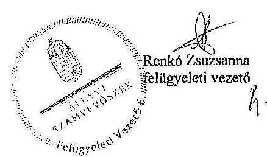

---

.

---

# RÖVIDÍTÉSEK JEGYZÉKE 

| Törvények |  |
| :--: | :--: |
| Áht. | az államháztartásról szóló 2011. évi CXCV. törvény |
| ÁSZ tv. | az Állami Számvevőszékről szóló 2011. évi LXVI. törvény |
| Htv. | a helyi önkormányzatok és szerveik, a köztársasági megbízottak, valamint egyes centrális alárendeltségú szervek feladat- és hatásköreiről szóló 1991. évi XX. törvény |
| Kbt. $_{1}$ | a közbeszerzésekről szóló 2003. évi CXXIX. törvény (hatálytalan 2012. január 1-jétől) |
| Kbt. $_{2}$ | a közbeszerzésekről szóló 2011. évi CVIII. törvény (hatályos 2012. január 1-jétől) |
| Kvtv. | Magyarország 2013. évi központi költségvetéséről szóló 2012. évi CCIV. törvény |
| Sztv. | a számvitelről szóló 2000 . évi C. törvény |
| Rendeletek |  |
| Áhsz. $_{1}$ | az államháztartás szervezetei beszámolási és könyvvezetési kötelezettségének sajátosságairól szóló 249/2000. (XII. 24.) Korm. rendelet (hatálytalan 2014. január 1jétől) |
| Áhsz. $_{2}$ | az államháztartás számviteléról szóló 4/2013. (I. 11.) Korm. rendelet (hatályos 2014. január 1-jétől) |
| SZMSZ | Kunmadaras Nagyközség Önkormányzat Képviselőtestületének 3/2011. (IV. 1.) számú önkormányzati rendelete Kunmadaras Nagyközség Önkormányzata Képviselőtestületének Szervezeti és Múködési Szabályzatáról |
| 2013. évi költségvetési rendelet | Kunmadaras Nagyközség Önkormányzatának 2/2013. (II. 13.) számú rendelete a 2013. évi költségvetésről |
| Szórövidítések |  |
| áfa | általános forgalmi adó |
| ÁSZ | Állami Számvevőszék |
| BM | Belügyminisztérium |
| EU | Európai Unió |
| FEUVE | folyamatba épített előzetes és utólagos vezetői ellenőrzés |
| gazdasági program | Kunmadaras Nagyközség Önkormányzata Képviselőtestületének Gazdasági Programja (2010-2014.) |
| jegyző $_{1}$ | Kunmadaras Nagyközség Önkormányzatának jegyzője 2010. október 9-étől 2012. szeptember 23-ig |
| jegyző $_{2}$ | Kunmadaras Nagyközség Önkormányzatának jegyzője 2012. november 1-jétől 2013. június 30-ig |
| KEOP | Támogató Környezet és Energia Operatív Program |
| Képviselő-testület | Kunmadaras Nagyközség Önkormányzatának Képviselőtestülete |
| MTBSZSZ | Madarasi Településellátó, Beruházó és Szolgáltató Szervezet |

---

| ÖNHIKI | önhibáján kívül hátrányos helyzetben lévő önkor-   mányzatok támogatása |
| :-- | :-- |
| Önkormányzat | Kunmadaras Nagyközség Önkormányzata |
| polgármester | Kunmadaras Nagyközség Önkormányzatának polgármes-   tere |
| Polgármesteri Hivatal | Kunmadaras Nagyközség Önkormányzatának Polgármes-   teri Hivatala |

---

# FOGALOMTÁR 

bevételi kitettség

CLF módszer
felhalmozási kockázat
fordított adózás áfa esetében
használhatósági fok
integritás

Olyan függőségi viszony, ahol egy szervezet pénzügyi helyzetét meghatározó bevételek nagysága külső körülmények hatására azonnal és kedvezőtlen irányba változhat.
Az önkormányzatok költségvetése elemzésének módszere, amely a pénzügyi kapacitás (más néven a nettó múködési jövedelem) fogalmát helyezi a középpontba. A módszer következetesen elkülöníti a folyó és a felhalmozási költségvetés bevételeit és kiadásait, azok költségvetési egyenlegeit. Bizonyos mértékig a vállalati gazdálkodás logikai elemeit érvényesíti az önkormányzatok pénzügyi, jövedelmi helyzetének vizsgálata során.
Annak kockázata, hogy a folyamatban lévő felhalmozási feladatok finanszírozásához szükséges pénzügyi forrás nem fog rendelkezésre állni.
Az általános forgalmi adóról szóló 2007. évi CXXVII. törvény 142. §-ában meghatározott termékekre és szolgáltatásokra alkalmazott adózási rend, melynek keretében az általános forgalmi adót a termék beszerzője, szolgáltatás igénybevevője fizeti meg és vallja be. (Forrás: az általános forgalmi adóról szóló 2007. évi CXXVII. törvény 142. §)
A tárgyi eszközállomány állagának elemzéséhez használt mutató, amely megmutatja, hogy a le nem írt (nettó) érték milyen hányadát képezi az aktiválási (bekerülési) értéknek. Számításakor a tárgyi eszköz könyv szerinti nettó értékét viszonyítják a tárgyi eszköz bruttó (beszerzési/létesítési) értékéhez.
Az „integritás" - egyik gyakran használt jelentése szerint - az elvek, értékek, cselekvések, módszerek, intézkedések konzisztenciáját jelenti, vagyis olyan magatartásmódot, amely meghatározott értékeknek megfelel. Integritásirányitási rendszer bevezetése a szervezetben a szervezethez rendelt közfeladatok integritás szempontú ellátását, az érték alapú múködéssel (integritással) összefüggő szervezeti követelmények következetes érvényesítését jelenti. (Forrás: „Magyarországi államháztartási belső kontroll standardok Útmutató", kiadta az NGM 2012. decemberében)

---

# közfeladat 

nettó múködési jövedelem

ÖNHIKI támogatás
önkormányzat felhalmozási bevétele
önkormányzat felhalmozási kiadásai
önkormányzat folyó bevétele
önkormányzat folyó kiadása
önkormányzat folyó költségvetés egyenlege
önkormányzat gazdasági társasága miatti kockázatot jelentő tényezők

Jogszabályban meghatározott állami vagy önkormányzati feladat, amit az arra kötelezett közérdekből, a jogszabályban meghatározott követelményeknek és feltételeknek megfelelve végez, ideértve a lakossági közszolgáltatásokkal való ellátását, továbbá az állam nemzetközi szerződésekben vállalt kötelezettségeiből adódó közérdekü feladatokkal, valamint e feladatok ellátásakor szükséges infrastruktúra biztosítását is. (Forrás: 2011. évi CXCVI. törvény 3. § 7. pontja)
A nettó múködési jövedelem a jövedelemtermelő képességet méri. Megmutatja a múködési bevételekből a múködési kiadások és a hitelek tőketörlesztésének kifizetése után fennmaradó jövedelmet.
Az önkormányzatok múködőképességét szolgáló, önhibájukon kívül hátrányos helyzetben levő települési önkormányzatok támogatása.
Az önkormányzatok tárgyévi felhalmozási célú költségvetési bevételei.
Az önkormányzatok tárgyévi felhalmozási célú költségvetési kiadásai.
Az önkormányzatok tárgyévi múködési célú költségvetési kiadásai.
A folyó költségvetés egyenlege, azaz a múködési jövedelem megmutatja, hogy az Önkormányzat éves folyó bevétele fedezetet biztosít-e a kötelező és önként vállalt feladatellátáshoz kapcsolódó éves folyó kiadására. A múködési jövedelem negatív értéke pénzügyileg fenntarthatatlan helyzetet jelez. A mutató pozitív értéke megtakarítást mutat, amely forrásul szolgálhat az Önkormányzat fennálló kötelezettségei megfizetéséhez, valamint fejlesztéseihez.
Az önkormányzat gazdasági társaságának kedvezőtlen pénzügyi döntései következtében az önkormányzat pénzügyi egyensúlyi helyzetét veszélyeztető tényezők:
az önkormányzat az önként vállalt és/vagy a kötelező feladatot ellátó társaságának a tevékenység ellátásához pénzeszközt ad át;
az önkormányzat nem vizsgálja a feladatellátás választott szervezeti megoldásának hatékonyságát;

---

pénzügyi kapacitás
pénzügyi kockázat
a kötelező feladatellátást biztosító gazdasági társaság tevékenységének ágazati szabályozása változik (vízi közmúvagyon üzemeltetése);
a kizárólagos vagy többségi tulajdonú társaságok pénzügyi helyzete nem stabil, amely az alapítóra kötelezettségeket háríthat;
az önkormányzat a társaságok tevékenységét nem kísérte figyelemmel, nem élt az alapítói (irányítói) jogok gyakorlásával, a társaságok gazdálkodásának önkormányzati szintű konszolidálása nem biztosított;
az önkormányzat garanciát, vagy kezességet vállal a gazdasági társaság kötelezettségeire;
a társaságoknak átadott pénzeszköz uniós elvárásoknak megfelelő kezelése.
A pénzügyi kapacitás az adósok hitelfelvételi képességének azon mértéke, ahol még növelni tudják az adósságot anélkül, hogy a fizetőképtelenség elkerülése érdekében csökkenteniük kellene akár az aktuális, akár a jövőben esedékes kiadásaikat.
A pénzügyi kockázat magában foglalja mindazon kockázatokat, amelyek a szervezet pénzügyi helyzetére hatással vannak. Pl.: az adósságszolgálat miatti kockázatot, árfolyamkockázatot, felhalmozási kockázatot, fizetőképességi kockázatot, jövőbeni kötelezettségek kifizethetőségének kockázatát, kamatkockázatot, kezességvállalás kockázatát, likviditási kockázat, mérlegen kívüli tételek kockázata, nemfizetési kockázat, stb.