# ÁLLAMI   SZÁMVEVŐSZÉK 

## JELENTÉS

a Szolnoki Főiskola ellenőrzéséről - Az állami felsőoktatási intézmények gazdálkodásának, múködésének ellenőrzése

---

# Állami Számvevőszék 

Iktatószám: V-0337-1029/2014.
Témaszám: 1371
Vizsgálat-azonosító szám: V-065801

## Az ellenőrzést felügyelte:

Horváthné Herbáth Mária
felügyeleti vezető

## Az ellenőrzést vezette:

Keresztes Tamás
ellenőrzésvezető
A számvevői jelentések feldolgozásában és a jelentés összeállításában közremúködtek:

## Keresztes Tamás

ellenőrzésvezető
Szudi Ferencné
számvevő tanácsos
Kliment Krisztián Endre
számvevő asszisztens

## Az ellenőrzést végezték:

| Beke Andrea | Bocsi Sándor | Kozma Gábor |
| :-- | :-- | :-- |
| számvevő | számvevő tanácsos | számvevő tanácsos |
| Szudi Ferencné | Ungár Ervin |  |
| számvevő tanácsos | számvevő |  |

A témához kapcsolódó eddig készített számvevőszéki jelentések:
címe
sorszáma
Jelentés az oktatási és kulturális ágazat irányítási rendszerének, 1106 múködésének ellenőrzéséről
Jelentés a felsőoktatás oktatási infrastruktúra-fejlesztési program- 1171 jának ellenőrzéséről
Jelentés az állami felsőoktatási intézmények érdekeltségébe tartozó 1290 gazdasági társaságok támogatásának és nyereségük hasznosulásának ellenőrzéséről

---

# TARTALOMJEGYZÉK 

BEVEZETÉS ..... 15
I. ÖSSZEGZŐ MEGÁLLAPÍTÁSOK, KÖVETKEZTETÉSEK, JAVASLATOK ..... 20
II. RÉSZLETES MEGÁLLAPÍTÁSOK ..... 29

1. A felsőoktatásért felelős minisztérium fenntartói és ágazati irányítói tevékenysége ..... 29
2. Az intézmény belső kontrollrendszerének kiépítése és múködtetése ..... 31
3. Az intézmény pénzügyi gazdálkodása ..... 36
3.1. A kiadási és bevételi előirányzatok alakulása és a pénzügyi egyensúlyt befolyásoló tényezők ..... 36
3.2. A bevételi és kiadási előirányzatok megállapítása, módosítása, az előirányzat-maradványok kezelése ..... 42
3.3. A kiadási előirányzatok felhasználása és a bevételi előirányzatok teljesítése ..... 44
4. Az intézmény vagyongazdálkodása ..... 49
4.1. A vagyongazdálkodás szabályozottsága ..... 51
4.2. A vagyongazdálkodás szabályszerűsége ..... 52
5. Korábbi ÁSZ ellenőrzések javaslatainak hasznosulása ..... 59

---

# MELLÉKLETEK 

1. számú A Szolnoki Főiskola kiadási és bevételi előirányzatai, azok teljesítése a 2009-2012. években
2. számú A Szolnoki Főiskola kiadásainak, bevételeinek változása a 2009-2012. években
3. számú Kimutatás a Szolnoki Főiskola bevételeiről és kiadásairól, valamint adósságszolgálatáról a 2009-2012. években
4. számú A Szolnoki Főiskola mérlegadatai a 2009-2012. években
5. számú A Szolnoki Főiskola gazdálkodása szabályszerűségének értékelése a mintatételek alapján
6. számú Az Emberi Erőforrások Minisztériumának észrevétele
7. számú Az Emberi Erőforrások Minisztériumának észrevételére adott válasz
8. számú A Szolnoki Főiskola észrevétele
9. számú A Szolnoki Főiskola észrevételére adott válasz

---

# RÖVIDÍTÉSEK JEGYZÉKE 

## Törvények

Áht. 1
Áht. 2
ÁSZ tv.
Kbt. 1
Kjt.

Nftv.
Nvtv.
Szja tv.
Sztv.
Tbj.

Vtv.

## Korm. rendeletek

Áhsz.

Ámr. 1
Ámr. 2
Ávr.
Ber.

Bkr.
Vtvr.
6/2009. (I. 20.) Korm. rendelet

133/2009. (VI. 19.)
Korm. rendelet

352/2010. (XII. 30.)
Korm. rendelet
371/2011. (XII. 31.)
1992. évi XXXVIII. törvény az államháztartásról (hatálytalan 2012. január 1-jétől)
2011. évi CXCV. törvény az államháztartásról
2011. évi LXVI. törvény az Állami Számvevőszékről
2003. évi CXXIX. törvény a közbeszerzésekről (hatálytalan 2012. január 1-jétől)
1992. évi XXXIII. törvény a közalkalmazottak jogállásáról
2011. évi CCIV. törvény a nemzeti felsőoktatásról
2011. évi CXCVI. törvény a nemzeti vagyonról
1995. évi CXVII. törvény a személyi jövedelemadóról
2000. évi C. törvény a számvitelről
1997. évi LXXX. törvény a társadalombiztosítás ellátásaira és a magánnyugdíra jogosultakról, valamint e szolgáltatások fedezetéről
2007. évi CVI. törvény az állami vagyonról
249/2000. (XII. 24.) Korm. rendelet az államháztartás szervezetei beszámolási és könyvvezetési kötelezettségének sajátosságairól
217/1998. (XII. 30.) Korm. rendelet az államháztartás múködési rendjéről (hatálytalan 2010. január 1-jétől)
292/2009. (XII. 19.) Korm. rendelet az államháztartás múködési rendjéről (hatálytalan 2012. január 1-jétől)
368/2011. (XII. 31.) Korm. rendelet az államháztartásról szóló törvény végrehajtásáról
193/2003. (XI. 26.) Korm. rendelet a költségvetési szervek belső ellenőrzéséről (hatálytalan 2012. január 1jétől)
370/2011. (XII. 31.) Korm. rendelet a költségvetési szervek belső kontrollrendszeréről és belső ellenőrzéséről
254/2007. (X. 4.) Korm. rendelet az állami vagyonnal való gazdálkodásról
a költségvetési szerveknél foglalkoztatottak 2009. évi havi kereset-kiegészítéséről (hatálytalan 2010. december 31-étől)
a költségvetési szerveknél foglalkoztatottak 2009. évi havi kereset-kiegészítéséről szóló 6/2009. (I. 20.) Korm. rendelet módosításáról (hatálytalan 2010. december 31-étől)
a költségvetési szerveknél foglalkoztatottak 2011. évi kompenzációjáról (hatálytalan 2012. január 31-étől)
a költségvetési szerveknél és az egyházak közcélú tevékenél és az egyházak közcélú tevéken-

---

Korm. rendelet

## Határozatok

1001/2009. (I. 13.)
Korm. határozat
1033/2009. (III. 17.)
Korm. határozat
1035/2010. (II. 12.)
Korm. határozat

1120/2010. (V. 13.)
Korm. határozat

1132/2010. (VI. 18.)
Korm. határozat
1025/2011. (II. 11.)
Korm. határozat
1185/2011. (VI. 6.)
Korm. határozat
1365/2011. (XI. 8.)
Korm. határozat

1505/2011. (XII. 29.)
Korm. határozat

1133/2012. (IV. 26.)
Korm. határozat

## Egyéb rövidítések

ÁSZ
EMMI
FEUVE
FIR
GMI
GT
IFT
Kincstár
KIM
MNV Zrt.
NEFMI
NEPTUN
NFM
NGM
OKM
PPP
kenységet folytató intézményeinél foglalkoztatottak 2012. évi kompenzációjáról
a 2009. évi havi kereset-kiegészítés forrásigényének biztosításához szükséges intézkedésekről
a 2009. évi államháztartási egyensúly megőrzéséhez szükséges intézkedésekről
a központi költségvetési szerveknél foglalkoztatottak 2010. évben fizetendő eseti kereset-kiegészítésének finanszírozásáról
a központi költségvetési szerveknél foglalkoztatottak 2010. évben fizetett eseti kereset-kiegészítésének elszámolásáról
a 2010. évi költségvetéssel összefüggő egyes feladatokról
az államháztartási egyensúly megőrzéséhez szükséges intézkedésekről
a központi költségvetési szerveknél foglalkoztatottak 2011. évi kompenzációjának finanszírozásáról
a 2012. évi költségvetési hiánycél tartását biztosító további feladatokról
a központi költségvetési szervek és az egészségügyi intézmények tartozásállományának csökkentéséről, valamint a gyógyszertámogatás és a gyógyászati segédeszköz támogatás kiadásaival kapcsolatos lépésekről
a központi költségvetési szerveknél foglalkoztatottak 2012. évi kompenzációjának finanszírozásáról

Állami Számvevőszék
Emberi Erőforrások Minisztériuma
Folyamatba épített, előzetes, utólagos és vezetői ellenőrzés
Felsőoktatási Információs Rendszer
Gazdasági és Műszaki Igazgatóság
Gazdasági Tanács
Intézményfejlesztési Terv
Magyar Államkincstár
Közigazgatási és Igazságügyi Minisztérium
Magyar Nemzeti Vagyonkezelő Zrt.
Nemzeti Erőforrás Minisztérium
Tanulmányi hallgatói információs rendszer
Nemzeti Fejlesztési Minisztérium
Nemzetgazdasági Minisztérium
Oktatási és Kulturális Minisztérium
Public-Private Partnership (magán és közszféra együtt-

---

|  | múködése) |
| :-- | :-- |
| SZF | Szolnoki Főiskola |
| SZMSZ | Szervezeti és Müködési Szabályzat |

---

.

---

# ÉRTELMEZŐ SZÓTÁR 

alapító
állami felsőoktatási intézmény saját tulajdona
állami vagyon
állami vagyon hasznosítása

A központi költségvetési szerv alapítója az Országgyúlés, a Kormány vagy a miniszter. A felsőoktatási intézmények vonatkozásában az alapítói jogokat a felsőoktatásért felelős minisztérium gyakorolja.
a felsőoktatási intézmény saját bevételének a költségek teljes körű levonása - az adományozás és öröklés kivételével -, a rendelkezésre bocsátott vagyon állagának megóvásáról, pótlásáról való gondoskodás után fennmaradt része terhére szerzett vagyona
A Vtv. 1. § (2) bekezdése szerint állami vagyonnak minősül:
a) az állami tulajdonban lévő ingó dolog, valamint a dolog módjára hasznosítható természeti erő,
b) az állami tulajdonban lévő termőföldekből álló, külön törvényben szabályozott Nemzeti Földalap,
c) az állami tulajdonban lévő - a b) pont hatálya alá nem tartozó - ingatlan,
d) az állami tulajdonban lévő értékpapír,
e) az államot megillető társasági részesedés és más vagyoni értékű jog.
(hatályos 2010. június 16-ig)
a) az állam tulajdonában lévő dolog, valamint a dolog módjára hasznosítható természeti erő,
b) az a) pont hatálya alá nem tartozó mindazon vagyon, amely vonatkozásában törvény az állam kizárólagos tulajdonjogát nevesíti,
c) az állam tulajdonában lévő tagsági jogviszonyt megtestesítő értékpapír, illetve az államot megillető egyéb társasági részesedés,
d) az államot megillető olyan immateriális, vagyoni értékkel rendelkező jogosultság, amelyet jogszabály vagyoni értékű jogként nevesít.
(hatályos 2010. június 17-től)
A Vtv. 23. § (1) bekezdése szerint: Az állami vagyont az MNV Zrt. maga kezeli, illetve szerződés - így különösen bérlet, haszonbérlet, szerződésen alapuló haszonélvezet, vagyonkezelés, megbízás - alapján központi költségvetési szervnek, természetes vagy jogi személynek, illetőleg jogi személyiséggel nem rendelkező gazdasági társaságnak hasznosításra átengedi.
(hatályos 2010. december 31-ig)
Az állami vagyont az MNV Zrt. maga kezeli, vagy szerződés -így különösen bérlet, haszonbérlet, szerződésen alapuló haszonélvezet, vagyonkezelés, megbízás - alapján központi költségvetési szervnek, természetes vagy

---

állami vagyon hasznosítására kötött szerződés
állami vagyon használója
állami vagyon értékesítése
állami vagyon kezelője /vagyonkezelő
jogi személynek, vagy jogi személyiséggel nem rendelkező gazdálkodó szervezetnek hasznosításra átengedi.
(hatályos 2011. december 31-ig)
Az állami vagyont az MNV Zrt. maga kezeli, vagy szerződés - így különösen bérlet, haszonbérlet, megbízás alapján központi költségvetési szervnek, természetes vagy jogi személynek, vagy jogi személyiséggel nem rendelkező gazdálkodó szervezetnek hasznosításra átengedi.
(hatályos 2012. január 1-jétől)
A Vtv. 23. § (2) bekezdése szerint: Az állami vagyon hasznosítására kötött szerződések elsődleges célja az állami vagyon hatékony múködtetése, állagának védelme, értékének megőrzése, illetve gyarapítása, az állami és közfeladatok ellátásának elősegítése.
A Vtvr. 1. § (7) a. pontja szerint: az a természetes személy, jogi személy, illetve jogi személyiséggel nem rendelkező gazdasági társaság, amely a Magyar Nemzeti Vagyonkezelő Zártkörűen Működő Részvénytársasággal (a továbbiakban: MNV Zrt.) kötött szerződés alapján, bármely jogcímen (bérlet, haszonbérlet, vagyonkezelés, használat stb.) állami vagyont birtokol, használ, hasznosít;
(hatályos 2010. december 31-ig)
az a természetes személy, jogi személy, illetve jogi személyiséggel nem rendelkező szervezet, amely, illetve aki törvény vagy szerződés alapján, bármely jogcímen (pl. bérlet, haszonbérlet, vagyonkezelési szerződés, használat stb.) állami vagyont birtokol, használ, szedi annak hasznait, hasznosít, ide nem értve a tulajdonosi jogok gyakorlóját;
(hatályos 2011. január 1 - 2011. december 31-ig)
az a természetes vagy jogi személy, jogi személyiséggel nem rendelkező szervezet, aki, vagy amely törvény vagy szerződés alapján, bármely jogcímen (bérlet, haszonbérlet, használat stb.) állami vagyont birtokol, használ, szedi annak hasznait, hasznosít, ide nem értve a haszonélvezőt, a vagyonkezelőt és a tulajdonosi jogok gyakorlóját.
(hatályos 2012. január 1-jétől)
Állami vagyon tulajdonjogának bármely jogcímen történő, visszterhes átruházása (Vtvr. 1. § (7) d) pont).
A Vtv. 23. § (1) bekezdése szerint az állami vagyont az MNV Zrt. maga kezeli, vagy szerződés - így különösen bérlet, haszonbérlet, szerződésen alapuló haszonélvezet, vagyonkezelés, megbízás - alapján központi költségvetési szervnek, természetes vagy jogi személynek, illetőleg jogi személyiséggel nem rendelkező gazdasági társaságnak hasznosításra átengedi

---

(hatályos 2010. január 1-jétől 2010. december 31-ig); az állami vagyont az MNV Zrt. maga kezeli, vagy szerződés - így különösen bérlet, haszonbérlet, szerződésen alapuló haszonélvezet, vagyonkezelés, megbizás - alapján központi költségvetési szervnek, természetes vagy jogi személynek, illetőleg jogi személyiséggel nem rendelkező gazdálkodó szervezetnek hasznosításra átengedi (hatályos 2011. január 1-jétől 2011. december 31-ig); az állami vagyont az MNV Zrt. maga kezeli, vagy szerződés - így különösen bérlet, haszonbérlet, megbízás alapján központi költségvetési szervnek, természetes vagy jogi személynek, vagy jogi személyiséggel nem rendelkező gazdálkodó szervezetnek hasznosításra átengedi. Az állami vagyonra vonatkozóan az MNV Zrt. kizárólag az Nvtv-ben meghatározott személyekkel köthet vagyonkezelési szerződést.
(hatályos 2012. január 1-jétől)
A felsőoktatási intézmény Feot-ban, illetve Nftv-ben szabályozott önrendelkezése, amely biztosítja az intézmény önálló oktatási, kutatási, szervezeti és múködési, valamint gazdálkodási tevékenységét.
A belső kontrollrendszer a kockázatok kezelése és tárgyilagos bizonyosság megszerzése érdekében kialakított folyamatrendszer, amely azt a célt szolgálja, hogy megvalósuljanak a következő célok:
a) a múködés és gazdálkodás során a tevékenységeket szabályszerűen, gazdaságosan, hatékonyan, eredményesen hajtsák végre,
b) az elszámolási kötelezettségeket teljesítsék, és
c) megvédjék az erőforrásokat a veszteségektől, károktól és nem rendeltetésszerú használattól.
A módszer a múködési és a felhalmozási költségvetés bevételeinek és kiadásainak, ezek egyenlegeinek elkülönített, majd összevont kimutatását alkalmazza valamely költségvetési intézmény pénzügyi helyzetének megítéléséhez. Kiemelten mutatja be a finanszírozási múveletek egyenlege nélküli és az azt magába foglaló pénzügyi pozíciót, valamint a tőketörlesztéssel, értékpapírbeváltással csökkentett múködési jövedelmet.
Az értékelés a pénzügyi kapacitás fogalmát helyezi a középpontba.
A Feot. 7. § (2) és az Nftv. 4. § (2) bekezdése szerint az, aki az alapítói jogot gyakorolja, ellátja a felsőoktatási intézmény fenntartásával kapcsolatos feladatokat.
A CLF módszer szerint számított múködési és felhalmozási tevékenység pénzügyi egyenlegének összevont értéke. Megmutatja, hogy a költségvetési intézmény bevételei fedezetet biztosítottak-e a kiadásokra. A finanszírozási műveletek nélküli (GFS) pozíció alapján a pénzügyi

---

előirányzat-maradvány

Gazdasági Tanács
hároméves fenntartói megállapodás
információs és kommunikációs rendszer
intézményfejlesztési terv
integritás

INTOSAI
helyzetet akkor tekintettük megfelelő́nek, ha az adott év múködési és felhalmozási bevételei fedezetet nyújtottak az adott év múködési és felhalmozási kiadásaira.
Az államháztartás központi alrendszerébe tartozó költségvetési szerveknél a módosított bevételi és kiadási előirányzatok és azok teljesítésének a Kormány rendeletében meghatározott tételekkel korrigált különbözete az előirányzat-maradvány (Áht. 2 2. § (1) bekezdés m) pontja).
A felsőoktatási intézmény javaslattevő, véleményező, a stratégiai döntések előkészítésében részt vevő, és a döntések végrehajtásának ellenőrzésében közremúködő szerve.
Az állami felsőoktatási intézmények központi költségvetési támogatására hároméves fenntartói megállapodást kell kötni az állami felsőoktatási intézmény és a fenntartó között. A fenntartói megállapodás tartalmazza a felsőoktatási intézmény által meghatározott hároméves időszakra vállalt teljesítménykövetelményeket, továbbá az állandó jellegű támogatási részeket, valamint a változó jellegű támogatások megállapításának jogcímeit. A változó elemú támogatás évenkénti elszámolási kötelezettséggel kerül meghatározásra. (hatálytalan 2011. január 1-jétől)
A költségvetési szerv vezetője köteles olyan rendszereket kialakítani és múködtetni, melyek biztosítják, hogy a megfelelő információk a megfelelő időben eljussanak az illetékes szervezethez, szervezeti egységhez, illetve személyhez.
A szenátus fogadja el az intézményfejlesztési tervet. Az intézményfejlesztési tervben kell meghatározni a fejlesztéssel, a fenntartó által a felsőoktatási intézmény rendelkezésére bocsátott vagyon hasznosításával, megóvásával, elidegenítésével kapcsolatos elképzeléseket, a várható bevételeket és kiadásokat. Az intézményfejlesztési tervet középtávra, legalább négyéves időszakra kell elkészíteni, évenkénti bontásban meghatározva a végrehajtás feladatait. Az intézményfejlesztési terv része a foglalkoztatási terv. A foglalkoztatási tervben kell meghatározni azt a létszámot, amelynek keretei között a felsőoktatási intézmény megoldhatja feladatait.
(Feot. 27. § (3) bekezdés)
Az integritás olyasvalakit vagy valamit jelöl, aki vagy ami romlatlan, sértetlen, feddhetetlen. Az integritás elvek, értékek, cselekvések, módszerek, intézkedések konzisztenciáját jelenti: olyan magatartásmódot, amely meghatározott értékeknek megfelel.
International Organisation of Supreme Audit Institutions (Legfőbb Ellenőrzési Intézmények Nemzetközi Szakmai Szervezete)

---

kincstári biztos
kincstári költségvetés
kockázatkezelési rendszer
kontrollkörnyezet
kontrolltevékenység
költségvetési főfelügye-
lő, felügyelő

A kincstári biztos kijelölését az államháztartásért felelős miniszternél a Kincstár kezdeményezi. A kincstári biztos köteles figyelemmel kísérni megbízatásának időpontjától kezdve a költségvetési szerv tervezését, gazdálkodását, beszámolását, a jogszabályokban előírt feladatainak ellátását, feltárni azokat az okokat, amelyek a tartós fizetésképtelenséghez vezettek, a szükséges intézkedések azonnali végrehajtására irányuló intézkedési tervet készíteni, azonnali intézkedéseket kezdeményezni és írásbeli utasításokat kiadni a tartozásállomány felszámolására, a gazdálkodás egyensúlyának biztosítására, a követelések behajtására (Avr. 116-117. §).
A központi költségvetésről szóló törvény elfogadását követően a fejezetet irányító szerv az államháztartás központi alrendszerébe tartozó költségvetési szerv és a fejezeti kezelésű előirányzat kiemelt előirányzatait, valamint az elkülönített állami pénzalapok és a társadalombiztosítás pénzügyi alapjai jogszabályi előírás szerinti bevételeit és kiadásait kincstári költségvetés kiadásával állapítja meg (Áht.; 24. § (3) bekezdés, Áht. 2 28. § (2) bekezdés, Ávr. 13. § (2) bekezdés).
Irányítási eszközök és módszerek összessége, melynek elemei a szervezeti célok elérését veszélyeztető tényezők (kockázatok) azonosítása, elemzése, csoportosítása, nyomon követése, valamint szükség esetén a kockázati kitettség mérséklése.
A kontrollkörnyezet a költségvetési szerv vezetőinek a szervezeti célok elérését segítő kontrollok kialakításával és múködtetésével, korszerűsítésével kapcsolatos magatartását, a kontrollpontokról érkező információkra való reagálását jelenti.
Azok az elvek, politikák és eljárások, amelyeket a kockázatok meghatározása és a szervezet céljainak elérése érdekében alakítanak ki.
A költségvetési szerv vezetője köteles a szervezeten belül kontrolltevékenységeket kialakítani, amelyek biztosítják a kockázatok kezelését, hozzájárulnak a szervezet céljainak eléréséhez.
Az államháztartásért felelős miniszter a Kormány irányítása alá tartozó fejezetet irányító szervhez, a Kormány irányítása vagy felügyelete alá tartozó költségvetési szervhez, valamint az elkülönített állami pénzalapok és a társadalombiztosítás pénzügyi alapjai kezelő szerveihez költségvetési főfelügyelőt, felügyelőt rendelhet ki. A költségvetési főfelügyelő, felügyelő a gazdálkodás költ-ségvetés-politikával való összhangja és a takarékos, sza-bályszerú, eredményes múködés érdekében a Kormány rendeletében meghatározott intézkedéseket tehet, így különösen előzetesen véleményezi a kötelezettségvállalásra irányuló eljárásokat, és a nagy összegű kötelezett-

---

kisebbségi jogokat biztosító részesedés
maximális hallgatói létszám
mértékadó befolyást biztosító részesedés
minisztérium
minősített többséget biztosító részesedés
monitoring
működési jövedelem
normatív költségvetési támogatás felsőoktatási intézmények múködéséhez
ségvállalások tekintetében kifogással élhet (Áht. 39. § (1)-(2) bekezdés).

A részesedés mértéke legalább 5\% (Gt. 49. §).
Az a felsőoktatási intézmény alapító okiratában, múködési engedélyében meghatározott hallgatói létszám, ameddig terjedően a felsőoktatási intézmény - figyelembe véve a hallgatók fogadásához és az oktatói tevékenység folytatásához rendelkezésre álló személyi feltételeket, helyiségeket és eszközöket - valamennyi évfolyamára számítva, teljes kihasználtsággal múködve hallgatói jogviszonyt létesíthet.
A részesedés mértéke legalább 20\%, de 50\%-nál kisebb (Sztv. 3. § (2) bekezdés 4. pont).
A felsőoktatásért felelős minisztérium, amely 2009-től 2010 májusáig az OKM, 2010 májusától 2012 májusáig a NEFMI, 2012 májusától az EMMI volt.
A minősített befolyásszerző az ellenőrzött társaságban a szavazatok legalább hetvenöt százalékával rendelkezik (Gt. 52. § (2) bekezdés).
A különböző szintű szervezeti célok megvalósításához szükséges folyamatok figyelemmel kísérése, melynek során a releváns eseményekről és tevékenységekről (együtt: folyamatokról) rendszeres jelleggel, strukturált, döntéstámogató információkhoz jutnak a szervezet vezetői.
A folyó bevételek és folyó kiadások egyenlege. Azt mutatja, hogy a folyó bevételek fedezetet nyújtanak-e a folyó kiadásokra.
A felsőoktatási intézmények múködéséhez biztosított normatív költségvetési támogatás lehet:
a) hallgatói juttatásokhoz nyújtott,
b) képzési,
c) tudományos célú,
d) fenntartói,
e) egyes feladatokhoz nyújtott
támogatás. A központi költségvetésből biztosított normatív költségvetési támogatásra - a d) pontban meghatározott normatív költségvetési támogatás kivételével - a felsőoktatási intézmények azonos feltételek alapján válnak jogosulttá. Az a)-e) pontokban meghatározott jogcímek - az a) és e) pontban meghatározott jogcímek kivételével - nem jelentenek felhasználási kötöttséget (Feot. 127. § (3) bekezdés).

---

normatív támogatások
saját bevétel
szenátus
tárgyévi pénzügyi pozíció
többségi befolyást biztositó részesedés

Az ellenőrzési időszakban hatályos költségvetési törvények 3. számú mellékletében megjelölt közoktatási hozzájárulások, az 5. mellékletében megjelölt központosított előirányzatok, továbbá a 8. mellékletében megjelölt normatív, kötött felhasználású támogatások együttesen. Az államháztartáson kívüli források - beleértve minden olyan, az Európai Uniótól származó támogatást, amelyhez nem az állami költségvetésen keresztül jut a felsőoktatási intézmény, továbbá a szakképzési hozzájárulási fizetési kötelezettség teljesítéseként elszámolt forrásokat is, ide nem értve az állami vagyon értékesítésének ellenértékét - valamint a Kutatási és Technológiai Innovációs Alapból származó bevételek.
A felsőoktatási intézmény, döntést hozó és a döntés végrehajtását ellenőrző testülete. (Forrás: Feot. 20. § (1) bekezdés)
A múködési és felhalmozási bevételek, valamint kiadások egyenlege a finanszírozási múveletek egyenlegének figyelembe vételével.
A Ptk. 685/B. § (1) bekezdése szerint többségi befolyás: az olyan kapcsolat, amelynek révén természetes személy, jogi személy vagy jogi személyiség nélküli gazdasági társaság (a továbbiakban együtt: befolyással rendelkező) egy jogi személyben a szavazatok több mint ötven százalékával vagy meghatározó befolyással rendelkezik.

---

.

---

# JELENTÉS 

## a Szolnoki Főiskola ellenőrzéséről - Az állami felsőoktatási intézmények gazdálkodásának, múködésének ellenőrzése

## BEVEZETÉS

Az Állami Számvevőszék a 2013. évtől fokozott figyelmet fordít az államháztartási rendszer kormányváltást követően elkezdődött átalakítására, amely a felsőoktatás intézményrendszerét is érintette.

Az ellenőrzéssel érintett időszakban az állami felsőoktatási intézmények gazdálkodását - az Áht. ${ }_{1}$ és Áht. ${ }_{2}$ előírásai mellett - a felsőoktatásról szóló 2005. évi CXXXIX. törvény (Feot.), valamint az azt hatályon kívül helyező, a nemzeti felsőoktatásról szóló 2011. évi CCIV. törvény (Nftv.) előírásai határozták meg. A Feot. végrehajtásának ellenőrzését az Állami Számvevőszék a 2005-2008 közötti időszakra elvégezte, jelen ellenőrzésünk a 2009-2012. évek áttekintésére irányult. Az Nftv. törvényjavaslatának általános indokolása szerint a felsőoktatás addigi szabályozása nehezen áttekinthető, ellentmondásokkal terhelt, szakmai és ellenőrzési szempontból túlszabályozott volt. Az egyes intézménytípusok céljainak és feladatainak meghatározása nem volt egyértelmú, az intézmények belső múködési mechanizmusa bonyolult volt.

Az állami felsőoktatási intézmények közpénzfelhasználása jelentős. A 20092012. években az Emberi Erőforrások Minisztériuma és a Közigazgatási és Igazságügyi Minisztérium által fenntartott felsőoktatási intézmények teljesített kiadásai együttesen 1881 Mrd Ft-ot tettek ki, amelyhez az állam 752 Mrd Ft költségvetési támogatást biztosított. A Feot. előírásai a pénzügyi és vagyongazdálkodási területeken bármely más költségvetési szervhez képest nagyobb önállóságot biztosítottak a felsőoktatási intézmények számára. Az önállósággal azonban nem minden esetben tudtak élni az intézmények. Több intézmény pénzügyi egyensúlya megingott, azok mintegy feléhez költségvetési felügyelők, illetve föfelügyelők kirendelése vált szükségessé.

Magyarország Nemzeti Reform Programja keretében a Széll Kálmán Terv 2020ig a 30-34 évesek körében a felsőfokú vagy annak megfelelő végzettséggel rendelkezők arányának $30,3 \%$-ra való növelését irányozta elő, amely a 2010. évihez képest $4,6 \%$ pontos növekedési célkitűzést jelent. Szükség van arra, hogy a cél elérése érdekében a rendelkezésre álló források szabályozott, átlátható, törvényesen működő intézményi környezetbe kerüljenek. A rendezett gazdasági környezet, az önállósággal élni tudó, felelős, elszámoltatható intézményi gazdálkodás elengedhetetlen feltétele a kitűzött szakmai célok elérésének.

---

A hazai felsőoktatás hallgatói létszáma 2009-2012 között 8,6\%-kal, 370331 fơről 338467 főre ${ }^{1}$ csökkent. A felsőoktatási intézmények múködési engedélyében szereplő maximális hallgatói létszámadatok szerint 498413 férőhely ${ }^{2}$ állt rendelkezésre a 2012-évben, ami 67,9\%-os kapacitáskihasználtságot mutatott.

Az ellenőrzés eredményeként képet kapunk a Szolnoki Főiskola pénzügyi helyzetéről, a kormány által kirendelt költségvetési felügyelő tevékenységéről; az oktatási és egyéb tevékenységek bevételeinek, kiadásainak, költségeinek elkülönítéséről, átláthatóságáról és szabályszerűségéről; a felsőoktatási intézmény gazdálkodási szabadságának pénzügyi és vagyoni helyzetre gyakorolt hatásairól; a vagyonnal való felelős, értékmegőrző gazdálkodás érvényesüléséről és a belső kontrollrendszer múködéséről.

A felsőoktatási ágazat intézményeinek azonos ellenőrzési program alapján lefolytatott ellenőrzése eredményeként megállapításaink és összegzéseink alapul szolgálnak a felsőoktatás stratégiai környezetének és céljainak megalapozásához, a fenntartói, ágazati irányítói célkitűzéseinek visszacsatolásához, az esetleges jogszabályi változtatások kezdeményezéséhez. Az intézmények számára visszajelzést adnak a gazdálkodás szabályszerűségéről, a jó gyakorlatok megismerése hozzájárul a gazdálkodási fegyelem és színvonal javításához.

Az ellenőrzés célja annak megállapítása volt, hogy szabályos volt-e az állami felsőoktatási intézmény pénzügyi és vagyongazdálkodása, biztosított volt-e a vagyonnal való felelős gazdálkodás követelményének érvényesülése, jogszabályi előírásoknak megfelelően múködött-e a belső kontrollrendszer, valamint a fenntartó tevékenysége a jogszabályi előírásoknak megfelelt-e.

Ennek keretében értékeltük a Szolnoki Főiskolánál:

- a fenntartói és ágazati irányítási jogok gyakorlásának, a felsőoktatási intézmények múködéséhez kapcsolódó információs rendszer múködtetésének az előírásoknak való megfelelőségét;
- az intézmény belső kontrollrendszere jogszabályoknak megfelelő kialakítását, az intézményi külső (felügyeleti, KEHI, hatósági) és belső ellenőrzések megállapításainak hasznosulását;
- az intézmény pénzügyi gazdálkodásának az előírásoknak való megfelelőségét, az oktatási és egyéb tevékenységek kiadásai elkülönítésének, átláthatóságának, szabályosságának és elszámoltathatóságának az előírásoknak való megfelelőségét;
- az intézmény vagyongazdálkodása előírásoknak való megfelelőségét;
- az ellenőrzött időszakban végzett ÁSZ ellenőrzések által tett javaslatok hasznosulását.

[^0]
[^0]:    ${ }^{1}$ EMMI: Oktatási évkönyv 2012/2013.
    ${ }^{2}$ Forrás: Oktatási Hivatal.

---

A pénzügyi és vagyongazdálkodás terén az egyes területek szabályszerű múködését mintavétellel ellenőriztük, ez alapján a sokaságokban előforduló hibás tételek arányát becsültük. A jogszabályoknak és a belső előírásoknak megfelelőnek, azaz szabályszerűnek tekintettük az adott kiadási előirányzat felhasználását, bevétel beszedését, mérlegtétel értékelését, amennyiben a minta ellenőrzésének eredménye alapján $95 \%$-os bizonyossággal a teljes sokaságban a hibás tételek aránya kisebb volt, mint $10 \%$, nem megfelelőnek értékeltük, ha a hibás tételek aránya a $10 \%$-ot meghaladta. Kockázatot, illetve magas kockázatot jeleztünk, amennyiben egy adott terület vonatkozásában a minta alapján a teljes sokaságban nem volt teljes körűen biztosított a jogszabályoknak és a belső szabályzatoknak megfelelő működés. A mintatételek kiértékelését az 5. számú melléklet tartalmazza.

A belső kontrollrendszer kialakításának és működtetésének értékelését a vonatkozó jogszabályi előírások alapján készített munkalapok, valamint az ellenőrzés gyakorlati tapasztalatai alapján végeztük el. Az értékelés során a jogszabályi előírások mellett az Ámr. ${ }_{1} 145 /$ A. § (1) és (3) bekezdése, az Ámr. ${ }_{2} 155 . \S$ (3) bekezdése, valamint a Bkr. 5. § (1) bekezdése alapján figyelembe vettük az államháztartásért felelős miniszter által közétett irányelvekben és módszertani útmutatókban ${ }^{3}$ foglaltakat is. A belső kontrollrendszert az értékelés során legalább $85 \%$-os megfelelőség esetén megfelelőnek, legalább a $70 \%$-os megfelelőség esetén részben megfelelőnek, $70 \%$-os megfelelőség alatt pedig nem megfelelőnek minősítettük.

Az ellenőrzés típusa: szabályszerűségi ellenőrzés
Az ellenőrzött idöszak: 2009. január 1. - 2012. december 31.
A helyszíni ellenőrzés ideje: 2013. november 11. - 2014. január 17.
Az ellenőrzéssel érintett szervezetek: az Emberi Erőforrások Minisztériuma és a Szolnoki Főiskola

Az ellenőrzés jogszabályi alapját az Állami Számvevőszékről szóló 2011. évi LXVI. törvény 1. § (3) bekezdése, az 5. § (3)-(6) bekezdései, valamint az államháztartásról szóló 2011. évi CXCV. törvény 61. § (2) bekezdésének előírásai képezik.

Az ellenőrzés során vizsgálni kellett minden olyan körülményt, információt, adatot, amely a program végrehajtása során felmerül, a pénzügyi és vagyoni helyzet szabályosságának megítélésére hatást gyakorol, az ellenőrzés céljával releváns módon összefüggésben van és a tények megalapozásához szükséges. Az ellenőrzés az INTOSAI által kiadott nemzetközi standardok figyelembe vételével, az ellenőrzési programban foglalt értékelési szempontok szerint történt.

Az ÁSZ a 2011. évi LXVI. törvény 29. §-a szerint a jelentéstervezetet megküldte az emberi erőforrások miniszterének és a Szolnoki Főiskola rektorának. A beér-

[^0]
[^0]:    ${ }^{3}$ 1/2009. (IX. 11.) PM Irányelv, Pénzügyminisztérium Belső Kontroll Kézikönyv 2010.

---

kezett észrevételeket és az azokra adott válaszokat a jelentés 6-9. számú mellékletei tartalmazzák.

A Szolnoki Főiskola a 2009-2012. évek között önállóan működő és gazdálkodó központi költségvetési szerv volt. A főiskolán kezdetben két telephelyen, Szolnokon és Mezőtúron ${ }^{4}$ folyt az oktatás. A 2009. évben a mezőtúri alapképzési szakok elméleti képzéseit Szolnokra telepítették a hallgatói létszám csökkenése miatt. Az oktatási szervezeti egységen belül három Intézet (Alapozó Intézet, Üzleti és Gazdaságfejlesztési Intézet, Műszaki és Agrárgazdálkodási Intézet), azon belül kilenc tanszék és a Testnevelés csoport múködött. A főiskolán agrár, gazdaságtudományi és műszaki területen folyt képzés. A funkcionális szervezeti egységek közé a Rektori Hivatal, a Gazdasági és Műszaki Igazgatóság, valamint a Tanulmányi és Oktatásszervezési Központ tartozott. Az oktatási és gazdálkodási feladatokat a szolgáltató szervezeti egységek segítették. Az ellenőrzött időszakban nem érintette az intézményt átalakulás.

Az ellenőrzött években a rektor személyében egyszer, a gazdasági főigazgató személyében kétszer történt változás. A jelenlegi rektor 2010. július 1-jétől tölti be tisztségét, a gazdasági főigazgató 2012. február 1-jétől látja el feladatát.

A likviditási problémák miatt 2011. április 15 -től költségvetési felügyelő́t rendeltek ki a főiskolához, akinek megbízatását a 2012. évre is meghosszabbitották.

[^0]
[^0]:    ${ }^{4}$ 2006. január 1-jétől a Szolnoki Főiskola szervezeti egysége lett jogutódlással a megszüntetett Tessedik Sámuel Főiskola, Mezőgazdasági Főiskolai Kar (Mezőtúr).

---

Az ellenőrzéssel érintett intézmény jellemzői, főbb gazdálkodási és vagyoni adatai:

| Megnevezés | Főbb gazdálkodási és vagyoni adatok (ezer Ft) |  |  |  | Változás   2012/2009.   $(\%)$ |
| :--: | :--: | :--: | :--: | :--: | :--: |
|  | 2009. | 2010. | 2011. | 2012. |  |
| KIADÁSI FŐOSSZEG | 3054284 | 3034416 | 2721763 | 2245923 | 73,5 |
| Személyi juttatások és járulékok | 1326207 | 1336781 | 1121618 | 907993 | 68,5 |
| Dologi kiadások | 1423594 | 1414602 | 1382068 | 1123313 | 78,9 |
| Felhalmozási kiadások | 61120 | 116099 | 83193 | 107533 | 175,9 |
| BEVÉTELI FŐOSSZEG | 3094976 | 3230290 | 2811008 | 2311389 | 74,7 |
| Költségvetési támogatások | 1738639 | 1860012 | 1547320 | 1268092 | 72,9 |
| Saját és átvett bevételek | 1082793 | 1122073 | 1067814 | 954052 | 88,1 |
| Előirányzat maradvány felhasználás | 273544 | 248205 | 195874 | 89245 | 32,6 |
| Támogatások aránya (\%) | 56,2 | 57,6 | 55 | 54,9 | 97,7 |
| Mérlegfőösszeg* | 3471629 | 3509066 | 3322883 | 2895597 | 83,4 |
|  | Jellemző létszám adatai (fő) |  |  |  |  |
| Éves átlagos statisztikai állományi létszám | 271 | 267 | 242 | 187 | 69,0 |
| Oktatói létszám** | 126 | 110 | 104 | 90 | 71,4 |
| Hallgatói létszám** | 4161 | 3356 | 2968 | 2432 | 58,4 |

*december 31-i adatok
**október 15-i adatok

---

# I. ÖSSZEGZŐ MEGÁLLAPÍTÁSOK, KÖVETKEZTETÉSEK, JAVASLATOK 

Az ellenőrzött időszakban a felsőoktatásért felelős minisztérium (OKM, NEFMI, EMMI) a jogszabályi előírásoknak megfelelően gyakorolta fenntartói feladatait.

Alapítói jogosultságai keretében szabályszerűen adta ki a főiskola jogszabályi és szervezeti változásoknak megfelelően módosított alapító okiratát. Az alapító okirat változásai miatt az SZF által elkészített SZMSZ-módosításokat a fenntartó felülvizsgálta.

A minisztérium egyéb fenntartói feladatait szabályosan látta el.
A minisztérium a főiskola éves költségvetésének tervezésében közreműködött, meghatározta a kiemelt költségvetési előirányzatait, és megállapította a kincstári költségvetését. Elvégezte a főiskola éves költségvetési, illetve gazdálkodási beszámolóinak ellenőrzését. A jogszabályoknak megfelelően gyakorolta a főiskola felső vezetőinek kinevezésével, illetve megbízásával kapcsolatos jogosultságait. Megkötötte az intézménnyel a 2008-2010. évekre vonatkozóan a fenntartói megállapodást, melyben a főiskola által választott teljesítménymutatók is szerepeltek. A megállapodásban foglaltakat a minisztérium évente értékelte. A minisztérium felhívta az intézmény figyelmét a hallgatói létszám csökkenése miatt bekövetkezett kapacitáskihasználás-változás és a 60 napon túli tartozásállomány alakulásának figyelésére.

A minisztérium az ágazati irányítási feladatait az ellenőrzött időszakban nem látta el teljes körűen.

Elmaradt az oktatási ágazatra vonatkozóan a nemzetgazdasági miniszter irányításával és az oktatásért felelős miniszter részvételével, kormányhatározatban előírt szervezeti és feladat ellátási felülvizsgálati program kidolgozása. A felsőoktatási törvény rendelkezései ellenére nem készíttetett a felsőoktatás rendszere vonatkozásában a Kormány által elfogadott középtávú fejlesztési tervet.

A minisztérium a Felsőoktatási Információs Rendszer (FIR) biztonságos üzemeltetéséhez, az adatok védelméhez szükséges alapvető szervezeti, szabályozási kontrollokat a 2012. év végéig nem teljes körűen alakította ki az Oktatási Hivatallal. A rendszerbe bevitt alapadatok nem voltak ellenőrzöttek, a rendszerbe épített adatellenőrzés hibajelzései nem voltak kellően konkrétak, illetve a FIR a személyi többszöröződéseket nem szűrte megfelelően.

A főiskola belső kontrollrendszerének kialakítását és működtetését, továbbá a pénzügyi és vagyongazdálkodását számos szabálytalanság jellemezte, amely kockázatot jelent a közpénzek szabályszerű felhasználása szempontjából.

A Szolnoki Főiskola belső kontrollrendszerének kialakítása és múködtetése összességében nem volt megfelelő. Az intézmény vezetője a kontrollkörnyezetet,

---

továbbá az információs, kommunikációs rendszert a jogszabályi előírásokkal összhangban alakította ki. A kockázatkezelés kialakítása és múködtetése, továbbá a monitoring rendszer múködtetése részben volt megfelelő. A kontrolltevékenységek múködése nem volt megfelelő.

A kockázatkezelés folyamatának kialakítása nem felelt meg teljes mértékben az államháztartási törvény és a belső kontrollrendszerről szóló kormányrendelet előírásainak. Nem határozták meg a tevékenységgel kapcsolatos kockázati tényezőket, és nem végezték el azok elemzését, értékelését és besorolását. A kockázatkezelési politikában meghatározott irányelvekhez illeszkedő eljárásrendet - a helyszíni ellenőrzés befejezéséig - nem adták ki.

A főiskola vezetője a kontrolltevékenységét nem működtette megfelelően. Az ellenőrzött területek döntő többségében tapasztaltunk szabálytalanságokat, így a személyi juttatások, a dologi kiadások felhasználása, a múködési és felhalmozási bevételek beszedése során, továbbá az előirányzat-maradványoknál, a mérlegtételeknél, a vagyongazdálkodásnál. Hibákat állapítottunk meg az aláírási jogkörök nem vagy nem a jogszabályokban előírtaknak megfelelő́ gyakorlásával, a bevételek és a kiadások hiányos dokumentálásával, a mérlegtételek nem megfelelő besorolásával, értékelésével kapcsolatban. Ezek a kontrolltevékenységek, így a folyamatba épített, illetve a vezetői ellenőrzés nem megfelelő működésére voltak visszavezethetőek.

A főiskola monitoring tevékenysége csak részben volt megfelelő. A belső ellenőrzési rendszer kialakítása ugyan szabályszerű volt, azonban a gazdálkodás szabályosságát csak részben segítette. A belső ellenőrzés az ellenőrzési tervekben foglaltakat megfelelő szakképesítés és forrás hiányában nem hajtotta végre maradéktalanul, fontos ellenőrzések elmaradtak (informatikai terület, közbeszerzés). A belső ellenőrzések során nem tárták fel teljes körűen a pénzügyi és a vagyongazdálkodás szabálytalanságait.

A belső kontrollrendszeren túlmutató integritás kontrollok szabályozásában és múködésében az ellenőrzött időszak folyamán történtek pozitív változások. 2011-ben a szervezeten kívülről érkező panaszokat és közérdekű bejelentéseket kezelő rendszer kialakítása megtörtént. Az ellenőrzött időszak végére öt területen nem szabályozták az integritás kontrollokat, 10 terület szabályozott volt.

A Szolnoki Főiskola kiadásai a négy év alatt 3054,3 M Ft-ról 2245,9 M Ft-ra, $26,5 \%$-kal, a bevételei összességében 3094,9 M Ft-ról 2311,4 M Ft-ra, 25,3\%-kal csökkentek. A bevételeken belül a költségvetési támogatás $27,1 \%$-kal, a saját bevételek $11,9 \%$-kal mérséklődtek. A hallgatói létszám 4161 fơről 2432 fôre ( $41,6 \%$-kal) esett vissza, ami jelentős mértékben meghaladta a felsőoktatás átlagos $(-8,6 \%)$ létszámváltozását. A felvehető maximális hallgatói létszám 4648 fő volt az alapító okirat szerint, a 2012. évben a rendelkezésre álló férőhely kapacitás $52,3 \%$-át tudta kihasználni az intézmény. A teljes munkaidőben foglalkoztatottakra átszámított létszám 271 fôről 187 fôre, $31 \%$-kal csökkent. A létszám közel felét az oktatók képviselték.

---

Az ellenőrzött időszakban a csökkenő hallgatói létszám és bevételek, továbbá a jelentős összegű PPP kiadások miatt többször merültek fel a főiskolánál likviditási problémák.

A likviditási helyzetet tovább rontotta, hogy a főiskolát az ellenőrzött időszakban előirányzat-zárolások ( $173,4 \mathrm{MFt}$ ) és a maradványtartási kötelezettségek (295,9 M Ft) is érintették. Ezek elrendelése a fizetési kötelezettségek átütemezését vonta maga után. A pénzügyi helyzet a 2012. évben súlyossá vált, a szállítói kifizetésekkel folyamatosan késedelembe estek. A késedelem miatt a főiskolát $28,0 \mathrm{MFt}$ késedelmi kamatfizetési kötelezettség terhelte. A főiskola a likviditás biztosítása érdekében a 2010. és a 2012. évben a finanszírozási tervtől eltérő, előrehozott támogatást igényelt és kapott $120,0 \mathrm{MFt}$, illetve $85,0 \mathrm{MFt}$ öszszegben. A likviditás kedvezőtlen alakulását jelzi, hogy az ellenőrzött időszakban az intézmény eladósodási mutatója, pénzeszköz-likviditási mutatója és likviditási mutatója is romlott.

A főiskola tárgyévi pénzügyi pozíciója a 2010. évet kivéve az ellenőrzött időszakban kedvezőtlenül alakult. A 2010. évben a pénzügyi pozíció kiugró javulását az SZF tulajdonában álló értékpapírok értékesítéséből származó bevételek eredményezték. Az intézmény folyó bevételei a 2009-2012. években nem nyújtottak fedezetet a folyó kiadásokra, összesen $433,4 \mathrm{MFt}$ múködési hiány keletkezett. A folyó és a felhalmozási költségvetés együttes finanszírozási igényét előző évi előirányzat-maradvány igénybevételével biztosították.

Az intézmény pénzügyi gazdálkodása összességében nem volt szabályszerű.
A főiskola a kiadási és bevételi előirányzatok tervezése során az államháztartási törvényben, a kapcsolódó kormányrendeletben, továbbá a fenntartó által kiadott tervezési irányelvben foglaltak szerint járt el. A normatív támogatások felhasználásával kapcsolatos döntések szabályszerűen történtek. Az oktatási és az egyéb tevékenységek bevételeit és kiadásait elkülönítetten mutatták ki. Az előirányzat-módosítások során nem érvényesültek teljes körűen a jogszabályok és belső szabályok előírásai. Ez szabályszerűségi kockázatot jelez az ellenőrzött terület egészének szabályos múködése szempontjából.

A rendszeres és nem rendszeres személyi juttatások előirányzatainak felhasználása nem volt szabályszerű. Rendszerhiba volt, hogy az ellenjegyzés és a kifizetést alátámasztó dokumentumok hiányoztak, valamint azok teljesítésigazolása szabálytalanul történt. Ez magában hordozza a fedezet nélküli kötelezettségvállalás és a tényleges teljesítés nélküli kifizetés kockázatát.

A megbízási díjak elszámolása nem felelt meg az államháztartási törvény és a kapcsolódó kormányrendelet előírásainak. Több esetben előfordult, hogy a kifizetések teljesítésigazolását nem végezték el, vagy azt nem a kijelölt személy hajtotta végre. Előfordult, hogy a szerződéseket a feladat teljesítésének megkezdését követően kötötték meg. Ez magában hordozza a fedezet nélküli kötelezettségvállalás és a tényleges teljesítés nélküli kifizetés kockázatát.

A dologi kiadások előirányzatainak felhasználása szabálytalan volt, az érvényesítés, ellenjegyzés és teljesítésigazolás jogszabálytól eltérő végrehajtása miatt. Ez magában hordozza a tényleges teljesítés nélküli kifizetés kockázatát.

---

A felhalmozási kiadások előirányzatainak felhasználása során a pénzügyi elszámolások, valamint a gazdálkodási jogkörök gyakorlása tekintetében nem érvényesültek teljes körűen a jogszabályok és belső szabályok előírásai. Ez szabályszerűségi kockázatot jelez az ellenőrzött terület egészének szabályos múködése szempontjából. Egyedi hibaként állapítottuk meg a kötelezettségvállalás hiányát, illetve az utalványozás, érvényesítés elmaradását.

A főiskola a múködési bevételek beszedése során nem az államháztartási törvényben, illetve a kapcsolódó kormányrendeletben előírtak szerint járt el. A hallgatói költségtérítésekből származó bevételek beszedésékor az utalványok érvényesítői és utalványozói nem tartották be az államháztartási törvény és a kapcsolódó kormányrendelet előírásait. A főiskola a hallgatói költségtérítéseket az államháztartási törvényt megsértve nem kincstári számlán szedte be, az OTP Bank Nyrt.-nél vezetett gyűjtőszámlára érkezett bevételeket nem könyvelte le haladéktalanul. A gyűjtőszámláról a kincstári számlára átvezetett bevételek nem voltak teljes körűen beazonosíthatóak.

A főiskola a felhalmozási, vagyonhasznosítási bevételek beszedése során nem tartotta be az államháztartási törvényben, a kapcsolódó kormányrendeletben és a belső szabályzatokban előírtakat. Rendszerhibákat tártunk fel a bevételek szakmai teljesítésigazolásánál és érvényesítésénél.

A hazai pályázati forrásból finanszírozott projektek esetében a főiskola nem járt el szabályszerűen. A pályázatkezeléshez kapcsolódóan nem végeztek eljárási, pénzügyi és szakmai monitoring tevékenységet. Ez hozzájárult ahhoz, hogy a pályázatok $23 \%$-ának a pénzügyi elszámolását nem a támogatási szerződésben rögzített határidőben és tartalommal hajtották végre. A pályázatok $7 \%$-ánál az elszámolást alátámasztó dokumentumok nem álltak rendelkezésre.

A díjak és költségtérítések megállapítása nem felelt meg a felsőoktatási törvényben és a belső szabályzatban előírtaknak, mert a térítési díjakat a 2010/2011. tanévtől kezdődően nem alapozták meg önköltségszámítással.

Az előirányzat-maradvány megállapítása, felhasználása és a kapcsolódó elszámolás végrehajtása nem felelt meg a vonatkozó előírásoknak. A 2009. évben egy esetben közbeszerzési eljárás lefolytatása nélkül megkötött építési tervezési szerződés alapján kötöttek le 10,0 M Ft előirányzat maradványt. A kötelezettségvállaló a gazdasági főigazgató volt. Az intézmény az előirányzat-maradvány elszámolásából adódó, a központi költségvetést megillető összeg befizetését a 2010-2012. években nem teljesítette az előírt határidőben.

Az intézmény vagyona az ellenőrzött időszakban 3826,4 M Ft-ról 2895,6 M Ftra, $24,3 \%$-kal csökkent. A befektetett eszközök állománya ingatlan értékesítés, illetve térítésmentes átadás miatt $3139,7 \mathrm{M}$ Ft-ról $2698,0 \mathrm{M}$ Ft-ra, $14,1 \%$-kal mérséklődött, míg a forgóeszközök értéke 686,7 M Ft-ról 197,6 M Ft-ra, közel egynegyedére esett vissza. A forgóeszközök állományának csökkenése elsősorban értékpapír beváltásával és a pénzeszközök csökkenésével volt kapcsolatban.

Az intézmény vagyongazdálkodása - az állami vagyon kezelése és a részesedésekkel történő gazdálkodás kivételével - nem volt szabályszerű, több eset-

---

ben is megsértette a jogszabályokban és belső szabályozásokban előírtakat. A főiskola 2009-2012. évre vonatkozó mérlegeiben a helyszíni ellenőrzés során feltárt hibák összege lényegesen meghaladta az Áhsz.-ben meghatározott jelentős összeget (2009-ben 11,6\%, 2010-ben 16,2\%, 2011-ben 13,3\%, 2012-ben $11,1 \%$ volt a hibák mérlegfőösszeghez viszonyított aránya), ami befolyásolja a vagyoni helyzetéről kialakított képet.

A főiskola a 2009-2011. években az eszközeit és forrásait leltárral alátámasztotta, azonban a leltározás során nem minden esetben tartotta be a számviteli jogszabályok és belső szabályozások előírásait. A 2012. évben a könyvviteli mérlegében kimutatott eszközök és források állományának valódiságát teljes körűen leltárral nem támasztotta alá. Ennek ellenére a fenntartó felé úgy nyilatkozott, hogy a mérleg tételeinek valódiságát leltár alátámasztja.

A mérlegtételek tartalma, besorolása és értékelése több esetben nem felelt meg a számviteli előírásoknak. Az üzemeltetési szerződések alapján átadott ingatlanok értékét nem vezették át az üzemeltetésre, kezelésbe átadott eszközök közé. Nem különítették el és nem mutatták ki a saját tulajdonban lévő eszközöket, annak ellenére, hogy az ellenőrzött időszakban az intézmény rendelkezett saját vagyonnal. A saját tőkén belül sem mutatták ki elkülönítetten a saját tulajdonú, illetve a vagyonkezelésbe átvett eszközök forrását. A 2009-2010. években a tartós részesedések mérlegsoron nem mutattak ki egy gazdasági társaságban 2009. évben megszerzett, 0,1 M Ft értékű részesedést.

A főiskola a követeléseket nem a számviteli jogszabályokban előírtaknak megfelelően mutatta ki a mérlegében. Nem végezte el a követelésállomány értékelését, nem minősítette a vevőket, adósokat és egyik évben sem számolt el értékvesztést. A 2010. évi mérlegben nem mutattak ki 23,4 M Ft, a 2011-2012. évi mérlegben 31,0 M Ft hallgatói költségtérítésből származó követelést. Az esetek 16,7\%-ában jogszerútlenül történt a követelés előírása. Az ellenőrzött időszakban a követelések között 0,5 M Ft-ot úgy mutattak ki, hogy azt analitikus nyilvántartás nem támasztotta alá.

Az intézmény a hallgatói költségtérítések befizetéseinek egy részét nem mutatta be a pénzeszközei között, az OTP Bank Nyrt.-nél szabálytalanul vezetett gyűjtőszámla egyenlegét az év végén a kincstári számlára nem vezette át. Ennek öszszege a 2009. évben 27,9 M Ft, a 2010. évben 24,0 M Ft, a 2011. évben 27,6 M Ft, a 2012. évben 19,7 M Ft volt.

A mérlegben kimutatott kötelezettségállomány tartalma, besorolása és értékelése nem felelt meg a számviteli előírásoknak. A főiskola a 2010-2012. években a kötelezettségek között nem mutatott ki összesen 91,6 M Ft támogatási programok miatti előleget. A kötelezettségek között előfinanszírozás miatti kötelezettség címén a 2010. évben 1,0 M Ft-ot, a 2011. évben 0,5 M Ft-ot nem szerepeltetett. Az intézmény a mérlegében a passzív pénzügyi elszámolások soron tévesen mutatott ki a 2009. évben 5,0 M Ft-ot, a 2010. évben 79,5 M Ft-ot.

A főiskola az ellenőrzött időszakban felelősen gazdálkodott a részesedéseivel.
Az intézmény az immateriális javak és tárgyi eszközök beszerzése során szabályszerűen állapította meg a bekerülési értéket, az értékcsökkenés elszámo-

---

lása megfelelt az előírásoknak. Az eszközök üzembe helyezése és állományba vétele megtörtént, és azt megfelelően dokumentálták. A meglévő és az újonnan beszerzett eszközök folyamatos üzemeltetéséhez szükséges források biztosításáról gondoskodott. Nem tartotta be azonban a minisztériummal kötött fenntartói megállapodásban foglaltakat, mert az ingatlanvagyon állagmegóvására, felújításra, karbantartásra fordított összeg alatta maradt a megállapodásban előírt értéknek.

A főiskola vagyonértékesítésével, hasznosításával kapcsolatos döntései csak részben feleltek meg a vagyontörvénynek, a kapcsolódó kormányrendeletnek és a belső szabályozásoknak. A tartós bérbeadások esetén, a bérleti szerződések megkötése előtt az esetek 12\%-ában nem mérték fel nyilvános meghirdetés, illetve versenyeztetés keretében a piaci lehetőségeket. A vagyonelemek értékesítése során az esetek 6\%-ában - a versenyeztetési szabályzatban foglaltak ellenére - nem kértek be árajánlatokat.

Az intézmény vagyonhasznosítási gyakorlata az ellenőrzött időszakban nem minden tekintetben volt szabályszerű. A 2012. évben lebonyolított bérbeadások során, a jogszabályban előírt nyilatkozatok bekérésével meggyőződtek az átláthatóság előírt követelményének érvényesüléséről. A 2012. év előtt megkötött szerződések esetében azonban nem vizsgálták a szerződő partnerek átláthatóságát.

Az intézmény az általa kezelt állami vagyonnal felelősen gazdálkodott. Az ellenőrzött időszakban a vagyonkezelői szerződésekben előírtakat betartotta, a jogszabályban előírt adatszolgáltatási kötelezettségét teljesítette.

Az ÁSZ három korábbi ellenőrzése során a felsőoktatás témakörében kilenc javaslatot fogalmazott meg a felsőoktatásért felelős minisztériumnak (OKM, NEFMI, EMMI). A minisztérium a javaslatokra intézkedési terveket készített, amelyek összesen 10 intézkedést tartalmaztak. Az intézkedések közül hármat (késéssel) megvalósítottak, hét nem valósult meg. A megvalósult intézkedések hozzájárultak a felsőoktatási intézményrendszer jobb múködéséhez.

Elvégezték a felsőoktatási intézményrendszer kapacitáskihasználtságának felmérését. A felsőoktatási intézmények érdekeltségébe tartozó gazdasági társaságok ellenőrzése során feltárt hiányosságok kiküszöbölésére a minisztérium felszólította az intézményeket, amelyek a megtett intézkedésekről tájékoztatták a minisztériumot. A minisztérium tájékoztatást kért az érintett felsőoktatási intézményektől az 50\% alatti intézményi részesedéssel működő gazdasági társaságok tevékenységének felülvizsgálatáról, működésük indokoltságáról és eredményességéről, valamint az intézményi részesedés megszüntetéséről és ütemezéséről.

Nem valósult meg a minisztérium felügyelete alá tartozó szervezetek feladatellátásának javítására számszerűsíthető mutatószámokon alapuló kritériumok és középtávú célrendszer kidolgozása. A felsőoktatási ágazat középtávú stratégiáját sem készítették el. Nem intézkedtek az oktatási infrastruktúra-fejlesztési programok előkészítési folyamatának hiányosságai miatti felelősség megállapítására. Nem hasznosították az állami felsőoktatási intézmények kapacitáskihasználtságával kapcsolatos felmérés eredményeit, így nem tettek intézkedést a

---

felsőoktatási infrastruktúra közép- és hosszútávon történő hasznosítására. Nem alakítottak ki a PPP projektek támogatásához kapcsolódó követelményrendszert. Nem került sor az oktatási infrastruktúra-fejlesztési programok lebonyolításával kapcsolatos hiányosságok (kedvezőtlen feltételű szerződéskötés és kockázatmegosztás) miatti felelősség megállapítására. Nem dolgoztatták ki az állami felsőoktatási intézményekkel az azok gazdasági társaságai szakmai feladatellátásának és gazdaságossági eredményességének mérését biztosító mutatószámokat és értékelési rendszert.

Az ÁSZ tv. 33. § (1) bekezdésében foglaltak értelmében a jelentésben foglalt megállapításokhoz kapcsolódó intézkedési tervet köteles az ellenőrzött szervezet vezetője összeállítani, és azt a jelentés kézhezvételétől számított 30 napon belül az ÁSZ részére megküldeni. Amennyiben az intézkedési tervet határidőben nem küldi meg a szervezet, vagy az nem elfogadható, az ÁSZ elnöke a hivatkozott törvény 33. § (3) bekezdés a)-b) pontjaiban foglaltakat érvényesítheti.

A helyszíni ellenőrzés megállapításainak hasznosítása mellett javasoljuk:

# az emberi erőforrások miniszterének: 

1. Az SZF belső kontrollrendszerének kialakítása és múködtetése összességében nem felelt meg az Áht. ${ }_{1-2}$, az Ámr. ${ }_{1-2}$, a Ber. és a Bkr. előírásainak, ezen belül a kockázatkezelési rendszert és a monitoring rendszert hiányosságok jellemezték, a kontrolltevékenységek müködtetése nem volt szabályszerű. A főiskola pénzügyi gazdálkodása összességében nem felelt meg a jogszabályoknak és a belső szabályzatokban foglaltaknak. A belső kontrollrendszer hiányosságai a vagyongazdálkodás, vagyonkimutatás területén az Sztv. és az Áhsz. előírásait sértő szabálytalanságokhoz vezettek. Az SZF 2009-2012. évekre vonatkozó mérlegelben az ellenőrzés során feltárt hibák öszszege meghaladta az Áhsz.-ben meghatározott jelentős összeget, ami befolyásolja a vagyoni helyzetéről kialakított képet. A 2012. évben teljes körű leltározást nem végeztek, ennek ellenére a mérleg leltárral történő alátámasztásáról nyilatkoztak.

Az SZF-nél a hallgatói díjfizetéseket és költségtérítéseket nem a Kincstárnál vezetett számlán kezelték, figyelmen kívül hagyva az Áht. ${ }_{1}$ 18/C.§ (5), és az Áht. ${ }_{2}$ 79.§ (1) bekezdésének előírásait.

A csökkenő hallgatói létszám, a bevételi lehetőségek szűkülése, továbbá a jelentős összegű PPP kiadások miatt többször merültek fel likviditási problémák.

Javaslat:
a) Intézkedjen az Nftv. 73. § (3) bekezdés e) pontja által meghatározott munkáltatói jogkörében eljárva a belső kontrollrendszer kialakításával és működtetésével, valamint a pénzügyi és vagyongazdálkodással, vagyonkimutatással összefüggésben feltárt szabálytalanságok tekintetében a munkajogi felelősséggel kapcsolatos körülmények kivizsgálására irányuló eljárás megindítása iránt, és a vizsgálat eredményének ismeretében tegye meg a szükséges intézkedéseket.
b) Intézkedjen a mérleg leltárral történő alátámasztásához kapcsolódó nyilatkozat miatt a munkajogi felelősséggel kapcsolatos körülmények kivizsgálásáról, és a vizsgálat eredményének ismeretében tegye meg a szükséges intézkedéseket.

---

c) Intézkedjen - az Nftv. 73. § (3) bekezdés e) pontjában foglalt jogkörében - a kincstári körön kívüli számlavezetés miatt szabálytalan pénzkezeléshez kapcsolódóan a munkajogi felelősség kivizsgálásáról és a vizsgálat eredményének ismeretében tegye meg a szükséges intézkedéseket.
d) Az SZF pénzügyi, gazdasági helyzetét, továbbá a feltárt szabálytalanságokat figyelembe véve tegyen intézkedéseket az intézmény fenntartható müködése érdekében.

# a Szolnoki Fölskola rektora részére ${ }^{5}$ : 

1. A főiskola belső kontrollrendszerének kialakítása és müködtetése összességében nem volt megfelelő:
a kockázatkezelési rendszer csak részben felelt meg a jogszabályi követelményeknek, mivel az Ámr. 145/C. §-a, az Ámr. 157. §-a és a Bkr. 7. §-a előírásai ellenére nem határozták meg a főiskola tevékenységével kapcsolatos kockázati tényezőket, nem végezték el azok elemzését, értékelését és besorolását;
a kontrolltevékenységek működtetése nem felelt meg az Áht. 121. § (2) bekezdés c) pontja, az Ámr. 145/A. és E. §-a és a Bkr. 8. §-a előírásainak, amely pénzügyi és vagyongazdálkodást érintő szabálytalanságokat eredményezett;
a monitoring rendszer részben volt megfelelő, mivel az Ámr. 145/G. §-ban, az Ámr. 2 160. §-ában, a Ber. 8. §-ában, a Bkr. 10. és 21. §-ában foglaltak ellenére a belső ellenőrzések során nem tárták fel teljes körűen a pénzügyi és vagyongazdálkodás szabálytalanságait, az ellenőrzési terveket nem hajtották végre maradéktalanul; a pályázatkezelési tevékenységgel kapcsolatban nem végeztek eljárási, pénzügyi és szakmai monitoring tevékenységet.

Javaslat:
Intézkedjen a jogszabályoknak megfelelő kontrollrendszer működtetése érdekében az ellenőrzött időszak óta bekövetkezett esetleges jogszabályi változásokra figyelemmel - a kockázatkezelési rendszer, a kontrolltevékenységek, továbbá a monitoring rendszer ellenőrzés által feltárt hiányosságainak megszüntetéséről.
2. A pénzügyi gazdálkodás területén a rendszeres és nem rendszeres személyi juttatások, a megbízási díjak elszámolása, a dologi kiadások előirányzatának felhasználása, a müködési és a felhalmozási bevételek beszedése nem volt szabályszerű: a gazdálkodási jogkörök gyakorlása nem felelt meg az Ámr. 134-137. §-ai, az Ámr. 72., 74., 76-79. §-ai és az Ávr. 52., 55., 57-58. §-ai előírásainak; a hallgatói díjizetéseket és költségtérítéseket nem a Kincstárnál vezetett számlán kezelték, figyelmen kívül hagyva az Áht. 18/C. § (5), és az Áht. 7 79. § (1) bekezdésének előírásait.

[^0]
[^0]:    ${ }^{5}$ Az Nftv. 2014. július 24.-től hatályos módosítását követően a belső kontrollrendszer kialakításáért és működtetéséért, továbbá a pénzügyi és vagyongazdálkodásért felelős személynek.

---

A díjak és költségtérítések megállapítása nem felelt meg a jogszabályi előírásoknak: az Áhsz. 8. § (19) bekezdésében meghatározottakkal ellentétben nem szabályozták az oktatási, a kutatási tevékenység, illetve egyéb tevékenységek költségeinek, ráfordításainak az elkülönítését, továbbá a Feot. 126. § (2), illetve az Nftv. 82. § (3) bekezdésében előírtak ellenére a térítési díjakat a 2010/2011. tanévtől nem alapozták meg önköltségszámítással.

A 2009. évben - a Kbt., 240. §-a rendelkezését megsértve - közbeszerzési eljárás lefolytatása nélkül megkötött építési tervezési szerződés alapján kötöttek le 10,0 M Ft előirányzat maradványt.

Javaslat:
a) Intézkedjen a gazdálkodási jogkörök szabályszerű gyakorlásának érvényesítéséről.
b) Intézkedjen a hallgatói befizetések jogszabályi előírásoknak megfelelő kezeléséről.
c) Intézkedjen, hogy az önköltségszámítás belső rendje keretében rendelkezzenek az oktatási tevékenység, a kutatási tevékenység és az egyéb tevékenységek költségeinek, ráfordításainak elkülönítéséről; továbbá ennek alapján gondoskodjon a térítési díjak önköltségszámítással történő megalapozásáról.
d) Intézkedjen - az Nftv.13. § (2) bekezdésében ${ }^{6}$ meghatározott munkáltatói jogkörében eljárva - a közbeszerzési szabálytalansághoz kapcsolódóan a munkajogi felelősség kivizsgálására irányuló eljárás megindítása iránt, és a vizsgálat eredményének ismeretében tegye meg a szükséges intézkedéseket.
3. A vagyongazdálkodás szabályszerűségét érintő hiba volt, hogy az ellenőrzött időszakban a főiskola mérlegében szereplő egyes vagyonelemek besorolása, mérlegértékük megállapítása nem felelt meg az Sztv., illetve az Áhsz. előírásainak, az ellenőrzés során feltárt hibák összege meghaladta az Áhsz. 5. § 8) pontjában meghatározott jelentős összeget. A 2012. évben az Áhsz. 37. § (1) bekezdésében foglaltak ellenére a könyvviteli mérlegben kimutatott eszközök és források állományának valódiságát teljes körűen leltárral nem támasztották alá.

Javaslat:
Intézkedjen a mérlegtételek leltárral történő alátámasztásáról, továbbá az ellenőrzés által a mérlegtételekkel kapcsolatban feltárt hiányosságok, besorolási és értékelési szabálytalanságok megszüntetéséről, a vagyonkimutatás hatályos jogszabályi előírásokkal összhangban történő elkészítéséről.

[^0]
[^0]:    ${ }^{6}$ 2014. július 24-től az Nftv. 13/A.§ (2) bekezdés (e) pontja

---

# II. RÉSZLETES MEGÁLLAPÍTÁSOK 

## 1. A FELSŐOKTATÁSÉRT FELELŐS MINISZTÉRIUM FENNTARTÓI ÉS ÁGAZATI IRÁNYÍTÓI TEVÉKENYSÉGE

Az SZF alapítói és fenntartói feladatait az ellenőrzött időszakban az EMMI, illetve annak jogelődjei (OKM, NEFMI) látták el.

Az SZF fenntartója 2010 májusáig az OKM, majd tárcaösszevonással a NEFMI, illetve 2012 májusától az EMMI volt.

Az ellenőrzött időszakban a minisztérium a jogszabályi előírásoknak megfelelően gyakorolta fenntartói feladatait.

Alapítói jogosultságai keretében szabályszerűen adta ki a főiskola jogszabályi és szervezeti változásoknak megfelelően módosított alapító okiratát. Az alapító okirat változásai miatt az SZF által elkészített SZMSZ-módosításokat a fenntartó felülvizsgálta.

A 2012. évben végzett felülvizsgálat során a főiskola SZMSZ-ét képező szervezeti és múködési rendet és a foglalkoztatási követelményrendszert a minisztérium észrevétel nélkül fogadta el.

A minisztérium egyéb fenntartói feladatait szabályosan látta el.
Az éves költségvetések tervezése során a minisztérium évente közölte a költségvetési keretszámokat, és közremúködött a költségvetés tervezésében. Meghatározta az SZF költségvetési előirányzatait, és megállapította a kincstári költségvetését. A minisztérium az intézmény éves költségvetési, illetve gazdálkodási beszámolóinak ellenőrzését az ellenőrzött időszakban elvégezte.

A jogszabályoknak megfelelő volt az SZF felső vezetőinek kinevezése, illetve megbízása is. A minisztérium fenntartói hatáskörében véleményezte a főiskola szabályzatait.

A minisztérium a 2011-2012. években önálló ellenőrzés keretében nem ellenőrizte a főiskola gazdálkodását, így nem élt a Feot.-ban, illetve az Nftv.-ben biztosított ellenőrzési jogával ${ }^{7}$.

Az SZF és az OKM a 2008-2010. évekre vonatkozóan a Feot. rendelkezéseivel összhangban kötötte meg a hároméves fenntartói megállapodást. A megállapodásban rögzítették a minisztérium által összeállított kritériumcsomagból választott teljesítménymutatókat, meghatározták az évente elvárt célértékeket. Szabályozták, hogy a teljesítménycélok elérését, illetve az azoktól való elmaradást az intézmény minősítésében és a következő évi teljesítménycélok meghatározásánál figyelembe veszi a fenntartó. A fenntartói megállapodásban foglaltak időarányos teljesítését az SZF évente értékelte az éves gazdálkodási be-

[^0]
[^0]:    ${ }^{7}$ A Feot. 115. § (2) bekezdés ea) pontja és az Nftv. 73. § (3) bekezdés da) pontja.

---

számoló keretében, amelyet a minisztérium elfogadott. A teljesítménycélokat az intézményi adatok alapján összességében a 2008. évben $64 \%$-ra, a 2009. évben $75 \%$-ra teljesítették. A minisztérium a fenntartói megállapodás második évének értékelésénél felhívta az SZF figyelmét a hallgatói létszám csökkenése miatt bekövetkezett kapacitáskihasználás-változás és a 60 napon túli tartozásállomány alakulásának figyelésére, azonban nem érvényesített szankciót a teljesítménycéloktól való elmaradás miatt.

A minisztérium az ágazati irányítási feladatait az ellenőrzött időszakban nem látta el teljes körűen.

Elmaradt az oktatási ágazatra vonatkozóan az 1365/2011. (XI. 8.) Korm. határozatban - a nemzetgazdasági miniszter irányításával és az ágazatért felelős miniszter részvételével - előírt szervezeti és feladatellátási felülvizsgálati program kidolgozása.

A kormányhatározat a minisztérium számára a hatékony felsőoktatási feladatellátás érdekében közremüködési kötelezettséget írt elő a követelmények és feltételek (feladatmutatók, mennyiségi és minőségi teljesítménymutatók, létszám- és költségnormák) kialakításában, a felsőoktatási intézménystruktúra, illetve az intézményi belső múködés korszerűsítési javaslatainak megtételében. A minisztérium tájékoztatása szerint a 2012. február 20-ig határidős feladatot nem végezték el, mert nem rendelkeztek információval a kormányhatározat 1. pontjában megjelölt miniszteri munkabizottság múködéséröl, valamint az általa kidolgozott módszertani útmutatóról, amely a munkálatokhoz adott volna iránymutatást ${ }^{8}$.

A miniszter - a vonatkozó jogszabályokban ${ }^{9}$ foglaltakat ellenére - nem készíttetett a felsőoktatás rendszere vonatkozásában a Kormány által elfogadott középtávú fejlesztési tervet.

A minisztérium az Oktatási Hivatallal a Felsőoktatási Információs Rendszer (FIR) biztonságos üzemeltetéséhez, az adatok védelméhez szükséges alapvető szervezeti, szabályozási kontrollokat a 2012. év végéig nem teljes körűen alakította ki. Így a minisztérium csak részben tett eleget a Feot. és az Nftv. előírásainak ${ }^{10}$. A 2007-ben használatba vett FIR feladata volt, hogy a felsőoktatásban részt vevők (hallgatók, oktatók, kutatók, tanárok) adatait kezelje. A FIR múködését 2012 -ig több probléma jellemezte. A rendszerbe bevitt alapadatok nem voltak ellenőrzöttek, a rendszerbe épített adatellenőrzés hibajelzései nem voltak kellően konkrétak, illetve a FIR a személyi többszöröződéseket nem szűrte megfelelően. 2012-ben megkezdték a rendszer hibáinak kijavítását.

[^0]
[^0]:    ${ }^{8}$ Az 1365/2011. (XI. 8.) Korm. határozat 1. pontjának felelősei a nemzetgazdasági miniszter, a Miniszterelnökséget vezető államtitkár, valamint a közigazgatási és igazságügyi miniszter voltak.
    ${ }^{9}$ Feot. 104. § (1) bekezdés b) pontja és az Nftv. 64. § (3) bekezdés a) pontja
    ${ }^{10}$ Feot. 35. §, 103. § (1) bekezdés a) pont, Nftv. 64. § (2) bekezdés aa) pont

---

# 2. Az intézmény belsö kontrolıRendszeréneK kiépítése és múködtetése 

Az SZF belső kontrollrendszerének kialakítása és müködtetése öszszességében nem volt megfelelő. Ezen belül a kontrollkörnyezet, valamint az információs, kommunikációs rendszer megfelelő, a kockázatkezelés, továbbá a monitoring rendszer részben megfelelő, a kontrolltevékenységek múködése nem megfelelő volt. A rektor 2009-2012-ben évente értékelte a belső kontrollok kialakítását és múködését, valamint erről nyilatkozatot tett a minisztérium felé. Nyilatkozatában minden évben fejlesztendő területnek értékelte a kockázatkezelést az el nem végzett kockázat felmérés és elemzés miatt. Az értékelés ellenére a kockázatkezelés területén érdemi javulás nem történt. A rektor nyilatkozatában foglaltak nem voltak összhangban az ÁSZ ellenőrzés során feltárt megállapításokkal.

Az SZF vezetője az intézmény kontrollkörnyezetét - a feltárt, kisebb súlyú szabályozási hiányosság ellenére - a jogszabályi előirásoknak megfelelően alakította ki. Elkészítette az oktatási, kutatási, szervezeti, múködési és gazdálkodási autonómiáját biztosító intézményi SZMSZ-t. Az SZMSZ tartalmazta a szervezet múködési rendjét, a szervezeti egységek feladatait, a szervezet felépítését, szervezeti ábráját. A foglalkoztatási követelményrendszerben szabályozták az oktatók tanításra fordítandó idejét, továbbá ennek, valamint a kutatásra és egyéb feladatra fordított munkaidő megosztását. A szabályozás megfelelt a vonatkozó jogszabályokban foglaltaknak ${ }^{11}$.

Az intézmény rendelkezett a gazdálkodással összefüggő valamennyi szabályzattal, azok lefedték a pénz- és vagyongazdálkodással kapcsolatos folyamatokat, feladat és hatásköröket, továbbá a felelősségi viszonyokat. Kiadták az etikai kódexet és a szabálytalanságok kezelésének eljárásrendjét is. A szabályzatokat folyamatosan aktualizálták. A belső szabályzatok - néhány kisebb súlyú hiányosság ellenére - megfeleltek a jogszabályi előírásoknak ${ }^{12}$.

A számviteli politikában az Áhsz. 8. § (5) bekezdés f) pontjának előirása ellenére nem szabályozták a raktári készletek leltározása során az eltérések kompenzálásánál és a káló elszámolásánál figyelembe veendő szempontokat.

A pénzkezelési szabályzat nem tartalmazta a készpénzállományt érintő pénzmozgások jogcímeit és eljárási rendjét, valamint a pénzforgalom (készpénzben vagy bankszámlán történő) lebonyolításának szabályozásánál a kincstári kártya felhasználására vonatkozó eljárásrendet, ami nem felelt meg az Sztv. 14. § (8) bekezdésében előírtaknak.

A leltározási szabályzatban nem határozták meg - az Áhsz. 37. § (6) bekezdése ellenére - a kis értékú immateriális javak és tárgyi eszközök leltározási módját.

[^0]
[^0]:    ${ }^{11}$ Feot. 84. § (2) bekezdése, illetve az Nftv. 26. § (1) bekezdése.
    ${ }^{12}$ Sztv., Áhsz., Ávr., Ámr. ${ }_{1-2}$

---

Az értékelési szabályzatban nem határozták meg a nagy összegű követelések egyedi értékelésének módját, továbbá követeléstípusonként a kis összegű követelések év végi értékelési elveitt ${ }^{13}$, annak dokumentálási szabályait.

A közbeszerzési szabályzat az ajánlati biztosíték kezelésével, nyilvántartásával, illetőleg visszaadásával kapcsolatos feladatokat nem tartalmazta.

A főiskola a FEUVE szabályzatában meghatározta az ellenőrzési nyomvonalak kialakításánál alkalmazott, azonosított tevékenységcsoportokat és folyamatokat. Ezekre kidolgozta az ellenőrzési nyomvonalakat, amelyek megfeleltek a jogszabályi rendelkezéseknek.

A főiskola vezetője kialakította az erőforrásokkal való szabályszerű és hatékony gazdálkodáshoz a teljesítménykövetelményeket. Ezeket a 2008-2010. évekre vonatkozóan részben az OKM-mel kötött hároméves fenntartói megállapodásban rögzítették. Öt tevékenységi területen (oktatás, kutatás, gazdálkodás, irá-nyítás-szervezeti hatékonyság, nemzetközi-regionális együttmúködés) összesen 27 mutatót határoztak meg. A követelmények teljesítéséről és a mutatók alakulásáról beszámoltak a fenntartónak.

Az oktatási területen a felvételt nyert, az idegen nyelvet tanuló, az idegen nyelven oktatott és az Országos Tudományos Diákköri Konferencián résztvevő hallgatók számának növelését, valamint az egy oktatóra jutó hallgatók számának mutatóját mérték. A kutatás területén az eredményességi mutatók az elnyert pályázatok és a minősített oktatók számának, valamint a kutatási bevételek összegének növelésére irányultak. A gazdálkodás területén az egy alkalmazottra és egy hallgatóra jutó bevételeket, a 60 napon túli tartozásállomány összes tartozáshoz viszonyított arányát, a mérleg szerinti főösszeget és a PPP üzemeltetési forma hatékonyságát ${ }^{14}$ kísérték figyelemmel. Az irányítás-szervezeti hatékonyság mutatószámai a pénzügyi és döntési joggal rendelkező vezetők számának csökkentésére, a kollégiumi férőhelyek, az élsportban résztvevők, a tanácsadó rendezvények, az átfogó elemzések és tervezési projektek számának növelésére irányultak. A nemzetközi-regionális együttmúködés területén a főiskolára és külföldre irányuló hallgatói mobilitás változását, a regionális együttműködés, a külföldön oktatók, a régióból jelentkezők és felvettek, valamint a végzősök számát mérték.

Az SZF a 2012-2016. évekre szóló IFT-ben öt nézőpont szerinti stratégiai célra (alapfeladatok, a gazdálkodás, a vevők, a folyamatok, valamint a tanulás, fejlődés) vonatkozóan állapította meg a mutatószámokat és célértékeket.

Az alapfeladatoknál a hallgatók, a gyakorlatorientált szakemberek és a publikációk számának dinamikáját mérik. A gazdálkodás területén a fejlesztési célú kiadások összes kiadáson belüli arányát és a mérlegfőösszeg változásának arányát elemzik. A vevők stratégiai célja vonatkozásában a jelentkezések számának dinamikáját, a hat hónapon belül elhelyezkedett végzett hallgatók arányát és a hallgatói elégedettséget mérik. A folyamatok nézőpont céljaihoz kapcsolódó mutatók a hallgatói szolgáltatásokat igénybe vevők aránya, a tipikus hallgatói ügyek átlagos átfutási ideje és a belső audit eredményeként megvalósított javító, fejlesztő és helyesbítő, megelőző intézkedések aránya voltak. A tanulás, fejlődés

[^0]
[^0]:    ${ }^{13}$ Áhsz. 8. § (17) bekezdésének d) pontja.
    ${ }^{14}$ Üzemeltetési és közüzemi költség egy négyzetméterre jutó összege.

---

területnél a tudományos fokozattal rendelkező oktatók arányát és az oktatók és tanárok átlagéletkorát mérik.

Az SZF kockázatkezelési rendszerét részben megfelelőnek minősítettük, ugyanis a kockázatkezelés folyamatának kialakítása nem valósult meg teljes körűen. A FEUVE szabályozás részeként meghatározott kockázatkezelési szabályzat tartalmazta a kockázat fogalmát, a kockázat kezelésének lehetséges módjait, a kockázati környezet rendszeres felülvizsgálatát. A kockázatkezeléssel összefüggésben azonban nem határozták meg a tevékenységgel kapcsolatos kockázati tényezőket, és nem végezték el azok elemzését, értékelését és besorolását, megsértve ezzel a vonatkozó jogszabályok rendelkezéseit ${ }^{15}$. A 2012. március 19-től hatályos Kockázatkezelési politikában meghatározott irányelvekhez illeszkedő eljárásrendet - a helyszíni ellenőrzés befejezéséig - nem adták ki.

Az SZF vezetője a kontrolltevékenységgel kapcsolatos szabályozási kereteket megfelelően kialakította, azonban az ellenőrzés tapasztalatai alapján a kontrollok alkalmazása nem múködött a jogszabályi előírásoknak ${ }^{16}$ megfelelően.

Az intézmény - a gazdálkodási szabályzatban, valamint annak mellékleteiben, azon belül elsősorban a kötelezettségvállalás, utalványozás és ellenjegyzés rendjében - a jogszabályi előírásoknak megfelelően szabályozta a pénzügyi és vagyongazdálkodásra vonatkozóan a FEUVE szabályait. A GMI ügyrendje és ahhoz kapcsolódóan a személyenként meghatározott munkaköri leírások rögzítették a pénzügyi, gazdálkodási ellenőrzési feladatokat.

A kontrollok múködtetésében a rendszeres és nem rendszeres személyi juttatások, a dologi és felhalmozási kiadások, az előirányzat-maradványok felhasználása, a működési és felhalmozási bevételek beszedése során, továbbá a mérlegtételek besorolásánál és értékelésénél tapasztaltunk hiányosságokat. Ezek a folyamatba épített, illetve a vezetői ellenőrzés nem megfelelő működésére voltak visszavezethetőek.

A személyi juttatásoknál három esetben a keresetkiegészítések kifizetése előtt a teljesítésigazolást nem végezték el ${ }^{17}$, tizenhárom személy esetében a kötelezettségvállalás dokumentumáról (átsorolás) hiányzott az ellenjegyzés ${ }^{18}$. A megbízási szerződések esetében a kifizetéseket 18 esetben nem szabályszerű teljesítésigazolással támasztották alá ${ }^{19}$.

A múködési bevételek beszedésénél az érvényesítők megfelelő analitika hiányában nem ellenőrizték az összegszerűséget és azt, hogy a megelőző ügymenetben az Áht. ${ }_{1}$, az Áhsz., valamint az Ámr. ${ }_{1-2}$ rendelkezéseit, továbbá a belső szabályzatokban foglaltakat betartották-e ${ }^{20}$.

[^0]
[^0]:    ${ }^{15}$ Ámr. ${ }_{1} 145 /$ C. §, Ámr. ${ }_{2} 157 . \S$, Bkr. 7. §
    ${ }^{16}$ Áht. ${ }_{1} 121 . \S$ (2) bekezdés c) pont, Ámr. ${ }_{1} 145 /$ A. és E. §, Bkr. 8. §
    ${ }^{17}$ Áht. ${ }_{1} 100 /$ C. § (6) bekezdés, Áht. ${ }_{2} 38 . \S$ (1) bekezdés
    ${ }^{18}$ Áht. ${ }_{1} 100 /$ C. § (3) bekezdés, Áht. ${ }_{2} 37 . \S$ (1) bekezdés
    ${ }^{19}$ Ámr. ${ }_{1} 135 . \S$, Ámr. ${ }_{2} 76 . \S$, Ávr. 57. § (3)-(4) bekezdés
    ${ }^{20}$ Ámr. ${ }_{1} 135 . \S$ (3) bekezdés, Ámr. ${ }_{2} 77 . \S$ (1) bekezdés

---

A dologi kiadásoknál nem a kiadás teljesítésének elrendelése előtt végezték a jogosultság, összegszerűség, a fedezet meglétének ellenőrzését ${ }^{21}$.

Az előirányzat-maradvány felhasználásánál a Kbt. 1 240. §-át megsértve közbeszerzési eljárás lefolytatása nélkül kötöttek tervezési szerződést.

A felhalmozási kiadások munkafolyamatba épített ellenőrzésénél két esetben kötelezettségvállalás nélkül történt a kifizetés ${ }^{22}$, három-három esetben nem végezték el a kiadások utalványozását ${ }^{23}$, illetve a kiadások érvényesítését ${ }^{24}$.

A felhalmozási bevételek munkafolyamatba épített ellenőrzésénél a 2009. évben nem végezték el a bevételek szakmai teljesítésigazolását ${ }^{25}$, három esetben a bevételek érvényesítését ${ }^{26}$.

A tartós részesedések, üzemeltetésre átadott eszközök, pénzeszközök, követelések, kötelezettségek, aktív és passzív pénzügyi elszámolások mérlegsoroknál tapasztaltunk hibákat, hiányosságokat (részletesen kifejtve a 4.2. pontban).

# Az SZF vezetője az intézmény információs és kommunikációs rendszerét megfelelően alakította ki. 

A főiskola belső elektronikus információs rendszere biztosította a szervezeti egységek és az alkalmazottak munkájukkal kapcsolatos tájékoztatását.

Az alkalmazottakhoz személyi hozzáférési jogosultságok biztosításával, belső elektronikus levelezőrendszer, továbbá a Poszeidon iktatási szoftver alkalmazásával juttatták el a szükséges információkat. Az érvényes szabályzatok, rendelkezések az SZF internetes honlapján is elérhetőek voltak. Az információs rendszer kialakítása keretében szabályozták a főiskola adatvédelmi és adattovábbítási rendjét. A gazdálkodási információs és a beszámolási rendszert a gazdálkodási szabályzatban szabályozta a főiskola.

Az intézmény rendelkezett informatikai biztonsági szabályzattal, illetve az IFT részeként kommunikációs stratégiával.

Az SZF vezetője kialakított és múködtetett az oktatási, illetve gazdálkodási tevékenységcsoportokra monitoring rendszereket. Az előírt időszakos, illetve eseti beszámolókhoz az adatokat a rendszerek biztosították.

A belső kontrollrendszert évente felülvizsgálták a vezetői átvizsgálás keretében. Az oktatási feladatoknál a NEPTUN tanulmányi hallgatói információs rendszer, a gazdálkodási feladatoknál az egységes gazdálkodási rendszer, valamint a bérés munkaügyi rendszer, továbbá az intézményi és hallgatói felmérési elégedettségi vizsgálatok, valamint a diplomás pályakövető rendszer biztosította az előírt beszámolókhoz az adatokat.

[^0]
[^0]:    ${ }^{21}$ Ámr. ${ }_{1}$ 137. § (3) bekezdés, Ámr. ${ }_{2}$ 79. § (2) bekezdés.
    ${ }^{22}$ Ámr. ${ }_{1}$ 134. § (1) bekezdés, Ámr. ${ }_{2}$ 72. § (1) bekezdés
    ${ }^{23}$ Ámr. ${ }_{1}$ 136. § (1) bekezdés, Ámr. ${ }_{2}$ 78. § (1) bekezdés
    ${ }^{24}$ Ámr. ${ }_{1}$ 135. § (3) bekezdés, Ámr. ${ }_{2}$ 77. § (1) bekezdés
    ${ }^{25}$ Ámr. ${ }_{1}$ 135. § (1) bekezdés
    ${ }^{26}$ Ámr. ${ }_{1}$ 135. § (3) bekezdés, Ámr. ${ }_{2}$ 77. § (1) bekezdés

---

A monitoring tevékenység múködtetése csak részben volt megfelelő. A monitoring rendszeren belül a belső ellenőrzés kialakítása szabályszerű volt, azonban annak múködtetése a jogszabályi előírások ${ }^{27}$ ellenére a gazdálkodás szabályos múködését csak részben segítette. A belső ellenőrzések során nem tárták fel teljes körűen a pénzügyi és a vagyongazdálkodás szabálytalanságait.

Az SZF a belső ellenőrzési feladatokat egy fő közalkalmazottal látta el. A belső ellenőrt közvetlenül a rektor irányította, biztosítva annak függetlenségét. Feladatait a jogszabályi előírásnak megfelelően az SZMSZ-ben, továbbá a belső ellenőrzési kézikönyvben is rögzítették.

Az ellenőrzési tervekben foglaltakat nem valósították meg maradéktalanul, minden évben volt - határidő csúszások miatt - előző évről áthúzódó ellenőrzés is. A 2011. és a 2012. évben az informatikai és közbeszerzési témájú ellenőrzések megvalósításához külső szakértő igénybevételére lett volna szükség, azonban - anyagi erőforrás hiányában - az ellenőrzéseket elhagyták.

Az SZF belső ellenőrzése évenkénti nyilvántartásokban rögzítette a lefolytatott belső ellenőrzéseket. A nyilvántartások a fontosabb megállapítások és javaslatok mellett a megtett intézkedéseket is tartalmazták. A nyilvántartás csak részben felelt meg a jogszabályi előírásoknak ${ }^{28}$, mivel 2009-ben az ellenőrzések kezdetének és lezárásának időpontját és az ellenőrzések témájának megnevezését nem tartalmazta. A 2010-2011. években a nyilvántartás már kiegészült a téma megnevezésével, azonban a 2012. évről szóló nyilvántartásban továbbra sem szerepelt az ellenőrzések kezdetének és lezárásának időpontja, illetve az ellenőrzött időszak ${ }^{29}$.

A belső ellenőr 2009-2012 között 17 gazdálkodási tevékenységet érintő belső ellenőrzést végzett ${ }^{30}$. Ezek közül 14 ellenőrzés során 40 javaslatot tett a hiányosságok kiküszöbölésére. Az SZF költségvetési beszámolóit a belső ellenőr minden évben ellenőrizte, és a gazdálkodási jogkörök gyakorlásával kapcsolatban a folyamatba épített ellenőrzés elmaradása miatt a 2009-2011. években hiányosságokat állapított meg.

Az ellenőrzött szervezeti egységek vezetői a javaslatokra a jogszabályban előírt határidőkön belül intézkedési terveket készítettek határidők és felelősök megjelölésével. Az intézkedési tervek alapján tett intézkedések egy-egy esetet kivéve a kijelölt határidőre megvalósultak. Határidőn túli megvalósítást a szenátusi döntések elhúzódása okozott. Az ellenőrzött időszakban az intézkedési tervben foglaltak végrehajtásáról a belső ellenőr egy alkalommal utóellenőrzés

[^0]
[^0]:    ${ }^{27}$ Ámr. ${ }_{1}$ 145/G. §, Ámr. ${ }_{2}$ 160. §, a Ber. 8. §, Bkr. 10. és 21. §
    ${ }^{28}$ Ber. 32. § (hatályos 2011.12.31-ig), Bkr. 50. §
    ${ }^{29}$ Bkr. 50. § (2) bekezdés d) és f) pontjai
    ${ }^{30}$ Az ellenőrzések az SZF költségvetéseinek, a gazdálkodásról szóló beszámolóinak, egyes beruházások végrehajtásának, a humánerőforrás gazdálkodásának, a gépjárműpark üzemeltetésének, a vagyonhasznosítási bevételek felhasználásának, valamint a hallgatók támogatásainak ellenőrzésére irányultak.

---

keretében győződött meg. Az intézkedési tervben leírtak megvalósulásáról az érintett szervezeti egységek vezetői - írásban - beszámoltak.

A belső ellenőrzés nyilvántartást vezetett a főiskolát érintő külső ellenőrzésekről, azok intézkedési terveiről és az intézkedések megvalósulásáról. Az ellenőrzött 2009-2012. években kettő külső ellenőrzés történt a gazdálkodást érintően. Az OKM Ellenőrzési Főosztálya 2009 novemberében ellenőrizte a szellemi tevékenység végzésére és a kapcsolódó egyéb szolgáltatási feladatok ellátására kötött számlás szerződések szabályosságát, elszámolását. A 2010. évben a NEFMI végzett rendszerellenőrzést a PPP program keretében épült kollégiumok és oktatási épületek működése témakörében. Az intézkedési tervekben szereplő, 2012. december 31-éig határidős feladatokat végrehajtották.

Az integritás kontrollok szabályozásában és működésében az ellenőrzött időszak folyamán történtek pozitív változások.

A munkavégzéssel kapcsolatos etikai elvárásokat, az összeférhetetlenséggel kapcsolatos kérdéskört, a humánpolitikai tevékenységet és a munkáltató tulajdonában, kezelésében lévő egyes eszközök használatát szabályozták. Intézkedéseket tettek a dokumentumok, pénzeszközök, kulcsok biztonságos tárolásának megteremtése és az információ biztonsága érdekében. A munkavégzés során alkalmazzák a „négy szem" elvét, és a belső ellenőr az ellenőrzési tervek megalapozásához rendszeresen végzett kockázatelemzést. 2011-ben a szervezeten kívülről érkező panaszokat és közérdekú bejelentéseket kezelő rendszer kialakítása megtörtént.

2009-2012 között öt integritás kontroll területen nem hoztak belső szabályokat. Elmaradt a különféle ajándékok, meghívások, utaztatások elfogadása feltételeinek, a korrupciós szempontból veszélyeztetett beosztásokban dolgozó alkalmazottak kockázatkezelésének, a külső személyekkel való kapcsolattartásnak, a szervezeten belülről érkező közérdekű bejelentések eljárásrendjének és a bejelentést tevők megfelelő védelme biztosításának szabályozása.

# 3. AZ INTÉZMÉNY PÉNZÜGYI GAZDÁLKODÁSA 

Az SZF pénzügyi gazdálkodása összességében nem volt szabályszerű.
Az SZF gazdálkodási besorolása szerint a 2009-2012. évek között önállóan múködő és gazdálkodó központi költségvetési szerv volt. Az ellenőrzött időszakban az intézménynél szakmai feladat átadására/átvételére nem került sor.

### 3.1. A kiadási és bevételi előirányzatok alakulása és a pénzügyi egyensúlyt befolyásoló tényezők

Az SZF költségvetési kiadásainak és bevételeinek részletes adatait az 1. számú melléklet tartalmazza.

Az SZF 2009. évi eredeti kiadási előirányzata (2367,1 M Ft) 2012-re 26,3\%kal esett vissza ( $1744,8 \mathrm{M} \mathrm{Ft}$ ). A módosított kiadási előirányzatok és a teljesített kiadások hasonló tendencia szerint alakultak, az SZF kiadási előirányzatainak változását M Ft-ban az alábbi ábra szemlélteti:

---

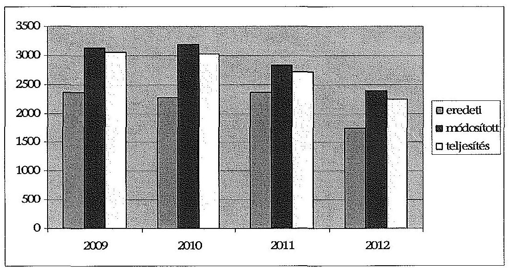

Az eredeti kiadási előirányzatok több mint 95\%-a minden évben múködési kiadás volt. Az eredeti múködési költségvetés a 2009. évi 2277,2 M Ft-ról 1681,0 M Ft-ra, a felhalmozási kiadások eredeti előirányzata a négy év alatt 71\%-ra csökkent ( $89,9 \mathrm{M}$ Ft-ról 63,8 M Ft-ra). Az SZF eredeti kiadásai előirányzatainak $53 \%$-a (2012-ben $62 \%$-a) személyi juttatás és hozzá kapcsolódó járulék volt, $30 \%$-a (2012-ben $25 \%$-a) dologi kiadás. Az ellátottak pénzbeli juttatásai (hallgatói támogatások) a 2009-2010. években $12,6 \%, 2011$-ben $10,6 \%$, 2012-ben $8,2 \%$ arányt képviseltek.

Az SZF eredeti költségvetési támogatási elöirányzata folyamatosan, a 2009. évi 1522,8 M Ft-ról 2012-re 900,5 M Ft-ra csökkent.

Az eredeti bevételi előirányzatokat - a 2011. év kivételével ${ }^{31}$ - azonos, 844,3 M Ft összegben tervezték. A tervezett saját bevételek $93,2 \%$-a minden ellenőrzött évben intézményi múködési bevétel volt, a fennmaradó részt a felhalmozási bevételek tették ki.

Az SZF előirányzatait országgyűlési, kormány és irányító szervi hatáskörben is módosították, de a módosítások több mint a fele ( $55,3 \%$-a) intézményi hatáskörben történt.

Országgyúlési hatáskörben 128,1 M Ft-ot vontak el a főiskolától 2011-ben ${ }^{32}$ az 1025/2011. (II. 11.) Korm. határozatban foglaltak alapján.

Kormányzati hatáskörben mind a négy évben módosították az intézmény előirányzatát, ez összesen 142 M Ft pótelőirányzattal járt. 2009-ben és 2012-ben a dologi kiadásokat összesen 45,2 M Ft-tal csökkentették. A havi

[^0]
[^0]:    ${ }^{31}$ 2011-ben a múködési célú pénzeszköz-átvételeket az előző év teljesített összege alapján 164,8 M Ft-tal többre tervezték.
    ${ }^{32}$ A 2011. évi költségvetési törvény módosításáról szóló 2011. évi CXIV. törvény

---

keresetkiegészítések támogatására, kompenzációra ${ }^{33}$, illetve a prémiuméves programokra 2009-ben 30,5 M Ft-ot, 2010-ben 44,6 M Ft-ot, 2011-ben 54,0 M Ft-ot, 2012-ben 58,1 M Ft-ot kaptak.

Irányító szervi hatáskörben az előirányzat-módosítások 97,3\%-a (1201,9 M Ft) a PPP konstrukcióban épült diákotthon és campus épület bérleti dijához történő hozzájárulások voltak.

Intézményi hatáskörben a saját bevételeket növelték az előző évi felhasználható előirányzat-maradvány, a saját többletbevételek és a pályázati bevételek előirányzatosításával.

Az SZF éves előirányzat-módosításait az alábbi táblázat mutatja be:

| Előirányzat-módosítások |  |  | M Ft |  |  |
| :--: | :--: | :--: | :--: | :--: | :--: |
| Év | OGY | Kormány | irányító   szerv | intézmény | összesen |
| 2009 |  | $-1,5$ | 217,4 | 552,2 | 768,1 |
| 2010 |  | 31,4 | 397,3 | 484,8 | 913,5 |
| 2011 | $-128,1$ | 54,0 | 278,0 | 270,9 | 474,8 |
| 2012 |  | 58,1 | 343,1 | 240,3 | 641,5 |
| összesen | $-128,1$ | 142,0 | 1235,8 | 1548,2 | 2797,9 |

Az előirányzat-módosítások az ellenőrzött időszakban 20-40\% között növelték az eredeti bevételi előirányzatokat.

Az előirányzat-módosítások meghatározóan a saját bevételeket érintették, 2009-2010-ig több mint felével, majd 30\% körül növelték az eredeti előirányzatot, pályázatok és saját többletbevétel eredményeként. A központi költségvetési támogatás előirányzata 2009-ben 14,2\%-kal, 2010-ben 30\%-kal, 2011-ben 15,2\%-kal, 2012-ben $40,8 \%$-kal nőtt.

A módosított kiadási előirányzatok - meghatározóan az előző évi pénzmaradványok, a saját és a pályázati bevételek eredményeként - jelentősen (2009-ben 32,4\%-kal, 2010-ben 40,1\%-kal, 2011-ben 20,1\%-kal, 2012-ben $36,8 \%$-kal) magasabbak voltak az éves eredeti kiadási előirányzatoknál.

A módosítások legnagyobb mértékben a dologi és a felhalmozási kiadásokat növelték. A dologi kiadások 2009-ben 95\%-kal, 2011-ben 84\%-kal nőttek, míg a 2010. és 2012. években több mint kétszeresére emelkedtek. A felhalmozási kiadásokra tervezett előirányzat 2010-ben 30\%-kal, 2012-ben 75\%-kal emelkedett. A személyi juttatásokat és a hozzá kapcsolódó, munkaadót terhelő járulékot 2009ben $7 \%$-kal, 2010-ben $12 \%$-kal növelték, amelyre a pályázatokkal összefüggő többletmunkák pályázati forrása nyújtott fedezetet.

[^0]
[^0]:    ${ }^{33}$ 6/2009. (I. 20.), 133/2009. (VI. 19.), 352/2010. (XII. 30.), 371/2011. (XII. 31.) Korm. rendeletek, 1001/2009. (I. 13.), 1035/2010. (II. 12.), 1120/2010. (V. 13.), 1185/2011. (VI.6.), 1133/2012. (IV.26.) Korm. határozatok.

---

A teljesített költségvetési kiadások a négy év alatt 26,5\%-kal csökkentek, a 2009. évi 3054,3 M Ft kiadással szemben 2012-ben 2245,9 M Ft kiadást számoltak el. A teljesített kiadások mérséklődését döntően a személyi juttatások és járulékok, a dologi kiadások és az ellátottak pénzbeli juttatásának csökkenése okozta, amely az intézményi és hallgatói létszám változásával volt összefüggésben. A teljesített kiadások a likviditási nehézségek miatt 2,6\%-5,9\%-kal elmaradtak a módosított kiadási előirányzatoktól.

A teljesített költségvetési kiadások 40-43\%-a minden évben a személyi juttatás és a hozzá kapcsolódó munkaadókat terhelő járulék, 47-51\%-a dologi kiadás, 5-8\% a az ellátottak pénzbeli juttatása, illetve 2-5\%-a a felhalmozási kiadás volt. A vizsgált időszakban a PPP kiadások összege 606,1 M Ft, 647,0 M Ft, $581,5,3 \mathrm{M}$ Ft és 573,4 M Ft volt. A PPP kiadások aránya a dologi kiadásokon belül a 2009-2012. években $42,6 \%, 45,7 \%, 42,0 \%$, illetve $51 \%$ volt ${ }^{34}$.

A teljesített bevételeken belül a négy év során a központi támogatások és a (maradványok nélküli) saját bevételek aránya változott. A költségvetési támogatások aránya 1,3\%-ponttal csökkent, míg a saját bevételek aránya 6,3\%ponttal nőtt a 2009. évről a 2012. évre, mivel a költségvetési támogatások nagyobb mértékben csökkentek, mint a saját bevételek.

A központi költségvetési támogatás folyamatosan, a 2012. évre a 2009. évi támogatás közel 3/4-ére ( $72,9 \%$-ra) csökkent. A saját bevételek összege - a csökkenő hallgatói létszám miatt - négy év alatt 11,9\%-kal mérséklődött. A maradványok nélküli saját bevételek előirányzatához viszonyított elmaradása - a 2010. évet kivéve - az ellenőrzött években $40,3 \mathrm{M} \mathrm{Ft}, 27,9 \mathrm{M} \mathrm{Ft}$, illetve $74,9 \mathrm{M} \mathrm{Ft}$ volt. A 2010. évben a saját bevételek 41,1 M Ft-tal haladták meg a módosított előirányzatot a továbbszámlázott szolgáltatások és bérleti díjbevételek túlteljesülése miatt.

A bevételek és kiadások teljesítési adatainak részletezését a 2. számú melléklet tartalmazza.

Az SZF hallgatói létszáma az ellenőrzött időszakban 4161 fơről 2432 főre, $41,6 \%$-kal csökkent, a változás a térítésmentes hallgatók esetében volt jelentős ( $60 \%$-os visszaesés). A létszámcsökkenés jelentős mértékben meghaladta a felsőoktatás átlagos ( $-8,6 \%$ ) létszámváltozását. A felvehető maximális hallgatói létszám 4648 fő volt az alapító okirat szerint, a 2012. évben a rendelkezésre álló férőhely-kapacitás $52,3 \%$-át tudta kihasználni az intézmény. A hallgatói létszámváltozást nem követte hasonló arányú csökkenés a főiskola dolgozói létszámában, ahol a mérséklődés 2009-ről a 2012. évre 31\%-os ( 271 fő helyett 187 fő) volt. A költségvetési támogatás csökkenése alatta maradt a hallgatói létszám csökkenésének, az ellenőrzött idôszakban a költségvetési támogatásoknál a visszaesés $27,1 \%$ volt.

[^0]
[^0]:    ${ }^{34}$ A 2003. évi CXVI. tv. 50. § (6) bekezdése szerint a felsőoktatási intézmények a tárgyévi költségvetésük kiadási főösszegének 10\%-os mértékéig vállalhattak hosszú távú kötelezettséget. A 2004. évi CXXXV. törvény 50. § (21) bekezdése a kötelezettségvállalás mértékét az intézmények dologi és felhalmozási célú előirányzatának 10\%-ára korlátozta.

---

Az SZF a 2009. és 2010. években felhasználható összes előirányzatmaradványként 174,6 M Ft-ot, illetve 2,9 M Ft-ot mutatott ki. A maradvány elsősorban kiadási megtakarításból származott. A 2011. és a 2012. években nem volt felhasználható előirányzat-maradványa a főiskolának.

A 2009. évi kiadási megtakarítás és bevételi lemaradás különbsége $40,7 \mathrm{M} \mathrm{Ft}$ volt. A főiskolát meg nem illető $73,6 \mathrm{M}$ Ft miatt a felhasználható tárgyévi elői-rányzat-maradvány negatív értékét ( $-32,9 \mathrm{M} \mathrm{Ft}$ ) módosította az előző évről származó $207,5 \mathrm{M}$ Ft előirányzat-maradvány összege, amely mind kötelezettségvállalással terhelt volt.

A kiadási megtakarítás és a bevételi lemaradás különbsége 2010-ben 195,9 M Ft volt, ebből $193,0 \mathrm{M}$ Ft összeg nem illette meg a főiskolát. Az előirányzatmaradvány összegét ( $2,9 \mathrm{M}$ Ft) a PPP bérleti díjához használták fel.

A csökkenő költségvetési támogatás és hallgatói létszám miatt a bevételi lehetőség szűkülése, továbbá a PPP projektek bérleti díjának fizetése likviditási zavarokat okozott az intézménynél az ellenőrzött időszakban. Az SZF a 2009-2012. években likviditási hitelt nem vett igénybe, azonban a 2010. és a 2012. évben a likviditás biztosítása érdekében a finanszírozási tervtől eltérő, előrehozott támogatást igényelt és kapott $120,0 \mathrm{M} \mathrm{Ft}$, illetve $85,0 \mathrm{M}$ Ft összegben.

A 2012. évben a PPP bérleti díjának kifizetése miatt is igényeltek 150,0 M Ft támogatás előrehozást, erre azonban pozitív válasz nem érkezett a minisztérium részéről.

A 2012. évben már súlyos likviditási zavarok keletkeztek a gazdálkodásban. A közüzemi szállítók (gáz-, áramszolgáltató, internet, telefon) folyamatosan küldték a kikapcsolási értesítőt, valamint a szolgáltatási szállítók (NEPTUN, Poszeidon rendszerek) is azonnali szolgáltatásmegszüntetéssel fenyegetőztek. A késedelmes fizetések következtében az intézményt $1,9 \mathrm{M}$ Ft késedelmi kamatfizetési kötelezettség terhelte. A PPP-vel kapcsolatosan a késedelmes teljesítés miatt a 2012. évben $26,1 \mathrm{M}$ Ft késedelmi kamatot számlázott ki a két szolgáltató, melynek rendezése a 2012. év végéig csak részben történt meg. A likviditási problémákról folyamatosan tájékoztatták a fenntartót.

A főiskolához kincstári biztost nem jelöltek ki az ellenőrzött időszakban. Költségvetési felügyelő́t 2011. április 15 -től rendeltek ki, akinek megbízatását a 2012. évre is meghosszabbították. A költségvetési felügyelő havonta jelentésekben számolt be a tevékenységével kapcsolatban az NGM felé. A költségvetési felügyelő tett intézkedéseket az SZF pénzügyi pozíciójának javítására, de érdemi javulást nem tudott elérni.

A költségvetési felügyelő közel 100 M Ft kötelezettségvállalást akadályozott meg beruházásokkal, reprezentációs kiadásokkal és bérleti díjakkal kapcsolatban. Emellett megtakarításokat eredményezett, hogy a felügyelő kezdeményezésére a hatályos szerződéseket felülvizsgálták, szükség esetén felmondták.

Az SZF pénzügyi helyzetét az ún. CLF módszer segítségével is elemeztük (3. számú melléklet). Az SZF pénzügyi pozícióját, múködési jövedelmét, felhalmozási költségvetési egyenlegét, nettó múködési jövedelmét az alábbi táblázat szemlélteti (adatok M Ft-ban):

---

| Megnevezés | 2009. | 2010. | 2011. | 2012. |
| :--: | :--: | :--: | :--: | :--: |
| Folyó bevételek | 2717,3 | 2899,0 | 2513,5 | 2125,3 |
| Folyó kiadások | 2993,2 | 2918,3 | 2638,6 | 2138,4 |
| Múködési jövedelem | $-275,9$ | $-19,3$ | $-125,1$ | $-13,1$ |
| Felhalmozási bevételek | 104,1 | 83,1 | 101,6 | 96,8 |
| Felhalmozási kiadások | 61,1 | 116,1 | 83,2 | 107,5 |
| Felhalmozási költségvetés egyenlege | 43,0 | $-33,0$ | 18,4 | $-10,7$ |
| Folyó és felhalmozási bevételek összesen | 2821,4 | 2982,1 | 2615,1 | 2222,1 |
| Folyó és felhalmozási kiadások összesen | 3054,3 | 3034,4 | 2721,8 | 2245,9 |
| Finanszírozási múveletek nélküli pozíció | $-232,9$ | $-52,3$ | $-106,7$ | $-23,8$ |
| Finanszírozási műveletek egyenlege | 22,6 | 257,0 | $-82,4$ | $-0,5$ |
| Tárgyévi pénzügyi pozíció | $-210,3$ | 204,7 | $-189,1$ | $-24,3$ |
| Hiteltörlesztés, értékpapír beváltás | 0 | 0 | 0 | 0 |
| Nettó múködési jövedelem | $-275,9$ | $-19,3$ | $-125,1$ | $-13,1$ |

Az SZF folyó bevételei a 2009-2012. években nem nyújtottak fedezetet a folyó kiadásokra, összesen 433,4 M Ft múködési hiány keletkezett. A múködési hiány nagysága a vizsgált időszakban eltérően változott, azonban a 2009. évhez képest minden évben jelentős mértékben ${ }^{35}$ csökkent. A felhalmozási kiadások 2010-ben 33,0 M Ft-tal, 2012-ben 10,7 M Ft-tal haladták meg a felhalmozási bevételeket, míg a 2009. évben 43,0 M Ft, a 2011. évben 18,4 M Ft volt a felhalmozási többlet. Az SZF tárgyévi pénzügyi pozíciója a 2010. évet kivéve az ellenőrzött időszakban kedvezőtlenül alakult, mert az adott év finanszírozási igényét nem fedezte az időszak összes (maradvány nélküli) bevétele. A folyó és a felhalmozási költségvetés együttes finanszírozási igényét - a CLF számításon kívül eső - előző évi előirányzat-maradvány igénybevételével biztosították. A 2010. évben a pénzügyi pozíció kiugró javulását az SZF tulajdonában álló értékpapírok értékesítéséből származó bevételek eredményezték.

Az SZF eladósodási mutatója ${ }^{36}$ az ellenőrzött időszakban romlott, a 2009. évi 5,3\%-ról a 2012. évben 11,9\%-ra nőtt. A pénzeszköz-likvidítási mutató ${ }^{37}$ értéke 2009-2012 között csak a 2010. évben haladta meg az 1-et ${ }^{38}$, vagyis a pénzeszközök év végi állománya - a 2010. év kivételével - nem nyújtott fedezetet a rö-

[^0]
[^0]:    ${ }^{35}$ A múködési hiány a 2010. évben 93\%-kal, a 2011. évben 54,6\%-kal, a 2012. évben $95,3 \%$-kal csökkent a 2009. évhez képest.
    ${ }^{36}$ Az eladósodási mutató a hosszú és rövid lejáratú fizetési kötelezettségek összes forráson belüli arányát mutatja.
    ${ }^{37}$ A pénzeszköz-likvidítási mutató kifejezi, hogy a pénzeszközök év végi állománya milyen arányban nyújt fedezetet a rövid lejáratú fizetési kötelezettségekre.
    ${ }^{38} 2009$-ben 0,5; 2010-ben 1,3; 2011-ben 0,6; 2012-ben 0,3 volt.

---

vid lejáratú kötelezettségek rendezésére. A gyenge fizetőképesség oka, hogy a pénzeszközök nem nyújtottak fedezetet a - 2009-ről 2012-re 161,3 M Ft-tal ( $88,1 \%$-kal) megnövekedett - szállítói kötelezettségek finanszírozására. A likviditási mutató ${ }^{39}$ értéke a 2009. évi 2,1-hez képest fokozatosan gyengült, 2010ben 1,7, 2011-ben 1,0 volt, azonban a pénzeszközök, a követelések, a készletek és a forgatási célú értékpapírok együttes összege az ellenőrzött időszak első három évében még fedezetet nyújtott a rövid lejáratú kötelezettségek teljesítésére. A 2012. évben már csak 0,6-os értéket mutatott, amely jelezte, hogy a forgóeszközök már nem nyújtottak fedezetet a rövid lejáratú kötelezettségek teljesítésére.

A főiskolát az ellenőrzött időszakban érintették elöirányzat-zárolások és maradványtartási kötelezettségek is. A zárolások végrehajtása miatt takarékossági intézkedéseket kellett elrendelni, a maradványtartási kötelezettség elrendelése a fizetési kötelezettségek késedelmes teljesítését vonta maga után.

Az ellenőrzött négy évben zárolással összesen 173,4 M Ft-ot vontak el az SZF-tól ${ }^{40}$. A zárolások végrehajtásához intézkedési tervet készítettek, amelynek alapján a kötelező óraszámokat heti két órával megemelték, a vezetői pótlékokat csökkentették, demonstrátorok foglalkoztatására nem került sor, létszámcsökkentést hajtottak végre és az étkezési hozzájárulás összegét megszüntették. A 2009. évben 173,7 M Ft összegű maradványtartási kötelezettséget is elrendeltek ${ }^{41}$, amely öszszeget a főiskola kérelmére 100,0 M Ft-ra mérsékeltek. A 2011. évben elrendelt 195,9 M Ft összegű maradványtartási kötelezettséget 2011. december 29-én feloldották ${ }^{42}$, azonban az év végére tekintettel az SZF azt már nem tudta a 2011. évben felhasználni.

# 3.2. A bevételi és kiadási előirányzatok megállapítása, módosítása, az előirányzat-maradványok kezelése 

Az SZF a kiadási és bevételi előirányzatok tervezése során a jogszabályokban ${ }^{43}$ és a fenntartó által kiadott tervezési irányelvekben foglaltak szerint járt el.

A főiskola gazdálkodásának alapja minden évben a fenntartó (OKM, NEFMI, EMMI) által jóváhagyott intézményi elemi költségvetés. Az SZF elemi költségvetésének előirányzati keretszámait a minisztérium az éves költségvetési törvényekben elfogadott előirányzatok és szabályok szerint, illetve azok keretei között állapította meg. A fenntartó minden év júliusában kiadta a következő év költségvetésének tervezési irányelveit. A költségvetés tervezéséhez kapcsolódó, a minisztérium által meghatározott adatszolgáltatásokat (foglalkoztatotti létszám, előmenetelek, tárgyévi hallgatói létszám, saját bevételek tervezett össze-

[^0]
[^0]:    ${ }^{39}$ A likviditási mutató mutatja, hogy a rövid lejáratú fizetési kötelezettségek kiegyenlítéséhez a forgóeszközök milyen arányban nyújtanak fedezetet.
    ${ }^{40}$ 1001/2009. (I. 13.), 1033/2009. (III. 17.), 1132/2010. (VI. 18.), 1025/2011. (II. 11.) Korm. határozatok.
    ${ }^{41}$ 2007/2009. sz. Korm. határozat.
    ${ }^{42}$ 1505/2011. (XII. 29.) Korm. határozat.
    ${ }^{43}$ Áht. ${ }_{1-2}$, Ámr. ${ }_{1-2}$, Ávr.

---

ge) a főiskola határidőben és az előírt tartalommal teljesítette. Az előirányzatok tervezését mellékszámításokkal alátámasztották.

A költségvetési tervezéssel kapcsolatos feladatok eljárásrendjét a gazdálkodási szabályzatban meghatározták, a tervezésben részt vevők feladatait a munkaköri leírásaikban rögzítették. A tervezési folyamatban részivevők feladatainak ütemezését, a végrehajtásért felelősöket, a tervezési folyamatban készítendő dokumentumokat az ellenőrzési nyomvonalban meghatározták. Az ellenőrzési nyomvonalban és a gazdálkodási szabályzatban meghatározták, hogy a végleges elemi költségvetés elfogadásáig a gazdálkodás megalapozását a szenátus által jóváhagyott gazdálkodási irányelvek és az ideiglenes költségvetési keretek (koncepció) szolgálják. A szenátus költségvetési koncepciót csak a 2011. évre fogadott el.

Az előirányzat-módosítások során nem érvényesültek teljes körűen a jogszabályok és belső szabályok előírásai. Ez kockázatot jelez az ellenőrzött terület egészének szabályos működése szempontjából. Előfordult, hogy az előirányzatmódosítást nem szabályosan vezették át a számviteli nyilvántartásokon.

Egy 1,1 M Ft összegű dologi előirányzat-növelést a közüzemi díjak helyett a propaganda kiadások előirányzatára könyvelték.

# Az előirányzat-maradvány megállapítása, felhasználása és a kapcsolódó elszámolás végrehajtása nem felelt meg a vonatkozó előírások- 

nak.

A 2009. évben egy esetben közbeszerzési eljárás lefolytatása nélkül megkötött építési tervezési szerződés alapján kötöttek le 10,0 M Ft előirányzat maradványt, amellyel megsértették a $\mathrm{Kbt}_{1} 240$. §-ának rendelkezéseit. A kötelezettségvállaló a gazdasági főigazgató volt.

Az ÁSZ a közbeszerzési szabályok megsértése miatt, a Kbt. ${ }_{1}$-ben rögzített jogvesztő határidőre tekintettel nem élt jelzéssel a Közbeszerzési Döntőbizottság felé.

Az SZF az előirányzat-maradvány elszámolásából adódó, a központi költségvetést megillető összeg befizetését kedvezőtlen pénzügyi helyzete miatt nem teljesítette az előírt határidőben ${ }^{44}$.

A 2010. évi maradványból (195,9 M Ft) 193,0 M Ft nem illette meg az intézményt. Ebből 73,2 M Ft-ot a felügyeleti szerv engedélyével két részletben fizettek vissza 2011-ben, a fennmaradó 119,8 M Ft összegre tartozás elengedését kérték. Az engedélyt nem kapták meg és a 2011. évi előirányzat-maradvány 150,1 M Ft összegű elvonása miatt 2012-ben összesen 269,9 M Ft befizetési kötelezettség terhelte a főiskolát. Az EMMI a főiskola likviditási helyzetére tekintettel négy részletben történő megfizetést engedélyezett, 2012. december 10-i határidővel. A 2012. évi normatív támogatás elszámolásából adódó 103,7 M Ft-os befizetési kötelezettséggel együtt 373,6 M Ft-tal tartoztak a központi költségvetésnek, amelyet késedelmesen teljesítettek.

[^0]
[^0]:    ${ }^{44}$ Ámr. ${ }_{1}$ 65. § (7) bekezdés, Ámr. ${ }_{2}$ 212. § (10) bekezdés, Ávr. 154. § (1) bekezdés

---

# 3.3. A kiadási előirányzatok felhasználása és a bevételi előirányzatok teljesítése 

A rendszeres és nem rendszeres személyi juttatások előirányzatainak felhasználása nem volt szabályszerű, az ellenjegyzés és a kifizetést alátámasztó dokumentumok hiánya, valamint azok teljesítésigazolásával kapcsolatos szabálytalanságok miatt. Ez magában hordozza a fedezet nélküli kötelezettségvállalás és a tényleges teljesítés nélküli kifizetés kockázatát.

A kinevezéseket, átsorolásokat a rektor írta alá, azonban több esetben a kötelezettségvállalás dokumentumáról (átsorolás) hiányzott az ellenjegyzés ${ }^{45}$. Egyedi hiba volt, hogy az alkalmazott 2008. január 1-jétől hatályos átsorolási dokumentuma, illetve 2009. márciusi személyi juttatásának kifizetését alátámasztó dokumentuma hiányzott. A munkahelyi vezetők által kiadott munkaköri leírások egy személy kivételével - rendelkezésre álltak.

A kiválasztott személyek illetményének számfejtését megalapozó dokumentumok közül több esetben az 1,5 E Ft összegű önkéntes nyugdíjpénztári hozzájárulás ${ }^{46}$ alapbizonylatát nem tudták az ellenőrzés rendelkezésére bocsátani.

A rendszeres és nem rendszeres személyi juttatások mintatételeinek ellenőrzése során megállapítottuk, hogy a kifizetésekkel összefüggésben a foglalkoztatottak rendelkeztek a besorolásuknak megfelelő végzettséggel és gyakorlattal. A személyi juttatások kifizetését munkaidő-elszámolás támasztotta alá. A bruttó illetmény számfejtése megfelelt a kinevezési okiratban foglaltaknak, a munkavállalót terhelő levonások az Szja tv. és a Tbj. vonatkozó előírásai szerint történtek.

Az SZF az ellenőrzött oktatók esetében betartotta a foglalkoztatási követelményrendszer kötelező óraszámra vonatkozó rendelkezéseit.

A felsőoktatási törvények ${ }^{47}$ két félév átlagában heti 10 kötelező óraszámot írnak elő, amely $25 \%$-kal csökkenthető, illetve $70 \%$-kal növelhető. A tanításra fordított idő nem lehet kevesebb két tanulmányi félév átlagában egy oktatóra vetítve heti tizenkét óránál. Rektori utasításban 2011. március 1-jétől a kötelező óraszámokat két órával felemelték, amely a 2012/2013 tanév I. félévében is életben volt.

Az SZF a Kjt. 77. §-ában meghatározottak szerint a többletfeladatokhoz (pl. vizsgahely vezetői feladatokra, az oktatók kötelező óraszámon felül teljesített többletóráihoz) kapcsolódóan keresetkiegészítést fizetett. A többletfeladatok ellátása - hét eset kivételével - teljesítésigazolással, dokumentumokkal alátámasztott volt, a keresetkiegészítések kifizetése szabályszerűen történt.

A 2009-2010. években előfordult, hogy a kötelező óraszámon felüli keresetkiegészítést alátámasztó dokumentum, illetve az illetménykiegészítéshez tartozó teljesítésigazolás hiányzott. Egyedi hiba volt, hogy az ösztönzési rendszeren alapuló kifizetéseket alátámasztó bizonylatokat nem tudták átadni az ellenőrzés részére. Az SZF nyilatkozata szerint az ösztönzési rendszeren alapuló kifize-

[^0]
[^0]:    ${ }^{45}$ Áht. ${ }_{1}$ 100/C. § (3) bekezdés, Áht. ${ }_{2}$ 37. § (1) bekezdés
    ${ }^{46}$ A hozzájárulás kifizetését 2011. június 1-jétől megszüntették.
    ${ }^{47}$ Feot. 84. § (2)-(3) bekezdés, Nítv. 26. § (1)-(2) bekezdés

---

tésekről a 2002. május 15 -től érvényben lévő szolgáltatási szabályzat rendelkezett, amelyet a 71/2011. (VII. 29.) szenátusi határozat hatályon kívül helyezett, és a továbbiakban ilyen címen kifizetés nem történt.

Egy korábban oktató munkakörben foglalkoztatottat 2009. október 1-jével átminősítettek munka és tűzvédelmi főmunkatárssó. A 2011. évben keresetkiegészítést állapítottak meg részére a szakoktatói feladatok ellátására. Ezzel megsértették a Feot. 83. § (4) bekezdésének rendelkezéseit, mert a főiskolának a vele közalkalmazotti jogviszonyban álló személlyel a munkakörébe nem tartozó oktatói feladatok ellátására megbízási jogviszonyt kellett volna létesítenie.

A Feot. 83. § (4) bekezdése szerint megbízási jogviszony létesíthető továbbá az eseti, nem rendszeres oktatói feladatokra. A felsőoktatási intézmény a vele közalkalmazotti, illetve munkaviszonyban álló személlyel a munkakörébe nem tartozó oktatói feladatok ellátására megbízási jogviszonyt létesíthet.

A megbízási díjak elszámolása nem volt szabályszerű a teljesítésigazolás hiányosságai miatt. Ez magában hordozza a tényleges teljesítés nélküli kifizetés kockázatát.

A szerződéseket arra jogosultak írták alá, és a közfeladat ellátásához szükséges célra kötötték. A kötelezettségvállalás időbeli korlátjára vonatkozó szabályokat ${ }^{48}$ betartották, a szerződéseket - egy kivétellel ${ }^{49}$ - csak a tárgyévi előirányzatok terhére kötötték, illetve a folyamatos feladatra kötött szerződések a következő év január 31-én lejártak. Az állományba tartozó dolgozók munkaköri leírásában - a Kjt. 42. §-ában foglaltaknak megfelelően - nem szerepelt a megbízási szerződésekben foglalt feladatok ellátása.

A Kjt. 42. §-a szerint a munkáltató a vele közalkalmazotti jogviszonyban álló közalkalmazottal munkaköri feladatai ellátására munkavégzésre irányuló további jogviszonyt nem létesíthet.

Rendszerhiba volt, hogy a kifizetések teljesítésigazolását nem végezték el, vagy azt nem a kijelölt személy hajtotta végre.

Több esetben előfordult, hogy a szakmai teljesítésigazolást meghatározó belső szabályozásban nem szerepelt a kifizetések teljesítésigazolója ${ }^{50}$.

Egyedi hiba volt, hogy a kifizetésnél nem a megbízási szerződésben meghatározott személy végezte a teljesítésigazolást ${ }^{51}$.

Előfordult, hogy a szerződéshez kapcsolódóan - az Ámr. ${ }_{1}$ 135. § (1) bekezdése ellenére - a teljesítésigazolást nem végezték el.

[^0]
[^0]:    ${ }^{48}$ Áht. ${ }_{1}$ 12/A § (1) bekezdés, Áht. ${ }_{2}$ 36. §, Ámr. ${ }_{1}$ 134. § (4) bekezdés, Ámr. ${ }_{2}$ 72. §, Ávr. 46. § (1) bekezdés, 49. §
    ${ }^{49}$ A pénzügyi kontrolleri feladatokra szóló szerződést határozatlan időre kötötték, azonban a megbízást 2010. január 31-től visszavonták.
    ${ }^{50}$ Ámr. ${ }_{1}$ 135. § (2) bekezdés, Ámr. ${ }_{2}$ 76. § (3) bekezdés
    ${ }^{51}$ Ámr. ${ }_{2}$ 76. § (3) bekezdés, Ávr. 57. § (3) bekezdés

---

Előfordult, hogy a szerződéseket a feladat teljesítésének megkezdését követően kötötték meg ${ }^{52}$.
2008. szeptember 12. és november 8. között szakdolgozat bírálatra november 30-án kötöttek szerződést. A 2012/2013. tanév első félévben az óraadásra vonatkozó szerződéseket 2012. november 19-én és 2012. október 26-án kötötték.

A dologi kiadások elöirányzatainak felhasználása nem volt szabályszerű a pénzgazdálkodással kapcsolatos belső kontrollok múködésének hiánya miatt. Ez magában hordozza a tényleges teljesítés nélküli kifizetés kockázatát.

Több esetben nem a kiadás teljesítésének elrendelése előtt végezték el az érvényesítést, ellenjegyzést ${ }^{53}$. A telefon, a terembérlet, a bérleti dij és az ingatlanüzemeltetésre vonatkozó számlák esetben - az Ámr. ${ }_{1} 135 . \S$ (2), Ámr. ${ }_{2} 76 . \S$ (3) és az Ávr. 57. § (3) bekezdései ellenére - a teljesítésigazolásnál hiányzott az igazolás tényének és a dátumának feltüntetése. Egyedi hiba volt, hogy az Ávr. 10. § (7) bekezdés b) pontjában előírtak ellenére olyan személy érvényesített, akinek erre nem volt írásbeli felhatalmazása. Nem történt meg 16 ezer Ft értékben beszerzett könyvek nyilvántartásba vétele.

A gazdasági eseményeket alátámasztó dokumentumok, a kiadási utalványrendeletek, számlák, vállalkozási, illetve megbízási szerződések - három esettől eltekintve - rendelkezésre álltak.

A számlázott szellemi tevékenység, a készletbeszerzés, különféle szolgáltatások és vásárolt közszolgáltatások tételei közül elvégeztük valamennyi ellenőrzött évben a három legnagyobb összegű tétel szabályszerűségi ellenőrzését. A tételek elszámolása - a számlázott szellemi tevékenységre kötött szerződések kivételével - összességében nem volt szabályszerű, mivel a pénzügyi-számviteli kontrollok nem múködtek megfelelően.

Tíz esetben állapítottuk meg, hogy a pénzügyi-számviteli kontrollokat nem az Ámr., az Ámr., ės az Ávr. előírásai ${ }^{54}$ szerint múködtették. A kiadás teljesítésének elrendelése előtt okmányok alapján nem ellenőrizték, szakmailag nem igazolták azok jogosságát, összegszerüségét, a fedezet meglétét, az előírt követelmények betartását, a szakmai teljesítésigazolás és érvényesítés megtörténtének ellenőrzését. Az Ávr. 57. § (1), 58. § (1) és (3) bekezdései ellenére a kifizetések igazolása alapján az érvényesítő a kifizetés elrendelése előtt nem ellenőrizte az összegszerűséget, a fedezet meglétét és a megelőző ügymenetben az előírások betartását.

Tíz esetben a PPP szolgáltatási díj tényleges utalása fedezethiány miatt több héttel az érvényesítést követően történt, amellyel megsértették az Ámr. ${ }_{1} 135 . \S$ (3), az Ámr. ${ }_{2} 77 . \S$ (1) és az Ávr. 58.§ (1) bekezdéseinek előírásait. A PPP szolgáltatási díj fedezete a számla fizetési határidején belül nem állt rendelkezésre.

A felhalmozási kiadások előirányzatainak felhasználása során a pénzügyi elszámolások, valamint a gazdálkodási jogkörök gyakorlása tekintetében nem

[^0]
[^0]:    ${ }^{52}$ Ámr. ${ }_{1}$ 134. § (8) bekezdés, Ámr. ${ }_{2}$ 72. § (3) bekezdés, Ávr. 52. § (1) bekezdés
    ${ }^{53}$ Ámr. ${ }_{1}$ 137. § (3) bekezdés, Ámr. ${ }_{2}$ 79.§ (2) bekezdés
    ${ }^{54}$ Az Ámr. ${ }_{1}$ 135. §(1) és (3), 136. § (1) és a 137. § (3) bekezdései, továbbá az Ámr. ${ }_{2}$ 77. § (1), 78. § (1) és 79.§ (2) bekezdései.

---

érvényesültek teljes körűen a jogszabályok és belső szabályok előírásai. Ez szabályszerűségi kockázatot jelez az ellenőrzött terület egészének szabályos működése szempontjából.

A szerződéseket és azok ellenjegyzését a főiskola kötelezettségvállalási szabályzatában meghatározott, jogosult személyek írták alá. A szakmai teljesítés igazolása a szabályozásnak megfelelően történt.

Egyedi hiba volt, hogy a kiadásokhoz kötelezettségvállalás (illetve annak ellenjegyzése) nem kapcsolódott ${ }^{55}$. Előfordult, hogy az utalványozást ${ }^{56}$, illetve az érvényesítését ${ }^{57}$ nem végezték el.

Az SZF a múködési bevételek beszedése során nem a jogszabályokban előírtak szerint járt el.

A hallgatói költségtérítésekből származó bevételek beszedésekor az utalványok érvényesítői és utalványozói nem tartották be az Ámr. ${ }_{1}$, az Ámr. ${ }_{2}$, és az Ávr. vonatkozó előírásait.

Az SZF hallgatói a költségtérítéseket a hallgatói önkormányzat nevére megnyitott, az OTP Bank Nyrt.-nél vezetett bankszámlára (ún. gyűjtőszámlára) fizették be. A főiskolán a költségtérítések nyilvántartását a NEPTUN rendszerben kezelték. A NEPTUN rendszer minden hallgató számára biztosított egy virtuális folyószámlát, amelyből a hallgató teljesítheti a számára előírt térítési díffizetési kötelezettséget. A virtuális folyószámlán azok az összegek jelentek meg, amelyeket a hallgatók az OTP Bank Nyrt.-nél vezetett gyűjtőszámlára fizettek be.

Az OTP Bank Nyrt.-nél vezetett gyűjtőszámláról a beszedett bevételek szükség esetén, a gyakorlatban általában havonta kerültek átutalásra az SZF Kincstárnál vezetett bankszámlájára. A kincstári értesítést követően történt a térítési díjak tekintetében a főkönyvi könyvelésben a bevétel elszámolása. A főiskola kincstári számláján jóváírt hallgatói befizetéseket tartalmazó bankkivonatok utalási listája nem tette lehetővé a bevételek típusonkénti és hallgatónkénti beazonosítását.

A hallgatói költségtérítések OTP Bank Nyrt.-nél vezetett gyűjtőszámlán történő kezelése miatt a főiskola megsértette az Áht. ${ }_{1}$ 18/C. § (5) és az Áht. ${ }_{2}$ 79. § (1) bekezdéseit, miszerint a kincstári kör fizetési számlái csak a Kincstárnál vezethetők. Nem tartotta be az Áhsz. 51. § (1) bekezdés a) pontjában foglaltakat sem.

Az Áhsz. 51. § (1) bekezdés a) pontja szerint a pénzforgalmat érintő gazdasági műveletek, események bizonylatainak adatait késedelem nélkül, készpénzforgalom esetén a pénzmozgással egyidejűleg, pénzforgalmi számla, előirányzatfelhasználási keretszámla forgalomnál a hitelintézeti értesítés, illetve a Kincstár értesítésének megérkezésekor a könyvekben rögzíteni kell. Ezzel ellentétben a gyűjtőszámlára befizetett bevételek nem azonnal, a pénzintézeti értesítést követően kerülnek könyvelésre a főkönyvi könyvelésben, hanem csak a kincstári számlára történő átvezetéskor.

[^0]
[^0]:    ${ }^{55}$ Ámr. ${ }_{1}$ 134. § (1) bekezdés, Ámr. ${ }_{2}$ 72. § (1) bekezdés
    ${ }^{56}$ Ámr. ${ }_{1}$ 136. § (1) bekezdés, Ámr. ${ }_{2}$ 78. § (1) bekezdés
    ${ }^{57}$ Ámr. ${ }_{1}$ 135. § (3) bekezdés, Ámr. ${ }_{2}$ 77. § (1) bekezdés

---

Az OTP-nél vezetett gyűjtőszámláról a Kincstári számlára átvezetett bevételek beazonosítása nem teljes körűen biztosított, csak a NEPTUN rendszerből nyerhető információ a befizetés jogcíméről, a befizető személyéről. Így a főiskola mérlege nem felelt meg a Sztv. 15. § (3) és az Áhsz. 9. § (11) bekezdésében meghatározott valódiság elvének.

A múködési bevételeken belül a bérbeadásra vonatkozó gazdálkodási folyamatok összességében szabályozottak voltak. A szabályozásban megállapított díjakat azonban nem alapozta meg a bérbe adott eszközök fenntartására fordított kiadások és a realizált bérleti díjak viszonyát bemutató számítás.

A nagy értékű vagyontárgyak saját dolgozó általi személyes használatára (személygépkocsi, telefon, számítógép) a szabályozás nem tért ki.

A felhalmozási, vagyonhasznosítási bevételek beszedése során a főiskola nem tartotta be a jogszabályokban, belső szabályzatokban előírtakat.

A 2009. évben rendszerhiba volt, hogy nem végezték el a bevételek szakmai teljesítésigazolását ${ }^{58}$. A 2009-2011. években előfordult, hogy nem végezték el a bevételek érvényesítését, megsértve a vonatkozó jogszabályok rendelkezéseit ${ }^{59}$.

A szerződésben előírt bevétel egy esetben késedelmesen folyt be. A határidőben nem teljesített bevétel behajtása érdekében dokumentált intézkedést nem tettek. A késedelem nem haladta meg az egy évet, a díjtartozást a tárgyéven belül rendezték. Késedelmi kamatot nem számítottak fel, a bérleti szerződés a fizetési késedelem esetén felszámítandó kamatról nem rendelkezett ${ }^{60}$.

Egy magánszeméllyel 2012 májusában kötött ingatlanbérleti szerződés esetében, a bérleti szerződésben foglalt fizetési feltételektől (esedékes minden hónap 15-ig) eltérően, öt hónap bérleti díját 2012. október 18-án egyenlítette ki a bérlő.

A normatív támogatások felhasználásával kapcsolatos döntések megfeleltek a vonatkozó jogszabályok és belső szabályzatok előírásainak.

Az ellenőrzött időszakban a nem kötött felhasználású normatív támogatások (képzési, tudományos célú és fenntartói) szervezeti egységek közötti felosztását a költségvetés elfogadása keretében a szenátus hagyta jóvá. A főiskola rendelkezett finanszírozásra kötött fenntartói megállapodással. A vizsgált időszakban a képzési, tudományos célú és fenntartói normatív támogatás felosztását a GT véleményezte. A decentralizált szervezeti egységek gazdálkodási kereteinek felhasználását a GT véleményezését követően a szenátus megtárgyalta.

A 2009-2012. években a kötött felhasználású hallgatói támogatásoknak, illetve az egyéb feladatok támogatásainak felhasználásáról szenátusi határozatokat hoztak. A hallgatói juttatásokat a belső szabályzatnak megfelelően állapították meg és hirdették ki. A hallgatói támogatások terhére megállapított hallga-

[^0]
[^0]:    ${ }^{58}$ Ámr. ${ }_{1}$ 135. § (1) bekezdés
    ${ }^{59}$ Ámr. ${ }_{1}$ 135. § (3) bekezdés, Ámr. ${ }_{2}$ 77. § (1) bekezdés
    ${ }^{60}$ Áht. ${ }_{1}$ 108. § (2) bekezdés, Áht. ${ }_{2}$ 97. § (1) bekezdés

---

tói juttatási előirányzatok felhasználásáról elszámolást készítettek, amelyet a szenátus minden ellenőrzött évben megtárgyalt.

A hazai pályázati forrásból finanszírozott projektek ${ }^{61}$ esetében az SZF nem járt el szabályszerűen. A pályázatkezelési tevékenységgel kapcsolatban nem végzett eljárási, pénzügyi és szakmai monitoring-tevékenységet ${ }^{62}$. Ennek hiánya hozzájárult ahhoz, hogy a pályázatok $63,7 \%$-ánál a pénzügyi elszámolást nem a támogatási szerződésben rögzített határidőben és tartalommal hajtották végre. A pályázatok $18,2 \%$-ánál a pályázati tevékenység szabályszerűségének ellenőrzéséhez a dokumentumok nem álltak rendelkezésre.

A díjak és költségtérítések megállapítása során a főiskola nem tartotta be a Feot.-ban, az Nftv.-ben és az önköltség-számítási szabályzatban előírtakat, mert a térítési díjakat - a nyelvvizsga díj kivételével - nem alapozták meg önköltségszámítással.

Az önköltség-számítási szabályzatban előírták, hogy minden tevékenység esetében meg kell határozni a tervezett és tényleges önköltséget, mert az önköltség alapja az árképzésnek. Az önköltség-számítási szabályzat szerinti önköltségkalkulációt a 2008/2009-es tanévben a távoktatási és levelező képzésekhez, a 2009/2010-es tanévben valamennyi képzéshez elkészítették. A 2010/2011 tanévtől kezdődően kalkuláció nem készült a költségtérítésekre, tandíjakra, illetve egyéb díjakra, ezért a költségtérítéseket nem a Feot. 126. § (2) bekezdése, illetve a 2012. évtől az Nftv. 82. § (3) bekezdése figyelembe vételével állapították $\mathrm{meg}^{63}$.

A költségtérítéseket a 2010. évtől az infláció mértékével növelten, illetve a piaci igényekhez igazodva határozták meg.

Az egyes alaptevékenységekhez (oktatási, gyakorlati, kutatási és egyéb), illetve szervezeti egységekhez tartozó bevételeket és kiadásokat elkülönítetten tartották nyilván. Erről azonban az Áhsz. 8. § (19) bekezdésében meghatározottakkal ellentétben az önköltség-számítási szabályzatban nem rendelkeztek.

Az SZF az ellenőrzött időszakban vállalkozási tevékenységet nem folytatott.

# 4. AZ INTÉZMÉNY VAGYONGAZDÁLKODÁSA 

Az SZF vagyongazdálkodása nem volt szabályszerű, több esetben is megsértette a jogszabályokban és belső szabályozásokban előírtakat. A vagyon értéke-

[^0]
[^0]:    ${ }^{61}$ A hazai pályázati forrásból a 2009. és 2012. évek között 11 féle projektet valósítottak meg, melyhez összesen 56,9 M Ft összegben nyertek támogatási forrást.
    ${ }^{62}$ A pályáztatás rendjéről, a pályázatok lebonyolításáról a szenátus 2011-ben hozott rendelkezést. Határozata azonban nem tért ki az eljárási, pénzügyi és szakmai moni-toring-tevékenység feladataira, annak megszervezésére és múködtetésére.
    ${ }^{63}$ A Feot. 126. § (2) bekezdése szerint a költségtérítések összege nem lehet kevesebb, mint a szakmai feladatra számított folyó kiadások egy hallgatóra jutó hányadának ötven százaléka. A 2012. évtől az Nftv. 82. § (3) bekezdése szerint a térítési díj nem lehet magasabb, mint az önköltség fele.

---

sítésével, hasznosításával kapcsolatos döntései nem minden esetben voltak szabályszerűek.

Az intézmény vagyona a 2008. év elejéről a 2012. év végére 3826,4 M Ft-ról 2895,6 M Ft-ra, 24,3\%-kal csökkent. A befektetett eszközök állománya ingatlanértékesítés, illetve térítésmentes átadás miatt 3139,7 M Ft-ról 2698,0 M Ft-ra, $14,1 \%$-kal mérséklődött, míg a forgóeszközök értéke 686,7 M Ft-ról 197,6 M Ftra, közel egynegyedére esett vissza. A forgóeszközök állományának csökkenése elsősorban értékpapír beváltásával és a pénzeszközök csökkenésével volt kapcsolatban. A vagyonváltozás részletes elemzését az ellenőrzött időszak könyvviteli mérlegeinek adatai alapján végeztük el.

Az SZF 2009-2012. évi könyvviteli mérlegeiben a befektetett eszközök állományának a mérlegfőösszeghez viszonyított aránya a 2009. év végi 89,1\%-ról a 2012. év végére $93,2 \%$-ra nőtt, a forgóeszközöké pedig a 2009. évi $10,9 \%$-ról a 2012. év végére $6,8 \%$-ra csökkent. A befektetett eszközök arányának növekedése annak ellenére következett be, hogy azok értéke a 2009-2011 között időszakban alig változott, illetve a 2012. évben 12,7\%-kal (393,4 M Ft-tal) csökkent (a mérlegadatokat a 4. számú melléklet részletezi).

A befektetett eszközök értékösszegének 2012. évi csökkenése elsősorban a mezőtúri főiskolai és kollégiumi épületek Mezőtúr Város Önkormányzatának történt átadása és egy ingatlan értékesítésének hatására következett be.

A forgóeszközök állományának csökkenését a 2009. évi könyvviteli mérlegben szereplő, 200,0 M Ft összegű értékpapír beváltása okozta. Ezzel ellentétes hatást gyakorolt a forgóeszközök állományára a követelések és készletek értékének növekedése.

A követelések összege a 2009. évi 64,7 M Ft-ról a 2012. évre 75,4 M Ft-ra nőtt. A készletek értéke az ellenőrzött időszakban a kétszeresére, 11,4 M Ft-ról 22,9 M Ftra változott.

A befektetett eszközök avulását a végrehajtott beruházások, felújítások ellensúlyozták. Az immateriális javak és a tárgyi eszközök használhatósági fo$\mathrm{ka}^{64}$ a 2009. évi $73,7 \%$-ról 2010-2011 között csökkent ( $72,3 \%$ és $72,1 \%$ volt), a 2012. évben a megvalósított fejlesztések és a teljesen ( 0 -ig) leírt eszközök körében történt selejtezések hatására $73,4 \%$-ra emelkedett. Az eszközök elhasználódási szintje ${ }^{65}$ a használhatósági fokuk változását követve a 2009. évi $26,3 \%$-ról a 2010. évre $27,7 \%$-ra, a 2011. évre $27,9 \%$-ra romlott, majd a 2012. évben $26,6 \%$-ra javult. Az eszközök közül az épületek átlagos életkora a 2009. évi 12,3 évről a 2012. évre 13 évre nőtt. A gépek, berendezések, felszerelések esetében az átlagos életkor a 2009. évi hat évről a 2012. évre 5,3 évre csökkent, a beszerzések és a selejtezések eredményeként.

[^0]
[^0]:    ${ }^{64}$ A használhatósági fok mutatója a tárgyi eszközök, immateriális javak nettó értékének és a tárgyi eszközök, immateriális javak bruttó értékének hányadosa. A mutató növekedése azt jelzi, hogy az intézmény eszközeinek átlagos elhasználtsága csökken, a használhatóságuk javul.
    ${ }^{65}$ Az elhasználódási szint a tárgyi eszközök elszámolt értékcsökkenésének és a tárgyi eszközök záró bruttó értékének hányadosa.

---

Az ellenőrzött időszak könyvviteli mérlegében szereplő követelésállomány a 2009. évi 64,7 M Ft-ról a 2012. évre 75,4 M Ft-ra nőtt. A követelésállomány lejárati szerkezetének elemzése a rendelkezésre álló adatok alapján a költségtérítésből származó követelések kivételével lehetséges, mivel az SZF ezeket a követeléseket nem tartja nyilván lejáratuk szerint.

Az SZF könyvviteli mérlegében szereplő vevőkövetelések állományának nagysága az ellenőrzött időszakban folyamatosan, a 2009. évi 22,1 M Ft-ról a 2012. év végére 48,4 M Ft-ra növekedett. A vevőkövetelések lejárat szerinti megoszlása az ellenőrzött időszakban kedvezően alakult. Míg a 2009. évben a követelések 65,8\%-a lejárt volt, addig a 2012. évben ez az arány $35,8 \%$-ra csökkent. A vevőkövetelés-állományon belül a 360 napon túl lejárt követelések aránya az ellenőrzött időszakban szintén mérséklődött, a 2009. évi $42,1 \%$-ról ( $9,3 \mathrm{M}$ Ft) a 2012. évre $30,9 \%$-ra ( $14,9 \mathrm{MFt}$ ) csökkent.

A főiskola csak a 2010. évben írt le behajthatatlanság címén követelést, melynek összege 1,1 M Ft volt. A leírást felszámolási eljárás lezárása miatt, illetve kisösszegű követeléseknél hajtották végre.

Az intézmény mérlegében szereplő kötelezettségek állománya a 2009. évi 154,3 M Ft-ról a 2012. év végére 344,3 M Ft-ra, több mint kétszeresére emelkedett. A növekedés a PPP szerződésekből származó kötelezettség változásával függött össze ${ }^{66}$. A kötelezettség lejárat szerinti megoszlása az ellenőrzött időszakban kedvezőtlenül változott az SZF likviditási helyzetének romlása miatt. A kötelezettségállományból a 30 nap alatti állomány aránya folyamatosan csökkent, a 2009. évi $83,0 \%$-ról ( $128,0 \mathrm{MFt}$ ) a 2012. évi $29,4 \%$-ra ( $101,2 \mathrm{M}$ Ft). Ugyanakkor több mint ötszörösére emelkedett a 60 napon túl lejárt szállító tartozás aránya (a 2009. évi 9,2\%-ról a 2012. évi 54,7\%-ra). Az SZF-nek az ellenőrzött időszakban éven túli, illetve átütemezett tartozása nem volt.

Az ellenőrzött időszakban a tartós részesedések és értékpapírok állományának változása nem volt összefüggésben a közfeladatok változásaival. Ezen vagyonelemek aránya a mérlegfőösszegen belül csak a 2009. évben volt jelentős $(6,1 \%)$.

Az SZF több gazdasági társaságban is rendelkezett tartós részesedéssel. A tartós részesedések könyv szerinti értéke a 2009-2010. években 10,2 M Ft, míg a 20112012. években $10,3 \mathrm{M}$ Ft volt. Az SZF csak a 2009. évben mutatott ki értékpapírt a mérlegében, 200,1 M Ft összegben, amelyet a 2010. évben beváltottak.

# 4.1. A vagyongazdálkodás szabályozottsága 

Az SZF vagyongazdálkodással kapcsolatos tevékenységének szabályozottsága megfelelő volt, kisebb hiányosságokat csak a 2009-2010. években állapítottunk meg.

[^0]
[^0]:    ${ }^{66}$ A PPP szerződésekből származó kötelezettség a 2009. évben 93,9 M Ft, a 2010. évben 70,1 M Ft, a 2011. évben 141,1 M Ft, a 2012. évben 289,8 M Ft volt.

---

A főiskola a 2009. és a 2010. évre vonatkozóan nem rendelkezett vagyongazdálkodási tervvel, amellyel megsértette a Feot. előírásait ${ }^{67}$. A 2011. és a 2012. években elkészítették az IFT-khez igazodó vagyongazdálkodási terveket, melyekben meghatározták az adott évi gazdálkodási célokat.

Az éves vagyongazdálkodási tervben bemutatták és értékelték az SZF vagyoni helyzetét. Összevetették az egyes vagyonelemek értékmegőrzése érdekében tervezett karbantartási, állagmegóvási feladatokra fordított kiadások és az elszámolt értékcsökkenés arányát. Bemutatták az SZF vagyonkezelésében lévő, értékesítésre váró, feleslegessé vált ingatlanok körét és a hasznosítás érdekében tett intézkedéseket. Értékelték a PPP konstrukció keretében megvalósított ingatlanok kihasználtságát, hasznosítását, valamint a kapcsolódó kiadások alakulását. Ismertették a tervezett beruházási, felújítási, karbantartási és kisjavítási feladatokat.

Az SZF a 2006-ban elkészített IFT-t a 2010. évben felülvizsgálta és módosította. A 2012. évben új, a 2012-2016. évekre vonatkozó IFT-t készített. Az IFT-k tartalmazták a rendelkezésére bocsátott vagyon hasznosításával, megóvásával, illetve elidegenítésével kapcsolatos elképzeléseket, a várható bevételeket és kiadásokat. Nem tartalmazták azonban - a 2012. évben elfogadott IFT kivételével - évenkénti bontásban a végrehajtás feladatait a Feot. 27. § (3) bekezdésében foglaltakkal ellentétben.

Az intézmény belső szabályzataiban ${ }^{68}$ a jogszabályi előírásoknak megfelelően szabályozta az alapfeladat ellátásához rendelkezésére bocsátott vagyon, valamint változásainak, értékének nyilvántartási szabályait, a vagyongazdálkodással kapcsolatos döntési hatásköröket.

A Selejtezési szabályzatban meghatározták a feleslegessé vált vagyontárgyak hasznosításának (értékesítésének, bérbeadásának, térítésmentes átadásának) szabályait. Nem írták elő azonban, hogy a vagyontárgyak bérleti diját a vagyontárggyal kapcsolatban felmerülő költségekre figyelemmel kell megállapítani (fenntartási költségek, értékcsökkenés).

# 4.2. A vagyongazdálkodás szabályszerűsége 

Az SZF vagyongazdálkodása nem volt szabályszerü, több esetben is megsértette a jogszabályokban és belső szabályozásokban előírtakat.

Az SZF 2009-2012. évekre vonatkozó mérlegelben az ellenőrzés során feltárt hibák összege ${ }^{69}$ meghaladja az Áhsz. 5. § 8. pontjában meghatározott jelentős összeget, ami befolyásolja a vagyoni helyzetről kialakított képet.

[^0]
[^0]:    ${ }^{67}$ Feot. 27. § (6) bekezdés d) pontja
    ${ }^{68}$ Számviteli Politika, Gazdálkodási szabályzat, Értékelési Szabályzat, Selejtezési Szabályzat
    ${ }^{69}$ A 2009. évben 402,8 M Ft (mérlegfőösszeg 11,6\%-a), a 2010. évben 569,1 M Ft (mérlegfőösszeg 16,2\%-a), a 2011. évben 441,7 M Ft (mérlegfőösszeg 13,3\%-a), a 2012. évben 320,8 M Ft (a mérlegfőösszeg 11,1\%-a).

---

Az SZF a 2009-2011. években az eszközeit és forrásait leltárral alátámasztotta, azonban a leltározás során nem minden esetben tartották be a vonatkozó jogszabályok és belső szabályozások előírásait.

Az egyes években a leltározási tevékenység végrehajtására leltározási ütemtervet adtak ki, melyben megnevezték a leltározási bizottság tagjait, elnökét. A leltározás irányítása, végrehajtása, ellenőrzése során a szabályzatban előírtak szerint betartották az összeférhetetlenségi szabályokat. A leltározást az analitikus nyilvántartó programból nyomtatott leltáríveken végezték el. A leltárak kiértékelése, az eltérések kimutatása megtörtént, a leltárfelelősök a leltáreltéréseket igazoló jelentésekben indokolták. A főkönyvi és analitikus nyilvántartások leltáreltérésekkel történő helyesbítése és könyvviteli rendezése megtörtént.

A leltár kiértékelését az esetek többségében nem az ütemterv szerinti határidőben végezték el. A leltározás eredményéről a Leltározási Szabályzatban foglaltak ellenére egyik évben sem készítettek összefoglaló értékelést. A tárgyi eszközök és immateriális javak teljes körű mennyiségi leltározását a 2009. évben november 30 -ai, a 2010. évben szeptember 30-ai, a 2011. évben november 9-ei fordulónappal végezték el. Nem biztosították azonban a leltárak mérleg fordulónapjára történő korrekcióját, így a felleltározott érték és a mérleg fordulónapjáig bekövetkezett állományváltozások összegének dokumentált összevezetését és annak a mérlegben szereplő adatokkal történő egyeztetését ${ }^{70}$.

Az üzemeltetésre átadott eszközökről készült leltáríveken az aláírás több esetben nem szerepelt. Ez a hiányosság visszavezethető arra is, hogy az üzemeltetésre átadás tárgyában megkötött szerződésekben az Áhsz. 37. § (4) bekezdésében foglaltakat figyelmen kívül hagyva nem minden esetben rögzítették az átadott vagyon leltározására ${ }^{71}$ vonatkozó szabályokat.

Az SZF a 2012. évben a könyvviteli mérlegében kimutatott eszközök és források állományának valódiságát teljes körűen leltárral nem támasztotta alá, amellyel megsértette az Áhsz. 37. § (1) bekezdését.

Egy kollégiumi épület bezárása, illetve a Tiszaliget Kft. vezetőváltása miatt az üzemeltetésre átadott eszközök leltározását részben elvégezték. Az SZF a könyvviteli mérlegében kimutatott követeléseket, aktív és passzív elszámolásokat, forrásokat a december 31-ei fordulónappal, egyeztetetéssel leltározta.

Az SZF nem rendelkezett a minisztérium egyetértő nyilatkozatával ${ }^{72}$ arra vonatkozóan, hogy a 2012. évben nem kell leltároznia. Az SZF a minisztérium ré-

[^0]
[^0]:    ${ }^{70}$ Sziv. 69. § (5) bekezdés
    ${ }^{71}$ A Yász-Média Kft-vel a Student Kollégiumban található büfé üzemeltetésére, a mezőtúri Teleki Blanka Gimnázium, Szakiskola, Szakközépiskola és Kollégiummal, valamint a Tiszaliget Kft-vel kötött szerződés nem tartalmazott előírást az átadott vagyontárgyak leltározására vonatkozóan.
    ${ }^{72}$ Az Áhsz. 37. § (7) bekezdése alapján amennyiben a tulajdon védelme megfelelően biztosított és ellenőrzött, valamint az államháztartás szervezete az eszközökről és az azok állományában bekövetkezett változásokról folyamatosan részletező nyilvántartást vezet mennyiségben és értékben, akkor a leltározást elegendő két évenként végrehajtani, ehhez azonban az irányító szerv egyetértése szükséges.

---

szére az éves költségvetési beszámolójával együtt megküldte a 2012. december 31-ei leltár adatairól készített Tanúsítványt ${ }^{73}$, melyben mindezek ellenére úgy nyilatkozott, hogy a „könyvviteli mérleg tételeinek valódiságát a 249/2000. (XII. 24) Korm. rendelet 37. §-a alapján készített leltár alátámasztja".

# A mérlegtételek tartalma, besorolása és értékelése több esetben nem felelt meg a jogszabályi elöírásoknak. 

Az SZF az ellenőrzött időszak éveinek könyvviteli mérlegében az üzemeltetési szerződések alapján átadott ingatlanok értékét az Áhsz. 20. § (1) bekezdésében meghatározottak ellenére nem vezette át az Üzemeltetésre, kezelésbe átadott eszközök közé.

A fơiskola adatszolgáltatása szerint az üzemeltetésre átadott ingatlanok nettó értéke a 2009. évben $358,6 \mathrm{M}$ Ft, a 2010. évben $359,4 \mathrm{M}$ Ft, a 2011. évben $353,6 \mathrm{M} \mathrm{Ft}, \mathrm{a} 2012$. évben $241,4 \mathrm{M}$ Ft volt.

Az SZF a 2009-2012. években az éves könyvviteli mérlegében a vagyonát kizárólag az alapfeladat ellátása érdekében rendelkezésére bocsátott, kezelésbe vett eszközként mutatta be. Nem különített el és nem mutatott ki saját tulajdonában lévő eszközöket ${ }^{74}$, annak ellenére, hogy az ellenőrzött időszakban rendelkezett a Feot. 123. § (1) bekezdése szerinti saját vagyonnal. A saját tőkén belül sem mutatták ki elkülönítetten a saját tulajdonú, illetve a vagyonkezelésbe átvett eszközök forrását ${ }^{75}$.

A 2009-2010. években a befektetett pénzügyi eszközök közül a tartós részesedések mérlegsor nem tartalmazott egy gazdasági társaságban 2009. október 1-jén megszerzett, $0,1 \mathrm{M}$ Ft értékű részesedést. Ezzel az SZF megsértette az Áhsz. 19. § (2) bekezdésének előírásait.

A 2011. és 2012. évi beszámolóban már megjelenítették a $0,1 \mathrm{M}$ Ft összegű részesedést.

Az SZF a követeléseket nem a jogszabályokban elöírtaknak megfelelően mutatta ki a mérlegében, illetve az azt alátámasztó analitikus nyilvántartásban. A követelések ellenőrzése során feltárt hibák részben a hiányos szabályozásra vezethetőek vissza.

Az SZF az ellenőrzött időszakban az Értékelési szabályzatában nem szabályozta követeléstípusonként a kis összegű követelések év végi értékelési elveit ${ }^{76}$, annak dokumentálási szabályait. Nem tért ki a szabályzat arra, hogy milyen követeléstípusok esetében van lehetőség a csoportos értékelésre. Arról sem rendelkezett a szabályzat, hogy ezeket a tételeket milyen módon kell a főkönyvi könyvelésben elkülöníteni, továbbá milyen szempontok alapján kell a követelések értékének százalékában az értékvesztés összegét meghatározni.

[^0]
[^0]:    ${ }^{73}$ A Tanúsítványt a rektor és a gazdasági föigazgató is aláirta.
    ${ }^{74}$ Feot. 120. § (2) bekezdés
    ${ }^{75}$ Áhsz. 24. § (8) bekezdés
    ${ }^{76}$ Áhsz. 8. § (17) bekezdésének d) pontja

---

Az SZF az ellenőrzött időszakban az Áhsz. 31. §-ában, valamint az Értékelési szabályzatában foglaltak ellenére a könyvviteli mérleg összeállításakor nem végezte el a követelésállományának értékelését, nem minősítette a vevőket, adósokat, és egyik évben sem számolt el értékvesztést. Így az SZF nem tartotta be az egyedi értékelés és a valódiság számviteli alapelveit ${ }^{77}$.

Az SZF az Értékelési szabályzatában az értékvesztés elszámolásával kapcsolatban előírta, hogy amennyiben tartós és jelentős összegű a követelés könyv szerinti értéke és várható megtérülő összege közötti különbség, azt veszteségként el kell számolni. Továbbá azt, hogy tartós a különbözet, ha a fennálló követelés 180 napon túli. Az SZF-nek 180 napon túli vevő követelése a 2009. évben 10,7 M Ft, a 2010. évben 7,1 M Ft, a 2011. évben 15,2 M Ft, a 2012. évben 22,4 M Ft volt. Az ellenőrzött mintatételek $70 \%$-ánál nem történt meg a követelések értékelése.

Az SZF a 2010. évi mérlegében 23,4 M Ft, a 2011-2012. évi mérlegében 31,0 M Ft hallgatói költségtérítésből származó követelést nem mutatott ki, megsértve ezzel a vonatkozó jogszabályi rendelkezéseket ${ }^{78}$. A követelésekkel kapcsolatban bírósági végrehajtást kezdeményeztek, és ezzel egyidejüleg kivezették azokat az analitikus nyilvántartásból és a főkönyvi könyvelésből.

Az ellenőrzött mintatételek 16,7\%-ában (öt tétel) a követelés előírása jogszerútlenül történt.

Az SZF két esetben úgy szerepeltett térítési díjra vonatkozó követelést, hogy az érintett hallgatók nem iratkoztak be az adott félévre. További két esetben a diákigazolványért fizetendő díjat úgy írták elő a hallgatók részére, hogy azok nem igényeltek diákigazolványt. Egy esetben úgy állapítottak meg tantárgyfelvételi díjat, hogy a hallgató nem vette fel az adott tantárgyat. A jogszerútlenül előírt tételeket a tárgyévet követő évben a követelések közül kivezették.

Az SZF az ellenőrzött időszak minden évében a könyvviteli mérlegében a követelései között szerepeltetett 60,0 ezer Ft-ot „Munkavállalókkal szemben előírt előző évek különféle követelései" címen, továbbá 395,0 ezer Ft-ot „Vevőkkel szembeni követelések előző évi értékvesztés állománya" címen. Ezen követelésekhez kapcsolódóan azonban az SZF nem rendelkezett analitikus nyilvántartással, így ezzel megsértette a Sztv. 15. § (3) és 16. § (1) bekezdésében, valamint az Áhsz. 9. § (10)-(11) bekezdéseiben előírt egyedi értékelés és valódiság elvét.

A főiskola a mérleg alátámasztásául szolgáló analitikus nyilvántartásában nem tartotta nyilván hallgatónként a költségtérítési díjköveteléseket, és a jogszabályi előírásokkal ellentétben nem osztályozta azokat lejárat szerint sem ${ }^{79}$.

A hallgatók által fizetendő térítési díjak esetében az analitikában - a NEPTUN rendszerből készített követelésállomány kimutatás alapján - csak az egyenleg változásának könyvelését végezték el.

[^0]
[^0]:    ${ }^{77}$ Sziv. 15. § (3) és 16. § (1) bekezdése, valamint az Áhsz. 9. § (10)-(11) bekezdései
    ${ }^{78}$ Áhsz. 22. § (1) bekezdés, Sztv. 15. § (2) bekezdés, valamint Áhsz. 9. § (2) bekezdés
    ${ }^{79}$ Az Áhsz. 9. számú melléklet 2. pont ce) bekezdése előírja az adós követelések lejárat szerinti osztályozását.

---

Az SZF a lejárt követeléseivel kapcsolatban megtette a szükséges intézkedéseket. Követeléseiről fizetési felszólító leveleket, egyenlegközlőket küldött az érintetteknek, továbbá jogi úton is megkísérelte követeléseit behajtani.

Az intézmény a hallgatói költségtérítések befizetéseinek egy részét nem mutatta be az ellenőrzött évek könyvviteli mérlegében a pénzeszközei között, ezáltal megsértette a teljesség számviteli alapelvét ${ }^{80}$.

Az SZF a hallgatói költségtérítési díj befizetéseket - az Áht. 7 79. § (1) bekezdésében foglaltak ellenére - a hallgatói önkormányzat nevére szóló, kereskedelmi bankban nyitott bankszámlán szedte be. A bankszámlára befolyt térítési díjbevételeket év közben részben átvezette a kincstári elszámolási számlájára. A költségvetési év végén a bankszámla egyenlegének kincstári elszámolási számlára történő átvezetése teljes körűen nem történt meg. A kereskedelmi bank által vezetett bankszámla december 31-ei egyenlege a 2009. évben 27,9 M Ft, a 2010. évben 24,0 M Ft, a 2011. évben 27,6 M Ft, a 2012. évben 19,7 M Ft volt. Ezeket az összegeket a főiskola nem szerepeltette a mérlegében.

A kötelezettségek tartalma, besorolása és értékelése összességében nem volt szabályszerű.

A mérlegben kimutatott szállítói kötelezettségállomány tartalma, besorolása és értékelése az ellenőrzött mintatételek 23,3\%-nál (hét eset) nem felelt meg a jogszabályi előírásoknak ${ }^{81}$.

Az SZF a „Munkavállalókkal szembeni különféle kötelezettségek"-et (munkába járás költsége, útiköltség-térítés) mutatott ki szállítói kötelezettségként.

Az intézmény a 2010-2012. években nem tartotta be az Áhsz. vonatkozó rendelkezését ${ }^{82}$, mert az egyéb kötelezettségek között nem mutatta ki a támogatási programok miatti előlegek összegét.

A támogatási program előlegek összege a 2010. évben 74,1 M Ft, a 2011. évben 12,5 M Ft, a 2012. évben 5,0 M Ft volt.

Az SZF az egyéb kötelezettségek között előfinanszírozás miatti kötelezettség címén nem szerepeltett állományt, megsértve ezzel az Áhsz. szabályait ${ }^{83}$.

Az előfinanszírozás miatti kötelezettség a 2010. évben 1,0 M Ft-ot, a 2011. évben 0,5 M Ft-ot tett ki.

A főiskola a mérlegeiben passzív pénzügyi elszámolások soron tévesen mutatott ki 84,5 M Ft-ot.

Az SZF a 2010. évben 79,5 M Ft-ot kapott pályázati előlegként, amelyet az Áhsz. 26. § (5) bekezdése dh) pontját megsértve passzív pénzügyi elszámolásként mutatott ki.

[^0]
[^0]:    ${ }^{80}$ Sztv. 15. § (2) bekezdése, valamint Áhsz. 9. § (2) bekezdés.
    ${ }^{81}$ Áhsz. 26. § (5) bekezdés db) pontja
    ${ }^{82}$ Áhsz. 26. § (5) bekezdés dh) pontja
    ${ }^{83}$ Áhsz. 26. § (5) bekezdésének di) pontja

---

Az SZF az Áht. 100. § (1) bekezdésének a) pontját figyelmen kívül hagyva a 2008. évben egy gazdasági társaságtól 5,0 M Ft kölcsönt kapott, mely összeget az Áhsz. 26. § (8) bekezdésében foglaltakkal ellentétben a 2009. évi mérlegében az egyéb passzív elszámolások között mutatott ki. A főiskola a kapott kölcsönt 2010. június 15 -én utalta vissza a gazdasági társaság részére.

Az SZF 2009. évi könyvviteli mérlegében 200,1 M Ft értékben szerepelt a forgatási célú hitelviszonyt megtestesítő értékpapír-állomány (a kincstári hálózatban értékesített diszkont kincstárjegyek). A mérlegtétel tartalma, besorolása, értékelése megfelelő volt. Az SZF az értékpapír-állományról a jogszabályi előírásoknak megfelelő nyilvántartást vezetett, melyből megállapíthatóak voltak az egyedi értékeléshez szükséges adatok, továbbá az értékpapírok hozamai. Az értékpapírok a 2010. év folyamán értékesítésre (beváltásra) kerültek.

A főiskola a 2009-2012 közötti időszak minden évében selejtezte eszközeit. A selejtezést $213,4 \mathrm{M}$ Ft bruttó értékű, $0,7 \mathrm{M}$ Ft nettó értékű - jellemzően nullára leírt - eszközöknél végezték. A selejtezés előkészítése, végrehajtása, dokumentálása, ellenőrzése megfelelt a belső szabályzatában foglaltaknak. A selejtezésről minden esetben készültek jegyzőkönyvek. A selejtezett eszközöket a nyilvántartásból kivezették. Jelentős összegű - jegyzőkönyv szerint 1,0 M Ft (egyedi) nettó értéket meghaladó - selejtezések nem voltak.

# Az SZF az ellenőrzött időszakban felelősen gazdálkodott a részesedéseivel. 

Az intézménynek az ellenőrzött időszakban négy gazdasági társaságban volt részesedése. Ebből egy gazdasági társaságban szerzett részesedést az ellenőrzött időszakban (2009-ben) 0,1 M Ft értékben. A 2009-2010. években a részesedést nem mutatta ki a beszámolójában.

Az SZF kizárólagos tulajdonában lévő gazdasági társaságok alapító okiratai egyrészt tulajdonosi, másrészt alapítói jogokat rögzítettek az intézmény részére. Ennek keretében meghatározták az üzletrészhez és annak elidegenítéséhez, felosztásához kapcsolódó főbb szabályokat, valamint az alapító kizárólagos jogait (a Sztv. szerinti beszámoló elfogadása, az adózott eredmény felhasználására vonatkozó döntés, a pótbefizetés elrendelése stb.). Az SZF kizárólag a Tiszaliget Kft. feladatai ellátáshoz biztosított üzemeltetési szerződés alapján állami vagyont. Az üzemeltetési szerződésben meghatározták az üzemeltetésre átadott állami vagyon körét, védelmének szabályait, a felelős gazdálkodáshoz szükséges követelményeket, nem rögzítették azonban az üzemeltetésre átadott vagyon leltározására vonatkozó szabályokat.

Az SZF a gazdasági társaságok nyeresége után egyik évben sem vett fel osztalékot. A főiskola tulajdonában álló gazdasági társaságok a 2009-2012. években eredményesen működtek. A társaságok összesített mérleg szerinti eredménye az ellenőrzött négy évben 62,5 M Ft volt. A társaságok múködése így nem befolyásolta negatívan az SZF gazdálkodását.

Az SZF a tulajdonosi joggyakorlása alá tartozó gazdálkodó szervezetek közül a Tiszaliget Kft. részére adott át a 2012. évben - képzési támogatás címén 3,0 M Ft múködési célú pénzeszközt egy 2010. évben kötött támogatási szerződés alapján. A támogatási szerződésben rögzítették a felhasználás célját, vala-

---

mint a garanciális elemeket. A támogatás felhasználása szerződés szerint történt.

Az SZF a kizárólagos tulajdonában lévő és az 50\% alatti tulajdoni részesedésével múködő gazdasági társaságok felülvizsgálatát elvégezte, arról az EMMI-t tájékoztatta. A főiskola a gazdasági társaságban lévő tulajdoni részesedéseit minden esetben indokoltnak, a gazdasági társaságok müködését eredményesnek találta, ennek alapján egyik részesedését sem kívánta megszüntetni.

A beszerzett immateriális javak és tárgyi eszközök bekerülési értékének, besorolásának megállapítása, az értékcsökkenés elszámolása megfelel t a jogszabályokban és a főiskola számviteli politikájában, értékelési szabályzatában, valamint számlarendjében foglalt előírásoknak. Az eszközök üzembe helyezését és állományba vételét szabályszerűen végezték el és megfelelően dokumentálták.

Az SZF ugyanakkor nem tartotta be a minisztériummal 2009. május 18 -án kötött fenntartói megállapodásban foglaltakat. Az ingatlanvagyon állagmegóvására, felújításra, karbantartásra fordított összeg 2009-ben és 2010ben nem érte el a megállapodás szerinti értéket, a 2008. évi beszámolóban szereplő ingatlanok bruttó könyv szerinti értékének 1,5\%-át.

A meglévő és az újonnan beszerzett eszközök folyamatos üzemeltetéséhez szükséges források biztosításáról a főiskola gondoskodott.

Az ingatlanfejlesztések között a 2009-2012. években a jelentős felhalmozási kiadással járó beruházások az alternatív energia hasznosítására irányultak, ez a működési kiadások (ezen belül az energiaszolgáltatási kiadások) csökkentését célozta. Részben ennek eredményeként a dologi kiadások között a 2009-2012. években a gáz- és áramszolgáltatásra teljesített kiadások jelentősen csökkentek (a gáz a 2009. évi 56,6 M Ft-ról a 2012. évi 30,0 M Ft-ra, a villany a 2009. évi 32,1 M Ft-ról a 2012. évi 16,4 M Ft-ra).

Az SZF vagyon értékesítésével, hasznosításával kapcsolatos döntései csak részben feleltek meg a jogszabályoknak és a belső szabályozásnak ${ }^{84}$.

A vagyon értékesítésével kapcsolatos döntési szinteket az SZMSZ szabályozta. A szenátus döntött a főiskola rendelkezésére bocsátott, illetve tulajdonában lévő ingatlanvagyon felhasználásáról. A GT közreműködött a szenátus döntéseinek előkészítésében, ennek keretében véleményezte a tárgyi eszköznek minősülő, ingóvagy ingatlan állomány értékesítése esetében a 10 M Ft értékhatárt elérő szerződéseket.

A bérleti szerződéseket hat esetben - a Vtv. 24. § (1) és (5) bekezdésében foglaltak ellenére - nem versenyeztetés útján kötötték meg. A lehetséges (meghívható) bérlőkről, azok minősítéséről nyilvántartást nem alakítottak ki.

[^0]
[^0]:    ${ }^{84}$ Áht. ${ }_{1}$. 108. § (1) bekezdése, Nvtv. 13. § (1) bekezdése, SZMSZ 35. § (1) bekezdés h) pontja

---

A megállapított bérleti díjak fedezték a bérbe adott eszközök fenntartására fordított kiadásokat, illetve a bérleti díjak biztosították a bérbe adott eszközök amortizációjának időarányos részét.

A vagyonértékesítések során három vagyonelem értékesítése esetében - a versenyeztetési szabályzatban foglaltak ellenére - árajánlatokat nem kértek be. A vagyonértékesítések során az eladási ár meghaladta a nyilvántartási értéket.

Az SZF vagyonhasznosítási gyakorlata az ellenőrzött időszakban csak részben volt szabályszerü.

A főiskola a 2012. évben lebonyolított bérbeadási folyamatok során, a jogszabályban előírt nyilatkozatok ${ }^{85}$ bekérésével meggyőződött az átláthatóság előírt követelményének érvényesüléséről. Azonban a 2012. év előtt megkötött szerződések esetében a szerződő partnerek átláthatóságáról nem győződött meg ${ }^{86}$.

Az intézmény az általa kezelt állami vagyonnal felelősen gazdálkodott. Az ellenőrzött időszakban a vagyonkezelői szerződésekben előírtakat betartotta, a Vtvr. szerinti adatszolgáltatási kötelezettségét teljesítette.

Az SZF a 2009-2012. közötti időszakban egyetlen ingatlant, a kezelésében lévő mezőtúri vendégházat értékesítette. Az ingatlan értékesítése a jogszabályi előírásoknak megfelelt, azt a nemzeti fejlesztési miniszter jóváhagyta. Az eladásból származó bevételt a PPP programok bérleti díjának fedezeteként használták fel. Az SZF külön nem szabályozta az MNV Zrt. engedélyéhez kötött értékesítés folyamatát.

A vagyonelemek térítésmentes átadás-átvétele a jogszabályoknak megfelelt, az ingatlanok átadása az állam részére a hallgatói létszám csökkenésének figyelembevételével indokolt volt.

Gépeket, berendezéseket és felszereléseket $0,9 \mathrm{M}$ Ft értékben adott át az SZF egy helyi közalapítvány részére, közfeladatok ellátására, 2009 februárjában.

A főiskola szenátusa 2011. június 16 -án döntött a Mezőtúr, Petőfi tér 1. és Szolnoki út 5. szám alatti, $527,8 \mathrm{M}$ Ft értékű ingatlanok vagyonkezelői jogának az állam részére történő átadásáról. Az ingatlanok átvételét korábban a Mezőtúri Városi Önkormányzat kezdeményezte közfeladatok ellátására, az átvett épületeket középiskolai kollégiumi férőhelyek biztosítására kívánta hasznosítani. Az ingatlanok átadásához a nemzeti erőforrás miniszter 2011. augusztus 5-én járult hozzá, a vagyonkezelői jogok átadás-átvételéről a főiskola és az MNV Zrt. 2012. augusztus 1-én állapodott meg.

# 5. KorÁbbi ÁSZ ElLENŐRZÉSEK JAVASLATAINAK hASZNOSULÁSA 

Az ÁSZ a korábbi ellenőrzései során a felsőoktatás témakörében kilenc javaslatot fogalmazott meg a felsőoktatásért felelős minisztériumnak (OKM, NEFMI, EMMI). A minisztérium a javaslatokra intézkedési terveket készített, amelyek

[^0]
[^0]:    ${ }^{85}$ Nvtv. 3. § (2) bekezdés
    ${ }^{86}$ Nvtv. 18. § (2) bekezdés

---

összesen 10 intézkedést tartalmaztak. Az intézkedések közül hármat (késéssel) megvalósítottak, hét nem valósult meg.

Az oktatási és kulturális ágazat irányítási rendszerének, múködésének ellenőrzéséről szóló 1106 sz. ÁSZ jelentés javaslataira a NEFMI készített intézkedési tervet. A megfogalmazott öt javaslat közül jelen ellenőrzés keretében kifejezetten a felsőoktatás vonatkozásában releváns két javaslat - a 2. sz. és a 3. sz. - utóellenőrzésére került sor.

Az ÁSZ jelentés 2. sz. javaslatára tervezett intézkedés, a minisztérium felügyelete alá tartozó szervezetek feladatellátásának javítására számszerúsíthető mutatószámokon alapuló kritériumok és középtávú célrendszer kidolgozása nem valósult meg. Az ÁSZ ellenőrzés 3. sz. javaslata, az oktatási ágazat középtávú stratégiájának kidolgozása sem történt meg.

A tervezett intézkedés 2012. december 31-i határideje előtt tíz nappal hozott kormányhatározat ${ }^{87}$ értelmében a felsőoktatásról szóló stratégiát 2013. október 31-ig kellett volna a Kormány elé terjeszteni. A stratégia elkészítése helyett a 2013 januárjában megalakult Felsőoktatási Kerekasztal keretében fogalmaztak meg egyes felsőoktatási stratégiai irányokat tartalmazó dokumentumot ${ }^{88}$.

Az ellenőrzött EMMI (illetve jogelődje a NEFMI) A felsőoktatás oktatási infrastruktúra-fejlesztési programjának ellenőrzéséről szóló 1171 sz. ÁSZ jelentésben tett javaslatokra intézkedési tervet készített, illetve tájékoztatást adott az intézkedéseiről. Az ÁSZ elnökének válaszlevelére egy kiegészített, ötpontos intézkedési tervet készített az EMMI 2012. május 30 -án. A nemzeti erőforrás miniszternek címzett javaslatokra tervezett három intézkedés közül egy öthónapos késéssel - megvalósult, kettő nem teljesült.

Nem történt intézkedés az oktatási infrastruktúra-fejlesztési programok előkészítési folyamatának ÁSZ által megállapított hiányosságai miatti felelősség megállapítására. A tervezett 2013. június 30. helyett 2013. november végére felmérték az állami felsőoktatási intézmények kapacitás-kihasználtságát, azonban még nem történtek meg az intézkedések a felmérés eredményeinek és a felsőoktatást érintő ágazati célok figyelembe vételével a felsőoktatási infrastruktúra közép- és hosszútávon történő hasznosítására.

Az ÁSZ jelentés két javaslatot közösen a nemzeti erőforrás miniszter és a nemzeti fejlesztési miniszter számára fogalmazott meg, amelyek szintén nem valósultak meg.

A minisztérium tájékoztatása szerint a PPP projektek támogatásához kapcsolódó követelményrendszer kialakításában a nemzeti fejlesztési miniszterrel nem történt együttmúködés, mert kormányzati szinten nem terveztek indítani újabb projektet. A feladat határideje „folyamatos" volt. Az NFM-mel közös másik intézkedést sem hajtották végre. Így nem került sor az oktatási infrastruktúra-fejlesztési

[^0]
[^0]:    ${ }^{87}$ Az 1657/2012. (XII. 20.) Korm. határozat a kormányzati stratégiai dokumentumok felülvizsgálatával kapcsolatos feladatokról, 12. pont.
    ${ }^{88}$ A felsőoktatás átalakításának stratégiai irányai és soron következő lépései, Készítette: Emberi Erőforrások Minisztériuma Felsőoktatásért Felelős Államtitkár és Kabinetje (Budapest, 2013. szeptember 26.).

---

programok lebonyolításával kapcsolatos, ÁSZ által megállapított hiányosságok (kedvezőtlen szerződéskötés és kockázatmegosztás) miatti felelősség megállapítására. A tervezett intézkedés határideje 2013. december 31. volt.

Az EMMI készített intézkedési tervet Az állami felsőoktatási intézmények érdekeltségébe tartozó gazdasági társaságok támogatásának és nyereségük hasznosulásának ellenőrzése címú 1290 sz . ÁSZ jelentésében tett javaslatokra. A három tervezett intézkedésből kettő késedelmesen valósult meg, egyet nem hajtottak végre. Az ÁSZ 2. sz. javaslatára tervezett 1. sz. intézkedés nem hasznosult. Így az állami felsőoktatási intézmények gazdasági társaságai szakmai feladatellátásának és gazdaságossági eredményességének mérését biztosító mutatószámokat és értékelési rendszert a felsőoktatási intézményekkel nem dolgoztatták ki.

Az intézkedési tervben vállalt megvalósítási határidő 2013. január 31. volt, amelyet követően a minisztérium Felsőoktatási Főosztálya, illetve Belső Ellenőrzési Főosztálya a mutatószám rendszer bevezetésére újabb felsőoktatási finanszírozási szabályozásig további halasztást javasolt a minisztériumi felső vezetésnek. A javaslattal kapcsolatos döntésről nincs információ, az intézkedési terv módosítására nem érkezett jelzés az EMMI-től az ÁSZ-hoz.

A 2013. március 31. határidőre tervezett 2. sz. intézkedést 2013 végére hajtották végre. Az érintett felsőoktatási intézmények vezetőitől tájékoztató jelentést kért a minisztérium az $50 \%$ alatti intézményi részesedéssel múködő gazdasági társaságok tevékenységének felülvizsgálatáról, múködésük indokoltságáról és eredményességéről, valamint az intézményi részesedés megszüntetéséről és ütemezéséről. Szintén késedelmesen, 2013. január 31. helyett 2013 decemberében hajtották végre a 3. sz. intézkedést, amely alapján az érintett felsőoktatási intézmények vezetőit felszólította a minisztérium az ÁSZ vizsgálat során feltárt szabálytalanságok és hiányosságok megszüntetésére és az intézkedésekről szóló tájékoztató megküldésére.

Budapest, 2014. 94 . hónap 31. nap
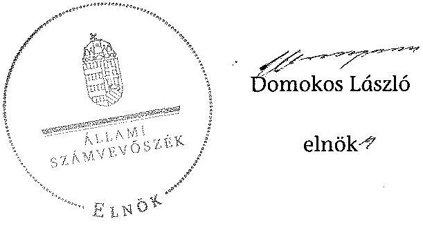

---

.

---

A Szolnoki Főiskola kiadási és bevétefi előirányzatai, azok teljesítése a 2009-2012. években

|  Ssz. | Megnevezés | 2009. év |  |  | 2010. év |  |  | 2011. év |  |  | 2012. év |  |   |
| --- | --- | --- | --- | --- | --- | --- | --- | --- | --- | --- | --- | --- | --- |
|   |  | Eredeti előirányzat | Módosított előirányzat | Teljesítés | Eredeti előirányzat | Módosított előirányzat | Teljesítés | Eredeti előirányzat | Módosított előirányzat | Teljesítés | Eredeti előirányzat | Módosított előirányzat | Teljesítés  |
|  1 | KIADÁSOK |  |  |  |  |  |  |  |  |  |  |  |   |
|  2 | Személyi juttatások | 947918 | 1025530 | 1018801 | 947918 | 1076799 | 1066277 | 984363 | 911905 | 892645 | 847900 | 744190 | 714293  |
|  3 | Munkaadótt terhelő járulékok | 294689 | 307465 | 307406 | 262389 | 274655 | 270504 | 272920 | 237191 | 228975 | 255700 | 208670 | 193700  |
|  4 | Dologi kiadások | 722423 | 1307771 | 1310497 | 669202 | 1345719 | 1311048 | 725294 | 1163435 | 1253486 | 433631 | 1054721 | 1103620  |
|  5 | Egyéb folyó kiadások | 9300 | 116559 | 113097 | 14061 | 103929 | 103554 | 24876 | 218871 | 128582 | 17669 | 108940 | 19693  |
|  6 | Támogatásértékű működési kiadások |  |  |  |  |  |  |  |  |  |  |  |   |
|  7 | Támogatásértékű felhuhmadal kiadások |  |  |  |  |  |  |  |  |  |  |  |   |
|  8 | Előző évi előirányzat átadás |  |  |  |  |  |  |  |  |  |  |  |   |
|  9 | Működési célú pénzeszköz átadás | 3500 | 3500 | 2101 | 3500 | 3399 | 3399 | 3500 | 350 | 350 | 3500 | 3000 | 3000  |
|  10 | Felhuhmadal célú pénzeszköz átadás |  |  |  |  |  |  |  |  |  |  |  |   |
|  11 | Előőzetnek pénzbeli juttatásai | 299397 | 300755 | 241262 | 288767 | 267241 | 163533 | 251667 | 223667 | 134534 | 142600 | 155090 | 104084  |
|  12 | Egyéb juttatás |  |  |  |  |  |  |  |  |  |  |  |   |
|  13 | Felújítás | 10000 | 10000 | 4319 | 10000 | 15681 | 15644 | 10000 | 600 | 600 | 10000 |  |   |
|  14 | Intézményi beruházási kiadások ÁFA-val | 79890 | 64041 | 56701 | 79890 | 101788 | 100455 | 91471 | 82871 | 82593 | 53800 | 111681 | 107533  |
|  15 | Központi beruházási kiadások ÁFA-val |  |  |  |  |  |  |  |  |  |  |  |   |
|  16 | Lukásépítés kiadásai ÁFA-val |  |  |  |  |  |  |  |  |  |  |  |   |
|  17 | Egyéb intézményi felhuhmadal kiadás |  |  | 100 |  |  |  |  |  |  |  |  |   |
|  18 | Függő, átfutó és kiegyenlítő kiadások |  |  | 109 |  |  | $-3532$ |  |  | $-495$ |  |  | $-22$  |
|  19 | Összesen | 2367117 | 3135221 | 3034395 | 2275727 | 3189212 | 3031084 | 2364091 | 2838890 | 2721270 | 1744800 | 2386292 | 2245901  |
|  20 | BEVÉTELEK |  |  |  |  |  |  |  |  |  |  |  |   |
|  21 | Közhatalmi bevételek |  |  |  |  |  |  |  |  |  |  |  |   |
|  22 | Intézményi működési bevételek | 727347 | 924642 | 923046 | 727347 | 743390 | 807691 | 727347 | 752047 | 757062 | 727300 | 727300 | 698098  |
|  23 | Működési célú pénzeszköz átvételek | 40000 | 40000 | 19748 | 40000 | 40000 | 17865 | 204768 | 204768 | 186095 | 40000 | 133477 | 134593  |
|  24 | Felhuhmadal bevételek |  | 1309 | 1309 |  | 5066 | 5066 |  |  | 913 |  | 33534 | 33534  |
|  25 | Felhuhmadal célú pénzeszköz átvételek | 40000 | 60000 | 41968 | 40000 | 40000 | 30548 | 51581 | 82581 | 83713 | 40000 | 94681 | 56224  |
|  26 | Irányító szeretői kapott támogatás | 1522770 | 1738639 | 1738639 | 1431380 | 1860012 | 1860012 | 1343395 | 1547320 | 1547320 | 900500 | 1268092 | 1268092  |
|  27 | Támogatás értékủ működési bevétel | 20000 | 71963 | 87465 | 20000 | 222080 | 246544 | 20000 | 39300 | 40031 | 20000 | 22943 | 31583  |
|  28 | Támogatás értékủ felhuhmadal bevétel | 17000 | 25124 | 9257 | 17000 | 31559 | 14559 | 17000 | 17000 |  | 17000 | 17000 |   |
|  29 | Előző évi maradvány átvétele |  |  |  |  |  |  |  |  |  |  |  |   |
|  30 | Előirányzat maradvány felhasználás |  | 273544 | 273544 |  | 248205 | 248205 |  | 195874 | 195874 |  | 89245 | 89245  |
|  31 | Értékpapír értékesítés bevétele |  |  | 7505 |  |  | 200010 |  |  |  |  |  |   |
|  32 | Függő, átfutó és kiegyenlítő bevételek |  |  | 15195 |  |  | 53736 |  |  | $-82904$ |  |  | $-486$  |
|  33 | Összesen | 2367117 | 3135221 | 3117674 | 2275727 | 3189212 | 3484036 | 2364091 | 2838890 | 2728104 | 1744800 | 2386292 | 2310903  |

---

# A Szolnoki Főiskola kiadásainak, bevételeinek változása a 2009-2012. években

|   |  | 2009. év | 2010. év | 2011. év | 2012. év |   |
| --- | --- | --- | --- | --- | --- | --- |
|  Szz. | Megnevezés | Teljesítés | Teljesítés | Teljesítés | Teljesítés | 2012/2009  |
|  1 | KIADÁSOK |  |  |  |  |   |
|  2 | Személyi juttatások | 1018801 | 1066277 | 892645 | 714293 | 70,1\%  |
|  3 | Rendszeres és nem rendszeres | 960904 | 1009723 | 821032 | 652271 | 67,9\%  |
|  4 | Rendszeres személyi juttatás | 820749 | 816388 | 747685 | 576073 | 70,2\%  |
|  5 | Alapítletmény | 616889 | 586321 | 560296 | 448366 | 72,7\%  |
|  6 | Nem rendszeres | 140155 | 193435 | 73347 | 76198 | 54,4\%  |
|  7 | Munkovégzéshez kapcs juttatások | 42127 | 87305 | 9158 | 22403 | 53,2\%  |
|  8 | normatív és teljesítéshez kötött jutalom | 35182 | 58755 | - | - | -  |
|  9 | Külső személyi juttatások | 57497 | 56554 | 71613 | 62023 | 107,1\%  |
|  10 | Munkaadót terhelő járulékok | 307406 | 270504 | 228973 | 193700 | 63,0\%  |
|  11 | Dologi és folyó kiadások | 1423594 | 1414602 | 1382068 | 1123313 | 78,9\%  |
|  12 | Dologi kiadások | 1310497 | 1311048 | 1253488 | 1103620 | 84,2\%  |
|  13 | Készletbeszerzés | 58868 | 41765 | 35584 | 21089 | 35,8\%  |
|  14 | Kommunikációs szolgáltatás | 16013 | 13311 | 6585 | 9942 | 62,1\%  |
|  15 | Szolgáltatási kiadások | 859189 | 852999 | 855537 | 807944 | 94,0\%  |
|  16 | Bérlet és lízing | 599032 | 601334 | 530801 | 527201 | 88,0\%  |
|  17 | ebből PPP | 498661 | 517775 | 461423 | 451854 | 90,6\%  |
|  18 | Gáz, villany, víz | 116771 | 84159 | 87429 | 59647 | 51,1\%  |
|  19 | Működési célú ÁFA | 211107 | 243337 | 234996 | 213428 | 101,1\%  |
|  20 | Kiküldetés, reprezentáció | 67482 | 50888 | 36905 | 15814 | 23,4\%  |
|  21 | Szellemi tevékenység | 56573 | 30613 | 18538 | 19024 | 33,6\%  |
|  22 | Egyéb folyó kiadások | 113097 | 103554 | 128582 | 19693 | 17,4\%  |
|  23 | Előző évi maradvány visszafizetés | 99796 | - | 72966 | - | -  |
|  24 | Adók, díjak, egyéb befizetések | 12166 | 29641 | 29188 | 18002 | 148,0\%  |
|  25 | Támogatásértékủ müködési kiadások | - | - | - | - | -  |
|  26 | Támogatásértékủ felhalmozási kiadások | - | - | - | - | -  |
|  27 | Előző évi előirányzat átadás | - | - | - | - | -  |
|  28 | Működési célú pénzeszköz átadás | 2101 | 3399 | 350 | 3000 | 142,8\%  |
|  29 | Felhalmozási célú pénzeszköz átadás | - | - | - | - | -  |
|  30 | Ellátottak pénzbeli juttatásai | 241263 | 163535 | 134534 | 104084 | 43,1\%  |
|  32 | Felhalmozási kiadások | 61120 | 116099 | 83193 | 107533 | 175,9\%  |
|  33 | Intézményi beruházási kiadások | 46981 | 80364 | 66074 | 85080 | 181,1\%  |
|   | ebből ingatlan | 5904 | 29063 | 2401 | 14329 | 242,7\%  |
|  34 | Gégek, berendezések, felszerelések | 35181 | 28600 | 27827 | 54886 | 156,0\%  |
|  35 | Felújítás | 3514 | 12515 | 480 | - | -  |
|   | ebből ingatlan | 3514 | 11850 | 480 | - | -  |
|  36 | Felújítások és beruházások ÁFÁ-ia | 10525 | 23220 | 16639 | 22453 | 213,3\%  |
|  39 | Egyéb intézményt felhalmozási kiadás | 100 | - | - | - | -  |
|  40 | Függő, kiegyenülő és átfutó kiadások | 109 | $-3332$ | $-493$ | $-22$ | -  |
|  41 | Összesen | 3054393 | 3031084 | 2721270 | 2245901 | 73,5\%  |
|  42 | BEVÉTELEK |  |  |  |  |   |
|  44 | Működési bevételek | 1030269 | 1071900 | 983188 | 864274 | 83,9\%  |
|  45 | Intézményi müködési bevétel | 923046 | 807491 | 757062 | 698098 | 75,6\%  |
|  46 | Szolgáltatások ellenértéke | 578761 | 565729 | 521249 | 497785 | 86,0\%  |
|  47 | Intézményi ellátási díjak | 127938 | 97646 | 67681 | 65160 | 50,9\%  |
|  48 | Hozom és komatbevétel | 20726 | 5517 | 5305 | - | -  |
|  49 | Müködési célú pénzeszköz átvételek | 19748 | 17865 | 186095 | 134593 | 681,6\%  |
|   | ebből uniós forrás | 19601 | 9678 | 180127 | - | -  |
|  50 | Támogatásértékủ müködési bevétel | 87465 | 246544 | 40031 | 31583 | 36,1\%  |
|  51 | EU programokra müködési bevétel | - | 157280 | - | - | -  |
|  53 | Felhalmozási bevételek | 52534 | 50173 | 84626 | 89778 | 170,9\%  |
|  55 | Felhalmozási célú pénzeszköz átvételek | 41968 | 30548 | 83713 | 56224 | 134,0\%  |
|   | ebből uniós forrás | 19601 | - | 61 | - | -  |
|  56 | Támogatásértékủ felhalmozási bevétel | 9257 | 14559 | - | - | -  |
|  57 | EU programokra beruházási bevétel | - | 14559 | - | - | -  |
|  58 | Irányító szervtől kapott támogatás | 1738639 | 1860012 | 1547320 | 1268092 | 72,9\%  |
|  61 | Előirányzat maradvány felhasználás | 273544 | 248205 | 195874 | 89245 | 32,6\%  |
|  62 | Értékpapír értékesítés bevétele | 7503 | 200010 | - | - | -  |
|  63 | Függő, kiegyenülő és átfutó bevételek | 15195 | 53736 | $-82904$ | $-486$ | -  |
|  64 | Összesen | 3117674 | 3484036 | 2728104 | 2310903 | 74,1\%  |

---

# 3. SZÁMÚ MELLÉKLET A V-0337-1029/2014. SZÁMÚ JELENTÉSHEZ

|  Szé |  |  |  |  |   |
| --- | --- | --- | --- | --- | --- |
|   |  |  |  |  | Adatok e Ft-ban  |
|   |  |  | 2009. év | 2010. év | 2011. év  |
|  1. |  |  | 2. | 3. | 4.  |
|  1. |  |  |  |  |   |
|  2. |  |  |  |  |   |
|  3. |  |  |  |  |   |
|  4. |  |  |  |  |   |
|  5. |  |  |  |  |   |
|  6. |  |  |  |  |   |
|  7. |  |  |  |  |   |
|  8. |  |  |  |  |   |
|  9. |  |  |  |  |   |
|  10. |  |  |  |  |   |
|  11. |  |  |  |  |   |
|  12. |  |  |  |  |   |
|  13. |  |  |  |  |   |
|  14. |  |  |  |  |   |
|  15. |  |  |  |  |   |
|  16. |  |  |  |  |   |
|  17. |  |  |  |  |   |
|  18. |  |  |  |  |   |
|  19. |  |  |  |  |   |
|  20. |  |  |  |  |   |
|  21. |  |  |  |  |   |
|  22. |  |  |  |  |   |
|  23. |  |  |  |  |   |
|  24. |  |  |  |  |   |
|  25. |  |  |  |  |   |
|  26. |  |  |  |  |   |
|  27. |  |  |  |  |   |
|  28. |  |  |  |  |   |
|  29. |  |  |  |  |   |
|  30. |  |  |  |  |   |
|  31. |  |  |  |  |   |
|  32. |  |  |  |  |   |
|  33. |  |  |  |  |   |
|  34. |  |  |  |  |   |
|  35. |  |  |  |  |   |
|  36. |  |  |  |  |   |
|  37. |  |  |  |  |   |
|  38. |  |  |  |  |   |
|  39. |  |  |  |  |   |
|  40. |  |  |  |  |   |
|  41. |  |  |  |  |   |
|  42. |  |  |  |  |   |
|  43. |  |  |  |  |   |
|  44. |  |  |  |  |   |
|  45. |  |  |  |  |   |
|  46. |  |  |  |  |   |
|  47. |  |  |  |  |   |
|  48. |  |  |  |  |   |
|  49. |  |  |  |  |   |
|  50. |  |  |  |  |   |
|  51. |  |  |  |  |   |
|  52. |  |  |  |  |   |
|  53. |  |  |  |  |   |
|  54. |  |  |  |  |   |
|  55. |  |  |  |  |   |
|  56. |  |  |  |  |   |
|  57. |  |  |  |  |   |
|  58. |  |  |  |  |   |
|  59. |  |  |  |  |   |
|  60. |  |  |  |  |   |
|  61. |  |  |  |  |   |
|  62. |  |  |  |  |   |
|  63. |  |  |  |  |   |
|  64. |  |  |  |  |   |
|  65. |  |  |  |  |   |
|  66. |  |  |  |  |   |
|  67. |  |  |  |  |   |
|  68. |  |  |  |  |   |
|  69. |  |  |  |  |   |
|  70. |  |  |  |  |   |
|  71. |  |  |  |  |   |
|  72. |  |  |  |  |   |
|  73. |  |  |  |  |   |
|  74. |  |  |  |  |   |
|  75. |  |  |  |  |   |
|  76. |  |  |  |  |   |
|  77. |  |  |  |  |   |
|  78. |  |  |  |  |   |
|  79. |  |  |  |  |   |
|  80. |  |  |  |  |   |
|  81. |  |  |  |  |   |
|  82. |  |  |  |  |   |
|  83. |  |  |  |  |   |
|  84. |  |  |  |  |   |
|  85. |  |  |  |  |   |
|  86. |  |  |  |  |   |
|  87. |  |  |  |  |   |
|  88. |  |  |  |  |   |
|  89. |  |  |  |  |   |
|  90. |  |  |  |  |   |
|  91. |  |  |  |  |   |
|  92. |  |  |  |  |   |
|  93. |  |  |  |  |   |
|  94. |  |  |  |  |   |
|  95. |  |  |  |  |   |
|  96. |  |  |  |  |   |
|  97. |  |  |  |  |   |
|  98. |  |  |  |  |   |
|  99. |  |  |  |  |   |
|  100. |  |  |  |  |   |
|  101. |  |  |  |  |   |
|  102. |  |  |  |  |   |
|  103. |  |  |  |  |   |
|  104. |  |  |  |  |   |
|  105. |  |  |  |  |   |
|  106. |  |  |  |  |   |
|  107. |  |  |  |  |   |
|  108. |  |  |  |  |   |
|  109. |  |  |  |  |   |
|  110. |  |  |  |  |   |
|  111. |  |  |  |  |   |
|  112. |  |  |  |  |   |
|  113. |  |  |  |  |   |
|  114. |  |  |  |  |   |
|  115. |  |  |  |  |   |
|  116. |  |  |  |  |   |
|  117. |  |  |  |  |   |
|  118. |  |  |  |  |   |
|  119. |  |  |  |  |   |
|  120. |  |  |  |  |   |
|  121. |  |  |  |  |   |
|  122. |  |  |  |  |   |
|  123. |  |  |  |  |   |
|  124. |  |  |  |  |   |
|  125. |  |  |  |  |   |
|  126. |  |  |  |  |   |
|  127. |  |  |  |  |   |
|  128. |  |  |  |  |   |
|  129. |  |  |  |  |   |
|  130. |  |  |  |  |   |
|  131. |  |  |  |  |   |
|  132. |  |  |  |  |   |
|  133. |  |  |  |  |   |
|  134. |  |  |  |  |   |
|  135. |  |  |  |  |   |
|  136. |  |  |  |  |   |
|  137. |  |  |  |  |   |
|  138. |  |  |  |  |   |
|  139. |  |  |  |  |   |
|  140. |  |  |  |  |   |
|  141. |  |  |  |  |   |
|  142. |  |  |  |  |   |
|  143. |  |  |  |  |   |
|  144. |  |  |  |  |   |
|  145. |  |  |  |  |   |
|  146. |  |  |  |  |   |
|  147. |  |  |  |  |   |
|  148. |  |  |  |  |   |
|  149. |  |  |  |  |   |
|  150. |  |  |  |  |   |
|  151. |  |  |  |  |   |
|  152. |  |  |  |  |   |
|  153. |  |  |  |  |   |
|  154. |  |  |  |  |   |
|  155. |  |  |  |  |   |
|  156. |  |  |  |  |   |
|  157. |  |  |  |  |   |
|  158. |  |  |  |  |   |
|  159. |  |  |  |  |   |
|  160. |  |  |  |  |   |
|  161. |  |  |  |  |   |
|  162. |  |  |  |  |   |
|  163. |  |  |  |  |   |
|  164. |  |  |  |  |   |
|  165. |  |  |  |  |   |
|  166. |  |  |  |  |   |
|  167. |  |  |  |  |   |
|  168. |  |  |  |  |   |
|  169. |  |  |  |  |   |
|  170. |  |  |  |  |   |
|  171. |  |  |  |  |   |
|  172. |  |  |  |  |   |
|  173. |  |  |  |  |   |
|  174. |  |  |  |  |   |
|  175. |  |  |  |  |   |
|  176. |  |  |  |  |   |
|  177. |  |  |  |  |   |
|  178. |  |  |  |  |   |
|  179. |  |  |  |  |   |
|  180. |  |  |  |  |   |
|  181. |  |  |  |  |   |
|  182. |  |  |  |  |   |
|  183. |  |  |  |  |   |
|  184. |  |  |  |  |   |
|  185. |  |  |  |  |   |
|  186. |  |  |  |  |   |
|  187. |  |  |  |  |   |
|  188. |  |  |  |  |   |
|  189. |  |  |  |  |   |
|  190. |  |  |  |  |   |
|  191. |  |  |  |  |   |
|  192. |  |  |  |  |   |
|  193. |  |  |  |  |   |
|  194. |  |  |  |  |   |
|  195. |  |  |  |  |   |
|  196. |  |  |  |  |   |
|  197. |  |  |  |  |   |
|  198. |  |  |  |  |   |
|  199. |  |  |  |  |   |
|  200. |  |  |  |  |   |
|  201. |  |  |  |  |   |
|  202. |  |  |  |  |   |
|  203. |  |  |  |  |   |
|  204. |  |  |  |  |   |
|  205. |  |  |  |  |   |
|  206. |  |  |  |  |   |
|  207. |  |  |  |  |   |
|  208. |  |  |  |  |   |
|  209. |  |  |  |  |   |
|  210. |  |  |  |  |   |
|  211. |  |  |  |  |   |
|  212. |  |  |  |  |   |
|  213. |  |  |  |  |   |
|  214. |  |  |  |  |   |
|  215. |  |  |  |  |   |
|  216. |  |  |  |  |   |
|  217. |  |  |  |  |   |
|  218. |  |  |  |  |   |
|  219. |  |  |  |  |   |
|  220. |  |  |  |  |   |
|  221. |  |  |  |  |   |
|  222. |  |  |  |  |   |
|  223. |  |  |  |  |   |
|  224. |  |  |  |  |   |
|  225. |  |  |  |  |   |
|  226. |  |  |  |  |   |
|  227. |  |  |  |  |   |
|  228. |  |  |  |  |   |
|  229. |  |  |  |  |   |
|  230. |  |  |  |  |   |
|  231. |  |  |  |  |   |
|  232. |  |  |  |  |   |
|  233. |  |  |  |  |   |
|  234. |  |  |  |  |   |
|  235. |  |  |  |  |   |
|  236. |  |  |  |  |   |
|  237. |  |  |  |  |   |
|  238. |  |  |  |  |   |
|  239. |  |  |  |  |   |
|  240. |  |  |  |  |   |
|  241. |  |  |  |  |   |
|  242. |  |  |  |  |   |
|  243. |  |  |  |  |   |
|  244. |  |  |  |  |   |
|  245. |  |  |  |  |   |
|  246. |  |  |  |  |   |
|  247. |  |  |  |  |   |
|  248. |  |  |  |  |   |
|  249. |  |  |  |  |   |
|  250. |  |  |  |  |   |
|  251. |  |  |  |  |   |
|  252. |  |  |  |  |   |
|  253. |  |  |  |  |   |
|  254. |  |  |  |  |   |
|  255. |  |  |  |  |   |
|  256. |  |  |  |  |   |
|  257. |  |  |  |  |   |
|  258. |  |  |  |  |   |
|  259. |  |  |  |  |   |
|  260. |  |  |  |  |   |
|  261. |  |  |  |  |   |
|  262. |  |  |  |  |   |
|  263. |  |  |  |  |   |
|  264. |  |  |  |  |   |
|  265. |  |  |  |  |   |
|  266. |  |  |  |  |   |
|  267. |  |  |  |  |   |
|  268. |  |  |  |  |   |
|  269. |  |  |  |  |   |
|  270. |  |  |  |  |   |
|  271. |  |  |  |  |   |
|  272. |  |  |  |  |   |
|  273. |  |  |  |  |   |
|  274. |  |  |  |  |   |
|  275. |  |  |  |  |   |
|  276. |  |  |  |  |   |
|  277. |  |  |  |  |   |
|  278. |  |  |  |  |   |
|  279. |  |  |  |  |   |
|  280. |  |  |  |  |   |
|  281. |  |  |  |  |   |
|  282. |  |  |  |  |   |
|  283. |  |  |  |  |   |
|  284. |  |  |  |  |   |
|  285. |  |  |  |  |   |
|  286. |  |  |  |  |   |
|  287. |  |  |  |  |   |
|  288. |  |  |  |  |   |
|  289. |  |  |  |  |   |
|  290. |  |  |  |  |   |
|  291. |  |  |  |  |   |
|  292. |  |  |  |  |   |
|  293. |  |  |  |  |   |
|  294. |  |  |  |  |   |
|  295. |  |  |  |  |   |
|  296. |  |  |  |  |   |
|  297. |  |  |  |  |   |
|  298. |  |  |  |  |   |
|  299. |  |  |  |  |   |
|  300. |  |  |  |  |   |
|  301. |  |  |  |  |   |
|  302. |  |  |  |  |   |
|  303. |  |  |  |  |   |
|  304. |  |  |  |  |   |
|  305. |  |  |  |  |   |
|  306. |  |  |  |  |   |
|  307. |  |  |  |  |   |
|  308. |  |  |  |  |   |
|  309. |  |  |  |  |   |
|  310. |  |  |  |  |   |
|  311. |  |  |  |  |   |
|  312. |  |  |  |  |   |
|  313. |  |  |  |  |   |
|  314. |  |  |  |  |   |
|  315. |  |  |  |  |   |
|  316. |  |  |  |  |   |
|  317. |  |  |  |  |   |
|  318. |  |  |  |  |   |
|  319. |  |  |  |  |   |
|  320. |  |  |  |  |   |
|  321. |  |  |  |  |   |
|  322. |  |  |  |  |   |
|  323. |  |  |  |  |   |
|  324. |  |  |  |  |   |
|  325. |  |  |  |  |   |
|  326. |  |  |  |  |   |
|  327. |  |  |  |  |   |
|  328. |  |  |  |  |   |
|  329. |  |  |  |  |   |
|  330. |  |  |  |  |   |
|  331. |  |  |  |  |   |
|  332. |  |  |  |  |   |
|  333. |  |  |  |  |   |
|  334. |  |  |  |  |   |
|  335. |  |  |  |  |   |
|  336. |  |  |  |  |   |
|  337. |  |  |  |  |   |
|  338. |  |  |  |  |   |
|  339. |  |  |  |  |   |
|  340. |  |  |  |  |   |
|  341. |  |  |  |  |   |
|  342. |  |  |  |  |   |
|  343. |  |  |  |  |   |
|  344. |  |  |  |  |   |
|  345. |  |  |  |  |   |
|  346. |  |  |  |  |   |
|  347. |  |  |  |  |   |
|  348. |  |  |  |  |   |
|  349. |  |  |  |  |   |
|  350. |  |  |  |  |   |
|  351. |  |  |  |  |   |
|  352. |  |  |  |  |   |
|  353. |  |  |  |  |   |
|  354. |  |  |  |  |   |
|  355. |  |  |  |  |   |
|  356. |  |  |  |  |   |
|  357. |  |  |  |  |   |
|  358. |  |  |  |  |   |
|  359. |  |  |  |  |   |
|  360. |  |  |  |  |   |
|  361. |  |  |  |  |   |
|  362. |  |  |  |  |   |
|  363. |  |  |  |  |   |
|  364. |  |  |  |  |   |
|  365. |  |  |  |  |   |
|  366. |  |  |  |  |   |
|  367. |  |  |  |  |   |
|  368. |  |  |  |  |   |
|  369. |  |  |  |  |   |
|  370. |  |  |  |  |   |
|  371. |  |  |  |  |   |
|  372. |  |  |  |  |   |
|  373. |  |  |  |  |   |
|  374. |  |  |  |  |   |
|  375. |  |  |  |  |   |
|  376. |  |  |  |  |   |
|  377. |  |  |  |  |   |
|  378. |  |  |  |  |   |
|  379. |  |  |  |  |   |
|  380. |  |  |  |  |   |
|  381. |  |  |  |  |   |
|  382. |  |  |  |  |   |
|  383. |  |  |  |  |   |
|  384. |  |  |  |  |   |
|  385. |  |  |  |  |   |
|  386. |  |  |  |  |   |
|  387. |  |  |  |  |   |
|  388. |  |  |  |  |   |
|  389. |  |  |  |  |   |
|  390. |  |  |  |  |   |
|  391. |  |  |  |  |   |
|  392. |  |  |  |  |   |
|  393. |  |  |  |  |   |
|  394. |  |  |  |  |   |
|  395. |  |  |  |  |   |
|  396. |  |  |  |  |   |
|  397. |  |  |  |  |   |
|  398. |  |  |  |  |   |
|  399. |  |  |  |  |   |
|  400. |  |  |  |  |   |
|  401. |  |  |  |  |   |
|  402. |  |  |  |  |   |
|  403. |  |  |  |  |   |
|  404. |  |  |  |  |   |
|  405. |  |  |  |  |   |
|  406. |  |  |  |  |   |
|  407. |  |  |  |  |   |
|  408. |  |  |  |  |   |
|  409. |  |  |  |  |   |
|  410. |  |  |  |  |   |
|  411. |  |  |  |  |   |
|  412. |  |  |  |  |   |
|  413. |  |  |  |  |   |
|  414. |  |  |  |  |   |
|  415. |  |  |  |  |   |
|  416. |  |  |  |  |   |
|  417. |  |  |  |  |   |
|  418. |  |  |  |  |   |
|  419. |  |  |  |  |   |
|  420. |  |  |  |  |   |
|  421. |  |  |  |  |   |
|  422. |  |  |  |  |   |
|  423. |  |  |  |  |   |
|  424. |  |  |  |  |   |
|  425. |  |  |  |  |   |
|  426. |  |  |  |  |   |
|  427. |  |  |  |  |   |
|  428. |  |  |  |  |   |
|  429. |  |  |  |  |   |
|  430. |  |  |  |  |   |
|  431. |  |  |  |  |   |
|  432. |  |  |  |  |   |
|  433. |  |  |  |  |   |
|  434. |  |  |  |  |   |
|  435. |  |  |  |  |   |
|  436. |  |  |  |  |   |
|  437. |  |  |  |  |   |
|  438. |  |  |  |  |   |
|  439. |  |  |  |  |   |
|  440. |  |  |  |  |   |
|  441. |  |  |  |  |   |
|  442. |  |  |  |  |   |
|  443. |  |  |  |  |   |
|  444. |  |  |  |  |   |
|  445. |  |  |  |  |   |
|  446. |  |  |  |  |   |
|  447. |  |  |  |  |   |
|  448. |  |  |  |  |   |
|  449. |  |  |  |  |   |
|  450. |  |  |  |  |   |
|  451. |  |  |  |  |   |
|  452. |  |  |  |  |   |
|  453. |  |  |  |  |   |
|  454. |  |  |  |  |   |
|  455. |  |  |  |  |   |
|  456. |  |  |  |  |   |
|  457. |  |  |  |  |   |
|  458. |  |  |  |  |   |
|  459. |  |  |  |  |   |
|  460. |  |  |  |  |   |
|  461. |  |  |  |  |   |
|  462. |  |  |  |  |   |
|  463. |  |  |  |  |   |
|  464. |  |  |  |  |   |
|  465. |  |  |  |  |   |
|  466. |  |  |  |  |   |
|  467. |  |  |  |  |   |
|  468. |  |  |  |  |   |
|  469. |  |  |  |  |   |
|  470. |  |  |  |  |   |
|  471. |  |  |  |  |   |
|  472. |  |  |  |  |   |
|  473. |  |  |  |  |   |
|  474. |  |  |  |  |   |
|  475. |  |  |  |  |   |
|  476. |  |  |  |  |   |
|  477. |  |  |  |  |   |
|  478. |  |  |  |  |   |
|  479. |  |  |  |  |   |
|  480. |  |  |  |  |   |
|  481. |  |  |  |  |   |
|  482. |  |  |  |  |   |
|  483. |  |  |  |  |   |
|  484. |  |  |  |  |   |
|  485. |  |  |  |  |   |
|  486. |  |  |  |  |   |
|  487. |  |  |  |  |   |
|  488. |  |  |  |  |   |
|  489. |  |  |  |  |   |
|  490. |  |  |  |  |   |
|  491. |  |  |  |  |   |
|  492. |  |  |  |  |   |
|  493. |  |  |  |  |   |
|  494. |  |  |  |  |   |
|  495. |  |  |  |  |   |
|  496. |  |  |  |  |   |
|  497. |  |  |  |  |   |
|  498. |  |  |  |  |   |
|  499. |  |  |  |  |   |
|  499. |  |  |  |  |   |
|  500. |  |  |  |  |   |
|  501. |  |  |  |  |   |
|  502. |  |  |  |  |   |
|  503. |  |  |  |  |   |
|  504. |  |  |  |  |   |
|  505. |  |  |  |  |   |
|  506. |  |  |  |  |   |
|  507. |  |  |  |  |   |
|  508. |  |  |  |  |   |
|  509. |  |  |  |  |   |
|  510. |  |  |  |  |   |
|  511. |  |  |  |  |   |
|  512. |  |  |  |  |   |
|  513. |  |  |  |  |   |
|  514. |  |  |  |  |   |
|  515. |  |  |  |  |   |
|  516. |  |  |  |  |   |
|  517. |  |  |  |  |   |
|  518. |  |  |  |  |   |
|  519. |  |  |  |  |   |
|  520. |  |  |  |  |   |
|  521. |  |  |  |  |   |
|  522. |  |  |  |  |   |
|  523. |  |  |  |  |   |
|  524. |  |  |  |  |   |
|  525. |  |  |  |  |   |
|  526. |  |  |  |  |   |
|  527. |  |  |  |  |   |
|  528. |  |  |  |  |   |
|  529. |  |  |  |  |   |
|  530. |  |  |  |  |   |
|  5210. |  |  |  |  |   |
|  5211. |  |  |  |  |   |
|  5220. |  |  |  |  |   |
|  5221. |  |  |  |  |   |
|  5222. |  |  |  |  |   |
|  5230. |  |  |  |  |   |
|  5231. |  |  |  |  |   |
|  5232. |  |  |  |  |   |
|  5233. |  |  |  |  |   |
|  5240. |  |  |  |  |   |
|  5241. |  |  |  |  |   |
|  5242. |  |  |  |  |   |
|  5242. |  |  |  |  |   |
|  5243. |  |  |  |   |
|  5243. |  |  |  |   |
|  5244. |  |  |  |  |   |
|  525. |  |  |  |  |   |
|  525. |  |  |  |  |   |
|  525. |  |  |  |  |   |
|  526. |  |  |  |  |   |
|  526. |  |  |  |  |   |
|  527. |  |  |  |  |   |
|  527. |  |  |  |  |   |
|  528. |  |  |  |  |   |
|  529. |  |  |  |  |   |
|  530. |  |  |  |   |
|  529. |  |  |  |  |   |
|  531. |  |  |  |   |
|  532. |  |  |  |   |
|  533. |  |  |  |   |
|  533. |  |  |  |   |
|  534. |  |  |  |   |
|  535. |  |  |  |   |
|  536. |  |  |  |   |
|  537. |  |  |  |   |
|  538. |  |  |  |   |
|  539. |  |  |  |   |
|  540. |  |  |  |   |
|  539. |  |  |  |   |
|  541. |  |  |  |   |
|  542. |  |  |  |   |
|  542. |  |  |  |   |
|  543. |  |  |  |   |
|  543. |  |  |  |   |
|  544. |  |  |  |   |
|  544. |  |  |  |   |
|  545. |  |  |  |   |
|  546. |  |  |  |   |
|  547. |  |  |  |   |
|  547. |  |  |  |   |
|  548. |  |  |  |   |
|  548. |  |  |  |   |
|  549. |  |  |  |   |
|  550. |  |  |  |   |
|  549. |  |  |  |   |
|  551. |  |  |  |   |
|  552. |  |  |  |   |
|  553. |  |  |  |   |
|  554. |  |  |  |   |
|  555. |  |  |  |   |
|  556. |  |  |  |   |
|  557. |  |  |   |
|  558. |  |  |  |   |
|  559. |  |  |   |
|  560. |  |  |  |   |
|  561. |  |  |  |   |
|  562. |  |  |  |   |
|  562. |  |  |   |
|  563. |  |  |   |
|  563. |  |  |   |
|  564. |  |  |   |
|  564. |  |  |   |
|  565. |  |  |   |
|  566. |  |  |   |
|  567. |  |  |   |
|  570. |  |  |   |
|  571. |  |  |   |
|  572. |  |  |   |
|  573. |  |  |   |
|  574. |  |   |
|  575. |  |  |   |
|  576. |  |  |   |
|  577. |  |  |   |
|  577. |  |  |   |
|  58. |  |  |   |
|  58. |  |  |   |
|  59. |  |  |   |
|  59. |  |  |   |
|  59. |  |  |   |
|  510. |  |   |
|  511. |  |   |
|  512. |  |  |   |
|  513. |  |  |   |
|  520. |  |   |
|  522. |  |   |
|  521. |  |   |
|  531. |  |   |
|  523. |  |   |
|  532. |  |   |
|  533. |  |   |
|  533. |  |   |
|  534. |  |   |
|  535. |  |   |
|  536. |  |   |
|  537. |  |   |
|  540. |  |   |
|  541. |  |   |
|  542. |  |   |
|  542. |  |   |
|  55. |  |   |
|  55. |  |   |
|  56. |  |   |
|  56. |  |   |
|  57. |  |   |
|  58. |  |   |
|  59. |  |   |
|  59. |  |   |
|  510. |  |   |
|  511. |  |   |
|  522. |  |   |
|  524. |  |   |
|  524. |  |   |
|  53. |  |   |
|  53. |  |   |
|  53. |  |   |
|  53. |  |   |
|  53. |  |   |
|  54. |  |   |
|  54. |  |   |
|  54. |  |   |
|  55. |  |   |
|  55. |  |   |
|  56. |  |   |
|  57. |  |   |
|  58. |  |   |
|  59. |  |   |
|  59. |  |   |
|  512. |  |   |
|  513. |  |   |
|  52. |  |   |
|  52. |  |   |
|  52. |  |   |
|  53. |  |   |
|  53. |  |   |
|  53. |  |   |
|  53. |  |   |
|  54. |  |   |
|  54. |  |   |
|  54. |  |   |
|  54. |  |   |
|  55. |  |   |
|  55. |  |   |
|  56. |  |   |
|  57. |  |   |
|  58. |  |   |
|  59. |  |   |
|  59. |  |   |
|  510. |  |   |
|  511. |  |   |
|  52. |  |   |
|  52. |  |   |
|  52. |  |   |
|  53. |  |   |
|  53. |  |   |
|  53. |  |   |
|  53. |  |   |
|  54. |  |   |
|  54. |  |   |
|  54. |  |   |
|  55. |  |   |
|  55. |  |   |
|  56. |  |   |
|  57. |  |   |
|  58. |  |   |
|  59. |  |   |
|  59. |  |   |
|  512. |  |   |
|  513. |  |   |
|  52. |  |   |
|  52. |  |   |
|  53. |  |   |
|  53. |  |   |
|  53. |  |   |
|  53. |  |   |
|  54. |  |   |
|  54. |  |   |
|  54. |  |   |
|  55. |  |   |
|  55. |  |   |
|  56. |  |   |
|  57. |  |   |
|  58. |  |   |
|  59. |  |   |
|  59. |  |   |
|  510. |  |   |
|  511. |  |   |
|  52. |  |   |
|  52. |  |   |
|  52. |  |   |
|  53. |  |   |
|  53. |  |   |
|  53. |  |   |
|  53. |  |   |
|  54. |  |   |
|  54. |  |   |
|  54. |  |   |
|  55. |  |   |
|  55. |  |   |
|  56. |  |   |
|  57. |  |   |
|  58. |  |   |
|  59. |  |   |
|  59. |  |   |
|  59. |  |   |
|  510. |  |   |
|  511. |  |   |
|  52. |  |   |
|  52. |  |   |
|  52. |  |   |
|  53. |   |
|  53. |  |   |
|  53. |   |
|  54. |  |   |
|  54. |  |   |
|  54. |  |   |
|  55. |  |   |
|  56. |  |   |
|  57. |  |   |
|  58. |  |   |
|  59. |  |   |
|  59. |  |   |
|  510. |  |   |
|  511. |  |   |
|  52. |  |   |
|  52. |   |
|  52. |  |   |
|  53. |  |   |
|  53. |   |
|  53. |  |   |
|  53. |   |
|  54. |  |   |
|  54. |  |   |
|  54. |  |   |
|  55. |  |   |
|  55. |  |   |
|  57. |  |   |
|  58. |  |   |
|  59. |  |   |
|  59. |  |   |
|  510. |  |   |
|  511. |  |   |
|  52. |  |   |
|  52. |  |   |
|  53. |  |   |
|  53. |  |   |
|  53. |   |
|  54. |  |   |
|  54. |  |   |
|  54. |  |   |
|  55. |  |   |
|  55. |  |   |
|  56. |  |   |
|  57. |  |   |
|  58. |  |   |
|  59. |  |   |
|  59. |  |   |
|  510. |  |   |
|  511. |  |   |
|  52. |  |   |
|  52. |  |   |
|  52. |  |   |
|  53. |  |   |
|  53. |  |   |
|  53. |   |
|  53. |  |   |
|  54. |  |   |
|  54. |  |   |
|  54. |  |   |
|  55. |  |   |
|  56. |  |   |
|  57. |  |   |
|  58. |  |   |
|  59. |  |   |
|  59. |  |   |
|  510. |  |   |
|  511. |  |   |
|  52. |  |   |
|  52. |  |   |
|  52. |  |   |
|  53. |   |
|  53. |   |
|  53. |  |   |
|  54. |  |   |
|  54. |  |   |
|  54. |  |   |
|  55. |  |   |
|  55. |  |   |
|  56. |  |   |
|  57. |  |   |
|  58

---

|  A Szolnoki Főiskola mérlegudatai a 2009-2012. években |  |  |  |  |  |   |
| --- | --- | --- | --- | --- | --- | --- |
|   |  |  |  |  |  | adatok ezer 21.hun  |
|  SZ | Megnevezés | 2009. év | 2010. év | 2011. év | 2012. év | Index
(2012/2009)  |
|  1 | IMMATERIÁLIS JAVAK | 11 137 | 32 490 | 59 015 | 50 833 | 436,4%  |
|  4 | Vagyoni értékű jogok | 5 534 | 14 112 | 27 053 | 31 609 | 571,2%  |
|  5 | Szellemi termékek | 5 603 | 18 378 | 31 962 | 19 224 | 343,1%  |
|  6 | Immateriális javakra adott előlegek |  |  |  |  |   |
|  8 | TÁRGYI ESZKÖZÖK | 3 066 940 | 3 063 734 | 3 020 135 | 2 615 961 | 85,3%  |
|  9 | Ingatlanok és kapcsolódó vagyonértékű jogok | 2 925 213 | 2 911 905 | 2 878 474 | 2 498 886 | 85,4%  |
|  10 | Gépek, berendezések, felzerektnek | 87 097 | 84 484 | 77 364 | 95 048 | 109,1%  |
|  11 | Járművek | 8 529 | 5 784 | 3 039 | 698 | 8,5%  |
|  12 | Tenyészállatok | 3 280 | 2 778 | 2 475 | 2 167 | 66,1%  |
|  13 | Beruházások, felújítások | 42 821 | 58 782 | 58 782 | 19 162 | 44,7%  |
|  14 | Beruházáson adott előlegek |  |  |  |  |   |
|  17 | BEFEKTETETT PÉNZÜGYI ESZKÖZÖK | 10 508 | 10 508 | 10 330 | 10 330 | 98,3%  |
|  18 | Turtán részesedés | 10 161 | 10 160 | 10 260 | 10 260 | 101,0%  |
|  19 | Turtánus adott kölcsön | 348 | 348 | 70 | 70 | 20,1%  |
|  20 | ÜZEMELTETÉSRE KEZELÉSRE ÁTADOTT
VAGYONKEZELÉSRE VETT ESZKÖZÖK | 2 876 | 2 261 | 2 383 | 20 912 | 727,1%  |
|  21 | BEFEKTETETT ESZKÖZÖK ÖSSZESEN | 3 091 461 | 3 108 993 | 3 091 863 | 2 698 036 | 87,3%  |
|  22 | KÉSZLETER | 11 424 | 20 492 | 16 569 | 22 852 | 200,0%  |
|  23 | Anyogok |  |  |  |  |   |
|  24 | Befeketetlen termelés és fiókász termék | 6 648 | 10 417 | 8 845 | 10 067 | 151,4%  |
|  25 | Késztermékek | 3 434 | 8 991 | 6 715 | 12 041 | 350,6%  |
|  26 | Áruk, gőngyölégek, közvetített szolgáltatások | 799 | 175 |  |  |   |
|  27 | Egyéb készletek** | 543 | 912 | 1 009 | 744 | 137,0%  |
|  28 | KÖVETELÉSEK | 64 722 | 66 195 | 88 575 | 75 415 | 116,5%  |
|  29 | Követelések áruszállításból és szolgáltatásból | 22 084 | 66 133 | 88 575 | 75 415 | 341,5%  |
|  30 | Adások | 42 530 |  |  |  |   |
|  32 | Egyéb követelések | 108 | 62 |  |  |   |
|  38 | ÉRTÉKPAPÍROK | 200 010 |  |  |  |   |
|  43 | Forgatási célú hitelviszonyt megtetszettő értékpapír bekezdési (könyv szerint) értéke | 200 010 |  |  |  |   |
|  45 | PÉNZESZKÖZÖK | 99 921 | 312 626 | 125 610 | 99 006 | 99,1%  |
|  46 | Pénztáruk, zsekélek, hatékönyvek | 200 | 78 | 150 |  |   |
|  48 | Elszámolási számíték | 76 018 | 280 887 | 91 775 | 67 638 | 89,0%  |
|  49 | Idegen pénzeszközök | 21 705 | 31 661 | 33 685 | 31 368 | 132,5%  |
|  50 | EGYÉB AKTÍV PÉNZÜGYI ELSZÁMOLÁSOK | 4 091 | 759 | 266 | 288 | 7,0%  |
|  51 | FORGÓESZKÖZÖK ÖSSZESEN | 380 168 | 400 073 | 231 020 | 197 561 | 52,0%  |
|  52 | ESZKÖZÖK ÖSSZESEN | 3 471 629 | 3 509 066 | 3 322 883 | 2 895 597 | 83,4%  |
|  53 | SAJÁT TŐKÉ | 2 986 449 | 2 960 126 | 2 972 630 | 2 454 177 | 82,2%  |
|  54 | Turtán tőke | 594 810 | 594 810 | 594 810 | 594 810 | 100,0%  |
|  56 | Tőkeváltasások | 2 591 639 | 2 565 316 | 2 377 820 | 1 859 567 | 77,7%  |
|  59 | TARTALÉKOK | 248 205 | 195 874 | 89 245 | 65 466 | 26,4%  |
|  60 | Költségvetési tartalékok | 248 205 | 195 874 | 89 245 | 65 466 | 26,4%  |
|  62 | RÖTELEZETTSÉGEK | 183 061 | 237 449 | 226 601 | 344 340 | 188,1%  |
|  64 | Rövid lejáratú kötelezettségek | 183 061 | 237 449 | 226 601 | 344 340 | 188,1%  |
|  65 | Kötelezettségek áruszáll.,szolg. (szállítók) | 154 296 | 237 449 | 226 601 | 344 340 | 223,2%  |
|  66 | Egyéb kötelezettségek | 28 765 |  |  |  |   |
|  67 | EGYÉB PASSZÍV PÉNZÜGYI ELSZÁMOLÁSOK | 53 914 | 115 617 | 34 407 | 31 614 | 58,6%  |
|  68 | FORRÁSOK ÖSSZESEN | 3 471 629 | 3 509 066 | 3 322 883 | 2 895 597 | 83,4%  |

---

|  A Szolnoki Főiskola gazdálkodása szabályszerűségének értékelése a mintatételek alapján |  |  |  |  |  |  |  |  |  |  |  |  |  |  |  |  |   |
| --- | --- | --- | --- | --- | --- | --- | --- | --- | --- | --- | --- | --- | --- | --- | --- | --- | --- |
|  értékelt terület |  |  |  |  |  |  |  |  |  |  |  |  |  |  |  |  |   |
|   |  |  |  |  |  |  |  |  |  |  |  |  |  |  |  |  |   |
|   |  |  |  |  |  |  |  |  |  |  |  |  |  |  |  |  |   |
|   |  |  |  |  |  |  |  |  |  |  |  |  |  |  |  |  |   |
|   |  |  |  |  |  |  |  |  |  |  |  |  |  |  |  |  |   |
|   |  |  |  |  |  |  |  |  |  |  |  |  |  |  |  |  |   |
|   |  |  |  |  |  |  |  |  |  |  |  |  |  |  |  |  |   |
|   |  |  |  |  |  |  |  |  |  |  |  |  |  |  |  |  |   |
|   |  |  |  |  |  |  |  |  |  |  |  |  |  |  |  |  |   |
|   |  |  |  |  |  |  |  |  |  |  |  |  |  |  |  |  |   |
|   |  |  |  |  |  |  |  |  |  |  |  |  |  |  |  |  |   |
|   |  |  |  |  |  |  |  |  |  |  |  |  |  |  |  |  |   |
|   |  |  |  |  |  |  |  |  |  |  |  |  |  |  |  |  |   |
|   |  |  |  |  |  |  |  |  |  |  |  |  |  |  |  |  |   |
|   |  |  |  |  |  |  |  |  |  |  |  |  |  |  |  |  |   |
|   |  |  |  |  |  |  |  |  |  |  |  |  |  |  |  |  |   |
|   |  |  |  |  |  |  |  |  |  |  |  |  |  |  |  |  |   |
|   |  |  |  |  |  |  |  |  |  |  |  |  |  |  |  |  |   |
|   |  |  |  |  |  |  |  |  |  |  |  |  |  |  |  |  |   |
|   |  |  |  |  |  |  |  |  |  |  |  |  |  |  |  |  |   |
|   |  |  |  |  |  |  |  |  |  |  |  |  |  |  |  |  |   |
|   |  |  |  |  |  |  |  |  |  |  |  |  |  |  |  |  |   |
|   |  |  |  |  |  |  |  |  |  |  |  |  |  |  |  |  |   |
|   |  |  |  |  |  |  |  |  |  |  |  |  |  |  |  |  |   |
|   |  |  |  |  |  |  |  |  |  |  |  |  |  |  |  |  |   |
|   |  |  |  |  |  |  |  |  |  |  |  |  |  |  |  |  |   |
|   |  |  |  |  |  |  |  |  |  |  |  |  |  |  |  |  |   |
|   |  |  |  |  |  |  |  |  |  |  |  |  |  |  |  |  |   |
|   |  |  |  |  |  |  |  |  |  |  |  |  |  |  |  |  |   |
|   |  |  |  |  |  |  |  |  |  |  |  |  |  |  |  |  |   |
|   |  |  |  |  |  |  |  |  |  |  |  |  |  |  |  |  |   |
|   |  |  |  |  |  |  |  |  |  |  |  |  |  |  |  |  |   |
|  

---

.

---

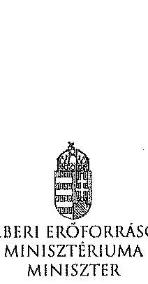

|  |  |  |
| :-- | :-- | :-- |
| Hiv. szám: | V-0352-311/2014, | V-0352- |
| 313/2014, | V-0337-964/2014, | V-0337- |
| 966/2014, | V-0368-250/2014, | V-0364- |
| 477/2014, V-0363-252/2014 |  |  |
| Melléklet:- |  |  |

# Domokos László részére 

elnök

Állami Számvevőszék

## Budapest

Apáczai Csere János utca 10.
1052
Tárgy: Észrevételek az Állami Számvevőszék ellenőrzési megállapításaira

Tisztelt Elnök Úr!

Hivatkozva a V-0352-311/2014, a V-0352-313/2014, a V-0337-964/2014, a V-0337-966/2014, a V-0368-250/2014, a V-0364-477/2014, a V-0363-252/2014 iktatószámú leveleire és megküldött jelentéstervezeteire, a Károly Róbert Főiskola, a Magyar Képzőművészeti Egyetem, a Szolnoki Főiskola, a Pannon Egyetem, az Eszterházy Károly Főiskola, a Széchenyi István Egyetem, valamint a Miskolci Egyetem vonatkozásában a 2013. évben megkezdett szabályszerűségi ellenőrzés kapcsán az alábbiakról tájékoztatom, valamint az alábbi észrevételeket teszem.

A megküldött jelentéstervezetekben rögzített megállapítások szerint a fenntartó ágazati irányítási feladatait a 2009-2012. években nem látta el teljes körűen az alábbiak vonatkozásában.

- „A felsőoktatásért felelős miniszter nem hajtotta végre a nemzetgazdasági miniszter irányításával, a kormányhatározatban előírt szervezeti és feladat-ellátási felülvizsgálati programot. A felsőoktatási törvény rendelkezésci ellenére nem készíttetett a felsőoktatás rendszere vonatkozásában középtávú fejlesztési tervet."

A 2012. évi költségvetési hiánycél tartását biztosító további feladatokról szóló 1365/2011. (XI. 8.) Korm. határozatban a Kormány a közfeladat-ellátás színvonalának javítása és a költséghatékony múködés céljából, szervezeti és feladat-ellátási felülvizsgálati programot indított el az államháztartás központi alrendszerében a költségvetési szervek, és a többségi állami tulajdonú gazdálkodó szervezetek (a továbbiakban: intézmények) vonatkozásában. Továbbá

---

elrendelte, hogy a felülvizsgálathoz a nemzetgazdasági miniszter irányításával, a Miniszterelnökséget vezető államtitkár, a közigazgatási és igazságügyi miniszter, valamint az ágazatért felelős miniszter részvételével munkabizottságokat kell létrehozni, valamint módszertani útmutatót kell kidolgozni.

Tekintettel arra, hogy a feladat nem a felsőoktatásért felelős miniszter felelősségi körébe tartozott, javaslom, hogy valamennyi jelentéstervezetben kerüljön módosításra, illetve kivezetésre azon megállapítás, miszerint a felsőoktatásért felelős miniszter nem hajtotta végre a nemzetgazdasági miniszter irányításával, a kormányhatározatban elóltt szervezeti és feladatellátási felülvizsgálati programot.

A 2005. évi CXXXIX. törvény (Ftv.) 104. § (1) bekezdés b) pontja szerint az oktatásért felelős miniszter felsőoktatás fejlesztéssel kapcsolatos feladatai a felsőoktatás rendszere fejlesztési terveinek elkészíttetése, beleértve a középtávú fejlesztési tervet, az ágazati minőségpolitikát.

A nemzeti felsőoktatásról szóló 2011. évi CCIV. törvény (Nftv.) 64. § (3) bekezdése szerint a miniszter felsőoktatás-fejlesztéssel kapcsolatos feladatai a felsőoktatás rendszere fejlesztési terveinek elkészíttetése, beleértve a középtávú fejlesztési tervet.

A törvényi rendelkezéseknek megfelelően több javaslat is került a Kormány elé a felsőoktatási rendszer középtávú fejlesztési tervének vonatkozásába, azonban a Kormány egy javaslatot sem fogadott el. A megállapítást az alábbiak szerint szívesedjen módosítani.

Nincs a Kormány által elfogadott, a felsőoktatás rendszere vonatkozásában készíttetett, középtávú fejlesztési terv.

- „A minisztérium a Felsőoktatási Információs Rendszer (FIR) biztonságos üzemeltetéséhez, az adatok védehnéhez szükséges alapvető szervezeti, szabályozási kontrollokat a 2012. év végéig nem teljes körűen alakította ki. Így a minisztérium csak részben tett eleget a 2005. évi felsőoktatási törvény és a 2011. évi nemzeti felsőoktatási törvény előírásainak. A 2007-ben használtba vett FIR feladata volt, hogy a felsőoktatásban résztvevők (hallgatók, oktatók, kutatók, tanárok) adatait kezelje. A FIR működését 2012-ig több probléma jellemezte. A rendszerbe bevitt alapadatok nem voltak ellenőrzőttek, a rendszerbe épített adatellenőrzés hibajelzései nem voltak kellően konkrétak, illetve a FIR a személyi többszöröződéseket nem szürte megfelelően. 2012ben megkezdték a rendszer hibáinak kijavítását."
A FIR létrehozása, fejlesztése, müködtetése és üzemeltetése az Ftv. és Nftv., valamint az Oktatási Hivatalról szóló 307/2006. (XII. 23.) Korm. rendelet, majd a 121/2013. (IV. 26.) Korm. rendelet alapján az Oktatási Hivatal (OH) feladata. A Minisztérium miniszteri utasításban adta ki és szükség szerint módosította az Oktatási Hivatal Szervezeti és Müködési Szabályzatát, mely az OH feladatrendszerét is részletezi. A 2/2012. (I. 13.) NEFMI utasításban kiadott OH SZMSZ 1.2.3.6. pontja többek között az alábbiakat tartalmazza:

Az OH Felsőoktatási Főosztály feladatai, a felsőoktatási informatikai rendszerekkel szemben támasztott követelmények szakmai szempontú meghatározása, együttmüködve az Informatikai Főosztállyal és a felsőoktatási informatikai rendszerek üzemeltetőivel.

A korábban kiadott SZMSZ-ek is hasonló tartalmú feladatot szabtak.

---

Mindezek alapján a Minisztérium többek között a FIR biztonságos üzemeltetéséhez, az adatok védelméhez szükséges alapvető szervezeti, szabályozási kontrollokat a fenti szabályozások megalkotásával megvalósította. A fenti szabályozási rendszer keretén belül a részletszabályok kidolgozása nem lehet a Minisztérium felsdata, azt már csak az Oktatási Hivatal végezheti el saját hatáskörben.

Ugyanakkor meg kell jegyezni, hogy a Felsőoktatási Információs Rendszer fejlesztése egy hatalmas, sok évre átnyúló feladat. A FIR fejlesztése 2006-ban kezdődött meg hatósági nyilvántartási koncepció alapján. A FIR azonban alapjaiban eltér egy klasszikus, pl. lakcím- és személyi adat nyilvántartástól, amely esetében az önkormányzatoknál/kormányhivataloknál begépelik az adatokat és azok azonnal bent is vannak a központi rendszerben. A FIR ezzel szemben az adatbevitel szempontjából nem tekinthető önálló rendszernek, hiszen az adatokat a felsőoktatási intézmények különböző tanulmányi rendszeréből veszi át. Így a FIR fejlesztése sosem volt független a tanulmányi rendszerek párhuzamos fejlesztésétől, azzal szoros összhangban tudott és tud megvalósulni. A tanulmányi rendszerek - három önálló tanulmányi rendszer és több egyedi, intézményi saját fejlesztésű rendszer - tényleges fejlesztése azonban nem az OH feladata, azt az esetek többségében piaci vállalkozások végzik. Ezeknek megfelelően a FIR és a különböző tanulmányi rendszerek összehangolt fejlesztése kiemelten nagy kibivást jelent az OH -nak, a feladat hatalmas méretéből adódóan a fejlesztés, vagy akár egy-egy hiba, problémacsokor megoldása nem oldható meg gyorsan, hanem csak összehangoltan, mely sok időt vesz igénybe. Így a teljesen "zöldmezős beruházásként" megvalósított FIR fejlesztés jelenleg 4+4 éves időtartama a feladat nagysága, a korábban rendelkezésre álló pénzügyi források ismeretében elfogadhatónak mondható. Az OH a FIR fejlesztése során a felsőoktatási intézményeknél folyamatos tájékoztatásokat, segítséget, ezeken túlmenően hatósági ellenőrzéseket is végez a FIR biztonságos üzemeltetése, az adatok védelme érdekében. A FIR megfelelő fejlesztése, biztonságos üzemeltetése érdekében az OH 2010-től átalakította a FIR-t érintő stratégiáját, az eljárásrendjeit.

- „Az Állami Számvevőszék három korábbi ellenőrzése során a felsőoktatás témakörében 9 javaslatot fogalmazott meg a felsőoktatásért felelős minisztériumnak. A minisztérium a javaslatokra intézkedési terveket készített, amelyek összesen 10 intézkedést tartalmaztak. Az intézkedések közül 3-at késéssel megvalósítottak, 7 nem valósult meg."
Az oktatási és kulturális ágazat irányítási rendszerének, működésének ellenőrzéséről szóló 1106 sz. jelentés javaslataira készített intézkedési terv 3. számú javaslata, az oktatás középtávú stratégia tervezet egy változatának előkészítése megtörtént, azonban azt a Kormány nem fogadta el.

A felsőoktatás oktatási infrastruktúra-fejlesztési programjának ellenőrzéséről szóló 1171 sz. jelentésben tett javaslat szerint a minisztérium feladata az oktatási infrastruktúra fejlesztési program előkészítésének hiányosságai miatt a felelősség megállapítása.

Tekintettel arra, hogy a 212/2010 (VII.1.) sz. Korm. rendelet alapján a PPP projektekkel kapcsolatos feladatellátás a Nemzeti Fejlesztési Minisztérium (továbbiakban NFM) feladatkörébe került csakúgy, mint a tárgyban érintett dokumentáció, így a feladat, a felelősség megállapításához szükséges jogkörök a rendelet alapján az NFM-hez kerültek, nem történhetett intézkedés a felelősség megállapítására.

---

A 1171 sz. jelentés intézkedései közül egy intézkedés meghúnult (felelősség megállapítása), egy intézkedés késéssel valósult meg (kapacitás-kihasználtság felmérése), egy intézkedés megvalósítása folyamatban van (kapacitás-kihasználtság felmérése eredményeinek és a felsőoktatást érintő ágazati célok figyelembe vételével intézkedésck megtétele a felsőoktatási infrastruktúra közép- és hosszú távú hasznosítására).

Az állami felsőoktatási intézmények érdekeltségébe tartozó gazdasági társaságok támogatásának és nyereségességük hasznosulásának 1290 sz. ellenőrzése kapcsán az állami felsőoktatási intézmények gazdasági társaságai szakmai feladatellátásának és gazdaságossági eredményességének mérését biztosító mutatószám- és értékelési rendszereket az érintett felsőoktatási intézmények késéssel kidolgozták, azok ellenőrzése folyamatos.

Az intézményi feladatokkal és megállapításokkal kapcsolatban az alábbiakról tájékoztatom.
A Szolnoki Főiskola vonatkozásában javaslom, hogy a fenntartónak címzett javaslatai esetében a csökkenő hallgatói létszám, a bevételi lehetőségek szűkülése, továbbá a jelentős összegű PPP kiadások miatt felmerülő likviditási problémák, a Főiskola pénzügyi, gazdasági helyzete, valamint a feltárt szabálytalanságok figyelembe vételével szükséges intézkedések megtétele esetében a nemzeti fejlesztési miniszter bevonása is történjen meg, a 212/2010 (VII.1.) sz. Korm. rendeletre is figyelemmel.

Az Eszterházy Károly Főiskola esetében tett megállapítás szerint a minisztérium nem vizsgálta meg az Eszterházy Károly Főiskola által megküldött Intézményfejlesztési Tervet. A megállapítással kapcsolatban tájékoztatom, hogy az Intézményfejlesztési Tervek feldolgozásra és a kiválósági minősitésekhez kapcsolódóan felhasználásra kerültek. Az Nftv. 73. § (3) bekezdés (b) pontja és a 74. § (4) bekezdés alapján, a fenntartó megvizsgálja az IFT-t és amennyiben észrevétele van, azt 90 napon belül közölheti az intézménnyel.

A Károly Róbert Főiskola, a Magyar Képzőművészeti Egyetem, a Szolnoki Főiskola, az Eszterházy Károly Főiskola, a Széchenyi István Egyetem, valamint a Miskolci Egyetem vonatkozásában fogalmazott meg a jelentés az Nftv. 73. § (3) bekezdés e) pontja alapján fenntartói feladatokat. Az egyes oktatási tárgyú törvények módosításáról szóló - még kihirdetés előtt álló - törvény alapján javasolt az Nftv. új, 13/A. §-a szerint a kancellár feladatköréhez kapcsolódóan az intézkedési javaslat kiegészítése.

Kérem Elnök Urat, hogy az észrevételeket a jelentéstervezetekben átvezetni szíveskedjék.
Budapest, 2014. július " $15^{\circ}$ "
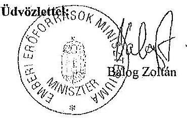

---

# 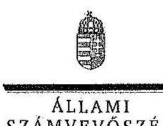 

Ikt.szám: V-0337-1001/2014.

## Balog Zoltán úr

miniszter
Emberi Eröforrások Minisztériuma

## Budapest

## Tisztelt Miniszter Úr!

A Pannon Egyetem, a Szolnoki Fölskola, a Károly Róbert Fölskola, a Magyar Képzőmüvészeti Egyetem, a Széchenyi István Egyetem, a Miskolci Egyetem és az Eszterházy Károly Fölskola gazdálkodásának és müködésének ellenőrzéséről készített jelentéstervezetekre tett észrevételeit köszönettel megkaptam.

Az Állami Számvevőszék észrevételekre vonatkozó álláspontjáról a felügyeleti vezető által készített részletes tájékoztatást csatoltan megküldöm.

Tájékoztatom Miniszter urat, hogy az ÁSZ. tv. 29. § (3) bekezdése alapján a számvevőszéki jelentések mellékleteként szerepeltetjük a jelentéstervezetekhez tett figyelembe nem vett észrevételeket az elutasítás indokainak feltüntetésével.

Budapest, 2014. gütüus hó 88. nap
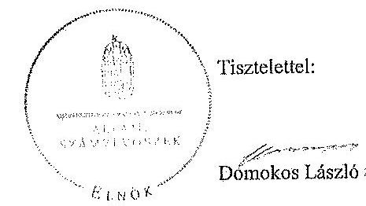

Melléklet: Tájékoztatás az elfogadott és a figyelembe nem vett észrevételekről

---

# Tájékoztatás   az elfogadott és a figyelembe nem vett észrevételekröl 

A Pannon Egyetem, a Szolnoki Főiskola, a Károly Róbert Főiskola, a Magyar Képzőmúvészeti Egyetem, a Széchenyi István Egyetem, a Miskolci Egyetem és az Eszterházy Károly Főiskola gazdálkodásának és müködésének ellenőrzéséről készült számvevőszéki jelentés-tervezetekhez a 36433-2/2014/FOFEJL iktatószámú levélben tett észrevételeit köszönettel megkaptuk.

A jelentéstervezetekre tett észrevételeket áttekintettük, azok kezeléséről a következő tájékoztatást adom:

1. A 2012. évi költségvetési hiánycél tartását biztosító további feladatokról szóló 1365/2011. (XI. 8.) Korm. határozatban elöirt szervezeti és feladatellátási felülvizsgálati program megvalósitása.

A kormányhatározat alapján - az oktatási ágazatra vonatkozóan 2012. február 20-ig - kellett a tételes javaslatokat a Kormány elé terjeszteni, ennek végrehajtása azonban elmaradt. A feladatokat a nemzetgazdasági miniszter irányítása mellett kellett végrehajtani, felelősként azonban a Miniszterelnökséget vezető államtitkár, a közigazgatási és igazságtigyi miniszter és az érintett ágazati miniszter is kijelölésre került. A fentiek alapján - az észrevéteiben leírtakra is figyelemmel - a vonatkozó szövegrészt a jelentéstervezetek összegző megállapítások, következtetések, javaslatok, valamint részletes megállapítások fejezeteiben az alábbiak szerint pontositottuk:
„Elmaradt az oktatási ágazatra vonatkozóan a nemzetgazdasági miniszter irányításával és az oktatásért felelös miniszter részvételével, kormányhatározatban elöirt szervezeti és feladatellátási felülvizsgálati program kidolgozása." (Összegző megállapítások)
„Elmaradt az oktatási ágazatra vonatkozóan az 1365/2011. (XI. 8.) Korm. határozatban - a nemzetgazdasági miniszter irányításával és az ágazatért felelös miniszter részvételével - elöirt szervezeti és feladatellátási felülvizsgálati program kidolgozása. (Részletes megállapítások, 1. fejezet):

---

2. A felsőoktatás rendszere középtávú fejlesztési tervének elkészítése.

Az észrevételben foglaltakat figyelembe véve a jelentéstervezetek összegző megállapítások, következtetések, javaslatok, valamint részletes megállapítások fejezetelt kiegészítettük:
„A felsőoktatási törvény rendelkezései ellenére nem készittetett a felsőoktatás rendszere vonatkozásában a Kormány által elfogadott középtávú fejlesztési tervet." (Összegzỏ megállapítások)
„A miniszter - a vonatkozó jogszabályokban foglaltak ellenére - nem készittetett a felsőoktatás rendszere vonatkozásában a Kormány által elfogadott középtávú fejlesztési tervet." (Részletes megállapítások, 1. fejezet)
3. A Felsőoktatás Információs Rendszerének (FIR) üzemeltetése.

A felsőoktatási törvények rendelkezései szerint (Feot. 35. §, 103.§ (1) bekezdés aa.) pont, Nftv. 64.§ (2) bekezdés aa) pont) a felsőoktatási információs rendszer müködtetése, az adatkezelés jogszerűsége a felsőoktatás ágazati irányítását ellátó miniszter felelősségi körébe tartozik. A miniszter feladata a felsőoktatási információs rendszer müködéséért felelős Oktatási Hivatal müködtetése is. A FIR müködését a teljes ellenőrzött időszakban problémák jellemezték, amely felveti az Oktatási Hivatal müködtetéséért felelős minisztérium felelősségét is. Az észrevételben jelzettek alapján a jelentéstervezeteket pontosítottuk a következők szerint:
„A minisztérium a Felsőoktatási Információs Rendszer (FIR) biztonságos üzemeltetéséhez, az adatok védelméhez szükséges alapvető szervezeti, szabályozási kontrollokat a 2012. év végéig nem teljes körűen alakittatta ki az Oktatási Hivatallal." (Összegzỏ megállapítások)
„A minisztérium az Oktatási Hivatallal a Felsőoktatási Információs Rendszer (FIR) biztonságos üzemeltetéséhez, az adatok védelméhez szükséges alapvető szervezeti, szabályozási kontrollokat a 2012. év végéig nem teljes körűen alakittatta ki.,, (Részletes megállapítások, 1. fejezet)
4. Korábbi ÁSZ ellenőrzések javaslatainak hasznosulása.

4/a. Az oktatási és kulturális ágazat irányítási rendszerének, müködésének ellenőrzéséről szóló 1106 sz. ÁSZ jelentés 3. sz. javaslata tekintetében a jelentéstervezetek részletes megállapítások 5. fejezetei részletesen tartalmazzák a tényeket. Ennek alapján az oktatási ágazat középtávú stratégiája kidolgozásának hiányára vonatkozó megállapítást a jelentéstervezetekben nem módosítottuk.

4/b. A felsőoktatás oktatási infrastruktúra-fejlesztési programjának ellenőrzéséről szóló 1171 sz. ÁSZ jelentésben az előkészítés hiányosságai miatt a felelősség megállapítására tett javaslat nem hasznosult a jelentéstervezetek megállapításai szerint.

---

Az észrevételben foglaltak szerint az egyes miniszterek, valamint a Miniszterelnökséget vezető államtitkár feladat- és hatásköréről szóló 212/2010. (VII. 1.) Korm. rendelet valóban a nemzeti fejlesztési miniszter szakpolitikai feladat- és hatáskörébe helyezte a PPP és egyéb állami vagyont érintő gazdálkodó szervezetekkel kötött és megkötendő szerződések vizsgálatát és ellenőrzését. Az ÁSZ nemzeti erőforrás miniszter részére címzett javaslata ugyanakkor a PPP programok előkészittési hiányosságai miatti felelősség megállapítására irányult. A nemzeti erőforrás minisztere 2012. január 19-én kelt intézkedési tervében 2012. december 31 -ei határidőre elvégzendő feladatként fogalmazta meg az előkészítési hiányosságok miatti felelősség megállapításról való intézkedést, amely nem valósult meg. Mindezek alapján a jelentéstervezetben tett megállapítás módosítása nem indokolt.

4/c A 1171. sz. jelentés alapján tervezett intézkedések közül az állami felsőoktatási intézmények kapacitás-kihasználás felmérése késéssel valósult meg. A felmérés eredményeinek és a felsőoktatást érintő ágazati célok figyelembe vételével a felsőoktatási infrastruktúra közép- és hosszú távú hasznosítására a helyszíni ellenőrzés időszaka alatt nem történtek intézkedések. Az intézkedés határideje 2013. december 31. volt. Az észrevételben foglaltak alapján a jelentéstervezetek módosítása nem indokolt.

4/d. Az állami felsőoktatási intézmények érdekeltségébe tartozó gazdasági társaságok támogatásának és nyereségük hasznosulásának ellenőrzése címü, 1290 sz. ÁSZ jelentés 2. sz. javaslata (Az állami felsőoktatási intézmények - a felülvizsgálatot követő, de legkésőbb egy éven belül - megmaradt társaságaira vonatkozó szakmai feladatellátás és a gazdasági eredményesség mérését biztosító mutatók és azok értékelési rendszerének kidolgoztatása) megállapításaink alapján nem hasznosult. A helyszíni ellenőrzés alatt rendelkezéare bocsátott dokumentumok alapján a minisztérium a rektorokat a szakmai feladatellátás és a gazdasági eredményesség mérését biztosító mutatószámok és értékelési rendszer kidolgozására a felsőoktatási intézmények finanszírozását szabályozó kormányrendelet kihirdetését követően kívánta felkérni. Így a vonatkozó megállapítás módosítása nem indokolt.

A Szolnoki Főiskola ellenőrzéséhez kapcsolódó - az emberi erőforrások miniszterének tett javaslatunk nem a PPP projektekkel kapcsolatos, hanem az intézmény hosszú távon fenntartható müködtetésére vonatkozó intézkedések megtételét célozza, amely a fenntartó feladata és nem igénylik a nemzeti fejlesztési miniszter bevonását.

Az Eszterházy Károly Főiskola esetében a jelentéstervezet nem az IFT minisztériumi észrevételezésének hiányát kifogásolta, hanem azt, hogy annak a Feot 115. § (2) bekezdése db) pontja szerinti felülvizsgálata dokumentáltan nem történt meg.

Az emberi erőforrások miniszterének a Károly Róbert Főiskola, a Magyar Képzőművészeti Egyetem, a Szolnoki Főiskola, az Eszterházy Károly Főiskola, a Széchenyi István Egyetem, valamint a Miskolci Egyetem vonatkozásában az Nftv. 73. § (3) bekezdés e) pontja alapján megfogalmazott javaslatokat az Nftv. 2014. július 24 -én hatályba lépő módosításai nem érintik, a felsőoktatási intézmény rektorainak tett javaslatokat a jogszabály változás figyelembe vételével pontositottuk.

---

Kérem a válaszlevelemben foglaltak szíves tudomásulvételét. Tájékoztatom Miniszter urat, hogy a számvevőszéki jelentés mellékleteként szerepeltetjük a jelentéstervezethez tett észrevételeit, az elfogadott valamint az ÁSZ. tv. 29. § (3) bekezdése alapján a figyelembe nem vett észrevételeket az elutasítás indokának feltüntetésével együtt.
Budapest, 2014. gilüns hó 28 nap

Horváthné Herbáth Mária
felügyeleti vezető

---

.

---

# SZOLNOKI FÔISKOLA 

Rektor

## Állami Számvevőszék

## Dornokos László

elnök

## Budapest

Apáczai Csere János u. 10. 1052

Tisztelt Elnök Úr!

Ikt.szám: SZP/4- 2014. Tárgy: Észzevételek az Állami Számvevőszék
Iktatéstervezetéles
Hiv.szám: 49221/2014
Erkeze: 2014 JOL 16
Iktatáscám: 8-0334 - pásdsz 4
Melléklet: $\quad$ Emp
Havunlhua H H
Az Állami Számvevőszék V-0337-965/2014 iktatási számú jelentéstervezetét megkaprak és arra határidőn belül az alábbi észrevételeket tesszük:
A jelentéstervezet több megállapításával egyetértünk, de néhány esetben kérjük, szíveskedjenek a megállapítást, a hiba besorolását ismételten átgondolni és lehetőség szerint azt módosítani.

Részletesen észrevételeink az alábbiak:
Több esetben nem azonosítható, hogy a megállapítás melyik költségvetési évre vonatkozik, amit fontosnak tartottunk volna, mivel a vizsgált időszakban két rektor, illetve három gazdasági föigazgató látta el ezt a munkakört. Nem tudjuk, hogy az adott évben hivatalban lévő gazdasági föigazgató rendelkezik-e olyan információval, amit a jelenlegi hivatalban lévő munkatárs nem ismer, és az esetlegesen módosíthatna valamelyik számvevőszéki megállapításon. Ismételten javasoljuk az érintettek megkezesését.

## I. Összegzö megállapítások

20. oldal 3. bekezdés

Azon megállapításokra vonatkozóan, amely szerint a belső ellenőrzés az ellenőrzési teryben foglaltakat nem hajtotta végre maradéktalanul, fontos ellenőrzések elmaradtak (informatikai terület közbeszerzés), az alábbi megjegyzést teszem.
Az informatikai rendezerek ellenőrzése és a közbeszerzési folyamat ellenőrzés elmaradásának oka az volt, hogy a belső ellenőr a jelzett területekre vonatkozóan nem rendelkezik szakképesítéssel, ezért külső szakértő igénybevételé vált volna szükségessé, melyre a Főiskola anyagi helyzete nem adott lehetőséget. A főiskola ebben az időszakban jelentős költségvetési forrás elvonást szenvedett el, ami miatt az alkalmazásban álló szakemberek munkájára kellett támaszkodnunk.

## 23. oldal, 25. oldal

A számviteli megállapításokhoz tett észrevételeink alapján kérjük, szíveskedjenek megfontolás tárgyává tenni azon megállapítást, amely szerint az éves beszámoló nem nyújt meghívható képet a vagyoni, pénzügyi helyzetröl.

## II. Részletes megállapítások

3.3. Kiadási elöirányzatok felhasználása és a bevételi elöirányzatok teljesítése

## 45. oldal 1. bekezdés

1. Arca a megállapításra, miszerint rendszerhiba volt, hogy a megbízási szerződéseknél a pénzügyi ellenjegyzés a kötelezettségvállalással ugyanazon a napon történt meg, amely miatt ellenőrizhetetlen, hogy a kötelezettségvállalást megelőzően vagy azt követően történt-e a pénzügyi ellenjegyzés, észrevételünk az alábbi:

---

A hivatkozott jogszabály helyek „217/1998 (XII. 30.) Korm. rendelet 134. § (8), 292/2009 (XII. 19.) Korm. rendelet 74.§ (1), 368/2011 (XII. 31.) Korm. rendelet 55.§ (1)" valóban elöirják, hogy a kötelezettségvállalásra kizárólag írásban a pénzügyi ellenjegyzést követően kerülhet sor, azonban nem zárják ki a két aktus ugyanazon napon történő lebonyolítását. Annak ténye, hogy a két alátás ugyanazon a napon történt nem igazolja, hogy a sorrendiségben szabálytalanság volt. Kérjük, szíveskedjenek e pont törlését megfontolás tárgyává tenni.

# 47. oldal 1. bekezdés 

2. A hallgatói költségtérítések OTP Bank Nyrt-nél vezetett gyűjtőszámlán történő kezelés kapcsán tett megállapításhoz az alábbi észrevételt tesszük:

A gyôjtőszámla megnyitásakor számos felsőoktatási intézménnyel történő egyeztetés során alakult ki az a számlakezeléssel kapcsolatos gyakorlat, melyet az intézmény ez idáig alkalmazott.

A Hallgatói Önkormányzat nevére megnyitott gyôjtőszámlán megjelenő összegek csak akkor képezik a Pöiskola bevételét, amikor a hallgató rendelkezik a számára a NEPTUN rendszerben hürt tétel kiegyenlítésére vonatkozóan az adott összeg átutalásáról. A hallgatóknak lehetőségük van a saját folyószámlájukra visszautalni a gyôjtőszámláról a befizetett összeget. Az igaz, hogy a gyôjtőszámla a fülukola nevén van, de az összeg felett az intézmény nem rendelkezik, tehát kérdéses annak tulajdonjoga is. Megkérdőjelezhető, hogy a számlán szereplő összeg saját eszközként kezelhető-e?
A Pöiskola által történő átvezetésre, a NEPTUN rendszerben kiegyenlített tételek analitikája alapján kerül sor. Kérjük az esetleges tévedés súlyosságának értékelése során szíveskedjenek érvelésünket figyelembe venni, illetve annak tényét, hogy egy sok éven keresztül alkalmazott országos gyakorlatról van szó.

Jogszabályi elöírásoknak megfelelően megkezdiük az OTP gyôjtőszámláról a Kincstári számlákra történő áttérést. A számviteli szabályok változása miatti új ügyviteli rendszerre történő átállás következtében a Kincstári számlák tényleges használatára a 2014/2015. tanulmányi év első félévétől nyílik lehetőség.

### 4.2. Vagyongazdálkodás szabályszertüsége 52. oldal 4. bekezdés

Arra a megállapításra vonatkozóan, miszerint nem biztosítottuk a leltárak mérleg fordulónapjára történő korrekcióját, az alábbi észrevételt tesszük:

1. A leltár kiértékelését minden évben a leltár fordulónapjára végeztük el. A leltár fordulónapja és a mérleg fordulónapja közötti tárgyi eszköz mozgások a TÖSZ rendszerben folyamatosan könyvelésre és egyeztetésre kerültek. Az analitika és a főkönyv egyeztetését elvégeztük, eltérést nem tapasztaltunk, így biztosított volt az analitika és a főkönyv egyezősége. Az összesített állomány változás részletezése az adott állomány számlák analitikus kivonatából bármikor lekézhető, tehát a mérleg forduló napca történő korrekció egyeztetve és összegezve elkészült, csak részletezett formában nem került kinyomtatásra. Tíny, hogy az éves beszámolóban szereplő összeg megegyezik a tényleges mérleg fordulónapi értékkel, hiszen a leltározást követően a készletmozgások könyvelésre kerültek és a mérleg az ellenőrzött főkönyvi kivonat alapján készült.

Azon megállapításra vonatkozóan, hogy 2012. évben a könyvviteli mérlegben kimutatott eszközök és források állományának valódiságát teljes körű leltárral nem támasztottuk alá, továbbá a Pöiskola nem rendelkezett a Minisztérium egyetértő nyilatkozatával arról, hogy 2012. évben nem kell leltároznia, valamint a Minisztérium részére az éves költségeetési beszámolóval együtt megküldte a tanúsítványt, melyben úgy nyilatkozott, hogy a könyvviteli mérleg valódiságát 249/2000. (XII. 24.) Korm. rendelet 37. § alapján készített leltár alátámasztja, az alábbi észrevételt tesszük:

A szakminisztérium engedélyezte a kétévenkénti leltározást az intézmény számára.(A dokumentumokat mellékelten megküldjük). Az, hogy az erről szóló kérelmet és egyetértő nyilatkozatot nem bocsátottuk a vizsgálat időpontjában rendelkezésükre, feltételezhetően azért történt, mert az engedély a vizsgált időszakot megelőzően, 2007-ben keletkezett. Ezen időszak óta három gazdasági főigazgató váltotta egymást, és a dokumentumokat az ellenőrzés időszakára koncentráltan keresztül nyilvántartási rendszerünkben. Ez alapján az engedély alapján szerepel a Leltározási Szabályzatunkban a kétévente történő tételes leltározás lehetősége.
2007. évet követően az intézmény különböző okok miatt (mezőtúri fakultás Szolnokra történő beköltözése miatt, Ady út) oktatási épület átköltöztetése a Tiszaligeti új Campus épületbe) minden évben tételes leltárt hajtott végze, azonban 2012-ben élt a minisztériumi engedély lehetőségével.

2012-ben az engedélynek megfelelően végeztük el a mérleg alátámasztásához szükséges egyeztetéseket. Értelmezésünk szerint a vagyonleltár gyakorisága megfelel a fenntartó és a jogszabályok elvárásának, biztosítja

---

a mérleg hitelességét, ezért javasoljuk a megállapításban szereplő „hamis nyilatkozat, valótlati" kifejezést törölni, esetleg „téves nyilatkozatra" módosítani. A téves nyilatkozat kifejezést azért is szerencésebbnek tartjuk, mert a hamis nyilatkozat szándékos megtévesztésre enged következtemi, amelyröl nincs szó.
2. Azon megállapításhoz, mely szerint a Főiskola a mérlegében passzív pénzügyi elszámolások soron tévesen mutatott ki 84,5 millió Ft-ot, az alábbi megállapítást teszzük:

A fenti összegből 79,5 millió Ft a Biogáz pályázattal kapcsolatos összeg, melyről a mérleg készités idópontjában ismert volt, hogy a pályázat nem valósul meg és az elöleg visszafizetésre kerül.

# 56. oldal 4. bekezdés 

3. A fennmaradó 5 millió Ft a Baross-2-2005-0087 azonosítósáámú pályázat konsorciami partnerének, a GITR Zet.-nek - a pályázat megbízualása miatti - visszafizetési kötelezettségünkből keletkezett. A pályázat megbízualásának ténye és emiatt a visszafizetési kötelezettség szintén ismert volt a mérlegkészités idópontjában, ezért került a függő tételek közé. Megítélésünk szerint a valós tartalmat ez a minösités biztosítja, és ezzel tudunk leginkább eleget tenni a számviteli elveknek.

A jegyzőkönyv tervezetben több helyen szerepel, hogy az intézményen nem müködött a kockázati elemzési funkció. Ezen megállapítással kapcsolatban előadjuk, hogy ezt a faladatot több területen folyamatosan végezzük.
A Főiskola 2010-2011. évben készítette el intézményfejlesztési tervét, melyet az EMMI elfogadott. A dokumentum költső szakértő bevonásával készült és jelentős kockázatelemzési munkán alapzzik. Az intézményfejlesztési terv aktualizálása 2012-ben megtörtént.
A kockázatelemzés szintén megjelenik a minőségbiztosítási feladataink ellátása során. Az éves vezetői felülvizsgálat minden területre kiterjed és a kockázatelemzést is megvalósítja. Ezt a dokumentumot átvizsgálja a minőségi tanúsítványt kibocsátó EMJ-TÜV-SÜD-KB. Az elmúlt években az audit minden esetben sikeres volt. A minőségi audit anyagát a Szentítus minden esetben tárgyalja.

Egyben tisztelettel kérjük, hogy fenti észrevételeink elfogadása esetén azt is vizsgálják felül, hogy a hibák aránya változott-e olyan mértékben, amely a szabályozottságra vonatkozó minősítések módosulását eredményezi.

Szolnok, 2014. július 10.
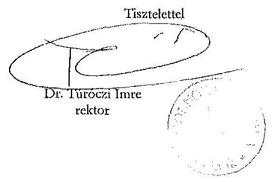

Huszár Erika
gazdasági főigazgató

---

# SZOLNOKI FÔISKOLA 

Gazdasági Fõigazgató

## SZOLNOKI FÔISKOLA

Esk. 07. 08. 30. 96. 20. 25. 2008
Mek. - $\quad$ Dignnázó: 3026/12'
Tümnüzüi egynäri - Kattán 9/2020.08. 1039
P. H. $\quad 139$
holládza ónezóo
Ikt: SZF: 665 .../2007.

## Budapest

Szalay utca 10-14.
1055

## Tisztelt Fõosztályvezető Asszony!

A Szolnoki Főiskola nevében azzal a kéréssel fordulok Önböz, hogy egyetértését kérjük intézményünk leltározásának kétévente történő végrehajtásához.

Intézményünk 2005-ben teljes körü leltározást hajtoit végre az eszközök és források tekintetében, ezért élni szeretnénk a 249/2000. Kormányrendelet által felkínált leherőséggel és 2007. december 31 -től el kivánunk tekinteni a tételes leltározástól.

A felügyeleti szerv hozzájárulása szükséges az engedélyezéshez, amely kiadásához az alábbiakban nyilatkozunk:

A fôiskolán a tulajdon védelme megfelelően biztosított és ellenôrzött, az eszközökrôl és az azok állományában bekövetkezett változásokról folyamatosan részletéző nyilvántartást vezetünk mennyiségben és értékben. A nyilvántartásunkból készített összeaitô kimutatás a mérleg valódiságát maradéktalanul alátámasztja.

Az OKM Ellenôrzési Főosztálya a 2006. évi gazdálkodás megbízhatósági ellenôrzését végrehajtotta, amely pozitív eredménnyel zárult.

Kedvezố elbírálást köszönettel várjuk.

Szolnok, 2007. augusztus 29.
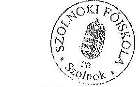

Bajcsák Károly
gazdasági fôigazgató ${ }^{\text {I }}$
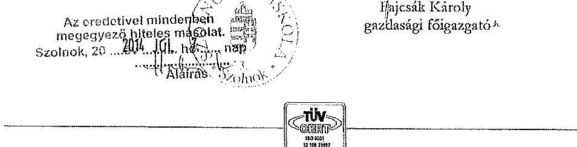

OM azonosító: FI47616
H-5000 Szolnok, Ady Endre u. 9. Tel.: +36(56)421-455/215 Fax: +36(56)510-445 fajcsak@szolf.hu - www.szolf.hu

---

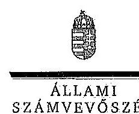

ELHök

Ikt.szám: V-0337-1006/2014.

Dr. Türokzi Imre úr
rektor
Szolnoki Főiskola

Szolnok

# Tisztelt Rektor Úr! 

A Szolnoki Főiskola gazdálkodásának és müködésének ellenőrzéséről készített jelentéstervezetre tett észrevételeit köszönettel megkaptam.

Az Állami Számvevőszék észrevételekre vonatkozó álláspontjáról a felügyeleti vezető által készített részletes tájékoztatást csatoltan megküldöm.

Tájékoztatom Rektor urat, hogy az ÁSZ. tv. 29. § (3) bekezdése alapján a számvevőszéki jelentés mellékleteként szerepeltetjük a jelentéstervezethez tett figyelembe nem vett észrevételeket az elutasítás indokainak feltüntetésével.

Budapest, 2014. július hó 28 nap
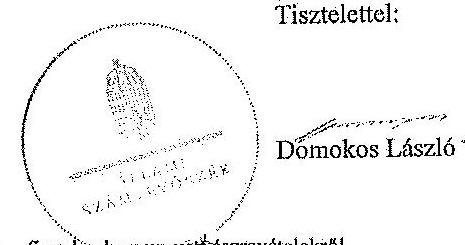

Melléklet: Tájékoztatás az elfogadott és a figyelémbe nem vett észrevételekről

---

# Tájékoztatás 

az elfogadott és a figyelembe nem vett észrevételekröl

A Szolnoki Főiskola gazdálkodásának és müködésének ellenőrzéséről készült számvevőszéki jelentés-tervezethez a SZF/4-205/2014. iktatószámú levélben tett észrevételeit köszönettel megkaptuk. A jelentéstervezetre tett észrevételeket áttekintettük, azok kezeléséről a következő tájékoztatást adom:

## Általános észrevételek

Az Állami Számvevőszékről szóló 2011. évi LXVI. törvény szabályozza az észrevételezési jogot, a 29. § (1)-(2) bekezdési alapján a számvevőszéki jelentéstervezet megküldése és észrevételezése nem az ellenőrzött időszakban közalkalmazotti jogviszonyban álló személyekhez kötött. A számvevőszéki jelentéstervezetre - tekintettel arra is, hogy a számvevőszéki jelentéstervezet személyes felelősséget nem állapított meg - az ellenőrzött szervezet hivatalban lévő vezetője tehet észrevételt.

A megállapítások beazonosíthatósága érdekében a jelentéstervezetben külön jelöltük azokat az eseteket, amikor csak egy adott költségvetési évet illetően állapítottunk meg hiányosságokat, szabálytalanságokat, egyéb esetekben az ellenőrzött 2009-2012. évek egészére jellemző volt a megállapítás.

## Az összegző megállapításokhoz tett észrevételek

1. A belső ellenőrzési tervek végrehajtása.

A jelzetteket a jelentéstervezetben a részletes megállapítások (34. oldal) között már ismertettük. Az észrevétel alapján, a tervezet szövegét az összegző megállapítások fejezetben kiegészítettük az alábbiak szerint:
„A belső ellenőrzés az ellenőrzési tervekben foglaltakat megfelelő szakképesités és forrás hiányában nem hajtotta végre maradéktalanul, fontos ellenőrzések elmaradtak (informatikai terület, közbeszerzés)." (Összegző megállapítások, 20. oldal)
2. Az SZF 2009-2012. évekre vonatkozó mérlegei megbízhatósága.

Az észrevétel alapján a jelentéstervezet 23. oldalának második bekezdését az alábbiak szerint pontositottuk:
„A föiskola 2009-2012. évre vonatkozó mérlegeiben a helyszini ellenőrzés során feltárt hibák összege lényegesen meghaladta az Áhsz-ben meghatározott jelentös összeget (2009-ben

---

$11,6 \%, 2010$-ben $16,2 \%, 2011$-ben $13,3 \%, 2012$-ben $11,1 \%$ volt a hibák mérlegfőösszeghez viszonyltott aránya), ami befolyásolja a vagyoni helyzetéröl kialakitott képet."

A 25. oldalon az emberi szôforrások miniszterének tett javaslatot megalapozó megállapítás utolsó elötti mondata az alábbiak szerint módosult:
.Az SZF 2009-2012. évekre vonatkozó mérlegelben nem-mutatnak-megbizható és-valós-képet, az ellenörzés során feltárt hibák összege meghaladta az Ähsz.-ben meghatározott jelentös öszszeget, ami befolyásolja a vagyoni helyzetröl kialakitott képet."

Ehhez kapcsolódóan a 49. oldal elsô bekezdésének második mondatát töröltük, az 52. oldal első bekezdését az alábbiak szerint pontositottuk:
.Az SZF 2009-2012. évekre vonatkozó mérlegelben, az ellenörzés során feltárt hibák összege meghaladta az Ähsz 5.§. 8. pontjában meghatározott jelentös összeget, ami befolyásolja a vagyoni helyzetröl kialakitott képet."

# A részletes megállapításokhoz tett észrevételek 

1. Megbízási szerződések pénzügyi ellenjegyzése.

Az észrevételben jelzettek és a jogszabályi elöírások alapján a jelentéstervezet szövegét módosítottuk, az ellenjegyzés hiányosságaira vonatkozó szövegrészt a tervezet összegző és a részletes megállapításaiból is töröltük:
„A megbízási díjak elszámolása nem felelt meg az államháztartási törvény és a kapcsolódó kormányrendelet elöírásainak. Több esetben elöfordult, hogy a kifizetések teljesítésigazolását nem végezték el, vagy azt nem a kijelölt személy hajtotta végre. Rendszerhiba-volt,-hogy-a-megbízási-szerzödéseknél-a-pénzügyi-ellenjegyzés-a-kötelezettségvállalással-egy-idöben-történt-meg,-amely-mialt-ellenörizhetetlen-volt,-hogy-a-kötelezettségvállalás-a-pénzügyi-ellenjegyzést-követően-vagy-azt-megelözően-történt-e-meg. Elöfordult, hogy a szerződéseket a feladat teljesitésének megkezdését követően kötötték meg. Ez felveti a fedezet nélküli kötelezettségvállalás és a tényleges teljesités nélküli kifizetés kockázatát." (Összegző megállapítások, 21. oldal)
„A megbízási díjak elszámolása nem volt szabályszerű a pénzügyi-ellenjegyzés, teljesítésigazolás hiányosságai miatt. Ez magában hordozza a-fedezet-nélküli-kötelezettségvállalás és a tényleges teljesités nélküli kifizetés kockázatát." (Részletes megállapítások, 44. oldal)
„Rendszerhiba-volt,-hogy-a-megbízási-szerzödéseknél-a-pénzügyi-ellenjegyzés-a-kötelezettségvállalással-egy-idöben-történt-meg,-amely-mialt-ellenörizhetetlen-volt,-hogy-a-kötelezettségvállalást-megclözően-vagy-azt-követően-történt-e-meg-a-pénzügyi-ellenjegyzés.-Ez-nem-felelt-meg-a-vonatkozó-jogszabályoknak." (Részletes megállapítások, 45. oldal)

---

# 2. Kincstári körön kívüli számlavezetés. 

Az államháztartásról szóló 2011. évi CXCV. törvény 79. § (1) bekezdése (korábban az Ált. ${ }_{1}$ 18/C. § (5) bekezdése) előírásai szerint a kincstári kör fizetési számlái kizárólag a kincstárnál vezethetők. Az SZF-nél a hallgatói díffizetéseket és költségtérítéseket nem a Kincstárnál vezetett számlán kezelték, ami nem felelt meg a jogszabályi előírásnak. Az erre vonatkozó megállapításoktól ezért nem lehet eltekinteni.
3. A leltárak mérleg fordulónapjára történő korrekciója.

A helyszíni ellenőrzés során megállapítottuk, hogy nem biztosították a leltárak mérleg fordulónapjára történő korrekcióját, a felleltározott érték és a mérleg fordulónapjáig bekövetkezett állományváltozások összegének dokumentált összevezetését és annak a mérlegben szereplő adatokkal történő egyeztetését, ami nem felelt meg az Sztv. 69. § (5) bekezdésében foglaltaknak. A dokumentálás hiánya miatt az észrevételben leírtakat nem lehet elfogadni, a jelentéstervezetben szereplő megállapításokat módosítani.
4. A 2012. évi leltározásra vonatkozó megállapítások.

Az észrevételhez csstolt dokumentumok alapján a 2012. évi leltározás hiányosságára vonatkozó megállapítást nem tudjuk módosítani a következők miatt. A föiskola gazdasági föigazgatója által írt levélben valóban azt kérte az OKM-től, hogy 2007. december 31-jétől el kíván tekinteni a tételes leltározástól a jogszabályi lehetőséggel élve. Az OKM szakállamtitkára válaszlevelében „a 2007. évről összeállítandó éves költségvetési beszámoló elkészítésénél alkalmazható" leltározás kétévenkénti végrehajtásával értett egyet. Tehát a szakállamtitkár levelében egy évre adott engedélyt. A leltározáshoz kapcsolódó nyilatkozat érintő szövegrézet az emberi erőforrások miniszterének címzett megállapításban az alábbiak szerint módosítottuk:
„A 2012. évben teljes körü leltározást nem végeztek, ennek ellenére a mérleg leltárral történő alátámasztásáról nytlatkoztak.

A miniszternek címzett b.) javaslat megfogalmazását az alábbiak szerint változtattuk:
„Intézkedjen a mérleg leltárral történő alátámasztásához kapcsolódó valóilom nyilatkozat miatt a munkaigoj felelősséggel kapcsolatos körülmények kivizsgálásáról, és a vizsgálat eredményének ismeretében tegye meg a szükséges intézkedéseket"
5. Passzív pénzügyi elszámolások.

Az észrevételben leírtakat nem tudjuk elfogadni a következők miatt. Az államháztartás szervezetei beszámolási és könyvvezetési kötelezettségének sajátosságairól szóló 249/2000. (XII. 24.) Korm. rendelet (Áhsz., hatálytalan 2014. január 1-jétől) 26. § (5) bekezdés dh) pontja szerint a támogatási program előlegek miatti kötelezettségeket a rövid lejáratú kötelezettségek között kellett kimutatni. Az SZF a 2010. évben 79,5 M Pt-ot kapott pályázati előlegként, amelyet a jogszabályi előírás ellenére passzív pénzügyi elszámolásként mutatott ki. Ugyancsak ezen a mérlegsoron mutatott ki az intézmény tévesen $5,0 \mathrm{M}$ Ft kölcsönt.

---

6. Kockázatkezelési rendszer.

A kockázatkezelési rendszerre vonatkozó észrevételeket nem áll módunkban elfogadni.. A jelzett intézményfejlesztési terv elkészítése, illetve minőségi tanúsítvány megléte nem befolyásolja a kockázatkezelési rendszerre vonatkozó megállapításokat.

Kérem a válaszlevelemben foglaltak szíves tudomásulvételét. Tájékoztatom Rektor urat, hogy a számvevőszéki jelentés mellékleteként szerepeltetjük a jelentés-tervezethez tett észrevételeit, valamint az elfogadott és az ÁSZ. tv. 29. § (3) bekezdése alapján a figyelembe nem vett észrevételeket az elutasítás indokának feltüntetésével együtt.
Budapest, 2014. július hó 29 nap

Horváthné Herbáth Mária
felügyeleti vezető