# ÁLLAMI   SZÁMVEVŐSZÉK 

## JELENTÉS

a Pannon Egyetem ellenőrzéséről - Az állami felsőoktatási intézmények gazdálkodásának, müködésének ellenőrzése

---

# Állami Számvevőszék 

Iktatószám: V-0337-1036/2014.
Témaszám: 1371
Vizsgálat-azonosító szám: V-065802

## Az ellenőrzést felügyelte:

Horváthné Herbáth Mária
felügyeleti vezető
Az ellenőrzést vezette:
Keresztes Tamás
ellenőrzésvezető
A számvevői jelentések feldolgozásában és a jelentés összeállításában közremüködtek:

Keresztes Tamás
ellenőrzésvezető
Dr. Remport Katalin
számvevő tanácsos
Kliment Krisztián Endre
számvevő asszisztens
Az ellenőrzést végezték:

| Humli Tamásné | Koczor László | Kriston-Vizi János |
| :-- | :-- | :-- |
| számvevő tanácsos | számvevő tanácsos | számvevő tanácsos |
| Dr. Remport Katalin | Trenovszki István |  |
| számvevő tanácsos | számvevő tanácsos |  |

A témához kapcsolódó eddig készített számvevőszéki jelentések:
címe
sorszáma
Jelentés az oktatási és kulturális ágazat irányítási rendszerének, 1106
múködésének ellenőrzéséről
Jelentés a felsőoktatás oktatási infrastruktúra-fejlesztési program- 1171 jának ellenőrzéséről
Jelentés az állami felsőoktatási intézmények érdekeltségébe tartozó 1290
gazdasági társaságok támogatásának és nyereségük hasznosulásának ellenőrzéséről

---

# TARTALOMJEGYZÉK 

BEVEZETÉS ..... 15
I. ÖSSZEGZŐ MEGÁLLAPÍTÁSOK, KÖVETKEZTETÉSEK, JAVASLATOK ..... 19
II. RÉSZLETES MEGÁLLAPÍTÁSOK ..... 26

1. A felsőoktatásért felelős minisztérium fenntartói és ágazati irányítói tevékenysége ..... 26
2. Az intézmény belső kontrollrendszerének kiépítése és múködtetése ..... 28
3. Az intézmény pénzügyi gazdálkodása ..... 33
3.1. A kiadási és bevételi előirányzatok alakulása és a pénzügyi egyensúlyt befolyásoló tényezők ..... 33
3.2. A bevételi és kiadási előirányzatok megállapítása, módosítása, az előirányzat-maradványok kezelése ..... 38
3.3. A kiadási előirányzatok felhasználása és a bevételi előirányzatok teljesítése ..... 40
4. Az intézmény vagyongazdálkodása ..... 45
4.1. A vagyongazdálkodás szabályozottsága ..... 47
4.2. A vagyongazdálkodás szabályszerűsége ..... 48
5. Korábbi ÁSZ ellenőrzések javaslatainak hasznosulása ..... 56

---

# MELLÉKLETEK 

1. számú A Pannon Egyetem kiadási és bevételi előirányzatai, azok teljesítése a 2009-2012. években
2. számú A Pannon Egyetem kiadásainak, bevételeinek változása 2009-2012-ig
3. számú Kimutatás a Pannon Egyetem bevételeiről és kiadásairól, valamint adósságszolgálatáról a 2009-2012. években
4. számú A Pannon Egyetem mérlegadatai a 2009-2012. években
5. számú A Pannon Egyetem gazdálkodása szabályszerűségének értékelése a mintatételek alapján
6. számú Az Emberi Erőforrások Minisztériumának észrevétele
7. számú Az emberi Erőforrások Minisztériumának észrevételére adott válasz
8. számú A Pannon Egyetem észrevétele
9. számú A Pannon Egyetem észrevételére adott válasz

---

# RÖVIDÍTÉSEK JEGYZÉKE 

## Törvények

Áht. 1
Áht. 2
ÁSZ tv.
Feot.
$\mathrm{Kbt}_{11}$
$\mathrm{Kbt}_{2}$
Kjt.
Mtv.
Nftv.
Nvtv.
Szja tv.
Sztv.
Tbj.

Vtv.

## Korm. rendeletek

Áhsz.

Ámr. 1
Ámr. 2
Ávr.
Ber.

Bkr.
Vtvr.
6/2009. (I. 20.) Korm. rendelet

133/2009. (VI. 19.)
Korm. rendelet
1992. évi XXXVIII. törvény az államháztartásról (hatálytalan 2012. január 1-jétől)
2011. évi CXCV. törvény az államháztartásról
2011. évi LXVI. törvény az Állami Számvevőszékről
2005. évi CXXXIX. törvény a felsőoktatásról (hatálytalan 2012. szeptember 1-jétől)
2003. évi CXXIX. törvény a közbeszerzésekről (hatálytalan 2012. január 1-jétől)
2011. évi CVIII. törvény a közbeszerzésekről
1992. évi XXXIII. törvény a közalkalmazottak jogállásáról
1992. évi XXII. törvény
a Munka Törvénykönyvéről
2011. évi CCIV. törvény a nemzeti felsőoktatásról
2011. évi CXCVI. törvény a nemzeti vagyonról
1995. évi CXVII. törvény a személyi jövedelemadóról
2000. évi C. törvény a számvitelről
1997. évi LXXX. törvény a társadalombiztosítás ellátásaira és a magánnyugdijra jogosultakról, valamint e szolgáltatások fedezetéről
2007. évi CVI. törvény az állami vagyonról
249/2000. (XII. 24.) Korm. rendelet az államháztartás szervekbei beszámolási és könyvvezetési kötelezettségének sajátosságairól
217/1998. (XII. 30.) Korm. rendelet az államháztartás működési rendjéről (hatálytalan 2010. január 1-jétől)
292/2009. (XII. 19.) Korm. rendelet az államháztartás múködési rendjéről (hatálytalan 2012. január 1-jétől)
368/2011. (XII. 31.) Korm. rendelet az államháztartásról szóló törvény végrehajtásáról
193/2003. (XI. 26.) Korm. rendelet a költségvetési szervek belső ellenőrzéséről (hatálytalan 2012. január 1jétől)
370/2011. (XII. 31.) Korm. rendelet a költségvetési szervek belső kontrollrendszeréről és belső ellenőrzéséről
254/2007. (X. 4.) Korm. rendelet az állami vagyonnal való gazdálkodásról
a költségvetési szerveknél foglalkoztatottak 2009. évi havi kereset-kiegészítéséről (hatálytalan 2010. december 31-étől)
a költségvetési szerveknél foglalkoztatottak 2009. évi havi kereset-kiegészítéséről szóló 6/2009. (I. 20.) Korm. rendelet

---

204/2009. (IX. 18.)
Korm. rendelet
352/2010. (XII. 30.)
Korm. rendelet
371/2011. (XII. 31.)
Korm. rendelet

## Határozatok

1001/2009. (I. 13.)
Korm. határozat
1033/2009. (III. 17.)
Korm. határozat
1035/2010. (II. 12.)
Korm. határozat

1120/2010. (V. 13.)
Korm. határozat

1132/2010. (VI. 18.)
Korm. határozat
1268/2010. (XII. 3.)
Korm. határozat
1025/2011. (II. 11.)
Korm. határozat
1185/2011. (VI. 6.)
Korm. határozat
1316/2011. (IX. 19.)
Korm. határozat
1365/2011. (XI. 8.)
Korm. határozat

1122/2012. (IV. 25.)
Korm. határozat
1133/2012. (IV. 26.)
Korm. határozat
1428/2012. (X. 8.)
Korm. határozat

## Egyéb rövidítések

ÁSZ
EGIR
EMMI
EU
FAO

FIR
módosításáról (hatálytalan 2010. december 31-étől)
az ideiglenes külföldi kiküldetés napidijának összegéről és kifizetéséről (hatálytalan 2012. július 29-étől)
a költségvetési szerveknél foglalkoztatottak 2011. évi kompenzációjáról (hatálytalan 2012. január 31-étől)
a költségvetési szerveknél és az egyházak közcélú tevékenységet folytató intézményeinél foglalkoztatottak 2012. évi kompenzációjáról
a 2009. évi havi kereset-kiegészítés forrásigényének biztosításához szükséges intézkedésekről
a 2009. évi államháztartási egyensúly megőrzéséhez szükséges intézkedésekről
a központi költségvetési szerveknél foglalkoztatottak 2010. évben fizetendő eseti kereset-kiegészítésének finanszírozásáról
a központi költségvetési szerveknél foglalkoztatottak 2010. évben fizetett eseti kereset-kiegészítésének elszámolásáról
a 2010. évi költségvetéssel összefüggő egyes feladatokról
a 2010. évi költségvetési egyenleg teljesítéséhez szükséges intézkedésekről
az államháztartási egyensúly megőrzéséhez szükséges intézkedésekről
a központi költségvetési szerveknél foglalkoztatottak 2011. évi kompenzációjának finanszírozásáról
a 2011. évi költségvetési egyensúlyt megtartó intézkedésekről
a 2012. évi költségvetési hiánycél tartását biztosító további feladatokról
a Széll Kálmán Terv kiterjesztése keretében megvalósítandó egyes intézkedésekről
a központi költségvetési szerveknél foglalkoztatottak 2012. évi kompenzációjának finanszírozásáról
a 2012. évi költségvetési egyenleg tartását biztosító intézkedésekről

Állami Számvevőszék
Egységes gazdálkodási integrált rendszer
Emberi Erőforrások Minisztériuma
Európai Unió
Az Egyesült Nemzetek Élelmezésügyi és Mezőgazdasági Szervezete (Food and Agriculture Organization of the United Nations)
Felsőoktatási Információs Rendszer

---

| FVM | Földművelésügyi és Vidékfejlesztési Minisztérium |
| :-- | :-- |
| GMF | Gazdasági és Műszaki Főigazgatóság |
| GT | Gazdasági Tanács |
| Hpsz. | Humánpolitikai Szabályzat |
| IFT | Intézményfejlesztési Terv |
| Kincstár | Magyar Államkincstár |
| KIM | Közigazgatási és Igazságügyi Minisztérium |
| MNV Zrt. | Magyar Nemzeti Vagyonkezelő Zrt. |
| MTMT | Magyar Tudományos Müvek Tára |
| NAV | Nemzeti Adó- és Vámhivatal |
| NEFMI | Nemzeti Erőforrás Minisztérium |
| NEPTUN | Tanulmányi hallgatói információs rendszer |
| NFM | Nemzeti Fejlesztési Minisztérium |
| NGM | Nemzetgazdasági Minisztérium |
| OKM | Oktatási és Kulturális Minisztérium |
| OTKA | Országos Tudományos Kutatási Alapprogramok |
| Pannon TISZK Kft. | Pannon TISZK Veszprém Szakképzés-Szervezési Kiemel- |
|  | kedően Közhasznú Nonprofit Kft. |
| PE | Pannon Egyetem |
| PM | Pénzügyminisztérium |
| PPP | Public-Private Partnership (magán és közszféra együtt- |
|  | múködése) |
| SZMSZ | Szervezeti és Müködési Szabályzat |
| VRIC Kft. | Veszprém Regionális Innovációs Centrum Nonprofit Kft. |

---

.

---

# ÉRTELMEZŐ SZÓTÁR 

alapító

állami felsőoktatási intézmény saját tulajdona
állami vagyon
állami vagyon hasznosítása

A központi költségvetési szerv alapítója az Országgyűlés, a Kormány vagy a miniszter. A felsőoktatási intézmények vonatkozásában az alapítói jogokat a felsőoktatásért felelős minisztérium gyakorolja.
a felsőoktatási intézmény saját bevételének a költségek teljes körű levonása - az adományozás és öröklés kivételével -, a rendelkezésre bocsátott vagyon állagának megóvásáról, pótlásáról való gondoskodás után fennmaradt része terhére szerzett vagyona
A Vtv. 1. § (2) bekezdése szerint állami vagyonnak minősül:
a) az állami tulajdonban lévő ingó dolog, valamint a dolog módjára hasznosítható természeti erő,
b) az állami tulajdonban lévő termőföldekből álló, külön törvényben szabályozott Nemzeti Földalap,
c) az állami tulajdonban lévő - a b) pont hatálya alá nem tartozó - ingatlan,
d) az állami tulajdonban lévő értékpapír,
e) az államot megillető társasági részesedés és más vagyoni értékű jog.
(hatályos 2010. június 16-ig)
a) az állam tulajdonában lévő dolog, valamint a dolog módjára hasznosítható természeti erő,
b) az a) pont hatálya alá nem tartozó mindazon vagyon, amely vonatkozásában törvény az állam kizárólagos tulajdonjogát nevesíti,
c) az állam tulajdonában lévő tagsági jogviszonyt megtestesítő értékpapír, illetve az államot megillető egyéb társasági részesedés,
d) az államot megillető olyan immateriális, vagyoni értékkel rendelkező jogosultság, amelyet jogszabály vagyoni értékű jogként nevesít.
(hatályos 2010. június 17-től)
A Vtv. 23. § (1) bekezdése szerint: Az állami vagyont az MNV Zrt. maga kezeli, illetve szerződés - így különösen bérlet, haszonbérlet, szerződésen alapuló haszonélvezet, vagyonkezelés, megbízás - alapján központi költségvetési szervnek, természetes vagy jogi személynek, illetőleg jogi személyiséggel nem rendelkező gazdasági társaságnak hasznosításra átengedi.
(hatályos 2010. december 31-ig)
Az állami vagyont az MNV Zrt. maga kezeli, vagy szerződés - így különösen bérlet, haszonbérlet, szerződésen alapuló haszonélvezet, vagyonkezelés, megbízás - alapján központi költségvetési szervnek, természetes vagy jogi

---

állami vagyon hasznosítása a természetes személy, jogi személy, illetve jogi személyiséggel nem rendelkező gazdasági társaság, amely a Magyar Nemzeti Vagyonkezelő Zártkörűen Működő Részvénytársasággal (a továbbiakban: MNV Zrt.) kötött szerződés alapján, bármely jogcímen (bérlet, haszonbérlet, vagyonkezelés, használat stb.) állami vagyont birtokol, használ, hasznosít;
(hatályos 2010. december 31-ig)
az a természetes személy, jogi személy, illetve jogi személyiséggel nem rendelkező szervezet, aki vagy amely törvény vagy szerződés alapján, bármely jogcímen (pl. bérlet, haszonbérlet, vagyonkezelési szerződés, használat stb.) állami vagyont birtokol, használ, szedi annak hasznait, hasznosít, ide nem értve a tulajdonosi jogok gyakorlóját;
(hatályos 2011. január 1 - 2011. december 31-ig)
az a természetes vagy jogi személy, jogi személyiséggel nem rendelkező szervezet, aki vagy amely törvény vagy szerződés alapján, bármely jogcímen (bérlet, haszonbérlet, használat stb.) állami vagyont birtokol, használ, szedi annak hasznait, hasznosít, ide nem értve a haszonélvezőt, a vagyonkezelőt és a tulajdonosi jogok gyakorlóját. (hatályos 2012. január 1-jétől)
állami vagyon értékesítése
állami vagyon kezelője /vagyonkezelő
személynek, vagy jogi személyiséggel nem rendelkező gazdálkodó szervezetnek hasznosításra átengedi.
(hatályos 2011. december 31-ig)
Az állami vagyont az MNV Zrt. maga kezeli, vagy szerződés - így különösen bérlet, haszonbérlet, megbízás alapján központi költségvetési szervnek, természetes vagy jogi személynek, vagy jogi személyiséggel nem rendelkező gazdálkodó szervezetnek hasznosításra átengedi.
(hatályos 2012. január 1-jétől)
A Vtv. 23. § (1) bekezdése szerint az állami vagyont az MNV Zrt. maga kezeli, vagy szerződés - így különösen bérlet, haszonbérlet, szerződésen alapuló haszonélvezet, vagyonkezelés, megbízás - alapján központi költségvetési szervnek, természetes vagy jogi személynek, illetőleg jogi személyiséggel nem rendelkező gazdasági társaságnak hasznosításra átengedi (hatályos 2010. január 1-jétől 2010. december 31-ig);
az állami vagyont az MNV Zrt. maga kezeli, vagy szerződés - így különösen bérlet, haszonbérlet, szerződésen ala-

---

autonómia
belső kontrollrendszer

CLF-módszer
fenntartó
finanszírozási műveletek nélküli pozíció
puló haszonélvezet, vagyonkezelés, megbízás - alapján központi költségvetési szervnek, természetes vagy jogi személynek, illetőleg jogi személyiséggel nem rendelkező gazdálkodó szervezetnek hasznosításra átengedi (hatályos 2011. január 1-jétől 2011. december 31-ig);
az állami vagyont az MNV Zrt. maga kezeli, vagy szerződés - így különösen bérlet, haszonbérlet, megbízás alapján központi költségvetési szervnek, természetes vagy jogi személynek, vagy jogi személyiséggel nem rendelkező gazdálkodó szervezetnek hasznosításra átengedi. Az állami vagyonra vonatkozóan az MNV Zrt. kizárólag az Nvtv-ben meghatározott személyekkel köthet vagyonkezelési szerződést.
(hatályos 2012. január 1-jétől)
A felsőoktatási intézmény Feot-ban, illetve Nftv-ben szabályozott önrendelkezése, amely biztosítja az intézmény önálló oktatási, kutatási, szervezeti és múködési, valamint gazdálkodási tevékenységét.
A belső kontrollrendszer a kockázatok kezelése és tárgyilagos bizonyosság megszerzése érdekében kialakított folyamatrendszer, amely azt a célt szolgálja, hogy megvalósuljanak a következő célok:
a) a múködés és gazdálkodás során a tevékenységeket szabályszerűen, gazdaságosan, hatékonyan, eredményesen hajtsák végre,
b) az elszámolási kötelezettségeket teljesítsék, és
c) megvédjék az erőforrásokat a veszteségektől, károktól és nem rendeltetésszerú használattól.
A módszer a múködési és a felhalmozási költségvetés bevételeinek és kiadásainak, ezek egyenlegeinek elkülönített, majd összevont kimutatását alkalmazza valamely költségvetési intézmény pénzügyi helyzetének megítéléséhez. Kiemelten mutatja be a finanszírozási múveletek egyenlege nélküli és az azt magába foglaló pénzügyi pozíciót, valamint a tőketörlesztéssel, értékpapír-beváltással csökkentett múködési jövedelmet.
Az értékelés a pénzügyi kapacitás fogalmát helyezi a középpontba.
A Feot. 7. § (2) és az Nftv. 4. § (2) bekezdése szerint az, aki az alapítói jogot gyakorolja, ellátja a felsőoktatási intézmény fenntartásával kapcsolatos feladatokat.
A CLF módszer szerint számított múködési és felhalmoza̋si tevékenység pénzügyi egyenlegének összevont értéke. Megmutatja, hogy a költségvetési intézmény bevételei fedezetet biztosítottak-e a kiadásokra. A finanszírozási műveletek nélküli (GFS) pozíció alapján a pénzügyi helyzetet akkor tekintettük megfelelőnek, ha az adott év múködési és felhalmozási bevételei fedezetet nyújtottak az adott év múködési és felhalmozási kiadásaira.

---

előirányzat-maradvány Az államháztartás központi alrendszerébe tartozó költségvetési szerveknél a módosított bevételi és kiadási előirányzatok és azok teljesítésének a Kormány rendeletében meghatározott tételekkel korrigált különbözete az elői-rányzat-maradvány (Áht. 2 2. § (1) bekezdés m) pontja).
Gazdasági Tanács
hároméves fenntartói megállapodás
információs és kommunikációs rendszer
intézményfejlesztési terv
integritás

INTOSAI
kincstári biztos

A felsőoktatási intézmény javaslattevő, véleményező, a stratégiai döntések előkészítésében részt vevő, és a döntések végrehajtásának ellenőrzésében közremüködő szerve.
Az állami felsőoktatási intézmények központi költségvetési támogatására hároméves fenntartói megállapodást kell kötni az állami felsőoktatási intézmény és a fenntartó között. A fenntartói megállapodás tartalmazza a felsőoktatási intézmény által meghatározott hároméves időszakra vállalt teljesítménykövetelményeket, továbbá az állandó jellegű támogatási részeket, valamint a változó jellegű támogatások megállapításának jogcímeit. A változó elemú támogatás évenkénti elszámolási kötelezettséggel kerül meghatározásra. (hatálytalan 2011. január 1-jétől)
A költségvetési szerv vezetője köteles olyan rendszereket kialakítani és múködtetni, melyek biztosítják, hogy a megfelelő információk a megfelelő időben eljussanak az illetékes szervezethez, szervezeti egységhez, illetve személyhez.
A szenátus fogadja el az intézményfejlesztési tervet. Az intézményfejlesztési tervben kell meghatározni a fejlesztéssel, a fenntartó által a felsőoktatási intézmény rendelkezésére bocsátott vagyon hasznosításával, megóvásával, elidegenítésével kapcsolatos elképzeléseket, a várható bevételeket és kiadásokat. Az intézményfejlesztési tervet középtávra, legalább négyéves időszakra kell elkészíteni, évenkénti bontásban meghatározva a végrehajtás feladatait. Az intézményfejlesztési terv része a foglalkoztatási terv. A foglalkoztatási tervben kell meghatározni azt a létszámot, amelynek keretei között a felsőoktatási intézmény megoldhatja feladatait. (Forrás: Feot. 27. § (3) bekezdés)
Az integritás olyasvalakit vagy valamit jelöl, aki vagy ami romlatlan, sértetlen, feddhetetlen. Az integritás elvek, értékek, cselekvések, módszerek, intézkedések konzisztenciáját jelenti: olyan magatartásmódot, amely meghatározott értékeknek megfelel.
International Organisation of Supreme Audit Institutions (Legfőbb Ellenőrzési Intézmények Nemzetközi Szakmai Szervezete)
A kincstári biztos kijelölését az államháztartásért felelős miniszternél a Kincstár kezdeményezi. A kincstári biztos köteles figyelemmel kísérni megbízatásának időpontjától kezdve a költségvetési szerv tervezését, gazdálkodását, beszámolását, a jogszabályokban előírt feladatainak el-

---

kincstári költségvetés
kockázatkezelési rendszer
kontrollkörnyezet
kontrolltevékenység
költségvetési főfelügyelő, felügyelő
kisebbségi jogokat biztostió részesedés
maximális hallgatói
látását, feltárni azokat az okokat, amelyek a tartós fizetésképtelenséghez vezettek, a szükséges intézkedések azonnali végrehajtására irányuló intézkedési tervet készíteni, azonnali intézkedéseket kezdeményezni és írásbeli utasításokat kiadni a tartozásállomány felszámolására, a gazdálkodás egyensúlyának biztosítására, a követelések behajtására. (Ávr. 116-117. §)
A központi költségvetésről szóló törvény elfogadását követően a fejezetet irányító szerv az államháztartás központi alrendszerébe tartozó költségvetési szerv és a fejezeti kezelésű előirányzat kiemelt előirányzatait, valamint az elkülönített állami pénzalapok és a társadalombiztosítás pénzügyi alapjai jogszabályi előírás szerinti bevételeit és kiadásait kincstári költségvetés kiadásával állapítja meg. (Áht. 1 24. § (3) bekezdés, Áht. 2 28. § (2) bekezdés, Ávr. 13. § (2) bekezdés)
Irányítási eszközök és módszerek összessége, melynek elemei a szervezeti célok elérését veszélyeztető tényezők (kockázatok) azonosítása, elemzése, csoportosítása, nyomon követése, valamint szükség esetén a kockázati kitettség mérséklése.
A kontrollkörnyezet a költségvetési szerv vezetőinek a szervezeti célok elérését segítő kontrollok kialakításával és múködtetésével, korszerűsítésével kapcsolatos magatartását, a kontrollpontokról érkező információkra való reagálását jelenti.
Azok az elvek, politikák és eljárások, amelyeket a kockázatok meghatározása és a szervezet céljainak elérése érdekében alakítanak ki.
A költségvetési szerv vezetője köteles a szervezeten belül kontrolltevékenységeket kialakítani, amelyek biztosítják a kockázatok kezelését, hozzájárulnak a szervezet céljainak eléréséhez.
Az államháztartásért felelős miniszter a Kormány irányítása alá tartozó fejezetet irányító szervhez, a Kormány irányítása vagy felügyelete alá tartozó költségvetési szervhez, valamint az elkülönített állami pénzalapok és a társadalombiztosítás pénzügyi alapjai kezelő szerveihez költségvetési főfelügyelőt, felügyelőt rendelhet ki. A költségvetési főfelügyelő, felügyelő a gazdálkodás költségve-tés-politikával való összhangja és a takarékos, szabályszerű, eredményes működés érdekében a Kormány rendeletében meghatározott intézkedéseket tehet, így különösen előzetesen véleményezi a kötelezettségvállalásra irányuló eljárásokat, és a nagy összegű kötelezettségvállalások tekintetében kifogással élhet. (Áht. 2 39. § (1)-(2) bekezdés)
A részesedés mértéke legalább 5\% (Gt. 49. §).
Az a felsőoktatási intézmény alapító okiratában, műkö-

---

létszám
mértékadó befolyást biztosító részesedés minisztérium
minősített többséget biztosító részesedés
monitoring
múködési jövedelem
normatív költségvetési támogatás felsőoktatási intézmények múködéséhez
normatív támogatások
saját bevétel
dési engedélyében meghatározott hallgatói létszám, ameddig terjedően a felsőoktatási intézmény - figyelembe véve a hallgatók fogadásához és az oktatói tevékenység folytatásához rendelkezésre álló személyi feltételeket, helyiségeket és eszközöket - valamennyi évfolyamára számítva, teljes kihasználtsággal múködve hallgatói jogviszonyt létesíthet.
A részesedés mértéke legalább 20\%, de 50\%-nál kisebb (Sztv. 3. § (2) bekezdés 4. pont).
A felsőoktatásért felelős minisztérium, amely 2009-től 2010 májusáig az OKM, 2010 májusától 2012 májusáig a NEFMI, 2012 májusától az EMMI volt.
A minősített befolyásszerző az ellenőrzött társaságban a szavazatok legalább hetvenöt százalékával rendelkezik. (Gt. 52. § (2) bekezdés)
A különböző szintű szervezeti célok megvalósításához szükséges folyamatok figyelemmel kísérése, melynek során a releváns eseményekről és tevékenységekről (együtt: folyamatokról) rendszeres jelleggel, strukturált, döntéstámogató információkhoz jutnak a szervezet vezetői.
A folyó bevételek és folyó kiadások egyenlege. Azt mutatja, hogy a folyó bevételek fedezetet nyújtanak-e a folyó kiadásokra.
A felsőoktatási intézmények múködéséhez biztosított normatív költségvetési támogatás lehet:
a) hallgatói juttatásokhoz nyújtott,
b) képzési,
c) tudományos célú,
d) fenntartói,
e) egyes feladatokhoz nyújtott
támogatás. A központi költségvetésből biztosított normatív költségvetési támogatásra - a d) pontban meghatározott normatív költségvetési támogatás kivételével - a felsőoktatási intézmények azonos feltételek alapján válnak jogosulttá. Az a)-e) pontokban meghatározott jogcímek az a) és e) pontban meghatározott jogcímek kivételével nem jelentenek felhasználási kötöttséget. (Feot. 127. § (3) bekezdés)
Az ellenőrzött időszakban hatályos költségvetési törvények 3. számú mellékletében megjelölt közoktatási hozzájárulások, az 5. mellékletében megjelölt központosított előirányzatok, továbbá a 8. mellékletében megjelölt normatív, kötött felhasználású támogatások együttesen.
Az államháztartáson kívüli források - beleértve minden olyan, az Európai Uniótól származó támogatást, amelyhez nem az állami költségvetésen keresztül jut a felsőoktatási intézmény, továbbá a szakképzési hozzájárulási fizetési kötelezettség teljesítéseként elszámolt forrásokat is, ide nem értve az állami vagyon értékesítésének ellen-

---

szerátus
tárgyévi pénzügyi pozíció
többségi befolyást biztosító részesedés
értékét -, valamint a Kutatási és Technológiai Innovációs Alapból származó bevételek.
A felsőoktatási intézmény, döntést hozó és a döntés végrehajtását ellenőrző testülete. (Forrás: Feot. 20. § (1) bekezdés)
A múködési és felhalmozási bevételek, valamint kiadások egyenlege a finanszírozási múveletek egyenlegének figyelembe vételével.
A Ptk. 685/B. § (1) bekezdése szerint többségi befolyás: az olyan kapcsolat, amelynek révén természetes személy, jogi személy vagy jogi személyiség nélküli gazdasági társaság (a továbbiakban együtt: befolyással rendelkező) egy jogi személyben a szavazatok több mint ötven százalékával vagy meghatározó befolyással rendelkezik.

---

.

---

# JELENTÉS 

## a Pannon Egyetem ellenőrzéséről - Az állami felsőoktatási intézmények gazdálkodásának, múködésének ellenőrzése

## BEVEZETÉS

Az Állami Számvevőszék a 2013. évtől fokozott figyelmet fordít az államháztartási rendszer kormányváltást követően elkezdődött átalakítására, amely a felsőoktatás intézményrendszerét is érintette.

Az ellenőrzéssel érintett időszakban az állami felsőoktatási intézmények gazdálkodását - az Áht. ${ }_{1}$ és Áht. ${ }_{2}$ előírásai mellett - a felsőoktatásról szóló 2005. évi CXXXIX. törvény (Feot.), valamint az azt hatályon kívül helyező, a nemzeti felsőoktatásról szóló 2011. évi CCIV. törvény (Nftv.) előírásai határozták meg. A Feot. végrehajtásának ellenőrzését az Állami Számvevőszék a 2005-2008 közötti időszakra elvégezte, jelen ellenőrzésünk a 2009-2012. évek áttekintésére irányult. Az Nftv. törvényjavaslatának általános indokolása szerint a felsőoktatás addigi szabályozása nehezen áttekinthető, ellentmondásokkal terhelt, szakmai és ellenőrzési szempontból túlszabályozott volt. Az egyes intézménytípusok céljainak és feladatainak meghatározása nem volt egyértelmú, az intézmények belső múködési mechanizmusa bonyolult volt.

Az állami felsőoktatási intézmények közpénzfelhasználása jelentős. A 20092012. években az Emberi Erőforrások Minisztériuma és a Közigazgatási és Igazságügyi Minisztérium által fenntartott felsőoktatási intézmények teljesített kiadásai együttesen 1881 Mrd Ft-ot tettek ki, amelyhez az állam 752 Mrd Ft költségvetési támogatást biztosított. A Feot. előírásai a pénzügyi és vagyongazdálkodási területeken bármely más költségvetési szervhez képest nagyobb önállóságot biztosítottak a felsőoktatási intézmények számára. Az önállósággal azonban nem minden esetben tudtak élni az intézmények. Több intézmény pénzügyi egyensúlya megingott, azok mintegy feléhez költségvetési felügyelők, illetve főfelügyelők kirendelése vált szükségessé.

Magyarország Nemzeti Reform Programja keretében a Széll Kálmán Terv 2020ig a 30-34 évesek körében a felsőfokú vagy annak megfelelő végzettséggel rendelkezők arányának 30,3\%-ra való növelését irányozta elő, amely a 2010. évihez képest $4,6 \%$ pontos növekedési célkitűzést jelent. Szükség van arra, hogy a cél elérése érdekében a rendelkezésre álló források szabályozott, átlátható, törvényesen működő intézményi környezetbe kerüljenek. A rendezett gazdasági környezet, az önállósággal élni tudó, felelős, elszámoltatható intézményi gazdálkodás elengedhetetlen feltétele a kitűzött szakmai célok elérésének.

---

A hazai felsőoktatás hallgatói létszáma 2009-2012 között 8,6\%-kal, 370331 főről 338467 főre ${ }^{1}$ csökkent. A felsőoktatási intézmények működési engedélyében szereplő maximális hallgatói létszámadatok szerint 498413 férőhely ${ }^{2}$ állt rendelkezésre a 2012-évben, ami 67,9\%-os kapacitásikihasználtságot mutatott.

Az ellenőrzés eredményeként képet kapunk a Pannon Egyetem pénzügyi helyzetéről; az oktatási és egyéb tevékenységek bevételeinek, kiadásainak, költségeinek elkülönítéséről, átláthatóságáról és szabályszerűségéről; az intézmény gazdálkodási szabadságának pénzügyi és vagyoni helyzetre gyakorolt hatásairól; a vagyonnal való felelős, értékmegőrző gazdálkodás érvényesüléséről és a belső kontrollrendszer múködéséről.

A felsőoktatási ágazat intézményeinek azonos ellenőrzési program alapján lefolytatott ellenőrzése eredményeként megállapításaink és összegzéseink alapul szolgálnak a felsőoktatás stratégiai környezetének és céljainak megalapozásához, a fenntartói, ágazati irányítói célkitűzéseinek visszacsatolásához, az esetleges jogszabályi változtatások kezdeményezéséhez. Az intézmények számára visszajelzést adnak a gazdálkodás szabályszerűségéről, a jó gyakorlatok megismerése hozzájárul a gazdálkodási fegyelem és színvonal javításához.

Az ellenőrzés célja annak megállapítása volt, hogy szabályos volt-e az állami felsőoktatási intézmény pénzügyi és vagyongazdálkodása, biztosított volt-e a vagyonnal való felelős gazdálkodás követelményének érvényesülése, jogszabályi előírásoknak megfelelően múködött-e a belső kontrollrendszer, valamint a fenntartó tevékenysége a jogszabályi előírásoknak megfelelt-e.

Ennek keretében értékeltük a Pannon Egyetemnél:

- a fenntartói és ágazati irányítási jogok gyakorlásának, a felsőoktatási intézmény múködéséhez kapcsolódó információs rendszer múködtetésének az előírásoknak való megfelelőségét;
- az intézmény belső kontrollrendszere jogszabályoknak megfelelő kialakítását, az intézményi külső (felügyeleti, KEHI, hatósági) és belső ellenőrzések megállapításainak hasznosulását;
- az intézmény pénzügyi gazdálkodásának az előírásoknak való megfelelőségét, az oktatási és egyéb tevékenységek kiadásai elkülönítésének, átláthatóságának, szabályosságának és elszámoltathatóságának az előírásoknak való megfelelőségét;
- az intézmény vagyongazdálkodása előírásoknak való megfelelőségét;
- az ellenőrzött időszakban végzett ÁSZ ellenőrzések által tett javaslatok hasznosulását.

A pénzügyi és vagyongazdálkodás terén az egyes területek szabályszerű múködését mintavétellel ellenőriztük, ez alapján a sokaságokban előforduló hibás

[^0]
[^0]:    ${ }^{1}$ EMMI: Oktatási évkönyv 2012/2013.
    ${ }^{2}$ Forrás: Oktatási Hivatal.

---

tételek arányát becsültük. A jogszabályoknak és a belső előírásoknak megfelelőnek, azaz szabályszerűnek tekintettük az adott kiadási előirányzat felhasználását, bevétel beszedését, mérlegtétel értékelését, amennyiben a minta ellenőrzésének eredménye alapján $95 \%$-os bizonyossággal a teljes sokaságban a hibás tételek aránya kisebb volt, mint $10 \%$, nem megfelelőnek értékeltük, ha a hibás tételek aránya a $10 \%$-ot meghaladta. Kockázatot, illetve magas kockázatot jeleztünk, amennyiben egy adott terület vonatkozásában a minta alapján a teljes sokaságban nem volt teljes körűen biztosított a jogszabályoknak és a belső szabályzatoknak megfelelő működés. A mintatételek kiértékelését az 5. számú melléklet tartalmazza.

A belső kontrollrendszer kialakításának és múködtetésének értékelését a vonatkozó jogszabályi előírások alapján készített munkalapok, valamint az ellenőrzés gyakorlati tapasztalatai alapján végeztük el. Az értékelés során a jogszabályi előírások mellett az Ámr. ${ }_{1} 145 /$ A. § (1) és (3) bekezdése, az Ámr. ${ }_{2} 155$. § (3) bekezdése, valamint a Bkr. 5. § (1) bekezdése alapján figyelembe vettük az államháztartásért felelős miniszter által közétett irányelvekben és módszertani útmutatókban ${ }^{3}$ foglaltakat is. A belső kontrollrendszert az értékelés során legalább $85 \%$-os megfelelőség esetén megfelelőnek, legalább $70 \%$-os megfelelőség esetén részben megfelelőnek, $70 \%$-os megfelelőség alatt pedig nem megfelelőnek minősítettük.

Az ellenőrzés típusa: szabályszerűségi ellenőrzés.
Az ellenőrzött időszak: 2009. január 1. - 2012. december 31.
A helyszíni ellenőrzés ideje: 2013. november 11. - 2014. január 17.
Az ellenőrzéssel érintett szervezetek: az Emberi Erőforrások Minisztériuma és a Pannon Egyetem

Az ellenőrzés jogszabályi alapját az Állami Számvevőszékről szóló 2011. évi LXVI. törvény 1. § (3) bekezdése, az 5. § (3)-(6) bekezdései, valamint az államháztartásról szóló 2011. évi CXCV. törvény 61. § (2) bekezdésének előírásai képezik.

Az ellenőrzés során vizsgálni kellett minden olyan körülményt, információt, adatot, amely a program végrehajtása során felmerül, a pénzügyi és vagyoni helyzet szabályosságának megítélésére hatást gyakorol, az ellenőrzés céljával releváns módon összefüggésben van és a tények megalapozásához szükséges. Az ellenőrzés az INTOSAI által kiadott nemzetközi standardok figyelembe vételével, az ellenőrzési programban foglalt értékelési szempontok szerint történt.

Az ÁSZ a 2011. évi LXVI. törvény 29. §-a szerint a jelentéstervezetet megküldte az emberi erőforrások miniszterének és a Pannon Egyetem rektorának. A beérkezett észrevételeket és az azokra adott válaszokat a jelentés 6-9. számú mellékletei tartalmazzák.

[^0]
[^0]:    ${ }^{3}$ 1/2009. (IX. 11.) PM irányelv, Pénzügyminisztérium Belső Kontroll Kézikönyv 2010.

---

A Pannon Egyetem (PE) a 2009-2012. évek között önállóan működő és gazdálkodó központi költségvetési szerv volt. Az intézmény székhelye Veszprém. Az egyetem a székhelyén kívül Keszthelyen, Nagykanizsán és Pápán is folytat felsőoktatási képzést. Az egyetemen az ellenőrzött időszakban öt kar múködött: Gazdaságtudományi Kar, Georgikon Kar (Agrártudományi Centrum), Mérnöki Kar, Modern Filológiai és Társadalomtudományi Kar és Műszaki Informatikai Kar. A karokon agrár, bölcsészettudományi, gazdaságtudományi, informatikai, műszaki, társadalomtudományi, természettudományi és pedagógusképzés folyt. Az ellenőrzött időszakban nem érintette az intézményt átalakulás.

# A Pannon Egyetem jellemzői, főbb gazdálkodási és vagyoni adatai: 

| Megnevezés | Főbb gazdálkodási és vagyoni adatok (ezer Ft) |  |  |  | Változás   2012/2009.   (\%) |
| :--: | :--: | :--: | :--: | :--: | :--: |
|  | 2009. | 2010. | 2011. | 2012. |  |
| KIADÁSI FÖÖSSZEG | 10322492 | 10487711 | 11040142 | 9932411 | 96,2 |
| Személyi juttatások és járulékok | 4637512 | 4485354 | 4842287 | 4567610 | 98,5 |
| Dologi kiadások | 3524588 | 3559553 | 4084191 | 3448888 | 97,9 |
| Felhalmozási kiadások | 879042 | 1326730 | 1214624 | 937649 | 106,7 |
| BEVÉTELI FÖÖSSZEG | 11220103 | 12690881 | 13000189 | 11312664 | 100,8 |
| Költségvetési támogatások | 6048157 | 5926062 | 5474455 | 4512189 | 74,6 |
| Saját és átvett bevételek | 4314172 | 4566139 | 5322564 | 4840428 | 112,2 |
| Előirányzat maradvány felhasználás | 857774 | 2198680 | 2203170 | 1960047 | 228,5 |
| Támogatások aránya (\%) | 54 | 47 | 42 | 40 | 74,1 |
| Mérlegfőösszeg* | 10641461 | 11332963 | 11421294 | 11035663 | 103,7 |
|  |  |  |  |  |  |
| Éves átlagos statisztikai állományi létszám | 939 | 973 | 977 | 895 | 95,3 |
| Oktatói létszám** | 390 | 381 | 382 | 379 | 97,2 |
| Hallgatói létszám** | 10096 | 9494 | 9175 | 8271 | 81,9 |

*december 31-i adatok
**október 15-i adatok

---

# I. ÖSSZEGZŐ MEGÁLLAPÍTÁSOK, KÖVETKEZTETÉSEK, JAVASLATOK 

Az ellenőrzött időszakban a felsőoktatásért felelős minisztérium (OKM, NEFMI, EMMI) a jogszabályi előírásoknak megfelelően gyakorolta fenntartói feladatait.

Alapítói jogosultságai keretében szabályszerűen adta ki az egyetem jogszabályi és szervezeti változásoknak megfelelően módosított alapító okiratát. Az alapító okirat változásai miatt az egyetem által elkészített 5ZMSZ-módosításokat a fenntartó felülvizsgálta.

A minisztérium egyéb fenntartói feladatait szabályosan látta el.
A minisztérium közremúködött az egyetem éves költségvetésének tervezésében, meghatározta a kiemelt költségvetési előirányzatait és megállapította a kincstári költségvetését. Elvégezte az intézmény éves költségvetési, illetve gazdálkodási beszámolóinak ellenőrzését. A jogszabályoknak megfelelően gyakorolta az egyetem felső vezetőinek kinevezésével, illetve megbízásával kapcsolatos jogosultságait. Megkötötte az intézménnyel a 2008-2010. évekre vonatkozóan a fenntartói megállapodást, melyben az egyetem által választott teljesítménymutatók is szerepeltek. A fenntartó a megállapodásban foglaltak végrehajtását évente értékelte.

A minisztérium az ágazati irányítási feladatait a 2009-2012. években nem látta el teljes körűen.

Elmaradt az oktatási ágazatra vonatkozóan a nemzetgazdasági miniszter irányításával és az oktatásért felelős miniszter részvételével, kormányhatározatban előírt szervezeti és feladatellátási felülvizsgálati program kidolgozása. A felsőoktatási törvény rendelkezései ellenére nem készíttetett a felsőoktatás rendszere vonatkozásában a Kormány által elfogadott középtávú fejlesztési tervet.

A minisztérium a Felsőoktatási Információs Rendszer (FIR) biztonságos üzemeltetéséhez, az adatok védelméhez szükséges alapvető szervezeti, szabályozási kontrollokat a 2012. év végéig nem teljes körűen alakíttatta ki az Oktatási Hivatallal. A rendszerbe bevitt alapadatok nem voltak ellenőrzöttek, a rendszerbe épített adatellenőrzés hibajelzései nem voltak kellően konkrétak, illetve a FIR a személyi többszöröződéseket nem szűrte megfelelően.

Az egyetem vezetője a vonatkozó jogszabályi rendelkezéseknek megfelelően alakította ki és múködtette a belső kontrollrendszerét. A kontrollkörnyezet, a kockázatkezelés, az információs és kommunikációs rendszer, továbbá a monitoring rendszer kiépítését és működtetését megfelelőnek minősítettük. A kontrolltevékenység működése részben megfelelő volt. A kontrolltevékenységek keretében a folyamatba épített, illetve a vezetői ellenőrzés a személyi juttatások előirányzatainak felhasználásánál, a 2009. évi múködési bevételek beszedésé-

---

nél és a mérlegtételek értékelésénél nem minden esetben működött megfelelően, a szabálytalanságokat nem teljes körűen küszöbölte ki.

Az ellenőrzésünk során kiemelten értékeltük az intézmény belső kontrollrendszerének monitoring rendszerét alapvetően meghatározó belső ellenőrzést. A belső ellenőrzési rendszer kialakítása és múködtetése szabályszerű volt. A belső ellenőrzés rendszeresen ellenőrizte az egyetem gazdálkodását, és 13 javaslatot is megfogalmazott a jelentéseiben. A javaslatok egy, az egyetem érdekeltségébe tartozó gazdasági társaság javadalmazási szabályozásának kiadásától eltekintve hasznosultak.

A belső kontrollrendszeren túlmutató integritás kontrollok szabályozásában és működtetésében az ellenőrzött időszakban nem történt lényeges változás, minden évben hasonló hiányosságokat tapasztaltunk. 2009-2012 között hét integritás kontroll területen nem hoztak belső szabályokat, nyolc tárgykör szabályozott volt. Az integritás kontrollokat hat tárgykörben alkalmazták, azonban három területen nem múködtették.

A PE kiadásai a négy év alatt 10 322,5 M Ft-ról 9932,4 M Ft-ra, 4\%-kal csökkentek, míg a bevételei összességében 11 220,1 M Ft-ról 11 312,7 M Ft-ra, 1\%-kal növekedtek. A bevételeken belül a költségvetési támogatások 25,4\%-kal csökkentek, a saját bevételek $12,2 \%$-kal növekedtek. A hallgatói létszám 10096 fơről 8271 főre ( $18,1 \%$-kal) esett vissza, ami meghaladta a felsőoktatás átlagos $(-8,6 \%)$ létszámváltozását. A felvehető maximális hallgatói létszám 12003 fő volt az alapító okirat szerint, az egyetem a rendelkezésre álló férőhely kapacitás $68,9 \%$-át tudta kihasználni 2012-ben. Az átlagos statisztikai állományi létszám 939 fơről 895 fôre, $4,7 \%$-kal csökkent. A létszám harmadát képviselték az oktatók.

Az egyetem a csökkenő költségvetési támogatás és hallgatói létszám, továbbá a romló pénzügyi pozíció ellenére is megőrizte fizetőképességét, a likviditás folyamatosan biztosított volt. Kincstári biztost, költségvetési (fő)felügyelőt az intézményhez nem rendeltek ki.

Az egyetem eladósodási mutatója, pénzeszköz-likviditási mutatója és likviditási mutatója is kedvezőtlenül változott az ellenőrzött időszakban. Azonban a pénzeszközök, a követelések, a készletek és a forgatási célú értékpapírok együttes összege az ellenőrzött időszak valamennyi évében még fedezetet nyújtott a szállítói kötelezettségek teljesítésére.

Az intézmény évenkénti pénzügyi pozíciója a 2010. évet kivéve az ellenőrzött időszakban jelentősen romlott (-112,2 M Ft, 759,3 M Ft, -206,1 M Ft, -599,4 M Ft). A 2010. évben a pénzügyi pozíció kiugró javulását az egyetem tulajdonában álló 1,4 Mrd Ft értékű értékpapír beváltásából származó bevétel eredményezte. A múködési jövedelem a 2011-2012. években már negatív volt, tehát a folyó bevételek nem nyújtottak fedezetet a folyó kiadásokra. A folyó és a felhalmozási költségvetés együttes finanszírozási igényét előző évi előirány-zat-maradvány igénybevételével biztosították.

Az egyetem pénzügyi gazdálkodása - néhány kivételtől eltekintve - szabályszerű volt. Az előirányzatok tervezése, a támogatások felhasználásával

---

kapcsolatos döntések, a hazai forrásból finanszírozott projektekhez kapott költségvetési forrással való elszámolás és az előirányzat-maradványok megállapítása a jogszabályokkal összhangban történt. Szabályszerú volt az előirányzatok módosítása és a térítési díjak, költségtérítések megállapítása is.

A rendszeres és nem rendszeres személyi juttatások előirányzatának felhasználása során a pénzügyi elszámolások, valamint a gazdálkodási jogkörök gyakorlása tekintetében nem érvényesültek teljes körűen a jogszabályok és belső szabályok előírásai. Ez magas szabályszerűségi kockázatot jelez az ellenőrzött terület egészének szabályos múködése szempontjából. Az egyetem több esetben nem tartotta be az oktatók kötelező óraszámával kapcsolatos belső szabályozást, egyes oktatók az előírtnál kevesebbet, mások többet oktattak. Egy oktatónál szabálytalan volt több kiküldetés elrendelése, és jogosulatlanul történt meg 607,5 E Ft napidíj kifizetése, mert a kiküldetés meghaladta éves szinten a 44 munkanapot. Egy oktató igazolatlan külföldön tartózkodása alkalmával az intézetigazgató nem rendelt el helyettesítést, nem gondoskodott a havi munkaidőkeret betartásáról, továbbá az igazolatlan távollét miatt nem kezdeményezett fegyelmi eljárást.

A keresetkiegészítésekkel és kiküldetésekkel kapcsolatban szabályozási hiányosságot is feltártunk.

Az egyetem a keresetkiegészítés megállapítása során nem folytatott egységes gyakorlatot. Ennek oka, hogy a belső szabályozásaiban nem volt egyértelműen meghatározva, hogy milyen feladat minősül alapfeladatnak, és milyen feladattöbblet esetében lehet megállapítani keresetkiegészítést. Azt sem szabályozták, hogy többletfeladat esetében a munkaidő hány százalékát fedheti le a többletfeladat. A többletfeladatok aránytalan súlya lényegesen csökkentette az alapfeladatokra rendelkezésre álló időt, kockáztatva az alapfeladatok maradéktalan ellátását.

Az egyetem nem kellő részletességgel szabályozta a kiküldetések eljárásrendjét. A saját kezdeményezésű kiküldetések esetében nem rendelkeztek a kiküldetés céljának igazolásáról, az ellátással kapcsolatos nyilatkozatról. A kiküldetés elszámolására rendszeresített nyomtatványon nem volt lehetőség az ellátásra vonatkozóan nyilatkozni. Így nem lehetett érvényesíteni a belső szabályozásban foglaltakat, amely meghatározta, hogy ellátás esetén csökkentett összegű napidíj jár. A szabályozás pazarlóan állapította meg a napidíjak összegét is, amely az állami vezetőkre, minisztériumokra meghatározott összeg 150-250\%-a volt. Mindezek nem voltak összhangban az áttekinthető, hatékony és ellenőrizhető gazdálkodás alapelvével.

A megbízási díjak elszámolása nem volt szabályszerű, több esetben megsértették az államháztartási törvényt és a kapcsolódó kormányrendeletet. Rendszerhiba volt, hogy a megbízási szerződések esetében a pénzügyi ellenjegyzés késedelmesen, a szerződéskötést követően történt meg.

A dologi kiadások előirányzatainak felhasználása során a pénzügyi elszámolások, valamint a gazdálkodási jogkörök gyakorlása tekintetében nem érvényesültek teljes körűen a jogszabályok és belső szabályok előírásai. Ez szabályszerűségi kockázatot jelez az ellenőrzött terület egészének szabályos múkö-

---

dése szempontjából. Megállapítottuk, hogy egyes esetekben az aláírási jogkört nem az arra jogosult gyakorolta.

Az egyetem a múködési bevételek beszedése során nem tartotta be az államháztartási törvény és a kapcsolódó kormányrendelet előírásait. A 2009. évben rendszerhiba volt, hogy a szakmai teljesítésigazolást dokumentáltan nem végezték el, illetve az érvényesitési feladatokat írásos megbízás nélkül végezték.

A felhalmozási bevételek beszedése során a pénzügyi elszámolások, valamint a gazdálkodási jogkörök gyakorlása tekintetében nem érvényesültek teljes körűen a jogszabályok és belső szabályok előírásai. Ez szabályszerűségi kockázatot jelez az ellenőrzött terület egészének szabályos múködése szempontjából. Egyedi hibákat állapítottunk meg az aláírási jogkörök gyakorlása, az utalványozás és a teljesítésigazolás tekintetében.

Az intézmény a felhalmozási kiadások felhasználása és a 2010-2012. évi múködési bevételek beszedése során szabályszerűen járt el. A normatív támogatások felhasználására vonatkozó döntések összhangban voltak a vonatkozó szabályozásokkal. Az oktatási és az egyéb tevékenységek bevételeit és kiadásait elkülönítetten mutatták ki.

Az egyetem az ellenőrzött időszakban a vagyongazdálkodással kapcsolatos belső szabályzatokkal rendelkezett, azok megfeleltek a jogszabályokban megfogalmazott követelményeknek.

A vagyongazdálkodás és vagyonkimutatás során - egyes mérlegtételek bemutatása kivételével - betartotta a jogszabályokban és a belső szabályozásokban előírtakat.

A mérlegtételek tartalma, besorolása és értékelése a követeléseknél, a vagyonkezelésbe átvett ingatlanoknál és a tartós részesedéseknél nem felelt meg a számviteli előírásoknak. Az egyetem vagyonkezelésbe átvett ingatlanjainak 2009. évi beszámolóban szereplő értéke nem egyezett meg az MNV Zrt.-vel kötött vagyonkezelési szerződésben megállapított értékkel. A tartós részesedés mérlegben kimutatott értéke a 2009. évben nem tartalmazott egy 2006. évben végrehajtott, $25,1 \mathrm{M}$ Ft összegű tőkeemelést. A követelések mérlegsor nem tartalmazott egyes követeléseket, továbbá értékelése nem teljes körűen felelt meg a számviteli előírásoknak és az intézmény Értékelési Szabályzatának. A követelések esetében rendszerhiba volt a követelés minősítésének elmaradása annak ellenére, hogy a tartozások egy része a 180 napot meghaladta. Ezekben az esetekben az értékvesztés elszámolása sem történt meg. A PE 3,6 M Ft lakbér és kapcsolódó vízdíj követelést nem mutatott ki a mérlegében. Így a követelések mérlegsor nem valós értéket mutatott. A költségtérítésből származó követeléseknél elmaradt a követelések érvényesítésével kapcsolatos intézkedés. A feltárt hibák összességében nem befolyásolták a mérleg adatainak megbízhatóságát.

Az értékpapírok és kötelezettségek tartalma, besorolása és értékelése az előírásoknak megfelelt.

---

Az egyetem az ellenőrzött időszakban felelősen gazdálkodott részesedéseivel. A tulajdonosi jogait megfelelően gyakorolta. Az érdekeltségébe tartozó gazdasági társaságok múködését értékelte, illetve több esetben ellenőrizte is.

Az egyetem az immateriális javak és tárgyi eszközök beszerzése, hasznosítása, értékesítése során betartotta a jogszabályokat és a belső szabályzatait, a döntések és azok dokumentálása szabályszerűen történt. A minisztériummal kötött fenntartói megállapodásban a vagyongazdálkodással kapcsolatban előírtakat betartotta. Így a 2008. december 31-i ingatlanvagyona bruttó értékének több mint 1,5\%-át az ingatlanvagyon állagmegóvására, felújítására, karbantartására fordította a 2009-2010. években. A meglévő és az újonnan beszerzett eszközök folyamatos üzemeltetéséhez szükséges források biztosításáról gondoskodott. Az általa kezelt állami vagyonnal felelősen gazdálkodott.

Az eszközök térítésmentes átvétele során rendszerhiba volt, hogy az átvételt követően több hónappal később történt meg az eszközök nyilvántartásba vétele. A késedelem miatt előfordult, hogy az átvett eszközöket az adott évi mérlegben nem mutatták ki, ezzel a mérleg nem valós összeget tartalmazott.

Az ÁSZ három korábbi ellenőrzése során a felsőoktatás témakörében kilenc javaslatot fogalmazott meg a felsőoktatásért felelős minisztériumnak (OKM, NEFMI, EMMI). A minisztérium a javaslatokra intézkedési terveket készített, amelyek összesen 10 intézkedést tartalmaztak. Az intézkedések közül hármat (késéssel) megvalósítottak, hét nem valósult meg. A megvalósult intézkedések hozzájárultak a felsőoktatási intézményrendszer jobb múködéséhez.

Elvégezték a felsőoktatási intézményrendszer kapacitáskihasználtságának felmérését. A felsőoktatási intézmények érdekeltségébe tartozó gazdasági társaságok ellenőrzése során feltárt hiányosságok kiküszöbölésére a minisztérium felszólította az intézményeket, amelyek a megtett intézkedésekről tájékoztatták a minisztériumot. A minisztérium tájékoztatást kért az érintett felsőoktatási intézményektől az 50\% alatti intézményi részesedéssel múködő gazdasági társaságok tevékenységének felülvizsgálatáról, múködésük indokoltságáról és eredményességéről, valamint az intézményi részesedés megszüntetéséről és ütemezéséről.

Nem valósult meg a minisztérium felügyelete alá tartozó szervezetek feladatellátásának javítására számszerűsíthető mutatószámokon alapuló kritériumok és középtávú célrendszer kidolgozása. A felsőoktatási ágazat középtávú stratégiáját sem készítették el. Nem intézkedtek az oktatási infrastruktúra-fejlesztési programok előkészítési folyamatának hiányosságai miatti felelősség megállapításáról. Nem hasznosították az állami felsőoktatási intézmények kapacitáskihasználtságával kapcsolatos felmérés eredményeit, így nem tettek intézkedést a felsőoktatási infrastruktúra közép- és hosszútávon történő hasznosítására. Nem alakítottak ki a PPP projektek támogatásához kapcsolódó követelményrendszert. Nem került sor az oktatási infrastruktúra-fejlesztési programok lebonyolításával kapcsolatos hiányosságok (kedvezőtlen feltételű szerződéskötés és kockázatmegosztás) miatti felelősség megállapítására. Nem dolgoztatták ki az állami felsőoktatási intézményekkel az azok gazdasági társaságai szakmai feladatellátásának és gazdaságossági eredményességének mérését biztosító mutatószámokat és értékelési rendszert.

---

Az ÁSZ tv. 33. § (1) bekezdésében foglaltak értelmében a jelentésben foglalt megállapításokhoz kapcsolódó intézkedési tervet köteles az ellenőrzött szervezet vezetője összeállítani, és azt a jelentés kézhezvételétől számított 30 napon belül az ÁSZ részére megküldeni. Amennyiben az intézkedési tervet határidőben nem küldi meg a szervezet, vagy az nem elfogadható, az ÁSZ elnöke a hivatkozott törvény 33. § (3) bekezdés a)-b) pontjaiban foglaltakat érvényesítheti.

A helyszíni ellenőrzés megállapításainak hasznosítása mellett javasoljuk:

# a Pannon Egyetem rektorának ${ }^{4}$ : 

1. A belső kontrollrendszeren belül a kontrolltevékenységek működése részben felelt meg a jogszabályi követelményeknek, mivel - az Áht. 121/A. § (4) bekezdése, az Ámr. ${ }_{1} 145 /$ A. §-a és a Bkr. 8. § (2) bekezdése előírásai ellenére - a pénzügyi és vagyongazdálkodás területén nem volt teljes körűen biztosított a folyamatba épített, illetve vezetői ellenőrzés.

Javaslat:
Intézkedjen a kontrolltevékenységek ellenőrzés által feltár hiányosságainak kijavításáról - az ellenőrzött időszak óta bekövetkezett esetleges jogszabályi változásokra figyelemmel - minden tevékenységre kiterjedően biztosítva a folyamatba épített és vezetői ellenőrzést.
2. A pénzügyi gazdálkodás területén a megbízási díjak elszámolása nem volt szabályszerű, mivel a gazdálkodási jogkörök gyakorlása nem felelt meg az Ámr. ${ }_{1}$ 134-135. §ai, az Ámr. ${ }_{2}$ 74. §-a és az Ávr. 55. §-a előírásainak.

A rendszeres és nem rendszeres személyi juttatások előirányzatainak felhasználása során sem érvényesültek teljes körűen a jogszabályi előírások a gazdálkodási jogkörök gyakorlása tekintetében. Több esetben nem tartották be a Feot. 84. § (2)-(3) bekezdésében és az Nftv. 26. § (1)-(2) bekezdésében, továbbá a Humánpolitikai Szabályzatban az oktatók kötelező óraszámával kapcsolatos előírásokat. A keresetkiegészítés megállapítása során nem folytattak egységes gyakorlatot, nem kellő részletességgel szabályozták a kiküldetések eljárásrendjét. A feltárt hibák magas szabályszerűségi kockázatot jeleznek az adott terület egészének múködése szempontjából.

Javaslat:
a) Intézkedjen a gazdálkodási jogkörök szabályszerű gyakorlásának érvényesítéséről.
b) Kezdeményezzen - a Bkr. 31. § (6) bekezdésében foglaltak alapján - a rendszeres és nem rendszeres személyi juttatások előirányzatai felhasználásának szabályszerűségére irányuló, soron kívüli ellenőrzést a terület működésében jelentkező magas szabályszerűségi kockázat miatt.

[^0]
[^0]:    ${ }^{4}$ Az Nftv. 2014. július 24.-től hatályos módosítását követően a belső kontrollrendszer kialakításáért és múködtetéséért, továbbá a pénzügyi és vagyongazdálkodásért felelős személynek.

---

3. A vagyongazdálkodás szabályszerűségét érintő hiba volt, hogy az ellenőrzött időszakban a követelések értékelése nem teljes körűen felelt meg az Áhsz. 31. § (2) bekezdése előírásainak, továbbá egyes követeléseket nem mutattak ki a mérlegben. Több esetben elmaradt a követelések érvényesítésére irányuló intézkedés.

Javaslat:
Intézkedjen a követelések teljes körű kimutatásáról, a hatályos jogszabályi előírásoknak megfelelő értékeléséről, továbbá - a felelős gazdálkodás érdekében a követelések érvényesítéséről.

---

# II. RÉSZLETES MEGÁLLAPÍTÁSOK 

## 1. A FELSŐOKTATÁSÉRT FELELŐS MINISZTÉRIUM FENNTARTÓI ÉS ÁGAZATI IRÁNYÍTÓI TEVÉKENYSÉGE

A Pannon Egyetem (PE) alapítói és fenntartói feladatait az ellenőrzött időszakban az EMMI, illetve annak jogelődjei (OKM, NEFMI) látták el.

A PE fenntartója 2010 májusáig az OKM, majd tárcaösszevonással a NEFMI, illetve 2012 májusától az EMMI volt.

Az ellenőrzött időszakban a minisztérium a jogszabályi előírásoknak megfelelően gyakorolta fenntartói feladatait.

Alapítói jogosultságai keretében szabályszerűen adta ki az egyetem jogszabályi és szervezeti változásoknak megfelelően módosított alapító okiratát. Az alapító okirat változásai miatt az egyetem által elkészített SZMSZ-módosításokat a fenntartó felülvizsgálta, két alkalommal azonban az előírt határidőn ${ }^{5}$ túl küldte meg a véleményét az intézmény részére. A késedelem nem befolyásolta a PE feladatellátását, mert az SZMSZ-t a hatályba lépést követően vizsgálta felül a minisztérium.

A NEFMI 2009-ben egy hónap, 2011-ben pedig öt hónap késéssel véleményezte az egyetem SZMSZ-ének módosításait.

## A minisztérium egyéb fenntartói feladatait szabályosan látta el.

A jogszabályi rendelkezéseknek megfelelően az éves költségvetések tervezése során a minisztérium évente meghatározta a költségvetési keretszámokat, és közremúködött a költségvetés tervezésében. Meghatározta a PE költségvetési előirányzatait, és megállapította a kincstári költségvetését. A minisztérium az intézmény éves költségvetési, illetve gazdálkodási beszámolóinak ellenőrzését az ellenőrzött időszakban elvégezte.

A jogszabályoknak megfelelő volt az egyetem felső vezetőinek kinevezése ${ }^{6}$, illetve megbízása is. A minisztérium fenntartói hatáskörében felülvizsgálta a PE 2012-2016. évi intézményfejlesztési tervét.

[^0]
[^0]:    ${ }^{5}$ A Feot. 115. § (8) bekezdése szerint az SZMSZ-t érintő észrevételeit a megküldéstől számított legfeljebb 60 napon belül közölheti a fenntartó, amely egy alkalommal, legfeljebb 30 nappal hosszabbítható meg.
    ${ }^{6}$ A gazdasági vezető és a belső ellenőrzési vezető megbízása 2010. június 17-éig tartozott a fenntartó hatáskörébe.

---

A minisztérium a 2010-2012. években külön ellenőrzés keretében nem ellenőrizte az egyetem gazdálkodását, így nem élt a Feot.-ban, illetve az Nftv.-ben biztosított ellenőrzési jogával ${ }^{7}$.

Az egyetem és az OKM a 2008-2010. évekre vonatkozóan a Feot. rendelkezéseivel összhangban kötötte meg a három éves fenntartói megállapodást. A megállapodásban rögzítették a minisztérium által összeállított kritériumcsomagból választott teljesítménymutatókat, meghatározták az évente elvárt célértékeket. Szabályozták, hogy a teljesítménycélok elérését, illetve az azoktól való elmaradást az intézmény minősítésében és a következő évi teljesítménycélok meghatározásánál figyelembe veszi a fenntartó. A fenntartói megállapodásban foglaltak időarányos teljesítését a PE évente értékelte az éves gazdálkodási beszámoló keretében, amelyet a minisztérium elfogadott. A kitűzött teljesítménycélokat az intézményi adatok alapján 2010-re 119\%-ra teljesítették. A fenntartó 2009-ben két mutatónál állapított meg nem jelentős elmaradást. A mesterképzésben résztvevő hallgatók tervezett arányát (11,2\%) a hallgatói létszám csökkenése miatt 7,7\%-ra teljesítették. A tárgyi eszközállomány bruttó értéke a kitűzött 13900 M Ft helyett 13893 M Ft-ra teljesült. A fenntartó összességében kiegyensúlyozottnak minősítette a PE múködését, és nem érvényesített szankciót a teljesítménycéloktól való elmaradás miatt.

A minisztérium az ágazati irányítási feladatait az ellenőrzött időszakban nem látta el teljes körűen.

Elmaradt az oktatási ágazatra vonatkozóan az 1365/2011. (XI. 8.) Korm. határozatban - a nemzetgazdasági miniszter irányításával és az ágazatért felelős miniszter részvételével - előírt szervezeti és feladatellátási felülvizsgálati program kidolgozása.

A kormányhatározat a minisztérium számára a hatékony felsőoktatási feladatellátás érdekében közreműködési kötelezettséget írt elő a követelmények és feltételek (feladatmutatók, mennyiségi és minőségi teljesítménymutatók, létszám- és költségnormák) kialakításában, a felsőoktatási intézménystruktúra, illetve az intézményi belső múködés korszerűsítési javaslatainak megtételében. A minisztérium tájékoztatása szerint a 2012. február 20-ig határidős feladatot nem végezték el, mert nem rendelkeztek információval a kormányhatározat 1. pontjában megjelölt miniszteri munkabizottság müködéséről, valamint az általa kidolgozott módszertani útmutatóról, amely a munkálatokhoz adott volna iránymutatást ${ }^{8}$.

A miniszter - a vonatkozó jogszabályokban ${ }^{9}$ foglaltak ellenére - nem készíttetett a felsőoktatás rendszere vonatkozásában a Kormány által elfogadott középtávú fejlesztési tervet.

A minisztérium az Oktatási Hivatallal a Felsőoktatási Információs Rendszer (FIR) biztonságos üzemeltetéséhez, az adatok védelméhez szükséges alapvető

[^0]
[^0]:    ${ }^{7}$ A Feot. 115. § (2) bekezdés ea) pontja és az Nftv. 73. § (3) bekezdés da) pontja.
    ${ }^{8}$ Az 1365/2011. (XI. 8.) Korm. határozat 1. pontjának felelősei az NGM miniszter, a Miniszterelnökséget vezető államtitkár, valamint a KIM miniszter voltak.
    ${ }^{9}$ Feot. 104. § (1) bekezdés b) pontja és az Nftv. 64. § (3) bekezdés a) pontja.

---

szervezeti, szabályozási kontrollokat a 2012. év végéig nem teljes körűen alakíttatta ki. Így a minisztérium csak részben tett eleget a Feot. és a Nftv. előírásainak ${ }^{10}$. A 2007-ben használatba vett FIR feladata volt, hogy a felsőoktatásban részt vevők (hallgatók, oktatók, kutatók, tanárok) adatait kezelje. A FIR múködését 2012-ig több probléma jellemezte. A rendszerbe bevitt alapadatok nem voltak ellenőrzöttek, a rendszerbe épített adatellenőrzés hibajelzései nem voltak kellően konkrétak, illetve a FIR a személyi többszöröződéseket nem szűrte megfelelően. 2012-ben megkezdték a rendszer hibáinak kijavítását.

# 2. AZ INTÉZMÉNY BELSŐ KONTROLLRENDSZERÉNEK KIÉPÍTÉSE ÉS MÜKÖDTETÉSE 

A PE belső kontrollrendszerének kialakítása és múködtetése összességében megfelelt a vonatkozó jogszabályi előírásoknak. Ezen belül a kontrollkörnyezet, a kockázatkezelés, az információs és kommunikációs rendszer, továbbá a monitoring rendszer megfelelő, a kontrolltevékenységek múködése részben megfelelő volt. A rektor 2009-2012-ben évente értékelte a belső kontrollok kialakítását és múködését, valamint erről nyilatkozatot tett a fenntartó felé.

Az egyetem vezetője az intézmény kontrollkörnyezetét a jogszabályi előírásoknak megfelelően alakította ki, csak kisebb hiányosságokat tártunk fel. Az intézmény elkészítette az oktatási, kutatási, szervezeti, múködési és gazdálkodási autonómiáját biztosító intézményi SZMSZ-t. Az SZMSZ tartalmazta a szervezet múködési rendjét, a szervezeti egységek feladatait, a szervezet felépítését, szervezeti ábráját. Az egyetemi humánpolitikai szabályzatban szabályozták az oktatók tanításra fordítandó idejét, továbbá ennek, valamint a kutatásra és egyéb feladatra fordított munkaidő megosztását. A szabályozás megfelel t a Feot. és az Nftv. előírásainak ${ }^{11}$.

A helyettesítés rendjéről az SZMSZ-ben nem rendelkeztek, ami nem felelt meg a vonatkozó jogszabályoknak ${ }^{12}$.

Az egyetem rendelkezett a gazdálkodással összefüggő valamennyi szabályzattal, azok lefedték a pénz- és vagyongazdálkodással kapcsolatos folyamatokat, feladat- és hatásköröket, továbbá a felelősségi viszonyokat. Kiadták az etikai kódexet és a szabálytalanságok kezelésének eljárásrendjét is. A szabályzatokat folyamatosan aktualizálták. A belső szabályzatok - néhány kisebb súlyú hiányosság ellenére - megfeleltek a jogszabályi előírásoknak ${ }^{13}$.

A Gazdálkodási és Műszaki Főigazgatóság (GMF) ügyrendjében nem szabályozták a helyettesítés rendjét, ami ellentétes volt az Ámr. ${ }_{1} 17 . \S$ (5), az Ámr. ${ }_{2} 20 . \S$ (7), illetve az Ávr. 13. § (5) bekezdésben foglaltakkal.

[^0]
[^0]:    ${ }^{10}$ Feot. 35. §, 103. § (1) bekezdés aa) pont, Nftv. 64. § (2) bekezdés aa) pont.
    ${ }^{11}$ a Feot. 84. § (2) bekezdése, illetve az Nftv. 26. § (1) bekezdése
    ${ }^{12}$ Ámr. ${ }_{1}$ 13/A. § (3) bekezdés h) pontja, Ámr. ${ }_{2}$ 20. § (2) bekezdés h) pontja, Ávr. 13. § (1) bekezdés g) pontja
    ${ }^{13}$ Sztv., Áhsz., Ávr., Ámr. ${ }_{1-2}$

---

A számviteli politikában az Áhsz. 8. § (5) bekezdés f) pontjának előirása ellenére nem szabályozták a raktári készletek leltározása során az eltérések kompenzálásánál és a káló elszámolásánál figyelembe veendő szempontokat. A pénzkezelési szabályzatból hiányoztak a készpénzállományt érintő pénzmozgások jogcímei és eljárási rendje, ami nem felelt meg az Sztv. 14. § (8) bekezdésében előírtaknak.

A számlarend tartalmi hiányossága volt, hogy abban nem szerepeltek teljes körűen a számlák értékeinek növekedési és csökkenési jogcímei. Ez a hiányosság az Sztv. 161. § (2) bekezdés b) pontjának előírásába ütközött.

A Belső kontrollrendszer múködési szabályzatában meghatározták az ellenőrzési nyomvonal kialakításánál alkalmazott, azonosított tevékenységcsoportokat és folyamatokat. Ezekre kidolgozták az ellenőrzési nyomvonalakat, amelyek megfeleltek a jogszabályi rendelkezéseknek.

Az egyetem kialakította az erőforrásokkal való szabályszerű és hatékony gazdálkodáshoz a teljesítménykövetelményeket. Ezeket a 2008-2010. évekre vonatkozóan részben az OKM-mel kötött három éves fenntartói megállapodásban rögzítették. Öt tevékenységi területen (oktatás, kutatás, gazdálkodás, irányításszervezeti hatékonyság, nemzetközi-regionális együttmúködés) összesen 13 mutatót határoztak meg. A követelmények teljesítéséről, a mutatók alakulásáról beszámoltak a fenntartónak.

Az oktatási területen a mesterképzésben, tehetséggondozásban, ITDK-n résztvevő hallgatók számának növelését mérték. A kutatás területén az eredményességi mutatók a tudományos konferenciák és publikációk számának növelésére irányultak. A gazdálkodás területén az egy alkalmazottra jutó személyi kiadásokat, a 60 napon túli tartozásállomány bevételhez viszonyított arányát és a tárgyi eszközök értékének növelését kísérték figyelemmel. Az irányítás-szervezeti hatékonyság mutatószámai a vezetői információs rendszer kialakítása, a szakok belső auditálása és a hallgatói elégedettség mérések voltak. A nemzetközi-regionális együttműködés területén a nemzetközi programokban résztvevő hallgatók számát és a külföldi partnerekkel folytatott együttműködések számát mérték.

A PE 2009-2012 között további mutatószámokat is alkalmazott a tevékenysége hatékonyságának, gazdaságosságának, illetve eredményességének mérésére.

Az egyetem a fajlagos energia- és közmúszolgáltatás igénybevételét a $\mathrm{kWh} / \mathrm{év} /$ hallgató, víz $\mathrm{m}^{3} / \mathrm{év} /$ hallgató, illetve a hulladék tonna/év mutatók alakulásával értékelte, amelyek alapján megfelelő intézkedéseket tett a felhasználások csökkentésére, ésszerűsítésére. A közbeszerzési eljárások előkészítésének és lefolytatásának minőségét és eredményességét szintén évente mérték. Annak arányát értékelték, hogy az összes közbeszerzési eljárásból mennyi zárult jogorvoslati eljárás megindítása nélkül, vagy jogorvoslati eljárás esetén az intézmény elmarasztalása nélkül.

A PE vezetője megfelelő kockázatkezelési rendszert alakított ki. Kockázatkezelési szabályzattal 2009. november 15 -étől rendelkeztek. A kockázatkezelési szabályzat megfelelt a jogszabályi előírásoknak. A kockázatkezelési szabályzat alapján a felmerülő kockázatokat a szervezeti egységeknél felmérték és értékelték.

A GMF-en kiemelt veszélyességű kockázatot 2011-ben és 2012-ben határoztak meg. Mindkét évben a költségvetési támogatás eredeti előirányzatának csökken-

---

tését, valamint az év közbeni támogatáscsökkentést minősítették legjelentősebb, kiemelt veszélyű kockázatoknak.

Az intézmény vezetője a kontrolltevékenységgel kapcsolatos szabályozási kereteket megfelelően kialakította, azonban a kontrollok müködtetésében hiányosságokat tapasztaltunk.

A PE a jogszabályi előírásoknak megfelelően a gazdálkodási szabályzatban, valamint annak mellékleteiben, azon belül elsősorban a kötelezettségvállalás, utalványozás és ellenjegyzés rendjében szabályozta a pénzügyi és vagyongazdálkodási folyamatok folyamatba épített, előzetes, utólagos és vezetői ellenőrzés szabályait. A GMF ügyrendje és ahhoz kapcsolódóan a személyenként meghatározott munkaköri leírások rögzítették a pénzügyi, gazdálkodási ellenőrzési feladatokat.

A kontrollok múködtetésében a rendszeres és nem rendszeres személyi juttatásoknál, a külső személyi juttatásoknál, a 2009. évben a működési bevételeknél, továbbá a követelések értékelésénél tapasztaltunk szabálytalanságokat. Ezek a szabálytalanságok a folyamatba épített, illetve a vezetői ellenőrzésre vonatkozó jogszabályi előírásoktól ${ }^{14}$ eltérő működésére voltak visszavezethetőek.

A rendszeres és nem rendszeres személyi juttatások esetében a Hpsz.-ben meghatározott kötelező óraszámokat az ellenőrzött mintatételek 16\%-ánál nem tartották be. Előfordult, hogy a jogszabályban ${ }^{15}$ meghatározott maximális időtartamnál hosszabb időszakra történt meg kiküldetés elrendelése. Rendszerhiba volt, hogy a külső személyi juttatások esetében a megbízási szerződések fedezetigazolása és pénzügyi ellenjegyzése csak utólagosan történt meg ${ }^{16}$.

A múködési bevételek esetében a 2009. évben a szakmai teljesítésigazolást és érvényesítést nem a jogszabályban ${ }^{17}$ előírtak szerint végezték.

A követelések értékelését nem végezték el teljes körűen, a lakásbérleti díjakkal és az ehhez kapcsolódó közmúdíjakkal kapcsolatos követeléseket nem mutatták ki a mérlegben, megsértve ezzel az Sztv., illetve az Áhsz. rendelkezéseit ${ }^{18}$.

Az egyetem vezetője az intézmény információs és kommunikációs rendszerét a jogszabályi előírásoknak megfelelően alakította ki.

A PE belső elektronikus információs rendszere biztosította a szervezeti egységek és az alkalmazottak munkájukkal kapcsolatos, megfelelő időben történő tájékoztatását.

Az alkalmazottakhoz személyi hozzáférési jogosultságok biztosításával, elektronikus levelezőrendszer, továbbá az alkalmazott egységes gazdálkodási integrált

[^0]
[^0]:    ${ }^{14}$ Áht. ${ }_{1}$ 121/A. § (4) bekezdés, Ámr. ${ }_{1}$ 145/A. §, Bkr. 8. § (2) bekezdés
    ${ }^{15}$ Mtv. 83/A. § (3) bekezdése
    ${ }^{16}$ Áht. ${ }_{1}$ 100/C. § (3)-(4) bekezdés, Áht. ${ }_{2}$ 37. § (1) bekezdés, Ámr. ${ }_{1}$ 134. § (9) bekezdés, Ámr. ${ }_{2}$ 74. § (3) bekezdés, Ávr. 55. §
    ${ }^{17}$ Ámr. ${ }_{1}$ 135. § (1)-(2) bekezdései
    ${ }^{18}$ Sztv. 15. § (2) bekezdés, Áhsz. 9. § (2) bekezdés

---

rendszer (EGIR) gazdálkodási adatkezelő szoftverének alkalmazásával juttatták el a szükséges információkat. Az érvényes egyetemi szabályzatok, rendelkezések az egyetem internetes honlapján is elérhetőek voltak a hozzáférésre jogosult alkalmazottak számára. Az információs rendszer kialakítása keretében szabályozták az egyetem adatvédelmi és adattovábbítási rendjét. A gazdálkodási információs és a beszámolási rendszert a gazdálkodási szabályzatban szabályozta az egyetem.

Kisebb hiányosságként értékeltük, hogy az egyetem nem rendelkezett a 2009. évben informatikai biztonsági szabályzattal, megsértve ezzel az Ámr. 145/A. § (1) bekezdésének rendelkezéseit.

A PE rektora kialakított és múködtetett az oktatási, illetve gazdálkodási tevékenységcsoportokra monitoring rendszereket. A rendszerek alkalmasak voltak a folyamatok mindenkori állapotának bemutatására, értékelésére. Az előírt időszakos, illetve eseti beszámolókhoz az adatokat a rendszerek biztosították.

Az oktatási feladatok a NEPTUN tanulmányi hallgatói információs rendszer, a gazdálkodási feladatok a létesítménygazdálkodási rendszer, valamint az EGIR segítségével voltak monitorozhatók. További alrendszerekként múködött az intézményi felmérési elégedettségi vizsgálati rendszer, az MTMT publikációs adatbázis, valamint a diplomás pályakövető rendszer. A rendszerek alkalmasak voltak a folyamatok mindenkori állapotának bemutatására, értékelésére. Az előírt időszakos, illetve eseti beszámolókhoz szintén ezekből a rendszerekből voltak kinyerhetőek adatok.

A monitoring tevékenység az éves - a gazdasági területen negyedéves -, illetve eseti beszámolások rendszerével, a Belső ellenőrzés, illetve a Kontrolling iroda működtetésével valósult meg.

Az ellenőrzésünk során külön értékeltük az intézmény belső kontrollrendszerének monitoring pillérét alapvetően meghatározó belső ellenőrzést. A belső ellenőrzési rendszer kialakítása és múködtetése - a vezetői álláshely betöltetlenségét leszámítva - szabályszerú volt.

A belső ellenőrzési feladatokat két egyetemi közalkalmazott és egy szerződéssel megbízott vállalkozó látta el. A belső ellenőrzési szervezetet (csoportot) közvetlenül a rektor irányította, így biztosították annak függetlenségét. A csoport feladatait a jogszabályi előírásnak megfelelően az SZMSZ-ben, továbbá a belső ellenőrzési kézikönyvben is rögzítették.

A belső ellenőrzési vezetői álláshely az ellenőrzött időszakban betöltetlen volt, ezért nem volt biztosított a belső ellenőrzési vezető jogszabályokban ${ }^{19}$ rögzített feladatkörének szabályszerű gyakorlása, a belső ellenőrzési vezető személyéhez kötött feladatok jogszerű teljesítése.

Az egyetem 2010-ben és 2012-ben pályázatot írt ki a státusz betöltésére. A pályázatok eredetileg sikeresek voltak. A jogszabályban az NFM részére delegált felügyeleti jóváhagyások azonban végül nem történtek meg. Az NFM-től a rektor kérte a pályázat eredménytelennek nyilvánítását 2011-ben arra hivatkozva,

[^0]
[^0]:    ${ }^{19}$ A Ber. 12. § és a Bkr. 22. §.

---

hogy folyamatban van az egyetemi belső ellenőrzés átfogó stratégiájának kidolgozása.

Az egyetem belső ellenőrzése évenkénti nyilvántartásokban rögzítette a lefolytatott belső ellenőrzéseket. A nyilvántartások a fontosabb megállapítások és javaslatok mellett a megtett intézkedéseket is tartalmazták.

A belső ellenőrzési szervezeti egység 2009-2012 között 21 gazdálkodási tevékenységet érintő belső ellenőrzést végzett ${ }^{20}$. Ezek közül öt ellenőrzés során 13 javaslatot tettek a hiányosságok kiküszöbölésére. Az ellenőrzött szervezeti egységek vezetői a javaslatokra a jogszabályban előírt határidőkön belül intézkedési terveket készítettek határidők és felelősök megjelölésével. A belső ellenőrzés véleményezte az intézkedési terveket, és nyomon követte az intézkedési tervekben előírt feladatok végrehajtását. Az intézkedési terveket az ellenőrzött szervezetek - egy intézkedés kivételével - végrehajtották. Így a belső ellenőrzés eredményesen járult hozzá az intézmény szabályszerű működéséhez.

A PE tulajdonában álló „HC" Hallgatói Centrum Kft. ellenőrzése során tett egyik javaslatot, amely a vezető tisztségviselők, a felügyelő bizottság tagjai, illetve a vezető állású munkavállalók javadalmazásáról szóló szabályzat elkészítésére vonatkozott, nem hajtották végre.

A belső ellenőrzés nyilvántartást vezetett az egyetemet érintő külső ellenőrzésekről, azok intézkedési terveiről és az intézkedések megvalósulásáról. Az ellenőrzött 2009-2012. években egy külső ellenőrzés történt a gazdálkodást érintően. Az OKM Ellenőrzési Főosztálya 2009 szeptemberében ellenőrizte a PPPkonstrukció keretében épült kollégiumok múködését. Az ellenőrzés két javaslatot tett a megállapításai alapján, amelyre a PE 2009. november 11-én intézkedési tervet is készített 2010. január 31-i, illetve folyamatos határidővel. Az OKM ellenőrzés megállapításai részben hasznosultak.

Az intézkedési terv egyrészt a múködés finanszírozásának stratégiai tervezését írta elő. Az intézkedést késve, a szenátus által 2010. február 25-én jóváhagyott ingatlangazdálkodási stratégia alapján hajtották végre. A másik tervezett intézkedés előírta a belső ellenőrzési csoport részére a PPP múködtetésével kapcsolatos fedezet meglétének és az intézmény likviditási helyzetének figyelemmel kisérését. Ezt az ellenőrzést 2010-re tervbe vették, de végül nem hajtották végre.

A Pannon Egyetem részt vett az ÁSZ 2011-ben zárult Integritás projektjében ${ }^{21}$. Az integritás kontrollok szabályozásában és múködésében az ellenőrzött időszak folyamán nem történt lényeges változás, minden évben hasonló hiányosságokat tapasztaltunk.

2009-2012 között hét integritás kontroll területen nem hoztak belső szabályokat, nyolc tárgykör szabályozott volt. A szabályozatlan területek: a különféle ajándékok, meghívások, utaztatások elfogadásának feltételei, a korrupciós szempontból veszélyeztetett beosztásokban dolgozó alkalmazottak kockázatokról történő tájé-

[^0]
[^0]:    ${ }^{20}$ Az ellenőrzések a PE érdekeltségébe tartozó gazdasági társaságokat, a vagyongazdálkodást, egyes bevételek felhasználását, szolgáltatások igénybevételét érintették.
    ${ }^{21}$ "Korrupciós kockázatok feltérképezése - integritás alapú közigazgatási kultúra terjesztése" (kiemelt projekt) Projekt szám: ÁROP-1.2.4-09-2009-0002.

---

koztatása, a külső személyekkel való kapcsolattartás, az új munkatársak kiválasztási eljárásának egységesítése, a szakemberek kiválasztásához objektív módszer alkalmazása, a közérdekủ bejelentések eljárásrendje, valamint a bejelentést tevők védelmének szabályozása voltak.

Az integritás kontrollokat az ellenőrzött időszakban hat tárgykörben alkalmazták, azonban három területen nem müködtették. A nem müködő területek: rendszeres korrupciós kockázatelemzés végzése, minden betöltendő helyre álláspályázat kiírása, valamint kívülről jövő panasz- és közérdekű bejelentés kezelő rendszer múködtetése.

# 3. AZ INTÉZMÉNY PÉNZÜGYI GAZDÁLKODÁSA 

A PE pénzügyi gazdálkodása - néhány kivételtől eltekintve - szabályszerű volt. Az előirányzatok tervezése, a támogatások felhasználása, a költségvetési forrással való elszámolás és az előirányzat-maradványok megállapítása a jogszabályokkal összhangban történt. Szabályszerú volt az előirányzatok módosítása és a térítési díjak, költségtérítések megállapítása is.

Az ellenőrzött időszakban szakmai feladat átadására/átvételére nem került sor.

### 3.1. A kiadási és bevételi előirányzatok alakulása és a pénzügyi egyensúlyt befolyásoló tényezők

A PE költségvetési kiadásainak és bevételeinek részletes adatait az 1. számú melléklet tartalmazza.

Az egyetem eredeti kiadási előirányzata ( 8717,7 M Ft) két év kismértékű, összesen 4,4\%-os növekedését követően 2012-re a 2009. évi előirányzat 89\%ára esett vissza ( 7761,2 M Ft). A módosított kiadási előirányzatok és a teljesített kiadások hasonló tendencia szerint alakultak, a PE kiadási előirányzatainak változását M Ft-ban az alábbi ábra szemlélteti:
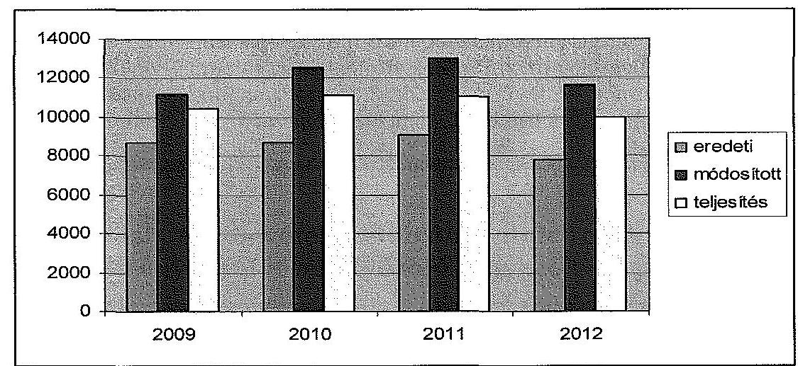

Az eredeti kiadási előirányzatok több mint 90\%-a minden évben múködési kiadás volt, eredeti múködési költségvetése a 2009. évi 8102,4 M Ft-ról 7436,3 M Ft-ra, a felhalmozási kiadások eredeti előirányzata a négy év alatt fe-

---

lére csökkent (615,3 M Ft-ról 324,9 M Ft-ra). A PE eredeti kiadásai előirányzatainak a fele személyi juttatás és hozzá kapcsolódó járulék volt, egyharmada dologi kiadás. Az ellátottak pénzügyi juttatásai (hallgatói támogatások) $12 \%$ körül alakultak.

Az egyetem eredeti költségvetési támogatási elöirányzata az ellenőrzött időszakban folyamatosan, a 2009. évi 5751,4 M Ft-ról 2012-re 4351,2 M Ft-ra csökkent.

Az eredeti bevételi előirányzatok a 2009-2012. években folyamatosan növekedtek, 2966,3 M Ft-ról 3410,0 M Ft-ra. A tervezett saját bevételek 85-90\%-a minden ellenőrzött évben intézményi működési bevétel volt, a fennmaradó részt a felhalmozási bevételek tették ki.

A PE előirányzatait országgyűlési, kormány és irányító szervi hatáskörben is módosították, de a módosítások döntő hányada ( $95,4 \%$-a) intézményi hatáskörben történt.

Országgyűlési hatáskörben 96,0 M Ft-ot vontak el az intézménytől 2011-ben ${ }^{22}$. Az államháztartási egyensúly megőrzéséhez szükséges intézkedésekről szóló 1025/2011. (II.11.) Korm. határozatban foglaltak alapján 465,4 M Ft elvonást érvényesítettek.

Kormányzati hatáskörben mind a négy évben módosították az intézmény előirányzatát, ez összesen 106,1 M Ft elvonással járt. 2009-ben és 2012-ben a dologi kiadásokat csökkentették. A havi keresetkiegészítések támogatására, kompenzációra ${ }^{23} 2009$-ben 105,2 M Ft-ot, 2010-ben 95,6 M Ft-ot, 2011-ben 24,9 M Ft-ot, 2012-ben 76,3 M Ft-ot kaptak.

Irányító szervi hatáskörben az előirányzat-módosítások részben a PPP konstrukcióban épült diákotthonok, részben OTKA kutatások, részben a Magyar Kormány FAO-val kötött megállapodása alapján kevésbé fejlett országból származó növényorvos és agrármérnök képzésének támogatásai voltak.

Intézményi hatáskörben a saját bevételeket növelték az előző évi felhasználható előirányzat-maradvány és az EU forrásból származó hazai társfinanszírozású pályázati bevétel előirányzatosításával.

[^0]
[^0]:    ${ }^{22}$ A 2011. évi költségvetési törvény módosításáról szóló 2011. évi CXIV. törvény.
    ${ }^{23}$ 6/2009. (I. 20.), 133/2009. (VI. 19.), 352/2010. (XII. 30.), 371/2011. (XII. 31.) Korm. rendeletek, 1001/2009. (I. 13.), 1035/2010. (II. 12.), 1120/2010. (V. 13.), 1132/2010. (VI.18.), 1185/2011. (VI.6.), 1133/2012. (IV.26.) Korm. határozatok, NGM 3642/16/2012. számú intézkedése

---

A PE éves előirányzat-módosításait az alábbi táblázat mutatja be:

| Előirányzat-módosítások |  |  |  |  | M Ft |
| :--: | :--: | :--: | :--: | :--: | :--: |
|  | OGY | Kormány | irányító   szerv | intézmény | összesen |
| 2009 |  | $-16,5$ | 313,3 | 2190,5 | 2487,3 |
| 2010 |  | 31,9 | 369,3 | 3458,3 | 3859,5 |
| 2011 | $-561,4$ | 26,0 | 320,4 | 4105,3 | 3890,3 |
| 2012 |  | $-147,5$ | 308,5 | 3726,9 | 3887,9 |
| összesen | $-561,4$ | $-106,1$ | 1311,5 | 13481,0 | 14125,0 |

Az előirányzat-módosítások az ellenőrzött időszakban 20-45\%-kal növelték a bevételi előirányzatokat.

A módosított központi költségvetési támogatás 2011-ben 3,8\%-kal csökkent, a többi évben 4-7\%-kal emelkedett az előző évhez képest. Az előirányzatmódosítások (az előirányzat-maradványok mellett) meghatározóan a saját bevételeket érintették, 2009-2012-ig közel felével növelték az eredeti előirányzatot, pályázatok eredményeként.

A módosított kiadási előirányzatok - meghatározóan az előző évi pénzmaradványok és a pályázati bevételek eredményeként - jelentősen (2012-ben $50,1 \%$-kal) magasabbak voltak az éves eredeti kiadási előirányzatoknál.

A módosítások legnagyobb mértékben a dologi és a felhalmozási kiadásokat érintették. A személyi juttatásokat és a hozzájuk kapcsolódó munkaadót terhelő járulékot évente 10-25\%-kal növelték, amelyre a pályázatokkal összefüggő többletmunkák pályázati forrása nyújtott fedezetet. A dologi kiadások 50-85\%-kal nőttek, míg a felhalmozási kiadásokra tervezett előirányzatot 2009-ben megkétszerezték, 2012-ben pedig közel megnégyszerezték.

A teljesített költségvetési kiadások a négy év alatt 3,8\%-kal visszaestek, a 2009. évi 10 322,5 M Ft teljesítéssel szemben 2012-ben 9932,4 M Ft kiadást számoltak el. A teljesített kiadások mérséklődését döntően az ellátottak pénzbeli juttatásának csökkenése okozta, amely a hallgatói létszám változásával volt összefüggésben. A teljesített kiadások a pályázati úton lekötött, fel nem használt előirányzatok miatt 7,8\%-16,3\%-kal elmaradtak a módosított kiadási előirányzatoktól.

A teljesített költségvetési kiadások közel fele minden évben a személyi juttatás és a hozzá kapcsolódó munkaadókat terhelő járulék, harmada dologi kiadás, közel 10-10\%-a az ellátottak pénzbeli juttatása, illetve a felhalmozási kiadás volt.

---

A vizsgált időszakban a PPP kiadások összege 526,1 M Ft, 566,2 M Ft, 593,3 M Ft és 617,8 M Ft volt. A PPP kiadások aránya a dologi kiadásokon belül a 20092012. években $16,1 \%, 17,4 \%, 15,4 \%$, illetve $18,7 \%$ volt $^{24}$.

A teljesített bevételeken belül a négy év során a központi támogatások és a (maradványok nélküli) saját bevételek aránya változott, a központi támogatások csökkenését részben pályázatokkal, részben a térítési díjak emelésével kompenzálták. A költségvetési támogatások aránya 14\%-ponttal csökkent, míg a saját bevételek aránya 5\%-ponttal nőtt a 2009. évről a 2012. évre.

A központi költségvetési támogatás folyamatosan, a 2012. évre a 2009. évi támogatás $3 / 4$-ére csökkent. A saját bevételek négy év alatt - a csökkenő hallgatói létszám ellenére is - 12,2\%-kal nőttek. A maradványok nélküli saját bevételek eredeti előirányzathoz viszonyított túlteljesülése a 2009-2012. években 1332,5 M Ft, 1259,6 M Ft, 1902,2 M Ft és 1960,0 M Ft volt. A saját bevételek növekedése és a bevételek többlete meghatározóan a PE pályázati aktivitásának az eredménye, a négy év során egyre nagyobb összegű pályázati forrást nyertek (1041,4 M Ft, 1492,7 M Ft, 1701,7 M Ft, 2239,0 M Ft).

A bevételek és kiadások teljesítési adatainak részletezését a 2. számú melléklet tartalmazza.

A PE a 2009-2012. évek végén felhasználható összes előirányzatmaradványként 2026,8 M Ft-ot, 2120,0 M Ft-ot, 1900,6 M Ft-ot, illetve 1380,3 M Ft-ot mutatott ki. A maradvány a kormány takarékossági intézkedései hatására elsősorban kiadási megtakarításból származott.

A PE kiadási megtakarítása a 2009-2012. években 882,4 M Ft, 2041,6 M Ft, 1949,7 M Ft, illetve 1716,7 M Ft volt, amely a kiadási előirányzat-teljesítések $8,5 \%$-át, $19,5 \%$-át, $17,7 \%$-át, illetve $17,3 \%$-át tette ki. A 2009 . évben jelentős volt (1301,7 M Ft) az előző évből származó előirányzat-maradvány is.

Az egyetem hallgatói létszáma az ellenőrzött időszakban 10096 fơről 8271 főre, $18,1 \%$-kal csökkent, ami meghaladta a felsőoktatás átlagos ( $-8,6 \%$ ) létszámváltozását. A felvehető maximális hallgatói létszám 12003 fő volt az alapító okirat szerint, az egyetem a rendelkezésre álló férőhely kapacitás $68,9 \%$-át tudta kihasználni 2012-ben. A hallgatói létszámváltozást nem követte hasonló arányú csökkenés a PE dolgozói létszámában, ahol a mérséklődés 2009-ről a 2012. évre $4,7 \%$-os volt. A költségvetési támogatás csökkenése arányban állt a hallgatói létszámváltozással, az ellenőrzött időszakban a visszaesés $25,4 \%$ volt.

A PE a csökkenő költségvetési támogatás és hallgatói létszám, továbbá a romló pénzügyi pozíció ellenére megőrizte fizetőképességét, a likviditás folyamatosan biztosított volt. Kincstári biztost, költségvetési (fő)felügyelő́t az intézményhez nem rendeltek ki. Támogatási keret előrehozásokra nem volt szükség.

[^0]
[^0]:    ${ }^{24}$ A 2003. évi CXVI. tv. 50. § (6) bekezdése szerint a felsőoktatási intézmények a tárgyévi költségvetésük kiadási főösszegének 10\%-os mértékéig vállalhattak hosszú távú kötelezettséget. A 2004. évi CXXXV. törvény 50. § (21) bekezdése a kötelezettségvállalás mértékét az intézmények dologi és felhalmozási célú előirányzatának 10\%-ára korlátozta.

---

Az egyetem pénzügyi helyzetét az ún. CLF módszer segítségével elemeztük (3. számú melléklet). Az intézmény pénzügyi pozícióját, múködési jövedelmét, felhalmozási költségvetési egyenlegét, nettó múködési jövedelmét az alábbi táblázat szemlélteti (M Ft-ban):

| Megnevezés | 2009. | 2010. | 2011. | 2012. |
| :-- | --: | --: | --: | --: |
| Folyó bevételek | 9528,2 | 9327,8 | 9685,3 | 8776,6 |
| Folyó kiadások | 9432,7 | 9156,7 | 9821,2 | 8993,0 |
| Müködési jövedelem | $\mathbf{9 5 , 5}$ | $\mathbf{1 7 1 , 1}$ | $-\mathbf{1 3 5 , 9}$ | $-\mathbf{2 1 6 , 4}$ |
| Felhalmozási bevételek | 834,1 | 1164,4 | 1111,7 | 576,0 |
| Felhalmozási kiadások | 889,7 | 1331,0 | 1218,9 | 939,5 |
| Felhalmozási költségvetés   egyenlege | $\mathbf{- 5 5 , 6}$ | $-\mathbf{1 6 6 , 6}$ | $-\mathbf{1 0 7 , 2}$ | $-\mathbf{3 6 3 , 5}$ |
| Folyó és felhalmozási bevételek   összesen | 10362,3 | 10492,2 | 10797,0 | 9352,6 |
| Folyó és felhalmozási kiadások   összesen | 10322,4 | 10487,7 | 11040,1 | 9932,5 |
| Finanszírozási múveletek   nélküli pozíció | $\mathbf{3 9 , 9}$ | $\mathbf{4 , 5}$ | $-\mathbf{2 4 3 , 1}$ | $-\mathbf{5 7 9 , 9}$ |
| Finanszírozási műveletek egyenlege | $-152,1$ | 754,8 | 37,1 | $-20,0$ |
| Tárgyévi pénzügyi pozíció | $-\mathbf{1 1 2 , 2}$ | $\mathbf{7 5 9 , 3}$ | $-\mathbf{2 0 6 , 0}$ | $-\mathbf{5 9 9 , 9}$ |
| Hiteltörlesztés | 0 | 0 | 0 | 0 |
| Nettó müködési jövedelem | $\mathbf{9 5 , 5}$ | $\mathbf{1 7 1 , 1}$ | $-\mathbf{1 3 5 , 9}$ | $-\mathbf{2 1 6 , 4}$ |

A PE tárgyévi pénzügyi pozíciója (-112,2 M Ft, 759,3 M Ft, -206,0 M Ft, -599,4 M Ft) a 2010. évet kivéve az ellenőrzött időszakban romlott. A 2010. évben a pénzügyi pozíció kiugró javulását az egyetem tulajdonában álló értékpapírok beváltásából származó bevételek eredményezték. Kedvezőtlen tendencia volt tapasztalható a nettó múködési jövedelem ( $95,5 \mathrm{M} \mathrm{Ft}, 171,1 \mathrm{M} \mathrm{Ft}$, $-135,9 \mathrm{M} \mathrm{Ft},-216,4 \mathrm{M} \mathrm{Ft}$ ) és a felhalmozási költségvetési egyenleg ( $-55,6 \mathrm{M} \mathrm{Ft}$, $-166,6 \mathrm{M} \mathrm{Ft},-107,2 \mathrm{M} \mathrm{Ft},-363,5 \mathrm{M} \mathrm{Ft}$ ) változásában.

A múködési jövedelem és a nettó múködési jövedelem 2009-ben és 2010-ben pozitív volt, a folyó bevételek fedezték a folyó kiadásokat. 2011-ben és 2012ben a tendencia megváltozott, az éves kiadások meghaladták a bevételeket. A felhalmozási költségvetés egyenlege mind a négy évben negatív volt, a bevételek már nem nyújtottak elegendő fedezetet az éves kiadásokhoz. Ezzel együtt azonban az egyetem vagyona folyamatosan nőtt, a 2009. évről a 2012. évre $3,7 \%$-kal gyarapodott. A folyó és a felhalmozási költségvetés együttes finanszírozási igényét - a CLF számításon kívül eső - előző évi előirányzat-maradvány igénybevételével biztosították.

---

Az egyetem eladósodási mutatója ${ }^{25}$ az ellenőrzött időszakban kedvezőtlenül változott, a 2009. évi 8,8\%-ról a 2012. évben 11,7\%-ra nőtt. Szintén romlott a PE pénzeszköz likviditási mutatója ${ }^{26}$, a 2009. évi 1,0 értékről a 2012. évre 0,8-re csökkent. Ez azt jelenti, hogy a pénzeszközök év végi állománya a 2012. évben már nem nyújtott fedezetet a rövid lejáratú kötelezettségek rendezésére. A likviditási mutatóo ${ }^{27}$ értéke a 2009. évi 3,2-hez képest jelentősen gyengült, a 2012. évben már csak 1,9-es értéket mutatott, azonban a pénzeszközök, a követelések, a készletek és a forgatási célú értékpapírok együttes összege az ellenőrzött időszak valamennyi évében még fedezetet nyújtott a szállítói kötelezettségek teljesítésére.

Az egyetemet az ellenőrzött időszakban érintették elöirányzat-zárolások és maradványtartási kötelezettségek is. Ezek a likviditást nem veszélyeztették, de a felújítások, karbantartások elhúzódásához vezettek, illetve folyamatosan elmaradtak a gép- és eszközbeszerzések.

Az ellenőrzött négy évben zárolással összesen 990,0 M Ft-ot vontak el az egyetemtől ${ }^{28}$. A 2009. évben 1437,4 M Ft összegű maradványtartási kötelezettséget is elrendeltek ${ }^{29}$ az intézménynél, amelyet az év végéig nem oldottak fel. A 2011. évben elrendelt 2203,2 M Ft összegű maradványtartási kötelezettséget 2011. december 29 -én feloldották ${ }^{30}$, azonban az év végére tekintettel a PE azt már nem tudta a 2011. évben felhasználni.

A gazdálkodási keretet 2010-ben csökkentette a Kormány által december hónapra elrendelt kiadásteljesítési korlát, amelyet nem is oldottak fel ${ }^{31}$. A NEFMI közigazgatási államtitkára 2010. december 27 -én e-mail-ben a pénzügyi teljesítések azonnali felfüggesztéséről intézkedett ${ }^{32}$ a PE felé.

# 3.2. A bevételi és kiadási előirányzatok megállapítása, módosítása, az előirányzat-maradványok kezelése 

A PE a kiadási és bevételi előirányzatok tervezése során - egyes bevételek megállapítása kivételével - a jogszabályokban és a fenntartó által kiadott tervezési irányelvekben foglaltak szerint járt el.

[^0]
[^0]:    ${ }^{25}$ Az eladósodási mutató a hosszú és rövid lejáratú fizetési kötelezettségek összes forráson belüli arányát mutatja.
    ${ }^{26}$ A pénzeszköz likviditási mutató kifejezi, hogy a pénzeszközök év végi állománya milyen arányban nyújt fedezetet a rövid lejáratú fizetési kötelezettségekre.
    ${ }^{27}$ A likviditási mutató mutatja, hogy a rövid lejáratú fizetési kötelezettségek kiegyenlítéséhez a forgóeszközök milyen arányban nyújtanak fedezetet.
    ${ }^{28}$ 1001/2009. (I. 13.), 1033/2009. (III. 17.), 1132/2010. (VI. 18.), 1025/2011. (II. 11.), 1122/2012. (IV. 25.), 1428/2012. (X. 8.) Korm. határozatok
    ${ }^{29}$ 2007/2009. sz. Korm. határozat
    ${ }^{30}$ 1316/2011. (IX. 19.) Korm. határozat, 22.623-92/2011-KTF NEFMI levél
    ${ }^{31}$ Az 1268/2010. (XII. 3.) Korm. határozat szerint a fejezetek 2010 decemberében nem teljesíthetnek nagyobb összegű kiadásokat, mint 2010 novemberében.
    ${ }^{32}$ 2010. december 27. 16.48 órai e-mail

---

Az egyetem gazdálkodásának alapja minden évben a fenntartó (OKM, NEFMI, EMMI) által jóváhagyott intézményi elemi költségvetés volt. A PE elemi költségvetésének előirányzati keretszámait a fenntartó az éves költségvetési törvényekben elfogadott előirányzatok és szabályok szerint, illetve azok keretei között állapította meg. A minisztérium minden év júliusában kiadta a következő év költségvetésének tervezési irányelveit. A költségvetés tervezéséhez kapcsolódó, a fenntartó által meghatározott adatszolgáltatásokat (foglalkoztatotti létszám, előmenetelek, tárgyévi hallgatói létszám, saját bevételek tervezett összege) az egyetem határidőben és az előírt tartalommal teljesítette. Az előirányzatok tervezését mellékszámításokkal alátámasztották.

A PE - a költségeken alapuló bevételek (pl. költségtérítés) kivételével - a tervezési irányelvekkel összhangban, az előző évi eredeti és várható bevételi előirányzatai alapján határozta meg az intézményi saját bevételek kiemelt előirányzatait, beleértve a három éves prognosztizációt is. Az előírásoknak megfelelően nem vették figyelembe a hazai társfinanszírozású uniós bevételi forrásokat.

A költségeken alapuló bevételeket az intézmény nem a tervezési irányelvek szerint állapította meg, mert a szaktevékenységekből, szolgáltatásokból származó bevételeket nem a tevékenység tényleges költségével összhangban határozta meg. A költségtérítések (tandíjak) megállapításánál a költségek mellett azonos súllyal vették figyelembe a kereslet-kínálat szabályait (hallgatói létszám, beiskolázható célcsoport szociális helyzete stb.).

Az előirányzat-módosításokat a jogszabályokban foglaltaknak megfelelően hajtották végre és vezették át a számviteli nyilvántartásokon.

# Az előirányzat-maradvány megállapítása és felhasználása megfelelt a jogszabályi előírásoknak. Kisebb hibaként értékelhető, hogy a 2010. évben az Áhsz. 3. számú mellékletében rögzítettekkel szemben egy 19,2 M Ft értékű felhalmozási előirányzatot terhelő kötelezettségvállalást tévesen dologi előirányzatot terhelő kötelezettségvállalásként mutattak ki. 

A PE számszaki és szöveges beszámolóiban feltüntetett előirányzat-maradvány értéke megegyezett egymással. Az előirányzat-maradvány levezetése a 20092011. években megfelelt a jogszabályi előírásoknak. A mérlegben kimutatott kiadási megtakarítások, bevételi lemaradások és előirányzat-maradványok értékei megegyeztek a 42. űrlapon és a kapcsolódó főkönyvi számlákon bemutatott adatokkal.

A vizsgált időszakban a felhasználható előirányzat-maradvány összegét teljes egészében kötelezettségvállalással terhelt maradványként mutatta ki az Intézmény. A tárgyévi előirányzat-maradványok szabályszerűségének megítéléséhez végzett mintavételes ellenőrzés során megállapítottuk, hogy a kötelezettségvállalással terhelt maradvány esetében dokumentumok támasztják alá a kötelezettségvállalást. A kötelezettségvállalások és az azt alátámasztó dokumentumok az Ámr., 66. § (10) bekezdésében, az Ámr., 210. §-ában, az Ávr. 150. §-ában és a belső szabályzatokban rögzítetteknek megfeleltek.

Az egyetem az előirányzat-maradvány levezetésében kimutatott központi költségvetést megillető összeg befizetését az előírt határidőn belül teljesítette.

---

# 3.3. A kiadási előirányzatok felhasználása és a bevételi előirányzatok teljesítése 

A rendszeres és nem rendszeres személyi juttatások előirányzatának felhasználása során a pénzügyi elszámolások, valamint a gazdálkodási jogkörök gyakorlása tekintetében nem érvényesültek teljes körűen a jogszabályok és belső szabályok előírásai. Ez magas szabályszerűségi kockázatot jelez az ellenőrzött terület egészének szabályos múködése szempontjából. A kiküldetésekkel és a keresetkiegészítésekkel kapcsolatban szabályozási hiányosságot is feltártunk.

A rendszeres és nem rendszeres személyi juttatások kifizetéseivel összefüggésben a foglalkoztatottak rendelkeztek a besorolásuknak megfelelő végzettséggel és gyakorlattal. A kinevezési okiratban rögzített besorolásuk megfelelt a jogszabályban rögzített előírásoknak. A személyi juttatások kifizetését munkaidőelszámolás és teljesítésigazolás támasztotta alá. A bruttó illetmény számfejtése megfelelt a kinevezési okiratban foglaltaknak, a munkavállalót terhelő levonások az Szja tv. és a Tbj. vonatkozó előírásai szerint történtek.

A PE több esetben nem tartotta be a Hpsz. kötelező óraszámra vonatkozó rendelkezéseit. Az oktatók egy részénél a Hpsz-ben előírtnál kevesebb órát igazoltak, előfordult, hogy a felsőoktatási törvényekben meghatározott minimális tanórát sem tartották meg ${ }^{33}$. Egyes oktatóknál a Hpsz-ben meghatározottnál több óraszám szerepelt a tanrendben, illetve a munkáltató által az ÁSZ ellenőrzés részére átadott igazolásban.

A felsőoktatási törvények ${ }^{34}$ két félév átlagában heti legalább 10 kötelező óraszámot írnak elő, amely $25 \%$-kal csökkenthető, illetve $70 \%$-kal növelhető. A tanításra fordított idő nem lehet kevesebb két tanulmányi félév átlagában egy oktatóra vetítve heti tizenkét óránál. A Hpsz. ezzel szinkronban szabályozza a kötelező óraszámot. A Hpsz. szerint a kötelező óraszám hetente egyetemi tanárnál 8-11, egyetemi docensnél 10-13, adjunktusnál 11-14, tanársegédnél 12-15 óra, amelyből a két magasabb fokozat 2-4, a két alacsonyabb fokozat 2-3 órát tölthet konzultációval (fogadóóra, témavezetés stb.).

Egy oktató 2010. október 1-jétől november 20-ig igazolatlanul külföldön tartózkodott. Az érintett közalkalmazott intézetigazgatója tudott a távollétről, ennek ellenére nem rendelt el helyettesítést, arról az illetménygazdálkodást nem tájékoztatta, nem gondoskodott a havi munkaidőkeret betartásáról, továbbá az igazolatlan távollét miatt nem kezdeményezett fegyelmi eljárást ${ }^{35}$. A dékáni megbízott a fenti hiányosságot észlelte és - írásos figyelmeztetés mellett - a hiányzást igazolatlan távollétnek minősítette, az arra eső illetményt megvonta. A bérjegyzék igazolta a csökkentett bérfizetést.

Az egyetem a Kjt. 77. §-ában meghatározottak szerint a többletfeladatokhoz (pl. pályázati kutatásokhoz) kapcsolódóan keresetkiegészítést fizetett. A többlet-

[^0]
[^0]:    ${ }^{33}$ A Feot. 84. § és az Nftv. 26. § két félév átlagában minimálisan 12 tanórát ír elő.
    ${ }^{34}$ Feot. 84. § (2)-(3) bekezdés, Nftv. 26. § (1)-(2) bekezdés.
    ${ }^{35}$ Hpsz. 3.3.2. pont (4)-(5) bekezdés, 3.8. pont (2) bekezdés.

---

feladatok ellátása teljesítésigazolással, dokumentumokkal alátámasztott volt, a keresetkiegészítések kifizetése szabályszerűen történt. A keresetkiegészítés fedezete részben a pályázatokból származó többletforrás volt. A PE a keresetkiegészítés megállapítása során nem folytatott egységes gyakorlatot. Ennek oka, hogy a belső szabályozásaiban nem volt egyértelműen meghatározva, hogy milyen feladat minősül alapfeladatnak, és milyen feladattöbblet esetében lehet elszámolni keresetkiegészítést. Azt sem szabályozták, hogy többletfeladat esetében a munkaidő hány százalékát fedheti le a külön-feladat. A többletfeladatok aránytalan súlya egyes esetekben lényegesen csökkentette az alapfeladatokra rendelkezésre álló időt, kockáztatva az alapfeladatok maradéktalan ellátását.

Az egyik egyetemi tanárnál 2011. január 1-jétől 2011. december 1-jéig 15 külföldi kiküldetés 61 munkanapja után valamennyi (80) naptári napra a saját kezdeményezésű útra elszámolható maximális összeget ( 100 eurónak megfelelő valuta szerinti forintot) számolták el. Étkezés biztosításáról nyilatkozat nem állt rendelkezésre. Az Mtv. 83/A. § (3) bekezdése és a Hpsz. szerint legfeljebb 44 munkanapra lehet a szokásos munkavégzési helyen kívüli munkavégzést elrendelni. Emiatt a 2011. október 17-ei és az azt követő kiküldetések (Anglia, Kína, Szlovénia, Anglia) Műszaki Informatikai Kar dékánja általi engedélyezése, jóváhagyása nem volt szabályszerű. A 44 munkanapon túli négy kiküldetés 20 naptári napjára elszámolt 607497 Ft kifizetése is szabálytalan volt.

Szabályozási hiányosságokat állapítottunk meg a kiküldetésekkel kapcsolatban. A Hpsz. nem kellő részletességgel tartalmazza a kiküldetésre vonatkozó szabályokat, továbbá pazarlóan állapította meg a napidíjak összegét is.

A Hpsz. 3.3.4.2. pont (2) bekezdése szerint a kiküldetés lehet saját kezdeményezésű vagy munkáltató által kezdeményezett. A napidíj mértéke a Hpsz. 3.3.4.2 c) pontja szerint a saját kezdeményezésű utazásoknál naponta maximum 100 euró, a munkáltató által kezdeményezett kiküldetések esetén maximum 60 euró (annak megfelelő forint) volt. A Hpsz. azt is tartalmazta, hogy amennyiben az utazó külföldön teljes ellátást kap, részére 20 EUR napidíj állapítható meg.

A saját kezdeményezésű kiküldetések részletes szabályairól a Hpsz. nem rendelkezik (pl. kiküldetés céljának igazolása, konferenciák napirendje, ellátással kapcsolatos nyilatkozat). A szabályozás alapján az utazási tervhez nem kell csatolni a kiküldetési programot, nem kell az étkezés biztosításáról nyilatkozni. A kiküldetés elszámolására rendszeresített nyomtatványon nem szerepel ellátásra vonatkozó nyilatkozat, így nem állapítható meg egyértelműen, hogy mikor kell a napidíj összegét csökkentett mértékben meghatározni. A napidíj Hpsz-ben meghatározott összege az állami vezetőkre, minisztériumokra meghatározott összeg ${ }^{36}$ 150-250\%-a. Ez nem volt összhangban az áttekinthető, hatékony és ellenőrizhető gazdálkodás alapelvével.

[^0]
[^0]:    ${ }^{36}$ A tartós külszolgálatról és az ideiglenes külföldi kiküldetésről szóló 172/2012. (VII. 26.) Korm. rendelet és az ideiglenes külföldi kiküldetés napidíjának összegéről és kifizetéséről szóló 204/2009. (IX. 18.) Korm. rendelet.

---

A megbízási díjak elszámolása nem volt szabályszerű a pénzügyi ellenjegyzés szabálytalan végrehajtása és az oktatók részére előírt kötelező óraszámok be nem tartása miatt.

A megbízási szerződések megkötése és az azokkal kapcsolatos pénzügyi teljesítés során - a fedezetigazolás és a pénzügyi ellenjegyzés késedelme kivételével a vonatkozó jogszabályoknak megfelelően járt el a PE.

A szerződéseket arra jogosultak írták alá, a hatáskörökre, értékhatárokra vonatkozó szabályokat betartották ${ }^{37}$, a szerződéseket a közfeladat ellátásához szükséges célra kötötték, és azok nem ütköztek jogszabályba. A kötelezettségvállalás időbeli korlátjára vonatkozó szabályokat ${ }^{38}$ betartották, költségvetési évet követő június 30 -ai határidőn túli teljesítés kikötése nem fordult elő. A megbízási szerződések teljesítésigazolása szabályszerűen történt, a teljesítések dokumentáltak voltak. A külső személyi juttatások számfejtése és a megbízási szerződések analitikus nyilvántartása szabályszerű volt.

A pénzügyi ellenjegyzés a megbízási szerződések 81\%-ában csak a szerződéskötést követően történt meg. Ez a fedezet nélküli kötelezettségvállalások kockázatát hordozza. A szerződéseket a hatályos jogszabályokkal ellentétben csak utólagosan nyújtották be a pénzügyi területhez pénzügyi ellenjegyzés és fedezet igazolása céljából. Ez nem felelt meg az államháztartási törvény hatályos végrehajtási rendeleteinek ${ }^{39}$ és az egyetem kötelezettségvállalási szabályzatának. A késedelem valamennyi esetben a szerződéskötésre jogosult oktatási és tudományos kutatási szervezeti egységek mulasztása következtében történt. Az ellenőrzött tételek közel felénél a szerződést pénzügyi ellenjegyzésre (fedezetigazolásra) csak a teljesítési határidőt követően nyújtották be.

A PE oktatói részére is történtek megbízási szerződések alapján kifizetések. Egy oktatónál a megbízási szerződés teljesítése megelőzte a szerződéskötés napját. Négy oktató esetében nem tartották be a Hpsz-ben előírt kötelező óraszámra vonatkozó előírásokat.

Egy oktatónál a Hpsz-ben meghatározott óraszámnál kevesebb előirása szerepelt a munkaköri leírásban, és az oktató a közalkalmazotti jogviszonyát megsértve még a munkaköri leírásban szereplő óraszámot sem tartotta meg. Három oktató esetében a Hpsz-ben meghatározott tanításra fordított idő felső határát meghaladó óraadás történt.

A dologi kiadások előirányzatainak felhasználása során a pénzügyi elszámolások, valamint a gazdálkodási jogkörök gyakorlása tekintetében nem érvényesültek teljes körüen a jogszabályok és belső szabályok előirásai. Ez szabályszerűségi kockázatot jelez az ellenőrzött terület egészének szabályos múködése szempontjából.

[^0]
[^0]:    ${ }^{37}$ A kötelezettségvállalás, utalványozás és kiadmányozás rendje II. 4. pont.
    ${ }^{38}$ Áht. ${ }_{1}$ 12/A. § (1) bekezdés, Áht. ${ }_{2}$ 36. §, Ámr. ${ }_{1}$ 134. § (4) bekezdés, Ámr. ${ }_{2}$ 72. §, Ávr. 46. § (1) bekezdés, 49. §.
    ${ }^{39}$ Áht. ${ }_{1}$ 100/C. § (3)-(4) bekezdés, Áht. ${ }_{2}$ 37. § (1) bekezdés, Ámr. ${ }_{1}$ 134. § (8)-(9) bekezdés, Ámr. ${ }_{2}$ 74. § (1) és (3) bekezdés, Ávr. 55. §.

---

A dologi kiadások mintatételeinek áttekintése során megállapítottuk, hogy a kötelezettségvállalási dokumentumok rendelkezésre álltak és azokat ellenjegyezték. A Kbt. ${ }_{1,2}$ hatálya alá tartozó beszerzéseknél, valamint szolgáltatás igénybevételek esetében lefolytatták a közbeszerzési eljárásokat. A gazdasági eseményeket alátámasztó dokumentumok, a kiadási utalványrendeletek, számlák, teljesítésigazolások, vállalkozási, illetve megbízási szerződések rendelkezésre álltak. A pénzügyi kifizetések a szerződésekben meghatározott, illetve megrendeléseknek megfelelő összegek szerint történtek. A készlet bekerülési értékét az Sztv., az Áhsz., illetve a Számviteli Politika előírásai szerint állapították meg.

Egyedi hiba volt, hogy az Ámr. ${ }_{2}$ 72. § (3) bekezdésében előírtak ellenére olyan személy vállalt kötelezettséget, aki erre írásban nem volt felhatalmazva. Előfordult, hogy az Ámr. ${ }_{2} 76 . \S$ (3) bekezdésében és az Ámr. ${ }_{2} 78 . \S$ (1) bekezdésében megfogalmazottak ellenére a szakmai teljesítést, illetve az utalványozást nem az arra jogosult végezte.

# A PE a felújítási, beruházási előirányzatainak felhasználása során a 

vonatkozó jogszabályokat és a belső szabályzatokban meghatározott előírásokat betartotta.

A szerződéseket és azok ellenjegyzését az egyetem kötelezettségvállalási szabályzatában értékhatárhoz kötötten meghatározott, jogosult személyek írták alá. A szakmai teljesítés igazolása, az érvényesítés és az utalványozás a szabályozásnak megfelelően történt.

A felhalmozási, vagyonhasznosítási bevételek beszedése során a pénzügyi elszámolások, valamint a gazdálkodási jogkörök gyakorlása tekintetében nem érvényesültek teljes körűen a jogszabályok és belső szabályok előírásai. Ez szabályszerűségi kockázatot jelez az ellenőrzött terület egészének szabályos működése szempontjából.

Egyedi hiba volt, hogy nem az arra jogosult írt alá kisebb összegű bérleti szerződést, és ezt az érvényesítő nem kifogásolta. Előfordult, hogy nem készült utalvány a befolyt bevétel elszámolására, megsértve ezzel a vonatkozó jogszabályokban ${ }^{40}$ foglalt előírásokat. Egy jogelőd (FVM Szőlészeti és Borászati Kutatóintézet) által kötött irodabérleti szerződés díja nem érte el a Pannon Egyetem szabályzatában meghatározott minimális díjat, azt nem módosították évente az inflációval, és az érvényesítő ezt nem kifogásolta. Egyedi hibaként állapítottuk meg, hogy a 2009. évben befolyt bérleti díj számlázását nem előzte meg a szakmai teljesítés igazolása a jogszabályban ${ }^{41}$ előírtak szerint.

Az intézmény a múködési bevételek beszedése során nem a jogszabályokban és belső szabályzatokban előírtak szerint járt el, a 2009. évet érintő szabálytalanságok miatt.

Az ellenőrzött mintatételek alapján megállapítottuk, hogy az intézményi múködési bevételek előírása, illetve kiszámlázása a belső szabályozásnak megfelelően történt. Amennyiben az előírt bevétel a megfelelő összegben és időben nem folyt be, akkor lépéseket tettek az előírt bevétel realizálásáért (felszólító levél, kompen-

[^0]
[^0]:    ${ }^{40}$ Ámr. ${ }_{2}$ 78. § (1) és (2) bekezdése és az Ávr. 59. § (2) és (3) bekezdése
    ${ }^{41}$ Ámr. ${ }_{1}$ 135.§ (1) bekezdése

---

zálási javaslat stb.). A bevételi előírás és a befolyt bevétel nyilvántartásba vétele (analitika, főkönyv) teljes körűen megtörtént.

A 2009. évi múködési bevételek esetében megállapítottuk, hogy több esetben a szakmai teljesítésigazolást az Ámr. 135. § (1) bekezdésében előírtakkal ellentétben dokumentáltan nem végezték el. Szintén rendszerhiba volt, hogy az érvényesítési feladatokat az Ámr. ${ }_{1}$ 135. § (2) bekezdését megsértve írásos megbízás nélkül végezték.

A PE a normatív támogatásokat szabályszerűen használta fel, a felhasználással kapcsolatos döntések megfeleltek a vonatkozó jogszabályok és belső szabályzatok előírásainak.

Az ellenőrzött időszakban a nem kötött felhasználású normatív támogatások (képzési, tudományos célú és fenntartói) szervezeti egységek közötti felosztását a költségvetés elfogadása keretében a szenátus hagyta jóvá. Az egyetem rendelkezett a finanszírozásra kötött fenntartói megállapodással. A képzési, tudományos célú és fenntartói normatív támogatás felosztását a Gazdasági Tanács véleményezte. A decentralizált szervezeti egységek gazdálkodási kereteinek felhasználását a Gazdasági Tanács véleményezését követően a szenátus megtárgyalta.

A kötött felhasználású hallgatói támogatások, illetve az egyéb feladatok támogatásainak felhasználásáról szenátusi határozatokat hoztak. A hallgatói juttatásokat a belső szabályzatnak megfelelően állapították meg és hirdették ki. A hallgatói támogatások terhére megállapított hallgatói juttatási előirányzatok felhasználásáról elszámolást készítettek, amelyet a szenátus minden ellenőrzött évben megtárgyalt.

# Az egyetem a hazai forrásból finanszírozott projektekhez kapott 

támogatásokat szabályszerűen használta fel, és a támogatásokkal megfelelően elszámolt.

A támogatások célja és formája megfelelt az Intézmény feladatkörének és a pályázatok - pályázatonként eltérő - követelményeinek. A PE a pályázati forrásból támogatott projekteket pályázatonként megnevezett felelősökkel a Pályázati Szabályzatban meghatározottak szerint valósította meg. A projektek pénzügyi lebonyolítását és elszámolását a Számviteli Politikában és a Számlarendben foglaltaknak megfelelően végezte.

A PE a kettős finanszírozás elkerülését biztosító kontrollokat kialakította, azokat az eljárásrendnek megfelelően, szabályszerűen működtette. Az egyes támogatások igénybevételéhez szükséges önerő összege a pályázatnak megfelelő volt, a PE érintett szervezeti egységei a szükséges forrásokkal az előzetes kötelezettségvállalási nyilatkozatoknak megfelelően rendelkeztek.

Az Intézménynél a hazai pályázatok monitoring rendszerének múködését a Pályázati Szabályzatban rögzítettek szerint - kialakított elkülönített témaszámos nyilvántartási rendszer biztosította.

A díjak és költségtérítések megállapítása során a PE szabályszerűen járt el. Az egyes alaptevékenységekhez (oktatási, gyakorlati, kutatási és

---

egyéb), illetve szervezeti egységekhez tartozó bevételeket és kiadásokat elkülönítetten tartotta nyilván. Az ezzel kapcsolatos szabályozásokat a Külső szolgáltatások és termékértékesítés rendje tartalmazta. Az egyetem az ellenőrzött időszakban vállalkozási tevékenységet nem folytatott.

Az egyes szervezeti egységek, karok a hallgatói létszám, a képzési költségek, a szakok iránti aktuális kereslet, valamint a beiskolázható célcsoport szociális helyzete alapján állapították meg a képzési normatívákat és a költségtérítési díjakat. A térítési és juttatási szabályzatok előírták a költségtérítési díjak kari honlapokon történő közzétételét, amelynek a karok eleget tettek.

A költségtérítések megállapításához, az egy hallgatóra jutó önköltség meghatározásának sajátos szakágazati követelményeiről a minisztérium nem adott ki egységes eljárást biztosító módszertani útmutatót. A PE szervezeti egységei dokumentációt készítettek a költségtérítések meghatározását megalapozó önköltségszámítási elvelkről, gyakorlatukról, mellékelték az éves szakonkénti költségtérítést. A karok saját hatáskörben állapították meg a szaktárgyak éves önköltségét, ennek ismeretében határozták meg a költségtérítéseket.

# 4. AZ INTÉZMÉNY VAGYONGAZDÁlKODÁSA 

A PE vagyongazdálkodása során - egyes mérlegtételek bemutatása kivételével - szabályszerűen járt el.

Az egyetem vagyona az ellenőrzött időszakban csekély mértékben, 10 507,4 M Ft-ról 11 035,7 M Ft-ra, 5\%-kal nőtt. A befektetett eszközök állománya a beruházások eredményeként 7521,1 M Ft-ról 8593,3 M Ft-ra, 14,3\%-kal növekedett, míg a forgóeszközök értéke 2983,4 M Ft-ról 2442,4 M Ft-ra, 18,2\%kal csökkent. A forgóeszközök állományának változása az értékpapírok beváltásával volt kapcsolatban. A vagyonváltozás részletes elemzését az ellenőrzött időszak könyvviteli mérlegeinek adatai alapján végeztük el (a mérlegadatokat a 4. számú melléklet részletezi).

A könyvviteli mérlegek alapján az intézmény vagyonában a befektetett eszközök részaránya évről-évre 71,9\%-ról 77,9\%-ra nőtt, míg a forgóeszközök aránya az ellenőrzött időszakban folyamatosan csökkent ( $28,1 \%$-ról $22,1 \%$-ra).

A befektetett eszközök - mérleg szerinti - nettó értéke a 2009. december 31-ei 7656,0 M Ft-ról 2012. december 31-re 937,3 M Ft-tal (12,2\%-kal) 8593,3 M Ft-ra emelkedett. A befektetett eszközök meghatározó vagyoncsoportja a tárgyi eszközök, melynek részaránya $96,2 \%-97,2 \%$ közötti volt, azon belül az ingatlanok és kapcsolódó vagyoni értékủ jogok vagyonelem a legjelentősebb (részaránya a tárgyi eszközökön belül 2012-ben $65,8 \%$ volt).

A befektetett eszközök avulását a végrehajtott beruházások (felújítások) nem tudták ellensúlyozni. Az egyetem a 2009-2012 közötti években a befektetett eszközökre együttesen 2289,7 M Ft összegű tervszerinti értékcsökkenést számolt el. Az immateriális javak és a tárgyi eszközök összesített használhatósági foka az elszámolt értékcsökkenés hatására a 2009. évi 51,1\%-ról a 2012. évre $48,1 \%$-ra csökkent. Így az elhasználódási szint is kedvezőtlenül változott, a 2009. évi $48,9 \%$-ról a 2012. évre $51,9 \%$-ra növekedett, azaz az eszközök avultsága három százalékponttal romlott. Az elhasználódási szint és az értékcsök-

---

kenési leírási kulcs hányadosaként meghatározott átlagos életkor 4,0 évről 4,2 évre emelkedett.

Az ellenőrzött időszakban a tartós részesedések és értékpapírok állományának változása nem volt összefüggésben a közfeladatok változásaival.

Az egyetem több gazdasági társaságban is rendelkezett tartós részesedéssel. A tartós részesedések könyv szerinti értéke a 2010-2011. években nem változott (146,3 M Ft volt), a 2012. évben 0,3 M Ft-tal csökkent ${ }^{42}$.

A PE két gazdasági társaságban, a Pannon TISZK Kft.-ben és a VRIC Kft.-ben fennálló tulajdoni részesedését értékesítette névértéken.

Az intézmény a 2009. év könyvviteli mérlegében mutatott ki forgatási célú értékpapírt, 1438,3 M Ft értékben, a 2010-2012. évek könyvviteli mérlegében értékpapír nem szerepelt. Az értékpapírok értékesítése a 2010. év pénzügyi pozícióját javította.

A PE követelései a 2009. évi 421,1 M Ft-ról 26,6\%-kal (112,2 M Ft-tal) növekedtek. A követelések állománya követelés áruszállításból és szolgáltatásnyújtásból (vevők), illetve egyéb követelésekből (lakáskölcsön) tevődött össze. Az ellenőrzött évek átlagában a követeléseknek $98,9 \%$-át a vevőkövetelések adták, $1,1 \%$-a volt egyéb követelés.

A vevőkövetelések lejárat szerinti megoszlása az ellenőrzött időszakban kedvezőtlenül alakult. Míg a 2009. évben a lejárt vevőkövetelések aránya $40,5 \%$ volt, addig a 2012. évben már $73,1 \%$ volt ez az arány. Az ellenőrzött időszakban a határidőn túli követeléseken belül jelentősen, $21,4 \%$-ponttal ( $197,8 \mathrm{M}$ Ft-ra) nőtt az éven túl lejárt követelések aránya, amely így a 2012. évben már a lejárt követelések több mint felét jelentette.

Az egyetem a 2009-2012. években 6,4 M Ft követelést írt le behajthatatlanság címén. A behajthatatlanná minősités a lezárult felszámolási eljárások miatt meg nem térült hitelezői igény, elévülés, illetve kisösszegű követelés esetében történt.

A PE kötelezettségei a 2009. évi 940,9 M Ft-ról 37,5\%-kal (352,9 M Ft-tal) növekedtek. A kötelezettségek egyrészt a támogatási programok előlegével ${ }^{43}$ összefüggésben, másrészt áruszállítás és szolgáltatás teljesítésével (szállítók) kapcsolatban keletkeztek. Meghatározó a támogatási programok előlege miatti kötelezettség nagysága, ez a vizsgált évek átlagát tekintve a rövid lejáratú kötelezettségek $87,7 \%$-át jelentette. A rövid lejáratú kötelezettségek fennmaradó része a szállítókkal szembeni kötelezettség volt. A lejárt határidejú szállítói állomány az ellenőrzött időszakban az összes szállítói kötelezettség 37,4\%-át tette ki. A 30 napon túl lejárt tartozások aránya elhanyagolható (a négy év átlagában 1,8\%)

[^0]
[^0]:    ${ }^{42}$ A 2009. évben a tartós részesedések könyv szerinti értéke 121,2 M Ft volt, amely nem tartalmazott egy 2006. évben végrehajtott tőkeemelést. A tőkeemelés figyelembevételével a 2009. évi mérlegérték is $146,3 \mathrm{M} \mathrm{Ft}$.
    ${ }^{43}$ A támogatási programból folyósított előleget, amennyiben azt a finanszírozó még nem ismerte el jogszerú felhasználásnak, a kötelezettségek közt kell kimutatni.

---

volt. Éven túl lejárt, illetve átütemezett szállítói tartozással a PE az ellenőrzött időszakban nem rendelkezett.

A saját tőke aránya mutató (Saját tőke összesen/Források összesen) az ellenőrzött időszakban kedvezően alakult, a 2009. évi 68,7\%-ról 2012-re 4,2\%-ponttal nőtt. A kötelezettségek és a saját tőke aránya mutató azonban kedvezőtlenül változott, a 2009. évi 12,9\%-kal szemben a 2012. évben 16,1\% volt. A mutató romlása a kötelezettségállomány növekedésére vezethető vissza.

# 4.1. A vagyongazdálkodás szabályozottsága 

A PE az ellenőrzött időszakban a vagyongazdálkodással kapcsolatos belsö szabályzatokkal rendelkezett, azok megfeleltek a jogszabályokban megfogalmazott követelményeknek.

Az egyetem a 2010-2012. évekre rendelkezett Ingatlanvagyon Gazdálkodási Stratégiával, amelyet a jóváhagyott IFT-ben rögzített célokkal összhangban készítettek el. A stratégia rögzítette az alapfeladatok ellátásához illeszkedő vagyongazdálkodási célokat. A stratégiát a Gazdasági Tanács véleményezte, és a szenátus jóváhagyta. A 2010. évet megelőzően az egyetemen nem készült Ingatlanvagyon Gazdálkodási Stratégia a jogszabályi előírással szemben ${ }^{44}$.

Az Ingatlanvagyon Gazdálkodási Stratégiát az egyes ingatlankategóriákra „A", „B" és „C" kategóriára ${ }^{45}$ kidolgozott részstratégiák alkották. A stratégiában rögzítették, hogy a részben vagy egészben kihasználatlan épületek számának növekedésével, az épületek fizikai akadálymentesítésének megoldásával, a jelentős erőforrásokat igénylő korszerűsítések, fejlesztések és felújítások elvégzésével kell számolni, és ennek érdekében kell az intézkedéseket végrehajtani. A stratégiai cél biztosításához a forrásokat a minisztériumi támogatások, a képzett felújítási keret, a pályázatok és az ingatlanértékesítés jelentették. A stratégiában meghatározták a konkrét beruházási, fejlesztési igényeket is.

A beruházások, felújítások során az Ingatlanvagyon Gazdálkodási Stratégiában foglaltakat csak részben valósították meg. Ez egyrészt a pénzügyi fedezet hiányára (a tervezett ingatlan értékesítés nem történt meg), másrészt az elrendelt beszerzési tilalomra volt visszavezethető.

A PE a vagyonhasznosítással kapcsolatos belső szabályzatait kiadta, azok a jogszabályokkal ${ }^{46}$ összhangban voltak. A szabályozás kiterjedt az immateriális javak és a tárgyi eszközök bérbeadására, értékesítésére, az ingyenes (térítésmentes) átadás esetére.

[^0]
[^0]:    ${ }^{44}$ Feot. 27. § (6) bekezdés d) pont
    ${ }^{45}$ „A": a múködéshez elengedhetetlenül szükségesek (ezekre értékesítés nem tervezhető), „B": az egyetemen folytatott tevékenységek ellátásához használtak, de nem feltétlenül szükségesek, „C" kategória: jelenleg nem hasznosított ingatlanok (ezek értékesítése javasolt).
    ${ }^{46}$ Vtv., Vtvr., Nvtv., Áht. ${ }_{2}$

---

A bérbeadásra önálló szabályzat készült, míg az értékesítésre és a térítésmentes átadásra a számviteli politika 4. számú melléklete, a vagyon hasznosítási és selejtezési szabályzata tartalmazta a követendő eljárást.

# 4.2. A vagyongazdálkodás szabályszerűsége 

A PE vagyongazdálkodása során - egyes mérlegtételek bemutatása kivételével - betartotta a jogszabályokban és a belső szabályozásokban előírtakat.

Az egyetem a könyvviteli mérlegében szereplő értékadatokat leltárral alátámasztotta. A leltározást a leltározási szabályzatban előírtaknak megfelelően végrehajtották. A leltározáshoz minden évben készítettek leltározási ütemtervet, a 2010. és a 2012. évre a gazdasági főigazgató leltározási utasítást is kiadott.

Szervezeti egységenként elkészítették a Leltározási Szabályzatban előírt leltárt, azokat a nyilvántartással egyeztették. A leltár kiértékelése megtörtént, eltérés esetén elkészítették a Leltározási Szabályzatban előírt leltárkülönbözeti jegyzőkönyvet. A megállapított hiányt vagy többletet a leltárkülönbözeti jegyzőkönyv szerint a nyilvántartásokba feljegyezték. A leltáreltérések számviteli rendezése a Leltározási Szabályzatban rögzítettek szerint történt. A leltárhiány kivezetése, illetve a többlet bevételezése után eltérés nem volt. Az elkészített leltárról Tanúsítvány készült, amely az éves költségvetési beszámolót alátámasztotta, az eszközöket és forrásokat összevontan tartalmazta, az adatok hitelességét igazolta.

A leltározási szabályzat szerint a befektetett pénzügyi eszközöket, a készleteket, követeléseket, forrásokat évente, az immateriális javakat és a tárgyi eszközöket - élve az Áhsz. 37. § (7) bekezdésében meghatározott lehetőséggel - kétévente leltározták. Az Áhsz. 37. § (7) bekezdés előírta, hogy a leltározás kétévenkénti végrehajtáshoz az irányító szerv egyetértése szükséges. A PE az egyetértést előzetesen nem kérte meg az OKM-től. A szenátus 2009. május 21 -én a minisztérium egyetértése nélkül fogadta el a leltározási szabályzatban meghatározott kétévenkénti leltározást. Az egyetem 2009. augusztus 3 -án az OKM részére megküldte a szenátus által elfogadott szabályzatokat, a minisztérium a leltározási szabályzathoz észrevételt nem tett.

A mérlegtételek tartalma, besorolása és értékelése - a követelések, a vagyonkezelésbe átvett ingatlanok és a tartós részesedés kivételével - megfelelte a jogszabályi elöírásoknak. A mérleg eszköz és forrás oldala, továbbá a tárgyévi nyitó és az előző évi záró adatok megegyeztek. Fennállt az egyezőség a főkönyvi kivonat, az analitikus nyilvántartás és a mérleg adatok között is.

A PE vagyonkezelésbe átvett ingatlanjainak 2009. évi beszámolóban szereplő értéke nem egyezett meg az MNV Zrt.-vel kötött vagyonkezelési szerző-

---

désben megállapított értékkel ${ }^{47}$. Az eltérés miatt az ingatlanok esetében nem tartották be az Áhsz. 29/A. § (1) bekezdésében meghatározottakat ${ }^{48}$.

A vagyonkezelési szerződésben az ingatlanok értéke 5099,6 M Ft volt. A 2009. évi beszámolóban az ingatlanok mérlegsoron a PE 5320,2 M Ft-ot mutatott ki, amelyből a saját tulajdonú ingatlanok és az ingatlanokon végzett beruházások értéke $208,5 \mathrm{M}$ Ft volt. Így a mérlegben a vagyonkezelésbe vett ingatlanok értékeként 5111,7 M Ft összeg szerepelt, amely a vagyonkezelési szerződésben szereplő értéknél 12,1 M Ft-tal magasabb.

Az egyetem a Feot. 120. § (2) bekezdésében foglaltaknak megfelelően gondoskodott a rendelkezésre bocsátott vagyon és a saját vagyon elkülönített nyilvántartásáról. A saját tőke tartalmára vonatkozó előírásnak ${ }^{49}$ megfelelően a saját tőkén belül a 2010. évi és a 2011. évi beszámolóban elkülönítették a tulajdonba kapott, illetve a kezelésbe vett eszközök forrását a főkönyvi számlák megbontásával. A forrás megbontását azonban a 2009. és 2012. években nem végezték el.

A befektetett pénzügyi eszközök közül a tartós részesedés mérlegben kimutatott értéke a 2009. évben nem tartalmazta egy 2006. évben végrehajtott tőkeemelés 25,1 M Ft összegét, ezzel megsértették a Sztv. 15. § (2) és az Áhsz. 9. § (2) bekezdésében meghatározott teljesség elvét, illetve az Áhsz. 51. §-át.

A 2009. évi költségvetési beszámoló mérlegében kimutatott tartós részesedés öszszege $121,2 \mathrm{M}$ Ft volt. Az egyetem által készített tanúsítványban ezzel szemben 146,3 M Ft szerepelt. Az egyetem a 2009. évben részesedést nem szerzett. A PE tulajdonában álló gazdasági társaságok alapító okiratai, illetve a társasági szerződéseik alapján megállapítottuk, hogy a tartós részesedések értéke a 2009. évben helyesen 146,3 M Ft volt. A 2010. és 2011. évi beszámolóban már a 146,3 M Ft érték szerepelt a tartós részesedés mérlegsoron. Az eltérést az okozta, hogy a Nereus Kft. 2006. évi tőkeemelésével kapcsolatos dokumentumot a PE Pénzügyi Irodája csak a 2010. évben kapta meg, ezért a számviteli nyilvántartás csak a 2010. évtől tartalmazta a tőkeemelés összegét.

A követelések mérlegsor nem tartalmazott egyes követeléseket, továbbá értékelése nem teljes körűen felelt meg a vonatkozó jogszabályi ${ }^{50}$ elöírásoknak és a PE értékelési Szabályzatának.

Az Értékelési Szabályzat a jogszabályi előírásnak megfelelően határozta meg a követelések értékelését. Tartalmazta, hogy mit tekint tartósnak és jelentősnek, ennek megfelelően tartós a különbözet, ha a költségvetési év fordulónapján - december 31-én - fennálló tartozás a 180 napon túli lejárt tartozás, jelentős összegű a különbözet, ha eléri az adott követelés értékének 20\%-át vagy a 100,0 E Ft-ot. Az Értékelési szabályzat 5. pontja szerint év végén a mérleg összeállításakor az

[^0]
[^0]:    ${ }^{47}$ A vagyonkezelési szerződés a vagyon értékét a 2009. december 31-i időpontra vonatkozóan tartalmazta.
    ${ }^{48}$ Az Áhsz. 29/A. § (1) bekezdése szerint az átvett eszközöket a vagyonkezelési szerződésben szereplő́ értéken kell nyilvántartásba venni.
    ${ }^{49}$ Áhsz. 24.§ (8) bekezdés, illetve Áhsz. 9. melléklet 4/a pont
    ${ }^{50}$ Az Áhsz. 31.§ (2) bekezdés.

---

adósokat egyedileg értékelni kell, továbbá a mérlegbe való felvétel előtt az adósokat külön-külön kell minősíteni.

Az ellenőrzésre kiválasztott követelés mintatételek 40\%-ánál (12 hallgatói költségtérítésből származó követelésnél) elmaradt a követelés minősítése annak ellenére, hogy a tartozás a 180 napot meghaladta. Ezekben az esetekben az értékvesztés elszámolása sem történt meg, amivel megsértették az Áhsz. 31. § (2) bekezdését és az Értékelési Szabályzat előírásait. A követeléseket nem valós értékben mutatták ki a mérlegben, ezzel a Sztv. 15. § (3) és az Áhsz. 9. § (11) bekezdésében meghatározott valódiság elve sérült.

Az egyetem nyilatkozatot adott ki arról, hogy a hallgatói költségtérítésekből származó követelésekre az ellenőrzött időszakban nem számolt el értékvesztést.

A PE a kintlévőségek behajtására - a hallgatói költségtérítésből származó követelések kivételével - intézkedett ${ }^{51}$, felszólító, illetve egyenlegközlő leveleket küldött ki a tartozással rendelkezőknek. Az ellenőrzésre kiválasztott mintatételek 40\%-ánál (a költségtérítésből származó követeléseknél) elmaradt a követelések érvényesítésével kapcsolatos intézkedés.

A felhalmozási és vagyonhasznosítási bevételek ellenőrzése során megállapítottuk, hogy az egyetem a lakbér és a kapcsolódó vízdíj-követeléseket a vevők analitikus nyilvántartásában, a főkönyvben és a mérlegben nem mutatta ki, megsértve ezzel az Áhsz. előírásait ${ }^{52}$. Az ellenőrzött időszakban ez összesen 3,6 M Ft eltérést jelentett a valós és a mérlegben kimutatott követelésállomány között.

Az intézmény szabályszerűen vásárolt a kincstári hálózatban értékesített, forgatási célú értékpapírt. Nyilvántartásuk, értékelésük a jogszabályi előírásokkal összhangban volt. A kötelezettségek tartalma, besorolása és értékelése az előírásoknak megfelelően történt.

A PE az ellenőrzött időszakban 52 esetben folytatott le selejtezési eljárást. Az eszközök selejtezésének végrehajtása, dokumentálása, ellenőrzése megfelelt a vagyonhasznosítási és selejtezési szabályzatban foglaltaknak. A selejtezésekre a leltározás megkezdése előtt sor került. A selejtezésekről minden esetben elkészítették a jegyzőkönyveket. A selejtezett eszközöket a nyilvántartásokból kivezették. Jelentős összegű - jegyzőkönyv szerint 1,0 M Ft (egyedi) nettó értéket meghaladó - selejtezések nem voltak.

Az egyetem az ellenőrzött idôszakban felelősen gazdálkodott részesedéseivel. A PE a 2009. év végén 10 gazdasági társaságban rendelkezett tulajdoni részesedéssel. A 2009-2012. években nem vásárolt új részesedést, és nem döntött gazdálkodó szervezetben való részvételről, de az ellenőrzött időszakot megelőzően hozott döntéseinek (2008-ban hat gazdasági társaságban szerzett

[^0]
[^0]:    ${ }^{51}$ Az Értékelési szabályzat 5. pontja szerint az adósok és vevők tartozását, azok megfizetését folyamatosan figyelemmel kell kísérni, mert a lejárt fizetési határidejű követelések behajtására a szükséges intézkedéseket meg kell tenni.
    ${ }^{52}$ Áhsz. 22. § (1) bekezdés

---

részesedést) pénzügyi lebonyolítása részben a 2009. évben valósult meg. A pénzügyi rendezés és annak dokumentálása szabályszerűen történt.

A PE tartós részesedései között kimutatott gazdasági társaságok átláthatónak minősülnek ${ }^{53}$.

Kettő gazdasági társaság állami tulajdonú, a többi gazdasági társaság tulajdonosi szerkezete alapján a tényleges tulajdonosok megismerhetők, rendelkeznek adóilletőséggel, nem minősülnek külföldi társaságnak.

Az egyetem 2009. október 13. előtt nem rendelkezett állami tulajdonú gazdasági társasággal. A PE 2009. október 13-án a társasági részesedés átadásátvételéről Megállapodást írt alá az MNV Zrt.-vel. Ennek értelmében az egyetem térítésmentesen átadta az MNV Zrt.-nek az Egyetemi Centrum Kft. 3,0 M Ft-os és a Nereus Kft.29,0 M Ft-os társasági részesedését. Ezzel egyidőben a Nemzeti Vagyongazdálkodási Tanács a többségi állami tulajdonú társasági részesedések, így az Egyetemi Centrum Kft. és a Nereus Kft. részesedései hasznosításának átengedéséről döntött. A határozat alapján 2009. október 13-án az egyetem és az MNV Zrt. „Megállapodást" (Szerződést) kötött. A megállapodás szerint az MNV Zrt. a tulajdonosi jogok gyakorlását a két Kft. vonatkozásában az egyetem részére átengedte.

A szerződéssel a PE jogosult és köteles a részesedés feletti tulajdonosi jogok gyakorlására, őt illetik a döntéshozatalban való részvétellel összefüggő jogok és kötelezettségek, különösen a szavazati jog gyakorlása és az osztalékkal kapcsolatos jogosultság. A szerződés korlátozásokat is tartalmazott, az egyetem a részesedést nem értékesítheti, a tulajdonjogot nem ruházhatja át. Nem jogosult vételi, elővásárlási, visszavásárlási jogot alapítani, továbbá vagyonkezelési és más hasznosítási szerződést megkötni.

A PE a tulajdonában lévő és az állami tulajdonú, hasznosításra átengedett gazdasági társaságok alapító okirataiban meghatározta a tulajdonos számára fenntartott, vagyongazdálkodásra vonatkozó jogokat, külön pontban rögzítették az alapító jogait és kötelezettségeit. Az egyetem a tulajdonosi jogait megfelelően gyakorolta. Az állami tulajdonú, hasznosításra átengedett gazdasági társaságok esetében a tulajdonosi jogokat az MNV Zrt.-vel megkötött megállapodással összhangban érvényesítette.

Az egyetem meghatározta az érdekeltségébe tartozó gazdasági társaságokra vonatkozó adatszolgáltatás tartalmát, gyakoriságát. A beérkezett adatszolgáltatást elemezte, értékelte és előterjesztést készített belőle a GT-nek és a szenátusnak.

A PE tulajdonában lévő gazdasági társaságok közül egy (Georgikon Tanüzem Kft.) látott el közfeladatot. A társaság a tevékenységéről minden évben beszámolt. A beszámolókat a szenátus megtárgyalta és elfogadta.

Az ellenőrzött időszakban egy gazdasági társaságnál („HC" Hallgatói Centrum Kft.) fordult elő veszteség miatt forráshiány. Emiatt az egyetem alapítói határo-

[^0]
[^0]:    ${ }^{53}$ Nvtv. 3.§ (1) bekezdés 1. pont

---

zatában 11,5 M Ft összegű pótbefizetést rendelt el, amelyet a Kft.-nek átutalt. A veszteség ellentételezése során figyelembe vették a Feot. 121. § (5) bekezdésének rendelkezését ${ }^{54}$. A társaság gazdálkodásának javítására és a tevékenységének fejlesztésére vonatkozó, a PE által meghozott intézkedések eredményesek voltak, mert a Kft. a 2012. évben már nyereségesen működött (a mérleg szerinti eredménye 681,0 E Ft volt).

A veszteség rendezését megelőzően az egyetem gazdasági főigazgatója 2011. augusztus 24 -én megbízást adott a „HC" Hallgatói Centrum Kft. likviditási helyzetének áttekintésére. A megbizás alapján elkészített összegzés szerint a várható forráshiány a 2011. július 31-én fennálló kötelezettségek figyelembevételével mintegy 10-11 millió Ft nagyságrendű. Az összegzés tartalmazta, hogy a NAV azonnali beszedési megbízást nyújtott be, és a Kft. folyószámláján fedezet nem állt rendelkezésre.

Az egyetem rektora eseti bizottságot hozott létre a „HC" Hallgatói Centrum Kft. gazdálkodásának vizsgálatával és tevékenységének fejlesztésével kapcsolatosan. A szenátus megtárgyalta és elfogadta a bizottság helyzetjelentését és javaslatait. Az egyetem a 6/2011. (XI.15.) számú alapítói határozatában a veszteség fedezetére $11,5 \mathrm{M}$ Ft összegű pótbefizetést írt elő.

A PE az érdekeltségébe tartozó gazdasági társaságokat ellenőrizte. A belső ellenőrzés a „HC" Hallgatói Centrum Kft. és a Pannon Bio-Innovációs Kft. esetében végzett átfogó ellenőrzést. Emellett a GT javaslatára külső szakértő átvilágította a Georgikon Tanüzem Kft. pénzügyi helyzetét. Az ellenőrzésekkel kapcsolatban a belső ellenőrzés, illetve a külső szakértő javaslatokat is megfogalmazott, amelyek részben hasznosultak.

A javaslatok szabályzatok elkészítésére, aktualizálására, szerződéses kapcsolatok áttekintésére, megfelelő üzleti terv elkészítésére, az önköltség-megállapítás gyakorlatának felülvizsgálatára és az idegen helyen tárolt készletek korrekciójára vonatkoztak. A Georgikon Tanüzem Kft. esetében az önköltség-megállapítás gyakorlatának felülvizsgálatára és az idegen helyen tárolt készletek korrekciójára vonatkozó javaslatot nem hajtották végre.

# Az egyetem a gazdasági társaságok müködését az ellenőrzött idö 

szakban értékelte. Minden évben készített éves jelentést a társaságok müködéséről. A jelentéseket a GT és a szenátus is megtárgyalta, azokat elfogadta.

A PE a tulajdonosi joggyakorlása alá tartozó gazdálkodó szervezetek közül három részére teljesített pénzeszközátadást, illetve egy közhasznú társaságot támogatott. A gazdasági társaságoknak nyújtott pénzeszközátadások célját a szerződések tartalmazták, a felhasználás annak megfelelően történt. A tőkeemelést, a pótbefizetést az alapítói döntéssel összhangban teljesítették. Az uniós pályázathoz kapcsolódó önrész átutalása szabályszerűen történt.

Az egyetem a 2009. március 12-én megkötött támogatási szerződés alapján a 2009. és 2010. évben 30-30 M Ft támogatást nyújtott a Georgikon Tanüzem Kft.nek. A támogatás a Georgikon Karon jelentkező gyakorlati oktatáshoz és kutatási

[^0]
[^0]:    ${ }^{54}$ A jogszabály szerint a hiány csak a saját bevétel terhére létrehozott kockázati alapból finanszírozható.

---

feladatokhoz biztosította az anyagi forrást. A támogatás felhasználásáról teljesítésigazolások és elszámolások is készültek.

A „HC" Hallgatói Centrum Kft. alapításával kapcsolatban a törzstőke második részletének, 250,0 E Ft-nak a befizetése 2009 márciusában történt meg. A Kft. veszteségeinek rendezésére a PE 11,5 M Ft összegű pótbefizetést teljesített a 2011. évben.

A PE az érdekeltségébe tartozó Pannon TISZK Kft.-n keresztül partnerként vett részt a TIOP-3.1.1/08/1 „TISZK rendszerhez kapcsolódó infrastrukturális fejlesztések" című program keretében a Veszprém Megyei Jogú Város Önkormányzata által benyújtott pályázatban. A pályázat alapján végrehajtott, egyetemet érintő beruházásnál az önrész 6,0 M Ft volt. Ezt az összeget utalta át a PE a Pannon TISZK Kft. részére 2010. július 21-én. A pályázatban meghatározott beruházás megvalósult.

Az egyetem 2000. augusztus 15-én közhasznú szervezet tartós támogatására kötött szerződést a Veszprémi Egyetemi Stadion Nonprofit Kft.-vel. A szerződés alapján a PE a 2009-2010. évben 12,5-12,5 M Ft-tal támogatta a Kft.-t. A Kft. a szerződésben foglaltaknak megfelelően biztosította a hallgatók oktatási rend szerinti testneveléséhez, valamint szabadidősport gyakorlásához szükséges feltételeket. A Kft. a támogatási összeg felhasználásáról az éves tevékenységről szóló beszámolóban számolt el, amelyet a szenátus elfogadott.

A PE tulajdonosi joggyakorlása alá tartózó gazdasági társaságok a 2009-2012. években elért gazdálkodási eredményük után nem fizettek osztalékot. Az Egyetemi Centrum Kft. a 2008. évi eredménye (vizsgált időszakot megelőző) alapján a 2009. évben 5,4 M Ft összegű osztalékot teljesített a PE részére.

Az intézmény érdekeltségi körébe tartozó társaságok gazdálkodása összességében eredményes volt. A társaságok vagyona közel kétszeresére nőtt az ellenőrzött időszakban, a mérleg szerinti nyereségük meghaladta a 100 M Ft-ot. A társaságok múködése így nem befolyásolta negatívan a PE gazdálkodását.

Az egyetem az immateriális javak és tárgyi eszközök beszerzése során betartotta a jogszabályokat és az egyetem belső szabályzatait, a döntések és azok dokumentálása szabályszerűen történt. Az eszközök bekerülési értékének, besorolásának megállapítása, év végi értékelése, az értékcsökkenés elszámolása szabályos volt. Az állományba vétel, üzembe helyezés dokumentálása megfelelt az előírásoknak. A befektetett eszközök egyedi nyilvántartó kartonján az aktiválás megtörtént.

A PE a minisztériummal kötött fenntartói megállapodásban a vagyongazdálkodással kapcsolatban előírtakat betartotta. A 2008-2010. évekre vonatkozó fenntartói megállapodás szerint az egyetem a 2008. december 31-i ingatlanvagyona bruttó értékének ( $6369,2 \mathrm{M}$ Ft) legalább 1,5 \%-át ( $95,5 \mathrm{M}$ Ft-ot) köteles az ingatlanvagyon állagmegóvására, felújítására, karbantartására fordítani a 2009. június 1-je és 2010. december 31. közötti időszakban. Az intézmény ezen előírásnak eleget tett, a megállapodásban megfogalmazott célokra összesen 334,8 M Ft-ot fordított, és erről az éves beszámolójában számot is adott.

---

A meglévő és az újonnan beszerzett eszközök folyamatos üzemeltetéséhez szükséges források biztosításáról a PE gondoskodott.

A beruházás és felújítás hosszú távú finanszírozhatóságára vonatkozó stratégiai elképzeléseket a 2012-2016. évekre vonatkozó Intézményfejlesztési Terv tartalmazta. Ennek megvalósítását szolgálta volna a már az egyetem ingatlanvagyon-gazdálkodási stratégiájában megfogalmazott cél, mely szerint az ingatlanvagyon egyetemi célra hosszabb távon nem használható részeit értékesíteni kívánják. Az első ütemben tervezett ingatlanértékesítésre a hatályos jogszabályoknak megfelelően megkérték és megkapták az illetékes minisztériumtól az engedélyt, az értékesítés azonban elmaradt. Ennek oka az volt, hogy az ingatlanértékesítési pályázat lezárása előtt lejárt a miniszteri hozzájárulás, mivel az időközben hatályba lépett Nftv. 89. § (3) bekezdése szerint az csak 180 napig érvényes. A meghosszabbításra vonatkozó kérelemre az NFM 2012. október 15 -én kelt levelében arról tájékoztatta a Pannon Egyetemet, hogy nincs törvényi lehetőség az előzetes miniszteri engedély meghosszabbítására, az ingatlanértékesítés miniszteri jóváhagyását újra elő kell terjeszteni. Ezt követően az egyetem vezetése és a GT - az ingatlanpiaci helyzetre tekintettel - az ingatlanértékesítés újbóli előkészítését felfüggesztette.

Az egyetem vagyonértékesítésével és bérbeadásával kapcsolatos döntései megfeleltek a jogszabályoknak és - két eset kivételével - a belső szabályozásoknak.
2009. decemberben a keszthelyi sportcsarnok eseti bérletére vonatkozó szerződést a szabályzatban meghatározott „Georgikon Kar Dékánja" helyett a Testnevelési és Sport Intézet igazgatója írta alá.

A korábban az FVM irányítása alatt múködő Szőlészeti és Borászati Kutatóintézet 2008. március 15 -ével a Pannon Egyetemhez integrálódott, a 2001. év óta folyamatosan bérbe adott három, majd két iroda bérleti szerződése nem illeszkedett az egyetem bérbeadási gyakorlatához. A szerződés módosítását az arra jogosult keszthelyi dékán helyett az intézeti igazgató írta alá, a díjakat nem emelte az inflációval, valamint a rezsiköltségeket külön nem számolta fel a bérlőnek az egyetemi bérbeadási szabályzatban előírtak szerint.

Az intézmény vagyonhasznosítási gyakorlata az ellenőrzött időszakban szabályszerú volt.

A PE meggyőződött a bérbeadási folyamat során az átláthatóság előírt követelményének ${ }^{55}$ érvényesüléséről. A törvényben foglalt határidőig ${ }^{56}$ valamennyi, hatályos szerződéssel rendelkező bérlőtől bekérte a nyilatkozatot, mely alapján meggyőződött a szerződő felek átláthatóságáról.

Az egyetem az általa kezelt állami vagyonnal felelősen gazdálkodott. Az ellenőrzött időszakban a vagyonkezelői szerződésekben előírtakat betartotta, a Vtvr. szerinti adatszolgáltatási kötelezettségét az MNV Zrt. által biz-

[^0]
[^0]:    ${ }^{55}$ Az Nvtv. 3. § (1) bekezdés 1. pontja.
    ${ }^{56}$ Az Nvtv. 18. § (2) bekezdése szerint a határidő 2012. december 31.

---

tosított adatgyűjtő program használatával teljesítette, a hosszú távú bérleti szerződésekről az MNV Zrt.-t tájékoztatta.

Az ellenőrzött időszakban az MNV Zrt. engedélyéhez kötött (az éves költségvetési törvényekben meghatározott 25 M Ft könyv szerinti bruttó értéket meghaladó) értékesítés nem történt. A PE a kezelésében lévő állami vagyonba tartozó ingatlant sem értékesített. Az MNV Zrt. engedélyéhez kötött értékesítés folyamatát külön nem szabályozta a PE, az értékesítésről a selejtezési szabályzatban rendelkezett.

A térítésmentesen átvett eszközöket az egyetem a jogszabályi előírásoknak ${ }^{57}$ megfelelően, piaci értéken vette nyilvántartásba. A piaci értékek megállapításához szakvéleményt szereztek be. Két esetben az átvételt követően több hónappal később történt meg a nyilvántartásba vétel. A késedelem miatt előfordult, hogy az átvett eszközöket az adott évi mérlegben nem mutatták ki, ezzel megsértették a Sztv. 15. § (2) és az Áhsz. 9. § (2) bekezdésében meghatározott teljesség elvét. Az elhúzódás az átvevők (a PE különböző szervezeti egységeinek munkatársai) hibájából történt. Ennek jövőbeli megakadályozását célozta a Pénzügyi iroda vezetőjének 2009. évben elkészített feljegyzése a rektor részére, melyben belső vizsgálat elrendelését javasolta a térítésmentes átvételekkel kapcsolatban. Az ellenőrzés lezajlott ugyan, de az elkészült jelentés a késedelmes jelzésekre nem tért ki, így azok megszüntetésére javaslatot sem tett.

A PE a 2009. évben gépeket, berendezéseket $4,7 \mathrm{M}$ Ft, járműveket $0,1 \mathrm{M}$ Ft értékben, a 2011. évben gépeket, berendezéseket $0,3 \mathrm{M}$ Ft értékben vett át térítésmentesen.

A 2010. évben 3,5 M Ft értékben szerverek térítésmentes átvétele történt meg egy gyártó cégtől. Az átadás-átvétellel kapcsolatos megállapodást 2009. december 18-án írta alá a tanszékvezető, ami a GMF-re csak 2010. március 30-án érkezett meg. Szakértői véleményt kértek az eszközök piaci áráról, mely 2010. április 13án elkészült.

Egy 14 E Ft értékű gépet egy másik felsőoktatási intézménytől átvett munkatárs hozott magával a PE-re 2010 szeptemberében. Az átvételről a GMF közel fél évvel később szerzett tudomást. Az értékbecslés 2011. május 31-én történt meg.

Az intézmény a térítésmentes eszközátadásokkal kapcsolatban szabályszerűen járt el.

Térítésmentes átadás csak a 2009. évben történt. Egy helyi általános iskola részére $9,9 \mathrm{M}$ Ft bruttó, 0 Ft nettó értékű ( 0 -ra leírt) eszközt adtak át, mivel azok a Matematikai és Számítástechnikai Tanszék vezetőjének állásfoglalása szerint felsőfokú oktatásra már nem voltak alkalmasak.

[^0]
[^0]:    ${ }^{57}$ Áhsz. 32. § (4) bekezdése.

---

# 5. KORÁBBI ÁSZ ELLENÖRZÉSEK JAVASLATAINAK HASZNOSULÁSA 

Az ÁSZ a korábbi ellenőrzései során a felsőoktatás témakörében kilenc javaslatot fogalmazott meg a felsőoktatásért felelős minisztériumnak (OKM, NEFMI, EMMI). A minisztérium a javaslatokra intézkedési terveket készített, amelyek összesen 10 intézkedést tartalmaztak. Az intézkedések közül hármat (késéssel) megvalósítottak, hét nem valósult meg.

Az oktatási és kulturális ágazat irányítási rendszerének, múködésének ellenőrzéséről szóló 1106 sz . ÁSZ jelentés javaslataira a NEFMI készített intézkedési tervet. A megfogalmazott öt javaslat közül jelen ellenőrzés keretében kifejezetten a felsőoktatás vonatkozásában releváns két javaslat - a 2. sz. és a 3. sz. - utóellenőrzésére került sor.

Az ÁSZ jelentés 2. sz. javaslatára tervezett intézkedés, a minisztérium felügyelete alá tartozó szervezetek feladatellátásának javítására számszerúsíthető mutatószámokon alapuló kritériumok és középtávú célrendszer kidolgozása nem valósult meg. Az ÁSZ ellenőrzés 3. sz. javaslata, az oktatási ágazat középtávú stratégiájának kidolgozása sem történt meg.

A tervezett intézkedés 2012. december 31-i határideje előtt tíz nappal hozott kormányhatározat ${ }^{58}$ értelmében a felsőoktatásról szóló stratégiát 2013. október 31-ig kellett volna a Kormány elé terjeszteni. A stratégia elkészítése helyett a 2013 januárjában megalakult Felsőoktatási Kerekasztal keretében fogalmaztak meg egyes felsőoktatási stratégiai irányokat tartalmazó dokumentumot ${ }^{59}$.

Az ellenőrzött EMMI (illetve jogelődje a NEFMI) A felsőoktatás oktatási inf-rastruktúra-fejlesztési programjának ellenőrzéséről szóló 1171 sz. ÁSZ jelentésben tett javaslatokra intézkedési tervet készített, illetve tájékoztatást adott az intézkedéseiről. Az ÁSZ elnökének válaszlevelére egy kiegészített, ötpontos intézkedési tervet készített az EMMI 2012. május 30 -án. A nemzeti erőforrás miniszternek címezett javaslatokra tervezett három intézkedés közül egy - öt hónapos késéssel - megvalósult, kettő nem teljesült.

Nem történt intézkedés az oktatási infrastruktúra-fejlesztési programok előkészítési folyamatának ÁSZ által megállapított hiányosságai miatti felelősség megállapítására. A tervezett 2013. június 30. helyett 2013. november végére felmérték az állami felsőoktatási intézmények kapacitás-kihasználtságát, azonban még nem történtek meg az intézkedések a felmérés eredményeinek és a felsőoktatást érintő ágazati célok figyelembe vételével a felsőoktatási infrastruktúra közép- és hosszútávon történő hasznosítására.

Az ÁSZ jelentés két javaslatot közösen a nemzeti erőforrás miniszter és a nemzeti fejlesztési miniszter számára fogalmazott meg, amelyek szintén nem valósultak meg.

[^0]
[^0]:    ${ }^{58}$ Az 1657/2012. (XII. 20.) Korm. határozat a kormányzati stratégiai dokumentumok felülvizsgálatával kapcsolatos feladatokról, 12. pont.
    ${ }^{59}$ A felsőoktatás átalakításának stratégiai irányai és soron következő lépései, Készítette: Emberi Erőforrások Minisztériuma Felsőoktatásért Felelős Államtitkár és Kabinetje (Budapest, 2013. szeptember 26.).

---

A minisztérium tájékoztatása szerint a PPP projektek támogatásához kapcsolódó követelményrendszer kialakításában a nemzeti fejlesztési miniszterrel nem történt együttmúködés, mert kormányzati szinten nem terveztek indítani újabb projektet. A feladat határideje „folyamatos" volt. Az NFM-mel közös másik intézkedést sem hajtották végre. Így nem került sor az oktatási infrastruktúra-fejlesztési programok lebonyolításával kapcsolatos, ÁSZ által megállapított hiányosságok (kedvezőtlen szerződéskötés és kockázatmegosztás) miatti felelősség megállapítására. A tervezett intézkedés határideje 2013. december 31. volt.

Az EMMI készített intézkedési tervet Az állami felsőoktatási intézmények érdekeltségébe tartozó gazdasági társaságok támogatásának és nyereségük hasznosulásának ellenőrzése címú, 1290 sz . ÁSZ jelentésében tett javaslatokra. A három tervezett intézkedésből kettő késedelmesen valósult meg, egyet nem hajtottak végre. Az ÁSZ 2. sz. javaslatára tervezett 1. sz. intézkedés nem hasznosult. Így az állami felsőoktatási intézmények gazdasági társaságai szakmai feladatellátásának és gazdaságossági eredményességének mérését biztosító mutatószámokat és értékelési rendszert a felsőoktatási intézményekkel nem dolgoztatták ki.

Az intézkedési tervben vállalt megvalósítási határidő 2013. január 31. volt, amelyet követően a minisztérium Felsőoktatási Főosztálya, illetve Belső Ellenőrzési Főosztálya a mutatószám rendszer bevezetésére újabb felsőoktatási finanszírozási szabályozásig további halasztást javasolt a minisztériumi felsővezetésnek. A javaslattal kapcsolatos döntésről nincs információ, az intézkedési terv módosítására nem érkezett jelzés az EMMI-től az ÁSZ-hoz.

A 2013. március 31-ei határidőre tervezett 2. sz. intézkedést 2013 végére hajtották végre. Az érintett felsőoktatási intézmények vezetőitől tájékoztató jelentést kért a minisztérium az 50\% alatti intézményi részesedéssel múködő gazdasági társaságok tevékenységének felülvizsgálatáról, működésük indokoltságáról és eredményességéről, valamint az intézményi részesedés megszüntetéséről és ütemezéséről. Szintén késedelmesen, 2013. január 31. helyett 2013 decemberében hajtották végre a 3. sz. intézkedést, amely alapján az érintett felsőoktatási intézmények vezetőit felszólította a minisztérium az ÁSZ vizsgálat során feltárt szabálytalanságok és hiányosságok megszüntetésére és az intézkedésekről szóló tájékoztató megküldésére.

Budapest, 2014. 04. hónap 31 nap
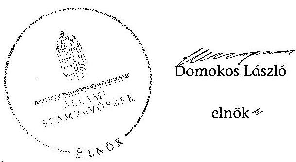

Melléklet: $\quad 9 \mathrm{db}$

---

.

---

A Pannon Egyetem kiadási és bevételi előirányzatai, azok teljesítése a 2009-2012. években

|   |  |  | 2009. év |  |  | 2010. év |  |  | 2011. év |  |  | 2012. év |   |
| --- | --- | --- | --- | --- | --- | --- | --- | --- | --- | --- | --- | --- | --- |
|  Ssz. | Megnevezés | Eredeti előirányzat | Módosított előirányzat | Teljesítés | Eredeti előirányzat | Módosított előirányzat | Teljesítés | Eredeti előirányzat | Módosított előirányzat | Teljesítés | Eredeti előirányzat | Módosított előirányzat | Teljesítés  |
|  1 | KIADÁSOK |  |  |  |  |  |  |  |  |  |  |  |   |
|  2 | Személyi juttatások | 3 309 764 | 3 696 483 | 3 579 059 | 3 349 764 | 3 908 567 | 3 564 504 | 3 422 764 | 4 266 468 | 3 833 016 | 3 422 800 | 4 302 452 | 3 598 256  |
|  3 | Munkaadótr terhelő járulékok | 1 079 985 | 1 096 107 | 1 058 453 | 969 885 | 1 025 439 | 921 300 | 961 585 | 1 108 482 | 991 271 | 911 600 | 1 148 453 | 969 354  |
|  4 | Dologi kiadások | 2 467 275 | 3 456 179 | 3 262 215 | 2 427 433 | 4 172 158 | 3 263 225 | 2 963 555 | 4 559 106 | 3 864 691 | 2 062 380 | 3 773 578 | 3 286 266  |
|  5 | Egyéb folyó kiadások | 21 825 | 263 705 | 262 373 | 60 274 | 305 823 | 296 328 | 62 411 | 222 698 | 219 500 | 78 320 | 184 195 | 162 622  |
|  6 | Támogatásértékű működési kiadások | 10 000 | 16 384 | 16 384 | 10 000 | 14 210 | 14 210 | 10 000 | 10 000 | 9 697 | 10 000 | 10 000 | 8 045  |
|  7 | Támogatásértékű felhalmozási kiadások |  |  |  |  |  |  |  |  |  |  |  |   |
|  8 | Előző évi előirányzat átadás | - | 94 255 | 94 255 | - | 9 086 | 9 086 | - | 15 399 | 15 398 | - | 70 209 | 70 208  |
|  9 | Működési célú pénzeszköz átadás | 132 343 | 117 343 | 105 551 | 132 343 | 75 314 | 65 162 | 132 343 | 12 353 | 11 711 | 22 300 | 29 113 | 24 247  |
|  10 | Felhalmozási célú pénzeszköz átadás | 4 000 | - | - | 4 000 | - | - | 4 000 | 2 185 | 2 185 | 4 000 | - | -  |
|  11 | Elütöttük pénzbeli juttatásai | 1 081 205 | 1 104 220 | 1 055 560 | 1 065 129 | 1 104 251 | 1 012 735 | 1 045 929 | 978 207 | 876 874 | 928 900 | 923 658 | 878 327  |
|  12 | Egyéb juttatás | - | - | - | - | - | 10 151 | - | - | 945 | - | - | 383  |
|  13 | Felújítás | 48 000 | 493 127 | 171 203 | 88 000 | 200 427 | 166 420 | 88 000 | 176 495 | 148 111 | 88 000 | 126 365 | 38 198  |
|  14 | Intézményi beruházási kiadások ÁFA-val | 563 256 | 849 275 | 699 589 | 563 056 | 1 711 769 | 1 160 293 | 408 900 | 1 631 110 | 1 062 443 | 232 900 | 1 079 293 | 894 705  |
|  15 | Központi beruházási kiadások ÁFA-val |  |  |  |  |  |  |  |  |  |  |  |   |
|  16 | Lakásépítés kiadásai ÁFA-val |  |  |  |  |  |  |  |  |  |  |  |   |
|  17 | Egyéb intézményi felhalmozási kiadás | - | 8 250 | 8 250 | - | 18 | 17 | - | - | - | - | - | -  |
|  18 | Kölcsönök | - | 9 600 | 9 600 | - | 4 280 | 4 280 | - | 5 300 | 4 300 | - | 1 800 | 1 800  |
|  19 | Összesen | 8 717 653 | 11 204 928 | 10 322 492 | 8 669 884 | 12 529 342 | 10 487 711 | 9 099 487 | 12 989 803 | 11 040 142 | 7 761 200 | 11 649 116 | 9 932 411  |
|  20 | BEVÉTELEK |  |  |  |  |  |  |  |  |  |  |  |   |
|  21 | Közhatalmi bevételek |  |  |  |  |  |  |  |  |  |  |  |   |
|  22 | Intézményi működési bevételek | 1 951 274 | 2 537 140 | 2 613 546 | 2 090 000 | 2 470 027 | 2 585 549 | 2 567 000 | 2 567 000 | 2 583 639 | 2 567 000 | 2 567 000 | 2 259 154  |
|  23 | Működési célú pénzeszköz átvételek | 165 000 | 278 689 | 302 479 | 165 000 | 179 948 | 192 350 | 105 000 | 277 897 | 390 855 | 243 000 | 388 589 | 251 109  |
|  24 | Felhalmozási bevételek | - | 8 510 | 8 485 | - | - | 3 104 | - | 5 540 | 5 784 | - | - | 10 683  |
|  25 | Felhalmozási célú pénzeszköz átvételek | 85 000 | 370 190 | 300 889 | 125 000 | 228 280 | 289 466 | 276 000 | 281 300 | 301 130 | 276 000 | 277 800 | 18 488  |
|  26 | Irányító szeretői kapott támogatás | 5 751 379 | 6 048 157 | 6 048 157 | 5 524 884 | 5 926 062 | 5 926 062 | 5 689 487 | 5 474 455 | 5 474 455 | 4 351 200 | 4 512 189 | 4 512 189  |
|  27 | Támogatás értékű működési bevétei | 480 000 | 772 565 | 776 678 | 480 000 | 700 451 | 692 525 | 241 000 | 1 228 711 | 1 425 648 | 277 000 | 1 483 722 | 1 713 688  |
|  28 | Támogatás értékű felhalmozási bevétei | 285 000 | 285 000 | 264 744 | 285 000 | 822 907 | 800 158 | 223 000 | 935 775 | 799 353 | 47 000 | 439 447 | 525 284  |
|  29 | Előző évi maradvány átvétele | - | 46 684 | 47 351 | - | 2 987 | 2 987 | - | 15 955 | 15 955 | - | 20322 | 62022  |
|  30 | Előirányzat maradvány felhasználás | - | 857 993 | 857 774 | - | 2 198 680 | 2 198 680 | - | 2 203 170 | 2 203 170 | - | 1 960 047 | 1 960 047  |
|  31 | Összesen | 8 717 653 | 11 204 928 | 11 220 103 | 8 669 884 | 12 529 342 | 12 690 881 | 9 099 487 | 12 989 803 | 13 000 189 | 7 761 200 | 11 649 116 | 11 312 664  |

---

# A Pannon Egyetem kiadásainak, bevételeinek változása a 2009-2012. években

|   |  | 2009. év | 2010. év | 2011. év | 2012. év |   |
| --- | --- | --- | --- | --- | --- | --- |
|  Ssz. | Megnevezés | Teljesítés | Teljesítés | Teljesítés | Teljesítés | 2012/2009  |
|  1 | KIADÁSOK |  |  |  |  |   |
|  2 | Személyi juttatások | 3579059 | 3564504 | 3833016 | 3598256 | 100,5\%  |
|  3 | Rendszeres és nem rendszeres | 3159574 | 3133943 | 3391018 | 3063552 | 97,0\%  |
|  4 | Rendszeres személyi juttatás | 2418936 | 2436554 | 2684543 | 2441316 | 100,9\%  |
|  5 | Alapilletmény | 2143728 | 2175095 | 2288065 | 2044360 | 95,4\%  |
|  6 | Nem rendszeres | 740638 | 697389 | 706475 | 622236 | 84,0\%  |
|  7 | Munkszrégzéshez kapcs juttatások | 502017 | 478759 | 411732 | 451306 | 89,9\%  |
|  8 | Normatív és teljesítéshez kötött jutalom | 22242 | 4530 | 3755 | 5737 | 25,8\%  |
|  9 | Kiúső személyi juttatások | 419485 | 430561 | 441998 | 534704 | 127,5\%  |
|  10 | Munkaadót terhelő járulékok | 1058453 | 921300 | 991271 | 969354 | 91,6\%  |
|  11 | Dologi és folyó kiadások | 3524588 | 3559553 | 4084191 | 3448888 | 97,9\%  |
|  12 | Dologi kiadások | 3262215 | 3263225 | 3864691 | 3286266 | 100,7\%  |
|  13 | Készletbeszerzés | 344161 | 477906 | 501212 | 275908 | 79,6\%  |
|  14 | Kommunikációs szolgáltatás | 115949 | 124730 | 150927 | 143038 | 123,4\%  |
|  15 | Szolgáltatási kiadások | 1465601 | 1389801 | 1613450 | 1607646 | 109,7\%  |
|  16 | Bérlet és frány | 667174 | 687628 | 735354 | 753528 | 112,9\%  |
|  17 | ebből PPP | 526144 | 566163 | 593330 | 617761 | 117,4\%  |
|  18 | Gáz, villany, víz | 465333 | 387879 | 438434 | 485657 | 104,4\%  |
|  19 | Működési célú ÁFA | 606203 | 663382 | 740947 | 707085 | 116,6\%  |
|  20 | Kiiklódetés, reprezentáció | 235917 | 223237 | 235340 | 224619 | 95,2\%  |
|  21 | Szellemi tevékenység | 359054 | 319433 | 262386 | 92235 | 25,7\%  |
|  22 | Egyéb folyó kiadások | 262373 | 296328 | 262386 | 162622 | 62,0\%  |
|  23 | Előző évi maradvány visszafizetés | 184809 | 171904 | 83187 | 59443 | 32,2\%  |
|  24 | Adók, díjak, egyéb befizetések | 70858 | 123028 | 131789 | 103077 | 145,5\%  |
|  25 | Támogatásértékủ múködési kiadások | 16384 | 14210 | 9697 | 8045 | 49,1\%  |
|  26 | Támogatásértékủ felhalmozási kiadások | - | - | - | - | -  |
|  27 | Előző évi előirányzat átadás | 94255 | 9103 | 15398 | 70208 | 74,5\%  |
|  28 | Működési célú pénzeszköz átadás | 105551 | 65162 | 11711 | 24247 | 23,0\%  |
|  29 | Felhalmozási célú pénzeszköz átadás | - | - | 2185 | - | -  |
|  30 | Eljátoztak pénzbeli juttatásai | 1055560 | 1012735 | 876874 | 878327 | 83,2\%  |
|  31 | Egyéb juttatás | - | 10151 | 945 | 383 | -  |
|  32 | Felhalmozási kiadások | 879042 | 1237158 | 1214624 | 937649 | 106,7\%  |
|  33 | Intézményi beruházási kiadások | 565906 | 928678 | 852481 | 707106 | 125,0\%  |
|   | ebből ingatlan | 161943 | 47113 | 98981 | 78305 | 48,6\%  |
|  34 | Gépak, berendezések, felszerelések | 354664 | 767492 | 727991 | 577185 | 162,7\%  |
|  35 | Felújítás | 137892 | 133136 | 118538 | 30081 | 21,8\%  |
|   | ebből ingatlan (Áltával) | 137892 | 130255 | 113645 | 30081 | 21,8\%  |
|  36 | Felújítások és beruházások ÁFA-án | 166994 | 264899 | 239535 | 195716 | 117,2\%  |
|  39 | Egyéb intézményi felhalmozási kiadás | 8250 | - | - | - | -  |
|  40 | Kölesönök | 9600 | 4280 | 4300 | 1800 | 18,8\%  |
|  41 | Összesen | 10322492 | 10487711 | 11040142 | 9932411 | 96,2\%  |
|  42 | BEVÉTELEK |  |  |  |  |   |
|  44 | Múködési bevételek | 3734087 | 3473411 | 4216097 | 4283173 | 114,7\%  |
|  45 | Intézményi múködési bevétel | 2916025 | 2777899 | 2774494 | 2510263 | 86,1\%  |
|  46 | Szolgáltatások ellenértéke | 1699850 | 1764519 | 1607179 | 1489049 | 87,6\%  |
|  47 | Intézményi ellátási díjak | 289852 | 312251 | 302516 | 317220 | 109,4\%  |
|  48 | Hossam és komatbevétel | 101718 | 39165 | 28034 | 35558 | 35,0\%  |
|  49 | Múködési célú pénzeszköz átvételek | 302479 | 192350 | 390855 | 251109 | 83,0\%  |
|   | ebből uniós forrás | 58941 | 40378 | 88449 | - | -  |
|  50 | Támogatásértékủ múködési bevétel | 776678 | 692525 | 1425648 | 1713688 | 220,6\%  |
|  51 | EU programokra múködési bevétel | 351526 | 423739 | 988953 | 1553483 | 441,9\%  |
|  52 | Felhalmozási bevételek | 580085 | 1092728 | 1106407 | 557255 | 96,1\%  |
|  55 | Felhalmozási célú pénzeszköz átvételek | 295289 | 286186 | 296830 | 16688 | 5,7\%  |
|   | ebből uniós forrás | - | - | - | - | -  |
|  56 | Támogatásértékủ felhalmozási bevétel | 264744 | 800158 | 799553 | 525284 | 198,4\%  |
|  57 | EU programokra beruházási bevétel | 30973 | 725403 | 712775 | 420312 | 1357,0\%  |
|  58 | Irányító szervtől kapott támogatás | 6048157 | 5926062 | 5474455 | 4512189 | 74,6\%  |
|  61 | Előirányzat maradvány felhasználás | 857774 | 2198680 | 2203170 | 1960047 | 228,5\%  |
|  62 | Összesen | 11220103 | 12690881 | 13000189 | 11312664 | 100,8\%  |

---

# 3. SZÁMÚ MELLÉKLET A V-0337-1036/2014. SZÁMÚ JELENTÉSHEZ

|  Km |  |  |  |  |   |
| --- | --- | --- | --- | --- | --- |
|   |  |  |  |  | 2010. év  |
|   |  |  |  |  | 2011. év  |
|   |  |  |  |  | 2012. év  |
|   |  |  |  |  | 2013. év  |
|  1. |  |  |  |  |   |
|  2. |  |  |  |  |   |
|  3. |  |  |  |  |   |
|  4. |  |  |  |  |   |
|  5. |  |  |  |  |   |
|  6. |  |  |  |  |   |
|  7. |  |  |  |  |   |
|  8. |  |  |  |  |   |
|  9. |  |  |  |  |   |
|  10. |  |  |  |  |   |
|  11. |  |  |  |  |   |
|  12. |  |  |  |  |   |
|  13. |  |  |  |  |   |
|  14. |  |  |  |  |   |
|  15. |  |  |  |  |   |
|  16. |  |  |  |  |   |
|  17. |  |  |  |  |   |
|  18. |  |  |  |  |   |
|  19. |  |  |  |  |   |
|  20. |  |  |  |  |   |
|  21. |  |  |  |  |   |
|  22. |  |  |  |  |   |
|  23. |  |  |  |  |   |
|  24. |  |  |  |  |   |
|  25. |  |  |  |  |   |
|  26. |  |  |  |  |   |
|  27. |  |  |  |  |   |
|  28. |  |  |  |  |   |
|  29. |  |  |  |  |   |
|  30. |  |  |  |  |   |
|  31. |  |  |  |  |   |
|  32. |  |  |  |  |   |
|  33. |  |  |  |  |   |
|  34. |  |  |  |  |   |
|  35. |  |  |  |  |   |
|  36. |  |  |  |  |   |
|  37. |  |  |  |  |   |
|  38. |  |  |  |  |   |
|  39. |  |  |  |  |   |
|  40. |  |  |  |  |   |
|  41. |  |  |  |  |   |
|  42. |  |  |  |  |   |
|  43. |  |  |  |  |   |
|  44. |  |  |  |  |   |
|  45. |  |  |  |  |   |
|  46. |  |  |  |  |   |
|  47. |  |  |  |  |   |
|  48. |  |  |  |  |   |
|  49. |  |  |  |  |   |
|  50. |  |  |  |  |   |
|  51. |  |  |  |  |   |
|  52. |  |  |  |  |   |
|  53. |  |  |  |  |   |
|  54. |  |  |  |  |   |
|  55. |  |  |  |  |   |
|  56. |  |  |  |  |   |
|  57. |  |  |  |  |   |
|  58. |  |  |  |  |   |
|  59. |  |  |  |  |   |
|  60. |  |  |  |  |   |
|  61. |  |  |  |  |   |
|  62. |  |  |  |  |   |
|  63. |  |  |  |  |   |
|  64. |  |  |  |  |   |
|  65. |  |  |  |  |   |
|  66. |  |  |  |  |   |
|  67. |  |  |  |  |   |
|  68. |  |  |  |  |   |
|  69. |  |  |  |  |   |
|  70. |  |  |  |  |   |
|  71. |  |  |  |  |   |
|  72. |  |  |  |  |   |
|  73. |  |  |  |  |   |
|  74. |  |  |  |  |   |
|  75. |  |  |  |  |   |
|  76. |  |  |  |  |   |
|  77. |  |  |  |  |   |
|  78. |  |  |  |  |   |
|  79. |  |  |  |  |   |
|  80. |  |  |  |  |   |
|  81. |  |  |  |  |   |
|  82. |  |  |  |  |   |
|  83. |  |  |  |  |   |
|  84. |  |  |  |  |   |
|  85. |  |  |  |  |   |
|  86. |  |  |  |  |   |
|  87. |  |  |  |  |   |
|  88. |  |  |  |  |   |
|  89. |  |  |  |  |   |
|  90. |  |  |  |  |   |
|  91. |  |  |  |  |   |
|  92. |  |  |  |  |   |
|  93. |  |  |  |  |   |
|  94. |  |  |  |  |   |
|  95. |  |  |  |  |   |
|  96. |  |  |  |  |   |
|  97. |  |  |  |  |   |
|  98. |  |  |  |  |   |
|  99. |  |  |  |  |   |
|  100. |  |  |  |  |   |
|  101. |  |  |  |  |   |
|  102. |  |  |  |  |   |
|  103. |  |  |  |  |   |
|  104. |  |  |  |  |   |
|  105. |  |  |  |  |   |
|  106. |  |  |  |  |   |
|  107. |  |  |  |  |   |
|  108. |  |  |  |  |   |
|  109. |  |  |  |  |   |
|  110. |  |  |  |  |   |
|  111. |  |  |  |  |   |
|  112. |  |  |  |  |   |
|  113. |  |  |  |  |   |
|  114. |  |  |  |  |   |
|  115. |  |  |  |  |   |
|  116. |  |  |  |  |   |
|  117. |  |  |  |  |   |
|  118. |  |  |  |  |   |
|  119. |  |  |  |  |   |
|  120. |  |  |  |  |   |
|  121. |  |  |  |  |   |
|  122. |  |  |  |  |   |
|  123. |  |  |  |  |   |
|  124. |  |  |  |  |   |
|  125. |  |  |  |  |   |
|  126. |  |  |  |  |   |
|  127. |  |  |  |  |   |
|  128. |  |  |  |  |   |
|  129. |  |  |  |  |   |
|  130. |  |  |  |  |   |
|  131. |  |  |  |  |   |
|  132. |  |  |  |  |   |
|  133. |  |  |  |  |   |
|  134. |  |  |  |  |   |
|  135. |  |  |  |  |   |
|  136. |  |  |  |  |   |
|  137. |  |  |  |  |   |
|  138. |  |  |  |  |   |
|  139. |  |  |  |  |   |
|  140. |  |  |  |  |   |
|  141. |  |  |  |  |   |
|  142. |  |  |  |  |   |
|  143. |  |  |  |  |   |
|  144. |  |  |  |  |   |
|  145. |  |  |  |  |   |
|  146. |  |  |  |  |   |
|  147. |  |  |  |  |   |
|  148. |  |  |  |  |   |
|  149. |  |  |  |  |   |
|  150. |  |  |  |  |   |
|  151. |  |  |  |  |   |
|  152. |  |  |  |  |   |
|  153. |  |  |  |  |   |
|  154. |  |  |  |  |   |
|  155. |  |  |  |  |   |
|  156. |  |  |  |  |   |
|  157. |  |  |  |  |   |
|  158. |  |  |  |  |   |
|  159. |  |  |  |  |   |
|  160. |  |  |  |  |   |
|  161. |  |  |  |  |   |
|  162. |  |  |  |  |   |
|  163. |  |  |  |  |   |
|  164. |  |  |  |  |   |
|  165. |  |  |  |  |   |
|  166. |  |  |  |  |   |
|  167. |  |  |  |  |   |
|  168. |  |  |  |  |   |
|  169. |  |  |  |  |   |
|  170. |  |  |  |  |   |
|  171. |  |  |  |  |   |
|  172. |  |  |  |  |   |
|  173. |  |  |  |  |   |
|  174. |  |  |  |  |   |
|  175. |  |  |  |  |   |
|  176. |  |  |  |  |   |
|  177. |  |  |  |  |   |
|  178. |  |  |  |  |   |
|  179. |  |  |  |  |   |
|  180. |  |  |  |  |   |
|  181. |  |  |  |  |   |
|  182. |  |  |  |  |   |
|  183. |  |  |  |  |   |
|  184. |  |  |  |  |   |
|  185. |  |  |  |  |   |
|  186. |  |  |  |  |   |
|  187. |  |  |  |  |   |
|  188. |  |  |  |  |   |
|  189. |  |  |  |  |   |
|  190. |  |  |  |  |   |
|  191. |  |  |  |  |   |
|  192. |  |  |  |  |   |
|  193. |  |  |  |  |   |
|  194. |  |  |  |  |   |
|  195. |  |  |  |  |   |
|  196. |  |  |  |  |   |
|  197. |  |  |  |  |   |
|  198. |  |  |  |  |   |
|  199. |  |  |  |  |   |
|  200. |  |  |  |  |   |
|  201. |  |  |  |  |   |
|  202. |  |  |  |  |   |
|  203. |  |  |  |  |   |
|  204. |  |  |  |  |   |
|  205. |  |  |  |  |   |
|  206. |  |  |  |  |   |
|  207. |  |  |  |  |   |
|  208. |  |  |  |  |   |
|  209. |  |  |  |  |   |
|  210. |  |  |  |  |   |
|  211. |  |  |  |  |   |
|  212. |  |  |  |  |   |
|  213. |  |  |  |  |   |
|  214. |  |  |  |  |   |
|  215. |  |  |  |  |   |
|  216. |  |  |  |  |   |
|  217. |  |  |  |  |   |
|  218. |  |  |  |  |   |
|  219. |  |  |  |  |   |
|  220. |  |  |  |  |   |
|  221. |  |  |  |  |   |
|  222. |  |  |  |  |   |
|  223. |  |  |  |  |   |
|  224. |  |  |  |  |   |
|  225. |  |  |  |  |   |
|  226. |  |  |  |  |   |
|  227. |  |  |  |  |   |
|  228. |  |  |  |  |   |
|  229. |  |  |  |  |   |
|  230. |  |  |  |  |   |
|  231. |  |  |  |  |   |
|  232. |  |  |  |  |   |
|  233. |  |  |  |  |   |
|  234. |  |  |  |  |   |
|  235. |  |  |  |  |   |
|  236. |  |  |  |  |   |
|  237. |  |  |  |  |   |
|  238. |  |  |  |  |   |
|  239. |  |  |  |  |   |
|  240. |  |  |  |  |   |
|  241. |  |  |  |  |   |
|  242. |  |  |  |  |   |
|  243. |  |  |  |  |   |
|  244. |  |  |  |  |   |
|  245. |  |  |  |  |   |
|  246. |  |  |  |  |   |
|  247. |  |  |  |  |   |
|  248. |  |  |  |  |   |
|  249. |  |  |  |  |   |
|  250. |  |  |  |  |   |
|  251. |  |  |  |  |   |
|  252. |  |  |  |  |   |
|  253. |  |  |  |  |   |
|  254. |  |  |  |  |   |
|  255. |  |  |  |  |   |
|  256. |  |  |  |  |   |
|  257. |  |  |  |  |   |
|  258. |  |  |  |  |   |
|  259. |  |  |  |  |   |
|  260. |  |  |  |  |   |
|  261. |  |  |  |  |   |
|  262. |  |  |  |  |   |
|  263. |  |  |  |  |   |
|  264. |  |  |  |  |   |
|  265. |  |  |  |  |   |
|  266. |  |  |  |  |   |
|  267. |  |  |  |  |   |
|  268. |  |  |  |  |   |
|  269. |  |  |  |  |   |
|  270. |  |  |  |  |   |
|  271. |  |  |  |  |   |
|  272. |  |  |  |  |   |
|  273. |  |  |  |  |   |
|  274. |  |  |  |  |   |
|  275. |  |  |  |  |   |
|  276. |  |  |  |  |   |
|  277. |  |  |  |  |   |
|  278. |  |  |  |  |   |
|  279. |  |  |  |  |   |
|  280. |  |  |  |  |   |
|  281. |  |  |  |  |   |
|  282. |  |  |  |  |   |
|  283. |  |  |  |  |   |
|  284. |  |  |  |  |   |
|  285. |  |  |  |  |   |
|  286. |  |  |  |  |   |
|  287. |  |  |  |  |   |
|  288. |  |  |  |  |   |
|  289. |  |  |  |  |   |
|  290. |  |  |  |  |   |
|  291. |  |  |  |  |   |
|  292. |  |  |  |  |   |
|  293. |  |  |  |  |   |
|  294. |  |  |  |  |   |
|  295. |  |  |  |  |   |
|  296. |  |  |  |  |   |
|  297. |  |  |  |  |   |
|  298. |  |  |  |  |   |
|  299. |  |  |  |  |   |
|  300. |  |  |  |  |   |
|  301. |  |  |  |  |   |
|  302. |  |  |  |  |   |
|  303. |  |  |  |  |   |
|  304. |  |  |  |  |   |
|  305. |  |  |  |  |   |
|  306. |  |  |  |  |   |
|  307. |  |  |  |  |   |
|  308. |  |  |  |  |   |
|  309. |  |  |  |  |   |
|  310. |  |  |  |  |   |
|  311. |  |  |  |  |   |
|  312. |  |  |  |  |   |
|  313. |  |  |  |  |   |
|  314. |  |  |  |  |   |
|  315. |  |  |  |  |   |
|  316. |  |  |  |  |   |
|  317. |  |  |  |  |   |
|  318. |  |  |  |  |   |
|  319. |  |  |  |  |   |
|  320. |  |  |  |  |   |
|  321. |  |  |  |  |   |
|  322. |  |  |  |  |   |
|  323. |  |  |  |  |   |
|  324. |  |  |  |  |   |
|  325. |  |  |  |  |   |
|  326. |  |  |  |  |   |
|  327. |  |  |  |  |   |
|  328. |  |  |  |  |   |
|  329. |  |  |  |  |   |
|  330. |  |  |  |  |   |
|  331. |  |  |  |  |   |
|  332. |  |  |  |  |   |
|  333. |  |  |  |  |   |
|  334. |  |  |  |  |   |
|  335. |  |  |  |  |   |
|  336. |  |  |  |  |   |
|  337. |  |  |  |  |   |
|  338. |  |  |  |  |   |
|  339. |  |  |  |  |   |
|  340. |  |  |  |  |   |
|  341. |  |  |  |  |   |
|  342. |  |  |  |  |   |
|  343. |  |  |  |  |   |
|  344. |  |  |  |  |   |
|  345. |  |  |  |  |   |
|  346. |  |  |  |  |   |
|  347. |  |  |  |  |   |
|  348. |  |  |  |  |   |
|  349. |  |  |  |  |   |
|  350. |  |  |  |  |   |
|  351. |  |  |  |  |   |
|  352. |  |  |  |  |   |
|  353. |  |  |  |  |   |
|  354. |  |  |  |  |   |
|  355. |  |  |  |  |   |
|  356. |  |  |  |  |   |
|  357. |  |  |  |  |   |
|  358. |  |  |  |  |   |
|  359. |  |  |  |  |   |
|  360. |  |  |  |  |   |
|  361. |  |  |  |  |   |
|  362. |  |  |  |  |   |
|  363. |  |  |  |  |   |
|  364. |  |  |  |  |   |
|  365. |  |  |  |  |   |
|  366. |  |  |  |  |   |
|  367. |  |  |  |  |   |
|  368. |  |  |  |  |   |
|  369. |  |  |  |  |   |
|  370. |  |  |  |  |   |
|  371. |  |  |  |  |   |
|  372. |  |  |  |  |   |
|  373. |  |  |  |  |   |
|  374. |  |  |  |  |   |
|  375. |  |  |  |  |   |
|  376. |  |  |  |  |   |
|  377. |  |  |  |  |   |
|  378. |  |  |  |  |   |
|  379. |  |  |  |  |   |
|  380. |  |  |  |  |   |
|  381. |  |  |  |  |   |
|  382. |  |  |  |  |   |
|  383. |  |  |  |  |   |
|  384. |  |  |  |  |   |
|  385. |  |  |  |  |   |
|  386. |  |  |  |  |   |
|  387. |  |  |  |  |   |
|  388. |  |  |  |  |   |
|  389. |  |  |  |  |   |
|  390. |  |  |  |  |   |
|  391. |  |  |  |  |   |
|  392. |  |  |  |  |   |
|  393. |  |  |  |  |   |
|  394. |  |  |  |  |   |
|  395. |  |  |  |  |   |
|  396. |  |  |  |  |   |
|  397. |  |  |  |  |   |
|  398. |  |  |  |  |   |
|  399. |  |  |  |  |   |
|  400. |  |  |  |  |   |
|  401. |  |  |  |  |   |
|  402. |  |  |  |  |   |
|  403. |  |  |  |  |   |
|  404. |  |  |  |  |   |
|  405. |  |  |  |  |   |
|  406. |  |  |  |  |   |
|  407. |  |  |  |  |   |
|  408. |  |  |  |  |   |
|  409. |  |  |  |  |   |
|  410. |  |  |  |  |   |
|  411. |  |  |  |  |   |
|  412. |  |  |  |  |   |
|  413. |  |  |  |  |   |
|  414. |  |  |  |  |   |
|  415. |  |  |  |  |   |
|  416. |  |  |  |  |   |
|  417. |  |  |  |  |   |
|  418. |  |  |  |  |   |
|  419. |  |  |  |  |   |
|  420. |  |  |  |  |   |
|  421. |  |  |  |  |   |
|  422. |  |  |  |  |   |
|  423. |  |  |  |  |   |
|  424. |  |  |  |  |   |
|  425. |  |  |  |  |   |
|  426. |  |  |  |  |   |
|  427. |  |  |  |  |   |
|  428. |  |  |  |  |   |
|  429. |  |  |  |  |   |
|  430. |  |  |  |  |   |
|  431. |  |  |  |  |   |
|  432. |  |  |  |  |   |
|  433. |  |  |  |  |   |
|  434. |  |  |  |  |   |
|  435. |  |  |  |  |   |
|  436. |  |  |  |  |   |
|  437. |  |  |  |  |   |
|  438. |  |  |  |  |   |
|  439. |  |  |  |  |   |
|  440. |  |  |  |  |   |
|  441. |  |  |  |  |   |
|  442. |  |  |  |  |   |
|  443. |  |  |  |  |   |
|  444. |  |  |  |  |   |
|  445. |  |  |  |  |   |
|  446. |  |  |  |  |   |
|  447. |  |  |  |  |   |
|  448. |  |  |  |  |   |
|  449. |  |  |  |  |   |
|  450. |  |  |  |  |   |
|  451. |  |  |  |  |   |
|  452. |  |  |  |  |   |
|  453. |  |  |  |  |   |
|  454. |  |  |  |  |   |
|  455. |  |  |  |  |   |
|  456. |  |  |  |  |   |
|  457. |  |  |  |  |   |
|  458. |  |  |  |  |   |
|  459. |  |  |  |  |   |
|  460. |  |  |  |  |   |
|  461. |  |  |  |  |   |
|  462. |  |  |  |  |   |
|  463. |  |  |  |  |   |
|  464. |  |  |  |  |   |
|  465. |  |  |  |  |   |
|  466. |  |  |  |  |   |
|  467. |  |  |  |  |   |
|  468. |  |  |  |  |   |
|  469. |  |  |  |  |   |
|  470. |  |  |  |  |   |
|  471. |  |  |  |  |   |
|  472. |  |  |  |  |   |
|  473. |  |  |  |  |   |
|  474. |  |  |  |  |   |
|  475. |  |  |  |  |   |
|  476. |  |  |  |  |   |
|  477. |  |  |  |  |   |
|  478. |  |  |  |  |   |
|  479. |  |  |  |  |   |
|  480. |  |  |  |  |   |
|  481. |  |  |  |  |   |
|  482. |  |  |  |  |   |
|  483. |  |  |  |  |   |
|  484. |  |  |  |  |   |
|  485. |  |  |  |  |   |
|  486. |  |  |  |  |   |
|  487. |  |  |  |  |   |
|  488. |  |  |  |  |   |
|  489. |  |  |  |  |   |
|  490. |  |  |  |  |   |
|  491. |  |  |  |  |   |
|  492. |  |  |  |  |   |
|  493. |  |  |  |  |   |
|  494. |  |  |  |  |   |
|  495. |  |  |  |  |   |
|  496. |  |  |  |  |   |
|  497. |  |  |  |  |   |
|  498. |  |  |  |  |   |
|  499. |  |  |  |  |   |
|  500. |  |  |  |  |   |
|  501. |  |  |  |  |   |
|  502. |  |  |  |  |   |
|  503. |  |  |  |  |   |
|  504. |  |  |  |  |   |
|  505. |  |  |  |  |   |
|  506. |  |  |  |  |   |
|  507. |  |  |  |  |   |
|  508. |  |  |  |  |   |
|  509. |  |  |  |  |   |
|  510. |  |  |  |  |   |
|  511. |  |  |  |  |   |
|  512. |  |  |  |  |   |
|  513. |  |  |  |  |   |
|  514. |  |  |  |  |   |
|  515. |  |  |  |  |   |
|  516. |  |  |  |  |   |
|  517. |  |  |  |  |   |
|  518. |  |  |  |  |   |
|  519. |  |  |  |  |   |
|  520. |  |  |  |  |   |
|  521. |  |  |  |  |   |
|  522. |  |  |  |  |   |
|  523. |  |  |  |  |   |
|  524. |  |  |  |  |   |
|  525. |  |  |  |  |   |
|  526. |  |  |  |  |   |
|  527. |  |  |  |  |   |
|  528. |  |  |  |  |   |
|  529. |  |  |  |  |   |
|  530. |  |  |  |  |   |
|  5210. |  |  |  |  |   |
|  5211. |  |  |  |  |   |
|  5220. |  |  |  |  |   |
|  5221. |  |  |  |  |   |
|  5222. |  |  |  |  |   |
|  5230. |  |  |  |  |   |
|  5231. |  |  |  |  |   |
|  5232. |  |  |  |  |   |
|  5233. |  |  |  |  |   |
|  5240. |  |  |  |  |   |
|  5241. |  |  |  |  |   |
|  5242. |  |  |  |  |   |
|  5243. |  |  |  |  |   |
|  5244. |  |  |  |  |   |
|  525. |  |  |  |  |   |
|  525. |  |  |  |  |   |
|  526. |  |  |  |  |   |
|  527. |  |  |  |  |   |
|  527. |  |  |  |  |   |
|  528. |  |  |  |  |   |
|  529. |  |  |  |  |   |
|  530. |  |  |  |  |   |
|  529. |  |  |  |  |   |
|  531. |  |  |  |  |   |
|  532. |  |  |  |  |   |
|  533. |  |  |  |  |   |
|  533. |  |  |  |  |   |
|  534. |  |  |  |  |   |
|  535. |  |  |  |  |   |
|  536. |  |  |  |  |   |
|  537. |  |  |  |  |   |
|  538. |  |  |  |  |   |
|  539. |  |  |  |  |   |
|  540. |  |  |  |  |   |
|  539. |  |  |  |  |   |
|  541. |  |  |  |  |   |
|  542. |  |  |  |  |   |
|  543. |  |  |  |  |   |
|  543. |  |  |  |  |   |
|  544. |  |  |  |  |   |
|  545. |  |  |  |  |   |
|  546. |  |  |  |  |   |
|  547. |  |  |  |  |   |
|  548. |  |  |  |  |   |
|  548. |  |  |  |  |   |
|  549. |  |  |  |  |   |
|  550. |  |  |  |  |   |
|  549. |  |  |  |  |   |
|  551. |  |  |  |  |   |
|  552. |  |  |  |  |   |
|  553. |  |  |  |  |   |
|  554. |  |  |  |  |   |
|  555. |  |  |  |  |   |
|  556. |  |  |  |  |   |
|  557. |  |  |  |  |   |
|  558. |  |  |  |  |   |
|  559. |  |  |  |   |
|  560. |  |  |  |   |
|  561. |  |  |  |   |
|  562. |  |  |  |   |
|  563. |  |  |  |   |
|  563. |  |  |  |   |
|  564. |  |  |  |   |
|  565. |  |  |  |   |
|  566. |  |  |  |   |
|  567. |  |  |  |   |
|  570. |  |  |   |
|  571. |  |  |   |
|  572. |  |  |   |
|  573. |  |  |   |
|  574. |  |  |   |
|  575. |  |  |   |
|  576. |  |  |   |
|  577. |  |  |   |
|  58. |  |  |   |
|  58. |  |  |  |   |
|  59. |  |  |   |
|  59. |  |  |   |
|  59. |  |  |   |
|  60. |  |  |   |
|  61. |  |  |   |
|  62. |  |  |   |
|  62. |  |  |   |
|  63. |  |  |   |
|  63. |  |  |   |
|  64. |  |  |   |
|  65. |  |  |   |
|  66. |  |  |   |
|  67. |  |  |   |
|  68. |  |  |   |
|  69. |  |  |   |
|  70. |  |   |
|  71. |  |  |   |
|  72. |  |  |   |
|  73. |  |   |
|  74. |  |  |   |
|  75. |  |  |   |
|  76. |  |  |   |
|  77. |  |   |
|  78. |  |  |   |
|  79. |  |   |
|  80. |  |   |
|  81. |  |   |
|  82. |  |   |
|  82. |  |   |
|  83. |  |   |
|  84. |  |   |
|  85. |  |   |
|  86. |  |   |
|  87. |  |   |
|  88. |  |   |
|  89. |  |   |
|  810. |  |   |
|  82. |  |   |
|  82. |  |   |
|  83. |  |   |
|  83. |  |   |
|  84. |  |   |
|  84. |  |   |
|  85. |  |   |
|  86. |  |   |
|  87. |  |   |
|  88. |  |   |
|  89. |  |   |
|  89. |  |   |
|  811. |  |   |
|  82. |  |   |
|  82. |  |   |
|  83. |  |   |
|  84. |  |   |
|  84. |  |   |
|  85. |  |   |
|  86. |  |   |
|  87. |  |   |
|  88. |  |   |
|  89. |  |   |
|  810. |  |   |
|  82. |  |   |
|  82. |  |   |
|  83. |  |   |
|  83. |  |   |
|  84. |  |   |
|  84. |  |   |
|  85. |  |   |
|  86. |  |   |
|  87. |  |   |
|  88. |  |   |
|  88. |  |   |
|  89. |  |   |
|  89. |  |   |
|  811. |  |   |
|  82. |  |   |
|  82. |  |   |
|  83. |   |
|  83. |  |   |
|  84. |  |   |
|  85. |  |   |
|  84. |  |   |
|  86. |  |   |
|  87. |  |   |
|  88. |  |   |
|  88. |  |   |
|  89. |  |   |
|  812. |  |   |
|  82. |  |   |
|  83. |  |   |
|  83. |  |   |
|  84. |  |   |
|  85. |  |   |
|  86. |  |   |
|  87. |  |   |
|  88. |  |   |
|  88. |  |   |
|  89. |  |   |
|  810. |  |   |
|  82. |  |   |
|  82. |  |   |
|  83. |  |   |
|  83. |  |   |
|  84. |  |   |
|  84. |  |   |
|  85. |  |   |
|  86. |  |   |
|  87. |  |   |
|  88. |  |   |
|  88. |  |   |
|  89. |  |   |
|  811. |  |   |
|  82. |  |   |
|  82. |  |   |
|  83. |   |
|  83. |  |   |
|  84. |  |   |
|  84. |  |   |
|  85. |  |   |
|  86. |  |   |
|  87. |  |   |
|  88. |  |   |
|  88. |  |   |
|  89. |  |   |
|  81. |  |   |
|  82. |  |   |
|  82. |  |   |
|  83. |  |   |
|  83. |   |
|  84. |  |   |
| 84. |  |   |
|  85. |  |   |
|  86. |  |   |
| 87. |  |   |
|  88. |  |   |
|  88. |  |   |
|  89. |  |   |
|  810. |  |   |
|  82. |  |   |
|  82. |  |   |
|  83. |  |   |
|  84. |  |   |
|  84. |  |   |
|  85. |  |   |
|  86. |  |   |
|  87. |  |   |
|  88. |  |   |
|  88. |  |   |
|  89. |  |   |
|  810. |  |   |
| 82. |  |   |
|  82. |  |   |
|  83. |   |
|  83. |  |   |
|  84. |  |   |
|  84. |  |   |
|  85. |  |   |
|  86. |  |   |
|  87. |  |   |
|  88. |  |   |
|  88. |  |   |
|  88. |  |   |
|  89. |  |   |
|  811. |  |   |
|  82. |  |   |
|  82. |  |   |
|  82. |  |   |
|  83. |   |
|  83. |  |   |
|  84. |  |   |
|  84. |  |   |
|  85. |  |   |
|  85. |  |   |
|  86. |  |   |
|  87. |  |   |
|  88. |  |   |
|  88. |  |   |
|  88. |  |   |
|  89. |  |   |
|  810. |  |   |
|  811. |  |   |
|  82. |  |   |
|  82. |  |   |
|  82. |  |   |
|  83. |   |
|  83. |  |   |
|  84. |  |   |
|  84. |  |   |
|  84. |  |   |
|  85. |  |   |
|  85. |  |   |
|  86. |  |   |
|  87. |  |   |
|  88. |  |   |
|  88. |  |   |
|  88. |  |   |
|  89. |  |   |
|  810. |  |   |
|  811. |  |   |
|  82. |  |   |
|  82. |  |   |
|  82. |  |   |
|  83. |  |   |
|  83. |   |
|  83. |  |   |
|  84. |  |   |
|  84. |  |   |
|  84. |  |   |
|  85. |  |   |
|  85. |  |   |
|  86. |  |   |
|  87. |  |   |
|  88. |  |   |
|  88. |  |   |
|  88. |  |   |
|  89. |  |   |
|  810. |  |   |
|  811. |  |   |
|  82. |  |   |
|  82. |  |   |
|  82.

---

|  A Pannon Egyetem mérlegadatai a 2009-2012. években |  |  |  |  |  |   |
| --- | --- | --- | --- | --- | --- | --- |
|   |  |  |  |  |  | ndatok ezer 213om  |
|  Ssz. | Megnevezés | 2009. év | 2010. év | 2011. év | 2012. év | Index
(2012/2009)  |
|  1 | IMMATERIALIS JAVAK | 79 159 | 162 853 | 147 082 | 175 896 | 222,5%  |
|  4 | Vagyoni értékű jogok | 53 338 | 126 697 | 115 936 | 160 033 | 300,0%  |
|  5 | Szellemi termékek | 25 194 | 35 529 | 20 519 | 15 863 | 63,0%  |
|  6 | Immateriális javakra adott előlegek | 627 | 627 | 627 |  |   |
|  8 | TÁRGYI ESZKÖZÖK | 7 445 454 | 7 967 119 | 8 304 346 | 8 264 466 | 111,9%  |
|  9 | Ingenieusk és kapcsolódó vagyonértékű jogok | 5 520 242 | 5 369 670 | 5 479 523 | 5 437 033 | 103,2%  |
|  10 | Gépok, bezendezések, felszerelések | 1 502 581 | 1 817 604 | 2 152 285 | 2 230 147 | 148,4%  |
|  11 | Járművek | 20 377 | 46 676 | 42 543 | 32 262 | 158,3%  |
|  12 | Tenyészállatok | 9 052 | 7 084 | 5 787 | 3 730 | 41,2%  |
|  13 | Beruházások, felülfőseek | 585 703 | 715 584 | 613 703 | 551 243 | 94,7%  |
|  14 | Beruházásra adott előlegek | 10 501 | 10 501 | 10 501 | 9 752 | 92,9%  |
|  17 | BEFEKTETETT PÉNZÜGYI ESZKÖZÖK | 131 377 | 155 922 | 155 791 | 152 924 | 116,4%  |
|  18 | Tartós részesedés | 121 170 | 146 350 | 146 350 | 145 920 | 120,4%  |
|  19 | Tartósan adott kölcsön | 10 207 | 9 672 | 9 341 | 7 004 | 68,6%  |
|  20 | ÜZEMELTETÉSRE KÉZELÉSRE ÁTADOTT
VAGYONKEZELÉSRE VETT ESZKÖZÖK |  |  |  |  |   |
|  21 | BEFEKTETETT ESZKÖZÖK ÖSSZESEN | 7 655 990 | 8 285 894 | 8 607 213 | 8 593 286 | 112,2%  |
|  22 | KÉSZLETER | 164 458 | 191 607 | 175 391 | 199 570 | 121,4%  |
|  23 | Anyogok | 21 009 | 20 560 | 15 167 | 16 165 | 76,9%  |
|  25 | Késztemnékek | 89 646 | 117 966 | 112 923 | 139 586 | 144,6%  |
|  26 | Áruk, gémgetilegek, közvetített szolgáltatások | 43 987 | 43 265 | 38 603 | 45 205 | 103,8%  |
|  27 | Egyéb készletek** | 9 816 | 9 816 | 8 700 | 8 616 | 87,8%  |
|  28 | KÖVETELÉSEK | 421 133 | 465 997 | 537 295 | 533 275 | 126,6%  |
|  29 | Követelések óruszállításból és szolgáltatásból | 322 223 | 461 340 | 531 126 | 527 233 | 163,6%  |
|  30 | Adókok | 94 364 |  |  |  |   |
|  31 | Rövid lejáratú adott kölcsönök |  |  | 4 656 | 3 601 |   |
|  32 | Egyéb követelések | 4 546 | 4 657 | 1 513 | 2 441 | 53,7%  |
|  38 | ÉRTÉKPAPÍROK | 1 438 320 |  |  |  |   |
|  43 | Torgatási célú hibáviszonyi megtestesítő
értékpapír bekerülési (könnyi szerteti) értéke | 1 438 320 |  |  |  |   |
|  45 | PÉNZESZKÖZÖK | 935 525 | 1 763 227 | 1 489 196 | 1 070 179 | 114,4%  |
|  47 | Költségvetési pénzforgalmi számúak | 41 047 | 34 711 | 83 474 | 26 188 | 63,8%  |
|  48 | Elszámolási számúak | 884 462 | 1 650 070 | 1 395 257 | 852 770 | 96,4%  |
|  49 | Idegen pénzeszközök | 10 016 | 78 446 | 10 465 | 191 221 | 1909,2%  |
|  50 | EGYÉB AKTÍV PÉNZÜGYI ELSZÁMOLÁSOK | 26 035 | 626 238 | 612 199 | 639 353 | 2455,7%  |
|  51 | FORGÓESZKÖZÖK ÖSSZESEN | 2 985 471 | 3 047 069 | 2 814 081 | 2 442 377 | 81,8%  |
|  52 | ESZKÖZÖK ÖSSZESEN | 10 641 461 | 11 332 963 | 11 421 294 | 11 035 663 | 103,7%  |
|  53 | SAJÁT TŐKE | 7 310 697 | 7 138 406 | 8 165 855 | 8 045 431 | 110,1%  |
|  54 | Tartós tőke | 1 755 531 | 7 310 697 | 7 138 406 | 8 165 861 | 470,5%  |
|  56 | Tőkeváltorások | 5 575 166 | -172 391 | 1 027 449 | -120 430 |   |
|  59 | TARTALÉKOK | 2 198 680 | 2 203 170 | 1 960 047 | 1 380 253 | 62,8%  |
|  60 | Költségvetési tartalékok | 2 198 680 | 2 203 170 | 1 960 047 | 1 380 253 | 62,8%  |
|  62 | KÖTELEZETTSÉGEK | 940 900 | 1 816 424 | 1 164 509 | 1 293 794 | 137,5%  |
|  63 | Hosszú lejáratú kötelezettségek | 295 | 170 | 1 720 | 1 720 | 583,1%  |
|  64 | Rövid lejáratú kötelezettségek | 940 605 | 1 816 254 | 1 162 789 | 1 293 074 | 137,4%  |
|  65 | Kötelezettségek (rosszáll, zsidg. (szállítók) | 61 128 | 356 510 | 91 441 | 131 727 | 215,1%  |
|  66 | Egyéb kötelezettségek | 879 477 | 1 459 729 | 1 071 348 | 1 160 347 | 131,9%  |
|  67 | EGYÉB PASSZÍV PÉNZÜGYI ELSZÁMOLÁSOK | 191 184 | 174 963 | 130 883 | 316 185 | 165,4%  |
|  68 | FORRÁSOK ÖSSZESEN | 10 641 461 | 11 332 963 | 11 421 294 | 11 035 663 | 103,7%  |

---

5. SZÁMÚ MELLÉKLET A V-0337-1036/2014. SZÁMÚ JELENTÉSHEZ

A Pannon Egyetem gazdálkodása szabályszerűségének értékelése a mintatételek alapján

|  értékelt terület |  |  |  |  |  |  |  |  |  |  |  |  |  |  |  |  |  |  |  |  |  |  |  |  |  |  |  |  |  |  |  |  |  |  |  |  |  |  |  |  |  |  |   |
| --- | --- | --- | --- | --- | --- | --- | --- | --- | --- | --- | --- | --- | --- | --- | --- | --- | --- | --- | --- | --- | --- | --- | --- | --- | --- | --- | --- | --- | --- | --- | --- | --- | --- | --- | --- | --- | --- | --- | --- | --- | --- | --- | --- | --- | --- | --- | --- | --- | --- | --- | --- | --- | --- | --- | --- | --- | --- | --- | --- | --- | --- | --- | --- | --- | --- | --- | --- | --- | --- | --- | --- | --- | --- | --- | --- | --- | --- | --- | --- | --- | --- | --- | --- | --- | --- | --- | --- | --- | --- | --- | --- | --- | --- | --- | --- | --- | --- | --- | --- | ---

---

.

---

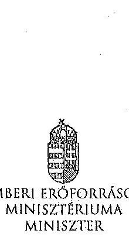

|  |  |  |
| :--: | :--: | :--: |
| Iktatószám: 36433-2/2014/FOFEJL | Hiv. szám: | V-0352-311/2014, V-0352- |
|  | 313/2014, V-0337-964/2014, V-0337- | V-0337- |
|  | 966/2014, V-0368-250/2014, V-0364- | V-0364- |
|  | 477/2014, V-0363-252/2014 |  |
|  | Melléklet:- |  |

# Domokos László részére 

elnök

Állami Számvevőszék

Budapest
Apáczai Csere János utca 10.
1052
Tárgy: Észrevételek az Állami Számvevőszék ellenőrzési megállapításaira

Tisztelt Elnök Úr!

Hivatkozva a V-0352-311/2014, a V-0352-313/2014, a V-0337-964/2014, a V-0337-966/2014, a V-0368-250/2014, a V-0364-477/2014, a V-0363-252/2014 iktatószámú leveleire és megküldött jelentéstervezeteire, a Károly Róbert Főiskola, a Magyar Képzőművészeti Egyetem, a Szolnoki Főiskola, a Pannon Egyetem, az Eszterházy Károly Főiskola, a Széchenyi István Egyetem, valamint a Miskolci Egyetem vonatkozásában a 2013. évben megkezdett szabályszerűségi ellenőrzés kapcsán az alábbiakról tájékoztatom, valamint az alábbi észrevételeket teszem.

A megküldött jelentéstervezetekben rögzített megállapítások szerint a fenntartó ágazati irányítási feladatait a 2009-2012. években nem látta el teljes körűen az alábbiak vonatkozásában.

- „A felsőoktatásért felelős miniszter nem hajtotta végre a nemzetgazdasági miniszter irányításával, a kormányhatározatban előírt szervezeti és feladat-ellátási felülvizsgálati programot. A felsőoktatási törvény rendelkezései ellenére nem készíttetett a felsőoktatás rendszere vonatkozásában középtávú fejlesztési tervet."

A 2012. évi költségvetési hiánycél tartását biztosító további feladatokról szóló 1365/2011. (XI. 8.) Korm. határozatban a Kormány a közfeladat-ellátás színvonalának javítása és a költséghatékony müködés céljából, szervezeti és feladat-ellátási felülvizsgálati programot indított el az államháztartás központi alrendszerében a költségvetési szervek, és a többségi állami tulajdonú gazdálkodó szervezetek (a továbbiakban: intézmények) vonatkozásában. Továbbá

---

elrendelte, hogy a felülvizsgálathoz a nemzetgazdasági miniszter irányításával, a Miniszterelnökséget vezető államtitkár, a közigazgatási és igazságügyi miniszter, valamint az ágazatért felelős miniszter részvételével munkabizottságokat kell létrehozni, valamint módszertani útmutatót kell kidolgozni.

Tekintettel arra, hogy a feladat nem a felsőoktatásért felelős miniszter felelősségi körébe tartozott, javaslom, hogy valamennyi jelentéstervezetben kerüljön módosításra, illetve kivezetésre azon megállapítás, miszerint a felsőoktatásért felelős miniszter nem hajtotta végre a nemzetgazdasági miniszter irányításával, a kormányhatározatban előírt szervezeti és feladatellátási felülvizsgálati programot.

A 2005. évi CXXXIX. törvény (Ftv.) 104. § (1) bekezdés b) pontja szerint az oktatásért felelős miniszter felsőoktatás fejlesztéssel kapcsolatos feladatai a felsőoktatás rendszere fejlesztési terveinek elkészíttetése, beleértve a középtávú fejlesztési tervet, az ágazati minőségpolitikát.

A nemzeti felsőoktatásról szóló 2011. évi CCIV. törvény (Nftv.) 64. § (3) bekezdése szerint a miniszter felsőoktatás-fejlesztéssel kapcsolatos feladatai a felsőoktatás rendszere fejlesztési terveinek elkészíttetése, beleértve a középtávú fejlesztési tervet.

A törvényi rendelkezéseknek megfelelően több javaslat is került a Kormány elé a felsőoktatási rendszer középtávú fejlesztési tervének vonatkozásába, azonban a Kormány egy javaslatot sem fogadott el. A megállapítást az alábbiak szerint szíveskedjen módosítani.

Nincs a Kormány által elfogadott, a felsőoktatás rendszere vonatkozásában készíttetett, középtávú fejlesztési terv.

- „A minisztérium a Felsőoktatási Információs Rendszer (FIR) biztonságos üzemeltetéséhez, az adatok védelméhez szükséges alapvető szervezeti, szabályozási kontrollokat a 2012. év végéig nem teljes körűen alakította ki. Így a minisztérium csak részben tett eleget a 2005. évi felsőoktatási törvény és a 2011. évi nemzeti felsőoktatási törvény előírásainak. A 2007-ben használtba vett FIR feladata volt, hogy a felsőoktatásban résztvevők (hallgatók, oktatók, kutatók, tanárok) adatait kezelje. A FIR müködését 2012-ig több probléma jellemezte. A rendszerbe bevitt alapadatok nem voltak ellenőrzöttek, a rendszerbe épített adatellenőrzés hibajelzései nem voltak kellően konkrétak, illetve a FIR a személyi többszörözödéseket nem szürte megfelelően. 2012ben megkezdték a rendszer hibáinak kijavítását."
A FIR létrehozása, fejlesztése, müködtetése és üzemeltetése az Ftv. és Nftv., valamint az Oktatási Hivatalról szóló 307/2006. (XII. 23.) Korm. rendelet, majd a 121/2013. (IV. 26.) Korm. rendelet alapján az Oktatási Hivatal (OH) feladata. A Minisztérium miniszteri utasításban adta ki és szükség szerint módosította az Oktatási Hivatal Szervezeti és Müködési Szabályzatát, mely az OH feladatrendszerét is részletezi. A 2/2012. (I. 13.) NEFMI utasításban kiadott OH SZMSZ 1.2.3.6. pontja többek között az alábbiakat tartalmazza:

Az OH Felsőoktatási Főosztály feladatai, a felsőoktatási informatikai rendszerekkel szemben támasztott követelmények szakmai szempontú meghatározása, együttmüködve az Informatikai Főosztállyal és a felsőoktatási informatikai rendszerek üzemeltetőivel.

A korábban kiadott SZMSZ-ek is hasonló tartalmú feladatot szabtak.

---

Mindezek alapján a Minisztérium többek között a FIR biztonságos üzemeltetéséhez, az adatok védelméhez szükséges alapvető szervezeti, szabályozási kontrollokat a fenti szabályozások megalkotásával megvalósította. A fenti szabályozási rendszer keretén belül a részletszabályok kidolgozása nem lehet a Minisztérium feladata, azt már csak az Oktatási Hivatal végezheti el saját hatáskörben.

Ugyanakkor meg kell jegyezni, hogy a Felsőoktatási Információs Rendszer fejlesztése egy hatalmas, sok évre átnyúló feladat. A FIR fejlesztése 2006-ban kezdődött meg hatósági nyilvántartási koncepció alapján. A FIR azonban alapjaiban eltér egy klasszikus, pl. lakcím- és személyi adat nyilvántartástól, amely esetében az önkormányzatoknál/kormányhivataloknál begépelik az adatokat és azok azonnal bent is vannak a központi rendszerben. A FIR ezzel szemben az adatbevitel szempontjából nem tekinthető önálló rendszernek, hiszen az adatokat a felsőoktatási intézmények különböző tanulmányi rendszeréből veszi át. Így a FIR fejlesztése sosem volt független a tanulmányi rendszerek párhuzamos fejlesztésétől, azzal szoros összhangban tudott és tud megvalósulni. A tanulmányi rendszerek - három önálló tanulmányi rendszer és több egyedi, intézményi saját fejlesztésű rendszer - tényleges fejlesztése azonban nem az OH feladata, azt az esetek többségében piaci vállalkozások végzik. Ezeknek megfelelően a FIR és a különböző tanulmányi rendszerek összchangolt fejlesztése kiemelten nagy kihívást jelent az OH-nak, a feladat hatalmas méretéből adódóan a fejlesztés, vagy akár egy-egy hiba, problémacsokor megoldása nem oldható meg gyorsan, hanem csak összchangoltan, mely sok időt vesz igénybe. Így a teljesen "zöldmezős beruházásként" megvalósított FIR fejlesztés jelenleg 4+4 éves időtartama a feladat nagysága, a korábban rendelkezésre álló pénzügyi források ismeretében elfogadhatónak mondható. Az OH a FIR fejlesztése során a felsőoktatási intézményeknél folyamatos tájékoztatásokat, segítséget, ezeken túlmenően hatósági ellenőrzéseket is végez a FIR biztonságos üzemeltetése, az adatok védelme érdekében. A FIR megfelelő fejlesztése, biztonságos üzemeltetése érdekében az OH 2010-tól átalakította a FIR-t érintő stratégiáját, az eljárásrendjeit.

- „Az Állami Számvevőszék három korábbi ellenőrzése során a felsőoktatás témakörében 9 javaslatot fogalmazott meg a felsőoktatásért felelős minisztériumnak. A minisztérium a javaslatokra intézkedési terveket készített, amelyek összesen 10 intézkedést tartalmaztak. Az intézkedések közül 3-at késéssel megvalósítottak, 7 nem valósult meg."
Az oktatási és kulturális ágazat irányítási rendszerének, müködésének ellenőrzéséről szóló 1106 sz. jelentés javaslataira készített intézkedési terv 3. számú javaslata, az oktatás középtávú stratégia tervezet egy változatának előkészítése megtörtént, azonban azt a Kornány nem fogadta el.

A felsőoktatás oktatási infrastruktúra-fejlesztési programjának ellenőrzéséről szóló 1171 sz. jelentésben tett javaslat szerint a minisztérium feladata az oktatási infrastruktúra fejlesztési program előkészítésének hiányosságai miatt a felelősség megállapítása.

Tekintettel arra, hogy a 212/2010 (VII.1.) sz. Korm. rendelet alapján a PPP projektekkel kapcsolatos feladatellátás a Nemzeti Fejlesztési Minisztérium (továbbiakban NFM) feladatkörébe került csakúgy, mint a tárgyban érintett dokumentáció, így a feladat, a felelősség megállapításához szükséges jogkörök a rendelet alapján az NFM-hez kerültek, nem történhetett intézkedés a felelősség megállapítására.

---

A 1171 sz. jelentés intézkedései közül egy intézkedés meghiúsult (felelősség megállapítása), egy intézkedés késéssel valósult meg (kapacitás-kihasználtság felmérése), egy intézkedés megvalósítása folyamatban van (kapacitás-kihasználtság felmérése eredményeinek és a felsőoktatást érintő ágazati célok figyelembe vételével intézkedések megtétele a felsőoktatási infrastruktúra közép- és hosszú távú hasznosítására).

Az állami felsőoktatási intézmények érdekeltségébe tartozó gazdasági társaságok támogatásának és nyereségességük hasznosulásának 1290 sz. ellenőrzése kapcsán az állami felsőoktatási intézmények gazdasági társaságai szakmai feladatellátásának és gazdaságossági eredményességének mérését biztosító mutatószám- és értékelési rendszereket az érintett felsőoktatási intézmények késéssel kidolgozták, azok ellenőrzése folyamatos.

Az intézményi feladatokkal és megállapításokkal kapcsolatban az alábbiakról tájékoztatom.
A Szolnoki Főiskola vonatkozásában javaslom, hogy a fenntartónak címzett javaslatai esetében a csökkenő hallgatói létszám, a bevételi lehetőségek szűkülése, továbbá a jelentős összegű PPP kiadások miatt felmerülő likviditási problémák, a Főiskola pénzügyi, gazdasági helyzete, valamint a feltárt szabálytalanságok figyelembe vételével szükséges intézkedések megtétele esetében a nemzeti fejlesztési miniszter bevonása is történjen meg, a 212/2010 (VII.1.) sz. Korm. rendeletre is figyelemmel.

Az Eszterházy Károly Főiskola esetében tett megállapítás szerint a minisztérium nem vizsgálta meg az Eszterházy Károly Főiskola által megküldött Intézményfejlesztési Tervet. A megállapítással kapcsolatban tájékoztatom, hogy az Intézményfejlesztési Tervek feldolgozásra és a kiválósági minősítésekhez kapcsolódóan felhasználásra kerültek. Az Nftv. 73. § (3) bekezdés (b) pontja és a 74. § (4) bekezdés alapján, a fenntartó megvizsgálja az IFT-t és amennyiben észrevétele van, azt 90 napon belül közölheti az intézménnyel.

A Károly Róbert Főiskola, a Magyar Képzömüvészeti Egyetem, a Szolnoki Főiskola, az Eszterházy Károly Főiskola, a Széchenyi István Egyetem, valamint a Miskolci Egyetem vonatkozásában fogalmazott meg a jelentés az Nftv. 73. § (3) bekezdés e) pontja alapján fenntartói feladatokat. Az egyes oktatási tárgyú törvények módosításáról szóló - még kihirdetés előtt álló - törvény alapján javasolt az Nftv. új, 13/A. §-a szerint a kancellár feladatköréhez kapcsolódóan az intézkedési javaslat kiegészítése.

Kérem Elnök Urat, hogy az észrevételeket a jelentéstervezetekben átvezetni szíveskedjék.
Budapest, 2014. július " $15^{\text {" }}$ "
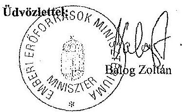

---

# 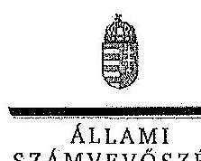 

## Balog Zoltán úr

minister
Emberi Eröforrások Minisztériuma

## Budapest

## Tisztelt Miniszter Úr!

A Pannon Egyetem, a Szolnoki Főiskola, a Károly Róbert Főiskola, a Magyar Képzőmüvészeti Egyetem, a Széchenyi István Egyetem, a Miskolci Egyetem és az Eszterházy Károly Főiskola gazdálkodásának és müködésének ellenőrzéséről készített jelentéstervezetekre tett észrevételeit köszönettel megkaptam.

Az Állami Számvevőszék észrevételekre vonatkozó álláspontjáról a felügyeleti vezető által készített részletes tájékoztatást csatoltan megküldöm.

Tájékoztatom Miniszter urat, hogy az ÁSZ. tv. 29. § (3) bekezdése alapján a számvevőszéki jelentések mellékleteként szerepeltetjük a jelentéstervezetekhez tett figyelembe nem vett észrevételeket az elutasítás indokainak feltüntetésével.

Budapest, 2014. július hó 25. nap
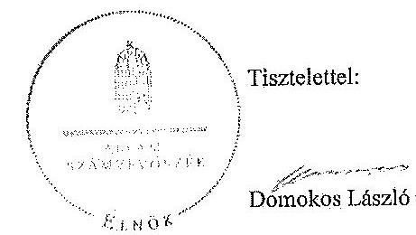

Melléklet: Tájékoztatás az elfogadott és a figyelembe nem vett észrevételekről

---

# Tájékoztatás   az elfogadott és a figyelembe nem vett észrevételekrül 

A Pannon Egyetem, a Szolnoki Főiskola, a Károly Róbert Főiskola, a Magyar Képzőmüvészeti Egyetem, a Széchenyi István Egyetem, a Miskolci Egyetem és az Eszterházy Károly Főiskola gazdálkodásának és müködésének ellenőrzéséről készült számvevőszéki jelentés-tervezetekhez a 36433-2/2014/FOFEJL iktatószámú levélben tett észrevételeit köszönettel megkaptuk.

A jelentéstervezetekre tett észrevételeket áttekintettük, azok kezeléséről a következő tájékoztatást adom:

1. A 2012. évi költségvetési hiánycél tartását biztosító további feladatokról szóló 1365/2011. (XI. 8.) Korm. határozatban elölrt szervezeti és feladatellátási felülvizsgálati program megvalósitása.

A kormányhatározat alapján - az oktatási ágazatra vonatkozóan 2012. február 20-ig - kellett a tételes javaslatokat a Kormány elé terjeszteni, ennek végrehajtása azonban elmaradt. A feladatokat a nemzetgazdasági miniszter irányítása mellett kellett végrehajtani, felelősként azonban a Miniszterelnökséget vezető államtitkár, a közigazgatási és igazságligyi miniszter és az érintett ágazati miniszter is kijelölésre került. A fentiek alapján - az észrevételben leírtakra is figyelemmel - a vonatkozó szövegrészt a jelentéstervezetek összegző megállapítások, következtetések, javaslatok, valamint részletes megállapítások fejezeteiben az alábbiak szerint pontositottuk:
„Elmaradt az oktatási ágazatra vonatkozóan a nemzetgazdasági miniszter irányításával és az oktatásért felelös miniszter részvételével, kormányhatározatban elölrt szervezeti és feladateilátási felülvizsgálati program kidolgozása." (Összegző megállapítások)
„Elmaradt az oktatási ágazatra vonatkozóan az 1365/2011. (XI. 8.) Korm. határozatban - a nemzetgazdasági miniszter irányításával és az ágazatért felelös miniszter részvételével - elölrt szervezeti és feladatellátási felülvizsgálati program kidolgozása. (Részletes megállapítások, 1. fejezet):

---

2. A felsőoktatás rendszere középtávú fejlesztési tervének elkészítése.

Az észrevételben foglaltakat figyelembe véve a jelentéstervezetek összegző megállapítások, következtetések, javaslatok, valamint részletes megállapítások fejezetelt kiegészítettük:
„A felsőoktatási törvény rendelkezései ellenére nem készíttetett a felsőoktatás rendszere vonatkozásában a Kormány által elfogadott középtávú fejlesztési tervet." (Összegzö megállapítások)
„A miniszter - a vonatkozó jogszabályokban foglaltak ellenére - nem készittetett a felsőoktatás rendszere vonatkozásában a Kormány által elfogadott középtávú fejlesztési tervet." (Részletes megállapítások, 1. fejezet)
3. A Felsőoktatás Információs Rendszerének (FIR) üzemeltetése.

A felsőoktatási törvények rendelkezései szerint (Feot. 35. §, 103.§ (1) bekezdés aa.) pont, Nftv. 64.§ (2) bekezdés aa) pont) a felsőoktatási információs rendszer müködtetése, az adatkezelés jogszerűsége a felsőoktatás ágazati irányítását ellátó miniszter felelősségi körébe tartozik. A miniszter feladata a felsőoktatási információs rendszer müködéséért felelős Oktatási Hivatal müködtetése is. A FIR müködését a teljes ellenőrzött időszakban problémák jellemezték, amely felveti az Oktatási Hivatal müködtetéséért felelős minisztérium felelősségét is. Az észrevételben jelzettek alapján a jelentéstervezeteket pontosítottuk a következők szerint:
„A minisztérium a Felsőoktatási Információs Rendszer (FIR) biztonságos üzemeltetéséhez, az adatok védelméhez szükséges alapvető szervezeti, szabályozási kontrollokat a 2012. év végéig nem teljes körűen alakittatta ki az Oktatási Hivatallal." (Összegzö megállapítások)
„A minisztérium az Oktatási Hivatallal a Felsőoktatási Információs Rendszer (FIR) biztonságos üzemeltetéséhez, az adatok védelméhez szükséges alapvető szervezeti, szabályozási kontrollokat a 2012. év végéig nem teljes körűen alakittatta ki.,, (Részletes megállapítások, 1. fejezet)
4. Korábbi ÁSZ ellenőrzések javaslatainak hasznosulása.

4/a. Az oktatási és kulturális ágazat irányítási rendszerének, müködésének ellenőrzéséről szóló 1106 sz. ÁSZ jelentés 3. sz. javaslata tekintetében a jelentéstervezetek részletes megállapítások 5. fejezetei részletesen tartalmazzák a tényeket. Ennek alapján az oktatási ágazat középtávú stratégiája kidolgozásának hiányára vonatkozó megállapítást a jelentéstervezetekben nem módosítottuk.

4/b. A felsőoktatás oktatási infrastruktúra-fejlesztési programjának ellenőrzéséről szóló 1171 sz. ÁSZ jelentésben az előkészítés hiányosságai miatt a felelősség megállapítására tett javaslat nem hasznosult a jelentéstervezetek megállapításai szerint.

---

Az észrevételben foglaltak szerint az egyes miniszterek, valamint a Miniszterelnökséget vezető államtitkár feladat- és hatásköréről szóló 212/2010. (VII. 1.) Korm. rendelet valóban a nemzeti fejlesztési miniszter szakpolitikai feladat- és hatáskörébe helyezte a PPP és egyéb állami vagyont érintő gazdálkodó szervezetekkel kötött és megkötendő szerződések vizsgálatát és ellenőrzését. Az ÁSZ nemzeti erőforrás miniszter részére címzett javaslata ugyanakkor a PPP programok előkészítési hiányosságai miatti felelősség megállapítására irányult. A nemzeti erőforrás minisztere 2012. január 19-én kelt intézkedési tervében 2012. december 31-ci határidőre elvégzendő feladatként fogalmazta meg az előkészítési hiányosságok miatti felelősség megállapításról való intézkedést, amely nem valósult meg. Mindezek alapján a jelentéstervezetben tett megállapítás módosítása nem indokolt.

4/c A 1171. sz. jelentés alapján tervezett intézkedések közül az állami felsőoktatási intézmények kapacitás-kihasználás felmérése késéssel valósult meg. A felmérés eredményeinek és a felsőoktatást érintő ágazati célok figyelembe vételével a felsőoktatási infrastruktúra közép- és hosszú távú hasznosítására a helyszíni ellenőrzés időszaka alatt nem történtek intézkedések. Az intézkedés határideje 2013. december 31. volt. Az észrevételben foglaltak alapján a jelentéstervezetek módosítása nem indokolt.

4/d. Az állami felsőoktatási intézmények érdekeltségébe tartozó gazdasági társaságok támogatásának és nyereségük hasznosulásának ellenőrzése címü, 1290 sz. ÁSZ jelentés 2. sz. javaslata (Az állami felsőoktatási intézmények - a felülvizsgálatot követő, de legkésőbb egy éven belül - megmaradt társaságaira vonatkozó szakmai feladatellátás és a gazdasági eredményesség mérését biztosító mutatók és azok értékelési rendszerének kidolgoztatása) megállapításaink alapján nem hasznosult. A helyszíni ellenőrzés alatt rendelkezésre bocsátott dokumentumok alapján a minisztérium a rektorokat a szakmai feladatellátás és a gazdasági eredményesség mérését biztosító mutatószámok és értékelési rendszer kidolgozására a felsőoktatási intézmények finanszírozását szabályozó kormányrendelet kihirdetését követően kívánta felkérni. Így a vonatkozó megállapítás módosítása nem indokolt.

A Szolnoki Főiskola ellenőrzéséhez kapcsolódó - az emberi erőforrások miniszterének tett javaslatunk nem a PPP projektekkel kapcsolatos, hanem az intézmény hosszú távon fenntartható müködtetésére vonatkozó intézkedések megtételét célozza, amely a fenntartó feladata és nem igénylik a nemzeti fejlesztési miniszter bevonását.

Az Eszterházy Károly Főiskola esetében a jelentéstervezet nem az IFT minisztériumi észrevételezésének hiányát kifogásolta, hanem azt, hogy annak a Feot 115. § (2) bekezdése db) pontja szerinti felülvizsgálata dokumentáltan nem történt meg.

Az emberi erőforrások miniszterének a Károly Róbert Főiskola, a Magyar Képzőművészeti Egyetem, a Szolnoki Főiskola, az Eszterházy Károly Főiskola, a Széchenyi István Egyetem, valamint a Miskolci Egyetem vonatkozásában az Nftv. 73. § (3) bekezdés e) pontja alapján megfogalmazott javaslatokat az Nftv. 2014. július 24 -én hatályba lépő módosításai nem érintik, a felsőoktatási intézmény rektoralnak tett javaslatokat a jogszabály változás figyelembe vételével pontositottuk.

---

Kérem a válaszlevelemben foglaltak szíves tudomásulvételét. Tájékoztatom Miniszter urat, hogy a számvevőszéki jelentés mellékleteként szerepeltetjük a jelentéstervezethez tett észrevételeit, az elfogadott valamint az ÁSZ. tv. 29. § (3) bekezdése alapján a figyelembe nem vett észrevételeket az elutasítás indokának feltüntetésével együtt.

Budapest, 2014. gilins hó 28 nap

Horváthné Herbáth Mária
feltigyeleti vezető

---

.

---

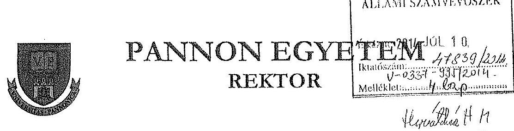

Domokos László
elnök úr részére

Állami Számvevőszék
Budapest
Apáczai Csere János u. 10. 1052

Ikt. sz.: GMF-FH- 12-1/2014
Tárgy: PE gazdálkodásának és müködésének ellenőrzéséről készült jelentéstervezet véleményezése
Hiv. sz.: V-0337-967/2014.
Mell.: Észrevételek a 2014. június 20-i keltezésủ jelentéstervezettel kapcsolatban

Tisztelt Elnök Úr!

A V-0337-967/2014. iktatószámú levelében megküldött, a Pannon Egyetem gazdálkodásának és müködésének ellenőrzéséről készült jelentéstervezetet köszönettel megkaptam.

A jelentéssel kapcsolatos észrevételeket mellékelten megküldöm.

Veszprém, 2014. július 7.
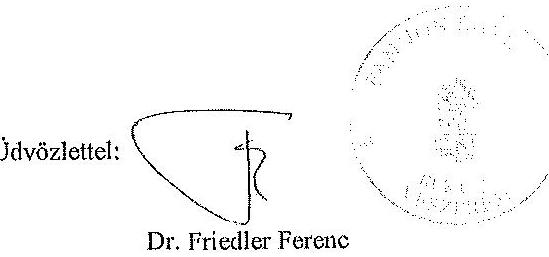

[^0]
[^0]:    H-8200 Veszprém, Egyetem u. 10. $\cdot$ H-8201 Veszprém, Pf. 158
    Telefon: $(+3688) 624-130 \cdot$ Fax: $(+3688) 624-529 \cdot$ Internes: www.uni-pannon.ho

    - e-mail: rektor@uni-pannon.hu

---

# Észrevételek 

a Pannon Egyetem gazdálkodásának és müködésének ellenőrzéséről készült számvevőszéki jelentéstervezethez

1. Jelentéstervezet II. 2. pontjához: 27. oldal 4. bekezdés
„A szabályzatokat - az eszközök és források értékelési szabályzata kivételével folyamatosan aktualizálták." Ez a szabályzat is minden évben aktualizálásra került.
2. Jelentéstervezet II. 3.1. pontjához: pénzügyi helyzet értékelése CLF módszerrel

A pénzügyi folyamatok mélyebb összefüggéseinek feltárása érdekében az Állami Számvevőszék egy új elemzési módszert dolgozott ki, az un. CLF módszert. A módszer alkalmasnak bizonyult az önkormányzatok pénzügyi helyzetének feltárására, és segitette az eladósodáshoz vezető folyamatok megértését.
A CLF módszer nem vonja be a számításba az előző évi maradvány igénybevételét, tekintettel arra, hogy ez a bevétel nem tárgy évi pénzforgalmi bevétel. A folyó és felhalmozási kiadások között azonban szerepel valamennyi olyan tárgy évi kiadás, melynek az előirányzata (bevétele) a tárgy évet megelőző költségvetési évet érinti. Az éves kiadásoknak egy meghatározott hányadára (előző évi kötelezettségvállalással terhelt előirányzat-maradvány) nem a folyó bevételeknek kell megteremteni a fedezetet, mert az már tárgy évben a maradvány igénybevételével rendelkezésre áll.
3. Jelentéstervezet II. 3.1. pontjához: 37. oldal 2. bekezdés
„...érintették előirányzat-zárolások és maradványtartási kötelezettségek is". Ezek a likviditást nem veszélyeztették, ...".
A maradványtartási kötelezettségek valóban nem veszélyeztették a likviditást, de az ellenőrzött négy évben a zárolással elvont $990,0 \mathrm{mFt}$ nagymértékben befolyásolta az egyetem pénzügyi helyzetét, és hatást gyakorolt a likviditásra is.
4. Jelentéstervezet II. 3.1. pontjához: 37. oldal 3. bekezdés
„...2009. évben 1437,4 mFt összegủ maradványtartási kötelezettséget is elrendeltek az intézménynél, amely összeget az egyetemtől el is vonták."
A maradványtartási kötelezettség összegét az Egyetemtől nem vonták el.
A mondat befejezése véleményünk szerint így helyes: és a maradványtartási kötelezettséget az év végéig nem oldották fel.
5. Jelentéstervezet II. 4. pontjához: 45. oldal 4. bekezdés
„...Az értékpapírok értékesítésére a romló pénzügyi helyzet miatt volt szükség".
Az értékpapírok értékesítését jogszabályváltozás tette szükségessé:
Az Ftv. 120. § (3) bekezdése alapján a felsőoktatási intézmény a saját bevételéből és előző évi bevételi előirányzat maradványaiból átmenetileg szabad pénzeszközeit a Magyar Államkincstár hálózatában értékesített állampapírba fektethette. Ez a lehetőség - jogszabályváltozás miatt - 2012. szeptember 1-vel megszünt.

---

6. Jelentéstervezet II. 4.2 pontjához: 47. oldal 5. bekezdés
„A PE vagyonkezelésbe átveti ingatlanjainak 2009. évi beszámolóban szereplő értéke nem egyezett meg a MNV Zrt.-vel kötött vagyonkezelési szerződésben megállapított értékkel." Az eltérés a beruházásokra adott előlegekből adódik, melyet a vagyonkezelői szerződés nem tartalmaz.
7. Jelentés-tervezet 1. sz. mellékletének, valamint a 2. sz. melléklet „bevételek" sorainak javítása (piros szinnet).

Veszprém, 2014. július 7.
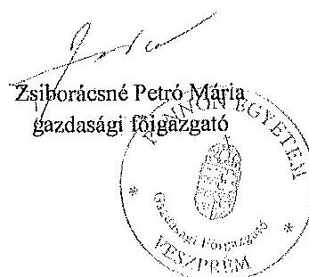

---

A Pannon Egyetem kiadásai és bevételi előirányzatai, azok teljesítése a 2009-2012. években

|  Sza. | Megnevezés | 2009. év |  |  | 2010. év |  |  | 2011. év |  |  | 2012. év |  |   |
| --- | --- | --- | --- | --- | --- | --- | --- | --- | --- | --- | --- | --- | --- |
|   |  | Eredeti előirányzat | Módosított előirányzat | Teljesítés | Eredeti előirányzat | Módosított előirányzat | Teljesítés | Eredeti előirányzat | Módosított előirányzat | Teljesítés | Eredeti előirányzat | Módosított előirányzat | Teljesítés  |
|  1. | KIANANÓL |  |  |  |  |  |  |  |  |  |  |  |   |
|  2. | Jösenköt javaslanok | 2.309.704 | 2.496.482 | 2.579.099 | 2.549.704 | 2.908.567 | 2.584.954 | 2.422.764 | 4.269.468 | 2.833.016 | 2.426.820 | 2.302.427 | 2.399.224  |
|  3. | Munkaszkó terhelő járulékok | 1.079.985 | 1.096.107 | 1.058.453 | 969.885 | 1.023.439 | 921.390 | 961.592 | 1.105.482 | 491.271 | 911.605 | 1.148.425 | 966.594  |
|  4. | Dolog kiadások | 2.967.372 | 2.456.270 | 2.262.212 | 2.427.453 | 4.172.165 | 2.325.222 | 2.963.222 | 4.599.596 | 2.564.697 | 2.062.380 | 2.773.575 | 2.596.294  |
|  5. | Egyéb fiózió kiadásain | 21.625 | 263.700 | 262.373 | 60.274 | 303.822 | 296.228 | 62.411 | 222.698 | 229.500 | 78.250 | 163.199 | 162.671  |
|  6. | Támogatásérdék működési kiadások | 10.030 | 16.284 | 16.384 | 10.000 | 14.210 | 14.210 | 10.000 | 10.000 | 9.697 | 10.000 | 10.000 | 9.042  |
|  7. | Támogatásérdék főfelőmoztal kiadások |  |  |  |  |  |  |  |  |  |  |  |   |
|  8. | Ekkel évt előirányzat kiadás |  | 94.225 | 84.355 |  | 9.104 | 9.103 |  | 15.200 | 15.200 |  | 16.200 | 16.200  |
|  9. | Működési célú pénzesekkős kiadás | 152.342 | 117.342 | 105.552 | 152.342 | 75.314 | 65.182 | 152.342 | 15.292 | 13.711 | 92.500 | 29.112 | 24.247  |
|  10. | Felfelőmoztal célú pénzesekkős kiadás | 4.000 |  |  | 4.000 |  |  | 4.000 | 5.185 | 5.185 | 4.000 |  |   |
|  11. | Előmoztal szerződő jóvállal | 1.081.205 | 1.104.220 | 1.055.560 | 1.062.129 | 1.104.251 | 1.012.725 | 1.045.839 | 978.207 | 876.874 | 928.900 | 925.658 | 876.127  |
|  12. | Egyéb javaslat |  |  |  |  |  | 10.151 |  |  | 945 |  |  | 102  |
|  13. | Feltöltés | 48.000 | 493.127 | 171.200 | 88.050 | 206.427 | 188.420 | 88.000 | 170.405 | 148.111 | 88.000 | 126.565 | 88.198  |
|  14. | Jettőszobol bocsátásból kiadások AFA-val | 563.256 | 849.275 | 699.589 | 563.058 | 1.711.769 | 1.188.293 | 405.908 | 1.821.110 | 1.962.463 | 232.900 | 1.079.543 | 894.702  |
|  15. | Kézesem bocsátásból kiadások AFA-val |  |  |  |  |  |  |  |  |  |  |  |   |
|  16. | Lakdátotások kiadások AFA-val |  |  |  |  |  |  |  |  |  |  |  |   |
|  17. | Egyéb rivőmoztal féllfélőmoztal kiadás |  | 8.520 | 8.500 |  | 0 | 0 |  |  |  |  |  |   |
|  18. | Kélezésről |  | 8.600 | 9.600 |  | 4.280 | 4.280 |  | 7.700 | 4.200 |  | 1.000 | 1.000  |
|  19. | Összesen | 8.717.655 | 11.204.928 | 10.522.492 | 8.669.884 | 12.029.342 | 10.487.711 | 9.899.487 | 12.989.803 | 11.046.132 | 7.761.280 | 11.649.116 | 9.932.311  |
|  20. | BEVÉTELEK |  |  |  |  |  |  |  |  |  |  |  |   |
|  21. | Közhözésre bocsánok |  |  |  |  |  |  |  |  |  |  |  |   |
|  22. | Jettőszobol működési bevételét | 1.957.274 | 2.527.140 | 2.612.550 | 2.990.000 | 2.370.027 | 2.555.549 | 2.567.000 | 2.567.000 | 2.353.629 | 2.587.000 | 2.567.000 | 2.587.000  |
|  23. | Működési célú pénzesekkős kivételét | 165.000 | 278.689 | 303.479 | 165.000 | 179.948 | 192.256 | 103.000 | 277.897 | 300.852 | 243.400 | 286.589 | 291.109  |
|  24. | Felfelőmoztal bevételét |  | 4.510 | 5.420 |  |  | 5.200 |  | 4.540 | 5.700 |  |  | 10.082  |
|  25. | Felfelőmoztal célú pénzesekkős kivételét | 95.000 | 170.190 | 209.869 | 155.000 | 268.289 | 269.466 | 276.000 | 261.390 | 301.130 | 276.000 | 277.800 | 19.398  |
|  26. | Jettőzió szorváll kapott támogatás | 5.751.375 | 8.948.157 | 6.940.157 | 5.524.894 | 5.936.062 | 5.920.062 | 5.699.487 | 5.474.493 | 5.474.493 | 4.511.200 | 4.512.189 | 4.512.189  |
|  27. | Támogatásérdék működési bevétel | 480.000 | 772.265 | 776.670 | 480.000 | 700.451 | 692.525 | 241.000 | 1.228.711 | 1.425.646 | 277.000 | 1.363.722 | 1.713.688  |
|  28. | Támogatásérdék főfelőmoztal bevétel | 244.000 | 285.000 | 264.745 | 285.000 | 826.901 | 800.145 | 224.000 | 468.778 | 765.251 | 97.000 | 459.447 | 526.282  |
|  29. | Ekkel évt csomótvásos kivételét |  | 45.084 | 47.351 |  | 2.987 | 2.987 |  | 15.459 | 15.909 |  | 20.202 | 42.022  |
|  30. | Előirányzat csomótvásos felhasználás |  | 857.992 | 857.774 |  | 2.198.680 | 2.198.680 |  | 2.202.170 | 2.202.170 |  | 1.960.027 | 1.960.027  |
|  31. | Összesen | 8.717.655 | 11.204.928 | 11.220.100 | 8.669.884 | 12.029.342 | 12.000.881 | 9.899.487 | 12.989.803 | 13.000.109 | 7.761.200 | 11.649.116 | 11.312.064  |

---

|   | A Pannon Egyetem kiadásainak, bevételeinek változása 2009-2012. években / bevételek korrekciója |  |  |  |  |   |
| --- | --- | --- | --- | --- | --- | --- |
|   |  | 2009. év | 2010. év | 2011. év | 2012. év | 2012/2009  |
|  Sz. | Megnevezés | Teljesítés | Teljesítés | Teljesítés | Teljesítés |   |
|  42. | BEVÉTELEK |  |  |  |  |   |
|  44. | Működési bevételek | 3 734 987 | 3 473 411 | 4 216 997 | 4 283 173 | 114.7%  |
|  45. | Intézményi működési bevétel * | 2 916 025 | 2 777 899 | 2 774 494 | 2 510 263 | 86.1%  |
|  46. | Ebből: Szolgáltatások ellenértéke | 1 699 850 | 1 764 519 | 1 607 179 | 1 489 049 | 87.6%  |
|  47. | Intézményi ellátási díjak | 289 852 | 312 251 | 302 516 | 317 220 | 109.4%  |
|  48. | Hozam és kamatbevétel | 101 718 | 39 165 | 28 034 | 35 558 | 35.0%  |
|  49. | Működési célú pénzeszköz átvételek | 302 479 | 192 350 | 390 855 | 251 109 | 83.0%  |
|   | Ebből: uniós forrás | 58 941 | 40 378 | 88 449 | 0 | 0.0%  |
|  50. | Támogatásértékű működési bevétel | 776 678 | 692 525 | 1 425 648 | 1 713 688 | 220.6%  |
|  51. | Ebből: EU programokra működési bevétel | 351 526 | 423 739 | 988 953 | 1 553 483 | 441.9%  |
|   | Előző évi műk, célú előir. maradvány átvétel | 41 384 | 2 987 | 15 955 | 59 222 | 143.1%  |
|  53. | Felhalmozási bevétel | 580 085 | 1 092 728 | 1 106 467 | 557 255 | 96.1%  |
|  55. | Felhalmozási célú pénzeszköz átvételek | 295 289 | 286 186 | 296 830 | 16 688 | 5.7%  |
|   | Ebből: uniós forrás | 0 | 0 | 0 | 0 | 0%  |
|  56. | Támogatásértékű felhalmozási bevétel | 264 744 | 800 158 | 799 553 | 525 284 | 198.4%  |
|  57. | EU programokra beruházási bevétel | 30 973 | 725 403 | 712 775 | 420 312 | 1357.0%  |
|   | Előző évi felt. célú előir. maradvány átvétel | 5 967 | 0 | 0 | 2 800 | 46.9%  |
|   | Felhalmozási és tőkejeilegű bevételek | 8 485 | 3 104 | 5 784 | 10 683 | 125.9%  |
|   | Kölcsönök törlesztése | 5 600 | 3 280 | 4 300 | 1 800 | 32.1%  |
|  58. | Irányítószervtől kapott támogatás | 6 048 157 | 5 926 062 | 5 474 455 | 4 512 189 | 74.6%  |
|  61. | Előirányzat maradvány felhasználása | 857 774 | 2 198 680 | 2 203 170 | 1 960 047 | 228.5%  |
|  62. | Összesen | 11 220 103 | 12 690 881 | 13 000 189 | 11 312 664 | 100.8%  |

- 2011-től változott a 07 űrlap "Intézményi működési bevételek" paraméterezése

---

.

---

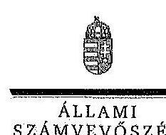

# Dr. Friedler Ferenc ór 

rektor
Pannon Egyetem

## Budapest

## Tisztelt Rektor Úr!

A Pannon Egyetem gazdálkodásának és müködésének ellenőrzéséről készített jelentéstervezetre tett észrevételeit köszönettel megkaptam.

Az Állami Számvevőszék észrevételekre vonatkozó álláspontjáról a felügyeleti vezető által készített részletes tájékoztatást csatoltan megküldöm.

Tájékoztatom Rektor urat, hogy az ÁSZ. tv. 29. § (3) bekezdése alapján a számvevőszéki jelentés mellékleteként szerepeltetjük a figyelembe nem vett észrevételeket az elutasítás indokainak feltüntetésével.

Budapest, 2014. jdlis hó 28 .nap
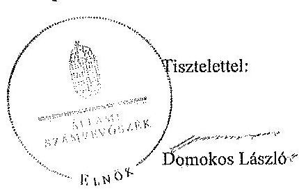

Melléklet: Tájékoztatás az elfogadott és a figyelembe nem vett észrevételekről

---

# Tájékoztatás   az elfogadott és a figyelembe nem vett észrevételekről 

A Pannon Egyetem gazdálkodásának és müködésének ellenőrzéséről készült számvevőszéki je-lentés-tervezethez a GMF-FH-12-1/2014. iktatószámú levélben tett észrevételeit köszönettel megkaptuk.

A jelentéstervezetre tett észrevételeket áttekintettük, azok kezeléséről a következő tájékoztatást adom:

1. Jelentéstervezet II. 2. pont 27. oldal 4. bekezdés

Az észrevételben foglaltak alapján a jelentéstervezetet módosítottuk az eszközök és források értékelési szabályzatának kivételére vonatkozó szövegrész elhagyásával: A szabályzatokat-as eszközök és források értékelési szabályzata kivételével- folyamatosan aktualizálták.
2. Jelentéstervezet II. 3.1. pontjához, pénzügyi helyzet értékelése CLF módszerrel

Az észrevételben leírtakkal kapcsolatban jelzem, hogy a pénzügyi pozíció értékeléséhez kapcsolódóan a jelentéstervezet tartalmazza a finanszírozási igény maradvány igénybevételével való rendezését. Mind az összegző (20. oldal utolsó előtti bekezdés), mind a részletes megállapításokban (36. oldal utolsó bekezdés) a pénzügyi helyzetről szóló megállapítások végén szerepel, hogy a folyó és a felhalmozási költségvetés együttes finanszírozási igényét előző évi maradvány igénybevételével biztosították.
3. Jelentéstervezet II. 3.1. pont 37. oldal 2. bekezdés

Az észrevétel nem vitatja a jelentéstervezetben szereplő megállapítást, miszerint a zárolások és a maradványtartási kötelezettség nem veszélyeztette az intézmény likviditását. Az egyetem pénzügyi helyzetére gyakorolt hatást ugyanakkor az érintett bekezdés is rögzíti.
„Az egyetemet az ellenőrzött időszakban érintették előirányzat-zárolások és maradványtartási kötelezettségek is. Ezek a likviditást nem veszélyeztették, de a felújítások, karbantartások elhúzódásához vezettek, illetve folyamatosan elmaradtak a gép- és eszközbeszerzések."
4. Jelentéstervezet II. 3.1. pont 37. oldal 3. bekezdés

Az észrevétel alapján a jelentéstervezetet módosítottuk: „A 2009. évben 1437,4 M Ft összegü maradványtartási kötelezettséget is elrendeltek az intézménynél, amelyet az év végéig nem oldottak fel."

---

# 5. Jelentéstervezet II. 4. pont 45 . oldal 4 . bekezdés 

A Pannon Egyetem 2009. évi mérlege szerint 1438,3 M Ft összegủ értékpapírral rendelkezett, amelyet 2010-ben értékesítettek. A 2010-2012. évi mérlegekben már nem mutattak ki értékpapírokat, így az Nftv. hatálybalépése nem lehetett hatással a jelzett vagyonclemekre. Észrevétele alapján ugyanakkor a 45. oldal 4. bekezdésének utolsó mondatát az alábbiak szerint módosítottuk:
„Az-értékpapirok-értékesitésére-a-romló-pénsügyi-helyzet-mialt-volt-szükrég. Az értékpapirok értékesitése a 2010. év pénzügyi pozícióját javitotta."
6. Jelentéstervezet II. 4.2 pont 47 . oldal 5 . bekezdés

Az észrevételben jelzettek alapján a jelentéstervezet módosítása nem indokolt. Ennek oka, hogy a vagyonkezelésbe vett ingatlanok értéke nem tartalmazhatja a beruházásra adott előlegeket, amelyek a mérlegben külön soron szerepelnek.

A vagyonkezelési szerződésben az ingatlanok 2009. év végi értéke $5099,6 \mathrm{M}$ Ft, a beszámoló adatai szerint a vagyonkezelésbe vett ingatlanok értéke $5111,7 \mathrm{M}$ Ft volt 2009. évben, amely a vagyonkezelési szerződésben szereplő értéknél 12,1 M Ft-tal magasabb. Az ingatlanok mérlegsorban nem szerepelhet a beruházásokra adott előleg, azt a beszámolóban külön soron kell kimutatni. Az észrevételben leírt beruházásra adott előlegek összege a 2009. évi mérlegben 10,5 M Ft volt, így az összegszertiségében sem magyarázza a vagyonkezelési szerződés és a 2009. évi mérleg közötti eltérést.
7. Jelentéstervezet 1-2. sz. mellékletek

Az 1. és a 2. számú melléklethez tett pontositásokat köszönettel vettük, a jelzett két mellékletet a javított számadatokkal módosítottuk.

Kérem a válaszlevelemben foglaltak szíves tudomásulvételét. Tájékoztatom Rektor urat, hogy a számvevőszéki jelentés mellékleteként szerepelhetjük a jelentéstervezethez tett észrevételeit, valamint az ÁSZ. tv. 29. § (3) bekezdése alapján a figyelembe nem vett észrevételeket az elutasítás indokának feltüntetésével együtt.
Budapest, 2014. július hó 3 nap

Horváthné Herbáth Mária
felügyeleti vezető