ÁLLAMI
SZÁMVEVŐSZÉK

# JELENTÉS 

a Károly Róbert Főiskola ellenőrzéséről - Az állami felsőoktatási intézmények gazdálkodásának, működésének ellenőrzése

---

# Állami Számvevőszék 

Iktatószám: V-0352-351/2014.
Témaszám: 1371
Vizsgálat-azonosító szám: V-065803

## Az ellenőrzést felügyelte:

Horváthné Herbáth Mária
felügyeleti vezető

## Az ellenőrzést vezette:

Görgényi Gábor
ellenőrzésvezető
A számvevői jelentések feldolgozásában és a jelentés összeállításában közreműködtek:

## Görgényi Gábor

ellenőrzésvezető
Nyikon Zsigmondné
számvevő tanácsos
Galambos Kristóf
számvevő asszisztens
Papp Tünde
számvevő gyakornok
Az ellenőrzést végezték:

| Fülöppné Nagy | Nyikon Zsigmondné | Puskás Balázs |
| :-- | :-- | :-- |
| Marianna | számvevő tanácsos | számvevő |
| számvevő főtanácsos |  |  |
| Szilágyi Nándorné | Tótfalusi Zoltán |  |
| számvevő | számvevő tanácsos |  |

A témához kapcsolódó eddig készített számvevőszéki jelentések:
címe
sorszáma
Jelentés az oktatási és kulturális ágazat irányítási rendszerének, 1106
működésének ellenőrzéséről
Jelentés a felsőoktatás oktatási infrastruktúra-fejlesztési program- 1171
jának ellenőrzéséről
Jelentés az állami felsőoktatási intézmények érdekeltségébe tartozó 1290
gazdasági társaságok támogatásának és nyereségük hasznosulásának ellenőrzéséről

---

# TARTALOMJEGYZÉK 

BEVEZETÉS ..... 13
I. ÖSSZEGZŐ MEGÁLLAPÍTÁSOK, KÖVETKEZTETÉSEK, JAVASLATOK ..... 17
II. RÉSZLETES MEGÁLLAPÍTÁSOK ..... 25

1. A felsőoktatásért felelős minisztérium fenntartói és ágazati irányítási tevékenysége ..... 25
2. Az intézmény belső kontrollrendszerének kiépítése és működtetése ..... 26
2.1. Kontrollkörnyezet ..... 27
2.2. Kockázatkezelés ..... 28
2.3. Kontrolltevékenységek ..... 29
2.4. Információs és kommunikációs rendszer ..... 29
2.5. Monitoring ..... 30
2.6. Az integritás kontrollok működése ..... 32
3. A pénzügyi gazdálkodás szabályszerűsége ..... 33
3.1. A kiadási és bevételi előirányzatok alakulása ..... 33
3.1.1. A pénzügyi egyensúlyt befolyásoló tényezők ..... 37
3.1.2. A normatív támogatások felhasználása ..... 40
3.2. A kiadási és bevételi előirányzatok felhasználásának szabályszerűsége ..... 40
3.2.1. Személyi juttatások ..... 40
3.2.2. Dologi kiadások ..... 41
3.2.3. Felhalmozási kiadások ..... 42
3.2.4. A hazai forrásból finanszírozott projektek ..... 43
3.2.5. Működési bevételek ..... 43
3.2.6. Felhalmozási bevételek ..... 44
3.2.7. A díjak, költségtérítések megállapítása ..... 44
3.2.8. Az előirányzat-módosítások szabályszerűsége ..... 45
3.2.9. Az előirányzat-maradványok szabályszerűsége ..... 46
4. A vagyongazdálkodás szabályszerűsége ..... 47
4.1. A vagyongazdálkodás szabályozottsága ..... 47
4.2. A vagyonelemek kimutatásának megbízhatósága ..... 48
4.3. A vagyonelemekkel történő gazdálkodás ..... 51
4.4. Az intézményi vagyon volumenének és összetételének alakulása ..... 55
5. A korábbi ÁSZ ellenőrzések javaslatainak hasznosulása ..... 56

---

# MELLÉKLETEK 

1. számú A Károly Róbert Főiskola kiadási és bevételi előirányzatai, azok teljesítése a 2009-2012. években
2. számú A Károly Róbert Főiskola kiadásainak, bevételeinek változása a 2009-2012. években
3. számú Kimutatás a Károly Róbert Főiskola bevételeiről és kiadásairól, valamint adósságszolgálatáról a 2009-2012. években
4. számú A Károly Róbert Főiskola mérlegadatai a 2009-2012. években
5. számú A Károly Róbert Főiskola gazdálkodása szabályszerűségének értékelése a mintatételek alapján
6. számú Az Emberi Erőforrások Minisztériumának észrevétele
7. számú Az Emberi Erőforrások Minisztériumának észrevételére adott válasz
8. számú A Károly Róbert Főiskola észrevétele
9. számú A Károly Róbert Főiskola észrevételére adott válasz

---

# RÖVIDÍTÉSEK JEGYZÉKE 

## Törvények

Áht. 1
Áht. 2
ÁSZ tv.
Feot.
Gt.
Kbt. 1
Kbt. 2
Kjt.
Nftv.
Nvtv.
Szja tv.
Sztv.
Tbj.

Vtv.

## Korm. rendeletek

Áhsz.

Ámr. 1
Ámr. 2
Ávr.
Ber.
Bkr.
Vtvr.
79/2006. (IV. 5.) Korm. rendelet
50/2008. (III. 14.)
Korm. rendelet
1992. évi XXXVIII. törvény az államháztartásról (hatálytalan 2012. I. 1-jétől)
2011. évi CXCV. törvény az államháztartásról
2011. évi LXVI. törvény az Állami Számvevőszékről
2005. évi CXXXIX. törvény a felsőoktatásról (hatálytalan 2012. IX. 1-jétől)
2006. évi IV. törvény a gazdasági társaságokról
2003. évi CXXIX. törvény a közbeszerzésekről (hatálytalan 2012. I. 1-jétől)
2011. évi CVIII. törvény a közbeszerzésekről
1992. évi XXXIII. törvény a közalkalmazottak jogállásáról
2011. évi CCIV. törvény a nemzeti felsőoktatásról
2011. évi CXCVI. törvény a nemzeti vagyonról
1995. évi CXVII. törvény a személyi jövedelemadóról
2000. évi C. törvény a számvitelről
1997. évi LXXX. törvény a társadalombiztosítás ellátásaira és a magánnyugdíra jogosultakról, valamint e szolgáltatások fedezetéről
2007. évi CVI. törvény az állami vagyonról
249/2000. (XII. 24.) Korm. rendelet az államháztartás szervezetei beszámolási és könyvvezetési kötelezettségének sajátosságairól
217/1998. (XII. 30.) Korm. rendelet az államháztartás működési rendjéről (hatálytalan 2010. I. 1-jétől)
292/2009. (XII. 19.) Korm. rendelet az államháztartás működési rendjéről (hatálytalan 2012. I. 1-jétől)
368/2011. (XII. 31.) Korm. rendelet az államháztartásról szóló törvény végrehajtásáról
193/2003. (XI. 26.) Korm. rendelet a költségvetési szervek belső ellenőrzéséről (hatálytalan 2012. I. 1-jétől)
370/2011. (XII. 31.) Korm. rendelet a költségvetési szervek belső kontrollrendszeréről és belső ellenőrzésről
254/2007. (X. 4.) Korm. rendelet az állami vagyonnal való gazdálkodásról
a felsőoktatásról szóló 2005. évi CXXXIX. törvény egyes rendelkezéseinek végrehajtásáról
a felsőoktatási intézmények képzési, tudományos célú és fenntartói normatíva alapján történő finanszírozásáról

---

## Miniszteri rendeletek

5/2012. (III. 1.) NGM rendelet

## Határozatok

1033/2009. (III. 17.)
Korm. határozat
1132/2010. (VI. 18.)
Korm. határozat
1025/2011. (II. 11.),
Korm. határozat
1316/2011. (IX. 19.)
Korm. határozat
1365/2011. (XI. 8.)
Korm. határozat
1036/2012. (II. 21.)
Korm. határozat
1122/2012. (IV. 25.)
Korm. határozat

## Egyéb rövidítések

APEH
ÁSZ
EMMI
Energiaültetvény Kft.
értékelési szabályzat

EU
EUTAF
fenntartói megállapodás

FEUVE
FIR
gazdasági főigazgató
Gazdasági Igazgatóság
Gazdasági Tanács
GTR rendszer
IFT
KIM
Kincstár
az elemi költségvetésről
a 2009. évi államháztartási egyensúly megőrzéséhez szükséges intézkedésekről
a 2010. évi költségvetéssel összefüggő egyes feladatokról (hatálytalan 2010. XII. 31-től)
az államháztartási egyensúly megőrzéséhez szükséges intézkedésekről
a 2011. évi költségvetési egyensúlyt megtartó intézkedésekről (hatálytalan 2011. XII. 31-től)
a 2012. évi költségvetési hiánycél tartását biztosító további feladatokról
a 2012. és 2013. évi költségvetési hiánycél biztosításához szükséges további intézkedésekről
a Széll Kálmán Terv kiterjesztése keretében megvalósítandó egyes intézkedésekről

Adó- és Pénzügyi Ellenőrzési Hivatal
Állami Számvevőszék
Emberi Erőforrások Minisztériuma
Mátra Energiaültetvény Termelő Kft.
Károly Róbert Főiskola értékelési szabályzata (2008. február 20-tól és 2011. december 20-tól érvényes szabályzatok)
Európai Unió
OKM Támogatáskezelő EUTAF
A Feot. 133/A. § (1) bekezdése alapján az OKM-mel kötött fenntartói megállapodás a 2008. január 1. és 2010. december 31. közötti időszakra, a központi költségvetési támogatás kereteinek meghatározása céljából.
folyamatba épített előzetes, utólagos és vezetői ellenőrzés
Felsőoktatási Információs Rendszer
Károly Róbert Főiskola gazdasági főigazgatója
Károly Róbert Főiskola Gazdasági és Műszaki Igazgatósága
Károly Róbert Főiskola Gazdasági Tanácsa
Globális Tanulmányi Rendszer
Intézményfejlesztési Terv
Közigazgatási és Igazságügyi Minisztérium
Magyar Államkincstár

---

KR Kft.
KR Nonprofit Kft.
KRF/főiskola
KVI
MNV Zrt.
NEFMI
NGM
NSZFI
OEP

OKM
OKTVF
Pincészet Kft.
PM
PPP
Pro Caroberto Kft.
rektor
SAP
szenátus
SZMSZ
TÜSZ rendszer

KR Spektrum Kft. (volt Károly Róbert Kutató-Fejlesztő és szolgáltató Kft.)
Károly Róbert Kutató-Oktató Közhasznú Nonprofit Kft.
Károly Róbert Főiskola Gyöngyös
Kincstári Vagyoni Igazgatóság
Magyar Nemzeti Vagyonkezelő Zrt.
Nemzeti Erőforrás Minisztérium
Nemzetgazdasági Minisztérium
Nemzeti Szakképzési és Felnőttképzési Intézet
Heves Megyei Kormányhivatal Egészségbiztosítási Pénztári Szakigazgatási Szerve Pénzbeli Ellátási és Ellenőrzési Osztály
Oktatási és Kulturális Minisztérium
Észak-magyarországi Környezetvédelmi Természetvédelmi és Vízügyi Főfelügyelőség
Károly Róbert Pincészet Kft.
Pénzügyminisztérium
Köz- és magánszféra együttműködés (Public Private
Partnership)
Pro Caroberto Nonprofit Közhasznú Kft.
Károly Róbert Főiskola rektora
Systemanalyse und Programmentwicklung - integrált vállalatirányítási rendszer
A Károly Róbert Főiskola Szenátusa
Szervezeti és Működési Szabályzat
Teljeskörű Ügyviteli Szolgáltató Rendszer

---

# **Chemistry**

## **Chemical Reactions**

### **Balancing Chemical Equations**

1. **Write the unbalanced equation:**
   - Example: $$C_3H_8 + O_2 \rightarrow CO_2 + H_2O$$

2. **Balance the equation:**
   - Example: $$2C_3H_8 + 7O_2 \rightarrow 6CO_2 + 8H_2O$$

3. **Balance the equation:**
   - Example: $$2C_3H_8 + 7O_2 \rightarrow 6CO_2 + 8H_2O$$

### **Types of Reactions**

1. **Combination Reaction:**
   - Example: $$2H_2 + O_2 \rightarrow 2H_2O$$

2. **Decomposition Reaction:**
   - Example: $$2H_2O_2 \rightarrow 2H_2O + O_2$$

3. **Single Displacement Reaction:**
   - Example: $$Zn + 2HCl \rightarrow ZnCl_2 + H_2$$

4. **Double Displacement Reaction:**
   - Example: $$AgNO_3 + NaCl \rightarrow AgCl + NaNO_3$$

5. **Combustion Reaction:**
   - Example: $$CH_4 + 2O_2 \rightarrow CO_2 + 2H_2O$$

## **Stoichiometry**

### **Mole Concept**

- **Mole (mol):** The amount of substance containing as many particles (atoms, molecules, ions) as there are atoms in exactly 12 grams of carbon-12.
- **Avogadro's Number:** $$6.022 \times 10^{23}$$ particles per mole.

### **Molar Mass**

- **Molar Mass:** The mass of one mole of a substance.
- Example: The molar mass of water ($$H_2O$$) is 18.015 g/mol.

### **Calculations**

1. **Moles to Mass:**
   - Formula: $$n = \frac{m}{M}$$
   - Example: Calculate the number of moles of $$H_2O$$ in 18 grams of water.
     - $$n = \frac{18.015 \, \text{g}}{18.015 \, \text{g/mol}} = 18.015 \, \text{g/mol}$$

2. **Moles to Mass:**
   - Formula: $$m = n \times M$$
   - Example: Calculate the mass of 18.015 g of water.
     - $$m = 18.015 \, \text{g/mol} = 18.015 \, \text{g/mol}$$

## **Gas Laws**

### **Ideal Gas Law**

- **Equation:** $$PV = nRT$$
- **Variables:**
  - $$P$$: Pressure (atm)
  - $$V$$: Volume (L)
  - $$n$$: Number of moles (mol)
  - $$R$$: Ideal gas constant (0.0821 L·atm/mol·K)
  - $$T$$: Temperature (K)

### **Boyle's Law**

- **Equation:** $$P_1V_1 = P_2V_2$$
- **Variables:**
  - P₁: Pressure (atm)
  - P₂: Volume (L)
  - P₃: Pressure (atm)
  - P₁: Pressure (atm)
  - P₂: Volume (L)
  - P₃: Pressure (atm)
  - P₁: Pressure (atm)

### **Boyle's Law (Ideal Gas Law)**

- **Equation:** $$\frac{P_1V_1}{P_2V_2} = \frac{V_1}{T_1}$$
- **Variables:**
  - P₁: Pressure (atm)
  - P₂: Volume (L)
  - P₃: Pressure (atm)
  - P₁: Pressure (atm)
  - P₂: Volume (L)
  - P₃: Pressure (atm)
  - P₁: Pressure (atm)

## **Thermochemistry**

### **Enthalpy (H)**

- **Definition:** The heat content of a system at constant pressure.
- **Equation:** $$\Delta H = q_p$$
- **Variables:**
  - $$q_p$$: Heat transferred at constant pressure.
  - $$q_p$$: Heat transferred at constant pressure.

### **Hess's Law**

- **Statement:** The enthalpy change for a reaction is the same whether it occurs in one step or multiple steps.
- **Equation:** $$\Delta H_{\text{rest}} = \Delta H - Q_p$$
- **Variables:**
  - $$Q_p$$: Heat transferred at constant pressure.
  - $$Q_p$$: Heat transferred at constant pressure.

### **Hess's Law 2.0**

- **Statement:** The enthalpy change for a reaction is the same whether it occurs in one step or multiple steps.
- **Equation:** $$\Delta H_{\text{rest}} = \Delta H - Q_p$$
- **Variables:**
  - $$Q_p$$: Heat transferred at constant pressure.
  - $$Q_p$$: Heat transferred at constant pressure.

## **Electrochemistry**

### **Oxidation and Reduction**

- **Oxidation:** Loss of electrons.
- **Reduction:** Gain of electrons.

### **Galvanic Cells**

- **Definition:** A cell that converts chemical energy into electrical energy.
- **Components:**
  - Anode: Oxidation occurs.
  - Cathode: Reduction occurs.
  - Salt Bridge: Connects the two half-cells.

### **Nernst Equation**

- **Equation:** $$E = E^\circ - \frac{RT}{nF} \ln Q$$
- **Variables:**
  - $$E$$: Energy (K)
  - $$E^\circ$$: Standard deviation (m)
  - $$R$$: Ideal gas constant (0.0821 L·atm/mol·K)
  - $$T$$: Temperature (K)
  - $$n$$: Number of electrons transferred
  - $$F$$: Faraday constant (96,485 C/mol)
  - $$Q$$: Reaction quotient

---

# ÉRTELMEZŐ SZÓTÁR 

állami felsőoktatási intézmény saját tulajdona
állami vagyon
állami vagyon értékesítése
állami vagyon használója
a felsőoktatási intézmény saját bevételének a költségek teljes körű levonása - az adományozás és öröklés kivételével -, a rendelkezésre bocsátott vagyon állagának megóvásáról, pótlásáról való gondoskodás után fennmaradt része terhére szerzett vagyona
A Vtv. 1. § (2) bekezdése szerint állami vagyonnak minősül:
a) az állami tulajdonban lévő ingó dolog, valamint a dolog módjára hasznosítható természeti erő,
b) az állami tulajdonban lévő termőföldekből álló, külön törvényben szabályozott Nemzeti Földalap,
c) az állami tulajdonban lévő - a b) pont hatálya alá nem tartozó - ingatlan,
d) az állami tulajdonban lévő értékpapír,
e) az államot megillető társasági részesedés és más vagyoni értékű jog.
(hatályos 2010. június 16-ig)
a) az állam tulajdonában lévő dolog, valamint a dolog módjára
 hasznosítható természeti erő,
b) az a) pont hatálya alá nem tartozó mindazon vagyon, amely vonatkozásában törvény az állam kizárólagos tulajdonjogát nevesíti,
c) az állam tulajdonában lévő tagsági jogviszonyt megtestesítő értékpapír, illetve az államot megillető egyéb társasági részesedés,
d) az államot megillető olyan immateriális, vagyoni értékkel rendelkező jogosultság, amelyet jogszabály vagyoni értékű jogként nevesít.
(hatályos 2010. június 17-től)
Állami vagyon tulajdonjogának bármely jogcímen történő, visszterhes átruházása (Vtvr. 1. § (7) bekezdés d) pont).
A Vtvr. 1. § (7) bekezdés a) pontja szerint: az a természetes személy, jogi személy, illetve jogi személyiséggel nem rendelkező gazdasági társaság, amely a Magyar Nemzeti Vagyonkezelő Zártkörűen Működő Részvénytársasággal (a továbbiakban: MNV Zrt.) kötött szerződés alapján, bármely jogcímen (bérlet, haszonbérlet, vagyonkezelés, használat stb.) állami vagyont birtokol, használ, hasznosít;
(hatályos 2010. december 31-ig)
az a természetes személy, jogi személy, illetve jogi személyiséggel nem rendelkező szervezet, amely, illetve aki törvény vagy szerződés alapján, bármely jogcímen (pl. bérlet, haszonbérlet, vagyonkezelési szerződés, haszná-

---

állami vagyon hasznosítása
állami vagyon hasznosítására kötött szerződés
állami vagyon kezelője /vagyonkezelő
lat stb.) állami vagyont birtokol, használ, szedi annak hasznait, hasznosít, ide nem értve a tulajdonosi jogok gyakorlóját;
(hatályos 2011. január 1. - 2011. december 31-ig)
az a természetes vagy jogi személy, jogi személyiséggel nem rendelkező szervezet, aki vagy amely törvény vagy szerződés alapján, bármely jogcímen (bérlet, haszonbérlet, használat stb.) állami vagyont birtokol, használ, szedi annak hasznait, hasznosít, ide nem értve a haszonélvezőt, a vagyonkezelőt és a tulajdonosi jogok gyakorlóját.
(hatályos 2012. január 1-jétől)
A Vtv. 23. § (1) bekezdése szerint: Az állami vagyont az MNV Zrt. maga kezeli, illetve szerződés - így különösen bérlet, haszonbérlet, szerződésen alapuló haszonélvezet, vagyonkezelés, megbízás - alapján központi költségvetési szervnek, természetes vagy jogi személynek, illetőleg jogi személyiséggel nem rendelkező gazdasági társaságnak hasznosításra átengedi.
(hatályos 2010. december 31-ig)
Az állami vagyont az MNV Zrt. maga kezeli, vagy szerződés - így különösen bérlet, haszonbérlet, szerződésen alapuló haszonélvezet, vagyonkezelés, megbízás - alapján központi költségvetési szervnek, természetes vagy jogi személynek, vagy jogi személyiséggel nem rendelkező gazdálkodó szervezetnek hasznosításra átengedi.
(hatályos 2011. december 31-ig)
Az állami vagyont az MNV Zrt. maga kezeli, vagy szerződés - így különösen bérlet, haszonbérlet, megbízás alapján központi költségvetési szervnek, természetes vagy jogi személynek, vagy jogi személyiséggel nem rendelkező gazdálkodó szervezetnek hasznosításra átengedi.
(hatályos 2012. január 1-jétől)
A Vtv. 23. § (2) bekezdése szerint: Az állami vagyon hasznosítására kötött szerződések elsődleges célja az állami vagyon hatékony működtetése, állagának védelme, értékének megőrzése, illetve gyarapítása, az állami és közfeladatok ellátásának elősegítése.
A Vtv. 23. § (1) bekezdése szerint az állami vagyont az MNV Zrt. maga kezeli, vagy szerződés - így különösen bérlet, haszonbérlet, szerződésen alapuló haszonélvezet, vagyonkezelés, megbízás - alapján központi költségvetési szervnek, természetes vagy jogi személynek, illetőleg jogi személyiséggel nem rendelkező gazdasági társaságnak/gazdasági szervezetnek hasznosításra átengedi; (hatályos 2010. január 01. - 2011. december 31-ig) az állami vagyont az MNV Zrt. maga kezeli, vagy szerződés - így különösen bérlet, haszonbérlet, megbízás -

---

belső kontrollrendszer

CLF módszer
előirányzat-maradvány
fenntartó
fenntartói megállapodás
finanszírozási műveletek nélküli pozíció
alapján központi költségvetési szervnek, természetes vagy jogi személynek, vagy jogi személyiséggel nem rendelkező gazdálkodó szervezetnek hasznosításra átengedi. Az állami vagyonra vonatkozóan az MNV Zrt. kizárólag az Nvtv-ben meghatározott személyekkel köthet vagyonkezelési szerződést.
(Vtv. 23. § (1), 27. § (1)) (hatályos 2012. január 1-jétől)
2012. január 1-ig a Ber. szerint az Áht. 1121. §-ban meghatározott rendszer, 2012. január 1-től a Bkr. szerint az Áht. 269. § (1) bekezdésében meghatározott fogalom
(Kockázatok kezelése és tárgyilagos bizonyosság megszerzése érdekében kialakított folyamatrendszer.)
A módszer a működési és a felhalmozási költségvetés bevételeinek és kiadásainak, ezek egyenlegeinek elkülönített, majd összevont kimutatását alkalmazza valamely költségvetési intézmény pénzügyi helyzetének megítéléséhez. Kiemelten mutatja be a finanszírozási műveletek egyenlege nélküli és az azt magába foglaló pénzügyi pozíciót, valamint a tőketörlesztéssel, értékpapír beváltással csökkentett nettó működési jövedelmet. Az értékelés a pénzügyi kapacitás fogalmát helyezi a középpontba.
Az államháztartás központi alrendszerébe tartozó költségvetési szerveknél a módosított bevételi és kiadási előirányzatok és azok teljesítésének a Kormány rendeletében meghatározott tételekkel korrigált különbözete az előirányzat-maradvány (Áht. 2. § (1) bekezdés m) pontja).
A Feot. 7. § (2) és Nftv. 4. § (2) bekezdése szerint az, aki az alapítói jogot gyakorolja, ellátja a felsőoktatási intézmény fenntartásával kapcsolatos feladatokat.
Az állami felsőoktatási intézmény és a fenntartó teljesítmény alapján történő finanszírozásához hároméves időszakra kötött megállapodás, amely tartalmazza a felsőoktatási intézmény által vállalt teljesítménykövetelményeket, valamint az állandó és változó jellegű támogatásokat. (Feot 133/A. §)
A CLF módszer szerint számított működési és felhalmozási tevékenység pénzügyi egyenlegének összevont értéke. Megmutatja, hogy a költségvetési intézmény bevételei fedezetet biztosítottak-e a kiadásokra. A finanszírozási műveletek nélküli (GFS) pozíció alapján a pénzügyi helyzetet akkor tekintettük megfelelőnek, ha az adott év működési és felhalmozási bevételei fedezetet nyújtottak az adott év működési és felhalmozási kiadásaira.

---

Gazdasági Tanács

Információ és kommunikáció
integritás
intézményfejlesztési terv
IntOSAI
kincstári biztos

A felsőoktatási intézmény javaslattevő, véleményező, a stratégiai döntések előkészítésében részt vevő és a döntések végrehajtásának ellenőrzésében közreműködő szerve.
A vezetés képességét a megfelelő döntések meghozatalára alapvetően befolyásolja az információ minősége, amely magában hordozza azt a követelményt, hogy az információnak megfelelőnek, időben rendelkezésre állónak, aktuálisnak, pontosnak és elérhetőnek kell lennie.
A hatékony kommunikáció lefelé, horizontálisan és felfelé irányuló információáramoltatást jelent a szervezetben, annak minden részében és teljes struktúrájában.
A költségvetési szerv vezetője köteles olyan rendszereket kialakítani és működtetni, melyek biztosítják, hogy a megfelelő információk a megfelelő időben eljussanak az illetékes szervezethez, szervezeti egységhez, illetve személyhez.
Az integritás olyasvalakit vagy valamit jelöl, aki vagy ami romlatlan, sértetlen, feddhetetlen. Az integritás elvek, értékek, cselekvések, módszerek, intézkedések konzisztenciáját jelenti: olyan magatartásmódot, amely meghatározott értékeknek megfelel.
A szenátus fogadja el az intézményfejlesztési tervet. Az intézményfejlesztési tervben kell meghatározni a fejlesztéssel, a fenntartó által a felsőoktatási intézmény rendelkezésére bocsátott vagyon hasznosításával, megóvásával, elidegenítésével kapcsolatos elképzeléseket, a várható bevételeket és kiadásokat. Az intézményfejlesztési tervet középtávra, legalább négyéves időszakra kell elkészíteni, évenkénti bontásban meghatározva a végrehajtás feladatait. Az intézményfejlesztési terv része a foglalkoztatási terv. A foglalkoztatási tervben kell meghatározni azt a létszámot, amelynek keretei között a felsőoktatási intézmény megoldhatja feladatait. (Forrás: Feot. 27. § (3) bekezdés)
International Organisation of Supreme Audit Institutions (Legfőbb Ellenőrzési Intézmények Nemzetközi Szakmai Szervezete)
A kincstári biztos kijelölését az államháztartásért felelős miniszternél a Kincstár kezdeményezi. A kincstári biztos köteles figyelemmel kísérni megbízatásának időpontjától kezdve a költségvetési szerv tervezését, gazdálkodását, beszámolását, a jogszabályokban előírt feladatainak ellátását, feltárni azokat az okokat, amelyek a tartós fizetésképtelenséghez vezettek, a szükséges intézkedések azonnali végrehajtására irányuló intézkedési tervet készíteni, azonnali intézkedéseket kezdeményezni, és írásbeli utasításokat kiadni a tartozásállomány fel-

---

kincstári költségvetés
kisebbségi jogokat biztosító részesedés
költségvetési főfelügyelő, felügyelő
kockázatkezelés
kontrollkörnyezet
kontrolltevékenységek
kulcskontrollok
számolására, a gazdálkodás egyensúlyának biztosítására, a követelések behajtására. (Ávr. 116-117. §)
A központi költségvetésről szóló törvény elfogadását követően a fejezetet irányító szerv az államháztartás központi alrendszerébe tartozó költségvetési szerv és a fejezeti kezelésű előirányzat kiemelt előirányzatait, valamint az elkülönített állami pénzalapok és a társadalombiztosítás pénzügyi alapjai jogszabályi előírás szerinti bevételeit és kiadásait kincstári költségvetés kiadásával állapítja meg. (Áht${ }^{1}$ 24. § (3) bekezdés, Áht${ }^{2}$ 28. § (2) bekezdés, Ávr. 13. § (2) bekezdés)

A részesedés mértéke legalább 5% (Gt. 49. § (1)).
Az államháztartásért felelős miniszter a Kormány irányítása alá tartozó fejezetet irányító szervhez, a Kormány irányítása vagy felügyelete alá tartozó költségvetési szervhez, valamint az elkülönített állami pénzalapok és a társadalombiztosítás pénzügyi alapjai kezelő szerveihez költségvetési főfelügyelőt, felügyelőt rendelhet ki. A költségvetési főfelügyelő, felügyelő a gazdálkodás költségvetés-politikával való összhangja és a takarékos, szabályszerű, eredményes működés érdekében a Kormány rendeletében meghatározott intézkedéseket tehet, így különösen előzetesen véleményezi a kötelezettségvállalásra irányuló eljárásokat, és a nagy összegű kötelezettségvállalások tekintetében kifogással élhet. (Áht. 39. § (1)-(2) bekezdés)
A kockázatkezelés a szervezet céljai elérésével kapcsolatos kockázatok azonosításának és elemzésének, valamint a megfelelő válaszok meghatározásának folyamata.
A kontrollkörnyezet alapozza meg a belső kontroll összes többi elemét a fegyelem és a struktúra biztosítása által.
A költségvetési szerv vezetője köteles olyan kontrollkörnyezetet kialakítani, amelyben
a) világos a szervezeti struktúra,
b) egyértelműek a felelősségi, hatásköri viszonyok és feladatok,
c) meghatározottak az etikai elvárások a szervezet minden szintjén,
d) átlátható a humánerőforrás-kezelés.
Azok az elvek (politikák) és eljárások, amelyeket a kockázatok meghatározása és a szervezet céljainak elérése érdekében alakítanak ki.
A kiadások felhasználásához, illetve a bevételek beszedéséhez kapcsolódó pénzügyi jogkörök (kötelezettségvállalás, ellenjegyzés, teljesítésigazolás, érvényesítés, utalványozás) kontrolljai.

---

monitoring
normatív költségvetési támogatás felsőoktatási intézmények működéséhez
normatív támogatások
saját bevétel
szenátus
tárgyévi pénzügyi pozíció

A belső kontrollrendszer teljesítmény-minőségének időnkénti kiértékeléséhez folyamatosan figyelemmel kell kísérni és értékelni kell (együtt: „monitoring") a rendszert. A monitoring rutintevékenységek, külön értékelések, vagy e kettő kombinációja révén valósul meg.
A felsőoktatási intézmények működéséhez biztosított normatív költségvetési támogatás, amely lehet hallgatói juttatásokhoz nyújtott, képzési, tudományos célú, fenntartói, illetve egyes feladatokhoz nyújtott támogatás. (Feot. 127. § (3) bekezdés alapján)
Az ellenőrzött időszakban hatályos költségvetési törvények 3. számú mellékletében megjelölt közoktatási hozzájárulások, az 5. mellékletében megjelölt központosított előirányzatok, továbbá a 8. mellékletében megjelölt normatív, kötött felhasználású támogatások együttesen.
Az államháztartáson kívüli források - beleértve minden olyan, az Európai Uniótól származó támogatást, amelyhez nem az állami költségvetésen keresztül jut a felsőoktatási intézmény, továbbá a szakképzési hozzájárulási fizetési kötelezettség teljesítéseként elszámolt forrásokat is, ide nem értve az állami vagyon értékesítésének ellenértékét -, valamint a Kutatási és Technológiai Innovációs Alapból származó bevételek.
A felsőoktatási intézmény, döntést hozó és a döntés végrehajtását ellenőrző testülete. (Forrás: Feot. 20. § (1) bekezdés)
A működési és felhalmozási bevételek, valamint kiadások egyenlege a finanszírozási műveletek egyenlegének figyelembe vételével.

---

# JELENTÉS 

## a Károly Róbert Főiskola ellenőrzéséről - Az állami felsőoktatási intézmények gazdálkodásának, működésének ellenőrzése

## BEVEZETÉS

Az Állami Számvevőszék a 2013. évtől fokozott figyelmet fordít az államháztartási rendszer kormányváltást követően elkezdődött átalakítására, amely a felsőoktatás intézményrendszerét is érintette.

Az ellenőrzéssel érintett időszakban az állami felsőoktatási intézmények gazdálkodását - az Áht.${ }^{1}$ és Áht.${ }^{2}$ előírásai mellett - a felsőoktatásról szóló 2005. évi CXXXIX. törvény (Feot.), valamint az azt hatályon kívül helyező, a nemzeti felsőoktatásról szóló 2011. évi CCIV. törvény (Nftv.) előírásai határozták meg. A Feot. végrehajtásának ellenőrzését az Állami Számvevőszék a 2005-2008 közötti időszakra elvégezte, jelen ellenőrzésünk a 2009-2012. évek áttekintésére irányult. Az Nftv. törvényjavaslatának általános indokolása szerint a felsőoktatás addigi szabályozása nehezen áttekinthető, ellentmondásokkal terhelt, szakmai és ellenőrzési szempontból túlszabályozott volt. Az egyes intézménytípusok céljainak és feladatainak meghatározása nem volt egyértelmű, az intézmények belső működési mechanizmusa bonyolult volt.

Az állami felsőoktatási intézmények közpénzfelhasználása jelentős. A 2009-2012. években az Emberi Erőforrások Minisztériuma és a Közigazgatási és Igazságügyi Minisztérium által fenntartott felsőoktatási intézmények teljesített kiadásai együttesen 1881 Mrd Ft-ot tettek ki, amelyhez az állam 752 Mrd Ft költségvetési támogatást biztosított. A Feot. előírásai a pénzügyi és vagyongazdálkodási területeken bármely más költségvetési szervhez képest nagyobb önállóságot biztosítottak a felsőoktatási intézmények számára. Az önállósággal azonban nem minden esetben tudtak élni az intézmények. Több intézmény pénzügyi egyensúlya megingott, azok mintegy feléhez költségvetési felügyelők, illetve főfelügyelők kirendelése vált szükségessé.

Magyarország Nemzeti Reform Programja keretében a Széll Kálmán Terv 2020-ig a 30-34 évesek körében a felsőfokú vagy annak megfelelő végzettséggel rendelkezők arányának 30,3\%-ra való növelését irányozta elő, amely a 2010. évihez képest $4,6 \%$ pontos növekedési célkitűzést jelent. Szükség van arra, hogy a cél elérése érdekében a rendelkezésre álló források szabályozott, átlátható, törvényesen működő intézményi környezetbe kerüljenek. A rendezett gazdasági környezet, az önállósággal élni tudó, felelős, elszámoltatható intézményi gazdálkodás elengedhetetlen feltétele a kitűzött szakmai célok elérésének.

---

A hazai felsőoktatás hallgatói létszáma 2009-2012 között 8,6\%-kal, 370331 főről 338467 főre ${ }^{1}$ csökkent. A felsőoktatási intézmények működési engedélyében szereplő maximális hallgatói létszámadatok szerint 498413 férőhely ${ }^{2}$ állt rendelkezésre a 2012-évben, ami 67,9\%-os kapacitáskihasználtságot mutatott.

Az ellenőrzés eredményeként képet kapunk a Károly Róbert Főiskola pénzügyi helyzetéről; a kormány által kirendelt költségvetési felügyelő működéséről; az oktatási és egyéb tevékenységek bevételeinek, kiadásainak, költségeinek elkülönítéséről, átláthatóságáról és szabályszerűségéről; az intézmény gazdálkodási szabadságának pénzügyi és vagyoni helyzetre gyakorolt hatásairól; a vagyonnal való felelős, értékmegőrző gazdálkodás érvényesüléséről és a belső kontrollrendszer működéséről.

A felsőoktatási ágazat intézményeinek azonos ellenőrzési program alapján lefolytatott ellenőrzése eredményeként megállapításaink és összegzéseink alapul szolgálnak a felsőoktatás stratégiai környezetének és céljainak megalapozásához, a fenntartói, ágazati irányítói célkitűzéseinek visszacsatolásához, az esetleges jogszabályi változtatások kezdeményezéséhez. Az intézmények számára visszajelzést adnak a gazdálkodás szabályszerűségéről, a jó gyakorlatok megismerése hozzájárul a gazdálkodási fegyelem és színvonal javításához.

Az ellenőrzés célja annak megállapítása volt, hogy szabályos volt-e az állami felsőoktatási intézmény pénzügyi és vagyongazdálkodása, biztosított volt-e a vagyonnal való felelős gazdálkodás követelményének érvényesülése, jogszabályi előírásoknak megfelelően működött-e a belső kontrollrendszer, valamint a fenntartó tevékenysége a jogszabályi előírásoknak megfelelt-e.

Ennek keretében értékeltük a Károly Róbert Főiskolánál:

- a fenntartói és ágazati irányítási jogok gyakorlásának, a felsőoktatási intézmény működéséhez kapcsolódó információs rendszer működtetésének az előírásoknak való megfelelőségét;
- az intézmény belső kontrollrendszere jogszabályoknak megfelelő kialakítását, az intézményi külső (felügyeleti, KEHI, hatósági) és belső ellenőrzések megállapításainak hasznosulását;
- az intézmény pénzügyi gazdálkodásának az előírásoknak való megfelelőségét, az oktatási és egyéb tevékenységek kiadásai elkülönítésének, átláthatóságának, szabályosságának, elszámoltathatóságának az előírásoknak való megfelelőségét;
- az intézmény vagyongazdálkodása előírásoknak való megfelelőségét;
- az ellenőrzött időszakban végzett ÁSZ ellenőrzések által tett javaslatok hasznosulását.

[^0]
[^0]:    ${ }^{1}$ EMMI: Oktatási évkönyv 2012/2013.
    ${ }^{2}$ Forrás: Oktatási Hivatal.

---

A pénzügyi és vagyongazdálkodás terén az egyes területek szabályszerű működését mintavétellel ellenőriztük, ez alapján a sokaságokban előforduló hibás tételek arányát becsültük. A jogszabályoknak és a belső előírásoknak megfelelőnek, azaz szabályszerűnek tekintettük az adott kiadási előirányzat felhasználását, bevétel beszedését, mérlegtétel értékelését, amennyiben a minta ellenőrzésének eredménye alapján $95 \%$-os bizonyossággal a teljes sokaságban a hibás tételek aránya kisebb volt, mint $10 \%$, nem megfelelőnek értékeltük, ha a hibás tételek aránya a $10 \%$-ot meghaladta. Kockázatot, illetve magas kockázatot jeleztünk, amennyiben egy adott terület vonatkozásában a minta alapján a teljes sokaságban nem volt teljes körűen biztosított a jogszabályoknak és a belső szabályzatoknak megfelelő működés. A mintatételek kiértékelését az 5. számú melléklet tartalmazza.

A belső kontrollrendszer kialakításának és működtetésének értékelését a vonatkozó jogszabályi előírások alapján készített munkalapok, valamint az ellenőrzés gyakorlati tapasztalatai alapján végeztük el. Az értékelés során a jogszabályi előírások mellett az Ámr. 145/A. § (1) és (3) bekezdése, az Ámr. 155. § (3) bekezdése, valamint a Bkr. 5. § (1) bekezdése alapján figyelembe vettük az államháztartásért felelős miniszter által közzétett irányelvekben és módszertani útmutatókban ${ }^{3}$ foglaltakat is. A belső kontrollrendszert az értékelés során legalább $85 \%$-os megfelelőség esetén megfelelőnek, legalább a $70 \%$-os megfelelőség esetén részben megfelelőnek, $70 \%$-os megfelelőség alatt pedig nem megfelelőnek minősítettük.

Az ellenőrzés típusa: szabályszerűségi ellenőrzés
Az ellenőrzött időszak: 2009. január 1. - 2012. december 31.
A helyszíni ellenőrzés ideje: 2013. november 25. - 2014. február 05.
Az ellenőrzéssel érintett szervezetek: az Emberi Erőforrások Minisztériuma és a Károly Róbert Főiskola

Az ellenőrzés jogszabályi alapját az Állami Számvevőszékről szóló 2011. évi LXVI. törvény 1. § (3) bekezdése, az 5. § (3)-(6) bekezdései, valamint az államháztartásról szóló 2011. évi CXCV. törvény 61. § (2) bekezdésének előírásai képezik.

Az ellenőrzés során vizsgálni kellett minden olyan körülményt, információt, adatot, amely a program végrehajtása során felmerül, a pénzügyi és vagyoni helyzet szabályosságának megítélésére hatást gyakorol, az ellenőrzés céljával releváns módon összefüggésben van és a tények megalapozásához szükséges. Az ellenőrzés az INTOSAI által kiadott nemzetközi standardok figyelembe vételével, az ellenőrzési programban foglalt értékelési szempontok szerint történt.

Az ÁSZ a 2011. évi LXVI. törvény 29. §-a szerint a jelentéstervezetet megküldte az emberi erőforrások miniszterének és a Károly Róbert Főiskola rektorának. A

[^0]
[^0]:    ${ }^{3}$ 1/2009. (IX. 11.) PM irányelv, Pénzügyminisztérium Belső Kontroll Kézikönyv 2010.

---

beérkezett észrevételeket és az azokra adott válaszokat a jelentés 6-9. számú mellékletei tartalmazzák.

A Károly Róbert Főiskola a 2009-2012. évek között önállóan működő és gazdálkodó központi költségvetési szerv volt. A főiskola agrár, gazdaságtudományi, informatika területeken folytatott képzést, és alapfeladata körében a képzési területeken kutatási tevékenységet végzett. Az intézménynél 2012. szeptember 1-jétől megszűnt a kari felépítés, az oktatási és a kutatási tevékenység intézetek keretébe szerveződött. A 2011. évben költségvetési felügyelőt rendeltek ki az intézményhez.

# A Károly Róbert Főiskola főbb gazdálkodási és vagyoni adatai: 

| Megnevezés | Főbb gazdálkodási és vagyoni adatok (ezer Ft) |  |  |  |  |
| :--: | :--: | :--: | :--: | :--: | :--: |
|  | 2009. | 2010. | 2011. | 2012. | $\begin{gathered} 2012 / 2009 \\ (\%) \end{gathered}$ |
| KIADÁSI FŐÖSSZEG | 4370273 | 4327709 | 3299081 | 3654078 | 83,6 |
| Személyi juttatások és járulékok | 1506930 | 1448491 | 1434643 | 1221009 | 81,1 |
| Dologi kiadások | 1555247 | 1398123 | 1323784 | 1284663 | 82,6 |
| Felhalmozási kiadások | 980608 | 1300116 | 279664 | 1018781 | 103,9 |
| BEVÉTELI FŐÖSSZEG | 4448928 | 5165983 | 4069133 | 4075180 | 91,6 |
| Költségvetési támogatások | 1958261 | 2046878 | 1740357 | 1263261 | 64,5 |
| Saját és átvett bevételek | 2261347 | 2419650 | 1490502 | 2041867 | 90,3 |
| Előirányzat maradvány felhasználás | 229320 | 699455 | 838274 | 770052 | 336,2 |
| Támogatások aránya (\%) | 44 | 40 | 43 | 31 | 70,5 |
| Mérlegfőösszeg* | 6223311 | 7191149 | 7000964 | 7291613 | 117,2 |
|  | Jellemző létszámadatok (fő) |  |  |  |  |
| Éves átlagos statisztikai állományi létszám | 375 | 381 | 345 | 271 | 72,3 |
| Oktatói létszám** | 105 | 114 | 123 | 95 | 90,5 |
| Hallgatói létszám** | 11587 | 9956 | 9492 | 8122 | 70,1 |

* december 31-ei adatok
** október 15-ei adatok

---

# I. ÖSSZEGZŐ MEGÁLLAPÍTÁSOK, KÖVETKEZTETÉSEK, JAVASLATOK 

A Károly Róbert Főiskola fenntartói és ágazati irányítási feladatait az ellenőrzött időszakban az EMMI, illetve annak jogelődjei (OKM, NEFMI; a továbbiakban együtt: minisztérium) látták el.

A minisztérium a jogszabályokban meghatározott fenntartói feladatainak eleget tett. Kiadta a főiskola alapító okiratának a jogszabályi, szervezeti változásoknak megfelelő módosításait. Az alapító okirat változásai miatt a KRF által készített SZMSZ-módosításokat felülvizsgálta. Közreműködött a főiskola éves költségvetésének tervezésében, ennek keretében meghatározta a KRF költségvetési előirányzatait, és megállapította a kincstári költségvetését, továbbá elvégezte a főiskola éves költségvetési, illetve gazdálkodási beszámolóinak ellenőrzését.

A fenntartói hatáskörében a minisztérium a jogszabályoknak megfelelően gyakorolta a főiskola felső vezetőinek kinevezésével, illetve megbízásával kapcsolatos jogosultságait. A 2008-2010. évekre vonatkozóan a Főiskolával hároméves fenntartói megállapodást kötött, amely tartalmazta a KRF által választott teljesítménymutatókat az elvárt célértékek megjelölésével. A teljesítést a KRF az éves beszámolók keretében értékelte, amelyet a minisztérium elfogadott.

A minisztérium az ágazati irányítási feladatait az ellenőrzött időszakban nem látta el teljes körűen.

Elmaradt az oktatási ágazatra vonatkozóan a nemzetgazdasági miniszter irányításával és az oktatásért felelős miniszter részvételével, kormányhatározatban előírt szervezeti és feladat ellátási felülvizsgálati program kidolgozása. A felsőoktatási törvény rendelkezései ellenére nem készíttetett a felsőoktatás rendszere vonatkozásában a Kormány által elfogadott középtávú fejlesztési tervet.

A minisztérium a Felsőoktatási Információs Rendszer (FIR) biztonságos üzemeltetéséhez, az adatok védelméhez szükséges alapvető szervezeti, szabályozási kontrollokat a 2012. év végéig nem teljes körűen alakította ki az Oktatási Hivatallal. A rendszerbe bevitt alapadatok nem voltak ellenőrzöttek, a rendszerbe épített adatellenőrzés hibajelzései nem voltak kellően konkrétak, illetve a FIR a személyi többszöröződéseket nem szűrte megfelelően.

A KRF belső kontrollrendszerének kialakítása és működtetése összességében nem volt megfelelő. A kontrollkörnyezet kialakítása, a kockázatkezelés, valamint az információs és kommunikációs rendszer kialakítása és működtetése részben megfelelő, míg a kontrolltevékenységek és a monitoring rendszer működése nem megfelelő volt.

A kontrollkörnyezet részét képező belső szabályozatok nem készültek el teljes körűen, és tartalmi hiányosságok is előfordultak. Az SZMSZ nem tartalmazta a szervezet engedélyezett létszámát, nem határozta meg a belső ellenőrzés jogállását és feladatait. A leltározási szabályzat nem tartalmazta teljes körűen a leltározás részletszabályait, ezen belül az egyes mérlegsorok egyeztetéssel történő leltározásának eljárási szabályait, a leltározás dokumentálásának módját és a leltárak kiértékelésekor követendő eljárásrendet.

A kockázatkezelési rendszer nem volt maradéktalanul alkalmas a pénzügyi és vagyongazdálkodás, valamint a feladatellátás szempontjából releváns kockázatok teljes körű azonosítására és értékelésére. Az információs és kommunikációs rendszer pedig a beszámoló készítéshez kapcsolódó - az egyes szervezeti egységek közötti - információ- és adatáramlás nem kellőképpen hatékony, megbízható és pontos működése miatt volt részben megfelelő.

A KRF a kontrolltevékenységét nem működtette megfelelően, amely az ellenőrzés során feltárt szabályszerűségi hibák kialakulásához vezetett. A kiadási előirányzatok felhasználása, a bevételek beszedése és az előirányzat-módosítások során a hibák elsősorban a pénzügyi és aláírási jogkörök nem, illetve nem szabályszerű alkalmazása területén, a vagyonkimutatás esetében pedig a mérlegtételek nem megfelelő besorolásánál, értékelésénél jelentkeztek. A hibák a folyamatba épített, illetve a vezetői ellenőrzés nem megfelelő működésére voltak visszavezethetők.

Külön értékeltük az intézmény belső kontrollrendszerének monitoring elemét alapvetően meghatározó belső ellenőrzést. A belső ellenőrzés a szabályozottság hiánya és a jogszabályi előírásoknak nem megfelelő működtetése miatt a gazdálkodás szabályos működését nem támogatta. A belső ellenőr funkcionális függetlensége a 2009-2011. években nem volt biztosított, mert - a Ber. által meghatározott belső ellenőrzési és tanácsadási feladatokon túl - a rektor, valamint a gazdasági igazgató más feladatok (pl. leltározás, selejtezés) végrehajtásával is megbízta. A belső ellenőr az ellenőrzési tervekben foglalt ellenőrzéseket nem hajtotta végre a soron kívül és terven felül végzett ellenőrzések miatt. Ezen kívül utóellenőrzéseket nem végzett, az intézkedési terveket nem véleményezte. Mindezek következtében a belső ellenőrzések során nem tárták fel a pénzügyi és vagyongazdálkodás szabálytalanságait.

Az ellenőrzés során értékeltük a belső kontrollokon túlmutató integritás kontrollokat is, amelyek - néhány szabályozási és működési hiányosságtól eltekintve - megfelelően működtek. A KRF nem végzett korrupciós kockázatelemzést; a munkatársak kiválasztásakor nem minden esetben írtak ki pályázatot; a vezetés az integritás fontosságát nem tudatosította a dolgozókkal.

A KRF a kiadási és bevételi előirányzatok tervezése során a jogszabályokban és a minisztérium által kiadott tervezési irányelvekben foglaltak szerint járt el. A hallgatói létszám folyamatos csökkenéséből eredő költségvetési támogatáscsökkenés, a kiadások mintegy 10\%-át kitevő PPP kiadások, valamint a költségvetés egyensúlyát biztosító kormányzati intézkedések szigorú gazdálkodási fegyelmet követeltek meg az intézménytől. Mindezek ellenére az ellenőrzött időszakban megőrizte fizetőképességét, a likviditás folyamatosan biztosított volt.

Az KRF teljesített kiadásai négy év alatt 4370,3 M Ft-ról 3654,1 M Ft-ra, 16,4\%-kal, míg a bevételei összességében 4449,0 M Ft-ról 4075,1 M Ft-ra, 8,4\%-kal

---

csökkentek. A bevételeken belül a költségvetési támogatás 35,5\%-os csökkenését a saját bevételek főként maradvány-felhasználásból eredő $12,9 \%$-os növekedése részben ellensúlyozta. A költségvetési támogatások csökkenésével párhuzamosan a KRF hallgatói létszáma 2009 és 2012 között 11587 főről, 8122 főre, azaz mintegy $30 \%$-kal csökkent. A statisztikai állományi létszám az ellenőrzött időszakban $27,7 \%$-kal, 375-ről 271 főre szintén csökkent.

A KRF működési jövedelme az ellenőrzött időszakban a 2011. év kivételével pozitív volt, vagyis az KRF éves folyó bevételei fedezetet nyújtottak a feladatellátáshoz kapcsolódó éves folyó kiadásokra. A felhalmozási költségvetés egyenlege ugyanakkor a 2009-2012. években negatív volt. A pozitív nettó működési jövedelem a 2010. évben fedezetet biztosított a fejlesztési kiadásokra, azonban a 2009-2010. és 2012. években a fejlesztési kiadások, illetve a 2011. évi működési kiadások fedezetéhez szükség volt összesen 429,0 M Ft maradvány igénybevételére.

A főiskola évenkénti pénzügyi pozíciója az ellenőrzött időszakban változó volt (-58,2 M Ft, 212,3 M Ft, -126,5 M Ft, 169,6 M Ft). A pénzügyi pozíció alakulását negatívan befolyásolta a KRF részesedései között szereplő gazdasági társaság veszteséges működése miatt végrehajtott $17,1 \mathrm{M}$ Ft összegű tőkeemelési kényszer. A pénzügyi pozíció javulását 2010-ben a magas működési jövedelem, 2012-ben pedig a finanszírozási műveletek kiugró értéke eredményezte. A növekedés hátterében 2010-ben az OKM-től önrevíziós jogcímen származó 293,9 M Ft bevétel, míg 2012-ben az 504,9 M Ft összegű diszkontkincstárjegy beváltása állt. A KRF eladósodási mutatója nem volt magas, de az ellenőrzött időszakban kis mértékben romlott, a 2009. évi 5,2\%-ról a 2012. évben $5,8\%$-ra nőtt. A pénzeszköz-likviditási mutató ugyanakkor kedvezően változott, a 2009. évi 0,7 értékről a 2012. évre 1,1-re nőtt. Ez azt jelenti, hogy 2012-ben a pénzeszközök állománya önmagában fedezetet nyújtott a rövid lejáratú kötelezettségekre. Az ellenőrzött időszak egészére jellemző, hogy a pénzeszközök, a követelés állományok és a forgatási célú értékpapírok együttesen fedezetet nyújtottak a kötelezettségek teljesítésére.

Az ellenőrzött időszakban a KRF kiadási és bevételi előirányzatainak felhasználása, illetve beszedése nem volt minden területen szabályszerű, nem felelt meg teljes körűen a vonatkozó jogszabályok előírásainak. A dologi és felhalmozási kiadásoknál egyedi hibák voltak jellemzőek, ugyanakkor rendszerszintű hibákat tártunk fel a működési és felhalmozási bevételeknél a pénzügyi jogkörök gyakorlásának kulcskontrolljainál. A rendszeres és nem rendszeres személyi juttatások előirányzatainak felhasználása, valamint a megbízási díjak és a hazai pályázati forrásból finanszírozott projektek elszámolása; továbbá a díjak és költségtérítések megállapítása összességében szabályszerű volt, megfelelt a vonatkozó jogszabályokban és belső szabályzatokban előírtaknak.

A dologi és a felhalmozási kiadások előirányzatainak felhasználása során a pénzügyi elszámolások, valamint a gazdálkodási jogkörök, ezen belül az utalványozás és az érvényesítés gyakorlása tekintetében nem érvényesültek teljes körűen a jogszabályok és a belső szabályzatok előírásai. Ez szabályszerűségi kockázatot jelentett az ellenőrzött terület egészének szabályos működése szempontjából. A nagy összegű beszerzésekhez, szolgáltatásokhoz kapcsolódó közbeszerzési eljárások a Kbt. ${ }^{1-2}$-ben foglalt egybeszámítási szabályoknak megfelel-

---

tek. A PPP díjfizetési kötelezettséget a szolgáltatási szerződésekben foglaltak és a pénzintézet által közölt díjak alapján teljesítették.

A működési bevételek beszedése összességében nem volt szabályszerű, rendszerszintű hibákat tártunk fel a 2009. évet érintően. Ebben az évben a hallgatói költségtérítésekből származó bevételek beszedésénél a szakmai teljesítésigazolást és az érvényesítést nem végezték el, továbbá egy termékértékesítéshez kapcsolódóan a bevételt alátámasztó szabályos dokumentum nem készült. A felhalmozási bevételeknél szintén 2009-ben maradt el a szakmai teljesítésigazolás és az érvényesítés, amely magas szabályszerűségi kockázatot jelentett az ellenőrzött terület egészének szabályos működése és a bevételek összegszerűségének megbízhatósága szempontjából.

A KRF a kötött felhasználású normatív támogatások felhasználásával kapcsolatos döntések meghozatala során betartotta a vonatkozó jogszabályi előírásokat, ugyanakkor a felhasználási kötöttség nélküli támogatások esetében az 50/2008. (III. 14.) Korm. rendelet 9. § (2) bekezdés előírása ellenére a szenátus nem döntött a támogatási összegek centralizált és decentralizált részre történő felosztásáról, illetve ez utóbbi rész szervezeti egységekhez való eljuttatásának rendjéről.

Az előirányzatok módosítása összességében nem volt szabályszerű, mert a KRF nem tartotta be a vonatkozó jogszabályok és belső szabályzatok előírásait. Az előirányzatok könyvelésének rendjét belső szabályzatban nem határozta meg, továbbá az intézményi hatáskörű módosítások elrendelését írásbeli meghatalmazással nem rendelkező személyek végezték. A jogszabályi előírás szerinti gyakorlatot az ellenőrzött időszak végére kialakították.

Az előirányzat-maradvány megállapítása és a kapcsolódó elszámolás végrehajtása nem felelt meg a vonatkozó előírásoknak. A beszámolókban kimutatott előirányzat-maradvány összege nem egyezett meg a kapcsolódó főkönyvi számla adatával, helytelen év végi könyvelés miatt. A 2009-2012. évek előirányzat-maradványának meghatározása során nem szabályszerűen jártak el, mert az előirányzat-maradvány összegében az ellenőrzött négy év során összesen 1,3 M Ft szállítói túlfizetést is beszámítottak.

Az KRF összes vagyona az ellenőrzött időszakban a 2009. év eleji 5680,9 M Ft-ról 2012. december 31-re 7291,5 M Ft-ra növekedett, amely 28,4\%-os gyarapodást jelentett. A befektetett eszközök állománya a beruházások (ingatlanok, gépek, berendezések) eredményeként 4588,8 M Ft-ról 6492,3 M Ft-ra, $41,4 \%$-kal növekedett, míg a forgóeszközök értéke 1092,1 M Ft-ról 799,3 M Ft-ra, $26,8 \%$-kal csökkent. A forgóeszközök állományának változása elsősorban az értékpapírok beváltásával volt kapcsolatban.

Az intézmény vagyongazdálkodása a vagyon kimutatása során feltárt hibák miatt összességében nem volt szabályszerű. A KRF több esetben megsértette a Feot., az Sztv., az Áhsz. és a belső szabályzatok vonatkozó előírásait. A 20092012. évekre vonatkozó mérlegek nem mutattak valós képet, az ellenőrzés során feltárt hibák összege a 2011. és 2012. években meghaladta a jogszabályban meghatározott jelentős összeget.

---

A főiskola 2009-2012. évek könyvviteli mérlegében kimutatott eszközök és források állományának valódiságát teljes körűen leltárral nem támasztotta alá. A 2009-2012. években csupán az immateriális javakról és a tárgyi eszközökről készült leltár, azonban a leltározás során nem minden esetben tartották be az Sztv., az Áhsz. és a belső szabályzatok vonatkozó előírásait. A mérlegben kimutatott további eszközök és a források leltározását nem végezték el.

A mérlegtételek tartalma, besorolása és értékelése több esetben nem felelt meg a jogszabályi előírásoknak. Az üzemeltetési szerződések alapján egy átadott ingatlant nem vezettek át az üzemeltetésre, kezelésbe átadott eszközök közé. A vagyonelemeket kizárólag az alapfeladatok ellátása érdekében rendelkezésre bocsátott, kezelésbe vett eszközként mutatták ki, nem különítették el és nem mutatták ki a saját tulajdonban lévő eszközöket, annak ellenére, hogy az ellenőrzött időszakban az intézmény rendelkezett saját vagyonnal. A saját tőkén belül nem mutatták ki elkülönítetten a saját tulajdonú, illetve a vagyonkezelésbe átvett eszközök forrását. A tartós részesedések kimutatása nem volt megfelelő, a mérlegsoron a 2009. évben nem szerepeltettek egy 41,0 M Ft értékű részesedést, továbbá a 2011. évben kettő gazdasági társaságban meglévő 66,6 M Ft összegű részesedést. A forgatási célú értékpapírok értékelése a 20092011. években nem felelt meg az Áhsz. előírásainak, mert a mérlegben a lejáratkori hozam összegével növelt vételárat mutatták ki a névérték helyett.

A főiskola a mérlegében a követeléseket nem a jogszabályokban előírtaknak megfelelően mutatta ki. Nem végezte el a követelésállomány értékelését és egyik évben sem számolt el értékvesztést. A 2009-2011. évi mérlegben nem mutattak ki összesen 130,1 M Ft, hallgatói költségtérítésből származó követelést.

A mérlegben kimutatott kötelezettségállomány tartalma, besorolása és értékelése nem felelt meg a jogszabályi előírásoknak. A főiskola kötelezettségei között 2009-2012-ben kimutatott támogatási program előlegek összesen 308,0 M Ft-tal tértek el a valós összegtől.

A főiskola az ellenőrzött időszakban nem gazdálkodott felelősen a részesedéseivel, az érdekeltségébe tartozó gazdasági társaságoknál az ellenőrzött időszakban a tulajdonosi jogait és kötelezettségeit nem érvényesítette teljes körűen. A tulajdonosi joggyakorlás sem volt szabályszerű, mert azt a rektor helyett a feladatra megbízással nem rendelkező gazdasági főigazgató végezte.

Az intézmény az immateriális javak és tárgyi eszközök beszerzése során szabályszerűen állapította meg a bekerülési értéket, az eszközök üzembe helyezése és állományba vétele megtörtént, az értékcsökkenés elszámolása megfelelt az előírásoknak. A meglévő és az újonnan beszerzett eszközök folyamatos üzemeltetéséhez szükséges források biztosításáról gondoskodott. A vagyon értékesítésével, hasznosításával kapcsolatos döntések megfeleltek a jogszabályoknak és a belső szabályozásoknak.

Az ÁSZ három korábbi ellenőrzése során a felsőoktatás témakörében kilenc javaslatot fogalmazott meg a felsőoktatásért felelős minisztériumnak (OKM, NEFMI, EMMI). A minisztérium a javaslatokra intézkedési terveket készített, amelyek összesen 10 intézkedést tartalmaztak. Az intézkedések közül hár-

---

mat (késéssel) megvalósítottak, hét nem valósult meg. A megvalósult intézkedések hozzájárultak a felsőoktatási intézményrendszer jobb működéséhez.

Elvégezték a felsőoktatási intézményrendszer kapacitáskihasználtságának felmérését. A felsőoktatási intézmények érdekeltségébe tartozó gazdasági társaságok ellenőrzése során feltárt hiányosságok kiküszöbölésére a minisztérium felszólította az intézményeket, amelyek a megtett intézkedésekről tájékoztatták a minisztériumot. A minisztérium tájékoztatást kért az érintett felsőoktatási intézményektől az 50\% alatti intézményi részesedéssel működő gazdasági társaságok tevékenységének felülvizsgálatáról, működésük indokoltságáról és eredményességéről, valamint az intézményi részesedés megszüntetéséről és ütemezéséről.

Nem valósult meg a minisztérium felügyelete alá tartozó szervezetek feladatellátásának javítására számszerűsíthető mutatószámokon alapuló kritériumok és középtávú célrendszer kidolgozása. Az oktatási ágazat középtávú stratégiáját sem készítették el. Nem intézkedtek az oktatási infrastruktúra-fejlesztési programok előkészítési folyamatának hiányosságai miatti felelősség megállapításáról. Nem hasznosították az állami felsőoktatási intézmények kapacitáskihasználtságával kapcsolatos felmérés eredményeit, így nem tettek intézkedést a felsőoktatási infrastruktúra közép- és hosszútávon történő hasznosítására. Nem alakítottak ki a PPP projektek támogatásához kapcsolódó követelményrendszert. Nem került sor az oktatási infrastruktúra-fejlesztési programok lebonyolításával kapcsolatos hiányosságok (kedvezőtlen feltételű szerződéskötés és kockázatmegosztás) miatti felelősség megállapítására. Nem dolgoztatták ki az állami felsőoktatási intézményekkel az azok gazdasági társaságai szakmai feladatellátásának és gazdaságossági
 eredményességének mérését biztosító mutatószámokat és értékelési rendszert.

Az ÁSZ tv. 33. § (1) bekezdésében foglaltak értelmében a jelentésben foglalt megállapításokhoz kapcsolódó intézkedési tervet köteles az ellenőrzött szervezet vezetője összeállítani, és azt a jelentés kézhezvételétől számított 30 napon belül az ÁSZ részére megküldeni. Amennyiben az intézkedési tervet határidőben nem küldi meg a szervezet, vagy az nem elfogadható, az ÁSZ elnöke a hivatkozott törvény 33. § (3) bekezdés a)-b) pontjaiban foglaltakat érvényesítheti.

Az ellenőrzés intézkedést igénylő megállapításai és javaslatai:

# az emberi erőforrások miniszterének

1.  A KRF belső kontrollrendszerének kialakítása és működtetése összességében nem felelt meg az Áht. 1.2, az Ámr.1.2, a Ber.és a Bkr. előírásainak, ezen belül a kontrollkörnyezetet, a kockázatkezelési, valamint az információs és kommunikációs rendszert hiányosságok jellemezték, a kontrolltevékenységek és a monitoring rendszer működtetése nem volt szabályszerű. A főiskola pénzügyi gazdálkodását érintően a működési bevételek beszedése, az előirányzatok módosítása és az előirányzat-maradvány megállapítása nem volt szabályszerű. A KRF vagyongazdálkodása, vagyonelemeinek kimutatása nem felelt meg az Sztv. és az Áhsz. követelményeinek. A főiskola 20112012. évre vonatkozó mérlegei nem mutattak valós képet, az ellenőrzés során feltárt hibák összege meghaladta az Áhsz.-ben meghatározott jelentős összeget.

---

Javaslat:
Intézkedjen az Nftv. 73. § (3) bekezdés e) pontja által meghatározott munkáltatói jogkörében eljárva a belső kontrollrendszer kialakításával és működtetésével, valamint a pénzügyi és vagyongazdálkodással, vagyonkimutatással összefüggésben feltárt szabálytalanságok tekintetében a munkajogi felelősséggel kapcsolatos körülmények kivizsgálására irányuló eljárás megindítása iránt, és a vizsgálat eredményének ismeretében tegye meg a szükséges intézkedéseket.

# a Károly Róbert Főiskola rektora részére ${ }^{4}$

1.  A belső kontrollrendszer kialakítása és működtetése összességében nem volt megfelelő:
a kontrollkörnyezet kialakítása részben volt megfelelő, mivel az SZMSZ és egyes gazdálkodási szabályzatok tartalmi hiányosságai miatt nem biztosította az Ámr. ${ }_{1}$ 13/A. § (3) bekezdés e) pontjában, 145/D. §-ában, az Ámr. ${ }_{2}$ 20. § (2) bekezdés e) pontjában és 156. §-ában, az Ávr. 13. § (1) bekezdés e) pontjában, továbbá a Bkr. 6. §-ában foglalt előírások érvényesülését;
a kockázatkezelési rendszer működtetése csak részben volt megfelelő, mivel az Ámr ${ }_{1} 145 /$ C. §-a, az Ámr. ${ }_{2} 157$. §-a, és a Bkr. 7. §-a követelményeivel ellentétben nem biztosította a pénzügyi és vagyongazdálkodás szempontjából releváns kockázatok teljes körű beazonosítását és értékelését;
a kontrolltevékenységek kialakítása és működtetése nem felelt meg az Ámr. ${ }_{1} 145 / \mathrm{A}$. és E. §-a, az Ámr. ${ }_{2}$ 158. §-a és a Bkr. 8. §-a előírásainak, amely pénzügyi és vagyongazdálkodást érintő szabálytalanságokat eredményezett;
az információs és kommunikációs rendszer kialakítása és működtetése nem felelt meg az Ámr. ${ }_{1} 145 /$ F. §-ában, az Ámr. ${ }_{2} 159$. §-ában, és a Bkr. 9. §-ában foglaltaknak, mivel nem biztosította teljes körűen a költségvetési beszámoló készítéséhez kapcsolódó információ- és adatáramlást;
a monitoring rendszeren belül a belső ellenőrzés működtetése nem felelt meg a Ber. 5. § (3), 21. § (3) és 29. § (2) bekezdése, továbbá a Bkr. 17. § (4), 31. § (4), 45. § (4) bekezdése előírásainak.

Javaslat:
Intézkedjen a jogszabályoknak megfelelő kontrollrendszer működtetése érdekében az ellenőrzött időszak óta bekövetkezett esetleges jogszabályi változásokra figyelemmel - a kontrollkörnyezet, a kockázatkezelési rendszer, a kontrolltevékenységek, az információs és kommunikációs, továbbá a monitoring rendszer ellenőrzés által feltárt hiányosságainak megszüntetéséről.

[^0]
[^0]:    ${ }^{4}$ Az Nftv. 2014. július 24.-től hatályos módosítását követően a belső kontrollrendszer kialakításáért és működtetéséért, továbbá a pénzügyi és vagyongazdálkodásért felelős személynek.

---

2.  A vagyongazdálkodás szabályszerűségét érintő hiba volt, hogy az ellenőrzött időszakban a főiskola mérlegében szereplő egyes vagyonelemek besorolása, mérlegértékük megállapítása nem felelt meg az Sztv., illetve az Áhsz. előírásainak. Az ellenőrzés során feltárt hibák összege a 2011. és 2012. évben meghaladta az Áhsz. 5. § 8) pontjában meghatározott jelentős összeget. Az Áhsz. 37. § (1) bekezdésében foglaltak ellenére a könyvviteli mérlegben kimutatott eszközök és források állományának valódiságát teljes körűen leltárral nem támasztották alá.

Javaslat:
Intézkedjen a mérlegtételek leltárral történő alátámasztásáról, továbbá az ellenőrzés által a mérlegtételekkel kapcsolatban feltárt hiányosságok, besorolási és értékelési szabálytalanságok megszüntetéséről, a vagyonkimutatás hatályos jogszabályi előírásokkal összhangban történő elkészítéséről.

---

# II. RÉSZLETES MEGÁLLAPÍTÁSOK

## 1. A FELSŐOKTATÁSÉRT FELELŐS MINISZTÉRIUM FENNTARTÓI ÉS ÁGAZATI IRÁNYÍTÁSI TEVÉKENYSÉGE

A KRF fenntartói és ágazati irányítási feladatait az ellenőrzött időszakban az EMMI, illetve annak jogelődjei (OKM, NEFMI, a továbbiakban együtt: minisztérium) látták el.

A KRF fenntartója 2010 májusáig az OKM, majd tárcaösszevonással a NEFMI, illetve 2012 májusától az EMMI volt.

A minisztérium a jogszabályokban meghatározott fenntartói feladatainak eleget tett.

A fenntartó a KRF alapító okiratának módosításait 2009-2012 között a jogszabályi előírásoknak ${ }^{5}$ megfelelően kiadta. A KRF intézményfejlesztési tervét, valamint az alapító okirat változásai miatt készített SZMSZ módosításokat felülvizsgálta, ugyanakkor az SZMSZ vonatkozásában a 2009. évben kettő alkalommal az előírt határidőn túl ${ }^{6}$ küldte meg észrevételeit. A késedelem a KRF feladatellátására nem volt hatással.

Az éves költségvetések tervezése során a minisztérium évente közölte a költségvetési keretszámokat, és közreműködött a költségvetés tervezésében. Meghatározta a KRF költségvetési előirányzatait, és megállapította a kincstári költségvetését. A minisztérium az intézmény éves költségvetési, illetve gazdálkodási beszámolóinak ellenőrzését az ellenőrzött időszakban elvégezte.

A minisztérium a jogszabályoknak megfelelően gyakorolta a főiskola felső vezetőinek kinevezésével, megbízásával kapcsolatos jogosultságait. Fenntartói hatáskörében véleményezte a KRF szabályzatait.

Az OKM és a KRF a 2008-2010. évekre vonatkozóan a Feot. rendelkezéseivel összhangban megkötötte a hároméves fenntartói megállapodást. A megállapodásban az IFT figyelembevételével rögzítették a minisztérium által összeállított kritériumcsomagból választott teljesítménymutatókat. Az évente elvárt célértékeket meghatározták. A megállapodásban foglaltak időarányos teljesítését a KRF évente értékelte az éves gazdálkodási beszámoló keretében, amelyet a minisztérium elfogadott.

A teljesítménymutatók az intézményi adatok alapján a hároméves fenntartói megállapodásokban foglalt célértékekhez viszonyítva 2009-ben összességében

[^0]
[^0]:    ${ }^{5}$ Feot. 115. § (2) bekezdés b) pontja, illetve az Nftv. 73. § (3) bekezdés a) pontja
    ${ }^{6}$ A Feot. 115. § (8) bekezdése szerint az SZMSZ-t érintő észrevételeit a megküldéstől számított legfeljebb 60 napon belül közölheti a fenntartó, amely egy alkalommal, legfeljebb 30 nappal hosszabbítható meg.

---

71,3\%-kal, 2010-ben pedig 62,8\%-kal túlteljesültek. A túlteljesítések a legnagyobb arányban a gazdasági szereplőkkel és a nemzetközi intézményekkel való együttműködések számánál valósultak meg mindkét évben, amelyet 2010-ben az OTDK-n résztvevők magas száma is erősített.

A minisztérium az ágazati irányítási feladatait az ellenőrzött időszakban nem látta el teljes körűen.

Elmaradt az oktatási ágazatra vonatkozóan az 1365/2011. (XI. 8.) Korm. határozatban - a nemzetgazdasági miniszter irányításával és az ágazatért felelős miniszter részvételével - előírt szervezeti és feladatellátási felülvizsgálati program kidolgozása.

A kormányhatározat a minisztérium számára a hatékony felsőoktatási feladatellátás érdekében közreműködési kötelezettséget írt elő a követelmények és feltételek (feladatmutatók, mennyiségi és minőségi teljesítménymutatók, létszám- és költségnormák) kialakításában, a felsőoktatási intézménystruktúra, illetve az intézményi belső működés korszerűsítési javaslatainak megtételében. A minisztérium tájékoztatása szerint a 2012. február 20-ig határidős feladatot nem végezték el, mert nem rendelkeztek információval a kormányhatározat 1. pontjában megjelölt miniszteri munkabizottság működéséről, valamint az általa kidolgozott módszertani útmutatóról, amely a munkálatokhoz adott volna iránymutatást ${ }^{7}$.

A miniszter - a vonatkozó jogszabályokban ${ }^{8}$ foglaltakat ellenére - nem készíttetett a felsőoktatás rendszere vonatkozásában a Kormány által elfogadott középtávú fejlesztési tervet.

A minisztérium az Oktatási Hivatallal a Felsőoktatási Információs Rendszer (FIR) biztonságos üzemeltetéséhez, az adatok védelméhez szükséges alapvető szervezeti, szabályozási kontrollokat a 2012. év végéig nem teljes körűen alakította ki. Így a minisztérium csak részben tett eleget a Feot. és az Nftv. előírásainak ${ }^{9}$. A 2007-ben használatba vett FIR feladata volt, hogy a felsőoktatásban részt vevők (hallgatók, oktatók, kutatók, tanárok) adatait kezelje. A FIR működését 2012-ig több probléma jellemezte. A rendszerbe bevitt alapadatok nem voltak ellenőrzöttek, a rendszerbe épített adatellenőrzés hibajelzései nem voltak kellően konkrétak, illetve a FIR a személyi többszöröződéseket nem szűrte megfelelően. 2012-ben megkezdték a rendszer hibáinak kijavítását.

# 2. Az intézmény belső kontrollrendszerének kiépítése és működtetése

A KRF belső kontrollrendszerének kialakítása összességében nem biztosította a kontrollrendszer szabályos működését, gyakorlati működése az ellenőrzés tapasztalatai alapján nem felelt meg a jogszabályi

[^0]
[^0]:    ${ }^{7}$ Az 1365/2011. (XI. 8.) Korm. határozat 1. pontjának felelősei az NGM miniszter, a Miniszterelnökséget vezető államtitkár, valamint a KIM miniszter voltak.
    ${ }^{8}$ Feot. 104. § (1) bekezdés b) pontja és az Nftv. 64. § (3) bekezdés a) pontja
    ${ }^{9}$ Feot. 35. §, 103. § (1) bekezdés a) pont, Nftv. 64. § (2) bekezdés aa) pont

---

előírásoknak ${ }^{10}$. A kontrollkörnyezet kialakítása, a kockázatkezelés, valamint az információs és kommunikációs rendszer kialakítása és működtetése részben megfelelő, míg a kontrolltevékenységek és a monitoring rendszer működése nem megfelelő volt. A kontrollrendszer hiányosságai kockázatot hordoztak a szabályszerű pénzügyi és vagyongazdálkodás lebonyolításában, amelyet alátámasztanak az ellenőrzés során feltárt hibák, hiányosságok.

A rektor a belső kontrollrendszerének minőségét értékelő nyilatkozatát - 20092012 között az Ámr. ${ }_{1}$ 149. §, az Ámr. ${ }_{2}$ 217. §, illetve 2012-ben a Bkr. 11. § szerinti kötelezettségét teljesítve - minden ellenőrzött évben elkészítette, és az éves elemi költségvetési beszámolóval megküldte a minisztérium részére. Az ellenőrzési tapasztalatok ugyanakkor nem támasztották alá a nyilatkozatban foglaltakat. A nyilatkozatok szerint a főiskola belső kontrollrendszerének kiépítése és működése megfelelő volt, továbbfejlesztési szükségleteket csak a vezetői információs rendszer informatikai támogatásánál jelöltek meg.

# 2.1. Kontrollkörnyezet

A főiskola vezetője a KRF kontrollkörnyezetét részben megfelelően alakította ki, az nem felelt meg teljes körűen a jogszabályi követelményeknek ${ }^{11}$. A 20092010. évben a szabályozottság hiányos volt, amelyet a 2011. és 2012. évekre részben megszüntettek. A főiskola rendelkezett a szenátus által jóváhagyott, aktualizált SZMSZ-szel, elkészítették a gazdasági szervezet ügyrendjét, valamint a működést és gazdálkodást érintő legfontosabb szabályzatokat.

A KRF SZMSZ-e a fenntartói felülvizsgálat ellenére nem felelt meg teljes körűen a jogszabályi követelményeknek, nem rögzítették a szervezet engedélyezett létszámát ${ }^{12}$. A Ber. és a Bkr. vonatkozó előírásai ${ }^{13}$ ellenére nem határozták meg a belső ellenőrzés jogállását, feladatait.

A Feot. és az Nftv. vonatkozó előírásainak megfelelően az SZMSZ-ben szabályozták az oktatók óratartásának rendjét, az oktatók változó arányú leterheltsége esetén a tanításra fordított idő arányát.

Az ügyrend nem tartalmazta az Ámr. ${ }_{1,2}$, valamint az Ávr. előírásai ${ }^{14}$ ellenére a gazdasági szervezet pénzügyi-gazdálkodási feladatainak ellátásáért felelős alkalmazottak hatáskörét és a helyettesítés rendjét.

[^0]
[^0]:    ${ }^{10}$ Áht. ${ }_{1}$ 120/B. §, illetve 121. §-a, Áht. ${ }_{2}$ 69. §, Ámr. ${ }_{1}$ 145/A.-H. §, Ámr. ${ }_{2}$ 155-160. §; Bkr. 310. §
    ${ }^{11}$ Áht. 120/B. § (2) bekezdés a) pontja, illetve a 121. § (2) bekezdés a) pontja, Ámr. 145/D. §, Ámr. 156. §; Bkr. 6. §
    ${ }^{12}$ Ámr. 13/A. § (3) bekezdés e) pont, Ámr. 20. § (2) bekezdés e) pont, Ávr. 13. § (1) bekezdés e) pont
    ${ }^{13}$ Bkr. 4. § (2) bekezdés, illetve a Bkr. 15. § (1) bekezdés
    ${ }^{14}$ Ámr. 17. § (5) bekezdés, az Ámr. 15. § (6) bekezdés és 20. § (7) bekezdés, továbbá az Ávr. 9. § (5) bekezdés és 13. § (5) bekezdés

---

A KRF meghatározta a pénzügyi és vagyongazdálkodási folyamatok folyamatba épített, előzetes, utólagos és vezetői ellenőrzésének szabályait, ugyanakkor a gazdálkodásra vonatkozó belső szabályzataiban a jogszabályi előírásokat nem érvényesítette maradéktalanul.

Nem szabályozták a gazdasági eseményenként 50 E Ft, illetve 2010-től a 100 E Ft-ot el nem érő kifizetések rendjét ${ }^{15}$ és a kötelezettségvállalások nyilvántartásának egyeztetésével kapcsolatos feladatokat.

Az Áhsz. 37. § (5) bekezdés előírása ellenére nem határozták meg a leltározás részletes szabályait, a leltáreltérések könyvviteli elszámolásának feladatát, a 0-ra leírt eszközök leltározásának módját, a leltár és a könyvviteli nyilvántartások egyeztetésének módját, a leltárak kiértékelésének szabályait, a leltározás minden szakaszát felölelő ellenőrzési feladatokat, valamint a záró jegyzőkönyvek elkészítésének határidejét.

Az eszközök és források értékelési szabályzata nem tartalmazta az Sztv. 60. § (10) bekezdés előírása ellenére a követelések és kötelezettségek esetén a devizaárfolyam meghatározását.

A 2010. évben az Ámr. 20. § (3) bekezdés b) pontja előírása ellenére nem határozták meg a Kbt. hatálya alá nem tartozó beszerzések lebonyolítását.

A belső szabályozottság egyes hiányosságait a 2011. és 2012. évekre megszüntették.

A Gazdasági Igazgatóság Működési Rendje tartalmazta a helyettesítés rendjét, a 2011. december 19-től hatályos számviteli politikában meghatározták az eszközök piaci értéke és könyv szerinti értéke közötti különbözet jelentős összegét, valamint a 2011. december 19-től hatályos eszközök és források értékelési szabályzatában a követelések és kötelezettségek esetében alkalmazott devizaárfolyamot.

A főiskola az ellenőrzött időszakban minősített ISO rendszert működtetett.

# 2.2. Kockázatkezelés 

A KRF kockázatkezelési tevékenysége részben megfelelő volt ${ }^{16}$. A főiskola vezetője a jogszabályi előírásoknak megfelelő kockázatkezelési rendszert alakított ki a 2009-2012. években, ugyanakkor annak gyakorlati működése nem biztosította a releváns kockázatok időben történő azonosítását és értékelését, ezáltal a pénzügyi és vagyongazdálkodás során bekövetkezett, az ellenőrzés során feltárt szabályszerűségi hibák megelőzését.

A KRF rendelkezett megfelelő tartalmú kockázatkezelési szabályzattal, kockázatkezelési eljárásrenddel. Minden évben meghatározta a tevékenységével kapcsolatos kockázatokat, felmérte az azonosított kockázatok bekövetkezésének valószínűségét, illetve azok költségvetési szervre gyakorolt hatását. A kockázatok és intézkedések nyilvántartásában meghatározta az egyes kockázati tényezőkkel kapcsolatban szükséges intézkedéseket.

[^0]
[^0]:    ${ }^{15}$ Ámr. 134. § (3) bekezdés, az Ámr. 72. § (14) bekezdés és Ávr. 53. § (2) bekezdés
    ${ }^{16}$ Ámr 145/C. §-a, az Ámr. 157. §-a, és a Bkr. 7. §-a

---

# 2.3. Kontrolltevékenységek 

A kontrolltevékenységek kialakítása és működtetése a feltárt hiányosságok alapján nem volt megfelelő, nem felelt meg minden tekintetben a jogszabályi követelményeknek ${ }^{17}$. A KRF rektora a kontrolltevékenységgel kapcsolatos szabályozási kereteket nem megfelelően alakította ki, és a kontrollok működtetésében is hiányosságokat tapasztaltunk. A vagyonnyilvántartás, vagyonkimutatás területén, továbbá az előirányzat-módosítások, előirányzat-maradvány megállapítása során a feltárt szabályozásbeli, valamint szabályszerűségi hibák a kontrollok - kiemelten a folyamatba épített, illetve a vezetői ellenőrzés - nem megfelelő működésére voltak visszavezethetők.

A 2009-2012. évi könyvvitelben rögzített és a beszámolóban szereplő tételek értékelése nem felelt meg az Sztv. 15. §-ában, valamint az Áhsz. 9. §-ában előírt értékelési elveknek és a kapcsolódó értékelési eljárásoknak. A főkönyv és az analitikus nyilvántartás egyeztetésének elmaradása, a könyvviteli mérleg leltárral való alátámasztásának hiánya miatt nem volt biztosított az Sztv. 15. § (3) és az Áhsz. 9. § (11) bekezdésében előírt valódiság elve. A KRF vagyonnyilvántartásában a saját vagyont és a kezelésbe vett állami vagyont nem különítették el. A vagyonkimutatás területén a kontrollrendszer gyakorlati működésében tapasztalt hibák a belső szabályozásból, a kontrollok hiányos kialakításából és működtetéséből, valamint a monitoring és az ellenőrzési rendszer működéséből eredő hiányosságokra vezethetők vissza.

A vagyonkimutatás területén túl nem működtek megfelelően a kontrollok az intézményi működési bevételek beszedése, a tárgyi eszközök értékesítésével, bérbeadásával kapcsolatos bevételek beszedése során, a bevételi és kiadási előirányzatok módosítása, az előirányzat-maradvány megállapítása, valamint a beszámoló leltárral való alátámasztása során.

Megfelelően működtek a kontrollok a rendszeres és nem rendszeres személyi juttatások, a megbízási díjak elszámolása, a dologi kiadások kifizetése során, a felújítási, beruházási kiadások kifizetéseinél és a hazai forrásból finanszírozott projektekhez pályázati úton vagy egyéb módon kapott költségvetési forrásokkal való elszámolás területén.

### 2.4. Információs és kommunikációs rendszer

A KRF információs és kommunikációs rendszere részben megfelelő volt. A főiskola rektora a KRF belső szabályzataiban meghatározta az információátadás formáit, az alkalmazottak munkavégzéséhez szükséges információkat, illetve a vezetőknek a döntéseikhez szükséges információkhoz időben történő hozzájutásának módját. Ugyanakkor a főiskola az információs rendszerei keretében a beszámolási rendszerét a gyakorlatban nem működtette hatékonyan, megbízhatóan és pontosan ${ }^{18}$. A gyakorlatban ez azt jelentette, hogy a költségvetési beszámoló készítéshez kapcsolódó - az egyes szervezeti egységek közötti -

[^0]
[^0]:    ${ }^{17}$ Áht. 120/B. § (2) bekezdés c) pontja, illetve a 121. § (2) bekezdés c) pontja, Ámr. 145/A. és E. §, Ámr. 158. §; Bkr. 8. §
    ${ }^{18}$ Ámr. 145/F. §, Ámr. 159. § (2), illetve Bkr. 9. § (2) bekezdései

---

információ- és adatáramlás nem volt teljes körű, amely a vagyonkimutatás területén jelentkező hibák kialakulásához vezetett.

# 2.5. Monitoring 

A KRF monitoring rendszere az ellenőrzött időszakban nem volt megfelelő, a belső kontrollrendszer monitoring elemének fontos részét képező belső ellenőrzés nem szabályszerű működése miatt. A monitoring tevékenység az előírt időszakos, illetve eseti beszámolások rendszerével, a FEUVE ellenőrzési nyomvonalainak alkalmazásával, a belső ellenőrzés működtetésével valósult meg.

A belső ellenőrzési feladatokat saját foglalkoztatású belső ellenőr látta el, de a funkcionális függetlensége a gyakorlatban nem volt biztosított, mivel a jogszabályi előírások ${ }^{19}$ ellenére a belső ellenőrzési tevékenységen kívül más feladatok végrehajtásába is bevonták.

A belső ellenőr a gazdasági főigazgató írásbeli megbízása alapján a 2010. és 2011. évben a selejtezési bizottságban, a 2011. évben a rektor írásbeli megbízása alapján a leltározási feladatok ellátásában közreműködött. A 2012. évben a belső ellenőrzésen kívül más feladatot nem végzett.

A belső ellenőr a Bkr., illetve a Bkr. előírásai ${ }^{20}$ ellenére az intézkedési terveket dokumentáltan nem véleményezte.

A minisztérium belső ellenőrzése ${ }^{21}$ megállapította, hogy a főiskola belső ellenőrének funkcionális függetlensége esetenként nem érvényesült. Az ellenőrzést követően a rektor intézkedési tervben előírta, hogy a belső ellenőr feladatait a Bkr. előírásait figyelembe véve határozzák meg.

A KRF a Belső ellenőrzési kézikönyvét, a Bkr., illetve a Bkr. előírásai ${ }^{22}$ ellenére rendszeresen nem vizsgálta felül. Az éves belső ellenőrzési terveket a rektor a jóváhagyást követően megküldte a minisztériumnak. Az ellenőrzési tervek a 2009-2011. években nem tartalmazták az ellenőrzések módszereit, 2009-2012-ben pedig az ellenőrzött szerv vagy szervezeti egységek megnevezését ${ }^{23}$.

A 2009-2012. években a betervezett tizennégy belső ellenőrzést a belső ellenőr nem hajtotta végre a soron kívül, illetve terven felül végzett ellenőrzések miatt. Az elvégzett ellenőrzésekről - a Bkr. 27. § (1) bekezdés, illetve a Bkr. 39. § (1) bekezdés, továbbá a Belső ellenőrzési kézikönyv IV. fejezet 6.1.2. pontjának előírása ellenére - nem készült belső ellenőrzési jelentés, helyette az ISO minőségirányítási rendszerbe feltöltött, kötetlen formátumú feljegyzést alkalmazták. A

[^0]
[^0]:    ${ }^{19}$ Bkr. 6. § (2)-(3) bekezdések
    ${ }^{20}$ Bkr. 29. § (2) bekezdés, valamint a Bkr. 45. § (4) bekezdés
    ${ }^{21}$ A KRF működésének és rekonstrukcióra kapott támogatás felhasználásának rendszerellenőrzése.
    ${ }^{22}$ Bkr. 5. § (3) bekezdése, valamint a Bkr. 17.§ (4) bekezdése
    ${ }^{23}$ Bkr. 21. § (3) bekezdés f) és h) pontja, valamint a Bkr. 31. § (4) bekezdés h) pontja

---

feljegyzés nem felelt meg a Bkr., illetve a Bkr. által előírt ${ }^{24}$ jelentés tartalmi követelményeinek.

A kötetlen formátumú feljegyzés nem tartalmazta teljes körűen a Bkr. 27. § (2) bekezdés a)-b) és k) pontjainak és a Bkr. 39. § (3) bekezdés a)-j) és l) pontjainak előírásait. Az ISO minőségirányítási rendszerbe a hiányzó adatok - minőségbiztosítási célból - részben rögzítésre kerültek, azonban ezeket a belső ellenőr nem küldte meg, nem adta át az ellenőrzött szerv, szervezeti egység vezetőjének.

Az ellenőrzött szervezetek vezetői a szabályozást és gazdálkodási gyakorlatot érintő javaslatok és feltárt hiányosságok végrehajtására intézkedési tervet készítettek, azok alapján a belső ellenőrzések megállapításai - két eset kivételével - hasznosultak. Az intézkedési terveket további kettő esetben nem a meghatározott határidőre hajtották végre.

A kompolti szolgálati lakások állapotfelmérése, valamint az oktatói teljesítményfelmérés ellenőrzése esetében a javaslatok részben hasznosultak. A szolgálati lakások előírt felújítása a költségvetési lehetőségek hiánya miatt elmaradt, míg a másik esetben a tanszékvezetők számára meghatározott oktatói önértékelés vezetői ellenőrzésére vonatkozó szempontok kidolgozása maradt el.

A belső ellenőr az elvégzett ellenőrzésekről nyilvántartást vezetett, amellyel a jelentésekben tett megállapítások alapján megtett javaslatok hasznosulását és végrehajtását nyomon követte. A megfogalmazott megállapítások és javaslatok végrehajtása érdekében utóellenőrzést nem végzett.

A belső ellenőr feladatai végrehajtásáról évente összefoglaló ellenőrzési jelentést készített, amelyet a rektor megküldött a minisztérium részére.

A végrehajtott ellenőrzések között a 2009. éves ellenőrzési jelentésben kettő olyan ellenőrzés szerepelt, amelyet nem végeztek el (A kompolti Fleischmann Rudolf Kutatóintézet 2008. évi gazdálkodásának vizsgálata, valamint a közalkalmazottak szakmai továbbképzésének helyzete), míg a 2012. éves ellenőrzési jelentésben egy olyan ellenőrzést mutattak ki, amelyet a belső ellenőr megkezdett, de nem fejezett be (Mobil és vezetékes telefonhasználat ellenőrzése).

A KRF adatszolgáltatása alapján az ellenőrzött időszakban a külső szervek 21 ellenőrzést végeztek. A pénzügyi és vagyoni helyzetre vonatkozóan megfogalmazott javaslatokra és feltárt hiányosságokra figyelemmel intézkedési terv készült. A minisztérium 2009-2012 között öt alkalommal helyszíni ellenőrzés keretében ellenőrizte a KRF gazdálkodását. Az ellenőrzésekről jelentéseket készítettek, amelyek javaslatait a KRF hasznosította.

Az OKM ellenőrizte a KRF informatikai rendszerét, javaslatai a belső szabályzatok kiegészítésére, pótlására vonatkoztak. A NEFMI a KRF-nél kettő ellenőrzést folytatott. Az egyik egy számlázott szellemi tevékenységgel kapcsolatos közérdekű bejelentés állításainak tényszerűségét és a szabályszerűséget ellenőrizte. Az ellenőrzés javasolta új kontrollpontok kialakítását a szerződéskötés rendjére és az intézményi közbeszerzési tervben előírt szerződési forma alkalmazását. A KRF Gazdasági Tanácsa működésének ellenőrzése alapján javasolta a szabályzatokban foglaltak érvényesítését, a szerződések tartalmának pontosítását, a szerződéshez

[^0]
[^0]:    ${ }^{24}$ Ber. 27. § (2) bekezdése, illetve Bkr. 39. § (3) bekezdése

---

a megfelelő tartalmú melléklet csatolását és a feladatellátásával kapcsolatos költségek pontos megjelölését. Az EMMI a KRF működésének és a rekonstrukcióra kapott támogatás felhasználásának rendszerellenőrzését végezte el. A megállapítások alapján javaslata a szabályzatok kiegészítésére, módosítására, az alapilletmények kimutatására, a közbeszerzés szabályos végzésére, a belső ellenőr feladatainak meghatározásánál a Bkr. előírásainak betartására, valamint a tárgyi eszközök dolgozók közötti mozgásáról készült bizonylatok Számviteli osztály részére történő átadására vonatkoztak.

A minisztériumon kívül további szervezetek végeztek külső ellenőrzést: APEH, OKTVF; OMMF; NSZFI; OEP; OKM Támogatáskezelő; EUTAF; Kincstár; MVH; ESZA Nonprofit Kft.. A külső szervek az ellenőrzések 57,1\%-ánál ( 12 db ) nem tártak fel hiányosságot, intézkedést igénylő megállapítást nem tettek. Három ellenőrzés során a feltárt hiányosságot az ellenőrzés ideje, vagy az azt követő napon pótolták. Egy-egy ellenőrzés során a munkaidő nyilvántartási kötelezettség elmulasztása miatt figyelmeztetés, továbbá környezetvédelmi bírság került kiszabásra, illetve egy pályázati projekt ellenőrzése során hiánypótlást kellett benyújtani.

A belső ellenőr nyilvántartást vezetett a külső szervek által végzett ellenőrzésekről, amellyel a jelentésekben tett megállapításokat, javaslatok hasznosulását és végrehajtását nyomon követte.

# 2.6. Az integritás kontrollok működése 

A KRF-nél az integritási kontrollok - néhány szabályozási és működési hiányosságától eltekintve - megfelelően működtek. A meglévő hiányosságok azonban arra utalnak, hogy a KRF-nek egyes területeken még nem teljes körű az integritási szemlélet érvényesítése. A 2009-2012. évek között öt integritás kontroll területet nem szabályoztak.

Nem szabályozták a különféle ajándékok, meghívások, utaztatások elfogadásának feltételeit, a munkavégzésre vonatkozó etikai elvárásokat, valamint a bejelentést tevők megfelelő védelmének biztosítását. Nem határozták meg, hogy mely tevékenységek és beosztások számítanak korrupciós szempontból viszonylag veszélyeztetettnek, és igényelnek nagyobb támogatást az integritással kapcsolatos szabálysértések elkerülése érdekében. Nem hívták fel a korrupciós szempontból veszélyeztetett beosztásokban dolgozó alkalmazottak figyelmét a jellemző kockázatokra és a kockázatokat megelőző intézkedésekre.

Az integritás kontrollokat három területen nem működtették. Nem végeztek rendszeres korrupciós kockázatelemzést, amelynek során felmérték volna a lehetséges korrupciós eseményeket, így a lehetséges kockázatok mérséklése érdekében nem fogalmaztak meg konkrét lépéseket. Az új munkatársak kiválasztásakor nem minden esetben írtak ki álláspályázatot. A KRF vezetése az integritás fontosságát a mindennapi gyakorlatban nem hangsúlyozta és nem tudatosította (pl. megbeszéléseken, értekezleteken, teljesítményértékelés alkalmával, az új belépők tájékoztatása során).

---

A KRF a 2011. és 2012. években saját kezdeményezésre részt vett az ÁSZ Integritás projektjében ${ }^{25}$.

# 3. A PÉNZÜGYI GAZDÁLKODÁS SZABÁLYSZERŰSÉGE 

Az ellenőrzött időszakban a KRF kiadási és bevételi előirányzatainak felhasználása, illetve beszedése nem volt minden területen szabályszerű, nem felelt meg teljes körűen a vonatkozó jogszabályok előírásainak (részletesen lásd a 3.2. pontban). A dologi és felhalmozási kiadásoknál egyedi hibák voltak jellemzőek, ugyanakkor rendszerszintű hibákat tártunk fel a működési és felhalmozási bevételeknél a pénzügyi jogkörök gyakorlásának kulcskontrolljainál. A rendszeres és nem rendszeres személyi juttatások előirányzatainak felhasználása, valamint a megbízási díjak elszámolása; a hazai pályázati forrásból finanszírozott projektek elszámolása; továbbá a díjak és költségtérítések megállapítása összességében szabályszerű volt, megfelelt a vonatkozó jogszabályokban és belső szabályzatokban előírtaknak.

### 3.1. A kiadási és bevételi előirányzatok alakulása

A főiskola pénzügyi gazdálkodása összességében jól kézben tartott volt az ellenőrzött időszakban, ugyanakkor a tervszerűséget árnyalja, hogy a folyamatos likviditást 2009-ben és 2011-ben az előző évi maradványok felhasználásával tudták biztosítani. A hallgatói létszám és ezzel párhuzamosan a teljesített költségvetési támogatás az ellenőrzött időszakban - 2010 kivételével - folyamatosan csökkent, amelyet az intézmény magas felhasználható tartalékállománya tudott ellensúlyozni. A kirendelt költségvetési felügyelő javaslatai ugyanakkor pozitív hatásokat eredményeztek a pénzügyi gazdálkodásban, így az ellenőrzött időszakban az intézmény mindvégig megtartotta fizetőképességét.

A KRF kiadási és bevételi előirányzatainak alakulását az alábbi táblázat tartalmazza (adatok M Ft-ban):

| év | eredeti |  |  | módosított |  |  | teljesített |  |  |
| :--: | :--: | :--: | :--: | :--: | :--: | :--: | :--: | :--: | :--: |
|  | kiadás | bevétel | támogatás | kiadás | bevétel | támogatás | kiadás | bevétel | támogatás |
| 2009 | 4264,9 | 2579,1 | 1885,8 | 4933,0 | 2974,7 | 1058,3 | 4370,3 | 2490,7 | 1958,3 |
| 2010 | 3463,4 | 1634,6 | 1828,9 | 5174,9 | 3128,0 | 2046,9 | 4327,7 | 3119,1 | 2046,9 |
| 2011 | 3173,5 | 1359,2 | 1814,3 | 4278,3 | 2537,9 | 1740,4 | 3299,1 | 2328,6 | 1740,4 |
| 2012 | 2959,0 | 1747,5 | 1211,5 | 4204,4 | 2941,3 | 1263,2 | 3654,1 | 2811,6 | 1263,2 |

| év | előirányzat maradvány, |
| :--: | :--: |
|  | összesen köt.váll. |
| 2009 | 699,4 |
| 2010 | 780,9 |
| 2011 | 691,4 |
| 2012 | 421,1 |

A 2009-2012. évi költségvetési és pénzgazdálkodás megfelelően támogatta a KRF feladatainak ellátását. Az eredeti költségvetési előirányzatokon tervezett főösszeg, valamint a többletfeladatokra jóváhagyott módosított költ-

[^0]
[^0]:    ${ }^{25}$ Korrupciós kockázatok feltérképezése - integritás alapú közigazgatási kultúra terjesztése (kiemelt projekt) Projekt szám: ÁROP-1.2.4-09-2009-0002.

---

ségvetés a saját bevételekkel együtt elegendő forrást biztosított az alapfeladatokra és a működőképesség megfelelő szinten történő fenntartásához, továbbá az engedélyezett beruházások végrehajtására. A kötelezettségek mértéke érdemben nem befolyásolta a kiegyensúlyozott gazdálkodást. A Főiskolánál olyan feladatátvételek, -átadások nem voltak, amelyek a kiadásokra és a bevételekre érdemi költségvetési hatást gyakoroltak volna.

A főiskola 2009-2012 között az alaptevékenysége ellátásához szükséges forrásokat irányítószervi támogatásból és saját bevételekből fedezte. Az ellenőrzött négy évben 7008,9 M Ft támogatásban részesült, továbbá 10750,5 M Ft bevételt realizált. Az összes kiadás 15651,2 M Ft-ot tett ki, a maradványfelhasználás 2537,2 M Ft volt.

A KRF 2009. évi eredeti kiadási előirányzata 4264,9 M Ft-ról 2012-re 2959,0 M Ft-ra, 69,4\%-ra esett vissza. Az eredeti bevételi előirányzatok is folyamatosan csökkentek 2009-2011 között (2379,1 M Ft-ról 1359,2 M Ft-ra), majd a 2012. évben 1747,5 M Ft-ra növekedtek. A tervezett saját bevételek 42,4\%-a, 65,7\%-a, 83,1\%-a, 66,3\%-a intézményi működési bevétel volt, a fennmaradó részt a felhalmozási bevételek tették ki. Az eredeti költségvetési támogatási előirányzat folyamatosan, a 2009. évi 1885,8 M Ft-ról 2012-re 1211,5 M Ft-ra csökkent. Az előirányzatok alakulását részletesen az 1. számú melléklet tartalmazza.

A KRF a kiadási és bevételi előirányzatok tervezése során a jogszabályokban és a minisztérium által kiadott tervezési irányelvekben foglaltak szerint járt el. A költségvetési tervezéssel kapcsolatos részletes feladatait a Gazdálkodási szabályzat és teljes körűen 2010-től a Gazdasági Igazgatóság működési rendje határozta meg. A költségvetési tervezés ellenőrzési nyomvonalát kialakították, annak felülvizsgálatát, aktualizálását azonban a jogszabályi követelményeknek ${ }^{26}$ megfelelően a 2010-2012. években nem végezték el. A munkaköri leírások tartalmazták a költségvetési tervezéssel kapcsolatos feladatokat.

A 2009-2012. évek szervezeti rend módosításait és a költségvetési fejezetek megnevezésének változását az ellenőrzési nyomvonalban nem vezették át.

Az intézmény az ellenőrzött években költségvetési javaslatát számításokkal alapozta meg. A költségvetés tervezéséhez kapcsolódó, a minisztérium által meghatározott adatszolgáltatásokat (foglalkoztatott létszám, előmenetelek, tárgyévi hallgatói létszám, saját bevételek tervezett összege) a KRF határidőben és az előírt tartalommal teljesítette. A végleges kincstári költségvetés alapján elkészített, és a szenátusi határozattal elfogadott elemi költségvetést a minisztérium (OKM, NEFMI, EMMI) ellenőrizte.

# A dologi kiadások előirányzata a 2009-2012. években folyamatosan 

csökkent, a 2009. évi 1618,6 M Ft-ról a 2012. évi 1408,3 M Ft-ra, a képzések számának, valamint a felsőoktatási támogatások csökkenése miatt. A dologi

[^0]
[^0]:    ${ }^{26}$ Az Ámr. 155. § (3), illetve a Bkr. 5. § (1) bekezdése előírásai ellenére nem vették figyelembe az államháztartásért felelős miniszter által kiadott módszertani útmutatóban (Pénzügyminisztérium Belső Kontroll Kézikönyv 1.4.2. pontja) foglaltakat, amely szerint az ellenőrzési nyomvonalaknak naprakésznek kell lenniük.

---

kiadásokon belül a különféle szolgáltatási kiadások aránya növekedett (4,6%), a további kiadási tételek arányának változása nem volt számottevő (a csökkenés 1-1,6\% között volt). A 2009-2012. évi költségvetések tartalmazták azokat a forrásokat, amelyek a meglévő és az újonnan beszerzett eszközök folyamatos működéséhez szükségesek voltak. Az üzemeltetés költségeit és a karbantartási anyagok kiadásainak fedezetét a dologi kiadások között tervezték meg.

A beruházási, felújítási kiadások a 2009-2012. évi költségvetéseknek megfelelően alakultak. A 2009-2012. évi költségvetések bázis szemléletben készültek, az előző években beszerzett eszközök fenntartásával, működtetésével kapcsolatos kiadások betervezésre kerültek. A nagyobb összegű tárgyieszközbeszerzések pályázatok útján valósultak meg. A pályázatokban kimutatott fenntartási, üzemeltetési költségeket a 2009-2012. évi költségvetések készítésekor, illetve módosításaikor figyelembe vették. A fejlesztésre fordított kiadások összege a 2009-2012. években 3326,8 M Ft volt. A pályázatok és a központi pénzeszközökből megvalósult beruházások a támogatások lehívásának ütemében készültek el. Így a felhalmozási célú kiadások évente változóan alakultak, összegük 2009-2012 között az évek sorrendjében 974,6 M Ft; 1229,9 M Ft; 255,2 M Ft; illetve 867,1 M Ft volt.

Az ellenőrzött időszakban meghatározó volt a TIOP-1.3.1-07/1-2F-2008-0001. számú uniós támogatással megvalósított infrastrukturális fejlesztés, 761,2 M Ft összegű beruházási, felújítási költséggel. A 2009-2012. években megvalósult támogatásból a Sportcentrum építése 342,3 M Ft, valamint a TIOP-1.3.1-10/1-20100009. számú európai uniós támogatásból eszközbeszerzés 773,1 M Ft összegben.

A 2009-2012. évi módosított kiadási előirányzatok a 2009. évi 4933,0 M Ft-ról a 2010. évi kismértékű (4,9\%-os) növekedését követően folyamatosan csökkentek, 2012-ben 4204,4 M Ft volt, amely 85,2\%-a a 2009. évinek. A módosított kiadási előirányzatok meghatározóan az előző évi pénzmaradvány, a PPP támogatás és a pályázati bevételek eredményeként jelentősen -(2009-ben 15,7\%-kal, 2010-ben 49,4\%-kal, 2011-ben 34,8\%-kal, 2012-ben 42\%-kal) - magasabbak voltak az éves eredeti kiadási előirányzatoknál.

A módosítások legnagyobb mértékben a dologi kiadásokat növelték (2009-ben 26,2\%-kal, 2010-ben 46,8\%-kal, 2011-ben 48,2\%-kal, 2012-ben 98,4\%-kal). A személyi juttatások (2009-ben 21,5\%, 2010-ben 22,8\%, 2011-ben 19,5\%, 2012ben 8,8\%) növekedését a költségvetési szerveknél foglalkoztatottak keresetkiegészítése, valamint a pályázatokkal összefüggő többletfeladatokra biztosított pályázati források eredményezték. A beruházási kiadásokra tervezett előirányzat növekedése a 2010. évben volt a legmagasabb (több mint tízszeres), de 2011-ben (44,7\%) és 2012-ben is (29,7\%) növekedett a - pályázathoz kapcsolódó - beruházási kiadások módosított előirányzata.

A teljesített kiadások a négy év alatt 16\%-kal csökkentek, a 2009. évi 4370,3 M Ft kiadással szemben 2012-ben 3654,1
 M Ft kiadást számoltak el. A saját bevételek és a támogatások összességében 4449,0 M Ft-ról 4075,1 M Ft-ra, $8,4 \%$-kal csökkentek. A teljesített bevételi és támogatási előirányzatok alakulását a következő ábra szemlélteti (adatok M Ft-ban). A teljesített előirányzatok alakulását részletesen a 2. számú melléklet tartalmazza.

---

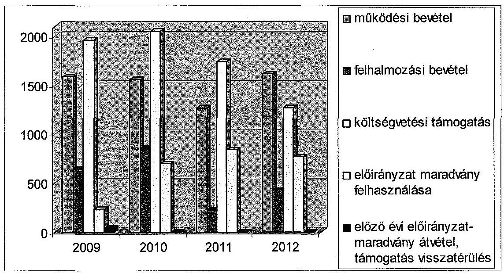

A KRF dolgozói és hallgatói létszáma az ellenőrzött időszakban a költségvetési támogatásokhoz, valamint a saját bevételekhez hasonlóan csökkent. A 2009-2012. évi engedélyezett dolgozói létszám 430 fő volt, ugyanakkor a statisztikai létszám a 2009. évi 375 főről 2012-ben 271 főre csökkent. A létszám közel egyharmadát az oktatók képviselték.

A főiskola hallgatói létszáma a 79/2006. (IV. 5.) Korm. rendelet 2. § (4) bekezdése, illetve 4. számú melléklete alapján számított és az alapító okiratban rögzített 6502 fő engedélyezett maximális hallgatói létszám mellett a 2009. évi 4797 főről 2012-re 3397 főre csökkent. A KRF teljes hallgatói létszáma ugyanakkor 2009-ben 11587 fő, 2010. évben, 9956 fő, 2011. évben 9492 fő, 2012-ben pedig 8122 fő volt, a távoktatásos hallgatók figyelembevételével.

A maximális hallgatói létszám meghatározásába a 79/2006. (IV. 5.) Korm. rendelet 4. számú melléklete alapján nem tartoznak bele a bolognai rendszer bevezetését megelőzően felvett távoktatásos hallgatók. A KRF országos szinten élenjáró volt a távoktatásos oktatási forma alkalmazásában, így a teljes hallgatói létszám meghaladta az alapító okiratban foglalt maximális hallgatói létszámot.

A teljes hallgatói létszámcsökkenés mindezek alapján 3465 fő volt, vagyis a 2012. évi létszám mintegy $30 \%$-kal volt kevesebb a 2009. évinél, amely jelentős mértékben meghaladta a felsőoktatás egészére számított $8,6 \%$-os hallgatói létszámcsökkenést. A hallgatói létszámra és a mutatókra vonatkozó adatok megfeleltethetők voltak a FIR számára szolgáltatott adatokkal.

A főiskola PPP konstrukcióban valósította meg a Diákotthon és az Oktatási épület projekteket. Az ellenőrzött időszakban a két projekt teljesített bruttó szolgáltatási kiadása összesen 1590,7 M Ft (a Diákotthon esetében 1162,5 M Ft, az Oktatási épület esetében $428,2 \mathrm{M} \mathrm{Ft}$ ) volt.

---

A két projekt szolgáltatási kiadásának a KRF dologi és összes kiadásához viszonyított arányát, valamint a PPP szolgáltatási díjak abszolút összegének alakulását a következő táblázat mutatja:

| Év | PPP összes   szolgáltatási   kiadások   M Ft | KRF dologi   kiadása   M Ft | KRF összes   kiadása   M Ft | PPP szolgáltatási kiadások   aránya |  |
| :--: | :--: | :--: | :--: | :--: | :--: |
|  |  |  |  | KRF dologi   kiadásához | KRF összes   kiadásához |
|  | 1 | 2 | 3 | $4=1 / 2$ | $5=1 / 3$ |
| 2009 | 384,8 | 1555,2 | 4370,3 | $24,7 \%$ | $8,8 \%$ |
| 2010 | 387,4 | 1398,1 | 4327,7 | $27,7 \%$ | $9,0 \%$ |
| 2011 | 403,7 | 1527,4 | 3299,1 | $26,4 \%$ | $12,2 \%$ |
| 2012 | 414,8 | 1408,3 | 3654,1 | $29,5 \%$ | $11,4 \%$ |

A szolgáltatási díj forrását mindkét esetben a minisztérium által nyújtott központi támogatás ${ }^{27}$, a hallgatói térítési díjak és az egyéb bevételek jelentették. A bruttó szolgáltatási díj 2009-2012 között folyamatosan emelkedett, amely a szolgáltatási szerződéshez viszonyított bérleti díj növekedését jelentette.

A 2009-2012. években a szolgáltatási díjkötelezettség összesen 345,9 M Ft-tal volt magasabb a szolgáltatási szerződés összegénél (a 2009. évben 73,0 M Ft, a 2010. évben 76,2 M Ft, a 2011. évben 92,6 M Ft és a 2012. évben 103,6 M Ft).

A PPP szolgáltatási díj összegének összes kiadásokhoz és dologi kiadásokhoz viszonyított emelkedésére az árfolyamok negatív változása volt hatással. A szolgáltatási díjfizetés szabályszerűségét a dologi kiadásoknál értékeltük.

A Diákotthon 436 fő részére biztosított férőhelyet, azonban kihasználtsága a 2009-2012. években 352 fő-295 fő ( $76,8 \%-57,6 \%$ ) között változott. A kihasználtságot jelentősen befolyásolta a főiskola hallgatói létszámának, azon belül a nappali tagozatos hallgatók számának alakulása. Az ellenőrzött évek közül a 2010. évben volt a Diákotthon kihasználtsága a legalacsonyabb, 57,6\%.

A beruházási programokkal kapcsolatos kötelezettségvállalás kiadások közötti részaránya folyamatosan emelkedett, a 2010. és 2012. évben meghaladta a KRF kiadásainak 10\%-át (a 2009. évben volt a legalacsonyabb, 8,8\%, a 2012. évben a legmagasabb, 12,2\%), illetve 2010-2012 között a dologi kiadások 25\%-át.

# 3.1.1. A pénzügyi egyensúlyt befolyásoló tényezők 

Az KRF költségvetésének elemzését a CLF módszer szerint számított mutatók alapján végeztük el. A KRF pénzügyi pozícióját, működési jövedelmét, felhalmozási költségvetési egyenlegét, nettó működési jövedelmét a következő táblázat szemlélteti. Az adatokat részletesen a 3. számú melléklet tartalmazza.

[^0]
[^0]:    ${ }^{27}$ Az oktatási intézmény esetében a szolgáltatási díj 50\%, a Diákotthon esetében a 2009. évben 9,6\%, (19,8 M Ft), a 2010-2011. években $15 \%$ (43,6 M Ft).

---

| Megnevezés | 2009. | 2010. | 2011. | 2012. |
| :--: | :--: | :--: | :--: | :--: |
| Folyó bevételek | 3539,6 | 3437,7 | 2983,3 | 2724,3 |
| Folyó kiadások | 3389,7 | 3027,6 | 3019,4 | 2635,3 |
| Működési jövedelem | 149,9 | 410,1 | $-36,1$ | 89,0 |
| Felhalmozási bevételek | 680,0 | 1028,9 | 247,5 | 580,8 |
| Felhalmozási kiadások | 980,6 | 1300,1 | 279,7 | 1018,8 |
| Felhalmozási költségvetés egyenlege | 300,6 | 271,2 | $-32,2$ | 438,0 |
| Folyó és felhalmozási bevételek összesen | 4219,6 | 4466,6 | 3230,9 | 3305,1 |
| Folyó és felhalmozási kiadások összesen | 4370,3 | 4327,7 | 3299,1 | 3654,1 |
| Finanszírozási műveletek nélküli pozíció | 150,7 | 138,9 | $-68,2$ | 349,0 |
| Finanszírozási műveletek egyenlege | 92,4 | 73,4 | $-58,2$ | 518,5 |
| Tárgyévi pénzügyi pozíció | $-58,3$ | 212,3 | 126,5 | 169,5 |
| Hiteltörlesztés, értékpapír beváltás | 0 | 0 | 0 | 0 |
| Nettó működési jövedelem | 149,9 | 410,1 | $-36,1$ | 89,0 |

A KRF tárgyévi pénzügyi pozíciója (-58,2 M Ft, 212,3 M Ft, -126,5 M Ft, $169,6 \mathrm{M} \mathrm{Ft}$ ) az ellenőrzött időszakban változó volt. A pénzügyi pozíció javulását a 2010. évben a magas működési jövedelem (az OKM-től önrevíziós jogcímen származó 293,9 M Ft bevétel), a 2012. évben pedig a finanszírozási műveletek kiugró értéke ( 504,9 M Ft összegű diszkontkincstárjegy beváltása) eredményezte. A pénzügyi pozíció alakulását negatívan befolyásolta a KRF részesedései között szereplő gazdasági társaság (Pro Caroberto Kft.) esetében a veszteséges működés miatti összesen 17,1 M Ft összegű tőkeemelési kényszer (ld. 4.3. pont).

Kedvezőtlen tendencia volt tapasztalható a nettó működési jövedelem (149,9 M Ft, 410,1 M Ft, -36,1 M Ft, 89,0 M Ft), valamint a felhalmozási költségvetés egyenlegének (-300,6 M Ft, -271,2 M Ft, -32,1 M Ft, -438,0 M Ft) változásában.

A működési jövedelem és a nettó működési jövedelem 2009-ben, 2010-ben és 2012-ben pozitív volt, a folyó bevételek fedezték a folyó kiadásokat. A folyó kiadásokra 2011-ben nem nyújtottak fedezetet a folyó bevételek. Az ellenőrzött időszak egészét tekintve 612,9 M Ft működési jövedelemtöbblet keletkezett, amelynek 66,9\%-a 2010-ben képződött. A felhalmozási költségvetés egyenlege a 2009-2012. években negatív volt. A pozitív nettó működési jövedelem a 2010. évben fedezetet biztosított a fejlesztési kiadásokra, azonban a 2009., 2010. és 2012. években a fejlesztési kiadások fedezetéhez szükség volt összesen 429,0 M Ft maradvány igénybevételére.

---

A Főiskolának a 2009-2012. években likviditási problémái nem voltak. A statikus és a pénzeszköz-likviditási mutatója a beszámoló adatai alapján megfelelő volt, keret-előrehozásra nem volt szükség.

A költségvetési szervek likviditására jelentős hatással van a kötelezettségek állománya. Az ellenőrzött időszakban a mérleg szerinti kötelezettség jelentősen növekedett, a 2009. évi 46,3 M Ft-ról a 2012. év végére 278,3 M Ft-ra. A követelések mérleg szerinti állománya is jelentősen magasabb volt a 2012. év végén, mint 2009-ben (2009-ben 52,2 M Ft, 2012-ben 240,9 M Ft), azonban 2012-ben nem fedezte a kötelezettségeket.

A 2012. év végi kimagasló követelésállomány annak tudható be, hogy - a SAP könyvelési rendszer bevezetésével - a hallgatói követelésállomány ettől az évtől került a mérlegben kimutatásra.

A KRF eladósodási mutatója nem volt magas, de az ellenőrzött időszakban kis mértékben romlott, a 2009. évi 5,2\%-ról a 2012. évben 5,8\%-ra nőtt. A pénzeszköz-likviditási mutató, ugyanakkor kedvezően változott, a 2009. évi 0,7 értékről a 2012. évre 1,1-re nőtt. Ez azt jelenti, hogy 2012-ben a pénzeszközök év végi állománya fedezetet nyújtott a rövid lejáratú kötelezettségek rendezésére. A likviditási mutató értéke a 2009. évi 2,8-hez képest gyengült, 2012. évben már csak 1,9-es értéket mutatott. A 2010. és 2012. év végén rendelkezésre álló pénzeszközök és követelésállományok, a 2009. és 2011. évben a pénzeszközök, követelésállományok és forgatási célú értékpapírok együttesen fedezetet nyújtottak a szállítói kötelezettségekre.

A Főiskolát az ellenőrzött időszakban érintették előirányzat-zárolások és a maradványtartási kötelezettség is. A költségvetés egyensúlyát biztosító kormányzati intézkedések szigorú gazdálkodási fegyelmet követeltek meg az intézménytől, de a működőképességét és a feladat ellátását nem veszélyeztették.

Az ellenőrzött négy évben zárolással összesen 447,9 M Ft-ot vontak el a KRF-től ${ }^{28}$ és a 2009. évben 680,0 M Ft összegű maradványtartási kötelezettséget is elrendeltek. Az 1316/2011. (IX.19.) Korm. határozattal elrendelt korlátozások súlyosabban érintették a főiskolát, egyes eszközbeszerzések elhalasztása, külsős tanárok kiesése nehezítette az oktatói-kutatói munkát. A korlátozó intézkedések hatását a főiskola vezetése a takarékossági intézkedések bevezetésével kompenzálta.

Kötelezettségvállalási és beszerzési tilalom a 2010-2012. években érintette a főiskolát ${ }^{29}$. A 2010-2012. években az államháztartás egyensúlytartásával összefüggésben megjelent Korm. határozatok beszerzési tilalmakat fogalmaztak meg. A KRF 2012-ben felmentést kért az 1036/2012. (II. 21.) Korm. határozat 6. pontjában megfogalmazott tilalom alól, de az engedélyt az ellenőrzött időszak végéig nem kapta meg.

[^0]
[^0]:    ${ }^{28}$ 1033/2009. (III. 17.), 1132/2010. (VI. 18.), 1025/2011. (II. 11.), 1122/2012. (IV. 25.) Korm. határozatok
    ${ }^{29}$ 1132/2010. (VI. 18.), 1316/2011. (IX. 19.), 1036/2012. (II. 21.) Korm. határozatok

---

A főiskolánál a 2011. április 15-től kijelölt költségvetési felügyelő tevékenységével erősítette a főiskola gazdálkodásának szabályszerűségét, fizetőképességének megőrzését. Kincstári biztost az ellenőrzött időszakban nem jelöltek ki az intézményhez.

# 3.1.2. A normatív támogatások felhasználása 

A kötött felhasználású normatív támogatások felhasználásával kapcsolatos döntések megfeleltek a vonatkozó jogszabályok és belső szabályzatok előírásainak. A felhasználási kötöttség nélküli - képzési, tudományos célú és fenntartói - normatív támogatások felhasználására vonatkozó intézményi döntések részben voltak megfelelőek, mert a 2009-2012. években az előírások ${ }^{30}$ ellenére a szenátus nem döntött a támogatási összegek centralizált és decentralizált részre történő felosztásáról, illetve ez utóbbi szervezeti egységekhez való eljuttatásának rendjéről.

A főiskola a 2009-2010. években finanszírozásra kötött fenntartói megállapodást figyelembe véve rendelkezett a képzési, tudományos célú és fenntartói támogatás összegével. A 2009-2012. években a kötött felhasználású hallgatói támogatásoknak, illetve az egyéb feladatok támogatásainak felhasználásáról a szenátus döntött. A hallgatói juttatásokat a belső szabályzatnak megfelelően állapították meg és hirdették ki. A KRF a hallgatói támogatások terhére megállapított hallgatói juttatási előirányzatok felhasználásáról éves beszámoló keretében elszámolt, amelyet a szenátus minden vizsgált évben megtárgyalt és jóváhagyott.

Az ellenőrzött időszakban a nem kötött felhasználású normatív támogatásokkal (képzési, tudományos célú és fenntartói) centralizált módon, az elemi költségvetés előirányzatai alapján gazdálkodtak. A szervezeti egységek a szakmai feladatok ellátásához meghatározott előirányzataikat a gazdálkodási szabályzatban rögzítettek alapján használhatták fel. Az ellenőrzött időszakban a költségvetési javaslatot a Gazdasági Tanács véleménye mellett a szenátus hagyta jóvá.

A hallgatói létszám csökkenő tendenciája meghatározó volt a központi költségvetésből kapott támogatás mértékére. A hallgatói létszámra és a mutatókra vonatkozó adatok megfeleltethetők voltak a FIR számára szolgáltatott adatokkal. A Feot. és az Nftv. előírásainak megfelelően a KRF a hallgatói támogatások terhére megállapított hallgatói juttatási előirányzatok felhasználásáról az éves beszámoló keretében elszámolt. Kötelezettségét az államilag támogatott teljes idejű képzésben résztvevő (nappali tagozatos) hallgatók létszámainak adatszolgáltatásával teljesítette.

### 3.2. A kiadási és bevételi előirányzatok felhasználásának szabályszerűsége

### 3.2.1. Személyi juttatások

A rendszeres és nem rendszeres személyi juttatások előirányzatainak felhasználása és a megbízási díjak elszámolása összességében szabály-

[^0]
[^0]:    ${ }^{30}$ 50/2008. (III. 14.) Korm. rendelet 9. § (2) bekezdése

---

szerű volt, megfelelt a vonatkozó jogszabályok és belső szabályzatok előírásainak.

A rendszeres személyi juttatások kifizetését munkaidő-elszámolás, illetve teljesítésigazolás támasztotta alá. A bruttó illetmény összege megfelelt a kinevezési okiratban foglaltaknak. A munkavállalót terhelő levonások az Szja tv. és a Tbj. vonatkozó előírásai szerint történtek. A fizetéshez kapcsolódó pótlékok és kiegészítések dokumentumokkal alátámasztottak voltak, azok megállapítása, számfejtése szabályos volt.

A nem rendszeres személyi juttatások megállapítása, számfejtése szabályos volt. A választható béren kívüli juttatások jogcímeinél (az étkezési utalvány és üdülési csekk) és azok kifizetésénél betartották a személyenkénti és évenkénti jogszabályban és belső szabályzatban meghatározott keretet. A jutalom kifizetésénél érvényesült a Kjt. 77. §-ában megfogalmazott előírás.

A megbízási díjak elszámolását megbízási szerződések támasztották alá, amelyeket az arra jogosult írt alá, azok ellenjegyzése is megtörtént. A megbízási szerződéseket a tárgyévi előirányzatok terhére kötötték. A megbízás minden esetben olyan feladatra szólt, amelynek teljesítése mérhető. A Feot., Nftv. oktatói tevékenységre vonatkozó előírásait betartották. A főiskola saját munkavállalóval kötött megbízási szerződése nem munkaköri feladat végzésére irányult. A szerződés szerinti megbízási díjak megfeleltek a teljesítésigazolásban lévő összegnek. Az elkészült tárgyiasult termék (tanulmányok, oktatási jegyzet) rendelkezésre állt.

# 3.2.2. Dologi kiadások 

A dologi kiadások előirányzatának felhasználása során a pénzügyi elszámolások, valamint a gazdálkodási jogkörök gyakorlása tekintetében nem érvényesültek teljes körűen a jogszabályok és a belső szabályzatok előírásai. Ez szabályszerűségi kockázatot jelentett az ellenőrzött terület egészének szabályos működése szempontjából.

A 2009-2010. években összesen 0,5 M Ft összegű kifizetésnél tártunk fel egyedi jelleggel kisebb szabályszerűségi hibákat. A 2012. évben a gazdálkodási kontrollok működése az Ávr. rendelkezéseinek megfelelt.

A teljesítésigazoló az Ámr. 135. § (1) bekezdésében, illetve az Ámr. 2 76. § (1) bekezdése ellenére nem, illetve nem megfelelő okmányok alapján végezte el az összegszerűség ellenőrzését. Egy alkalommal az Ámr. ${ }_{1} 135 . \S$ (2) bekezdésében előírtak ellenére nem az arra kijelölt személy végezte a szakmai teljesítésigazolást. Ezeknél az eseteknél az érvényesítő - az Ámr. ${ }_{1} 135 . \S$ (3) bekezdésében és az Ámr. ${ }_{2}$ 77 § (1) bekezdésében előírtak ellenére - nem ellenőrizte az összegszerűséget és a teljesítésigazolás szabályszerűségét.

A kutatáshoz kapcsolódó és a pályázati előkészítési tevékenységek összesen 68,0 M Ft összegű kiadásait a szakmai szolgáltatásokon mutatták ki a 2012. évi költségvetési beszámolóban. A korrekciót évvégén az elemi költségvetésről szóló 5/2012. (III. 1.) NGM rendeletben foglaltak alapján végezték el, azonban a könyvelésben az adatokat nem módosították. A beszámoló tartalma és az azt alátámasztó könyvvezetés tekintetében az összehasonlítást nem biztosították, nem tartották be a Sztv. 15. § (5) és az Áhsz. 9. § (3) bekezdésében foglalt következetesség számviteli alapelvet.

---

Az ellenőrzés során kiemelt figyelmet fordítottunk a nagy összegű dologi kiadások ellenőrzésére. A kiadások felhasználása összességében szabályszerű volt. A kötelezettségvállalási dokumentumok - egy eset kivételével - rendelkezésre álltak.

Az Áht. 2 37. § (1) bekezdés előírása ellenére egy kifizetéshez (3,3 M Ft) csak megrendelő került csatolásra, nem állt rendelkezésre megfelelő írásbeli kötelezettségvállalási dokumentum. Ugyanezen kifizetésnél nem tartották be a KRF gazdálkodási jogkörök szabályzata 100 ezer Ft-ot meghaladó beszerzések árajánlatkérésre vonatkozó előírását, mert árajánlat bekérése nélkül vállaltak kötelezettséget.

A nagy összegű beszerzésekhez, szolgáltatásokhoz kapcsolódó közbeszerzési eljárások a Kbt. ${ }_{1}$-ben és a Kbt. ${ }_{2}$-ben foglalt egybeszámítási szabályoknak megfeleltek.

2009-2012 között a PPP szolgáltatási díjfizetési kötelezettséget a szolgáltatási szerződésekben foglaltak és a pénzintézet által közölt díjak - tőke és kamat összegek - alapján teljesítették.

Az 1132/2010. (VI. 18.) és az 1316/2011. (IX. 19.) Korm. határozatok alapján a szerződéskötési tilalmat a szellemi tevékenység vonatkozásában betartották.

# 3.2.3. Felhalmozási kiadások 

A felhalmozási kiadások előirányzatának felhasználása során a pénzügyi elszámolások, valamint a gazdálkodási jogkörök gyakorlása tekintetében nem érvényesültek teljes körűen a jogszabályok és a belső szabályzatok előírásai. Ez szabályszerűségi kockázatot jelentett az ellenőrzött terület egészének szabályos működése szempontjából.

A felhalmozási kiadásokat alátámasztó szerződések rendelkezésre álltak, a kötelezettségvállalások és azok ellenjegyzése szabályosan megtörtént. A szerződések minden esetben alátámasztották a kifizetések összegét és jogosságát, a kifizetések fedezete biztosított volt. Az összeférhetetlenségre vonatkozó szabályokat betartották. A beszerzésekhez, szolgáltatásokhoz kapcsolódó közbeszerzési eljárások a Kbt. ${ }_{1}$-ben és a Kbt. ${ }_{2}$-ben foglalt egybeszámítási szabályoknak megfeleltek.

A teljesítésigazolást, az érvényesítést és az utalványozást elvégezték, melyek néhány egyedi eset kivételével - összhangban álltak a 2009-2012. években érvényes jogszabályok és belső szabályzatok előírásaival. A pénzügyi teljesítés során összesen 3,0 M Ft kifizetésénél tártunk fel szabályszerűségi hibákat.

Egy esetben az Ámr. 2 78. § (1) bekezdésében foglaltak ellenére nem az arra kijelölt személy végezte az utalványozást, egy-egy esetben 2009-ben az Ámr. 1 135. § (2) bekezdése, valamint 2011-ben az Ámr. 2 76. § (3) bekezdése ellenére a szakmai teljesítés igazolását nem az arra kijelölt dolgozó végezte el.

Az ellenőrzés során kiemelt figyelmet fordítottunk a nagy összegű felhalmozási kiadások ellenőrzésére. A kiadások felhasználása összességében szabályszerű volt, azok jellemzően építési, felújítási beruházásoknak, műszerbeszerzéseknek biztosítottak fedezetet.

---

# 3.2.4. A hazai forrásból finanszírozott projektek 

A KRF a hazai forrásból finanszírozott projektekhez kapott támogatásokat szabályszerűen használta fel. A finanszírozott projekteket a támogatási szerződésben meghatározott műszaki tartalommal, a rendelkezésre álló pénzügyi, finanszírozási feltételekkel, a meghatározott ütem szerint valósították meg. Az előírt pénzügyi és szakmai beszámolókat minden esetben elkészítették. A projektek bevételeit és kiadásait a könyvelésben elkülönítették.

A 2009-2012. évek között a KRF összesen 22 projekthez 1110,8 M Ft támogatásban részesült. A pályázatok 72,7%-a kutatáshoz, kutatásfejlesztéshez kapcsolódott, a felhasznált támogatás összege 741,9 M Ft volt.

Az Magyar Tudományos Akadémia kutatócsoportok által igénybe vehető Lendület programból a KRF a 2009-2012. években támogatásban nem részesült, arra csak egyetemi kutatócsoportok pályázhattak.

### 3.2.5. Működési bevételek

Az intézményi működési bevételek beszedése a pénzügyi elszámolások, valamint a gazdálkodási jogkörök gyakorlása tekintetében összességében nem felelt meg a jogszabályoknak és belső szabályoknak. A pénzügyi teljesítés során rendszerszintű szabályszerűségi hibákat tártunk fel a 2009. évet érintően, amely kockázatot jelentett a bevételek összegszerűségének megbízhatóságában.

A 2009. évben az Ámr. ${ }_{1}$ 135. § (1) bekezdésében előírtak ellenére a KRF belső szabályzata a bevételek beszedésének elrendelése előtt a szakmai teljesítésigazolás elvégzését nem írta elő, így a szakmai teljesítés igazolását visszatérően nem végezték el. Az Ámr. ${ }_{1}$ 135. § (3) bekezdésében és a gazdálkodási jogkörök szabályzatában foglaltak ellenére a 2009. évben nem történt meg az érvényesítés a működési bevételeknél. Az Sztv. 165. § (2) bekezdésében előírtak ellenére egy termékértékesítés esetében a bevétel beszedéséhez nem állt rendelkezésre szabályszerűen kiállított bizonylat.

A beszedett bevételek szerződésen vagy egyéb szenátusi döntésen alapultak. A bevételek a számlázott vagy előírt összegben realizálódtak. Az utalványozás összhangban állt az Ámr. ${ }_{1-2}$, és az Ávr. előírásaival, valamint a gazdálkodási jogkörök szabályzatában foglaltakkal.

A KRF a gazdálkodási jogkörök szabályzatát a jogszabályi változásokkal összhangban nem aktualizálta.

Az Ámr. ${ }_{1}$ változása miatt a bevételek érvényesítésének kötelezettsége 2010-től megszűnt. Ennek ellenére a gazdálkodási jogkörök szabályzatának aktualizálását nem végezték el, a 2009-ben érvényes szigorúbb előírások maradtak érvényben, ennek ellenére az okmányokon az érvényesítést nem végezték el, ugyanakkor az eredeti kibocsátott számlákat a pénzügyi és a számviteli csoportvezetők aláírásukkal látták el.

Visszatérő hiányosság volt, hogy a számlázott vagy előírt bevételek nem realizálódtak minden esetben határidőben. A késedelmes teljesítések döntően hall-

---

gatói befizetésekhez kapcsolódtak. A termékértékesítéshez, továbbszámlázott szolgáltatáshoz kapcsolódó bevételeket szabályosan kiszámlázták.

# 3.2.6. Felhalmozási bevételek 

A felhalmozási bevételek beszedése során a pénzügyi elszámolások, valamint a gazdálkodási jogkörök gyakorlása tekintetében nem érvényesültek teljes körűen a jogszabályok és a belső szabályzatok előírásai. Ez magas szabályszerűségi kockázatot jelentett az ellenőrzött terület egészének szabályos működése szempontjából.

Az ellenőrzött esetekben a működési bevételeknél feltártakkal egyező rendszerszintű szabályszerűségi hibákat tártunk fel. A 2009. évet érintően az Ámr. 135. § (1) és (3) bekezdésének előírásai ellenére a szakmai teljesítésigazolás és az érvényesítés visszatérő jelleggel, összesen 14,3 M Ft összegben nem történt meg, amely kockázatot jelentett a bevételek összegszerűségének megbízhatóságában.

Az ellenőrzés során kiemelt figyelmet fordítottunk a nagy összegű felhalmozási bevételek ellenőrzésére, amelyeknél az érvényesítés 2009-ben történő elmaradásán kívül egyéb szabályszerűségi hibákat nem tártunk fel.

### 3.2.7. A díjak, költségtérítések megállapítása

A Főiskolánál az intézményi térítési díjak, költségtérítések szabályozása megfelelő volt, tevékenységeinek bevételei és kiadásai elkülönítése az átláthatóságot biztosította. A díjbevételek elszámolása összességében szabályszerű volt, az alátámasztó szerződések rendelkezésre álltak. A befolyt bevételek az előírt összegben realizálódtak.

A főiskola térítési és juttatási szabályzatban határozta meg a hallgatók, dolgozók, külső igénybevevők által fizetendő térítési díjakat. Az Áhsz. 8. § (19) bekezdésében foglaltaknak megfelelően önköltség-számítási szabályzatban előírta az egyes tevékenységekből származó bevételek és kiadások elkülönítését, amelyet alkalmaztak.

A 2009-2011. években a TÚSZ rendszerben képzési szintenként elkülönített nyilvántartást vezettek. Tanulmányalkat levelező tagozaton végző hallgatók esetében karonkénti bontásban, a távoktatásban résztvevő hallgatók esetében egyetlen témaszámon. A 2012. évben az SAP rendszerben képzési szintenként és szakonként elkülönített nyilvántartás vezettek.

Az Áhsz. előírásának és a belső szabályozásnak megfelelően a számvitelben elkülönítették az egyes oktatói, gyakorlati, kutatási és egyéb tevékenységet. A bevételeket és kiadásokat belső szervezeti egységenként nyilvántartják.

A térítési díjakat, költségtérítéseket önköltségszámítás alapozta meg. A befizetést alátámasztó dokumentumok, az önköltség-számítási szabályzat, valamint az adott bevételnél alkalmazott díjat megállapító intézményi döntés, valamint az azt megalapozó dokumentumok rendelkezésre álltak. A fizetendő térítési díjak, költségtérítések, valamint az egyéb működési bevételek mértékét a Gazdasági Tanács javaslata alapján szenátusi döntés állapította meg.

---

A Feot. 125-126.§ és az Nftv. 81-83.§ térítési díjra és költségtérítésre vonatkozó előírásainak megfelelően állapították meg a térítésköteles oktatás és a szolgáltatások díjtételeit. A költségtérítések rendezését a hallgatók a GTR rendszerben a KRF Kincstárnál vezetett intézményi célelszámolási számlájára teljesítették.

# 3.2.8. Az előirányzat-módosítások szabályszerűsége 

A bevételi és kiadási előirányzatok módosítása a 2009-2012. években összességében nem felelt meg a jogszabályokban és belső szabályzatokban foglaltaknak, a rendszerszintű szabályszerűségi hibák az intézményi hatáskörű előirányzat-módosításoknál jelentkeztek.

A KRF előirányzatait országgyűlési, kormány és irányító szervi hatáskörben is módosították. A módosítások döntő hányada (az ellenőrzött évek sorrendjében $84,8 \%, 70,2 \%, 96,1 \%$ és $82,5 \%$ ) intézményi hatáskörben történt. A legkisebb volumenű változást a kormány hatáskörben megtett előirányzat-változtatások eredményezték ( $0,5 \%, 1,2 \%, 1,1 \%, 3,4 \%)$. A beszámolóban szereplő előirányzat-módosítások megegyeztek az intézmény előirányzat-nyilvántartásában lévő adatokkal.

Országgyűlési hatáskörben 184,0 M Ft-ot vontak el a Főiskolától 2011-ben $^{31}$, az 1025/2011. (II. 11.) Korm. határozatban foglaltak alapján.

Kormányzati hatáskörben mind a négy évben módosították az intézmény előirányzatait. A módosítások kormányhatározatok alapján elrendelt zárolások, valamint bér- és keresetkiegészítés, bérkompenzáció finanszírozásának támogatásaként emelték az egyes évek eredeti előirányzatát. Ennek hatására a 2009. és a 2012. években 3,2 M Ft és 42,8 M Ft összeggel csökkent, a 2010. és a 2011. években $21,1 \mathrm{M}$ Ft és $11,8 \mathrm{M}$ Ft összeggel nőtt a KRF kiadási és bevételi előirányzatának főösszege.

Az irányító szervi hatáskörben végrehajtott előirányzat-módosítások összességében 1068,7 M Ft-tal (a vizsgált évek sorrendjében 104,8 M Ft-tal, 488,3 M Ft-tal, 215,4 M Ft-tal, 260,2 M Ft-tal) növelték az intézmény eredeti előirányzatát.

Előirányzat-módosításra irányító szervi hatáskörben a 2009-2012. évek között került sor továbbképzések költségeinek finanszírozása, állami génmegőrzési feladatok támogatása, befektetői tőke bevonásával megvalósuló szolgáltatás bérleti díj (PPP) fedezetének biztosítása, valamint irányító szervi hatáskörben átvett maradványból intézményi kiadások finanszírozása céljából.

Az intézményi hatáskörű előirányzat-módosítások a 2009-2012. években összesen 3858,2 M Ft összegben a személyi juttatások, a munkáltatói járulékok, dologi és egyéb folyó kiadások, az intézményi beruházási, felújítási kiadások előirányzatát emelték, valamint növekedett a felhalmozási kölcsönök nyújtásának előirányzata is. Az előirányzat-emelések forrását az előző évi jóváhagyott maradvány, előző évi előirányzat-maradvány átvétele, az intézményi

[^0]
[^0]:    ${ }^{31}$ A Magyar Köztársaság 2011. évi költségvetéséről szóló 2010. évi CLXIX. törvény módosításáról szóló 2011. évi CXIV. törvény.

---

működési bevételek, a támogatásértékű felhalmozási és működési célú bevételek, valamint a támogatási kölcsönök visszatérülése biztosították.

Az intézményi hatáskörű módosítások során a 2011. évben nem tartották be az Ámr. 2 60. § (6) bekezdésében előírtakat, mivel az előirányzat módosítások elrendelését az írásbeli meghatalmazással nem rendelkező személyek (számviteli csoportvezető, pénzügyi csoportvezető) írták alá.

# 3.2.9. Az előirányzat-maradványok szabályszerűsége 

A KRF a 2009-2012. évi előirányzat-maradványok megállapítása és felhasználása során nem tartotta be teljes körűen a jogszabályi előírásokat. Az éves beszámolókban és a kapcsolódó 42-es főkönyvi számlákon kimutatott előirányzat-maradványok megegyeztek, azonban az Áhsz. 51. § (2) bekezdése előírása ellenére a beszámolóban kimutatott előirányzatmaradványok értékeit nem támasztotta alá a kapcsolódó 0-s főkönyvi számla adata, helytelen év végi könyvelés miatt.

Az előirányzat-maradványok alakulását az alábbi táblázat mutatja:
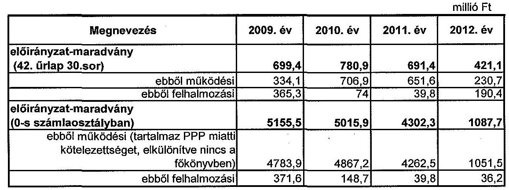

Az ellenőrzött időszakban a felhasználható előirányzat-maradvány összegét teljes egészében kötelezettségvállalással terhelt maradványként mutatták ki. A tárgyévi előirányzat-maradványok szabályszerűségének megítéléséhez végzett mintavételes ellenőrzés során megállapítottuk, hogy a 2009-2012. években a kötelezettségvállalással terhelt maradvány megállapítása nem felelt meg a Sztv. 15. § (9) bekezdésében, valamint az Áhsz. 9. § (6) bekezdésében foglalt bruttó elszámolás elvének, mivel az előirányzat-maradványban szállítói túlfizetéseket is kimutattak, összesen 1,3 M Ft összegben. Az egyéb ellenőrzött tételek tekintetében a kötelezettséggel terhelt maradvány megállapítása szabályszerű volt.

Az intézmény előirányzat-maradványából a központi költségvetést megillető előirányzat-maradvány megállapítása szabályos volt, a befizetés az előírt határidőre megtörtént. Maradvány visszafizetésére 2009-ben került sor, 23,3 M Ft összegben.

---

# 4. A VAGYONGAZDÁLKODÁS SZABÁLYSZERŰSÉGE 

### 4.1. A vagyongazdálkodás szabályozottsága

A KRF az ellenőrzött időszakban a vagyongazdálkodással kapcsolatos belső szabályzatokkal rendelkezett, azok azonban nem feleltek meg teljes körűen a vonatkozó jogszabályi követelményeknek.

Az intézmény a 2011-2012. évekre rendelkezett szabályszerű IFT-vel, és a részletes vagyongazdálkodási tervet is kidolgozták. A szenátus 2009-2012. évekre jóváhagyott éves vagyongazdálkodási terve a 2012. évtől igazodott az IFT-hez. A 2011. február 25-től hatályos vagyongazdálkodási szabályzat megkülönböztette a KRF rendelkezésére bocsátott vagyon és a saját vagyon fogalmát.

A 2009-2010. évekre hatályos IFT az intézmény rendelkezésére bocsátott vagyon hasznosításával, megóvásával kapcsolatos elképzeléseket a Feot. 27. § (3) bekezdésének előírásai ellenére nem részletezte, az ingatlanhasznosítás fő irányait jelölte ki. A szabályzatok a Feot. 120. § (2) bekezdésétől eltérően nem tartalmazták a KRF rendelkezésére bocsátott vagyon és a saját vagyon elkülönített nyilvántartási kötelezettségét. A KRF saját tulajdonú vagyontárgyainak nyilvántartási kötelezettségét 2010. szeptember 1-jétől a versenyeztetési szabályzat írta elő.

Az immateriális javak és a tárgyi eszközök üzembe helyezésére vonatkozó szabályozás a jogszabályi előírásoknak megfelelt, az alkalmazott gyakorlat szabályszerű volt. A leltározási szabályzat az Áhsz. 37. § (5) bekezdésében foglaltakkal összhangban nem tartalmazta teljes körűen a leltározás részletszabályait. Nem volt biztosított továbbá a leltározási folyamat átláthatósága, dokumentáltsága, mert a leltározási szabályzatban meghatározott leltári nyomtatványok a gyakorlatban nem, vagy nem az előírt tartalommal készültek.

Az ellenőrzött időszakban hatályos leltározási szabályzatok az immateriális javak, a követelések, értékpapírok és a források egyeztetéssel történő leltározásának eljárási szabályait, a leltározás dokumentálásának módját, a leltárak kiértékelésekor követendő eljárásrendet nem határozták meg.

A leltározási szabályzat előírásai ellenére leltárnyitó jegyzőkönyvek nem készültek, továbbá a tárgyi eszközök leltárzáró jegyzőkönyvei a 2010-2011. évek vonatkozásában nem tartalmaztak információt a leltározás során felmerült leltáreltérésekről vagy a leltárfelvétel eredményéről.

A selejtezési szabályzat a 2009-2012. években biztosította a felesleges vagy rendeltetésszerű használatra alkalmatlan vagyontárgyak szabályos selejtezését. Az eszközök selejtezésének, hasznosításának előkészítése, végrehajtása, dokumentálása a 2010. és a 2012. években megfelelt a belső szabályzatok előírásainak, a 2009. és 2011. évben ugyanakkor nem volt megfelelő.

A KRF a selejtezési szabályzat előírásaitól eltérően 2009. szeptember 30-án selejtezési jegyzőkönyv nélkül selejtezett informatikai eszközöket; 2011. május 31-én a selejtezési jegyzőkönyvben feltüntetett vagyontárgyak selejtezésre történő bejelentése és a hasznosítási javaslat elkészítése nem történt meg; 2011. november 8-án - a 2011. november 12-én kelt selejtezési jegyzőkönyvet megelőzően - hasznosí-

---

tási javaslat alapján vezetett ki eszközöket a tárgyi eszköz analitikából. A helyszíni ellenőrzés során megtörtént a hasznosítási javaslatban és a 2011. november 12-én kelt selejtezési jegyzőkönyvben meghatározott eszközök összevetése, eltérés nem volt.

A KRF a vagyonhasznosítással kapcsolatos belső szabályzatokkal rendelkezett, azok összhangja a vonatkozó jogszabályokkal ${ }^{32}$ 2011-től volt biztosított. A KRF szabályzatokban határozta meg a kezelésében, tulajdonában lévő immateriális javak, tárgyi eszközök bérbeadási, értékesítési folyamatát.

A 2010. január 1-től hatályos versenyeztetési szabályzat a KRF tulajdonában álló vagyon értékesítésének folyamatát szabályozta. 2011. február 25-től a vagyongazdálkodási szabályzatban, valamint a lakáscélú helységek bérbeadásának szabályzatában a jogszabályi előírásoknak megfelelően szabályozta a vagyonkezelésében lévő tárgyi eszközök bérbeadási, értékesítési folyamatát. Az ellenőrzött években a szellemi tulajdon kezelési szabályzat rögzítette a szellemi tulajdon átruházásának, hasznosítása engedélyezésének a folyamatát.

A KRF az ellenőrzött időszakban a vagyongazdálkodással kapcsolatos döntési hatásköröket az SZMSZ-ben és a vagyongazdálkodási szabályzatban meghatározta.

# 4.2. A vagyonelemek kimutatásának megbízhatósága 

A KRF költségvetési beszámolóinak könyvviteli mérlegében kimutatott vagyonelemek értékelése, besorolása összességében nem volt szabályszerű. A mérlegsorokat alátámasztó ellenőrzött mintatételek esetében az Sztv., a Feot., az Áhsz. és a KRF belső szabályzatai előírásaitól eltérő szabályszerűségi hibákat tártunk fel.

Az KRF 2011-2012. évre vonatkozó mérlegei nem mutatnak megbízható és valós képet az intézmény vagyoni helyzetéről. Az ellenőrzés során feltárt hibák összege meghaladta az Áhsz. 5. § 8. pontjában meghatározott jelentős összeget (mérlegfőösszeg 2%-a), a 2011. évben 2,54%, a 2012. évben 3,04% volt.

A 2011. évi 7000,9 M Ft mérlegfőösszegnél a hibák értéke 177,7 M Ft, a 2012. évi 7291,6 M Ft mérlegfőösszegnél pedig 222,0 M Ft volt. Ezt megelőzően a hibák összegének mérlegfőösszeghez viszonyított aránya a 2009. évben 1,72%, a 2010. évben $1,51 \%$ volt.

A mérleg valódisága a 2009. évben a követelések, a részesedések, az értékpapírok és a kötelezettségek területén, a 2010. és a 2011. években az értékpapírok és a kötelezettségek területén, míg 2012-ben az üzemeltetésre átadott eszközök, a követelések és a kötelezettségek területén nem volt biztosított. A KRF a 2009-2012. években a könyvviteli mérlegében szereplő értékadatokat az Áhsz. 37. § (2) bekezdés előírása ellenére - az immateriális javak és a tárgyi eszközök kivételével - leltárral nem támasztotta alá.

[^0]
[^0]:    ${ }^{32}$ Vtv., Vtvr., Nvtv., Áht.

---

A tárgyi eszközöket a KRF a 2009-2012. években minden évben mennyiségi felvétellel leltározta. Leltárhelyenként és leltárkörzetenként aláírással ellátott leltárfelvételi ív készült, a leltár kiértékelés megtörtént.

A KRF a Magyar Állam tulajdonában lévő, vagyonkezelésbe vett ingatlanokkal rendelkezett az ellenőrzött időszakban. A Vagyonkezelési szerződést 2004-ben a KVI-vel, 2009-ben az MNV Zrt.-vel megkötötte, azonban a Nemzeti Földalapba tartozó földterületek hasznosítására vonatkozó kiegészítő megállapodás - a KRF kezdeményezése ellenére - a 2010-2012. években nem jött létre. A KRF a vagyonkezelésbe vett ingatlanokról a Vtvr. 14. § (1) bekezdésében előírt vagyonnyilvántartást szabályszerűen vezette. Az ingatlanok tulajdoni lapjainak ellenőrzését az intézmény folyamatosan végezte.

A KRF a 2009-2012. években az Áhsz. 37. § (2) bekezdés előírása ellenére a könyvviteli mérlegében a követeléseket (hallgatókkal szembeni követelésállomány) és a rövid lejáratú kötelezettségeket (támogatási program előlegek) nem a valós összegben szerepeltette, azokat nem leltározta ${ }^{33}$. A 2012. évben a szállítói kötelezettségeknél és a vevőkkel szembeni követeléseknél a mérleg és az analitikus nyilvántartás eltérő adatokat tartalmazott ${ }^{34}$.

A költségtérítéses hallgatókkal szembeni követelésállomány 2009. december 31-én 18,7 M Ft, 2010. december 31-én 21,2 M Ft, 2011. december 31-én 41,3 M Ft volt, amely a KRF a mérlegében nem szerepelt. A 2012. évben a vevőkkel szembeni követelésnél - a hallgatói kötelezettségek állományában - az analitika 48,9 M Ft-tal magasabb összeget tartalmazott a főkönyvnél. Mindez összesen 130,1 M Ft eltérést jelentett.

A KRF a 2009-2012. évek mérlegében az elnyert pályázatokhoz kapcsolódó támogatási program előlegeket nem a valós összegben szerepeltette, a kötelezettségekről vezetett analitikus nyilvántartás és a főkönyv eltérő adatokat tartalmazott. A mérlegben a 2009. évben 37,8 M Ft-tal; a 2010. évben 11,3 M Ft-tal kevesebb; a 2011. évben 141,2 M Ft-tal; a 2012. évben 68,0 M Ft-tal magasabb kötelezettséget mutatott ki. A mérlegben a 2010-2012. években kimutatták annak az öt pályázatnak az összesen 49,7 M Ft támogatási előlegét is,
 amelyek elszámolása 2010. július 15-ével megtörtént. Mindez összesen 308,0 M Ft eltérést jelentett.
2012. december 31-én a szállítói kötelezettségállományban az analitika és főkönyv között 72,4 M Ft volt az eltérés.

A KRF az ellenőrzött időszakban a kötelezettségek analitikus nyilvántartását nem az Áhsz. 9. számú mellékletének számlaosztályok tartalmára vonatkozó előírások 4. pont da) pontja szerint vezette, mert a nyilvántartás nem biztosította a pénzügyileg teljesített tételek egyeztethetőségét a kapcsolódó főkönyvi számlákkal.

A KRF szabályosan vásárolt a kincstári hálózatban forgatási célú értékpapírt, értékelése azonban nem felelt meg az Áhsz. 29. § (2) bekezdésében előírtaknak, mert a mérlegben a lejáratkori hozam összegével növelt vételárat mu-

[^0]
[^0]:    ${ }^{33}$ A KRF 2013. november 12-i nyilatkozata a leltározás gyakorlatáról.
    ${ }^{34}$ A helyszíni ellenőrzés lezárásakor is folyamatban volt a különbség okának feltárása.

---

tatták ki a névérték helyett. Az Áhsz. 37. § (2) bekezdése ellenére a mérlegvalódiság e területen sem volt biztosított.

A mérlegben kimutatott értékpapír-állomány 2009-ben 536,9 M Ft, 2010-ben 449,1 M Ft, 2011-ben 504,9 M Ft volt. A lejáratkori hozam beszámítása miatt 2009-ben 8,3 M Ft-tal; 2010-ben 4,3 M Ft-tal; 2011-ben 10,0 M Ft-tal magasabb összeg került kimutatásra.

A KRF a 2009-2012. években az éves könyvviteli mérlegében a vagyonát kizárólag az alapfeladat ellátása érdekében rendelkezésére bocsátott, kezelésbe vett eszközként mutatta be, annak ellenére, hogy rendelkezett a Feot. 123. § (1) bekezdése szerinti saját vagyonnal. Nem különítette el és nem mutatta ki a saját tulajdonában lévő eszközöket, a Feot. 123. § (7) bekezdése és a 120. § (2) bekezdése előírása ellenére.

A saját bevételéből alapított intézményi társaságokban meglévő részesedéseit nem saját vagyonként mutatta ki a főkönyvben, valamint az állami vagyonról vezetett vagyonnyilvántartásban. A KRF az ellenőrzött időszakban két intézményi társaságot hozott létre, amelyben saját bevétele terhére és a saját tulajdonában lévő apport (immateriális javak) bevitele révén részesedéssel rendelkezett, azonban a részesedéseket a kincstári vagyonelemek között tartotta nyilván. A 2010-2011-ben a saját tulajdonban lévő három szolgálati lakás a vagyonnyilvántartásban saját vagyonelemként nem volt beazonosítható.

A KRF az Áhsz. 37. § (2) bekezdését megsértve meglévő részesedéseit a mérlegében teljes körűen nem mutatta ki, a 2009. évben a Pincészet Kft.-ben 41,0 M Ft összegű, a 2011. évben a Pincészet Kft.-ben és a Pro Caroberto Kft.-ben meglévő összesen 66,6 M Ft összegű részesedés nem szerepelt.

A KRF 2011. április 1-jén a KR Nonprofit Kft.-vel a „Sportcentrum” öt éves üzemeltetésére kötött szerződést, azonban a 2012. évi mérlegében üzemeltetésre átadott eszközt nem mutatott ki. A „Sportcentrum” üzembe helyezését követően megtörtént annak besorolása, azonban az üzemeltetésre való átadást követően az ingatlan átsorolása nem történt meg, ami nem felelt meg az Áhsz. 16. § (2) bekezdésének.

Az értékpapírok, a követelések és a kötelezettségek ellenőrzött mérlegtételeinek tartalma, besorolása és értékelése a 2009-2012. években összességében nem felelt meg az Sztv. és az Áhsz. követelményeinek.

A követelések mérlegtételek tartalma, besorolása és értékelése a 2012. évben az ellenőrzött mérlegtételek közel 50\%-ánál nem felelt meg az Sztv. 46. § (3) bekezdéseiben, valamint az Áhsz. 22. § (1) bekezdés a) pontjában és a 32. § (1) bekezdésében foglaltaknak. Ennek oka, hogy a KRF a vevők részére év végén nem küldött egyeztető levelet, és az Áhsz. szerinti leltározást nem végezte el.

A kötelezettségek mérlegtételek tartalma, besorolása és értékelése a 2009. évben az ellenőrzött mérlegtételek 14\%-ánál, 1,5 M Ft összegben, a 2011. évben az ellenőrzött mérlegtételek 40\%-ánál, 59,8 M Ft összegben nem felelt meg az Sztv. 42. § (1) és a 46. § (3) bekezdéseiben, valamint az Áhsz. 26. § (1) bekezdésében és (5) bekezdés dh) pontjában és a 36. § (1) bekezdésében foglaltaknak.

---

A 2009. évben a KRF a rövid lejáratú kötelezettségek között mutatta ki a Tigáz Zrt. 1,5 M Ft túlfizetésről kiállított számláját. A kötelezettségek analitikája a számla összegét az 1-30 napos szállítói kötelezettségek között tartotta nyilván.

A 2011. évben a KRF az egyéb rövid lejáratú kötelezettségek között mutatta ki a 2008. évben leutalt 49,7 M Ft pályázati előleget, amelynek elszámolása a 20092010. évben megtörtént. A KRF 2012-ben is kimutatta az előleg összegét a rövid lejáratú kötelezettségek között.

A Resgen pályázatra vonatkozó 13,2 M Ft előleg 2009. június 6-án a KRF-nél jóváírásra került, a pályázati előleg terhére a KRF 2011. szeptember 30-ig 10,1 M Ft-tal elszámolt. A KRF az elszámolt összeget a 2011. év végén is előlegként tartotta nyilván, azonban nem a valós, elszámolásra váró 3,1 M Ft-ot mutatta ki.

A 2010. évben a kiválasztott mintatételek esetében a kötelezettségek mérlegtételek tartalma, besorolása és értékelése megfelelt az Sztv. és az Áhsz. vonatkozó előírásainak. A 2012. évben a mérlegtételek tartalma, besorolása és értékelése megfelelt az Sztv. és az Áhsz. vonatkozó előírásainak.

# 4.3. A vagyonelemekkel történő gazdálkodás 

A KRF az immateriális javak és tárgyi eszközök beszerzése során betartotta a jogszabályok és a belső szabályzatok előírásait, a döntések és azok dokumentálása szabályszerűen történt. Az eszközök bekerülési értékének, besorolásának megállapítása, év végi értékelése, az értékcsökkenés elszámolása szabályos volt. Az állományba vétel, üzembe helyezés dokumentálása megfelelt az előírásoknak. A befektetett eszközök egyedi nyilvántartó kartonján az aktiválás megtörtént. A használaton kívül helyezett tárgyi eszközök értékesítése, bérbeadása a jogszabályoknak és a belső jogi normáknak megfelelően történt.

Használaton kívül helyezett immateriális javak intézményen kívüli értékesítésére az ellenőrzött időszakban nem került sor. A tárgyi eszközök közül az ellenőrzött időszakban 20 db jármű került értékesítésre.

A KRF kezelésében lévő immateriális javakat és tárgyi eszközöket alapító okiratuk szerinti tevékenységek érdekében használták, ugyanakkor a bérbeadások során előzetesen nem vizsgálták, hogy a bérleti díjak fedezték-e a bérbe adott helyiségek fenntartására fordított kiadásokat, illetve az amortizáció időarányos részét. A helyszíni ellenőrzés tapasztalatai szerint a bérleti díjak fedezték a szükséges kiadásokat.

A KRF-nél az ellenőrzött időszakban a földterületek, a szolgálati lakások, garázsok, az ital automaták és a tanulói, személyi állomány étkeztetése céljából ingatlan bérbeadására került sor.

Az elszámolás a jogszabályi előírásoknak megfelelően történt. Minden esetben számla kiállítására került sor, a befizetések megtörténtek. A kibocsátott számlákon előírt fizetési határidőt négy esetben 30 napot meghaladóan a bérlők túllépték. A követelések nyomon követését nem szabályozták, ennek következtében csak egy esetben került sor fizetési emlékeztető küldésére.

---

Az ellenőrzött időszakban egy-egy beruházás és felújítás valósult meg. A fejlesztések hosszú távú finanszírozhatóságával kapcsolatosan hatástanulmányok készültek.

A TIOP-1.3.1-10/1. „A felsőoktatási tevékenységek színvonalának emeléséhez szükséges infrastrukturális és informatikai fejlesztések támogatása” pályázathoz részletes megvalósíthatósági tanulmány készült. Ebben bemutatásra került a projekt szakmai és pénzügyi fenntarthatósága az előkészítés és megvalósítás (2010-2012), valamint a működtetés (2013-2015) éveire.

A KEOP-5.3.0/B/09 „A Károly Róbert Főiskola Egri Szőlő- és Borkutató intézetének épületenergetikai fejlesztése, gázfűtés kiváltása megújuló energiaforrás hasznosítással” című projekt valósult meg. Az 1976-ban készült épület felújítása következtében a projekt adatlapon bemutatásra került a villamos áram és földgáz megtakarítás.

A KRF-nél az MNV Zrt. engedélyéhez kötött értékesítés az ellenőrzött időszakban nem volt.

A 2009-2012. években feladatátadáshoz, illetve -átvételhez kapcsolódó vagyonmozgás nem történt. Vagyonelemet térítésmentesen nem adtak át, térítésmentes átvételre egy esetben került sor 2011-ben.

Egy 2001-ben gyártott kisbuszt Stuttgart városa ajándékozott a KRF-nek, amely az alapfeladatok ellátását szolgálta.

A 2008-2010. éveket érintő fenntartói megállapodást a felek 2009-ben kiegészítették. A kiegészítő megállapodásban a fenntartó előírta, hogy a KRF az ingatlan vagyonának 2008. decemberi könyv szerinti bruttó értékének (4,3 M Ft) legalább 1,5\%-át köteles a 2009. június 1. és 2010. december 31. között a kezelésében lévő állami vagyon állagának megóvására, karbantartására és felújítására fordítani. A kiegészítő megállapodásnak megfelelően a KRF az előírt 64,5 M Ft-ot az állami vagyon állagmegóvására fordította.

A 2009-2012. években a KRF hat társaságban rendelkezett részesedéssel, négy társaságnál többségi, kettőnél kisebbségi tulajdonos volt (lásd a következő táblázatban).
adatok M Ft-ban

| társaság megnevezése | tulajdoni hányad |  |  |  | mérleg szerinti eredmény |  |  |  |
| :--: | :--: | :--: | :--: | :--: | :--: | :--: | :--: | :--: |
|  | 2009 | 2010 | 2011 | 2012 | 2009 | 2010 | 2011 | 2012 |
| KR Spektrum Kft. | 100,0\% | 100,0\% | 100,0\% | 100,0\% | 0,2 | 0,7 | 0,8 | 0,7 |
| Pincészet Kft. | 51,0\% | 39,0\% | 39,0\% | 39,0\% | 0,4 | $-39,3$ | 0,2 | $-63,0$ |
| EMOR-TISZK | 34,7\% | 34,7\% | 34,7\% | 34,7\% | 8,6 | 0,0 | 0,0 | 0,0 |
| Pro Caroberto Kft. | 51,0\% | 51,0\% | 51,0\% | - | $-19,7$ | $-21,4$ | 7,6 | 5,2 |
| KR Nonprofit Kft. | 100,0\% | 100,0\% | 100,0\% | 100,0\% | $-69,1$ | 0,3 | 2,2 | $-143,3$ |
| Energiaültetvény Kft. | - | 100,0\% | 100,0\% | 100,0\% | - | 1,0 | 0,2 | $-0,2$ |

Az ellenőrzött időszakban a szenátus a Feot. 27. § (8) bekezdésének b) pontja alapján és a 121. § (1) bekezdésében foglalt előírásoknak megfelelően - a KRF saját bevételének meghatározott részével és saját vagyonával - két intézményi társaság alapításáról döntött. A Pincészet Kft. 2009. március 30-án, az Energiaültetvény Kft. 2010. március 17-én jött létre. Az IFT a Pincészet Kft. esetében

---

nem határozta meg azt az irányt, amely a társaság létrehozásához vezetett. Tulajdonosi szerkezetük az ellenőrzött időszakban átlátható volt.

A szenátus a 146/2008/2009. számú és a 232/2009/2010. számú határozatában döntött a Pincészet Kft. és az Energiaültetvény Kft. létrehozásáról. Meghatározta, hogy a KRF részéről a vagyoni hozzájárulás teljesítése a Feot. 121. § (1) bekezdése alapján teljes egészében saját bevétel terhére történik, részben pénzbeli hozzájárulással, részben apport rendelkezésre bocsátásával. A KRF a 2009. március 30-án bejegyzett Pincészet Kft.-t 41,0 M Ft, a 2010. március 17-én bejegyzett Energiaültetvény Kft.-t 14,0 M Ft, összesen 55,0 M Ft nem pénzbeli (immateriális javak), valamint összesen 11,0 M Ft pénzbeli hozzájárulással alapította.

A KRF a szenátus - Feot. 27. § (8) bekezdés b) pontja alapján meghozott - döntését követően teljesített kifizetést.

A szenátus 2009-ben 10,0 M Ft pénzbeli (41,0 M Ft nem pénzbeli) hozzájárulással a Pincészet Kft., majd 2010-ben 1,0 M Ft pénzbeli (14,0 M Ft nem pénzbeli) hozzájárulással az Energiaültetvény Kft. intézményi társaság alapításáról döntött. A 2009. évben a KR Kft. alaptőkéjét 500 E Ft-ról 3,0 M Ft-ra emelte.

A 2010. évben a szenátus - a tulajdonosi arányok megtartása mellett - a KRF Pro Caroberto Kft.-ben lévő tulajdonrészének 2,6 M Ft-ról 15,6 M Ft-ra történő emeléséről döntött. A 2012. évben a szenátus a 187/2011/2012. számú határozatával támogatta a Pro Caroberto Kft. végelszámolással történő megszüntetését, és a társaság kötelezettségeinek rendezése érdekében hozzájárult, hogy a KRF a tulajdoni részesedésének arányában 4,1 M Ft tőkeemelést hajtson végre.

A tartós részesedések nyilvántartása és értékelése a 2009. évben nem felelt meg az Áhsz. 19. § (1) bekezdésében és 29. § (1) bekezdésében előírtaknak, mert a KRF nem mutatta ki a Pincészet Kft.-ben - a 10,0 M Ft értékű részesedésén kívül - meglévő 41,0 M Ft részesedése értékét. A KRF a 2009. évi könyvviteli mérlegében a részesedéseket 126,6 M Ft helyett 85,6 M Ft értékben szerepeltette.

A 2010. évben a tartós részesedések nyilvántartása és a részesedések értékelése az Áhsz. szerint megtörtént, ugyanakkor a 2011-2012. évek végén a tartós részesedések nyilvántartása és értékelése nem felelt meg az Sztv. 27. § (1) bekezdésében és az 54. § (1) bekezdésében előírtaknak. A KRF a Pincészet Kft.-nél tartós jövedelemre nem tett szert, és - 2010 novemberétől 39,2%-os tulajdonrésszel kisebbségi tulajdonosként - befolyásolási, irányítási, ellenőrzési lehetőséget nem ért el. A Pincészet Kft. gazdálkodása tartósan veszteséges volt, a saját tőke a jegyzett tőke alá csökkent, ennek ellenére a KRF a 2011. és 2012. év végén a részesedés értékének csökkenése után értékvesztést nem számolt el.

A Pincészet Kft. veszteséges gazdálkodása jelentős mértékben az alapítás előkészítésének nem kellő megalapozottságára vezethető vissza, mivel az üzleti terv készítésekor a tervezett bevételek és a ráfordítások felmérése nem volt megfelelő.

A 2011. év végén nem volt megfelelő a tartós részesedések nyilvántartása és értékelése. A Pro Caroberto Kft.-nél a 2010. évben végrehajtott tőkeemelés ellenére a saját tőke értéke negatív lett. A KRF a Kft.-ben lévő részesedésére értékvesztést nem számolt el.

A negatív saját tőkéje azt mutatta, hogy a gazdálkodás eredményeként a társaság elveszítette jegyzett tőkéjét, eszközeinek csak idegen forrás volt a fedezete.

A KRF intézményi társaságokban meglévő részesedéseinek alakulását - a 2010. év kivételével - nem az Áhsz. és az Sztv. szerint értékelte. A 2009. évben nem mutatta ki részesedésének teljes állományát, a 2011-2012. években a veszteséges társaságokban lévő részesedései után értékvesztést nem számolt el.

A KRF nem gazdálkodott felelősen a részesedéseivel, mert a racionalizálásra is kiterjedő és a vagyonvesztés elkerülését célzó intézkedések megtételét (pl. a Pincészet Kft. esetében) nem kezdeményezte. Nem értékelte, hogy a társaságok működése hogyan befolyásolja a feladatellátást. Tulajdonosi kötelezettségeinek nem tett maradéktalanul eleget. A társaságokat beszámoltatta, a beszámolókat elfogadta, azonban 2011. augusztus 31-ig a tulajdonosi jogokat a rektor helyett a feladatra megbízással nem rendelkező gazdasági főigazgató gyakorolta.

Tulajdonosi ellenőrzési kötelezettségét a KRF nem teljesítette. Az ellenőrzött időszakban a főiskola három üzleti alapon működő, profitorientált és három közhasznú nonprofit társaságban rendelkezett tulajdonrésszel.

A KRF a tulajdonosi joggyakorlása alatt működő társaságokkal határozott időre bérleti és (föld) haszonbérleti szerződéseket kötött, amelyek a Magyar Állam tulajdonában és a KRF vagyonkezelésében lévő ingatlanok használatáról rendelkeztek. A szerződések minden esetben tartalmazták a felek jogait és kötelezettségeit.

Az ellenőrzött időszakban hatályos SZMSZ szerint a KRF rektora feladatkörében gyakorolja a főiskola által alapított, illetve az intézmény közreműködésével működő gazdálkodó és más szervezetek vonatkozásában a tulajdonosi, tagsági jogokat. A KRF beszámoltatta a társaságokat a 2009-2012. években folytatott gazdálkodásról, az ellátott tevékenységekről. A közhasznú társaságok a közhasznúsági jelentéseket elkészítették, és megküldték a KRF tulajdonosi képviselőjének. A KRF tulajdonosi képviseletében a KRF rektora helyett a gazdasági főigazgató járt el, aki a feladatra 2011. szeptember 1-jétől kapott a rektortól felhatalmazást. A gazdasági főigazgató alapítói/taggyűlési határozattal fogadta el a társaságok beszámolóját.

A Gazdasági Tanács a társaságok jövedelmezőségét értékelte, a társaságok vagyoni helyzetének alakulását - a KR Nonprofit Kft. kivételével - nem elemezte, azonnali, racionalizálásra is kiterjedő és a vagyonvesztés elkerülését célzó intézkedések megtételét nem kezdeményezte. Ennek eredményeként a Pincészet Kft.-nél és a Pro Caroberto Kft.-nél - utóbbi esetben a tőkeemelések mellett is - tőkevesztés következett be. Mindezek alapján a KRF-nél a Feot. 121. § (4) bekezdés előírása a 2009-2012. években nem teljesült, amely szerint a rektor éves jelentése alapján a Gazdasági Tanács javaslatot készít az intézményi társaság további működtetésével, illetve a vagyonvesztés elkerülését célzó intézkedésekkel kapcsolatos lépésekről.

---

A Gazdasági Tanács határozatba foglalt véleményét követően - mely szerint a KRF intézményi társaságainak tevékenységét megismerte - a szenátus határozatot hozott arról, hogy a 2010. évben tudomásul vette, a 2011. évben elfogadta és a 2012. évben meghallgatta az intézményi társaságok gazdasági eredményeiről, éves mérlegéről készült tájékoztatókat.

A 2009-2012. években a szenátus likvid, illetve beruházási hitel felvételéhez két társaság esetében adott tulajdonosi hozzájárulást. A társaságok részére működési és fejlesztési célú pénzeszköz átadásáról nem döntött, hitelt és tagi kölcsönt nem nyújtott.

Az ellenőrzött időszakban a KRF a részesedések után osztalékban nem részesült, pénzügyi eredményt a társaságok működése nem jelentett, azonban támogatási pozíciók (hazai és EU források) elérésében jelentős szerep jutott a KRF intézményi társaságainak.

Tulajdonosi ellenőrzési kötelezettségét a KRF a 2009-2012. években nem teljesítette, ezzel nem járult hozzá a tulajdonosi jogok érvényre juttatásához.

# 4.4. Az intézményi vagyon volumenének és összetételének alakulása

Az KRF összes vagyona az ellenőrzött időszakban a 2009. év eleji 5680,9 M Ft-ról 2012. december 31-re 7291,5 M Ft-ra növekedett, amely 28,4%-os gyarapodást jelentett. A befektetett eszközök állománya a beruházások (ingatlanok, gépek, berendezések) eredményeként 4588,8 M Ft-ról 6492,3 M Ft-ra, 41,4%-kal növekedett, míg a forgóeszközök értéke 1092,1 M Ft-ról 799,3 M Ft-ra, 26,8%-kal csökkent. A forgóeszközök állományának változása elsősorban az értékpapírok beváltásával volt kapcsolatban. A vagyonváltozás részletes elemzését az ellenőrzött időszak könyvviteli mérlegeinek adatai alapján végeztük el (a mérlegadatokat a 4. számú melléklet részletezi).

A könyvviteli mérlegek alapján megállapítottuk, hogy a vagyon előző évhez viszonyított növekedése a 2010. évben volt a legjelentősebb, amikor a vagyon értéke 15,6%-kal (967,8 M Ft-tal) nőtt. Ezt követően a 2011. évben 2,6%-os (191,0 M Ft-os) csökkenés, majd 2012-ben további 4,2%-os (291,4 M Ft-os) növekedés következett. A változás alapvetően a beruházásokkal és beszerzésekkel összefüggően a befektetett eszközök, ezen belül az ingatlanok és a kapcsolódó vagyoni értékű jogok, valamint a gépek, berendezések értéke emelkedésének köszönhető.

A KRF 2009-2012. évi könyvviteli mérlegében a befektetett eszközök aránya a 2009. évi 85,1%-ról (5294,9 M Ft) a 2012. évre 89,0%-ra (6492,3 M Ft) növekedett, a forgóeszközöké pedig a 2009. évi 14,9%-ról (928,4 M Ft) a 2012. évre 10,9%-ra (799,3 M Ft) csökkent. A forgóeszköz-csökkenés oka, hogy a 2012. év végén a KRF 504,9 M Ft összegű diszkontkincstárjegy beváltása miatt értékpapírral már nem rendelkezett. A tárgyi eszközök állománya a pályázati forrásokból megvalósított ingatlan beruházások, valamint az informatikai és egyéb eszköz beszerzések által növekedett.

---

A vevőkövetelés állománya a 2009. évi 46,0 M Ft-ról a 2010. évre 36,0 M Ft-ra csökkent, majd a 2011. évben 63,4 M Ft-ra emelkedett. Mindhárom évben közel 37,0%-ot tett ki a 60 napon túli kintlévőség, amely 2011-ben meghaladta a 23,0 M Ft-ot. A lejárt fizetési határidejű kintlévőség állománya a 2009. évben 24,8 M Ft, a 2010. évben 22,8 M Ft, a 2011. évben 27,1 M Ft volt. A vevőkövetelés és a lejárt fizetési határidejű követelésállomány azért volt mindhárom évben jelentős, mert a Pincészet Kft. nem teljesítette a KRF felé szerződés alapján fennálló fizetési kötelezettségét.

A KRF a Pincészet Kft.-t rendszeresen értesítette fennálló tartozásáról, amelynek összege 2011. augusztus 25-én 31,5 M Ft volt. A Pincészet Kft. a tartozásának felét 2011. szeptember 12-én rendezte, 16 M Ft rendezésére a KRF haladékot adott. A Pincészet Kft.-nek 2012-ben további fizetési kötelezettsége, a KRF-nek követelése keletkezett.

A szállítói kötelezettség állománya a 2009. évi 46,3 M Ft-ról a 2010. évre 201,6 M Ft-ra - az előző évi több mint négyszeresére -, a 2011. évre 36,2 M Ft-ra változott. A 91 napon túli kötelezettség a 2009. évi 1,6 M Ft-ról a 2010. évre 863 E Ft-ra csökkent. A szállítói kötelezettség állomány a 2010. évben azért volt jelentős, mert a pályázati forrásból megvalósított beruházásoknál a KRF-nek mindaddig ki kellett a könyvekben mutatni a kötelezettséget, ameddig annak összegét a közreműködő szervezet nem utalta át.

A KRF eszközellátottsága az ellenőrzött időszakban javult, a 2009. évi 85,08%-ról a 2012. évre 89,04%-ra nőtt. A befektetett eszközökön belül az ingatlanok aránya a meghatározó, a 2009. évi 71,23%-ról a 2012. évre 73,13%-ra nőtt.

A KRF tőkeellátottsága (a saját tőke forrásokon belüli aránya) pozitív tendenciát mutat, mert a 2009. évi 82,52%-ról a 2012. évre 87,64%-ra nőtt.

A tárgyi eszközök használhatósági foka a 2009. évi 68,7%-ról a 2010. évre 70,7%-ra javult, majd a 2012. évre 67,3%-ra (3,4%-kal) csökkent. A tárgyi eszközök használhatósága minimális mértékben romlott. A tárgyi eszköz állomány elhasználódási szintje a 2009. évi 31,3%-ról a 2012. évre kis mértékben, 1,3%-kal emelkedett.

# 5. A KORÁBBI ÁSZ ELLENŐRZÉSEK JAVASLATAINAK HASZNOSULÁSA

Az ÁSZ a korábbi ellenőrzései során a felsőoktatás témakörében kilenc javaslatot fogalmazott meg a felsőoktatásért felelős minisztériumnak (OKM, NEFMI, EMMI). A minisztérium a javaslatokra intézkedési terveket készített, amelyek összesen 10 intézkedést tartalmaztak. Az intézkedések közül hármat (késéssel) megvalósítottak, hetet nem valósult meg.

Az oktatási és kulturális ágazat irányítási rendszerének, működésének ellenőrzéséről szóló 1106 sz. ÁSZ jelentés javaslataira a NEFMI készített intézkedési tervet. A megfogalmazott öt javaslat közül jelen ellenőrzés keretében kifejezetten a felsőoktatás vonatkozásában releváns két javaslat - a 2. sz. és a 3. sz. - utóellenőrzésére került sor.

---

Az ÁSZ jelentés 2. sz. javaslatára tervezett intézkedés, a minisztérium felügyelete alá tartozó szervezetek feladatellátásának javítására számszerűsíthető mutatószámokon alapuló kritériumok és középtávú célrendszer kidolgozása nem valósult meg. Az ÁSZ ellenőrzés 3. sz. javaslata, az oktatási ágazat középtávú stratégiájának kidolgozása sem történt meg.

A tervezett intézkedés 2012. december 31-i határideje előtt tíz nappal hozott kormányhatározat ${ }^{35}$ értelmében a felsőoktatásról szóló stratégiát 2013. október 31-ig kellett volna a Kormány elé terjeszteni. A stratégia elkészítése helyett a 2013 januárjában megalakult Felsőoktatási Kerekasztal keretében fogalmaztak meg egyes felsőoktatási stratégiai irányokat tartalmazó dokumentumot ${ }^{36}$.

Az ellenőrzött EMMI (illetve jogelődje a NEFMI) A felsőoktatás oktatási infrastruktúra-fejlesztési programjának ellenőrzéséről szóló 1171 sz. ÁSZ jelentésben tett javaslatokra intézkedési tervet készített, illetve tájékoztatást adott az intézkedéseiről. Az ÁSZ elnökének válaszlevelére egy kiegészített, ötpontos intézkedési tervet készített az EMMI 2012. május 30-án. A nemzeti erőforrás miniszternek címezett javaslatokra tervezett három intézkedés közül egy - öthónapos késéssel - megvalósult, kettő nem teljesült.

Nem történt intézkedés az oktatási infrastruktúra-fejlesztési programok előkészítési folyamatának ÁSZ által megállapított hiányosságai miatti felelősség megállapítására. A tervezett 2013. június 30. helyett 2013. november végére felmérték az állami felsőoktatási intézmények kapacitáskihasználtságát, azonban még nem történtek meg az intézkedések a felmérés eredményeinek és a felsőoktatást érintő ágazati célok figyelembe vételével a felsőoktatási infrastruktúra közép- és hosszútávon történő hasznosítására.

Az ÁSZ jelentés két javaslatot közösen a nemzeti erőforrás miniszter és a nemzeti fejlesztési miniszter számára fogalmazott meg, amelyek szintén nem valósultak meg.

A minisztérium tájékoztatása szerint a PPP projektek támogatásához kapcsolódó követelményrendszer kialakításában a nemzeti fejlesztési miniszterrel nem történt együttműködés, mert kormányzati szinten nem terveztek indítani újabb projektet. A feladat határideje „folyamatos" volt. Az NFM-mel közös másik intézkedést sem hajtották végre. Így nem került sor az oktatási infrastruktúra-fejlesztési programok lebonyolításával kapcsolatos, ÁSZ által megállapított hiányosságok (kedvezőtlen szerződéskötés és kockázatmegosztás) miatti felelősség megállapítására. A tervezett intézkedés határideje 2013. december 31. volt.

Az EMMI készített intézkedési tervet Az állami felsőoktatási intézmények érdekeltségébe tartozó gazdasági társaságok támogatásának és nyereségük hasznosulásának ellenőrzése című 1290 sz. ÁSZ jelentésében tett javaslatokra. A három tervezett intézkedésből kettő késedelmesen valósult meg, egyet nem hajtottak végre. Az ÁSZ 2. sz. javaslatára tervezett 1. sz. intézkedés

[^0]
[^0]:    ${ }^{35}$ Az 1657/2012. (XII. 20.) Korm. határozat a kormányzati stratégiai dokumentumok felülvizsgálatával kapcsolatos feladatokról, 12. pont.
    ${ }^{36}$ A felsőoktatás átalakításának stratégiai irányai és soron következő lépései, Készítette: Emberi Erőforrások Minisztériuma Felsőoktatásért Felelős Államtitkár és Kabinetje (Budapest, 2013. szeptember 26.).

---

nem hasznosult. Így az állami felsőoktatási intézmények gazdasági társaságai szakmai feladatellátásának és gazdaságossági eredményességének mérését biztosító mutatószámokat és értékelési rendszert a felsőoktatási intézményekkel nem dolgoztatták ki.

Az intézkedési tervben vállalt megvalósítási határidő 2013. január 31. volt, amelyet követően a minisztérium Felsőoktatási Főosztálya, illetve Belső Ellenőrzési Főosztálya a mutatószám rendszer bevezetésére újabb felsőoktatási finanszírozási szabályozásig további halasztást javasolt a minisztériumi felsővezetésnek. A javaslattal kapcsolatos döntésről nincs információ, az intézkedési terv módosítására nem érkezett jelzés az EMMI-től az ÁSZ-hoz.

A 2013. március 31. határidőre tervezett 2. sz. intézkedést 2013 végére hajtották végre. Az érintett felsőoktatási intézmények vezetőitől tájékoztató jelentést kért a minisztérium az 50\% alatti intézményi részesedéssel működő gazdasági társaságok tevékenységének felülvizsgálatáról, működésük indokoltságáról és eredményességéről, valamint az intézményi részesedés megszüntetéséről és ütemezéséről. Szintén késedelmesen, 2013. január 31. helyett 2013 decemberében hajtották végre a 3. sz. intézkedést, amely alapján az érintett felsőoktatási intézmények vezetőit felszólította a minisztérium az ÁSZ vizsgálat során feltárt szabálytalanságok és hiányosságok megszüntetésére és az intézkedésekről szóló tájékoztató megküldésére.

Budapest, 2014. 08 hónap 04 nap

Melléklet: $\quad 9 \mathrm{db}$
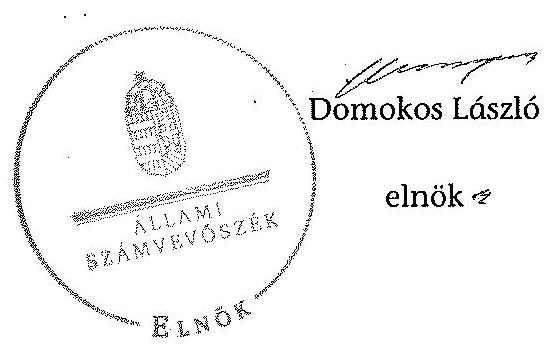

---

### A Károly Róbert Főiskola kiadási és bevételi előirányzatai, azok teljesítése a 2009-2012. években

|  Sz. | Megnevezés | 2009. év |  |  | 2010. év |  |  | 2011. év |  |  | 2012. év |  |   |
| --- | --- | --- | --- | --- | --- | --- | --- | --- | --- | --- | --- | --- | --- |
|   |  | Eredeti előirányzat | Módosított előirányzat | Teljesítés | Eredeti előirányzat | Módosított előirányzat | Teljesítés | Eredeti előirányzat | Módosított előirányzat | Teljesítés | Eredeti előirányzat | Módosított előirányzat | Teljesítés  |
|  1 | KIADÁSOK |  |  |  |  |  |  |  |  |  |  |  |   |
|  2 | Személyi juttatások | 1 008 269 | 1 221 002 | 1 166 310 | 1 050 545 | 1 279 652 | 1 148 967 | 1 053 000 | 1 248 334 | 1 139 357 | 1 043 700 | 1 132 021 | 960 134  |
|  3 | Munkáltatói terhelő járulékok | 308 874 | 379 532 | 340 620 | 279 658 | 353 302 | 299 524 | 280 321 | 344 363 | 295 286 | 277 800 | 305 889 | 260 875  |
|  4 | Dologi kiadások | 1 260 397 | 1 596 013 | 1 555 247 | 1 215 630 | 1 785 211 | 1 398 123 | 1 250 845 | 1 853 100 | 1 323 784 | 837 512 | 1 661 916 | 1 284 663  |
|  5 | Egyéb folyó kiadások | 15 000 | 64 729 | 63 333 | 47 435 | 60 658 | 59 483 | 58 600 | 102 600 | 108 342 | 15 488 | 163 488 | 123 624  |
|  6 | Támogatásértékű működési kiadások |  | 15 087 | 11 087 |  |  | 1 490 |  |  |  |  |  |   |
|  7 | Támogatásértékű felhalmozási kiadások | 50 000 | 51 000 | 1 000 | 60 000 | 60 000 |  | 60 000 | 60 000 |  | 60 000 | 60 000 | 14 875  |
|  8 | Előző évi előirányzat átadás |  |  | 660 |  |  | 679 |  |  |  |  |  |   |
|  9 | Működési célú pénzeszköz átadás |  |  |  |  |  |  |  |  |  |  |  |   |
|  10 | Felhalmozási célú pénzeszköz átadás |  | 2 500 | 2 500 |  |  |  |  |  |  |  |  |   |
|  11 | Eljátozott pénzbeli juttatásai | 286 377 | 286 377 | 252 408 | 290 677 | 290 677 | 187 306 | 282 500 | 292 783 | 176 086 | 194 700 | 201 014 | 153 756  |
|  12 | Egyéb juttatás | 3 000 | 13 000 | 12 640 | 3 000 | 3 000 | 16 250 | 3 000 | 3 000 | 1 000 | 3 000 | 4 500 | 7 990  |
|  13 | Felújítás | 282 000 | 202 000 | 144 254 | 416 500 | 122 600 | 73 797 | 25 000 | 25 000 | 687 | 25 000 | 25 000 | 11 938  |
|  14 | Intézményi beruházási kiadások ÁfÁ-val | 1 051 000 | 1 066 603 | 785 064 | 100 000 | 1 001 179 | 923 427 | 160 250 | 231 930 | 137 351 | 501 800 | 650 621 | 836 223  |
|  15 | Központi beruházási kiadások ÁfÁ-vel |  | 29 150 | 29 150 |  | 218 663 | 218 663 |  | 117 188 | 117 188 |  |  |   |
|  16 | Lakásépítés kiadásai ÁfÁ-vel |  |  |  |  |  |  |  |  |  |  |  |   |
|  17 | Egyéb intézményi felhalmozási kiadás |  | 0 | 0 |  | 0 | 0 |  |  |  |  |  |   |
|  18 | Kölcsönök |  | 6 000 | 6 000 |  | 0 | 0 |  | 0 | 0 |  | 0 | 0  |
|  19 | Összesen | 4 264 917 | 4 932 993 | 4 370 273 | 3 463 445 | 5 174 942 | 4 327 709 | 3 173 516 | 4 278 298 | 3 299 081 | 2 959 000 | 4 204 449 | 3 654 078  |
|  20 | BEVÉTELEK |  |  |  |  |  |  |  |  |  |  |  |   |
|  21 | Közhatalmi bevételek |  |  |  |  |  |  |  |  |  |  |  |   |
|  22 | Intézményi működési bevételek | 846 303 | 1 121 683 | 1 034 390 | 813 500 | 936 053 | 929 944 | 835 870 | 879 870 | 811 148 | 859 499 | 1 022 199 | 870 490  |
|  23 | Működési célú pénzeszköz átvételek | 4 000 | 4 000 | 3 288 |  |  | 2 935 |  | 688 | 687 |  | 108 | 385  |
|  24 | Felhalmozási bevételek | 3 000 | 6 000 | 6 802 | 3 000 | 3 000 | 5 451 | 3 000 | 5 534 | 3 064 | 3 000 | 9 470 | 7 880  |
|  25 | Felhalmozási célú pénzeszköz átvételek | 60 000 | 60 000 | 80 731 | 60 000 | 60 000 | 29 433 | 60 000 | 61 000 | 32 400 | 35 000 | 35 000 |   |
|  26 | Irányító szervtől kapott támogatás | 1 885 814 | 1 958 261 | 1 958 261 | 1 828 945 | 2 046 878 | 2 046 878 | 1 814 339 | 1 740 357 | 1 740 357 | 1 211 500 | 1 263 261 | 1 263 261  |
|  27 | Támogatás értékű működési bevétel | 161 300 | 220 079 | 543 618 | 260 000 | 260 000 | 260 000 | 260 000 | 260 000 | 260 000 | 260 000 | 260 000 | 260 000  | | 333 337 | 293 557 | 456 015 | 452 019 | 298 201 | 448 559 | 728 559 |
| 28 | Támogatás értékű felhalmozási bevétel | 1 304 500 | 1 304 500 | 559 568 | 498 000 | 739 999 | 688 893 | 166 750 | 179 372 | 70 800 | 551 800 | 655 800 | 422 953 |
| 29 | Előző évi maradvány átvétele | | 29 150 | 32 950 | | 429 557 | 429 657 | | 117 188 | 120 384 | | | 11 600 |
| 30 | Előirányzat maradvány felhasználás | | 229 320 | 229 320 | | 699 455 | 699 455 | | 838 274 | 838 274 | | 770 052 | 770 052 |
| 31 | Összesen | 4 264 917 | 4 932 993 | 4 448 958 | 3 463 445 | 5 174 942 | 5 165 983 | 3 173 516 | 4 278 298 | 4 069 133 | 2 959 000 | 4 204 449 | 4 073 180 |

---

A Károly Róbert Főiskola kiadásainak, bevételeinek változása a 2009-2012. években adatok ezer Ft-ban

| | | 2009. év | 2010. év | 2011. év | 2012. év | |
| --- | --- | --- | --- | --- | --- | --- |
| Ssz. | Megnevezés | Teljesítés | Teljesítés | Teljesítés | Teljesítés | 2012/2009 |
| 1 | KIADÁSOK | | | | | |
| 2 | Személyi juttatások | 1166310 | 1148967 | 1139357 | 960134 | 82,3\% |
| 3 | Rendszeres és nem rendszeres | 1105711 | 1066830 | 1062967 | 888223 | 80,3\% |
| 4 | Rendszeres személyi juttatás | 925906 | 931845 | 964780 | 812099 | 87,7\% |
| 5 | Alapilletmény | 715515 | 765768 | 736305 | 622261 | 87,0\% |
| 6 | Nem rendszeres | 179805 | 134985 | 98187 | 76124 | 42,3\% |
| 7 | Munkavégzéshez kapcs juttatások | 82657 | 64341 | 27748 | 30627 | 37,1\% |
| 8 | Normatív és teljesítéshez kötött jutalom | 27557 | 7900 | 5700 | 1600 | 5,8\% |
| 9 | Előző személyi juttatások | 60599 | 82137 | 76390 | 71911 | 118,7\% |
| 10 | Munkaadót terhelő járulékok | 340620 | 299524 | 295286 | 260875 | 76,6\% |
| 11 | Dologi és folyó kiadások | 1618580 | 1457606 | 1432126 | 1408287 | 87,0\% |
| 12 | Dologi kiadások | 1555247 | 1398123 | 1323784 | 1284663 | 82,6\% |
| 13 | Készletbeszerzés | 173864 | 131011 | 144010 | 114557 | 65,9\% |
| 14 | Kommunikációs szolgáltatás | 21013 | 21582 | 17599 | 10589 | 50,4\% |
| 15 | Szolgáltatási kiadások | 600660 | 571832 | 581923 | 647758 | 107,8\% |
| 16 | Bérlet és lízing | 374396 | 348520 | 373802 | 351156 | 93,8\% |
| 17 | ebből PPP | 318054 | 309897 | 322981 | 326592 | 102,7\% |
| 18 | Gáz, villany, víz | 125447 | 101580 | 107222 | 83999 | 67,0\% |
| 19 | Működési célú ÁFA | 328393 | 303664 | 253556 | 366577 | 111,6\% |
| 20 | Kiküldetés, reprezentáció | 66390 | 61169 | 65909 | 10949 | 16,5\% |
| 21 | Szellemi tevékenység | 46036 | | 35077 | 15897 | 34,5\% |
| 22 | Egyéb folyó kiadások | 63333 | 59483 | 108342 | 123624 | 193,2\% |
| 23 | Előző évi maradvány visszafizetés | 23350 | 0 | 0 | 0 | 0,0\% |
| 24 | Adók, díjak, egyéb befizetések | 38798 | 58772 | 50363 | 40925 | 105,5\% |
| 25 | Támogatásértékű működési kiadások | 11087 | 1490 | 0 | 0 | 0,0\% |
| 26 | Támogatásértékű felhalmozási kiadások | 1000 | | 0 | 14875 | 1487,5\% |
| 27 | Előző évi előirányzat átadás | 660 | 679 | 0 | 0 | 0,0\% |
| 28 | Működési célú pénzeszköz átadás | 0 | 0 | 0 | 0 | 0,0\% |
| 29 | Felhalmozási célú pénzeszköz átadás | 2500 | 0 | 0 | 0 | 0,0\% |
| 30 | Ellátottak pénzbeli juttatások | 252408 | 187306 | 176086 | 153756 | 60,9\% |
| 31 | Egyéb juttatás | 18640 | 16250 | 1000 | 7990 | 42,9\% |
| 32 | Felhalmozási kiadások | 814214 | 1142090 | 255226 | 852241 | 104,7\% |
| 33 | Intézményi beruházási kiadások | 635677 | 740150 | 110426 | 836223 | 131,5\% |
| | ebből ingatlan | 532732 | 236000 | 18296 | 381 | 0,1\% |
| 34 | Gépek, berendezések, felszerelések | 265027 | 470545 | 36055 | 0 | 0,0\% |
| 35 | Felújítás | 144254 | 73797 | 687 | 11938 | 8,3\% |
| | ebből ingatlan (Áfával) | 141920 | 73657 | 320 | 11938 | 8,4\% |
| 36 | Felújítások és beruházások ÁFA-ia | 153829 | 227010 | 50436 | 177720 | 115,5\% |
| 37 | Egyéb intézményi felhalmozási kiadás | 12640 | 14000 | 1000 | 4080 | 32,3\% |
| 38 | Kölcsönök | 6000 | 2250 | 1000 | 3910 | 65,2\% |
| 39 | Összesen | 4370273 | 4327709 | 3299081 | 3654078 | 83,6\% |
| 40 | BEVÉTELEK | | | | | |
| 41 | Működési bevételek | 1581296 | 1560098 | 1267050 | 1611034 | 101,9\% |
| 42 | Intézményi működési bevétel | 1034390 | 929944 | 811148 | 870490 | 84,2\% |
| 43 | Szolgáltatások ellenértéke | 655038 | 575566 | 505957 | 434142 | 66,3\% |
| 44 | Intézményi ellátási díjak | 103725 | 90621 | 85511 | 75830 | 73,1\% |
| 45 | Hozom és kamatbevétel | 51969 | 12392 | 31091 | 18754 | 36,1\% |
| 46 | Működési célú pénzeszköz átvételek | 3288 | 2935 | 687 | 385 | 11,7\% |
| | ebből uniós forrás | 0 | 0 | 0 | 0 | 0,0\% |
| 47 | Támogatásértékű működési bevétel | 543618 | 333337 | 452019 | 728559 | 134,0\% |
| 48 | EU programokra működési bevétel | 358672 | 243475 | 219729 | 524464 | 146,2\% |
| 49 | Felhalmozási bevételek | 641101 | 857302 | 222452 | 426923 | 66,6\% |
| 50 | Felhalmozási célú pénzeszköz átvételek | 80731 | 29455 | 32400 | 0 | 0,0\% |
| | ebből uniós forrás | 0 | 0 | 0 | 0 | 0,0\% |
| 51 | Támogatásértékű felhalmozási bevétel | 559568 | 688893 | 70800 | 422953 | 75,6\% |
| 52 | EU programokra beruházási bevétel | 398064 | 630876 | 58178 | 422953 | 106,3\% |
| 53 | Irányító szervtől kapott támogatás | 1958261 | 2046878 | 1740357 | 1263261 | 64,5\% |
| 54 | Előirányzat maradvány felhasználás | 239320 | 699455 | 838274 | 770052 | 335,8\% |
| 55 | Előző évi előirányzat-maradvány, pénzmaradvány átvétele | 32950 | 0 | 0 | 0 | 0,0\% |
| 56 | Támogatási kölcsönök visszatérülése | 6000 | 2250 | 1000 | 3910 | 65,2\% |
| 57 | Összesen | 4448928 | 5165983 | 4069133 | 4075180 | 91,6\% |

---

| 3. SZÁMÚ MELLÉKLET
A V-0352-351/2014. SZÁMÚ JELENTÉSHEZ | | | | | |
| --- | --- | --- | --- | --- | --- |
| | | | | | |
| Kimutatás a Károly Róbert Főiskola bevételeiről és kiadásairól, valamint adósságszolgálatáról
a 2009-2012. években | | | | | |
| | | | | adatok ezer 21.hun | |
| | | 2009. év | 2010. év | 2011. év | 2012. év |
| 1. | | | | | |
| 2. | 1. FOLVÓ ROLTÁSZTÉSZTÉS | | | | |
| 3. | 1.1.1. Hatósági jogkörhöz köthető /közhatalmi/, egyéb saját, illetve ÁFA | 982 421 | 849 573 | 756 005 | 701 775 |
| 4. | 1.1.2. Működési költségvetés támogatása | 1 958 261 | 1 945 546 | 1 740 557 | 1 263 261 |
| 5. | 1.1.3. Támogatásértékű működési bevételek | 243 618 | 333 337 | 452 019 | 728 520 |
| 6. | 1.1.4. EU-tól és külföldről átvett pénzeszközök | 0 | 0 | 0 | 0 |
| 7. | 1.1.5. Működési célú /egyéb/ pénzeszközátvétel államháztartáson kívülről | 3 288 | 2 935 | 687 | 385 | |
|  8. | 1.1.6. Hozam- és kamatbevételek | 51 907 | 12 292 | 21 091 | 18 754  |
|  9. | 1.1.8. Előző évi előirányzat-maradvány, pénzmaradvány átvétel | 0 | 393882 | 3196 | 11600  |
|  10. | 1.1. Folyó bevételek (1.1.1.+1.1.2.+1.1.3.+1.1.4.+1.1.5.+1.1.6.+1.1.7.+1.1.8.) | 3 539 557 | 3 437 665 | 2 983 355 | 2 724 334  |
|  11. | 1.2.1. Működési kiadások harmadik kincstári kiadások nélkül | 3 135 510 | 2 838 118 | 2 843 331 | 2 481 541  |
|  12. | 1.2.2. Támogatásértékű működési kiadások | 11 087 | 1 490 | 0 | 0  |
|  13. | 1.2.2.1. vállalkozásoknak | 0 | 0 | 0 | 0  |
|  14. | 1.2.2.2. EU-nak, illetve külföldre | 0 | 0 | 0 | 0  |
|  15. | 1.2.2.4. nonprofit szervezésnek | 0 | 0 | 0 | 0  |
|  16. | 1.2.3.2. garancia- és kezességvállalásból származó költség | 0 | 0 | 0 | 0  |
|  17. | 1.2.4. Működési célú pénzeszközátadások (1.2.3.1+1.2.3.2+1.2.3.3.+1.2.3.4.+1.2.3.2.) | 0 | 0 | 0 | 0  |
|  18. | 1.2.5. Társadalmi, szociáltámogatási és egyéb juttatás, támogatás | 0 | 0 | 0 | 0  |
|  19. | 1.2.6. Előzőektől pénzbeli juttatásai | 252 408 | 187 306 | 176 086 | 153 756  |
|  20. | 1.2.7. Előző évi előirányzat-maradvány átadás | 660 | 679 | 0 | 0  |
|  21. | 1.2. Folyó kiadások (1.2.1.+1.2.2.+1.2.3.+1.2.4.+1.2.5.+1.2.6.+1.2.7.+1.2.8.) | 3 389 665 | 3 027 593 | 3 019 417 | 2 635 297  |
|  22. | 1.3. Folyó költségvetés egyenlege, működési jövedelem (1.1. - 1.5.) | 149 892 | 410 072 | -36 062 | 89 037  |
|  23. | 2. FELHALMOZÁSI KÖLTSÉGVETÉS | 0 | 0 | 0 | 0  |
|  24. | 2.1.1. Felhalmozási saját bevételek | 802 | 71 180 | 26 116 | 153 931  |
|  25. | 2.1.2. Felhalmozási kiadások költségvetési támogatása | 0 | 101 333 | 0 | 0  |
|  26. | 2.1.3. Támogatásértékű felhalmozási bevételek | 559 568 | 688 893 | 70 800 | 422 953  |
|  27. | 2.1.4. EU-tól és külföldről átvett pénzeszközök | 0 | 0 | 0 | 0  |
|  28. | 2.1.5. Felhalmozási célú egyéb pénzeszközátvétel államháztartáson kívülről | 80 731 | 29 433 | 32 400 | 0  |
|  29. | 2.1.7. Kölcsönök visszatérülése, igénybevétele | 6 000 | 2 250 | 1 000 | 3 910  |
|  30. | 2.1.8. Előző évi előirányzat-maradvány, pénzmaradvány átvétel | 52 990 | 135 775 | 117 188 | 0  |
|  31. | 2.1. Felhalmozási bevételek (2.1.1.+2.1.2+2.1.3+2.1.4.+2.1.5.+2.1.6.+2.1.7.+2.1.8.) | 680 051 | 1 028 863 | 247 504 | 580 794  |
|  32. | 2.2.1. Saját felújítási kiadás (2011-től áfá-val) | 116 938 | 59 038 | 614 | 381  |
|  33. | 2.2.2. Saját beruházási kiadás (2011-től áfá-val) | 660 385 | 915 080 | 204 176 | 658 503  |
|  34. | 2.2.3. Saját beruházási és felújítási kiadás áfá-jar (2010-ig) | 181 135 | 241 769 | 50 436 | 189 277  |
|  35. | 2.2.4. Befektetési célú részesedések vásárlása | 12 640 | 14 000 | 0 | 4 080  |
|  36. | 2.2.5. Támogatásértékű felhalmozási kiadások | 1 000 | 0 | 0 | 14 875  |
|  37. | 2.2.7. Felhalmozási célú egyéb pénzeszközátadás államháztartáson kívülre | 2 500 | 0 | 0 | 0  |
|  38. | 2.2.9. Kölcsönök gyűjtása, törlesztése | 6 000 | 2 250 | 1 000 | 3 910  |
|  39. | 2.3.10. Előző évi előirányzat-maradvány átadás | 0 | 0 | 0 | 0  |
|  40. | 2.2.11. ÁFA befizetések | 0 | 67972 | 53 438 | 147755  |
|  41. | 2.2. Felhalmozási kiadások (2.2.1.+2.2.2.+2.2.3.+2.2.4.+2.2.5.+2.2.6.+2.2.7.+2.2.8.+2.2.9.+2.2.10.+2.2.11.) | 980 608 | 1 300 116 | 279 664 | 1 018 781  |
|  42. | 2.3. Felhalmozási költségvetés egyenlege (2.1. - 2.2.) | -300 557 | -271 553 | -32 160 | -437 987  |
|  43. | 3. FINANZÍROZÁSI MŰVELEZÉSÉ NÉLKÜLÍ (GFS) POZÍCÓ (1.3.+2.3.) | -150 665 | 138 819 | -68 252 | -348 950  |
|  44. | 4. FINANZÍROZÁSI MŰVELEZÉSÉ | 0 | 0 | 0 | 0  |
|  45. | 4.1. Hitelfelvétel | 0 | 0 | 0 | 0  |
|  46. | 4.2. Hitelfelvétel | 0 | 0 | 0 | 0  |
|  47. | 4.3. Forgatási és befektetési célú értékpapírok értékesítése | 83 930 | 87 820 | 0 | 504 930  |
|  48. | 4.6. Forgatási és befektetési célú értékpapírok vásárlása | 0 | 0 | 55 880 | 0  |
|  49. | 4.7. Egyéb finanszírozási bevételek (függő, átfutó, kiegyenlítő) | 7 695 | -14 655 | -1 731 | 10 905  |
|  50. | 4.8. Egyéb finanszírozási kiadások (függő, átfutó, kiegyenlítő) | -831 | -160 | 577 | -3 582  |
|  51. | 4.9. Finanszírozási műveletek egyenlege (4.1.-4.2.+4.3.-4.4.+4.5.-4.6.+4.7.-4.8.) | 92 456 | 73 357 | -58 188 | 518 534  |
|  52. | 5. TÁRGYÉVI PÉNZÜGYI POZÍCÓ (1.3.+ 2.3.+4.9.) | -58 209 | 212 176 | -126 410 | 169 584  |
|  53. | 6. NETTÓ MŰKÖDÉSI JÖVEDELEM (működési jövedelem (1.3.) - tőketörlesztés (4.2.+4.4)) | 149 892 | 410 072 | -36 062 | 89 037  |
|  54. |  |  |  |  |   |
|  55. |  |  |  |  |   |
|  56. | TÁJÉKOZTATÓ ADATOK |  |  |  |   |
|  57. | Működési célú előző évi előirányzat-maradvány igénybevétele | 227 497 | 334 119 | 764 250 | 730 201  |
|  58. | Felhalmozási célú előző évi előirányzat-maradvány igénybevétele | 1 823 | 365 336 | 74 024 | 39 851  |
|  59. | Felhasználható tárgyévi előirányzat-maradvány | 78 655 | 780 903 | 691 440 | 421 102  |
|  60. | Összes kötelezettség | 327 697 | 451 302 | 420 680 | 425 569  |
|  61. | Abból rövid lejáratú | 327 697 | 451 302 | 420 680 | 425 569  |
|  62. | Összes szállítói kötelezettség | 46 245 | 201 598 | 36 172 | 378 273  |
|  63. | Abból lejáró (tanszámlapijó) | 204 | 1 117 | 213 | 67  |
|  64. | Egyéb hosszú lejáratú kötelezettség | 0 | 0 | 0 | 0  |
|  65. | Abból rövid lejáratú | 0 | 0 | 0 | 0  |
|  66. | Finanszírozásba bevonható eszközök: | 755 911 | 880 267 | 809 737 | 474 391  |
|  67. | Tartós befektetést megtestesítő értékpapírok | 0 | 0 | 0 | 0  |
|  68. | Hosszú lejáratú bankbetétek | 0 | 0 | 0 | 0  |
|  69. | Értékpapírok | 536 870 | 449 050 | 304 930 | 0  |
|  70. | Pénzeszközök (idegen pénzeszközök nélkül) | 219 041 | 431 217 | 304 807 | 474 391  |

---

### A Károly Róbert Főiskola mérlegadatai a 2009-2012. években

|  SZL | Megnevezés | 2009. év | 2010. év | 2011. év | 2012. év | Index
(2012/2009)  |
| --- | --- | --- | --- | --- | --- | --- |
|  1 | IMMATERIÁLIS JAVÁK | 68 313 | 79 931 | 160 199 | 192 485 | 530,1%  |
|  2 | Vagyoni értékű jogok | 27 942 | 43 028 | 51 427 | 126 504 | 452,7%  |
|  3 | Szellemi termékek | 30 370 | 36 903 | 108 772 | 65 981 | 317,5%  |
|  4 | Immateriális javakra adott előlegek | 0 | 0 | 0 | 0 |   |
|  5 | TÁRGYI ESZKÖZÖK | 5 133 923 | 5 907 969 | 5 696 443 | 6 154 841 | 119,9%  |
|  6 | Ingatlanok és bejelentődő vagyonértékű jogok | 3 771 366 | 4 358 069 | 4 787 063 | 4 747 614 | 125,9%  |
|  7 | Gépek, berendezések, felszerelések | 677 169 | 1 086 910 | 865 309 | 1 356 369 | 200,3%  |
|  8 | Járművek | 40 046 | 39 197 | 31 171 | 30 370 | 75,8%  |
|  9 | Tenyészállatok | 0 | 0 | 0 | 0 |   |
|  10 | Beruházások, felújítások | 644 344 | 223 813 | 12 900 | 20 488 | 3,3%  |
|  11 | Beruházásra adott előlegek | 0 | 0 | 0 | 0 |   |
|  12 | BEFEKTETETT PÉNZÜGYI ESZKÖZÖK | 103 668 | 169 929 | 168 176 | 145 014 | 139,9%  |
|  13 | Tartós részesedés | 85 615 | 154 615 | 154 615 | 139 065 | 162,4%  |
|  14 | Tartósan adott kölcsön | 18 053 | 15 314 | 13 561 | 5 | 949 | 33,0%  |
|  15 | ÜZEMELTETÉSRE KÉSZLEGESEN ÁTADOTT VAGYONKEZELÉSBE VETT ESZKÖZÖK | 0 | 0 | 0 | 0 |   |
|  16 | BEFEKTETETT ESZKÖZÖK ÖSSZESEN | 5 294 905 | 6 157 849 | 6 024 818 | 6 492 340 | 122,6%  |
|  17 | KÉSZLETEK | 114 415 | 102 261 | 85 964 | 75 888 | 66,3%  |
|  18 | Anyagok | 17 864 | 32 903 | 33 240 | 24 610 | 137,8%  |
|  19 | Késztermékek | 88 245 | 62 664 | 39 165 | 36 591 | 41,5%  |
|  20 | Áruk, göngyölegek, közvetített szolgáltatások | 8 146 | 6 534 | 13 399 | 14 527 | 178,3%  |
|  21 | Egyéb készletek | 160 | 160 | 160 | 160 | 100,0%  |
|  22 | KÖVETELÉSEK | 52 222 | 44 009 | 70 350 | 240 915 | 461,3%  |
|  23 | Követelések áruszállításából és szolgáltatásából | 45 950 | 36 057 | 63 598 | 227 924 | 496,0%  |
|  24 | Adósok | 0 | 0 | 0 | 0 |   |
|  25 | Rövid lejáratú adott kölcsönök | 0 | 0 | 0 | 8 606 |   |
|  26 | Egyéb követelések | 6 272 | 7 952 | 6 952 | 4 385 | 69,9%  |
|  27 | ÉRTÉKPAPÍROK | 536 870 | 449 050 | 504 930 | 0 | 0,0%  |
|  28 | Forgalási utal feltételezett megtestesítő értékpapír bekerülődő (könyv szerint) értéke | 536 870 | 449 050 | 504 930 | 0 | 0,0%  |
|  29 | PÉNZESZKÖZÖK | 220 597 | 433 838 | 310 183 | 481 333 | 218,3%  |
|  30 | Költségvetési pénzforgalmi számlák | 19 395 | 39 997 | 65 135 | 95 765 | 493,8%  |
|  31 | Gazdálkodási számlák | 199 646 | 391 220 | 239 674 | 378 626 | 189,6%  |
|  32 | Idegen pénzeszközök | 1 556 | 2 621 | 5 376 | 6 942 | 446,1%  |
|  33 | EGYÉB AKTÍV PÉNZÜGYI ELSZÁMOLÁSOK | 4 302 | 4 142 | 4 719 | 1 137 | 26,4%  |
|  34 | FORGÓESZKÖZÖK ÖSSZESEN | 928 406 | 1 033 300 | 976 146 | 799 273 | 86,1%  |
|  35 | ESZKÖZÖK ÖSSZESEN | 6 223 311 | 7 191 149 | 7 000 964 | 7 291 613 | 117,2%  |
|  36 | SAJÁT TŐKE | 5 135 401 | 5 853 428 | 5 765 828 | 6 390 516 | 124,4%  |
|  37 | Tartós tőke | 1 644 931 | 1 644 931 | 1 644 931 | 1 644 931 | 100,0%  |
|  38 | Tőkeváltozások | 3 490 470 | 4 210 507 | 4 120 897 | 4 745 585 | 136,0%  |
|  39 | TARTALÉKOK | 699 455 | 838 274 | 770 052 | 421 102 | 60,2%  |
|  40 | Költségvetési tartalékok | 699 455 | 838 274 | 770 052 | 421 102 | 60,2%  |
|  41 | KÖTELEZETTSÉGEK | 327 697 | 451 302 | 420 680 | 425 569 | 129,9%  |
|  42 | Hosszú lejáratú kötelezettségek | 0 | 0 | 0 | 0 |   |
|  43 | Rövid lejáratú kötelezettségek | 327 697 | 451 302 | 420 680 | 425 569 | 129,9%  |
|  44 | Kötelezettségek áruszáll.,szállítói (szállítók) | 46 345 | 201 598 | 36 172 | 278 275 | 600,4%  |
|  45 | Egyéb kötelezettségek | 281 353 | 249 704 | 284 508 | 147 296 | 52,4%  |
|  46 | EGYÉB PASSZÍV PÉNZÜGYI ELSZÁMOLÁSOK | 60 758 | 46 135 | 44 404 | 54 426 | 89,6%  |
|  47 | FORRÁSOK ÖSSZESEN | 6 223 311 | 7 191 149 | 7 000 964 | 7 291 613 | 117,2%  |

---

5\. SZÁMÚ MELLÉKLET A V-0352-351/2014. SZÁMÚ JELENTÉSHEZ

A Károly Róbert Főiskola gazdálkodása szabályszerűségének értékelése a mintatételek alapján

|  |   |   |   |   |   |   |   |   |   |   |   |
| --- | --- | --- | --- | --- | --- | --- | --- | --- | --- | --- | --- |
| értékelt terület |  |  |  |  |  |  |  |  |  |  |   |
|   |  |  |  |  |  |  |  |  |  |  | 40%  |
|  |   |   |   |   |   |   |   |   |   |   |   |
|  |   |   |   |   |   |   |   |   |   |   |   |
|  |   |   |   |   |   |   |   |   |   |   |   |
|  |   |   |   |   |   |   |   |   |   |   |   |
|  |   |   |   |   |   |   |   |   |   |   |   |
|  |   |   |   |   |   |   |   |   |   |   |   |
|  |   |   |   |   |   |   |   |   |   |   |   |
|  |   |   |   |   |   |   |   |   |   |   |   |
|  |   |   |   |   |   |   |   |   |   |   |   |
|  |   |   |   |   |   |   |   |   |   |   |   |
|  |   |   |   |   |   |   |   |   |   |   |   |
|  |   |   |   |   |   |   |   |   |   |   |   |
|  |   |   |   |   |   |   |   |   |   |   |   |
|  |   |   |   |   |   |   |   |   |   |   |   |
|  |   |   |   |   |   |   |   |   |   |   |   |
|  |   |   |   |   |   |   |   |   |   |   |   |
|  |   |   |   |   |   |   |   |   |   |   |   |
|  |   |   |   |   |   |   |   |   |   |   |   |
|  |   |   |   |   |   |   |   |   |   |   |   |
|  |   |   |   |   |   |   |   |   |   |   |   |
|  |   |   |   |   |   |   |
 |   |   |   |   |
|  |   |   |   |   |   |   |   |   |   |   |   |
|  |   |   |   |   |   |   |   |   |   |   |   |
|  |   |   |   |   |   |   |   |   |   |   |   |
|  |   |   |   |   |   |   |   |   |   |   |   |
|  |   |   |   |   |   |   |   |   |   |   |   |
|  |   |   |   |   |   |   |   |   |   |   |   |
|  |   |   |   |   |   |   |   |   |   |   |   |
|  |   |   |   |   |   |   |   |   |   |   |   |
|  |   |   |   |   |   |   |   |   |   |   |   |

---

# **Chemistry**

## **Chemical Reactions**

### **Balancing Chemical Equations**

1. **Write the unbalanced equation:**
   - Example: $$C_3H_8 + O_2 \rightarrow CO_2 + H_2O$$

2. **Balance the equation:**
   - Balance carbon atoms first.
   - Then balance hydrogen atoms.
   - Finally, balance oxygen atoms.
   - Balanced equation: $$C_3H_8 + 7O_2 \rightarrow 3CO_2 + 4H_2O$$

3. **Balance the equation:**
   - Balance oxygen atoms.
   - Finally, balance oxygen atoms.
   - Balanced equation: $$C_3H_8 + 7O_2 \rightarrow 3CO_2 + 4H_2O$$

### **Types of Reactions**

1. **Combination Reaction:**
   - Example: $$2H_2 + O_2 \rightarrow 2H_2O$$

2. **Decomposition Reaction:**
   - Example: $$2H_2O_2 \rightarrow 2H_2O + O_2$$

3. **Single Displacement Reaction:**
   - Example: $$Zn + 2HCl \rightarrow ZnCl_2 + H_2$$

4. **Double Displacement Reaction:**
   - Example: $$AgNO_3 + NaCl \rightarrow AgCl + NaNO_3$$

5. **Combustion Reaction:**
   - Example: $$CH_4 + 2O_2 \rightarrow CO_2 + 2H_2O$$

## **Stoichiometry**

### **Mole Concept**

- **Mole (mol):** The amount of substance containing as many particles (atoms, molecules, ions) as there are atoms in exactly 12 grams of carbon-12.
- **Avogadro's Number:** $$6.022 \times 10^{23}$$ particles per mole.

### **Molar Mass**

- **Molar Mass:** The mass of one mole of a substance.
- Example: The molar mass of water ($$H_2O$$) is 18.015 g/mol.

### **Calculations**

1. **Moles to Mass:**
   - Formula: $$n = \frac{m}{M}$$
   - Example: Calculate the number of moles of $$H_2O$$ in 18 grams of water.
     - $$n = \frac{18.015 \, \text{g}}{18.015 \, \text{g/mol}} = 18.015 \, \text{g/mol}$$

2. **Mass to Moles:**
   - Formula: $$m = n \times M$$
   - Example: Calculate the mass of 18.015 g of 18 grams of water.
     - $$m = 18.015 \, \text{g/mol} = 18.015 \, \text{g/mol}$$

## **Gas Laws**

### **Ideal Gas Law**

- **Equation:** $$PV = nRT$$
- **Variables:**
  - $$P$$ = Pressure (atm)
  - $$V$$ = Volume (L)
  - $$n$$ = Moles of gas
  - $$R$$ = Ideal gas constant (0.0821 L·atm/mol·K)
  - $$T$$ = Temperature (K)

### **Boyle's Law**

- **Equation:** $$P_1V_1 = P_2V_2$$
- **Variables:**
  - P₁ = Pressure (atm)
  - P₂ = Volume (L)
  - P₃ = Ideal gas constant (0.0821 L·atm/mol·K)
  - P₃r = Ideal gas constant (0.0821 L·atm/mol·K)
  - $$P_1V_1 = P_2V_2$$
- **Equation:** $$P_1V_1 = P_2V_2$$
- **Variables:**
  - P₁ = Pressure (atm)
  - P₂ = Volume (L)
  - P₃ = Ideal gas constant (0.0821 L·atm/mol·K)
  - P₃r = Ideal gas constant (0.0821 L·atm/mol·K)
  - $$P_1V_1 = P_2V_2$$
- **Equation:** $$P_1V_1 = P_2V_2$$
- **Variables:**
  - P₁ = Pressure (atm)
  - P₂ = Volume (L)
  - P₃ = Ideal gas constant (0.0821 L·atm/mol·K)
  - P₃r = Ideal gas constant (0.0821 L·atm/mol·K)
  - $$P_1V_1 = P_2V_2$$
- **Equation:** $$P_1V_1 = P_2V_2$$
- **Variables:**
  - P₁ = Pressure (atm)
 P₂ = Volume (L)
  - P₃ = Ideal gas constant (0.0821 L·atm/mol·K)
  - P₃r = Ideal gas constant (0.0821 L·atm/mol·K)
  - $$P_1V_1 = P_2V_2$$
- **Equation:** $$P_1V_1 = P_2V_2$$
- **Variables:**
  - P₁ = Pressure (atm)
  - P₂ = Volume (L)
  - P₃ = Ideal gas constant (0.0821 L·atm/mol·K)
  - P₃r = Ideal gas constant (0.0821 L·atm/mol·K)
  - $$P_1V_1 = P_2V_2$$
- **Equation:** $$P_1V_1 = P_2V_2$$
- **Variables:**
  - P₁ = Pressure (atm)
  - P₂ = Volume (L)
  - P₃ = Ideal gas constant (0.0821 L·atm/mol·K)
  - P₃r = Ideal gas constant (0.0821 L·atm/mol·K)
  - $$P_1V_1 = P_2V_2$$
- **Equation:** $$P_1V_1 = P_2V_2$$
- **Variables:**
  - P₁ = Pressure (atm)
  - P₂ = Volume (L)
  - P₃ = Ideal gas constant (0.0821 L·atm/mol·K)
  - P₃r = Ideal gas constant (0.0821 L·atm/mol·K)
  - $$P_1V_1 = P_2V_2$$
- **Equation:** $$P_1V_1 = P_2V_2$$
- **Variables:**
  - P₁ = Pressure (atm)
  - P₂ = Volume (L)
  - P₃ = Ideal gas constant (0.0821 L·atm/mol·K)
  - P₃r = Ideal gas constant (0.0821 L·atm/mol·K)
  - $$P_1V_1 = P_2V_2$$
- **Equation:** $$P_1V_1 = P_2V_2$$
- **Variables:**
  - P₁ = Pressure (atm)
  - P₂ = Volume (L)
  - P₃ = Ideal gas constant (0.0821 L·atm/mol·K)
  - P₃r = Ideal gas constant (0.0821 L·atm/mol·K)
  - $$P_1V_1 = P_2V_2$$
- **Equation:** $$P_1V_1 = P_2V_2$$
- **Variables:**
  - P₁ = Pressure (atm)
  - P₂ = Volume (L)
  - P₃ = Ideal gas constant (0.0821 L·atm/mol·K)
  - P₃r = Ideal gas constant (0.0821 L·atm/mol·K)
  - $$P_1V_1 = P_2V_2$$
- **Equation:** $$P_1V_1 = P_2V_2$$
- **Variables:**
  - P₁ = Pressure (atm)
  - P₂ = Volume (L)
  - P₃ = Ideal gas constant (0.0821 L·atm/mol·K)
  - P₃r = Ideal gas constant (0.0821 L·atm/mol·K)
  - $$P_1V_1 = P_2V_2$$
- **Equation:** $$P_1V_1 = P_2V_2$$
- **Variables:**
  - P₁ = Pressure (atm)
  - P₂ = Volume (L)
  - P₃ = Ideal gas constant (0.0821 L·atm/mol·K)
  - P₃r = Ideal gas constant (0.0821 L·atm/mol·K)
  - $$P_1V_1 = P_2V_2$$
- **Equation:** $$P_1V_1 = P_2V_2$$
- **Variables:**
  - P₁ = Pressure (atm)
  - P₂ = Volume (L)
  - P₃ = Ideal gas constant (0.0821 L·atm/mol·K)
  - P₃r = Ideal gas constant (0.0821 L·atm/mol·K)
  - $$P_1V_1 = P_2V_2$$
- **Equation:** $$P_1V_1 = P_2V_2$$
- **Variables:**
  - P₁ = Pressure (atm)
  - P₂ = Volume (L)
  - P₃ = Ideal gas constant (0.0821 L·atm/mol·K)
  - P₃r = Ideal gas constant (0.0821 L·atm/mol·K)
  - $$P_1V_1 = P_2V_2$$
- **Equation:** $$P_1V_1 = P_2V_2$$
- **Variables:**
  - P₁ = Pressure (atm)
  - P₂ = Volume (L)
  - P₃ = Ideal gas constant (0.0821 L·atm/mol·K)
  - P₃r = Ideal gas constant (0.0821 L·atm/mol·K)
  - $$P_1V_1 = P_2V_2$$
- **Equation:** $$P_1V_1 = P_2V_2$$
- **Variables:**
  - P₁ = Pressure (atm)
  - P₂ = Volume (L)
  - P₃ = Ideal gas constant (0.0821 L·atm/mol·K)
  - P₃r = Ideal gas constant (0.0821 L·atm/mol·K)
  - $$P_1V_1 = P_2V_2$$
- **Equation:** $$P_1V_1 = P_2V_2$$
- **Variables:**
  - P₁ = Pressure (atm)
  - P₂ = Volume (L)
  - P₃ = Ideal gas constant (0.0821 L·atm/mol·K)
  - P₃r = Ideal gas constant (0.0821 L·atm/mol·K)
  - $$P_1V_1 = P_2V_2$$
- **Equation:** $$P_1V_1 = P_2V_2$$
- **Variables:**
  - P₁ = Pressure (atm)
  - P₂ = Volume (L)
  - P₃ = Ideal gas constant (0.0821 L·atm/mol·K)
  - P₃r = Ideal gas constant (0.0821 L·atm/mol·K)
  - $$P_1V_1 = P_2V_2$$
- **Equation:** $$P_1V_1 = P_2V_2$$
- **Variables:**
  - P₁ = Pressure (atm)
  - P₂ = Volume (L)
  - P₃ = Ideal gas constant (0.0821 L·atm/mol·K)
  - P₃r = Ideal gas constant (0.0821 L·atm/mol·K)
  - $$P_1V_1 = P_2V_2$$
- **Equation:** $$P_1V_1 = P_2V_2$$
- **Variables:**
  - P₁ = Pressure (atm)
  - P₂ = Volume (L)
  - P₃ = Ideal gas constant (0.0821 L·atm/mol·K)
  - P₃r = Ideal gas constant (0.0821 L·atm/mol·K)
  - $$P_1V_1 = P_2V_2$$
- **Equation:** $$P_1V_1 = P_2V_2$$
- **Variables:**
  - P₁ = Pressure (atm)
  - P₂ = Volume (L)
  - P₃ = Ideal gas constant (0.0821 L·atm/mol·K)
  - P₃r = Ideal gas constant (0.0821 L·atm/mol·K)
  - $$P_1V_1 = P_2V_2$$
- **Equation:** $$P_1V_1 = P_2V_2$$
- **Variables:**
  - P₁ = Pressure (atm)
  - P₂ = Volume (L)
  - P₃ = Ideal gas constant (0.0821 L·atm/mol·K)
  - P₃r = Ideal gas constant (0.0821 L·atm/mol·K)
  - $$P_1V_1 = P_2V_2$$
- **Equation:** $$P_1V_1 = P_2V_2$$
- **Variables:**
  - P₁ = Pressure (atm)
  - P₂ = Volume (L)
  - P₃ = Ideal gas constant (0.0821 L·atm/mol·K)
  - P₃r = Ideal gas constant (0.0821 L·atm/mol·K)
  - $$P_1V_1 = P_2V_2$$
- **Equation:** $$P_1V_1 = P_2V_2$$
- **Variables:**
  - P₁ = Pressure (atm)
  - P₂ = Volume (L)
  - P₃ = Ideal gas constant (0.0821 L·atm/mol·K)
  - P₃r = Ideal gas constant (0.0821 L·atm/mol·K)
  - $$P_1V_1 = P_2V_2$$
- **Equation:** $$P_1V_1 = P_2V_2$$
- **Variables:**
  - P₁ = Pressure (atm)
  - P₂ = Volume (L)
  - P₃ = Ideal gas constant (0.0821 L·atm/mol·K)
  - P₃r = Ideal gas constant (0.0821 L·atm/mol·K)
  - $$P_1V_1 = P_2V_2$$
- **Equation:** $$P_1V_1 = P_2V_2$$
- **Variables:**
  - P₁ = Pressure (atm)
  - P₂ = Volume (L)
  - P₃ = Ideal gas constant (0.0821 L·atm/mol·K)
  - P₃r = Ideal gas constant (0.0821 L·atm/mol·K)
  - $$P_1V_1 = P_2V_2$$
- **Equation:** $$P_1V_1 = P_2V_2$$
- **Variables:**
  - P₁ = Pressure (atm)
  - P₂ = Volume (L)
  - P₃ = Ideal gas constant (0.0821 L·atm/mol·K)
  - P₃r = Ideal gas constant (0.0821 L·atm/mol·K)
  - $$P_1V_1 = P_2V_2$$
- **Equation:** $$P_1V_1 = P_2V_2$$
- **Variables:**
  - P₁ = Pressure (atm)
  - P₂ = Volume (L)
  - P₃ = Ideal gas constant (0.0821 L·atm/mol·K)
  - P₃r = Ideal gas constant (0.0821 L·atm/mol·K)
  - $$P_1V_1 = P_2V_2$$
- **Equation:** $$P_1V_1 = P_2V_2$$
- **Variables:**
  - P₁ = Pressure (atm)
  - P₂ = Volume (L)
  - P₃ = Ideal gas constant (0.0821 L·atm/mol·K)
  - P₃r = Ideal gas constant (0.0821 L·atm/mol·K)
  - $$P_1V_1 = P_2V_2$$
- **Equation:** $$P_1V_1 = P_2V_2$$
- **Variables:**
  - P₁ = Pressure (atm)
  - P₂ = Volume (L)
  - P₃ = Ideal gas constant (0.0821 L·atm/mol·K)
  - P₃r = Ideal gas constant (0.0821 L·atm/mol·K)
  - $$P_1V_1 = P_2V_2$$
- **Equation:** $$P_1V_1 = P_2V_2$$
- **Variables:**
  - P₁ = Pressure (atm)
  - P₂ = Volume (L)
  - P₃ = Ideal gas constant (0.0821 L·atm/mol·K)
  - P₃r = Ideal gas constant (0.0821 L·atm/mol·K)
  - $$P_1V_1 = P_2V_2$$
- **Equation:** $$P_1V_1 = P_2V_2$$
- **Variables:**
  - P₁ = Pressure (atm)
  - P₂ = Volume (L)
  - P₃ = Ideal gas constant (0.0821 L·atm/mol·K)
  - P₃r = Ideal gas constant (0.0821 L·atm/mol·K)
  - $$P_1V_1 = P_2V_2$$
- **Equation:** $$P_1V_1 = P_2V_2$$
- **Variables:**
  - P₁ = Pressure (atm)
  - P₂ = Volume (L)
  - P₃ = Ideal gas constant (0.0821 L·atm/mol·K)
  - P₃r = Ideal gas constant (0.0821 L·atm/mol·K)
  - $$P_1V_1 = P_2V_2$$
- **Equation:** $$P_1V_1 = P_2V_2$$
- **Variables:**
  - P₁ = Pressure (atm)
  - P₂ = Volume (L)
  - P₃ = Ideal gas constant (0.0821 L·atm/mol·K)
  - P₃r = Ideal gas constant (0.0821 L·atm/mol·K)
  - $$P_1V_1 = P_2V_2$$
- **Equation:** $$P_1V_1 = P_2V_2$$
- **Variables:**
  - P₁ = Pressure (atm)
  - P₂ = Volume (L)
  - P₃ = Ideal gas constant (0.0821 L·atm/mol·K)
  - P₃r = Ideal gas constant (0.0821 L·atm/mol·K)
  - $$P_1V_1 = P_2V_2$$
- **Equation:** $$P_1V_1 = P_2V_2$$
- **Variables:**
  - P₁ = Pressure (atm)
  - P₂ = Volume (L)
  - P₃ = Ideal gas constant (0.0821 L·atm/mol·K)
  - P₃r = Ideal gas constant (0.0821 L·atm/mol·K)
  - $$P_1V_1 = P_2V_2$$
- **Equation:** $$P_1V_1 = P_2V_2$$
- **Variables:**
  - P₁ = Pressure (atm)
  - P₂ = Volume (L)
  - P₃ = Ideal gas constant (0.0821 L·atm/mol·K)
  - P₃r = Ideal gas constant (0.0821 L·atm/mol·K)
  - $$P_1V_1 = P_2V_2$$
- **Equation:** $$P_1V_1 = P_2V_2$$
- **Variables:**
  - P₁ = Pressure (atm)
  - P₂ = Volume (L)
  - P₃ = Ideal gas constant (0.0821 L·atm/mol·K)
  - P₃r = Ideal gas constant (0.0821 L·atm/mol·K)
  - $$P_1V_1 = P_2V_2$$
- **Equation:** $$P_1V_1 = P_2V_2$$
- **Variables:**
  - P₁ = Pressure (atm)
  - P₂ = Volume (L)
  - P₃ = Ideal gas constant (0.0821 L·atm/mol·K)
  - P₃r = Ideal gas constant (0.0821 L·atm/mol·K)
  - $$P_1V_1 = P_2V_2$$
- **Equation:** $$P_1V_1 = P_2V_2$$
- **Variables:**
  - P₁ = Pressure (atm)
  - P₂ = Volume (L)
  - P₃ = Ideal gas constant (0.0821 L·atm/mol·K)
  - P₃r = Ideal gas constant (0.0821 L·atm/mol·K)
  - $$P_1V_1 = P_2V_2$$
- **Equation:** $$P_1V_1 = P_2V_2$$
- **Variables:**
  - P₁ = Pressure (atm)
  - P₂ = Volume (L)
  - P₃ = Ideal gas constant (0.0821 L·atm/mol·K)
  - P₃r = Ideal gas constant (0.0821 L·atm/mol·K)
  - $$P_1V_1 = P_2V_2$$
- **Equation:** $$P_1V_1 = P_2V_2$$
- **Variables:**
  - P₁ = Pressure (atm)
  - P₂ = Volume (L)
  - P₃ = Ideal gas constant (0.0821 L·atm/mol·K)
  - P₃r = Ideal gas constant (0.0821 L·atm/mol·K)
  - $$P_1V_1 = P_2V_2$$
- **Equation:** $$P_1V_1 = P_2V_2$$
- **Variables:**
  - P₁ = Pressure (atm)
  - P₂ = Volume (L)
  - P₃ = Ideal gas constant (0.0821 L·atm/mol·K)
  - P₃r = Ideal gas constant (0.0821 L·atm/mol·K)
  - $$P_1V_1 = P_2V_2$$
- **Equation:** $$P_1V_1 = P_2V_2$$
- **Variables:**
  - P₁ = Pressure (atm)
  - P₂ = Volume (L)
  - P₃ = Ideal gas constant (0.0821 L·atm/mol·K)
  - P₃r = Ideal gas constant (0.0821 L·atm/mol·K)
  - $$P_1V_1 = P_2V_2$$
- **Equation:** $$P_1V_1 = P_2V_2$$
- **Variables:**
  - P₁ = Pressure (atm)
  - P₂ = Volume (L)
  - P₃ = Ideal gas constant (0.0821 L·atm/mol·K)
  - P₃r = Ideal gas constant (0.0821 L·atm/mol·K)
  - $$P_1V_1 = P_2V_2$$
- **Equation:** $$P_1V_1 = P_2V_2$$
- **Variables:**
  - P₁ = Pressure (atm)
  - P₂ = Volume (L)
  - P₃ = Ideal gas constant (0.0821 L·atm/mol·K)
  - P₃r = Ideal gas constant (0.0821 L·atm/mol·K)
  - $$P_1V_1 = P_2V_2$$
- **Equation:** $$P_1V_1 = P_2V_2$$
- **Variables:**
  - P₁ = Pressure (atm)
  - P₂ = Volume (L)
  - P₃ = Ideal gas constant (0.0821 L·atm/mol·K)
  - P₃r = Ideal gas constant (0.0821 L·atm/mol·K)
  - $$P_1V_1 = P_2V_2$$
- **Equation:** $$P_1V_1 = P_2V_2$$
- **Variables:**
  - P₁ = Pressure (atm)
  - P₂ = Volume (L)
  - P₃ = Ideal gas constant (0.0821 L·atm/mol·K)
  - P₃r = Ideal gas constant (0.0821 L·atm/mol·K)
  - $$P_1V_1 = P_2V_2$$
- **Equation:** $$P_1V_1 = P_2V_2$$
- **Variables:**
  - P₁ = Pressure (atm)
  - P₂ = Volume (L)
  - P₃ = Ideal gas constant (0.0821 L·atm/mol·K)
  - P₃r = Ideal gas constant (0.0821 L·atm/mol·K)
  - $$P_1V_1 = P_2V_2$$
- **Equation:** $$P_1V_1 = P_2V_2$$
- **Variables:**
  - P₁ = Pressure (atm)
  - P₂ = Volume (L)
  - P₃ = Ideal gas constant (0.0821 L·atm/mol·K)
  - P₃r = Ideal gas constant (0.0821 L·atm/mol·K)
  - $$P_1V_1 = P_2V_2$$
- **Equation:** $$P_1V_1 = P_2V_2$$
- **Variables:**
  - P₁ = Pressure (atm)
  - P

---

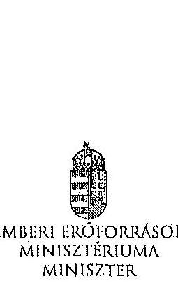

Iktatószám: 36433-2/2014/FOFEJL

Hiv. szám: V-0352-311/2014, V-0352-
313/2014, V-0337-964/2014, V-0337-
966/2014, V-0368-250/2014, V-0364-
477/2014, V-0363-252/2014
Melléklet: -

# Domokos László részére 

elnök

Állami Számvevőszék

Budapest
Apáczai Csere János utca 10.
1052
Tárgy: Észrevételek az Állami Számvevőszék ellenőrzési megállapításaira

Tisztelt Elnök Úr!

Hivatkozva a V-0352-311/2014, a V-0352-313/2014, a V-0337-964/2014, a V-0337-966/2014, a V-0368-250/2014, a V-0364-477/2014, a V-0363-252/2014 iktatószámú leveleire és megküldött jelentéstervezeteire, a Károly Róbert Főiskola, a Magyar Képzőművészeti Egyetem, a Szolnoki Főiskola, a Pannon Egyetem, az Eszterházy Károly Főiskola, a Széchenyi István Egyetem, valamint a Miskolci Egyetem vonatkozásában a 2013. évben megkezdett szabályszerűségi ellenőrzés kapcsán az alábbiakról tájékoztatom, valamint az alábbi észrevételeket teszem.

A megküldött jelentéstervezetekben rögzített megállapítások szerint a fenntartó ágazati irányítási feladatait a 2009-2012. években nem látta el teljes körűen az alábbiak vonatkozásában.

- „A felsőoktatásért felelős miniszter nem hajtotta végre a nemzetgazdasági miniszter irányításával, a kormányhatározatban előírt szervezeti és feladat-ellátási felülvizsgálati programot. A felsőoktatási törvény rendelkezései ellenére nem készíttetett a felsőoktatás rendszere vonatkozásában középtávú fejlesztési tervet."

A 2012. évi költségvetési hiánycél tartását biztosító további feladatokról szóló 1365/2011. (XI. 8.) Korm. határozatban a Kormány a közfeladat-ellátás színvonalának javítása és a költséghatékony működés céljából, szervezeti és feladat-ellátási felülvizsgálati programot indított el az államháztartás központi alrendszerében a költségvetési szervek, és a többségi állami tulajdonú gazdálkodó szervezetek (a továbbiakban: intézmények) vonatkozásában. Továbbá

---

elrendelte, hogy a felülvizsgálathoz a nemzetgazdasági miniszter irányításával, a Miniszterelnökséget vezető államtitkár, a közigazgatási és igazságügyi miniszter, valamint az ágazatért felelős miniszter részvételével munkabizottságokat kell létrehozni, valamint módszertani útmutatót kell kidolgozni.

Tekintettel arra, hogy a feladat nem a felsőoktatásért felelős miniszter felelősségi körébe tartozott, javaslom, hogy valamennyi jelentéstervezetben kerüljön módosításra, illetve kivezetésre azon megállapítás, miszerint a felsőoktatásért felelős miniszter nem hajtotta végre a nemzetgazdasági miniszter irányításával, a kormányhatározatban előírt szervezeti és feladatellátási felülvizsgálati programot.

A 2005. évi CXXXIX. törvény (Ftv.) 104. § (1) bekezdés b) pontja szerint az oktatásért felelős miniszter felsőoktatás fejlesztéssel kapcsolatos feladatai a felsőoktatás rendszere fejlesztési terveinek elkészíttetése, beleértve a középtávú fejlesztési tervet, az ágazati minőségpolitikát.

A nemzeti felsőoktatásról szóló 2011. évi CCIV. törvény (Nftv.) 64. § (3) bekezdése szerint a miniszter felsőoktatás-fejlesztéssel kapcsolatos feladatai a felsőoktatás rendszere fejlesztési terveinek elkészíttetése, beleértve a középtávú fejlesztési tervet.

A törvényi rendelkezéseknek megfelelően több javaslat is került a Kormány elé a felsőoktatási rendszer középtávú fejlesztési tervének vonatkozásába, azonban a Kormány egy javaslatot sem fogadott el. A megállapítást az alábbiak szerint szíveskedjen módosítani.

Nincs a Kormány által elfogadott, a felsőoktatás rendszere vonatkozásában készíttetett, középtávú fejlesztési terv.

- „A minisztérium a Felsőoktatási Információs Rendszer (FIR) biztonságos üzemeltetéséhez, az adatok védelméhez szükséges alapvető szervezeti, szabályozási kontrollokat a 2012. év végéig nem teljes körűen alakította ki. Így a minisztérium csak részben tett eleget a 2005. évi felsőoktatási törvény és a 2011. évi nemzeti felsőoktatási törvény előírásainak. A 2007-ben használtba vett FIR feladata volt, hogy a felsőoktatásban résztvevők (hallgatók, oktatók, kutatók, tanárok) adatait kezelje. A FIR működését 2012-ig több probléma jellemezte. A rendszerbe bevitt alapadatok nem voltak ellenőrzöttek, a rendszerbe épített adatellenőrzés hibajelzései nem voltak kellően konkrétak, illetve a FIR a személyi többszöröződéseket nem szűrte megfelelően. 2012-ben megkezdték a rendszer hibáinak kijavítását."
A FIR létrehozása, fejlesztése, működtetése és üzemeltetése az Ftv. és Nftv., valamint az Oktatási Hivatalról szóló 307/2006. (XII. 23.) Korm. rendelet, majd a 121/2013. (IV. 26.) Korm. rendelet alapján az Oktatási Hivatal (OH) feladata. A Minisztérium miniszteri utasításban adta ki és szükség szerint módosította az Oktatási Hivatal Szervezeti és Működési Szabályzatát, mely az OH feladatrendszerét is részletezi. A 2/2012. (I. 13.) NEFMI utasításban kiadott OH SZMSZ 1.2.3.6. pontja többek között az alábbiakat tartalmazza:

Az OH Felsőoktatási Főosztály feladatai, a felsőoktatási informatikai rendszerekkel szemben támasztott követelmények szakmai szempontú meghatározása, együttműködve az Informatikai Főosztállyal és a felsőoktatási informatikai rendszerek üzemeltetőivel.

A korábban kiadott SZMSZ-ek is hasonló tartalmú feladatot szabtak.

---

Mindezek alapján a Minisztérium többek között a FIR biztonságos üzemeltetéséhez, az adatok védelméhez szükséges alapvető szervezeti, szabályozási kontrollokat a fenti szabályozások megalkotásával megvalósította. A fenti szabályozási rendszer keretén belül a részletszabályok kidolgozása nem lehet a Minisztérium feladata, azt már csak az Oktatási Hivatal végezheti el saját hatáskörben.

Ugyanakkor meg kell jegyezni, hogy a Felsőoktatási Információs Rendszer fejlesztése egy hatalmas, sok évre átnyúló feladat. A FIR fejlesztése 2006-ban kezdődött meg hatósági nyilvántartási koncepció alapján. A FIR azonban alapjaiban eltér egy klasszikus, pl. lakcím- és személyi adat nyilvántartástól, amely esetében az önkormányzatoknál/kormányhivataloknál begépelik az adatokat és azok azonnal bent is vannak a központi rendszerben. A FIR ezzel szemben az adatbevitel szempontjából nem tekinthető önálló rendszernek, hiszen az adatokat a felsőoktatási intézmények különböző tanulmányi rendszeréből veszi át. Így a FIR fejlesztése sosem volt független a tanulmányi rendszerek párhuzamos fejlesztésétől, azzal szoros összhangban tudott és tud megvalósulni. A tanulmányi rendszerek - három önálló tanulmányi rendszer és több egyedi, intézményi saját fejlesztésű rendszer - tényleges fejlesztése azonban nem az OH feladata, azt az esetek többségében piaci vállalkozások végzik. Ezeknek megfelelően a FIR és a különböző tanulmányi rendszerek összhangolt fejlesztése kiemelten nagy kihívást jelent az OH-nak, a feladat hatalmas méretéből adódóan a fejlesztés, vagy akár egy-egy hiba, problémacsokor megoldása nem oldható meg gyorsan, hanem csak összhangoltan, mely sok időt vesz igénybe. Így a teljesen "zöldmezős beruházásként" megvalósított FIR fejlesztés jelenleg 4+4 éves időtartama a feladat nagysága, a korábban rendelkezésre álló pénzügyi források ismeretében elfogadhatónak mondható. Az OH a FIR fejlesztése során a felsőoktatási intézményeknél folyamatos tájékoztatásokat, segítséget, ezeken túlmenően hatósági ellenőrzéseket is végez a FIR biztonságos üzemeltetése, az adatok védelme érdekében. A FIR megfelelő fejlesztése, biztonságos üzemeltetése érdekében az OH 2010-től átalakította a FIR-t érintő stratégiáját, az eljárásrendjeit.

- „Az Állami Számvevőszék három korábbi ellenőrzése során a felsőoktatás témakörében 9 javaslatot fogalmazott meg a felsőoktatásért felelős minisztériumnak. A minisztérium a javaslatokra intézkedési terveket készített, amelyek összesen 10 intézkedést tartalmaztak. Az intézkedések közül 3-at késéssel megvalósítottak, 7 nem valósult meg."
Az oktatási és kulturális ágazat irányítási rendszerének, működésének ellenőrzéséről szóló 1106 sz. jelentés javaslataira készített intézkedési terv 3. számú javaslata, az oktatás középtávú stratégia tervezet egy változatának előkészítése megtörtént, azonban azt a Kormány nem fogadta el.

A felsőoktatás oktatási infrastruktúra-fejlesztési programjának ellenőrzéséről szóló 1171 sz. jelentésben tett javaslat szerint a minisztérium feladata az oktatási infrastruktúra fejlesztési program előkészítésének hiányosságai miatt a felelősség megállapítása.

Tekintettel arra, hogy a 212/2010 (VII.1.) sz. Korm. rendelet alapján a PPP projektekkel kapcsolatos feladatellátás a Nemzeti Fejlesztési Minisztérium (továbbiakban NFM) feladatkörébe került csakúgy, mint a tárgyban érintett dokumentáció, így a feladat, a felelősség megállapításához szükséges jogkörök a rendelet alapján az NFM-hez kerültek, nem történhetett intézkedés a felelősség megállapítására.

---

A 1171 sz. jelentés intézkedései közül egy intézkedés meghiúsult (felelősség megállapítása), egy intézkedés késéssel valósult meg (kapacitás-kihasználtság felmérése), egy intézkedés megvalósítása folyamatban van (kapacitás-kihasználtság felmérése eredményeinek és a felsőoktatást érintő ágazati célok figyelembe vételével intézkedések megtétele a felsőoktatási infrastruktúra közép- és hosszú távú hasznosítására).

Az állami felsőoktatási intézmények érdekeltségébe tartozó gazdasági társaságok támogatásának és nyereségességük hasznosulásának 1290 sz. ellenőrzése kapcsán az állami felsőoktatási intézmények gazdasági társaságai szakmai feladatellátásának és gazdaságossági eredményességének mérését biztosító mutatószám-
 és értékelési rendszereket az érintett felsőoktatási intézmények késéssel kidolgozták, azok ellenőrzése folyamatos.

Az intézményi feladatokkal és megállapításokkal kapcsolatban az alábbiakról tájékoztatom.
A Szolnoki Főiskola vonatkozásában javasolom, hogy a fenntartónak címzett javaslatai esetében a csökkenő hallgatói létszám, a bevételi lehetőségek szűkülése, továbbá a jelentős összegű PPP kiadások miatt felmerülő likviditási problémák, a Főiskola pénzügyi, gazdasági helyzete, valamint a feltárt szabálytalanságok figyelembe vételével szükséges intézkedések megtétele esetében a nemzeti fejlesztési miniszter bevonása is történjen meg, a 212/2010 (VII.1.) sz. Korm. rendeletre is figyelemmel.

Az Eszterházy Károly Főiskola esetében tett megállapítás szerint a minisztérium nem vizsgálta meg az Eszterházy Károly Főiskola által megküldött Intézményfejlesztési Tervet. A megállapítással kapcsolatban tájékoztatom, hogy az Intézményfejlesztési Tervek feldolgozásra és a kiválósági minősítésekhez kapcsolódóan felhasználásra kerültek. Az Nftv. 73. § (3) bekezdés eb) pontja és a 74. § (4) bekezdés alapján, a fenntartó megvizsgálja az IFT-t és amennyiben észrevétele van, azt 90 napon belül közölheti az intézménnyel.

A Károly Róbert Főiskola, a Magyar Képzőművészeti Egyetem, a Szolnoki Főiskola, az Eszterházy Károly Főiskola, a Széchenyi István Egyetem, valamint a Miskolci Egyetem vonatkozásában fogalmazott meg a jelentés az Nftv. 73. § (3) bekezdés e) pontja alapján fenntartói feladatokat. Az egyes oktatási tárgyú törvények módosításáról szóló - még kihirdetés előtt álló - törvény alapján javasolt az Nftv. új, 13/A. §-a szerint a kancellár feladatköréhez kapcsolódóan az intézkedési javaslat kiegészítése.

Kérem Elnök Urat, hogy az észrevételeket a jelentéstervezetekben átvezetni szíveskedjék.
Budapest, 2014. július " $15^{\text {" }}$ "
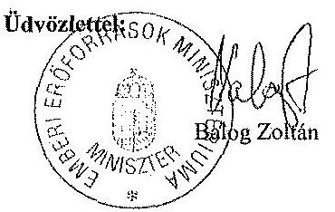

---

# 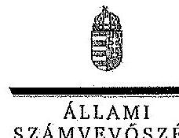 

Ikt.szám: V-0337-1001/2014.

## Balog Zoltán úr

miniszter
Emberi Erőforrások Minisztériuma

## Budapest

## Tisztelt Miniszter Úr!

A Pannon Egyetem, a Szolnoki Főiskola, a Károly Róbert Főiskola, a Magyar Képzőművészeti Egyetem, a Széchenyi István Egyetem, a Miskolci Egyetem és az Eszterházy Károly Főiskola gazdálkodásának és működésének ellenőrzéséről készített jelentéstervezetekre tett észrevételeit köszönettel megkaptam.

Az Állami Számvevőszék észrevételekre vonatkozó álláspontjáról a felügyeleti vezető által készített részletes tájékoztatást csatoltan megküldöm.

Tájékoztatom Miniszter urat, hogy az ÁSZ. tv. 29. § (3) bekezdése alapján a számvevőszéki jelentések mellékleteként szerepeltetjük a jelentéstervezetekhez tett figyelembe nem vett észrevételeket az elutasítás indokainak feltüntetésével.

Budapest, 2014. július hó 25. nap
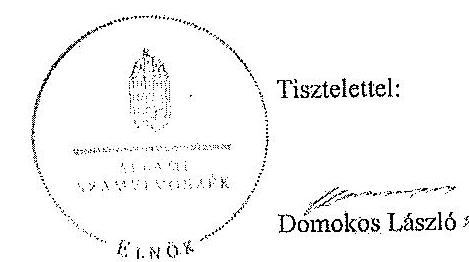

Melléklet: Tájékoztatás az elfogadott és a figyelembe nem vett észrevételekről

---

# Tájékoztatás   az elfogadott és a figyelembe nem vett észrevételekről 

A Pannon Egyetem, a Szolnoki Főiskola, a Károly Róbert Főiskola, a Magyar Képzőművészeti Egyetem, a Széchenyi István Egyetem, a Miskolci Egyetem és az Eszterházy Károly Főiskola gazdálkodásának és működésének ellenőrzéséről készült számvevőszéki jelentés-tervezetekhez a 36433-2/2014/FOFEJL iktatószámú levélben tett észrevételeit köszönettel megkaptuk.

A jelentéstervezetekre tett észrevételeket áttekintettük, azok kezeléséről a következő tájékoztatást adom:

1. A 2012. évi költségvetési hiánycél tartását biztosító további feladatokról szóló 1365/2011. (XI. 8.) Korm. határozatban előírt szervezeti és feladatellátási felülvizsgálati program megvalósítása.

A kormányhatározat alapján - az oktatási ágazatra vonatkozóan 2012. február 20-ig - kellett a tételes javaslatokat a Kormány elé terjeszteni, ennek végrehajtása azonban elmaradt. A feladatokat a nemzetgazdasági miniszter irányítása mellett kellett végrehajtani, felelősként azonban a Miniszterelnökséget vezető államtitkár, a közigazgatási és igazságügyi miniszter és az érintett ágazati miniszter is kijelölésre került. A fentiek alapján - az észrevételeiben leírtakra is figyelemmel - a vonatkozó szövegrészt a jelentéstervezetek összegző megállapítások, következtetések, javaslatok, valamint részletes megállapítások fejezeteiben az alábbiak szerint pontosítottuk:
„Elmaradt az oktatási ágazatra vonatkozóan a nemzetgazdasági miniszter irányításával és az oktatásért felelős miniszter részvételével, kormányhatározatban előírt szervezeti és feladatellátási felülvizsgálati program kidolgozása." (Összegző megállapítások)
„Elmaradt az oktatási ágazatra vonatkozóan az 1365/2011. (XI. 8.) Korm. határozatban - a nemzetgazdasági miniszter irányításával és az ágazatért felelős miniszter részvételével - előírt szervezeti és feladatellátási felülvizsgálati program kidolgozása. (Részletes megállapítások, 1. fejezet):

---

2. A felsőoktatás rendszere középtávú fejlesztési tervének elkészítése.

Az észrevételben foglaltakat figyelembe véve a jelentéstervezetek összegző megállapítások, következtetések, javaslatok, valamint részletes megállapítások fejezeteit kiegészítettük:
„A felsőoktatási törvény rendelkezései ellenére nem készíttetett a felsőoktatás rendszere vonatkozásában a Kormány által elfogadott középtávú fejlesztési tervet." (Összegző megállapítások)
„A miniszter - a vonatkozó jogszabályokban foglaltak ellenére - nem készíttetett a felsőoktatás rendszere vonatkozásában a Kormány által elfogadott középtávú fejlesztési tervet." (Részletes megállapítások, 1. fejezet)
3. A Felsőoktatás Információs Rendszerének (FIR) üzemeltetése.

A felsőoktatási törvények rendelkezései szerint (Feot. 35. §, 103.§ (1) bekezdés aa.) pont, Nftv. 64.§ (2) bekezdés aa) pont) a felsőoktatási információs rendszer működtetése, az adatkezelés jogszerűsége a felsőoktatás ágazati irányítását ellátó miniszter felelősségi körébe tartozik. A miniszter feladata a felsőoktatási információs rendszer működéséért felelős Oktatási Hivatal működtetése is. A FIR működését a teljes ellenőrzött időszakban problémák jellemezték, amely felveti az Oktatási Hivatal működtetéséért felelős minisztérium felelősségét is. Az észrevételben jelzettek alapján a jelentéstervezeteket pontosítottuk a következők szerint:
„A minisztérium a Felsőoktatási Információs Rendszer (FIR) biztonságos üzemeltetéséhez, az adatok védelméhez szükséges alapvető szervezeti, szabályozási kontrollokat a 2012. év végéig nem teljes körűen alakíttatta ki az Oktatási Hivatallal." (Összegző megállapítások)
„A minisztérium az Oktatási Hivatallal a Felsőoktatási Információs Rendszer (FIR) biztonságos üzemeltetéséhez, az adatok védelméhez szükséges alapvető szervezeti, szabályozási kontrollokat a 2012. év végéig nem teljes körűen alakíttatta ki.,, (Részletes megállapítások, 1. fejezet)
4. Korábbi ÁSZ ellenőrzések javaslatainak hasznosulása.

4/a. Az oktatási és kulturális ágazat irányítási rendszerének, működésének ellenőrzéséről szóló 1106 sz. ÁSZ jelentés 3. sz. javaslata tekintetében a jelentéstervezetek részletes megállapítások 5. fejezetei részletesen tartalmazzák a tényeket. Ennek alapján az oktatási ágazat középtávú stratégiája kidolgozásának hiányára vonatkozó megállapítást a jelentéstervezetekben nem módosítottuk.

4/b. A felsőoktatás oktatási infrastruktúra-fejlesztési programjának ellenőrzéséről szóló 1171 sz. ÁSZ jelentésben az előkészítés hiányosságai miatt a felelősség megállapítására tett javaslat nem hasznosult a jelentéstervezetek megállapításai szerint.

---

Az észrevételben foglaltak szerint az egyes miniszterek, valamint a Miniszterelnökséget vezető államtitkár feladat- és hatásköréről szóló 212/2010. (VII. 1.) Korm. rendelet valóban a nemzeti fejlesztési miniszter szakpolitikai feladat- és hatáskörébe helyezte a PPP és egyéb állami vagyont érintő gazdálkodó szervezetekkel kötött és megkötendő szerződések vizsgálatát és ellenőrzését. Az ÁSZ nemzeti erőforrás miniszter részére címzett javaslata ugyanakkor a PPP programok előkészítési hiányosságai miatti felelősség megállapítására irányult. A nemzeti erőforrás minisztere 2012. január 19-én kelt intézkedési tervében 2012. december 31-ei határidőre elvégzendő feladatként fogalmazta meg az előkészítési hiányosságok miatti felelősség megállapításról való intézkedést, amely nem valósult meg. Mindezek alapján a jelentéstervezetben tett megállapítás módosítása nem indokolt.

4/c A 1171. sz. jelentés alapján tervezett intézkedések közül az állami felsőoktatási intézmények kapacitás-kihasználás felmérése késéssel valósult meg. A felmérés eredményeinek és a felsőoktatást érintő ágazati célok figyelembe vételével a felsőoktatási infrastruktúra közép- és hosszú távú hasznosítására a helyszíni ellenőrzés időszaka alatt nem történtek intézkedések. Az intézkedés határideje 2013. december 31. volt. Az észrevételben foglaltak alapján a jelentéstervezetek módosítása nem indokolt.

4/d. Az állami felsőoktatási intézmények érdekeltségébe tartozó gazdasági társaságok támogatásának és nyereségük hasznosulásának ellenőrzése című, 1290 sz . ÁSZ jelentés 2. sz. javaslata (Az állami felsőoktatási intézmények - a felülvizsgálatot követő, de legkésőbb egy éven belül - megmaradt társaságaikra vonatkozó szakmai feladatellátás és a gazdasági eredményesség mérését biztosító mutatók és azok értékelési rendszerének kidolgoztatása) megállapításaink alapján nem hasznosult. A helyszíni ellenőrzés alatt rendelkezésre bocsátott dokumentumok alapján a minisztérium a rektorokat a szakmai feladatellátás és a gazdasági eredményesség mérését biztosító mutatószámok és értékelési rendszer kidolgozására a felsőoktatási intézmények finanszírozását szabályozó kormányrendelet kihirdetését követően kívánta felkérni. Így a vonatkozó megállapítás módosítása nem indokolt.

A Szolnoki Főiskola ellenőrzéséhez kapcsolódó - az emberi erőforrások miniszterének tett javaslatunk nem a PPP projektekkel kapcsolatos, hanem az intézmény hosszú távon fenntartható működtetésére vonatkozó intézkedések megtételét célozza, amely a fenntartó feladata és nem igénylik a nemzeti fejlesztési miniszter bevonását.

Az Eszterházy Károly Főiskola esetében a jelentéstervezet nem az IFT minisztériumi észrevételezésének hiányát kifogásolta, hanem azt, hogy annak a Feot 115. § (2) bekezdése db) pontja szerinti felülvizsgálata dokumentáltan nem történt meg.

Az emberi erőforrások miniszterének a Károly Róbert Főiskola, a Magyar Képzőművészeti Egyetem, a Szolnoki Főiskola, az Eszterházy Károly Főiskola, a Széchenyi István Egyetem, valamint a Miskolci Egyetem vonatkozásában az Nftv. 73. § (3) bekezdés e) pontja alapján megfogalmazott javaslatokat az Nftv. 2014. július 24-én hatályba lépő módosításai nem érintik, a felsőoktatási intézmény rektorainak tett javaslatokat a jogszabály változás figyelembe vételével pontosítottuk.

---

Kérem a válaszlevelemben foglaltak szíves tudomásulvételét. Tájékoztatom Miniszter urat, hogy a számvevőszéki jelentés mellékleteként szerepeltetjük a jelentéstervezethez tett észrevételeit, az elfogadott valamint az ÁSZ. tv. 29. § (3) bekezdése alapján a figyelembe nem vett észrevételeket az elutasítás indokának feltüntetésével együtt.

Budapest, 2014. július hó 28 nap

Horváthné Herháth Mária
felügyeleti vezető

---

.

---

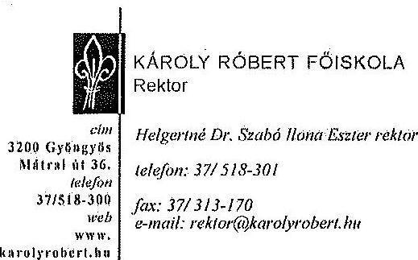

Állami Számvevőszék

Domokos László
elnök

Budapest
Apáczai Csere János utca 10.
1052

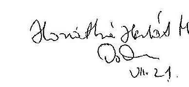

Rostószám: GV343-1/2014
Tárgy: Észrevétel az Állami Számvevőszék
ellenőrzésének megállapításaira.
Ügyindító: Szemgyörgő László Zoltán
Hivatkozási szám: V-0352-312/2014.

ÁLLAMI SZÁMVEVŐSZÉK
50162 Pttk.

Főker... 2014 JÚL 2 3

Iktatószám: 11-0352-312/2014
Melléklet: 4

Tisztelt Elnök Úr!

A Károly Róbert Főiskola gazdálkodásának és működésének ellenőrzéséről készült jelentésüket megkaptuk.

A jelentésben foglaltakkal kapcsolatban helyesbítést javasolok a 18. oldal első bekezdéséhez, miszerint „Az intézmény szerkezetében, szervezeti felépítésében változás nem történt, átalakítást nem hajtottak végre.”

A Főiskola Szenátusának döntése alapján - a fenntartó jóváhagyásával - 2012. szeptember 1-jétől megszűnt a kari felépítés, az oktatási és a kutatási tevékenység intézetek keretébe szerveződött. Előbbiek alapján javasoljuk a megállapítás módosítását.

Az anyag további részében - megítélésünk szerint - az összegző megállapítások egy része szigorúbb minősítést tartalmaz, mint ami a részletes megállapításokból következik.

A Főiskola vezetésében (magasabb vezetők) 2013. január 1-jétől jelentős változás következett be (új rektor, oktatási rektorhelyettes, kijelölt gazdasági főigazgató), majd 2014-ben a kijelölt gazdasági főigazgató ismét változott. Célunk az, hogy a vizsgálat megállapításai alapján kijavítsuk a hibákat.

Megjegyezni kívánom, hogy a vizsgálatot végzők nagy szaktudással, korrekten látták el munkájukat.

Kérem észrevételeim szíves elfogadását.

Gyöngyös, 2014. július 15.

Tisztelettel

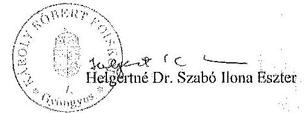

---

.

---

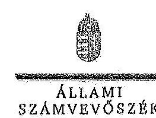

ELNÖK

Ikt.szám: V-0352-339/2014.

Helgertné Dr. Szabó Ilona Eszter asszony
rektor
Károly Róbert Főiskola

Gyöngyös

Tisztelt Rektor Asszony!

A Károly Róbert Főiskola gazdálkodásának és működésének ellenőrzéséről készített jelentéstervezetre tett észrevételeit köszönettel megkaptam.

Az Állami Számvevőszék észrevételekre vonatkozó álláspontjáról a felügyeleti vezető által készített részletes tájékoztatást csatoltan megküldöm.

Tájékoztatom Rektor asszonyt, hogy az ÁSZ. tv. 29. § (3) bekezdése alapján a számvevőszéki jelentés mellékleteként szerepeltetjük a jelentéstervezethez tett figyelembe nem vett észrevételeket az elutasítás indokainak feltüntetésével.

Budapest, 2014. 08 hó 08 nap

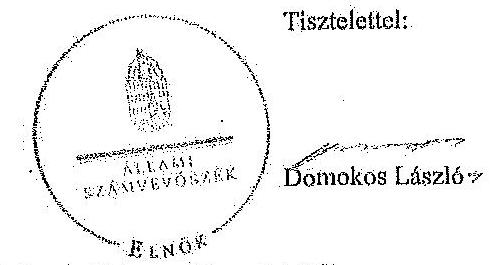

Melléklet: Tájékoztatás az elfogadott és figyelembe nem vett észrevételekről

1362 BUDAPEST, APÁCZAI CSERE JÁNOS UTCA 10. 1364 Budapest 4. Pf. 34 telefon: 484 9101 fax: 484 9261

---

# Tájékoztatás   az elfogadott és a figyelembe nem vett észrevételekről 

A Károly Róbert Főiskola gazdálkodásának és működésének ellenőrzéséről készült számvevőszéki jelentéstervezethez a GI/345-1/2014. iktatószámú levélben tett észrevételeit köszönettel megkaptuk.

A jelentéstervezetre tett észrevételeket áttekintettük, azok kezeléséről a következő tájékoztatást adom:

1. Észrevétele alapján a jelentéstervezet bevezető részének első bekezdését alábbiak szerint módosítottuk:
„Az intézmény szerkezetében, szervezeti felépítésében változás nem történt, átalakítást nem hajtottak végre:
„Az intézménynél 2012. szeptember 1-jétől megszűnt a kari felépítés, az oktatási és a kutatási tevékenység intézetek keretébe szervesödött."
2. Az összegző rész és a részletes megállapítások minősítései között nem állapítottunk meg ellentmondást. Erre vonatkozóan az észrevételükben sem fogalmaztak meg konkrétumokat. Az összegző részben az adott területre vonatkozóan általános, szintetizált minősítést fogalmaztunk meg.

Kérem a válaszlevelemben foglaltak szíves tudomásulvételét. Tájékoztatom Rektor asszonyt, hogy a számvevőszéki jelentés mellékleteként szerepeltetjük a jelentéstervezethez tett észrevételeit, valamint az ÁSZ tv. 29. § (3) bekezdése alapján a figyelembe nem vett észrevételeket az elutasítás indokának feltüntetésével együtt.

Budapest, 2014. hó 04 nap

Horváthné Herbáth Mária
felügyeleti vezető