# ÁLLAMI   SZÁMVEVŐSZÉK 

## JELENTÉS

a Magyar Képzőművészeti Egyetem ellenőrzéséről - Az állami felsőoktatási intézmények gazdálkodásának, működésének ellenőrzése

---

# Állami Számvevőszék 

Iktatószám: V-0352-360/2014.
Témaszám: 1371
Vizsgálat-azonosító szám: V-065804

## Az ellenőrzést felügyelte:

Horváthné Herbáth Mária
felügyeleti vezető

## Az ellenőrzést vezette:

Görgényi Gábor
ellenőrzésvezető
A számvevői jelentések feldolgozásában és a jelentés összeállításában közreműködtek:

Görgényi Gábor
ellenőrzésvezető
Krüzselyi Attila
számvevő tanácsos
Galambos Kristóf
számvevő asszisztens
Papp Tünde
számvevő gyakornok
Az ellenőrzést végezték:

| Bretus Zoltán János | Czmarkó Frigyes | Krüzselyi Attila |
| :-- | :-- | :-- |
| számvevő | György | számvevő tanácsos |
|  | számvevő |  |
| Nagy Erika | Papp Sándor | Vörösné Lakatos |
| számvevő | számvevő főtanácsos | Zsuzsanna |
|  |  | számvevő |

A témához kapcsolódó eddig készített számvevőszéki jelentések:
címe
sorszáma
Jelentés a felsőoktatás oktatási infrastruktúra-fejlesztési program- 1171 jának ellenőrzéséről
Jelentés a PPP konstrukcióban megvalósult kiemelt kulturális és 1287 felsőoktatási projektek szerződéseinek teljesülése és társadalmi hasznosulása ellenőrzéséről
Jelentés az állami felsőoktatási intézmények érdekeltségébe tartozó 1290 gazdasági társaságok támogatásának és nyereségük hasznosulásának ellenőrzéséről

---

# TARTALOMJEGYZÉK 

BEVEZETÉS ..... 13
I. ÖSSZEGZŐ MEGÁLLAPÍTÁSOK, KÖVETKEZTETÉSEK, JAVASLATOK ..... 17
II. RÉSZLETES MEGÁLLAPÍTÁSOK ..... 25

1. A felsőoktatásért felelős minisztérium fenntartói és ágazati irányítási tevékenysége ..... 25
2. Az intézmény belső kontrollrendszerének kiépítése és működtetése ..... 27
2.1. Kontrollkörnyezet ..... 27
2.2. Kockázatkezelés ..... 29
2.3. Kontrolltevékenységek ..... 30
2.4. Információs és kommunikációs rendszer ..... 31
2.5. Monitoring ..... 31
2.6. Az integritás kontrollok működése ..... 32
3. A pénzügyi gazdálkodás szabályszerűsége ..... 33
3.1. A kiadási és bevételi előirányzatok alakulása ..... 33
3.1.1. A pénzügyi egyensúlyt befolyásoló tényezők ..... 37
3.1.2. A normatív támogatások felhasználása ..... 39
3.2. A kiadási és bevételi előirányzatok felhasználásának szabályszerűsége ..... 40
3.2.1. Személyi juttatások ..... 40
3.2.2. Dologi kiadások ..... 41
3.2.3. Felhalmozási kiadások ..... 44
3.2.4. A hazai forrásból finanszírozott projektek ..... 45
3.2.5. Működési bevételek ..... 45
3.2.6. Felhalmozási bevételek ..... 46
3.2.7. A díjak, költségtérítések megállapítása ..... 46
3.2.8. Az előirányzat-módosítások szabályszerűsége ..... 47
3.2.9. Az előirányzat-maradványok szabályszerűsége ..... 48
4. A vagyongazdálkodás szabályszerűsége ..... 48
4.1. A vagyongazdálkodás szabályozottsága ..... 48
4.2. A vagyonelemek kimutatásának megbízhatósága ..... 49
4.3. A vagyonelemekkel történő gazdálkodás ..... 51
4.4. Az intézményi vagyon volumenének és összetételének alakulása ..... 52
5. A korábbi ÁSZ ellenőrzések javaslatainak hasznosulása ..... 54

---

# MELLÉKLETEK 

1. számú A Magyar Képzőművészeti Egyetem kiadási és bevételi előirányzatai, azok teljesítése a 2009-2012. években
2. számú A Magyar Képzőművészeti Egyetem kiadásainak, bevételeinek változása a 2009-2012. években
3. számú Kimutatás a Magyar Képzőművészeti Egyetem bevételeiről és kiadásairól, valamint adósságszolgálatáról a 2009-2012. években
4. számú A Magyar Képzőművészeti Egyetem mérlegadatai a 2009-2012. években
5. számú A Magyar Képzőművészeti Egyetem gazdálkodása szabályszerűségének értékelése a mintatételek alapján
6. számú Az Emberi Erőforrások Minisztériumának észrevétele
7. számú Az Emberi Erőforrások Minisztériumának észrevételére adott válasz
8. számú A Magyar Képzőművészeti Egyetem észrevétele
9. számú A Magyar Képzőművészeti Egyetem észrevételére adott válasz

---

# RÖVIDÍTÉSEK JEGYZÉKE 

| Törvények |  |
| :--: | :--: |
| Áht. 1 | 1992. évi XXXVIII. törvény az államháztartásról (hatálytalan 2012. I. 1-jétől) |
| Áht. 2 | 2011. évi CXCV. törvény az államháztartásról |
| ÁSZ tv. | 2011. évi LXVI. törvény az Állami Számvevőszékről |
| Feot. | 2005. évi CXXXIX. törvény a felsőoktatásról (hatálytalan 2012. IX. 1-jétől) |
| Kbt. $_{1}$ | 2003. évi CXXIX. törvény a közbeszerzésekről (hatálytalan 2012. I. 1-jétől) |
| Kbt. 2 | 2011. évi CVIII. törvény a közbeszerzésekről |
| Kjt. | 1992. évi XXXIII. törvény a közalkalmazottak jogállásáról |
| Nftv. | 2011. évi CCIV. törvény a nemzeti felsőoktatásról |
| Nvtv. | 2011. évi CXCVI. törvény a nemzeti vagyonról |
| Szja tv. | 1995. évi CXVII. törvény a személyi jövedelemadóról |
| Sztv. | 2000. évi C. törvény a számvitelről |
| Tbj. | 1997. évi LXXX. törvény a társadalombiztosítás ellátásaira és a magánnyugdíjra jogosultakról, valamint e szolgáltatások fedezetéről |
| Vtv. | 2007. évi CVI. törvény az állami vagyonról |
| 2011. évi CXIV. törvény | a Magyar Köztársaság 2011. évi költségvetéséről szóló 2010. évi CLXIX. törvény módosításáról |
| 2012. évi Kvtv. | 2011. évi CLXXXVIII. törvény Magyarország 2012. évi központi költségvetéséről |
| Korm. rendeletek |  |
| Áhsz. | 249/2000. (XII. 24.) Korm. rendelet az államháztartás szervezetei beszámolási és könyvvezetési kötelezettségének sajátosságairól |
| Ámr. $_{1}$ | 217/1998. (XII. 30.) Korm. rendelet az államháztartás működési rendjéről (hatálytalan 2010. I. 1-jétől) |
| Ámr. 2 | 292/2009. (XII. 19.) Korm. rendelet az államháztartás működési rendjéről (hatálytalan 2012. I. 1-jétől) |
| Ávr. | 368/2011. (XII. 31.) Korm. rendelet az államháztartásról szóló törvény végrehajtásáról |
| Ber. | 193/2003. (XI. 26.) Korm. rendelet a költségvetési szervek belső ellenőrzéséről (hatálytalan 2012. I. 1-jétől) |
| Bkr. | 370/2011. (XII. 31.) Korm. rendelet a költségvetési szervek belső kontrollrendszeréről és belső ellenőrzéséről |
| Vtvr. | 254/2007. (X. 4.) Korm. rendelet az állami vagyonnal való gazdálkodásról |
| 51/2007. (III. 26.)   Korm. rendelet | a felsőoktatásban részt vevő hallgatók juttatásairól és az általuk fizetendő egyes térítésekről   a költségvetési szerveknél foglalkoztatottak 2009. évi havi kereset-kiegészítéséről (hatálytalan 2010. XII. 31- |

---

133/2009. (VI. 19.)
Korm. rendelet

352/2010. (XII. 30.)
Korm. rendelet
371/2011. (XII. 31.)
Korm. rendelet

## Határozatok

1001/2009. (I. 13.)
Korm. határozat
1035/2010. (II. 12.)
Korm. határozat
1120/2010. (V. 13.)
Korm. határozat
1132/2010. (VI. 18.)
Korm. határozat
1025/2011. (II. 11.)
Korm. határozat
1185/2011. (VI. 6.)
Korm. határozat
1365/2011. (XI. 8.)
Korm. határozat
1133/2012. (IV. 26.)
Korm. határozat

## Egyéb rövidítések

ÁSZ
egyetem
EMMI
FEUVE
FIR
gazdasági főigazgató
GH
IFT
Kincstár
KIM
minisztérium
MKE
MNV Zrt.
MTA
től)
a költségvetési szerveknél foglalkoztatottak 2009. évi havi kereset-kiegészítéséről szóló 6/2009. (I. 20.) Korm. rendelet módosításáról (hatálytalan 2010. XII. 31-től)
a költségvetési szerveknél foglalkoztatottak 2011. évi kompenzációjáról (hatálytalan 2012. I. 31-től)
a költségvetési szerveknél és az egyházak közcélú tevékenységet folytató intézményeinél foglalkoztatottak 2012. évi kompenzációjáról (hatálytalan 2013. I. 31-től)
a 2009. évi havi kereset-kiegészítés forrásigényének biztosításához szükséges intézkedésekről (hatálytalan 2011. XI. 9-től)
a központi költségvetési szerveknél foglalkoztatottak 2010. évben fizetendő eseti kereset-kiegészítésének finanszírozásáról (hatálytalan 2011. XI. 9-től)
a központi költségvetési szerveknél foglalkoztatottak 2010. évben fizetett eseti kereset-kiegészítésének elszámolásáról (hatálytalan 2011. XI. 9-től)
a 2010. évi költségvetéssel összefüggő egyes feladatokról (hatálytalan 2010. XII. 31-től)
az államháztartási egyensúly megőrzéséhez szükséges intézkedésekről
a központi költségvetési szerveknél foglalkoztatottak 2011. évi kompenzációjának finanszírozásáról
a 2012. évi költségvetési hiánycél tartását biztosító további feladatokról
a központi költségvetési szerveknél foglalkoztatottak 2012. évi kompenzációjának finanszírozásáról

Állami Számvevőszék
Magyar Képzőművészeti Egyetem
Emberi Erőforrások Minisztériuma
folyamatba épített előzetes, utólagos és vezetői ellenőrzés
Felsőoktatási Információs Rendszer
GH és egyben az MKE felelős gazdasági vezetője
MKE Gazdasági Hivatala
Intézményfejlesztési Terv
Magyar Államkincstár
Közigazgatási és Igazságügyi Minisztérium
az MKE mindenkori fenntartója az ellenőrzött időszakban (OKM, NEFMI, EMMI)
Magyar Képzőművészeti Egyetem
Magyar Nemzeti Vagyonkezelő Zrt.
Magyar Tudományos Akadémia

---

| NEPTUN | NeptunNET Egységes Tanulmányi Rendszer |
| :-- | :-- |
| NGM | Nemzetgazdasági Minisztérium |
| NKA | Nemzeti Kulturális Alap |
| OGY | Országgyűlés |
| OKM | Oktatási és Kulturális Minisztérium |
| PM | Pénzügyminisztérium |
| szenátus | MKE Szenátusa |
| SZKI | Képző- és Iparművészeti Szakközépiskola és Kollégium |
| SZMSZ | Szervezeti és Működési Szabályzat |

---

.

---

# ÉRTELMEZŐ SZÓTÁR 

állami felsőoktatási intézmény saját tulajdona
állami vagyon
a felsőoktatási intézmény saját bevételének a költségek teljes körű levonása - az adományozás és öröklés kivételével -, a rendelkezésre bocsátott vagyon állagának megóvásáról, pótlásáról való gondoskodás után fennmaradt része terhére szerzett vagyona
A Vtv. 1. § (2) bekezdése szerint állami vagyonnak minősül:
a) az állami tulajdonban lévő ingó dolog, valamint a dolog módjára hasznosítható természeti erő,
b) az állami tulajdonban lévő termőföldekből álló, külön törvényben szabályozott Nemzeti Földalap,
c) az állami tulajdonban lévő - a b) pont hatálya alá nem tartozó - ingatlan,
d) az állami tulajdonban lévő értékpapír,
e) az államot megillető társasági részesedés és más vagyoni értékű jog.
(hatályos 2010. június 16-ig)
a) az állam tulajdonában lévő dolog, valamint a dolog módjára hasznosítható természeti erő,
b) az a) pont hatálya alá nem tartozó mindazon vagyon, amely vonatkozásában törvény az állam kizárólagos tulajdonjogát nevesíti,
c) az állam tulajdonában lévő tagsági jogviszonyt megtestesítő értékpapír, illetve az államot megillető egyéb társasági részesedés,
d) az államot megillető olyan immateriális, vagyoni értékkel rendelkező jogosultság, amelyet jogszabály vagyoni értékű jogként nevesít.
(hatályos 2010. június 17-től)
Állami vagyon tulajdonjogának bármely jogcímen történő, visszterhes átruházása (Vtvr. 1. § (7) d) pont).
A Vtvr. 1. § (7) a) pontja szerint: az a természetes személy, jogi személy, illetve jogi személyiséggel nem rendelkező gazdasági társaság, amely a Magyar Nemzeti Vagyonkezelő Zártkörűen Működő Részvénytársasággal (a továbbiakban: MNV Zrt.) kötött szerződés alapján, bármely jogcímen (bérlet, haszonbérlet, vagyonkezelés, használat stb.) állami vagyont birtokol, használ, hasznosít;
(hatályos 2010. december 31-ig)
az a természetes személy, jogi személy, illetve jogi személyiséggel nem rendelkező szervezet, amely, illetve aki törvény vagy szerződés alapján, bármely jogcímen (pl. bérlet, haszonbérlet, vagyonkezelési szerződés, használat stb.) állami vagyont birtokol, használ, szedi annak

---

## állami vagyon hasznosítása

állami vagyon hasznosítására kötött szerződés
állami vagyon kezelője /vagyonkezelő
hasznait, hasznosít, ide nem értve a tulajdonosi jogok gyakorlóját;
(hatályos 2011. január 1 - 2011. december 31-ig)
az a természetes vagy jogi személy, jogi személyiséggel nem rendelkező szervezet, aki, vagy amely törvény vagy szerződés alapján, bármely jogcímen (bérlet, haszonbérlet, használat stb.) állami vagyont birtokol, használ, szedi annak hasznait, hasznosít, ide nem értve a haszonélvezőt, a vagyonkezelőt és a tulajdonosi jogok gyakorlóját.
(hatályos 2012. január 1-jétől)
A Vtv. 23. § (1) bekezdése szerint: Az állami vagyont az MNV Zrt. maga kezeli, illetve szerződés - így különösen bérlet, haszonbérlet, szerződésen alapuló haszonélvezet, vagyonkezelés, megbízás - alapján központi költségvetési szervnek, természetes vagy jogi személynek, illetőleg jogi személyiséggel nem rendelkező gazdasági társaságnak hasznosításra átengedi.
(hatályos 2010. december 31-ig)
Az állami vagyont az MNV Zrt. maga kezeli, vagy szerződés - így különösen bérlet, haszonbérlet, szerződésen alapuló haszonélvezet, vagyonkezelés, megbízás - alapján központi költségvetési szervnek, természetes vagy jogi személynek vagy jogi személyiséggel nem rendelkező gazdálkodó szervezetnek hasznosításra átengedi.
(hatályos 2011. december 31-ig)
Az állami vagyont az MNV Zrt. maga kezeli, vagy szerződés - így különösen bérlet, haszonbérlet, megbízás alapján központi költségvetési szervnek, természetes vagy jogi személynek vagy jogi személyiséggel nem rendelkező gazdálkodó szervezetnek hasznosításra átengedi.
(hatályos 2012. január 1-jétől)
A Vtv. 23. § (2) bekezdése szerint: Az állami vagyon hasznosítására kötött szerződések elsődleges célja az állami vagyon hatékony működtetése, állagának védelme, értékének megőrzése, illetve gyarapítása, az állami és közfeladatok ellátásának elősegítése.
A Vtv. 23. § (1) bekezdése szerint az állami vagyont az MNV Zrt. maga kezeli, vagy szerződés - így különösen bérlet, haszonbérlet, szerződésen alapuló haszonélvezet, vagyonkezelés, megbízás - alapján központi költségvetési szervnek, természetes vagy jogi személynek, illetőleg jogi személyiséggel nem rendelkező gazdasági társaságnak gazdasági társaságnak/gazdasági szervezetnek hasznosításra átengedi (hatályos 2010. január 01 2011. december 31-ig);
az állami vagyont az MNV Zrt. maga kezeli, vagy szerződés - így különösen bérlet, haszonbérlet, megbízás -

---

belső kontrollrendszer

CLF módszer
előirányzat-maradvány
fenntartó
fenntartói megállapodás
finanszírozási műveletek nélküli pozíció
alapján központi költségvetési szervnek, természetes vagy jogi személynek, vagy jogi személyiséggel nem rendelkező gazdálkodó szervezetnek hasznosításra átengedi. Az állami vagyonra vonatkozóan az MNV Zrt.

 kizárólag az Nvtv-ben meghatározott személyekkel köthet vagyonkezelési szerződést.
(Vtv. 23. § (1), 27. § (1)) (hatályos 2012. január 1-jétől)
2012. január 1-ig a Ber. szerint az Áht. 121. §-ban meghatározott rendszer, 2012. január 1-től a Bkr. szerint az Áht. 269. § (1) bekezdésében meghatározott fogalom
(Kockázatok kezelése és tárgyilagos bizonyosság megszerzése érdekében kialakított folyamatrendszer.)
A módszer a működési és a felhalmozási költségvetés bevételeinek és kiadásainak, ezek egyenlegeinek elkülönített, majd összevont kimutatását alkalmazza valamely költségvetési intézmény pénzügyi helyzetének megítéléséhez. Kiemelten mutatja be a finanszírozási műveletek egyenlege nélküli és az azt magába foglaló pénzügyi pozíciót, valamint a tőketörlesztéssel, értékpapír beváltással csökkentett nettó működési jövedelmet. Az értékelés a pénzügyi kapacitás fogalmát helyezi a középpontba.
Az államháztartás központi alrendszerébe tartozó költségvetési szerveknél a módosított bevételi és kiadási előirányzatok és azok teljesítésének a Kormány rendeletében meghatározott tételekkel korrigált különbözete az előirányzat-maradvány (Áht. 2. § (1) bekezdés m) pontja).
A Feot. 7. § (2) és az Nftv. 4. § (2) bekezdése szerint az, aki az alapítói jogot gyakorolja, ellátja a felsőoktatási intézmény fenntartásával kapcsolatos feladatokat.
Az állami felsőoktatási intézmény és a fenntartó teljesítmény alapján történő finanszírozásához hároméves időszakra kötött megállapodás, amely tartalmazza a felsőoktatási intézmény által vállalt teljesítménykövetelményeket, valamint az állandó és változó jellegű támogatásokat. (Feot 133/A §)
A CLF módszer szerint számított működési és felhalmozási tevékenység pénzügyi egyenlegének összevont értéke. Megmutatja, hogy a költségvetési intézmény bevételei fedezetet biztosítottak-e a kiadásokra. A finanszírozási műveletek nélküli (GFS) pozíció alapján a pénzügyi helyzetet akkor tekintettük megfelelőnek, ha az adott év működési és felhalmozási bevételei fedezetet nyújtottak az adott év működési és felhalmozási kiadásaira.

---

Gazdasági Tanács

Információs és kommunikációs rendszer
integritás
intézményfejlesztési terv
intOSAI
kincstári biztos

A felsőoktatási intézmény javaslattevő, véleményező, a stratégiai döntések előkészítésében részt vevő és a döntések végrehajtásának ellenőrzésében közreműködő szerve.
A vezetés képességét a megfelelő döntések meghozatalára alapvetően befolyásolja az információ minősége, amely magában hordozza azt a követelményt, hogy az információnak megfelelőnek, időben rendelkezésre állónak, aktuálisnak, pontosnak és elérhetőnek kell lennie.
A hatékony kommunikáció lefelé, horizontálisan és felfelé irányuló információáramoltatást jelent a szervezetben, annak minden részében és teljes struktúrájában.
A költségvetési szerv vezetője köteles olyan rendszereket kialakítani és működtetni, melyek biztosítják, hogy a megfelelő információk a megfelelő időben eljussanak az illetékes szervezethez, szervezeti egységhez, illetve személyhez.
Az integritás olyasvalakit vagy valamit jelöl, aki vagy ami romlatlan, sértetlen, feddhetetlen. Az integritás elvek, értékek, cselekvések, módszerek, intézkedések konzisztenciáját jelenti: olyan magatartásmódot, amely meghatározott értékeknek megfelel.
A szenátus fogadja el az intézményfejlesztési tervet. Az intézményfejlesztési tervben kell meghatározni a fejlesztéssel, a fenntartó által a felsőoktatási intézmény rendelkezésére bocsátott vagyon hasznosításával, megóvásával, elidegenítésével kapcsolatos elképzeléseket, a várható bevételeket és kiadásokat. Az intézményfejlesztési tervet középtávra, legalább négyéves időszakra kell elkészíteni, évenkénti bontásban meghatározva a végrehajtás feladatait. Az intézményfejlesztési terv része a foglalkoztatási terv. A foglalkoztatási tervben kell meghatározni azt a létszámot, amelynek keretei között a felsőoktatási intézmény megoldhatja feladatait. (Forrás: Feot. 27. § (3) bekezdés)
International Organisation of Supreme Audit Institutions (Legfőbb Ellenőrzési Intézmények Nemzetközi Szakmai Szervezete)
A kincstári biztos kijelölését az államháztartásért felelős miniszternél a Kincstár kezdeményezi. A kincstári biztos köteles figyelemmel kísérni megbízatásának időpontjától kezdve a költségvetési szerv tervezését, gazdálkodását, beszámolását, a jogszabályokban előírt feladatainak ellátását, feltárni azokat az okokat, amelyek a tartós fizetésképtelenséghez vezettek, a szükséges intézkedések azonnali végrehajtására irányuló intézkedési tervet készíteni, azonnali intézkedéseket kezdeményezni, és írásbeli utasításokat kiadni a tartozásállomány fel-

---

kincstári költségvetés
költségvetési főfelügyelő, felügyelő
kockázatkezelés
kontrollkörnyezet
kontrolltevékenységek
kulcskontrollok
számolására, a gazdálkodás egyensúlyának biztosítására, a követelések behajtására. (Ávr. 116-117. §)
A központi költségvetésről szóló törvény elfogadását követően a fejezetet irányító szerv az államháztartás központi alrendszerébe tartozó költségvetési szerv és a fejezeti kezelésű előirányzat kiemelt előirányzatait, valamint az elkülönített állami pénzalapok és a társadalombiztosítás pénzügyi alapjai jogszabályi előírás szerinti bevételeit és kiadásait kincstári költségvetés kiadásával állapítja meg. (Áht₁ 24. § (3) bekezdés, Áht₂ 28. § (2) bekezdés, Ávr. 13. § (2) bekezdés)

Az államháztartásért felelős miniszter a Kormány irányítása alá tartozó fejezetet irányító szervhez, a Kormány irányítása vagy felügyelete alá tartozó költségvetési szervhez, valamint az elkülönített állami pénzalapok és a társadalombiztosítás pénzügyi alapjai kezelő szerveihez költségvetési főfelügyelőt, felügyelőt rendelhet ki. A költségvetési főfelügyelő, felügyelő a gazdálkodás költségvetés-politikával való összhangja és a takarékos, szabályszerű, eredményes működés érdekében a Kormány rendeletében meghatározott intézkedéseket tehet, így különösen előzetesen véleményezi a kötelezettségvállalásra irányuló eljárásokat, és a nagy összegű kötelezettségvállalások tekintetében kifogással élhet. (Áht₂ 39. § (1)-(2) bekezdés)
A kockázatkezelés a szervezet céljai elérésével kapcsolatos kockázatok azonosításának és elemzésének, valamint a megfelelő válaszok meghatározásának folyamata.
A kontrollkörnyezet alapozza meg a belső kontroll összes többi elemét a fegyelem és a struktúra biztosítása által.
A költségvetési szerv vezetője köteles olyan kontrollkörnyezetet kialakítani, amelyben
a) világos a szervezeti struktúra,
b) egyértelműek a felelősségi, hatásköri viszonyok és feladatok,
c) meghatározottak az etikai elvárások a szervezet minden szintjén,
d) átlátható a humánerőforrás-kezelés.
Azok az elvek (politikák) és eljárások, amelyeket a kockázatok meghatározása és a szervezet céljainak elérése érdekében alakítanak ki.
A kiadások felhasználásához, illetve a bevételek beszedéséhez kapcsolódó pénzügyi jogkörök (kötelezettségvállalás, ellenjegyzés, teljesítésigazolás, érvényesítés, utalványozás) kontrolljai.

---

monitoring
normatív költségvetési támogatás felsőoktatási intézmények működéséhez
normatív támogatások
saját bevétel
szenátus
tárgyévi pénzügyi pozíció

A belső kontrollrendszer teljesítmény-minőségének időnkénti kiértékeléséhez folyamatosan figyelemmel kell kísérni és értékelni kell (együtt: „monitoring") a rendszert. A monitoring rutintevékenységek, külön értékelések vagy e kettő kombinációja révén valósul meg.
A felsőoktatási intézmények működéséhez biztosított normatív költségvetési támogatás, amely lehet hallgatói juttatásokhoz nyújtott, képzési, tudományos célú, fenntartói, illetve egyes feladatokhoz nyújtott támogatás. (Feot. 127. § (3) bekezdés alapján)
Az ellenőrzött időszakban hatályos költségvetési törvények 3. számú mellékletében megjelölt közoktatási hozzájárulások, az 5. mellékletében megjelölt központosított előirányzatok, továbbá a 8. mellékletében megjelölt normatív, kötött felhasználású támogatások együttesen.
Az államháztartáson kívüli források - beleértve minden olyan, az Európai Uniótól származó támogatást, amelyhez nem az állami költségvetésen keresztül jut a felsőoktatási intézmény, továbbá a szakképzési hozzájárulási fizetési kötelezettség teljesítéseként elszámolt forrásokat is, ide nem értve az állami vagyon értékesítésének ellenértékét -, valamint a Kutatási és Technológiai Innovációs Alapból származó bevételek.
A felsőoktatási intézmény, döntést hozó és a döntés végrehajtását ellenőrző testülete. (Forrás: Feot. 20. § (1) bekezdés)
A működési és felhalmozási bevételek, valamint kiadások egyenlege a finanszírozási műveletek egyenlegének figyelembe vételével.

---

# JELENTÉS 

## a Magyar Képzőművészeti Egyetem ellenőrzéséről - Az állami felsőoktatási intézmények gazdálkodásának, működésének ellenőrzése

## BEVEZETÉS

Az Állami Számvevőszék a 2013. évtől fokozott figyelmet fordít az államháztartási rendszer kormányváltást követően elkezdődött átalakítására, amely a felsőoktatás intézményrendszerét is érintette.

Az ellenőrzéssel érintett időszakban az állami felsőoktatási intézmények gazdálkodását - az Áht₁ és Áht₂ előírásai mellett - a felsőoktatásról szóló 2005. évi CXXXIX. törvény (Feot.), valamint az azt hatályon kívül helyező, a nemzeti felsőoktatásról szóló 2011. évi CCIV. törvény (Nftv.) előírásai határozták meg. A Feot. végrehajtásának ellenőrzését az Állami Számvevőszék a 2005-2008 közötti időszakra elvégezte, jelen ellenőrzésünk a 2009-2012. évek áttekintésére irányult. Az Nftv. törvényjavaslatának általános indokolása szerint a felsőoktatás addigi szabályozása nehezen áttekinthető, ellentmondásokkal terhelt, szakmai és ellenőrzési szempontból túlszabályozott volt. Az egyes intézménytípusok céljainak és feladatainak meghatározása nem volt egyértelmű, az intézmények belső működési mechanizmusa bonyolult volt.

Az állami felsőoktatási intézmények közpénzfelhasználása jelentős. A 2009-2012. években az Emberi Erőforrások Minisztériuma és a Közigazgatási és Igazságügyi Minisztérium által fenntartott felsőoktatási intézmények teljesített kiadásai együttesen 1881 Mrd Ft-ot tettek ki, amelyhez az állam 752 Mrd Ft költségvetési támogatást biztosított. A Feot. előírásai a pénzügyi és vagyongazdálkodási területeken bármely más költségvetési szervhez képest nagyobb önállóságot biztosítottak a felsőoktatási intézmények számára. Az önállósággal azonban nem minden esetben tudtak élni az intézmények. Több intézmény pénzügyi egyensúlya megingott, azok mintegy feléhez költségvetési felügyelők, illetve főfelügyelők kirendelése vált szükségessé.

Magyarország Nemzeti Reform Programja keretében a Széll Kálmán Terv 2020-ig a 30-34 évesek körében a felsőfokú vagy annak megfelelő végzettséggel rendelkezők arányának 30,3%-ra való növelését irányozta elő, amely a 2010. évihez képest 4,6% pontos növekedési célkitűzést jelent. Szükség van arra, hogy a cél elérése érdekében a rendelkezésre álló források szabályozott, átlátható, törvényesen működő intézményi környezetbe kerüljenek. A rendezett gazdasági környezet, az önállósággal élni tudó, felelős, elszámoltatható intézményi gazdálkodás elengedhetetlen feltétele a kitűzött szakmai célok elérésének.

---

A hazai felsőoktatás hallgatói létszáma 2009-2012 között 8,6%-kal, 370 331 főről 338 467 főre¹ csökkent. A felsőoktatási intézmények működési engedélyében szereplő maximális hallgatói létszámadatok szerint 498 413 férőhely² állt rendelkezésre a 2012-évben, ami 67,9%-os kapacitáskihasználtságot mutatott.

Az ellenőrzés eredményeként képet kapunk a Magyar Képzőművészeti Egyetem pénzügyi helyzetéről; az oktatási és egyéb tevékenységek bevételeinek, kiadásainak, költségeinek elkülönítéséről, átláthatóságáról és szabályszerűségéről; az intézmény gazdálkodási szabadságának pénzügyi és vagyoni helyzetre gyakorolt hatásairól; a vagyonnal való felelős, értékmegőrző gazdálkodás érvényesüléséről és a belső kontrollrendszer működéséről.

A felsőoktatási ágazat intézményeinek azonos ellenőrzési program alapján lefolytatott ellenőrzése eredményeként megállapításaink és összegzéseink alapul szolgálnak a felsőoktatás stratégiai környezetének és céljainak megalapozásához, a fenntartói, ágazati irányítói célkitűzéseinek visszacsatolásához, az esetleges jogszabályi változtatások kezdeményezéséhez. Az intézmények számára visszajelzést adnak a gazdálkodás szabályszerűségéről, a jó gyakorlatok megismerése hozzájárul a gazdálkodási fegyelem és színvonal javításához.

Az ellenőrzés célja annak megállapítása volt, hogy szabályos volt-e az állami felsőoktatási intézmény pénzügyi és vagyongazdálkodása, biztosított volt-e a vagyonnal való felelős gazdálkodás követelményének érvényesülése, jogszabályi előírásoknak megfelelően működött-e a belső kontrollrendszer, valamint a fenntartó tevékenysége a jogszabályi előírásoknak megfelelt-e.

Ennek keretében értékeltük a Magyar Képzőművészeti Egyetemnél:

- a fenntartói és ágazati irányítási jogok gyakorlásának, a felsőoktatási intézmény működéséhez kapcsolódó információs rendszer működtetésének az előírásoknak való megfelelőségét;
- az intézmény belső kontrollrendszere jogszabályoknak megfelelő kialakítását, az intézményi külső (felügyeleti, KEHI, hatósági) és belső ellenőrzések megállapításainak hasznosulását;
- az intézmény pénzügyi gazdálkodásának az előírásoknak való megfelelőségét, az oktatási és egyéb tevékenységek kiadásai elkülönítésének, átláthatóságának, szabályszerűségének és elszámoltathatóságának az előírásoknak való megfelelőségét;
- az intézmény vagyongazdálkodása előírásoknak való megfelelőségét;
- az ellenőrzött időszakban végzett ÁSZ ellenőrzések által tett javaslatok hasznosulását.

A pénzügyi és vagyongazdálkodás terén az egyes területek szabályszerű működését mintavétellel ellenőriztük, ez alapján a sokaságokban előforduló hibás

[^0]
[^0]: ¹ EMMI: Oktatási évkönyv 2012/2013.
    ² Forrás: Oktatási Hivatal.

---

tételek arányát becsültük. A jogszabályoknak és a belső előírásoknak megfelelőnek, azaz szabályszerűnek tekintettük az adott kiadási előirányzat felhasználását, bevétel beszedését, mérlegtétel értékelését, amennyiben a minta ellenőrzésének eredménye alapján 95%-os bizonyossággal a teljes sokaságban a hibás tételek aránya kisebb volt, mint 10%, nem megfelelőnek értékeltük, ha a hibás tételek aránya a 10%-ot meghaladta. Kockázatot, illetve magas kockázatot jeleztünk, amennyiben egy adott terület vonatkozásában a minta alapján a teljes sokaságban nem volt teljes körűen

 biztosított a jogszabályoknak és a belső szabályzatoknak megfelelő működés. A mintatételek kiértékelését az 5. számú melléklet tartalmazza.

A belső kontrollrendszer kialakításának és működtetésének értékelését a vonatkozó jogszabályi előírások alapján készített munkalapok, valamint az ellenőrzés gyakorlati tapasztalatai alapján végeztük el. Az értékelés során a jogszabályi előírások mellett az Ámr. ${ }_{1}$ 145/A. § (1) és (3) bekezdése, az Ámr. ${ }_{2}$ 155. § (3) bekezdése, valamint a Bkr. 5. § (1) bekezdése alapján figyelembe vettük az államháztartásért felelős miniszter által kiadott irányelvekben és módszertani útmutatókban ${ }^{3}$ foglaltakat is. A belső kontrollrendszert az értékelés során legalább 85%-os megfelelőség esetén megfelelőnek, legalább a 70%-os megfelelőség esetén részben megfelelőnek, 70%-os megfelelőség alatt pedig nem megfelelőnek minősítettük.

Az ellenőrzés típusa: szabályszerűségi ellenőrzés.
Az ellenőrzött időszak: 2009. január 1. - 2012. december 31.
A helyszíni ellenőrzés ideje: 2013. november 25. - 2014. február 05.
Az ellenőrzéssel érintett szervezetek: az Emberi Erőforrások Minisztériuma és a Magyar Képzőművészeti Egyetem

Az ellenőrzés jogszabályi alapját az Állami Számvevőszékről szóló 2011. évi LXVI. törvény 1. § (3) bekezdése, az 5. § (3)-(6) bekezdései, valamint az államháztartásról szóló 2011. évi CXCV. törvény 61. § (2) bekezdésének előírásai képezik.

Az ellenőrzés során vizsgálni kellett minden olyan körülményt, információt, adatot, amely a program végrehajtása során felmerül, a pénzügyi és vagyoni helyzet szabályosságának megítélésére hatást gyakorol, az ellenőrzés céljával releváns módon összefüggésben van és a tények megalapozásához szükséges. Az ellenőrzés az INTOSAI által kiadott nemzetközi standardok figyelembe vételével, az ellenőrzési programban foglalt értékelési szempontok szerint történt.

Az ÁSZ a 2011. évi LXVI. törvény 29. §-a szerint a jelentéstervezetet megküldte az emberi erőforrások miniszterének és a Magyar Képzőművészeti Egyetem rektorának. A beérkezett észrevételeket és az azokra adott válaszokat a jelentés 69. számú mellékletei tartalmazzák.

[^0]
[^0]:    ${ }^{3}$ 1/2009. (IX. 11.) PM irányelv, Pénzügyminisztérium Belső Kontroll Kézikönyv 2010.

---

A Magyar Képzőművészeti Egyetem (MKE) a 2009-2012. évek között önállóan működő és gazdálkodó központi költségvetési szerv volt. Az egyetemen az ellenőrzött időszakban képzőművészképzés, tanárképzés és restaurátorképzés folyt. Az intézmény szerkezetében, szervezeti felépítésében változás nem történt, átalakítást nem hajtottak végre. Az ellenőrzött időszakban végzett ÁSZ ellenőrzések az MKE-t nem érintették.

# A Magyar Képzőművészeti Egyetem főbb gazdálkodási és vagyoni adatai: 

| Megnevezés | Főbb gazdálkodási és vagyoni adatok (ezer Ft) |  |  |  |  |
| :--: | :--: | :--: | :--: | :--: | :--: |
|  | 2009. | 2010. | 2011. | 2012. | $\begin{gathered} 2012 / 2009 \\ (\%) \end{gathered}$ |
| KIADÁSI FŐÖSSZEG | 1718459 | 1617958 | 1587811 | 1638767 | 95,4 |
| Személyi juttatások és járulékok | 1048283 | 950830 | 894866 | 926614 | 88,4 |
| Dologi kiadások | 599659 | 632223 | 650815 | 635051 | 105,9 |
| Felhalmozási kiadások | 70517 | 34905 | 42130 | 77102 | 109,3 |
| BEVÉTELI FŐÖSSZEG | 1754819 | 1651264 | 1633301 | 1677364 | 95,6 |
| Költségvetési támogatások | 1460170 | 1395923 | 1294161 | 1290766 | 88,4 |
| Saját és átvett bevételek | 270752 | 218981 | 305834 | 341108 | 126,0 |
| Előirányzat maradvány felhasználás | 23897 | 36360 | 33306 | 45490 | 190,4 |
| Támogatások aránya (\%) | 83 | 84 | 79 | 77 | 92,8 |
| Mérlegfőösszeg* | 1064530 | 1056772 | 1103920 | 1135381 | 106,7 |
| Jellemző létszámadatok (fő)- |  |  |  |  |  |
| Éves átlagos statisztikai állományi létszám | 260 | 260 | 260 | 260 | 100,0 |
| Oktatói létszám** | 87 | 98 | 93 | 87 | 100,0 |
| Hallgatói létszám** | 619 | 658 | 664 | 679 | 109,7 |

* december 31-ei adatok
** október 15-ei adatok

---

# I. ÖSSZEGZŐ MEGÁLLAPÍTÁSOK, KÖVETKEZTETÉSEK, JAVASLATOK 

Az MKE fenntartói és ágazati irányítási feladatait az ellenőrzött időszakban az EMMI, illetve annak jogelődjei (OKM, NEFMI; a továbbiakban együtt: minisztérium) látták el.

A minisztérium a jogszabályokban meghatározott fenntartói feladatainak - a feltárt kisebb hiányosságoktól eltekintve - eleget tett. A jogszabályi előírásoknak megfelelően kiadta az MKE alapító okiratának módosításait, közreműködött az egyetem éves költségvetésének tervezésében, ennek keretében évente közölte a költségvetési keretszámokat, meghatározta az MKE költségvetési előirányzatait, és megállapította az egyetem kincstári költségvetését. Ellenőrizte az MKE költségvetési beszámolóit. Az alapító okirat változásai miatt az MKE az ellenőrzött időszakban többször módosította az SZMSZ-ét, azonban a minisztérium az SZMSZ felülvizsgálatát nem tudta elvégezni, mivel az egyetem a dokumentumot a Feot., illetve az Nftv. előírásai ellenére nem küldte meg véleményezésre.

A fenntartói hatáskörében a minisztérium a jogszabályoknak megfelelően gyakorolta az egyetem felső vezetőinek kinevezésével, illetve megbízásával kapcsolatos jogosultságait, felülvizsgálta és véleményezte az MKE Intézményfejlesztési Terveit. A 2008-2010. évekre vonatkozóan az egyetemmel hároméves fenntartói megállapodást kötött, amely tartalmazta az MKE által választott teljesítménymutatókat az elvárt célértékek megjelölésével. A teljesítést az MKE az éves beszámolók keretében értékelte, amelyet a minisztérium elfogadott.

A minisztérium az ellenőrzött időszakban az ágazati irányítási feladatait nem látta el teljes körűen. Elmaradt az oktatási ágazatra vonatkozóan a nemzetgazdasági miniszter irányításával és az oktatásért felelős miniszter részvételével, kormányhatározatban előírt szervezeti és feladatellátási felülvizsgálati program kidolgozása. A felsőoktatási törvény rendelkezései ellenére nem készíttetett a felsőoktatás rendszere vonatkozásában a Kormány által elfogadott középtávú fejlesztési tervet.

A minisztérium a Felsőoktatási Információs Rendszer (FIR) biztonságos üzemeltetéséhez, az adatok védelméhez szükséges alapvető szervezeti, szabályozási kontrollokat a 2012. év végéig nem teljes körűen alakíttatta ki az Oktatási Hivatallal. A rendszerbe bevitt alapadatok nem voltak ellenőrzöttek, a rendszerbe épített adatellenőrzés hibajelzései nem voltak kellően konkrétak, illetve a FIR a személyi többszöröződéseket nem szűrte megfelelően.

Az MKE belső kontrollrendszerének kialakítása és működtetése az ellenőrzött időszakban nem felelt meg teljes körűen a jogszabályi előírásoknak. A kontrollkörnyezet, a kockázatkezelés, az információs és kommunikációs, továbbá a monitoring rendszer kiépítését, illetve működését részben megfelelőnek minősítettük, ugyanakkor a kontrolltevékenységek gyakorlati működése nem volt megfelelő.

---

A kontrollkörnyezet részét képező belső szabályzatok nem készültek el teljes körűen. A meglévő szabályzatokat nem minden esetben aktualizálták, és tartalmi hiányosságok is előfordultak, továbbá az egyetem nem készítette el teljes körűen a működési folyamatai ellenőrzési nyomvonalát. A kockázatkezelési rendszer működtetése nem volt maradéktalanul alkalmas a pénzügyi és vagyongazdálkodás, valamint a feladatellátás szempontjából releváns kockázatok teljes körű felmérésére és értékelésére. Az információs és kommunikációs rendszer nem biztosította minden tekintetben a megalapozott vezetői döntéshez szükséges információkat, a monitoring rendszer pedig nem volt alkalmas a gazdálkodási folyamatok teljes körű bemutatására és értékelésére.

A kontrolltevékenységek kialakítása és működtetése nem volt megfelelő, amely az ellenőrzés során feltárt szabályszerűségi hibák kialakulásához vezetett. A kiadási előirányzatok felhasználásához és a bevételek beszedéséhez kapcsolódó pénzügyi jogkörök kulcskontrolljainál több területen tártunk fel hiányosságokat, amelyek a folyamatba épített, illetve a vezetői ellenőrzés nem megfelelő működésére, továbbá az ellenőrzési nyomvonal hiányára voltak visszavezethetőek. A nagy értékű beszerzések esetében a munkafolyamatba épített ellenőrzés nem működött megfelelően.

Külön értékeltük a monitoring rendszer részét képező belső ellenőrzést. A belső ellenőrzési rendszer kialakítása és működtetése alapvetően szabályszerű volt. A belső ellenőrzés részben feltárta a pénzügyi jogkörök gyakorlásának hiányosságait, de a megállapításait az érintettek nem vették figyelembe teljes körűen, a hibák kijavítására nem minden esetben hoztak intézkedéseket, továbbá a belső ellenőrzés nem hajtott végre utóellenőrzést. A külső ellenőrzések során a minisztérium belső ellenőrzése felhívta a figyelmet az MKE belső kontrollrendszere megfelelő működtetésére, a mérleg leltárral való megfelelő alátámasztására, a Kbt. ${ }_{1}$ előírásainak betartására, az ellenjegyzés teljes körűvé tételére és a követelések elismertetésére, ugyanakkor az ellenőrzés megállapításait nem vették maradéktalanul figyelembe.

Az ellenőrzés során értékeltük a belső kontrollokon túlmutató integritás kontrollokat is, amelyeknél szabályozási és működési hiányosságokat állapítottunk meg. Az MKE nem végzett korrupciós kockázatelemzést; a munkatársak kiválasztásakor nem minden esetben írtak ki pályázatot; a vezetés az integritás fontosságát nem tudatosította a dolgozókkal; nem működtettek a kívülről érkező panaszokat és közérdekű bejelentéseket kezelő rendszert; illetve a belső ellenőrzés az ellenőrzési tervek kidolgozásához nem végzett rendszeres kockázatelemzést.

Az MKE a kiadási és bevételi előirányzatai tervezése során a jogszabályokban és a fenntartó által kiadott tervezési irányelvekben foglaltak szerint járt el. A központi költségvetés egyensúlyát biztosító kormányzati intézkedések az ellenőrzött időszakban szigorú gazdálkodási fegyelmet követeltek meg az egyetemtől, de a működőképességét rövid távon nem veszélyeztették. Kincstári biztost, illetve költségvetési felügyelőt nem jelöltek ki az intézményhez.

Az MKE teljesített kiadásai négy év alatt 1718,5 M Ft-ról 1638,8 M Ft-ra, 4,6%-kal, míg a bevételei összességében 1754,8 M Ft-ról 1677,4 M Ft-ra, 4,4%-kal csökkentek. A bevételeken belül a költségvetési támogatás 11,6%-os csökkené-

---

sét a saját bevételek 26,0%-os növekedése ellensúlyozta. A költségvetési támogatások csökkenése mellett az MKE hallgatói létszáma 2009 és 2012 között 9,7%-kal emelkedett, a 2012. évben rendelkezésre álló férőhely-kapacitás 64,9%-át tudta kihasználni az intézmény.

Az egyetem a kötött felhasználású, valamint a felhasználási kötöttség nélküli normatív támogatások felhasználásával kapcsolatos döntések meghozatala során, továbbá az előirányzatok módosítása, a költségvetési forrással való elszámolás és az előirányzat-maradványok megállapítása esetében betartotta a vonatkozó jogszabályok és a belső szabályzatok előírásait.

Az MKE működési jövedelme az ellenőrzött időszakban - a 2010. év kivételével - negatív volt, vagyis az éves folyó bevételek nem nyújtottak fedezetet a feladatellátáshoz kapcsolódó éves folyó kiadásokra. A felhalmozási költségvetés egyenlege - a 2009. évi kivételével - szintén negatív értéket mutatott. A finanszírozás fedezetét az előző évi maradványok igénybevételével biztosították.

Az egyetem évenkénti pénzügyi pozíciója az ellenőrzött időszakban folyamatosan romlott, amelyet alátámaszt, hogy az MKE eladósodási mutatója is kedvezőtlenül változott, a 2009. évi 3,3%-ról a 2012. évben 4,5%-ra nőtt. A pénzeszköz-likvidítási mutató szintén romlott, a 2009. évi 1,2-ről a 2012. évre 1,0-re csökkent. A pénzeszközök év végi állománya 2012-ben még fedezetet nyújtott a rövid lejáratú kötelezettségek rendezésére, azonban a további csökkenés fedezet hiányhoz vezethet. A mutatószámok által felvázolt negatív tendenciákhoz hozzájárultak a költségvetést érintő zárolások és elvonások, illetve a folyamatosan csökkenő költségvetési támogatás. A pénzügyi pozíció negatív értékei a folyamatos likviditás veszélyeztetése mellett felvethetik az MKE kiadási és bevételi szerkezetének átalakítási szükségletét.

Az ellenőrzött időszakban az MKE a kiadási és bevételi előirányzatainak felhasználása, illetve beszedése során számos területen nem tartotta be a vonatkozó jogszabályi előírásokat. A szabályszerűségi hibák főként a gazdálkodási jogkörök kulcskontrolljainak az Áht. ${ }_{1-2}$, az Ámr. ${ }_{1-2}$ és az Ávr. vonatkozó előírásaitól eltérő, illetve elmaradó alkalmazása területén
 jelentkeztek.

A rendszeres és nem rendszeres személyi juttatások előirányzatának felhasználása során a kifizetéshez kapcsolódó kinevezés módosítások (kötelezettségvállalások) ellenjegyzésének gyakori elmaradása miatt nem érvényesültek teljes körűen a jogszabályok és a belső szabályzatok előírásai. Ez szabályszerűségi kockázatot jelentett az ellenőrzött terület egészének szabályos működése szempontjából.

A megbízási díjak elszámolása, a dologi kiadások, ezen belül a készletbeszerzés, a különféle szolgáltatások és vásárolt közszolgáltatások, valamint a felhalmozási kiadások felhasználása a pénzügyi elszámolások, valamint a gazdálkodási jogkörök gyakorlása tekintetében összességében nem volt szabályszerű. A hibák elsősorban a kötelezettségvállalások és a kapcsolódó gazdálkodási jogkörök nem szabályszerű gyakorlásánál jelentkeztek. A kifizetéseket nem minden esetben támasztották alá szerződések, illetve nem az arra jogosultak írták alá, továbbá elmaradt azok pénzügyi ellenjegyzése. Több esetben a szakmai teljesítésigazolás is elmaradt, illetve nem az arra jogosult végezte el. A hibák az érvényesítő, valamint az utalványozó jogköröket is érintették, ahol jogosultsági és formai hibákat tártunk fel.

A dologi és a felhalmozási kiadások nagy összegű kifizetései esetében az MKE kötelezettségvállalói (rektor, SZKI igazgatója) a hatályos Kbt. ${ }_{1,2}$ és a közbeszerzési szabályzat előírásait nem vették figyelembe, mert a közbeszerzési értékhatárt meghaladó nagyságú szolgáltatásoknál közbeszerzési eljárás mellőzésével kötöttek szerződést az ellenőrzés során feltárt kilenc esetben, amellyel megsértették a közbeszerzési eljárások Kbt. ${ }_{1,2}$-ben előírt lefolytatatásának kötelezettségét. Az érintett szolgáltatások jellemzően az egyetem alapvető működtetési feladataira, így például takarítási, étkeztetési, vagyonvédelmi feladatokra és az informatikai rendszerek működtetésére vonatkoztak. A vagyonvédelmi feladatok ellátása során egy esetben - a közbeszerzési eljárás elmulasztásán túl - nem vállaltak írásban kötelezettséget, ennek ellenére a 2012. augusztus és december havi teljesítési időszakra az érintett vállalkozásnak 12,0 M Ft kifizetést teljesítettek, amellyel megsértették az Áht. ${ }_{2}$ kötelezettségvállalásra vonatkozó előírásait. A közbeszerzési eljárás nélkül, illetve kötelezettségvállalás mellőzésével megrendelt nagy összegű szolgáltatások, feladatok teljesültek, ugyanakkor azok korrupciós kockázatot jelentettek. A jogvesztő határidő letelte miatt az ÁSZ-nak - két eset kivételével - már nem állt módjában jogorvoslati eljárást kezdeményezni.

A hazai forrásból finanszírozott projektekhez, feladatokhoz kapott költségvetési források előirányzatainak felhasználása megfelelt a jogszabályok és a belső szabályzatok előírásainak.

Az MKE a működési és felhalmozási bevételek beszedése során a pénzügyi elszámolások, valamint a gazdálkodási jogkörök gyakorlása tekintetében összességében nem járt el szabályszerűen, rendszerszintű szabályszerűségi hibákat tártunk fel. A 2009-2011-ig terjedő időszakban több esetben nem végezték el a bevételek teljesítésigazolását, valamint az ellenőrzött időszak egészében többször elmaradt a bevételek érvényesítése, amely kockázatot jelentett a bevételek összegszerűségének megbízhatóságában.

A bevételek ellenőrzése során külön értékeltük az MKE díjbevételeit. Megállapítottuk, hogy a díjak és költségtérítések megállapítása összességében nem volt szabályszerű. A díjbevételek teljes körét önköltségszámítással nem alapozták meg, illetve azok nem feleltek meg a jogszabályban és a belső szabályzatokban foglalt előírásoknak. Az MKE önköltség-számítási szabályzata nem rendelkezett az államilag támogatott képzés, a költségtérítéses képzés, illetve az egyéb tevékenységek költségeinek az Áhsz. 8. § (19) bekezdése szerinti elkülönítéséről, és az elkülönítést az MKE számviteli rendszere sem biztosította. A szervezeti egységenkénti, illetve szakfeladatonkénti elkülönített nyilvántartás ugyanakkor biztosított volt.

Az MKE az ellenőrzött időszakban a vagyongazdálkodással kapcsolatos belső szabályzatokkal - a vagyongazdálkodási terv kivételével - rendelkezett, azok megfeleltek a jogszabályokban megfogalmazott követelményeknek, ugyanakkor vagyongazdálkodási terv a Feot., illetve az Nftv. előírásai ellenére az ellenőrzött időszakban nem készült.

Az MKE összes vagyona a 2009. év eleji 1070,2 M Ft-ról 2012. december 31-re 1135,4 M Ft-ra növekedett, amely 6,1 %-os gyarapodást jelentett. A befektetett eszközök állománya az ingatlanok, gépek, berendezések beruházásokból eredő mérsékelt értéknövekedésének eredményeként 1023,3 M Ft-ról 1078,2 M Ft-ra, 5,4 %-kal növekedett, míg a forgóeszközök értéke 46,9 M Ft-ról 57,2 M Ft-ra, 22,0 %-kal szintén növekedett. A forgóeszközök állományának változása a pénzeszközök év végi állományának növekedésével volt kapcsolatban. Az MKE vagyonának mintegy 95 %-át ingatlanok alkották. A meglévő és az újonnan beszerzett eszközök folyamatos üzemeltetéséhez szükséges források biztosításáról gondoskodtak.

Az MKE költségvetési beszámolóinak könyvviteli mérlegében kimutatott vagyonelemek értékelése, besorolása esetében nem érvényesültek teljes körűen a jogszabályok és a belső szabályzatok előírásai. A követelések esetében ez magas szabályszerűségi kockázatot jelentett az ellenőrzött terület egészének szabályos működése szempontjából. A mérleg ellenőrzése során feltárt hibák főként a vagyonelemek nem megfelelő besorolásánál és az értékcsökkenés nem megfelelő elszámolásánál jelentkeztek. A kötelezettségek értékelése, besorolása megfelelő volt.

Az MKE az immateriális javak záró értékét leltárral és a főkönyvi kivonattal egyezően mutatta ki, a követeléseket és a kötelezettségeket egyeztetéssel leltározta, ugyanakkor a mérleget alátámasztó leltárak adattartalma a követelések esetében nem felelt meg teljes körűen az Áhsz. és a leltározási szabályzat előírásainak. Az MKE a hallgatókkal szembeni követelések egyeztetéssel történő leltározását, a hallgatói követelések előírását és nyilvántartását a 2009-2012. években nem végezte el, a hallgatókkal szembeni követelések behajtásáról nem intézkedett. További hiányosság, hogy az MKE az analitikus nyilvántartásban és a főkönyvben a saját tulajdonú ingatlant a 2009-2010. években a Feot. és az Áhsz. előírásai ellenére saját vagyonként nem mutatta ki. A saját, valamint a rendelkezésre bocsátott vagyon elkülönített nyilvántartása az Nftv. előírásainak megfelelően 2011-2012-ben már teljes körűen megvalósult.

Az egyetem a vagyonelemek hasznosítása során nem tartotta be teljes körűen a vonatkozó jogszabályok és a belső szabályzatok előírásait. Az ellenőrzött időszakban az MKE a kezelésében lévő állami vagyonba tartozó ingatlanrészeket adott bérbe. A bérleti díj meghatározása során figyelembe vette az önköltség-számítási szabályzatában előírtakat, ugyanakkor az átláthatóság követelményének érvényesüléséről nem győződött meg, arra vonatkozóan az Nvtv. előírásainak megfelelő nyilatkozatokat nem kért be.

Az MNV Zrt. engedélyéhez kötött értékesítés egy esetben történt 2009-ben. Az IFT alapján az ingatlan értékesítéséből származó bevételt az MKE az alapfeladataihoz kapcsolódó felújításokra felhasználhatta fel, de azok nem készültek el teljes körűen, mert az IFT-ben megjelöltek helyett más ingatlanokon is végeztek felújításokat.

Az ÁSZ három korábbi ellenőrzése során a felsőoktatás témakörében kilenc javaslatot fogalmazott meg a felsőoktatásért felelős minisztériumnak (OKM, NEFMI, EMMI). A minisztérium a javaslatokra intézkedési terveket készített, amelyek összesen 10 intézkedést tartalmaztak. Az intézkedések közül hármat (késéssel) megvalósítottak, hét nem valósult meg. A megvalósult intézkedések hozzájárultak a felsőoktatási intézményrendszer jobb működéséhez.

Elvégezték a felsőoktatási intézményrendszer kapacitáskihasználtságának felmérését. A felsőoktatási intézmények érdekeltségébe tartozó gazdasági társaságok ellenőrzése során feltárt hiányosságok kiküszöbölésére a minisztérium felszólította az intézményeket, amelyek a megtett intézkedésekről tájékoztatták a minisztériumot. A minisztérium tájékoztatást kért az érintett felsőoktatási intézményektől az 50% alatti intézményi részesedéssel működő gazdasági társaságok tevékenységének felülvizsgálatáról, működésük indokoltságáról és eredményességéről, valamint az intézményi részesedés megszüntetéséről és ütemezéséről.

Nem valósult meg a minisztérium felügyelete alá tartozó szervezetek feladatellátásának javítására számszerűsíthető mutatószámokon alapuló kritériumok és középtávú célrendszer kidolgozása. Az oktatási ágazat középtávú stratégiáját sem készítették el. Nem intézkedtek az oktatási infrastruktúra-fejlesztési programok előkészítési folyamatának hiányosságai miatti felelősség megállapítására. Nem hasznosították az állami felsőoktatási intézmények kapacitáskihasználtságával kapcsolatos felmérés eredményeit, így nem tettek intézkedést a felsőoktatási infrastruktúra közép- és hosszútávon történő hasznosítására. Nem alakítottak ki a PPP projektek támogatásához kapcsolódó követelményrendszert. Nem került sor az oktatási infrastruktúra-fejlesztési programok lebonyolításával kapcsolatos hiányosságok (kedvezőtlen feltételű szerződéskötés és kockázatmegosztás) miatti felelősség megállapítására. Nem dolgoztatták ki az állami felsőoktatási intézményekkel azok gazdasági társaságai szakmai feladatellátásának és gazdaságossági eredményességének mérését biztosító mutatószámokat és értékelési rendszert.

Az ÁSZ tv. 33. § (1) bekezdésében foglaltak értelmében a jelentésben foglalt megállapításokhoz kapcsolódó intézkedési tervet köteles az ellenőrzött szervezet vezetője összeállítani, és azt a jelentés kézhezvételétől számított 30 napon belül az ÁSZ részére megküldeni. Amennyiben az intézkedési tervet határidőben nem küldi meg a szervezet, vagy az nem elfogadható, az ÁSZ elnöke a hivatkozott törvény 33. § (3) bekezdés a)-b) pontjaiban foglaltakat érvényesítheti.

A ellenőrzés intézkedést igénylő megállapításai és javaslatai:

# az emberi erőforrások miniszterének 

1. Az MKE rektora megsértette a Kbt., 240. §-ában és a Kbt., 119. §-ában előírtakat az ellenőrzött időszakban, mert közbeszerzési értékhatárt meghaladó szolgáltatások igénybevételére közbeszerzési eljárás mellőzésével kötött szerződést.

Javaslat:
Intézkedjen az Nftv. 73. § (3) bekezdés e) pontja által meghatározott munkáltatói jogkörében eljárva a közbeszerzési szabálytalanságok tekintetében a munkajogi felelősséggel kapcsolatos körülmények kivizsgálására irányuló eljárás megindítása iránt, és a vizsgálat eredményének ismeretében tegye meg a szükséges intézkedéseket.

# a Magyar Képzőművészeti Egyetem rektora részére ${ }^{4}$ 

1. Az egyetem belső kontrollrendszerének kialakítása és működtetése nem felelt meg teljes körűen a jogszabályi előírásoknak:
a kontrollkörnyezet kialakítása részben volt megfelelő, mivel a belső szabályzatok nem készültek el teljes körűen, a meglévő szabályzatokat nem minden esetben hozták összhangba a hatályos jogszabályi rendelkezésekkel, nem készítették el a működési folyamatok teljes körű ellenőrzési nyomvonalát, az SZMSZ-t nem hozták összhangba az Nftv. rendelkezéseivel, ami nem felelt meg az Ámr. 145/B. és D. §-ában, az Ámr. 2 156. §-ában, továbbá a Bkr. 6. §-ában foglaltaknak;
a kockázatkezelési rendszer működtetése csak részben volt megfelelő, mivel nem volt maradéktalanul alkalmas a pénzügyi és vagyongazdálkodás, valamint a feladatellátás szempontjából releváns kockázatok teljes körű felmérésére és értékelésére az Ámr1 145/C. §-a, az Ámr. 2 157. §-a, és a Bkr. 7. §-a előírásainak megfelelően.
a kontrolltevékenységek kialakítása és működtetése nem felelt meg az Ámr. 1 145/A. és E. §-a, az Ámr. 2 158. §-a és a Bkr. 8. §-a előírásainak, amely pénzügyi és vagyongazdálkodást érintő szabálytalanságokat eredményezett;
az információs és kommunikációs rendszer kialakítása és működtetése csak részben volt megfelelő, mivel nem biztosította teljes körűen - az Ámr. 1 145/F. §-ában, az Ámr. 2 159. §-ában, és a Bkr. 9. §-ában foglaltak szerint - a megalapozott vezetői döntéshez szükséges, megbízható információkat;
a monitoring rendszer részben volt megfelelő, mivel az Ámr. 1 145/G. §-a, az Ámr. 2 160. §-a és a Bkr.10. §-a előírásai ellenére annak gyakorlati működése nem fedte le a gazdálkodási folyamatok egészét. A belső ellenőrzés megállapításai alapján az érintett szervezeti egységek, - a Ber. 29. § (1) és (5), valamint a Bkr. 45. § (1) bekezdéseiben előírtakkal szemben - nem minden esetben hoztak intézkedéseket.

Javaslat:
Intézkedjen a jogszabályoknak megfelelő kontrollrendszer működtetése érdekében az ellenőrzött időszak óta bekövetkezett esetleges jogszabályi változásokra figyelemmel - a kontrollkörnyezet, a kockázatkezelési rendszer, a kontrolltevékenységek, az információs és kommunikációs, továbbá a monitoring rendszer ellenőrzés által feltárt hiányosságainak megszüntetéséről.
2. A pénzügyi gazdálkodás területén a megbízási díjak elszámolása, a dologi és felhalmozási kiadások előirányzatának felhasználása, a működési és a felhalmozási bevételek beszedése nem volt szabályszerű: a gazdálkodási jogkörök gyakorlása nem felelt meg az Ámr. 1 134-135. §-ai, az Ámr. 72., 74., 76-79. §-ai és az Ávr. 52., 55. és 57-59. §-ai előírásainak. Közbeszerzési értékhatárt meghaladó nagyságrendű szolgáltatásoknál - a Kbt. 1 240. §-a megsértésével - közbeszerzési eljárás mellőzésével kötöttek szerződést.
 A díjbevételek teljes körét - az Áhsz. 8. § (4) bekezdés c) pontjában

[^0]
[^0]:    ${ }^{4}$ Az Nftv. 2014. július 24.-től hatályos módosítását követően a belső kontrollrendszer kialakításáért és működtetéséért, továbbá a pénzügyi és vagyongazdálkodásért felelős személynek.

---

előírtaktól eltérően - önköltségszámítás nem alapozta meg; az önköltség-számítási szabályzatban nem rendelkeztek az oktatási, illetve az egyéb tevékenységek költségeinek az Áhsz. 8. § (19) bekezdésében előírt elkülönítéséről.

Javaslat:
a) Intézkedjen a gazdálkodási jogkörök szabályszerű gyakorlásának érvényesítéséről.
b) Intézkedjen az oktatási és az egyéb tevékenységek költségeinek elkülönítéséről, az önköltségszámítás belső rendjére vonatkozó szabályozás kiegészítéséről a térítési díjak és a költségtérítés önköltségszámítással történő megalapozásáról a hatályos jogszabályoknak megfelelően.
c) Intézkedjen - az Nftv. 13. § (2) bekezdésében meghatározott munkáltatói jogkörében eljárva - a közbeszerzési szabálytalansághoz kapcsolódó munkajogi felelősség kivizsgálására irányuló eljárás megindítása iránt, és a vizsgálat eredményének ismeretében tegye meg a szükséges intézkedéseket.
3. A vagyongazdálkodást érintő szabálytalanság volt, hogy a Feot. 27. § (6) bekezdés d) pontjának és az Nftv. 12. § (3) bekezdés gb) pontjának előírásai ellenére nem rendelkeztek vagyongazdálkodási tervvel. A mérlegben kimutatott követelések értékelése, besorolása esetében nem érvényesültek teljes körűen az Áhsz. 22. § (1) bekezdés a) pontjának, 32. § (1) bekezdésének és a belső szabályzatok előírásai, amely magas szabályszerűségi kockázatot jelez az adott terület egészének működése szempontjából. Nem végezték el a hallgatókkal szembeni követelések egyeztetéssel történő leltározását, azok előírását, nem intézkedtek a hallgatókkal szembeni követelések behajtásáról.

A 2012. évi bérbeadási szerződések során nem biztosították az Nvtv. 11. § (11) bekezdésében rögzített átláthatóság követelményét, mivel nem követelték meg a szerződő féltől az Nvtv. 3. § (2) bekezdésben előírt nyilatkozat kiállítását.

Javaslat:
a) Intézkedjen a vagyongazdálkodási terv elkészítése érdekében, és kezdeményezze annak elfogadását.
b) Kezdeményezzen - a Bkr. 31. § (6) bekezdésében foglaltak alapján - a követelések kimutatásának szabályszerűségére irányuló, soron kívüli ellenőrzést a terület működésében jelentkező magas szabályszerűségi kockázat miatt.
c) Érvényesítse az eszközök bérbeadással történő hasznosítása során az átláthatóság követelményét, a szerződő felektől megkövetelve a jogszabályban előírt nyilatkozat utólagos megtételét.

---

# II. RÉSZLETES MEGÁLLAPÍTÁSOK 

## 1. A FELSŐOKTATÁSÉRT FELELŐS MINISZTÉRIUM FENNTARTÓI ÉS ÁGAZATI IRÁNYÍTÁSI TEVÉKENYSÉGE

Az MKE fenntartói és ágazati irányítási feladatait az ellenőrzött időszakban az EMMI, illetve annak jogelődjei (OKM, NEFMI; a továbbiakban együtt: minisztérium) látták el.

A MKE fenntartója 2010. májusáig az OKM, majd tárcaösszevonással a NEFMI, illetve 2012. májusától az EMMI volt.

A minisztérium a jogszabályokban meghatározott fenntartói feladatainak - a feltárt kisebb hiányosságoktól eltekintve - eleget tett.

A fenntartó az MKE alapító okiratának módosításait 2009-2012 között a jogszabályi előírásoknak ${ }^{5}$ megfelelően kiadta. Az alapító okirat változásai miatt az MKE 2009-ben, 2011-ben és 2012-ben módosította az SZMSZ-ét, ugyanakkor annak felülvizsgálatát ${ }^{6}$ nem tudta elvégezni, mivel az egyetem a dokumentumot a Feot. 115. § (7) bekezdésében, illetve az Nftv. 74. § (3) bekezdésében foglaltak ellenére nem küldte meg véleményezésre.

A minisztérium évente közölte a költségvetési keretszámokat, és közreműködött a költségvetés tervezésében. Meghatározta az MKE költségvetési előirányzatait, és megállapította a kincstári költségvetését. A minisztérium az MKE 2009-2012. évi költségvetési beszámolóinak ellenőrzését elvégezte.

A minisztérium a jogszabályoknak megfelelően gyakorolta az egyetem felső vezetőinek kinevezésével, illetve megbízásával ${ }^{8}$ kapcsolatos jogosultságait. Az MKE gazdasági főigazgatójának, valamint a belső ellenőrzési vezető megbízásával kapcsolatos feladatokat elvégezte.

A minisztérium fenntartói hatáskörében felülvizsgálta és véleményezte az MKE 2007-2011. évi, valamint a 2012-2016. évi Intézményfejlesztési Tervét (továbbiakban: IFT).

A 2012. júliusában elkészült IFT-ben 36 olyan stratégiai cél végrehajtását értékelték, amelyek a korábbi IFT-ben szerepeltek. A stratégiai célok, a megvalósítás ér-

[^0]
[^0]:    ${ }^{5}$ Feot. 115. § (2) bekezdés b) pontja, illetve az Nftv. 73. § (3) bekezdés a) pontja
    ${ }^{6}$ Feot. 115. § (2) bekezdés da) pontja és (3) bekezdése, illetve az Nftv. 73. § (3) bekezdés ca) pontja és (4) bekezdése
    ${ }^{8}$ A gazdasági vezető és a belső ellenőrzési vezető - rektor javaslatára történő - megbízása 2010. június 17-éig tartozott a fenntartó (OKM) hatáskörébe.

---

tékelése, az eredmény indoklása, a kapcsolódó stratégiai akciók egy táblázatban kerültek bemutatásra, jellemzően kedvező képet mutatva az elvégzett munkáról.

Az MKE és az OKM 2007. december 13-án a Feot. rendelkezéseinek megfelelően megkötötte a hároméves fenntartói megállapodást a 2008-2010. évekre vonatkozóan. A költségvetési támogatások jogcímek szerint részletezettek voltak, azok összegeit évente aktualizálta a fenntartó. A hároméves fenntartói megállapodásban a minisztérium által összeállított kritériumcsomagból választott teljesítménymutatókat az IFT-ben foglaltak figyelembevételével rögzítették. Az évente elvárt célértékeket meghatározták. A fenntartói megállapodásban foglaltak időarányos teljesítését az MKE évente értékelte az éves gazdálkodási beszámoló keretében. A fenntartó a 2008-2010. évi beszámolókat elfogadta.

A teljesítménymutatók az intézményi adatok alapján a hároméves fenntartói megállapodásokban foglalt célértékekhez viszonyítva 2009-ben összességében 26,2%-kal, 2010-ben pedig 15,8%-kal túlteljesültek. A túlteljesítést mindkét évben elsősorban az adjunktusi fokozattal rendelkező oktatók arányának, valamint a gazdasági szereplőkkel, illetve kutatóintézettekkel történő együttműködések mutatószámának célértékhez viszonyított növekedése okozta.

A minisztérium az ágazati irányítási feladatait az ellenőrzött időszakban nem látta el teljes körűen.

Elmaradt az oktatási ágazatra vonatkozóan az 1365/2011. (XI. 8.) Korm. határozatban - a nemzetgazdasági miniszter irányításával és az ágazatért felelős miniszter részvételével - előírt szervezeti és feladatellátási felülvizsgálati program kidolgozása.

A kormányhatározat a minisztérium számára a hatékony felsőoktatási feladatellátás érdekében közreműködési kötelezettséget írt elő a követelmények és feltételek (feladatmutatók, mennyiségi és minőségi teljesítménymutatók, létszám- és költségnormák) kialakításában, a felsőoktatási intézmény-struktúra, illetve az intézményi belső működés korszerűsítési javaslatainak megtételében. A minisztérium tájékoztatása szerint a 2012. február 20-ig határidős feladatot nem végezték el, mert nem rendelkeztek információval a kormányhatározat 1. pontjában megjelölt miniszteri munkabizottság működéséről, valamint az általa kidolgozott módszertani útmutatóról, amely a munkálatokhoz adott volna iránymutatást ${ }^{9}$.

A miniszter - a vonatkozó jogszabályokban ${ }^{10}$ foglaltak ellenére - nem készíttetett a felsőoktatás rendszere vonatkozásában a Kormány által elfogadott középtávú fejlesztési tervet.

A minisztérium az Oktatási Hivatallal a FIR biztonságos üzemeltetéséhez, az adatok védelméhez szükséges alapvető szervezeti, szabályozási kontrollokat a 2012. év végéig nem teljes körűen alakíttatta ki. Így a minisztérium csak részben tett eleget a Feot. és az Nftv. előírásainak ${ }^{11}$. A 2007-ben használatba vett FIR feladata volt, hogy a felsőoktatásban részt vevők (hallgatók, oktatók, kuta-

[^0]
[^0]:    ${ }^{9}$ Az 1365/2011. (XI. 8.) Korm. határozat 1. pontjának felelősei az NGM miniszter, a Miniszterelnökséget vezető államtitkár, valamint a KIM miniszter voltak.
    ${ }^{10}$ Feot. 104. § (1) bekezdés b) pontja és az Nftv. 64. § (3) bekezdés a) pontja
    ${ }^{11}$ Feot. 35. §, 103. § (1) bekezdés a) aa) pontja, Nftv. 64. § (2) bekezdés a) aa) pontja

---

tók, tanárok) adatait kezelje. A FIR működését 2012-ig több probléma jellemezte. A rendszerbe bevitt alapadatok nem voltak ellenőrzöttek, a rendszerbe épített adatellenőrzés hibajelzései nem voltak kellően konkrétak, illetve a FIR a személyi többszöröződéseket nem szűrte megfelelően. 2012-ben megkezdték a rendszer hibáinak kijavítását.

# 2. AZ INTÉZMÉNY BELSŐ KONTROLLRENDSZERÉNEK KIÉPÍTÉSE ÉS MŰKÖDTETÉSE 

A belső kontrollrendszer kialakítása és működtetése az MKE-nél az ellenőrzött időszakban nem felelt meg teljes körűen a jogszabályi előírásoknak, elsősorban a kontrollok gyakorlati működését biztosító kontrolltevékenységek nem megfelelő működése miatt. A rendszer öt pillére közül részben megfelelő volt a kontrollkörnyezet, a kockázatkezelés, az információs és kommunikációs, továbbá a monitoring rendszer. A kontrollrendszer hiányosságai kockázatot hordoztak a szabályszerű pénzügyi és vagyongazdálkodás lebonyolításában, amelyet alátámasztanak az ellenőrzés során feltárt hibák, hiányosságok.

A rektor az egyetem belső kontrollrendszerének minőségét értékelő nyilatkozatát - 2009-2012 között az Ámr. 1 149. §, az Ámr. 2 217. §, illetve 2012-ben a Bkr. 11. § szerinti kötelezettségét teljesítve - minden ellenőrzött évben elkészítette, és az éves költségvetési beszámolóval megküldte a minisztérium részére. A nyilatkozatok szerint az egyetem belső kontrollrendszerének kiépítése és működése alapvetően megfelelő volt, továbbfejlesztési szükségleteket a kockázatkezelési és a FEUVE rendszernél, illetve a vezetői információs rendszernél jelöltek meg. Az ellenőrzési tapasztalataink ugyanakkor nem támasztották alá a nyilatkozatban foglaltakat.

### 2.1. Kontrollkörnyezet

Az MKE rektora az egyetem kontrollkörnyezetét részben megfelelően alakította ki, a szabályozatok tartalmi hiányosságai, illetve azok aktualizálásának elmaradása miatt nem felelt meg teljes körűen a jogszabályi előírásoknak ${ }^{12}$.

Az ellenőrzött időszakban az MKE rendelkezett a szenátus által jóváhagyott hatályos SZMSZ-szel. Az SZMSZ tartalmazta a szervezet működési rendjét, a szervezeti egységek feladatait, a szervezet felépítését, szervezeti ábráját, a hallgatói és foglalkoztatási követelményrendszert, ugyanakkor az Nftv. 2012. január 1-jei hatályba lépése ellenére, a 2012. május 31-től hatályos SZMSZ nem volt összhangban az Nftv. Feot.-tól eltérő előírásaival.

Az MKE Gazdasági Hivatala rendelkezett ügyrenddel, amely részletesen tartalmazta az ellátandó feladatokat, továbbá a gazdasági szervezet pénzügyigazdálkodási feladatainak ellátásáért felelős alkalmazottak feladat- és hatás-

[^0]
[^0]:    ${ }^{12}$ Ámr. ${ }_{1} 145 /$ B. és D. §, az Ámr. ${ }_{2} 156 . \S$, továbbá a Bkr. 6. §.

---

körét, ugyanakkor nem határozta meg a helyettesítés rendjét és a kapcsolattartás szabályait ${ }^{13}$.

Az MKE nem rendelkezett az ellenőrzött időszak teljes tartama alatt a gazdálkodással összefüggő valamennyi szabályzattal, amelyek teljes körűen lefedték volna a pénz- és vagyongazdálkodással kapcsolatos folyamatokat, a feladat és hatásköröket, továbbá a felelősségi viszonyokat.

Az egyetem 2009-2011-ben nem rendelkezett az Áhsz. 49. §-ának megfelelő számlarenddel, 2009-ben az Ámr. ${ }_{1} 145 /$ C. § (2)-(3) bekezdéseinek megfelelő kockázatkezelési szabályzattal. 2009. júniusáig hiányzott az Ámr. ${ }_{1} 145 /$ D. § c) pontjának megfelelő etikai szabályozás, 2009-ben a Feot. 21. § (4) bekezdés f) pontja szerinti kollégiumi szabályzat, valamint 2010-től az Ámr. ${ }_{2} 20$. § (3) bekezdés i) pontja, valamint az Ávr. 13. § (2) bekezdés h) pontja szerinti közérdekű bejelentések, panaszok kezelésének szabályozása.

Az elkészült gazdálkodási szabályzatokat nem aktualizálták teljes körűen, azok nem tartalmazták teljes körűen a jogszabályi előírások alapján kötelező elemeket, így a gazdálkodási tevékenységet hiányosságokkal kialakított szabályzatok támogatták.

A 2010. évet megelőzően nem rendelkeztek belső szabályzatban az 50 000 Ft alatti kifizetések nyilvántartásáról. A szabályzatok nem tartalmazták a kötelezettségvállalások 0-s számlaosztályban történő nyilvántartásának eljárásrendjét, valamint a 10,0 M Ft, illetve a 2010. évtől az 5,0 M Ft-os egyedi értékhatárt elérő kötelezettségvállalások Kincstárhoz történő bejelentésével kapcsolatos feladatokat.

Az MKE rendelkezett a szenátus által jóváhagyott számviteli politikával, amely - a 2009-2011 között hiányzó számlarend kivételével - tartalmazta a jogszabályokban előírt elemeket. A 2012-ben elkészült számlarend az Sztv. előírásai ${ }^{16}$ ellenére nem tartalmazta teljes körűen a főkönyvi számlák értékeinek növekedési, csökkenési jogcímei és a főkönyvi számlák,
 valamint az analitikus nyilvántartás kapcsolatát.

Az MKE önköltség-számítási szabályzata nem írta elő az államilag támogatott képzés, a költségtérítéses képzés, illetve az egyéb tevékenységek költségeinek az Áhsz. 8. § (19) bekezdése szerinti elkülönítését.

A beszerzések lebonyolításának rendjét a közbeszerzési szabályzatban rögzítették.

A közbeszerzési szabályzatban meghatározták a közbeszerzési eljárás előkészítésének, lefolytatásának, dokumentálásának rendjét, az eljárásban résztvevők szerepét és a döntésekért felelős személy(eke)t.

[^0]
[^0]:    ${ }^{13}$ Ámr. ${ }_{1}$ 17. § (5) bekezdés, az Ámr. ${ }_{2}$ 15. § (6) bekezdés és 20. § (7) bekezdés, továbbá az Ávr. 9. § (5) bekezdés és 13. § (5) bekezdés
    ${ }^{16}$ Sztv. 161. § (2) bekezdés b-c) pontjai

---

Az ellenőrzési nyomvonal fogalmának meghatározását, a szabálytalanságok kezelésének és a kockázatkezelés eljárásrendjét a 2010-től hatályos MKE belső kontrollrendszereinek szabályzata tartalmazta, ugyanakkor az egyetem az ellenőrzött időszakban a jogszabályi előírásoknak ${ }^{17}$ megfelelően nem készítette el teljes körűen a működési folyamatai ellenőrzési nyomvonalát.

Az ellenőrzési nyomvonal, a szabálytalanságok kezelésének és a kockázatkezelés eljárásrendjét csak a 2010. évtől tartalmazta, a 2010. évet megelőzően az eljárásrendeket külön-külön szabályzatok tartalmazták, amely dokumentumokat helyszíni ellenőrzés időszakában az MKE bemutatni nem tudott. Az ellenőrzési nyomvonal nem tartalmazta továbbá az MKE működési folyamatainak szöveges, táblázatokkal vagy folyamatábrákkal szemléltető leírását.

Az egyetem az erőforrásokkal való szabályszerű és hatékony gazdálkodás érdekében teljesítménykövetelményeket alakított ki, amelyeket a fenntartóval kötött hároméves fenntartói megállapodásban rögzítettek a 2008-2010. évekre vonatkozóan. Öt fő tevékenységi területen (oktatás, kutatás, gazdálkodás, irányítás-szervezeti hatékonyság, nemzetközi-regionális együttműködés) a minisztérium által összeállított kritériumcsomagból összesen 18 mutatószámot határoztak meg, amelyhez hozzárendelték az elvárt célértékeket.

A gazdálkodási területen három mutatószám alakulását értékelték: a személyi és dologi kiadások összkiadáson belüli arányát, valamint a 60 napot meghaladó átlagos éves lejárt tartozásállomány arányát a bevételhez viszonyítva.

A követelmények teljesítéséről, a mutatók alakulásáról beszámoltak a fenntartónak. A Feot. hároméves fenntartói megállapodásokat érintő módosítását követően új megállapodások megkötésére, a 2011-2012. évekre új mutatószámok kidolgozására és azok mérésére nem került sor.

# 2.2. Kockázatkezelés 

A kockázatkezelési rendszer részben megfelelő minősítést ért el. Az MKE rektora nem alakított ki és nem működtetett teljes körű, a hatályos jogszabályi ${ }^{18}$ előírásoknak megfelelő kockázatkezelési rendszert. Az MKE kockázatkezelési eljárásrendjét csak a 2010. április 28-tól - a belső kontrollrendszerek szabályzatában - határozta meg. Addig az időpontig a kockázatkezelési tevékenység dokumentálásának elmaradása miatt annak működése sem ítélhető meg.

A kockázatkezelési eljárásrend meghatározta a kockázat fogalmát, azonosításának módját, a kockázat folyamatgazdáit, a kockázatkezelés lehetséges módjait. Az eljárásrend szerint a felmerülő kockázatokat a szervezeti egységeknél kellett volna felmérni, ami dokumentált módon nem történt meg.

Az MKE tájékoztatása szerint a 2010. évet megelőzően az eljárásrendet külön szabályzat tartalmazta, amely dokumentumot a helyszíni ellenőrzés időszakában az MKE bemutatni nem tudott.

[^0]
[^0]:    ${ }^{17}$ Ber. 17. § (2) bekezdése, illetve a Bkr. 6. § (3) bekezdése
    ${ }^{18}$ Ámr. 145/C. § (1)-(4) bekezdések; Ámr. 157. § (1)-(4) bekezdések; Bkr. 7. § (1)-(2) bekezdései

---

A kockázatkezelés működtetése, vagyis a pénzügyi és vagyongazdálkodás, valamint a feladatellátás szempontjából releváns kockázatok felmérése és értékelése teljes körűen a kockázatkezelési eljárásrend hatályba lépését követően sem történt meg. Az MKE kockázatkezelési rendszere ennek következtében nem volt alkalmas arra, hogy teljes körűen feltárja, azonosítsa, és ezt követően kiszűrje, illetve csökkentse a kitűzött célok elérését veszélyeztető kockázatokat.

# 2.3. Kontrolltevékenységek 

A kontrolltevékenységek kialakítása és működtetése a feltárt hiányosságok alapján nem volt megfelelő, nem felelt meg minden tekintetben a jogszabályi követelményeknek ${ }^{19}$.

A pénzügyi gazdálkodás, ezen belül a kiadási előirányzatok szabályszerű felhasználásának és a bevételek beszedésének kulcskontrolljainál több területen tártunk fel hiányosságokat, amelyek a folyamatba épített, illetve a vezetői ellenőrzés nem megfelelő működésére, továbbá az ellenőrzési nyomvonal hiányára voltak visszavezethetőek.

A megbízási díjak, a dologi és felhalmozási kiadások, továbbá a működési és felhalmozási bevételek ellenőrzése során megállapítást nyert, hogy a kötelezettségvállalás, ellenjegyzés, teljesítésigazolás, érvényesítés és utalványozás területén kialakított kontrollok nem működtek megfelelően, amely a jogszabályi előírásoktól eltérő gyakorlatok alkalmazását eredményezte.

Az érintett kiadási előirányzatok felhasználása, illetve a bevételek beszedése összességében nem volt szabályszerű elsősorban a kötelezettségvállalások, valamint azok előzetes ellenjegyzésének elmulasztása, a szakmai teljesítésigazolások és az érvényesítés elmaradása vagy megfelelő jogosultsággal és képzettséggel nem rendelkező személy által történő végrehajtása, továbbá a közbeszerzési eljárások lefolytatásának elmulasztása miatt.

A képesítési követelményeknek ${ }^{20}$ eleget tevő, az ellátandó feladatok mennyiségének megfelelő számú érvényesítő nem volt, amely az érvényesítési funkció kontrolljait gyengítette.

Az aláírásminták nem tartalmazták a dolgozók szignóját, így a kontrollok gyakorlásának szabályszerűsége nem volt egyértelműen ellenőrizhető.

A nagy összegű kötelezettségvállalások előkészítése során a munkafolyamatba épített ellenőrzés nem működött megfelelően, az MKE az ellenőrzött időszakban a Kbt. ${ }_{1,2}$-ben és a belső szabályzatában foglaltakat nem vette figyelembe. A közbeszerzési értékhatárt meghaladó szolgáltatások esetében közbeszerzési eljárás lefolytatásának kötelezettségét mellőzve szerződött több vállalkozóval, amellyel

[^0]
[^0]:    ${ }^{19}$ Áht. ${ }_{1}$ 120/B. § (2) bekezdés c) pontja, illetve a 121. § (2) bekezdés c) pontja, Ámr. ${ }_{1}$ 145/A. és E. §, Ámr. ${ }_{2}$ 158. §; Bkr. 8. §
    ${ }^{20}$ Ámr. ${ }_{1}$ 18/B. § (2) bekezdése, az Ámr. ${ }_{2}$ 19. § (1) bekezdése és az Ávr. 58. § (4) bekezdése

---

megsértette a Kbt. ${ }_{1}$ 240. §-ában, illetve a Kbt. ${ }_{2}$ 119. §-ában előírt közbeszerzési eljárás lefolytatásának kötelezettségét.

# 2.4. Információs és kommunikációs rendszer 

Az információs és kommunikációs rendszer kialakítása és működtetése részben megfelelő volt. A gazdálkodáshoz szükséges információk átadásának formáit és módját az MKE vezetője meghatározta, a belső szabályzatok a vezetők és a dolgozók számára elektronikusan elérhetőek voltak, de megismerési nyilatkozatokat jellemzően nem kértek a munkatársaktól.

Az MKE rektora az ellenőrzött időszakban a jogszabályi előírások ${ }^{21}$ ellenére nem működtetett olyan vezetői információs rendszert, amely képes lett volna teljes körűen rendelkezésre bocsátani mindazon információkat, amelyek az egyes vezetői döntések meghozatalához szükségesek.

A pénzügyi és vagyongazdálkodáshoz kapcsolódó szervezeten belüli információáramlás biztonságának alapját az MKE informatikai biztonsági szabályzata képezte, azonban hiányosság, hogy annak rendszeres aktualizálása elmaradt.

### 2.5. Monitoring

A monitoring rendszer minősítése részben megfelelő volt, a rendszer kialakítása és gyakorlati működése nem felelt meg minden tekintetben a jogszabályi követelményeknek ${ }^{22}$.

Az MKE rektora a pénzügyi és vagyongazdálkodási tevékenységének monitoring rendszerét hiányosságokkal alakította ki, így a gyakorlati működése nem fedte le a folyamatok egészét. A költségvetési monitoring tevékenység az éves (negyedéves), illetve eseti beszámolások rendszerével, a belső ellenőrzés működtetésével valósult meg, az oktatási feladatok a NEPTUN segítségével voltak monitorozhatók, ugyanakkor a rendszerek csak részben voltak alkalmasak a gazdálkodási folyamatok mindenkori állapotának teljes körű bemutatására és értékelésére.

Az ellenőrzésünk során külön értékeltük a MKE belső kontrollrendszer monitoring pillérét alapvetően meghatározó belső ellenőrzést. A belső ellenőrzés szabályozottsága az ellenőrzött időszakban megfelelt a Ber., majd a Bkr. előírásainak. A belső ellenőrzési feladatokat az SZMSZ-ben és a Belső ellenőrzési kézikönyvben határozták meg, ugyanakkor a Bkr. 2012. január 1-jei hatályba lépése alapján a belső ellenőrzési kézikönyv aktualizálását csak 2012. december 21-re végezték el.

Az MKE-nél a belső ellenőrzés szervezeti és funkcionális függetlensége biztosított volt. A rektor közvetlen felügyelete alatt foglalkoztatott belső ellenőr megfelelő iskolai végzettséggel és szakmai képesítéssel rendelkezett, az ellenőrzéseket

[^0]
[^0]:    ${ }^{21}$ Ámr. ${ }_{1}$ 145/F. §, az Ámr. ${ }_{2}$ 159. § és a Bkr. 9. §.
    ${ }^{22}$ Ámr. ${ }_{1}$ 145/G. §, Ámr. ${ }_{2}$ 160.§ (1) bekezdése és a Bkr. 10. §

---

jóváhagyott ellenőrzési tervek alapján hajtotta végre. A belső ellenőrt megillető betekintési és hozzáférési jogosultság biztosítva volt, a megbízások esetében érvényesültek az összeférhetetlenségi előírások. A 2009-2012. évi ellenőrzések megállapításai alapján az érintettek nem intézkedtek határidőre, a belső ellenőrzés pedig - egy kivétellel - utóellenőrzést nem hajtott végre.

Az ellenőrzött időszakban a belső ellenőrzés 21 ellenőrzést végzett, amelyeknek eredményeként a szabályozást érintően 26, a gazdálkodási gyakorlatot érintően 62 javaslatot tett. Az ellenőrzések keretében többek között a nagy értékű eszközökkel való gazdálkodást, a leltározási és selejtezési tevékenységet, a készletekkel való gazdálkodást, a MKE információs rendszer működését, a megbízási és a vállalkozási szerződések alapján történő kifizetéseket, az oktatói létszámmal való gazdálkodást, a kötelezettségvállalásra és nyilvántartására, az ellenjegyzésre, az utalványozásra és az érvényesítésre vonatkozó előírások érvényesülését ellenőrizték. A 21 ellenőrzésből 16 esetben volt indokolt intézkedési tervet készíteni. Az intézkedési tervekben foglalt intézkedések végrehajtásának elhúzódása, illetve nem teljes körű végrehajtása miatt, az ellenőrzések megállapításai alapján megfogalmazott javaslatok részben valósultak meg. Mindezek alapján az intézkedési tervek elkészítése és végrehajtása nem felelt meg a jogszabályi előírásoknak ${ }^{23}$.

A belső ellenőr javaslatai között szerepelt az érvényesítő és az ellenjegyző írásbeli felhatalmazása, az érvényesítő megfelelő iskolai végzettségének biztosítása, a kötelezettségvállalás szabályszerű nyilvántartása, a szabályzatban előírt gazdálkodási jogkörök betartása.

Az MKE-nél az ellenőrzött időszakban két külső ellenőrzésre került sor. 2010-ben a minisztérium belső ellenőrzése - az MKE 2009. évi költségvetési beszámolója megbízhatósági ellenőrzése során - jelentős hibát, szabálytalanságot nem tárt fel, azonnali intézkedést igénylő javaslat nem született, az ellenőrzés megállapításait azonban nem vették maradéktalanul figyelembe.

A minisztérium belső ellenőrzése az MKE 2009. évi beszámolóját az ÁSZ financial audit módszerével ellenőrizte, és megállapította, hogy a beszámoló a költségvetési szerv vagyoni és pénzügyi helyzetéről megbízható és valós képet ad. A minisztérium belső ellenőrzése felhívta a figyelmet a FEUVE rendszer és a belső kontrollrendszer megfelelő működtetésére, a szabályozás pontosítására, a mérleg leltárral való alátámasztására, dokumentáltságának pontosítására, a Kbt. ${ }_{1}$ előírásainak betartására, az ellenjegyzés teljes körűvé tételére, a követelések elismertetésére.

A 2009-2010. évi Közép-magyarországi Regionális Pénztári ellenőrzése az ÁSZ ellenőrzési időszakát megelőző 2004-2008 közötti időszakra irányult. Megállapításuk szerint a vizsgált öt év alatt 17 fő kifizetésével (táppénz, GYED, GYÁS) kapcsolatban merült fel szabálytalanság, $3,5 \mathrm{M} \mathrm{Ft}$ értékben, amely kamatokkal együtt $4,8 \mathrm{M}$ Ft-os terhet rótt az MKE-re.

# 2.6. Az integritás kontrollok működése 

Az MKE-nél az integritási kontrollok - a szabályozási és működési hiányosságok miatt - nem működtek teljes körűen. A meglévő hiányosságok arra utalnak, hogy az egyetemnek az egyes területeken még nem teljes körű az integritási szemlélet érvényesítése. A 2009-2012. évek között hat integritás kontrollterületen nem hoztak belső szabályokat.

Nem szabályozták a különféle ajándékok, meghívások, utaztatások elfogadásának feltételeit; a korrupciós szempontból veszélyeztetett beosztásokban dolgozó alkalmazottak kockázatkezelését; az összeférhetetlenséget; továbbá annak kialakulása esetén a követendő eljárásokat; a közérdekű bejelentések eljárásrendjét; valamint
 a bejelentést tevők védelmét.

Az integritás kontrollok működése az ellenőrzött időszakban nem javult, a kontrollokat öt területen nem működtették.

A vezetés nem tudatosította az integritás fontosságát a mindennapi gyakorlatban, nem végeztek rendszeres korrupciós kockázatelemzést, nem írtak ki álláspályázatot minden felvételi esetében, nem működtettek a kívülről érkező panaszokat és közérdekű bejelentéseket kezelő rendszert, illetve a belső ellenőrzés az ellenőrzési tervek kidolgozásához nem végzett rendszeres kockázatelemzést.

Az MKE az ÁSZ-tól az ellenőrzött időszakban, a 2011. és 2012. években az integritás projekt keretében ${ }^{24}$ integritás kérdőív kitöltésére kapott felkérést, amelynek nem tett eleget.

# 3. A PÉNZÜGYI GAZDÁLKODÁS SZABÁLYSZERŰSÉGE 

Az ellenőrzött időszakban az MKE a kiadási és bevételi előirányzatainak felhasználása, illetve beszedése során számos területen nem tartotta be a vonatkozó jogszabályi előírásokat. A szabályszerűségi hibák főként a gazdálkodási jogkörök kulcskontrolljainak az Áht. ${ }_{1-2}$, az Ámr. ${ }_{1-2}$ és az Ávr. vonatkozó előírásaitól eltérő, illetve elmaradó alkalmazása területén jelentkeztek.

### 3.1. A kiadási és bevételi előirányzatok alakulása

A költségvetési kiadások és bevételek előirányzatait és teljesítését az alábbi táblázat adatai szemléltetik (M Ft-ban):

| év | eredeti |  |  | módosított |  |  | teljesített |  |  |
| :--: | :--: | :--: | :--: | :--: | :--: | :--: | :--: | :--: | :--: |
|  | kiadás | bevétel | támogatás | kiadás | bevétel | támogatás | kiadás | bevétel | támogatás |
| 2009 | 1605,8 | 155,4 | 1450,4 | 1761,5 | 301,5 | 1460,2 | 1718,5 | 294,6 | 1460,2 |
| 2010 | 1583,9 | 160,0 | 1383,9 | 1664,3 | 268,4 | 1396,9 | 1618,0 | 255,4 | 1395,9 |
| 2011 | 1648,0 | 190,0 | 1458,0 | 1635,3 | 341,1 | 1294,2 | 1587,8 | 339,1 | 1294,2 |
| 2012 | 1638,0 | 300,0 | 1336,0 | 1705,6 | 414,8 | 1290,8 | 1638,8 | 386,6 | 1290,8 |

| év | előirányzat maradvány |
| :--: | :--: |
|  | Részesen kitt vát. |
| 2009 | 32,8 |
| 2010 | 33,3 |
| 2011 | 45,5 |
| 2012 | 38,6 |

[^0]
[^0]:    ${ }^{24}$ Korrupciós kockázatok feltérképezése - integritás alapú közigazgatási kultúra terjesztése (kiemelt projekt) Projekt szám: ÁROP-1.2.4-09-2009-0002

---

Az MKE eredeti kiadási előirányzata az ellenőrzött időszakban szűk intervallumban változott. A módosított kiadási előirányzatok és a teljesített kiadások 2010-ben és 2011-ben csökkentek, majd 2012-ben növekedés volt tapasztalható az előző évhez képest. Az MKE kiadási előirányzatainak változását M Ft-ban a következő ábra szemlélteti.
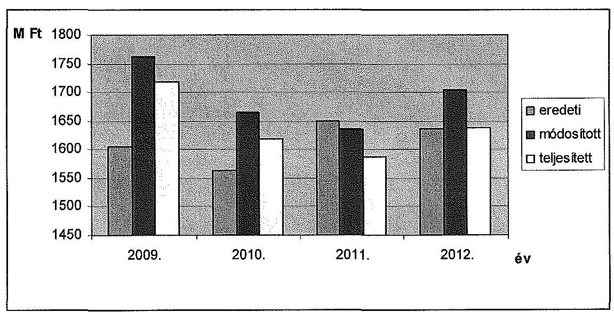

Az ellenőrzött időszakban az eredeti kiadási előirányzatok több mint 93\%-a működési kiadás volt. Az egyetem eredeti működési költségvetése a 2009. évi 1589,0 M Ft-ról 1531,2 M Ft-ra csökkent, ugyanakkor a 2012. évi felhalmozási kiadások 104,8 M Ft-os eredeti előirányzata jelentősen meghaladta annak 2009. évi 16,8 M Ft-os összegét.

A felhalmozási kiadások eredeti előirányzatának növekedése a felújításoknak köszönhető, a teljesítési kifizetések ugyanakkor változóan alakultak. A teljesített kiadás a 2009. évben 57,4 M Ft, a 2010. évben 28,0 M Ft, a 2011. évben 34,1 M Ft, a 2012. évben 61,3 M Ft volt.

Az egyetem eredeti kiadási előirányzatainak több mint fele személyi juttatás és hozzá kapcsolódó járulék, közel egyharmada pedig dologi kiadás volt. Az ellátottak pénzbeli juttatásai (főként hallgatói támogatások) 6-7\% körül alakultak.

Az ellátottak pénzbeli juttatását hallgatói létszám és normatíva alapján tervezték, amelyek jellemzően szociális, tanulmányi, lakhatási, könyv-jegyzet, kollégiumi díj támogatásokat és a doktoranduszok ösztöndíját jelentette.

Az egyetem eredeti bevételi előirányzatai az ellenőrzött évek alatt 155,4 M Ft-ról 300,0 M Ft-ra növekedtek. A tervezett saját bevételek jellemzően működési bevételek voltak, felhalmozási bevételt csak 2011-ben terveztek.

A költségvetési támogatások eredeti előirányzata a 2009. évi 1450,4 M Ft-ról 2012-re 1336,0 M Ft-ra csökkent. Az előirányzatok alakulását részletesen az 1. számú melléklet tartalmazza.

A költségvetési tervezés főbb szabályait és felelőseit az SZMSZ-ben, a Gazdálkodási Szabályzatban és a Gazdasági Hivatal Ügyrendjében határozták meg.

---

Az MKE a kiadási és bevételi előirányzatok tervezése során - az egyes bevételek megállapítása kivételével - a jogszabályokban és a fenntartó által kiadott tervezési irányelvekben foglaltak szerint járt el.

Az egyetem elemi költségvetésének előirányzati keretszámait a minisztérium az éves költségvetési törvényekben elfogadott előirányzatok és szabályok szerint, illetve azok keretei között állapította meg. A költségvetés tervezéséhez kapcsolódó, meghatározott adatszolgáltatásokat (foglalkoztatottak létszáma, előmenetelek, tárgyévi hallgatói létszám, saját bevételek tervezett összege) az MKE határidőben és az előírt tartalommal megküldte a minisztérium részére. Az ellenőrzött időszak folyamán valamennyi évben fennállt az egyezés a tervezés során a kincstári költségvetés és az MKE által készített elemi költségvetés kiemelt előirányzatai között. Mellékszámításokat csak a főszámok alapján biztosított előirányzatok felosztása során végeztek.
A MKE előirányzatait országgyűlési, kormány, irányító szervi és intézményi hatáskörben egyaránt módosították. Az MKE évenkénti előirányzatmódosításait a következő táblázat mutatja be:

|  | Előirányzat-módosítások |  |  |  | M Ft |
| :--: | :--: | :--: | :--: | :--: | :--: |
|  | OGY | Kormány | irányító   szerv | intézmény | összesen |
| 2009 | 0,0 | 5,2 | 4,5 | 145,9 | 155,6 |
| 2010 | 0,0 | 12,0 | 0,1 | 88,4 | 100,5 |
| 2011 | $-176,3$ | 11,3 | 0,1 | 151,1 | $-13,8$ |
| 2012 | 0,0 | $-45,4$ | 15,5 | 99,5 | 69,6 |
| összesen | $-176,3$ | $-16,9$ | 20,2 | 484,9 | 311,9 |

Országgyűlési hatáskörben 176,3 M Ft-ot vontak el az egyetemtől 2011-ben ${ }^{25}$. Az államháztartási egyensúly megőrzéséhez szükséges intézkedésekről szóló 1025/2011. (II.11.) Korm. határozatban foglaltak alapján első lépésben zároltak 157,3 M Ft-ot, majd ezt az összeget (19,0 M Ft-tal megemelve) elvonták.

Kormányzati hatáskörben az ellenőrzött időszakban tizenhárom alkalommal került sor előirányzat-módosításra. A csökkenést zárolások és elvonások, a növekedést a közalkalmazotti bérkompenzáció ${ }^{26}$ okozta. Ez utóbbi jogcímen kompenzációra 2009-ben 30,6 M Ft, 2010-ben 27,2 M Ft, 2011-ben 11,3 M Ft, 2012-ben 32,1 M Ft előirányzat-emelés történt.

[^0]
[^0]:    ${ }^{25}$ A Magyar Köztársaság 2011. évi költségvetéséről szóló 2010. CLXIX. törvény módosításáról szóló 2011. évi CXIV. törvény alapján.
    ${ }^{26}$ 6/2009. (I. 20.), 133/2009. (VI. 19.), 352/2010. (XII. 30.), 371/2011. (XII. 31.) Korm. rendeletek; 1001/2009. (I. 13.), 1035/2010. (II. 12.), 1120/2010. (V. 13.), 1132/2010. (VI.18.), 1185/2011. (VI.6.), 1133/2012. (IV.26.) Korm. határozatok

---

Irányító szervi hatáskörben tíz alkalommal történt módosítás, ami 20,2 M Ft-tal növelte az eredeti előirányzatot. A növekedést megállapodások alapján kapott többlet előirányzat, valamint a többletbevétel előirányzatosítása okozta.

Intézményi hatáskörben harmincnyolc esetben módosították az előirányzatokat, amely összességében 484,9 M Ft-tal növelte az eredeti előirányzatot. Ennek forrása az előző évi maradvány, a működési és felhalmozási célú átvett pénzeszköz, a saját bevételemelés előirányzatosítása, valamint átcsoportosítása volt.

A módosított kiadási/bevételi előirányzatok - 2011. év kivételével - magasabbak voltak az éves eredeti kiadási/bevételi előirányzatoknál.

A kiadási előirányzat-módosítások legnagyobb mértékben minden évben az ellátottak pénzbeli juttatásait és a felhalmozási kiadásokat növelték.

A módosított központi költségvetési támogatás 2011-ben 11,3\%-kal, míg 2012-ben 3,4\%-kal csökkent, 2009-2010-ben 1\%-ot el nem érő mértékben növekedett az eredeti előirányzathoz képest. Az előirányzat-módosítások a bevételi oldalon meghatározóan a saját bevételeket érintették.

Az MKE teljesített költségvetési kiadása a 2009. évi 1718,5 M Ft-ról 2012-re 1638,8 M Ft-ra - 4,6\%-kal - csökkent. A 2011-ig tartó folyamatos csökkenést csak 2012-ben követte növekedés a tárgyévet megelőző évhez képest. Az összes kiadáson belül meghatározó volt a személyi juttatások és a dologi kiadások aránya.

Az MKE összes tényleges kiadásán belül a személyi juttatások és járulékok aránya 2009-ben 61,0\%, 2010-ben 58,8\%, 2011-ben 56,4\%, míg 2012-ben 56,5\% volt. A dologi kiadások aránya 2009-ben 34,9\%, 2010-ben 39,1\%, 2011-ben 40,1\%, míg 2012-ben 38,8\% volt.

Az MKE kiadásait finanszírozását biztosító teljesített bevétele és költségvetési támogatása együttesen 2009-től 2012-ig 1754,8 M Ft-ról 1677,4 M Ft-ra -4,4\%-kal - csökkent, amely az ellenőrzött időszakban nem volt egyenletes, 2010-ben és 2011-ben csökkenés, míg 2012-ben növekedés volt a megelőző évhez képest. Az összes bevételen belül meghatározó volt a költségvetési támogatás aránya, ami 2009 és 2012 között szintén csökkent. A költségvetési támogatás a tényleges kiadások döntő részét - jellemzően mintegy négyötödét - fedezte. A teljesített előirányzatok alakulását részletesen a 2. számú melléklet tartalmazza.

Az MKE összes tényleges bevételén belül a költségvetési támogatás aránya 2009-ben 83,2\%, 2010-ben 84,5\%, 2011-ben 79,2\%, míg 2012-ben 77,0\% volt. A költségvetési támogatás 2009-ben a tényleges kiadások 85,0\%-át, 2010-ben 86,3\%-át, 2011-ben 81,5\%-át, míg 2012-ben 78,8\%-át fedezte.

A költségvetési támogatások csökkenése mellett az MKE hallgatóinak létszáma 2009 és 2012 között folyamatosan, összesen 9,7\%-kal emelkedett, ezen belül az államilag támogatott hallgatók aránya kis mértékben csökkent. A hallgatói létszám növekedésének fedezetét a saját bevételek növekedése biztosította. Az MKE hallgatói létszámának alakulását a következő táblázat mutatja be.

---

|  | $\mathbf{2 0 0 9 .}$ | $\mathbf{2 0 1 0 .}$ | $\mathbf{2 0 1 1 .}$ | $\mathbf{2 0 1 2 .}$ |
| :-- | --: | --: | --: | --: |
| Összes hallgató | 619 | 658 | 664 | 679 |
| ebből: nappali (teljes idejű) | 559 | 616 | 629 | 600 |
| esti, levelező, távoktatás | 60 | 42 | 35 | 79 |
| Államilag támogatott hallgató   összesen | 568 | 614 | 618 | 604 |
| ebből: nappali (teljes idejű) | 543 | 586 | 591 | 571 |
| esti, levelező, távoktatás | 25 | 28 | 27 | 33 |

A hallgatói létszám 9,7\%-kal növekedett, miközben a felsőoktatás egészében 8,6\%-kal csökkent a hallgatók száma. Az alapító okirat szerint a felvehető maximális hallgatói létszám 1046 fő, a 2012. évi létszám ennek 64,9\%-a volt.

Az MKE 2009-2012. évi előirányzat-maradványa 32,8 M Ft; 33,3 M Ft; 45,5 M Ft; illetve 38,6 M Ft volt. A maradvány elsősorban kiadási megtakarításból származott. Az egyetem kiadási megtakarítása a 2009-2012. években 43,0 M Ft, 46,3 M Ft, 47,5 M Ft, illetve 66,9 M Ft volt, amely a kiadási előirányzat teljesítések 2,5\%-át, 2,9\%-át, 3,0\%-át, illetve 4,1\%-át tette ki.

Az ellenőrzött időszakban az MKE nem támogatott alapítványt vagy közalapítványt, vállalkozási tevékenységet nem végzett. Az intézmény szerkezetében, szervezeti felépítésében változás nem történt, átalakítást nem hajtottak végre.

# 3.1.1. A pénzügyi egyensúlyt befolyásoló tényezők 

A központi költségvetés egyensúlyát biztosító kormányzati intézkedések szigorú gazdálkodási fegyelmet követeltek meg az egyetemtől az ellenőrzött
 időszakban, de a működőképességét és a feladatellátását nem veszélyeztették. A 2009-2012. évi költségvetési és pénzgazdálkodás megfelelően támogatta az MKE feladatainak ellátását. Az eredeti költségvetési előirányzatokon tervezett főösszeg, valamint a többletfeladatokra jóváhagyott költségvetési előirányzat a saját bevételekkel együtt elegendő forrást biztosított az alapfeladatokra és a működőképesség megfelelő szinten történő fenntartásához, továbbá az engedélyezett beruházások és felújítások végrehajtására.

Az MKE költségvetésének elemzését a CLF módszer szerint számított mutatók alapján végeztük el. Az egyetem működési jövedelmét, felhalmozási költségvetési egyenlegét, pénzügyi pozícióját, nettó működési jövedelmét a következő táblázat szemlélteti. Az adatokat részletesen a 3. számú melléklet tartalmazza.

---

|  |  |  | adatok M Ft-ban |  |
| :-- | --: | --: | --: | --: |
| Megnevezés | $\mathbf{2 0 0 9 .}$ | $\mathbf{2 0 1 0 .}$ | $\mathbf{2 0 1 1 .}$ | $\mathbf{2 0 1 2 .}$ |
| Folyó bevételek | 1618,0 | 1590,6 | 1529,1 | 1530,9 |
| Folyó kiadások | 1647,9 | 1583,1 | 1545,7 | 1561,7 |
| Működési jövedelem | $\mathbf{- 2 9 , 9}$ | $\mathbf{7 , 5}$ | $\mathbf{- 1 6 , 6}$ | $\mathbf{- 3 0 , 8}$ |
| Felhalmozási bevételek | 92,2 | 1,0 | 14,2 | 57,0 |
| Felhalmozási kiadások | 70,5 | 34,9 | 42,1 | 77,1 |
| Felhalmozási költségvetés egyenlege | $\mathbf{2 1 , 7}$ | $\mathbf{- 3 3 , 9}$ | $\mathbf{- 2 7 , 9}$ | $\mathbf{- 2 0 , 1}$ |
| Folyó és felhalmozási bevételek összesen | 1710,2 | 1591,6 | 1543,3 | 1587,9 |
| Folyó és felhalmozási kiadások összesen | 1718,5 | 1618,0 | 1587,8 | 1638,8 |
| Finanszírozási műveletek nélküli   pozíció | $\mathbf{- 8 , 3}$ | $\mathbf{- 2 6 , 4}$ | $\mathbf{- 4 4 , 5}$ | $\mathbf{- 5 0 , 9}$ |
| Finanszírozási műveletek egyenlege | -1,3 | -0,7 | 1,2 | 4,7 |
| Tárgyévi pénzügyi pozíció | $\mathbf{- 9 , 6}$ | $\mathbf{- 2 7 , 1}$ | $\mathbf{- 4 3 , 3}$ | $\mathbf{- 4 6 , 2}$ |
| Hiteltörlesztés, értékpapír beváltás | 0,0 | 0,0 | 0,0 | 0,0 |
| Nettó működési jövedelem | $\mathbf{- 2 9 , 9}$ | $\mathbf{7 , 5}$ | $\mathbf{- 1 6 , 6}$ | $\mathbf{- 3 0 , 8}$ |

Az MKE működési jövedelme az ellenőrzött időszakban a 2010. év kivételével negatív volt, vagyis az MKE éves folyó bevételei nem nyújtottak fedezetet a feladatellátáshoz kapcsolódó éves folyó kiadásokra. A finanszírozás fedezetét az előző évi maradványok igénybevételével biztosították.

A nettó működési jövedelem értéke minden évben megegyezett a működési jövedelem értékével, mert az MKE nem vett fel hitelt, és így nem terhelte tőketörlesztés.

A felhalmozási költségvetés egyenlege - a 2009. évi kivételével - szintén negatív értéket mutatott. A felhalmozási deficit által generált finanszírozási igény önmagában nem járna pénzügyi kockázattal, de a kedvezőtlen működési jövedelem mellett már kockázatosnak tekinthető.

A finanszírozási műveletek nélküli pozíció minden évben negatív volt, ugyanakkor a finanszírozási műveletek egyenlege számottevő hatást nem gyakorolt az intézményre.

Az évenkénti pénzügyi pozíció értéke az ellenőrzött időszakban folyamatosan romlott. A pénzügyi pozíció romlását jelzi, hogy az MKE eladósodási mutatója ${ }^{27}$ is kedvezőtlenül változott az ellenőrzött időszakban. A 2009. évi 3,3%-

[^0]
[^0]:    ${ }^{27}$ Az eladósodási mutató a hosszú és rövid lejáratú fizetési kötelezettségek összes forráson belüli arányát mutatja.

---

ról a 2012. évben 4,5%-ra nőtt. A pénzeszköz-likviditási mutató ${ }^{28}$ szintén romlott, a 2009. évi 1,2-ről a 2012. évre 1,0-re csökkent. Ez azt jelenti, hogy a pénzeszközök év végi állománya még éppen fedezetet nyújtott a rövid lejáratú kötelezettségek rendezésére. A likviditási mutató ${ }^{29}$ értéke szintén gyengült, a 2009. évi 1,8-hoz képest a 2012. évben már csak 1,3-as értéket mutatott.

A negatív tendenciákhoz hozzájárultak a költségvetést érintő zárolások és elvonások, illetve a folyamatosan csökkenő költségvetési támogatás. A pénzügyi pozíció negatív értékei a folyamatos likviditás veszélyeztetése mellett az egyetem hosszú távú fizetőképességét is veszélyeztetik, amely a kiadási és bevételi szerkezet átalakításának szükségletét vonhatja maga után.

2009-ben és 2012-ben két-két alkalommal volt zárolás, míg 2010-ben és 2011-ben egyszer-egyszer. A zárolt összegeket minden esetben elvonták. 2011-ben maradványtartási kötelezettséget is előírtak, de ezt sem oldották fel.

Az MKE az ellenőrzött időszakban növekvő hallgatói létszám mellett, csökkenő költségvetési támogatás és a romló pénzügyi pozíció ellenére megőrizte fizetőképességét, a likviditás folyamatosan biztosított volt. Jelentős összegű év végi mérleg szerinti szállítói kötelezettséget nem halmoztak fel, és ezek túlnyomó része is 30 napon belüli tartozás volt. 2009 és 2012 között az intézmény átalakítására, feladatok átvételére vagy átadására nem került sor. Kincstári biztos, illetve költségvetési felügyelőt nem jelöltek ki az intézményhez. Az egyetem a köz- és magánszféra együttműködésében végzett projektben nem vett részt.

A Kormány előirányzat-felhasználáshoz kapcsolódó évközi korlátozó intézkedései nem voltak hatással az egyetem dolgozói létszámára.

Az engedélyezett létszám és az átlagos statisztikai állományi létszám egyaránt 260 fő volt 2009 és 2012 között.

# 3.1.2. A normatív támogatások felhasználása 

Az MKE-nél a normatív támogatások felhasználásával kapcsolatos döntések megfeleltek a vonatkozó jogszabályok és belső szabályzatok előírásainak.

Az ellenőrzött időszakban a működéshez a fenntartó nem kötött felhasználású normatív (képzési, tudományos célú és fenntartói) támogatásokat, továbbá kötött felhasználású, a hallgató részére nyújtható normatív támogatásokat biztosított.

A nem kötött felhasználású támogatások (képzési, tudományos célú és fenntartói) szervezeti egységek közötti felosztását a költségvetés elfogadása keretében a szenátus hagyta jóvá. Az egyetem rendelkezett 2008-2010 között a fi-

[^0]
[^0]:    ${ }^{28}$ A pénzeszköz-likviditási mutató kifejezi, hogy a pénzeszközök év végi állománya milyen arányban nyújt fedezetet a rövid lejáratú fizetési kötelezettségekre.
    ${ }^{29}$ A likviditási mutató mutatja, hogy a rövid lejáratú fizetési kötelezettségek kiegyenlítéséhez a forgóeszközök milyen arányban nyújtanak fedezetet.

---

nanszírozásra kötött fenntartói megállapodással. 2011-2012-ben a korábbi fenntartói megállapodás logikáját követve folyt a támogatás-felhasználás.

Az OKM-mel 2007. december 13-án kötött hároméves fenntartói megállapodás rögzítette az állandó és változó jellegű támogatásokat. Meghatározta a támogatás felhasználásának szabályait, a megállapodás teljesítéséről való beszámolást. Előírta a teljesítménycélokat, kötelezettségeket és az ezektől való eltérés következményeit. A teljesítmény célok - a 2007. évi adatok bemutatása mellett - három évre lebontva tartalmazták az oktatás, a kutatás, a gazdálkodás, az irányítás, a szervezeti hatékonyság, továbbá a nemzetközi és regionális együttműködés célértékeit.

A kötött felhasználású hallgatói támogatások, illetve az egyéb feladatok támogatásainak felhasználásáról szenátusi határozatokat hoztak. A hallgatói juttatásokat a belső szabályzatnak megfelelően állapították meg és hirdették ki. A hallgatói támogatások terhére megállapított hallgatói juttatási előirányzatok felhasználásáról elszámolást készítettek.

Az egyetem a felsőoktatásban részt vevő hallgatók juttatásairól és az általuk fizetendő egyes térítésekről szóló 51/2007. (III. 26.) Korm. rendelet alapján az SZMSZ-ben rögzítette a hallgatói juttatások megállapításának elveit, az odaítélés módját és eljárási szabályait. Meghatározták a támogatások időtartamát, jogcímét, valamint a pénzügyi források és más támogatások felhasználásának ellenőrzési rendszerét, jogorvoslati lehetőségét.

# 3.2. A kiadási és bevételi előirányzatok felhasználásának szabályszerűsége 

### 3.2.1. Személyi juttatások

A rendszeres és nem rendszeres személyi juttatások előirányzatának felhasználása során a gazdálkodási jogkörök gyakorlása tekintetében nem érvényesültek teljes körűen a jogszabályok és a belső szabályzatok előírásai. Ez szabályszerűségi kockázatot jelentett az ellenőrzött terület egészének szabályos működése szempontjából. A hibás kifizetésekhez kapcsolódó kinevezésmódosítások (kötelezettségvállalás) a vonatkozó jogszabályok ${ }^{30}$ előírásait megsértve nem voltak pénzügyileg ellenjegyezve.

A személyi juttatásokhoz kapcsolódó tevékenységek - a létszámgazdálkodás, az illetmény- és bérgazdálkodás, az illetmény- és bérszámfejtés, -folyósítás, a kapcsolódó adó- és járulékelszámolás, bevallás és befizetés - kezelése a vonatkozó jogszabályok és a fenntartó rendelkezései alapján központi gazdálkodás keretében valósultak meg.

A kifizetésekkel összefüggésben a foglalkoztatottak rendelkeztek a besorolásuknak megfelelő végzettséggel és gyakorlattal. A kinevezési okiratban rögzített besorolásuk megfelelt a jogszabályban rögzített előírásoknak. A személyi juttatások kifizetését munkaidő-elszámolás és teljesítésigazolás támasztotta alá. Az

[^0]
[^0]:    ${ }^{30}$ Ámr. ${ }_{1}$ 134. § (8) bekezdése, az Ámr. ${ }_{2}$ 74. § (1) bekezdése, valamint az Áht. ${ }_{2}$ 37. § (1) bekezdése

---

illetmények számfejtésének alapjául szolgáló bizonylatok megfeleltek a jogszabályoknak, a pótlékok és illetménykiegészítések elszámolása indokolt és szabályszerű volt. A bruttó illetmény összege megfelelt a kinevezési okiratban foglaltaknak, a munkavállalót terhelő levonások az Szja tv. és a Tbj. vonatkozó előírásai szerint történtek. A szerződéskötés során betartották a vonatkozó jogszabályokban foglalt előírásokat. A felsőfokú iskolai végzettséget igazoló dokumentumok, továbbá a nyelvpótlékokat alátámasztó nyelvvizsga bizonyítványok fellelhetőek voltak.

A nem rendszeres személyi juttatások keretén belül legnagyobb súllyal a bérkiegészítés szerepelt. Az ellenőrzött kereset-nyilvántartó lapok, illetve a kapcsolódó dokumentumok alapján megállapítható, hogy a bérkiegészítés elszámolása megfelelt a Kjt. 77. §-a előírásainak.

A megbízási díjak elszámolása összességében nem volt szabályszerű, nem felelt meg a jogszabályok és a belső szabályzatok előírásainak. A kifizetéseket több esetben nem támasztották alá szerződések, továbbá visszatérő jelleggel nem történt meg a szerződések pénzügyi ellenjegyzése, amivel megsértették az Áht. ${ }_{2}$, az Ámr. ${ }_{1}$ és az Ámr. ${ }_{2}$ vonatkozó előírásait ${ }^{31}$. Elsősorban a 2009. év vonatkozásában nem lelték fel a dokumentumok egy részét (utalványrendeletet, csoportos átutalási megbízás átadási jegyzéket, számfejtési listát, kifizetési jegyzéket).

A szerződésekben a feladat meghatározása egyértelmű volt, a munkák nem irányultak alapfeladat ellátására, a teljesítést az arra jogosult személy írta alá. A megbízási díjak szerződéseit a tárgyévi előirányzatok terhére kötötték. A folyamatos feladatra kötött szerződések legkésőbb a következő év június 30-án lejártak. A megbízás minden esetben olyan feladatra szólt, amelynek teljesítése mérhető. A teljesítés igazolásának feltételeit egyértelműen meghatározták. A Feot. és az Nftv. oktatói tevékenységre vonatkozó előírásait betartották. A szerződésben rögzített megbízási díjak megfeleltethetőek a teljesítésigazolásban lévő összegnek. A megbízottat terhelő levonások megállapítása a fellelt iratanyagban szabályszerű volt. A megbízások mintegy háromnegyed része képzőművészeti kisegítő tevékenység (modell), kb. egyötöde oktatási tevékenység volt.

# 3.2.2. Dologi kiadások 

A dologi kiadások előirányzatainak felhasználása a pénzügyi elszámolások, valamint a gazdálkodási jogkörök gyakorlása tekintetében összességében nem felelt meg a jogszabályoknak és belső szabályoknak, a kontrollok nem működtek megfelelően. A kifizetések szabálytalansága elsősorban a szakmai teljesítésigazolás és az érvényesítő funkciónál jelentkezett.

Az utalványrendelet több esetben nem tartalmazta a keltezést. Ezzel megsértették az Ámr. 78. § (2), az Ávr. 59. § (3) bekezdésben foglaltakat. Dátum hiányában nem állapítható meg, hogy a kiadás teljesítésének elrendelése előtt elvégezték-e az érvényesítést és az ellenjegyzést.

[^0]
[^0]:    ${ }^{31}$ Áht. 2 37. § (1) bekezdése, Ámr. ${ }_{1}$ 134. § (8) bekezdése és az Ámr.

 ${ }_{2}$ 74. § (1) bekezdése

---

2012-ben egy kifizetés előzetes kötelezettségvállalás nélkül történt. Ezzel megsértették az Áht. 2 37. § (1) bekezdésében, valamint az Ávr. 52. § (1) bekezdésében előírtakat.

2012-ben egy kifizetésnél a kötelezettségvállalás ellenjegyzése hiányzott. Ezzel megsértették az Ávr. 55. § (1) bekezdésében foglaltakat.

2009-ben, 2011-ben és 2012-ben több kifizetésnél nem történt szakmai teljesítésigazolás. Ezzel megsértették az Ámr. ${ }_{1} 135$. § (1)-(2) bekezdésében, az Ámr. 2 76. § (1) és (3) bekezdésében, valamint az Ávr. 57. § (1) és (3) bekezdésében foglaltakat. 2009-ben és 2012-ben egy-egy kifizetésnél a szakmai teljesítésigazolást arra nem jogosult személy végezte. A teljesítésigazoló az Ámr. 1 135. § (2) bekezdésében és az Ávr. 57. § (4) bekezdésében megfogalmazottak ellenére nem rendelkezett a szükséges kijelöléssel, felhatalmazással.

A szakmai teljesítésigazolás hiánya, valamint annak jogosulatlan végzése esetében az érvényesítés nem felelt meg az Ámr. 1 135. § (3) bekezdésében, az Ámr. 2 77. § (1) bekezdésében, valamint az Ávr. 58. § (1) bekezdésében előírtaknak.

# A számlázott szellemi tevékenységre irányuló szolgáltatásigénybevétel, a készletbeszerzés, különféle szolgáltatások és vásárolt 

közzszolgáltatások esetében kiemelt figyelmet fordítottunk a nagy összegű kifizetések ellenőrzésére. A mintatételek 66,6%-ánál tártunk fel szabályszerűségi hibákat a kötelezettségvállalások és a kapcsolódó pénzügyi jogkörök gyakorlása esetében. A pénzügyi-számviteli kontrollok nem működtek megfelelően.

Többször előfordult, hogy nem történt előzetes kötelezettségvállalás, továbbá a kifizetés bizonylata egy esetben angol nyelvű volt. Ezzel megsértették az Sztv. 166. § (4) bekezdésében, az Áht. ${ }_{1} 100/$C. § (3) bekezdésében, az Ámr. 134. § (1) és (8) bekezdésében, valamint az Ámr. 2 72. § (1) bekezdésében foglaltakat. További egy esetben (1,1 M Ft-os kifizetés) a kötelezettségvállalás jogtalanul történt. Az SZKI kötelezettségvállalója nem rendelkezett az Ámr. ${ }_{1} 134. § (1) bekezdésében előírtak szerinti felhatalmazással.

Esetenként (2,1 M Ft összegben) hiányzott az utalvány ellenjegyzése, amellyel megsértették az Ámr. 2 79. § (1)-(2) bekezdésében foglaltakat.

Az utalványrendelet készítése során több esetben hiányzott a keltezés, amellyel megsértették az Ámr. 2 78. § (2) bekezdés a) pontja és az Ávr. 59. § (3) bekezdés g) pontja előírásait. A keltezés hiányában nem dokumentált, hogy a kiadás teljesítésének elrendelése előtt végezték-e el az érvényesítést. A teljesítésigazolás nem az MKE belső szabályzatai szerint történt. Ezzel a gyakorlattal megsértették az Ámr. ${ }_{1}$, az Ámr. ${ }_{2}$, az Ávr. vonatkozó előírásait és a belső szabályozásaikat is.

Az ellenőrzés során külön értékeltük a közbeszerzési értékhatárt meghaladó értékű beszerzéseket, amelynek során megállapítottuk, hogy az MKE rektora, illetve az SZKI igazgatója a hatályos Kbt. ${ }_{1,2}$ és a közbeszerzési szabályzat előírásait nem vette figyelembe, mert a közbeszerzési értékhatárt meghaladó szolgáltatásoknál közbeszerzési eljárás mellőzésével kötött szerző-

---

dést az ellenőrzés során feltárt kilenc esetben ${ }^{32}$, amellyel megsértette a Kbt. ${ }_{1}$ 240. §-ában, illetve a Kbt. 2 119. §-ában előírt közbeszerzési eljárás lefolytatatásának kötelezettségét. A jogvesztő határidő letelte miatt az ÁSZ-nak két eset kivételével - már nem állt módjában jogorvoslati eljárást kezdeményezni.

Az MKE 2008-ban három vállalkozóval takarítási szolgáltatásra, egy szolgáltatóval vagyonvédelmi feladatokra kötött szerződést. A 2009. évben informatikai rendszerek és alkalmazások üzemeltetésére és étkeztetési szolgáltatásra, a 2010. évben ismét takarítási szolgáltatásra kötött szerződést egy-egy vállalkozóval. Az MKE a 2009-től 2010-ig terjedő időszakban étkezési utalványt rendelt egy vállalkozótól, a 2012. évben pedig - érvényes kötelezettségvállalás nélkül - portaszolgálati és vagyonvédelmi tevékenység ellátásával bízott meg egy vállalkozót. Ezekben az esetekben a szerződés szerinti (illetve a teljesített kifizetések szerinti) abszolút, illetve becsült értékek meghaladták a hatályos költségvetési törvényekben meghatározott közbeszerzési értékhatárokat.

A 2008. évben határozatlan időre megrendelt takarítási feladatok szerződés szerinti értéke 920,0 ezer Ft+ÁFA/hó, 722,2 ezer Ft+ÁFA/hó és 750,0 ezer Ft+ÁFA/hó volt. Ez alapján a takarítási szolgáltatásra kötött szerződések becsült értéke a Kbt. 1 38. § (1) és (3) bekezdése értelemben 114,8 M Ft volt.

A vagyonvédelmi feladatok ellátására 2002-ben kötött határozatlan idejű szerződés 2008. évi módosítása alapján az MKE 2009-ben 32,0 M Ft-ot, 2010-ben 35,3 M Ft-ot, míg 2011-ben július 31-éig 24,5 M Ft-ot fizetett ki a vállalkozás részére. Az adott időszak alatt hatályos Kbt. ${ }_{1} 37$. § rendelkezése alapján a szolgáltatás becsült értéke meghaladta az adott évben hatályos költségvetési törvényben meghatározott nemzeti értékhatárt.

A 2009. évben informatikai rendszerek üzemeltetésére határozott időre kötött szerződésben megállapított szolgáltatási díj 657,5 ezer Ft+ÁFA/hó volt. A Kbt. ${ }_{1} 38$. § (1) bekezdése értelmében a szolgáltatás becsült értéke 31,6 M Ft volt.

Az MKE a 2008/2009. tanévben a szakközépiskolai tanulók és kollégiumi diákok étkeztetésére 10,8 M Ft-ot fizetett ki. A kiszámlázott mennyiségi adatok és a jegyzőkönyvben rögzített értékbeli változást figyelembe véve a szolgáltatás havi díja 885,2 ezer Ft+ÁFA, így a szolgáltatás becsült értéke a Kbt. ${ }_{1} 38$. § (1) bekezdése értelmében 42,5 M Ft volt.

A 2010. évben határozatlan időre megrendelt takarítási feladatok szerződésben megállapított szolgáltatás díja 650,0 ezer Ft+ÁFA/hó volt, így a Kbt. ${ }_{1} 38$. § (1) bekezdése értelmében a szolgáltatás becsült értéke 31,2 M Ft volt.

A 2009-2010. években az MKE étkezési utalványt rendelt egy vállalkozótól, amelynek következtében 27,9 M Ft-ot, illetve 17,1 M Ft-ot fizetett ki. A szolgáltatások értéke meghaladta a hatályos költségvetési törvényekben szereplő 25,0 M Ft, illetve 8,0 M Ft nemzeti értékhatárt.

[^0]
[^0]:    ${ }^{32}$ Öt esetben a rektor, két esetben az SZKI igazgatója kötötte a szerződéseket, míg a további esetekben az aláírások alapján egyértelműen nem volt megállapítható, illetve nem volt kötelezettségvállaló.

---

Az MKE a vagyonvédelmi feladatokat ellátó vállalkozással közbeszerzési eljárás eredményeként 2011. július 29-én szolgáltatási szerződést kötött, amely 2012. július 31-én lejárt. Az MKE-n a portaszolgáltatási és vagyonvédelmi tevékenységet 2012. augusztus 1-jétől folyamatosan (a helyszíni ellenőrzés lezárásának időpontjában is) ugyanezen vállalkozás végezte. Az MKE a vállalkozással a 2012. augusztus 1-jel teljesítési időszaktól hatályos szerződést nem tudott bemutatni, ugyanakkor a szolgáltató által benyújtott számlákhoz kapcsolódó teljesítésigazolás az MKE részéről aláírásra került. Az MKE megsértette Kbt. 2 119. § (1) bekezdésében előírt közbeszerzési eljárás lefolytatásának kötelezettségét azzal, hogy a vállalkozástól - írásbeli kötelezettségvállalás nélkül - szóbeli megállapodás alapján további teljesítést rendelt, és az elvégzett szolgáltatás közbeszerzési értékhatárt meghaladó mértékű összegét kifizette, amely a 2012. augusztus és december havi teljesítési időszakra 12,0 M Ft volt. A kötelezettségvállalás elmulasztása ellentétes az Áht. 2 37. § (1) bekezdésében foglaltakkal.

A közbeszerzési eljárás nélkül, illetve kötelezettségvállalás mellőzésével megrendelt nagy összegű szolgáltatások, feladatok teljesültek, ugyanakkor azok korrupciós kockázatot jelentettek az egyetem gazdálkodásában.

# 3.2.3. Felhalmozási kiadások 

Az MKE felújítási, beruházási előirányzatainak felhasználása a pénzügyi elszámolások, valamint a gazdálkodási jogkörök gyakorlása tekintetében összességében nem felelt meg a jogszabályoknak és belső szabályoknak. Felhalmozási kiadásokat érintő szabályszerűségi hibákat a kötelezettségvállalások és a kapcsolódó pénzügyi jogkörök gyakorlása esetében tártunk fel.

A kifizetéshez kapcsolódóan több esetben (5,3 M Ft értékben) nem történt kötelezettségvállalás, amellyel megsértették az Áht. 100/C. § (3) bekezdésében és az Áht. 2 37. § (1) bekezdésében foglaltakat, továbbá összesen 3,6 M Ft kifizetése esetében az Ámr. 134. § (1) bekezdése, az Ámr. 72. § (3) bekezdése, valamint az Ávr. 52. § (1) bekezdése előírásai ellenére a kötelezettségvállalást nem az arra jogosultak végezték.

A kötelezettségvállalás előzetes ellenjegyzése több esetben, 14,2 M Ft összegben nem történt meg az Ámr. 134. § (8) bekezdésében és az Ámr. 2 74. § (1) bekezdésében, valamint az Áht. 2 37. § (1) bekezdésében foglaltak ellenére.

A kiadások szakmai teljesítésigazolása az Ámr. 1 135. § (1) bekezdésében, az Ámr. 2 76. § (1) és (5) bekezdésében, valamint az Ávr. 57. § (1) és (4) bekezdésében foglaltak ellenére számos esetben, 4,7 M Ft összegben elmaradt, illetve a szakmai teljesítésigazolást arra nem jogosult személy végezte.

Az MKE a 2009-2012. években központi beruházást nem tervezett és nem valósított meg.

[^0]
[^0]:    ${ }^{36}$ Hallgatók által fizetendő díjak és térítések (SZMSZ II. rész Hallgatói követelményrendszer VII. fejezet)

---

# 3.2.4. A hazai forrásból finanszírozott projektek 

A hazai forrásból finanszírozott projektekhez, feladatokhoz kapott költségvetési források előirányzatainak felhasználása megfelelt a jogszabályok és a belső szabályok előírásainak.

Az ellenőrzött időszakban az MKE hazai forrásból 49,5 M Ft-ot kapott, amely döntően szakképzési hozzájárulásból és a Nemzeti Kulturális Alapból (továbbiakban: NKA) történő támogatásból tevődött össze.

A támogatások célja és formája megfelelt az egyetem feladatkörének és a pályázatok - pályázatonként eltérő - követelményeinek. Az NKA-ból pályázatok útján kiállításszervezésre, katalóguskészítésre, könyvrestaurációra, szoboravatásra nyertek el forrásokat.

Az NKA-ból kapott támogatás felhasználásáról az MKE minden esetben készített szakmai beszámolót és pénzügyi elszámolást a támogatási megállapodásban foglaltak szerint.

A támogató egy esetben szólította fel az MKE-t az elszámolás kiegészítésére. A megállapodások felmondására, támogatás visszavonására, szankciók érvényesítésére nem került sor.

Az MKE kutatócsoportjai az MTA Lendület program támogatására az ellenőrzött időszakban nem pályáztak.

### 3.2.5. Működési bevételek

A működési bevételek beszedése a gazdálkodási jogkörök gyakorlása tekintetében összességében nem volt szabályszerű, rendszerszintű hiányosságokat tártunk fel a jogkörök gyakorlása területén, mely kockázatot jelentett a bevételek összegszerűségének megbízhatósága szempontjából.

A 2009-2011-ig tartó időszakban több esetben, összesen 1,0 M Ft összegben nem történt teljesítésigazolás a bevételek beszedéséhez. Ezzel megsértették az Ámr. ${ }_{1} 135. § (1) és az Ámr. ${ }_{2} 76. § (1) bekezdésében, illetve a hatályos kötelezettségvállalási szabályzatban foglaltakat, amelyek 2010-től a jogszabályi lehetőséggel élve előírták a teljesítésigazolás kötelezettségét. A szabálytalan gyakorlatot az érvényesítő nem kifogásolta meg.

A 2010. és 2012. évben több pénztárban teljesített bevételnél (0,8 M Ft) nem végezték el az érvényesítést. Ezzel megsértették az Ámr. ${ }_{2} 77. § (1) bekezdésében, az Ávr. 58. § (1) bekezdésében, illetve a hatályos kötelezettségvállalási szabályzatban foglaltakat.

Az utalványlap hiányában a dokumentáció nem tartalmazta a főkönyvi számlaszámot. A bevételek érvényesítői és utalványozói 2009-2010 között 0,4 M Ft értékben megfelelő analitika hiányában nem ellenőrizték az összegszerűséget és azt, hogy a megelőző ügymenetben az Áht. ${ }_{1}$, az Ámr. ${ }_{1-2}$, továbbá a belső szabályzatokban foglaltakat betartották-e. A költségtérítésekhez, tanfolyamokhoz kapcsolódó bevételeket visszatérő jelleggel (a mintatételek közül 10 esetben, 0,7 M Ft összegben) nem számlázták ki.

---

Az egyetem működési bevételeit döntően a szolgáltatások ellenértéke, a bérleti díjak és az intézményi ellátási díjak jelentették.

Az SZMSZ-ben rögzítették ${ }^{36}$ a hallgatók által fizetendő díjakat és térítéseket, a mentességeket és kedvezményeket. Meghatározták a díjak befizetésének és kezelésének szabályait, valamint a pénzügyi források felhasználásának ellenőrzési rendszerét, jogorvoslati lehetőségét.

# 3.2.6. Felhalmozási bevételek 

A felhalmozási bevételek beszedése a gazdálkodási jogkörök gyakorlása tekintetében összességében nem volt szabályszerű, nem felelt meg
 a jogszabályoknak és belső szabályoknak.

A 2009. évben visszatérő hiányosság volt, hogy nem végezték el a bevételek szakmai teljesítésigazolását, amely ellentétes az Ámr. ${ }_{1} 135 . \S$ (1) bekezdésének előírásaival. A bérleti díj bevételeknél alkalmanként nem végezték el az érvényesítést, amely ellentétes az Ámr. ${ }_{1} 135 . \S$ (3) bekezdésének és az Ámr. ${ }_{2} 77 . \S$ (1) bekezdésének, valamint a hatályos kötelezettségvállalási szabályzat előírásaival. Az érvényesítés 2009-ben többször nem felelt meg az Ámr. ${ }_{1} 135 . \S$ (5) bekezdése előírásainak, mivel az érvényesítés nem tartalmazta az „érvényesítve” megjelölést.

Az ellenőrzés során kiemelt figyelmet fordítottunk a nagy összegű felhalmozási bevételek ellenőrzésére, amelyek jellemzően ingatlanértékesítésből és bérleti díj bevételből származtak. A nagy összegű bevételek beszedése során szabályszerűségi hibát nem tártunk fel.

Az MKE 2009. május 26-án értékesítette a vagyonkezelésében lévő érdi, beépítetlen, belterületi ingatlant. Az értékesítés az elővásárlási joggal rendelkező helyi önkormányzat részére történt. Az értékesítés a jogszabályi előírásoknak megfelelt.

Az MKE az állami vagyon hasznosításának, bérbeadásának kereteit bérleti szerződésekben rögzítette. A szerződésekben meghatározták a bérleti díj összegét, tartós bérlet esetében annak emelésének mértékét és időpontját és a rezsiköltségek megfizetésének módját. A bérleti díjakról az MKE számlát bocsátott ki.

A bérleti díjak megállapítása előtt felmérték a piaci árakat, és annak figyelembe vételével határozták meg a bérleti díj összegét, a kalkuláció alapjául szolgáló írásos anyagot azonban nem őrizték meg.

### 3.2.7. A díjak, költségtérítések megállapítása

Az MKE egyes díjbevételeit jellemzően az egyes sajátos bevételek (külön eljárási, kollégiumi díjak, előkészítő képzések, beléptető kártya díja stb.), a továbbszámlázott szolgáltatások és az alkalmazottak térítése jogcímek alkották. Az MKE az ellenőrzött időszakban vállalkozási tevékenységet nem folytatott.

---

# A díjak és költségtérítések megállapítása összességében nem volt szabályszerű. A díjbevételek teljes körét önköltségszámítással nem alapozták meg ${ }^{37}$. 

Nem alapozták meg önköltségszámítással a könyv- és katalógusértékesítés, a nyelvtanfolyamok, az egyetemi előkészítők, a tanfolyamok, a rendezvényszervezés, a hallgatók lakásbérletének és eszközhasználatának, a vizsgák és a szállások díjait, továbbá a nevezési, a könyvtári, az eljárási, valamint a kártérítési és késedelmi díjakat.

Az MKE az ellenőrzött időszakban rendelkezett önköltség-számítási szabályzattal, amely nem felelt meg a jogszabályi előírásoknak. A szabályzat nem rendelkezett az államilag támogatott képzés, a költségtérítéses képzés, illetve az egyéb tevékenységek költségeinek az Áhsz. 8. § (19) bekezdése szerinti elkülönítéséről. Az elkülönítést az MKE számviteli rendszere sem biztosította, ugyanakkor a bevételek és kiadások belső szervezeti egységenkénti, illetve szakfeladatonkénti elkülönített nyilvántartása biztosított volt.

A fenntartó nem adott ki költségtérítések megállapításához az egy hallgatóra jutó önköltség meghatározásának sajátos szakágazati követelményeiről egységes eljárást biztosító módszertani útmutatót, így nem élt az Áhsz. 8. § (19) bekezdésében foglalt lehetőséggel. A hallgatói költségtérítési díjak meghatározását az MKE önköltségszámítással megalapozta.

Az MKE képviselője nyilatkozott arról, hogy a hallgatói költségtérítések megállapítását alátámasztó dokumentumokat a 2010 előtti időszakból nem tudják fellelni. A szenátus döntött a költségtérítési díjak összegéről. A szakok többségén 2008 előtt 700 E Ft/tanév díjat alkalmazott az MKE. A 2008/2009-es tanévben 1,1 M Ft-ra emelték ezt az összeget, aminek a hatására a korábban sem magas költségtérítéses hallgatói létszám (évfolyamonként 6-8 fő) még inkább lecsökkent. A következő tanévtől visszatértek a korábbi összeghez, majd a 2012-ben induló tanévtől a teljes önköltségen alapuló költségtérítési díjszámítási módszerre tértek át a hallgatói térítések esetében.

A költségtérítések rendezését a hallgatók az egyetem kincstári számláján, illetve a bankkártyás fizetések esetén a NEPTUN rendszerben kártyaelfogadási szerződés alapján egy kereskedelmi bank virtuális felületének igénybe vételével teljesítették.

### 3.2.8. Az előirányzat-módosítások szabályszerűsége

A bevételi és kiadási előirányzatok módosítása, azok elszámolása megfelelt a jogszabályoknak és belső szabályoknak.

Az ellenőrzött időszakban az MKE az előirányzat-módosításokról analitikus nyilvántartást vezetett, amelynek adatai a főkönyvi feladásokkal és a beszámolóban szerepeltetett adatokkal megegyeztek. Az ellenőrzött tételeknél az előirányzatmódosítások a hatásköri előírásoknak megfeleltek, dokumentumokkal alátámasztottak voltak, az MKE naprakész előirányzat-módosítást vezetett.

[^0]
[^0]:    ${ }^{37}$ Áhsz. 8. § (4) bekezdés c) pontja

---

Kisebb hiányosság, hogy az MKE nem szabályozta az előirányzatok és azok módosításának főkönyvi könyvelésbe történő feladásának rendjét, azonban a kialakult gyakorlat a jogszabályi előírásoknak megfelel.

# 3.2.9. Az előirányzat-maradványok szabályszerűsége 

Az előirányzat-maradvány levezetése és felhasználása az ellenőrzött időszakban megfelelt a jogszabályi előírásoknak.

Az egyetem az ellenőrzött időszakban a felhasználható előirányzat-maradvány összegét teljes egészében kötelezettségvállalással terhelt maradványként mutatta ki. A tárgyévi előirányzat-maradványok ellenőrzése során megállapítottuk, hogy a kötelezettségvállalással terhelt maradványok - analitikus nyilvántartással alátámasztott - valós tételeket tartalmaztak. A kötelezettségvállalások és az azt alátámasztó dokumentumok az Ámr. 1 66. § (10) bekezdésében, az Ámr ${ }_{2}$ 210. §-ában, az Ávr. 150. §-ában és a belső szabályzatokban rögzítetteknek megfeleltek. Az ellenőrzött tételeknél a kifizetések megfeleltek a kötelezettségvállalással terhelt maradvány jogcímeinek és összegeinek.

Az egyetem részére az minisztérium az előirányzat-maradvány jóváhagyásáról szóló értesítését az ellenőrzött években megküldte. Az ellenőrzött időszak alatt csak 2011-ben volt maradványtartási kötelezettsége az egyetemnek. Az MKE az előirányzat-maradvány levezetésében kimutatott központi költségvetést megillető összeg befizetését az előírt határidőn belül teljesítette.

Az Ámr. ${ }_{1}$ 162. § (1) bekezdésében és az Ámr. ${ }_{2}$ 235. § (1) bekezdésében meghatározott összeget elérő működési és felhalmozási célra államháztartáson kívülre átadott pénzeszközöket terhelő előző évek előirányzat-maradványa terhére vállalt kötelezettsége nem volt.

## 4. A VAGYONGAZDÁLKODÁS SZABÁLYSZERŰSÉGE

### 4.1. A vagyongazdálkodás szabályozottsága

Az MKE az alapfeladatok ellátásához illeszkedő középtávú gazdasági célokat a 2007. és 2012. évben készített középtávú IFT-kben rögzítette, ugyanakkor azok évenkénti végrehajtását részletező vagyongazdálkodási tervet a Feot., illetve az Nftv. előírásai ${ }^{38}$ ellenére az ellenőrzött időszakban nem készített.

Az MKE a vagyongazdálkodására vonatkozó felelősségi és döntési hatásköröket belső szabályzatokban, a kincstári vagyonra kiterjedően pedig a vagyonkezelési szerződésben szabályozta.

Az MKE Szenátusa az Áhsz. 37. § (5) bekezdésének megfelelően a leltározás részletes feltételeit a 2009-ben és 2012-ben kiadott leltározási szabályzatában állapította meg. A leltározási szabályzat meghatározta a mérlegben érték-

[^0]
[^0]:    ${ }^{38}$ Feot. 27. § (6) bekezdés d) pontja, illetve Nftv. 12. § (3) bekezdés gb) pontja

---

ben nem szereplő, használt és használatban lévő készletek, kis értékű immateriális javak és tárgyi eszközök leltározásának szabályait.

A 2009-2012. években az MKE leltározási utasítást adott ki, amely tartalmazta a végrehajtás leltári körzetenkénti ütemtervét, a leltározási bizottság tagjainak és elnökének megnevezését. A leltározás irányításáért, végrehajtásáért és ellenőrzéséért felelős személyek feladataik elvégzésére írásban megbízást kaptak. A leltározás irányítása, végrehajtása, illetve ellenőrzése során betartották az összeférhetetlenség előírásait.

Az immateriális javak és tárgyi eszközök bekerülési értékét, besorolásának megállapítását, év végi értékelését, az értékcsökkenés elszámolását, valamint az üzembe helyezés szabályait az MKE a számviteli politikájában és az értékelési szabályzatában rögzítette.

Az MKE a kezelésében, tulajdonában lévő immateriális javak, tárgyi eszközök bérbeadási, értékesítési folyamatát a gazdálkodási szabályzatában szabályozta. A feleslegessé vált, valamint használaton kívüli vagyontárgyak hasznosításáról, értékesítéséről a selejtezési szabályzatban határoztak.

# 4.2. A vagyonelemek kimutatásának megbízhatósága 

Az MKE költségvetési beszámolóinak könyvviteli mérlegében kimutatott vagyonelemek értékelése, besorolása esetében nem érvényesültek teljes körűen a jogszabályok és a belső szabályzatok előírásai. A követelések esetében ez magas szabályszerűségi kockázatot jelentett az ellenőrzött terület egészének szabályos működése szempontjából. A kötelezettségek értékelése, besorolása megfelelő volt.

A hallgatói követelések besorolása a mintába került négy tétel esetében téves volt, mert már teljesített követeléseket is kimutattak a mérlegben, amely ellentétes az Sztv. 29. § (2) bekezdésével. A mérlegkészítés időpontjáig esedékes, de nem rendezett követelések esetében előfordult, hogy nem számoltak el értékvesztést, amely ellentétes az Áhsz. 31. § (2) bekezdésével.

2010-ben egy 0,1 M Ft-os bérleti díj számlát az MKE a 2009. év végi beszámolójában az elismert követelések között mutatta ki. Az Áhsz. 22. §-a alapján követelések között kell kimutatni a szerződésből jogszerűen eredő, elismert szolgáltatásnyújtást. A mintatételekhez kapcsolódóan az MKE követelés elismerését tartalmazó dokumentumot az ellenőrzés során nem adott át.

Az egyes mérlegsorokat alátámasztó, ellenőrzött mintatételeknél további az Sztv., a Feot., az Nftv., az Áhsz. és az MKE belső szabályzatai előírásaitól eltérő szabályszerűségi hibákat tártunk fel.

2009-ben és 2011-ben egy-egy alkalommal az MKE a szellemi termékek közé sorolta be az 1,6 M Ft-ért vásárolt szoftvereket, és évi 33%-os értékcsökkenési kulccsal számolta el az értékcsökkenést. A megvásárolt szoftver felhasználási joga a Sztv. 25. § (6) bekezdése értelmében vagyoni értékű jog, mely után az Áhsz. 30. § (2) bekezdése alapján évi 16%-os értékcsökkenést számolható el. Az MKE egyéb gép, berendezés közé sorolt be két 0,3 M Ft-ért vásárolt projektort, amelyek után 14,5%-os leírási kulccsal számolta el az értékcsökkenést. Az Áhsz. 30. § (2) bekezdése alapján a számítástechnikai eszközök esetén 33%-os értékcsökkenést kellett volna elszámolni. A szabályszerűségi hibák érintették a mérleg megbízhatóságát.

2011-ben a tihanyi művésztelep „juhhodály” épületének felújítása során a Sztv. 47. § (1) bekezdésében foglaltak ellenére nem a felújítás befejezését követően a felújítás teljes értékét (17,9 MFt) vették állományba, helyette részenként, a kifizetett számlákat (4 esetben, 9,1 M Ft összegben) aktiválták. Az aktivált értékek után az értékcsökkenés elszámolása nem történt meg, mivel műemlékvédelem alatt álló épületen történt a felújítás, így ez a mérleg megbízhatóságát nem befolyásolta.

2011-ben a szellemi termékek közé sorolta be az MKE a 0,3 M Ft összegben vásárolt szoftvereket, és évi 33%-os értékcsökkenési kulccsal számolta el az értékcsökkenést. A megvásárolt szoftver felhasználási joga a Sztv. 25. § (6) bekezdése értelmében vagyoni értékű jog, mely után az Áhsz. 30. § (2) bekezdése alapján évi 16%-os értékcsökkenés számolható el. A hibás főkönyvi besorolás és értékcsökkenés-elszámolás a mérleg megbízhatóságát érinti.

Az ellenőrzött időszakban az MKE vagyonának döntő részét (mintegy 95%-át) ingatlanok alkották. Az MKE az analitikus nyilvántartásban és a főkönyvben a saját tulajdonú ingatlant a 2009-2010. évben a Feot. 120. § (2) bekezdése és az Áhsz. számlaosztályok tartalmára vonatkozó előírások 4. pont a) bekezdés előírásai ellenére saját vagyonként nem mutatta ki. A saját, valamint a rendelkezésre bocsátott vagyon elkülönített nyilvántartása 2011-2012-ben a Feot. 120. § (2) bekezdése, illetve az Nftv. 90. § (5) bekezdésének megfelelően már teljes körűen megvalósult.

Az ellenőrzött időszakban a tárgyi eszközöket, valamint a készleteket mennyiségi felvétellel leltározták. A tárgyi eszközök mérleg szerinti záró értéke megegyezett a főkönyvi kivonattal, a mérleg adatait a leltár adatai alátámasztották. A készletek mérleg szerinti értéke megegyezett a mennyiségi leltárfelvétel kiértékelt értékével.

Az MKE a 2009-2012. évi beszámolók mérlegében az immateriális javak állományának záró értékét a leltárral és a főkönyvi kivonattal egyezően mutatta ki, a követeléseket és a kötelezettségeket egyeztetéssel leltározta. A mérleget alátámasztó leltárak adattartalma nem felelt meg teljes körűen az Áhsz. és a leltározási szabályzat előírásainak. A kötelezettségek mérleg szerinti
 értékét a leltár és a főkönyvi kivonat alátámasztotta.

A követelések mérlegtételek tartalma, besorolása és értékelése a 2009. évben két esetben nem felelt meg az Sztv. 46. § (3) bekezdéseiben, valamint az Áhsz. 22. § (1) a) pontjában és a 32. § (1) bekezdésében foglaltaknak.

Az MKE a hallgatókkal szembeni követelések egyeztetéssel történő leltározását, a hallgatói követelések előírását és nyilvántartását a 2009-2012. években nem végezte el, a hallgatókkal szembeni követelések behajtásáról nem intézkedett.

Az ellenőrzött időszakban hatályos értékelési szabályzat tartalmazta, hogy a „mérlegbe csak az adós által elismert követelés állítható be”, de a követelések egyedi értékelése a szabályozás ellenére nem történt meg. A mintatételekben nem szereplő egyéb vevő követelések esetében nem történt meg az egyenlegközlő levelek kiküldése.

---

Az MKE kincstári hálózatban értékesített forgatási célú értékpapírral nem rendelkezett az ellenőrzött időszakban.

# 4.3. A vagyonelemekkel történő gazdálkodás 

Az ellenőrzött időszakban az immateriális javak és tárgyi eszközök - a Vtv. 23. § (2) bekezdésében foglalt előírásoknak megfelelve - az alapító okirat szerinti tevékenység érdekében kerültek felhasználásra az MKE-nél. Az éves működési költségvetések biztosították a meglévő és az újonnan beszerzett eszközök folyamatos üzemeltetéséhez szükséges forrásokat. A leltározás során az immateriális javak és tárgyi eszközök állományát az ellenőrzött időszakban a további működés szükségessége szempontjából minden évben felülvizsgálták. 2009-2012-ben immateriális javak, tárgyi eszközök térítésmentes átadására egy eset kivételével – nem került sor.

Az MKE a 2012. évben számítástechnikai eszközöket vett át 0,3 M Ft értékben térítésmentesen, melyeket a jogszabályi előírásoknak foglaltaknak megfelelően piaci értéken vett nyilvántartásba.

Az ellenőrzött időszakban az MKE térítésmentesen biztosította egyes eszközök (laptop, nyomtató, projektor) személyes használatbavételét.

Az MKE - az MNV Zrt. jogelődjével - a Kincstári Vagyoni Igazgatósággal 1997. december 15-én aláírt vagyonkezelési szerződéssel rendelkezett. Az MKE a Vtvr. szerinti adatszolgáltatási kötelezettségét az ellenőrzött időszakban teljesítette. A vagyonkezelői szerződésben előírt egyeztetési kötelezettségének az MKE nem tett eleget, mivel az MNV Zrt.-vel írásbeli egyeztetés nem történt a határozott időre kötött, de többször meghosszabbított, tíz évet meghaladó bérleti szerződésekről.

Az MNV Zrt. engedélyéhez kötött értékesítés egy esetben történt 2009-ben. Ezt megelőzően az értékesítésből származó bevétel felhasználására vonatkozó javaslatot a szenátus a 2008. december 10-én megtartott ülésén fogadta el, és döntött az IFT módosításáról. Az IFT alapján az ingatlan értékesítéséből származó bevételt ( $80,0 \mathrm{M} \mathrm{Ft}$ ) az MKE az alapfeladataihoz kapcsolódó felújításokra felhasználhatta fel a 2009-2012. években. A felújítások nem készültek el teljes körűen a módosított IFT-ben meghatározottak szerint, mert az ott megjelöltek helyett más ingatlanokon is végeztek felújításokat.

A módosított Intézményfejlesztési Terv alapján az ingatlan értékesítéséből származó bevételt az MKE a 2009. évben gázhálózat felújításra ( $40,0 \mathrm{M}$ Ft) és a 2010. évben oktatóhelyiségek és műtermek kialakítására ( $44,2 \mathrm{MFt}$ ) fordíthatta. A gázhálózat felújítására 2009-ben 33,6 M Ft kifizetése történt meg, azonban az IFT szerint további felújítások (főépület, Feszty ház, Intermédia tanszék) nem valósultak meg. Ez utóbbiak helyett a kollégium és a szakközépiskola épületén, továbbá a tihanyi juhhodályon végeztek felújításokat.

Az ellenőrzött időszakban az MKE a kezelésében lévő állami vagyonba tartozó ingatlanrészeket (műterem, konyha, büfé, parkoló, vendégszállás) adott bérbe. Az MKE a bérleti díj meghatározása során figyelembe vette az önköltségszámítási szabályzatában előírtakat, és a bérleti díj összege meghaladta az épületek fenntartási kiadásainak az egy négyzetméterre vetített költségét. A

---

bérleti jogviszony kereteit az MKE és a bérlő között létrejött bérleti szerződés határozta meg. A szerződésben rögzítették a bérleti díj összegét, annak emelésének mértékét és időpontját és a rezsi költségek megfizetésének módját. A bérleti díj emelését az infláció mértékéhez kötötték, ugyanakkor a szerződésben meghatározott emelést az MKE nem minden évben érvényesítette. Az MKE a bérbeadási folyamat során az átláthatóság jogszabályi követelményének ${ }^{39}$ érvényesüléséről nem győződött meg, az Nvtv. 3. § (2) bekezdésében előírt nyilatkozatokkal ${ }^{40}$ nem rendelkezett.

A fenntartói megállapodás 2009. május 18-án aláírt kiegészítése szerint az állami vagyon használatának ellenértékeként az MKE ingatlanvagyona bruttó értékének ( $1230,3 \mathrm{M} \mathrm{Ft}$ ) legalább 1,5%-át ( $18,5 \mathrm{M}$ Ft-ot) köteles az állami vagyon állagának megóvására, karbantartására és felújítására fordítani a 2009. június 1. és 2010. december 31. közötti időszakban. Az MKE a megállapodásban foglaltakat betartotta.

Az MKE az ellenőrzött időszakban gazdálkodó szervezetet nem hozott létre, és ilyenben nem is vett részt, így részesedésekkel nem rendelkezett.

# 4.4. Az intézményi vagyon volumenének és összetételének alakulása 

Az MKE összes vagyona a 2009. év eleji 1070,2 M Ft-ról 2012. december 31-re 1135,4 M Ft-ra növekedett, amely $6,1 \%$-os gyarapodást jelentett. A befektetett eszközök állománya az ingatlanok, gépek, berendezések beruházásokból eredő mérsékelt értéknövekedésének eredményeként 1023,3 M Ft-ról 1078,2 M Ft-ra, $5,4 \%$-kal növekedett, míg a forgóeszközök értéke $46,9 \mathrm{M}$ Ft-ról $57,2 \mathrm{M}$ Ft-ra, $22,0 \%$-kal szintén növekedett. A forgóeszközök állományának változása a pénzeszközök év végi állományának növekedésével volt kapcsolatban. A vagyonváltozás részletes elemzését az ellenőrzött időszak könyvviteli mérlegeinek adatai alapján végeztük el (a mérlegadatokat a 4. számú melléklet részletezi).

A könyvviteli mérlegek alapján megállapítottuk, hogy a vagyon megelőző előző évhez viszonyított növekedése a 2011. évben volt a legjelentősebb, amikor a vagyon értéke $4,5 \%$-kal ( $47,1 \mathrm{M}$ Ft-tal) nőtt, melyet a 2012. évben további $2,8 \%$-os ( $31,4 \mathrm{M}$ Ft-os) növekedés követett. A változás alapvetően a beruházásokkal és beszerzésekkel összefüggően a befektetett eszközök értékének emelkedése miatt következett be.

Az ellenőrzött időszakban az intézmény eszközvagyonán belül a befektetett eszközök $92,8-95,2 \%$ közötti részarányt képviseltek, míg a forgóeszközök aránya $4,8-7,2 \%$ között volt.

A befektetett eszközök - mérleg szerinti - nettó értéke a 2009. december 31-ei 1004,3 M Ft-ról 2012. december 31-re 73,9 M Ft-tal (7,4%-kal) 1078,2 M Ft-ra emelkedett. A befektetett eszközök meghatározó vagyoncsoportja a tárgyi

[^0]
[^0]:    ${ }^{39}$ Nvtv. 11. § (11) bekezdés
    ${ }^{40}$ Az Nvtv. 3. § (1) bekezdés 1. pont b) és c) alpontjában foglalt feltételeknek való megfelelésről a szerződő félnek cégszerűen aláírt módon nyilatkoznia kell.

---

eszközök, melynek részaránya 99,1-99,2% közötti volt a befektetett eszközökön belül.

A legjelentősebb vagyonelemek az ingatlanok voltak, melyek tárgyi eszközökön belüli részaránya 2010-ben meghaladta a $96 \%$-ot. Az ingatlanok mérleg szerinti értéke $6,2 \%$-kal ( $58,4 \mathrm{M}$ Ft-tal) a 2009. évi 941,1 M Ft-ról 2012-re 999,5 M Ft-ra növekedett. A gépek, berendezések és felszerelések eszközcsoport tárgyi eszközökön belüli részaránya 2011-ig folyamatosan ( $4,8-3,6$ és $3,4 \%$-ra) csökkent, majd 2012-ben $5,8 \%$-ra nőtt.

Az MKE 2009-2012 között a befektetett eszközökre együttesen 34,5 M Ft összegű terv szerinti értékcsökkenést számolt el. Az immateriális javak és a tárgyi eszközök összesített használhatósági foka az elszámolt értékcsökkenés hatására a 2009. évi $26,6 \%$-ról a 2012. évre $20,4 \%$-ra csökkent. A használhatósági fokkal ellentétesen változó mutató az elhasználódási szint, amely a 2009. évi 73,4%-ról a 2012. évre $79,6 \%$-ra növekedett, tehát az eszközök avultsága $6,2 \%$-al emelkedett. Az elhasználódási szint és az értékcsökkenési leírási kulcs hányadosaként meghatározott átlagos életkor 6,9 évről 7,4 évre növekedett.

Az immateriális javak és a tárgyi eszközök után - a 4.1. pontban feltárt hiányosságok kivételével - az értékcsökkenés értékét negyedévenként az Áhsz. 30. § (2) bekezdésében meghatározott kulcsoknak megfelelően számolták el. A Sztv. 53. § (1)-(2) bekezdése alapján a számviteli politikában meghatározták a terven felüli értékcsökkenés elszámolásának esetét is, de ilyen elszámolásra az ellenőrzött időszakban nem került sor.

A követelések változásai összegszerűen évenként nagy szórást mutattak. Az összes követelés összege 2009-2012 között $12,0 \mathrm{MFt}, 8,3 \mathrm{MFt}, 24,9 \mathrm{MFt}$ és $5,7 \mathrm{M}$ Ft volt. A követelések állománya követelés áruszállításból és szolgáltatásnyújtásból (vevők), illetve egyéb követelésekből (lakáskölcsön) tevődött össze.

A határidőn túli vevőkövetelések közül a 0-90 nap közötti követelések aránya az összes követeléshez képest a 2009. és a 2011. évben magasabb (84,2 és $85,8 \%$ ), míg a 2010. és 2012. években alacsonyabb (55,8 és $52,4 \%$ ) volt. Az éven túli követelések aránya a 2010. évben meghaladta az összes követelés negyedét.

Az egyéb követelések aránya az összes követeléshez képest 2009-2012 között 6,2; 2,9; 7,4; és 21,6% volt, de ezek között lejárt nem volt. Behajthatatlanság címén leírt követelés egyik évben sem volt.

Az MKE mérleg szerinti kötelezettségeinek összege 2009-ről 2011-re 10,2%-os változással 29,3 M Ft-ra csökkent, majd 2012-re ennek mintegy másfélszeresére, 44,2 M Ft-ra növekedett. A kötelezettségek áruszállítás és szolgáltatás teljesítésével kapcsolatban keletkeztek. A 30 nap alatti kötelezettségek aránya az összes lejárt tartozáshoz képest a 2009. évi 99,6%-ról 2012-re 63,0%-ra csökkent. A 60 napon túli szállítói kötelezettségek összege 2009-2011 között egyik évben sem haladta meg a 0,3 M Ft-ot, és 2012-ben már nem volt ilyen kötelezettség. Éven túl lejárt, illetve átütemezett szállítói tartozással az MKE az ellenőrzött időszakban nem rendelkezett.

---

A saját tőke arány vagy tőkeerősség mutató (Saját tőke összesen/Források összesen) a 2009. évi 93,3%-ról a 2012. évre 92,1%-ra, 1,2 százalékponttal csökkent. A mutató értéke a csökkenés ellenére kedvezőnek ítélhető. A kötelezettségek és a saját tőke arányának mutatója a 2009-2011 között 3,3%-ról 3,1%-ra csökkent, majd 2012-re 4,2%-ra nőtt. A mutató romlása a kötelezettségállomány növekedésére vezethető vissza.

Az egyetem az éves beszámolók és az adatszolgáltatás alapján sajátos vagyonnal (részesedések és értékpapírok) az ellenőrzött időszakban nem rendelkezett, ezért azok változása a mérlegfőösszegre és a közfeladatok változásaira nem volt hatással.

# 5. A KORÁBBI ÁSZ ELLENŐRZÉSEK JAVASLATAINAK HASZNOSULÁSA 

Az ÁSZ a korábbi ellenőrzései során a felsőoktatás témakörében kilenc javaslatot fogalmazott meg a felsőoktatásért felelős minisztériumnak (OKM, NEFMI, EMMI). A minisztérium a javaslatokra intézkedési terveket készített, amelyek összesen 10 intézkedést tartalmaztak. Az intézkedések közül hármat (késéssel) megvalósítottak, hét nem valósult meg.

Az oktatási és kulturális ágazat irányítási rendszerének, működésének ellenőrzéséről szóló 1106 sz. ÁSZ jelentés javaslataira a NEFMI készített intézkedési tervet. A megfogalmazott öt javaslat közül jelen ellenőrzés keretében kifejezetten a felsőoktatás vonatkozásában releváns két javaslat - a 2. sz. és a 3. sz. - utóellenőrzésére került sor.

Az ÁSZ jelentés 2. sz. javaslatára tervezett intézkedés, a minisztérium felügyelete alá tartozó szervezetek feladatellátásának javítására számszerűsíthető mutatószámokon alapuló kritériumok és középtávú célrendszer kidolgozása nem valósult meg. Az ÁSZ ellenőrzés 3. sz. javaslata, az oktatási ágazat középtávú stratégiájának kidolgozása sem történt meg.

A tervezett intézkedés 2012. december 31-i határideje előtt tíz nappal hozott kormányhatározat ${ }^{41}$ értelmében a felsőoktatásról szóló stratégiát 2013. október 31-ig kellett volna a Kormány elé terjeszteni. A stratégia elkészítése helyett a 2013 januárjában megalakult Felsőoktatási Kerekasztal keretében fogalmaztak meg egyes felsőoktatási stratégiai
 irányokat tartalmazó dokumentumot ${ }^{42}$.

Az ellenőrzött EMMI (illetve jogelődje a NEFMI) A felsőoktatás oktatási infrastruktúra-fejlesztési programjának ellenőrzéséről szóló 1171. sz. ÁSZ jelentésben tett javaslatokra intézkedési tervet készített, illetve tájékoztatást adott az intézkedéseiről. Az ÁSZ elnökének válaszlevelére egy kiegészített, ötpontos intézkedési tervet készített az EMMI 2012. május 30-án. A nemzeti erő-

[^0]
[^0]:    ${ }^{41}$ Az 1657/2012. (XII. 20.) Korm. határozat a kormányzati stratégiai dokumentumok felülvizsgálatával kapcsolatos feladatokról, 12. pont.
    ${ }^{42}$ A felsőoktatás átalakításának stratégiai irányai és soron következő lépései, Készítette: Emberi Erőforrások Minisztériuma Felsőoktatásért Felelős Államtitkár és Kabinetje (Budapest, 2013. szeptember 26.).

---

forrás miniszternek címezett javaslatokra tervezett három intézkedés közül egy - öthónapos késéssel - megvalósult, kettő nem teljesült.

Nem történt intézkedés az oktatási infrastruktúra-fejlesztési programok előkészítési folyamatának ÁSZ által megállapított hiányosságai miatti felelősség megállapítására. A tervezett 2013. június 30. helyett 2013. november végére felmérték az állami felsőoktatási intézmények kapacitáskihasználtságát, azonban még nem történtek meg az intézkedések a felmérés eredményeinek és a felsőoktatást érintő ágazati célok figyelembe vételével a felsőoktatási infrastruktúra közép- és hosszútávon történő hasznosítására.

Az ÁSZ jelentés két javaslatot közösen a nemzeti erőforrás miniszter és a nemzeti fejlesztési miniszter számára fogalmazott meg, amelyek szintén nem valósultak meg.

A minisztérium tájékoztatása szerint a PPP projektek támogatásához kapcsolódó követelményrendszer kialakításában a nemzeti fejlesztési miniszterrel nem történt együttműködés, mert kormányzati szinten nem terveztek indítani újabb projektet. A feladat határideje „folyamatos" volt. Az NFM-mel közös másik intézkedést sem hajtották végre. Így nem került sor az oktatási infrastruktúra-fejlesztési programok lebonyolításával kapcsolatos, ÁSZ által megállapított hiányosságok (kedvezőtlen szerződéskötés és kockázatmegosztás) miatti felelősség megállapítására. A tervezett intézkedés határideje 2013. december 31. volt.

Az EMMI készített intézkedési tervet Az állami felsőoktatási intézmények érdekeltségébe tartozó gazdasági társaságok támogatásának és nyereségük hasznosulásának ellenőrzése című 1290. sz. ÁSZ jelentésében tett javaslatokra. A három tervezett intézkedésből kettő késedelmesen valósult meg, egyet nem hajtottak végre. Az ÁSZ 2. sz. javaslatára tervezett 1. sz. intézkedés nem hasznosult. Így az állami felsőoktatási intézmények gazdasági társaságai szakmai feladatellátásának és gazdaságossági eredményességének mérését biztosító mutatószámokat és értékelési rendszert a felsőoktatási intézményekkel nem dolgoztatták ki.

Az intézkedési tervben vállalt megvalósítási határidő 2013. január 31. volt, amelyet követően a minisztérium Felsőoktatási Főosztálya, illetve Belső Ellenőrzési Főosztálya a mutatószám rendszer bevezetésére újabb felsőoktatási finanszírozási szabályozásig további halasztást javasolt a minisztériumi felsővezetésnek. A javaslattal kapcsolatos döntésről nincs információ, az intézkedési terv módosítására nem érkezett jelzés az EMMI-től az ÁSZ-hoz.

A 2013. március 31. határidőre tervezett 2. sz. intézkedést 2013 végére hajtották végre. Az érintett felsőoktatási intézmények vezetőitől tájékoztató jelentést kért a minisztérium az 50% alatti intézményi részesedéssel működő gazdasági társaságok tevékenységének felülvizsgálatáról, működésük indokoltságáról és eredményességéről, valamint az intézményi részesedés megszüntetéséről és ütemezéséről.

---

Szintén késedelmesen, 2013. január 31. helyett 2013. decemberében hajtották végre a 3. sz. intézkedést, amely alapján az érintett felsőoktatási intézmények vezetőit felszólította a minisztérium az ÁSZ vizsgálat során feltárt szabálytalanságok és hiányosságok megszüntetésére és az intézkedésekről szóló tájékoztató megküldésére.

Budapest, 2014.
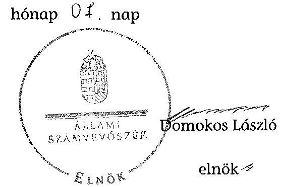

Melléklet: $\quad 9 \mathrm{db}$

---

### A Magyar Képzőművészeti Egyetem kiadási és bevételi előirányzatai, azok teljesítése a 2009-2012. években

|  Sz. | Megnevezés | 2009. év |  | 2010. év |  | 2011. év |  | 2012. év |  | Adatok ezer Ft-ban |   |
| --- | --- | --- | --- | --- | --- | --- | --- | --- | --- | --- | --- |
|   |  | Eredeti előirányzat | Módosított előirányzat | Teljesítés | Eredeti előirányzat | Módosított előirányzat | Teljesítés | Eredeti előirányzat | Módosított előirányzat | Teljesítés | Eredeti előirányzat  |
|  1 | KIADÁSOK |  |  |  |  |  |  |  |  |  |   |
|  2 | Személyi Juttatások | 712 691 | 808 184 | 805 911 | 715 691 | 756 021 | 752 908 | 725 191 | 712 648 | 708 785 | 708 200  |
|  3 | Működést terhelő járulékok | 238 143 | 242 584 | 242 372 | 202 043 | 198 815 | 197 922 | 204 543 | 186 517 | 186 081 | 196 200  |
|  4 | Dologi kiadások | 535 738 | 484 727 | 472 218 | 498 500 | 521 406 | 488 816 | 571 944 | 515 112 | 493 793 | 491 000  |
|  5 | Egyéb folyó kiadások | 9 400 | 24 425 | 13 834 | 17 292 | 18 900 | 18 906 | 17 700 | 19 550 | 18 764 | 18 000  |
|  6 | Támogatásértékű működési kiadások | 0 | 0 | 0 | 0 | 0 | 0 | 0 | 1 976 | 1 976 | 0  |
|  7 | Támogatásértékű felhalmozási kiadások | 0 | 0 | 0 | 0 | 0 | 0 | 0 | 0 | 0 | 0  |
|  8 | Előző évi előirányzat átadás | 0 | 0 | 0 | 0 | 0 | 0 | 0 | 0 | 111 | 0  |
|  9 | Működési célú pénzeszköz átadás | 0 | 0 | 0 | 0 | 0 | 0 | 0 | 0 | 0 | 0  |
|  10 | Felhalmozási célú pénzeszköz átadás | 330 | 330 | 0 | 0 | 0 | 0 | 0 | 0 | 0 | 0  |
|  11 | Előírott pénzbeli juttatásai | 93 044 | 113 646 | 113 607 | 101 501 | 124 501 | 124 501 | 109 801 | 139 190 | 136 171 | 117 800  |
|  12 | Egyéb juttatás | 0 | 0 | 0 | 0 | 0 | 0 | 0 | 0 | 0 | 0  |
|  13 | Felújítás | 0 | 52 900 | 40 371 | 4 000 | 24 000 | 23 115 | 2 000 | 35 938 | 24 832 | 12 000  |
|  14 | Intézményi beruházási kiadások ÁFA-val | 16 502 | 34 702 | 30 146 | 24 832 | 20 640 | 11 790 | 17 832 | 24 342 | 17 298 | 92 800  |
|  15 | Központi beruházási kiadások ÁFA-val | 0 | 0 | 0 | 0 | 0 | 0 | 0 | 0 | 0 | 0  |
|  16 | Lakásépítési kiadások ÁFA-val | 0 | 0 | 0 | 0 | 0 | 0 | 0 | 0 | 0 | 0  |
|  17 | Egyéb intézményi felhalmozási kiadás | 0 | 0 | 0 | 0 | 0 | 0 | 0 | 0 | 0 | 0  |
|  18 | Külcímkék | 0 | 0 | 0 | 0 | 0 | 0 | 0 | 0 | 0 | 0  |
|  19 | Összesen | 1 605 850 | 1 761 496 | 1 718 459 | 1 563 859 | 1 664 283 | 1 617 958 | 1 649 011 | 1 635 273 | 1 587 811 | 1 636 000  |
|  20 | BEVÉTELEK |  |  |  |  |  |  |  |  |  |   |
|  21 | Közhatalmi bevételek | 0 | 0 | 0 | 0 | 0 | 0 | 0 | 0 | 0 | 0  |
|  22 | Intézményi működési bevételek | 118 429 | 128 429 | 122 314 | 125 000 | 160 000 | 151 136 | 140 000 | 188 307 | 182 866 | 150 000  |
|  23 | Működési célú pénzeszköz átvételek | 15 000 | 30 000 | 28 096 | 13 000 | 25 000 | 24 520 | 15 000 | 23 430 | 37 646 | 15 000  |
|  24 | Felhalmozási bevételek | 0 | 80 000 | 80 000 | 0 | 0 | 0 | 8 000 | 15 320 | 19 218 | 0  |
|  25 | Felhalmozási célú pénzeszköz átvételek | 0 | 12 000 | 14 929 | 15 000 | 9 000 | 6 420 | 0 | 0 | 0 | 8 000  |
|  26 | Irányító szervtől kapott támogatás | 1 450 421 | 1 460 170 | 1 460 170 | 1 383 859 | 1 395 923 | 1 395 923 | 1 459 011 | 1 294 161 | 1 294 161 | 1 336 000  |
|  27 | Támogatásértékű működési bevétel | 15 000 | 25 700 | 24 157 | 23 000 | 37 000 | 35 905 | 25 000 | 68 775 | 60 362 | 50 000  |
|  28 | Támogatásértékű felhalmozási bevétel | 7 000 | 1 300 | 1 256 | 4 000 | 1 000 | 1 000 | 2 000 | 10 628 | 4 396 | 77 000  |
|  29 | Előző évi maradvány átvétele | 0 | 0 | 0 | 0 | 36 360 | 36 360 | 0 | 1 346 | 1 346 | 0  |
|  30 | Előirányzat maradvány felhasználás | 0 | 23 897 | 23 897 | 0 | 0 | 0 | 0 | 33 306 | 33 306 | 0  |
|  31 | Összesen | 1 605 850 | 1 761 496 | 1 754 819 | 1 563 859 | 1 664 283 | 1 617 958 | 1 649 011 | 1 635 273 | 1 587 811 | 1 636 000  |

 1 651 264 | 1 649 011 | 1 635 273 | 1 633 301 | 1 636 000  |

---

### 2. SZÁMÓ MELLÉKLET A V-0352-360/2014. SZÁMÓ JELENTÉSHEZ

|   |  | 2009. év | 2010. év | 2011. év | 2012. év |   |
| --- | --- | --- | --- | --- | --- | --- |
|  Ssz. | Megnevezés | Teljesítés | Teljesítés | Teljesítés | Teljesítés | 2012/2009  |
|  1 | KIADÁSOK |  |  |  |  |   |
|  2 | Személyi juttatások | 805 911 | 752 908 | 708 785 | 731 556 | 90,8%  |
|  3 | Rendszeres és nem rendszeres | 753 733 | 702 429 | 660 406 | 691 247 | 91,7%  |
|  4 | Rendszeres személyi juttatás | 535 934 | 620 722 | 621 083 | 647 138 | 120,7%  |
|  5 | Alapilletmény | 457 037 | 531 440 | 511 281 | 542 784 | 118,8%  |
|  6 | Nem rendszeres | 217 801 | 81 707 | 59 323 | 44 109 | 20,3%  |
|  7 | Munkavégzéshez kapcsolódó juttatások | 176 564 | 40 886 | 17 450 | 23 713 | 13,4%  |
|  8 | Normatív és teljesítményhez kötött jutalom | 3 626 | 0 | 0 | 0 | 0,0%  |
|  9 | Külföldi személyi juttatások | 52 176 | 50 479 | 48 579 | 40 309 | 77,3%  |
|  10 | Munkáltatót terhelő járulékok | 242 372 | 197 922 | 186 081 | 195 058 | 80,5%  |
|  11 | Dologi és folyó kiadások | 486 052 | 507 722 | 512 668 | 490 809 | 101,0%  |
|  12 | Dologi kiadások | 472 218 | 488 816 | 491 793 | 473 464 | 100,7%  |
|  13 | Készletbeszerzés | 55 270 | 49 040 | 40 558 | 46 768 | 84,6%  |
|  14 | Kommunikációs szolgáltatás | 23 049 | 34 203 | 31 770 | 29 372 | 89,5%  |
|  15 | Szolgáltatási kiadások | 213 871 | 207 062 | 214 110 | 219 638 | 102,7%  |
|  16 | Bérlet és lízing | 4 634 | 7 475 | 3 996 | 3 892 | 84,0%  |
|  17 | ebből PPF | 0 | 0 | 0 | 0 | nem értelmezhető  |
|  18 | Gáz, villany, víz | 95 833 | 87 850 | 100 038 | 114 660 | 119,6%  |
|  19 | Működési célú ÁFA | 77 007 | 88 816 | 99 280 | 94 886 | 123,2%  |
|  20 | Kiküldetés, reprezentáció | 2 424 | 6 903 | 7 346 | 2 588 | 106,8%  |
|  21 | Szellemi tevékenység | 25 269 | 54 003 | 62 633 | 48 728 | 192,8%  |
|  22 | Egyéb folyó kiadások | 13 834 | 18 906 | 18 875 | 15 345 | 110,9%  |
|  23 | Előző évi normatíva visszafizetés | 8 224 | 3 552 | 0 | 0 | 0,0%  |
|  24 | Adók, díjak, egyéb befizetések | 5 397 | 18 064 | 18 455 | 14 581 | 270,2%  |
|  25 | Támogatásértékű működési kiadások | 0 | 0 | 0 | 0 | nem értelmezhető  |
|  26 | Támogatásértékű felhalmozási kiadások | 0 | 0 | 0 | 0 | nem értelmezhető  |
|  27 | Előző évi előtörlesztés | 0 | 0 | 0 | 999 | nem értelmezhető  |
|  28 | Működési célú pénzeszköz átadás | 0 | 0 | 0 | 0 | nem értelmezhető  |
|  29 | Felhalmozási célú pénzeszköz átadás | 0 | 0 | 0 | 0 | nem értelmezhető  |
|  30 | Előző évek pénzbeli juttatásai | 113 607 | 124 501 | 136 171 | 143 243 | 126,1%  |
|  31 | Egyéb juttatás | 0 | 0 | 0 | 0 | nem értelmezhető  |
|  32 | Felhalmozási kiadások | 70 517 | 34 905 | 42 130 | 77 102 | 109,3%  |
|  33 | Intézményi beruházási kiadások | 30 146 | 11 790 | 17 398 | 46 641 | 154,7%  |
|   | ebből tegezben | 0 | 0 | 0 | 1 620 | nem értelmezhető  |
|  34 | Gépek, berendezések, felszerelések | 20 863 | 6 094 | 10 483 | 30 861 | 147,9%  |
|  35 | Felújítás | 40 371 | 23 115 | 24 832 | 30 461 | 75,5%  |
|   | ebből tegezben (ÁFA-val) | 40 371 | 18 495 | 20 430 | 30 461 | 75,5%  |
|  36 | Felújítások és beruházások ÁFA-ja | 13 090 | 6 929 | 8 055 | 15 796 | 120,7%  |
|  37 | Egyéb intézményi felhalmozási kiadás | 0 | 0 | 0 | 0 | nem értelmezhető  |
|  38 | Köszönet | 0 | 0 | 0 | 0 | nem értelmezhető  |
|  39 | Összesen | 1 718 459 | 1 617 958 | 1 587 811 | 1 638 767 | 95,4%  |
|  40 | BEVÉTELEK |  |  |  |  |   |
|  41 | Működési bevételek | 150 410 | 175 656 | 220 512 | 204 675 | 126,1%  |
|  42 | Intézményi működési bevétel | 132 314 | 151 136 | 182 866 | 165 345 | 135,2%  |
|  43 | Szolgáltatások ellenértéke | 44 514 | 65 072 | 84 752 | 52 835 | 118,7%  |
|  44 | Intézményi ellátási díjak | 25 948 | 25 626 | 28 373 | 22 626 | 87,2%  |
|  45 | Hozam és kamatbevétel | 277 | 520 | 3 589 | 317 | 114,4%  |
|  46 | Működési célú pénzeszköz átvételek | 28 096 | 24 520 | 37 646 | 39 330 | 140,0%  |
|   | ebből uniós forrás | 20 595 | 17 430 | 0 | 0 | 0,0%  |
|  47 | Támogatásértékű működési bevétel | 24 157 | 35 905 | 60 362 | 58 952 | 244,0%  |
|  48 | EU programokra működési bevétel | 0 | 23 343 | 49 717 | 46 560 | nem értelmezhető  |
|  49 | Felhalmozási bevételek | 80 000 | 0 | 19 218 | 0 | 0,0%  |
|  50 | Felhalmozási célú pénzeszköz átvételek | 14 929 | 6 420 | 19 218 | 4 677 | 31,3%  |
|   | ebből uniós forrás | 0 | 0 | 0 | 0 | nem értelmezhető  |
|  51 | Támogatásértékű felhalmozási bevétel | 1 256 | 1 000 | 4 396 | 17 183 | 1368,1%  |
|  52 | EU programokra beruházási bevétel | 0 | 0 | 0 | 0 | nem értelmezhető  |
|  53 | Irányító szervtől kapott támogatás | 1 460 170 | 1 395 923 | 1 294 161 | 1 290 766 | 88,4%  |
|  54 | Előtörlesztési maradvány felhasználás | 23 897 | 0 | 23 360 | 45 490 | 190,4%  |
|  55 | Összesen | 1 754 819 | 1 651 264 | 1 633 301 | 1 677 364 | 95,6%  |

---

# 3. SZÁMÓ MELLÉKLET A V-0352-360/2014. SZÁMÓ JELENTÉSHEZ

|  3. SZÁMÓ MELLÉKLET
A V-0352-360/2014. SZÁMÓ JELENTÉSHEZ |  |  |  |  |   |
| --- | --- | --- | --- | --- | --- |
|  Kimutatás a Magyar Képzőművészeti Egyetem bevételeiről és kiadásairól, valamint adósságszolgálatáról a 2009-2012. években |  |  |  |  |   |
|   |  |  |  |  | adatok száma IV-ben  |
|  3. |  |  |  |  |   |
|  1. |  |  |  |  |   |
|  2. |  |  |  |  |   |
|  3. |  |  |  |  |   |
|  4. |  |  |  |  |   |
|  5. |  |  |  |  |   |
|  6. |  |  |  |  |   |
|  7. |  |  |  |  |   |
|  8. |  |  |  |  |   |
|  9. |  |  |  |  |   |
|  10. |  |  |  |  |   |
|  11. |  |  |  |  |   |
|  12. |  |  |  |  |   |
|  13. |  |  |  |  |   |
|  14. |  | 

 |  |  |   |
|  15. |  |  |  |  |   |
|  16. |  |  |  |  |   |
|  17. |  |  |  |  |   |
|  18. |  |  |  |  |   |
|  19. |  |  |  |  |   |
|  20. |  |  |  |  |   |
|  21. |  |  |  |  |   |
|  22. |  |  |  |  |   |
|  23. |  |  |  |  |   |
|  24. |  |  |  |  |   |
|  25. |  |  |  |  |   |
|  26. |  |  |  |  |   |
|  27. |  |  |  |  |   |
|  28. |  |  |  |  |   |
|  29. |  |  |  |  |   |
|  30. |  |  |  |  |   |
|  31. |  |  |  |  |   |
|  32. |  |  |  |  |   |
|  33. |  |  |  |  |   |
|  34. |  |  |  |  |   |
|  35. |  |  |  |  |   |
|  36. |  |  |  |  |   |
|  37. |  |  |  |  |   |
|  38. |  |  |  |  |   |
|  39. |  |  |  |  |   |
|  40. |  |  |  |  |   |
|  41. |  |  |  |  |   |
|  42. |  |  |  |  |   |
|  43. |  |  |  |  |   |
|  44. |  |  |  |  |   |
|  45. |  |  |  |  |   |
|  46. |  |  |  |  |   |
|  47. |  |  |  |  |   |
|  48. |  |  |  |  |   |
|  49. |  |  |  |  |   |
|  50. |  |  |  |  |   |
|  51. |  |  |  |  |   |
|  52. |  |  |  |  |   |
|  53. |  |  |  |  |   |
|  54. |  |  |  |  |   |
|  55. |  |  |  |  |   |
|  56. |  |  |  |  |   |
|  57. |  |  |  |  |   |
|  58. |  |  |  |  |   |
|  59. |  |  |  |  |   |
|  60. |  |  |  |  |   |
|  61. |  |  |  |  |   |
|  62. |  |  |  |  |   |
|  63. |  |  |  |  |   |
|  64. |  |  |  |  |   |
|  65. |  |  |  |  |   |
|  66. |  |  |  |  |   |
|  67. |  |  |  |  |   |
|  68. |  |  |  |  |   |
|  69. |  |  |  |  |   |
|  70. |  |  |  |  |   |
|  71. |  |  |  |  |   |
|  72. |  |  |  |  |   |
|  73. |  |  |  |  |   |
|  74. |  |  |  |  |   |
|  75. |  |  |  |  |   |
|  76. |  |  |  |  |   |
|  77. |  |  |  |  |   |
|  78. |  |  |  |  |   |
|  79. |  |  |  |  |   |
|  80. |  |  |  |  |   |
|  81. |  |  |  |  |   |
|  82. |  |  |  |  |   |
|  83. |  |  |  |  |   |
|  84. |  |  |  |  |   |
|  85. |  |  |  |  |   |
|  86. |  |  |  |  |   |
|  87. |  |  |  |  |   |
|  88. |  |  |  |  |   |
|  89. |  |  |  |  |   |
|  90. |  |  |  |  |   |
|  91. |  |  |  |  |   |
|  92. |  |  |  |  |   |
|  93. |  |  |  |  |   |
|  94. |  |  |  |  |   |
|  95. |  |  |  |  |   |
|  96. |  |  |  |  |   |
|  97. |  |  |  |  |   |
|  98. |  |  |  |  |   |
|  99. |  |  |  |  |   |
|  100. |  |  |  |  |   |
|  101. |  |  |  |  |   |
|  102. |  |  |  |  |   |
|  103. |  |  |  |  |   |
|  104. |  |  |  |  |   |
|  105. |  |  |  |  |   |
|  106. |  |  |  |  |   |
|  107. |  |  |  |  |   |
|  108. |  |  |  |  |   |
|  109. |  |  |  |  |   |
|  110. |  |  |  |  |   |
|  111. |  |  |  |  |   |
|  112. |  |  |  |  |   |
|  113. |  |  |  |  |   |
|  114. |  |  |  |  |   |
|  115. |  |  |  |  |   |
|  116. |  |  |  |  |   |
|  117. |  |  |  |  |   |
|  118. |  |  |  |  |   |
|  119. |  |  |  |  |   |
|  120. |  |  |  |  |   |
|  121. |  |  |  |  |   |
|  122. |  |  |  |  |   |
|  123. |  |  |  |  |   |
|  124. |  |  |  |  |   |
|  125. |  |  |  |  |   |
|  126. |  |  |  |  |   |
|  127. |  |  |  |  |   |
|  128. |  |  |  |  |

 |   |
|  129. |  |  |  |  |   |
|  130. |  |  |  |  |   |
|  131. |  |  |  |  |   |
|  132. |  |  |  |  |   |
|  133. |  |  |  |  |   |
|  134. |  |  |  |  |   |
|  135. |  |  |  |  |   |
|  136. |  |  |  |  |   |
|  137. |  |  |  |  |   |
|  138. |  |  |  |  |   |
|  139. |  |  |  |  |   |
|  140. |  |  |  |  |   |
|  141. |  |  |  |  |   |
|  142. |  |  |  |  |   |
|  143. |  |  |  |  |   |
|  144. |  |  |  |  |   |
|  145. |  |  |  |  |   |
|  146. |  |  |  |  |   |
|  147. |  |  |  |  |   |
|  148. |  |  |  |  |   |
|  149. |  |  |  |  |   |
|  150. |  |  |  |  |   |
|  151. |  |  |  |  |   |
|  152. |  |  |  |  |   |
|  153. |  |  |  |  |   |
|  154. |  |  |  |  |   |
|  155. |  |  |  |  |   |
|  156. |  |  |  |  |   |
|  157. |  |  |  |  |   |
|  158. |  |  |  |  |   |
|  159. |  |  |  |  |   |
|  160. |  |  |  |  |   |
|  161. |  |  |  |  |   |
|  162. |  |  |  |  |   |
|  163. |  |  |  |  |   |
|  164. |  |  |  |  |   |
|  165. |  |  |  |  |   |
|  166. |  |  |  |  |   |
|  167. |  |  |  |  |   |
|  168. |  |  |  |  |   |
|  169. |  |  |  |  |   |
|  170. |  |  |  |  |   |
|  171. |  |  |  |  |   |
|  172. |  |  |  |  |   |
|  173. |  |  |  |  |   |
|  174. |  |  |  |  |   |
|  175. |  |  |  |  |   |
|  176. |  |  |  |  |   |
|  177. |  |  |  |  |   |
|  178. |  |  |  |  |   |
|  179. |  |  |  |  |   |
|  180. |  |  |  |  |   |
|  181. |  |  |  |  |   |
|  182. |  |  |  |  |   |
|  183. |  |  |  |  |   |
|  184. |  |  |  |  |   |
|  185. |  |  |  |  |   |
|  186. |  |  |  |  |   |
|  187. |  |  |  |  |   |
|  188. |  |  |  |  |   |
|  189. |  |  |  |  |   |
|  190. |  |  |  |  |   |
|  191. |  |  |  |  |   |
|  192. |  |  |  |  |   |
|  193. |  |  |  |  |   |
|  194. |  |  |  |  |   |
|  195. |  |  |  |  |   |
|  196. |  |  |  |  |   |
|  197. |  |  |  |  |   |
|  198. |  |  |  |  |   |
|  199. |  |  |  |  |   |
|  200. |  |  |  |  |   |
|  201. |  |  |  |  |   |
|  202. |  |  |  |  |   |
|  203. |  |  |  |  |   |
|  204. |  |  |  |  |   |
|  205. |  |  |  |  |   |
|  206. |  |  |  |  |   |
|  207. |  |  |  |  |   |
|  208. |  |  |  |  |   |
|  209. |  |  |  |  |   |
|  210. |  |  |  |  |   |
|  211. |  |  |  |  |   |
|  212. |  |  |  |  |   |
|  213. |  |  |  |  |   |
|  214. |  |  |  |  |   |
|  215. |  |  |  |  |   |
|  216. |  |  |  |  |   |
|  217. |  |  |  |  |   |
|  218. |  |  |  |  |   |
|  219. |  |  |  |  |   |
|  220. |  |  |  |  |   |
|  221. |  |  |  |  |   |
|  222. |  |  |  |  |   |
|  223. |  |  |  |  |   |
|  224. |  |  |  |  |   |
|  225. |  |  |  |  |   |
|  226. |  |  |  |  |   |
|  227. |  |  |  |  |   |
|  228. |  |  |  |  |   |
|  229. |  |  |  |  |   |
|  230. |  |  |  |  |   |
|  231. |  |  |  |  |   |
|  232. |  |  |  |  |   |
|  233. |  |  |  |  |   |
|  234. |  |  |  |  |   |
|  235. |  |  |  |  |   |
|  236. |  |  |  |  |   |
|  237. |  |  |  |  |   |
|  238. |  |  |  |  |   |
|  239. |  |  |  |  |   |
|  240. |  |  |  |  |   |
|  241. |  |  |  |  |   |
|  242. |  |  |  |  |   |
|

  243. |  |  |  |  |   |
|  244. |  |  |  |  |   |
|  245. |  |  |  |  |   |
|  246. |  |  |  |  |   |
|  247. |  |  |  |  |   |
|  248. |  |  |  |  |   |
|  249. |  |  |  |  |   |
|  250. |  |  |  |  |   |
|  251. |  |  |  |  |   |
|  252. |  |  |  |  |   |
|  253. |  |  |  |  |   |
|  254. |  |  |  |  |   |
|  255. |  |  |  |  |   |
|  256. |  |  |  |  |   |
|  257. |  |  |  |  |   |
|  258. |  |  |  |  |   |
|  259. |  |  |  |  |   |
|  260. |  |  |  |  |   |
|  261. |  |  |  |  |   |
|  262. |  |  |  |  |   |
|  263. |  |  |  |  |   |
|  264. |  |  |  |  |   |
|  265. |  |  |  |  |   |
|  266. |  |  |  |  |   |
|  267. |  |  |  |  |   |
|  268. |  |  |  |  |   |
|  269. |  |  |  |  |   |
|  270. |  |  |  |  |   |
|  271. |  |  |  |  |   |
|  272. |  |  |  |  |   |
|  273. |  |  |  |  |   |
|  274. |  |  |  |  |   |
|  275. |  |  |  |  |   |
|  276. |  |  |  |  |   |
|  277. |  |  |  |  |   |
|  278. |  |  |  |  |   |
|  279. |  |  |  |  |   |
|  280. |  |  |  |  |   |
|  281. |  |  |  |  |   |
|  282. |  |  |  |  |   |
|  283. |  |  |  |  |   |
|  284. |  |  |  |  |   |
|  285. |  |  |  |  |   |
|  286. |  |  |  |  |   |
|  287. |  |  |  |  |   |
|  288. |  |  |  |  |   |
|  289. |  |  |  |  |   |
|  290. |  |  |  |  |   |
|  291. |  |  |  |  |   |
|  292. |  |  |  |  |   |
|  293. |  |  |  |  |   |
|  294. |  |  |  |  |   |
|  295. |  |  |  |  |   |
|  296. |  |  |  |  |   |
|  297. |  |  |  |  |   |
|  298. |  |  |  |  |   |
|  299. |  |  |  |  |   |
|  300. |  |  |  |  |   |
|  301. |  |  |  |  |   |
|  302. |  |  |  |  |   |
|  303. |  |  |  |  |   |
|  304. |  |  |  |  |   |
|  305. |  |  |  |  |   |
|  306. |  |  |  |  |   |
|  307. |  |  |  |  |   |
|  308. |  |  |  |  |   |
|  309. |  |  |  |  |   |
|  310. |  |  |  |  |   |
|  311. |  |  |  |  |   |
|  312. |  |  |  |  |   |
|  313. |  |  |  |  |   |
|  314. |  |  |  |  |   |
|  315. |  |  |  |  |   |
|  316. |  |  |  |  |   |
|  317. |  |  |  |  |   |
|  318. |  |  |  |  |   |
|  319. |  |  |  |  |   |
|  320. |  |  |  |  |   |
|  321. |  |  |  |  |   |
|  322. |  |  |  |  |   |
|  323. |  |  |  |  |   |
|  324. |  |  |  |  |   |
|  325. |  |  |  |  |   |
|  326. |  |  |  |  |   |
|  327. |  |  |  |  |   |
|  328. |  |  |  |  |   |
|  329. |  |  |  |  |   |
|  330. |  |  |  |  |   |
|  331. |  |  |  |  |   |
|  332. |  |  |  |  |   |
|  333. |  |  |  |  |   |
|  334. |  |  |  |  |   |
|  335. |  |  |  |  |   |
|  336. |  |  |  |  |   |
|  337. |  |  |  |  |   |
|  338. |  |  |  |  |   |
|  339. |  |  |  |  |   |
|  340. |  |  |  |  |   |
|  341. |  |  |  |  |   |
|  342. |  |  |  |  |   |
|  343. |  |  |  |  |   |
|  344. |  |  |  |  |   |
|  345. |  |  |  |  |   |
|  346. |  |  |  |  |   |
|  347. |  |  |  |  |   |
|  348. |  |  |  |  |   |
|  349. |  |  |  |  |   |
|  350. |  |  |  |  |   |
|  351. |  |  |  |  |   |
|  352. |  |  |  |  |   |
|  353. |  |  |  |  |   |
|  354. |  |  |  |  |   |
|  355. |  |  |  |  |   |
|  356. |  |  |  |  |   |
|  357. | 

 |  |  |  |   |
|  358. |  |  |  |  |   |
|  359. |  |  |  |  |   |
|  3510. |  |  |  |  |   |
|  3511. |  |  |  |  |   |
|  3512. |  |  |  |  |   |
|  3513. |  |  |  |  |   |
|  3514. |  |  |  |  |   |
|  3515. |  |  |  |  |   |
|  3516. |  |  |  |  |   |
|  3517. |  |  |  |  |   |
|  3518. |  |  |  |  |   |
|  3519. |  |  |  |  |   |
|  3520. |  |  |  |  |   |
|  3511. |  |  |  |  |   |
|  3512. |  |  |  |  |   |
|  3513. |  |  |  |  |   |
|  3514. |  |  |  |  |   |
|  3515. |  |  |  |  |   |
|  3516. |  |  |  |  |   |
|  3517. |  |  |  |  |   |
|  3518. |  |  |  |  |   |
|  3519. |  |  |  |  |   |
|  3520. |  |  |  |  |   |
|  3511. |  |  |  |  |   |
|  3512. |  |  |  |  |   |
|  3513. |  |  |  |  |   |
|  3514. |  |  |  |  |   |
|  3515. |  |  |  |  |   |
|  3516. |  |  |  |  |   |
|  3517. |  |  |  |  |   |
|  3518. |  |  |  |  |   |
|  3519. |  |  |  |  |   |
|  3520. |  |  |  |  |   |
|  3511. |  |  |  |  |   |
|  3512. |  |  |  |  |   |
|  3513. |  |  |  |  |   |
|  3514. |  |  |  |  |   |
|  3515. |  |  |  |  |   |
|  3516. |  |  |  |  |   |
|  3517. |  |  |  |  |   |
|  3518. |  |  |  |  |   |
|  3519. |  |  |  |  |   |
|  3520. |  |  |  |  |   |
|  3511. |  |  |  |  |   |
|  3512. |  |  |  |  |   |
|  3513. |  |  |  |  |   |
|  3514. |  |  |  |  |   |
|  3515. |  |  |  |  |   |
|  3516. |  |  |  |  |   |
|  3517. |  |  |  |  |   |
|  3518. |  |  |  |  |   |
|  3519. |  |  |  |  |   |
|  3520. |  |  |  |  |   |
|  3511. |  |  |  |  |   |
|  3512. |  |  |  |  |   |
|  3513. |  |  |  |  |   |
|  3514. |  |  |  |  |   |
|  3515. |  |  |  |  |   |
|  3516. |  |  |  |  |   |
|  3517. |  |  |  |  |   |
|  3518. |  |  |  |  |   |
|  3519. |  |  |  |  |   |
|  3520. |  |  |  |  |   |
|  3511. |  |  |  |  |   |
|  3512. |  |  |  |  |   |
|  3513. |  |  |  |  |   |
|  3514. |  |  |  |  |   |
|  3515. |  |  |  |  |   |
|  3516. |  |  |  |  |   |
|  3517. |  |  |  |  |   |
|  3518. |  |  |  |  |   |
|  3519. |  |  |  |  |   |
|  3520. |  |  |  |  |   |
|  3511. |  |  |  |  |   |
|  3512. |  |  |  |  |   |
|  3513. |  |  |  |  |   |
|  3514. |  |  |  |  |   |
|  3515. |  |  |  |  |   |
|  3516. |  |  |  |  |   |
|  3517. |  |  |  |  |   |
|  3518. |  |  |  |  |   |
|  3519. |  |  |  |  |   |
|  3520. |  |  |  |  |   |
|  3511. |  |  |  |  |   |
|  3512. |  |  |  |  |   |
|  3513. |  |  |  |  |   |
|  3514. |  |  |  |  |   |
|  3515. |  |  |  |  |   |
|  3516. |  |  |  |  |   |
|  3517. |  |  |  |  |   |
|  3518. |  |  |  |  |   |
|  3519. |  |  |  |  |   |
|  3520. |  |  |  |  |   |
|  3511. |  |  | 

 |  |   |
|  3512. |  |  |  |  |   |
|  3513. |  |  |  |  |   |
|  3514. |  |  |  |  |   |
|  3515. |  |  |  |  |   |
|  3516. |  |  |  |  |   |
|  3517. |  |  |  |  |   |
|  3518. |  |  |  |  |   |
|  3519. |  |  |  |  |   |
|  3520. |  |  |  |  |   |
|  3511. |  |  |  |  |   |
|  3512. |  |  |  |  |   |
|  3513. |  |  |  |  |   |
|  3514. |  |  |  |  |   |
|  3515. |  |  |  |  |   |
|  3516. |  |  |  |  |   |
|  3517. |  |  |  |  |   |
|  3518. |  |  |  |  |   |
|  3519. |  |  |  |  |   |
|  3520. |  |  |  |  |   |
|  3511. |  |  |  |  |   |
|  3512. |  |  |  |  |   |
|  3513. |  |  |  |  |   |
|  3514. |  |  |  |  |   |
|  3515. |  |  |  |  |   |
|  3516. |  |  |  |  |   |
|  3517. |  |  |  |  |   |
|  3518. |  |  |  |  |   |
|  3519. |  |  |  |  |   |
|  3520. |  |  |  |  |   |
|  3511. |  |  |  |  |   |
|  3512. |  |  |  |  |   |
|  3513. |  |  |  |  |   |
|  3514. |  |  |  |  |   |
|  3515. |  |  |  |  |   |
|  3516. |  |  |  |  |   |
|  3517. |  |  |  |  |   |
|  3518. |  |  |  |  |   |
|  3519. |  |  |  |  |   |
|  3520. |  |  |  |  |   |
|  3511. |  |  |  |  |   |
|  3512. |  |  |  |  |   |
|  3513. |  |  |  |  |   |
|  3514. |  |  |  |  |   |
|  3515. |  |  |  |  |   |
|  3516. |  |  |  |  |   |
|  3517. |  |  |  |  |   |
|  3518. |  |  |  |  |   |
|  3519. |  |  |  |  |   |
|  3520. |  |  |  |  |   |
|  3517. |  |  |  |  |   |
|  3511. |  |  |  |  |   |
|  3512. |  |  |  |  |   |
|  3513. |  |  |  |  |   |
|  3514. |  |  |  |  |   |
|  3515. |  |  |  |  |   |
|  3516. |  |  |  |  |   |
|  3517. |  |  |  |  |   |
|  3518. |  |  |  |  |   |
|  3519. |  |  |  |  |   |
|  3520. |  |  |  |  |   |
|  3517. |  |  |  |  |   |
|  3518. |  |  |  |  |   |
|  3519. |  |  |  |  |   |
|  3511. |  |  |  |  |   |
|  3512. |  |  |  |  |   |
|  3516. |  |  |  |  |   |
|  3517. |  |  |  |  |   |
|  3518. |  |  |  |  |   |
|  3519. |  |  |  |  |   |
|  3520. |  |  |  |  |   |
|  3517. |  |  |  |  |   |
|  3518. |  |  |  |  |   |
|  3519. |  |  |  |  |   |
|  3521. |  |  |  |  |   |
|  3517. |  |  |  |  |   |
|  3518. |  |  |  |  |   |
|  3519. |  |  |  |  |   |
|  3517. |  |  |  |  |   |
|  3518. |  |  |  |  |   |
|  35110. |  |  |  |  |   |
|  3519. |  |  |  |  |   |
|  3517. |  |  |  |  |   |
|  3518. |  |  |  |  |   |
|  3519. |  |  |  |  |   |
|  3517. |  |  |  |  |   |
|  3518. |  |  |  |  |   |
|  3519. |  |  |  |  |   |
|  3519. |  |  |  |  |   |
|  3518. |  |  |  |  |   |
|  3517. |  |  |  |  |   |
|  3519. |  |  |  |  |   |
|  3518. |  |  |  |  |   |
|  3517. |  |  |  |  |   |
|  3519. |  |  |  |  |   |
|  3518. |  |  |  |  |   |
|  3517. |  |  |  |  |   |
|  3518. |  |  |  |  |   |
|  3519. |  |  |  |  |   |
|  3518. |  |  |  |  |   |
|  3517. |  |  |  |  |   |
|  3519. |  |  |  |  |   |
|  3518. |  |  |  |  |   |
|  3517. |  |  |  |  |   |
|  3519. |  |  |  |  |   |
|  3518. |  |  |  |  |   |
|  3519. |  |  |  |  |   |
|  3518. |  |  |  |  |   |
|  3519. |  |  |  |  |   |
|  3518. |  |  |  |  |   |
|  3519. |  |  |  |  |   |
|  3518. |  |  |  |  |   |
|  3518. |  |  |  |  |   |
|  3518. |  |  |  |  |   |
|  3519. |  |  |  |  |   |
|  3518. |  |  |  |  |   |
|  3518. |  |  |  |  |   |

 |
|  3518. |  |  |  |   |
|  3518. |  |  |  |   |
|  3518. |  |  |  |   |
|  3518. |  |  |  |   |
|  3518. |  |  |  |   |
|  3518. |  |  |  |   |
|  3518. |  |  |   |
|  3518. |  |  |   |
|  3518. |  |  |   |
|  3518. |  |  |   |
|  3518. |  |  |   |
|  3518. |  |  |   |
|  3518. |  |  |   |
|  3518. |  |  |   |
|  3518. |  |  |   |
|  3518. |  |  |   |
|  3518. |  |  |   |
|  3518. |  |  |   |
|  3518. |  |  |   |
|  3518. |  |  |   |
|  3518. |  |  |   |
|  3518. |  |  |   |
|  3518. |  |  |   |
|  3518. |  |  |   |
|  3518. |  |  |   |
|  3518. |  |  |   |
|  3518. |  |  |   |
|  3518. |  |  |   |
|  3518. |  |  |   |
|  3518. |  |  |   |
|  3518. |  |  |   |
|  3518. |  |  |   |
|  3518. |  |  |   |
|  3518. |  |  |   |
|  3518. |  |  |   |
|  3518. |  |  |   |
|  3518. |  |  |   |
|  

---

### 4. SZÁMÚ MELLÉKLET A V-0352-360/2014. SZÁMÚ JELENTÉSHEZ

|  Sz. | Megnevezés | 2009. év | 2010. év | 2011. év | 2012. év | Adatok ezer Ft-ban  |
| --- | --- | --- | --- | --- | --- | --- |
|  1 | **IMMATERIÁLIS JAVAK** | 8 614 | 8 013 | 9 531 | 10 880 | 126,3%  |
|  2 | Nagy értékű jogok | 0 | 0 | 4 374 | 6 501 | nem értelmezhető  |
|  3 | Szellemi termékek | 8 614 | 8 013 | 4 957 | 4 279 | 10,8%  |
|  4 | Immateriális javakra adott előlegek | 0 | 0 | 0 | 0 | nem értelmezhető  |
|  5 | **TÁRGYI ESZKÖZÖK** | 995 430 | 997 466 | 1 014 786 | 1 067 177 | 107,2%  |
|  6 | Ingó eszközök és kapcsolódó vagyonértékű jogok | 941 692 | 960 614 | 979 808 | 999 491 | 106,2%  |
|  7 | Gépek, berendezések, felszerelések | 48 513 | 35 687 | 34 571 | 62 155 | 128,1%  |
|  8 | Járművek | 4 601 | 1 765 | 415 | 0 | 0,0%  |
|  9 | Tanyafelszerelések | 0 | 0 | 0 | 0 | nem értelmezhető  |
|  10 | Beruházások, felújítások | 1 254 | 0 | 0 | 5 551 | 451,9%  |
|  11 | Beruházásra adott előlegek | 0 | 0 | 0 | 0 | nem értelmezhető  |
|  12 | **BEFEKTETETT PÉNZÜGYI ESZKÖZÖK** | 260 | 137 | 121 | 115 | 44,2%  |
|  13 | Tartós részesedés | 0 | 0 | 0 | 0 | nem értelmezhető  |
|  14 | Tartósan adott kölcsön | 260 | 137 | 121 | 115 | 44,2%  |
|  15 | **ÜZEMELTETÉSRE, KEZELÉSBE ÁTADOTT VAGYON/KEZELÉSBE VETT ESZKÖZÖK** | 0 | 0 | 0 | 0 | nem értelmezhető  |
|  16 | **BEFEKTETETT ESZKÖZÖK ÖSSZESEN** | 1 004 304 | 1 005 616 | 1 024 238 | 1 078 172 | 107,4%  |
|  17 | **KÉSZLETEK** | 8 444 | 7 012 | 6 678 | 5 826 | 69,0%  |
|  18 | Anyagok | 8 065 | 6 620 | 6 523 | 0 | 0,0%  |
|  19 | Közterületi eszközök | 0 | 0 | 0 | 0 | nem értelmezhető  |
|  20 | Áruk, göngyölegek, közvetített szolgáltatások | 442 | 383 | 355 | 5 826 | 1318,1%  |
|  21 | **KÖVETELÉSEK** | 11 953 | 8 319 | 24 891 | 5 738 | 48,0%  |
|  22 | Követelések áruszállításból és szolgáltatásból | 11 214 | 8 074 | 23 054 | 4 501 | 40,1%  |
|  23 | Adók | 0 | 0 | 0 | 0 | nem értelmezhető  |
|  24 | Rövid lejáratú adott kölcsönök | 72 | 0 | 0 | 26 | 36,1%  |
|  25 | Egyéb követelések | 667 | 245 | 1 837 | 1 211 | 181,6%  |
|  26 | **ÉRTÉKPAPÍROK** | 0 | 0 | 0 | 0 | nem értelmezhető  |
|  27 | Forgatási célú lehetőségként megtestesítő értékpapír bekerülési (könyv szerinti) értéke | 0 | 0 | 0 | 0 | nem értelmezhető  |
|  28 | **PÉNZESZKÖZÖK** | 39 129 | 34 446 | 47 828 | 45 111 | 115,3%  |
|  29 | Pénztárak, kasszák, belépőkártyák | 1 205 | 20 | 0 | 0 | 0,0%  |
|  30 | Költségvetési pénzforgalmi számlák | 7 940 | 3 006 | 15 287 | 12 784 | 161,0%  |
|  31 | Üzleti forgalmi számlák | 26 311 | 26 902 | 30 143 | 30 437 | 114,8%  |
|  32 | Idegen pénzeszközök | 3 469 | 2 442 | 2 399 | 1 900 | 54,8%  |
|  33 | **EGYÉB AKTÍV PÉNZÜGYI ELSZÁMOLÁSOK** | 700 | 1 385 | 285 | 534 | 76,3%  |
|  34 | **FORGÓESZKÖZÖK ÖSSZESEN** | 60 226 | 51 156 | 79 682 | 57 209 | 95,0%  |
|  35 | **ESZKÖZÖK ÖSSZESEN** | 1 064 530 | 1 056 772 | 1 103 920 | 1 135 381 | 106,7%  |
|  36 | **SAJÁT TŐKE** | 993 543 | 991 449 | 1 026 579 | 1 045 563 | 105,2%  |
|  37 | Tartós tőke | 118 689 | 118 490 | 118 490 | 118 490 | 100,0%  |
|  38 | Tőkeváltozások | 875 054 | 872 959 | 908 089 | 927 073 | 105,9%  |
|  39 | **TARTALÉKOK** | 36 260 | 33 306 | 45 490 | 38 597 | 106,2%  |
|  40 | Költségvetési tartalékok | 36 260 | 33 306 | 45 490 | 38 597 | 106,2%  |
|  41 | **KÖTELEZETTSÉGEK** | 32 592 | 29 541 | 29 263 | 44 216 | 135,7%  |
|  42 | Hosszú lejáratú kötelezettségek | 0 | 0 | 0 | 0 | nem értelmezhető  |
|  43 | Rövid lejáratú kötelezettségek | 32 592 | 29 541 | 29 263 | 44 216 | 135,7%  |
|  44 | Költségvetési áru-szállítások, szolgáltatások | 32 592 | 29 541 | 29 263 | 44 216 | 135,7%  |
|  45 | Egyéb kötelezettségek | 0 | 0 | 0 | 0 | nem értelmezhető  |
|  46 | **EGYÉB PASSZÍV PÉNZÜGYI ELSZÁMOLÁSOK** | 2 033 | 2 476 | 2 588 | 7 005 | 344,3%  |
|  47 | **FORRÁSOK ÖSSZESEN** | 1 064 530 | 1 056 772 | 1 103 920 | 1 135 381 | 106,7%  |

---

|  A Magyar Képzőművészeti Egyetem gazdálkodása szabályszerűségének értékelése a mintatételek alapján |  |  |  |  |  |  |  |  |  |  |  |  |  |  |  |   |
| --- | --- | --- | --- | --- | --- | --- | --- | --- | --- | --- | --- | --- | --- | --- | --- | --- |
|  értékelt terület |  |  |  |  |  |  |  |  |  |  |  |  |  |  |  |   |
|   |  |  |  |  |  |  |  |  |  |  |  |  |  |  |  |   |
|   |  |  |  |  |  |  |  |  |  |  |  |  |  |  |  |   |
|   |  |  |  |  |  |  |  |  |  |  |  |  |  |  |  |   |

 |  |  |  |  |  |  |  |  |   |
|  előirányzat módosítások |  |  |  |  |  |  |  |  |  |  |  |  |  |  |  |   |
|  |   |   |   |   |   |   |   |   |   |   |   |   |   |   |   |   |
|  |   |   |   |   |   |   |   |   |   |   |   |   |   |   |   |   |
|  |   |   |   |   |   |   |   |   |   |   |   |   |   |   |   |   |
|  |   |   |   |   |   |   |   |   |   |   |   |   |   |   |   |   |
|  |   |   |   |   |   |   |   |   |   |   |   |   |   |   |   |   |
|  |   |   |   |   |   |   |   |   |   |   |   |   |   |   |   |   |
|  |   |   |   |   |   |   |   |   |   |   |   |   |   |   |   |   |
|  |   |   |   |   |   |   |   |   |   |   |   |   |   |   |   |   |
|  személyi juttatások |  |  |  |  |  |  |  |  |  |  |  |  |  |  |  |   |
|  |   |   |   |   |   |   |   |   |   |   |   |   |   |   |   |   |
|  |   |   |   |   |   |   |   |   |   |   |   |   |   |   |   |   |
|  |   |   |   |   |   |   |   |   |   |   |   |   |   |   |   |   |
|  követelések |  |  |  |  |  |  |  |  |  |  |  |  |  |  |  |   |
|  |   |   |   |   |   |   |   |   |   |   |   |   |   |   |   |   |
|  |   |   |   |   |   |   |   |   |   |   |   |   |   |   |   |   |
|  |   |   |   |   |   |   |   |   |   |   |   |   |   |   |   |   |
|  felhalmozási bevételek |  |  |  |  |  |  |  |  |  |  |  |  |  |  |  |   |
|  |   |   |   |   |   |   |   |   |   |   |   |   |   |   |   |   |
|  |   |   |   |   |   |   |   |   |   |   |   |   |   |   |   |   |
|  |   |   |   |   |   |   |   |   |   |   |   |   |   |   |   |   |
|  működési bevételek |  |  |  |  |  |  |  |  |  |  |  |  |  |  |  |   |
|  |   |   |   |   |   |   |   |   |   |   |   |   |   |   |   |   |
|  |   |   |   |   |   |   |   |   |   |   |   |   |   |   |   |   |
|  díjazás |  |  |  |  |  |  |  |  |  |  |  |  |  |  |  |   |
|  |   |   |   |   |   |   |   |   |   |   |   |   |   |   |   |   |
|  dologi kiadások |  |  |  |  |  |  |  |  |  |  |  |  |  |  |  |   |
|  felhalmozási kiadások |  |  |  |  |  |  |  |  |  |  |  |  |  |  |  |   |
|  |   |   |   |   |   |   |   |   |   |   |   |   |   |   |   |   |
|  |   |   |   |   |   |   |   |   |   |   |   |   |   |   |   |   |
|  |   |   |   |   |   |   |   |   |   |   |   |   |   |   |   |   |
|  |   |   |   |   |   |   |   |   |   |   |   |   |   |   |   |   |
|  |   |   |   |   |   |   |   |   |   |   |   |   |   |   |   |   |
|  |   |   |   |   |   |   |   |   |   |   |   |   |   |   |   |   |

  |   |   |   |   |
|  |   |   |   |   |   |   |   |   |   |   |   |   |   |   |   |   |
|  |   |   |   |   |   |   |   |   |   |   |   |   |   |   |   |   |
|  |   |   |   |   |   |   |   |   |   |   |   |   |   |   |   |   |
|  |   |   |   |   |   |   |   |   |   |   |   |   |   |   |   |   |
|  |   |   |   |   |   |   |   |   |   |   |   |   |   |   |   |   |
|  |   |   |   |   |   |   |   |   |   |   |   |   |   |   |   |   |
|  |   |   |   |   |   |   |   |   |   |   |   |   |   |   |   |   |
|  |   |   |   |   |   |   |   |   |   |   |   |   |   |   |   |   |
|  |   |   |   |   |   |   |   |   |   |   |   |   |   |   |   |   |
|  |   |   |   |   |   |   |   |   |   |   |   |   |   |   |   |   |
|  |   |   |   |   |   |   |   |   |   |   |   |   |   |   |   |   |
|  |   |   |   |   |   |   |   |   |   |   |   |   |   |   |   |   |
|  |   |   |   |   |   |   |   |   |   |   |   |   |   |   |   |   |
|  |   |   |   |   |   |   |   |   |   |   |   |   |   |   |   |   |
|  |   |   |   |   |   |   |   |   |   |   |   |   |   |   |   |   |
|  |   |   |   |   |   |   |   |   |   |   |   |   |   |   |   |   |
|  |   |   |   |   |   |   |   |   |   |   |   |   |   |   |   |   |
|  |   |   |   |   |   |   |   |   |   |   |   |   |   |   |   |   |
|  |   |   |   |   |   |   |   |   |   |   |   |   |   |   |   |   |
|  |   |   |   |   |   |   |   |   |   |   |   |   |   |   |   |   |
|  |   |   |   |   |   |   |   |   |   |   |   |   |   |   |   |   |
|  |   |   |   |   |   |   |   |   |   |   |   |   |   |   |   |   |
|  |   |   |   |   |   |   |   |   |   |   |   |   |   |   |   |   |
|  |   |   |   |   |   |   |   |   |   |   |   |   |   |   |   |   |
|  |   |   |   |   |   |   |   |   |   |   |   |   |   |   |   |   |

---

.

---

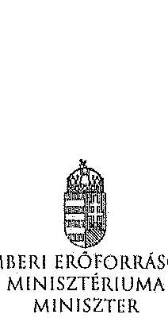

|  |  |  |
| :-- | :-- | :-- |
| Hiv. szám: | V-0352-311/2014, | V-0352- |
| 313/2014, | V-0337-964/2014, | V-0337- |
| 966/2014, | V-0368-250/2014, | V-0364- |
| 477/2014, V-0363-252/2014 |  |  |
| Melléklet:- |  |  |

# Domokos László részére 

elnök
Állami Számvevőszék

## Budapest

Apácesi Csere János utca 10.
1052
Tárgy: Észrevételek az Állami Számvevőszék ellenőrzési megállapításaira

Tisztelt Elnök Úr!

Hivatkozva a V-0352-311/2014, a V-0352-313/2014, a V-0337-964/2014, a V-0337-966/2014, a V-0368-250/2014, a V-0364-477/2014, a V-0363-252/2014 iktatószámú leveleire és megküldött jelentéstervezeteire, a Károly Róbert Főiskola, a Magyar Képzőművészeti Egyetem, a Szolnoki Főiskola, a Pannon Egyetem, az Eszterházy Károly Főiskola, a Széchenyi István Egyetem, valamint a Miskolci Egyetem vonatkozásában a 2013. évben megkezdett szabályszerűségi ellenőrzés kapcsán az alábbiakról tájékoztatom, valamint az alábbi észrevételeket teszem.

A megküldött jelentéstervezetekben rögzített megállapítások szerint a fenntartó ágazati irányítási feladatait a 2009-2012. években nem látta el teljes körűen az alábbiak vonatkozásában.

- „A felsőoktatásért felelős miniszter nem hajtotta végre a nemzetgazdasági miniszter irányításával, a kormányhatározatban előírt szervezeti és feladat-ellátási felülvizsgálati programot. A felsőoktatási törvény rendelkezései ellenére nem készíttetett a felsőoktatás rendszere vonatkozásában középtávú fejlesztési tervet."

A 2012. évi költségvetési hiánycél tartását biztosító további feladatokról szóló 1365/2011. (XI. 8.) Korm. határozatban a Kormány a közfeladat-ellátás színvonalának javítása és a költséghatékony működés céljából, szervezeti és feladat-ellátási felülvizsgálati programot indított el az államháztartás központi alrendszerében a költségvetési szervek, és a többségi állami tulajdonú gazdálkodó szervezetek (a továbbiakban: intézmények) vonatkozásában. Továbbá

---

elrendelte, hogy a felülvizsgálathoz a nemzetgazdasági miniszter irányításával, a Miniszterelnökséget vezető államtitkár, a közigazgatási és igazságügyi miniszter, valamint az ágazatért felelős miniszter részvételével munkabizottságokat kell létrehozni, valamint módszertani útmutatót kell kidolgozni.

Tekintettel arra, hogy a feladat nem a felsőoktatásért felelős miniszter felelősségi körébe tartozott, javaslom, hogy valamennyi jelentéstervezetben kerüljön módosításra, illetve kivezetésre azon megállapítás, miszerint a felsőoktatásért felelős miniszter nem hajtotta végre a nemzetgazdasági miniszter irányításával, a kormányhatározatban előírt szervezeti és feladat-ellátási felülvizsgálati programot.

A 2005. évi CXXXIX. törvény (Ftv.) 104. § (1) bekezdés b) pontja szerint az oktatásért felelős miniszter felsőoktatás fejlesztéssel kapcsolatos feladatai a felsőoktatás rendszere fejlesztési terveinek elkészíttetése, beleértve a középtávú fejlesztési tervet, az ágazati minőségpolitikát.

A nemzeti felsőoktatásról
 szóló 2011. évi CCIV. törvény (Nftv.) 64. § (3) bekezdése szerint a miniszter felsőoktatás-fejlesztéssel kapcsolatos feladatai a felsőoktatás rendszere fejlesztési terveinek elkészíttetése, beleértve a középtávú fejlesztési tervet.

A törvényi rendelkezéseknek megfelelően több javaslat is került a Kormány elé a felsőoktatási rendszer középtávú fejlesztési tervének vonatkozásában, azonban a Kormány egy javaslatot sem fogadott el. A megállapítást az alábbiak szerint szíveskedjen módosítani.

Nincs a Kormány által elfogadott, a felsőoktatás rendszere vonatkozásában készíttetett, középtávú fejlesztési terv.

- „A minisztérium a Felsőoktatási Információs Rendszer (FIR) biztonságos üzemeltetéséhez, az adatok védelméhez szükséges alapvető szervezeti, szabályozási kontrollokat a 2012. év végéig nem teljes körűen alakította ki. Így a minisztérium csak részben tett eleget a 2005. évi felsőoktatási törvény és a 2011. évi nemzeti felsőoktatási törvény előírásainak. A 2007-ben használatba vett FIR feladata volt, hogy a felsőoktatásban résztvevők (hallgatók, oktatók, kutatók, tanárok) adatait kezelje. A FIR működését 2012-ig több probléma jellemezte. A rendszerbe bevitt alapadatok nem voltak ellenőrzöttek, a rendszerbe épített adatellenőrzés hibajelzései nem voltak kellően konkrétak, illetve a FIR a személyi többszöröződéseket nem szűrte megfelelően. 2012-ben megkezdték a rendszer hibáinak kijavítását."
A FIR létrehozása, fejlesztése, működtetése és üzemeltetése az Ftv. és Nftv., valamint az Oktatási Hivatalról szóló 307/2006. (XII. 23.) Korm. rendelet, majd a 121/2013. (IV. 26.) Korm. rendelet alapján az Oktatási Hivatal (OH) feladata. A Minisztérium miniszteri utasításban adta ki és szükség szerint módosította az Oktatási Hivatal Szervezeti és Működési Szabályzatát, mely az OH feladatrendszerét is részletezi. A 2/2012. (I. 13.) NEFMI utasításban kiadott OH SZMSZ 1.2.3.6. pontja többek között az alábbiakat tartalmazza:

Az OH Felsőoktatási Főosztály feladatai, a felsőoktatási informatikai rendszerekkel szemben támasztott követelmények szakmai szempontú meghatározása, együttműködve az Informatikai Főosztállyal és a felsőoktatási informatikai rendszerek üzemeltetőivel.

A korábban kiadott SZMSZ-ek is hasonló tartalmú feladatot szabtak.

---

Mindezek alapján a Minisztérium többek között a FIR biztonságos üzemeltetéséhez, az adatok védelméhez szükséges alapvető szervezeti, szabályozási kontrollokat a fenti szabályozások megalkotásával megvalósította. A fenti szabályozási rendszer keretén belül a részletszabályok kidolgozása nem lehet a Minisztérium feladata, azt már csak az Oktatási Hivatal végezheti el saját hatáskörben.

Ugyanakkor meg kell jegyezni, hogy a Felsőoktatási Információs Rendszer fejlesztése egy hatalmas, sok évre átnyúló feladat. A FIR fejlesztése 2006-ban kezdődött meg hatósági nyilvántartási koncepció alapján. A FIR azonban alapjaiban eltér egy klasszikus, pl. lakcím- és személyiadat-nyilvántartástól, amely esetében az önkormányzatoknál/kormányhivataloknál begépelik az adatokat és azok azonnal bent is vannak a központi rendszerben. A FIR ezzel szemben az adatbevitel szempontjából nem tekinthető önálló rendszernek, hiszen az adatokat a felsőoktatási intézmények különböző tanulmányi rendszeréből veszi át. Így a FIR fejlesztése sosem volt független a tanulmányi rendszerek párhuzamos fejlesztésétől, azzal szoros összhangban tudott és tud megvalósulni. A tanulmányi rendszerek - három önálló tanulmányi rendszer és több egyedi, intézményi saját fejlesztésű rendszer - tényleges fejlesztése azonban nem az OH feladata, azt az esetek többségében piaci vállalkozások végzik. Ezeknek megfelelően a FIR és a különböző tanulmányi rendszerek összhangolt fejlesztése kiemelten nagy kihívást jelent az OH-nak, a feladat hatalmas méretéből adódóan a fejlesztés, vagy akár egy-egy hiba, probléma-csokor megoldása nem oldható meg gyorsan, hanem csak összehangoltan, mely sok időt vesz igénybe. Így a teljesen "zöldmezős beruházásként" megvalósított FIR fejlesztés jelenlegi 4+4 éves időtartama a feladat nagysága, a korábban rendelkezésre álló pénzügyi források ismeretében elfogadhatónak mondható. Az OH a FIR fejlesztése során a felsőoktatási intézményeknél folyamatos tájékoztatásokat, segítséget, ezeken túlmenően hatósági ellenőrzéseket is végez a FIR biztonságos üzemeltetése, az adatok védelme érdekében. A FIR megfelelő fejlesztése, biztonságos üzemeltetése érdekében az OH 2010-től átalakította a FIR-t érintő stratégiáját, az eljárásrendjeit.

- „Az Állami Számvevőszék három korábbi ellenőrzése során a felsőoktatás témakörében 9 javaslatot fogalmazott meg a felsőoktatásért felelős minisztériumnak. A minisztérium a javaslatokra intézkedési terveket készített, amelyek összesen 10 intézkedést tartalmaztak. Az intézkedések közül 3-at késéssel megvalósítottak, 7 nem valósult meg."
Az oktatási és kulturális ágazat irányítási rendszerének, működésének ellenőrzéséről szóló 1106 sz. jelentés javaslataira készített intézkedési terv 3. számú javaslata, az oktatás középtávú stratégia tervezet egy változatának előkészítése megtörtént, azonban azt a Kormány nem fogadta el.

A felsőoktatás oktatási infrastruktúra-fejlesztési programjának ellenőrzéséről szóló 1171 sz. jelentésben tett javaslat szerint a minisztérium feladata az oktatási infrastruktúra fejlesztési program előkészítésének hiányosságai miatt a felelősség megállapítása.

Tekintettel arra, hogy a 212/2010 (VII.1.) sz. Korm. rendelet alapján a PPP projektekkel kapcsolatos feladatellátás a Nemzeti Fejlesztési Minisztérium (továbbiakban NFM) feladatkörébe került csakúgy, mint a tárgyban érintett dokumentáció, így a feladat, a felelősség megállapításához szükséges jogkörök a rendelet alapján az NFM-hez kerültek, nem történhetett intézkedés a felelősség megállapítására.

---

A 1171 sz. jelentés intézkedései közül egy intézkedés meghiúsult (felelősség megállapítása), egy intézkedés késéssel valósult meg (kapacitás-kihasználtság felmérése), egy intézkedés megvalósítása folyamatban van (kapacitás-kihasználtság felmérése eredményeinek és a felsőoktatást érintő ágazati célok figyelembe vételével intézkedések megtétele a felsőoktatási infrastruktúra közép- és hosszú távú hasznosítására).

Az állami felsőoktatási intézmények érdekeltségébe tartozó gazdasági társaságok támogatásának és nyereségességük hasznosulásának 1290 sz. ellenőrzése kapcsán az állami felsőoktatási intézmények gazdasági társaságai szakmai feladatellátásának és gazdaságossági eredményességének mérését biztosító mutatószám- és értékelési rendszereket az érintett felsőoktatási intézmények késéssel kidolgozták, azok ellenőrzése folyamatos.

Az intézményi feladatokkal és megállapításokkal kapcsolatban az alábbiakról tájékoztatom.
A Szolnoki Főiskola vonatkozásában javaslom, hogy a fenntartónak címzett javaslatai esetében a csökkenő hallgatói létszám, a bevételi lehetőségek szűkülése, továbbá a jelentős összegű PPP kiadások miatt felmerülő likviditási problémák, a Főiskola pénzügyi, gazdasági helyzete, valamint a feltárt szabálytalanságok figyelembe vételével szükséges intézkedések megtétele esetében a nemzeti fejlesztési miniszter bevonása is történjen meg, a 212/2010 (VII.1.) sz. Korm. rendeletre is figyelemmel.

Az Eszterházy Károly Főiskola esetében tett megállapítás szerint a minisztérium nem vizsgálta meg az Eszterházy Károly Főiskola által megküldött Intézményfejlesztési Tervet. A megállapítással kapcsolatban tájékoztatom, hogy az Intézményfejlesztési Tervek feldolgozásra és a kiválósági minősítésekhez kapcsolódóan felhasználásra kerültek. Az Nftv. 73. § (3) bekezdés (b) pontja és a 74. § (4) bekezdés alapján, a fenntartó megvizsgálja az IFT-t és amennyiben észrevétele van, azt 90 napon belül közölheti az intézménnyel.

A Károly Róbert Főiskola, a Magyar Képzőművészeti Egyetem, a Szolnoki Főiskola, az Eszterházy Károly Főiskola, a Széchenyi István Egyetem, valamint a Miskolci Egyetem vonatkozásában fogalmazott meg a jelentés az Nftv. 73. § (3) bekezdés e) pontja alapján fenntartói feladatokat. Az egyes oktatási tárgyú törvények módosításáról szóló - még kihirdetés előtt álló - törvény alapján javasolt az Nftv. új, 13/A. §-a szerint a kancellár feladatköréhez kapcsolódóan az intézkedési javaslat kiegészítése.

Kérem Elnök Urat, hogy az észrevételeket a jelentéstervezetekben átvezetni szíveskedjék.
Budapest, 2014. július " $15^{\prime \prime}$ "
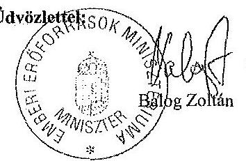

---

# 7. SZAMÚ MELLÉKLET A V-0352-360/2014. SZAMÚ JELENTÉSHEZ 

## 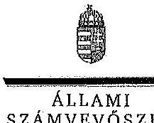

## Balog Zoltán úr

miniszter
Emberi Erőforrások Minisztériuma

## Budapest

## Tisztelt Miniszter Úr!

A Pannon Egyetem, a Szolnoki Főiskola, a Károly Róbert Főiskola, a Magyar Képzőművészeti Egyetem, a Széchenyi István Egyetem, a Miskolci Egyetem és az Eszterházy Károly Főiskola gazdálkodásának és működésének ellenőrzéséről készített jelentéstervezetekre tett észrevételeit köszönettel megkaptam.

Az Állami Számvevőszék észrevételekre vonatkozó álláspontjáról a felügyeleti vezető által készített részletes tájékoztatást csatoltan megküldöm.

Tájékoztatom Miniszter urat, hogy az ÁSZ. tv. 29. § (3) bekezdése alapján a számvevőszéki jelentések mellékleteként szerepeltetjük a jelentéstervezetekhez tett figyelembe nem vett észrevételeket az elutasítás indokainak feltüntetésével.

Budapest, 2014. július hó 15. nap
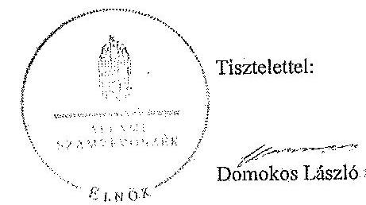

Melléklet: Tájékoztatás az elfogadott és a figyelembe nem vett észrevételekről

---

# Tájékoztatás   az elfogadott és a figyelembe nem vett észrevételekről 

A Pannon Egyetem, a Szolnoki Főiskola, a Károly Róbert Főiskola, a Magyar Képzőművészeti Egyetem, a Széchenyi István Egyetem, a Miskolci Egyetem és az Eszterházy Károly Főiskola gazdálkodásának és működésének ellenőrzéséről készült számvevőszéki jelentés-tervezetekhez a 36433-2/2014/FOFEJL iktatószámú levélben tett észrevételeit köszönettel megkaptuk.

A jelentéstervezetekre tett észrevételeket áttekintettük, azok kezeléséről a következő tájékoztatást adom:

1. A 2012. évi költségvetési hiánycél tartását biztosító további feladatokról szóló 1365/2011. (XI. 8.) Korm. határozatban előírt szervezeti és feladatellátási felülvizsgálati program megvalósítása.

A kormányhatározat alapján - az oktatási ágazatra vonatkozóan 2012. február 20-ig - kellett a tételes javaslatokat a Kormány elé terjeszteni, ennek végrehajtása azonban elmaradt. A feladatokat a nemzetgazdasági miniszter irányítása mellett kellett végrehajtani, felelősként azonban a Miniszterelnökséget vezető államtitkár, a közigazgatási és igazságszolgáltatási miniszter és az érintett ágazati miniszter is kijelölésre került. A fentiek alapján - az észrevételben leírtakra is figyelemmel - a vonatkozó szövegrészt a jelentéstervezetek összegző megállapítások, következtetések, javaslatok, valamint részletes megállapítások fejezeteiben az alábbiak szerint pontosítottuk:
„Elmaradt az oktatási ágazatra vonatkozóan a nemzetgazdasági miniszter irányításával és az oktatásért felelős miniszter részvételével, kormányhatározatban előírt szervezeti és feladatellátási felülvizsgálati program kidolgozása." (Összegző megállapítások)
„Elmaradt az oktatási ágazatra vonatkozóan az 1365/2011. (XI. 8.) Korm. határozatban - a nemzetgazdasági miniszter irányításával és az ágazatért felelős miniszter részvételével - előírt szervezeti és feladatellátási felülvizsgálati program kidolgozása. (Részletes megállapítások, 1. fejezet):

---

2. A felsőoktatás rendszere középtávú fejlesztési tervének elkészítése.

Az észrevételben foglaltakat figyelembe véve a jelentéstervezetek összegző megállapítások, következtetések, javaslatok, valamint részletes megállapítások fejezeteit kiegészítettük:
„A felsőoktatási törvény rendelkezései ellenére nem készíttetett a felsőoktatás rendszere vonatkozásában a Kormány által elfogadott középtávú fejlesztési terv." (Összegzö megállapítások)
„A miniszter - a vonatkozó jogszabályokban foglaltak ellenére - nem készíttetett a felsőoktatás rendszere vonatkozásában a Kormány által elfogadott középtávú fejlesztési terv." (Részletes megállapítások, 1. fejezet)
3. A Felsőoktatás Információs Rendszerének (FIR) üzemeltetése.

A felsőoktatási törvények rendelkezései szerint (Feot. 35. §, 103.§ (1) bekezdés aa.) pont, Nftv. 64.§ (2) bekezdés aa) pont) a felsőoktatási információs rendszer működtetése, az adatkezelés jogszerűsége a felsőoktatás ágazati irányítását ellátó miniszter felelősségi körébe tartozik. A miniszter feladata a felsőoktatási információs rendszer működéséért felelős Oktatási Hivatal működtetése is. A FIR működését a teljes ellenőrzött időszakban problémák jellemezték, amely felveti az Oktatási Hivatal működtetéséért felelős minisztérium felelősségét is. Az észrevételben jelzettek alapján a jelentéstervezeteket pontosítottuk a következők szerint:
„A minisztérium a Felsőoktatási Információs Rendszer (FIR) biztonságos üzemeltetéséhez, az adatok védelméhez szükséges alapvető szervezeti, szabályozási kontrollokat a 2012. év végéig nem teljes körűen alakíttatta ki az Oktatási Hivatallal." (Összegző megállapítások)
„A minisztérium az Oktatási Hivatallal a Felsőoktatási Információs Rendszer (FIR) biztonságos üzemeltetéséhez, az adatok védelméhez szükséges alapvető szervezeti, szabályozási kontrollokat a 2012. év végéig nem teljes körűen alakíttatta ki." (Részletes megállapítások, 1. fejezet)
4. Korábbi ÁSZ ellenőrzések javaslatainak hasznosulása.

4/a. Az oktatási és kulturális ágazat irányítási rendszerének, működésének ellenőrzéséről szóló 1106 sz. ÁSZ jelentés 3. sz. javaslata tekintetében a jelentéstervezetek részletes megállapítások 5. fejezeteit részletesen tartalmazzák a tényeket. Ennek alapján az oktatási ágazat középtávú stratégiája kidolgozásának hiányára vonatkozó megállapítást a jelentéstervezetekben nem módosítottuk.

4/b. A felsőoktatás oktatási infrastruktúra-fejlesztési programjának ellenőrzéséről szóló 1171
 sz. ÁSZ jelentésben az előkészítés hiányosságai miatt a felelősség megállapítására tett javaslat nem hasznosult a jelentéstervezetek megállapításai szerint.

---

Az észrevételben foglaltak szerint az egyes miniszterek, valamint a Miniszterelnökséget vezető államtitkár feladat- és hatásköréről szóló 212/2010. (VII. 1.) Korm. rendelet valóban a nemzeti fejlesztési miniszter szakpolitikai feladat- és hatáskörébe helyezte a PPP és egyéb állami vagyont érintő gazdálkodó szervezetekkel kötött és megkötendő szerződések vizsgálatát és ellenőrzését. Az ÁSZ nemzeti erőforrás miniszter részére címzett javaslata ugyanakkor a PPP programok előkészítési hiányosságai miatti felelősség megállapítására irányult. A nemzeti erőforrás minisztere 2012. január 19-én kelt intézkedési tervében 2012. december 31-ei határidőre elvégzendő feladatként fogalmazta meg az előkészítési hiányosságok miatti felelősség megállapításáról való intézkedést, amely nem valósult meg. Mindezek alapján a jelentéstervezetben tett megállapítás módosítása nem indokolt.

4/c A 1171. sz. jelentés alapján tervezett intézkedések közül az állami felsőoktatási intézmények kapacitás-kihasználás felmérése késéssel valósult meg. A felmérés eredményeinek és a felsőoktatást érintő ágazati célok figyelembe vételével a felsőoktatási infrastruktúra közép- és hosszú távú hasznosítására a helyszíni ellenőrzés időszaka alatt nem történtek intézkedések. Az intézkedés határideje 2013. december 31. volt. Az észrevételben foglaltak alapján a jelentéstervezetek módosítása nem indokolt.

4/d. Az állami felsőoktatási intézmények érdekeltségébe tartozó gazdasági társaságok támogatásának és nyereségük hasznosulásának ellenőrzése címü, 1290 sz. ÁSZ jelentés 2. sz. javaslata (Az állami felsőoktatási intézmények - a felülvizsgálatot követő, de legkésőbb egy éven belül - megmaradt társaságaira vonatkozó szakmai feladatellátás és a gazdasági eredményesség mérését biztosító mutatók és azok értékelési rendszerének kidolgoztatása) megállapításaink alapján nem hasznosult. A helyszíni ellenőrzés alatt rendelkezésre bocsátott dokumentumok alapján a minisztérium a rektorokat a szakmai feladatellátás és a gazdasági eredményesség mérését biztosító mutatószámok és értékelési rendszer kidolgozására a felsőoktatási intézmények finanszírozását szabályozó kormányrendelet kihirdetését követően kívánta felkérni. Így a vonatkozó megállapítás módosítása nem indokolt.

A Szolnoki Főiskola ellenőrzéséhez kapcsolódó - az emberi erőforrások miniszterének tett javaslatunk nem a PPP projektekkel kapcsolatos, hanem az intézmény hosszú távon fenntartható működtetésére vonatkozó intézkedések megtételét célozza, amely a fenntartó feladata és nem igénylik a nemzeti fejlesztési miniszter bevonását.

Az Eszterházy Károly Főiskola esetében a jelentéstervezet nem az IFT minisztériumi észrevételezésének hiányát kifogásolta, hanem azt, hogy annak a Feot 115. § (2) bekezdése db) pontja szerinti felülvizsgálata dokumentáltan nem történt meg.

Az emberi erőforrások miniszterének a Károly Róbert Főiskola, a Magyar Képzőművészeti Egyetem, a Szolnoki Főiskola, az Eszterházy Károly Főiskola, a Széchenyi István Egyetem, valamint a Miskolci Egyetem vonatkozásában az Nftv. 73. § (3) bekezdés e) pontja alapján megfogalmazott javaslatokat az Nftv. 2014. július 24-én hatályba lépő módosításai nem érintik, a felsőoktatási intézmény rektorainak tett javaslatokat a jogszabály változás figyelembe vételével pontosítottuk.

---

Kérem a válaszlevelemben foglaltak szíves tudomásulvételét. Tájékoztatom Miniszter urat, hogy a számvevőszéki jelentés mellékleteként szerepeltetjük a jelentéstervezethez tett észrevételeit, az elfogadott valamint az ÁSZ tv. 29. § (3) bekezdése alapján a figyelembe nem vett észrevételeket az elutasítás indokának feltüntetésével együtt.

Budapest, 2014. július 28. nap

Horváthné Herbáth Mária
felügyeleti vezető

---

# **Chemistry**

## **Chemical Reactions**

### **Balancing Chemical Equations**

1. **Write the unbalanced equation:**
   - Example: $$C_3H_8 + O_2 \rightarrow CO_2 + H_2O$$

2. **Balance the equation:**
   - Balance carbon atoms first.
   - Then balance hydrogen atoms.
   - Finally, balance oxygen atoms.
   - Balanced equation: $$C_3H_8 + 7O_2 \rightarrow 3CO_2 + 4H_2O$$

3. **Balance the equation:**
   - Balance oxygen atoms.
   - Finally, balance oxygen atoms.
   - Balanced equation: $$C_3H_8 + 7O_2 \rightarrow 3CO_2 + 4H_2O$$

### **Types of Reactions**

1. **Combination Reaction:**
   - Example: $$2H_2 + O_2 \rightarrow 2H_2O$$

2. **Decomposition Reaction:**
   - Example: $$2H_2O_2 \rightarrow 2H_2O + O_2$$

3. **Single Displacement Reaction:**
   - Example: $$Zn + 2HCl \rightarrow ZnCl_2 + H_2$$

4. **Double Displacement Reaction:**
   - Example: $$AgNO_3 + NaCl \rightarrow AgCl + NaNO_3$$

5. **Combustion Reaction:**
   - Example: $$CH_4 + 2O_2 \rightarrow CO_2 + 2H_2O$$

## **Stoichiometry**

### **Mole Concept**

- **Mole (mol):** The amount of substance containing as many particles (atoms, molecules, ions) as there are atoms in exactly 12 grams of carbon-12.
- **Avogadro's Number:** $$6.022 \times 10^{23}$$ particles per mole.

### **Molar Mass**

- **Molar Mass:** The mass of one mole of a substance.
- Example: The molar mass of water ($$H_2O$$) is 18.015 g/mol.

### **Calculations**

1. **Moles to Mass:**
   - Formula: $$n = \frac{m}{M}$$
   - Example: Calculate the number of moles of $$H_2O$$ in 18 grams of water.
     - $$n = \frac{18 \, \text{g}}{18.015 \, \text{g/mol}} \approx 0.999 \, \text{mol}$$

2. **Mass to Moles:**
   - Formula: $$m = n \times M$$
   - Example: Calculate the mass of 1 mole of water.
     - $$m = 1 \, \text{mol} \times 18.015 \, \text{g/mol} = 18.015 \, \text{g}$$

## **Gas Laws**

### **Ideal Gas Law**

- **Equation:** $$PV = nRT$$
- **Variables:**
  - $$P$$: Pressure (atm)
  - $$V$$: Volume (L)
  - $$n$$: Number of moles (mol)
  - $$R$$: Ideal gas constant (0.0821 L·atm/mol·K)
  - $$T$$: Temperature (K)

### **Boyle's Law**

- **Equation:** $$P_1V_1 = P_2V_2$$

### **Boyle's Law**

- **Equation:** $$P_1V_1 = P_2V_2$$

## **Thermochemistry**

### **Enthalpy (H)**

- **Definition:** The heat content of a system at constant pressure.
- **Equation:** $$H = qp$$
- **Equation:** $$\Delta H = qp$$

### **Hess's Law**

- **Statement:** The enthalpy change for a reaction is the same whether it occurs in one step or multiple steps.

### **Calculations**

1. **Moles to Mass:**
   - Formula: $$n = \frac{m}{M}$$
   - Example: Calculate the moles of $$H_2O$$ in 18 grams of water.
     - $$n = \frac{18 \, \text{g}}{18.015 \, \text{g/mol}} \approx 0.999 \, \text{mol}$$

2. **Mass to Mass:**
   - Formula: $$m = n \times M$$
   - Example: Calculate the mass of 1 mole of water.
     - $$m = 1 \, \text{mol} \times 18.015 \, \text{g/mol} = 18.015 \, \text{g}$$

## **Electrochemistry**

### **Oxidation and Reduction**

- **Oxidation:** Loss of electrons.
- **Reduction:** Gain of electrons.

### **Galvanic Cells**

- **Definition:** A cell that converts chemical energy into electrical energy.
- **Components:**
  - Anode: Oxidation occurs.
  - Cathode: Reduction occurs.
  - Salt Bridge: Connects the two half-cells.

### **Nernst Equation**

- **Equation:** $$E = E^\circ - \frac{RT}{nF} \ln Q$$
- **Variables:**
  - $$E$$: Cell potential
  - $$R$$: Ideal gas constant
  - $$T$$: Temperature (K)
  - $$n$$: Number of electrons transferred
  - $$F$$: Faraday constant
  - $$Q$$: Reaction quotient

---

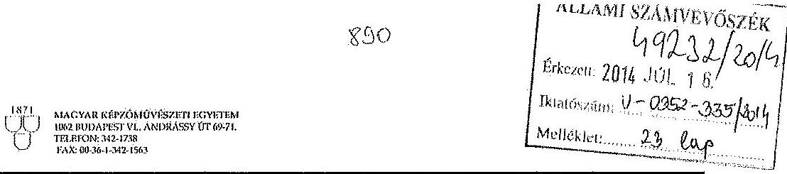

|  Üktatószám: | PLH/43517/2014.  |
| --- | --- |
|  Tárgy: | A Magyar Képzőművészeti Egyetem gazdálkodásának és működésének ellenőrzéséről készült számvevőszék! jelentéstervezet megállapításaira tett észrevételek megküldése  |
|  Üzveletkel: | Beszteri Orsolya  |
|  Melléklet: | 2 db  |

Állami Számvevőszék

Budapest Apáczai Csere János utca 10. 1052

Domokos László Elnök Úr részére

Tisztelt Elnök Úr!

Hivatkozással a 2014. június 27. napján kelt, V-0352-314/2014. iktatószámú levelére, mellékelten küldöm a Magyar Képzőművészeti Egyetem gazdálkodásának és működésének ellenőrzéséről készült számvevőszéki jelentéstervezet megállapításaira tett észrevételeinket.

Budapest, 2014. július 15.

Tisztelettel:

Prof. Somorjai-Kiss Tibor rektor

Mellékletek: Juhász Ferenc gazdasági főigazgató úr észrevételei, König Frigyes (rektor 2009-2012 között) észrevételei

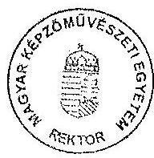

---

Észrevételek az Állami Számvevőszék által a Magyar Képzőművészeti Egyetem gazdálkodásának és működésének ellenőrzéséről készített jelentés tervezetéhez:

# I. Általános megállapítások 

## I.1. A gazdálkodási, működési körülmények vizsgálata

„Az ellenőrzés során vizsgálni kellett minden olyan körülményt, információt, adatot, amely a program végrehajtása során felmerül, a pénzügyi és vagyoni helyzet szabályosságának megítélésére hatást gyakorol, az ellenőrzés céljával releváns módon összefüggésben van és a tények megalapozásához szükséges." Megítélésünk szerint az ellenőrzés során egy nagyon lényeges körülményt nem vettek figyelembe, mégpedig az intézmény azon állapotát, mely a vizsgált időszak kezdetén volt jellemezhető. Ezt azért tartjuk nagyon fontosnak, mivel teljesen eltért a többi egyetemen uralkodó állapotoktól. Az intézményünk a vizsgált 4 éves periódust megelőző évben a törvényes működéstől nagyon távol állt. Erre egyrészt a vizsgálat során a személyes egyeztetések alkalmával hívtuk fel az ellenőrzést végzők figyelmét, másrészt a kiegészítő nyilatkozatokban többször is utaltunk ezen tényre, melyet nem vettek kellő súllyal figyelembe, így ezt most kénytelenek vagyunk részletesen is ismertetni.

Az egyetemen 2008-ban szörnyű állapotok uralkodtak. Az intézmény - ahhoz képest, hogy a jelenleginél nagyságrendekkel, több százmillió Ft-tal több állami forrással gazdálkodott, és a közüzemi díjak is töredékét tették ki a jelenleginek - csőd közeli állapotban volt, ezt egy 2008. évi minisztériumi célellenőrzés is megállapította. Az egyetemen szinte egyetlen szabályos kifizetést nem találtunk a 2007-2008. évi dokumentumokba bepillantva. A kifizetési bizonylatok többsége mellett nem volt szerződés és teljesítésigazolás, a munkabérek számfejtése mögött nem volt jelenléti ív és óraigazolás, az oktatók egy része a törvényi minimumnak csupán a töredékét töltötte az intézményben. 2008-ban egy munkaügyi ellenőrzés elképesztő dolgot állapított meg, nevezetesen, hogy 13 találomra kiválasztott alkalmazott közül 12-nek nem volt szabályos kinevezési okirata, nagyon soknak egyáltalán nem volt kinevezése, mely alapján egyáltalán munkabér járt volna számukra.

Az intézmény szabályozottsága főleg a gazdasági téren nagyon alacsony színvonalon volt. Sok szabályzat egyáltalán nem létezett, ami pedig fellelhető volt, az többnyire máshonnan kiollózott, a helyi viszonyokra nem igazán adaptált szabályzatként létezett.

A közbeszerzést egyáltalán nem folytatott az intézmény. A szolgáltató cégek a nagy összegű tevékenységeket (takarítás, őrzés
 védelem, karbantartás stb.) a szokásos piaci ár duplájáért végezték, az intézmény infrastruktúráját igénybe vevők pedig a piaci ár töredékéért vették igénybe az intézmény infrastruktúráját. Gazdasági számítást, kalkulációt egyetlen bevételszerző tevékenység esetében sem találtunk. Lényegében ellenőrizetlen módon ömlött ki az állami forrás magán társaságokhoz úgy, hogy az elszámolásokban szinte alig volt olyan tétel, mely maradéktalanul megfelelt volna a törvényi előírásoknak.
2008. évben a gazdasági főigazgató közalkalmazotti jogviszonyának megszűnése napján a szabadságainak ellenőrzése nyomán arra derült fény, hogy 2005. és 2007. között több mint 10 millió Ft-ot fizetett ki saját magának önhatalmúan, helyettese közreműködésével szabadság

---

megváltás jogcímen, mely ellentétes volt a törvényi előírásokkal, és felső vezetői engedélyt sem kért hozzá. Aztán ahogy belenéztünk a 2007. évi dokumentumokba, arra is fény derült, hogy ezen túlmenően teljesen szabálytalanul számolták a jubileumi jutalmat is. Az új gazdasági főigazgató által kezdeményezett, 2009. évben lefolytatott TB ellenőrzés megállapította, hogy a 2004 - 2008. év során a TB kifizetőhelyi ellátások számfejtésében majd minden harmadik tétel szabálytalan volt és ennek nyomán közel 5 millió Ft-os bírságot róttak ki intézményünkre.

A fenti adatok csupán egy kis ízelítőt nyújtanak arról, hogy miként is működött az intézmény gazdasági téren akkoriban, törvényességnek, szabályosságnak még a látszata sem volt meg, a gyakorló szakközépiskolánknak például még működési engedélye sem volt.

Mindezeket egy 2008. évben lefolytatott fenntartói megbízhatósági ellenőrzés valamint a volt gazdasági főigazgató pénzügyi szabálytalanságainak feltárására indított minisztériumi célellenőrzés is tökéletesen alátámasztotta.

Az új gazdasági főigazgató 2008. decemberi kinevezését követően gőzerővel kezdődött meg a gazdasági terület rendbetétele, mely éppen a vizsgált 2009 - 2012. évi időszakra esett. A feladat azért volt óriási, mert nem egy rendszert kellett nulláról kialakítani, hanem egy rosszul felépített rendszert kellett először lebontani és aztán alapjaitól felépíteni.

- Legelőször a csőd közeli állapotot kellett megszüntetni. Ennek keretében valamennyi szerződés felülvizsgálatra került, azon tevékenységek esetében pedig, ahol a nyújtott szolgáltatás ára nem felelt meg a piaci szokásos áraknak, azonnal megszüntettük a szerződést. Ennek eredményeként a takarítási, őrzés-védelmi és karbantartási tevékenységekre jelenleg - magasabb színvonalú szolgáltatás mellett- fele annyit költ az intézmény, mint 2008-ban.
- Időközben a volt gazdasági főigazgató és a bérszámfejtő ellen pert indítottunk, mely nyomán a bizonyíthatóan törvénysértő módon számfejtett jövedelmeket visszaszereztük.
- Az önköltség számítási szabályzatot és ez alapján az árképzési rendszerünket gyökeresen átalakítottuk, majd felülvizsgáltuk valamennyi nyújtott szolgáltatás díjszabását és a díjakat a teljes önköltség és piaci díjszabás figyelembe vételével alakítottuk ki. (Volt például olyan bérleti díj, melyet hétszeresére emeltünk.)
- Kialakítottuk a pályázati tevékenységünk rendszerét, mely nyomán egyre több pályázatot sikerült elnyernünk, közöttük több uniós finanszírozású, nagy összegű pályázatot is.
- Külső szakértő közreműködésével az alkalmazotti állomány körében teljes munkaügyi átvilágítást tartottunk, mely keretében valamennyi munkaügyi okiratot a jogszabályi előírásokhoz igazodva újraírtunk. Ezzel párhuzamosan felülvizsgáltuk az oktatók óraterhelését, mely alapján több oktatótól megváltunk, többek átminősítésre kerültek külső óraadókká. Az eltávozott oktatók helyett fiatal, tudományos fokozattal rendelkező oktatókat vettünk fel. A munkaidő felhasználásának korábban hiányzó, vagy nem megfelelő tartalmú dokumentumait újraalkottuk és a bérszámfejtés kötelező elemévé tettük.
- Az állami ellenőrző szervek segítségét kérve felülvizsgáltattuk a 2004 - 2008. évi TB kifizetőhelyi szolgáltatást, majd annak lesújtó eredményei alapján elvégeztük ezen évekre az

---

adatok külső szakértő általi felülvizsgálatát és korrekcióját. A későbbiekben pedig szakértő munkatárs segítségével hiba nélkül végeztük ezt a feladatot.

- Külső szakértő segítségével felülvizsgáltattuk a tanulmányi és ösztöndíj rendszert. A tapasztalatok alapján a szabályzatokat jelentősen módosítottuk és az ösztöndíj és térítési rendszert teljesen átláthatóvá, ellenőrzötté tettük.
- 2009-ben - külső szakértő közreműködésével - lebonyolítottuk az első közbeszerzést intézményünknél. Ezzel párhuzamosan a jogszabályi előírásoknak megfelelő közbeszerzési és beszerzési szabályzatot alkottunk, majd a közbeszerzési referens „kinevelését" követően 2010-től egymás után sorban bonyolítottuk le a közbeszerzés köteles szolgáltatások valamint nagy értékű gépbeszerzések tekintetében az eljárásokat. 2011 végére elértük, hogy valamennyi nagy értékű, közbeszerzési értékhatást meghaladó szolgáltatás pályázott partnere szabályos körülmények között lebonyolított közbeszerzési eljárással lett kiválasztva, 2012-ben pedig már közösségi értékhatárt meghaladó közbeszerzést is lebonyolítottunk, probléma nélkül.
- 2009-től megkezdődött a szabályzatok felülvizsgálata és újraalkotása is. A hiányzó szabályzatokat pótoltuk, a nem megfelelő tartalmú szabályzatokat pedig módosítottuk.
- Az intézmény nagy hangsúlyt fektetett a belső ellenőrzés megerősítésére, mely keretében olyan személyt választott ki, aki nagyon komoly segítséget jelentett a folyamatok feltérképezésében és a jogszabályi előírásoknak való egyre teljesebb körű megfelelés elérésében.
- A kor követelményeinek megfelelő gazdasági adminisztrációs feladatokat a gazdasági terület régi, örökölt személyi állományával nem lehetett volna végrehajtani, ezért gondoskodni kellett a nem alkalmas személyzet lecseréléséről és a meglévők képzéséről. Ennek eredményét mutatja, hogy amíg 2009. elején a gazdasági főigazgatón kívül csupán egy munkatárs volt, akinek megfelelő pénzügyi képesítése volt, és ennek nyomán az érvényesítési jogkör gyakorlása is nagy nehézségekbe ütközött, addig jelenlegi állapot szerint a gazdasági hivatal állományában egy személy kivételével valamennyi alkalmazott rendelkezik mérlegképes vagy pénzügyi ügyintézői képesítéssel és az az egy alkalmazott is belső képzésre került.

# I. 2. A gazdálkodási, működési folyamatok időbeli értékelése 

A vizsgálatról készített anyag egyik hiányosságának tartjuk, hogy a vizsgált időszak folyamatalról, a működés, gazdálkodás szabályozottságának és a végrehajtás szabályszerűségének időbeli változásáról nem ad hű képet. Ez két szempontból is nélkülözhetetlen egy ilyen széles időtávot felölelő vizsgálatnál:

- A speciális helyzetű intézményeknél, mint amilyen az egyetemünk is, elengedhetetlenül szükséges az időbeli tendenciák bemutatása, hiszen itt teljesen más alapokról kellett indulni, mint a többi egyetemnél, ahol a működési folyamatokat évtizedes fejlődéssel, normális külső és belső ellenőrzéssel csiszolták ki. Nálunk lényegében néhány év alatt szinte nulláról kellett felépíteni egy egyetemhez méltó és jogi normáknak megfelelő intézményt. Ennek nyomán a

---

2009-es állapotok - az időközben bekövetkezett fejlődés következtében - össze nem hasonlíthatók a 2012. évivel.

- Azért is szükséges intézményünknél az időbeliség bemutatása, mivel a döntéshozóknak feltétlenül tudniuk kell a folyamatok további kezelése kapcsán, hogy milyen alapokról indult az intézmény, ahhoz képest jelenleg hol tart, mert csak ennek a folyamatnak a szakszerű értékelése nyomán lehet a jövőbeni feladatokat meghatározni. Ezen túlmenően a személyi felelősség kérdése is teljesen máshogy vetődik fel egy olyan intézménynél, ahol egy speciális feladatot (más által hátrahagyott romokból történő épületemelés) kell viszonylag rövid idő alatt elvégezni.

Meggyőződésünk szerint a vizsgált négyéves időszak végére eljutottunk egy olyan szintre, mely nyomán gazdálkodás területén intézményünk a felsőoktatási intézmények élmezőnyébe tartozik, a szabályozottságban és a működési folyamatok szakszerűségében, a kontrollkörnyezet működtetésében pedig elérte a felsőoktatási intézmények alsó harmadát.

A gazdálkodás eredményeiről a következő pontban kívánunk részletes elemzést adni, most a gazdálkodás és működés szabályozottságának és a végrehajtás szabályszerűségének dinamikus fejlődését kívánjuk röviden bemutatni. Ez által igazolni kívánjuk, hogy a vizsgálati anyagban szereplő magas kockázati értékek túlnyomó többsége a 2009-10 évi hiányosságnak köszönhető 2012. év végére a gyors fejlődés nyomán az intézmény már nem képezett magas kockázati tényezőt.

- A vizsgálati anyagból kiderül, hogy alapvetően 2009. évre vonatkozóan hiányzott több szabályzat is, melynek többségét abban az évben el is fogadta a szenátus. Ezt követően is folytatódott a szabályzatok alkotása, felülvizsgálata, módosítása, de mivel a fő szabályzatok már elkészültek, 2010-től már csökkenő ütemben. 2012 végére elértük, hogy a közérdekű bejelentések rendjéről szóló szabályzat kivételével minden fontosabb szabályzattal rendelkezett intézményünk és azokat folyamatosan igyekezett a megváltozott törvényi feltételekhez igazítani.
- A személyi juttatások tekintetében 2009. év elején még igen sok hiányosságot tapasztalhatott az ellenőrzés főleg a kinevezési, megbízási okiratokban illetve a bérszámfejtést alátámasztó okiratok szabályszerűségében. 2010-re elértük, hogy az okiratok megfeleltek a követelményeknek és innen már nem igazán fordult elő komolyabb hiányosság. A vizsgálatot folytatók a személyes konzultációkon jelezték, hogy főleg a kezdeti időszakban (2009) tapasztaltak hiányosságokat (erről az anyagban egy helyen említést is tesznek). Ez alapján megítélésünk szerint a vizsgálati időszak végére a költségvetés 60%-át kitevő személyi juttatások és járulékok területén a kockázatot sikerült minimális szintre szorítani.
- Az anyag egy helyen (33. oldal alja) említést tesz a 2009- 2010. évben a Közép-magyarországi Regionális Pénztár ellenőrzéséről, mely nyomán a vizsgált öt év alatt nagyon sok szabálytalanság merült fel és emiatt közel 5 millió Ft bírságot kellett intézményünknek fizetni. A jelentés nem számol be arról a tényről, hogy a hatósági vizsgálatot az új gazdasági főigazgató kezdeményezte a múltbeli szabálytalan elszámolások rendberakása céljából. Arról sem tesz említést az anyag, hogy a vizsgált öt év a 2004-2008. évi időszak volt, mely nem tartozott a számvevőszék által értékelt időszakba. Nemrég zárult le a 2009-2013. évi újabb öt

---

éves időszak ellenőrzése, mely nyomán a vizsgált időszak alatt egyetlen szabálytalan tételt sem talált a hatósági Mindez azt igazolja, hogy ezen a területen is sikerült nagyot előrelépni és a kockázatot a minimálisra szorítani.

- A nagy összegű dologi és felhalmozási jellegű beszerzések terén az intézmény a közbeszerzések beindításával és teljes körűvé tételével biztosította az elmúlt időszakban az átláthatóságot és a racionális, szabályozott beszerzések rendjét. A fejlődést jól mutatja, hogy amíg 2009. elején még törvényi szabályoknak megfelelő közbeszerzési szabályzata és az előírt képesítési követelményeknek megfelelő közbeszerzési referense sem volt az intézménynek következésképpen még az alapokkal sem rendelkezett a közbeszerzések lebonyolításához addig az alapok pótlását követően beindultak a közbeszerzések és 2011 végére, 2012 év elejére sikerült elérni, hogy valamennyi, közbeszerzési értékhatárt elérő szolgáltatás és termékbeszerzés tekintetében közbeszerzéssel bonyolítottuk le a beszerzéseket. A közbeszerzési értékhatárt el nem érő, de azt megközelítő beszerzések tekintetében széles körben meghirdetett, több fordulós árlejtéses versenytárgyalást alkalmaztunk sok esetben. A közbeszerzések az előírt eljárási rend szerint bonyolódtak le, egyetlen esetben sem támadták meg azokat. 2012-től már a gázbeszerzést, 2013-tól pedig a villamos energia beszerzést is az egyetemek szövetségében alakult csoportos közbeszerzés keretében bonyolítjuk le, így mára elértük, hogy a nagy összegű dologi és eszközbeszerzéseink gazdaságos, átlátható rendszerét közbeszerzések útján biztosítja az intézmény, minimálisra szorítva ezzel a gazdálkodási és szabályszerűségi kockázatot.
- A hallgatói juttatások elszámolási kifizetési rendjét szintén egy külső szakértővel világítottuk át, mely nyomán módosítottuk, egyértelművé tettük a szabályzatot és megfelelő kontrollokat építettünk be az elszámolási folyamatba. Ennek is köszönhető, hogy a 100 milliós éves nagyságrendet jóval meghaladó kiadási tételnél az ellenőrzés nem tárt fel különösebb hiányosságot és nem jelzett kockázatot.
- A fentiekben felsorolt erőfeszítések eredményeit kiválóan igazolta vissza a szaktárca 2010. évben lefolytatott megbízhatósági vizsgálata is, mely során a „korlátozottan megbízható" minősítésű 2007 évi beszámolóval szemben a 2009. évi beszámolót már „megbízhatónak" minősítette, súlyos hiányosságot nem tapasztalt és a vizsgálatot végző külön kiemelte, hogy két év alatt

 rengeteget fejlődött intézményünk a szabályozottság teljességé, a működés szabályossá tétele irányában. A vizsgálati jelentés által akkor megállapított hiányosságokat (pl. közbeszerzések lefolytatása, szabályzatok módosítása, leltározás adminisztrációjának javítása..) kijavítottuk.

A fentiek alapján látható, hogy az intézményünk a szabályozott működés, a törvényi előírások szerinti gazdálkodási rend kiépítése tekintetében az elmúlt években nagyon mélyről indulva folyamatos fejlődésen keresztül elért egy olyan szintre, amikor már az állami vagyonnal való gazdálkodás és a szabályos pénzfelhasználás területén a legfontosabb dolgok helyükre kerültek. Természetesen tisztában vagyunk azzal, hogy még nagyon hosszú út vezet a tökéletes működésig, és nagyon sok témában még előre kell lépnünk illetve a finomításokat el kell végeznünk. Ehhez azonban úgy érezzük, hogy a megfelelő alapokat az elmúlt években áldozatos munkával megteremtettük. Nagyon sajnáljuk, hogy ennek eredménye az ellenőrzési jelentésből egyáltalán nem érződik.

---

# 8. SZÁMÚ MELLÉKLET A V-0352-360/2014. SZÁMÚ JELENTÉSHEZ

## I. 3. A gazdálkodás értékelése

A jelentés tervezet címe arra utal, hogy a vizsgálat az intézmény gazdálkodásának és működésének ellenőrzéséről szól, azonban a vizsgálat nem igazán a gazdálkodás és működés tartalmi elemeit, hanem a gazdálkodás és működés jogszabályi előírásoknak való megfelelését vette górcső alá, tehát szabályszerűségi vizsgálatról van szó. Az ellenőrök a helyszíni vizsgálat során sem a gazdálkodás tartalmi elemeire koncentráltak, hanem a gazdálkodási és működési környezet jogszabályi megfelelőségére, a végrehajtás adminisztratív előírásainak betartására valamint a kontrollkörnyezet felépítésére és működésére.

Emellett természetesen megjelent az anyagban néhány információ a gazdálkodásról, működésről, de ezek sem az összegző megállapítások, sem a részletező megállapítások között nem tartoznak a domináns, kiemelt részek közé, ráadásul ezek sok esetben nem fedték a valóságot. (a későbbiekben részletezzük ezeket)

Mindez azért aggályos, mivel a döntéshozók a gazdálkodási környezetre és a végrehajtásra vonatkozó szabályszerűségi jellegű, pozitív illetve negatív megállapításokból arra a következtetésre juthatnak, hogy azok a gazdálkodás tartalmát, lényegi részét minősítik, holott csupán a gazdálkodás környezetének, jogszabályi előírások szerinti feltételeinek megfelelőségére vonatkoztak.

Az anyagból nem világlik ki egyáltalán, hogy a Magyar Képzőművészeti Egyetem a vizsgált időszakban az egyik legkiválóbban gazdálkodó egyetem volt. Ezt a következő módon igazoljuk: (e Ft

|   | 2008 | 2009 | 2010 | 2011 | 2012  |
| --- | --- | --- | --- | --- | --- |
|  Állami támogatás: | 1.530.058 | 1.460.170 | 1.395.923 | 1.294.161 | 1.290.766  |
|  Ebből: egyetem | 1.055.425 | 995.235 | 954.691 | 905.970 | 869.912  |
|  szakközép. | 474.633 | 464.935 | 441.232 | 388.191 | 420.854  |
|  Saját bevétel: | 151.673 | 190.752 | 218.981 | 304.488 | 341.108  |
|  Ebből működési: | 103.180 | 122.314 | 151.136 | 182.866 | 165.345  |
|  támogatási: | 48.493 | 68.438 | 67.845 | 121.622 | 175.763  |
|  Vagyonállomány: | 1.022.943 | 1.004.045 | 1.005.479 | 1.024.114 | 1.067.177  |

Egy költségvetési intézmény adott időszaki gazdálkodását megítélésünk szerint az alábbi paraméterek jellemzik a legjobban:

1. Az intézmény kötött-e olyan üzletet, melyből az államnak kára származott? Ebbe a felsőoktatásba jellemzően és elsődlegesen a PPP konstrukciójú beruházások tartoznak, melyből az államnak tetemes kára származott, ráadásul sokszor olyan területeken valósultak meg, ahol a jövőbeni piaci elvárások nem indokolták a beruházást. Bár óriási nyomás nehezedett intézményünkre is a fenntartó részéről PPP-s konstrukció megkötését célozva, azonban annak kirívóan gazdaságtalan voltára tekintettel

---

visszautasítottuk annak aláírását. Ebből a szempontból tehát egyetemünk a ritka kivételek közé tartozik, amit mi elismerésre méltónak tartunk.
2. Az intézmény megőrizte-e a likviditását a vizsgált időszakban, s az eladósodás nyomán szorult-e állami segítségre? A vizsgált időszakban 60 napon túli tartozás nem fordult elő, intézményünk mindvégig pozitív pénzügyi szaldóval zárta az évet, állami plusz támogatás igénybe vételére nem szorult. A pénzügyi egyensúly folyamatos megőrzése azért is megsüvegelendő teljesítmény, mivel volt olyan év, amikor 175 milliós (12%-os) elvonás hatását kellett racionalizálási intézkedésekkel kompenzálni, és olyan év is volt, amikor nagy összegű zárolásra év végén került sor, amikor már nem volt sok lehetőség a negatív pénzügyi hatás ellensúlyozására.

A vizsgálati jelentésben megjelenő negatív finanszírozási mutatókat közgazdasági szempontból nem tartjuk megfelelőnek. (Ezt a későbbiekben részletezzük)
3. Az intézmény a saját bevétel növelésével mindent megtett-e a folyamatosan csökkenő állami támogatás kompenzálására? A saját bevétel a vizsgált öt évben 151 millióról 341 millióra (több, mint duplájára) növekedett. Az évi átlagos növekedési ütem meghaladta a 20%-ot, mely nagyon komoly dinamikát jelez. A bevétel növekedés mind a működési bevétel, mind a támogatási bevétel dinamikus emelkedésében kifejeződik. Különösen a nagy összegű uniós pályázatok elnyerése terén ért el kiemelkedő sikereket intézményünk az elmúlt években, ezzel sikerült az állami támogatás csökkenés egyetemi működésre gyakorolt negatív hatásait részben kivédeni, illetve az infrastruktúra állapotát javítani.
(A vizsgálati jelentés tervezetben saját bevételek szintje nem a reális képet mutatja, mivel a 2009. évi bevételek között figyelembe veszi az érdi telek értékesítéséből származó 80 millió Ft összegű „rendkívüli" bevételt is, így a bázisévben figyelembe vett egyszeri magas összegű bevétel okán nem látható jól az évről évre mutatkozó magas szintű fejlődés és dinamika ezen a területen.)

# 4. Az intézmény miként őrizte meg a kezelésére bízott állami vagyont, gondoskodott-e a folyamatosan amortizálódó vagyon megfelelő pótlásáról? 

A fenti táblázat adatai azt mutatják, hogy egyetemünk a folyamatos állami pénzkivonás időszakában is olyan mértékű forrásokat költött felhalmozási kiadásokra, az épület és eszközállomány felújítására, pótlására, hogy nemhogy megőrizte a vagyonállomány értékét, hanem még növelte is azt. Mivel az utóbbi években igen komoly mértékű volt az állami forráskivonás a felsőoktatásban, és ennek hatására az egyetemek elsősorban a felhalmozási kiadásokat fogták vissza, ezért kevés intézmény van, aki a vagyonállomány értékét ebben a kritikus időszakban meg tudta őrizni. Egyetemünk büszke arra, hogy ebbe a körbe tartozik.
5. Az intézmény milyen eredményeket ért el a működés és a gazdálkodás szabályossága, törvényi előírásoknak való megfelelése területén?

Bár intézményünk az örökölt múltbeli állapotok miatt még nem tartozik ezen a téren a top kategóriába, és számos területen kell még fejlődnie a jövőben, azonban az I.2. pontban leírtak alapján állítjuk, hogy az elmúlt évek során óriásit fejlődött ezen a területen és a szabályozott, törvényes működésnek egy nagyon alacsony állapotából eljutott egy olyan szintre, melyben már a

---

legfontosabb területeken megvannak a stabil alapok a szabályos, törvényi előírásoknak megfelelő működésre. Úgy érezzük, hogy ezen a területen sem kell szégyenkeznünk, hiszen minden tőlünk telhetőt megtettünk a helyzet gyors rendezésére.

Ha a működés és gazdálkodás fenti paramétereit összesítve értékeljük, akkor megítélésünk szerint egyetemünk mindenképpen az élmezőnybe tartozik a felsőoktatási intézmények táborában!!

Mindezt nemcsak a fenti adatok bizonyítják, hanem nagyon magas rangú állami szakemberek is a fenti véleményen vannak. A Gazdasági Tanács oszlopos tagja Windisch László - aki akkor a Nemzetgazdasági Minisztérium főosztályvezetője volt, most pedig az MNB alelnöki tisztségét tölti be - például úgy nyilatkozott, hogy az összes általa felügyelt intézmény közül itt tapasztalta a legkomolyabb pénzügyi fegyelmet és legvilágosabb felépítésű monitoring rendszert.

De nemcsak ő nyilatkozott elismerően intézményünk gazdálkodásáról, hanem Magyarország Kormánya is, hiszen 2013. január végén Lázár János államtitkár úr a médiának úgy nyilatkozott, hogy azért illeti meg intézményünket a 300 millió Ft-os költségvetési forrás-kiegészítés, mert a többi felsőoktatási intézménnyel szemben egyetemünk az elmúlt években már végrehajtotta az állam által elvárt racionalizálási, hatékonyságnövelő intézkedéseket.

# II. Tartalmi észrevételek 

## II.1.. Közbeszerzési kötelezettség figyelmen kívül hagyása

A vizsgálati jelentés tervezetben több helyen is szerepel a közbeszerzési törvény megsértése annak kikerülésével kötött szerződések által és ennek nyomán a vizsgálatot lefolytató személyi felelősség megállapítására is javaslatot tesz.

Az I. fejezetben részletesen bemutattuk azt a folyamatot, amely során intézményünk vezetése a törvénytelen állapotokat észlelve mindent megtett a szabályos működés érdekében és a közbeszerzések lefolytatásához szükséges feltételek megteremtése után egymást követően bonyolította le az eljárásokat. Ennek nyomán 2011 végére, 2012. elejére sikerült elérni, hogy valamennyi közbeszerzési értékhatárt elérő szolgáltatás tekintetében közbeszerzés útján választottuk ki a szolgáltató partnert. Most kifejezetten azokat a jelzett hiányosságokat vesszük górcső alá, melyek tekintetében szakmailag nem értünk egyet a vizsgálati anyagban megfogalmazott megállapításokkal:
a, Nem értünk egyet a jelentésben foglalt azon megállapítással, hogy a szakközépiskolánk valamint a kollégium éttermében külső partnertől igénybe vett - kiszolgálással együtt nyújtott - éttermi szolgáltatás közbeszerzés köteles körébe tartozik, hiszen a beszerzési összeg nem érte el az uniós összeghatárt és így ezt a szolgáltatást a törvény a kivételek között említi.
120. § E törvényt nem kell alkalmazni az uniós értékhatárt el nem érő
c) a 4. melléklet szerinti szállodai és éttermi szolgáltatásokra, szórakoztató, kulturális és sportszolgáltatásokra;
b, Nem értünk egyet a jelentés azon megállapításával sem, hogy a szakközépiskolában 2012. évben végrehajtott épület karbantartási-felújítási munkák a közbeszerzés köteles körbe tartoztak volna. A szakközépiskolában 2012. nyarán életveszély elhárítás okán külső homlokzati és épületbádogos

---

munkákat végeztünk összességében nettó 15 millió Ft-os közbeszerzési értékhatár alatt, ezen túlmenően az épület belsejében, a tantermekben a szokásos nyári festési-mázolási, parketta csiszolási, és egyéb karbantartási, terem felújítási munkákat végeztünk több szakipari céggel szintén 15 millió Ft-os nettó összeghatár alatt. Ezen túlmenően pedig két épületben gázkazán cserét hajtottunk végre szintén 15 millió Ft-ot el nem érő nettó beszerzési összegért. Az Állami Számvevőszék a Közbeszerzési Döntőbizottsághoz benyújtott bejelentésében azt vélelmezte, hogy ezek a teljesen különböző műszaki tartalmú beruházások a közbeszerzés tekintetében egybeszámítással értékelendők. A hatósági eljárás során érvelésünk alapján az ÁSZ visszavonta azt a feltételezését, hogy a kazán beszerzéssel megsértettük volna a közbeszerzési előírásokat. Műszaki beruházásokra specializálódott közbeszerzési szakértőtől kért állásfoglalás alapján a részben alpinista technológiával lebonyolított épülethomlokzati, tetőszerkezeti és bádogos szakipari munkák nem képeznek funkcionálisan egy egységet az épület belsejében zajló nyári teremfelújítási-karbantartási tevékenységekkel (festés, parkettázás, stb), ezért azok nem egybeszámítandók.

A Közbeszerzési Döntőbíróságon lezajlott tárgyalás során a bíró külön kiemelte, hogy függetlenül attól a ténytől, hogy az ÁSZ a megfelelő ajánlattevővel szemben (egyetem, ill. az önálló ajánlatkérői körbe tartozó szakközépiskola) kezdeményezett-e az eljárást avagy sem, mindenképpen vizsgálni fogja a közbeszerzési értékhatár túllépése miatti, közbeszerzésen kívüli vélelmezett szerződéskötés fennállását is. A hatóság a D. 71/16/2014. sz. döntésében jogsértés hiányát állapította meg ebben az ügyben, ezért érthetetlen, hogy miért került a vizsgálati jelentés tervezetbe a téma a súlyos szabálytalanságok közé.

C. A vizsgálati jelentés a 45. oldal 1. bekezdésében említi azt az esetet, amikor a 2011. július 1-tól 2012. június 30-ig kötött, őrzés-védelmi tárgykörben közbeszerzési eljárás keretében kiválasztott vállalkozóval létrejött érvényes szerződés
 lejártát követően úgy folytatta a szolgáltatási kapcsolatát, hogy újabb közbeszerzés kiírására nem került sor (kbt 119§ 1. vélelmezett megsértése). Ráadásul írásbeli szerződés sem jött létre a későbbiekben a felek között (Áht 37.§.1 figyelmen kívül hagyása).

Az ÁSZ közbeszerzési hatóságnál tett bejelentése nyomán a Közbeszerzési Döntőbizottság első fokon az intézményünk jogsértését állapította meg az ügyben a közbeszerzési értékhatárt meghaladó szolgáltatásra vonatkozó, közbeszerzési eljárás nélküli szerződéskötés miatt. A hatóság döntését nem találta intézményünk megalapozottnak, mivel a Döntőbizottság az érvelésében nem vizsgálta kellő súllyal azt a tényt, hogy minden kötelezettségvállalásnak, így a közbeszerzési eljárásnak is előfeltétele a megfelelő költségvetési előirányzati fedezet megléte. Az ügyben bírósági eljárást kezdeményeztünk, melyben bizonyítani kívánjuk, hogy a vizsgált időszakban nem állt rendelkezésre előirányzati fedezet a közbeszerzés indításához. A bírósági beadványunkban (melyet az Állami Számvevőszéknél is megkapott) részletesen is kifejtettük érvelésünket, most csak ennek lényegi elemeit emeljük ki.

Az Áht. egyértelműen fogalmaz abban a tekintetben, hogy kötelezettségvállalásra kizárólag csak megfelelő pénzügyi előirányzati fedezet megléte esetén kerülhet sor. Az Áht. azt is rögzíti, hogy a közbeszerzési ajánlattételi felhívás megjelentetése már kötelezettségvállalásnak minősül. Mivel intézményünktől 2012. II. félévében a dologi kiadások finanszírozásához szükséges előirányzati forrást elvonták, majd 2013. évre az egyetem éves működéséhez szükséges teljes dologi kiadási forrás (300 millió Ft) megvonásra került, ezért egyetemünk nem rendelkezett a közbeszerzési ajánlattétel indításához előirányzati forrással, következésképpen tilos volt ebben a témában

---

# 8. SZÁMÚ MELLÉKLET A V-0352-360/2014. SZÁMÚ JELENTÉSHEZ

közbeszerzést indítania! Ezen költségvetési előirányzat alapján az egyetemet meg kellett volna szüntetnünk, hiszen nincs olyan szakember, aki egy költségvetési intézmény állami támogatása 40%ának elvesztését - mely lényegében a teljes éves dologi kiadási előirányzatot foglalja magában - ki tudna gazdálkodni. Bár a kormánytól ígéretet kaptunk a költségvetési támogatás elvont összegének pótlására, azonban ez csupán év végén történt meg, amikor is az addig felhalmozódott szállítói tartozásokat rendeztük a Struktúraátalakítási Alapból megítélt támogatásból. A támogatás folyósítását követően megkapott 2014. évi költségvetésünk szintén az előző évi kezelhetetlenül alacsony szinten tartalmazta a dologi előirányzatot (a 2013. évi 570 millió Ft-os felhasználáshoz képest 230 millió Ft-ot, mely lényegében a szakközépiskola dologi kiadásaira nyújt fedezetet) ezért a 2014. évi induláskor sem állt rendelkezésre a közbeszerzési ajánlattételi eljárás kezdeményezéséhez szükséges megfelelő előirányzati fedezet.

Bízunk abban, hogy a bíróságot sikerül arról meggyőznünk, hogy intézményünk nem sértette meg a Kbt előírásait, hiszen a közbeszerzési eljárás lefolytatásának nem voltak meg az Áht-ban előírt törvényi feltételei (előirányzati forrás). A kbt és az Áht a közbeszerzési eljárások indításához szükséges pénzügyi fedezet meglétét, mint alapkövetelményt azért is említi, mivel a kbt. nemcsak az ajánlatkérőre ró kötelezettségeket, hanem az ajánlattevőket is védi a tekintetben, hogy a pályázatuk sikere esetén a forrás biztosított legyen a szolgáltatás finanszírozásához. A vizsgált időszakban intézményünk az őrző-védő szolgáltatóval szemben folyamatosan több havi számlatartozással bírt, mely tény is igazolja, hogy ilyen bizonytalan pénzügyi fedezeti háttér nélkül tilos volt közbeszerzési eljárást indítani.

A szolgáltatóval 2012. júliusától valóban nem kötött intézményünk hagyományos formájú szerződést, azonban a szolgáltató nyilatkozott, hogy a szolgáltatását a korábbi szerződés szerinti feltételekkel ellátja, ez alapján pedig intézményünk havonta rendelte meg az egyes őrhelyekre a szolgáltatást. Azért csak havonta, mivel abban a bizonytalan pénzügyi helyzetben, amikor az intézmény megszüntetése is szóba került, egyszerűen nem lehetett hosszabb távú elkötelezettséget vállalni. (A szolgáltató így is csak az évtizedes együttműködésre tekintettel vállalta fel a szolgáltatást és tolerálta a hosszabb távon fennálló, nagy összegű fizetési csúszásokat)

Úgy ítéljük meg, hogy ilyen körülmények között intézményünk a legjobb megoldást választotta, hiszen anélkül, hogy bármilyen törvényt megsértett volna, a milliárdos állami épület és műtárgy vagyon megőrzése céljából nem mondott le a szolgáltatásról, hanem a jó üzleti kapcsolatra tekintettel eseti megrendeléssel továbbra is igénybe vette az őrző-védő szolgáltatást. A közbeszerzési törvény szellemét sem sértette meg ezzel a magatartással intézményünk, mivel egy korábban közbeszerzés útján kiválasztott, ISO minősítésű szolgáltatóval folytatta a feladat ellátást, mégpedig olyan áron, mely a szolgáltatás minőségéhez képest rendkívül kedvezőnek minősül (a 761 Ft óradíj messze alatta marad a kamara által jelenleg ajánlott 1.200 Ft/óra díjának, mely utóbbi tudomásunk szerint hamarosan 1.800 Ft/órára fog emelkedni.) Ilyen alacsony igénybevételi díj mellett érthetetlen, hogy a vizsgálati anyagban miért említenek magas korrupciós kockázatot a tárgykörben.

Reméljük, hogy sikerült meggyőzően bizonyítanunk, hogy a fentiekben felsorolt három témakörben intézményünk nem sértette meg a törvényi előírásokat, és abban is bízunk, hogy azt is elismerik, hogy intézményünk vezetése minden tőle telhetőt megtett a korábban alkalmazott szabálytalan – közbeszerzési eljárásokat teljesen kikerülő – gyakorlat felszámolására.

---

# II.2. A kincstári körön kívüli számlavezetés kérdése 

A vizsgálati jelentésben mind az összegző megállapításoknál (23.old. 1 bekezdés) mind a részletező megállapítások között (49.old.2.bek.) komoly súlyú szabálytalanságként került rögzítésre, hogy „Az MKE-nél a hallgatói díjfizetéseket és költségtérítéseket nem a Kincstárnál vezetett számlán kezelték, figyelmen kívül hagyva az Áht 18/C § és Áht 79 (1) előirásait. „ A 49. oldalon még azt is leírja a jelentés, hogy a kereskedelmi banki számláról miként került át a kincstári számlára a hallgatók befizetése.

Ez a megállapítás - melynek okán ráadásul személyi felelősség megállapítására tesznek javaslatot - egyáltalán nem felel meg a valóságnak. Intézményünk a hallgatói befizetések kezelésére egyáltalán nem nyitott elkülönített bankszámlát, tehát a vizsgálati anyagban leírt idegen bankszámlán történő befizetés kezelés és kincstári számlára történő napi szintű átvezetés a valóságban nem történt meg. A befizetések a hallgató bankjától közvetlenül az egyetem kincstárnál vezetett számlájára érkeznek. Mivel a Magyar Államkincstár nem készült fel lakossági bankkártyás online szolgáltatások lebonyolítására (nem is ez a feladata), ezért amikor döntés született arról, hogy a felsőoktatásban áttérnek a Neptun rendszeren keresztül történő folyószámláról indított hallgatói befizetésekre, az a megoldás született, hogy az OTP ETER nevű bankkártyás befizetések kezelésére kidolgozott szolgáltatását veszik igénybe a felsőoktatási intézmények, hogy a hallgatók internetes felületről indíthassanak átutalásokat. A rendszer lényege, hogy a hallgató belép az elektronikus Neptun rendszerbe, kiválasztja, hogy mely tételeket szeretné befizetni, ezt követően a rendszer kiszámolja a tételek összegét, majd az OTP által kifejlesztett online felület segítségével az elektronikus felületen megjelenik az egyetem kincstárnál vezetett számlája (mást be sem lehet írni!) és a tranzakció már indul is, mely nyomán a hallgató befizetése a saját bankszámlájáról az egyetem kincstári számlájára kerül. A tranzakciókról az OTP naponta adatállományt ad az intézményünknek, mely alapján a teljesített tételek beolvasásra kerülnek a Neptun rendszerbe. A fentiek alapján tehát szó sincs kincstári körön kívüli számlavezetésről, az OTP csupán egy online felületre kifejlesztett technikai szolgáltatást nyújt valós pénzkezelés nélkül. A rendszer akkoriban azért került így kifejlesztésre mivel a Kincstár nem rendelkezik bankkártyás, elektronikus befizetések kezelésére alkalmas technikai háttérrel, a kereskedelmi banknak pedig ez profiljába vág. Egyébként hasonló módon veszi igénybe a Kincstár az OTP bankkártyás szolgáltatását is a Kincstári bankkártyák tekintetében. A Kincstári kártyát a Kincstár az OTP segítségével bocsátja ki, emellett az OTP bank automatáit is igénybe veszik a szolgáltatás lebonyolításához.

A vizsgálati anyagban leírt komoly súlyú megállapítás a kincstári körön kívüli számlavezetésről azért is meglepő számunkra, hiszen átadtuk az OTP szolgáltatására vonatkozó szerződést a vizsgálatot végzőknek, és abban nyoma sincs számlanyitásnak, számlavezetésnek, csupán technikai háttér szolgáltatás szerepel benne és nem pénzkezelés.

Azért is tartjuk nagyon aggályosnak a megállapítást, mivel az általunk alkalmazott rendszert (OTP ETER rendszere) országosan használják a felsőoktatási intézmények, és más a vizsgálatban részt vett intézménnyel ezzel kapcsolatban nem jeleztek hiányosságot.

---

# II.3. A likviditás, jövedelmezőség értékelése 

A vizsgálati jelentés tervezet egyik gyenge pontjának tartjuk a likviditással, jövedelmezőséggel kapcsolatos értékelést. Az anyagban leírt (CLF) módszer alkalmazása az intézmények valós likviditási helyzete megítélésére egyáltalán nem alkalmas. Azért nem, mivel az előző év végi pénzmaradványt úgy veszi számításba, mintha az nem is létezne, holott az a folyó fizetések felhasználására a gyakorlatban éppúgy használható, mint a tárgyévi befolyt bevételek. Az év végi pénzmaradvány számításból való kihagyása azért is közgazdasági abszurditás, mivel az egyik oldalon a kifizetett tételek között figyelembe veszi az előző évről áthúzódó kötelezettségeket, a másik oldalon viszont a kifizetések fedezete számításakor kihagyja az ezek fedezetére szolgáló pénzmaradványt. Egy intézmény pénzgazdálkodása akkor megfelelő, a likviditása akkor jó, ha bármelyik adott pillanatban az aktuális kötelezettségei teljesítéséhez szükséges, azzal legalább azonos összegű pénzállomány rendelkezésére áll. A szállítói számlák adminisztratív útja miatt és sokszor a kötelező maradványtartás miatt óhatatlan, hogy ne merüljön fel minden intézménynél év végén rövid lejáratú, még tárgyévről áthúzódó nem rendezett kötelezettség és ennek finanszírozására szolgáló pénzmaradvány. A vizsgálat során alkalmazott mutató esetében egy kiegyensúlyozottan gazdálkodó intézménynél (ahol a rövid távú kötelezettségvállalás összegével megegyező pénzállomány áll rendelkezésre) minden évben negatív működési és felhalmozási jövedelmezőséget fog mutatni, hiszen az év végi pénzállományt a finanszírozási oldalról ok nélkül mesterségesen eltünteti, míg a másik oldalon a kötelezettségek között az előző évről átjött kötelezettségeket figyelembe veszi. Ez a mutató ennek megfelelően mindig torz értéket jelez, következésképpen nem alkalmazható a likviditás, jövedelmezőség megítélésére. Ezt a mutatót úgy lehet helyesen alkalmazni, ha nemcsak az év végi pénzállományt veszik ki az összehasonlítási alapból, hanem az év végén következő évre áthúzódó kötelezettségvállalások összegét is.

Meggyőződésünk szerint egy felsőoktatási intézmény pénzügyi helyzetét megfelelően jellemzi az, hogy év közben van-e 60 napon túli lejárt kötelezettsége, illetve, hogy a bizonyos időközönként (pl. negyedévenként vagy évenként) a fordulónapi rövid távú kötelezettségvállalás összegéhez miként viszonyul az adott fordulónapi pénzállomány szintje. E két likviditási mutató tekintetében intézményünk mindig pozitív képet mutatott a vizsgált időszakban.

## II.4. A megállapítások konkrétumokkal történő alátámasztásának hiánya

Az összegző jellegű minősítésekkel kapcsolatban jelentős hiányosságnak tartjuk, hogy az I.2. illetve I.3. pontokban felsorolt intézményi érdemekből, pozitívumokból szinte semmi sem köszön vissza, a gazdálkodás kiemelkedő eredményei eltompulnak. Ha néha tesznek is említést némi pozitívumról, azt soha sem kiemelve, hanem mintegy mellékes megjegyzésként kezelik. Ezen túlmenően nagyon sok megállapításnál még azt a „furcsaságot" is megfigyelhetjük, hogy maga a mondat egésze csupán egy részterület hiányosságára vonatkozik, a mondaton belüli vastagabb vonallal történő kiemelés viszont csak a hiányosságot emeli ki. Így aki csak a vastagabban kiemelt részeket olvassa, azt hiheti, hogy a teljes területre jellemző a hiányosság.

---

A vizsgálati jelentéssel kapcsolatos egyik legkomolyabb problémánk az, hogy rengeteg olyan minősítést, értékítéletet tartalmaz, melyet nem támaszt alá tételes példaszerű felsorolás, nem látjuk, hogy magát a minősítést, értékítéletet milyen tény (mely mintatétel mely hiányossága) alapján hozták. Ez több
 szempontból is problémát jelent. Egyrészt nem tudjuk értékelni a jelentés tervezet megállapításának helytállóságát, ha a mögöttes adatokkal, információkkal, tételes felülvizsgálati tényekkel nem szembesülünk. Másrészt a hiányosságok kijavítását sem tudjuk úgy szakszerűen elvégezni, ha nem tudjuk, hogy milyen gyakorlati hibát vétettünk az elszámolások illetve szabályzat alkotás során.

Mindaddig tehát, amíg az egyes minősítéseket, értékítéleteket, összegző megállapításokat nem támasztják alá tételes, tényszerű adatokkal, a jelentés tervezet ezen megállapításait szubjektív értékítéletként tudjuk csak kezelni.

A továbbiakban azokra a megállapításokra reagálunk, ahol a vizsgálati jelentés tervezet konkrétan meg is nevezte a probléma okát és így véleményt tudtunk alkotni annak helytállóságáról.

# II.5. Részletes megállapítások: 

1, Az összegző megállapítások 2. bekezdésében valamint a részletes megállapítások 5. bekezdésében (26.old.) olyan kijelentés szerepel, mely számunkra érthetetlen tartalmú: „A minisztérium az MKE 2010-2012. évi költségvetési beszámolójának ellenőrzését elvégezte, ugyanakkor a 2009. évi beszámoló ellenőrzését - megküldés hiányában - a vonatkozó jogszabályi előírásoknak megfelelően nem tudta elvégezni." Ez egy komoly súlyú, de minden alapot nélkülöző megállapítás. Ha egy intézmény a tárgyévi beszámolóját nem adja le a fenntartó felé, és a szaktárca annak leadását nem ellenőrzi, és nem hívja fel a súlyos mulasztást elkövető intézmény figyelmét a hiányosság azonnali pótlására, akkor mindkét fél olyan súlyú mulasztást követ el, melynek következménye kell hogy legyen. Intézményünk minden évben - 2009-ben is! - az előírások szerint benyújtotta a szaktárca felé a gazdasági beszámolót, melyet a minisztérium el is fogadott. Erre utal a 27. oldal 2. bekezdésének utolsó mondata is „A fenntartó a 2008-2010. évi beszámolókat elfogadta." Nemcsak hogy elfogadta, hanem éppen 2009. évben megbízhatósági ellenőrzést is végzett a benyújtott beszámoló kapcsán. Az anyag többször is kitér a 2009. évi beszámoló megbízhatósági ellenőrzésére, annak tartalmát a jelentés készítője ismerte és az anyagban többször is említette, ezért érthetetlennek tartjuk azt a megállapítást, hogy egy szaktárca úgy végzett megbízhatósági ellenőrzést a 2009. évi gazdasági beszámolóról, hogy magát a beszámolót nem kapta meg, azt nem volt módja értékelni! Javasoljuk, hogy ezt a minden alapot nélkülöző megállapítást vizsgálják alaposan felül és korrigálják!

2, Nem tartjuk szerencsésnek a 29. oldal 3. bekezdésének azon mondatát, hogy „Az ellenőrzött időszak egészében nem rendelkeztek a Feot. 21.§ 84) bekezdés d. pontja, valamint az Nftv. 83§ (2) bekezdése szerinti térítési és juttatási szabályzattal, ugyanakkor a hallgatói követelményrendszer részeként meghatározták a térítési és juttatási rendet. " Intézményünk az SZMSZ II. fejezetében (Hallgatói követelményrendszer) rögzített minden olyan előírást, követelményt, melyet a hatályos felsőoktatási törvény a hallgatókkal kapcsolatban előírt illetve az intézmény a hallgatói jogviszonnyal kapcsolatban szabályozni kívánt. Ennek része a hallgatói és vizsgarend (melyet szintén előír az Nftv), része a térítési és juttatási rend, és még számtalan más hallgatókkal kapcsolatos szabály. Semmilyen előírás nem tiltja, hogy az SZMSZ részeként kezeljünk törvény által előírt megfelelő tartalmú szabályzatot. Azzal, hogy a hallgatókkal kapcsolatos minden előírást az SZMSZ-ünk II. Hallgatói követelményrendszer fejezetében jelenítettünk meg, a téma fontosságát kívántuk jelezni, és hogy egy helyen megtalálható legyen minden előírás. Javasoljuk tehát, hogy a szabályzat hiányára vonatkozó negatív megjegyzést töröljék, már csak azért is, mivel a törvény csak a szabályozás meglétét követeli meg, de nem írja elő, hogy az milyen megnevezéssel szerepeljen illetve része legyen-e az SZMSZ-nek vagy külön szabályzatban kerüljön rögzítésre.

3, Nem tartjuk helytállónak azt a megállapítást, mely a 29. oldal 5. bekezdésében szerepel, miszerint: „ A szabályzatok nem tartalmazták a gazdasági eseményenként az 50 e Ft-ot 2010-től a 100 e Ft-ot el nem érő kifizetések rendjét és a kötelezettségvállalásokhoz kapcsolódó analitikus nyilvántartások rendjét. Nem tartalmazták továbbá a kötelezettségvállalások 0-s számlaosztályban történő nyilvántartásának eljárásrendjét..."

A Kötelezettségvállalási szabályzat II.2. pontja részletesen kifejti, hogy a 100 e Ft. alatti kötelezettségvállalásokra az írásbeli kötelező formula kivételével a szabályzat minden előírása ugyanúgy vonatkozik, mint a 100 e Ft. feletti tételekre. Ezen túlmenően a gazdálkodási szabályzat 1. sz. melléklete 8. pontjában az alábbi szöveg szerepel: „Az 50000 Ft alatti kötelezettségvállalások tekintetében is kötelező minden esetben a gazdasági főigazgató előzetes engedélyét kérni."

Azért csodálkozunk a jelentés ezen megállapításán, mivel a gazdasági főigazgató személyesen megmutatta a vizsgálat helyi vezetőjének a szabályzatban az adott részeket és ő elfogadta azokat, a noteszában pedig törölte a témát a problémás ügyek listájáról.

A kötelezettségvállalások analitikus nyilvántartása szabályozásának elmaradására vonatkozó megállapítást azért tartjuk meglepőnek és teljesen alaptalannak, mivel a Kötelezettségvállalási szabályzat V. fejezete több oldalon keresztül csak ezzel a témával foglalkozik!

A kötelezettségvállalások 0-ás számlaosztályban való vezetésének rendjét pedig a számlarend tartalmazza.

Kérjük a gazdasági szabályzatok ezen hiányosságaira vonatkozó megállapításokat korrigálni.
4, Nem tartjuk teljesen pontosnak a 29. oldal 2. bekezdésének azon megállapítását sem, hogy „Az egyetem 2009-2011-ben nem rendelkezett az Áhsz 49§-ának megfelelő számlarenddel." Az adott időszakban a számlarend 2007. évi kiadási dátummal létezett, annak felülvizsgálatát a 2010. évi megbízhatósági vizsgálat is érintette. Azt azonban elismerjük, hogy a rektori hivatalban történő teljes személyi állományváltás miatt a szabályzat iktatott változatát nem tudtuk bemutatni az ellenőrzést végzőknek, csak az elektronikus változatot.

5, Nem tartjuk helytállónak a jelentés azon megállapítását, hogy „a 2012-ben elkészült számlarend az sztv. előírásai ellenére nem tartalmazta teljes körűen a főkönyvi számlák értékelésének növekedési, csökkenési jogcímei és a főkönyvi számlák valamint az analitikus nyilvántartások kapcsolatát."

Az 55 oldal terjedelmű számlarend valamennyi főkönyvi számla tekintetében részletesen tartalmazza a növekedési, majd csökkenési jogcímeket, ezt követően pedig az analitikus nyilvántartás rendjét, majd az analitika és főkönyv kapcsolatát és egyeztetési rendjét valamint az adott számlára vonatkozó zárlati munkákat.

Kérjük a megállapítást törölni, vagy részletesen kifejteni, hogy az adott szabályzatban mely főkönyvi számlánál milyen hiányosságot találtak!

6, Nem értünk egyet a jelentés azon megállapításával, hogy „Az MKE önköltség számítási szabályzata nem írta elő az államilag támogatott képzés és a költségtérítéses képzés illetve az egyéb tevékenységek költségeinek az Áhsz 8 § (19) szerinti elkülönítését."

Az önköltség számítási szabályzatunkban külön fejezet foglalkozik az egyéb tevékenységek költségeinek témaszámok alapján történő elkülönítéséről. Az önköltséges képzés költségtérítési díjainak kalkulációját a szabályzat 5.2.1. fejezete tartalmazza. Mivel a költségtérítéses hallgatók csak elenyésző számban fordulnak elő a tanszékeken, ezért a szabályzatban úgy rendelkeztünk, hogy az adott tanszéken, szakon az egy hallgatóra eső költséget számoljuk ki, és ez képezi a költségtérítés alapjául szolgáló önköltséget. Erre a módszerre utal a szabályzat azon mondata, hogy „A költségtérítés összegét a képzéssel kapcsolatos valamennyi ráfordításra tekintettel kell meghatározni" A képzési szakonkénti egy hallgatóra eső önköltség számításának részletes kalkulációs anyagát átadtuk a vizsgálat során. Ebből is kiderül, hogy az egy hallgatóra eső költségtérítési díj teljes egészében megegyezik az adott szak egy hallgatójára eső önköltség összegével, amit úgy képeztünk, hogy vettük az adott szak számvitelileg elkülönített közvetlen költségeit, a kiszolgáló tanszékek, majd az általános irányítási, épület-fenntartási költségek egy hallgatóra eső összegét, és ebből összeállt az adott szak önköltség alapú költségtérítése. Mindezt megerősíti a szaktárca 2012. évi normatív elszámolása is, hiszen az új belépő hallgatók után az államilag támogatott hallgatók normatív támogatásaként az adott szak egy hallgatójára eső teljes önköltséget vették alapul, tehát mind az államilag támogatott hallgatóknál, mind az önköltséges hallgatóknál ugyanaz az elv érvényesül. Mindezek alapján úgy ítéljük meg, hogy az elvárt költség elkülönítésnek, és a teljes önköltségen alapuló kalkulációnak intézményünk megfelelően eleget tett.

7, Nem tartjuk helytállónak a jelentés azon megállapítását, hogy „Az ellenőrzési nyomvonal nem tartalmazta továbbá az MKE működési folyamatainak szöveges, táblázatokkal vagy folyamatábrákkal szemléltető leírását."

A belső kontroll szabályzat 11§ (3) pontban foglalt felhatalmazás alapján a gazdasági terület legfőbb nyomvonalait táblázatos formában a gazdasági főigazgató elkészítette, melyet a 2010. évi megbízhatósági ellenőrzés során át is adott a fenntartó ellenőrének. Az ÁSZ ellenőrzés során ezeket nem kérték.

8, Nem értünk egyet a 31. oldal utolsó bekezdésében leírt azon kijelentéssel, hogy: „Az aláírás minták nyilvántartásai hiányosan tartalmazzák a gazdálkodási jogkörökre vonatkozó megbízásokat,"

Az aláírás minták nyilvántartásai azért nem tartalmazzák a gazdálkodási jogkörökre vonatkozó megbízásokat, mivel nem is az a feladatuk. Az aláírási joggal rendelkezők aláírás mintáját tartalmazó összesített lista arra való, hogy az ellenjegyzők, érvényesítők, pénztárosok, pénztárellenőrök és egyéb ellenőrzést végzők (pl. ÁSZ) könnyen ellenőrizni tudják az aláírások érvényességét. Ezeket az aláírásokat tartalmazó összesített listákat átadtuk az ellenőrzés során. Ezen túlmenően mind a kötelezettségvállalási jogkörre, mind az utalványozás, teljesítésigazolás, ellenjegyzés jogkör gyakorlására külön névre szóló megbízásokat ad át a rektor illetve a gazdasági főigazgató. Ezek a megbízások a jogkör gyakorlásának minden paraméterét tartalmazzák és utalnak arra, hogy a jogkör gyakorlása során milyen szabályzatokat kell betartani. Amikor a vizsgálat helyi összekötője a gazdasági főigazgatótól kérte ezeket a megbízásokat, akkor az bemutatta neki és ő rendben lévőnek találta (ezzel egyidejűleg kihúzta a noteszéből a problémás témák listájából, csakúgy, mint a kis összegű kötelezettségvállalás eljárásrendje szabályzatban való rögzítésének kérdéskörét). Ezek után meglepődve látjuk, hogy a jelentéstervezetben ennek hiányát állapítják meg. Az igazunkat támasztja alá a 2010. évben lefolytatott megbízhatósági ellenőrzési jelentés is, mely során az ellenőr áttekintette a személyre szóló megbízásokat és csupán azt kifogásolta, hogy az ellenjegyzési jog továbbadását a gazdasági főigazgatónknak, nem pedig a rektornak kellett volna aláírnia. Ezt a hiányosságot pótoltuk.

9, A 2.5 pontban foglalt monitoring rendszerre vonatkozó azon megjegyzés, hogy „...a rendszerek csak részben voltak alkalmasak a gazdálkodási folyamatok mindenkori állapotának teljes körű bemutatására és értékelésére" magyarázatra szorul, nem tudjuk ugyanis, hogy milyen információk kellettek volna még a vezetői döntésekhez. A VIR és monitoring rendszert mindig is a vezetők alakítják ki, és feltételezhető, hogy a döntésükhöz minden információval rendelkezni kívánnak. Az intézmény monitoring rendszerét a Gazdasági Tanács is jónak minősítette, márpedig ott komoly beosztású állami vezetők és vállalati menedzserek ültek. Kérjük tehát, hogy ha hiányosnak tartják a rendszert, akkor konkrétan nevesítsék azt a témát vagy információt, amivel javasolják kiegészíteni a monitoring ill. VIR rendszert.

10, Véleményünk szerint nem állják meg a helyüket az ellenőrzések megállapításainak, javaslatainak végrehajtására vonatkozó, 33. oldalon található azon kijelentések, hogy „A 2009-2012. évi ellenőrzések megállapításait az érintettek nem vették figyelembe teljes körűen........Az intézkedési tervek teljes körűségének hiánya illetve a bennük foglalt intézkedések végrehajtásának elhúzódása, illetve elmaradása miatt az ellenőrzések megállapításai alapján megfogalmazott javaslatok részben valósultak meg. Mindezek alapján az intézkedési tervek elkészítése és végrehajtása nem felelt meg a jogszabályi előírásoknak. „

Tudomásunk szerint valamennyi intézkedést kívánó ellenőrzési jelentésre készült intézkedési terv (Ha ez nem így van, kérjük annak nevesítését, hogy melyre nem készült). Az intézkedési terv végrehajtását
 nagyon komolyan vettük és arról nyilvántartást vezettünk. Ha valamely intézkedést nem sikerült a megadott határidőben elvégezni, vagy valamilyen okból elmaradt annak végrehajtása, akkor annak okát feltártuk, a nyilvántartásban rögzítettük. Év végét követően az egyetem összegző jelentésben illetve a belső ellenőrzés éves jelentésben beszámolt az intézkedési tervek megvalósulásának állásáról. Ezekből kiderült, hogy a problémás, határidőben nem teljesített tételek száma minimális, néhány százalékos volt csak. Sem a belső ellenőrzés részéről, sem a szaktárca részéről nem érkezett azzal kapcsolatban jelzés, észrevétel, hogy bármilyen probléma volna az intézkedési tervek végrehajtásával.

11, Nem felel meg a valóságnak az Összegző megállapítások 21. oldal 4. bekezdésének azon megjegyzése, hogy „...a hallgatói követelések előírását és nyilvántartását a 2009-2012. években nem végezte el, a hallgatókkal szembeni követelések behajtásáról nem intézkedett." (ugyanez a kijelentés szerepel az 52. oldal 5. bekezdésében is) Intézményünk minden hallgatókkal szembeni térítési díjat a Neptun rendszerben rögzít, mely alapján a hallgató látja a vele szembeni egyetemi követelés összegét. A Neptun rendszeren keresztül mód van arra, hogy a hallgatókat a kötelezettségek

---

teljesítésére szólítsa fel az intézmény és ezt többször meg is tettük. A mérlegkészítés időpontjaiban az analitikus hallgatói tartozás nyilvántartás fordulónapi adatait kinyomtatjuk és a beszámolóhoz csatoljuk. Tehát egyáltalán nem felel meg a valóságnak, hogy a hallgatókkal szembeni követeléseket nem írtuk ki és nem tartottuk nyilván. Az sem felel meg a valóságnak, hogy ne tett volna intézményünk intézkedést a hallgatókkal szembeni követelés behajtására. A kollégiumi díjakkal kapcsolatos tartozást a kollégium igazgatója rendszeresen kifüggeszti a kollégiumban, ezen túlmenően a szabályzat szerint több havi kollégiumi díjtartozás után intézkedik a kollégiumi jogviszony megszüntetésére. A Tanulmányi Hivatal a hallgatókat a szabályzat szerint nem engedi vizsgára, ha tartozásuk van. A hallgatók a gazdasági főigazgatótól kérhetnek fizetési haladékot megfelelő indoklás esetén, de akkor is a következő szemeszter kezdetéig rendezni kell a tartozásukat. Ezekkel az intézkedésekkel a 2008. évben még igen magas hallgatói tartozásokat sikerült jelentősen leszorítanunk.
12. Nem felel meg a valóságnak a 36. oldal 6. bekezdésében megfogalmazott azon kijelentés, hogy „A költségeken alapuló bevételeket az Egyetem nem a tervezési irányelvek szerint állapította meg, mert a szaktevékenységekből, szolgáltatásokból származó bevételeket nem a tevékenység tényleges költségével összhangban határozta meg. A költségtérítések (tandijak) megállapításánál a költségek mellett azonos súllyal vették figyelembe a kereslet-kinálat szabályait (hallgatói létszám, beiskolázható célcsoport szociális helyzete, stb)." Az önköltség számítási szabályzatunk szerint valamennyi tevékenység esetében - a restaurálás kivételével - kötelező a teljes önköltség számítása. Mindezt azáltal biztosítjuk, hogy a közvetlen költségekre minimálisan 20%-os általános irányítási és rezsi díjat is felszámolunk. A hallgatói költségtérítések összegének megállapítása során intézményünk teljesen a jogszabályi előírások szerint járt el. Az érvényes előírások szerint a költségtérítések összegét az intézményeknek úgy kell megállapítaniuk, hogy az nem lehet kevesebb az egy hallgatóra eső folyó kiadások 50%-ánál. Ezen felül az intézmény szabadon határozhatja meg a költségtérítési díjat. Intézményünk költségtérítési díjainak kialakítása során mindig figyelembe vettük a fenti alsó limitet. E határ felett többször módosítottuk a költségtérítés összegét, amíg kialakult az az összeg, mely mellett a hallgatók a legnagyobb számban igénybe veszik a szolgáltatást. Azt gondoljuk, hogy intézményünk a legjobb döntést hozta a költségtérítési díjak meghatározása során, amit az is igazol, hogy az ebből származó bevételek emelkedtek.
13. A személyi jellegű juttatások kapcsán írt ellenőri észrevételek teljesen ellentmondóak. (Összegzö megállapítások: 19. oldal 6. bekezdés, Részletező megállapítások: 42. old. 3.2.1. 1. bekezdés)" A rendszeres és nem rendszeres személyi juttatások előirányzatának felhasználása során a kifizetéshez kapcsolódó kinevezés módosítások (kötelezettségvállalások) ellenjegyzésének gyakori elmaradása miatt nem érvényesültek teljes körűen a jogszabályok és a belső szabályzatok előírásai. Ez szabályszerűségi kockázatot jelentett az ellenőrzött terület egészének szabályos működése szempontjából." Ebből úgy tűnik, hogy rettentő nagy problémát észleltek a személyi juttatások alapdokumentumaiban, azonban a 43. oldalon taglalt részletező megállapítások között csupa pozitív megállapítás szerepel az alapdokumentumok tartalmát illetően. Pl: „Az illetmények számfejtésének alapjául szolgáló bizonylatok megfeleltek a bérszámfejtés alapjául szolgáló jogszabályoknak,.....A szerződéskötés során betartották a vonatkozó jogszabályokban foglalt előírásokat." Nem értjük, hogy ha a részletező megállapítások között csupa pozitív dolgot írnak a bérszámfejtés alapdokumentumainak szabályosságáról, akkor az összegzö megállapításoknál illetve a részletező megállapítások összegzö részénél miért állítják ennek ellenkezőjét.

---

A megbízási díjak elszámolásáról a jelentés úgy nyilatkozik, hogy az összességében nem volt szabályszerű, a kifizetéseket nem támasztották alá szerződések és visszatérő jelleggel elmaradtak a pénzügyi ellenjegyzések... stb.

A fenti megállapítások azt sejtetik, hogy a személyi juttatások tekintetében a vizsgált időszak egészére vonatkozóan a szabálytalanságok miatt nagyon magas kockázat érvényesült. A valóság ezzel szemben az, hogy intézményünk 2009-ben teljes munkaügyi átvilágítást tartott. Észlelte az előző gazdasági főigazgató és a munkaügyes-bérszámfejtő által hátrahagyott rendszerben a kinevezési okiratok, megbízási szerződések szabálytalanságait, mely nyomán még abban az évben módosította a szabályzatot, és ezzel párhuzamosan módosította a szabálytalan kinevezési okiratokat, szerződéseket is. A munkaügyes-bérszámfejtő kolléganőtől pedig azonnal megvált és bírósági úton visszaszerezte az önmagának szabálytalanul számfejtett milliós nagyságrendű összeget. 2009. végétől, 2010. elejétől a személyi juttatások okiratai valamint a bérszámfejtés alapdokumentumai már teljesen összhangban voltak a jogszabályok és belső szabályzatok előírásaival. Az anyag nagyon nagy hiányossága, hogy a vizsgált időszak egészére vonatkoztatja a négy éves időszak elején tapasztalt hiányosságokat és ezzel azt a látszatot kelti, hogy jelenleg is nagy kockázat érvényesül ezen a területen. Az anyag ugyan egy helyen utal arra, hogy „Elsősorban a 2009. év vonatkozásában nem lelték fel a dokumentumok egy részét..", azonban hiányoljuk annak megállapítását, hogy a 2010-től kezdődő időszakban különösebb problémát már a személyi juttatások területén nem tapasztaltak.

Nem értünk egyet a személyi juttatás fejezet utolsó mondatával, miszerint a megbízási szerződéssel foglalkoztatott óraadók és modellek „tevékenységének egyike sem eredményezett kézzel fogható produktumot." Javasoljuk a vizsgálatot végzőknek, hogy látogassák meg az év végi szakmai kiállításunkat, A kiállított művekben, szakdolgozatokban megtestesül a modellek, óraadók közreműködése.

14, A dologi kiadások és a felhalmozási kiadások fejezetek egyetlen megállapításának helytállóságát sem tudjuk értékelni, mivel nem szerepel benne tételes felsorolás arra vonatkozóan, hogy mely mintatételnél észlelt hiányosság alapján szűrték le a a vizsgálati anyagban megjelenő következtetést, és milyen konkrét tétel alapján tették a megállapítást. E nélkül az értékelést nem tudjuk elvégezni és az esetleges hibák kijavítására nem tudunk konkrét cselekvési programot kidolgozni.
15. Hasonló problémánk van a 3. 2. 5. pontban és a 3.2.6. pontokban foglalt, a működési és felhalmozási bevételekkel kapcsolatban megfogalmazott szabályszerűségi hiányosságokkal, melyeket konkrétumok nélkül nem tudunk értékelni.

Nem tudjuk, hogy az a megállapítás, miszerint „összességében nem volt szabályszerű" mit takar. A működési bevételek között a mintatételekben valamilyen okból szabálytalannak jelzett - általunk egyelőre nem beazonosítható tételek összértéke a 2,9 millió Ft, mely a négy év során realizált több száz millió Ft-ot kitevő működési bevételhez képest elenyésző nagyságrendű.

Ugyanez a helyzet a felhalmozási bevételekkel is, hiszen ott csupán azt jegyezték meg, hogy a bérleti díj beszedések során alkalmanként nem történt meg a bizonylat érvényesítése (anélkül, hogy meghatározták volna, hogy hány alkalommal merült fel hiányosság). A jelentéstervezet megállapítja, hogy a nagy összegű felhalmozási bevételek között szabályszerűségi hibát nem tártak fel. Ezek után számunkra nem érthető, hogy mi alapján jutottak arra a megállapításra, hogy „a felhalmozási bevételek beszedése összességében nem volt szabályszerű.

---

16, Nem tudjuk, hogy mi alapján tették a 47. oldal 4. bekezdés utolsó mondatában azon kijelentést, hogy „A költségtérítésekhez, tanfolyamokhoz tartozó bevételeket visszatérő jelleggel (0,7 MPt) nem számlázták ki." Nincs tudomásunk arról, hogy bármilyen nyújtott szolgáltatás tekintetében elmaradt volna a számlázás, tehát kérjük a megállapítás konkrét tényekkel való alátámasztását.

17, A 3.2.7. pontban egy kicsit túlzónak tartjuk azt a megállapítást, hogy az MKE önköltség számítási szabályzata nem felelt meg a jogszabályi előírásoknak, mivel nem rendelkezett az államilag támogatott képzés, a költségtérítéses képzés és az egyéb tevékenységek költségeinek elkülönítéséről. A szabályzat részletesen foglalkozik az egyéb tevékenységek költségeinek témaszámokon alapuló elkülönítésével. Ezen túlmenően - ha szűkszavúan is - a szabályzat rendelkezik arról is, hogy a költségtérítéses képzés önköltségszámítása során az elő és utókalkulációt teljes önköltségi szintig kell végrehajtani. Hogy mindezt megfelelőképpen hajtotta végre intézményünk, mi sem bizonyítja jobban, mint a jelentés azon mondata, hogy: „A hallgatói költségtérítési díjak meghatározását az MKE önköltségszámítással megalapozta."
18. Az 50. oldal első bekezdésében szereplő megállapítást azért nem értjük, mivel nincs tudomásunk arról, hogy lett volna olyan tétel a vizsgált időszakban, melyet az előző évekről áthúzódó előirányzat maradvány terhére történő államháztartáson kívülre irányuló pénzeszköz átadásként jelentenünk kellett volna a Kincstárnak. Ha tudnak ilyenről, akkor kérjük, nevesítsék.
19. Az 51. oldal 2. bekezdésében szereplő azon megállapítás, miszerint: „A hallgatói követelések besorolása esetenként téves volt, mert már teljesített követeléseket is kimutattak a mérlegben...". A Neptun rendszerben vezetett hallgatói kintlévőség analitika úgy készül, hogy a fordulónapon nyitott tételeket nyomtatjuk ki, és állítjuk be a beszámolóba. Nincs tudomásunk arról, hogy már teljesített tételt is nyitott vevőtartozásként hoztunk volna a fordulónapi mérlegben. Ha tudnak ilyenről, kérjük, nevesítsék.

20, Az 51. oldal 3. bekezdésében szereplő 100 e Ft-os bérleti díj számlával kapcsolatos megállapítás nem értelmezhető számunkra. Kérjük konkrétan kifejteni, hogy mi volt a baj az adott tétellel.

21, Az 51 oldal 5. bekezdésében szereplő projektor vásárlás rossz számviteli besorolása azért nem felel meg a valóságnak, mivel a - vetítő típusú gépek csoportjába tartozó - projektor nem számítástechnikai eszköz, hanem audiovizuális eszköz, és teljesen jó helyen van az egyéb gépek között. Szintén itt szerepel egy 1,8 millió Ft beszerzési összegű számítógép konfiguráció téves besorolásának említése is, melyet a vizsgálati anyag alapján nem tudunk beazonosítani (Első ránézésre elég ritka ilyen összegű számítógépes konfiguráció, ezért lehetséges, hogy itt is az előző esethez hasonlóan audiovizuális eszközt minősítettek informatikai eszköznek).

22, Az 51. oldal utolsó bekezdésében teljesen újonnan beszerzett és beszerelt műszaki berendezésnek minősülő gázkazánnal kapcsolatban a jelentés megfogalmazója hibaként említi, hogy épület felújítás helyett gépberuházásként számoltuk el. Mivel a gázkazán nem állandó és fix elválaszthatatlan tartozéka az épületnek (az egyiket éppen most akarjuk áthelyezni egy másik helyszínre), ezért megítélésünk szerint jól jártunk el a besorolásnál.
23. Ellentmondást észleltünk a vizsgálati jelentésben a vevőkövetelésekkel kapcsolatos értékvesztés elszámolásával kapcsolatban. Az 51.oldal 2. bekezdésében az szerepel, hogy: „A mérlegkészítés időpontjáig esedékes, de nem rendezett követelések esetében előfordult, hogy nem számoltak el

---

értékvesztést, amely ellentétes az Áhsz 31§ 2) bekezdésével." Ezzel szemben az 55. oldal negyedik bekezdése szintén a vevő követelésekről szól, melynek végén ez szerepel: ...az értékvesztéseket
 indokolt esetben szabályszerűen elszámolták."

24, Nem felel meg a valóságnak a 38. old. 5. bekezdésben rögzített azon megállapítás, hogy 2012. évben a rendelkezésre álló férőhely-kapacitásnak csupán 64,9%-át tudta kihasználni az intézmény. Az alapító okirat a felvehető maximális létszámot határozza meg, és ez nem azonos a férőhely-kapacitással. Intézményünk jelenleg az adott infrastruktúra mellett lényegesen magasabb hallgatói létszámot nem tud oktatni, hiszen az infrastruktúra nagyságrendileg csak a jelenlegi hallgatólétszámot bírja el. Ha növelni akarjuk a hallgatók számát akár csak 50 fővel is, akkor gondoskodnunk kell az infrastruktúrabővítésről. A maximálisan felvehető létszámot azért nem szerencsés összekeverni a férőhely-kapacitással, mivel a jelentést olvasókban azt a téves látszatot kelti, mintha az egyetemi infrastruktúra nem lenne maximálisan kihasználva.

25, A II.3. pontban részletesen is kifejtettük a likviditási, jövedelmezőségi mutatók számításában mutatkozó anomáliákat, kiegészítésül most csak annyit kívánunk jelezni, hogy nem volt szerencsés a négy éves időszak finanszírozási pozíciójának meghatározását, a pénzeszköz-likviditási és eladósodási mutatók számítását az első és utolsó év összehasonlításával elvégezni és ebből leszűrni a következtetéseket. 2012. év végén nagy összegű zárolásokat hajtott végre a tárca, melyet az intézményeknek már nem igazán volt idejük kigazdálkodni, ezért valamennyi felsőoktatási intézménynél az ez év végén mért likviditási, eladósodási mutatók óhatatlanul kedvezőtlenebbek a többi évben mért értékeknél. Mindez jelentősen torzította a 4 éves folyamatokról alkotandó kép valóságtartalmát.

26, A 20. oldal 2. bekezdés utolsó mondatában foglaltak (a vizsgálatot végzőnek a Kbt. megsértése miatt a jogvesztő határidő letelte miatt csak egy esetben volt módja jogorvoslati eljárás kezdeményezésére.) nem fedik a valóságot. Az ÁSZ a közbeszerzési törvény vélelmezett megsértése miatt két alkalommal tett bejelentést a Közbeszerzési Döntőbizottság felé. Ebből az egyiknél a hatóság jogsértés hiányát állapította meg, a másik eljárásnál pedig bíróságon folytatódik tovább az ügy.

27, A 30. oldal 6. bekezdésében rögzítésre került, hogy 2011-12. évekre nem készült fenntartói megállapodás. A száraz ténymegállapítás mellett a vizsgálat teljessége érdekében célszerűnek tartanánk annak megállapítását is, hogy kellett volna-e készíteni, és ha igen, miért nem készült ilyen megállapodás. Úgy érezzük, hogy intézményünk ebben nem volt vétkes.

28, Nem értünk egyet a 3.1.1. pont első bekezdésének azon megállapításával, hogy a kormányzati intézkedések nyomán megvalósuló nagy összegű elvonások „a feladatellátását nem veszélyeztették". Intézményünk a hatalmas mértékű forráskivonást csak az által tudta - a pénzügyi egyensúly megtartása mellett - túlélni, hogy jelentősen lecsökkentette az adminisztrációs, kiszolgáló létszámot, az oktatói területen pedig nagymértékű nyugdíjazást hajtott végre és fiatal, olcsóbb foglalkoztatású oktatókat hozott be az öregebb korosztályhoz tartozó vezető oktatók helyett. Mindennek azonban ára volt. Az oktatói korfa felfrissült ugyan, azonban jelentősen lecsökkent a vezető oktatók (docensek, egyetemi tanárok) létszáma, ami akkreditációs szempontból is komoly gondot jelent intézményünknek. A kiszolgáló adminisztratív területen végrehajtott létszám-racionalizálásnak pedig óhatatlanul az lett a következménye, hogy lelassult a gazdasági-adminisztrációs rendszerek és belső kontrollok 2009-ben megkezdett korszerűsítése, törvényi előírásokhoz való igazítási folyamata. (A

---

gazdasági vezetés munkaidejének nagy részét például az utóbbi években alapvetően a kedvezőtlen pénzügyi folyamatok hatásainak kivédése, nem pedig a belső folyamatok csiszolása töltötte ki.)

Ezen túlmenően a folyamatos állami forráskivonás miatt nem volt elég pénzügyi fedezet az egyetem műemlék épületeinek külső és belső állapotának megőrzésére, javítására, melynek következtében az évszázados műemléki épületek állaga erősen romlani kezdett, ezen túlmenően a pénztelenség az oktatási alapfeladat ellátását is jelentősen veszélyezteti. (Az egyetem nem rendelkezik egyetlen, a kor követelményeinek megfelelő (pl. szellőzés) előadóteremmel sem, ezen túlmenően az eszközök állapota is olyan mértékben romlott, hogy az már az alapfeladat ellátását veszélyezteti.)

# III. Összegzés

Mindenekelőtt azt szeretnénk megjegyezni, hogy a vizsgálatra nagyon szerencsétlen időpontban került sor. A 2013. novembere és 2014. februárja között lebonyolított vizsgálat időszakára esett nemcsak az év végi zárlati, beszámoló-készítési tevékenység - mely a gazdasági apparátus teljes idejét leköti ilyenkor - hanem ebben az időszakban zajlott a költségvetési intézmények új számviteli rendre történő átállásának folyamata is. Az adminisztratív apparátusra háruló ezen kiemelt feladatok végrehajtását, a törvényi előírásoknak való megfelelőséget jelentősen hátráltatta, hogy éppen ebben a kritikus időszakban zajlott több hónapon keresztül a számvevőszéki vizsgálat is, mely összetett feladatok egyidejű megoldása szinte lehetetlen helyzetbe hozta a gazdasági területet.

A vizsgálati jelentéshez írt észrevételeink számszerűségéből is kitűnik, hogy a jelentéssel több problémánk is van:

- Nem veszi figyelembe azt a tényt, hogy az egyetem a vizsgált időszak kezdő időpontjában a törvényességi megfelelőség szempontjából milyen speciális, romlott állapotban volt,
- A négy éves periódust egységes egésznek tekintve és a megállapításokat is ebből az időtávból merített átlagolással végezve nem veszi figyelembe, hogy intézményünk a szabályozottság, és szabályszerű működés tekintetében milyen hatalmas fejlődésen ment keresztül az elmúlt időszakban,
- A vizsgálati jelentés - a címével ellentétben - az intézmény valós gazdálkodási eredményeit nem veszi figyelembe, illetve ha tesz is megállapítást erre vonatkozóan, az nem képezi az anyag domináns részét,
- A jelentés tervezet számtalan megállapítása nincs konkrét tényszerű adattal, információval alátámasztva, így annak értékelését nem tudjuk elvégezni,
- A jelentés tervezet megítélésünk szerint több téves megállapítást, nem megalapozott kijelentést is tartalmaz, melyet jelen anyagban megfogalmaztunk.

---

Bízunk abban, hogy a jelentéssel kapcsolatos észrevételeinket annak véglegesítése során figyelembe veszik, és az így elkészített anyag jelentősen hozzájárul majd intézményünk gazdálkodási, működési folyamatai szabályozottságának, törvényi előírásokhoz való igazításának további javításához.

Budapest, 2014. július 15.
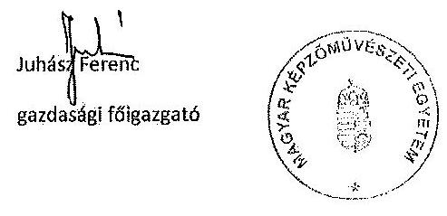

---

prof. Somorjai-Kiss Tibor
Rektor úr részére
Tárgy: ÁSZ jelentéstervezet észrevételezése

# Kedves Tibor!

A tervezetből véleményem szerint kimaradt, hogy 2008-ban vizsgálatot indítottam az akkori Gazdasági Főgazgató tevékenységével kapcsolatosan, amely megállapította, hogy munkája erősen kifogásolható, ezért fegyelmi és bírósági eljárást kezdeményeztem.
2008-ban a Fenntartó ellenőrzése megállapította, hogy az MKE gazdasági, adminisztrációs és szabályozottsági tevékenysége súlyos hiányosságokkal terhelt, ami alapvetően a Gazdasági Főgazgató tevékenységével volt összefüggésben. Ezért megtettem a szükséges intézkedéseket egy teljesen új gazdasági hivatal felépítésére, az MKE szabályzatainak a jogszabályokhoz való illesztése, valamint az MKE csődközeli állapotának azonnali megszüntetése érdekében. Ennek eredményeként a pénzügyi egyensúly 2009. év végére tökéletesen helyreállt és a további években is biztosítva volt. Az MKE szabályozottsága rektori működésem alatt fokozatosan javult.
Az MKE az elmúlt években történt komoly méretű állami elvonások és megszorítások ellenére likviditási zavarok nélkül tudott működni. Az, hogy helyes irányt követett az intézmény a törvényes működés terén, mi sem bizonyítja jobban, mint az, hogy a 2010-ben lefolytatott fenntartói megbízhatósági vizsgálat az MKE beszámolóját megbízhatónak minősítette, az ellenőrzést végző szakember pedig külön kiemelte, hogy az MKE az eltelt két év alatt rengeteget fejlődött a szabályozottság terén.
A korábbi Gazdasági Főgazgatóval szembeni vizsgálat során vált világossá, hogy az MKE a jogszabályokat megsértve nem közbeszerzéssel választotta ki partnereit. Ezért megtettem a szükséges intézkedéseket a közbeszerzések beindítására. Elsőként a közbeszerzési szabályzatot kellett a jogszabályi előírásoknak megfelelően megalkotni és elfogadtatni, majd ezt követően megfelelő szakképzettségű közbeszerzési referenst munkába állítani. Ezután 2010-ben megkezdődtek a nagyobb értékű szolgáltatások közbeszerzései, úgyhogy 2011. évben, és 2012. első félévében valamennyi közbeszerzésköteles szolgáltatást és beruházást közbeszerzési eljárás keretében bonyolította az MKE.
Az MKE kiváló gazdálkodását erősítette meg a Gazdasági Tanács, valamint maga a Kormány is, amely 2013. januárjában erre hivatkozva emelte meg az MKE költségvetési támogatását, mivel az Intézmény mindent megtett a hatékonyságnövelés és a gazdasági racionalizálás terén.
Az elvont állami támogatások pótlására az MKE komoly erőfeszítéseket tett, amelyek eredményeként néhány év alatt saját bevétele a kétszeresére nőtt.

Budapest, 2014. július 9.
Üdvözlettel:
prof. König Frigyes sk.

---

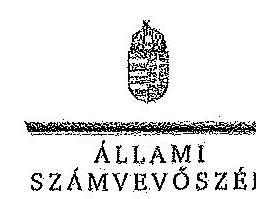

ELNÖK

Ikt.szám: V-0352-341/2014.

Dr. habil, DLA Somorjai-Kiss Tibor úr
rektor
Magyar Képzőművészeti Egyetem

Budapest

Tisztelt Rektor Úr!

A Magyar Képzőművészeti Egyetem gazdálkodásának és működésének ellenőrzéséről készített jelentéstervezetre tett észrevételeit köszönettel megkaptam.

Az Állami Számvevőszék észrevételekre vonatkozó álláspontjáról a felügyeleti vezető által készített részletes tájékoztatást csatoltan megküldöm.

Tájékoztatom Rektor urat, hogy az ÁSZ. tv. 29. § (3) bekezdése alapján a számvevőszéki jelentés mellékleteként szerepeltetjük az el nem fogadott észrevételeket az elutasítás indokainak feltüntetésével.

Budapest, 2014. 08. hó 0. nap

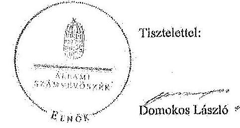

Melléklet: Tájékoztatás az elfogadott és figyelembe nem vett észrevételekről

1052 BUDAPEST, AFRIKAI ÜCSHE JÁNOS UTCA 10. 1204 Budapest, IV. Pl. 54 telekon: 484 9101 fax: 484 9201

---

# Tájékoztatás   az elfogadott és a figyelembe nem vett észrevételekről

A Magyar Képzőművészeti Egyetem gazdálkodásának és működésének ellenőrzéséről készült számvevőszéki jelentés-tervezethez a RH/135/7/2014. iktatószámú levélben tett észrevételeit köszönettel megkaptuk. A jelentéstervezetre tett észrevételeket áttekintettük, azok kezeléséről a következő tájékoztatást adom:

## Általános észrevételek

1. A gazdálkodási, működési körülmények vizsgálata
Köszönöm Rektor úrnak az ellenőrzött időszakot megelőző gazdálkodási körülményekre vonatkozó tájékoztatását. Ugyanakkor az ÁSZ elnöke által jóváhagyott, Rektor úrnak megküldött ellenőrzési program és a jelentéstervezet bevezetése is tartalmazza, hogy az ellenőrzés a 2009. január 1. - 2012. december 31. közötti évekre irányult. A 2009. évet megelőző időszakra az ellenőrzés nem terjedt ki, így a jelentéstervezetben erre vonatkozó megállapítások nem szerepelhetnek.
I. 2. A gazdálkodási, működési folyamatok időbeli értékelése

A megállapítások időbeli értékelése érdekében a jelentéstervezetben külön jelöltük azokat az eseteket, amikor csak egy adott költségvetési évet illetően állapítottunk meg hiányosságokat, szabálytalanságokat, egyéb esetekben az ellenőrzött 2009-2012. évek egészére jellemző volt a megállapítás.

Ennek alapján a jelentéstervezetből egyértelműen kiderül, hogy a megállapítások az egyetem belső kontrollrendszere, ezen belül kontrollkörnyezete, valamint a személyi juttatások szabályossága, a közbeszerzések lebonyolítása, és a külső ellenőrzések tekintetében mely évre, évekre vonatkoznak.

Észrevétele alapján, az ellenőrzött időszakra tekintettel a jelentéstervezet 2.5. pontját, a Közép-magyarországi Regionális Pénztári ellenőrzésre vonatkozó szöveg kiegészítésével módosítottuk:
„A 2009-2010. évi Közép-magyarországi Regionális Pénztári ellenőrzése az ÁSZ ellenőrzési időszakát megelőző 2004-2008. közötti időszakra irányult. Megállapításuk szerint a vizsgált öt év alatt 17 fő kifizetésével (táppénz, GYED, GYÁS) kapcsolatban merült fel szabálytalanság, 3,5 M Ft értékben, amely kamatokkal együtt 4,8 M Ft-os terhet rótt az MKE-re. (Részletes megállapítások, 33-34. oldal)

---

# I. 3. A gazdálkodás értékelése

A jelentéstervezet bevezető része, illetve a korábban megküldött ellenőrzési program is rögzítette, hogy az ellenőrzés típusa szabályszerűségi ellenőrzés.

Az egyetem gazdálkodásának elemzése az ellenőrzési program követelményeinek, az abban és a jelentéstervezetben meghatározott céloknak megfelelően történt, az alkalmazott mutatószámok által bemutatott tendenciák a beszámolókban szereplő adatokon alapulnak.

Tájékoztatom, hogy az ÁSZ ellenőrzési tervében meghatározott címmel összhangban a jelentéstervezet címét módosítottuk a következők szerint: „Jelentés a Magyar Képzőművészeti Egyetem ellenőrzéséről - Az állami felsőoktatási intézmények gazdálkodásának, működésének ellenőrzése"
1.) alpont

A jelentéstervezetet kiegészítettük arra vonatkozólag, hogy:
„Az egyetem a köz- és magánszféra együttműködésében végzett projektben nem vett részt." (Részletes megállapítások, 40. oldal)

## 2-5.) alpontok

Az egyetem likviditási helyzetét az ellenőrzési program alapján a likviditási mutató és a pénzeszköz-likviditási mutató alkalmazásával mutattuk be (jelentéstervezet 19. és 40. oldal). A saját és átvett bevételek teljes körének adatait a bevezetés
 16. oldalon található táblázata mutatja be.

A jelentéstervezet tartalmazza, hogy a fenntartói megállapodás kiegészítése szerint az állami vagyon használatának ellenértékeként az MKE ingatlanvagyona bruttó értékének legalább 1,5%-át köteles volt az állami vagyon állagának megóvására, karbantartására és felújítására fordítani a 2009. június 1. és 2010. december 31. közötti időszakban. Az MKE a megállapodásban foglaltakat betartotta.

A működés és gazdálkodás szabályosságának értékelése során a vonatkozó jogszabályok és belső szabályzatok előírásait vettük figyelembe, az intézményt nem más felsőoktatási intézményekhez viszonyítottuk. A helyszíni ellenőrzés jelentéstervezetben rögzített megállapításai alapján az ellenőrzött időszakban az MKE belső kontrollrendszerének kialakítása és működtetése, pénzügyi és vagyongazdálkodása nem felelt meg minden tekintetben a jogszabályi előírásoknak.

## Tortolmi észrevételek

## II.1. Közbeszerzés a) pont

Az észrevételben foglaltakat nem tudjuk elfogadni, tekintettel arra, hogy a megállapítás a 2008/2009. tanévre vonatkozik, amikor a közbeszerzésekről szóló 2003. évi CXXIX. törvény

---

volt hatályban, míg az észrevételező levélben jelzett jogszabályi hivatkozást a közbeszerzésekről szóló 2011. évi CVIII. törvény tartalmazza.
b) pont

Az észrevételben leírtak és a D.71/16/2014. sz. KDB határozat alapján az érintett szövegrészt a jelentéstervezetből töröltük:
„Az ellenőrzés során külön értékeltük a közbeszerzési értékhatárt meghaladó értékű felhalmozási kiadásokat, amelynek során megállapítottuk, hogy az MKE kötelezettségvállalói a szakközépiskolában megvalósult felújítási munkákra a Kbt. 119. §-ában előírt közbeszerzési eljárás lefolytatásának mellőzésével kötöttek szerződéseket. A Közbeszerzési Hatóság útmutatója szerint az engedély és bejelentés nélkül végezhető építési beruházások esetében az egybeszámítási kötelezettség megállapítható, ha az egyes építési tevékenységek funkcionálisan összefüggők, ugyanazon épületre vonatkozó felújítási munkálatok:

Az MKE 2012-ben az SZKI épületén több részletben végzett felújítási munkákat. Az SZKI épületének belső felújítási munkáira az árajánlatok rangsorolása alapján több vállalkozóval kötött szerződést. Az SZKI homlokzat felújítási munkáira egy internetes oldalon meghirdetett ajánlati felhívás jelentkezők közül árlejtéses versenytárgyalást követően kötött szerződést. A homlokzati felújítási munkálatokra beérkező, a beruházással kapcsolatban felmerült árajánlatok összes nettó értéke meghaladta a 2012. évi Ktv. 70. § (1) bekezdésében előírt 15,0 M Ft nemzeti közbeszerzési értékhatárt. Az SZKI és a lánykollégiuma fűtési rendszerének korszerűsítésére szintén internetes honlapon történő ajánlati felhívás követő árlejtéses versenytárgyalás útján kiválasztott ajánlattevővel kötött szerződést.” (Részletes megállapítások, 45-46. oldal)

A közbeszerzési szabálytalanságok darabszámára és a jogorvoslati eljárás kezdeményezésére vonatkozó szöveget pontosítottuk, a felújítási munkálatok kivitelezésére vonatkozó szövegrész törlése mellett:
„A dologi és a felhalmozási kiadások nagy összegű kifizetései esetében az MKE kötelezettségvállalói (rektor, SZKI igazgatója) a hatályos Kbt. 1.2 és a közbeszerzési szabályzat előírásait nem vették figyelembe, mert a közbeszerzési értékhatárt meghaladó nagyságú szolgáltatásoknál közbeszerzési eljárás mellőzésével kötöttek szerződést az ellenőrzés során feltárt kilenc esetben, amellyel megsértették a közbeszerzési eljárások Kbt. 1.2-ben előírt lefolytatásának kötelezettségét.” (Összegzö megállapítások, 20. oldal)
„A jogvesztő határidő letelte miatt az ÁSZ-nak - két eset kivételével - már nem állt módjában jogorvoslati eljárást kezdeményezni.” (Összegzö megállapítások, 20. és részletes megállapítások 44. oldal)

---

c) pont

A 45. oldal 1. bekezdésében foglalt, a vagyonvédelmi feladatok ellátása során a közbeszerzési szabályok megsértésére vonatkozó megállapításainkat továbbra is fenntartjuk, figyelemmel az 58/11/2014. sz. KDB határozatra is.

A közbeszerzési eljárás mellőzésével megrendelt szolgáltatások, feladatok az esetek számosságára és értékére való tekintettel korrupciós kockázatot jelentettek az egyetem gazdálkodásában.

# II. 2 pont 

Az egyetem gazdasági főgazgatójának 2014. április 3-i nyilatkozatában foglalt, kereskedelmi bank által vezetett számlára vonatkozó szövegrészeket pontosítottuk az észrevételben leírtak és a kártyafogadói szerződés alapján. A jogszabály megsértésére, a felelősség megállapítására vonatkozó javaslatot töröltük a jelentéstervezetből:

Összegző megállapítások, 20. oldal:
„Szabályszerűségi hibát jelentett továbbá, hogy a hallgatók a költségtérítéseiket bankkártyás fizetés esetén az intézmény egy kereskedelmi banknál vezetett számlájára teljesítették, amely ellentétes az Áht. 1.1 vonatkozó előírásával, amely szerint a kincstári kör fizetési számlái csak a Kincstárnál vezethetők.”

Összegző megállapítások, javaslatok, 23. oldal, javaslat az emberi erőforrások miniszterének:
„1. Az MKE-nál a hallgatói díjfizetéseket és költségtérítéseket nem a Kincstárnál vezetett számlán kezelték, figyelmen kívül hagyva az Áht. 1.18/C. § (5) és az Áht. 1.79. § (1) bekezdésének erre vonatkozó előírásait.

Javaslat:
Intézkedjen az Nftv. 73. § (3) bekezdés e) pontjában foglalt jogkörében a kincstári körön kívüli számlavezetés miatt szabálytalan pénzkezeléshez kapcsolódóan a munka-jogi felelősség kivizsgálásáról és a vizsgálat eredményének ismeretében tegye meg a szükséges intézkedéseket.”

Összegző megállapítások, javaslatok, 24. oldal, javaslat a Magyar Képzőművészeti Egyetem rektora részére:
2. A hallgatói díjfizetéseket és költségtérítéseket nem a Kincstárnál vezetett számlán kezelték, figyelmen kívül hagyva az Áht. 1.18/C. § (5) és az Áht. 1.79. § (1) bekezdésének előírásait.”

---

# 9. SZÁMÚ MELLÉKLET 

A V-0352-360/2014. SZÁMÚ JELENTÉSHEZ
„e) intézkedjen a hallgatói befizetések jogszabályi előírásoknak megfelelő kezeléséről.”
Részletes megállapítások, 49. oldal:
„A költségtérítések rendezését a hallgatók az egyetem kincstári számláján, illetve a bankkártyás fizetések esetén a NEPTUN rendszerben kártyaelfogadási szerződés alapján egy kereskedelmi bank virtuális felületének igénybe vételével teljesítették. Ez utóbbi megoldás ellentétes az Ábt. 18/C. § (5) és az Ábt. 79. § (1) bekezdéseivel, miszerint a kincstári kör fizetési számlái csak a Kincstárnál vezethetők. A kereskedelmi banki számláról ugyanakkor napi szinten végezték el az elszámolást és az átvezetést az MKE kincstári számlájára, az átvezetett bevételek teljes körűen beszámlíthatóak voltak.”
II. 3 pont

Az észrevételben leírtakkal kapcsolatban jelzem, hogy a pénzügyi pozíció értékeléséhez a jelentéstervezet összegző és részletes megállapítások fejezetei tartalmazzák a finanszírozási igény maradvány igénybevételével való rendezését. Az észrevétel alapján a jelentéstervezet a maradvány igénybevételre vonatkozó szövegét pontosítottuk:
„A finanszírozás fedezetét az előző évi maradványok igénybevételével biztosították.” (Összegzö megállapítások 19. oldal és részletes megállapítások 39. oldal)

A fizetőképesség megőrzésére vonatkozó megállapítás a jelentéstervezet 40. oldalának harmadik bekezdésében szerepel.
II. 4. pont

A leírtakkal kapcsolatban jelzem, hogy a jelentéstervezet összegző megállapítások fejezetében kizárólag az ellenőrzött témákat emeltük ki vastagabb betűvel. A részletes megállapítások fejezetben szerepelnek az egyes megállapítások lényegességük szerint kiemelve, az ellenőrzési programban meghatározott szempontok alapján.

A megállapítások alátámasztására vonatkozólag tájékoztatom, hogy a jelentéstervezet bevezető részében meghatároztuk, hogy „a pénzügyi és vagyongazdálkodás terén az egyes területek szabályszerű működését mintavétellel ellenőriztük, ez alapján a sokaságokban előforduló hibás tételek arányát becsültük”, amelynek kiértékelését az 5. számú melléklet tartalmazza.

A mintavétel eredményeit tehát kivetítettük a teljes sokaságra, amelynek során meghatároztuk a mintában feltárt hibaarányhoz tartozó alsó és felső hibahatárokat (alsó határ = legvalószinűbb hiba - mintavétel maximális hibája; felső határ = legvalószinűbb hiba + mintavétel maximális hibája). A teljes sokaságban a hibás tételek aránya 95%-os bizonyossággal az alsó és felső hibahatár közé esik.

A jogszabályoknak és a belső előírásoknak megfelelőnek, azaz szabályszerűnek tekintettük az adott kiadási előirányzat felhasználását, bevétel beszedését, mérlegtétel értékelését, amennyiben a minta alapján 95%-os bizonyossággal megállapítható volt, hogy a teljes sokaságban a hibás tételek aránya kisebb, mint 10%, nem megfelelőnek értékeltük, ha a hibás tételek aránya a 10%-ot meghaladta.

Amennyiben 95%-os bizonyossággal nem volt egyértelműen megállapítható a minta alapján, hogy az adott terület működése megfelelő volt-e (az elfogadható hibaarány (10%) az alsó és felső hibahatár közé esett), de a mintában a hibás tételek aránya kisebb volt, mint az elfogadható hibaarány (10%), akkor kockázatosnak minősítettük az adott terület működését. Ha a mintában a hibás tételek aránya nagyobb volt, mint az elfogadható hibaarány (10%), akkor magas kockázatúnak értékeltük az adott terület működését.

A mintavételes ellenőrzés alapján tett megállapításoknál az ellenőrzött területre vonatkozóan megjelöltük a megsértett jogszabályhelyeket, illetve a hibatípusokat. Javaslataink a jelzett szabálytalanságok megszüntetését és a hibák kijavítását célozzák.
II. 5. pont

1. alpont

A jelentéstervezetet észrevétele alapján pontosítottuk, illetve az alábbi szövegrészeket töröltük:
„Ellenőrizte az MKE költségvetési beszámolóit. A 2009. évi beszámoló ellenőrzését az MKE részéről történő megküldés hiányában a Feut. vonatkozó előírásainak megfelelően nem tudta elvégezni.” (17. oldal)

A minisztérium az MKE 2009-2012. évi költségvetési beszámolóinak ellenőrzését elvégezte, ugyanakkor a 2009. évi beszámoló ellenőrzését megküldés hiányában a vonatkozó jogszabályi előírásoknak megfelelően nem tudta elvégezni. (Részletes megállapítások, 26. oldal)
2. alpont

A jelentéstervezetet észrevétele alapján pontosítottuk, a térítési és juttatási szabályzat hiányára vonatkozó szövegrészeket töröltük:

Az ellenőrzött időszak egészében nem rendelkeztek a Feut. 21. § (4) bekezdés d) pontja, valamint az Nftv. 83. § (2) bekezdése szerinti térítési és juttatási szabályzattal; ugyanakkor a hallgatói követelményrendszer részeként meghatározták a térítési és juttatási rendet. (Részletes megállapítások, 29. oldal)
3. alpont

Az észrevételben leírtak alapján a jelentéstervezet szövegét alábbi szerint módosítottuk:
A szabályzatok nem tartalmazták a gazdasági eseményenként az 50 E Ft-ot, illetve 2010-től a 100 E Ft-ot el nem érő kifizetések rendjét és a kötelezettségvállalásokhoz kapcsolódó analitikus nyilvántartás rendjét. „A 2010. évet megelőzően nem rendelkeztek belső szabályzatban az 50 E Ft alatti kifizetések nyilvántartásáról.” (Részletes megállapítások, 29. oldal) 

A kötelezettségvállalások 0-s számlásztályban történő vezetésének rendjét a 2012-es, RH/107/2012. iktatószámú (27 oldalas) számlarend nem tartalmazza. Az ÁSZ ellenőrzés számára word formátumban átadott (54 oldalas) „számlarend” című dokumentumot aláírva, hivatalos formátumban nem kaptuk meg, így azt hiteles ellenőrzési dokumentumként nem tudtuk figyelembe venni.

4-5. alpont
Az előző pontban leírtak szerint a számlarenddel kapcsolatos megállapításainkat a hivatalos, aláírt számlarend alapján tettük, amelyek miatt a jelentéstervezetet nem áll módunkban módosítani.

## 6. alpont

A 2009. december 16-tól hatályos szabályzat tartalmazta a költségtérítéses képzés díjszámításának módját, de nem rendelkezett az államilag támogatott, a költségtérítéses képzés és az egyéb tevékenységek költségeinek elkülönítéséről. Az MKE önköltség-számítási szabályzata nem írta elő az államilag támogatott képzés, a költségtérítéses képzés, illetve az egyéb tevékenységek költségeinek az Áhsz. 8. § (19) bekezdése szerinti elkülönítését. A megállapítást emiatt a továbbiakban is fenntartjuk.

## 7. alpont

Az ellenőrzés vezetője 2013. november 13-i adatbekérő levelében többek között az ellenőrzési nyomvonal (amely a működési folyamatok szöveges, táblázatokkal, vagy folyamatábrákkal szemléltetett leírása) átadását is kérte az egyetemtől, amelyet teljes körűen a helyszíni ellenőrzés időszaka alatt nem kaptunk meg, illetve az észrevételhez sem csatolták. Így a megállapítást nem áll módunkban megváltoztatni.

## 8. alpont

Az aláírásmintákra vonatkozó megállapításokat a jelentéstervezetből töröltük:
„Az aláírásminták nyilvántartásai hiányosan tartalmazzák a gazdálkodási jogkörökre vonatkozó megbízásokat…” (Részletes megállapítások, 31. oldal)

## 9. alpont

A 2009. december 16-tól hatályos gazdálkodási szabályzat szerint olyan vezetői információs rendszert kell kialakítani, amely biztosítja egyebek mellett az egyetem vezetése számára az információkat. A feltárt hibák, hiányosságok (pl. közbeszerzések elmulasztása) alapján a megállapítás helytálló. A vezetői információs rendszereket az éves belső kontroll nyilatkozatokban is fejlesztendő területnek minősítették.

---

10. alpont

Az észrevétel alapján a vonatkozó megállapításokat pontosítottuk az alábbiak szerint:
A 2009-2012. évi ellenőrzések megállapításai alapján az érintettek nem intézkedtek határidőre, a belső ellenőrzés pedig - egy kivétellel - utóellenőrzést nem hajtott végre. (Részletes megállapítások, 33. oldal)
„Az intézkedési tervekben foglalt intézkedések végrehajtásának elhúzódása, illetve nem teljes körű végrehajtása miatt, az ellenőrzések megállapításai alapján megfogalmazott javaslatok részben valósultak meg.” (Részletes megállapítások, 33. oldal)
11. alpont

A hallgatókkal szembeni követelésekre vonatkozó észrevételeket nem tudjuk elfogadni, a jelentéstervezetet módosítani. A behajtással kapcsolatos észrevételben szereplő megoldások (tartozás kifüggesztése, vizsgára bocsátás megtiltása) nem felel meg a Sztv. 29.§. és a hatályos értékelési szabályzat előírásainak, miszerint a „mérlegbe csak az adós által elismert követelés állítható be”. A hallgatókat egyedileg egyenlegközlő, majd felszólító levélben kellett volna értesíteni.
12. alpont

Az észrevételben jelzettek alapján az alábbi bekezdést töröltük a tervezetből:
A költségeken alapuló bevételeket az egyetem nem a tervezési irányelvek szerint állapította meg, mert a szaktevékenységekből, szolgáltatásokból származó bevételeket nem a tevékenység tényleges költségével összhangban határozta meg. A költségtérítések (tandíjak) megállapításánál a költségek mellett azonos súllyal vették figyelembe a kereslet-kínálat szabályait (hallgatói létszám, beiskolázható célcsoport szociális helyzete etc.). (Részletes megállapítások, 36. oldal)
13. alpont

A rendszeres és nem rendszeres személyi juttatások előirányzatának felhasználásához tett észrevétel kapcsán jelezzük, hogy a 3.2.1 pont 1. bekezdésének vége tartalmazza a hiányosságokat: „A hibás kifizetésekhez kapcsolódó kinevezés-módosítások (kötelezettségvállalás) a vonatkozó jogszabályok előírásait sértive nem voltak pénzügyileg ellenjegyezve.”

A 3.2.1 pont megbízási díjak elszámolására vonatkozó utolsó mondatát töröltük a jelentéstervezetből:
„Ezen tevékenységek egyike sem eredményezett kézzel fogható produktumot,” (Részletes megállapítások, 42. oldal)

---

# 14-15. alpont 

Válaszunkat a II. 4. ponthoz leírtak tartalmazzák.
16. alpont

Észrevételéhez kapcsolódóan tájékoztatjuk, hogy a működési bevételek ellenőrzésére kiválasztott 50 mintatétel közül Önök által átadott dokumentáció alapján állapítottuk meg 10 esetben a számlázás elmaradását. A költségtérítésekhez, tanfolyamokhoz kapcsolódó megállapítást az alábbiak szerint pontosítottuk:
„A költségtérítésekhez, tanfolyamokhoz kapcsolódó bevételeket visszatérő jelleggel (a mintatételek közül 10 esetben, 0,7 M Ft összegben) nem számlázták ki.” (Részletes megállapítások, 47. oldal)
17. alpont

Válaszunk a 6. alponthoz leírtakkal megegyezik.
18. alpont

Az észrevételt figyelembe véve a jelentéstervezet szövegét pontosítottuk a következők szerint:
„Az Ámr. 162. § (1) bekezdésében és az Ámr. 235. § (1) bekezdésében meghatározott összeget elérő működési és felhalmozási célra államháztartáson kívülre átadott pénzeszközöket terhelő előző évek előirányzat-maradványa terhére vállalt kötelezettség nem volt.” (Részletes megállapítások, 50. oldal)
19. alpont

Észrevételéhez kapcsolódóan tájékoztatjuk, hogy a követelések ellenőrzésére kiválasztott 30 mintatétel közül az Önök által átadott dokumentáció alapján állapítottuk meg négy esetben a követelés téves kimutatását. A jelentéstervezet szövegét kiegészítettük az alábbiak szerint:
„A hallgatói követelések besorolása a mintába került négy tétel esetében téves volt, mert még teljesített követeléseket mutattak ki a mérlegben, amely ellentétes az Sztv. 29. § (2) bekezdésével.” (Részletes megállapítások, 51. oldal)
20. alpont

Az észrevételezett 0,1 M Ft-os bérleti díj számlára vonatkozóan nem történt meg a fizetési felszólítás, illetve az egyenleg elismerését tartalmazó dokumentum átadása, mint azt a 2014. január 22-én az egyetem gazdasági főigazgatója és az ellenőrzést végzők által felvett jegyzőkönyv is tartalmazza.

---

# 21. alpont 

A projektorokat számviteli szempontból a számítástechnikai eszközök közé kell besorolni. Az 51. oldal 5. bekezdésében a projektorok kapcsán tett megállapítások helyesek, azoktól nem tudunk eltekinteni. Ugyanezen bekezdés végén található alábbi mondatot észrevételük alapján a
 jelentéstervezetből töröltük:
„Egy számítógép-konfiguráció-vásárlásánál (1,8 M Ft) téves besorolást alkalmaztak; ami nem felelt meg a Sztv. 47. § (7) bekezdésében foglalt előírásoknak.” (Részletes megállapítások, 51. oldal)
22. alpont

A gázkazánra vonatkozó megállapítást az észrevétel alapján töröltük a jelentéstervezetből:
Az MKE 2012-ben fűtési rendszer-felújítása során (SZKL-SZKI leánykollégiuma, Epreskerti épület) az újonnan beépített kazánt gép, berendezésként aktiválta és 14,5%-os éves leírási kulccsal számolta el az értékcsökkenést. Az Sztv. 3. § (4) bekezdés 8. pontja értelmében felújításnak minősül a korszerűsítés is, ha az a korszerű technika alkalmazásával, a tárgyi eszköz egyes részeinek kiszerelésével a tárgyi eszköz üzembiztonságát, teljesítőképességét, használhatóságát vagy gazdaságosságát növeli. Az Áht. 50. § (2) bekezdése szerint épületek után 2%-os értékcsökkenést számolható el. A feltárt hiba a mérleg megbízhatóságát érinti (Részletes megállapítások, 51. oldal)
23. alpont

Az alábbi, követelésekre vonatkozó megállapítás második felét az észrevétel alapján töröltük a jelentéstervezetből:
„Az éven túli követelések aránya a 2010. évben meghaladta az összes követelés negyedét, az értékvesztéseket indokolt esetben szabályszerűen elszámolták.” (Részletes megállapítások, 55. oldal)
24. alpont

Az AVIR fogalomtár alapján a maximális hallgatói létszám „a felsőoktatási intézmény alapító okiratában, működési engedélyében meghatározott hallgatói létszám, ameddig terjedően a felsőoktatási intézmény - figyelembe véve a hallgatók fogadásához és az oktatói tevékenység folytatásához rendelkezésre álló személyi feltételeket, helyiségeket és eszközöket - valamennyi évfolyamára számítva, teljes kihasználtsággal működve hallgatói jogviszonyt létesíthet”. Az észrevételben leírtak alapján a maximális hallgatói létszámra vonatkozó megállapítást az alábbiak szerint tüntük fel.
„A hallgatói létszám 9,7%-kal növekedett, miközben a felsőoktatás egészében 8,6%-kal csökkent a hallgatók száma. Az alapító okirat szerint a felvehető maximális hallgatói létszám 1046 fő, a 2012. évi létszám ennek 64,9%-a volt.” (Részletes megállapítások, 38. oldal)
25. alpont

Az észrevételében jelzett megállapítást a 40. oldal második bekezdése tartalmazza, ezért a tervezet további változtatást nem igényel: „A negatív tendenciákhoz hozzájárultak a költségvetési érintő zárolások és elvonások, illetve a folyamatosan csökkenő költségvetési támogatás.”
26. alpont

Az észrevételt elfogadtuk és a II.1. Közbeszerzés c) pontja szerint a szöveget módosítottuk.
27. alpont

Az észrevételt figyelembe véve a 30. oldal 6. bekezdését az alábbiak szerint kiegészítettük:
„A Feot. hároméves fenntartói megállapodásokat érintő módosítását követően új megállapodások megkötésére, a 2011-2012. évekre új mutatószámok kidolgozására és azok mérésére nem került sor.”
28. alpont

Az észrevételben jelzett 3.1.1 pont első mondata teljes körűen tartalmazza a tényhelyzetet, így további módosítást nem igényel. A megállapítás első részében utaltunk szigorú gazdálkodási fegyelemre: „A központi költségvetés egyensúlyát biztosító kormányzati intézkedések szigorú gazdálkodási fegyelmet követeltek meg az egyetemtől az ellenőrzött időszakban, de a működőképességét és a feladatellátását nem veszélyeztették.”

Kérem a válaszlevelemben foglaltak szíves tudomásulvételét. Tájékoztatom Rektor urat, hogy a számvevőszéki jelentés mellékleteként szerepeltetjük a jelentéstervezethez tett észrevételeit, az elfogadott, valamint az ÁSZ. tv. 29. § (3) bekezdése alapján a figyelembe nem vett észrevételeket az elutasítás indokának feltüntetésével együtt.

Megköszönöm munkatársainak az ÁSZ ellenőrzés sikeres elvégzéséhez nyújtott segítségét, támogatását, amelyet - az éves beszámoló és az új számviteli rendre való átállás időszakában, a többi felsőoktatási intézményhez hasonlóan - a helyszíni ellenőrzést végző számvevők számára nyújtottak.

Budapest, 2014. 78 hó 0 h nap
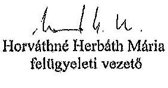
